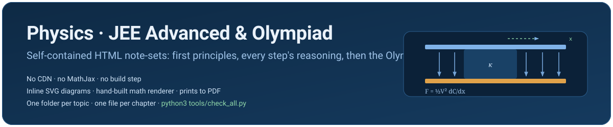

<div align="center">



### Physics notes for JEE Advanced and the Olympiad track

Portable Markdown note-sets with local SVG diagrams. Six topics also keep a consolidated interactive HTML edition for offline browsing and printing; three wave topics are Markdown-first. The Markdown is readable on GitHub or in any editor, uses standard `$...$` / `$$...$$` math, and has no network dependency. A rendered offline site of the Markdown — with the diagrams inline and the equations typeset — is in **[docs/site/index.html](docs/site/index.html)**.

</div>

## Note-sets

| topic | Markdown edition | diagrams | questions | paper / endpoint | status |
|---|---|---:|---:|---|---|
| **string waves** | [String-waves.md](string-waves/String-waves.md) · [site](docs/site/string-waves.html) | 5 local SVG | 36 | 36-question, 3 h, 144-mark Olympiad paper | ✅ complete — PART 1 |
| **sound waves** | [Sound-waves.md](sound-waves/Sound-waves.md) · [HTML](sound-waves/Sound-waves.html) · [site](docs/site/sound-waves.html) | 15 local SVG | 18 | 36-question, 3 h, 150-mark paper | ✅ complete — PART 2 |
| **electromagnetic waves** | [Electromagnetic-waves.md](electromagnetic-waves/Electromagnetic-waves.md) · [paper](electromagnetic-waves/Paper.md) · [solutions](electromagnetic-waves/Solutions.md) · [site](docs/site/electromagnetic-waves.html) | 7 local SVG | 52 | 36-question, 3 h, 180-mark JEE–Olympiad paper | ✅ complete (Markdown-first) — PART 3 |
| **thermodynamics** | [Thermodynamics.md](thermodynamics/Thermodynamics.md) · [HTML](thermodynamics/Thermodynamics.html) · [site](docs/site/thermodynamics.html) | 34 figures + map SVG | 127 | 36-question, 3 h, 245-mark INPhO-standard paper | ✅ complete |
| **heat** | [Heat.md](heat/Heat.md) · [HTML](heat/Heat.html) · [site](docs/site/heat.html) | 24 figures + map SVG | 48 | 10-question written gauntlet | ✅ complete |
| **capacitors** | [Capacitors.md](capacitors/Capacitors.md) · [HTML](capacitors/Capacitors.html) · [site](docs/site/capacitors.html) | 32 figures + local SVG | 150 | 36-question, 3 h, 245-mark INPhO-standard paper | ✅ complete |
| **current electricity** | [Current-electricity.md](current-electricity/Current-electricity.md) · [HTML](current-electricity/Current-electricity.html) · [site](docs/site/current-electricity.html) | 26 figures + local SVG | 145 | 36-question, 3 h, 245-mark INPhO-standard paper | ✅ complete |
| **geometrical optics** | [Geometrical-optics.md](geometrical-optics/Geometrical-optics.md) · [HTML](geometrical-optics/Geometrical-optics.html) · [site](docs/site/geometrical-optics.html) | 46 figures + local SVG | 152 | 36-question, 3 h, 143-mark INPhO-standard paper | ✅ complete |
| **wave optics** | [Wave-optics.md](wave-optics/Wave-optics.md) · [HTML](wave-optics/Wave-optics.html) · [site](docs/site/wave-optics.html) | 28 figures + local SVG | 172 | 36-question, 3 h, 143-mark INPhO-standard paper | ✅ complete — audited against plan.md PART 4 |
| **photoelectric effect** | [Photoelectric-effect.md](photoelectric-effect/Photoelectric-effect.md) | text-only, 16 DIAGRAM briefs | 54 | 36-question, 3 h, 200-mark INPhO-standard paper | ✅ complete — plan.md PART 23 |
| **atomic structure** | [Atomic-structure.md](atomic-structure/Atomic-structure.md) | text-only, 16 DIAGRAM briefs | 54 | 36-question, 3 h, 200-mark INPhO-standard paper | ✅ complete — plan.md PART 24 |
| **x-rays** | [X-rays.md](x-rays/X-rays.md) | text-only, 16 DIAGRAM briefs | 54 | 36-question, 3 h, 200-mark INPhO-standard paper | ✅ complete — plan.md PART 25 |

The recommended reading spine is **string waves → sound waves → electromagnetic waves → thermodynamics → heat → capacitors → current electricity → geometrical optics → wave optics**. Registering the three wave note-sets in `topics.json` is what lets [wave-optics/Wave-optics.md](wave-optics/Wave-optics.md) §1.1.1 hand the wave equation, the intensity–amplitude argument and the fixed-end phase flip back to the notes that own them.

The cross-topic progression and the Cengage → JEE → Olympiad coverage audit are in **[CURRICULUM.md](CURRICULUM.md)**. `topics.json` is the checked registry. `tools/check_all.py` validates every registered topic, whether HTML or Markdown-first.

## Read it

Three ways, in order of what you get:

0. **Obsidian (for the chapters written under [plan.md](plan.md)).** Open this repository as a vault
   (*Open folder as vault* → the repo root). The new note-sets are written for **reading mode**: YAML
   frontmatter (so the `part:` property lets you filter the vault by plan part and block), Obsidian
   callouts for definitions / validity conditions / traps / hand-offs, `$...$` and `$$...$$` math,
   collapsible `<details>` solutions, and `> [!abstract] DIAGRAM …` callout briefs in place of images.
   Section numbers (`§3.4`), `Q12` and `OL3` are stable so you can link and search them. The nine older
   note-sets stay in their bold-label HTML/Markdown style — the vault mixes the two on purpose.
1. **The rendered site (recommended for study).** Open
   [`docs/site/index.html`](docs/site/index.html) straight from disk — it works
   offline with no tooling. Diagrams are the local SVGs, equations are typeset
   with the vendored KaTeX, solutions stay collapsible, and each page has a
   table of contents plus links to the other topics. Regenerate it any time
   with `python3 tools/md_site.py` (needs `pip install markdown`). To read it
   over HTTP instead, run the server in the **repository root**
   (`python3 -m http.server 8080`, then open `/docs/site/`): the pages reach their
   diagrams at `../../<topic>/assets/figures/`, so a server rooted in `docs/site`
   itself renders the text but not the figures.
2. **GitHub or a Markdown-capable viewer.** The `*.md` files use standard
   `$...$` / `$$...$$` math and relative `assets/figures/*.svg` image links, so
   they render with diagrams and equations on GitHub and in viewers with a
   LaTeX engine (Obsidian, VS Code + math extension). In a plain editor or
   `less` you see the source: readable text, but raw math and image links.
3. **The interactive HTML edition** (where present). Theme switching, progress
   ticks, a generated TOC and **Print / save as PDF**. Fully offline.

Every Markdown file keeps the original reading order: orientation → prerequisites → syllabus map → theory → worked questions → playbook → paper/gauntlet → solutions → formula sheet. `<details>` blocks keep solutions collapsible on GitHub and in many Markdown viewers. Every diagram is a local `assets/figures/*.svg` file with its own styles, arrowheads, alt text and caption; there are no external image links and no binary files committed to the repo.

## How a note-set is put together

```
<topic-slug>/
├── <Topic>.md               portable reading copy: theory, math, questions and diagram links
├── <Topic>.html             (optional) interactive/offline edition
├── README.md                topic scope, coverage notes and editing guidance
├── assets/
│   ├── figures/             standalone SVG diagrams
│   ├── notes.css            HTML design system and print styles (HTML topics)
│   ├── tex.js               HTML math renderer (HTML topics)
│   ├── notes.js             HTML TOC, theme, progress and navigation (HTML topics)
│   └── pages.js             generated HTML navigation (HTML topics)
└── tools/
    └── check.py             local markup / links / figures validator
```

The Markdown exporter is [tools/html_to_markdown.py](tools/html_to_markdown.py) (for HTML-first topics). The site generator is [tools/md_site.py](tools/md_site.py), which renders all `*.md` master files into `docs/site/*.html` (one page per topic, plus index, plus a shared `site.css`) for offline reading with diagrams and typeset maths. The only dependency is the `markdown` package (`pip install markdown`); the generated site itself needs no network and no Python — the KaTeX it uses is vendored in `docs/site/katex/`.

The full HTML/Markdown layout contract is [STRUCTURE.md](STRUCTURE.md); workflow and authoring conventions are [CONTRIBUTING.md](CONTRIBUTING.md). **[plan.md](plan.md)** is the master multi-agent plan for the 28 remaining chapters (units → mechanics → electrostatics and magnetism → EMI/AC → modern physics and relativity): one PART per chapter, each with its coverage map, teaching order, figure briefs, Olympiad section and 200-mark paper, plus the contracts and a copy-paste kit for the agent writing it. The four-part wave/optics blueprint that produced the wave and optics note-sets (plan v1) is archived at [docs/plan-v1-waves-optics.md](docs/plan-v1-waves-optics.md).

## Check it

```bash
python3 tools/html_to_markdown.py    # refresh the HTML-derived Markdown editions and SVG diagrams
python3 tools/md_site.py             # refresh the rendered site in docs/site (needs pip install markdown)
python3 tools/check_all.py           # validate every registered topic
python3 tools/check_all.py --quick   # skip the Node renderer tests
```

Optional CI: [`tools/ci/qa.yml`](tools/ci/qa.yml) runs the gate as a GitHub Action. Install it with `mkdir -p .github/workflows && cp tools/ci/qa.yml .github/workflows/` if your checkout has workflow permissions.

## Adding your own note-set

```bash
python3 tools/new_topic.py <slug> --title "<Title>" \
        --chapters "01-foundations,02-derivations,03-paper"
```

The scaffold is HTML-first because the interactive edition is the validated source; Markdown-first topics (like `electromagnetic-waves` and `string-waves`) are also supported — register with `"format": "markdown"` and supply a local `tools/check.py`. See [CONTRIBUTING.md](CONTRIBUTING.md) for the content bar and [STRUCTURE.md](STRUCTURE.md) for the layout contract.

A list of the remaining JEE / Olympiad chapters still pending notes is in **[PENDING.md](PENDING.md)**.

## The teaching contract

* **Reasoning for every step.** A derivation that skips “why” is treated as unfinished, not concise.
* **Concepts before formulas, formulas before problems** — and every key formula states its validity condition or failure mode.
* **Questions are interleaved with theory**, each with a full solution, rather than being parked at the end.
* **Diagrams replace prose where geometry does the work** — the Markdown export uses accessible SVG assets and asserting captions.
* **Numbers are checkable**: every numerical answer is re-derivable by a limit or unit check, and the note says which.
* **The final paper or gauntlet is coverage-mapped** back to the theory so the Olympiad layer is an ordered extension, not a disconnected formula list.

## Licence

These are personal study notes; the repository carries no `LICENSE` file, so copyright stays with the repo owner. If you want to open it up, add a `LICENSE` (CC-BY-4.0 suits notes, MIT suits the JS/PY tooling) — that is the owner's call, not a contributor's.
