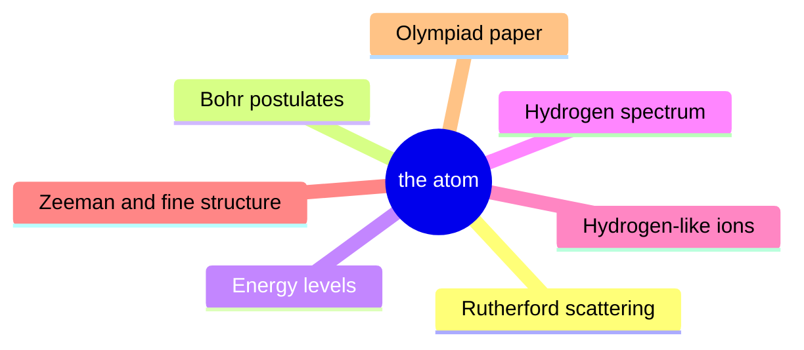
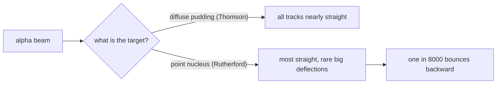
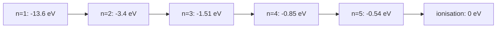
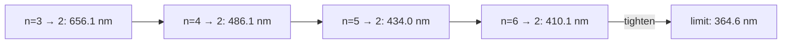
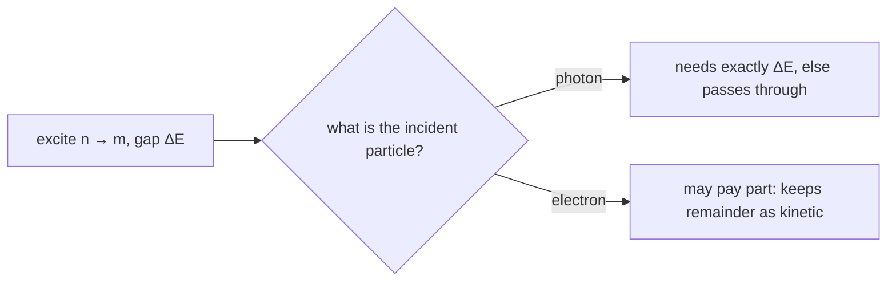
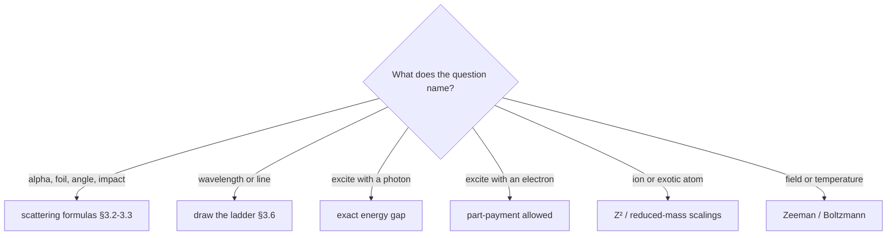

# Rutherford, the Bohr Model & Atomic Spectra — first principles to Olympiad

> [!abstract] How to use this chapter
> Three passes. Pass 1: Parts 0-4 — the scattering experiment as a hypothesis test, the classical collapse, Bohr's postulates and their consequences, the spectrum. Pass 2: Parts 5-9 — exemplars, archetypes, traps, playbook. Pass 3: Parts 10-14 — the Olympiad layer (cross-section, correspondence principle, exotic atoms), the paper, the sheet, the checkpoint. Every number was recomputed; every boxed result carries its validity condition.

## Part 0 · Orientation

### 0.1 What you will be able to do

After this chapter you can: predict the distance of closest approach of an alpha particle and say honestly what it does and does not prove; derive $r_n$, $v_n$, $E_n$ and the Rydberg constant from two equations; read any hydrogenic transition as an energy difference and place its series; count spectral lines from a level; handle excitation by photons versus electrons, including the Franck-Hertz logic; scale the atom to He$^+$, Li$^{2+}$, deuterium, muonic hydrogen and positronium; estimate Zeeman splittings; and state exactly where the Bohr model dies and what takes over.

### 0.2 The one idea

Atoms have discrete levels because an electron is a standing wave, not a planet: the spectrum is the fingerprint, the Bohr model is the first correct arithmetic of it, and every correction after 1913 (reduced mass, fine structure, spin) is a refinement of that arithmetic.

### 0.3 Prerequisite self-check

1. What is the Coulomb potential energy of charges $q_1$, $q_2$ at separation $r$?
2. Write the circular-orbit force balance for an electron around a nucleus of charge $Ze$.
3. What did PART 23 give you for the angular momentum of a standing wave on a circle?
4. A photon of energy $E$ is emitted when an atom drops between levels. Write the relation.
5. What is the reduced mass of two bodies $m_1$, $m_2$, and why does it appear when the nucleus moves?
6. Quote $hc$ in eV nm and the ground-state energy of hydrogen.
7. What is the magnetic moment of a current loop, and of an orbiting charge?

Solution

1. $U=\frac{kq_1q_2}{r}$.
2. $\frac{m_ev^2}{r}=\frac{kZe^2}{r^2}$.
3. $L=n\hbar$, from $2\pi r=n\lambda$ with $\lambda=\frac{h}{p}$ ([[Photoelectric-effect]] §3.8).
4. $hf=E_i-E_f$.
5. $\mu=\frac{m_1m_2}{m_1+m_2}$; the electron-nucleus pair orbits their common centre of mass, and the relative coordinate carries $\mu$.
6. $1240$ eV nm; $-13.6$ eV.
7. $\mu=IA$; for a charge $e$ circling with period $T$: $I=\frac{e}{T}$, so $\mu=\frac{e v r}{2}$.

### 0.4 Numbers to keep

> [!abstract] Numbers to keep
> $a_0=0.529$ Å; $E_1=-13.6$ eV; $v_1=2.19\times10^6$ m/s $=\frac{c}{137}$; $R_\infty=1.0974\times10^7$ m$^{-1}$; $R_H=1.0968\times10^7$ m$^{-1}$; Lyman $\alpha$ $121.6$ nm; Balmer $\alpha$ $656.1$ nm, $\beta$ $486.1$ nm, $\gamma$ $434.0$ nm; series limits: Lyman $91.2$ nm, Balmer $364.6$ nm, Paschen $820.4$ nm; $\mu_B=5.79\times10^{-5}$ eV/T; H-D shift of H$\alpha$ $0.18$ nm; muonic hydrogen $a=256$ fm, $E_1=-2.81$ keV; positronium $a=1.06$ Å, $E_1=-6.8$ eV.

### 0.5 Three passes

Pass 1 for the argument: experiment, collapse, postulates, consequences, spectrum. Pass 2 for craft: every exemplar by hand. Pass 3 timed: the paper, then the audit.

### 0.6 Cengage coverage map

The sweep read the chapter 4 contents page of the committed PDF. The X-ray half of the same chapter (pp. 4.25-4.32) is owned by PART 25; rows below cover the Bohr half. Rutherford scattering is not a heading of this Cengage chapter — it is a JEE-Advanced/INPhO syllabus item added by the sweep.

| Cengage section (ch 4) | What it establishes | Where it lives here | Status |
|---|---|---|---|
| Thomson's atomic model (4.2) | the plum-pudding picture and its scattering prediction | §3.1 | derived |
| Bohr model of the hydrogen atom (4.3) | postulates plus circular Coulomb orbits | §3.4-3.5 | derived |
| Radius of orbit (4.3) | $r_n=n^2a_0/Z$ | §3.5, §4.1 | derived |
| Velocity of electron in nth orbit (4.3) | $v_n=\frac{v_1 Z}{n}$ | §3.5, §4.1 | derived |
| Orbital frequency of electron (4.3) | $f_{\text{orb}}=\frac{v}{2\pi r}$; correspondence use | §3.10, OL4 | derived |
| Energy of electron in nth orbit (4.4) | $E_n=-13.6\frac{Z^2}{n^2}$ eV; virial structure | §3.5, §4.1 | derived |
| Frequency of emitted radiation (4.5) | $hf=E_i-E_f$ | §3.4, §3.6 | derived |
| Hypothetical atomic energy levels (4.5) | reading level diagrams | §3.7, Q12 | stated + used |
| Hydrogen-like atoms (4.6) | $Z^2$ scaling | §3.8, E6 | derived |
| Ionisation energy and potential (4.7) | IE versus IP bookkeeping | §2.1, §3.7, Q9 | derived |
| Excitation energy and potential (4.8) | discrete absorption | §3.7, E7 | derived |
| Binding or separation energy (4.8) | energy to remove one electron from level $n$ | §3.7, Q10 | derived |
| Atomic excitation (4.8) | photon versus electron impact | §3.7, E7, Q13 | derived |
| Limitations of Bohr's model (4.9) | multi-electron failure, intensities, fine structure | §3.10, §10.2 | derived |
| Wavelength of photon in de-excitation (4.11) | $\frac{1}{\lambda}=RZ^2(\frac{1}{n_f^2}-\frac{1}{n_i^2})$ | §3.6, E5 | derived |
| Hydrogen spectrum (4.12) | the five series and their bands | §3.6, §4.1 | derived |
| Origin of spectra: emission (4.14), absorption (4.15) | why elements have fingerprints | §3.11, D24.16 | stated + used |
| Effect of nucleus motion / mass on Bohr model (4.16) | reduced mass; H-D shift | §3.8, OL5 | derived |
| Atomic collision (4.17), neutron-electron collision (4.18) | energy transfer kinematics | §3.7 (electron impact), Q14 | stated + used |
| Solved examples band (4.32) | standard shapes | §6.1 archetypes, Q1-Q28 | exercised |
| Exercise bands (4.42-4.94) | exam formats | Part 11 sections A-D | exercised |
| Rutherford scattering and $r_{\min}$ (added by sweep) | the experiment as hypothesis test | §3.2-3.3 | added by sweep |
| Classical collapse time (added by sweep) | Larmor estimate | §3.3, OL3 | added by sweep |
| Zeeman effect, quantum numbers, selection rule (added by sweep) | the model's fine structure frontier | §3.10 | added by sweep |
| Franck-Hertz, correspondence principle, 21 cm line (added by sweep) | measurement anchors | §3.7, §3.10-3.11, OL4, OL8 | added by sweep |

> [!tip] FIGURE F24.1 · Chapter map
> *Why:* the chapter is one experiment (scattering) plus one equation ($E_n = -13.6\,Z^2/n^2$) plus one spectral rule; the map shows the spine.
> *Data:* the Part 0–14 structure — scattering, orbits, levels, spectra, exotic atoms, paper, sheet.

> *Read:* every result is either the scattering geometry, the level energy $E_n$, or the transition difference $E_i - E_f$.

## Part 1 · Intuition first

### 1.1 The atom before the surprise

Imagine positive charge smeared through a sphere the size of the atom, like currants (the electrons) in a pudding. Fire alpha particles at it: each alpha feels many tiny, mostly cancelling pushes, and should emerge with its direction barely changed, the way a rifle bullet crosses a foam mattress. That is the Thomson prediction, and it is specific: large-angle scattering should be essentially impossible.

### 1.2 One in eight thousand bounces back

Geiger and Marsden found that about one alpha in eight thousand came back at angles above $90^\circ$. Rutherford's words — it was as if you fired a fifteen-inch shell at tissue paper and it came back and hit you. A diffuse charge cannot do that; only a concentrated charge, small enough that the alpha can get very close and feel a huge Coulomb force, can. The atom is almost entirely empty, with its charge and mass in a lump less than a ten-thousandth of its size.

### 1.3 The second surprise: the atom should not exist

A orbiting charge radiates (that is classical electrodynamics, owned by [[Electromagnetic-waves]]). A radiating electron loses energy and spirals into the nucleus in about $10^{-11}$ s, emitting a continuous smear of light as it falls. Atoms neither collapse nor glow continuously: they emit sharp lines. Two failures, one cure: the electron's wave nature forbids the spiral and discretises the levels.

### 1.4 Everyday anchor

Every neon sign, sodium street lamp and firework colour is this chapter: hot or excited atoms relax by emitting photons whose colours are the differences of their discrete levels. Spectroscopy — identifying elements by those colours — found helium in the Sun before it was found on Earth.

> [!info] Why lines, not a smear
> A falling electron radiating continuously would smear all frequencies; a ladder of levels emits only the differences. The line spectrum is the direct image of discreteness, and §3.6 turns it into arithmetic.

## Part 2 · Definitions and bookkeeping

### 2.1 The symbol table

| Symbol | Meaning | Unit | Notes |
|---|---|---|---|
| $Z$ | nuclear charge number | — | hydrogen $Z=1$ |
| $n$ | principal quantum number | — | $1,2,3,\ldots$ |
| $r_n$ | orbit radius | m | $0.529\frac{n^2}{Z}$ Å |
| $v_n$ | orbit speed | m/s | $2.19\times10^6\frac{Z}{n}$ |
| $E_n$ | total energy of level | eV | $-13.6\frac{Z^2}{n^2}$ |
| $K$, $U$ | kinetic, potential energy | eV | $K=-E$, $U=2E$ |
| IE | ionisation energy from level $n$ | eV | $-E_n$ |
| IP | ionisation potential | V | numerically IE in eV |
| $R$ | Rydberg constant | m$^{-1}$ | $1.0974\times10^7$ |
| $b$ | impact parameter | m | §3.2 |
| $r_{\min}$ | closest approach | m | head-on: $\frac{2kZe^2}{K}$ |
| $\mu$ | reduced mass | kg | $\frac{m_eM}{m_e+M}$ |
| $\mu_B$ | Bohr magneton | eV/T | $5.79\times10^{-5}$ |

### 2.2 Sign convention for energies

Bound states have negative total energy: $E=K+U$ with $U=-\frac{kZe^2}{r}$ referenced to zero at infinity. Ionisation energy is the positive number $-E_n$. Excitation energy from $n$ to $m$ is $E_m-E_n>0$. Keeping this sign discipline ends half the sign errors in atomic physics.

### 2.3 Assumptions of the Bohr model

Circular orbits; a static point nucleus (corrected in §3.8 by the reduced mass); one electron (hydrogenic only); non-relativistic speeds (checked: $v_1=\frac{c}{137}$); no radiation in stationary states (postulate); transitions instantaneous with $hf=E_i-E_f$.

### 2.4 What is NOT in this model

No multi-electron atoms (screening is patched in PART 25's Moseley treatment, not derived here). No line intensities or polarisations. No explanation of fine structure, only its size. No chemical bonding. The full replacement is the Schrödinger equation, outside this syllabus; the quantum numbers of §3.10 are its shadow.

> [!question] Exam note
> JEE Advanced frames this chapter as arithmetic on a level diagram: draw the ladder, mark the transition, convert with $1240$. If you can do that blindfolded, the chapter's exam core is safe.

## Part 3 · Core derivations

### 3.1 The atom before 1911, and what Thomson predicted

Thomson's atom: positive charge spread uniformly through a sphere of radius $\sim10^{-10}$ m, electrons embedded in it. Predict the scattering before looking at the data — this is the discipline that makes the experiment a test. An alpha particle crossing the sphere feels a field that grows linearly from the centre and never exceeds $E_{\max}=\frac{kZe}{R^2}$ at the surface; the total transverse impulse is tiny compared with the alpha's momentum, and multiple scattering averages out. Prediction: deflections of order a degree at most, large-angle events exponentially impossible.

> [!tip] FIGURE F24.2 · Thomson versus Rutherford: the same beam, two predictions
> *Why:* the same alpha beam must come out nearly straight (pudding) or occasionally back-scattered (nucleus); the difference is the decisive test.
> *Data:* Thomson's soft pudding → deflections of order 1°; Rutherford's point nucleus → Coulomb hyperbola, with deflections beyond 90°.

> *Read:* the rare large-angle scattering is the smoking gun for a concentrated charge — no soft cloud can produce it.

### 3.2 Rutherford scattering: impact parameter and angle

Model the nucleus as a fixed charge $Ze$ and the alpha (charge $2e$, mass $m$, speed $v$) as a point on a hyperbola. The impact parameter $b$ is the miss distance the alpha would have had without any force. Angular momentum about the nucleus is $L=mvb$ throughout.

The direction of the momentum rotates by the scattering angle $\theta$, so the momentum change has magnitude $\Delta p=2mv\sin\frac{\theta}{2}$, directed along the hyperbola's symmetry axis. Compute the same change from the impulse, using $dt=\frac{r^2}{vb}\,d\phi$ (from $L=mr^2\dot\phi=mvb$) with $\phi$ measured from the symmetry axis over $-\left(\frac{\pi-\theta}{2}\right)\le\phi\le+\left(\frac{\pi-\theta}{2}\right)$:

$$
\Delta p=\int\frac{k(2Ze^2)}{r^2}\cos\phi\,dt=\frac{2kZe^2}{vb}\int_{-(\pi-\theta)/2}^{(\pi-\theta)/2}\cos\phi\,d\phi=\frac{4kZe^2}{vb}\cos\frac{\theta}{2}. \qquad (3.1)
$$

Equating the two expressions for $\Delta p$ and dividing by $2\cos\frac{\theta}{2}$:

$$
\tan\frac{\theta}{2}=\frac{kZe^2}{m v^2 b}=\frac{r_h}{2b}, \qquad (3.2)
$$

where $r_h=\frac{2kZe^2}{mv^2}$ is the head-on closest approach derived next. Small $b$ gives large $\theta$; $b\to0$ gives back-scattering. The fraction of alphas scattered beyond $\theta$ is the fraction of the nuclear area presented: with a foil of thickness $t$ and $n$ nuclei per volume, $f=\pi b^2 n t$ — for gold foil this reproduces the one-in-eight-thousand figure at $\theta=90^\circ$, the arithmetic of §3.3's sister calculation (OL1).

> [!abstract] DIAGRAM D24.2 · Scattering geometry
> *Show:* the nucleus at the focus of a hyperbola; the incoming asymptote with miss distance $b$ labelled; the outgoing asymptote making angle $\theta$; the symmetry axis dashed; the distance of closest approach $r_{\min}$ marked at the vertex.
> *Search:* "Rutherford scattering impact parameter hyperbola scattering angle diagram"
> *Used in:* §3.2, OL1.

### 3.3 Distance of closest approach, and the classical collapse

**Head-on closest approach.** At $b=0$ the alpha stops radially at $r_{\min}$: all kinetic energy is momentarily potential,

$$
K=\frac{k(2e)(Ze)}{r_{\min}}\quad\Longrightarrow\quad r_{\min}=\frac{2kZe^2}{K}. \qquad (3.3)
$$

For a $5$ MeV alpha on gold ($Z=79$): $r_{\min}=\frac{2\times79\times1.44\ \text{eV nm}}{5\times10^6\ \text{eV}}=4.6\times10^{-5}$ nm $=46$ fm. Because Rutherford's angle formula held even for the back-scattered alphas, the Coulomb law survives down to this distance: the nuclear radius is *at most* tens of fm, against the atom's $10^5$ fm. The nucleus is to the atom as a marble to a cathedral.

> [!warning] Condition of validity
> $r_{\min}$ is an upper bound on the nuclear size, not a measurement of it, and only for head-on collisions; at higher $K$ the formula eventually fails — that failure, when it appears, is the first sign of the nuclear force (PART 26).

> [!abstract] DIAGRAM D24.3 · The one in eight thousand
> *Show:* a square array of 8000 dots representing alphas, 7999 grey and straight, one red track bent back; a caption with the gold-foil numbers (thickness about 400 nm, angle above 90 degrees).
> *Search:* "Rutherford gold foil experiment one in 8000 alpha back scattering"
> *Used in:* §3.2-3.3.

**The classical collapse.** An orbiting electron radiates at the Larmor rate $P=\frac{e^2a^2}{6\pi\varepsilon_0c^3}$. With $a=\frac{v^2}{r}=\frac{ke^2}{m_er^2}$ and orbital energy $E=-\frac{ke^2}{2r}$, energy balance $\frac{dE}{dt}=-P$ becomes $\frac{ke^2}{2r^2}\frac{dr}{dt}=-\frac{C}{r^4}$ with $C=\frac{e^2}{6\pi\varepsilon_0c^3}\left(\frac{ke^2}{m_e}\right)^2$, i.e. $r^2\frac{dr}{dt}=-\frac{2C}{ke^2}$: the radius shrinks at a rate whose integral is

$$
\tau=\frac{ke^2\,r_0^3}{6C}. \qquad (3.4)
$$

Putting $r_0=a_0=0.529$ Å gives $\tau=1.6\times10^{-11}$ s. A classical atom lives sixteen picoseconds and glows a continuous spectrum while dying; real atoms are stable and line-bright. (Cross-check: $\tau c\approx5$ mm, absurdly larger than the atom — the collapse is a slow spiral, not a plunge.)

> [!abstract] DIAGRAM D24.4 · The classical spiral and its continuum
> *Show:* an inward spiral of an electron around a nucleus with the orbit tightening; beside it, a continuous rainbow band labelled "classical emission: all frequencies", contrasted with three sharp lines labelled "observed".
> *Search:* "classical atom collapse spiral radiation continuous spectrum versus lines"
> *Used in:* §3.3.

### 3.4 Bohr's postulates, and where they came from

Bohr (1913) postulated: (i) stationary orbits exist in which the electron does not radiate; (ii) among all classical orbits only those with $L=n\hbar$ are allowed; (iii) radiation is emitted or absorbed only in transitions, with $hf=E_i-E_f$.

> [!info] Why these postulates are not arbitrary
> Postulate (ii) is exactly the standing-wave condition $2\pi r=n\lambda$ with $\lambda=\frac{h}{p}$ derived in [[Photoelectric-effect]] §3.8 — the electron's wave refuses to interfere with itself destructively. Postulate (iii) is the photon bookkeeping of the same chapter applied to atomic levels. What was genuinely new in 1913 was applying both inside the atom; today we present them as consequences, which is the honest order.

### 3.5 The hydrogen atom, derived

Force balance plus quantisation, two equations:

$$
\frac{m_ev_n^2}{r_n}=\frac{kZe^2}{r_n^2},\qquad m_ev_nr_n=n\hbar. \qquad (3.5)
$$

Solving: eliminate $v_n$ to get the radii

$$
r_n=\frac{n^2\hbar^2}{m_ekZe^2}=0.529\,\frac{n^2}{Z}\ \text{Å}; \qquad (3.6)
$$

substitute back for the speeds

$$
v_n=\frac{kZe^2}{n\hbar}=2.19\times10^6\,\frac{Z}{n}\ \text{m/s}; \qquad (3.7)
$$

and the total energy $E_n=K+U=\frac{ke^2Z}{2r_n}-\frac{kZe^2}{r_n}=-\frac{kZe^2}{2r_n}$ gives

$$
E_n=-\frac{m_ek^2Z^2e^4}{2\hbar^2n^2}=-13.6\,\frac{Z^2}{n^2}\ \text{eV}. \qquad (3.8)
$$

> [!success] Check
> The virial structure: $K=-E_n$ and $U=2E_n$, so the kinetic energy is half the potential's magnitude — the same balance the uncertainty estimate found in [[Photoelectric-effect]] OL3. And $v_1=\frac{c}{137}$: the fine-structure constant appears, and its smallness is the model's self-consistency certificate (non-relativistic treatment valid to $\sim\alpha^2$).

> [!tip] FIGURE F24.5 · Energy levels: the $E_n$ ladder in one line
> *Why:* the whole spectrum is differences between rungs of one ladder; the graph makes $E_n \propto 1/n^2$ visible.
> *Data:* $E_n = -13.6/n^2$ eV for $n = 1..5$ — rungs at $-13.6, -3.4, -1.51, -0.85, -0.54$ eV.

> *Read:* rungs crowd toward zero as $1/n^2$; a transition's photon is exactly the energy difference between two rungs.

### 3.6 The spectrum

A transition $n_i\to n_f$ emits $\frac{hc}{\lambda}=E_{n_i}-E_{n_f}$; dividing by $hc$:

$$
\frac{1}{\lambda}=RZ^2\left(\frac{1}{n_f^2}-\frac{1}{n_i^2}\right),\qquad R=\frac{m_ek^2e^4}{4\pi\hbar^3c}=1.0974\times10^7\ \text{m}^{-1}. \qquad (3.9)
$$

The model's $R$ agrees with the spectroscopists' constant to four decimals — the first great triumph. The series, by $n_f$:

| Series | $n_f$ | Band | First line | Limit |
|---|---:|---|---|---|
| Lyman | 1 | ultraviolet | 121.6 nm | 91.2 nm |
| Balmer | 2 | visible and near UV | 656.1 nm | 364.6 nm |
| Paschen | 3 | infrared | 1875 nm | 820.4 nm |
| Brackett | 4 | infrared | 4051 nm | 1458 nm |
| Pfund | 5 | infrared | 7460 nm | 2279 nm |

From level $n$, the number of distinct lines as the atom cascades down is $\frac{n(n-1)}{2}$: each unordered pair of levels gives one line. Within a series the longest wavelength is the first step ($n_i=n_f+1$) and the shortest is the limit $n_i\to\infty$.

> [!abstract] DIAGRAM D24.6 · The hydrogen level ladder with its series
> *Show:* horizontal levels n = 1 to 6 converging toward 0 eV; Lyman arrows dropping to n = 1 drawn on the left, Balmer to n = 2 in the middle, Paschen to n = 3 on the right; the ionisation limit dashed; energies in eV beside each level.
> *Search:* "hydrogen energy level diagram Lyman Balmer Paschen series arrows"
> *Used in:* §3.6, Q5.

> [!tip] FIGURE F24.6 · The Balmer series: lines crowd toward a limit
> *Why:* the tightening spacing is the $1/n^2$ ladder in wavelength space — the single most tested feature of $n=2$ spectra.
> *Data:* $\frac{1}{\lambda}=R(\frac14-\frac1{n^2})$: first four Balmer lines at 656.1, 486.1, 434.0, 410.1 nm, limit 364.6 nm.

> *Read:* the first line is the longest and most separated; higher lines bunch toward the 364.6 nm series limit.

### 3.7 Transitions, excitation, and who may pay

A photon is all-or-nothing: to excite $n\to m$ it must carry *exactly* $E_m-E_n$ (or at least the ionisation energy, the surplus becoming the free electron's kinetic energy). An impacting electron is a billiard ball: it may hand over any part of its energy, so an $11$ eV electron can excite hydrogen's $10.2$ eV line and keep $0.8$ eV, while an $11$ eV photon passes straight through. The Franck-Hertz experiment is this logic as a measurement: electrons accelerated through mercury vapour lose current sharply at $4.9$ V, and the vapour glows at $\frac{1240}{4.9}=253$ nm — discrete dips proving discrete levels.

> [!abstract] DIAGRAM D24.8 · The Franck-Hertz curve
> *Show:* current against accelerating voltage with periodic dips every 4.9 V for mercury; the first dip labelled; a caption naming the 253 nm glow.
> *Search:* "Franck Hertz experiment current voltage dips mercury 4.9 eV"
> *Used in:* §3.7.

> [!tip] FIGURE F24.3 · Photon vs electron: who may pay
> *Why:* the all-or-nothing photon versus the part-paying electron is the single sharpest conceptual test in quantum chapters.
> *Data:* a photon must carry exactly $E_m - E_n$; an electron may hand over any part of its kinetic energy.

> *Read:* the quantum of light is all-or-nothing; the electron is a billiard ball that can pay in instalments.

Why is almost every atom in its ground state at room temperature? The Boltzmann factor: $\frac{N_2}{N_1}=4e^{-\Delta E/k_BT}$ (the 4 is the degeneracy ratio). For hydrogen's $10.2$ eV gap at $300$ K the exponent is $e^{-395}$: nothing is excited. Even at $10^4$ K (a hot star's surface) the ratio is $4e^{-11.8}=2.9\times10^{-5}$ — small, but multiplied by a star's atoms it makes the Balmer lines of stellar spectra strong; at $2\times10^4$ K the ratio reaches $0.011$, the peak of Balmer strength in stellar classification.

Binding (separation) energy of the electron in level $n$ is $-E_n$; ionisation potential in volts is numerically the same for a singly charged electron.

### 3.8 Hydrogen-like ions and exotic atoms

Every result of §3.5 scales. Charge: $E_n\propto Z^2$, $r_n\propto\frac{1}{Z}$ — He$^+$ has a ground energy of $-54.4$ eV and an orbit half the size; Li$^{2+}$ has $-122.4$ eV and a third. Mass: the nucleus is not infinitely heavy; the pair orbits its centre of mass, and the algebra of §3.5 goes through unchanged with $m_e\to\mu=\frac{m_eM}{m_e+M}$. Hence $R_M=R_\infty\frac{\mu}{m_e}$ and every wavelength shifts slightly with nuclear mass.

Deuterium: $\frac{\mu_D-\mu_H}{\mu_H}\approx\frac{m_e}{2}\left(\frac{1}{m_H}-\frac{1}{m_D}\right)\cdot\frac{1}{\mu/m_e}\approx2.7\times10^{-4}$, shifting H$\alpha$ by $0.18$ nm — the tiny doublet by which Urey discovered deuterium in 1931.

> [!abstract] DIAGRAM D24.9 · Scaled level diagrams for H, He+, Li2+
> *Show:* three ladders side by side with ground levels at -13.6, -54.4, -122.4 eV; the first transition of each drawn and labelled 121.6 nm, 30.4 nm, 13.5 nm; a caption "Z-squared scaling".
> *Search:* "hydrogen like ions energy levels Z squared scaling He+ Li2+"
> *Used in:* §3.8, E6.

Two exotic atoms to fix the scaling instinct. **Muonic hydrogen**: $m_\mu=207m_e$ gives $a=256$ fm and $E_1=-2.81$ keV — the "atom" is nuclear-sized, which is why muonic atoms probe nuclear radii. **Positronium**: $m_1=m_2=m_e$ gives $\mu=\frac{m_e}{2}$, so $a=1.06$ Å and $E_1=-6.8$ eV, a hydrogen twice as big and half as bound.

### 3.9 X-ray lines from the same picture (bridge to PART 25)

Knock an inner-shell electron out of a heavy atom and an outer electron falls into the vacancy. For the K$\alpha$ line ($n=2\to1$) the falling electron sees charge $(Z-1)e$, the remaining 1s electron screening the nucleus; the Bohr arithmetic then gives

$$
f_{K\alpha}=\frac{3}{4}cR(Z-1)^2. \qquad (3.10)
$$

This is Moseley's law as a corollary: $\sqrt f$ is linear in $Z$. For copper it predicts $\lambda=155$ pm against the measured $154$ pm. The factor $(Z-1)^2\times\frac34\approx784\times0.75$ is why X-ray lines sit at keV energies while optical lines sit at eV: the inner orbits are $Z^2$ deeper and $Z$ smaller. The full treatment — production, spectra, absorption, Bragg, Compton — is PART 25's.

> [!quote] Hand-off
> Moseley's law is *derived* in [[X-rays]] §3.4 from the shielding argument, with the measurement exercise; here it is stated as the Bohr model's heavy-atom corollary.

> [!abstract] DIAGRAM D24.10 · Moseley's straight line
> *Show:* sqrt(f) on the vertical axis against Z on the horizontal; a straight line through the plotted points of several elements; the intercept at Z = 1 marked; copper highlighted.
> *Search:* "Moseley law sqrt frequency atomic number straight line"
> *Used in:* §3.9.

### 3.10 Fine structure, Zeeman splitting, and the quantum numbers

An orbiting electron is a current loop with magnetic moment $\mu=\frac{evr}{2}=\frac{e}{2m_e}L$; per unit $\hbar$ this is the Bohr magneton $\mu_B=\frac{e\hbar}{2m_e}=5.79\times10^{-5}$ eV/T. In a field $B$ a level splits by $\Delta E=m_l\mu_BB$ with $m_l$ the orientation number — the Zeeman effect: at $1$ T the H$\alpha$ line splits by $\Delta\lambda=\frac{\lambda^2}{hc}\mu_BB=0.02$ nm, resolvable and observed. Fine structure — the splitting that remains without a field — is of order $\alpha^2\times13.6$ eV $\sim10^{-4}$ eV, the relativistic correction the Bohr model cannot produce; it, plus the Stern-Gerlach result that angular momentum projections come in discrete counts, forced the introduction of $l$ (orbital shape, $0\le l\le n-1$), $m_l$ ($-l\ldots l$), and $m_s=\pm\frac12$, with the selection rule $\Delta l=\pm1$ explaining which lines exist. These numbers are the Schrödinger equation's shadow; the syllabus needs them as bookkeeping, not as derivation.

> [!abstract] DIAGRAM D24.11 · Zeeman splitting of a level
> *Show:* one level at B = 0 splitting into three (m_l = -1, 0, +1) as B increases, drawn as a fan; the splitting labelled mu-B times B; the three allowed transitions between two such fans giving the triplet lines.
> *Search:* "Zeeman effect energy level splitting magnetic field triplet"
> *Used in:* §3.10.

The **correspondence principle** closes the model's self-consistency: for large $n$, the frequency of the photon emitted in $n\to n-1$ must equal the classical orbital frequency, because a large orbit is a classical antenna. At $n=100$: $f_{\text{orb}}=\frac{v}{2\pi r}=6.58\times10^9$ Hz while $\frac{\Delta E}{h}=6.68\times10^9$ Hz — equal to $1.5\%$, and the gap closes as $n^{-1}$: quantum arithmetic melts into classical radiation exactly where it must (OL4).

> [!abstract] DIAGRAM D24.12 · The correspondence limit
> *Show:* the fractional difference between transition frequency and orbital frequency plotted against n, falling like 1/n; the classical regime shaded at large n; a caption "quantum melts into classical".
> *Search:* "correspondence principle Bohr large n classical limit frequency"
> *Used in:* §3.10, OL4.

### 3.11 Where the model is used today

Spectroscopic identification: every element's line set is a fingerprint; helium was found in the solar spectrum (1868) before on Earth. The isotope-shift method (§3.8) is still how rare isotopes are detected. Ionisation potentials are measured by photoelectric thresholds on atoms, closing the circle with PART 23. The 21 cm line is a hyperfine transition of hydrogen's ground state — the electron and proton spins flipping from parallel to antiparallel release $5.9\times10^{-6}$ eV, a wavelength of 21 cm; its tiny rate is why the interstellar medium glows in radio and astronomers map galaxies with it.

> [!abstract] DIAGRAM D24.13 · Emission versus absorption spectra
> *Show:* a continuous rainbow band; below it the same band with dark lines at exactly the positions where the emission panel above shows bright lines; caption "absorption sees the same gaps emission fills".
> *Search:* "emission absorption spectrum comparison hydrogen lines"
> *Used in:* §3.11.

### 3.12 Reading the numbers

Quick conversions to automate: $\Delta E$ in eV to $\lambda$ in nm via $\frac{1240}{\Delta E}$; $R$ in m$^{-1}$ to eV via $hcR=13.6$ eV; orbital frequency $\frac{6.58\times10^{15}Z^2}{n^3}$ Hz. Energies in eV, wavelengths in nm, frequencies in units of $10^{14}$ Hz: keep the exponents small and the arithmetic stays honest.

## Part 4 · Results, limits and the validity ledger

### 4.1 Boxed results

$$
\boxed{r_n=0.529\,\frac{n^2}{Z}\ \text{Å},\quad v_n=2.19\times10^6\,\frac{Z}{n}\ \text{m/s},\quad E_n=-13.6\,\frac{Z^2}{n^2}\ \text{eV}} \qquad (4.1)
$$

valid for one-electron atoms, non-relativistic, point nucleus.

$$
\boxed{\frac{1}{\lambda}=RZ^2\left(\frac{1}{n_f^2}-\frac{1}{n_i^2}\right),\quad hcR=13.6\ \text{eV}} \qquad (4.2)
$$

valid as above; use $R_H$ not $R_\infty$ when comparing with hydrogen wavelengths at four-decimal precision.

$$
\boxed{r_{\min}=\frac{2kZe^2}{K}\ (\text{head-on}),\qquad \tan\frac{\theta}{2}=\frac{kZe^2}{mv^2b}} \qquad (4.3)
$$

valid while the interaction is pure Coulomb and the nucleus recoils negligibly.

$$
\boxed{N_{\text{lines}}=\frac{n(n-1)}{2},\qquad \Delta E_{\text{Zeeman}}=m_l\mu_BB} \qquad (4.4)
$$

the first exact combinatorics, the second for orbital moment only (spin adds the anomalous factor, beyond syllabus).

### 4.2 Limit checks

- $n\to\infty$: level spacing $\to0$, the spectrum becomes continuous at the ionisation limit, correct.
- $Z\to1$, $n=1$: returns $0.529$ Å, $2.19\times10^6$ m/s, $-13.6$ eV, correct.
- $M_{\text{nucleus}}\to\infty$: $\mu\to m_e$, the fixed-nucleus formulas return, correct.
- $b\to\infty$ in Eq. (4.3): $\theta\to0$, most alphas go straight, correct.
- $K\to\infty$: $r_{\min}\to0$, until the nuclear force interrupts — the stated validity boundary.

### 4.3 Which formula when

| Given | Need | Use |
|---|---|---|
| $n$, $Z$ | radius, speed, energy | Eq. (4.1) |
| two levels | photon wavelength | Eq. (4.2) with $1240$ |
| level $n$ | ionisation energy | $-E_n$ |
| beam energy, foil | closest approach | Eq. (4.3) |
| field $B$ | splitting | Eq. (4.4) |
| isotope shift | mass ratio | reduced-mass scaling §3.8 |
| cascade from $n$ | line count | $\frac{n(n-1)}{2}$ |

### 4.4 Twenty-second checks

**C1 — concept check.** Why are bound-state energies negative here?

Answer

Zero is set at infinity with the electron at rest; a bound electron must be given energy to get there.

**C2 — concept check.** An alpha is back-scattered. What does that say about the charge distribution?

Answer

It is concentrated in a region smaller than the closest approach; a diffuse charge cannot reverse an alpha.

**C3 — concept check.** Is $r_{\min}$ the nuclear radius?

Answer

No: an upper bound from head-on kinematics, valid only while the force stays Coulomb.

**C4 — concept check.** Why does the classical atom radiate a continuum?

Answer

The spiral continuously changes orbital frequency, sweeping all frequencies.

**C5 — concept check.** What two equations replace all of Bohr's postulates in modern language?

Answer

Coulomb force balance and the standing-wave condition $2\pi r=n\lambda$.

**C6 — concept check.** Kinetic versus potential energy in a Bohr orbit?

Answer

$K=-E$, $U=2E$: kinetic is half the potential's magnitude, opposite sign.

**C7 — concept check.** Which is absorbed by hydrogen: an 11 eV photon or an 11 eV electron?

Answer

The electron; the photon matches no exact gap (10.2, then 12.1) and is below 13.6, so it passes.

**C8 — concept check.** How many lines from $n=4$?

Answer

$\frac{4\times3}{2}=6$.

**C9 — concept check.** He$^+$ ground-state energy and radius?

Answer

$-54.4$ eV and $0.265$ Å: $Z^2$ deeper, $Z$ smaller.

**C10 — concept check.** Why is deuterium's H$\alpha$ at shorter wavelength than hydrogen's?

Answer

Heavier nucleus, larger reduced mass, slightly deeper levels, slightly richer photons.

**C11 — concept check.** Why do K$\alpha$ X-rays scale as $(Z-1)^2$?

Answer

The falling electron sees the nucleus screened by the one remaining 1s electron.

**C12 — concept check.** At 1 T, order of the Zeeman splitting in eV?

Answer

$\mu_B B\approx6\times10^{-5}$ eV.

**C13 — concept check.** Why are Balmer lines strongest in stars near 10 000 K?

Answer

Hotter than that, hydrogen ionises; cooler, the Boltzmann factor leaves no n = 2 population.

**C14 — concept check.** What does the correspondence principle demand at large n?

Answer

Transition frequency equals orbital frequency; quantum lines merge into classical radiation.

## Part 5 · Worked exemplars

### E1 — Closest approach for a 7.7 MeV alpha on gold

Find $r_{\min}$ and compare with the nuclear radius scale.

> [!success] Check
> Doubling the energy must halve $r_{\min}$.

Solution

**Method.** Eq. (3.3): $r_{\min}=\frac{2kZe^2}{K}=\frac{2\times79\times1.44\ \text{eV nm}}{7.7\times10^6\ \text{eV}}=2.95\times10^{-5}$ nm $=29.5$ fm. Nuclear radii are a few fm, so the Coulomb description is still safe at this energy.

### E2 — The impact parameter for a right angle

A $5$ MeV alpha on gold scatters through $90^\circ$. Find $b$.

> [!success] Check
> $\theta=90^\circ$ must give $b=\frac{r_h}{2}$, half the head-on distance.

Solution

**Method.** $\tan45^\circ=1=\frac{r_h}{2b}$, with $r_h=45.5$ fm: $b=22.8$ fm.

### E3 — The first three levels of hydrogen

Tabulate $r_n$, $v_n$, $E_n$ for $n=1,2,3$.

> [!success] Check
> Radii in ratio $1:4:9$, speeds $1:\frac12:\frac13$, energies $1:\frac14:\frac19$.

Solution

**Method.** Eq. (4.1). $r$: $0.529$, $2.12$, $4.76$ Å. $v$: $2.19\times10^6$, $1.10\times10^6$, $7.29\times10^5$ m/s. $E$: $-13.6$, $-3.40$, $-1.51$ eV.

### E4 — The first Balmer lines

Compute the $3\to2$ and $4\to2$ wavelengths.

> [!success] Check
> Both must lie in the visible, $656$ and $486$ nm.

Solution

**Method.** $\Delta E=13.6(\frac14-\frac19)=1.89$ eV; $\lambda=\frac{1240}{1.89}=656$ nm. $\Delta E=13.6(\frac14-\frac1{16})=2.55$ eV; $\lambda=486$ nm.

### E5 — Ionising He+ from its second level

Find the energy needed.

> [!success] Check
> It must equal hydrogen's ground-state value, $13.6$ eV, by the $Z^2/n^2$ coincidence.

Solution

**Method.** $E_2=-13.6\times\frac{4}{4}=-13.6$ eV; ionisation energy $=13.6$ eV.

### E6 — The Li2+ resonance line

Find the wavelength of $2\to1$ in Li$^{2+}$.

> [!success] Check
> It must be nine times the energy of hydrogen's Lyman $\alpha$, hence a ninth of the wavelength scale.

Solution

**Method.** $\Delta E=13.6\times9\times\frac34=91.8$ eV; $\lambda=\frac{1240}{91.8}=13.5$ nm, soft X-ray territory.

### E7 — Counting lines from n = 4 and n = 5

How many distinct lines as the atom cascades?

> [!success] Check
> The count is pairs of levels: $\binom{n}{2}$.

Solution

**Method.** $n=4$: $6$ lines; $n=5$: $10$ lines.

### E8 — What a 12.5 eV electron beam can excite

Hydrogen is bombarded with $12.5$ eV electrons. Which levels are reached, and what lines appear?

> [!success] Check
> Levels: $10.2$ (n=2), $12.09$ (n=3), $12.75$ (n=4): the beam stops at n=3.

Solution

**Method.** The electron may hand over any part of its energy, so $n=2$ and $n=3$ are reachable but $n=4$ is not. Cascades from 3 give three lines: $121.6$ nm, $102.6$ nm and $656.1$ nm.

### E9 — Balmer extremes

Longest and shortest Balmer wavelengths?

> [!success] Check
> Longest is $3\to2$, shortest the limit $n\to\infty$.

Solution

**Method.** $656.1$ nm and $\frac{1240}{3.40}=364.6$ nm.

### E10 — The Rydberg constant from the model

Compute $R$ from $hcR=13.606$ eV and compare with the spectroscopic hydrogen value.

> [!success] Check
> The model gives $R_\infty$; hydrogen's measured $R_H$ is $0.05\%$ smaller by reduced mass.

Solution

**Method.** $R=\frac{13.606}{1240\times10^{-9}\times\frac{1}{1.602\times10^{-19}}\times1.602\times10^{-19}}$ — directly: $R=\frac{13.606\ \text{eV}}{hc}=\frac{13.606}{1240\ \text{eV nm}}=1.0973\times10^{-2}$ nm$^{-1}=1.0973\times10^7$ m$^{-1}$, against $R_H=1.0968\times10^7$ m$^{-1}$: ratio $1.0005=\frac{\mu_H}{m_e}$ correction, exactly §3.8.

### E11 — Zeeman splitting at 2 T

Find the splitting in eV and the wavelength separation of the H$\alpha$ line.

> [!success] Check
> Double the field, double the separation: $0.04$ nm.

Solution

**Method.** $\Delta E=\mu_BB=1.16\times10^{-4}$ eV; $\Delta\lambda=\frac{\lambda^2}{hc}\Delta E=\frac{(656\ \text{nm})^2}{1240\ \text{eV nm}}\times1.16\times10^{-4}=4.0\times10^{-2}$ nm.

### E12 — The deuterium shift of H-alpha

Compute the wavelength separation of hydrogen and deuterium H$\alpha$.

> [!success] Check
> It must be of order $10^{-4}$ of $656$ nm, i.e. tenths of a nm.

Solution

**Method.** Fractional shift $\approx\frac{m_e}{2}\left(\frac{1}{m_H}-\frac{1}{m_D}\right)\times\frac{m_H}{m_e}= \frac{m_e}{2m_D}\approx2.7\times10^{-4}$; $\Delta\lambda=656.1\times2.7\times10^{-4}=0.18$ nm.

## Part 6 · Problem archetypes and practice

### 6.1 Archetypes

| # | Archetype | Template | Where worked | Variations |
|---:|---|---|---|---|
| 1 | Closest approach | $r_{\min}=\frac{2kZe^2}{K}$ | E1, Q1 | change Z, K |
| 2 | Impact parameter to angle | $\tan\frac{\theta}{2}=\frac{r_h}{2b}$ | E2, Q2 | fraction scattered |
| 3 | Level energies and radii | Eq. (4.1) | E3, Q4 | any Z |
| 4 | Transition wavelength | $\frac{1240}{\Delta E}$ | E4, Q5, Q26 | series extremes |
| 5 | Ionisation energy of an ion | $13.6\frac{Z^2}{n^2}$ | E5, Q6 | excitation potentials |
| 6 | Line counting | $\frac{n(n-1)}{2}$ | E7, Q7 | "lines in a series" variant |
| 7 | Electron-beam excitation | part-payment logic | E8, Q12 | photon version contrast |
| 8 | Series extremes | first step vs limit | E9, Q8 | other series |
| 9 | Rydberg from model | $hcR=13.6$ eV | E10, Q19 | reduced-mass variant |
| 10 | Zeeman splitting | $\mu_BB$ | E11, Q18 | in wavelength units |
| 11 | Reduced-mass shift | $\frac{\Delta\lambda}{\lambda}\approx\frac{m_e}{2M}$ | E12, Q17 | muonic, positronium |
| 12 | Exotic atom scaling | $m\to\mu$ everywhere | Q15, Q16 | binding and size |
| 13 | Moseley as corollary | $f=\frac34cR(Z-1)^2$ | Q21 | identify element |
| 14 | Orbital frequency and correspondence | $f\propto\frac{Z^2}{n^3}$ | Q14, Q19, Q20 | large-n limit |
| 15 | Boltzmann population | $4e^{-\Delta E/k_BT}$ | Q22 | stellar temperatures |
| 16 | Franck-Hertz reading | dip voltage = gap; glow $\frac{1240}{\Delta E}$ | Q23 | other vapours |

### 6.2 In-flow practice

#### Q1. A 5 MeV alpha heads straight for a gold nucleus. Closest approach?

Solution

$r_{\min}=\frac{2\times79\times1.44}{5\times10^6}=4.6\times10^{-5}$ nm $=46$ fm.

#### Q2. At what impact parameter does that alpha scatter through 90 degrees?

Solution

$b=\frac{r_{\min}}{2}=23$ fm.

#### Q3. Estimate the fraction of 5 MeV alphas scattered beyond 90 degrees by a 1 µm gold foil (n = 5.9e28 m^-3).

Solution

$f=\pi b^2nt=\pi(2.3\times10^{-14})^2\times5.9\times10^{28}\times10^{-6}\approx1\times10^{-4}$: one in ten thousand, the right order of the historic one-in-eight-thousand (thinner effective foil, larger angles rarer).

#### Q4. Radius and energy of hydrogen's n = 2 orbit?

Solution

$2.12$ Å and $-3.40$ eV.

#### Q5. Wavelength of the 4-to-3 transition?

Solution

$\Delta E=13.6(\frac19-\frac1{16})=0.66$ eV; $\lambda=\frac{1240}{0.66}=1875$ nm, Paschen $\alpha$.

#### Q6. Ionisation energy of Li2+?

Solution

$13.6\times9=122.4$ eV.

#### Q7. Number of lines from n = 5?

Solution

$10$.

#### Q8. Longest and shortest Lyman wavelengths?

Solution

$121.6$ nm ($2\to1$) and $91.2$ nm (limit).

#### Q9. Ionisation potential of hydrogen in the n = 3 state?

Solution

$1.51$ V.

#### Q10. Binding energy of hydrogen's n = 2 electron?

Solution

$3.4$ eV.

#### Q11. A 12.09 eV photon meets ground-state hydrogen. What happens?

Solution

Resonant absorption to $n=3$: $13.6(1-\frac19)=12.09$ eV exactly.

#### Q12. The same energy carried by an electron instead. Which excitations occur?

Solution

$n=2$ and $n=3$ (and any partial transfer); the electron keeps the remainder as kinetic energy.

#### Q13. Ratio of speeds v2/v1 in hydrogen?

Solution

$\frac12$.

#### Q14. Ratio of orbital frequencies of n = 1 and n = 2?

Solution

$f\propto n^{-3}$: ratio $8$.

#### Q15. Muonic hydrogen 2-to-1 wavelength?

Solution

$\Delta E=2.81\ \text{keV}\times\frac34=2.11$ keV; $\lambda=\frac{1240}{2110}=0.59$ nm.

#### Q16. Positronium ground energy and 2-to-1 wavelength?

Solution

$-6.8$ eV; $\Delta E=5.1$ eV; $\lambda=243$ nm.

#### Q17. Fractional H-alpha shift between H and D?

Solution

$2.7\times10^{-4}$, i.e. $0.18$ nm.

#### Q18. Zeeman splitting of an orbital level at 1 T, in eV?

Solution

$\mu_BB=5.8\times10^{-5}$ eV.

#### Q19. Orbital frequency of hydrogen's n = 100 orbit?

Solution

$\frac{6.58\times10^{15}}{10^6}=6.6\times10^9$ Hz.

#### Q20. Energy of the 100-to-99 transition, in eV?

Solution

$13.6(\frac{1}{99^2}-\frac{1}{100^2})=2.8\times10^{-5}$ eV; its frequency $\frac{\Delta E}{h}=6.7\times10^9$ Hz matches Q19 within $1.5\%$ — the correspondence principle at work.

#### Q21. An unknown element's K-alpha line is at 154 pm. Identify it.

Solution

$f=\frac{c}{\lambda}=1.95\times10^{18}$ Hz; $(Z-1)^2=\frac{f}{\frac34cR}=789$; $Z-1=28$; $Z=29$, copper.

#### Q22. The n = 2 to n = 1 population ratio of hydrogen at 10 000 K?

Solution

$4e^{-10.2\times11600/10^4}$? Directly: $\frac{10.2\ \text{eV}}{k_BT}=\frac{10.2}{0.8617}=11.8$; ratio $4e^{-11.8}=2.9\times10^{-5}$.

#### Q23. Franck-Hertz with mercury: first dip at 4.9 V. What glow accompanies it?

Solution

$\lambda=\frac{1240}{4.9}=253$ nm, ultraviolet.

#### Q24. A 12 eV electron excites hydrogen to n = 2. Its leftover kinetic energy?

Solution

$12-10.2=1.8$ eV.

#### Q25. An orbit in which the electron's speed is v1/3. Its radius?

Solution

$n=3$; $r=9a_0=4.76$ Å.

#### Q26. Wavelength of the 5-to-2 line?

Solution

$\Delta E=13.6(\frac14-\frac1{25})=2.86$ eV; $\lambda=434$ nm.

#### Q27. Angular momentum of the n = 3 orbit in SI units?

Solution

$3\hbar=3.16\times10^{-34}$ J s.

#### Q28. Ratio K/|U| in any Bohr orbit?

Solution

$\frac12$, the virial theorem for a $\frac1r$ potential.

## Part 7 · Alternate methods and the JEE-Advanced advantage toolkit

### 7.1 The level-diagram-first discipline

Every spectrum question begins by drawing the ladder and marking the transition; the algebra only evaluates what the diagram already shows. Demonstration: "second line of Balmer" reads off the diagram as $4\to2$ before any formula. Fails nowhere; skipping it is the failure.

### 7.2 Energy units first, Rydberg second

Work in eV with $hcR=13.6$: $\Delta E=13.6Z^2(\frac{1}{n_f^2}-\frac{1}{n_i^2})$ eV, then $\lambda=\frac{1240}{\Delta E}$. Demonstration: $3\to2$ gives $1.89$ eV and $656$ nm in two divisions, no $10^7$ bookkeeping. Switch to $R$ in m$^{-1}$ only when a question demands four-decimal wavelength precision.

### 7.3 Scaling as a solver

Memorise three scalings and most arithmetic disappears: energies $\propto\frac{Z^2}{n^2}$, radii $\propto\frac{n^2}{Z}$, and everything-masses $\propto\mu$. Demonstration: He$^+$ $n=2$ energy is hydrogen's $n=1$ energy, because $\frac{Z^2}{n^2}=1$; its radius is $\frac{4}{2}=2$ times smaller than hydrogen's $n=2$, i.e. $1.06$ Å. Fails when screening matters (inner shells of heavy atoms: PART 25).

### 7.4 Combinatorics for lines

Total lines from $n$: $\binom{n}{2}$. Lines *within one series* ending at $n_f$ from a cascade starting at $n$: $n-n_f$. Demonstration: from $n=5$, total $10$; in Balmer, $3$. Mixing the two counts is a standard trap (§8).

### 7.5 The reduced-mass substitution

Any result of the fixed-nucleus model becomes the moving-nucleus result by $m_e\to\mu$, hence $R\to R\frac{\mu}{m_e}$, $a_0\to a_0\frac{m_e}{\mu}$, $E_n\to E_n\frac{\mu}{m_e}$. Demonstration: positronium's whole spectrum is hydrogen's halved in energy and doubled in wavelength, in one substitution. Fails only where nuclear structure enters (muonic atoms probing nuclear size).

### 7.6 Limits as auditors

$n\to\infty$ must give continuum at $0$ eV; $Z=1$ must return the memorised trio; $M\to\infty$ must return $R_\infty$; $b\to\infty$ must give $\theta\to0$. Push one before submitting.

## Part 8 · Examiner traps

> [!danger] Trap 1 — r_min is not the radius
> Quoting the closest approach as the nuclear radius. Reply: it is a head-on upper bound, valid only while the force is Coulomb.

> [!danger] Trap 2 — the forgotten Z
> Using $-13.6/n^2$ for He$^+$. Reply: energies carry $Z^2$, radii carry $1/Z$, always.

> [!danger] Trap 3 — the electron mass in exotic atoms
> Computing muonic hydrogen with $m_e$. Reply: every mass-dependent quantity takes $\mu$; the muon's 207 is the whole point.

> [!danger] Trap 4 — Bohr beyond hydrogenics
> Applying $E_n=-13.6Z^2/n^2$ to neutral helium. Reply: two electrons break the model; screening is patchwork, PART 25's Moseley at best.

> [!danger] Trap 5 — series names backwards
> Calling $n_f=3$ Balmer. Reply: Lyman 1, Balmer 2, Paschen 3, Brackett 4, Pfund 5 — the visible one is Balmer, anchor there.

> [!danger] Trap 6 — ionisation bookkeeping
> Setting the photon energy equal to the level gap in an ionisation problem. Reply: above threshold the surplus is the free electron's kinetic energy.

> [!danger] Trap 7 — excitation versus ionisation energy
> Subtracting two excited levels when asked to ionise. Reply: ionisation always ends at $0$ eV.

> [!danger] Trap 8 — the isotope shift without reduced mass
> Predicting identical spectra for H and D. Reply: the shift is small but it is the discovery of deuterium; carry $\mu$.

> [!danger] Trap 9 — photons pay in full
> Letting a 11 eV photon excite the 10.2 eV line. Reply: photons are all-or-nothing; electrons are billiard balls.

> [!danger] Trap 10 — line counts
> Answering $\frac{n(n-1)}{2}$ when asked "lines in the Balmer series". Reply: that is the total; a series counts $n-n_f$.

> [!danger] Trap 11 — Zeeman with spin sneaked in
> Using $\mu_BB$ where the question says orbital only, then doubling for spin. Reply: read whether the question includes spin; the syllabus default is orbital, $m_l\mu_BB$.

## Part 9 · Playbook

### 9.1 Triage decision tree

> [!tip] FIGURE F24.4 · Triage — route by the keyword
> *Why:* the keyword names the route before any number is touched.
> *Data:* the six triage branches of §9.1.

> *Read:* scattering words go to Rutherford, wavelength words to the ladder, and the excitation rule differs for photons versus electrons.

- Scattering words (alpha, foil, angle, impact): §3.2-3.3 formulas.
- Wavelength or line words: draw the ladder, §3.6.
- "Excite" with a photon: exact gap; with an electron: part-payment.
- Ion or exotic atom: apply the scalings of §7.3 and §7.5 first.
- Field present: Zeeman, §3.10.
- Temperature present: Boltzmann, §3.7.

### 9.2 Formula map with validity

| Formula | Valid when | Breaks when |
|---|---|---|
| Eq. (4.1) trio | one electron, point nucleus | multi-electron, high Z (relativity) |
| Eq. (4.2) Rydberg | same | screening, nuclear size |
| Eq. (4.3) scattering | Coulomb to the distance probed | nuclear-force energies |
| $\frac{n(n-1)}{2}$ | full cascade | single-series questions |
| $\mu_B B m_l$ | orbital moment, weak field | strong field, spin included |
| reduced-mass substitution | structureless nucleus | muonic precision (nuclear size) |

### 9.3 Constants to carry

$13.6$ eV; $a_0=0.53$ Å; $v_1=2.19\times10^6$ m/s; $hcR=13.6$ eV; $\mu_B=5.8\times10^{-5}$ eV/T; $ke^2=1.44$ eV nm; Balmer $\alpha$ $656$ nm; Lyman $\alpha$ $122$ nm.

### 9.4 Timing plan

A and B: under two minutes each, diagram first. C: three minutes. D: twelve minutes. If a hydrogenic number does not come out near a memorised anchor within a minute, the ladder was misdrawn.

### 9.5 Pre-submission audit, ten points

1. Ladder drawn and transition marked.
2. $Z$ carried through.
3. eV versus J consistent.
4. Photon exactness versus electron part-payment decided.
5. Series name checked.
6. Total versus series line count checked.
7. Reduced mass where isotopes or exotic atoms appear.
8. $r_{\min}$ interpreted as a bound, not a radius.
9. One limit pushed.
10. Every sub-part answered.

## Part 10 · Olympiad extension

### OL1 — The Rutherford cross-section, in full

From $\tan\frac{\theta}{2}=\frac{r_h}{2b}$, derive $b(\theta)$, then the differential statement: particles with impact parameters in $(b,b+db)$ scatter into angles $(\theta,\theta+d\theta)$, so the fraction per nucleus is $\frac{2\pi b\,db}{\sigma\text{-weight}}$; show the angular distribution goes like $\frac{1}{\sin^4(\theta/2)}$, and use it to explain why almost all alphas pass straight through.

Solution

**Method.** Invert Eq. (3.2): $b=\frac{r_h}{2}\cot\frac{\theta}{2}$, so $db=-\frac{r_h}{4}\frac{d\theta}{\sin^2(\theta/2)}$. The annulus $2\pi b\,|db|=\frac{r_h^2}{16}\frac{2\pi\cot\frac{\theta}{2}\,d\theta}{\sin^2\frac{\theta}{2}}=\frac{r_h^2}{16}\frac{2\pi\cos\frac{\theta}{2}\,d\theta}{\sin^3\frac{\theta}{2}}$. Writing the solid angle $d\Omega=2\pi\sin\theta\,d\theta=4\pi\sin\frac{\theta}{2}\cos\frac{\theta}{2}\,d\theta$, the ratio is $\frac{d\sigma}{d\Omega}=\left(\frac{r_h}{4}\right)^2\frac{1}{\sin^4\frac{\theta}{2}}$.

The $\sin^{-4}$ law says small angles dominate monstrously: halving the angle multiplies the probability sixteenfold. Integrating beyond $90^\circ$ against the total gives the $10^{-4}$-$10^{-5}$ fractions of §6.2 Q3 — the arithmetic of "almost all go straight through, one in eight thousand returns".

**Checks.** (i) Dimensions: area per steradian. (ii) The same law fitted Geiger-Marsden data across angles, which is what made it a law rather than a guess.

### OL2 — Bohr without postulates

Derive the entire hydrogen spectrum from exactly two equations — the standing-wave condition and the Coulomb force balance — and name what each of Bohr's three postulates becomes in this language.

Solution

**Method.** $2\pi r=n\frac{h}{p}$ and $\frac{mv^2}{r}=\frac{ke^2}{r^2}$ solve to $r_n=\frac{n^2\hbar^2}{m_eke^2}$, $v_n=\frac{ke^2}{n\hbar}$, $E_n=-\frac{ke^2}{2r_n}$; the photon rule $hf=E_i-E_f$ is then the *definition* of the emitted frequency, not an extra postulate. Postulate (i) becomes "wave packets with definite $n$ are stationary"; (ii) becomes the standing-wave condition; (iii) becomes energy conservation with a photon carrying the difference.

**Checks.** (i) The numbers reproduce §3.5 exactly. (ii) Removing the standing wave returns the continuous classical family — the discreteness lives entirely in that one condition.

### OL3 — The collapse, quantitatively

Re-derive $\tau=\frac{ke^2r_0^3}{6C}$ of §3.3, evaluate it, and compare $\tau c$ with the atom's size. Then explain in two sentences why the emitted spectrum would be continuous.

Solution

**Method.** With $P=\frac{e^2a^2}{6\pi\varepsilon_0c^3}$, $a=\frac{ke^2}{m_er^2}$, $E=-\frac{ke^2}{2r}$: $\frac{ke^2}{2r^2}\dot r=-\frac{C}{r^4}$, $\dot r=-\frac{2C}{ke^2r^2}$, integrate $r^2dr$: $\tau=\frac{ke^2r_0^3}{6C}=1.6\times10^{-11}$ s for $r_0=a_0$. $\tau c\approx4.8$ mm, five orders of magnitude beyond the atom: a slow, many-million-orbit spiral.

The orbital frequency rises continuously as $r$ shrinks ($f\propto r^{-3/2}$), sweeping every frequency from optical to X-ray: a continuum, the exact opposite of the observed lines.

**Checks.** (i) $\tau\propto r_0^3$: doubling the atom makes it live eight times longer. (ii) The picosecond scale matches the plan's $10^{-11}$ s benchmark.

### OL4 — Correspondence by expansion

Expand $\Delta E=E_{n}-E_{n-1}$ for large $n$ and show $\frac{\Delta E}{h}=f_{\text{orb}}(n)\left(1+\frac{3}{2n}+\cdots\right)$; evaluate both sides at $n=100$ and $n=10$.

Solution

**Method.** $E_n=-\frac{A}{n^2}$ with $A=13.6$ eV. $\Delta E=A\left(\frac{1}{(n-1)^2}-\frac{1}{n^2}\right)=\frac{A}{n^2}\left((1-\frac1n)^{-2}-1\right)\approx\frac{2A}{n^3}\left(1+\frac{3}{2n}\right)$. Meanwhile $f_{\text{orb}}=\frac{v}{2\pi r}=\frac{ke^2}{n\hbar}\frac{1}{2\pi a_0n^2}=\frac{2A}{hn^3}$, using $A=\frac{ke^2}{2a_0}$. Ratio $1+\frac{3}{2n}$.

At $n=100$: ratio $1.015$ — the $6.58$ vs $6.68\times10^9$ Hz pair of §3.10. At $n=10$: $1.15$, the quantum world visibly non-classical. The limit is approached from above, monotonically.

**Checks.** (i) $n\to\infty$ ratio $\to1$. (ii) Dimensions of $f_{\text{orb}}$ are s$^{-1}$.

### OL5 — Exotic atoms as scaling exercises

(a) Muonic hydrogen: compute the ground radius and energy, and explain why such atoms measure nuclear radii. (b) Positronium: same two numbers, and the wavelength of its $2\to1$ line.

Solution

**Method.** Replace $m_e$ by $\mu$.

(a) $\mu\approx207m_e$: $a=\frac{0.529}{207}$ Å $=256$ fm, $E_1=-13.6\times207=-2.81$ keV. The orbit is *inside* the nuclear size scale (a few fm times $A^{1/3}$), so the electron spends time inside the charge distribution and the levels shift by a measurable fraction — muonic atoms are nuclear rulers.

(b) $\mu=\frac{m_e}{2}$: $a=1.06$ Å, $E_1=-6.8$ eV; $2\to1$: $\Delta E=6.8\times\frac34=5.1$ eV, $\lambda=243$ nm.

**Checks.** (i) Energy times radius is constant ($\propto\mu^0$): $13.6\times0.529=2.81\times10^3\times0.00256=7.2$ eV Å both. (ii) Positronium lines at double hydrogen's wavelengths.

### OL6 — How hot must a star be to show Balmer lines?

Find the temperature at which $1\%$ of hydrogen atoms have their electron in $n=2$, and comment on why stellar Balmer strength peaks near $10^4$ K.

Solution

**Method.** $4e^{-10.2\,\text{eV}/k_BT}=0.01\Rightarrow\frac{10.2}{k_BT}=\ln400=6.0\Rightarrow k_BT=1.70$ eV, $T=\frac{1.70\times11600}{1}=1.97\times10^4$ K.

At $10^4$ K the ratio is $2.9\times10^{-5}$ — enough, given stellar numbers, for strong lines; hotter and hydrogen ionises, removing the atom altogether; cooler and the ladder is unclimbed. The peak of Balmer strength is a Boltzmann window, the physical basis of the O-B-A-F-G-K-M sequence.

**Checks.** (i) Ratio monotone in $T$. (ii) The Sun's 5800 K gives $e^{-20}\sim10^{-9}$: weak Balmer in absorption yet visible, again because columns of atoms are enormous.

### OL7 — Extracting R from a measured line list

A spectroscopist hands you $656.1$, $486.1$, $434.0$ nm. Without assuming the Bohr model's numbers, extract $R_H$ and identify the series.

Solution

**Method.** Assume lines $\frac1\lambda=R(\frac14-\frac1{n^2})$ for $n=3,4,5$. From the first: $R=\frac{1}{656.1\text{nm}\times(\frac14-\frac19)}=1.097\times10^7$ m$^{-1}$; the second predicts $486.2$ nm and the third $434.1$ nm — the fit holds, identifying Balmer. The common $n_f=2$ is forced because no assignment with $n_f=1$ puts these wavelengths in the visible.

**Checks.** (i) Residuals under $0.1$ nm. (ii) The value is $R_H$, $0.05\%$ below $R_\infty$, the reduced-mass signature.

### OL8 — Natural width versus isotope shift

Using a $10^{-8}$ s upper-state lifetime, compute the natural width of H$\alpha$ and decide whether the $0.18$ nm H-D shift is resolvable in principle.

Solution

**Method.** $\Delta E=\frac{\hbar}{\tau}=6.6\times10^{-8}$ eV; $\Delta\lambda=\frac{\lambda^2}{hc}\Delta E=2.3\times10^{-5}$ nm. The shift exceeds the width by a factor $8000$: resolvable in principle, which is why Urey saw it with a 1930s grating.

**Checks.** (i) Width $\propto\frac1\tau$. (ii) Doppler broadening at room temperature ($\sim10^{-3}$ nm) is the real enemy, not the natural width.

### OL9 — The 21 cm line, by order of magnitude

The hyperfine splitting of hydrogen's ground state is $5.9\times10^{-6}$ eV. Verify the wavelength, and give one physical reason the line is so extraordinarily weak per atom.

Solution

**Method.** $\lambda=\frac{1240\ \text{eV nm}}{5.9\times10^{-6}\ \text{eV}}=2.1\times10^8$ nm $=21$ cm. The splitting is a magnetic dipole interaction of the electron and proton moments — smaller than the Bohr magneton by the mass ratio $\frac{m_e}{m_p}$ and by the cube of the fine-structure constant in atomic units — hence micro-eV, and the transition rate is $\sim10^{-15}$ s$^{-1}$ per atom: only astronomical column lengths make it visible.

**Checks.** (i) $\lambda f=c$ with $f=1.42$ GHz, the radio-astronomy standard. (ii) The energy is $10^{-6}$ of optical lines, matching the radio band.

### OL10 — Why helium has two line systems

Neutral helium shows two nearly non-interconverting spectra (parhelium and orthohelium). State the mechanism in one paragraph and the scale of the splitting.

Solution

**Method.** The two electrons' spins couple to total spin $S=0$ (singlets) or $S=1$ (triplets); the Pauli principle ties spin symmetry to spatial symmetry, and different spatial symmetry means different Coulomb (exchange) energy — of order $1$ eV, e.g. the $1s2s$ singlet-triplet gap is $0.8$ eV. Electric-dipole selection rules forbid $\Delta S\ne0$, so the two ladders barely talk to each other: two "elements" in one tube. This is the doorway to spin, named here, derived in quantum mechanics beyond the syllabus.

**Checks.** (i) Exchange scale $\sim$ eV, set by the Coulomb energy, not by magnetism. (ii) Hydrogen, one electron, shows no such doubling.

### OL11 — How small a shift can a spectrometer see, and what it buys

A grating spectrograph resolves $\frac{\lambda}{\Delta\lambda}=10^5$. At H$\alpha$, what velocity does that correspond to via the Doppler formula, and what does this enable?

Solution

**Method.** $\Delta\lambda=\frac{656.1}{10^5}=6.6\times10^{-3}$ nm; $v=c\frac{\Delta\lambda}{\lambda}=3$ km/s. Radial velocities of stars and galaxies at walking-to-driving speeds become measurable — the Doppler method's instrumental root, whose relativistic completion is PART 28.

**Checks.** (i) $v\ll c$, the classical Doppler is adequate. (ii) Exoplanet signals are tens of m/s: they demand $10^6$-$10^7$, the modern echelle frontier.

### OL12 — When the Coulomb picture must fail

Estimate the alpha energy at which gold's nucleus stops looking point-like (nuclear radius $\approx7$ fm), i.e. where Rutherford scattering deviates.

Solution

**Method.** Set $r_{\min}=R$: $K=\frac{2kZe^2}{R}=\frac{227.5\ \text{eV nm}}{7\times10^{-6}\ \text{nm}}=3.2\times10^7$ eV $=32$ MeV. Natural alphas (5-8 MeV) probe only the pure-Coulomb regime — which is why Rutherford saw the clean law; accelerator alphas above a few tens of MeV see the nuclear force and deviate, the first hint of PART 26.

**Checks.** (i) $K\propto\frac1R$. (ii) The number sits between natural and accelerator energies, historically correct.

### 10.2 Limits and failure of the model

The Bohr model breaks, and hands over, at: multi-electron atoms (screening and exchange — PART 25 uses the screened Moseley form; full treatment is quantum mechanics); line intensities and polarisations (quantum mechanics); fine and hyperfine structure at $10^{-4}$-$10^{-6}$ eV (relativistic quantum mechanics, named in §3.10); nuclear structure probed by muonic atoms and 30 MeV alphas (PART 26); and the interpretation of transitions themselves (beyond syllabus). Inside hydrogenics, to four decimals, it remains exact arithmetic — which is what an excellent model is.

## Part 11 · Olympiad-grade paper

**Time: 180 minutes · Maximum marks: 200 · 36 questions.**
Sections: A — 12 single-correct (4 marks each, −1 for a wrong answer); B — 8 one-or-more-correct (4 marks each, no negative marking); C — 6 numerical answers (5 marks each); D — 10 long-form (9 marks each). Solutions follow each question in a collapsible block; the marking scheme is in Part 12.

| Section | Questions | Marks each | Subtotal | Topic coverage |
|---|---|---:|---:|---|
| A | 1–12 | 4 | 48 | blocks 2–4 |
| B | 13–20 | 4 | 32 | blocks 3–4 |
| C | 21–26 | 5 | 30 | blocks 4, 10 |
| D | 27–36 | 9 | 90 | blocks 3, 10 |
| | 36 | | 200 | |

#### Section A · Single correct

### P1 · 4 marks

The closest approach of a $5$ MeV alpha to a gold nucleus is nearest:
(a) $46$ fm (b) $46$ pm (c) $0.46$ fm (d) $4.6$ nm

Solution

$r_{\min}=\frac{2\times79\times1.44}{5\times10^6}=4.6\times10^{-5}$ nm $=46$ fm. (a).

### P2 · 4 marks

The observation that most alphas cross a gold foil undeflected while one in eight thousand back-scatters proves:
(a) the nucleus is massive but diffuse (b) the atom is mostly empty with a concentrated charge (c) electrons block alphas (d) the foil is too thin to matter

Solution

(b).

### P3 · 4 marks

The energy of hydrogen's $n=2$ level is:
(a) $-6.8$ eV (b) $-3.4$ eV (c) $-13.6$ eV (d) $-1.51$ eV

Solution

(b).

### P4 · 4 marks

The $3\to2$ line of hydrogen is at:
(a) $122$ nm (b) $656$ nm (c) $486$ nm (d) $1875$ nm

Solution

(b), Balmer $\alpha$.

### P5 · 4 marks

The number of distinct lines from $n=4$ is:
(a) 3 (b) 4 (c) 6 (d) 10

Solution

(c).

### P6 · 4 marks

The ionisation energy of He$^+$ is:
(a) $13.6$ eV (b) $27.2$ eV (c) $54.4$ eV (d) $122.4$ eV

Solution

(c), $13.6\times2^2$.

### P7 · 4 marks

The speed ratio $v_2/v_1$ in hydrogen is:
(a) $2$ (b) $\frac12$ (c) $\frac14$ (d) $4$

Solution

(b).

### P8 · 4 marks

The only hydrogen series with lines in the visible is:
(a) Lyman (b) Balmer (c) Paschen (d) Pfund

Solution

(b).

### P9 · 4 marks

The $2\to1$ wavelength of He$^+$ is nearest:
(a) $122$ nm (b) $61$ nm (c) $30$ nm (d) $13.5$ nm

Solution

$\Delta E=13.6\times4\times\frac34=40.8$ eV; $\lambda=30.4$ nm. (c).

### P10 · 4 marks

A $12.09$ eV photon meets ground-state hydrogen. It:
(a) passes through (b) ionises (c) excites to $n=3$ (d) excites to $n=2$ with surplus

Solution

(c): exact resonance.

### P11 · 4 marks

The classical lifetime of a radiating Bohr-radius atom is of order:
(a) $10^{-3}$ s (b) $10^{-8}$ s (c) $10^{-11}$ s (d) $10^{-16}$ s

Solution

(c), the Larmor spiral of §3.3.

### P12 · 4 marks

The longest Balmer wavelength is:
(a) $364.6$ nm (b) $656.1$ nm (c) $486.1$ nm (d) $91.2$ nm

Solution

(b).

#### Section B · One or more correct

### P13 · 4 marks

Rutherford scattering with a pure Coulomb nucleus:
(a) most alphas pass nearly straight through (b) the back-scattered fraction scales with foil thickness (c) $r_{\min}$ measures the nuclear radius exactly (d) large angles require small impact parameters

Solution

(a), (b), (d). (c) is trap 1.

### P14 · 4 marks

As $n$ increases in a Bohr orbit:
(a) radius increases (b) speed decreases (c) magnitude of energy decreases (d) angular momentum decreases

Solution

(a), (b), (c); $L=n\hbar$ increases, so (d) false.

### P15 · 4 marks

Hydrogen in its ground state is struck by (i) a 11 eV photon, (ii) an 11 eV electron:
(a) the photon is absorbed (b) the photon passes (c) the electron can excite $n=2$ (d) the electron can ionise

Solution

(b) and (c). (a) false: no 11 eV gap; (d) false: $11<13.6$.

### P16 · 4 marks

Across hydrogen-like ions, for the same transition:
(a) energy scales as $Z^2$ (b) wavelength scales as $\frac{1}{Z^2}$ (c) radius of a given $n$ scales as $\frac1Z$ (d) Rydberg constant scales as $Z$

Solution

(a), (b), (c). $R$ is independent of $Z$.

### P17 · 4 marks

Reduced-mass effects:
(a) $R_H<R_\infty$ (b) deuterium lines lie at slightly shorter wavelengths than hydrogen's (c) positronium lines lie at double hydrogen's wavelengths (d) nuclear mass never matters

Solution

(a), (b), (c).

### P18 · 4 marks

The normal Zeeman effect of an orbital level:
(a) splitting proportional to $B$ (b) $2l+1$ sublevels (c) splitting of order $10^{-4}$ eV per tesla (d) splitting independent of the magneton

Solution

(a), (b), (c): $\mu_B\approx5.8\times10^{-5}$ eV/T.

### P19 · 4 marks

Hydrogen series facts:
(a) Lyman lines are ultraviolet (b) the Balmer limit is 364.6 nm (c) Paschen lines are infrared (d) series limits converge to 0 eV

Solution

All four.

### P20 · 4 marks

The correspondence principle:
(a) at large $n$, transition frequency approaches orbital frequency (b) it fixes the value of $\hbar$ (c) the fractional mismatch falls like $\frac{1}{n}$ (d) it applies only to $n=1$

Solution

(a) and (c).

#### Section C · Numerical

### P21 · 5 marks

Closest approach of a $7.7$ MeV alpha on gold, in fm.

Solution

$\frac{2\times79\times1.44}{7.7\times10^6}=2.95\times10^{-5}$ nm $=29.5$ fm.

### P22 · 5 marks

The $5\to2$ wavelength of hydrogen, in nm.

Solution

$\Delta E=2.86$ eV; $434$ nm.

### P23 · 5 marks

Ionisation energy of Li$^{2+}$, in eV.

Solution

$122.4$ eV.

### P24 · 5 marks

Moseley's law for $Z=29$: the K$\alpha$ wavelength, in pm.

Solution

$f=\frac34cR\times28^2=1.93\times10^{18}$ Hz; $\lambda=155$ pm.

### P25 · 5 marks

An orbit carries angular momentum $3.16\times10^{-34}$ J s. Its $n$?

Solution

$n=\frac{L}{\hbar}=3$.

### P26 · 5 marks

The H-D fractional shift of H$\alpha$, in units of $10^{-4}$, to one decimal.

Solution

$2.7$.

#### Section D · Comprehensive long-form

### P27 · 9 marks

(a) Using the impulse method of §3.2, show $\tan\frac{\theta}{2}=\frac{kZe^2}{mv^2b}$. (b) Evaluate $b$ for $90^\circ$ scattering of 5 MeV alphas on gold. (c) With $n=5.9\times10^{28}$ m$^{-3}$ and $t=1$ µm, estimate the fraction scattered beyond $90^\circ$. (3+3+3)

Solution

(a) $\Delta p=2mv\sin\frac{\theta}{2}$ geometrically; $\Delta p=\frac{4kZe^2}{vb}\cos\frac{\theta}{2}$ from the impulse with $dt=\frac{r^2}{vb}d\phi$; equating gives the result.
(b) $b=\frac{r_h}{2}=22.8$ fm.
(c) $f=\pi b^2nt\approx1\times10^{-4}$.

### P28 · 9 marks

(a) From $2\pi r=n\lambda$ (with $\lambda=\frac{h}{p}$) and the Coulomb force balance, derive $r_n$ and $E_n$. (b) Numerical values for $n=1,2$. (c) The $3\to2$ wavelength. (3+3+3)

Solution

(a) $m_ev_nr_n=n\hbar$ plus $\frac{m_ev_n^2}{r_n}=\frac{ke^2}{r_n^2}$ give $r_n=\frac{n^2\hbar^2}{m_eke^2}$, $E_n=-\frac{ke^2}{2r_n}=-\frac{m_ek^2e^4}{2\hbar^2n^2}$.
(b) $0.529$ and $2.12$ Å; $-13.6$ and $-3.40$ eV.
(c) $1.89$ eV; $656$ nm.

### P29 · 9 marks

(a) Derive the collapse time $\tau=\frac{ke^2r_0^3}{6C}$ with $C=\frac{e^2}{6\pi\varepsilon_0c^3}\left(\frac{ke^2}{m_e}\right)^2$. (b) Evaluate at $r_0=a_0$. (c) Explain why the dying classical atom would radiate a continuum. (3+3+3)

Solution

(a) $P=\frac{e^2a^2}{6\pi\varepsilon_0c^3}=\frac{C}{r^4}$; $\frac{dE}{dt}=-P$ with $E=-\frac{ke^2}{2r}$ gives $r^2\dot r=-\frac{2C}{ke^2}$; integrate.
(b) $1.6\times10^{-11}$ s.
(c) The orbital frequency sweeps continuously as $r$ shrinks.

### P30 · 9 marks

(a) Expand $\Delta E_{n\to n-1}$ for large $n$ to first order in $\frac1n$. (b) Show the ratio to $hf_{\text{orb}}$ is $1+\frac{3}{2n}$. (c) Evaluate at $n=100$ and comment. (3+3+3)

Solution

(a) $\Delta E\approx\frac{2A}{n^3}(1+\frac{3}{2n})$, $A=13.6$ eV.
(b) $f_{\text{orb}}=\frac{2A}{hn^3}$ from $v/2\pi r$.
(c) Ratio $1.015$: quantum and classical agree to $1.5\%$ at $n=100$, exactly at infinity.

### P31 · 9 marks

(a) Muonic hydrogen: ground radius and energy. (b) Why such atoms measure nuclear radii. (c) Positronium: ground energy and $2\to1$ wavelength. (3+3+3)

Solution

(a) $256$ fm; $-2.81$ keV.
(b) The orbit lies within nuclear dimensions, so levels feel the charge distribution.
(c) $-6.8$ eV; $243$ nm.

### P32 · 9 marks

Hydrogen is bombarded with $12.5$ eV electrons. (a) Which levels are excited? (b) List the emission lines with wavelengths. (c) Would a $12.5$ eV photon beam produce the same lines? (3+3+3)

Solution

(a) $n=2$ and $n=3$ (gaps $10.2$, $12.09$ eV; $n=4$ needs $12.75$).
(b) $121.6$ nm, $102.6$ nm, $656.1$ nm.
(c) No: no exact resonance, the photon passes.

### P33 · 9 marks

Given measured lines $656.1$, $486.1$, $434.0$ nm: (a) extract $R$; (b) identify the series; (c) explain why the extracted value differs from $R_\infty$ by $0.05\%$. (3+3+3)

Solution

(a) $R=\frac{1}{656.1\,\text{nm}\times\frac{5}{36}}=1.097\times10^7$ m$^{-1}$; the other two predicted within $0.1$ nm.
(b) Balmer: the visible band forces $n_f=2$.
(c) Nuclear motion: $R_H=R_\infty\frac{\mu}{m_e}$.

### P34 · 9 marks

(a) Zeeman splitting of an orbital level at $2$ T, in eV. (b) The wavelength separation of H$\alpha$. (c) Compare with the natural width $2.3\times10^{-5}$ nm and state resolvability. (3+3+3)

Solution

(a) $1.16\times10^{-4}$ eV.
(b) $0.040$ nm.
(c) Three orders above the width: cleanly resolvable.

### P35 · 9 marks

(a) Find the temperature at which $1\%$ of hydrogen is in $n=2$. (b) Explain why stellar Balmer strength peaks near $10^4$ K. (c) Estimate the ratio at the Sun's 5800 K. (3+3+3)

Solution

(a) $4e^{-10.2/k_BT}=0.01\Rightarrow T\approx2\times10^4$ K.
(b) Hotter ionises, cooler leaves the ladder unclimbed.
(c) $4e^{-20.4}\approx5\times10^{-9}$.

### P36 · 9 marks

(a) Compute the H-D separation of H$\alpha$. (b) A spectrograph resolves $\frac{\lambda}{\Delta\lambda}=10^5$; is the doublet seen? (c) What radial velocity does that resolution correspond to at H$\alpha$? (3+3+3)

Solution

(a) $0.18$ nm.
(b) Instrument limit $6.6\times10^{-3}$ nm, far below $0.18$: seen.
(c) $v=c/10^5=3$ km/s.

## Part 12 · Marking scheme and post-paper audit

| Section | Questions | Marks each | Subtotal |
|---|---|---:|---:|
| A | P1-P12 | 4 | 48 |
| B | P13-P20 | 4 | 32 |
| C | P21-P26 | 5 | 30 |
| D | P27-P36 | 9 | 90 |
| Total | 36 | | 200 |

| Question | Block tested | Question | Block tested |
|---|---|---|---|
| P1 | 3, 4 | P19 | 3, 4 |
| P2 | 3 | P20 | 3, 10 |
| P3 | 4 | P21 | 3 |
| P4 | 4 | P22 | 4 |
| P5 | 4 | P23 | 4 |
| P6 | 4 | P24 | 3, 4 |
| P7 | 4 | P25 | 4 |
| P8 | 4 | P26 | 3 |
| P9 | 4 | P27 | 3, 10 |
| P10 | 3, 4 | P28 | 3 |
| P11 | 3 | P29 | 3, 10 |
| P12 | 4 | P30 | 3, 10 |
| P13 | 3 | P31 | 3, 10 |
| P14 | 4 | P32 | 3, 4 |
| P15 | 3 | P33 | 3, 10 |
| P16 | 4 | P34 | 3, 10 |
| P17 | 3 | P35 | 3, 10 |
| P18 | 3, 4 | P36 | 3, 10 |

Blocks 2 (via definitions used throughout), 3, 4 and 10 are each tested; the sign-convention and symbol discipline of block 2 is examined inside every numerical solution.

| If you lost marks on | Reread | Because |
|---|---|---|
| scattering questions | §3.2-3.3 | the $b$-$\theta$ relation and the bound-interpretation of $r_{\min}$ |
| spectrum arithmetic | §3.6, §7.1 | ladder first, eV arithmetic second |
| excitation questions | §3.7 | photon exactness versus electron part-payment |
| exotic atoms | §3.8, §7.5 | the reduced-mass substitution |
| Zeeman and fine structure | §3.10 | the magneton and its scale |

## Part 13 · Formula sheet

> [!abstract] Numbers to keep
> $a_0=0.529$ Å; $-13.6$ eV; $v_1=2.19\times10^6$ m/s $=\frac{c}{137}$; $R_\infty=1.0974\times10^7$ m$^{-1}$; $R_H=1.0968\times10^7$ m$^{-1}$; $ke^2=1.44$ eV nm; $\mu_B=5.79\times10^{-5}$ eV/T; Balmer $\alpha$ $656.1$ nm; Lyman $\alpha$ $121.6$ nm; limits $91.2/364.6/820.4$ nm; H-D shift $0.18$ nm; muonic H: $256$ fm, $-2.81$ keV; positronium: $1.06$ Å, $-6.8$ eV; 21 cm $=5.9\times10^{-6}$ eV.

| Formula | Validity |
|---|---|
| $r_n=0.529\frac{n^2}{Z}$ Å | hydrogenic, point nucleus |
| $v_n=2.19\times10^6\frac{Z}{n}$ m/s | same |
| $E_n=-13.6\frac{Z^2}{n^2}\frac{\mu}{m_e}$ eV | hydrogenic; $\mu$ for moving nucleus |
| $K=-E$, $U=2E$ | Coulomb orbits |
| $\frac{1}{\lambda}=RZ^2(\frac{1}{n_f^2}-\frac{1}{n_i^2})$ | hydrogenic |
| $N_{\text{lines}}=\frac{n(n-1)}{2}$; series lines $n-n_f$ | cascade bookkeeping |
| $r_{\min}=\frac{2kZe^2}{K}$ head-on | Coulomb regime |
| $\tan\frac{\theta}{2}=\frac{kZe^2}{mv^2b}$; $\frac{d\sigma}{d\Omega}\propto\frac{1}{\sin^4(\theta/2)}$ | Rutherford, no recoil |
| $\tau=\frac{ke^2r_0^3}{6C}$ classical collapse | Larmor, circular |
| $f_{\text{orb}}=\frac{6.58\times10^{15}Z^2}{n^3}$ Hz | Bohr orbits |
| $\Delta E_{\text{Zee}}=m_l\mu_BB$ | orbital, weak field |
| $\frac{N_m}{N_n}=\frac{g_m}{g_n}e^{-\Delta E/k_BT}$ | thermal populations |
| $f_{K\alpha}=\frac34cR(Z-1)^2$ | screened K shell (PART 25 owns the derivation) |

## Part 14 · Checkpoint and hand-off

### 14.1 Can I do this?

One point per honest yes; 24 plus is exam-ready.

- [ ] Predict Thomson's scattering outcome before seeing data.
- [ ] Derive $r_{\min}$ and state exactly what it bounds.
- [ ] Derive the $b$-$\theta$ relation and the $\sin^{-4}$ law's consequence.
- [ ] Quote the classical collapse time and its derivation route.
- [ ] State Bohr's postulates and their standing-wave origin.
- [ ] Derive the $r_n$, $v_n$, $E_n$ trio from two equations.
- [ ] Explain the virial structure $K=-E$, $U=2E$.
- [ ] Derive $R$ and compare with $R_H$ via reduced mass.
- [ ] Name the five series and their bands.
- [ ] Count total and per-series lines from any $n$.
- [ ] Decide photon versus electron excitation in one line.
- [ ] Read a Franck-Hertz curve.
- [ ] Apply the Boltzmann factor to stellar Balmer strength.
- [ ] Scale to He$^+$, Li$^{2+}$ without re-deriving.
- [ ] Apply the reduced-mass substitution to H, D, muonic H, positronium.
- [ ] State Moseley's law as a corollary and its screening reason.
- [ ] Compute a Zeeman splitting in eV and nm.
- [ ] Introduce $n,l,m_l,m_s$ and $\Delta l=\pm1$ with their roles.
- [ ] Run the correspondence expansion to first order.
- [ ] Quote the 21 cm line's energy and its weakness.
- [ ] Defuse each trap of Part 8.
- [ ] Draw any level diagram blindfolded.
- [ ] Extract $R$ from a line list.
- [ ] Run the ten-point audit of §9.5.

### 14.2 What the next chapter assumes

PART 25 (X-rays) takes the Bohr arithmetic into the inner shells: Moseley's law derived with the shielding argument, the Duane-Hunt limit as the inverse photoelectric effect, and Bragg diffraction using the wave logic of PART 23. PART 26 (nuclear) inherits the $r_{\min}$ logic (where it fails), the reduced-mass habit and the eV bookkeeping. The 21 cm line and stellar Boltzmann factors feed the astrophysics margins of several later chapters.

> [!abstract] DIAGRAM D24.14 · Closest approach versus alpha energy
> *Show:* r_min on a log vertical axis against K on a log horizontal axis, a straight falling line of slope minus one; the horizontal band of nuclear radii (a few fm) shaded; the intersection marked near 30 MeV for gold, captioned "where Rutherford must fail".
> *Search:* "distance of closest approach alpha energy nuclear radius limit"
> *Used in:* §3.3 and OL12.

> [!abstract] DIAGRAM D24.15 · The hydrogen-deuterium H-alpha doublet
> *Show:* the 656 nm line drawn as two close peaks separated by 0.18 nm on an exaggerated axis; the taller labelled H, the shorter D; a grating resolution marker far smaller than the gap.
> *Search:* "hydrogen deuterium isotope shift H alpha doublet 0.18 nm"
> *Used in:* §3.8 and P36.

> [!abstract] DIAGRAM D24.16 · The Rydberg prediction against the measured series
> *Show:* a two-column table drawn as a figure: measured Balmer wavelengths 656.1, 486.1, 434.0, 410.1 nm beside the Bohr-model predictions, differences under 0.1 nm bracketed; a caption "four-decimal agreement".
> *Search:* "Balmer series measured predicted Bohr model agreement table"
> *Used in:* §3.6 and OL7.

### 14.3 Open questions you can now attack

Why do heavy atoms emit X-rays at keV scales while their outer electrons trade eV? Why did Rutherford's law eventually fail, and what did the failure reveal? How small a velocity can a spectrum measure? The first is PART 25, the second PART 26, the third PART 28.
