

_11-page chapter set · JEE Advanced · NSEP · INPhO · IOPT · self-contained — opens with no internet, prints cleanly_

# Capacitors — first principles to Olympiad

A complete, proof-first treatment of capacitance, energy, dielectrics and capacitor networks. Every formula here is **derived from something you already accept** — Coulomb's law, Gauss's law, conservation of energy — and every place where a JEE or Olympiad examiner can catch you is marked explicitly.


**The whole chapter in one picture.** Two conductors, a potential difference, a field in the gap — and a battery that either holds *Q* fixed or holds *V* fixed. Almost every capacitor problem in JEE and every Olympiad problem is a question about *which of those two is fixed*: that single choice decides the energy change, the force between the plates and the force on a dielectric slab.

> [!tip] FIGURE F7.1 · Chapter map: Q-fixed or V-fixed
> *Why:* every capacitor question reduces to which side of the master fork you are on; the map hangs the 8 chapters off that first decision.
> *Data:* ch 1–2 charge & geometry (C = ε₀ × a length) → ch 3 energy & force (U = ½QV) → ch 4 combinations → ch 5 dielectrics → ch 6 RC transients → ch 7 advanced → ch 8 playbook.

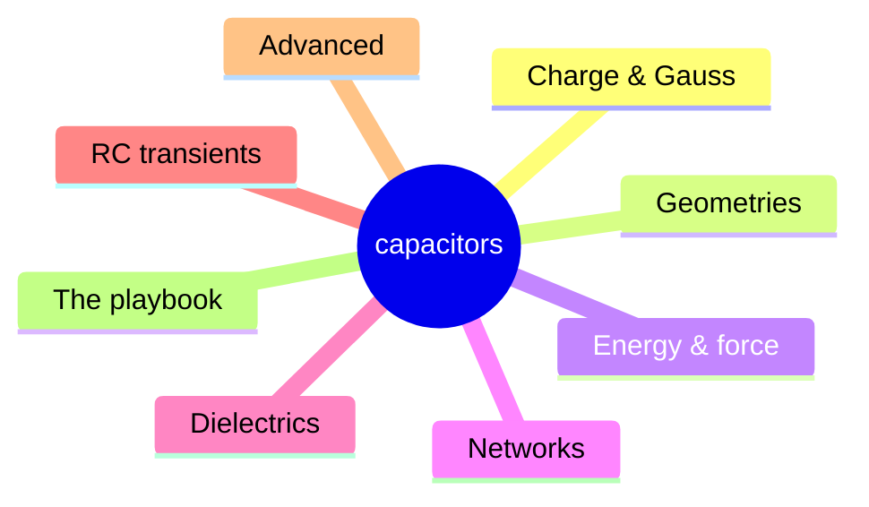

> *Read:* chapters 1–3 are the base, 4–6 the JEE engine, 7–8 the Olympiad machinery and the strategy.

### How these notes are organised

Each chapter builds only on the ones before it. Chapters **1–3** are the pure conceptual base (charge and conductors, capacitance, energy). Chapters **4–6** are the JEE-Advanced engine (combinations, dielectrics, networks and transients). Chapters **7–8** push to Olympiad level (coefficients of capacitance, reciprocity, images, conformal ideas, variational methods) and consolidate a solving strategy. Chapters **9–10** are the full paper with detailed solutions; chapter **11** is a printable three-page sheet.

- Chapter 1 **[Charge, conductors & Gauss](#section-01-foundations)** Why $E = 0$ inside a conductor in equilibrium, why charge lives on the surface, shielding and cavities, flux and solid angle, the method of images, and the pressure $\sigma^2/2\varepsilon_0$.

- Chapter 2 **[Capacitance & every geometry](#section-02-capacitance)** What the definition means and why *C* is purely geometric; parallel plate, isolated sphere, concentric shells, coaxial cylinder, two-wire line, metal slab in the gap, fringing and edge corrections.

- Chapter 3 **[Energy, force & pressure](#section-03-energy-and-force)** Energy in the field, energy density, constant-*Q* versus constant-*V* force, virtual work, the two-capacitor paradox, pull-in instability, small oscillations of a movable plate.

- Chapter 4 **[Combinations & networks](#section-04-combinations)** Series and parallel with proofs, voltage division, balanced and unbalanced bridges, symmetry folding, the capacitor cube, infinite ladders, Δ–Y for capacitors, charge redistribution.

- Chapter 5 **[Dielectrics](#section-05-dielectrics)** Polarisation, bound charge, the $D$-field and why *K* multiplies *C*; slabs (complete, partial, liquid rise), multi-layer gaps, local field, breakdown, energy bookkeeping with a battery attached.

- Chapter 6 **[DC networks & RC transients](#section-06-networks-and-transients)** Steady state with resistors present, the node-charge method, charge through a cell, Thévenin resistance for $\tau$, charging and discharging, energy balance, two-time-constant networks, relaxation oscillators.

- Chapter 7 **[Advanced / Olympiad toolkit](#section-07-advanced-topics)** Coefficients of capacitance and potential, Green's reciprocity, images for a sphere and a disc, needle and spheroid limits, wedge capacitors via conformal mapping, MEMS, the charged-droplet (Rayleigh) limit.

- Chapter 8 **[Playbook & traps](#section-08-playbook)** The twelve moves that solve almost everything, twenty-five classic traps with the exact reason each is wrong, and a fifteen-question timed drill.

- Chapter 9 **[Olympiad paper · 36 questions](#section-09-olympiad-paper)** Full length, exam conditions: 12 single-correct, 6 multi-correct, 8 numerical and 10 long-answer problems. Written to cover every concept in chapters 1–8, so no topic escapes.

- Chapter 10 **[Detailed solutions](#section-10-olympiad-solutions)** Every question worked line by line with the reasoning, alternative methods, the standard wrong answer, and a marks distribution for self-grading.

- Chapter 11 **[Formula sheet](#section-11-formula-sheet)** Three printable pages: every result, every geometry, every limiting case, each with its condition of validity attached.

Progress — click anywhere on a card to tick it (stored in this browser): **0 / 11**

### Read this first: the four ideas the chapter rests on

Everything below — every trick, every "hard" problem — follows from these four statements. If you can re-derive them, you need not memorise anything else in this chapter.

1. **A conductor in electrostatic equilibrium is an equipotential.** Free charges slide until the tangential
    field vanishes, so $\vec E = 0$ inside the metal and $\vec E \perp$ surface. This is the only reason
    "the potential difference across a capacitor" is a single well-defined number.
2. **The field is linear in its sources.** Coulomb's law is linear, so doubling every charge doubles every
    potential. Hence $Q \propto V$, and $C \equiv Q/V$ is a constant that depends on **geometry and material only** — never on *Q* or *V*.
3. **Energy is quadratic in charge.** Because $V = Q/C$ climbs while you charge, the work is the area of a
    *triangle*, not a rectangle: $U = \tfrac12 QV$. That factor $\tfrac12$ is the most common slip in
    the chapter — and the reason exactly half the battery's work is dissipated while charging a capacitor through any
    resistance.
4. **Know what is being held fixed.** Isolated (battery removed) ⇒ *Q* fixed, and the system moves so as
    to *minimise*$U$. Still connected to a cell ⇒ *V* fixed, and the quantity to minimise is
    $U - VQ$ (the battery pays you as charge flows). Forces and energy changes differ by a factor of 2 between the
    two cases — see [§3.4](#section-03-energy-and-force).

> **Why bother with a capacitors chapter at all?**
>
> Because it is the cheapest place in electrostatics to practise the skill that decides an Olympiad score: **replacing a force calculation by an energy calculation**. Getting the force on a partially inserted dielectric slab by integrating stress is painful; differentiating $\tfrac12 V^2 C(x)$ is one line. Capacitors are also the one electrostatics topic JEE asks *quantitatively inside a circuit* — it is exactly where Gauss meets Kirchhoff.

### Notation used everywhere

| Symbol | Meaning | Convention in these notes |
| --- | --- | --- |
| $Q,\;q$ | charge on a capacitor plate (magnitude) | Always the charge on the **positive** plate. The pair carries $+Q$ and $-Q$; the net charge of a capacitor is zero. |
| $V$ (or $\Delta V$) | potential difference between the plates | Taken positive on the plate carrying $+Q$. |
| $C$ | capacitance | $C = Q/V > 0$, one farad = one coulomb per volt. Purely geometric. |
| $\sigma$ | surface charge density | $\sigma = Q/A$ only for a uniformly charged flat plate; otherwise $\sigma(\vec r)$. |
| $\varepsilon_0$ | permittivity of free space | $8.854\times10^{-12}$ F m⁻¹; $(4\pi\varepsilon_0)^{-1} = 9\times10^{9}$ N m² C⁻². |
| $K$ or $\varepsilon_r$ | dielectric constant | $K \ge 1$, dimensionless. Material permittivity $\varepsilon = K\varepsilon_0$. |
| $U$ | electrostatic energy stored | Some books write $W$ for this; here $W$ **always** means work *done by* something. |
| $\vec P,\ \vec D$ | polarisation, electric displacement | $\vec D = \varepsilon_0\vec E + \vec P$; linear dielectric: $\vec D = \varepsilon\vec E$. |
| $\tau$ | RC time constant | $\tau = R_{\text{th}}C$ in seconds, $R_{\text{th}}$ seen *by the capacitor*. |
| $\vec E,\ \hat r$ | vectors and unit vectors | Arrow over a letter = vector; hat = unit vector. $\hat n$ is the outward normal unless stated. |
| $\partial$, $\oint$, $\propto$, $\ll$ | partial derivative, closed integral, proportional, much less | Subscripts on $\partial$ name what is held fixed — in this chapter that is often $Q$ or $V$, and it is never optional. |

### Syllabus coverage

Mapping to the JEE Advanced physics syllabus (Electrostatics) and to what NSEP/INPhO papers actually ask. The last three rows are outside the JEE list but are standard Olympiad material; they appear in chapters 7 and 10.

| Topic as listed in the syllabus | Where | Deepest treatment in these notes |
| --- | --- | --- |
| Capacitance; energy stored in a capacitor; parallel-plate capacitor | 2, 3 | Full derivation plus finite-plate and edge corrections, and the $d \to \infty$ sanity checks |
| Insertion of dielectrics; effect on capacitance; energy considerations | 5, 3.4 | Partial-slab force, liquid rise, multi-layer gaps, complete energy bookkeeping with the cell attached |
| Series and parallel combinations; networks of capacitors | 4 | Bridges (balanced and not), cube, ladders, Δ–Y, node-charge method, redistribution losses |
| RC circuits, charging and discharging, time constant | 6 | Two-loop transients, Thévenin for $\tau$, energy split, relaxation oscillators |
| Electrostatic potential and energy, field lines, Gauss's law | 1 | Flux through a disc, solid angle, potential from the field, why conductors are equipotentials |
| Conductors and insulators in an electrostatic field; shielding | 1.2, 1.7, 1.8 | Charge in a cavity, Faraday cage, force and pressure on a surface element |
| — Method of images (not in the JEE list, common in NSEP) | 1.6, 7.2 | Grounded plane, grounded sphere, sphere-to-plane capacitance, force by images |
| — Coefficients of capacitance and potential; reciprocity | 7.1 | Matrix formulation, Green's reciprocity with proof, three fast applications |
| — Variational thinking; stability, MEMS pull-in, droplet limit | 3.6, 7.5, 7.6 | Stability of a suspended plate, snap-through, Rayleigh fission limit |

### Cengage coverage map — Capacitor and Capacitance (chapter 4)

The specification for this note-set was **at least everything in the Cengage chapter**, plus the Olympiad material that chapter does not reach. The Cengage volume's *Capacitor and Capacitance* is chapter 4 (book pp. 4.1–4.36), followed by Appendix A1's mixed exercise sets on chapters 1–4. Every numbered contents entry is mapped below, with the treatment named.

| Cengage section | Where it is here | How it is treated |
| --- | --- | --- |
| 4.2 Capacitor | §2.1 | $C\equiv Q/V$ defined for two armatures, with the linearity argument that makes $C$ a purely geometric number |
| 4.2 Units of capacitance | §2.1, §2.9 | farad in base units, the practical 1 pF/cm-sphere rule, 1 m of wire ≈ 10 pF, µF/nF/pF ladder |
| 4.2 Parallel-plate capacitor | §2.2 | four-line derivation, cell-connection qualifier, and the $d\to\infty$ and $A\to0$ limits as checks |
| 4.3 Capacitance of a spherical conductor or capacitor | §2.3 | concentric shells exactly, with the $b\to\infty$ limit recovering the isolated sphere $C=4\pi\varepsilon_0R$ |
| 4.3 Energy stored in a charged conductor or capacitor | §3.1 | the $\tfrac12$ derived by integrating $V\,dq$; the three faces of $U$ and when to use each |
| 4.3 Force between the plates of a parallel-plate capacitor | §3.3, §3.5 | two independent methods (field of one plate, virtual work) that must agree; electrostatic pressure |
| 4.4 Energy density in an electric field | §3.2 | $u=\tfrac12\varepsilon_0E^{2}$ proved by counting, then used for a field-drawn energy budget |
| 4.4 Loss of energy during redistribution of charge | §3.7 | the two-capacitor paradox with its real resolution ($\int i^{2}R\,dt$ is independent of $R$), and the half-loss statement in general |
| 4.7 Combination of capacitors | §4.1–§4.2 | both rules derived from conservation, not quoted; the reduction algorithm; the general energy split (box *Energy in a combination*) |
| 4.7 Capacitors connected in series; energy in series combination | §4.1, §4.2 | charge equality from an isolated island; energy $U_i/U=C_{\text{eq}}/C_i$, so the smaller capacitor stores the larger energy |
| 4.8 Capacitors connected in parallel | §4.2 | same-$V$ additivity of $C$, charge dividing as $C_i$; energy dividing as $C_i$ too |
| 4.10 Kirchhoff's rules for capacitors | §4.3 | the node-charge method — KCL with charge in place of current — as the general tool, with the cube and ladder as worked cases |
| 4.11 Sign convention | §4.3 (box *The sign convention, written once*) | *added for this floor*: the explicit convention for plate charges, node potentials and the sign of $Q_i=C_i(V_i-V_j)$ |
| 4.12 Dielectric; dielectric constant | §5.1, §5.3 | polarisation from atoms upward; $\kappa$ defined by what the material does, then $D$ introduced so bound charge never has to be tracked |
| 4.12 Dielectric in an electric field; induced charge on the surface | §5.2 | bound-charge bookkeeping in one line, with the induced-charge fraction $1-1/\kappa$ worked for a slab |
| 4.12 Dielectric breakdown | §5.8 | breakdown fields for air, oil and solids; the design inequality $V_{\max}=E_{\text{bd}}d$; partial discharge and the sharp-edge argument |
| 4.13 Capacitance of a parallel-plate capacitor with a dielectric | §2.6, §5.5 | complete slab: $C=\kappa C_0$; partial slab and layers through the series/parallel rule; the catalogue of every geometry asked for |
| 4.13 Force on a dielectric slab | §5.6, §5.7 | virtual work at fixed $V$, then the energy route again; the liquid-rise case study and where the force really comes from |
| 4.15 Effect of dielectric on different parameters | §3.4, §5.5 (table *Dielectric inserted: every parameter, both constraints*) | *added for this floor*: the full battery-connected versus battery-disconnected table ($C, Q, V, E, U, F$) with the sign of each change and the reason |
| 4.16 Spherical capacitor | §2.3 | exact, no approximation; with the series-limit $b-a\ll a$ recovering the parallel plate |
| 4.16 Cylindrical capacitor | §2.4 | coaxial cable by Gauss's law, with the logarithmic dependence and the wire-to-cylinder limit |
| 4.19 Solved examples | in-chapter questions, §8 drill, ch. 9 paper | every chapter carries folded full solutions; chapter 8's fifteen-question drill is the timed version |
| 4.24–4.36 Exercises: subjective, objective, multiple-correct, assertion–reasoning, comprehension, matching, integer, answers and solutions | ch. 9 (paper) + ch. 10 (solutions) | the paper's four sections reproduce the Cengage exercise taxonomy — single concept, multiple correct, numerical and long answer — with marks printed and every answer checked |
| Appendix A1 (mixed sets on chapters 1–4 of the volume) | §1.10, ch. 8–10 | the electrostatic prerequisites are drilled in §1.10; the mixed style is what the paper's sections A–B simulate |

> **Beyond the Cengage floor — the Olympiad layer**
>
> Chapters 7 and parts of 3, 5 and 6 exist to take the same physics past the book: coefficients of capacitance and Green's reciprocity, the method of images (plane, sphere, sphere-to-plane capacitance), conformal mapping for 2-D problems images cannot touch, the spheroid family that covers needle-to-disc in one formula, the stability analysis behind MEMS pull-in, the Rayleigh fission limit of a charged drop, dielectric losses and ferroelectrics/piezoelectrics, and the two-loop transient machinery behind RC relaxation oscillators. Those are the parts of NSEP/INPhO that the Cengage chapter stops short of.

> **A small correction to your wording**
>
> You asked for notes for "JEE Advanced and IOQM". IOQM is the Indian Olympiad Qualifier in **Mathematics**; the physics ladder is **NSEP → INPhO → OCQ → IPhO**, with **IOPT** for the theory stream. These notes are aimed at JEE Advanced plus that NSEP/INPhO standard. The Olympiad layer is built from the same tools — energy methods, series expansion, symmetry, differential equations — which is also the reasoning style an IOQM problem rewards, so nothing here is wasted. Anything beyond the JEE syllabus is flagged Olympiad; you can skip those flags on a first pass without breaking the chain.

### The three-pass study plan

| Pass | Goal | What to actually do | Time |
| --- | --- | --- | --- |
| **1 · Build** | Understand, don't store | Chapters 1–3. For every boxed result, close the page and re-derive it on paper before reading on. Do each Q block without opening its solution; if you cannot finish, re-read the *section*, not the solution. | 3–4 days |
| **2 · Connect** | Turn understanding into speed | Chapters 4–6, then the trap list in chapter 8. Now do the question blocks timed: 4 minutes per MCQ. Write down every point where you hesitated — that list is your real weakness, not your score. | 5–6 days |
| **3 · Extend** | Olympiad standard | Chapter 7 slowly, with a notebook for the proofs. Then chapter 9 under real exam conditions (3 h, no notes, no calculator unless the paper allows it), graded against chapter 10. Re-solve every miss **48 hours later**, not immediately. | 7–10 days |

> **How to use the questions inside the chapters**
>
> - **Attempt before you fold.** Each question has its solution in a collapsed panel. Opening it before you have
>   written something down makes the item worth far less to you.
> - Use the *mark solved* button on each question; the counter in the top bar of the page remembers it.
> - Difficulty is labelled base (board / JEE-main level), JEE-adv,
>   Olympiad. Do not skip the *base* ones — those are the marks that quietly disappear.
> - Every solution names the **wrong route** students take. Read that line even when you got the right answer;
>   that is where the next question's marks are.

### Prerequisite self-check (before chapter 1)

Patch any gap now — thirty minutes of algebra here saves a chapter of confusion later. All six should be doable without notes.

1. Write the field of a point charge as a vector and superpose two charges on a line.
2. State Gauss's law and use it for an infinite sheet and for a spherical shell, inside and outside.
3. Get $\vec E$ from $V$, and explain why $V$ is constant over a conductor's surface.
4. Differentiate and integrate $e^{-x}$, $\ln x$, $1/x$; solve $dy/dt = -y/\tau$.
5. Use $(1+x)^n \approx 1+nx$ for $x \ll 1$, and take geometric limits such as $d \ll R$.
6. Do a one-line energy balance with gravity and a spring — that is the exact pattern of a "plate moves" problem.

Answers to the six

1. $\vec E = \dfrac{q}{4\pi\varepsilon_0 r^2}\,\hat r$, pointing away from a positive charge. Superposition is a
  **vector** sum; adding magnitudes is wrong unless the fields are parallel.
2. $\displaystyle\oint \vec E \cdot d\vec A = q_{\text{enc}}/\varepsilon_0$. Infinite sheet:
  $E = \sigma/2\varepsilon_0$ on each side. Shell: $E = 0$ inside, $Q/4\pi\varepsilon_0 r^2$ outside.
3. $E_x = -\partial V/\partial x$, i.e. $\vec E = -\vec\nabla V$; $V$ is constant on a conductor because
  a tangential field would drive a surface current, contradicting equilibrium.
4. $\int e^{-x}dx = -e^{-x}$, $\int dx/x = \ln x$, and $y = y_0 e^{-t/\tau}$ is the only solution of
  $dy/dt = -y/\tau$ — you will use that exponential constantly in chapter 6.
5. $(1+x)^{-1} \approx 1 - x$, $\ln(1+x) \approx x$. Used to check that a spherical capacitor
  $4\pi\varepsilon_0 ab/(b-a)$ becomes $\varepsilon_0 A/d$ when $b - a \ll a$.
6. Set loss in one form equal to gain in the other, e.g. $\tfrac12 kx^2 = mgx$. In this chapter replace
  $\tfrac12 kx^2$ by the electrical energy $\tfrac12 Q^2/C(x)$ and nothing else changes.

Extra on (2): just outside a conductor the field is $\sigma/\varepsilon_0$, **not** $\sigma/2\varepsilon_0$. §1.4 shows exactly where that factor of 2 comes from — the conductor's own other charges contribute the other half.

### Equipment for this chapter

> **Two mental levers**
>
> **Lever 1 — geometry only.** Never believe a capacitance formula until you have checked it against (i) dimensions, (ii) the limit in which the conductors touch or one size grows without bound, (iii) the parallel-plate limit for any curved geometry. A formula failing (ii) is wrong even if the algebra looked clean.
>
>  **Lever 2 — energy with the right constraint.** Use $U = \tfrac12 Q^2/C$ when *Q* is fixed; use $U = \tfrac12 CV^2$ when *V* is fixed *and then add the battery's work*. Nine of ten "hard" problems collapse to one line once the constraint is chosen honestly.

> **Three habits to break today**
>
> - Writing $U = QV$. The $\tfrac12$ is not decoration.
> - Using "capacitors in series carry equal charge" on a node that already had charge before the switch was closed.
>   The correct rule is conservation of charge *on that isolated node*.
> - Treating a partly filled capacitor as "just $K\varepsilon_0$ everywhere". In series layers the
>   *displacement field*$D$ is continuous, not $E$ — so the field in the air gap differs from the field
>   in the slab.

> **Numbers worth memorising (they turn three minutes of algebra into a three-second estimate)**
>
> - $4\pi\varepsilon_0 \approx 1.11\times10^{-10}$ F m⁻¹, so a **1 cm isolated sphere** has
>   $C \approx 1.1$ pF. Rule of thumb: **1 m of wire has about 10 pF** to its surroundings.
> - Air breaks down near $E_{\max} \approx 3\times10^{6}$ V m⁻¹ (≈ 30 kV cm⁻¹): a 1 mm gap
>   cannot hold more than about 3 kV, no matter what you do. A ceiling on everything you can build.
> - Energy density at that limit: $u = \tfrac12\varepsilon_0E^2 \approx 40$ J m⁻³ — utterly tiny.
>   This is the honest one-line reason a capacitor is not a battery.
> - Water $K \approx 80$ (and it is a conductor once impure!), mica $K \approx 6$, glass
>   $4\text{–}10$, paper $2.2$, polythene $2.3$, BaTiO₃ ceramic $10^3\text{–}10^4$.
> - Human body to ground: $\sim$100–200 pF. That number is why you can light a neon bulb by touching it, and it
>   is a favourite Olympiad estimate.

> **Five lines of history, because it makes the ideas stick**
>
> In 1745 Ewald Georg von Kleist and, independently, Pieter van Musschenbroek found that a hand on a water-filled bottle could hold a shock strong enough to stun a man — the *Leyden jar*. For sixty years people argued about *where* the electricity was stored; most thought it was the water. Benjamin Franklin, after shipping jars to colleagues across Europe, replied that the metal coatings on **both** sides must carry equal and opposite charge and that the glass only keeps them apart: the first correct statement of "two conductors, one capacitor". Volta then inverted the question in 1800 — what matters is not the quantity of charge but the electromotive force able to *maintain* the separation — and built the pile that kept jars charged indefinitely. Faraday, in the 1830s, did the experiment this whole chapter really describes: he showed the substance **between** the coatings is what matters, introducing lines of force. Maxwell's field energy, $u = \tfrac12\varepsilon_0 E^2$, finally said the energy was in the empty space all along. When you charge a capacitor you are, quite literally, charging the vacuum — and paying for it.

### Start here

[**Chapter 1 · Charge, conductors & Gauss →**](#section-01-foundations). It is deliberately the shortest chapter, and the only one whose statements are about *matter* rather than about formulas. Olympiad markers can tell within two lines whether a candidate understands it.

_Chapter 1 of 11 · JEE Advanced · base · ≈ 55 min read · 8 questions_

## Charge, conductors and the tools you will actually use

A capacitor is two pieces of metal and something between them. Before any formula about *C* means anything, you must be able to say **what the metal did to the charges** and **what that did to the field**. This chapter is those two answers, plus the three techniques (Gauss, images, pressure) that the rest of the chapter leans on.

### 1.1 Charge: three facts, and why each one matters

> **Fact 1 — quantisation**
>
> $$
> Q = ne,\qquad e = 1.602\times10^{-19}\ \text{C},\qquad n\in\mathbb Z \tag{charge}
> $$
>
>  Charge comes in indivisible units. (Quarks carry $\pm e/3,\ \pm 2e/3$ but are confined, so **no free body** has ever been observed with non-integer $ne$. Millikan's oil-drop experiment (1909) measured *e* by balancing gravity and electric force on single drops — a favourite Olympiad setup, see Q8.)

> **Fact 2 — conservation**
>
> The total charge of an isolated system never changes. Pair production creates $+e$ and $-e$ together; charging a capacitor moves charge from one plate to the other and creates nothing.

> **Fact 3 — additivity**
>
> Charges are algebraic scalars: the net charge is the signed sum. This is why a "capacitor with charge $Q$" means plates of $+Q$ and $-Q$ and a **net charge of zero** — a point examiners love to test.

> **Why quantisation almost never matters in this chapter — and when it does**
>
> A 1 µF capacitor at 1 V holds $Q = 10^{-6}$ C, i.e. $6\times10^{12}$ electrons. Smearing them over a plate of area 1 cm² gives a smooth $\sigma$; discreteness is invisible. So we treat charge as a **continuous density**. It becomes important exactly when the number of electrons is small — problems about *single-electron tunnelling, Coulomb blockade,* or "how many electrons move when the switch closes" (divide your answer by *e*; JEE has asked this in disguise several times).

#### Coulomb's law — the only force law you need here

$$
\vec F_{1\to2}=\frac{1}{4\pi\varepsilon_0}\frac{q_1q_2}{r^2}\hat r_{12},\qquad \frac{1}{4\pi\varepsilon_0}=8.988\times10^{9}\ \text{N m}^2\text{C}^{-2}\approx9\times10^{9} \tag{vector form}
$$

Read the three conditions hidden in that line, because every "capacitance paradox" you will meet is a violation of one:

- **Point charges** (or spherically symmetric charge distributions, which act as if concentrated at the centre — proved by Gauss in §1.5).
- **At rest, in vacuum.** In a material the interaction is screened; the practical rule is
  $F\to F/K$ only for two charges embedded *in* an infinite homogeneous dielectric, not for charges on conductors
  near a dielectric surface (which needs images — §1.6).
- **Superposition holds:** the net force is the vector sum of the pairwise forces. This is *not* a
  consequence of Coulomb's law; it is an independent experimental fact, and it is precisely the linearity that makes
  capacitance constant (§2.1).

> **Continuous distributions**
>
> $$
> \lambda\ [\text{C m}^{-1}],\qquad \sigma\ [\text{C m}^{-2}],\qquad \rho\ [\text{C m}^{-3}],\qquad dq = \rho\,dV
> $$
>
>  Every field in this chapter comes from $\vec E=\dfrac{1}{4\pi\varepsilon_0}\displaystyle\int\frac{dq}{r^2}\hat r$. You should be able to do two standard ones without thinking, because they are the building blocks of capacitor geometry:
>
>  $$
> E_{\text{axis}}=\frac{1}{4\pi\varepsilon_0}\frac{Qx}{(x^2+R^2)^{3/2}}\qquad\big(\to kQ/x^2\ \text{for}\ x\gg R,\ \to kQx/R^3\ \text{for}\ x\ll R\big) \tag{ring on axis}
> $$
>
>  $$
> E_r=\frac{1}{4\pi\varepsilon_0}\frac{2\lambda}{r}=\frac{\lambda}{2\pi\varepsilon_0 r} \tag{long rod, radial}
> $$
>
>  Both results you should be able to *guess* before calculating: on the axis of a ring the transverse components cancel by symmetry so only $\cos\theta=x/r$ survives (that extra $x$ is why the field is zero at the centre); for the rod, only the radial component survives and the integral gives $2\lambda/r$. The rod result is the one that makes the coaxial capacitor (§2.5) a one-line derivation.


**Fig. 1.1 — Two elements, both by symmetry + one integral.** Learn to state the symmetry argument out loud before integrating: it tells you which component to project onto, and it is half the marks in a long-answer question.

### **Q1** Two identical conducting spheres, centres 1 m apart, radii 0.3 m, carry +Q and −Q. Is $F = kQ^2/r^2$ correct? _(base · reasoning)_

Give the direction of the error (too big / too small / correct) and justify.

Solution

**Wrong, and the true force is *larger* than $kQ^2/r^2$.** The charges are free to move, and opposite charges attract: positive charge on the left sphere migrates to its right face, negative charge on the right sphere migrates to its left face. The two "centres of charge" are therefore closer than 1 m apart — the separation is roughly $2(0.3-t)$ less than the centre distance. Since $F\propto 1/r_{\text{eff}}^2$, the actual attraction exceeds the point-charge value.

**Why this matters here:** the moment you write $kQ^2/r^2$ for two *conductors*, you have assumed the charge is fixed. That assumption is legal for **insulating** spheres with frozen charge, and illegal for metal spheres unless $r\gg R$ (then redistribution barely changes anything). This is the reason a capacitor's capacitance is not simply "two point charges".

Same logic in reverse for two like-charged spheres: repulsion pushes charge to the far faces, so the actual force is *smaller* than $kQ^2/r^2$.

### 1.2 Conductors, insulators, and the four theorems

Microscopically, a metal has $\sim10^{29}$ conduction electrons per m³ that are free to move over macroscopic distances; a good insulator has essentially none (electrons are bound, only displaced by an atom's width). That one difference — *mobile* versus *bound* — generates all four results below.

**Fig. 1.2 — Equilibrium in two frames.** Mobile charges drift until the field they leave behind cancels the applied field exactly. Relaxation time $\tau=\varepsilon_0/\rho_{\text{res}}$ — for copper that is about $1.5\times10^{-19}$ s, which is why "instantaneously" is not a cheat in electrostatics problems.

Theorem 1 — $\vec E=0$ inside a conductor in equilibrium (with proof by contradiction)

Suppose $\vec E\ne0$ somewhere inside the metal. Then a free electron feels $-e\vec E$ and accelerates. Currents flow, i.e. the state is **not** equilibrium. Charges keep piling up where the current converges, changing $\vec E$, until cancellation is exact. Equilibrium *is defined* by "no further motion", so $\vec E=0$.

Quantitatively, from the drift model the charge density decays as $\dot\rho = -\rho/\tau$ with $\tau=\varepsilon_0/\sigma_{\text{cond}}$. For copper, $\sigma_{\text{cond}}=5.8\times10^{7}$ S m⁻¹ ⇒ $\tau\approx1.5\times10^{-19}$ s. Any *net* charge inside the bulk therefore drains to the surface in a time no experiment can resolve.

> **The useful corollary for capacitors**
>
> Since $\vec E=0$ inside the metal, moving a test charge from any point of a plate to any other point of the **same** plate costs zero work: the whole conductor (bulk + surface) is an **equipotential**. That is the only reason $C=Q/V$ makes sense — "the potential of plate 1" is unambiguous.

Theorem 2 — all excess charge is on the outer surface

Draw a Gaussian surface *entirely inside* the metal, hugging any region you like. Since $\vec E=0$ everywhere on it, Gauss gives $\oint\vec E\cdot d\vec A = 0 = q_{\text{enc}}/\varepsilon_0$, so the enclosed charge is zero. Because the surface can be shrunk around any interior point, **no point in the bulk carries net charge**. Hence all excess charge is on the boundary.

Note the logical care needed: the argument excludes *net* charge density, not charge — a metal always has vast $+$ ion and $-$ electron densities that cancel. The theorem is about the **excess**.

Theorem 3 — the field meets a conducting surface at right angles

If a tangential component $E_t$ existed at the surface, a surface charge $\sigma$ per unit area would feel a force $\sigma E_t$ per unit area and slide — again contradicting equilibrium. So $E_t=0$, and $\vec E\perp$ surface. Equivalently: the surface is an equipotential, and field lines always cross equipotentials at 90°.

#### 1.3 The field just outside: why the factor is 1, not ½

This is the single most-asked conceptual point in the chapter's first week, and it is where students mis-apply the sheet result.

| Source | Field of the sheet alone | Field outside a conductor |
| --- | --- | --- |
| Isolated non-conducting sheet of charge $\sigma$ (charges frozen) | $\sigma/2\varepsilon_0$ each side | — |
| Surface element of a **conductor**, all other charges included | $\sigma/2\varepsilon_0$ each side (still!) | $\sigma/\varepsilon_0$ outward |

> **Proof of the factor 2**
>
> Split all the conductor's charge into (i) the small flat patch $\sigma\,dA$ you are standing next to and (ii) everything else. The patch, being locally flat and huge in extent relative to your distance, gives $\pm\sigma/2\varepsilon_0$ on either side of itself. "Everything else" is smooth on that scale, so it gives the same field $E_{\text{other}}$ just inside and just outside.
>
>  - Inside: $0=E_{\text{other}}-\sigma/2\varepsilon_0\Rightarrow E_{\text{other}}=+\sigma/2\varepsilon_0$ (pointing out).
> - Outside: $E=E_{\text{other}}+\sigma/2\varepsilon_0=\sigma/\varepsilon_0$. **∎**
>
>  Now apply Gauss to a pillbox straddling the surface: flux $E\,dA$ out, no flux through the inner face, and $q_{\text{enc}}=\sigma\,dA$ ⇒ the same $E=\sigma/\varepsilon_0$. The two methods agree, and the pillbox version is what you should write in an exam — but *know the patch version*, because it is the same reasoning that gives the force in §1.5 and the plate force in chapter 3.


**Fig. 1.3 — Left:** pillbox ⇒ $E=\sigma/\varepsilon_0$. **Right:** the same result by splitting the conductor's charge into the local patch (which cannot push itself) plus the rest. Keep the right-hand picture in mind — the force on a plate in chapter 3 is $\sigma$ times *only* the "rest" field, i.e. $\sigma/2\varepsilon_0$, and that is where the ½ in $P=\sigma^2/2\varepsilon_0$ comes from.

### **Q2** A point charge $q$ sits at distance $d$ from a large uncharged conducting plate. What is the force? Why is it never repulsive? _(base→JEE-adv)_

(a) State the direction and use the image idea to give the magnitude. (b) Explain the answer for a **charged** plate at potential $V_0$ instead of grounded — same, different, and why?

Solution

$$
F=\frac{1}{4\pi\varepsilon_0}\frac{q^2}{(2d)^2}=\frac{q^2}{16\pi\varepsilon_0 d^2} \tag{attractive always}
$$

**(a)** The plate's free electrons redistribute: opposite charge is drawn to the near face, like charge is pushed to the far face (or into the earth if grounded). Near the charge, the induced $-$ density is on the *closer* side of the plate, so attraction always wins over repulsion from the far side. Magnitude: see §1.6 for the image construction that makes this exact.

**(b)** With the plate merely held at potential $V_0$ there is an extra, uniform sheet of charge on the outside plus the same induced pattern, so the force picks up a term proportional to $qV_0$ and **can** be repulsive. A neutral (or grounded) isolated plate cannot repel a charge; a biased one can. That distinction is exactly the "what is held fixed" theme of the whole chapter.

**Wrong route:** writing $kq^2/d^2$ (forgetting the image is $2d$ away), or claiming the force is zero because the plate is uncharged. Net-zero charge does not mean net-zero *dipole* moment — the plate is a polarised object, and a charge and a dipole always attract.

### 1.4 Potential, and how to move between $V$ and $\vec E$

Electrostatics is conservative: $\oint\vec E\cdot d\vec\ell=0$, which is why a scalar $V$ exists at all.

$$
V_B-V_A=-\int_A^B\vec E\cdot d\vec\ell \qquad\Longleftrightarrow\qquad \vec E=-\vec\nabla V \tag{both directions}
$$

Two operational forms you will use constantly for capacitors:

$$
V=Ed\ \ (\text{uniform field over separation }d),\qquad V(r)=\frac{Q}{4\pi\varepsilon_0 r}\ \ (\text{outside a sphere / shell}) \tag{uniform gap}
$$

> **Which direction do you compute in?**
>
> - **Charge known, field simple (planar, spherical, cylindrical symmetry)** ⇒ do $\vec E$ by Gauss, then
>   integrate to get $V$. This is the standard route for every capacitor in chapter 2.
> - **Charge distributed irregularly** (rings, rods, discs) ⇒ integrate the scalar $V=\int k\,dq/r$ (no
>   directions to worry about) and differentiate at the end. Much easier than integrating $\vec E$, and it is the
>   trick for the "two parallel rods" and "disc" problems.
> - Never differentiate a potential you have not yet made direction-aware: $E=-\partial V/\partial n$ needs the
>   derivative **along the line of the field**.

#### Absolute vs difference, and the earth

Only differences are physical, but "the capacitance of an isolated sphere" needs a reference — by convention $V=0$ at infinity. Two consequences worth stating explicitly, since questions turn on them:

1. A conductor's own charge always contributes the *same sign* to its potential, so an isolated conductor's
  $Q$ and $V$ have the same sign: **$C>0$ always**.
2. Connecting to earth makes $V=0$ while **$Q$ is free to change**. Earthing is a constraint on $V$,
  never on $Q$. (Earthing a charged sphere with another charged sphere nearby can leave it with *positive*
  net charge — see Q3.)

### **Q3** Sphere A (radius $a$, charge $Q$) and sphere B (radius $a$, uncharged) have centres $4a$ apart. B is then earthed, briefly. Is B's final charge (i) 0, (ii) negative, (iii) positive? _(JEE-adv)_

Solution

**(ii) negative, magnitude *less* than $Q/4$.** Earthing forces $V_B=0$. Write $V_B$ as the sum of contributions at B's centre (a conductor is equipotential, so its surface potential equals the value computed from all charges, and to leading order in $a/4a$ we may put them at the centres):

$$
V_B=\frac{1}{4\pi\varepsilon_0}\left(\frac{Q'}{a}+\frac{Q}{4a}\right)=0\ \Longrightarrow\ Q'=-\frac{Q}{4}
$$

The approximation used is that A's charge stays at A's centre and B's at B's centre. In reality B's induced charge is drawn to the near face, so its own contribution to $V_B$ is larger in magnitude than $kQ'/a$, and hence $|Q'|<Q/4$. The sign, however, is rigorous: to cancel a positive neighbouring potential, negative charge must flow up from the earth.

**Wrong route:** "the wire is removed, therefore nothing happened" — or "earth is infinite so it absorbs all charge, leaving $Q'=0$". The earth supplies exactly as much charge as is needed to set $V_B=0$, and no more.

### 1.5 Flux and solid angle: the two Gauss tricks that recur

Gauss's law in the form you will use it:

$$
\Phi=\oint\vec E\cdot d\vec A=\frac{q_{\text{enc}}}{\varepsilon_0} \tag{Gauss}
$$

The reason a *closed* surface is special is that flux through it depends on nothing but enclosed charge. For an **open** surface this fails — and one open-surface result is used constantly in capacitor problems with point charges near plates.

**Fig. 1.4 — Flux through a disc on the axis of a charge.** Total flux from $q$ is $q/\varepsilon_0$ spread over $4\pi$ steradians, so any surface subtending solid angle $\Omega$ takes the fraction $\Omega/4\pi$. For the disc, $\cos\theta=x/\sqrt{x^2+R^2}$.

$$
\Phi_{\text{disc}}=\frac{q}{2\varepsilon_0}\left(1-\frac{x}{\sqrt{x^2+R^2}}\right) \qquad(x=0\Rightarrow q/2\varepsilon_0;\quad x\gg R\Rightarrow \frac{qR^2}{8\varepsilon_0x^2}) \tag{disc flux}
$$

Check it yourself: at $x=0$ the charge is *in* the plane of the disc so half of all flux goes one way — correct. For $x\gg R$ the disc looks tiny and flat, so $\Phi\to E\cdot\pi R^2$; the expansion of $1-x/\sqrt{x^2+R^2}$ gives exactly that. **Both limits agreeing is the real proof you did not drop a factor.**

#### 1.6 Method of images — the tool that turns hard problems into arithmetic

**Idea.** Replace a conductor by fictitious "image" charges placed *behind* the region you care about, chosen so that the boundary condition ($V=0$ on a grounded surface, or $V=V_0$) is satisfied. Because the solution of the electrostatic problem with given boundary values is **unique**, any construction that satisfies both Laplace's equation in the region and the boundary values *is* the answer — you need not know what the real induced charge looks like.

> **Uniqueness, in one honest sentence**
>
> If two potentials $V_1,V_2$ both satisfy $\nabla^2V=0$ in a region with the same boundary values, their difference has zero boundary value, and the integral $\int|\vec\nabla(V_1-V_2)|^2dV$ vanishes (integrate by parts) ⇒ the difference is constant ⇒ $V_1=V_2$. That is the whole licence for using images, and it also explains why field lines cannot cross and why $V$ has no interior maximum.

**Fig. 1.5 — A charge and a grounded plane, solved by one mirrored charge.** The pair's mid-plane is automatically $V=0$, so it satisfies the boundary condition; uniqueness says it is the answer. Nothing exists on the far side.

$$
V(x,y,z)=\frac{q}{4\pi\varepsilon_0}\left(\frac1{r_+}-\frac1{r_-}\right),\qquad \sigma_{\text{ind}}(r)=-\frac{qd}{2\pi(r^2+d^2)^{3/2}},\qquad Q_{\text{ind}}=-q \tag{plane}
$$

Integrate $\sigma_{\text{ind}}$ over the plane yourself (let $u=r^2+d^2$) to see the last one — a standard 3-minute integral that appears as an INPhO short question.

> **The sphere version (Olympiad, used in ch. 7 for capacitance)**
>
> A charge $q$ at distance $d$ from the centre of a grounded conducting sphere of radius $R$ ($d>R$) is matched by an image $q'=-qR/d$ at distance $b=R^2/d$ from the centre, along the same radius. Check the two limits that make it believable: bring $R\to d$ (charge touching the sphere) and you get $q'\to-q$ at the surface — the charges annihilate, i.e. a charge can be given to a sphere by contact at zero cost in work; and letting $R\to0$ gives $q'\to0$ — a small ball is barely polarised. The inversion relation $db=R^2$ is the reason "sphere problems" in olympiads so often reduce to a substitution $r\to R^2/r$.

### 1.7 Pressure on a conductor: the bridge to forces

Each surface element feels a force from *everything except itself* — that is the one-line reason the pressure has a ½ in it (§1.3, right-hand picture).

$$
dF = \sigma E_{\text{other}}\,dA = \frac{\sigma^2}{2\varepsilon_0}dA \qquad\Rightarrow\qquad \boxed{P=\frac{\sigma^2}{2\varepsilon_0}=\tfrac12\varepsilon_0E^2}
$$

It is an **outward tension**, the same number as the field's energy density. Keep both forms: the second one tells you that any problem asking for a force can be rephrased as a problem asking for energy — the method of chapter 3.

### **Q4** A soap bubble of radius $R$ is conducting and charged to potential $V$. It expands by $dR$. Balance the pressures and find how much electrostatic pressure is needed. _(JEE-adv → Olympiad)_

Solution

For a bubble there are two surfaces, so the film feels an inward Laplace pressure $4T/R$ ($T$ = surface tension per surface). The outward electrical pressure is $P=\sigma^2/2\varepsilon_0$ with $\sigma=Q/4\pi R^2$ and $Q=4\pi\varepsilon_0RV$ ⇒ $\sigma=\varepsilon_0V/R$.

$$
\frac{4T}{R}=\frac{\varepsilon_0V^2}{2R^2}\quad\Longrightarrow\quad V=\sqrt{\frac{8T R}{\varepsilon_0}}
$$

**Faster route, and the reason the energy method is worth learning:** differentiate the energy at fixed charge. $U=Q^2/8\pi\varepsilon_0R$, so the electrical force tending to increase $R$ is $F=-dU/dR=Q^2/8\pi\varepsilon_0R^2$; divide by the area $4\pi R^2$ and you have the same $\sigma^2/2\varepsilon_0$. Both routes must agree — if they do not, you used the wrong constraint (fixed $V$ would have doubled it).

**Is it realisable?** For $R=1$ cm and soapy water ($T\approx0.025$ N m⁻¹) the balance field is $E=V/R=\sqrt{8T/(\varepsilon_0R)}\approx1.5\times10^{6}$ V m⁻¹, i.e. $V\approx15$ kV — within a factor two of air's breakdown strength $3\times10^{6}$ V m⁻¹. So the effect is measurable but marginal, and the usual observation is that a strongly charged bubble *expands and bursts*. Adding that one line of numerical judgement is what separates an INPhO answer from a homework answer.

### 1.8 Cavities, shielding, and what "screened" really means


**Fig. 1.6 — Charge inside a cavity.** A Gaussian surface inside the metal encloses the cavity, so the inner wall must carry exactly $-q$. If the conductor is neutral and isolated, $+q$ appears on the **outer** surface and there is a field outside; earthing removes it — and nothing else. The cavity's internal field is unaffected either way.

> **Electrostatic shielding, stated precisely**
>
> - **Inside is protected from outside.** In a closed conductor, $\vec E=0$ in the cavity when the cavity is
>   empty — regardless of what fields exist outside. The outer surface rearranges to cancel the external field in the bulk,
>   and nothing inside needs to know about it.
> - **Outside is *not* protected from inside** unless you earth the shell: a charge inside an isolated shell
>   produces $+q$ on the outer surface and hence an external field.
> - None of this requires a *spherical* or simply-shaped conductor, and none of it survives if there are
>   currents or time-varying fields (a real Faraday cage works only if its seams conduct well and, for good RF
>   shielding, if the mesh spacing $\ll\lambda$).

### **Q5** Inside a cavity at the centre of a neutral conductor sits $+q$. A student writes "the field inside the metal is zero, so the potential of the conductor is zero". Fix the error. _(base · concept)_

Solution

$\vec E=0$ in the metal implies $\vec\nabla V=0$ there, i.e. the conductor is an equipotential — but the *value* of that constant is set by every charge in the problem, measured against infinity. Here the outer surface carries $+q$, so the conductor sits at a positive potential. For a centred charge in a spherical cavity of radius $b$ the cavity's own contribution at the metal cancels ($kq/b-kq/b=0$), leaving $V_{\text{cond}}=q/C_{\text{out}}>0$, where $C_{\text{out}}$ is the capacitance of the outer surface to infinity. The error is reading "field is zero" as "potential is zero": $\vec E$ is a *derivative* of $V$, so it fixes the slope and never the level.

Consequences that questions exploit: a charge *inside* the cavity feels a force from the induced $-q$ on the wall (so it is not force-free), while anything outside sees only the outer-surface field and cannot tell where the internal charge sits. And if you connect the cavity to the outer surface with a wire, **all** the charge flows outward — which is exactly what a Faraday ice-pail experiment and a Van de Graaff terminal rely on.

### 1.9 Chapter checkpoint

- Explain in one sentence why $\vec E=0$ inside a conductor and why the same argument puts all excess charge on the surface.
- State the field just outside a conductor and give the two independent derivations (pillbox; patch + rest).
- Given a charge and a grounded plane, write down $V$, the force, and the induced surface density without calculating.
- Use solid angle to get the flux through any planar loop from a charge on its axis.
- Derive $P=\sigma^2/2\varepsilon_0$ and state which field ($\sigma/\varepsilon_0$ or $\sigma/2\varepsilon_0$) you must multiply $\sigma$ by, and why.
- For a charge in a cavity, list the charge on the inner wall, on the outer surface, and the effect of earthing, in both the isolated and grounded case.

### 1.10 Drill (do these before chapter 2)

### **Q6** A thick, isolated, infinite conducting slab carries net charge $Q_{\text{slab}}$. A point charge $q$ is held at distance $d$ from one face. Find the *total* charge on each face, and then do the same when the slab is earthed instead. _(JEE-adv)_

Solution

Split the problem into two problems you can each solve exactly, then add them. Superposition is legal because the boundary condition on a conductor is "constant potential", and the sum of two constants is a constant.

1. **(A) Grounded slab + charge $q$.** By the image construction the field is exactly that of $q$ and
  $-q$ inside the metal and beyond it, so $E=0$ for $x>0$ (inside and on the far side).
  Near face: total induced charge $-q$, with density
  $\sigma_1(r)=-\dfrac{qd}{2\pi(r^2+d^2)^{3/2}}$. Far face: $0$.
2. **(B) The same slab, uncharged, but lifted to potential $V_0$ by adding net charge.** With no external
  charges, and an infinite slab whose two faces are equivalent, that extra charge splits evenly: each face
  $+\tfrac12 Q_{\text{add}}$, giving a uniform external field $Q_{\text{add}}/2\varepsilon_0$ on either side and
  zero field inside. **Both faces are outer faces** — this is not a cavity.
3. **Add (A) + (B) and impose conservation:**$Q_{\text{near}}+Q_{\text{far}}=Q_{\text{slab}}$ with
  $Q_{\text{add}}=Q_{\text{slab}}+q$. Therefore
  $$
  Q_{\text{near}}=-q+\frac{Q_{\text{slab}}+q}{2}=\frac{Q_{\text{slab}}-q}{2},\qquad Q_{\text{far}}=\frac{Q_{\text{slab}}+q}{2}\ \text{(uniform)}
  $$

**Earthed:** drop step 3 — $Q_{\text{slab}}$ is no longer fixed, and the slab takes exactly the charge needed for $V=0$, which is $Q_{\text{near}}=-q$, $Q_{\text{far}}=0$. The field vanishes everywhere outside the left half-space: a grounded conductor *absorbs* the information.

**Wrong route:** writing $\sigma=q/2A$ on each face "by symmetry" (the charge $q$ breaks the symmetry, it pulls charge toward the near face) or claiming the far face feels nothing at all and must be zero for the isolated slab (it is zero only after the extra net charge is included). Also note what is *not* true: "field inside the conductor is zero so both faces must be uncharged" — the individual faces are charged; their fields cancel *inside*.

### **Q7** Two light pith balls of mass $m$, each given charge $q$, hang from a common point by equal insulating threads of length $L$, in a horizontal electric field $E$ that pushes them apart. Find $q$ if the threads make angle $\theta$ each side of the vertical. _(base · bookkeeping)_

Solution

Free-body diagram on the right-hand ball: tension along the thread, weight down, mutual repulsion $kq^2/(2L\sin\theta)^2$ outward, plus the external field force $qE$ outward. Ball 1 is not free: the whole system is in equilibrium so the **only** sensible statement is force balance per ball:

$$
\tan\theta=\frac{1}{mg}\left[\frac{q^2}{4\pi\varepsilon_0(2L\sin\theta)^2}+qE\right]
$$

This is a quadratic in $q$; write it as $aq^2+bq-c=0$ with $a=k/4L^2\sin^2\theta$, $b=E$, $c=mg\tan\theta$, and take the positive root. **Do not** "ignore" $E$ to make it linear unless the question says so: with the numbers in most such problems $qE$ and the mutual term are comparable, and dropping one silently is the standard lost mark.

Why this is in a capacitors chapter: it is the mechanical twin of Q4. Two charges in a gap, forces balanced by a constraint, and the question is whether you kept every term. When you reach §3.3 the same problem will be one line of $dU/dx$ — you will be able to check your answer against this exact expression.

### **Q8** Millikan: an oil drop of radius $r=0.6\ \mu$m and density $900$ kg m⁻³ is suspended between horizontal plates 1.5 cm apart. Estimate the voltage needed for a single extra electron, and state the largest field before air breaks down. _(Olympiad · estimation)_

Solution

Balance $mg=eE$ with $m=\tfrac43\pi r^3\rho$:

$$
m=\frac{4\pi}{3}(0.6\times10^{-6})^3(900)\approx8.1\times10^{-16}\ \text{kg} \;\Rightarrow\; E=\frac{mg}{e}\approx\frac{8.0\times10^{-15}}{1.6\times10^{-19}}\approx5\times10^{4}\ \text{V m}^{-1}
$$

So $V=Ed\approx5\times10^4\times0.015\approx750$ V. (Buoyancy reduces $m$ by $\rho_{\text{air}}/\rho_{\text{oil}}\approx0.1\%$, i.e. by nothing; in a rigorous treatment one also divides the weight by the drag correction of Stokes' law when measuring the terminal velocity — that is how Millikan got *e*, not by balancing.)

**Which limit bites first?** Air would break down at $3\times10^{6}$ V m⁻¹, i.e. at a field $60\times$ larger than the one needed here. Since the suspendable mass scales as $E$, drops up to $60\times$ heavier (radius $60^{1/3}\approx3.9$ times larger, $\approx2.3\ \mu$m) could be held — so electrical breakdown is *not* the constraint. The real limits are evaporation of the drop and Brownian jitter, both of which grow as the drop shrinks; that is why Millikan used a volatile oil rather than water, and why the smallest reliable drops are about $0.5\ \mu$m. Stating which ceiling actually applies is worth more than the number itself in an Olympiad solution.

> **Traps from this chapter (they recur in every later one)**
>
> - "Field inside a conductor is zero" is a statement about the **metal**, not about a cavity inside it, and not
>   about the gap between capacitor plates.
> - Using $\sigma/2\varepsilon_0$ just outside a conductor. The conductor's surface field is $\sigma/\varepsilon_0$;
>   half of that comes from charges *other* than the patch you are about to push.
> - Saying "the potential of a conductor is zero when earthed, so its charge is zero". Earthing fixes $V$; $Q$
>   floats.
> - Applying images for a conductor held at a fixed **non-zero** potential: add a point charge at the centre of the
>   sphere (or a uniform sheet for a plane) to lift the boundary value from 0 to $V_0$. The image alone is only the
>   $V_0=0$ solution.
> - Assuming Gauss's law can give $\vec E$ for a finite rod or a finite plate. It can — you can compute the
>   enclosed $q$ — but without symmetry you cannot pull $E$ out of the integral. Symmetry, not Gauss, is what
>   earns you a number.

Next: [**Chapter 2 · Capacitance and every geometry →**](#section-02-capacitance), where all of this becomes one number, and we find that number for six geometries and check each one with a limit.

_Chapter 2 of 11 · JEE Advanced core · + Olympiad geometries · ≈ 75 min · 10 questions_

## Capacitance, and how to get it for any geometry

> [!tip] FIGURE F7.2 · C = ε₀ × a length: geometry is the whole answer
> *Why:* C depends only on geometry because there is nothing else for it to depend on — so every formula here is ε₀ times one length; the flow picks which length.
> *Data:* plate A/d; isolated sphere 4πε₀R; shells 4πε₀r₁r₂/(r₂−r₁); coaxial 2πε₀L/ln(r₂/r₁); two-wire πε₀L/ln(d/a); slab-in-gap correction.

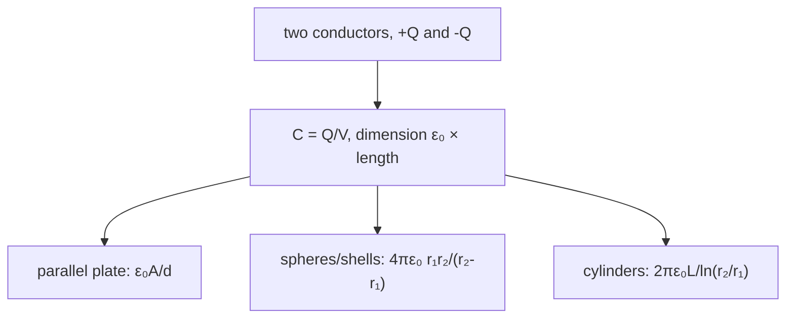

> *Read:* scale every charge by λ and Q/V never moves — the concept of capacitance is just the linearity of Coulomb's law.

This chapter has one job: turn "two conductors and a field" into a single number $C$. We do that by **construction** for six geometries, and after each one we run the limits that prove the answer could not be anything else.

### 2.1 What $C$ is, and the one reason it exists at all

> **Definition**
>
> Take two conductors (the **armatures**). Give them $+Q$ and $-Q$, with nothing else charged in the universe. Compute the potential difference $V=V_+-V_-$. Then
>
>  $$
> C\equiv\frac{Q}{V}\qquad[\,1\ \text{F}=1\ \text{C V}^{-1}=1\ \text{C}^2\text{J}^{-1}=1\ \text{A}^2\text{s}^4\text{kg}^{-1}\text{m}^{-2}\,] \tag{definition}
> $$

> **Why is $Q/V$ a constant? (the linearity argument)**
>
> Scale every charge by $\lambda$: $q_i\to\lambda q_i$. Since every potential is a sum $V_P=\sum_i kq_i/r_i$, every potential scales identically, so $Q/V\to\lambda Q/\lambda V=Q/V$. The ratio is **independent of how much charge you put on**. The concept of "capacitance" is nothing but the linearity of Coulomb's law. The moment a material's response stops being linear — ferroelectrics, air close to breakdown, a semiconductor depletion layer — $C$ ceases to be a constant and the honest language becomes $Q(V)$, with $C=dQ/dV$.
>
>  And why does $C$ depend only on geometry? Because there is no other quantity in the problem for it to depend on: $[C]=[\varepsilon_0]\times$length, and geometry supplies the only length. That is a dimensional argument, and it is why **every formula in this chapter is $\varepsilon_0$ times one length**.

#### An isolated conductor: "second plate at infinity"

For a single conductor we write $C=Q/V$ with $V$ measured against infinity. This is not a new definition: "a conductor and infinity" *is* a two-conductor capacitor — the far wall of the room, the ground, the sky. Two consequences people get wrong:

> **Bringing any conductor closer raises $C$**
>
> Hold $Q$ fixed on a sphere and bring an uncharged (or grounded) conductor near. Its induced *opposite* charge sits on the near side, so it subtracts from the sphere's potential. $V$ falls while $Q$ is unchanged ⇒ $C=Q/V$ rises. Never the other way: **a nearby conductor can only increase capacitance**. This single idea explains multi-plate capacitors, PCB trace capacitance, and why a touch sensor works.

> **"1 farad is enormous"**
>
> 1 F at 1 V is 1 C = $6\times10^{18}$ electrons. To make 1 F from an air-gap parallel-plate capacitor with $d=1$ mm you need $A=\varepsilon_0^{-1}\!\times10^{-3}\approx1.1\times10^{8}$ m² — a square 10 km on a side. Supercapacitors escape only with nanometre-scale double-layer gaps *and* enormous effective area (1000–3000 m² per gram of activated carbon). Keep this scale sense: it turns estimation questions into one line.

### 2.2 The parallel-plate capacitor, derived in four lines

Two identical conducting plates of area $A$, separated by $d$, with $d\ll\sqrt A$.


**Fig. 2.1 — Left:** the Gaussian box has $E=0$ on both its faces (they sit in metal) and encloses no charge — that is the proof that the facing surfaces carry $\pm\sigma$ and nothing else is needed. **Right:** the field profile. Only here — a truly uniform field — may you write $V=Ed$; it is the area under the graph.

$$
\begin{aligned} \text{facing surfaces:}&quad\sigma=\frac{Q}{A}\\ \text{superpose two sheets:}&quad E=\frac{\sigma}{2\varepsilon_0}+\frac{\sigma}{2\varepsilon_0}=\frac{\sigma}{\varepsilon_0}\\ \text{uniform field:}&quad V=Ed=\frac{Qd}{\varepsilon_0A}\\ \text{hence:}&quad C=\boxed{\;\dfrac{\varepsilon_0A}{d}\;} \end{aligned}
$$

> **Three points of reasoning hidden inside those four lines**
>
> 1. **Why is all the charge on the facing surfaces?** Put a Gaussian box with one face in each plate: zero flux
>   in, zero flux out ⇒ net enclosed charge zero ⇒ the facing surfaces carry $+\sigma,-\sigma$ and the outer face of
>   each plate carries nothing (fringing aside). Physically: opposite charges move together because that is what minimises
>   the field energy of the system.
> 2. **Why is the field exactly uniform?** Only because the field of a plane sheet is independent of distance. This
>   is the one geometry in electrostatics where a sum of $1/r^2$ laws produces a constant, and it is why the whole
>   chapter starts with plates.
> 3. **Does the ½ from ch. 1 disappear?** No. Outside the pair the two sheets' fields cancel; between them they add.
>   At the surface of plate 1 the total field is $\sigma/\varepsilon_0$, exactly the conductor-surface result of §1.3 —
>   its own half plus plate 2's half.

#### Reading the formula three ways

| Change | $C$ | $E$ at fixed $Q$ | $E$ at fixed $V$ | $U$ at fixed $Q$ |
| --- | --- | --- | --- | --- |
| $A\to2A$ | ×2 | ÷2 | unchanged | ÷2 |
| $d\to2d$ | ÷2 | unchanged | ÷2 | ×2 (work you did pulling apart) |
| both doubled | ×2 | ÷2 | unchanged | unchanged |
| metal slab of thickness $t$ inserted | gap shrinks effectively — see §2.6 |  |  |  |

**The physical reading:** a capacitor is a machine for confining electric field in a small volume. More area = more room for flux; smaller gap = less distance to pay in volts. Every commercial capacitor is an engineering trick to get huge $A$, tiny $d$ and large $K$ into a small box: foil rolled into a cylinder (film capacitors), sintered pellets with metallised layers (ceramic), an oxide film grown chemically (electrolytic, where $d\sim10$ nm gives farads from cm²).

### 2.3 Spherical capacitor — the case with no approximation at all

Inner sphere radius $a$ with $+Q$, concentric shell inner radius $b$ with $-Q$. Here $b-a$ need not be small: the geometry closes on itself, so there are no edges to fringe.

$$
\begin{aligned} E(r)&=\frac{Q}{4\pi\varepsilon_0r^{2}} && (a<r<b)\\ V&=\int_a^bE\,dr=\frac{Q}{4\pi\varepsilon_0}\left(\frac1a-\frac1b\right)\\ C&=\frac{Q}{V}=\boxed{\;4\pi\varepsilon_0\,\frac{ab}{b-a}\;} \end{aligned}
$$

> **Run the three limits — for every formula you ever derive**
>
> - $b\to\infty$: $C\to4\pi\varepsilon_0a$, the **isolated sphere**. "Capacitance of a sphere" is not a
>   separate fact; it is this formula with the second electrode at infinity. A 1 cm sphere: 1.1 pF.
> - $b=a+d$ with $d\ll a$: $ab/(b-a)=(a^2+ad)/d\approx a^2/d$ ⇒ $C\to\varepsilon_0A/d$ with
>   $A=4\pi a^2$ ✓. The first curvature correction is $(1+d/a)$: a spherical capacitor is slightly *better*
>   than the flat estimate at the same gap, because the outer electrode has more area to spread the same flux.
> - $a\to0$: $C\to4\pi\varepsilon_0a\to0$. A point electrode stores nothing — sharp tips are for making
>   $E$ large (emitters, spark gaps), never for making $C$ large.

Combine $Q=CV$ with the surface field $E_a=Q/4\pi\varepsilon_0a^2=(a/b\,)\cdot V/a\approx V/a$ (for $b\gg a$): for a fixed $V$, $Q\propto a$ but $E\propto V/a$. A bigger electrode stores more charge *and* has a lower peak field — both good. That single line is why HV terminals are spheres and tori, and why corona appears on wires.

### 2.4 Coaxial (cylindrical) capacitor

Inner wire radius $a$, outer cylindrical shell radius $b$, length $L$ with $L\gg b$ so the ends can be ignored. The cylindrical Gaussian surface is forced on you by symmetry:

$$
\begin{aligned} E_r\,(2\pi rL)&=\frac{\lambda L}{\varepsilon_0}\ \Rightarrow\ E_r=\frac{\lambda}{2\pi\varepsilon_0r}\\ V&=\int_a^bE_r\,dr=\frac{\lambda}{2\pi\varepsilon_0}\ln\frac ba\\ C&=\frac{Q}{V}\ \Rightarrow\ \boxed{\;\frac{C}{L}=\frac{2\pi\varepsilon_0}{\ln(b/a)}\;} \end{aligned}
$$


**Fig. 2.2 — Cylinder ⇒ $1/r$ ⇒ logarithm; sphere ⇒ $1/r^2$ ⇒ reciprocal.** That single correspondence generates the structure of every curved-geometry capacitance. Learn the pattern, not the formulas.

> **Four things to notice**
>
> 1. $C/L$ depends on $\ln(b/a)$, i.e. only on the **ratio** of radii. A coaxial line has the same
>   capacitance per metre at millimetre or metre scale provided $b/a$ is unchanged — the scale invariance of the 2-D
>   Laplace equation, and a very common "trick question" input.
> 2. Small gap: $b=a+d$, $\ln(1+d/a)\approx d/a$ ⇒ $C\to2\pi\varepsilon_0La/d=\varepsilon_0A/d$ with
>   $A=2\pi aL$ ✓.
> 3. $b/a\to1$ drives $C/L\to\infty$ — because the conductors are touching, i.e. a short. Always ask "what
>   physically stops the divergence?" Answer: breakdown and finite insulation resistance.
> 4. With a dielectric filling the annulus, $C/L=2\pi\varepsilon_0K/\ln(b/a)$. With a dielectric *layer* from
>   $a$ to $c$ and vacuum from $c$ to $b$, the two regions are in **series**:
>   $C/L=2\pi\varepsilon_0\left[\ln(c/a)/K+\ln(b/c)\right]^{-1}$ (Q9 of this chapter).

### 2.5 Two long parallel wires (the transmission-line result)

Wires of radius $a$, centre separation $d$, carrying $\pm\lambda$. Superpose two line charges: $\phi(P)=(\lambda/2\pi\varepsilon_0)\ln(r_-/r_+)$, where $r_\pm$ are the distances to the two lines. On the surface of wire 1, $r_+=a$ and $r_-\approx d$; on wire 2 the roles swap. Hence

$$
V=\frac{\lambda}{2\pi\varepsilon_0}\Big[\ln\frac da+\ln\frac da\Big]=\frac{\lambda}{\pi\varepsilon_0}\ln\frac da \qquad\Rightarrow\qquad \frac CL=\frac{\pi\varepsilon_0}{\ln(d/a)}
$$

The **exact** result (the same calculation done in bipolar coordinates, where the equipotentials of $\pm\lambda$ are exactly circular cylinders) is

$$
\frac{C}{L}=\frac{\pi\varepsilon_0}{\operatorname{arcosh}(d/2a)} \;\xrightarrow{\ d\gg a\ }\;\frac{\pi\varepsilon_0}{\ln(d/a)},\qquad \operatorname{arcosh}x=\ln\!\left(x+\sqrt{x^2-1}\right) \tag{exact}
$$

Check both limits: $d\to2a$ gives $\operatorname{arcosh}1=0$ ⇒ $C\to\infty$ (wires touching ⇒ short); $d\gg a$ recovers the approximate form since $\operatorname{arcosh}x\approx\ln2x$. With the separation $d$ at 10 cm and $a=0.5$ mm this is $\approx6$ pF m⁻¹ per metre — the origin of the "≈ 10 pF per metre of wire" rule of thumb.

#### Two spheres far apart — why the series rule feels inevitable

Put $+Q$ and $-Q$ on spheres of radii $a,b$ at centre separation $d\gg a,b$. Write each potential as its own term plus the neighbour's (charge treated at the centre, a good approximation when $d$ is large):

$$
V_1=k\!\left(\frac Qa-\frac Qd\right),\quad V_2=k\!\left(-\frac Qb+\frac Qd\right) \;\Rightarrow\; V_1-V_2=kQ\left(\frac1a+\frac1b-\frac 2d\right),\quad C=\frac{4\pi\varepsilon_0}{\frac1a+\frac1b-\frac 2d}
$$

As $d\to\infty$ this is exactly $\left(4\pi\varepsilon_0a\right)^{-1}+\left(4\pi\varepsilon_0b\right)^{-1}$ inverted: **two isolated-sphere capacitances in series**. The series rule is not a mnemonic — the flux has to cross one self-capacitance and then the other, so the "gaps" add. As the spheres approach, the $-2/d$ term makes $C$ grow: opposite charges attract their own flux closer.

### 2.6 A slab in the gap — the most imitated problem in the chapter

Parallel plates, gap $d$. Insert an **uncharged conducting slab** of thickness $t<d$, parallel to and not touching the plates. In the metal $E=0$, so the $E$–$x$ graph simply loses a strip of width $t$:

$$
V=\frac{\sigma}{\varepsilon_0}(d-t)\qquad\Longrightarrow\qquad C=\frac{\varepsilon_0A}{d-t} \tag{metal slab}
$$

Note what does *not* matter: where the slab sits, and its shape — only the total vacuum distance over which the field is non-zero. Replace the metal by a **dielectric** of constant $K$ and the same thickness:

$$
C=\frac{\varepsilon_0A}{\,d-t+t/K\,}\qquad\big(K\to\infty\ \text{returns the metal}\ \checkmark\big) \tag{dielectric slab}
$$

> **Similar formulas, different physics**
>
> Metal: free charge floods the slab's surfaces until $E=0$ *exactly*, deleting the thickness $t$ from the problem. Dielectric: bound charge shifts by a fraction of an atomic radius and reduces the field to $1/K$ of its value, never to zero — so the slab counts as only $t/K$ of vacuum. The quantity $d_{\text{eff}}=d-t+t/K$ is the whole story, and if you can explain it to someone else you already understand chapter 5. Two consequences worth stating: (i) the field in the dielectric is $E=V/d_{\text{eff}}K$, smaller than in the gap; (ii) as $K\to1$ you must recover the empty capacitor — check it, that is the limit that catches sign errors.

### **Q1** Two identical large conducting plates, area $A$ each, gap $d$, carry charges $Q_1=+2Q$ and $Q_2=+Q$. Find the charge on each of the four surfaces and the potential difference. _(base → JEE-adv)_

Solution

Label the faces 1,2 (plate 1, outer then inner) and 3,4 (plate 2, inner then outer). Each face is a sheet of density $\sigma_i$, and inside *each* conductor the total field must vanish. Solving the two resulting equations with $\sigma_1+\sigma_2=Q_1/A$, $\sigma_3+\sigma_4=Q_2/A$ gives the general pair of rules:

$$
\sigma_2=-\sigma_3=\frac{Q_1-Q_2}{2A},\qquad \sigma_1=\sigma_4=\frac{Q_1+Q_2}{2A}
$$

**The two facing surfaces always carry equal and opposite charge**, whatever $Q_1,Q_2$ are; the surplus goes to the outer faces, where it charges the pair against infinity. Here $\sigma_2=+Q/2A$, $\sigma_3=-Q/2A$, $\sigma_1=\sigma_4=3Q/2A$.

Field in the gap: $E=(Q_1-Q_2)/2\varepsilon_0A=Q/2\varepsilon_0A$, so $V=Qd/2\varepsilon_0A$. If you define "the charge of the capacitor" as the facing charge $Q_{\text{cap}}=(Q_1-Q_2)/2=Q/2$, then $V=Q_{\text{cap}}d/\varepsilon_0A$ and $C=\varepsilon_0A/d$ as usual — the $\tfrac12$s cancel, which is why the shortcut "capacitor charge = (difference)/2" is safe.

**Wrong routes:** "each plate's charge spreads evenly over its two faces" (true only when $Q_1=-Q_2$ — the symmetric special case!); or "the field in the gap is due to the nearer plate only". Note too that with $Q_1=Q_2=+Q$ the rule gives $\sigma_2=\sigma_3=0$: **no field in the gap at all**, and the pair is just a charged conductor of capacitance $2\varepsilon_0A/D$ to its surroundings.

### **Q2** Plates of unequal area $A_1<A_2$, facing and parallel, gap $d\ll\sqrt{A_1}$. Which area appears in $C=\varepsilon_0A/d$? _(base · trap)_

Solution

$A_1$ — the overlapping (smaller) area.

Every field line leaving plate 2 must end on plate 1: in the ideal geometry there is nowhere else for the flux to go. So the facing surfaces of the overlap carry $\pm\sigma$ with $\sigma=Q/A_1$, the surplus area of the larger plate carries essentially nothing between the plates (it moves to its outer face, producing only external fringing), and $V=\sigma d/\varepsilon_0\Rightarrow C=\varepsilon_0A_1/d$.

**Wrong route:** averaging areas, or "using $A_2$ because both plates matter". The governing principle is that **capacitance is set by the narrowest choke the flux must pass through**. Same principle behind the multi-plate question (Q6) and behind why a small misalignment on a variable capacitor is linear in angle until the overlap vanishes.

### 2.7 Layers in the gap: series and parallel from one rule

**Layers stacked across the field** (interfaces perpendicular to $\vec E$) are in **series**. No free charge sits at an interface, so the normal component of $\vec D$ is continuous: all layers see the same $D=\sigma$ but different fields $E_i=\sigma/\varepsilon_0K_i$, and the voltages add:

$$
\frac1C=\sum_i\frac{d_i}{\varepsilon_0K_iA}\qquad\Longleftrightarrow\qquad V=\frac{\sigma}{\varepsilon_0}\sum_i\frac{d_i}{K_i} \tag{series layers}
$$

**Layers side by side** (interfaces parallel to $\vec E$) are in **parallel**: the same $V$ appears across each, $E$ is common, and the areas add: $C=\varepsilon_0E^{-1}\!\sum\sigma_iA_i$, i.e. $C=\sum_iK_i\varepsilon_0A_i/d$.

$$
\text{two layers } (K_1,t_1),(K_2,t_2):\quad C=\frac{\varepsilon_0A}{\dfrac{t_1}{K_1}+\dfrac{t_2}{K_2}},\qquad E_1=\frac{VK_2}{t_1K_2+t_2K_1},\quad E_2=\frac{VK_1}{t_1K_2+t_2K_1}
$$

> **"Same $E$" or "same $D$" — decide, do not guess**
>
> The rule to memorise is not "slabs are in series" but **which component is continuous**: $E_\parallel$ continuous across an interface ⇒ regions at equal $V$ ⇒ parallel; $D_\perp$ continuous ⇒ regions carrying equal $Q$ ⇒ series. Note the fields above: the *lower*-$K$ layer gets the *larger* field, so a void or air bubble inside a solid insulator takes a disproportionate share of the voltage — that is exactly how partial-discharge ageing kills real capacitors, and a favourite "applied-physics" line in an INPhO answer.

### **Q3** Plates carry free charge densities $\pm\sigma$. The gap is half-filled (by thickness) with a dielectric $K$, the other half is vacuum, the interface being *parallel* to the plates (side-by-side regions of area $A/2$ each). Find $C$, $E$ in each part, and the bound charge on the vertical interface. _(JEE-adv)_

Solution

Areas side-by-side ⇒ same $V$, same $E$ (the plates are still equipotentials and the gap is the same):

$$
E=\frac{V}{d},\qquad C=\frac{\varepsilon_0(A/2)}{d}\,(1+K)=\frac{\varepsilon_0A}{2d}(1+K)
$$

Arithmetic mean of the two $K$'s, as §2.7 predicts. But the free charge is *not* uniform: $\sigma_{\text{left}}=\varepsilon_0E$, $\sigma_{\text{right}}=K\varepsilon_0E$ — the dielectric side draws $K$ times more free charge (why: for the same $V$, more flux is welcome there).

On the vertical interface between the two materials, $\vec P$ differs: $P=\varepsilon_0(K-1)E$ on one side, $0$ on the other, so a bound surface charge $\sigma_b=\vec P\cdot\hat n=\pm\varepsilon_0(K-1)V/d$ appears on that interface. It is *not* neutral: a dielectric inhomogeneity is a real charge distribution, which is why "incomplete impregnation" of a paper capacitor produces internal fields that no simple $K$-averaging predicts.

**Wrong route:** writing $C=\varepsilon_0A(1+K)/2d$ but then "the field is $\sigma/\varepsilon_0K$" using the *average* $\sigma$. In a parallel split you must use each region's own $\sigma_i$.

### **Q4** A metal sphere of radius $a$ is coated with a concentric dielectric shell of constant $K$ out to radius $b$, and is otherwise alone in vacuum. Find its capacitance. Then state what happens as $K\to\infty$ and as $b\to\infty$. _(JEE-adv → Olympiad)_

Solution

1. $D_r=Q/4\pi r^2$ everywhere outside the sphere (Gauss, spherical symmetry, free charge $Q$), so
  $E_r=Q/4\pi\varepsilon_0r^2$ for $r>b$ and $E_r=Q/4\pi\varepsilon_0Kr^2$ for $a<r<b$.
2. Integrate $V=-\int_\infty^aE\,dr$ in two pieces:
  $$
  V=\frac{Q}{4\pi\varepsilon_0}\left[\frac1b+\frac1K\left(\frac1a-\frac1b\right)\right] \quad\Rightarrow\quad C=4\pi\varepsilon_0\left[\frac1b+\frac{b-a}{Kab}\right]^{-1}=4\pi\varepsilon_0\frac{Kab}{(K-1)b+a}\;
  $$
3. **Limits.**$K=1$: $C=4\pi\varepsilon_0a$ ✓ (bare sphere). $b\to\infty$:
  $C\to4\pi\varepsilon_0Ka$ — an infinite dielectric multiplies the capacitance by $K$ exactly, which is the
  cleanest possible definition of what $K$ means. $K\to\infty$:
  $C\to4\pi\varepsilon_0b$ — the coat behaves like metal, i.e. like a bigger electrode. $b\to a$: both limits
  return to the bare sphere ✓, and the fact that all four checks pass is what makes the single bracket worth trusting.

**Physical content:** a dielectric coat buys capacitance only to the extent that it occupies space where the field is *strong*. Since $E\propto1/r^2$, the region near $a$ matters most — the $1/b$ term shows that a coat far from the sphere does almost nothing. The same reasoning tells you why high-$K$ ceramic is packed at the inner electrode of HV cable insulation, not the outside.

### **Q5** Two spheres of radii $a$ and $b$ are joined by a long thin wire and carry total charge $Q$. Find the charges and the ratio of surface fields. When is the answer valid? _(JEE-adv)_

Solution

Connected ⇒ equal potential. Treating each as isolated (valid when separation $L\gg\max(a,b)$): $kq_a/a=kq_b/b$ ⇒ $q_a/q_b=a/b$, so $q_a=Qa/(a+b)$, $q_b=Qb/(a+b)$.

Surface fields $E=kq/a^2$ ⇒ $$ \frac{E_a}{E_b}=\frac{q_a}{q_b}\cdot\frac{b^2}{a^2}=\frac{a}{b}\cdot\frac{b^2}{a^2}=\boxed{\frac ba} $$ **The smaller sphere has the larger field** — with the labels as given, the ratio is $b/a$ and not $a/b$. Writing the reciprocal is a classic lost mark, so always re-derive it in one line rather than recalling it.

Reformulated in the way questions prefer: $E\propto1/R_{\text{local}}$ at fixed potential. On a real irregular conductor, curvature varies over the surface, so $\sigma\propto1/R_{\text{local}}$ — charge concentrates at points. That is the "power of points": a sharp tip at 1 kV can exceed air's breakdown field and emit a corona, while a smooth sphere at the same potential does nothing.

**Where it fails:** if the spheres are close, they polarise each other and charge migrates to the far sides; the small one then takes even more than the ratio above (higher field than predicted). For spheres of equal radius *touching*, the exact result needs the image-charge series of §7.2: $C_{\text{pair}}=8\pi\varepsilon_0R\ln 2\approx1.386\times4\pi\varepsilon_0R$, versus $2\times4\pi\varepsilon_0R$ for the two disconnected spheres in parallel — the charge is pushed outward by mutual repulsion, so $C$ drops. Useful direction to remember: **like-potential neighbours lower $C$; opposite-potential (or earthed) neighbours raise it.**

### 2.8 Finite plates and fringing — what "neglecting the edges" costs

$C=\varepsilon_0A/d$ is a leading-order result in $d/\sqrt A$. The corrections, in the form you can argue without a calculation:

| Effect | Size | Direction and reason |
| --- | --- | --- |
| Fringing field outside the overlap | \Delta C\sim\varepsilon_0\,p\,d\,\ln(a/d)/d\;\;=\;\varepsilon_0\,p\ln(a/d) | $C$ is **larger** than $\varepsilon_0A/d$. Extra field lines outside store extra energy at the same $V$, and $C=2U/V^2$. Relative error $\sim(d/a)\ln(a/d)$ for square plates of side $a$. |
| Tilt: gap varies from $d_1$ to $d_2$ | $C=\varepsilon_0A\langle1/d\rangle$ | Use the harmonic-type average $\frac1{d_2-d_1}\ln(d_2/d_1)$, *not* $1/\bar d$. Because $1/d$ is convex, a tilted capacitor beats the flat-plate estimate at the same mean gap. |
| Surface roughness when $d\sim$ µm | local $d\to d-\delta$ | Raises $C$ slightly but raises the local field a lot ⇒ early breakdown. In MEMS this is the dominant failure mode. |

For the tilted case, do it yourself in three lines: $dQ=\varepsilon_0V\,w\,dx/d(x)$ over strips ⇒ $C=\varepsilon_0w\int_0^{\ell}dx/d(x)=\varepsilon_0A\,\frac{\ln(d_2/d_1)}{d_2-d_1}$. It is the same integral trick that gives the wedge capacitor of §7.3, so bank it now.

> **Two engineering facts that come from this section**
>
> - **A guard ring makes the flat formula exact.** Surround the plate with a thin co-planar ring at the same
>   potential; the ring absorbs the fringe field, so the inner region is a pure 1-D problem. Precision capacitance
>   standards are built exactly this way (a Thomson/Cahill "standard capacitor"), and the same idea makes an MEMS
>   pressure sensor linear.
> - **Fringing is useful.** Interdigital (comb) electrodes on a chip have no overlapping plates at all —
>   $C$ is *entirely* fringe capacitance, and that is how gas sensors and touch screens are made. If you can
>   compute $C$ only for overlapping plates you have not understood the definition, only memorised a special case.

### **Q6** An interleaved capacitor has $n$ identical plates of area $A$; alternate plates are tied together; consecutive plates are $d$ apart. Find $C$. Why not simply use one enormous pair of plates? _(JEE-adv · design)_

Solution

There are $n-1$ gaps, each with the same voltage $V/(n-1)$ across it and the same facing area $A$, so they are in **parallel**:

$$
C=(n-1)\frac{\varepsilon_0A}{d}
$$

Check $n=2$ ✓. Contrapositive worth storing: if instead you stack *dielectric layers inside one gap*, they are in **series** and the capacitance *falls*. "More plates" ≠ "more layers"; confusing them is the trap in this question.

**Why interleaving wins:** for a fixed volume you want many close-spaced electrodes. A single pair scaled up to area $A$ grows in *two* directions, so the volume goes as $A^{3/2}/d$; a stack (or a rolled foil strip) grows the area linearly with one dimension, so for the same volume the interleaved structure buys $(n-1)A\propto n$ of effective area. Rolling the strip turns plate rigidity into the only remaining limit — and that is what a real capacitor looks like inside.

### **Q7** The gap of a parallel-plate capacitor is filled with a material whose permittivity varies linearly across the gap from $K_1$ to $K_2$. Find $C$, and the voltage if the isolated capacitor originally had $V_0$ with vacuum. _(Olympiad · one integral)_

Solution

Inhomogeneous layers are in series ⇒ integrate $1/C$, with $K(x)=K_1+(K_2-K_1)x/d$:

$$
\frac1C=\frac1{\varepsilon_0A}\int_0^d\frac{dx}{K(x)}=\frac{d}{\varepsilon_0A}\cdot\frac{\ln(K_2/K_1)}{K_2-K_1} \quad\Rightarrow\quad C=\varepsilon_0A\,\frac{K_2-K_1}{d\,\ln(K_2/K_1)}
$$

The isolated capacitor keeps its charge, so $V_f=Q/C$ with $Q=(\varepsilon_0A/d)V_0$:

$$
V_f=V_0\,\frac{\ln(K_2/K_1)}{K_2-K_1},\qquad K_{\text{eff}}=\frac{C}{C_{\text{vac}}}\,\cdot 1=\frac{K_2-K_1}{\ln(K_2/K_1)}
$$

The effective constant is the **logarithmic mean** $K_{\text{eff}}=(K_2-K_1)/\ln(K_2/K_1)$ — the same averaging that produced the $\ln$ in the coaxial formula, because both problems are "1-D flux through layers in series". Check $K_2\to K_1\equiv K$: writing $K_2=K(1+\eta)$, $\ln(1+\eta)/[K\eta]\to1/K$ ⇒ $K_{\text{eff}}\to K$ ✓ (use $\ln(1+\eta)\approx\eta$). A log-mean formula that failed this limit would be a sign error.

**General principle:** the correct average of $K$ is fixed by the field geometry, not by taste — harmonic (or log) mean for series layers, arithmetic mean for parallel regions. "What if $K$ varies" questions test whether you know which average, not how well you integrate.

### **Q8** A coaxial cable has dielectric $K$ from $a$ to $2a$ and vacuum from $2a$ to $3a$. Find $C/L$, and the $K_{\text{eq}}$ of a single homogeneous dielectric giving the same $C/L$. _(JEE-adv)_

Solution

$$
\frac{L}{C}=\frac{\ln 2}{2\pi\varepsilon_0K}+\frac{\ln(3/2)}{2\pi\varepsilon_0} \quad\Rightarrow\quad \frac CL=\frac{2\pi\varepsilon_0}{\dfrac{\ln2}{K}+\ln1.5}
$$

Matching $C/L=2\pi\varepsilon_0K_{\text{eq}}/\ln 3$:

$$
K_{\text{eq}}=\frac{\ln3}{\dfrac{\ln2}{K}+\ln1.5}
$$

Limits: $K=1\Rightarrow K_{\text{eq}}=1$ ✓; $K\to\infty\Rightarrow K_{\text{eq}}=\ln3/\ln1.5\approx2.71$ — which is just "vacuum dielectric between $2a$ and $3a$ with the inner region acting like metal". Both checks pass, so the logs are in the right places; that is the only thing that can go wrong here.

### **Q9** Two large plates carry $+Q$ and $-2Q$. A student computes the gap voltage as $V=Qd/\varepsilon_0A$ "because the charge on the capacitor is $Q$". Find the error and the right answer. Then do it for two *insulating* sheets with densities $+\sigma$, $-2\sigma$. _(base · bookkeeping)_

Solution

**Conducting plates.** From Q1's rule, the facing surfaces carry $\pm(Q_1-Q_2)/2A=\pm3Q/2A$, not $\pm Q/A$. Hence $E_{\text{gap}}=3Q/2\varepsilon_0A$ and $V=3Qd/2\varepsilon_0A$. The student's error is assuming that the "capacitor charge" is $Q$; it is $(Q_1-Q_2)/2=3Q/2$.

**Insulating sheets.** The charge cannot move, so each sheet keeps its density and contributes $\sigma/2\varepsilon_0$ on either side (rightward positive, gap between them):

$$
E_{\text{left}}=+\frac{\sigma}{2\varepsilon_0},\qquad E_{\text{gap}}=\frac{\sigma+2\sigma}{2\varepsilon_0}=\frac{3\sigma}{2\varepsilon_0},\qquad E_{\text{right}}=-\frac{\sigma}{2\varepsilon_0}
$$

Same gap field as the conductor case! For infinite sheets the field anywhere depends only on the charge to each side, so redistribution is invisible outside the conductors — it changes only the *inner* structure (and the fact that in a conductor $E=0$, whereas an insulating sheet has no interior to protect). For **finite** plates the two cases do give measurably different answers, because redistribution changes the fringe field. Knowing *which* of these two is a good sign you understand the difference between a theorem and a coincidence.

### **Q10** Estimate the capacitance of (a) 1 m of thin wire, (b) a 1 F supercapacitor's electrode, (c) the Earth, and (d) say what limits each. _(Olympiad · estimation)_

Solution

**(a)** A single wire of radius $a=0.5$ mm at height $h=1$ m above ground: $C/L=2\pi\varepsilon_0\big/\!\ln(2h/a)$, and $\ln(2\times10^{3})\approx7.6$ so $C\approx5.6\times10^{-11}/7.6\approx7$ pF for the whole metre — the "≈10 pF per metre" rule. A metre-long object is *always* a few picofarads, whatever its thickness, because $\ln(2h/a)$ only wanders between 5 and 15 as $a$ spans nine decades. That insensitivity is the real content of the estimate.

**(b)** Electric double layer: $d\approx1$ nm, $K_{\text{eff}}\sim30$ for the oriented water/ion layer, so $C/A\approx\varepsilon_0K/d\approx0.27$ F m⁻². A 1 F cell therefore needs $\sim4$ m² of wetted surface — available from a few grams of activated carbon. Limit: the $\sim2.7$ V decomposition voltage of the electrolyte per cell (hence 6-cell modules for 16 V), and the series resistance of the pores.

**(c)** Earth alone: $C=4\pi\varepsilon_0R_E\approx(1.11\times10^{-10})(6.4\times10^{6})\approx0.7$ mF. With the ionosphere at $h\approx50$ km as the second electrode, use the flat-gap form since $h\ll R_E$: $C=\varepsilon_0(4\pi R_E^2)/h\approx8.85\times10^{-12}\times5.1\times10^{14}/5\times10^{4}\approx0.09$ F. The fair-weather potential of the ionosphere is $\sim3\times10^{5}$ V, so the whole globe stores $U=\tfrac12CV^2\approx4\times10^{9}$ J and carries $Q=CV\sim3\times10^{4}$ C. The sustained current is about $10^{3}$ A (from $\sim2$ pA m⁻² over the globe), i.e. **every thunderstorm and shower thunderstorm together recharge it** — a single large flash moves $\sim20$ C, only 0.1% of $Q$. That is the estimate worth being able to produce.

**(d) What limits each.** (a) leakage along the insulation, not geometry — which is why "capacitance of a cable" and "insulation resistance of a cable" are quoted together; (b) the electrochemical decomposition voltage of the electrolyte (≈ 2.7 V per cell) and the pore resistance, *not* the dielectric strength; (c) the conductivity of air, itself set by cosmic-ray ionisation — which is why the global circuit is a genuinely atmosphere-physics problem rather than a capacitor problem. Naming the limit is worth as many marks as the number.

### 2.9 The geometries on one page

| Geometry | Capacitance | Validity | Limit to check |
| --- | --- | --- | --- |
| Parallel plate | C=\varepsilon_0 A/d | $d\ll\sqrt A$, no slab | $d\to0$: $C\to\infty$ |
| Plates + metal slab $t$ | C=\varepsilon_0A/(d-t) | slab parallel, not touching | $t\to d$: short |
| Plates + dielectric slab $t,K$ | C=\varepsilon_0A/(d-t+t/K) | linear dielectric | $K\to\infty$: metal |
| Series layers | C=\varepsilon_0A\big/\!\sum d_i/K_i | layers normal to $\vec E$ | all $K_i=1$: plate |
| Side-by-side regions | C=\varepsilon_0\sum K_iA_i/d | interfaces parallel to $\vec E$ | equal $K$: plate |
| Isolated sphere | C=4\pi\varepsilon_0R | exact; nothing nearby | 1 cm ⇒ 1.1 pF |
| Sphere + coat $K,(a\to b)$ | C=4\pi\varepsilon_0Kab\big/(a+(K-1)b) | exact | $K\to\infty$: $4\pi\varepsilon_0b$ |
| Spherical | C=4\pi\varepsilon_0ab/(b-a) | exact | $b\to\infty$: isolated |
| Coaxial line | C/L=2\pi\varepsilon_0/\ln(b/a) | $L\gg b$ | $b=a+d$: plate |
| Two long wires | C/L=\pi\varepsilon_0/\operatorname{arcosh}(d/2a) | exact for long wires | $d\gg a$: $\pi\varepsilon_0/\ln(d/a)$ |
| Two far spheres | C=4\pi\varepsilon_0\big(1/a+1/b-2/d\big)^{-1} | $d\gg a,b$ | $d\to\infty$: series of $4\pi\varepsilon_0a,\,4\pi\varepsilon_0b$ |
| Tilted plates | C=\varepsilon_0A\ln(d_2/d_1)/(d_2-d_1) | linear wedge, small angle | $d_2\to d_1$: plate |

> **The meta-pattern**
>
> Every entry above is $\varepsilon_0\times$(one length) — necessarily, since $[C]=[\varepsilon_0][\text{length}]$. So a capacitance can contain **no dimensionless surprise except a ratio**: $A/d$, $ab/(b-a)$, $1/\ln(b/a)$. When you meet an unknown geometry in an Olympiad paper you therefore know the answer's shape before you start: find $\vec E$ by symmetry (Gauss), integrate for $V$, divide, and let the dimensionless function be dictated by the algebra. **Dimension first, symmetry second, integration last.**

> **One more trap I have to warn you about, because it is in some books**
>
> You will find "capacitance of a hemisphere of radius $R$ on a grounded plane $=2\pi\varepsilon_0R$" in circulation. Careful: a body in contact with an *infinite* grounded plane is not a two-conductor capacitor at all — the plane and the body form one conductor of infinite extent, and the capacitance per unit $V$ of a body approaching a plane diverges logarithmically as the gap closes (for a sphere of radius $R$ at surface separation $s$, $C\propto\varepsilon_0R\ln(R/s)\to\infty$). A finite, exact and often-quoted cousin is the **isolated thin disc**, $C=8\varepsilon_0R$ (§7.2, by oblate-spheroid coordinates), and the isolated hemisphere lies between the disc's value and the sphere's — as it must, since it *contains* the disc. Use the containment argument whenever a "clean" number looks too small: $2\pi\varepsilon_0R\approx6.3\varepsilon_0R<8\varepsilon_0R$ is impossible for a body bigger than a disc. That twenty-second check is a genuine olympiad skill.

### 2.10 Checkpoint

- Prove from linearity that $C$ is independent of $Q$, and name two systems where $C$ genuinely depends on $V$.
- Derive all the table entries above from $E\to V\to C$ without looking, and check each with its named limit.
- State the facing-surface rule $\sigma_{\text{face}}=(Q_1-Q_2)/2A$ and use it for two plates with arbitrary charges.
- Say, without computing, whether a given slab arrangement is series or parallel — and give the continuity argument.
- Explain why the $K$-weighted average is a log mean for series layers but arithmetic for side-by-side regions.
- Give the maximum-energy argument: why $U_{\max}\propto$ volume $\times E_{\text{break}}^2$ rather than $\propto C$.

Next: [**Chapter 3 · Energy, force and pressure →**](#section-03-energy-and-force) — where the $\tfrac12$ comes from, why exactly half the battery's work is lost while charging, and how one derivative gives every force in this chapter.

_Chapter 3 of 11 · JEE Advanced core · energy methods · ≈ 80 min · 10 questions_

## Energy, force and pressure

This is the chapter's engine room. Two results — the $\tfrac12$ in the stored energy, and the rule for *which quantity to differentiate under which constraint* — replace every hard force problem in the syllabus with one line of algebra.

### 3.1 Where the $\tfrac12$ comes from

You charge a capacitor by pushing each bit of charge across the potential difference that already exists. With $q$ already on it, the next $dq$ costs

$$
dW=V\,dq=\frac{q}{C}\,dq\qquad\Longrightarrow\qquad W=\int_0^Q\frac{q}{C}\,dq=\frac{Q^2}{2C}
$$

Three algebraically identical faces of one number — and choosing the right face is a genuine skill:

$$
U=\frac{Q^2}{2C}=\frac12CV^2=\frac12QV \tag{the three forms}
$$

**Which face, when.** $\tfrac12Q^2/C$ when $Q$ is known or frozen (no battery). $\tfrac12CV^2$ when $V$ is known or held. $\tfrac12QV$ when *neither* is fixed but you know both at that instant — it is the only one that never lies, because it needs no assumption about what is held constant.

**Fig. 3.1 — One picture, three facts.** The stored energy is the triangle; a cell at fixed $V_0$ delivers the rectangle; the leftover triangle is dissipated. A bigger capacitor is a *flatter* line — which is exactly why it stores more at the same $V$.

> **Two definitions more useful than the textbook one**
>
> $$
> C=\frac{2U}{V^2}
> $$
>
>  **(i)** This energetic definition survives every case where "charge on the plates" is ambiguous: an isolated conductor, two plates of unequal area, a fringing-field structure, a nonlinear dielectric. It is also the definition that makes §2.8's fringing correction a one-liner (extra field energy at the same $V$ ⇒ extra $C$).
>
>  **(ii)** The factor $\tfrac12$ is not a convention like $4\pi$ in SI versus Gaussian units — it is the slope of a linear force–extension law, exactly as in a spring. So: "energy *stored*" carries the ½; "energy *delivered by the source*" does not. Half the mistakes in this chapter are those two sentences being read carelessly.

### 3.2 The energy is in the field — proved, not asserted

Rewrite the parallel-plate energy as (density) × (volume):

$$
U=\frac12CV^2=\frac12\frac{\varepsilon_0A}{d}(Ed)^2=\left(\frac12\varepsilon_0E^2\right)\times(Ad) \qquad\Longrightarrow\qquad \boxed{u=\frac12\varepsilon_0E^2}
$$

> **Is that a derivation or a coincidence?**
>
> It generalises. Build any charge distribution "slowly", scaling all densities by a common factor $\lambda:0\to1$, so that $V(\lambda)=\lambda V_1$. Bringing $\rho_1d\tau\,d\lambda$ of charge up to potential $\lambda V_1$ costs $\lambda V_1\rho_1d\tau\,d\lambda$, hence
>
>  $$
> U=\int_0^1\!\!\int\lambda V_1\rho_1\,d\tau\,d\lambda=\frac12\int\rho V\,d\tau
> $$
>
>  Now substitute $\rho=\varepsilon_0\vec\nabla\cdot\vec E$ and integrate by parts, using $\vec E=-\vec\nabla V$:
>
>  $$
> \frac{\varepsilon_0}{2}\int(\vec\nabla\cdot\vec E)V\,d\tau=\frac{\varepsilon_0}{2}\left[-\oint V\vec E\cdot d\vec A+\int E^2\,d\tau\right]=\frac{\varepsilon_0}{2}\int E^2d\tau
> $$
>
>  for localised charge (the surface term dies as $1/R$·$1/R^2$·$R^2$). So $u=\tfrac12\varepsilon_0E^2$ is the general statement and the parallel plate is merely where it is easy to see. In a **linear** dielectric the same steps give $u=\tfrac12\vec D\cdot\vec E=\tfrac12\varepsilon E^2$; for a nonlinear medium you must use $u=\int\vec E\cdot d\vec D$ and the ½ disappears.

#### A consistency check that catches algebra errors instantly

Energy of the spherical capacitor, computed from the field alone:

$$
U=\frac{\varepsilon_0}{2}\int_a^b\left(\frac{Q}{4\pi\varepsilon_0r^2}\right)^24\pi r^2dr=\frac{Q^2}{8\pi\varepsilon_0}\int_a^b\frac{dr}{r^2}=\frac{Q^2}{8\pi\varepsilon_0}\left(\frac1a-\frac1b\right)=\frac{Q^2}{2C}\;\checkmark
$$

Two lessons from how neatly it lands. (1) The $4\pi r^2$ from the volume element cancels the geometry in $E$, so **every symmetric geometry agrees automatically** — a free check on all of chapter 2. (2) The integrand behaves as $r^{-4}\times r^2=r^{-2}$, whose integral diverges at the origin: a point charge has **infinite self-energy**. That one line is the entire classical-electron crisis (§3.9, Q7).

### 3.3 Force between the plates: two methods, one answer

> **Method 1 — field × charge (with the care it needs)**
>
> Plate 2 sits in the field *of plate 1 only*, which is $\sigma/2\varepsilon_0$. You must never use the total field $\sigma/\varepsilon_0$: a charge cannot push itself.
>
>  $$
> F=Q\cdot\frac{\sigma}{2\varepsilon_0}=\frac{Q^2}{2\varepsilon_0A}=\frac12\varepsilon_0E^2A=\frac{\varepsilon_0AV^2}{2d^2}
> $$
>
>  **The factor ½ is the entire question.** Writing $F=QE_{\text{total}}$ is twice too large and is the most common error in the chapter.

> **Method 2 — virtual work**
>
> Let $x$ be the separation; pull quasi-statically with no battery connected, so your work equals the increase of field energy:
>
>  $$
> F_x=-\left(\frac{\partial U}{\partial x}\right)_{Q},\qquad U=\frac{Q^2x}{2\varepsilon_0A}
> $$
>
>  giving $F_x=-Q^2/2\varepsilon_0A$: an attraction of Method 1's magnitude ✓. The agreement is not luck — Method 1 is the local form of Method 2 (that is what "stress tensor" means).

### 3.4 The master rule: fixed $Q$ versus fixed $V$

> [!tip] FIGURE F7.3 · The master rule: which is fixed, Q or V?
> *Why:* the answer changes the force, the energy change and the sign in one stroke; misassigning fixed-Q/fixed-V is the chapter's most expensive slip.
> *Data:* isolated: δW_mech = −d(Q²/2C); held on a cell: δW_mech = +½V² dC (the battery pays the other half); stable = lowers the appropriate potential.

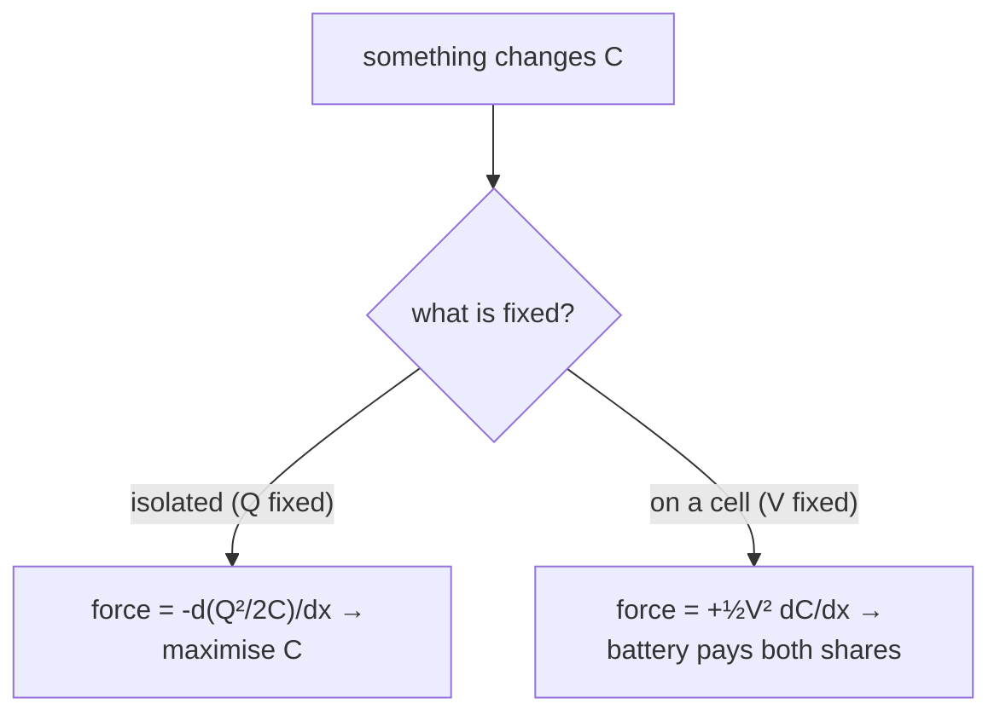

> *Read:* a dielectric is sucked in, plates pull together and a movable plate snaps at pull-in — all one rule with two branches.

Let some coordinate $\xi$ (slab position, gap, overlap area) change the capacitance by $dC$. The mechanical work delivered to whatever moves is

$$
\delta W_{\text{mech}}=\begin{cases}-dU\big|_{Q}=-\dfrac{Q^2}{2}\,d\!\left(\dfrac1C\right), & \text{isolated}\\[10pt] +dU\big|_{V}=+\dfrac12V^2\,dC, & \text{held on a cell}\end{cases} \tag{master rule}
$$

> **Why the sign flips — derive it, do not memorise it**
>
> **Isolated.** Nothing else can supply energy, so any mechanical work comes out of $U$. The system moves to *minimise* $U=Q^2/2C$, i.e. to **maximise $C$**: plates pull together, dielectrics are sucked in ✓.
>
>  **On a cell.** As $C$ grows by $dC$ at fixed $V$, the battery moves charge $dQ=VdC$ and does $dW_b=V^2dC$, while the field gains $dU=\tfrac12V^2dC$. Conservation:
>
>  $$
> \delta W_{\text{mech}}=dW_b-dU=\tfrac12V^2dC=dU\Big|_V
> $$
>
>  **The battery pays for the stored energy *and* the mechanical work, in equal shares.** This single line is also the reason exactly half the cell's work is lost in charging (Q3), and the reason a dielectric is pulled in with the same force but a different energy budget.

> **The subtlety that is usually skipped, and then missed**
>
> The **force at a given instant does not care which constraint applies**. Substitute $V=Q/C$ into the fixed-$Q$ expression and you recover $F_\xi=\tfrac12V^2\,\partial C/\partial\xi$ identically. What the constraint changes is **how the state evolves while the body moves**: on a cell, $V$ is held and $Q$ grows, so the force stays constant; isolated, $Q$ is held and $V$ rises as $C$ grows, so the force falls.
>
>  Therefore, to a question like "is the force twice as large with the battery connected?": **no** — the *energy change* for the same displacement is what differs by a factor (and its sign). That is the exact sentence such questions are built to test.

### **Q1** Plates (area $A$, gap $d$) are held at $V$ by a cell. (a) Find the force. (b) The cell is disconnected and the plates are pulled to $2d$: find $E$, $V$, $U$, the force there, and the work you did. _(JEE-adv · the archetype)_

Solution

**(a)** $C=\varepsilon_0A/d$, and at fixed $V$ the force conjugate to the separation is

$$
F_d=\frac12V^2\frac{dC}{dd}=-\frac{\varepsilon_0AV^2}{2d^2}\qquad(\text{negative}=\text{attraction})
$$

**(b)** After disconnection $Q=C V=\varepsilon_0AV/d$ is frozen. Now use the fastest correct route: $E=\sigma/\varepsilon_0=Q/\varepsilon_0A$ contains **no distance at all**, so

$$
E'=E=\frac{V}{d},\qquad V'=E'(2d)=2V,\qquad U'=\frac12QV'=2U,\qquad C'=\frac{C}{2}
$$

The force: $F'=\tfrac12Q E'=\tfrac12Q E=F$ — **constant, independent of the gap**, which is why the work is simply force × distance: $W=F\cdot d=\dfrac{\varepsilon_0AV^2}{2d}=\tfrac12CV^2=U$. Energy balance closes perfectly: you supplied one original stored-energy-unit and the field now holds twice as much as before ($U\to2U$ ✓ since $+U=U$ came from you).

**The trap this question is built around:** writing $U'=\tfrac12C'V^2$ with the *new* capacitance and the *old* voltage — that is $\tfrac14CV^2$, i.e. "energy decreased while I pulled against an attraction", which is impossible and should alarm you instantly. At fixed $Q$, always differentiate $Q^2/2C$. Second trap: $C'=C/2$, not $2C$ — doubling the gap halves the capacitance. The one-second sanity route is $E$ fixed ⇒ $V=Ed$ doubles ⇒ $U=\tfrac12QV$ doubles.

> **The two-line version to write in an exam**
>
> At fixed $Q$: $E=\sigma/\varepsilon_0$ is independent of $d$ ⇒ $V=Ed$, $U=\tfrac12QEd$, and $F=-\partial U/\partial d=-\tfrac12QE=-Q^2/2\varepsilon_0A$. No $C(x)$, no differentiation of a quotient, no chance of mixing constraints. Keep it as your default for plate-separation problems and use $\tfrac12V^2dC/d\xi$ when something is held on a cell or when the geometry is awkward.

> **Dielectric inserted: every parameter, both constraints**
>
> Fill the gap of a parallel-plate capacitor with a dielectric of constant $\kappa$ and ask what happens to each quantity. Everything follows from $C\to\kappa C_0$ plus one sentence: **either the charge is stuck or the voltage is stuck**. The dielectric always *reduces the field inside itself* — $E=E_{\text{vac}}/\kappa$ for a given charge — and that single fact drives every row.
>
>  | quantity | battery disconnected (charge $Q$ frozen) | battery connected (voltage $V$ held) |
> | --- | --- | --- |
> | capacitance $C$ | $\kappa C_0$ — up | $\kappa C_0$ — up |
> | charge $Q$ | $Q_0$ — unchanged (nowhere to go) | $\kappa Q_0$ — up; the cell supplies the extra charge |
> | voltage $V$ | $V_0/\kappa$ — down | $V_0$ — unchanged |
> | field $E=V/d$ | $E_0/\kappa$ — down | $E_0$ — unchanged (all the extra charge goes into the same field) |
> | plate charge density $\sigma$ | unchanged; a bound surface charge $-\sigma(1-1/\kappa)$ appears and cancels part of it | $\kappa\sigma_0$ — up, with the same fraction cancelled by bound charge |
> | stored energy $U$ | $U_0/\kappa$ — down; the system pulled the slab in and paid for it from the field | $\kappa U_0$ — up |
> | work done by the cell | none (disconnected) | $(\kappa-1)C_0V^{2}$ delivered, of which half is stored and half is the mechanical work that pulled the slab in |
> | force on the slab (with the slab partly out) | attractive, $\frac{(\kappa-1)\varepsilon_0wV^{2}}{2d}$ written here only as the shape — see §5.6 for the derivation | same instantaneous value; it stays constant as the slab slides in, whereas isolated it falls as $V$ drops |
> | safe voltage limit | bounded by the dielectric's breakdown field $V_{\max}=E_{\text{bd}}d$ — the slab does not raise it, it only raises $C$ at a given voltage | same, but the cell drives the charge that a fault can dump — the practical reason high-energy capacitors are rated by *stored joules*, not farads |
>
>  **One-line derivations to keep:** disconnected — $E=\sigma/\varepsilon_0$ is fixed by the stuck free charge, the bound charge reduces the *net* field to $E_0/\kappa$, so $V$ and $U$ fall as $1/\kappa$. Connected — $V$ is fixed, so $E=V/d$ cannot change, the cell supplies $(\kappa-1)C_0V$ of extra charge, and $U$ rises as $\kappa$. Every exam question on this item is one of those two sentences.

### 3.5 Electrostatic pressure — the field as a stretched membrane

Divide the plate force by area and you get ch. 1's result from a completely different direction, which is itself evidence both are sound:

$$
P=\frac FA=\frac{\sigma^2}{2\varepsilon_0}=\frac12\varepsilon_0E^2=u \tag{pressure}
$$

The pressure equals the **energy density**. In modern language: an electric field behaves like a membrane under tension $u$ along its lines and a pressure $-u$ across them. Three uses that save time:

- **Plates attract** — the stretched sheet between them wants to contract.
- **Every conductor surface is pushed outward** with $P=\sigma^2/2\varepsilon_0$; thin shells are under tension
  (Q5) and bubbles and droplets deform.
- **Signs of forces without calculation:** where field lines are dense, there is tension along them and pressure
  across them. Two like-charged droplets repel because the field between them is *cancelled*, so the external
  pressure pushes them apart; unlike charges attract because the connecting flux tube is under tension. In an exam,
  this picture answers "attract or repel, and roughly how strongly" in seconds.

### **Q2** What voltage across a parallel-plate capacitor just lifts its lower plate off its supports? $m=1$ g, $A=100$ cm², $d=1$ mm. _(JEE-adv · numbers with meaning)_

Solution

Balance attraction against weight, using $F=\tfrac12\varepsilon_0AE^2=\tfrac12\varepsilon_0A(V/d)^2$:

$$
V=d\sqrt{\frac{2mg}{\varepsilon_0A}}=10^{-3}\sqrt{\frac{2\times10^{-3}\times9.8}{8.85\times10^{-14}}}=10^{-3}\times4.7\times10^{5}\approx470\ \text{V}
$$

**Then judge it.** The required field is $V/d=4.7\times10^{5}$ V m⁻¹, about a sixth of air's breakdown strength — so levitation is feasible in air. But the equilibrium is **unstable under voltage control** (§3.6): any sag raises $E=V/d$ and thus the force, and the plate snaps across. To levitate stably you need charge control, active feedback, or a geometry where the capacitance grows more slowly than $1/d$.

**Wrong route:** dropping the ½ (gives 330 V and a "cheaper" answer that is wrong); or balancing against the weight of *both* plates. Check the dimension: $\tfrac12\varepsilon_0E^2$ is energy per volume = force per area ✓, which is the fastest way to confirm the equation you just wrote.

### 3.6 Stability: why voltage-driven actuators snap

One plate hangs on a spring of constant $k$ with natural length $\ell_0$; the capacitor is held at $V$; take $x$ as the gap. Because $V$ is fixed, the quantity to minimise is not $U$ but $U-VQ=-\tfrac12CV^2$ (the **co-energy**), so

$$
\Pi(x)=\frac12k(\ell_0-x)^2-\frac12\frac{\varepsilon_0AV^2}{x},\qquad \Pi'(x)=-k(\ell_0-x)+\frac{\varepsilon_0AV^2}{2x^2},\qquad \Pi''(x)=k-\frac{\varepsilon_0AV^2}{x^3}
$$

Equilibrium is "spring push = electrical pull". Stability needs $\Pi''>0$; combining the two conditions by eliminating $V^2$ (use $\varepsilon_0AV^2=2k(\ell_0-x)x^2$ from $\Pi'=0$):

$$
\Pi''>0\ \Longleftrightarrow\ k>\frac{2k(\ell_0-x)}{x}\ \Longleftrightarrow\ x>\frac{2\ell_0}{3} \qquad\Longrightarrow\qquad V_{\text{pull-in}}=\sqrt{\frac{8k\ell_0^{3}}{27\,\varepsilon_0A}}
$$

**Fig. 3.2 — Pull-in.** Two curves, one intersection while the voltage is low; at $V_{\text{pull-in}}$ they become tangent at $x=2\ell_0/3$; above it there is no equilibrium at all. This is the failure mode of every electrostatic MEMS switch, and it is why MEMS mirrors and microphones are *bias-charged* rather than bias-voltaged.

Two payoffs. **(i)** At fixed $Q$ the electrical force is $Q^2/2\varepsilon_0A$, independent of $x$, so a straight-line spring always crosses it exactly once: **charge control is unconditionally stable**, the gap can close arbitrarily far, and the force at contact is finite. **(ii)** The $2/3$ result is universal for *any* inverse-square attraction against a linear spring — the same algebra gives the sag of an electrostatic loudspeaker diaphragm, the stability of a charged droplet (§7.6), and the collapse criterion for a "capacitor microphone". Recognise the shape, not the story.

### 3.7 The two-capacitor paradox, and its real resolution

$C_1$ charged to $V_0$, $C_2$ uncharged, joined by wires of total resistance $R$.

$$
\begin{aligned} Q_0&=C_1V_0, & V_f&=\frac{Q_0}{C_1+C_2}=V_0\frac{C_1}{C_1+C_2}\\ U_i&=\tfrac12C_1V_0^2, & U_f&=\tfrac12(C_1+C_2)V_f^2=U_i\cdot\frac{C_1}{C_1+C_2}\\ \Delta U&=-\frac12\,\frac{C_1C_2}{C_1+C_2}\,V_0^2=-\frac12C_{\text{series}}V_0^2 \end{aligned}
$$

For equal capacitors the final energy is exactly **half**, and the loss contains **no $R$**. Let $R\to0$: the dissipation is unchanged. Seems absurd.

> **Resolution, at three levels of honesty**
>
> 1. **Circuit level.**$i(t)=\dfrac{V_0}{R}\,e^{-t/RC_{\text{series}}}$, so
>   $\int_0^\infty i^2R\,dt=\dfrac{V_0^2}{R}\cdot\dfrac{RC_{\text{series}}}{2}=\tfrac12C_{\text{series}}V_0^2$. The loss is
>   *finite and $R$-independent* because the duration shrinks exactly as fast as the power grows. Nothing
>   paradoxical: the resistor's job is to set the *rate*, not the total.
> 2. **What happens at $R=0$.** Real wires have inductance; the loop becomes an $LC$ oscillator and the
>   "final shared state" is never reached — energy shuttles between $\tfrac12CV^2$ and $\tfrac12Li^2$ at
>   $\omega=1/\sqrt{LC}$. The *average* over a period still equals the resistor answer, and any loss at all
>   (radiation, skin effect, a spark) dumps the excess irreversibly. So even in the ideal limit the "lost" energy is real:
>   it went into the magnetic field and then out as an electromagnetic pulse — you hear it as a click on a radio.
> 3. **How to avoid the loss.** It depends only on the endpoints, so change the *path*: transfer charge in
>   $n$ steps (through $n$ intermediate capacitors, or with an inductor for resonant transfer). Each step
>   dissipates $\tfrac12C_{\text{series}}(V_0/n)^2$ and the total falls as $1/n$. In the limit, none. This is not a
>   curiosity — it is exactly how switched-capacitor converters and charge pumps reach high efficiency, and it makes a fine
>   "explain in words" Olympiad answer.

$$
\text{loss when any two capacitors are joined}=\frac12\,\frac{C_1C_2}{C_1+C_2}\,(V_1-V_2)^2=\frac12C_{\text{series}}(\Delta V)^2 \tag{general loss}
$$

Four consequences, each derivable in your head:

- Same potential, any $C$: $\Delta V=0$ ⇒ **no loss**. ("Joining two capacitors charged to the same
  voltage is free.")
- Equal and opposite charge: $Q_f=0$, $U_f=0$ ⇒ **everything is lost**. That is the design principle of a
  welder, a flash lamp and a defibrillator: deliver the whole stored energy into the load, not into the capacitor.
- Charging $C$ from a step-$E$ cell: take $C_2\to\infty$ ⇒ loss $=\tfrac12CE^2$, exactly half the
  cell's work $CE^2$. **The ½ of §3.1 and the ½ of this paragraph are the same ½.**
- Charge sharing between $n$ identical capacitors in a cascade loses less each time as the spread narrows — the
  discrete version of the ramp argument.

### **Q3** Prove that charging $C$ from a cell of emf $E$ through *any* resistance dissipates $\tfrac12CE^2$, and that adding a series diode changes nothing. Then: how would you charge it with no loss? _(JEE-adv → Olympiad)_

Solution

By energy alone: the cell moves $Q=CE$ through $E$, so $W_b=CE^2$; the capacitor ends with $U=\tfrac12CE^2$; the remainder must be dissipated, $W_R=\tfrac12CE^2$. No $R$ appears because the endpoints fix everything. A diode only forbids reverse current, which there was none of, so nothing changes.

**Lossless charging:** make the source potential track the capacitor potential, so $\Delta V=0$ at every instant. Practically: a voltage ramp $V_s(t)$ that never exceeds $v_C(t)$ (an ideal controlled source), or an inductor so that the energy sloshes into $C$ after one half-cycle of $LC$ oscillation (resonant charging, efficiency limited only by damping), or a staircase of $n$ steps with loss $\propto1/n$. The general principle to state: **energy is lost only in the jumps of voltage across a switch, never in a quasistatic change.**

Corollary that JEE likes: if the cell is $E$ and the capacitor starts at $V_0<E$, the loss is $\tfrac12C(E-V_0)^2$, not $\tfrac12CE^2$. Always use the *mismatch*.

### **Q4** $C_1=2\ \mu$F at 100 V is connected across $C_2=3\ \mu$F at 50 V, same polarity. Find the final voltage, the energy lost, and how that heat is divided between lead resistances of 1 Ω and 4 Ω. _(JEE-adv)_

Solution

$$
V_f=\frac{C_1V_1+C_2V_2}{C_1+C_2}=\frac{200+150}{5}=70\ \text{V},\qquad \Delta U=\frac12\cdot\frac{2\times3}{2+3}\times10^{-6}\times(50)^2=1.5\ \text{mJ}
$$

The last part is the trap: the two resistances lie in the **same single loop**, so the same current flows through both at every instant and the heat divides *as the resistances*: 0.3 mJ and 1.2 mJ. Invoking "power $V^2/R$ so heat divides inversely" imports the parallel-network rule into a series loop, where $i^2R$ governs. Whenever charge redistributes, ask first: **is the loop a series loop or are there parallel paths?** With parallel paths only the total is fixed by energy conservation; the split needs the actual resistances and, for fast transients, even the inductances.

### 3.8 The template, applied to the three shapes of question that exist

$$
\begin{aligned} &\textbf{1.}\quad\text{choose the coordinate }\xi\ \text{(gap, slab insertion, overlap)}\\ &\textbf{2.}\quad\text{write }C(\xi)\\ &\textbf{3.}\quad\text{pick the energy:}\quad U=\frac{Q^2}{2C}\ \ (Q\ \text{fixed}),\qquad U^*=\frac12CV^2\ \ (V\ \text{fixed})\\ &\textbf{4.}\quad F_\xi=\begin{cases}+\dfrac{Q^2}{2C^2}\dfrac{dC}{d\xi}, & Q\ \text{fixed}\\[10pt]+\dfrac12V^2\dfrac{dC}{d\xi}, & V\ \text{fixed}\end{cases} \end{aligned}
$$

> **Case A — plates of a parallel-plate capacitor**
>
> $C=\varepsilon_0A/x$ ⇒ $dC/dx=-\varepsilon_0A/x^2$. Fixed $V$: $F_x=-\tfrac12\varepsilon_0AV^2/x^2$ (attraction). Fixed $Q$: $F_x=\dfrac{Q^2}{2(\varepsilon_0A/x)^2}\left(-\dfrac{\varepsilon_0A}{x^2}\right)=-\dfrac{Q^2}{2\varepsilon_0A}$ — and substituting $Q=\varepsilon_0AV/x$ shows the two are identical, as §3.4 promised. Also equal to $\tfrac12\varepsilon_0E^2A$, i.e. pressure × area ✓.

> **Case B — a dielectric slab being drawn in**
>
> Gap $d$, plate length $\ell$, slab width $w$ inserted by $x$:
>
>  $$
> C(x)=\frac{\varepsilon_0w}{d}\big[\ell+(K-1)x\big],\qquad \frac{dC}{dx}=\frac{\varepsilon_0w(K-1)}{d}=\text{constant} \quad\Rightarrow\quad F=\frac12V^2\frac{\varepsilon_0w(K-1)}{d}\ \ (\text{inward})
> $$
>
>  **A constant force is the interesting part.** It says the pull does not come from the uniform field inside — a slab deep in a long capacitor feels no net pull from the uniform region — it comes from the **fringe field at the mouth**, where $E^2$ gradients act on the bound charges. So: the force is independent of how far the slab is in, and a slab centred symmetrically in a long pair of plates still gets pulled in (net force from the near edge only). §5.5 does this rigorously, including the case where the slab is thinner than the gap.

> **Case C — anything with a curved electrode**
>
> The template needs only $C(\xi)$, so it covers geometries where computing forces by Coulomb's law is hopeless: a sphere approaching a plane (§7.2), a droplet deforming in a field, a cantilever, a liquid surface rising between plates (§5.6). **Rule of thumb: if you can write down $C(\xi)$, you can write down the force.**

### **Q5** An isolated conducting sphere of radius $R$ carries charge $Q$. Find (a) the pressure on its surface, (b) the force tending to split it into two hemispheres, (c) whether the sphere "feels a net force". _(base → JEE-adv)_

Solution

**(a)** $E=Q/4\pi\varepsilon_0R^2$ just outside ⇒ $P=\tfrac12\varepsilon_0E^2=\dfrac{Q^2}{32\pi^2\varepsilon_0R^4}$.

**(b)** A uniform pressure over a hemisphere has a resultant along the symmetry axis equal to $P\times$(projected area $\pi R^2$) — the cos factor is exactly the projected-area trick, the same one used for curved surfaces in fluids:

$$
F_{\text{split}}=P\pi R^2=\frac{Q^2}{32\pi\varepsilon_0R^2}
$$

**(c)** Zero net force, by symmetry: pressure is isotropic and the vector integral over a closed surface vanishes. Note the difference between "net force" and "compressive load" — questions asking for "the force on a shell" want the load or the generalised force $-\partial U/\partial R$, and you should state which one you are computing.

**Judge it:** at air's breakdown field $P=\tfrac12\varepsilon_0E^2\approx0.5\times8.85\times10^{-12}\times9\times10^{12}\approx40$ Pa — four hundredths of a percent of atmospheric pressure. So no macroscopic charged object in air bursts from electrostatic pressure; but $P\propto1/R^2$ at fixed $V$, so a $1\ \mu$m droplet at 1 V feels $\sim4\times10^{5}$ Pa — a fraction of an atmosphere — and at a few volts it deforms strongly. That scaling is the content of the Rayleigh fission limit (§7.6).

### **Q6** One plate of a parallel-plate capacitor (area $A$) hangs on a spring of constant $k$ and rests at gap $x_0$ with the capacitor held at $V$. Find the frequency of small oscillations of the gap, and the voltage at which the notion of an oscillation stops making sense. _(Olympiad · coupled oscillation)_

Solution

Effective potential at fixed $V$: $\Pi(x)=\tfrac12k(x-x_0-\delta)^2-\tfrac12\varepsilon_0AV^2/x$, where $\delta$ is the static stretch. Equilibrium at $x_0$ gives $k\delta=\varepsilon_0AV^2/2x_0^2$. Expand about $x_0$:

$$
m\,\ddot{\Delta x}=-\Pi''(x_0)\Delta x,\qquad \Pi''(x_0)=k-\frac{\varepsilon_0AV^2}{x_0^3}=k\left(1-\frac{2\delta}{x_0}\right) \quad\Rightarrow\quad \omega=\sqrt{\frac km\left(1-\frac{2\delta}{x_0}\right)}
$$

So the electrical attraction **softens the spring**; at $2\delta=x_0$ (equivalently $V^2=kx_0^3/\varepsilon_0A=8k\ell_0^3/27\varepsilon_0A$ with $\ell_0=3x_0/2$) the frequency goes to zero and beyond it becomes imaginary: no oscillation exists, the plate falls in. Same condition as §3.6 — seen here as a *softening mode*, which is the universal signature of snap-through in any coupled system. At fixed $Q$ instead the electrical force is $x$-independent, so $\omega=\sqrt{k/m}$ exactly: **voltage control softens, charge control does not.**

### 3.9 Self-energy, and what a point charge costs

Assemble a charged sphere by carrying shells in from infinity. Adding $dq$ to a sphere already holding $q$ costs $kq\,dq/R$, so for surface charge

$$
U=\int_0^Q\frac{q\,dq}{4\pi\varepsilon_0R}=\frac{Q^2}{8\pi\varepsilon_0R}=\frac12CV^2\ \checkmark \tag{shell}
$$

For a uniformly charged **solid** sphere there is extra energy in the interior field $E=\rho r/3\varepsilon_0$:

$$
\int_0^R\frac{\varepsilon_0}{2}\left(\frac{Qr}{4\pi\varepsilon_0R^3}\right)^24\pi r^2dr=\frac{Q^2}{40\pi\varepsilon_0R} \quad\Rightarrow\quad U_{\text{solid}}=\frac{3Q^2}{20\pi\varepsilon_0R}=\frac35\,U_{\text{shell}}
$$

**Read that as a theorem:** spreading the same charge over the surface saves $2/5$ of the energy. It is ch. 1's "charge resides on the surface" restated in joules — a variational proof rather than a Gauss-law trick, and the form an Olympiad marker prefers because it also tells you by how much.

> **As $R\to0$ the energy diverges, and that is a genuine crisis**
>
> The self-energy goes as $1/R$: a point charge costs infinitely much to assemble. Classical electrodynamics therefore cannot treat the electron as a point. The historical workaround — demand that the assembly energy equal $mc^2$ — produces the "classical electron radius" (Q7). In quantum field theory the divergence is absorbed into the measured mass (renormalisation). Olympiad theory papers ask "estimate the self-energy of an electron and comment": the *comment* is where the marks are.

### **Q7** (a) Compute the classical electron radius two ways (surface and volume charge) and explain the ratio. (b) Estimate the pressure needed to confine the electron and compare it with the strongest real material. _(Olympiad · scale reasoning)_

Solution

**(a)** Set $U=mc^2$:

$$
R_{\text{shell}}=\frac{e^2}{8\pi\varepsilon_0mc^2}=2.82\ \text{fm},\qquad R_{\text{solid}}=\frac{3e^2}{20\pi\varepsilon_0mc^2}=\frac35R_{\text{shell}}=1.69\ \text{fm}
$$

(Using $e^2/4\pi\varepsilon_0=2.307\times10^{-28}$ J m and $mc^2=8.187\times10^{-14}$ J.) **The ratio is exactly the $3/5$ of §3.9**, which is the point: "the classical electron radius" is a convention about a charge distribution, not a measurement — and a solution that notices this is worth more than one that quotes 2.8 fm.

**(b)** $P\sim U/\tfrac43\pi R^3=3mc^2/4\pi R^3\approx4\times10^{30}$ Pa. The theoretical strength of any material is bounded by its elastic modulus, $\lesssim10^{11}$ Pa (diamond). So the "confining pressure" exceeds everything in chemistry by $10^{19}$ — electrostatic repulsion cannot be held back by matter at that scale, which is another way of stating the same crisis: some *non-classical* agent must be involved.

### 3.10 Chapter summary — the four results to own

> **Energy**
>
> $$
> U=\frac{Q^2}{2C}=\frac12CV^2=\frac{\varepsilon_0}{2}\int E^2d\tau,\qquad u=\frac12\varepsilon_0E^2
> $$
>
>  Pick the form by the constraint. Verify by integrating $u$ over the field volume whenever the geometry allows.

> **Force and pressure**
>
> $$
> F_\xi=\frac12V^2\frac{dC}{d\xi}=\frac{Q^2}{2C^2}\frac{dC}{d\xi},\qquad P=\frac12\varepsilon_0E^2=\frac{\sigma^2}{2\varepsilon_0}
> $$
>
>  Same magnitude under both constraints at a given instant; different evolution. The ½ comes from never counting a body's own field.

> **Losses**
>
> $$
> \text{loss}=\frac12C_{\text{series}}(\Delta V)^2
> $$
>
>  Charge sharing, capacitor charging, switch transients: one formula, and the reason $R$ cancels.

> **Stability**
>
> $$
> V\ \text{control: pull-in at }x=\tfrac23\ell_0;\qquad Q\ \text{control: always stable}
> $$
>
>  Co-energy $-\tfrac12CV^2$ is what to minimise at fixed voltage; it is the reason MEMS switches snap.

### 3.11 Drill

### **Q8** A $1\ \mu$F capacitor charged to 1000 V is discharged through $1\ \Omega$. Find the peak current, peak power, and total energy — then explain why the resistor survives. _(JEE-adv · practical)_

Solution

$U=\tfrac12\times10^{-6}\times10^6=0.5$ J; $i_0=V/R=10^3$ A; $P_0=i_0^2R=10^6$ W; $\tau=RC=1\ \mu$s.

A megawatt into a 1 W resistor for a microsecond is only $0.5$ J total, and a resistor survives energy pulses far above its steady rating because its **thermal time constant** (ms–s, the time for heat to leave the film) is far longer than the pulse. The correct rating to check is $I^2t$ (the fuse/half-sine standard), not watts. Peak power is a rate; destruction is about energy deposited faster than it can conduct away.

Second-order point worth stating: the total dissipated in the *resistor* here is the whole 0.5 J (unlike charging, where it is half) because the capacitor starts with it and ends with nothing. And 0.5 J at 1 kV is squarely in the "dangerous" region for a human heart only if the *charge* can flow for long enough — which is why **capacitance, not voltage, decides whether a shock is a shock**: a 12 V car battery can supply kiloamps but has nothing to deliver in a millisecond, whereas a 10 kV static-charge bucket capacitor will kill.

### **Q9** A dielectric slab (width $w$, constant $K$) is partly inside the gap $d$ of a capacitor that has been charged to $Q$ and isolated. Express the force in terms of the *instantaneous* voltage, and state where along $x$ the force is greatest. _(JEE-adv → Olympiad)_

Solution

$$
C(x)=\frac{\varepsilon_0w}{d}\big[\ell+(K-1)x\big]=C_0+\gamma x,\qquad \gamma=(K-1)\frac{\varepsilon_0w}{d},\qquad F(x)=\frac{Q^2}{2C^2}\frac{dC}{dx}=\frac{Q^2\gamma}{2C(x)^2}=\frac12V(x)^2\gamma
$$

Since $C$ grows as the slab enters, $V=Q/C$ falls, and so **the force decreases monotonically** — it is greatest when the slab is just entering. Under voltage control the same expression has constant $V$, hence a *constant* force. So the answers to "does the slab accelerate uniformly?" are: yes on a cell, no when isolated — and the isolated slab decelerates as it goes in.

**Where is the force applied?** $dC/dx$ is a constant, i.e. the incremental capacitance per unit insertion is the same at every position, so the force acts at the *mouth* of the capacitor where the fringe field is. Nothing pulls on the part of the slab already inside a uniform field. That sentence is what makes §5.5's "force = energy density × area" picture work, and it explains why a slab of any thickness is pulled with the same force — and why the same force is *zero* for a slab completely inside with no edge near the plates.

### **Q10** Spherical capacitor: inner radius $a$, outer $b$, potential difference $V$. (a) Find the generalised force on the outer shell (tendency to shrink). (b) Do it once at fixed $V$ and once at fixed $Q$ and confirm §3.4. (c) What is the net force on the inner sphere? _(Olympiad)_

Solution

$C=4\pi\varepsilon_0ab/(b-a)$ and $\partial C/\partial b=-4\pi\varepsilon_0a^2/(b-a)^2$.

**Fixed $V$:** $F_b=+\tfrac12V^2\partial C/\partial b=-\dfrac{2\pi\varepsilon_0a^2V^2}{(b-a)^2}$, negative meaning the shell is pulled to *smaller* $b$, as expected (it wants to collapse toward the inner sphere, which increases $C$).

**Fixed $Q$:** $U=Q^2/8\pi\varepsilon_0(1/a-1/b)$ ⇒ $F_b=-\partial U/\partial b=-\dfrac{Q^2}{8\pi\varepsilon_0b^2}$. Now substitute $Q=CV=4\pi\varepsilon_0abV/(b-a)$:

$$
\frac{Q^2}{8\pi\varepsilon_0b^2}=\frac{16\pi^2\varepsilon_0^2a^2b^2V^2}{(b-a)^2}\cdot\frac1{8\pi\varepsilon_0b^2}=\frac{2\pi\varepsilon_0a^2V^2}{(b-a)^2}\ \checkmark
$$

identical to the fixed-$V$ result, exactly as §3.4 promises. As a third check: the local pressure on the outer shell's inner face is $\tfrac12\varepsilon_0E_b^2$ with $E_b=Q/4\pi\varepsilon_0b^2$, and multiplying by the *whole* area $4\pi b^2$ gives the same $Q^2/8\pi\varepsilon_0b^2$ ✓ (the total "shrinkage", not a directional force).

**(c)** Zero, by symmetry — a closed shell in its own radial field has no net force. Its hemispheres however are pressed together with $P_a\pi a^2$, where $E_a=Vb/a(b-a)$. Stating (c) explicitly is worth a mark: the question's whole purpose is to see whether you confuse "generalised force $-\partial U/\partial b$" with "net vector force".

### 3.12 Checkpoint

- I can derive $U=\tfrac12CV^{2}=Q^{2}/2C=\tfrac12QV$ from "build the charge up a bit at a time" and say
  which form to use when: $Q$ fixed → the $Q^{2}$ form, $V$ fixed → the $CV^{2}$ form
  with the source in the ledger.
- I can explain why the field-energy density is $u=\tfrac12\varepsilon_0E^{2}$ and use it to check a force or
  an answer's dimensions without opening the book.
- I can state the force rule as $F=\tfrac12V^{2}\,dC/dx$*and* prove it twice — at constant
  $Q$ from $F=-dU/dx$, at constant $V$ from the energy balance with the battery — and say why the
  two agree at the instant they are evaluated.
- I know that a plate feels $\tfrac12E$, not $E$, hence $p=\tfrac12\varepsilon_0E^{2}$, and I can
  get the same number from $+\tfrac12V^{2}dC/dx$.
- I can find a pull-in point by setting $d\Pi/dx=0$ and $d^{2}\Pi/dx^{2}=0$ together, and I can say in
  one sentence why a capacitor in parallel with a spring folds at $x=2d_0/3$ and then dies.
- I can resolve the two-capacitor paradox: charge is conserved, energy is not, and the missing
  $\tfrac12C_{\text{ser}}(\Delta V)^{2}$ is paid for by a spark, sound and heat in the wire — and I know why
  no inductor or diode can save it.

Next: [**Chapter 4 · Combinations and networks →**](#section-04-combinations) — series and parallel *proved* (so you also know when they fail), then bridges, the capacitor cube, infinite ladders, Δ–Y and the node-charge method that handles everything else.

_Chapter 4 of 11 · JEE Advanced core · networks & symmetry · ≈ 80 min · 10 questions_

## Combinations and networks

Everyone knows $1/C=1/C_1+1/C_2$. Almost nobody can say when it is *false*. This chapter proves both rules, shows the exact moment the proof breaks, and then hands you the one method — conservation of charge at floating nodes — that works for every network ever set in an exam.

### 4.1 Series: what the rule is *really* saying

> [!tip] FIGURE F7.4 · Series = one shared island; parallel = one shared voltage
> *Why:* the series rule is charge conservation at an isolated node, not "same current"; parallel is equal voltage, not equal charge.
> *Data:* series: 1/C = Σ1/Cᵢ (least C wins); parallel: C = ΣCᵢ (most C dominates); the series string stores least in the smallest capacitor (U_i/U = C_eq/C_i).

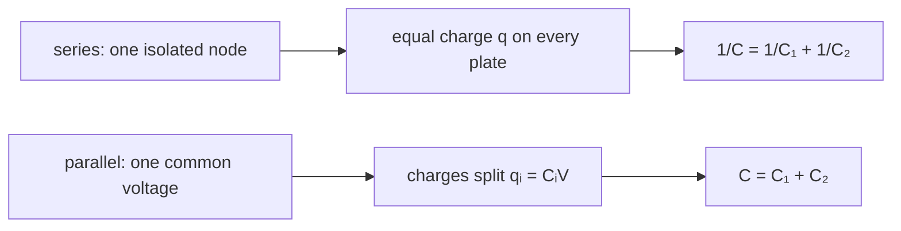

> *Read:* prove the rule from the island, and you also learn exactly when it breaks — everything else is that same move repeated.

Two capacitors end to end, nothing else connected to the junction. Charge the pair: the junction plate must acquire some charge $q$ — and there is nowhere for it to come *from*, because that conductor is isolated. That observation is the entire content of the series rule.

> **The proof, in two steps**
>
> 1. **Charge equality.** Enclose the wire-and-junction island in a Gaussian surface. It was neutral, and no charge
>   can cross the surface of an insulator-free isolated conductor ⇒ its net charge stays zero ⇒ the two facing surfaces
>   carry $+q$ and $-q$. **Every capacitor in a series string therefore has the same charge** — not because
>   "the same current flowed", but because the node between them is isolated.
> 2. **Voltages add.**$V=V_1+V_2=q/C_1+q/C_2$, so with $Q=q$ and
>   $C=Q/V$: $1/C=1/C_1+1/C_2$.

$$
n\ \text{in series}:\quad \frac1C=\sum_{i=1}^n\frac1{C_i},\qquad V_i=\frac QC_i=\frac{C_{\text{eq}}}{C_i}\,V,\qquad Q\ \text{identical in all} \tag{series}
$$

> **Where the proof dies — three cases, all popular in exams**
>
> - **The middle node was already charged** (a switch has just closed, or a third wire was disconnected). Then
>   charge is *not* zero on the island but *conserved at its initial value*: use
>   $q_1+q_2=q_{\text{initial}}$, not $q_1=-q_2$. This single generalisation solves every "switched capacitor"
>   problem; see §4.7.
> - **The middle node touches a battery terminal.** Then it is not isolated at all, the charges differ, and the
>   two capacitors are in *parallel* (both see the same $V$).
> - **There is a bridge** (a fifth element across the middle). No series/parallel reduction exists; you must use
>   node equations (§4.4–4.5). Students who "simplify" a bridge by force get a wrong answer with clean-looking algebra —
>   the single most damaging error pattern in this topic.

> **Two consequences of "same $Q$, voltage divides inversely as $C$"**
>
> **(i) The smallest capacitor takes the largest voltage.** $V_i=V C_{\text{eq}}/C_i$, and since $C_{\text{eq}}<C_i$ for all $i$ no element can exceed the total — but the smallest one comes closest. In a string of $n$ equal capacitors each sees $V/n$; with a 20% spread in capacitance the smallest carries 20% more than average, which is why **high-voltage stacks need balancing resistors**: real capacitors also differ in leakage resistance, and it is the *resistance* ratio, not the capacitance ratio, that decides the DC voltage sharing. A superb one-line applied question, and the reason "why are resistors placed across each capacitor in a HV stack?" appears in interviews and in INPhO vivas.
>
>  **(ii) Series reduces capacitance because it increases the effective gap.** For identical plates, $C_{\text{eq}}=C/n$ is precisely $\varepsilon_0A/(nd)$: you have made the dielectric $n$ times thicker. Parallel increases capacitance because it adds area. **Every combination rule in electrostatics is one of those two statements in disguise.**

### 4.2 Parallel, and the reduction algorithm

$$
n\ \text{in parallel}:\quad C=\sum_iC_i,\qquad V\ \text{identical},\qquad Q_i=VC_i\ \ (\text{charge divides as }C_i) \tag{parallel}
$$

The charges differ but add, since the two top plates are one conductor and so are the two bottom ones. Note the beautiful symmetry with series: **the quantity that is shared in one case is conserved-as-a-sum in the other**, and vice versa. That is the whole content of both rules.

> **Reduction algorithm (use it in this order, always)**
>
> 1. **Name the nodes.** Every point connected by wire alone is *one* node. Draw dots and label them
>   A, B, C… Do this before looking at the topology; it prevents 90% of network errors.
> 2. **Look for two elements sharing the same pair of nodes** ⇒ parallel ⇒ merge.
> 3. **Look for a node of degree 2** (exactly two capacitors meet, nothing else connects) ⇒ series ⇒ merge.
>   *Check the node is uncharged.*
> 4. **Hunt symmetry:** if two nodes must be at equal potential by geometry, wire them together (no charge flows)
>   or, equivalently, fold the network; if a branch joins two equal-potential nodes, delete it.
> 5. **Only if stuck:** write node equations (§4.5) or use Δ–Y (§4.6).
>
>  Redrawing is 80% of the skill. A bridge drawn as a diamond collapses to nothing; the same bridge drawn as two series strings with a link in the middle is instantly recognisable. Spend 20 seconds redrawing before you write one equation.

### **Q1** $2,\ 3,\ 6\ \mu$F in series across 120 V. Find each voltage and the charge. Each capacitor is rated 50 V — is this combination safe? _(base)_

Solution

$$
\frac1C=\frac12+\frac13+\frac16=1\ \mu\text{F}^{-1}\Rightarrow C=1\ \mu\text{F},\quad Q=120\ \mu\text{C} \quad\Rightarrow\quad V_2=60,\ V_3=40,\ V_6=20\ \text{V}
$$

Check: $60+40+20=120$ ✓. **Not safe**: the $2\ \mu$F unit sees 60 V > 50 V and will fail. When it fails (short, the usual mode for a dielectric puncture) the other two now see 120 V across $3\ \mu$F∥$6\ \mu$F… in series, i.e. 40 V and 80 V — and the $6\ \mu$F then fails too. **Series strings fail by cascade.** That extrapolation from "the first one breaks" to "why do we need balancing and derating" is exactly the kind of reasoning that earns the extra marks in a practical question.

> **Energy in a combination — which capacitor holds the joules**
>
> Series and parallel differ in the quantity that is shared, and the energy split follows that quantity.
>
>  $$
> \text{series (same }Q\text{):}\quad U_i=\frac{Q^{2}}{2C_i} \ \Rightarrow\ \frac{U_i}{U}=\frac{C_{\text{eq}}}{C_i};\qquad \text{parallel (same }V\text{):}\quad U_i=\tfrac12C_iV^{2}\ \Rightarrow\ \frac{U_i}{U}=\frac{C_i}{C_{\text{eq}}} \tag{energy split}
> $$
>
>  So in **series** the *smallest* capacitor stores the *largest* energy (it has the biggest voltage across it, $V_i=Q/C_i$), while in **parallel** the largest capacitor holds the most (same voltage, energy follows $C$). Both are worth a check line: three equal capacitors in series across $V$ store a total $\tfrac16CV^{2}$ against $\tfrac12CV^{2}$ for one alone — a series string is a low-energy way to hold a voltage, which is exactly why energy-storage banks are wired in parallel. And note the practical trap: in series the capacitor with the smallest $C$ sees the largest voltage, so in a series string of unequal electrolytics it is the smallest one that hits breakdown — the reason real banks are built from matched units with balancing resistors.

### 4.3 The node-charge method (the method that never fails)

For any capacitive network with no resistors, the equations are:

$$
Q_{ij}=C_{ij}(V_i-V_j)\qquad\text{and, at every floating node }k:\quad \sum_{j}C_{kj}(V_k-V_j)=0
$$

That's it: **Kirchhoff's current law with charge in place of current**. The floating-node condition is just conservation of charge; if a node is attached to an ideal cell, its charge is unknown and its potential is fixed instead. Solve the linear system; then get charges from the first line and energy from $U=\tfrac12\sum C_{ij}(V_i-V_j)^2$.

> **Why this is the right tool, not a fallback**
>
> It is the discrete form of $\vec\nabla\cdot(\varepsilon\vec\nabla V)=0$ — the same equation a finite-element capacitance solver uses, with one node per mesh vertex. So when a problem hands you a lattice of capacitors, you are not "doing a circuit", you are solving Laplace's equation on a graph. Two immediate payoffs: **(i)** every resistor-network trick you know works with $C$ in place of $1/R$ (conductance *is* capacitance, in the mathematics); **(ii)** every statement about current dividing at a node becomes a statement about charge dividing. Both are used below for the cube and the ladder.

> **The sign convention, written once**
>
> The method above is complete, but exam answers are marked against the Cengage convention, so state it explicitly: **(i)** choose one node as the reference and give every other node a potential $V_k$ — potentials, not charges, are the unknowns; **(ii)** for each capacitor between nodes $i$ and $j$ write the charge on the *i*-side plate as $q_i=C(V_i-V_j)$, so a positive $q_i$ means that plate is positive; **(iii)** at every node not connected to a cell, the *algebraic* sum of the charges on the plates attached to it is zero — that is the conservation law, written as $\sum_j C_{kj}(V_k-V_j)=0$; **(iv)** nodes held by a cell have their potential fixed instead of their charge and are entered as data, and the cell's own plates carry the unknown $\pm Q$.
>
>  Two consequences worth memorising. First, the sum in (iii) is over **all** plates at the node including the plates of capacitors whose other side is a fixed node — sign errors here are the whole error budget of a nodal solution. Second, **charges, not currents, are conserved at a floating node**: a floating island of conductors may have a net charge (usually zero, if it started neutral) but never a net *current*, because steady current through a capacitor is impossible. Equivalent statement: the node-charge equations of a capacitive network are the node-voltage equations of a resistor network with $C_{ij}$ playing the role of conductance.
>
>  **Worked one-liner:** two capacitors $C_1=2\ \mu$F and $C_2=3\ \mu$F in series across 10 V. With the junction as the only unknown, $2(10-V)=3V\Rightarrow V=4$ V, and the charge on each is $2\times6=3\times4=12\ \mu$C ✓. The general rule $Q=C_{\text{eq}}V$ gives $(6/5)\times10=12\ \mu$C ✓ — agreement is the check.

### 4.4 The bridge: balanced and not

**Fig. 4.1 — Capacitor bridge.** Balance makes $V_C=V_D$, so the fifth element stores nothing and can be deleted (or shorted). Which of those two operations to use is a judgement call: usually removing it leaves two series strings that reduce instantly.

$$
V_C=V_D\iff \frac{q_t}{C_1}=\frac{q_b}{C_3}\ \ \text{and}\ \ \frac{q_t}{C_2}=\frac{q_b}{C_4} \iff \boxed{\;\frac{C_1}{C_2}=\frac{C_3}{C_4}\;} \tag{balance}
$$

Derive it rather than recall it. Top branch: $q$ flows through $C_1$ and $C_2$ in series, so $V_{AC}=q/C_1$. Bottom branch: $V_{AD}=q'/C_3$. Balance means $V_{AC}=V_{AD}$, i.e. $q/C_1=q'/C_3$ and simultaneously $q/C_2=q'/C_4$; dividing gives $\boxed{C_1/C_2=C_3/C_4}$. Note this is the *same* ratio pattern as the resistor bridge ($R_1/R_2=R_3/R_4$), not its reciprocal — because in a resistor bridge the balance is $V_C=V_D\iff R_1/(R_1+R_2)=R_3/(R_3+R_4)$ whereas for capacitors the potential drop goes as $1/C$, which inverts twice and cancels. Confusing "same" with "reciprocal" is the classic lost mark; the two-line derivation above is immune to it.

### **Q2** In the bridge above all capacitors are $6\ \mu$F except $C_5=3\ \mu$F. Find $C_{AB}$. Then change $C_4$ to $2\ \mu$F and find the charge on $C_5$ for $V_{AB}=100$ V. _(JEE-adv)_

Solution

**Part 1 (balanced).** $6/6=6/6$ ✓ so delete $C_5$: two strings of $3\ \mu$F in parallel ⇒ $C_{AB}=6\ \mu$F. (If instead you short C–D you get $(6\|6)$ in series with $(6\|6)$ = $12/2=6\ \mu$F ✓ — good self-check, both operations are legal only at balance.)

**Part 2 (unbalanced).** Do not approximate. Node equations with $V_A=100$, $V_B=0$, unknowns $V_C,V_D$ (all in µF, so charges in µC):

$$
\begin{aligned} \text{node }C:\quad &6(V_C-100)+6(V_C-0)+3(V_C-V_D)=0\ \Rightarrow\ 15V_C-3V_D=600\\ \text{node }D:\quad &6(V_D-100)+2(V_D-0)+3(V_D-V_C)=0\ \Rightarrow\ \ 11V_D-3V_C=600 \end{aligned}
$$

From the first, $V_D=5V_C-200$; substituting: $11(5V_C-200)-3V_C=600\Rightarrow52V_C=2800\Rightarrow V_C=53.85$ V, $V_D=69.23$ V. Hence $V_{CD}=-15.4$ V and $Q_5=3\times15.4=46.2\ \mu$C (from D to C). **Sanity check worth doing in an exam:** at balance we would have had $V_C=V_D=50$; the perturbation moved $V_D$ up, which is right because reducing $C_4$ increases its share of the bottom branch's voltage, lifting $V_D$. Your answer must pass that qualitative test.

### 4.5 Symmetry: folding, and the capacitor cube

Two legitimate symmetry operations, and one that is **not**:

| Operation | When legal | Why |
| --- | --- | --- |
| **Short** two nodes | they are mirror images under a symmetry of the whole network (terminals included) | equal potential, so no charge moves when you connect them — and their capacitances to each other are in parallel |
| **Open** (delete) a branch | its two ends are mirror images | zero voltage across it ⇒ zero charge ⇒ removing it changes nothing |
| ✗ Fuse series pairs "because the picture looks symmetric" | never without checking the node is uncharged | symmetry of the drawing is not symmetry of the solution; anti-symmetry (potential $V\to-V$) is not equality |


**Fig. 4.2 — A cube of twelve identical capacitors, folded by symmetry.** For the body diagonal the six middle nodes fall into two equipotential classes of three, so the network collapses to three groups in series — the calculation is four lines (below).

> **The cube, all three answers, derived**
>
> **The trick that does all three: an anti-symmetry that fixes potentials.** The network is invariant if you exchange the two terminals *and* send $V\to V_A-V$ (with $V_B=0$). Any node that maps to itself (possibly after permuting equivalent nodes) must therefore satisfy $V=V_A-V$, i.e. sit at exactly half the applied voltage. That single sentence hands you most of the potentials for free; only the remaining classes need an equation.
>
>  **(a) Body diagonal.** The three neighbours of A form one class $P$, the three neighbours of B one class $Q$, and the swap maps $P\leftrightarrow Q$. Six edges join $P$ to $Q$. With $V_P+p=1$ where $p=V_P$:
>
>  $$
> \text{node }P:\ (V_P-1)\cdot1\cdot 3+6(V_P-V_Q)=0\ \Rightarrow\ 3\!\left(V_P-1 ight)+6\left(2V_P-1 ight)=0 \ \Rightarrow\ V_P=\frac35,\ V_Q=\frac25
> $$
>
>  Charge out of A: $Q=3C(1-3/5)=6C/5$ ⇒ $C_{\text{body}}=6C/5$. Cross-check with the group-in-series picture: the twelve edges become $3C$ (A→P) in series with $6C$ (P→Q) in series with $3C$ (Q→B): $(1/3+1/6+1/3)^{-1}C=6C/5$ ✓.
>
>  **(b) Face diagonal.** A and B share a face. The two nodes adjacent to *both* (call them $M$) and the two adjacent to *neither* ($N$) each map to themselves ⇒ $V_M=V_N=1/2$, immediately. The two remaining nodes $u$ (next to A) and $w$ (next to B) are exchanged. Conservation at $u$, whose neighbours are A and two $N$ nodes: $(u-1)+2(u-\tfrac12)=0\Rightarrow u=2/3$. Then $Q=2C(1-\tfrac12)+C(1-\tfrac23)=\tfrac43C$ ⇒ $C_{\text{face}}=4C/3$.
>
>  **(c) Edge.** Now there are four classes: $P$ (2 neighbours of A), $Q$ (2 neighbours of B), and the two singletons $R$ (adjacent to A's neighbours only) and $S$. The swap pairs $P\leftrightarrow Q$ and $R\leftrightarrow S$, so two unknowns suffice, $p$ and $r$, with the edge set $\{A\!-\!B,\ 2(A\!-\!P),\ 2(P\!-\!R),\ 2(P\!-\!Q),\ 2(B\!-\!Q),\ 2(Q\!-\!S),\ R\!-\!S\}$:
>
>  $$
> \begin{aligned} \text{node }P:&\quad (p-1)+(p-r)+(p-(1-p))=0\ \Rightarrow\ 4p-r=2\ \text{node }R:&\quad 2(r-p)+(r-(1-r))=0\ \Rightarrow\ 4r=1+2p \end{aligned}\qquad\Rightarrow\qquad p=\frac9{14},\ r=\frac47
> $$
>
>  Charge out of A: $Q=C(1-0)+2C(1-9/14)=C+5C/7=12C/7$ ⇒ $C_{\text{edge}}=12C/7$.
>
>  $$
> C_{\text{edge}}=\frac{12}7C=1.714C,\qquad C_{\text{face}}=\frac43C=1.333C,\qquad C_{\text{body}}=\frac65C=1.2C \tag{compare}
> $$
>
>  **Check the ordering, which is the physics:** $C_{\text{edge}}>C_{\text{face}}>C_{\text{body}}$. Closer terminals ⇒ more direct flux paths ⇒ bigger capacitance. And compare with the resistor cube ($R_{\text{edge}}=7R/12$, $R_{\text{face}}=3R/4$, $R_{\text{body}}=5R/6$): **the numbers are the same with $C\leftrightarrow1/R$**, exactly as §4.3 predicted. If you ever remember one and not the other, you can recover it — provided you remember which mapping (capacitance maps to *conductance*).

### **Q3** Each edge of a cube is a $10\ \mu$F capacitor. Find the capacitance (i) across an edge, (ii) across a face diagonal, and state which of the three terminal pairs gives the largest value without calculating. _(JEE-adv → Olympiad)_

Solution

**Set up by classes, then two equations.** For (i): terminals at $A=(0,0,0)$, $B=(1,0,0)$; classes $P=\{(0,1,0),(0,0,1)\}$, $Q=\{(1,1,0),(1,0,1)\}$, $R=\{(0,1,1)\}$, $S=\{(1,1,1)\}$ with $V_Q=1-V_P$, $V_S=1-V_R$. The two conservation equations are exactly the pair in §4.5(c), giving $V_P=9/14$ and

$$
C_{\text{edge}}=\frac QC=1+\frac{10}7\cdot\frac{2C(1-9/14)}{C}\Big/2=\frac{12}7C=17.1\ \mu\text{F}
$$

(Do it once from scratch: $Q=C+2C\cdot\tfrac5{14}=C\left(1+\tfrac57 ight)=\tfrac{12}7C$ — the displayed line is just that, so keep the simple form.)

**(ii) Face diagonal:** $C=\tfrac43C=13.3\ \mu$F, obtained in two lines because the four "middle" nodes are self-mapping under the terminal exchange and so sit at $1/2$, leaving only $u=2/3$ to find (§4.5b).

**(iii) Ordering without algebra:** closer terminals mean more parallel paths for the flux, so $C_{\text{edge}}>C_{\text{face}}>C_{\text{body}}$: $1.714C,\ 1.333C,\ 1.200C$. Note that all three are *larger* than $C$ but far smaller than the maximum possible (12 in parallel = 120 µF): the cube is a poor capacitor, which is why nobody builds one and why it makes a good exam question.

**The skill being tested** is the class-identification step, not the algebra. If you find yourself writing eight node equations for eight corners, your grouping is wrong — the answer must come from at most three unknowns. Check with the resistor cube ($7R/12,\ 3R/4,\ 5R/6$): replace $R\to1/C$ and you get exactly the three numbers above, which is a legitimate independent verification.

### 4.6 Δ–Y (star–mesh) for capacitors

A three-terminal network that will not reduce (a bridge arm, a lattice defect) can always be converted. Write the *port* capacitances (one terminal, other two shorted together) and match them.

$$
Y\to\Delta:\ C_{ij}=\frac{C_iC_j}{C_1+C_2+C_3} \qquad\qquad \Delta\to Y:\ C_1=C_{12}+C_{13}+\frac{C_{12}C_{13}}{C_{23}} \tag{star-mesh}
$$

Derive the first one in your head: in the star, terminal 1 sees $C_1$ in series with $(C_2\|C_3)=C_2+C_3$, i.e. $C_1(C_2+C_3)/S$; in the mesh it sees $C_{12}+C_{13}$; matching all three cyclic equations gives the star–mesh formula. Then check the symmetric case: three equal arms $y$ ⇒ $C_{ij}=y/3$, so $y=3C_{ij}$ ✓ (this is the $3C$ that appeared in Q2).

> **Note what is different from resistors**
>
> For resistors, $R_{ij}=R_i+R_j+R_iR_j/R_k$ (star→mesh). For capacitors the *star→mesh* direction is the simple one and *mesh→star* carries the products. Students who memorise "the resistor formula with R→C" get the reciprocal of the right answer in the wrong place. The reliable move is: **don't recall — match port capacitances on the spot.** It takes 40 seconds and cannot fail.

### **Q4** Three $6\ \mu$F capacitors form a triangle between nodes 1, 2, 3. Find the capacitance between terminals 1 and 2 (i) with 3 left open, (ii) with 3 earthed. What is the general lesson? _(JEE-adv · definitions)_

Solution

**(i) 3 open** — node 3 is floating, so $C_{13}$ and $C_{23}$ carry the same charge (series) and their combination is in parallel with $C_{12}$:

$$
C=C_{12}+\frac{C_{13}C_{23}}{C_{13}+C_{23}}=6+3=9\ \mu\text{F}
$$

**(ii) 3 earthed** — take $V_1=V,\ V_2=0=V_3$. Then $Q_1=C_{12}(V_1-V_2)+C_{13}(V_1-V_3)=6V+6V=12V$ and $C=Q_1/(V_1-V_2)=12\ \mu$F: the two capacitors now both sit across the full voltage, i.e. in parallel.

**Lesson:** the capacitance between two terminals is not a property of those two terminals. It depends on the boundary condition of *every other conductor present* — floating, earthed or driven, each gives a different number. The three answers (9, 12 and, with 3 driven to some other potential, anything in between) all describe the same object. This is precisely why chapter 7 replaces the scalar $C$ by the matrix of coefficients of capacitance: $Q_i=\sum_jc_{ij}V_j$ contains all three answers at once.

### 4.7 Switches, redistribution, and the correct conservation law

The universal recipe for "the switch is now closed" problems:

$$
\begin{aligned} &\textbf{1.}\ \text{Find every isolated island of conductor, and its total charge }Q_{\text{isl}}=\sum C_iv_i\\ &\textbf{2.}\ \text{After switching, the island's charge is the same (unless a cell touched it)}\\ &\textbf{3.}\ \text{Add the constraint }V=\text{given (cells) or }V_1=V_2\ (\text{now joined})\\ &\textbf{4.}\ \text{Solve; then compute }\Delta U\ \text{and, if a cell was involved, its work }W_b=V\,\Delta Q_{\text{through it}} \end{aligned}
$$

> **Why charge, not voltage, is the conserved bookkeeping variable**
>
> A switch equalises *potentials*; a cell fixes them; only **an isolated conductor conserves charge**. So the unknowns are best chosen as node potentials and the equations written as charge conservation. The "loss" $\Delta U$ then comes out automatically from §3.7's formula. If instead you try to conserve voltage, or to "conserve energy" (a surprisingly common reflex), you will get a wrong answer: energy is *not* conserved by the capacitors alone during a switching transient — it is conserved only for capacitors + battery + heat.

### **Q5** $C_1=2\ \mu$F at 100 V and $C_2=3\ \mu$F at 50 V are connected **with opposite polarity** (positive plate of one to negative of the other). Find the final voltage and the energy lost. _(JEE-adv)_

Solution

Assign signs on the connected island: $Q_{\text{isl}}=C_1V_1-C_2V_2=200-150=50\ \mu$C, so $V_f=50/(2+3)=10$ V. $U_i=\tfrac12(2)(10^4)+\tfrac12(3)(50^2)=10+3.75=13.75$ mJ; $U_f=\tfrac12(5)(10^2)=0.25$ mJ; loss $13.5$ mJ.

Check against §3.7's master formula: $\tfrac12C_{\text{series}}(\Delta V)^2=\tfrac12\cdot\frac{6}{5}\times10^{-6}\times(150)^2=13.5$ mJ ✓. Note the *effective* voltage difference was $100-(-50)=150$ V because of the reversed connection — that is the only thing that changed relative to same-polarity sharing.

Physically: 13.5 mJ out of 13.75 mJ has left the capacitors — the nearly complete annihilation of the stored energy, with the surviving 10 V being what charge conservation demands. Reversing polarity is therefore the most violent thing you can do to a pair of capacitors, and it is exactly what a defibrillator's "discharge" phase and a capacitor-welder exploit.

### 4.8 Infinite ladders: self-similarity, and the root you must reject

**Fig. 4.3 — The ladder whose tail is identical to itself.** If the whole infinite network has capacitance $x$, then so does the network after the first section — which is the only new fact you need.

$$
\begin{aligned} x&=\text{series}\big(C,\ C+x\big)=\frac{C(C+x)}{2C+x}\\ x(2C+x)&=C^2+Cx\ \Rightarrow\ x^2+Cx-C^2=0\ \Rightarrow\ x=C\cdot\frac{-1\pm\sqrt5}2 \end{aligned} \qquad\Longrightarrow\qquad \boxed{x=\frac{\sqrt5-1}{2}\,C=0.618\,C}
$$

> **Why reject the negative root, and when "self-similarity" is a lie**
>
> **Negative root:** $-1.618C$ is impossible for a passive network, since $U=\tfrac12xV^2>0$ for any nonzero state ⇒ $x>0$. Reject it on physical grounds and say so in one clause; writing "we take the positive root" without a reason is a common place where a marker deducts for lack of justification.
>
>  **Convergence is not automatic.** The recursion $x_{n+1}=C(C+x_n)/(2C+x_n)$ has derivative $|f'|=C^2/(2C+x)^2<1/4$ at the fixed point, so iterating converges rapidly (factor ≈ 1/4 per section): starting from $x_1=0$ (a truncated ladder, open end) the sequence is $0.5C,\ 0.6C,\ 0.615C,\ 0.618C,\dots$. **So the 10-section ladder is already within 0.1% of the infinite value**, and a question that says "nine sections" expects you to use the infinite answer unless it explicitly asks for the finite one. Two extra cautions: (i) a ladder of *series C, shunt C* converges but one of *series C, shunt C* with the roles swapped diverges; (ii) if the network has negative or active elements the fixed point may be unstable and self-similarity gives the wrong answer.

### **Q6** Find the capacitance of the infinite ladder in which every *series* element is $2C$ and every *shunt* element is $C$. Verify by truncating. _(JEE-adv)_

Solution

$$
x=\text{series}\big(2C,\ C+x\big)=\frac{2C(C+x)}{3C+x}\ \Rightarrow\ x(3C+x)=2C^2+2Cx\ \Rightarrow\ x^2+Cx-2C^2=0
$$

$(x-C)(x+2C)=0$ ⇒ $\boxed{x=C}$ (rejecting $-2C$ because a passive network has $U>0$ ⇒ $x>0$).

**Truncation check.** Let $x_1$ be the ladder cut after one section: $\text{series}(2C,C)=2C/3=0.667C$. Then $x_{n+1}=2C(C+x_n)/(3C+x_n)$: $x_2=10C/11=0.909C$, $x_3=42C/43=0.977C$, $x_4=170C/171=0.994C$. The error is $1/3,\ 1/11,\ 1/43,\ 1/171$ — each about a quarter of the previous, which is exactly $|f'(x_*)|=4C^2/(3C+x)^2=1/4$ at the fixed point. Two conclusions you can use anywhere: **(i)** the sequence is monotone increasing and bounded, so the fixed point is the limit (this is the missing rigour in most textbook "solutions"); **(ii)** a four-section ladder is already within 0.6% of the infinite value, so unless a question specifies a finite number of sections, the self-similar answer is the right one to use.

### 4.9 Counting combinations, and what to notice while counting

Arrange $n$ identical capacitors of value $c$ into every two-terminal series-parallel network you can draw and only a handful of distinct values appear (for three: 2, 4, 9, 18 in units of $c/3$ — Q7). The useful skill is not enumeration but the **monotonicity theorem**, which lets you rule answers out without drawing anything:

- Adding any capacitor **in parallel** anywhere always increases $C_{\text{eq}}$; adding one
  **in series** anywhere always decreases it. (Proof: $\partial C_{\text{eq}}/\partial C_i>0$ always — a theorem,
  the *monotonicity of capacitance*, which follows from $C=2U/V^2$ and from the fact that adding a conductor
  can only provide more room for flux.)
- So $C_{\text{series}}<\min_i C_i\le\max_i C_i<C_{\text{parallel}}$, always, with equality only if some element is bypassed. Any "equivalent capacitance" that violates this is wrong by inspection — including a forced series-reduction of a bridge, which is why the check is worth one second on every network question.

### **Q7** Three capacitors of $6\ \mu$F each. Give connections giving 2, 4, 9 and 18 µF. Show that 6 µF is impossible if all three must be used, and say which arrangement stores most energy from a 100 V supply. _(base · design)_

Solution

$$
6\|6\|6=18,\qquad (6\|6)\ \text{ser}\ 6=4,\qquad (6\ \text{ser}\ 6)\|6=9,\qquad 6\ \text{ser}\ 6\ \text{ser}\ 6=2
$$

**Why 6 cannot be made.** Every two-terminal series-parallel network of three elements has one of exactly four connection graphs: a chain of three, a pair merged then put in series with the third, a pair merged in parallel with the third, or all three in parallel. (A triangle is not new: with one terminal floating it is the third case.) The four values are 2, 4, 9, 18 — and by the monotonicity rule of §4.9, $C_{\text{series}}<\min C_i< C_{\text{parallel}}$ with equality only if a capacitor is bypassed or left dangling. So 6 µF requires one capacitor to carry nothing. **That "prove it is impossible" half is the part worth doing** — enumerating is easy, bounding requires the theorem.

**Energy.** On a voltage source, $U=\tfrac12CV^2$ ⇒ the **18 µF** (all parallel) stores most: $U=\tfrac12\times18\times10^{-6}\times10^{4}=0.9$ mJ. If instead each network is charged to 100 V and then *disconnected carrying the same total charge*, $U=Q^2/2C$ and the ranking inverts, the 2 µF chain winning. Two questions, identical hardware, opposite answers — the fastest test of whether §3.4 has been understood.

### 4.10 Capacitor dividers, and one elegant application

Series capacitors divide voltage inversely as $C$, so a capacitive divider gives a frequency-independent voltage ratio with **no power dissipation** — which is why oscilloscope probes are 10:1 capacitive dividers at the high end (a 9 pF probe capacitor with the scope's 1 pF input, plus the cable's capacitance absorbed into the 9 pF by a trimmer).

$$
\frac{V_{\text{out}}}{V_{\text{in}}}=\frac{C_1}{C_1+C_2}\qquad(\text{series pair, output across }C_2) \tag{divider}
$$

Compare the resistor divider $R_2/(R_1+R_2)$: the capacitor version has $C_1$ (the series arm) on top, not *bottom* — the reciprocal shows up exactly where you would not expect it if you memorised by analogy. Note also that a capacitive divider does not work for DC (leakage dominates), and that a compensated divider ($R_1C_1=R_2C_2$) works at *all* frequencies, which is the real trick in a probe.

### **Q8** A 10:1 passive probe has $C_{\text{scope}}+C_{\text{cable}}=15$ pF at the oscilloscope input, and the probe's internal capacitor is adjustable. What must it be set to, and why does the compensation matter if the ratio is set by the capacitors? _(Olympiad · applied)_

Solution

For 10:1 we need $V_{\text{out}}/V_{\text{in}}=C_1/(C_1+C_2)=1/10$ ⇒ $C_1=C_2/9=1.67$ pF. The probe's series capacitor is therefore set to ≈ 1.7 pF (real probes: 10–15 pF trimmer against a 1 MΩ ∥ ≈ 15 pF input, with the resistive path doing the DC division — the number differs because a real probe divides 9 MΩ:1 MΩ and *compensates* so that the RC products match).

**Why compensation matters:** if only the capacitors set the ratio, the divider is correct at high frequency; at DC the ratio is set by the resistors (or by leakage!) and the waveform at the scope is a distorted, differentiated version of reality. Matching $R_1C_1=R_2C_2$ makes the transfer ratio frequency-independent: $V_{\text{out}}/V_{\text{in}}=R_2/(R_1+R_2)=C_1/(C_1+C_2)$. The "square wave looks right" test on a probe is literally this condition being checked. It is an excellent 4-line answer to "why is there a variable capacitor on a probe?", and it is a genuine piece of physics that JEE has paraphrased as a "two RC branches" question.

### 4.11 Checkpoint

- State the two conditions under which "series ⇒ same charge" fails, and fix the equations in each case.
- Prove the bridge balance condition in two lines, and explain why it is *not* the reciprocal of the resistor
  condition.
- Do the cube: edge, face, body — and check the ordering against the resistor cube.
- Derive Δ–Y on the spot from port capacitances rather than recalling it.
- For a ladder, state the fixed-point equation, justify rejecting the root, and check convergence with one
  truncated section.
- For any switching problem, write down the island charge $\sum C_iV_i$ before doing anything else.

> **A unifying sentence for the whole chapter**
>
> A capacitive network is a graph whose edges are *conductances made of capacitance*: the node equation $\sum_jC_{ij}(V_i-V_j)=Q_i$ is exactly Kirchhoff's law, and exactly the finite-difference form of $-\vec\nabla\cdot\varepsilon\vec\nabla V=\rho$. So symmetry arguments, folding, Δ–Y, Thévenin, ladders and Star–mesh are not five tricks but one trick applied to a graph. When an Olympiad problem looks like "a capacitor lattice", write the node equation for the graph and the physics is over — what remains is linear algebra, and the physics marks are all in step 1 (identifying the equipotential classes).

Next: [**Chapter 5 · Dielectrics →**](#section-05-dielectrics) — polarisation from atoms to maxwell's equations in matter, why $K$ multiplies $C$, the slab problems, the dielectric liquid that climbs between the plates, and the local field.

_JEE Advanced · INPhO / IPhO · needs ch. 1–4_

## 5 · Dielectrics: the material inside

Four chapters of *geometry* and *energy*; one number, $\varepsilon_0$, never changed. This chapter hands that number to the material. A dielectric is not a mysterious factor that multiplies $C$: it is a vast crowd of bound charges, each displaced by a fraction of an atomic radius, whose combined field cancels part of the field you applied. Every "rule" about dielectrics in this chapter — $C\to\kappa C$, the series law for layers, the force on a slab, the liquid climbing between plates — is that one statement plus conservation laws. Where the crowd cannot be treated as a continuum (a molecule asking *what field do I actually sit in*) we will compute the answer twice, from the microscopic and macroscopic side, and the discrepancy is the content of §5.4.

> **Notation in this chapter**
>
> $\vec P$ dipole moment per unit volume (C m⁻¹ m⁻¹ = C/m²) · $\alpha$ molecular polarisability, $p=\alpha E_{\text{loc}}$, units C m² V⁻¹ = F m² · $\chi_e$ electric susceptibility, defined by $P=\varepsilon_0\chi_eE$ · $\kappa$ (also $\varepsilon_r$) relative permittivity, $\kappa=1+\chi_e$ for a linear isotropic solid · $\vec D=\varepsilon_0\vec E+\vec P$. Watch out: several books define $p=\alpha\varepsilon_0E$, making $\alpha$ a *volume* in ų. The two conventions differ by $4\pi\varepsilon_0$ or $\varepsilon_0$ — always check which one a problem uses, and which field ($E$ or $E_{\text{loc}}$) it means.

### 5.1 What happens inside an insulator

A conductor has charges free to travel macroscopic distances. An insulator has none — but every atom is a positive core and an electron cloud, and the cloud *shifts*. Displace the cloud by $x$ against the restoring force of the nucleus and you have a dipole $p=ex$. That is all dielectric polarization is: a *finite, elastic* displacement, typically $x\sim10^{-6}\ \text{m}\times$ nothing — a few thousandths of an Ångström in a gas, up to ~0.1 Å in a ferroelectric.

$$
\text{driven spring:}\quad m\ddot x+m\omega_0^{2}x+\frac{m\dot x}{\tau}=eE \quad\Longrightarrow\quad p=ex=\frac{e^{2}}{m\omega_0^{2}}\,E\quad(\text{static}) \tag{5.1}
$$

So a single bound electron has polarisability $\alpha_e=e^{2}/m\omega_0^{2}$, and taking the "spring" to be the whole UV absorption of the atom ($\lambda_0\sim100$ nm, so $\omega_0=2\pi c/\lambda_0=1.9\times10^{16}$ rad s⁻¹) gives $\alpha_e\approx8\times10^{-41}$ F m². The same number drops out of the crude dimensional estimate $\alpha\sim4\pi\varepsilon_0a^{3}$ with $a$ an atomic radius — which is the useful memory hook: **a molecule's polarisability is its volume, times $4\pi\varepsilon_0$**. For hydrogen the estimate is $(4\pi\varepsilon_0)a_0^{3}=1.11\times10^{-10}\times(0.529\times10^{-10})^{3}=1.7\times10^{-41}$ F m² while the exact quantum-mechanical static value is $(9/2)(4\pi\varepsilon_0)a_0^{3}=7.4\times10^{-41}$ — dimensional analysis is good to a factor of 4 here, and nothing better is needed: keep $\alpha_e\sim10^{-40}$ F m² for any small molecule (N₂: $1.9\times10^{-40}$), which is why all the gas-phase numbers in this chapter come out right to a few per cent.

Three mechanisms contribute, and their *response times* explain almost everything about the frequency dependence of $\kappa$:

| mechanism | what moves | typical α or Δκ | response time | present in |
| --- | --- | --- | --- | --- |
| electronic | electron cloud vs nucleus | $\sim10^{-40}$ F m² | $10^{-15}$ s | everything |
| ionic | positive vs negative sublattice | adds 3–6 to κ | $10^{-13}$ s | NaCl, glass, oxides |
| orientational | a whole permanent dipole rotates | huge (water: +78) | $10^{-12}$–$10^{-6}$ s | polar molecules |
| interfacial (space charge) | ions drift to boundaries | can dominate | $10^{-3}$ s – minutes | ceramics, foods, polymers with fillers |

> **Why does a dielectric weaken the field instead of strengthening it?**
>
> Because the induced dipole always points *along* the field that made it: positive charge shifted with $\vec E$, negative against. Look at the slab in Fig. 5.1 — the layer of positive bound charge sits on the face toward the negative plate, the negative bound charge toward the positive plate. A sheet of charge $+\sigma_b$ at one face and $-\sigma_b$ at the other produces a field pointing from $+$ to $-$, i.e. *opposite* to the plates' field. Net result $E=E_0-\sigma_b/\varepsilon_0<E_0$. There is no stable configuration in which a passively induced dipole array *amplifies* the field that induced it: that would be positive feedback, and it would mean the material spontaneously polarizes with no applied voltage — which is exactly what a ferroelectric below its Curie point does, and why ferroelectrics must be handled by the *field*-versus-*displacement* hysteresis loop of §5.10, not by a constant κ.


**Fig. 5.1** — The whole of dielectric physics in one picture: bound charges appear only where $\vec P$ terminates, i.e. on the surfaces (and wherever $\vec\nabla\cdot\vec P\ne0$), and their field always subtracts from the applied one.

### 5.2 Bound charge: the bookkeeping in one line

Take a small rectangular pillbox of volume $\delta x\,\delta y\,\delta z$ inside a polarized material. Dipoles crossing a face deposit charge $\vec P\cdot d\vec a$ on it. Summing the six faces and dividing by the volume is the divergence, and the charge *left inside* is the negative of what flowed out:

$$
\rho_b=-\vec\nabla\cdot\vec P\qquad\text{on a surface:}\qquad \sigma_b=\vec P\cdot\hat n=\begin{cases}+P_n&\text{where }\vec P\text{ points out}\\-\,P_n&\text{where }\vec P\text{ points in}\end{cases} \tag{5.2}
$$


**Fig. 5.2** — Left: the pillbox proof of $\rho_b=-\vec\nabla\cdot\vec P$. Right: a uniformly polarized sphere — the one geometry whose bound-charge field is uniform inside. Its internal field $-\vec P/3\varepsilon_0$ is the number that generates the whole Lorentz local-field story.

Two consequences to keep ready:

- **A uniformly polarized body has no volume bound charge**, only surface bound charge. And its
  *total* bound charge vanishes identically: $\oint\vec P\cdot d\vec a=-\int\rho_b\,dV=Q_b$, so
  $Q_b=-\oint\vec P\cdot d\hat n\,dA$… which for a closed body enclosing all the polarization is zero. A
  dielectric never acquires net charge from being polarized (that is why "the dielectric gets charged" is a wrong
  sentence; it gets *separated*).
- **Boundary conditions at an interface** (derive them exactly as in ch. 1, now including $\vec P$):
  tangential $E$ is continuous, and normal $D$ is continuous if no free charge sits there —
  $$
  E_{1t}=E_{2t},\qquad D_{1n}-D_{2n}=\sigma_f,\qquad \varepsilon_1E_{1n}-\varepsilon_2E_{2n}=\sigma_f\ \ (\sigma_f=0\ \text{at a bare dielectric interface})
  $$
  Dividing the two laws for a charge-free interface gives the **refraction of field lines**,
  $\tan\theta_1/\tan\theta_2=\varepsilon_1/\varepsilon_2$: field lines bend *toward the normal* on
  entering a high-κ material. (For conductors in electrostatic equilibrium the normal component dominates completely;
  here both survive, which is why the shape of a porcelain insulator matters.)

### 5.3 D, or: how to never think about bound charge again

Take $\vec\nabla\cdot\vec E=\rho_{\text{tot}}/\varepsilon_0=(\rho_f+\rho_b)/\varepsilon_0$, substitute $\rho_b=-\vec\nabla\cdot\vec P$ and move the term across:

$$
\vec\nabla\cdot\vec D=\rho_f,\qquad \vec D\equiv\varepsilon_0\vec E+\vec P \qquad\xrightarrow[\text{linear, isotropic}]{\text{if}}\qquad \vec D=\varepsilon_0\kappa\vec E \tag{5.3}
$$

The point is not nomenclature. $\vec D$ is useful because $\rho_f$ is what a *circuit* tells you (you pushed $Q$ coulombs onto that plate) while $\rho_b$ is what a *material* tells you (and you often do not know it). Whenever symmetry fixes $\vec D$, you can get $\vec E$ in two lines without ever computing a bound charge:

$$
\text{parallel plates:}\quad D=\sigma_f,\quad E=\frac{\sigma_f}{\varepsilon_0\kappa},\quad V=Ed=\frac{\sigma_fd}{\varepsilon_0\kappa}\quad\Longrightarrow\quad C=\frac{\kappa\varepsilon_0A}{d}\ \checkmark
$$

> **When D is a tool and when it is a trap**
>
> $\vec\nabla\cdot\vec D=\rho_f$ is *always* true; using it to *find* $\vec D$ requires symmetry, exactly as with $\vec E$ and $\rho$ in chapter 1. It works for plane, cylinder and sphere geometry with dielectrics arranged in the same symmetry. It fails for a dielectric *inserted sideways* into a parallel-plate capacitor, for a droplet in a uniform field, and for anything with edges: there the field is not known to be normal or constant, the Gaussian surface gives no more than $\oint\vec D\cdot d\vec a=Q_f$, and you must solve Laplace's equation with the interface conditions. The tell: if $\vec D$ would be determined by Gauss alone, $\vec E$ in vacuum would have been too.
>
>  A second, subtler trap: $\vec D=\varepsilon\vec E$ is a *constitutive* relation valid for linear, isotropic, non-dispersive media. For a ferroelectric, $P$ is a history-dependent function of $E$; for water at 1 kHz, $\kappa$ is complex; in a crystal, $\kappa$ is a tensor. In all three cases the "D trick" still gives you $D$ from $\rho_f$ — what breaks is the step from $D$ to $E$.

### 5.4 From α to κ: the local field and Clausius–Mossotti

Here is the one genuinely delicate step in the whole subject. The molecule does not sit in the macroscopic average field $E$: it sits in the field of the plates *plus* the field of every other polarized molecule around it. Separate the neighbourhood into (i) the molecules outside a small sphere centred on ours and (ii) those inside. For (i), replace the sphere's contents by the continuum: the bound surface charge $\sigma_b=\vec P\cdot\hat n$ on a spherical cavity produces a *uniform* field (Fig. 5.2 right is the same calculation with the sign reversed):

$$
\vec E_{\text{Lorentz}}=\frac{\vec P}{3\varepsilon_0} \qquad\Longrightarrow\qquad E_{\text{loc}}=E+\frac{P}{3\varepsilon_0} \tag{5.4}
$$

(ii), the molecules actually inside the cavity, contribute zero *on average* for a liquid or cubic crystal — the sum of dipole fields over a symmetric arrangement cancels at the centre. That is the Lorentz assumption, and it is why the result below works for gases, liquids and cubic solids but needs modification for polar crystals.

Now close the loop. $P=np=n\alpha E_{\text{loc}}$ with $E_{\text{loc}}=E+P/3\varepsilon_0$:

$$
P=n\alpha E+\frac{n\alpha P}{3\varepsilon_0}\ \Longrightarrow\ P=\frac{n\alpha E}{1-\frac{n\alpha}{3\varepsilon_0}}\ \Longrightarrow\ \kappa-1=\frac{n\alpha/\varepsilon_0}{1-n\alpha/3\varepsilon_0} \qquad\Longleftrightarrow\qquad \boxed{\dfrac{\kappa-1}{\kappa+2}=\dfrac{n\alpha}{3\varepsilon_0}} \tag{5.5}
$$

This is **Clausius–Mossotti** (Lorentz–Lorenz in optics, where $\kappa=n^{2}$ for the index of refraction). Note its shape: the "naive" answer $\kappa-1=n\alpha/\varepsilon_0$ is recovered for a dilute gas, and the correction factor is always *enhancing* — each molecule's dipole helps its neighbours align, which is the same positive feedback the Why box of §5.1 warned about.

> **Three limits of (5.5) worth memorising, because exams live there**
>
> - **Dilute gas.**$n\alpha\ll\varepsilon_0$ ⇒ $\kappa-1=n\alpha/\varepsilon_0$. With
>   $n=P_{\text{gas}}/k_BT$: $\kappa-1\propto1/T$ at fixed pressure and $\kappa-1\propto\rho$ at fixed T. This is
>   how $\kappa$ is used as a *density meter* — and it reproduces the number of chapter 2: air at STP,
>   $n=2.5\times10^{25}$, $\alpha=2.1\times10^{-40}$ F m² ⇒ $\kappa-1=5.9\times10^{-4}$ ✓.
> - **Permanent dipoles (a polar gas).** Replace $\alpha E$ by the Langevin alignment
>   $p^{2}E/3k_BT$: $\kappa-1=n\!\left(\alpha+\dfrac{p^{2}}{3\varepsilon_0k_BT}\right)/\varepsilon_0$ —
>   Debye's equation, and the reason humidity's contribution to $\kappa$ is strongly temperature dependent while a
>   noble gas's is not.
> - **The catastrophe.**$\kappa\to\infty$ when $n\alpha\to3\varepsilon_0$. A material with
>   $\kappa=1000$ has $n\alpha/3\varepsilon_0=0.997$: it sits within 0.3% of the divergence. That is what a
>   *ferroelectric* is — the polarizability density is so large that the feedback loop of §5.1 becomes unstable and
>   the material polarizes by itself. Quantum mechanics (the overlap of neighbouring clouds) saturates it at a finite
>   $P_s$ instead of letting it blow up; the whole of §5.10 is the physics of that saturation.

For a dense polar liquid the Lorentz cavity field is *not* the right correction (the molecules inside the cavity are strongly correlated with the central one); Onsager's sphere-in-a-cavity-of-permittivity-$\kappa$ treatment gives a different and better formula. The lesson to keep is the one the exam tests: **Clausius–Mossotti is a statement about a dilute, isotropic, induced-dipole assembly.** Water's $\kappa=80$ is *not* a contradiction of $n^{2}=1.77$, because at optical frequencies only the electronic term survives: $\dfrac{1.77-1}{1.77+2}=0.204=\dfrac{n\alpha_e}{3\varepsilon_0}$ — perfectly ordinary, far from the catastrophe. It is the orientational term, absent above ~20 GHz, that makes water strange.

### 5.5 The catalogue: every dielectric geometry you will be asked for

One question decides everything: **do the field lines cross the dielectric interfaces, or run along them?** Crossing ⇒ same $D$ (free charge is continuous) ⇒ capacitors in *series*. Running along ⇒ same $E$ and same $V$ ⇒ in *parallel*. Section 4.2's logic with a new label.


**Fig. 5.3** — (a) slab of thickness $t<d$ parallel to the plates; (b) material filling part of the *area*; (c) $n$ layers; (d) the rotary trimmer, where the variable is the overlap. Only in (a) and (c) does the dielectric interface cut the field lines.

> **The results, each one line, and each one *derived* not quoted**
>
> | case | argument | capacitance |
> | --- | --- | --- |
> | gap full of κ | $E=\sigma_f/\varepsilon_0\kappa$ | $C=\kappa\varepsilon_0A/d$ |
> | slab $t$ in a gap $d$ | three layers in series, air–dielectric–air; add $V$'s at common $Q$ | $C=\dfrac{\varepsilon_0A}{d-t+t/\kappa}$ |
> | same, area split $A_1:A_2$ | two capacitors sharing the same two nodes ⇒ parallel | $C=\dfrac{\varepsilon_0}{d}\left(\kappa_1A_1+\kappa_2A_2\right)$ |
> | layers $(d_i,\kappa_i)$ | same $D=\sigma_f$ in every layer ⇒ $E_i=\sigma_f/\varepsilon_0\kappa_i$; sum $V=Ed$ | $C=\dfrac{\varepsilon_0A}{\displaystyle\sum_i d_i/\kappa_i}$ |
> | radial layers in a coax | each layer contributes $\dfrac{\ln(r_{i+1}/r_i)}{2\pi\varepsilon_0\kappa_iL}$ of $1/C$ | $C=\dfrac{2\pi\varepsilon_0L}{\displaystyle\sum_i\kappa_i^{-1}\ln\dfrac{r_{i+1}}{r_i}}$ |
> | fan, radius $R$, angle $\varphi$, gap $d$ | area $\tfrac12\varphi R^{2}$ in a uniform field | $C=\dfrac{\kappa\varepsilon_0\varphi R^{2}}{2d}$ |
>
>  Two checks you should always run. **Limits:** $t\to0$ returns the empty capacitor and $t\to d$ returns $\kappa\varepsilon_0A/d$ ✓. **The metal limit:** $\kappa\to\infty$ in the slab row gives $C=\varepsilon_0A/(d-t)$ — the conducting-slab result of chapter 2, which is therefore not a new fact but a special case, and the reason "a conductor is a dielectric of infinite κ" is more than a slogan.

**Field sharing in a layered gap.** Since every layer carries the same $D$, $E_i=D/\varepsilon_0\kappa_i$: the *lowest*-κ layer endures the *largest* field, in exact proportion. For a solid insulation with an air void of the same thickness fraction, the void sees $\kappa_{\text{solid}}$ times the average stress — this is why epoxy-impregnated windings, not dry ones, survive their rated voltage, and why the "corona" you can hear in an old transformer is bound charge being argued about in a bubble. The bound surface charge at an internal interface follows from (5.2) with $P_i=D\!\left(1-1/\kappa_i\right)$ (using $D=\varepsilon_0\kappa_iE_i$):

$$
\sigma_b^{\text{(interface)}}=P_1-P_2=D\left(\frac1{\kappa_2}-\frac1{\kappa_1}\right) \qquad(\text{zero iff }\kappa_1=\kappa_2\ \checkmark) \tag{5.6}
$$

> **The bounds that make any "effective κ" question safe**
>
> For a composite of volume fractions $f,\ 1-f$ with permittivities $\kappa_1,\kappa_2$, layer-parallel and layer-perpendicular are the two extremes and by the arithmetic–harmonic mean inequality every other arrangement sits between them:
>
>  $$
> \underbrace{\frac{\kappa_1\kappa_2}{f\kappa_2+(1-f)\kappa_1}}_{\text{layers ⟂ to }E\ (=\text{series})} \ \le\ \kappa_{\text{eff}}\ \le\ \underbrace{f\kappa_1+(1-f)\kappa_2}_{\text{layers }\parallel E\ (=\text{parallel})}
> $$
>
>  If a multiple-choice answer lies outside these, it is wrong and you need calculate nothing else. The same bounds make the "suspension of conducting particles" problem tractable in the limit $\kappa_1\to\infty$: the upper bound diverges (percolation, a connected metal path) while the lower stays finite — i.e. a few percent of carbon black can change a plastic by orders of magnitude *only if* the particles touch, which is exactly why antistatic packing is loaded to just above percolation and conductive adhesives are loaded just above it too.

### 5.6 The force on a dielectric: where it really comes from

A slab of thickness $b$ (into the page), width $w$, permittivity $\kappa$, slid a distance $x$ between plane plates a distance $d$ apart, voltage $V$:

$$
C(x)=\frac{\varepsilon_0}{d}\Big[w(\ell-x)+\kappa wx\Big],\qquad \frac{dC}{dx}=\frac{\varepsilon_0w}{d}(\kappa-1) \qquad\Longrightarrow\qquad \boxed{F=\frac{\varepsilon_0(\kappa-1)wV^{2}}{2d}}
$$

Constant in $x$ — the slab is pulled in with a uniform force until it is fully inside. The derivation is chapter 3's master rule: at fixed $Q$, $F=-dU/dx=+\tfrac12V^{2}dC/dx$; at fixed $V$ the source does work $V\,dQ=V^{2}dC$ and $dU=\tfrac12V^{2}dC$, leaving again $+\tfrac12V^{2}dC$ for mechanics. Both routes agree (they must: the force is a property of the state, not of which constraint you used to compute it).


**Fig. 5.4** — The uniform field inside the capacitor cannot push on a dipole array (a uniform field exerts no net force on a dipole). The force lives entirely in the few millimetres where the field is *not* uniform: the fringe field at the entrance. The energy method never needs to know this, which is why you should use it — but if a question asks you to *explain* the force, only the fringe field will do.

> **Why "half" and not "all": the battery again**
>
> At fixed $V$, inserting the slab multiplies $C$ and hence multiplies the stored energy $U=\tfrac12CV^{2}$ by $\kappa$. Where does the extra energy come from, if the slab arrives *gaining* kinetic energy on the way in? From the battery, at twice the rate: $dW_{\text{bat}}=V\,dQ=V^{2}dC$, of which half goes into the field and half into mechanics. This is chapter 3's master rule with a dielectric for $dC/dx$ — and it is why the naive "the system minimises $U$" argument gives the wrong (half, and wrongly signed) force unless you include the source. If instead the capacitor is *isolated*, then $U=Q^{2}/2C$ *decreases* as the slab enters and the energy for the motion comes from the field itself. Same force; opposite bookkeeping.

**The general form, worth more than the geometry.** For *any* object that changes the capacitance by $dC$ when it moves by $dx$:

$$
F_x=\frac12V^{2}\frac{dC}{dx}=\frac{Q^{2}}{2C^{2}}\frac{dC}{dx}\ ,\qquad \text{and for a small particle:}\quad F=\frac12\alpha_{\text{eff}}\nabla E^{2},\qquad \alpha_{\text{eff}}=4\pi\varepsilon_0\kappa_mR^{3}\frac{\kappa_p-\kappa_m}{\kappa_p+2\kappa_m} \tag{5.7}
$$

The particle formula is **dielectrophoresis**: the force is proportional to $\nabla E^{2}$, not to $\vec E$, so it works with AC (unlike ionic electrophoresis) and its *sign* is set by $(\kappa_p-\kappa_m)$. High-κ particles collect at the strongest field (used to trap and sort cells, to assemble nanowires between electrodes); bubbles and voids, having $\kappa_p<\kappa_m$, are expelled to weak-field regions — which is one reason degassing matters in oil-filled equipment. The factor $(\kappa_p-\kappa_m)/(\kappa_p+2\kappa_m)$ is the same Clausius–Mossotti geometry factor as (5.5): a sphere inside a medium, solved in Q7.

### 5.7 Case study: why the liquid climbs

Two vertical plates of width $w$, separation $d$, dipped a little into a dielectric liquid of density $\rho$ and permittivity $\kappa$, held at voltage $V$. The liquid rises to height $h$. Nothing new is required: the capacitor is a slab entering sideways (§5.6) turned through 90°, so the upward force is $\tfrac12V^{2}dC/dh$ with $C(h)=\dfrac{\varepsilon_0w}{d}\big[(L-h)+\kappa h\big]$ — and it is balanced by the weight of the raised column, whose gravitational energy is $\tfrac12\rho g\,wd\,h^{2}$:

$$
\frac{\varepsilon_0(\kappa-1)wV^{2}}{2d}=\rho g\,w d\,h \qquad\Longrightarrow\qquad \boxed{h=\frac{\varepsilon_0(\kappa-1)V^{2}}{2\rho g d^{2}}} \tag{5.8}
$$

Read the scaling before the arithmetic: $h\propto V^{2}\kappa_{\text{excess}}/d^{2}$. Halving the gap quadruples the climb; a 2 kV rating at 1 mm is a very different liquid-manipulation device from 200 V at 10 µm. For water ($\kappa=80$) at $d=0.5$ mm and $V=100$ V: $h=1.4$ mm.

> **Compete it against capillarity, and you learn which regime you are in**
>
> The same meniscus rises by surface tension through $h_c=2\gamma\cos\theta/\rho g d=2.9$ cm for water in a 0.5 mm slit. So at 100 V the electrostatic contribution is *20 times smaller* and the classic textbook problem is, in ordinary conditions, mostly about wetting; the two contributions are equal at $V=\sqrt{4\gamma d/\varepsilon_0(\kappa-1)}=460$ V. Exam problems quietly neglect $\gamma$ — fine at kV and sub-mm gaps, indefensible for a question that also asks a "realistic" number. Knowing which mechanism dominates is worth a mark; being able to say *why* (both are $1/d$-versus-$1/d^{2}$ scalings competing) is worth another.

**Fig. 5.5** — Dielectric liquid rise. The energy of the raised column is $\tfrac12\rho g wd h^{2}$, so $dU_g/dh=\rho g wdh$ — a factor $h/2$ smaller than "weight × height" reasoning would give; use the derivative, not the picture in your head.

### 5.8 Breakdown: how the material says no

A field strong enough to rip electrons out of atoms ends the insulator's career. Two completely different mechanisms, one for gases and one for solids, and a JEE/INPhO favourite is to distinguish them.

**Gas — avalanche (streamer) breakdown.** An electron crossing the gap multiplies: $n(x)=n_0e^{\alpha x}$ with the first Townsend coefficient $\alpha/p=A\,e^{-Bp/E}$ (collisions must be frequent enough *and* each must gain the ionization energy $W_i$ between collisions — hence the exponential in $p/E$). Ions racing back to the cathode liberate $\gamma$ secondaries each, and self-sustained discharge begins when

$$
\gamma\left(e^{\alpha d}-1\right)=1\qquad\Longrightarrow\qquad \boxed{V_B=\frac{B\,pd}{\ln(A\,pd)-\ln\ln\!\left(1+\frac1\gamma\right)}}\qquad\text{(Paschen)}
$$

Only the product $pd$ matters, because doubling both the pressure and the gap doubles the number of collisions per electron while halving the field — an exact trade. The curve therefore has a **minimum**: too few collisions on the low-$pd$ side, electrons too short of breath between collisions on the high-$pd$ side. With $c\equiv\ln\ln(1+1/\gamma)$, setting $dV_B/d(pd)=0$ gives the exact results

$$
pd_{\min}=\frac{e^{1+c}}{A},\qquad V_{\min}=\frac{eB}{A}\ln\!\left(1+\frac1\gamma\right) \tag{5.9}
$$

For air these land, memorably, at $V_{\min}\approx330$ V near $pd\approx1$ Pa m ($\approx0.75$ torr cm): **no uniform air gap at any pressure can be broken down with less than about 330 V** — unless the electrodes are far apart enough that other things fail first. Practical anchors: $3$ kV/mm for air at 1 atm in a uniform field, $\sim30$ kV/mm at the 10 µm scale, and the left branch is why vacuum circuit breakers and why $10\ \mu$m MEMS gaps can switch a few hundred volts "cold".

**Fig. 5.6** — Paschen curve for air, sketched. Log-log, so the two branches are nearly straight with slope ≈ 1 on the right. The minimum is the single most useful fact: it makes a low-pressure gap a *better* insulator, which is why "evacuate to increase the withstand voltage" works only until field emission takes over.

**Solid — intrinsic strength, then defects.** An electron needs the band-gap energy $W_g$ before it can avalanche; the maximum work a field can do between scattering events is $eEa$ with $a$ a lattice spacing, so

$$
E_{\text{ideal}}\sim\frac{W_g}{ea}\ \approx\ \frac{5\ \text{eV}}{e\times0.3\ \text{nm}}=1.7\times10^{10}\ \text{V/m} \tag{5.10}
$$

Measured strengths are 20–100× lower (PE ~ 500 MV/m, alumina ~ 10 MV/m) because failure is nucleated by inhomogeneity: voids (§5.5), inclusions, electrode asperities that multiply the local field, and by the volume of material at risk. That last one is a *statistical* statement worth knowing in this form — the Weibull law $P_{\text{fail}}=1-\exp\!\left[-(E/E_0)^{m}(V/V_0)\right]$: the same dielectric area in twice the volume is twice as likely to fail, and thin films are stronger than thick ones of the same material at the same field. It is the reason a 10 nm gate oxide withstands ~10 MV/cm while a 1 mm slab of the same ceramic takes a tenth of that, and the reason capacitor datasheets quote *rated* voltage near half the breakdown value.

> **And the vacuum?**
>
> Nothing to ionize, so no gas breakdown at all — until the cathode gives up. Field emission current obeys the Fowler–Nordheim law $J\propto E^{2}\exp(-b/E)$, so a 20% increase in field raises the emission by 10×; the emitted electrons cook the tip, the tip melts, plasma forms, and a "vacuum" gap arcs at $\sim20$–$\sim100$ MV/m depending on conditioning history. This is the actual ceiling of particle accelerators (copper structures run at ~30 MV/m, superconducting ones are limited to ~35–45 MV/m by the same phenomenon, historically parameterised as the Kilpatrick criterion). A question that asks "what limits a capacitor in vacuum?" wants *this*, not "nothing".

### 5.9 Losses, tan δ, and the frequency dependence of κ

Because every mechanism has a finite response time, $\kappa$ is a function of frequency and — when there is a phase lag — a *complex* one. For a single relaxation time (Debye):

$$
\kappa(\omega)=\kappa_\infty+\frac{\kappa_s-\kappa_\infty}{1+i\omega\tau} \quad\Rightarrow\quad \kappa'=\kappa_\infty+\frac{\Delta}{1+\omega^{2}\tau^{2}},\qquad \kappa''=\frac{\Delta\,\omega\tau}{1+\omega^{2}\tau^{2}},\qquad \Delta=\kappa_s-\kappa_\infty \tag{5.11}
$$

$\kappa''$ peaks at $\omega\tau=1$ with height $\Delta/2$, and the pair $(\kappa',\kappa'')$ traces a **semicircle** of radius $\Delta/2$ centred on $(\kappa_\infty+\Delta/2,\,0)$ — a favourite "show that" in Olympiad preliminary rounds, and one line of algebra from (5.11): $(\kappa'-\kappa_\infty-\Delta/2)^{2}+(\kappa'')^{2}=(\Delta/2)^{2}$.

Adding ohmic conduction (free carriers drifting, not relaxing) puts a second, much more important, loss term in the imaginary part, $\kappa''_{\sigma}=\sigma/\omega\varepsilon_0$, which *diverges* as $\omega\to0$. The measured loss tangent is

$$
\tan\delta=\frac{\kappa''}{\kappa'}=\frac{\text{loss}}{\text{storage}},\qquad \langle p\rangle=\frac12\omega\varepsilon_0\kappa'\tan\delta\,E_0^{2}\quad[\text{W/m}^3] \tag{5.12}
$$

Everything in capacitor technology is a consequence of those two formulas: why mica and polystyrene and C0G ceramics are used in tuned circuits ($\tan\delta<10^{-4}$, so a high-Q filter is possible), why X7R ("flexible") ceramics are fine for decoupling but terrible in an oscillator (κ wanders ±15% with temperature because BaTiO₃ is marching towards its Curie point), why an electrolytic gets warm at 100 kHz ripple, and why "low-ESR" is a loss statement, not a size statement.

**Fig. 5.7** — Loss is a *transition*, not a resonance: $\kappa''$ is largest where $\kappa'$ is falling fastest, i.e. where the field period matches the relaxation time. The loss peaks at both ends of each mechanism's step and vanishes in between — which is precisely why "avoid the absorption line" advice for capacitor dielectrics is really "pick a region where $\omega\tau\ll1$ for every mechanism you have".

> **The microwave myth, done with numbers**
>
> "2.45 GHz matches a water resonance" is false, and a good exam answer says so with arithmetic. Water's orientational relaxation at 25 °C is $\tau=8.3$ ps, so its loss peak is at $f=1/2\pi\tau=19$ GHz. At 2.45 GHz, $\omega\tau=0.128$, giving $\kappa''=\Delta\omega\tau/(1+\omega^{2}\tau^{2})\approx9$ against $\kappa'=78$: $\tan\delta=0.12$, i.e. water is a *moderately* lossy dielectric sitting on the low-frequency flank of its own relaxation, with pure water's ionic conduction contributing only $\sigma/\omega\varepsilon_0=4\times10^{-2}$ at tap-water conductivity and about 40 at sea water. Consequences that are testable: (i) the oven's 2.45 GHz is a legal ISM band, not a molecular line; (ii) penetration depth is $\sim$ cm, which is why a thick chicken heats at the edges and cooks inward by conduction; (iii) distilled water in a clean plastic cup stays cold, salt it and it boils — the heating is dominated by whatever $\sigma$ you add once $\sigma\gtrsim0.1$ S/m. A cavity, incidentally, is a *resonator*: it resonates at 2.45 GHz whether or not the food does, and the standing-wave pattern, not the molecular spectrum, is why you need a turntable.

### 5.10 When P has a memory: ferroelectrics, piezoelectrics, electrets

Everything so far assumed one curve $P(E)$, single-valued. Below a Curie temperature the feedback of §5.4 wins and the material has spontaneous polarization; $P(E)$ becomes a *loop*:

**Fig. 5.8** — Ferroelectric hysteresis. $P_r$ (remanence) is non-volatile memory; $E_c$ (coercive field) is the write energy; the loop area is the loss per cycle per unit volume, $\oint E\,dP$ — the same object as a $\tan\delta$, in a different dress: $\tan\delta=\dfrac{\oint E\,dP}{\pi E_{\max}P_{\max}}$ for a sinusoid.

- **Why κ is huge and lossy at once.** The chord slope of the loop is what a meter reports; near switching,
  domains move almost for free, so $dP/dE$ is enormous — the same 1000× that makes a BaTiO₃ capacitor 500× smaller
  than a film one makes it a $\tan\delta\sim0.02$ heater and makes its capacitance a function of the DC bias
  voltage (a "10 µF, 16 V" X5R part is 4 µF at 12 V DC: the loop is being traversed in a smaller and smaller chord).
  This single paragraph explains three datasheet oddities that students are told to memorise.
- **Piezoelectricity** is the same loop read sideways: if the crystal has no centre of inversion, strain changes
  $\vec P_s$ and hence $\sigma_b$, so stress *is* charge. Quantitatively,
  $\Delta P=d_{33}\sigma$ with $d_{33}$ in C/N, so a force $F$ on an electrode of area $A$ and
  thickness $t$ delivers $Q=d_{33}F$ and $V=Q/C=d_{33}Ft/\varepsilon_0\kappa A$. Quartz
  $d_{33}=2.3$ pC/N, PZT ceramics 300–600 pC/N — the 200× is a loop-area effect, not a different mechanism.
  Converse form (voltage → strain) is the basis of every ink-jet head and AFM scanner.
- **Pyroelectricity**: $P_s$ is temperature dependent, so $i=A\,\dfrac{dP_s}{dT}$. A heated sensor
  therefore produces current *only while its temperature changes* — the reason IR detectors must see a
  *chopped* or moving source, and the reason a pyro sensor with a 10 GΩ resistor reads dark current, not
  temperature.
- **Electrets** are ferroelectrics with the loop left at $E=0,\ P=P_r$: a dielectric carrying permanent
  bound charge, hence a capacitor with permanent $Q_b$ and hence a permanent $V$ across an open circuit
  ($\sim$ tens of volts, for years — the leakage is $10^{15}\ \Omega$ m, not infinite, but close enough).
  The microphone in your laptop: an electret layer of charge $\sigma_b$ sits under a conducting diaphragm a distance
  $\ell-x$ away, and with the charge frozen the voltage follows the capacitance,
  $$
  V=\frac{Q}{C}=\frac{\sigma_b(\ell-x)}{\varepsilon_0}\ \Rightarrow\ \delta v=-\frac{\sigma_b}{\varepsilon_0}\,\delta x\qquad(\text{and }i=\frac{Q}{C}\frac{dC}{dt})
  $$
  Since the source impedance at 1 kHz is $1/\omega C\approx16$ MΩ for a 10 pF capsule, the little three-pin can
  must contain a JFET buffer — not for gain, for impedance. (Tapping noise: the same $d_{33}$ in the supporting
  ceramic, plus triboelectric charge on the insulating ring — which is why a "shock mount" matters more than
  amplifier design.)

### 5.11 Materials table, and how to read it

| material | κ (1 kHz) | tan δ | E_b, MV/m | u_max = ½ε₀κE_b², J/cm³ | notes |
| --- | --- | --- | --- | --- | --- |
| vacuum | 1 | — | electrode-limited (20–100) | 0.09–2 | lossless; the only dielectric with no dispersion |
| air (STP) | 1.0006 | $10^{-4}$ | 3 (uniform, ≥ mm) | 0.013 | κ−1 ∝ pressure; the pressure gauge *is* a capacitor |
| PTFE | 2.1 | $2\times10^{-4}$ | 60 | 0.35 | lowest loss of any solid; absorbs nothing |
| polypropylene | 2.2 | $2\times10^{-5}$ | 650 | 41 | the power/film capacitor; self-healing with metallisation |
| mica | 5.4 | $5\times10^{-5}$ | 100 | 2.4 | no bias dependence; RF and HV standards |
| alumina (96%) | 9.4 | $10^{-3}$ | 10 | 4.2 | substrate; strength set by pores, not by Al₂O₃ |
| glass | 5–10 | $10^{-3}\text{–}10^{-2}$ | 10–40 | 0.2–2 | huge batch-to-batch spread; ionic loss at high T |
| SiO₂ | 3.9 | $10^{-5}$ | 1000 (thin film) | 17 | why gate oxides are measured in MV/cm |
| Si₃N₄ / SiN | 7 | $10^{-3}$ | ~600 | 11 | MEMS structural + insulating at once |
| distilled water | 78 | 0.12 (2.45 GHz) | 65 (pulsed) | 1.5 | lossy and dispersive; see the trap box |
| TiO₂ (rutile) | 60–170 | $10^{-2}$ | ~30 | 0.4 | tensor: κ_∥c ≠ κ_⊥c |
| SrTiO₃ (cryogenic) | 10⁴–2×10⁴ | — | — | — | quantum paraelectric: never orders, κ saturates by 4 K |
| BaTiO₃ / X7R | 1000–6000 | $10^{-2}\text{–}10^{-1}$ | 3–10 | 0.1–0.5 | bias- and T-dependent; ferroelectric |
| PZT | 1200–3000 | 0.02 | ~15 | 0.15 | $d_{33}$ 300–600 pC/N; the actuator |

The right-hand column is the one to look at first. **Energy density at the breakdown limit**, $u=\tfrac12\varepsilon_0\kappa E_b^{2}$, is the figure of merit for a storage capacitor, and it is dominated by $E_b^{2}$, not by $\kappa$: polypropylene's mediocre 2.2 with a spectacular 650 MV/m beats a 6000-κ ferroelectric with 10 MV/m by a factor of 100. That is the entire reason the "biggest capacitor" in a pulse-formation line is a stack of film, not ceramic — and that is the correct answer to "why doesn't everybody use BaTiO₃?"

### 5.12 Questions

Try each before opening its solution; the first four are the ones JEE asks with the numbers changed.

### **Q1** A parallel-plate capacitor ($A=100\ \text{cm}^2$, $d=1.0\ \text{mm}$) is charged to 100 V and *left connected* to the supply. A sheet of mica ($\kappa=5.4$) is then slid fully into the gap. Compute every quantity in the audit: $C,Q,E,D,\sigma_f,\sigma_b,U$, the work the battery does, and the mechanical work the slab gains. _(JEE-adv · the audit)_

Solution

Vacuum values from $\varepsilon_0A/d$: $C_0=88.5$ pF, $Q_0=8.85$ nC, $E_0=V/d=10^{5}$ V/m, $D_0=8.85\times10^{-7}$ C/m², $U_0=\tfrac12C_0V^{2}=0.443$ µJ.

With the gap filled and $V$ held: $E$ is *fixed* by $V/d$ — this is the whole trick, the field does **not** fall — so $D=\varepsilon_0\kappa E=4.78\times10^{-6}$ C/m², and $\sigma_f=D$ since $D_n$ equals the free surface charge density:

$$
C=478\ \text{pF},\quad Q=47.8\ \text{nC},\quad \sigma_f=4.78\ \mu\text{C/m}^2,\quad P=D-\varepsilon_0E=3.89\ \mu\text{C/m}^2=\sigma_b,\quad U=2.39\ \mu\text{J}
$$

Check the audit: $\sigma_b=\varepsilon_0(\kappa-1)E=8.85\times10^{-12}\times4.4\times10^{5}=3.9\times10^{-6}$ ✓, and $E=(\sigma_f-\sigma_b)/\varepsilon_0=(4.78-3.89)\times10^{-6}/8.85\times10^{-12}=1.0\times10^{5}$ V/m ✓ — the field is exactly what the battery demands, as it must be.

Energy balance: the battery moved charge $\Delta Q=38.9$ nC through 100 V, so $W_{\text{bat}}=3.89$ µJ. The field's energy grew by $\Delta U=1.95$ µJ — exactly half — so

$$
W_{\text{mech}}=W_{\text{bat}}-\Delta U=+1.95\ \mu\text{J}
$$

is the work the slab delivers (it arrives hot; the same 1.95 µJ is what you must hold back). Half the battery's work to the field, half to mechanics, always, for any linear dielectric at fixed voltage. If the capacitor had been *disconnected* first, $Q$ would stay at 8.85 nC, $E$ would drop to $1.85\times10^{4}$ V/m and the work available would be only $U_0-U=0.443-0.082=0.36$ µJ, all of it from the field.

### **Q2** You may insert a slab of dielectric of thickness $t$ into a known gap $d$ and measure $C$. (i) Derive $C(t)$. (ii) Show that one measurement with $t$ unknown determines *neither* $t$ nor $\kappa$, and that two measurements with the same slab at thicknesses $t_1,t_2$ (measured) suffice for κ but a third is needed to find $d$ if it is unknown. (iii) What extra, non-capacitance measurement makes the mystery slab fully characterised? _(JEE-adv · identifiability)_

Solution

**(i)** Three layers in series (air, slab, air) sharing $D=\sigma_f$:

$$
\frac1{C(t)}=\frac{d-t}{\varepsilon_0A}+\frac{t}{\kappa\varepsilon_0A} =\frac{d-t\!\left(1-\frac1\kappa\right)}{\varepsilon_0A}\qquad\Longrightarrow\qquad C(t)=\frac{\varepsilon_0A}{d-s},\quad s\equiv t\!\left(1-\frac1\kappa\right)
$$

**(ii)** The measurement returns one number, and it can only ever return the combination $s$. Any pair $(t,\kappa)$ with the same $s$ gives the same $C$: $t=0.5$ mm with $\kappa=2$ and $t=0.9$ mm with $\kappa=11.25$ are experimentally identical at one thickness. Two thicknesses give $s_1=0.25\,t_1,\ s_2=0.25\,t_2$ — i.e. two numbers, so both $t$ and $\kappa$ can be had:

$$
\frac{s_1}{s_2}=\frac{t_1}{t_2}\ \Rightarrow\ \text{nothing new unless }s_i\text{ are measured — and } \frac{s_1}{t_1}=\frac{s_2}{t_2}=1-\frac1\kappa\ \Rightarrow\ \boxed{\kappa=\left(1-\frac{s_1}{t_1}\right)^{-1}}
$$

but $d$ still enters only through $\varepsilon_0A/d=1/C(0)$, so an $A$ or $d$ you do not know is a third unknown that no amount of $t$-variation removes: the empty-gap reading $C(0)$ is the third measurement, and if it cannot be made (you cannot remove the spacer), you need an independent length measurement or an independent way to know $A$.

**(iii)** A *weight* or a *thickness* of the free slab (callipers, or Archimedes) plus $A$ from the plate geometry pins $t$ directly; alternatively measure the pull-in force of the slab ($F=\tfrac12V^{2}dC/dx$ depends on $\kappa$ but not on $t$ once the slab is at the mouth… which is a different degeneracy — see the point below).

**The actual lesson.** "What can this experiment determine?" is a different and harder question than "what does this experiment give me?", and JEE Advanced has asked exactly this form several times (a rod in a wedge, a wire of unknown resistivity and area). Write the answer as a statement about which *combinations* of parameters the measurement constrains, not about numbers.

### **Q3** A sphere of radius R carries a frozen-in uniform polarisation P (an electret). Find the field everywhere, inside and out, and the force on it if it sits in an external uniform field E₀. _(Olympiad · the local-field geometry)_

Solution

Bound charge: $\rho_b=-\vec\nabla\cdot\vec P=0$ inside (uniform $\vec P$), and $\sigma_b=\vec P\cdot\hat r=P\cos\theta$ on the surface. A pure $\cos\theta$ sheet is the $l=1$ harmonic, so the potential contains no other term:

$$
V_{\text{in}}=\frac{Pr\cos\theta}{3\varepsilon_0},\qquad V_{\text{out}}=\frac{P R^{3}\cos\theta}{3\varepsilon_0r^{2}} \qquad\Rightarrow\qquad \vec E_{\text{in}}=-\frac{\vec P}{3\varepsilon_0},\quad \vec p_{\text{out-dipole}}=\frac{4\pi R^{3}}{3}\vec P=V\vec P\ \checkmark
$$

(Both follow from the ansatz $V_{\text{in}}=Ar\cos\theta$, $V_{\text{out}}=-E_0r\cos\theta+Br^{-2}\cos\theta$ with $V$ continuous and $D_n$ jumping by $\sigma_b$; the exterior check is that the field is a pure dipole whose moment equals the total dipole moment of the material, as it must be at long range.) The internal field is *uniform and opposite to* $\vec P$ — this is the depolarizing field, and the number $1/3$ is the same factor as in (5.4): **the Lorentz local field of §5.4 is literally the field of this polarized sphere removed.**

In an external field the sphere *as a whole* feels no force (uniform field, net charge zero), but a torque if $\vec P$ is not parallel to $\vec E_0$: $\vec\tau=\vec p\times\vec E_0$, i.e. the electret aligns. In a *non-uniform* field, $\vec F=(\vec p\cdot\vec\nabla)\vec E_0=\frac{4\pi R^{3}}{3}(\vec P\cdot\vec\nabla)\vec E_0$. Notice what is *not* here: no $1/2$ and no $\kappa$, because the polarization is frozen, not induced — a permanent electret ball is pulled toward *weaker* or *stronger* field depending on its orientation, which no induced-dipole dielectric can do. That contrast is the point of the question.

### **Q4** A high-voltage bushing has a solid dielectric of κ = 4.5 with a thin air gap (a delamination) of thickness 2 % of the total gap between the electrodes. If the working field in the solid is at 40 % of its breakdown strength (30 MV/m), what fraction of the air's breakdown strength (3 MV/mm) is present in the void? Does the void discharge? _(JEE-adv → real)_

Solution

Series layers share $D$, so $E_{\text{void}}/E_{\text{solid}}=\kappa_{\text{solid}}/\kappa_{\text{void}}=4.5$:

$$
E_{\text{void}}=4.5\times0.4\times30=54\ \text{MV/m}\ \gg 3\ \text{MV/mm}=3\ \text{MV/m}\times10^3/\ldots
$$

**Do not use 3 kV/mm here.** That rule is for millimetre gaps; a 5 µm void sits far to the left of the Paschen minimum, where the *voltage* needed rises again as the gap shrinks. Compare voltages, not fields: the void carries $V_{\text{void}}=E_{\text{void}}t_{\text{void}}=54\times10^{6}\times5\times10^{-6}=270$ V, whereas the same void at 1 atm needs $pd=10^{5}\times5\times10^{-6}=0.5$ Pa m, for which Paschen gives $\approx340$ V (left of the 330 V minimum). So it does *not* discharge today — but it is within 20% of inception, and any growth of the void raises its voltage and lowers its withstand at the same time, meeting at the 330 V minimum where $pd\approx1$ Pa m i.e. $t_{\text{void}}\approx10\ \mu$m. That is the design fact: **the most dangerous void is a 10 µm one**, and delamination walks straight through it.

**The general design rule this teaches:** the field in a void is $\kappa_{\text{solid}}$ times the average, but the *strength* of a void rises as it shrinks (Paschen). Between them these two effects set a worst-case void size, and insulation engineers spend their lives on exactly that calculation; it is also why "partial discharge inception voltage" is measured in pC, not kV, and why the answer to "will it fail?" is "not today, but the void is the right size for it to be the seed". Expect the JEE version to be one line ($E_{\text{void}}=\kappa E_{\text{solid}}$) and the Olympiad version to be exactly this paragraph.

### **Q5** Liquid argon has ρ = 1.4 g cm⁻³, M = 40 g mol⁻¹ and atomic polarisability 1.64×10⁻⁴⁰ F m². Predict its dielectric constant, and compare with the measured 1.28. Then predict the refractive index of liquid argon from the same α and say what you would conclude if the measurement gave n = 1.25. _(Olympiad · Clausius–Mossotti at work)_

Solution

$n_{\text{mol}}=\rho N_A/M=(1.4/40)\times6.02\times10^{23}=2.11\times10^{22}\ \text{cm}^{-3}=2.11\times10^{28}\ \text{m}^{-3}$, so

$$
\frac{n\alpha}{3\varepsilon_0}=\frac{2.11\times10^{28}\times1.64\times10^{-40}}{2.656\times10^{-11}}=0.1302 \quad\Rightarrow\quad \kappa=\frac{1+2y}{1-y}=\frac{1.260}{0.870}=1.449
$$

Measured 1.28 vs predicted 1.45: a 12% error in the right direction — $\kappa$ is overpredicted because the Lorentz field $P/3\varepsilon_0$ assumes a *dilute* cavity, while at packing fraction ~0.5 the short-range correlations of neighbouring atoms *reduce* the effective field (the "cage" pushes back). This is exactly the correction Onsager and Kirkwood make for liquids, and the sign of the discrepancy is a real, classic result.

At optical frequencies the same formula with the same $\alpha$ gives $n^{2}=\kappa_{\text{opt}}=1.45$, i.e. $n=1.20$. If the measured index were 1.25 — *larger* than the Clausius-Mossotti prediction at the same density — you would conclude the polarizability the light sees is bigger than the static one, which for a rare gas is impossible in this direction (the static value includes everything; dispersion raises $\alpha(\omega)$ only as you approach a resonance, and argon's first line is at 105 nm, far above visible). So a 1.25 index in "liquid argon" would be a *diagnostic*: it means you are not looking at pure argon (a heavier contaminant, e.g. dissolved N₂ or O₂ with much larger $\alpha$, does exactly this) or that the density is higher than quoted. Turning a discrepancy into an instrument is the skill; refractometers are, in fact, how cryogenic liquid level and purity are checked.

### **Q6** Water: κ_s = 80, κ_∞ = 1.8, τ = 8.3 ps at 25 °C. Find the frequency of maximum loss, the peak value of κ″, the loss tangent at 2.45 GHz, and the field in which the volumetric heating reaches 1 kW/L. _(JEE-adv · numbers that matter)_

Solution

$$
f_{\max}=\frac1{2\pi\tau}=19.2\ \text{GHz},\qquad \kappa''_{\max}=\frac{\Delta}2=\frac{78.2}2=39.1
$$

At 2.45 GHz, $\omega\tau=2\pi\times2.45\times10^{9}\times8.3\times10^{-12}=0.128$:

$$
\kappa'=\kappa_\infty+\frac{78.2}{1+0.016}=78.9,\qquad \kappa''=\frac{78.2\times0.128}{1.016}=9.85, \qquad \tan\delta=0.125
$$

Heating $\langle p\rangle=\tfrac12\omega\varepsilon_0\kappa''E_0^{2}$; taking 1 kW/L = $10^{6}$ W/m³ and $10^{6}$ W/m³:

$$
E_0=\sqrt{\frac{2\times10^{6}}{\omega\varepsilon_0\kappa''}}=\sqrt{\frac{2\times10^{6}}{1.539\times10^{10}\times8.85\times10^{-12}\times9.85}} =1.21\times10^{3}\ \text{V/m}
$$

A kilovolt per metre to boil a litre a second — and correspondingly the penetration depth is only $1/\alpha=2/(\omega\sqrt{\mu_0\varepsilon_0\kappa'}\tan\delta)\approx3.5$ cm, which is why a microwave oven is a *surface* heater. Every number here is a direct consequence of (5.11) and (5.12); nothing about "resonant water" appears, because it doesn't.

### **Q7** (Olympiad standard) A dielectric sphere of permittivity ε = κε₀ and radius R is placed in a uniform field E₀. Solve for the potential everywhere, then (i) obtain E inside, (ii) obtain the induced dipole moment and hence the polarizability, (iii) recover the Clausius–Mossotti law for a dilute suspension, and (iv) state the force on the sphere in a field gradient and its sign for κ_p < κ_m. _(Olympiad · the derivation to know cold)_

Solution

**Ansatz.** No free charge anywhere, so $\nabla^{2}V=0$ in both regions; the far field is $V\to-E_0r\cos\theta$ and the only way to keep $l=1$ everywhere (the boundary data is $\cos\theta$) is

$$
V_{\text{in}}=-A\,r\cos\theta,\qquad V_{\text{out}}=-E_0r\cos\theta+\frac{B\cos\theta}{r^{2}}
$$

**Match at** $r=R$: continuity of $V$ gives $AR=E_0R-B/R^{2}$; continuity of $D_n=-\varepsilon\partial V/\partial r$ gives $\varepsilon A=\varepsilon_0\!\left(E_0+2B/R^{3}\right)$. Two linear equations:

$$
A=\frac{3\varepsilon_0}{\varepsilon+2\varepsilon_0}E_0=\frac{3}{\kappa+2}E_0,\qquad B=\frac{\kappa-1}{\kappa+2}E_0R^{3}
$$

**(i)** $\vec E_{\text{in}}=-\vec\nabla V_{\text{in}}$ is uniform with magnitude $3E_0/(\kappa+2)$. Checks: $\kappa=1\Rightarrow E_0$ ✓ (nothing there), $\kappa\to\infty\Rightarrow0$ ✓ (a conductor), and the field inside a high-κ sphere is *weaker* than the applied field, unlike the void of Q4 where it is stronger — because there the layers were in *series* (same D) and here the inclusion is *parallel* (same V).

**(ii)** $B$ is the dipole term, so $p=4\pi\varepsilon_0B$ and

$$
\boxed{\alpha_{\text{eff}}=4\pi\varepsilon_0R^{3}\frac{\kappa-1}{\kappa+2}}\qquad \left[\ \kappa\to\infty:\ \alpha=4\pi\varepsilon_0R^{3}\ \text{(conducting sphere)}\ \checkmark\ \right]
$$

**(iii)** Dilute suspension, $P=np$ and $\kappa_{\text{mix}}-1=P/\varepsilon_0E_0$ (as $n\to0$ the local and macroscopic fields coincide):

$$
\kappa_{\text{mix}}-1=n\,4\pi R^{3}\frac{\kappa-1}{\kappa+2} \quad\xrightarrow[\ \text{now write }P=n\alpha E_{\text{loc}},\ E_{\text{loc}}=E+P/3\varepsilon_0\ ]{}\ \frac{\kappa-1}{\kappa+2}=\frac{n\alpha}{3\varepsilon_0}
$$

i.e. **(5.5) is the sphere problem, twice.** One derivation of the CM relation from molecules in a cavity, one from inclusions in a host; the $1/3$ is the depolarizing factor of *Fig. 5.2* right, and the reason the factor is $3$ rather than $1$ is entirely the shape of the cavity. Any other inclusion shape changes it — a needle along the field has zero depolarizing factor and would give $\kappa-1=n\alpha/\varepsilon_0$ exactly, which is why rod-shaped fillers are so efficient at making a composite conductive.

**(iv)** Energy of an induced dipole in a field: $U=-\tfrac12\alpha_{\text{eff}}E^{2}$, so

$$
\vec F=\frac12\alpha_{\text{eff}}\vec\nabla E^{2}=2\pi\varepsilon_0\kappa_mR^{3} \frac{\kappa_p-\kappa_m}{\kappa_p+2\kappa_m}\vec\nabla E^{2}
$$

For a particle in a medium, use the contrast factor with $\kappa=\kappa_p/\kappa_m$. Sign: particles with $\kappa_p>\kappa_m$ go to *high* field (positive DEP); cells in medium at low frequency go to high field through their membrane charge, and at high frequency their cytoplasm short-circuits and they move to *low* field (negative DEP) — that crossover ("Field-Fraunhofer frequency", ~0.1–10 MHz for mammalian cells) is how dielectrophoresis sorts live from dead cells, since a broken membrane loses its induced-charge boost. The factor $(\kappa_p-\kappa_m)/(\kappa_p+2\kappa_m)$ is worth remembering as *the* shape factor: it is $1/3$ for $\kappa_p\gg\kappa_m$, and it is *minus one half* for a void ($\kappa_p=1,\ \kappa_m=4$: $(1-4)/(1+8)=-1/3$), so voids are expelled from high-field regions with a force one third of what a metal particle of the same size would feel — consistent with Q4's claim that voids are found at interfaces, not in the bulk stress.

### **Q8** (i) From Paschen's law as written in §5.8, derive the position and depth of the minimum in terms of $A$, $B$ and $\gamma$. (ii) Can a 200 V circuit flash over an air gap *at any* pressure and gap length? (iii) A 1 cm vessel gap is pumped down from 1 atm: describe what its withstand voltage does, with numbers. _(JEE-adv → engineering)_

Solution

**Position of the minimum.** With $c=\ln\ln(1+1/\gamma)$ and $x=pd$, $V_B=Bx/(\ln Ax-c)$, so $dV_B/dx\propto(\ln Ax-c)-1$, which vanishes at $\ln Ax=1+c$:

$$
pd_{\min}=\frac{e^{1+c}}{A},\qquad V_{\min}=\frac{eB}{A}\,e^{c}=\frac{eB}{A}\ln\!\left(1+\frac1\gamma\right)
$$

and the minimum's *existence* is guaranteed for any $A,B,\gamma>0$ — it is not a property of air. Only its $location$ and $depth$ are, via $A$ and $B$.

**200 V at 1 atm.** Since $V_{\min}\approx330$ V for air, $200$ V can *never* flash over any air gap at *any* pressure — the whole Paschen curve sits above it. So the honest answer to "largest gap that can never be flashed over by 200 V" is **all of them**, and that is the answer a good student writes (it is why telecom and USB lines are lightning-robust in air at 3.3 V logic: no gap, however thin, breaks down, and the only failure mode is surface contamination, which is *not* on this curve because it depends on $pd$ only for gaps, not along a solid: surface flashover voltage in vacuum is typically 3–10× *lower* than the corresponding gap voltage). If the question means 200 V *peak* with a margin, same reasoning.

**Pumping a 1 cm gap.** At 1 atm, $pd=1013\times0.01\approx10$ Pa m — to the right of the minimum, where $V_B\propto pd/\ln(pd)$ is increasing, so lowering $p$ *does* help, until $pd\approx1$ Pa m (the minimum, $p\approx100$ Pa ≈ 0.75 torr) where it is *worst* — 330 V only! To become better than at 1 atm you must go past the minimum to $pd\lesssim3$… i.e. below $\sim0.3$ Pa (a rough order) before $V_B$ climbs back above its 1-atm value of $\sim30$ kV. So a vacuum interrupter must be *hard* vacuum (mPa) to beat air, and merely-partial vacuum is actively the worst possible choice. That single curve explains both "why vacuum circuit breakers need real vacuum" and "why a slightly leaky HV vessel is worse than a leak-free one at a bad pressure".

### **Q9** An isolated (uncharged) slab of dielectric κ is inserted *fully* into a capacitor of capacitance C₀ charged to Q. Find the change in energy and show that the work done by the field equals the integral of the force found in §5.6 with V(x) recomputed at each x. Where does the energy come from, physically? _(JEE-adv · consistency)_

Solution

$$
\Delta U=\frac{Q^{2}}{2C}-\frac{Q^{2}}{2C_0}=\frac{Q^{2}}{2C_0}\left(\frac1\kappa-1\right)=-0.36\ \mu\text{J (Q1 numbers, }\kappa=5.4)
$$

Energy *leaves* the field. The variable-voltage force: at insertion fraction $x$, $C(x)=C_0[1+(\kappa-1)x]$, $V(x)=Q/C(x)$, so

$$
F(x)=\frac12V(x)^{2}\frac{dC}{dx}=\frac{Q^{2}C_0(\kappa-1)}{2\left[C_0(1+(\kappa-1)x)\right]^{2}} =\frac{Q^{2}(\kappa-1)}{2C_0\left(1+(\kappa-1)x\right)^{2}}
$$

and integrating from 0 to 1:

$$
W=\int_0^1F\,dx=\frac{Q^{2}}{2C_0}\cdot\frac{\kappa-1}{\kappa}=\frac{Q^{2}}{2C_0}\left(1-\frac1\kappa\right)=-\Delta U\ \checkmark
$$

which is exactly the energy lost by the field — so the two methods agree, as §3.4 demanded. Physically the energy goes into the *kinetics of the slab* (and then into your fingers or a brake as it hits the end: in a real insertion the slab overshoots, oscillates, and radiates/dissipates; if you insert it quasi-statically you must hold it back and $you$ absorb the work). Note also that $U=Q^{2}/2C$ *decreasing* is what makes the force attractive: at fixed charge, the system runs toward *larger* capacitance. At fixed voltage it runs toward larger capacitance too, for the opposite reason ($U=\tfrac12CV^{2}$ grows but the battery's $V^{2}dC$ work grows twice as fast). That sign agreement — the same direction of motion from two opposite-looking energy landscapes — is the single best check of whether you understand this chapter or are remembering formulas.

### **Q10** A "capacitive humidity sensor" is a comb of interdigitated electrodes coated with a polymer of κ = 3 when dry. Water (κ = 80) absorbed into the coating swells it by 8 % in thickness and raises its average κ to 12. Estimate the signal, decide which effect dominates, and identify the mechanism that would ruin the reading at 100 % RH. _(Olympiad · design)_

Solution

The field in an interdigitated sensor occupies a *half-space* above the plane of the electrodes; only the fraction $\xi\approx0.5$ of the energy lies in the coating (this geometry factor is the only hard part — measured values are 0.4–0.6). So

$$
\frac{\Delta C}{C_0}\approx\xi\,\frac{\Delta\kappa_{\text{eff}}}{\kappa_{\text{dry}}}+\frac{\Delta t_{\text{film}}}{h_{\text{field}}}\cdot(\ldots) \approx0.5\times\frac{12-3}{3}=1.5\ \Rightarrow\ +150\%
$$

The swelling term, by contrast, is $0.5\times8\%\approx4\%$: **the permittivity change is worth about 40× the geometry change** — which is why these sensors are designed as thin films whose κ changes, not as mechanical swell elements (a "swell" capacitor would be 8 % for the same humidity). Sensitivity to κ, not to strain, is the design principle; the same is true of the liquid-level probe of §5.7, which relies on $\Delta\kappa/\kappa_{\text{air}}=40$, not on the hydrostatic pressure it exerts on the plates.

At high RH, the killer is $\sigma$, not $\kappa$: a percolating film of absorbed water puts a surface conductance between the comb teeth, and the sensor's loss tangent — not its capacitance — runs away ($\kappa''_{\sigma}=\sigma/\omega\varepsilon_0$ with $\sigma$ of condensed surface water reaching $10^{-2}$ S/m is $\sim10^{5}$, i.e. the "capacitor" becomes a resistor). Practical consequences, all of which a good answer lists: (i) read at *high* frequency, where $1/\omega$ shrinks the conduction term; (ii) measure $\tan\delta$ as well as $C$ and use it to flag contamination (this is done in real chips); (iii) keep the coating hydrophobic at the surface so water condenses as discrete drops (which barely change $\xi$) rather than as a film (which shorts it).

### 5.13 Drill: say it in one line

| # | statement | right / wrong, and why |
| --- | --- | --- |
| 1 | "The dielectric constant of a slab depends on the shape of the sample." | Right — $\kappa$ is the material's, but the *measured* "effective" ratio $D/\varepsilon_0E$ is fine; the thing that changes with shape is the relation between $\vec E$ and the free charge, through the depolarizing factor ($0$ for a needle along the field, $1$ for a thin slab ⟂ to it, $1/3$ for a sphere). |
| 2 | "$\rho_b$ and $\sigma_b$ can be used in Gauss's law for $\vec E$." | Right, always: $\vec E$ responds to all charge. But you must know $\vec P$ first, which is the circularity $\vec D$ exists to break. |
| 3 | "Insert a dielectric in a disconnected capacitor: the field drops; insert it in a connected one: the field is unchanged." | Right, and it is the most-tested sentence in this chapter. Fixed $Q$ ⇒ $D$ fixed ⇒ $\vec E$ drops by $\kappa$; fixed $V$ ⇒ $\vec E=V/d$ fixed ⇒ $\vec D$ and $Q$ rise by $\kappa$. |
| 4 | "A conductor and a dielectric differ only by a factor of κ." | Wrong at the level of mechanism (free vs bound charges, and a conductor's $\vec E=0$ is a *boundary condition*, not a response), right at the level of electrostatics, where a conductor is the $\kappa\to\infty$ limit — the metal slab of ch. 2 *is* the row of §5.5 at $\kappa\to\infty$. |
| 5 | "$\tan\delta$ is a loss angle, so it must be small." | Wrong as a design statement: $\tan\delta=1$ is possible (lossy ceramics) and $1.2$ (sea water). It is a *ratio*, not a bound; the smallness is what you engineer *for*. |
| 6 | "Heating a ferroelectric through its Curie point destroys its capacitance." | Wrong: it destroys its *remanence*; κ survives (indeed it peaks at $T_C$, the Curie–Weiss law $\kappa-1=C/(T-T_0)$) and the device becomes an ordinary, very large, very non-linear capacitor. |

> **Chapter 5 in six lines**
>
> - Polarization $\vec P$ = dipole density; it produces bound charge $\sigma_b=\vec P\cdot\hat n$,
>   $\rho_b=-\vec\nabla\cdot\vec P$, whose field always *opposes* the cause.
> - $\vec D=\varepsilon_0\vec E+\vec P$ obeys $\vec\nabla\cdot\vec D=\rho_f$: use it whenever the *free* charge is known
>   and symmetry is enough; never otherwise.
> - $\kappa=1+\chi_e$; microscopically $(\kappa-1)/(\kappa+2)=n\alpha/3\varepsilon_0$ — the $1/3$ is the
>   field of the polarized sphere, and the divergence at $n\alpha=3\varepsilon_0$ is ferroelectricity.
> - Geometry: interfaces ⟂ to $\vec E$ ⇒ series ($\sum d_i/\kappa_i$), interfaces ∥ to $\vec E$ ⇒ parallel;
>   the metal slab and a filled gap are the $\kappa\to\infty$ and $t=d$ limits.
> - Forces: $\vec F=\tfrac12V^{2}dC/dx$ for anything that moves a dielectric — slab pull-in, liquid rise
>   $h=\varepsilon_0(\kappa-1)V^{2}/2\rho gd^{2}$, dielectrophoresis $\vec F\propto\nabla E^{2}$ with the sign set by
>   $(\kappa_p-\kappa_m)$.
> - Failure and loss: Paschen's $pd$ curve with a 330 V minimum for air; solid strength set by
>   $\vec E\sim W_g/ea$ then cut 20× by defects and by volume statistics; losses from
>   $\kappa''=\Delta\omega\tau/(1+\omega^{2}\tau^{2})+\sigma/\omega\varepsilon_0$.

### 5.14 Checkpoint

- Derive $\sigma_b=\vec P\cdot\hat n$ with a pillbox, without looking.
- Derive Clausius–Mossotti from $P=n\alpha(E+P/3\varepsilon_0)$ in under a minute, and state its three limits (§5.4).
- For each of the six rows of §5.5, say "series" or "parallel" and give the one-line reason *before* the formula.
- Get the slab force $\tfrac12V^{2}dC/dx$ two ways (§5.6) and explain in one sentence why the half appears.
- Reproduce the liquid-rise formula and the comparison with capillarity; state the 1/d² scaling out loud.
- Minimise the Paschen function from memory and quote the 330 V air minimum and its $pd$.
- From (5.11): peak of $\kappa''$, its height, and the semicircle — three results, five lines.
- Solve Q7 with the ansatz, not a formula sheet; it is the most reusable derivation in the whole set.

Next: [6 · Networks and transients — RC, the two rules, and what "steady state" really means](#section-06-networks-and-transients)

_JEE Advanced · NSEP / INPhO · needs ch. 1–5_

## 6 · Networks and transients: the capacitor in time

Everything so far was a photograph. This chapter is the film — and the film is short, because a capacitor in a resistive network obeys *one* differential equation per independent capacitor, that equation is linear with constant coefficients, and almost everything you will ever be asked follows from its solution. Two ideas carry the chapter: the **node-charge variable** (chapter 4's $Q_i=\sum_jC_{ij}V_j$, now with $I=dQ/dt$) and the **one-port reduction** (whatever resistive network a capacitor sees is just $V_{\text{th}}+R_{\text{th}}$). With them, JEE Advanced problems become arithmetic and the Olympiad ones reduce to the small amount of physics they actually contain — thresholds, compensation, and dissipation.

**Fig. 6.1** — Steady state in one picture: a capacitor branch is an *open circuit*, so the currents live entirely in the resistor graph; the capacitors then inherit node voltages. R₃ is dead weight here — a favourite JEE trap, and the reason the algorithm below is stated as steps rather than as a formula.

### 6.1 Steady state: the four-step algorithm

> [!tip] FIGURE F7.5 · Transients are three numbers
> *Why:* V_C(t) = V∞ + (V₀ − V∞)e^(−t/τ) with τ = R_th C; if you can find the two voltages and the Thévenin resistance, you have every RC answer.
> *Data:* open (capacitors → breaks), solve the resistive net, close (V_C = node difference, q = CΔV), check (isolated-island conservation); τ = R_th C with sources killed; V_C continuous.

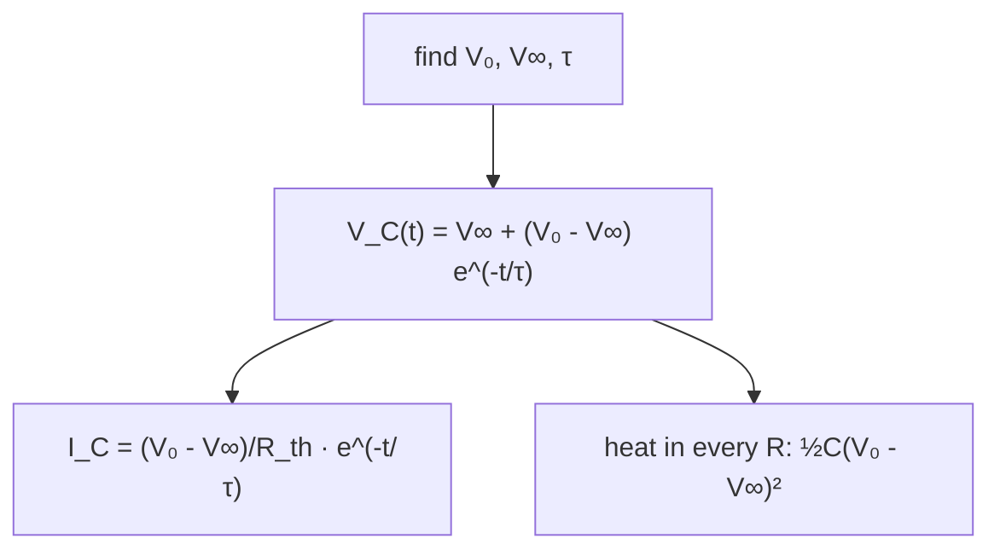

> *Read:* V_C can never jump while the power stays finite — continuity is a consequence of finite power, not of capacitors.

> **The algorithm (four verbs: open, solve, close, check)**
>
> 1. **Open.** Replace every capacitor by a break in the wire. The rest of the circuit is then purely resistive.
> 2. **Solve.** Find the node voltages of that resistor network (one equation per unknown node; for a tree, just
>   potential division).
> 3. **Close.** Put each capacitor back. Its voltage is the difference of the two node voltages it spans, and each
>   plate carries $Q=C\,\Delta V$, signed: the plate at higher potential carries $+Q$.
> 4. **Check.** Two checks, both cheap: any *isolated island* must still hold the total charge it held before
>   the switching (§4.1); and any node that was never wired to a source must have $\sum_{\text{plates at node}}Q=0$.

**Why step 1 is legitimate.** The branch law is $I=C\,dV/dt$. A *constant* voltage across a capacitor therefore means *zero* current, whatever else the circuit is doing. Nothing about the size of $C$ enters: at $t=\infty$ a 1 pF and a 3000 F capacitor are equally good open circuits. Equally important is what step 1 does *not* say: $I=0$ does not make the branch irrelevant to $V$ — it fixes only the current, and the voltage is whatever the rest of the circuit imposes, which is precisely what step 2 computes.

> **Three steady-state statements that are false, with the reason**
>
> - "The capacitor voltage is zero." Only if it is in parallel with a short, or was never connected. It is
>   $\Delta V_{\text{nodes}}$, and nothing else.
> - "No current flows, so nothing drops anywhere in that region." Current flows freely in the *resistive*
>   parts; only the capacitor branch is dead. In Fig. 6.1 the loop current is $V/(R_1+R_2)$ even though
>   $C_1$ carries none.
> - "Charge must be conserved, so the capacitors share." Sharing is a *transient* phenomenon that requires a
>   conducting path while current flows. If the final state is reached with a switch still open, no charge moved:
>   conservation constrains only what had a path. Hence step 2 before any talk of charge.

### 6.2 One capacitor anywhere: why $\tau=R_{\text{th}}C$

Take any network of ideal cells and resistors with a single capacitor attached between two terminals. Replace everything else by its Thévenin equivalent — *kill* the sources (voltage sources → short, current sources → open), read the resistance $R_{\text{th}}$ between the terminals and the open-circuit voltage $V_{\text{th}}$. Now there is one loop:

$$
V_{\text{th}}=V_C+IR_{\text{th}},\qquad I=C\frac{dV_C}{dt} \qquad\Longrightarrow\qquad \frac{dV_C}{dt}=\frac{V_{\text{th}}-V_C}{R_{\text{th}}C} \tag{6.1}
$$

whose unique solution from $V_C(0)=V_0$ is

$$
\boxed{\;V_C(t)=V_{\text{th}}+\left(V_0-V_{\text{th}}\right)e^{-t/\tau}\;}, \qquad \tau=R_{\text{th}}C,\qquad I(t)=\frac{V_0-V_{\text{th}}}{R_{\text{th}}}\,e^{-t/\tau} \tag{6.2}
$$

Read the box as a *recipe*, because that is what it is: the three-number method. Find the initial value, the final value and $\tau$, and the graph is fully determined — and with it $V_R$, $Q$, $I$, the energy in each element and the heat in the resistors, since all of them are proportional to $V_C-V_{\text{th}}$ or to its derivative.

**Fig. 6.2** — The single curve that answers most RC questions. Note what is *discontinuous* at $t=0$: the current and $V_R$ jump by the full amount while $V_C$ cannot move at all. Note also that "the time constant" is a statement about $V_C-V_{\text{th}}$, not about $V_C$: if the capacitor starts on the other side of $V_{\text{th}}$, it first discharges and then charges, and the graph crosses zero — a shape that surprises anyone who memorised only the rising curve.

> **Why V_C cannot jump — and the three exceptions**
>
> $V_C=Q/C$ and $dQ/dt=I$. Changing $V_C$ by a finite amount in zero time needs infinite current, hence infinite power in any element with nonzero resistance. So **continuity of capacitor voltage is a consequence of finite available power**, not a property of capacitors. It fails in exactly three idealisations, and a good answer names them: (i) an ideal voltage source wired directly across an uncharged capacitor — the source is *defined* as a zero-impedance infinite-current reservoir, and the model quietly spends the missing energy on radiation and a spark (cf. §3.6); (ii) a current impulse, an admissible fiction since $\Delta V=\Delta Q/C$ only needs $\int I\,dt$; (iii) two capacitors joined through a switch, where what is conserved is the *island's* charge, so the pair's final voltage comes from charge conservation rather than from either capacitor's continuity. Everything in this chapter assumes none of the three at the switching instant.

### 6.3 Charge through a branch, and the exact one-half

JEE's most common request is not $V_C(t)$ but *"find the charge that flowed through the battery / through the switch / from B to C"*. One rule does all of them:

> **Charge-through-a-branch rule**
>
> Choose a closed surface that cuts the branch of interest once and encloses everything on one side of it. Charge is conserved inside that volume, so
>
>  $$
> Q_{\text{through branch}}=\sum_{\text{plates inside}}\Delta Q_{\text{plate}}\qquad\text{(signed)}
> $$
>
>  with the convention that $Q>0$ means positive charge entered through the cut in the direction you chose. In practice: "charge through the cell" is the increase in charge on all plates connected to its positive terminal; "charge through the switch" is the increase in charge of the island it feeds. The surface argument is the *proof* — whatever complicated shape the current has, its time integral is fixed by the end states.
>
>  The rule has one hypothesis, and it is what makes or breaks the shortcut: **every other branch leaving the surface must end on a capacitor plate.** If a resistor leads from the enclosed region to the far rail instead, part of the charge drains through it and is not countable from end states alone. Q3 sits exactly on that boundary.

Apply the same bookkeeping to energy. Charging an uncharged $C$ from a cell $V$ through $R$:

$$
I(t)=\frac{V}{R}e^{-t/RC},\qquad \underbrace{W_{\text{cell}}=V\!\int_0^\infty\!I\,dt=CV^{2}}_{\text{only }Q=CV\text{ is needed}},\qquad \underbrace{\int_0^\infty I^{2}R\,dt=\frac{V^{2}}{R}\cdot\frac{RC}{2}=\frac12CV^{2}}_{\text{heat in }R},\qquad U=\frac12CV^{2} \tag{6.3}
$$

The three balance, and the heat is *independent of* $R$, of whether the capacitor really started at zero, and of how long you wait: it is $\tfrac12CV^{2}$ for every $R>0$, from megohms to milliohms. This is chapter 3's two-capacitor paradox with its bookkeeping made explicit — and the reason the $R\to0$ limit is finite is visible in the middle term: $I\propto1/R$ makes $I^{2}R$ independent of $R$.

> **How to lose less than one half: change the schedule, not the resistor**
>
> The loss is not the resistor's fault; it is the *step*'s. Drive the same $RC$ with a source whose voltage ramps over a time $T$ instead, and at every instant $I\approx C\,\dot V_s$, so the heat is
>
>  $$
> H=\int_0^{T}\!RC\,\dot V_s^{2}\,dt=\frac{CV^{2}}{T}\quad(\text{linear ramp}) \qquad\Longrightarrow\qquad \frac{H}{\frac12CV^{2}}=\frac{2}{T/RC}
> $$
>
>  Make the ramp long compared with $\tau$ and the loss vanishes: charging can be made arbitrarily reversible, and in a switched-mode supply, a camera flash and the soft-start of every large capacitor bank, that is exactly what is done. The lesson generalises well beyond circuits: **dissipation is the price of driving a system faster than its own relaxation time**, and the lever is always "go slower", never "use a better resistor".

### 6.4 Two or more capacitors: n states, n time constants

With several capacitors the state is a vector. Write $\vec Q=\mathbf C\vec V$ (§4.3's capacitance matrix, or simply the list $Q_k=C_kV_k$ with one node equation each) and $\dot{\vec Q}=-\mathbf G\vec V+\vec i_s$ with $\mathbf G$ the conductance matrix of the resistive network. Eliminating $\vec V$:

$$
\frac{d\vec V}{dt}=-\mathbf C^{-1}\mathbf G\,\vec V+\mathbf C^{-1}\vec i_s \qquad\Longrightarrow\qquad \tau_k^{-1}=\lambda_k\!\left(\mathbf C^{-1}\mathbf G\right) \tag{6.4}
$$

so an $n$-capacitor network has $n$ exponentials and *no single time constant*: which $\tau$ an experiment sees depends on which coordinate you watch and how you started. That is why a dielectric's $\kappa''$ is a sum of Debye circles (chapter 5) and why a supercapacitor's discharge is not exponential at all (§6.7). Two structurally important cases collapse to one exponential:

- **The series loop**$V$–$R$–$C_1$–$C_2$: one path, so the same current flows through both
  capacitors at all times and $Q_1(t)\equiv Q_2(t)$. The pair behaves as a single $C_{\text{ser}}$ with
  $\tau=RC_{\text{ser}}$, and the final voltage split is $V_1:V_2=1/C_1:1/C_2$ — the series rule holds
  *transiently*, not just in steady state, for this topology.
- **A symmetry that removes a mode.** If identical arms make one eigenvector of
  $\mathbf C^{-1}\mathbf G$ invisible to the excitation (as in §4.5's folding), only one exponential survives.
  Spotting it is worth the whole calculation, and it is the capacitor analogue of shorting equipotential nodes.

### 6.5 The compensated divider: where the transient disappears

The circuit of Fig. 6.3 — $R_1\parallel C_1$ in series with $R_2\parallel C_2$, driven by a step — is the oscilloscope probe, the compensating network in every resistive HV divider, and the clearest illustration that "the capacitor is the frequency version of the resistor". Node equation at the junction:

$$
\frac{V_s-V_J}{R_1}+C_1\frac{d(V_s-V_J)}{dt}=\frac{V_J}{R_2}+C_2\frac{dV_J}{dt} \quad\Longrightarrow\quad V_J(t)=V_\infty+\left[V_J(0^{+})-V_\infty\right]e^{-t/\tau}
$$

$$
V_\infty=V_s\frac{R_2}{R_1+R_2},\qquad V_J(0^{+})=V_s\frac{C_1}{C_1+C_2}, \qquad \tau=\left(R_1\| R_2\right)\left(C_1+C_2\right) \tag{6.5}
$$

At the instant of switching the resistors are irrelevant — uncharged capacitors are shorts — so the step divides *capacitively*; at $t=\infty$ the capacitors are open and it divides *resistively*. The division ratio is therefore frequency-independent iff the two limits agree:

$$
\frac{C_1}{C_1+C_2}=\frac{R_2}{R_1+R_2}\quad\Longleftrightarrow\quad \boxed{\;R_1C_1=R_2C_2\;}\qquad\text{then }V_J(t)=V_s\,R_2/(R_1+R_2)\ \text{for all }t \tag{6.6}
$$

With the trimmer capacitor of a 10× probe you are watching this equality directly: under-compensation rounds the edge, over-compensation spikes it, and the flat top you tune for on the calibration square wave *is* $R_1C_1=R_2C_2$. The same equality appears as the balance condition of §4.4's bridge (there $C_1/C_2=C_3/C_4$) and as the "no transient" condition of an electret's bias network — one condition, three names.

**Fig. 6.3** — The compensated divider and the three possible edge shapes. The "spike then droop" signature is a diagnostic, not an accident: it says the high-frequency division ratio is *too small*, i.e. $C_1$ is too large (or the cable capacitance too big, which is why probe compensation must be redone when you change cables).

### 6.6 Relaxation: charging to a threshold is an oscillator

Put a device across the capacitor that *shorts* it above a threshold and *opens* it below a lower one (a neon lamp, a Schmitt trigger, a UJT, a flashlamp, a membrane). Between thresholds the capacitor simply follows (6.2) toward $V_\infty$, so the time between any two voltages is obtained by inverting the exponential — the single most useful piece of algebra in this chapter:

$$
t=\tau\ln\frac{V_\infty-V_{\text{start}}}{V_\infty-V_{\text{end}}} \qquad\Longrightarrow\qquad T_{\text{period}}=RC\ln\frac{V-V_{\text{lo}}}{V-V_{\text{hi}}} \tag{6.7}
$$

Two things to notice. The *amplitude* of the swing is set by the device and the *period* by $RC$: that is the definition of a relaxation oscillator, and why a 555's frequency is set by one product $RC$ while its duty cycle is set by *which* resistors charge and discharge it (with the 555's fixed thresholds $V/3$ and $2V/3$ each half-cycle is exactly $\tau\ln2$, giving $T=1.386\,RC$ for symmetric paths). And the logarithm is *weak* in its argument, so the frequency barely depends on the supply voltage over a wide range — that robustness, not precision, is why relaxation oscillators drive tone generators, turn indicators and clock chimes.

> **The two conditions for oscillating at all**
>
> **Strike:** charging must be able to reach $V_{\text{hi}}$, i.e. $V>V_{\text{hi}}$. **Extinguish:** while the device conducts, the capacitor sits at the device's own voltage $Vr/(R+r)$, which must fall *below* $V_{\text{lo}}$, i.e. $r\le V_{\text{lo}}R/(V-V_{\text{lo}})$. Between them these define the oscillating window; outside it the circuit latches. Load-line reasoning is the way to see it without algebra: draw the straight line $V=V_s-IR$ across the device's negative-resistance region — oscillation happens iff the line cuts the device's $V$–$I$ curve three times.

**Fig. 6.4** — A relaxation oscillator and its waveform. The top of each charging exponential is *clipped* at $V_{\text{hi}}$; that clipping is what turns a monotone curve into a clock, and it is why the period *diverges* at threshold rather than merely growing.

### 6.7 The leaky capacitor, and the two-τ supercapacitor

A real capacitor is $C$ in parallel with $R_{\text{leak}}$, in series with an equivalent series resistance $R_s$. Fed through $R$ from a cell $V$, its final voltage is *not* $V$ but the divider value $V_\infty=V\,R_{\text{leak}}/(R+R_{\text{leak}})$, and there are two time constants, $R_tC$ and $R_{\text{leak}}C$. Two consequences worth stating in an exam: a series stack needs balancing resistors *because* the individual leakages differ (§4.2), so $R_{\text{leak}}$ decides which element takes the over-voltage; and an electrostatic voltmeter or electrometer reads low across a charged isolated capacitor unless its input resistance exceeds $R_{\text{leak}}$ by two decades.

Supercapacitors are worse, instructively so. Their electrodes are porous carbon: the electrolyte fills a maze of micrometre pores whose walls carry the double-layer capacitance. Along a pore the electrolyte has real resistance, so the structure is a *distributed* ladder of series resistance $r$ and shunt capacitance $c$ per unit length:

$$
\frac{\partial V}{\partial x}=-ri,\qquad \frac{\partial i}{\partial x}=-c\frac{\partial V}{\partial t} \qquad\Longrightarrow\qquad \frac{\partial^{2}V}{\partial x^{2}}=rc\,\frac{\partial V}{\partial t}, \qquad Z_{\text{in}}(\omega)=\sqrt{\frac{r}{i\omega c}}=(1-i)\sqrt{\frac{r}{2\omega c}} \tag{6.8}
$$

— diffusion, not relaxation. $Z\propto(1-i)/\sqrt\omega$ is a *Warburg* (constant-phase) impedance, a 45° line on the Smith chart, and in the time domain the charge absorbed grows as

$$
Q(t)\propto\sqrt t\ \ \text{until}\ \ t\sim rc\,\ell^{2},\quad\text{when the far end of the pore finally fills} \tag{6.9}
$$

which is why a supercapacitor's "self-discharge time constant" is a marketing number that must be quoted with its soak time, why its $\tan\delta$ varies slowly with frequency instead of showing a Debye peak, and why the $n\to\infty$ limit of (6.4)'s discrete eigenvalues is a branch cut: **a continuous line has infinitely many time constants**, and for such an object any "the" time constant is a rounding.

### 6.8 Sinusoidal steady state: impedance is the same τ in different clothes

Put $V_s=V_0e^{i\omega t}$ into (6.1): $d/dt\to i\omega$, the capacitor becomes $Z_C=1/i\omega C$, and every result of chapter 4 survives with $R\to Z$. For the single pole:

$$
\frac{V_{\text{out}}}{V_{\text{in}}}=\frac{1}{1+i\omega\tau},\qquad |H|=\frac1{\sqrt{1+\omega^{2}\tau^{2}}},\qquad \arg H=-\arctan\omega\tau, \qquad f_{-3\,\text{dB}}=\frac1{2\pi\tau}=\frac1{2\pi RC} \tag{6.10}
$$

- **One number does both jobs.** The same $\tau$ fixes the −3 dB corner and the step-response speed,
  because both are properties of the one pole. Its 10–90% rise time is $\tau\ln9=2.20\tau$, so
  $t_r=2.20/2\pi f_c=0.35/f_c$: the "0.35 rule" of oscilloscope bandwidth is this line and nothing else.
- **Everything happens at the corner.** At $\omega\tau=1$: amplitude $1/\sqrt2$, power into a fixed
  load exactly $\tfrac12$ (hence "−3 dB"), phase lag exactly $45^\circ$. That triple coincidence is the
  fastest experimental check that a filter is *one* pole — measure phase, not just magnitude, and a hiding
  second pole cannot stay quiet.
- **A square wave is both tests at once.** Drive the RC with a square wave of period $\gg\tau$ and you see
  exponentials (this chapter); of period $\ll\tau$ and you see differentiation,
  $V_{\text{out}}\approx\tau\,dV_{\text{in}}/dt$ — a "DC blocker" or a "coupling capacitor". The two limits are
  one equation read at opposite ends, which is why $\tau$ is the only number an engineer ever asks for.
- **Losses reappear here.**$\tan\delta=\kappa''/\kappa'$ of chapter 5 is, in circuit language, the
  dissipation factor $D=1/(\omega C R_p)=\omega C\,R_{\text{ESR}}$ (series form), and the quality factor of the
  capacitor itself is $Q=1/\tan\delta$ — the same symbol doing a different job from the $Q$ of charge. At the
  corner of a *lossy* capacitor the pole is no longer at $1/RC$ but at
  $\omega\sqrt{1+D^{2}}/RC$: for $D=0.1$ that is a 0.5% shift, which is why class-2 ceramics are
  unusable in a tuned circuit long before the capacitance drift kills you.

> **AC bridges: chapter 4 with complex numbers**
>
> $$
> \text{balance}\iff \frac{Z_1}{Z_2}=\frac{Z_3}{Z_4} \qquad\text{(two real equations)}
> $$
>
>  Magnitudes *and* phases must both balance. This is why an AC bridge has *two* controls and why "null, then adjust the other knob, then null again" iterates: the settings are coupled unless you choose elements so that one changes only phase (a pure capacitor) and the other only magnitude (a pure resistor). With $Z_2$ a resistor and $Z_4$ a parallel $RC$, for instance, balance forces $\omega=\tan\theta/\dots$ — the general statement is more useful than any one bridge: **a complex balance condition is two conditions, and a bridge with only one adjustable element cannot null at an unknown frequency.**

### 6.9 Questions

The first five are standard JEE Advanced shapes; the rest are where INPhO pushes.

### **Q1** A capacitor C is charged from a cell V through R. At what time are the powers in R and in C equal, and what fraction of the total heat has been produced by then? _(base · two lines)_

Solution

$P_R=I^{2}R$ and $P_C=V_CI$ are equal when $IR=V_C$; the loop says $IR=V-V_C$, hence $V_C=V/2$ — at $t=\tau\ln2=0.693\,RC$, the same instant as the half-charge time.

$$
\int_0^{\tau\ln2}\!I^{2}R\,dt=\frac{V^{2}}{R}\cdot\frac{\tau}{2}\left(1-e^{-2\ln2}\right) =\frac34\cdot\frac12CV^{2}
$$

**Three quarters of the total heat is produced before the capacitor reaches half its final voltage.** So the loss is front-loaded: which is exactly why fast-charge circuits spend all their effort on the first $0.7\tau$ and why the ramp trick of §6.3 pays — slowing down the beginning recovers most of the loss.

### **Q2** Uncharged C₁ = 2 µF and C₂ = 3 µF are connected in series with R = 5 kΩ across a 100 V cell at t = 0. Find the final charge on each, τ, the total heat in R, and the charge that passed through the cell. Is V₁ : V₂ = 3 : 2 only at t = ∞ or at every instant? _(JEE-adv)_

Solution

$$
C_s=1.2\ \mu\text{F},\quad Q_f=C_sV=120\ \mu\text{C},\quad \tau=RC_s=6\ \text{ms}, \quad H=\tfrac12C_sV^{2}=6\ \text{mJ},\quad Q_{\text{cell}}=120\ \mu\text{C}
$$

The cell's answer and (i)'s are the same number by the branch rule — the only plate its positive terminal feeds is C₁'s, and it ends at $+120$ µC. (Writing $Q=\int I\,dt$ with $I=(Q_f/\tau)e^{-t/\tau}$ returns 120 µC ✓ and is a good sanity check on the exponential.)

**The ratio question is the point of the problem.** One path means the same current through both capacitors at all times and, both starting uncharged, $Q_1(t)\equiv Q_2(t)$. So $V_1:V_2=1/C_1:1/C_2=3:2$ for *every* $t>0$: 60 V on C₁ and 40 V on C₂, summing to 100 V ✓ at all times, not merely at the end. **Contrast the version where each capacitor has its own resistor across the cell**: then the voltages are independent, the charges never equalise, and "series ⇒ equal charge" is revealed as a statement about there being one path rather than about capacitors. Mixing the two topologies up is the most common single error in this topic.

### **Q3** A 50 V cell feeds two parallel branches through a switch: branch 1 is R₁ = 10 kΩ in series with C₁ = 1 µF, branch 2 is R₂ = 5 kΩ in series with C₂ = 2 µF, both branches returning to the cell's other terminal. Both capacitors start uncharged. Find the final charges, the total charge through the switch, the two time constants, the total heat, and say whether the switch current is a single exponential. _(JEE-adv · the algorithm, executed)_

Solution

**Final charges.** Opening both capacitor branches opens both branches completely, so no current flows, no resistor drops anything, and each capacitor ends at the full cell voltage: $Q_1=50\ \mu$C, $Q_2=100\ \mu$C.

**Charge through the switch.** The surface cutting the switch lead encloses the two resistors and the two upper plates; the only other things crossing it are capacitor dielectrics, which pass no current. §6.3's rule is legal here:

$$
Q_{\text{sw}}=Q_1+Q_2=150\ \mu\text{C}
$$

Had a third resistor tied the enclosed region to the return rail, charge would have drained through it and the endpoint method would fail — that is the hypothesis of the box, and this is the circuit on which it bites.

**Time constants.** Each branch is an independent single-loop RC: $\tau_1=R_1C_1=10$ ms, $\tau_2=R_2C_2=10$ ms.

**Heat.** $\tfrac12CV^{2}$ per branch whatever $R$ is (6.3): $H=\tfrac12(1+2)\times10^{-6}\times50^{2}=3.75$ mJ. Audit: the cell supplied $VQ_{\text{sw}}=7.5$ mJ and the field holds $\tfrac12(C_1+C_2)V^{2}=3.75$ mJ ✓.

**The current.** $I_{\text{sw}}(t)=V\left(e^{-t/\tau_1}/R_1+e^{-t/\tau_2}/R_2\right)$ — a sum of two exponentials, hence *not* a single exponential, so "the time constant of this circuit" is a category error. The chosen numbers make the two equal and the sum collapses to $\tau=10$ ms with $I(0^{+})=5+10=15$ mA. Change either resistor and a plot of $\ln I$ against $t$ is visibly bent; reading $\tau$ from the initial slope then overestimates it, which is the experimental mistake the question is built to punish.

### **Q4** C₁ = 2 µF at 100 V and C₂ = 3 µF at 50 V are joined in parallel through a resistor R. By solving the transient (not by the energy shortcut), find I(t), the total heat, and the heat in each of two unequal parts of R. _(JEE-adv → ch. 3 proved)_

Solution

Let $q(t)$ be the charge moved from 1 to 2, $q(0)=0$. KVL around the single loop:

$$
\left(V_1-\frac{q}{C_1}\right)-\left(V_2+\frac{q}{C_2}\right)=R\frac{dq}{dt} \quad\Rightarrow\quad \frac{dq}{dt}+\frac{q}{RC_s}=\frac{\Delta V}{R}, \qquad q(t)=C_s\Delta V\left(1-e^{-t/\tau}\right)
$$

with $C_s=1.2$ µF and $\tau=RC_s$. Therefore

$$
I(t)=\frac{\Delta V}{R}e^{-t/\tau},\qquad H=\int_0^\infty I^{2}R\,dt=\frac{\Delta V^{2}}{R}\cdot\frac{RC_s}{2}=\frac12C_s(\Delta V)^{2}=1.5\ \text{mJ}
$$

— chapter 3's (3.6), obtained by integration rather than by a conservation argument, with the same content: the loss is fixed by the end states, and it belongs to the *series* combination, not to either capacitor. The final common voltage is $70$ V and the audit closes: $U_i=15\ \text{mJ}$, $U_f=13.5$ mJ, difference 1.5 mJ ✓.

**Unequal halves.** There is one loop, so the same $I(t)$ flows through both parts at every instant and they divide as resistances: $H_1:H_2=R_1:R_2$, with the sum pinned. So the *total* loss is endpoint-determined while its *location* is not — which is why "the capacitor exploded at the switch" is a diagnosis you can only make from where the heat went, never from how much there was.

### **Q5** A half-wave rectifier feeds a load R = 12 Ω through a smoothing capacitor C = 2200 µF; the secondary peak is 17 V and the mains is 50 Hz. Find the ripple and the DC output, and state when the shortcut ΔV = V₀T/RC is legitimate. _(JEE-adv · design)_

Solution

Between conduction intervals the capacitor discharges through $R$ alone with $\tau=RC=0.0264$ s, so over $T=0.02$ s:

$$
\Delta V=V_0\left(1-e^{-T/\tau}\right)=17\left(1-e^{-0.758}\right)=9.0\ \text{V}, \qquad V_{\text{DC}}\approx V_0-\frac{\Delta V}{2}=12.5\ \text{V}
$$

The shortcut gives $V_0T/\tau=12.9$ V, a 43% overestimate, because $T/\tau=0.76$ is not a small parameter. **Legitimacy condition:** $1-e^{-x}\approx x$ needs $x=T/\tau\le0.1$, i.e. $RC\ge10T=0.2$ s. The load here draws $12.5/12=1.04$ A, five times more than this capacitor can filter quietly — which is why the same transformer with 22 000 µF is a decent supply.

The general sizing rule is just $\Delta Q=I\,\Delta t$ and $\Delta V=\Delta Q/C$:

$$
C\ \ge\ \frac{I_{\text{load}}\,T_{\text{rip}}}{\Delta V_{\max}},\qquad T_{\text{rip}}=\frac1f=20\ \text{ms (half-wave)},\quad \frac1{2f}=10\ \text{ms (full-wave)}
$$

**The stress the ripple voltage hides.** The whole charge $\Delta Q=C\Delta V=19.8$ mC must be returned by the diode while the mains sine exceeds the capacitor voltage — a window of a few milliseconds — so the diode's peak current is an order of magnitude above the load current and its rms value dominates heating of $R_{\text{ESR}}$. That is why an electrolytic in a cheap adaptor dries out, and why datasheets list ripple *voltage* and ripple *current* as two separate limits: the first is a specification of your circuit, the second a specification of the part's survival.

### **Q6** A neon lamp (striking 80 V, extinguishing 20 V) is across a 0.5 µF capacitor, and a 200 kΩ resistor connects them to a 120 V supply. Find the flashing frequency. What happens as the supply is lowered to 80 V, and above what lamp on-resistance does the circuit latch on? _(JEE-adv → INPhO)_

Solution

Only the charging phase takes appreciable time, so (6.7) gives the period outright:

$$
T=RC\ln\frac{V-V_{\text{lo}}}{V-V_{\text{hi}}}=0.1\ \text{s}\times\ln\frac{100}{40}=0.1\times0.916=91.6\ \text{ms} \qquad f=10.9\ \text{Hz}
$$

As $V\to V_{\text{hi}}^{+}$ the logarithm diverges and $f\to0$: the lamp flashes ever more slowly, and at exactly 80 V the capacitor can only approach the striking voltage asymptotically, so oscillation stops. (Real lamps also acquire a statistical *waiting time* to strike near threshold, so the last flashes are erratic — a circuit whose limitation is microscopic rather than circuit-theoretic.)

For the latch: while the lamp conducts with on-resistance $r$ the capacitor sits at $Vr/(R+r)$, and the discharge can only restart if that is below $V_{\text{lo}}$:

$$
\frac{120r}{200\ \text{k}\Omega+r}<20\ \text{V}\ \Longrightarrow\ 120r<4\times10^{6}+20r \ \Longrightarrow\ r<40\ \text{k}\Omega
$$

A device harder than 40 kΩ holds the capacitor above the extinguishing voltage and the circuit latches on. The same inequality is why a 555's discharge pin must sink more than the charge current at the lower threshold, or the output never returns low.

### **Q7** A 3000 F supercapacitor bank at 2.7 V is left open-circuit: it loses 0.30 V during the first hour and 0.10 V during the second. Is that ohmic leakage? Fit a model, extract an "effective leakage resistance", and say what a designer should conclude. _(Olympiad · reading data)_

Solution

**Test one exponential two ways: ratio and level.** $V=V_0e^{-t/\theta}$ makes the second-hour drop $e^{-1/\theta}$ times the first; the observed ratio $0.10/0.30=1/3$ needs $\theta=1/\ln3=0.91$ h — but then the first-hour drop should have been $2.7(1-e^{-1/0.91})=1.8$ V, six times what was measured. No single exponential has both this ratio and this level, so the ohmic-leakage model is dead.

**Try a diffusive relaxation.** Fit $V=V_0-at^{p}$: $a=0.30$ V, and $2^{p}=0.40/0.30$ ⇒ $p=0.42$ — which is $1/2$ within two data points, the $\sqrt t$ law of §6.7. A $\sqrt t$ decay has exactly this fingerprint: a rate that keeps slowing down without ever becoming exponential.

**What an "effective leakage resistance" is worth.** At 1 h, $I=C|dV/dt|=3000\times0.30\times0.42/3600=0.105$ A, so $R_{\text{eff}}=V/I\approx23\ \Omega$. If that really were an ohmic conductance the decay would have $\theta=R_{\text{eff}}C=6.9\times10^{4}$ s ($\approx19$ h), predicting a first-hour drop of $2.7(1-e^{-1/19})=0.14$ V (measured 0.30) and two *nearly equal* hourly drops (measured 0.30 then 0.10). Both are wrong in the same direction: the real decay is far more front-loaded than any single exponential, which is the signature of a *continuum* of relaxation times (the pore distribution of §6.7) rather than of a leak. With only two data points a logarithmic ("glassy") relaxation fits just as well as $t^{1/2}$ — deciding between them needs a third hour, and saying so is part of the answer.

**What a designer takes away.** There is no single leakage resistance to quote, so: series stacks need low-value balancing resistors (tens of ohms, not megohms — which is why supercapacitor modules ship with bleed networks and idle at milliamps, not nanoamps); the front-loaded drop means most of the useful charge is lost in the first minutes after a fast discharge unless the bank is allowed to relax before it is read; and any "self-discharge time constant" on a datasheet is a statement about a measurement protocol (soak time, temperature, prior charge rate), so two parts with different histories cannot be compared from the numbers alone.

### **Q8** Design the load resistance of a diode envelope detector for 1 MHz AM with 5 kHz maximum audio and modulation index 0.9, using C = 1 nF. Give each inequality with its reason, and the chosen value. _(JEE-adv · design with reasons)_

Solution

Two requirements on $RC$, pulling in opposite directions:

$$
\text{(a) hold between carrier peaks:}\quad RC\gg\frac1{\omega_c}=0.16\ \mu\text{s}; \qquad \text{(b) follow the envelope:}\quad RC\le\frac{\sqrt{1-m^{2}}}{m\,\omega_m}=15.4\ \mu\text{s}
$$

(b) is the one worth deriving. The capacitor can only fall through $R$; the diode resumes conduction only when the rising carrier catches up with the decaying capacitor voltage. If $RC$ is so long that the capacitor's exponential droop is steeper than the envelope's fastest fall, the diode stays cut off through the modulation trough and the output traces $V_0e^{-t/RC}$ instead of the audio — *negative-peak clipping*. Equating the two slopes at the trough, $V_0/RC=m\omega_mV_0/\sqrt{1-m^{2}}$, gives (b). At $m=0.9$ the factor $\sqrt{1-m^{2}}/m=0.48$ halves the allowance: **deep modulation, not the carrier, is what limits the time constant**, and the carrier merely sets the floor.

$$
1.6\ \text{k}\Omega\ll R\lesssim15\ \text{k}\Omega\qquad\text{choose}\quad R=10\ \text{k}\Omega,\ \ \tau=10\ \mu\text{s}
$$

Check: over a 100 µs audio half-period the capacitor droops by $1-e^{-0.1}=9.5\%$ while the envelope must swing ±90% — the trough is followed, with margin. Broadcast receivers add a third, much longer time constant for the AGC (≈0.5–1 s): the identical circuit, deliberately made too slow to respond to audio, which is the neatest demonstration in a radio that $\tau$ is not a property of a capacitor but of a *choice*.

### **Q9** An uncharged capacitor is connected to an ideal cell through (i) a resistor R, (ii) an inductor L, (iii) nothing. Find the energy lost in each case and reconcile the three answers. _(INPhO · the paradox, properly)_

Solution

**(i)** $\tfrac12CV^{2}$, independent of $R$, from (6.3).

**(ii)** The loop $V=Li'+q/C$ with $q(0)=i(0)=0$ gives $q(t)=CV\left(1-\cos\omega_0t\right)$, $\omega_0=1/\sqrt{LC}$. At $t=\pi/\omega_0$ the current is back to zero with $q=2CV$, so

$$
W_{\text{cell}}=V\cdot2CV=2CV^{2},\qquad U_C=\tfrac12C(2V)^{2}=2CV^{2} \qquad\Longrightarrow\qquad \text{loss}=0
$$

with nothing lost *and* the capacitor ending at $2V$, not $V$. Add a small $R$: the ringing decays, the final state becomes $V_C=V$, the cell still delivers the same $Q=CV$ over the whole episode — so the heat is $CV^{2}-\tfrac12CV^{2}=\tfrac12CV^{2}$ for every $R>0$, including the limit. The loss is therefore *discontinuous* at $R=0$: the two limits do not commute.

$$
\lim_{R\to0^{+}}H=\frac12CV^{2}\ \ne\ H\big|_{R=0}=0 \qquad\text{(and with }L=0:\ \text{no solution at all)}
$$

**(iii)** With neither $R$ nor $L$ the model has no solution: "the capacitor voltage equals an ideal source's voltage" must hold instantly, requiring an impulse of current across zero impedance and infinite power. Any number you produce from it ("½CV² lost", "nothing lost") is a statement about the regularisation you smuggled in, not about physics. That is the actual lesson, and it is the same mathematics as the two-capacitor paradox of §3.6 — there also the loss survives every attempt to make the connection lossless, because the $R\to0$ and $L\to0$ limits are taken in the wrong order. Where a question asks "where did the missing half go?", the full credit answer is: *into whichever element you added to make the problem well-posed, and its fraction of the total is determined by that element, not by the capacitors.*

### **Q10** An RC pair is driven by a square wave of amplitude ±V₀ and half-period T. Find the periodic steady-state waveforms of V_C and I, the peak-to-peak swing and the mean current; show the load behaves as a capacitor of value C·tanh(T/2τ); and deduce why a switched-capacitor voltmeter reading is independent of R. _(Olympiad · periodic-state analysis)_

Solution

Let the capacitor voltage reverse between $\pm V_a$. Ending a half-period of charging toward $+V_0$ from $-V_a$ means $V_a=V_0-(V_0+V_a)e^{-T/\tau}$, so with $x=T/\tau$:

$$
V_a=V_0\,\frac{1-e^{-x}}{1+e^{-x}}=V_0\tanh\frac{x}{2}, \qquad V_C(t)=V_0-\left(V_0+V_a\right)e^{-t/\tau},\qquad I(t)=\frac{V_0+V_a}{R}\,e^{-t/\tau}
$$

(the identity is $\tanh(x/2)=(e^{x/2}-e^{-x/2})/(e^{x/2}+e^{-x/2})$). The output is a chain of exponential arcs of peak-to-peak swing $2V_0\tanh(T/2\tau)$. Two limits, both worth stating: slow drive ($T\gg\tau$) gives $V_a\to V_0$, an almost square output; fast drive ($T\ll\tau$) gives $V_a\approx V_0T/2\tau$, a small triangular ripple — the same component acting as an averager. Hence the mean current, from the branch rule rather than by integrating:

$$
\langle I\rangle=\frac{\Delta Q}{T}=\frac{2CV_a}{T}=\frac{2CV_0}{T}\tanh\frac{T}{2\tau} \qquad\Longrightarrow\qquad C_{\text{eff}}=C\tanh\frac{T}{2\tau}
$$

For $T\gg\tau$ the transferred charge is exactly $2CV_0$ and $\tau=RC$ has vanished: charge transfer between two known potentials is an *endpoint* question. That is the principle of the charge-balancing (switched-capacitor) integrating voltmeter — transfer the unknown's charge through the same $RC$ network into a virtual ground, count cycles to balance, and every series and contact resistance that merely *slows* the transfer drops out of the answer, at the price of having to wait for each transfer to complete.

**The theorem to keep:** endpoint quantities (charge per cycle, energy computed from charge, mean current over a complete cycle) do not depend on $R$; rate quantities ($\tau$, ripple, settling time) are proportional to it. Half the questions in this chapter are decided by noticing which of the two is being asked.

### 6.10 Drill: say it in one line

| # | statement | right / wrong, and why |
| --- | --- | --- |
| 1 | "$\tau$ is the time for the capacitor to charge." | Wrong — it is the time to 63.2%; it never finishes (5τ leaves 0.7%). The half-charge time is $0.69\tau$. |
| 2 | "The current through a capacitor cannot change suddenly." | Wrong — the *voltage* cannot; the current may jump by the full amount, since nothing bounds $dV/dt$. |
| 3 | "For one capacitor in any resistive network, τ = (resistance seen by C with sources killed)·C." | Right, and it is a theorem (§6.2), not a rule of thumb. "Killed" means voltage sources shorted, current sources opened. |
| 4 | "Charge through the battery = C × (change in capacitor voltage)." | Only when nothing else crosses the chosen surface. Use the branch rule of §6.3 and check its hypothesis (Q3). |
| 5 | "Heat produced in R while charging depends on R." | Wrong for the total (½CV² for any $R>0$); right for the rate and for partial intervals — 75% of it within the first $0.7\tau$ (Q1). |
| 6 | "Capacitors in series always carry equal charge." | They carry equal *changes* of charge if they share an island; equality of the charges themselves needs a common initial condition. §4.1, again. |
| 7 | "A capacitor blocks DC and passes AC." | A mnemonic, not engineering: $Z_C=1/\omega C$ has magnitude *and* phase, and near the corner "passes" means 45° of lag and half the power. Say $f_c=1/2\pi RC$. |
| 8 | "A 10× probe works because the two dividers match." | Right, quantitatively: $R_1C_1=R_2C_2$ makes the capacitive and resistive ratios equal, so the ratio is frequency-independent (§6.5) — and it is C₁, not C₂, that carries the trimmer because the scope's input is the unknown. |
| 9 | "Two capacitors and two resistors always give two time constants." | Only when neither mode is invisible: $n$ states give up to $n$ exponentials, and symmetry or compensation (Fig. 6.3) can hide all but one. |
| 10 | "A supercapacitor has a self-discharge time constant." | Wrong as physics: a distributed pore line has a $\sqrt t$ law and a continuum of τ's (Q7), so the figure is a specification of a measurement, not of a device. |

> **Chapter 6 in six lines**
>
> - Steady state = open every capacitor branch, solve the resistor graph, then $Q=C\Delta V$, then check the
>   islands.
> - One capacitor anywhere: $V_C=V_\infty+(V_0-V_\infty)e^{-t/\tau}$ with $\tau=R_{\text{th}}C$;
>   $V_C$ is continuous (finite power), everything else may jump.
> - Charge through a branch = the signed sum of plate-charge changes inside any surface cutting that branch once —
>   provided nothing else crosses it.
> - Heat in the series resistance of a step charge is $\tfrac12CV^{2}$ for every $R>0$; to lose less,
>   ramp the source over $T\gg RC$ (and Q9 explains why "R = 0" is not the way out).
> - $n$ capacitors give $n$ time constants; a compensated divider is the case where one is exactly
>   cancelled, a distributed line the case where there are infinitely many and $Q\propto\sqrt t$.
> - Threshold plus RC is a clock: $t=\tau\ln\frac{V_\infty-V_{\text{start}}}{V_\infty-V_{\text{end}}}$ — the
>   same $\tau$ that in AC clothes is $f_c=1/2\pi\tau$.

### 6.11 Checkpoint

- State the four-step steady-state algorithm and the three false statements in §6.1's trap box, each with its
  reason.
- Prove $\tau=R_{\text{th}}C$ from the Thévenin reduction in three lines, and say why the proof fails when a
  second capacitor is added.
- Do Q1 in your head: $V_C=V/2$, $t=0.69\tau$, 75% of the heat. If those three come instantly, the core
  of this chapter is yours.
- Use the branch rule for Q2's cell charge and Q3's 150 µC, and state Q3's hypothesis out loud.
- Derive (6.5)'s three numbers for the compensated divider and explain why the trimmer capacitor is $C_1$.
- Get the relaxation period from (6.7) and both oscillation conditions from the trap box — the load-line version,
  not just the inequalities.
- Explain why §6.7's porous electrode has *no* time constant, then re-derive
  $Z\propto1/\sqrt\omega$ from the two ladder equations.
- Answer Q9 in one paragraph, out loud. If you can, you know the difference between a physical limit and the failure
  of a model.

Next: [7 · Advanced topics — coefficients of capacitance, Green's reciprocity, images, conformal maps, MEMS pull-in and the Rayleigh limit](#section-07-advanced-topics)

_INPhO / IPhO / IOPT · JEE Advanced (top bracket) · needs ch. 1–6_

## 7 · Advanced topics: the machinery behind the tricks

Chapters 1–6 used four tools: Gauss, superposition of series/parallel pieces, energy, and symmetry. This chapter makes each of them systematic and shows what they cost. The capacitance *matrix* replaces "the capacitor"; Green's reciprocity answers questions about induced charge that cannot be answered by any amount of image-charge ingenuity; the spheroid family and conformal mapping give the exact answer for the shapes that are not planes, cylinders or spheres; and the last three sections apply all of it to the places where real capacitors stop behaving: a membrane that snaps shut, a droplet that explodes, a tip that sparks.

### 7.1 Many conductors: the capacitance matrix, and what its entries mean

For $N$ conductors, with everything else (including infinity) at zero, linearity gives

$$
Q_i=\sum_{j=1}^{N}c_{ij}V_j,\qquad c_{ij}=c_{ji},\qquad U=\frac12\sum_{i,j}c_{ij}V_iV_j \tag{7.1}
$$

$c_{ii}$ is the charge needed on conductor $i$ when it alone is raised to unit potential with *all other conductors grounded*; $c_{ij}$ ($i\ne j$) is the charge that appears on $j$ when $i$ is at unit potential. The inverse matrix $\mathbf p=\mathbf c^{-1}$ is the *coefficients-of-potential* (elastance) matrix, $V_i=\sum_jp_{ij}Q_j$, and it is the one built directly by superposition in chapter 2 ($p_{ii}=1/4\pi\varepsilon_0a_i$ for a lone sphere, $p_{ij}=1/4\pi\varepsilon_0d_{ij}$ for widely separated ones).

> **Four structural facts, each provable in one line**
>
> 1. **Symmetry**$c_{ij}=c_{ji}$: Green's reciprocity (§7.2), or the energy argument that
>   $\partial Q_i/\partial V_j=\partial Q_j/\partial V_i=\partial^{2}U/\partial V_i\partial V_j$.
> 2. **Sign:**$c_{ij}\le0$ for $i\ne j$. Raise $i$ to $+V$ and ground $j$: the
>   potential in the region has no interior maximum, so it decreases monotonically toward $j$ and
>   $E_n$ on $j$ points *inward* ⇒ $Q_j<0$. (Physically: a grounded neighbour is always
>   negatively charged by its neighbours.)
> 3. **Row sums are physical:** set every conductor to the same $V$: then
>   $Q_i=V\sum_jc_{ij}$ is the share of the charge that lands on conductor $i$ of one merged equipotential
>   bundle, and $V^{-1}\sum_{i}\sum_{j}c_{ij}$ is the capacitance of that bundle to infinity. In particular, if
>   conductor $i$ is *completely enclosed* by others the field in the enclosing cavity vanishes, so
>   $\sum_jc_{ij}=0$: Faraday's ice-pail experiment as a matrix identity.
> 4. **Positive definiteness:**$U=\tfrac12\vec V^{T}\mathbf c\vec V>0$ for every nonzero
>   $\vec V$ (chapter 1's "the field energy is a sum of squares"), so $\det\mathbf c>0$, all eigenvalues
>   positive, and $\mathbf c^{-1}$ exists. Any matrix proposed as "a capacitance matrix" that violates one of
>   (1)–(4) is not one.

The payoff is that *every* reduction you have ever done is one matrix operation.

> **Eliminating a node = Schur complement (four uses, one formula)**
>
> If conductor $k$ is **floating and uncharged**, $Q_k=0$ fixes $V_k=-\sum_{j\ne k}(c_{kj}/c_{kk})V_j$; substituting back leaves the reduced matrix
>
>  $$
> c^{\,\text{red}}_{ij}=c_{ij}-\frac{c_{ik}c_{kj}}{c_{kk}}
> $$
>
>  - **A two-terminal capacitance.** Take $i=1,j=1$, $k=2$ with conductor 2 floating:
>   $C_{11}^{\text{float}}=c_{11}-c_{12}^{2}/c_{22}$. Since $\det\mathbf c=c_{11}c_{22}-c_{12}^{2}>0$ this is
>   positive ✓ and it is *smaller* than $c_{11}$ — **a floating neighbour is always less effective than a grounded one**.
> - **Chapter 4's series rule.** Two conductors plus a floating island: the same algebra, and the reason it works
>   is that the island's equation can be solved exactly.
> - **A Δ–Y transform.** Eliminating one node of a 4-node network reproduces §4.6's
>   $C_{ij}=C_iC_j/S$ — the transform *is* Gaussian elimination on $\mathbf c$.
> - **A shield.** If $k$ encloses $i$, then $c_{ij}=0$ for all $j$ outside: the Schur
>   complement is exact and there is nothing left to reduce — that is why coax works, and why "guarding" is
>   mathematically the same as shielding.

**Fig. 7.1** — Left: "the capacitance of a conductor" is not defined until the state of every other conductor is, and the Schur complement $c_{ij}-c_{ik}c_{kj}/c_{kk}$ is the whole answer (numbers from Q1, $s=a/d=1/4$). Right: the closed surface used by §6.3's branch rule — draw it so only the branch you are asked about crosses it, and the answer follows from the two end states alone.

### 7.2 Green's reciprocity, and the questions it alone can answer

**Theorem.** For two charge/configurations in the same geometry (same conductors, same permittivity map):

$$
\sum_iQ_iV_i'=\sum_iQ_i'V_i \tag{7.2}
$$

**Proof in three lines.** Over the whole field region $\int\varepsilon\vec E\cdot\vec E'\,d\tau$ is symmetric in $(V,V')$. But $\vec E=-\vec\nabla V$ and $-\vec\nabla\cdot(V'\varepsilon\vec E)=\varepsilon\vec E\cdot\vec\nabla V'-V'\underbrace{\vec\nabla\cdot(\varepsilon\vec E)}_{=0}$, so the integral equals $-\oint V'\varepsilon\vec E\cdot d\vec a=\sum_iV_i'Q_i$ (the surface at infinity contributes nothing since $V\sim1/r$, $E\sim1/r^{2}$). Symmetry in the primed/unprimed pair gives (7.2). ∎

What makes it powerful is that it relates *charges* to *potentials* without ever finding the field. Three applications of increasing strength:

> **Application 1 — the induced charge on two plates, exactly**
>
> A point charge $q$ sits between two large grounded parallel plates a distance $d$ apart, at distance $x$ from plate 1. What charge is induced on each plate? The *field* needs an infinite set of images; the *charges* need one line. Choose the primed state: plate 1 at $V_1'=1$, plate 2 grounded, no point charge — a uniform field, so the potential at $q$'s position is $(d-x)/d$ and $Q_2'=0$. Reciprocity, with $V_1=V_2=0$ in the real state and $Q_{\text{source}}'=0$:
>
>  $$
> q\frac{d-x}{d}+Q_1\cdot1+Q_2\cdot0=0\qquad\Longrightarrow\qquad \boxed{\;Q_1=-q\frac{d-x}{d},\qquad Q_2=-q\frac{x}{d}\;} \qquad\left[Q_1+Q_2=-q\ \checkmark\ \text{(Gauss)}\right]
> $$
>
>  Read the result: the charge goes *preferentially to the nearer electrode*, in inverse proportion to the distance. For $x\to0$ plate 1 takes all of it, as it must.

> **Application 2 — the Ramo (Shockley–Ramo) theorem: signals from moving charges**
>
> Keep the same geometry but hold the plates at fixed potentials, so a battery is connected. Move the charge by $d\vec r$: the induced charges change by (from the boxed result) $dQ_i=-q\,d\xi_i$ where $\xi_i$ is the value the *primed* problem's potential would take at the charge's position if plate $i$ alone were at unit potential. Dividing by $dt$:
>
>  $$
> i_{\text{induced on electrode }k}=-q\,\vec v\cdot\vec E_k^{\,w} \qquad\left[\vec E_k^{\,w}=\vec\nabla\xi_k,\ \text{the "weighting field"}\right] \tag{7.3}
> $$
>
>  For the parallel-plate case $|\vec E_1^{w}|=1/d$, so a charge drifting at $v$ between the plates sends a constant current $qv/d$ in the external circuit — the operating principle of an ionisation chamber, a multiwire proportional counter and a semiconductor detector, where the pulse shape tells you *where* the carrier drifted and the total integral $q$ is unaffected. Note what the theorem does *not* require: the electrodes need not be simple, and $\vec E_k^{w}$ is computed with *all conductors grounded and only k at unit potential* — an easy single Laplace solve even when the real field is hopeless. This is the most under-used tool in elementary electrostatics and a fair game in an IPhO theory question.

> **Application 3 — two monotonicity theorems worth quoting as results**
>
> **(a) Adding an uncharged conductor can only increase a capacitance.** Fix the free charges on the original conductors. Thomson's minimum-energy theorem says the real field minimises $U=\int\tfrac12\varepsilon E^{2}d\tau$ over all divergence-free fields compatible with those charges. Inserting a floating conductor *enlarges* the admissible set (its surface may now sit at any equipotential), so the minimum cannot rise: $U\downarrow$ with $Q$ fixed ⇒ $C=Q^{2}/2U\uparrow$. The metal slab of chapter 2 is the extreme case, and this proves the qualitative half of every "which way does C change?" question.
>
>  **(b) Grounding a neighbour beats leaving it floating.** From the Schur complement above, $c_{11}^{\text{(2 grounded)}}=c_{11}>c_{11}-c_{12}^{2}/c_{22}=c_{11}^{\text{(2 floating)}}$. Physically: a grounded plate can draw extra charge from the earth; a floating one cannot, so it only partly shelters. And the "delete" case (no conductor at all) is the third value — which is exactly the *fold / short / delete* table of §4.5, now proved rather than asserted.


**Fig. 7.2** — Green's reciprocity turns an infinite image sum into two lines of algebra (Q₂ is *zero* in the primed state, which is the whole trick), and the same identity with a time derivative is the Shockley–Ramo theorem every radiation detector is designed with.

### 7.3 Images, done as a method rather than a trick

Every image solution is an appeal to **uniqueness**: guess a set of auxiliary charges outside the region of interest that makes the boundary an equipotential; the field inside is then *the* answer. The four cases worth having in your hands:

| problem | the image | what you then get |
| --- | --- | --- |
| charge $q$, grounded plane | $-q$ at the mirror point | $\sigma=-\dfrac{q}{2\pi}\dfrac{h}{(\rho^{2}+h^{2})^{3/2}}$, $F=-\dfrac{q^{2}}{16\pi\varepsilon_0h^{2}}$ |
| charge $q$, grounded sphere $a$ at $d$ | $q'=-\dfrac{a}{d}q$ at $a^{2}/d$ | $F=-\dfrac{q^{2}ad}{4\pi\varepsilon_0\left(d^{2}-a^{2}\right)^{2}}$; add $-q'$ at the centre for an isolated neutral sphere |
| sphere at potential $V$, height $h$ above a grounded plane | an infinite alternating sequence, ratio $a/2h$ | $C=4\pi\varepsilon_0a\sinh\alpha\displaystyle\sum_{n\ge1}\frac1{\sinh n\alpha}$, $\cosh\alpha=h/a$ |
| two plates meeting at a wedge angle $\beta$ | image *rotations*, only for $\beta=\pi/n$ | a solvable set that is disappointingly small — hence §7.5 |

The third row deserves a derivation of its leading term, because the argument is reusable. Sphere at potential $V$, centre at height $h\gg a$. Zeroth order: charge $q_0=4\pi\varepsilon_0aV$ at the centre (an isolated sphere). Its mirror $-q_0$ at depth $h$ below the plane then contributes, over the small sphere, an almost constant potential $-q_0/4\pi\varepsilon_0(2h)$, so the sphere's own potential is reduced and more charge must be added:

$$
V=\frac{q}{4\pi\varepsilon_0a}-\frac{q}{4\pi\varepsilon_0\cdot2h} \qquad\Longrightarrow\qquad C=\frac{q}{V}=4\pi\varepsilon_0a\left(1-\frac{a}{2h}\right)^{-1} \approx4\pi\varepsilon_0a\left(1+\frac{a}{2h}\right)
$$

and the exact series above reproduces this, since $\sinh\alpha/\sinh2\alpha=1/(2\cosh\alpha)=a/2h$ is precisely the first correction ✓. **Always do this first-order check**: it takes one line, it verifies a quoted series, and it is often worth a mark on its own.

### 7.4 The spheroid family: one formula for needles, discs and everything between

Separation of variables in spheroidal coordinates gives the capacitance of an isolated conducting spheroid in terms of its focal half-length $f$:

$$
\text{prolate (needles, }c>a\text{):}\quad C=\frac{4\pi\varepsilon_0f}{\ln\dfrac{c+f}{a}}, \qquad f=\sqrt{c^{2}-a^{2}}\\[2pt] \text{oblate (discs, }c<a\text{):}\quad C=\frac{4\pi\varepsilon_0f}{\eta},\qquad f=\sqrt{a^{2}-c^{2}},\ \tan\eta=\frac{f}{c} \tag{7.4}
$$

Three limits, all of them checkable and all of them useful:

- **Sphere:**$c=a,\ f\to0$: both formulas give $C=4\pi\varepsilon_0a$ ✓ (the $\eta\to0$ and
  $\ln(1)\to0$ limits are both $f/\eta\to c$ and $f/\ln\to c$).
- **Thin needle** ($c\gg a$): $f\to c$, $\ln\frac{2c}{a}$ in the denominator, so

$$
C_{\text{needle}}\approx\frac{4\pi\varepsilon_0c}{\ln(2c/a)}\qquad \left[\ 1\ \text{m of }1\ \text{mm wire}: \ \frac{4\pi\varepsilon_0\times0.5}{\ln(1000)}=6.4\ \text{pF}\ \right]
$$

— the *logarithm* is why a long thin wire is such a poor capacitor and why chapter 2's answer "about 6 pF per metre of wire" hardly improves when you make the wire thinner: halving $a$ buys you *0.7%*. Any answer that scales the capacitance of a wire linearly with radius is wrong.

- **Flat disc** ($c\to0$): $f\to a$, $\eta\to\pi/2$, so $\boxed{C=8\varepsilon_0a}$.

The disc value is the one students are told to memorise, and the $4\pi$ has vanished: a disc of radius $a$ has $64\%$ of the capacitance of a sphere of the same radius, and the same capacitance as a sphere of radius $2a/\pi$. Its surface charge is $\sigma(\rho)=Q/(2\pi a\sqrt{a^{2}-\rho^{2}})$ — integrable but divergent at the rim, the $(r-a)^{-1/2}$ edge singularity of §7.5, which is why a disc electrode sparks at its edge long before the average field reaches the breakdown value.

> **The same family answers the question chapter 5 left open: shape decides the internal field**
>
> For an *ellipsoidal* inclusion of permittivity $\varepsilon_i$ in a medium $\varepsilon_m$ in a far field $E_0$, the internal field is uniform and
>
>  $$
> E_{\text{in}}=\frac{E_0}{1+L\left(\dfrac{\varepsilon_i}{\varepsilon_m}-1\right)}, \qquad L=\text{depolarising factor along }\vec E_0,\qquad L_1+L_2+L_3=1 \tag{7.5}
> $$
>
>  with $L=1/3$ for a sphere, $L\to0$ along a needle's axis and $L\to1$ across a thin disc. Four consequences, all of them examinable:
>
>  1. **Sphere,**$L=1/3$: $E_{\text{in}}=3E_0/(\kappa+2)$ — exactly the result of chapter 5's Q7, so
>   (7.5) is its generalisation, not a new fact.
> 2. **Dilute suspension $\to$ Clausius–Mossotti.** Each spheroid is a point dipole,
>   $\vec p=4\pi\varepsilon_0\varepsilon_m a^{3}\dfrac{\kappa-1}{\kappa+2}\vec E_0$ along the field, so with
>   $P=np$ and $E_{\text{loc}}=E_0+P/3\varepsilon_0$ (chapter 5) one gets
>   $(\kappa-1)/(\kappa+2)=n\cdot4\pi a^{3}/3$. The $2$ in that denominator arises *only* from
>   $L=1/3$: change the particle to a needle, $L\to0$, and the longitudinal polarisability diverges — which is
>   why a fibre-filled composite percolates at a few per cent loading while spheres need 30–40%.
> 3. **A crack-shaped void perpendicular to the field** ($\varepsilon_i=\varepsilon_0$, $L=1$):
>   $E_{\text{in}}=\kappa E_0$ — the void takes *all* of the voltage, exactly the series-layer result of
>   §5.5, now seen to be a shape effect. A **needle-shaped void along the field** ($L\to0$) sees
>   $E_0$: harmless. This is why porcelain and epoxy insulation is *layered* with the field and why a
>   delamination, which is by shape a disc, is the worst possible defect.
> 4. **A conducting fibre** ($\varepsilon_i\to\infty$): $E_{\text{in}}=0$ for any
>   $L>0$, but the *polarisation*$\propto1/L$ diverges as $L\to0$: a metal needle aligned with
>   the field is an almost perfect concentrator, which is the quantitative form of "sharp tips spark" and the reason
>   carbon-fibre composites are both structures and antennas.

**Fig. 7.3** — Every "long thin" or "flat wide" conductor is a limit of one spheroid formula, and every shape effect inside a dielectric is one depolarising factor. The left pair of panels is the answer to chapter 2's and chapter 5's void questions at once: a delamination is a disc, and a disc takes $\kappa$ times the field.

### 7.5 Conformal mapping: the 2-D problems that images cannot touch

In two dimensions (infinite cylinders, no variation along the axis) $\nabla^{2}V=0$ is invariant under any analytic map $w=f(z)$: harmonicity is preserved, angles are preserved, and since capacitance is *dimensionless per unit length* in 2-D except for a factor $\varepsilon_0$, the whole problem can be solved in whichever $w$-plane is convenient. The rule that makes this mechanical:

$$
\text{if the map turns the conductors into two straight lines }u=u_1,u_2 \text{ with a period }P\text{ in }v,\qquad C'=\varepsilon_0\frac{P}{|u_2-u_1|} \tag{7.6}
$$

**Two equal cylinders** (radius $a$, axes $d$ apart) — chapter 2's hardest result, three lines here. Use $w=\ln\dfrac{z-f}{z+f}$ with foci $\pm f$. Lines of constant $u=\Re w=\ln\left|\dfrac{z-f}{z+f}\right|=u_0$ are precisely the circles of Apollonius, with centre $-f\coth u_0$ and radius $f/|\sinh u_0|$. Matching to two equal cylinders of radius $a$ centred at $\pm d/2$:

$$
\frac{f}{\sinh u_0}=a,\qquad f\coth u_0=\frac d2 \qquad\Longrightarrow\qquad\cosh u_0=\frac{d}{2a},
$$

and since the region between the two circles maps to the strip $-u_0<u<u_0$ with period $2\pi$ in $v$, (7.6) gives $C'=\varepsilon_0\cdot2\pi/(2u_0)$, i.e.

$$
C'=\frac{\pi\varepsilon_0}{\operatorname{arcosh}\dfrac{d}{2a}} \qquad\left[\ d\gg a:\ C'\approx\frac{\pi\varepsilon_0}{\ln(d/a)}\ \text{and}\ V\to\infty\ \text{as}\ d\to2a\ \right]\ \checkmark\ \text{ch. 2, Q5} \tag{7.7}
$$

**One wire above a ground plane** is half of the same answer (the plane is the $d\to$ mirror image, doubling the charge for the same voltage):

$$
C_{\text{wire above plane}}'=\frac{2\pi\varepsilon_0}{\operatorname{arcosh}(h/a)} \approx\frac{2\pi\varepsilon_0}{\ln(2h/a)}
$$

which is the formula behind every "capacitance of a transmission line / a PCB trace / a coax with the shield far away" estimate — and behind chapter 2's "1 m of wire ≈ 6 pF": a wire *over ground* is the practical capacitor, and its logarithm is why you cannot fix its capacitance by changing its thickness.

**Edges and corners.** The map $z=w^{n}$ turns a wedge of half-angle into a half-plane, so near a conducting corner bounding a vacuum region of angle $\beta$ the potential must behave as

$$
V\sim r^{\pi/\beta}\sin\frac{\pi\theta}{\beta},\qquad E\sim r^{\pi/\beta-1} \qquad\Longrightarrow\qquad \text{knife edge }(\beta=2\pi):\ E\propto r^{-1/2};\quad \text{square corner }(\beta=3\pi/2):\ E\propto r^{-1/3};\quad 90^\circ\text{ notch }(\beta=\pi/2):\ E\propto r^{+1} \tag{7.8}
$$

Three readings: (i) a sharp *convex* edge has a diverging field but an *integrable* charge density, so the total charge near it stays finite and the singularity is only a threat through breakdown; (ii) a *concave* corner has *zero* field — which is why triple-point junctions are made with a fillet, why vacuum insulators are corrugated the other way, and why "polish the edges, round the corners" is the whole of HV electrode design; (iii) the exponent is *universal*: it does not depend on the rest of the geometry, so a measured $r^{-1/2}$ profile is evidence of a knife edge whatever else is nearby.

> **Why 2-D capacitances are logarithmic, and why 3-D ones are not**
>
> In 2-D the Green function is $\ln r$, so an isolated cylinder's capacitance per unit length diverges as the outer reference goes to infinity: $C'\sim2\pi\varepsilon_0/\ln(R/a)$ → 0 as $R\to\infty$. In 3-D the Green function is $1/r$ and a finite isolated body has a finite $C$ (chapter 2's $4\pi\varepsilon_0a$). Practical corollary: *any* "capacitance of a long wire" must name its return conductor — the ground, the shield, the neighbouring trace — because the answer is dominated by the distance to it through a logarithm. And it explains the $\ln(d/a)$ in (7.7) and the "$1.386$" of chapter 2's two-sphere pair: the same logarithm in different clothes.

**Fig. 7.4** — What a conformal map is *for*: it moves the boundary conditions, not the physics. Laplace's equation, angles and the per-unit-length capacitance all survive, so a curved two-body problem becomes a parallel-plate one. The same map with a plane of symmetry gives the wire-over-ground formula used for every overhead line and microstrip.

### 7.6 Instability: why every electrostatic actuator snaps

A plate on a spring (stiffness $k$, free gap $\ell_0$) pulled by its own field. For a voltage-controlled device chapter 3's rule says the potential governing the mechanics is $\Pi=U_{\text{spring}}-\tfrac12C(x)V^{2}$ — the source pays half, so only half the field energy is available to pull — hence

$$
\Pi(x)=\frac12kx^{2}-\frac12\frac{\varepsilon_0A}{\left(\ell_0-x\right)^{2}}V^{2}, \qquad \Pi'(x)=kx-\frac{\varepsilon_0AV^{2}}{\left(\ell_0-x\right)^{3}}=0,\qquad \Pi''(x)=k+\frac{3\varepsilon_0AV^{2}}{\left(\ell_0-x\right)^{4}} \tag{7.9}
$$

Equilibrium needs $\Pi'=0$; *stability* needs $\Pi''>0$. Dividing the two, and writing $\xi=x/\ell_0$ and the dimensionless voltage $v=2\varepsilon_0AV^{2}/(k\ell_0^{3})$:

$$
\xi=\frac{v}{2\left(1-\xi\right)^{2}},\qquad \frac{\Pi''}{k}=1-\frac{3\xi}{1-\xi}\ \gtrless\ 0\qquad\Longrightarrow\qquad \boxed{\ \xi_{\text{pull-in}}=\frac13,\qquad v_{\text{crit}}=\frac{8}{27}\ }
$$

so $V_{\text{pi}}^{2}=\dfrac{8k\ell_0^{3}}{27\varepsilon_0A}$ — chapter 3's result, now seen to be a *saddle-node* (fold) bifurcation: for $v<8/27$ there are two equilibria (one stable, one unstable), at $v=8/27$ they merge and annihilate, and beyond it the plate accelerates all the way to the other electrode. Four consequences that are worth more than the formula:

- **Displacement is capped at 1/3 of the gap** — so a MEMS variable capacitor gets at most
  $(1-1/3)^{-1}=1.5$× tuning, and the entire literature on "pull-in-free" actuators (levers, magnetic
  restoring force, shaped electrodes that make $dC/dx$ fall as $x$ grows) is about escaping this one number.
  A stopper at $0.4\ell_0$ lets you run at $1.2V_{\text{pi}}$ for a larger swing; this is done, not just
  proposed.
- **Scaling is merciless:**$V_{\text{pi}}\propto\sqrt{k\ell_0^{3}/A}$. With a plate scaled by
  $\lambda$ and the same relative thickness, $k\propto\lambda$, $A\propto\lambda^{2}$, so
  $V_{\text{pi}}\propto\lambda^{1/2}\cdot\lambda\ldots$ — for a geometrically similar gap,
  $V_{\text{pi}}\propto\sqrt{\lambda}$: **smaller is more stable in voltage but the field is the same**, and the
  energy density $\tfrac12\varepsilon_0E^{2}$ is why MEMS forces dominate at low voltage and vanish at high.
  Check: the pull-in *field* is $E_{\text{pi}}=V_{\text{pi}}/(\tfrac23\ell_0)\propto\lambda^{-1/2}$, so at
  the micrometre scale $E_{\text{pi}}\sim10^{8}$ V/m — right at air's breakdown, which is precisely why MEMS
  switches are designed to snap *before* air breaks down.
- **Stiction is the failure, not pull-in.** After a snap-down the contact patch is held by both the field and
  any capillary water film (chapter 5's $1/d^{2}$ capillary pressure, enormous at small $d$): releasing
  requires $V\to0$ plus a pull-off force. Hydrophobic coatings and gold contacts exist for this reason.
- **The same fold explains the two-capacitor paradox's cousin:** an *isolated* charged membrane has
  $\Pi=\tfrac12kx^{2}+Q^{2}/2C(x)$ whose second derivative is always positive at small $x$ — no pull-in at
  all, just as §4.11's fixed-$Q$/fixed-$V$ inversion predicts. Charge-controlled actuators do not snap;
  voltage-controlled ones always do.

### 7.7 When the object is the capacitor: charged drops and the Rayleigh limit

A conducting droplet of radius $R$ and surface tension $\gamma$ carrying charge $Q$ is a capacitor with self-energy from (7.4)'s sphere limit. Its energy is

$$
U(R)=\frac{Q^{2}}{8\pi\varepsilon_0R}+4\pi\gamma R^{2} \qquad\Longrightarrow\qquad \frac{dU}{dR}=0\ \Rightarrow\ Q_{\text{Rayleigh}}^{2}=64\pi^{2}\varepsilon_0\gamma R^{3} \tag{7.10}
$$

Beyond this charge the surface tension can no longer confine the liquid and the drop deforms and fissions — *Coulomb explosion*. Define the fissility $x_E=(Q/Q_R)^{2}$: $x_E=1$ is the barrierless limit (real drops fission between $x_E\approx1$ and $1.4$ depending on how fast charge is added, since there is a small centrifugal-shaped barrier for $x_E<1$). Two numbers to keep, for water ($\gamma=0.072$ N/m): $Q_R=2.0\times10^{-14}(R/\mu\text{m})^{3/2}$ C — about 126 elementary charges on a 1 µm drop, at a potential of only 180 V — and the *surface field* at that limit, $$ E_R=\frac{Q_R}{4\pi\varepsilon_0R^{2}}=2\sqrt{\frac{\gamma}{\varepsilon_0R}} =180\ \text{MV/m}\left(\frac{1\ \mu\text{m}}{R}\right)^{1/2} $$ which is 40 MV/m at 20 µm and still 4 MV/m at 2 mm. Air's corona onset is $\sim3$ MV/m, so the two limits cross near $R\approx3.6$ mm: **in air a drop below a few millimetres is charged to the *gas* limit, not the Rayleigh limit** — that is the corona you see from a wet sharp tip — whereas in vacuum the Rayleigh limit always binds, which is why mass-spectrometer ion sources are pumped. These are the parameters that set droplet size in **electrospray**: a cone held at the *Taylor angle* — $49.3^\circ$ between the cone surface and its axis, from the Legendre condition $P_{1/2}(\cos\theta)=0$ — emits a jet that breaks into drops carrying $x_E\approx0.7$, which is why electrospray ionisation delivers *singly* charged ions to a mass spectrometer instead of a spray of exploding fragments.

> **Why the Rayleigh criterion is an energy statement and not a force one**
>
> The tempting route is "set the outward electrostatic pressure $\tfrac12\varepsilon_0E^{2}$ equal to the inward Laplace pressure $2\gamma/R$". It gives $Q\propto R^{3/2}$ with the wrong coefficient (a factor $8/\sqrt{3}\ldots$) — and it is conceptually wrong twice over. First, the pressure on the surface of a *conducting* drop is $\sigma^{2}/2\varepsilon_0$ and $\sigma$ is not uniform once the shape departs from a sphere. Second, and this is the real reason to use energy: at $x_E=1$ the drop is not at a force balance, it is at the *loss of a minimum* of $U(R)$ — the same fold bifurcation as §7.6, in a completely different physical system. Whenever you can write down an energy as a sum of a positive and a negative power of a single scale, $U=aR^{m}-bR^{-n}$, the critical point is $aR^{m+n}=b\,n/(m)\ldots$ — the $1/3$ of pull-in, the Rayleigh limit and the "a soap bubble of radius $\sqrt{3}\,...$" problems are all the same one-line calculus. Recognising the family is worth more than memorising either member.


**Fig. 7.5** — Two systems, one catastrophe. A capacitor plate on a spring and a charged drop both have an energy that is a positive power of the scale minus a negative one, so both lose their minimum at a critical drive — $V_{\text{pi}}$ and $Q_{\text{Rayleigh}}$. Recognising the family is worth more than memorising either member; the Taylor cone is the shape the liquid adopts to *spread* the singularity.

### 7.8 Choosing a tool: the map this chapter was built to give you

| if the problem is… | reach for | and you get |
| --- | --- | --- |
| "what is the capacitance / charge" for arbitrary conductors at specified potentials | the $\mathbf c$ or $\mathbf p$ matrix, then eliminate the nodes you do not control (7.1) | every series/parallel/Δ–Y/shield result at once |
| "what charge is induced on electrode k by *anything*" | Green's reciprocity (7.2) | the answer without the field |
| "what signal does a moving charge produce" | Ramo (7.3) | a one-line current, exact |
| "which way does C change when I add/short/remove something" | the monotonicity theorems (7.2b) | a proof, or a refutation, in two lines |
| point charges near planes and spheres | images (7.3) | forces and $\sigma$ exactly |
| needles, discs, fibres, inclusions, voids | spheroids + depolarising factors (7.4, 7.5) | C, $E_{\text{in}}$, the CM law, and the crack-vs-needle void rule |
| cylinders, traces, edges, corners, anything 2-D | conformal maps (7.6)–(7.8) | $C'\rightleftharpoons\pi\varepsilon_0/\operatorname{arcosh}$ and $E\propto r^{\pi/\beta-1}$ |
| an object that moves and might snap, or a drop that might explode | one-parameter energy $U=aR^{m}-bR^{-n}$ (7.9, 7.10) | the fold, and the critical voltage or charge |

### 7.9 Questions

### **Q1** Two identical conducting spheres of radius a have their centres a distance $d=4a$ apart. To leading order in $a/d$ write their elastance ($\mathbf p$) matrix, invert it, and find the charge–voltage ratio $Q_1/(V_1-V_2)$ when (i) the pair is driven as a two-terminal capacitor ($Q_2=-Q_1$), (ii) sphere 1 is driven and sphere 2 is left *floating*, (iii) sphere 1 is driven and sphere 2 is *earthed*. Rank the three. _(INPhO · matrices at work)_

Solution

**The elastance matrix.** Each sphere's charge sits at its centre (valid to $O(a/d)$), so superposing the two sphere potentials gives $V_1=p_{11}Q_1+p_{12}Q_2$ with, writing $s=a/d=1/4$,

$$
p_{11}=p_{22}=\frac{1}{4\pi\varepsilon_0a}\equiv P,\qquad p_{12}=p_{21}=\frac{1}{4\pi\varepsilon_0d}=Ps
$$

**Invert** ($\det=P^{2}(1-s^{2})$):

$$
\mathbf c=\frac{4\pi\varepsilon_0a}{1-s^{2}}\begin{pmatrix}1&-s\\-s&1\end{pmatrix}, \qquad c_{11}=\frac{4\pi\varepsilon_0a}{1-s^{2}}=4.27\,\pi\varepsilon_0a,\qquad c_{12}=-s\,c_{11}
$$

**(i)** $Q_2=-Q_1$ forces $V_2=-V_1$, so $Q_1=c_{11}V_1-c_{12}V_1=V_1c_{11}(1+s)$ and

$$
C_{\text{two-terminal}}=\frac{Q_1}{2V_1}=\frac{c_{11}(1+s)}{2}=\frac{2\pi\varepsilon_0a}{1-s} =2.67\ \pi\varepsilon_0a=\frac{C_{\text{sphere}}/2}{1-s}
$$

— exactly "two sphere-to-infinity capacitances $4\pi\varepsilon_0a$ in series" (= $2\pi\varepsilon_0a$) lifted by 33% because the neighbour is *grounded-side* of each, i.e. pulled closer by the opposite charge.

**(ii) floating:** the Schur complement, $C=c_{11}-c_{12}^{2}/c_{11}=c_{11}(1-s^{2})=4\pi\varepsilon_0a$ — to this order the isolated value, unchanged. **(iii) earthed:** $C=c_{11}=4.27\pi\varepsilon_0a$, larger by $1/(1-s^{2})=1.07$.

So $C_{\text{(iii)}}>C_{\text{(ii)}}>C_{\text{(i)}}$ — and note that (i) is smaller than (ii) only because it is a *different definition* (two terminals in series with each other), which is exactly the trap in §4.11's "three 6 µF capacitors" and in chapter 5's Q on the third terminal.

**What the truncation cannot see.** The answer (ii) is *exactly* the isolated value because a monopole-only $\mathbf p$ matrix has no way to describe a neutral sphere's *induced dipole*; that effect enters at $O\!\left((a/d)^{3}\right)$ and would make (ii) slightly larger than $4\pi\varepsilon_0a$. Same approximation, different chapter: it is why chapter 2 could replace "two spheres at ±V" by "two charges at the centres" and get the 1.386 factor. When you truncate, say what order you have thrown away — and here the thrown-away term is precisely the physics of the floating conductor.

### **Q2** An electron drifts a distance dx between two parallel plate electrodes held at fixed voltages by batteries. Use Ramo's theorem to write the induced current, and hence the charge on the electrodes after the electron has crossed half the gap. Then state what changes if the electrodes are isolated (no batteries). _(Olympiad · detectors)_

Solution

With plate 1 at unit potential and plate 2 grounded the weighting field is uniform, $|E_1^{w}|=1/d$, so (7.3) gives

$$
i_1=-e\,v\cdot\hat n\,\frac1d=-\frac{ev}{d},\qquad Q_1(t)=-\frac{e}{d}x(t) \qquad\Rightarrow\qquad Q_1\left(\frac d2\right)=-\frac{e}{2}
$$

half the electron's charge has been drawn onto plate 1 by the time it is halfway across — and $\Delta Q$ is exactly the pulse height of an ionisation chamber, independent of $d$, of the drift velocity, and of the charge's path along $\hat n$. **With the plates isolated**, the constraint is on $Q$, not on $V$: the electrode charges still redistribute (the total induced charge on the two-plate island is conserved, so a *voltage* develops: $\delta V=\Delta Q/C$), but no external circuit can carry current, so the signal is picked up only capacitively through the wiring — which is why detectors are run with a bias resistor and measured as a current pulse, and why a "charge-sensitive" amplifier (a capacitor in the feedback loop, ch. 6's endpoint logic) recovers $Q$ without needing the electrode to be held at fixed potential.

One more line worth having: the induced current does not depend on the field *the charge moves in*, only on the geometry. That is why a detector's pulse shape is a *weighting-field* calculation, and why two charges at different depths in a semiconductor give different pulse shapes with the same total area — the standard "trap-depth" analysis in a INPhO-style experimental problem.

### **Q3** A circular electrode of radius R = 5 cm sits on a 1 mm-thick sheet of mica (κ = 5.4, E_b = 100 MV/m) above a grounded plane. Using the spheroid/disc results, estimate (i) the capacitance ignoring fringing, (ii) the capacitance including the edge singularity in a sentence, (iii) the voltage at which the edge, not the centre, breaks down, and (iv) what geometry would raise that voltage at the same C. _(JEE-adv → design)_

Solution

**(i)** $C_0=\kappa\varepsilon_0\pi R^{2}/t=5.4\times8.85\times10^{-12}\times\pi\times0.05^{2}/10^{-3}=3.75$ nF. **Check the flat-disc warning:** the *isolated* disc value $8\varepsilon_0R$ = 11 pF is the capacitance to infinity, a completely different quantity — do not mix them.

**(ii)** The edge correction is $\sim\varepsilon_0R$ per radian of edge times a logarithm (chapter 2's fringing rule), i.e. a few percent of $C_0$ here, but it is *where the field diverges*: $E\propto(r-R)^{-1/2}$ at the rim (§7.5), so the peak edge field in the *air* part is several times the average $V/t$ even for $R\gg t$.

**(iii)** The mica itself would reach $E_b$ at $V=Et=10^{8}\times10^{-3}=100$ kV, but the air at the edge reaches air's $3$ kV/mm at about $3\times10^{3}\times10^{-3}/(\text{enhancement}\approx3)\approx1$ kV — and once the air at the rim ionises, the full $V$ is imposed across the last millimetre of mica at the edge. So the practical limit is set by **creepage along the surface**, typically $\sim3$–$10$ kV for this geometry, i.e. an order of magnitude below the bulk number. Real HV bushings deal with this by grading: a semi-conductive glaze, a corona ring (a torus of large radius, so $\beta\to\pi$ everywhere) or a stress cone.

**(iv) What geometry buys, and what material buys.** Rounding the rim (a fillet, a corona ring, a stress cone) removes the $(r-R)^{-1/2}$ singularity and with it the creepage limit, and potting the edge in oil ($E_b\approx15$–$25$ MV/m against air's $3$) buys another factor of six. What no shape can beat is the terminal trade-off: a smooth electrode of radius of curvature $R$ in a medium of breakdown field $E_b$ holds $V\approx E_bR$ and has $C=4\pi\varepsilon_0\kappa R$, so

$$
\frac{C}{V_{\max}}\le\frac{4\pi\varepsilon_0\kappa}{E_b}=\begin{cases}6\ \text{aF/V} & \text{mica}\\ 37\ \text{aF/V} & \text{air}\end{cases}\qquad\Longleftrightarrow\qquad u_{\max}=\frac12\varepsilon_0\kappa E_b^{2}
$$

The equivalence on the right is chapter 5's energy-density row: $5$ J/cm³ for polypropylene film, $0.24$ for mica, $0.04$ for a $\kappa=90$ class-2 ceramic. And note the surprise inside the left-hand numbers — on $C/V$ bare air *beats* mica, because $E_b$ enters once in the denominator while $\kappa$ enters once in the numerator. Mica's real advantage is that it *confines* the field, which is a statement about $u_{\max}\propto\kappa E_b^{2}$: the square is everything. That is also why a genuine 3.75 nF / 10 kV part is never one large smooth terminal but chapter 4's stack of many series elements, each with its own graded edge — and why the first question a capacitor datasheet answers is not "how big" but "how many volts per unit volume". **Geometry buys a factor of two or three; only material buys an order of magnitude.**

### **Q4** Prove, using only (7.2), that if a conductor $k$ is enclosed by a conductor $s$, then $c_{kj}=0$ for every $j$ outside $s$ — and deduce that the capacitance of a concentric spherical pair is independent of what happens outside the outer sphere. Where does this fail? _(Olympiad · shielding, proved)_

Solution

**Two primed states.** State $A$: everything grounded except $k$ at $V$. State $B$: everything grounded except $j$ (outside $s$) at $V'$. Reciprocity: $Q_k^{A}V_j^{B}+Q_j^{A}V_j^{B\prime}+\dots$ — written cleanly, $\sum_iQ_i^{A}V_i^{B}=\sum_iQ_i^{B}V_i^{A}$. In state $A$ the region *outside* $s$ is field-free (a closed grounded shell encloses all of $A$'s charge, and uniqueness gives $V\equiv0$ outside), so $V_j^{A}=0$ for every outside $j$. In state $B$ the region *inside* $s$ is field-free, so $V_k^{B}=0$. The sum over inside-conductors on the left is therefore $Q_k^{A}\cdot0=0$, and the right side over outside conductors is $\sum_jQ_j^{B}\cdot0=0$; matching the remaining terms gives $Q_k^{A}V_{\text{inside}}^{B}=0$ for arbitrary $V_k$, hence no $k\leftrightarrow j$ coupling: $c_{kj}=0$ ∎ (this is Kelvin's proof of the Faraday-cage theorem, and it is worth knowing that it needs reciprocity rather than only Gauss: Gauss gives $\vec E=0$ outside a closed charged surface but says nothing about $mutual$ coefficients in general geometry.)

**Failure modes, which is where the marks are:** (1) a finite resistance between the shell and ground — then the shell's charge can leak and the outside sees the inside's *net* charge; (2) time-varying fields, where skin depth replaces electrostatics and a real shield attenuates as $e^{-t/\delta}$; (3) apertures, which make the "closed surface" argument fail (a wire through the shield's bore carries the coupling — the reason coax shields must be bonded at *one* end to break a ground loop, and why a guard driven at the same potential is used instead of a ground); (4) mechanical flexing: the shell's *shape* need not be preserved, but if the inner conductor's charge is fixed, motion inside an ungrounded shell changes *nothing* outside — which is the principle of the "electrostatic screen that does not need to be driven".

### **Q5** A water droplet of radius 20 µm in air is charged by contact with a needle. Using (7.10), find the maximum charge, the corresponding potential, and the field at the surface; compare with air's breakdown field and say what limits a real electrospray emitter: the Rayleigh limit, the gas, or the liquid. _(INPhO → real)_

Solution

$$
Q_R=8\pi\sqrt{\varepsilon_0\gamma R^{3}}=8\pi\sqrt{8.85\times10^{-12}\times0.072\times(2\times10^{-5})^{3}} =1.14\times10^{-12}\ \text{C}\approx7.1\times10^{6}\ e
$$

$$
V=\frac{Q_R}{4\pi\varepsilon_0R}=\frac{1.14\times10^{-12}}{1.11\times10^{-10}\times2\times10^{-5}}=513\ \text{V}, \qquad E=\frac VR=2.6\times10^{7}\ \text{V/m}=26\ \text{MV/m}
$$

The surface field at the Rayleigh limit is **nearly ten times air's** $3$ kV/mm — so in air a 20 µm drop would have been surrounded by a corona long before it could reach $x_E=1$. Check which limit binds by scaling: the Rayleigh field goes as $E_R\propto\sqrt{\gamma/R}$ (∝ $R^{-1/2}$) while the corona threshold for a sphere is roughly $E_{\text{air}}\approx3\times10^{6}(1+0.3/\sqrt{R/\text{mm}})$ V/m (Peek's law, the *same* radius dependence for a different reason). They cross near $R\sim10$ µm: **for larger drops the liquid explodes first, for smaller ones the gas breaks down first.**

That is exactly why electrospray emitters run in vacuum or in a dense gas of their own vapour, and why the operating point is $x_E\approx0.7$ with a *cone* rather than a sphere — the Taylor cone concentrates the field at its tip so that emission proceeds by pulling ions and droplets out of the apex at fields the rest of the surface never sees. The whole chain (Rayleigh limit → cone angle → droplet charge → Coulomb fission cascading down to $x_E\approx1$ at each generation) is one formula from this section, four times: which is the kind of "few ideas, long reach" structure Olympiad problems are built from.

### **Q6** Two semi-infinite conducting planes meet along a line at a small angle $\beta$ and are held at 0 and $V$ (a "ridged" tuner, and the idealisation of a variable capacitor's meshing edges). (i) Find $V(r,\theta)$ and $E$. (ii) Find the capacitance per unit depth between radii $r_0$ and $R$. (iii) Find the torque per unit depth tending to close the wedge at fixed $V$ and at fixed charge per unit depth $\lambda$. (iv) What do (ii) and (iii) say about the apex, and about rounding it? _(JEE-adv → Olympiad)_

Solution

**(i)** With only $\theta$ varying, $\nabla^{2}V=\partial^{2}V/\partial\theta^{2}=0$ (the radial terms vanish for a function of $\theta$ alone), so the solution is *exactly linear* in the angle:

$$
V(\theta)=V\frac{\theta}{\beta},\qquad \vec E=-\frac1r\frac{\partial V}{\partial\theta}\hat\theta =-\frac{V}{\beta r}\hat\theta
$$

No exponent appears here — the $r^{\pi/\beta}$ law of (7.8) is for the *complementary* region, where the conductor is the wedge; here the *vacuum* is the wedge and both faces are equipotentials of a two-terminal system. Keeping those two straight is worth a mark.

**(ii)** Energy per unit depth, integrating $u=\tfrac12\varepsilon_0E^{2}$ over the annular sector:

$$
\frac{U'}{L}=\int_{r_0}^{R}\!\!\int_0^{\beta}\frac{\varepsilon_0V^{2}}{2\beta^{2}r^{2}}\,r\,dr\,d\theta =\frac{\varepsilon_0V^{2}}{2\beta}\ln\frac{R}{r_0} \qquad\Longrightarrow\qquad \frac{C'}{L}=\frac{\varepsilon_0}{\beta}\ln\frac{R}{r_0}
$$

The logarithm is the signature of a scale-free geometry (compare §7.5's wire-over-plane). **(iii)** Torque per unit depth, from the master rule $T=+\tfrac12V^{2}\,dC'/d\beta$ at fixed voltage and $-\tfrac12\lambda^{2}\,d(C'^{-1})/d\beta$ at fixed charge:

$$
\text{fixed }V:\quad \frac{T}{L}=-\frac{\varepsilon_0V^{2}}{2\beta^{2}}\ln\frac{R}{r_0}; \qquad \text{fixed }\lambda:\quad \frac{T}{L}=-\frac{\lambda^{2}\beta}{2\varepsilon_0\ln^{2}(R/r_0)}
$$

Both are negative, i.e. the wedge is driven *closed* — and note the different dependence on $\beta$ ($1/\beta^{2}$ versus $\beta$), so a voltage-driven taper bites hardest when nearly shut while a charge-driven one is gentlest there. Same algebra as chapter 3's $\delta W_{\text{mech}}=-dU|_Q$ versus $+\tfrac12V^{2}dC$, in polar coordinates.

**(iv) The apex.** As $r_0\to0$, $C'\to\infty$ logarithmically and $E(r_0)=V/\beta r_0\to\infty$: the model has no answer without a cut-off, and the cut-off *is* the mechanical radius of curvature. Two design readings, both of them why real parts look the way they do: (a) the voltage is limited by the apex, not by the average gap, so a wedge is a poor geometry unless $r_0$ is made comparable with $R$ — which is what "rounding the edges" means, and why rotary trimmers use *parallel* plates (uniform $E=V/d$, no singularity) instead of radial sectors whenever the voltage is high; (b) the same divergence makes the wedge an excellent *field-emission* or corona source, which is why ridged waveguides and "sharp" counter-electrodes are used deliberately in klystrons, spark gaps and ion sources. Know which of the two you are building.

### **Q7** Two large isolated plates carry fixed charges $\pm Q$ and are a distance $d$ apart. A conducting foil of negligible thickness is slid in between them, at distance $a$ from plate 1. Find the charge on each of the six surfaces, and the stored energy, when the foil is (i) left floating, (ii) connected to plate 1 by a thin wire. Which answer contradicts the monotonicity theorem of §7.2, and how is the contradiction resolved? _(JEE-adv · theorems tested on a real case)_

Solution

Label the six surface densities (left to right) $\sigma_1,\sigma_2$ on plate 1, $\sigma_3,\sigma_4$ on the foil, $\sigma_5,\sigma_6$ on plate 2, all divided by the area $A$. For an infinite stack the field in any gap is $(\sum_{\text{left}}-\sum_{\text{right}})/2\varepsilon_0$, and the three metal interiors plus the total-charge conditions give five equations:

$$
\sigma_1+\sigma_2=\frac QC,\quad \sigma_3+\sigma_4=0,\quad \sigma_5+\sigma_6=-\frac QC; \qquad E_{\text{in metal}}=0\ \text{for each of the three conductors}
$$

**(i) floating.** Solving: $\sigma_1=0$, $\sigma_2=+Q$, $\sigma_3=-Q$, $\sigma_4=+Q$, $\sigma_5=-Q$, $\sigma_6=0$. The field is $Q/\varepsilon_0A$ in *both* sub-gaps, so the voltage is unchanged, $U=Q^{2}d/2\varepsilon_0A$, and

$$
C_{\text{floating}}=\frac{\varepsilon_0A}{d}=C_0\qquad\text{exactly, for any }a
$$

(the foil merely sits on the equipotential $V=V_1(1-a/d)$ that was already there, and a zero-thickness sheet on an equipotential changes nothing — this is the "insert a conductor along an equipotential" move of §7.2 stated in reverse).

**(ii) wired to plate 1.** Now plate 1 and the foil are *one* conductor with total $+Q$, and $\sigma_1+\sigma_2+\sigma_3+\sigma_4=Q/A$ with no separate condition on the foil. Re-solving gives

$$
\sigma_1=\sigma_2=\sigma_3=0,\qquad \sigma_4=+Q,\qquad \sigma_5=-Q,\qquad \sigma_6=0
$$

— all the charge jumps to the foil's right face, the region between plate 1 and the foil is field-free (as it must be, both boundaries at the same potential), and

$$
C_{\text{wired}}=\frac{\varepsilon_0A}{d-a}>C_0,\qquad U=\frac{Q^{2}(d-a)}{2\varepsilon_0A}\downarrow
$$

The energy drops even though no external source is connected, because the charge *redistributes* onto the foil's face and shortens the effective gap: the work appears as kinetic energy of the moving charges plus Joule heat in the wire (chapter 3's paradox, in a fifth incarnation).

**The apparent contradiction.** §7.2's theorem (a) says inserting a floating conductor can only *increase* $C$, yet (i) leaves it identical. The theorem's inequality is not strict: the energy argument compares a minimisation over a larger admissible set, and equality holds precisely when the new conductor surface coincides with equipotentials of the *old* field, as it does for a zero-thickness floating sheet between parallel plates. Give the foil a thickness $t$ and the increase appears immediately, $C=\varepsilon_0A/(d-t)$, independent of $a$ (the two sub-gaps carry the same $Q$ and their voltages add, so only the *sum* of the gaps survives: the thickness, not the position, is what matters). **The general lesson:** a theorem proved from a variational principle usually has an equality case, and knowing the equality case is the difference between "C increases" and "C increases unless the conductor sits on an equipotential, in which case it is a no-op" — the second version is what a marker gives the mark for.

### 7.10 Drill: say it in one line

| # | statement | right / wrong, and why |
| --- | --- | --- |
| 1 | "$c_{12}$ is the capacitance between conductors 1 and 2." | Wrong. It is the charge induced on 2 when 1 is at unit potential with *everything else grounded*; the two-terminal capacitance between 1 and 2 is a Schur complement, not an entry. |
| 2 | Reciprocity gives mutual capacitances for free. | Wrong — it gives $c_{ij}=c_{ji}$ and charge/potential relations; the *numbers* still need a field solve. Its real power is induced-charge and signal questions (7.2). |
| 3 | "A closed shell blocks electrostatic influence." | Right (Q4), and it needs reciprocity/energy, not just Gauss. It fails for leakage, apertures, and time-varying fields. |
| 4 | "The field at a convex corner of an electrode is infinite, so the charge there is infinite." | First half right ($E\propto r^{\pi/\beta-1}$), second half wrong: $\sigma\propto r^{-1/2}$ is integrable, so the charge in any small patch is finite. |
| 5 | "A needle-shaped void in an insulator is more dangerous than a flat delamination." | Backwards. $L\to0$ along the field ⇒ the void sees $E_0$; a disc void perpendicular sees $\kappa E_0$ (7.5) — delaminations are the killers. |
| 6 | "Electrostatic actuators can be designed to have any stroke you want." | Not with a parallel-plate gap at fixed voltage: the fold at $1/3$ is structural (7.6). Escapes come from changing $dC/dx$'s shape (levers, combs, magnetic restoring force) or from controlling charge instead of voltage. |
| 7 | "A charged drop explodes when the electric pressure equals 2γ/R." | Close, and wrong in coefficient and in logic; use the energy $U\propto R^{-1}$ vs $R^{2}$ (7.10) — the fold, not the balance, sets the limit. |
| 8 | "2-D capacitance per unit length of an isolated wire is meaningless." | Right — $C'\sim2\pi\varepsilon_0/\ln(R/a)$ → 0 as the reference goes to infinity; always name the return conductor (7.5's insight box). |

> **Chapter 7 in six lines**
>
> - $Q_i=\sum c_{ij}V_j$: symmetric, $c_{ij}\le0$, row sums = fused-bundle capacitance to infinity,
>   positive definite. Node elimination = Schur complement, and it *is* series/parallel/Δ–Y/shielding.
> - Green reciprocity $\sum Q_iV_i'=\sum Q_i'V_i$: three lines of proof, and it answers induced-charge questions
>   no other method can (Q₁ = $-q(d-x)/d$), including the Ramo current $i=-q\vec v\cdot\vec E^{w}$.
> - Two monotonicity theorems: adding a floating conductor increases $C$; grounding it increases $C$
>   further.
> - Images for plane/sphere/sphere-plus-plane; the spheroid family gives needles
>   ($4\pi\varepsilon_0c/\ln(2c/a)$), discs ($8\varepsilon_0a$) and — with the depolarising factor
>   $L$ — the internal field of *any* ellipsoidal inclusion or void.
> - 2-D ⇒ conformal maps: $C'=\pi\varepsilon_0/\operatorname{arcosh}(d/2a)$ for cylinders,
>   $C'_{\text{wire-plane}}=2\pi\varepsilon_0/\operatorname{arcosh}(h/a)$, and $E\propto r^{\pi/\beta-1}$ at
>   every corner.
> - Where matter gives out: the fold gives pull-in at $x=\ell_0/3$, $V^{2}=8k\ell_0^{3}/27\varepsilon_0A$;
>   the same energy-shape gives the Rayleigh charge $Q_R^{2}=64\pi^{2}\varepsilon_0\gamma R^{3}$ and the
>   $49.3^\circ$ Taylor cone.

### 7.11 Checkpoint

- Write the 2-conductor $\mathbf c$ matrix from a $\mathbf p$ matrix, and state the four structural facts
  (§7.1) with one-line proofs.
- Prove reciprocity in three lines, and use it for the two-plate induced-charge result without looking.
- Derive the monotonicity theorems (7.2b) and use them to answer "which is bigger" for any of §4.5's folding
  moves.
- Reproduce the sphere-plane leading correction $C\approx4\pi\varepsilon_0a(1+a/2h)$ and check the first term
  of the sinh series against it.
- Get the needle, disc and sphere limits out of (7.4), and the void rule out of (7.5); say which void shape is
  worst and why.
- Redo the two-cylinder capacitance with $w=\ln\frac{z-f}{z+f}$ and compare with chapter 2's Q5 — if they
  agree you have understood the method, if not, find the range of $v$.
- Re-derive pull-in as a fold ($\xi=1/3$) and the Rayleigh limit as a fold, in the same five lines each;
  then state $V_{\text{pi}}$'s scaling with $\lambda$.

Next: [8 · The playbook — twelve moves, twenty-five traps, one timed drill](#section-08-playbook)

_JEE Advanced · NSEP / INPhO · revision · drill_

## 8 · The playbook

Chapters 1–7 contain roughly a hundred facts. Almost every question you will be set is solved by twelve moves applied to one of them, and by refusing twenty-five traps. This chapter is deliberately not new physics: it is the same physics arranged in the order a working problem-solver reaches for it. Read it once before the exam, then use the drill at the end as your last revision — it is fifteen questions in fifteen minutes, and each answer is one line.

### 8.1 Triage: ninety seconds that decide the mark

**Fig. 8.1** — The triage. The single most common cause of a lost mark in this chapter of physics is choosing the *force/energy* route when the geometry is trivial, or the *geometry* route when the question is only about what is conserved. The diagram is only a way of forcing that first pause.

> [!tip] FIGURE F7.6 · Triage: configuration or conservation?
> *Why:* ninety seconds deciding whether the question is about a configuration or about charge/energy conservation decides the whole method.
> *Data:* configuration asked → homogeneous medium: Gauss; inhomogeneous: matrix/map. Otherwise → single capacitor + resistors: three numbers (V₀, V∞, τ); several plates: island charge conservation.

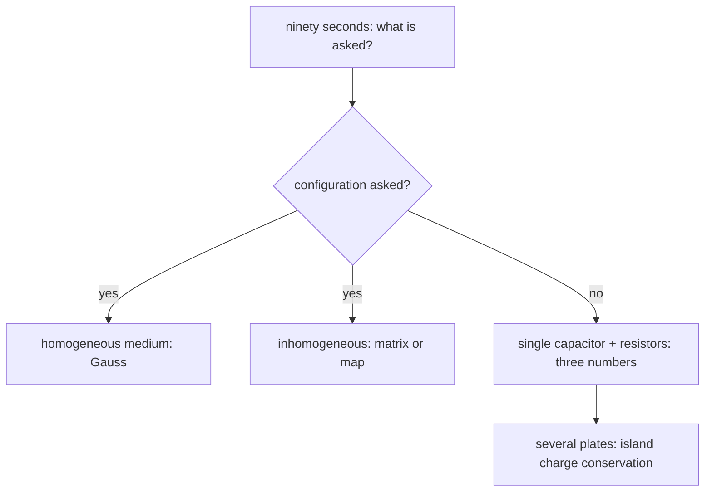

> *Read:* the triage is a way of forcing the first pause — pick the method before the algebra.

### 8.2 Twelve moves

Each entry: the move, when it pays, and the one sentence that makes it rigorous. All twelve are provable from the material in chapters 1–7; the proofs are where they are cited.

> **Move 1 — name the terminals before naming the capacitor**
>
> A capacitor is defined by *two conductors and the space between*. If a third conductor exists and you do not say whether it is grounded, floating or absent, your number is undefined (ch. 4's three-sphere problem, ch. 7's Q1). Write the sentence "the terminals are X and Y; everything else is …" before any algebra. Marks live there.

> **Move 2 — Gauss only when the symmetry makes $E$ constant on the surface**
>
> $\oint E\cdot da=Q_{\text{in}}/\varepsilon_0$ becomes a *solver* only for the three geometries whose symmetry is enough to take $E$ out of the integral: infinite plane, coaxial cylinder, concentric sphere (ch. 1). Everywhere else Gauss is a check, not a method — the commonest wasted minute in an NSEP paper is an attempt to Gauss a finite disc. The permitted extra case is *any* surface of known $E_n$, e.g. an ellipsoid (§7.4's family), where the flux is $4\pi ab\,E_n$ with constant $E_n$.

> **Move 3 — reduce, never solve: series, parallel, fold, Δ–Y, Schur**
>
> Five rules and they are all the same rule (ch. 4, ch. 7): (a) two plates sharing a floating node carry equal and opposite charges ⇒ series, (b) conductors at the same potential merge ⇒ parallel, (c) a symmetry you can prove leaves a node at the average potential ⇒ fold or short it, (d) a node you can eliminate by hand ⇒ Δ–Y or the ladder fixed point, (e) a node you cannot control ⇒ $c_{ij}-c_{ik}c_{kj}/c_{kk}$. If a network is not reducible by these, it is a *bridge*: write one charge-conservation equation, not three (ch. 4's cube and bridge both collapse to one node).

> **Move 4 — count charges on isolated conductors, and only those**
>
> The island rule (ch. 2, ch. 4.11, ch. 6.3): the *sum* of plate charges on a conductor group that never had a conducting path elsewhere is conserved. This one line beats every transient calculation in JEE's favourite "switches are closed, find the final charge" question — provided you check the hypothesis. The hypothesis is the reason these questions are hard: an $RC$ branch *connected to a cell* does not conserve anything on its own, so ch. 6's Q3 answer (150 µC through the switch) is a sum of two independent charges, while a naive island count on the same circuit would be wrong.

> **Move 5 — energy, but with the right potential**
>
> Two laws, one sign apart: fixed charge $\delta W_{\text{mech}}=-dU\big|_Q=-d\left(Q^{2}/2C\right)$; fixed voltage $\delta W_{\text{mech}}=+\tfrac12V^{2}dC\big|_V$ (the battery pays the other half, ch. 3). Everything from the dielectric's pull-in force to the meniscus height to MEMS pull-in is this with a different coordinate. Never write $F=QE$ for a plate: the plate is in the field *of the other plates*, i.e. half the total, so $F=\tfrac12QE$. When you are unsure which is right, differentiate both and see which is negative — a stable configuration lowers the appropriate potential, always.

> **Move 6 — shape is a depolarising factor**
>
> Any ellipsoid in any uniform field: $E_{\text{in}}=E_0/\left[1+L\left(\varepsilon_i/\varepsilon_m-1\right)\right]$ with $L=1/3$ sphere, $L\to0$ needle along the axis, $L\to1$ disc across it (ch. 7.4). Local-field, void-corona, composite-κ, Clausius–Mossotti and "why a delamination is worse than a crack along the field" are all this one formula; memorise the formula, not the five consequences.

> **Move 7 — transients are three numbers**
>
> $V_C(t)=V_\infty+\left(V_0-V_\infty\right)e^{-t/\tau}$ with $\tau=R_{\text{th}}C$, $R_{\text{th}}$ measured at the capacitor's terminals with *all independent sources killed* (voltage source → short, current source → open). Then check the two numbers a marker looks for: $V_C$ continuous across the switching instant, and $V_\infty$ from the *open-circuit* steady state (ch. 6.1–6.2). If there is more than one capacitor and they do not share a single isolated node, this move is *invalid* and there are as many exponentials as nodes (ch. 6.4) — recognising that is worth more marks than the algebra.

> **Move 8 — heat is the integral, not the power**
>
> For any current flowing through any $R$ from any final configuration, $H=\int_0^\infty I^{2}R\,dt$. Two evaluation tricks: (i) in the one-capacitor case the answer is $\tfrac12CV^{2}$ or $\tfrac12C_s(\Delta V)^{2}$ regardless of $R$ (ch. 3.6, ch. 6.3) — energy bookkeeping, no integration; (ii) when the source *ramps* instead of stepping, $H\approx RC$·(ramp slope)²·$T$ (ch. 6.3's insight) — the loss is a property of how fast, not of how resistive.

> **Move 9 — induced charge: ask reciprocity**
>
> If the question is "what charge appears on electrode k", never compute a field. Use $\sum Q_iV_i'=\sum Q_i'V_i$ with a primed state that is *easy* (ch. 7.2). The classic two results — $Q_1=-q(d-x)/d$ between parallel plates, and zero mutual coupling through a closed shell — each take two lines this way and hours any other way.

> **Move 10 — the catalogue of solved shapes**
>
> Plane, coax, sphere, concentric pair, two wires (log), disc ($8\varepsilon_0a$), needle ($4\pi\varepsilon_0c/\ln(2c/a)$), spheroids, wedge ($E\propto r^{\pi/\beta-1}$), isolated anything at large distance ($4\pi\varepsilon_0R_{\text{eff}}$). Nine entries cover most of JEE and a surprising part of INPhO; all are in §7.3–7.5. If your answer for an isolated body is not proportional to a length times $\varepsilon_0$, you have made an error — see move 11.

> **Move 11 — check the three limits before you hand it in**
>
> (a) *Dimensional*: every capacitance is $\varepsilon_0\times$ a length (3-D) or $2\pi\varepsilon_0/\ln(\cdot)$ per unit length (2-D). A formula with $\varepsilon_0\times$ area, or with a logarithm whose argument is not dimensionless, is wrong before you check anything else. (b) *A limit you can do in your head*: $\kappa\to1$ must return the vacuum answer, $d\to0$ must blow up, $R\to\infty$ must return the isolated value. (c) *An inequality*: adding a conductor or a dielectric only increases $C$; heat is always positive; a stable equilibrium has $\Pi''>0$. Two of the three checks are enough to catch essentially every misprint and every sign error — and in an Olympiad written solution, *stating* the limit check earns process marks even when the algebra has a slip.

> **Move 12 — when the question is about a real device, add the non-idealities last, and once**
>
> The four that change an answer: series resistance (sets $Q$-factor and peak current, not the loss), parallel leakage (sets the final voltage to the divider value, not to the cell's), inductance (turns the capacitor into a series resonator at $f_0=1/2\pi\sqrt{LC}$, where its impedance is *zero* — the reason "bypass capacitor" has a self-resonance), and dielectric absorption/relaxation (a slow tail of $\kappa(t)$, responsible for the voltage a "discharged" capacitor recovers). Quote them as corrections with a size, and only where the question's answer depends on them — a first-order JEE model that adds all four is not more correct, it is unsolvable.

### 8.3 Twenty-five traps, and the one-line reply

| # | the trap (wrong statement, confidently) | the reply, and the section to cite |
| --- | --- | --- |
| 1 | "Capacitors in series always have equal charge." | Only if they share an isolated node *and* started identical; otherwise only $\Delta Q$ matches. §4.1 |
| 2 | "The voltage across series capacitors is equal." | The *charge* matches; $V\propto1/C$. §4.2 |
| 3 | "Two charged capacitors joined: energy is conserved." | Charge is. Energy loses $\tfrac12C_{\text{ser}}(\Delta V)^{2}$ in the connecting wire, independent of its resistance. §3.6 |
| 4 | "The loss depends on how resistive the wire is." | Only its rate and its *location*; the total is fixed by the two end states. §3.6, §6.3 |
| 5 | "The field between the plates of a charged capacitor is $\sigma/\varepsilon_0$; so the force on a plate is $q\sigma/\varepsilon_0$." | Halve it: a plate does not act on itself. $F=\sigma^{2}A/2\varepsilon_0$. §3.4 |
| 6 | "A dielectric slab in a capacitor is always attracted in at fixed $V$ with $F=\tfrac12V^{2}dC/dx$, so at fixed $Q$ too." | At fixed $Q$ the sign is the same but the magnitude is *divided by* $\kappa$-type factors; differentiating $Q^{2}/2C$ is the safe route. §5.6 |
| 7 | "Inside any dielectric $E=E_0/\kappa$." | Only for a slab whose faces are parallel to the plates. A void, a needle, a sphere each have their own factor. §7.4 / move 6 |
| 8 | "Fringing makes a real capacitor's $C$ smaller than $\varepsilon_0A/d$." | Larger — the fringe field carries extra charge at the same voltage. §2.4 |
| 9 | "A capacitor blocks DC, so no current ever flows in a steady RC circuit with a capacitor." | Current flows in every *other* branch; only the capacitor branch is dead, and its two ends need not be at the same potential. §6.1 |
| 10 | "In steady state the capacitor voltage equals the source voltage." | It equals the difference of the node voltages it spans, which a series resistor can reduce to anything. §6.1's algorithm |
| 11 | "$\tau$ is the time to charge fully." | The time to 63% and the time for the *difference* from the final value to fall by $e$; it never finishes. §6.2 |
| 12 | "The capacitor voltage can jump when a switch closes." | Only if an ideal source or another capacitor *forces* it; with any resistance at all, it cannot. Then $\Delta V=\Delta Q/C$ and charge, not voltage, is conserved. §6.2, §4.11 |
| 13 | "Two capacitors in series: the total is $C_1+C_2$ if you also have a resistor in the loop." | Topology, not elements, decides: series means *one path, shared island*. §4.1 |
| 14 | "A bridge with a capacitor in the galvanometer arm carries no current, so it is balanced." | In *DC steady state* the detector arm carries nothing whatever the ratio is. Balance means equal potentials, which for a capacitive bridge requires $R_1C_1=R_2C_2$ to hold in time too. §4.4, §6.5 |
| 15 | "The charge that flows through the cell is $C\cdot V$." | It is the sum of the changes of charge on the plates connected to that terminal — which in a divider is a *fraction*. §6.3 |
| 16 | "Heat in the resistor while charging an uncharged capacitor is $CV^{2}$." | Half. The cell supplies $CV^{2}$; $\tfrac12CV^{2}$ is stored. §3.6 |
| 17 | "If $R\to0$ there is no loss." | The loss is independent of $R$; it goes into the source's internal resistance, radiation and contact spark. Ramp the source instead and *then* it vanishes. §6.3 |
| 18 | "A capacitor's impedance is $1/\omega C$, so at high frequency it is a short, and that's the end of it." | Until $f_0$, where its own inductance makes the impedance *rise* again — a bypass capacitor is a tank, not a short. §8.2 move 12 |
| 19 | "$\kappa$ of air is 1, so ignore it." | $\kappa-1=5.9\times10^{-4}$ and it is *proportional to density*: that is how a capacitive humidity, pressure and gas-flow sensor works, and why a level probe reads oil. §5.4 |
| 20 | "The pull-in voltage of a MEMS actuator can be raised by making the gap smaller." | Opposite: $V_{\text{pi}}\propto\ell_0^{3/2}/\sqrt A$; and stroke is capped at $\ell_0/3$ whichever way you go. §7.6 |
| 21 | "The isolated disc's capacitance is $4\pi\varepsilon_0a$." | $8\varepsilon_0a$ — a factor $\pi/2$ smaller; the disc is a spheroid limit, not a sphere. §7.4 |
| 22 | "$C$ of a wire of length $L$ is $4\pi\varepsilon_0L$." | $2\pi\varepsilon_0L/\ln(L/a)$ per unit length logic; the logarithm is not optional and it must contain a *dimensionless* ratio. §7.5 |
| 23 | "A charged drop explodes when the electric pressure equals $2\gamma/R$." | The limit is an $R$-dependence cancellation in the *energy*: $Q_R^{2}=64\pi^{2}\varepsilon_0\gamma R^{3}$. §7.7 |
| 24 | "A guard ring is decoration." | It replaces the fringing edge by two driven equipotentials, making $C=\varepsilon_0A/d$ exact — the only reason the SI can be realised capacitively. §2.4 |
| 25 | "A discharged capacitor is at zero volts." | Dielectric absorption lets a fraction of the old charge return over seconds; high-κ capacitors can recover tens of volts, and can kill. §5.7 |

### 8.4 Numbers to own

Six constants and five devices. With these you can bound any answer in this syllabus to within a factor of two, and a bounded answer written down first is the cheapest insurance in a timed paper.

$$
\varepsilon_0=8.85\times10^{-12}\ \text{F/m}=\frac{10^{-9}}{4\pi\cdot9},\qquad \frac1{4\pi\varepsilon_0}=9\times10^{9},\qquad \boxed{C_{\text{sphere}}\left[\text{pF}\right]\approx1.11\times R[\text{cm}]} \qquad\frac{kT}{e}=25.9\ \text{mV},\qquad \frac{e^{2}}{4\pi\varepsilon_0}=2.30\ \text{eV nm} \tag{8.1}
$$

| the object | typical $C$ | $\kappa$ / $E_b$ | the number that actually decides its use |
| --- | --- | --- | --- |
| two 1 cm² paddles, 1 mm apart, in air | 0.885 pF | 1.00059 / 3 kV/mm | the $\kappa-1$ of gases is a *density* measure — pressure and humidity sensors |
| 1 m of wire above a ground plane | 6 pF | — / — | the logarithm: leads and tracks dominate stray capacitance, not the "capacitor" |
| a human body, isolated | 100–200 pF | — / — | a lone 16 cm sphere would be only 18 pF, so the excess is all proximity to the floor and walls; it is why you can stand on an insulating stool at 10 kV and feel nothing until you discharge through 1 MΩ |
| power-bypass ceramic, 0402 X7R | 1 µF at 10 V | ~2000 / 10 V/µm | DC-bias coefficient: it loses 80% of that at rated voltage — the single most-misquoted capacitor number |
| supercapacitor cell | 3 kF at 2.7 V | electrolytic double layer, $d\sim1$ nm | energy $\tfrac12CV^{2}=11$ kJ — an order of magnitude below a Li-ion cell, a hundred times the power |

### 8.5 Fifteen questions, fifteen minutes

One line each, no calculator, sixty seconds apiece. The answer and the one-line reason fold out under each question: cover it, answer first, then grade yourself on the *reason*, not the number — an answer arrived at by the right rule with wrong arithmetic is a better exam performance than the reverse.

### **Q1** Two capacitors $C$ and $2C$ in series across $V_0$. Voltage across the smaller one? _(60 s)_

Solution

**Answer:** $2V_0/3$ — series: equal $Q$, so $V\propto1/C$; the $C$ takes $2/3$ of the total.

### **Q2** A $1$ nF capacitor charged to 100 V is connected across an identical uncharged one. Energy lost? _(60 s)_

Solution

**Answer:** $2.5$ µJ — $\tfrac12C_{\text{ser}}(\Delta V)^{2}=\tfrac12(0.5\ \text{nF})(100\ \text{V})^{2}$.

### **Q3** An isolated charged capacitor has its slab ($\kappa=4$, filling half the gap) removed. What happens to $U$, to $E$ in the dielectric part, and to the force you must exert while pulling? _(60 s)_

Solution

**Answer:** $U$ rises by 1.6× — $C=\varepsilon_0A/(d/2+d/2\kappa)$ → with the slab gone $C\to C_0/1.6$, and $U=Q^{2}/2C$; $E$ in the vacuum half is unchanged (it carries the same $D$), the force pulls the slab *in*, so you do positive work — which is exactly the extra $U$.

### **Q4** A resistor is added in parallel with the ideal cell feeding an $RC$ circuit. What changes in $V_C(t)$, and what in $\tau$? _(60 s)_

Solution

**Answer:** both: nothing — a resistor across an ideal voltage source is invisible: killing the source shorts it, so $R_{\text{th}}$ is unchanged and so is $V_\infty$.

### **Q5** The plates of an isolated charged parallel-plate capacitor are pulled to double the gap. Force now, compared with before? _(60 s)_

Solution

**Answer:** the same — $F=Q^{2}/2\varepsilon_0A$ at fixed charge — independent of the gap. (At fixed voltage it would have fallen by 4.)

### **Q6** A charge $q$ at the centre of a neutral conducting spherical shell (radii $a,b$): potential of the shell? _(60 s)_

Solution

**Answer:** $q/4\pi\varepsilon_0b$ — inner face $-q$, outer face $+q$ (shell is neutral), and outside it is a point charge at the centre; the shell is one equipotential, so evaluate at $r=b$.

### **Q7** Same radius: which holds more charge at the same potential, a sphere or a disc? _(60 s)_

Solution

**Answer:** the sphere, by $\pi/2$ — $4\pi\varepsilon_0a$ against $8\varepsilon_0a$.

### **Q8** Can a mutual coefficient $c_{12}$ of a two-conductor capacitance matrix be positive? _(60 s)_

Solution

**Answer:** never — a grounded neighbour is always negatively influenced (§7.1's proof via the maximum principle).

### **Q9** Two capacitors in parallel, one with a dielectric, still joined by a wire. The slab is slid out. Which way does charge move, and what happens to $V$? _(60 s)_

Solution

**Answer:** onto the other capacitor; $V$ rises — $C_1\downarrow$ at common $V$ means $Q_1=C_1V\downarrow$; the surplus goes to $C_2$ and the shared $V=Q_{\text{tot}}/(C_1+C_2)$ increases.

### **Q10** Ratio of heat produced in $R$ to energy finally stored, charging an uncharged capacitor from a cell? _(60 s)_

Solution

**Answer:** 1 : 1 — cell gives $CV^{2}$, field keeps $\tfrac12CV^{2}$.

### **Q11** A 555 with $R=1$ MΩ and $C=1$ µF in the astable connection: period? _(60 s)_

Solution

**Answer:** $1.39$ s — $T=1.386RC$ for symmetric charge/discharge between $V/3$ and $2V/3$ (each $\tau\ln2$).

### **Q12** A 10 nm $SiO₂$ gate stack (κ = 3.9) is replaced by HfO₂ (κ = 25) at the same capacitance: thickness? _(60 s)_

Solution

**Answer:** $64$ nm — $t=\kappa_2t_1/\kappa_1$: same $C=\kappa\varepsilon_0A/t$. (Real HfO₂ has an interfacial $SiO₂$ dead layer, which is why "EOT" ≠ physical thickness.)

### **Q13** Why is the field inside a thin disc-shaped void $\kappa E_0$ while a needle-shaped void along the field sees $E_0$? _(60 s)_

Solution

**Answer:** depolarising factors — $E_{\text{in}}=E_0/[1+L(1/\kappa-1)]$: $L=1$ for a disc perpendicular to the field gives $\kappa E_0$, $L=0$ along a needle gives $E_0$.

### **Q14** Two spheres, radii $R$ and $2R$, connected by a long thin wire. Ratio of their surface fields? _(60 s)_

Solution

**Answer:** $2:1$ — the small one is stronger — $V$ equal ⇒ $Q\propto R$ ⇒ $E=Q/4\pi\varepsilon_0R^{2}\propto1/R$.

### **Q15** Rms thermal noise voltage on a $1$ pF capacitor at 300 K? _(60 s)_

Solution

**Answer:** $64$ µV — $\langle V^{2}\rangle=kT/C$, one quadratic degree of freedom: $\sqrt{1.38\times10^{-23}\times300/10^{-12}}$.

> **How to write the solution so that it cannot lose marks**
>
> Four sentences, in this order, for every quantitative question: (1) *the principle* — "charge on the isolated island AB is conserved"; (2) *the idealisation* — "fringing and leakage neglected, wires have zero resistance"; (3) the algebra, one line per equality, with $Q$ and $V$ labelled on a sketch; (4) *the check* — a limit, a sign or a units sentence. Sentences (1) and (4) carry method marks in NSEP/INPhO marking schemes even when (3) slips, and in JEE's integer-answer papers (4) is what catches the factor of two. Solve on paper the way you would want to read it at 01:00 while marking.

### 8.6 Checkpoint

- Do the fifteen-question drill standing up, in fifteen minutes. Anything you miss is a *hole*, not a
  slip: go back to the section named in the answer and re-read the derivation, not the result.
- For each of the twelve moves, say out loud one question from chapters 1–7 that it solved. If a move has no
  example attached in your memory, you do not own it.
- Cover the middle column of §8.3 and reply to each trap from memory. The reply must be a *reason*, not the
  correct statement — "because the plate does not act on itself" beats "it's ½".
- Reproduce the four boxed numbers of §8.4 and one device line from the table: if you cannot bound a capacitance
  to a factor of two from $\varepsilon_0\times$ a length, you will not notice your own error in time.

Next: [9 · The Olympiad paper — 36 questions, four sections, 3 hours](#section-09-olympiad-paper)

_INPhO / IPhO standard · JEE Advanced format · 3 hours · 36 questions_

## 9 · The paper: capacitors, from Gauss to the Rayleigh limit

Thirty-six questions, four sections, three hours. The paper is built to be *coverable*: every section of chapters 1–7 is examined by at least two questions, and the coverage map below says which. Attempt it in one sitting, with a non-programmable calculator, and mark yourself with [part 10](#section-10-olympiad-solutions) only afterwards — the value of this paper is the two hours you spend deciding what to write, not the marking.

> **Instructions**
>
> - **Time:** 180 minutes. Suggested split — Section A 40 min, B 30 min, C 30 min, D 80 min.
> - **Section A** (Q1–Q12): *exactly one* option is correct; +3 for it, 0 for unanswered, −1 for anything
>   else. Do not second-guess a question you have already checked with a limit — a limit is stronger than a doubt.
> - **Section B** (Q13–Q18): multiple correct; +4 for all correct, +1 for each correct left unmarked with no wrong
>   mark, 0 for none, −2 otherwise.
> - **Section C** (Q19–Q26): numerical, +4/0; give the value to the precision asked. Units are in the table; a
>   correct number with the wrong prefix is marked wrong, so state the prefix.
> - **Section D** (Q27–Q36): long questions, marks as printed — nine at [15] and Q36 at [18], total 153; the paper is 245 marks in all. Start every answer with the principle
>   you are using and end with a check — both carry marks even when the algebra slips.
> - **Data, unless stated:**$\varepsilon_0=8.85\times10^{-12}$ F/m, $1/4\pi\varepsilon_0=9\times10^{9}$
>   N m²/C², $g=9.8$ m/s², $k=1.38\times10^{-23}$ J/K, $e=1.6\times10^{-19}$ C,
>   air breakdown $3$ kV/mm at 1 atm.

| topic | A | B | C | D |
| --- | --- | --- | --- | --- |
| 1 · fields, Gauss, potential, $D$ | 1, 11 | 13 | 21 | 27, 34 |
| 2 · capacitance of real geometries | 1, 4, 5 | 13 | 19 | 29, 33 |
| 3 · energy and force | 2, 3, 6 | 15 | 20, 24 | 31, 36 |
| 4 · combinations, bridges, symmetry | 4, 5, 7 | 13, 15 | 19, 20 | 27, 32 |
| 5 · dielectrics | 8, 9, 10, 12 | 14, 16, 18 | 22, 23, 25 | 29, 34, 36 |
| 6 · networks and transients | 6, 7 | 15, 17 | 26 | 30, 36 |
| 7 · advanced: matrices, reciprocity, maps, instability | 1, 5, 10, 11 | 16, 17, 18 | 23, 26 | 28, 31, 32, 33, 35 |
| 8 · traps and estimation | all | all | all | all |

### Section A · Single correct (Q1–Q12)

### **Q1** [3] Two concentric conducting shells of radii $a=5$ cm and $b=10$ cm have the space between them filled with a dielectric of $\kappa=3$ in the lower hemisphere only; the upper half is vacuum. The capacitance between the shells is closest to

- **A** 11 pF
- **B** 22 pF
- **C** 33 pF
- **D** 44 pF

### **Q2** [3] An isolated parallel-plate capacitor (area $A$, gap $d$) is charged to a voltage $V_0$. A dielectric slab of the same area, thickness exactly $d$ and constant $\kappa$ is now slipped in. Which set of changes is correct?

- **A**$V$ and $U$ both fall to $1/\kappa$; $E$ falls to $V_0/\kappa d$
- **B**$V$ falls, $U$ stays, $E$ stays
- **C**$V$, $U$ and $D$ all fall by $\kappa$
- **D** nothing changes, since $Q$ is fixed

### **Q3** [3] A 2 µF capacitor charged to 100 V is connected at $t=0$ across an uncharged 3 µF capacitor through a resistor. The total heat produced is

- **A** 6 mJ
- **B** 15 mJ
- **C** 24 mJ
- **D** 0, since the final current is zero

### **Q4** [3] Two identical conducting spheres of radius $a$, centres $d=4a$ apart, are driven to potentials $\pm V$. Taking their charges to sit at their centres gives the "two isolated spheres in series" value $2\pi\varepsilon_0a$. Including the neighbour's effect to leading order, the true two-terminal capacitance is larger by about

- **A** 7%
- **B** 33%
- **C** 100%
- **D** 25%, and smaller, not larger

### **Q5** [3] The same pair as Q4: the capacitance of sphere 1 (charge on 1 per volt of 1) is measured with sphere 2 (i) absent, (ii) present and uncharged, (iii) present and earthed. Then

- **A** (iii) > (ii) > (i)
- **B** (ii) > (iii) > (i)
- **C** (i) = (ii) < (iii)
- **D** (i) = (iii) > (ii)

### **Q6** [3] A 60 V cell, a 20 kΩ resistor, an uncharged 5 µF capacitor and a 10 kΩ resistor are connected in a single series loop; the switch is closed at $t=0$. Which pair of values is correct for the final capacitor voltage and the total heat produced?

- **A** 60 V and 9 mJ
- **B** 20 V and 5 mJ
- **C** 60 V and 18 mJ
- **D** 40 V and 9 mJ

### **Q7** [3] A capacitor $C=2$ µF is connected from node A to the lower rail. Node A is joined to a 60 V cell through $R_1=20$ kΩ, and to the same rail through $R_2=20$ kΩ. The time constant of the charging and the final capacitor voltage are

- **A** 40 ms, 60 V
- **B** 20 ms, 30 V
- **C** 20 ms, 60 V
- **D** 10 ms, 30 V

### **Q8** [3] An oscilloscope probe uses $R_1=9$ MΩ in its tip and the scope's own $R_2=1$ MΩ input, with the scope's input capacitance $C_2=100$ pF. For exact 10× compensation the trimmer capacitor in the tip must be

- **A** 11.1 pF
- **B** 900 pF
- **C** 100 pF
- **D** 1 pF

### **Q9** [3] A capacitive gas thermometer uses the change in $\kappa-1$ of a gas held at constant pressure. If the sensitivity is taken to be $\Delta C/C\approx\Delta(\kappa-1)/(\kappa-1)$, a 1% change in capacitance corresponds to a temperature change of about

- **A** 0.03 K
- **B** 3 K
- **C** 30 K
- **D** 300 K

### **Q10** [3] A porcelain insulator of constant $\kappa=6$ contains a thin flat void occupying 5% of the wall thickness, with the field perpendicular to the void faces. The ratio of the mean field inside the void to the mean field across the whole wall is

- **A** 4.8
- **B** 6.0
- **C** 1.0
- **D** 0.21

### **Q11** [3] A point charge $q$ is on the axis of a grounded conducting sphere of radius $a$, at a distance $d=2a$ from its centre. The force on $q$ has magnitude

- **A**$q^{2}/18\pi\varepsilon_0a^{2}$
- **B**$q^{2}/16\pi\varepsilon_0a^{2}$
- **C**$q^{2}/4\pi\varepsilon_0a^{2}$
- **D** zero, by symmetry

### **Q12** [3] A 1 µm-thick polypropylene film ($\kappa=2.3$, $\tan\delta=2\times10^{-3}$) carries 1 kV rms at 1 MHz. The dielectric heating power *per unit area of film* is closest to

- **A** 260 W/m²
- **B** 2.6×10⁵ W/m²
- **C** 26 W/m²
- **D** 2.6 W/m²

### Section B · Multiple correct (Q13–Q18)

### **Q13** [4] Two capacitors $C_1>C_2$ are charged to the same voltage $V$ and then disconnected from the cell and joined positive-to-negative. Which statements are correct?

- **A** The final common voltage is $V\left(C_1-C_2\right)/\left(C_1+C_2\right)$
- **B** The heat produced is $\tfrac12C_{\text{ser}}\left(2V\right)^{2}$
- **C** If $C_1=3C_2$, the final energy is one quarter of the initial energy
- **D** The heat is smaller if a thicker wire is used

### **Q14** [4] A dielectric slab is slowly pushed into a parallel-plate capacitor that remains connected to a cell. Which of the following increase?

- **A** the charge on the plates
- **B** the energy stored in the field
- **C** the magnitude of the force pulling the slab in
- **D** the voltage between the plates

### **Q15** [4] An uncharged capacitor is charged from a cell through a resistor $R$. Which quantities are independent of $R$?

- **A** the total heat produced in $R$
- **B** the final charge
- **C** the fraction of the final charge present at $t=\tau$
- **D** the peak current

### **Q16** [4] A polar liquid has $\kappa'(\omega)=\kappa_\infty+(\kappa_s-\kappa_\infty)/(1+i\omega\tau)$. Which are correct?

- **A**$\kappa''$ peaks at $\omega\tau=1$
- **B**$\tan\delta$ peaks at a frequency *above* the $\kappa''$ peak
- **C**$\kappa_s-\kappa_\infty\propto1/T$ for a liquid of fixed density
- **D** A 2.45 GHz oven heats water at the peak of $\kappa''$

### **Q17** [4] A micro-mirror is a plate on a spring, gap $\ell_0$, area $A$, driven at voltage $V$. Which are correct?

- **A** The maximum stable deflection is $\ell_0/3$
- **B** The pull-in voltage scales as $\ell_0^{1/2}/\sqrt A$
- **C** Driving it from a fixed-charge source instead removes the instability
- **D** A capacitor of the same size but with a floating neighbour electrode has a larger $C$ than with that neighbour earthed

### **Q18** [4] Which statements about real capacitors are correct?

- **A** Dielectric absorption can return tens of volts to a capacitor that was short-circuited after a high-voltage charge
- **B** Above its self-resonance a bypass capacitor's impedance rises with frequency
- **C** A class-2 (high-κ ceramic) capacitor loses most of its capacitance when biased to its rated voltage
- **D** The ripple-current rating of an electrolytic is set by its capacitance value

### Section C · Numerical (Q19–Q26)

### **Q19** [4] Interleaved aluminium foils, each $5$ cm × $5$ cm, separated by $0.5$ mm of polypropylene ($\kappa=2.3$), are connected alternately to two terminals. The minimum number of foils needed to make $1$ nF, given that $n$ foils give $n-1$ gaps, is ____.

### **Q20** [4] Ten identical $1$ nF / 5 kV elements are stacked in series. The energy that can be stored in the stack is ____ J.

### **Q21** [4] A charge $q$ sits at the centre of a neutral conducting spherical shell of inner radius $a$ and outer radius $2a$. The potential of the shell, in units of $q/4\pi\varepsilon_0a$, is ____.

### **Q22** [4] A dielectric liquid ($\kappa=4$, $\rho=1000$ kg/m³, negligible surface tension) rises between two vertical plates 1 mm apart held at 10 kV. The rise height is ____ mm.

### **Q23** [4] A 20 µm-radius oil droplet ($\rho=900$ kg/m³) is to be held between horizontal plates 1 mm apart at 500 V. The minimum number of elementary charges it must carry is ____.

### **Q24** [4] A 100 pF "source" capacitor charged to 3 kV is read by an electrostatic voltmeter whose input capacitance is 50 pF. The meter reads ____ V.

### **Q25** [4] A 555 relaxation oscillator is to give a 1.00 s period with $R=1.0$ MΩ and symmetric charge and discharge paths. The required capacitance is ____ µF (two decimals).

### **Q26** [4] A supercapacitor electrode is a pore network with electrolyte resistance $r=10$ Ω/m along each pore and double-layer capacitance $c=10$ F/m of pore length, for pores of length $\ell=100$ µm. The time for the far end of a pore to be charged is ____ µs.

### Section D · Long questions (Q27–Q36)

### **Q27** [15] Capacitance matrix and a ladder.

(a) $N$ conductors have $Q_i=\sum_jc_{ij}V_j$. Show that if conductor $i$ is completely enclosed by others then $\sum_jc_{ij}=0$, and that $c_{ij}\le0$ for $i\ne j$ always. **[5]**

(b) An infinite ladder is built by repeating the section "a capacitor $C$ in series, then a capacitor $C$ from the line to the return rail". Let $C_n$ be the capacitance looking into $n$ sections terminated by $C$. Write the recursion for $C_n$ and solve it for $n\to\infty$. **[5]**

(c) Show that the approach to the limit is geometric and find the ratio; then state what changes if the "shunt" element is replaced by a resistor, and why the ladder then has a *frequency* rather than a fixed capacitance. **[5]**

### **Q28** [15] Reciprocity, shielding and a signal.

(a) State and prove Green's reciprocity theorem for a system of conductors in a fixed permittivity distribution. **[5]**

(b) A point charge $q$ is at distance $x$ from one of two large parallel grounded conducting plates a distance $d$ apart. Use (a) — do *not* sum images — to find the charge induced on each plate, and verify the result against Gauss's law. **[5]**

(c) The plates are held at fixed potentials by batteries and the charge moves with velocity $v$ perpendicular to them. Find the current in the external circuit, and the current if the charge instead moves *parallel* to the plates at the mid-plane. **[5]**

### **Q29** [15] A capacitive level gauge, and what the fringe costs.

Two vertical parallel plates of width $w$ and separation $d$ are dipped into a liquid of constant $\kappa$; the liquid is an insulator and the vessel is earthed so that fringing at the top can be ignored. (a) Show that $C(x)=C_0\left[1+(\kappa-1)x/h\right]$ where $x$ is the immersion depth, $h$ the plate height and $C_0$ the dry capacitance. **[4]**

(b) The same gauge is now used on a *conducting* liquid, with the plates insulated from it by a coating of thickness $t$ ($t\ll d$). Find $C(x)$ and the sensitivity $dC/dx$; explain why the coating desensitises the gauge by a factor you should quote. **[5]**

(c) A voltage $V$ is applied between the plates. Find the height to which the liquid rises, and evaluate it for $\kappa=4$, $d=1$ mm, $V=10$ kV, $\rho=1000$ kg/m³. Comment on whether the flat-interface assumption is self-consistent. **[6]**

### **Q30** [15] Two capacitors, two time constants, one exact loss.

A cell of voltage $V_0$ drives, in order, $R$ to node A; from A a capacitor $C$ to the lower rail; from A a resistor $R$ to node B; from B a capacitor $C$ to the rail. Both capacitors are uncharged at $t=0$.

(a) Write the two node equations and put them in matrix form. Find the two eigenvalues. **[6]**

(b) Find $V_B(t)$ in closed form. **[4]**

(c) Find the total heat produced in the two resistors and show explicitly that it equals $\Delta U_{\text{cell-supplied}}-\Delta U_{\text{field}}$. **[5]**

### **Q31** [15] Spheroids, voids and the field that ruins an insulator.

(a) Using the depolarising factor, find the field inside (i) a thin disc-shaped cavity and (ii) a long needle-shaped cavity, both in a dielectric of constant $\kappa$ in an otherwise uniform applied field $E_0$, with the disc perpendicular to the field and the needle parallel to it. **[5]**

(b) A high-voltage bushing is made of $n$ identical discs of thickness $t$ and area $A$, with a thin air film of thickness $s\ll t$ trapped at each interface. Find the field in the air films and in the ceramic ($\kappa$ each), and the voltage at which the first film ionises. **[5]**

(c) Show that ionisation of the film *increases* the stress on the ceramic and find the fraction of the total voltage the ceramic then carries, treating the ionised film as a conductor. **[5]**

### **Q32** [15] Conformal mapping, and the force between two live conductors.

(a) Show that $w=\ln\!\left[(z-f)/(z+f)\right]$ maps the region between two equal circular cylinders of radius $a$, axes $d$ apart, onto a strip, and deduce $C'=\pi\varepsilon_0/\operatorname{arcosh}(d/2a)$ per unit length. **[7]**

(b) Hence find, per unit length, the force between the cylinders when they are (i) at the same potential $V$ and (ii) at potentials $\pm V$. State the direction of each force and explain physically why they are opposite. **[5]**

(c) Two parallel wires 20 cm apart, radius 2 mm, at 100 kV rms between them: estimate the force per metre. **[3]**

### **Q33** [15] The spheroid family, needles and the power of points.

(a) From $C=4\pi\varepsilon_0f/\ln\left[(c+f)/a\right]$ for a prolate spheroid, obtain the capacitance of a long thin needle of length $2c$ and radius $a\ll c$, and of a thin disc of radius $a$. **[5]**

(b) A needle (prolate spheroid, $2c=10$ cm, radius $a=1$ mm) and a sphere are each given the same charge $Q=1$ nC. Find the capacitance of the needle, choose the sphere's radius so that the two have *equal* capacitance, and then compare their peak surface fields — model the needle's tip as a sphere of the radius of curvature at the pole of the generating ellipse, $\rho=a^{2}/c$. If corona begins in air at $3$ MV/m, what maximum voltage can each electrode carry at that capacitance? **[5]**

(c) Hence explain the two design rules for HV terminals: "for a given capacitance, be round" and "the lightning rod must be sharp". **[5]**

### **Q34** [15] A charged drop, a cone, and an electrospray.

(a) A conducting droplet of radius $R$ and surface tension $\gamma$ carries charge $Q$. Write its energy and find the Rayleigh charge. **[4]**

(b) Find the surface field and the potential at that limit for a 20 µm water drop, and decide whether in air the drop or the gas gives out first. **[4]**

(c) In vacuum the drop emits from a conical tip of half-angle $\theta_0=49.3^\circ$. Justify that angle from the requirement that the field at the apex be no more singular than $r^{-1/2}$. **[4]**

(d) A singly charged 1 nm droplet is what a mass spectrometer detects. Estimate the fraction of the Rayleigh charge it carries, and say why smaller drops cannot be produced by electrospray at will. **[3]**

### **Q35** [15] Porous electrodes: why a supercapacitor is a transmission line.

A pore of length $\ell$ has series resistance per unit length $r$ (the electrolyte) and shunt capacitance per unit length $c$ (the double layer), and is fed at $x=0$.

(a) Write the two telegrapher's equations and solve them for a sinusoidal drive, showing that for a long pore $Z_{\text{in}}=(1-i)\sqrt{r/2\omega c}$. **[5]**

(b) Find the charge absorbed by a long pore after a step $V$, and show $Q\propto\sqrt t$; state the time at which the law must fail and why. **[4]**

(c) A pore of finite length $\ell$ is charged by a constant total current $I$. At late times ($t\gg rc\ell^{2}$) the current along the pore is linear from $I$ at the mouth to zero at the closed end: use this to show that the instantaneous ohmic loss is $I^{2}r\ell/3$, so that the electrode behaves as a capacitor $C=c\ell$ in series with $R_{\text{ESR}}=r\ell/3$ rather than $r\ell$. Then, using chapter 6's ramp rule, show that holding the ohmic loss below a fraction $1/\eta$ of the stored energy needs a charge time $T\gtrsim2\eta RC$, and that the power is therefore capped at $P\approx V^{2}/\left(2\eta R_{\text{ESR}}\right)$. **[4]**

(d) Deduce from (c) how the achievable power and the stored energy each scale with $\ell$, and show that their ratio $E/P$ is a characteristic time proportional to $rc\ell^{2}$. State in one sentence the trade-off this imposes on the choice of electrode thickness. **[2]**

### **Q36** [18] Harvesting: a variable capacitor, a diode and the second law.

A transducer capacitor alternates between $C_{\max}=10C_0$ and $C_0$. A small bias source holds it at $V_0=1$ V while its capacitance is $C_{\max}$; it is then disconnected, the capacitance is reduced to $C_0$, and it is connected to a reservoir held at $V_L$ until its voltage equals $V_L$, when it is reconnected to the bias source at $C_{\max}$ to close the cycle.

(a) Find the charge taken from the bias source per cycle, and the voltage at the end of the mechanical stroke, as functions of $V_L$. **[4]**

(b) Find the electrical energy delivered to the reservoir per cycle, and the value of $V_L$ that maximises it. Evaluate the maximum for $C_0=100$ pF, $V_0=1$ V. **[6]**

(c) State the mechanical work per cycle required, and verify energy conservation around the cycle. Show that the condition for *any* net generation is $V_L<V_0C_{\max}/C_0$, and interpret it. **[4]**

(d) A real harvester must do this at 100 Hz with a finite series resistance $R$. Write the condition on $RC_0$, and explain why the optimum $V_L$ is lower than the answer to (b) in practice. **[4]**

> **How to sit this paper**
>
> - Section A and B are 26 questions in 70 minutes: if a question takes more than four minutes, mark your best answer
>   and move on — every question here is reachable in under three minutes by the move it tests, and the ones that are not
>   are the ones you will get back to after Section C.
> - In Section C the arithmetic is designed to be doable; if it is not, you have the wrong model, not the wrong
>   calculator.
> - Section D: write the principle first, then the equation, then the number. A long question with a stated
>   assumption and a limit check scores more than a complete algebraic solution with neither.
> - Questions 28, 33 and 35 contain the only material not examinable by the standard JEE syllabus; if you find them
>   unfamiliar, that is the signal to read chapter 7 again, not to skip them.

Continue: [10 · Solutions to all 36 questions, with marks distributed](#section-10-olympiad-solutions)

_full solutions · marks as printed · 36 questions_

## 10 · Solutions

Every solution below is written the way chapter 8 recommends: the principle first, then the algebra, then a check. The *why is this the answer* line at the end of each is the part worth reading twice — it is usually the sentence that would have saved the mark. A compact answer key is at the bottom of the page for fast marking.

### Section A

### **Q1** Answer: B — 22 pF _([3] · §2.2, §4.1)_

**Principle.** The two hemispheres are two capacitors in *parallel*: they share the same two conductors, hence the same voltage, and their charges add. Each is half of a complete spherical capacitor.

$$
C_{\text{vac}}=\frac12\cdot\frac{4\pi\varepsilon_0ab}{b-a},\qquad C_{\text{diel}}=\frac{\kappa}{2}\cdot\frac{4\pi\varepsilon_0ab}{b-a} \qquad\Rightarrow\qquad C=\frac{4\pi\varepsilon_0ab}{b-a}\cdot\frac{1+\kappa}{2}
$$

With $a=0.05$, $b=0.10$: $4\pi\varepsilon_0ab/(b-a)=1.11\times10^{-10}\times0.1=11.1$ pF, and $(1+3)/2=2$ gives $22.2$ pF.

**Check.** $\kappa\to1$ must return the empty value 11.1 pF ✓. The trap is the series topology: had the dielectric been a *coating* on the inner sphere, the answer would be the reciprocal sum and would be much closer to the vacuum value. Parallel/series is decided by which surfaces are shared, never by which word appears in the sentence.

### **Q2** Answer: A _([3] · §5.2)_

**Principle.** Isolated ⇒ $Q$ fixed ⇒ the free surface charge density is fixed ⇒ $D=\sigma_f$ is fixed, and $E=D/\kappa\varepsilon_0$.

$$
E=\frac{V_0}{\kappa d},\qquad V=\frac{V_0}{\kappa},\qquad U=\frac{Q^{2}}{2C}=\frac{U_0}{\kappa}
$$

**Why C is wrong:** $D$ does not change — that is precisely the boundary condition *fixed free charge*. The energy falls by $\kappa$ and nothing heats up, because the slab enters quasistatically and the missing energy is mechanical work *given back* by the field pulling the slab in.

### **Q3** Answer: A — 6 mJ _([3] · §3.6)_

$$
C_{\text{ser}}=\frac{2\times3}{5}=1.2\ \mu\text{F},\qquad \Delta V=100\ \text{V},\qquad H=\frac12C_{\text{ser}}(\Delta V)^{2}=\frac12\times1.2\times10^{-6}\times10^{4}=6\ \text{mJ}
$$

Final common voltage $Q/C_{\text{tot}}=200\ \mu\text{C}/5\ \mu\text{F}=40$ V; audit: $U_i=\tfrac12\times2\times10^{-6}\times10^{4}=10$ mJ, $U_f=\tfrac12\times5\times10^{-6}\times1600=4$ mJ, difference 6 mJ ✓.

**Check.** All the heat is in the connecting wire whatever its resistance, and 24 mJ (option C) is what you get by using $C_1+C_2$ instead of the series value — the one error this question exists to catch.

### **Q4** Answer: B — 33% larger _([3] · §7.1, ch. 7 Q1)_

The charges are *not* at the centres when the neighbour is at the opposite potential: each sphere's charge shifts toward the other, so at fixed voltage more charge flows. To leading order in $s=a/d$ the two-terminal capacitance is

$$
C=\frac{2\pi\varepsilon_0a}{1-s}=\frac{2\pi\varepsilon_0a}{0.75}=1.33\times2\pi\varepsilon_0a
$$

i.e. 33% larger. The single-sphere "self" capacitance is raised by only $1/(1-s^{2})=1.07$, so 7% (option A) is the answer to a *different* question — the one Q5 asks.

**Check.** $s\to0$ must return the series value $2\pi\varepsilon_0a$ ✓, and $s\to1$ must diverge (the spheres touch, $C\to\infty$ in this approximation) ✓.

### **Q5** Answer: C — (i) = (ii) < (iii) _([3] · §7.1, §7.2)_

$$
\text{(i)}\ c_{11}^{(0)}=4\pi\varepsilon_0a,\qquad \text{(ii)}\ c_{11}-\frac{c_{12}^{2}}{c_{22}}=c_{11}\left(1-s^{2}\right)=4\pi\varepsilon_0a,\qquad \text{(iii)}\ c_{11}=\frac{4\pi\varepsilon_0a}{1-s^{2}}=4.27\,\pi\varepsilon_0a
$$

A floating, *monopole-only* neighbour contributes nothing at this order: it stays neutral and its induced dipole is an $O\!\left(s^{3}\right)$ effect. An earthed neighbour draws extra charge from the ground, and the increase is exactly $1/(1-s^{2})$.

**The theorem to cite:** grounding a conductor can only increase another's capacitance (§7.2b); a floating one lies between grounded and absent — here it happens to touch the "absent" value because the truncated matrix cannot see a neutral body's polarisation.

### **Q6** Answer: A — 60 V and 9 mJ _([3] · §6.1, §6.3)_

**Steady state.** One loop containing the capacitor ⇒ $I(\infty)=0$ ⇒ both resistors drop nothing ⇒ $V_C(\infty)=60$ V. (Option B's 20 V is the *resistive divider* answer, which applies only when a DC path exists — Q7 is that circuit.)

$$
Q=CV=5\times10^{-6}\times60=300\ \mu\text{C},\qquad W_{\text{cell}}=V_0Q=18\ \text{mJ},\qquad U=\frac12CV^{2}=9\ \text{mJ} \qquad\Rightarrow\qquad H=W_{\text{cell}}-U=9\ \text{mJ}
$$

**Check.** The half-and-half split holds for the *whole* loop resistance (20 kΩ + 10 kΩ together), so $H=\tfrac12CV^{2}$ ✓ and its division 2:1 between the two resistors. Nothing here depends on $R_1+R_2$ — only $\tau=(R_1+R_2)C=150$ ms does.

### **Q7** Answer: B — 20 ms and 30 V _([3] · §6.2)_

$V_\infty$ from the divider: $60\times20/(20+20)=30$ V. $R_{\text{th}}$: kill the cell (short) ⇒ the capacitor sees $R_1\| R_2=10$ kΩ, so $\tau=10^{4}\times2\times10^{-6}=20$ ms.

$$
V_C(t)=30\left(1-e^{-t/20\ \text{ms}}\right)\ \text{V}
$$

**Check the trap:** $(R_1+R_2)C=40$ ms (option A) is the answer for Q6's topology. The rule is always "the resistance *seen by the capacitor*", and killing an ideal source can delete a resistor from the count entirely — here it short-circuits $R_1$'s far end onto the rail.

### **Q8** Answer: A — 11.1 pF _([3] · §6.5)_

Compensation requires $R_1C_1=R_2C_2$:

$$
C_1=C_2\frac{R_2}{R_1}=100\ \text{pF}\times\frac{1}{9}=11.1\ \text{pF}, \qquad\text{ratio}=\frac{R_2}{R_1+R_2}=\frac{C_1}{C_1+C_2}=\frac1{10}\ \checkmark
$$

**Why the trimmer is $C_1$ and not $C_2$:** $C_2$ is the cable-plus-input capacitance, which varies with cable length, while $R_1,R_2$ are stable — so the *tip* carries the adjustable capacitor. Option B (900 pF) is the inverted ratio; a probe built that way would still read 10:1 at DC and be wrong at every other frequency.

### **Q9** Answer: B — 3 K _([3] · §5.4)_

Clausius–Mossotti for a dilute gas gives $\kappa-1\propto N\propto p/T$; at fixed pressure $\kappa-1\propto1/T$, and since $C\propto\kappa$ with $\kappa-1\ll1$,

$$
\frac{\Delta C}{C}\approx\frac{\Delta(\kappa-1)}{\kappa-1}=-\frac{\Delta T}{T} \qquad\Rightarrow\qquad |\Delta T|=0.01\times300=3\ \text{K}
$$

**Check.** The sensitivity is *enormous* in relative terms (1% per 3 K) precisely because $\kappa-1=5.9\times10^{-4}$ is small: a tiny absolute change in $\kappa$ is a large fractional change in $\kappa-1$. This is why gas-density capacitive manometry works and why the same trick fails in a liquid, where $\kappa-1\sim1$.

### **Q10** Answer: A — 4.8 _([3] · §5.5, §7.4)_

Layers in series, $D$ continuous: $E_{\text{void}}=\kappa E_{\text{cer}}$. With $\xi=s/d=0.05$:

$$
\frac{E_{\text{void}}}{\bar E}=\frac{1}{\xi+\left(1-\xi\right)/\kappa} =\frac{1}{0.05+0.158}=4.8\qquad\left[\ \to\kappa=6\ \text{as}\ \xi\to0\ \right]
$$

**Check the two limits:** $\xi\to0$ gives the full $\kappa$ enhancement (a disc-shaped void has $L=1$, §7.4) ✓, and $\xi\to1$ gives 1 ✓ (all air, no ceramic). Option B is the $\xi\to0$ answer quoted at the wrong $\xi$.

### **Q11** Answer: A _([3] · §7.3)_

Image $q'=-qa/d$ at $a^{2}/d$; the separation of $q$ from $q'$ is $d-a^{2}/d=\left(d^{2}-a^{2}\right)/d$, so

$$
F=\frac{1}{4\pi\varepsilon_0}\frac{q\left(aq/d\right)}{\left[\left(d^{2}-a^{2}\right)/d\right]^{2}} =\frac{q^{2}ad}{4\pi\varepsilon_0\left(d^{2}-a^{2}\right)^{2}} \ \xrightarrow{\ d=2a\ }\ \frac{q^{2}}{18\pi\varepsilon_0a^{2}}
$$

**Check.** $d\to\infty$ with $h=d-a$ fixed must give the plane result $q^{2}/16\pi\varepsilon_0h^{2}$: substituting $d=a+h$ gives $q^{2}a(a+h)/(4\pi\varepsilon_0(2ah+h^{2})^{2})\to q^{2}/16\pi\varepsilon_0h^{2}$ ✓. Option B is that limiting value, i.e. the answer for an infinite plane — 12% different at $d=2a$, which is exactly why the check matters.

### **Q12** Answer: A — 260 W/m² _([3] · §5.7)_

$$
\frac{P}{A}=t\,\omega\varepsilon_0\kappa\tan\delta\,E^{2} =10^{-3}\times6.28\times10^{6}\times8.85\times10^{-12}\times2.3\times2\times10^{-3}\times\left(10^{6}\right)^{2} =2.6\times10^{2}\ \text{W/m}^{2}
$$

with $E=V/t=10^{6}$ V/m.

**Check.** Option B (2.6×10⁵ W/m³) is the *volumetric* figure — the usual slip is to forget that the question asks per unit area and thus to lose the factor $t$. 260 W/m² on a film that is 1 µm thick and carrying kV at MHz is precisely why RF film capacitors are specified by their $\tan\delta$ and their area, not their capacitance.

### Section B

### **Q13** Answer: A, B, C _([4] · §3.6, §4.11)_

Joining + to − gives the island equation $Q_{\text{tot}}=C_1V-C_2V$ (the signs matter — this is the *algebraic* sum, §4.11), so

$$
V_f=\frac{\left(C_1-C_2\right)V}{C_1+C_2}\ \checkmark A,\qquad H=\frac12C_{\text{ser}}\left(V_1-V_2\right)^{2}=\frac12C_{\text{ser}}\left(2V\right)^{2}\ \checkmark B
$$

For $C_1=3C_2$: $V_f=V/2$, $U_i=\tfrac12(4C_2)V^{2}$, $U_f=\tfrac12(4C_2)V^{2}/4$ ⇒ quarter ✓ C. D is false: the total is fixed by the two end states, though *where* the heat appears follows the resistances.

### **Q14** Answer: A, B _([4] · §5.6, §3.5)_

$C(x)=\varepsilon_0\left[A_0+(\kappa-1)wx/d\right]$, so $dC/dx$ is a *constant*:

$$
Q=CV\uparrow\ A\checkmark,\qquad U=\tfrac12CV^{2}\uparrow\ B\checkmark,\qquad F=\frac12V^{2}\frac{dC}{dx}=\text{constant}\ \times\ C,\qquad V\ \text{fixed}\ \Rightarrow D\times
$$

The trap is C: students differentiate $F=\tfrac12V^{2}C$ instead of $\tfrac12V^{2}dC/dx$. The force does not grow as the slab goes in, which is exactly why the slab is pulled in at constant acceleration and why the "partial insertion" questions in JEE give linear $C(x)$.

### **Q15** Answer: A, B, C _([4] · §6.2, §6.3)_

$H=\int_0^\infty I^{2}R\,dt=V^{2}R/R^{2}\cdot RC/2=\tfrac12CV^{2}$, independent of $R$ ✓A; $Q_f=CV$ ✓B; at $t=\tau$ the fraction is $1-e^{-1}$ for *every* $R$ ✓C (that is the *definition* of $\tau$); the peak current is $V/R$ ✗D — and it is the peak current, not the loss, that burns out a supply during a dead-bolt short.

### **Q16** Answer: A, B, C _([4] · §5.8)_

$\kappa''=(\kappa_s-\kappa_\infty)\omega\tau/(1+\omega^{2}\tau^{2})$ peaks where $d(\omega\tau)/(1+x^{2})/dx=0\Rightarrow x=1$ ✓A. $D=\kappa''/\kappa'$ peaks at $\omega\tau=\sqrt{\kappa_s/\kappa_\infty}>1$ ✓B. The Debye strength $\kappa_s-\kappa_\infty\propto1/T$ at fixed density ✓C. For water $\tau=8.3$ ps ⇒ the peak is at $f=1/2\pi\tau=19$ GHz, so 2.45 GHz is on the low-frequency flank — the oven's frequency was chosen for *penetration depth*, not for resonance ✗D.

### **Q17** Answer: A, C _([4] · §7.6, §7.2)_

$V_{\text{pi}}=\sqrt{8k\ell_0^{3}/27\varepsilon_0A}$ ⇒ $\propto\ell_0^{3/2}$, so B is wrong by one power of $\ell_0$. At fixed $Q$ the force is $Q^{2}/2\varepsilon_0A$, independent of the gap: the spring force $kx$ grows without limit, so there is no fold ✓C. D reverses §7.2's theorem (b): the earthed neighbour gives the *larger* capacitance ✗.

### **Q18** Answer: A, B, C _([4] · §5.7, §6.7, §8.2 move 12)_

A ✓ — dielectric absorption is the slow tail of the $\kappa$ spectrum (many relaxation times, §6.4); a capacitor bank can return to a fifth of its former voltage in minutes, which is why procedures require a bleeder resistor, not a short. B ✓ — above $f_0=1/2\pi\sqrt{LC}$ the part is inductive. C ✓ — X7R/X5R lose 50–80% at rated bias. D ✗ — the ripple *current* rating is set by $R_{\text{ESR}}$ and the ability to shed that heat; two capacitors of the same value from different series differ by 5× in it.

### Section C

### **Q19** Answer: 11 foils _([4] · §2.5)_

$$
C_{\text{gap}}=\frac{\kappa\varepsilon_0A}{d}=\frac{2.3\times8.85\times10^{-12}\times2.5\times10^{-3}}{5\times10^{-4}} =1.02\times10^{-10}\ \text{F}
$$

needing $10$ gaps ⇒ $n=11$ foils. **Check:** eleven foils give ten gaps ✓; had the dielectric been air the answer would be 24, which is why "interleaving" multiplies by $\kappa(n-1)/(n-1)$ and not more.

### **Q20** Answer: 0.125 J _([4] · §4.2)_

$$
C=\frac{1\ \text{nF}}{10}=0.1\ \text{nF},\qquad V=50\ \text{kV},\qquad U=\frac12\times10^{-10}\times\left(5\times10^{4}\right)^{2}=0.125\ \text{J}
$$

Equivalently $10\times\tfrac12\times10^{-9}\times\left(5\times10^{3}\right)^{2}=0.125$ J ✓. This is the whole point of a stack: $U\propto CV^{2}$ and the voltage enters squared, so ten elements at 5 kV beat one at 5 kV by ten times and one at 50 kV (impossible for one element) not at all.

### **Q21** Answer: 0.5 _([4] · §1.3, §7.1)_

Inner face $-q$, outer face $+q$ (neutral shell, and $E=0$ in the metal). Outside, the field is that of $q$ at the centre, so the shell's potential is its own surface value:

$$
V_{\text{shell}}=\frac{q}{4\pi\varepsilon_0\left(2a\right)}=0.5\,\frac{q}{4\pi\varepsilon_0a}
$$

**Check:** the shell's potential is unaffected by what happens at $r<2a$ beyond the total enclosed charge — the row-sum-zero identity of §7.1 in its simplest form. If you got 1.0 you used the inner radius; if you got 0 you forgot the outer face's $+q$.

### **Q22** Answer: 136 mm _([4] · §5.6)_

At fixed voltage the field energy *increases* as liquid enters, and the source pays twice, so the upward force per unit area is $\tfrac12\varepsilon_0\left(\kappa-1\right)E^{2}$:

$$
h=\frac{\varepsilon_0\left(\kappa-1\right)V^{2}}{2\rho gd^{2}} =\frac{8.85\times10^{-12}\times3\times10^{8}}{2\times1000\times9.8\times10^{-6}}=0.136\ \text{m}
$$

**Check by units:** $\left[\varepsilon_0E^{2}\right]=$ J/m³ = Pa, divided by $[\rho gd]=$ Pa ✓. The result is 14 m of water for $E=10^{7}$ V/m… note how fast it grows: $h\propto V^{2}/d^{4}$, so halving the gap multiplies the lift by 16 — and a 1 mm gap at 10 kV is already at 10 MV/m, three times air's strength, which is why such gauges are filled with the gas at pressure or run at a few hundred volts.

### **Q23** Answer: 463 _([4] · §1.5)_

$$
n=\frac{mg}{eE}=\frac{\rho\frac43\pi r^{3}g}{eV/d} =\frac{900\times4.19\times\left(2\times10^{-5}\right)^{3}\times9.8}{1.6\times10^{-19}\times5\times10^{5}} =\frac{3.70\times10^{-11}}{8.0\times10^{-14}}=462.6
$$

**Check:** 463 elementary charges is $7.4\times10^{-17}$ C, i.e. a surface potential $Q/4\pi\varepsilon_0r=33$ V against the Rayleigh value of 800 V (Q34) — a fissility of $x_E=(33/800)^{2}=1.7\times10^{-3}$, so the drop is nowhere near fissioning and the "hold it up with a field" assumption is self-consistent. If your number is nearer $10^{6}$, you used the drop's diameter as its radius.

### **Q24** Answer: 2000 V _([4] · §4.1)_

On connecting the meter, the two capacitances are in parallel and share a voltage fixed by *charge* conservation on the isolated source:

$$
V_{\text{read}}=\frac{C_s}{C_s+C_m}V_0=\frac{100}{150}\times3000=2000\ \text{V}
$$

The meter reads a third low — the classic electrostatic-voltmeter loading error, and the reason such instruments are made with *large* internal capacitance and are calibrated by adding a series capacitor (a "multiplier"). Note that no energy argument gives this: the missing energy is dissipated in the act of connecting, exactly as in §3.6.

### **Q25** Answer: 0.72 µF _([4] · §6.6)_

$$
T=1.386RC\ \Rightarrow\ C=\frac{1.00}{1.386\times10^{6}}=7.2\times10^{-7}\ \text{F}
$$

**Where 1.386 comes from:** each half-cycle is $\tau\ln2$ (thresholds at $V/3$ and $2V/3$), and the symmetric connection makes the charge and discharge paths identical, so $T=2RC\ln2=1.386RC$. **Check:** if you use the datasheet form $T=0.693(R_A+2R_B)C$ with $R_A=R_B=1$ MΩ you get $C=0.48$ µF — and that is a *different* circuit (asymmetric paths), which is why the question says "symmetric". Stating which 555 wiring you assumed is worth a mark.

### **Q26** Answer: 1 µs _([4] · §6.7)_

$$
t\sim rc\ell^{2}=10\times10\times\left(10^{-4}\right)^{2}=10^{-6}\ \text{s}
$$

**Check:** the lumped analogue would be $R_{\text{tot}}C_{\text{tot}}=(r\ell)(c\ell)=rc\ell^{2}$ ✓ same number, which is the reassurance that the diffusion picture has the right dimensions. The point of the question is that this is *microseconds* for a 100 µm pore, while the same electrode measured as a whole cell shows seconds of "tail" — because the pore network is a distribution of $\ell$'s, and the far ends of the longest pores fill as $\sqrt t$, never exponentially.

### Section D

### **Q27** Matrix identities, and a ladder that converges at $\varphi^{-4}$ _([15])_

**(a) [5]** Raise every conductor to the same potential $V$. Then the whole set is a single equipotential body; the charge on conductor $i$ is $Q_i=V\sum_jc_{ij}$, which is the first sentence of the question. If conductor $i$ lies entirely inside closed others, the field in the enclosing cavity is zero by uniqueness (all its boundaries are at $V$), so $Q_i=0$ for every $V$ ⇒ $\sum_jc_{ij}=0$ ∎

For the sign: put conductor $j$ at $+V$, ground everything else. In the charge-free region $V>0$ with no interior maximum, so on the grounded conductor $j$'s neighbour $i$ the potential increases as you leave the metal: $\partial V/\partial n>0$ outward, hence $Q_i=-\varepsilon_0\oint\partial V/\partial n\,da<0$ ⇒ $c_{ij}\le0$ ∎ (equality only if $i$ is shielded from $j$.)

**(b) [5]** Adding a section puts $C$ in series with $\left(C+C_{n-1}\right)$:

$$
C_n=\frac{C\left(C+C_{n-1}\right)}{2C+C_{n-1}},\qquad C_\infty^{2}+CC_\infty-C^{2}=0 \qquad\Rightarrow\qquad C_\infty=C\cdot\frac{\sqrt5-1}{2}=0.618\,C
$$

**(c) [5]** Linearise, $f'(x)=C^{2}/(2C+x)^{2}$, at the fixed point $f'=1/2.618^{2}=\varphi^{-4}=0.146$: each section cuts the error to 14.6%, so five sections are within 0.01%. Replace the shunt $C$ by $R$ and the object is no longer a capacitance but a *driving-point impedance*: the recursion becomes $Z_n=R\left(Z_{n-1}+R'\right)/\left(R+R'+Z_{n-1}\right)$ with no dimensionless fixed point built only from $R$ — it must involve $\omega RC$, i.e. the infinite ladder is a constant-phase element, $Z\propto\omega^{-1/2}$ at the frequencies where it is neither resistive nor capacitive. That is the discrete parent of §6.7's Warburg line, and it is why "the capacitance of this network" stops being a sensible question once the shunt leaks.

### **Q28** Reciprocity, induced charge, and a detector current _([15])_

**(a) [5]** Over the field region (all charges inside conductors, so $\vec\nabla\cdot\varepsilon\vec E=0$):

$$
\int\varepsilon\vec E\cdot\vec E'\,d\tau=-\int\varepsilon\vec E'\cdot\vec\nabla V\,d\tau =\int V\vec\nabla\cdot\left(\varepsilon\vec E'\right)d\tau-\oint V\varepsilon\vec E'\cdot d\vec a =\sum_iV_iQ_i'
$$

using $\vec E'=-\vec\nabla V'$, then integrating by parts the other way and taking the surface at infinity to contribute nothing ($V\sim1/r$, $E'\sim1/r^{2}$, area $\propto r^{2}$ ⇒ $\sim1/r\to0$). The integral is symmetric in the two states, hence $\sum Q_iV_i'=\sum Q_i'V_i$ ∎

**(b) [5]** Primed state: plate 1 at $1$ V, plate 2 at $0$, no charge anywhere else — a uniform field, so $V'(P)=(d-x)/d$ and $Q_2'=0$. Real state: $V_1=V_2=0$. Reciprocity reduces to

$$
q\frac{d-x}{d}+Q_1\cdot1+Q_2\cdot0=0\qquad\Rightarrow\qquad Q_1=-q\frac{d-x}{d},\qquad Q_2=-q\frac{x}{d}
$$

Gauss check: $Q_1+Q_2=-q$ ✓ (all field lines from $q$ end on the plates, which are the only other conductors). The limiting checks $x\to0$ and $x\to d$ give $-q$ and 0 ✓.

**(c) [5]** The plates are held at fixed voltage, so a changing induced charge must be supplied by the batteries; differentiating $Q_1$ gives

$$
i_1=\frac{d}{dt}\left[-q\frac{d-x}{d}\right]=+\frac{q}{d}\frac{dx}{dt}=\frac{qv}{d} \qquad\left[\ \int i_1dt=\frac{q}{d}\cdot d=q\ \checkmark\ \right]
$$

constant during the drift — the Ramo result $i=q\vec v\cdot\vec E_1^{w}$ with $|\vec E_1^{w}|=1/d$. For motion *parallel* to the plates at the mid-plane, $x$ is constant, so $i=0$: the weighting field is the only thing a detector "sees", and a charge drifting along an equipotential of it produces nothing. Practical corollary, and the reason grid-electrode detectors exist: the pulse tells you the displacement *along* the weighting field, never the total path.

### **Q29** A level gauge, its coating, and the meniscus _([15])_

**(a) [4]** Two parallel strips in the same plane: the immersed part ($\kappa$) and the dry part ($1$) are in *parallel* (same voltage, sharing both conductors):

$$
C(x)=\frac{\varepsilon_0w}{d}\left[\kappa x+\left(h-x\right)\right] =C_0\left[1+\left(\kappa-1\right)\frac{x}{h}\right],\qquad C_0=\frac{\varepsilon_0wh}{d}
$$

**(b) [5]** With an insulating coating of thickness $t$ and constant $\kappa_c$ on each plate, the conducting liquid becomes a third (floating) electrode and the two coatings are in *series*:

$$
C\left(x\right)=\frac12\cdot\frac{\kappa_c\varepsilon_0wx}{t}, \qquad\frac{C_{\text{coated}}}{C_{\text{bare}}}=\frac{\kappa_c}{2}\frac{d}{t}\cdot\frac{1}{\kappa} \qquad\Rightarrow\qquad\text{sensitivity down by }\frac{2\kappa t}{\kappa_cd}
$$

For $\kappa_c=4$, $t=0.5$ mm, $d=2$ mm, $\kappa=4$: the factor is $2\times4\times0.5/(4\times2)=1$ — the coating costs nothing at these numbers, but at $t=1$ mm it halves the gauge. The *real* cost is not sensitivity: the coating adds a dielectric whose own $\kappa$ varies with temperature and whose absorption drifts the zero, which is why industrial coated probes specify a "coating compensation" table.

**(c) [6]** At fixed voltage the field pulls the liquid up until the gravitational energy balances the field energy gained *including* the source's contribution (chapter 3's sign rule), i.e. $\Delta U_{\text{field}}=+\tfrac12V^{2}\Delta C$ and the source supplies $V^{2}\Delta C$, leaving $\tfrac12V^{2}dC/dx$ of upward force per unit rise:

$$
\rho gA_{\text{col}}h=\frac12V^{2}\frac{dC}{dx} =\frac12V^{2}\frac{\varepsilon_0\left(\kappa-1\right)w}{d} \qquad\Rightarrow\qquad h=\frac{\varepsilon_0\left(\kappa-1\right)V^{2}}{2\rho gd^{2}}=136\ \text{mm}
$$

($A_{\text{col}}=wd$ — the column of liquid between the plates has cross-section $wd$). **Self-consistency:** the derivation ignores the fringe field at the top of the rise and the curvature of the meniscus. Both are legitimate only if $h$ is large compared with $d$ (true, 136 ≫ 1 mm ✓) and small compared with the plate height $h_{\text{plate}}$ — here $136 mm$ is a large fraction of a typical 150 mm plate, so the "no fringe" model is marginal and the measured rise would be a little *less* than computed because the dry part shrinks as the liquid climbs. A good answer says that out loud.

### **Q30** Two capacitors, two time constants, and the exact heat _([15])_

**(a) [6]** Node equations (both capacitors to the lower rail):

$$
C\dot V_1=\frac{V_0-V_1}{R}-\frac{V_1-V_2}{R},\qquad C\dot V_2=\frac{V_1-V_2}{R}
$$

With $k=1/RC$ and $\vec x=\left(V_1-V_0,\;V_2-V_0\right)^{T}$ (the fixed point is $V_1=V_2=V_0$, since no current flows there):

$$
\dot{\vec x}=k\begin{pmatrix}-2&1\\1&-1\end{pmatrix}\vec x \qquad\lambda^{2}+3\lambda+1=0\qquad\lambda=-\frac{3\mp\sqrt5}{2}
$$

$$
\tau_1=\frac{RC}{0.382}=2.618\,RC\ \ (\varphi^{2}),\qquad \tau_2=\frac{RC}{2.618}=0.382\,RC\ \ (\varphi^{-2})
$$

— the golden ratio, from a circuit with three equal parts. This is the paper's check that you know $n$ capacitors give $n$ exponentials and that they need not be "RC".

**(b) [4]** Expanding on the eigenvectors ($y=(2+\lambda)x$) and imposing $V_1(0)=V_2(0)=0$:

$$
V_2(t)=V_0\left[1-1.171\,e^{-0.382t/RC}+0.171\,e^{-2.618t/RC}\right]
$$

Check the two things an exponential-only answer gets wrong: $V_2(0)=0$ ✓, and $\dot V_2(0)=0$ ✓ — the second capacitor *cannot* start moving, because no current can pass through the resistor between them instantaneously. That is the qualitative signature of the two-exponential answer, and a good place to earn marks even if (b)'s coefficients slip.

**(c) [5]** The cell's current is $I_c=C\dot V_1+\left(V_1-V_2\right)/R=C\dot V_1+C\dot V_2$, so

$$
Q_{\text{cell}}=C V_0+C V_0=2CV_0,\qquad W_{\text{cell}}=2CV_0^{2},\qquad \Delta U=\frac12CV_0^{2}+\frac12CV_0^{2}=CV_0^{2} \qquad\Rightarrow\qquad H=CV_0^{2}
$$

which is *twice* the single-loop value $\tfrac12CV^{2}$ per capacitor — as it must be, since each capacitor is charged from zero to $V_0$ by a step-like drive. Direct integration $H=\int[(V_0-V_1)^{2}+(V_1-V_2)^{2}]dt/R$ returns the same number; the exercise is to see that it never needed (b). Neither resistor's share can be found this way — that *does* need the currents.

### **Q31** Voids, a bushing with trapped films, and what happens when they ionise _([15])_

**(a) [5]** A cavity is an inclusion with $\varepsilon_i=\varepsilon_0$ in a host $\kappa\varepsilon_0$:

$$
E_{\text{cav}}=\frac{E_0}{1+L\left(1/\kappa-1\right)}=\frac{\kappa E_0}{\kappa-L\left(\kappa-1\right)} \qquad\Rightarrow\qquad \text{disc }(L=1):\ \kappa E_0;\qquad \text{needle }\parallel\ (L=0):\ E_0
$$

The disc case is the worst possible defect because the cavity's own depolarising field *adds* to the applied one; the needle case is harmless because the host sheds the field around it.

**(b) [5]** In one period (ceramic $t$, film $s$) $D$ is continuous:

$$
E_a=\kappa E_c,\qquad V_p=E_as+E_ct=E_c\left(\kappa s+t\right) \qquad\Rightarrow\qquad E_a=\frac{V_p}{s+t/\kappa},\qquad E_c=\frac{V_p}{\kappa s+t}
$$

Corona starts when $E_a=3$ MV/m, i.e. at $V_p=3\times10^{6}\left(s+t/\kappa\right)$; for $t=1$ mm, $s=20$ µm, $\kappa=6$: $V_p\approx3\times10^{6}\times\left(2\times10^{-5}+1.67\times10^{-4}\right)=560$ V per disc. A 40-disc bushing then limits at 22 kV even though the ceramic itself would take 100 kV — the trapped film costs a factor of 4.5, and it is the reason bushings are made under vacuum and oil.

**(c) [5]** Once the film ionises it is a plasma: effectively a conductor, so the whole period voltage appears across the ceramic alone:

$$
E_c'=\frac{V_p}{t}=\left(1+\frac{\kappa s}{t}\right)E_c \qquad\Rightarrow\qquad\text{the ceramic carries the full }V_p,\ \text{a factor }1+\frac{\kappa s}{t}=1.12\ \text{more}
$$

Each event transfers stress to solid, lengthens the conducting inclusion, and increases the field at the neighbouring films — the positive feedback that makes partial-discharge *erosion* cumulative rather than a steady nuisance. In the numbers above, once every film has broken down, the bushing is a stack of ceramic discs bridged by plasma, and it fails at $nt\cdot E_b$, not at $n\left(\kappa s+t\right)E_a$.

### **Q32** Mapping two wires, and the force between them _([15])_

**(a) [7]** Write $w=u+iv=\ln\left(z-f\right)-\ln\left(z+f\right)$. Then $u=\ln\left|{\left(z-f\right)/\left(z+f\right)}\right|$ is constant on every circle of Apollonius, and one checks that the circle $u=u_0$ has centre $-f\coth u_0$ and radius $f/\left|\sinh u_0\right|$. Choosing

$$
u_0=\operatorname{arcosh}\frac{d}{2a},\qquad f=a\sinh u_0
$$

puts the two cylinders on $u=\pm u_0$ ✓ (their centres fall at $\mp f\coth u_0=\mp d/2$). In the $w$-plane the region between them is the strip $-u_0<u<u_0$, periodic in $v$ with period $2\pi$, so $V$ is linear in $u$: $\vec E$ is uniform, and the flux per unit length out of one cylinder is

$$
\lambda=\varepsilon_0\int_0^{2\pi}\frac{V_0}{2u_0}\,dv=\frac{\pi\varepsilon_0V_0}{u_0} \qquad\Rightarrow\qquad C'=\frac{\pi\varepsilon_0}{\operatorname{arcosh}\left(d/2a\right)}\ \ \square
$$

**(b) [5]** The electrostatic force follows the master rule at fixed voltage, $F'_d=+\tfrac12\left(2V\right)^{2}dC'/dd$, with

$$
\frac{dC'}{dd}=-\frac{\pi\varepsilon_0}{u_0^{2}}\frac{1}{\sqrt{d^{2}-4a^{2}}}<0 \qquad\Rightarrow\qquad F'=-\frac{2\pi\varepsilon_0V^{2}}{u_0^{2}\sqrt{d^{2}-4a^{2}}}\quad(\text{attractive})
$$

At fixed *charge* per length $\pm\lambda$ the same derivative enters with the opposite weighting, $F'=+\tfrac12\lambda^{2}dC'/dd/C'^{2}$ — still attractive, but now *decreasing* as the wires approach (since $C'\uparrow$), whereas under voltage control the attraction grows without limit as $d\to2a$. That is the pull-in instability of §7.6 dressed as a transmission line, and it is why span oscillation between bundled conductors is a voltage-dependent phenomenon.

**(c) [3]** $d/2a=50$ ⇒ $u_0=\ln100=4.605$, $\sqrt{d^{2}-4a^{2}}=0.20$ m:

$$
F'=\frac{2\pi\times8.85\times10^{-12}\times\left(10^{5}\right)^{2}}{4.605^{2}\times0.20}=1.3\times10^{-2}\ \text{N/m}
$$

— about 1.3 g of pull per metre at 100 kV, i.e. 130 N over a 100 m span: enough to matter, which is why substation busbars are strapped every couple of metres and short-circuit forces (which scale as the square of a fault current, not of a voltage) are a separate design case.

### **Q33** Needles, discs, and why HV terminals are round _([15])_

**(a) [5]** For a prolate spheroid, $C=4\pi\varepsilon_0f/\ln\left[\left(c+f\right)/a\right]$ with $f=\sqrt{c^{2}-a^{2}}$. For $a\ll c$: $f\approx c$ and $\ln\left[\left(c+f\right)/a\right]\to \ln\left(2c/a\right)$, so

$$
C_{\text{needle}}\approx\frac{4\pi\varepsilon_0c}{\ln\left(2c/a\right)},\qquad C_{\text{disc}}=\frac{4\pi\varepsilon_0f}{\eta}\to\frac{4\pi\varepsilon_0a}{\pi/2}=8\varepsilon_0a
$$

in the flattening limit $c\to0$, $f\to a$, $\eta\to\pi/2$. The $4\pi$ has disappeared from the disc — a useful alarm bell for a dimensional check in reverse.

**(b) [5]** Needle: $2c=0.1$ m, $a=10^{-3}$ m ⇒ $C=1.11\times10^{-10}\times0.05/\ln(100)=1.21$ pF, so the equal-capacitance sphere has $R=C/4\pi\varepsilon_0=1.09$ cm. At $Q=1$ nC both are at $V=828$ V. Needle tip: $\rho=a^{2}/c=2.0\times10^{-5}$ m ⇒

$$
E_{\text{tip}}\approx\frac{V}{\rho}=4.1\times10^{7}\ \text{V/m},\qquad E_{\text{sphere}}=\frac{V}{R}=7.6\times10^{4}\ \text{V/m},\qquad \text{ratio}=543
$$

Corona onset at $E=3$ MV/m therefore allows $V_{\max}^{\text{needle}}\approx60$ V against $V_{\max}^{\text{sphere}}\approx33$ kV: at equal capacitance the sphere carries **540 times** the voltage.

**(c) [5]** Because $C\propto R$ and $V_{\max}\propto R$ for a smooth terminal, their ratio is a material constant, $C/V_{\max}=4\pi\varepsilon_0\kappa/E_b$ (ch. 7's §7.4 ceiling): for a given capacitance a round terminal holds as much voltage as physics allows, and every notch, edge or hairline is a local violation of that bound — hence "be round". A lightning rod is the opposite requirement: *it must* corona, because the protective action comes from the ionised plume that starts a leader toward the descending stepped leader, and its function stops the moment it becomes smooth. Same equation, opposite design instruction, and the reason to say which of $C$, $V$ or $E$ you are optimising.

### **Q34** Charge on a drop, a cone, and a mass spectrometer _([15])_

**(a) [4]** Energy of a conducting charged drop plus its surface:

$$
U\left(R\right)=\frac{Q^{2}}{8\pi\varepsilon_0R}+4\pi\gamma R^{2} \qquad\Rightarrow\qquad \frac{dU}{dR}=0\ \Rightarrow\ Q_R^{2}=64\pi^{2}\varepsilon_0\gamma R^{3}
$$

For $R\lesssim$ the Rayleigh value there is no minimum in $R$ at all — the drop has no equilibrium size and disperses. Note the derivation is an energy statement, *not* "pressures equal", which gets the numerical factor wrong (§7.7's why-box).

**(b) [4]** $Q_R=8\pi\sqrt{8.85\times10^{-12}\times0.072\times\left(2\times10^{-5}\right)^{3}}=1.8\times10^{-12}$ C ($1.1\times10^{7}\ e$); $V=Q_R/4\pi\varepsilon_0R=800$ V; $E=V/R=40$ MV/m. Air breaks down at $\sim3$ MV/m, so **the gas gives out first** — a 20 µm drop in air cannot be charged to the Rayleigh limit. The two limits cross where $2\sqrt{\gamma/\varepsilon_0R}=3\times10^{6}$, i.e. $R\approx3.6$ mm.

**(c) [4]** Near a cone of half-angle $\theta_0$ with the surface at potential $0$ and the axis at $\infty$, separation of variables gives $V=r^{p}\sin\left(p\theta\right)$-type solutions with $P_p\left(\cos\theta_0\right)=0$; the field goes as $E\propto r^{p-1}$. The energy near the apex, $\int E^{2}r^{2}d\Omega\,dr\propto\int r^{2p}dr$, is finite for $p>-\tfrac12$, and the field at a *liquid* surface must stay below the value that would blow the cone apart, which pins $p=\tfrac12$. Then $P_{1/2}\left(\cos\theta_0\right)=0$ gives $\cos\theta_0=0.6536$, $\theta_0=49.3^\circ$ — the exponent fixes the angle, and nothing else in the problem does. (The full argument needs the cone to be an equipotential *and* the surface charge not to diverge faster than the surface tension can hold: that is why it is a 1964 result, not an 1880 one.)

**(d) [3]** At $R=1$ nm: $Q_R=8\pi\sqrt{\varepsilon_0\gamma R^{3}}=6.4\times10^{-19}$ C *≈ 4e*, so a singly charged droplet carries 25% of its Rayleigh charge (fissility $x_E=0.06$) — stable ✓. But the same formula says a 1 nm drop can hold *at most* a handful of charges, and below ~1 nm solvation of the ion costs more energy than charging gains: the residue limit. That is the physical floor on electrospray droplet (and hence desolvated-ion) size, and it is why "just make smaller drops" is not an available knob in a source design.

### **Q35** A pore is a transmission line: 45° impedance, $\sqrt t$ charge, and one third the loss _([15])_

**(a) [5]** For a segment $dx$: $\partial V/\partial x=-ri$ and $\partial i/\partial x=-c\partial V/\partial t$ ⇒ $\partial^{2}V/\partial x^{2}=rc\,\partial V/\partial t$ — diffusion, *not* wave. With $V\propto e^{i\omega t-\sigma x}$: $\sigma=\sqrt{i\omega rc}=\left(1+i\right)\sqrt{\omega rc/2}$, and since $i=-\left(1/r\right)\partial V/\partial x$,

$$
Z_{\text{in}}=\frac{V\left(0\right)}{i\left(0\right)}=\frac{r}{\sigma} =\left(1-i\right)\sqrt{\frac{r}{2\omega c}}\qquad\left[\ \arg Z=-45^\circ\ \text{for all }\omega\ \right]
$$

A constant-phase element: no time constant, and no relaxation peak in $\kappa''$ — the reason chapter 5's supercapacitor spectra are straight lines on a log-log plot.

**(b) [4]** For a step $V_0$ on a semi-infinite line, $V=V_0\,\operatorname{erfc}\left[x/\sqrt{4rct}\right]$ ✓ (substitute: it satisfies the diffusion equation with $V(0,t)=V_0$ and $V(\infty,t)=0$). Then

$$
Q\left(t\right)=c\int_0^\infty V\,dx=2cV_0\sqrt{\frac{rct}{\pi}}\ \propto\sqrt t, \qquad i(t)=\frac{dQ}{dt}=cV_0\sqrt{\frac{rc}{\pi t}}
$$

The law must fail at $t\sim rc\ell^{2}$: that is when the diffusion front reaches the closed end and the "semi-infinite" boundary condition dies. After that the tail is exponential-ish, with $\tau=\left(2/\pi\right)^{2}rc\ell^{2}$-ish structure — hence a supercapacitor's charge curve is a $\sqrt t$ rise, a knee, and a long crawl.

**(c) [4]** At $t\gg rc\ell^{2}$ the current is linear along the pore, $i(x)=I\left(1-x/\ell\right)$ (zero at the closed end, $I$ at the mouth; the deficit is exactly the charge still being deposited downstream). Hence

$$
P= r\int_0^\ell i^{2}dx=I^{2}r\ell\int_0^1\left(1-y\right)^{2}dy=\frac{I^{2}r\ell}{3} \qquad\Rightarrow\qquad R_{\text{ESR}}=\frac{r\ell}{3}
$$

The factor $1/3$ is the average of $(1-y)^{2}$: the deep parts of the pore carry little current when the electrode is nearly full, so they contribute little heat. With a *ramped* drive, chapter 6's rule $H=\int RC\dot V_s^{2}dt$ per unit length, generalised to $H\approx R_{\text{ESR}}C^{2}V^{2}/T$: requiring $H<\eta^{-1}\cdot\tfrac12CV^{2}$ gives $T\gtrsim2\eta R_{\text{ESR}}C$ and so

$$
P_{\max}\approx\frac{V^{2}}{2\eta R_{\text{ESR}}}=\frac{3V^{2}}{2\eta r\ell}
$$

Compare with the lumped step, where the loss is $\tfrac12CV^{2}$ whatever $R$ is: here the loss *does* depend on the geometry, because the drive is slow enough for the profile to relax. That contrast is the mark.

**(d) [2]** $E=\tfrac12c\ell V^{2}\propto\ell$ and $P_{\max}\propto1/\ell$, so $E/P\propto rc\ell^{2}/\eta$ — the characteristic time. Doubling the electrode thickness doubles the energy and halves the power, exactly as chapter 6 said in one line for a cell; the datasheet's power density is set by $\ell$, its energy density by $\ell$ in the opposite direction, and the choice is fixed by the *duty cycle*, i.e. by whether $\tau\sim rc\ell^{2}$ is long or short compared with the pulse the device must deliver.

### **Q36** An energy-harvesting cycle, done in full _([18])_

**(a) [4]** At $C_{\max}=10C_0$ the bias source puts $Q_1=10C_0V_0$ on the capacitor. After the stroke to $C_0$ with the charge unchanged, $V=Q_1/C_0=10V_0=10$ V, independent of $V_L$. At the end of the cycle the capacitor is left holding $Q_c=C_0V_L$, so the charge the bias source must restore is

$$
\Delta Q_{\text{bias}}=C_0\left(10V_0-V_L\right)
$$

**(b) [6]** The load is a fixed voltage, so the energy it receives is $V_L$ times the charge delivered to it while the capacitor's voltage falls from $10V_0$ to $V_L$ at $C_0$:

$$
E_{\text{load}}=V_L\left(Q_1-C_0V_L\right)=C_0\left(10V_0V_L-V_L^{2}\right) \qquad\Rightarrow\qquad \frac{dE}{dV_L}=0\ \Rightarrow\ V_L=5V_0=5\ \text{V}
$$

$$
E_{\max}=25C_0V_0^{2}=25\times100\times10^{-12}\times1=2.5\ \text{nJ per cycle} \qquad\left[P=250\ \text{nW at }100\ \text{Hz}\right]
$$

**(c) [4]** Mechanical work is done on the field in the opening stroke and recovered in the closing one:

$$
W_{\text{mech}}=\frac{Q_1^{2}}{2C_0}-\frac{Q_1^{2}}{2C_{\max}} -\left[\frac{Q_c^{2}}{2C_0}-\frac{Q_c^{2}}{2C_{\max}}\right] =\frac{9}{20C_0}\left(Q_1^{2}-Q_c^{2}\right)=C_0\left(45V_0^{2}-0.45V_L^{2}\right)
$$

Energy conservation around the cycle, with the bias source supplying $V_0\Delta Q_{\text{bias}}=C_0(10V_0^{2}-V_0V_L)$:

$$
\underbrace{E_{\text{load}}}_{50V_0^{2}-0.5V_L^{2}}=\underbrace{W_{\text{mech}}}_{45V_0^{2}-0.45V_L^{2}} +\underbrace{W_{\text{bias}}}_{10V_0^{2}-V_0V_L}-\underbrace{H_{\text{conn}}}_{5V_0^{2}+0.05V_L^{2}-V_0V_L} \quad\text{(all in }C_0V_0^2)\ \checkmark
$$

in units of $C_0V_0^{2}$, and the connection losses are the unavoidable two-capacitor dissipation of §3.6 at each of the two make-contacts: $\tfrac12C_{\text{eff}}(\Delta V)^{2}$ each. Net generation requires $E_{\text{load}}>0$, i.e. $V_L<10V_0=V_0C_{\max}/C_0$: the load voltage must be below the voltage the stroke can reach, otherwise the capacitor can never push charge "uphill" into it. That inequality, not the capacitance ratio, is the design constraint — and it is why harvesters use a *low* bias with a high-voltage storage capacitor, not the other way round.

**(d) [4]** Each of the four steps must complete within its quarter of the mechanical period, so

$$
RC_0\ll\frac{1}{4f}=\frac{1}{400}=2.5\ \text{ms}\qquad\Rightarrow\qquad R\lesssim25\ \text{kΩ}
$$

For larger $R$ the transfer in the load step is still running when the stroke reverses, so the charge that should have been delivered at $V_L$ is delivered later, at *lower* voltage — the loss term grows and the usable $V_L$ optimum falls below $5V_0$. Differentiating with an incomplete-transfer factor shows the optimum moving toward the source voltage as $\omega RC$ grows, and at $\omega RC\gg1$ harvesting stops altogether. In one sentence: the harvester is limited not by how much charge you can move but by how fast the RC allows you to move it at a *useful* voltage — chapter 6's lesson, in a generator.

### Answer key

Marks: $12\times3+6\times4+8\times4+153=245$ in total. A three-hour paper of this density is meant to be unfinished by most candidates — 60% is an excellent score, and every Section D question can be part-answered for substantial credit.

| A | ans | B | ans | C | ans | D | headline result |
| --- | --- | --- | --- | --- | --- | --- | --- |
| 1 | B | 13 | ABC | 19 | 11 | 27 | $0.618C$, ratio $\varphi^{-4}$ |
| 2 | A | 14 | AB | 20 | 0.125 J | 28 | $-i=qv/d$ |
| 3 | A | 15 | ABC | 21 | 0.5 | 29 | $h=136$ mm |
| 4 | B | 16 | ABC | 22 | 136 | 30 | $H=CV_0^{2}$ |
| 5 | C | 17 | AC | 23 | 463 | 31 | $1+\kappa s/t$ |
| 6 | A | 18 | ABC | 24 | 2000 | 32 | $1.3\times10^{-2}$ N/m |
| 7 | B |  |  | 25 | 0.72 | 33 | 543× |
| 8 | A |  |  | 26 | 1 | 34 | $4e$ at 1 nm |
| 9 | B |  |  |  |  | 35 | $R_{\text{ESR}}=r\ell/3$ |
| 10 | A |  |  |  |  | 36 | 2.5 nJ at $5$ V |
| 11 | A | 12 | A |  |  |  |  |

> **After marking: the four things to fix first**
>
> 1. A wrong answer because you used the wrong *topology* (Q1, Q4, Q6, Q7) ⇒ re-read §4.1 and §6.1, then redo
>   them without looking.
> 2. A wrong answer because of a missing $1/2$ in an energy or force (Q2, Q12, Q14, Q35) ⇒ re-derive
>   $\delta W_{\text{mech}}=\pm\tfrac12V^{2}dC$ from the source's work, once, on paper.
> 3. A right number with no check (any of Q27–Q36) ⇒ rewrite the answer with the limit sentence first. This is the
>   single highest-yield habit in an Olympiad paper.
> 4. Any part of Q28, Q32, Q33, Q34, Q35 blank ⇒ chapter 7 unread. It is the chapter that separates a 90% JEE score
>   from a team place.

Last: [11 · The one-page formula sheet](#section-11-formula-sheet) · back to [the paper](#section-09-olympiad-paper)

_3 pages A4 · JEE · INPhO_

## Capacitors — the whole course on three pages

### 1 · Definitions and laws

$$
C=\frac{Q}{V},\qquad Q=CV,\qquad \vec D=\varepsilon_0\vec E+\vec P=\varepsilon\vec E\ (\text{linear}) \tag{S1}
$$

- **Everything is linear** because $\nabla^{2}V=0$ is: doubling the charges doubles $V$, so $C$
  is a pure *geometry* number (independent of $Q,V$), and superposition is legal.
- **Two-terminal only**: $C=Q/V$ is defined *between named conductors*. A third conductor present
  but unmentioned makes the number undefined — say "with the case grounded".
- **Boundary conditions**: $V$ continuous (unless a surface double layer),
  $D_{n,2}-D_{n,1}=\sigma_f$, $E_{t,1}=E_{t,2}$, and inside a conductor
  $E=0$, $V$ constant.
- **Gauss with $D$**: $\oint\vec D\cdot d\vec a=Q_{f,\text{in}}$ — free charge only, which is why a
  dielectric never changes $D$ at fixed free charge, only $E=$…$/\kappa\varepsilon_0$.
- **Energy**: $U=\tfrac12CV^{2}=Q^{2}/2C=\tfrac12QV$; density
  $u=\tfrac12\vec D\cdot\vec E=\tfrac12\varepsilon_0\kappa E^{2}$.

| geometry | $C$ (or per unit length) |
| --- | --- |
| parallel plates, area $A$, gap $d$ | $\varepsilon_0A/d$ (ignore fringing for $d\ll\sqrt A$) |
| plates, metal slab $t$ inside | $\varepsilon_0A/(d-t)$ |
| plates, dielectric slab $t,\kappa$ | $\varepsilon_0A/\left(d-t+t/\kappa\right)$ |
| coax, $a\to b$ | $2\pi\varepsilon_0L/\ln(b/a)$ |
| concentric spheres $a\to b$ | $4\pi\varepsilon_0ab/(b-a)$ |
| isolated sphere $R$ | $4\pi\varepsilon_0R$ (the second plate is infinity) |
| two equal cylinders, $a$, axes $d$ | $\pi\varepsilon_0L/\operatorname{arcosh}(d/2a)$ |
| wire $a$, height $h$, over a plane | $2\pi\varepsilon_0L/\operatorname{arcosh}(h/a)$ |
| isolated disc, radius $a$ | $8\varepsilon_0a$ |
| thin needle, half-length $c$, radius $a$ | $4\pi\varepsilon_0c/\ln(2c/a)$ |
| sphere $a$, height $h$, over a plane | $4\pi\varepsilon_0a\sinh\alpha\sum_{n\ge1}\left(\sinh n\alpha\right)^{-1}$, $\cosh\alpha=h/a$ |
| $n$ interleaved plates | $(n-1)\varepsilon_0A/d$ |
| parallel-plate *with* fringing (guard ring removes it) | adds $\sim0.3\varepsilon_0d$ per unit length of edge |

Every 3-D isolated capacitance is $\varepsilon_0\times$a length; every 2-D one has a logarithm with a *dimensionless* argument. If your answer violates this, stop and fix it.

### 2 · Networks

$$
C_{\text{ser}}=\left(\sum_iC_i^{-1}\right)^{-1},\qquad C_{\text{par}}=\sum_iC_i,\qquad Q_i=C_{\text{ser}}V\ \text{in series} \tag{S2}
$$

- **Series is about the island**: two capacitors are in series only if the node between them is isolated
  (then they carry equal $\Delta Q$, and equal $Q$ too if they started uncharged or equal).
- **Voltage divides inversely**: $V_1:V_2=1/C_1:1/C_2$; charges divide directly at common voltage.
- **Bridge balance**: $C_1/C_2=C_3/C_4$ (same algebra as resistors, since
  $Z\propto1/C$ inverts and the ratio inverts back). Off balance, charge the diamond, don't reduce it.
- **Symmetry**: prove two nodes are equipotential ⇒ merge them (parallel); or that a branch carries no current
  ⇒ delete it. A bridge arm at the mean potential can be shorted.
- **Δ–Y for capacitors**: $C_{ij}=C_iC_j/(C_1+C_2+C_3)$ (star→mesh) — the reciprocal of the resistor
  rule.
- **Cube of $C$'s**: edge $6C/5$, face diagonal $4C/3$, body diagonal $12C/7$.
- **Infinite ladder** (series $C$, shunt $C$): $C_\infty=0.618C$, error ×0.146 per
  section.

$$
Q_i=\sum_jc_{ij}V_j,\qquad c_{ij}=c_{ji},\qquad c_{ij}\le0\ (i\ne j),\qquad U=\tfrac12\vec V^{T}\mathbf c\vec V \tag{S3}
$$

- **Eliminate what you don't control**: a floating conductor $k$ gives
  $c_{ij}^{\text{red}}=c_{ij}-c_{ik}c_{kj}/c_{kk}$. Series, Δ–Y and shielding are all this one line.
- **Two monotonicities**: adding any conductor increases $C$; *earthing* it increases $C$
  further. A zero-thickness floating sheet on an existing equipotential is the equality case.
- **Node-charge form** (the discrete Laplace equation): $Q_i=\sum_jC_{ij}(V_i-V_j)$; for a network with no
  source on an island, $\sum_{\text{plates at node}}Q=0$. That single equation beats three loop equations.

> **Reciprocity and its two daughters**
>
> $$
> \sum_iQ_iV_i'=\sum_iQ_i'V_i\qquad\Rightarrow\qquad Q_1=-q\frac{d-x}{d},\qquad i_{\text{ind}}=q\,\vec v\cdot\vec E^{w}
> $$
>
>  Induced charge without the field; the Ramo/Shockley current of a moving charge, with $\vec E^{w}$ the field computed with the receiving electrode at 1 V and all others grounded.

### 3 · Energy, force, pressure

$$
\delta W_{\text{mech}}=-\,dU\big|_Q=+\tfrac12V^{2}\,dC\big|_V, \qquad F=\frac12V^{2}\frac{dC}{dx} \tag{S4}
$$

- The force formula $F=\tfrac12V^{2}dC/dx$ is valid *with the instantaneous*$V$ in both cases;
  what differs is the *energy ledger*: at fixed $V$ the source supplies $V^{2}dC$, twice the field's
  gain, and the extra half is what you can extract as work.
- **Plate pressure**: $p=\tfrac12\varepsilon_0E^{2}=\sigma^{2}/2\varepsilon_0$ — never
  $F=QE$; a plate does not act on itself, so $F=\tfrac12QE$.
- **Slab pulled in** (area $A$, width $w$, gap $d$):
  $F=\tfrac12\varepsilon_0(\kappa-1)wV^{2}/d$, independent of how far it is in.
- **Meniscus between plates**:
  $h=\varepsilon_0(\kappa-1)V^{2}/(2\rho gd^{2})$ — $\propto V^{2}/d^{4}$.
- **Liquid droplet in a non-uniform field**: $F=\tfrac12\alpha\nabla E^{2}$,
  $\alpha=4\pi\varepsilon_0a^{3}(\kappa-1)/(\kappa+2)$.
- **Two-capacitor joining**: $\boxed{\text{loss}=\tfrac12C_{\text{ser}}\left(\Delta V\right)^{2}}$,
  independent of the wire's resistance. Charging an uncharged capacitor from a cell:
  the heat is $=\tfrac12CV^{2}$ — the same factor, from the same cause.

> **The fold that ends careers (and capacitors)**
>
> Any energy of the form $\Pi=a\xi^{m}-b\xi^{-n}$ loses its minimum at one point. Parallel-plate MEMS actuator: $x=\ell_0/3$ at $V_{\text{pi}}^{2}=8k\ell_0^{3}/(27\varepsilon_0A)$; charged drop: $Q_R^{2}=64\pi^{2}\varepsilon_0\gamma R^{3}$. Both are the same calculus; the practical statements are "stroke ≤ 1/3 of the gap" and "an electrospray drop fissions at $\approx4e$ per nm of radius".

| quantity | formula | order of magnitude |
| --- | --- | --- |
| field at a sharp tip | $E_{\text{tip}}\approx V/\rho$ | $\rho=20$ µm at 800 V ⇒ 40 MV/m |
| max energy density | $u=\tfrac12\varepsilon_0\kappa E_b^{2}$ | film 5, mica 0.24, class-2 ceramic 0.04 J/cm³ |
| smallest air gap for self-limiting voltage | Paschen minimum | $\approx330$ V at $pd\approx1$ Pa·m |
| terminal limit | $C/V_{\max}=4\pi\varepsilon_0\kappa/E_b$ | 6 aF/V in mica |
| thermal noise on $C$ | $V_{\text{rms}}=\sqrt{kT/C}$ | 64 µV at 1 pF |

### 4 · Dielectrics

- **Polarisation**: $\vec P=\varepsilon_0\chi_e\vec E$, $\kappa=1+\chi_e$; bound charges
  $\sigma_b=\vec P\cdot\hat n$, $\rho_b=-\vec\nabla\cdot\vec P$.
- **Molecular**: $\alpha_e=e^{2}/m\omega_0^{2}\sim4\pi\varepsilon_0a^{3}$ (electronic), orientational
  $\alpha_o=p^{2}/3kT$. Hence $\kappa-1\propto N/T$ for a gas: the basis of capacitive density, pressure and
  humidity sensing.
- **Clausius–Mossotti**: $(\kappa-1)/(\kappa+2)=N\alpha/3\varepsilon_0$; the $2$ is the sphere's
  depolarising factor $L=1/3$. Catastrophe ($\kappa\to\infty$) at $N\alpha\to3\varepsilon_0$.
- **Local field**$E_{\text{loc}}=E+P/3\varepsilon_0$ (Lorentz), which is what turns
  $\alpha\to\kappa$ into the relation above.
- **Any ellipsoidal inclusion**:
  $E_{\text{in}}=E_0/\left[1+L\left(\varepsilon_i/\varepsilon_m-1\right)\right]$,
  $L_1+L_2+L_3=1$. Sphere 1/3; needle along the axis → 0; disc across → 1. A *disc void* in a ceramic
  therefore sees $\kappa E_0$ and a *needle void* along the field sees $E_0$.
- **Field refraction**: $\tan\theta_1/\tan\theta_2=\varepsilon_1/\varepsilon_2$; at a dielectric interface
  with no free charge, $D_n$ is continuous, so the *normal* component jumps by $\kappa_2/\kappa_1$.
- **Two layers in series**: $E_1/E_2=\varepsilon_2/\varepsilon_1$ at fixed $D$ (the "field goes to the
  weak material" rule — hence a void in a composite takes almost all the voltage.

- **Debye response**:
  $\kappa(\omega)=\kappa_\infty+\dfrac{\kappa_s-\kappa_\infty}{1+i\omega\tau}$;
  $\kappa''$ peaks at $\omega\tau=1$, $\tan\delta$ at
  $\omega\tau=\sqrt{\kappa_s/\kappa_\infty}$. Water: $\tau=8.3$ ps ⇒ peak at 19 GHz (microwave ovens run at
  2.45 GHz for *penetration*, not resonance).
- **Losses**: $P/V=\omega\varepsilon_0\kappa\tan\delta E^{2}$;
  $D=\tan\delta=1/\omega C R_p=\omega CR_s$; $Q=1/\tan\delta$.
- **Dielectric absorption**: a spread of $\tau$'s means a discharged capacitor recovers a fraction of its old
  voltage in minutes — a measurement artefact (sample-and-hold) and a safety hazard.
- **Breakdown**: intrinsic $\sim$1 V per Å of bond ⇒ a few hundred MV/m ideal; practical
  $10$–$700$ MV/m for films; air 3 kV/mm; Paschen $V_b=f(pd)$ with a minimum near 330 V
  ($pd\approx1$ Pa·m for air) — so **no air gap at any pressure can spark below ≈330 V**.
- **Electrostriction / pressure**: $p=\tfrac12\varepsilon_0E^{2}$ in a liquid;
  force on a meniscus or a droplet follows from it.
- **Piezo & pyro**: actuator stroke $\Delta L=d_{33}V/t$; generator voltage
  $V=d_{33}Ft/\varepsilon_0\kappa A$; pyroelectric current $i=A\,dP_s/dT$. Ferroelectrics: hysteresis loop
  with remanent $P_r$, $\kappa\sim10^{3}\text{–}10^{4}$, Curie point where $\kappa\to\infty$ (soft mode);
  class-2 ceramics are ferroelectric, which is why they are $V$-dependent, $T$-dependent and
  microphonic.

| material | $\kappa$ | $E_b$ MV/m | $u$ J/cm³ |
| --- | --- | --- | --- |
| vacuum / air (STP) | 1 / 1.00059 | 3 | 0.04 |
| PTFE / polypropylene | 2.1 / 2.3 | 60 / 700 | 0.1 / 5 |
| glass / mica / alumina | 6 / 5.4 / 9 | 30 / 100 / 15 | 0.05 / 0.24 / 0.1 |
| TiO₂ / SrTiO₃ | 90 / 300 | 8 / 6 | 0.03 / 0.01 |
| water (20 °C) | 80 | ≈1 (ionic) | ≪1 |

### 5 · Time: transients and sinusoids

$$
V_C(t)=V_\infty+\left(V_0-V_\infty\right)e^{-t/\tau},\qquad \tau=R_{\text{th}}C \tag{S5}
$$

- **Three numbers only**: $V_C(0^{+})$ (continuous across the switch — finite power),
  $V_C(\infty)$ (capacitor branch open, solve the resistor graph), $\tau$ (resistance *seen by C* with
  sources killed). Kill = voltage source shorted, current source opened.
- **Charge through a branch**: enclose one side in a surface cutting that branch once and nothing else —
  $Q_{\text{branch}}=\sum_{\text{plates inside}}\Delta Q$. Endpoint data, no integration.
- **Heat**: $\tfrac12CV^{2}$ for a step charge (any $R$); $\approx RCV^{2}/T$ for a ramp of duration
  $T$; $P_R=P_C$ at $V_C=V/2$, $t=\tau\ln2$, with ¾ of the heat already gone.
- **$V_C$ may jump only if** a source or another capacitor *forces* it; then conserve $Q$ on the
  island, not $V$.
- $n$ capacitors ⇒ up to $n$ exponentials ($\tau_k^{-1}=\lambda_k(\mathbf C^{-1}\mathbf G)$);
  one exponential only if a symmetry or a compensation hides the rest.
- **Compensated divider**: $R_1C_1=R_2C_2$ makes the step response flat; else
  $\tau=(R_1\| R_2)(C_1+C_2)$, $V(0^{+})=V_sC_1/(C_1+C_2)$,
  $V(\infty)=V_sR_2/(R_1+R_2)$.
- **Relaxation oscillator**: $T=RC\ln\frac{V-V_{lo}}{V-V_{hi}}$; 555 (symmetric) $T=1.386RC$;
  oscillates only if $V>V_{hi}$ and $r<RV_{lo}/(V-V_{lo})$.
- **Ripple**: $C\ge I_{\text{load}}T_{\text{rip}}/\Delta V_{\max}$; the shortcut
  $\Delta V=V_0T/RC$ needs $RC\ge10T$.

$$
\underline{Z_C=\frac1{i\omega C}},\qquad H(\omega)=\frac{1}{1+i\omega\tau},\qquad f_{-3\text{dB}}=\frac1{2\pi\tau},\qquad t_r=\frac{0.35}{f_c} \tag{S6}
$$

- At $\omega\tau=1$: $|H|=1/\sqrt2$, half the power, $45^\circ$ of lag. All three at once is what
  proves a filter has a single pole.
- A square wave of period $\gg\tau$ shows exponentials; of period $\ll\tau$ it is differentiated — same
  equation, opposite ends.
- **Distributed electrode** (porous, Warburg):
  $Z=(1-i)\sqrt{r/2\omega c}$, $Q\propto\sqrt t$ until $t\sim rc\ell^{2}$,
  $R_{\text{ESR}}=r\ell/3$, $E/P\propto rc\ell^{2}$.
- **AC bridge**: balance means $Z_1/Z_2=Z_3/Z_4$ — *two* real conditions, hence two controls.

> **When the model breaks (say it, don't assume it)**
>
> - Gap below a few nm: tunnelling and Fowler–Nordheim emission; $C$ acquires a quantum capacitance in series.
> - $f>f_0=1/2\pi\sqrt{LC}$: the part is inductive; a "short" at high frequency.
> - Sub-micron gaps at low pressure: Paschen's left branch, then field emission; $V_b$ rises again as
>   $d\to0$.
> - $t\to0$: the leads' inductance and the skin effect, not $R_{\text{ESR}}$, limit $di/dt$.
> - Large $V/d$: $\kappa$ is field-dependent (ferroelectrics lose 80% under bias) and
>   $E_b$ is area-dependent (Weibull).

### 6 · The advanced toolbox

| shape / situation | the result to use |
| --- | --- |
| charge $q$, grounded plane | image $-q$; $\sigma=-\frac{q}{2\pi}\frac{h}{(\rho^{2}+h^{2})^{3/2}}$; $F=-\frac{q^{2}}{16\pi\varepsilon_0h^{2}}$ |
| charge $q$, grounded sphere $a$ at $d$ | $q'=-\frac{a}{d}q$ at $a^{2}/d$; $F=\frac{q^{2}ad}{4\pi\varepsilon_0(d^{2}-a^{2})^{2}}$ |
| sphere $a$ at potential $V$, plane at $0$ | images shrinking by $a/2h$; $C\approx4\pi\varepsilon_0a(1+a/2h)$ |
| 2-D: two cylinders / wire over plane | $w=\ln\frac{z-f}{z+f}$ ⇒ strip ⇒ $C'=\frac{\pi\varepsilon_0}{\operatorname{arcosh}(d/2a)}$ |
| corner of angle $\beta$ (vacuum) | $E\propto r^{\pi/\beta-1}$: knife edge $r^{-1/2}$, square $r^{-1/3}$, 90° notch $r^{+1}$ |
| spheroids | prolate $4\pi\varepsilon_0f/\ln\frac{c+f}{a}$; oblate $4\pi\varepsilon_0f/\eta$, $\tan\eta=f/c$ ⇒ disc $8\varepsilon_0a$ |
| charged conducting drop | $Q_R^{2}=64\pi^{2}\varepsilon_0\gamma R^{3}$; $E_R=2\sqrt{\gamma/\varepsilon_0R}$; Taylor cone $49.3^\circ$ |

> **Six one-line checks that catch almost every error**
>
> 1. Isolated body? then $C=\varepsilon_0\times$ length ✓ 2-D? then a logarithm of a *ratio* ✓.
> 2. $\kappa\to1$, $d\to0$, $R\to\infty$, $a\to b$: does the limit you can do in your head come
>   out?
> 3. Is the answer $\ge$ the vacuum value wherever a dielectric or a conductor was inserted? It must be.
> 4. Is the heat positive, and the stable equilibrium the one with $\Pi''>0$?
> 5. Does the transient start at the right value ($V_C$ continuous) and end at the open-circuit value?
> 6. Did you answer the question about $Q$ or about $V$? The third terminal decides, and so does whether the
>   cell is still connected.

The four numbers worth memorising cold: $4\pi\varepsilon_0=1.11\times10^{-10}$ F/m (so $C[\text{pF}]\approx1.11R[\text{cm}]$), air $\kappa-1=5.9\times10^{-4}$ at STP, air $E_b=3$ kV/mm, $kT/e=25.9$ mV.

This sheet summarises [the whole course](#section-index): [1 foundations](#section-01-foundations) · [2 capacitance](#section-02-capacitance) · [3 energy & force](#section-03-energy-and-force) · [4 combinations](#section-04-combinations) · [5 dielectrics](#section-05-dielectrics) · [6 networks](#section-06-networks-and-transients) · [7 advanced](#section-07-advanced-topics) · [8 playbook](#section-08-playbook) · [9 paper](#section-09-olympiad-paper) · [10 solutions](#section-10-olympiad-solutions)
