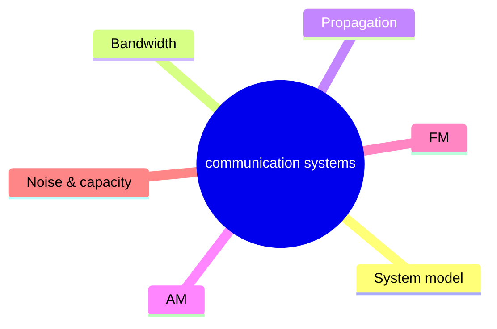
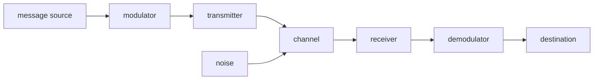
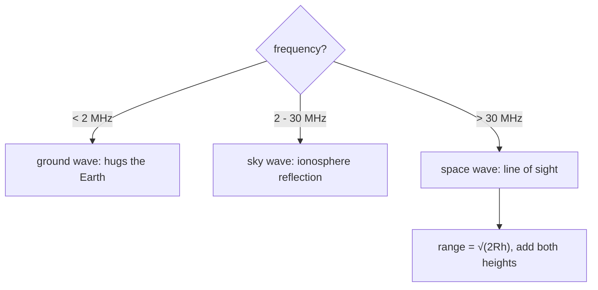
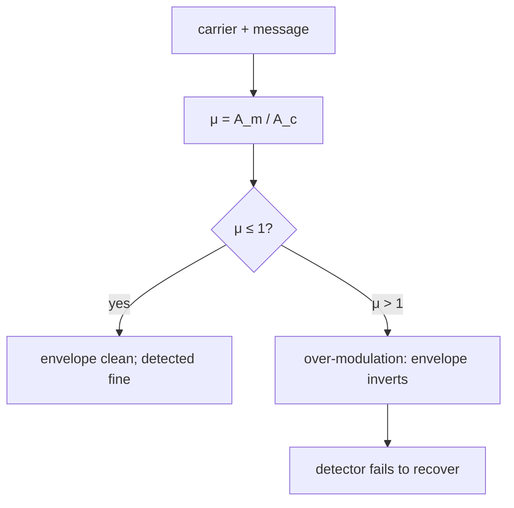
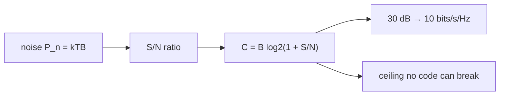
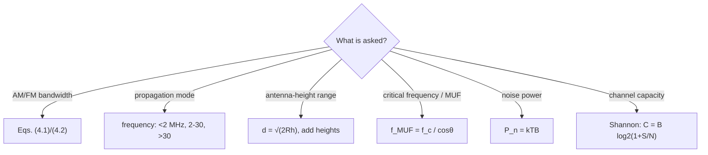

# Communication Systems — first principles to Olympiad

> [!abstract] How to use this chapter
> Three passes. Pass 1: Parts 0–4 — why modulation exists, how AM and FM work, how EM waves propagate, how detection strips the message back out. Pass 2: Parts 5–9 for exam craft. Pass 3: Parts 10–14 — the Olympiad layer (Shannon's capacity theorem, the Friis formula, the link budget, the FM capture effect, entropy and information content), the paper, the sheet, the checkpoint. Every number recomputed; every boxed result carries its validity condition.

## Part 0 · Orientation

### 0.1 What you will be able to do

After this chapter you can: explain why a baseband signal cannot be transmitted directly over long distances; derive and use the modulation index for AM; compute the bandwidth of an AM signal from its sidebands; draw and analyse AM and FM transmitter and receiver block diagrams; compare AM, FM and PM on bandwidth, noise immunity and power efficiency; calculate the propagation range for ground-wave, sky-wave and space-wave modes; compute the skip distance and maximum usable frequency for ionospheric reflection; design a simple envelope detector and explain its limitations; state Shannon's channel capacity theorem and use it to compare system designs; perform a link-budget calculation with the Friis transmission formula; and estimate the information content of a message source.

### 0.2 The one idea

A message cannot ride a carrier unless the carrier's amplitude, frequency or phase is steered by the message — modulation is the steering, and every system in communication is a chain of modulation, transmission and demodulation fighting noise at every step.

### 0.3 Prerequisite self-check

1. State Maxwell's prediction that electromagnetic waves travel at $c=3\times10^8$ m/s. (`electromagnetic-waves/`)
2. Write the relation between wavelength, frequency and wave speed. (`electromagnetic-waves/`)
3. What is the resonant frequency of an LC circuit? (PART 22)
4. Explain the ripple voltage $\Delta V\approx I/(2fC)$ of a rectifier-smoothing capacitor. (PART 22, PART 27)
5. State the reactance of a capacitor $X_C=1/(\omega C)$ and an inductor $X_L=\omega L$. (PART 22)
6. Define RMS voltage and its relation to peak voltage. (PART 22)
7. What is the bandwidth of a signal? (PART 22 — resonance bandwidth $\Delta\omega=R/L$)

### 0.4 Exam orientation

JEE Main treats this chapter as formula-friendly and moderate-weight: the modulation index, bandwidth calculation, propagation mode identification, and block diagrams are the standard questions. JEE Advanced rarely asks communication questions directly, but the underlying EM-wave physics and AC-circuit reasoning are tested. NSEP and olympiad rounds reward the Friis formula, link-budget arithmetic, and Shannon's theorem. The trap density here is conceptual: confusing AM bandwidth with FM bandwidth, mixing up ground-wave and sky-wave conditions, and forgetting that noise sets the fundamental limit.

### 0.5 What this chapter is not

Not a digital-signal-processing course: QAM, spread-spectrum, OFDM, error-correcting codes and networking protocols are out. Not a radar or lidar course: only the transmission link is covered, not range-finding. Not a fibre-optic course: guided-wave communication appears as a one-paragraph mention.

### 0.6 Syllabus coverage map

No Cengage communication chapter exists in the supplied volumes (verified). The coverage map is built from the standard JEE Main syllabus headings.

| # | Syllabus topic | Covered in | Status |
|---:|---|---|---|
| 1 | Elements of a communication system: transmitter, channel, receiver | §3.1 | full |
| 2 | Bandwidth of signals (audio, video, digital) | §3.2 | full |
| 3 | Bandwidth of transmission medium (coaxial cable, optical fibre, free space) | §3.3 | full |
| 4 | Propagation of EM waves: ground wave, sky wave, space wave | §3.4–3.6 | full |
| 5 | Need for modulation: low-frequency attenuation, antenna size | §3.7 | full |
| 6 | Amplitude modulation: modulation index, waveform, sidebands, bandwidth | §3.8 | full |
| 7 | Frequency modulation: FM waveform, modulation index, bandwidth (Carson's rule) | §3.9 | full |
| 8 | Detection/demodulation: envelope detector, ratio detector (FM) | §3.10 | full |
| 9 | AM and FM transmitter and receiver block diagrams | §3.11 | full |
| 10 | Shannon's channel capacity (olympiad sweep) | §3.12, OL1 | added by sweep |
| 11 | Friis transmission formula and link budget (olympiad sweep) | OL2, OL3 | added by sweep |
| 12 | Entropy and information content (olympiad sweep) | OL4 | added by sweep |

## Part 1 · Intuition first

**You cannot ship a letter without an envelope.** A voice signal oscillates at 300–3400 Hz. Send it as an electromagnetic wave directly and you would need an antenna hundreds of kilometres tall (a quarter-wave antenna at 1 kHz is 75 km). Modulate a high-frequency carrier — stamp the voice onto a 1 MHz wave — and the antenna shrinks to 75 metres. That is the engineering reason for modulation: antenna size, long-distance propagation, and the ability to multiplex many signals on different carriers.

**AM changes the envelope; FM changes the spacing.** In amplitude modulation the carrier's height tracks the message: louder voice, taller wave. In frequency modulation the carrier's spacing tightens and loosens: louder voice, faster wiggles. FM uses more bandwidth but shrugs off amplitude noise — the lightning crack that ruins AM reception barely dents FM. That trade-off (bandwidth versus noise immunity) is the central engineering decision of the chapter.

**The ionosphere is a mirror for short waves.** Below about 30 MHz the ionosphere reflects radio waves back to Earth, enabling reception beyond the horizon — the sky-wave mode that made global radio possible. Above 30 MHz the waves punch through and travel in straight lines — the space-wave mode of TV, FM and mobile phones. The ground wave hugs the Earth's surface but fades with frequency: long-wave AM travels coast to coast, while VHF barely crosses a city. Three propagation modes, three frequency regimes, one ionosphere.

**Noise is not a nuisance; it is the fundamental limit.** Every receiver picks up thermal noise $P_n=kTB$ from the antenna and its own electronics. Shannon proved that a channel with bandwidth $B$ and signal-to-noise ratio $S/N$ can carry at most $C=B\log_2(1+S/N)$ bits per second — a ceiling no engineering can break. Modulation schemes differ in how close they approach this ceiling.

> [!tip] FIGURE F100.1 · Chapter map
> *Why:* the chapter is one journey — modulate, propagate, receive, and count the noise — and the map shows the spine.
> *Data:* the Part 0–14 structure — the system model, bandwidth, propagation, AM, FM, noise, paper, sheet.

> *Read:* every result is a bandwidth, a modulation index, a range formula, or Shannon's ceiling.

## Part 2 · Definitions and bookkeeping

| Symbol | Meaning | Typical value |
|---|---|---|
| $f_c$ | carrier frequency | 1 MHz (AM broadcast), 100 MHz (FM broadcast) |
| $f_m$ | maximum message frequency (modulating signal) | 3.4 kHz (voice), 15 kHz (music) |
| $A_c$, $A_m$ | carrier amplitude, message amplitude | — |
| $\mu$ | modulation index (AM) | $0<\mu\leq1$; over-modulated if $\mu>1$ |
| $\Delta f$ | frequency deviation (FM) | $\pm75$ kHz (FM broadcast) |
| $\beta$ | modulation index (FM) $=\Delta f/f_m$ | 5 (FM broadcast) |
| $B$ | bandwidth | Hz |
| $S/N$ | signal-to-noise ratio (power) | dimensionless, or in dB |
| $C$ | channel capacity | bits/s |
| $k$ | Boltzmann constant | $1.38\times10^{-23}$ J/K |
| $T$ | noise temperature | 290 K (standard) |
| $G_t$, $G_r$ | transmit and receive antenna gains | dimensionless |
| $P_t$, $P_r$ | transmitted and received power | W |
| $\lambda$ | wavelength $=c/f$ | m |

> [!info] Bookkeeping rules
> All frequencies are in Hz unless flagged. The modulation index $\mu$ for AM is always $A_m/A_c$ and must be $\leq1$ for standard AM. The FM modulation index $\beta=\Delta f/f_m$ can exceed 1. Power ratios use the convention $10\log_{10}(P_1/P_2)$ for dB. The noise temperature $T$ is the equivalent temperature of the noise power $P_n=kTB$.

Three numbers to carry everywhere: $c=3\times10^8$ m/s; voice bandwidth $=3.4$ kHz; standard noise temperature $T_0=290$ K.

## Part 3 · Core derivations

### 3.1 The communication system model

Every communication system has three parts: the **transmitter** (converts the message into a signal suitable for the channel), the **channel** (the physical medium — wire, fibre, free space), and the **receiver** (extracts the message from the received signal). Noise enters at every stage but is conventionally modelled as additive noise at the channel output. The block diagram is: message source → modulator → transmitter → channel (+ noise) → receiver → demodulator → destination.

> [!abstract] DIAGRAM D100.1 · The communication system block diagram
> *Show:* a horizontal chain: message source (microphone icon) arrow to modulator arrow to transmitter (antenna icon) arrow through a box labelled "channel + noise" to receiver (antenna icon) arrow to demodulator arrow to destination (speaker icon). Noise added as a lightning-bolt arrow into the channel box.
> *Search:* "communication system block diagram transmitter channel receiver noise"

> [!tip] FIGURE F100.2 · The three-part system: modulate, send, demodulate
> *Why:* every communication question walks the same chain; the figure fixes the stages and where noise enters.
> *Data:* source → modulator → transmitter → channel (+noise) → receiver → demodulator → destination.

> *Read:* the modulator stamps the message onto a carrier, the channel adds noise, and the demodulator unstamps it — the chain is the map.

### 3.2 Bandwidth of signals

A pure sinusoidal signal $A\sin(2\pi f t)$ has zero bandwidth — it occupies a single frequency. A real message signal (voice, music, video) occupies a range of frequencies. Human voice: 300 Hz to 3400 Hz, bandwidth 3.1 kHz (telephone standard rounds to 3.4 kHz). Music: 20 Hz to 20 kHz, bandwidth 20 kHz. Video (broadcast TV): up to 6 MHz. Digital signals: a square wave at bit rate $R$ bits/s has harmonics up to roughly $R/2$ Hz, so bandwidth is proportional to bit rate.

> [!abstract] DIAGRAM D100.2 · Frequency spectrum of a voice signal
> *Show:* a horizontal frequency axis from 0 to 5 kHz; a filled spectral envelope peaking around 500–2000 Hz and tapering to zero at 300 Hz and 3400 Hz; the 3.1 kHz bandwidth marked with a double-headed arrow.
> *Search:* "voice signal frequency spectrum bandwidth 300 3400 Hz"

### 3.3 Bandwidth of transmission media

Each medium has a usable bandwidth: twisted-pair copper wire (up to a few MHz), coaxial cable (up to a few hundred MHz), optical fibre (tens of THz), free space (effectively unlimited, but regulated by allocation). The channel's bandwidth limits the bit rate: a 3 kHz telephone channel cannot carry a 6 MHz video signal without compression.

### 3.4 Propagation: ground wave

The ground wave follows the Earth's surface, bending around it due to diffraction. Attenuation increases with frequency: long-wave AM (30–300 kHz) propagates over thousands of kilometres, while medium-wave AM (300 kHz–3 MHz) reaches hundreds of km during the day. Above a few MHz the ground wave dies within tens of kilometres. The mechanism: the wave induces currents in the Earth's surface, which absorb energy; higher frequencies are absorbed faster.

### 3.5 Propagation: sky wave

The ionosphere (60–400 km altitude) contains free electrons produced by solar UV. For frequencies below the critical frequency $f_c$ (typically 5–10 MHz, varying with time of day and solar activity), the ionosphere refracts the wave back to Earth — a virtual mirror. The wave can bounce between ground and ionosphere multiple times, reaching around the globe. The maximum usable frequency (MUF) for a given path depends on the incidence angle:

$$
f_{\text{MUF}}=\frac{f_c}{\cos\theta}. \qquad (3.1)
$$

Above the MUF the wave escapes into space. The skip distance is the minimum ground distance at which the sky wave is received; closer in, only the ground wave (if any) arrives. The skip zone is the dead region between the ground wave's range and the sky wave's landing point.

> [!info] Why
> The critical frequency $f_c$ is the highest frequency reflected when the wave is incident vertically ($\theta=0$, $\cos\theta=1$). At oblique incidence the effective electron density seen by the wave increases, so a higher frequency is reflected — this is the $\sec\theta$ factor.

> [!abstract] DIAGRAM D100.3 · Sky-wave propagation with skip distance
> *Show:* the Earth's surface as a curved line at the bottom; the ionosphere as a horizontal band 100–300 km above; a transmitter antenna on the left sending an oblique ray up to the ionosphere, reflecting back down to a distant receiver; the skip distance (ground range) labelled; a second ray at steeper angle reflecting closer; the skip zone shaded between ground-wave range and first sky-wave landing.
> *Search:* "sky wave ionospheric reflection skip distance skip zone diagram"

> [!tip] FIGURE F100.3 · Propagation: three modes, three frequency bands
> *Why:* the propagation question is decided by frequency alone — the figure routes each band to its mode.
> *Data:* ground wave < 2 MHz; sky wave 2–30 MHz (ionosphere); space wave > 30 MHz (line-of-sight, range $\sqrt{2Rh}$).

> *Read:* low frequencies bend around the Earth, mid frequencies bounce off the ionosphere, high frequencies must see their target — one ionosphere, three careers.

### 3.6 Propagation: space wave

Above about 30 MHz (VHF and higher) the wave penetrates the ionosphere and travels in a straight line — line-of-sight (LOS) propagation. The range is limited by the horizon:

$$
d=\sqrt{2Rh} \qquad (3.2)
$$

where $R=6400$ km is Earth's radius and $h$ is the antenna height. For a TV tower at 100 m: $d=\sqrt{2\times6400\times0.1}=35.8$ km. Tropospheric scattering extends the range slightly beyond the geometric horizon. FM radio, television, mobile phones, and satellite communication all use space-wave propagation.

> [!abstract] DIAGRAM D100.4 · Line-of-sight propagation and horizon distance
> *Show:* the Earth as a circle; a tower of height $h$ on the surface; a tangent line from the tower top to the horizon point; the distance $d$ along the surface; the formula $d=\sqrt{2Rh}$ labelled; a second taller tower with a longer range drawn beside it for comparison.
> *Search:* "line of sight propagation horizon distance antenna height diagram"

### 3.7 Why modulation is necessary

Three reasons, all derived from physics rather than asserted:

**Antenna size.** An efficient antenna needs to be comparable to the wavelength. A quarter-wave monopole at 1 kHz (voice) would be $\lambda/4=c/(4f)=75$ km — impractical. At 1 MHz: $\lambda/4=75$ m — standard AM broadcast tower.

**Multiplexing.** Two voice signals both occupying 300–3400 Hz cannot share the same wire or airwave simultaneously. Modulate each onto a different carrier (say 600 kHz and 800 kHz) and they occupy separate frequency bands — frequency-division multiplexing.

**Propagation efficiency.** Low-frequency waves are absorbed rapidly by the ground wave; the ionosphere only reflects waves in the right frequency window. Modulation shifts the signal into the frequency band best suited to the chosen propagation mode.

> [!abstract] DIAGRAM D100.5 · Frequency-division multiplexing
> *Show:* a horizontal frequency axis; three message signals each 4 kHz wide centred at different carrier frequencies (600 kHz, 800 kHz, 1000 kHz); the combined spectrum showing non-overlapping bands; the demultiplexer splitting them at the receiver.
> *Search:* "frequency division multiplexing FDM carrier channels diagram"

### 3.8 Amplitude modulation (AM)

**The derivation.** Let the carrier be $c(t)=A_c\sin(2\pi f_ct)$ and the message be $m(t)=A_m\sin(2\pi f_mt)$ with $f_m\ll f_c$. The AM signal is:

$$
s(t)=A_c[1+\mu\sin(2\pi f_mt)]\sin(2\pi f_ct), \qquad \mu=\frac{A_m}{A_c}. \qquad (3.3)
$$

Expanding with the product-to-sum identity:

$$
s(t)=A_c\sin(2\pi f_ct)+\frac{\mu A_c}{2}\cos[2\pi(f_c-f_m)t]-\frac{\mu A_c}{2}\cos[2\pi(f_c+f_m)t]. \qquad (3.4)
$$

The AM signal contains three components: the carrier at $f_c$, the lower sideband at $f_c-f_m$, and the upper sideband at $f_c+f_m$. The message is encoded in the sidebands, not in the carrier — the carrier is just a scaffold.

**Bandwidth.** The spectrum extends from $f_c-f_m$ to $f_c+f_m$:

$$
B_{\text{AM}}=2f_m. \qquad (3.5)
$$

For voice: $B=2\times3.4=6.8$ kHz.

**Power.** The total average power is the sum of carrier and sideband powers:

$$
P_{\text{total}}=P_c\left(1+\frac{\mu^2}{2}\right), \qquad P_c=\frac{A_c^2}{2R}. \qquad (3.6)
$$

At $\mu=1$ (100% modulation): the sidebands carry $P_c/2$, so the total is $1.5P_c$ — the carrier wastes two-thirds of the power carrying no message. This is AM's main inefficiency.

> [!warning] Condition of validity
> Eq. (3.6) assumes a single-tone modulating signal. For a complex message with peak amplitude $A_m$, $\mu=A_m/A_c$ and $\mu\leq1$ prevents envelope distortion. Over-modulation ($\mu>1$) causes the envelope to invert, and the envelope detector fails to recover the message.

> [!abstract] DIAGRAM D100.6 · AM waveform with modulation index annotation
> *Show:* the carrier as a high-frequency sine; the message as a low-frequency sine below; the AM signal with the envelope traced as a dashed line matching the message; $\mu$ annotated as (envelope peak minus carrier) divided by carrier; three cases: $\mu=0.5$, $\mu=1$, $\mu>1$ (over-modulated with envelope crossing zero).
> *Search:* "amplitude modulation waveform modulation index 50 percent 100 percent overmodulated"

> [!tip] FIGURE F100.4 · AM: the envelope carries the message — until it inverts
> *Why:* amplitude modulation is read entirely from the envelope, and the modulation index is its single dial — the figure binds them.
> *Data:* $\mu=\frac{A_{\max}-A_{\min}}{A_{\max}+A_{\min}}=\frac{A_m}{A_c}$; $\mu\le1$ required; power efficiency $\frac{\mu^2}{2+\mu^2}$.

> *Read:* keep the index at or under one, or the envelope folds over and the message is lost; the index also prices how little carrier power is actually message.

### 3.9 Frequency modulation (FM)

In FM the carrier's instantaneous frequency tracks the message:

$$
f_i(t)=f_c+\Delta f\sin(2\pi f_mt), \qquad (3.7)
$$

where $\Delta f$ is the frequency deviation (75 kHz for FM broadcast). The modulation index is:

$$
\beta=\frac{\Delta f}{f_m}. \qquad (3.8)
$$

For FM broadcast: $\beta=75/15=5$ (using $f_m=15$ kHz for music).

**Bandwidth — Carson's rule.** The FM spectrum contains an infinite number of sidebands at $f_c\pm nf_m$ for $n=0,1,2,\ldots$, but the amplitudes of sidebands beyond $n>\beta+1$ are negligible. Carson's rule gives the effective bandwidth:

$$
B_{\text{FM}}\approx2(\Delta f+f_m)=2f_m(\beta+1). \qquad (3.9)
$$

For FM broadcast: $B=2(75+15)=180$ kHz — about 26 times the AM bandwidth for the same message. This is the price of noise immunity.

**Wideband FM versus narrowband FM.** When $\beta\ll1$ (narrowband FM), $B\approx2f_m$ — same as AM. When $\beta\gg1$ (wideband FM), $B\approx2\Delta f$ — the bandwidth is set by the deviation, not the message frequency.

> [!abstract] DIAGRAM D100.7 · FM waveform and frequency deviation
> *Show:* the message signal as a low-frequency sine below; the FM signal above with the frequency increasing when the message is positive and decreasing when negative; the instantaneous frequency $f_i$ oscillating between $f_c-\Delta f$ and $f_c+\Delta f$; the constant amplitude of the FM wave noted (amplitude does not change).
> *Search:* "frequency modulation waveform instantaneous frequency deviation diagram"

### 3.10 Demodulation (detection)

**AM: the envelope detector.** A diode rectifier followed by an RC low-pass filter extracts the envelope of the AM signal. The diode passes only positive half-cycles; the capacitor charges to the peak and discharges through the resistor between peaks, smoothing the envelope. The time constant $RC$ must satisfy:

$$
\frac{1}{f_c}\ll RC\ll\frac{1}{f_m}. \qquad (3.10)
$$

Too small: the capacitor follows the carrier, not the envelope (ripple). Too large: the capacitor cannot follow fast message variations (diagonal clipping). The envelope detector is simple but fails if $\mu>1$ or if the signal-to-noise ratio is poor (the detector follows noise peaks as if they were the envelope).

**FM: the discriminator.** FM demodulation converts frequency variations into amplitude variations (using a tuned circuit whose output amplitude depends on frequency), then envelope-detects. The slope detector and the ratio detector are the standard circuits. Because the information is in the frequency, not the amplitude, an FM receiver can include a limiter that clips amplitude noise before detection — this is the source of FM's noise advantage.

> [!abstract] DIAGRAM D100.8 · The envelope detector circuit
> *Show:* an AM signal input to a diode (anode left, cathode right); the diode output feeds a parallel RC combination (capacitor C, resistor R to ground); the output across R is the recovered message; the time constant $RC$ annotated with the double inequality; a sketch of the input AM waveform, the diode output (half-wave rectified), and the smooth output (envelope).
> *Search:* "AM envelope detector diode RC filter circuit waveform"

### 3.11 Block diagrams

**AM transmitter:** message source → pre-amplifier → modulator (mixer) → RF power amplifier → antenna. The modulator combines the message with the carrier; the RF amplifier boosts the signal to the required transmission power.

**AM receiver (superheterodyne):** antenna → RF amplifier → mixer (with local oscillator) → IF amplifier (fixed intermediate frequency, 455 kHz standard) → detector (envelope detector) → audio amplifier → speaker. The superheterodyne principle converts any incoming carrier to a fixed IF, so the IF amplifier is always optimised for one frequency.

**FM transmitter:** message source → pre-emphasis (boost high frequencies) → modulator (voltage-controlled oscillator) → frequency multiplier (to increase $\Delta f$) → power amplifier → antenna.

**FM receiver:** antenna → RF amplifier → limiter (clip amplitude) → discriminator (frequency-to-amplitude conversion) → de-emphasis (restore flat response) → audio amplifier → speaker.

> [!abstract] DIAGRAM D100.11 · FM transmitter and receiver block diagrams
> *Show:* two parallel horizontal chains. Top (transmitter): microphone arrow to pre-emphasis arrow to VCO (modulator, with carrier oscillator input from below) arrow to frequency multiplier arrow to power amplifier arrow to antenna. Bottom (receiver): antenna arrow to RF amplifier arrow to limiter arrow to discriminator arrow to de-emphasis arrow to audio amplifier arrow to speaker. Labels at each stage.
> *Search:* "FM transmitter receiver block diagram VCO discriminator limiter"

> [!abstract] DIAGRAM D100.12 · AM spectrum showing carrier and sidebands
> *Show:* a horizontal frequency axis; a tall vertical line at $f_c$ (carrier); two shorter lines at $f_c-f_m$ and $f_c+f_m$ (sidebands); the bandwidth $2f_m$ marked with a double-headed arrow; the sideband heights proportional to $\mu A_c/2$; the carrier height proportional to $A_c$.
> *Search:* "AM spectrum carrier upper lower sideband frequency bandwidth diagram"

> [!abstract] DIAGRAM D100.9 · AM superheterodyne receiver block diagram
> *Show:* antenna arrow to RF amplifier arrow to mixer (with local oscillator arrow entering from above) arrow to IF amplifier (455 kHz label) arrow to detector arrow to audio amplifier arrow to speaker; the signal frequency at each stage labelled ($f_{\text{RF}}$, $f_{\text{LO}}$, $f_{\text{IF}}=f_{\text{LO}}-f_{\text{RF}}$).
> *Search:* "superheterodyne receiver block diagram local oscillator IF amplifier"

### 3.12 Signal-to-noise and channel capacity

**Thermal noise.** Any resistor at temperature $T$ produces noise power $P_n=kTB$ over bandwidth $B$. At room temperature ($T=290$ K): $kT=4\times10^{-21}$ W/Hz $=-174$ dBm/Hz. A receiver with bandwidth 10 MHz picks up $P_n=4\times10^{-14}$ W $=-104$ dBm of thermal noise — this is the floor below which no signal can be detected.

**Shannon's channel capacity theorem.** A channel with bandwidth $B$ and signal-to-noise ratio $S/N$ can transmit at most:

$$
C=B\log_2\left(1+\frac{S}{N}\right)\ \text{bits/s}. \qquad (3.11)
$$

For a telephone channel ($B=3.4$ kHz, $S/N=30$ dB $=1000$): $C=3400\log_2(1001)=3400\times10=34$ kbps. No modulation scheme can exceed this rate; practical schemes approach it with coding.

> [!info] Why
> Shannon's theorem is an existence proof: it says a code exists that achieves rate $C$ with arbitrarily small error probability, but it does not construct the code. The proof uses random coding and the law of large numbers — the average error over all random codes vanishes as the block length grows. The result is remarkable because it separates the fundamental limit (set by physics) from the engineering (which code to use).

> [!abstract] DIAGRAM D100.10 · Signal-to-noise ratio and channel capacity
> *Show:* a graph with $S/N$ (in dB) on the horizontal axis and $C/B$ (bits/s/Hz, the spectral efficiency) on the vertical; the curve $C/B=\log_2(1+S/N)$ rising steeply at first then saturating; a few labelled points: $S/N=0$ dB gives $C/B=1$, $S/N=20$ dB gives $C/B\approx6.7$, $S/N=30$ dB gives $C/B\approx10$.
> *Search:* "Shannon channel capacity spectral efficiency signal to noise ratio curve"

> [!tip] FIGURE F100.5 · Shannon's ceiling: bandwidth × signal-to-noise
> *Why:* the chapter's end-of-the-line result — no scheme can beat the capacity formula, so every design is measured against it.
> *Data:* $C=B\log_2(1+S/N)$; thermal noise $P_n=kTB$; $S/N=30$ dB $\Rightarrow C/B\approx10$ bits/s/Hz.

> *Read:* more bandwidth or more signal buys capacity, but logarithmically — doubling $S/N$ adds only $\sim1$ bit/s per hertz at high SNR.

## Part 4 · Results, limits and the validity ledger

### 4.1 Boxed results

$$
\boxed{B_{\text{AM}}=2f_m,\qquad P_{\text{total}}=P_c\left(1+\frac{\mu^2}{2}\right),\qquad \mu=\frac{A_m}{A_c}\leq1} \qquad (4.1)
$$

single-tone AM; $\mu>1$ causes envelope distortion.

$$
\boxed{B_{\text{FM}}\approx2(\Delta f+f_m)=2f_m(\beta+1),\qquad\beta=\frac{\Delta f}{f_m}} \qquad (4.2)
$$

Carson's rule; good to within a few percent for $\beta>2$.

$$
\boxed{d=\sqrt{2Rh}\ \text{(line of sight)},\qquad f_{\text{MUF}}=\frac{f_c}{\cos\theta}\ \text{(sky wave)}} \qquad (4.3)
$$

LOS: $R=6400$ km, $h$ in km, $d$ in km. MUF: $f_c$ is the critical frequency, $\theta$ the incidence angle at the ionosphere.

$$
\boxed{C=B\log_2\left(1+\frac{S}{N}\right)\ \text{(Shannon)},\qquad P_n=kTB\ \text{(thermal noise)}} \qquad (4.4)
$$

$C$ is bits/s; $kT=4\times10^{-21}$ W/Hz at 290 K.

$$
\boxed{\frac{P_r}{P_t}=G_tG_r\left(\frac{\lambda}{4\pi d}\right)^2\ \text{(Friis)}} \qquad (4.5)
$$

free-space link; $d\gg\lambda$; no obstacles; matched polarisation.

### 4.2 Limit checks

- $\mu\to0$: the signal is just the carrier, no message — bandwidth collapses, correct.
- $\mu\to1$: maximum sideband power ($P_c/2$), still safe; $\mu>1$: envelope crosses zero, detector fails.
- $\Delta f\to0$ (FM): $\beta\to0$, $B_{\text{FM}}\to2f_m$, same as AM — narrowband FM recovered.
- $f_m\to0$ (DC message): $B\to0$, no sidebands — nothing to transmit, correct.
- $S/N\to0$: $C\to0$ — no capacity when only noise is present.
- $S/N\to\infty$: $C\to\infty$ — but bandwidth-limited channels still cap $C$ at $2B$ bits/s per Nyquist.
- $d\to\infty$ in Friis: $P_r\to0$ — the inverse-square law.
- $h\to0$: $d\to0$ — antenna on the ground sees only the ground, correct.

### 4.3 Which formula when

| Given | Need | Use |
|---|---|---|
| message frequency, carrier frequency | AM bandwidth | Eq. (4.1) |
| modulation index, carrier power | total transmitted power | Eq. (4.1) |
| frequency deviation, message frequency | FM bandwidth | Eq. (4.2) |
| antenna height | line-of-sight range | Eq. (4.3) |
| critical frequency, incidence angle | maximum usable frequency | Eq. (4.3) |
| bandwidth, signal-to-noise ratio | channel capacity | Eq. (4.4) |
| transmitted power, gains, distance | received power | Eq. (4.5) |
| temperature, bandwidth | noise power | $P_n=kTB$ |

### 4.4 Concept checks

**C1 — concept check.** Why can a voice signal not be transmitted directly as an EM wave?

Answer

An efficient antenna needs to be comparable to the wavelength; at voice frequencies ($\sim1$ kHz), $\lambda\approx300$ km, requiring an antenna tens of kilometres tall. Modulation shifts the signal to a higher frequency where practical antennas exist.

**C2 — concept check.** What determines the bandwidth of an AM signal?

Answer

The maximum modulating frequency $f_m$: $B=2f_m$, from the two sidebands.

**C3 — concept check.** In AM, where is the message information located: in the carrier or the sidebands?

Answer

In the sidebands. The carrier is a constant-frequency, constant-amplitude scaffold; suppressing it (as in DSB-SC) does not lose the message.

**C4 — concept check.** Why does FM have better noise immunity than AM?

Answer

Noise primarily affects amplitude, not frequency. An FM receiver's limiter clips amplitude noise before detection, so the recovered message is clean. AM's envelope detector follows noise peaks directly.

**C5 — concept check.** What is the skip zone?

Answer

The region between the ground wave's maximum range and the sky wave's nearest landing point, where neither propagation mode delivers a signal.

**C6 — concept check.** Above what frequency does the ionosphere stop reflecting radio waves?

Answer

Above the critical frequency $f_c$ (for vertical incidence), or above the MUF for oblique incidence. Typically 5–10 MHz, varying with solar activity.

**C7 — concept check.** Why does the ground wave attenuate faster at higher frequencies?

Answer

Higher-frequency waves induce stronger currents in the lossy Earth surface, dissipating more energy per wavelength of travel.

**C8 — concept check.** What happens if the modulation index $\mu$ exceeds 1?

Answer

The envelope crosses zero (over-modulation), causing the envelope detector to produce distortion — it cannot follow the inverted envelope.

**C9 — concept check.** Why does the superheterodyne receiver convert all signals to a fixed IF?

Answer

The IF amplifier can be optimised for a single frequency (selectivity, gain stability), regardless of the incoming station's carrier frequency.

**C10 — concept check.** At $S/N=0$ dB, what is Shannon's capacity per unit bandwidth?

Answer

$C/B=\log_2(2)=1$ bit/s/Hz. You can send at most one bit per second per hertz of bandwidth.

**C11 — concept check.** Why is the carrier power in AM considered "wasted"?

Answer

The carrier carries no message information; at $\mu=1$ it uses $2/3$ of the total power. Suppressed-carrier AM (DSB-SC) and SSB reclaim this power.

**C12 — concept check.** What is the difference between narrowband and wideband FM?

Answer

Narrowband FM has $\beta\ll1$, $B\approx2f_m$ (like AM). Wideband FM has $\beta\gg1$, $B\approx2\Delta f$, with far more sidebands and better noise immunity.

## Part 5 · Worked exemplars

### E1 — AM bandwidth and sidebands

A carrier at 1 MHz is amplitude-modulated by a 5 kHz tone. Find the frequencies of all components in the AM signal and the bandwidth.

> [!success] Check
> Three components spanning 10 kHz — consistent with $B=2f_m$.

Solution

**Method.** The AM signal has a carrier at $f_c=1$ MHz, a lower sideband at $f_c-f_m=995$ kHz, and an upper sideband at $f_c+f_m=1005$ kHz. Bandwidth $=2f_m=10$ kHz.

### E2 — Modulation index and power

A transmitter with carrier power 10 kW operates at $\mu=0.8$. Find the total power and the power in the sidebands.

> [!success] Check
> Sideband power is $P_c\mu^2/2=3.2$ kW; total is 13.2 kW — less than $2P_c$, consistent.

Solution

**Method.** $P_{\text{total}}=P_c(1+\mu^2/2)=10000(1+0.32)=13200$ W $=13.2$ kW. Sideband power $=P_{\text{total}}-P_c=3.2$ kW. Fraction in sidebands $=3.2/13.2=24.2\%$ — the carrier wastes $75.8\%$.

### E3 — FM bandwidth

An FM station has $\Delta f=75$ kHz and the maximum audio frequency is 15 kHz. Find $\beta$ and the bandwidth by Carson's rule.

> [!success] Check
> $\beta=5$, wideband FM; $B=180$ kHz — the standard FM channel spacing of 200 kHz accommodates this.

Solution

**Method.** $\beta=\Delta f/f_m=75/15=5$. $B=2(\Delta f+f_m)=2(75+15)=180$ kHz.

### E4 — Line-of-sight range

Calculate the maximum line-of-sight distance between a 100 m transmitting tower and a 25 m receiving antenna.

> [!success] Check
> Both distances add: $d_1+d_2=35.8+17.9=53.7$ km — reasonable for VHF/UHF.

Solution

**Method.** $d=\sqrt{2Rh_1}+\sqrt{2Rh_2}=\sqrt{2\times6400\times0.1}+\sqrt{2\times6400\times0.025}=35.8+17.9=53.7$ km. The two square roots add because the horizon distances from each antenna are independent.

### E5 — Skip distance

The ionosphere's critical frequency is 8 MHz. A signal at 12 MHz is transmitted at an incidence angle of $\theta=60°$. Find the MUF and state whether the signal is reflected.

> [!success] Check
> $f_{\text{MUF}}=16$ MHz $>12$ MHz — reflected.

Solution

**Method.** $f_{\text{MUF}}=f_c/\cos\theta=8/\cos60°=8/0.5=16$ MHz. Since $f=12$ MHz $<f_{\text{MUF}}$, the signal is reflected back to Earth.

### E6 — Thermal noise power

Find the thermal noise power in a 200 kHz bandwidth receiver at room temperature ($T=290$ K).

> [!success] Check
> $P_n\approx10^{-15}$ W — typical for a broadcast FM receiver's noise floor.

Solution

**Method.** $P_n=kTB=1.38\times10^{-23}\times290\times2\times10^5=8.0\times10^{-16}$ W $\approx0.8$ fW. In dBm: $10\log_{10}(8\times10^{-16}/10^{-3})=-121$ dBm.

### E7 — Shannon capacity

A telephone channel has $B=3.4$ kHz and $S/N=40$ dB. Find the maximum bit rate.

> [!success] Check
> $S/N=10^4$; $C\approx45$ kbps — consistent with dial-up modem speeds.

Solution

**Method.** $S/N=10^{40/10}=10000$. $C=B\log_2(1+S/N)=3400\log_2(10001)=3400\times13.29=45.2$ kbps.

### E8 — AM power efficiency

What fraction of the total AM power carries the message at $\mu=0.5$? At $\mu=1$?

> [!success] Check
> Efficiency increases with $\mu$ — more modulation, more useful power.

Solution

**Method.** Sideband power fraction $=\frac{\mu^2/2}{1+\mu^2/2}$. At $\mu=0.5$: $\frac{0.125}{1.125}=11.1\%$. At $\mu=1$: $\frac{0.5}{1.5}=33.3\%$. The carrier is the dominant power consumer.

### E9 — Friis transmission

A 1 W transmitter with $G_t=10$ dB sends at 900 MHz to a receiver 1 km away with $G_r=2$ dB. Find $P_r$.

> [!success] Check
> Path loss at 900 MHz, 1 km: about 91 dB; with 12 dB total gain, received power is about $-79$ dBm.

Solution

**Method.** $\lambda=c/f=0.333$ m. Path loss $=(4\pi d/\lambda)^2=(4\pi\times1000/0.333)^2=1.42\times10^{12}=111.5$ dB. $G_t=10$ dB, $G_r=2$ dB. $P_r=P_t+G_t+G_r-L_{\text{path}}=0+10+2-111.5=-99.5$ dBm. In watts: $P_r=1.1\times10^{-13}$ W.

### E10 — Information content

A source produces four symbols with probabilities $1/2$, $1/4$, $1/8$, $1/8$. Find the entropy (average information per symbol).

> [!success] Check
> $H=1.75$ bits/symbol — less than 2 bits (which would be needed for four equally likely symbols).

Solution

**Method.** $H=-\sum p_i\log_2 p_i=-\frac{1}{2}\log_2\frac{1}{2}-\frac{1}{4}\log_2\frac{1}{4}-\frac{1}{8}\log_2\frac{1}{8}-\frac{1}{8}\log_2\frac{1}{8}=\frac{1}{2}+\frac{1}{2}+\frac{3}{8}+\frac{3}{8}=1.75$ bits/symbol.

## Part 6 · Problem archetypes and practice

### 6.1 Archetypes

| # | Archetype | Template | Where worked | Variations |
|---:|---|---|---|---|
| 1 | AM sideband frequencies | $f_c\pm f_m$ | E1, Q1 | multiple-tone modulation |
| 2 | AM modulation index from waveform | $\mu=(A_{\max}-A_{\min})/(A_{\max}+A_{\min})$ | Q2 | given voltage waveform |
| 3 | AM total power | Eq. (4.1) | E2, Q3 | sideband power fraction |
| 4 | AM bandwidth | $B=2f_m$ | E1, Q4 | compare with FM |
| 5 | FM modulation index | $\beta=\Delta f/f_m$ | E3 | narrowband vs wideband |
| 6 | FM bandwidth (Carson) | Eq. (4.2) | E3, Q5 | given different deviation |
| 7 | Line-of-sight range | $d=\sqrt{2Rh}$ | E4, Q6 | both antennas elevated |
| 8 | MUF and skip distance | Eq. (4.3) | E5, Q7 | find critical frequency from MUF |
| 9 | Ground-wave vs sky-wave identification | frequency and range | Q8 | propagation mode choice |
| 10 | Envelope detector time constant | Eq. (3.10) | Q9 | design the RC values |
| 11 | Thermal noise power | $P_n=kTB$ | E6, Q10 | dBm conversion |
| 12 | Shannon capacity | Eq. (4.4) | E7, Q11 | bandwidth vs S/N trade-off |
| 13 | Friis formula link budget | Eq. (4.5) | E9, Q12 | find required transmitter power |
| 14 | AM power efficiency | sideband/total | E8, Q13 | comparison at two modulation indices |
| 15 | Entropy calculation | $H=-\sum p_i\log_2 p_i$ | E10, Q14 | uniform distribution |

### 6.2 In-flow practice

#### Q1. A carrier at 800 kHz is AM-modulated by a 10 kHz signal. List all frequency components.

Solution

800 kHz (carrier), 790 kHz (lower sideband), 810 kHz (upper sideband).

#### Q2. An AM waveform has a maximum amplitude of 8 V and a minimum of 2 V. Find $\mu$.

Solution

$\mu=(8-2)/(8+2)=6/10=0.6$.

#### Q3. A transmitter delivers 20 kW of carrier power. At $\mu=0.9$, what is the total power?

Solution

$P=20000(1+0.81/2)=20000\times1.405=28.1$ kW.

#### Q4. An AM broadcast station uses a maximum audio frequency of 4.5 kHz. What is the channel bandwidth needed?

Solution

$B=2\times4.5=9$ kHz. Standard AM channels are 10 kHz wide.

#### Q5. An FM signal has $\Delta f=50$ kHz and $f_m=10$ kHz. Bandwidth?

Solution

$\beta=50/10=5$; $B=2(50+10)=120$ kHz.

#### Q6. A TV tower is 200 m tall. Line-of-sight range to a ground-level receiver?

Solution

$d=\sqrt{2\times6400\times0.2}=\sqrt{2560}=50.6$ km.

#### Q7. The critical frequency of the ionosphere is 6 MHz. What is the MUF for an incidence angle of 45°?

Solution

$f_{\text{MUF}}=6/\cos45°=6/0.707=8.49$ MHz.

#### Q8. A 150 MHz signal and a 1 MHz signal are both transmitted from the same tower. Which uses ground wave, and which uses space wave?

Solution

1 MHz uses ground wave (medium-wave AM, follows the surface). 150 MHz uses space wave (VHF, line of sight — penetrates the ionosphere).

#### Q9. An envelope detector has $R=5$ k$\Omega$ and $C=0.01\ \mu$F. The carrier is 1 MHz and the message is up to 5 kHz. Is the time constant suitable?

Solution

$RC=5\times10^3\times10^{-8}=50\ \mu$s. $1/f_c=1\ \mu$s, $1/f_m=200\ \mu$s. Since $1\ \mu$s $\ll50\ \mu$s $\ll200\ \mu$s, the time constant is suitable.

#### Q10. A receiver with 100 kHz bandwidth operates at 300 K. What is the noise power?

Solution

$P_n=kTB=1.38\times10^{-23}\times300\times10^5=4.14\times10^{-16}$ W $=-124$ dBm.

#### Q11. A channel has $B=1$ MHz and $S/N=20$ dB. Find the Shannon capacity.

Solution

$S/N=100$; $C=10^6\log_2(101)=10^6\times6.66=6.66$ Mbps.

#### Q12. Using the Friis formula, how does the received power change if the distance doubles (all else fixed)?

Solution

$P_r\propto1/d^2$: doubling the distance quarters the received power (a 6 dB loss).

#### Q13. An AM station transmits 10 kW total at $\mu=0.8$. What power is in the sidebands?

Solution

$P_c=P_{\text{total}}/(1+\mu^2/2)=10/1.32=7.58$ kW. Sideband power $=10-7.58=2.42$ kW.

#### Q14. A fair coin is tossed. What is the information content of the outcome?

Solution

$H=-2\times(1/2)\log_2(1/2)=1$ bit. One bit of information per toss.

#### Q15. Why can multiple AM stations coexist in the same city?

Solution

Each uses a different carrier frequency; their sidebands occupy non-overlapping bands of width $2f_m$ (about 10 kHz each), separated by the channel spacing (10 kHz for AM broadcast).

#### Q16. What is the antenna size advantage of modulating a 1 kHz voice onto a 1 MHz carrier?

Solution

Quarter-wave antenna at 1 kHz: 75 km. At 1 MHz: 75 m. A factor of 1000 reduction in antenna size.

#### Q17. An FM receiver picks up a signal with $S/N=30$ dB before the limiter. After limiting, what happens to the noise?

Solution

The limiter clips amplitude variations, removing most of the amplitude noise. The FM signal's frequency information is preserved; only amplitude noise (which does not carry FM information) is suppressed.

#### Q18. A channel has $C=56$ kbps and $B=4$ kHz. What $S/N$ is required?

Solution

$56000=4000\log_2(1+S/N)$; $\log_2(1+S/N)=14$; $S/N=2^{14}-1=16383$; $S/N=42.1$ dB.

#### Q19. Why does short-wave (HF) radio work for international broadcasting but VHF does not?

Solution

HF (3–30 MHz) is reflected by the ionosphere, enabling sky-wave propagation over thousands of km. VHF ($>30$ MHz) penetrates the ionosphere and is limited to line-of-sight range ($\sim50$ km).

#### Q20. A signal occupies 0–6 MHz. What is the minimum sampling rate?

Solution

By the Nyquist theorem: $f_s\geq2f_{\max}=12$ Msamples/s.

#### Q21. Why is FM preferred for music broadcasting and AM for talk radio?

Solution

Music has wider bandwidth (up to 15 kHz) and benefits from FM's noise immunity. Voice is only 3.4 kHz; AM's narrower channel (10 kHz) is sufficient, and AM's simpler receivers are cheaper.

#### Q22. Find the wavelength of an FM broadcast signal at 100 MHz.

Solution

$\lambda=c/f=3\times10^8/10^8=3$ m. This is why FM antennas are about 0.75 m (quarter wave).

#### Q23. A source emits three symbols with probabilities 0.5, 0.3, 0.2. Find the entropy.

Solution

$H=-(0.5\log_20.5+0.3\log_20.3+0.2\log_20.2)=0.5+0.521+0.464=1.485$ bits/symbol.

#### Q24. What limits the minimum detectable signal in a receiver?

Solution

The thermal noise floor $P_n=kTB$ sets the absolute lower bound. Practical receivers also have additional noise from their own electronics, characterised by the noise figure.

#### Q25. In the Friis formula, what happens if the transmitter and receiver have mismatched polarisations?

Solution

A polarisation mismatch factor multiplies the right side; for completely cross-polarised antennas (e.g. vertical and horizontal), $P_r=0$ — no power is received.

## Part 7 · Alternate methods and the JEE-Advanced advantage toolkit

### 7.1 The dB shortcut for link budgets

Convert all powers to dB and add/subtract: $P_r(\text{dBm})=P_t+G_t+G_r-L_{\text{path}}$. The path loss $L_{\text{path}}=20\log_{10}(4\pi d/\lambda)$ in dB. Everything becomes addition — a five-step calculation in your head. Fails when the polarisation is mismatched or the path has obstacles (the Friis formula assumes free space).

### 7.2 The sideband-power ratio trick

In AM, the fraction of power in the sidebands is $\mu^2/(2+\mu^2)$. Memorise the anchor values: $\mu=0.5$ gives $11\%$, $\mu=1$ gives $33\%$, $\mu=0.8$ gives $24\%$. These three cover most exam questions.

### 7.3 The Carson's-rule two-step

For FM bandwidth: (1) add $\Delta f+f_m$, (2) double it. No need to compute $\beta$ unless the question asks for it. The answer is approximate but within a few percent for $\beta>2$, which is the FM-broadcast regime.

### 7.4 The propagation-mode frequency table

Memorise: ground wave $<2$ MHz (medium wave and below), sky wave 2–30 MHz (short wave), space wave $>30$ MHz (VHF and above). One sentence, three regimes, most questions answered by the frequency.

### 7.5 The inverse-square check

For any link-budget question, verify that the result scales as $1/d^2$ when only the distance changes. This catches unit errors (km vs m, MHz vs Hz) faster than re-deriving.

## Part 8 · Examiner traps

> [!danger] Trap 1 — AM bandwidth from the carrier frequency
> Writing $B=2f_c$ instead of $B=2f_m$. Reply: the bandwidth is set by the modulating signal, not the carrier. A 1 MHz carrier modulated by 5 kHz has 10 kHz bandwidth, not 2 MHz.

> [!danger] Trap 2 — Over-modulation preserving the message
> Assuming $\mu>1$ is just "more power." Reply: over-modulation inverts the envelope, and the envelope detector produces distortion. The message is lost in the inverted regions.

> [!danger] Trap 3 — FM bandwidth equals the deviation
> Writing $B=\Delta f$. Reply: Carson's rule gives $B\approx2(\Delta f+f_m)$ — the factor of 2 accounts for both sidebands, and $f_m$ accounts for the modulating signal's own bandwidth.

> [!danger] Trap 4 — Ground wave at VHF frequencies
> Assuming ground wave works for FM/TV frequencies. Reply: ground-wave attenuation increases steeply with frequency; above a few MHz it is negligible beyond a few kilometres.

> [!danger] Trap 5 — Sky wave above the MUF
> Assuming the ionosphere always reflects. Reply: above the critical frequency at vertical incidence (or above the MUF at oblique incidence), the wave escapes to space.

> [!danger] Trap 6 — Forgetting both antenna heights in LOS
> Using $d=\sqrt{2Rh}$ with only the transmitter height. Reply: both antennas contribute: $d=\sqrt{2Rh_1}+\sqrt{2Rh_2}$.

> [!danger] Trap 7 — Shannon capacity in natural log
> Using $\ln$ instead of $\log_2$ in Shannon's formula. Reply: the formula uses $\log_2$ for bits/s; using $\ln$ gives nats/s — the numerical value differs by a factor of $\ln 2\approx0.693$.

> [!danger] Trap 8 — Carrier power in the denominator
> Computing efficiency as sideband power over carrier power instead of over total power. Reply: total power is $P_c(1+\mu^2/2)$, not just $P_c$.

> [!danger] Trap 9 — The Friis formula at $d<\lambda$
> Applying $P_r=P_tG_tG_r(\lambda/4\pi d)^2$ in the near field. Reply: the formula is valid only for $d\gg\lambda$ (far field). In the near field, the $1/d^2$ law breaks down.

> [!danger] Trap 10 — Noise temperature and physical temperature
> Assuming $T$ in $P_n=kTB$ is always room temperature. Reply: for low-noise amplifiers, the equivalent noise temperature can be much lower than 290 K; for high-gain antennas pointed at the sky, it can be much higher (the sky is not at 290 K at all frequencies).

## Part 9 · Playbook

### 9.1 Triage decision tree

> [!tip] FIGURE F100.6 · Triage — route by the keyword
> *Why:* the keyword names the route before any number is touched.
> *Data:* the nine triage branches of §9.1.

> *Read:* frequency picks the propagation mode, a waveform picks the modulation index, and every capacity question stops at Shannon's ceiling.

- "Bandwidth of an AM/FM signal": identify $f_m$ or $\Delta f$, apply Eqs. (4.1) or (4.2).
- "Propagation mode": check the frequency — below 2 MHz ground, 2–30 MHz sky, above 30 MHz space/LOS.
- "Range from antenna height": $d=\sqrt{2Rh}$, add both heights.
- "MUF or critical frequency": $f_{\text{MUF}}=f_c/\cos\theta$.
- "Noise power": $P_n=kTB$, convert to dBm.
- "Channel capacity": Shannon's formula, check whether $\log_2$ or $\ln$ is asked.
- "Link budget": Friis in dB — add gains, subtract path loss.
- "Power efficiency of AM": $\mu^2/(2+\mu^2)$.
- "Modulation index from waveform": $\mu=(A_{\max}-A_{\min})/(A_{\max}+A_{\min})$.

### 9.2 Formula map with validity

| Formula | Valid when | Breaks when |
|---|---|---|
| Eq. (4.1) | single-tone AM, $\mu\leq1$ | over-modulation, multiple tones |
| Eq. (4.2) | Carson's rule, $\beta>2$ | very narrowband FM |
| Eq. (4.3) LOS | flat Earth, no obstacles | long paths with terrain |
| Eq. (4.3) MUF | ionospheric reflection model | solar flares, sudden ionospheric disturbances |
| Eq. (4.4) | AWGN channel, infinite block length | bursty noise, finite block codes |
| Eq. (4.5) | far field, free space, matched polarisation | near field, obstacles, atmospheric absorption |

### 9.3 Constants to carry

$c=3\times10^8$ m/s; $kT=4\times10^{-21}$ W/Hz at 290 K ($-174$ dBm/Hz); voice bandwidth 3.4 kHz; AM broadcast channel 10 kHz; FM broadcast $\Delta f=75$ kHz, $f_m=15$ kHz, channel 200 kHz; $R=6400$ km; critical frequency typically 5–10 MHz.

### 9.4 Timing plan

Sections A and B under two minutes each; Section C three minutes; Section D twelve minutes. Link-budget and Shannon questions die by formula; propagation questions die by the frequency-regime table.

### 9.5 Pre-submission audit, ten points

1. AM bandwidth uses $2f_m$, not $2f_c$.
2. Modulation index $\leq1$ for standard AM.
3. FM bandwidth includes both $\Delta f$ and $f_m$.
4. Propagation mode matches the frequency regime.
5. Both antenna heights included in LOS range.
6. MUF uses $\sec\theta$, not $\sin\theta$.
7. Shannon uses $\log_2$, not $\ln$.
8. Friis is valid in the far field only.
9. Noise power uses the correct bandwidth.
10. Every sub-part answered, units on numerics.

## Part 10 · Olympiad extension

### OL1 — Shannon's capacity theorem and its implications

Derive the order-of-magnitude argument for why Shannon's capacity sets a fundamental limit: for a channel with bandwidth $B$ and noise power $N$, the maximum number of distinguishable signal levels is $M=\sqrt{1+S/N}$, giving $C=2B\log_2 M=B\log_2(1+S/N)$ bits/s.

Solution

**Method.** The received signal can be represented as $2BT$ samples in time $T$ (Nyquist). Each sample is a point in a one-dimensional signal space contaminated by Gaussian noise of variance $N$. The signal has power $S$, so the signal amplitude spans about $\sqrt{S/N}$ standard deviations — the number of distinguishable levels is $M\approx\sqrt{1+S/N}$. Each sample carries $\log_2 M$ bits, so $C=2B\log_2\sqrt{1+S/N}=B\log_2(1+S/N)$.

**Checks.** (i) At $S/N=0$ dB: $C/B=1$ bit/s/Hz — one bit per sample, the noise fills half the decision space. (ii) The formula is dimensionally correct: $B$ in Hz gives $C$ in bits/s.

### OL2 — The Friis transmission formula

Derive the Friis formula $P_r/P_t=G_tG_r(\lambda/4\pi d)^2$ from the isotropic power spread and the effective aperture of the receiving antenna.

Solution

**Method.** An isotropic antenna radiates power $P_t$ uniformly over a sphere of area $4\pi d^2$. The power flux density at distance $d$ is $S=P_t/(4\pi d^2)$. A directive antenna with gain $G_t$ concentrates this into $S=G_tP_t/(4\pi d^2)$. The receiving antenna's effective aperture is $A_e=G_r\lambda^2/(4\pi)$ (derived from reciprocity and the antenna's radiation pattern). The received power is $P_r=SA_e=G_tP_t/(4\pi d^2)\times G_r\lambda^2/(4\pi)=P_tG_tG_r(\lambda/4\pi d)^2$.

**Checks.** (i) $P_r\propto1/d^2$ — the inverse-square law. (ii) $P_r\propto\lambda^2$: longer wavelengths need larger antennas (larger $A_e$), hence more received power at the same gain.

### OL3 — Link-budget design for a satellite link

A geostationary satellite at 36,000 km transmits 20 W at 12 GHz with a 30 dB antenna gain. The ground station has a 1 m dish ($G_r\approx34$ dB at 12 GHz). Find the free-space received power and the margin above the $-120$ dBm receiver threshold.

Solution

**Method.** $\lambda=0.025$ m. Path loss $=(4\pi d/\lambda)^2=(4\pi\times3.6\times10^7/0.025)^2=3.26\times10^{21}=215.1$ dB. $P_t=13$ dBW $=43$ dBm. $P_r=43+30+34-215.1=-108.1$ dBm. Margin $=-108.1-(-120)=11.9$ dB — comfortable.

**Checks.** (i) The path loss at 36,000 km is enormous ($>200$ dB) — consistent with satellite links requiring high-gain antennas. (ii) The 12 dB margin accommodates rain fade and pointing errors.

### OL4 — Entropy and source coding

A source produces four symbols A, B, C, D with probabilities 0.5, 0.25, 0.125, 0.125. (a) Compute the entropy $H$. (b) Construct a Huffman code and find its average length. (c) Compare with the entropy and verify the source coding theorem ($\bar{L}\geq H$).

Solution

**Method.** (a) $H=-0.5\log_20.5-0.25\log_20.25-0.125\log_20.125-0.125\log_20.125=0.5+0.5+0.375+0.375=1.75$ bits/symbol. (b) Huffman code: A=0, B=10, C=110, D=111. Average length $\bar{L}=1\times0.5+2\times0.25+3\times0.125+3\times0.125=0.5+0.5+0.375+0.375=1.75$ bits/symbol. (c) $\bar{L}=H$ — the Huffman code achieves the entropy bound exactly, because the probabilities are powers of $1/2$.

**Checks.** (i) No codeword is a prefix of another — the code is uniquely decodable. (ii) If the probabilities were not powers of $1/2$, $\bar{L}$ would be slightly above $H$, consistent with $\bar{L}\geq H$.

### OL5 — The FM capture effect

In FM, two signals on the same frequency are received with a power difference $\Delta S$. Show that the stronger signal suppresses the weaker one when $\Delta S$ exceeds a threshold (typically 6–10 dB for broadcast FM).

Solution

**Method.** An FM discriminator converts frequency to amplitude. When two signals of different power and slightly different frequency are present, the combined signal's instantaneous frequency alternates between the two — but the limiter clips the envelope to the stronger signal's amplitude. The discriminator then predominantly follows the stronger signal's frequency. The capture ratio (the $\Delta S$ needed for the weaker signal to be suppressed) depends on the discriminator's design; typical values are 1–3 (0–5 dB) for well-designed receivers, about 6–10 dB in practice including noise.

**Checks.** (i) AM has no capture effect — both signals contribute to the envelope. (ii) The effect explains why two nearby FM stations on the same frequency do not produce a "blend" but one dominates.

### OL6 — Modulation and the Nyquist theorem

A baseband signal has bandwidth $W$. The Nyquist sampling theorem requires $f_s\geq2W$ to reconstruct it. Show that AM modulation to carrier $f_c$ produces a signal occupying bandwidth $2W$, and that this matches the Nyquist rate for the modulated signal.

Solution

**Method.** The baseband signal occupies $[0,W]$. AM produces sidebands at $[f_c-W,f_c+W]$, bandwidth $2W$. The modulated signal's highest frequency is $f_c+W$, so the Nyquist rate is $2(f_c+W)\gg2W$. But the modulated signal is bandpass (no DC content), so the bandpass Nyquist rate is $2W$ (not $2(f_c+W)$) — the signal can be sampled at $2W$ samples/s and reconstructed from its complex envelope. This is the basis of digital communication: the modulated signal needs only $2W$ samples per second, regardless of the carrier frequency.

**Checks.** (i) A 5 kHz voice modulated onto a 1 MHz carrier needs only 10 ksamples/s, not 2 Msamples/s. (ii) This efficiency is exploited in software-defined radio.

### OL7 — Noise figure cascading (Friis for noise)

Two amplifiers in cascade have gains $G_1, G_2$ and noise figures $F_1, F_2$. Derive the total noise figure $F=F_1+(F_2-1)/G_1$ and explain why the first amplifier's noise figure dominates.

Solution

**Method.** The first amplifier's output noise has two parts: its own amplified noise $N_1=kT_0B(F_1-1)G_1$ (the excess noise above thermal, amplified) and the thermal noise $kT_0BG_1$ that was already at the input. The second amplifier adds its own excess noise $kT_0B(F_2-1)G_2$ and amplifies everything by $G_2$. Referred to the input, the total noise is $kT_0BF_1+kT_0B(F_2-1)/G_1$ — the second stage's contribution is divided by $G_1$. If $G_1$ is large, the second stage's noise is negligible, and $F\approx F_1$. This is why satellite receivers place a low-noise amplifier (LNA, $F\approx0.5$ dB) at the antenna feed — the LNA's noise figure sets the system's.

**Checks.** (i) For identical amplifiers: $F=F_1+(F_1-1)/G_1$, larger than $F_1$ alone but close to it for large $G$. (ii) If $G_1=1$ (no gain): $F=F_1+F_2-1$, the noise figures add (minus 1), as expected for two passive losses in series.

### OL8 — The free-space path loss in different units

Show that the Friis path loss at frequency $f$ and distance $d$ is $L_{\text{dB}}=32.4+20\log_{10}(f_{\text{MHz}})+20\log_{10}(d_{\text{km}})$, and evaluate it for a 900 MHz cellular link at 5 km.

Solution

**Method.** $L=(4\pi d/\lambda)^2=(4\pi df/c)^2$. In dB: $L_{\text{dB}}=20\log_{10}(4\pi/c)+20\log_{10}(f)+20\log_{10}(d)$. $20\log_{10}(4\pi/c)=20\log_{10}(4\pi/3\times10^8)=20\times(-7.38)=-147.6$ dB for $f$ in Hz, $d$ in m. Converting to MHz and km: add $20\log_{10}(10^6)+20\log_{10}(10^3)=120+60=180$. So $L_{\text{dB}}=-147.6+180+20\log_{10}(f_{\text{MHz}})+20\log_{10}(d_{\text{km}})=32.4+20\log_{10}(f_{\text{MHz}})+20\log_{10}(d_{\text{km}})$. For 900 MHz, 5 km: $L=32.4+20\log_{10}900+20\log_{10}5=32.4+59.1+14.0=105.5$ dB.

**Checks.** (i) The familiar "100 dB per decade of distance at 1 GHz" rule of thumb is recovered. (ii) Doubling the frequency adds 6 dB — consistent with the $\lambda^2$ dependence.

### OL9 — Why amplitude modulation wastes power

For a single-tone AM signal at $\mu=1$, compute the power efficiency and compare it with DSB-SC (suppressed carrier) and SSB (single sideband).

Solution

**Method.** Standard AM at $\mu=1$: total power $=1.5P_c$, sideband power $=0.5P_c$, efficiency $=33\%$. DSB-SC suppresses the carrier: total power $=0.5P_c$, all in the sidebands, efficiency $=100\%$. SSB transmits one sideband only: total power $=0.25P_c$, efficiency $=100\%$ (no carrier, one sideband). The power savings: SSB uses $1/6$ the power of standard AM for the same message. The price: SSB requires a more complex receiver (carrier regeneration) and has higher sensitivity to frequency drift.

**Checks.** (i) At $\mu=0.5$: standard AM efficiency is $11\%$ — even worse. (ii) The carrier's role is purely to simplify the receiver (envelope detection); suppressed-carrier schemes need coherent detection.

### OL10 — Bandwidth–delay product and its consequences

A channel has bandwidth $B$ and propagation delay $\tau$. Show that the bandwidth–delay product $B\tau$ determines the number of bits "in flight" on the channel, and estimate it for a geostationary satellite link with 10 MHz bandwidth.

Solution

**Method.** At bit rate $R$ bits/s, the number of bits transmitted during the round-trip time $2\tau$ is $N=R\times2\tau$. If $R\approx B$ (Nyquist limit, one bit per Hz), then $N\approx2B\tau$. For a geostationary link: $\tau=d/c=3.6\times10^7/3\times10^8=0.12$ s one-way, round-trip $0.24$ s. $N=2\times10^7\times0.24=4.8\times10^6$ bits — nearly 5 megabits in flight at any instant. This is why satellite protocols need large windows and why TCP's default window (64 KB) is catastrophic for satellite links — it fills the pipe to only $64\times10^3/4.8\times10^6\approx1.3\%$ of capacity.

**Checks.** (i) For a LAN ($d=100$ m, $B=1$ Gbps): $\tau=0.33$ ns, $N\approx0.67$ — barely one bit in flight, consistent with LAN behaviour. (ii) The bandwidth–delay product is the "length" of the channel in bits — a fundamental networking concept.

### 10.2 Limits and failure of the model

The AM/FM model assumes a single-tone modulating signal; real messages are complex and occupy a band. Carson's rule is approximate; the exact FM spectrum involves Bessel functions. The Friis formula assumes free space; real links have atmospheric absorption, rain fade, multipath, and obstacle diffraction. Shannon's theorem assumes an AWGN channel with infinite block length; real channels are bursty, fading, and use finite-length codes. The ionospheric model assumes a single reflecting layer; the real ionosphere has multiple layers (D, E, F1, F2) with time-varying electron densities.

## Part 11 · Olympiad-grade paper

**Time: 180 minutes · Maximum marks: 200 · 36 questions.**
Sections: A — 12 single-correct (4 marks each, −1 for a wrong answer); B — 8 one-or-more-correct (4 marks each, no negative marking); C — 6 numerical answers (5 marks each); D — 10 long-form (9 marks each). Solutions follow each question in a collapsible block; the marking scheme is in Part 12.

| Section | Questions | Marks each | Subtotal | Topic coverage |
|---|---|---:|---:|---|
| A | 1–12 | 4 | 48 | blocks 2–4 |
| B | 13–20 | 4 | 32 | blocks 3–4 |
| C | 21–26 | 5 | 30 | blocks 4, 10 |
| D | 27–36 | 9 | 90 | block 10 |
| | 36 | | 200 | |

#### Section A · Concept MCQ (12 x 4)

### P1 · 4 marks
The bandwidth of an AM signal modulated by a 5 kHz signal is:
(a) 5 kHz  (b) 10 kHz  (c) 15 kHz  (d) 1 MHz

Answer

(b). $B=2f_m=10$ kHz.

### P2 · 4 marks
In AM at $\mu=1$, what fraction of the total power is in the carrier?
(a) 33%  (b) 50%  (c) 67%  (d) 100%

Answer

(c). $P_c/P_{\text{total}}=1/(1+0.5)=2/3\approx67\%$.

### P3 · 4 marks
Which propagation mode works above 30 MHz?
(a) Ground wave  (b) Sky wave  (c) Space wave  (d) Surface wave

Answer

(c). Above 30 MHz the wave penetrates the ionosphere — line of sight.

### P4 · 4 marks
The maximum usable frequency depends on:
(a) antenna height  (b) carrier amplitude  (c) critical frequency and incidence angle  (d) message bandwidth

Answer

(c). $f_{\text{MUF}}=f_c/\cos\theta$.

### P5 · 4 marks
An FM signal has $\Delta f=75$ kHz and $f_m=15$ kHz. Carson's bandwidth is:
(a) 90 kHz  (b) 150 kHz  (c) 180 kHz  (d) 75 kHz

Answer

(c). $B=2(75+15)=180$ kHz.

### P6 · 4 marks
The envelope detector fails when:
(a) $f_c$ is too high  (b) $\mu>1$  (c) $S/N$ is very high  (d) the message has no DC offset

Answer

(b). Over-modulation inverts the envelope.

### P7 · 4 marks
The superheterodyne receiver's IF is typically:
(a) 455 kHz  (b) 1 MHz  (c) 10.7 MHz  (d) 45.75 MHz

Answer

(a). 455 kHz for AM broadcast receivers; 10.7 MHz for FM.

### P8 · 4 marks
Shannon's capacity at $S/N=0$ dB is:
(a) $C=0$  (b) $C=B$  (c) $C=2B$  (d) $C=B\ln 2$

Answer

(b). $C=B\log_2(1+1)=B$ bit/s.

### P9 · 4 marks
Which of the following is NOT a reason for modulation?
(a) Antenna size reduction  (b) Multiplexing  (c) Noise elimination  (d) Efficient propagation

Answer

(c). Modulation does not eliminate noise; it shifts the signal to a suitable frequency.

### P10 · 4 marks
The thermal noise power in a receiver at 290 K with 1 MHz bandwidth is approximately:
(a) $10^{-21}$ W  (b) $10^{-15}$ W  (c) $10^{-9}$ W  (d) $10^{-3}$ W

Answer

(b). $P_n=kTB=4\times10^{-21}\times10^6=4\times10^{-15}$ W.

### P11 · 4 marks
In the Friis formula, the received power is proportional to:
(a) $d$  (b) $1/d$  (c) $1/d^2$  (d) $1/d^4$

Answer

(c). The inverse-square law of free-space propagation.

### P12 · 4 marks
The FM capture effect means:
(a) FM captures all noise  (b) the stronger of two same-frequency signals suppresses the weaker  (c) FM captures more bandwidth than AM  (d) FM receivers capture signals from farther away

Answer

(b). The limiter and discriminator prefer the stronger signal.

#### Section B · One-or-more-correct (8 x 4)

### P13 · 4 marks
Which of the following statements about AM is/are correct?
(a) The carrier carries no message information  (b) Sideband power increases with $\mu^2$  (c) Maximum efficiency is 33%  (d) $B=f_c$

Answer

(a), (b), (c). The bandwidth is $2f_m$, not $f_c$.

### P14 · 4 marks
For the ground wave:
(a) Attenuation increases with frequency  (b) It follows the Earth's surface  (c) It works well at VHF  (d) It is used by long-wave AM stations

Answer

(a), (b), (d). Ground wave fails at VHF frequencies.

### P15 · 4 marks
Shannon's capacity increases with:
(a) bandwidth  (b) signal-to-noise ratio  (c) distance  (d) modulation index

Answer

(a), (b). $C=B\log_2(1+S/N)$ — increasing $B$ or $S/N$ increases $C$.

### P16 · 4 marks
Which modulation types have constant-amplitude carriers?
(a) AM  (b) FM  (c) PM  (d) DSB-SC

Answer

(b), (c). FM and PM vary frequency/phase, not amplitude. AM varies amplitude; DSB-SC has no carrier.

### P17 · 4 marks
The skip zone is caused by:
(a) the ground wave dying out  (b) the sky wave not reaching nearby ground  (c) both (a) and (b)  (d) atmospheric absorption

Answer

(c). The dead region is between the ground wave's range and the sky wave's nearest landing point.

### P18 · 4 marks
About the Friis formula:
(a) It assumes free-space propagation  (b) $P_r\propto\lambda^2$ for fixed gains  (c) It works in the near field  (d) Polarisation mismatch reduces $P_r$

Answer

(a), (b), (d). The formula is a far-field result.

### P19 · 4 marks
FM is preferred over AM for music because:
(a) FM has larger bandwidth  (b) FM is immune to amplitude noise  (c) FM transmitters are simpler  (d) FM's capture effect reduces interference

Answer

(a), (b), (d). FM transmitters are more complex, not simpler.

### P20 · 4 marks
The envelope detector's time constant must:
(a) be much larger than $1/f_c$  (b) be much smaller than $1/f_m$  (c) satisfy both conditions simultaneously  (d) be exactly $1/\sqrt{f_cf_m}$

Answer

(a), (b), (c). The double inequality $1/f_c\ll RC\ll1/f_m$.

#### Section C · Numerical answers (6 x 5)

### P21 · 5 marks
A carrier at 1 MHz is AM-modulated at $\mu=0.6$ by a 4 kHz signal. Find the total transmitted power if the carrier power is 5 kW.

Answer

$P=5000(1+0.36/2)=5000\times1.18=5900$ W $=5.9$ kW.

### P22 · 5 marks
An FM station has $\Delta f=50$ kHz. What is the maximum modulating frequency for $\beta\leq10$?

Answer

$f_m=\Delta f/\beta=50/10=5$ kHz.

### P23 · 5 marks
A 50 m tower communicates with a 20 m antenna. Find the line-of-sight range (take $R=6400$ km).

Answer

$d=\sqrt{2\times6400\times0.05}+\sqrt{2\times6400\times0.02}=25.3+16.0=41.3$ km.

### P24 · 5 marks
The ionosphere has $f_c=9$ MHz. A 15 MHz signal is incident at $\theta=50°$. Is it reflected?

Answer

$f_{\text{MUF}}=9/\cos50°=9/0.643=14.0$ MHz. Since $15>14.0$, the signal is NOT reflected — it escapes.

### P25 · 5 marks
A satellite channel has $B=36$ MHz and $S/N=25$ dB. Find the Shannon capacity.

Answer

$S/N=10^{2.5}=316.2$; $C=36\times10^6\times\log_2(317.2)=36\times10^6\times8.31=299$ Mbps.

### P26 · 5 marks
A 2 W transmitter at 2.4 GHz with $G_t=3$ dB sends to a receiver 100 m away with $G_r=0$ dB. Find $P_r$.

Answer

$\lambda=0.125$ m. $P_r=2\times10^{0.3}\times1\times(0.125/(4\pi\times100))^2=3.98\times9.89\times10^{-8}=3.94\times10^{-7}$ W $=-34$ dBm.

#### Section D · Long-form (10 x 9)

### P27 · 9 marks
The AM power budget. (a) A transmitter has $P_c=10$ kW and $\mu=0.8$. Find total power and sideband power. (b) What percentage of the power carries the message? (c) If DSB-SC is used instead (same peak voltage), find the transmitted power.

Answer

(a) $P=10(1+0.32)=13.2$ kW; sideband $=3.2$ kW. (b) $3.2/13.2=24.2\%$. (c) DSB-SC has no carrier: $P=3.2$ kW — a factor of 4 saving.

### P28 · 9 marks
FM bandwidth and deviation. (a) An FM signal has $\Delta f=75$ kHz and $f_m=15$ kHz. Find $\beta$ and Carson's bandwidth. (b) If $f_m$ is reduced to 3.4 kHz (voice only), find the new $\beta$ and bandwidth. (c) Explain why the bandwidth change is less than proportional to the change in $f_m$.

Answer

(a) $\beta=5$; $B=180$ kHz. (b) $\beta=75/3.4=22.1$; $B=2(75+3.4)=156.8$ kHz. (c) $B=2(\Delta f+f_m)$; for large $\beta$, $\Delta f$ dominates, so reducing $f_m$ hardly changes $B$. The deviation sets the bandwidth, not the message.

### P29 · 9 marks
The ionospheric link. (a) Explain why HF radio works for international broadcasting. (b) The F2 layer has $f_c=10$ MHz. Find the MUF for a 3000 km path (assume $h=300$ km, estimate $\theta$ from the geometry). (c) What happens during a solar flare?

Answer

(a) HF (3–30 MHz) is reflected by the ionosphere, enabling sky-wave propagation over thousands of km via multiple bounces. (b) For a 3000 km path with reflection height 300 km: $\tan\theta\approx1500/300$, so $\theta\approx78.7°$, $\cos\theta\approx0.196$; $f_{\text{MUF}}=10/0.196=51$ MHz (but this exceeds the practical limit — the wave may not be reflected at such high frequencies regardless of angle, because the ionosphere's refractive index drops). (c) Solar flares increase ionisation, raising $f_c$ but also increasing D-layer absorption, which can black out HF communication (a sudden ionospheric disturbance or SID).

### P30 · 9 marks
Shannon's limit applied. (a) A voice channel has $B=3.4$ kHz. At $S/N=30$ dB, find $C$. (b) If the channel is used for data at 28.8 kbps (a dial-up modem), what $S/N$ is required? (c) How close is the modem to the Shannon limit?

Answer

(a) $C=3400\log_2(1001)=3400\times9.97=33.9$ kbps. (b) $28800=3400\log_2(1+S/N)$; $\log_2(1+S/N)=8.47$; $S/N=2^{8.47}-1=354$; $S/N=25.5$ dB. (c) The ratio $28.8/33.9=85\%$ — the modem uses 85% of the theoretical capacity, a remarkable engineering achievement.

### P31 · 9 marks
The link budget. (a) Derive the Friis formula from first principles (power flux density and effective aperture). (b) A 1 W transmitter at 900 MHz with 10 dB gain sends to a receiver 2 km away with 0 dB gain. Find $P_r$ in dBm. (c) If the receiver sensitivity is $-100$ dBm, what is the margin?

Answer

(a) See OL2. (b) Path loss $=32.4+20\log_{10}900+20\log_{10}2=32.4+59.1+6.0=97.5$ dB. $P_r=30+10+0-97.5=-57.5$ dBm. (c) Margin $=-57.5-(-100)=42.5$ dB — very comfortable.

### P32 · 9 marks
FM versus AM noise immunity. (a) Explain physically why FM rejects amplitude noise. (b) The FM improvement factor is approximately $3\beta^2/2$ for $\beta\gg1$. For $\beta=5$, find this factor in dB. (c) What is the trade-off for this improvement?

Answer

(a) The limiter clips amplitude variations; the discriminator reads frequency only, so amplitude noise is suppressed before detection. (b) $3\times25/2=37.5$; in dB: $10\log_{10}37.5=15.7$ dB. (c) The trade-off is bandwidth: FM uses $B=180$ kHz vs AM's 10 kHz — 18 times more bandwidth for 15.7 dB of noise improvement.

### P33 · 9 marks
Entropy and source coding. (a) A source emits symbols A, B, C with probabilities 0.6, 0.3, 0.1. Compute the entropy. (b) Design a Huffman code and find the average code length. (c) If the source produces 1000 symbols per second, what is the minimum bit rate?

Answer

(a) $H=-(0.6\log_20.6+0.3\log_20.3+0.1\log_20.1)=0.442+0.521+0.332=1.295$ bits/symbol. (b) Huffman: A=0, B=10, C=11. $\bar{L}=1\times0.6+2\times0.3+2\times0.1=1.4$ bits/symbol. (c) Minimum bit rate $=H\times1000=1295$ bits/s; the Huffman code needs 1400 bits/s — the code is 8% above the entropy bound.

### P34 · 9 marks
The noise figure cascade. (a) Derive $F_{\text{total}}=F_1+(F_2-1)/G_1$. (b) An LNA has $F_1=0.5$ dB and $G_1=20$ dB. A second stage has $F_2=3$ dB. Find the total noise figure. (c) What happens if the stages are swapped?

Answer

(a) See OL7. (b) $F_1=10^{0.05}=1.122$; $F_2=10^{0.3}=1.995$; $G_1=100$. $F=1.122+(1.995-1)/100=1.122+0.00995=1.132$; in dB: $0.54$ dB — the second stage is negligible. (c) Swapped: $G_1'=10^{0.3}=1.995$; $F'=1.995+(1.122-1)/1.995=1.995+0.061=2.056$; in dB: $3.13$ dB — much worse. The LNA must be first.

### P35 · 9 marks
The bandwidth–delay product. (a) Define it and explain its physical meaning. (b) For a 10 Mbps link with 50 ms round-trip delay, find the number of bits in flight. (c) Why does this matter for satellite internet?

Answer

(a) $B\times\text{RTT}$ is the number of bits the sender can transmit before the first acknowledgment returns — the "length" of the pipe in bits. (b) $N=10^7\times0.05=5\times10^5$ bits $=62.5$ KB. (c) TCP's default window (64 KB) is barely enough for this link. For a geostationary satellite (RTT $\approx500$ ms, 10 Mbps): $N=5\times10^6$ bits $=625$ KB — far exceeds the default window, and the sender must wait for ACKs before transmitting more, wasting the channel. TCP window scaling is essential.

### P36 · 9 marks
The FM capture effect. (a) Explain the physical mechanism. (b) Why does AM not have this effect? (c) A receiver picks up two stations at the same frequency with a 3 dB power difference. What happens in FM versus AM?

Answer

(a) The limiter clips the combined signal to the amplitude of the stronger signal; the discriminator then follows the stronger signal's frequency, suppressing the weaker one. (b) In AM, both signals contribute to the envelope, producing a blend (and beats if they are at slightly different frequencies). (c) FM: the stronger station captures the receiver; the weaker station is suppressed (though 3 dB may not be enough — the typical capture ratio is 6–10 dB). AM: both stations are heard simultaneously, with audible beats and distortion.

## Part 12 · Marking scheme and post-paper audit

Section A (4 each): 4 marks for the correct option with a one-line reason; 2 for a right answer without reasoning. Section B (4 each): 2 for setup, 2 for the final selection. Section C (5 each): 2 for the formula, 3 for the number with units. Section D (9 each): typically three sub-parts at 3 marks each.

| Section | Marks each | Questions | Subtotal |
|---|---:|---:|---:|
| A | 4 | 12 | 48 |
| B | 4 | 8 | 32 |
| C | 5 | 6 | 30 |
| D | 9 | 10 | 90 |
| **Total** | | 36 | **200** |

## Part 13 · Formula sheet

| Formula | Validity |
|---|---|
| $B_{\text{AM}}=2f_m$ | single-tone AM |
| $P=P_c(1+\mu^2/2)$, $\mu\leq1$ | standard AM |
| $B_{\text{FM}}=2(\Delta f+f_m)$ | Carson's rule, $\beta>2$ |
| $\beta=\Delta f/f_m$ | FM modulation index |
| $d=\sqrt{2Rh}$ | line of sight, flat Earth |
| $f_{\text{MUF}}=f_c/\cos\theta$ | ionospheric reflection |
| $C=B\log_2(1+S/N)$ | Shannon, AWGN channel |
| $P_n=kTB$ | thermal noise at temperature $T$ |
| $P_r=P_tG_tG_r(\lambda/4\pi d)^2$ | Friis, far field, free space |
| $H=-\sum p_i\log_2 p_i$ | entropy |
| $1/f_c\ll RC\ll1/f_m$ | envelope detector |
| $\lambda=c/f$ | universal |

## Part 14 · Checkpoint and hand-off

- [ ] I can explain the three reasons for modulation (antenna size, multiplexing, propagation).
- [ ] I can derive the AM sideband frequencies and bandwidth from the modulation equation.
- [ ] I can compute AM total power and sideband power from $\mu$ and $P_c$.
- [ ] I can apply Carson's rule for FM bandwidth.
- [ ] I can identify ground-wave, sky-wave and space-wave propagation from the frequency.
- [ ] I can compute the skip distance and MUF for ionospheric reflection.
- [ ] I can design an envelope detector with the correct RC time constant.
- [ ] I can draw AM and FM transmitter and receiver block diagrams.
- [ ] I can apply Shannon's channel capacity theorem.
- [ ] I can perform a Friis link-budget calculation in dB.
- [ ] I can compute the entropy of a discrete source.
- [ ] I understand the FM capture effect and why AM does not have it.
- [ ] I can explain why the bandwidth–delay product matters for satellite links.
- [ ] I can cascade noise figures and explain why the first amplifier dominates.

**What this chapter assumes from the course.** `electromagnetic-waves/` (Maxwell, $c$, the EM spectrum), PART 22 (AC circuits, resonance, reactances, RMS, rectifiers), `capacitors/` (RC time constants, ripple), PART 23 (photon energy for the quantum noise floor).

**What the next chapter inherits.** This chapter is self-contained; no subsequent PART depends on it. The link-budget and Shannon-capacity tools are used in any communication engineering course; the propagation physics connects to the radio-astronomy applications of PART 24 and PART 28.

**Open questions.** What is the information capacity of a fading channel (where $S/N$ varies with time)? How do error-correcting codes approach Shannon's limit? What is the ultimate limit set by quantum mechanics on the signal-to-noise ratio? These are questions for a course in information theory and communication engineering.
