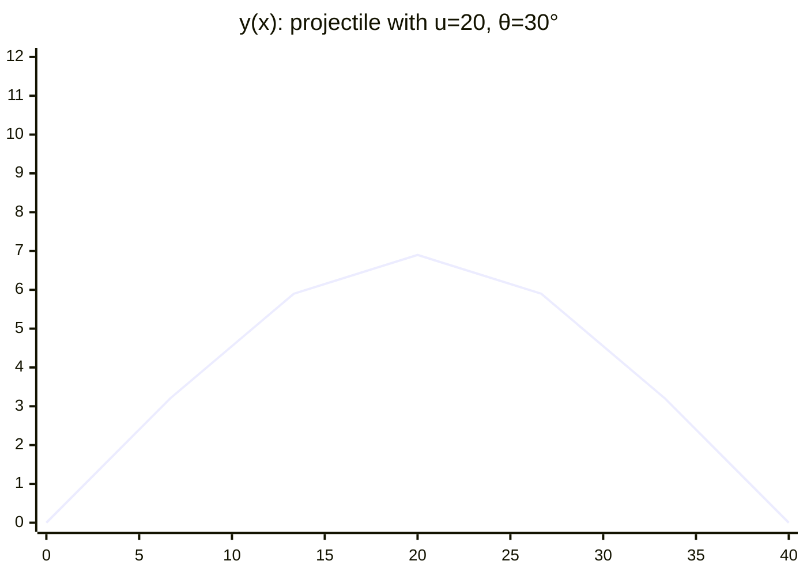
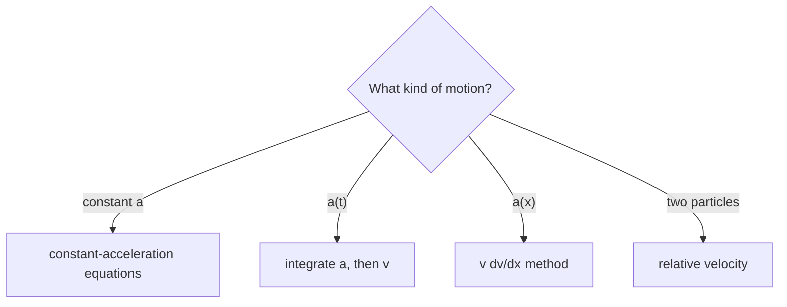
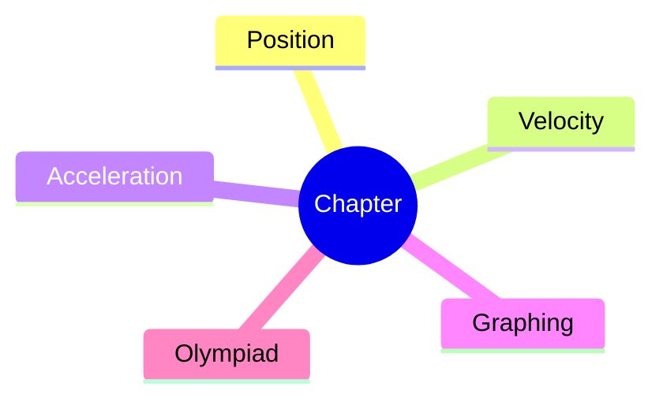
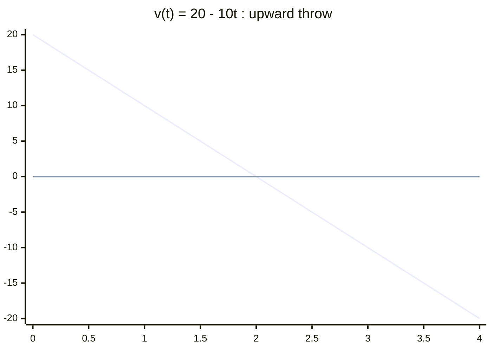
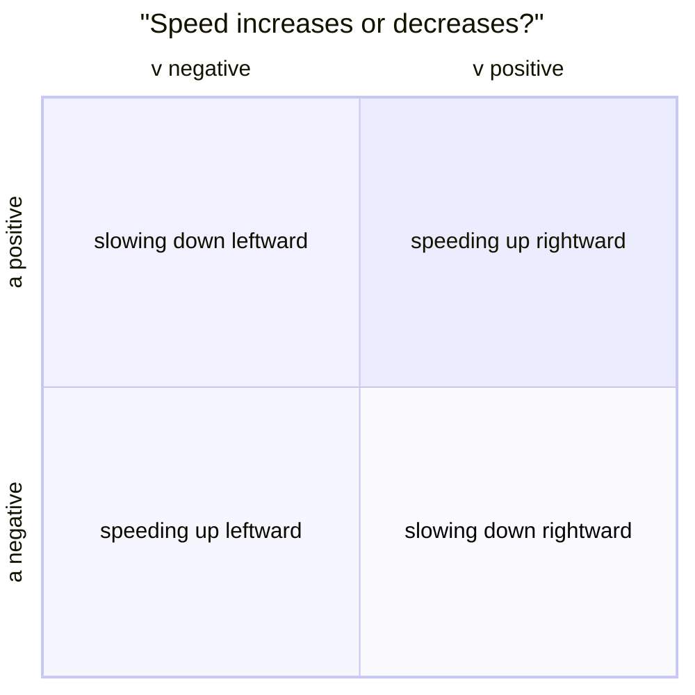

# Obsidian-first note pipeline — contract for agents that make and readjust the notes

> **Who this is for.** Every AI agent that writes or edits a note-set in this repository.
> **What it is.** The binding contract for how the notes are authored **as an Obsidian vault** — proper formatting, deterministic diagrams, graphs, tables, mindmaps, and controllable/interactive elements — for (a) **new note-sets** and (b) **readjusting existing note-sets**.
> **Status.** Normative. This file **supersedes** the earlier "portability" doctrine: the vault is made **for Obsidian first**. Compatibility with GitHub/plain editors is now a *degradation property*, not a constraint. It extends — never contradicts — [`STRUCTURE.md`](../STRUCTURE.md), [`CONTRIBUTING.md`](../CONTRIBUTING.md) §7, and [`plan.md`](../plan.md). Where this file and the tooling disagree, the tooling wins (and you change both together, per STRUCTURE.md).

## Contents

0. [What changed and why](#0-what-changed-and-why)
1. [The four principles](#1-the-four-principles)
2. [Media policy — the figure system (the big change)](#2-media-policy--the-figure-system)
3. [The "controllable" layer](#3-the-controllable-layer)
4. [The stack — Tier 1–4 plugins an agent must use](#4-the-stack--tier-14-plugins)
5. [Authoring a new chapter — the recipe](#5-authoring-a-new-chapter)
6. [Readjusting an existing chapter — the retrofits](#6-readjusting-an-existing-chapter)
7. [Copy-paste cannon](#7-copy-paste-cannon)
8. [Definition of done](#8-definition-of-done)
9. [Appendix — registry, exclusions, human setup](#9-appendix)

---

## 0. What changed and why

A previous draft of this policy said *"only emit content that still means something when every plugin is uninstalled."* That is now **wrong for this vault.** Three decisions reversed it:

1. **The notes are for Obsidian.** The vault's home is Obsidian reading mode: rendered KaTeX, callouts, Mermaid figures, Dataview dashboards, Canvas maps, checklist progress. The moment-to-moment value is what a student sees in Obsidian. GitHub/editor rendering is a fallback we no longer optimise for — we simply don't *break* it gratuitously.
2. **Diagrams are back.** They were cut because *AI hand-drawn SVG figures* were inaccurate and burned compute. The fix is not "no diagrams" — it is **deterministic diagrams**: Mermaid flowcharts, mindmaps, quadrant charts and data graphs (`xychart-beta`), plus hand-derivable pipe tables. These render *from text the agent writes*, so they are always syntactically valid and always right where the math says they should be.
3. **"Controllable like HTML, wherever needed."** The vault gets interactive affordances — tickable progress, collapsible `<details>`, live Dataview dashboards, Mermaid visuals, Breadcrumbs trails — using Obsidian-native building blocks instead of raw HTML blobs.

**Nothing about the *physics* contract changed.** Reasoning-before-formulas, validity conditions, traps, interleaved questions, checkable numbers, the 36-question/200-mark paper — all unchanged (STRUCTURE.md, CONTRIBUTING.md §3).

---

## 1. The four principles

- **P1 — Obsidian-first (default).** Every formatting, figure, graph, and interaction choice is evaluated against *how it reads in Obsidian*. If a construct is excellent in Obsidian and merely "source text" on GitHub, that is acceptable and often correct.
- **P2 — Deterministic visuals.** Figures come from data or structure the agent writes (Mermaid, tables). **Never** AI-generated raster art (PNG/JPG), **never** hand-drawn AI SVG, **never** external image URLs, **never** ASCII-art figures.
- **P3 — Controllable where needed.** Interactive/controllable elements are first-class: checklists ticked in Obsidian, `<details>` collapse, Dataview dashboards that recompute, Mermaid graphs the reader can re-flow, Canvas/Breadcrumbs for navigation. Raw HTML is limited to the plan.md rule-12 set (`<details>`, `<summary>`, `<br>` inside tables) **plus** the Obsidian-native constructs below — no `<iframe>`, no `<script>`, no `<style>`, no tabs/embeds that only the browser understands.
- **P4 — The prose still proves.** A figure *illustrates*; the text *carries* the physics. Never write "as the figure shows, the force is zero here". State it in words and symbols, then add the figure (inherited from plan.md §1.2 — this part of the old rule stays).

---

## 2. Media policy — the figure system

### 2.1 What is banned (and why)

- ❌ **AI-generated raster art** (`*.png`, `*.jpg`) — inaccurate, wastes compute, looks foreign.
- ❌ **AI hand-drawn SVG** — the original failure mode that caused the "no diagrams" decision.
- ❌ **External image URLs** (``, ``) — the vault is offline-first and the notes must never depend on a remote host.
- ❌ **ASCII-art figures**, `\begin{tikzpicture}` inside `$…$`, and `` Markdown images.
- ✅ **Allowed and preferred:** Mermaid diagrams (I–V below), pipe tables, and — for the legacy HTML-heritage topics — their existing committed `assets/figures/*.svg` sets (these were drawn by rules/tools, not by free AI art, and they are already reviewed).

### 2.2 The figure taxonomy (which Mermaid kind for which job)

| # | Need | Mermaid kind | Example |
|---|---|---|---|
| I | **graph / relationship** (slope = velocity, E vs B, circuit-ish flows) | `flowchart` / `graph` | triage tree, cause→effect |
| II | **structure / map of a chapter** | `mindmap` | chapter map, topic overview |
| III | **data graph** (y vs x, two-variable physics) | `xychart-beta` | x–t, v–t, V–I, U–r curves |
| IV | **2×2 cases** (sign of v vs sign of a) | `quadrantChart` | speeding-up vs braking quadrants |
| V | **state / sequence / timeline** | `graph LR` (states) or a table | charging states, exam sequence |
| VI | **tabular data** (results, marking, coverage) | pipe table (Advanced Tables) | always a table, never a chart |

Every Mermaid block opens as ```` ```mermaid ```` (even `mindmap`/`quadrantChart` — those are Mermaid diagram *types*, not fences). The diagram's first content line is its keyword (`flowchart`, `mindmap`, `xychart-beta`, `quadrantChart`, …).

### 2.3 The figure callout — hybrid "figure slot + rendered diagram"

Every figure is **both** a rendered diagram **and** a described figure slot, in one place:

````markdown
> [!tip] FIGURE F4.1 · Trajectory with the velocity components drawn at three points
> *Why:* why this picture earns its place (one short sentence — the concept it pins down).
> *Data:* the numbers/function that the diagram plots or encodes.



> *Read:* what the reader must take away after looking (one sentence, the assertion).
````

Rules for the callout:

- Callout type is `[!tip]` (lowercase — the gate's callout regex is lowercase, and Obsidian reads either case, so we standardise lowercase). Title line: `> [!tip] FIGURE F<part>.<n> · <Title>`.
- Required fields, one per line, in order: `*Why:*`, `*Data:*`, then the Mermaid block, then `*Read:*`. Each is its own `> `-continuation line. Blank line after the callout and around the fence.
- **Numbering:** contiguous `F<part>.<n>` per chapter, matching the plan PART number (`F8.4` = fourth figure of PART 8). **Minimum 6 per chapter**, 12–20 for the big ones (rotational mechanics, electrostatics, EMI, nuclear). The gate counts them.
- **The prose must survive without the figure** (P4). The `*Read:*` line is a bonus, not the proof.
- **LaTeX does not render inside Mermaid.** Node/label/title text is plain text or Unicode (`v₀`, `θ`, `→`). Put any `$…$` math in the `*Why:*`/`*Data:*`/`*Read:*` lines or the surrounding prose, never inside the fence.

### 2.4 `xychart-beta` data graphs — the replacement for "AI graph images"

These are the workhorse for physics graphs. Contract:

- Plot the **function stated in `*Data:*`** over a stated interval — the line series must contain the *computed* values of that function on a uniform grid (the agent computes them; see pitfalls).
- **Axis syntax (Mermaid 10+, as bundled in Obsidian):** numeric axes are two-point ranges, `x-axis 0 --> 4` / `y-axis -20 --> 20` (arrow form — *not* the old `[min, max]` bracket form, which Mermaid ≥10 rejects and renders as an error box). Labelled axes read `x-axis "f" 0 --> 12`. Categorical x-axes alone may keep `["a","b","c"]` tick lists (a numeric `y-axis` must then still be a `-->` range).
- Always add `line [0,0]` as the axis when the quantity crosses zero (helps read sign, which is where kinematics/electrostatics traps live).
- Title says exactly what is plotted: `title "v(t) = 20 - 10t : upward throw"`.
- Curve **shape** must match the physics (concavity, asymptote, symmetry) — this is a review criterion, not a gate criterion.

### 2.5 Legacy chapters and the old `DIAGRAM` briefs

The 17 `plan.md`-era chapters carry **text-only** `> [!abstract] DIAGRAM D<part>.<n> …` briefs with `*Show:*` / `*Search:*` lines. Those remain **valid until the chapter is upgraded**, and each D-brief is the **seed** a figure is drawn from during an upgrade (Retrofit R1, §6.1):

- `*Show:*` → the drawing brief the agent turns into a Mermaid figure (or table).
- `*Search:*` → kept as the human-facing "find the textbook version" line.
- The nine HTML-heritage topics (`*waves`, `*thermo`, `heat`, `capacitors`, `current-electricity`, `*optics`) already own committed SVG sets — during an upgrade, **reuse those SVGs** (embed them) and *add* flowcharts/mindmaps/quadrant/xycharts for structure and graphs; do not discard reviewed SVG work.

### 2.6 Figure provenance — the canonical record

Every chapter that ships `F`-figures also ships `figures.json` — one object per figure with `id`, `part`, `kind`, `title`, `why`, `data`, `read`, and the `source` (which D-brief or section it renders). This is the **provenance**, kept so a re-check of "is this figure derivable?" is one file long. The gate does not read `figures.json`; it reads the `.md`. See the pilot `kinematics-1d/figures.json`.

---

## 3. The "controllable" layer

"Controllable like HTML, wherever needed" is implemented with Obsidian-native building blocks. An agent **may not** dump raw HTML; it uses these:

| Want | Emit (Obsidian-native) | Where |
|---|---|---|
| tickable progress / to-dos | `- [ ]` checklists (Tasks-compatible) | checkpoint sections (Part 14 pattern) |
| collapsible solutions / asides | `<details><summary>…</summary>` (blank lines per plan.md rule 7) | questions, examples |
| visually distinct blocks | callouts `[!note/info/warning/success/danger/tip/quote/question/abstract/example]` | definitions, traps, hand-offs |
| live recompute & dashboards | `Dataview` blocks (in `_obsidian/` dashboards, never inline in chapters) | vault home, per-topic dashboards |
| structured navigation | `[[file#heading|Label]]` wikilinks + Breadcrumbs trails + `_obsidian/dashboards/spine.md` | cross-topic references |
| concept map | Canvas `.canvas` file in `_obsidian/` (optional) | plan overview |
| progress bars / inputs | Meta Bind (human-configured only; agents only write the frontmatter fields it reads) | optional, human |
| graphs / mindmaps / flows / quadrants | Mermaid blocks (§2) | in-chapter |

**HTML allowance (hard limit):** `<details>`, `<summary>`, `<br>` (inside tables only). Nothing else. If a "controllable" need cannot be met by the table above, it is met by a Dataview dashboard in `_obsidian/` or a Canvas, not by HTML.

**Chapter timeline / "controllable" extras to ship with a new chapter:**

1. **Progress** — the Part 14 checkpoint is already a `- [ ]` list; keep it, and make one task per *learnable skill* (the pilot shows the pattern).
2. **Triage** — the Part 9 decision list *becomes a flowchart* (`F<part>.<n>`), not just bullets.
3. **Chapter map** — a mindmap near the top (`F<part>.1`) is the "controllable table of contents".
4. **Formula map** — stays a table (sortable/filterable via Dataview where the human wants it).

---

## 4. The stack — Tier 1–4 plugins

These are the adopted plugins; an agent's output is written **for** them. (Install/configure per §9.3.)

| Plugin | Tier | Agent emits / does | Notes |
|---|---|---|---|
| **LaTeX Suite** | 1 | writes `$…$`/`$$…$$` LaTeX; shared shorthand in `_obsidian/latex-suite/snippets.md` | typing aid; persisted output is plain LaTeX |
| **Dataview** | 1 | YAML frontmatter on every master + dashboards in `_obsidian/` | frontmatter is the vault's metadata |
| **Templater** | 1 | chapter skeleton `_obsidian/templates/chapter.md` | one command per chapter |
| **Spaced Repetition** | 1,3 | `==cloze==` on boxed results/traps, `::` symbol cards | active recall for JEE/INPhO |
| **Obsidian Git** | 1 | commits on the session branch | timer + explicit commit before ending |
| **MathLive** | 2 | hand-proofed LaTeX, OCR is a draft only | never commit unproofed OCR |
| **Latex Alike / Extended MathJax** | 2 | `_obsidian/preamble.sty` macro layer, expanded before commit | macros are authoring shorthand |
| **TikZJax** | 2 | optional ` ```tikz ` mirror of an existing SVG | canonical figure is still the SVG |
| **Diagrams (draw.io) / Excalidraw** | 2 | export **SVG** into `assets/figures/` | commit the SVG, not `.excalidraw.md` |
| **MathLinks** | 2 | none (renders existing wikilinks) | — |
| **Mermaid (core)** | 2 | **the figure system of §2** | primary diagram engine |
| **Flashcards (Anki)** | 3 | none (in-vault SR is canonical) | human-only bridge |
| **Advanced Tables** | 4 | aligned pipe tables | formatting aid |
| **Breadcrumbs** | 4 | typed links; spine junction `_obsidian/dashboards/spine.md` | navigation |
| **Tasks** | 4 | `- [ ] … 📅 …` mirror of plan/PENDING in `_obsidian/dashboards/tasks.md` | live queue |
| **Outliner / Canvas / Style Settings** | 4 | Canvas map optionally in `_obsidian/` | UX |

---

## 5. Authoring a new chapter

Order of work for "execute PART N", with the figure system attached. (Content bar and reagents unchanged — CONTRIBUTING §3, plan.md §0–§2).

1. **Claim + scaffold** — set `owner` in `topics.json` (CONTRIBUTING §2); create `<slug>/` from the Templater skeleton; fill frontmatter (§7.1).
2. **Write theory** — `$…$`/`$$…$$` math, the 8 callout types, `<details>` solutions, wikilinks. Tables for data/maps.
3. **Figures** — decide the figure set as you write. *Minimum 6*, per §2. Figure-invention checklist (run per figure):
   - [ ] The physics is already stated in prose a line or two above (P4).
   - [ ] Kind chosen per taxonomy §2.2 (is a picture even the right tool, or is it a table?).
   - [ ] For `xychart-beta`: the `*Data:*` line gives the function + interval; the series values are **computed** from it on a uniform grid.
   - [ ] For flowchart/mindmap/quadrant: labels are plain text/Unicode, no LaTeX inside the fence.
   - [ ] Label `F<part>.<n>` contiguous; callout has `*Why:*`, `*Data:*`, `*Read:*`.
   - [ ] No external URLs, no `![…]`, no AI raster, no raw HTML beyond the allowed set.
4. **Controllable layer** — checkpoint `- [ ]` list (Part 14), triage flowchart (Part 9), chapter mindmap (`F<part>.1`), formula table. Dashboards in `_obsidian/` if the human has adopted them.
5. **Frontmatter + provenance** — master frontmatter per §7.1; `figures.json` for the figure set.
6. **Gate** — `python3 tools/check.py` in the folder (the chapter gate must require ≥ 6 `F`-figures and ban rasters, per §2 — copy the pilot gate in `kinematics-1d/tools/check.py`), then `python3 tools/check_all.py --update` at the root.
7. **Commit + handover** — commit on the session branch; one-line handover in the topic README ("Media" line updated to name the figures).

---

## 6. Readjusting an existing chapter

Four retrofit passes, run in order, each independently committable.

### R1 — media upgrade (diagrams/graphs/mindmaps)

For one chapter (never several at once — keep diffs reviewable):

1. Inventory the `DIAGRAM D<part>.<n>` briefs (or the SVG set for HTML-heritage topics).
2. Convert the **highest-leverage** D-briefs to `F`-figures per §2 — start with: a chapter **mindmap**, the **triage/decision flowchart**, and any **x–y data graph** that a brief describes (x–t/v–t, V–I, U–r, I–θ curves). Aim for ≥ 6 total; 15–25 for large chapters.
3. **Keep** the D-briefs that remain as hand-drawing seeds (`*Search:*` line intact). Do not delete reviewed prose.
4. HTML-heritage topics: embed the existing `assets/figures/*.svg` where they belong (they are already reviewed) and *add* the Mermaid structure/graphs.
5. Update the chapter's `tools/check.py` (allow + require Mermaid, keep the raster ban), `notes.json` `minimums.figure`, `figures.json`, and the README "Media" line. Run the gates.

### R2 — frontmatter backfill (metadata + Dataview)

The 9 masters without frontmatter (verified 2026-09): `string-waves`, `sound-waves`, `electromagnetic-waves` (and its `Formula-sheet/Paper/Solutions` satellites), `thermodynamics`, `heat`, `capacitors`, `current-electricity`, `geometrical-optics`, `wave-optics`. Backfill per §7.1 — copy `title`/`source` from the note itself, `slug:` == folder, `status: complete` from `topics.json`; never invent provenance.

### R3 — controllable layer

Add the interactive affordances where missing: triage flowchart (§3), chapter mindmap, ensure the Part 14 checkpoint is a `- [ ]` list, standardise callout types to the 8 allowed. Convert prose decision trees to flowcharts — never rewrite the reasoning, only re-present it.

### R4 — consistency sweep

Mechanical only: `slug` == folder, `title` == H1, `tags`/`aliases` are sets (no dupes), heading numbers unique, wikilinks resolve, `#hashtags` out of prose (frontmatter only), table pipes escaped in math. Fix casing/dedupes only — no retitling, no provenance edits.

**Never touch in a retrofit:** another owner's chapter; the HTML editions' `assets/notes.*`/`tex.js` unless HTML-scope declared; `sr-*` scheduling fields; the validation tools as a workaround for a red gate.

---

## 7. Copy-paste cannon

### 7.1 Standard frontmatter

```yaml
---
title: Kinematics in One Dimension
part: 3
slug: kinematics-1d
status: complete        # mirrors topics.json
source: Cengage Mechanics I-compressed.pdf, ch 4 Motion in One Dimension
aliases: [kinematics, 1D motion, velocity, acceleration, graphs]
tags: [jee-advanced, olympiad, mechanics, kinematics]
---
```

Keys: `title`, `slug` (== folder), `part` (plan part), `status`, `source` (copied, not invented), `aliases`, `tags` (a set). Plugin-owned `sr-*` fields are never hand-edited.

### 7.2 Figure kit (generalised)

Flowchart — decisions:

````markdown
> [!tip] FIGURE F9.1 · Triage — route by what is given
> *Why:* the triage list is a decision tree; the flowchart makes the branches visible.
> *Data:* the first question is the single discriminator "is the acceleration constant?".



> *Read:* the first question names the tool; everything else is execution.
````

Mindmap — chapter map:

````markdown

````

Data graph — `xychart-beta` (values **computed** from `*Data:*`):

````markdown

````

Quadrant — sign cases:

````markdown

````

### 7.3 Dataview (dashboard, `_obsidian/dashboards/README.md`)

```dataview
TABLE part AS "Part", status AS "Status", length(file.outlinks) AS "Links"
FROM "" 
WHERE part OR status
SORT part ASC, title ASC
```

Retrofit backlog (self-clearing once `status:` is filled):

```dataview
LIST FROM "string-waves" OR "sound-waves" OR "electromagnetic-waves"
OR "thermodynamics" OR "heat" OR "capacitors" OR "current-electricity"
OR "geometrical-optics" OR "wave-optics"
WHERE !status
SORT file.name ASC
```

### 7.4 Spaced Repetition (this vault's dialect)

```markdown
$C$::capacitance, farad, $C=Q/V$

In a vacuum plane EM wave, are $\mathbf E$ and $\mathbf B$ in phase?
?
In phase. "One lags the other" is false for one travelling wave; say which case you mean.

==$C=\kappa\varepsilon_0 A/d$== — valid for $d\ll\sqrt A$; fringing neglected.

Trap: series capacitors halve the voltage? ==No — voltage splits $\propto 1/C_i$; halves only if $C_1=C_2$.==
```

Decks by folder (default) or `#deck/<slug>/<sub>` tags. Prefer `==…==` cloze; a `::` card must never have a bare-word front (Dataview collision).

### 7.5 LaTeX Suite / Templater / spine / tasks

- `_obsidian/latex-suite/snippets.md` — curated shorthand (`ph→physics`, `eps→\varepsilon`, `[[!ab]]→> [!abstract]`, …), load once in plugin settings.
- `_obsidian/templates/chapter.md` — the full 15-block skeleton with frontmatter, `[!abstract] How to use`, `<details>` idiom, and the `F`-figure slot pre-planted.
- `_obsidian/dashboards/spine.md` — canonical cross-topic order (mirrors README): string-waves → sound-waves → electromagnetic-waves → thermodynamics → heat → capacitors → current-electricity → geometrical-optics → wave-optics.
- `_obsidian/dashboards/tasks.md` — `- [ ]` mirror of plan/PENDING (not canonical).

---

## 8. Definition of done

- [ ] `python3 tools/check.py` (in-folder) and `python3 tools/check_all.py --update` (root) **green**.
- [ ] ≥ 6 `F<part>.<n>` figures per chapter, contiguous, each a `> [!tip] FIGURE …` callout with `*Why:*`, `*Data:*`, `*Read:*`, and a ` ```mermaid ` block whose first keyword is a known kind.
- [ ] `xychart-beta` series values **computed** from the stated `*Data:*` function; curve shape matches physics.
- [ ] No `![…]`, ``, external URLs, AI raster/art, ASCII art, or raw HTML beyond `<details>/<summary>/<br>`-in-tables.
- [ ] Controllable layer present: `- [ ]` checkpoint, triage flowchart, chapter mindmap, callouts standardised to the 8 allowed types.
- [ ] Frontmatter legal (§7.1); `figures.json` present where `F`-figures ship; README "Media" line updated.
- [ ] Diff touches only in-scope files; no other owner's chapter, no reformatting of reviewed lines.
- [ ] One-line handover in the topic README.

---

## 9. Appendix

### 9.1 Plugin registry

See §4 table (Tier 1–4). Mermaid, Canvas, and checklist/tasks support are **core Obsidian** — nothing to install for the figure system.

### 9.2 Deliberately excluded from the agent contract

- **PDF extractors / OCR-to-note plugins** — they encourage transcribing Cengage into notes (provenance + copyright risk). Agents derive from, never transcribe, the PDFs.
- **AI-generation plugins** — figures and problems must be derivable and checkable; generated content is not.
- **PDF export (Better Export PDF / Pandoc as an agent tool)** — the human may export; agents use the repo's own generators.

### 9.3 One-time human setup

1. Enable Community Plugins; install Tier 1–4 (§4).
2. LaTeX Suite → load `_obsidian/latex-suite/snippets.md`; Templater → `_obsidian/templates/`.
3. Settings → Files & Links → default attachment location `assets/figures`; exclude the five root PDFs from search/graph if the graph feels noisy.
4. Obsidian Git → auto-commit interval + message format; confirm the working branch is the session branch.
5. Keep `.obsidian/` under version control deliberately or ignore it — never let it drift in.
