# Electromagnetic Waves — from Maxwell to Olympiad

> **Part 3 of the waves curriculum · JEE Advanced / NSEP / INPhO / IPhO**  
> Original explanations and problems; SI units throughout. Read the assumptions before using a result. This file contains the course, worked examples, three-hour paper, solutions and revision sheet.

## 1. Foundations & Physical Motivation

### 1.1 What you will be able to do

You will repair the charging-capacitor paradox, derive both electromagnetic wave equations, reconstruct a missing field with its correct direction, turn field amplitudes into power and force, and integrate radiation pressure over a curved surface. You will classify radiation by wavelength **and** production mechanism instead of mistaking a spectrum chart for natural discontinuities.

A mechanical wave needs material inertia and a restoring interaction. An electromagnetic wave needs no material carrier: Maxwell's coupled equations admit propagating disturbances even when charge and current vanish. “A changing electric field makes a magnetic field, which makes an electric field” is a memory aid, not a derivation or a claim that one field lags the other. In a single travelling vacuum plane wave, both fields are in phase.

**Prerequisite graph:** vectors/cross products + calculus → flux/circulation → Gauss, Faraday and Ampère laws → this course → geometrical and wave optics. Mechanical-wave kinematics is useful but reintroduced here. No other topic folder is required to solve this paper.

### 1.2 Symbols, frames and models

Sources, surfaces and media are stationary in the laboratory frame unless stated otherwise.

| Symbol | Meaning and SI unit |
|---|---|
| $\mathbf E,\mathbf B$ | Electric field (V/m), magnetic flux density (T) |
| $\mathbf D,\mathbf H$ | Electric displacement (C/m²), magnetic field strength (A/m) |
| $\rho,\mathbf J$ | Charge density (C/m³), current density (A/m²); subscript $f$ means free |
| $\varepsilon,\mu,\sigma$ | Permittivity (F/m), permeability (H/m), conductivity (S/m) |
| $\mathbf k=k\hat{\mathbf k},\omega$ | Wave vector (rad/m), angular frequency (rad/s) |
| $E_0,B_0,E_{\rm rms}$ | Peak field amplitudes and RMS electric field |
| $u,\mathbf S,I$ | Energy density (J/m³), instantaneous energy flux (W/m²), mean intensity |
| $p,U,P_{\rm rad}$ | Momentum (kg m/s), energy (J), radiation pressure (Pa) |
| $\mathcal A,R,T$ | Absorbed, reflected and transmitted fractions of incident **power** |
| $Z,v,n$ | Wave impedance (Ω), phase speed (m/s), refractive index |

Never confuse intensity $I$ with capacitor current $I_c$, or pressure $P_{\rm rad}$ with beam power $\mathcal P$.

* **V:** vacuum, $\mathbf D=\varepsilon_0\mathbf E$, $\mathbf B=\mu_0\mathbf H$.
* **L:** homogeneous, isotropic, linear, lossless, nondispersive medium with positive constant $\varepsilon,\mu$; source-free propagation region.
* **Q:** quasistatic capacitor, separation $d\ll a$, negligible fringing where used, variation time $\tau\gg a/c$. Uniform plate charge is an approximation, not an exact finite-frequency Maxwell solution.

For estimates use $c=3.00\times10^8\,\mathrm{m/s}$, $\varepsilon_0=8.85\times10^{-12}\,\mathrm{F/m}$, $\mu_0\simeq4\pi\times10^{-7}\,\mathrm{H/m}$ and $Z_0\simeq377\,\Omega$. The exact SI speed is $299\,792\,458\,\mathrm{m/s}$; $\mu_0$ is no longer an exact defined constant. Use supplied rounded constants consistently.

### 1.3 Coverage and study route

This maps the six required groups in `plan.md`; it is a **plan-syllabus coverage map**, not a page-by-page audit of every textbook exercise. Explanations, problems and diagrams are original.

| Required floor / bridge | Theory | Retrieval / paper |
|---|---|---|
| Displacement current; Maxwell equations in vacuum/matter | §§2.1–2.3 | C1–C2, E1–E2, Q1–Q2, Q9, Q17–Q18, Q29 |
| Both curl derivations; vacuum/material speed | §§2.4–2.5 | C3, E3, Q3, Q10, Q19, Q30 |
| Transversality, phase, vector fields, $E_0/B_0$ | §§2.5–2.6 | C4, E4, Q4, Q11, Q20, Q30–Q31 |
| Energy, Poynting theorem, intensity, momentum | §§2.7–2.9 | C5, E5–E6, Q5, Q12, Q21–Q23, Q31–Q32 |
| Normal/oblique pressure; absorbing/specular spheres | §§2.10–2.11 | C6, E7–E8, Q6, Q13–Q14, Q24–Q26, Q33–Q34 |
| Spectrum, production, applications | §2.12 | E9–E10, Q7–Q8, Q15, Q27–Q28, Q35 |
| Impedance, interfaces, standing/isotropic waves | §4 | Q16, Q31, Q36 |

**Route:** §2 with its six in-flow checks → §3 with solutions closed → §4 alternate methods → §5 traps → §6 triage → §7 timed paper → §8 revision sheet. State assumptions aloud before calculating.

> [!tip] FIGURE F3.1 · Chapter map
> *Why:* the whole course is one causal chain from a broken magnetostatic law to radiation pressure; the map shows the chain.
> *Data:* the §1.3 route — displacement current → Maxwell → curl derivations → plane waves → energy/momentum → pressure → spectrum.

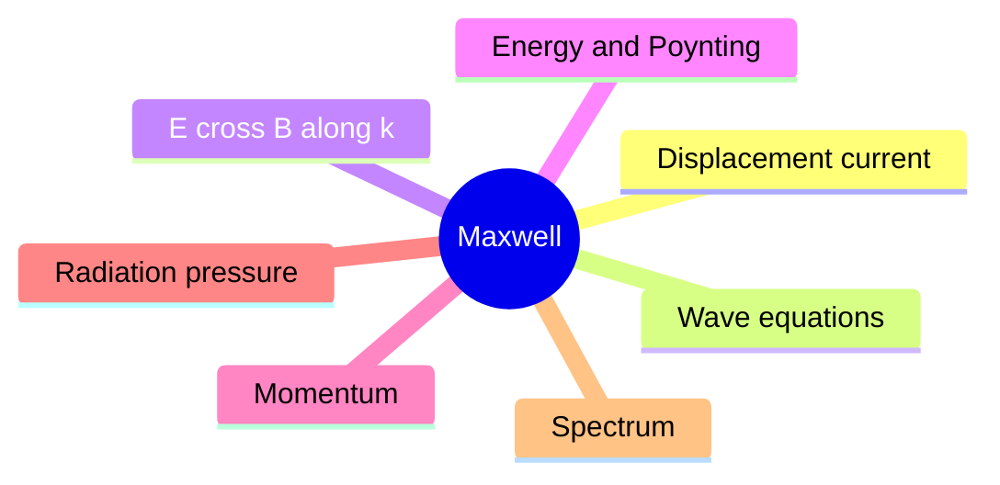

> *Read:* every result in §2 is either a divergence/curl of the fields or an integral of their product.

## 2. Core Derivations & Asymptotic Limits

### 2.1 Why the original Ampère law fails during charging

Take a circular loop around the lead feeding a parallel-plate capacitor. One spanning surface cuts the wire, giving $\int\mathbf J\cdot d\mathbf A=I_c$. Bulge a second surface between the plates without changing its rim; it cuts no conduction current. The same $\oint\mathbf B\cdot d\boldsymbol\ell$ cannot equal both $\mu_0I_c$ and zero. A magnetostatic law has been used outside its domain.

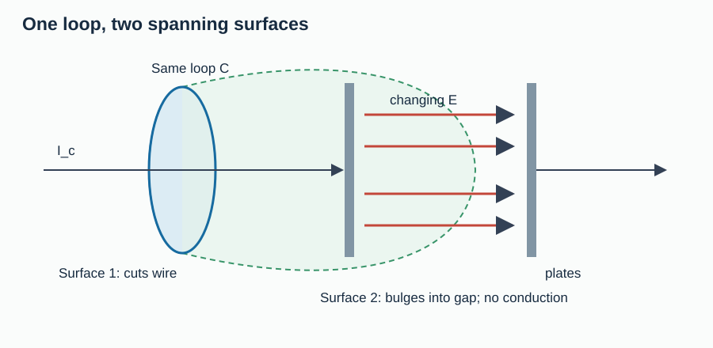

> [!tip] FIGURE F3.2 · The charging-capacitor paradox resolved
> *Why:* one loop, two spanning surfaces, one circulation — the paradox is the single reason displacement current exists.
> *Data:* surface through the wire gives I_c; surface through the gap gives I_d = ε₀ dΦ_E/dt; they must be equal.

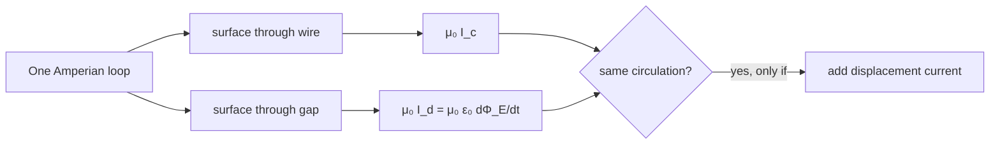

> *Read:* the same loop boundary cannot give two different circulations; continuity forces I_d = I_c during charging.

*Figure 1. The boundary loop is identical; changing its spanning surface cannot change the predicted circulation.*

Charge conservation counts charge leaving a fixed volume:

$$
\frac{d}{dt}\int_V\rho\,dV=-\oint_{\partial V}\mathbf J\cdot d\mathbf A
\quad\Longrightarrow\quad
\partial_t\rho+\nabla\cdot\mathbf J=0.
$$

The divergence of a curl is zero. Thus $\nabla\times\mathbf B=\mu_0\mathbf J$ would force $\nabla\cdot\mathbf J=0$ even while charge accumulates. Gauss's law repairs this inconsistency:

$$
\nabla\cdot(\mathbf J+\varepsilon_0\partial_t\mathbf E)
=-\partial_t\rho+\varepsilon_0\partial_t(\rho/\varepsilon_0)=0.
$$

Charge conservation motivates the added term's divergence; the full Maxwell–Ampère law is an experimentally established field law, not uniquely deduced from this argument alone:

$$
\boxed{\oint_C\mathbf B\cdot d\boldsymbol\ell
=\mu_0(I_c+I_d),\qquad I_d=\varepsilon_0\frac{d}{dt}\int_\Sigma\mathbf E\cdot d\mathbf A.}
$$

**Validity:** vacuum constitutive relation, fixed loop and spanning surface; evaluate $I_c$ and $I_d$ on the **same** surface. The right-hand rule connects loop orientation and surface normal. In matter use $\mathbf H$, free current, and $d\int\mathbf D\cdot d\mathbf A/dt$.

The effective current has zero divergence, so its flux through two surfaces with the same rim agrees by the divergence theorem. Displacement current has the units and magnetic effect of current, but need not represent electrons crossing empty space.

**C1 — concept check.** Should you use $I_c+I_d=2I_c$ for a surface lying entirely in the vacuum gap?

Solution

No. Conduction current through that surface is zero; displacement current equals the charging current in model Q. Adding a wire current from a different surface double-counts one process. In steady DC with unchanging fields, displacement current tends to zero.

### 2.2 Capacitor flux, radial magnetic field and dielectric current

Vacuum plates of area $A$ have $E=q/(\varepsilon_0A)$ in model Q. Hence $\Phi_E=EA=q/\varepsilon_0$, giving $I_d=\varepsilon_0\dot\Phi_E=\dot q=I_c$. This is signed: both reverse during discharge. Since $E=V/d$, $q=\varepsilon_0AV/d$, so $C=q/V=\varepsilon_0A/d$ and $I_d=C\dot V$ for constant geometry.

For circular plates of radius $a$, choose a coaxial Amperian circle of radius $r$ in the gap. Uniform $\dot E$ gives enclosed displacement current $I_cr^2/a^2$ for $r<a$. Azimuthal symmetry yields

$$
\boxed{B_\phi(r)=\begin{cases}
\displaystyle\frac{\mu_0I_cr}{2\pi a^2},&r\leq a,\\[4pt]
\displaystyle\frac{\mu_0I_c}{2\pi r},&r\geq a.
\end{cases}}
$$

**Validity:** model Q, axial symmetry, approximately uniform displacement-current disk. The outside expression neglects changing fringe flux and nearby return leads; it is not the global exact field of an arbitrary circuit. $B\to0$ on the axis, both branches agree at $a$, and $B$ falls as $1/r$ outside within this approximation. Units: $(\mathrm{T\,m/A})(\mathrm A)/\mathrm m=\mathrm T$.

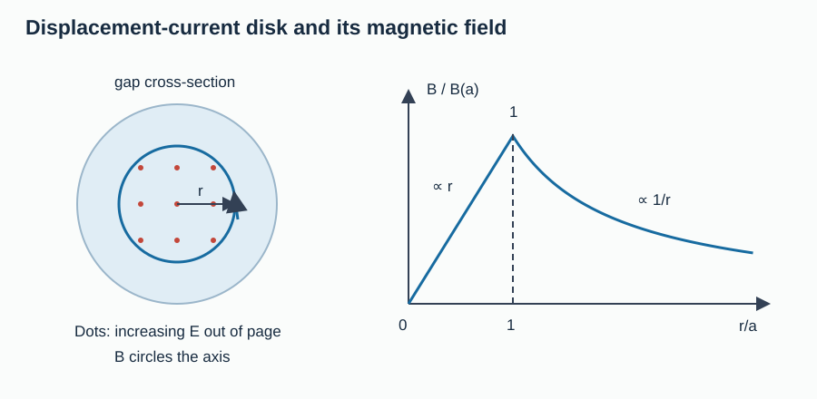

*Figure 2. The loop radius, not the plate separation, selects the fraction of enclosed flux.*

For a uniformly filled dielectric with $\varepsilon=\kappa\varepsilon_0$, $D=q_f/A$ gives $I_{d,\rm macro}=A\dot D=I_c$. Since $\mathbf D=\varepsilon_0\mathbf E+\mathbf P_{\rm pol}$,

$$
I_c=\underbrace{\varepsilon_0A\dot E}_{I_c/\kappa}
+\underbrace{A\dot P_{\rm pol}}_{(1-1/\kappa)I_c}.
$$

The second term is polarisation current: bound charges shift locally without free charge crossing the ideal dielectric. The vacuum term alone is not the whole macroscopic displacement current in matter.

**C2 — concept check.** At fixed charging current, does inserting a nonmagnetic dielectric multiply the gap's $B$ by $\kappa$?

Solution

No. $\dot D=I_c/A$ stays fixed, so $B$ does also. Instead $\dot E=I_c/(\varepsilon A)$ decreases. At fixed $\dot V$, $I_c=C\dot V$ increases with $\kappa$; that is a different constraint. As $\kappa\to1$, the polarisation-current contribution vanishes.

### 2.3 All four field laws: integral and differential

These laws are foundations, not consequences of the wave equation. Divergence and Stokes theorems connect the columns for fixed surfaces/loops. $\partial V$ is a closed surface; $\partial\Sigma$ is the rim of an open surface.

| Vacuum law | Integral form | Differential form |
|---|---|---|
| Electric Gauss | $\oint_{\partial V}\mathbf E\cdot d\mathbf A=Q/\varepsilon_0$ | $\nabla\cdot\mathbf E=\rho/\varepsilon_0$ |
| Magnetic Gauss | $\oint_{\partial V}\mathbf B\cdot d\mathbf A=0$ | $\nabla\cdot\mathbf B=0$ |
| Faraday | $\oint_{\partial\Sigma}\mathbf E\cdot d\boldsymbol\ell=-d\int_\Sigma\mathbf B\cdot d\mathbf A/dt$ | $\nabla\times\mathbf E=-\partial_t\mathbf B$ |
| Maxwell–Ampère | $\oint_{\partial\Sigma}\mathbf B\cdot d\boldsymbol\ell=\mu_0I_c+\mu_0\varepsilon_0d\int_\Sigma\mathbf E\cdot d\mathbf A/dt$ | $\nabla\times\mathbf B=\mu_0\mathbf J+\mu_0\varepsilon_0\partial_t\mathbf E$ |

In macroscopic matter separate free charge/current from polarisation and magnetisation:

| Material law | Integral form | Differential form |
|---|---|---|
| Electric Gauss | $\oint_{\partial V}\mathbf D\cdot d\mathbf A=Q_f$ | $\nabla\cdot\mathbf D=\rho_f$ |
| Magnetic Gauss | $\oint_{\partial V}\mathbf B\cdot d\mathbf A=0$ | $\nabla\cdot\mathbf B=0$ |
| Faraday | $\oint_{\partial\Sigma}\mathbf E\cdot d\boldsymbol\ell=-d\int_\Sigma\mathbf B\cdot d\mathbf A/dt$ | $\nabla\times\mathbf E=-\partial_t\mathbf B$ |
| Maxwell–Ampère | $\oint_{\partial\Sigma}\mathbf H\cdot d\boldsymbol\ell=I_f+d\int_\Sigma\mathbf D\cdot d\mathbf A/dt$ | $\nabla\times\mathbf H=\mathbf J_f+\partial_t\mathbf D$ |

Close the equations with constitutive laws. Model L uses $\mathbf D=\varepsilon\mathbf E$, $\mathbf B=\mu\mathbf H$, and zero conduction current in the propagation region. Conducting matter may use $\mathbf J_f=\sigma\mathbf E$. Anisotropic matter needs tensors; dispersive media have memory. A static dielectric constant is not automatically its optical value.

A moving wire's emf includes $\mathbf u\times\mathbf B$; the fixed-loop Faraday expression is not its entire motional emf.

### 2.4 Both curl derivations, not just the speed

In model L, $\rho_f=0$ and constant $\varepsilon$ imply $\nabla\cdot\mathbf E=0$. Taking the curl of Faraday, then using Maxwell–Ampère, gives

$$
\nabla\times(\nabla\times\mathbf E)
=-\partial_t(\nabla\times\mathbf B)
=-\mu\varepsilon\partial_t^2\mathbf E.
$$

Use $\nabla\times(\nabla\times\mathbf E)=\nabla(\nabla\cdot\mathbf E)-\nabla^2\mathbf E$. The divergence term vanishes, yielding the E equation. Independently,

$$
\nabla\times(\nabla\times\mathbf B)
=\mu\varepsilon\partial_t(\nabla\times\mathbf E)
=-\mu\varepsilon\partial_t^2\mathbf B.
$$

Magnetic Gauss removes $\nabla(\nabla\cdot\mathbf B)$, so

$$
\boxed{\nabla^2\mathbf E=\mu\varepsilon\partial_t^2\mathbf E,\qquad
\nabla^2\mathbf B=\mu\varepsilon\partial_t^2\mathbf B,\qquad
v=\frac1{\sqrt{\mu\varepsilon}}.}
$$

**Validity:** model L, or vacuum with $\mu_0,\varepsilon_0$, in a source-free region. Each Cartesian component has a scalar wave equation, but Maxwell's divergence and curl constraints still couple the components. Arbitrary independent wave-equation solutions need not form an EM wave.

Why is this a speed? A component $F(z-vt)$ has $\partial_z^2F=F''$ and $\partial_t^2F=v^2F''$, requiring $\mu\varepsilon v^2=1$. Dimensions give $[\mu\varepsilon]=\mathrm{s^2/m^2}$. Define $\mu_r=\mu/\mu_0$ and $\varepsilon_r=\varepsilon/\varepsilon_0$:

$$
c=(\mu_0\varepsilon_0)^{-1/2},\qquad
n=\frac cv=\sqrt{\mu_r\varepsilon_r}.
$$

Vacuum is recovered at $\mu_r=\varepsilon_r=1$. $n=\sqrt{\varepsilon_r}$ requires nonmagnetic matter. Phase speed in a dispersive medium need not equal group/energy speed.

**C3 — concept check.** What breaks if $\varepsilon$ varies with position?

Solution

Charge-free now means $\nabla\cdot(\varepsilon\mathbf E)=0$, so $\nabla\cdot\mathbf E=-\mathbf E\cdot\nabla\varepsilon/\varepsilon$, not generally zero. Varying $\mu$ also generates terms when moved through curls. The homogeneous derivation cannot be reused unchanged.

### 2.5 Plane waves: direction, phase and transversality

Write physical fields as real parts of complex amplitudes times $e^{i(\mathbf k\cdot\mathbf r-\omega t)}$. Constant phase $kz-\omega t=\text{constant}$ moves along $+z$ with $v=\omega/k$. Definitions give $k=2\pi/\lambda$, $\omega=2\pi f$; the wave equation imposes $\omega^2=v^2k^2$, hence $v=f\lambda$.

On this ansatz, divergence becomes $i\mathbf k\cdot$ and curl becomes $i\mathbf k\times$. Maxwell requires

$$
\mathbf k\cdot\widetilde{\mathbf E}=0,\quad
\mathbf k\cdot\widetilde{\mathbf B}=0,\quad
\mathbf k\times\widetilde{\mathbf E}=\omega\widetilde{\mathbf B},\quad
\mathbf k\times\widetilde{\mathbf B}=-\mu\varepsilon\omega\widetilde{\mathbf E}.
$$

Thus for one travelling plane wave,

$$
\boxed{\mathbf B=\frac1v\hat{\mathbf k}\times\mathbf E,\qquad
E_0=vB_0,\qquad \mathbf E\times\mathbf B\parallel\hat{\mathbf k}.}
$$

**Validity:** a single travelling wave in model L, with no static background; not an arbitrary superposition, near field or evanescent field. Both fields are transverse and mutually perpendicular at each instant. For linear polarisation their signed components on consistently chosen axes are in phase because the proportionality factor is real and positive.

For travel along $+z$ choose

$$
\mathbf E=E_0\sin(kz-\omega t)\hat{\mathbf x},\qquad
\mathbf B=\frac{E_0}{v}\sin(kz-\omega t)\hat{\mathbf y}.
$$

Direct check: $(\nabla\times\mathbf E)_y=\partial_zE_x=kE_0\cos\phi$ and $-\partial_tB_y=\omega B_0\cos\phi$, fixing both sign and ratio $kE_0=\omega B_0$.

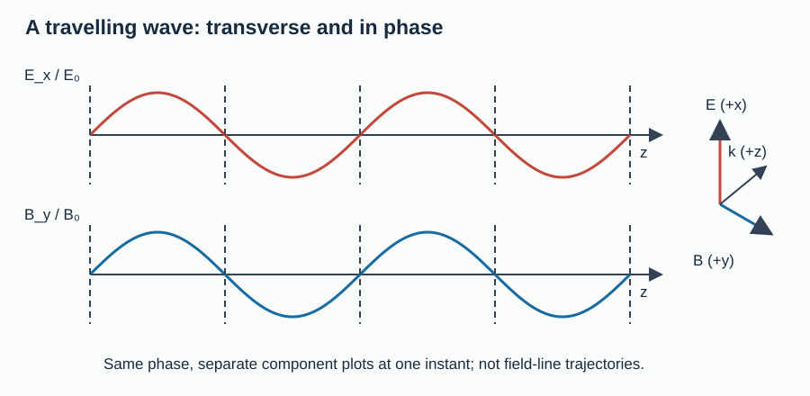

> [!tip] FIGURE F3.3 · E, B and k form a right-handed triad
> *Why:* the handedness decides whether a guessed B is correct or reversed — the most common sign error in the topic.
> *Data:* B = (1/v) k̂ × E, E₀ = v B₀, S = E × B / μ parallel to k.

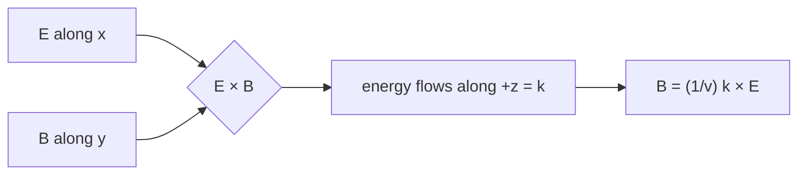

> *Read:* for a wave along +z, E × B points along propagation; reverse B and the wave carries energy backwards — a physical impossibility.

*Figure 3. Both sinusoids cross zero at the same phase; E, B and propagation form a right-handed triad.*

At a stationary interface fields must match for every time. Different frequencies would drift out of step, so reflection and transmission preserve $f$. Since $v$ changes, $\lambda=v/f$ changes. Frequency is not divided by refractive index.

### 2.6 Polarisation and the limits of the plane-wave picture

Superpose transverse components:

$$
\mathbf E=E_x\cos\phi\,\hat{\mathbf x}
+E_y\cos(\phi+\delta)\,\hat{\mathbf y},\qquad\phi=kz-\omega t.
$$

For $\delta=0$ or $\pi$ the field direction is fixed (linear polarisation). If $E_x=E_y$ and $\delta=\pm\pi/2$, eliminating $\phi$ gives $(E_X/E_x)^2+(E_Y/E_y)^2=1$, a circle. Other nondegenerate choices give an ellipse. All have $E_z=B_z=0$ and $\mathbf B=\hat{\mathbf z}\times\mathbf E/v$. Unpolarised light has fluctuating transverse orientation/phase, not a longitudinal electric component in this model.

A Coulomb field can be longitudinal. Near an antenna, induction and electrostatic terms coexist with radiation. Far-field radiation does not imply $E=cB$ everywhere around its source.

**C4 — concept check.** A wave travels along $-\hat{\mathbf x}$ and its instantaneous E points along $+\hat{\mathbf z}$. Which way is B?

Solution

$(-\hat{\mathbf x})\times\hat{\mathbf z}=+\hat{\mathbf y}$. Check $\hat{\mathbf z}\times\hat{\mathbf y}=-\hat{\mathbf x}$. Reversing both fields half a cycle later leaves the propagation direction unchanged.

### 2.7 Field energy and Poynting's theorem

First derive storage. Quasistatic charging gives $dU=V\,dq$, $q=CV$, so $U=CV^2/2$. With $C=\varepsilon A/d$, $E=V/d$ and volume $Ad$, this gives $u_E=\varepsilon E^2/2$. For a long linear solenoid of turn density $\nu$, Ampère gives $B=\mu\nu I_c$. Flux linkage gives $L=\mu\nu^2A\ell$; source work $dU=LI_c\,dI_c$ integrates to $LI_c^2/2$. Dividing by $A\ell$ gives $u_B=B^2/(2\mu)$. These simple recoverable-energy expressions assume linear nondispersive material without hysteresis.

Now use the vector identity

$$
\nabla\cdot(\mathbf E\times\mathbf H)
=\mathbf H\cdot(\nabla\times\mathbf E)-\mathbf E\cdot(\nabla\times\mathbf H).
$$

Insert the curl laws and constant constitutive coefficients:

$$
\nabla\cdot(\mathbf E\times\mathbf H)
=-\partial_t\left(\frac{\varepsilon E^2}{2}+\frac{\mu H^2}{2}\right)-\mathbf J_f\cdot\mathbf E.
$$

Consequently,

$$
\boxed{u=\frac{\varepsilon E^2}{2}+\frac{B^2}{2\mu},\qquad
\mathbf S=\mathbf E\times\mathbf H,\qquad
\partial_tu+\nabla\cdot\mathbf S=-\mathbf J_f\cdot\mathbf E.}
$$

**Validity:** stationary linear nondispersive medium with real constant $\varepsilon,\mu$; free-current work is explicit. In vacuum $\mathbf S=\mathbf E\times\mathbf B/\mu_0$. Integrate over a fixed volume: decrease of stored energy = outward energy flux + work on charges. Positive $\mathbf J_f\cdot\mathbf E$ transfers energy from field to matter; a source can have the opposite sign. Units $EH=(\mathrm{V/m})(\mathrm{A/m})=\mathrm{W/m^2}$. This theorem remains valid for superpositions.

### 2.8 Equipartition, intensity and inverse-square spreading

For a single plane wave, $B=E/v$ and $v^{-2}=\mu\varepsilon$ give

$$
u_B=\frac{E^2}{2\mu v^2}=\frac{\varepsilon E^2}{2}=u_E,
\qquad u=\varepsilon E^2,\qquad
\mathbf S=\frac{EB}{\mu}\hat{\mathbf k}=uv\hat{\mathbf k}.
$$

For a linear harmonic wave, integrating $(1-\cos2\phi)/2$ over a cycle yields $\langle\sin^2\phi\rangle=1/2$, hence $E_{\rm rms}=E_0/\sqrt2$. With $Z=\sqrt{\mu/\varepsilon}$,

$$
\boxed{I=\langle S\rangle=\frac12\varepsilon vE_0^2
=\frac{E_0B_0}{2\mu}=\frac{vB_0^2}{2\mu}
=\frac{E_{\rm rms}^2}{Z}=v\langle u\rangle.}
$$

**Validity:** a single linearly polarised harmonic travelling wave in model L. $I$ is power per area **normal to the beam**, not per tilted target area. In vacuum set $v=c$. For circular polarisation of constant total magnitude $E_c$, use $I=\varepsilon vE_c^2$; the half factor applies to each sinusoidal component's peak squared, not to a constant total magnitude.

For an isotropic far-field source in a transparent medium, conservation across spheres gives $4\pi r^2I=\mathcal P$. Thus $I=\mathcal P/(4\pi r^2)$ and $E_0\propto1/r$. A dipole antenna is not isotropic: use its angular distribution when given. Doubling distance quarters intensity and halves field amplitude.

**C5 — concept check.** Does $\langle\mathbf E\rangle=\langle\mathbf B\rangle=0$ imply $\langle\mathbf S\rangle=0$?

> [!tip] FIGURE F3.4 · Inverse-square spreading of isotropic intensity
> *Why:* intensity is power spread over a growing sphere — the one sentence that converts any isotropic power into a field.
> *Data:* $I(r) = \mathcal P/(4\pi r^2)$ with $\mathcal P = 120$ W sampled at $r \in \{1, 2, 3, 4, 5\}$ m.

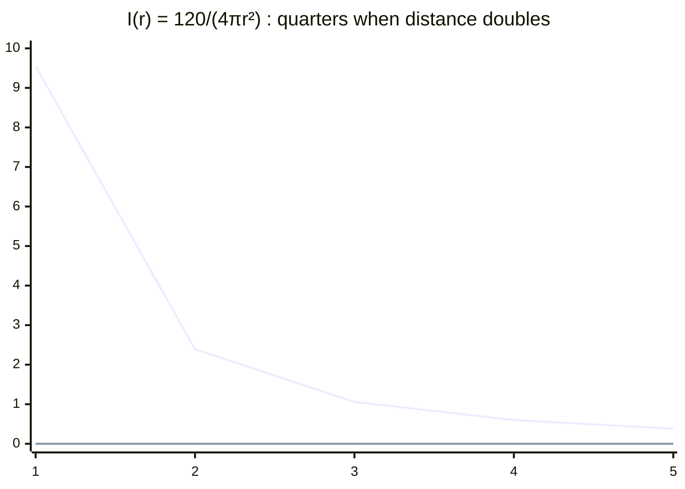

> *Read:* doubling distance quarters intensity and halves the field amplitude ($E_0 \propto 1/r$) — the two scalings students swap.

Solution

No. Average the product, not the individual factors. In-phase fields have $\langle E_xB_y\rangle=E_0B_0/2>0$. Both reverse together, so their cross product keeps pointing forward.

### 2.9 Momentum from local conservation

Energy transport alone does not prove momentum. In vacuum combine Maxwell with Lorentz force density $\mathbf f=\rho\mathbf E+\mathbf J\times\mathbf B$. Substitute $\rho=\varepsilon_0\nabla\cdot\mathbf E$ and $\mathbf J=\nabla\times\mathbf B/\mu_0-\varepsilon_0\partial_t\mathbf E$. Define Maxwell stress:

$$
T_{ij}=\varepsilon_0(E_iE_j-\tfrac12\delta_{ij}E^2)
+\frac1{\mu_0}(B_iB_j-\tfrac12\delta_{ij}B^2).
$$

Differentiating $F_iF_j-\delta_{ij}F^2/2$ gives the vector $\mathbf F(\nabla\cdot\mathbf F)-\mathbf F\times(\nabla\times\mathbf F)$. Apply this to E and B. Faraday changes the electric-curl term to $\varepsilon_0\mathbf E\times\partial_t\mathbf B$; Maxwell–Ampère changes the magnetic-curl term to $\mathbf J\times\mathbf B+\varepsilon_0\partial_t\mathbf E\times\mathbf B$. Therefore

$$
\nabla\cdot\mathbf T=\mathbf f+\partial_t(\varepsilon_0\mathbf E\times\mathbf B),\qquad
\mathbf g=\varepsilon_0\mathbf E\times\mathbf B=\frac{\mathbf S}{c^2}.
$$

The integrated law is $\mathbf F_{\rm matter}=\oint\mathbf T\cdot d\mathbf A-d\int\mathbf g\,dV/dt$, identifying field momentum density $\mathbf g$. A unidirectional vacuum pulse has $\mathbf S=cu\hat{\mathbf k}$; integrate over its volume:

$$
\boxed{\mathbf p=\frac Uc\hat{\mathbf k}.}
$$

**Validity:** collimated vacuum radiation with all energy travelling in one direction. For multiple directions add momenta as vectors; isotropic radiation has zero net momentum despite nonzero energy. Photon language $E_\gamma=hf$, $p_\gamma=hf/c$ agrees, but $hf$ is a quantum postulate, not derived from classical Maxwell theory. Momentum in material includes the medium: do not assign it the naive value $U/v$.

### 2.10 Flat-surface radiation pressure: intercepted energy first

Let $I$ mean incident power per beam-normal area. A stationary flat patch of actual area $A_s$ at incidence angle $\theta$ to its normal intercepts

$$
dU=IA_s\cos\theta\,dt.
$$

Its incoming normal momentum is $(dU/c)\cos\theta$. A black absorber removes it; a specular mirror reverses it. Divide the transferred normal momentum by $A_sdt$:

$$
\boxed{P_{\rm abs}=\frac Ic\cos^2\theta,\qquad
P_{\rm spec}=\frac{2I}{c}\cos^2\theta.}
$$

**Validity:** vacuum incident/emergent radiation, stationary complete absorber or specular mirror, no extra asymmetric emission recoil. This is **normal** force per actual area. Absorption also gives tangential traction $I\sin\theta\cos\theta/c$; total force is along the incident beam. Specular reflection leaves tangential momentum unchanged, so its force is purely normal.

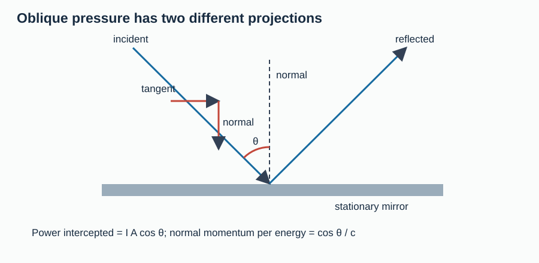

> [!tip] FIGURE F3.5 · Radiation pressure: the two cosines
> *Why:* pressure has two projection factors and each has its own trap — the figured flow separates them.
> *Data:* intercepted energy dU = I A cos θ dt; transferred normal momentum = (approach + departure)/c, giving P_abs = (I/c)cos²θ, P_spec = (2I/c)cos²θ.

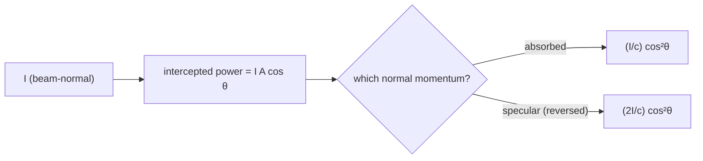

> *Read:* one cosine projects the area, the other projects the momentum — the tangent momentum stays untouched for a mirror.

*Figure 4. One cosine projects area; the other projects momentum. Incidence angle is measured from the normal.*

Let $\mathcal A+R+T=1$. If transmission is undeviated in vacuum, transferred normal momentum is $(\mathcal A+2R)dU\cos\theta/c$. Thus $P_n=(1+R-T)I\cos^2\theta/c$. For an opaque surface,

$$
\boxed{P_n=(1+R)\frac Ic\cos^2\theta.}
$$

**Validity:** stationary opaque specular/absorbing surface, $T=0$, vacuum, no additional emission recoil. At $\theta=0$ recover $I/c$, $2I/c$ and $(1+R)I/c$. Diffuse reflection requires an outgoing angular average; refraction changes transmitted momentum direction. Material momentum needs a fuller model.

Checks: pressure vanishes with $I$ and at grazing incidence for fixed actual area; $R=0,1$ give the endpoints. Units $(\mathrm{W/m^2})/(\mathrm{m/s})=\mathrm{N/m^2}$.

**C6 — concept check.** Known intercepted power $\mathcal P_{\rm hit}$ hits a mirror at $60^\circ$. Is $F_n=2\mathcal P_{\rm hit}\cos^2\theta/c$?

Solution

No. The area projection is already in $\mathcal P_{\rm hit}$. Only momentum projection remains: $F_n=2\mathcal P_{\rm hit}\cos\theta/c=\mathcal P_{\rm hit}/c$. At normal incidence this becomes $2\mathcal P_{\rm hit}/c$.

### 2.11 Curved surfaces: a specular sphere is not a mirrored disk

A uniform collimated beam illuminates a sphere of radius $a\gg\lambda$. On the illuminated hemisphere, $\theta$ is the angle between the inward normal and the beam. An annulus has area $dA=2\pi a^2\sin\theta\,d\theta$ for $0\leq\theta\leq\pi/2$.

Absorbed rays give axial force $dF_z=(I/c)\cos\theta\,dA$, so

$$
F_{z,\rm abs}=\frac{2\pi a^2I}{c}\int_0^{\pi/2}\sin\theta\cos\theta\,d\theta
=\frac{I\pi a^2}{c}.
$$

A specular patch feels normal force $(2I/c)\cos^2\theta\,dA$. Its axial component has one more cosine:

$$
F_{z,\rm spec}=\frac{4\pi a^2I}{c}\int_0^{\pi/2}\sin\theta\cos^3\theta\,d\theta
=\frac{I\pi a^2}{c}.
$$

**Validity:** opaque large sphere, geometric optics, uniform vacuum illumination, ideal absorption or local specular reflection, negligible diffraction and no asymmetric emission recoil. Azimuthal symmetry cancels transverse forces. These two spheres have the **same** axial force; a normal flat mirror of area $\pi a^2$ feels twice that force. Small-particle scattering, diffuse reflection and retroreflection are different problems.

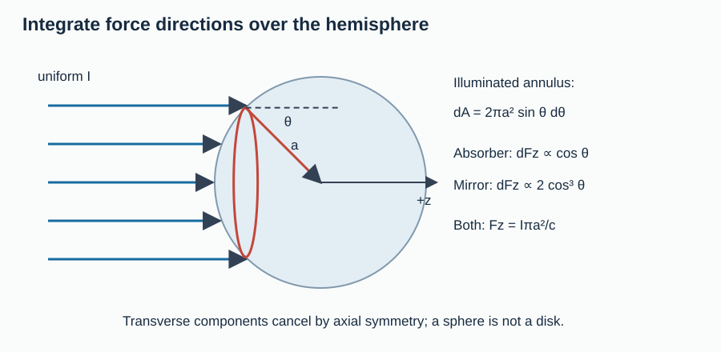

*Figure 5. A specular sphere sends rays in different directions rather than reversing the entire beam.*

Integrating shells gives $m=\int_0^a4\pi r^2\rho_m\,dr=4\pi a^3\rho_m/3$. Its acceleration is therefore $3I/(4\rho_m ac)$. Area grows as $a^2$, mass as $a^3$: smaller spheres accelerate more, while the ray approximation remains valid.

### 2.12 Electromagnetic spectrum: conventions, sources and uses

All bands travel at $c$ in vacuum with $f\lambda_0=c$. Classification uses frequency or **vacuum** wavelength, not the shortened wavelength in glass. Photon energy increases with $f$ through the quantum input $E_\gamma=hf$. Production and detector responses overlap.

There are no universal exact physical cutoffs between all bands. The following **classroom convention** uses lower-inclusive wavelength intervals $[a,b)$ and frequency intervals $(c/b,c/a]$. Numbers use $c\simeq3.00\times10^8\,\mathrm{m/s}$ and are rounded; ratios $c/b,c/a$ define the chosen cutoffs. Microwaves are part of radio in broad terminology; “radio” here means its longer-wave remainder. Visible sensitivity has gradual, person-dependent edges.

| Band | Adopted vacuum wavelength | Frequency (Hz, rounded cutoffs) | Typical production | Applications / interaction |
|---|---|---|---|---|
| Radio remainder | $\lambda_0\geq1\,\mathrm m$ | $0<f\leq3\times10^8$ | Accelerated antenna charges; LC/electronic oscillators | Broadcasting, communication, MRI RF excitation |
| Microwave | $1\,\mathrm{mm}\leq\lambda_0<1\,\mathrm m$ | $3\times10^8<f\leq3\times10^{11}$ | Magnetrons, klystrons, semiconductor oscillators | RADAR, satellite links, many cellular/Wi-Fi bands, dielectric heating |
| Infrared | $700\,\mathrm{nm}\leq\lambda_0<1\,\mathrm{mm}$ | $3\times10^{11}<f\leq4.286\times10^{14}$ | Thermal radiation, molecular rotation/vibration, semiconductor emitters | Thermal imaging, remotes, near-IR fibre links, greenhouse absorption/emission |
| Visible | $400\,\mathrm{nm}\leq\lambda_0<700\,\mathrm{nm}$ | $4.286\times10^{14}<f\leq7.50\times10^{14}$ | Electronic transitions, LEDs, hot bodies | Vision, imaging, illumination, spectroscopy |
| Ultraviolet | $10\,\mathrm{nm}\leq\lambda_0<400\,\mathrm{nm}$ | $7.50\times10^{14}<f\leq3.00\times10^{16}$ | Electronic transitions, discharges, hot stars, excimer lasers | Germicidal irradiation, fluorescence, lithography, LASIK photoablation |
| X-ray (wavelength convention) | $0.01\,\mathrm{nm}\leq\lambda_0<10\,\mathrm{nm}$ | $3.00\times10^{16}<f\leq3.00\times10^{19}$ | Fast-electron deceleration, inner-shell transitions | Medical imaging, CT, crystal diffraction, radiotherapy |
| Gamma (wavelength convention) | $0<\lambda_0<0.01\,\mathrm{nm}$ | $f>3.00\times10^{19}$ | Nuclear transitions, annihilation, high-energy processes | Nuclear spectroscopy, sterilisation, radiotherapy |

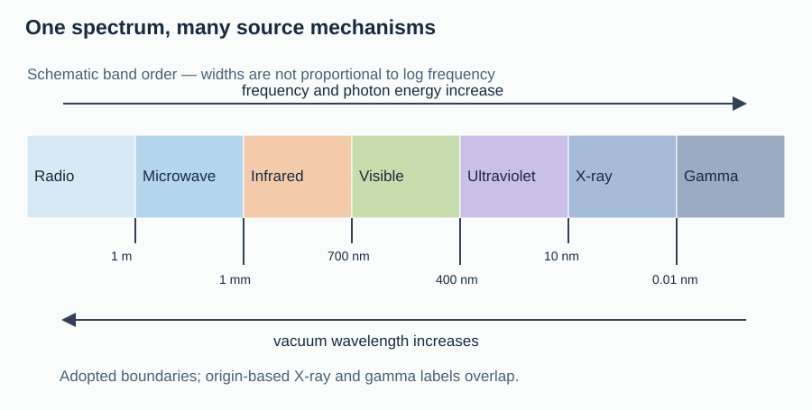

*Figure 6. Dividing lines are adopted labels, not changes in Maxwell's laws.*

**Origin-based names overlap.** Nuclear-transition photons are often called gamma rays even when their wavelength lies in the table's X-ray interval; high-energy bremsstrahlung photons may be called X-rays despite overlapping gamma energies. Frequency alone cannot uniquely determine the source.

**Mechanism bridges:** an ideal lumped LC circuit obeys $L\ddot q+q/C=0$ by loop balance. Comparison with harmonic motion gives $\omega_0=1/\sqrt{LC}$ and $f_0=1/(2\pi\sqrt{LC})$. An attached antenna radiates because charges accelerate; an ideal confined LC model alone does not specify radiated power. Far-field amplitude falls as $1/r$, so flux falls as $1/r^2$; static/induction terms diminish faster and cannot carry a fixed outgoing power through arbitrarily large spheres.

A magnetron converts electron motion in electric/magnetic fields into microwave oscillations. Thermal emission is broadband, not “only IR”; IR often dominates ordinary-temperature objects. Greenhouse warming involves absorption and emission of outgoing thermal IR by gases/clouds, not simple reflection of all radiation. Some UV is ionising, but thresholds depend on the target. Excimer UV produces corneal photoablation in LASIK; other surgical stages may use different wavelengths. Gamma rays are neither faster nor uniquely more penetrating than X-rays of the same energy.

**Checkpoint — results to own:** draw the surface paradox; derive both curls; fix the E/B direction and phase; distinguish peak/RMS/mean energy; derive both pressure cosines; explain the sphere/disk distinction; classify radiation without claiming universal sharp boundaries.

## 3. Interleaved Exemplars & Concept Checks

Try these ten examples with solutions closed. They complement C1–C6 inside the derivations. Use §1.2 constants unless another is supplied.

### E1 — A charging-current measurement

Circular vacuum plates have $a=0.050\,\mathrm m$, $I_c=0.020\,\mathrm A$. Find gap $B$ at $r=0.020\,\mathrm m$ and $0.100\,\mathrm m$ in model Q.

Solution

Inside, $B=(2.00\times10^{-7}\,\mathrm{T\,m/A})(0.020\,\mathrm A)(0.020\,\mathrm m)/(0.050\,\mathrm m)^2=3.20\times10^{-8}\,\mathrm T$. Outside, $B=(2.00\times10^{-7})(0.020)/(0.100)\,\mathrm T=4.00\times10^{-8}\,\mathrm T$. The rim value $8.00\times10^{-8}\,\mathrm T$ exceeds both, consistent with the rise/fall graph. Direction follows the charging current by the right-hand rule.

### E2 — Dielectric displacement split

A $\kappa=5$ capacitor carries $15\,\mathrm{mA}$. Find total macroscopic displacement current, its vacuum part and its polarisation part.

Solution

$A\dot D=15\,\mathrm{mA}$. Vacuum contribution $I_c/\kappa=3\,\mathrm{mA}$; polarisation contribution $(1-1/\kappa)I_c=12\,\mathrm{mA}$. They sum to 15, not 30 mA. The polarisation part vanishes at $\kappa=1$.

### E3 — Frequency is not refracted

A $6.00\times10^{14}\,\mathrm{Hz}$ wave enters nonmagnetic model-L matter with $\varepsilon_r=2.25$. Find $n,v,\lambda$.

Solution

$n=1.50$, $v=(3.00\times10^8\,\mathrm{m/s})/1.50=2.00\times10^8\,\mathrm{m/s}$, $\lambda=v/f=333\,\mathrm{nm}$. Frequency is unchanged; vacuum wavelength is $500\,\mathrm{nm}$, so the radiation remains visible despite its shorter material wavelength. As $n\to1$, $\lambda\to500\,\mathrm{nm}$.

### E4 — Reconstruct the missing field

In vacuum $\mathbf E=(60\,\mathrm{V/m})\cos(2z-6.00\times10^8t)\hat{\mathbf x}$, with SI coordinates. Find $\mathbf B,\lambda,f$.

Solution

$\omega/k=c$ along $+z$. Thus $\mathbf B=(2.00\times10^{-7}\,\mathrm T)\cos(2z-6.00\times10^8t)\hat{\mathbf y}$. $\lambda=2\pi/(2\,\mathrm{m^{-1}})=\pi\,\mathrm m\simeq3.14\,\mathrm m$, $f=(6.00\times10^8\,\mathrm{s^{-1}})/(2\pi)=9.55\times10^7\,\mathrm{Hz}$. Check $f\lambda=c$ and $\hat{\mathbf x}\times\hat{\mathbf y}=\hat{\mathbf z}$.

### E5 — Peak and RMS bookkeeping

A linear harmonic vacuum wave has $E_0=120\,\mathrm{V/m}$. Find $I,\langle u\rangle,\langle u_E\rangle$.

Solution

$I=\tfrac12(8.85\times10^{-12}\,\mathrm{F/m})(3.00\times10^8\,\mathrm{m/s})(120\,\mathrm{V/m})^2=19.116\,\mathrm{W/m^2}$. $\langle u\rangle=I/c=6.372\times10^{-8}\,\mathrm{J/m^3}$; electric contribution is half, $3.186\times10^{-8}\,\mathrm{J/m^3}$. Independently it is $\varepsilon_0E_0^2/4$. Doubling amplitude quadruples each answer.

### E6 — Pulse impulse

A collimated $6.0\,\mathrm{mJ}$ vacuum pulse strikes normally. Find impulse on an absorber and on a perfect mirror.

Solution

$U/c=(6.0\times10^{-3}\,\mathrm J)/(3.00\times10^8\,\mathrm{m/s})=2.0\times10^{-11}\,\mathrm{N\,s}$. Absorption gives this forward impulse; reflection gives $4.0\times10^{-11}\,\mathrm{N\,s}$. Units J divided by m/s equal kg m/s. Pulse duration affects force, not impulse at fixed energy.

### E7 — Pressure versus force

An opaque plate of actual area $0.020\,\mathrm{m^2}$, specular $R=0.60$, receives $900\,\mathrm{W/m^2}$ at $60^\circ$. Find normal pressure and force.

Solution

$P_n=1.60(900\,\mathrm{W/m^2})(0.5)^2/(3.00\times10^8\,\mathrm{m/s})=1.20\times10^{-6}\,\mathrm{Pa}$. $F_n=P_nA_s=2.40\times10^{-8}\,\mathrm N$. Check using intercepted power $IA_s\cos\theta=9.0\,\mathrm W$ and $F_n=(1+R)\mathcal P_{\rm hit}\cos\theta/c$. Normal incidence at fixed intensity/area would give four times the force.

### E8 — A polished grain

For a specular sphere with radius $1.00\,\mathrm{mm}$, density $3000\,\mathrm{kg/m^3}$ and incident intensity $1200\,\mathrm{W/m^2}$, find force and acceleration, using geometric optics.

Solution

$F=I\pi a^2/c=1.257\times10^{-11}\,\mathrm N$, $m=4\pi a^3\rho_m/3=1.257\times10^{-5}\,\mathrm{kg}$, giving acceleration $1.00\times10^{-6}\,\mathrm{m/s^2}$. Check with $3I/(4\rho_m ac)$. A millimetre exceeds optical wavelengths; extrapolating the $1/a$ acceleration to nanometres would invalidate the ray approximation.

### E9 — Radar delay

A $10.0\,\mathrm{GHz}$ radar receives an echo $20.0\,\mu\mathrm s$ later. Treat air as vacuum. Find wavelength, target range and band.

Solution

$\lambda=(3.00\times10^8\,\mathrm{m/s})/(1.00\times10^{10}\,\mathrm{Hz})=0.0300\,\mathrm m$. Range is $c\Delta t/2=3000\,\mathrm m$; the echo is a round trip. This is microwave radiation since $1\,\mathrm{mm}<3\,\mathrm{cm}<1\,\mathrm m$.

### E10 — Equal energy, different names

A nuclear transition and an electron deceleration event each produce a $100\,\mathrm{keV}$ photon. Use $hc=1240\,\mathrm{eV\,nm}$. Find wavelength and discuss names.

Solution

Both have $\lambda=(1240\,\mathrm{eV\,nm})/(100000\,\mathrm{eV})=0.0124\,\mathrm{nm}$. The nuclear photon is usually called gamma; the deceleration photon, X-ray. Both fall in the table's wavelength-defined X-ray interval, showing why that table is only a convention. Both travel at $c$ in vacuum; doubling energy halves wavelength.

## 4. JEE Advanced Advantage / Alternate Method

### 4.1 Impedance and boundary matching

For a travelling wave, $H=B/\mu=E/(\mu v)$, so $E/H=\mu v=\sqrt{\mu/\varepsilon}=Z$. Impedance is a field ratio, not necessarily a dissipative resistance. Equal refractive indices need not imply equal impedances if permeability varies.

Infinitesimal Faraday and Ampère rectangles across a stationary interface with no free surface current enforce tangential E/H continuity. At normal incidence, use a common electric reference axis for incident/reflected waves; backward propagation reverses $H/E$:

$$
E_i+E_r=E_t,\qquad (E_i-E_r)/Z_1=E_t/Z_2.
$$

Solving gives

$$
r_E=\frac{Z_2-Z_1}{Z_2+Z_1},\qquad t_E=\frac{2Z_2}{Z_1+Z_2},\qquad
R=r_E^2,\qquad T=\frac{Z_1}{Z_2}t_E^2=\frac{4Z_1Z_2}{(Z_1+Z_2)^2}.
$$

**Validity:** normal incidence between model-L media, positive real impedances, no absorbing sheet. Algebra verifies $R+T=1$. At $Z_2=Z_1$ reflection vanishes. For nonmagnetic media $Z=Z_0/n$, so reflection toward higher index has $r_E<0$ (electric phase inversion). A perfect-conductor limit gives $r_E\to-1$. This is the electromagnetic bridge to reflection phases in optics.

### 4.2 Standing waves violate travelling-wave shortcuts

A perfect conductor occupies $z\geq0$. Take incident $\mathbf E_i=E_0\cos(kz-\omega t)\hat{\mathbf x}$ and reflected $\mathbf E_r=-E_0\cos(kz+\omega t)\hat{\mathbf x}$. Tangential E cancels at $z=0$. Compute B from each propagation direction separately, then add:

$$
\mathbf E=2E_0\sin kz\sin\omega t\,\hat{\mathbf x},\qquad
\mathbf B=\frac{2E_0}{c}\cos kz\cos\omega t\,\hat{\mathbf y}.
$$

E nodes are $kz=m\pi$; B nodes lie halfway between. Fields have temporal/spatial quadrature, not in-phase behaviour. Their energy is

$$
u=2\varepsilon_0E_0^2(\sin^2kz\sin^2\omega t+\cos^2kz\cos^2\omega t),
\qquad\langle\mathbf S\rangle=0.
$$

Averaging gives $\langle u\rangle=\varepsilon_0E_0^2$, independent of position and twice the mean density of one constituent. Electric and magnetic energies are not generally equal locally. Integrating over an integer number of half-wavelengths gives constant total energy while local energy flows between regions.

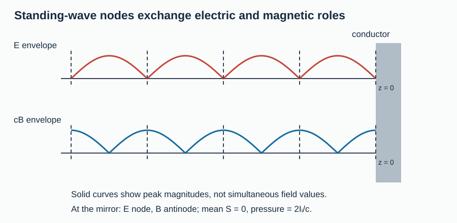

*Figure 7. Zero mean energy flow does not imply zero stored energy or zero mirror pressure.*

At the mirror $B=2E_0\cos\omega t/c$. Magnetic stress gives mean pressure $\langle B^2/(2\mu_0)\rangle=\varepsilon_0E_0^2=2I_i/c$. Incoming/outgoing energies cancel in flux, but reflection reverses normal momentum.

### 4.3 Isotropic radiation: $u/3$, not $u$

Uniform angular energy density gives $du=u\,d\Omega/(4\pi)$. A directional group strikes a wall with flux $c\,du\cos\theta$; reflection transfers twice the normal momentum, giving $dP=2du\cos^2\theta$. Integrate the incident hemisphere:

$$
P=\frac{2u}{4\pi}\int_0^{2\pi}d\phi\int_0^{\pi/2}\cos^2\theta\sin\theta\,d\theta=\frac u3.
$$

**Validity:** isotropic vacuum radiation and a reflecting wall. A black wall absorbing prescribed hemispheric incident radiation receives $u/6$ if $u$ denotes the corresponding full-sphere density; equilibrium emission recoil restores $u/3$. Boundary conditions decide which result applies.

### 4.4 Conducting-media warning

For homogeneous charge-free Ohmic matter with $\mathbf J_f=\sigma\mathbf E$, the curl derivation gives

$$
\nabla^2\mathbf E=\mu\sigma\partial_t\mathbf E+\mu\varepsilon\partial_t^2\mathbf E.
$$

With $e^{i(kz-\omega t)}$, $k^2=\mu\varepsilon\omega^2+i\mu\sigma\omega$. Complex $k$ means attenuation and potentially an E/B phase difference. For $\sigma\gg\omega\varepsilon$, the decaying root is $k=(1+i)\sqrt{\mu\sigma\omega/2}$; amplitude skin depth is $\delta=\sqrt{2/(\mu\sigma\omega)}$. Check the sign: $e^{ikz}=e^{i\operatorname{Re}(k)z}e^{-\operatorname{Im}(k)z}$. Do not use the lossless intensity formula indiscriminately in metal.

## 5. Examiner Traps (`.trap`)

> **.trap — Mixed spanning surfaces:** evaluate conduction and displacement flux on one surface; do not add two copies of the charging current.

> **.trap — Vacuum permittivity in a filled capacitor:** macroscopic displacement is $\partial_t\mathbf D$, not just $\varepsilon_0\partial_t\mathbf E$.

> **.trap — Lost divergence constraint:** the curl–curl identity contains $\nabla(\nabla\cdot\mathbf E)$; justify setting it to zero.

> **.trap — Wrong reflected B sign:** recompute $\hat{\mathbf k}\times\mathbf E/v$ for each direction.

> **.trap — Universal $E=cB$:** this holds for one vacuum travelling plane wave, not every static, near or standing field.

> **.trap — Peak/RMS factor of two:** $I=E_0^2/(2Z)=E_{\rm rms}^2/Z$ for a linear harmonic travelling wave.

> **.trap — Averaging before multiplication:** $\langle EB\rangle\ne\langle E\rangle\langle B\rangle$ for correlated oscillations.

> **.trap — Calling $I/c$ an intensity:** its units are Pa (also J/m³), not W/m².

> **.trap — One cosine too few or too many:** actual area needs area and momentum projections; intercepted power already includes the former.

> **.trap — Absorption force assumed normal:** absorbed momentum points along the beam; normal pressure is only its normal component.

> **.trap — $(1+R)I/c$ on a transparent sheet:** subtract outgoing transmitted momentum; $1+R-T$ assumes undeviated vacuum transmission.

> **.trap — Doubling a polished sphere's force:** integrate local vector forces; most rays do not reverse their full momentum.

> **.trap — Refracted frequency divided by $n$:** stationary interfaces preserve frequency, not wavelength.

> **.trap — Exact universal spectrum boundaries:** specify the convention and distinguish origin-based X/gamma names.

> **.trap — Zero net flux means zero force:** a standing wave can exert pressure because energy and momentum have different reflection ledgers.

## 6. Topic Playbook

### 6.1 Triage decision tree

> [!tip] FIGURE F3.6 · Triage — match the question to a Maxwell tool
> *Why:* the six-way split decides which law gets derivative work and which gets an integral.
> *Data:* the six triage rules of §6.1 (capacitor→flux, field expression→k and cross product, amplitude/power→peak/RMS, force→momentum in−out, interface→tangential fields, spectrum→vacuum wavelength).

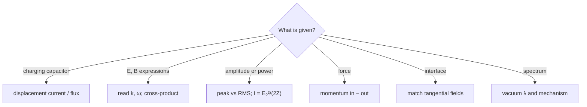

> *Read:* each branch hands the problem to one law — mixing peak with RMS, or area with momentum projection, is the classic misroute.

1. **Changing capacitor?** Draw one loop and one surface. Find $D(t)$ or $E(t)$, integrate enclosed flux, then use justified symmetry.
2. **Field expression?** Read $\mathbf k,\omega$; follow constant phase; test $\omega/k=v$ and transversality; cross-product for the missing field. Refuse inconsistent data.
3. **Amplitude or power?** Label peak/RMS. Use $I=E_0^2/(2Z)$ and beam-normal area for power.
4. **Force?** Draw incident/outgoing momentum. Find intercepted power first. Transfer to matter is **incoming minus outgoing** momentum; project and integrate vectors for curved surfaces.
5. **Interface/superposition?** Match tangential fields or add fields before squaring. Coherent intensities do not automatically add.
6. **Spectrum/application?** Convert to vacuum wavelength/frequency, then identify mechanisms. Echo range is $c\Delta t/2$.

### 6.2 Formula map and estimates

$\dot q\to\dot D\to B$ is the capacitor route. Maxwell curls $\to v,Z\to E/B\to I$ is propagation. Poynting $\to U\to U/c\to$ momentum balance is the force route.

| Estimate | Use |
|---|---|
| $c\simeq3\times10^8\,\mathrm{m/s}$ | $1\,\mathrm{ns}$ is $0.30\,\mathrm m$ one-way |
| $Z_0\simeq377\,\Omega$ | $I\simeq E_0^2/754$ in W/m² with E in V/m |
| $1\,\mathrm{kW/m^2}/c\simeq3.33\,\mu\mathrm{Pa}$ | Ordinary radiation pressures are tiny |
| $1\,\mathrm W/c\simeq3.33\,\mathrm{nN}$ | Quick beam-force check |
| $hc\simeq1240\,\mathrm{eV\,nm}$ | Optical photons have energies of order eV |
| $f$ (GHz) times $\lambda_0$ (cm) is about 30 | Microwave conversion |

These follow from the supplied constants, $p=U/c$ and $E_\gamma=hc/\lambda_0$, not new laws.

### 6.3 Exit checklist

- [ ] Free, bound and displacement currents distinguished?
- [ ] Source-free region and medium model explicit?
- [ ] E, B, propagation in the correct cross-product order?
- [ ] Peak/RMS convention and beam-normal/actual area identified?
- [ ] Absorption's tangential force and reflection type retained?
- [ ] Units, limiting case and order-of-magnitude check included?

## 7. Olympiad-Grade Paper

### Instructions, marking and coverage

**180 minutes · 180 marks · 36 original questions.** This is a mixed JEE–Olympiad training paper, not an official examination. Keep solutions closed. $I$ is beam-normal average intensity. Surfaces are stationary; reflection is specular unless stated otherwise.

Use $c=3.00\times10^8\,\mathrm{m/s}$, $\varepsilon_0=8.85\times10^{-12}\,\mathrm{F/m}$, $\mu_0=4\pi\times10^{-7}\,\mathrm{H/m}$, $Z_0=377\,\Omega$, $hc=1240\,\mathrm{eV\,nm}$ as independently rounded constants; ignore discrepancies below 0.1%. Numerical tolerance: ±1%, unless an exact expression is requested.

| Section | Questions | Marks | Suggested minutes | Coverage |
|---|---|---:|---:|---|
| A — single correct | Q1–Q8 | $8\times3=24$ | 20 | Capacitor, waves, energy, pressure, spectrum |
| B — multi-correct | Q9–Q16 | $8\times4=32$ | 25 | Model limits, fields, force, interfaces |
| C — numerical | Q17–Q28 | $12\times3=36$ | 35 | All six core groups |
| D — comprehensive long form | Q29–Q36 | $8\times11=88$ | 100 | Maxwell, Poynting, standing waves, curved force, instruments |

**Scoring:** A: 3 for the correct option, otherwise 0. B: 4 for the exact correct set, otherwise 0; no negative marks. C: 3 for an accepted value with the requested unit, otherwise 0. D: award subpart marks as shown, credit alternate valid methods, and carry forward arithmetic errors without repeated penalties. Total $24+32+36+88=180$. Each long solution distributes its 11 marks explicitly.

### A — Single-correct questions

#### Q1. The gap surface [3 marks]

A vacuum capacitor charges at $2\,\mathrm A$. A surface bounded by an Amperian loop lies entirely between its plates and encloses their full changing flux. The pair $(I_c,I_d)$ **through this surface** is: A. $(2,2)\,\mathrm A$; B. $(0,2)\,\mathrm A$; C. $(2,0)\,\mathrm A$; D. $(0,0)\,\mathrm A$.

Solution and marking — Q1

**B.** No charge crosses the gap; $\varepsilon_0\dot\Phi_E=\dot q=2\,\mathrm A$. A wire-cutting surface gives the same total effective current, not an additional current. Award 3 for B.

#### Q2. A changing-voltage dielectric [3 marks]

An ideal nonmagnetic capacitor is driven at fixed $\dot V$. Compare the empty capacitor with the same geometry fully filled with relative permittivity 4. The macroscopic displacement current becomes: A. unchanged; B. one quarter; C. twice; D. four times its original value.

Solution and marking — Q2

**D.** $I_d=A\dot D=\varepsilon A\dot V/d$ scales fourfold with $\varepsilon$. This compares two fixed filled/empty configurations, not the transient while inserting material. At fixed current instead of fixed $\dot V$, the conclusion differs. Award 3 for D.

#### Q3. A magnetic dielectric [3 marks]

A model-L medium has $\varepsilon_r=4$, $\mu_r=9$. Its speed is: A. $c/2$; B. $c/3$; C. $c/6$; D. $c/36$.

Solution and marking — Q3

**C.** $v=c/\sqrt{\varepsilon_r\mu_r}=c/\sqrt{36}=c/6$. Both constitutive coefficients matter, and the square root cannot be omitted. Award 3 for C.

#### Q4. The right-handed triad [3 marks]

A vacuum travelling wave has instantaneous E along $+y$ and B along $-x$. Energy travels along: A. $+z$; B. $-z$; C. $+x$; D. $-y$.

Solution and marking — Q4

**A.** $\hat{\mathbf y}\times(-\hat{\mathbf x})=+\hat{\mathbf z}$. Reversing the order of the cross product would give the wrong sign. Award 3 for A.

#### Q5. Which amplitude? [3 marks]

For a linear harmonic vacuum travelling wave with electric RMS amplitude $E_r$, mean total energy density is: A. $\varepsilon_0E_r^2/2$; B. $\varepsilon_0E_r^2$; C. $2\varepsilon_0E_r^2$; D. zero.

Solution and marking — Q5

**B.** Instantaneously $u=\varepsilon_0E^2$ and by definition $\langle E^2\rangle=E_r^2$. Each field contributes half the total. Award 3 for B.

#### Q6. Oblique mirror [3 marks]

A mirror is illuminated at $60^\circ$ rather than normally, with unchanged beam-normal intensity. Its normal pressure changes by a factor: A. $1/2$; B. $1/4$; C. $\sqrt3/2$; D. 1.

Solution and marking — Q6

**B.** $P_n=2I\cos^2\theta/c$, so the ratio is $\cos^2 60^\circ=1/4$. One projection is area, one is normal momentum. Award 3 for B.

#### Q7. Wavelength conversion [3 marks]

A $2.4\,\mathrm{GHz}$ vacuum signal has wavelength closest to: A. $1.25\,\mathrm{mm}$; B. $1.25\,\mathrm m$; C. $12.5\,\mathrm{cm}$; D. $125\,\mathrm m$.

Solution and marking — Q7

**C.** $\lambda=(3.00\times10^8\,\mathrm{m/s})/(2.4\times10^9\,\mathrm{Hz})=0.125\,\mathrm m$. GHz frequencies have centimetre-to-decimetre wavelengths, a scale check. Award 3 for C.

#### Q8. Naming radiation [3 marks]

Which statement is reliable? A. All gamma rays exceed all X-rays in energy. B. Gamma rays travel faster than radio in vacuum. C. X/gamma names can depend on production mechanism and their energies overlap. D. Electronic transitions cannot emit infrared.

Solution and marking — Q8

**C.** Origin-based classification permits energy overlap. All bands travel at $c$ in vacuum; electronic transitions can emit IR, including semiconductor emitters. Award 3 for C.

### B — Multi-correct questions

#### Q9. Currents in a dielectric [4 marks]

For a uniformly filled $\kappa=3$ ideal capacitor in model Q: A. $A\dot D=I_c$. B. $\varepsilon_0A\dot E=I_c$. C. Polarisation current is $2I_c/3$. D. No free conduction charge need cross the gap.

Solution and marking — Q9

**A, C, D.** $D=3\varepsilon_0E$, so the vacuum part is $I_c/3$, not $I_c$. The remainder is $2I_c/3$ from $\dot P_{\rm pol}$. The ideal dielectric has no free conduction across it. Award 4 for exactly A, C, D.

#### Q10. Wave-equation conditions [4 marks]

Select correct statements. A. Homogeneous charge-free model L has $\nabla\cdot\mathbf E=0$. B. Inhomogeneous charge-free matter always has $\nabla\cdot\mathbf E=0$. C. Homogeneous Ohmic conduction adds $\mu\sigma\partial_t\mathbf E$ to the charge-free electric wave equation. D. Solving the wave equation alone guarantees all Maxwell constraints.

Solution and marking — Q10

**A, C.** Constant $\varepsilon$ permits A; with varying $\varepsilon$, $\nabla\cdot\mathbf E=-\mathbf E\cdot\nabla\varepsilon/\varepsilon$, rejecting B. Independent wave-equation solutions may violate divergence or E/B coupling, rejecting D. Award 4 for exactly A, C.

#### Q11. A single travelling wave [4 marks]

For one plane wave in model L: A. $\mathbf E\cdot\mathbf B=0$. B. $\mathbf B=\hat{\mathbf k}\times\mathbf E/v$. C. $E_0=cB_0$ in every medium. D. Electric and magnetic energy densities are equal instantaneously.

Solution and marking — Q11

**A, B, D.** The cross-product relation gives A/B; $v^{-2}=\mu\varepsilon$ gives D. C incorrectly replaces $v$ with $c$. These properties do not automatically hold for standing-wave sums. Award 4 for exactly A, B, D.

#### Q12. Energy and momentum [4 marks]

For vacuum radiation: A. A collimated pulse of energy $U$ has momentum magnitude $U/c$. B. Every collection of beams of total energy $U$ has net momentum magnitude $U/c$. C. Momentum density is $\mathbf S/c^2$. D. Zero mean electric field forces zero mean intensity.

Solution and marking — Q12

**A, C.** Opposite beams can cancel momentum, disproving B. In-phase oscillating fields have a nonzero mean cross product despite zero individual means, disproving D. Award 4 for exactly A, C.

#### Q13. Oblique absorber [4 marks]

A black patch of actual area $A_s$ sees vacuum intensity $I$ at angle $\theta$ to its normal. A. Intercepted power is $IA_s\cos\theta$. B. Force is purely normal. C. Normal pressure is $I\cos^2\theta/c$. D. Tangential traction is $I\sin\theta\cos\theta/c$.

Solution and marking — Q13

**A, C, D.** Absorbed momentum is along the incident beam, not generally normal. Force magnitude is $IA_s\cos\theta/c$; its projections give C and D. Award 4 for exactly A, C, D.

#### Q14. Spheres and disks [4 marks]

A uniform parallel beam illuminates ideal bodies in geometric optics, each of projected area $\pi a^2$. A. A black sphere receives $I\pi a^2/c$. B. A specular sphere receives $2I\pi a^2/c$. C. A normal flat perfect mirror receives $2I\pi a^2/c$. D. Transverse force on either sphere is zero.

Solution and marking — Q14

**A, C, D.** Integrating $\cos^3\theta$ over the specular hemisphere gives $I\pi a^2/c$, not twice that. Azimuthal symmetry cancels transverse forces. Award 4 for exactly A, C, D.

#### Q15. Spectrum applications [4 marks]

A. Magnetrons generate microwaves. B. Fast-electron deceleration can generate X-rays. C. Frequency necessarily changes at a stationary refracting interface. D. Excimer UV photoablation is used in LASIK.

Solution and marking — Q15

**A, B, D.** Stationary-boundary matching preserves frequency; wavelength changes, rejecting C. D identifies the photoablation step, not necessarily every laser used by the surgical system. Award 4 for exactly A, B, D.

#### Q16. Normal-incidence interface [4 marks]

Two model-L media have impedances $Z_1,Z_2$, with no surface sheet. A. $r_E=(Z_2-Z_1)/(Z_2+Z_1)$. B. Always $T=t_E^2$. C. Equal impedance gives no reflection. D. $R+T=1$.

Solution and marking — Q16

**A, C, D.** Field matching gives A/C; losslessness gives D. Since $I=E_0^2/(2Z)$, $T=(Z_1/Z_2)t_E^2$, rejecting B except when impedances match. Award 4 for exactly A, C, D.

### C — Numerical questions

#### Q17. Flux rate [3 marks]

Signed electric flux through a fixed vacuum surface grows at $4.00\times10^8\,\mathrm{V\,m/s}$. Find displacement current in mA.

Solution and marking — Q17

$I_d=\varepsilon_0\dot\Phi_E=(8.85\times10^{-12})(4.00\times10^8)\,\mathrm A=3.54\,\mathrm{mA}$. Units $(\mathrm{F/m})(\mathrm{V\,m/s})=\mathrm{C/s}$. Positive flux rate means positive current along the chosen normal. Award 3 for $3.54\,\mathrm{mA}$.

#### Q18. Rim field [3 marks]

Circular plates of radius $0.040\,\mathrm m$ charge at $0.080\,\mathrm A$. Find model-Q gap rim field in $\mu\mathrm T$.

Solution and marking — Q18

$B=\mu_0I_c/(2\pi a)=(2.00\times10^{-7}\,\mathrm{T\,m/A})(0.080\,\mathrm A)/(0.040\,\mathrm m)=0.400\,\mu\mathrm T$. Interior and exterior formulas agree at the rim, a continuity check. Award 3 for $0.400\,\mu\mathrm T$.

#### Q19. Material wavelength [3 marks]

A nonmagnetic model-L dielectric has $\varepsilon_r=6.25$. Light of vacuum wavelength $600\,\mathrm{nm}$ enters. Find its material wavelength in nm.

Solution and marking — Q19

$n=\sqrt{6.25}=2.50$; $\lambda=\lambda_0/n=(600\,\mathrm{nm})/2.50=240\,\mathrm{nm}$. Frequency stays fixed. At $n\to1$ the original wavelength returns. Award 3 for $240\,\mathrm{nm}$.

#### Q20. Magnetic amplitude [3 marks]

A vacuum travelling wave has peak E of $450\,\mathrm{V/m}$. Find peak B in $\mu\mathrm T$.

Solution and marking — Q20

$B_0=E_0/c=(450\,\mathrm{V/m})/(3.00\times10^8\,\mathrm{m/s})=1.50\,\mu\mathrm T$. Magnetic amplitude scales linearly with electric amplitude. Award 3 for $1.50\,\mu\mathrm T$.

#### Q21. RMS intensity [3 marks]

A vacuum harmonic wave has $E_{\rm rms}=30.0\,\mathrm{V/m}$. Use $Z_0=377\,\Omega$ to find intensity in W/m².

Solution and marking — Q21

$I=E_{\rm rms}^2/Z_0=(30.0\,\mathrm{V/m})^2/(377\,\Omega)=2.39\,\mathrm{W/m^2}$. No extra half factor belongs with RMS. Using peak $30\sqrt2\,\mathrm{V/m}$ in the peak formula verifies it. Award 3 for $2.39\,\mathrm{W/m^2}$.

#### Q22. Mean energy density [3 marks]

A unidirectional vacuum beam has intensity $240\,\mathrm{W/m^2}$. Find mean total energy density in $\mu\mathrm{J/m^3}$.

Solution and marking — Q22

$\langle u\rangle=I/c=(240\,\mathrm{W/m^2})/(3.00\times10^8\,\mathrm{m/s})=0.800\,\mu\mathrm{J/m^3}$. Multiplying by $c$ recovers the energy flux. Award 3 for $0.800\,\mu\mathrm{J/m^3}$.

#### Q23. Pulse impulse [3 marks]

A $9.00\,\mathrm{mJ}$ collimated vacuum pulse reflects normally from a perfect mirror. Find impulse in units of $10^{-11}\,\mathrm{N\,s}$.

Solution and marking — Q23

$\Delta p=2U/c=2(9.00\times10^{-3}\,\mathrm J)/(3.00\times10^8\,\mathrm{m/s})=6.00\times10^{-11}\,\mathrm{N\,s}$. Requested number: **6.00**. An absorber receives half. Award 3 for 6.00 in the specified unit.

#### Q24. Opaque coating [3 marks]

An opaque surface with $R=0.25$ receives normal vacuum intensity $600\,\mathrm{W/m^2}$. Find pressure in $\mu\mathrm{Pa}$.

Solution and marking — Q24

$P=1.25(600\,\mathrm{W/m^2})/(3.00\times10^8\,\mathrm{m/s})=2.50\,\mu\mathrm{Pa}$. This lies between black and mirror limits $2.00$ and $4.00\,\mu\mathrm{Pa}$. Award 3 for $2.50\,\mu\mathrm{Pa}$.

#### Q25. Intercepted power [3 marks]

A perfect mirror intercepts $12.0\,\mathrm W$ at $60^\circ$. Find normal force in nN.

Solution and marking — Q25

$F_n=2\mathcal P_{\rm hit}\cos\theta/c=2(12.0\,\mathrm W)(0.5)/(3.00\times10^8\,\mathrm{m/s})=40.0\,\mathrm{nN}$. Only momentum projection remains. At normal incidence with the same intercepted power it is $80.0\,\mathrm{nN}$. Award 3 for $40.0\,\mathrm{nN}$.

#### Q26. Sphere force [3 marks]

A black sphere of radius $0.020\,\mathrm m$ receives uniform vacuum intensity $1500\,\mathrm{W/m^2}$. Find axial force in nN in geometric optics.

Solution and marking — Q26

$F=I\pi a^2/c=1500\pi(0.020)^2/(3.00\times10^8)\,\mathrm N=6.28\,\mathrm{nN}$. Intercepted power is about $1.885\,\mathrm W$, giving the same momentum flux. Using full sphere area $4\pi a^2$ incorrectly counts all patches as normally illuminated. Award 3 for $6.28\,\mathrm{nN}$.

#### Q27. Radar range [3 marks]

An echo returns after $8.00\,\mu\mathrm s$. Ignore instrumental delay and refractive-index corrections. Find range in metres.

Solution and marking — Q27

$r=c\Delta t/2=(3.00\times10^8\,\mathrm{m/s})(8.00\times10^{-6}\,\mathrm s)/2=1200\,\mathrm m$. One-way travel takes $4\,\mu\mathrm s$, verifying the round trip. Award 3 for $1200\,\mathrm m$.

#### Q28. UV photon [3 marks]

Using $hc=1240\,\mathrm{eV\,nm}$, find the energy in eV of a $248\,\mathrm{nm}$ vacuum photon.

Solution and marking — Q28

$E_\gamma=(1240\,\mathrm{eV\,nm})/(248\,\mathrm{nm})=5.00\,\mathrm{eV}$. Shorter-than-visible wavelength correctly gives higher energy than typical visible photons. Award 3 for $5.00\,\mathrm{eV}$.

### D — Comprehensive Olympiad long-form questions

#### Q29. Charging as an energy-flow experiment [11 marks]

Vacuum circular plates of radius $a$ and separation $d\ll a$ carry $q(t)=\alpha t^2$ for $t\geq0$, $\alpha>0$. Use model Q at times when variation is slow compared with $a/c$. Take E along $+z$.

(a) Find $I_c,E,B_\phi(r)$ for $r<a$. (3)  
(b) Find radial Poynting vector at $r=a$ and integrate inward power through the cylindrical side of the gap. (4)  
(c) Compare with $d(q^2/2C)/dt$ and $VI_c$; explain the entry route and quasistatic limitation. (4)

Solution and marking — Q29

**(a), 3 marks:** $I_c=2\alpha t$ (1); $E=\alpha t^2/(\varepsilon_0\pi a^2)$ (1); $B_\phi=\mu_0I_cr/(2\pi a^2)=\mu_0\alpha tr/(\pi a^2)$ (1).

**(b), 4 marks:** $\hat{\mathbf z}\times\hat{\boldsymbol\phi}=-\hat{\mathbf r}$, giving inward energy flow (1). At the rim,

$$
\mathbf S(a)=-\frac{EI_c}{2\pi a}\hat{\mathbf r}
=-\frac{\alpha^2t^3}{\varepsilon_0\pi^2a^3}\hat{\mathbf r}
$$

(1). Multiply magnitude by $2\pi ad$: inward power $\mathcal P=EI_cd=2\alpha^2t^3d/(\varepsilon_0\pi a^2)$ (2).

**(c), 4 marks:** $C=\varepsilon_0\pi a^2/d$, $U=\alpha^2t^4d/(2\varepsilon_0\pi a^2)$, whose derivative agrees (1). $V=Ed$ verifies $VI_c$ (1). Energy enters radially via the fields, not via conduction through the vacuum (1). This is the leading electric-storage balance: small magnetic storage and induction/fringing corrections are higher-order quasistatic effects (1). The expressions formally vanish at $t=0$, but the relative slow-variation criterion must be checked before extrapolating to arbitrarily early times.

#### Q30. Derive a wave, then test its data [11 marks]

A source-free model-L medium has $\varepsilon_r=4$, $\mu_r=1$. A proposed field is $\mathbf E=(80\,\mathrm{V/m})\cos(4z-\omega t)\hat{\mathbf x}$, with SI coordinates.

(a) Derive both E/B wave equations from the curls, using divergence laws explicitly. (4)  
(b) Find $v,\omega$ and complete $\mathbf B$. (3)  
(c) Find $Z,I,\langle u\rangle$ and explain why $E_0=cB_0$ fails here. (4)

Solution and marking — Q30

**(a), 4 marks:** $\nabla\times\nabla\times\mathbf E=-\partial_t(\nabla\times\mathbf B)=-\mu\varepsilon\partial_t^2\mathbf E$ (1). Charge-free homogeneous matter gives $\nabla\cdot\mathbf E=0$; curl–curl identity yields $\nabla^2\mathbf E=\mu\varepsilon\partial_t^2\mathbf E$ (1). Independently $\nabla\times\nabla\times\mathbf B=\mu\varepsilon\partial_t(\nabla\times\mathbf E)=-\mu\varepsilon\partial_t^2\mathbf B$ (1); $\nabla\cdot\mathbf B=0$ yields its wave equation (1).

**(b), 3 marks:** $v=c/2=1.50\times10^8\,\mathrm{m/s}$ (1); $\omega=(4\,\mathrm{m^{-1}})v=6.00\times10^8\,\mathrm{s^{-1}}$ (1);

$$
\mathbf B=(5.33\times10^{-7}\,\mathrm T)\cos(4z-6.00\times10^8t)\hat{\mathbf y}
$$

(1, including direction/phase).

**(c), 4 marks:** $Z=Z_0/2=188.5\,\Omega$ (1); $I=80^2/(2\times188.5)\,\mathrm{W/m^2}=16.98\,\mathrm{W/m^2}$ (1); $\langle u\rangle=I/v=1.13\times10^{-7}\,\mathrm{J/m^3}$ (1). The ratio is $v$, not $c$; using $c$ would halve B (1). Check $\langle u\rangle=\varepsilon E_0^2/2$ within rounding tolerance.

#### Q31. Mirror pressure with no net energy flow [11 marks]

A linear harmonic vacuum wave of electric peak $E_0$ travels along $+z$ toward a perfect conductor at $z=0$.

(a) Construct incident/reflected fields with zero tangential E at the mirror; add them. (4)  
(b) Find E/B nodes, mean energy density, mean Poynting vector. (4)  
(c) Use magnetic stress for mean pressure and reconcile it with the energy flux. (3)

Solution and marking — Q31

**(a), 4 marks:** Choose $E_i=E_0\cos(kz-\omega t)$, $E_r=-E_0\cos(kz+\omega t)$ along x (1 for cancellation). Both corresponding B amplitudes point along y since reflected propagation and E sign both reverse (1). Addition gives $E_x=2E_0\sin kz\sin\omega t$ (1), $B_y=2E_0\cos kz\cos\omega t/c$ (1).

**(b), 4 marks:** E nodes $z=m\lambda/2$, B nodes $z=(2m+1)\lambda/4$, restricted to $z\leq0$ (1 each). Averaging total energy gives $\langle u\rangle=\varepsilon_0E_0^2$ (1). The time factor of $EB$ is $\sin\omega t\cos\omega t$, so $\langle\mathbf S\rangle=0$ (1).

**(c), 3 marks:** At $z=0$, E vanishes and $B=2E_0\cos\omega t/c$. Mean pressure $\langle B^2/(2\mu_0)\rangle=\varepsilon_0E_0^2=2I_i/c$ (2: stress and averaging). Energy fluxes cancel but normal momentum reverses, leaving nonzero transfer (1). Doubling amplitude quadruples pressure, a scale check.

#### Q32. Isotropic beacon, oblique detector [11 marks]

An ideal source radiates $120\,\mathrm W$ isotropically in vacuum. A small black detector, actual area $0.010\,\mathrm{m^2}$, is at $r=3.00\,\mathrm m$, normal $60^\circ$ from the incident ray. Assume it lies in the far field. For amplitudes treat the local radiation as a linear harmonic travelling wave.

(a) Find intensity and equivalent E/B peak amplitudes. (4)  
(b) Find absorbed power, total force magnitude and normal force. (4)  
(c) Double distance at fixed orientation: give scaling factors and justify the small-detector approximation. (3)

Solution and marking — Q32

**(a), 4 marks:** Conservation gives $I=\mathcal P/(4\pi r^2)$ (1), $I=120/(36\pi)=1.061\,\mathrm{W/m^2}$ (1). $E_0=\sqrt{2I/(\varepsilon_0c)}=28.27\,\mathrm{V/m}$ (1); $B_0=E_0/c=9.42\times10^{-8}\,\mathrm T$ (1).

**(b), 4 marks:** $\mathcal P_{\rm hit}=IA_s\cos60^\circ=5.305\times10^{-3}\,\mathrm W$ (2: expression and value). $F=\mathcal P_{\rm hit}/c=1.768\times10^{-11}\,\mathrm N$ along the ray (1); $F_n=F\cos60^\circ=8.842\times10^{-12}\,\mathrm N$ (1). The mW intercepted from a 120 W source agrees with the small subtended solid angle.

**(c), 3 marks:** Intensity, power and forces become one quarter (1); amplitudes become one half (1). Detector size is small compared with $r$, so rays and intensity are approximately uniform across it in the assumed radiation zone; a real dipole is not isotropic (1).

#### Q33. Partially reflecting inclined sail [11 marks]

A flat stationary vacuum sail of actual area $A_s$ has opaque specular reflectance $R$, absorptance $1-R$. Its inward normal $\hat{\mathbf n}$ and tangent $\hat{\mathbf t}$ define incident direction $\hat{\mathbf k}=\cos\theta\hat{\mathbf n}+\sin\theta\hat{\mathbf t}$.

(a) Derive normal and tangential forces from momentum balance. (5)  
(b) Evaluate for $I=1200\,\mathrm{W/m^2}$, $A_s=2.00\,\mathrm{m^2}$, $R=0.75$, $\theta=60^\circ$. (3)  
(c) Give black, mirror and grazing checks; explain why $(1+R)I/c$ is not a complete force law. (3)

Solution and marking — Q33

**(a), 5 marks:** $\mathcal P_{\rm hit}=IA_s\cos\theta$ (1). Absorbed transfer is $(1-R)\mathcal P_{\rm hit}\hat{\mathbf k}/c$ (1). Reflected direction is $-\cos\theta\hat{\mathbf n}+\sin\theta\hat{\mathbf t}$, giving reflected normal transfer $2R\mathcal P_{\rm hit}\cos\theta/c$ and no tangential transfer (1). Hence

$$
F_n=(1+R)IA_s\cos^2\theta/c,\qquad
F_t=(1-R)IA_s\sin\theta\cos\theta/c
$$

(1 each).

**(b), 3 marks:** $\mathcal P_{\rm hit}=1200\,\mathrm W$ (1); $F_n=3.50\times10^{-6}\,\mathrm N$ (1); $F_t=8.66\times10^{-7}\,\mathrm N$ (1). Units W divided by m/s give N.

**(c), 3 marks:** $R=0$ gives force along the beam (1); $R=1$ gives zero tangent and doubled normal transfer (1). Both vanish at grazing incidence for fixed area/intensity; $(1+R)I/c$ is only normal-incidence pressure and omits vector/area information (1). Extra thermal recoil has been excluded.

#### Q34. Radiation versus gravity for a grain [11 marks]

A star of luminosity $L_\star$, mass $M_\star$, illuminates a sphere of radius $a\gg\lambda$, density $\rho_m$, at $r\gg a$. Treat illumination as locally parallel and isotropic at the source. Neglect emission recoil. The sphere is either perfectly absorbing or locally specular.

(a) Integrate axial radiation force for both surface types. (5)  
(b) Derive $\beta=F_{\rm rad}/F_g$ using Newtonian gravity and decide whether it depends on $r$. (3)  
(c) Find $a_{\rm crit}$ for $\beta=1$ and discuss two limits. (3)

Solution and marking — Q34

**(a), 5 marks:** $I=L_\star/(4\pi r^2)$, $dA=2\pi a^2\sin\theta\,d\theta$ (1). Absorption gives $F_a=(I/c)\int\cos\theta\,dA=I\pi a^2/c$ (2: projection and integration). Specular force gives $F_s=(2I/c)\int\cos^3\theta\,dA=I\pi a^2/c$ (2: local projection and integration).

**(b), 3 marks:** $m=4\pi\rho_ma^3/3$, $F_g=GM_\star m/r^2$ (1). Divide to obtain

$$
\beta=\frac{3L_\star}{16\pi cGM_\star\rho_m a}
$$

(1). Both forces fall as $r^{-2}$, so distance cancels (1).

**(c), 3 marks:** $a_{\rm crit}=3L_\star/(16\pi cGM_\star\rho_m)$ (1). Larger grains have smaller $\beta$ because mass grows faster than projected area (1). As $a$ approaches wavelength the formal divergence fails: diffraction/scattering efficiency replace geometric optics (1). $\beta=1$ is a force balance, not a universal orbital-escape criterion.

#### Q35. One instrument, three spectral decisions [11 marks]

A system has a $12.0\,\mathrm{GHz}$ radar, a $193\,\mathrm{nm}$ excimer corneal-photoablation beam, and an X-ray tube producing $0.100\,\mathrm{nm}$ photons. Radar target range is $4.50\,\mathrm{km}$.

(a) Find missing frequencies/wavelength and classify each beam; name one source mechanism each. (4)  
(b) Find radar round-trip delay and UV/X-ray photon energies. (4)  
(c) Explain why a spectrum table proves neither ionisation of a specified target nor unique X/gamma origin. (3)

Solution and marking — Q35

**(a), 4 marks:** Radar $\lambda=c/f=0.0250\,\mathrm m=2.50\,\mathrm{cm}$, microwave (1). UV $f=c/(193\times10^{-9}\,\mathrm m)=1.554\times10^{15}\,\mathrm{Hz}$ (1). X-ray $f=c/(1.00\times10^{-10}\,\mathrm m)=3.00\times10^{18}\,\mathrm{Hz}$ (1). Sources: microwave oscillator/antenna (magnetron acceptable); excimer electronic transitions; fast-electron deceleration or inner-shell transitions in the tube (1 for all mechanisms).

**(b), 4 marks:** $\Delta t=2r/c=30.0\,\mu\mathrm s$ (2: round trip and value). $E_{\rm UV}=1240/193\,\mathrm{eV}=6.42\,\mathrm{eV}$ (1); $E_X=1240/0.100\,\mathrm{eV}=12.4\,\mathrm{keV}$ (1). Much shorter X wavelength correctly gives much greater energy.

**(c), 3 marks:** Ionisation depends on target threshold/interaction, not merely the band name (1). Nuclear gamma and electronic X radiation overlap in energy (1). Boundaries are conventions with overlapping source/detector responses, so frequency does not uniquely identify source (1).

#### Q36. Match fields, not just refractive index [11 marks]

A normally incident wave passes from medium 1 to medium 2, both model L, with $Z_2=2Z_1$. There is no free surface current or charge.

(a) Derive the amplitude boundary equations, keeping the backward magnetic sign. (4)  
(b) Find $r_E,t_E,R,T$ and verify energy conservation. (4)  
(c) Can speeds match despite this impedance mismatch? Construct positive $\varepsilon_2,\mu_2$ relative to medium 1 and discuss reflection. (3)

Solution and marking — Q36

**(a), 4 marks:** A shrinking Faraday rectangle enforces tangential E continuity, $E_i+E_r=E_t$ (2: loop and equation). A shrinking Ampère rectangle with no free surface current enforces tangential H continuity; $H_r=-E_r/Z_1$ gives $(E_i-E_r)/Z_1=E_t/Z_2$ (2: sign and equation).

**(b), 4 marks:** Solve $r_E=(Z_2-Z_1)/(Z_2+Z_1)=1/3$ (1), $t_E=1+r_E=4/3$ (1). $R=1/9$ (1), $T=(Z_1/Z_2)t_E^2=8/9$, hence $R+T=1$ (1). $t_E>1$ creates no energy: medium 2 has larger impedance.

**(c), 3 marks:** Same speed requires $\mu_2\varepsilon_2=\mu_1\varepsilon_1$ (1). Choose $\mu_2=2\mu_1$, $\varepsilon_2=\varepsilon_1/2$ to preserve the product and double $Z$ (1). Reflection remains $R=1/9$: equal index alone does not match magnetic-media impedances (1). With equal permeability instead, equal index would force matching impedance.

### Answer key and post-paper audit

| A | Answer | B | Exact set | C | Numerical answer |
|---|---|---|---|---|---|
| Q1 | B | Q9 | A, C, D | Q17 | $3.54\,\mathrm{mA}$ |
| Q2 | D | Q10 | A, C | Q18 | $0.400\,\mu\mathrm T$ |
| Q3 | C | Q11 | A, B, D | Q19 | $240\,\mathrm{nm}$ |
| Q4 | A | Q12 | A, C | Q20 | $1.50\,\mu\mathrm T$ |
| Q5 | B | Q13 | A, C, D | Q21 | $2.39\,\mathrm{W/m^2}$ |
| Q6 | B | Q14 | A, C, D | Q22 | $0.800\,\mu\mathrm{J/m^3}$ |
| Q7 | C | Q15 | A, B, D | Q23 | $6.00$ in $10^{-11}\,\mathrm{N\,s}$ |
| Q8 | C | Q16 | A, C, D | Q24 | $2.50\,\mu\mathrm{Pa}$ |
| — | — | — | — | Q25 | $40.0\,\mathrm{nN}$ |
| — | — | — | — | Q26 | $6.28\,\mathrm{nN}$ |
| — | — | — | — | Q27 | $1200\,\mathrm m$ |
| — | — | — | — | Q28 | $5.00\,\mathrm{eV}$ |

Rework missed current questions from a drawn spanning surface, vector questions from $\hat{\mathbf k}\times\mathbf E$, and force questions from intercepted energy. A correct number with the wrong model is not transferable understanding.

## 8. Printable Formula Sheet

Print only this section for compact revision; page count depends on renderer and paper size. Conditions are part of every entry. $I$ is beam-normal mean intensity, $E_0$ a **peak linear-harmonic** amplitude, $A_s$ actual target area, $\theta$ angle from its normal.

### Sheet A — Fields, waves and energy

| Result | Conditions / meaning |
|---|---|
| $\nabla\cdot\mathbf D=\rho_f$, $\nabla\cdot\mathbf B=0$ | Macroscopic Gauss laws |
| $\nabla\times\mathbf E=-\partial_t\mathbf B$, $\nabla\times\mathbf H=\mathbf J_f+\partial_t\mathbf D$ | Maxwell curls |
| $I_d=d\int\mathbf D\cdot d\mathbf A/dt$ | Fixed surface; vacuum $\mathbf D=\varepsilon_0\mathbf E$ |
| $I_d=\dot q=C\dot V$ | Ideal fixed capacitor, constant C, full gap flux |
| $I_{d,0}=I_c/\kappa$, $I_{\rm pol}=(1-1/\kappa)I_c$ | Uniform linear dielectric |
| $B_\phi=\mu_0I_cr/(2\pi a^2)$ inside; $\mu_0I_c/(2\pi r)$ outside | Circular quasistatic vacuum plates; fringe/return-lead effects neglected |
| $\nabla^2\mathbf E=\mu\varepsilon\partial_t^2\mathbf E$; same for B | Homogeneous isotropic linear lossless source-free region |
| $v=1/\sqrt{\mu\varepsilon}=c/n$, $n=\sqrt{\mu_r\varepsilon_r}$ | Model L, phase speed |
| $v=f\lambda=\omega/k$, $k=2\pi/\lambda$, $\omega=2\pi f$ | Monochromatic wave; stationary interface preserves f |
| $\mathbf B=\hat{\mathbf k}\times\mathbf E/v$, $E_0=vB_0$ | Single travelling plane wave in model L |
| $u_E=\varepsilon E^2/2$, $u_B=B^2/(2\mu)$ | Linear nondispersive storage; equal for one travelling plane wave |
| $\mathbf S=\mathbf E\times\mathbf H$, $\partial_tu+\nabla\cdot\mathbf S=-\mathbf J_f\cdot\mathbf E$ | Constant real constitutive coefficients |
| $Z=\sqrt{\mu/\varepsilon}$, $I=E_0^2/(2Z)=E_{\rm rms}^2/Z=v\langle u\rangle$ | Linear harmonic travelling wave in model L |
| $I=\mathcal P/(4\pi r^2)$, $E_0\propto1/r$ | Isotropic transparent far field |
| $\mathbf g=\mathbf S/c^2$, $\mathbf p=(U/c)\hat{\mathbf k}$ | Vacuum; latter requires one direction |

### Sheet B — Forces, interfaces and spectrum

| Result | Conditions / meaning |
|---|---|
| $\mathcal P_{\rm hit}=IA_s\cos\theta$ | Flat patch within uniform beam |
| $P_{n,\rm abs}=I\cos^2\theta/c$, $P_{n,\rm spec}=2I\cos^2\theta/c$ | Vacuum, stationary absorber/specular mirror; no extra emission recoil |
| $P_n=(1+R)I\cos^2\theta/c$ | Opaque specular/absorbing surface, $T=0$ |
| $F_t=(1-R)IA_s\sin\theta\cos\theta/c$ | Same surface; tangent follows incoming beam |
| $P_n=(1+R-T)I\cos^2\theta/c$ | Transmission undeviated in vacuum |
| $F_{n,\rm mirror}=2\mathcal P_{\rm hit}\cos\theta/c$ | Intercepted power specified; no extra area cosine |
| $F_{\rm sphere}=I\pi a^2/c$ | Black or local-specular sphere, $a\gg\lambda$, geometric optics |
| $P=u/3$ | Isotropic vacuum radiation, reflecting wall or equilibrium enclosure |
| $r_E=(Z_2-Z_1)/(Z_2+Z_1)$, $t_E=2Z_2/(Z_2+Z_1)$ | Normal incidence between model-L media, no surface current |
| $R=r_E^2$, $T=(Z_1/Z_2)t_E^2$, $R+T=1$ | Same lossless interface |
| $\lambda_0=c/f$, $E_\gamma=hf=hc/\lambda_0$ | Vacuum wavelength; photon relation is quantum input |
| $f_{LC}=1/(2\pi\sqrt{LC})$, $r_{\rm radar}=c\Delta t/2$ | Ideal lumped oscillator; vacuum round-trip echo |

**Constants:** $c\simeq3.00\times10^8\,\mathrm{m/s}$; $\varepsilon_0\simeq8.85\times10^{-12}\,\mathrm{F/m}$; $\mu_0\simeq4\pi\times10^{-7}\,\mathrm{H/m}$; $Z_0\simeq377\,\Omega$; $hc\simeq1240\,\mathrm{eV\,nm}$.

**Decreasing vacuum wavelength:** radio → microwave → IR → visible → UV → X → gamma. Adopted dividing wavelengths: 1 m, 1 mm, 700 nm, 400 nm, 10 nm, 0.01 nm. These are conventions; X/gamma origin-based names overlap. Sources: antennas/oscillators → microwave devices → thermal/molecular → electronic → electronic → bremsstrahlung/inner shell → nuclear/high-energy. All travel at the same $c$ in vacuum.

**Final self-test:** Name the medium, amplitude convention, propagation direction and relevant area before substituting numbers.
