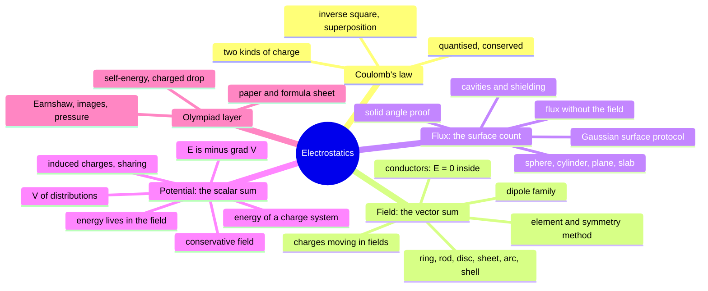
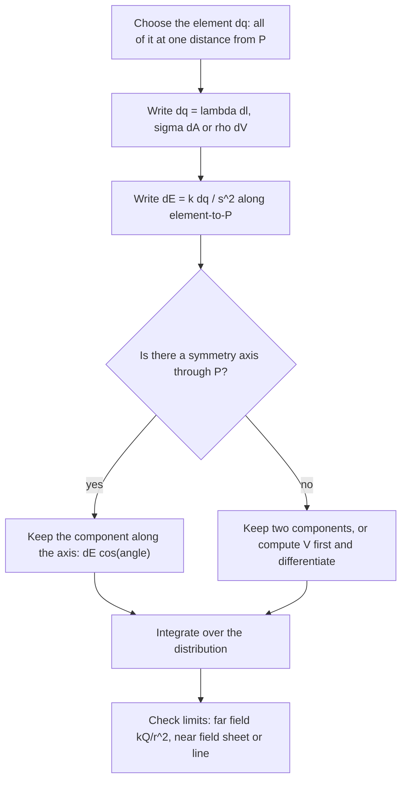
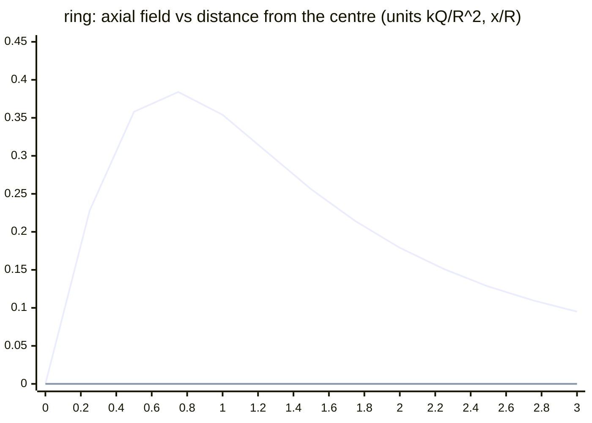
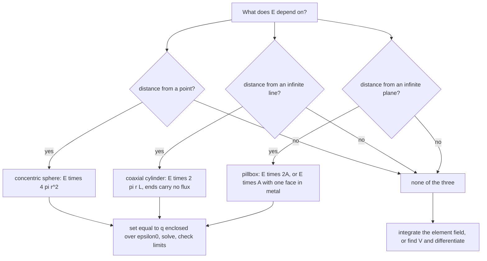
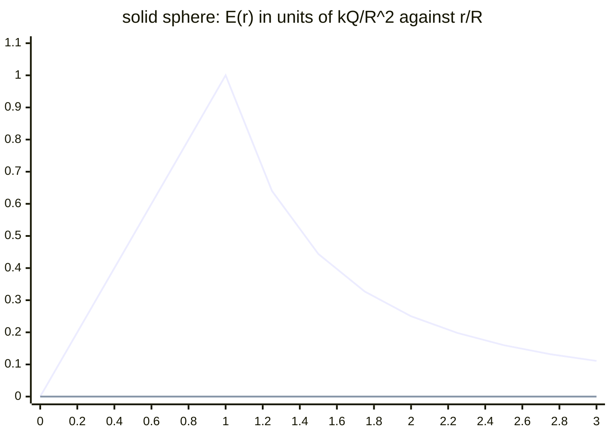
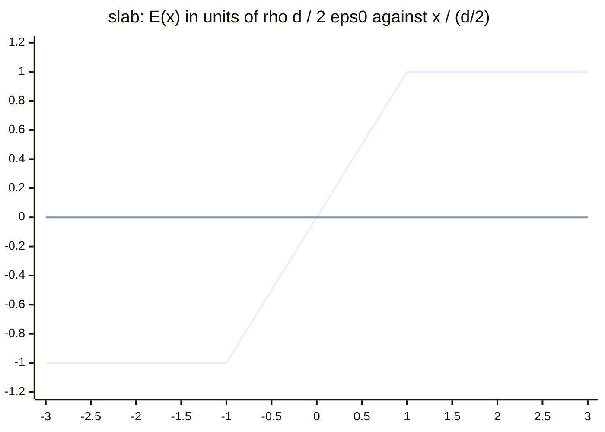
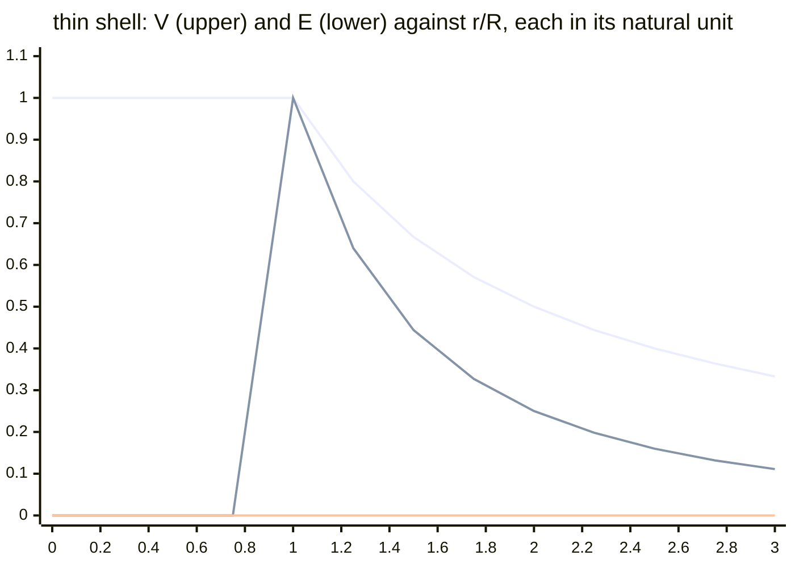

# Electrostatics — first principles to Olympiad

> [!abstract] How to use this chapter
> This is one module in three passes. **Pass 1: Parts 0–3** — the theory of charge, force, field, flux and potential, derived in the order a teacher would teach it: Coulomb's law and superposition first, then the field and the *element-and-symmetry method* for continuous distributions, then flux and Gauss's law as the symmetric shortcut, then the potential as the scalar route, then energy and conductors. **Pass 2: Parts 4–9** — the validity ledger, worked exemplars, the archetype table with practice, the toolkit, the traps, the playbook. **Pass 3: Parts 10–14** — the Olympiad layer (Earnshaw's theorem, image charges, electrostatic pressure, self-energy and the classical electron radius, the charged drop, the field inside a cube), the 200-mark paper, the marking scheme, the formula sheet and the checkpoint. Every number is recomputed; every boxed result carries its condition of validity.

> [!warning] Stage 1 of 3 — what is on the page today
> The module merges plan.md PARTs 13, 14 and 15 (Cengage *Electrostatics and Current Electricity* chapters 1–3) into one chapter, written in three turns. **This stage ships Parts 0–3 in full** — the complete theory from charge to the energy of a charge system. Parts 4–14 carry a one-paragraph statement of what they will contain and are written in stages 2 and 3; the local gate (`tools/check.py`) enforces the reading-mode, media and maths rules now and the question families and the paper when their stage arrives. Nothing in Parts 0–3 will be rewritten later: later stages *add* blocks and upgrade some DIAGRAM briefs to rendered FIGUREs.

## Part 0 · Orientation

### 0.1 What you will be able to do

After this chapter you can: state Coulomb's law in a vector form that never gets the direction wrong, and add forces from several charges as vectors; define the electric field so that the test charge drops out, sketch field lines by their rules and know what the lines cannot tell you; run the *element-and-symmetry method* to derive the field of a ring, a rod, an arc, a disc, a sheet and a shell, and take every limit of every result; explain why a conductor's interior is field-free, why its charge sits on the surface and why the field just outside is $\sigma/\varepsilon_0$ and not $\sigma/2\varepsilon_0$; derive the dipole's fields, torque, potential energy and gradient force; solve the equilibrium of point charges and say why no such equilibrium is stable; treat a charge in a uniform field as a projectile and a charged pendulum as a pendulum with a new $g$; define flux, prove Gauss's law from the solid angle, run the Gaussian-surface protocol for spherical, cylindrical and planar symmetry, and get flux through a face or a disc without ever computing a field; prove that the electrostatic field is conservative, define the potential and its reference, compute $V$ for the standard distributions by scalar superposition, recover $\mathbf E$ by differentiating, read equipotential maps, derive the factor $\tfrac12$ in the energy of a charge system, handle induced charges on shells and the energy lost when two spheres are connected, and locate the field's energy in space. The Olympiad layer (Part 10, stage 3) adds Earnshaw's theorem, the image method, electrostatic pressure, self-energy and the charged-drop limit.

### 0.2 The one idea

Coulomb's law plus superposition *is* electrostatics; everything else is bookkeeping. The **field** is the vector sum arranged so that the test charge drops out; the **flux** is the same sum counted through a surface, which symmetry can collapse to one line; the **potential** is the same sum done with scalars, at the price of a direction you recover by differentiating. Every method in the chapter is a choice of which of the three sums is cheapest.

### 0.3 Prerequisite self-check

Answer these before Part 3; each names the note that repairs it.

1. Resolve a vector along two perpendicular axes and add three vectors given by magnitude and angle. ([[Vectors|PART 2]])
2. Write the unit vector from point $A$ to point $B$ given their position vectors. ([[Vectors#Part 3 · Core derivations|vectors §3]])
3. Integrate $\int\cos\theta\,d\theta$, $\int x\,dx/(x^2+a^2)^{3/2}$ and $\int dx/(x^2+a^2)^{1/2}$; expand $(1+x)^n$ for small $x$. ([[Units-measurements#Part 7 · Alternate methods and the JEE-Advanced advantage toolkit|units §7]] carries the binomial table)
4. Projectile motion: time of flight and deflection under a constant acceleration. ([[Motion-in-two-dimensions|PART 4]])
5. Work done by a force along a path, and why a conservative force has a potential energy. ([[Work-energy-power#Part 3 · Core derivations|WEP §3]])
6. Torque as $\mathbf r\times\mathbf F$ and the small-oscillation recipe $I\ddot\theta=-\kappa\theta$. ([[Rotational-mechanics|PART 8]], [[Simple-harmonic-motion|PART 10]])
7. The gravitational shell theorem and $g$ inside a uniform planet. ([[Gravitation#Part 3 · Core derivations|gravitation §3]])
8. Stokes drag and buoyancy on a small sphere. ([[Fluid-mechanics|PART 11]])

Answers in one line each

1. Components add; magnitude from Pythagoras, direction from the arctangent of the component ratio. 2. $\hat{\mathbf r}_{AB}=(\mathbf r_B-\mathbf r_A)/\lvert\mathbf r_B-\mathbf r_A\rvert$. 3. $\sin\theta$; $-1/\sqrt{x^2+a^2}$; $\ln\bigl(x+\sqrt{x^2+a^2}\bigr)$; $1+nx+\tfrac12n(n-1)x^2$. 4. $t=L/v_0$ along the field-free direction, deflection $\tfrac12at^2$ across it. 5. $W=\int\mathbf F\cdot d\mathbf r$; if $W$ is path-independent, $U(\mathbf r)=-W_{\text{ref}\to\mathbf r}$ exists. 6. $\tau=rF\sin\theta$; $\omega=\sqrt{\kappa/I}$. 7. Outside a shell, as if all mass were at the centre; inside, zero; $g\propto r$ inside a uniform sphere. 8. $F=6\pi\eta rv$; buoyancy $=\rho_{\text{fluid}}Vg$.

### 0.4 Numbers to keep

| quantity | value | where it bites |
|---|---|---|
| $e$ | $1.602\times10^{-19}$ C | quantisation; $1$ C $=6.24\times10^{18}$ electrons |
| $k=1/4\pi\varepsilon_0$ | $8.988\times10^{9}$ N m$^2$ C$^{-2}$ ($\approx9\times10^9$) | every force and field |
| $\varepsilon_0$ | $8.854\times10^{-12}$ C$^2$ N$^{-1}$ m$^{-2}$ | Gauss's law, sheets, energy density |
| $ke^2$ | $2.307\times10^{-28}$ J m $=1.44$ eV nm $=1.44$ MeV fm | atoms and nuclei in one line |
| $m_e$, $e/m_e$ | $9.109\times10^{-31}$ kg, $1.759\times10^{11}$ C kg$^{-1}$ | electron deflection |
| $m_p$ | $1.673\times10^{-27}$ kg | Coulomb versus gravity ratio $2.3\times10^{39}$ |
| breakdown field of dry air | $\approx3\times10^{6}$ V m$^{-1}$ | maximum charge on a sphere, sparks, lightning |
| field at the Bohr radius | $5.1\times10^{11}$ V m$^{-1}$ | why matter is stiff and lightning is weak |
| $1$ eV | $1.602\times10^{-19}$ J | accelerated particles, ionisation |
| $a_0$ | $0.0529$ nm | $ke^2/a_0=27.2$ eV, ionisation energy $13.6$ eV |
| fair-weather field at the ground | $\approx100$ V m$^{-1}$ downward | the Earth carries $\approx-4.5\times10^{5}$ C |

### 0.5 What this chapter is not

Not capacitance: the systematic treatment of $C$, dielectrics, energy of a capacitor and the force on a slab is the shipped [[Capacitors|capacitors]] note, and this chapter stops at the field that makes a capacitor work and the energy density $\tfrac12\varepsilon_0E^2$ it needs. Not circuits: the moment charges *move steadily*, [[Current-electricity|current electricity]] takes over. Not magnetism: a moving charge feels a second force, and that is the next module. Not the general boundary-value problem: Laplace's equation is named, and the image method for a plane is derived in Part 10, but separation of variables and multipole expansions beyond the dipole are outside the syllabus and outside this chapter. Not relativity: the field of a moving charge is not Coulomb's, and §3.13 says where that matters.

### 0.6 Cengage coverage map

Floor: *Cengage Electrostatics and Current Electricity*, chapters 1–3 (contents pages v–vi read from the PDF in this repository; section names as printed). Status vocabulary: **derived**, **stated + used**, **extended beyond book**, and — for the exercise structure, which is exam craft — **stage 2 (Part 6)**.

**Chapter 1 · Coulomb's Laws and Electric Field (pp. 1.2–1.41)**

| Cengage section | What it establishes | Where it lives here | Status |
|---|---|---|---|
| Electric Charge; Charging of a Body; Work Function of a Body | two kinds of charge; a body charges by gaining or losing electrons; the energy to remove one | §3.1 | derived (electron bookkeeping made explicit) |
| Charging by Friction, Conduction, Induction | the three mechanisms | §3.1 | derived; D13.1 |
| Properties: Quantization, Conservation, Additivity, Charge is Invariant | $q=ne$; $\sum q$ fixed; scalar addition; frame-independence | §3.1, §2.3 | stated + used; invariance extended (contrast with mass) |
| Coulomb's Law; Coulomb's Law in Vector Form | $F=kq_1q_2/r^2$ with direction from $\hat{\mathbf r}_{12}$ | §3.2 | derived (vector form built so the sign carries the direction) |
| Superposition Principle | forces add as vectors | §3.2 | stated + used everywhere |
| Electric Field; How to Measure; Electric Field Intensity $E$ | $\mathbf E=\mathbf F/q_0$, small test charge | §3.3 | derived |
| Lines of Force; Properties; Different Patterns | the five rules; point, dipole, like pair, sheet | §3.3 | derived; D13.4 |
| Field of Ring Charge | axial field, maximum at $R/\sqrt2$ | §3.4 | derived; F13.3 |
| Electric Field due to an Infinite Line Charge | $\lambda/2\pi\varepsilon_0 d$ | §3.5 (finite rod first, infinite as the limit), §3.19 (Gauss) | derived twice |
| Field of Uniformly Charged Disk | axial field via rings; sheet as the limit | §3.6 | derived |
| Field of Two Oppositely Charged Sheets | $\sigma/\varepsilon_0$ between, zero outside | §3.6, §3.20 | derived |
| Electric Dipole; Field Due to a Dipole (axial, equatorial) | $2kp/r^3$, $kp/r^3$ | §3.9 | derived with the error of the approximation |
| Field of a Short Dipole at a General Point | $\frac{kp}{r^3}\sqrt{1+3\cos^2\theta}$ | §3.9, re-derived from $V$ in §3.31 | derived twice |
| Net Force on a Dipole in a Non-Uniform Field | $F=p\,dE/dx$ | §3.10 | derived |
| Dipole in a Uniform Electric Field | torque, $U=-\mathbf p\cdot\mathbf E$, oscillation | §3.10 | derived |
| Solved Examples; Exercises (subjective to integer type) | the archetypes | Parts 5–6 | stage 2 (Part 6) |

**Chapter 2 · Electric Flux and Gauss's Law (pp. 2.1–2.25)**

| Cengage section | What it establishes | Where it lives here | Status |
|---|---|---|---|
| Electric Flux | $\Phi=\int\mathbf E\cdot d\mathbf A$, outward normal | §3.14 | derived |
| Gauss's Law; Problem-Solving Strategy | $\oint\mathbf E\cdot d\mathbf A=q_{\text{in}}/\varepsilon_0$; the protocol | §3.15–3.17 | derived from the solid angle (extended beyond book) |
| Field of a Charged Conducting Sphere (surface selection, outside, inside) | $kQ/r^2$ outside, $0$ inside | §3.18 | derived; also by integration in §3.7 |
| Field of a Line Charge | $\lambda/2\pi\varepsilon_0 r$ | §3.19 | derived |
| Field of an Infinite Plane Sheet of Charge | $\sigma/2\varepsilon_0$ | §3.20 (and §3.6 by integration) | derived twice |
| Field at the Surface of a Conductor | $\sigma/\varepsilon_0$ | §3.8, §3.20 | derived with the factor-of-2 resolution |
| Field of a Uniformly Charged Sphere (inside, outside) | $kQr/R^3$, $kQ/r^2$ | §3.18 | derived; F13.5 |
| Field Due to a Long Uniformly Charged Cylinder | $\rho r/2\varepsilon_0$ inside | §3.19 | derived |
| Field Near a Uniformly Volume-Charged Plane; Field Inside the Plane | the slab's linear profile | §3.20 | derived; F13.6 |
| Appendix: Solid Angle | $\Omega=A\cos\alpha/r^2$, $4\pi$ total | §3.15, §3.22 | derived and used for the flux family |
| Solved Examples; Exercises | the archetypes | Parts 5–6 | stage 2 (Part 6) |

**Chapter 3 · Electric Potential (pp. 3.1–3.30)**

| Cengage section | What it establishes | Where it lives here | Status |
|---|---|---|---|
| Electric Potential and Energy; Potential Energy of Two Point Charges | $U=kq_1q_2/r$ | §3.26, §3.32 | derived, after the conservative-field proof of §3.25 (extended beyond book) |
| Electron-Volt | the unit | §3.26, §3.35 | stated + used |
| Electric Potential | $V=U/q$, reference at infinity | §3.26 | derived |
| Equipotential Surface | $\perp$ field lines; no work along them | §3.28 | derived |
| Relation Between Electric Field and Potential; Finding $\mathbf E$ from $V$ | $\Delta V=-\int\mathbf E\cdot d\mathbf r$, $\mathbf E=-\nabla V$ | §3.28, §3.29 | derived |
| Potential of Continuous Distributions: Conducting Sphere, Non-Conducting Solid Sphere, Uniform Line, Ring, Disk | the five standard $V$'s | §3.27 | derived; F13.7 |
| Potential Due to an Electric Dipole | $kp\cos\theta/r^2$ | §3.31 | derived, and differentiated back to the field |
| Work Done in Rotating a Dipole; Potential Energy of a Dipole | $W=pE(\cos\theta_1-\cos\theta_2)$, $U=-\mathbf p\cdot\mathbf E$ | §3.10, §3.31 | derived twice |
| Solved Examples; Exercises | the archetypes | Parts 5–6 | stage 2 (Part 6) |

Beyond the book, at the theory level: the finite rod by angle parametrisation (§3.5), the shell by direct integration (§3.7), the conductor's factor-of-2 resolution (§3.8), equilibrium counting and the stability question (§3.11), the charge-in-a-field family with Millikan's balance (§3.13), the solid-angle proof (§3.15), the $\rho\propto r^n$ table (§3.18), conductors with cavities (§3.21), flux without the field (§3.22), Gauss for gravity (§3.24), the differentiate-instead-of-integrate method (§3.29), the zeros of $V$ and $\mathbf E$ (§3.30), the assembly derivation of the half factor (§3.32), the connected-spheres energy audit (§3.34) and the field-energy integral (§3.36).

### 0.7 Where the three plan parts went

| plan.md part | its sections | lives in |
|---|---|---|
| PART 13 · Charge, Coulomb's law & electric field | charge, Coulomb, field, element-and-symmetry, line/disc/sheet, arc/ring/sphere, conductors, dipole, dipole in a field, equilibrium, distributions, motion of charges | §3.1–3.13 |
| PART 14 · Electric flux & Gauss's law | flux, the solid-angle proof, the law, the protocol, spherical/cylindrical/planar symmetry, conductors and cavities, flux without the field, Gauss in matter, Gauss and gravity | §3.14–3.24 |
| PART 15 · Electric potential, energy & conductors | conservative field, definition, distributions, $\mathbf E=-\nabla V$, differentiate instead of integrate, zeros, energy of a system, conductors, induced charges and sharing, the real world, field energy, nuclear and atomic | §3.25–3.37 |

The numbering of figures and briefs (F13.n, D13.n) follows the first of the three parts.

## Part 1 · Intuition first

**Charge is a count.** Rub a plastic rod with wool and a few billion electrons — out of the $10^{23}$ or so in each — move from the wool to the rod. Nothing is created: the wool is now short by exactly the number the rod gained. That is the first law of the subject, and it is the reason "charge" behaves like an amount of stuff that can be moved around but never made. The count comes in whole numbers of one unit, the electron's; the unit is so small that a coulomb is six billion billion of them, so for anything you can hold the count looks continuous.

**Like repels, unlike attracts — and the force is enormous.** Matter is neutral to about one part in $10^{20}$ because the attraction between opposite charges is so strong that any imbalance pulls itself back together. If you could remove one electron in a million from two people standing at arm's length, the repulsion between them would lift a mountain range. A rubbed comb lifts paper scraps against the whole Earth's gravity with a charge imbalance too small to measure chemically. Every electrostatic phenomenon you see is a tiny residue of a huge cancelled force.

**The field: a property of space.** A charge does not need to know where the other charges are; it responds to the condition of the space at its own location. That condition is the field — think of the slope of a landscape at the point where a ball happens to be. Field lines are the map of that slope: they start on positive charges, end on negative ones, never cross, and crowd where the field is strong. A comb near a neutral scrap of paper pulls the scrap's charges apart slightly; the near side, oppositely charged, sits in a stronger field than the far side, and the scrap is pulled up. Attraction of neutral matter is always a *gradient* effect.

**Flux: counting lines through a net.** Hold a fishing net in a stream; the number of lines of flow through it depends on the net's area, its tilt and the flow's strength. Field lines are counted the same way. The counting has one magical property: however you wrap a closed net around a charge, the same number of lines come out, because the lines spread as $1/r^2$ and the net's area grows as $r^2$. Wrap a net around empty space and as many lines go in as come out. That is Gauss's law, and in symmetric situations it gives the field in one line where integration takes a page.

**Potential: height on a landscape.** Pushing a charge against the field stores energy, as lifting a mass stores it. Because the electric force is a sum of central forces, the work does not depend on the path, so each point of space has a *height* — the potential — and the field is the downhill slope. Contour maps (equipotentials) are easier to draw than arrow maps, and the arrows are always perpendicular to the contours, pointing downhill. The potential is a scalar: adding the contributions of many charges is arithmetic, not vector addition.

**Conductors are level lakes.** In a metal, charge flows until nothing pushes it any more: the interior field is zero, the surface is one contour line, and all the excess charge sits on the outer skin, crowding on sharp points. A car in a lightning storm is a metal shell: its inside stays field-free no matter how much charge lands on it. Sparks happen when the field exceeds the strength of air, about three million volts per metre; that single number decides how much charge a sphere can hold, why lightning rods are pointed, and why a doorknob bites in winter.

**What is conserved and what changes with what.** Charge is conserved always. Energy is conserved once the potential energy of the configuration is included. Force falls as $1/r^2$ with distance, the field of a dipole as $1/r^3$, the force between two dipoles as $1/r^4$ — the faster fall-offs are why neutral matter interacts weakly and only at short range. The one formula of this Part: $F=kq_1q_2/r^2$; everything that follows is a way of adding it up.

> [!tip] FIGURE F13.1 · Module map
> *Why:* the module is one argument — Coulomb's law summed three ways — and the map shows which block sums it how.
> *Data:* the structure of Parts 0–14: the force law, the three bookkeepings (field, flux, potential), what each is best at, and where the Olympiad layer attaches.

> *Read:* three branches, one root. A problem is solved by picking the branch whose sum is cheapest: vectors for a few charges, flux for symmetry, scalars for energies and for anything that needs $V$ first.

## Part 2 · Definitions and bookkeeping

### 2.1 Symbols and units

| symbol | meaning | unit | convention fixed here |
|---|---|---|---|
| $q$, $Q$ | charge; $e=1.602\times10^{-19}$ C is the elementary charge, $q=ne$ | C | the electron's charge is $-e$; a "test charge" $q_0$ is positive and small |
| $\lambda$, $\sigma$, $\rho$ | charge per length, per area, per volume | C m$^{-1}$, C m$^{-2}$, C m$^{-3}$ | $dq=\lambda\,dl=\sigma\,dA=\rho\,dV$ |
| $k$, $\varepsilon_0$ | Coulomb's constant, permittivity of free space | N m$^2$ C$^{-2}$, C$^2$ N$^{-1}$ m$^{-2}$ | $k=1/4\pi\varepsilon_0$; both forms are used, $k$ for point sums, $\varepsilon_0$ for Gauss |
| $\hat{\mathbf r}_{12}$ | unit vector **from 1 to 2** | — | $\mathbf F_{12}$ is the force **on 2 due to 1** (the second index is the sufferer) |
| $\mathbf E$ | electric field | N C$^{-1}$ $=$ V m$^{-1}$ | force per unit *positive* charge; the field of the sources only, never including the test charge's own |
| $\Phi_E$ | electric flux | N m$^2$ C$^{-1}$ $=$ V m | outward normal on a closed surface; on an open surface the normal is chosen and stated |
| $V$ | potential | V $=$ J C$^{-1}$ | $V(\infty)=0$ for finite distributions; "ground" $=0$ in circuits; only differences are physical |
| $U$ | potential energy of a configuration | J | $U(\infty)=0$ with all charges infinitely separated |
| $W_{\text{ext}}$, $W_{\text{field}}$ | work by the external agent, by the field | J | $W_{\text{ext}}=\Delta U=-W_{\text{field}}$ when kinetic energy does not change |
| $\mathbf p$ | dipole moment $q\mathbf d$ | C m | $\mathbf d$ points **from $-q$ to $+q$** |
| $\boldsymbol\tau$, $\Omega$ | torque; solid angle | N m; sr | $\Omega=4\pi$ for a closed surface seen from inside |

### 2.2 Sign conventions, fixed once

1. **Coulomb's law carries its own direction.** $\mathbf F_{12}=\dfrac{kq_1q_2}{r^2}\hat{\mathbf r}_{12}$ with the *signed* charges. For like charges the product is positive and the force on 2 points away from 1; for unlike charges the product is negative and the force reverses by itself. Never write $\lvert q_1q_2\rvert$ and then add the direction "by hand" — that is the single most common way to lose a mark in a three-charge problem (§3.2).
2. **Field lines and $\mathbf E$ point the way a positive charge would be pushed.** A negative charge feels $-\lvert q\rvert\mathbf E$, opposite to the field.
3. **Outward normal on closed surfaces.** Flux leaving the volume is positive. For an open surface (a disc, a hemisphere) say which side is "positive" and keep it.
4. **$\Delta V=V_b-V_a=-\displaystyle\int_a^b\mathbf E\cdot d\mathbf r$.** The potential *drops* along the field. The minus sign is not optional and not conventional: it is the statement that the field does positive work on a positive charge moving downhill.
5. **Potential energy of a charge in an external field: $U=qV$, no half.** Energy of a *system* of charges: $U=\tfrac12\sum_i q_iV_i$, with the half. §3.32 derives where the half comes from; using the wrong one is a listed trap.
6. **Dipole orientation energy $U=-\mathbf p\cdot\mathbf E$ is zero at $\theta=90^\circ$**, minimum ($-pE$) when aligned, maximum ($+pE$) when anti-aligned. A book that sets the zero at $\theta=0$ changes every $U$ by $pE$ and no physics.

### 2.3 The model's assumptions (and what is not in it)

**Static.** Every source charge is at rest in the chosen frame and has been for long enough that any conductor has relaxed (for copper that takes $\sim10^{-19}$ s, so "instantly" is honest). A test charge may move, but it must not disturb the sources — that is what "small" means in $\mathbf E=\mathbf F/q_0$.

**Vacuum.** $\varepsilon_0$ throughout. Air changes the numbers by $0.06\%$; a dielectric changes them by its constant $\kappa$, which the [[Capacitors|capacitors]] note owns. Water ($\kappa\approx80$) is why dissolved ions barely feel each other, and it is not this chapter's problem.

**Point charges and smooth distributions.** A "point charge" is any body small compared with the distances in the problem; a "continuous distribution" is one whose graininess ($10^{18}$ electrons per coulomb) is invisible at the scale you look. Both are idealisations that fail at the same place: *on* a point charge the field is infinite and *at* the edge of a charged disc the field diverges logarithmically — signs that the model is being asked about a scale it does not describe.

**Conductors are perfect.** Charge is perfectly free inside and cannot leave the surface. Insulators hold their charge exactly where it was put. Real materials are in between: a good insulator's charge leaks away with a time constant $\varepsilon_0\rho_{\text{res}}$, hours for glass, milliseconds for damp wood.

**Charge is invariant** (the same in every inertial frame — a fact from experiment, and the reason a current-carrying wire is neutral to a stationary observer), **conserved** (a closed region's charge changes only by charge crossing its boundary) and **additive** (a scalar). Mass is none of the first: relativistic mass depends on the frame, which is why "charge is like mass" is a bad analogy beyond the inverse-square law.

**Not in the model:** magnetic forces (they need moving charges: PART 16); radiation (accelerating charges: [[Electromagnetic-waves|EM waves]]); the finite speed at which a change in the sources is felt ($c$; PART 20 and the EM-waves note); quantum effects (the electron is not a small charged ball; §3.36 and Part 10 show where the classical picture breaks); and the distinction between free and bound charge in matter (§3.23 names it, capacitors resolves it).

### 2.4 The bookkeeping of a continuous distribution

Every field or potential of a distribution is one integral, written the same way each time:

$$
\mathbf E(\mathbf r)=\int\frac{k\,dq}{s^2}\hat{\mathbf s},\qquad V(\mathbf r)=\int\frac{k\,dq}{s},\qquad dq=\lambda\,dl,\ \sigma\,dA,\ \rho\,dV, \qquad (2.1)
$$

where $s$ is the distance from the element $dq$ to the field point and $\hat{\mathbf s}$ points from the element to the field point. The vector integral is done component by component after symmetry has removed the components that cancel (the *element-and-symmetry method* of §3.4); the scalar integral has no components to remove, which is the whole case for the potential (§3.29). When the total charge $Q$ is given, $\lambda=Q/L$, $\sigma=Q/A$, $\rho=Q/V$ for uniform distributions, and $dq=\lambda(x)\,dx$ or $\rho(r)\,4\pi r^2dr$ for non-uniform ones.

> [!note] Definition — which idealisation, when
> A rod is "infinite" when the field point is much closer to it than to either end ($d\ll$ distance to the ends: the error of the infinite-line formula at the midpoint of a rod of length $L$ is under $1\%$ once $L>14d$); a sheet is "infinite" when $d\ll$ its width; a sphere is "a point" when $r\gg R$ (§3.7 shows that for a shell the far field is *exactly* the point-charge field, not approximately). A dipole is "short" when $r\gg d$; §3.9 gives the size of the error.

## Part 3 · Core derivations

The order is the teaching order: the force law and its vector form (§3.1–3.2), the field and the method that computes it for any distribution (§3.3–3.7), conductors and dipoles in the field picture (§3.8–3.11), charges moving in fields (§3.12–3.13), then flux and Gauss's law as the symmetric shortcut (§3.14–3.24), then the potential, energy and conductors again from the scalar side (§3.25–3.37). Each result is derived once here and *re-derived by the next tool* where the plan asks for it — the sheet by integration and by Gauss, the shell by integration and by Gauss, the dipole field from the vector sum and from the potential — because seeing that two routes agree is what turns a formula into a fact.

### 3.1 Charge: two kinds, a count, a conservation law

Rubbing, touching and approaching are the three ways a body's charge changes, and in all three the *only* thing that moves is electrons — nuclei stay where the chemistry put them. A body is positive when it has lost electrons and negative when it has gained them; the "work function" of a material is the energy needed to pull one electron out of it, and in friction charging the electrons end up on the material whose work function is higher (the one that holds them more tightly). Charge is **quantised**: $q=ne$, $n$ an integer, $e=1.602\times10^{-19}$ C. Nobody has ever isolated a fraction of $e$ — the quarks inside a proton carry $\pm\tfrac13 e$ and $\pm\tfrac23e$ but never appear alone — so on a macroscopic body $q$ is a whole number of electrons, and the milli-, micro- and nanocoulombs of exam problems are numbers like $6\times10^{12}$ electrons. Charge is **conserved**: the total charge of an isolated system never changes, not in chemistry, not in nuclear decay, not in pair creation (a photon makes an electron *and* a positron). It is **additive** (a scalar sum) and **invariant** (the same in every frame, unlike mass or length).

**Conductors and insulators.** In a metal about one electron per atom is free to move anywhere in the body; in an insulator every electron is bound to its atom or molecule and can only shift by a fraction of an atomic spacing. That single difference produces every conductor property of §3.8 and §3.33.

**The three mechanisms, with the electrons drawn.** *Friction:* electrons cross from one body to the other; the two bodies end with equal and opposite charges. *Conduction:* a charged conductor touching a neutral one shares its excess so that (§3.34) both end at the same potential; the *sign* of both is the sign of the original charge. *Induction:* a charged rod brought near — not touching — a neutral conductor pushes the conductor's free electrons to the far side (negative rod) or pulls them to the near side (positive rod); the conductor is still neutral but polarised. Earth it while the rod is present and the far-side charge leaves (or arrives) through the wire; remove the wire *before* removing the rod, and the conductor is left with a charge of the **opposite** sign to the rod, and the rod has lost nothing. Induction is the only mechanism that charges a body without any charge leaving the inducer, which is why an electroscope's leaves diverge as a charged rod approaches and collapse as it leaves.

> [!abstract] DIAGRAM D13.1 · The three charging mechanisms with the electrons drawn
> *Show:* three rows. Friction: a rod and a cloth before and after, with a handful of $e^-$ arrows crossing from cloth to rod and the final $+$/$-$ labels. Conduction: a charged sphere touching a neutral one, electrons flowing through the contact, both spheres ending with the same sign. Induction: a negative rod near a neutral sphere with $+$ on the near face and $-$ on the far face, then an earth wire draining the far-side electrons, then the wire removed, then the rod removed and the $+$ charge spreading over the sphere.
> *Search:* "charging by friction conduction induction electron transfer diagram grounded sphere"

> [!danger] Trap — induction gives the opposite sign, and the rod keeps its charge
> "The rod charged the sphere, so the sphere has the rod's sign." No: nothing left the rod. The earth supplied (or took) the electrons, and the sphere ends with the sign *opposite* to the rod. The paper archetype: "a negatively charged rod is brought near an earthed sphere; the earth connection is removed, then the rod. The sphere is now" — positively charged.

The electroscope quantifies none of this well and demonstrates all of it: leaves diverge by repulsion of like charge, more charge means more divergence, and a body of unknown sign is tested by whether it *increases* the divergence of a scope already charged with a known sign (same sign) or decreases it (opposite sign or a neutral conductor by induction — which is why a decrease alone proves nothing).

### 3.2 Coulomb's law, in the form that cannot get the direction wrong

Two point charges at rest, separated by $r$, exert equal and opposite forces along the line joining them, of magnitude proportional to each charge and inversely proportional to $r^2$:

$$
\mathbf F_{12}=\frac{k\,q_1q_2}{r^2}\,\hat{\mathbf r}_{12}=\frac{k\,q_1q_2}{r^3}\,\mathbf r_{12},\qquad \mathbf r_{12}=\mathbf r_2-\mathbf r_1,\qquad k=\frac{1}{4\pi\varepsilon_0}=8.988\times10^{9}\ \text{N m}^2\text{C}^{-2}. \qquad (3.1)
$$

$\mathbf F_{12}$ is the force **on charge 2 due to charge 1**, and $\hat{\mathbf r}_{12}$ points from 1 towards 2. Read the sign: like charges, $q_1q_2>0$, the force on 2 points *away* from 1 (repulsion); unlike, $q_1q_2<0$, the force points *towards* 1 (attraction). Swap the labels and $\hat{\mathbf r}_{21}=-\hat{\mathbf r}_{12}$ gives $\mathbf F_{21}=-\mathbf F_{12}$: Newton's third law is built in, and the two forces act along the same line, so the pair exerts no net torque on itself.

> [!info] Why write it with the signed charges and a unit vector
> Because then the algebra carries the direction and you never decide it by eye. In a three-charge problem with mixed signs, the "decide by eye" method fails about one time in three; the vector form fails never. When the geometry is simple (charges on a line or at the corners of a figure) it is still fine to compute a magnitude and *then* attach a direction — but attach it by the rule "repel along the line for like, attract for unlike", one pair at a time.

**Superposition.** The force on a charge due to several others is the vector sum of the pairwise Coulomb forces, each computed as if the others were absent. This is an experimental fact, not a theorem, and it is what makes the rest of the chapter possible: a continuous distribution is a sum of point charges, so one integral covers every shape.

> [!abstract] DIAGRAM D13.2 · Coulomb's law on a pair, with the unit vector labelled
> *Show:* charges $q_1$ at $\mathbf r_1$ and $q_2$ at $\mathbf r_2$ with the vector $\mathbf r_{12}=\mathbf r_2-\mathbf r_1$ drawn from 1 to 2 and $\hat{\mathbf r}_{12}$ marked; two panels: like charges with $\mathbf F_{12}$ on 2 pointing away from 1 and $\mathbf F_{21}$ on 1 pointing away from 2; unlike charges with both forces reversed; both pairs equal in length.
> *Search:* "coulomb's law vector form unit vector r12 force on q2 due to q1 diagram"

> [!example] Worked example — the corner of a triangle
> Three charges of $+2\ \mu$C sit at the corners of an equilateral triangle of side $10$ cm. The force on any one of them: each of the other two pushes it with $F=kq^2/a^2=(8.988\times10^9)(2\times10^{-6})^2/(0.1)^2=3.60$ N, along the two edges, $60^\circ$ apart. The resultant of two equal vectors at $60^\circ$ is $2F\cos30^\circ=F\sqrt3=6.23$ N, directed away from the triangle's centre along the bisector. Replace the top charge by $-2\ \mu$C and the force on a base charge becomes $3.60$ N repulsion from its neighbour along the base plus $3.60$ N *attraction* towards the apex: the two are now $120^\circ$ apart, the resultant is $F$ itself, $3.60$ N, at $60^\circ$ below the base, pointing away from the triangle. The magnitude halved, and the direction swung by $90^\circ$ — that is what a sign does.

**How well is it known?** Coulomb's torsion balance (1785) checked the inverse square to a few percent by twisting a fibre against the repulsion of two pith balls. The modern test is indirect and far sharper: if the exponent were $2+\epsilon$, a charged closed conductor would have a small field inside (§3.7 and §3.21 show that the *exact* cancellation inside a shell depends on $1/r^2$ exactly). Cavendish did this in 1773, Maxwell repeated it, and the current bound is $\lvert\epsilon\rvert<10^{-16}$. The law also holds from $10^{-18}$ m (particle scattering) to at least planetary scales; the corresponding statement that the photon is massless is tested the same way.

> [!abstract] DIAGRAM D13.3 · The torsion balance
> *Show:* a horizontal insulating rod hung from a thin fibre, a charged pith ball at one end and a counterweight at the other; a second fixed charged ball brought near; the rod's deflection angle $\theta$ marked, with the torsion torque $\kappa\theta$ balancing $F\times(\text{arm})$; an inset noting that doubling the separation quarters the angle.
> *Search:* "coulomb torsion balance experiment diagram pith balls fibre deflection"

> [!abstract] Numbers to keep — how strong is it
> Two protons $1$ fm apart repel with $ke^2/r^2=2.31\times10^{-28}/10^{-30}=230$ N — the weight of a large dog, on two particles of mass $10^{-27}$ kg. For the electron and proton in hydrogen, electric attraction divided by gravitational attraction is $ke^2/Gm_em_p=2.3\times10^{39}$: gravity is irrelevant to chemistry. Two charges of $1$ C, $1$ m apart, repel with $9\times10^9$ N; the coulomb is a huge unit, and the charges in a static-electricity problem are nano- to microcoulombs.

### 3.3 The electric field and its lines

Fix the sources. Place a small positive test charge $q_0$ at $\mathbf r$, measure the force $\mathbf F$ on it, and define

$$
\mathbf E(\mathbf r)=\lim_{q_0\to0}\frac{\mathbf F}{q_0}. \qquad (3.2)
$$

The limit is not a mathematical nicety: a finite $q_0$ would attract or repel the source charges — and *move* them if they sit on a conductor — so you would measure the field of a rearranged distribution. "Small" means small enough not to disturb the sources. Once $\mathbf E$ is known, the force on *any* charge $q$ at that point is $\mathbf F=q\mathbf E$, with $q$ signed: a negative charge is pushed against the field.

From (3.1), the field of a point charge $Q$ at the origin is

$$
\mathbf E=\frac{kQ}{r^2}\,\hat{\mathbf r}, \qquad (3.3)
$$

radially outward for $Q>0$, inward for $Q<0$, and by superposition the field of any set of charges is the vector sum of terms (3.3), each with its own $\hat{\mathbf r}$ from its own charge to the field point. The field is a property of the point in space: it exists whether or not a test charge is there, and it is the sources' field only — a charge does not feel its own field (Part 10 returns to the self-force).

**Field lines.** A field line is a curve whose tangent at every point is $\mathbf E$ there. The rules, each with its reason:

1. Lines start on positive charges and end on negative ones (or at infinity); the number leaving a charge is proportional to the charge. *Reason:* Gauss's law, §3.16 — lines can neither begin nor end in empty space.
2. Lines never cross. *Reason:* $\mathbf E$ has one direction at each point.
3. Lines are denser where the field is stronger. *Reason:* the same number of lines pass through every cross-section of a tube of lines, so the density scales as $1/A$, which for a point charge is $1/r^2$ — exactly the field.
4. Lines meet a conductor's surface perpendicularly and do not enter it. *Reason:* §3.8.
5. Lines never form closed loops. *Reason:* §3.25 — the field is conservative, and a closed line would do net work around a loop.

What field lines *cannot* do: give you a number. Density is proportional to $\lvert\mathbf E\rvert$ only in the sense that the proportionality constant is the same everywhere in one drawing; nobody draws lines to scale in three dimensions, and a flat sketch of a three-dimensional field mis-represents density systematically. Nor is a field line a trajectory: a charge released from rest starts along the line, but as soon as it has velocity it leaves any curved line (a trajectory follows $\mathbf a\parallel\mathbf E$, not $\mathbf v\parallel\mathbf E$). The only field lines that are trajectories are straight ones.

> [!abstract] DIAGRAM D13.4 · Field-line patterns side by side
> *Show:* four panels with the same line density convention: (a) a single positive charge, radial lines outward; (b) a dipole $+q$, $-q$, lines leaving $+$ and curving into $-$, densest between them; (c) two equal positive charges, lines repelling each other with a neutral point midway where no line passes; (d) a large uniformly charged sheet, parallel lines perpendicular to it on both sides. Mark the neutral point in (c) with a cross.
> *Search:* "electric field lines point charge dipole two like charges parallel plate patterns"

> [!danger] Trap — field lines are not trajectories
> "The electron follows the field line from the negative plate to the positive plate along a curve." Only if it is released from rest *and* the line is straight. In the dipole's curved field a charge released from rest moves off the line within a fraction of the curvature radius, because velocity is a memory and the field line has none. The exam version: "a charged particle is projected perpendicular to a uniform field; sketch its path" — a parabola, which crosses every field line.

### 3.4 The element-and-symmetry method, on a ring

Every field of a continuous distribution is computed by one procedure. Name it, and reuse it (the plan asks that it be used at least five times; this chapter uses it seven).

1. **Choose the element** $dq$ so that all of it is at one distance from the field point.
2. **Write $dq$** in terms of the density and a coordinate: $\lambda\,dl$, $\sigma\,dA$, $\rho\,dV$.
3. **Write $d\mathbf E$** as the point-charge field of $dq$, magnitude $k\,dq/s^2$, direction from the element to the field point.
4. **Kill components by symmetry:** find the partner element whose transverse component cancels this one's, and keep only the surviving component, $dE\cos(\text{angle to the surviving axis})$.
5. **Integrate** the surviving component over the distribution, then **check the limits** (far field must be $kQ/r^2$; near field must match the sheet or the line).

> [!tip] FIGURE F13.2 · The element-and-symmetry method
> *Why:* seven derivations in this chapter are the same five moves; seeing them as one flow is what makes the rod, the disc and the arc feel like one problem.
> *Data:* the five steps of §3.4 and the two exits — a symmetry axis exists (integrate one component) or it does not (integrate two components, or switch to the potential of §3.29).

> *Read:* the symmetry step is where the work is saved; if you cannot name the partner element that cancels the transverse component, do not drop it.

**The ring.** Total charge $Q$ spread uniformly on a ring of radius $R$; field point $P$ on the axis at distance $x$ from the centre. Element: an arc $dl$ carrying $dq=\lambda\,dl=(Q/2\pi R)\,dl$, at distance $s=\sqrt{x^2+R^2}$ from $P$ — the same for every element, which is why the ring is the template. Its field at $P$ has magnitude $dE=k\,dq/(x^2+R^2)$ and points from the element to $P$; the diametrically opposite element gives a field of the same magnitude whose component perpendicular to the axis is equal and opposite. Only the axial component survives: $dE_x=dE\cos\alpha$ with $\cos\alpha=x/\sqrt{x^2+R^2}$. Every element contributes the same $dE_x$, so the integral is a multiplication:

$$
E_x=\int\frac{k\,dq}{x^2+R^2}\cdot\frac{x}{\sqrt{x^2+R^2}}=\frac{kQx}{(x^2+R^2)^{3/2}}. \qquad (3.4)
$$

> [!success] Check
> $x\gg R$: $E\to kQ/x^2$, the point charge ✓. $x=0$: $E=0$ — at the centre every element is cancelled by its opposite ✓. Direction: away from the ring for $Q>0$ on both sides, so $E_x$ is odd in $x$ ✓ (the formula has this built in through the factor $x$).

**Where the axial field is largest.** $dE_x/dx=0$: $(x^2+R^2)^{3/2}-x\cdot\tfrac32(x^2+R^2)^{1/2}\cdot2x=0$, i.e. $x^2+R^2=3x^2$, so

$$
x_{\max}=\frac{R}{\sqrt2},\qquad E_{\max}=\frac{kQ}{R^2}\cdot\frac{1/\sqrt2}{(3/2)^{3/2}}=\frac{2}{3\sqrt3}\,\frac{kQ}{R^2}=0.385\,\frac{kQ}{R^2}. \qquad (3.5)
$$

A charge on the axis near the centre feels a restoring force $F=-qE_x\approx-(kqQ/R^3)x$ if $qQ<0$: it oscillates with $\omega^2=k\lvert qQ\rvert/mR^3$ (small $x$). Along the axis this equilibrium is stable; §3.11 and Part 10 show that it is unstable in the plane of the ring, as Earnshaw's theorem requires.

> [!tip] FIGURE F13.3 · Axial field of a charged ring
> *Why:* the curve is the first non-monotonic field in the chapter, and its maximum at $x=R/\sqrt2$ is a standard question.
> *Data:* $E_x/(kQ/R^2)=(x/R)/\bigl(1+(x/R)^2\bigr)^{3/2}$ on $x/R=0,0.25,\dots,3$; peak $0.385$ at $x/R=0.707$; the line [0, 0] is the axis.

> *Read:* zero at the centre by symmetry, a maximum of $0.385\,kQ/R^2$ at $x=0.71R$, then the $1/x^2$ tail; at $x=3R$ the curve is already within $5\%$ of the point-charge value.

> [!abstract] DIAGRAM D13.5 · The ring element and its cancelling partner
> *Show:* a ring of radius $R$ seen in perspective, the axis with $P$ at distance $x$, an element $dq$ at the top and its partner at the bottom, both $d\mathbf E$ vectors drawn at $P$ making angle $\alpha$ with the axis, their perpendicular components crossed out and the axial components added; $s=\sqrt{x^2+R^2}$ labelled.
> *Search:* "electric field on axis of uniformly charged ring element symmetry cancellation derivation"

### 3.5 The rod: finite by angles, infinite as a limit

A straight rod of uniform density $\lambda$; field point $P$ at perpendicular distance $d$ from the line of the rod. Set the foot of the perpendicular as the origin along the rod, and let an element at position $l$ subtend angle $\theta$ at $P$ measured from the perpendicular: $l=d\tan\theta$, $dl=d\sec^2\theta\,d\theta$, $s=d\sec\theta$. Element field $dE=k\lambda\,dl/s^2=k\lambda\,d\theta/d$ — the angle parametrisation makes the element's contribution *uniform in $\theta$*, which is why it is the right variable. Components: perpendicular to the rod $dE_\perp=(k\lambda/d)\cos\theta\,d\theta$, along the rod (towards the far end) $dE_\parallel=(k\lambda/d)\sin\theta\,d\theta$. For a rod whose ends subtend angles $\alpha$ (one side) and $\beta$ (the other side) at $P$:

$$
E_\perp=\frac{k\lambda}{d}\,(\sin\alpha+\sin\beta),\qquad E_\parallel=\frac{k\lambda}{d}\,(\cos\beta-\cos\alpha), \qquad (3.6)
$$

with $E_\parallel$ pointing from the end that subtends the larger angle towards the end that subtends the smaller (the field leans away from the longer side, towards the shorter one).

> [!success] Check — the three standard limits
> **Infinite rod**, $\alpha=\beta\to90^\circ$: $E_\parallel=0$, $E_\perp=2k\lambda/d=\lambda/2\pi\varepsilon_0d$ — the line-charge field, to be re-derived by Gauss in §3.19 in three lines ✓. **Semi-infinite rod**, $\alpha=90^\circ$, $\beta=0$ (P level with the end): $E_\perp=E_\parallel=k\lambda/d$, so the field makes $45^\circ$ with the rod *whatever* $d$ is — a result worth remembering because it appears in Olympiad problems unannounced ✓. **Far field**, $d\gg L$: $\sin\alpha+\sin\beta\approx L/d$, $E\approx k\lambda L/d^2=kQ/d^2$ ✓. And the error of the infinite-rod formula at the midpoint of a finite rod is $1-\sin\alpha$: under $1\%$ once $L>14d$.

> [!abstract] DIAGRAM D13.6 · The rod with its two angles
> *Show:* a horizontal rod, point $P$ above it at distance $d$, the foot of the perpendicular, an element at angle $\theta$ with $s$ and $dl$ marked, the end-angles $\alpha$ and $\beta$ drawn from the perpendicular to the two ends; the components $E_\perp$ and $E_\parallel$ at $P$, with $E_\parallel$ pointing towards the end with the smaller angle.
> *Search:* "electric field finite line charge angles alpha beta perpendicular parallel components derivation"

> [!question] Exam note
> The paper never gives $\alpha,\beta$; it gives lengths. Convert: $\sin\alpha=a/\sqrt{a^2+d^2}$ for the end at distance $a$ along the rod. For a point *on the axis* of the rod (in line with it) at distance $a$ from the near end of a rod of length $L$, the element-and-symmetry method gives $E=k\lambda\int_a^{a+L}dl/l^2=kQ/[a(a+L)]$ — the geometric mean of the distances to the two ends replaces $r$ in the point-charge formula.

### 3.6 Disc by rings, and the sheet as its limit

A disc of radius $R$, uniform $\sigma$, field point on the axis at distance $x$. Element: a ring of radius $r$ and width $dr$ (the ring is the element because §3.4 has already done it), $dq=\sigma\,2\pi r\,dr$, contributing by (3.4)

$$
dE_x=\frac{kx\,\sigma\,2\pi r\,dr}{(x^2+r^2)^{3/2}},\qquad E_x=2\pi k\sigma x\int_0^R\frac{r\,dr}{(x^2+r^2)^{3/2}}=2\pi k\sigma\left(1-\frac{x}{\sqrt{x^2+R^2}}\right)=\frac{\sigma}{2\varepsilon_0}\left(1-\frac{x}{\sqrt{x^2+R^2}}\right). \qquad (3.7)
$$

(The integral is $\left[-1/\sqrt{x^2+r^2}\right]_0^R$.)

> [!success] Check
> $x\gg R$: $1-x/\sqrt{x^2+R^2}=1-(1+R^2/x^2)^{-1/2}\approx R^2/2x^2$, so $E\to(\sigma/2\varepsilon_0)(R^2/2x^2)=\sigma\pi R^2/4\pi\varepsilon_0x^2=kQ/x^2$ ✓. $x\to0^+$: $E\to\sigma/2\varepsilon_0$, independent of $x$ *and of $R$* — close to any charged surface, the surface looks infinite ✓. The field is discontinuous across the disc: $+\sigma/2\varepsilon_0$ on one side, $-\sigma/2\varepsilon_0$ on the other, a jump of $\sigma/\varepsilon_0$ — this jump is a general property of any charged surface (§3.20).

**The infinite sheet.** Let $R\to\infty$ at fixed $x$: $E=\sigma/2\varepsilon_0$ everywhere, on both sides, pointing away from a positive sheet. This is the result Gauss's law will give in three lines (§3.20); it has been *derived by integration here* so that Gauss is a shortcut, not a new fact. Note what the sheet's field does not depend on: the distance. Field lines that are parallel cannot get denser, and a uniform field is exactly what parallel lines mean.

**Two sheets.** Superpose. Two parallel sheets with $+\sigma$ and $-\sigma$: between them the two fields point the same way and add to $\sigma/\varepsilon_0$; outside they cancel to zero — the parallel-plate capacitor's interior, and the origin of every "$E=V/d$" in the [[Capacitors|capacitors]] note. Two sheets with $+\sigma$ each: zero between, $\sigma/\varepsilon_0$ outside. Unequal sheets $\sigma_1$, $\sigma_2$: the field on the far side of sheet 2 is $(\sigma_1+\sigma_2)/2\varepsilon_0$, between them $(\sigma_1-\sigma_2)/2\varepsilon_0$ directed from 1 to 2 — and a conducting plate placed in a field arranges its own two faces so that these rules make its interior field zero (§3.8).

> [!abstract] DIAGRAM D13.7 · The disc built from rings
> *Show:* a disc of radius $R$ face-on with a shaded ring of radius $r$ and width $dr$; a side view with the axis, $P$ at distance $x$, and the ring's $d\mathbf E$ along the axis; a small graph of $E_x$ against $x$ starting at $\sigma/2\varepsilon_0$ and falling to the $kQ/x^2$ tail.
> *Search:* "electric field on axis of uniformly charged disc rings integration sigma over two epsilon"

> [!abstract] DIAGRAM D13.8 · Two sheets, three regions
> *Show:* two vertical sheets labelled $+\sigma$ and $-\sigma$; in each of the three regions, two rows of arrows (one from each sheet) with their sum written underneath: $0$, $\sigma/\varepsilon_0$, $0$; a second panel for $+\sigma$, $+\sigma$ giving $\sigma/\varepsilon_0$, $0$, $\sigma/\varepsilon_0$.
> *Search:* "field of two parallel infinite charged sheets superposition three regions"

> [!danger] Trap — $\sigma/2\varepsilon_0$ or $\sigma/\varepsilon_0$
> A *sheet of charge* (an insulator, or an isolated thin plate with charge on both faces counted together) gives $\sigma/2\varepsilon_0$ on each side. The *surface of a conductor* gives $\sigma/\varepsilon_0$ just outside, where $\sigma$ is the local density on that face. Both are correct and §3.8 shows they are the same theorem: the extra $\sigma/2\varepsilon_0$ near a conductor is supplied by all the *other* charge on the conductor, which is exactly what makes its interior field zero.

### 3.7 Arc at its centre, and a shell by honest integration

**The arc.** A circular arc of radius $R$, subtending angle $\theta_0$ at its centre $O$, uniform $\lambda$. Element at angle $\varphi$ from the arc's bisector: $dq=\lambda R\,d\varphi$, $dE=k\lambda\,d\varphi/R$ (every element is at the same distance $R$ — the ring's virtue again), directed from the element through $O$. The partner element at $-\varphi$ cancels the component perpendicular to the bisector; along the bisector each contributes $dE\cos\varphi$:

$$
E=\frac{k\lambda}{R}\int_{-\theta_0/2}^{\theta_0/2}\cos\varphi\,d\varphi=\frac{2k\lambda}{R}\sin\frac{\theta_0}{2}=\frac{k\lambda\,(\text{chord})}{R^2}, \qquad (3.8)
$$

pointing from the arc's midpoint through $O$ and away from the arc (for $\lambda>0$). The last form is the mnemonic: *at its centre an arc acts like its own chord*, a straight segment of the same $\lambda$ of length $2R\sin(\theta_0/2)$, placed at distance $R$. Semicircle: $E=2k\lambda/R=2kQ/\pi R^2$. Quarter circle: $\sqrt2\,k\lambda/R$. Full ring: $\sin\pi=0$ ✓. Two semicircles of opposite sign forming a ring: the fields add to $4k\lambda/R$ along the diameter that separates them.

> [!abstract] DIAGRAM D13.9 · The arc's field at its centre
> *Show:* an arc of angle $\theta_0$ with its bisector, an element at $+\varphi$ and its partner at $-\varphi$, both $d\mathbf E$ vectors at $O$ with the perpendicular components crossed out; the chord drawn dashed with its length $2R\sin(\theta_0/2)$; a second panel for the semicircle with the resultant $2k\lambda/R$.
> *Search:* "electric field at centre of uniformly charged arc semicircle derivation cancellation components"

**The spherical shell, by integration.** Radius $R$, uniform $\sigma$, total $Q=4\pi R^2\sigma$; field point $P$ at distance $r$ from the centre. Element: a ring at polar angle $\theta$ (measured from the line $OP$), radius $R\sin\theta$, width $R\,d\theta$, charge $dq=\sigma\,2\pi R^2\sin\theta\,d\theta$, all of it at distance $s$ from $P$ with $s^2=R^2+r^2-2Rr\cos\theta$. By (3.4) its field at $P$ is along $OP$ with magnitude $k\,dq\,(r-R\cos\theta)/s^3$. Change variable to $s$: $2s\,ds=2Rr\sin\theta\,d\theta$, and $r-R\cos\theta=(r^2-R^2+s^2)/2r$. Then

$$
E=\frac{k\sigma\pi R}{r^2}\int\left(1+\frac{r^2-R^2}{s^2}\right)ds=\frac{k\sigma\pi R}{r^2}\left[s-\frac{r^2-R^2}{s}\right]_{s_{\min}}^{s_{\max}}. \qquad (3.9)
$$

Outside ($r>R$): $s$ runs from $r-R$ to $r+R$; the bracket is $2R+(r^2-R^2)\bigl(\tfrac{1}{r-R}-\tfrac{1}{r+R}\bigr)=2R+2R=4R$, so $E=k\sigma\,4\pi R^2/r^2=kQ/r^2$: **outside, a shell is exactly a point charge at its centre.** Inside ($r<R$): $s$ runs from $R-r$ to $R+r$; the bracket is $2r+(r^2-R^2)\bigl(\tfrac{1}{R-r}-\tfrac{1}{R+r}\bigr)=2r-2r=0$: **inside, the field vanishes everywhere**, not just at the centre. By superposition of shells, a solid sphere with any spherically symmetric $\rho(r)$ has, at radius $r$, the field $kQ_{\text{enc}}(r)/r^2$ of the charge *inside* $r$ alone.

> [!info] Why the inside cancels — and why only for $1/r^2$
> Take a point inside and a narrow double cone through it. It cuts the shell in two patches, at distances $s_1$ and $s_2$, of areas proportional to $s_1^2$ and $s_2^2$ (same solid angle). Their charges are in the ratio $s_1^2:s_2^2$ and their forces in the ratio $(s_1^2/s_1^2):(s_2^2/s_2^2)=1:1$, opposite in direction. The cancellation is exact *because* the area grows as $s^2$ and the force falls as $1/s^2$. For any other power the interior field would not vanish — which is what the Cavendish-type test of §3.2 measures, and what §3.15 turns into Gauss's law.

This is the plan's honest duplication: §3.18 gets the same two results from Gauss's law in four lines, and the contrast is the best advertisement for the law.

### 3.8 Conductors in the field picture, and the factor of two

A conductor holds free charges. If there were a field inside it, they would move; "electrostatic" means they have stopped. Hence, in equilibrium:

1. **$\mathbf E=0$ everywhere inside the material.** Not small: zero, because any residue would keep charges moving.
2. **All excess charge sits on the surface.** Take any closed surface entirely inside the metal; the field on it is zero, so (§3.16) it encloses no net charge. Intuitively, like charges get as far from each other as the body allows.
3. **At the surface, $\mathbf E$ is perpendicular to the surface.** A tangential component would drive surface charge along the surface.
4. **Just outside, $E=\sigma/\varepsilon_0$**, where $\sigma$ is the *local* surface density — larger on sharp convex parts (§3.33).
5. **The whole conductor is at one potential** (§3.33 — needs §3.25 first).

**The factor of two, resolved at the surface.** Look at a small patch of the surface of density $\sigma$ from very close, so that it looks like an infinite sheet. The patch's *own* field is $\sigma/2\varepsilon_0$ pointing away from the patch on both sides (§3.6). Call the field of *everything else* — the rest of the conductor's charge and any external charges — $\mathbf E_{\text{rest}}$; it is smooth across the patch, the same just inside as just outside. Inside the metal the total must vanish: $E_{\text{rest}}-\sigma/2\varepsilon_0=0$, so $E_{\text{rest}}=\sigma/2\varepsilon_0$, pointing outward. Just outside the two add: $E=\sigma/2\varepsilon_0+\sigma/2\varepsilon_0=\sigma/\varepsilon_0$.

> [!danger] Trap — the patch's field versus the total field
> "The field just outside a conductor is $\sigma/2\varepsilon_0$ because a charged surface gives $\sigma/2\varepsilon_0$." The patch alone does; the total is twice that, and the doubling is *supplied by the rest of the conductor*, whose field is exactly what cancels the patch's field inside. Two lessons ride on this: the force on the surface charge is not $\sigma E$ but $\sigma E_{\text{rest}}=\sigma^2/2\varepsilon_0$ per unit area (a charge feels only the *others'* field) — the electrostatic pressure that Part 10 derives twice — and a conducting plate, unlike a charged insulating sheet, carries its charge on two faces that can differ.

> [!abstract] DIAGRAM D13.10 · The conductor's surface: patch field and the field of the rest
> *Show:* a magnified surface patch of density $\sigma$; on both sides of the patch a short arrow $\sigma/2\varepsilon_0$ pointing away from it; a longer smooth arrow $\mathbf E_{\text{rest}}=\sigma/2\varepsilon_0$ pointing outward that crosses the patch unchanged; the sums written inside (0) and outside ($\sigma/\varepsilon_0$).
> *Search:* "field just outside conductor sigma over epsilon0 local patch argument factor two"

**A conducting plate in an external uniform field $E_0$.** Its two faces take $\sigma=\mp\varepsilon_0E_0$ so that the faces' own fields ($\varepsilon_0E_0/2\varepsilon_0$ each, both pointing against $E_0$ inside the plate) cancel the external field in the metal — and the field just outside each face is $\sigma/\varepsilon_0=E_0$, unchanged. The plate distorts nothing far away and shields everything between its faces.

> [!example] Worked example — two parallel conducting plates: the four-face rule
> Two large parallel conducting plates carry total charges $Q_1$ and $Q_2$ (area $A$, gap small). Label the four faces, from left to right, $a,b,c,d$. Inside plate 1 the field of the four sheets must vanish: $(q_a-q_b-q_c-q_d)/2\varepsilon_0A=0$; inside plate 2: $(q_a+q_b+q_c-q_d)/2\varepsilon_0A=0$. Subtracting gives $q_b=-q_c$; adding gives $q_a=q_d$. With $q_a+q_b=Q_1$ and $q_c+q_d=Q_2$: $q_a=q_d=\tfrac12(Q_1+Q_2)$, $q_b=-q_c=\tfrac12(Q_1-Q_2)$. **The outer faces share the total charge equally; the inner faces carry equal and opposite halves of the difference.** With $Q_2=-Q_1$ the outer faces are bare and the whole charge faces inward — a capacitor. With $Q_2=0$ (an uncharged plate brought near a charged one) the uncharged plate polarises to $\mp Q_1/2$ on its faces and the field between the plates is $Q_1/2\varepsilon_0A$ — half the field of an isolated plate's *total* charge, exactly what a single plate carrying $Q_1/2$ on the facing side produces.

### 3.9 The dipole: two charges seen from far away

An **electric dipole** is a pair $+q$, $-q$ separated by $\mathbf d$; its moment is $\mathbf p=q\mathbf d$, directed **from $-q$ to $+q$**. Molecules (water: $p=6.2\times10^{-30}$ C m), polarised atoms and any neutral body with separated charge are dipoles, and the dipole is the first term in the far field of *every* neutral distribution — which is why its field is worth deriving exactly.

**Axial point** (on the line of $\mathbf p$, distance $r$ from the centre, on the $+q$ side; $a=d/2$):

$$
E_{\text{ax}}=kq\left[\frac{1}{(r-a)^2}-\frac{1}{(r+a)^2}\right]=\frac{kq\cdot4ar}{(r^2-a^2)^2}=\frac{2kpr}{(r^2-a^2)^2}\ \xrightarrow{\ r\gg a\ }\ \frac{2kp}{r^3}, \qquad (3.10)
$$

parallel to $\mathbf p$. Between the charges (on the axis, $r<a$) the field is antiparallel to $\mathbf p$: a dipole's internal field points from $+$ to $-$.

**Equatorial point** (on the perpendicular bisector, distance $r$): each charge is at distance $\sqrt{r^2+a^2}$; the components along the bisector cancel, the components parallel to the axis add, each $kq\cos\alpha/(r^2+a^2)$ with $\cos\alpha=a/\sqrt{r^2+a^2}$:

$$
E_{\text{eq}}=\frac{2kqa}{(r^2+a^2)^{3/2}}=\frac{kp}{(r^2+a^2)^{3/2}}\ \xrightarrow{\ r\gg a\ }\ \frac{kp}{r^3}, \qquad (3.11)
$$

antiparallel to $\mathbf p$. The axial field is twice the equatorial at the same distance — the "$2:1$ rule" — and both fall as $1/r^3$, one power faster than a point charge, because the two charges' $1/r^2$ fields nearly cancel and only their *difference* survives.

**General point** ($r\gg d$, angle $\theta$ between $\mathbf p$ and $\mathbf r$). Resolve $\mathbf p$ into $p\cos\theta$ along $\mathbf r$ (for which the point is axial) and $p\sin\theta$ perpendicular to $\mathbf r$ (for which the point is equatorial):

$$
E_r=\frac{2kp\cos\theta}{r^3},\qquad E_\theta=\frac{kp\sin\theta}{r^3},\qquad E=\frac{kp}{r^3}\sqrt{1+3\cos^2\theta},\qquad \tan\alpha=\frac{E_\theta}{E_r}=\tfrac12\tan\theta, \qquad (3.12)
$$

where $\alpha$ is the angle of $\mathbf E$ from the radial direction. §3.31 recovers (3.12) in two lines by differentiating the dipole's potential — the second method the plan asks for.

> [!warning] Condition of validity — how short is "short"
> (3.10) and (3.11) are exact; the $1/r^3$ forms are their $r\gg a$ limits. The relative error of $2kp/r^3$ on the axis is $(1-a^2/r^2)^{-2}-1\approx d^2/2r^2$: $2\%$ at $r=5d$, $0.5\%$ at $r=10d$. On the equator the error is $\approx3d^2/8r^2$, $1.5\%$ at $r=5d$. Using the short-dipole formulas at $r\sim d$ (a favourite trap) is wrong by factors, not percent.

> [!success] Check
> Dimensions: $kp/r^3$ has units of (N m$^2$ C$^{-2}$)(C m)/m$^3$ = N C$^{-1}$ ✓. $\theta=0$ in (3.12) gives $2kp/r^3$ radial ✓; $\theta=90^\circ$ gives $kp/r^3$ along $-\hat{\boldsymbol\theta}$, i.e. antiparallel to $\mathbf p$ ✓.

### 3.10 A dipole in a field: torque, energy, and the pull of a gradient

**Uniform field.** The forces $\pm q\mathbf E$ cancel: no net force, so the torque is the same about every point. About the centre, each force has moment arm $a\sin\theta$:

$$
\tau=2\cdot qE\,a\sin\theta=pE\sin\theta,\qquad \boldsymbol\tau=\mathbf p\times\mathbf E, \qquad (3.13)
$$

turning $\mathbf p$ towards $\mathbf E$. **Work to rotate** it from $\theta_1$ to $\theta_2$ against the field, by an external agent applying a torque $pE\sin\theta$ at every instant: $W_{\text{ext}}=\int_{\theta_1}^{\theta_2}pE\sin\theta\,d\theta=pE(\cos\theta_1-\cos\theta_2)$. Since this work is stored, $U(\theta_2)-U(\theta_1)=pE(\cos\theta_1-\cos\theta_2)$, and the choice $U(90^\circ)=0$ gives

$$
U=-pE\cos\theta=-\mathbf p\cdot\mathbf E. \qquad (3.14)
$$

> [!info] Why the cosine, and why zero at $90^\circ$
> $U=qV(+)-qV(-)=-q\,\mathbf E\cdot\mathbf d=-\mathbf p\cdot\mathbf E$ once the potential exists (§3.26): the energy is the difference of the two charges' potential energies, and $\mathbf E\cdot\mathbf d$ is the potential drop across the dipole's length. The cosine is a projection. The zero at $90^\circ$ is the *natural* zero of that formula (both charges at the same potential), and it makes the aligned state $-pE$, the anti-aligned $+pE$; a book that puts the zero at $\theta=0$ merely adds $pE$ to everything.

Aligned ($\theta=0$) is stable equilibrium, anti-aligned ($\theta=\pi$) unstable. For small $\theta$ about alignment, $I\ddot\theta=-pE\theta$:

$$
\omega=\sqrt{\frac{pE}{I}},\qquad T=2\pi\sqrt{\frac{I}{pE}}, \qquad (3.15)
$$

with $I$ the dipole's moment of inertia about its centre — for two point masses $m$ on a light rod of length $d$, $I=md^2/2$ and $\omega=\sqrt{2qE/md}$.

> [!abstract] Numbers to keep — a molecule in a strong field
> Water's $p=6.2\times10^{-30}$ C m in a laboratory field of $10^6$ V m$^{-1}$: $pE=6.2\times10^{-24}$ J $=3.9\times10^{-5}$ eV, against $k_BT=4.1\times10^{-21}$ J at room temperature. The field's aligning energy is a thousandth of the thermal energy, so ordinary fields barely orient molecules — which is why the dielectric constant of water is a statistical, temperature-dependent number and not $\infty$ (the capacitors note's Langevin remark).

**Non-uniform field.** Let $\mathbf p$ lie along $x$ in a field $E(x)$ also along $x$. The charges sit at $x\mp a$; the net force is $q[E(x+a)-E(x-a)]\approx q\cdot2a\,dE/dx$:

$$
F_x=p\,\frac{dE}{dx}, \qquad \text{in general } \mathbf F=(\mathbf p\cdot\nabla)\mathbf E, \qquad (3.16)
$$

towards the *stronger* field when $\mathbf p$ is aligned with $\mathbf E$. This is why a charged comb picks up neutral paper: the comb's field polarises the paper, producing an *induced* dipole $\mathbf p=\alpha\mathbf E$ aligned with the field, and the force $\alpha E\,dE/dx=\tfrac12\alpha\,d(E^2)/dx$ points up the gradient of $E^2$ *whatever the sign of the comb's charge* — a neutral body is always attracted towards the strong-field region. Two collinear dipoles at separation $r$: $F=p_2\,dE_1/dr=-6kp_1p_2/r^4$ (attractive for aligned moments) — one more power of $r$ than the dipole field, which is why neutral molecules attract only at short range.

> [!abstract] DIAGRAM D13.11 · Dipole in a uniform field
> *Show:* a dipole at angle $\theta$ to horizontal field lines, forces $+q\mathbf E$ and $-q\mathbf E$ drawn at the two charges, the couple's moment arm $d\sin\theta$ marked; beside it the $U(\theta)=-pE\cos\theta$ curve from $0$ to $\pi$ with the stable minimum at $0$ and the unstable maximum at $\pi$ labelled.
> *Search:* "electric dipole uniform field torque couple potential energy minus p dot E graph"

> [!abstract] DIAGRAM D13.12 · Dipole in a gradient
> *Show:* converging field lines (stronger to the right), a dipole aligned with the field, the two forces drawn with the one on $+q$ visibly longer; the net force arrow towards the strong-field side; an inset of a comb and a paper scrap with induced $\pm$ charges.
> *Search:* "dipole in non-uniform electric field net force gradient comb attracts paper induced dipole"

### 3.11 Equilibrium of point charges, and the stability question

**A third charge on the line of two.** Charges $q_1$ and $q_2$ a distance $L$ apart. Where is the field zero? Between them if they have the same sign, outside — on the side of the *smaller* magnitude — if opposite. Same sign: $kq_1/x^2=kq_2/(L-x)^2$ gives

$$
x=\frac{L\sqrt{q_1}}{\sqrt{q_1}+\sqrt{q_2}}\quad\text{from }q_1, \qquad (3.17)
$$

nearer the smaller charge. Opposite signs $+q$ and $-4q$: the zero lies a distance $L$ beyond the $+q$ (where $q/L^2=4q/(2L)^2$), never between them (the fields add there). A third charge placed at the zero-field point is in equilibrium *whatever* its sign and size; for **all three** to be in equilibrium the third must have the *opposite* sign to the outer two and magnitude $Q=q_1q_2/(\sqrt{q_1}+\sqrt{q_2})^2$ (set the force on $q_1$ to zero). Rules that fall out: in a collinear three-charge equilibrium the middle charge is opposite in sign to the outer two, smaller than both, and nearer the smaller one.

**Symmetric figures.** Four charges $q$ at the corners of a square of side $a$, charge $Q$ at the centre. Force on a corner charge from the other three, outward along the diagonal: two neighbours at $a$ give $\sqrt2\,kq^2/a^2$; the far corner at $a\sqrt2$ gives $kq^2/2a^2$. The centre charge at $a/\sqrt2$ pulls inward with $2kqQ/a^2$ if $Q<0$. Equilibrium: $2\lvert Q\rvert=q(\sqrt2+\tfrac12)$, so

$$
Q=-\frac{(1+2\sqrt2)}{4}\,q=-0.957\,q. \qquad (3.18)
$$

The same method for an equilateral triangle with a charge at the centroid gives $Q=-q/\sqrt3$. In both, the centre charge is automatically in equilibrium by symmetry; it is the *corner* charges that fix $Q$.

> [!abstract] DIAGRAM D13.13 · Three-charge equilibrium geometries
> *Show:* (a) $q_1$ and $q_2$ on a line with the zero-field point marked between them nearer the smaller charge, and the outside zero for opposite signs; (b) the square with $q$ at the corners and $Q$ at the centre, the three forces on one corner charge drawn with the inward pull from $Q$; (c) the triangle with the centroid charge.
> *Search:* "equilibrium of three point charges collinear square centre charge value diagram"

**Stability.** Every equilibrium above is a saddle. The negative charge between two positives is stable to sideways displacement (both attractions pull it back) and *unstable* along the line (moving towards one charge increases that attraction). The positive charge between two positives is the reverse. A charge $q$ at the centre of a charged ring of charge $Q$ with $qQ<0$ is stable along the axis (§3.4: $\omega^2=k\lvert qQ\rvert/mR^3$) and unstable in the plane of the ring. This is not bad luck; it is **Earnshaw's theorem**: no arrangement of static charges can hold a charge in stable equilibrium in empty space. §3.16 gives the one-paragraph proof by flux, and Part 10 the version by the potential's second derivatives, with the honest caveats (diamagnets, oscillating fields, and feedback all escape it — which is how ion traps and magnetic levitation exist).

### 3.12 Non-uniform distributions: from density to charge

The bookkeeping of §2.4 with a variable density. A rod along $x$ from $0$ to $L$ with $\lambda=\alpha x$ carries $Q=\int_0^L\alpha x\,dx=\alpha L^2/2$; the field at a point on its line a distance $a$ beyond the $x=0$ end is $E=k\alpha\int_0^L x\,dx/(x+a)^2=k\alpha\bigl[\ln\tfrac{L+a}{a}-\tfrac{L}{L+a}\bigr]$, which tends to $kQ/a^2$ for $a\gg L$ (expand the logarithm to second order). A sphere with $\rho=\rho_0(1-r/R)$ carries $Q=\int_0^R\rho\,4\pi r^2dr=\pi\rho_0R^3/3$ — a quarter of the uniform sphere's $\tfrac43\pi R^3\rho_0$. A hemisphere's surface charge $\sigma$ on radius $R$ gives, at the centre, $E=\sigma/4\varepsilon_0$ (rings at polar angle $\theta$: $dE=k\sigma2\pi R^2\sin\theta\,d\theta\cos\theta/R^2$, integrated over $0$ to $\pi/2$) — half the value the disc formula gives at contact, since half the solid angle is empty.

| you are given | convert with | typical slip |
|---|---|---|
| total $Q$ on a length $L$ | $\lambda=Q/L$, $dq=\lambda\,dx$ | using $Q$ where the element needs $dq$ |
| $\sigma$ on a disc | $dq=\sigma\,2\pi r\,dr$ | forgetting the $2\pi r$ (the ring's circumference) |
| $\rho(r)$ in a sphere | $dq=\rho(r)\,4\pi r^2dr$ | integrating $\rho$ without $4\pi r^2$ |
| $\lambda(\theta)$ on a ring | $dq=\lambda(\theta)R\,d\theta$ | dropping the $R$ in $dl=R\,d\theta$ |
| "charge per unit length $\lambda$ on a cylinder of radius $a$" | $\sigma=\lambda/2\pi a$ | confusing $\lambda$ (per length) with $\sigma$ (per area) |

### 3.13 Charges moving in a uniform field

In a uniform field a charge has constant acceleration $\mathbf a=q\mathbf E/m$ — projectile motion with a new $g$, and every result of [[Motion-in-two-dimensions|PART 4]] transfers. Three configurations are the whole exam family.

**Deflection between plates.** A particle enters parallel to two plates of length $L$ with speed $v_0$; the field $E$ between them is transverse. Time inside $t=L/v_0$; transverse deflection and exit angle:

$$
y=\frac12\frac{qE}{m}\frac{L^2}{v_0^2},\qquad \tan\theta=\frac{qEL}{mv_0^2}. \qquad (3.19)
$$

If the particle was accelerated from rest through $V_{\text{acc}}$ before entering, $mv_0^2=2qV_{\text{acc}}$ and both results lose $q/m$: $y=EL^2/4V_{\text{acc}}$, $\tan\theta=EL/2V_{\text{acc}}$ — the same deflection for an electron, a proton or an ion at the same voltages. Extrapolate the straight exit path backwards: it crosses the axis at $y/\tan\theta=L/2$, so the particle *appears* to come from the centre of the plates, and on a screen a distance $D$ beyond the plates the spot is at $Y=(D+L/2)\tan\theta$.

> [!example] Worked example — an electron through deflecting plates
> Electrons accelerated through $1000$ V ($v_0=\sqrt{2eV/m}=1.88\times10^{7}$ m s$^{-1}$, $6\%$ of $c$: Newtonian is fine) enter $5.0$ cm plates $1.0$ cm apart with $50$ V across them ($E=5.0\times10^{3}$ V m$^{-1}$). Deflection inside: $y=EL^2/4V_{\text{acc}}=(5000)(0.05)^2/4000=3.1$ mm — they clear the plates. Exit angle: $\tan\theta=EL/2V_{\text{acc}}=0.125$. Spot on a screen $27.5$ cm beyond the plates: $Y=(0.275+0.025)(0.125)=3.75$ cm. Check by the long route: $a=eE/m=8.8\times10^{14}$ m s$^{-2}$, $t=2.67$ ns, $y=\tfrac12at^2=3.1$ mm ✓.

**The charged pendulum.** A bob of mass $m$, charge $q$, on a string of length $\ell$ in a horizontal field $E$: gravity and the electric force combine into an effective gravity $g_{\text{eff}}=\sqrt{g^2+(qE/m)^2}$, tilted by $\tan\theta_0=qE/mg$ from the vertical; the bob hangs along $g_{\text{eff}}$ and oscillates about that line with $T=2\pi\sqrt{\ell/g_{\text{eff}}}$. In a *vertical* field, $g_{\text{eff}}=g\pm qE/m$; the period lengthens if the electric force opposes gravity, and the bob floats if $qE=mg$. Numbers: $q=1\ \mu$C, $m=1$ g, $E=5$ kV m$^{-1}$: $\tan\theta_0=0.51$, $\theta_0=27^\circ$.

> [!abstract] DIAGRAM D13.14 · The charged pendulum and the deflecting plates
> *Show:* left, a bob on a string in horizontal field lines with $mg$ down, $qE$ sideways and the tension along the string tilted by $\theta_0$; the effective-gravity direction dashed. Right, two plates with an electron's parabola inside, the straight exit path extrapolated back to the plate centre, the screen at distance $D$ with $Y$ marked.
> *Search:* "charged pendulum in horizontal electric field effective gravity; electron deflection parallel plates apparent origin"

**Millikan's balance.** An oil drop of radius $r\approx1\ \mu$m and density $900$ kg m$^{-3}$ has mass $m=\tfrac43\pi r^3\rho=3.8\times10^{-15}$ kg and weight $3.7\times10^{-14}$ N. Held stationary between plates by a field, $qE=mg-F_{\text{buoy}}$ (buoyancy in air is $0.13\%$ of the weight — kept for honesty, dropped for arithmetic); with a single electronic charge, $E=mg/e=2.3\times10^{5}$ V m$^{-1}$, or $3.7$ kV across Millikan's $16$ mm gap. The radius is not measured with a ruler: switch the field off, time the terminal fall, and use Stokes ([[Fluid-mechanics|PART 11]]): $v_t=2r^2(\rho-\rho_{\text{air}})g/9\eta=1.1\times10^{-4}$ m s$^{-1}$ — a tenth of a millimetre per second, which is why the experiment is done through a microscope. Charges came out as integer multiples of $1.6\times10^{-19}$ C: quantisation, measured.

> [!warning] Condition of validity
> "Constant acceleration" needs a uniform field over the whole path (edge fields of real plates extend about one gap-width beyond the edges), a speed small compared with $c$ (an electron through $25$ kV reaches $0.3c$ and the Newtonian deflection is $5\%$ off), and no radiation (negligible at these accelerations). The field of a *moving* source charge is not (3.3) either — but the test particle's own motion does not change the field it feels from static sources.

### 3.14 Flux: counting lines through a surface

For a uniform field and a flat surface of area $A$ whose normal makes angle $\theta$ with $\mathbf E$,

$$
\Phi_E=EA\cos\theta=\mathbf E\cdot\mathbf A,\qquad\text{in general}\quad \Phi_E=\int_S\mathbf E\cdot d\mathbf A, \qquad (3.20)
$$

with $d\mathbf A$ the outward normal on a closed surface (so flux *leaving* is positive) and a declared normal on an open one. $\Phi_E$ is the number of field lines through the surface, on the convention that the line density is the field: $A\cos\theta$ is the surface's *projected* area facing the field, which is why a surface edge-on to the field carries no flux. Units: N m$^2$ C$^{-1}$, equivalently V m. Nothing flows — no fluid, no lines actually move; "flux" is inherited from hydrodynamics, where the same integral of a velocity field counts volume per second.

> [!example] Worked example — a tilted disc and a hemisphere
> A disc of radius $R$ in a uniform field $E$, its normal at $60^\circ$ to the field: $\Phi=E\pi R^2\cos60^\circ=\tfrac12\pi R^2E$. An open hemispherical bowl of radius $R$ with its rim perpendicular to a uniform field: the flux through its curved surface equals $\pi R^2E$, because the bowl and its flat rim-disc together form a closed surface enclosing no charge, so the two fluxes are equal and opposite — the curved surface *projects* onto the disc. No integral over the bowl is needed; that is the first taste of the method.

> [!abstract] DIAGRAM D13.15 · Flux through a tilted area
> *Show:* parallel field lines crossing a flat rectangle tilted at angle $\theta$; the normal $\hat{\mathbf n}$ drawn with the angle to $\mathbf E$ marked; the projected rectangle of area $A\cos\theta$ drawn dashed perpendicular to the field with the same number of lines crossing both.
> *Search:* "electric flux tilted surface projected area E A cos theta diagram"

### 3.15 Why the flux rule is what it is: the solid-angle proof

A small patch of area $dA$ at distance $r$ from a point $O$, its normal at angle $\alpha$ to the line from $O$, subtends the **solid angle** $d\Omega=dA\cos\alpha/r^2$ at $O$ — the area it projects onto the unit sphere around $O$. A closed surface seen from a point inside subtends $4\pi$; from a point outside, zero net (every direction from $O$ enters and leaves the surface equally often).

Now put a charge $q$ at $O$. The flux of its field through the patch is

$$
d\Phi=E\,dA\cos\alpha=\frac{kq}{r^2}\,dA\cos\alpha=kq\,d\Omega=\frac{q}{4\pi\varepsilon_0}\,d\Omega. \qquad (3.21)
$$

The $r^2$ of the area cancels the $1/r^2$ of the field: **the flux through a patch depends only on the solid angle it subtends, not on its distance or tilt.** Two consequences:

* **$q$ inside a closed surface:** integrate (3.21) over the whole surface, $\int d\Omega=4\pi$, so $\Phi=q/\varepsilon_0$ — for a sphere, a cube, a potato, with $q$ at the centre or in a corner.
* **$q$ outside:** each thin cone from $O$ cuts the surface an even number of times, alternately entering (flux negative, since $\cos\alpha<0$ against the outward normal) and leaving (positive), with the *same* $\lvert d\Omega\rvert$ each time. The pairs cancel: $\Phi=0$.

By superposition the flux of many charges is the sum of their fluxes, and only the enclosed ones contribute. This *is* Gauss's law, and the proof shows what it rests on: the inverse-square law (any other power leaves an $r$-dependence in (3.21)) and superposition.

> [!abstract] DIAGRAM D13.16 · The cone argument
> *Show:* a charge $q$ and a closed, lumpy surface; a narrow cone from $q$ cutting the surface at two patches at different distances and tilts, both with the same solid angle; the outward normals drawn, one making an acute angle with the cone (flux out), one obtuse (flux in). A second panel with $q$ outside the surface and the cone cutting it twice, entering then leaving.
> *Search:* "gauss law solid angle proof cone cuts closed surface charge inside outside"

### 3.16 Gauss's law

$$
\oint_S\mathbf E\cdot d\mathbf A=\frac{q_{\text{enc}}}{\varepsilon_0}\qquad\text{for every closed surface } S, \qquad (3.22)
$$

where $\mathbf E$ is the *total* field on $S$ (charges outside contribute to $\mathbf E$ but not to the flux) and $q_{\text{enc}}$ is the *net* charge inside, however it is arranged. It is equivalent to Coulomb's law plus superposition for static charges — no new physics, a restatement — but it survives where Coulomb's law does not (moving charges, radiation), which is why it is one of Maxwell's equations and Coulomb's law is not. Locally it reads $\nabla\cdot\mathbf E=\rho/\varepsilon_0$: the field's divergence at a point is the charge density there. That is the statement behind field-line rule 1 — **lines can begin or end only on charge** — and it forbids two things worth knowing:

* *A field that points inward on all sides of an empty point.* The flux through a small sphere around it would be negative, so the sphere would enclose negative charge; it encloses none. Hence **Earnshaw's theorem** in one paragraph: a positive charge at a stable equilibrium would need the field to point inward all around it, which is impossible in empty space; a negative charge would need it outward, equally impossible. Static charges cannot trap a charge. (Part 10 gives the potential version.)
* *A net flux through any closed surface around a neutral body* — the total field lines out of a dipole, a polarised conductor, an atom, are zero: as many end as begin.

> [!warning] Condition of validity
> Gauss's law is always *true*; it is only *useful* for computing $\mathbf E$ when a symmetry lets you pull $E$ out of the integral. For a finite rod, a cube of charge or a dipole it holds exactly and tells you nothing about $\mathbf E$ at any given point. The gate: if you cannot state why $\mathbf E$ is normal to your surface and constant on it, the law is not the tool — integrate (§3.4) or use the potential (§3.29).

### 3.17 The Gaussian-surface protocol

1. **Identify the symmetry.** Spherical (depends on $r$ only), cylindrical (on distance from an infinite axis), planar (on distance from an infinite plane). Nothing else qualifies.
2. **Choose the surface** so that on every part of it $\mathbf E$ is either perpendicular to the surface with constant magnitude, or parallel to it (zero flux): a concentric sphere; a coaxial cylinder with flat ends; a pillbox with faces parallel to the plane.
3. **Argue** the two properties from the symmetry, in words, on the page (this is where the marks are).
4. **Compute** $E\times(\text{area with flux})=q_{\text{enc}}/\varepsilon_0$ and solve. Then check the limits.

> [!tip] FIGURE F13.4 · The Gaussian-surface protocol
> *Why:* the law is one line; every mistake is in the choice of surface, and the flow makes the choice mechanical.
> *Data:* the four steps of §3.17 and the three admissible symmetries with their surfaces; the exit for "no symmetry".

> *Read:* three symmetries, three surfaces, one equation. The "no" exit is not a failure of the law but of its usefulness.

| symmetry | surface | area carrying flux | $q_{\text{enc}}$ bookkeeping |
|---|---|---|---|
| spherical | sphere of radius $r$ | $4\pi r^2$ | all charge with radius $<r$ |
| cylindrical | cylinder radius $r$, length $L$ | $2\pi rL$ (curved part only) | charge per length $\times L$ inside $r$ |
| planar, sheet | pillbox straddling the sheet | $2A$ (two faces) | $\sigma A$ |
| planar, conductor surface | pillbox with one face in the metal | $A$ (outer face only) | $\sigma A$ |

### 3.18 Spherical symmetry

Every $\mathbf E$ here is radial and depends on $r$ only (rotate the distribution about any axis through the centre: it looks the same, so the field can have no preferred transverse direction and no dependence on angle); a concentric sphere of radius $r$ is the surface, and (3.22) reads $E\cdot4\pi r^2=q_{\text{enc}}(r)/\varepsilon_0$:

$$
E(r)=\frac{q_{\text{enc}}(r)}{4\pi\varepsilon_0r^2}=\frac{k\,q_{\text{enc}}(r)}{r^2}. \qquad (3.23)
$$

* **Point charge:** $q_{\text{enc}}=q$, $E=kq/r^2$ — Coulomb's law back, as it must be.
* **Thin shell**, charge $Q$, radius $R$: $r>R$, $E=kQ/r^2$; $r<R$, $q_{\text{enc}}=0$, $E=0$. The two results of §3.7, in two lines instead of a change of variables. At $r=R$ the field jumps by $\sigma/\varepsilon_0$ with $\sigma=Q/4\pi R^2$ — the universal jump across a charged surface (§3.20).
* **Solid sphere**, uniform $\rho=Q/\tfrac43\pi R^3$: outside, $kQ/r^2$; inside, $q_{\text{enc}}=Q(r/R)^3$, so

$$
E_{\text{in}}=\frac{kQr}{R^3}=\frac{\rho\,r}{3\varepsilon_0}, \qquad (3.24)
$$

rising linearly to $kQ/R^2$ at the surface, then falling as $1/r^2$ — continuous at $r=R$ because there is no *surface* charge there. In vector form $\mathbf E_{\text{in}}=\rho\,\mathbf r/3\varepsilon_0$, which is the form the superposition trick below needs.

> [!tip] FIGURE F13.5 · Field of a uniformly charged solid sphere
> *Why:* the linear rise and the $1/r^2$ fall meeting at the surface is the profile the paper asks you to sketch, and the one students most often draw with a jump.
> *Data:* $E/(kQ/R^2)$ against $r/R$ on $0,0.25,\dots,3$: $r/R$ inside, $(R/r)^2$ outside; the line [0, 0] is the axis.

> *Read:* zero at the centre, maximum at the surface, no jump (there is no surface charge), and at $r=2R$ a quarter of the surface value. A thin shell would have the same outside curve and zero inside — a jump of the full surface value at $r=R$.

* **Non-uniform $\rho(r)$:** only $q_{\text{enc}}(r)=\int_0^r\rho\,4\pi r'^2dr'$ changes. For $\rho\propto r^n$, $q_{\text{enc}}\propto r^{n+3}$ and $E\propto r^{n+1}$: uniform ($n=0$) gives $E\propto r$; $\rho\propto1/r$ gives a *constant* field inside; $\rho\propto1/r^2$ gives $E\propto1/r$, the profile of a line charge. Whatever the interior profile, outside the sphere the field is $kQ/r^2$ with $Q$ the total: **no spherically symmetric rearrangement of the interior is visible from outside** — the "hydrogen-like density" question answers itself.
* **The off-centre cavity (superposition).** A uniform sphere with a spherical hole whose centre is displaced by $\mathbf a$ from the sphere's centre equals the full sphere ($+\rho$) plus a smaller sphere of density $-\rho$ filling the hole. Inside the hole, both fields are of the form (3.24): $\mathbf E=\rho\,\mathbf r/3\varepsilon_0-\rho(\mathbf r-\mathbf a)/3\varepsilon_0=\rho\,\mathbf a/3\varepsilon_0$ — **uniform**, along the line of centres, independent of the hole's size. Part 10 completes the field map outside the hole; the interior result is the standard Olympiad opener.

> [!success] Check
> (3.24) at $r=R$: $kQ/R^2$ ✓ matches the outside formula. $\rho\mathbf a/3\varepsilon_0$ with $\mathbf a\to0$ gives zero at the centre of a concentric cavity ✓ (a shell has no interior field). Dimensions of $\rho r/\varepsilon_0$: (C m$^{-3}$)(m)/(C$^2$ N$^{-1}$ m$^{-2}$) = N C$^{-1}$ ✓.

### 3.19 Cylindrical symmetry

An infinite line (or cylinder) of charge: rotate about the axis, slide along it, reflect in any plane containing it — the field must be radial from the axis and depend only on the distance $r$. Gaussian surface: a coaxial cylinder of radius $r$ and length $L$; the flat ends are parallel to $\mathbf E$ and carry no flux; the curved surface has $E$ constant and normal:

$$
E\cdot2\pi rL=\frac{\lambda L}{\varepsilon_0}\quad\Rightarrow\quad E=\frac{\lambda}{2\pi\varepsilon_0 r}=\frac{2k\lambda}{r}, \qquad (3.25)
$$

the infinite-rod limit of §3.5, confirmed. **Thick wire** of radius $a$, uniform $\rho$, $\lambda=\rho\pi a^2$: inside, $q_{\text{enc}}=\rho\pi r^2L$, so $E=\rho r/2\varepsilon_0=\lambda r/2\pi\varepsilon_0a^2$, linear; outside, (3.25). **Hollow thin cylinder:** zero inside, (3.25) outside. **Coaxial cable**, inner conductor $+\lambda$ per length, outer $-\lambda$: field $\lambda/2\pi\varepsilon_0r$ between the conductors, zero outside — the capacitors note integrates this for $C$ per length, $2\pi\varepsilon_0/\ln(b/a)$. Note the pattern shared with the sphere: uniform volume charge gives $E\propto r$ inside, and a surface charge gives a jump of $\sigma/\varepsilon_0$.

> [!question] Exam note
> "Long" means $L\gg r$: at the mid-plane of a rod of length $L$ the infinite-line formula is $1\%$ high once $L>14r$ (§3.5). Near the *ends*, nothing cylindrical survives, and the error is of order one.

### 3.20 Planar symmetry: sheet, conductor, slab

**Infinite sheet**, $\sigma$: by symmetry $\mathbf E$ is perpendicular to the sheet, the same magnitude at equal distances on both sides, pointing away for $\sigma>0$. Pillbox of face area $A$ straddling the sheet: the curved wall carries no flux, each face carries $EA$:

$$
2EA=\frac{\sigma A}{\varepsilon_0}\quad\Rightarrow\quad E=\frac{\sigma}{2\varepsilon_0}, \qquad (3.26)
$$

independent of distance — §3.6's integral, in one line. **Conductor's surface**: the same pillbox with its inner face inside the metal, where $E=0$; only the outer face carries flux: $EA=\sigma A/\varepsilon_0$, $E=\sigma/\varepsilon_0$ — the result of §3.8 by another route, with the factor of two now visible as "one face instead of two". The general statement behind both: across *any* surface carrying $\sigma$, the normal component of $\mathbf E$ jumps by $\sigma/\varepsilon_0$ while the tangential component is continuous.

**Thick slab**, thickness $d$ ($\lvert x\rvert\le d/2$), uniform $\rho$: by symmetry $\mathbf E$ is along $x$, odd in $x$, zero on the mid-plane. Pillbox from $-x$ to $+x$ inside the slab: $2EA=\rho\,2xA/\varepsilon_0$, so

$$
E_{\text{in}}=\frac{\rho x}{\varepsilon_0}\quad(\lvert x\rvert\le d/2),\qquad E_{\text{out}}=\frac{\rho d}{2\varepsilon_0}=\frac{\sigma_{\text{eff}}}{2\varepsilon_0}, \qquad (3.27)
$$

linear inside, constant outside — the slab seen from outside is a sheet of $\sigma_{\text{eff}}=\rho d$.

> [!tip] FIGURE F13.6 · Field profile of a uniformly charged slab
> *Why:* the linear interior and the flat exterior, joined without a jump, is the planar twin of F13.5 and a standard "sketch $E(x)$" item.
> *Data:* $E/(\rho d/2\varepsilon_0)$ against $x/(d/2)$ on $-3,-2.5,\dots,3$: $x/(d/2)$ inside, $\pm1$ outside; the line [0, 0] is the axis.

> *Read:* antisymmetric about the mid-plane, where it vanishes; the slope inside is $\rho/\varepsilon_0$; outside the slab is a sheet. A conducting slab would show zero inside and the same $\pm$ values outside — the charge having moved to the two faces.

> [!success] Check
> Two sheets $+\sigma$, $-\sigma$ by (3.26): between, $\sigma/2\varepsilon_0+\sigma/2\varepsilon_0=\sigma/\varepsilon_0$; outside, zero ✓ (§3.6). The slab's exterior field equals that of a sheet carrying its total charge per area ✓, and its interior slope $\rho/\varepsilon_0$ is the one-dimensional form of $\nabla\cdot\mathbf E=\rho/\varepsilon_0$ ✓.

### 3.21 Conductors with cavities: shielding both ways

**Empty cavity.** Draw a Gaussian surface inside the metal, wrapping the cavity: $\mathbf E=0$ on it, so the cavity's wall carries zero *net* charge. Could it carry equal and opposite patches? Then a field line would run through the cavity from the $+$ patch to the $-$ patch, and a closed loop following that line and returning through the metal (where $\mathbf E=0$) would have $\oint\mathbf E\cdot d\mathbf l\neq0$ — impossible for a conservative field (§3.25). So the wall is uncharged everywhere and **the field inside an empty cavity is zero, whatever charges sit outside the conductor** and whatever charge the conductor itself carries. This is the Faraday cage: a car in a lightning storm, the metal case of an instrument, the braid of a coaxial cable, an aircraft struck in flight.

**A charge $q$ inside the cavity.** The same Gaussian surface now encloses $q$ plus the wall's charge and must still have zero flux: the wall carries exactly $-q$, distributed so as to cancel $q$'s field throughout the metal. Charge conservation puts $+q$ (plus whatever the conductor had, $Q$) on the outer surface, and that outer charge arranges itself as it would on an *isolated* conductor of that shape — uniformly, for a sphere — because the metal between screens it from everything inside. Consequences: the field outside a conducting shell with $q$ inside is that of $Q+q$ on the outer surface, *independent of where $q$ sits in the cavity*; moving $q$ around changes the wall's pattern and nothing outside. **Earthing the outer surface** drains its $+q$ (it goes to the potential of the earth, §3.34): now the outside is field-free and the shielding works both ways. Faraday's ice-pail experiment measured all of this: a charged ball lowered into a nearly closed metal pail induces exactly its own charge on the pail's outside, with no dependence on the ball's position, and touching the ball to the inside wall leaves the pail's outer charge unchanged while the ball comes out neutral — the experimental face of Gauss's law.

> [!abstract] DIAGRAM D13.17 · A charge in a cavity, the induced charges drawn
> *Show:* an irregular conductor with an off-centre cavity containing $+q$; $-q$ crowded on the near wall of the cavity, thinner on the far wall, with field lines from $q$ ending on it; $+q$ spread uniformly over the outer surface (drawn spherical) with radial lines outward; a dashed Gaussian surface in the metal between them labelled $\Phi=0$; a second panel with the outer surface earthed and no outside lines.
> *Search:* "point charge inside cavity of conductor induced charge inner surface outer surface gauss earthed shell"

> [!danger] Trap — the outside knows the total, not the position
> "A charge inside a closed conducting shell has no effect outside." It has exactly one effect: the outer surface carries $+q$ more, and its field is felt everywhere outside. What the outside cannot learn is *where* the inner charge is. Only an earthed shell hides the inside completely.

### 3.22 Flux without the field

When a charge sits at a symmetric point of a closed surface built from identical faces, the total $q/\varepsilon_0$ divides among the faces by symmetry, and no field is ever computed.

* **Cube, charge at the centre:** six equivalent faces, $q/6\varepsilon_0$ each.
* **Cube, charge at a corner:** the field is tangential to the three faces meeting at the corner, so their flux is zero. Build the $2\times2\times2$ block of eight cubes around the charge: the block's surface is symmetric about the charge and carries $q/\varepsilon_0$; the block has 24 outer faces, each an original cube's face not touching the charge, so each carries $q/24\varepsilon_0$; the cube's three far faces carry $q/24\varepsilon_0$ each and its total is $q/8\varepsilon_0$.
* **Cube, charge at the midpoint of an edge:** four cubes share it, each takes $q/4\varepsilon_0$; the two faces containing the edge carry zero, so the other four faces carry $q/16\varepsilon_0$ each.
* **Cube, charge at the centre of a face:** two cubes share it, $q/2\varepsilon_0$ each; the face containing the charge carries zero; the *opposite* face is not equivalent to the four side faces, so symmetry stops and the solid angle finishes: a square of side $a$ seen from a point on its axis at distance $a$ subtends $\Omega=4\arcsin\bigl(a^2/(a^2+4a^2)\bigr)=4\arcsin\tfrac15=0.805$ sr, a fraction $0.0641$ of $4\pi$; each side face takes $(\tfrac12-0.0641)/4=0.109$. (The same formula with distance $a/2$ gives $\arcsin\tfrac12$, $\Omega=2\pi/3$, fraction $\tfrac16$ — the centre case again ✓.)
* **Disc of radius $R$ seen from a charge on its axis at distance $x$:** the cone of half-angle $\theta$, $\cos\theta=x/\sqrt{x^2+R^2}$, subtends $\Omega=2\pi(1-\cos\theta)$, so

$$
\Phi_{\text{disc}}=\frac{q}{4\pi\varepsilon_0}\cdot2\pi(1-\cos\theta)=\frac{q}{2\varepsilon_0}\left(1-\frac{x}{\sqrt{x^2+R^2}}\right), \qquad (3.28)
$$

which is $q/2\varepsilon_0$ as $x\to0$ (half the lines go through any plane containing the charge), $0.146\,q/\varepsilon_0$ at $x=R$, and $qR^2/4\varepsilon_0x^2$ far away — the disc's *area* times the field there, as it should be.
* **Hemisphere with $q$ at the centre of its flat face:** $q/2\varepsilon_0$ through the curved surface, zero through the flat face (tangential).
* **Charge outside a closed surface:** zero, always — however close.

| charge at | face(s) | fraction of $q/\varepsilon_0$ |
|---|---|---|
| cube centre | each face | $1/6$ |
| cube corner | each of the 3 far faces; each adjacent face | $1/24$; $0$ |
| cube edge midpoint | each of the 4 non-adjacent faces | $1/16$ |
| cube face centre | opposite face; each side face | $0.0641$; $0.109$ |
| axis of a disc, distance $x=R$ | the disc | $0.146$ |
| centre of a hemisphere's flat face | curved surface | $1/2$ |

> [!abstract] DIAGRAM D13.18 · The eight-cube construction
> *Show:* a charge at the corner of a cube; the $2\times2\times2$ block of eight identical cubes with the charge at its centre; the three faces of the original cube touching the charge shaded "zero flux" and the three far faces labelled $q/24\varepsilon_0$; beside it the disc-and-cone geometry with half-angle $\theta$ and $\cos\theta=x/\sqrt{x^2+R^2}$.
> *Search:* "flux through cube face charge at corner eight cubes symmetry; flux through disc solid angle point charge on axis"

### 3.23 Gauss in matter: a pointer

Inside a dielectric the bound charges of polarised molecules produce their own field, and $\oint\mathbf E\cdot d\mathbf A=q_{\text{enc}}/\varepsilon_0$ remains true only if $q_{\text{enc}}$ counts the bound charge too. The working version separates them: with the displacement $\mathbf D=\varepsilon_0\mathbf E+\mathbf P$ ($\mathbf P$ the dipole moment per volume), $\oint\mathbf D\cdot d\mathbf A=q_{\text{free}}$, and in a linear dielectric $\mathbf D=\kappa\varepsilon_0\mathbf E$. That is why $\varepsilon_0$ is not the only constant in the subject and why a dielectric slab reduces the field of the free charge by $\kappa$.

> [!quote] Hand-off
> Everything past this sentence — bound charge on a slab's faces, the field inside a partly filled capacitor, the force on a slab, energy with a dielectric — is owned by the shipped [[Capacitors#5 · Dielectrics: the material inside|capacitors note]] and is not repeated here.

### 3.24 Gauss and gravity

Newton's law is Coulomb's with $k\to-G$ and charge $\to$ mass (always attractive, so the flux is inward). Every step of §3.15 goes through:

$$
\oint\mathbf g\cdot d\mathbf A=-4\pi G\,M_{\text{enc}}. \qquad (3.29)
$$

The shell theorem is the corollary: outside a spherical mass, $g=GM/r^2$ as if concentrated at the centre; inside a uniform shell, zero; inside a uniform planet of radius $R$, $g=GMr/R^3$ — linear, the reason a tunnel through the Earth is a simple-harmonic ride with period $84$ min ([[Gravitation#Part 3 · Core derivations|gravitation §3]] does the ride; this chapter supplies the field in one line). And the thought experiment that shows *why* $1/r^2$ is special: for a $1/r^3$ force the flux of a point source through a sphere would be $\propto1/r$, dependent on the sphere's size; no surface count could equal an enclosed total, a shell would exert a net force on interior points, and neither Gauss's law nor the shell theorem would exist. Three dimensions plus a source-and-sink law that conserves flux give $1/r^2$; the law is geometry as much as physics.

### 3.25 Why a potential exists: the Coulomb field is conservative

Take a point charge $q$ at the origin and move a test charge along any path from $a$ to $b$. Along an element $d\mathbf l$ of the path, $\mathbf E\cdot d\mathbf l=(kq/r^2)\,\hat{\mathbf r}\cdot d\mathbf l=(kq/r^2)\,dr$, because $\hat{\mathbf r}\cdot d\mathbf l$ is the change in the *distance* $r$ — the part of the step that is sideways does no work against a radial force. Hence

$$
\int_a^b\mathbf E\cdot d\mathbf l=\int_{r_a}^{r_b}\frac{kq}{r^2}\,dr=kq\left(\frac1{r_a}-\frac1{r_b}\right), \qquad (3.30)
$$

which depends only on the two end distances, not on the path. Around a closed loop $r_b=r_a$ and the integral is zero. By superposition the same holds for any static distribution:

$$
\oint\mathbf E\cdot d\mathbf l=0. \qquad (3.31)
$$

Three things follow. **Path independence:** the work done by the field between two points is the same along every path, so a potential energy exists ([[Work-energy-power#Part 3 · Core derivations|WEP §3]] is the same argument for gravity and springs). **No closed field lines:** along a field line $\mathbf E\cdot d\mathbf l>0$ everywhere, so a closed one would violate (3.31). **The cavity argument of §3.21** is now paid for.

> [!abstract] DIAGRAM D13.19 · A closed loop in a point charge's field
> *Show:* a charge at the centre, a closed path made of two radial segments and two circular arcs at radii $r_1<r_2$; on the arcs $\mathbf E\perp d\mathbf l$ (no work), on the radial legs the works $kq(1/r_1-1/r_2)$ out and back cancel; a second, wiggly loop with the caption "same: only $dr$ counts".
> *Search:* "electrostatic field conservative closed loop line integral zero point charge radial arcs"

**Which fields are conservative?** Any radial field $f(r)\hat{\mathbf r}$ — Coulomb's, the line charge's $2k\lambda/r$, the sphere's interior $\rho r/3\varepsilon_0$ — by the argument above. $\mathbf E=c(y\hat{\mathbf x}+x\hat{\mathbf y})$: yes, it is $-\nabla(-cxy)$. $\mathbf E=c(-y\hat{\mathbf x}+x\hat{\mathbf y})$: no — around a circle of radius $r$ centred at the origin it does work $2\pi r\cdot cr\neq0$; such a field circulates and is what a *changing magnetic field* produces (PART 20), never static charges.

### 3.26 The potential: definition, reference, units

The potential energy of a test charge $q_0$ at $\mathbf r$ is the work an external agent does to bring it there quasistatically from the reference point; the **potential** is that energy per unit charge:

$$
V(\mathbf r)=\frac{U(\mathbf r)}{q_0}=-\int_{\text{ref}}^{\mathbf r}\mathbf E\cdot d\mathbf l,\qquad V_b-V_a=-\int_a^b\mathbf E\cdot d\mathbf l,\qquad W_{\text{ext}}=q_0(V_b-V_a). \qquad (3.32)
$$

The minus sign: moving *against* the field costs work and raises $V$, so $V$ falls along $\mathbf E$. For a point charge, with the reference at infinity, $V(r)-V(\infty)=-\int_\infty^r kq\,dr'/r'^2=kq/r$:

$$
V=\frac{kq}{r},\qquad V(\infty)=0. \qquad (3.33)
$$

Positive near a positive charge (it costs work to approach it), negative near a negative one, and a *scalar* — the entire reason the potential exists as a tool. Units: J C$^{-1}$ $=$ volt; hence the field's second unit, V m$^{-1}$. The energy unit that goes with it: $1$ eV $=$ the energy gained by one electron through $1$ V $=1.602\times10^{-19}$ J.

**The reference is a choice; only differences are physical.** Infinity is the natural zero for any *finite* distribution (every $kq/r$ vanishes there). It fails for an infinite line or sheet, whose potential diverges logarithmically or linearly at large distance: choose a finite reference distance and quote $V(d)-V(d_0)$. In circuits the reference is the *ground* (the Earth, or the chassis), set to zero; the two conventions must not be mixed in one problem, and a shell "connected to earth" is at the Earth's potential, which is the zero of the circuit convention — not necessarily the zero of the infinity convention unless the Earth is far from everything, which for exam purposes it is.

> [!danger] Trap — the potential is not a vector, and its sign is not its direction
> "The potential at the midpoint of a dipole is zero because the two contributions point opposite ways." They do not point; they *add*: $+kq/a$ and $-kq/a$ sum to zero because they have opposite signs, not opposite directions. And the potential of $+q$ and $+q$ at their midpoint is $2kq/a$, not zero — while the *field* there is zero. Scalars add with signs; only fields add with directions.

### 3.27 Potentials of the standard distributions

Superpose scalars: $V=\sum kq_i/r_i$ for point charges, $V=\int k\,dq/s$ for a distribution (§2.4), with no components to worry about.

**Ring**, on the axis at $x$: every element is at the same distance $\sqrt{R^2+x^2}$, so

$$
V=\frac{kQ}{\sqrt{R^2+x^2}}, \qquad (3.34)
$$

maximum $kQ/R$ at the centre — where the field is zero (§3.30 makes this pairing the rule, not the exception).

**Disc**, on the axis: rings of charge $\sigma2\pi r\,dr$,

$$
V=\int_0^R\frac{k\sigma\,2\pi r\,dr}{\sqrt{r^2+x^2}}=2\pi k\sigma\left(\sqrt{R^2+x^2}-x\right)=\frac{\sigma}{2\varepsilon_0}\left(\sqrt{R^2+x^2}-x\right), \qquad (3.35)
$$

which is $kQ/x$ for $x\gg R$ (expand the root) and $\sigma R/2\varepsilon_0=2kQ/R$ at the centre — *twice* the ring's $kQ/R$ for the same charge and radius, because the disc's charge is on average closer.

**Finite rod** of length $2L$, at perpendicular distance $d$ from its midpoint: $V=k\lambda\int_{-L}^{L}dl/\sqrt{l^2+d^2}=2k\lambda\ln\bigl[(L+\sqrt{L^2+d^2})/d\bigr]$, which tends to $kQ/d$ for $d\gg L$ and diverges as $L\to\infty$ — hence, for the **infinite line**, integrate the field instead with a finite reference: $V(d)-V(d_0)=-\int_{d_0}^d\frac{2k\lambda}{r}dr=-2k\lambda\ln\frac{d}{d_0}=\frac{\lambda}{2\pi\varepsilon_0}\ln\frac{d_0}{d}$.

**Shell** (and any conducting sphere), charge $Q$, radius $R$: outside, every element's $k\,dq/s$ sums to $kQ/r$ (the same change of variables as §3.7, now with $1/s$ instead of $1/s^2$, or simply: $\mathbf E$ outside is the point charge's, so $V$ is too). Inside, $\mathbf E=0$, so $V$ cannot change: it stays at its surface value,

$$
V_{\text{out}}=\frac{kQ}{r},\qquad V_{\text{in}}=\frac{kQ}{R}\ \ (\text{constant}). \qquad (3.36)
$$

**Solid non-conducting sphere**, uniform: outside $kQ/r$; inside, integrate the interior field (3.24) inward from the surface, $V(r)=V(R)+\int_r^R\frac{kQr'}{R^3}dr'$:

$$
V_{\text{in}}(r)=\frac{kQ}{2R^3}\left(3R^2-r^2\right),\qquad V(0)=\frac32\frac{kQ}{R}. \qquad (3.37)
$$

> [!tip] FIGURE F13.7 · Potential and field of a charged shell
> *Why:* the pairing "V continuous, E jumps" at $r=R$ is the single most useful picture in the potential half of the chapter.
> *Data:* on $r/R=0,0.25,\dots,3$: $V/(kQ/R)=1$ inside, $R/r$ outside; $E/(kQ/R^2)=0$ inside, $(R/r)^2$ outside; the line [0, 0] is the axis.

> *Read:* the potential is flat inside and joins the $1/r$ tail without a step; the field is zero inside and jumps to its full value at the surface. For a solid sphere the potential inside would rise to $1.5$ at the centre and the field would fall linearly to zero — both curves continuous.

> [!info] Why the potential does not jump at a charged surface
> $V$ is an integral of $\mathbf E$. Across a layer of vanishing thickness the field is finite (it jumps from $0$ to $\sigma/\varepsilon_0$, but it is never infinite), so $\int\mathbf E\cdot d\mathbf l$ across the layer is zero. Only an infinite field — a *dipole layer*, or a point charge — can make $V$ discontinuous. This is why "the potential just inside a conducting sphere equals the potential just outside" needs no calculation.

### 3.28 From potential to field, and the shape of equipotentials

Invert (3.32): $dV=-\mathbf E\cdot d\mathbf l$, so the component of $\mathbf E$ along any direction is minus the rate of change of $V$ in that direction:

$$
E_l=-\frac{\partial V}{\partial l},\qquad \mathbf E=-\nabla V=-\left(\frac{\partial V}{\partial x},\frac{\partial V}{\partial y},\frac{\partial V}{\partial z}\right),\qquad E_r=-\frac{\partial V}{\partial r},\ E_\theta=-\frac1r\frac{\partial V}{\partial\theta}. \qquad (3.38)
$$

$\mathbf E$ points *down* the steepest slope of $V$ and has the magnitude of that slope. Checks: $V=kq/r$ gives $E_r=kq/r^2$ ✓; a uniform field along $x$ has $V=-Ex+\text{const}$, falling $E$ volts per metre along the field ✓; $V=c(x^2-y^2)$ gives $\mathbf E=(-2cx,\ 2cy)$, the field of a quadrupole (saddle) — and the sign convention is now load-bearing, since dropping the minus reverses every arrow.

**Equipotential surfaces** ($V=$ const) are everywhere perpendicular to $\mathbf E$: along the surface $dV=0=-\mathbf E\cdot d\mathbf l$ for every tangent $d\mathbf l$. No work is done moving a charge along one. Their spacing measures the field: with contours $\Delta V$ apart at perpendicular separation $\Delta l$, $E\approx\Delta V/\Delta l$, so **the field is strong where the equipotentials crowd**. Every conductor's surface is an equipotential (§3.33), which is why field lines meet metal at right angles (field-line rule 4). Point charge: concentric spheres, crowding inward. Dipole: the plane $V=0$ midway, closed surfaces around each charge, crowded between them. Two like charges: a figure-of-eight family near the charges that merges into one surface farther out, with the neutral point at the crossing.

> [!abstract] DIAGRAM D13.20 · Equipotentials and field lines together
> *Show:* three panels with equipotentials as thin closed curves at equal $\Delta V$ and field lines as arrows crossing them at right angles: (a) a point charge — concentric circles crowding inward; (b) a dipole — the straight zero-potential line midway, lobes around each charge; (c) two like charges — the figure-of-eight contour through the neutral point. Contour spacing visibly tightest where the arrows are densest.
> *Search:* "equipotential surfaces field lines perpendicular point charge dipole two positive charges map"

> [!example] Worked example — reading a map
> Equipotentials at $10$ V intervals are $2.0$ mm apart near a point $P$, and the $30$ V contour lies to the right of the $20$ V contour. The field at $P$ is $E\approx10/0.002=5\times10^{3}$ V m$^{-1}$, pointing *left* (downhill, from $30$ to $20$). A $-2\ \mu$C charge there feels $10^{-2}$ N to the right. Moving it $3$ mm along a contour costs nothing; moving it from the $20$ V to the $30$ V contour costs the field $q\Delta V=-2\times10^{-5}$ J, i.e. the external agent *gains* $20\ \mu$J.

> [!danger] Trap — the sign in $\Delta V=-\int\mathbf E\cdot d\mathbf l$
> "Moving along the field, the potential increases because the field is positive." The potential *decreases* along $\mathbf E$; the field does positive work on a positive charge going downhill. The paper's version: "a uniform field $E\hat{\mathbf x}$; $V_B-V_A$ for $A=(0,0)$, $B=(d,0)$" $=-Ed$, not $+Ed$.

### 3.29 Differentiate instead of integrate

The potential is a scalar integral; the field is minus its gradient. When the potential is *easier* to sum — always, when there is no symmetry axis to kill components — get $V$ first and differentiate. Two demonstrations on results already earned the hard way:

* **Ring:** $V=kQ(R^2+x^2)^{-1/2}$, so $E_x=-dV/dx=kQx(R^2+x^2)^{-3/2}$ — (3.4) in one line.
* **Disc:** $V=2\pi k\sigma(\sqrt{R^2+x^2}-x)$, so $E_x=-dV/dx=2\pi k\sigma\bigl(1-x/\sqrt{R^2+x^2}\bigr)$ — (3.7) in one line.

> [!warning] Condition of validity — what an axial $V(x)$ can and cannot give
> Differentiating $V$ *along the axis* yields only $E_x$ *on the axis*. That is the whole field there only because symmetry guarantees $E_y=E_z=0$ on the axis; off the axis you would need $V$ in a neighbourhood, i.e. $V(x,y,z)$, which for a ring is an elliptic integral (Part 10 names it). The method is cheap exactly when you need $\mathbf E$ on a symmetry line, or when $V$ is given as a formula over a region.

| you want | cheaper route | why |
|---|---|---|
| $\mathbf E$ on a symmetry axis of a ring, disc, rod | $V$ then $-dV/dx$ | scalar sum, one derivative |
| $\mathbf E$ off-axis, no symmetry | element-and-symmetry with two components | $V$ would need a two-variable integral anyway |
| $\mathbf E$ from a given $V(x,y,z)$ | $-\nabla V$ | the only route |
| $V$ from a given $\mathbf E(r)$ with symmetry | $-\int\mathbf E\cdot d\mathbf l$ from the reference | e.g. inside a solid sphere, (3.37) |
| $\mathbf E$ with spherical, cylindrical or planar symmetry | Gauss | one line |

### 3.30 Zeros and zeros

$V=0$ and $\mathbf E=0$ are unrelated statements, and the paper tests the difference every year.

**$V=0$ with $\mathbf E\neq0$.** The dipole's equatorial plane: each point is equidistant from $+q$ and $-q$, so $V=0$ everywhere on it, while $E=kp/r^3$ there. Two unequal opposite charges $+q$ at the origin and $-2q$ at distance $d$: $V=0$ where $r_2=2r_1$, a sphere (Apollonius) that crosses the axis at $d/3$ between them and at $-d$ beyond the $+q$; the field is non-zero on all of it. *Any* zero of $V$ can be moved by changing the reference; the zero-potential surface has no physical significance beyond "same potential as the reference".

**$\mathbf E=0$ with $V\neq0$.** The centre of a charged ring ($V=kQ/R$). The midpoint of two equal like charges ($V=2kq/a$). The zero-field point of $+q$ and $-4q$ (a distance $L$ beyond the $+q$, §3.11), where $V=kq/L-4kq/2L=-kq/L$. A point where $\mathbf E=0$ is a *stationary* point of $V$ — a maximum, minimum or saddle — not a zero; by Earnshaw it is always a saddle in empty space (the ring's centre: maximum along the axis, minimum in the plane).

**What does follow:** $V$ constant throughout a *region* implies $\mathbf E=0$ there (a conductor's interior); $\mathbf E=0$ throughout a region implies $V$ constant there (a cavity, a shell's interior). Point statements imply nothing about each other.

### 3.31 The dipole's potential, and the field from it

At distance $r\gg d$ and angle $\theta$ from $\mathbf p$, the distances to $\pm q$ are $r_\mp\approx r\mp a\cos\theta$ ($a=d/2$), so

$$
V=kq\left(\frac1{r_+}-\frac1{r_-}\right)\approx kq\,\frac{2a\cos\theta}{r^2}=\frac{kp\cos\theta}{r^2}=\frac{k\,\mathbf p\cdot\hat{\mathbf r}}{r^2}: \qquad (3.39)
$$

$kp/r^2$ on the axis, zero on the equatorial plane, falling as $1/r^2$ (one power faster than a charge, one power slower than the dipole's *field*). Now differentiate, using the polar forms in (3.38):

$$
E_r=-\frac{\partial V}{\partial r}=\frac{2kp\cos\theta}{r^3},\qquad E_\theta=-\frac1r\frac{\partial V}{\partial\theta}=\frac{kp\sin\theta}{r^3}, \qquad (3.40)
$$

which is (3.12) — the vector-sum result of §3.9 recovered by the scalar route in two lines. The **energy of a dipole in a field** follows the same way: $U=qV(\mathbf r_+)-qV(\mathbf r_-)=-q\,\mathbf E\cdot\mathbf d=-\mathbf p\cdot\mathbf E$, the second derivation of (3.14), and the work to rotate it, $W_{\text{ext}}=pE(\cos\theta_1-\cos\theta_2)$, is just $\Delta U$. Two dipoles $\mathbf p_1$, $\mathbf p_2$ separated by $\mathbf r$: put $\mathbf p_2$ in the field (3.40) of $\mathbf p_1$, $U=-\mathbf p_2\cdot\mathbf E_1=\dfrac{k}{r^3}\bigl[\mathbf p_1\cdot\mathbf p_2-3(\mathbf p_1\cdot\hat{\mathbf r})(\mathbf p_2\cdot\hat{\mathbf r})\bigr]$ — collinear and aligned gives $-2kp_1p_2/r^3$ (attraction, consistent with the $-6kp_1p_2/r^4$ force of §3.10 as $-dU/dr$ ✓), side-by-side and parallel gives $+kp_1p_2/r^3$ (repulsion).

> [!success] Check
> $\theta=0$ in (3.39): $V=kp/r^2$; the exact axial potential is $kq[1/(r-a)-1/(r+a)]=2kqa/(r^2-a^2)$, which tends to $kp/r^2$ ✓. Dimensions of $kp/r^2$: (N m$^2$ C$^{-2}$)(C m)/m$^2$ = N m C$^{-1}$ = V ✓.

### 3.32 Energy of a system of charges: where the half comes from

Assemble the charges one at a time from infinity, with the ones already placed held fixed. The first costs nothing (no field yet). The second is brought into the first's potential: $W_2=q_2\,kq_1/r_{12}$. The third sees both: $W_3=q_3\bigl(kq_1/r_{13}+kq_2/r_{23}\bigr)$. The total work — the system's potential energy, zero when all are infinitely apart — is the sum over **pairs**, each counted once:

$$
U=\sum_{\text{pairs }i<j}\frac{kq_iq_j}{r_{ij}}=\frac12\sum_i q_iV_i,\qquad V_i=\sum_{j\neq i}\frac{kq_j}{r_{ij}}. \qquad (3.41)
$$

The second form is the first rewritten: $\sum_iq_iV_i$ runs over ordered pairs and so counts each unordered pair twice — the half undoes the double count. It is *not* a physical factor, and the assembly order does not matter (the result is symmetric in all the charges, as it must be for a state function).

**A charge in an external field has no half.** If the field is produced by sources that are not part of the system being assembled — held fixed, their mutual energy not counted — the energy of $q$ at $\mathbf r$ is simply $U=qV_{\text{ext}}(\mathbf r)$: the work to bring $q$ in, full stop. A system of charges *in* an external field has both: $U=\tfrac12\sum_iq_iV_i^{\text{(mutual)}}+\sum_iq_iV_{\text{ext}}(\mathbf r_i)$.

> [!danger] Trap — the half in the wrong place
> "The energy of a charge $q$ at potential $V$ is $\tfrac12qV$." Only if $V$ is the potential *the charge itself helped to create* — a charged conductor, where $U=\tfrac12QV$ (§3.36). For a test charge in someone else's field, $U=qV$. The paper's version: "work done in bringing $q$ from infinity to a point at potential $V$" $=qV$; "energy stored in a charged sphere at potential $V$" $=\tfrac12QV$.

Standard values: two charges, $kq_1q_2/r$ — positive for like charges (work was done to push them together; they will fly apart if released), negative for unlike (they are *bound*; that much energy must be supplied to separate them). Three equal charges at the corners of an equilateral triangle of side $a$: $3kq^2/a$. Four equal charges at the corners of a square of side $a$: four sides at $a$ and two diagonals at $a\sqrt2$,

$$
U_{\text{square}}=\frac{kq^2}{a}\left(4+\frac{2}{\sqrt2}\right)=\frac{kq^2}{a}\left(4+\sqrt2\right)=5.41\,\frac{kq^2}{a}. \qquad (3.42)
$$

The energy needed to *disperse* a bound configuration is $-U$; the energy released when charges are *allowed* to fly apart from a repulsive one is $+U$, appearing as kinetic energy — with momentum conservation deciding how it is shared ([[Centre-of-mass-momentum|PART 7]]).

> [!abstract] DIAGRAM D13.21 · Assembling four charges
> *Show:* a square with corners numbered 1–4 and charges arriving from infinity one at a time; under each arrival the work written: $0$, $kq^2/a$, $kq^2/a+kq^2/a\sqrt2$, $2kq^2/a+kq^2/a\sqrt2$; the six pair-lines drawn (four sides, two diagonals) and the total $(4+\sqrt2)kq^2/a$.
> *Search:* "potential energy system of point charges assembly work pairs square corners"

### 3.33 Conductors in equilibrium: the complete list, derived

Every property follows from two facts — $\mathbf E=0$ inside (charges have stopped) and $\oint\mathbf E\cdot d\mathbf l=0$ (§3.25):

1. **The conductor is one equipotential**, interior and surface alike, because no line integral of a zero field can produce a potential difference between interior points, and the surface is reached continuously from inside. This holds even when $\sigma$ is wildly non-uniform: a pointed conductor has the same $V$ at its tip and its base.
2. **Excess charge lies on the surface** (§3.8), **$\mathbf E$ is normal at the surface** (a tangential $\mathbf E$ would mean $V$ varies along the surface), and **just outside $E=\sigma/\varepsilon_0$**.
3. **An empty cavity is field-free and at the conductor's potential** (§3.21); a charge inside the cavity induces $-q$ on the wall and $+q$ on the outside.
4. **The potential of an isolated charged sphere** is $V=kQ/R$; its charge-to-potential ratio $Q/V=4\pi\varepsilon_0R$ is its capacitance — the number the [[Capacitors|capacitors]] note generalises.

**Where the charge goes: two spheres joined by a wire.** Radii $R_1$, $R_2$, far enough apart that neither's field disturbs the other's distribution, connected by a thin wire. They are one conductor, so $V_1=V_2$: $kQ_1/R_1=kQ_2/R_2$, hence

$$
\frac{Q_1}{Q_2}=\frac{R_1}{R_2},\qquad \frac{\sigma_1}{\sigma_2}=\frac{R_2}{R_1},\qquad \frac{E_1}{E_2}=\frac{R_2}{R_1}. \qquad (3.43)
$$

The larger sphere takes more *charge*, but the smaller has the larger *density* and the larger *surface field*. On a single conductor the same rule holds locally: **$\sigma$ and $E$ are largest where the surface curves most sharply** (the local radius of curvature plays $R$). That is the lightning rod — the field at a sharp tip exceeds air's $3\times10^6$ V m$^{-1}$ first, ionises the air, and bleeds charge quietly (corona) or offers the strike a preferred path — and it is why high-voltage hardware is rounded.

> [!abstract] DIAGRAM D13.22 · Two connected spheres
> *Show:* a large and a small sphere joined by a long thin wire; charges drawn as dots, sparser on the large sphere but more numerous in total; field lines emerging, crowded at the small sphere; the ratios $Q_1/Q_2=R_1/R_2$ and $\sigma_1/\sigma_2=R_2/R_1$ written; an inset of a pointed conductor with lines crowding at the tip.
> *Search:* "two charged spheres connected by wire same potential charge density inversely proportional radius lightning rod"

**How much charge can a sphere hold?** Until its surface field reaches breakdown: $kQ_{\max}/R^2=E_b$, so $Q_{\max}=E_bR^2/k$ and $V_{\max}=E_bR$. For $R=1$ cm: $Q_{\max}=33$ nC, $V_{\max}=30$ kV. For a Van de Graaff dome of $R=1$ m: $3$ MV and $0.33$ mC — and the generator works at all because charge delivered to the *inside* of the dome goes entirely to its outer surface (§3.21), regardless of how high the dome's potential already is.

> [!question] Exam note — "which property fails when a charge approaches?"
> None. Bring $+q$ near an isolated neutral conductor: its free charge rearranges (negative facing $q$, positive away), the interior field stays exactly zero, the surface stays an equipotential, and the conductor's *potential* rises (it is now inside $q$'s positive potential). What changes is $\sigma$'s pattern and the conductor's $V$; what never changes is the list above. The net force is attractive, because the induced negative charge is closer to $q$ than the induced positive charge — Part 10 makes it quantitative with an image charge.

### 3.34 Induced charges and sharing

**Concentric shells.** Inner shell radius $a$ with charge $q$, outer shell radius $b>a$ with charge $Q$. Potentials are sums of shell potentials (3.36): at the inner shell, its own $kq/a$ plus the outer's interior value $kQ/b$; at the outer shell, $k(q+Q)/b$ (both charges are inside or on it):

$$
V_a=\frac{kq}{a}+\frac{kQ}{b},\qquad V_b=\frac{k(q+Q)}{b},\qquad V_a-V_b=kq\left(\frac1a-\frac1b\right). \qquad (3.44)
$$

The difference depends on $q$ alone — the outer shell's charge raises both equally. **Earth the outer shell:** $V_b=0$ requires $Q=-q$; the outer shell keeps exactly the induced $-q$ on its inner face and loses everything else. **Earth the inner shell instead** (outer carrying $Q$): $V_a=0$ gives $kq'/a+kQ/b=0$, so $q'=-Qa/b$ — an induced charge *smaller* in magnitude than $Q$, because part of the outer shell's potential at the inner shell is cancelled by the inner shell's own smaller charge at a smaller radius. Three shells, or a shell with a point charge at its centre, are the same bookkeeping with more terms.

> [!abstract] DIAGRAM D13.23 · Concentric shells, four cases
> *Show:* two concentric circles; four small panels: (a) $q$ inside, $Q$ outside, isolated, with the potentials $V_a$, $V_b$ written; (b) outer earthed — outer charge becomes $-q$, no field outside; (c) inner earthed — inner charge becomes $-Qa/b$; (d) a wire joining the two shells — all charge moves to the outer shell. Field lines drawn between the shells in (a)–(c), none in (d).
> *Search:* "concentric conducting shells potential earthed outer shell inner shell induced charge connected by wire"

**Join the shells with a wire:** they become one conductor, and *all* the inner charge moves to the outer surface (the region between is then field-free, so $V_a=V_b$, which (3.44) allows only with $q=0$). Charge always moves from the inner conductor to the outer *whatever their potentials before contact* — the principle of the Van de Graaff and of Faraday's pail.

**Two spheres connected: the energy audit.** Sphere 1 ($R_1=10$ cm) carries $Q=10$ nC, sphere 2 ($R_2=20$ cm) is neutral; they are far apart and joined by a wire. Before: $V_1=kQ/R_1=899$ V, $U_i=\tfrac12QV_1=kQ^2/2R_1=4.49\ \mu$J. After: common potential $V=kQ/(R_1+R_2)=300$ V, charges $Q_1=QR_1/(R_1+R_2)=3.33$ nC and $Q_2=6.67$ nC, energy $U_f=\tfrac12QV=1.50\ \mu$J. **Two thirds of the energy is gone** — a fraction $R_2/(R_1+R_2)$ in general. In terms of the capacitances $C_i=4\pi\varepsilon_0R_i$ and initial potentials $V_1,V_2$:

$$
\Delta U=\frac{C_1C_2}{2(C_1+C_2)}\left(V_1-V_2\right)^2\ \ge0. \qquad (3.45)
$$

Where did it go? Heat in the wire and radiation from the spark — but the *amount* does not depend on the wire's resistance: a thicker wire loses the same energy faster. This is the perfectly inelastic collision of [[Centre-of-mass-momentum#Part 3 · Core derivations|PART 7 §3]] with charge for momentum and $\tfrac12CV^2$ for kinetic energy: the conserved quantity fixes the final state, and the lost energy is whatever the conservation law does not protect. A superconducting wire does not rescue it — the charge then oscillates back and forth (the circuit has inductance, PART 21) and radiates until the same energy has left.

> [!quote] Hand-off
> The capacitors note derives (3.45) as its *loss of energy during redistribution* and follows the current during the transfer; here the result is the thermodynamic bookkeeping of two conductors at one potential.

### 3.35 Potentials in the real world

**Accelerating through a potential difference.** A particle of charge $q$ starting from rest and falling through $V$ gains $\tfrac12mv^2=qV$, $v=\sqrt{2qV/m}$: an electron through $100$ V reaches $5.9\times10^{6}$ m s$^{-1}$; a proton through $1$ MV, $1.4\times10^{7}$ m s$^{-1}$. The Newtonian formula fails once $qV$ is a noticeable fraction of $mc^2$ ($511$ keV for an electron: beyond $\sim50$ kV use [[Special-relativity|relativity]]; for a proton, beyond $\sim100$ MV). The electron-volt is the natural unit of all of this: $qV$ *is* the energy, in eV, when $q$ is in units of $e$ and $V$ in volts.

**Ground.** The Earth is a conductor large enough that giving or taking any laboratory charge does not change its potential; "earthing" fixes a body at that potential, which circuits call zero. The atmosphere is not at ground potential: the fair-weather field of $\approx100$ V m$^{-1}$ points downward, so a point $2$ m above the ground is $\approx200$ V above it — and a person standing there feels nothing, because the body is a conductor that reshapes the equipotentials around itself and air passes no current. Potential difference alone is not a hazard; the *charge* available at that potential is. The same field, integrated over the Earth, means the surface carries $\sigma=-\varepsilon_0E\approx-8.9\times10^{-10}$ C m$^{-2}$, a total of $-4.5\times10^{5}$ C, replenished by thunderstorms against a slow leakage current.

**Sparks and safety.** Walking across a carpet charges a body (capacitance $\sim100$ pF) to $\sim10$ kV: stored energy $\tfrac12CV^2\approx5$ mJ, released at a doorknob through a spark a few millimetres long ($3\times10^6$ V m$^{-1}$). Five millijoules is fifty times the minimum ignition energy of petrol vapour ($\sim0.2$ mJ), which is why fuel handling uses bonding straps and conductive footwear. A car in a lightning storm is safe for the reason of §3.21 — the occupants are inside a conducting shell — not because of the tyres, which at $10^8$ V are irrelevant.

### 3.36 Where the energy is: assembling spheres and the field's energy density

**A shell, assembled charge by charge.** When it already holds $q$, its potential is $kq/R$, and bringing $dq$ more from infinity costs $dW=(kq/R)\,dq$:

$$
U_{\text{shell}}=\int_0^Q\frac{kq}{R}\,dq=\frac{kQ^2}{2R}=\frac12QV. \qquad (3.46)
$$

The half, once more: the *average* potential during charging is half the final one. **A uniform solid sphere, assembled in layers.** When the sphere has grown to radius $r$ it holds $q(r)=Qr^3/R^3$; the next layer $dq=3Qr^2dr/R^3$ arrives at its surface potential $kq(r)/r$:

$$
U_{\text{sphere}}=\int_0^R\frac{k\,q(r)}{r}\,dq=\int_0^R\frac{3kQ^2r^4}{R^6}\,dr=\frac35\frac{kQ^2}{R}. \qquad (3.47)
$$

More than the shell's $\tfrac12kQ^2/R$ for the same $Q$ and $R$, because the charge is on average closer together.

**The same energy, located in the field.** The capacitors note derives, for the parallel plate, that the stored energy equals $\int\tfrac12\varepsilon_0E^2\,dV$ over the field region; announce here the general statement — **the energy density of an electrostatic field is $u=\tfrac12\varepsilon_0E^2$** — and test it on the shell, whose field is $kQ/r^2$ outside and zero inside:

$$
\int_R^\infty\frac12\varepsilon_0\left(\frac{kQ}{r^2}\right)^2 4\pi r^2\,dr=2\pi\varepsilon_0k^2Q^2\cdot\frac1R=\frac{kQ^2}{2R}\quad\checkmark \qquad (3.48)
$$

(using $4\pi\varepsilon_0k=1$). For the solid sphere the interior field $kQr/R^3$ adds $\int_0^R\tfrac12\varepsilon_0(kQr/R^3)^24\pi r^2dr=kQ^2/10R$, and $\tfrac12+\tfrac1{10}=\tfrac35$ ✓ — the two bookkeepings, "work of assembly" and "energy in the field", agree exactly, as they do for every static distribution ($\tfrac12\int\rho V\,dV=\int\tfrac12\varepsilon_0E^2\,dV$, which is (3.41) for a continuum). The field picture is the one that survives into electromagnetic waves, where energy travels through empty space with no charges in sight.

> [!warning] Condition of validity — self-energy
> (3.46)–(3.48) are the energy of the *distribution*, including the work of squeezing the charge into the sphere — the *self-energy*. For point charges in (3.41) the self-energies are left out (they are infinite for a true point, and constant anyway). Part 10 turns (3.46) on the electron and gets the classical electron radius, $2.8\times10^{-15}$ m — a warning about the classical model, not a measurement of the electron.

### 3.37 Nuclear and atomic applications

**The Coulomb barrier.** Two protons brought to $2$ fm (touching) have $U=ke^2/r=1.44\ \text{MeV fm}/2\ \text{fm}=0.72$ MeV. The Sun's core, at $1.5\times10^7$ K, has $k_BT=1.3$ keV — five hundred times too little for a head-on classical approach. Fusion happens because the barrier is *tunnelled* (and because the Maxwell tail is long), which is why the Sun burns slowly enough to last $10^{10}$ years; [[Nuclear-physics|nuclear physics]] owns the rate. Between two heavier nuclei the barrier scales as $Z_1Z_2/(R_1+R_2)$: $\sim5$ MeV for carbon on carbon.

**Why the nucleus does not fly apart.** Treat uranium-238 as a uniform sphere of charge $Ze=92e$ and radius $R=1.2\,A^{1/3}$ fm $=7.4$ fm; by (3.47) its Coulomb self-energy is $\tfrac35k(Ze)^2/R=0.6\times1.44\times92^2/7.4$ MeV $\approx0.98$ GeV. Its total binding energy is $1.80$ GeV, so the nuclear force must supply about $2.8$ GeV of attraction against the $1$ GeV of electrostatic repulsion — and because the Coulomb term grows as $Z^2/A^{1/3}$ while the nuclear binding grows only as $A$, there is a heaviest stable nucleus, and fission of heavy nuclei releases energy ($\sim200$ MeV each, mostly this Coulomb energy). The semi-empirical mass formula's term $a_cZ^2/A^{1/3}$ with $a_c\approx0.71$ MeV is (3.47) with $R=1.2A^{1/3}$ fm.

**Hydrogen from the potential.** At the Bohr radius $a_0=0.0529$ nm the electron's potential energy is $-ke^2/a_0=-1.44\ \text{eV nm}/0.0529\ \text{nm}=-27.2$ eV. For any $1/r$ attraction the kinetic energy in a bound orbit is minus half the potential energy (the virial theorem, or directly $mv^2/r=ke^2/r^2$), so the total is $-13.6$ eV: the ionisation energy of hydrogen, from one potential and one force balance. [[Atomic-structure|Atomic structure]] builds the full ladder; here the point is that the electron-volt scale of chemistry *is* the Coulomb energy at the ångström scale, exactly as the MeV scale of nuclei is the Coulomb energy at the femtometre scale — the same $1.44$ with the unit of length changed.

> [!abstract] Numbers to keep — the same $1.44$, three scales
> $ke^2=1.44$ eV nm $=1.44$ keV pm $=1.44$ MeV fm. Atom ($0.05$ nm): tens of eV. Molecule ($0.1$–$0.3$ nm): a few eV per bond. Nucleus ($2$–$8$ fm): $0.2$–$1$ MeV per proton pair, a GeV in total for uranium.

## Part 4 · Results, limits and the validity ledger

> [!warning] Stage 2 deliverable
> This block is written in the module's second stage: the boxed results of Part 3 collected with their conditions of validity, the limit checks in one table, the "which formula when" decision table for fields and potentials, and the correspondence of every result to its next simplest case (rod → line → point; disc → sheet; shell → point; dipole → charge pair).

## Part 5 · Worked exemplars

> [!warning] Stage 2 deliverable
> Written in stage 2: the exemplars E1–E20 at the exact point of theory they use — force on a corner charge, ring-axis maximum, rod at an angle, two sheets, conductor faces, dipole torque and gradient force, third-charge equilibrium, electron deflection, charged pendulum, flux through a face, sphere and cavity, coaxial field, concentric shells, connected spheres, energy of a square, potential from a field map, work to move a charge — each with a collapsible full solution and a check.

## Part 6 · Archetypes and practice

> [!warning] Stage 2 deliverable
> Written in stage 2: the archetype table (the mandatory shapes of plan.md PARTs 13–15, at least 30 rows across the three: triangle/square forces, ring/disc/rod axis fields, arc centres, conductor surfaces, dipole field/torque/work, equilibrium positions, maximum-field positions, hanging charged balls, electrons in fields, parallel sheets, ring-with-centre-charge stability, shell fields at three radii, solid-sphere interiors, cylinders, sheets, cube fluxes, cavities with charges, slabs, coaxial cables, zero-field points, sphere-with-cavity, zero-flux surfaces, potentials of configurations, $V$ from $\mathbf E$ and $\mathbf E$ from $V$, axis potentials, three-charge energies, work between points, shells with inner charges, connected spheres, equipotential spacing, acceleration through $V$, assembling a sphere, dipole potential at an angle), then the practice questions Q1–Q50 with collapsible solutions, each archetype worked once and varied once.

## Part 7 · Toolkit

> [!warning] Stage 2 deliverable
> Written in stage 2: superposition with negative charge (the cavity trick, the missing arc), symmetry that kills components before you integrate, Gauss versus integration versus potential as a decision, the "differentiate $V$" shortcut, energy methods for forces ($F=-dU/dx$ at fixed charge), the four-face rule for parallel plates, the solid-angle table for fluxes, dimensional and limit checks as error detectors, and the scaling laws ($1/r^2$, $1/r^3$, $1/r^4$) as sanity checks — each with a worked demonstration and its failure case.

## Part 8 · Traps

> [!warning] Stage 2 deliverable
> Written in stage 2: the trap list of plan.md PARTs 13–15 in the "tempting answer, one-line reply, paper archetype" format — direction by hand in Coulomb's law, field lines as trajectories, $V=0$ read as $\mathbf E=0$, patch field versus total field at a conductor, $\sigma/\varepsilon_0$ for a sheet, adding magnitudes of non-parallel fields, large test charges, dipole formulas at $r\sim d$, Gauss without symmetry, enclosed-charge bookkeeping through a distribution, cavities and the outside, flux as flow, open Gaussian surfaces, the potential as a vector, the sign in $\Delta V$, the half in the wrong place, non-zero potential of a field-free interior, uniform $\sigma$ on a conductor, forgotten induced charges, mixed references.

## Part 9 · Playbook

> [!warning] Stage 2 deliverable
> Written in stage 2: the triage tree ("if the question gives point charges, distributions with symmetry, distributions without, a conductor, a potential map, an energy"), the formula map with validity, the constants of §0.4 as a memorisation card, the paper timing plan and the ten-point pre-submission audit.

## Part 10 · Olympiad extension

> [!warning] Stage 3 deliverable
> Written in stage 3: Earnshaw's theorem by the Laplacian and the off-axis instability of the ring's centre by second derivatives; the image charge for a plane (construction, uniqueness argument, force, induced charge, and the potential map); electrostatic pressure $\sigma^2/2\varepsilon_0$ by the force argument and by the energy argument, applied to the charged soap bubble against surface tension; the self-energy of a sphere both ways and the classical electron radius as a warning; the full field map of the sphere with an off-centre cavity and the two overlapping cylinders' uniform field; the field inside a uniformly charged cube by the eight-cubes trick; the exponent test of Coulomb's law inside a cavity; the self-force and why a shell does not push itself; the interatomic field estimate; the charge needed to lift a paper scrap by the gradient force; the precipitator and inkjet estimates; the maximum charge on a sphere before breakdown; the charged-drop Rayleigh limit against surface tension; the energy released when two charged drops merge; the rotating charged ring as a magnetic-moment preview; the ring's off-axis potential as an elliptic integral; the limits-and-failure section (moving charges, radiation, quantum, dielectrics); and OL1–OL12 solved long problems, each with a named method, a numeric answer and two checks.

## Part 11 · Olympiad-grade paper

> [!warning] Stage 3 deliverable
> Written in stage 3: 36 questions, 200 marks, 180 minutes — Section A (12 single-correct, 4 marks), Section B (8 one-or-more-correct, 4 marks), Section C (6 numerical, 5 marks), Section D (10 long-form, 9 marks) — with a coverage map naming the block each question tests and a collapsible solution under every question. It is not on the page yet so that no reader sits a half-built paper.

## Part 12 · Marking scheme and post-paper audit

> [!warning] Stage 3 deliverable
> Written in stage 3 with the paper: the mark distribution summing to 200, the question-to-block map, and the diagnostic table ("if you lost marks here, reread §…").

## Part 13 · Formula sheet

> [!warning] Stage 3 deliverable
> Written in stage 3: every formula of Parts 3–4 with its validity condition, the sign conventions of §2.2, the flux-fraction table, the $\rho\propto r^n$ table, the standard potentials, and the constants of §0.4, laid out for two printed A4 pages.

## Part 14 · Checkpoint and hand-off

> [!warning] Stage 3 deliverable
> Written in stage 3: the 25 "can I do this?" statements with self-scoring, what the next modules assume from this one (the field and potential of a charge distribution for [[Capacitors|capacitors]], the conservative-field argument for [[Current-electricity|circuits]], the charge-in-a-field kinematics and the dipole family for the magnetism module, the energy density for [[Electromagnetic-waves|EM waves]]), and the open questions the reader is now equipped to attack.
