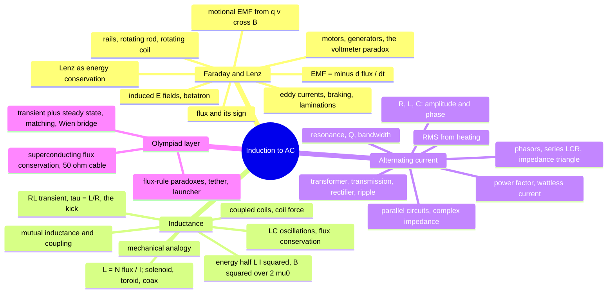
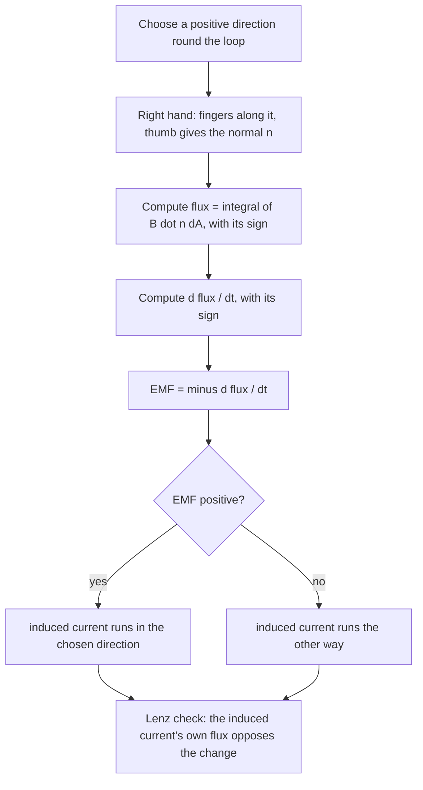
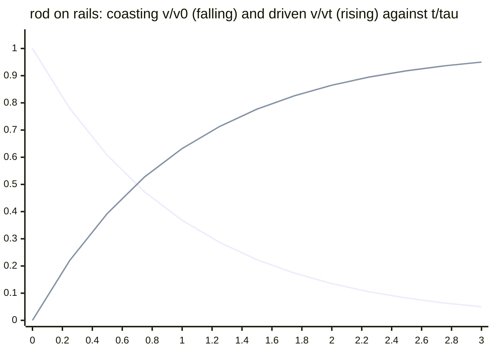
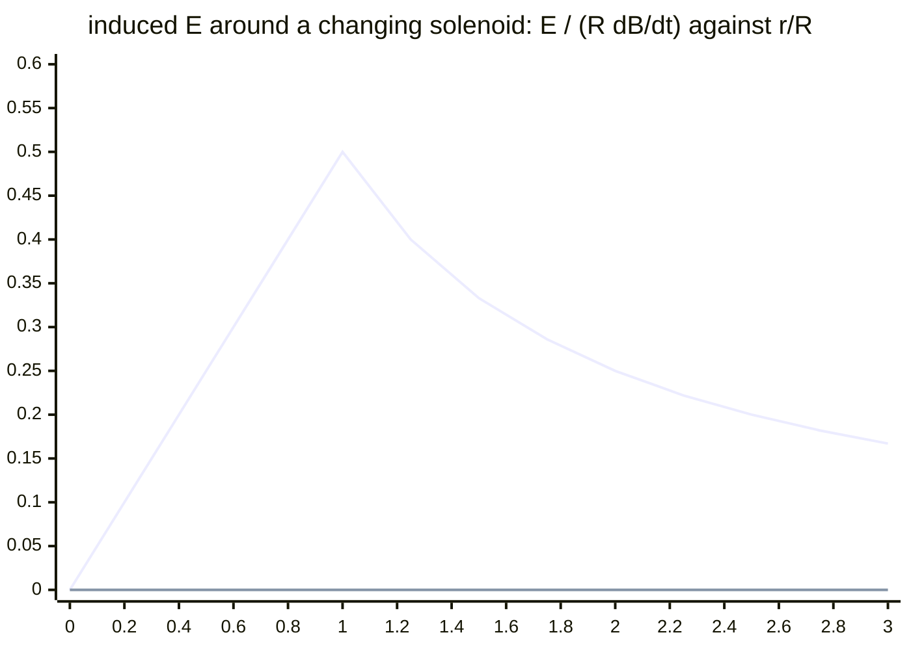
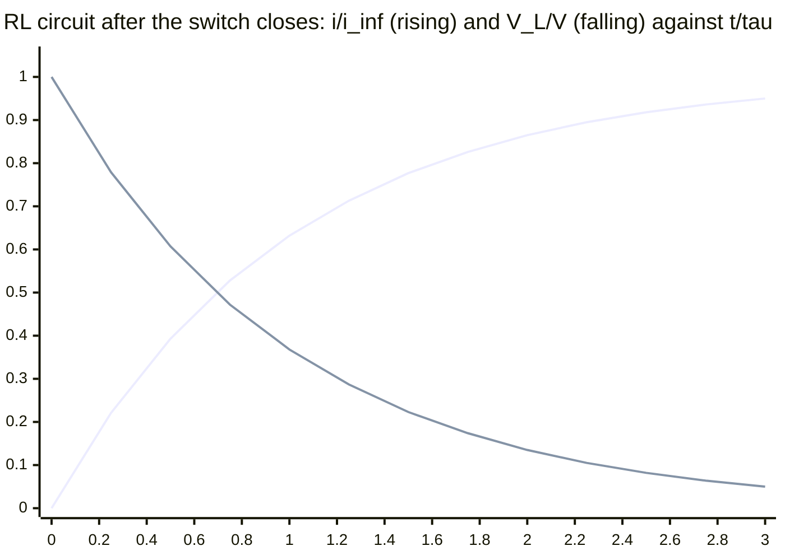
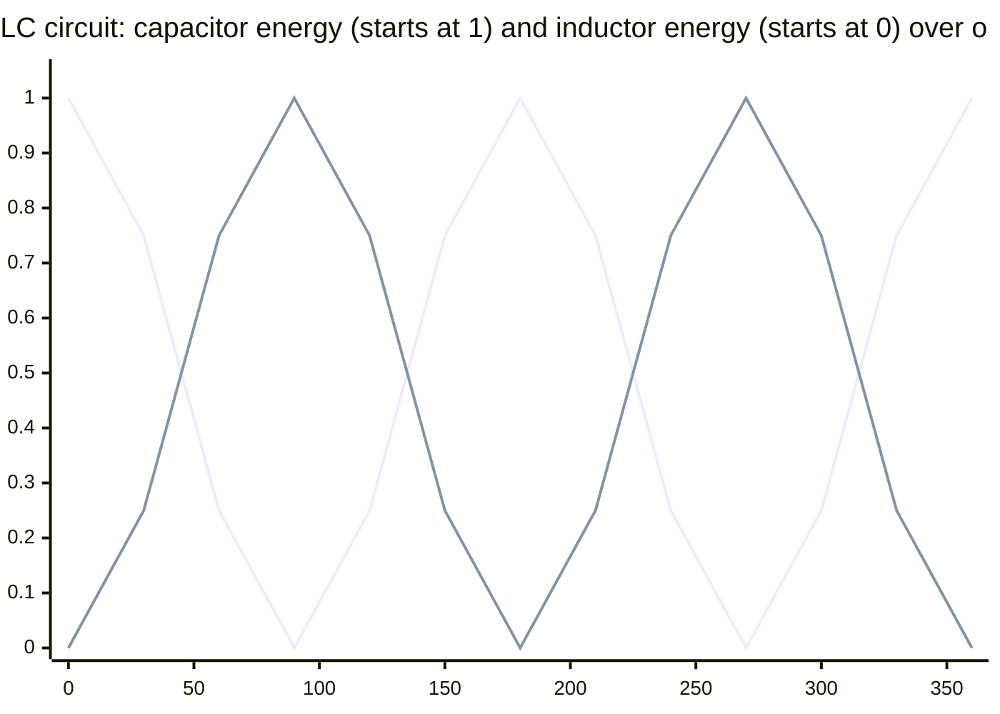
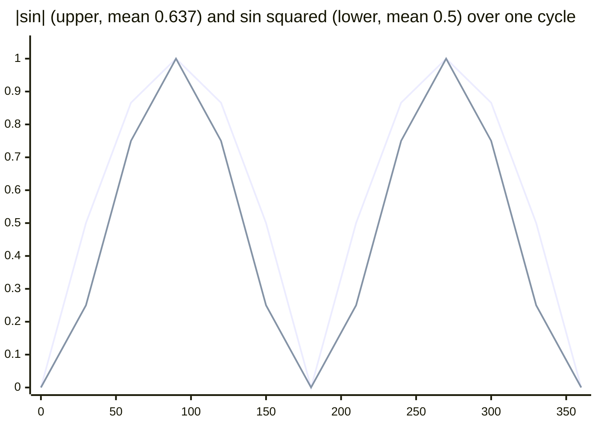
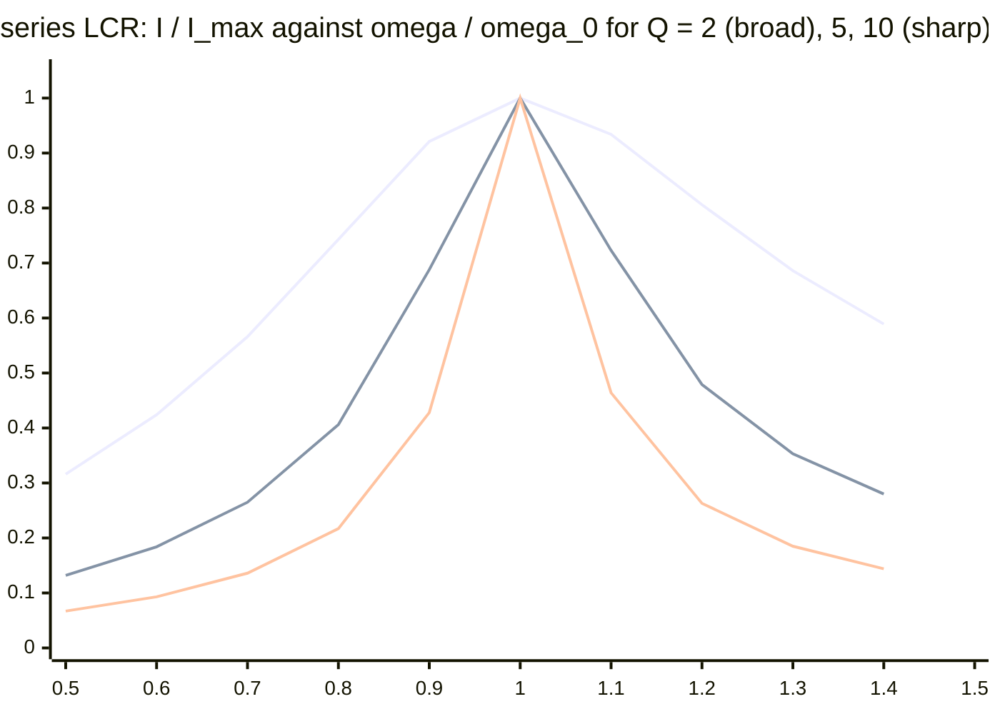

# Electromagnetic induction, inductance and alternating current — one continuous argument

> [!abstract] How to use this chapter
> One module for the three plan parts that the plan itself refuses to split: **induction** (a changing flux drives an electric field; Lenz's law is energy conservation), **inductance** (a coil resists changes in its own current because the energy lives in the field), and **alternating current** (everything is a phase relationship; impedance is resistance that knows about time). Three passes. **Pass 1: Parts 0–3** — the theory in teaching order: flux and Faraday's law, the motional EMF derived *without* flux and the two reconciled, Lenz's law with its energy audit, the rod-on-rails family with every attachment (resistor, mass, capacitor, friction, spring, inductor), induced electric fields and the betatron, eddy currents and laminations, generators and motors, the voltmeter paradox; then flux linkage and $L$ for four geometries, mutual inductance, the RL transient, the inductive kick, $\tfrac12LI^2$ and $B^2/2\mu_0$, the mechanical analogy, combinations, coupled coils and the coil force, LC oscillations, flux conservation; then AC: RMS from heating, R, L, C alone with their phases *derived*, phasors, series LCR, resonance and $Q$ two ways, power and the power factor, parallel circuits, complex impedance, the transformer with impedance reflection and transmission losses, rectifiers and ripple, and the LC circuit as the source of radio. **Pass 2: Parts 4–9** — validity ledger, worked exemplars, archetypes with practice, toolkit, traps, playbook. **Pass 3: Parts 10–14** — the Olympiad layer (the flux-rule paradoxes, the betatron twice, the falling magnet, the tether, the coil launcher, superconducting flux conservation, the $50\ \Omega$ cable, the full transient-plus-steady-state solution, impedance matching, the Wien bridge, three-phase), the 200-mark paper, the marking scheme, the formula sheet and the checkpoint.

> [!warning] Stage 1 of 3 — what is on the page today
> The module merges plan.md PARTs 20, 21 and 22 into one chapter, written in three turns. **This stage ships Parts 0–3 in full** — the complete theory from the definition of flux to the rectifier's ripple. Parts 4–14 carry a one-paragraph statement of what they will contain and are written in stages 2 and 3; the local gate (`tools/check.py`) enforces the reading-mode, media and maths rules now and the question families and the paper when their stage arrives. Nothing in Parts 0–3 will be rewritten later: later stages *add* blocks.

## Part 0 · Orientation

### 0.1 What you will be able to do

After this chapter you can: compute a flux with its sign and decide the sign of an induced EMF by a fixed protocol; derive the motional EMF from the Lorentz force and from Faraday's law and say how the two statements are related and where the flux rule needs care; run Lenz's law as an energy audit; solve the rod-on-rails problem with a resistor (current, force, exponential decay, terminal speed, power balance), with a hanging mass, with a capacitor (constant acceleration), with friction, with a spring and with an inductor; derive the rotating rod's $\tfrac12B\omega L^2$ and the rotating coil's sinusoid; find the induced electric field inside and outside a changing-flux region and use it to accelerate a charge; derive the betatron's 2:1 condition; explain eddy currents, derive the exponential magnetic braking, the falling-magnet terminal speed and the lamination's $d^2$ law; explain a motor's back-EMF and solve the two-voltmeter paradox; define inductance and derive $L$ for a solenoid, a toroid, a coaxial cable and a two-wire line, and $M$ for coaxial coils; solve the RL transient and the inductive kick; derive $\tfrac12LI^2$ and turn it into $B^2/2\mu_0$; use the mechanical analogy to read off unfamiliar circuits; combine inductors with and without $M$; derive the coil force $\tfrac12I^2\,dM/dx$; identify the LC circuit with SHM; apply flux conservation to zero-resistance loops; derive RMS from heating and tell it from the half-cycle average; derive the phase and amplitude of the current through R, L and C; build phasor diagrams; derive the series LCR impedance and phase, the resonance frequency, the voltage magnification, the $Q$ factor two ways and the bandwidth; derive the average power and the power factor and size a correction capacitor; handle parallel circuits by admittance and any circuit by complex impedance; derive the transformer's relations and impedance reflection and do the transmission-loss arithmetic; derive the rectifier's ripple; and connect the LC oscillator to the radio.

### 0.2 The one idea

A changing magnetic flux makes an electric field, and that field pushes charge around loops: the EMF equals the rate of change of flux, with a sign that always resists the change. A coil therefore resists changes in its own current (inductance), a coil and a capacitor exchange energy at one frequency (oscillation), and a sinusoidal source drives each element with its own amplitude and phase (impedance). One law, Faraday's, read three times.

### 0.3 Prerequisite self-check

1. *Flux of a uniform $\mathbf B$ through a flat loop of area $A$ whose normal makes angle $\theta$ with $\mathbf B$?* — $BA\cos\theta$ ([[Magnetism|magnetism]] §3.22, and §3.1 here).
2. *Force on a charge $q$ moving at $\mathbf v$ in $\mathbf B$; force on a wire?* — $q\mathbf v\times\mathbf B$; $I\mathbf L\times\mathbf B$ (magnetism §3.2, §3.23).
3. *Field inside a long solenoid; its energy density?* — $\mu_0nI$; $B^2/2\mu_0$ announced (magnetism §3.19, §3.26 — derived in §3.18 here).
4. *Kirchhoff's loop rule and the RC time constant?* — the sum of EMFs equals the sum of $IR$ drops around a loop; $\tau=RC$ ([[Current-electricity|current electricity]], [[Capacitors|capacitors]]).
5. *Solution of $\ddot x=-\omega^2x$ and of $\dot x=-x/\tau$?* — $A\cos(\omega t+\phi)$ and $x_0e^{-t/\tau}$ ([[Simple-harmonic-motion|PART 10]], [[Kinematics-1d|PART 3]]).
6. *Energy of a capacitor; of a spring?* — $\tfrac12CV^2=q^2/2C$; $\tfrac12kx^2$.
7. *Adding two vectors of equal length at $90^\circ$; the average of $\sin^2$ over a cycle?* — $\sqrt2$ times the length at $45^\circ$; $\tfrac12$ ([[Vectors|PART 2]]).
8. *A conductor in electrostatic equilibrium is an equipotential — why?* — $\mathbf E=0$ inside and $\oint\mathbf E\cdot d\mathbf l=0$ ([[Electrostatics|electrostatics]] §3.33; the second condition is exactly what induction breaks).

### 0.4 Numbers to keep

| quantity | value | why it matters |
|---|---|---|
| mains | $230$ V RMS, $50$ Hz; peak $325$ V; $\omega=314$ s$^{-1}$ | every household AC number |
| RMS of a sinusoid | $I_0/\sqrt2=0.707I_0$; half-cycle average $2I_0/\pi=0.637I_0$ | the two are confused every year |
| $\tau=L/R$; $\tau=RC$; $\omega_0=1/\sqrt{LC}$ | e.g. $10$ mH, $5\ \Omega$: $2$ ms; $10$ mH, $100$ nF: $5$ kHz | the three time scales of a circuit |
| solenoid $L=\mu_0n^2A\ell$ | $1000$ turns on $20$ cm, $2$ cm radius: $7.9$ mH | the inductance of a real coil |
| coaxial cable $L'$, $C'$ | $0.32\ \mu$H m$^{-1}$, $35$ pF m$^{-1}$ for $b/a=5$; $L'C'=1/c^2$; $\sqrt{L'/C'}=96\ \Omega$ | why cables have an impedance |
| $B^2/2\mu_0$ at $1$ T | $4\times10^5$ J m$^{-3}$ | an MRI magnet stores megajoules |
| reactances at $50$ Hz | $50$ mH: $15.7\ \Omega$; $10\ \mu$F: $318\ \Omega$ | $L$ is small and $C$ is large at mains frequency |
| falling magnet in a copper tube | $\sim0.2$ m s$^{-1}$ for a $1$ cm$^3$ NdFeB magnet, $1$ mm wall | Lenz's law you can hold |
| lamination loss | $0.35$ mm silicon steel at $1.2$ T, $50$ Hz: $0.2$ W kg$^{-1}$ | why cores are laminated |
| transmission | $10$ MW over $5\ \Omega$: $41\%$ lost at $11$ kV, $0.1\%$ at $220$ kV | why the grid is high-voltage |
| a motor's back-EMF | $12$ V motor, $0.5\ \Omega$: $24$ A at start, $4$ A running | why a stalled motor burns |
| ripple | $\Delta V\approx I/2fC$: $0.5$ A, $100$ Hz, $5$ mF: $1$ V | sizing a smoothing capacitor |

### 0.5 How to use the chapter

Read Part 3 in order — it is one argument, and each of its three thirds uses the previous one: the AC section's phasors are the RL transient's steady state, and the RL transient is Faraday's law applied to a coil's own flux. Do the worked examples with pencil (a dozen sit inside the theory; the exemplars E1–E20 of stage 2 add the exam craft). Every derivation ends with a check; the checks are where the traps of Part 8 are first defused. Then come back to §3.3 (the two derivations of induction) and §3.27 (the phases of L and C) and make sure you can reproduce both from scratch — the chapter hangs on them.

### 0.6 Coverage map

There is no Cengage volume for this material in the repository (plan.md Block B). The floor is the standard JEE Advanced syllabus as itemised in plan.md PART 20–22 (headings as printed there), plus what the shipped [[Current-electricity|current-electricity]], [[Capacitors|capacitors]] and [[Electromagnetic-waves|electromagnetic-waves]] notes assume. Status vocabulary: **derived**, **stated + used**, **extended beyond floor**, and — for exam craft — **archetypes (Parts 5–6, stage 2)**.

**PART 20 · Electromagnetic induction**

| syllabus heading | what it establishes | where it lives here | status |
|---|---|---|---|
| Flux | definition, sign, tilted loop, non-uniform field | §3.1 | derived |
| The discovery and the law | Faraday's law, the minus sign, the sign protocol | §3.2 | stated + used (protocol derived) |
| Motional EMF from the Lorentz force | $Bvl$ without flux; the two statements compared; the flux rule's failure case | §3.3 | derived |
| Lenz's law as energy conservation | the algorithm; the energy audit; the copper-tube magnet | §3.4 | derived |
| The standard configurations | rails, rotating rod, rotating loop, disc, loop leaving a field, loop in a changing field | §3.5 | derived |
| Coupled mechanics and circuits | hanging mass, capacitor, friction, spring, inductor | §3.6 | derived |
| Induced electric fields | $E(r)$ inside and outside; non-conservative; accelerated charge | §3.7 | derived |
| The betatron condition | $B_{\text{orbit}}=\tfrac12\langle B\rangle$ | §3.8 | derived |
| Eddy currents | origin; braking exponential; falling magnet; heating; lamination $d^2$; which metal | §3.9 | derived |
| Generators and motors | AC generator, commutation, back-EMF, start-up current | §3.10 | derived |
| The voltmeter paradoxes | two voltmeters, two readings; EMF is not a potential difference | §3.11 | derived |
| Induction in everyday life | detectors, hobs, pickups, braking, charging | §3.12 | stated + used |

**PART 21 · Self and mutual inductance, RL circuits and magnetic energy**

| syllabus heading | what it establishes | where it lives here | status |
|---|---|---|---|
| The inertia of current | flux linkage; $L=N\Phi/I$; geometry only | §3.13 | derived |
| Computing self-inductance | solenoid, toroid, coaxial cable, two-wire line, single loop | §3.14 | derived |
| Mutual inductance | $M$, reciprocity, coaxial solenoids, $k$, when zero | §3.15 | derived |
| The RL circuit | rise, decay, $\tau=L/R$, initial and final states | §3.16 | derived |
| The inductive kick | the spark, the ignition coil, the diode, the energy | §3.17 | derived |
| Energy in the magnetic field | $\tfrac12LI^2$; $B^2/2\mu_0$; pressure; the electric comparison | §3.18 | derived |
| The mechanical–electrical analogy | the table and its use | §3.19 | derived |
| Inductors in combinations | series, parallel, $\pm2M$ | §3.20 | derived |
| Energy of coupled coils | $MI_1I_2$; the coil force | §3.21 | derived |
| LC oscillations | SHM; energy exchange; damping | §3.22 | derived |
| Transients with flux conservation | zero-resistance loops; two inductors and a switch | §3.23 | derived |
| Inductance in practice | ideal transformer preview; parasitics | §3.24 | stated + used |

**PART 22 · Alternating current, resonance and transformers**

| syllabus heading | what it establishes | where it lives here | status |
|---|---|---|---|
| Why AC and where it comes from | the generator; vocabulary | §3.25 | derived |
| RMS values | heating definition; $I_0/\sqrt2$; the half-cycle average; other waveforms | §3.26 | derived |
| AC through R, L, C | amplitude and phase for each, derived; reactances | §3.27 | derived |
| Phasors | legitimacy; diagrams | §3.28 | derived |
| Series LCR | $Z$, $\tan\phi$, the triangle; voltages do not add | §3.29 | derived |
| Resonance | $\omega_0$; magnification; $Q$ two ways; bandwidth | §3.30 | derived |
| Power in AC | $V_{\text{rms}}I_{\text{rms}}\cos\phi$; the triangle; wattless current; billing | §3.31 | derived |
| Parallel AC circuits | admittance; the tank's anti-resonance | §3.32 | derived |
| The complex-impedance method | $Z=R+j(X_L-X_C)$; a network both ways | §3.33 | derived |
| Transformers | flux linkage; turns ratio; impedance reflection; losses; transmission | §3.34 | derived |
| Rectification and filters | half and full wave; ripple $I/2fC$ | §3.35 | derived |
| LC oscillations and the road ahead | the LC source; the damped transient; the radiating oscillator | §3.36 | stated + used |

### 0.7 Plan-part map

| plan.md part | this chapter |
|---|---|
| PART 20 · Induction | §3.1–§3.12 |
| PART 21 · Inductance | §3.13–§3.24 |
| PART 22 · Alternating current | §3.25–§3.36 |

The three thirds are one argument: §3.13 is Faraday's law applied to a coil's own flux, §3.22 is the RL circuit with a capacitor in place of the resistor, and §3.27 is §3.16 driven by a sinusoid instead of a switch.

## Part 1 · Intuition first

Push a bar magnet into a coil and a galvanometer flicks; pull it out and it flicks the other way; hold it still, however close, and nothing happens. Faraday's discovery is that *change* makes electricity — not the field but its rate of change through the loop. The direction of the flick is never arbitrary: the current always flows so as to fight what you are doing. Push the magnet in and the coil becomes a magnet that repels it; pull it out and the coil attracts it. That is Lenz's law, and it is nothing but energy conservation: if the coil helped instead of hindered, a magnet dropped through a coil would speed up and generate power for free.

The same thing seen from inside a wire: a rod dragged across a magnetic field carries its electrons with it, and moving charges in a field are pushed sideways — along the rod. The rod becomes a battery. Close the circuit and a current flows, the current feels a force from the same field, and that force opposes the drag. You pay for the current with the work of pulling; nothing has been created. Slide a rod on rails, spin a rod about one end, spin a coil in a field — each is a battery whose voltage is written in the geometry, and the spinning coil's voltage is a sinusoid: alternating current, the shape of every wall socket.

A coil feels its own changes. When the current through it tries to rise, the growing flux induces a voltage that opposes the rise; when it tries to fall, the collapsing flux induces a voltage that opposes the fall — sometimes thousands of volts, the spark when a switch opens. The coil has electrical inertia, and its measure is the inductance. Where the energy goes while the current is being built up is not the wire but the field around it: a magnet's field is a store of energy, and the store can be tapped, at a price, by letting the current change.

Connect a coil to a charged capacitor and the energy sloshes: the capacitor drives a current, the coil keeps it flowing past the point where the capacitor is empty and charges it the other way, and so on — an electrical pendulum, with a frequency set by $L$ and $C$ alone. Drive any circuit with a sinusoid and each element answers in character: a resistor in step, a coil a quarter-cycle behind (inertia), a capacitor a quarter-cycle ahead (a spring). Add them and the amplitudes do not add — the phases fight — unless the coil's lag and the capacitor's lead cancel, at one frequency, where the circuit rings: resonance, the principle of every radio. And because only the *change* of flux matters, a changing current in one coil drives another with no wire between them: the transformer, which steps voltage up for transmission and down for use, and is the reason the world's power is AC.

> [!tip] FIGURE F20.1 · The module in one picture
> *Why:* a first map of the three plan parts merged here, so that each later section is a known place on it.
> *Data:* the three thirds of Part 3 and their leaf topics from the coverage map.

> *Read:* left to right is the teaching order; each third is the previous one applied to a coil's own flux, then to a sinusoidal drive.

## Part 2 · Definitions and bookkeeping

### 2.1 Symbols and units

| symbol | meaning | unit | convention fixed here |
|---|---|---|---|
| $\Phi$ | magnetic flux through a surface bounded by a loop | weber, Wb $=$ T m$^2$ $=$ V s | $\int\mathbf B\cdot d\mathbf A$ with $d\mathbf A$ along the chosen normal |
| $\mathcal E$ | electromotive force: work per unit charge done on a charge carried once round the loop | V | $\oint\mathbf f\cdot d\mathbf l$ with $\mathbf f$ the force per unit charge; **not** a potential difference when it arises from a changing flux (§3.11) |
| $N\Phi$, $\Lambda$ | flux linkage of an $N$-turn coil | Wb (turns) | $\Lambda=N\Phi$ when every turn links the same flux |
| $L$, $M$ | self-inductance, mutual inductance | henry, H $=$ Wb A$^{-1}$ $=$ V s A$^{-1}$ $=\Omega$ s | $L=\Lambda/I$; $M_{12}=\Lambda_1/I_2=M_{21}$; the sign of $M$ follows the dot convention (§3.20) |
| $\tau$ | time constant | s | $L/R$ for an RL loop, $RC$ for an RC loop |
| $\omega_0$ | natural angular frequency | rad s$^{-1}$ | $1/\sqrt{LC}$ |
| $I_0$, $V_0$ | peak (amplitude) values of a sinusoid | A, V | $i(t)=I_0\sin(\omega t+\phi)$ |
| $I_{\text{rms}}$, $V_{\text{rms}}$ | root-mean-square values | A, V | $\sqrt{\langle i^2\rangle}$; $I_0/\sqrt2$ for a sinusoid; what meters and bills quote |
| $X_L$, $X_C$ | inductive and capacitive reactance | $\Omega$ | $\omega L$; $1/\omega C$ |
| $Z$, $\phi$ | impedance magnitude; phase of the *voltage relative to the current* | $\Omega$, rad | $V_0=ZI_0$; $\phi>0$ means the voltage leads (inductive) |
| $\tilde Z$ | complex impedance | $\Omega$ | $R+j(X_L-X_C)$, $j^2=-1$; $Z=\lvert\tilde Z\rvert$, $\phi=\arg\tilde Z$ |
| $Q$ | quality factor | — | $\omega_0L/R=\omega_0/\Delta\omega$ for a series circuit |
| $\cos\phi$ | power factor | — | $P=V_{\text{rms}}I_{\text{rms}}\cos\phi$ |
| $N_p$, $N_s$ | transformer primary and secondary turns | — | $V_s/V_p=N_s/N_p$ for an ideal transformer |

### 2.2 Sign conventions, fixed once

**Flux and EMF share one right-hand rule.** Choose a direction round the loop; curl the right hand's fingers that way; the thumb is the positive normal $\hat{\mathbf n}$ for the flux. Then Faraday's law $\mathcal E=-d\Phi/dt$ gives the EMF *in the chosen direction*: positive drives a current the way the fingers curl, negative the other way. Choosing the opposite direction flips both signs and changes nothing physical. The protocol of §3.2 is this sentence applied three times.

**Kirchhoff with an inductor.** Walking round a loop in the direction of the current, an inductor contributes $-L\,di/dt$ to the sum of potential rises (a *drop* of $L\,di/dt$ when the current is rising) — exactly as a resistor contributes $-iR$. Equivalently, the induced EMF in the loop is $-L\,di/dt$, opposing the change. The single most reliable habit: write the loop equation as $\sum(\text{EMFs of sources})=iR+L\,di/dt+q/C$ with $i=dq/dt$, and never argue about the sign of the inductor separately.

**AC phases.** $\phi$ is the angle by which the *voltage leads the current*: positive for an inductive circuit, negative for a capacitive one. "Current lags by $\phi$" means the same thing. Phasors rotate anticlockwise at $\omega$; a phasor drawn ahead (anticlockwise) of another leads it.

**Transformer polarity.** With the primary and secondary wound the same way round the core, the dotted ends rise and fall together; the secondary's EMF is $N_s/N_p$ times the primary's *applied* voltage, of the same polarity at the dots.

### 2.3 The model and its assumptions

*Quasi-static:* circuits are small compared with the wavelength at the frequencies used ($6000$ km at $50$ Hz; $3$ m at $100$ MHz), so at any instant the current is the same everywhere in a series branch and Kirchhoff's rules hold with $L$, $C$ and $R$ as lumped elements. *Linear elements:* $L$, $C$ and $R$ independent of current and voltage — iron-cored inductors and diodes violate this and are handled by stating the regime. *Ideal wires* unless a resistance is named; *no radiation* (the loss of an LC circuit is its resistance, not its antenna action — §3.36 estimates when this fails). *Sinusoidal steady state* for Parts 3.27–3.34: transients have died (§3.16 says how long that takes; Part 10 treats the two together). *Non-relativistic* conductors; magnetic fields of steady or slowly changing currents as in the magnetism chapter. What is *not* in the model: displacement current and electromagnetic waves (the shipped [[Electromagnetic-waves|EM-waves]] note), the skin effect except as an estimate, and the quantum origin of superconductivity (flux conservation in a zero-resistance loop is used, not explained).

### 2.4 The bookkeeping of a changing flux

The flux through a loop can change in three ways, and Faraday's law counts all three at once:

$$
\frac{d\Phi}{dt}=\int\frac{\partial\mathbf B}{\partial t}\cdot d\mathbf A\ \ (\text{field changes})\ +\ (\text{loop moves through a non-uniform field})\ +\ (\text{loop changes shape or orientation}). \qquad (2.1)
$$

The first term is a *transformer* EMF: a genuinely new electric field, curling around the changing $\mathbf B$, present with or without a wire (§3.7). The second and third are *motional* EMFs: the Lorentz force on the charges of a moving conductor (§3.3). They look different, they are computed differently, and Faraday's flux rule gives their sum in one line — which is its power and, in one famous family of cases, its trap (§3.3, Part 10).

> [!info] Why the EMF is not a voltage
> A battery's EMF is a chemical push localised in the battery; the rest of the circuit is electrostatic and has a potential. An induced EMF is spread around the loop by a field that has no potential at all ($\oint\mathbf E\cdot d\mathbf l\neq0$). One can still speak of the voltage *across a resistor* ($iR$, what a voltmeter reads) — but "the voltage between two points" depends on the path taken between them once flux is changing inside the circuit. §3.11 makes this concrete with two voltmeters that disagree.

## Part 3 · Core derivations

The order is the teaching order and it is one argument: what a changing flux does (§3.1–§3.12), what a coil's own changing flux does (§3.13–§3.24), and what a sinusoidally changing flux does (§3.25–§3.36). Every result is derived once here; the magnetism chapter is cited wherever a field is borrowed from it.

### 3.1 Flux

The magnetic flux through a surface $S$ is

$$
\Phi=\int_S\mathbf B\cdot d\mathbf A=\int_S B\cos\theta\,dA, \qquad (3.1)
$$

with $d\mathbf A$ along the surface's normal and $\theta$ the angle between $\mathbf B$ and that normal. For a uniform field and a flat loop of area $A$: $\Phi=BA\cos\theta$ — the full $BA$ face-on, zero edge-on, and *negative* when the field passes through the loop against the chosen normal. Flux is a scalar with a sign, and the sign is a choice (of normal) that must be made once and kept: reversing the normal reverses $\Phi$ and, with it, the sign of every EMF computed from it. For a loop, "the surface" is any surface bounded by the loop — the magnetism chapter's $\oint\mathbf B\cdot d\mathbf A=0$ guarantees they all give the same $\Phi$. For a coil of $N$ turns each linking $\Phi$, the quantity that matters is the flux *linkage* $N\Phi$. Units: weber, $1$ Wb $=1$ T m$^2=1$ V s — the second form is Faraday's law waiting to happen.

**Non-uniform fields.** A rectangular loop ($a$ along the wire, $b$ across) whose near side is a distance $d$ from a long straight wire carrying $I$: $\Phi=\int_d^{d+b}\dfrac{\mu_0I}{2\pi r}a\,dr=\dfrac{\mu_0Ia}{2\pi}\ln\dfrac{d+b}{d}$ — the flux integral of §3.14 and the mutual inductance of a loop and a wire, both at once.

> [!example] Worked example — three orientations
> A $10$ cm $\times$ $20$ cm loop in a uniform $0.30$ T field: face-on, $\Phi=0.3\times0.02=6.0\times10^{-3}$ Wb; tilted so that its normal is at $60^\circ$ to the field, $3.0\times10^{-3}$ Wb; edge-on, $0$; turned over (normal at $180^\circ$), $-6.0\times10^{-3}$ Wb. Rotating it from face-on to turned-over changes the flux by $1.2\times10^{-2}$ Wb — twice $BA$, the figure that a flip-coil measurement of $B$ relies on.

> [!abstract] DIAGRAM D20.1 · Flux through a tilted loop
> *Show:* uniform field lines crossing a flat loop tilted by $\theta$, the chosen normal $\hat{\mathbf n}$ drawn with the right-hand rule's fingers around the loop, the projected area $A\cos\theta$ shaded; three insets: face-on ($\Phi=BA$), edge-on ($0$), reversed ($-BA$).
> *Search:* "magnetic flux through tilted loop normal vector right hand rule sign"

### 3.2 The discovery and the law

Faraday (1831) found an induced current whenever the flux through a circuit changed — by moving a magnet, moving the loop, deforming it, rotating it, or switching a neighbouring current on or off — and none while the flux was steady, however large. The law that summarises every case:

$$
\mathcal E=-\frac{d\Phi}{dt}\qquad(\text{one loop}),\qquad \mathcal E=-N\frac{d\Phi}{dt}\qquad(N\text{ turns}). \qquad (3.2)
$$

The EMF is the work done on unit charge carried once round the loop; in a loop of resistance $R$ it drives $i=\mathcal E/R$ — and the *charge* that passes while the flux changes by $\Delta\Phi$ is $q=\int i\,dt=\Delta\Phi/R$ (the flip coil's principle: $q$ does not care how fast the flip was).

**The minus sign, made into a protocol.** (i) Choose a positive direction round the loop and let the right hand give the normal. (ii) Compute $\Phi$ with that normal, with its sign. (iii) Compute $d\Phi/dt$ with its sign. (iv) $\mathcal E=-d\Phi/dt$: if positive, the induced current runs in the chosen direction; if negative, the other way. The physical content of the sign — the induced current *opposes the change of flux* — is Lenz's law (§3.4), and the protocol is Lenz's law made mechanical.

> [!example] Worked example — the sign drill
> A circular loop lies in the plane of the page; a field into the page grows from $0.2$ T to $0.6$ T in $2$ s. Choose the positive direction *clockwise*; the right hand then puts the normal into the page, so $\Phi=+BA$ and $d\Phi/dt=+0.2A$ per second; $\mathcal E=-0.2A$ V: negative, so the current runs *anticlockwise*. Check by Lenz: an anticlockwise current makes a field out of the page inside the loop, opposing the growth of the inward flux ✓. Now let the field *decrease*: $d\Phi/dt<0$, $\mathcal E>0$, the current runs clockwise, adding inward flux to replace what is being lost ✓.

> [!tip] FIGURE F20.2 · The sign protocol for an induced EMF
> *Why:* every sign error in the chapter is a step skipped in this flow.
> *Data:* the four steps of §3.2 with the Lenz check as the exit.

> *Read:* the choice in the first box is free; everything after it is forced. If the Lenz check fails, a sign was dropped in step C or D.

> [!abstract] DIAGRAM D20.2 · The four experiments
> *Show:* four panels with a coil and a galvanometer: a bar magnet moving into the coil (needle deflects one way), out (the other way), a second coil with a switch being closed (a flick), and a loop being rotated in a field; in each the change of flux and the direction of the induced current are marked with the right-hand normal drawn.
> *Search:* "faraday's experiments magnet coil galvanometer moving loop rotating loop induced current"

### 3.3 Motional EMF from the Lorentz force — and how it relates to Faraday

Slide a conducting rod of length $l$ at velocity $\mathbf v$ through a uniform field $\mathbf B$, with $\mathbf v\perp\mathbf B$ and the rod perpendicular to both. Every free electron in the rod moves with it and feels $q\mathbf v\times\mathbf B$, directed *along the rod*: charge is driven to one end until the electric field of the separated charge balances the magnetic push, $qE=qvB$, $E=vB$, and the ends differ in potential by

$$
\mathcal E=Blv. \qquad (3.3)
$$

No flux was mentioned. The rod is a battery of EMF $Blv$ with its positive terminal at the end towards which $\mathbf v\times\mathbf B$ points (for positive charge). In general, for any element $d\mathbf l$ of a moving conductor, $d\mathcal E=(\mathbf v\times\mathbf B)\cdot d\mathbf l$, and for a rod at angle to the field only the component of $\mathbf v\times\mathbf B$ along the rod counts.

**The same result from flux.** Let the rod slide on rails closing a circuit of width $l$; the area enclosed grows at $lv$, so $\lvert d\Phi/dt\rvert=Blv$ and Faraday's law gives $\lvert\mathcal E\rvert=Blv$ ✓. The two agree — and they must, but they are *not* the same statement. The Lorentz-force derivation is the physics of a moving conductor and needs no circuit at all; Faraday's law in its transformer form ($\partial\mathbf B/\partial t\to\mathbf E$) is a separate law of nature about changing fields; the *flux rule* $\mathcal E=-d\Phi/dt$ packages both into one formula that is right whenever the circuit is a well-defined loop whose motion carries its material with it. Einstein's 1905 paper opens with this very pair — a magnet moved past a coil and a coil moved past a magnet give the same current from two different mechanisms — and relativity is what makes them one.

**Where the flux rule needs care.** When the circuit's boundary slides *through* the conductor — a wheel rolling on rails with a contact at its rim, a spinning disc with a brush (the Faraday disc, §3.5), a moving contact that jumps from one wire to another — "the flux through the circuit" is ambiguous or changes discontinuously while the physical EMF, computed from $\mathbf v\times\mathbf B$ on the charges that actually move, is perfectly definite. The rule: **when in doubt, follow the charges.** Part 10 works the paradox family; here the discipline is stated once — the flux rule is a shortcut, the Lorentz force is the law.

> [!abstract] DIAGRAM D20.3 · The rod as a battery
> *Show:* a rod moving right at $\mathbf v$ through a field into the page; on a positive carrier the force $q\mathbf v\times\mathbf B$ drawn upward along the rod; charge accumulated at the top ($+$) and bottom ($-$) with the electrostatic field $E=vB$ inside the rod balancing the magnetic push; the rod redrawn as a battery symbol of EMF $Blv$ with the positive terminal at the top; beneath, the rails-and-resistor circuit with the current direction.
> *Search:* "motional emf rod moving in magnetic field lorentz force charge separation Blv battery"

### 3.4 Lenz's law as energy conservation

**Statement.** The induced current flows in the direction that opposes the *change* producing it — not the flux, the change of flux. **Algorithm.** Find $\Delta\Phi$ (increasing or decreasing, and in which sense through the loop); the induced current's own field opposes that change (adds flux if flux is being lost, subtracts if gained); the right-hand rule then gives the current's direction; and the *mechanical* consequence — a force on the moving part, a torque on the rotating one — always opposes the motion that causes the change.

**Why it must be so.** Suppose the opposite: a magnet approaching a loop induces a current that *attracts* it. The magnet accelerates, the flux changes faster, the current grows, the attraction grows — a runaway that delivers kinetic energy to the magnet *and* heat to the loop from nothing. Lenz's sign is the only one consistent with energy conservation: the induced current's heat is paid for by the work done against the opposing force. **The audit,** for the rod on rails of §3.5: you pull with force $F$ at speed $v$, delivering power $Fv$; the current $i=Blv/R$ dissipates $i^2R=B^2l^2v^2/R$; the magnetic force on the rod is $Bil=B^2l^2v/R$, opposing $\mathbf v$; at steady speed $F=Bil$ and $Fv=B^2l^2v^2/R=i^2R$ exactly ✓. Every joule of heat came through your hand.

**Lenz's law you can hold.** Drop a small neodymium magnet down a copper pipe: it drifts down at a steady walking pace instead of falling. Each ring of the pipe sees the magnet's flux grow as it approaches and shrink as it recedes; the induced currents make a field that repels the magnet from below and attracts it from above; both oppose the fall, and the magnet reaches the speed at which the drag equals its weight. The estimate (Part 10 derives the coefficient): a dipole $\mu$ falling at $v$ along the axis of a thin pipe of radius $a$, wall $t$ and conductivity $\sigma$ feels $F=\dfrac{45}{1024}\dfrac{\mu_0^2\mu^2\sigma t}{a^4}v$, so

$$
v_{\text{t}}=\frac{1024}{45}\,\frac{mga^4}{\mu_0^2\mu^2\sigma t}; \qquad (3.4)
$$

for a $1$ cm$^3$ NdFeB magnet ($\mu\approx1$ A m$^2$, $m=7.5$ g) in a copper pipe of $1$ cm radius and $1$ mm wall ($\sigma=6\times10^7$ S m$^{-1}$): $v_{\text{t}}=0.18$ m s$^{-1}$; in aluminium ($3.8\times10^7$), $0.28$ m s$^{-1}$; in a plastic pipe, free fall. The drag is proportional to $v$, so the approach to $v_{\text{t}}$ is exponential with $\tau=m/K=v_{\text{t}}/g\approx20$ ms — the magnet is at terminal speed before it has fallen a centimetre.

> [!abstract] DIAGRAM D20.4 · The magnet in the copper tube
> *Show:* a vertical tube in section with a magnet falling down its axis; the rings of the wall above and below the magnet with their induced currents drawn in opposite senses; the induced dipoles above (attracting the magnet upward) and below (repelling it upward); the force balance $mg=Kv$ at terminal speed; a small $v(t)$ inset rising to $v_{\text{t}}$ within $\sim20$ ms.
> *Search:* "magnet falling through copper tube eddy currents lenz law terminal velocity diagram"

> [!danger] Trap — "opposes the flux"
> The induced current opposes the *change*. When the flux through a loop is decreasing, the induced current's field points *the same way* as the existing flux, trying to keep it; students who write "opposes the field" get exactly the wrong direction in every decreasing-flux problem. Say "opposes the change" every time.

### 3.5 The standard configurations

**The rod on rails, complete.** A rod of mass $m$ slides without friction on parallel rails a distance $l$ apart in a uniform field $B$ perpendicular to the plane; the rails are joined through a resistance $R$; the rod is given an initial speed $v_0$ and left alone. EMF $Blv$, current $i=Blv/R$, retarding force $Bil=B^2l^2v/R$:

$$
m\frac{dv}{dt}=-\frac{B^2l^2}{R}v\quad\Rightarrow\quad v=v_0e^{-t/\tau},\qquad \tau=\frac{mR}{B^2l^2}, \qquad (3.5)
$$

an exponential decay with a time constant that grows with mass and resistance and falls as $B^2$ — the same $B^2\sigma$ scaling as every eddy-current brake. The rod travels a finite distance, $x_\infty=\int v\,dt=v_0\tau$, and the heat dissipated, $\int i^2R\,dt=\int(B^2l^2v^2/R)dt=\tfrac12mv_0^2$ ✓ all of the kinetic energy. Numbers: $B=0.50$ T, $l=20$ cm, $R=0.10\ \Omega$, $m=100$ g, $v_0=2.0$ m s$^{-1}$: $\tau=1.0$ s, $i_0=2.0$ A, initial force $0.20$ N, stopping distance $2.0$ m, heat $0.20$ J. **Driven at constant force** $F$ (a string, a motor): $m\,dv/dt=F-B^2l^2v/R$, so $v=v_{\text{t}}(1-e^{-t/\tau})$ with the terminal speed $v_{\text{t}}=FR/B^2l^2$ at which the applied power $Fv_{\text{t}}$ all goes to heat.

> [!tip] FIGURE F20.3 · The rod on rails: coasting and driven
> *Why:* the two exponentials — decay to rest and approach to terminal speed — are the same time constant seen from both ends, and the whole rod family is variations on them.
> *Data:* $v/v_0=e^{-t/\tau}$ (coasting) and $v/v_{\text{t}}=1-e^{-t/\tau}$ (constant applied force) on $t/\tau=0,0.25,\dots,3$.

> *Read:* after one time constant the coasting rod has lost $63\%$ of its speed and the driven rod has gained $63\%$ of its terminal speed; after three, $95\%$. The two curves sum to $1$ at every instant — the driven problem is the coasting problem plus a constant.

**The rotating rod.** A rod of length $L$ turns at $\omega$ about one end, in a field $B$ perpendicular to its plane. An element at distance $r$ moves at $v=\omega r$ and contributes $d\mathcal E=B\,\omega r\,dr$:

$$
\mathcal E=\int_0^LB\omega r\,dr=\tfrac12B\omega L^2, \qquad (3.6)
$$

the same as a rod of length $L$ moving at the *average* speed $\tfrac12\omega L$. Flux check: the rod sweeps area at the rate $\tfrac12L^2\omega$ ✓. A rod turning about its centre has *zero* EMF between its ends (the two halves oppose) but $\tfrac18B\omega L^2$ between the centre and either end. Numbers: $L=0.5$ m at $100$ rad s$^{-1}$ in $0.5$ T: $6.25$ V. **The Faraday disc** is a stack of such rods: a disc of radius $a$ spinning at $\omega$ in $B$, with brushes at the axle and the rim, is a generator of EMF $\tfrac12B\omega a^2$ — the unipolar dynamo, whose "circuit" has no fixed loop, and which is the flux rule's classic embarrassment and the Lorentz force's easy victory.

**The rotating loop.** A coil of $N$ turns and area $A$ rotates at $\omega$ about an axis in its plane, perpendicular to a uniform $B$: $\Phi=BA\cos\omega t$, so

$$
\mathcal E=-N\frac{d\Phi}{dt}=NBA\omega\sin\omega t\equiv\mathcal E_0\sin\omega t,\qquad \mathcal E_0=NBA\omega. \qquad (3.7)
$$

The EMF is largest when the flux is *zero* (the coil edge-on, its sides cutting the field fastest) and zero when the flux is largest — the point every "the flux is maximum, so the EMF is maximum" answer misses. This is the AC generator and the origin of the sinusoid the whole of §3.25–§3.36 assumes. Numbers: $N=100$, $A=100$ cm$^2$, $B=0.2$ T at $50$ Hz ($\omega=314$ s$^{-1}$): $\mathcal E_0=62.8$ V, RMS $44$ V.

**A loop leaving a field region.** A rectangular loop (width $l$ across the boundary) is pulled at $v$ out of a region of uniform field. While it straddles the boundary only the side still inside the field has a motional EMF, $Blv$, and the flux decreases at $Blv$ — the two views agree; the current is $Blv/R$ and the retarding force $B^2l^2v/R$, the rod on rails once more. While the loop is *wholly* inside (or wholly outside) the two long sides have equal and opposite motional EMFs, the flux is constant, and there is no current. *Which end is the positive terminal* of the active side: the one towards which $\mathbf v\times\mathbf B$ points for positive charge — decide it by the cross product, not by the direction of the current in the rest of the loop.

**A loop entirely inside a changing field.** No motion, no motional EMF: $\mathcal E=-A\,dB/dt$, a transformer EMF produced by the induced electric field of §3.7. A $100$-turn coil of $50$ cm$^2$ in a field rising at $10$ T s$^{-1}$ (a pulsed magnet): $\mathcal E=100\times5\times10^{-3}\times10=5.0$ V.

> [!abstract] DIAGRAM D20.5 · Rotating rod, rotating coil, loop leaving a field
> *Show:* (a) a rod pivoted at one end with the speed profile $v=\omega r$ drawn as a growing arrow along it and $d\mathcal E=B\omega r\,dr$ on an element; (b) a coil rotating in a field with $\Phi(t)$ and $\mathcal E(t)$ plotted beneath, a quarter-cycle apart; (c) a rectangular loop half out of a shaded field region, the inside side marked as the battery $Blv$ with its polarity from $\mathbf v\times\mathbf B$, the outside side marked "no EMF".
> *Search:* "rotating rod emf half B omega L squared; rotating coil sinusoidal emf flux phase; loop leaving magnetic field induced current"

### 3.6 Coupled mechanics and circuits: the rod with every attachment

The rod on rails is a mechanical system and a circuit at once; each attachment gives a two-equation problem.

**A hanging mass.** The rod (mass $m$) on horizontal rails is pulled by a string over a pulley by a hanging mass $M$; the circuit has resistance $R$. Newton for the pair: $(m+M)\,dv/dt=Mg-B^2l^2v/R$. Terminal speed $v_{\text{t}}=MgR/B^2l^2$, approached with $\tau=(m+M)R/B^2l^2$. At $v_{\text{t}}$ the falling mass's power $Mgv_{\text{t}}$ equals the heat $i^2R$ ✓. With $M=50$ g in the circuit of §3.5: $v_{\text{t}}=4.9$ m s$^{-1}$, $\tau=1.5$ s.

**A capacitor instead of the resistor — the famous trap.** Now the rails are joined through a capacitor $C$ and the rod is pushed by a constant force $F$. There is no steady current, because a capacitor passes current only while its charge changes: $q=C\mathcal E=CBlv$, so $i=dq/dt=CBl\,dv/dt$ — the current is proportional to the *acceleration*, and the magnetic force $Bil=CB^2l^2\,dv/dt$ is an inertial force. Newton:

$$
m\frac{dv}{dt}=F-CB^2l^2\frac{dv}{dt}\quad\Rightarrow\quad a=\frac{F}{m+CB^2l^2}, \qquad (3.8)
$$

**constant acceleration**: the capacitor adds an effective mass $CB^2l^2$ and nothing else — no terminal speed, no decay. The current is constant, $i=CBla$, and the charge grows linearly. Energy check: the force's work $Fx$ splits into kinetic energy $\tfrac12mv^2$ and capacitor energy $\tfrac12CB^2l^2v^2$ in the ratio $m:CB^2l^2$ ✓. Numbers: $B=2.0$ T, $l=0.5$ m, $C=0.10$ F, $m=0.10$ kg, $F=1.0$ N: $CB^2l^2=0.10$ kg, $a=5.0$ m s$^{-2}$ instead of $10$, $i=0.50$ A.

**Friction.** Add kinetic friction $\mu_kmg$ to the coasting rod: $m\,dv/dt=-\mu_kmg-B^2l^2v/R$ — the rod stops in a *finite* time (the friction term does not vanish with $v$), and the energy audit splits $\tfrac12mv_0^2$ between heat in $R$ and heat at the rails in proportions that depend on the whole history. The lesson: a velocity-proportional drag never stops anything; a constant one does.

**A spring.** Attach the rod to a spring of constant $k$ with the resistor in the circuit: $m\ddot x=-kx-(B^2l^2/R)\dot x$, a damped oscillator with damping constant $b=B^2l^2/R$ — PART 10's equation with a magnetic dashpot. Underdamped for $b<2\sqrt{km}$, and the amplitude decays with time constant $2m/b=2\tau$. Replace the resistor by a capacitor and the damping disappears, replaced by extra mass: $\omega=\sqrt{k/(m+CB^2l^2)}$, undamped SHM at a lower frequency.

**An inductor.** Rails joined through an inductance $L_{\text{ind}}$ (no resistance), rod given $v_0$: the loop equation is $Blv=L_{\text{ind}}\,di/dt$ and Newton's is $m\,dv/dt=-Bil$. Differentiate Newton's equation and substitute the loop equation: $m\,d^2v/dt^2=-Bl\,di/dt=-B^2l^2v/L_{\text{ind}}$,

$$
\ddot v=-\frac{B^2l^2}{mL_{\text{ind}}}v:\qquad \omega=\frac{Bl}{\sqrt{mL_{\text{ind}}}}, \qquad (3.9)
$$

the rod oscillates back and forth for ever, its kinetic energy exchanging with the inductor's $\tfrac12L_{\text{ind}}i^2$ — an LC circuit in which the rod's mass plays the capacitor (§3.19). This is the hand-off the plan asks for: the inductor's role is the subject of §3.13 onward.

> [!abstract] DIAGRAM D20.6 · The rod with a hanging mass, and with a capacitor
> *Show:* left, rails with the rod, the string over a pulley to a hanging mass, free-body diagrams of rod (tension, magnetic drag $B^2l^2v/R$) and mass (weight, tension); right, the rails joined through a capacitor, the rod pushed by $F$, the current $i=CBla$ marked constant and the charge $q(t)$ growing linearly, with "$m_{\text{eff}}=m+CB^2l^2$" written.
> *Search:* "rod on rails hanging mass terminal velocity; rod on rails capacitor constant acceleration effective mass"

> [!danger] Trap — an instantaneous current
> With a capacitor in the circuit there is no steady current; with an inductor the current cannot jump. Writing $i=Blv/R$ for a circuit that has no resistor — or assuming that the current appears the instant the rod moves when an inductor is present — misses the whole problem. Name the element, write its law, and only then Newton.

### 3.7 Induced electric fields

Faraday's law with no conductor in sight: a changing $\mathbf B$ creates an electric field whose line integral round any closed path is minus the rate of change of the flux through it,

$$
\oint\mathbf E\cdot d\mathbf l=-\frac{d\Phi}{dt}=-\int\frac{\partial\mathbf B}{\partial t}\cdot d\mathbf A. \qquad (3.10)
$$

This $\mathbf E$ is not electrostatic: its circulation is not zero, so it has no potential and its field lines *close on themselves*, circling the region where $\mathbf B$ changes — the magnetic analogue of Ampère's law with $\partial\mathbf B/\partial t$ playing the current. (The electrostatics chapter's "no closed field lines" and "the conductor is an equipotential" were statements about *static* fields; this is the field that breaks them.)

**The standard geometry.** A long solenoid of radius $R$ whose interior field $B(t)$ changes at a uniform rate $\dot B$. By symmetry the induced $\mathbf E$ is azimuthal and depends on $r$ only; a circle of radius $r$ gives $E\cdot2\pi r=\pi r^2\dot B$ inside and $E\cdot2\pi r=\pi R^2\dot B$ outside:

$$
E_{\text{in}}=\frac r2\,\dot B\quad(r<R),\qquad E_{\text{out}}=\frac{R^2}{2r}\,\dot B\quad(r>R), \qquad (3.11)
$$

rising linearly to $\tfrac12R\dot B$ at the winding and falling as $1/r$ outside — the thick wire's magnetic profile with $\dot B$ in place of $\mu_0J$. Outside, where $\mathbf B$ itself is zero, there is nonetheless an electric field: the flux *through* a loop, not the field *on* it, is what counts. Direction: by Lenz, the induced $\mathbf E$ would drive a current whose field opposes $\dot B$ — for $\mathbf B$ out of the page and growing, $\mathbf E$ circles clockwise. Numbers: $R=5$ cm, $\dot B=100$ T s$^{-1}$ (a pulsed coil): $E=1.0$ V m$^{-1}$ at $r=2$ cm, $2.5$ V m$^{-1}$ at the winding, $1.25$ V m$^{-1}$ at $r=10$ cm.

> [!tip] FIGURE F20.4 · The induced electric field of a changing solenoid
> *Why:* the profile shows what "no potential" looks like — a field that circles, is linear inside and $1/r$ outside, and is non-zero where $\mathbf B$ is zero.
> *Data:* $E/(R\dot B)$ against $r/R$ on $0,0.25,\dots,3$: $\tfrac12(r/R)$ inside, $\tfrac12(R/r)$ outside; the line [0, 0] is the axis.

> *Read:* maximum at the winding, $\tfrac12R\dot B$; at $r=2R$ half that; the field lines are circles, and a charge carried once round any of them gains energy $q\pi R^2\dot B$ — however far out the circle is.

**A charge accelerated by the induced field.** A particle of charge $q$ constrained to a circle of radius $r$ (a ring, or an orbit) around the changing flux gains energy $q\,\mathcal E=q\pi R^2\dot B$ per revolution (for $r\ge R$); free to move on a straight track it feels $qE$ along the track's tangent. A bead of charge $q$ and mass $m$ on a frictionless ring of radius $r>R$ starting from rest while the flux rises from $0$ to $\Phi_f$ in time $T$: tangential force $qE=q\Phi_f/(2\pi rT)$, constant, so $v=qE\,T/m=q\Phi_f/(2\pi rm)$ — independent of $T$: the *impulse* per unit charge round the ring is the flux change divided by the circumference, whatever the rate. (This is the betatron's principle, §3.8.)

> [!info] Why no potential here
> A potential exists when $\oint\mathbf E\cdot d\mathbf l=0$ for every loop; here it is $-d\Phi/dt\neq0$ for loops that enclose the changing flux. Two points on such a loop have no unique "potential difference": the line integral of $\mathbf E$ between them depends on which way round you go, by exactly $d\Phi/dt$. That is the whole content of §3.11's paradox, and the reason the word EMF exists.

> [!abstract] DIAGRAM D20.7 · The induced field, inside and outside
> *Show:* two panels: (a) a solenoid's cross-section with $\mathbf B$ out of the page and growing, circular $\mathbf E$ lines drawn clockwise, arrows lengthening with $r$ inside; (b) the region outside the winding where $\mathbf B=0$ but the circles of $\mathbf E$ continue, arrows shortening as $1/r$; a bead on a ring outside the solenoid with the tangential force $qE$ marked.
> *Search:* "induced electric field changing magnetic field solenoid inside outside circular field lines"

### 3.8 The betatron condition

Accelerate electrons on a circle of fixed radius $R$ by *increasing* the magnetic flux through the orbit; the same magnet must also *bend* them round the circle. Two conditions, one field profile. **Guiding:** $p=eB_{\text{orb}}R$, where $B_{\text{orb}}$ is the field *at the orbit*; to keep $R$ fixed as $p$ grows, $dp/dt=eR\,dB_{\text{orb}}/dt$. **Accelerating:** the induced field on the orbit is $E=\dfrac{1}{2\pi R}\dfrac{d\Phi}{dt}=\dfrac{R}{2}\dfrac{d\langle B\rangle}{dt}$, where $\langle B\rangle=\Phi/\pi R^2$ is the field *averaged over the disc* inside the orbit; the force $eE$ increases the momentum at $dp/dt=eE=\dfrac{eR}{2}\dfrac{d\langle B\rangle}{dt}$. Equating the two rates:

$$
\frac{dB_{\text{orb}}}{dt}=\frac12\frac{d\langle B\rangle}{dt}\quad\Rightarrow\quad B_{\text{orb}}=\tfrac12\langle B\rangle, \qquad (3.12)
$$

the **2:1 condition** (Wideröe, 1928): the average field inside the orbit must be twice the field at the orbit, so the pole pieces are shaped to make the field *stronger inside* the orbit than on it. A *uniform* field fails ($\langle B\rangle=B_{\text{orb}}$): the electrons would spiral outward, since the guiding grows only half as fast as the momentum. Numbers: $R=0.5$ m, $B_{\text{orb}}$ raised to $0.5$ T in $5$ ms: final $pc=eB_{\text{orb}}Rc=75$ MeV; the electron makes $4.8\times10^5$ turns (at $v\approx c$) and gains $e\,d\Phi/dt=e\pi R^2\,d\langle B\rangle/dt=e\times157$ V per turn ✓ ($157$ eV $\times4.8\times10^5=75$ MeV). The relativistic $p=\gamma mv$ costs nothing here — the argument used $p$ throughout, which is why the betatron, unlike the cyclotron, works for electrons. Part 10 derives (3.12) a second way, from the canonical angular momentum.

> [!abstract] DIAGRAM D20.8 · The betatron
> *Show:* a circular orbit of radius $R$ between shaped pole pieces; the field profile $B(r)$ plotted across the diameter, higher inside the orbit than at it; the average field $\langle B\rangle$ marked as a horizontal line at twice $B_{\text{orb}}$; the induced $\mathbf E$ tangent to the orbit with the force on an electron; the orbit's momentum $p=eB_{\text{orb}}R$ written beside it.
> *Search:* "betatron 2:1 condition average field twice orbit field pole shape induced electric field"

### 3.9 Eddy currents: braking, heating, laminating

A conductor moving through a non-uniform field, or sitting in a changing one, has EMFs induced in it along closed paths *within* the metal; currents circulate in loops — **eddy currents** — heating the metal and, by Lenz, opposing the motion or the change. Three consequences with their scaling laws:

**Magnetic braking.** A plate of conductivity $\sigma$ moving at $v$ across the edge of a field $B$: the part inside the field is a rod with $E=vB$ driving current density $J\sim\sigma vB$ through the metal, closing through the field-free part. The dissipated power is $\sim\int J^2/\sigma\,dV\sim\sigma B^2v^2V_{\text{eff}}$, with $V_{\text{eff}}$ the volume carrying current (of order the volume in the field, times a geometric factor $k\sim0.1$–$0.5$ that accounts for the return path), so the retarding force is $F=P/v=k\sigma B^2V_{\text{eff}}\,v$ — **proportional to $v$**. The plate's motion obeys $m\,dv/dt=-k\sigma B^2V_{\text{eff}}v$:

$$
v=v_0e^{-t/\tau},\qquad \tau=\frac{m}{k\sigma B^2V_{\text{eff}}}\approx\frac{\rho_m}{k\sigma B^2}, \qquad (3.13)
$$

where the last form (for a plate mostly in the field, $m=\rho_mV$) shows that the braking time depends on the *material* — density over conductivity — and on $B^2$, not on the plate's size. For copper in $0.5$ T with $k=0.1$: $\tau=8960/(0.1\times6\times10^7\times0.25)=6$ ms; aluminium ($\rho_m/\sigma$ half as large) stops twice as fast. A pendulum with a solid copper bob swung between magnet poles stops within one swing; slot the bob and the eddy paths are cut, $k$ collapses, and it swings freely — the standard demonstration and the principle of the lamination.

**Induction heating.** The same currents, deliberately: an alternating field at frequency $f$ in a pan's base induces $E\propto f$, so $J\propto\sigma f$ and the power $\propto\sigma f^2B^2$ per unit volume — until the skin effect confines the current to a depth $\delta=\sqrt{2/\mu_0\mu_r\sigma\omega}$ ($0.1$ mm for iron at $25$ kHz, which is why induction hobs run at tens of kilohertz and need ferromagnetic pans; Part 10). Furnaces melt steel this way with no flame.

**Laminations.** A core of thickness $d$ carrying a field $B_0\cos\omega t$ *parallel* to its faces: inside, at distance $x$ from the mid-plane, the induced field along the sheet is $E=x\,dB/dt$ (a thin loop of width $2x$: $E\cdot2\ell=2x\ell\,\dot B$), so $J=\sigma x\omega B_0\sin\omega t$ and the time-averaged power per unit volume is

$$
\frac PV=\left\langle\sigma E^2\right\rangle=\sigma\omega^2B_0^2\,\frac{1}{d}\int_{-d/2}^{d/2}x^2dx\cdot\frac12=\frac{\sigma\omega^2B_0^2d^2}{24}. \qquad (3.14)
$$

**Proportional to $d^2$**: cut the core into sheets ten times thinner and the eddy loss falls a hundredfold. Silicon steel ($\sigma=2\times10^6$ S m$^{-1}$) at $1.2$ T and $50$ Hz in $0.35$ mm laminations: $1.45$ kW m$^{-3}$, $0.19$ W kg$^{-1}$; the same core solid, $2$ cm thick: $4.7$ MW m$^{-3}$ — it would glow. The laminations are insulated from one another by oxide or varnish; the hysteresis loss of the magnetism chapter (§3.34 there) is the other half of the "iron loss", and does not depend on $d$.

> [!abstract] DIAGRAM D20.9 · Eddy currents: a plate entering a field, and a laminated core
> *Show:* a conducting plate half inside a shaded field region, moving right; eddy-current loops drawn circulating through the inside part (where $E=vB$) and returning through the outside part; the retarding force on the inside part; beside it a solid core with one large eddy loop and a laminated core with many small loops, labelled "$P\propto d^2$".
> *Search:* "eddy currents plate entering magnetic field retarding force; laminated core eddy current loss proportional to thickness squared"

> [!danger] Trap — a constant braking force
> Eddy-current drag is proportional to speed; it cannot bring a body to rest in finite time by itself and never produces a constant deceleration. If a problem's magnetic brake stops something "in $2$ s", either there is friction too, or the field region ends. And the lamination benefit is $d^2$, not $d$: halving the thickness quarters the loss.

### 3.10 Generators and motors

**The AC generator** is the rotating coil of §3.5: $\mathcal E=NBA\omega\sin\omega t$, taken off through slip rings. **The DC generator** replaces the slip rings by a split ring — a *commutator* — that reverses the connection every half turn, so the output is $\lvert\sin\omega t\rvert$, pulsating but one-signed; several coils at angles, each with its commutator segments, smooth it.

**The motor** is the same machine run backwards: a current in the coil, a torque $\boldsymbol\mu\times\mathbf B$ (magnetism §3.24), rotation. But a rotating coil in a field is a generator, whether or not you want it to be: it produces an EMF $\mathcal E_{\text{back}}=NBA\omega\lvert\sin\omega t\rvert$ (averaged, $\propto\omega$) that *opposes* the applied voltage — the **back-EMF**. The armature current is set by the difference:

$$
i=\frac{V-\mathcal E_{\text{back}}}{R_{\text{arm}}},\qquad P_{\text{mech}}=\mathcal E_{\text{back}}\,i,\qquad P_{\text{heat}}=i^2R_{\text{arm}}. \qquad (3.15)
$$

At start-up $\omega=0$, $\mathcal E_{\text{back}}=0$ and $i=V/R_{\text{arm}}$ — huge, since armature resistances are small: a $12$ V motor with $0.5\ \Omega$ draws $24$ A at start and, running with $\mathcal E_{\text{back}}=10$ V, only $4$ A, delivering $40$ W of mechanical power against $8$ W of heat. A *stalled* motor is a start-up that never ends, and burns out; large motors start through series resistors or at reduced voltage, and the lights dim when the compressor kicks in. The energy accounting is §3.27 of the magnetism chapter made quantitative: the battery's power $Vi$ splits into $\mathcal E_{\text{back}}i$ (mechanical, via the magnetic force that itself does no work) and $i^2R$ (heat). Load the motor and it slows, the back-EMF falls, the current rises, the torque rises — a self-regulating machine. Conversely a *generator gets harder to turn when its load draws more current*: the current in its coil feels a torque opposing the rotation, and the mechanical power you must supply is $\mathcal Ei$ plus losses (Part 10's audit).

> [!abstract] DIAGRAM D20.10 · Generator and motor
> *Show:* a coil in a field with slip rings and the sinusoidal output beneath; the same coil with a split-ring commutator and the rectified $\lvert\sin\rvert$ output; a motor circuit with the battery $V$, the armature resistance and the back-EMF drawn as an opposing battery, with $i=(V-\mathcal E_{\text{back}})/R$ and a graph of $i$ against $\omega$ falling from $V/R$.
> *Search:* "ac generator slip rings dc generator commutator; dc motor back emf armature current versus speed"

### 3.11 The voltmeter paradox

A circular loop of wire consists of two resistors, $R_1=100\ \Omega$ and $R_2=900\ \Omega$, joined at points $A$ and $B$ diametrically opposite. A solenoid through the loop's centre has a flux increasing so that the EMF round the loop is $\mathcal E=1.0$ V. The current is $i=\mathcal E/(R_1+R_2)=1.0$ mA. Now connect a voltmeter between $A$ and $B$ with its leads running *outside* the loop on the $R_1$ side: it reads $iR_1=0.10$ V. Connect an identical voltmeter between the *same* two points with its leads on the $R_2$ side: it reads $iR_2=0.90$ V, and of the *opposite* polarity. Two ideal voltmeters across the same two points disagree by $1.0$ V — the EMF.

Nothing is wrong with the meters. A voltmeter reads $\int\mathbf E\cdot d\mathbf l$ along *its own leads*, and here that integral depends on the path, because the loop formed by the two sets of leads encloses the changing flux: their readings must differ by exactly $\oint\mathbf E\cdot d\mathbf l=\mathcal E$ round that loop. Each meter correctly reports the potential drop across the resistor its leads *parallel* (a resistor's $iR$ is always well defined — it is the field inside the resistor, integrated along the wire). What does not exist is "the potential difference between $A$ and $B$": with a changing flux inside the circuit, the electric field has no potential (§3.7), and the question has no answer until the path is named. This is the precise sense in which an induced EMF is not a voltage. In practice: keep voltmeter leads twisted together and away from changing flux, or accept that you are measuring the flux.

> [!abstract] DIAGRAM D20.11 · Two voltmeters, two readings
> *Show:* a circular loop with $R_1$ on the left half and $R_2$ on the right, a solenoid ($\otimes$ with "$\dot\Phi$") at the centre, the current $i$ marked; voltmeter 1 with leads bowing out to the left reading $0.10$ V, voltmeter 2 with leads bowing out to the right reading $0.90$ V of the opposite sign; the loop formed by the two sets of leads shaded with "$\oint\mathbf E\cdot d\mathbf l=1.0$ V".
> *Search:* "two voltmeters same points different readings changing flux romer lewin paradox diagram"

### 3.12 Induction in everyday life

A **metal detector** drives a coil with alternating current; a conductor nearby carries eddy currents whose field changes the coil's inductance and loads it — the change is what is detected, and it falls off steeply with distance (a coin at a few centimetres, Part 10 estimates how). An **induction hob** is §3.9's heating with a pan as the secondary. A **guitar pickup** is a magnet with a coil round it: the steel string, magnetised by the magnet, vibrates and changes the flux through the coil at the string's frequency — no battery, no microphone. **Regenerative braking** runs the traction motor as a generator: the back-EMF charges the battery and the current's torque slows the car — Lenz's law as a fuel saving. A **loudspeaker** is the motor principle on a coil in a radial field; a **dynamic microphone** is the same coil run as a generator. **Wireless charging** is a transformer with an air gap (§3.34, §3.15's coupling coefficient). And **maglev** trains ride on eddy currents: the moving magnets of the train induce currents in coils along the track whose repulsion lifts it — at speed, since the lift, like all eddy forces, grows with $v$.

### 3.13 The inertia of current: flux linkage and inductance

Close a switch on a coil and the current does not jump: the coil's own flux grows with the current, and by Faraday's law the growing flux induces an EMF in the coil that opposes the growth. Open the switch and the collapsing flux induces an EMF that tries to keep the current flowing — the spark. A coil has *electrical inertia*, and its measure is defined from the flux it links per unit current:

$$
L\equiv\frac{N\Phi}{I}=\frac{\Lambda}{I},\qquad \mathcal E_{\text{self}}=-\frac{d\Lambda}{dt}=-L\frac{dI}{dt}. \qquad (3.16)
$$

The unit is the henry: $1$ H $=1$ Wb A$^{-1}=1$ V s A$^{-1}$; a coil of $1$ H develops $1$ V when its current changes at $1$ A s$^{-1}$. Because the flux of a current distribution in vacuum is proportional to the current (Biot–Savart is linear), $L$ **depends on the geometry alone** — turns, dimensions, shape — and not on the current; the exception is a ferromagnetic core, whose $\mu_r$ depends on $B$, so that an iron-cored coil's $L$ falls as the core saturates (magnetism §3.34). The $N$ appears *twice* in a coil's inductance: $N$ turns make $N$ times the field, and the field is linked by $N$ turns — hence $L\propto N^2$, the single most useful scaling in the subject.

> [!danger] Trap — forgetting the $N$, or one of them
> $L=N\Phi/I$ with $\Phi$ the flux through *one* turn. A $200$-turn coil has four times the inductance of a $100$-turn coil of the same shape, not twice. And "the inductance of a circuit" is not a property of its components alone: two coils in the same box have a mutual inductance (§3.15) that changes the total.

### 3.14 Computing self-inductance

**The long solenoid.** $n$ turns per metre, length $\ell$, cross-section $A$, $N=n\ell$ turns: $B=\mu_0nI$, $\Phi=BA$ per turn, $\Lambda=N\Phi=n\ell\cdot\mu_0nIA$:

$$
L=\mu_0n^2A\ell=\frac{\mu_0N^2A}{\ell}. \qquad (3.17)
$$

Numbers: $1000$ turns on $20$ cm, radius $2$ cm: $n=5000$ m$^{-1}$, $A=1.26\times10^{-3}$ m$^2$: $L=7.9$ mH. Filled with a core of $\mu_r$: multiply by $\mu_r$ (below saturation). The inductance *per unit length* $\mu_0n^2A$ and the *per-unit-volume* form $L/V=\mu_0n^2$ are the useful ways to think: a given winding density stores a given inductance per litre.

**The toroid.** $N$ turns on a ring of mean radius $r$ and cross-section $A$ ($A\ll r^2$): $B=\mu_0NI/2\pi r$ (magnetism §3.19), $\Lambda=N\cdot BA$:

$$
L=\frac{\mu_0N^2A}{2\pi r}, \qquad (3.18)
$$

the solenoid formula with $\ell=2\pi r$ — and no external field, which is why toroids are used where stray flux must not couple into neighbours.

**The coaxial cable.** Inner conductor radius $a$, outer radius $b$, current $I$ out along one and back along the other. Between them $B=\mu_0I/2\pi r$ (magnetism §3.19). The "one turn" here is the loop formed by the two conductors and the ends; the flux through a length $\ell$ of the annular gap is the integral over strips $\ell\,dr$:

$$
\Phi=\int_a^b\frac{\mu_0I}{2\pi r}\ell\,dr=\frac{\mu_0I\ell}{2\pi}\ln\frac ba\quad\Rightarrow\quad L'=\frac{L}{\ell}=\frac{\mu_0}{2\pi}\ln\frac ba. \qquad (3.19)
$$

For $b/a=5$: $0.32\ \mu$H m$^{-1}$. The capacitors note's $C'=2\pi\varepsilon_0/\ln(b/a)$ for the same cable gives $L'C'=\mu_0\varepsilon_0=1/c^2$ — signals travel down a coaxial cable at the speed of light in the dielectric — and $\sqrt{L'/C'}=(1/2\pi)\sqrt{\mu_0/\varepsilon_0}\ln(b/a)=60\ln(b/a)\ \Omega=96\ \Omega$ here: the cable's characteristic impedance, the reason oscilloscope cables are "$50\ \Omega$" ($b/a=2.3$). Part 10 derives what that number means.

**The two-wire line.** Two parallel wires of radius $a$, separation $d\gg a$, currents $\pm I$: the flux per unit length between them is $2\times\int_a^{d-a}\dfrac{\mu_0I}{2\pi r}dr\approx\dfrac{\mu_0I}{\pi}\ln\dfrac da$, so $L'=\dfrac{\mu_0}{\pi}\ln\dfrac da$ — $1.8\ \mu$H m$^{-1}$ for $d/a=100$. (Both cable results omit the flux *inside* the conductors, a small correction of $\mu_0/8\pi$ per conductor at low frequency.)

**A single loop.** Its own field diverges at the wire, so the flux depends logarithmically on the wire's radius $a$: for a circular loop of radius $R$, $L\approx\mu_0R\left[\ln\dfrac{8R}{a}-2\right]$ — $0.59\ \mu$H for $R=10$ cm and $a=1$ mm. Order of magnitude: $\mu_0\times$ (size) $\times$ (a logarithm of a few), i.e. a microhenry per metre of wire, for any loop.

> [!success] Check
> Dimensions of $\mu_0n^2A\ell$: (T m A$^{-1}$)(m$^{-2}$)(m$^2$)(m) $=$ T m$^2$ A$^{-1}$ $=$ H ✓. (3.19) grows only logarithmically with $b/a$ — doubling the outer radius adds $0.14\ \mu$H m$^{-1}$, which is why cables of very different sizes have similar impedances ✓.

> [!abstract] DIAGRAM D20.12 · Flux linkage, and the coaxial cable's flux strip
> *Show:* an $N$-turn coil with the flux $\Phi$ through *one* turn shaded and the label $\Lambda=N\Phi$; a long solenoid with one turn's area $A$ and $B=\mu_0nI$; a coaxial cable in longitudinal section with the annular gap between $a$ and $b$, a strip of width $dr$ and length $\ell$ shaded, and $B=\mu_0I/2\pi r$ crossing it.
> *Search:* "self inductance solenoid flux linkage derivation; coaxial cable inductance per unit length flux integral"

### 3.15 Mutual inductance

A current $I_1$ in coil 1 links flux through coil 2; the linkage per unit current is the mutual inductance,

$$
M_{21}=\frac{N_2\Phi_{21}}{I_1},\qquad \mathcal E_2=-M\frac{dI_1}{dt}, \qquad (3.20)
$$

and — a theorem, not an accident — $M_{12}=M_{21}\equiv M$ (reciprocity: both equal $\dfrac{\mu_0}{4\pi}\oint\oint\dfrac{d\mathbf l_1\cdot d\mathbf l_2}{r_{12}}$, which is symmetric in the two loops; the energy argument of §3.21 proves it independently). Reciprocity is what lets you compute $M$ the easy way round: for a small coil inside a long solenoid, imagine the current in the *solenoid* and the flux through the *coil*, never the reverse.

**Coaxial solenoids.** A long solenoid ($n_1$, area $A_1$) with a second winding ($n_2$ turns per metre, or $N_2$ turns) wound over a length $\ell$ of it: $B_1=\mu_0n_1I_1$ links each of the $N_2$ turns through the inner area $A_1$:

$$
M=\frac{N_2\mu_0n_1I_1A_1}{I_1}=\mu_0n_1N_2A_1=\mu_0n_1n_2A_1\ell. \qquad (3.21)
$$

With $L_1=\mu_0n_1^2A_1\ell$ and $L_2=\mu_0n_2^2A_1\ell$ (if the outer winding's own flux were confined to $A_1$), $M=\sqrt{L_1L_2}$: perfect coupling. In general $M=k\sqrt{L_1L_2}$ with the **coupling coefficient** $0\le k\le1$ measuring the fraction of one coil's flux that threads the other; $k\approx1$ on a shared iron core (the transformer), $k\sim0.1$–$0.5$ for air-cored coils side by side, and $k=0$ for coils whose axes are perpendicular with their centres aligned — no flux of one threads the other, however close they are (the standard "when is $M$ zero" question; it is also how a radio's coils are decoupled).

**A wire and a loop.** From §3.1, $M=\dfrac{\mu_0a}{2\pi}\ln\dfrac{d+b}{d}$ for a rectangle $a\times b$ whose near side is at distance $d$ from a long straight wire — the flux per unit current, and by reciprocity also the flux the loop's own current would send through the "loop" closed by the wire at infinity.

> [!abstract] DIAGRAM D20.13 · Coaxial solenoids and perpendicular coils
> *Show:* a long solenoid with a shorter outer winding, the inner field $B_1$ threading both, the coupling flux shaded and $M=\mu_0n_1N_2A_1$ written; beside it two coils with perpendicular axes and coincident centres, the field lines of one passing parallel to the other's plane, labelled "$M=0$".
> *Search:* "mutual inductance coaxial solenoids derivation; mutual inductance zero perpendicular coils"

### 3.16 The RL circuit

A battery $V$, a resistor $R$ and an inductor $L$ in series; the switch closes at $t=0$. Kirchhoff, in the form of §2.2:

$$
V=iR+L\frac{di}{dt}\quad\Rightarrow\quad i(t)=\frac VR\left(1-e^{-t/\tau}\right),\qquad \tau=\frac LR, \qquad (3.22)
$$

(check by substitution: $L\,di/dt=Ve^{-t/\tau}$ and $iR=V(1-e^{-t/\tau})$ sum to $V$ ✓). The voltage across the inductor, $V_L=L\,di/dt=Ve^{-t/\tau}$, starts at the full $V$ and decays; the resistor's $iR$ starts at zero and rises. **The initial and final states without solving anything:** at $t=0^+$ the current is what it was just before (zero — an inductor's current *cannot jump*, since a jump would need infinite $L\,di/dt$), so the inductor behaves as an *open circuit* and takes the whole applied voltage; as $t\to\infty$ the current is steady, $di/dt=0$, the inductor behaves as a *short circuit* (a piece of wire), and $i=V/R$. The exponential joins the two with the time constant $L/R$ — larger $L$ means more inertia, larger $R$ means the final current is reached sooner because it is smaller. Numbers: $L=10$ mH, $R=5\ \Omega$, $V=10$ V: $\tau=2.0$ ms, $i_\infty=2.0$ A, half the final current after $\tau\ln2=1.4$ ms, $1.26$ A after one $\tau$.

**Decay.** Short the battery out (or replace it by a wire) with current $i_0$ flowing: $0=iR+L\,di/dt$, $i=i_0e^{-t/\tau}$; the inductor now *drives* the current, its voltage reversed, and the energy $\tfrac12Li_0^2$ (§3.18) appears as heat in $R$: $\int i^2R\,dt=i_0^2R\,\tau/2=\tfrac12Li_0^2$ ✓.

> [!tip] FIGURE F20.5 · The RL transient
> *Why:* the two curves — current rising, inductor voltage falling — are the whole transient, and every RL question is a point on one of them.
> *Data:* $i/i_\infty=1-e^{-t/\tau}$ and $V_L/V=e^{-t/\tau}$ on $t/\tau=0,0.25,\dots,3$.

> *Read:* at $t=0$ the inductor takes all the voltage and passes no current; at $t=\tau$ it has given up $63\%$ of each; the curves are the same pair as F20.3 because the rod on rails *is* an RL-type first-order system.

> [!info] Why the current cannot jump but the voltage can
> $V_L=L\,di/dt$: a finite voltage means a finite slope of $i$, so $i$ is continuous; but nothing bounds $V_L$ itself, and at a switch it changes instantly — from $0$ to $V$ on closing, and to something enormous on opening (§3.17). The capacitor is the mirror image: its *voltage* cannot jump ($i=C\,dV/dt$), its current can.

> [!abstract] DIAGRAM D20.14 · The RL circuit and the inductive kick
> *Show:* the series $V$–$R$–$L$ circuit with the switch; the inductor's polarity marked as opposing the rise (closing) and as driving the current (opening); a second panel with the switch being opened, the arc drawn across its contacts, and $L\,di/dt$ with a very short $dt$ written; a protection diode across the coil in a third small panel with the freewheeling current path.
> *Search:* "RL circuit transient inductor voltage current; inductive kick spark switch opening flyback diode"

### 3.17 The inductive kick

Open the switch of a coil carrying $i_0$. The current must fall to zero, and if the contacts separate in $\Delta t$ the induced EMF is of order $Li_0/\Delta t$: $10$ mH carrying $2$ A interrupted in $1\ \mu$s gives $20$ kV — across a gap that a millisecond ago had $10$ V. The air breaks down, an arc carries the current until the energy $\tfrac12Li_0^2=20$ mJ has been dissipated in the arc, and the contacts erode; this is why switches for inductive loads are rated differently and why relay coils get a **flyback diode** — a diode across the coil, reverse-biased in normal operation, that conducts when the switch opens and lets the current decay harmlessly through the coil's own resistance with $\tau=L/R$. The **ignition coil** exploits the same physics on purpose: a primary current is interrupted, the primary EMF is a few hundred volts, and a secondary of $100$ times the turns delivers $20$–$30$ kV to the spark plug — a transformer driven by a transient (§3.34). The energy always goes somewhere: into the arc, into the diode-and-resistor loop as heat, into a capacitor placed across the contacts (the "snubber", which turns the kick into an LC ring), or into the spark. Conversely, the *rise* of current in a large magnet is limited by its supply: a superconducting magnet of $L=10$ H charged from a $10$ V supply rises at $di/dt=V/L=1$ A s$^{-1}$ — $500$ A takes eight minutes, and discharging it faster than that needs somewhere to put megajoules (the "quench").

### 3.18 Energy in the magnetic field

While the current in an inductor rises, the source works against the back-EMF: power $P=\mathcal E_{\text{back}}\,i=Li\,di/dt$, so the work done in bringing the current from $0$ to $I$ is

$$
U=\int_0^ILi\,di=\tfrac12LI^2. \qquad (3.23)
$$

It is stored, not lost: it comes back when the current decays (§3.16). *Where* is it? Apply (3.23) to the solenoid, $L=\mu_0n^2A\ell$, $B=\mu_0nI$: $U=\tfrac12\mu_0n^2I^2A\ell=\dfrac{B^2}{2\mu_0}\,A\ell$ — the energy is $B^2/2\mu_0$ per unit volume of *field*, and the wire is merely where the current runs. This is the energy density the magnetism chapter announced and used as a pressure:

$$
u_B=\frac{B^2}{2\mu_0}\quad\text{against}\quad u_E=\tfrac12\varepsilon_0E^2. \qquad (3.24)
$$

| | electric | magnetic |
|---|---|---|
| store | capacitor $\tfrac12CV^2=q^2/2C$ | inductor $\tfrac12LI^2$ |
| density | $\tfrac12\varepsilon_0E^2$ | $B^2/2\mu_0$ |
| pressure on the boundary | $\tfrac12\varepsilon_0E^2$ (on the plates, attractive) | $B^2/2\mu_0$ (on the windings, outward) |
| what cannot jump | the capacitor's voltage | the inductor's current |
| at $1$ MV m$^{-1}$ / $1$ T | $4.4$ J m$^{-3}$ | $4\times10^{5}$ J m$^{-3}$ |

The last row is why energy storage in fields means *magnetic* fields: air breaks down at $3$ MV m$^{-1}$ (electric density $40$ J m$^{-3}$) while $1$ T is routine. An MRI magnet with $L=10$ H at $500$ A holds $\tfrac12LI^2=1.25$ MJ — the kinetic energy of a $1.5$-tonne car at $150$ km h$^{-1}$ — and its field of $1.5$ T over a bore of a cubic metre or so accounts for it at $0.9$ MJ m$^{-3}$ ✓. Part 10 compares this with a battery.

> [!success] Check
> $\tfrac12LI^2$ for the decaying RL circuit equals $\int i^2R\,dt$ ✓ (§3.16). Units: H A$^2$ $=$ V s A $=$ J ✓; $B^2/\mu_0$: T$^2$/(T m A$^{-1}$) $=$ T A m$^{-1}$ $=$ N m$^{-2}$ $=$ J m$^{-3}$ ✓.

> [!abstract] DIAGRAM D20.15 · Energy in a solenoid's field
> *Show:* a solenoid in section with its uniform interior field; a slab of field volume $A\,dx$ shaded with "$dU=(B^2/2\mu_0)A\,dx$"; beside it the $\tfrac12LI^2$ triangle under the $\mathcal E_{\text{back}}$–$i$ line (area $=\tfrac12LI^2$); an inset of an MRI magnet's bore with "$1.5$ T $\to0.9$ MJ m$^{-3}$".
> *Search:* "energy stored in inductor half L I squared magnetic energy density B squared over 2 mu0 solenoid"

### 3.19 The mechanical–electrical analogy

Every equation of this chapter has a mechanical twin, and the twin is often the faster way to see the answer.

| mechanics | circuit | the correspondence |
|---|---|---|
| displacement $x$ | charge $q$ | both are integrals of the flow |
| velocity $v=\dot x$ | current $i=\dot q$ | the flow |
| mass $m$ (inertia) | inductance $L$ | $m\dot v$ ↔ $L\,di/dt$: neither $v$ nor $i$ can jump |
| spring constant $k$ | $1/C$ | $kx$ ↔ $q/C$; energy $\tfrac12kx^2$ ↔ $q^2/2C$ |
| damping constant $b$ | resistance $R$ | $bv$ ↔ $iR$; power $bv^2$ ↔ $i^2R$ |
| applied force $F$ | applied EMF $\mathcal E$ | drives the flow |
| kinetic energy $\tfrac12mv^2$ | $\tfrac12Li^2$ | stored in the motion / the field |
| $\omega_0=\sqrt{k/m}$ | $\omega_0=1/\sqrt{LC}$ | the natural frequency |
| terminal velocity $F/b$ | steady current $\mathcal E/R$ | the first-order steady state |
| $\tau=m/b$ | $\tau=L/R$ | the first-order time constant |
| $Q=m\omega_0/b$ | $Q=L\omega_0/R$ | the oscillator's quality |

*Reading off a solution:* the rod on rails with a capacitor (§3.6) is a mass pushed by a constant force with an extra mass attached — constant acceleration; the rod with an inductor is a mass on a spring — SHM; the RL circuit is a mass falling through a viscous fluid — exponential approach to terminal velocity. *Where the analogy breaks:* a resistor's "damping" is linear only for ohmic resistors; there is no mechanical element that exchanges energy through a changing flux with a *second* system as $M$ does (the transformer has no simple mechanical twin); and the analogy says nothing about the *field* — that the energy of a current is in space, not in the wire, is physics, not bookkeeping.

### 3.20 Inductors in combinations

**Series** (no mutual coupling): the same current, EMFs add, $L=L_1+L_2$. **Parallel:** the same voltage, currents add, $1/L=1/L_1+1/L_2$. They combine like resistors — but for a different reason: resistors add because the *drops* add along a series path; inductors add because the *flux linkages* add.

**Two coils that share flux.** Coils in series with mutual inductance $M$: the EMF in coil 1 is $-L_1\,di/dt\mp M\,di/dt$ (the sign depending on whether coil 2's flux through coil 1 aids or opposes coil 1's own), and likewise for coil 2, so

$$
L_{\text{series}}=L_1+L_2\pm2M, \qquad (3.25)
$$

$+$ for windings whose fluxes aid (currents circulating the same way round the shared axis), $-$ for opposing; with perfect coupling ($M=\sqrt{L_1L_2}$) the two cases give $(\sqrt{L_1}\pm\sqrt{L_2})^2$ — and two identical coils wound in opposition on one core have *zero* inductance, the principle of the non-inductive resistor (a wire folded back on itself). The **dot convention** records the winding sense: currents entering both dotted ends produce aiding fluxes. On a shared iron core $M$ is never negligible: it is as large as it can be, and forgetting it is not a small error but the wrong answer by up to a factor of four ($2L$ against $4L$ for two identical aiding coils).

### 3.21 Energy of coupled coils and the force between them

Build up currents $I_1$ and $I_2$ in two coupled coils: bringing $I_1$ up first costs $\tfrac12L_1I_1^2$; bringing $I_2$ up with $I_1$ held fixed costs $\tfrac12L_2I_2^2$ in coil 2 plus the work against the EMF $M\,dI_2/dt$ that coil 2's changing current induces in coil 1, which the source of $I_1$ must supply: $\int I_1M\,dI_2=MI_1I_2$. Total:

$$
U=\tfrac12L_1I_1^2+\tfrac12L_2I_2^2+MI_1I_2, \qquad (3.26)
$$

with the sign of $M$ from the dot convention. Doing the build-up in the other order gives $M_{21}I_1I_2$ for the cross term; the energy is a state function, so $M_{12}=M_{21}$ — reciprocity proved. Since $U\ge0$ for all currents, $M^2\le L_1L_2$: $k\le1$.

**The force between coils.** Move coil 2 by $dx$ with both currents held fixed by their sources. The mutual flux changes, each source does work against the induced EMFs, and the field energy changes; the bookkeeping (identical to the capacitor-at-fixed-voltage case) is that the sources supply *twice* the mechanical work, so the mechanical force is $+\partial U/\partial x$ at fixed currents:

$$
F_x=I_1I_2\frac{dM}{dx}\qquad\bigl(=\tfrac12I^2\,dM/dx\text{ per coil for equal currents in the plan's notation}\bigr), \qquad (3.27)
$$

attractive when $M$ increases as the coils approach with aiding currents (parallel currents attract — the magnetism chapter's two wires, again). A coil pulling a plunger into its core (a relay, a solenoid valve) is $\tfrac12I^2\,dL/dx$ with the plunger's position changing the coil's own $L$; the coil launcher (Part 10) is (3.27) with a pulsed $I_1$ and an *induced* $I_2$ of the opposite sign — repulsion. Numbers for scale: two coaxial coils of $M$ changing by $1$ mH per centimetre ($dM/dx=0.1$ H m$^{-1}$) at $10$ A each: $F=10$ N.

> [!abstract] DIAGRAM D20.16 · Coupled coils: dots, and the force
> *Show:* two coils on a common core with dots marking the aiding ends, the series connection for $L_1+L_2+2M$ and, redrawn, for $L_1+L_2-2M$; beside it two coaxial coils with a gap $x$, $M(x)$ sketched falling with $x$, and the force $I_1I_2\,dM/dx$ drawn attractive for aiding currents.
> *Search:* "mutual inductance dot convention series aiding opposing; force between two coils I1 I2 dM/dx"

### 3.22 LC oscillations

A charged capacitor ($q_0$) is connected across an inductor. The loop rule with no resistance: $L\,di/dt+q/C=0$ with $i=dq/dt$:

$$
\ddot q=-\frac{1}{LC}\,q\quad\Rightarrow\quad q=q_0\cos\omega_0t,\qquad i=-\omega_0q_0\sin\omega_0t,\qquad \omega_0=\frac{1}{\sqrt{LC}}, \qquad (3.28)
$$

simple harmonic motion with $L$ as the mass and $1/C$ as the spring. The energy sloshes: $U_C=q^2/2C=\tfrac{q_0^2}{2C}\cos^2\omega_0t$, $U_L=\tfrac12Li^2=\tfrac12L\omega_0^2q_0^2\sin^2\omega_0t=\tfrac{q_0^2}{2C}\sin^2\omega_0t$; the sum is constant, and the two are equal twice per cycle, at $\omega_0t=45^\circ$ from a maximum. The current peaks when the charge is zero and the charge peaks when the current is zero — a quarter-period apart, the phase relation that §3.27 will find between a capacitor's voltage and its current. Maximum current $I_0=\omega_0q_0=q_0/\sqrt{LC}$. Numbers: $L=10$ mH, $C=100$ nF, charged to $100$ V: $\omega_0=3.16\times10^4$ s$^{-1}$, $f_0=5.0$ kHz, $q_0=10\ \mu$C, $I_0=0.32$ A, energy $0.50$ mJ either way.

> [!tip] FIGURE F20.6 · The energy exchange in an LC circuit
> *Why:* the two curves summing to a constant is the whole oscillator, and the quarter-cycle offset between them is the phase relation of the AC section.
> *Data:* $U_C/U=\cos^2\omega_0t$ and $U_L/U=\sin^2\omega_0t$ over one period, at $\omega_0t=0,30^\circ,\dots,360^\circ$.

> *Read:* each energy oscillates at *twice* the circuit's frequency (two maxima per period of $q$); they cross at $\tfrac12$ every eighth of a period; their sum is the horizontal line at $1$.

**With resistance.** $L\ddot q+R\dot q+q/C=0$ is the damped oscillator of PART 10: for $R<2\sqrt{L/C}$ the charge rings down as $e^{-Rt/2L}\cos\omega't$ with $\omega'=\sqrt{\omega_0^2-(R/2L)^2}$; the energy decays with time constant $L/R$; the number of oscillations before the amplitude falls to $e^{-\pi}$ is about $Q=\omega_0L/R$ (a coil of $10$ mH with $2\ \Omega$ at $5$ kHz: $Q=157$, and the ring lasts a few hundred cycles). A real LC circuit rings down because of $R$ — and, at high frequency or with a large loop, because it radiates (§3.36).

> [!abstract] DIAGRAM D20.17 · The LC cycle and its mechanical twin
> *Show:* four snapshots of an LC circuit at $\omega_0t=0,90^\circ,180^\circ,270^\circ$: capacitor fully charged with no current, uncharged with maximum current, charged the other way, maximum current the other way — with the field energy located in $C$ or in $L$ at each; beneath, a mass on a spring at the corresponding four phases; a small ring-down curve for the LCR case.
> *Search:* "LC oscillation energy exchange capacitor inductor four stages mass spring analogy; damped LCR ring down"

### 3.23 Transients with flux conservation

If a closed loop has *zero* resistance, the loop rule reads $0=d\Lambda/dt$: **the flux linkage through a superconducting (or, for short times, any low-resistance) loop cannot change.** Any attempt to change the flux through it — moving a magnet, changing its shape, switching a neighbour — is met by exactly the induced current needed to keep $\Lambda$ constant. Three consequences:

* **A switched pair of inductors.** Inductor $L_1$ carries $I_0$; at $t=0$ a switch connects an uncharged inductor $L_2$ across it (resistances negligible). Flux linkage of the whole circuit is conserved: $L_1I_0=(L_1+L_2)I$, so the common current is $I=L_1I_0/(L_1+L_2)$ — and the energy falls from $\tfrac12L_1I_0^2$ to $\tfrac12(L_1+L_2)I^2=\tfrac12L_1I_0^2\cdot L_1/(L_1+L_2)$: a fraction $L_2/(L_1+L_2)$ is lost, in the spark at the switch and the small resistances, *however small they are* — the inductive twin of the two-capacitor energy loss of the capacitors note.
* **A squashed superconducting ring.** Change the ring's area from $A_1$ to $A_2$ in an external field $B$ with a persistent current $I$: $\Phi_{\text{ext}}+LI$ stays fixed, so $I$ changes to compensate, and the energy $\tfrac12LI^2$ changes — by exactly the mechanical work done against the magnetic forces on the ring (Part 10 works it with numbers).
* **The magnet dropped through a superconducting ring** never gets through: as it approaches, the ring's current grows to cancel the extra flux, and the repulsion grows without limit — the magnet floats.

For a loop *with* resistance, flux conservation holds for times short compared with $L/R$ and fails afterwards: it is the $t\ll\tau$ limit of every RL problem, and the reason the current in an inductor is continuous at a switch.

### 3.24 Inductance in practice

**The ideal transformer, previewed.** Two coils on one core with $k=1$, no resistance, no losses: the same flux $\Phi(t)$ links every turn, so $V_p=N_p\,d\Phi/dt$ and $V_s=N_s\,d\Phi/dt$ — $V_s/V_p=N_s/N_p$ — and power conservation gives $I_s/I_p=N_p/N_s$. §3.34 derives it properly with the load included. **Real inductors** have resistance (the winding's, in series), capacitance (between adjacent turns, in parallel — which resonates with $L$ at a *self-resonant frequency* above which the "inductor" is a capacitor), and, with a core, saturation and hysteresis. **High-frequency inductors** are hard for these reasons and because the skin effect raises the winding's resistance as $\sqrt f$; they are small, air-cored or ferrite-cored, and wound to keep turn-to-turn capacitance down. Every formula from §3.14 is exact for the idealised geometry and a good start for the real one.

### 3.25 Why AC, and where it comes from

The rotating coil of §3.5 delivers $\mathcal E=\mathcal E_0\sin\omega t$; every large generator is that coil (or, more often, a rotating magnet inside fixed coils) turned by steam, water or wind at a fixed speed — $50$ Hz in India and Europe, $60$ Hz in the Americas. AC won the nineteenth century's "war of currents" for one reason: only a *changing* flux can drive a transformer (§3.34), and only a transformer can raise the voltage for transmission and lower it for use, cutting the $I^2R$ loss of a long line by the square of the voltage ratio. **Vocabulary:** $v(t)=V_0\sin(\omega t+\phi)$ has *peak* (amplitude) $V_0$, *peak-to-peak* $2V_0$, *period* $T=2\pi/\omega$, *frequency* $f=1/T$, and *phase* $\phi$ relative to a chosen reference (usually the current). The mains "$230$ V" is neither the peak nor the average but the RMS (§3.26): the peak is $325$ V, and an appliance rated for $230$ V must survive $325$.

> [!example] Worked example — read a waveform
> A trace crosses zero going upward at $t=2$ ms, peaks at $+170$ V at $t=6.17$ ms, and repeats every $16.7$ ms. Then $f=60$ Hz, $\omega=377$ s$^{-1}$, and $v=170\sin[377(t-0.002)]$ V $=170\sin(377t-0.754)$ V: amplitude $170$ V, RMS $120$ V (the American mains), phase $-43^\circ$ relative to a sine starting at $t=0$.

### 3.26 RMS values

A current $i(t)$ heats a resistor at the instantaneous rate $i^2R$; the *effective* or **root-mean-square** current is the steady current that would heat it at the same average rate:

$$
I_{\text{rms}}^2R=\langle i^2\rangle R\quad\Rightarrow\quad I_{\text{rms}}=\sqrt{\langle i^2\rangle}=\sqrt{\frac1T\int_0^Ti^2\,dt}. \qquad (3.29)
$$

For $i=I_0\sin\omega t$: $\langle\sin^2\omega t\rangle=\tfrac12$ (because $\sin^2+\cos^2=1$ and the two have the same average over a cycle), so

$$
I_{\text{rms}}=\frac{I_0}{\sqrt2}=0.707I_0,\qquad V_{\text{rms}}=\frac{V_0}{\sqrt2}. \qquad (3.30)
$$

The **average** of a sinusoid over a full cycle is zero, which is why a DC ammeter in an AC circuit reads nothing; over a *half* cycle it is $\dfrac{1}{T/2}\int_0^{T/2}I_0\sin\omega t\,dt=\dfrac{2I_0}{\pi}=0.637I_0$ — the reading of a DC meter fed through a full-wave rectifier (§3.35), and a number that is *not* the RMS: a moving-coil meter calibrated in RMS for sinusoids reads $0.637/0.707=0.90$ of the true RMS and is mis-calibrated for any other waveform. **Other waveforms**, by the definition: a square wave of amplitude $I_0$ has $I_{\text{rms}}=I_0$ ($i^2$ is constant); a triangular wave, $I_0/\sqrt3$ ($\langle x^2\rangle=\tfrac13$ over a linear ramp); a half-wave-rectified sinusoid, $I_0/2$ (half the cycle contributes $\tfrac12I_0^2$, the other half nothing) with average $I_0/\pi$; a full-wave-rectified sinusoid, $I_0/\sqrt2$ with average $2I_0/\pi$.

> [!tip] FIGURE F20.7 · A sinusoid and its square
> *Why:* the RMS is the square root of the mean height of the lower curve; seeing that $\sin^2$ oscillates about $\tfrac12$ is the whole derivation.
> *Data:* $\lvert\sin\omega t\rvert$ (the full-wave-rectified current, mean $2/\pi=0.637$) and $\sin^2\omega t$ (mean $\tfrac12$, RMS $=\sqrt{1/2}=0.707$) over one period at $30^\circ$ steps.

> *Read:* the square's mean is exactly $\tfrac12$ — it is a shifted cosine of double frequency; the rectified sine's mean, $0.637$, is what a DC meter sees, and $\sqrt{0.5}=0.707$ is what heats the resistor.

> [!danger] Trap — RMS and peak in the same formula
> $P=V_{\text{rms}}I_{\text{rms}}\cos\phi=\tfrac12V_0I_0\cos\phi$: mixing one RMS and one peak value is wrong by $\sqrt2$, mixing two is wrong by $2$. And "$230$ V" appliances see a peak of $325$ V — a capacitor rated $250$ V across the mains fails.

### 3.27 AC through R, L and C: amplitude and phase, derived

Apply $v=V_0\sin\omega t$ to each element alone and ask for the current.

**Resistor.** $i=v/R=(V_0/R)\sin\omega t$: in phase, amplitude $I_0=V_0/R$.

**Inductor.** $v=L\,di/dt$, so $di/dt=(V_0/L)\sin\omega t$ and

$$
i=-\frac{V_0}{\omega L}\cos\omega t=\frac{V_0}{\omega L}\sin\left(\omega t-\frac\pi2\right):\qquad I_0=\frac{V_0}{X_L},\quad X_L=\omega L,\quad\text{current lags by }90^\circ. \qquad (3.31)
$$

*Why it lags:* the current is the integral of the voltage; an integral of a sine is minus a cosine, a quarter-cycle behind. Physically, the inductor is inertia — push on it and the velocity (current) builds up *after* the push. *Why $X_L$ grows with frequency:* at high frequency the current has no time to build up before the voltage reverses; an inductor blocks high frequencies and passes DC ($X_L=0$).

**Capacitor.** $q=Cv$, so $i=dq/dt=C\,dv/dt=\omega CV_0\cos\omega t$:

$$
i=\omega CV_0\sin\left(\omega t+\frac\pi2\right):\qquad I_0=\frac{V_0}{X_C},\quad X_C=\frac{1}{\omega C},\quad\text{current leads by }90^\circ. \qquad (3.32)
$$

*Why it leads:* the current is the derivative of the voltage — the current must flow *first* to build the charge that makes the voltage. Physically, a spring: the force (voltage) is largest when the displacement (charge) is largest, at which moment the velocity (current) is zero. *Why $X_C$ falls with frequency:* at high frequency the capacitor never has time to charge up and oppose the source; a capacitor blocks DC ($X_C\to\infty$) and passes high frequencies.

The mnemonic "CIVIL" — in C, I before V; V before I in L — is (3.31) and (3.32). Numbers at $50$ Hz: $50$ mH gives $X_L=15.7\ \Omega$; $10\ \mu$F gives $X_C=318\ \Omega$; at $5$ kHz they are $1571\ \Omega$ and $3.2\ \Omega$ — the roles reverse over two decades of frequency. **Reactances are not resistances:** the current through a pure $L$ or $C$ is limited, but no energy is dissipated — over a cycle the element takes energy from the source for a quarter-period and returns it the next (§3.31).

> [!abstract] DIAGRAM D20.18 · Voltage and current for R, L and C
> *Show:* three panels of $v(t)$ and $i(t)$ over one cycle: in phase (R); current a quarter-cycle behind (L), with the inertia picture — a mass being pushed; current a quarter-cycle ahead (C), with the spring picture; the reactances $X_L=\omega L$ rising and $X_C=1/\omega C$ falling on a small $\log$–$\log$ inset.
> *Search:* "ac through resistor inductor capacitor phase relations current lags leads graphs reactance versus frequency"

### 3.28 Phasors

A quantity $a(t)=A\sin(\omega t+\alpha)$ is the vertical projection of a vector of length $A$ rotating anticlockwise at $\omega$ from the initial angle $\alpha$ — its **phasor**. Two sinusoids of the *same* frequency add to a sinusoid of that frequency whose phasor is the vector sum of theirs (projection is linear), which is the whole legitimacy of the method: amplitudes and phases add as vectors, and the common rotation can be frozen. In a series circuit the current is common, so draw its phasor along the reference axis; then $V_R$ is a phasor of length $I_0R$ *along* it, $V_L$ of length $I_0X_L$ rotated $90^\circ$ *ahead* (anticlockwise), $V_C$ of length $I_0X_C$ rotated $90^\circ$ *behind*. In a parallel circuit the voltage is common and the currents are the phasors: $I_R$ along $V$, $I_C$ ahead by $90^\circ$, $I_L$ behind. **RC in series:** $V_R$ along $I$, $V_C$ behind; their resultant, the source voltage, lags the current by $\arctan(X_C/R)$. **RL:** the source leads by $\arctan(X_L/R)$. **LC:** $V_L$ and $V_C$ are antiparallel; the source voltage is their difference, and vanishes when $X_L=X_C$ — resonance before we have named it.

> [!abstract] DIAGRAM D20.19 · Phasor diagrams
> *Show:* (a) the rotating vector and its projection as a sine; (b) R, L, C alone — the voltage phasor along, ahead of, behind the current; (c) series RC with $V_R$ and $V_C$ at right angles and the resultant lagging; (d) series RL leading; (e) series LCR with $V_L$ up, $V_C$ down, the difference $V_L-V_C$, and the resultant at angle $\phi$ to $I$.
> *Search:* "phasor diagram series RC RL LCR circuit voltage phasors resultant phase angle"

### 3.29 Series LCR

$R$, $L$ and $C$ in series with $v=V_0\sin\omega t$; the common current $i=I_0\sin(\omega t-\phi)$. Phasors: $V_R=I_0R$ along $I$; $V_L=I_0X_L$ at $+90^\circ$; $V_C=I_0X_C$ at $-90^\circ$. The last two are collinear and partly cancel; the resultant of $V_R$ and $(V_L-V_C)$ is the source amplitude:

$$
V_0=I_0\sqrt{R^2+(X_L-X_C)^2}\equiv I_0Z,\qquad \tan\phi=\frac{X_L-X_C}{R}, \qquad (3.33)
$$

where $Z$ is the **impedance** and $\phi$ the angle by which the voltage leads the current — positive (inductive) when $X_L>X_C$, negative (capacitive) when $X_C>X_L$. The **impedance triangle** has $R$ along the base, $X_L-X_C$ vertical and $Z$ as the hypotenuse. **What does not happen:** the voltmeter readings across the three elements do *not* add up to the source voltage — $V_R+V_L+V_C\ne V$ — because they are at different phases; only the phasor sum is the source. Each of $V_L$ and $V_C$ can *exceed* the source voltage (§3.30).

> [!example] Worked example — a series circuit at $50$ Hz
> $R=20\ \Omega$, $L=50$ mH, $C=10\ \mu$F, $V_{\text{rms}}=230$ V at $50$ Hz. $X_L=15.7\ \Omega$, $X_C=318\ \Omega$, $Z=\sqrt{20^2+(15.7-318)^2}=303\ \Omega$; $I_{\text{rms}}=0.76$ A; $\tan\phi=-302.6/20$, $\phi=-86^\circ$: the current leads by $86^\circ$ — the circuit is almost a pure capacitor at this frequency. Voltages: $V_R=15$ V, $V_L=12$ V, $V_C=242$ V; the algebraic sum is $269$ V, but $\sqrt{15^2+(12-242)^2}=230$ V ✓. The circuit resonates at $f_0=1/2\pi\sqrt{LC}=225$ Hz (§3.30).

> [!danger] Trap — adding voltages
> "The voltmeter across $L$ reads $12$ V and across $C$ reads $242$ V, so across both it reads $254$ V." It reads $230$ V, their *difference*. Voltages in AC add as phasors; only across a run of resistors do they add as numbers.

### 3.30 Resonance

From (3.33) the current amplitude $I_0=V_0/Z$ depends on frequency through $X_L-X_C=\omega L-1/\omega C$, which vanishes at

$$
\omega_0=\frac{1}{\sqrt{LC}}, \qquad (3.34)
$$

where $Z=R$ is least, $I_0=V_0/R$ is greatest, and $\phi=0$: the source sees a pure resistance. This is the phasor diagram's statement that $V_L$ and $V_C$ cancel, and it is the LC oscillator's natural frequency (3.28): a circuit driven at the frequency it would ring at by itself responds most. Below $\omega_0$ the circuit is capacitive (current leads), above it inductive (current lags).

**Voltage magnification.** At resonance $V_L=V_C=I_0X_L=\dfrac{V_0}{R}\omega_0L$, i.e.

$$
\frac{V_L}{V_0}=\frac{V_C}{V_0}=\frac{\omega_0L}{R}=\frac1R\sqrt{\frac LC}\equiv Q, \qquad (3.35)
$$

the **quality factor**: with $Q=50$, a $10$ V source puts $500$ V across the capacitor — the danger of resonance and the principle of the radio's front end, which magnifies the aerial's microvolts. **$Q$ as sharpness.** The current falls to $1/\sqrt2$ of its peak (half power) where $\lvert X_L-X_C\rvert=R$; solving $\omega L-1/\omega C=\pm R$ for $\omega$ near $\omega_0$ gives two frequencies $\omega_0\pm R/2L$, a **bandwidth**

$$
\Delta\omega=\frac RL,\qquad \frac{\omega_0}{\Delta\omega}=\frac{\omega_0L}{R}=Q. \qquad (3.36)
$$

The two definitions agree: the same $Q$ measures the magnification at resonance and the narrowness of the peak. **$Q$ as an energy ratio** (the third face): $Q=2\pi\times$ (energy stored)/(energy lost per cycle) $=2\pi\cdot\tfrac12LI_0^2/(\tfrac12I_0^2R\cdot2\pi/\omega_0)=\omega_0L/R$ ✓ — which is why the free oscillator of §3.22 rings for about $Q$ cycles.

> [!tip] FIGURE F20.8 · Resonance curves for three values of $Q$
> *Why:* the shape of $I(\omega)$ is the radio, the filter and the danger in one curve; the bandwidth $\omega_0/Q$ is read straight off it.
> *Data:* $I/I_{\max}=1/\sqrt{1+Q^2(\omega/\omega_0-\omega_0/\omega)^2}$ for $Q=2$, $5$, $10$ on $\omega/\omega_0=0.5,0.6,\dots,1.5$.

> *Read:* the half-power points ($0.707$) are $\omega_0/Q$ apart: $\pm25\%$ for $Q=2$, $\pm5\%$ for $Q=10$. The curves are slightly asymmetric — steeper below $\omega_0$ — because $1/\omega C$ varies faster than $\omega L$ there.

> [!example] Worked example — a radio's tuned circuit
> An aerial coil of $L=200\ \mu$H with $R=5\ \Omega$ and a variable capacitor tuned to a $1.0$ MHz station: $C=1/\omega_0^2L=1/((6.28\times10^6)^2\times2\times10^{-4})=127$ pF; $Q=\omega_0L/R=251$; bandwidth $\Delta f=f_0/Q=4$ kHz — narrow enough to separate stations $9$ kHz apart and wide enough to pass speech. A $10\ \mu$V aerial signal appears as $2.5$ mV across the capacitor.

> [!warning] Condition of validity
> (3.34)–(3.36) are for the *series* circuit driven by a voltage source; a *parallel* LC circuit resonates at the same frequency but with *maximum* impedance and *minimum* line current (§3.32). And $Q$ as $\omega_0L/R$ needs $Q\gg1$ for the half-power points to sit symmetrically at $\omega_0\pm R/2L$; at $Q\sim1$ the peak itself shifts slightly below $\omega_0$ for voltage across $C$.

### 3.31 Power in AC circuits

Instantaneous power $p=vi=V_0\sin\omega t\cdot I_0\sin(\omega t-\phi)$. Expand the second sine and average over a cycle, using $\langle\sin^2\rangle=\tfrac12$ and $\langle\sin\cos\rangle=0$:

$$
P=\langle p\rangle=\tfrac12V_0I_0\cos\phi=V_{\text{rms}}I_{\text{rms}}\cos\phi. \qquad (3.37)
$$

The factor $\cos\phi$ is the **power factor**. For a resistor, $\phi=0$ and $P=V_{\text{rms}}I_{\text{rms}}$; for a pure $L$ or $C$, $\phi=\pm90^\circ$ and $P=0$: the instantaneous power alternates in sign, energy flowing into the element for a quarter-cycle and back out the next — a **wattless** current that heats nothing in the element but is real current in the wires. In general the current splits into a component $I_{\text{rms}}\cos\phi$ in phase with the voltage (does the work) and $I_{\text{rms}}\sin\phi$ in quadrature (sloshes). The **power triangle**: apparent power $S=V_{\text{rms}}I_{\text{rms}}$ (volt-amperes, VA) as the hypotenuse, real power $P=S\cos\phi$ (watts) along the base, reactive power $Q_r=S\sin\phi$ (volt-amperes reactive, var) vertical. In a series LCR, $P=I_{\text{rms}}^2R$ exactly — all the dissipation is in $R$ — and (3.37) with $\cos\phi=R/Z$ says the same thing.

**Why the electricity board cares.** A factory drawing $P=690$ kW at $\cos\phi=0.6$ (induction motors are inductive) takes $I_{\text{rms}}=P/(V\cos\phi)$: at $11$ kV, $105$ A instead of the $63$ A a unit power factor would need; the line losses, $\propto I^2$, are $2.8$ times higher for the same useful power, and the supply must be sized for $S=1150$ kVA. Industrial tariffs therefore charge for kVA or penalise $\cos\phi<0.9$, and the factory *corrects* its power factor with a capacitor bank in parallel that supplies the motors' reactive power locally: $Q_r=S\sin\phi=920$ kvar, $C=Q_r/\omega V^2$ — at $11$ kV and $50$ Hz, $24\ \mu$F; for a small workshop drawing the same $690$ W at $230$ V and $\cos\phi=0.6$, $Q_r=920$ var and $C=55\ \mu$F.

> [!abstract] DIAGRAM D20.20 · Instantaneous power and the power triangle
> *Show:* $v(t)$, $i(t)$ lagging by $\phi$, and their product $p(t)$ oscillating at $2\omega$ about the average line $\tfrac12V_0I_0\cos\phi$, with the negative lobes (energy returned) shaded; beside it the triangle with $S$ (VA), $P$ (W), $Q_r$ (var) and the angle $\phi$; a capacitor bank drawn across an inductive load with its leading current cancelling the lagging component.
> *Search:* "ac power instantaneous power waveform average power factor triangle real reactive apparent capacitor correction"

> [!danger] Trap — "the capacitor uses up power"
> A capacitor (or inductor) *stores and returns* energy; averaged over a cycle it dissipates nothing. Its current is real and heats the *wires* and the *source*, which is exactly why utilities dislike it — but the element itself is cold. $P=VI$ without $\cos\phi$ is the apparent power, and for a motor at $\cos\phi=0.6$ it is $67\%$ too high.

### 3.32 Parallel AC circuits

Elements in parallel share the *voltage*; the currents are the phasors, and they add as vectors — never as numbers. With $v=V_0\sin\omega t$ across $R$, $L$ and $C$ in parallel: $I_R=V_0/R$ in phase, $I_C=V_0\omega C$ leading by $90^\circ$, $I_L=V_0/\omega L$ lagging by $90^\circ$. The last two are antiparallel, so the total current amplitude is

$$
I_0=V_0\sqrt{\frac{1}{R^2}+\left(\omega C-\frac{1}{\omega L}\right)^2}\equiv V_0Y,\qquad \tan\phi_{\text{current}}=R\left(\omega C-\frac{1}{\omega L}\right), \qquad (3.38)
$$

with $Y=1/Z$ the **admittance** — the parallel circuit's natural variable, because admittances of parallel branches add as impedances of series elements do. At $\omega_0=1/\sqrt{LC}$ the inductor's and capacitor's currents cancel *in the supply line*: the line current is a minimum ($V_0/R$), the impedance a *maximum*, and inside the LC "tank" a circulating current $V_0\omega_0C=QI_{\text{line}}$ flows round and round, far larger than what the source supplies. This **anti-resonance** is the opposite of the series case in every observable except the frequency: a parallel LC across a line *rejects* signals at $\omega_0$ (the wave trap) and a series LC *passes* them. The trap: "the current in the inductor branch is $2$ A and in the capacitor branch $2$ A, so the total is $4$ A" — it is zero.

### 3.33 The complex-impedance method

Phasors are two-dimensional vectors, and two-dimensional vectors are complex numbers: represent $v=V_0\sin(\omega t+\alpha)$ by $\tilde V=V_0e^{j\alpha}$ (with $j^2=-1$, the physical quantity being the imaginary part of $\tilde Ve^{j\omega t}$). Then $d/dt\to j\omega$, and each element's voltage–current relation becomes multiplication by a complex **impedance**:

$$
\tilde Z_R=R,\qquad \tilde Z_L=j\omega L,\qquad \tilde Z_C=\frac{1}{j\omega C}=-\frac{j}{\omega C};\qquad \tilde V=\tilde Z\tilde I. \qquad (3.39)
$$

Series impedances add; parallel impedances combine by reciprocals — *exactly* like resistors — and Kirchhoff's rules hold for the complex amplitudes. For the series LCR: $\tilde Z=R+j(\omega L-1/\omega C)$, whose magnitude is (3.33)'s $Z$ and whose argument is $\phi$ — the phasor triangle, read as a complex number. The method's economy shows in networks that defeat drawing: a resistor $R_1$ in series with a parallel combination of $R_2$ and $C$ has $\tilde Z=R_1+\dfrac{R_2}{1+j\omega R_2C}$; rationalise, read off the real part (the effective resistance, which dissipates) and the imaginary part (the effective reactance, which does not), and $\lvert\tilde Z\rvert$ and $\arg\tilde Z$ follow. The caution is the only rule: the physics lives in the real part of $\tilde Ve^{j\omega t}$ — products of two complex amplitudes (power) must be handled with care ($P=\tfrac12\text{Re}(\tilde V\tilde I^*)$), and a $j$ that survives into a physical answer is an error.

> [!example] Worked example — a network both ways
> $R_1=10\ \Omega$ in series with ($R_2=20\ \Omega$ parallel to $C=100\ \mu$F) at $50$ Hz ($X_C=31.8\ \Omega$). *Complex:* $\dfrac{R_2}{1+j\omega R_2C}=\dfrac{20}{1+j0.628}=\dfrac{20(1-j0.628)}{1.394}=14.3-j9.0\ \Omega$; $\tilde Z=24.3-j9.0\ \Omega$, $Z=25.9\ \Omega$, $\phi=-20^\circ$ (capacitive). *Phasors:* in the parallel part the common voltage $V_2$ drives $I_R=V_2/20$ in phase and $I_C=V_2/31.8$ leading; the total current leads $V_2$ by $\arctan(20/31.8)=32^\circ$ with magnitude $V_2\sqrt{1/400+1/1011}=V_2/16.9$; adding $R_1$'s in-phase drop $10I$ to $V_2$ (at $-32^\circ$ to $I$) gives the same $25.9\ \Omega$ at $-20^\circ$ — three lines of geometry against one line of algebra.

### 3.34 Transformers

Two coils on a closed iron core: primary $N_p$ turns across an AC source $v_p$, secondary $N_s$ turns across a load. With the core's high $\mu_r$ the same flux $\Phi(t)$ links every turn of both (leakage neglected), so

$$
v_p=N_p\frac{d\Phi}{dt},\qquad v_s=N_s\frac{d\Phi}{dt}\quad\Rightarrow\quad \frac{v_s}{v_p}=\frac{N_s}{N_p}. \qquad (3.40)
$$

The flux is *set by the primary voltage*: $\Phi_0=V_{p0}/N_p\omega$, whatever the load. **Currents.** With the secondary open, only a small *magnetising* current flows in the primary (enough to drive $\Phi$ through the core's reluctance, $90^\circ$ behind $v_p$, wattless). Connect a load: the secondary current $i_s$ tends to change the flux, the primary voltage forbids it, and the primary draws an extra current $i_p$ that cancels the secondary's magnetomotive force: $N_pi_p=N_si_s$,

$$
\frac{i_s}{i_p}=\frac{N_p}{N_s},\qquad v_pi_p=v_si_s\quad(\text{ideal: power in = power out}). \qquad (3.41)
$$

**The primary current is set by the load**: a transformer with nothing on its secondary draws almost nothing, which is why a wall charger left plugged in wastes little. **Impedance reflection.** A load $Z_s$ on the secondary looks, from the primary, like

$$
Z_p=\frac{v_p}{i_p}=\frac{(N_p/N_s)v_s}{(N_s/N_p)i_s}=\left(\frac{N_p}{N_s}\right)^2Z_s, \qquad (3.42)
$$

the principle of impedance matching — an $8\ \Omega$ loudspeaker on a $1{:}20$ output transformer looks like $3.2$ k$\Omega$ to the amplifier. Numbers: $230$ V to $12$ V is $N_p/N_s=19.2$; a $6\ \Omega$ load draws $2$ A at $12$ V ($24$ W) and the primary draws $0.104$ A — the load looks like $2.2$ k$\Omega$ from the mains.

**Real transformers** lose a few per cent to: *copper loss* ($i^2R$ in both windings), *eddy-current loss* in the core (laminated, §3.9), *hysteresis loss* (soft magnetic material, magnetism §3.34), and *flux leakage* (not all of the primary's flux links the secondary, $k<1$, which appears as a series "leakage inductance"); large units reach $99\%$ efficiency, and their oil and fins are for the last per cent. **A transformer does not work on DC** — a steady current makes a steady flux and no secondary EMF; worse, the primary then sees only its winding resistance and burns.

**Why the grid is high-voltage.** Deliver $P=10$ MW through a line of total resistance $5\ \Omega$. At $11$ kV: $I=P/V=909$ A, loss $I^2R=4.1$ MW — $41\%$ of the power heats the wires. At $220$ kV: $I=45$ A, loss $10$ kW, $0.1\%$. The loss scales as $1/V^2$ — a factor $400$ for twenty times the voltage — and it is the transformer's ability to step up at the power station and down at the substation, impossible with DC in Edison's day, that decided the war of currents. (Modern high-voltage DC lines use power electronics to do the stepping and win over very long distances by avoiding the reactive current of §3.31.)

> [!abstract] DIAGRAM D20.21 · The transformer and the transmission line
> *Show:* a closed laminated core with the primary ($N_p$) and secondary ($N_s$) windings and the common flux $\Phi(t)$; the load across the secondary and the reflected impedance $(N_p/N_s)^2Z_s$ drawn as an equivalent across the primary; beneath, a power station → step-up → line ($5\ \Omega$) → step-down → load chain with the two loss figures "$41\%$ at $11$ kV, $0.1\%$ at $220$ kV".
> *Search:* "ideal transformer flux linkage turns ratio impedance reflection; power transmission loss high voltage comparison"

### 3.35 Rectification and filters

A diode (the [[Semiconductors|semiconductors]] note) conducts in one direction and blocks the other, with a forward drop of about $0.7$ V for silicon. **Half-wave rectifier:** a diode in series with the load passes only the positive half-cycles — average output $V_0/\pi$, RMS $V_0/2$ (§3.26), and half the time nothing. **Full-wave rectifier** (a bridge of four diodes, or a centre-tapped secondary with two): both half-cycles arrive with the same polarity, $\lvert V_0\sin\omega t\rvert$ minus the diode drops — average $2V_0/\pi$, RMS $V_0/\sqrt2$, ripple at $2f$. **Smoothing.** A capacitor $C$ across the load charges to the peak on each hump and then discharges through the load between humps, holding the voltage up. If the load draws a roughly constant current $I$, the capacitor loses charge $I\,\Delta t$ in the interval between peaks, $\Delta t\approx1/2f$ for full-wave, so the voltage sags by

$$
\Delta V_{\text{ripple}}\approx\frac{I}{2fC}\quad(\text{full-wave}),\qquad \frac{I}{fC}\quad(\text{half-wave}). \qquad (3.43)
$$

For a $0.5$ A supply at $50$ Hz with $1$ V of ripple allowed: $C=0.5/(100\times1)=5$ mF, a $5000\ \mu$F electrolytic — which is why power supplies have large cans. The impedance view: the capacitor's $X_C=1/2\pi(2f)C=0.32\ \Omega$ at $100$ Hz shunts the ripple around a load of several ohms while passing no DC. The **supply chain** — transformer (voltage to the right level) → rectifier (one sign) → capacitor (smooth) → regulator (constant) — is inside every charger, and each stage is one section of this chapter.

> [!abstract] DIAGRAM D20.22 · Rectifiers and the ripple
> *Show:* a half-wave rectifier (one diode) with its output humps and gaps; a bridge rectifier with the full-wave output; the smoothing capacitor across the load and the sawtooth ripple riding on the DC level, with $\Delta V\approx I/2fC$ marked between a peak and the next recharge; the diode's I–V curve with the $0.7$ V knee as an inset.
> *Search:* "half wave full wave bridge rectifier smoothing capacitor ripple voltage waveform"

### 3.36 LC oscillations and the road ahead

The LC circuit of §3.22 is the *source* of every alternating current above the frequencies a rotating machine can make: a tank circuit, an amplifier to replace the energy that $R$ dissipates, and the circuit rings at $1/2\pi\sqrt{LC}$ for as long as the supply lasts — the oscillator inside every radio transmitter, clock and computer. The damped LCR's transient (§3.22) is what happens between switching on and steady state, and Part 10 solves the driven circuit exactly, transient and steady state together. And the LC circuit does one more thing: its oscillating current *radiates*. A loop of size $\ell$ oscillating at frequency $f$ launches electromagnetic waves of wavelength $\lambda=c/f$ with an efficiency that grows as $(\ell/\lambda)^4$ — negligible for the $5$ kHz circuit of §3.22 ($\lambda=60$ km) and everything for a $100$ MHz circuit ($\lambda=3$ m) whose coil is a few centimetres: that circuit is an antenna, and the energy it loses is not heat. The shipped [[Electromagnetic-waves|electromagnetic-waves]] note begins where this sentence ends, with the displacement current that closes Maxwell's equations and lets the field leave the circuit altogether.

## Part 4 · Results, limits and the validity ledger

> [!warning] Stage 2 deliverable
> Written in the module's second stage: the boxed results of Part 3 with their conditions of validity and limit checks in one table, the "which formula when" table for EMFs, transients and AC, and the correspondence chain (rod on rails ↔ RL circuit ↔ driven LCR; LC ↔ mass–spring; flux conservation ↔ momentum conservation).

## Part 5 · Worked exemplars

> [!warning] Stage 2 deliverable
> Written in stage 2: concept checks C1–C14 and exemplars E1–E20 at the point of theory they use — flux and its sign, the rod on rails with a resistor and with a hanging mass, the capacitor rod, the rotating rod and coil, the loop leaving a field, the induced field and an accelerated charge, the betatron, eddy braking, the motor's back-EMF, the two voltmeters, a solenoid's $L$, coaxial $L$ and $C$, the RL transient, the kick, coupled coils, the LC oscillator, flux conservation, RMS of a waveform, a series LCR, resonance and $Q$, power factor correction, a transformer and its line, a rectifier's ripple — each with a collapsible solution and a check.

## Part 6 · Archetypes and practice

> [!warning] Stage 2 deliverable
> Written in stage 2: the archetype table (the union of the mandatory lists of plan.md PARTs 20–22, at least 40 rows) and the practice questions Q1–Q60 with collapsible solutions, each archetype worked once and varied once.

## Part 7 · Toolkit

> [!warning] Stage 2 deliverable
> Written in stage 2: the sign protocol as a habit, "follow the charges" for motional EMFs, initial-and-final states for transients, flux conservation for zero-resistance loops, the mechanical analogy as a solver, phasors versus complex numbers, energy audits, the power triangle, impedance reflection, dimensional and limit checks — each with a demonstration and its failure case.

## Part 8 · Traps

> [!warning] Stage 2 deliverable
> Written in stage 2: the trap list of plan.md PARTs 20–22 in the "tempting answer, one-line reply, paper archetype" format — the ambiguous area, the flipped normal, $Bvl$ at an angle, the instantaneous current, "opposes the field", potential-difference language, the constant eddy force, the $d$ against $d^2$ lamination, the forgotten $N$, the ignored $M$, the wrong $R$ in $\tau$, the jumping current, the energy "in the wire", RMS against peak, the missing power factor, added voltages, added parallel currents, the parallel resonance's maximum impedance, the DC transformer, the diode drop, the capacitor that "uses" power.

## Part 9 · Playbook

> [!warning] Stage 2 deliverable
> Written in stage 2: the triage tree, the formula map with validity, the constants card, the paper timing plan and the ten-point pre-submission audit.

## Part 10 · Olympiad extension

> [!warning] Stage 3 deliverable
> Written in stage 3: the flux-rule paradox family (moving contact, Faraday disc, unipolar inductor) resolved by following the charges; the betatron derived twice (EMF and canonical angular momentum); the falling magnet's drag coefficient derived and compared with measurement; magnetic braking as a damped oscillator with its critical-damping condition; flux conservation in a superconducting loop with the energy audit; the generator under load; the electrodynamic tether; the metal detector's coin; the induction hob's skin depth; the coil launcher; the coil force applied to a relay and an MRI gradient coil; the two-inductor switch; the eddy drag law from the coupled equations; the magnet's steel; the LC ring-down from $Q$; the $50\ \Omega$ cable from $L'$ and $C'$; magnetic energy storage against a battery; the driven LCR solved fully, transient plus steady state; the average power from the product of sinusoids; impedance matching $Z_{\text{load}}=Z_{\text{source}}^*$; the square wave's RMS and harmonics; three-phase and the neutral; the Wien bridge; the factory's capacitor bank; the skin effect; the short-circuit rise; the coupled tuned circuits of a radio; the limits-and-failure section; and OL1–OL12 solved long problems, each with a named method, a numeric answer and two checks.

## Part 11 · Olympiad-grade paper

> [!warning] Stage 3 deliverable
> Written in stage 3: 36 questions, 200 marks, 180 minutes — Section A (12 single-correct, 4 marks), Section B (8 one-or-more-correct, 4 marks), Section C (6 numerical, 5 marks), Section D (10 long-form, 9 marks) — with a coverage map naming the block each question tests and a collapsible solution under every question. It is not on the page yet so that no reader sits a half-built paper.

## Part 12 · Marking scheme and post-paper audit

> [!warning] Stage 3 deliverable
> Written in stage 3 with the paper: the mark distribution summing to 200, the question-to-block map, and the diagnostic table.

## Part 13 · Formula sheet

> [!warning] Stage 3 deliverable
> Written in stage 3: every formula of Parts 3–4 with its validity condition, the sign conventions of §2.2, the mechanical analogy table, the reactance and phase summary, the transformer relations and the mains numbers, laid out for two printed A4 pages.

## Part 14 · Checkpoint and hand-off

> [!warning] Stage 3 deliverable
> Written in stage 3: the 25 "can I do this?" statements with self-scoring, what the next chapters assume from this one (the displacement current and radiating LC circuit for [[Electromagnetic-waves|electromagnetic waves]]; RL and LC behaviour for [[Semiconductors|semiconductor]] circuits; induction as the working principle of every instrument in the modern-physics chapters), and the open questions the reader is now equipped to attack.
