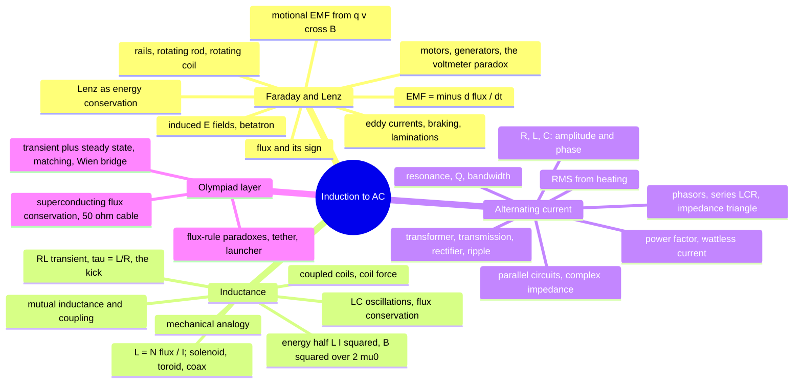
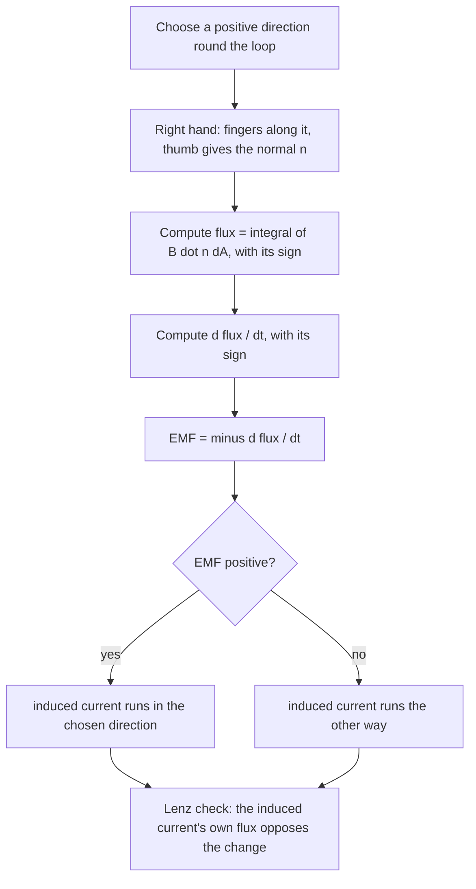
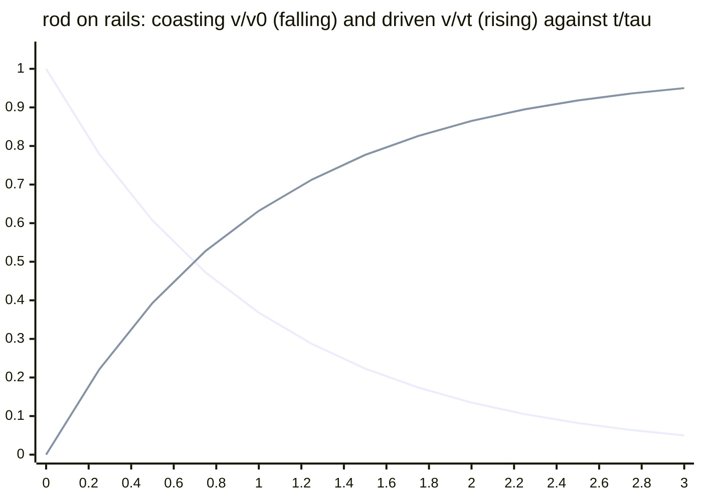
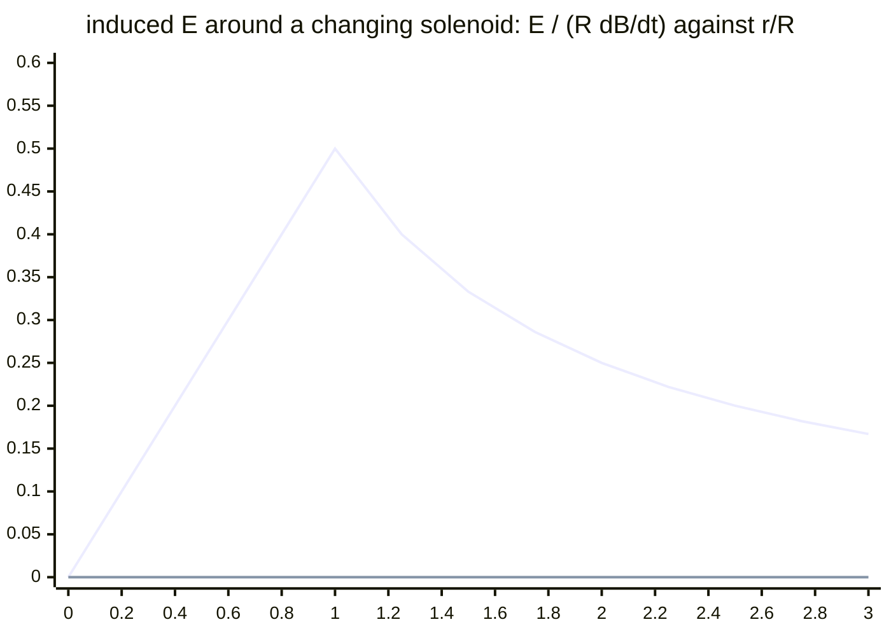
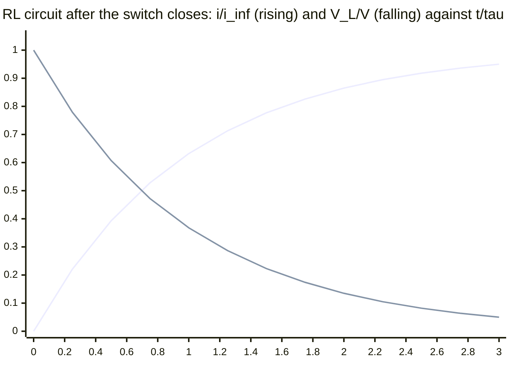
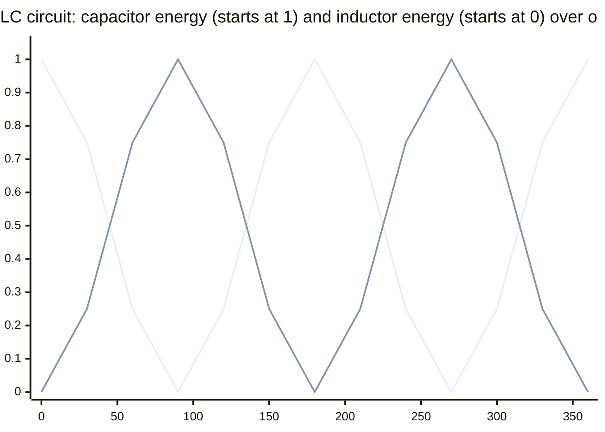
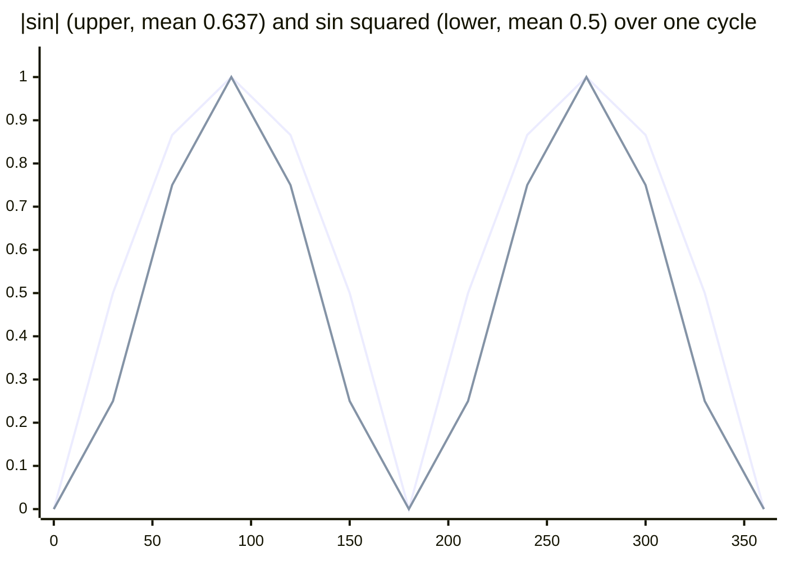
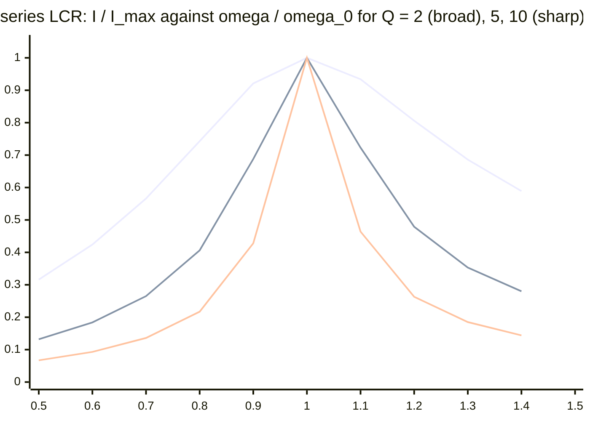
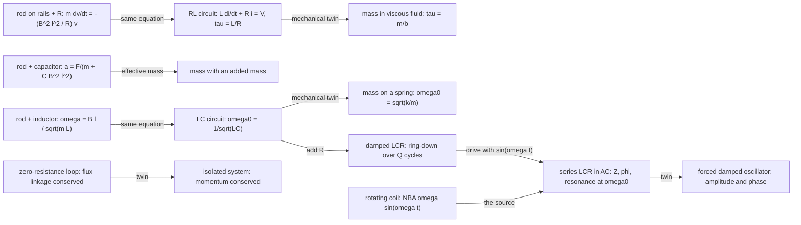
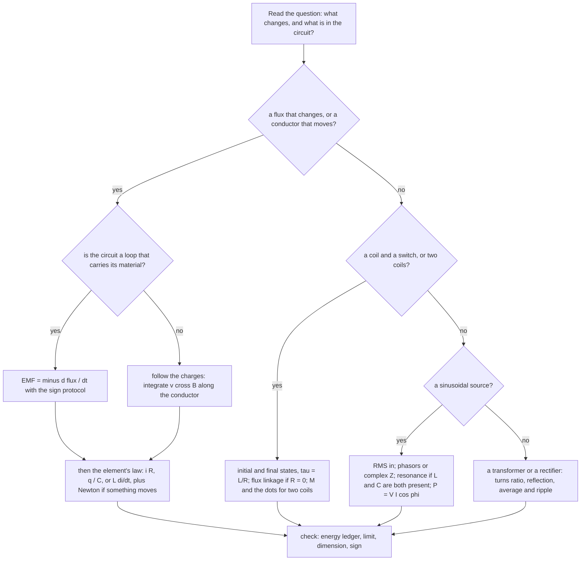

# Electromagnetic induction, inductance and alternating current — one continuous argument

> [!abstract] How to use this chapter
> One module for the three plan parts that the plan itself refuses to split: **induction** (a changing flux drives an electric field; Lenz's law is energy conservation), **inductance** (a coil resists changes in its own current because the energy lives in the field), and **alternating current** (everything is a phase relationship; impedance is resistance that knows about time). Three passes. **Pass 1: Parts 0–3** — the theory in teaching order: flux and Faraday's law, the motional EMF derived *without* flux and the two reconciled, Lenz's law with its energy audit, the rod-on-rails family with every attachment (resistor, mass, capacitor, friction, spring, inductor), induced electric fields and the betatron, eddy currents and laminations, generators and motors, the voltmeter paradox; then flux linkage and $L$ for four geometries, mutual inductance, the RL transient, the inductive kick, $\tfrac12LI^2$ and $B^2/2\mu_0$, the mechanical analogy, combinations, coupled coils and the coil force, LC oscillations, flux conservation; then AC: RMS from heating, R, L, C alone with their phases *derived*, phasors, series LCR, resonance and $Q$ two ways, power and the power factor, parallel circuits, complex impedance, the transformer with impedance reflection and transmission losses, rectifiers and ripple, and the LC circuit as the source of radio. **Pass 2: Parts 4–9** — validity ledger, worked exemplars, archetypes with practice, toolkit, traps, playbook. **Pass 3: Parts 10–14** — the Olympiad layer (the flux-rule paradoxes, the betatron twice, the falling magnet, the tether, the coil launcher, superconducting flux conservation, the $50\ \Omega$ cable, the full transient-plus-steady-state solution, impedance matching, the Wien bridge, three-phase), the 200-mark paper, the marking scheme, the formula sheet and the checkpoint.

> [!note] One module for three plan parts — and the last one
> The module merges plan.md PARTs 20, 21 and 22 into one chapter and was written in three stages — theory (Parts 0–3), exam craft (Parts 4–9), Olympiad layer and paper (Parts 10–14). All three are now on the page; `tools/check.py` enforces the full plan.md §1 contract. With it, every part of plan.md is written.

## Part 0 · Orientation

### 0.1 What you will be able to do

After this chapter you can: compute a flux with its sign and decide the sign of an induced EMF by a fixed protocol; derive the motional EMF from the Lorentz force and from Faraday's law and say how the two statements are related and where the flux rule needs care; run Lenz's law as an energy audit; solve the rod-on-rails problem with a resistor (current, force, exponential decay, terminal speed, power balance), with a hanging mass, with a capacitor (constant acceleration), with friction, with a spring and with an inductor; derive the rotating rod's $\tfrac12B\omega L^2$ and the rotating coil's sinusoid; find the induced electric field inside and outside a changing-flux region and use it to accelerate a charge; derive the betatron's 2:1 condition; explain eddy currents, derive the exponential magnetic braking, the falling-magnet terminal speed and the lamination's $d^2$ law; explain a motor's back-EMF and solve the two-voltmeter paradox; define inductance and derive $L$ for a solenoid, a toroid, a coaxial cable and a two-wire line, and $M$ for coaxial coils; solve the RL transient and the inductive kick; derive $\tfrac12LI^2$ and turn it into $B^2/2\mu_0$; use the mechanical analogy to read off unfamiliar circuits; combine inductors with and without $M$; derive the coil force $\tfrac12I^2\,dM/dx$; identify the LC circuit with SHM; apply flux conservation to zero-resistance loops; derive RMS from heating and tell it from the half-cycle average; derive the phase and amplitude of the current through R, L and C; build phasor diagrams; derive the series LCR impedance and phase, the resonance frequency, the voltage magnification, the $Q$ factor two ways and the bandwidth; derive the average power and the power factor and size a correction capacitor; handle parallel circuits by admittance and any circuit by complex impedance; derive the transformer's relations and impedance reflection and do the transmission-loss arithmetic; derive the rectifier's ripple; and connect the LC oscillator to the radio.

### 0.2 The one idea

A changing magnetic flux makes an electric field, and that field pushes charge around loops: the EMF equals the rate of change of flux, with a sign that always resists the change. A coil therefore resists changes in its own current (inductance), a coil and a capacitor exchange energy at one frequency (oscillation), and a sinusoidal source drives each element with its own amplitude and phase (impedance). One law, Faraday's, read three times.

### 0.3 Prerequisite self-check

1. *Flux of a uniform $\mathbf B$ through a flat loop of area $A$ whose normal makes angle $\theta$ with $\mathbf B$?* — $BA\cos\theta$ ([[Magnetism|magnetism]] §3.22, and §3.1 here).
2. *Force on a charge $q$ moving at $\mathbf v$ in $\mathbf B$; force on a wire?* — $q\mathbf v\times\mathbf B$; $I\mathbf L\times\mathbf B$ (magnetism §3.2, §3.23).
3. *Field inside a long solenoid; its energy density?* — $\mu_0nI$; $B^2/2\mu_0$ announced (magnetism §3.19, §3.26 — derived in §3.18 here).
4. *Kirchhoff's loop rule and the RC time constant?* — the sum of EMFs equals the sum of $IR$ drops around a loop; $\tau=RC$ ([[Current-electricity|current electricity]], [[Capacitors|capacitors]]).
5. *Solution of $\ddot x=-\omega^2x$ and of $\dot x=-x/\tau$?* — $A\cos(\omega t+\phi)$ and $x_0e^{-t/\tau}$ ([[Simple-harmonic-motion|PART 10]], [[Kinematics-1d|PART 3]]).
6. *Energy of a capacitor; of a spring?* — $\tfrac12CV^2=q^2/2C$; $\tfrac12kx^2$.
7. *Adding two vectors of equal length at $90^\circ$; the average of $\sin^2$ over a cycle?* — $\sqrt2$ times the length at $45^\circ$; $\tfrac12$ ([[Vectors|PART 2]]).
8. *A conductor in electrostatic equilibrium is an equipotential — why?* — $\mathbf E=0$ inside and $\oint\mathbf E\cdot d\mathbf l=0$ ([[Electrostatics|electrostatics]] §3.33; the second condition is exactly what induction breaks).

### 0.4 Numbers to keep

| quantity | value | why it matters |
|---|---|---|
| mains | $230$ V RMS, $50$ Hz; peak $325$ V; $\omega=314$ s$^{-1}$ | every household AC number |
| RMS of a sinusoid | $I_0/\sqrt2=0.707I_0$; half-cycle average $2I_0/\pi=0.637I_0$ | the two are confused every year |
| $\tau=L/R$; $\tau=RC$; $\omega_0=1/\sqrt{LC}$ | e.g. $10$ mH, $5\ \Omega$: $2$ ms; $10$ mH, $100$ nF: $5$ kHz | the three time scales of a circuit |
| solenoid $L=\mu_0n^2A\ell$ | $1000$ turns on $20$ cm, $2$ cm radius: $7.9$ mH | the inductance of a real coil |
| coaxial cable $L'$, $C'$ | $0.32\ \mu$H m$^{-1}$, $35$ pF m$^{-1}$ for $b/a=5$; $L'C'=1/c^2$; $\sqrt{L'/C'}=96\ \Omega$ | why cables have an impedance |
| $B^2/2\mu_0$ at $1$ T | $4\times10^5$ J m$^{-3}$ | an MRI magnet stores megajoules |
| reactances at $50$ Hz | $50$ mH: $15.7\ \Omega$; $10\ \mu$F: $318\ \Omega$ | $L$ is small and $C$ is large at mains frequency |
| falling magnet in a copper tube | $\sim0.2$ m s$^{-1}$ for a $1$ cm$^3$ NdFeB magnet, $1$ mm wall | Lenz's law you can hold |
| lamination loss | $0.35$ mm silicon steel at $1.2$ T, $50$ Hz: $0.2$ W kg$^{-1}$ | why cores are laminated |
| transmission | $10$ MW over $5\ \Omega$: $41\%$ lost at $11$ kV, $0.1\%$ at $220$ kV | why the grid is high-voltage |
| a motor's back-EMF | $12$ V motor, $0.5\ \Omega$: $24$ A at start, $4$ A running | why a stalled motor burns |
| ripple | $\Delta V\approx I/2fC$: $0.5$ A, $100$ Hz, $5$ mF: $1$ V | sizing a smoothing capacitor |

### 0.5 How to use the chapter

Read Part 3 in order — it is one argument, and each of its three thirds uses the previous one: the AC section's phasors are the RL transient's steady state, and the RL transient is Faraday's law applied to a coil's own flux. Do the worked examples with pencil (a dozen sit inside the theory; the exemplars E1–E20 of Part 5 add the exam craft). Every derivation ends with a check; the checks are where the traps of Part 8 are first defused. Then come back to §3.3 (the two derivations of induction) and §3.27 (the phases of L and C) and make sure you can reproduce both from scratch — the chapter hangs on them.

### 0.6 Coverage map

There is no Cengage volume for this material in the repository (plan.md Block B). The floor is the standard JEE Advanced syllabus as itemised in plan.md PART 20–22 (headings as printed there), plus what the shipped [[Current-electricity|current-electricity]], [[Capacitors|capacitors]] and [[Electromagnetic-waves|electromagnetic-waves]] notes assume. Status vocabulary: **derived**, **stated + used**, **extended beyond floor**, and — for exam craft — **archetypes (Parts 5–6)**.

**PART 20 · Electromagnetic induction**

| syllabus heading | what it establishes | where it lives here | status |
|---|---|---|---|
| Flux | definition, sign, tilted loop, non-uniform field | §3.1 | derived |
| The discovery and the law | Faraday's law, the minus sign, the sign protocol | §3.2 | stated + used (protocol derived) |
| Motional EMF from the Lorentz force | $Bvl$ without flux; the two statements compared; the flux rule's failure case | §3.3 | derived |
| Lenz's law as energy conservation | the algorithm; the energy audit; the copper-tube magnet | §3.4 | derived |
| The standard configurations | rails, rotating rod, rotating loop, disc, loop leaving a field, loop in a changing field | §3.5 | derived |
| Coupled mechanics and circuits | hanging mass, capacitor, friction, spring, inductor | §3.6 | derived |
| Induced electric fields | $E(r)$ inside and outside; non-conservative; accelerated charge | §3.7 | derived |
| The betatron condition | $B_{\text{orbit}}=\tfrac12\langle B\rangle$ | §3.8 | derived |
| Eddy currents | origin; braking exponential; falling magnet; heating; lamination $d^2$; which metal | §3.9 | derived |
| Generators and motors | AC generator, commutation, back-EMF, start-up current | §3.10 | derived |
| The voltmeter paradoxes | two voltmeters, two readings; EMF is not a potential difference | §3.11 | derived |
| Induction in everyday life | detectors, hobs, pickups, braking, charging | §3.12 | stated + used |

**PART 21 · Self and mutual inductance, RL circuits and magnetic energy**

| syllabus heading | what it establishes | where it lives here | status |
|---|---|---|---|
| The inertia of current | flux linkage; $L=N\Phi/I$; geometry only | §3.13 | derived |
| Computing self-inductance | solenoid, toroid, coaxial cable, two-wire line, single loop | §3.14 | derived |
| Mutual inductance | $M$, reciprocity, coaxial solenoids, $k$, when zero | §3.15 | derived |
| The RL circuit | rise, decay, $\tau=L/R$, initial and final states | §3.16 | derived |
| The inductive kick | the spark, the ignition coil, the diode, the energy | §3.17 | derived |
| Energy in the magnetic field | $\tfrac12LI^2$; $B^2/2\mu_0$; pressure; the electric comparison | §3.18 | derived |
| The mechanical–electrical analogy | the table and its use | §3.19 | derived |
| Inductors in combinations | series, parallel, $\pm2M$ | §3.20 | derived |
| Energy of coupled coils | $MI_1I_2$; the coil force | §3.21 | derived |
| LC oscillations | SHM; energy exchange; damping | §3.22 | derived |
| Transients with flux conservation | zero-resistance loops; two inductors and a switch | §3.23 | derived |
| Inductance in practice | ideal transformer preview; parasitics | §3.24 | stated + used |

**PART 22 · Alternating current, resonance and transformers**

| syllabus heading | what it establishes | where it lives here | status |
|---|---|---|---|
| Why AC and where it comes from | the generator; vocabulary | §3.25 | derived |
| RMS values | heating definition; $I_0/\sqrt2$; the half-cycle average; other waveforms | §3.26 | derived |
| AC through R, L, C | amplitude and phase for each, derived; reactances | §3.27 | derived |
| Phasors | legitimacy; diagrams | §3.28 | derived |
| Series LCR | $Z$, $\tan\phi$, the triangle; voltages do not add | §3.29 | derived |
| Resonance | $\omega_0$; magnification; $Q$ two ways; bandwidth | §3.30 | derived |
| Power in AC | $V_{\text{rms}}I_{\text{rms}}\cos\phi$; the triangle; wattless current; billing | §3.31 | derived |
| Parallel AC circuits | admittance; the tank's anti-resonance | §3.32 | derived |
| The complex-impedance method | $Z=R+j(X_L-X_C)$; a network both ways | §3.33 | derived |
| Transformers | flux linkage; turns ratio; impedance reflection; losses; transmission | §3.34 | derived |
| Rectification and filters | half and full wave; ripple $I/2fC$ | §3.35 | derived |
| LC oscillations and the road ahead | the LC source; the damped transient; the radiating oscillator | §3.36 | stated + used |

### 0.7 Plan-part map

| plan.md part | this chapter |
|---|---|
| PART 20 · Induction | §3.1–§3.12 |
| PART 21 · Inductance | §3.13–§3.24 |
| PART 22 · Alternating current | §3.25–§3.36 |

The three thirds are one argument: §3.13 is Faraday's law applied to a coil's own flux, §3.22 is the RL circuit with a capacitor in place of the resistor, and §3.27 is §3.16 driven by a sinusoid instead of a switch.

## Part 1 · Intuition first

Push a bar magnet into a coil and a galvanometer flicks; pull it out and it flicks the other way; hold it still, however close, and nothing happens. Faraday's discovery is that *change* makes electricity — not the field but its rate of change through the loop. The direction of the flick is never arbitrary: the current always flows so as to fight what you are doing. Push the magnet in and the coil becomes a magnet that repels it; pull it out and the coil attracts it. That is Lenz's law, and it is nothing but energy conservation: if the coil helped instead of hindered, a magnet dropped through a coil would speed up and generate power for free.

The same thing seen from inside a wire: a rod dragged across a magnetic field carries its electrons with it, and moving charges in a field are pushed sideways — along the rod. The rod becomes a battery. Close the circuit and a current flows, the current feels a force from the same field, and that force opposes the drag. You pay for the current with the work of pulling; nothing has been created. Slide a rod on rails, spin a rod about one end, spin a coil in a field — each is a battery whose voltage is written in the geometry, and the spinning coil's voltage is a sinusoid: alternating current, the shape of every wall socket.

A coil feels its own changes. When the current through it tries to rise, the growing flux induces a voltage that opposes the rise; when it tries to fall, the collapsing flux induces a voltage that opposes the fall — sometimes thousands of volts, the spark when a switch opens. The coil has electrical inertia, and its measure is the inductance. Where the energy goes while the current is being built up is not the wire but the field around it: a magnet's field is a store of energy, and the store can be tapped, at a price, by letting the current change.

Connect a coil to a charged capacitor and the energy sloshes: the capacitor drives a current, the coil keeps it flowing past the point where the capacitor is empty and charges it the other way, and so on — an electrical pendulum, with a frequency set by $L$ and $C$ alone. Drive any circuit with a sinusoid and each element answers in character: a resistor in step, a coil a quarter-cycle behind (inertia), a capacitor a quarter-cycle ahead (a spring). Add them and the amplitudes do not add — the phases fight — unless the coil's lag and the capacitor's lead cancel, at one frequency, where the circuit rings: resonance, the principle of every radio. And because only the *change* of flux matters, a changing current in one coil drives another with no wire between them: the transformer, which steps voltage up for transmission and down for use, and is the reason the world's power is AC.

> [!tip] FIGURE F20.1 · The module in one picture
> *Why:* a first map of the three plan parts merged here, so that each later section is a known place on it.
> *Data:* the three thirds of Part 3 and their leaf topics from the coverage map.

> *Read:* left to right is the teaching order; each third is the previous one applied to a coil's own flux, then to a sinusoidal drive.

## Part 2 · Definitions and bookkeeping

### 2.1 Symbols and units

| symbol | meaning | unit | convention fixed here |
|---|---|---|---|
| $\Phi$ | magnetic flux through a surface bounded by a loop | weber, Wb $=$ T m$^2$ $=$ V s | $\int\mathbf B\cdot d\mathbf A$ with $d\mathbf A$ along the chosen normal |
| $\mathcal E$ | electromotive force: work per unit charge done on a charge carried once round the loop | V | $\oint\mathbf f\cdot d\mathbf l$ with $\mathbf f$ the force per unit charge; **not** a potential difference when it arises from a changing flux (§3.11) |
| $N\Phi$, $\Lambda$ | flux linkage of an $N$-turn coil | Wb (turns) | $\Lambda=N\Phi$ when every turn links the same flux |
| $L$, $M$ | self-inductance, mutual inductance | henry, H $=$ Wb A$^{-1}$ $=$ V s A$^{-1}$ $=\Omega$ s | $L=\Lambda/I$; $M_{12}=\Lambda_1/I_2=M_{21}$; the sign of $M$ follows the dot convention (§3.20) |
| $\tau$ | time constant | s | $L/R$ for an RL loop, $RC$ for an RC loop |
| $\omega_0$ | natural angular frequency | rad s$^{-1}$ | $1/\sqrt{LC}$ |
| $I_0$, $V_0$ | peak (amplitude) values of a sinusoid | A, V | $i(t)=I_0\sin(\omega t+\phi)$ |
| $I_{\text{rms}}$, $V_{\text{rms}}$ | root-mean-square values | A, V | $\sqrt{\langle i^2\rangle}$; $I_0/\sqrt2$ for a sinusoid; what meters and bills quote |
| $X_L$, $X_C$ | inductive and capacitive reactance | $\Omega$ | $\omega L$; $1/\omega C$ |
| $Z$, $\phi$ | impedance magnitude; phase of the *voltage relative to the current* | $\Omega$, rad | $V_0=ZI_0$; $\phi>0$ means the voltage leads (inductive) |
| $\tilde Z$ | complex impedance | $\Omega$ | $R+j(X_L-X_C)$, $j^2=-1$; $Z=\lvert\tilde Z\rvert$, $\phi=\arg\tilde Z$ |
| $Q$ | quality factor | — | $\omega_0L/R=\omega_0/\Delta\omega$ for a series circuit |
| $\cos\phi$ | power factor | — | $P=V_{\text{rms}}I_{\text{rms}}\cos\phi$ |
| $N_p$, $N_s$ | transformer primary and secondary turns | — | $V_s/V_p=N_s/N_p$ for an ideal transformer |

### 2.2 Sign conventions, fixed once

**Flux and EMF share one right-hand rule.** Choose a direction round the loop; curl the right hand's fingers that way; the thumb is the positive normal $\hat{\mathbf n}$ for the flux. Then Faraday's law $\mathcal E=-d\Phi/dt$ gives the EMF *in the chosen direction*: positive drives a current the way the fingers curl, negative the other way. Choosing the opposite direction flips both signs and changes nothing physical. The protocol of §3.2 is this sentence applied three times.

**Kirchhoff with an inductor.** Walking round a loop in the direction of the current, an inductor contributes $-L\,di/dt$ to the sum of potential rises (a *drop* of $L\,di/dt$ when the current is rising) — exactly as a resistor contributes $-iR$. Equivalently, the induced EMF in the loop is $-L\,di/dt$, opposing the change. The single most reliable habit: write the loop equation as $\sum(\text{EMFs of sources})=iR+L\,di/dt+q/C$ with $i=dq/dt$, and never argue about the sign of the inductor separately.

**AC phases.** $\phi$ is the angle by which the *voltage leads the current*: positive for an inductive circuit, negative for a capacitive one. "Current lags by $\phi$" means the same thing. Phasors rotate anticlockwise at $\omega$; a phasor drawn ahead (anticlockwise) of another leads it.

**Transformer polarity.** With the primary and secondary wound the same way round the core, the dotted ends rise and fall together; the secondary's EMF is $N_s/N_p$ times the primary's *applied* voltage, of the same polarity at the dots.

### 2.3 The model and its assumptions

*Quasi-static:* circuits are small compared with the wavelength at the frequencies used ($6000$ km at $50$ Hz; $3$ m at $100$ MHz), so at any instant the current is the same everywhere in a series branch and Kirchhoff's rules hold with $L$, $C$ and $R$ as lumped elements. *Linear elements:* $L$, $C$ and $R$ independent of current and voltage — iron-cored inductors and diodes violate this and are handled by stating the regime. *Ideal wires* unless a resistance is named; *no radiation* (the loss of an LC circuit is its resistance, not its antenna action — §3.36 estimates when this fails). *Sinusoidal steady state* for Parts 3.27–3.34: transients have died (§3.16 says how long that takes; Part 10 treats the two together). *Non-relativistic* conductors; magnetic fields of steady or slowly changing currents as in the magnetism chapter. What is *not* in the model: displacement current and electromagnetic waves (the shipped [[Electromagnetic-waves|EM-waves]] note), the skin effect except as an estimate, and the quantum origin of superconductivity (flux conservation in a zero-resistance loop is used, not explained).

### 2.4 The bookkeeping of a changing flux

The flux through a loop can change in three ways, and Faraday's law counts all three at once:

$$
\frac{d\Phi}{dt}=\int\frac{\partial\mathbf B}{\partial t}\cdot d\mathbf A\ \ (\text{field changes})\ +\ (\text{loop moves through a non-uniform field})\ +\ (\text{loop changes shape or orientation}). \qquad (2.1)
$$

The first term is a *transformer* EMF: a genuinely new electric field, curling around the changing $\mathbf B$, present with or without a wire (§3.7). The second and third are *motional* EMFs: the Lorentz force on the charges of a moving conductor (§3.3). They look different, they are computed differently, and Faraday's flux rule gives their sum in one line — which is its power and, in one famous family of cases, its trap (§3.3, Part 10).

> [!info] Why the EMF is not a voltage
> A battery's EMF is a chemical push localised in the battery; the rest of the circuit is electrostatic and has a potential. An induced EMF is spread around the loop by a field that has no potential at all ($\oint\mathbf E\cdot d\mathbf l\neq0$). One can still speak of the voltage *across a resistor* ($iR$, what a voltmeter reads) — but "the voltage between two points" depends on the path taken between them once flux is changing inside the circuit. §3.11 makes this concrete with two voltmeters that disagree.

## Part 3 · Core derivations

The order is the teaching order and it is one argument: what a changing flux does (§3.1–§3.12), what a coil's own changing flux does (§3.13–§3.24), and what a sinusoidally changing flux does (§3.25–§3.36). Every result is derived once here; the magnetism chapter is cited wherever a field is borrowed from it.

### 3.1 Flux

The magnetic flux through a surface $S$ is

$$
\Phi=\int_S\mathbf B\cdot d\mathbf A=\int_S B\cos\theta\,dA, \qquad (3.1)
$$

with $d\mathbf A$ along the surface's normal and $\theta$ the angle between $\mathbf B$ and that normal. For a uniform field and a flat loop of area $A$: $\Phi=BA\cos\theta$ — the full $BA$ face-on, zero edge-on, and *negative* when the field passes through the loop against the chosen normal. Flux is a scalar with a sign, and the sign is a choice (of normal) that must be made once and kept: reversing the normal reverses $\Phi$ and, with it, the sign of every EMF computed from it. For a loop, "the surface" is any surface bounded by the loop — the magnetism chapter's $\oint\mathbf B\cdot d\mathbf A=0$ guarantees they all give the same $\Phi$. For a coil of $N$ turns each linking $\Phi$, the quantity that matters is the flux *linkage* $N\Phi$. Units: weber, $1$ Wb $=1$ T m$^2=1$ V s — the second form is Faraday's law waiting to happen.

**Non-uniform fields.** A rectangular loop ($a$ along the wire, $b$ across) whose near side is a distance $d$ from a long straight wire carrying $I$: $\Phi=\int_d^{d+b}\dfrac{\mu_0I}{2\pi r}a\,dr=\dfrac{\mu_0Ia}{2\pi}\ln\dfrac{d+b}{d}$ — the flux integral of §3.14 and the mutual inductance of a loop and a wire, both at once.

> [!example] Worked example — three orientations
> A $10$ cm $\times$ $20$ cm loop in a uniform $0.30$ T field: face-on, $\Phi=0.3\times0.02=6.0\times10^{-3}$ Wb; tilted so that its normal is at $60^\circ$ to the field, $3.0\times10^{-3}$ Wb; edge-on, $0$; turned over (normal at $180^\circ$), $-6.0\times10^{-3}$ Wb. Rotating it from face-on to turned-over changes the flux by $1.2\times10^{-2}$ Wb — twice $BA$, the figure that a flip-coil measurement of $B$ relies on.

> [!abstract] DIAGRAM D20.1 · Flux through a tilted loop
> *Show:* uniform field lines crossing a flat loop tilted by $\theta$, the chosen normal $\hat{\mathbf n}$ drawn with the right-hand rule's fingers around the loop, the projected area $A\cos\theta$ shaded; three insets: face-on ($\Phi=BA$), edge-on ($0$), reversed ($-BA$).
> *Search:* "magnetic flux through tilted loop normal vector right hand rule sign"

### 3.2 The discovery and the law

Faraday (1831) found an induced current whenever the flux through a circuit changed — by moving a magnet, moving the loop, deforming it, rotating it, or switching a neighbouring current on or off — and none while the flux was steady, however large. The law that summarises every case:

$$
\mathcal E=-\frac{d\Phi}{dt}\qquad(\text{one loop}),\qquad \mathcal E=-N\frac{d\Phi}{dt}\qquad(N\text{ turns}). \qquad (3.2)
$$

The EMF is the work done on unit charge carried once round the loop; in a loop of resistance $R$ it drives $i=\mathcal E/R$ — and the *charge* that passes while the flux changes by $\Delta\Phi$ is $q=\int i\,dt=\Delta\Phi/R$ (the flip coil's principle: $q$ does not care how fast the flip was).

**The minus sign, made into a protocol.** (i) Choose a positive direction round the loop and let the right hand give the normal. (ii) Compute $\Phi$ with that normal, with its sign. (iii) Compute $d\Phi/dt$ with its sign. (iv) $\mathcal E=-d\Phi/dt$: if positive, the induced current runs in the chosen direction; if negative, the other way. The physical content of the sign — the induced current *opposes the change of flux* — is Lenz's law (§3.4), and the protocol is Lenz's law made mechanical.

> [!example] Worked example — the sign drill
> A circular loop lies in the plane of the page; a field into the page grows from $0.2$ T to $0.6$ T in $2$ s. Choose the positive direction *clockwise*; the right hand then puts the normal into the page, so $\Phi=+BA$ and $d\Phi/dt=+0.2A$ per second; $\mathcal E=-0.2A$ V: negative, so the current runs *anticlockwise*. Check by Lenz: an anticlockwise current makes a field out of the page inside the loop, opposing the growth of the inward flux ✓. Now let the field *decrease*: $d\Phi/dt<0$, $\mathcal E>0$, the current runs clockwise, adding inward flux to replace what is being lost ✓.

> [!tip] FIGURE F20.2 · The sign protocol for an induced EMF
> *Why:* every sign error in the chapter is a step skipped in this flow.
> *Data:* the four steps of §3.2 with the Lenz check as the exit.

> *Read:* the choice in the first box is free; everything after it is forced. If the Lenz check fails, a sign was dropped in step C or D.

> [!abstract] DIAGRAM D20.2 · The four experiments
> *Show:* four panels with a coil and a galvanometer: a bar magnet moving into the coil (needle deflects one way), out (the other way), a second coil with a switch being closed (a flick), and a loop being rotated in a field; in each the change of flux and the direction of the induced current are marked with the right-hand normal drawn.
> *Search:* "faraday's experiments magnet coil galvanometer moving loop rotating loop induced current"

### 3.3 Motional EMF from the Lorentz force — and how it relates to Faraday

Slide a conducting rod of length $l$ at velocity $\mathbf v$ through a uniform field $\mathbf B$, with $\mathbf v\perp\mathbf B$ and the rod perpendicular to both. Every free electron in the rod moves with it and feels $q\mathbf v\times\mathbf B$, directed *along the rod*: charge is driven to one end until the electric field of the separated charge balances the magnetic push, $qE=qvB$, $E=vB$, and the ends differ in potential by

$$
\mathcal E=Blv. \qquad (3.3)
$$

No flux was mentioned. The rod is a battery of EMF $Blv$ with its positive terminal at the end towards which $\mathbf v\times\mathbf B$ points (for positive charge). In general, for any element $d\mathbf l$ of a moving conductor, $d\mathcal E=(\mathbf v\times\mathbf B)\cdot d\mathbf l$, and for a rod at angle to the field only the component of $\mathbf v\times\mathbf B$ along the rod counts.

**The same result from flux.** Let the rod slide on rails closing a circuit of width $l$; the area enclosed grows at $lv$, so $\lvert d\Phi/dt\rvert=Blv$ and Faraday's law gives $\lvert\mathcal E\rvert=Blv$ ✓. The two agree — and they must, but they are *not* the same statement. The Lorentz-force derivation is the physics of a moving conductor and needs no circuit at all; Faraday's law in its transformer form ($\partial\mathbf B/\partial t\to\mathbf E$) is a separate law of nature about changing fields; the *flux rule* $\mathcal E=-d\Phi/dt$ packages both into one formula that is right whenever the circuit is a well-defined loop whose motion carries its material with it. Einstein's 1905 paper opens with this very pair — a magnet moved past a coil and a coil moved past a magnet give the same current from two different mechanisms — and relativity is what makes them one.

**Where the flux rule needs care.** When the circuit's boundary slides *through* the conductor — a wheel rolling on rails with a contact at its rim, a spinning disc with a brush (the Faraday disc, §3.5), a moving contact that jumps from one wire to another — "the flux through the circuit" is ambiguous or changes discontinuously while the physical EMF, computed from $\mathbf v\times\mathbf B$ on the charges that actually move, is perfectly definite. The rule: **when in doubt, follow the charges.** Part 10 works the paradox family; here the discipline is stated once — the flux rule is a shortcut, the Lorentz force is the law.

> [!abstract] DIAGRAM D20.3 · The rod as a battery
> *Show:* a rod moving right at $\mathbf v$ through a field into the page; on a positive carrier the force $q\mathbf v\times\mathbf B$ drawn upward along the rod; charge accumulated at the top ($+$) and bottom ($-$) with the electrostatic field $E=vB$ inside the rod balancing the magnetic push; the rod redrawn as a battery symbol of EMF $Blv$ with the positive terminal at the top; beneath, the rails-and-resistor circuit with the current direction.
> *Search:* "motional emf rod moving in magnetic field lorentz force charge separation Blv battery"

### 3.4 Lenz's law as energy conservation

**Statement.** The induced current flows in the direction that opposes the *change* producing it — not the flux, the change of flux. **Algorithm.** Find $\Delta\Phi$ (increasing or decreasing, and in which sense through the loop); the induced current's own field opposes that change (adds flux if flux is being lost, subtracts if gained); the right-hand rule then gives the current's direction; and the *mechanical* consequence — a force on the moving part, a torque on the rotating one — always opposes the motion that causes the change.

**Why it must be so.** Suppose the opposite: a magnet approaching a loop induces a current that *attracts* it. The magnet accelerates, the flux changes faster, the current grows, the attraction grows — a runaway that delivers kinetic energy to the magnet *and* heat to the loop from nothing. Lenz's sign is the only one consistent with energy conservation: the induced current's heat is paid for by the work done against the opposing force. **The audit,** for the rod on rails of §3.5: you pull with force $F$ at speed $v$, delivering power $Fv$; the current $i=Blv/R$ dissipates $i^2R=B^2l^2v^2/R$; the magnetic force on the rod is $Bil=B^2l^2v/R$, opposing $\mathbf v$; at steady speed $F=Bil$ and $Fv=B^2l^2v^2/R=i^2R$ exactly ✓. Every joule of heat came through your hand.

**Lenz's law you can hold.** Drop a small neodymium magnet down a copper pipe: it drifts down at a steady walking pace instead of falling. Each ring of the pipe sees the magnet's flux grow as it approaches and shrink as it recedes; the induced currents make a field that repels the magnet from below and attracts it from above; both oppose the fall, and the magnet reaches the speed at which the drag equals its weight. The estimate (Part 10 derives the coefficient): a dipole $\mu$ falling at $v$ along the axis of a thin pipe of radius $a$, wall $t$ and conductivity $\sigma$ feels $F=\dfrac{45}{1024}\dfrac{\mu_0^2\mu^2\sigma t}{a^4}v$, so

$$
v_{\text{t}}=\frac{1024}{45}\,\frac{mga^4}{\mu_0^2\mu^2\sigma t}; \qquad (3.4)
$$

for a $1$ cm$^3$ NdFeB magnet ($\mu\approx1$ A m$^2$, $m=7.5$ g) in a copper pipe of $1$ cm radius and $1$ mm wall ($\sigma=6\times10^7$ S m$^{-1}$): $v_{\text{t}}=0.18$ m s$^{-1}$; in aluminium ($3.8\times10^7$), $0.28$ m s$^{-1}$; in a plastic pipe, free fall. The drag is proportional to $v$, so the approach to $v_{\text{t}}$ is exponential with $\tau=m/K=v_{\text{t}}/g\approx20$ ms — the magnet is at terminal speed before it has fallen a centimetre.

> [!abstract] DIAGRAM D20.4 · The magnet in the copper tube
> *Show:* a vertical tube in section with a magnet falling down its axis; the rings of the wall above and below the magnet with their induced currents drawn in opposite senses; the induced dipoles above (attracting the magnet upward) and below (repelling it upward); the force balance $mg=Kv$ at terminal speed; a small $v(t)$ inset rising to $v_{\text{t}}$ within $\sim20$ ms.
> *Search:* "magnet falling through copper tube eddy currents lenz law terminal velocity diagram"

> [!danger] Trap — "opposes the flux"
> The induced current opposes the *change*. When the flux through a loop is decreasing, the induced current's field points *the same way* as the existing flux, trying to keep it; students who write "opposes the field" get exactly the wrong direction in every decreasing-flux problem. Say "opposes the change" every time.

### 3.5 The standard configurations

**The rod on rails, complete.** A rod of mass $m$ slides without friction on parallel rails a distance $l$ apart in a uniform field $B$ perpendicular to the plane; the rails are joined through a resistance $R$; the rod is given an initial speed $v_0$ and left alone. EMF $Blv$, current $i=Blv/R$, retarding force $Bil=B^2l^2v/R$:

$$
m\frac{dv}{dt}=-\frac{B^2l^2}{R}v\quad\Rightarrow\quad v=v_0e^{-t/\tau},\qquad \tau=\frac{mR}{B^2l^2}, \qquad (3.5)
$$

an exponential decay with a time constant that grows with mass and resistance and falls as $B^2$ — the same $B^2\sigma$ scaling as every eddy-current brake. The rod travels a finite distance, $x_\infty=\int v\,dt=v_0\tau$, and the heat dissipated, $\int i^2R\,dt=\int(B^2l^2v^2/R)dt=\tfrac12mv_0^2$ ✓ all of the kinetic energy. Numbers: $B=0.50$ T, $l=20$ cm, $R=0.10\ \Omega$, $m=100$ g, $v_0=2.0$ m s$^{-1}$: $\tau=1.0$ s, $i_0=2.0$ A, initial force $0.20$ N, stopping distance $2.0$ m, heat $0.20$ J. **Driven at constant force** $F$ (a string, a motor): $m\,dv/dt=F-B^2l^2v/R$, so $v=v_{\text{t}}(1-e^{-t/\tau})$ with the terminal speed $v_{\text{t}}=FR/B^2l^2$ at which the applied power $Fv_{\text{t}}$ all goes to heat.

> [!tip] FIGURE F20.3 · The rod on rails: coasting and driven
> *Why:* the two exponentials — decay to rest and approach to terminal speed — are the same time constant seen from both ends, and the whole rod family is variations on them.
> *Data:* $v/v_0=e^{-t/\tau}$ (coasting) and $v/v_{\text{t}}=1-e^{-t/\tau}$ (constant applied force) on $t/\tau=0,0.25,\dots,3$.

> *Read:* after one time constant the coasting rod has lost $63\%$ of its speed and the driven rod has gained $63\%$ of its terminal speed; after three, $95\%$. The two curves sum to $1$ at every instant — the driven problem is the coasting problem plus a constant.

**The rotating rod.** A rod of length $L$ turns at $\omega$ about one end, in a field $B$ perpendicular to its plane. An element at distance $r$ moves at $v=\omega r$ and contributes $d\mathcal E=B\,\omega r\,dr$:

$$
\mathcal E=\int_0^LB\omega r\,dr=\tfrac12B\omega L^2, \qquad (3.6)
$$

the same as a rod of length $L$ moving at the *average* speed $\tfrac12\omega L$. Flux check: the rod sweeps area at the rate $\tfrac12L^2\omega$ ✓. A rod turning about its centre has *zero* EMF between its ends (the two halves oppose) but $\tfrac18B\omega L^2$ between the centre and either end. Numbers: $L=0.5$ m at $100$ rad s$^{-1}$ in $0.5$ T: $6.25$ V. **The Faraday disc** is a stack of such rods: a disc of radius $a$ spinning at $\omega$ in $B$, with brushes at the axle and the rim, is a generator of EMF $\tfrac12B\omega a^2$ — the unipolar dynamo, whose "circuit" has no fixed loop, and which is the flux rule's classic embarrassment and the Lorentz force's easy victory.

**The rotating loop.** A coil of $N$ turns and area $A$ rotates at $\omega$ about an axis in its plane, perpendicular to a uniform $B$: $\Phi=BA\cos\omega t$, so

$$
\mathcal E=-N\frac{d\Phi}{dt}=NBA\omega\sin\omega t\equiv\mathcal E_0\sin\omega t,\qquad \mathcal E_0=NBA\omega. \qquad (3.7)
$$

The EMF is largest when the flux is *zero* (the coil edge-on, its sides cutting the field fastest) and zero when the flux is largest — the point every "the flux is maximum, so the EMF is maximum" answer misses. This is the AC generator and the origin of the sinusoid the whole of §3.25–§3.36 assumes. Numbers: $N=100$, $A=100$ cm$^2$, $B=0.2$ T at $50$ Hz ($\omega=314$ s$^{-1}$): $\mathcal E_0=62.8$ V, RMS $44$ V.

**A loop leaving a field region.** A rectangular loop (width $l$ across the boundary) is pulled at $v$ out of a region of uniform field. While it straddles the boundary only the side still inside the field has a motional EMF, $Blv$, and the flux decreases at $Blv$ — the two views agree; the current is $Blv/R$ and the retarding force $B^2l^2v/R$, the rod on rails once more. While the loop is *wholly* inside (or wholly outside) the two long sides have equal and opposite motional EMFs, the flux is constant, and there is no current. *Which end is the positive terminal* of the active side: the one towards which $\mathbf v\times\mathbf B$ points for positive charge — decide it by the cross product, not by the direction of the current in the rest of the loop.

**A loop entirely inside a changing field.** No motion, no motional EMF: $\mathcal E=-A\,dB/dt$, a transformer EMF produced by the induced electric field of §3.7. A $100$-turn coil of $50$ cm$^2$ in a field rising at $10$ T s$^{-1}$ (a pulsed magnet): $\mathcal E=100\times5\times10^{-3}\times10=5.0$ V.

> [!abstract] DIAGRAM D20.5 · Rotating rod, rotating coil, loop leaving a field
> *Show:* (a) a rod pivoted at one end with the speed profile $v=\omega r$ drawn as a growing arrow along it and $d\mathcal E=B\omega r\,dr$ on an element; (b) a coil rotating in a field with $\Phi(t)$ and $\mathcal E(t)$ plotted beneath, a quarter-cycle apart; (c) a rectangular loop half out of a shaded field region, the inside side marked as the battery $Blv$ with its polarity from $\mathbf v\times\mathbf B$, the outside side marked "no EMF".
> *Search:* "rotating rod emf half B omega L squared; rotating coil sinusoidal emf flux phase; loop leaving magnetic field induced current"

### 3.6 Coupled mechanics and circuits: the rod with every attachment

The rod on rails is a mechanical system and a circuit at once; each attachment gives a two-equation problem.

**A hanging mass.** The rod (mass $m$) on horizontal rails is pulled by a string over a pulley by a hanging mass $M$; the circuit has resistance $R$. Newton for the pair: $(m+M)\,dv/dt=Mg-B^2l^2v/R$. Terminal speed $v_{\text{t}}=MgR/B^2l^2$, approached with $\tau=(m+M)R/B^2l^2$. At $v_{\text{t}}$ the falling mass's power $Mgv_{\text{t}}$ equals the heat $i^2R$ ✓. With $M=50$ g in the circuit of §3.5: $v_{\text{t}}=4.9$ m s$^{-1}$, $\tau=1.5$ s.

**A capacitor instead of the resistor — the famous trap.** Now the rails are joined through a capacitor $C$ and the rod is pushed by a constant force $F$. There is no steady current, because a capacitor passes current only while its charge changes: $q=C\mathcal E=CBlv$, so $i=dq/dt=CBl\,dv/dt$ — the current is proportional to the *acceleration*, and the magnetic force $Bil=CB^2l^2\,dv/dt$ is an inertial force. Newton:

$$
m\frac{dv}{dt}=F-CB^2l^2\frac{dv}{dt}\quad\Rightarrow\quad a=\frac{F}{m+CB^2l^2}, \qquad (3.8)
$$

**constant acceleration**: the capacitor adds an effective mass $CB^2l^2$ and nothing else — no terminal speed, no decay. The current is constant, $i=CBla$, and the charge grows linearly. Energy check: the force's work $Fx$ splits into kinetic energy $\tfrac12mv^2$ and capacitor energy $\tfrac12CB^2l^2v^2$ in the ratio $m:CB^2l^2$ ✓. Numbers: $B=2.0$ T, $l=0.5$ m, $C=0.10$ F, $m=0.10$ kg, $F=1.0$ N: $CB^2l^2=0.10$ kg, $a=5.0$ m s$^{-2}$ instead of $10$, $i=0.50$ A.

**Friction.** Add kinetic friction $\mu_kmg$ to the coasting rod: $m\,dv/dt=-\mu_kmg-B^2l^2v/R$ — the rod stops in a *finite* time (the friction term does not vanish with $v$), and the energy audit splits $\tfrac12mv_0^2$ between heat in $R$ and heat at the rails in proportions that depend on the whole history. The lesson: a velocity-proportional drag never stops anything; a constant one does.

**A spring.** Attach the rod to a spring of constant $k$ with the resistor in the circuit: $m\ddot x=-kx-(B^2l^2/R)\dot x$, a damped oscillator with damping constant $b=B^2l^2/R$ — PART 10's equation with a magnetic dashpot. Underdamped for $b<2\sqrt{km}$, and the amplitude decays with time constant $2m/b=2\tau$. Replace the resistor by a capacitor and the damping disappears, replaced by extra mass: $\omega=\sqrt{k/(m+CB^2l^2)}$, undamped SHM at a lower frequency.

**An inductor.** Rails joined through an inductance $L_{\text{ind}}$ (no resistance), rod given $v_0$: the loop equation is $Blv=L_{\text{ind}}\,di/dt$ and Newton's is $m\,dv/dt=-Bil$. Differentiate Newton's equation and substitute the loop equation: $m\,d^2v/dt^2=-Bl\,di/dt=-B^2l^2v/L_{\text{ind}}$,

$$
\ddot v=-\frac{B^2l^2}{mL_{\text{ind}}}v:\qquad \omega=\frac{Bl}{\sqrt{mL_{\text{ind}}}}, \qquad (3.9)
$$

the rod oscillates back and forth for ever, its kinetic energy exchanging with the inductor's $\tfrac12L_{\text{ind}}i^2$ — an LC circuit in which the rod's mass plays the capacitor (§3.19). This is the hand-off the plan asks for: the inductor's role is the subject of §3.13 onward.

> [!abstract] DIAGRAM D20.6 · The rod with a hanging mass, and with a capacitor
> *Show:* left, rails with the rod, the string over a pulley to a hanging mass, free-body diagrams of rod (tension, magnetic drag $B^2l^2v/R$) and mass (weight, tension); right, the rails joined through a capacitor, the rod pushed by $F$, the current $i=CBla$ marked constant and the charge $q(t)$ growing linearly, with "$m_{\text{eff}}=m+CB^2l^2$" written.
> *Search:* "rod on rails hanging mass terminal velocity; rod on rails capacitor constant acceleration effective mass"

> [!danger] Trap — an instantaneous current
> With a capacitor in the circuit there is no steady current; with an inductor the current cannot jump. Writing $i=Blv/R$ for a circuit that has no resistor — or assuming that the current appears the instant the rod moves when an inductor is present — misses the whole problem. Name the element, write its law, and only then Newton.

### 3.7 Induced electric fields

Faraday's law with no conductor in sight: a changing $\mathbf B$ creates an electric field whose line integral round any closed path is minus the rate of change of the flux through it,

$$
\oint\mathbf E\cdot d\mathbf l=-\frac{d\Phi}{dt}=-\int\frac{\partial\mathbf B}{\partial t}\cdot d\mathbf A. \qquad (3.10)
$$

This $\mathbf E$ is not electrostatic: its circulation is not zero, so it has no potential and its field lines *close on themselves*, circling the region where $\mathbf B$ changes — the magnetic analogue of Ampère's law with $\partial\mathbf B/\partial t$ playing the current. (The electrostatics chapter's "no closed field lines" and "the conductor is an equipotential" were statements about *static* fields; this is the field that breaks them.)

**The standard geometry.** A long solenoid of radius $R$ whose interior field $B(t)$ changes at a uniform rate $\dot B$. By symmetry the induced $\mathbf E$ is azimuthal and depends on $r$ only; a circle of radius $r$ gives $E\cdot2\pi r=\pi r^2\dot B$ inside and $E\cdot2\pi r=\pi R^2\dot B$ outside:

$$
E_{\text{in}}=\frac r2\,\dot B\quad(r<R),\qquad E_{\text{out}}=\frac{R^2}{2r}\,\dot B\quad(r>R), \qquad (3.11)
$$

rising linearly to $\tfrac12R\dot B$ at the winding and falling as $1/r$ outside — the thick wire's magnetic profile with $\dot B$ in place of $\mu_0J$. Outside, where $\mathbf B$ itself is zero, there is nonetheless an electric field: the flux *through* a loop, not the field *on* it, is what counts. Direction: by Lenz, the induced $\mathbf E$ would drive a current whose field opposes $\dot B$ — for $\mathbf B$ out of the page and growing, $\mathbf E$ circles clockwise. Numbers: $R=5$ cm, $\dot B=100$ T s$^{-1}$ (a pulsed coil): $E=1.0$ V m$^{-1}$ at $r=2$ cm, $2.5$ V m$^{-1}$ at the winding, $1.25$ V m$^{-1}$ at $r=10$ cm.

> [!tip] FIGURE F20.4 · The induced electric field of a changing solenoid
> *Why:* the profile shows what "no potential" looks like — a field that circles, is linear inside and $1/r$ outside, and is non-zero where $\mathbf B$ is zero.
> *Data:* $E/(R\dot B)$ against $r/R$ on $0,0.25,\dots,3$: $\tfrac12(r/R)$ inside, $\tfrac12(R/r)$ outside; the line [0, 0] is the axis.

> *Read:* maximum at the winding, $\tfrac12R\dot B$; at $r=2R$ half that; the field lines are circles, and a charge carried once round any of them gains energy $q\pi R^2\dot B$ — however far out the circle is.

**A charge accelerated by the induced field.** A particle of charge $q$ constrained to a circle of radius $r$ (a ring, or an orbit) around the changing flux gains energy $q\,\mathcal E=q\pi R^2\dot B$ per revolution (for $r\ge R$); free to move on a straight track it feels $qE$ along the track's tangent. A bead of charge $q$ and mass $m$ on a frictionless ring of radius $r>R$ starting from rest while the flux rises from $0$ to $\Phi_f$ in time $T$: tangential force $qE=q\Phi_f/(2\pi rT)$, constant, so $v=qE\,T/m=q\Phi_f/(2\pi rm)$ — independent of $T$: the *impulse* per unit charge round the ring is the flux change divided by the circumference, whatever the rate. (This is the betatron's principle, §3.8.)

> [!info] Why no potential here
> A potential exists when $\oint\mathbf E\cdot d\mathbf l=0$ for every loop; here it is $-d\Phi/dt\neq0$ for loops that enclose the changing flux. Two points on such a loop have no unique "potential difference": the line integral of $\mathbf E$ between them depends on which way round you go, by exactly $d\Phi/dt$. That is the whole content of §3.11's paradox, and the reason the word EMF exists.

> [!abstract] DIAGRAM D20.7 · The induced field, inside and outside
> *Show:* two panels: (a) a solenoid's cross-section with $\mathbf B$ out of the page and growing, circular $\mathbf E$ lines drawn clockwise, arrows lengthening with $r$ inside; (b) the region outside the winding where $\mathbf B=0$ but the circles of $\mathbf E$ continue, arrows shortening as $1/r$; a bead on a ring outside the solenoid with the tangential force $qE$ marked.
> *Search:* "induced electric field changing magnetic field solenoid inside outside circular field lines"

### 3.8 The betatron condition

Accelerate electrons on a circle of fixed radius $R$ by *increasing* the magnetic flux through the orbit; the same magnet must also *bend* them round the circle. Two conditions, one field profile. **Guiding:** $p=eB_{\text{orb}}R$, where $B_{\text{orb}}$ is the field *at the orbit*; to keep $R$ fixed as $p$ grows, $dp/dt=eR\,dB_{\text{orb}}/dt$. **Accelerating:** the induced field on the orbit is $E=\dfrac{1}{2\pi R}\dfrac{d\Phi}{dt}=\dfrac{R}{2}\dfrac{d\langle B\rangle}{dt}$, where $\langle B\rangle=\Phi/\pi R^2$ is the field *averaged over the disc* inside the orbit; the force $eE$ increases the momentum at $dp/dt=eE=\dfrac{eR}{2}\dfrac{d\langle B\rangle}{dt}$. Equating the two rates:

$$
\frac{dB_{\text{orb}}}{dt}=\frac12\frac{d\langle B\rangle}{dt}\quad\Rightarrow\quad B_{\text{orb}}=\tfrac12\langle B\rangle, \qquad (3.12)
$$

the **2:1 condition** (Wideröe, 1928): the average field inside the orbit must be twice the field at the orbit, so the pole pieces are shaped to make the field *stronger inside* the orbit than on it. A *uniform* field fails ($\langle B\rangle=B_{\text{orb}}$): the momentum then grows only half as fast as the orbit condition demands, the radius of curvature $p/eB_{\text{orb}}$ falls below $R$, and the electrons spiral inward. Numbers: $R=0.5$ m, $B_{\text{orb}}$ raised to $0.5$ T in $5$ ms: final $pc=eB_{\text{orb}}Rc=75$ MeV; the electron makes $4.8\times10^5$ turns (at $v\approx c$) and gains $e\,d\Phi/dt=e\pi R^2\,d\langle B\rangle/dt=e\times157$ V per turn ✓ ($157$ eV $\times4.8\times10^5=75$ MeV). The relativistic $p=\gamma mv$ costs nothing here — the argument used $p$ throughout, which is why the betatron, unlike the cyclotron, works for electrons. Part 10 derives (3.12) a second way, from the canonical angular momentum.

> [!abstract] DIAGRAM D20.8 · The betatron
> *Show:* a circular orbit of radius $R$ between shaped pole pieces; the field profile $B(r)$ plotted across the diameter, higher inside the orbit than at it; the average field $\langle B\rangle$ marked as a horizontal line at twice $B_{\text{orb}}$; the induced $\mathbf E$ tangent to the orbit with the force on an electron; the orbit's momentum $p=eB_{\text{orb}}R$ written beside it.
> *Search:* "betatron 2:1 condition average field twice orbit field pole shape induced electric field"

### 3.9 Eddy currents: braking, heating, laminating

A conductor moving through a non-uniform field, or sitting in a changing one, has EMFs induced in it along closed paths *within* the metal; currents circulate in loops — **eddy currents** — heating the metal and, by Lenz, opposing the motion or the change. Three consequences with their scaling laws:

**Magnetic braking.** A plate of conductivity $\sigma$ moving at $v$ across the edge of a field $B$: the part inside the field is a rod with $E=vB$ driving current density $J\sim\sigma vB$ through the metal, closing through the field-free part. The dissipated power is $\sim\int J^2/\sigma\,dV\sim\sigma B^2v^2V_{\text{eff}}$, with $V_{\text{eff}}$ the volume carrying current (of order the volume in the field, times a geometric factor $k\sim0.1$–$0.5$ that accounts for the return path), so the retarding force is $F=P/v=k\sigma B^2V_{\text{eff}}\,v$ — **proportional to $v$**. The plate's motion obeys $m\,dv/dt=-k\sigma B^2V_{\text{eff}}v$:

$$
v=v_0e^{-t/\tau},\qquad \tau=\frac{m}{k\sigma B^2V_{\text{eff}}}\approx\frac{\rho_m}{k\sigma B^2}, \qquad (3.13)
$$

where the last form (for a plate mostly in the field, $m=\rho_mV$) shows that the braking time depends on the *material* — density over conductivity — and on $B^2$, not on the plate's size. For copper in $0.5$ T with $k=0.1$: $\tau=8960/(0.1\times6\times10^7\times0.25)=6$ ms; aluminium ($\rho_m/\sigma$ half as large) stops twice as fast. A pendulum with a solid copper bob swung between magnet poles stops within one swing; slot the bob and the eddy paths are cut, $k$ collapses, and it swings freely — the standard demonstration and the principle of the lamination.

**Induction heating.** The same currents, deliberately: an alternating field at frequency $f$ in a pan's base induces $E\propto f$, so $J\propto\sigma f$ and the power $\propto\sigma f^2B^2$ per unit volume — until the skin effect confines the current to a depth $\delta=\sqrt{2/\mu_0\mu_r\sigma\omega}$ ($0.1$ mm for iron at $25$ kHz, which is why induction hobs run at tens of kilohertz and need ferromagnetic pans; Part 10). Furnaces melt steel this way with no flame.

**Laminations.** A core of thickness $d$ carrying a field $B_0\cos\omega t$ *parallel* to its faces: inside, at distance $x$ from the mid-plane, the induced field along the sheet is $E=x\,dB/dt$ (a thin loop of width $2x$: $E\cdot2\ell=2x\ell\,\dot B$), so $J=\sigma x\omega B_0\sin\omega t$ and the time-averaged power per unit volume is

$$
\frac PV=\left\langle\sigma E^2\right\rangle=\sigma\omega^2B_0^2\,\frac{1}{d}\int_{-d/2}^{d/2}x^2dx\cdot\frac12=\frac{\sigma\omega^2B_0^2d^2}{24}. \qquad (3.14)
$$

**Proportional to $d^2$**: cut the core into sheets ten times thinner and the eddy loss falls a hundredfold. Silicon steel ($\sigma=2\times10^6$ S m$^{-1}$) at $1.2$ T and $50$ Hz in $0.35$ mm laminations: $1.45$ kW m$^{-3}$, $0.19$ W kg$^{-1}$; the same core solid, $2$ cm thick: $4.7$ MW m$^{-3}$ — it would glow. The laminations are insulated from one another by oxide or varnish; the hysteresis loss of the magnetism chapter (§3.34 there) is the other half of the "iron loss", and does not depend on $d$.

> [!abstract] DIAGRAM D20.9 · Eddy currents: a plate entering a field, and a laminated core
> *Show:* a conducting plate half inside a shaded field region, moving right; eddy-current loops drawn circulating through the inside part (where $E=vB$) and returning through the outside part; the retarding force on the inside part; beside it a solid core with one large eddy loop and a laminated core with many small loops, labelled "$P\propto d^2$".
> *Search:* "eddy currents plate entering magnetic field retarding force; laminated core eddy current loss proportional to thickness squared"

> [!danger] Trap — a constant braking force
> Eddy-current drag is proportional to speed; it cannot bring a body to rest in finite time by itself and never produces a constant deceleration. If a problem's magnetic brake stops something "in $2$ s", either there is friction too, or the field region ends. And the lamination benefit is $d^2$, not $d$: halving the thickness quarters the loss.

### 3.10 Generators and motors

**The AC generator** is the rotating coil of §3.5: $\mathcal E=NBA\omega\sin\omega t$, taken off through slip rings. **The DC generator** replaces the slip rings by a split ring — a *commutator* — that reverses the connection every half turn, so the output is $\lvert\sin\omega t\rvert$, pulsating but one-signed; several coils at angles, each with its commutator segments, smooth it.

**The motor** is the same machine run backwards: a current in the coil, a torque $\boldsymbol\mu\times\mathbf B$ (magnetism §3.24), rotation. But a rotating coil in a field is a generator, whether or not you want it to be: it produces an EMF $\mathcal E_{\text{back}}=NBA\omega\lvert\sin\omega t\rvert$ (averaged, $\propto\omega$) that *opposes* the applied voltage — the **back-EMF**. The armature current is set by the difference:

$$
i=\frac{V-\mathcal E_{\text{back}}}{R_{\text{arm}}},\qquad P_{\text{mech}}=\mathcal E_{\text{back}}\,i,\qquad P_{\text{heat}}=i^2R_{\text{arm}}. \qquad (3.15)
$$

At start-up $\omega=0$, $\mathcal E_{\text{back}}=0$ and $i=V/R_{\text{arm}}$ — huge, since armature resistances are small: a $12$ V motor with $0.5\ \Omega$ draws $24$ A at start and, running with $\mathcal E_{\text{back}}=10$ V, only $4$ A, delivering $40$ W of mechanical power against $8$ W of heat. A *stalled* motor is a start-up that never ends, and burns out; large motors start through series resistors or at reduced voltage, and the lights dim when the compressor kicks in. The energy accounting is §3.27 of the magnetism chapter made quantitative: the battery's power $Vi$ splits into $\mathcal E_{\text{back}}i$ (mechanical, via the magnetic force that itself does no work) and $i^2R$ (heat). Load the motor and it slows, the back-EMF falls, the current rises, the torque rises — a self-regulating machine. Conversely a *generator gets harder to turn when its load draws more current*: the current in its coil feels a torque opposing the rotation, and the mechanical power you must supply is $\mathcal Ei$ plus losses (Part 10's audit).

> [!abstract] DIAGRAM D20.10 · Generator and motor
> *Show:* a coil in a field with slip rings and the sinusoidal output beneath; the same coil with a split-ring commutator and the rectified $\lvert\sin\rvert$ output; a motor circuit with the battery $V$, the armature resistance and the back-EMF drawn as an opposing battery, with $i=(V-\mathcal E_{\text{back}})/R$ and a graph of $i$ against $\omega$ falling from $V/R$.
> *Search:* "ac generator slip rings dc generator commutator; dc motor back emf armature current versus speed"

### 3.11 The voltmeter paradox

A circular loop of wire consists of two resistors, $R_1=100\ \Omega$ and $R_2=900\ \Omega$, joined at points $A$ and $B$ diametrically opposite. A solenoid through the loop's centre has a flux increasing so that the EMF round the loop is $\mathcal E=1.0$ V. The current is $i=\mathcal E/(R_1+R_2)=1.0$ mA. Now connect a voltmeter between $A$ and $B$ with its leads running *outside* the loop on the $R_1$ side: it reads $iR_1=0.10$ V. Connect an identical voltmeter between the *same* two points with its leads on the $R_2$ side: it reads $iR_2=0.90$ V, and of the *opposite* polarity. Two ideal voltmeters across the same two points disagree by $1.0$ V — the EMF.

Nothing is wrong with the meters. A voltmeter reads $\int\mathbf E\cdot d\mathbf l$ along *its own leads*, and here that integral depends on the path, because the loop formed by the two sets of leads encloses the changing flux: their readings must differ by exactly $\oint\mathbf E\cdot d\mathbf l=\mathcal E$ round that loop. Each meter correctly reports the potential drop across the resistor its leads *parallel* (a resistor's $iR$ is always well defined — it is the field inside the resistor, integrated along the wire). What does not exist is "the potential difference between $A$ and $B$": with a changing flux inside the circuit, the electric field has no potential (§3.7), and the question has no answer until the path is named. This is the precise sense in which an induced EMF is not a voltage. In practice: keep voltmeter leads twisted together and away from changing flux, or accept that you are measuring the flux.

> [!abstract] DIAGRAM D20.11 · Two voltmeters, two readings
> *Show:* a circular loop with $R_1$ on the left half and $R_2$ on the right, a solenoid ($\otimes$ with "$\dot\Phi$") at the centre, the current $i$ marked; voltmeter 1 with leads bowing out to the left reading $0.10$ V, voltmeter 2 with leads bowing out to the right reading $0.90$ V of the opposite sign; the loop formed by the two sets of leads shaded with "$\oint\mathbf E\cdot d\mathbf l=1.0$ V".
> *Search:* "two voltmeters same points different readings changing flux romer lewin paradox diagram"

### 3.12 Induction in everyday life

A **metal detector** drives a coil with alternating current; a conductor nearby carries eddy currents whose field changes the coil's inductance and loads it — the change is what is detected, and it falls off steeply with distance (a coin at a few centimetres, Part 10 estimates how). An **induction hob** is §3.9's heating with a pan as the secondary. A **guitar pickup** is a magnet with a coil round it: the steel string, magnetised by the magnet, vibrates and changes the flux through the coil at the string's frequency — no battery, no microphone. **Regenerative braking** runs the traction motor as a generator: the back-EMF charges the battery and the current's torque slows the car — Lenz's law as a fuel saving. A **loudspeaker** is the motor principle on a coil in a radial field; a **dynamic microphone** is the same coil run as a generator. **Wireless charging** is a transformer with an air gap (§3.34, §3.15's coupling coefficient). And **maglev** trains ride on eddy currents: the moving magnets of the train induce currents in coils along the track whose repulsion lifts it — at speed, since the lift, like all eddy forces, grows with $v$.

### 3.13 The inertia of current: flux linkage and inductance

Close a switch on a coil and the current does not jump: the coil's own flux grows with the current, and by Faraday's law the growing flux induces an EMF in the coil that opposes the growth. Open the switch and the collapsing flux induces an EMF that tries to keep the current flowing — the spark. A coil has *electrical inertia*, and its measure is defined from the flux it links per unit current:

$$
L\equiv\frac{N\Phi}{I}=\frac{\Lambda}{I},\qquad \mathcal E_{\text{self}}=-\frac{d\Lambda}{dt}=-L\frac{dI}{dt}. \qquad (3.16)
$$

The unit is the henry: $1$ H $=1$ Wb A$^{-1}=1$ V s A$^{-1}$; a coil of $1$ H develops $1$ V when its current changes at $1$ A s$^{-1}$. Because the flux of a current distribution in vacuum is proportional to the current (Biot–Savart is linear), $L$ **depends on the geometry alone** — turns, dimensions, shape — and not on the current; the exception is a ferromagnetic core, whose $\mu_r$ depends on $B$, so that an iron-cored coil's $L$ falls as the core saturates (magnetism §3.34). The $N$ appears *twice* in a coil's inductance: $N$ turns make $N$ times the field, and the field is linked by $N$ turns — hence $L\propto N^2$, the single most useful scaling in the subject.

> [!danger] Trap — forgetting the $N$, or one of them
> $L=N\Phi/I$ with $\Phi$ the flux through *one* turn. A $200$-turn coil has four times the inductance of a $100$-turn coil of the same shape, not twice. And "the inductance of a circuit" is not a property of its components alone: two coils in the same box have a mutual inductance (§3.15) that changes the total.

### 3.14 Computing self-inductance

**The long solenoid.** $n$ turns per metre, length $\ell$, cross-section $A$, $N=n\ell$ turns: $B=\mu_0nI$, $\Phi=BA$ per turn, $\Lambda=N\Phi=n\ell\cdot\mu_0nIA$:

$$
L=\mu_0n^2A\ell=\frac{\mu_0N^2A}{\ell}. \qquad (3.17)
$$

Numbers: $1000$ turns on $20$ cm, radius $2$ cm: $n=5000$ m$^{-1}$, $A=1.26\times10^{-3}$ m$^2$: $L=7.9$ mH. Filled with a core of $\mu_r$: multiply by $\mu_r$ (below saturation). The inductance *per unit length* $\mu_0n^2A$ and the *per-unit-volume* form $L/V=\mu_0n^2$ are the useful ways to think: a given winding density stores a given inductance per litre.

**The toroid.** $N$ turns on a ring of mean radius $r$ and cross-section $A$ ($A\ll r^2$): $B=\mu_0NI/2\pi r$ (magnetism §3.19), $\Lambda=N\cdot BA$:

$$
L=\frac{\mu_0N^2A}{2\pi r}, \qquad (3.18)
$$

the solenoid formula with $\ell=2\pi r$ — and no external field, which is why toroids are used where stray flux must not couple into neighbours.

**The coaxial cable.** Inner conductor radius $a$, outer radius $b$, current $I$ out along one and back along the other. Between them $B=\mu_0I/2\pi r$ (magnetism §3.19). The "one turn" here is the loop formed by the two conductors and the ends; the flux through a length $\ell$ of the annular gap is the integral over strips $\ell\,dr$:

$$
\Phi=\int_a^b\frac{\mu_0I}{2\pi r}\ell\,dr=\frac{\mu_0I\ell}{2\pi}\ln\frac ba\quad\Rightarrow\quad L'=\frac{L}{\ell}=\frac{\mu_0}{2\pi}\ln\frac ba. \qquad (3.19)
$$

For $b/a=5$: $0.32\ \mu$H m$^{-1}$. The capacitors note's $C'=2\pi\varepsilon_0/\ln(b/a)$ for the same cable gives $L'C'=\mu_0\varepsilon_0=1/c^2$ — signals travel down a coaxial cable at the speed of light in the dielectric — and $\sqrt{L'/C'}=(1/2\pi)\sqrt{\mu_0/\varepsilon_0}\ln(b/a)=60\ln(b/a)\ \Omega=96\ \Omega$ here: the cable's characteristic impedance, the reason oscilloscope cables are "$50\ \Omega$" ($b/a=2.3$). Part 10 derives what that number means.

**The two-wire line.** Two parallel wires of radius $a$, separation $d\gg a$, currents $\pm I$: the flux per unit length between them is $2\times\int_a^{d-a}\dfrac{\mu_0I}{2\pi r}dr\approx\dfrac{\mu_0I}{\pi}\ln\dfrac da$, so $L'=\dfrac{\mu_0}{\pi}\ln\dfrac da$ — $1.8\ \mu$H m$^{-1}$ for $d/a=100$. (Both cable results omit the flux *inside* the conductors, a small correction of $\mu_0/8\pi$ per conductor at low frequency.)

**A single loop.** Its own field diverges at the wire, so the flux depends logarithmically on the wire's radius $a$: for a circular loop of radius $R$, $L\approx\mu_0R\left[\ln\dfrac{8R}{a}-2\right]$ — $0.59\ \mu$H for $R=10$ cm and $a=1$ mm. Order of magnitude: $\mu_0\times$ (size) $\times$ (a logarithm of a few), i.e. a microhenry per metre of wire, for any loop.

> [!success] Check
> Dimensions of $\mu_0n^2A\ell$: (T m A$^{-1}$)(m$^{-2}$)(m$^2$)(m) $=$ T m$^2$ A$^{-1}$ $=$ H ✓. (3.19) grows only logarithmically with $b/a$ — doubling the outer radius adds $0.14\ \mu$H m$^{-1}$, which is why cables of very different sizes have similar impedances ✓.

> [!abstract] DIAGRAM D20.12 · Flux linkage, and the coaxial cable's flux strip
> *Show:* an $N$-turn coil with the flux $\Phi$ through *one* turn shaded and the label $\Lambda=N\Phi$; a long solenoid with one turn's area $A$ and $B=\mu_0nI$; a coaxial cable in longitudinal section with the annular gap between $a$ and $b$, a strip of width $dr$ and length $\ell$ shaded, and $B=\mu_0I/2\pi r$ crossing it.
> *Search:* "self inductance solenoid flux linkage derivation; coaxial cable inductance per unit length flux integral"

### 3.15 Mutual inductance

A current $I_1$ in coil 1 links flux through coil 2; the linkage per unit current is the mutual inductance,

$$
M_{21}=\frac{N_2\Phi_{21}}{I_1},\qquad \mathcal E_2=-M\frac{dI_1}{dt}, \qquad (3.20)
$$

and — a theorem, not an accident — $M_{12}=M_{21}\equiv M$ (reciprocity: both equal $\dfrac{\mu_0}{4\pi}\oint\oint\dfrac{d\mathbf l_1\cdot d\mathbf l_2}{r_{12}}$, which is symmetric in the two loops; the energy argument of §3.21 proves it independently). Reciprocity is what lets you compute $M$ the easy way round: for a small coil inside a long solenoid, imagine the current in the *solenoid* and the flux through the *coil*, never the reverse.

**Coaxial solenoids.** A long solenoid ($n_1$, area $A_1$) with a second winding ($n_2$ turns per metre, or $N_2$ turns) wound over a length $\ell$ of it: $B_1=\mu_0n_1I_1$ links each of the $N_2$ turns through the inner area $A_1$:

$$
M=\frac{N_2\mu_0n_1I_1A_1}{I_1}=\mu_0n_1N_2A_1=\mu_0n_1n_2A_1\ell. \qquad (3.21)
$$

With $L_1=\mu_0n_1^2A_1\ell$ and $L_2=\mu_0n_2^2A_1\ell$ (if the outer winding's own flux were confined to $A_1$), $M=\sqrt{L_1L_2}$: perfect coupling. In general $M=k\sqrt{L_1L_2}$ with the **coupling coefficient** $0\le k\le1$ measuring the fraction of one coil's flux that threads the other; $k\approx1$ on a shared iron core (the transformer), $k\sim0.1$–$0.5$ for air-cored coils side by side, and $k=0$ for coils whose axes are perpendicular with their centres aligned — no flux of one threads the other, however close they are (the standard "when is $M$ zero" question; it is also how a radio's coils are decoupled).

**A wire and a loop.** From §3.1, $M=\dfrac{\mu_0a}{2\pi}\ln\dfrac{d+b}{d}$ for a rectangle $a\times b$ whose near side is at distance $d$ from a long straight wire — the flux per unit current, and by reciprocity also the flux the loop's own current would send through the "loop" closed by the wire at infinity.

> [!abstract] DIAGRAM D20.13 · Coaxial solenoids and perpendicular coils
> *Show:* a long solenoid with a shorter outer winding, the inner field $B_1$ threading both, the coupling flux shaded and $M=\mu_0n_1N_2A_1$ written; beside it two coils with perpendicular axes and coincident centres, the field lines of one passing parallel to the other's plane, labelled "$M=0$".
> *Search:* "mutual inductance coaxial solenoids derivation; mutual inductance zero perpendicular coils"

### 3.16 The RL circuit

A battery $V$, a resistor $R$ and an inductor $L$ in series; the switch closes at $t=0$. Kirchhoff, in the form of §2.2:

$$
V=iR+L\frac{di}{dt}\quad\Rightarrow\quad i(t)=\frac VR\left(1-e^{-t/\tau}\right),\qquad \tau=\frac LR, \qquad (3.22)
$$

(check by substitution: $L\,di/dt=Ve^{-t/\tau}$ and $iR=V(1-e^{-t/\tau})$ sum to $V$ ✓). The voltage across the inductor, $V_L=L\,di/dt=Ve^{-t/\tau}$, starts at the full $V$ and decays; the resistor's $iR$ starts at zero and rises. **The initial and final states without solving anything:** at $t=0^+$ the current is what it was just before (zero — an inductor's current *cannot jump*, since a jump would need infinite $L\,di/dt$), so the inductor behaves as an *open circuit* and takes the whole applied voltage; as $t\to\infty$ the current is steady, $di/dt=0$, the inductor behaves as a *short circuit* (a piece of wire), and $i=V/R$. The exponential joins the two with the time constant $L/R$ — larger $L$ means more inertia, larger $R$ means the final current is reached sooner because it is smaller. Numbers: $L=10$ mH, $R=5\ \Omega$, $V=10$ V: $\tau=2.0$ ms, $i_\infty=2.0$ A, half the final current after $\tau\ln2=1.4$ ms, $1.26$ A after one $\tau$.

**Decay.** Short the battery out (or replace it by a wire) with current $i_0$ flowing: $0=iR+L\,di/dt$, $i=i_0e^{-t/\tau}$; the inductor now *drives* the current, its voltage reversed, and the energy $\tfrac12Li_0^2$ (§3.18) appears as heat in $R$: $\int i^2R\,dt=i_0^2R\,\tau/2=\tfrac12Li_0^2$ ✓.

> [!tip] FIGURE F20.5 · The RL transient
> *Why:* the two curves — current rising, inductor voltage falling — are the whole transient, and every RL question is a point on one of them.
> *Data:* $i/i_\infty=1-e^{-t/\tau}$ and $V_L/V=e^{-t/\tau}$ on $t/\tau=0,0.25,\dots,3$.

> *Read:* at $t=0$ the inductor takes all the voltage and passes no current; at $t=\tau$ it has given up $63\%$ of each; the curves are the same pair as F20.3 because the rod on rails *is* an RL-type first-order system.

> [!info] Why the current cannot jump but the voltage can
> $V_L=L\,di/dt$: a finite voltage means a finite slope of $i$, so $i$ is continuous; but nothing bounds $V_L$ itself, and at a switch it changes instantly — from $0$ to $V$ on closing, and to something enormous on opening (§3.17). The capacitor is the mirror image: its *voltage* cannot jump ($i=C\,dV/dt$), its current can.

> [!abstract] DIAGRAM D20.14 · The RL circuit and the inductive kick
> *Show:* the series $V$–$R$–$L$ circuit with the switch; the inductor's polarity marked as opposing the rise (closing) and as driving the current (opening); a second panel with the switch being opened, the arc drawn across its contacts, and $L\,di/dt$ with a very short $dt$ written; a protection diode across the coil in a third small panel with the freewheeling current path.
> *Search:* "RL circuit transient inductor voltage current; inductive kick spark switch opening flyback diode"

### 3.17 The inductive kick

Open the switch of a coil carrying $i_0$. The current must fall to zero, and if the contacts separate in $\Delta t$ the induced EMF is of order $Li_0/\Delta t$: $10$ mH carrying $2$ A interrupted in $1\ \mu$s gives $20$ kV — across a gap that a millisecond ago had $10$ V. The air breaks down, an arc carries the current until the energy $\tfrac12Li_0^2=20$ mJ has been dissipated in the arc, and the contacts erode; this is why switches for inductive loads are rated differently and why relay coils get a **flyback diode** — a diode across the coil, reverse-biased in normal operation, that conducts when the switch opens and lets the current decay harmlessly through the coil's own resistance with $\tau=L/R$. The **ignition coil** exploits the same physics on purpose: a primary current is interrupted, the primary EMF is a few hundred volts, and a secondary of $100$ times the turns delivers $20$–$30$ kV to the spark plug — a transformer driven by a transient (§3.34). The energy always goes somewhere: into the arc, into the diode-and-resistor loop as heat, into a capacitor placed across the contacts (the "snubber", which turns the kick into an LC ring), or into the spark. Conversely, the *rise* of current in a large magnet is limited by its supply: a superconducting magnet of $L=10$ H charged from a $10$ V supply rises at $di/dt=V/L=1$ A s$^{-1}$ — $500$ A takes eight minutes, and discharging it faster than that needs somewhere to put megajoules (the "quench").

### 3.18 Energy in the magnetic field

While the current in an inductor rises, the source works against the back-EMF: power $P=\mathcal E_{\text{back}}\,i=Li\,di/dt$, so the work done in bringing the current from $0$ to $I$ is

$$
U=\int_0^ILi\,di=\tfrac12LI^2. \qquad (3.23)
$$

It is stored, not lost: it comes back when the current decays (§3.16). *Where* is it? Apply (3.23) to the solenoid, $L=\mu_0n^2A\ell$, $B=\mu_0nI$: $U=\tfrac12\mu_0n^2I^2A\ell=\dfrac{B^2}{2\mu_0}\,A\ell$ — the energy is $B^2/2\mu_0$ per unit volume of *field*, and the wire is merely where the current runs. This is the energy density the magnetism chapter announced and used as a pressure:

$$
u_B=\frac{B^2}{2\mu_0}\quad\text{against}\quad u_E=\tfrac12\varepsilon_0E^2. \qquad (3.24)
$$

| | electric | magnetic |
|---|---|---|
| store | capacitor $\tfrac12CV^2=q^2/2C$ | inductor $\tfrac12LI^2$ |
| density | $\tfrac12\varepsilon_0E^2$ | $B^2/2\mu_0$ |
| pressure on the boundary | $\tfrac12\varepsilon_0E^2$ (on the plates, attractive) | $B^2/2\mu_0$ (on the windings, outward) |
| what cannot jump | the capacitor's voltage | the inductor's current |
| at $1$ MV m$^{-1}$ / $1$ T | $4.4$ J m$^{-3}$ | $4\times10^{5}$ J m$^{-3}$ |

The last row is why energy storage in fields means *magnetic* fields: air breaks down at $3$ MV m$^{-1}$ (electric density $40$ J m$^{-3}$) while $1$ T is routine. An MRI magnet with $L=10$ H at $500$ A holds $\tfrac12LI^2=1.25$ MJ — the kinetic energy of a $1.5$-tonne car at $150$ km h$^{-1}$ — and its field of $1.5$ T over a bore of a cubic metre or so accounts for it at $0.9$ MJ m$^{-3}$ ✓. Part 10 compares this with a battery.

> [!success] Check
> $\tfrac12LI^2$ for the decaying RL circuit equals $\int i^2R\,dt$ ✓ (§3.16). Units: H A$^2$ $=$ V s A $=$ J ✓; $B^2/\mu_0$: T$^2$/(T m A$^{-1}$) $=$ T A m$^{-1}$ $=$ N m$^{-2}$ $=$ J m$^{-3}$ ✓.

> [!abstract] DIAGRAM D20.15 · Energy in a solenoid's field
> *Show:* a solenoid in section with its uniform interior field; a slab of field volume $A\,dx$ shaded with "$dU=(B^2/2\mu_0)A\,dx$"; beside it the $\tfrac12LI^2$ triangle under the $\mathcal E_{\text{back}}$–$i$ line (area $=\tfrac12LI^2$); an inset of an MRI magnet's bore with "$1.5$ T $\to0.9$ MJ m$^{-3}$".
> *Search:* "energy stored in inductor half L I squared magnetic energy density B squared over 2 mu0 solenoid"

### 3.19 The mechanical–electrical analogy

Every equation of this chapter has a mechanical twin, and the twin is often the faster way to see the answer.

| mechanics | circuit | the correspondence |
|---|---|---|
| displacement $x$ | charge $q$ | both are integrals of the flow |
| velocity $v=\dot x$ | current $i=\dot q$ | the flow |
| mass $m$ (inertia) | inductance $L$ | $m\dot v$ ↔ $L\,di/dt$: neither $v$ nor $i$ can jump |
| spring constant $k$ | $1/C$ | $kx$ ↔ $q/C$; energy $\tfrac12kx^2$ ↔ $q^2/2C$ |
| damping constant $b$ | resistance $R$ | $bv$ ↔ $iR$; power $bv^2$ ↔ $i^2R$ |
| applied force $F$ | applied EMF $\mathcal E$ | drives the flow |
| kinetic energy $\tfrac12mv^2$ | $\tfrac12Li^2$ | stored in the motion / the field |
| $\omega_0=\sqrt{k/m}$ | $\omega_0=1/\sqrt{LC}$ | the natural frequency |
| terminal velocity $F/b$ | steady current $\mathcal E/R$ | the first-order steady state |
| $\tau=m/b$ | $\tau=L/R$ | the first-order time constant |
| $Q=m\omega_0/b$ | $Q=L\omega_0/R$ | the oscillator's quality |

*Reading off a solution:* the rod on rails with a capacitor (§3.6) is a mass pushed by a constant force with an extra mass attached — constant acceleration; the rod with an inductor is a mass on a spring — SHM; the RL circuit is a mass falling through a viscous fluid — exponential approach to terminal velocity. *Where the analogy breaks:* a resistor's "damping" is linear only for ohmic resistors; there is no mechanical element that exchanges energy through a changing flux with a *second* system as $M$ does (the transformer has no simple mechanical twin); and the analogy says nothing about the *field* — that the energy of a current is in space, not in the wire, is physics, not bookkeeping.

### 3.20 Inductors in combinations

**Series** (no mutual coupling): the same current, EMFs add, $L=L_1+L_2$. **Parallel:** the same voltage, currents add, $1/L=1/L_1+1/L_2$. They combine like resistors — but for a different reason: resistors add because the *drops* add along a series path; inductors add because the *flux linkages* add.

**Two coils that share flux.** Coils in series with mutual inductance $M$: the EMF in coil 1 is $-L_1\,di/dt\mp M\,di/dt$ (the sign depending on whether coil 2's flux through coil 1 aids or opposes coil 1's own), and likewise for coil 2, so

$$
L_{\text{series}}=L_1+L_2\pm2M, \qquad (3.25)
$$

$+$ for windings whose fluxes aid (currents circulating the same way round the shared axis), $-$ for opposing; with perfect coupling ($M=\sqrt{L_1L_2}$) the two cases give $(\sqrt{L_1}\pm\sqrt{L_2})^2$ — and two identical coils wound in opposition on one core have *zero* inductance, the principle of the non-inductive resistor (a wire folded back on itself). The **dot convention** records the winding sense: currents entering both dotted ends produce aiding fluxes. On a shared iron core $M$ is never negligible: it is as large as it can be, and forgetting it is not a small error but the wrong answer by up to a factor of four ($2L$ against $4L$ for two identical aiding coils).

### 3.21 Energy of coupled coils and the force between them

Build up currents $I_1$ and $I_2$ in two coupled coils: bringing $I_1$ up first costs $\tfrac12L_1I_1^2$; bringing $I_2$ up with $I_1$ held fixed costs $\tfrac12L_2I_2^2$ in coil 2 plus the work against the EMF $M\,dI_2/dt$ that coil 2's changing current induces in coil 1, which the source of $I_1$ must supply: $\int I_1M\,dI_2=MI_1I_2$. Total:

$$
U=\tfrac12L_1I_1^2+\tfrac12L_2I_2^2+MI_1I_2, \qquad (3.26)
$$

with the sign of $M$ from the dot convention. Doing the build-up in the other order gives $M_{21}I_1I_2$ for the cross term; the energy is a state function, so $M_{12}=M_{21}$ — reciprocity proved. Since $U\ge0$ for all currents, $M^2\le L_1L_2$: $k\le1$.

**The force between coils.** Move coil 2 by $dx$ with both currents held fixed by their sources. The mutual flux changes, each source does work against the induced EMFs, and the field energy changes; the bookkeeping (identical to the capacitor-at-fixed-voltage case) is that the sources supply *twice* the mechanical work, so the mechanical force is $+\partial U/\partial x$ at fixed currents:

$$
F_x=I_1I_2\frac{dM}{dx}\qquad\bigl(=\tfrac12I^2\,dM/dx\text{ per coil for equal currents in the plan's notation}\bigr), \qquad (3.27)
$$

attractive when $M$ increases as the coils approach with aiding currents (parallel currents attract — the magnetism chapter's two wires, again). A coil pulling a plunger into its core (a relay, a solenoid valve) is $\tfrac12I^2\,dL/dx$ with the plunger's position changing the coil's own $L$; the coil launcher (Part 10) is (3.27) with a pulsed $I_1$ and an *induced* $I_2$ of the opposite sign — repulsion. Numbers for scale: two coaxial coils of $M$ changing by $1$ mH per centimetre ($dM/dx=0.1$ H m$^{-1}$) at $10$ A each: $F=10$ N.

> [!abstract] DIAGRAM D20.16 · Coupled coils: dots, and the force
> *Show:* two coils on a common core with dots marking the aiding ends, the series connection for $L_1+L_2+2M$ and, redrawn, for $L_1+L_2-2M$; beside it two coaxial coils with a gap $x$, $M(x)$ sketched falling with $x$, and the force $I_1I_2\,dM/dx$ drawn attractive for aiding currents.
> *Search:* "mutual inductance dot convention series aiding opposing; force between two coils I1 I2 dM/dx"

### 3.22 LC oscillations

A charged capacitor ($q_0$) is connected across an inductor. The loop rule with no resistance: $L\,di/dt+q/C=0$ with $i=dq/dt$:

$$
\ddot q=-\frac{1}{LC}\,q\quad\Rightarrow\quad q=q_0\cos\omega_0t,\qquad i=-\omega_0q_0\sin\omega_0t,\qquad \omega_0=\frac{1}{\sqrt{LC}}, \qquad (3.28)
$$

simple harmonic motion with $L$ as the mass and $1/C$ as the spring. The energy sloshes: $U_C=q^2/2C=\tfrac{q_0^2}{2C}\cos^2\omega_0t$, $U_L=\tfrac12Li^2=\tfrac12L\omega_0^2q_0^2\sin^2\omega_0t=\tfrac{q_0^2}{2C}\sin^2\omega_0t$; the sum is constant, and the two are equal twice per cycle, at $\omega_0t=45^\circ$ from a maximum. The current peaks when the charge is zero and the charge peaks when the current is zero — a quarter-period apart, the phase relation that §3.27 will find between a capacitor's voltage and its current. Maximum current $I_0=\omega_0q_0=q_0/\sqrt{LC}$. Numbers: $L=10$ mH, $C=100$ nF, charged to $100$ V: $\omega_0=3.16\times10^4$ s$^{-1}$, $f_0=5.0$ kHz, $q_0=10\ \mu$C, $I_0=0.32$ A, energy $0.50$ mJ either way.

> [!tip] FIGURE F20.6 · The energy exchange in an LC circuit
> *Why:* the two curves summing to a constant is the whole oscillator, and the quarter-cycle offset between them is the phase relation of the AC section.
> *Data:* $U_C/U=\cos^2\omega_0t$ and $U_L/U=\sin^2\omega_0t$ over one period, at $\omega_0t=0,30^\circ,\dots,360^\circ$.

> *Read:* each energy oscillates at *twice* the circuit's frequency (two maxima per period of $q$); they cross at $\tfrac12$ every eighth of a period; their sum is the horizontal line at $1$.

**With resistance.** $L\ddot q+R\dot q+q/C=0$ is the damped oscillator of PART 10: for $R<2\sqrt{L/C}$ the charge rings down as $e^{-Rt/2L}\cos\omega't$ with $\omega'=\sqrt{\omega_0^2-(R/2L)^2}$; the energy decays with time constant $L/R$; the number of oscillations before the amplitude falls to $e^{-\pi}$ is about $Q=\omega_0L/R$ (a coil of $10$ mH with $2\ \Omega$ at $5$ kHz: $Q=157$, and the ring lasts a few hundred cycles). A real LC circuit rings down because of $R$ — and, at high frequency or with a large loop, because it radiates (§3.36).

> [!abstract] DIAGRAM D20.17 · The LC cycle and its mechanical twin
> *Show:* four snapshots of an LC circuit at $\omega_0t=0,90^\circ,180^\circ,270^\circ$: capacitor fully charged with no current, uncharged with maximum current, charged the other way, maximum current the other way — with the field energy located in $C$ or in $L$ at each; beneath, a mass on a spring at the corresponding four phases; a small ring-down curve for the LCR case.
> *Search:* "LC oscillation energy exchange capacitor inductor four stages mass spring analogy; damped LCR ring down"

### 3.23 Transients with flux conservation

If a closed loop has *zero* resistance, the loop rule reads $0=d\Lambda/dt$: **the flux linkage through a superconducting (or, for short times, any low-resistance) loop cannot change.** Any attempt to change the flux through it — moving a magnet, changing its shape, switching a neighbour — is met by exactly the induced current needed to keep $\Lambda$ constant. Three consequences:

* **A switched pair of inductors.** Inductor $L_1$ carries $I_0$; at $t=0$ a switch connects an uncharged inductor $L_2$ across it (resistances negligible). Flux linkage of the whole circuit is conserved: $L_1I_0=(L_1+L_2)I$, so the common current is $I=L_1I_0/(L_1+L_2)$ — and the energy falls from $\tfrac12L_1I_0^2$ to $\tfrac12(L_1+L_2)I^2=\tfrac12L_1I_0^2\cdot L_1/(L_1+L_2)$: a fraction $L_2/(L_1+L_2)$ is lost, in the spark at the switch and the small resistances, *however small they are* — the inductive twin of the two-capacitor energy loss of the capacitors note.
* **A squashed superconducting ring.** Change the ring's area from $A_1$ to $A_2$ in an external field $B$ with a persistent current $I$: $\Phi_{\text{ext}}+LI$ stays fixed, so $I$ changes to compensate, and the energy $\tfrac12LI^2$ changes — by exactly the mechanical work done against the magnetic forces on the ring (Part 10 works it with numbers).
* **The magnet dropped through a superconducting ring** never gets through: as it approaches, the ring's current grows to cancel the extra flux, and the repulsion grows without limit — the magnet floats.

For a loop *with* resistance, flux conservation holds for times short compared with $L/R$ and fails afterwards: it is the $t\ll\tau$ limit of every RL problem, and the reason the current in an inductor is continuous at a switch.

### 3.24 Inductance in practice

**The ideal transformer, previewed.** Two coils on one core with $k=1$, no resistance, no losses: the same flux $\Phi(t)$ links every turn, so $V_p=N_p\,d\Phi/dt$ and $V_s=N_s\,d\Phi/dt$ — $V_s/V_p=N_s/N_p$ — and power conservation gives $I_s/I_p=N_p/N_s$. §3.34 derives it properly with the load included. **Real inductors** have resistance (the winding's, in series), capacitance (between adjacent turns, in parallel — which resonates with $L$ at a *self-resonant frequency* above which the "inductor" is a capacitor), and, with a core, saturation and hysteresis. **High-frequency inductors** are hard for these reasons and because the skin effect raises the winding's resistance as $\sqrt f$; they are small, air-cored or ferrite-cored, and wound to keep turn-to-turn capacitance down. Every formula from §3.14 is exact for the idealised geometry and a good start for the real one.

### 3.25 Why AC, and where it comes from

The rotating coil of §3.5 delivers $\mathcal E=\mathcal E_0\sin\omega t$; every large generator is that coil (or, more often, a rotating magnet inside fixed coils) turned by steam, water or wind at a fixed speed — $50$ Hz in India and Europe, $60$ Hz in the Americas. AC won the nineteenth century's "war of currents" for one reason: only a *changing* flux can drive a transformer (§3.34), and only a transformer can raise the voltage for transmission and lower it for use, cutting the $I^2R$ loss of a long line by the square of the voltage ratio. **Vocabulary:** $v(t)=V_0\sin(\omega t+\phi)$ has *peak* (amplitude) $V_0$, *peak-to-peak* $2V_0$, *period* $T=2\pi/\omega$, *frequency* $f=1/T$, and *phase* $\phi$ relative to a chosen reference (usually the current). The mains "$230$ V" is neither the peak nor the average but the RMS (§3.26): the peak is $325$ V, and an appliance rated for $230$ V must survive $325$.

> [!example] Worked example — read a waveform
> A trace crosses zero going upward at $t=2$ ms, peaks at $+170$ V at $t=6.17$ ms, and repeats every $16.7$ ms. Then $f=60$ Hz, $\omega=377$ s$^{-1}$, and $v=170\sin[377(t-0.002)]$ V $=170\sin(377t-0.754)$ V: amplitude $170$ V, RMS $120$ V (the American mains), phase $-43^\circ$ relative to a sine starting at $t=0$.

### 3.26 RMS values

A current $i(t)$ heats a resistor at the instantaneous rate $i^2R$; the *effective* or **root-mean-square** current is the steady current that would heat it at the same average rate:

$$
I_{\text{rms}}^2R=\langle i^2\rangle R\quad\Rightarrow\quad I_{\text{rms}}=\sqrt{\langle i^2\rangle}=\sqrt{\frac1T\int_0^Ti^2\,dt}. \qquad (3.29)
$$

For $i=I_0\sin\omega t$: $\langle\sin^2\omega t\rangle=\tfrac12$ (because $\sin^2+\cos^2=1$ and the two have the same average over a cycle), so

$$
I_{\text{rms}}=\frac{I_0}{\sqrt2}=0.707I_0,\qquad V_{\text{rms}}=\frac{V_0}{\sqrt2}. \qquad (3.30)
$$

The **average** of a sinusoid over a full cycle is zero, which is why a DC ammeter in an AC circuit reads nothing; over a *half* cycle it is $\dfrac{1}{T/2}\int_0^{T/2}I_0\sin\omega t\,dt=\dfrac{2I_0}{\pi}=0.637I_0$ — the reading of a DC meter fed through a full-wave rectifier (§3.35), and a number that is *not* the RMS: a moving-coil meter calibrated in RMS for sinusoids reads $0.637/0.707=0.90$ of the true RMS and is mis-calibrated for any other waveform. **Other waveforms**, by the definition: a square wave of amplitude $I_0$ has $I_{\text{rms}}=I_0$ ($i^2$ is constant); a triangular wave, $I_0/\sqrt3$ ($\langle x^2\rangle=\tfrac13$ over a linear ramp); a half-wave-rectified sinusoid, $I_0/2$ (half the cycle contributes $\tfrac12I_0^2$, the other half nothing) with average $I_0/\pi$; a full-wave-rectified sinusoid, $I_0/\sqrt2$ with average $2I_0/\pi$.

> [!tip] FIGURE F20.7 · A sinusoid and its square
> *Why:* the RMS is the square root of the mean height of the lower curve; seeing that $\sin^2$ oscillates about $\tfrac12$ is the whole derivation.
> *Data:* $\lvert\sin\omega t\rvert$ (the full-wave-rectified current, mean $2/\pi=0.637$) and $\sin^2\omega t$ (mean $\tfrac12$, RMS $=\sqrt{1/2}=0.707$) over one period at $30^\circ$ steps.

> *Read:* the square's mean is exactly $\tfrac12$ — it is a shifted cosine of double frequency; the rectified sine's mean, $0.637$, is what a DC meter sees, and $\sqrt{0.5}=0.707$ is what heats the resistor.

> [!danger] Trap — RMS and peak in the same formula
> $P=V_{\text{rms}}I_{\text{rms}}\cos\phi=\tfrac12V_0I_0\cos\phi$: mixing one RMS and one peak value is wrong by $\sqrt2$, mixing two is wrong by $2$. And "$230$ V" appliances see a peak of $325$ V — a capacitor rated $250$ V across the mains fails.

### 3.27 AC through R, L and C: amplitude and phase, derived

Apply $v=V_0\sin\omega t$ to each element alone and ask for the current.

**Resistor.** $i=v/R=(V_0/R)\sin\omega t$: in phase, amplitude $I_0=V_0/R$.

**Inductor.** $v=L\,di/dt$, so $di/dt=(V_0/L)\sin\omega t$ and

$$
i=-\frac{V_0}{\omega L}\cos\omega t=\frac{V_0}{\omega L}\sin\left(\omega t-\frac\pi2\right):\qquad I_0=\frac{V_0}{X_L},\quad X_L=\omega L,\quad\text{current lags by }90^\circ. \qquad (3.31)
$$

*Why it lags:* the current is the integral of the voltage; an integral of a sine is minus a cosine, a quarter-cycle behind. Physically, the inductor is inertia — push on it and the velocity (current) builds up *after* the push. *Why $X_L$ grows with frequency:* at high frequency the current has no time to build up before the voltage reverses; an inductor blocks high frequencies and passes DC ($X_L=0$).

**Capacitor.** $q=Cv$, so $i=dq/dt=C\,dv/dt=\omega CV_0\cos\omega t$:

$$
i=\omega CV_0\sin\left(\omega t+\frac\pi2\right):\qquad I_0=\frac{V_0}{X_C},\quad X_C=\frac{1}{\omega C},\quad\text{current leads by }90^\circ. \qquad (3.32)
$$

*Why it leads:* the current is the derivative of the voltage — the current must flow *first* to build the charge that makes the voltage. Physically, a spring: the force (voltage) is largest when the displacement (charge) is largest, at which moment the velocity (current) is zero. *Why $X_C$ falls with frequency:* at high frequency the capacitor never has time to charge up and oppose the source; a capacitor blocks DC ($X_C\to\infty$) and passes high frequencies.

The mnemonic "CIVIL" — in C, I before V; V before I in L — is (3.31) and (3.32). Numbers at $50$ Hz: $50$ mH gives $X_L=15.7\ \Omega$; $10\ \mu$F gives $X_C=318\ \Omega$; at $5$ kHz they are $1571\ \Omega$ and $3.2\ \Omega$ — the roles reverse over two decades of frequency. **Reactances are not resistances:** the current through a pure $L$ or $C$ is limited, but no energy is dissipated — over a cycle the element takes energy from the source for a quarter-period and returns it the next (§3.31).

> [!abstract] DIAGRAM D20.18 · Voltage and current for R, L and C
> *Show:* three panels of $v(t)$ and $i(t)$ over one cycle: in phase (R); current a quarter-cycle behind (L), with the inertia picture — a mass being pushed; current a quarter-cycle ahead (C), with the spring picture; the reactances $X_L=\omega L$ rising and $X_C=1/\omega C$ falling on a small $\log$–$\log$ inset.
> *Search:* "ac through resistor inductor capacitor phase relations current lags leads graphs reactance versus frequency"

### 3.28 Phasors

A quantity $a(t)=A\sin(\omega t+\alpha)$ is the vertical projection of a vector of length $A$ rotating anticlockwise at $\omega$ from the initial angle $\alpha$ — its **phasor**. Two sinusoids of the *same* frequency add to a sinusoid of that frequency whose phasor is the vector sum of theirs (projection is linear), which is the whole legitimacy of the method: amplitudes and phases add as vectors, and the common rotation can be frozen. In a series circuit the current is common, so draw its phasor along the reference axis; then $V_R$ is a phasor of length $I_0R$ *along* it, $V_L$ of length $I_0X_L$ rotated $90^\circ$ *ahead* (anticlockwise), $V_C$ of length $I_0X_C$ rotated $90^\circ$ *behind*. In a parallel circuit the voltage is common and the currents are the phasors: $I_R$ along $V$, $I_C$ ahead by $90^\circ$, $I_L$ behind. **RC in series:** $V_R$ along $I$, $V_C$ behind; their resultant, the source voltage, lags the current by $\arctan(X_C/R)$. **RL:** the source leads by $\arctan(X_L/R)$. **LC:** $V_L$ and $V_C$ are antiparallel; the source voltage is their difference, and vanishes when $X_L=X_C$ — resonance before we have named it.

> [!abstract] DIAGRAM D20.19 · Phasor diagrams
> *Show:* (a) the rotating vector and its projection as a sine; (b) R, L, C alone — the voltage phasor along, ahead of, behind the current; (c) series RC with $V_R$ and $V_C$ at right angles and the resultant lagging; (d) series RL leading; (e) series LCR with $V_L$ up, $V_C$ down, the difference $V_L-V_C$, and the resultant at angle $\phi$ to $I$.
> *Search:* "phasor diagram series RC RL LCR circuit voltage phasors resultant phase angle"

### 3.29 Series LCR

$R$, $L$ and $C$ in series with $v=V_0\sin\omega t$; the common current $i=I_0\sin(\omega t-\phi)$. Phasors: $V_R=I_0R$ along $I$; $V_L=I_0X_L$ at $+90^\circ$; $V_C=I_0X_C$ at $-90^\circ$. The last two are collinear and partly cancel; the resultant of $V_R$ and $(V_L-V_C)$ is the source amplitude:

$$
V_0=I_0\sqrt{R^2+(X_L-X_C)^2}\equiv I_0Z,\qquad \tan\phi=\frac{X_L-X_C}{R}, \qquad (3.33)
$$

where $Z$ is the **impedance** and $\phi$ the angle by which the voltage leads the current — positive (inductive) when $X_L>X_C$, negative (capacitive) when $X_C>X_L$. The **impedance triangle** has $R$ along the base, $X_L-X_C$ vertical and $Z$ as the hypotenuse. **What does not happen:** the voltmeter readings across the three elements do *not* add up to the source voltage — $V_R+V_L+V_C\ne V$ — because they are at different phases; only the phasor sum is the source. Each of $V_L$ and $V_C$ can *exceed* the source voltage (§3.30).

> [!example] Worked example — a series circuit at $50$ Hz
> $R=20\ \Omega$, $L=50$ mH, $C=10\ \mu$F, $V_{\text{rms}}=230$ V at $50$ Hz. $X_L=15.7\ \Omega$, $X_C=318\ \Omega$, $Z=\sqrt{20^2+(15.7-318)^2}=303\ \Omega$; $I_{\text{rms}}=0.76$ A; $\tan\phi=-302.6/20$, $\phi=-86^\circ$: the current leads by $86^\circ$ — the circuit is almost a pure capacitor at this frequency. Voltages: $V_R=15$ V, $V_L=12$ V, $V_C=242$ V; the algebraic sum is $269$ V, but $\sqrt{15^2+(12-242)^2}=230$ V ✓. The circuit resonates at $f_0=1/2\pi\sqrt{LC}=225$ Hz (§3.30).

> [!danger] Trap — adding voltages
> "The voltmeter across $L$ reads $12$ V and across $C$ reads $242$ V, so across both it reads $254$ V." It reads $230$ V, their *difference*. Voltages in AC add as phasors; only across a run of resistors do they add as numbers.

### 3.30 Resonance

From (3.33) the current amplitude $I_0=V_0/Z$ depends on frequency through $X_L-X_C=\omega L-1/\omega C$, which vanishes at

$$
\omega_0=\frac{1}{\sqrt{LC}}, \qquad (3.34)
$$

where $Z=R$ is least, $I_0=V_0/R$ is greatest, and $\phi=0$: the source sees a pure resistance. This is the phasor diagram's statement that $V_L$ and $V_C$ cancel, and it is the LC oscillator's natural frequency (3.28): a circuit driven at the frequency it would ring at by itself responds most. Below $\omega_0$ the circuit is capacitive (current leads), above it inductive (current lags).

**Voltage magnification.** At resonance $V_L=V_C=I_0X_L=\dfrac{V_0}{R}\omega_0L$, i.e.

$$
\frac{V_L}{V_0}=\frac{V_C}{V_0}=\frac{\omega_0L}{R}=\frac1R\sqrt{\frac LC}\equiv Q, \qquad (3.35)
$$

the **quality factor**: with $Q=50$, a $10$ V source puts $500$ V across the capacitor — the danger of resonance and the principle of the radio's front end, which magnifies the aerial's microvolts. **$Q$ as sharpness.** The current falls to $1/\sqrt2$ of its peak (half power) where $\lvert X_L-X_C\rvert=R$; solving $\omega L-1/\omega C=\pm R$ for $\omega$ near $\omega_0$ gives two frequencies $\omega_0\pm R/2L$, a **bandwidth**

$$
\Delta\omega=\frac RL,\qquad \frac{\omega_0}{\Delta\omega}=\frac{\omega_0L}{R}=Q. \qquad (3.36)
$$

The two definitions agree: the same $Q$ measures the magnification at resonance and the narrowness of the peak. **$Q$ as an energy ratio** (the third face): $Q=2\pi\times$ (energy stored)/(energy lost per cycle) $=2\pi\cdot\tfrac12LI_0^2/(\tfrac12I_0^2R\cdot2\pi/\omega_0)=\omega_0L/R$ ✓ — which is why the free oscillator of §3.22 rings for about $Q$ cycles.

> [!tip] FIGURE F20.8 · Resonance curves for three values of $Q$
> *Why:* the shape of $I(\omega)$ is the radio, the filter and the danger in one curve; the bandwidth $\omega_0/Q$ is read straight off it.
> *Data:* $I/I_{\max}=1/\sqrt{1+Q^2(\omega/\omega_0-\omega_0/\omega)^2}$ for $Q=2$, $5$, $10$ on $\omega/\omega_0=0.5,0.6,\dots,1.5$.

> *Read:* the half-power points ($0.707$) are $\omega_0/Q$ apart: $\pm25\%$ for $Q=2$, $\pm5\%$ for $Q=10$. The curves are slightly asymmetric — steeper below $\omega_0$ — because $1/\omega C$ varies faster than $\omega L$ there.

> [!example] Worked example — a radio's tuned circuit
> An aerial coil of $L=200\ \mu$H with $R=5\ \Omega$ and a variable capacitor tuned to a $1.0$ MHz station: $C=1/\omega_0^2L=1/((6.28\times10^6)^2\times2\times10^{-4})=127$ pF; $Q=\omega_0L/R=251$; bandwidth $\Delta f=f_0/Q=4$ kHz — narrow enough to separate stations $9$ kHz apart and wide enough to pass speech. A $10\ \mu$V aerial signal appears as $2.5$ mV across the capacitor.

> [!warning] Condition of validity
> (3.34)–(3.36) are for the *series* circuit driven by a voltage source; a *parallel* LC circuit resonates at the same frequency but with *maximum* impedance and *minimum* line current (§3.32). And $Q$ as $\omega_0L/R$ needs $Q\gg1$ for the half-power points to sit symmetrically at $\omega_0\pm R/2L$; at $Q\sim1$ the peak itself shifts slightly below $\omega_0$ for voltage across $C$.

### 3.31 Power in AC circuits

Instantaneous power $p=vi=V_0\sin\omega t\cdot I_0\sin(\omega t-\phi)$. Expand the second sine and average over a cycle, using $\langle\sin^2\rangle=\tfrac12$ and $\langle\sin\cos\rangle=0$:

$$
P=\langle p\rangle=\tfrac12V_0I_0\cos\phi=V_{\text{rms}}I_{\text{rms}}\cos\phi. \qquad (3.37)
$$

The factor $\cos\phi$ is the **power factor**. For a resistor, $\phi=0$ and $P=V_{\text{rms}}I_{\text{rms}}$; for a pure $L$ or $C$, $\phi=\pm90^\circ$ and $P=0$: the instantaneous power alternates in sign, energy flowing into the element for a quarter-cycle and back out the next — a **wattless** current that heats nothing in the element but is real current in the wires. In general the current splits into a component $I_{\text{rms}}\cos\phi$ in phase with the voltage (does the work) and $I_{\text{rms}}\sin\phi$ in quadrature (sloshes). The **power triangle**: apparent power $S=V_{\text{rms}}I_{\text{rms}}$ (volt-amperes, VA) as the hypotenuse, real power $P=S\cos\phi$ (watts) along the base, reactive power $Q_r=S\sin\phi$ (volt-amperes reactive, var) vertical. In a series LCR, $P=I_{\text{rms}}^2R$ exactly — all the dissipation is in $R$ — and (3.37) with $\cos\phi=R/Z$ says the same thing.

**Why the electricity board cares.** A factory drawing $P=690$ kW at $\cos\phi=0.6$ (induction motors are inductive) takes $I_{\text{rms}}=P/(V\cos\phi)$: at $11$ kV, $105$ A instead of the $63$ A a unit power factor would need; the line losses, $\propto I^2$, are $2.8$ times higher for the same useful power, and the supply must be sized for $S=1150$ kVA. Industrial tariffs therefore charge for kVA or penalise $\cos\phi<0.9$, and the factory *corrects* its power factor with a capacitor bank in parallel that supplies the motors' reactive power locally: $Q_r=S\sin\phi=920$ kvar, $C=Q_r/\omega V^2$ — at $11$ kV and $50$ Hz, $24\ \mu$F; for a small workshop drawing the same $690$ W at $230$ V and $\cos\phi=0.6$, $Q_r=920$ var and $C=55\ \mu$F.

> [!abstract] DIAGRAM D20.20 · Instantaneous power and the power triangle
> *Show:* $v(t)$, $i(t)$ lagging by $\phi$, and their product $p(t)$ oscillating at $2\omega$ about the average line $\tfrac12V_0I_0\cos\phi$, with the negative lobes (energy returned) shaded; beside it the triangle with $S$ (VA), $P$ (W), $Q_r$ (var) and the angle $\phi$; a capacitor bank drawn across an inductive load with its leading current cancelling the lagging component.
> *Search:* "ac power instantaneous power waveform average power factor triangle real reactive apparent capacitor correction"

> [!danger] Trap — "the capacitor uses up power"
> A capacitor (or inductor) *stores and returns* energy; averaged over a cycle it dissipates nothing. Its current is real and heats the *wires* and the *source*, which is exactly why utilities dislike it — but the element itself is cold. $P=VI$ without $\cos\phi$ is the apparent power, and for a motor at $\cos\phi=0.6$ it is $67\%$ too high.

### 3.32 Parallel AC circuits

Elements in parallel share the *voltage*; the currents are the phasors, and they add as vectors — never as numbers. With $v=V_0\sin\omega t$ across $R$, $L$ and $C$ in parallel: $I_R=V_0/R$ in phase, $I_C=V_0\omega C$ leading by $90^\circ$, $I_L=V_0/\omega L$ lagging by $90^\circ$. The last two are antiparallel, so the total current amplitude is

$$
I_0=V_0\sqrt{\frac{1}{R^2}+\left(\omega C-\frac{1}{\omega L}\right)^2}\equiv V_0Y,\qquad \tan\phi_{\text{current}}=R\left(\omega C-\frac{1}{\omega L}\right), \qquad (3.38)
$$

with $Y=1/Z$ the **admittance** — the parallel circuit's natural variable, because admittances of parallel branches add as impedances of series elements do. At $\omega_0=1/\sqrt{LC}$ the inductor's and capacitor's currents cancel *in the supply line*: the line current is a minimum ($V_0/R$), the impedance a *maximum*, and inside the LC "tank" a circulating current $V_0\omega_0C=QI_{\text{line}}$ flows round and round, far larger than what the source supplies. This **anti-resonance** is the opposite of the series case in every observable except the frequency: a parallel LC across a line *rejects* signals at $\omega_0$ (the wave trap) and a series LC *passes* them. The trap: "the current in the inductor branch is $2$ A and in the capacitor branch $2$ A, so the total is $4$ A" — it is zero.

### 3.33 The complex-impedance method

Phasors are two-dimensional vectors, and two-dimensional vectors are complex numbers: represent $v=V_0\sin(\omega t+\alpha)$ by $\tilde V=V_0e^{j\alpha}$ (with $j^2=-1$, the physical quantity being the imaginary part of $\tilde Ve^{j\omega t}$). Then $d/dt\to j\omega$, and each element's voltage–current relation becomes multiplication by a complex **impedance**:

$$
\tilde Z_R=R,\qquad \tilde Z_L=j\omega L,\qquad \tilde Z_C=\frac{1}{j\omega C}=-\frac{j}{\omega C};\qquad \tilde V=\tilde Z\tilde I. \qquad (3.39)
$$

Series impedances add; parallel impedances combine by reciprocals — *exactly* like resistors — and Kirchhoff's rules hold for the complex amplitudes. For the series LCR: $\tilde Z=R+j(\omega L-1/\omega C)$, whose magnitude is (3.33)'s $Z$ and whose argument is $\phi$ — the phasor triangle, read as a complex number. The method's economy shows in networks that defeat drawing: a resistor $R_1$ in series with a parallel combination of $R_2$ and $C$ has $\tilde Z=R_1+\dfrac{R_2}{1+j\omega R_2C}$; rationalise, read off the real part (the effective resistance, which dissipates) and the imaginary part (the effective reactance, which does not), and $\lvert\tilde Z\rvert$ and $\arg\tilde Z$ follow. The caution is the only rule: the physics lives in the real part of $\tilde Ve^{j\omega t}$ — products of two complex amplitudes (power) must be handled with care ($P=\tfrac12\text{Re}(\tilde V\tilde I^*)$), and a $j$ that survives into a physical answer is an error.

> [!example] Worked example — a network both ways
> $R_1=10\ \Omega$ in series with ($R_2=20\ \Omega$ parallel to $C=100\ \mu$F) at $50$ Hz ($X_C=31.8\ \Omega$). *Complex:* $\dfrac{R_2}{1+j\omega R_2C}=\dfrac{20}{1+j0.628}=\dfrac{20(1-j0.628)}{1.394}=14.3-j9.0\ \Omega$; $\tilde Z=24.3-j9.0\ \Omega$, $Z=25.9\ \Omega$, $\phi=-20^\circ$ (capacitive). *Phasors:* in the parallel part the common voltage $V_2$ drives $I_R=V_2/20$ in phase and $I_C=V_2/31.8$ leading; the total current leads $V_2$ by $\arctan(20/31.8)=32^\circ$ with magnitude $V_2\sqrt{1/400+1/1011}=V_2/16.9$; adding $R_1$'s in-phase drop $10I$ to $V_2$ (at $-32^\circ$ to $I$) gives the same $25.9\ \Omega$ at $-20^\circ$ — three lines of geometry against one line of algebra.

### 3.34 Transformers

Two coils on a closed iron core: primary $N_p$ turns across an AC source $v_p$, secondary $N_s$ turns across a load. With the core's high $\mu_r$ the same flux $\Phi(t)$ links every turn of both (leakage neglected), so

$$
v_p=N_p\frac{d\Phi}{dt},\qquad v_s=N_s\frac{d\Phi}{dt}\quad\Rightarrow\quad \frac{v_s}{v_p}=\frac{N_s}{N_p}. \qquad (3.40)
$$

The flux is *set by the primary voltage*: $\Phi_0=V_{p0}/N_p\omega$, whatever the load. **Currents.** With the secondary open, only a small *magnetising* current flows in the primary (enough to drive $\Phi$ through the core's reluctance, $90^\circ$ behind $v_p$, wattless). Connect a load: the secondary current $i_s$ tends to change the flux, the primary voltage forbids it, and the primary draws an extra current $i_p$ that cancels the secondary's magnetomotive force: $N_pi_p=N_si_s$,

$$
\frac{i_s}{i_p}=\frac{N_p}{N_s},\qquad v_pi_p=v_si_s\quad(\text{ideal: power in = power out}). \qquad (3.41)
$$

**The primary current is set by the load**: a transformer with nothing on its secondary draws almost nothing, which is why a wall charger left plugged in wastes little. **Impedance reflection.** A load $Z_s$ on the secondary looks, from the primary, like

$$
Z_p=\frac{v_p}{i_p}=\frac{(N_p/N_s)v_s}{(N_s/N_p)i_s}=\left(\frac{N_p}{N_s}\right)^2Z_s, \qquad (3.42)
$$

the principle of impedance matching — an $8\ \Omega$ loudspeaker on a $1{:}20$ output transformer looks like $3.2$ k$\Omega$ to the amplifier. Numbers: $230$ V to $12$ V is $N_p/N_s=19.2$; a $6\ \Omega$ load draws $2$ A at $12$ V ($24$ W) and the primary draws $0.104$ A — the load looks like $2.2$ k$\Omega$ from the mains.

**Real transformers** lose a few per cent to: *copper loss* ($i^2R$ in both windings), *eddy-current loss* in the core (laminated, §3.9), *hysteresis loss* (soft magnetic material, magnetism §3.34), and *flux leakage* (not all of the primary's flux links the secondary, $k<1$, which appears as a series "leakage inductance"); large units reach $99\%$ efficiency, and their oil and fins are for the last per cent. **A transformer does not work on DC** — a steady current makes a steady flux and no secondary EMF; worse, the primary then sees only its winding resistance and burns.

**Why the grid is high-voltage.** Deliver $P=10$ MW through a line of total resistance $5\ \Omega$. At $11$ kV: $I=P/V=909$ A, loss $I^2R=4.1$ MW — $41\%$ of the power heats the wires. At $220$ kV: $I=45$ A, loss $10$ kW, $0.1\%$. The loss scales as $1/V^2$ — a factor $400$ for twenty times the voltage — and it is the transformer's ability to step up at the power station and down at the substation, impossible with DC in Edison's day, that decided the war of currents. (Modern high-voltage DC lines use power electronics to do the stepping and win over very long distances by avoiding the reactive current of §3.31.)

> [!abstract] DIAGRAM D20.21 · The transformer and the transmission line
> *Show:* a closed laminated core with the primary ($N_p$) and secondary ($N_s$) windings and the common flux $\Phi(t)$; the load across the secondary and the reflected impedance $(N_p/N_s)^2Z_s$ drawn as an equivalent across the primary; beneath, a power station → step-up → line ($5\ \Omega$) → step-down → load chain with the two loss figures "$41\%$ at $11$ kV, $0.1\%$ at $220$ kV".
> *Search:* "ideal transformer flux linkage turns ratio impedance reflection; power transmission loss high voltage comparison"

### 3.35 Rectification and filters

A diode (the [[Semiconductors|semiconductors]] note) conducts in one direction and blocks the other, with a forward drop of about $0.7$ V for silicon. **Half-wave rectifier:** a diode in series with the load passes only the positive half-cycles — average output $V_0/\pi$, RMS $V_0/2$ (§3.26), and half the time nothing. **Full-wave rectifier** (a bridge of four diodes, or a centre-tapped secondary with two): both half-cycles arrive with the same polarity, $\lvert V_0\sin\omega t\rvert$ minus the diode drops — average $2V_0/\pi$, RMS $V_0/\sqrt2$, ripple at $2f$. **Smoothing.** A capacitor $C$ across the load charges to the peak on each hump and then discharges through the load between humps, holding the voltage up. If the load draws a roughly constant current $I$, the capacitor loses charge $I\,\Delta t$ in the interval between peaks, $\Delta t\approx1/2f$ for full-wave, so the voltage sags by

$$
\Delta V_{\text{ripple}}\approx\frac{I}{2fC}\quad(\text{full-wave}),\qquad \frac{I}{fC}\quad(\text{half-wave}). \qquad (3.43)
$$

For a $0.5$ A supply at $50$ Hz with $1$ V of ripple allowed: $C=0.5/(100\times1)=5$ mF, a $5000\ \mu$F electrolytic — which is why power supplies have large cans. The impedance view: the capacitor's $X_C=1/2\pi(2f)C=0.32\ \Omega$ at $100$ Hz shunts the ripple around a load of several ohms while passing no DC. The **supply chain** — transformer (voltage to the right level) → rectifier (one sign) → capacitor (smooth) → regulator (constant) — is inside every charger, and each stage is one section of this chapter.

> [!abstract] DIAGRAM D20.22 · Rectifiers and the ripple
> *Show:* a half-wave rectifier (one diode) with its output humps and gaps; a bridge rectifier with the full-wave output; the smoothing capacitor across the load and the sawtooth ripple riding on the DC level, with $\Delta V\approx I/2fC$ marked between a peak and the next recharge; the diode's I–V curve with the $0.7$ V knee as an inset.
> *Search:* "half wave full wave bridge rectifier smoothing capacitor ripple voltage waveform"

### 3.36 LC oscillations and the road ahead

The LC circuit of §3.22 is the *source* of every alternating current above the frequencies a rotating machine can make: a tank circuit, an amplifier to replace the energy that $R$ dissipates, and the circuit rings at $1/2\pi\sqrt{LC}$ for as long as the supply lasts — the oscillator inside every radio transmitter, clock and computer. The damped LCR's transient (§3.22) is what happens between switching on and steady state, and Part 10 solves the driven circuit exactly, transient and steady state together. And the LC circuit does one more thing: its oscillating current *radiates*. A loop of size $\ell$ oscillating at frequency $f$ launches electromagnetic waves of wavelength $\lambda=c/f$ with an efficiency that grows as $(\ell/\lambda)^4$ — negligible for the $5$ kHz circuit of §3.22 ($\lambda=60$ km) and everything for a $100$ MHz circuit ($\lambda=3$ m) whose coil is a few centimetres: that circuit is an antenna, and the energy it loses is not heat. The shipped [[Electromagnetic-waves|electromagnetic-waves]] note begins where this sentence ends, with the displacement current that closes Maxwell's equations and lets the field leave the circuit altogether.

## Part 4 · Results, limits and the validity ledger

Every boxed result of Part 3, with the condition under which it holds and the limit that checks it.

| result | formula | valid when | limit check |
|---|---|---|---|
| flux | $\Phi=\int\mathbf B\cdot d\mathbf A$; $BA\cos\theta$ | normal chosen once | edge-on $0$; reversed $-BA$ |
| Faraday | $\mathcal E=-N\,d\Phi/dt$; $q=N\Delta\Phi/R$ | any loop, any cause | steady flux: $0$ ✓ |
| motional EMF | $\mathcal E=Blv$; $d\mathcal E=(\mathbf v\times\mathbf B)\cdot d\mathbf l$ | $\mathbf v$, $\mathbf B$, rod mutually perpendicular for $Blv$ | agrees with $d\Phi/dt$ for a well-defined loop |
| Lenz | induced current opposes the *change* | always (energy conservation) | decreasing flux: same sense as $\mathbf B$ |
| rails, coasting | $v=v_0e^{-t/\tau}$, $\tau=mR/B^2l^2$; $x_\infty=v_0\tau$ | frictionless, resistor only | heat $=\tfrac12mv_0^2$ ✓ |
| rails, driven | $v_{\text{t}}=FR/B^2l^2$, same $\tau$; with mass $M$: $v_{\text{t}}=MgR/B^2l^2$, $\tau=(m+M)R/B^2l^2$ | constant force | $Fv_{\text{t}}=i^2R$ ✓ |
| rails, capacitor | $a=F/(m+CB^2l^2)$, $i=CBla$ | no resistance | $C\to0$: $F/m$ ✓ |
| rails, spring / inductor | damping $b=B^2l^2/R$; $\omega=Bl/\sqrt{mL_{\text{ind}}}$ | as stated | $L_{\text{ind}}\to\infty$: no coupling ✓ |
| rotating rod | $\tfrac12B\omega L^2$ | about one end, $\mathbf B\perp$ plane | about the centre: $0$ end to end |
| rotating coil | $\mathcal E_0=NBA\omega$, $\mathcal E=\mathcal E_0\sin\omega t$ | axis in the plane, $\perp\mathbf B$ | max EMF at zero flux |
| loop leaving a field | $i=Blv/R$ while straddling; $0$ inside or outside | uniform field, sharp edge | charge per exit $BA/R$ |
| induced $E$ | $\tfrac r2\dot B$ inside, $\tfrac{R^2}{2r}\dot B$ outside | long solenoid, uniform $\dot B$ | $E\cdot2\pi r=\pi R^2\dot B$ outside ✓ |
| bead on a ring | $v=q\Delta\Phi/2\pi rm$ | $r\ge R$, from rest | independent of the rate ✓ |
| betatron | $B_{\text{orb}}=\tfrac12\langle B\rangle$ | fixed radius | uniform field fails |
| eddy braking | $v=v_0e^{-t/\tau}$, $\tau\approx\rho_m/k\sigma B^2$ | plate mostly in the field | drag $\propto v$, never stops alone |
| falling magnet | $v_{\text{t}}=\tfrac{1024}{45}mga^4/\mu_0^2\mu^2\sigma t$ | thin non-magnetic tube, dipole | $\sigma\to0$: free fall ✓ |
| lamination | $P/V=\sigma\omega^2B_0^2d^2/24$ | $d\ll$ skin depth, $B\parallel$ faces | $\propto d^2$ |
| motor | $i=(V-\mathcal E_{\text{back}})/R$, $P_{\text{mech}}=\mathcal E_{\text{back}}i$ | DC machine | stalled: $V/R$ |
| two voltmeters | readings $iR_1$, $-iR_2$; differ by $\mathcal E$ | changing flux inside the loop | no flux: equal ✓ |
| inductance | $L=N\Phi/I$; $\mathcal E=-L\,di/dt$ | linear medium | $L\propto N^2$ |
| solenoid, toroid | $\mu_0n^2A\ell$; $\mu_0N^2A/2\pi r$ | long; $A\ll r^2$ | toroid = solenoid with $\ell=2\pi r$ |
| coax, two-wire, loop | $\tfrac{\mu_0}{2\pi}\ln\tfrac ba$; $\tfrac{\mu_0}{\pi}\ln\tfrac da$; $\mu_0R[\ln\tfrac{8R}{a}-2]$ | per length; $d\gg a$ | $L'C'=1/c^2$ for the coax ✓ |
| mutual | $M=N_2\Phi_{21}/I_1=M_{12}$; $M=k\sqrt{L_1L_2}$ | $0\le k\le1$ | perpendicular axes: $0$ |
| RL | $i=\tfrac VR(1-e^{-t/\tau})$, $\tau=L/R$; decay $i_0e^{-t/\tau}$ | series, switch at $t=0$ | $t=0^+$: open; $t\to\infty$: short |
| kick | $\mathcal E\sim Li_0/\Delta t$ | interruption in $\Delta t$ | energy $\tfrac12Li_0^2$ goes to the arc |
| energy | $\tfrac12LI^2$; $u=B^2/2\mu_0$ | linear $L$ | solenoid: equal ✓ |
| combinations | series $L_1+L_2\pm2M$; parallel $1/L=\sum1/L_i$ | dots decide the sign | $k=1$: $(\sqrt{L_1}\pm\sqrt{L_2})^2$ |
| coupled energy, force | $U=\tfrac12L_1I_1^2+\tfrac12L_2I_2^2+MI_1I_2$; $F=I_1I_2\,dM/dx$ | currents held fixed | $M^2\le L_1L_2$ |
| LC | $\omega_0=1/\sqrt{LC}$; $I_0=\omega_0q_0$; $U_C$, $U_L$ at $2\omega_0$ | no resistance | $Q=\omega_0L/R$ cycles to ring down |
| flux conservation | $\Lambda$ constant; $I_f=L_1I_0/(L_1+L_2)$, loss $L_2/(L_1+L_2)$ | $R\to0$ or $t\ll L/R$ | $L_2\to0$: nothing lost ✓ |
| RMS | $I_0/\sqrt2$ (sine); $I_0$ (square); $I_0/\sqrt3$ (triangle); $I_0/2$ (half-wave) | by $\sqrt{\langle i^2\rangle}$ | half-cycle mean $2I_0/\pi\ne$ RMS |
| R, L, C | in phase; lags $90^\circ$, $X_L=\omega L$; leads $90^\circ$, $X_C=1/\omega C$ | sinusoidal steady state | DC: $X_L=0$, $X_C=\infty$ |
| series LCR | $Z=\sqrt{R^2+(X_L-X_C)^2}$, $\tan\phi=(X_L-X_C)/R$ | series, one frequency | $V_R+V_L+V_C\ne V$ |
| resonance | $\omega_0=1/\sqrt{LC}$; $V_L=V_C=QV$; $Q=\omega_0L/R=\omega_0/\Delta\omega$; $\Delta\omega=R/L$ | series, $Q\gg1$ for symmetry | $\phi=0$, $Z=R$ |
| power | $P=V_{\text{rms}}I_{\text{rms}}\cos\phi=I_{\text{rms}}^2R$ | steady state | pure $L$, $C$: $0$ |
| correction | $C=Q_r/\omega V^2$, $Q_r=P\tan\phi$ | parallel capacitor | $\cos\phi\to1$ |
| parallel | $Y=\sqrt{1/R^2+(\omega C-1/\omega L)^2}$; tank: $Z$ max at $\omega_0$ | one voltage | line current min, circulating $QI$ |
| complex | $\tilde Z=R+j(\omega L-1/\omega C)$; series add, parallel by reciprocals | linear elements | $\lvert\tilde Z\rvert=Z$, $\arg=\phi$ |
| transformer | $V_s/V_p=N_s/N_p$; $I_s/I_p=N_p/N_s$; $Z_p=(N_p/N_s)^2Z_s$ | ideal, AC | DC: nothing; open secondary: magnetising current only |
| transmission | loss $=P^2R/V^2$ | fixed $P$ delivered | $\propto1/V^2$ |
| ripple | $\Delta V\approx I/2fC$ (full-wave), $I/fC$ (half) | $\Delta V\ll V$ | $C\to\infty$: flat |

### 4.1 Which formula when

| the question gives | reach for | not for |
|---|---|---|
| a loop and a changing $B(t)$, area or angle | $\mathcal E=-N\,d\Phi/dt$ with the protocol | motional formulas |
| a conductor moving in a field | $(\mathbf v\times\mathbf B)\cdot d\mathbf l$, then the circuit | the flux rule when the circuit's boundary slides through the conductor |
| a rod on rails with *anything* attached | the element's law ($iR$, $q/C$, $L\,di/dt$) plus Newton | $i=Blv/R$ regardless of the element |
| a changing $B$ with no conductor | $\oint\mathbf E\cdot d\mathbf l=-d\Phi/dt$ | a potential |
| a coil and a switch | initial and final states, then $\tau=L/R$ | a jumping current |
| two coils | $M$, dots, $L_1+L_2\pm2M$, $I_1I_2\,dM/dx$ | $L_1+L_2$ alone on a shared core |
| a coil and a capacitor | $\omega_0=1/\sqrt{LC}$, energy exchange | $\tau$'s |
| a zero-resistance loop | flux linkage conserved | Faraday with an $R$ |
| a sinusoidal source and elements | phasors or $\tilde Z$; RMS in, RMS out | adding voltages as numbers |
| a transformer | turns ratio, power balance, reflection | DC |
| a rectifier | average $V_0/\pi$ or $2V_0/\pi$; ripple $I/2fC$ | the RMS as the DC output |

### 4.2 The correspondence chain

> [!tip] FIGURE F20.9 · How the chapter's systems map onto one another
> *Why:* three thirds, one argument — the rod on rails, the RL circuit, the LC circuit and the driven LCR are the same two differential equations wearing different symbols.
> *Data:* the first-order and second-order systems of Part 3 with their time constants and frequencies, and the mechanical twins of §3.19.

> *Read:* the left column is induction, the middle is inductance, the right is AC and mechanics; every horizontal arrow is a change of symbols only.

> [!danger] Trap — the row is right, the column is wrong
> The commonest Section D loss: the flux rule applied to a circuit whose boundary slides through a conductor; $Blv$ for a rod at an angle; $i=Blv/R$ with a capacitor in the circuit; $\tau=L/R$ with the wrong $R$; RMS and peak mixed; $V_R+V_L+V_C$ added; a transformer on DC; Curie-like faith in a formula outside its column.

## Part 5 · Worked exemplars

**C1 — concept check.** A loop is rotated from face-on to edge-on in a uniform field, once quickly and once slowly. Compare the EMFs and the charges that flow through a galvanometer in series with it.

Solution

The quick rotation gives the larger EMF (larger $d\Phi/dt$) for a shorter time; the charge $q=\Delta\Phi/R$ is the same in both cases, because it depends only on the total change of flux.

**C2 — concept check.** A bar magnet falls through a horizontal copper ring. Describe the current in the ring and the force on the magnet as it approaches, passes through, and recedes.

Solution

Approaching: flux increases; the current makes a field opposing it — a like pole facing the magnet — repulsion, slowing the fall. Passing the plane: flux momentarily stationary, current zero. Receding: flux decreases; the current now makes a field *along* the magnet's, an unlike pole facing the departing magnet — attraction, still slowing the fall. Both halves oppose the motion; the ring's heat is paid by the lost gravitational energy.

**C3 — concept check.** A rod moves along the rails *parallel* to the magnetic field. What EMF appears?

Solution

None: $\mathbf v\times\mathbf B=0$. $Blv$ needs $\mathbf v$, $\mathbf B$ and the rod mutually perpendicular; in general only the component of $\mathbf v\times\mathbf B$ along the rod counts.

**C4 — concept check.** The rod on rails is connected through a capacitor instead of a resistor and pushed with a constant force. Does it reach a terminal speed?

Solution

No. A capacitor carries current only while its charge changes, so the magnetic force is proportional to the *acceleration*, not the speed; it acts as extra mass and the rod accelerates uniformly at $F/(m+CB^2l^2)$ for ever.

**C5 — concept check.** Two points on a resistive loop that surrounds a changing flux. What is the potential difference between them?

Solution

The question has no unique answer: the induced field has no potential, and the line integral of $\mathbf E$ between the points depends on the path. A voltmeter reads the $iR$ of the resistor its leads parallel; two meters on the two sides of the loop disagree by exactly the EMF.

**C6 — concept check.** Why is the field outside a long solenoid zero while the induced electric field outside it is not, when the solenoid's current changes?

Solution

Ampère's law puts $B$ outside at zero (no enclosed current for an external loop); Faraday's law puts $\oint\mathbf E\cdot d\mathbf l$ around an external loop equal to $-d\Phi/dt$ of the flux *inside* the solenoid, which the loop encloses. The induced $\mathbf E$ depends on the flux through the loop, not on the field at it.

**C7 — concept check.** A copper plate and an identical aluminium plate swing as pendulum bobs between magnet poles. Which stops sooner?

Solution

Aluminium: the braking time is $\approx\rho_m/k\sigma B^2$ and aluminium's density-to-conductivity ratio is half copper's. (For a *magnet falling through a tube* the ranking reverses — the tube's $\sigma$ then sets the drag on a fixed mass, and copper slows the magnet more.)

**C8 — concept check.** Does a coil's inductance depend on the current through it?

Solution

Not in vacuum or on a linear core: $L$ is geometry — turns, area, length — because flux is proportional to current. On an iron core $L$ falls as the core saturates, so an iron-cored coil's $L$ *does* depend on the current.

**C9 — concept check.** Immediately after a switch connects a battery to a series RL circuit, what are the current and the voltage across the inductor? And long afterwards?

Solution

$t=0^+$: current zero (it cannot jump), inductor voltage equal to the battery's (it takes it all). $t\to\infty$: current $V/R$, inductor voltage zero (a short circuit). The exponential joins them with $\tau=L/R$.

**C10 — concept check.** Two identical coils are wound on one iron core and connected in series. What is the inductance of the pair?

Solution

$L_1+L_2\pm2M$ with $M\approx\sqrt{L_1L_2}=L$: about $4L$ if the fluxes aid, about zero if they oppose — never $2L$. On a shared core $M$ is as large as it can be.

**C11 — concept check.** In an LC circuit, at what moments is the energy equally shared between the capacitor and the inductor, and what is the current then?

Solution

When $\cos^2\omega_0t=\sin^2\omega_0t$, i.e. at $\omega_0t=45^\circ,135^\circ,\dots$ — every eighth of a period; the current is then $I_0/\sqrt2$ and the charge $q_0/\sqrt2$.

**C12 — concept check.** A DC ammeter and an AC ammeter are placed in series in a $50$ Hz circuit carrying a sinusoidal $2$ A RMS. What does each read?

Solution

The DC (moving-coil) meter reads the average, zero. The AC (heating or rectifier-type, calibrated for sinusoids) meter reads $2$ A. A rectifier-type meter on a *square* wave of $2$ A RMS would read $2\times0.707/0.637=2.2$ A — mis-calibrated by the ratio of RMS to rectified mean.

**C13 — concept check.** At resonance in a series LCR circuit the voltmeter across the capacitor reads $400$ V while the source is $10$ V. Is anything wrong?

Solution

No: $V_C=QV$ with $Q=40$; the inductor's voltage is also $400$ V and exactly cancels it, so the source sees only the resistor. The capacitor must nonetheless be rated for $400$ V — the practical danger of resonance.

**C14 — concept check.** A transformer is connected to a $12$ V car battery. What happens?

Solution

A steady current gives a steady flux and no secondary voltage; the primary, seeing only its winding resistance, draws a large current and overheats. Transformers need a *changing* flux — AC, or at least an interrupted DC as in an ignition coil.

### E1 — Flux, EMF and the charge that flows

A $50$-turn coil of area $20$ cm$^2$ and resistance $10\ \Omega$ lies face-on in a $0.050$ T field and is flipped over in $0.20$ s. Find the average EMF and the total charge through the coil. Does the charge depend on how fast the flip was?

Solution

$\Delta\Phi$ per turn $=2BA=2\times0.05\times2\times10^{-3}=2.0\times10^{-4}$ Wb (from $+BA$ to $-BA$); $\langle\mathcal E\rangle=N\Delta\Phi/\Delta t=50\times2\times10^{-4}/0.2=0.050$ V; $q=N\Delta\Phi/R=0.010/10=1.0$ mC. The charge is independent of $\Delta t$ — a faster flip gives a larger EMF for a shorter time.

> [!success] Check
> $q=\int i\,dt=\int(\mathcal E/R)dt=N\Delta\Phi/R$ exactly, whatever $\mathcal E(t)$ does ✓. This is the *flip coil* used with a ballistic galvanometer to measure $B$: $B=qR/2NA$.

### E2 — The rod on rails, coasting

A rod of mass $50$ g slides without friction on rails $25$ cm apart, closed through $0.50\ \Omega$, in a $0.80$ T field perpendicular to the plane; it starts at $4.0$ m s$^{-1}$. Find the time constant, the initial current and force, the stopping distance and the heat.

Solution

$\tau=mR/B^2l^2=0.05\times0.5/(0.64\times0.0625)=0.625$ s; $i_0=Blv_0/R=0.8\times0.25\times4/0.5=1.6$ A; $F_0=Bi_0l=0.32$ N; $x_\infty=v_0\tau=2.5$ m; heat $=\tfrac12mv_0^2=0.40$ J.

> [!success] Check
> $\int i^2R\,dt=i_0^2R\tau/2=2.56\times0.5\times0.3125=0.40$ J ✓. After $1.0$ s the speed is $4e^{-1.6}=0.81$ m s$^{-1}$.

### E3 — The rod on rails, pulled by a hanging mass

The rod of E2 is pulled by a string over a pulley by a hanging mass of $100$ g. Find the terminal speed and the time constant of the approach, and check the power balance.

Solution

$(m+M)\,dv/dt=Mg-B^2l^2v/R$: $v_{\text{t}}=MgR/B^2l^2=0.98\times0.5/0.04=12.3$ m s$^{-1}$; $\tau=(m+M)R/B^2l^2=0.15\times0.5/0.04=1.9$ s. At $v_{\text{t}}$: $Mgv_{\text{t}}=12.0$ W and $i^2R=(Blv_{\text{t}}/R)^2R=(4.9)^2\times0.5=12.0$ W ✓.

> [!success] Check
> $M\to0$: $v_{\text{t}}\to0$, and $\tau\to mR/B^2l^2$, E2's value ✓. The rod's own mass affects only how fast the terminal speed is approached, not its value.

### E4 — The capacitor rod

A rod of mass $50$ g on rails $50$ cm apart in $1.0$ T is connected through a $0.20$ F capacitor and pushed with a constant $0.50$ N. Find its acceleration, the current, and after $2.0$ s the speed, the charge on the capacitor and how the work done has been divided.

Solution

$CB^2l^2=0.2\times1\times0.25=0.050$ kg; $a=F/(m+CB^2l^2)=0.5/0.10=5.0$ m s$^{-2}$ (half of $F/m$). $i=CBla=0.2\times0.5\times5=0.50$ A, constant. At $2$ s: $v=10$ m s$^{-1}$, $q=CBlv=1.0$ C, kinetic energy $\tfrac12mv^2=2.5$ J, capacitor energy $\tfrac12CB^2l^2v^2=2.5$ J; the work $Fx=0.5\times10=5.0$ J ✓ — split in the ratio $m:CB^2l^2=1:1$.

> [!success] Check
> No steady state, no heat, no terminal speed: the "resistor intuition" fails completely. $C\to0$ recovers $a=F/m$ ✓.

### E5 — Rotating rod and rotating coil

(a) A $30$ cm rod turns at $3000$ rpm about one end in $0.10$ T perpendicular to its plane. (b) A $200$-turn coil of $50$ cm$^2$ turns at $3000$ rpm in the same field. Find the EMFs.

Solution

$\omega=314$ rad s$^{-1}$. (a) $\tfrac12B\omega L^2=0.5\times0.1\times314\times0.09=1.4$ V, steady. (b) $\mathcal E_0=NBA\omega=200\times0.1\times5\times10^{-3}\times314=31$ V peak, $22$ V RMS, at $50$ Hz.

> [!success] Check
> (a) equals $Blv$ with $v$ the mid-point speed $\omega L/2=47$ m s$^{-1}$: $0.1\times0.3\times47=1.4$ V ✓. (b) is the generator; doubling the speed doubles both the amplitude and the frequency.

### E6 — A loop pulled out of a field

A square loop of side $20$ cm and resistance $2.0\ \Omega$ is pulled at $3.0$ m s$^{-1}$ out of a region of $0.50$ T. While it straddles the edge find the EMF, current, force and power; the heat generated in leaving; and the charge that flows.

Solution

$\mathcal E=Blv=0.5\times0.2\times3=0.30$ V; $i=0.15$ A; $F=Bil=0.015$ N; $P=Fv=\mathcal Ei=0.045$ W. Leaving takes $l/v=0.067$ s: heat $3.0$ mJ. Charge $q=\Delta\Phi/R=BA/R=0.02/2=10$ mC.

> [!success] Check
> $Fx=0.015\times0.2=3.0$ mJ ✓ equals the heat. Inside or outside the field entirely, the two long sides' EMFs cancel and nothing flows ✓.

### E7 — The induced field, and a particle riding it

A solenoid of radius $4.0$ cm has its field increased at $50$ T s$^{-1}$. Find the induced field at $r=2.0$ cm and $r=8.0$ cm, and the energy gained per revolution by an electron circling at $r=8.0$ cm.

Solution

Inside: $E=\tfrac r2\dot B=0.01\times50=0.50$ V m$^{-1}$. Outside: $E=\tfrac{R^2}{2r}\dot B=\tfrac{1.6\times10^{-3}}{0.16}\times50=0.50$ V m$^{-1}$ — the same, since $r_{\text{out}}=4r_{\text{in}}$ and the profile is $r/2$ inside, $R^2/2r$ outside. Per revolution the electron gains $e\oint E\,dl=e\pi R^2\dot B=e\times0.25$ V $=0.25$ eV, whatever the orbit radius (outside).

> [!success] Check
> $\oint E\,dl$ at $r=8$ cm: $0.5\times2\pi\times0.08=0.251$ V ✓ $=\pi(0.04)^2\times50$. The gain per turn is tiny; the betatron makes it up in hundreds of thousands of turns (E8).

### E8 — A betatron with numbers

Electrons circulate at $R=0.30$ m while the orbit field rises from $0$ to $0.40$ T in $4.0$ ms, with the pole shape enforcing $\langle B\rangle=2B_{\text{orb}}$. Find the final momentum, the flux change, the EMF per turn and the number of turns.

Solution

$pc=300\,B_{\text{orb}}R=36$ MeV. Flux change $\Delta\Phi=\pi R^2\Delta\langle B\rangle=\pi\times0.09\times0.8=0.226$ Wb; EMF per turn $=\Delta\Phi/\Delta t=57$ V. Turns needed: $36\times10^6/57=6.4\times10^5$; at $v\approx c$ they take $6.4\times10^5\times2\pi R/c=4.0$ ms ✓ — consistent with the ramp time, as the 2:1 condition guarantees.

> [!success] Check
> The energy gain rate $e\,d\Phi/dt\times c/2\pi R=57\times1.6\times10^8$ eV s$^{-1}$ gives $36$ MeV in $4$ ms ✓. With a *uniform* field ($\langle B\rangle=B_{\text{orb}}$) the EMF per turn is halved: by the time $B_{\text{orb}}$ reaches $0.4$ T the electrons carry only $18$ MeV/$c$ against the $36$ MeV/$c$ that an orbit of radius $0.3$ m in $0.4$ T requires, so they curl inward and are lost.

### E9 — Eddy braking and laminations

(a) A copper pendulum bob swings between magnet poles ($B=0.40$ T; geometric factor $k=0.20$). Estimate its braking time constant. (b) A transformer core of $0.50$ mm silicon-steel laminations ($\sigma=2\times10^6$ S m$^{-1}$, density $7650$ kg m$^{-3}$) runs at $1.5$ T and $50$ Hz: find the eddy loss per kilogram, and what it would be for $2.0$ mm sheets.

Solution

(a) $\tau\approx\rho_m/k\sigma B^2=8960/(0.2\times6\times10^7\times0.16)=4.7$ ms: it stops within a swing. (b) $P/V=\sigma\omega^2B_0^2d^2/24=2\times10^6\times(314)^2\times2.25\times(5\times10^{-4})^2/24=4.6$ kW m$^{-3}$, i.e. $0.60$ W kg$^{-1}$. At $2.0$ mm: $16$ times more, $9.7$ W kg$^{-1}$ — a $100$ kg core losing a kilowatt to eddies alone.

> [!success] Check
> (a) is independent of the bob's size ✓ and halves for aluminium. (b) scales as $f^2B^2d^2$: at $400$ Hz (aircraft supplies) the same steel loses $64$ times more, which is why aircraft transformers use thinner laminations and ferrites.

### E10 — A motor under load

A DC motor on $24$ V has armature resistance $0.80\ \Omega$ and runs at $3000$ rpm with a back-EMF of $20$ V. Find the current, the mechanical power, the heat and the efficiency; the starting current; and the speed when the load torque is doubled.

Solution

$i=(24-20)/0.8=5.0$ A; $P_{\text{mech}}=\mathcal E_{\text{back}}i=100$ W; heat $i^2R=20$ W; efficiency $100/120=83\%$. Starting ($\mathcal E_{\text{back}}=0$): $30$ A, six times the running current. Torque $\propto i$, so doubling the load doubles the current to $10$ A: $\mathcal E_{\text{back}}=24-8=16$ V, and since $\mathcal E_{\text{back}}\propto\omega$ the speed falls to $3000\times16/20=2400$ rpm — with $160$ W mechanical and $80$ W of heat.

> [!success] Check
> $Vi=\mathcal E_{\text{back}}i+i^2R$: $120=100+20$ ✓ and $240=160+80$ ✓. A motor's efficiency is $\mathcal E_{\text{back}}/V$; it is highest lightly loaded and worst near stall.

### E11 — Two voltmeters

A loop of two resistors, $R_1=200\ \Omega$ and $R_2=800\ \Omega$, surrounds a solenoid whose flux changes so that the EMF round the loop is $2.0$ V. Find the current, and the readings of a voltmeter connected across the junctions with its leads on the $R_1$ side and one with its leads on the $R_2$ side.

Solution

$i=2.0/1000=2.0$ mA. Meter on the $R_1$ side: $iR_1=0.40$ V. Meter on the $R_2$ side: $iR_2=1.6$ V, of the opposite polarity. They differ by $2.0$ V, the EMF enclosed by the loop their leads form.

> [!success] Check
> Each reading is the potential drop across the resistor its leads parallel; the "potential difference between the junctions" does not exist. Twist both meters' leads together along the same path and they agree — and read whatever that path's $\int\mathbf E\cdot d\mathbf l$ is.

### E12 — Inductances from geometry

(a) A solenoid of $800$ turns, $25$ cm long, radius $1.5$ cm, in air and on an iron core of $\mu_r=500$. (b) A toroid of $400$ turns, mean radius $8.0$ cm, cross-section $2.0$ cm$^2$.

Solution

(a) $L=\mu_0N^2A/\ell=(4\pi\times10^{-7})(6.4\times10^5)(7.07\times10^{-4})/0.25=2.3$ mH; on the core, $500\times$: $1.1$ H (below saturation). (b) $L=\mu_0N^2A/2\pi r=(4\pi\times10^{-7})(1.6\times10^5)(2\times10^{-4})/0.503=80\ \mu$H.

> [!success] Check
> (a) at $1$ A stores $\tfrac12LI^2=1.1$ mJ in air; the field $\mu_0nI=4$ mT over the volume $1.8\times10^{-4}$ m$^3$ gives $(B^2/2\mu_0)V=1.1$ mJ ✓. Doubling the turns quadruples $L$.

### E13 — A coaxial cable's $L'$, $C'$, impedance and speed

A cable has $b/a=3.6$ and a polyethylene dielectric of $\kappa=2.3$. Find $L'$, $C'$, the characteristic impedance $\sqrt{L'/C'}$ and the signal speed $1/\sqrt{L'C'}$.

Solution

$L'=(\mu_0/2\pi)\ln3.6=0.256\ \mu$H m$^{-1}$; $C'=2\pi\varepsilon_0\kappa/\ln3.6=100$ pF m$^{-1}$; $\sqrt{L'/C'}=50.6\ \Omega$; $1/\sqrt{L'C'}=1.98\times10^{8}$ m s$^{-1}=0.66c$. These are RG-58's specifications.

> [!success] Check
> $L'C'=\mu_0\varepsilon_0\kappa$ exactly, so $v=c/\sqrt\kappa=0.66c$ ✓; and $Z_0=60\ln(b/a)/\sqrt\kappa\ \Omega$ ✓. Part 10 says what the $50\ \Omega$ means.

### E14 — An RL transient with numbers

$L=50$ mH and $R=10\ \Omega$ are switched onto $12$ V. Find $\tau$, the current and inductor voltage at $2.0$ ms, the final stored energy, and the time to reach $99\%$ of the final current.

Solution

$\tau=L/R=5.0$ ms; $i(2\text{ ms})=1.2(1-e^{-0.4})=0.40$ A; $V_L=12e^{-0.4}=8.0$ V (and $iR=4.0$ V: sum $12$ ✓); $U_\infty=\tfrac12L(V/R)^2=36$ mJ; $99\%$ at $\tau\ln100=4.6\tau=23$ ms.

> [!success] Check
> At $t=0$: $i=0$, $V_L=12$ V ✓; at $t=\tau$: $0.76$ A, $4.4$ V. The energy $36$ mJ came from the battery *in addition to* the $i^2R$ heat, and will be returned to $R$ when the circuit is broken.

### E15 — The kick, and the diode that tames it

A relay coil of $0.20$ H carrying $0.50$ A (from $12$ V, so $R=24\ \Omega$) is switched off. (a) If the contacts open in $10\ \mu$s, estimate the induced EMF and the energy dissipated in the arc. (b) With a flyback diode across the coil, find the decay time constant of the current.

Solution

(a) $\mathcal E\sim Li/\Delta t=0.2\times0.5/10^{-5}=10$ kV — the contacts arc; the energy $\tfrac12Li^2=25$ mJ is dissipated there. (b) The diode closes the loop through the coil's own resistance: $\tau=L/R=0.2/24=8.3$ ms; the current dies smoothly and the $25$ mJ warms the winding.

> [!success] Check
> (a) $10$ kV across a gap opening at millimetres per millisecond exceeds air's $3$ kV mm$^{-1}$: an arc is certain ✓. (b) Peak reverse voltage on the switch with the diode is only the battery's $12$ V plus the diode drop.

### E16 — Coupled coils: series combinations, energy, force

$L_1=4.0$ mH and $L_2=9.0$ mH have coupling $k=0.80$. Find $M$, the series-aiding and series-opposing inductances, the energy with $I_1=2.0$ A and $I_2=1.0$ A (aiding), and the force between them where $dM/dx=-0.10$ H m$^{-1}$.

Solution

$M=k\sqrt{L_1L_2}=0.8\times6.0=4.8$ mH. Aiding: $4+9+9.6=22.6$ mH; opposing: $3.4$ mH. $U=\tfrac12(4)(4)+\tfrac12(9)(1)+4.8(2)(1)=8+4.5+9.6=22.1$ mJ. $F=I_1I_2\,dM/dx=2\times1\times(-0.1)=-0.20$ N — $M$ falls with separation, so the force is towards *decreasing* $x$: attraction, as for aiding currents.

> [!success] Check
> $M^2=23\le L_1L_2=36$ ✓ ($k<1$). Perfect coupling would give $(2\pm3)^2=25$ or $1$ mH ✓ bracketing the values found.

### E17 — An LC circuit, and how long it rings

$L=25$ mH, $C=40$ nF, charged to $50$ V. Find the frequency, the charge and current amplitudes and the energy; and with $R=5.0\ \Omega$ in the loop, the $Q$ and the time for the energy to fall to $1/e$.

Solution

$\omega_0=1/\sqrt{LC}=3.16\times10^4$ s$^{-1}$, $f_0=5.0$ kHz; $q_0=CV_0=2.0\ \mu$C; $I_0=\omega_0q_0=63$ mA; $U=\tfrac12CV_0^2=50\ \mu$J $=\tfrac12LI_0^2$ ✓. With $R=5\ \Omega$: $Q=\omega_0L/R=158$; the energy decays as $e^{-Rt/L}$, time constant $L/R=5.0$ ms — about $25$ cycles, and the amplitude's $e$-folding takes $2L/R=10$ ms ($50$ cycles); the ring is audible for a few hundred cycles.

> [!success] Check
> $Q/\pi=50$ cycles to $e^{-1}$ in amplitude ✓ consistent. The frequency shift from damping, $\sqrt{1-1/4Q^2}$, is one part in $10^5$ — negligible.

### E18 — RMS in practice

(a) A triangular current of peak $3.0$ A; (b) a half-wave-rectified sinusoid of peak $3.0$ A — find the RMS and the average of each. (c) A $100$ W bulb on $230$ V RMS: find the RMS and peak current and the hot resistance.

Solution

(a) $I_{\text{rms}}=I_0/\sqrt3=1.7$ A; average $I_0/2=1.5$ A (for a triangle from $0$ to $I_0$). (b) $I_{\text{rms}}=I_0/2=1.5$ A; average $I_0/\pi=0.95$ A. (c) $I_{\text{rms}}=P/V_{\text{rms}}=0.43$ A; peak $0.61$ A; $R=V^2/P=529\ \Omega$ (the cold filament is about a tenth of that — the inrush).

> [!success] Check
> (b) the half-wave RMS is $1/\sqrt2$ of the full sinusoid's $I_0/\sqrt2$ — half the mean square ✓. (c) the bulb's peak power is $2\times100=200$ W, at $100$ Hz.

### E19 — A series LCR circuit, off and on resonance

$R=10\ \Omega$, $L=20$ mH, $C=50\ \mu$F, source $20$ V RMS. (a) At $50$ Hz find $Z$, $\phi$ and $I$. (b) Find the resonance frequency, $Q$, and at resonance the current and the voltage across $C$.

Solution

(a) $X_L=6.3\ \Omega$, $X_C=63.7\ \Omega$; $Z=\sqrt{100+(6.3-63.7)^2}=58\ \Omega$; $\phi=\arctan(-57.4/10)=-80^\circ$ (current leads); $I=0.34$ A. (b) $f_0=1/2\pi\sqrt{LC}=159$ Hz; $Q=\sqrt{L/C}/R=2.0$; at resonance $I=20/10=2.0$ A and $V_C=V_L=QV=40$ V.

> [!success] Check
> At $50$ Hz the circuit is far below resonance and capacitive ✓. Bandwidth $\Delta f=f_0/Q=80$ Hz: half-power points near $122$ and $202$ Hz (asymmetric about $159$ because $Q$ is small).

### E20 — A transformer, its load, and the supply it feeds

A $230$ V to $24$ V transformer feeds a $12\ \Omega$ load. Find the turns ratio, the secondary and primary currents, the reflected impedance and the power. The $24$ V is then full-wave rectified (two $0.7$ V drops) and smoothed by $4700\ \mu$F for a $2.0$ A load: find the DC level and the ripple.

Solution

$N_p/N_s=230/24=9.6$; $I_s=24/12=2.0$ A; $I_p=2.0/9.6=0.21$ A; $Z_p=9.6^2\times12=1.1$ k$\Omega$; $P=48$ W both sides. Rectified: peak $24\sqrt2-1.4=32.5$ V; ripple $\Delta V=I/2fC=2/(100\times4.7\times10^{-3})=4.3$ V, so the output sags from $32.5$ to $28$ V at $100$ Hz — a regulator follows.

> [!success] Check
> $V_pI_p=230\times0.21=48$ W ✓. Doubling $C$ halves the ripple; halving the load current does the same.

## Part 6 · Archetypes and practice

| archetype | the move | the trap |
|---|---|---|
| flux change given $B(t)$ | $\mathcal E=-NA\,dB/dt$ with the sign protocol | the sign; forgetting $N$ |
| rod on rails with a resistor | $Blv$, $Blv/R$, $B^2l^2v/R$, $\tau=mR/B^2l^2$ | $Blv$ at an angle |
| rod on rails with a capacitor | $a=F/(m+CB^2l^2)$ | a terminal speed |
| rod on rails with an inductor | $\omega=Bl/\sqrt{mL}$ | a decay |
| rotating rod | $\tfrac12B\omega L^2$ | $B\omega L^2$ |
| rotating loop | $NBA\omega$ peak, $/\sqrt2$ RMS | max EMF at max flux |
| loop leaving a field | one side active; polarity from $\mathbf v\times\mathbf B$ | current when wholly inside |
| induced field in / out | $\tfrac r2\dot B$, $\tfrac{R^2}{2r}\dot B$ | zero outside |
| charge accelerated by the induced field | $v=q\Delta\Phi/2\pi rm$ | using a potential |
| eddy damping time | $\rho_m/k\sigma B^2$ | a constant force |
| betatron | $B_{\text{orb}}=\tfrac12\langle B\rangle$ | uniform field |
| two rods on rails | current flows until equal speeds; "momentum" $mv$ shared | energy conserved |
| rod with friction | constant term stops it in finite time; audit both heats | pure exponential |
| magnetic braking of a pendulum | damped oscillator, $b=k\sigma B^2V$ | undamped period |
| solenoid $L$ | $\mu_0N^2A/\ell$ | one $N$ |
| toroid $L$ | $\mu_0N^2A/2\pi r$ | using the outer radius |
| RL rise / decay | $1-e^{-t/\tau}$, $e^{-t/\tau}$, $\tau=L/R$ | the wrong $R$ |
| time to half the final current | $\tau\ln2$ | $\tau/2$ |
| spark on opening | $Li/\Delta t$ | ignoring it |
| field energy in a solenoid | $\tfrac12LI^2=(B^2/2\mu_0)V$ | "in the wire" |
| inductors with $M$ | $L_1+L_2\pm2M$ by the dots | $L_1+L_2$ on a shared core |
| LC period | $2\pi\sqrt{LC}$ | $\tau$ |
| coax $L$ and $C$ | $\tfrac{\mu_0}{2\pi}\ln\tfrac ba$, $\tfrac{2\pi\varepsilon_0\kappa}{\ln(b/a)}$; $Z_0=\sqrt{L'/C'}$ | mixing per-length and total |
| flux conservation | $L_1I_0=(L_1+L_2)I$; loss $L_2/(L_1+L_2)$ | energy conserved |
| coil–magnet force | $I_1I_2\,dM/dx$ or $\tfrac12I^2\,dL/dx$ | sign of $dM/dx$ |
| mutual inductance of two loops | small loop in the big loop's centre field: $M=\mu_0N_1N_2\pi a^2/2R$ | computing the hard way round |
| RMS and peak | $\div\sqrt2$, $\times\sqrt2$; other waves by $\sqrt{\langle i^2\rangle}$ | $2/\pi$ as RMS |
| reactances | $\omega L$, $1/\omega C$ | $f$ for $\omega$ |
| series LCR | $Z$, $\tan\phi$, $I=V/Z$ | adding $V$'s |
| resonance and $Q$ | $1/2\pi\sqrt{LC}$; $\sqrt{L/C}/R$ | $Q$ from $L/R$ without $\omega_0$ |
| voltage magnification | $V_L=V_C=QV$ | "impossible, exceeds the source" |
| power in a series LCR | $I_{\text{rms}}^2R=VI\cos\phi$ | $VI$ |
| power factor correction | $C=P\tan\phi/\omega V^2$ | series capacitor |
| parallel tank | $Z$ max at $\omega_0$; line current min | current max |
| transformer currents | $I_s=V_s/Z_s$, $I_p=I_sN_s/N_p$ | $I_p$ from the primary voltage alone |
| impedance reflection | $(N_p/N_s)^2Z_s$ | $(N_p/N_s)Z_s$ |
| transmission loss | $P^2R/V^2$ | $V^2/R$ |
| rectifier output | $V_0/\pi$, $2V_0/\pi$ minus drops; ripple $I/2fC$ | RMS as DC |
| rectified wave RMS / mean | $I_0/2$, $I_0/\pi$; $I_0/\sqrt2$, $2I_0/\pi$ | swapping them |
| LC maximum charge and current | $q_0=CV_0$, $I_0=\omega_0q_0$ | $I_0=V_0/R$ |
| motor back-EMF | $i=(V-\mathcal E_b)/R$ | $V/R$ when running |
| generator under load | $\mathcal E-iR_{\text{int}}$; torque $=\mathcal Ei/\omega$ | free-wheeling |
| two voltmeters | $iR_1$, $-iR_2$ | one answer |
| charge on flipping | $2NBA/R$ | $NBA/R$ |
| skin depth | $\sqrt{2/\mu\sigma\omega}$ | ignoring $\mu_r$ |
| laminations | loss $\propto d^2$ | $\propto d$ |
| complex network | $\tilde Z$ arithmetic; real part dissipates | a stray $j$ |
| parallel RC admittance | $Y=\sqrt{1/R^2+(\omega C)^2}$ | adding impedances |
| transformer efficiency | out/(out + copper + iron) | ignoring iron loss |
| radiation wavelength | $\lambda=c/f$ | $v$ of the cable |

#### Q1. A $100$-turn coil of area $25$ cm$^2$ sits in a field $B=0.20t^2$ T (normal along $\mathbf B$). Find the EMF at $t=2.0$ s.

Solution

$\mathcal E=-NA\,dB/dt=-100\times2.5\times10^{-3}\times0.4t=-0.20$ V at $t=2$ s; the current opposes the growth of $\Phi$.

#### Q2. The same coil in $B=0.50e^{-t/0.10}$ T: EMF at $t=0.10$ s, and its sense.

Solution

$dB/dt=-5e^{-1}=-1.84$ T s$^{-1}$; $\mathcal E=+NA\times1.84=0.46$ V — positive: the current runs in the sense that *keeps* the decaying flux.

#### Q3. A rod ($l=30$ cm) slides at $5.0$ m s$^{-1}$ on rails closed through $0.20\ \Omega$ in $0.40$ T. Find the EMF, current, retarding force and power.

Solution

$\mathcal E=0.60$ V; $i=3.0$ A; $F=Bil=0.36$ N; $P=Fv=\mathcal Ei=1.8$ W.

#### Q4. The rod of Q3 is pushed with a constant $0.20$ N. Terminal speed?

Solution

$v_{\text{t}}=FR/B^2l^2=0.2\times0.2/(0.16\times0.09)=2.8$ m s$^{-1}$.

#### Q5. A rod ($m=0.20$ kg, $l=40$ cm) in $0.50$ T is connected through a $0.50$ F capacitor and pushed with $1.0$ N. Acceleration and current?

Solution

$CB^2l^2=0.5\times0.25\times0.16=0.020$ kg; $a=1/(0.22)=4.5$ m s$^{-2}$; $i=CBla=0.45$ A.

#### Q6. In Q5, what fraction of the work done ends up in the capacitor?

Solution

$CB^2l^2/(m+CB^2l^2)=0.02/0.22=9\%$; the rest is kinetic energy.

#### Q7. A $50$ cm rod turns at $20$ rad s$^{-1}$ about one end in $0.30$ T. EMF between its ends?

Solution

$\tfrac12B\omega L^2=0.5\times0.3\times20\times0.25=0.75$ V.

#### Q8. A $50$-turn coil of $200$ cm$^2$ rotates at $50$ Hz in $0.10$ T. Peak and RMS EMF?

Solution

$\mathcal E_0=NBA\omega=50\times0.1\times0.02\times314=31$ V; RMS $22$ V.

#### Q9. A square loop of side $10$ cm and $0.30\ \Omega$ is pulled at $2.0$ m s$^{-1}$ out of a $0.60$ T region. Current while leaving, and which end of the active side is positive?

Solution

$i=Blv/R=0.6\times0.1\times2/0.3=0.40$ A. The positive end of the side still inside the field is the one towards which $\mathbf v\times\mathbf B$ points for positive charge.

#### Q10. Total charge that flows as the loop of Q9 leaves completely.

Solution

$q=BA/R=0.6\times0.01/0.3=20$ mC, independent of the speed.

#### Q11. A solenoid's field rises at $200$ T s$^{-1}$. Induced field at $1.0$ cm from its axis?

Solution

$E=\tfrac r2\dot B=0.005\times200=1.0$ V m$^{-1}$, circling the axis.

#### Q12. A proton on a frictionless ring of radius $5.0$ cm around a solenoid (radius $3$ cm) starts at rest; the flux rises by $1.0\times10^{-4}$ Wb. Final speed?

Solution

$v=q\Delta\Phi/2\pi rm=1.6\times10^{-19}\times10^{-4}/(2\pi\times0.05\times1.67\times10^{-27})=3.1\times10^{4}$ m s$^{-1}$, whatever the rise time.

#### Q13. An aluminium plate ($\rho_m=2700$, $\sigma=3.8\times10^7$) swings through $0.30$ T with $k=0.20$. Braking time constant?

Solution

$\tau=\rho_m/k\sigma B^2=2700/(0.2\times3.8\times10^7\times0.09)=3.9$ ms.

#### Q14. In a betatron the average field inside the orbit is $0.60$ T. What field must act at the orbit?

Solution

$B_{\text{orb}}=\tfrac12\langle B\rangle=0.30$ T.

#### Q15. A rod ($m=0.20$ kg, $l=20$ cm, $\mu_k=0.10$) coasts from $3.0$ m s$^{-1}$ on rails closed through $0.10\ \Omega$ in $0.50$ T. Write its equation of motion and say whether it stops in finite time.

Solution

$0.2\,dv/dt=-0.196-0.10v$ (drag coefficient $B^2l^2/R=0.10$ N s m$^{-1}$, friction $\mu_kmg=0.196$ N). Yes: the constant friction term brings it to rest in finite time ($t=2\ln(1+0.1\times3/0.196)=1.9$ s); the initial $0.9$ J splits between the rails and the resistor.

#### Q16. A copper-bob pendulum swings between magnet poles. Sketch how the amplitude decays and name the condition for it to return to rest without oscillating.

Solution

Exponential envelope $e^{-bt/2m}$ with $b=k\sigma B^2V$; it stops without oscillating when $b\ge2\sqrt{km}$ with $k=mg/\ell$ — critical damping, reached at a field of order a tenth of a tesla for a small copper bob (OL4).

#### Q17. Inductance of $600$ turns on $30$ cm with radius $1.0$ cm.

Solution

$\mu_0N^2A/\ell=(4\pi\times10^{-7})(3.6\times10^5)(3.14\times10^{-4})/0.3=0.47$ mH.

#### Q18. Inductance of a toroid of $300$ turns, cross-section $1.0$ cm$^2$, mean radius $5.0$ cm.

Solution

$\mu_0N^2A/2\pi r=(4\pi\times10^{-7})(9\times10^4)(10^{-4})/0.314=36\ \mu$H.

#### Q19. $L=0.10$ H, $R=20\ \Omega$ on $10$ V. Time constant, and the current after $5.0$ ms?

Solution

$\tau=5.0$ ms; $i=0.5(1-e^{-1})=0.32$ A.

#### Q20. Time for the circuit of Q19 to reach half its final current?

Solution

$\tau\ln2=3.5$ ms.

#### Q21. A $0.50$ H coil carrying $2.0$ A is interrupted in $0.10$ ms. Estimate the EMF.

Solution

$Li/\Delta t=10$ kV.

#### Q22. Energy stored in the field of a solenoid of volume $2.0$ L at $0.50$ T.

Solution

$(B^2/2\mu_0)V=(0.25/2.51\times10^{-6})(2\times10^{-3})=2.0\times10^{2}$ J.

#### Q23. $L_1=6.0$ mH and $L_2=3.0$ mH in series with $M=2.0$ mH: the two possible inductances?

Solution

$6+3\pm4$: $13$ mH aiding, $5$ mH opposing.

#### Q24. Period of an LC circuit with $8.0$ mH and $200$ nF.

Solution

$T=2\pi\sqrt{LC}=2\pi\sqrt{1.6\times10^{-9}}=0.25$ ms ($f=4.0$ kHz).

#### Q25. An air-spaced coaxial cable has $b/a=4$. Find $L'$, $C'$ and $Z_0$.

Solution

$L'=2\times10^{-7}\ln4=0.28\ \mu$H m$^{-1}$; $C'=2\pi\varepsilon_0/\ln4=40$ pF m$^{-1}$; $Z_0=60\ln4=83\ \Omega$.

#### Q26. $L_1=10$ mH carrying $3.0$ A is switched across an uncharged $L_2=20$ mH (negligible resistance). Final current and energy lost?

Solution

Flux linkage conserved: $I=10\times3/30=1.0$ A; energy $45\to15$ mJ, $30$ mJ ($=L_2/(L_1+L_2)=2/3$) lost.

#### Q27. Two coils carry $5.0$ A each with $dM/dx=-0.050$ H m$^{-1}$ (aiding). Force?

Solution

$F=I_1I_2\,dM/dx=-1.25$ N: attraction ($M$ grows as they approach).

#### Q28. A $10$-turn coil of radius $1.0$ cm sits at the centre of a single loop of radius $10$ cm, coaxial. Mutual inductance?

Solution

Compute the easy way: the big loop's current $I$ makes $\mu_0I/2R$ at its centre, uniform over the small coil: $M=N\pi a^2\mu_0/2R=10\times3.14\times10^{-4}\times4\pi\times10^{-7}/0.2=20$ nH.

#### Q29. Convert: $325$ V peak to RMS; $2.0$ A RMS to peak.

Solution

$230$ V; $2.8$ A.

#### Q30. Reactances of $0.10$ H and of $1.0\ \mu$F at $1.0$ kHz.

Solution

$X_L=2\pi\times1000\times0.1=628\ \Omega$; $X_C=1/(2\pi\times1000\times10^{-6})=159\ \Omega$.

#### Q31. $R=40\ \Omega$, $X_L=90\ \Omega$, $X_C=60\ \Omega$ in series on $200$ V RMS. Find $Z$, $\phi$ and $I$.

Solution

$Z=\sqrt{40^2+30^2}=50\ \Omega$; $\tan\phi=30/40$, $\phi=+37^\circ$ (inductive, current lags); $I=4.0$ A.

#### Q32. Resonance frequency and $Q$ for $L=0.10$ H, $C=0.25\ \mu$F, $R=20\ \Omega$.

Solution

$f_0=1/2\pi\sqrt{LC}=1.0$ kHz; $Q=\sqrt{L/C}/R=632/20=32$.

#### Q33. The circuit of Q32 is driven at resonance by $10$ V RMS. Voltage across $L$?

Solution

$QV=320$ V — across $C$ too, in antiphase.

#### Q34. Power dissipated in the circuit of Q31.

Solution

$P=I^2R=16\times40=640$ W; equally $VI\cos\phi=200\times4\times0.8=640$ W.

#### Q35. A $5.0$ kW load at $230$ V, $50$ Hz has power factor $0.70$. What capacitor in parallel raises it to $1$?

Solution

$Q_r=P\tan\phi=5000\times1.02=5.1$ kvar; $C=Q_r/\omega V^2=5100/(314\times52900)=3.1\times10^{-4}$ F $=310\ \mu$F.

#### Q36. A parallel tank of $50\ \mu$H and $200$ pF: resonance frequency, and what happens to the line current there?

Solution

$f_0=1/2\pi\sqrt{LC}=1.6$ MHz; the line current is a *minimum* (ideally zero) while a large current circulates in the tank.

#### Q37. A $230$ V to $6.0$ V transformer feeds $3.0\ \Omega$. Secondary and primary currents?

Solution

$I_s=2.0$ A; $I_p=2\times6/230=52$ mA.

#### Q38. An $8.0\ \Omega$ speaker through a transformer with $N_p/N_s=20$: what does the amplifier see?

Solution

$Z_p=20^2\times8=3.2$ k$\Omega$.

#### Q39. $5.0$ MW is sent through a line of $4.0\ \Omega$ at $33$ kV and then at $132$ kV. Losses?

Solution

$I=152$ A, loss $92$ kW ($1.8\%$); at $132$ kV, $I=38$ A, loss $5.7$ kW ($0.11\%$) — sixteen times less.

#### Q40. DC (average) output of a half-wave and of a full-wave rectifier fed with $20$ V peak (ideal diodes)?

Solution

$V_0/\pi=6.4$ V; $2V_0/\pi=12.7$ V.

#### Q41. RMS of the two rectified waves in Q40.

Solution

Half-wave $V_0/2=10$ V; full-wave $V_0/\sqrt2=14.1$ V.

#### Q42. $C=2.0\ \mu$F charged to $100$ V discharges into $L=50$ mH. Maximum charge and current?

Solution

$q_0=0.20$ mC; $I_0=q_0/\sqrt{LC}=2\times10^{-4}/3.16\times10^{-4}=0.63$ A.

#### Q43. Two identical rods ($0.10$ kg each) on the same frictionless rails in a field; one moves at $4.0$ m s$^{-1}$, the other is at rest. What happens, and how much heat is produced?

Solution

The moving rod's EMF drives a current through both; the force slows one and speeds the other until they move together — the total "$mv$" is conserved ($\sum F=0$ on the pair): $v_f=2.0$ m s$^{-1}$. Heat $=\tfrac12(0.1)(16)-\tfrac12(0.2)(4)=0.40$ J, the inelastic-collision loss.

#### Q44. A rod ($0.20$ kg) on rails in $1.0$ T with $l=0.50$ m is tied to a spring $k=20$ N m$^{-1}$; the rails are joined through a $0.10$ F capacitor. Oscillation frequency?

Solution

$\omega=\sqrt{k/(m+CB^2l^2)}=\sqrt{20/0.225}=9.4$ rad s$^{-1}$, undamped ($1.5$ Hz against $1.6$ Hz without the capacitor).

#### Q45. A $48$ V motor with $1.2\ \Omega$ armature runs with a back-EMF of $42$ V. Current and mechanical power?

Solution

$i=6/1.2=5.0$ A; $P_{\text{mech}}=42\times5=210$ W ($30$ W heat).

#### Q46. A generator of EMF $100$ V and internal resistance $2.0\ \Omega$ feeds $18\ \Omega$ at $300$ rad s$^{-1}$. Current, output power and the torque needed?

Solution

$i=5.0$ A; $P_{\text{out}}=i^2\times18=450$ W; torque $=\mathcal Ei/\omega=500/300=1.7$ N m (the extra $50$ W heats the generator).

#### Q47. A loop of $50$ and $150\ \Omega$ surrounds a flux changing so that the loop EMF is $0.40$ V. Readings of voltmeters on the two sides?

Solution

$i=2.0$ mA; $0.10$ V and $0.30$ V, opposite polarities.

#### Q48. A $200$-turn coil of $10$ cm$^2$ and $20\ \Omega$ is flipped in the Earth's $0.030$ mT vertical field component. Charge?

Solution

$q=2NBA/R=2\times200\times3\times10^{-5}\times10^{-3}/20=0.60\ \mu$C.

#### Q49. Skin depth in a steel pan ($\mu_r=200$, $\sigma=5\times10^6$) at $30$ kHz.

Solution

$\delta=\sqrt{2/\mu_0\mu_r\sigma\omega}=\sqrt{2/(4\pi\times10^{-7}\times200\times5\times10^6\times1.9\times10^5)}=0.09$ mm.

#### Q50. A magnet falls through a copper tube and through an identical aluminium tube. Which fall is slower, and by what factor?

Solution

Copper, since $v_{\text{t}}\propto1/\sigma$: $v_{\text{Cu}}/v_{\text{Al}}=\sigma_{\text{Al}}/\sigma_{\text{Cu}}=0.63$.

#### Q51. A tuned circuit at $1.0$ MHz has a half-power bandwidth of $10$ kHz. $Q$?

Solution

$Q=f_0/\Delta f=100$.

#### Q52. The voltage magnification of the circuit of Q51 at resonance?

Solution

$V_C/V=Q=100$.

#### Q53. $100\ \Omega$ in series with $10\ \mu$F at $100$ Hz: impedance and phase.

Solution

$X_C=159\ \Omega$; $Z=188\ \Omega$; $\phi=-58^\circ$ (current leads).

#### Q54. The same two elements in parallel at $100$ Hz: admittance and impedance.

Solution

$Y=\sqrt{(1/100)^2+(1/159)^2}=0.0118$ S; $Z=85\ \Omega$.

#### Q55. A transformer takes $1000$ W; copper loss $30$ W, iron loss $20$ W. Efficiency?

Solution

$950/1000=95\%$.

#### Q56. Laminations are thinned from $1.0$ mm to $0.20$ mm. Eddy loss factor?

Solution

$(0.2)^2=0.04$: $25$ times less.

#### Q57. RMS of a half-wave-rectified and a full-wave-rectified $12$ V peak?

Solution

$6.0$ V and $8.5$ V.

#### Q58. Smoothing capacitor for $1.0$ A at $100$ Hz ripple frequency with $2.0$ V ripple?

Solution

$C=I/2f_{\text{mains}}\Delta V=1/(100\times2)=5.0$ mF.

#### Q59. An LC oscillator runs at $1.0$ MHz. Wavelength of the waves it can radiate?

Solution

$\lambda=c/f=300$ m — medium wave.

#### Q60. Skin depth in copper at $1.0$ MHz, and what it means for a thick wire.

Solution

$\delta=\sqrt{2/\mu_0\sigma\omega}=65\ \mu$m: only the outer $0.07$ mm carries current; a thicker wire gains nothing, which is why RF conductors are tubes or braids.

## Part 7 · Toolkit

**T1 · The sign protocol as a reflex.** Direction round the loop → right-hand normal → $\Phi$ with sign → $d\Phi/dt$ with sign → $\mathcal E=-d\Phi/dt$ → Lenz check. *Demonstration:* the sign drill of §3.2, Q1–Q2. *Fails when* the loop's area is ambiguous (a coil with a sliding contact) — then T2.

**T2 · Follow the charges.** For any moving conductor compute $(\mathbf v\times\mathbf B)\cdot d\mathbf l$ on the material that actually moves and integrate along it; use the flux rule only for a loop that carries its material with it. *Demonstration:* the rotating rod's $\tfrac12B\omega L^2$ (§3.5) and the Faraday disc (OL1). *Fails when* the field itself changes in time — then there is a transformer EMF too, and the flux rule's first term (2.1) must be added.

**T3 · Initial and final states before the differential equation.** At a switching instant an inductor's current and a capacitor's voltage are what they were just before; as $t\to\infty$ inductors are wires and capacitors are gaps. Write both states, then join them with $\tau$. *Demonstration:* §3.16, E14, P32. *Fails when* two energy-storing elements interact (LC: no monotone approach — an oscillation).

**T4 · Flux linkage is the "momentum" of a zero-resistance loop.** For $R\to0$ (or $t\ll L/R$) conserve $\Lambda=\sum LI$; energy is *not* conserved and the loss is the price of the switch. *Demonstration:* §3.23, Q26. *Fails when* $t\gtrsim L/R$ — then the current has had time to decay and Faraday with $R$ is needed.

**T5 · The mechanical analogy as a solver.** Translate: $m\leftrightarrow L$, $k\leftrightarrow1/C$, $b\leftrightarrow R$, $F\leftrightarrow\mathcal E$; read off $\tau$, $\omega_0$, $Q$, the steady state, the resonance amplitude. *Demonstration:* the capacitor rod is a mass with an added mass; the inductor rod is a spring–mass (§3.6). *Fails when* mutual coupling to a second circuit is involved — no mechanical element does what $M$ does.

**T6 · Phasors first, complex numbers for networks.** One frequency, series or parallel: a phasor triangle. Anything with parallel and series parts mixed: $\tilde Z$ arithmetic, then $\lvert\tilde Z\rvert$ and $\arg\tilde Z$. *Demonstration:* §3.33's network both ways. *Fails when* two frequencies are present (harmonics, a transient) — phasors of different $\omega$ do not add; superpose the solutions instead.

**T7 · Energy audits.** Every induction problem has a ledger: mechanical work in, heat in $R$, energy in $C$ or $L$, kinetic energy. Write it before solving; it catches the missing term. *Demonstration:* E4's $5$ J split $2.5+2.5$; E6's $3$ mJ. *Fails when* radiation carries energy away (a fast LC circuit) — then the ledger has a term this chapter does not compute.

**T8 · The power triangle and the correction capacitor.** $S=VI$, $P=S\cos\phi$, $Q_r=S\sin\phi$; a parallel capacitor supplies $Q_r$ locally: $C=Q_r/\omega V^2$. *Demonstration:* §3.31, Q35. *Fails when* the load is non-linear (rectifiers draw harmonic currents that a capacitor does not correct — and can resonate with).

**T9 · Impedance reflection.** A load $Z_s$ through a turns ratio $n=N_p/N_s$ is $n^2Z_s$ at the primary; use it to match, to find primary currents, and to see why an open secondary draws nothing. *Demonstration:* E20, Q38. *Fails when* the core saturates or the leakage inductance is large (audio transformers at low frequency, high-frequency transformers at high).

**T10 · Dimensional and limit checks.** $\tau$ must be a time ($L/R$, $RC$, $m/b$, $mR/B^2l^2$); $\omega_0$ a rate ($1/\sqrt{LC}$); an EMF a voltage ($Blv$, $NBA\omega$, $L\,di/dt$). Send $R\to0$, $R\to\infty$, $C\to0$, $L\to0$ and see that the circuit becomes the simpler one. *Demonstration:* the capacitor rod at $C\to0$ is $F/m$; the RL at $L\to0$ is instantaneous. *Fails when* two candidates share all the limits — then compute one intermediate value.

## Part 8 · Traps

1. **The ambiguous area.** Tempting: "the flux through the circuit". Reply: name the surface; if the boundary slides through a conductor, follow the charges (T2). Archetype: the Faraday disc (OL1).
2. **The flipped normal.** Tempting: recomputing the sign halfway. Reply: choose the normal once; a loop that turns over has its flux go negative. Archetype: E1's $2BA$.
3. **$Blv$ at an angle.** Reply: $(\mathbf v\times\mathbf B)\cdot d\mathbf l$ — only the component along the rod. Archetype: C3.
4. **The instantaneous current.** Tempting: $i=Blv/R$ regardless of what is in the circuit. Reply: a capacitor makes the force inertial, an inductor makes it oscillatory. Archetype: E4, Q44.
5. **"Opposes the field."** Reply: opposes the *change*; a decreasing flux is *supported* by the induced current. Archetype: Q2, C2.
6. **Potential-difference language.** Reply: an induced EMF is a line integral of a non-conservative field; two points have no unique potential difference. Archetype: E11, Q47.
7. **The constant eddy force.** Reply: it is proportional to speed; it never stops a body in finite time by itself. Archetype: Q15 (needs friction to stop).
8. **Lamination benefit $\propto d$.** Reply: $\propto d^2$. Archetype: E9, Q56.
9. **The forgotten $N$ — or one of the two.** Reply: $L=N\Phi/I$ with $\Phi$ per turn; $L\propto N^2$. Archetype: Q17.
10. **$L_1+L_2$ on a shared core.** Reply: $\pm2M$, and $M\approx\sqrt{L_1L_2}$ there. Archetype: C10, Q23.
11. **The wrong $R$ in $\tau$.** Reply: the resistance the inductor's current actually flows through *after* the switch — often a different resistor from before. Archetype: P32.
12. **The jumping current.** Reply: an inductor's current is continuous; its voltage is not. Archetype: C9, E15.
13. **Energy "in the wire".** Reply: $\tfrac12LI^2=\int B^2/2\mu_0\,dV$; the energy is in the field, which is why a coil with a gap stores most of it in the gap. Archetype: E12's check.
14. **RMS and peak in one formula.** Reply: $\tfrac12V_0I_0\cos\phi=V_{\text{rms}}I_{\text{rms}}\cos\phi$; never one of each. Archetype: Q29.
15. **The missing power factor.** Reply: $P=VI\cos\phi$; for a motor at $0.6$ the error is $67\%$. Archetype: Q34–Q35.
16. **Added voltages.** Reply: $V_R+V_L+V_C\ne V$; phasors. Archetype: §3.29's $269$ V against $230$ V.
17. **Added parallel currents.** Reply: $I_L$ and $I_C$ are antiphase; at resonance they cancel in the line. Archetype: Q36.
18. **Parallel resonance "maximises the current".** Reply: it maximises the *impedance*; the line current is a minimum. Archetype: §3.32.
19. **The DC transformer.** Reply: no change, no EMF, and a burnt primary. Archetype: C14.
20. **The diode drop and the RMS as DC.** Reply: subtract $0.7$ V per conducting diode; the DC output is the *average* ($2V_0/\pi$), not the RMS. Archetype: E20, Q40–Q41.
21. **The capacitor that "uses" power.** Reply: it stores and returns; the wires and the generator carry the wattless current, the capacitor stays cold. Archetype: §3.31.
22. **Curie-like faith in $\tau=L/R$ for an LC circuit.** Reply: two storage elements oscillate; there is no time constant, only a period. Archetype: Q24.

## Part 9 · Playbook

### 9.1 Triage

> [!tip] FIGURE F20.10 · Triage for an induction, inductance or AC question
> *Why:* the opening line decides which third of the chapter the question lives in and which tool opens it.
> *Data:* the branches of Part 4.1 and the toolkit, with the exit blocks.

> *Read:* the first diamond separates Faraday from everything else; the second separates transients from steady AC. Most Section A and B items exit at the second box of their branch; Section D items visit all of one branch.

### 9.2 Formula map with validity

| need | formula | remember |
|---|---|---|
| EMF | $-N\,d\Phi/dt$; $Blv$; $\tfrac12B\omega L^2$; $NBA\omega\sin\omega t$ | sign protocol; perpendicularity |
| rod family | $\tau=mR/B^2l^2$; $v_{\text{t}}=FR/B^2l^2$; $a=F/(m+CB^2l^2)$; $\omega=Bl/\sqrt{mL}$ | which element is in the loop |
| induced $E$ | $\tfrac r2\dot B$, $\tfrac{R^2}{2r}\dot B$; $\oint E\,dl=-\dot\Phi$ | no potential |
| eddies | $\tau\approx\rho_m/k\sigma B^2$; $P/V=\sigma\omega^2B_0^2d^2/24$ | $\propto v$; $\propto d^2$ |
| inductance | $\mu_0N^2A/\ell$; $\mu_0N^2A/2\pi r$; $\tfrac{\mu_0}{2\pi}\ln\tfrac ba$; $M=k\sqrt{L_1L_2}$ | $N^2$; dots |
| transients | $1-e^{-t/\tau}$; $e^{-t/\tau}$; $\tau=L/R$; $\Lambda$ conserved at $R=0$ | states first |
| energy | $\tfrac12LI^2$; $B^2/2\mu_0$; $MI_1I_2$; $F=I_1I_2\,dM/dx$ | in the field |
| LC | $\omega_0=1/\sqrt{LC}$; $I_0=\omega_0q_0$; $Q=\omega_0L/R$ | no $\tau$ |
| AC | $I_0/\sqrt2$; $X_L=\omega L$, $X_C=1/\omega C$; $Z$, $\tan\phi$; $V_L=V_C=QV$; $\Delta\omega=R/L$; $P=VI\cos\phi$ | RMS in, RMS out |
| machines | $V_s/V_p=N_s/N_p$; $Z_p=n^2Z_s$; loss $P^2R/V^2$; ripple $I/2fC$; $i=(V-\mathcal E_b)/R$ | AC only |

### 9.3 Numbers to carry

$\mu_0=4\pi\times10^{-7}$ · mains $230$ V RMS $=325$ V peak, $50$ Hz, $\omega=314$ s$^{-1}$ · $1/\sqrt2=0.707$, $2/\pi=0.637$, $1/\sqrt3=0.577$ · copper $\sigma=6\times10^7$ S m$^{-1}$, aluminium $3.8\times10^7$ · silicon steel $\sigma=2\times10^6$, $B_s\approx2$ T · $B^2/2\mu_0$ at $1$ T $=4\times10^5$ J m$^{-3}$ · a metre of wire $\sim1\ \mu$H · $60\ln(b/a)\ \Omega$ for a coaxial cable · $c=3\times10^8$ m s$^{-1}$ · diode drop $0.7$ V.

### 9.4 Timing for the paper

A ($12\times4$): $2$ min each. B ($8\times4$): $3$ min. C ($6\times5$): $5$ min. D ($10\times9$): $9$ min. Ten minutes for the audit. In D, write the energy ledger and the initial/final states before any calculus; the marking scheme pays for both.

### 9.5 The ten-point audit

1. Every EMF has a sign decided by the protocol or by $\mathbf v\times\mathbf B$, and a Lenz check.
2. The element in the loop was named before the current was written.
3. Every transient has its $t=0^+$ and $t\to\infty$ states, and $\tau$ uses the resistance the current actually sees.
4. Zero-resistance loops conserved flux linkage, not energy.
5. Every $L$ has its $N^2$; every pair of coupled coils has its $M$ with a sign.
6. RMS and peak were not mixed; phasors were added as vectors.
7. Resonance formulas were used for the right topology (series: current max; parallel: impedance max).
8. Power carried $\cos\phi$; reactive elements dissipated nothing.
9. The transformer was on AC; the rectifier's output was an average, minus diode drops.
10. Units in every substitution; the energy ledger balances; the magnitude is plausible against §0.4.

## Part 10 · Olympiad extension

Three first-principles derivations the school books state without proof (10.1, 10.2 with OL2, 10.6 with OL9), estimates with the algebra shown (10.3–10.5), two measurements reconstructed (10.7), the places the model breaks (10.9), and twelve long problems, each solved twice where a second method exists.

### 10.1 The flux rule and its paradoxes: follow the charges

The flux rule $\mathcal E=-d\Phi/dt$ is a theorem about a loop that moves *with its material*: then the motional EMF $\oint(\mathbf v\times\mathbf B)\cdot d\mathbf l$ equals minus the rate of change of the flux swept, and the transformer EMF $-\int\partial_t\mathbf B\cdot d\mathbf A$ supplies the rest. Three classic set-ups break the premise. **The Faraday disc** (OL1): a conducting disc spins in a field with one brush on the axle and one on the rim; the "circuit" axle–disc–brush–wire has no definite area, because the path through the disc can be any radius and the disc's material slides past the brush. The charges do not care: every element of the disc at radius $r$ moves at $\omega r$ and feels $\omega rB$ per unit charge along the radius, so $\mathcal E=\tfrac12B\omega a^2$ — and it is the same whether the magnet is stationary or spins with the disc (a spinning axisymmetric magnet's field does not change), and *zero* if only the magnet spins. **The sliding contact:** a wire loop whose closing contact jumps from one conductor to another changes "its" flux discontinuously with no EMF at all — no charge moved through a field. **The unipolar inductor:** a rotating magnetised cylinder with brushes on its axis and surface *does* generate an EMF, though "the flux through the circuit" is constant; the moving material of the magnet carries its charges through its own field. In every case the rule is: **the Lorentz force on the charges that actually move is the physics; the flux rule is a shortcut that is exact when the loop's boundary is made of that moving material and nowhere else.** Choose a circuit whose boundary *is* the material (a radial line rotating with the disc) and the flux rule agrees with the charges again (OL1's second method).

### 10.2 The betatron, twice

The 2:1 condition (§3.8) came from equating two rates. It also comes from a conservation law that does not need rates at all: the *canonical angular momentum*. In an axisymmetric field the induced electric field is azimuthal and the torque on an electron about the axis is $-eE_\varphi r=-(e/2\pi)\,d\Phi/dt$ (since $E_\varphi\cdot2\pi r=-d\Phi/dt$ in magnitude), so

$$
\frac{d}{dt}\left(mvr\right)=\frac{e}{2\pi}\frac{d\Phi}{dt}\quad\Rightarrow\quad mvr-\frac{e\Phi}{2\pi}=\text{const}=0 \qquad (10.1)
$$

for electrons that start from rest before the flux is switched on: at every instant $p=e\Phi/2\pi r$. The orbit condition $p=eB_{\text{orb}}r$ then gives $B_{\text{orb}}r=\Phi/2\pi r=\tfrac12\langle B\rangle r$, i.e. $B_{\text{orb}}=\tfrac12\langle B\rangle$ — *at all times*, not just as a rate condition, and with no differentiation. The quantity conserved, $mvr+eA_\varphi r$ with $A_\varphi=\Phi/2\pi r$ the vector potential, is the canonical angular momentum $p_\varphi$; its conservation in any axisymmetric field is Noether's theorem for rotations, and it is the deeper reason the betatron works (OL2 adds the numbers and the radial-stability condition).

### 10.3 Estimates: the coin, the hob, the fault

**A metal detector and a ₹10 coin.** A $50$-turn search coil of radius $10$ cm carrying $0.1$ A at $10$ kHz makes $B\approx\mu_0NI/2R=31\ \mu$T at its centre. A coin of radius $1.2$ cm, thickness $1.5$ mm and $\sigma=3\times10^7$ S m$^{-1}$ lying there is a thin conducting disc in an alternating field: by (3.14) with $d$ the thickness, it absorbs $P\approx\sigma\omega^2B^2Vd^2/24\approx7\ \mu$W. The coil itself dissipates $I^2R\approx20$ mW, so the coin changes the coil's apparent resistance by $4\times10^{-4}$ — small, but a bridge with phase-sensitive detection resolves $10^{-5}$ easily. The coupling of a small conductor to a coil falls as the dipole–dipole $1/d^6$: moving the coin from the coil's centre to a coil-radius away costs a factor of $64$, and that is the whole design problem — large coils see deep but coarsely, small coils see fine but shallow.

**The induction hob.** The coil under the glass drives $20$–$50$ kHz current; the pan is its shorted secondary. In iron ($\mu_r\sim100$, $\sigma\sim10^7$) the skin depth at $25$ kHz is $\delta=\sqrt{2/\mu_0\mu_r\sigma\omega}=0.1$ mm: the current is confined to a thin skin whose resistance is high, and the pan heats efficiently. In aluminium ($\mu_r=1$, $\sigma=3.8\times10^7$) $\delta=0.5$ mm and the skin's resistance is far lower; the induced current is large but $I^2R$ is small and the pan mostly *reflects* the field — which is why induction hobs need ferromagnetic cookware (the shipped EM-waves note's conducting-medium analysis is the same physics).

**A household short circuit.** Twenty metres of house wiring has $L\approx20\ \mu$H and $R\approx0.1\ \Omega$. A dead short draws $230/0.1=2.3$ kA, reached with $\tau=L/R=0.2$ ms — the current is at full fault level within a millisecond, which is why breakers have a *magnetic* trip (an electromagnet that opens the contacts in a few ms) as well as a thermal one, and why the $\tfrac12LI^2=53$ J stored in the wiring's field must be dissipated in the breaker's arc chute when it opens.

### 10.4 Estimates: the magnet's steel, and energy in fields against chemistry

**Why a big magnet needs a lot of steel.** The winding of a solenoid carries the field's pressure $B^2/2\mu_0$ (magnetism §3.26): $40$ MPa at $10$ T — a tenth of steel's yield, held by the winding's own copper; $800$ MPa at $45$ T — the yield stress of high-strength steel, which is why $45$ T is where steady magnets stop and pulsed magnets, which need only survive milliseconds, go on to $100$ T by letting the coil deform plastically, and to $1000$ T by letting it explode. The elasticity chapter's numbers become a magnet's specification.

**Magnetic energy storage against a battery.** $1$ T over $1$ m$^3$ is $\tfrac12\mu_0^{-1}B^2V=0.4$ MJ $=0.11$ kWh — a large superconducting coil storing what a laptop battery does. To hold a car's $25$ kWh $=90$ MJ in a cubic metre needs $15$ T and a containment pressure of $90$ MPa. Superconducting magnetic energy storage exists, but for *power quality* (megawatts for seconds) where its instant response matters, not for energy; chemistry stores $10^3$ times more per litre because it stores in bonds, at electron-volts per atom, rather than in a field, at $\tfrac12\mu_0^{-1}B^2$ per cubic metre.

### 10.5 Estimates: the generator under load, and the energy path through a transformer

**Why a generator gets harder to turn when the bulb is brighter.** A generator of EMF $\mathcal E=NBA\omega$ feeding a load $R_L$ through its own $R_{\text{int}}$ carries $i=\mathcal E/(R_L+R_{\text{int}})$; the current in its coil, in the field, feels a torque $NiAB=\mathcal Ei/\omega$ opposing the rotation. The mechanical power needed is $\tau\omega=\mathcal Ei=i^2(R_L+R_{\text{int}})$: the bulb's power plus the coil's heat, exactly. Brighter bulb, smaller $R_L$, larger $i$, larger torque — the hand on the crank pays for every watt, plus the losses. Open the circuit and the crank turns freely (only friction and eddies); short it and it is hardest of all.

**How the energy crosses a transformer.** No charge crosses from primary to secondary. The energy travels through the *field*: the core carries $\mathbf B$; the changing $\mathbf B$ makes the non-conservative $\mathbf E$ that circles the core and drives the secondary; and the energy flux is the product of that $\mathbf E$ with the magnetic field $\mathbf H$ — the Poynting vector of the shipped EM-waves note — directed from the primary winding, through the space around the core, into the secondary. The wire guides the energy; it does not carry it. The same is true of a DC circuit, where the surface charges' $\mathbf E$ and the current's $\mathbf B$ steer the energy from battery to resistor through the air.

### 10.6 The characteristic impedance of a cable

Launch a step voltage $V$ into a long cable of $L'$ and $C'$ per unit length. In time $dt$ the front advances $v\,dt$; the newly charged length carries charge $C'V\,v\,dt$, so the source supplies a current $I=C'Vv$; the same length has acquired a current $I$ and a flux $L'I\,v\,dt$, whose rate of change must equal the applied voltage: $V=L'Iv$. Together:

$$
v=\frac{1}{\sqrt{L'C'}},\qquad \frac VI=\sqrt{\frac{L'}{C'}}\equiv Z_0. \qquad (10.2)
$$

A cable looks to a source like a *resistance* $Z_0$ for as long as the front is travelling — energy flows in and is stored in the fields of the charged, current-carrying length — and a load equal to $Z_0$ at the far end absorbs the wave with no reflection, because it draws exactly the current the wave delivers. With (3.19) and the capacitors note's $C'$, $Z_0=\dfrac{1}{2\pi}\sqrt{\dfrac{\mu_0}{\varepsilon_0\kappa}}\ln\dfrac ba=\dfrac{60}{\sqrt\kappa}\ln\dfrac ba\ \Omega$ and $v=c/\sqrt\kappa$: for $50\ \Omega$ in polyethylene ($\kappa=2.3$), $b/a=3.5$ — RG-58's $2.95$ mm over $0.9$ mm. Why $50$? A compromise between the ratio that carries the most power before breakdown ($\approx30\ \Omega$) and the one with least loss ($\approx77\ \Omega$); television cable, where loss matters and power does not, is $75\ \Omega$. OL9 completes it.

### 10.7 The physics behind two numbers

**Faraday's disc and the first dynamo (1831).** A copper disc of radius $a$ turning at $\omega$ between magnet poles gives $\tfrac12B\omega a^2$: with Faraday's $\sim0.05$ T magnet, a $15$ cm disc and a few turns per second, tens of millivolts — enough to swing his galvanometer, and the ancestor of every generator. The reconstruction is OL1's arithmetic with 1831's numbers.

**The energy content of the mains, read from a transformer's hum.** A $50$ Hz transformer hums at $100$ Hz: the core's magnetostriction and the windings' forces are $\propto B^2$, which oscillates at twice the frequency — the same $2\omega$ that the instantaneous power (3.37) and the LC energies (F20.6) carry. Hearing the hum at double frequency is hearing that energy is quadratic in the field.

### 10.8 The square wave: RMS, harmonics and the transformer that will not pass it

A square wave of amplitude $V_0$ has $V_{\text{rms}}=V_0$ (its square is constant) — it heats a resistor like a DC of $V_0$ although its *peak* equals its RMS, whereas a sinusoid of the same RMS peaks at $\sqrt2V_0$. Fourier decomposes it into odd harmonics, $v=\dfrac{4V_0}{\pi}\left(\sin\omega t+\tfrac13\sin3\omega t+\tfrac15\sin5\omega t+\dots\right)$; the fundamental alone has RMS $\dfrac{4V_0}{\pi\sqrt2}=0.90V_0$ and therefore carries $81\%$ of the power, the third harmonic $9\%$, the fifth $3.2\%$. A transformer, a filter or a tuned circuit treats each harmonic with its own $Z(\omega)$ — an inductive load attenuates the $n$th harmonic by $n$ — so a square wave never comes out of a transformer square: the corners round off as the high harmonics are lost. The RMS definition, integrated term by term, gives $V_{\text{rms}}^2=\sum V_n^2/2$ — the harmonics' powers *add* (they are orthogonal), which is Parseval's theorem in a resistor.

### 10.9 Where the model breaks

* **Size against wavelength.** Kirchhoff's rules assume the same current everywhere in a branch at each instant; at frequencies where the circuit is a noticeable fraction of $\lambda=c/f$, currents differ along a wire, cables become transmission lines (10.6) and circuits radiate (§3.36). The shipped EM-waves note takes over.
* **Skin effect.** Above a few kilohertz the current crowds into a depth $\delta=\sqrt{2/\mu\sigma\omega}$ ($65\ \mu$m in copper at $1$ MHz): resistances rise as $\sqrt f$, inductances fall slightly, and the "$R$" of every formula becomes frequency-dependent.
* **Non-linearity.** Iron cores saturate ($L$ falls with current, transformers draw peaky magnetising currents), diodes rectify (harmonics), arcs conduct — the linear superposition of phasors fails and each case is its own problem.
* **Radiation and retardation.** Faraday's law with $\partial\mathbf B/\partial t$ is exact, but the *fields* of a changing current are not the magnetostatic ones once the changes are fast: Maxwell's displacement current and the retarded potentials replace Biot–Savart.
* **Quantum limits.** Flux in a superconducting ring is quantised in units of $h/2e=2\times10^{-15}$ Wb; the Josephson effect and the SQUID make induction a metrology tool; and the resistance of a normal wire at the nanoscale is quantised too. None of this is in Faraday's law, all of it obeys it.

### OL1 — The Faraday disc and the flux rule's limits

A copper disc of radius $a=10$ cm spins at $\omega=300$ rad s$^{-1}$ in a uniform axial field $B=0.50$ T; brushes on the axle and the rim feed an external circuit of total resistance (including contacts) $1.0$ m$\Omega$. (a) Find the EMF, current, braking torque and power. (b) Show that the flux rule, applied to a properly chosen circuit, agrees. (c) State what happens if the magnet spins instead of the disc, and if both spin together.

*Method 1 — follow the charges.* An element of the disc at radius $r$ moves at $\omega r$; the force per unit charge along the radius is $\omega rB$; $\mathcal E=\int_0^a\omega Br\,dr=\tfrac12B\omega a^2=0.75$ V. $I=750$ A. The radial current $I$ in the field feels $dF=IB\,dr$ at radius $r$, a torque $\int_0^aIBr\,dr=\tfrac12IBa^2=1.9$ N m opposing the spin; power $\tau\omega=562$ W $=\mathcal EI$ ✓ — a homopolar generator: enormous current at a fraction of a volt.

*Method 2 — the flux rule, done right.* Take as the circuit the radial line of copper from the axle to the brush *that rotates with the disc*, closed through the brush, the external wire and the axle. Its area increases as the radial line sweeps: $dA/dt=\tfrac12a^2\omega$, $\mathcal E=B\,dA/dt=\tfrac12B\omega a^2$ ✓. The rule works because this loop's moving part *is* the moving material. Choosing instead the fixed radial line through the brush gives a constant flux and the wrong answer, zero — the paradox is a mis-chosen circuit, not a failure of physics.

(c) Magnet spinning, disc still: the field of an axisymmetric magnet is the same whether or not it rotates; the disc's charges do not move; $\mathcal E=0$. Both spinning: the disc's charges move through the same field: $\mathcal E=\tfrac12B\omega a^2$, exactly as with the magnet still. Only the *conductor's* motion through the field counts — which is what "follow the charges" means.

*Checks.* Dimensions: T s$^{-1}$ m$^2$ $=$ V ✓. Reverse $\omega$ and the EMF reverses ✓. The torque method's $\tfrac12IBa^2$ equals $\mathcal EI/\omega$ identically — energy conservation is built in.

### OL2 — The betatron's 2:1 condition from canonical angular momentum

(a) Derive (10.1) and hence $B_{\text{orb}}=\tfrac12\langle B\rangle$ without differentiating any rate. (b) Show that for radial stability the orbit field must fall with radius more slowly than $1/r$ ($B\propto r^{-n}$ with $0<n<1$). (c) For $R=0.30$ m and a final $B_{\text{orb}}=0.40$ T, give the final momentum and the total flux change.

(a) The induced field is azimuthal, $E_\varphi=-\dfrac{1}{2\pi r}\dfrac{d\Phi}{dt}$; the electron's angular momentum about the axis changes at $\dfrac{d(mvr)}{dt}=-eE_\varphi r=\dfrac{e}{2\pi}\dfrac{d\Phi}{dt}$, so $mvr-e\Phi/2\pi$ is constant, zero for electrons at rest before the flux existed: $p=e\Phi/2\pi r$. With $p=eB_{\text{orb}}r$: $B_{\text{orb}}=\Phi/2\pi r^2=\tfrac12\langle B\rangle$ ✓ at every instant. (b) Displace the electron to $r+\delta r$ at fixed $p$: the required centripetal force is $pv/r$, falling as $1/r$; the available force $evB(r)$ falls as $r^{-n}$. Restoring if the available force falls *more slowly* than the required one: $n<1$. Vertical stability needs the field lines to bow outward, which requires $n>0$. Hence $0<n<1$ — the "weak focusing" condition, satisfied by shaping the poles so that $B_{\text{orb}}$ decreases gently across the orbit while $\langle B\rangle$ inside stays twice it. (c) $p=eB_{\text{orb}}R$: $pc=300\times0.4\times0.3=36$ MeV; $\Delta\Phi=2\pi Rp/e=\pi R^2\langle B\rangle=\pi\times0.09\times0.8=0.226$ Wb ✓ (E8).

*Second method for (a):* the rate argument of §3.8. *Checks.* (10.1) is $p_\varphi=mvr+eA_\varphi r$ with $A_\varphi=\Phi/2\pi r$ — Noether's theorem for rotational symmetry; a *non*-axisymmetric field would break it, and betatrons are built round. Dimensions of $e\Phi/2\pi r$: C V s m$^{-1}$ $=$ J s m$^{-1}$ $=$ kg m s$^{-1}$ ✓.

### OL3 — The magnet in the tube, derived

A dipole $\mu$ falls at $v$ along the axis of a thin non-magnetic tube (radius $a$, wall $t$, conductivity $\sigma$). Derive the drag force, find the terminal speed for the magnet of §3.4, and discuss the comparison with measurement.

*Derivation.* The flux of the dipole through a ring of the tube at axial distance $z$ is $\Phi(z)=\dfrac{\mu_0\mu a^2}{2(a^2+z^2)^{3/2}}$ (the loop's axial field, (3.22) of the magnetism chapter, read backwards through reciprocity). As the magnet falls, the ring at $z$ sees $d\Phi/dt=v\,d\Phi/dz$; the ring of height $dz$ has resistance $2\pi a/\sigma t\,dz$; the power dissipated in all rings is $P=\displaystyle\int\frac{(v\,\Phi')^2\sigma t}{2\pi a}dz$ with $\Phi'=-\dfrac{3\mu_0\mu a^2z}{2(a^2+z^2)^{5/2}}$. Using $\int_{-\infty}^{\infty}\dfrac{z^2\,dz}{(a^2+z^2)^5}=\dfrac{5\pi}{128a^7}$:

$$
F=\frac Pv=\frac{\sigma t}{2\pi a}\cdot\frac94\mu_0^2\mu^2a^4\cdot\frac{5\pi}{128a^7}\,v=\frac{45}{1024}\,\frac{\mu_0^2\mu^2\sigma t}{a^4}\,v, \qquad (10.3)
$$

the coefficient of (3.4). For $\mu=1$ A m$^2$, $m=7.5$ g, $a=1.0$ cm, $t=1.0$ mm, copper: $K=0.42$ N s m$^{-1}$, $v_{\text{t}}=mg/K=0.18$ m s$^{-1}$, reached with $\tau=m/K=18$ ms. *Comparison.* The formula assumes a point dipole and a thin wall; a real $1$ cm magnet in a $1$ cm-radius tube violates the first (its near field is stronger than a dipole's at the wall) and thick-walled pipes the second, so measured terminal speeds in teaching-laboratory versions of the experiment — tenths of a metre per second for magnets and pipes of this size — agree with (10.3) to tens of per cent, and to a few per cent once the magnet's finite length is integrated over. The scalings — $\propto a^4$, $\propto1/\sigma t$, $\propto m/\mu^2$ — are exact and are the useful content: halve the tube's radius and the magnet falls sixteen times slower.

*Second method — the energy audit.* At terminal speed the gravitational power $mgv_{\text{t}}$ equals the total $i^2R$ of the rings, which is what $P$ above computes; setting $mgv_{\text{t}}=Kv_{\text{t}}^2$ gives the same $v_{\text{t}}$ ✓. *Checks.* Dimensions: $\mu_0^2\mu^2\sigma t/a^4$ $=$ (T m A$^{-1}$)$^2$ A$^2$ m$^4$ S m$^{-1}$ m m$^{-4}$ $=$ T$^2$ m$^2$ S $=$ N s m$^{-1}$ ✓. A plastic tube ($\sigma=0$): free fall ✓.

### OL4 — Magnetic braking as a damped oscillator

A copper bob ($m=50$ g) on a $0.50$ m string swings between magnet poles; the eddy drag is $b\dot x$ with $b=k\sigma B^2V$, $k\approx0.2$, $V=m/\rho_m$. (a) Write the equation of motion and the condition for the bob to return to rest without overshooting. (b) Find the field at which that happens. (c) Compare the two regimes with PART 10's damped SHM.

(a) Small angles: $m\ddot x=-(mg/\ell)x-b\dot x$: $\ddot x+2\gamma\dot x+\omega_0^2x=0$ with $\omega_0^2=g/\ell$, $2\gamma=b/m$. Critical damping at $b=2\sqrt{km}=2m\omega_0$. (b) $k_{\text{spring}}=mg/\ell=0.98$ N m$^{-1}$, $b_c=2\sqrt{0.98\times0.05}=0.44$ N s m$^{-1}$; $V=5.6\times10^{-6}$ m$^3$, so $b=0.2\times6\times10^7\times5.6\times10^{-6}\,B^2=67B^2$ N s m$^{-1}$ (with $B$ in tesla); $B_c=\sqrt{0.44/67}=0.08$ T. Above a tenth of a tesla the bob is overdamped and creeps back to rest; in a $0.5$ T gap, $b=17$ N s m$^{-1}$, forty times critical, and the bob stops within one swing — the demonstration. (c) Below $B_c$ the amplitude decays as $e^{-\gamma t}$ with $Q=\omega_0/2\gamma$: at $0.02$ T, $b=0.027$, $\gamma=0.27$ s$^{-1}$, $Q=8$ — a few visible swings; the slotted bob has $k\to0.01$ and swings for minutes.

*Second method for (b):* energy — critical damping is where the energy lost per radian, $b\dot x^2/\omega_0$, equals the energy stored, which gives the same $b=2m\omega_0$ within the factor conventions. *Checks.* $B\to0$: undamped, $T=2\pi\sqrt{\ell/g}=1.4$ s ✓. $b\propto B^2$: doubling the field quadruples the damping ✓.

### OL5 — Flux conservation in a superconducting ring, with the energy audit

A superconducting ring of inductance $L_1=1.0\ \mu$H carries $I_0=100$ A in zero external field. It is squashed so that its inductance falls to $L_2=0.50\ \mu$H. Find the new current and energy, and account for the change.

*Flux conservation.* $R=0$: $\Lambda=LI$ is constant: $I_2=L_1I_0/L_2=200$ A. Energy: $\tfrac12L_1I_0^2=5.0$ mJ before, $\tfrac12L_2I_2^2=10$ mJ after — it has *doubled*. The extra $5$ mJ is the mechanical work done in squashing: the ring's current makes a magnetic pressure that resists any reduction of its area (parallel currents on opposite sides repel; hoop tension), and pushing against it stores energy in the field. *Second method — the force at fixed flux.* With $\Lambda$ fixed, $U=\Lambda^2/2L$, and the generalised force on a coordinate $x$ is $F=-\partial U/\partial x=(\Lambda^2/2L^2)\,dL/dx=\tfrac12I^2\,dL/dx$: the ring pushes towards *larger* $L$ (larger area), and the work done against it from $L_1$ to $L_2$ is $\int\tfrac12I^2\,dL$ with $I=\Lambda/L$: $\tfrac12\Lambda^2(1/L_2-1/L_1)=5.0$ mJ ✓. Release the ring and it springs back, returning the work.

*Checks.* The formula $\tfrac12I^2\,dL/dx$ is the same as at fixed *current* (§3.21) — but there the source supplies energy and $U$ rises with $L$; at fixed flux nothing is connected and $U$ falls with $L$; the force is the same in both bookkeepings, as it must be (it is a force). Flux quantum check: $\Lambda=10^{-4}$ Wb is $5\times10^{10}$ flux quanta — classical to any precision.

### OL6 — The electrodynamic tether

A satellite in a $300$ km orbit ($v=7.7$ km s$^{-1}$, $B\approx3\times10^{-5}$ T roughly perpendicular to the orbit) deploys a $20$ km conducting tether along the vertical. (a) Find the motional EMF. (b) With plasma contactors closing the circuit through the ionosphere at $I=0.50$ A, find the force on the tether, the electrical power, and where it comes from. (c) Estimate the rate at which the orbit decays for a $500$ kg satellite, and how the same tether can raise an orbit.

(a) $\mathcal E=BLv=3\times10^{-5}\times2\times10^4\times7.7\times10^3=4.6$ kV. (b) $F=ILB=0.5\times2\times10^4\times3\times10^{-5}=0.30$ N, opposing the motion (Lenz); electrical power $\mathcal EI=2.3$ kW; mechanical power extracted $Fv=2.3$ kW ✓ — the orbit's energy is being converted to electricity, the ionosphere and the plasma sheath being the return path. (c) Orbital energy $E=-GMm/2r$; $dE/dr=GMm/2r^2=2.2$ kJ m$^{-1}$; losing $2.3$ kW lowers the orbit at $dr/dt=1.0$ m s$^{-1}\approx90$ km per day — a deorbit device with no propellant. Drive a current *against* the EMF with solar power (a $4.6$ kV supply pushing $0.5$ A costs $2.3$ kW) and the force reverses: $0.3$ N of thrust, raising the orbit at the same rate. The Tethered Satellite experiment (1996) measured $3.5$ kV and up to $0.5$ A on a $19.7$ km tether before the tether broke — the numbers above are its design.

*Second method for the force:* the current $I$ in the field $B$ along a length $L$, $ILB$, is also the reaction of the drag on the charges that the EMF is moving — Lenz's law and $I\mathbf L\times\mathbf B$ are the same statement. *Checks.* $Fv=\mathcal EI$ identically (both are $BLvI$) ✓. At the equator, where the field is horizontal and the vertical tether is parallel to neither $\mathbf v$ nor $\mathbf B$'s perpendicular, the geometry still gives $\mathbf v\times\mathbf B$ along the vertical ✓; over the poles the field is vertical and the EMF vanishes.

### OL7 — The coil launcher

A $200$-turn coil ($R_c=5.0$ cm, length $5.0$ cm) receives a current pulse $I_1=50$ A lasting $\Delta t=1.0$ ms. An aluminium ring ($R_c=5.0$ cm, wire radius $2.0$ mm, mass $20$ g) rests on top, where $M\approx0.5\sqrt{L_1L_2}$ and $M$ falls to zero over a distance of about one radius. Estimate the ring's induced current, the force, the launch speed and height, and the split between kinetic energy and heat.

*Inductances.* $L_1=\mu_0N^2\pi R_c^2/\ell=7.9$ mH; $L_2=\mu_0R_c[\ln(8R_c/a)-2]=0.21\ \mu$H; $M=0.5\sqrt{L_1L_2}=20\ \mu$H. *Induced current.* During a pulse short compared with the ring's own $\tau_2=L_2/R_2$, the ring conserves its flux linkage: $L_2I_2+MI_1=0$, $I_2=-MI_1/L_2=-4.9$ kA — opposite to $I_1$ (repulsion). *Force and impulse.* $F=I_1I_2\,dM/dz$ with $dM/dz\approx-M/R_c=-4\times10^{-4}$ H m$^{-1}$: $F\approx50\times4900\times4\times10^{-4}=98$ N upward; impulse $F\Delta t\approx0.10$ N s; $v=J/m=4.9$ m s$^{-1}$, height $v^2/2g=1.2$ m. *Energy.* Kinetic $\tfrac12mv^2=0.24$ J; heat in the ring $I_2^2R_2\Delta t$ with $R_2=\rho\,2\pi R_c/\pi a^2=0.68$ m$\Omega$: $16$ J — the launcher is $1.5\%$ efficient, the rest warms the ring (it gets noticeably hot after a few shots).

*Caveat and second method.* $\tau_2=L_2/R_2=0.31$ ms is *shorter* than the $1$ ms pulse, so the ring's flux is only partly conserved: solve $L_2\dot I_2+R_2I_2=-M\dot I_1$ for a rectangular pulse and $I_2$ peaks at $\sim MI_1/L_2$ only briefly, decaying with $\tau_2$; the time-averaged force is roughly halved and the launch is $\sim2$–$3$ m s$^{-1}$. The AC version of the demonstration (a mains coil with an iron core) gives a *steady* repulsion because the ring's current, lagging by nearly $90^\circ$ behind the flux, is on average antiparallel to the coil's current. *Checks.* Dimensions of $I_1I_2\,dM/dz$: A$^2$ H m$^{-1}$ $=$ N ✓. A slit ring carries no current and does not jump ✓ — the standard control.

### OL8 — Two inductors and a switch; the eddy drag law from the coupled equations

(a) $L_1=10$ mH carrying $3.0$ A is connected across an uncharged $L_2=20$ mH by a switch; both have negligible resistance. Find the final current, the energy lost and where it goes. (b) A magnet moves at speed $v$ past a fixed coil of inductance $L$ and resistance $R$ whose flux linkage with the magnet is $\Phi(x)$. Derive the drag force in the slow and fast limits and show that the force is $\propto v$ only at low speed.

(a) Flux linkage conserved: $I=L_1I_0/(L_1+L_2)=1.0$ A; $U$: $45\to15$ mJ. The $30$ mJ ($=L_2/(L_1+L_2)$ of the initial) leaves in the switch's arc and the wires' resistance during the (very fast) equalisation — the *amount* is fixed by flux conservation, the *mechanism* by whatever resistance exists, exactly as for two capacitors joined by a wire (capacitors note) or two spheres (electrostatics §3.34). With a resistor deliberately in the loop the same $30$ mJ is dissipated more slowly and less violently.

(b) The coil's equation: $L\,di/dt+Ri=-v\Phi'(x)$ with $x=vt$. *Slow* ($L\,di/dt\ll Ri$, i.e. the passage time $w/v\gg\tau=L/R$): $i=-v\Phi'/R$; the force on the magnet is $F=i\Phi'$ (from $Fv=$ minus the power the EMF delivers, $-\mathcal Ei$, with $\mathcal E=-v\Phi'$): $F=-\dfrac{\Phi'^2}{R}v$, proportional to $v$ — the eddy-brake law of §3.9. *Fast* ($w/v\ll\tau$): the resistance has no time to act and the coil conserves flux, $Li=-\Delta\Phi$; the force $\propto\Phi\Phi'/L$ is *independent of $v$* and, integrated over the passage, gives zero net impulse — an elastic bounce, no drag, no heat: the superconducting limit. In between, for a sinusoidal passage of angular frequency $\omega\sim v/w$, $i=-\dfrac{v\Phi'}{R(1+j\omega\tau)}$ and the dissipative (drag) part is $F\propto\dfrac{v}{1+\omega^2\tau^2}$: the drag *rises* linearly at low speed, *peaks* at $\omega\tau=1$ ($v\sim wR/L$) and *falls* at high speed. Eddy-current brakes and the magnet in the tube are all in the linear regime because $\tau=L/R$ of a ring of the wall is microseconds; a thick copper block with $\tau$ of milliseconds is a bad brake at high speed.

*Checks.* (a) $L_2\to0$: nothing lost ✓; $L_2\to\infty$: everything lost ✓. (b) the peak-drag speed $wR/L$ for a $1$ cm ring of $1$ mm copper ($\tau\sim0.3$ ms) is $\sim30$ m s$^{-1}$ — far above the falling magnet's $0.2$ m s$^{-1}$, so (3.4) is safely linear ✓.

### OL9 — The $50\ \Omega$ cable, and fields against batteries

(a) Derive $Z_0=\sqrt{L'/C'}$ and $v=1/\sqrt{L'C'}$ for a step launched into a long cable, and find the $b/a$ that makes a polyethylene ($\kappa=2.3$) coaxial cable $50\ \Omega$. (b) A $10$ V step is launched into $30$ m of such cable terminated in $50\ \Omega$; find the current drawn, the delay, and what happens if the far end is open. (c) Compare the energy density of a $1$ T field with a lithium battery's $0.9$ MJ kg$^{-1}$.

(a) As in 10.6: charging current $C'Vv$, flux equation $V=L'Iv$; $v=1/\sqrt{L'C'}$, $Z_0=\sqrt{L'/C'}=\dfrac{60}{\sqrt\kappa}\ln\dfrac ba\ \Omega$. For $50\ \Omega$: $\ln(b/a)=50\sqrt{2.3}/60=1.26$, $b/a=3.5$. (b) $I=V/Z_0=0.20$ A for the whole transit, whatever is at the far end; the step arrives after $30/(0.66c)=0.15\ \mu$s. Matched: the load takes $0.2$ A at $10$ V and the cable carries $2$ W for ever. Open: the current must vanish at the end, so a reflected step of $+10$ V travels back, the cable voltage doubles to $20$ V behind it and the source current falls to zero when it returns — the "ringing" seen on an unterminated oscilloscope probe, and the reason the cable's other end is $50\ \Omega$. (c) $B^2/2\mu_0=0.4$ MJ m$^{-3}$ at $1$ T; a battery at $0.9$ MJ kg$^{-1}$ and $2500$ kg m$^{-3}$ holds $2.2$ GJ m$^{-3}$ — five thousand times more; matching it would need $75$ T and $2$ GPa of containment. Fields are for power, chemistry is for energy.

*Second method for $Z_0$:* the energy flux. The wave carries $\tfrac12C'V^2+\tfrac12L'I^2$ per unit length at speed $v$; with $I=V/Z_0$ and $Z_0^2=L'/C'$ the electric and magnetic parts are equal and the power is $V^2/Z_0$ — a resistor's dissipation formula for a cable that dissipates nothing ✓. *Checks.* $L'C'=\mu_0\varepsilon_0\kappa$ makes $v=c/\sqrt\kappa$ independent of the geometry ✓ — every coaxial cable of the same dielectric has the same speed and only its impedance depends on $b/a$.

### OL10 — The driven LCR circuit, transient and steady state together

$R=20\ \Omega$, $L=50$ mH, $C=10\ \mu$F are switched at $t=0$ onto $v=V_0\sin\omega t$ with the capacitor uncharged. (a) Write the full solution as steady state plus transient. (b) Find the transient's decay time and frequency, and how long the circuit takes to settle to $1\%$. (c) Describe what is seen when $\omega$ is near, but not at, the natural frequency.

(a) $L\ddot q+R\dot q+q/C=V_0\sin\omega t$. Particular (steady) solution: $i_s=I_0\sin(\omega t-\phi)$ with $I_0=V_0/Z$, $\tan\phi=(X_L-X_C)/R$ — the phasor answer. Homogeneous solution: $i_h=Ae^{-\gamma t}\cos(\omega't+\psi)$ with $\gamma=R/2L$, $\omega'=\sqrt{\omega_0^2-\gamma^2}$. The constants $A,\psi$ are fixed by $q(0)=0$ and $i(0)=0$: the transient is whatever is needed to cancel the steady state's non-zero $i_s(0)=-I_0\sin\phi$ and $q_s(0)$ at $t=0$ — its amplitude is of the order of the steady amplitude, largest when $\phi$ is large. (b) $\gamma=200$ s$^{-1}$, $2L/R=5.0$ ms; $\omega_0=1414$ s$^{-1}$, $\omega'=1400$ s$^{-1}$ ($223$ Hz, $1\%$ below $\omega_0/2\pi=225$ Hz); the transient falls to $e^{-5}<1\%$ after $5\times5=25$ ms — about six cycles. Every "steady-state" AC formula in this chapter is valid only after this time; a circuit with $Q=100$ needs a hundred cycles. (c) The total current is the sum of a sinusoid at $\omega$ and a decaying one at $\omega'$: their sum *beats* at $\lvert\omega-\omega'\rvert$ while the transient lasts — the amplitude swells and shrinks a few times before settling, and at exact resonance the steady amplitude is approached monotonically from below as $1-e^{-\gamma t}$, the current *building up* over $Q/\pi$ cycles.

*Second method:* the mechanical twin — a mass on a spring struck into forced oscillation from rest, PART 10's transient response, symbol for symbol. *Checks.* $R\to0$: the transient never dies and the beat is permanent ✓ (an undamped oscillator driven off-resonance beats for ever). $\omega=\omega_0$ and $R\to0$: the amplitude grows linearly without bound ✓ — resonance catastrophe.

### OL11 — Maximum power transfer in AC, and three-phase

(a) A source of RMS EMF $V$ and internal impedance $Z_s=R_s+jX_s$ feeds a load $Z_L=R_L+jX_L$. Show that the load power is greatest when $Z_L=Z_s^*$ and find that power. (b) Interpret the two conditions physically and say how each is achieved in practice. (c) Three EMFs of equal amplitude, $120^\circ$ apart, feed three equal loads with a common return (the neutral). Show that the neutral carries no current, that the line-to-line voltage is $\sqrt3$ times the phase voltage, and that the total instantaneous power is constant.

(a) $I=V/\lvert Z_s+Z_L\rvert$, $P=I^2R_L=\dfrac{V^2R_L}{(R_s+R_L)^2+(X_s+X_L)^2}$. For any $R_L$ the denominator is least when $X_L=-X_s$; then $P=V^2R_L/(R_s+R_L)^2$, maximal at $R_L=R_s$: $Z_L=R_s-jX_s=Z_s^*$, $P_{\max}=V^2/4R_s$. (b) Cancel the source's reactance with the opposite kind (a capacitor for an inductive source — the power-factor correction of §3.31 seen from the source's side), then match the resistance — with a transformer, whose $n^2$ reflection (§3.34) turns any $R_L$ into $R_s$: the loudspeaker's output transformer, the aerial's matching network, the $50\ \Omega$ termination of OL9. At the match, half the source's power is wasted in $R_s$: matching is for *signal* transfer, never for the grid, which runs $R_L\gg R_s$ for efficiency. (c) Phasors $V\angle0^\circ$, $V\angle120^\circ$, $V\angle240^\circ$ sum to zero (three equal vectors closing a triangle), so equal loads draw currents that sum to zero: the neutral is idle and can be thin. Line-to-line: $V\angle0^\circ-V\angle120^\circ$ has magnitude $2V\cos30^\circ=\sqrt3V$ — $400$ V between phases for $230$ V phases. Power: each phase's instantaneous power is $VI\cos\phi$ plus a term oscillating at $2\omega$; the three oscillating terms are $240^\circ$ apart in phase and sum to zero, leaving the constant $3VI\cos\phi$ — a three-phase motor delivers steady torque, a single-phase one shudders at $100$ Hz.

*Checks.* (a) with $X_s=0$ and $R_L=R_s$: $V^2/4R_s$ is the DC maximum-power theorem of the current-electricity note ✓. (c) unbalance the loads and the neutral carries the phasor sum of the three currents — non-zero, and the reason the neutral must not be omitted in a house.

### OL12 — The radio: coupled tuned circuits, and the Wien bridge

(a) Two identical LC tanks ($\omega_0=1/\sqrt{LC}$) are coupled by a mutual inductance $M=kL$. Find the normal-mode frequencies and describe the passband when the circuits are driven. (b) A Wien network — $R$ and $C$ in series, feeding $R$ and $C$ in parallel — has transfer ratio $\beta=V_{\text{out}}/V_{\text{in}}$. Show that $\beta$ is real only at $\omega=1/RC$, where it equals $\tfrac13$, and state what this makes the network good for. Numbers: $R=10$ k$\Omega$, $C=10$ nF.

(a) Loop equations $L\ddot q_1+q_1/C=-M\ddot q_2$, $L\ddot q_2+q_2/C=-M\ddot q_1$. Try $q_1=\pm q_2$: the in-phase mode has $(L+M)\ddot q+q/C=0$, $\omega_+=\omega_0/\sqrt{1+k}$; the anti-phase mode $\omega_-=\omega_0/\sqrt{1-k}$. Two coupled resonators have two resonances split by $\approx k\omega_0$: for $k=0.1$, at $0.953\omega_0$ and $1.054\omega_0$. Driven through the coupling, the response is double-humped for $k>1/Q$ (over-coupled), single and sharp for $k<1/Q$ (under-coupled), and flattest with steep skirts at $k=1/Q$ (critical coupling) — the intermediate-frequency transformer of a superheterodyne radio is designed at exactly this point, passing the $10$ kHz of a station and rejecting its neighbours, and the same physics splits the levels of two coupled pendulums. (b) $Z_s=R+\dfrac{1}{j\omega C}$, $Z_p=\dfrac{R}{1+j\omega RC}$; $\beta=\dfrac{Z_p}{Z_s+Z_p}=\dfrac{1}{3+j(\omega RC-1/\omega RC)}$. The imaginary part vanishes only at $\omega RC=1$, where $\beta=\tfrac13$ with zero phase shift; at $R=10$ k$\Omega$, $C=10$ nF, $f=1/2\pi RC=1.6$ kHz. An amplifier of gain exactly $3$ with this network as its feedback path satisfies the oscillation condition (loop gain $1$, phase $0$) at that one frequency and at no other: the Wien-bridge oscillator, the standard low-distortion audio source — and a bridge that *balances* at $\omega=1/RC$ is a frequency meter.

*Second method for (a):* the symmetric and antisymmetric combinations $q_1\pm q_2$ decouple the equations directly — normal coordinates, as for coupled pendulums (PART 10). *Checks.* $k\to0$: one frequency ✓. $k\to1$: $\omega_-\to\infty$ — the anti-phase mode's flux cancels completely and the inductance vanishes ✓ (§3.20's opposing coils). (b) $\lvert\beta\rvert$ falls as $1/3\sqrt{1+(\omega RC-1/\omega RC)^2/9}$ on either side: a gentle band-pass with $Q=\tfrac13$, which is why the oscillator's purity comes from the amplifier's gain control, not from the network.

## Part 11 · Olympiad-grade paper

**Time: 180 minutes · Maximum marks: 200 · 36 questions.**
Sections: A — 12 single-correct (4 marks each, $-1$ for a wrong answer); B — 8 one-or-more-correct (4 marks each, full marks only for the complete set, no negative marking); C — 6 numerical answers (5 marks each, to the precision stated); D — 10 long-form (9 marks each; method, ledger and checks carry marks). Take $\mu_0=4\pi\times10^{-7}$ T m A$^{-1}$, $\varepsilon_0=8.85\times10^{-12}$ F m$^{-1}$, $g=9.8$ m s$^{-2}$, $\sqrt2=1.414$, $\pi=3.14$. Solutions follow each question.

| Section | Questions | Marks each | Subtotal | What it tests |
|---|---|---|---:|---|
| A | 1–12 | 4 | 48 | blocks 2–4 |
| B | 13–20 | 4 | 32 | blocks 3–4 |
| C | 21–26 | 5 | 30 | blocks 3–6 |
| D | 27–36 | 9 | 90 | blocks 3, 4, 10 |
| | 36 | | 200 | |

#### Section A · Single correct

### P1 · 4 marks

A flat loop lies in a uniform field. The flux through it is zero when the loop's plane is (a) perpendicular to $\mathbf B$ (b) parallel to $\mathbf B$ (c) at $45^\circ$ to $\mathbf B$ (d) never — a uniform field always gives flux.

Solution

Edge-on, the normal is perpendicular to $\mathbf B$. **(b)**.

### P2 · 4 marks

A bar magnet falls, north pole down, through a horizontal ring. Seen from above, while the magnet approaches, the induced current is (a) anticlockwise, and the ring repels the magnet (b) clockwise, and the ring attracts it (c) anticlockwise, and attracts (d) zero.

Solution

The approaching north pole must face an induced north pole: field upward inside the ring, which an anticlockwise current (seen from above) produces; repulsion. **(a)**.

### P3 · 4 marks

The motional EMF across a rod moving through a field is doubled if you double (a) the rod's resistance (b) its speed (c) the current it carries (d) the time it moves.

Solution

$Blv$. **(b)**.

### P4 · 4 marks

One henry equals (a) $1$ V A$^{-1}$ (b) $1$ V s A$^{-1}$ (c) $1$ A s V$^{-1}$ (d) $1$ J A$^{-1}$.

Solution

$\mathcal E=L\,di/dt$: V $=$ H A s$^{-1}$. **(b)**.

### P5 · 4 marks

A solenoid's turns are doubled at the same length and cross-section. Its inductance becomes (a) the same (b) $2$ times (c) $4$ times (d) $\tfrac12$.

Solution

$L\propto N^2$. **(c)**.

### P6 · 4 marks

Immediately after a switch connects a battery to a series RL circuit, the current is (a) $V/R$ (b) zero (c) $V/(R+L)$ (d) infinite.

Solution

The inductor's current cannot jump from zero. **(b)**.

### P7 · 4 marks

The energy $\tfrac12LI^2$ of a current-carrying solenoid resides (a) in the wire (b) in the battery (c) in the magnetic field, at $B^2/2\mu_0$ per unit volume (d) in the moving electrons' kinetic energy.

Solution

**(c)**.

### P8 · 4 marks

In an LC circuit both $L$ and $C$ are halved. The frequency (a) halves (b) doubles (c) is unchanged (d) quadruples.

Solution

$f\propto1/\sqrt{LC}$; $LC$ is quartered, $f$ doubles. **(b)**.

### P9 · 4 marks

A square-wave current of amplitude $I_0$ has RMS value (a) $I_0/\sqrt2$ (b) $I_0/2$ (c) $I_0$ (d) $2I_0/\pi$.

Solution

$i^2=I_0^2$ always. **(c)**.

### P10 · 4 marks

In a pure inductor on AC, the current (a) leads the voltage by $90^\circ$ (b) lags by $90^\circ$ (c) is in phase (d) lags by $180^\circ$.

Solution

$i=\tfrac1L\int v\,dt$: a quarter-cycle behind. **(b)**.

### P11 · 4 marks

At resonance a series LCR circuit has (a) power factor $1$ (b) power factor $0$ (c) maximum impedance (d) zero current.

Solution

$X_L=X_C$, $Z=R$, $\phi=0$. **(a)**.

### P12 · 4 marks

An ideal transformer steps the voltage up by a factor of $10$. The current is (a) stepped up by $10$ (b) unchanged (c) stepped down by $10$ (d) stepped down by $100$.

Solution

Power conserved: $I_s=I_p/10$. **(c)**.

#### Section B · One or more correct

### P13 · 4 marks

Faraday's and Lenz's laws: (A) the EMF is proportional to the flux; (B) the EMF is proportional to the rate of change of flux; (C) the induced current opposes the change of flux; (D) Lenz's law follows from energy conservation.

Solution

**B, C, D**.

### P14 · 4 marks

A rod coasts on frictionless rails closed through a resistor in a uniform field: (A) the current is proportional to the speed; (B) the retarding force is proportional to the speed; (C) the speed decays exponentially; (D) the total heat equals the initial kinetic energy.

Solution

$F=B^2l^2v/R$ — proportional to $v$, not $v^2$. **A, B, C, D**.

### P15 · 4 marks

For an inductor: (A) its current is continuous at a switch; (B) its voltage can jump; (C) its inductance depends on the current in vacuum; (D) $L=N\Phi/I$ with $\Phi$ the flux per turn.

Solution

**A, B, D**.

### P16 · 4 marks

In an ideal LC circuit: (A) the energy in $C$ oscillates at twice the circuit's frequency; (B) the charge and the current are a quarter-period apart; (C) the maximum current is $\omega_0q_0$; (D) the period depends on the initial charge.

Solution

SHM: period independent of amplitude. **A, B, C**.

### P17 · 4 marks

A series LCR circuit at resonance: (A) $Z=R$; (B) the current leads the voltage; (C) $V_L=V_C=QV$; (D) the current is a maximum for the given source.

Solution

$\phi=0$ at resonance. **A, C, D**.

### P18 · 4 marks

Power in AC: (A) $P=V_{\text{rms}}I_{\text{rms}}\cos\phi$; (B) a pure inductor dissipates no average power; (C) a parallel capacitor can raise an inductive load's power factor; (D) the apparent power is never less than the real power.

Solution

**A, B, C, D**.

### P19 · 4 marks

Transformers: (A) an ideal one has $V_s/V_p=N_s/N_p$; (B) it works on DC; (C) a load $Z_s$ appears as $(N_p/N_s)^2Z_s$ at the primary; (D) laminations reduce eddy-current loss.

Solution

**A, C, D**.

### P20 · 4 marks

Eddy currents: (A) the braking force on a moving plate is proportional to its speed; (B) lamination loss scales as the square of the sheet thickness; (C) induction heating power grows with frequency; (D) slotting a pendulum bob increases the damping.

Solution

Slots cut the current paths and reduce the damping. **A, B, C**.

#### Section C · Numerical

### P21 · 5 marks

A $40$ cm rod rotates at $50$ rad s$^{-1}$ about one end in $0.20$ T perpendicular to its plane. EMF in volts (one decimal place)?

Solution

$\tfrac12B\omega L^2=0.5\times0.2\times50\times0.16=0.80$ V. **0.8**.

### P22 · 5 marks

Inductance of $500$ turns on a $10$ cm former of cross-section $4.0$ cm$^2$, in mH (two decimal places).

Solution

$\mu_0N^2A/\ell=4\pi\times10^{-7}\times2.5\times10^5\times4\times10^{-4}/0.1=1.26\times10^{-3}$ H. **1.26**.

### P23 · 5 marks

$L=20$ mH, $R=4.0\ \Omega$. Time to reach $90\%$ of the final current, in ms (one decimal place).

Solution

$\tau\ln10=5.0\times2.303=11.5$ ms. **11.5**.

### P24 · 5 marks

Frequency of an LC circuit with $4.0$ mH and $10$ nF, in kHz (one decimal place).

Solution

$1/2\pi\sqrt{4\times10^{-11}}=1/(2\pi\times6.32\times10^{-6})=25.2$ kHz. **25.2**.

### P25 · 5 marks

$R=30\ \Omega$, $X_L=80\ \Omega$, $X_C=40\ \Omega$ in series on $100$ V RMS. Power dissipated, in W.

Solution

$Z=\sqrt{30^2+40^2}=50\ \Omega$; $I=2.0$ A; $P=I^2R=120$ W. **120**.

### P26 · 5 marks

A $230$ V to $11.5$ V transformer with $1000$ primary turns feeds $23\ \Omega$. Primary current in mA.

Solution

$N_s=50$; $I_s=0.50$ A; $I_p=0.5\times11.5/230=0.025$ A. **25**.

#### Section D · Comprehensive long-form

### P27 · 9 marks

A rod of mass $80$ g slides without friction on rails $30$ cm apart in $0.60$ T, closed through $0.40\ \Omega$; it starts at $5.0$ m s$^{-1}$. (a) Derive $v(t)$ and give the time constant. (b) Find the initial current and force, the distance travelled before stopping, and the speed after $1.0$ s. (c) Show by integration that the heat equals the initial kinetic energy. (d) Repeat the *qualitative* conclusions if the resistor is replaced by a capacitor.

Solution

(a) $m\,dv/dt=-B^2l^2v/R\Rightarrow v=v_0e^{-t/\tau}$, $\tau=mR/B^2l^2=0.08\times0.4/(0.36\times0.09)=0.99$ s. (b) $i_0=Blv_0/R=0.6\times0.3\times5/0.4=2.25$ A; $F_0=Bi_0l=0.41$ N; $x_\infty=v_0\tau=4.9$ m; $v(1\text{ s})=5e^{-1.01}=1.8$ m s$^{-1}$. (c) $\int_0^\infty i^2R\,dt=\dfrac{B^2l^2v_0^2}{R}\int_0^\infty e^{-2t/\tau}dt=\dfrac{B^2l^2v_0^2}{R}\cdot\dfrac{\tau}{2}=\tfrac12mv_0^2=1.0$ J ✓. (d) With a capacitor there is no steady dissipation and no exponential decay. The loop equation $Blv=q/C$ must hold at once, so the capacitor charges *impulsively* and the rod's speed drops abruptly to $v'=mv_0/(m+CB^2l^2)$ (the quantity $mv+CB^2l^2v$ — the rod's momentum plus the "electromagnetic momentum" $Blq$ — is conserved through the impulse); the energy $\tfrac12mv_0^2-\tfrac12(m+CB^2l^2)v'^2$ is lost in whatever resistance the loop has, however small — the two-capacitor loss once more. After that nothing changes: constant speed, constant charge, no current, no heat.

> [!success] Check
> Units of $mR/B^2l^2$: kg $\Omega$/(T$^2$ m$^2$) $=$ s ✓. Halving $R$ halves $\tau$ and the stopping distance while doubling the initial current ✓.

### P28 · 9 marks

A rod of mass $0.10$ kg on rails $40$ cm apart in $0.50$ T is joined to a $1.0$ F capacitor and pushed with a constant $0.60$ N. (a) Show that the acceleration is constant and find it. (b) Find the current. (c) After $3.0$ s find the speed, the capacitor's charge, the kinetic energy, the capacitor's energy and the work done, and verify the ledger. (d) The rails are now also given a resistance $R$ in series with the capacitor; describe qualitatively how the motion changes and what the final state is.

Solution

(a) $q=CBlv$, $i=CBl\,dv/dt$, magnetic force $Bil=CB^2l^2\,dv/dt$: $m\,dv/dt=F-CB^2l^2\,dv/dt$, so $a=F/(m+CB^2l^2)=0.6/(0.10+0.04)=4.3$ m s$^{-2}$. (b) $i=CBla=1\times0.5\times0.4\times4.29=0.86$ A, constant. (c) $v=12.9$ m s$^{-1}$; $q=CBlv=2.6$ C; $K=\tfrac12mv^2=8.3$ J; $U_C=\tfrac12CB^2l^2v^2=3.3$ J; $W=F\cdot\tfrac12at^2=0.6\times19.3=11.6$ J $=8.3+3.3$ ✓, split in the ratio $m:CB^2l^2=0.10:0.04$. (d) With $R$ in series the capacitor's charge lags the EMF; while the current flows there is $i^2R$ heat, and the current is no longer simply $CBla$. But the *final* state is the same kind: the capacitor charges towards $CBlv$, the current tends to $CBla$ again once transients die (time scale $R\cdot C_{\text{eff}}$ with the rod's inertia reflected into the circuit), and the rod still accelerates without bound at nearly the same $a$ — a resistor in series with a capacitor cannot produce a terminal speed, because the steady current is fixed by $a$, not by $v$.

> [!success] Check
> $C\to0$: $a=F/m=6$ m s$^{-2}$ ✓. The charge $2.6$ C after $3$ s at $0.86$ A: $0.86\times3=2.6$ ✓.

### P29 · 9 marks

A long solenoid of radius $6.0$ cm has its interior field increased at $80$ T s$^{-1}$. (a) Derive the induced electric field inside and outside and evaluate it at $3.0$, $6.0$ and $12$ cm. (b) A proton on a frictionless circular track of radius $12$ cm around the solenoid starts from rest; the field rises from $0$ to $0.50$ T. Find the proton's final speed and show it does not depend on the rate. (c) Explain why "the potential difference around the track" is meaningless. (d) State the betatron condition and say why a *uniform* field would not keep the proton on a fixed orbit if the track were removed.

Solution

(a) $\oint E\,dl=\pi r^2\dot B$ inside, $\pi R^2\dot B$ outside: $E=\tfrac r2\dot B$, $\tfrac{R^2}{2r}\dot B$; values $1.2$, $2.4$, $1.2$ V m$^{-1}$. (b) Tangential force $qE=q\Phi'/2\pi r$ integrates to an impulse $q\Delta\Phi/2\pi r$ regardless of $\dot B(t)$: $v=q\Delta\Phi/2\pi rm=1.6\times10^{-19}\times\pi(0.06)^2\times0.5/(2\pi\times0.12\times1.67\times10^{-27})=7.2\times10^{5}$ m s$^{-1}$. (c) $\oint\mathbf E\cdot d\mathbf l=-d\Phi/dt\neq0$: the field has no potential; the "voltage" between two points of the track depends on which way round one goes, by $\pi R^2\dot B=0.90$ V. (d) $B_{\text{orb}}=\tfrac12\langle B\rangle$; in a uniform field the momentum gained per turn is half what the orbit condition $p=eB_{\text{orb}}r$ requires as $B$ grows, so the orbit radius $p/eB$ shrinks — the particle spirals inward.

> [!success] Check
> (a) is continuous at $r=R$ ✓ and $E(12)=E(3)$ because $r_{\text{out}}r_{\text{in}}=R^2$ ✓. (b) $7\times10^5$ m s$^{-1}$ is $2.7$ keV — non-relativistic ✓.

### P30 · 9 marks

(a) A copper plate ($\rho_m=8960$ kg m$^{-3}$, $\sigma=6\times10^7$ S m$^{-1}$) enters a $0.60$ T field; the eddy drag is $F=k\sigma B^2Vv$ with $k=0.15$. Derive the equation of motion and the braking time constant. (b) Derive the eddy loss per unit volume of a lamination of thickness $d$ in a field $B_0\cos\omega t$ parallel to its faces. (c) Evaluate it for $0.30$ mm silicon steel ($\sigma=2\times10^6$) at $1.0$ T, $50$ Hz, and for $3.0$ mm sheets. (d) Why does the braking time in (a) not depend on the plate's size, while the loss in (b) depends strongly on $d$?

Solution

(a) $m\,dv/dt=-k\sigma B^2Vv$ with $m=\rho_mV$: $v=v_0e^{-t/\tau}$, $\tau=\rho_m/k\sigma B^2=8960/(0.15\times6\times10^7\times0.36)=2.8$ ms. (b) At distance $x$ from the mid-plane a loop of width $2x$ and length $\ell$ encloses flux $2x\ell B$; $E\cdot2\ell=2x\ell\,\dot B$, $E=x\omega B_0\sin\omega t$; $\langle\sigma E^2\rangle$ averaged over time ($\tfrac12$) and over $x$ ($\langle x^2\rangle=d^2/12$): $P/V=\sigma\omega^2B_0^2d^2/24$. (c) $2\times10^6\times(314)^2\times1\times(3\times10^{-4})^2/24=740$ W m$^{-3}$ ($0.1$ W kg$^{-1}$); at $3.0$ mm, $100$ times more, $74$ kW m$^{-3}$. (d) In (a) both the drag and the mass scale with the plate's volume, so their ratio is a material property; in (b) the eddy loops span the sheet's thickness, so the induced EMF grows with $d$ and the loss with $d^2$ — the lamination cuts the loops, the plate's size does not.

> [!success] Check
> (a) aluminium: $\rho_m/\sigma$ half of copper's, $\tau=1.3$ ms ✓ stops faster. (b) at $400$ Hz the loss is $64$ times larger ✓ — aircraft use thinner laminations.

### P31 · 9 marks

A coaxial cable has inner radius $0.50$ mm, outer radius $1.75$ mm and a dielectric of $\kappa=2.25$. (a) Derive $L'$ and state $C'$ (from the capacitors note) and evaluate both. (b) Find the characteristic impedance and the signal speed, and show that the speed is independent of the radii. (c) Find the energy stored per metre when $1.0$ A flows, by $\tfrac12L'I^2$ and by integrating $B^2/2\mu_0$. (d) Explain why a source connected to a long length of this cable sees a resistance even though the cable dissipates nothing.

Solution

(a) $\Phi$ per length through the gap: $\int_a^b\mu_0I\,dr/2\pi r$: $L'=\dfrac{\mu_0}{2\pi}\ln\dfrac ba=2\times10^{-7}\ln3.5=0.25\ \mu$H m$^{-1}$; $C'=\dfrac{2\pi\varepsilon_0\kappa}{\ln(b/a)}=100$ pF m$^{-1}$. (b) $Z_0=\sqrt{L'/C'}=50\ \Omega$; $v=1/\sqrt{L'C'}=2.0\times10^8$ m s$^{-1}$; $L'C'=\mu_0\varepsilon_0\kappa$ so $v=c/\sqrt\kappa=0.67c$ for any radii. (c) $\tfrac12L'I^2=0.125\ \mu$J m$^{-1}$; $\int_a^b\dfrac{(\mu_0I/2\pi r)^2}{2\mu_0}2\pi r\,dr=\dfrac{\mu_0I^2}{4\pi}\ln\dfrac ba=0.125\ \mu$J m$^{-1}$ ✓. (d) A step launched into the cable charges and magnetises new length at speed $v$; the source must supply $I=V/Z_0$ continuously to feed the fields of the advancing front — energy is being *stored* in the cable at the rate $V^2/Z_0$, not dissipated, but the source cannot tell the difference until a reflection returns.

> [!success] Check
> $Z_0=60\ln(b/a)/\sqrt\kappa=60\times1.25/1.5=50\ \Omega$ ✓. Energy: equal electric and magnetic parts in the travelling wave, since $\tfrac12C'V^2=\tfrac12L'I^2$ when $V=Z_0I$ ✓.

### P32 · 9 marks

A $12$ V battery feeds, through a switch, a $4.0\ \Omega$ resistor in series with a parallel pair: an inductor of $40$ mH (negligible resistance) and an $8.0\ \Omega$ resistor. (a) Find the currents just after the switch is closed and long afterwards. (b) The switch is then opened. Find the current just after opening, the voltage across the $8\ \Omega$ resistor, and the time constant of the decay. (c) Find the energy dissipated in the $8\ \Omega$ resistor after opening. (d) Why is the voltage in (b) larger than the battery's, and what would happen without the $8\ \Omega$ resistor?

Solution

(a) $t=0^+$: the inductor's current is zero, so it is an open circuit: $i=12/(4+8)=1.0$ A through both resistors, none through $L$. $t\to\infty$: the inductor is a short, the $8\ \Omega$ is bypassed: $i=12/4=3.0$ A, all through $L$, none through the $8\ \Omega$. (b) Opening the switch removes the battery and the $4\ \Omega$; the inductor's $3.0$ A cannot jump, so it flows round the $L$–$8\ \Omega$ loop: $V_{8\Omega}=3\times8=24$ V (reversed in polarity across the resistor relative to before); $\tau=L/R=40\times10^{-3}/8=5.0$ ms. (c) All of $\tfrac12LI^2=\tfrac12\times0.04\times9=0.18$ J. (d) The inductor drives its current through whatever resistance it finds; $24$ V is $L\,di/dt$ at $i=3$ A with $\tau=5$ ms. Without the $8\ \Omega$ the only path is the opening switch: $L\,di/dt$ rises until the gap arcs — thousands of volts — and the $0.18$ J is dissipated in the arc; the $8\ \Omega$ is playing the flyback diode's role.

> [!success] Check
> Trap 11: the decay uses the *$8\ \Omega$*, not $4$ or $12$ ✓. The $8\ \Omega$ resistor's voltage jumps from $0$ to $24$ V while the inductor's current stays $3$ A ✓ — voltage jumps, current does not.

### P33 · 9 marks

(a) A $5.0\ \mu$F capacitor charged to $40$ V is connected across a $20$ mH inductor. Find the angular frequency, the charge and current amplitudes, the energy, and the time after connection at which the energy is first equally shared. (b) A $20$ mH inductor carrying $2.0$ A is switched across an uncharged $30$ mH inductor (no resistance). Find the final current and the energy lost, and say why energy is not conserved while flux linkage is. (c) Contrast the two cases: why does (a) oscillate and (b) not?

Solution

(a) $\omega_0=1/\sqrt{LC}=3.2\times10^{3}$ s$^{-1}$ ($f_0=503$ Hz); $q_0=CV_0=0.20$ mC; $I_0=\omega_0q_0=0.63$ A; $U=\tfrac12CV_0^2=4.0$ mJ; equal sharing when $\cos^2\omega_0t=\tfrac12$, first at $\omega_0t=\pi/4$: $t=T/8=0.25$ ms. (b) $\Lambda$ conserved: $I=20\times2/50=0.80$ A; energy $40\to16$ mJ, $24$ mJ ($=30/50$) lost in the switch's arc and the wires' resistance, however small — flux linkage is conserved because the loop has no resistance *to first order in the switching time*, while the energy loss is an integral of $i^2R$ over an arbitrarily short, arbitrarily violent transient whose value does not vanish as $R\to0$ (the current spike grows as $R$ shrinks). (c) In (a) the two storage elements are of opposite kinds — one stores charge, the other current — and energy passes between them at $\omega_0$; in (b) both are inductors, both store current, there is no restoring "spring", and the system relaxes to a common current at once, with no oscillation and a loss.

> [!success] Check
> (a) $\tfrac12LI_0^2=\tfrac12\times0.02\times0.4=4.0$ mJ ✓. (b) $L_2\to0$: no loss ✓; equal inductors: half lost, the twin of two equal capacitors.

### P34 · 9 marks

$R=25\ \Omega$, $L=80$ mH and $C=20\ \mu$F are in series on $100$ V RMS at $50$ Hz. (a) Find $Z$, $\phi$, $I$ and the three element voltages, and show that they do not add to $100$ V. (b) Find the power, two ways. (c) Find the resonance frequency, $Q$, the bandwidth, and the current and capacitor voltage at resonance. (d) What capacitor added in parallel with the *source* would bring the power factor to unity at $50$ Hz, and why is that different from adding capacitance in series?

Solution

(a) $X_L=25.1\ \Omega$, $X_C=159\ \Omega$; $Z=\sqrt{25^2+(25.1-159)^2}=136\ \Omega$; $\phi=\arctan(-134/25)=-79^\circ$ (current leads); $I=0.73$ A; $V_R=18.3$, $V_L=18.4$, $V_C=117$ V — sum $154$ V, but $\sqrt{18.3^2+(18.4-117)^2}=100$ V ✓. (b) $P=I^2R=13.5$ W $=VI\cos\phi=100\times0.733\times0.183=13.4$ W ✓. (c) $f_0=1/2\pi\sqrt{LC}=126$ Hz; $Q=\sqrt{L/C}/R=63.2/25=2.5$; $\Delta f=f_0/Q=50$ Hz; at resonance $I=100/25=4.0$ A and $V_C=QV=250$ V. (d) The circuit draws a leading (capacitive) current of $0.733\sin79^\circ=0.72$ A reactive; unity power factor needs a parallel *inductor* supplying that lagging current ($L_p=V/\omega I_{\text{reactive}}=100/(314\times0.72)=0.44$ H) — or, if a capacitor is insisted upon, it must be in *series* to reduce $X_C$: a series element changes the circuit's own resonance, a parallel element only cancels the reactive current in the supply line without altering what happens inside the branch.

> [!success] Check
> At $50$ Hz the circuit is far below its $126$ Hz resonance and capacitive ✓; $V_C>V$ even off resonance ✓ (the source sees only the difference $V_L-V_C$).

### P35 · 9 marks

A factory takes $50$ kW at power factor $0.80$ (lagging) from a $400$ V supply, fed through an $11$ kV line of resistance $2.0\ \Omega$ and a step-down transformer. (a) Find the turns ratio, the secondary and primary currents, and the line loss. (b) Derive the ideal transformer's current relation from flux linkage and power. (c) Find the capacitor bank at $400$ V that corrects the power factor to unity, and the new line loss. (d) Explain why the utility charges for reactive power although the capacitor "consumes" none.

Solution

(a) $N_p/N_s=11000/400=27.5$; $I_s=P/(V_s\cos\phi)=50000/(400\times0.8)=156$ A; $I_p=I_s/27.5=5.7$ A; line loss $I_p^2R=65$ W. (b) The same $\Phi(t)$ links both windings: $V_p/N_p=V_s/N_s=d\Phi/dt$; with no losses $V_pI_p\cos\phi=V_sI_s\cos\phi$, so $I_s/I_p=N_p/N_s$ — the secondary's ampere-turns are cancelled by the primary's, keeping the core's flux fixed by $V_p$. (c) $Q_r=P\tan\phi=50000\times0.75=37.5$ kvar; $C=Q_r/\omega V^2=37500/(314\times1.6\times10^5)=7.5\times10^{-4}$ F $=750\ \mu$F; the secondary current falls to $125$ A, the primary to $4.5$ A and the loss to $41$ W. (d) The reactive current flows in the line, the transformer and the generator, heating all of them and occupying their capacity, even though it delivers no energy to the load; the utility must build for it. A capacitor at the factory supplies the reactive current locally, and the wattless exchange happens between the motors and the capacitor instead of across the grid.

> [!success] Check
> $I_p=P/(V_p\cos\phi)=50000/(11000\times0.8)=5.7$ A ✓ directly. Loss $\propto1/\cos^2\phi$: $(1/0.8)^2=1.56$; $65/41=1.6$ ✓.

### P36 · 9 marks

(a) A circular loop consists of $R_1=100\ \Omega$ and $R_2=900\ \Omega$ in series; a changing flux through it produces an EMF of $1.0$ V. Two ideal voltmeters are connected between the same two junctions, one with its leads outside the loop on the $R_1$ side, one on the $R_2$ side. Find their readings and explain the difference. (b) A generator of EMF $NBA\omega$ with internal resistance $R_{\text{int}}$ feeds $R_L$; show that the torque needed is $\mathcal E^2/\omega(R_L+R_{\text{int}})$ and explain what happens as $R_L\to0$ and $R_L\to\infty$. (c) A $20$ km vertical tether on a satellite at $7.7$ km s$^{-1}$ in $3.0\times10^{-5}$ T carries $0.50$ A through the ionosphere. Find the EMF, the force, the electrical power, and state the source of the energy.

Solution

(a) $i=1.0/1000=1.0$ mA; the $R_1$-side meter reads $iR_1=0.10$ V, the $R_2$-side meter $iR_2=0.90$ V of the opposite sign. The two lead-loops together enclose the changing flux, so their readings must differ by $\oint\mathbf E\cdot d\mathbf l=1.0$ V; each meter reports the $iR$ of the resistor its leads parallel, and there is no unique potential difference between the junctions because the induced field is not conservative. (b) $i=\mathcal E/(R_L+R_{\text{int}})$; the current in the coil feels a torque $NiAB=\mathcal Ei/\omega$, so $\tau=\mathcal E^2/\omega(R_L+R_{\text{int}})$ and $\tau\omega=i^2(R_L+R_{\text{int}})$ — mechanical power in equals load power plus internal heat. $R_L\to\infty$: no current, no torque, the generator spins freely. $R_L\to0$: $\tau\to\mathcal E^2/\omega R_{\text{int}}$, the largest, all of it heating the coil — a shorted generator is hardest to turn and burns. (c) $\mathcal E=BLv=4.6$ kV; $F=ILB=0.30$ N opposing the motion; $P=\mathcal EI=2.3$ kW $=Fv$: the energy comes from the satellite's orbital energy, which the drag removes at $2.3$ kW — the orbit decays by about $1$ m s$^{-1}$ of altitude for a $500$ kg satellite.

> [!success] Check
> (a) with no changing flux the readings would both be the ordinary potential difference across the pair ✓. (c) $Fv=BLvI=\mathcal EI$ identically ✓; reversing the current with a solar-powered supply gives $0.3$ N of thrust.

## Part 12 · Marking scheme and post-paper audit

| Section | Marks each | Questions | Subtotal |
|---|---:|---:|---:|
| A | 4 | 12 | 48 |
| B | 4 | 8 | 32 |
| C | 5 | 6 | 30 |
| D | 9 | 10 | 90 |
| **Total** | | 36 | **200** |

**Which block each question tested.** A: P1 §3.1, P2 §3.4, P3 §3.3, P4 §3.13, P5 §3.14, P6 §3.16, P7 §3.18, P8 §3.22, P9 §3.26, P10 §3.27, P11 §3.30, P12 §3.34. B: P13 §3.2 and §3.4, P14 §3.5, P15 §3.13 and §3.16, P16 §3.22, P17 §3.30, P18 §3.31, P19 §3.34, P20 §3.9. C: P21 §3.5, P22 §3.14, P23 §3.16, P24 §3.22, P25 §3.29 and §3.31, P26 §3.34. D: P27 §3.5 and §3.6, P28 §3.6, P29 §3.7 and §3.8, P30 §3.9, P31 §3.14 and §10.6, P32 §3.16 and §3.17, P33 §3.22 and §3.23, P34 §3.29–§3.31, P35 §3.31 and §3.34, P36 §3.11, §10.5 and OL6. Blocks 2, 3, 4 and 10 are each tested by at least three questions.

**Section D partial credit.** 3 marks for the set-up with the sign protocol or the initial/final states written, 4 for the derivation or computation with units, 2 for the checks (energy ledger, limit, dimension or second method). A correct number with no method earns 4 of 9.

**Diagnostic table.**

| If you lost marks on | the likely gap | reread |
|---|---|---|
| P1, P2, P13 | flux, its sign, Lenz | §3.1–§3.4, E1 |
| P3, P21, P27 | motional EMF and the rod family | §3.3, §3.5, E2–E3 |
| P28 | the capacitor rod | §3.6, E4 |
| P29 | induced fields and the betatron | §3.7–§3.8, E7–E8 |
| P20, P30 | eddy currents and laminations | §3.9, E9 |
| P36(a) | the voltmeter paradox | §3.11, E11 |
| P4, P5, P15, P22 | inductance and its $N^2$ | §3.13–§3.14, E12 |
| P6, P23, P32 | the RL transient and the kick | §3.16–§3.17, E14–E15 |
| P7, P31 | field energy and the cable | §3.18, §10.6, E13, OL9 |
| P8, P16, P24, P33 | LC oscillations; flux conservation | §3.22–§3.23, E17 |
| P9, P10, P18, P25, P34 | RMS, phases, series LCR, power | §3.26–§3.31, E18–E19 |
| P11, P17 | resonance | §3.30 |
| P12, P19, P26, P35 | transformers and transmission | §3.34, E20 |
| P36(b),(c) | the generator under load; the tether | §10.5, OL6 |

## Part 13 · Formula sheet

| formula | validity |
|---|---|
| $\Phi=\int\mathbf B\cdot d\mathbf A=BA\cos\theta$; $\mathcal E=-N\,d\Phi/dt$; $q=N\Delta\Phi/R$ | normal chosen once; any cause of change |
| $\mathcal E=Blv$; $d\mathcal E=(\mathbf v\times\mathbf B)\cdot d\mathbf l$; rotating rod $\tfrac12B\omega L^2$; coil $NBA\omega\sin\omega t$ | perpendicular geometry; follow the charges when the boundary slides |
| rails: $i=Blv/R$, $F=B^2l^2v/R$, $\tau=mR/B^2l^2$, $v_{\text{t}}=FR/B^2l^2$; capacitor: $a=F/(m+CB^2l^2)$; inductor: $\omega=Bl/\sqrt{mL}$ | frictionless; the element named |
| induced field: $\tfrac r2\dot B$ (in), $\tfrac{R^2}{2r}\dot B$ (out); bead: $v=q\Delta\Phi/2\pi rm$; betatron $B_{\text{orb}}=\tfrac12\langle B\rangle$ | long solenoid; from rest |
| eddy braking $\tau\approx\rho_m/k\sigma B^2$; magnet in tube $F=\tfrac{45}{1024}\mu_0^2\mu^2\sigma tv/a^4$; lamination $P/V=\sigma\omega^2B_0^2d^2/24$ | drag $\propto v$; thin wall, dipole; $d\ll\delta$ |
| motor $i=(V-\mathcal E_b)/R$, $P_{\text{mech}}=\mathcal E_bi$; generator torque $\mathcal Ei/\omega$; two voltmeters differ by $\mathcal E$ | DC machines |
| $L=N\Phi/I$; solenoid $\mu_0N^2A/\ell$; toroid $\mu_0N^2A/2\pi r$; coax $\tfrac{\mu_0}{2\pi}\ln\tfrac ba$; two-wire $\tfrac{\mu_0}{\pi}\ln\tfrac da$; loop $\mu_0R[\ln\tfrac{8R}{a}-2]$ | $L\propto N^2$; per length for cables |
| $M=k\sqrt{L_1L_2}$; coaxial solenoids $\mu_0n_1N_2A$; $M_{12}=M_{21}$; series $L_1+L_2\pm2M$ | dots decide the sign |
| RL: $i=\tfrac VR(1-e^{-t/\tau})$, $\tau=L/R$; $V_L=Ve^{-t/\tau}$; decay $i_0e^{-t/\tau}$; kick $\sim Li/\Delta t$ | current continuous, voltage not |
| $U=\tfrac12LI^2$; $u=B^2/2\mu_0$; coupled $+MI_1I_2$; $F=I_1I_2\,dM/dx$; at fixed flux $F=\tfrac12I^2\,dL/dx$ | linear; energy in the field |
| LC: $\omega_0=1/\sqrt{LC}$, $I_0=\omega_0q_0$; damped $\gamma=R/2L$, $Q=\omega_0L/R$; flux linkage conserved at $R=0$: $I_f=L_1I_0/(L_1+L_2)$ | no radiation |
| RMS: $I_0/\sqrt2$, $I_0$ (square), $I_0/\sqrt3$ (triangle), $I_0/2$ (half-wave); means $2I_0/\pi$, $I_0/\pi$ | by $\sqrt{\langle i^2\rangle}$ |
| $X_L=\omega L$ (lags $90^\circ$), $X_C=1/\omega C$ (leads); $Z=\sqrt{R^2+(X_L-X_C)^2}$, $\tan\phi=(X_L-X_C)/R$ | sinusoidal steady state |
| $\omega_0=1/\sqrt{LC}$; $V_L=V_C=QV$; $Q=\omega_0L/R=\tfrac1R\sqrt{L/C}=\omega_0/\Delta\omega$; $\Delta\omega=R/L$ | series; $Q\gg1$ for symmetry |
| $P=V_{\text{rms}}I_{\text{rms}}\cos\phi=I_{\text{rms}}^2R$; $S=VI$, $Q_r=S\sin\phi$; $C=Q_r/\omega V^2$ | wattless current in $L$, $C$ |
| parallel: $Y=\sqrt{1/R^2+(\omega C-1/\omega L)^2}$; tank $Z$ max at $\omega_0$; $\tilde Z=R+j(\omega L-1/\omega C)$ | admittances add |
| transformer: $V_s/V_p=N_s/N_p=I_p/I_s$; $Z_p=(N_p/N_s)^2Z_s$; loss $P^2R/V^2$; matching $Z_L=Z_s^*$, $P_{\max}=V^2/4R_s$ | ideal; AC |
| rectifier: mean $V_0/\pi$, $2V_0/\pi$ (minus $0.7$ V per diode); ripple $I/2fC$ (full), $I/fC$ (half) | $\Delta V\ll V$ |
| cable: $Z_0=\sqrt{L'/C'}=\tfrac{60}{\sqrt\kappa}\ln\tfrac ba\ \Omega$; $v=1/\sqrt{L'C'}=c/\sqrt\kappa$; skin depth $\delta=\sqrt{2/\mu\sigma\omega}$ | lossless; good conductor |
| three-phase: neutral current $0$ (balanced); line $=\sqrt3\times$ phase; Wien: $\omega=1/RC$, $\beta=\tfrac13$; coupled tanks $\omega_0/\sqrt{1\pm k}$ | |
| Numbers: $\mu_0=4\pi\times10^{-7}$; mains $230$ V RMS $=325$ V peak, $50$ Hz, $\omega=314$; $\sigma_{\text{Cu}}=6\times10^7$; $B^2/2\mu_0$ at $1$ T $=4\times10^5$ J m$^{-3}$; $60\ln(b/a)\ \Omega$; $c=3\times10^8$ | |

## Part 14 · Checkpoint and hand-off

- [ ] I can compute a flux with its sign and decide the sign of an induced EMF by the protocol, with a Lenz check.
- [ ] I can derive the motional EMF from the Lorentz force and say when the flux rule is a shortcut and when it misleads.
- [ ] I can run Lenz's law as an energy audit and estimate the falling magnet's terminal speed.
- [ ] I can solve the rod on rails with a resistor, a hanging mass, a capacitor, friction, a spring and an inductor.
- [ ] I can derive $\tfrac12B\omega L^2$ and the rotating coil's sinusoid, and handle a loop leaving a field.
- [ ] I can find the induced electric field inside and outside a changing solenoid and accelerate a charge with it.
- [ ] I can derive the betatron's 2:1 condition two ways.
- [ ] I can derive the eddy-braking exponential and the lamination $d^2$ law, and say which metal stops first.
- [ ] I can explain a motor's back-EMF, a generator's load torque, and solve the two-voltmeter paradox.
- [ ] I can define $L$ and derive it for a solenoid, a toroid, a coaxial cable and a two-wire line.
- [ ] I can compute $M$ the easy way round and use the dot convention.
- [ ] I can solve the RL transient from its initial and final states and estimate an inductive kick.
- [ ] I can derive $\tfrac12LI^2$ and $B^2/2\mu_0$ and use the mechanical analogy as a solver.
- [ ] I can derive the coupled-coil energy, prove reciprocity, and find the force between coils.
- [ ] I can identify the LC circuit with SHM and give its ring-down in terms of $Q$.
- [ ] I can apply flux conservation to zero-resistance loops and account for the energy.
- [ ] I can derive RMS from heating and tell it from the half-cycle average for any waveform.
- [ ] I can derive the amplitude and phase of the current through R, L and C.
- [ ] I can build a phasor diagram and derive the series LCR impedance and phase.
- [ ] I can derive the resonance frequency, the magnification, $Q$ three ways and the bandwidth.
- [ ] I can derive the average power and the power factor and size a correction capacitor.
- [ ] I can handle parallel circuits by admittance and any network by complex impedance.
- [ ] I can derive the transformer's relations and impedance reflection and do the transmission arithmetic.
- [ ] I can derive a rectifier's average output and ripple.
- [ ] I can derive a cable's characteristic impedance and the maximum-power-transfer condition.

Score one point per honest tick. Below 15: reread Part 3 in order. 15–20: work Part 6's variations and Part 8's traps. Above 20: sit Part 11 against the clock.

**What the next chapters inherit.** The [[Electromagnetic-waves|electromagnetic-waves]] note begins with the question this chapter left open — what completes Ampère's law when the fields change — and takes the LC circuit of §3.36 as its radiating source, the cable of §10.6 as its guided wave, and the energy flow of §10.5 as the Poynting vector. The [[Semiconductors|semiconductors]] note supplies the diode this chapter borrowed for its rectifiers and uses the RL, RC and LC behaviour here for its circuits. Every instrument in the modern-physics chapters — the electromagnet, the coil, the transformer in the X-ray tube's supply, the induction in a mass spectrometer's detection — runs on the three thirds of this chapter. And with this module plan.md's twenty-eight parts are all written: the course spine has no gap left.

**Open questions now attackable.** How does a magnetic-levitation train stay up at speed and fall at rest? (§3.12's eddy lift, OL8's drag law — the lift is a velocity-dependent force with a threshold.) Why does a transformer hum at $100$ Hz and a fluorescent lamp flicker at $100$ Hz? (§10.7's $B^2$ and $P\propto\sin^2$.) How does a wireless charger reach $80\%$ efficiency across an air gap? (§3.15's $k$, §3.30's $Q$, OL12's coupled resonators — resonant coupling multiplies $k$ by $Q$.) What limits the top speed of an electric car? (§3.10's back-EMF against the battery voltage.) How fast can a magnetic field be switched inside a conductor? (§10.3's skin depth, run backwards: the diffusion time $\mu\sigma d^2$.)
