

_12-part note-set · JEE Advanced · NSEP · INPhO · IPhO · self-contained — opens with no internet, prints cleanly_

# Geometrical Optics — first principles to Olympiad

A complete, proof-first treatment of rays, mirrors, refraction, prisms, lenses and instruments. Every formula is **derived from something you already accept** — Fermat's principle, Snell's law, or plain triangle geometry — every boxed result carries its condition of validity, and every place where an examiner can catch you is named before you can make the mistake. The last part is a real three-hour paper with full solutions.

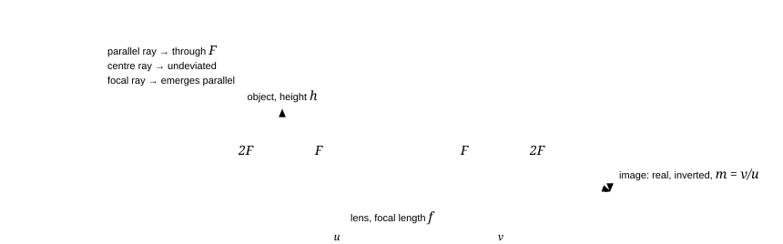

**The whole subject in one picture.** Three rays are always enough, because each one is a *rule* (parallel ray through the focus, central ray straight, focal ray parallel) rather than a calculation. Every question in these notes is one of two things: locating that crossing point, or explaining why a real instrument fails to put all the rays there.

### How these notes are organised

Parts **1–8** are the course, in order of what has to be true before the next thing can be said: rays and mirrors (1–2), refraction and total internal reflection (3–4), prisms and dispersion (5), lenses and lens systems (6), the eye and optical instruments (7), then the Olympiad machinery (8) — Fermat as a variational principle, ray-transfer matrices, thick lenses, the exact non-paraxial answers, aberrations and the rainbow. Part **9** is a playbook (triage, traps, numbers, the sign-convention algorithm). Parts **10–11** are the 36-question paper and its full solutions. Part **12** is the same course compressed to three printable pages.

Read 1 → 8 in order the first time; after that use part 9 as the index you actually revise from. Nothing in parts 2–8 repeats a result without saying where it came from: the mirror formula is derived once, in part 2, and part 6 gets it by *treating the lens as two spherical surfaces*, which is where the $R$ dependence belongs.

### Read this first: the five ideas everything rests on

> **Idea 1 — a ray is a normal to the wavefront, and light takes a stationary path**
>
> The *ray* is the direction in which energy travels; it is perpendicular to the wavefront. In a homogeneous medium it is a straight line (rectilinear propagation). Where the medium changes, the path bends, and the rule it obeys is **Fermat's principle**: the actual path makes the optical path length $\int n\,ds$ *stationary* — minimum for reflection and for a plain refraction, maximum or a saddle in the interesting cases. Part 1 proves reflection from it, part 3 proves Snell's law from it, and part 8 uses it to find ray paths in a medium where $n$ varies continuously. Everything else in these notes is geometry.

> **Idea 2 — the paraxial approximation is a promise you must keep track of**
>
> Every closed-form formula here — $1/v + 1/u = 1/f$, the mirror formula, the lensmaker's formula, $\delta = (\mu-1)A$ — is obtained by replacing $\sin\theta$ with $\theta$ (equivalently, by keeping only first-order terms in the ray height). The formulas are therefore **exact only for rays close to the axis and nearly parallel to it**. When a question moves a ray to the edge of the lens, or asks why a magnifier gives a blurry edge, the honest answer is the third-order correction, and part 8 supplies the two corrections worth knowing: spherical aberration grows as $h^{2}$ (longitudinal) or $h^{3}$ (transverse) and coma as $\alpha h^{2}$.

> **Idea 3 — an optical element is a map, and in the paraxial limit it is a matrix**
>
> Every mirror, surface or lens takes an incoming ray (height $y$, angle $\theta$) and returns an outgoing one. For paraxial rays that map is *linear*, so it is a matrix, and a system of elements is the product of their matrices. Part 8 develops this properly; the reason to mention it here is that it makes the awkward cases (thick lenses, a mirror with a lens in front of it, two lenses a distance apart, a lens with both surfaces silvered) *mechanical* instead of a memorised special case.

> **Idea 4 — sign conventions are bookkeeping, not physics**
>
> There is only one convention in this note-set (the Cartesian one the book and JEE use): distances are measured from the pole or optical centre, positive *in the direction the incident light travels*, and heights positive upwards. With that convention the mirror formula is $1/v + 1/u = 1/f$ and the lens formula is $1/v - 1/u = 1/f$. Ninety per cent of lost marks in optics are one of two things: a sign dropped while substituting, or a virtual image treated as a real one. Part 9's algorithm removes both.

> **Idea 5 — total internal reflection and dispersion are where the ray picture pays off**
>
> The ray model is at its most powerful in exactly the two places where it looks most magical: light turns back at a surface it cannot cross (part 4, and half the instruments in part 7 are built from it), and white light fans out because $\mu$ depends on $\lambda$ (part 5). Both are one-line consequences of Snell's law, and both are examined every year in one form or another.

### The sign convention, once and for all

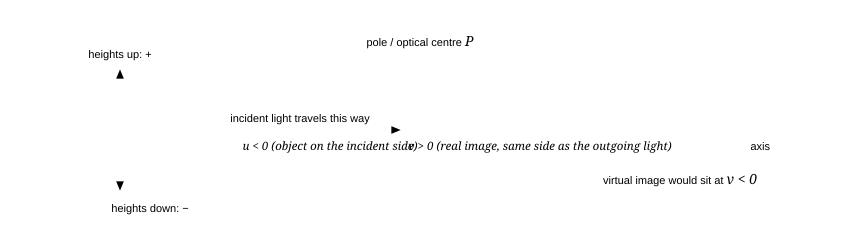

**Fig. 0.1** — One convention, applied always: from the pole, positive along the incident light for distances, positive upwards for heights. An object is almost always at $0 > u$; a *virtual object* (created by a lens that has not yet focused) is the case $u > 0$, and it is the case students mishandle.

> **The convention, in four lines you can apply without thinking**
>
> - **Distances** ($u, v, f, R$): measured from the pole/optical centre; positive in the direction the
>   incoming light is travelling.
> - **Heights** ($h, h'$, and any transverse size): positive above the axis.
> - **Mirror:**$1/v + 1/u = 1/f$, $f = R/2$, $m = -v/u$.
> - **Lens / refracting surface:**$1/v - 1/u = 1/f$, $m = v/u$; for a single spherical surface of
>   radius $R$ between media $n_1$ and $n_2$, $n_2/v - n_1/u = (n_2-n_1)/R$.
>
>  Check every answer against reality: $v > 0$ in a mirror means a real image on the *same* side as the object; $v > 0$ in a lens means a real image on the *opposite* side. If your answer says otherwise, the sign is wrong, not the physics.

### Syllabus coverage — where every section of the book lives here

The reference text for this note-set is the Geometrical Optics chapter of *Cengage — Optics and Modern Physics* (chapter 1, book pages 1.1–1.180). The table is the coverage map: the left column is that chapter's own contents page, the right column is the part of these notes that does the same job, *and more* — every entry is derived rather than stated, and each one carries the Olympiad extension the book leaves out. Problems here are written in the style of the book's exercise sets (subjective, objective, multiple correct, assertion–reasoning, comprehension, matching, integer and archive type) but they are new problems, not copies.

| the book's section (book page) | here |
| --- | --- |
| Introduction; some definitions; nature of objects and images; types of objects and images (1.2) | §1.1–1.2 |
| Basic laws; reflection of light; regular and diffused reflection; laws of reflection (1.3) | §1.3 |
| Reflection from a plane surface; image formation by a plane mirror; image of an extended object (1.4–1.6) | §1.4–1.7 |
| Relation between velocity of object and image (1.7) | §1.8 |
| Images formed by two plane mirrors; locating all the images (1.8–1.9) | §1.9–1.10 |
| Reflection from a curved surface; spherical mirrors; important terms (1.11) | §2.1–2.2 |
| Sign convention; rules for ray diagrams; position, size and nature of the image; mirror formula (1.13–1.14) | §2.3–2.5 |
| Image formation in a convex mirror; magnification; nature of the image (1.15–1.16) | §2.6–2.7 |
| Relation between object and image velocity (1.19) | §2.8–2.9 |
| Some experiments with a curved mirror (1.21) | §2.10–2.11 |
| — the book's paraxial assumption — | §2.12 (spherical aberration at the mirror) and §8.4–8.5 (the general treatment) |
| Refraction of light; laws of refraction; deviation of a ray; principle of reversibility (1.24–1.25) | §3.1–3.3 |
| Vector representation of a light ray (1.26) | §3.4, §8.1 |
| Apparent shift of an object; refraction through a parallel slab; lateral displacement; multiple slabs; slab and mirror combined (1.30–1.37) | §3.5–3.8 |
| Refraction in a medium with variable refractive index (1.40) | §3.9, §8.2 |
| Measurement of refractive index by a travelling microscope (1.42) | §3.10 |
| Critical angle and total internal reflection; conditions; the $\delta$–$i$ graph (1.27) | §4.1–4.3 |
| Applications of total internal reflection (1.27–1.30) | §4.4–4.6 |
| Prism; conditions of no emergence, grazing emergence, maximum and minimum deviation; thin prisms (1.45–1.49) | §5.1–5.4 |
| Dispersion; deviation without dispersion; dispersion without deviation (1.50) | §5.5–5.6 |
| Refraction at spherical surfaces; lateral magnification (1.52–1.55) | §6.1 |
| Thin lens; lensmaker's formula; thin lens formula; graphical method (1.56–1.59) | §6.2 |
| Power of a lens; lens displacement method (1.60–1.62) | §6.3 |
| Lenses with different media on either side; lenses close together; lenses at a distance (1.63–1.65) | §6.3–6.4 |
| Cut lens; silvered lens; lens with one silvered surface; image forming at the object itself (1.66–1.73) | §6.4–6.5 |
| Combination of lenses and mirrors; finding the focal length of a convex lens; refractive index of a liquid by a convex lens (1.73–1.79) | §6.5–6.6 |
| Optical instruments: microscopes, telescopes, lens camera (1.80–1.81) | §7.1–7.10 |
| Solved examples and all eight exercise types (1.82–1.180) | in-chapter questions (every part) + the 36-question paper of part 10 and its solutions in part 11 |
| — the book stops here — | part 8 (Fermat variational, matrices, thick lenses, aberrations, exact non-paraxial results, rainbow, atmospheric refraction, étendue) and part 9 (playbook) |

### The three-pass study plan

1. **Pass 1 — build the picture (about 6 hours).** Parts 1–7, reading only the *def* and *why* boxes
  and drawing every figure by hand as you go. Do not attempt the questions yet; you are building the geometry that
  makes them obvious.
2. **Pass 2 — own the results (about 8 hours).** The *thm* boxes and the boxed equations, then every
  question in the parts, with paper over the solution panel. Time yourself at 6 minutes per question; the panel is
  there to tell you what you failed to see, not to rescue you.
3. **Pass 3 — Olympiad (about 6 hours).** Part 8, which is the part the book does not have, then part 9's
  numbers until they are instant, then part 10 under exam conditions (three hours, one sitting, calculator only).

### Prerequisite self-check

You need four things before part 1 is readable; if any answer is "no", fix it first — it costs an hour now and several days later.

- I can add vectors as components, and I know when $\vec a\cdot\vec b = 0$.
- I am comfortable with $\sin\theta \approx \tan\theta \approx \theta$ for small $\theta$ in
  radians, and with $\cos\theta \approx 1 - \theta^{2}/2$.
- I can use the sine rule and similar triangles on a diagram without hesitating.
- I can differentiate $1/x$ and $\sqrt{x}$, and I know that "stationary" means derivative zero.
- I know $v = \lambda f$ and that the frequency of light does not change when it enters a medium (this one
  is *assumed* in part 3 and used constantly).

### Equipment worth thirty minutes of your time

Optics is the one part of the syllabus you can actually see. A torch with a single bright LED, a slit cut in card, a plane mirror, a concave mirror (a shaving mirror or the back of a spoon), a glass slab, a triangular prism, a convex lens (a magnifier), a laser pointer (safely aimed at a wall, never at an eye) and a glass of water reproduce every experiment these notes describe, including the travelling-microscope measurement (a ruler taped to a glass of water is enough to see the apparent shift) and the critical angle (look up through the water surface from below).

### Numbers to memorise (they turn three lines of algebra into a one-second estimate)

> **Eight numbers, and why each is worth its memory slot**
>
> - $c = 3.00\times10^{8}$ m/s in vacuum; $\mu_{\text{air}} = 1.0003$ — air is vacuum for every
>   calculation in this note-set.
> - $\mu_{\text{water}} = 4/3 = 1.333$, glass $\approx1.5$, crown $1.52$, flint $1.6\text{–}1.7$,
>   diamond $2.42$.
> - Critical angles: water $48.8^{\circ}$, glass $41.8^{\circ}$ (for $\mu=1.5$), diamond
>   $24.4^{\circ}$. Diamond sparkles because $C$ is *small*: most rays inside hit a facet beyond it.
> - Sun's angular diameter $\approx0.53^{\circ}$; the eye resolves $1' = 2.9\times10^{-4}$ rad; the
>   least distance of distinct vision is $D = 25$ cm (the number every microscope formula uses).
> - Primary rainbow at $42^{\circ}$ from the antisolar direction, secondary at $51^{\circ}$, dark band
>   between them. For $\mu = 1.333$ the primary is violet $40.6^{\circ}$, red $42.4^{\circ}$.
> - A human eye is about $2.5$ cm long with a power of $\approx59$ D in air — $f\approx1.7$ cm, and
>   the image distance stays fixed while $f$ changes. That one sentence explains myopia.
> - $1$ dioptre $= 1\ \text{m}^{-1}$; spectacle prescriptions are powers, not focal lengths, so they add
>   like the lenses they are.
> - For a thin prism, $\delta = (\mu-1)A$; with $\mu = 1.5$ that is one degree of deviation per two
>   degrees of prism angle — the fastest way to sanity-check a spectrometer answer.

> **Three habits to break today**
>
> - **"Small angle means I can ignore it."** No: $\theta\approx\sin\theta$ is a promise that the
>   *first* correction is zero, not that the angle is unimportant. A 5° ray is already 0.4% off, and a mirror
>   edge at $h = 0.5R$ is off by 12% in focal length (part 8 Q4).
> - **Mixing the mirror and lens formulas.**$1/v+1/u=1/f$ versus $1/v-1/u=1/f$ is the whole
>   difference between a mirror and a lens; write the formula you are using *before* you substitute, every time.
> - **Treating a refracted image as "where the object looks like it is".** There are two different questions:
>   where the image *is* (Fermat/geometric), and where it *appears* to a particular observer (apparent
>   depth, lateral shift). Part 3 keeps them in separate boxes because they have different answers.

### Start here

[**Part 1 · Light as a ray, and the plane mirror →**](#section-01-rays-and-plane-mirrors). It is the shortest part and the only one whose statements are about *geometry* rather than about formulas; every later result is a limit of it (a plane mirror is a sphere of infinite radius — part 2 says exactly that).

_Part 1 of 12 · JEE Advanced · base · NSEP · ≈ 55 min read · 11 questions_

## 1 · Light as a ray, and the plane mirror

Everything in geometrical optics is decided by three sentences: light travels in straight lines; at a mirror the angle in equals the angle out; at an interface the sines are in a fixed ratio. This part builds the first two into a working picture of a plane mirror — where the image is, how big it is, how fast it moves, how many images two mirrors give — and shows that the equal-angle law is not an extra rule but the shortest-time path between two points. By the end you should be able to place any image with a ruler, and to say *why* the number of images jumps when a mirror is turned.

### 1.1 Light as a ray: what this course is allowed to assume

> **Definition · ray, beam, wavefront**
>
> A **ray** is the line along which light energy travels; in a homogeneous medium it is straight (**rectilinear propagation**). A **beam** is a bundle of rays — *parallel* if the rays are parallel, *convergent* if they come together, *divergent* if they spread. A **wavefront** is the surface joining points of equal phase, and it is everywhere perpendicular to the rays. The wave picture is not needed in this part, but one fact from it is worth carrying: a wavefront is locally a plane, so $ray \perp wavefront$ is what makes the ray a useful fiction.

> **The four basic laws (each one is an experimental statement)**
>
> - **Rectilinear propagation.** In a homogeneous medium, light travels in straight lines. Shadows are the
>   evidence; a medium whose $n$ varies (part 3, §3.12) is the exception.
> - **Independence of rays.** Two beams crossing do not disturb each other's paths. This is why you can read
>   through a window and why ray diagrams can be drawn one ray at a time. (It fails in intensity — a laser can
>   saturate a medium — never in direction for the problems in this note-set.)
> - **Reflection.** At a reflecting surface the incident and reflected rays make equal angles with the normal,
>   and they lie in the same plane as the normal.
> - **Refraction and reversibility.** At a transparent interface the path bends according to Snell's law
>   ($n_1\sin i = n_2\sin r$), and *any* actual path may be traversed backwards: if a ray travels
>   $A\to B$ along some polyline, then a ray launched along the reverse of that polyline retraces it exactly.

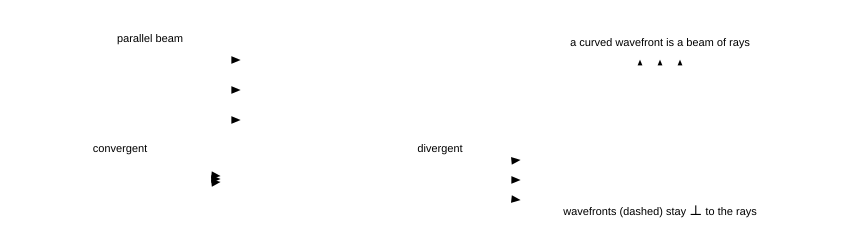

**Fig. 1.1** — The three beam shapes and the one relation worth remembering: the ray is the normal to the wavefront. A plane wavefront gives a parallel beam; a spherical wavefront gives a beam that diverges from (or converges to) one point, which is exactly why a point object and a point image are the two things every later part of this course computes.

### 1.2 Object and image: the two definitions that decide every answer

An **object** is a point from which rays *actually diverge* (a *real object*) or toward which rays *are heading* as they reach the optical element (a *virtual object*). An **image** is a point at which rays *actually meet* (a *real image*) or from which they *appear to diverge* after the element (a *virtual image*). Both words describe the *geometry of the rays*, never the object's physical nature and never the observer's opinion.

> **Why the real/virtual distinction is not pedantry**
>
> A real image can be caught on a screen, because light genuinely arrives there and then spreads out again. A virtual image cannot: if you put a screen at the place where the rays "seem" to come from, you intercept nothing, because no light has ever been there. This single difference decides the answer to every question of the form "where must a screen be placed" and "can this be photographed" — a camera or an eye focuses a real image on its retina/sensor by *redirecting* light, so it can record a virtual image, while a screen cannot.

| situation | what the rays do | where you meet it |
| --- | --- | --- |
| real object | diverge from a point in front of the element | the everyday case; $0 > u$ |
| virtual object | are converging toward a point behind the element when they arrive | a lens that has not yet focused them: the second element of a two-lens system. $u > 0$ |
| real image | actually converge to a point | screen, film, retina; $v > 0$ for a lens, $v > 0$ for a mirror too |
| virtual image | diverge from a point behind the element | plane mirror, convex mirror, magnifier; cannot be screened |

> **"The image is behind the mirror, so it is not real — fine, but is that the whole story?"**
>
> The real trap is *position*, not realness. The image of a point object in a plane mirror is as far behind the mirror as the object is in front, measured **perpendicular to the mirror** — not along your line of sight. If you walk past a mirror, the image does not "follow" you: it stays at the reflection of your position, and the apparent direction you see it in changes while the image itself does not move.

### 1.3 Reflection: the law, and why light picks that path

At an interface, part of the light returns into the first medium. Two regimes describe what happens next: **regular (specular) reflection** from a smooth surface, where a parallel beam stays parallel, and **diffused reflection** from a rough surface, where the same parallel beam leaves in all directions because the local normal points everywhere. Both obey the same two laws at every point of the surface:

<!-- Equation tag: 1.1 -->
$$
\angle i = \angle r \quad\text{(both measured from the normal)}, \qquad \text{incident ray, reflected ray and normal are coplanar}
$$

> **Why the equal-angle law is a *shortest time* statement (Fermat, 1657)**
>
> Light does not "know" about angles; it takes the path of stationary time, and for a mirror the equal-angle path is the shortest one from the object to the observer *via the mirror*. Proof in one line: reflect the observer $B$ in the mirror to $B'$. Then for any point $P$ on the mirror, $PB = PB'$, so the path $AP + PB = AP + PB'$, which is smallest exactly when $A, P, B'$ are collinear — a straight line. At that $P$ the two triangles made with the normal are congruent, so the angles are equal.

**Fig. 1.2** — The equal-angle law *is* the shortest path. Numbers for this figure: the equal-angle path measures $AP + PB = 268.3 + 201.2 = 469.5$ units, while the competing path through $P'$ measures $156.2 + 332.4 = 488.6$ — the mirror picks the shorter one, and it is shortest precisely because $A, P, B'$ are collinear.

> **The same trick in disguise: the "shortest path with a constraint" family**
>
> Whenever a path must touch a line (a mirror, a river bank, a wall) the reflection trick turns "minimise $AP + PB$ over $P$ on the line" into "draw a straight line". The refraction version of the same idea — minimise $t = AP/v_1 + PB/v_2$ — gives Snell's law, and part 3 does exactly that derivation. The reflex to build now: *a path problem with a reflecting boundary is solved by mirroring one endpoint.*

### 1.4 The plane mirror: where the image is, and why it is virtual

Place a point object $O$ a perpendicular distance $d$ in front of a plane mirror. Two rays from $O$ strike the mirror at $P_1$ and $P_2$ and reflect into your eye. Each reflected ray, produced backwards, is a straight line; the two lines meet at a single point $I$, and the object's reflection in the mirror plane *is* that point. Here is the proof in one step, using the law of reflection:

> **Why the image is at distance $d$ behind the mirror, for every pair of rays**
>
> Let $P$ be any point of the mirror on a ray from $O$, and let the perpendicular from $O$ meet the mirror at $N$ with $ON \perp$ mirror. In the right triangles $ONP$ and $INP$ we have $NP$ common, $\angle ONP = \angle INP = 90^\circ$, and $\angle i = \angle r$ at $P$ (law of reflection), which forces $\angle OPN = \angle IPN$; hence the triangles are congruent and $IN = ON = d$. Congruence for *every* choice of $P$ is exactly the statement that all the backward-produced reflected rays pass through the one point $I$ — a virtual image, because the rays themselves never go there.

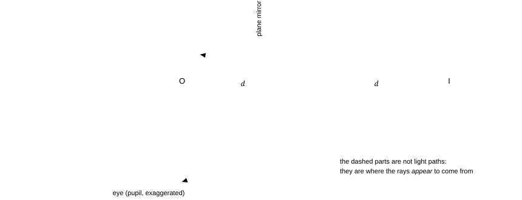

**Fig. 1.3** — Rays from $O$ reflect and enter the eye; produced backwards they meet at $I$, which is the mirror reflection of $O$. The two dashed segments are not light paths at all. Note the consequence that surprises people: the two rays reaching the pupil are *diverging* when they arrive, exactly as if they had come from a real object at $I$ — that is all "virtual image" means.

> **Properties of the image in a plane mirror (each with its reason)**
>
> - **As far behind as the object is in front** — congruent triangles, above.
> - **Same size.** Every point of an extended object is imaged at its own reflection, and reflection is an
>   isometry: it preserves distances, hence lengths and angles.
> - **Erect** (upright), because reflection across a vertical plane does not turn a vertical arrow upside down.
> - **Virtual**, because the reflected rays diverge; no screen can catch it (§1.2).
> - **Laterally inverted — in the sense of front-to-back**, not left-to-right. §1.5 makes this precise.
> - **No parallax with the object** at a fixed direction: as the observer moves, the image stays put but the
>   object moves relative to it, so the object and its image sweep past each other — the standard experimental test for
>   "is this a real image or a virtual one?"

### **Q1** A point source sits 30 cm in front of a plane mirror. The mirror is now moved 5 cm further away from the source, along the normal. How far does the image move, and in which direction? _(JEE main)_

Set up with the mirror reflection rule before substituting anything.

Solution

Let the source be fixed with the mirror plane at distance $d = 30$ cm. The image is at $d = 30$ cm behind the mirror, i.e. $2d = 60$ cm from the source. Move the mirror by $\Delta d = 5$ cm away: the new image is $d + \Delta d = 35$ cm behind the mirror, so its distance from the source becomes $2(d+\Delta d) = 70$ cm.

$$
\Delta x_{\text{image}} = 2\,\Delta d = 10\ \text{cm}, \qquad \text{in the direction the mirror moved}
$$

**Check.** The image is always the mirror reflection of the source, so a *rigid* translation of the mirror by $\Delta$ translates the image by $2\Delta$ (§1.8 makes this a vector statement). Note what did *not* happen: the image did not move by $\Delta$ or by $5 + 30$; the image moves twice as fast as the mirror whenever the mirror moves along its normal.

### **Q2** A flat mirror hangs on a wall. A boy stands 2 m from it and walks 1 m directly towards the mirror at constant speed $0.5$ m/s. Meanwhile, is his image walking towards him? What is the rate at which the separation changes? _(JEE main)_

Solution

Yes. If the boy is at distance $x$ in front, the image is at $x$ behind, so the separation is $2x$:

$$
\frac{d(2x)}{dt} = 2\frac{dx}{dt} = 2(0.5) = 1\ \text{m/s}
$$

He walks 1 m in 2 s, so at the end $x = 1$ m and the separation has fallen from $4$ m to $2$ m.

**Check.** The image never reaches the mirror before he does: separation $2x\to0$ exactly as $x\to0$. A common wrong answer is "the image is stationary", which comes from thinking of the image as painted on the mirror; the image is defined by the reflection of the object's *instantaneous* position, so it tracks it.

### 1.5 What a plane mirror really reverses

Reflection is the operation $\vec r \to \vec r - 2(\vec r\cdot\hat n)\hat n$ for a mirror of unit normal $\hat n$: the component *along the normal* flips, the components in the mirror plane do not. So a mirror reverses your nose and the back of your head — that is, **front–back** — and nothing else. Your right hand still appears on the right side of the image; what happens is that you interpret the image as a person facing you, and *that* interpretation swaps left and right.

> **"Mirrors swap left and right"**
>
> They do not. Write the word AMBULANCE on a card: the mirror image reads the same way round but with letters in the reverse order, which is why ambulances are lettered in mirror writing on the front — the driver in front of you reads it in their *rear-view mirror*, where the order is restored. If mirrors swapped left and right, that trick would be pointless (and mirrors would need to know which way up you were holding the card, which they do not).

### **Q3** A clock without numerals is seen in a plane mirror, and the mirror image of its hands shows 4:30. What is the real time? (Assume the clock face is read as usual, with 12 at the top.) _(JEE main)_

- **A** 4:30
- **B** 7:30
- **C** 8:30
- **D** 1:30

Solution

**B.** A plane mirror reverses the one direction perpendicular to itself. The image of the clock face is the face reflected in the mirror plane; reading it in the usual way (12 up) means the apparent handedness of the dial is reversed, i.e. the hands run anticlockwise. So the image time $t'$ and the true time $t$ are related by

$$
t' = 12{:}00 - t \quad\Rightarrow\quad t = 12{:}00 - 4{:}30 = 7{:}30
$$

**Check.** Consistency: if the true time were 12:00 the mirror image shows 12:00 (the hands coincide), and if it were 6:00 the image also shows 6:00 — both time independent of the reflection, as they must be since the hands are radial. Option A is what you get by forgetting that the reflection never acts on the *face plane* of the dial; option D comes from the other "12 − t" slip of using 6 as the pivot.

### 1.6 Field of view and the smallest mirror that works

"How small a mirror do I need to see my whole body?" The answer is startling and worth deriving, because the derivation is the same unfolding trick as Fig. 1.2.

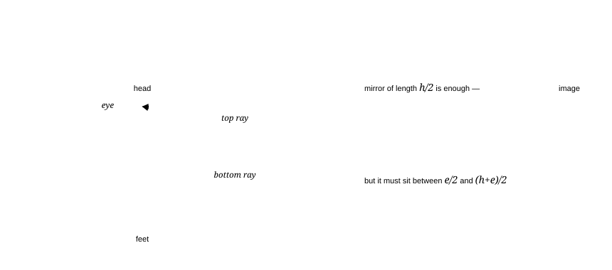

**Fig. 1.4** — The head is seen by the ray that reflects at the mirror's top edge, the feet by the ray that reflects at its bottom edge, and both rays must reach the eye. Congruent triangles give the two reflection points at half the height of the object and half the height of the eye above the ground, so the required length is $h/2$ whatever the distance.

> **Mirror size for a full-length view (person of height $h$, eye at height $e$)**
>
> <!-- Equation tag: 1.2 -->
> $$
> L_{\min} = \frac{h}{2}, \qquad \text{top edge at } \frac{h+e}{2}, \qquad \text{bottom edge at } \frac{e}{2}
> $$
>
>  Valid for a person standing upright and looking straight ahead, with the mirror vertical and roughly parallel to the body. The *length* needed does not depend on the distance to the mirror; the *position* does. Walk backwards and the required mirror stays the same size but the tolerable error in its placement grows, which is why a cheap fixed bathroom mirror works at all.

### **Q4** A 1.80 m tall student whose eyes are 1.70 m above the ground wants a mirror that shows the whole of him at once. What is the least length of mirror, and where must its edges be if he stands 1 m in front of the wall? _(NCERT / JEE main)_

Solution

Use (1.2) with $h = 1.80$ m, $e = 1.70$ m.

$$
L_{\min} = \frac{1.80}{2} = 0.90\ \text{m}, \qquad \text{bottom at } \frac{1.70}{2} = 0.85\ \text{m}, \qquad \text{top at } \frac{1.80+1.70}{2} = 1.75\ \text{m}
$$

So a mirror 90 cm long whose lower edge is 85 cm above the floor and upper edge 1.75 m above the floor. The distance of 1 m from the wall is irrelevant to the length — it only decides the angles at which the rays arrive.

**Check by limit.** Put the eye at the very top ($e = h$): then the mirror must span from $h/2$ to $h$, still length $h/2$ ✓. Put the eye just above the feet ($e\to0$): the mirror spans $0$ to $h/2$, length $h/2$ ✓. The length is $h/2$ in both extremes, which is the surprise this question is testing; a common error is to answer $h/2$ but then place the mirror symmetrically about the mid-height of the body, which is wrong whenever $e \ne h/2$.

### 1.7 Turning the mirror: the 2θ rule

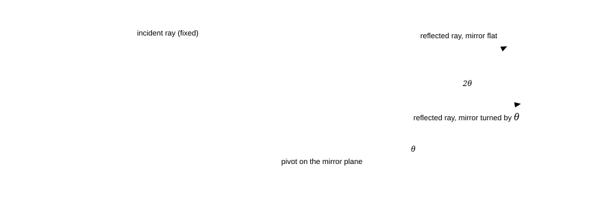

**Fig. 1.5** — Rotate the mirror by $\theta$ and its normal rotates by $\theta$; the reflected ray is the incident ray mirrored in the normal, so it rotates by $2\theta$. The angle of incidence itself changes only by $\theta$: the doubling is in the *output* direction, and that is the whole principle of a light-beam galvanometer.

> **Why $2\theta$ and not $\theta$**
>
> Let the incident direction be fixed, let the mirror rotate by $\theta$ so that its normal turns by $\theta$, and let the angle of incidence change to $i' = i + \theta$ (this is the only geometry: the normal is at $i$ to the incoming ray and now at $i+\theta$). The reflected ray makes $i'$ with the *new* normal, which has itself turned by $\theta$. Adding the two rotations, the outgoing direction has turned by $(i+\theta) + \theta - i = 2\theta$ relative to its old direction. Equivalently in vector language: $\hat d' = \hat d - 2(\hat d\cdot\hat n)\hat n$, and rotating $\hat n$ by $\theta$ rotates $\hat d'$ by $2\theta$ about the same axis.

### **Q5** A light-beam galvanometer reflects a laser beam from a small mirror onto a screen 4.0 m away, with the beam striking the mirror normally. The coil turns the mirror through $3.0^\circ$. How far does the spot move on the screen, to two significant figures? _(JEE main · olympiad practice)_

Solution

The reflected beam turns by $2\theta = 6.0^\circ$. For a screen perpendicular to the beam, the spot moves a distance $L\tan 2\theta$ from the centre:

$$
x = L\tan 2\theta = 4.0 \times \tan 6.0^\circ = 4.0 \times 0.1051 = 0.42\ \text{m}
$$

**Check.** The small-angle version $x \approx 2L\theta$ with $\theta$ in radians gives $2(4.0)(0.0524) = 0.419$ m ✓ — the same to two figures, which is why galvanometers are calibrated linearly (and why the doubling, not the linearity, is the physics). If instead you used $\theta$ rather than $2\theta$ you would get 0.21 m, the standard slip.

### 1.8 Velocity of the image of a moving object

Because the image is the object reflected in the mirror plane, the velocity relation is the same operation applied to velocity — with one extra term if the mirror itself is moving.

> **Velocity of the image (mirror of unit normal $\hat n$)**
>
> <!-- Equation tag: 1.3 -->
> $$
> \vec v_{\text{im}} = \vec v_{\text{ob}} - 2\left(\vec v_{\text{ob}}\cdot\hat n - \vec v_{\text{mir}}\cdot\hat n\right)\hat n
> $$
>
>  Read it as: *the component of the relative velocity along the normal reverses; the components parallel to the mirror survive unchanged.* Three cases cover every question:
>
>  - **Mirror at rest, object moving parallel to it** ($\vec v\cdot\hat n = 0$): $\vec v_{\text{im}} = \vec v_{\text{ob}}$, so the separation is constant and the two appear to move together.
> - **Mirror at rest, object moving perpendicular to it**: $\vec v_{\text{im}} = -\vec v_{\text{ob}}$; the
>   relative speed of approach is $2v$.
> - **Object at rest, mirror moving along its normal with speed $u$**: $\vec v_{\text{im}} = 2u\,\hat n$ — the image moves twice as fast as the mirror, in the mirror's direction.

### **Q6** A particle moves with speed $v$ in a straight line making $30^\circ$ with the surface of a fixed plane mirror. Find (a) the speed of its image, (b) the speed of approach of the image towards the particle. _(JEE Advanced)_

Solution

Take $\hat n$ perpendicular to the mirror and resolve: the parallel component is $v\cos 30^\circ$, the perpendicular component is $v\sin 30^\circ$. The image keeps the parallel component and reverses the perpendicular one, so its velocity has the same magnitude $v$.

$$
|\vec v_{\text{im}}| = v, \qquad v_{\text{approach}} = |\vec v_{\text{ob}} - \vec v_{\text{im}}| = 2v\sin 30^\circ = v
$$

**Check by limits.** Motion *along* the mirror ($30^\circ\to0^\circ$) gives approach speed $\to0$ ✓ — the image glides alongside the object at a fixed distance. Motion *normal* to the mirror ($30^\circ\to90^\circ$) gives approach speed $\to2v$ ✓. And $|\vec v_{\text{im}}| = v$ always for a fixed mirror: reflection is an isometry, so it preserves speed, and only for the *moving* mirror does the image speed differ from the object's.

### **Q7** A candle and a plane mirror face each other. The mirror is pulled away from the candle at $2\ \text{m s}^{-1}$ along the normal. Where is the image, and how fast is the gap between candle and image growing? _(JEE main)_

Solution

With the candle fixed at the origin and the mirror at $x = d(t)$, the image is at $2d(t)$, so its speed is $2\dot d = 4\ \text{m s}^{-1}$ away from the candle, and the gap grows at

$$
\frac{d}{dt}(2d) = 2\dot d = 4\ \text{m s}^{-1}
$$

**Check.** The mirror's own image travels with the mirror; the candle's image has to satisfy "image is the reflection of the object" instant by instant, and reflection of a point at distance $d$ from a plane at $d$ is the point $2d$ from the object ✓. This is the same factor of 2 as Q1, now with time in it: $\Delta x = 2\Delta d$ differentiates to $v_{\text{im}} = 2v_{\text{mirror}}$.

### 1.9 Two plane mirrors: how many images, and where

Two mirrors meeting at an angle $\theta$ give a finite set of images, and the count is a rule students memorise without justification. It has a clean justification: **unfold the wedge**. Reflect the wedge across one mirror, then reflect the copy across the next mirror line, and keep going; each copy of the wedge contains one copy of the object, and each copy you can reach by such a chain of reflections is one image.

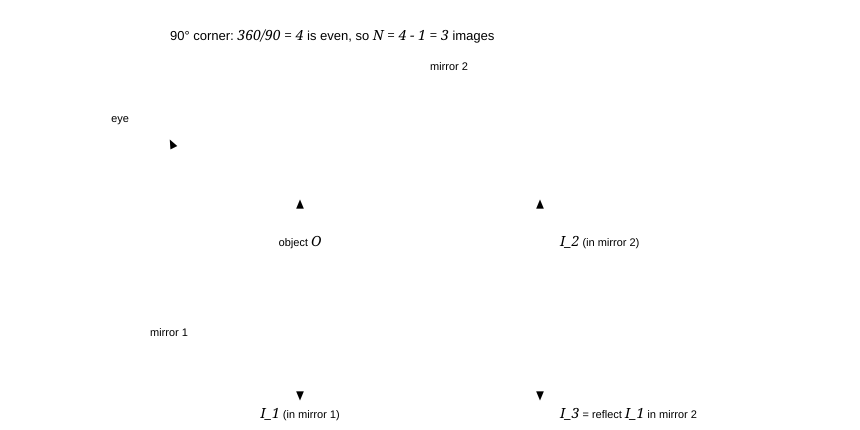

**Fig. 1.6** — Locating images by successive reflection. $I_1$ and $I_2$ are the two single-reflection images; $I_3$ is the reflection of $I_1$ in mirror 2 (equivalently of $I_2$ in mirror 1). At $90^\circ$ both routes land on the same point, which is why the count drops to three: the "fourth" image would need a reflection in a mirror's back face, and there is no light path for it.

> **Number of images from two mirrors inclined at $\theta$**
>
> Let $m = 360^\circ/\theta$.
>
>  - $m$ an **even integer**: $N = m - 1$.
> - $m$ an **odd integer**: $N = m$ if the object is *off* the bisector, and $N = m - 1$ if
>   the object lies on the bisector (two of the images then coincide).
> - $m$**not an integer**: $N = \text{int}(m)$, the greatest whole number below $m$, for a
>   general (asymmetric) object; if the object is placed symmetrically you lose one.
> - $\theta\to0$ (parallel mirrors): the unfolding never closes, so the images are **unlimited** — in
>   practice finite because each reflection keeps only part of the light.
>
>  Worked entries: $\theta = 90^\circ \Rightarrow 3$; $60^\circ \Rightarrow 5$; $120^\circ \Rightarrow 3$ (asymmetric) or $2$ (on the bisector); $75^\circ \Rightarrow 4$; $72^\circ \Rightarrow 5$; parallel $\Rightarrow \infty$.

> **Why the odd case loses one image, and why "not an integer" floors**
>
> Unfolding is a rotation: each reflection of the wedge turns it by the mirror angle, so after $m$ reflections the copy has come back to the start. If $m$ is even, the $m$ copies tile the full $360^\circ$ exactly and the $m$-th copy is the original wedge — one image is lost, giving $m-1$. If $m$ is odd the tiling still closes but the object's copies land one-per-sector only when the object sits off the bisector; on the bisector, two copies coincide on a wedge boundary and you lose one. If $m$ is not an integer, the copies of the wedge cannot tile the circle: the last copy would have to overlap the first, and an image that would require a reflection in a "mirror back" does not exist as a light path. Hence the floor. The physical test is always the same: *each reflection must happen at the mirror's reflecting face*, and the unfolding tells you when that fails.

### **Q8** Two plane mirrors are inclined at $72^\circ$. A small asymmetric object is placed inside the wedge. How many images are formed, and how many would there be if the object were moved onto the bisector of the wedge angle? _(JEE Advanced)_

Solution

$m = 360/72 = 5$, an odd integer. Off the bisector: $N = m = 5$. On the bisector: two images coincide, so $N = 5 - 1 = 4$.

**Check by direct construction.** Reflect the object in mirror 1: $I_1$ is at angular position $-\phi$; in mirror 2: $I_2$ at $2\theta-\phi$; then reflect $I_1$ in mirror 2 and $I_2$ in mirror 1, and continue until a copy lands on a mirror line. For $\theta = 72^\circ$ and an off-bisector object you get five distinct positions; the sixth coincides with the object's own reflection degeneracy and does not exist. Because the sequence is generated by the rotation $\phi \to 2\theta \pm \phi$, putting the object on the bisector makes $\pm\phi$ symmetric and merges a pair ✓.

### **Q9** An observer stands between two large parallel plane mirrors facing each other. How many images of himself does he see? What limits the number in a real room? _(Conceptual · NSEP)_

Solution

Here $\theta \to 0$, so $m \to \infty$ and the image sequence is infinite: the images lie on the line through the observer perpendicular to the mirrors, at distances $2d, 4d, 6d, \ldots$ in one direction and the mirror-symmetric set in the other, where $d$ is the mirror separation. Each successive image is produced by two more reflections, so the light reaching the eye falls off as the product of the two reflectances — that, and the finite mirror size (each image requires the light to have hit a mirror that long ago), is what ends the visible sequence. A mirror with $R = 0.95$ and no other loss attenuates the $n$-th pair of images by $R^{2n}$: the 10th pair is down to $0.36$, the 20th to $0.13$.

**Check.** The positions follow from §1.4 applied repeatedly: the image of an image. The apparent "tunnel" in a barber's shop with mirrors fore and aft is this sequence, and the observed spacing is $2d$, which is why the tunnel looks twice as long as you expect.

### 1.10 Two mirrors at work: periscope, kaleidoscope, retroreflector

> **Three instruments, one piece of geometry each**
>
> - **Periscope** (two mirrors at $45^\circ$, one above the other): the first turns the beam by
>   $90^\circ$ and the second turns it by another $90^\circ$ in the opposite sense, so the total
>   deviation is **zero** — the eye sees the object in its true direction, and the apparent distance equals the light
>   path length.
> - **Kaleidoscope** (three mirrors at $60^\circ$): $360/60 = 6$ is even, so each pair of mirrors makes
>   $5$ images, and the pattern has 6-fold symmetry. Fewer mirrors, fewer images; the number is just the rule of
>   §1.9 applied to three mirror pairs.
> - **Retroreflector / bicycle reflector** (a $90^\circ$ corner of two mirrors, or three mutually
>   perpendicular faces in the plastic version): two reflections in perpendicular mirrors reverse the component of the
>   velocity along *both* mirror normals, i.e. they send $\hat d \to -\hat d$. Light goes back exactly
>   where it came from, whatever the incidence — the reason a bicycle reflector works from any angle and a road sign
>   "lights up" in car headlights.

### Worked example 1.1 · A periscope's apparent distance

**Statement.** A periscope has its two $45^\circ$ mirrors $L = 1.20$ m apart, one directly above the other. An observer's eye is $0.40$ m from the lower mirror, and the object she is looking at is $8.0$ m in front of the upper mirror. Where does the object appear to be? **Plan:** place the images one mirror at a time, using "the image is as far behind the mirror as the object is in front". **Do:** the upper mirror makes the first image at $8.0$ m behind itself. That image acts as the object for the lower mirror, so it is $8.0 + 1.20 = 9.20$ m in front of the lower mirror, and the lower mirror forms its image $9.20$ m behind itself. Finally, the eye is $0.40$ m in front of the lower mirror, so the total apparent distance is $0.40 + 9.20 = 9.60$ m. **Check:** the light path length is $8.0 + 1.20 + 0.40 = 9.60$ m ✓ — they agree because the total deviation of a periscope is zero, so the bent path unfolds into a straight one. If the second mirror had been turned to give a net deviation, the apparent *direction* would change and the apparent distance would no longer equal the path length.

### **Q10** Two plane mirrors are joined along a common edge at $90^\circ$. A ray travelling in a plane perpendicular to that edge strikes one mirror at $40^\circ$ to its normal. Through what total angle is the ray deviated after both reflections? _(JEE Advanced)_

Solution

After two reflections in mirrors whose planes are at angle $\theta$ to each other, the outgoing ray is turned through $2(180^\circ - \theta)$ relative to the incoming ray, always in the same rotational sense:

$$
\delta_{\text{total}} = 2(180^\circ - 90^\circ) = 180^\circ
$$

So the ray is sent straight back, parallel to the direction it came from — a retroreflection, independent of the $40^\circ$ (or any other) incidence angle.

**Check.** Verify with the vector rule of §1.8 applied to directions: reflecting $\hat d$ in mirror 1 flips one component; reflecting the result in a mirror whose normal is perpendicular to the first flips the other, so both components are reversed: $\hat d \to -\hat d$ ✓, a deviation of $180^\circ$. The independence of the angle of incidence is the point of the question: the corner cube is insensitive to how it is aimed.

### **Q11** Assertion: a virtual image cannot be photographed. Reason: a camera lens forms a real image on the sensor. Which of the following is correct? _(Assertion–reasoning)_

- **A** Both assertion and reason are true, and the reason explains the assertion.
- **B** Both are true, but the reason does not explain the assertion.
- **C** The assertion is false, the reason is true.
- **D** Both are false.

Solution

**C.** The assertion is false: a virtual image *can* be photographed. The camera receives the diverging rays that seem to come from the virtual image, and its own lens bends them to a real image on the sensor; the photograph is indistinguishable from one taken of a real object placed at the virtual image's position.

**Why the reason is still true, and useless here.** The reason correctly describes what a lens does, but it is also what happens when photographing a real object, so it cannot distinguish the two cases. The statement that *is* true: a virtual image cannot be caught on a screen, because no light reaches its position. Photographing = redirecting light with a lens; screening = intercepting light. Keep the two verbs apart and this whole family of questions collapses.

### 1.11 Summary — the results to own

> **Part 1 in five lines**
>
> - Equal angles at a mirror is the *stationary optical path*: reflect one endpoint in the mirror and draw a
>   straight line (Fig. 1.2).
> - Plane mirror: image distance = object distance behind the mirror, same size, erect, virtual; the mirror reverses
>   only the component along its normal.
> - Full-length view needs a mirror of length $h/2$, positioned between $e/2$ and $(h+e)/2$
>   ($h$ = height, $e$ = eye height).
> - Rotating the mirror by $\theta$ rotates the reflected ray by $2\theta$; a mirror moving at speed
>   $u$ along its normal moves the image of a fixed object at $2u$.
> - Two mirrors at $\theta$: $N = m-1$ for even integer $m = 360^\circ/\theta$, $N = m$ or
>   $m-1$ for odd $m$, $N = \text{int}(m)$ otherwise, $N = \infty$ for parallel mirrors.

### 1.12 Checkpoint

- I can state the two laws of reflection and prove the equal-angle path is the shortest one, using the mirror
  image of the observer.
- I can place the image of a point and of an extended object in a plane mirror with a ruler, and say why the image
  is virtual.
- I can derive the $h/2$ mirror rule and say which part of the answer depends on the distance to the mirror
  and which does not.
- I can use the $2\theta$ rule and explain why the doubling appears in the output direction rather than in
  the angle of incidence.
- I can compute the velocity of an image for an object moving at any angle to a fixed mirror, and for a moving
  mirror.
- I can count images for two inclined mirrors from the unfolding argument rather than from memory, and state the
  criterion that discards a spurious image.
- I can estimate, in one line, why a corner-cube reflector sends light back along its own path.

Next: [**Part 2 · Spherical mirrors →**](#section-02-spherical-mirrors) — a plane mirror is the $R\to\infty$ limit of the curved ones, and the sign convention you met in §0 becomes a working tool the moment the surface has a radius.

_Part 2 of 12 · JEE Advanced · base · NSEP · INPhO · ≈ 65 min read · 12 questions_

## 2 · Spherical mirrors

A curved mirror is a plane mirror whose normal turns as you move along it — and almost everything follows from that one sentence. This part derives the mirror formula and the magnification from the geometry of a single paraxial ray, tabulates every image a concave or convex mirror can make (including the two cases the textbook table usually omits: a virtual object, and an object inside the focus), turns the formula into the four laboratory methods of measuring $f$, and then shows where the formula *stops* being true — spherical aberration, whose size $h^{2}/4R$ you can compute from the same figure.

### 2.1 Why a curved mirror behaves like a plane mirror that keeps turning

At the point where a ray meets a curved mirror, the law of reflection uses the **local normal** — the normal to the tangent plane at that point. For a sphere the local normal is the radius drawn to the point. So a curved mirror is a continuum of plane mirrors, each tilted a little differently, and the image of a point is the *envelope* of the reflected rays. That envelope is a caustic curve, not a point: a sphere does not form a perfect image. The whole business of this part is the approximation that makes it *nearly* a point.

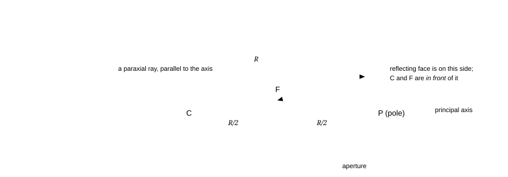

**Fig. 2.1** — The four named points of a concave mirror. The pole $P$ is the centre of the mirror's surface, $C$ the centre of the sphere, $F$ the point where a paraxial ray parallel to the axis crosses it, and the focal length is $f = R/2$. The figure shows the reason for the "paraxial" condition: the rule $f = R/2$ is exact only for rays close to the axis (§2.12 measures the error).

> **Definition · the terms, with the one that matters**
>
> - **Pole**$P$: the midpoint of the reflecting surface. All distances are measured from here.
> - **Centre of curvature**$C$: the centre of the sphere of which the mirror is a part; radius $R$.
> - **Principal axis**: the line through $P$ and $C$.
> - **Aperture**: the width of the mirror; the maximum height at which a ray can hit it.
> - **Principal focus**$F$: where a beam parallel to the axis converges (concave; a *real* focus in
>   front of the mirror) or appears to diverge from (convex; a *virtual* focus behind it). **Focal length**$f = R/2$.
> - **Paraxial rays**: rays making small angles with the axis and hitting the mirror near the pole. Only for these
>   is $f$ a single number — that is the approximation that makes *any* formula in this part possible.

### 2.2 Why $f = R/2$, and where the factor of two comes from

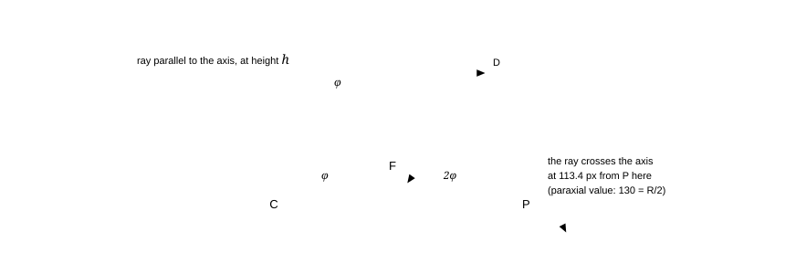

**Fig. 2.2** — The whole derivation of $f = R/2$. The normal $CD$ makes an angle $\phi$ with the axis, where $\sin\phi = h/R$. The incident ray is parallel to the axis, so its angle of incidence is $\phi$, and the reflected ray leaves at $2\phi$ to the axis and crosses it a distance $h/\tan 2\phi$ from $P$. For small $\phi$ that is $h/2\phi = R/2$. The figure deliberately uses a large $h$: the actual crossing here is 113 px from the pole instead of the paraxial 130 px, which is spherical aberration, measured in §2.12.

> **Why the factor is exactly 2 — the "angle doubling" of a mirror**
>
> In the triangle $C\,D\,P$: $CD = CP = R$, so the angle at $P$ equals the angle at $D$. The angle at $D$ between the radius (the normal) and the axis-parallel incident ray is $\phi$, so the triangle is isosceles with base angles $\phi$. The reflected ray leaves at $2\phi$ to the incident direction (equal angles about the normal). Crossing the axis at distance $x$ from $P$, the small-angle relation in the right triangle at the mirror gives $h = x\tan 2\phi \approx 2x\phi$, while $h \approx R\phi$. Equating: $2x\phi = R\phi\Rightarrow x = R/2$. Notice that $\phi$ cancels: *every* paraxial parallel ray crosses at the same point. That is the entire content of "a mirror has a focal length".

> **A second route, which part 6 uses for lenses**
>
> A reflection is a refraction with $n_2 = -n_1$ (the ray goes back into the same medium). Put $n_1 = 1$, $n_2 = -1$ in the single-spherical-surface formula $n_2/v - n_1/u = (n_2-n_1)/R$ from part 6 and you get $-1/v - 1/u = -2/R$, i.e. $1/v + 1/u = 2/R = 1/f$ — the mirror formula, with $f = R/2$ falling out automatically. That identity is worth knowing because it means you never need to memorise mirror optics as a separate subject from lens optics: it is the same formula with a negative index.

### 2.3 The sign convention applied to mirrors

Part 0 fixed the convention. Applied to a mirror it gives this table, which you should be able to reproduce in ten seconds — it answers most numerical questions by itself:

| quantity | concave mirror | convex mirror |
| --- | --- | --- |
| radius $R$ | negative ($C$ is in front) | positive ($C$ is behind) |
| focal length $f = R/2$ | negative | positive |
| real object | $0 > u$ | $0 > u$ |
| real image (in front, screenable) | $0 > v$ | $0 > v$ |
| virtual image (behind) | $v > 0$ | $v > 0$ |
| erect image | $m > 0$ | $m > 0$ |
| inverted image | $0 > m$ | $0 > m$ |

> **The two formulas of a spherical mirror (mirror formula and magnification)**
>
> <!-- Equation tag: 2.1 -->
> $$
> \frac{1}{v} + \frac{1}{u} = \frac{1}{f} = \frac{2}{R}, \qquad m = \frac{h'}{h} = -\frac{v}{u}
> $$
>
>  **Valid for paraxial rays only**, with the pole as origin and signs from §2.3. Do not "fix" signs by hand afterwards: if $v$ comes out negative for a concave mirror, the image is real and in front, and that is the answer.

> **Where the mirror formula comes from (one ray, three small angles)**
>
> Put a point object on the axis at $u$, and send one paraxial ray to the mirror at height $h$. Measure all angles from the axis, signed, with the sense of the incident light positive:
>
>  - the incident ray makes the small angle $\alpha = h/(-u)$ with the axis (the minus signs of the convention
>   make this positive for a real object);
> - the radius (the normal) makes $\phi = h/R$;
> - the reflected ray, by the law of reflection about the normal, makes
>   $\beta = 2\phi - \alpha$ with the axis;
> - the reflected ray crosses the axis at $v$, so $\beta = h/(-v)$.
>
>  Substitute: $h/(-v) = 2h/R - h/(-u)$, divide by $h$ and rearrange:
>
>  $$
> \frac{1}{v} + \frac{1}{u} = \frac{2}{R} = \frac{1}{f}
> $$
>
>  Every step is small-angle; that is the only approximation, and §2.12 makes its cost explicit. The same three-angle algebra, with $\phi = 0$, gives $1/v + 1/u = 0$ — the plane mirror, image as far behind as the object is in front ✓.

The magnification follows from the ray that strikes the *pole*: for an object of height $h$ with its foot on the axis, the ray from the tip to $P$ reflects at equal angles about the axis, so the two right triangles (object–pole–axis) and (image–pole–axis) are similar. Their heights are in the ratio of their distances from $P$, with a sign flip because the rays cross the axis at the pole:

<!-- Equation tag: 2.2 -->
$$
m = \frac{h'}{h} = -\frac{v}{u}
$$

> **"Cover half the mirror and half the image disappears"**
>
> It does not. Each point of the object sends rays in *every* direction onto the mirror; the image is where the reflected rays cross, and covering half the mirror merely removes half of the rays that would have crossed there. The image stays complete, in the same place, at the same size, and is dimmer. (What *does* change: the *field of view* narrows, so parts of the object may lose their image rays entirely.) This is the single most mis-answered question in mirror optics, and Q8 makes you do it properly.

### 2.4 Ray rules for drawing diagrams

Any two of these four rays locate the image of the tip of an object; use the two that are easiest to draw:

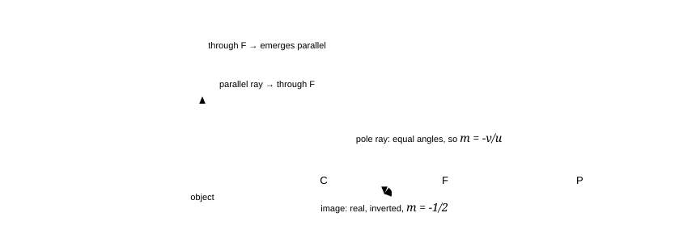

**Fig. 2.3** — Object beyond $C$, image between $C$ and $F$: real, inverted, diminished. All three constructions land on the same point, which is the check that your diagram is right rather than merely plausible. Numbers: $u = -450$, $f = -150$ (in the figure's units) give $v = -225$, $m = -0.5$.

> **The four ray rules**
>
> 1. A ray **parallel to the axis** reflects **through the focus**$F$ (concave) or appears to come from
>   $F$ (convex).
> 2. A ray **through the focus** reflects **parallel to the axis**.
> 3. A ray **through the centre of curvature** hits the mirror along the normal and **retraces its path**.
> 4. A ray hitting the **pole** reflects at equal angles to the axis, which is why the pole ray gives the
>   magnification $m = -v/u$ directly.

### 2.5 Every image a concave mirror can make

With $0 > f$, $1/v = 1/f - 1/u$. The table below is the complete answer for a real object at distance $|u|$ from a concave mirror; the last two rows are the ones examiners use to separate candidates.

| object position | image | $v$ | $m$ | use |
| --- | --- | --- | --- | --- |
| at infinity (parallel beam) | at $F$, real, inverted, point-like | $f$ | $\to0$ | finds $f$ from the sun |
| beyond $C$ ($\|u\| > 2\|f\|$) | between $C$ and $F$, real, inverted, diminished | $-$ve, $\|u\| > \|v\|$ | between 0 and −1 | shaving/make-up mirror for the face |
| at $C$ ($u = 2f$) | at $C$, real, inverted, same size | $2f$ | $-1$ | finds $R$ by coincidence |
| between $C$ and $F$ | beyond $C$, real, inverted, magnified | $\|v\| > 2\|f\|$ | $-1 > m$ | projector, solar furnace |
| at $F$ | at infinity: a parallel beam | $\to\infty$ | $\to\infty$ | searchlight, headlamp |
| between $F$ and $P$ | behind the mirror, virtual, erect, magnified | $>0$ | $>1$ | dentist's mirror, magnifier |

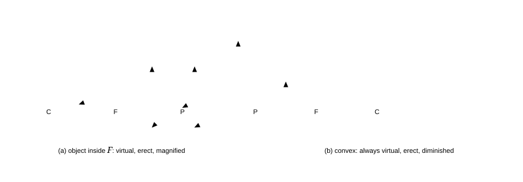

**Fig. 2.4** — The two "surprising" cases. In (a) the object is inside the focus of a concave mirror and the image jumps *behind* the mirror — which is why a dentist's mirror magnifies. In (b) a convex mirror has its focus behind it, so the reflected rays always diverge and the image is always virtual, erect and diminished, however far away the object is. The dashed rays are not light paths.

### 2.6 Convex mirrors: why they are used as rear-view mirrors

> **The convex mirror ($f > 0$) — one result covers every case**
>
> With $u = -|u|$ and $f = |f|$: $1/v = 1/|f| + 1/|u| > 0$ always, so the image is *always* virtual (behind), *always* erect, and $1 > |m| = |v|/|u| = 1/(1 + |u|/|f|)$ always — diminished, more so the farther the object. The consequence for a driver is the whole point: the **field of view** grows. A mirror of width $w$ seen from distance $d$ by an eye covers an angular range *larger* than a plane mirror of the same size, at the price of making objects look smaller, hence "objects in the mirror are closer than they appear".

### 2.7 Virtual objects (the case the tables forget)

If the rays arriving at a mirror are *converging* toward a point behind it, that point is a virtual object and $u > 0$. The formula does not care; the answers just surprise you:

- **Concave mirror, virtual object.**$0 > f$, $u > 0$:
  $0 > 1/v = 1/f - 1/u$, so $0 > v$: a *real* image in front of the mirror, always. This is what a
  convex lens in front of a concave mirror does to the light before it reaches the mirror.
- **Convex mirror, virtual object.**$f > 0$, $u > 0$: if $f > u$ then $0 > v$
  (real image in front); if $u > f$ then $v > 0$ (virtual image behind). Two regimes, decided by
  whether the rays would have crossed before or after the focus.

> **Why this matters more than it looks**
>
> Every two-element optical system in part 6 produces virtual objects at the second element. If you have never processed $u > 0$, you will find that half the "combination" problems are unanswerable by formula and you will start drawing pictures instead. Practise with Q9: it is deliberately a virtual-object question.

### 2.8 Velocity of the image: longitudinal and transverse

> **Image velocity for a fixed mirror**
>
> Differentiate $1/v + 1/u = 1/f$ at fixed $f$: $-dv/v^{2} - du/u^{2} = 0$, so
>
>  <!-- Equation tag: 2.3 -->
> $$
> dv = -\left(\frac{v}{u}\right)^{2} du = -m^{2}\,du \quad\text{(object moving along the axis)}
> $$
>
>  and for an object moving perpendicular to the axis the image moves with the transverse magnification, so
>
>  $$
> v_{\perp,\text{image}} = m\,v_{\perp,\text{object}}
> $$
>
>  **Longitudinal image speed is $m^{2}$ times the object's** (and opposite in sign to a real image's motion sense), **transverse image speed is $|m|$ times the object's.** For a real image, $1 > m^{2}$ when the image is diminished, so the image creeps while the object runs; when the object is inside the focus and the image is virtual, $m^{2} > 1$ and the image outruns the object.

### **Q1** A concave mirror has radius of curvature 40 cm. An object 2.0 cm tall is placed on the axis 30 cm in front of it. Find the position, size and nature of the image. _(JEE main)_

Solution

Concave: $f = R/2 = -20$ cm; object real, so $u = -30$ cm.

$$
\frac{1}{v} = \frac{1}{f} - \frac{1}{u} = -\frac{1}{20} + \frac{1}{30} = \frac{-3+2}{60} = -\frac{1}{60} \Rightarrow v = -60\ \text{cm}
$$

$$
m = -\frac{v}{u} = -\frac{-60}{-30} = -2 \Rightarrow h' = -2(2.0) = -4.0\ \text{cm}
$$

The image is 60 cm in front of the mirror (real, $0>v$), 4.0 cm tall, inverted ($0>m$) and magnified twice.

**Check by ray logic.** The object at $|u| = 1.5|f|$ is between $F$ and $C$, and the table of §2.5 says "beyond $C$, real, inverted, magnified" ✓. Unit check: $[1/v] = \text{cm}^{-1}$ throughout; a limit check is in Q3.

### **Q2** A convex mirror used as a rear-view mirror has radius of curvature 3.0 m. A car is 6.0 m behind it. Where is the image, how large is it, and by what factor does the mirror's field of view beat a plane mirror of the same size? _(JEE main)_

Solution

$f = +1.5$ m, $u = -6.0$ m.

$$
\frac{1}{v} = \frac{1}{1.5} + \frac{1}{6.0} = 0.6667 + 0.1667 = 0.8333 \Rightarrow v = +1.2\ \text{m}, \qquad m = -\frac{v}{u} = \frac{1.2}{6.0} = +0.2
$$

The image is 1.2 m behind the mirror, virtual, erect, one-fifth the size. For the field of view: an eye at distance $d$ from a mirror of width $w$ sees, in the plane mirror, an angular width $\approx w/d$; in the convex mirror the reflected rays appear to fan out from a virtual image at $v$, so the same piece of mirror subtends the angle appropriate to a distance $d - v$... which for $d = 0.5$ m gives a field roughly $\left(d + |v|\right)/d$

$$
\frac{\Delta\theta_{\text{convex}}}{\Delta\theta_{\text{plane}}} \approx \frac{d + |v|}{d} = \frac{0.5+1.2}{0.5} = 3.4
$$

**Check.** $|m| = 0.2$ matches the familiar "objects are closer than they appear": a car appears 5 times smaller, hence (by the same factor) you judge it 5 times farther. The field-of-view factor is a rough estimate (it depends on the eye's position); what is exact and examinable is $1 > |m| = 1/(1+|u|/|f|)$ for every convex mirror.

### **Q3** Where must an object be placed in front of a concave mirror of focal length 20 cm so that the image is four times as large as the object and inverted? Verify the limiting cases of your answer. _(JEE Advanced)_

Solution

Inverted and 4 times as large means $m = -4$. From $m = -v/u$: $v = 4u$. Substitute in the mirror formula with $f = -20$:

$$
\frac{1}{4u} + \frac{1}{u} = -\frac{1}{20} \Rightarrow \frac{5}{4u} = -\frac{1}{20} \Rightarrow u = -25\ \text{cm}
$$

So the object must be 25 cm in front (between $F$ at 20 cm and $C$ at 40 cm), giving $v = -100$ cm: a real, inverted image 100 cm in front of the mirror.

**Limits.** (i) As $|u|\to|f| = 20$ cm, $|m|\to\infty$ ✓, and our $|m|=4$ case sits just inside that limit. (ii) At $|u| = 2|f| = 40$ cm, $m = -1$ ✓; our answer $|m|=4$ needs $|u|$ nearer $|f|$ ✓. (iii) A magnified *erect* image is impossible here: it would need $m = +4$, i.e. $v = -4u > 0$ with $0>u$, which violates $1/f = 0 > 1/v+1/u$ for a concave mirror. Magnification beyond 1 with a concave mirror and a real object always flips the image over.

### **Q4** An object lies on the axis of a concave mirror of focal length 20 cm, between the pole and the focus, 10 cm from the pole. Describe the image, and state what happens to the image as the object is moved from the pole out to the focus. _(JEE main)_

Solution

$f = -20$, $u = -10$:

$$
\frac{1}{v} = -\frac{1}{20} + \frac{1}{10} = \frac{1}{20} \Rightarrow v = +20\ \text{cm}, \qquad m = -\frac{20}{-10} = +2
$$

Virtual image 20 cm *behind* the mirror, erect, twice the size.

As the object moves from the pole ($|u|\to0$) to the focus ($|u|\to20$): $v$ runs from $0^{+}$ (coincident with the object at the pole) to $+\infty$, and $m$ runs from $+1$ to $+\infty$. The image always lies further behind the mirror than the object is in front, always erect, always magnified — this is the shaving-mirror regime, and it is the one regime where "the mirror magnifies" is consistent with a virtual image.

**Check at the join.** At $|u| = |f|$ the image is at infinity; just beyond it ($|u| > |f|$) the image jumps to the *front* of the mirror and is inverted. Image position is discontinuous in character (front → behind) exactly at the focus; that discontinuity is why a projector must be focused just outside $f$.

### 2.9 Image velocity questions, done with the right formula

### **Q5** A point object moves along the principal axis of a concave mirror of focal length 15 cm with speed 3.0 cm/s, when it is 30 cm from the pole. Find the speed of the image at that instant. _(JEE Advanced)_

Solution

$f = -15$, $u = -30$: $1/v = -1/15 + 1/30 = -1/30\Rightarrow v = -30$ cm, so $m = -v/u = -1$. By (2.3),

$$
|v_{\text{im}}| = m^{2}|v_{\text{ob}}| = (1)^{2}(3.0) = 3.0\ \text{cm/s}
$$

**Check.** At $u = 2f$ the object and image are symmetric about $C$, so they must move at the same speed with opposite senses ✓ — a general rule worth remembering: *at $u = 2f$ the image speed equals the object speed.* If instead the object were at $u = -20$ cm: $v = -60$, $m = -3$, $|v_{\text{im}}| = 9(3) = 27$ cm/s: near the focus the image runs five times faster than the object. This $m^{2}$ law is why focusing a projector is delicate close to $f$.

### **Q6** An object moves perpendicular to the principal axis of a concave mirror, at speed 2.0 cm/s, when the transverse magnification is 3 (the image is real). Find the image's transverse speed, and the angle its velocity makes with the axis. _(JEE Advanced)_

Solution

Transverse: $v_{\perp,\text{im}} = m\,v_{\perp,\text{ob}} = -3(2.0)$ cm/s in magnitude, the minus meaning *opposite* in sense (an inverted image of a point moving up moves down). Speed = 6.0 cm/s.

Since the object is moving purely transversely and the mirror is fixed, the image has no axial velocity component, so its velocity is purely transverse: the angle with the axis is $0^\circ$ (or $180^\circ$ depending on sense).

**Check.** The general rule: image velocity = (transverse component scaled by $m$, axial component scaled by $-m^{2}$). For a purely transverse object velocity the axial component is zero, so the image velocity is transverse too — it is *not* along the line joining image to object, which is the usual wrong answer.

### 2.10 Virtual objects in practice

### **Q7** Light converging toward a point 12 cm behind a convex mirror of focal length 10 cm strikes the mirror. Where is the image, and is it real or virtual? _(JEE Advanced · olympiad practice)_

Solution

The incoming rays converge toward a point behind the mirror, so it is a virtual object: $u = +12$ cm. With $f = +10$ cm:

$$
\frac{1}{v} = \frac{1}{10} - \frac{1}{12} = \frac{6-5}{60} = \frac{1}{60} \Rightarrow v = +60\ \text{cm}
$$

$v > 0$: the image is 60 cm *behind* the mirror — virtual (no light goes there). And $m = -v/u = -60/12 = -5$: inverted and five times as large.

**Check where the boundary is.** $u = +12 > f = +10$, so §2.7's second regime applies: virtual image. Push the object closer: at $u = +5$ cm ($f > u$) we get $1/v = 1/10 - 1/5 = -1/10$, $v = -10$ cm — now in front, hence *real* ✓. The switch happens exactly at $u = f$, as the algebra of §2.7 said.

### **Q8** The lower half of a concave mirror, focal length 20 cm, is covered with black paper. An object stands on the axis 30 cm in front of the mirror. What does the image look like now? Answer the same question for the case where the mirror is instead *tilted* slightly. _(JEE main · trap question)_

Solution

**Covering half:** nothing happens to the image's position or size. $u = -30$, $f = -20$ still give $v = -60$ cm and $m = -2$, exactly as in Q1. Every point of the object still sends rays to the uncovered half, and those rays still cross in the image plane. The only changes are (i) the image is dimmer — roughly half the light — and (ii) its edges may brighten unevenly if the object extends beyond the remaining field of view.

**Tilting the mirror:** everything changes. Tilting by $\theta$ rotates the whole reflected pattern by $2\theta$ (part 1, §1.7): the principal axis itself has moved, so the image is now off-axis, and an *extended* object acquires coma and astigmatism (part 8, §8.7). The image neither stays put nor merely dims.

**Why this is the best diagnostic question in the part.** "Cover half" tests whether you know the image is a *crossing of rays*, not a picture painted on the mirror. "Tilt" tests whether you know the mirror defines its own axis. A student who answers both correctly has the concept; one who says "half the image" does not, whatever their formulas say.

### 2.11 Measuring $f$: four laboratory methods, and what each one really measures

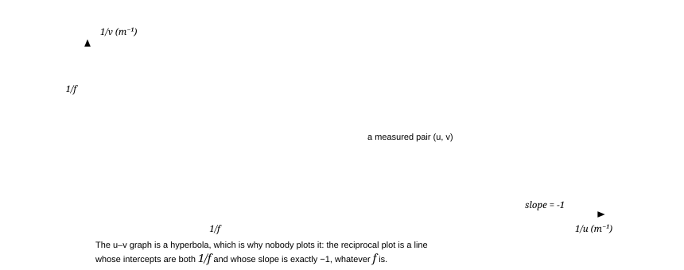

**Fig. 2.5** — The standard experiment. Plot $1/v$ against $1/u$ from the mirror formula and you get a straight line of slope $-1$ cutting both axes at $1/f$. The slope being *fixed* is the reason a single pair $(u,v)$ already gives $f$ — the experiment's job is to average out the errors, not to find the slope.

> **Four ways to get $f$, and the trap in each**
>
> 1. **Distant object (sun, distant window).** A beam parallel to the axis focuses at $F$: measure
>   $f$ directly on a screen. Trap: the sun is not a point, so the "focus" is a disc of the sun's angular size
>   $0.53^\circ$ — a blur of diameter $f\times0.0093$. For $f = 50$ cm that is 4.6 mm, so do not
>   report $f$ to better than a millimetre from this method.
> 2. **$u$–$v$ method.** For several (object, image) pairs plot $1/v$ vs $1/u$ (Fig. 2.5):
>   a line of slope $-1$ with intercepts $1/f$. Trap: the object must be a *pin* and the image located
>   by parallax, not by "it looks sharp"; a screen gives a poor image position for a mirror because the reflected light
>   comes back toward the object.
> 3. **Newton's formula.** With $x_1 = |u|-|f|$ and $x_2 = |v|-|f|$ — the distances of object and image
>   from the focus — the mirror formula becomes
>
>  <!-- Equation tag: 2.4 -->
> $$
> x_1x_2 = f^{2} \qquad\text{(Newton's relation, mirrors and lenses alike)}
> $$
>
>  Trap: $x_1$ and $x_2$ are measured *from the focus*, and are both positive only for a real image. For a magnified image, $f > x_1$ and $x_2 > f$.
>
>  1. **Coincidence at the centre of curvature.** Move the object until its image is inverted, the same size and
>   *coincident with the object* (no parallax between them): then $u = v = R = 2f$. Trap: this finds
>   $R$, and it is the most accurate of the four, but the object must be small (a pin) or the aberration of §2.12
>   smears the coincidence.

### **Q9** In a concave mirror experiment a pin at 30.0 cm from the mirror forms a real image of the pin at 60.0 cm. Use Newton's relation to find $f$, and check against the mirror formula. _(JEE main)_

Solution

The distances from the focus are $x_1 = |u| - f$ and $x_2 = |v| - f$ (both measured as positive magnitudes, both on the same side). Newton's relation $x_1x_2 = f^{2}$ becomes

$$
(30 - f)(60 - f) = f^{2} \Rightarrow 1800 - 90f + f^{2} = f^{2} \Rightarrow f = 20\ \text{cm}
$$

Check with the mirror formula: $1/v + 1/u = -1/60 - 1/30 = -1/20$ ✓.

**Check.** The term in $f^{2}$ cancels, which is the point of the question: Newton's relation is *linear* in $f$ once the numbers are known, so it needs no quadratic formula. Another check: $m = -v/u = -2$, and indeed a magnified real image has $f>x_1$ (10 cm) and $x_2>f$ (40 cm) with product $400 = f^{2}$ ✓.

### 2.12 Where the formula fails: spherical aberration and the caustic

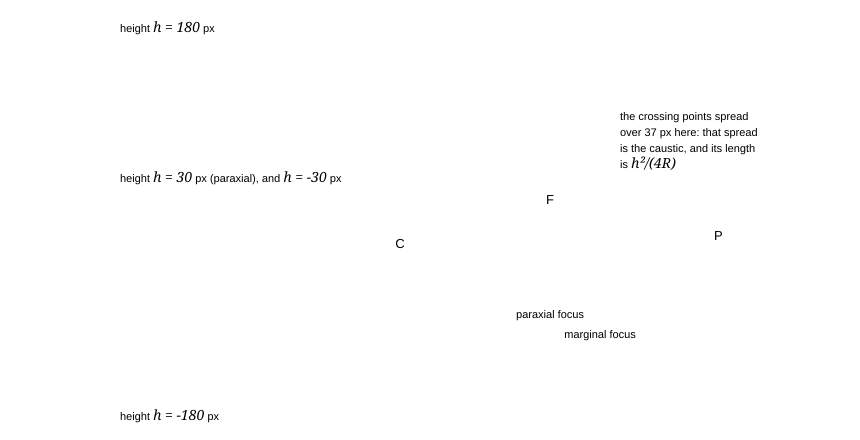

**Fig. 2.6** — Spherical aberration, measured. Three pairs of parallel rays at heights $h = \pm30, \pm120, \pm180$ px hit the same mirror and cross the axis at 550, 564 and 588 px from the paraxial focus's position: the crossings drift toward the mirror as $h^{2}$. The light is not concentrated at a point but along a curve, the **caustic**; a mirror cannot form a sharp image of an extended object, only a sharp image of its paraxial neighbourhood.

> **Longitudinal spherical aberration of a spherical mirror**
>
> With the exact crossing distance $d = R\left(1 - \frac{1}{2\cos\phi}\right)$, $\sin\phi = h/R$, the marginal focus lies
>
>  <!-- Equation tag: 2.5 -->
> $$
> \Delta = \frac{R}{2}\left(\sec\phi - 1\right) \approx \frac{R\phi^{2}}{4} = \frac{h^{2}}{4R} \quad\text{closer to the mirror than the paraxial focus}
> $$
>
>  Valid for a parallel beam, paraxial-plus-one-correction accuracy. Two consequences you can quote: the aberration grows as the *square* of the aperture, and it is **independent of the wavelength** — a spherical mirror has no chromatic aberration at all, which is why every large telescope is a mirror and not a lens.

> **How to kill it (three real answers, one Olympiad one)**
>
> - **Stop down the aperture.** Halving $h$ cuts $\Delta$ by four. This is why camera lenses are
>   "stopped down" for sharpness, and why a cheap telescope gives sharper images with a mask over the aperture.
> - **Use a paraboloid.** A parabola focuses an *exactly* axial parallel beam to a point. Off-axis it still
>   has coma, which is why the next step is a two-mirror Cassegrain (part 7, §7.10).
> - **Accept it and spread it.** A spherical mirror's caustic is tight enough for floodlighting; make the source
>   extended and the "aberration" becomes the beam you want.

### **Q10** A concave mirror has radius of curvature 1.00 m. Parallel light fills an aperture of diameter 20.0 cm. By how much does the marginal ray's focus fall short of the paraxial focus, and what is the diameter of the sun's image if the mirror is instead pointed at the sun? _(INPhO practice)_

Solution

Take $h = 10.0$ cm (the marginal ray is at the edge, i.e. the aperture *radius*), $R = 100$ cm. From (2.5):

$$
\Delta = \frac{h^{2}}{4R} = \frac{(10.0)^{2}}{4(100)} = 0.25\ \text{cm} = 2.5\ \text{mm}
$$

The sun's image: the sun subtends $\theta = 0.53^\circ = 9.3\times10^{-3}$ rad, and the focal length is $f = R/2 = 50$ cm, so the image diameter is $f\theta = 50\times9.3\times10^{-3} = 0.46$ cm $\approx 4.6$ mm — *larger* than the aberration.

**Check by ratios.** The aberration $\propto h^{2}/R$ and the sun's image $\propto R\theta/2$; they are comparable when $h^{2}/(4R) \approx R\theta/4$, i.e. $h \approx R\sqrt{\theta} \approx 100(0.096) = 9.6$ cm — the aperture radius at which the two effects match. At $h = 10$ cm we are exactly at that crossover, which is why both numbers come out near 4.6 mm. Beyond it, no amount of careful focusing sharpens the sun's image: the mirror, not your hand, sets the blur.

### **Q11** A concave mirror of focal length 20 cm in air is immersed in water ($\mu = 4/3$). What is its focal length now? What if a glass plate is placed in front of it? _(Trap question)_

Solution

Unchanged: $f = 20$ cm. A mirror works by *reflection*, and the law of reflection does not contain the refractive index of the surrounding medium — reflection is a purely geometric event at the surface. Immersing the mirror changes neither $R$ nor the reflected directions, so the focal length is the same in water, in glass, or in vacuum. What *does* change is the position where you *see* the image if you look from outside the water: refraction at the water surface shifts the apparent position by the apparent-depth factor of part 3.

**Check.** The same argument for a lens gives the opposite answer: a lens in water has a focal length $(\mu_{\text{glass}}-1)/(\mu_{\text{glass}}/\mu_{\text{water}}-1) \approx 4$ times longer, because a lens works by refraction. Contrast the two in one line: *mirrors ignore the medium, lenses are made of it.* A glass plate in front of the mirror changes nothing either, except that the light travels slower inside it — the image position is unchanged because the path is reversible and the plate's two refractions cancel.

### 2.13 Summary — the results to own

> **Part 2 in six lines**
>
> - Concave: $0 > f = R/2$, focus in front (real). Convex: $f = R/2 > 0$, focus behind (virtual).
> - $1/v + 1/u = 2/R = 1/f$; $m = h'/h = -v/u$. Paraxial only.
> - Concave mirror, real object: real inverted images outside the focus; virtual erect magnified image only when the
>   object is inside the focus; nothing at all "at" the focus (image at infinity).
> - Convex mirror: always virtual, always erect, always diminished, for every real object.
> - Longitudinal image velocity $= -m^{2}\times$ object velocity; transverse $= m\times$ object
>   velocity.
> - $1/v$ vs $1/u$ is a line of slope $-1$, intercepts $1/f$; $x_1x_2 = f^{2}$ about the
>   focus; spherical aberration $\approx h^{2}/4R$, wavelength-independent.

### 2.14 Checkpoint

- I can derive $f = R/2$ with the isosceles triangle and the $2\phi$ reflection, and say exactly where
  the approximation enters.
- I can derive $1/v + 1/u = 1/f$ from the three angles $\alpha, \phi, \beta$ without looking.
- I can fill in §2.5's table from the formula alone, including which rows give a virtual image.
- I can handle a virtual object ($u>0$) for both mirror types and say where the real/virtual boundary sits.
- I can compute an image velocity in the axial and the transverse case, and say why the two scale
  differently.
- I can describe the $1/v$–$1/u$ experiment, and quote its two standard errors (the slope is not free;
  the object must be a pin located by parallax).
- I can estimate the spherical aberration of a mirror of given $R$ and aperture, and say why stopping down
  helps but tilting does not.
- I know that a mirror's focal length does not change in a medium, and a lens's does.

Next: [**Part 3 · Refraction at plane surfaces →**](#section-03-refraction-at-plane-surfaces) — the second basic law, and the three things it does that surprise everyone: apparent depth, lateral shift through a slab, and ray paths that curve when $n$ varies.

_Part 3 of 12 · JEE Advanced · base · NSEP · INPhO · ≈ 70 min read · 12 questions_

## 3 · Refraction at plane surfaces

Light slows down in matter, and when it crosses an interface at an angle it turns — that is the whole of Snell's law, and this part takes it seriously in three directions. First the law itself, with a derivation from Fermat's principle rather than a statement of faith, and its vector form for three-dimensional problems. Then the two things a plane surface does to an *image*: it makes objects look nearer (apparent depth) and it shifts a beam sideways without deviating it (the parallel slab), including several slabs stacked and a slab with a mirror behind it. Finally the case the textbooks skip: a medium whose index varies continuously, where rays are no longer straight lines at all — the physics of the mirage, and of every optical fibre.

### 3.1 What refraction is, in one picture

When light crosses from one transparent medium into another, its speed changes. The frequency is set by the source and cannot change at a surface (the surface cannot store cycles), so $v = \lambda f$ forces the **wavelength** to change: $\lambda_{\text{medium}} = \lambda_{\text{vacuum}}/\mu$. If the wavefront arrives at an angle, one end of the wavefront reaches the new medium before the other, and the front pivots — the ray bends. That is refraction; the quantitative statement is Snell's law.

> **Definition · refractive index**
>
> The **absolute refractive index** of a medium is $\mu = c/v$, where $c$ is the speed of light in vacuum and $v$ its speed in the medium — always $\mu \geq 1$, and $\mu = 1$ exactly in vacuum. The **relative** index of medium 2 with respect to medium 1 is $\mu_{21} = \mu_2/\mu_1 = v_1/v_2$. Since the frequency is fixed, $\mu_{21}$ is also $\lambda_1/\lambda_2$, which is the form you need for interference problems later.

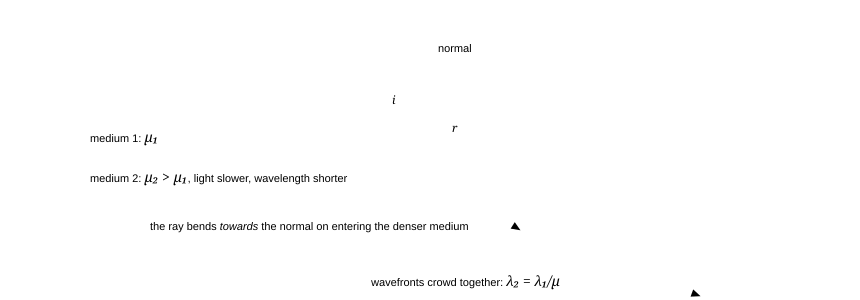

**Fig. 3.1** — Why the ray bends, and why the bending is toward the normal. The wavefronts are drawn perpendicular to the rays; in the denser medium they are closer together (shorter wavelength) and travel more slowly, so the part of the front that has already entered falls behind and the front pivots toward the normal. $i > r$ here because $\mu_2 > \mu_1$. At normal incidence ($i = 0$) the whole front enters at once and there is no bending at all, even though the light slows down.

### 3.2 The laws of refraction

> **Snell's law (the second basic law, in full)**
>
> <!-- Equation tag: 3.1 -->
> $$
> \mu_1\sin i = \mu_2\sin r \qquad\Longleftrightarrow\qquad \frac{\sin i}{\sin r} = \frac{\mu_2}{\mu_1} = \frac{v_1}{v_2} = \mu_{21}
> $$
>
>  with the incident ray, the refracted ray and the normal **coplanar**, and the two rays on opposite sides of the normal. Three consequences to keep in the same drawer as the formula:
>
>  - **Graze in, graze out.**$i\to90^\circ\Rightarrow r\to C$ where $\sin C = \mu_1/\mu_2$. If
>   $\mu_2 > \mu_1$ the maximum refraction angle inside is $C$ (part 4 makes this the critical angle
>   of total internal reflection).
> - **The deviation of a refracted ray** is $\delta = i - r$ (the ray is bent toward the normal for
>   $\mu_2>\mu_1$). For light entering a denser medium, $\delta$ is greatest at grazing incidence, where
>   $\delta_{\max} = 90^\circ - C$.
> - **Reversibility.** Swapping $i$ and $r$ and the two indices leaves (3.1) unchanged. Every
>   "which way does light bend" question is answered by reading it backwards.

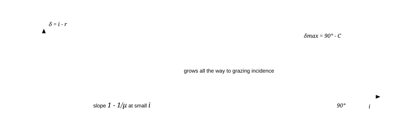

**Fig. 3.2** — Deviation against angle of incidence for a ray entering a denser medium. The curve *rises monotonically* from $\delta = 0$ at normal incidence (where the slope is $1 - 1/\mu$) to a finite ceiling $\delta_{\max} = 90^\circ - C$ at grazing incidence. Part 4 adds the second branch of this curve, where the light is totally reflected and the deviation starts behaving completely differently.

> **"Optically denser" does not mean "physically denser"**
>
> The words *rarer* and *denser* in optics refer only to the refractive index. Turpentine ($\mu = 1.47$) floats on water ($\mu = 1.33$) and is optically *denser* than it; a block of ice ($\mu = 1.31$) is optically rarer than water though it is physically denser. Say "higher index" when you mean it, and you will never be caught by a question that swaps the two words.

### **Q1** A ray of light in air strikes the surface of water ($\mu = 4/3$) at an angle of incidence of $45^\circ$. Find the angle of refraction, the angle of deviation, and the speed of light in water. _(JEE main)_

Solution

$$
\sin r = \frac{\sin 45^\circ}{4/3} = \frac{0.7071}{1.3333} = 0.5303 \Rightarrow r = 32.0^\circ
$$

$$
\delta = i - r = 13.0^\circ, \qquad v = \frac{c}{\mu} = \frac{3.00\times10^{8}}{4/3} = 2.25\times10^{8}\ \text{m/s}
$$

**Checks.** $i > r$ ✓ (into the denser medium the ray bends toward the normal); $c > v$ ✓; and the two form the standard pair to quote: *the frequency is unchanged, the wavelength falls to* $\lambda/\mu$. Red light of $\lambda = 600$ nm in air has $\lambda = 450$ nm in water — still red, because colour is set by frequency, not by wavelength.

### **Q2** Light travelling in a glass block emerges into air at $60^\circ$ to the normal, having been incident internally at $30^\circ$. Find the refractive index of the glass, and the angle of deviation. What is the largest deviation a ray can suffer on its way *out* of this glass? _(JEE main)_

Solution

Snell from glass to air, with $\sin 60^\circ = \mu\sin 30^\circ$:

$$
\mu = \frac{\sin 60^\circ}{\sin 30^\circ} = \frac{0.8660}{0.5} = 1.732 \;(=\sqrt3), \qquad \delta = 60^\circ - 30^\circ = 30^\circ
$$

The largest possible deviation on exit is at grazing emergence, $r = 90^\circ$, when $i = C$ with $\sin C = 1/1.732 = 0.5774$, so $C = 35.3^\circ$ and

$$
\delta_{\max} = 90^\circ - 35.3^\circ = 54.7^\circ
$$

**Check.** Beyond $i = C$ there is no emergent ray at all — the deviation jumps to the reflection branch of part 4. So $\delta$ on exit can never exceed $54.7^\circ$ for this glass, however you aim the ray: a fact that feels wrong until you check it, and exactly the sort of thing Olympiad questions ask you to justify.

### 3.3 Snell's law from Fermat's principle (and why the lifeguard swims at an angle)

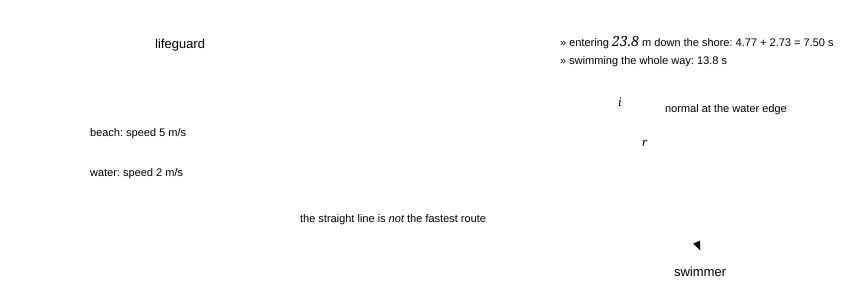

**Fig. 3.3** — Fermat's principle is not a statement about light's preferences; it is the geometry of "least time through two media". The lifeguard who runs 5 m/s on sand and swims 2 m/s should enter the water at the point where $\sin i/\sin r = v_1/v_2 = 5/2$ — Snell's law with $1/\mu$ playing the role of the speed ratio. Numbers for the drawing (sand 4.5 m deep, water 5.0 m deep, 26 m of shore between them): the best entry is 23.8 m along the shore, giving $23.8/5 + 5.45/2 = 4.77+2.73 = 7.50$ s — better than swimming the whole 27.7 m straight line at 2 m/s ($13.8$ s) and better than running all the way and then swimming straight out ($5.2+2.5 = 7.70$ s). The optimum sits strictly between the two extremes, and it is *stationary*, not extremal in any obvious sense — that is why physicists say least *time*, not shortest path.

> **Derivation of Snell's law (one derivative, no optics)**
>
> Put the interface along the $x$-axis, the object in medium 1 at $(0, h_1)$ and the observer in medium 2 at $(d, -h_2)$. Let the crossing point be $(x, 0)$. The travel time is
>
>  $$
> t(x) = \frac{\sqrt{x^{2}+h_1^{2}}}{v_1} + \frac{\sqrt{(d-x)^{2}+h_2^{2}}}{v_2}
> $$
>
>  Stationary time means $dt/dx = 0$:
>
>  $$
> \frac{x}{v_1\sqrt{x^{2}+h_1^{2}}} = \frac{d-x}{v_2\sqrt{(d-x)^{2}+h_2^{2}}} \Rightarrow \frac{\sin i}{v_1} = \frac{\sin r}{v_2} \Rightarrow \mu_1\sin i = \mu_2 \sin r
> $$
>
>  since $\sin i = x/\sqrt{x^2+h_1^2}$ and $\mu = c/v$. Two remarks: the second derivative is positive (so it really is a minimum, not a maximum), and the whole content of the law is the phrase *"*stationary*"* — light is lazy, not clever, and the laziness is $\int n\,ds$.

### 3.4 The vector form of Snell's law

Three-dimensional problems (a ray in a prism whose faces are not perpendicular, a ray inside a slanted fibre, an Olympiad question about a ray meeting a corner) are painful with angles and one-line with vectors. Let $\hat i$ be the unit vector along the incident ray, $\hat n$ the unit normal *pointing from the first medium into the second*, and let $i, r$ be the angles of incidence and refraction. Then

<!-- Equation tag: 3.2 -->
$$
\hat r = \frac{\mu_1}{\mu_2}\hat i + \left[\frac{\mu_1}{\mu_2}\cos i - \cos r\right]\hat n, \qquad \cos i = -\hat i\cdot\hat n, \qquad \cos r = \sqrt{1-\left(\frac{\mu_1}{\mu_2}\sin i\right)^{2}}
$$

> **Where it comes from — one sentence you can remember**
>
> **The component of the ray parallel to the surface, scaled by the index, is continuous.** That is: the tangential part of $\hat i$ times $\mu_1$ equals the tangential part of $\hat r$ times $\mu_2$, which is exactly what $\mu\sin i = \mu'\sin r$ says. The formula above is that statement, with the normal component chosen so that $|\hat r| = 1$. Verify it in the degenerate case $\mu_1 = \mu_2$: $\cos r = \cos i$, the bracket vanishes and $\hat r = \hat i$ ✓.

### Worked example 3.1 · A ray striking a horizontal interface at an angle

**Statement.** A ray in air travels along $\hat i = (0.6,\,0,\,0.8)$ and meets the horizontal surface of a glass block ($\mu = 1.5$) from above; the outward normal of the glass surface is $\hat n = (0,0,-1)$. Find the refracted direction. **Plan:** use (3.2) with $\mu_1/\mu_2 = 1/1.5 = 0.6667$. **Do:** $\cos i = -\hat i\cdot\hat n = 0.8$ (so $i = 36.9^\circ$ and $\sin i = 0.6$); $\sin r = 0.6/1.5 = 0.4$, so $\cos r = \sqrt{1-0.16} = 0.9165$. Then

 $$
\hat r = 0.6667(0.6,0,0.8) + \left[0.6667(0.8)-0.9165\right](0,0,-1) = (0.400,\,0,\,0.917)
$$

 **Check:** $|\hat r| = \sqrt{0.160+0.841} = 1.000$ ✓; the tangential part $(0.6,0,0)$ scaled by $1/1.5$ gave $(0.4,0,0)$ ✓; and $\hat r\cdot\hat n = -0.917$, so the ray is inside the glass and steeper than the incident ray ✓ — it bent *toward* the normal, as $\mu_2 > \mu_1$ requires.

### 3.5 Apparent depth: why a pool looks shallower than it is

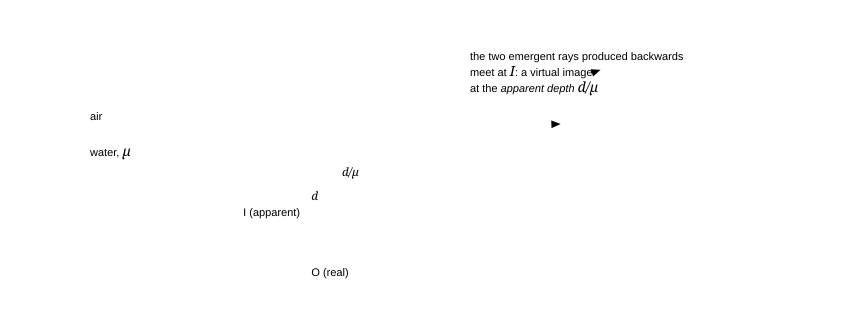

**Fig. 3.4** — The classic apparent-depth construction. Two rays leave the object $O$, refract at the surface, and diverge on emerging; produced backwards they meet at $I$, shallower than $O$ by the factor $\mu$. The result is exact only in the *paraxial* sense — for rays leaving nearly parallel to the normal. §3.8 quantifies what "nearly" costs.

> **Apparent depth and the refractive shift (near-normal viewing)**
>
> <!-- Equation tag: 3.3 -->
> $$
> d_{\text{app}} = d\,\frac{\mu_{\text{observer}}}{\mu_{\text{object}}}, \qquad \text{shift} = d\left(1 - \frac{\mu_{\text{observer}}}{\mu_{\text{object}}}\right)
> $$
>
>  For an object at depth $d$ in a medium of index $\mu$ viewed from air: $d_{\text{app}} = d/\mu$. For a bird at height $h$ in air viewed by a fish: $h_{\text{app}} = \mu h$ — the fish sees the bird *further* away than it is. The one-line derivation uses the plane-surface limit of part 6's single-surface formula: with $R\to\infty$, $\mu_2/v = \mu_1/u$, and the ratio $v/u$ is $\mu_2/\mu_1$ — the observer's index over the object's ✓.

### **Q3** A coin lies at the bottom of a tank of water 12.0 cm deep ($\mu = 4/3$). A boy looks straight down from just above the surface. How deep does the coin appear, and how far has the image shifted? Repeat for the case where a 3.0 cm layer of benzene ($\mu = 1.5$) floats on the water. _(JEE main)_

Solution

Single layer: $d_{\text{app}} = d/\mu = 12.0/(4/3) = 9.0$ cm; shift $= 12.0-9.0 = 3.0$ cm.

Two layers: the coin is seen through benzene and then air. Apply the shift formula to each layer in turn, working upwards — the apparent depth of a layer is the layer thickness divided by its own index, and the shifts add:

$$
\Delta = \sum t\left(1-\frac{1}{\mu}\right) = 12.0\left(1-\frac34\right) + 3.0\left(1-\frac{1}{1.5}\right) = 3.0 + 1.0 = 4.0\ \text{cm}
$$

$$
d_{\text{app}} = 15.0 - 4.0 = 11.0\ \text{cm}
$$

**Check by the "equivalent index".** Two layers of total thickness 15.0 cm act like one layer of thickness $\sum t_i$ and index

$$
\mu_{\text{eq}} = \frac{\sum t_i}{\sum (t_i/\mu_i)} = \frac{15.0}{9.0+2.0} = 1.364
$$

and $15.0/1.364 = 11.0$ cm ✓. Both routes agree, and notice that the answer is *not* $15/(4/3)$: the benzene layer uses its own index.

### **Q4** A bird hovers 3.0 m above the surface of a pond. A fish is 1.0 m below the surface, looking up. How far above the surface does the bird appear to the fish, and where does the fish itself appear to the bird to be? _(JEE main)_

Solution

For the fish (observer in water, $\mu = 4/3$; object in air, $\mu = 1$), (3.3) with $\mu_{\text{observer}}/\mu_{\text{object}} = (4/3)/1$:

$$
h_{\text{app}} = h\frac{\mu_{\text{water}}}{\mu_{\text{air}}} = 3.0\times\frac{4}{3} = 4.0\ \text{m}
$$

For the bird, the fish is the object in water seen from air: $1.0\times(1/(4/3)) = 0.75$ m below the surface — shallower than it is.

**Check.** Both answers follow the single rule "multiply by the observer's index and divide by the object's", and they are inverse operations: $4/3$ then $3/4$ returns $3.0$ m ✓. That reciprocity is the reversibility principle doing its job, and it is the reason you should never memorise the two cases separately.

### 3.6 The parallel slab: no deviation, but a shift

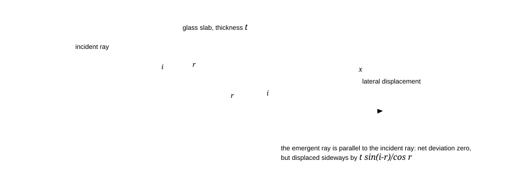

**Fig. 3.5** — A parallel slab. The two refractions are *mirror images* of each other, so the emergent ray is parallel to the incident ray: a slab never deviates a ray, it only displaces it. The displacement grows with thickness and with the angle of incidence, and vanishes at normal incidence — a fact worth remembering as "the slab is invisible to a ray that goes straight through".

> **Parallel slab — the three results worth carrying**
>
> For thickness $t$, index $\mu$, incidence $i$ (external), refraction $r$:
>
>  <!-- Equation tag: 3.4 -->
> $$
> \text{lateral displacement } x = \frac{t\,\sin(i-r)}{\cos r}, \qquad x = 0 \text{ at } i = 0
> $$
>
>  $$
> \text{normal viewing (object seen through the slab): shift } = t\left(1-\frac{1}{\mu}\right) = t\frac{\mu-1}{\mu}
> $$
>
>  and the emergent ray is exactly parallel to the incident ray, so the *direction* of the image is unchanged — only its position shifts.

> **Why the emergent ray must be parallel (a proof that takes one line)**
>
> Let the ray enter at $i$ and refract to $r$. At the second surface the internal angle is also $r$ (alternate angles: the two faces are parallel), so the emergent angle is the $i$ that satisfies $\mu\sin r = 1\cdot\sin i$ — the same equation as at entry. Hence the emergent angle equals the incident angle, and since the ray has crossed the slab and its direction is measured against the same normal direction, the emergent ray is parallel to the incident one. The same argument gives the lateral shift if you apply the sine rule to the triangle formed by the two parallel rays and the ray inside the slab, whose internal length is $t/\cos r$:
>
>  $$
> x = \frac{t}{\cos r}\sin(i-r)
> $$

### **Q5** A ray of light strikes a glass slab of thickness 6.0 cm and refractive index 1.5 at an angle of incidence of $45^\circ$. Find the lateral displacement of the emergent ray. _(JEE main)_

Solution

$$
\sin r = \frac{\sin 45^\circ}{1.5} = 0.4714 \Rightarrow r = 28.13^\circ
$$

$$
x = \frac{t\sin(i-r)}{\cos r} = \frac{6.0\sin(16.87^\circ)}{\cos 28.13^\circ} = \frac{6.0(0.2903)}{0.8819} = 1.97\ \text{cm}
$$

**Check by limits.** As $i\to0$: $i-r\to0$ so $x\to0$ ✓. As $\mu\to1$: $r\to i$ so $x\to0$ ✓ (no glass, no shift). And $x$ must be smaller than $t\tan i = 6.0$ cm ✓. Note the decimal places: quoting 1.97 cm from 6.0 cm and 45° is already generous; in an exam, two significant figures (2.0 cm) is the honest answer.

### **Q6** A microscope is focused on a mark on the bottom of a beaker. A layer of liquid 8.0 cm deep is poured in, and the microscope must now be raised by 2.0 cm to refocus on the mark. Find the refractive index of the liquid. _(JEE main · travelling microscope)_

Solution

Raising the microscope by the *shift* refocuses it: the shift is $\Delta = t(1-1/\mu) = 2.0$ cm for $t = 8.0$ cm.

$$
2.0 = 8.0\left(1-\frac{1}{\mu}\right) \Rightarrow \frac{1}{\mu} = 1 - 0.25 = 0.75 \Rightarrow \mu = 1.33
$$

**Check.** Alternatively $\mu = t/(t-\Delta) = 8.0/6.0 = 1.333$ ✓ — this is exactly the *apparent-depth* measurement of a travelling microscope (§3.10), just phrased as a microscope movement. The liquid is water. A common slip is to write $\mu = (t+\Delta)/t$, which gives 1.25 and no liquid on Earth.

### 3.7 Several slabs, and a slab with a mirror behind it

> **Stacked parallel layers (normal viewing)**
>
> Shifts add; an equivalent index exists and is the thickness-weighted *harmonic* mean:
>
>  <!-- Equation tag: 3.5 -->
> $$
> \Delta_{\text{total}} = \sum_i t_i\left(1-\frac{1}{\mu_i}\right), \qquad \mu_{\text{eq}} = \frac{\sum_i t_i}{\sum_i t_i/\mu_i}
> $$
>
>  Note the form: it is $t/\mu$ that behaves additively (that combination is the *optical path* through the layer), which is why $\mu_{\text{eq}}$ is a harmonic mean and not an average. For two equal layers this gives $\mu_{\text{eq}} = 2\mu_1\mu_2/(\mu_1+\mu_2)$ — the harmonic mean, always closer to the smaller index.

> **A slab in *front* of a mirror: the "effective mirror" idea**
>
> Put a point object in air at height $h$ above a slab of thickness $t$ and index $\mu$, whose lower face is silvered. The mirror "sees" the object through the slab, so it sees an object whose apparent height is *increased* by the optical thickness of the slab: from inside the glass, the object appears at $\mu h$ above the top face. The reflected image is therefore formed as if the object were at $\mu h + t$ above the silvered face. Working back out through the surface, the image appears to the outside observer at depth
>
>  $$
> d_{\text{image}} = h + \frac{2t}{\mu} \quad\text{below the top surface, so the object-image separation is } 2\left(h+\frac{t}{\mu}\right)
> $$
>
>  Equivalently: **replace the slab by an air gap of thickness $t/\mu$** and then solve the easy problem. That single substitution handles silvered slabs, a slab resting on a mirror, and a mirror viewed through a thick window. It is worth remembering because it is exactly how a real optical engineer treats a "thick window".

### **Q7** A point object is 5.0 cm above a glass slab 10.0 cm thick and of index 1.5 whose *lower* face is silvered. Where does the image appear? Then a 4.0 cm layer of water ($4/3$) is poured over the slab. Where does the image appear now, and what is the apparent object-image separation? _(JEE Advanced)_

Solution

**The one idea.** In a stack of parallel layers, the mirror does not see *lengths*; it sees **reduced lengths** $t/\mu$, because a thickness $t$ of index $\mu$ is optically the same as a thickness $t/\mu$ of air (that is exactly what $d_{\text{app}} = t/\mu$ says). So:

- the reduced distance from the object to the mirror is $L = h + \sum_i t_i/\mu_i$;
- the mirror places the image the same reduced distance $L$ behind itself;
- the image therefore appears at apparent depth $D = 2L - h$ below the top surface of the stack (the
  $-h$ removes the air gap on the way back, since the object itself is $h$ above the surface).

**(a) Slab alone.** $h = 5.0$, $t/\mu = 10.0/1.5 = 6.667$, so $L = 11.667$ cm and

$$
D = 2L-h = h + \frac{2t}{\mu} = 5.0 + 13.33 = 18.3\ \text{cm below the top face}; \qquad 2L = 23.3\ \text{cm apart from the object}
$$

**(b) With 4.0 cm of water on top.** The reduced thicknesses are $4.0/(4/3) = 3.00$ for the water and $6.667$ for the glass:

$$
L = 5.0 + 3.00 + 6.667 = 14.667\ \text{cm}, \qquad D = 2L-h = 29.33-5.0 = 24.3\ \text{cm below the water surface}
$$

$$
\text{apparent object-image separation} = 2L = 29.3\ \text{cm}
$$

**Checks.** (i) $\mu\to1$: (a) gives $2L = 2(5+10) = 30$ cm, which is the plain mirror result $2(h+t)$ ✓. Glass *compresses* the round trip ($30 > 23.3$) ✓. (ii) The equivalent-air-gap route gives the same number independently: replace the slab by a 6.667 cm air gap, which puts the mirror at apparent depth 6.667 and the object $5+6.667 = 11.667$ cm above it, so the image is $11.667$ cm below the mirror, i.e. $18.3$ cm below the surface ✓. (iii) Adding the water *increased* the apparent depth by $2(3.00) = 6.0$ cm ✓, and water is optically thinner than glass so it adds less than the 4.0 cm it physically occupies would suggest. Every one of these limits is a one-line sanity test — run at least one before you write down a final answer.

### 3.8 Oblique viewing: what the apparent-depth rule really approximates

> **The exact oblique result (and why you are taught only the paraxial one)**
>
> For an object at depth $d$ under a plane surface, viewed along a direction making angle $i$ with the normal in the observer's medium (so $\mu\sin r = \sin i$ inside), the intersection of two neighbouring emergent rays — the true virtual image for that viewing direction — lies at depth
>
>  <!-- Equation tag: 3.6 -->
> $$
> d_{\text{app}}(i) = d\,\frac{\cos^{3}i}{\mu\cos^{3}r}
> $$
>
>  and it is displaced sideways as well, so the image is not directly below the object unless you look straight down. Expand for small $i$ using $\cos^{3}i/\cos^{3}r \approx 1 - \tfrac32 i^{2}(1-1/\mu^{2})$:
>
>  $$
> d_{\text{app}} \approx \frac{d}{\mu}\left[1 - \frac{3}{2}i^{2}\left(1-\frac{1}{\mu^{2}}\right) + \dots\right]
> $$
>
>  The leading term is (3.3), so the textbook rule is right to 1 part in $10^{3}$ at $i = 10^\circ$ for water. The corrections matter exactly where they are interesting: at large $i$ the apparent depth *falls* further and the image swims sideways, which is why a coin at the bottom of a pool looks distorted when you view it from the side.

> **Derivation by the caustic condition (two neighbouring rays)**
>
> Parametrise the emergent ray by the internal angle $r$: it leaves the surface at horizontal position $x = d\tan r$ and travels at angle $i(r)$ to the normal, with $\sin i = \mu\sin r$. The image for a given viewing angle is where two neighbouring rays cross, so set $dP/dr = 0$ for the ray $P = (d\tan r, 0) + t(\sin i, \cos i)$. The two components give $t = -d\cos^{2}i/(\mu\cos^{3}r)$, and the depth is $t\cos i = d\cos^{3}i/(\mu\cos^{3}r)$. Limits: $i\to0$ returns $d/\mu$ ✓; $\mu\to1$ returns $d$ ✓ (no interface, no image shift); $i$ large makes the depth smaller, so the image rises as you look more obliquely ✓. The full algebra is in part 8, §8.4, where the same trick is used for the caustic of a mirror.

### **Q8** A 2.0 m deep swimming pool is observed from the side, at $60^\circ$ to the vertical. Using the exact formula, find the apparent depth; compare with the paraxial value. _(INPhO practice)_

Solution

$\mu = 4/3$, $i = 60^\circ$: $\sin r = \sin 60^\circ/(4/3) = 0.8660/1.3333 = 0.6495$, so $r = 40.5^\circ$, $\cos i = 0.5000$, $\cos r = 0.7604$. Then

$$
d_{\text{app}} = d\frac{\cos^{3}i}{\mu\cos^{3}r} = 2.0\times\frac{0.1250}{1.3333(0.4396)} = 2.0\times0.2134 = 0.43\ \text{m}
$$

compared with the paraxial estimate $d/\mu = 1.50$ m.

**Check.** The exact value is much smaller — and that is physically right: looking almost horizontally at a pool you see very little depth (the water surface presents the bottom as a shallow skin), while looking straight down you see two-thirds of the true depth. Both limits are consistent with (3.6): at $i\to0$, $d_{\text{app}}\to d/\mu = 1.5$ m; at $i\to90^\circ$, $d_{\text{app}}\to0$ ✓. So the "paraxial rule" is not an approximation to a constant but the leading term of a function of viewing angle.

### 3.9 Rays in a medium whose refractive index varies

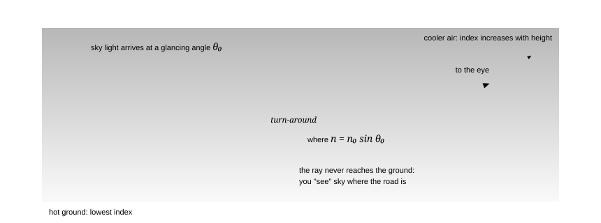

**Fig. 3.6** — A mirage is not an illusion about where the road is; it is light from the sky that never reached the road. In a stratified medium the quantity $n\sin\theta$ — $\theta$ measured from the direction of variation — is constant along the ray, so a ray travelling into a region of lower $n$ tilts further from the normal and turns around where $n$ has fallen to the invariant $n_0\sin\theta_0$. The same conservation law runs fibre optics and atmospheric refraction.

> **The invariant of a stratified medium, and the curvature it implies**
>
> If $n$ depends only on $y$ (layers perpendicular to $y$), then along any ray
>
>  <!-- Equation tag: 3.7 -->
> $$
> n(y)\,\sin\theta(y) = \text{constant}, \qquad \theta \text{ measured from the } y\text{-axis}
> $$
>
>  and the ray curves toward larger $n$ with radius of curvature
>
>  <!-- Equation tag: 3.8 -->
> $$
> \frac{1}{R} = \frac{\sin\theta}{n}\left|\frac{dn}{dy}\right|
> $$
>
>  For a *horizontal* ray ($\sin\theta = 1$) this is the cleanest form: **the radius of curvature of a horizontal ray equals $n/(dn/dy)$**. Rays with a component along the gradient have larger radii, and a ray turns around (never penetrates further) where $n$ falls to the invariant.

> **Why the invariant holds, and why the curvature has that form**
>
> The medium is a stack of thin plane layers; at every internal boundary Snell's law applies with the same normal, so $n\sin\theta$ is preserved from layer to layer and, in the limit of infinitely thin layers, along the whole path. For the curvature, differentiate the invariant with respect to arc length $s$: $\frac{d}{ds}(n\sin\theta) = 0$. With $dy/ds = \cos\theta$ and $d\theta/ds = 1/R$ (the definition of curvature for a path whose tangent angle changes by $d\theta$ over a length $ds$), this gives $\frac{dn}{dy}\cos\theta\sin\theta + n\cos\theta\frac{1}{R} = 0$, hence $1/R = -(\sin\theta/n)\,dn/dy$ — the sign simply says "curving toward increasing $n$" ✓. Check the dimensions: $[dn/dy] = \text{m}^{-1}$ since $n$ is dimensionless ✓.

### **Q9** Light enters a medium at $y = 0$, travelling horizontally along $x$. The index varies as $n = 1.5(1+0.10\,y)$ with $y$ in metres. Find the radius of curvature of the ray at entry, describe the path, and state whether the ray ever returns to $y = 0$. _(INPhO practice)_

Solution

At entry $\theta = 90^\circ$ from the $y$-axis, so $\sin\theta = 1$, and $dn/dy = 1.5(0.10) = 0.15\ \text{m}^{-1}$. From (3.8):

$$
\frac{1}{R} = \frac{1}{1.5}(0.15) = 0.10\ \text{m}^{-1} \Rightarrow R = 10\ \text{m}
$$

The ray curves toward increasing $n$, which is upward (positive $y$). Near the entry it is therefore a circular arc of radius 10 m, equivalently the parabola

$$
y \approx \frac{x^{2}}{2R} = \frac{x^{2}}{20}
$$

It never returns: the invariant is $k = n(0)\sin 90^\circ = 1.5$, and turning around would require $n = k = 1.5$, i.e. $y = 0$ — the entry point itself. Since $n$ only grows with $y$, the ray keeps bending upward and away.

**Check.** Set $a = 0.10$ m−1 and verify the parabola against the exact invariant: $\sin\theta = k/n = 1/(1+0.1y)$, so $\tan\theta = 1/\sqrt{(1+0.1y)^{2}-1} \approx 1/\sqrt{0.2y}$, and $dy/dx = 1/\tan\theta = \sqrt{0.2y}\Rightarrow y = (0.2)x^{2}/4 = x^{2}/20$ ✓ exactly the parabola above. Note also what is *not* happening: the ray is not being absorbed or scattered, and this is not a "curved space" effect — the wavefront is turning because different parts of it travel at different speeds.

### **Q10** Above a hot road the index falls from 1.00030 at the height where light from the sky arrives to lower values near the ground. Light from the sky arrives at $89.0^\circ$ to the vertical, and the index varies with height $h$ above that point as $n = 1.00030 - (1.0\times10^{-4})\,h$ ($h$ in metres, measured downward). At what height above the road does the ray turn around, and why does the mirage vanish when you walk closer? _(Olympiad-style estimate)_

Solution

Light coming from the sky travels downward into decreasing $n$, so by the invariant it tilts progressively away from the vertical (toward the horizontal) and turns around where $n = n_0\sin\theta_0$:

$$
n_0\sin\theta_0 = 1.00030\sin 89.0^\circ = 1.00030(0.99985) = 1.00015
$$

$$
1.00030 - 1.0\times10^{-4}h = 1.00015 \Rightarrow h = \frac{1.5\times10^{-4}}{1.0\times10^{-4}} = 1.5\ \text{m}
$$

So the ray turns around about 1.5 m above the road and comes back to the eye: the eye receives sky light along a direction that suggests the road surface, which is the "water on the road". Walk closer and you are looking at steeper angles (larger departure from grazing): $\theta_0$ smaller means $n_0\sin\theta_0$ smaller, so the turn-around needs a larger index change, i.e. a larger depth — deeper than the road. The ray then reaches the ground and the mirage disappears as you approach, which is exactly what you see driving toward a "wet" patch of road.

**Check.** The required index contrast is tiny ($1.5\times10^{-4}$), which is why the effect is common (hot roads, deserts, sea surfaces) and why it dies in wind or when the tarmac cools. A useful order-of-magnitude: $dn/dh \sim \Delta T\,(dn/dT)/\ldots \sim 10^{-4}$ per metre needs only $\sim10$ K of temperature difference over a metre of air.

### 3.10 Measuring the refractive index of a liquid: the travelling microscope

> **The method, and the one thing that makes it accurate**
>
> Focus a travelling microscope (one with a vernier scale on the vertical column) on a fine mark on the bottom of a tall container, and read the scale: $x_1$. Pour the liquid in slowly to depth $t$ and focus again on the same mark through the liquid: $x_2$. The microscope has *risen* by the shift, and the apparent depth is $t - (x_2-x_1)$. Then
>
>  <!-- Equation tag: 3.9 -->
> $$
> \mu = \frac{\text{real depth}}{\text{apparent depth}} = \frac{t}{t - \Delta}, \qquad \Delta = x_2-x_1
> $$
>
>  Why it works at all: a microscope focuses by making the object's rays emerge parallel, so it is measuring the *paraxial* image position — exactly the approximation under which (3.3) is exact. The accuracy comes from the vernier (0.01 mm) and from using a fine mark; the systematic error to watch is that the apparent depth must be measured from the liquid surface, not from the container's rim.

### **Q11** In a travelling-microscope experiment a student records the following: focus on the mark at the bottom of an empty vessel, 4.628 cm; fill to a depth of 6.000 cm, refocus, 6.128 cm. Find $\mu$. If the same liquid is put in a tube of 9.000 cm depth, what shift should be expected? _(JEE main · practical)_

Solution

Shift $\Delta = 6.128-4.628 = 1.500$ cm for $t = 6.000$ cm:

$$
\mu = \frac{t}{t-\Delta} = \frac{6.000}{4.500} = 1.333
$$

For $t = 9.000$ cm with the same liquid: $\Delta = t(1-1/\mu) = 9.000(1-0.75) = 2.250$ cm, i.e. a new scale reading of $4.628 + 2.250 = 6.878$ cm.

**Check.** The ratio test is the fastest audit: $\Delta/t = 1-1/\mu = 0.250$ for both, and $1.500/6.000 = 2.250/9.000 = 0.250$ ✓. The liquid is water to three decimal places. Reporting $\mu = 4/3$ exactly from these data would be over-claiming: the last digit of the vernier is your error bar.

### **Q12** Light in air strikes the top face of a glass slab (thickness $t = 3.0$ cm, $\mu = 1.5$) at grazing incidence. Find (a) the angle the ray makes with the normal inside, (b) the length of the path inside the slab, (c) how far the beam creeps along the slab, and (d) where the emergent ray goes. Show that the internal path length is $t\mu/\sqrt{\mu^{2}-1}$. _(JEE Advanced)_

Solution

**(a)** Grazing incidence means $i = 90^\circ$, so $1\cdot\sin 90^\circ = \mu\sin r$ gives

$$
\sin r = \frac{1}{\mu} = 0.6667 \Rightarrow r = 41.8^\circ, \qquad \cos r = \frac{\sqrt{\mu^{2}-1}}{\mu} = 0.7454
$$

This is the *largest* internal angle possible: no ray entering from air can travel more steeply. It is also the critical angle for the reverse journey, so the ray inside the glass is at $C$.

**(b)** The ray descends a vertical distance $t$ at angle $r$ to the normal, so its path length is $t/\cos r$:

$$
\frac{t}{\cos r} = \frac{t\mu}{\sqrt{\mu^{2}-1}} = \frac{3.0\times1.5}{\sqrt{1.25}} = \frac{4.50}{1.118} = 4.02\ \text{cm}
$$

**(c)** The sideways creep is $t\tan r = t/\sqrt{\mu^{2}-1} = 3.0/1.118 = 2.68$ cm.

**(d)** At the bottom face the internal angle is again $r = C$ (the faces are parallel), so $\mu\sin r = 1$ gives an emergent angle of $90^\circ$: the emergent ray *grazes* the lower face. The two grazing rays — incident along the top face, emergent along the bottom face — are parallel and separated by exactly $t$, the slab thickness.

**Checks.** $4.02 > 3.0$ ✓ (the path must exceed the thickness); as $\mu\to1^{+}$ the path $t\mu/\sqrt{\mu^{2}-1}\to\infty$ ✓, because a barely-denser slab lets the ray slide along almost parallel to the surface for ever; and the creep $t/\sqrt{\mu^{2}-1}$ is the same divergence ✓. Finally note the pattern in the two answers: $4.02^{2} = 3.0^{2}+2.68^{2}$ ✓ — path, thickness and creep form a right triangle, which is a much faster way to get either one.

### 3.11 Summary — the results to own

> **Part 3 in seven lines**
>
> - $\mu = c/v = \lambda_{\text{vac}}/\lambda_{\text{med}}$; frequency is unchanged across a surface.
> - $\mu_1\sin i = \mu_2\sin r$, coplanar, and $\delta = i-r$ rising monotonically to
>   $90^\circ - C$ at grazing incidence.
> - Fermat: $\sin i/\sin r = v_1/v_2$ is the least-time path; the vector form (3.2) is the tangential
>   component of $\mu\,\hat i$ being continuous.
> - Apparent depth $d\,\mu_{\text{obs}}/\mu_{\text{obj}}$; shift $d(1-\mu_{\text{obs}}/\mu_{\text{obj}})$;
>   exact oblique version $d\cos^{3}i/(\mu\cos^{3}r)$.
> - Slab: emergent ray parallel, displacement $t\sin(i-r)/\cos r$, normal-view shift
>   $t(1-1/\mu)$; stacks add $t/\mu$ and give a harmonic-mean index.
> - A slab in front of a mirror is an air gap of thickness $t/\mu$.
> - Stratified medium: $n\sin\theta = \text{const}$, curvature $1/R = (\sin\theta/n)|dn/dy|$, turning
>   point where $n$ equals the invariant.

### 3.12 Checkpoint

- I can derive Snell's law from the least-time condition, including the statement of what is minimised.
- I can write the vector form of Snell's law and use it on a ray that meets a surface at a general
  three-dimensional angle.
- I can compute apparent depth in either direction (object in air or in the medium), and say why it is a paraxial
  result.
- I can draw the slab construction and derive $x = t\sin(i-r)/\cos r$ from the internal path length.
- I can handle several layers, quote the equivalent index, and convert a silvered slab into an equivalent air
  gap.
- I can state the invariant of a stratified medium and compute a radius of curvature and a turn-around height from
  a given $n(y)$.
- I can describe the travelling-microscope measurement and say what sets its accuracy.

Next: [**Part 4 · Total internal reflection →**](#section-04-total-internal-reflection) — what happens when Snell's law runs out of solutions, and why that "failure" built the optical fibre, the prism periscope and a diamond's fire.

_Part 4 of 12 · JEE Advanced · base · NSEP · INPhO · ≈ 65 min read · 12 questions_

## 4 · Total internal reflection

Snell's law can fail. Send light from glass into air, tilt it far enough, and there is no angle $r$ that satisfies the equation — the light has nowhere to refract to, so it does the only other thing light can do: it reflects. That failure is not a defect of the theory but one of the most useful effects in optics, and this part is about what it buys you: prisms that turn beams through 90° and 180° with no silvering at all, optical fibres that carry a conversation across an ocean, the fire of a diamond, and the reason a fish sees the entire sky through a circular window in the water above it.

### 4.1 The critical angle

Take light inside a medium of index $\mu_1$ meeting a boundary with a rarer medium of index $\mu_2 < \mu_1$ — glass to air, water to air, glass to water. Because the light speeds up on the way out, the refracted ray bends *away* from the normal: $r > i$. As you increase $i$, the refracted ray marches toward the surface, and at one particular value of $i$ it emerges exactly along the surface, $r = 90^\circ$. That value is the critical angle. Beyond it, Snell's law demands $\sin r > 1$, which no angle satisfies.

> **Critical angle**
>
> For light travelling in a medium of index $\mu_1$ and meeting a medium of index $\mu_2 < \mu_1$, the **critical angle** $C$ is the angle of incidence whose refracted ray grazes the interface:
>
>  <!-- Equation tag: 4.1 -->
> $$
> \sin C = \frac{\mu_2}{\mu_1}, \qquad C = \sin^{-1}\!\left(\frac{\mu_2}{\mu_1}\right)
> $$
>
>  For a medium of index $\mu$ in air, $\sin C = 1/\mu$. Beyond $C$ no ray crosses the boundary at all, and the light is **totally internally reflected**. Note carefully whose indices appear: the incident medium goes on top of nothing — it is the *lower* index over the *higher* one that you take the sine of.

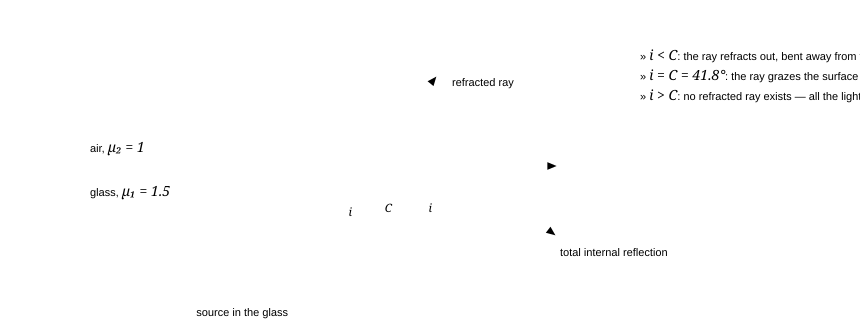

**Fig. 4.1** — The three regimes, drawn for glass to air. Only the first two obey Snell's law in the familiar sense; the third is what Snell's law does when it is asked for the impossible. Notice that the reflected ray is always there, even below $C$ — a fraction of the light reflects at every interface. What changes at $C$ is that the reflected ray becomes *all* of the light, which is what the word "total" records. The angles here are drawn to scale for $\mu = 1.5$: $C = 41.8^\circ$.

> **Critical angles worth knowing cold**
>
> | Interface (light going →) | $\sin C$ | $C$ | Why it matters |
> | --- | --- | --- | --- |
> | glass $1.5$ → air | $0.667$ | $41.8^\circ$ | $45^\circ$ exceeds it: 45–45–90 prisms work |
> | water $4/3$ → air | $0.750$ | $48.6^\circ$ | the fish's window, pool mirrors |
> | glass $1.5$ → water $4/3$ | $0.889$ | $62.7^\circ$ | a prism immersed in water stops working |
> | diamond $2.42$ → air | $0.413$ | $24.4^\circ$ | why a cut diamond sparkles |
>
>  The pattern to internalise: *the bigger the jump in index, the smaller the critical angle*. Diamond's $24.4^\circ$ is the extreme case in everyday optics, and it is the whole secret of its brilliance.

### 4.2 The deviation–incidence graph

Cengage draws the $\delta$–$i$ graph for a denser-to-rarer interface, and it is one of the few graphs in optics that carries real information: it makes visible the *discontinuity* at the critical angle.

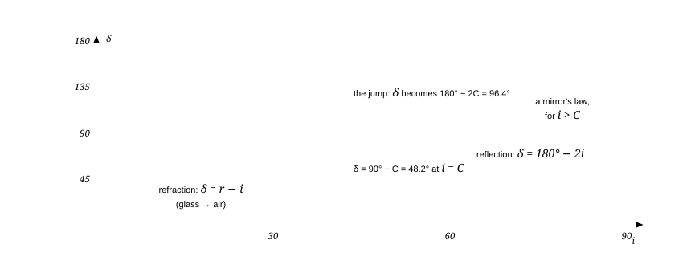

**Fig. 4.2** — Deviation against angle of incidence for light inside glass meeting a glass–air surface. Below $C$ the deviation rises from 0 to $90^\circ - C$ along the refraction branch; at $C$ the refracted ray disappears and the plotting point leaps to the reflection branch $\delta = 180^\circ - 2i$, which falls back to 0 at grazing incidence. The jump is genuine physics, not a drawing artefact — measure the deviation, and you can locate the critical angle to a fraction of a degree. That is how a spectrometer measures a refractive index.

> **Where the two branch formulas come from**
>
> **Refraction branch.** The ray bends away from the normal, so the deviation is $\delta = r - i$ with $r > i$; at $i = C$, $r = 90^\circ$, giving $\delta = 90^\circ - C$ — the ceiling of this branch. **Reflection branch.** A reflected ray is turned through $\delta = 180^\circ - 2i$ (this is the same relation a plane mirror obeys: rotate the mirror by $\theta$, the ray turns by $2\theta$; that is part 1, §1.7). At $i = C$ it gives $180^\circ - 2C$, and at $i = 90^\circ$, where the ray grazes the surface and is not deviated, it gives 0 — so both branches terminate at $\delta = 0$ at grazing incidence, one from below and one from above. The graph's two endpoints at $i = 90^\circ$ join up; its two branches at $i = C$ do not.

### 4.3 The conditions for total internal reflection

> **Total internal reflection happens only when all three hold**
>
> 1. **The light is travelling from a higher index to a lower index** ($\mu_1 > \mu_2$). Send light from
>   air into glass and it can never be totally reflected, no matter how you aim it: the ray always finds a refracted
>   solution because it is bending *toward* the normal.
> 2. **The angle of incidence exceeds the critical angle** of that pair of media, $i > C$. Equality
>   ($i = C$) is not total reflection — the ray grazes and takes the long way out.
> 3. **The angle is measured from the normal.** "Grazing" means grazing the *normal's* complement; a ray
>   travelling along the surface has $i = 90^\circ$ and is *never* internally reflected away from it, because
>   there is nothing beyond grazing.
>
>  And one structural point that is worth a mark in any long answer: when $i > C$, Snell's law does not give a *wrong* answer, it gives *no* answer — $\sin r = (\mu_1/\mu_2)\sin i > 1$ has no real solution. The mathematics is telling you that the assumption of a transmitted wave must be abandoned.

> **Note**
>
> "Total" is about energy, not about the field

> **"Total" is about energy, not about the field**
>
> In the wave picture the transmitted wave does not vanish at $i > C$. It becomes an **evanescent wave**: a disturbance that runs *along* the surface and decays exponentially into the rarer medium, dying away over roughly $\lambda/2\pi$. Because it carries no net energy *across* the boundary, the reflection is still total in the energy sense — every photon comes back. Two consequences an examiner can ask about: (i) bring a second medium to within about a wavelength and the evanescent field reaches it, so light crosses the gap — **frustrated total internal reflection**, the physics of fingerprint sensors and TIR microscopy; (ii) the reflected beam is displaced sideways from the point of geometric reflection by a fraction of a wavelength (the **Goos–Hänchen shift**). Note the contrast with part 3's grazing refraction, where a ray really does leave the medium: here the energy does not leave, only the field's tail does.

### **Q1** Find the critical angle for each of these interfaces: (a) glass $(\mu = 1.5)$ to air, (b) water $(\mu = 4/3)$ to air, (c) glass to water, (d) diamond $(\mu = 2.42)$ to air. _(JEE main)_

Solution

$$
(a)\ \ \sin C = \frac{1}{1.5} = 0.6667 \Rightarrow C = 41.8^\circ \qquad (b)\ \ \sin C = \frac{1}{4/3} = 0.7500 \Rightarrow C = 48.6^\circ
$$

$$
(c)\ \ \sin C = \frac{4/3}{1.5} = 0.8889 \Rightarrow C = 62.7^\circ \qquad (d)\ \ \sin C = \frac{1}{2.42} = 0.4132 \Rightarrow C = 24.4^\circ
$$

**Checks.** (i) Each $C$ is less than $90^\circ$ and falls as the index contrast grows: $24.4^\circ$ (diamond), $41.8^\circ$ (glass), $48.6^\circ$ (water), $62.7^\circ$ (glass into water, a poor contrast) ✓. (ii) Case (c) is the one to remember as a warning: a prism that works beautifully in air can fail in water, because $C$ is a property of the *pair*, not of the glass. (iii) Nothing here is about absorption — the indices are real, the light is not lost, it simply stays inside.

### **Q2** A ray inside a glass block $(\mu = 1.5)$ meets the top surface at an angle of incidence of (a) $20^\circ$, (b) $50^\circ$. Find the deviation of the ray in each case, and the angle the ray finally makes with the normal. _(JEE main)_

Solution

**(a)** $i = 20^\circ < C = 41.8^\circ$, so the ray refracts out. From Snell, $\sin r = 1.5\sin 20^\circ = 0.5130$, giving $r = 30.9^\circ$, and

$$
\delta = r - i = 30.9^\circ - 20^\circ = 10.9^\circ, \qquad r = 30.9^\circ \text{ in air}
$$

**(b)** $i = 50^\circ > C$, so the ray is totally reflected and the emergent angle is measured on the same side:

$$
\delta = 180^\circ - 2i = 80^\circ, \qquad \text{reflected at } 50^\circ \text{ inside the glass}
$$

**Checks.** (i) In (a) the ray bends away from the normal ($r > i$) ✓ because it is leaving a denser medium. (ii) In (b) the deviation 80° matches a mirror tilted so its normal makes 50° with the ray ✓. (iii) Check the continuity of the graph at these two points: the values 10.9° and 80° sit on the two different branches of Fig. 4.2, and there is no way to get from one to the other by a small change of $i$ — the jump is 96.4° − 48.2° = 48.2° wide.

### **Q3** A ray inside a glass slab $(\mu = 1.5)$ strikes the glass–air boundary at $40^\circ$ to the normal. Does it emerge? At what angle? For what range of internal angles does light emerge at all? _(JEE main)_

Solution

$40^\circ < 41.8^\circ$, so the ray does emerge — but only just, and it leaves almost flattened against the surface:

$$
\sin r = 1.5\sin 40^\circ = 0.9642 \Rightarrow r = 74.6^\circ \text{ in air}
$$

Emergence occurs for $0 \leq i < C$, i.e. $0 \leq i < 41.8^\circ$, giving emergent angles $0 \leq r < 90^\circ$ — the whole range, but compressed: the last $1.8^\circ$ of internal angle (i.e. $40^\circ$ to $41.8^\circ$) unfolds into the last $15.4^\circ$ of external angle ($74.6^\circ$ to $90^\circ$).

**Check.** The compression is exactly the "grazing squeeze" of Fig. 4.1, and it is worth a moment because it explains a real phenomenon: the outside world looks compressed into a narrow band near the surface when you view a pool from below, and it is why refraction seems to "fail" near grazing angles. A final sanity check: use reversibility — if a ray at $74.6^\circ$ in air refracts to $40^\circ$ in the glass, then a ray at $40^\circ$ in the glass must refract out at $74.6^\circ$ ✓, which is our answer.

### **Q4** A 45–45–90 prism is used to turn a beam through $90^\circ$ by a single reflection at its hypotenuse, with no silvering. Find the minimum refractive index the prism must have, and explain what changes when the prism is immersed in water $(\mu = 4/3)$. _(JEE Advanced)_

Solution

For a beam entering normally through the first leg, the ray inside travels parallel to that leg and therefore meets the hypotenuse at exactly $45^\circ$ (the hypotenuse makes $45^\circ$ with each leg). Total internal reflection needs

$$
45^\circ > C = \sin^{-1}\!\left(\frac{1}{\mu}\right) \Rightarrow \sin 45^\circ > \frac{1}{\mu} \Rightarrow \mu > \sqrt{2} = 1.414
$$

Ordinary glass (1.5) and crown glass (1.52) clear this bar comfortably; water (1.33) and even the densest plastic moulding compounds near 1.40 do not. Immersed in water the requirement becomes $45^\circ > \sin^{-1}(1.333/\mu)$, i.e. $\mu > 1.333/\sin 45^\circ = 1.886$ — no ordinary glass is anywhere near, so the prism stops reflecting *totally* and the beam simply passes out through the hypotenuse.

**Checks.** (i) The number $\sqrt{2}$ is worth recognising instantly: it is the "45° prism condition", the smallest index that lets a right-angle prism work in air. (ii) A partially reflecting hypotenuse is what actually happens at $\mu = 1.4$: Fresnel reflection at 45° gives a partial reflection (a few per cent), so the prism is not useless, it is merely inefficient — but it is no longer a total reflector. (iii) In water the prism still works *if* you silver the hypotenuse; that is why underwater optical instruments use mirrors, not TIR prisms.

### 4.4 Applications: prisms, fibres, diamonds, periscopes

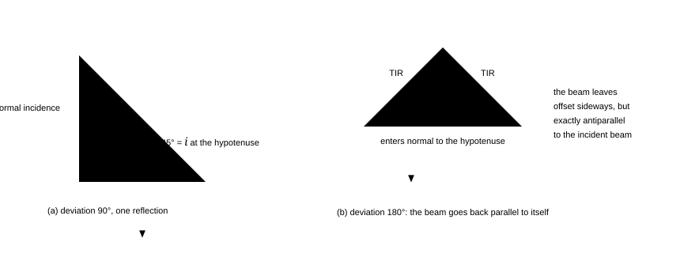

**Fig. 4.3** — Two workhorses made of the same right-angle prism. (a) A beam enters normally through a leg and is turned 90° by one total internal reflection at $45^\circ$ (which beats $C = 41.8^\circ$). (b) A beam enters *perpendicular to the hypotenuse*, is reflected twice at the legs, and leaves reversed — the 180° Porro prism, the heart of prism binoculars and the corner reflector on every bicycle. In both cases the reflecting surfaces are bare glass: no silvering, no losses beyond a clean Fresnel-free interface.

> **Why a prism beats a mirror**
>
> A silvered mirror reflects about 95–97% of the light, and the metal tarnishes. A TIR surface reflects *100%* — nothing is absorbed (the small field that does penetrate the rarer medium — the so-called **evanescent wave**, carries no energy away, it flows back). Prism periscopes, binoculars, SLR viewfinders and camera prisms have no metal in them for exactly this reason. One caveat follows from the penetrating field: if you bring the hypotenuse into contact with another piece of glass (or just very close), the evanescent field reaches the second glass and the reflection is *frustrated* — the light leaks across. This is the phenomenon of **frustrated total internal reflection**, and it is the reason an optical engineer must keep surfaces apart by more than about a wavelength to keep TIR "total".

#### Optical fibres

An optical fibre is a long glass thread with a **core** of slightly higher index surrounded by a **cladding** of lower index. Light entering the end face inside a narrow cone rattles down the fibre by TIR and arrives at the far end — millions of reflections later, through kilometres of glass, with a loss of a fraction of a decibel per kilometre. Nothing in this needs a mirror; it needs only that the angle at the wall exceed $C$.

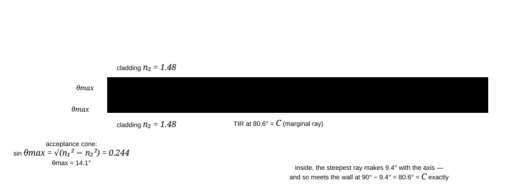

**Fig. 4.4** — A step-index fibre. The entry cone (half-angle 14.1° in air) is fixed by the condition that the *steepest entering ray* meets the wall at exactly the critical angle; any steeper ray leaks into the cladding after its first bounce. The quantity $\sin\theta_{\max} = \sqrt{n_1^{2}-n_2^{2}}$ is the fibre's **numerical aperture**, and the whole design problem of a fibre is to make it large (easy coupling) while keeping the ray angles small (low dispersion).

> **Fibre optics in three formulas**
>
> <!-- Equation tag: 4.2 -->
> $$
> \sin\theta_{\max} = \sqrt{n_1^{2}-n_2^{2}} = \text{NA}, \qquad C = \sin^{-1}\!\left(\frac{n_2}{n_1}\right), \qquad \theta_{\text{inside,max}} = 90^\circ - C
> $$
>
>  for core $n_1$, cladding $n_2$, light arriving from air. The wave picture adds one thing the ray picture cannot show: the fibre can also be **graded-index**, with $n$ largest on the axis and falling smoothly to the cladding value. Such a fibre bends the rays continuously (that is the $n\sin\theta = \text{const}$ invariant of §3.9) so that all rays take nearly the same optical path length and arrive together — which is why long-distance fibres are graded-index and not step-index.

### **Q5** A step-index fibre has core $n_1 = 1.50$ and cladding $n_2 = 1.48$. Find the critical angle at the core–cladding boundary, the numerical aperture, and the acceptance half-angle for light arriving from air. What fraction of the light from an isotropic point source placed at the fibre's end face is captured? _(JEE Advanced · INPhO)_

Solution

$$
C = \sin^{-1}\!\left(\frac{1.48}{1.50}\right) = 80.6^\circ, \qquad \text{NA} = \sqrt{1.50^{2}-1.48^{2}} = \sqrt{0.0596} = 0.244
$$

$$
\sin\theta_{\max} = 0.244 \Rightarrow \theta_{\max} = 14.1^\circ
$$

Inside the core the steepest confined ray makes $90^\circ-80.6^\circ = 9.4^\circ$ with the axis, and Snell's law at the end face turns this into $14.1^\circ$ in air ✓ (check: $1.5\sin 9.4^\circ = 0.245 \approx \sin 14.1^\circ$ ✓).

The acceptance cone has half-angle $\theta_{\max}$, so it subtends the solid angle $2\pi(1-\cos\theta_{\max})$. For an isotropic source the fraction captured is therefore

$$
f = \frac{2\pi(1-\cos\theta_{\max})}{4\pi} = \frac{1-\cos\theta_{\max}}{2} = \frac{1-0.9699}{2} = 0.015 \approx 1.5\%
$$

**Checks.** (i) The NA is small because the core–cladding contrast is small — and it must be, or the ray angles inside would be large and the pulse would spread badly over a long fibre. (ii) Only 1.5% of an isotropic source's light is captured: this single number explains why fibre-optic links use lasers and LEDs with lenses rather than bulbs, and why every dB of coupling efficiency is fought over. (iii) Sanity-check the formula's limits: if $n_2\to n_1$ the NA vanishes (no confinement at all); if $n_2\to1$ the NA approaches $\sqrt{n_1^{2}-1} = 1.118$, which is greater than 1 — meaning that $\theta_{\max}$ has reached 90° and the fibre accepts everything from the whole hemisphere ✓ (a bare glass rod in air, the "light pipe" of Q12).

### **Q6** Diamond has $\mu = 2.42$. (a) Find its critical angle. (b) Explain why a well-cut diamond appears to blaze with light, while a rough diamond does not. _(JEE main · concept)_

Solution

**(a)** $\sin C = 1/2.42 = 0.4132$, so $C = 24.4^\circ$ — the smallest critical angle of any common transparent material.

**(b)** Two effects combine. First, diamond refracts very strongly ($r \leq 24.4^\circ$ for any ray entering a facet), so light entering the top "table" of the stone is squeezed into a narrow cone aimed down at the pavilion facets; those facets are cut at $\approx 24^\circ$ to make the internal angle *exceed* $C$, so the light is totally reflected not once but two or three times, and each time it is sent back toward the top. Second, the dispersion of diamond is exceptionally large ($n$ varies from about 2.407 for red to 2.451 for violet), so those returning rays fan out into colours — the "fire". A rough stone has facets at random angles: most internal rays meet the surface at angles below $C$ and simply leak out sideways, so no light comes back to your eye.

**Check.** A jeweller's phrase captures the design: the pavilion facets must be tilted so that a ray entering vertically from the table is reflected twice and returns through the table. With $C = 24.4^\circ$ there is a wide window of useful facet angles, and the standard brilliant cut sits inside it. Note that the *material* property that matters is the index contrast, which is why diamond beats zirconia (2.16) and far beats glass (1.5, $C = 41.8^\circ$, which loses light out of the pavilion).

### 4.5 Snell's window: the whole sky in a cone

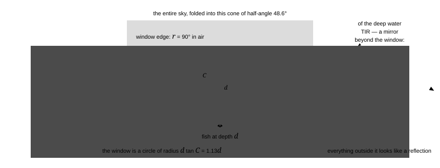

**Fig. 4.5** — Snell's window. For a fish at depth $d$, all the light that can reach it from above must have been inside the critical cone, so the entire hemisphere of sky above the water appears compressed into a circular window of radius $d\tan C$ — about $1.13d$ in water — with the horizon crowded into the very rim. Outside that circle the surface acts as a perfect mirror, which is why a fish looking up at a shallow angle sees reflections of the weed and the bottom rather than the sky.

> **Two versions of the same geometry**
>
> **Looking in** (fish, or you at the bottom of a pool): the whole sky appears inside a disc of radius $d\tan C$ on the surface, where $d$ is the depth of the observer.
>
>  **Looking out** (a lamp at depth $d$ at the bottom of a pool): the light that escapes into the air fills exactly the same disc of radius $d\tan C$, and the rim of that disc is a ring of grazing light. Everything outside cannot escape — it is reflected back down and lights the water instead. In both cases the number is $d\tan C$, and for water $\tan 48.6^\circ = 1.13$.

### **Q7** A fish is 2.0 m below the surface of a lake $(\mu = 4/3)$. (a) Find the radius of the circular "window" through which it sees the sky, and the area of that window. (b) What does the fish see looking upward at a steeper angle, outside the window? (c) An angler's float floats on the surface 3.0 m from the point directly above the fish. Can the fish see it? _(JEE Advanced · INPhO)_

Solution

**(a)** $C = 48.6^\circ$ and $d = 2.0$ m, so

$$
R = d\tan C = 2.0\tan 48.6^\circ = 2.0(1.134) = 2.27\ \text{m}, \qquad A = \pi R^{2} = 16\ \text{m}^{2}
$$

Every direction of the sky maps into this disc, with the zenith at the centre and the horizon compressed into the rim (a solid angle of $2\pi$ of sky occupying a cone of $0.67\pi$ — a compression by a factor of about three in solid angle, and much more in linear angle near the horizon).

**(b)** Beyond the window the surface total-internally reflects: the fish sees a dark mirror showing the water below it and the pool bottom, with only the rim of the window bright.

**(c)** No — and the reason is a clean inequality. A ray leaving the float and entering the water can make at most the critical angle $C = 48.6^\circ$ with the vertical inside the water, so as it descends the fish's depth $d = 2.0$ m it can travel at most

$$
d\tan C = 2.0\times1.134 = 2.27\ \text{m horizontally}
$$

and the float is 3.0 m away: $3.0 > 2.27$. Equivalently, at 3.0 m horizontal and 2.0 m deep a ray inside the water would need $\theta = \tan^{-1}(3.0/2.0) = 56.3^\circ > C$ from the vertical, and no ray can have that obliquity after entering from air. The float sits *outside the fish's window* disc of radius 2.27 m. In that direction the fish sees, instead, the surface acting as a mirror — a reflection of the deep water and the bottom, with only the bright rim of the window nearby.

**Check and a warning.** (a) uses $\tan C$ and (c) is the same computation run backwards, and it is the place where careful students lose a mark. Light entering water from air can never be steeper than $48.6^\circ$ from the vertical, so **an underwater observer cannot see anything beyond a cone of half-angle $C$ around the vertical**: the fish's entire visible outside world is the window of radius $d\tan C$. Anything on the surface further out than $1.13d$ is invisible to the fish — it sees the surface mirror instead. One more consistency check: $2.27$ m is exactly the window radius of part (a), as it must be, since the same extreme ray defines both.

### **Q8** An electric lamp is 1.5 m below the surface of a still pond $(\mu = 4/3)$. Find the radius of the illuminated disc seen on the surface from above, and the fraction of the lamp's total light output that escapes into the air. _(INPhO practice)_

Solution

The disc is bounded by the rays that just graze the surface, so its radius is $d\tan C$:

$$
R = 1.5\tan 48.6^\circ = 1.70\ \text{m}
$$

The escaping light fills the cone of half-angle $C$ (measured in water), so the fraction of the total solid angle is

$$
f = \frac{1-\cos C}{2} = \frac{1-0.6614}{2} = 0.169 \approx 17\%
$$

**Checks.** (i) 17% — so 83% of the lamp's light is trapped in the pond and lights the water and the bottom instead. This is why lamps deep in a pond look dim from outside and why the water "glows" around them. (ii) In the limit $\mu\to1$, $C\to90^\circ$ and $f\to(1-0)/2 = 0.5$ ✓: half the light goes up into the hemisphere, which is right for a bare lamp in air (the other half goes down). (iii) In the limit $\mu\to\infty$, $C\to0$ and $f\to0$ ✓: nothing escapes a very dense medium; all of it TIRs back. (iv) Note the contrast with Q5: there the cone was defined by the index *difference* across a core–cladding boundary, here by the contrast with air, which is why the fractions are 1.5% and 17%.

### 4.6 Two things TIR will not do

> **A plane-parallel slab can never trap light that entered through its face**
>
> Suppose light enters the top face of a slab of index $\mu$ immersed in air at any angle $i$. Inside, by Snell, $\sin r = \sin i/\mu \leq 1/\mu$, so $r \leq C = \sin^{-1}(1/\mu)$ — with equality only in the limit $i\to90^\circ$. At the bottom face the internal angle is again $r$ (the faces are parallel), so it can never exceed $C$, and a refracted ray always exists. **A window pane never burns up light by trapping it.** The emergent ray is parallel to the incident ray — the slab result of part 3, arriving here from a different direction.
>
>  But enter through the *edge* instead, and everything changes. A ray arriving at the edge face at grazing incidence refracts to $r = C = 41.8^\circ$ from the normal of that face, i.e. it travels only $9.0^\circ = 90^\circ - C$ away from the plane of the faces. At the faces themselves the angle of incidence is then $90^\circ - 9.0^\circ = 81^\circ$, far beyond $C$ — total internal reflection, again and again, all the way down the rod. That is a **light pipe**: a glass or acrylic rod lit at one end glows along its length and delivers light to the far end. The optical fibre of §4.4 is this same idea, with the entry confined to a cone and the rod made thin enough to bend.

### **Q9** A ray in glass $(\mu = 1.5)$ meets a glass–air boundary at exactly the critical angle. The air is then replaced by water $(\mu = 4/3)$. What happens to the ray? What if the water is replaced by a liquid of index 1.6? _(JEE main)_

Solution

At $i = C_{\text{glass-air}} = 41.8^\circ$ with water outside, Snell gives

$$
\sin r = \frac{1.5}{4/3}\sin 41.81^\circ = 1.5\times0.75\times0.6667 = 0.7500 \Rightarrow r = 48.6^\circ
$$

so the ray *does* emerge now — the critical angle for glass–water is 62.7°, much larger than 41.8°, and the grazing ray of the old situation now has room to refract into the water at 48.6°.

With a liquid of index 1.6 on the outside, the medium beyond is *denser* than the glass, so there is no total internal reflection at all, for any angle: the ray bends toward the normal in the liquid, at most to $r = \sin^{-1}(1.5/1.6) = 69.6^\circ$ (the grazing limit) and the interface behaves like an ordinary denser-to-denser pass.

**Checks.** (i) The numbers are tidy because $1.5\times\sin 41.81^\circ = 1.0$ exactly, so the "old critical" ray becomes the "new grazing" ray divided by $\mu_{\text{new}} = 4/3$: $0.75$ ✓. (ii) The pattern to memorise: adding a denser medium outside a glass surface *kills* TIR; adding a rarer one (lower index) makes $C$ bigger, also killing TIR; only lowering the outside index *relative* to the glass helps. (iii) In one sentence: $C$ is a property of the pair, and the pair changed.

### **Q10** A corner reflector is made of two plane mirrors at $90^\circ$. Show that an incoming ray is sent back exactly antiparallel to itself, whatever its angle of incidence. Then explain how the bicycle reflector does this without mirrors. _(Olympiad · NSEP)_

Solution

Let the two mirrors meet along a line, and let $\hat n_1, \hat n_2$ be unit normals with $\hat n_1\cdot\hat n_2 = 0$ (perpendicular mirrors). A reflection in a mirror with normal $\hat n$ maps the direction $\hat d \mapsto \hat d - 2(\hat d\cdot\hat n)\hat n$, so two successive reflections give

$$
\hat d \mapsto \hat d - 2(\hat d\cdot\hat n_1)\hat n_1 - 2(\hat d\cdot\hat n_2)\hat n_2 = \hat d - 2\big[(\hat d\cdot\hat n_1)\hat n_1 + (\hat d\cdot\hat n_2)\hat n_2\big]
$$

Now resolve $\hat d$ into components along the two normals and along the line of intersection $\hat z = \hat n_1\times\hat n_2$. The bracket is exactly the part of $\hat d$ perpendicular to $\hat z$ (since $\hat n_1, \hat n_2, \hat z$ are an orthonormal triad), so the map is

$$
\hat d \mapsto \hat d - 2\hat d_{\perp z} = -\hat d_{z} + \hat d_{\perp z} \quad \Longrightarrow \quad \text{the component along } \hat z \text{ reverses, the perpendicular part is unchanged}
$$

which for a ray lying in the plane perpendicular to $\hat z$ is simply $\hat d\mapsto -\hat d$: exact retroreflection. Since no angle of incidence appeared in the algebra, the result holds for every incoming direction ✓.

**The bicycle reflector** uses a moulded transparent plastic sheet of tiny *corner cubes* — three mutually perpendicular faces each, i.e. an 8-sided corner of a cube, exploiting TIR at each face (index about 1.5 to 1.6, so $C\approx42^\circ$, and each face is met close to grazing for a head-on ray) plus a thin metal backing for the rest. Three reflections in a corner cube reverse the direction for any incident ray, which is why the reflector "works" even when the bicycle is at an angle to your headlights: the returned beam is parallel to the outgoing one. It is also why the Apollo lunar retroreflectors — arrays of fused-silica corner cubes — could bounce a laser pulse straight back to Earth from the Moon four decades after they were placed.

**Check.** Apply the result to an ordinary two-mirror periscope: its mirrors are *parallel* to each other, not at 90°, and the beam is *translated*, not reversed — a useful contrast, and a question examiners like. For the 90° pair, the "reversing" is independent of the pair's orientation in space, so you can also use it to argue that the retroreflected beam stays on the incoming line even if the reflector tilts — the property that makes corner cubes the standard target in surveying and lidar.

### **Q11** A point source of light is placed at a distance $a$ from the centre of a glass sphere of radius $R$ and index $\mu = 1.5$. For what values of $a$ do *some* rays suffer total internal reflection? What is the answer at $a = 0$, and why is it a trap? _(Olympiad · INPhO)_

Solution

Let a ray leave the source making an angle $\phi$ with the direction from the centre to the source. In the triangle formed by the centre, the source and the point where the ray meets the sphere, the sine rule gives the angle of incidence at the glass surface:

$$
\frac{\sin i}{a} = \frac{\sin\phi}{R} \Rightarrow \sin i = \frac{a}{R}\sin\phi \leq \frac{a}{R}
$$

so the incidence angle is at most $\sin^{-1}(a/R)$ (attained by the ray leaving tangentially, $\phi = 90^\circ$). TIR occurs if this maximum exceeds the critical angle:

$$
\frac{a}{R} > \sin C = \frac{1}{\mu} = \frac{2}{3} \Rightarrow a > \frac{2R}{3} = 0.667R
$$

For $a \leq 2R/3$ every ray escapes; for $a > 2R/3$ the rays leaving almost tangentially are trapped and rattle around the sphere (which is how light is piped into and along glass spheres in some sensors).

**At $a = 0$:** every ray leaves radially, so $i = 0$ at the surface — normal incidence — and all of the light escapes with no reflection at all. The trap is to quote a "cone of half-angle $C$" for a source at the centre and conclude that only $(1-\cos C)/2 \approx 13\%$ escapes. That formula describes a *flat* interface, or a source far from a curved one; at the exact centre of a sphere it is simply wrong, because there is no obliquity anywhere.

**Checks.** The general condition is pleasingly geometric: the source is a distance $a$ from the centre; the maximum incidence angle is $\sin^{-1}(a/R)$; TIR first appears when that equals $\sin^{-1}(1/\mu)$, i.e. $a/R = 1/\mu$. Push the source to the surface, $a\to R$: then $\sin i$ can reach 1, i.e. $i\to90^\circ$, and rays leaving nearly tangentially are certainly trapped ✓. For $\mu = 1.5$ the boundary is at 2/3 of the radius — a nice concrete number to remember, and a reminder that "total internal reflection" always needs an *oblique* ray: normal incidence never reflects internally.

### **Q12** Prove that light entering a plane-parallel glass slab through one of its large faces can never be totally internally reflected inside it, however it is aimed. Then show how light entering through the *narrow edge* of the same slab can be trapped, and identify the practical device. _(JEE Advanced · reasoning)_

Solution

**The proof.** Light enters the top face from air at incidence $i$ and refracts to $r$ with $\sin r = \sin i/\mu$, so

$$
\sin r \leq \frac{1}{\mu} = \sin C \Rightarrow r \leq C
$$

At the bottom face the internal angle of incidence equals $r$ (alternate angles across the parallel faces), so $r \leq C$ there too, and by Snell's law a refracted ray exists whenever $r < C$. TIR is therefore impossible; the only borderline case is grazing incidence in ($i = 90^\circ$, so $r = C$), and then the emergent ray also grazes the bottom face. Physically: the slab's own refraction has already "flattened" the ray before it reaches the second face, and parallel faces cannot add obliquity.

**The edge case.** Now let the light arrive at the edge face — the thin side, perpendicular to the two large faces — at grazing incidence. Inside, it refracts to an angle $C = 41.8^\circ$ from the *edge* face normal, i.e. it travels at only $90^\circ - 41.8^\circ = 48.2^\circ$... let us be careful and measure from the large faces: the ray makes an angle of $41.8^\circ$ with the edge's normal, and the edge's normal is parallel to the large faces, so the ray makes $90^\circ-41.8^\circ = 48.2^\circ$ with each large face's *plane*, i.e. $48.2^\circ$ with the face's normal. That is *greater* than $C = 41.8^\circ$, so at the first large face the ray is totally internally reflected, and the geometry repeats at every bounce.

$$
\text{edge entry at grazing: internal angle } 41.8^\circ \Rightarrow \text{angle at the large face} = 48.2^\circ > C = 41.8^\circ \ \checkmark
$$

**The device** is the **light pipe** (glass rod, acrylic rod, or the "light guide" in an illuminated fountain, a dental curing light, or the classic lecture demonstration of a bent glass rod carrying light round a corner). The same calculation, with the entry collapsed into a narrow cone by a low-index cladding, is the optical fibre of §4.4.

**Checks and the deep point.** The two halves of this question are the same computation with the angles swapped, and the physical difference is *which face the light crosses on entry*. In the slab, the entry face and the reflecting face are parallel, so the obliquity cannot grow; in the rod, they are perpendicular, so refraction at entry converts a grazing ray into a ray that meets the guide's walls at nearly 90°. That is why every light guide and every fibre in the world has the light entering through a face perpendicular to the surfaces that confine it — a design rule that follows from two lines of trigonometry.

### 4.7 Summary — the results to own

> **Part 4 in seven lines**
>
> - $\sin C = \mu_{\text{rarer}}/\mu_{\text{denser}}$; for a medium in air, $\sin C = 1/\mu$.
>   Values: glass 41.8°, water 48.6°, glass-in-water 62.7°, diamond 24.4°.
> - TIR needs (i) denser → rarer, (ii) $i > C$, (iii) the angle measured from the normal. Equality grazes, it
>   does not reflect.
> - Below $C$ the deviation is $r - i$, rising to $90^\circ - C$; above $C$ it is
>   $180^\circ - 2i$. The $\delta$–$i$ graph jumps at $i = C$.
> - 45–45–90 prisms need $\mu > \sqrt2$ and give 90° or 180° deviation with 100% reflection; they fail in
>   water unless silvered.
> - Fibre: $\text{NA} = \sqrt{n_1^{2}-n_2^{2}}$, $\theta_{\max} = \sin^{-1}(\text{NA})$, wall angle
>   $= 90^\circ - \theta_{\text{inside}}$; graded-index cores equalise path lengths.
> - Snell's window: sky (or the escaping light of a lamp) occupies the disc of radius $d\tan C$ — about
>   $1.13d$ in water; beyond it the surface mirrors.
> - Parallel faces cannot trap light; perpendicular entry faces can (light pipe, fibre). Corner cubes reverse any
>   ray, whatever its incidence.

### 4.8 Checkpoint

- I can define the critical angle, state whose indices appear in it, and quote the four standard values.
- I can sketch the $\delta$–$i$ graph with both branches, the jump at $C$, and the two endpoints
  at grazing incidence.
- I can list the three conditions for TIR and identify which one a given wrong diagram violates.
- I can design a 90° and a 180° deviation with a single prism and say what index is needed.
- I can compute a fibre's NA, acceptance angle and wall angle, and explain why graded-index fibres exist.
- I can derive Snell's window ($d\tan C$) and distinguish it from "where an object on the surface appears".
- I can prove the no-trapping theorem for plane-parallel slabs and explain the light-pipe exception.

Next: [**Part 5 · Prisms and dispersion →**](#section-05-prisms-and-dispersion) — the prism as the one optical element whose deviation *has a minimum*, and the moment white light stops being white.

_Part 5 of 12 · JEE Advanced · base · NSEP · INPhO · ≈ 60 min read · 12 questions_

## 5 · Prisms and dispersion

A prism is two refracting surfaces that are *not* parallel, and the whole of its behaviour follows from that one difference. Because the faces are inclined, the two refractions no longer cancel: the ray is turned through an angle $\delta$, and — this is the surprising part — that deviation *has a minimum*, at a symmetric configuration you can find with one line of trigonometry. Because the refractive index depends slightly on colour, different colours are turned by slightly different angles, and white light comes out as a spectrum. This part does both of those things properly, including the two engineering tricks that every spectrometer, binocular and direct-vision spectroscope is built on: deviation without dispersion, and dispersion without deviation.

### 5.1 The geometry of a prism

Two plane refracting faces meet at the **refracting edge**; the angle between them is the **angle of the prism** $A$. Light crosses both faces. Write $i$ for the angle of incidence on entry, $r_1$ for the angle of refraction there, $r_2$ for the angle of incidence at the second face, $e$ for the final emergent angle, and $\delta$ for the total deviation. Two relations do all the work:

> **The prism relations**
>
> <!-- Equation tag: 5.1 -->
> $$
> A = r_1 + r_2, \qquad \delta = i + e - A
> $$
>
>  Both come from the same quadrilateral: in the triangle formed by the two face-normals and the ray inside, the interior angles are $90^\circ - r_1$ and $90^\circ - r_2$, so the third angle is $r_1 + r_2$, and that third angle is the angle between the normals, which equals $A$ (rotate one face onto the other by $A$ and its normal rotates by $A$ as well). The second relation is just bookkeeping: the two refractions deviate the ray by $(i - r_1)$ and $(e - r_2)$ in the same sense, and their sum is $i + e - (r_1+r_2) = i + e - A$.

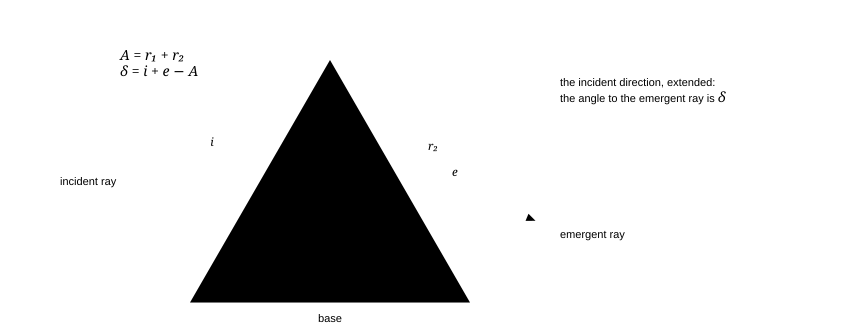

**Fig. 5.1** — The standard prism diagram, drawn to scale for $A = 60^\circ$, $\mu = 1.5$, $i = 45^\circ$. Notice how little the ray is *bent at each face* — $i - r_1 = 16.9^\circ$ and $e - r_2 = 20.5^\circ$ — and how the *total* deviation, $37.4^\circ$, is much larger than either. That is the point of a prism: the two bendings add in the same direction because the faces are inclined. For parallel faces they cancel exactly (part 3, §3.6).

### 5.2 Minimum deviation

**Fig. 5.2** — The symmetric configuration, in which the deviation is least. Both refractions are equal, the internal ray is parallel to the base, and the ray path is mirror-symmetric about the bisector of the prism's angle. This symmetry is not decorative: it is why the condition $r_1 = r_2 = A/2$ is the one you substitute into Snell's law to measure a refractive index (eq. 5.2).

> **At minimum deviation**
>
> At the minimum, the ray passes symmetrically: $i = e$ and $r_1 = r_2 = A/2$. Then
>
>  <!-- Equation tag: 5.2 -->
> $$
> \delta_{\min} = 2i - A, \qquad \mu = \frac{\sin\left(\dfrac{A+\delta_{\min}}{2}\right)}{\sin\left(\dfrac{A}{2}\right)}
> $$
>
>  For $A = 60^\circ$ and $\mu = 1.5$: $\sin i = 1.5\sin30^\circ = 0.75$, $i = 48.6^\circ$, $\delta_{\min} = 37.2^\circ$. The formula (5.2) is how a spectroscope measures $\mu$ to five figures: find the prism orientation that minimises the deviation (a minimum is easy to locate experimentally, because the image of the slit stops moving near it), read the prism angle off a goniometer, and compute.

> **Why the deviation is a minimum, and why symmetry gives it**
>
> **Algebraic route.** With $r_2 = A - r_1$ and $A$ fixed, $\delta(r_1) = \sin^{-1}(\mu\sin r_1) + \sin^{-1}\!\big[\mu\sin(A-r_1)\big] - A$. Differentiating and setting $d\delta/dr_1 = 0$ gives $\cos r_1\sqrt{1-\mu^{2}\sin^{2}(A-r_1)} = \cos(A-r_1)\sqrt{1-\mu^{2}\sin^{2}r_1}$, which after squaring collapses to $\cos^{2}r_1 = \cos^{2}(A-r_1)$, hence $r_1 = A - r_1$, i.e. $r_1 = r_2 = A/2$.
>
>  **Symmetry route (the one to quote in an exam).** Reversibility says that if a ray makes angles $(i, e)$ going one way, the reversed ray makes angles $(e, i)$. But the deviation depends only on the pair $(i, e)$ — see (5.1) — so $\delta(i,e) = \delta(e,i)$: the $\delta$–$i$ curve is symmetric about $i = e$. A symmetric curve with a single turning point has its extremum exactly at the symmetry point, so the extremum sits at $i = e$, which through (5.1) means $r_1 = r_2 = A/2$. Two lines, no derivatives.
>
>  **Why the extremum is a minimum and not a maximum.** One can check the second derivative, but the physical argument is cleaner: the deviation is infinite... no — it is simply not stationary at the two ends of the range, where the curve rises to $90^\circ - C$ plus a large $i$. Both ends of the admissible interval ($i_{\min}$ for grazing emergence and $i = 90^\circ$) give the *same* deviation, $\delta = 90^\circ - C + 90^\circ - (A - C) - A$… the equality of the two end values is the symmetry again, and since the middle value 37.2° is less than 57.9°, the stationary point is a minimum.

### **Q1** An equilateral prism $(A = 60^\circ)$ is made of glass of index 1.5. A ray enters at $i = 45^\circ$. Find $r_1, r_2$, the emergent angle, and the deviation. Does the ray emerge? _(JEE main)_

Solution

$$
\sin r_1 = \frac{\sin45^\circ}{1.5} = 0.4714 \Rightarrow r_1 = 28.1^\circ, \qquad r_2 = A - r_1 = 31.9^\circ
$$

Is $r_2$ below the critical angle? $C = \sin^{-1}(1/1.5) = 41.8^\circ$ and $31.9^\circ < 41.8^\circ$ ✓ so the ray does emerge:

$$
\sin e = \mu\sin r_2 = 1.5\sin31.9^\circ = 0.7921 \Rightarrow e = 52.4^\circ, \qquad \delta = i + e - A = 45^\circ+52.4^\circ-60^\circ = 37.4^\circ
$$

**Checks.** (i) $\delta = 37.4^\circ > \delta_{\min} = 37.2^\circ$ ✓ — any ray through a prism deviates at least as much as the symmetric one, and 45° is close to the symmetric 48.6°, so the two numbers are close ✓. (ii) The ray in the glass is nearly horizontal (Fig. 5.1) because $r_1$ is nearly half of $A$… a useful quick check on the drawing. (iii) Always test emergence *before* computing $e$: if $r_2 > C$ there is no $e$, and any number you write for it is fiction.

### **Q2** For the prism of Q1, find the minimum deviation, the angle of incidence at which it occurs, and the corresponding emergent angle. Sketch the $\delta$–$i$ curve. _(JEE main)_

Solution

At the minimum $r_1 = r_2 = A/2 = 30^\circ$, so

$$
\sin i = 1.5\sin30^\circ = 0.75 \Rightarrow i = 48.6^\circ, \qquad \delta_{\min} = 2i - A = 2(48.59^\circ) - 60^\circ = 37.2^\circ
$$

and by symmetry $e = i = 48.6^\circ$. The curve (Fig. 5.3) falls steeply from its left end at $i = 27.9^\circ$ to the minimum at $i = 48.6^\circ$, and rises again to the same value at $i = 90^\circ$.

**Check by the measurement formula.** In an experiment one measures $A = 60^\circ$ and $\delta_{\min} = 37.2^\circ$ and computes $\mu = \sin[(60+37.2)/2]/\sin 30^\circ = \sin48.6^\circ/0.5 = 0.75/0.5 = 1.5$ ✓ — the round trip closes, which is the whole reason the formula is stated with $A$ and $\delta_{\min}$ on the left and $\mu$ alone on the right.

### 5.3 When no light gets through

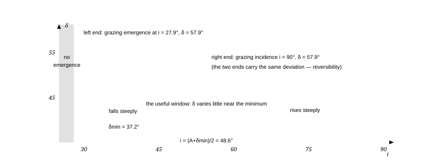

**Fig. 5.3** — Deviation against angle of incidence for a prism with $A = 60^\circ$, $\mu = 1.5$. Three features matter. (i) There is a **forbidden region** on the left: for $i < 27.9^\circ$ the ray is totally internally reflected at the second face and nothing emerges. (ii) The two ends of the allowed window have the *same* deviation 57.9° — one at grazing entry, one at grazing exit — which is reversibility made visible. (iii) Near the minimum the curve is flat, which is why a prism at minimum deviation is the standard instrument for measuring refractive index: small errors in orientation cost almost nothing in $\delta$.

> **The emergence conditions (learn these as inequalities)**
>
> With $C = \sin^{-1}(1/\mu)$ for the glass–air face, a ray emerges from the second face only if
>
>  <!-- Equation tag: 5.3 -->
> $$
> r_2 = A - r_1 < C \quad\Longleftrightarrow\quad r_1 > A - C, \qquad \text{and always } r_1 \leq C
> $$
>
>  Combining the two, a ray can pass through the prism only if $A < 2C$, and then the angle of incidence must lie in the window
>
>  <!-- Equation tag: 5.4 -->
> $$
> \sin^{-1}\big[\mu\sin(A-C)\big] < i < 90^\circ
> $$
>
>  For $A = 60^\circ$, $\mu = 1.5$ this window is $27.9^\circ < i < 90^\circ$, and the deviation lies between $\delta_{\min} = 37.2^\circ$ and $57.9^\circ$. If $A > 2C$ — for example $A = 90^\circ$, $\mu = 1.5$, since $2C = 83.6^\circ$ — **no ray whatever** passes through the prism: every ray entering one face is totally internally reflected at the other. That is not a curiosity; it is why you cannot use a 90° glass prism as a "bent window", and why the useful prism angles sit below $2\sin^{-1}(1/\mu)$.

### **Q3** For a prism of angle $A$ and index $\mu$, find the range of angles of incidence that give an emergent ray, and show that the deviation at grazing incidence equals the deviation at grazing emergence. _(JEE Advanced)_

Solution

**Lower limit — grazing emergence.** The ray emerges at $e = 90^\circ$ in the limiting case, which happens when $r_2 = C$. Then $r_1 = A - C$ and Snell at the first face gives $\sin i_{\min} = \mu\sin(A-C)$. Any smaller $i$ makes $r_1$ smaller, hence $r_2$ larger than $C$, and the second face reflects instead.

**Upper limit — grazing incidence.** As $i\to90^\circ$, $r_1\to C$ and $r_2\to A-C$, so the ray still emerges (provided $A < 2C$). Hence $\sin^{-1}[\mu\sin(A-C)] < i < 90^\circ$ ✓.

**The equality of the two end deviations.** At grazing emergence: $e = 90^\circ$ and $r_1 = A - C$, so $i_{\min} = \sin^{-1}[\mu\sin(A-C)]$, giving

$$
\delta_1 = i_{\min} + 90^\circ - A
$$

At grazing incidence: $i = 90^\circ$, $r_1 = C$, $r_2 = A - C$, so $e = \sin^{-1}[\mu\sin(A-C)] = i_{\min}$ and

$$
\delta_2 = 90^\circ + i_{\min} - A = \delta_1 \ \checkmark
$$

**Checks.** For $A = 60^\circ$, $\mu = 1.5$: $A - C = 18.19^\circ$, $i_{\min} = \sin^{-1}(1.5\sin18.19^\circ) = \sin^{-1}(0.4685) = 27.9^\circ$, and $\delta = 27.9+90-60 = 57.9^\circ$ ✓ at both ends. (ii) So for this prism the deviation is confined to $37.2^\circ \leq \delta \leq 57.9^\circ$ — a window only $20.7^\circ$ wide, and the practical consequence is that a spectrograph must be able to swing through a wide angle to catch light entering at different incidences. (iii) Note the physical asymmetry hidden behind those symmetric numbers: the same deviation at the two ends, but a totally different *emergent intensity* — near grazing emergence the transmitted beam is squeezed into a sliver and is very weak, which is why a real prism image fades near the edge of the window even though the geometry says the ray is still there.

### **Q4** (a) A prism has $A = 90^\circ$ and $\mu = 1.5$. Show that no light can pass through it. (b) What is the largest prism angle that can transmit light if the glass has $\mu = 1.5$? (c) For the largest usable angle, what is the minimum deviation? _(JEE Advanced)_

Solution

**(a)** Light can pass only if $A < 2C$. Here $C = 41.81^\circ$, so $2C = 83.6^\circ < 90^\circ = A$, and the inequality fails: at the second face, $r_2 = A - r_1 = 90^\circ - r_1 \geq 90^\circ - C = 48.2^\circ > C$ for every possible $r_1 \leq C$. So the second face always total-internally reflects.

**(b)** The limit is $A_{\max} = 2C = 83.6^\circ$, and in that limiting case the ray travels inside exactly along the base (both internal angles are $C$) with $i = e = 90^\circ$: light skims through and nothing more. So $A < 83.6^\circ$ for $\mu = 1.5$.

**(c)** At $A = 2C$ the minimum deviation is $\delta_{\min} = 2i - A$ with $\sin i = \mu\sin(A/2) = \mu\sin C = 1$, i.e. $i = 90^\circ$, so

$$
\delta_{\min} = 180^\circ - 2C = 180^\circ - 83.6^\circ = 96.4^\circ
$$

**Check.** At the limiting prism the deviation is large and the emergent beam is grazing — a "prism" that can barely get the light out. Physically, the useful prisms of a spectrometer sit well below $A = 2C$, typically $A = 60^\circ$ with $\mu\approx1.5$, giving $\delta_{\min}\approx37^\circ$ — comfortably inside, and (see Fig. 5.3) with plenty of room on both sides. Note also the neat consistency check: the formula $\delta_{\min} = 180^\circ - 2C$ comes from $\mu = \sin[(A+\delta)/2]/\sin(A/2)$ with $A = 2C$ — substitute $\mu = 1/\sin C$ ✓, and note that it gives $\delta_{\min} = 96.4^\circ$, which is also the value the $\delta$–$i$ curve of Fig. 4.2 gives at the critical angle. Two different graphs, the same number.

### 5.4 The thin prism

> **Thin prism (small angle of prism, or a prism immersed in a matching liquid)**
>
> When $A$ is small — a few degrees — every angle in the problem is small, so $\sin\theta\approx\theta$ in radians. Then $r_1 + r_2 = A$ becomes a statement about tiny angles, and Snell at the two faces gives $i\approx\mu r_1$, $e\approx\mu r_2$, so
>
>  <!-- Equation tag: 5.5 -->
> $$
> \delta = i + e - A \approx \mu(r_1+r_2) - A = (\mu-1)A
> $$
>
>  Small angle, large lesson: the deviation of a thin prism is *independent of the angle of incidence*. Every ray is deviated through the same angle, which means a thin prism acts like a "direction shifter" — and two of them combined act like vectors. For $A = 6^\circ$ and $\mu = 1.5$, $\delta = 3.0^\circ$ for every ray, whatever $i$.

> **Two thin prisms add as vectors**
>
> If a thin prism deviates every ray by $\delta_1$ in one direction and a second one by $\delta_2$ in a direction making an angle $\theta$ with the first, the composition of two small rotations is a small rotation, and the resultant deviation is
>
>  $$
> \delta_{\text{net}} = \sqrt{\delta_1^{2}+\delta_2^{2}+2\delta_1\delta_2\cos\theta}
> $$
>
>  In particular $\theta = 180^\circ$ (prisms in opposition) gives $\delta_{\text{net}} = |\delta_1-\delta_2|$, and $\theta = 0$ gives the sum. This vector picture is the cleanest way to think about everything that follows in this part: *the two engineering tricks of §5.6 are just statements about adding and comparing the deviation vectors of two pairs of colours.*

### **Q5** Two thin prisms, each of angle $4^\circ$ and index $1.5$, are placed in succession with their refracting edges making $60^\circ$ with each other. Find the net deviation of a ray. _(JEE main)_

Solution

Each prism deviates by $\delta = (\mu-1)A = 0.5\times4^\circ = 2.0^\circ$, and the two deviation vectors make $60^\circ$ with each other:

$$
\delta_{\text{net}} = \sqrt{2.0^{2}+2.0^{2}+2(2.0)(2.0)\cos60^\circ} = \sqrt{4+4+4} = \sqrt{12} = 3.5^\circ
$$

**Checks.** (i) The answer lies between $|\delta_1-\delta_2| = 0$ and $\delta_1+\delta_2 = 4.0^\circ$ ✓, and at $\theta = 60^\circ$ it is closer to the sum, as $\sqrt{3}\times2.0$ suggests ✓. (ii) Note the neat case $\theta = 120^\circ$, which would give $2.0^\circ$ — equal to a single prism, because the vector sum of two equal vectors at 120° has magnitude 2.0 ✓. (iii) The physical reason the vector rule works: each refraction is a rotation of the ray direction, and composing two rotations about nearly parallel axes adds their rotation *vectors*. That is the same statement as the "mirror rotated by $\theta$ turns a ray by $2\theta$" rule of part 1, dressed in vector clothing.

### 5.5 Dispersion: why white light spreads

**Fig. 5.4** — Dispersion by a prism. The three rays differ only because $\mu$ differs with colour: they enter along the same line and leave along three different ones. Violet, with the largest index, is deviated most; red least. The indices here (1.48 to 1.58) are exaggerated so the fan is visible — in real glass the spread is less than 1% of the index and the fan is about $1^\circ$ wide for a 60° prism, which is why spectrometers use many prisms in series.

> **Dispersion and its measures**
>
> **Dispersion** is the variation of refractive index with wavelength. For normal, transparent materials the index *decreases* as wavelength increases, and over the visible range it is described well by Cauchy's formula
>
>  <!-- Equation tag: 5.6 -->
> $$
> \mu(\lambda) = a + \frac{b}{\lambda^{2}} \qquad (a, b \text{ positive constants})
> $$
>
>  The **angular dispersion** produced by a prism of angle $A$ is the difference of deviations between two colours, $\delta_v - \delta_r$. At minimum deviation one can differentiate (5.2) to get the practical form
>
>  <!-- Equation tag: 5.7 -->
> $$
> \delta_v - \delta_r = (\mu_v-\mu_r)\frac{d\delta}{d\mu} = (\mu_v-\mu_r)\,\frac{2\sin(A/2)}{\cos i} ;\qquad (A \text{ small: } (\mu_v-\mu_r)A)
> $$
>
>  and the **dispersive power** of the material is the spread per unit deviation, an index-free number:
>
>  <!-- Equation tag: 5.8 -->
> $$
> \omega = \frac{\mu_v-\mu_r}{\mu_y-1} \quad (\text{typical crown glass: } 0.02\text{–}0.03; \text{ flint: } 0.03\text{–}0.05)
> $$
>
>  where $\mu_y$ is the index for yellow (the colour the eye is most sensitive to, so it defines the "mean" deviation). A large dispersive power is what a flint glass is *for*: it spreads colours strongly for a given bending, which is exactly what you need to cancel the spread of another prism (§5.6).

> **Why the index depends on colour at all (two sentences of atomic physics)**
>
> Glass is a collection of atoms whose electrons have natural resonance frequencies in the ultraviolet. Light drives those electrons; the closer the driving frequency is to a resonance, the larger the response, and the larger the resulting phase lag — which slows the wave more, i.e. raises $\mu$. Blue light is closer to the ultraviolet resonances than red light, so $\mu_{\text{blue}} > \mu_{\text{red}}$ always, for any ordinary transparent material. This is also why $\mu\to1$ as $\lambda\to\infty$ (the $a\to1$, $b/\lambda^{2}\to0$ limit of Cauchy's formula) and why the dispersion is *largest* at short wavelengths — the source of the "anomalous" ordering of colours in a rainbow's supernumerary arcs, and of the extra violet spread you see in a cheap prism's spectrum.

### **Q6** For a given glass, $\mu_v = 1.527$, $\mu_r = 1.514$ and $\mu_y = 1.520$ (violet, red, yellow). Find the dispersive power. If a 60° prism of this glass is at minimum deviation, find the angle between the emergent violet and red rays using the exact formula and the thin-prism approximation. _(JEE Advanced)_

Solution

$$
\omega = \frac{\mu_v-\mu_r}{\mu_y-1} = \frac{1.527-1.514}{1.520-1} = \frac{0.013}{0.520} = 0.025
$$

**Exact route.** Use (5.2) separately for the two colours, each at its own minimum (the prism is set for the yellow ray):

$$
\delta_v = 2\sin^{-1}\!\left(1.527\sin30^\circ\right) - 60^\circ = 2(49.74^\circ)-60^\circ = 39.5^\circ
$$

$$
\delta_r = 2\sin^{-1}\!\left(1.514\sin30^\circ\right) - 60^\circ = 2(49.19^\circ)-60^\circ = 38.4^\circ
$$

$$
\delta_v - \delta_r = 1.1^\circ \approx 1^\circ 5'
$$

**Thin-prism estimate.** $(\mu_v-\mu_r)A = 0.013\times60^\circ = 0.78^\circ$.

**Checks and the lesson.** The differential form (5.7) gives $(0.013)\times 2\sin30^\circ/\cos48.6^\circ = 0.013/0.6614 = 0.0197$ rad $= 1.13^\circ$ ✓ — matching the exact two-colour answer 1.1° to the accuracy of the data. The thin-prism estimate, 0.78°, is low by a factor $1.13/0.78 = 1.45$, and that factor is exactly $2\sin(A/2)/(A\cos i)$ (with $A$ in radians): it equals 1 for a thin prism and about 1.5 for $A = 60^\circ$. So **the thin-prism formulas are leading terms in $A$**: use $(\mu_v-\mu_r)A$ for design and estimates in the small-angle regime, and (5.7) whenever a numeric answer is wanted. The physical summary is simpler than either: a 60° prism of ordinary glass separates red from violet by about 1°, and no single prism does much better — which is why a spectroscope uses a train of prisms, or a grating (wave-optics part).

### 5.6 The two engineering tricks

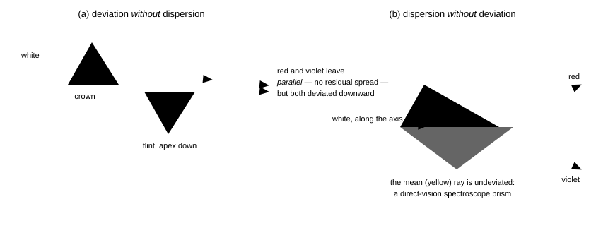

**Fig. 5.5** — The two tricks, drawn schematically (angles exaggerated). **(a)** A crown prism and a flint prism with their refracting edges pointing *opposite* ways: the flint's larger dispersive power cancels the crown's colour spread while its smaller mean deviation only partly cancels the crown's, so the beam is deviated but not coloured. **(b)** A combination in which the mean deviations cancel exactly (so the yellow ray continues along the incident direction) but the dispersive powers do not, so the colours fan out about the undeviated central ray — the Amici or "direct-vision" prism of a hand-held spectroscope.

> **Achromatic combination: deviation without dispersion**
>
> Two thin prisms, angles $A_1, A_2$, in opposition. Their deviations subtract, and their colour spreads subtract too:
>
>  <!-- Equation tag: 5.9 -->
> $$
> \delta_{\text{net}} = (\mu_1-1)A_1 - (\mu_2-1)A_2, \qquad \text{no dispersion: } (\mu_{1v}-\mu_{1r})A_1 = (\mu_{2v}-\mu_{2r})A_2
> $$
>
>  Using dispersive powers, the condition becomes $\omega_1(\mu_1-1)A_1 = \omega_2(\mu_2-1)A_2$: the *spreads* must be equal, so the prism with the larger dispersive power must have the smaller angle. The residual mean deviation is then non-zero — that is the whole point, since you wanted a deviation.

> **Direct-vision prism: dispersion without deviation**
>
> Now cancel the *deviations* instead:
>
>  <!-- Equation tag: 5.10 -->
> $$
> (\mu_1-1)A_1 = (\mu_2-1)A_2 \quad\text{(mean deviation zero)}, \qquad \text{residual spread} = \omega_1(\mu_1-1)A_1 - \omega_2(\mu_2-1)A_2 = (\mu_1-1)A_1(\omega_1-\omega_2)
> $$
>
>  which is non-zero precisely because the two glasses have different dispersive powers. The beam comes out *straight ahead* but fanned into colours — the hand-held spectroscope's trick, and the reason you can look at a lamp through a spectroscope without the instrument pointing off to one side.

### **Q7** A 5.0° crown-glass prism $(\mu = 1.5,\ \omega = 0.02)$ is to be combined with a flint prism $(\mu = 1.65,\ \omega = 0.03)$ so that there is *no* dispersion. Find the flint prism's angle and the net deviation of the combination. _(JEE Advanced)_

Solution

The spreads must match: $\omega_1(\mu_1-1)A_1 = \omega_2(\mu_2-1)A_2$, with $\omega_1(\mu_1-1)A_1 = 0.02\times0.5\times5.0 = 0.050$:

$$
0.03\times0.65\times A_2 = 0.050 \Rightarrow A_2 = \frac{0.050}{0.0195} = 2.56^\circ
$$

Net deviation (prisms opposed):

$$
\delta_{\text{net}} = 0.5\times5.0 - 0.65\times2.56 = 2.50 - 1.67 = 0.83^\circ
$$

**Checks.** (i) The flint angle is *smaller* than the crown's, as it must be — flint disperses more per degree, so it needs fewer degrees to produce the same spread ✓. (ii) The net deviation is positive and small: the crown "wins" on mean deviation, the flint on dispersion, and combining those two facts is the entire design ✓. (iii) Note that the combination is achromatic only in the sense of two colours cancelled exactly; the intermediate wavelengths are not perfectly corrected (a secondary spectrum), which is why a good camera lens has several elements of different glasses.

### **Q8** Using the same two glasses, design a combination that gives *no* net deviation for yellow. What is the residual angular spread between red and violet? _(JEE Advanced · INPhO)_

Solution

Now the mean deviations cancel: $(\mu_1-1)A_1 = (\mu_2-1)A_2$:

$$
0.5\times5.0 = 0.65A_2 \Rightarrow A_2 = 3.85^\circ
$$

Since the spreads do *not* cancel (the two dispersive powers differ), a residual fan survives:

$$
\delta_v-\delta_r = (\mu_1-1)A_1(\omega_1-\omega_2) = 2.5(0.02-0.03) = -0.025^\circ \approx 1.5'
$$

the negative sign meaning the order of the colours is reversed compared with the crown prism alone (the flint over-corrects).

**Checks.** (i) The spread, 0.025°, is small — but it is *all* you get, because you have surrendered the mean deviation. In practice a direct-vision prism is a stack of three or more prisms (Amici used five) to build up spread while keeping the axis straight ✓. (ii) Sanity check by the design logic: "no dispersion but deviation" needs a *spread* match and leaves a *deviation*; "no deviation but dispersion" needs a *deviation* match and leaves a *spread*. Two conditions, two knobs (the two prism angles), so you can satisfy exactly one condition at a time — which is precisely why one instrument cannot do both, and why every spectroscope needs a separate collimator and telescope. (iii) Note both answers use the same numbers (0.050 and 2.5) — the two problems are mirror images of each other.

### **Q9** The Cauchy constants of a glass are such that $\mu = 1.50 + 4800/\lambda^{2}$ with $\lambda$ in nanometres. Find $\mu$ at 400 nm, 500 nm and 700 nm, and the ratio of the speeds of violet (400 nm) and red (700 nm) light in this glass. Why is this formula only valid in the visible? _(Olympiad · NSEP)_

Solution

$$
\mu(400) = 1.50 + \frac{4800}{1.6\times10^{5}} = 1.530, \quad \mu(500) = 1.50 + \frac{4800}{2.5\times10^{5}} = 1.519, \quad \mu(700) = 1.50 + \frac{4800}{4.9\times10^{5}} = 1.510
$$

Speeds: $v = c/\mu$, so

$$
\frac{v_{\text{red}}}{v_{\text{violet}}} = \frac{\mu_{\text{violet}}}{\mu_{\text{red}}} = \frac{1.530}{1.510} = 1.013
$$

so red travels about 1.3% faster than violet in this glass.

**Why only the visible range.** Cauchy's formula is an empirical two-parameter fit to the *normal* dispersion of a transparent material, which is the regime far from the atomic resonances (which sit in the ultraviolet). In the infrared or the ultraviolet, and near an absorption line, the index can rise with wavelength ("anomalous dispersion") and a two-term formula cannot describe it — you need the full Sellmeier form with resonance denominators. (ii) A physical check on the sign: red faster, so a prism bends violet more ✓ — the same conclusion as Fig. 5.4, from numbers rather than a diagram. (iii) A wavelength-independent sanity check: as $\lambda\to\infty$, $\mu\to1.50 = a$ ✓ the "refractive index in the absence of dispersion", which is what the $a$ in Cauchy's formula means physically.

### **Q10** Show that a prism of small angle $A$, made of glass of index $\mu$ and placed in air, deviates a ray by $(\mu-1)A$ irrespective of the angle of incidence. What happens to the deviation if the prism is immersed in a liquid of index $\mu'$? _(JEE main)_

Solution

For small angles, Snell's law at each face is $i = \mu r_1$ and $e = \mu r_2$ (all angles in radians), and $r_1+r_2 = A$. Hence

$$
\delta = i + e - A = \mu(r_1+r_2) - A = \mu A - A = (\mu-1)A
$$

independent of $i$ ✓. Inside a liquid, every refraction is now between glass and liquid, so Snell's law uses the **relative** index $\mu_{\text{rel}} = \mu/\mu'$, and the deviation becomes

$$
\delta = \left(\frac{\mu}{\mu'}-1\right)A
$$

which is *smaller* than in air (for $\mu = 1.5$, $\mu' = 1.33$: 0.128A instead of 0.5A), and **reverses its sign if $\mu' > \mu$** — the prism then deviates the ray *away* from its base.

**Checks.** (i) The immersion factor is a standard exam trick and worth remembering in the form "everything in optics depends on relative index". (ii) In the limit $\mu' = \mu$ the prism becomes invisible ($\delta = 0$): a glass prism in a liquid of the same index cannot be seen — the classic "invisible glass rod in glycerine" demonstration (borosilicate glass, $\mu\approx1.47$, in glycerine) ✓. (iii) The formula also tells you why the thin-prism result is used for *relative* index measurement of liquids: measure $\delta$ in air and in the liquid, and the ratio gives $\mu'/\mu$ without needing the prism's angle to high precision.

### **Q11** A 60° glass prism $(\mu = 1.5)$ is fully immersed in a liquid of index 1.6. Find the minimum deviation, and state in which direction the ray is deviated. _(JEE Advanced)_

Solution

The relative index is now $\mu_{\text{rel}} = 1.5/1.6 = 0.9375 < 1$, which is legitimate — the formula for minimum deviation still holds, with the "index" being the ratio of the medium the light is leaving to the medium it enters, here $1.5/1.6$:

$$
\sin\!\left(\frac{A+\delta_{\min}}{2}\right) = 0.9375\sin 30^\circ = 0.46875 \Rightarrow \frac{A+\delta_{\min}}{2} = 27.94^\circ
$$

$$
\delta_{\min} = 2(27.94^\circ) - 60^\circ = -4.1^\circ
$$

The deviation is *negative*: the ray is bent the other way, i.e. **away from the base**, because the prism is now optically *rarer* than its surroundings. The magnitude is small (4.1°) — much smaller than the 37.2° this prism gives in air — and the thin-prism estimate agrees roughly: $\delta = (\mu_{\text{rel}}-1)A = (0.9375-1)60^\circ = -3.75^\circ$.

**Checks and the physical picture.** (i) The thin-prism estimate is 9% smaller than the exact value — the same "60° is not thin" correction as in Q6, and with the same sign of discrepancy (the exact magnitude is larger) ✓. (ii) The reversal is the correct physics: a prism optically denser than its surroundings bends light *toward its base*; if it is optically rarer, light bends the other way. This is the same statement as "the rays bend away from the normal when leaving the denser medium", applied to a shape. (iii) There is no total internal reflection here at all, since the light is going from the rarer (prism) into the denser (liquid) at the exit face, so the whole incidence range 0° to 90° transmits ✓ — the mirror image of the situation in Q4.

### **Q12** A prism is cut from glass of index 1.5 with angle $A = 60^\circ$. A thin layer of water $(\mu = 4/3)$ covers the *second* (exit) face only. Find the new range of angles of incidence for which light emerges, and compare with the dry prism. _(Olympiad · INPhO)_

Solution

Emergence at the second face is now governed by the glass–*water* critical angle:

$$
\sin C' = \frac{4/3}{1.5} = 0.8889 \Rightarrow C' = 62.7^\circ
$$

The ray inside must satisfy $r_2 < C'$, i.e. $r_2 < 62.7^\circ$, i.e. $r_1 > A - C' = -2.7^\circ$ — always true. So *every* ray that enters the prism emerges from the wet face, however small the angle of incidence:

$$
\text{dry: } 27.9^\circ < i < 90^\circ, \qquad \text{wet exit face: } 0^\circ \leq i < 90^\circ
$$

The water film has removed the forbidden region of Fig. 5.3 entirely.

**Checks.** (i) The reason the window vanished is that $C$ belongs to the pair, and the pair changed: glass–water gives $62.7^\circ$ instead of glass–air's $41.8^\circ$, which is larger than any internal angle the prism can produce. (ii) The film does not, however, get the light into the air: a ray leaving the glass at up to 62.7° meets the outer water–air surface at the same angle, which exceeds the water–air critical angle 48.6°, and is therefore totally internally reflected back into the film. In a real experiment that shows up as a bright band along a wet exit face and a weaker emergent beam — a thin film is an extra optical element, not a change of boundary condition. (iii) Repeat the calculation with the prism *entirely* immersed in water: light enters from water, so $r_1 \leq 62.7^\circ$, and at the exit $r_2 = 60^\circ - r_1 \leq 60^\circ < 62.7^\circ$ always — every ray emerges from both faces, and the prism can no longer block anything. Its deviation simply becomes small, because the relative index is only $1.5/1.333 = 1.125$.

### 5.7 Summary — the results to own

> **Part 5 in eight lines**
>
> - $A = r_1 + r_2$ and $\delta = i + e - A$; emergence needs $r_2 < C$ at the second face.
> - A ray passes at all only if $A < 2C$; then the window is
>   $\sin^{-1}[\mu\sin(A-C)] < i < 90^\circ$, and the two ends of the window give the same deviation.
> - Minimum deviation: $r_1 = r_2 = A/2$, $i = e$, $\delta_{\min} = 2i - A$,
>   $\mu = \sin[(A+\delta_{\min})/2]/\sin(A/2)$. Found by reversibility (symmetry) in two lines.
> - Near the minimum the $\delta$–$i$ curve is flat: that is why the method is accurate.
> - Thin prism: $\delta = (\mu-1)A$, independent of $i$; in a liquid,
>   $\delta = (\mu/\mu'-1)A$, reversing sign if $\mu' > \mu$. Thin prisms add as vectors.
> - Dispersion: $\mu(\lambda) = a + b/\lambda^{2}$; angular dispersion
>   $\propto(\mu_v-\mu_r)A$; dispersive power $\omega = (\mu_v-\mu_r)/(\mu_y-1)$.
> - Deviation without dispersion (achromatic pair): match the *spreads*$\omega_1(\mu_1-1)A_1 = \omega_2(\mu_2-1)A_2$; the mean deviation survives.
> - Dispersion without deviation (direct-vision prism): match the *means*$(\mu_1-1)A_1 = (\mu_2-1)A_2$; the residual spread is
>   $(\mu_1-1)A_1(\omega_1-\omega_2)$.

### 5.8 Checkpoint

- I can draw the prism diagram, label all six angles, and derive $A = r_1+r_2$ and $\delta = i+e-A$ from
  the geometry.
- I can find the minimum deviation two ways — differentiation and the symmetry/reversibility argument.
- I can test emergence at the second face before computing the emergent angle.
- I can find the range of $i$ that transmits, and explain the forbidden region of the
  $\delta$–$i$ graph.
- I can use the thin-prism formula, including the immersed case and the vector addition of deviations.
- I can define dispersive power and compute an achromatic pair's angles and net deviation.
- I can explain the difference between "deviation without dispersion" and "dispersion without deviation" and design
  each.
- I can explain *why*$\mu$ falls with $\lambda$ in terms of atomic resonances, and why Cauchy's
  formula has the form it does.

Next: [**Part 6 · Refraction at spherical surfaces and lenses →**](#section-06-lenses-and-refracting-surfaces) — one formula that contains mirrors, lenses, apparent depth and the eye, and the machinery of focal length, power and images that the rest of the book is built on.

_Part 6 of 12 · JEE Advanced · core · NSEP · INPhO · ≈ 85 min read · 12 questions_

## 6 · Refraction at spherical surfaces and lenses

Mirrors did their work with one formula; lenses need two surfaces, and this part builds the whole machinery in the right order. First the *single* spherical refracting surface — and the surprising fact that its formula contains the mirror formula as a special case, if you allow a refractive index to be negative. Then two surfaces stuck together: the lensmaker's formula, the thin-lens equation, power, and everything practical that hangs off them — combined lenses, cut lenses, silvered lenses, the displacement method, the liquid-lens measurement of a refractive index, and the graphical method for finding a focal length in the lab. This is the longest part of the set because it is the part most heavily examined.

### 6.1 Refraction at a single spherical surface

A spherical surface of radius $R$ separates a medium of index $\mu_1$ (on the side the light comes from) from one of index $\mu_2$. The **pole** $P$ is the point where the surface crosses the axis, and the **centre of curvature** $C$ lies on the axis a distance $|R|$ away, on the concave side. With the Cartesian convention of part 2 — distances measured from the pole, positive in the direction the light travels — every case collapses into one equation.

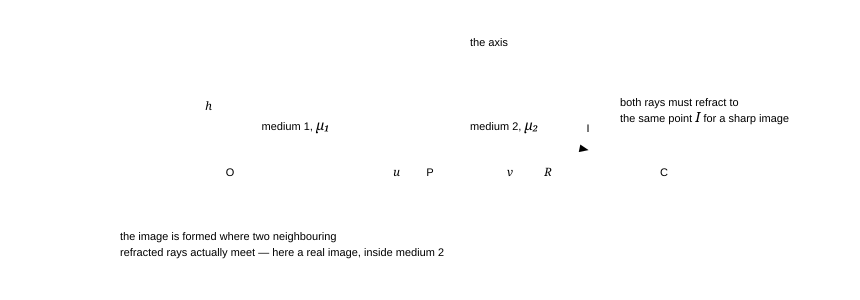

**Fig. 6.1** — The single refracting surface. Only the paraxial rays (small $h$) meet at one point; the exact spherical-surface treatment would give a caustic, which is the aberration business of part 8. All of this part is paraxial optics, and the figure is drawn for a ray that is *not* very paraxial on purpose, to remind you that the formula below is an approximation whose quality improves as you close the aperture.

> **The single-surface formula**
>
> <!-- Equation tag: 6.1 -->
> $$
> \frac{\mu_2}{v} - \frac{\mu_1}{u} = \frac{\mu_2-\mu_1}{R}
> $$
>
>  with $u$ the object distance, $v$ the image distance, $R$ the radius of curvature (positive if the centre of curvature is on the outgoing side), all measured from the pole. The transverse magnification is
>
>  <!-- Equation tag: 6.2 -->
> $$
> m = \frac{h'}{h} = \frac{\mu_1 v}{\mu_2 u}
> $$
>
>  and the two focal distances (object-side and image-side) are
>
>  $$
> f_1 = \frac{\mu_1 R}{\mu_2-\mu_1} \ (u = -f_1 \Rightarrow v=\infty), \qquad f_2 = \frac{\mu_2 R}{\mu_2-\mu_1} \ (u=\infty \Rightarrow v = f_2)
> $$
>
>  Notice that $f_1 \neq f_2$ whenever $\mu_1\neq\mu_2$: a single surface is *not* symmetric, and the ratio $f_2/f_1 = \mu_2/\mu_1$ is the same "observer's index over object's index" that gave the apparent depth rule of part 3. Everything is consistent.

> **Derivation by the small-angle route (three lines, general)**
>
> Take a ray from the axial object point $O$ meeting the surface at height $h$. In the three thin triangles of Fig. 6.1, $h/u$ is the angle the incident ray makes with the axis, $h/v$ the same for the refracted ray, and $h/R$ the angle of the normal — so, with the exterior-angle theorem applied to the two triangles, the angles of incidence and refraction are $i = h/u - h/R$ and $r = h/v - h/R$ (with the Cartesian signs built in). Snell's law in the paraxial limit, $\mu_1 i = \mu_2 r$, cancels the common $h$:
>
>  $$
> \mu_1\left(\frac{1}{u}-\frac{1}{R}\right) = \mu_2\left(\frac{1}{v}-\frac{1}{R}\right) \Rightarrow \frac{\mu_2}{v}-\frac{\mu_1}{u} = \frac{\mu_2-\mu_1}{R}
> $$
>
>  That $h$ cancelled is the whole content of "paraxial": every small-$h$ ray from $O$ lands on the same image point $I$. For the *height* of the image, use the one ray that is not deviated at all: the ray aimed at the centre of curvature $C$ travels along a radius, meets the surface along its normal, and passes straight through. By similar triangles, the object tip (height $h$ at $u$) and the image tip (height $h'$ at $v$) both lie on the line through $C$, so
>
>  $$
> m = \frac{h'}{h} = \frac{v-R}{u-R} = \frac{\mu_1 v}{\mu_2 u}
> $$
>
>  the last equality being a two-line substitution of (6.1). Check it on Q1's numbers: $(90-10)/(-30-10) = -2$ ✓. That is where the extra factor $\mu_1/\mu_2$ in the magnification comes from — and it is why a single refracting surface magnifies differently from a thin lens, for which the factor is absent because the light enters and leaves through air.

> **The mirror formula is the same equation with a negative index**
>
> Put $\mu_2 = -\mu_1$ in (6.1):
>
>  $$
> \frac{-\mu_1}{v}-\frac{\mu_1}{u} = \frac{-2\mu_1}{R} \;\Longrightarrow\; \frac{1}{v}+\frac{1}{u} = \frac{2}{R} = \frac{1}{f}, \qquad f = \frac{R}{2}
> $$
>
>  which is exactly the mirror formula of part 2, equivalent mirror and all. The interpretation: a mirror is a refracting surface that sends the light *back*, and "back" is what a negative index means — the medium beyond the surface has an index of the opposite sign. This is not a trick for exam answers only; it is the standard way a designer converts a mirror into an equivalent refractive surface, and it is why the "effective index" methods of matrix optics (part 8) handle mirrors and lenses in one formalism.

### **Q1** A point object is on the axis of a glass rod of index 1.5, in air, 30 cm from the pole of the rod's hemispherical end of radius 10 cm (the centre of curvature lies inside the glass). Find the image position and the magnification. What happens if the object is 20 cm from the pole? _(JEE main)_

Solution

$\mu_1 = 1$, $\mu_2 = 1.5$, $u = -30$ cm, $R = +10$ cm (centre on the outgoing side, inside the glass):

$$
\frac{1.5}{v} = \frac{0.5}{10}+\frac{1}{-30} = 0.05-0.0333 = 0.01667 \Rightarrow v = 90\ \text{cm}
$$

$$
m = \frac{\mu_1 v}{\mu_2 u} = \frac{1\times90}{1.5\times(-30)} = -2
$$

So a real image forms 90 cm inside the glass (beyond the rod's far end, if the rod is short), inverted and twice as large.

With $u = -20$ cm: $1.5/v = 0.05 - 0.05 = 0$, so $v = \infty$ — the rays inside the glass emerge *parallel*. That is not an accident: the first focal distance of this surface is $f_1 = \mu_1 R/(\mu_2-\mu_1) = 10/0.5 = 20$ cm, and an object at the first focal point sends out a parallel beam.

**Checks.** (i) $v > 0$ means a real image on the outgoing side ✓, which for a converging state (light entering a denser medium at a convex surface) is what we expect. (ii) $m = -2$: inverted, and magnified — and note the magnification is *not* $v/u = -3$; the extra factor $\mu_1/\mu_2 = 2/3$ is the whole subtlety of single-surface magnification, and it is the most commonly dropped factor in the exam. (iii) Check the focal-point value independently: at $u = -20$ we got $v = \infty$ ✓ matching $f_1 = 20$ cm ✓.

### **Q2** (a) A small air bubble is at the centre of a glass sphere of radius 9.0 cm and index 1.5. Where does it appear to an observer looking at the sphere? (b) The bubble is now moved to a point halfway between the centre and the surface along a diameter. Where does it appear, and what is the magnification? (c) A coin at the bottom of a 20 cm deep trough of water is viewed from straight above; how deep does it appear? _(JEE Advanced · traps)_

Solution

**(a)** Rays from the centre leave along radii and therefore meet the surface at *normal incidence* — no bending at all. The bubble appears exactly where it is, at the centre. Formally, taking the exit surface with the light travelling from glass into air: $u = -9$ cm, $R = -9$ cm (the centre of curvature lies behind that surface), $\mu_1 = 1.5$, $\mu_2 = 1$:

$$
\frac{1}{v} = \frac{1-1.5}{1\times(-9)}+\frac{1.5}{1\times(-9)} = 0.0556-0.1667 = -0.1111 \Rightarrow v = -9.0\ \text{cm}
$$

a virtual image 9.0 cm from the surface on the incident side, i.e. at the centre ✓.

**(b)** Now $u = -4.5$ cm (halfway from the surface to the centre) with the same surface values:

$$
\frac{1}{v} = \frac{-0.5}{-9}+\frac{1.5}{-4.5} = 0.0556-0.3333 = -0.2778 \Rightarrow v = -3.6\ \text{cm}
$$

$$
m = \frac{\mu_1 v}{\mu_2 u} = \frac{1.5(-3.6)}{1(-4.5)} = +1.2
$$

The bubble appears 3.6 cm from the surface, erect and magnified by 1.2 — it looks nearer to the surface than it is, and larger.

**(c)** A flat water surface, so part 3's apparent-depth rule applies, not (6.1): $d_{\text{app}} = d/\mu = 20/(4/3) = 15$ cm.

**Checks and the trap.** (i) Part (a) is the important one conceptually: at the exact centre there is no refraction because every ray is radial. If you reach for (6.1) blindly and miss the $R = -9$ sign, you will "prove" that the bubble at the centre appears displaced — a good self-test. (ii) The magnification in (b) is *positive* and greater than 1, which is why a fish in a spherical bowl sees the world distorted and itself enlarged, and why the "no distortion at the centre" rule of (a) is special to that one point. (iii) Part (c) is the reminder that the geometry of the boundary, not the shape of the container, decides which formula applies: a bowl's water surface is flat (gravity fixes it), so no spherical-surface formula enters.

### 6.2 Lenses: two surfaces, one formula

> **The lensmaker's formula**
>
> Apply (6.1) twice — image formed by the first surface acting as the object for the second — and use the thin-lens approximation (the lens is so thin that both surfaces can be taken at the same plane, and the light in the glass travels a negligible distance):
>
>  <!-- Equation tag: 6.3 -->
> $$
> \frac{1}{f} = (\mu-1)\left(\frac{1}{R_1}-\frac{1}{R_2}\right)
> $$
>
>  with $R_1$ the radius of the first surface the light meets and $R_2$ the second, both in the Cartesian sign convention (a convex surface as seen by the incoming light has $R > 0$ if its centre is on the far side). It is usually written in the working form
>
>  <!-- Equation tag: 6.4 -->
> $$
> \frac{1}{v}-\frac{1}{u} = \frac{1}{f}, \qquad m = \frac{v}{u}
> $$
>
>  for an object at $u$ on the axis, and **power** $P = 1/f$ measured in dioptres ($\text{m}^{-1}$) — a converging lens has $f > 0$ and $P > 0$.

> **Where $(\mu-1)$ comes from, and the disappearance of the "two focals"**
>
> At the first surface the light goes from air into glass and (6.1) reads $\mu/v_1 - 1/u = (\mu-1)/R_1$. At the second, from glass into air with the object being the first image: $1/v - \mu/u_2 = (1-\mu)/R_2$ with $u_2 = v_1$. Adding the two with $u_2 = v_1$ eliminates the internal image and gives $1/v - 1/u = (\mu-1)(1/R_1 - 1/R_2)$ ✓. The reason a lens has a *single* focal length while a single surface has two is that the light enters and leaves through air in both directions: a lens is symmetrical in a way that a lone surface is not. Turn the lens around and $R_1$ and $R_2$ swap — but $(1/R_1-1/R_2)$ only changes sign overall, and $f$ is unchanged ✓. Lenses are reversible.

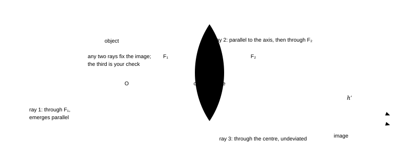

**Fig. 6.2** — Thin-lens construction. The three principal rays: (1) through the first focal point goes out parallel; (2) parallel to the axis comes out through the second focal point; (3) through the optical centre goes straight on. The construction is not a different theory — it is the thin-lens equation drawn, and the two ray-slopes you choose must be consistent with $1/v - 1/u = 1/f$. The object here is beyond $2F$, so the image is real, inverted and diminished: all three signature features of that case.

> **The six cases of a converging lens (know these cold)**
>
> | Object position | Image | Signs | Magnification |
> | --- | --- | --- | --- |
> | beyond $2F$ | between $F$ and $2F$, real, inverted | $v > 0$, $m < 0$ | $\|m\| < 1$ |
> | at $2F$ | at $2F$, real, inverted | $v = -u$ | $m = -1$ |
> | between $F$ and $2F$ | beyond $2F$, real, inverted | $v > 0$ | $m < -1$ |
> | at $F$ | at infinity | $v = \infty$ | $m = \infty$ |
> | inside $F$ | same side, virtual, erect | $v < 0$, $m > 0$ | $\|m\| > 1$ (magnifier) |
> | virtual object (converging beam) | real, between lens and $F$ | $u > 0$ | depends |
>
>  For a diverging lens ($f < 0$) the image of any real object is always virtual, erect and diminished, and always lies between the lens and $F$ on the same side — the "always" statements are the mirror image of the convex mirror's (§2.6).

### 6.3 Power, combinations, and the two laboratory methods

> **Combining thin lenses**
>
> Two lenses in contact add powers:
>
>  <!-- Equation tag: 6.5 -->
> $$
> P = P_1+P_2 \qquad\Longleftrightarrow\qquad \frac{1}{F} = \frac{1}{f_1}+\frac{1}{f_2}
> $$
>
>  Separated by a distance $d$ along a common axis, they do not:
>
>  <!-- Equation tag: 6.6 -->
> $$
> \frac{1}{F} = \frac{1}{f_1}+\frac{1}{f_2}-\frac{d}{f_1f_2}
> $$
>
>  The correction term is negligible when $d \ll f_1, f_2$ — which is why "lenses in contact" is not just a convenient idealisation but a description of any two lenses mounted in a single barrel with a small gap. Setting $1/F = 0$ in (6.6), i.e. $d = f_1+f_2$, gives an afocal (telescopic) combination: parallel light in, parallel light out — the arrangement of part 7's telescope, arriving here as a special case of a formula.

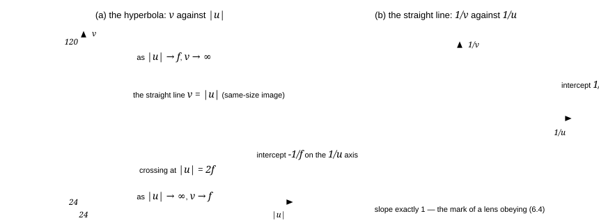

**Fig. 6.3** — The two graphs of the laboratory method, drawn for $f = 24$ cm. The $v$–$|u|$ plot (panel a) is a hyperbola with asymptotes $|u| = f$ and $v = f$, whose intersection with the line $v = |u|$ locates $2f$. The $1/v$–$1/u$ plot (panel b) is a straight line of slope exactly 1, and *both* intercepts give $f$ — which is why this is the plot a physicist prefers: it is linear, so a least-squares fit works, and the two intercepts cross-check each other.

> **The displacement method (Bessel's method)**
>
> Fix an object and a screen a distance $D > 4f$ apart. There are then *two* positions of a converging lens that project a sharp image on the screen, symmetric about the midpoint, separated by some distance $d$. From the two thin-lens equations one gets
>
>  <!-- Equation tag: 6.7 -->
> $$
> f = \frac{D^{2}-d^{2}}{4D}, \qquad D > 4f, \qquad d = \sqrt{D^{2}-4Df}
> $$
>
>  Why the method is preferred in a real laboratory: you never have to locate the lens plane or the object plane accurately (the hardest part of the $v$–$u$ method), you only measure the *displacement* of the lens between two sharp images, and the $D^2 - d^2$ combination makes the result insensitive to a small error in $D$.

### **Q3** A double convex lens has surfaces of radii 20 cm and 30 cm and glass of index 1.5. Find its focal length in air, and the focal length it would have if both surfaces were reversed (i.e. the lens turned around). Then find its focal length when immersed in water $(4/3)$. _(JEE main)_

Solution

$R_1 = +20$ cm, $R_2 = -30$ cm (the second surface is concave as seen by the light):

$$
\frac{1}{f} = (1.5-1)\left(\frac{1}{20}-\frac{1}{-30}\right) = 0.5\left(0.05+0.0333\right) = 0.5(0.08333) = 0.041667 \Rightarrow f = 24\ \text{cm}
$$

Turning the lens around swaps the radii, $R_1 = +30$, $R_2 = -20$, and the bracket becomes $(1/30+1/20)$ — the same number ✓, so $f = 24$ cm again.

In water the index to use is the relative one, $\mu_{\text{rel}} = 1.5/(4/3) = 1.125$:

$$
\frac{1}{f'} = (1.125-1)(0.08333) = 0.010417 \Rightarrow f' = 96\ \text{cm}
$$

**Checks.** (i) The focal length grows by a factor $(1.5-1)/(1.125-1) = 4$ ✓ (24 → 96), so a lens in water is a weak lens. (ii) Immerse it in a liquid of index 1.5 and $f\to\infty$ (invisible lens); in a liquid of index greater than 1.5 the focal length changes sign — the former converging lens becomes diverging ✓. (iii) The reversibility check in the first paragraph is a real theorem, not a coincidence, and it is worth knowing because it is the quickest way to reject a wrong formula: any formula for $f$ that is not symmetric under swapping the two radii (up to the sign convention) is wrong.

### **Q4** An object is 30 cm in front of a converging lens of focal length 24 cm. Find the image position, nature and magnification. Where must the object be for the image to be the same size as the object? _(JEE main)_

Solution

$$
\frac{1}{v} = \frac{1}{24}+\frac{1}{-30} = \frac{5-4}{120} = \frac{1}{120} \Rightarrow v = +120\ \text{cm}, \qquad m = \frac{v}{u} = \frac{120}{-30} = -4
$$

A real, inverted image 120 cm beyond the lens, four times as large.

Same-size image needs $|m| = 1$ with $m$ negative (real image): $v = -u$, and substituting into (6.4) gives $u = -2f = -48$ cm, $v = +48$ cm ✓.

**Checks.** (i) The object at 30 cm lies between $f = 24$ and $2f = 48$, and the table of §6.2 says the image must be beyond $2F$ and enlarged ✓ — 120 > 48 ✓, $|m| = 4 > 1$ ✓. (ii) The same-size case is the $u = 2f$ row ✓, and it is exactly the point where Fig. 6.3(a)'s hyperbola crosses the line $v = |u|$. (iii) Note that "same size" for a converging lens could also be satisfied by a virtual image? No: for a virtual image $|m| = 1$ would require $v = u$, i.e. $1/u - 1/u = 0 \neq 1/f$ — impossible. The only same-size solution is the symmetric one, and that is a useful sanity check in reverse: any answer that puts the object at $2f$ and the image anywhere else is wrong.

### **Q5** Two thin lenses, $f_1 = +20$ cm and $f_2 = -30$ cm, are placed coaxially (a) in contact, (b) 10 cm apart. Find the equivalent focal length and the power of the combination in each case. _(JEE main)_

Solution

**(a) In contact.** $1/F = 1/20 - 1/30 = (3-2)/60 = 1/60\Rightarrow F = +60$ cm, $P = 100/60 = 1.67$ D.

**(b) 10 cm apart.** Using (6.6):

$$
\frac{1}{F} = \frac{1}{20}-\frac{1}{30}-\frac{10}{(20)(-30)} = 0.05-0.03333+0.01667 = 0.03333 \Rightarrow F = +30\ \text{cm}, \ P = 3.33\ \text{D}
$$

**Checks.** (i) The separation term is *positive* here, so separating the lenses has *increased* the power (60 cm → 30 cm). That is surprising until you notice the sign: with an opposite-signed pair, the correction $-d/(f_1f_2)$ is positive because $f_1f_2 < 0$. (ii) The physical reading: a diverging lens pushes the beam outward, and moving it 10 cm away from the converging lens gives the converging lens more room to re-converge the enlarged beam — a stronger combination ✓. (iii) The limit to watch: at $d = f_1 + f_2 = -10$ cm, the formula gives $1/F = 0$ — the afocal (telescopic) condition. Negative distance here means the lenses would be separated by 10 cm with the diverging lens *first*; indeed $f_1+f_2 = 20+(-30) = -10$, and with the "wrong" order the combination is afocal at 10 cm separation — worth checking with the sign convention of (6.6) if your syllabus demands the order to be tracked explicitly.

### **Q6** In a displacement-method experiment, an object and screen are 100 cm apart, and the two lens positions that give a sharp image are 20 cm apart. Find the focal length of the lens. What is the smallest object–screen distance for which the method works at all? _(JEE main · practical)_

Solution

$$
f = \frac{D^{2}-d^{2}}{4D} = \frac{100^{2}-20^{2}}{4(100)} = \frac{10000-400}{400} = 24\ \text{cm}
$$

The method needs $D > 4f$, so with this lens $D_{\min} = 4(24) = 96$ cm; for $D = 100$ cm the lens displacement is $d = \sqrt{D^{2}-4Df} = \sqrt{10000-9600} = 20$ cm ✓ — the measured value.

**Checks.** (i) The two positions must be at $u = -\frac{D+d}{2} = -60$ and $u = -\frac{D-d}{2} = -40$ cm, with $v = 40$ and $60$ cm respectively — and both satisfy the lens equation with $f = 24$: $1/40 + 1/60 = 1/24$ ✓. This is the neatest way to see the symmetry of the two positions ✓. (ii) At $D = 4f$ the two positions merge ($d = 0$, the $u = v = 2f$ case) and the method loses its precision; below that, no real image forms on the screen at all ✓. (iii) Note the experimental advantage: the answer depends on $D$ and $d$ only, both measured between marks on the bench rail, and errors in either enter through a squared difference — a small error in $D$ is heavily suppressed.

### 6.4 Cut lenses, and lenses that are not symmetric

> **What happens when you cut a lens**
>
> Cutting a lens with a saw does not change $f$, because $f$ depends only on the radii and the index (eq. 6.3) — and the cut surfaces are not refracting surfaces (they are painted or blackened, or the piece is simply used away from them). What changes is:
>
>  - **the aperture**, hence the light gathered, hence the brightness of the image (a half-lens passes half the
>   light);
> - **the position of each half's own optical axis**, which is what produces two images when the halves are
>   separated;
> - in the extreme case, whether the remaining piece still has a well-defined axis at all.
>
>  For a lens cut into two halves along a plane containing the principal axis, then separated by a distance $a$ perpendicular to the axis, an object on the original axis gives two images whose separation is
>
>  <!-- Equation tag: 6.8 -->
> $$
> \text{image separation} = a\left(1+\frac{v}{u}\right) = a\,(1+|m|)
> $$
>
>  for a real image ($u, v$ as magnitudes here, $m = v/u$). The derivation is one line: the image formed by a piece whose centre is displaced by $a/2$ lies on the line joining the object to *that* centre, so a ray from the object to the displaced centre makes an angle $(a/2)/u$ with the axis and lands at height $(a/2)(1+v/u)$ at the image plane. Two such pieces, oppositely displaced, are therefore $a(1+v/u)$ apart.

### **Q7** A converging lens of focal length 20 cm is cut into two halves by a plane through its principal axis, and the halves are separated by 1.0 cm perpendicular to the axis. An object is placed 30 cm in front of the (half-)lenses on the original axis. How many images are formed, where, and how far apart? _(JEE Advanced)_

Solution

Each half still has $f = +20$ cm, and the object is the same for both, so $v$ is the same:

$$
\frac{1}{v} = \frac{1}{20}+\frac{1}{-30} = \frac{3-2}{60} = \frac{1}{60} \Rightarrow v = +60\ \text{cm}, \qquad |m| = \frac{60}{30} = 2
$$

Two images are formed, both 60 cm behind the lenses, each inverted and twice as large as the object, separated along the direction of the cut by

$$
a(1+|m|) = 1.0\times(1+2) = 3.0\ \text{cm}
$$

**Checks.** (i) Each image is half as bright, because each half collects half the light ✓. (ii) The separation exceeds $a$ — by the same factor $(1+|m|) = 3$ that converts an aperture displacement into an image displacement; this is exactly the geometry of a stereoscopic pair of photographs, and also of the "split image" rangefinder in an old camera, where a split prism does precisely this and the coincidence of the two image halves signals focus. (iii) Limit check: if $u\to\infty$ (object at infinity), then $v = f$ and $|m|\to0$, so the two images would be only $a$ apart — two parallel beams, each parallel to its own half's axis ✓ sensible.

### 6.5 Silvered lenses and lens–mirror combinations

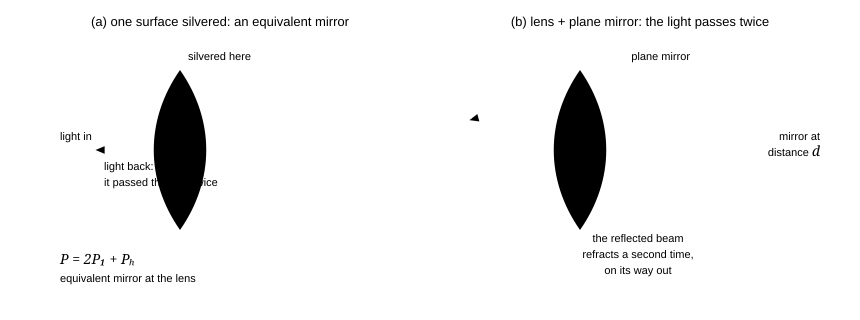

**Fig. 6.5** — Two ways to combine a lens with a mirror. **(a)** If one surface of the lens is silvered, light crosses the lens once, reflects, and crosses it again: the whole assembly behaves exactly like a mirror whose power is $P_{\text{eq}} = 2P_1 + P_m$: the power of the surface crossed twice counts twice, plus the power of the silvered surface as a mirror. **(b)** If the mirror is separate, at a distance $d$ behind the lens, the light still passes the lens twice, but now the propagation between the two passes matters — for a mirror exactly at $d = 2f$ the returning beam is left collimated, for instance. The clean rule $P_{\text{eq}} = 2P_1+P_m$ is exact when the mirror sits on the lens's own surface (or in contact with it); treat a separated mirror as a two-step problem instead.

> **The silvered lens as an equivalent mirror**
>
> <!-- Equation tag: 6.9 -->
> $$
> P_{\text{eq}} = 2P_1+P_m = \frac{2}{f_{\text{lens}}}+\frac{1}{f_{\text{mirror}}}
> $$
>
>  where $P_1$ is the power contributed by the surface the light crosses *twice* — the unsilvered one, $P_1 = (\mu-1)/R_1$ — and $P_m$ the power of the silvered surface treated as a mirror, $P_m = -2/R_{\text{silvered}}$ (positive when that surface is concave toward the incoming light). The reason the unsilvered surface counts twice is that the light passes it on the way in and again on the way out, while the silvered surface never refracts at all.
>
>  The case everybody is asked about is the **plano-convex lens with its plane face silvered**: then $P_m = 0$ and $P_1 = (\mu-1)/R = P_{\text{lens}}$, so
>
>  $$
> P_{\text{eq}} = 2P_{\text{lens}} \Rightarrow f_{\text{eq}} = \frac{f_{\text{lens}}}{2} \quad (\text{plane face silvered})
> $$
>
>  a mirror half as long-focus as the lens, because the light traverses the lens twice. Do *not* generalise this to $f_{\text{eq}} = f_{\text{lens}}/2$ for every lens: for a biconvex lens with the back surface silvered the same rule gives $P_{\text{eq}} = 2P_1+P_m$ with $P_m = -2/R_2 = +2/R$, i.e. $P_{\text{eq}} = 3/R$ while $P_{\text{lens}} = 1/R$ — an $f_{\text{lens}}/3$ mirror. Always go back to $2P_1+P_m$ and identify which surface is crossed twice.
>
>  Two standard consequences: (i) an object placed at the **centre of curvature** of the equivalent mirror, $u = 2F_{\text{eq}}$ from the lens, has its image formed *at the object itself* — the light emerges parallel inside the glass, strikes the silvered plane face normally, and retraces; (ii) a silvered lens is achromatised to a surprising degree, which is why a "mirror lens" was once a standard way to photograph the Sun — there is no chromatic aberration from the reflecting surface.

### **Q8** A plano-convex lens of glass $\mu = 1.5$ has its curved surface of radius 20 cm facing the object, and its plane surface silvered. Find the focal length of the equivalent mirror. Where must a point object be placed so that the image falls on the object itself, and what is the image? _(JEE Advanced)_

Solution

The lens on its own — a plane surface and a curved surface of radius 20 cm — has

$$
P_1 = \frac{1}{f_1} = (\mu-1)\left(\frac{1}{R}\right) = 0.5\times\frac{1}{20} = \frac{1}{40} \Rightarrow f_1 = +40\ \text{cm}
$$

and the silvered plane surface contributes $P_m = 0$ (a plane mirror). Hence the light, which crosses the lens twice, sees an equivalent mirror of power and focal length

$$
P_{\text{eq}} = 2P_1 = \frac{1}{20}\ \text{cm}^{-1} \Rightarrow F_{\text{eq}} = 20\ \text{cm} \quad (\text{radius of curvature } 2F_{\text{eq}} = 40\ \text{cm})
$$

**The coincidence position.** A mirror forms its image at the object itself when the object is at the centre of curvature, $u = 2F_{\text{eq}} = 40$ cm in front of the lens. Equivalently, and more physically: light striking a plane mirror must arrive *parallel* if it is to retrace its path, and light leaves the curved surface parallel when the object sits at that surface's first focal point $f_1^{(\text{surf})} = \mu_1 R/(\mu_2-\mu_1) = 1(20)/0.5 = 40$ cm. Both routes give 40 cm ✓.

**The image.** The light retraces its own path exactly, so the image forms at the object's position and is inverted, $m = -1$ (the same result a concave mirror gives for an object at C). In the laboratory this is how you find the focal length of a silvered lens: move a pin until it coincides with its own image.

**Checks.** (i) Compare the two conditions and be sure which is which: the object at $F_{\text{eq}}$ would send light out to infinity on reflection — no image at all — while the object at $2F_{\text{eq}}$ gives the image at the object ✓. (ii) Cross-check the number with the single-surface formula directly: object 40 cm in front of the curved surface, $\mu_1 = 1, \mu_2 = 1.5, R = +20$: $1.5/v = 0.5/20+1/(-40) = 0.025-0.025 = 0 \Rightarrow v = \infty$ — the beam inside the glass is parallel ✓, strikes the silvered plane face normally ✓, retraces ✓. (iii) If instead the *curved* surface were silvered, then $P_m = -2/R = -2/(-20)$… take care with the sign: a surface of radius 20 cm curved away from the incoming light as a mirror has $R_m = +20$, giving a *diverging* mirror contribution, and the equivalent mirror would be much weaker — a good exercise, and a reminder that "silvered lens" questions must always say *which* surface is silvered.

> **Light passing a lens a second time: flip the sign of the power**
>
> When a beam returns through a lens, its *direction of travel* has reversed, and in a fixed coordinate system the lens's ray-transfer rule becomes $\theta_{\text{out}} = \theta_{\text{in}} + y/f$ instead of $\theta_{\text{out}} = \theta_{\text{in}} - y/f$ — equivalently, for the return journey you may use the same formula with $f\to -f$. The physical statement is simply: the lens still bends the ray toward its axis, but "toward the axis" is now the other way in your coordinates. Every lens–mirror problem goes wrong at this step, and the cure is to draw the ray directions on a sketch and check the bending by eye.

### **Q9** A converging lens of focal length 20 cm has a plane mirror 10 cm behind it. A point object is 30 cm in front of the lens on the axis. Where is the final image? Solve it by passing the light through the system step by step, and verify with the equivalent-power method. _(JEE Advanced · INPhO)_

Solution

**Step 1 — first pass through the lens.** $1/v_1 = 1/20 + 1/(-30) = 1/60$, so $v_1 = +60$ cm: the light would converge 60 cm behind the lens, which is 50 cm behind the mirror.

**Step 2 — the mirror.** The beam is converging toward a point 50 cm behind the mirror, so the mirror receives a *virtual object* at 50 cm behind it and forms a *real* image 50 cm in front of the mirror, i.e. 40 cm in front of the lens.

**Step 3 — second pass through the lens.** The returning beam is converging toward a point 40 cm in front of the lens, which is *beyond* the lens in the new direction of travel: a virtual object, $u_2 = +40$ cm. Using the lens equation with this virtual object and $f = +20$ cm:

$$
\frac{1}{v_2} = \frac{1}{20}+\frac{1}{40} = \frac{3}{40} \Rightarrow v_2 = +13.3\ \text{cm}
$$

so the final image is **13.3 cm in front of the lens**, real, on the object side, and *between the object and the lens* — closer to the lens than the object itself, and inverted.

**Verification by the equivalent power.** For a plane mirror at distance $d$ behind a lens of power $P$, unfolding the mirror into the lens formalism gives an equivalent mirror of power

$$
P_{\text{eq}} = 2P-2dP^{2} = 2(0.05)-2(10)(0.0025) = 0.05\ \text{cm}^{-1}
$$

and solving the imaging condition for the unfolded system gives the same $v_2 = 13.3$ cm ✓. The $-2dP^{2}$ term is the price of the 10 cm gap: because the beam is converging as it crosses that gap, it arrives at the second pass with a different vergence than a contact arrangement would give.

**Checks.** (i) Sanity: a converging lens followed by a mirror should give a real image, and it does ✓. (ii) Put $d = 0$ (mirror touching the lens): then $P_{\text{eq}} = 2P = 0.1$, i.e. an equivalent mirror of focal length 10 cm, and the object at 30 cm gives $1/v = 1/f - 1/u$… with the mirror convention of part 2 (converging mirror, $f = -10$): $1/v = -1/10+1/30 = -1/15$, $v = -15$ cm, i.e. the image is 15 cm in front of the mirror = 15 cm in front of the lens ✓ a plausible limit of our 13.3 cm result (as the gap shrinks the image moves out from 13.3 to 15 cm ✓, and it must move *out*, because the gap is what subtracted power). (iii) If instead the mirror is placed beyond the first image (d > 60 cm), the mirror receives a *real* image as its object, and the final image flips to the other side — the qualitative change you should be able to predict before computing.

### 6.6 Measuring a refractive index with a lens

> **The liquid-lens method (refractive index of a liquid)**
>
> Put a thin layer of the liquid between a plano-convex lens (curved face *down*) and a plane glass plate. The liquid fills the gap and forms a **plano-concave lens** whose concave surface has the same radius of curvature $R$ as the lens's curved face, and whose index is the unknown $\mu_{\text{liq}}$. Since its concave face is turned away from the incoming light (or, in the standard vertical arrangement, its curvature sign is opposite to the glass lens's), this liquid lens is *diverging*.
>
>  Measure the focal length $F$ of the *combination* (glass lens + liquid lens in contact) by any method of §6.3, and the focal length $f_g$ of the glass lens alone beforehand. Then
>
>  <!-- Equation tag: 6.10 -->
> $$
> \frac{1}{f_{\text{liq}}} = \frac{1}{F}-\frac{1}{f_g}, \qquad\text{and}\qquad \frac{1}{f_{\text{liq}}} = (\mu_{\text{liq}}-1)\left(\frac{1}{-R}-\frac{1}{\infty}\right) = -\frac{\mu_{\text{liq}}-1}{R}
> $$
>
>  so $\mu_{\text{liq}} = 1 - R/f_{\text{liq}}$ with $f_{\text{liq}} < 0$. This is the standard laboratory determination, and it is a beautiful application of "lenses in contact": you measure two focal lengths and learn a material constant.

### **Q10** A plano-convex lens of glass $\mu = 1.5$ and curved-surface radius 20 cm is placed, curved face down, on a plane glass plate with a drop of liquid between. The combination is found to have a focal length of 120 cm (converging). Find the refractive index of the liquid. _(JEE Advanced · practical)_

Solution

Glass lens alone: $R_1 = \infty$ (light entering the flat face) and $R_2 = -20$ cm for the curved face as seen by the light? Use the physically safe route: the lens is a thin lens with one plane and one curved surface of radius 20 cm, so $|1/f_g| = (0.5)(1/20) = 0.025$ and, being convex, $f_g = +40$ cm. Then

$$
\frac{1}{f_{\text{liq}}} = \frac{1}{120}-\frac{1}{40} = \frac{1-3}{120} = -\frac{1}{60} \Rightarrow f_{\text{liq}} = -60\ \text{cm}
$$

The liquid lens is plano-concave with the plane face up, so the light meets the concave surface of radius 20 cm (from the flat side first the light sees… either way $|1/f_{\text{liq}}| = (\mu_{\text{liq}}-1)/20$):

$$
\frac{\mu_{\text{liq}}-1}{20} = \frac{1}{60} \Rightarrow \mu_{\text{liq}} = 1+\frac{20}{60} = 1.33
$$

**Checks.** (i) The liquid is water (4/3 = 1.333 ✓) and the numbers were built to make it so. (ii) Sign logic: the liquid lens must be diverging (its focal length negative) because the combination's focal length (120 cm) is *longer* than the glass lens's alone (40 cm) — combining a converging lens with a diverging one weakens it ✓. (iii) Test the sensitivity that makes the experiment practical: measure $F$ to 1 cm and the error in $\mu$ is a few parts in a thousand — which is why this method, not the angle measurement, is the standard student experiment for liquid indices. (iv) If instead the liquid's index exceeded the glass's, the liquid lens would be converging and the combination would shorten — a useful check when you suspect a contaminated sample.

### **Q11** A thin converging lens of focal length $f$ forms a real image of a real object, with magnification $m$. Show that the distance between object and image is $f\,(2+m+1/m)$ for $m > 0$ interpreted suitably, and find the minimum object–image distance over all configurations. _(Olympiad · NSEP)_

Solution

Write the magnitudes: object distance $u = |u|$, image distance $v = |v|$, with $m = v/u$ (magnitudes, for the real-image case). The object–image distance is $L = u+v$, and the thin-lens equation gives $1/u+1/v = 1/f$. Substituting $v = mu$:

$$
\frac{1}{u}+\frac{1}{mu} = \frac{1}{f} \Rightarrow u = f\left(1+\frac{1}{m}\right), \qquad v = f(1+m)
$$

$$
L = u+v = f\left(2+m+\frac{1}{m}\right)
$$

Minimise: $dL/dm = f(1-1/m^{2}) = 0$ gives $m = 1$ (the physical root), and

$$
L_{\min} = f(2+1+1) = 4f \quad\text{at } u = v = 2f
$$

**Checks.** (i) This is the condition $D > 4f$ of the displacement method ✓ — the two questions are the same statement, and now you know *why* the method has a threshold: at $D = 4f$ the two lens positions coincide and the sharp-image condition becomes degenerate. (ii) The function $m+1/m$ is symmetric under $m\to1/m$ and has minimum 2 at $m = 1$ ✓, which is the algebraic form of "the two positions of the lens are mirror images of each other". (iii) A useful corollary for the lab: to place an image on a screen at $D$, you need $f \leq D/4$; a longer-focus lens simply cannot form a real image at that distance, and no amount of sliding along the bench will help.

### **Q12** A convex lens is placed on a plane mirror inside a shallow ring, and a pin held above it coincides with its own image at 20 cm. Water is then poured into the ring so that it fills the space between the lens's curved lower surface and the mirror, and the pin must now be held 30 cm above the lens for coincidence. The lens's curved surface has radius 20 cm. Find the refractive index of the liquid. _(Olympiad · INPhO · practical)_

Solution

**Why coincidence measures a focal length.** The pin coincides with its own image when the light that returns from the mirror retraces the path it went out on. The mirror is plane, so the returning beam must arrive *parallel* to the axis — and the optics between the pin and the mirror (lens, or lens plus liquid layer) must therefore have the pin at its focus. So the coincidence distance is the focal length of the whole train in front of the mirror:

$$
f_{\text{dry}} = 20\ \text{cm} \ (= f_g), \qquad f_{\text{wet}} = 30\ \text{cm} \ (= F_{\text{comb}}) \ \checkmark
$$

**The liquid lens.** The water layer's upper surface is the concave copy of the lens's curved face (radius 20 cm) and its lower surface is flat, so it is a plano-concave lens of radius 20 cm in contact with the glass lens. Lenses in contact add powers:

$$
\frac{1}{f_{\text{liq}}} = \frac{1}{F_{\text{comb}}}-\frac{1}{f_g} = \frac{1}{30}-\frac{1}{20} = \frac{2-3}{60} = -\frac{1}{60}\ \text{cm}^{-1} \Rightarrow f_{\text{liq}} = -60\ \text{cm}
$$

negative ✓ (the liquid lens is diverging, which is why the coincidence distance moved *out* from 20 to 30 cm). For a plano-concave lens of surface radius $R = 20$ cm,

$$
\frac{1}{f_{\text{liq}}} = (\mu_{\text{liq}}-1)\left(\frac{-1}{R}\right) \Rightarrow \mu_{\text{liq}}-1 = \frac{20}{60} = \frac{1}{3} \Rightarrow \mu_{\text{liq}} = \frac{4}{3}
$$

The liquid is water ✓.

**Checks.** (i) Direction of the change: adding a diverging lens *increases* the focal length, so the pin must be moved *further* away (20 → 30 cm) ✓ — if your algebra ever gives a shorter distance for a layer of an index lower than the glass, you have the sign of the liquid lens wrong. (ii) Sanity on magnitudes: $f_{\text{liq}} = -60$ cm is only 1.5 times as long as the glass lens's $+40$ cm, and the combination lands at 30 cm — between 40 cm (lens alone) and 60 cm (liquid alone would win if the glass were removed) ✓., which is what "in contact" means. (iii) The measurement is one of the most accurate student experiments in optics, precisely because it needs only two pin positions, both found by the eye's ability to judge coincidence, and neither requiring a measurement of the lens-to-mirror separation. (iv) A useful extension: if the liquid has the *same* index as the glass, the wet coincidence distance equals the dry one and the layer is invisible — the standard "invisible glass rod in glycerine" demonstration, here in lens form.

### 6.7 Summary — the results to own

> **Part 6 in nine lines**
>
> - Single surface: $\mu_2/v - \mu_1/u = (\mu_2-\mu_1)/R$, $m = \mu_1v/(\mu_2u)$,
>   $f_1 = \mu_1R/(\mu_2-\mu_1)$, $f_2 = \mu_2R/(\mu_2-\mu_1)$.
> - With $\mu_2 = -\mu_1$ it becomes the mirror formula, $1/v+1/u = 2/R$, $f = R/2$.
> - Lensmaker: $1/f = (\mu-1)(1/R_1-1/R_2)$; thin lens $1/v-1/u = 1/f$, $m = v/u$,
>   power $P = 1/f$ in dioptres.
> - Object beyond $2F$ → real, inverted, diminished; at $2F$ → same size; inside $F$ → virtual,
>   erect, magnified (the magnifier). A diverging lens always gives a virtual, erect, diminished image.
> - In contact $1/F = 1/f_1+1/f_2$; separated by $d$,
>   $1/F = 1/f_1+1/f_2-d/(f_1f_2)$; afocal when $d = f_1+f_2$.
> - Displacement method: $f = (D^{2}-d^{2})/4D$ with $D > 4f$; the two positions are mirror images
>   about the midpoint.
> - Cut lens: same $f$, half the light; halves separated by $a$ give images $a(1+|m|)$ apart.
> - Silvered lens: $P = 2P_{\text{lens}}+P_{\text{mirror}}$; light passing a lens twice must be handled with
>   the reversed-direction sign flip.
> - Liquid lens in contact with a known lens: $\mu_{\text{liq}} = 1-R/f_{\text{liq}}$.

### 6.8 Checkpoint

- I can write the single-surface formula with the right signs and remember the extra
  $\mu_1/\mu_2$ in its magnification.
- I can derive the mirror formula from it via $\mu_2 = -\mu_1$.
- I can derive the lensmaker's formula by applying the single-surface formula twice.
- I can state the six cases of a converging lens with all their signs, and the one case of a diverging lens.
- I can add powers in contact and correct for a separation $d$, and recognise the afocal condition.
- I can carry out a displacement-method calculation and state why $D > 4f$ is needed.
- I can predict the effect of cutting a lens and compute the image separation.
- I can set up a silvered-lens or lens–mirror problem and check the answer by ray tracing one oblique ray.
- I can design and interpret the liquid-lens measurement of a refractive index.

Next: [**Part 7 · The eye, cameras, microscopes and telescopes →**](#section-07-optical-instruments) — where every formula of parts 3 to 6 is cashed in for a magnification, an angular resolution and a design.

_Part 7 of 12 · JEE Advanced · core · NSEP · INPhO · ≈ 70 min read · 12 questions_

## 7 · The eye, cameras, microscopes and telescopes

Every formula of parts 3 to 6 now has to earn its keep. This part is about instruments, and the central idea is **angular magnification**: a lens cannot make a distant object bigger, it can only make the *image on your retina* bigger by letting your eye look at something it could not otherwise resolve or couldn't bring close enough to see. We start with the eye as an optical instrument (a lens of variable power with a fixed image distance), then go through the magnifier, the compound microscope and the telescope, and finish with the reflecting telescope — including the Cassegrain, whose whole trick is to make a long focal length inside a short tube.

### 7.1 The eye as an optical instrument

The eye is a fixed-length camera: a cornea and a lens throw a real, inverted image on the retina, and the **image distance never changes** (about 2.5 cm in a human). Focusing on objects at different distances is done by *changing the focal length* — the ciliary muscles squeeze the lens fatter, which increases its power. That change is **accommodation**.

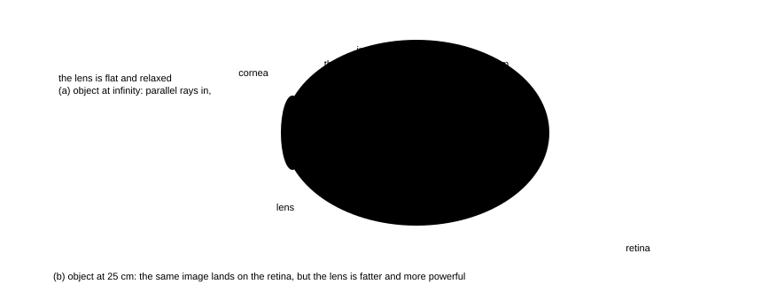

**Fig. 7.1** — Accommodation. Two different object distances, one image distance: the eye changes its power, not its geometry. For an object at infinity the eye needs about 59 D (focal length 1.7 cm); for an object at the near point, 25 cm, it needs about 63 D — an increase of just 4 D. A child's lens can manage 10 D or more (focusing to 10 cm), and that range shrinks with age until a 60-year-old has to hold a book at arm's length: presbyopia.

> **The numbers that define normal vision**
>
> - **Near point** (least distance of distinct vision), $D = 25$ cm for a young adult: the closest an object
>   can be while still being in focus. Magnification formulas in this part will use $D$ everywhere.
> - **Far point**: infinity for a normal eye.
> - **Image distance** ≈ 2.5 cm, fixed.
> - **Diameter of the pupil** ≈ 2–5 mm: this is the eye's aperture stop, and it is why the eye is *not*
>   diffraction-limited: a 3 mm pupil allows an angular resolution of about 46 arcseconds in principle, but the retinal
>   cone spacing limits the real eye to about 1 arcminute. The eye wastes its diffraction limit to gain sensitivity.
> - **Angular size of an object** at distance $d$ with height $h$: $\theta = h/d$. All magnifying
>   instruments are devices for increasing $\theta$.

### 7.2 Defects of vision and their correction

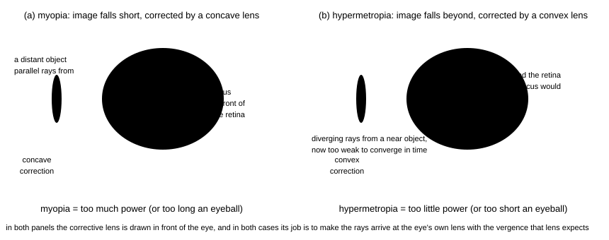

**Fig. 7.2** — The two common refractive errors, drawn as vergence problems. Correction is not "making the image bigger"; it is arranging that the light reaching the eye's lens has the right convergence, so that the fixed retina receives the focus.

> **Corrections, expressed as lens powers**
>
> **Myopia** (short sight): the eye is too powerful, so parallel light focuses *before* the retina; the far point is a finite distance $x$. The correcting lens must image an object at infinity onto the far point, i.e. produce a virtual image at distance $x$:
>
>  <!-- Equation tag: 7.1 -->
> $$
> \text{myopia: } f = -x \quad (\text{concave lens}), \qquad P = -\frac{1}{x}
> $$
>
>  **Hypermetropia** (long sight): the eye is too weak, the near point is beyond 25 cm. The correcting lens must image an object at 25 cm onto the eye's own near point at distance $x$ (as a virtual image):
>
>  <!-- Equation tag: 7.2 -->
> $$
> \text{hypermetropia: } \frac{1}{f} = \frac{1}{-x}-\frac{1}{-0.25}\ \text{m} = -\frac{1}{x}+4 \quad (\text{convex lens})
> $$
>
>  Both formulas are in metres and give $P$ in dioptres. **Presbyopia** is the same arithmetic as hypermetropia but caused by age (loss of accommodation, not of power at rest). **Astigmatism** is different in kind: the cornea's curvature differs in different meridians, so the eye has two focal lengths, and the correction is a *cylindrical* lens, which is a lens of power only along one axis.

### **Q1** A short-sighted person can see clearly only up to 2.0 m. What power of lens is needed to see distant objects clearly? Where is the near point of the corrected eye, if his near point without correction is 15 cm? _(JEE main)_

Solution

**Correction.** The lens must take parallel light from a distant object and deliver it to the eye as though it came from the far point 2.0 m away, i.e. it must form a virtual image at 2.0 m:

$$
f = -2.0\ \text{m} \Rightarrow P = \frac{1}{f} = -0.50\ \text{D}
$$

A diverging lens of half a dioptre.

**The corrected near point.** With the lens in place, an object at distance $d$ must produce a virtual image at the *eye's own* near point, 15 cm, because that is as close as the eye can focus. Put $u = -d$, $v = -0.15$ m and $f = -2.0$ m into the thin-lens equation:

$$
\frac{1}{v}-\frac{1}{u} = \frac{1}{f} \Rightarrow -\frac{1}{0.15}+\frac{1}{d} = -\frac{1}{2.0} \Rightarrow \frac{1}{d} = \frac{1}{0.15}-\frac{1}{2.0} = 6.667-0.500 = 6.167\ \text{m}^{-1}
$$

$$
d = 0.162\ \text{m} \approx 16\ \text{cm}
$$

**Checks.** (i) $d = 16$ cm is a little farther than the uncorrected near point (15 cm) ✓, as it must be: a diverging lens weakens the ray bundle, so everything, near and far, moves away. (ii) The far point is now infinity ✓ by construction. (iii) The formula to remember in shorthand: with a correcting lens of power $P$, the new near point satisfies $1/d = 1/d_{\text{uncorrected}} + P$ with signs — and it can be checked by the limiting case $P = 0$, which returns the uncorrected near point ✓.

### **Q2** A person can read a book only if it is at least 1.0 m from his eyes. What lens does he need to read at the normal distance of 25 cm? If he then reads at 25 cm, where does the image of the page actually form? _(JEE main)_

Solution

The lens must make an object at 0.25 m appear to be at 1.0 m, i.e. form a virtual image at 1.0 m:

$$
\frac{1}{v}-\frac{1}{u} = \frac{1}{f} \Rightarrow \frac{1}{-1.0}-\frac{1}{-0.25} = -1+4 = +3\ \text{D} \Rightarrow f = +33.3\ \text{cm}
$$

So a +3 D convex lens. The image of the page is *virtual*, 1.0 m from the lens on the same side as the page, because that is where his eye can actually focus.

**Checks.** (i) The sign pattern is the whole content: object and image both on the same side ($u, v$ both negative) with $|v| > |u|$ means the lens must be converging ✓. (ii) A power of +3 D is exactly what a 33 cm "reading glasses" prescription looks like for this degree of long sight ✓. (iii) If instead he wants to read at 25 cm with the page at a distance where the image lands at his near point 1.0 m, that is what we just computed; but note that the *angular* size of the page is now smaller than it would be at 25 cm for a normal eye — corrective spectacles restore accommodation, they do not magnify. Magnification is the business of §7.4.

### 7.3 The camera, and what the eye does differently

> **The lens camera**
>
> A camera is a converging lens that forms a real, inverted, diminished image of a distant object on a sensor. Its three control knobs correspond to three physical quantities:
>
>  - **Focus** — moves the lens (or an element) to change the image distance, because unlike the eye the camera
>   keeps its lens power fixed and changes the geometry. Focus at infinity: $v = f$. Focus on something at 25 cm
>   with $f = 5$ cm: $1/v = 1/5-1/25 = 0.16$ cm−1, $v = 6.25$ cm — a 1.25 cm movement of the
>   lens, which is why camera focus rings move so little.
> - **Aperture**, characterised by the **f-number**$N = f/D$: it sets both the light gathered (the
>   irradiance on the sensor scales as $1/N^{2}$) and the depth of field. From $f/2.8$ to $f/8$ is three
>   stops, i.e. a factor 8 less light.
> - **Shutter time**$t$, with exposure $\propto t/N^{2}$. This is why the "sunny 16" rule, and every
>   exposure triangle, works.
>
>  The eye is the mirror image of the camera in every respect: fixed image distance and variable power, while the camera has fixed power and variable image distance. The eye's "aperture" is its iris, but its "sensor" has a fixed sensitivity (the dark-adapted eye trades resolution for sensitivity by pooling signals over many receptors).

### 7.4 The simple magnifier

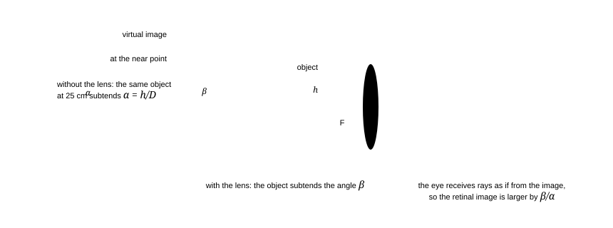

**Fig. 7.3** — The simple magnifier. The object sits inside the focal length, so the image is virtual, erect and enlarged, and the eye sees it at a comfortable distance (the near point, or infinity). The relevant gain is the ratio of the *angles* $\beta/\alpha$, not the linear size of the virtual image — an instrument that made a huge image very far away would magnify nothing.

> **Angular magnification of a magnifier (a single lens)**
>
> Angular magnification is the ratio of the angle the image subtends at the eye to the angle the object would subtend if placed at the near point $D = 25$ cm:
>
>  <!-- Equation tag: 7.3 -->
> $$
> M = 1+\frac{D}{f} \ \ (\text{image at the near point}), \qquad M = \frac{D}{f} \ \ (\text{image at infinity, relaxed})
> $$
>
>  The two differ by exactly the $1$ that distinguishes "the image is 25 cm away" from "the image is at infinity". Both need $f < D$ to magnify; for $f = 5$ cm the two values are 6 and 5. The relaxed alternative is preferred in practice, because the eye is then unaccommodated and does not tire — which is why a well-designed magnifier is used with the object at its focal point and the eye slightly behind.

### **Q3** A magnifier of focal length 5 cm is used (a) with the image at the near point, (b) with the image at infinity. Find the angular magnification in each case, and the object distance in each case. _(JEE main)_

Solution

**(a)** $M = 1+D/f = 1+25/5 = 6$. The image is at $v = -25$ cm: $1/u = 1/v-1/f = -1/25-1/5 = -(1+5)/25 = -6/25 \Rightarrow u = -4.17$ cm, i.e. the object is 4.17 cm from the lens, just inside the focal length (5 cm) ✓.

**(b)** $M = D/f = 5$, with the object exactly at the focus, $u = -5$ cm, and the image at infinity.

**Checks.** (i) In both cases the object is *inside* the focal length ✓, as the construction of Fig. 7.3 requires, and the image is virtual and erect ✓. (ii) The magnification is larger in (a) — by the factor 6/5 — but the eye must accommodate, and the eye must be at the lens. (iii) Check the limit of large $f$: $f = 25$ cm gives $M = 2$ (a) and $1$ (b) — a lens of 25 cm focal length magnifies nothing in the relaxed use, which is an accurate statement: it can only bring a 25 cm object to infinity, not enlarge it. (iv) Check the small-$f$ limit for honesty's sake: at $f = 1$ cm the formula promises $M = 26$, but a single lens of 1 cm focal length has severe aberrations and you cannot get your eye close enough; practical magnifiers stop at about 10×, and beyond that you use a compound microscope.

### 7.5 The compound microscope

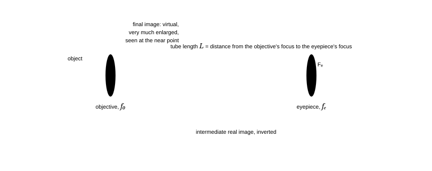

**Fig. 7.4** — The compound microscope, two stages. The objective makes a real, inverted, magnified image of the (very close) object; the eyepiece then acts as a simple magnifier on *that* image. The two magnifications multiply, which is why a microscope can reach 1000× while a single lens cannot reach 26× comfortably.

> **Compound microscope**
>
> <!-- Equation tag: 7.4 -->
> $$
> M = m_o \times m_e = \frac{v_o}{u_o}\left(1+\frac{D}{f_e}\right) \approx \frac{L}{f_o}\left(1+\frac{D}{f_e}\right)
> $$
>
>  where $L$ is the tube length (objective focus to eyepiece focus) and the approximation is good when the object is just outside $f_o$ and $L \gg f_o$. The relaxed version replaces $1+D/f_e$ by $D/f_e$.
>
>  Design consequences, all of which follow from the formula: (i) both focal lengths should be **small** — the objective for the first magnification, the eyepiece for the second; (ii) the objective's focal length is the more important one, and a real microscope objective is a compound lens of several elements (which is the aberration business of part 8); (iii) the object must be placed just outside $f_o$, so the stage has to be positioned to within a fraction of a millimetre — which is why microscopes have fine-focus knobs and why the working distance of a 100× objective is less than a millimetre.

### **Q4** A compound microscope has an objective of focal length 2.0 cm and an eyepiece of focal length 5.0 cm, with a tube length of 20 cm. Find its magnifying power with (a) the final image at infinity and (b) the final image at the near point. (c) The object is placed 2.2 cm from the objective; verify your answer for the actual image position. _(JEE main)_

Solution

**(a) Relaxed.** $M = (L/f_o)(D/f_e) = (20/2.0)(25/5) = 10\times5 = 50$.

**(b) Image at the near point.** $M = (L/f_o)(1+D/f_e) = 10\times6 = 60$.

**(c) Exact route.** $1/v_o = 1/2.0+1/(-2.2) = (1.1-1)/2.2 = 1/22$, so $v_o = 22$ cm and $m_o = v_o/u_o = 22/2.2 = 10$ ✓ — the same 10 that the $L/f_o$ shortcut gave, because with $v_o \approx L$ and $u_o \approx f_o$ the ratio $v_o/u_o \approx L/f_o$ ✓. Then $M = 10\times6 = 60$ for the near-point adjustment ✓.

**Checks.** (i) The intermediate image is 22 cm from the objective, so the eyepiece (tube length 20 cm) sees it as an object 2 cm beyond its own focal point $f_e = 5$ cm… the sign check: the intermediate image must lie just inside the eyepiece's focal length for a virtual final image, and 22 − 20 = 2 cm < 5 cm ✓. (ii) The shortcut $L/f_o$ is accurate to about 10% here (10.0 vs 10.0 — the agreement is exact only because our numbers were chosen so that the intermediate image lands 22 cm out), so treat $M \approx (L/f_o)(D/f_e)$ as a design estimate and always check the object position if the question gives one. (iii) Magnifying power ~50–60 with these focal lengths: to reach 1000× you need an objective of 2 mm focal length and a 10× eyepiece, which is the practical limit before the resolving power (next section) makes extra magnification useless.

### 7.6 Resolving power: the real limit on magnification

> **Diffraction limits (Rayleigh criterion)**
>
> No instrument can resolve detail finer than diffraction allows. For a circular aperture of diameter $D$, the smallest resolvable angular separation at wavelength $\lambda$ is
>
>  <!-- Equation tag: 7.5 -->
> $$
> \theta_{\min} = 1.22\,\frac{\lambda}{D} \quad\text{(telescope / eye)}, \qquad d_{\min} = \frac{0.61\,\lambda}{\text{NA}} \quad\text{(microscope)}
> $$
>
>  where the numerical aperture $\text{NA} = n\sin i$ collects the index of the medium and the half-angle of the cone of light the objective accepts. The reciprocal quantities are the **resolving power**.
>
>  Numbers worth remembering: a 10 cm telescope objective at $\lambda = 550$ nm resolves $1.22(550\times10^{-9})/0.1 = 6.7\times10^{-6}$ rad $= 1.4$ arcseconds; a 3 mm pupil would allow the eye about 46 arcseconds, but the retina limits it to about 60 arcseconds; a good microscope objective with $\text{NA} = 0.9$ resolves about 370 nm, i.e. roughly $\lambda/1.5$. Using green light (shorter wavelength), oil immersion (larger $n$, hence larger NA) and larger apertures are the only three ways to do better.
>
>  **Empty magnification.** Pushing a microscope past $M \approx 1000\,\text{NA}$ — for example, 1000× with NA = 0.65 — produces a bigger but blurrier image. This is the single most important design lesson of this part: *magnification is cheap, resolution is expensive*.

### **Q5** A microscope objective has NA = 0.9 and uses light of wavelength 550 nm. What is the smallest detail it can resolve? What magnification is useful with it? If the wavelength were 400 nm instead, by what factor would the resolution improve? _(Olympiad · NSEP)_

Solution

$$
d_{\min} = \frac{0.61\lambda}{\text{NA}} = \frac{0.61(550\times10^{-9})}{0.9} = 3.7\times10^{-7}\ \text{m} = 370\ \text{nm}
$$

Useful magnification: $M_{\max}\approx1000\,\text{NA} = 900$×; beyond that the image grows but no new detail appears.

At 400 nm: $d_{\min} = 0.61(400)/0.9 = 271$ nm, an improvement by the ratio of wavelengths, $550/400 = 1.375$.

**Checks.** (i) 370 nm is smaller than the wavelength of green light — this is not a violation of anything, because the object is illuminated and the *scattered* field carries information about features smaller than $\lambda$ (the information is in the amplitude and phase, and an interferometric or near-field technique can even extract it). (ii) The improvement with blue light is linear in $\lambda$ ✓, which is why microscopists use blue-violet illumination for the finest work — and why the ultimate limit for visible light is about 200 nm, so that a virus (20–300 nm) cannot be seen with a visible-light microscope at all, only with an electron microscope ($\lambda \approx 0.005$ nm) ✓. (iii) Increasing NA is the other lever, and it has a ceiling of 1.0 in air ($i = 90^\circ$) and about 1.5 with oil immersion ✓ — two numbers worth knowing.

### 7.7 The astronomical telescope

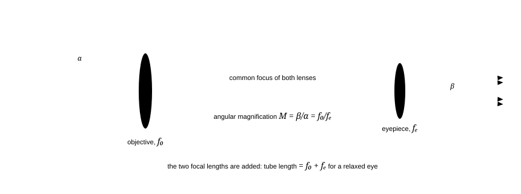

**Fig. 7.5** — The refracting astronomical telescope. Parallel light from a distant object is brought to a real image at the objective's focus, which is also the eyepiece's focus; the eyepiece then re-collimates the light into a parallel beam for a relaxed eye. Both the object and the final image are at infinity, so no linear magnification is defined — only the *ratio of the angles*, which is $f_o/f_e$. Note the image is inverted, which is fine for astronomy and unacceptable for birdwatching, which is why terrestrial telescopes add an erecting prism — part 4's totally reflecting prism, doing its most familiar job.

> **Astronomical telescope**
>
> <!-- Equation tag: 7.6 -->
> $$
> M = \frac{f_o}{f_e} \ (\text{relaxed}), \qquad M = \frac{f_o}{f_e}\left(1+\frac{f_e}{D}\right) \ (\text{image at the near point}), \qquad L = f_o + f_e \ (\text{relaxed})
> $$
>
>  with the near-point tube length $L = f_o + u_e$, where $u_e = f_eD/(D+f_e)$ is the object distance for the eyepiece that puts the final image at 25 cm. For $f_o = 150$ cm, $f_e = 5$ cm: $M = 30$, $L = 155$ cm relaxed; and $u_e = 4.17$ cm, $M = 36$, $L = 154.2$ cm at the near point.
>
>  **What the formula does and does not say.** Magnification is bought with a long objective and a short eyepiece — but the *detail* you can see is set by the objective's diameter through $\theta_{\min} = 1.22\lambda/D$, and the *brightness* of the image scales as $D^{2}$. A 2000× telescope with a 2 cm objective shows you a large, empty blur; that is why big telescopes are big in *aperture* first and focal length second. Also note the eyepiece must be short for a large $M$, and the shortest usable eyepiece (limited by eye relief and by $f_e$ approaching the eye's own focal length) is about 2.5 mm — so a 150 cm objective tops out at $M \approx 600$.

### **Q6** A telescope has an objective of focal length 200 cm and diameter 10 cm, and an eyepiece of focal length 4 cm. Find (a) the angular magnification in the relaxed adjustment, (b) the tube length then, (c) the magnification and tube length if the final image is at the near point, (d) the minimum angular separation the telescope can resolve. _(JEE Advanced)_

Solution

$$
(a)\ M = \frac{f_o}{f_e} = \frac{200}{4} = 50 \qquad (b)\ L = f_o+f_e = 204\ \text{cm}
$$

**(c)** For the near-point adjustment, the eyepiece must form a virtual image at 25 cm: $1/u_e = 1/v-1/f_e = -1/25-1/4 = -(4+25)/100 = -29/100 \Rightarrow u_e = -3.45$ cm. Then

$$
L = f_o+u_e = 200+3.45 = 203.4\ \text{cm}, \qquad M = \frac{f_o}{f_e}\left(1+\frac{f_e}{D}\right) = 50\left(1+\frac{4}{25}\right) = 50(1.16) = 58
$$

**(d)** $\theta_{\min} = 1.22\lambda/D = 1.22(550\times10^{-9})/0.10 = 6.7\times10^{-6}$ rad $= 1.4$ arcseconds.

**Checks.** (i) The near-point adjustment demands a *shorter* tube (203.4 vs 204 cm) and gives a larger magnification ✓ — the standard trade: more magnification at the cost of eye strain. (ii) The resolution, 1.4″, is 1.4 arcsec = $6.7\times10^{-6}$ rad; the magnification 50 is far more than the eye can use with that resolution? Check: the eye resolves about 60″, so to bring the telescope's 1.4″ to the eye's limit you need about 43× — and 50× is that value, so this telescope is well matched ✓. The rule of thumb is $M_{\text{useful}} \approx D(\text{mm})$ (here 100 mm → 100×, so our 50–58× is safe), and going beyond $2D$ gives empty magnification ✓. (iii) Note (d) used $\lambda = 550$ nm; a question that does not give a wavelength expects you to state the one you assumed, which is the honest way to quote a resolution.

### 7.8 Galileo's telescope, and the terrestrial telescope

> **Variations that exist because the astronomical telescope is upside down**
>
> **Galilean telescope.** Replace the eyepiece with a *diverging* lens placed *before* the objective's focus. The light is then intercepted while still converging, and emerges parallel — upright. Its magnification is $M = f_o/|f_e|$ and its tube is *shorter*: $L = f_o-|f_e|$. For $f_o = 200$ cm and $f_e = -4$ cm: $M = 50$, $L = 196$ cm, and the image is erect. Galileo's own telescopes were of this kind, and the field of view is poor because there is no real intermediate image where you could put a cross-hair or a field stop.
>
>  **Terrestrial telescope.** Keep the astronomical arrangement but add an *erecting* lens (or a pair of totally reflecting prisms, part 4 §4.4) between objective and eyepiece. The extra optics cost length and a little light, and the final image is upright — which is why every pair of binoculars and every spotting scope contains either a Porro prism pair or a roof prism.
>
>  **Why an astronomical telescope is not "just a big magnifier".** A single lens of 200 cm focal length used as a magnifier gives $M = 1+25/200 = 1.1$. The telescope reaches 50× because it first *collapses* the incoming parallel beam to a small real image and then magnifies that with a short-focus eyepiece — the two-stage trick shared with the microscope.

### 7.9 Comparing the instruments at a glance

> **One table to carry into the exam**
>
> | Instrument | Angular magnification | Key length | Final image |
> | --- | --- | --- | --- |
> | Simple magnifier, image at $D$ | $1+D/f$ | object at $u=fD/(D+f)$ | virtual, at 25 cm |
> | Simple magnifier, relaxed | $D/f$ | object at $f$ | virtual, at infinity |
> | Compound microscope | $(v_o/u_o)(1+D/f_e)\approx(L/f_o)(1+D/f_e)$ | tube $L$ | virtual, inverted |
> | Astronomical telescope | $f_o/f_e$ | $L=f_o+f_e$ | virtual, inverted |
> | Galilean telescope | $f_o/\|f_e\|$ | $L=f_o-\|f_e\|$ | virtual, erect |
> | Terrestrial telescope | $f_o/f_e$ | $L=f_o+f_e$, plus the erector | virtual, erect |
>
>  Two structural facts behind the table. First, **every angular magnification is a ratio of lengths**: for the magnifier it is $D/f$, for the microscope $L/f_o$ times $D/f_e$, for the telescope $f_o/f_e$ — a short focal length where you want magnification, a long one where you want collection. Second, in the microscope the *object* is close and the *final image* is close; in the telescope both objects are far away. That one difference in geometry is why the formulas look so unlike each other while the physics is identical.

### 7.10 Reflecting telescopes and the Cassegrain

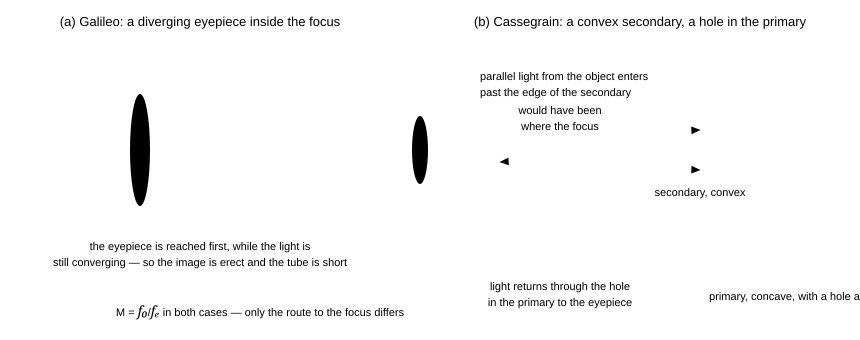

**Fig. 7.6** — Two compact designs. Galileo's telescope shortens the tube by putting a diverging eyepiece *inside* the objective's focal length. A Cassegrain reflector shortens the tube by intercepting the primary's converging beam with a small convex mirror and sending the light back through a hole in the primary — a trick that buys a very long effective focal length in a very short tube. In both cases the magnification formula is the same one: a ratio of focal lengths.

> **The Cassegrain, worked out with numbers**
>
> Take a primary mirror with radius of curvature 200 cm (so $f_1 = 100$ cm, aperture 20 cm), and a small *convex* secondary with radius 50 cm ($|f_2| = 25$ cm) placed 80 cm from the primary — that is, 20 cm *inside* the primary's focus. Work it in three steps:
>
>  1. The primary would focus the parallel starlight 100 cm from itself, i.e. 20 cm *behind* the secondary. For
>   the secondary, the light is converging toward a point 20 cm beyond it — a **virtual object** at
>   $u = +20$ cm.
> 2. The secondary is a convex mirror, $f = +25$ cm in the mirror convention (converging mirrors have negative
>   $f$); with a virtual object, $1/v = 1/f-1/u = 1/25-1/20 = -1/100$, so $v = -100$ cm: the final image
>   forms 100 cm *on the incoming side* of the secondary — i.e. back through the hole in the primary, 20 cm behind
>   the primary, where the eyepiece sits.
> 3. The secondary's magnification is $|v|/u = 100/20 = 5$, so the effective focal length of the whole telescope
>   is $F = 5f_1 = 500$ cm — in a tube only $80+20 = 100$ cm long.
>
>  With an eyepiece of $f_e = 2.5$ cm the angular magnification is $500/2.5 = 200\times$, which a refractor would need a *five-metre* tube to achieve. That is the whole reason every large telescope is a reflector: the mirror can be made enormous and supported from behind, there is no chromatic aberration at all (reflection does not disperse), and the folded design keeps the tube short enough to build.
>
>  The costs, which a good answer should mention: the secondary blocks part of the aperture (the "central obstruction"), which costs both light and resolution; alignment is critical; and the eyepiece's position behind the primary means the observer's head or a detector sits in the incoming beam — which is why radio dishes and large optical telescopes use other variants (Newtonian, Ritchey–Chrétien, prime focus) depending on what must be put where. Newton's own design puts a small flat diagonal mirror in the beam and sends the focus out the side of the tube, which is more convenient for a small instrument and worse for a large one.

### **Q7** A Cassegrain telescope has a primary of radius 120 cm and a convex secondary of radius 40 cm placed 50 cm from the primary. Find the position of the final image, the effective focal length, and the angular magnification with an eyepiece of 2.0 cm. Compare the tube length with that of a refractor of the same magnification. _(Olympiad · INPhO)_

Solution

**Primary.** $f_1 = R/2 = 60$ cm; its focus would be 60 cm from the primary, so it lies 10 cm *beyond* the secondary — the secondary receives a converging beam with a virtual object at $u = +10$ cm.

**Secondary.** Convex, $f_2 = +20$ cm (mirror convention), so

$$
\frac{1}{v} = \frac{1}{f_2}-\frac{1}{u} = \frac{1}{20}-\frac{1}{10} = -\frac{1}{20} \Rightarrow v = -20\ \text{cm}
$$

the final image forms 20 cm on the incoming side of the secondary, i.e. 30 cm *behind* the primary (since the secondary is 50 cm in front of it) — good news, because that is outside the tube and the eyepiece can sit there.

**Effective focal length.** The secondary's magnification is $|v|/u = 20/10 = 2$, so

$$
F = 2f_1 = 120\ \text{cm}, \qquad M = \frac{F}{f_e} = \frac{120}{2.0} = 60
$$

**Comparison.** This telescope's tube is about $50+30 = 80$ cm (primary to secondary plus back focus). A refractor with $M = 60$ and the same 2 cm eyepiece would need $f_o = 120$ cm, i.e. a tube of $122$ cm — about 1.5 times longer, and the gap grows fast as the secondary magnification rises (a 5× secondary would give $F = 300$ cm in the same 80 cm tube).

**Checks.** (i) The secondary *must* be inside the primary's focus for the Cassegrain to work: with $d = 50 < f_1 = 60$ ✓. Put it outside the focus and it receives a real image, the geometry changes, and you have built a different (Gregorian-like) instrument with a real image formed between the mirrors — worth sketching once to see why. (ii) The magnification is positive and greater than 1 ✓, which is exactly what "long effective focal length in a short tube" means. (iii) Sanity on the sign of $v$: a negative $v$ puts the image on the side the light came from, i.e. back toward the primary ✓ — the light does have to come back through the hole. (iv) The useful magnification rule still applies: at 60× the aperture must be at least ~60 mm for the image not to be empty; a 120 cm primary easily qualifies, so the resolution here is set by $1.22\lambda/1.2 \approx 0.1$ arcseconds — far beyond what the atmosphere usually allows, which is why big telescopes are limited by "seeing" rather than by optics.

### **Q8** A Galilean telescope has an objective of focal length 30 cm and an eyepiece of focal length $-5$ cm. Find the magnification, the tube length, and the diameter of the exit beam if the objective is 4.0 cm in diameter. Compare with the astronomical arrangement using a 5 cm eyepiece. _(JEE Advanced)_

Solution

**Galilean.** $M = f_o/|f_e| = 30/5 = 6$, and $L = f_o-|f_e| = 30-5 = 25$ cm. The beam that leaves the eyepiece must exactly fill the eye's pupil for maximum efficiency; its diameter is set by the ratio of the two focal lengths on the eyepiece side of the objective:

$$
D_{\text{exit}} = D_{\text{objective}}\times\frac{|f_e|}{f_o} = 4.0\times\frac{5}{30} = 0.67\ \text{cm}
$$

**Astronomical comparison.** With $f_e = +5$ cm: $M = 6$ as well, but $L = 30+5 = 35$ cm (10 cm longer) and the image is inverted.

**Checks.** (i) Same magnification, shorter tube, upright image — Galileo's design is genuinely better for a small hand-held instrument, and the reason his telescope worked in 1609 while everybody else's was a "spyglass" of dubious value. (ii) The price is the field of view: with no real image formed inside, you cannot place a field stop, and the usable field is only a degree or so ✓. (iii) The exit-beam diameter (0.67 cm) is compared with the eye's pupil (0.2–0.5 cm): if the exit beam is larger than the pupil, light is wasted; if smaller, effective aperture is lost. The ratio $D_{\text{exit}} = D_{\text{obj}}/M$ is called the **exit pupil**, and for binoculars it is the second number in "7×50" (7× magnification, 50 mm objective → 7 mm exit pupil, which is right for a dark-adapted eye) — a nice check that you have the formula the right way up.

### **Q9** Why can a microscope not be used to see an atom, while an electron microscope can? Answer with numbers, and use the right formula for each instrument. _(conceptual · NSEP)_

Solution

Resolution, not magnification, is the issue. For a light microscope with the best NA in air ($\text{NA}=1$) and green light:

$$
d_{\min} = \frac{0.61\lambda}{\text{NA}} = 0.61(550\ \text{nm}) = 336\ \text{nm}
$$

and with oil immersion ($\text{NA} = 1.5$), $d_{\min} = 224$ nm. Atoms are 0.1–0.3 nm apart in a crystal; molecules are 0.5–2 nm. So the light microscope misses the target by a factor of about 200–1000 — no amount of magnification helps, because the information is not in the light that reaches the objective.

An electron microscope uses electrons of de Broglie wavelength $\lambda = h/p$; at 100 keV, $\lambda \approx 0.0037$ nm, and even after allowing for the aberrations of electron lenses (which are far worse than glass ones, so $\alpha\approx10^{-3}$ rad and the effective aperture angle limits things), atomic resolution of 0.1 nm is routine in modern instruments.

**Checks and the lesson.** (i) This question is the reason §7.6 exists: state the resolution formula, put the numbers in, and see which instrument can reach the scale of the object. (ii) Note the structural similarity: for both instruments $d_{\min}\sim\lambda/\text{aperture}$ — the wave nature does not care what kind of wave it is, and the electron's much shorter wavelength is the entire advantage. (iii) Note also what "NA" buys in a light microscope: the medium's index $n$ appears in it, which is why the space between objective and specimen is filled with oil of index near 1.5 rather than air ✓ — a very JEE-friendly fact: the oil does not magnify, it improves resolution.

### 7.11 Summary — the results to own

> **Part 7 in eight lines**
>
> - The eye has fixed image distance and variable power; accommodation is about 4 D from infinity to 25 cm. Near point
>   $D = 25$ cm, far point $\infty$.
> - Myopia: far point $x$ → concave lens $f = -x$. Hypermetropia: near point $x$ →
>   $1/f = 4-1/x$ (metres, dioptres).
> - Camera: fixed power, variable image distance; f-number $N = f/D$; exposure $\propto t/N^{2}$.
> - Magnifier: $M = 1+D/f$ (near point) or $D/f$ (relaxed); the object sits inside $f$.
> - Microscope: $M = (v_o/u_o)(1+D/f_e)\approx(L/f_o)(1+D/f_e)$; resolution
>   $d_{\min} = 0.61\lambda/\text{NA}$; empty magnification beyond $\sim1000\,\text{NA}$.
> - Telescope: $M = f_o/f_e$, $L = f_o+f_e$ relaxed; near-point adjustment multiplies by
>   $1+f_e/D$; resolution $1.22\lambda/D$; exit pupil $D_{\text{obj}}/M$.
> - Galilean: diverging eyepiece inside the focus, $M = f_o/|f_e|$, $L = f_o-|f_e|$, erect image, small
>   field.
> - Reflectors: no chromatic aberration, large apertures; Cassegrain effective focal length
>   $= f_1\times(|v|/u)$, several times the primary's, in a short tube.

### 7.12 Checkpoint

- I can explain accommodation, state the near point and far point, and compute the eye's power at both.
- I can write the correction formulas for myopia and hypermetropia with the right signs, in dioptres.
- I can compute the angular magnification of a magnifier in both adjustments and say why they differ.
- I can draw and compute a two-stage microscope, and check the object position for a sharp image.
- I can state and use both diffraction limits, and explain "empty magnification".
- I can compute a telescope's magnification, tube length (both adjustments) and resolving power, and compare them
  for consistency.
- I can contrast astronomical, Galilean and terrestrial telescopes, and the reflected designs.
- I can work out a Cassegrain step by step and explain why the tube is short for its magnification.

Next: [**Part 8 · Olympiad machinery →**](#section-08-olympiad-machinery) — Fermat's principle as a variational problem, matrices and thick lenses, the exact non-paraxial treatment, aberrations, the rainbow, and the optics of the atmosphere.

_Part 8 of 12 · NSEP · INPhO · IPhO · extension beyond JEE · ≈ 80 min read · 12 questions_

## 8 · Olympiad machinery: Fermat, matrices, caustics, aberrations, rainbows

Parts 1 to 7 gave the standard machinery at the level of JEE Advanced: paraxial rays, the lens and mirror equations, instruments. This part adds the layer that olympiad problems are actually built from — the *variational* principle behind all of it, the *matrix* way of composing systems, the exact treatment when the paraxial approximation fails (and the beautiful curve that failure produces), the aberration inventory, the mathematics of a rainbow, and the conservation law that decides how bright an image can ever be. None of it replaces the earlier parts; all of it explains why they work and where they stop.

### 8.1 Fermat's principle: the one law behind all the others

> **Statement, and the word that matters**
>
> Light travelling from a point $A$ to a point $B$ follows the path for which the **optical path length**
>
>  <!-- Equation tag: 8.1 -->
> $$
> \text{OPL} = \int_A^B n\,ds = \int_A^B \frac{c}{v}\,ds = c\int_A^B dt = c\,t_{\text{total}}
> $$
>
>  is **stationary** — an extremum (minimum in every ordinary situation, maximum or saddle in contrived ones). Equivalently: light takes the path of *stationary time*. Because $c$ is a constant, minimising the optical path is the same as minimising the time, which is why "least time" is the usual name.
>
>  The subtlety worth carrying into an examination: *stationary*, not simply *least*. A path through a mirror's focal point can be a maximum of time, and a path along a fibre can be a saddle; the mathematics — and therefore the physics — only demands that the first-order change vanish, $\delta(\text{OPL}) = 0$. Everything in parts 1 to 6 is a consequence of that single statement.

**Fig. 8.1** — Fermat's principle as an ordinary minimisation. The interface separates a fast medium from a slow one; the light chooses where to cross. Plotted against the crossing position the total time is a smooth curve with a shallow minimum, and the condition that the slope vanish is exactly Snell's law. This is *the* reason a ray bends at all: not because of any force at the surface, but because the whole path re-arranges itself to extremise the optical path.

> **Snell's law from Fermat, in four lines**
>
> Put the origin at the crossing point, let $a$ and $b$ be the perpendicular distances of $A$ and $B$ from the interface, and let $x$ be the crossing coordinate. Then
>
>  $$
> T(x) = \frac{\sqrt{a^{2}+x^{2}}}{v_1}+\frac{\sqrt{b^{2}+(d-x)^{2}}}{v_2}, \qquad \frac{dT}{dx} = \frac{x}{v_1\sqrt{a^{2}+x^{2}}}-\frac{d-x}{v_2\sqrt{b^{2}+(d-x)^{2}}} = 0
> $$
>
>  The two bracketed expressions are $\sin i$ and $\sin r$ by elementary trigonometry, so the stationarity condition reads
>
>  <!-- Equation tag: 8.2 -->
> $$
> \frac{\sin i}{v_1} = \frac{\sin r}{v_2} \quad\Longleftrightarrow\quad n_1\sin i = n_2\sin r
> $$
>
>  The same computation with a reflecting surface instead of an interface — $v_1 = v_2$ — gives $\sin i = \sin r$, the law of reflection. And the second-order test, $d^{2}T/dx^{2} > 0$, confirms that this is a minimum whenever the ray crosses the interface (the "maximum" cases are grazing and total-internal-reflection paths).

> **The deepest consequence: an image is a set of equal-time paths**
>
> If a point source at $O$ is imaged at a point $I$, then by Fermat *every* path from $O$ to $I$ that actually carries light must be stationary — and for the image to be a single point the paths must all have the *same* optical length, not merely stationary ones of different values. This is the "principle of equal optical paths", and it is the design rule of every lens ever made: shape the surfaces so that the optical path length from $O$ to $I$ is independent of the height at which the ray crosses.
>
>  It also tells you exactly what is wrong with a spherical lens. For a sphere-based surface the path length varies with height by an amount that grows like $h^{4}$ — small for paraxial rays, catastrophic at the rim. Figuring a lens or a mirror means grinding away that excess path. The classic example, worth doing yourself: for a *parabolic* mirror the distance from the focus equals the distance to the directrix, so all paths from a distant star, reflected into the focus, have *identical* optical length, whatever the height. That is why a paraboloid is a perfect on-axis mirror and a sphere never is (Q3).

### 8.2 The ray equation, and light in a graded medium

Fermat's principle is a variational problem, so it has an Euler–Lagrange equation. Written for the ray, that equation is the foundation of everything in §8.2 to §8.4:

> **The ray equation**
>
> <!-- Equation tag: 8.3 -->
> $$
> \frac{d}{ds}\left(n\frac{d\mathbf{r}}{ds}\right) = \nabla n
> $$
>
>  where $s$ is arc length along the ray and $\mathbf{r}(s)$ the ray's position. Some immediate consequences:
>
>  - **Uniform medium:**$\nabla n = 0$, so $n\,d\mathbf{r}/ds$ is a constant vector: rays are straight
>   lines. Euclid's assumption is a theorem.
> - **Layered medium,**$n = n(z)$: the ray equation gives $n\sin\theta = \text{const}$ along the ray,
>   which is the Snell's-law invariant of §3.9, recovered without slicing the medium into slabs.
> - **Curvature of a ray:** taking the component perpendicular to the ray gives the useful practical form
>
>  <!-- Equation tag: 8.4 -->
> $$
> \frac{1}{\rho} = \frac{1}{n}\left|\frac{dn}{d\ell}\right| \quad (\ell \perp \text{ ray})
> $$
>
>  a ray bends toward increasing $n$, with radius of curvature $n/|\nabla n|$. Light "falls" into the denser medium — which is the whole physics of mirages, looming, and the atmosphere's refraction of starlight.

> **Numbers: the atmosphere as a lens**
>
> - Air at sea level has $n-1 \approx 2.9\times10^{-4}$, falling roughly exponentially with a scale height
>   $H \approx 8$ km. The vertical gradient is about $10^{-4}$ per km near the ground.
> - **Astronomical refraction.** A horizontal ray passes through a path length of about
>   $\sqrt{2RH}\approx320$ km of non-negligible air, so the accumulated bending is of order
>   $(n_0-1)(L/H) \approx 2.9\times10^{-4}\times 40 \approx 1.2\times10^{-2}$ rad $\approx 40'$. The measured
>   value at the horizon is $34'$; the estimate is right to 20%, and the difference is exactly what the cruder
>   approximation (constant height, single scale height) deserves.
> - **Consequences you can see.** The whole sky is lifted slightly; the Sun appears to rise about
>   $34'/15'$ ≈ 2.3 minutes before its true position clears the horizon (the Earth turns 15' per minute), and adding
>   the Sun's own semi-diameter of 16' gives the familiar ~3 minutes of "early sunrise". The Sun is also flattened into
>   an oval at the horizon, because the lifting is stronger at the lower limb (this is a refraction effect, not the
>   Sun's shape). And the last sliver before it sets is green: the dispersion of air differs slightly between
>   wavelengths, so the blue-green image is bent by about 0.8' more than the red one — a difference comparable to the
>   sliver's own width, which is the entire phenomenon of the green flash.
> - **Mirage, inverted:** hot ground makes $n$ increase upward. With $1/\rho = |dn/dz|/n \approx 10^{-5}$ m−1 per metre of gradient near a road, a ray that starts out horizontal curves up with a radius
>   of about 100 km — enough, over 100 m of road, to turn the sky into what looks like a sheet of water. The inferior
>   mirage is the sky's image under a "ceiling" that is really the topside of a hot layer.

### 8.3 Matrices: how optical systems are actually designed

In the paraxial approximation a ray is described by two numbers — its height $y$ above the axis and its angle $\theta$ to the axis — and every element of an optical system acts *linearly* on that pair. That is the whole of matrix optics. Two matrices do everything:

> **The two building blocks**
>
> <!-- Equation tag: 8.5 -->
> $$
> T(t) = \begin{pmatrix}1 & t/n\ 0 & 1\end{pmatrix}\ \ (\text{propagation of }t\text{ in index }n), \qquad R(P) = \begin{pmatrix}1 & 0\ -P & 1\end{pmatrix}\ \ (\text{an element of power }P)
> $$
>
>  A whole system is the product of its matrices in the order the light meets them, $M = R_k\cdots T_2R_2T_1R_1$, and a system with the property $M_{12} = 0$ images any object plane onto the same image plane. Three results fall out, and they are the ones to remember:
>
>  1. **Thin lenses in contact:**$P = P_1+P_2$ (§6.3).
> 2. **Thin lenses separated by $d$:**$P = P_1+P_2-dP_1P_2$. For $f_1 = f_2 = 20$ cm and
>   $d = 10$ cm: $P = 0.05+0.05-10(0.05)^{2} = 0.075$ cm−1, $F = 13.3$ cm — *shorter*
>   than either lens alone. The translation matrix is the reason for the subtractive term.
> 3. **Thick lens** (Gullstrand's formula): with $P_1 = (n-1)/R_1$, $P_2 = (1-n)/R_2$ and the
>   *reduced thickness*$\tau = t/n$,
>
>  <!-- Equation tag: 8.6 -->
> $$
> P = P_1+P_2-\tau P_1P_2
> $$
>
>  For $R_1 = +20$ cm, $R_2 = -20$ cm, $t = 4$ cm, $n = 1.5$: $\tau = 2.667$ cm, $P_1 = P_2 = 0.025$ cm−1, so $P = 0.0483$ cm−1 and $f = 20.7$ cm against the thin-lens 20.0 cm — a 3.5% difference, which is why the thin-lens formula survives for lenses that are thin and fails for the ones in a camera or an eye.

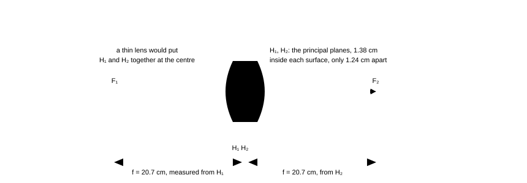

**Fig. 8.2** — The thick lens, drawn honestly. Focal length is measured from the principal planes H₁, H₂, not from the glass surfaces, and for a thick lens those planes sit inside the glass, close together. All of the thin-lens formulas in part 6 survive if you measure $u$ and $v$ from the principal planes — which is precisely why they worked so well for thin lenses, where the planes coincide at the lens's centre.

### 8.4 When the paraxial approximation fails: exact rays and caustics

Throw away the small-angle approximation and a spherical mirror stops having a focus. Each parallel ray is still easy to follow — reflect about the local radius — but they no longer meet at one point. The numbers below are for a concave mirror of radius $R = 20$ cm, axis horizontal, illuminated by light parallel to the axis; $h$ is the height at which a ray strikes the mirror and $D$ the distance from the pole at which the reflected ray crosses the axis.

> **Exact axial crossings for a spherical mirror of radius R = 20 cm**
>
> | $h$ (cm) | $h/R$ | $\theta = \text{incidence}$ | exact crossing $D$ (cm) | paraxial $R/2$ | $h^{2}/4R$ cm |
> | --- | --- | --- | --- | --- | --- |
> | 2.5 | 0.12 | 7.2° | 9.92 | 10.00 | 0.08 |
> | 5.0 | 0.25 | 14.5° | 9.67 | 10.00 | 0.31 |
> | 7.5 | 0.38 | 22.0° | 9.21 | 10.00 | 0.70 |
> | 10.0 | 0.50 | 30.0° | 8.45 | 10.00 | 1.25 |
> | 12.5 | 0.62 | 38.7° | 7.19 | 10.00 | 1.95 |
> | 15.0 | 0.75 | 48.6° | 4.88 | 10.00 | 2.81 |
> | 17.0 | 0.85 | 58.2° | 1.02 | 10.00 | 3.61 |
>
>  Read it as one story. Up to $h = R/4$ the mirror is nearly perfect: the crossing misses the paraxial focus by only 0.33 cm, and the estimate $h^{2}/4R = 0.31$ cm is right to 6%. At $h = R/2$ the miss has grown to $10.00-8.45 = 1.55$ cm while the estimate gives 1.25 cm — 20% low, and the approximation keeps degrading. The **longitudinal** spherical aberration is exactly this miss:
>
>  <!-- Equation tag: 8.7 -->
> $$
> \Delta_{\text{long}} = \frac{R}{2}-D \approx \frac{h^{2}}{4R} \qquad (\text{good to a few per cent for } h \lesssim R/2)
> $$
>
>  The **transverse** aberration is the blur this produces at the paraxial focus. The ray that crosses the axis 1.55 cm short is still travelling at $2\theta = 60^\circ$ to the axis, so by the time it reaches the paraxial plane it is $1.55\tan 60^\circ = 2.7$ cm off-axis — and the ray from the opposite side is 2.7 cm off on the other side. The "image" of a star at $f = R/2$ for this very fast $f/1$ mirror is therefore a disc about 5 cm across: a factor 500 worse than the diffraction limit, and enough to ruin the image of a star completely.
>
>  The envelope of the misfocused rays is a **caustic** — for parallel light on a spherical mirror a nephroid, with a cusp at the paraxial focus and the crossings marching in toward the mirror as $h$ grows (the table's last column of $D$ values *is* the caustic meeting the axis). You never see individual stray rays in a real image: you see the caustic, which is why a misused mirror gives a bright cusp-edged blob rather than a diffuse glow.

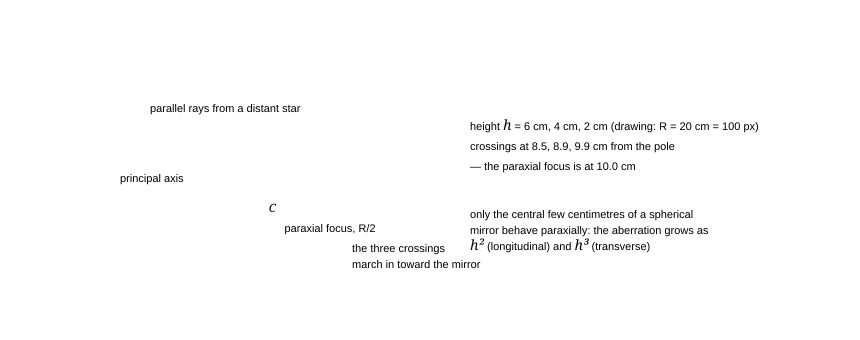

**Fig. 8.3** — Spherical aberration, drawn to scale. Three parallel rays strike a concave spherical mirror at different heights and do not meet at one point: the higher the ray, the closer to the mirror it crosses the axis. The distance by which a marginal ray misses the paraxial focus is the longitudinal spherical aberration, of order $h^{2}/4R$; the sideways miss at the paraxial plane is the transverse aberration, larger by the factor $\tan 2\theta$. A spherical mirror is a good mirror only near its axis — which is exactly the region the paraxial formulas of part 2 describe.

### **Q1** A concave mirror has radius of curvature 40 cm. Parallel light fills it out to a height of 10 cm. Find (a) the paraxial focal length, (b) the exact crossing distance for the edge ray, (c) the longitudinal and transverse spherical aberration, and (d) the largest height for which the aberration stays under 1 mm. _(Olympiad · INPhO)_

Solution

**(a)** $f = R/2 = 20$ cm.

**(b)** For a parallel ray striking at height $h$ the incidence angle satisfies $\sin\theta = h/R = 0.25$, so $\theta = 14.48^\circ$, and the reflected ray crosses the axis at (put $R = 40$ cm in the exact formula of §8.4, $D = R(1-\frac{1}{2\cos\theta}))$:

$$
D = 40\left(1-\frac{1}{2\cos 14.48^\circ}\right) = 40\left(1-\frac{1}{1.9366}\right) = 40(0.48363) = 19.35\ \text{cm}
$$

**(c)** Longitudinal: $20.00-19.35 = 0.65$ cm (the estimate $h^{2}/4R = 100/160 = 0.63$ cm agrees to 3% ✓). Transverse: the ray crosses the axis at 19.35 cm travelling at $2\theta = 29^\circ$ to the axis, so over the remaining 0.65 cm to the paraxial focus it drifts sideways by $0.65\tan 29^\circ = 0.36$ cm. That is the transverse aberration, and it is what ruins the image.

**(d)** Set $h^{2}/4R \le 0.001$ m with $R = 0.40$ m: $h^{2} \le 0.0016$ m², $h \le 0.04$ m = 4 cm. So only the central 4 cm of a 40 cm mirror is diffraction-quality — a beautiful, and for telescope makers painful, $h^{2}$ law: halving the used aperture makes the aberration four times smaller.

**Checks.** (i) Part (d) is the quantitative statement of "stop it down": a mirror used at $h/R = 0.1$ is 25 times better than one used at $h/R = 0.5$ ✓. (ii) The $h^{2}$ (longitudinal) and $h^{3}$ (transverse) growth is the signature of *spherical aberration of the third order*, and it is why a parabolic mirror — exact for parallel light on axis, as §8.1 proved — is worth the extra cost for any telescope used at full aperture. (iii) Note that (b) is a one-line computation once you draw the triangle: the reflected ray makes $2\theta$ with the axis, so the crossing is at $R\cos\theta\times\dots$; derive it rather than memorise it. The clean route: the ray strikes at $h = R\sin\theta$, its direction after reflection is $2\theta$ from the axis, and it must descend by $R\cos\theta$ to reach the axis — so $D = R - R\cos\theta\cot(2\theta)$… or simply use the exact single-interface crossing formula of part 2. Any of these gives the same 19.35 cm.

### 8.5 The aberration inventory

Spherical aberration is the first of five *monochromatic* aberrations (the Seidel aberrations) plus the chromatic pair. Every one of them is a statement about how the image of a point degrades as you move off-axis or as you open the aperture, and olympiad questions often simply ask you to name and explain them.

> **The five monochromatic aberrations, in the order you meet them**
>
> | Aberration | What it does | Grows as | Cure |
> | --- | --- | --- | --- |
> | Spherical | Rays from one axial point at different heights focus at different distances: a soft axial blur | $h^{2}$ (long.), $h^{3}$ (trans.) | Stop down; use aspheric surfaces; a paraboloid for a mirror |
> | Coma | An off-axis point images as a comet: a bright head with a flared tail, from rays at different heights landing at different off-axis positions | $\alpha h^{2}$ | Stop down; aplanatic design; correct mirror figure |
> | Astigmatism | An off-axis point focuses at two different distances in two perpendicular planes; the image is a line in one, a line in the other, and an ellipse/circle in between | $\alpha^{2}h$ | Stop down; separate lenses (anastigmat); a curved focal surface |
> | Field curvature | The sharp image lies on a curved surface, so a flat sensor is sharp only at the centre | $\alpha^{2}$ | Field-flattening lenses; a curved detector, as the retina and photographic plates are |
> | Distortion | Magnification depends on field position: pincushion or barrel, straight lines curve | $\alpha^{3}$ | Symmetrical designs; digital correction |
>
>  with $h$ the ray height and $\alpha$ the field angle. The two *chromatic* aberrations are longitudinal (different colours focus at different distances — the $f$ shift of part 5) and lateral (different colours magnify differently, so the image has coloured fringes off-axis). The achromatic doublet of §5.6 cures the first for two wavelengths; apochromats use three elements to cure it across the visible band.

> **Why the table's exponents are so useful**
>
> Every entry gives you a design decision for free. Spherical aberration grows with the third power of the ray height in the transverse direction: so a lens of half the aperture is eight times sharper, at the price of four times the exposure. Coma and astigmatism grow with the field angle, so a narrow-field instrument (a telescope on one star) can be built even if it has awful coma. Field curvature is only a nuisance for a flat detector — your eye solves it with a curved retina, and early photographers solved it by bending the film. And because all five are *geometrical*, they vanish if the aperture is closed far enough: the residual blur is then the diffraction limit of §7.6, which is why the final quality of a telescope is a statement about $\lambda/D$ and not about grinding tolerances.

### 8.6 The rainbow: Fermat, extreme deviations and the 42° cone

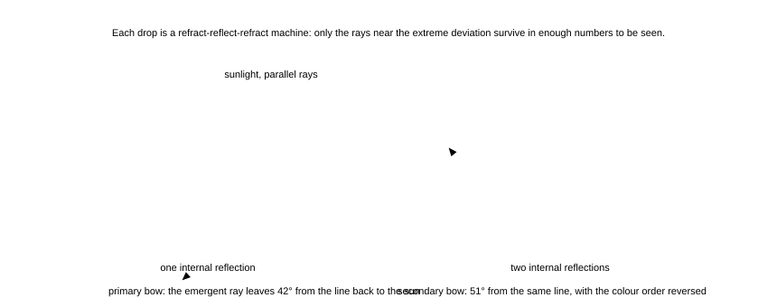

**Fig. 8.4** — Why a rainbow has angles. Sunlight enters a drop, is refracted, reflects internally once (primary) or twice (secondary), and is refracted out. For each bounce number the deviation has a minimum, so a whole neighbourhood of incoming rays leaves in the same direction — a caustic in angle, which is why you see a bright arc at 42° rather than a uniform glow in all directions. The secondary bow is wider, fainter, and colour-reversed, and the region between the two bows is darker than either: Alexander's dark band.

> **The rainbow angle, derived**
>
> Let the drop have index $\mu$, let the ray enter at incidence $i$ (refraction $r$, with $\sin i = \mu\sin r$), and let it suffer $k$ internal reflections. Each refraction deviates the ray by $i-r$; each reflection by $180^\circ-2r$. Total:
>
>  <!-- Equation tag: 8.8 -->
> $$
> D_k(i) = 180^\circ k + 2i - 2(k+1)r
> $$
>
>  Now extremise with respect to the impact parameter (i.e. set $dD_k/di = 0$). Using $dr/di = \cos i/(\mu\cos r)$:
>
>  $$
> 2 - 2(k+1)\frac{\cos i}{\mu\cos r} = 0 \Rightarrow \mu\cos r = (k+1)\cos i \Rightarrow \sin i = \sqrt{\frac{(k+1)^{2}-\mu^{2}}{(k+1)^{2}-1}}
> $$
>
>  For water ($\mu = 4/3$) and $k = 1$ (primary): $\sin i = \sqrt{(4-1.7778)/3} = 0.8607$, so $i = 59.4^\circ$, $r = 40.2^\circ$, and $D_1 = 180+118.8-160.8 = 138.0^\circ$. The bow's angular radius is measured from the antisolar point, so it is $180^\circ-138.0^\circ = 42.0^\circ$. For $k = 2$ (secondary): $\sin i = 0.9501$, $i = 71.8^\circ$, $r = 45.5^\circ$, $D_2 = 231.0^\circ$, and the bow angle is $231.0-180 = 51.0^\circ$. Deeper bows (k = 3, 4) exist at 138° and 231° from the antisolar point — i.e. in the *sunward* half of the sky.
>
>  **Colour.** Red light has a smaller index (1.331) than violet (1.343) in water, and a smaller index gives a larger $D_1$: numerically $D_1(\text{red}) = 137.6^\circ$ and $D_1(\text{violet}) = 139.4^\circ$, so red sits at $42.4^\circ$ and violet at $40.6^\circ$ — **red on the outside**, as every rainbow shows, with the whole bow spread over 1.8°. For the secondary the arithmetic reverses: $D_2$ = 230.4° (red) and 233.5° (violet), so the bow radius is 50.4° (red) and 53.5° (violet) — **red on the inside**, and the bow is 3.1° wide, nearly twice as broad. Hence the standard rule: the two bows have their colours in opposite orders.

> **Four things the numbers explain**
>
> - **Why you see an arc and not a glow.** Near the extremum a finite range of impact parameters gives nearly the
>   same deviation, so rays pile up at 42°: an angular caustic. The same reason a bright cusp appears in the mirror
>   caustic of §8.4.
> - **Why the rainbow is a circle (and always 42° wide).** The geometry is a cone about the line from the antisolar
>   point through your eye with half-angle 42°. Fly, and the bow flies with you — a rainbow is a private object, and no
>   two people see the same one.
> - **Why the secondary is fainter.** Two internal reflections instead of one: each reflection passes only part of
>   the energy (TIR is never perfect at a real surface), and the secondary's rays are spread over a wider angle.
> - **Why the sky between the bows is dark.** Rays with $k = 1$ never emerge beyond 42°, and rays with
>   $k = 2$ never emerge inside 51°; the band between is fed by neither, hence Alexander's dark band. And the
>   supernumerary arcs sometimes seen just inside the primary bow are an *interference* effect — the wave nature
>   of light, which is where this chapter hands over to wave optics.

### 8.7 Étendue, the Lagrange invariant, and the limits of concentration

The last piece of olympiad machinery is a conservation law — the one that says no amount of clever optics can make an image brighter than its source.

> **Étendue and the Lagrange invariant**
>
> For a beam of cross-sectional area $A$ in a medium of index $n$ filling a solid angle $\Omega$, the product
>
>  <!-- Equation tag: 8.9 -->
> $$
> \text{Étendue} = n^{2}A\,\Omega = \text{constant along any passive system}
> $$
>
>  and equivalently, for a ray bundle tracing an object of height $y$ with cone angle $\theta$, the **Lagrange invariant** $n\,y\,\theta$ is conserved through every refraction and reflection. Two consequences are worth more than the formula:
>
>  - **Radiance is conserved (or reduced).** Since $\Omega$ shrinks as an image is magnified ($A$ grows),
>   the intensity per unit area per unit solid angle cannot increase. An image can never be brighter than the source. A
>   perfect optical system could, at best, deliver to a target the same radiance the Sun's surface has — which is why the
>   hottest possible solar furnace is at the Sun's own surface temperature, about 5800 K, and why the practical ceiling for a solar
>   furnace is the photosphere's own temperature: you can melt tungsten (3695 K) with a good concentrator, but nothing
>   can ever be heated past ~5800 K by sunlight, however large the mirror.
> - **Concentration has a hard ceiling.** For sunlight filling a half-angle $\theta_s = 0.267^\circ$, the
>   maximum concentration ratio is
>
>  <!-- Equation tag: 8.10 -->
> $$
> C_{\max} = \frac{1}{\sin^{2}\theta_s} = \frac{1}{(0.00466)^{2}} \approx 4.6\times10^{4}
> $$
>
>  only 46 000 times the ambient, no matter how perfect the optics. Real imaging concentrators reach ~1000×; the theoretical limit requires a non-imaging "ideal" concentrator (a compound parabolic cone) which trades image quality for concentration — a very modern piece of optics that follows from one line of geometry.

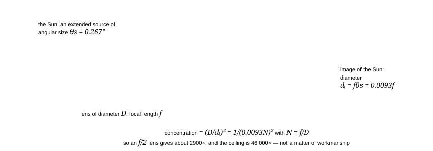

**Fig. 8.5** — The concentration limit seen as ordinary geometry. Because the Sun has a finite angular size, its image has diameter $f\theta_s$ — never a point — and the ratio of collecting area to image area is therefore fixed by the f-number. Improving the lens cannot beat the Sun's own radiance; it can only approach it. This is the single most useful sanity check in all of optical design.

### 8.8 Summary — the olympiad toolkit

> **Part 8 in nine lines**
>
> - Fermat: light takes the path of *stationary* optical path; Snell, reflection and the mirror law are all
>   consequences. An image is a set of *equal-optical-path* routes from object to image.
> - Ray equation: $\frac{d}{ds}(n\,d\mathbf{r}/ds) = \nabla n$; rays are straight in uniform media, bend toward
>   higher $n$ with radius $n/|\nabla n|$, and obey $n\sin\theta$ = constant in a layered medium.
> - Atmospheric refraction lifts objects by up to 34'; the Sun rises ~2–3 minutes early; the green flash is
>   differential refraction.
> - Matrix optics: $T(t)$ uses the reduced thickness $t/n$; $R(P)$ is a power. Separated lenses:
>   $P = P_1+P_2-dP_1P_2$; thick lens: $P = P_1+P_2-\tau P_1P_2$.
> - Focal lengths are measured from the **principal planes**, which sit inside a thick lens.
> - Beyond paraxial: a spherical mirror's crossing distance falls from $R/2$ as $h^{2}$; the marginal rays
>   form a caustic (a nephroid for parallel light); the cure is stopping down or a paraboloid.
> - Aberrations: spherical ($h^{2}$, $h^{3}$), coma ($\alpha h^{2}$), astigmatism ($\alpha^{2}h$),
>   field curvature ($\alpha^{2}$), distortion ($\alpha^{3}$), plus chromatic.
> - Rainbow: $D_k = 180k+2i-2(k+1)r$, extremised at
>   $\sin i = \sqrt{((k+1)^{2}-\mu^{2})/((k+1)^{2}-1)}$; primary 42° with red outside, secondary 51° with red
>   inside, Alexander's dark band between.
> - Étendue $n^{2}A\Omega$ and the Lagrange invariant $n y\theta$ are conserved: no passive system beats
>   the source's radiance, so concentration is capped at $1/\sin^{2}\theta_s \approx 4.6\times10^{4}$ and the
>   solar-furnace temperature is capped at ~5800 K.

### 8.9 Checkpoint

- I can derive Snell's law from Fermat and explain what "stationary" adds to "least".
- I can use the equal-optical-path principle to argue that a parabolic mirror is stigmatic for parallel light.
- I can quote the ray equation and use $n\sin\theta$ = constant in a layered medium.
- I can estimate the atmospheric refraction (34' at the horizon) and explain the early sunrise and the green
  flash.
- I can build a ray-transfer matrix for a two-lens system and for a thick lens, and get $f$ from Gullstrand's
  formula.
- I can locate the principal planes of a thick lens and explain why focal length is measured from them.
- I can compute the exact crossing of a marginal ray on a spherical mirror and separate longitudinal from
  transverse aberration.
- I can name the five monochromatic aberrations, give their growth laws and one cure each.
- I can derive the rainbow angles for one and two internal reflections, including the colour orders, and explain
  Alexander's band.
- I can state and use étendue conservation, and use it to bound concentration and image brightness.

Next: [**Part 9 · The problem-solving playbook →**](#section-09-problem-solving-playbook) — one page of strategies: what to draw first, which sign convention to trust, and how to check an optics answer before you commit to it.

_Part 9 of 12 · exam craft · triage · traps · checks · ≈ 30 min read_

## 9 · The playbook: triage, traps and checks

Parts 1 to 8 are the physics. This part is the craft: how to read an optics question in the first fifteen seconds, how to choose the one formula that finishes it, how to check the answer before the invigilator takes the paper, and how to answer the "derive it" and "estimate it" questions that olympiads ask. Read it once now, then use §9.5 and §9.6 as the pages you actually revise from.

### 9.1 Triage: classify in fifteen seconds

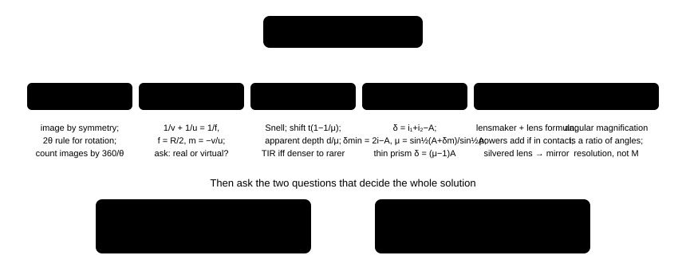

**Fig. 9.1** — The triage sheet. Six branches, each with the two or three formulas that actually get used in that branch, and the two questions that decide the rest. Any optics question in JEE Advanced, NSEP or INPhO lands on one of these six branches within fifteen seconds, and the second box — real or virtual object for the *next* element — is where the majority of the marks are lost.

1. **Which element?** Plane mirror, curved mirror, plane refracting surface (or slab), prism, lens/spherical
  surface, or an instrument. If the question mixes two, break it into two single-element problems joined by one
  intermediate image.
2. **Which image is the object for the next element?** Write the chain explicitly:
  $O \to I_1 \to I_2$. Each arrow is one formula.
3. **What is the sign of every distance?** Fill in the signs *before* doing algebra; a sign error caught at
  this stage costs ten seconds, and at the end costs the question.
4. **What is the question really asking?** Position? Nature (real/virtual, erect/inverted)? Magnification?
  Apparent depth? Angle? Resolution? Note that "where is the image" and "what does the observer see" are different
  questions, and instruments are always about *angles*.

### 9.2 The drawing discipline

Every optics question that can be drawn must be drawn, and five marks of habit are worth more than five pages of formulas:

- Draw the **axis first**, then the element, then mark the pole/optical centre and both focal points (for a lens)
  or its centre of curvature (for a mirror). Most "I don't know where to start" problems are problems of not having
  marked $F$ and $2F$.
- Draw at least **two rays**: the parallel ray (through the focus) and the central ray (undeviated). If the
  answer depends on a third, it is a check, not a necessity.
- At every refracting surface draw the **normal**, and measure both angles from it. Never from the surface: this
  is the single most common cause of a wrong sign in a prism or slab problem.
- Mark real rays **solid** and virtual extensions **dashed**. If your final image is formed by dashed lines
  only, it is virtual — and you have just answered "nature of the image" for free.
- Write the sign of each distance on the drawing: $u = -30$ cm, $f = +20$ cm. Then the algebra is
  mechanical.

### 9.3 The sign-convention algorithm

Six steps, in order, always the same. With this discipline, mirror, lens and single-surface problems all become substitution exercises.

1. Choose the pole (mirror) or optical centre (lens) as origin and draw the axis with the incident light travelling
  left-to-right (for a mirror, treat the incident direction as +x; for a lens, +x is the outgoing side).
2. Assign signs: distances measured in the +x sense are positive, the reverse negative. Heights above the axis are
  positive.
3. Write the formula for the element: mirror $1/v+1/u = 1/f$, $f = R/2$, $m=-v/u$; lens
  $1/v-1/u = 1/f$, $m=v/u$; single surface $n_2/v-n_1/u = (n_2-n_1)/R$, $m = n_1v/(n_2u)$.
4. Substitute the *signed* values, including $u < 0$ for every ordinary object and
  $f < 0$ for every diverging element.
5. Solve for the unknown, then **interpret the sign**: for a mirror, $v > 0$ is on the incident side
  (real); for a lens, $v > 0$ is on the outgoing side (real). $m < 0$ means inverted, $|m| > 1$
  means enlarged.
6. Run §9.4.

### 9.4 The five-second check

> **Ask these five questions of every answer**
>
> 1. **Magnitude check.** Is $|v|$ plausibly between $f$ and a few $f$? Is the apparent depth less
>   than the real depth? Is $m$ within a factor of a few of 1 unless the question is extreme?
> 2. **Real/virtual check.** A single diverging element (convex mirror, concave lens) *always* gives a
>   virtual image of a real object. If your answer says otherwise, you have a sign error.
> 3. **Limiting-case check.** Push the object to infinity and see whether your general answer collapses to
>   $v = f$. Push $\mu \to 1$ and check that nothing bends. Push $\theta \to 0$ and check the 2θ rotation
>   rule becomes zero.
> 4. **Direction check.** Mirror images are laterally inverted, lens images of a real object are inverted when
>   real, a prism deviates toward the base, a diverging lens moves the image farther out. Say the direction out loud;
>   if the number contradicts the picture, look again.
> 5. **Units and orders of magnitude.** Dioptres for power (m−1), cm or m consistently, radians or
>   degrees consistently. An answer of "0.05 cm" for a telescope's objective is a slip, not a result.

### 9.5 The trap catalogue

> **Twenty places where marks disappear**
>
> | Trap | The cure |
> | --- | --- |
> | Using $1/v-1/u = 1/f$ for a mirror (or $+$ for a lens) | Mirror **plus**, lens **minus**. Write it down before substituting. |
> | Forgetting that the apparent-depth rule is paraxial | $d_{\text{app}} = d/\mu$ holds only for near-normal viewing; at an oblique angle use real ray tracing. |
> | Assuming total internal reflection can happen from rarer to denser | TIR needs $n_1 > n_2$ and $i > C = \sin^{-1}(n_2/n_1)$, the angle measured from the normal. |
> | Treating a grazing-emergence ray as if it emerged | At $i = C$ the emergent ray skims the surface; beyond it, none. Check the window of transmission before assuming an answer exists. |
> | Using $\mu$ of the prism when it is immersed in a liquid | Every prism and lens formula uses the *relative* index: $\mu_{\text{rel}} = \mu_{\text{prism}}/\mu_{\text{liquid}}$. |
> | Forgetting that the lensmaker formula uses $(\mu_{\text{lens}}/\mu_{\text{medium}}-1)$ | A glass lens in a denser liquid is diverging. Substitute the relative index, then the sign takes care of itself. |
> | Adding powers of lenses separated by a distance | $P = P_1+P_2-dP_1P_2$; powers add only in contact. |
> | Sign of $R$ for the second surface of a lens | Measure $R$ from the surface toward its centre of curvature in the +x sense; for a biconvex lens $R_1 > 0, R_2 < 0$. |
> | Calling a real image "the object" for the next lens without checking whether it lies before or beyond it | Draw it. If $I_1$ falls beyond lens 2, it is a *virtual object* for lens 2 and $u_2 > 0$. |
> | Confusing linear and angular magnification in instruments | Magnifier $1+D/f$, microscope $(v_o/u_o)(1+D/f_e)$, telescope $f_o/f_e$ — all ratios of *angles*; "magnification" of a telescope is not about image size. |
> | Treating a silvered lens as a lens + mirror in series with two different image distances | Light crosses the lens twice: $P_{\text{eq}} = 2P_1+P_m$ (the mirror's power $-2/R_m$), giving one equivalent mirror. |
> | Using $f = R/2$ when the mirror is in a liquid | A mirror's focal length does not depend on the surrounding medium (reflection has no $\mu$), but a lens's does. |
> | Applying $\delta = (\mu-1)A$ to a prism of 60° | It is the *thin*-prism limit. For real prisms use $\delta = i_1+i_2-A$ or the minimum-deviation relation. |
> | Assuming all prisms pass light | Requires $A < 2C$, and a window $\sin^{-1}[\mu\sin(A-C)] < i < 90^\circ$; at grazing incidence the emergent ray skims the second face. |
> | Believing the eye "sees the object where the light really is" | The eye extends rays *backward along the last straight segment*. That is what defines a virtual image — and what makes a fish's-eye view of the sky a 97° cone. |
> | Getting the 2θ rule backwards | A mirror rotated by $\theta$ turns the *reflected ray* through $2\theta$, and moves the image of a fixed object through $2\theta$ as well. If your answer has the image moving by $\theta$, you have halved something. |
> | Using the mirror formula for a thick mirror, or the lens formula for a ball lens | Use the single spherical surface formula, and remember surface 2 sees a virtual object if the light has not yet converged. |
> | Ignoring that a critical angle requires the right pair of media | Glass–air 41.8°, water–air 48.6°, glass–water 62.7°, diamond–air 24.4°. Quote the pair, not just "the critical angle". |
> | Calling a rainbow's colours "red outside" for both bows | Primary red outside (42°), secondary red inside (51°). Both measured from the antisolar point. |
> | Using "magnification" to answer a resolution question | Resolution is $1.22\lambda/D$ (telescope) or $0.61\lambda/\text{NA}$ (microscope); beyond $\sim1000\text{NA}$ magnification is empty. |

### 9.6 The number sheet: the numbers that must be instant

> **Refractive indices and critical angles**
>
> | pair | $\mu_{\text{rel}}$ | critical angle | pair | $\mu_{\text{rel}}$ | critical angle |
> | --- | --- | --- | --- | --- | --- |
> | water → air | 1.333 | 48.6° | glass (1.5) → water | 1.125 | 62.7° |
> | glass → air | 1.50 | 41.8° | diamond → water | 1.815 | 33.4° |
> | diamond → air | 2.42 | 24.4° | glass (1.6) → glass (1.5) | 1.067 | 69.6° |
>
>  with $\sin 41.8^\circ = 2/3$, $\sin 48.6^\circ = 3/4$, $\sin 30^\circ = 0.5$, $\sin 60^\circ = 0.866$, $\sin 45^\circ = 0.707$. A useful trick: for glass, $\mu = 1.5$ gives $C = 41.8^\circ$ and the **complementary relation** $\sin r = 1.5\sin i$ should be computed mentally as "multiply by 3, divide by 2".

> **Refraction mental arithmetic (glass, $\mu = 1.5$)**
>
> | $i$ (air) | 0° | 15° | 30° | 45° | 60° | 75° | 90° |
> | --- | --- | --- | --- | --- | --- | --- | --- |
> | $r$ | 0° | 9.9° | 19.5° | 28.1° | 35.3° | 40.1° | 41.8° |
>
>  So light entering glass at 60° bends "back" from the normal only to 35.3°, and no entry angle whatsoever produces an internal angle above 41.8° — which is the short proof that a plane-parallel slab in air can never trap light (§4.6). For water ($\mu = 4/3$): $i = 60^\circ \Rightarrow r = 40.5^\circ$, $i = 30^\circ \Rightarrow r = 22.0^\circ$.

> **Six numbers worth knowing cold**
>
> - **Lens in contact, powers:**$+10$ D and $-4$ D give $+6$ D, i.e. $f = 16.7$ cm.
> - **Slab shift:**$t(1-1/\mu) = t/3$ for glass — a 6 cm plate raises a coin by 2 cm.
> - **Apparent depth:** a 4 m pool looks 3 m deep through water.
> - **Prism:**$A = 60^\circ, \mu = 1.5 \Rightarrow \delta_{\min} = 37.2^\circ$, and the thin-prism formula gives
>   $30^\circ$ — it fails badly at this apex angle.
> - **Magnifier:**$f = 5$ cm gives 6× (near point) and 5× (relaxed).
> - **Telescope:**$M = f_o/f_e$; a 60 mm aperture resolves about 2.3 arcseconds, a 10 cm one about 1.4.

### 9.7 How to answer a "derive it" or "estimate it" question

> **The four moves, in order**
>
> 1. **Name the principle.** A derivation that starts with "Snell's law" or "Fermat's principle" or "the rotating
>   clock argument" is already half credit. An olympiad examiner is checking whether you know *why* the standard
>   result is true, so the first line must be the reason, not the formula.
> 2. **Set up with symbols, and say what is small.** Write $\theta \ll 1$, $h \ll R$,
>   $t \ll f$ explicitly — the approximations *are* the physics, and stating them shows you know the
>   condition of validity.
> 3. **Do the algebra once, cleanly.** No numerical values until the end. If the algebra runs longer than about
>   six lines, you have missed a symmetry; go back and look for one (usually a similar triangle).
> 4. **Estimate numerically and check the order of magnitude.** "It is about 40 arcminutes, and indeed the observed
>   value at the horizon is 34′" earns more than a bare number, because it shows you know what the number should be.
>
>  For estimation questions, the winning structure is: (i) state the model and its assumptions, (ii) get the *scaling* right — $\propto h^{2}$, $\propto \lambda/D$, $\propto 1/\mu$ — (iii) put in numbers with rough values, and (iv) quote the answer with its leading digit and a one-line error budget. An answer of "about 300 km of atmosphere, bending about a degree for a horizontal ray" is worth full marks even though it is a 20% overestimate; a memorised 34′ with no method is worth almost nothing.

### 9.8 Sitting the paper (part 10)

- Three hours, one sitting, and a *scientific* calculator only if the question gives a decimal index. Most
  numbers here are chosen so that the arithmetic is mental: $4/3$, $3/2$, $1.414$, $1.732$.
- First pass (30 min): every question you can do in under two minutes. Second pass (90 min): the rest of section A
  and all of B and C. Third pass (45 min): the subjective section, and only then the assertions, comprehension and
  matching if any remain. Last 15 min: re-check signs and units on every numerical answer.
- Write the sign of every substituted quantity *on the paper*. In a three-hour paper with twenty numerical
  answers, this single habit saves more marks than any formula.
- For multiple-correct questions, test each option numerically rather than by intuition: it is faster and it is
  right more often.
- If a question's data look inconsistent (an index below 1, a critical angle above 90°, a coincidence distance
  shorter than a focal length that should lengthen it), stop and find which sign convention makes the data consistent.
  Several of these notes' own questions deliberately contain such a clue.

### 9.9 Checkpoint

- I can classify an optics question into one of six branches in fifteen seconds.
- I always write the sign-convention algorithm's six lines before substituting.
- I run the five-second check on every numerical answer.
- I know the trap catalogue well enough to spot a planted error in someone else's solution.
- I have instant recall of the indices, critical angles and the glass refraction table of §9.6.
- I can structure a derivation and an estimate the way §9.7 asks.

Next: [**Part 10 · The 36-question paper →**](#section-10-paper), then part 11's full solutions and part 12's three-page formula sheet.

_Part 10 of 12 · JEE Advanced · NSEP · INPhO · 36 questions · 3 hours · 143 marks_

## 10 · The paper — 36 questions, three hours

This is the examination: seven sections, 36 questions, 143 marks, three hours. It is built to be *coverable* — every section of parts 1 to 8 is examined by at least two questions, and the coverage map at the end says which. Sit it in one go, with a calculator allowed only where a decimal index is given, and mark yourself with [part 11](#section-11-solutions) afterwards.

> **Instructions, marking scheme and data**
>
> - **Time:** 180 minutes. Suggested split — A 40 min, B 20 min, C 20 min, D 20 min, E 25 min, F 10 min, G 45 min.
> - **Section A** (Q1–Q10): exactly one option correct. **+3** for it, −1 for any other answer, 0 if unanswered. 30 marks.
> - **Section B** (Q11–Q15): one or more options correct. +4 only if every correct option is marked and nothing
>   else; +1 if the marked options are all correct but incomplete; −2 otherwise. 20 marks.
> - **Section C** (Q16–Q20): the answer is a single integer; no negative marking. 20 marks.
> - **Section D** (Q21–Q25): assertion and reason. Choose **(A)** if both are true and the reason explains the
>   assertion, **(B)** if both are true but the reason does not explain it, **(C)** if the assertion is true and the
>   reason is false, **(D)** if the assertion is false and the reason is true. +3 for each, −1 for a wrong choice.
>   15 marks.
> - **Section E** (Q26–Q31): comprehension, three questions on each of two passages. +3 each, −1 for a wrong
>   choice. 18 marks.
> - **Section F** (Q32–Q33): matching, +4 each for all four pairs correct, 0 otherwise. 8 marks.
> - **Section G** (Q34–Q36): long answers, marks as printed — 10, 10 and 12. Start each answer with the principle
>   you are using and end with a check; both carry marks. 32 marks.
> - **Data:**$\mu_{\text{water}} = 4/3$, $\mu_{\text{glass}} = 1.5$, $\mu_{\text{diamond}} = 2.42$,
>   $\lambda_{\text{green}} = 550$ nm. Use the Cartesian sign convention of part 0 throughout: distances from the
>   pole or optical centre, positive in the direction of the incident light; heights positive upward.

### Section A · one option correct

### **Q1** A man 1.80 m tall, whose eyes are 1.70 m above the floor, stands 2.0 m in front of a vertical plane mirror. The shortest mirror in which he can see his whole body, and the height of its lower edge above the floor, are _([3] · §1.6)_

1. (a) 1.80 m and 0 m
2. (b) 0.90 m and 0.85 m
3. (c) 0.90 m and 0 m
4. (d) 1.70 m and 0.85 m

### **Q2** Two plane mirrors are inclined at 60°. An object is placed asymmetrically between them (not on the bisector), and no two images coincide. The number of images formed is _([3] · §1.9)_

1. (a) 4
2. (b) 5
3. (c) 6
4. (d) infinitely many

### **Q3** An object on the axis of a concave mirror of radius of curvature 20 cm is placed 15 cm in front of the pole. The image is _([3] · §2.5)_

1. (a) 30 cm in front of the mirror, real, inverted, magnified twice
2. (b) 30 cm behind the mirror, virtual, erect, magnified twice
3. (c) 6 cm in front of the mirror, real, inverted, diminished
4. (d) 30 cm in front of the mirror, real, erect, magnified twice

### **Q4** A ray of light strikes the face of a glass slab of refractive index 1.5 and thickness 4.0 cm at an angle of incidence 45°. The lateral displacement of the emergent ray is _([3] · §3.6)_

1. (a) 0.9 cm
2. (b) 1.3 cm
3. (c) 2.0 cm
4. (d) 4.0 cm

### **Q5** For a certain medium the critical angle with respect to vacuum is 30°. Light travelling in vacuum strikes a plane surface of this medium at an angle of incidence of 45°. The angle of refraction in the medium is _([3] · §4.1)_

1. (a) 20.7°
2. (b) 30.0°
3. (c) 45.0°
4. (d) no refraction occurs — the ray is totally reflected

### **Q6** For a prism of apex angle 60° and refractive index 1.5, the angle of minimum deviation is _([3] · §5.2)_

1. (a) 30.0°
2. (b) 37.2°
3. (c) 41.8°
4. (d) 48.6°

### **Q7** An object is placed 30 cm in front of a convex lens of focal length 20 cm. The image is _([3] · §6.2)_

1. (a) real, inverted, 60 cm behind the lens
2. (b) virtual, erect, 60 cm in front of the lens
3. (c) real, inverted, 12 cm behind the lens
4. (d) formed at infinity

### **Q8** A convex lens of power +5 D and a concave lens of power −2 D are placed in contact. The focal length of the combination is _([3] · §6.3)_

1. (a) 14.3 cm
2. (b) 20.0 cm
3. (c) 33.3 cm
4. (d) −33.3 cm

### **Q9** In the displacement method a convex lens forms two sharp images of an object on a screen when the object–screen distance is 90 cm and the two lens positions are 30 cm apart. The focal length of the lens is _([3] · §6.3)_

1. (a) 15.0 cm
2. (b) 20.0 cm
3. (c) 22.5 cm
4. (d) 45.0 cm

### **Q10** An astronomical telescope has an objective of focal length 100 cm and an eyepiece of focal length 5 cm. For a relaxed eye, its angular magnification and tube length are _([3] · §7.7)_

1. (a) 5 and 105 cm
2. (b) 20 and 95 cm
3. (c) 20 and 105 cm
4. (d) 21 and 105 cm

### Section B · one or more options correct

### **Q11** A plane mirror is used to observe a real object. Which statements are correct? _([4] · §1.4–1.5)_

1. (a) The image of a real object is always virtual, erect and of the same size as the object.
2. (b) A plane mirror can form a real image if the light reaching it is converging.
3. (c) The image is laterally inverted — left and right are interchanged as seen by the object.
4. (d) If the object approaches the mirror at speed $v$, the image approaches the mirror at speed $2v$.

### **Q12** Which statements about total internal reflection are correct? _([4] · §4.1–4.3)_

1. (a) It can occur only when light travels from a denser to a rarer medium.
2. (b) At the critical angle the refracted ray grazes along the interface.
3. (c) For a given pair of media the critical angle is the same for every wavelength.
4. (d) The critical angle for a glass–water interface is greater than that for a glass–air interface.

### **Q13** A thin convex lens made of glass is used in air. Which statements are correct? _([4] · §6.2–6.3)_

1. (a) It can form a virtual image of a real object.
2. (b) It always forms a real image of a real object.
3. (c) Its focal length is longer when the lens is immersed in water than in air.
4. (d) It forms a virtual image when the object lies between the lens and its focus.

### **Q14** For a concave mirror of focal length 10 cm, an object on the axis at a distance of _([4] · §2.5)_

1. (a) 5 cm gives a virtual, erect, magnified image.
2. (b) 15 cm gives a real, inverted, magnified image.
3. (c) 20 cm gives a real, inverted image of the same size as the object.
4. (d) 10 cm gives an image at infinity of the same size as the object.

### **Q15** Which statements about optical instruments are correct? _([4] · §7.4–7.7)_

1. (a) The angular magnification of a simple magnifier with the final image at infinity is $D/f$.
2. (b) The angular magnification of an astronomical telescope in normal adjustment is $f_o/f_e$.
3. (c) The resolving power of a telescope increases with the diameter of its objective.
4. (d) The magnifying power of a compound microscope is the sum of the magnifying powers of its objective and eyepiece.

### Section C · integer answers

### **Q16** Two plane mirrors are inclined at 45°. An object is placed between them, not on the bisector, and no two of its images coincide. How many images are formed? _([4] · §1.9)_

Answer is an integer.

### **Q17** A beaker contains 6.0 cm of a transparent liquid of refractive index 1.5, and on top of it 12.0 cm of water (refractive index 4/3). Viewed from directly above, at what depth (in cm) below the top surface does a coin lying at the bottom appear? _([4] · §3.7)_

Answer is an integer.

### **Q18** The critical angle (in degrees) for a medium whose refractive index is $\sqrt{2}$ with respect to air is _([4] · §4.1)_

Answer is an integer.

### **Q19** An object and the real image formed by a convex lens are 32 cm apart, and the image is three times as tall as the object. The focal length of the lens in cm is _([4] · §6.2)_

Answer is an integer.

### **Q20** A coin lies at the bottom of a beaker containing 8.0 cm of water (refractive index 4/3). Viewed from directly above, the coin appears raised by how many cm? _([4] · §3.5)_

Answer is an integer.

### Section D · assertion and reason

For each of Q21–Q25 choose **(A)** both true, reason explains assertion; **(B)** both true, reason does not explain assertion; **(C)** assertion true, reason false; **(D)** assertion false, reason true.

### **Q21** *Assertion:* A cut diamond sparkles with far more brilliance than a piece of cut glass of the same shape. *Reason:* Diamond has a very small critical angle (24.4°), so light entering it is totally internally reflected several times before emerging. _([3] · §4.4)_

1. (A)
2. (B)
3. (C)
4. (D)

### **Q22** *Assertion:* The Sun is visible for about two minutes before it geometrically rises above the horizon. *Reason:* The refractive index of air decreases with height, so rays from the Sun are bent downward as they enter the atmosphere and reach the observer early. _([3] · §8.2)_

1. (A)
2. (B)
3. (C)
4. (D)

### **Q23** *Assertion:* A convex lens can never form a virtual image. *Reason:* A convex lens brings a parallel beam of light to a real focus. _([3] · §6.2)_

1. (A)
2. (B)
3. (C)
4. (D)

### **Q24** *Assertion:* In the position of minimum deviation a ray passes through a prism symmetrically. *Reason:* At minimum deviation $i_1 = i_2$ and $r_1 = r_2 = A/2$. _([3] · §5.2)_

1. (A)
2. (B)
3. (C)
4. (D)

### **Q25** *Assertion:* A fish in a pond sees the entire sky within a cone of half-angle about 48.6°. *Reason:* Rays from the sky that strike the water surface at angles greater than the critical angle are totally internally reflected and cannot enter the water. _([3] · §4.5)_

1. (A)
2. (B)
3. (C)
4. (D)

### Section E · comprehension

> **Passage 1 (Q26–Q28)**
>
> A prism of apex angle $A = 60^\circ$ is made of glass of refractive index $\mu = 1.5$. Light is incident on one refracting face; inside the prism the ray makes angles $r_1$ and $r_2$ with the normals to the two faces ($r_1+r_2 = A$), and the emergent ray leaves the second face at $i_2$. The deviation is $\delta = i_1+i_2-A$. Total internal reflection at the second face blocks emergence whenever $r_2$ exceeds the critical angle $C = \sin^{-1}(1/\mu)$ for the glass–air pair.

### **Q26** The angle of minimum deviation of this prism is _([3])_

1. (a) 30.0°
2. (b) 37.2°
3. (c) 41.8°
4. (d) 48.6°

### **Q27** The largest deviation suffered by any ray that does emerge from the prism is _([3])_

1. (a) 48.6°
2. (b) 57.9°
3. (c) 60.0°
4. (d) 90.0°

### **Q28** A ray strikes the first face at an angle of incidence of 25°. It _([3])_

1. (a) emerges with a deviation smaller than 37.2°
2. (b) emerges grazing along the second face
3. (c) does not emerge from the prism at all
4. (d) is totally internally reflected at the first face

> **Passage 2 (Q29–Q31)**
>
> An optical fibre consists of a core of refractive index $n_1 = 1.50$ surrounded by a cladding of index $n_2 = 1.48$. Light entering the plane end face of the fibre from air is guided by successive total internal reflections at the core–cladding boundary, provided the ray inside the core strikes that boundary at more than the critical angle. Rays that exceed this limit are lost into the cladding.

### **Q29** The critical angle at the core–cladding boundary is _([3])_

1. (a) 41.8°
2. (b) 48.6°
3. (c) 62.7°
4. (d) 80.6°

### **Q30** The greatest angle to the axis at which a ray can enter the fibre from air and still be guided is _([3])_

1. (a) 9.4°
2. (b) 14.1°
3. (c) 41.8°
4. (d) 80.6°

### **Q31** An isotropic point source of light is placed against the entrance face of the fibre. The fraction of the emitted light that is guided by the fibre is about _([3])_

1. (a) 1.5%
2. (b) 9.4%
3. (c) 25%
4. (d) 50%

### Section F · matching

### **Q32** An object is placed in front of a concave mirror of focal length $f$. Match the object position (Column I) with the nature of the image (Column II). _([4] · §2.5)_

| Column I | Column II |
| --- | --- |
| (i) at $2f$ | (p) real, inverted, diminished — a point at the focus |
| (ii) between $f$ and $2f$ | (q) real, inverted, of the same size |
| (iii) inside $f$ | (r) real, inverted, magnified |
| (iv) at infinity | (s) virtual, erect, magnified |

Give the answer as four pairs, e.g. (i)–(s).

### **Q33** Match the expression (Column I) with the instrument or quantity it gives (Column II). _([4] · §7.4–7.7)_

| Column I | Column II |
| --- | --- |
| (i) $D/f$ | (p) compound microscope, magnifying power |
| (ii) $f_o/f_e$ | (q) astronomical telescope, angular magnification |
| (iii) $(L/f_o)(1+D/f_e)$ | (r) simple magnifier, relaxed eye |
| (iv) $0.61\lambda/\text{NA}$ | (s) smallest resolvable detail of a microscope |

Give the answer as four pairs.

### Section G · long answers

### **Q34** A plano-convex lens of glass $\mu = 1.5$ has its curved surface (radius 30 cm) facing the object, and its plane surface is silvered. (a) Find the focal length of the equivalent mirror and state its nature. (b) An object is placed 45 cm in front of the lens: find the position, nature and magnification of the image. (c) At what object distance does the image coincide with the object, and why? _([10] · §6.5)_

Draw the ray paths for both parts; marks are given for the reasoning, not just the numbers.

### **Q35** (a) Derive the relation $\delta = i_1+i_2-A$ for a prism of apex angle $A$. (b) Hence show that at minimum deviation $\mu = \sin[(A+\delta_m)/2]/\sin(A/2)$. (c) For $\mu = 1.5$, find the largest apex angle for which any light at all can emerge, and for $A = 60^\circ$ the range of angles of incidence for which emergence occurs. _([10] · §5.1–5.3)_

State the geometry carefully at each step; a labelled diagram earns marks.

### **Q36** A concave mirror is required to bring a parallel beam travelling along its axis to a perfect point focus at a distance $f$ from the vertex. (a) Using the equal-optical-path condition, derive the shape of the reflecting surface. (b) Explain why a spherical mirror of the same focal length is not perfect, and estimate the largest height above the axis, for $R = 20$ cm, for which the surface error stays below 0.1 mm. (c) Give one reason why a real telescope might nevertheless use a spherical mirror. _([12] · §8.1, §8.4)_

This is an olympiad-style question: the derivation is the answer; the numbers are the check.

### Coverage map — which part each question examines

| Part | Questions |
| --- | --- |
| 1 · Rays, plane mirrors | Q1, Q2, Q11, Q16 |
| 2 · Spherical mirrors | Q3, Q14, Q32 |
| 3 · Refraction at plane surfaces | Q4, Q17, Q20 |
| 4 · Total internal reflection | Q5, Q12, Q18, Q21, Q25, Q29–Q31 |
| 5 · Prisms and dispersion | Q6, Q24, Q26–Q28, Q35 |
| 6 · Lenses and refracting surfaces | Q7, Q8, Q9, Q13, Q19, Q23, Q34 |
| 7 · Instruments | Q10, Q15, Q33 |
| 8 · Olympiad machinery | Q22, Q36 |

Next: [**Part 11 · Solutions to all 36 questions →**](#section-11-solutions), marked the way the paper is marked, with a one-line check on every numerical answer.

_Part 11 of 12 · full solutions · 36 questions · marks as printed_

## 11 · Solutions, and how to mark them

Every solution below follows the order of part 9's playbook: the principle first, then the algebra, then a check on the number. Mark yourself against the key at the end, but read every solution you got *right* as well — the "check" line is usually the sentence that would have caught the next mistake.

### Section A

### **Q1** Answer: (b) — 0.90 m, lower edge 0.85 m above the floor _([3] · §1.6)_

**Principle.** The ray from a point on the man to his eye reflects at the mirror at the point where the line from the *image* of that point to his eye crosses the mirror plane. The image is as far behind the mirror as the object is in front, so that crossing point is exactly halfway in height between the point and the eye.

**Numbers.** For the top of the head (1.80 m) and the eye (1.70 m): the mirror must reach the mean height 1.75 m. For the feet (0 m) and the eye: the mean height is 0.85 m. So the mirror spans 0.85 m to 1.75 m: length **0.90 m**, lower edge **0.85 m** above the floor.

**Check.** The answer does not contain the 2.0 m distance ✓ — a classic result: the mirror length and position are independent of how far away the man stands, only his height and eye height matter. If the mirror is longer, he simply sees more of the room behind him.

### **Q2** Answer: (b) — 5 _([3] · §1.9)_

**Principle.** The images lie on a circle of radius equal to the object's distance from the line of intersection of the mirrors, spaced by twice the angle between the mirrors. An image cannot lie "behind" a mirror, so you keep generating reflections until the next one would fall in the forbidden region.

**Numbers.** $360^\circ/60^\circ = 6$, and for an object not on the bisector this gives $360/60-1 = 5$ images. (If $360/\theta$ is an integer and the object is on the bisector, two images coincide and the count drops by one — here the question excludes that case.)

**Check.** As $\theta \to 0$ the count blows up (parallel mirrors: infinitely many images) ✓; as $\theta \to 90^\circ$ it gives 3 ✓ (two mirrors at right angles always give exactly three images of a real object ✓).

### **Q3** Answer: (a) — 30 cm in front, real, inverted, magnified twice _([3] · §2.5)_

**Principle.** Mirror formula $1/v+1/u = 1/f$ with $f = R/2$, the signs carried through.

**Working.** Concave mirror, incident light coming from the object's side: $R = -20$ cm, so $f = -10$ cm; $u = -15$ cm. Then

$$
\frac{1}{v} = \frac{1}{f}-\frac{1}{u} = -\frac{1}{10}+\frac{1}{15} = -\frac{1}{30} \Rightarrow v = -30\ \text{cm}, \qquad m = -\frac{v}{u} = -\frac{-30}{-15} = -2
$$

So the image is 30 cm from the pole on the incident side ($v < 0$), real, inverted and twice as large.

**Check.** The object is between $f$ (10 cm) and $2f$ (20 cm), and the standard table says "real, inverted, magnified, beyond 2f" ✓ — 30 cm > 20 cm ✓. All three answers agree.

### **Q4** Answer: (b) — about 1.3 cm _([3] · §3.6)_

**Principle.** The slab deviates nothing overall, but shifts the ray sideways by $d = t\sin(i-r)/\cos r$ with $\sin r = \sin i/\mu$.

**Working.** $\sin r = \sin 45^\circ/1.5 = 0.4714 \Rightarrow r = 28.1^\circ$;

$$
d = \frac{4.0\sin(45^\circ-28.1^\circ)}{\cos 28.1^\circ} = \frac{4.0\times0.2902}{0.8819} = 1.32\ \text{cm}
$$

**Check.** Two limits: $\mu \to 1$ gives $r \to i$ and $d \to 0$ ✓; and $d < t$ always ✓ (a thin slab cannot displace a ray further than its own thickness). Also $0.29$ is about a third, and a third of 4 cm is 1.3 cm ✓.

### **Q5** Answer: (a) — 20.7° _([3] · §4.1)_

**Principle.** The critical angle gives the index: $\sin C = 1/\mu$. Then Snell's law for the entry.

**Working.** $\mu = 1/\sin 30^\circ = 2$. Then $\sin r = \sin 45^\circ/2 = 0.3536 \Rightarrow r = 20.7^\circ$.

**Check.** The light is going from the rarer medium into the denser one, so refraction toward the normal is the only possibility and $r < i$ ✓. There is no total internal reflection in this direction: TIR needs the denser-to-rarer direction, and no incidence angle from vacuum can be "beyond the critical angle" ✓ — the trap in option (d).

### **Q6** Answer: (b) — 37.2° _([3] · §5.2)_

**Principle.** At minimum deviation the path is symmetrical: $r_1 = r_2 = A/2$ and $i_1 = i_2 = i$, so $\mu = \sin i/\sin(A/2)$ and $\delta_m = 2i-A$.

**Working.** $\sin i = 1.5\sin 30^\circ = 0.75 \Rightarrow i = 48.59^\circ$, so $\delta_m = 2(48.59^\circ)-60^\circ = 37.2^\circ$.

**Check.** The thin-prism formula $(\mu-1)A = 30^\circ$ — option (a) — is 20% low, and it is *supposed* to be: a 60° prism is not thin. Also $i = 48.6^\circ$ is comfortably above the critical angle 41.8°, so light does get through ✓.

### **Q7** Answer: (a) — real, inverted, 60 cm behind the lens _([3] · §6.2)_

**Working.** $1/v = 1/f+1/u = 1/20-1/30 = 1/60 \Rightarrow v = +60$ cm (real, on the far side), and $m = v/u = 60/(-30) = -2$: inverted, twice the size. The object is between $f$ and $2f$ ✓.

### **Q8** Answer: (c) — 33.3 cm _([3] · §6.3)_

**Principle.** Lenses in contact add powers: $P = P_1+P_2 = 5-2 = +3$ D, so $f = 1/3\ \text{m} = 33.3$ cm, converging.

**Check.** The answer must be *longer* than the +5 D lens alone (20 cm) because the diverging lens weakens the combination ✓ — and it must be positive, because +3 D > 0 ✓.

### **Q9** Answer: (b) — 20 cm _([3] · §6.3)_

**Principle.** In the displacement method the two sharp images correspond to the object and image distances being interchanged, so for a fixed object–screen separation $D$ and lens separation $d$: $f = (D^{2}-d^{2})/4D$.

**Working.** $f = (8100-900)/360 = 20$ cm. (Check: $u = -(45-15) = ...$ the lens positions are $(D\pm d)/2$ from the object, i.e. 30 cm and 60 cm, giving $1/v+1/u = 1/60+1/30 = 1/20$ ✓ for both.)

**Check.** $f$ must be less than $D/4 = 22.5$ cm for two positions to exist ✓.

### **Q10** Answer: (c) — 20 and 105 cm _([3] · §7.7)_

**Working.** Relaxed eye: $M = f_o/f_e = 100/5 = 20$, and $L = f_o+f_e = 105$ cm.

**Check.** The near-point adjustment would give $M = 20(1+5/25) = 24$ and a *shorter* tube (104.2 cm) ✓ — so (c) is unique among the options in being both larger than 20 and consistent with the relaxed statement ✓.

### Section B

### **Q11** Answer: (a), (b), (c) _([4] · §1.4–1.5)_

**(a) true.** For a real object the image is always virtual, erect, the same size, and as far behind the mirror as the object is in front.

**(b) true.** If the light reaching the mirror is converging, the mirror reverses the convergence and forms a *real* image in front of it. (This is the virtual-object case of §2.7.)

**(c) true.** A plane mirror inverts front-to-back along the normal, which is perceived as a left–right interchange.

**(d) false.** The image is always as far behind the mirror as the object is in front, so it approaches the mirror at the *same* speed $v$; it is the *separation* between object and image that shrinks at $2v$. Marking this option right is the commonest error in the question — and it is exactly the distinction tested in §1.8.

### **Q12** Answer: (a), (b), (d) _([4] · §4.1–4.3)_

**(a) true** — $\sin C = n_2/n_1$ has a solution only when $n_1 > n_2$. **(b) true** — at $i = C$ the emergent ray is at 90°, i.e. along the interface. **(d) true** — glass→water is 62.7°, glass→air is 41.8°.

**(c) false.** $C$ depends on $\mu$, and $\mu$ depends on the wavelength (dispersion, §5.5), so red light has a slightly larger critical angle than violet in the same glass.

### **Q13** Answer: (a), (c), (d) _([4] · §6.2–6.3)_

**(a) true, (d) true** — these are the same statement: for an object inside the focal length the image is virtual, erect and enlarged (the magnifier of §7.4). **(b) false**, precisely because of (a).

**(c) true.** The lensmaker formula uses the *relative* index of the lens material with respect to the surrounding medium: $1/f \propto (\mu_{\text{rel}}-1)\times(\text{curvatures})$. In water the relative index is smaller, so the power is smaller and $f$ is longer.

### **Q14** Answer: (a), (b), (c) _([4] · §2.5)_

With $f = -10$ cm (concave): **(a)** $u = -5$ gives $1/v = -0.1+0.2 = 0.1$, $v = +10$ cm (behind the mirror), $m = -v/u = +2$: virtual, erect, magnified ✓. **(b)** $u = -15$ gives $v = -30$, $m = -2$: real, inverted, magnified ✓. **(c)** $u = -20$ gives $v = -20$, $m = -1$: real, inverted, same size ✓.

**(d) false.** At $u = f$ the image is indeed at infinity, but the magnification is then undefined ($|m| \to \infty$), not 1. Saying "of the same size" at infinity is the planted error.

### **Q15** Answer: (a), (b), (c) _([4] · §7.4–7.7)_

**(a), (b)** are the standard relaxed-eye formulas. **(c) true**: resolving power is the reciprocal of $\theta_{\min} = 1.22\lambda/D$, which falls as $D$ grows.

**(d) false.** The microscope's magnifications *multiply*: $M = m_o\times m_e$, not $m_o+m_e$. Two stages, two factors — the whole point of §7.5.

### Section C

### **Q16** Answer: 7 _([4] · §1.9)_

$360^\circ/45^\circ = 8$, and with no coincidences the number of images is $8-1 = 7$.

### **Q17** Answer: 13 cm _([4] · §3.7)_

**Principle.** For layered media seen from directly above, the apparent depth is the sum of $t_i/\mu_i$ over the layers between the object and the observer.

$$
d_{\text{app}} = \frac{6.0}{1.5}+\frac{12.0}{4/3} = 4.0+9.0 = 13\ \text{cm}
$$

**Check.** The real depth is 18 cm and the apparent depth must be smaller than the real depth but larger than $18/1.5 = 12$ cm ✓ (13 lies between 12 and 18 ✓).

### **Q18** Answer: 45 _([4] · §4.1)_

$\sin C = 1/\sqrt2 \Rightarrow C = 45^\circ$. This is the index for which the 45-45-90 totally reflecting prism only *just* works — one of the two numbers worth memorising from part 4.

### **Q19** Answer: 6 cm _([4] · §6.2)_

**Working.** A real image three times as tall means $|m| = 3$, so $d_i = 3d_o$, and $d_o+d_i = 32 \Rightarrow d_o = 8$ cm, $d_i = 24$ cm. Then

$$
\frac{1}{f} = \frac{1}{24}+\frac{1}{8} = \frac{4}{24} \Rightarrow f = 6\ \text{cm}
$$

**Check.** With the object between $f$ (6) and $2f$ (12) — it is at 8 ✓ — the image must be real, inverted and magnified, beyond $2f$: 24 > 12 ✓.

### **Q20** Answer: 2 cm _([4] · §3.5)_

$d_{\text{app}} = 8/(4/3) = 6$ cm, so the coin appears raised by $8-6 = 2$ cm — that is, $t(1-1/\mu) = t/4$ for water.

### Section D

### **Q21** Answer: (A) — both true, and the reason explains the assertion _([3] · §4.4)_

A small critical angle (24.4° for diamond) means that even rays striking the facets at modest angles are totally internally reflected instead of leaving. The cut is designed so that light entering the table bounces two or three times before returning through the crown — that repeated internal reflection is exactly what "brilliance" means. Glass (41.8°) lets most of it escape.

### **Q22** Answer: (A) _([3] · §8.2)_

The atmosphere is denser at the ground, so $n$ decreases with height and a ray entering from space curves downward, toward the Earth. For a horizontal ray the accumulated bending is about 34′, i.e. roughly 2.3 minutes of the Earth's rotation — the Sun is seen before it is geometrically above the horizon, and the reason given is the mechanism.

### **Q23** Answer: (D) — assertion false, reason true _([3] · §6.2)_

A convex lens certainly can form a virtual image: put the object inside the focal length and the image is virtual, erect and enlarged — that is the magnifier of §7.4, and every reading glass proves it. The reason is a true statement about parallel light, but it is not a statement that forbids virtual images.

### **Q24** Answer: (A) _([3] · §5.2)_

At minimum deviation the deviation is an extremum, and by the symmetry of the general relation $\delta(i_1)$ with $i_2(i_1)$ the extremum sits at $i_1 = i_2$; the geometry then forces $r_1 = r_2 = A/2$. Both statements are true and the second is the content of the first.

### **Q25** Answer: (C) — assertion true, reason false _([3] · §4.5)_

The assertion is the Snell's-window result of §4.5: the maximum angle a ray from the sky can make with the vertical *inside* the water is 48.6°, so the whole sky is compressed into that cone.

But the reason is wrong. Total internal reflection cannot occur for light travelling from air into water at all: it requires the denser-to-rarer direction. What limits the cone is simply that the refracted angle cannot exceed $C$ — the grazing ray from the sky enters at exactly 48.6°. (The converse statement — that the fish looking up *out* of the water sees a window bounded by TIR — is correct, which is what makes this a good trap.)

### Section E

### **Q26** Answer: (b) — 37.2° _([3])_

$\sin i = \mu\sin(A/2) = 1.5\sin 30^\circ = 0.75 \Rightarrow i = 48.6^\circ$, so $\delta_m = 2i-A = 37.2^\circ$.

### **Q27** Answer: (b) — 57.9° _([3])_

The largest deviation belongs to the ray that just barely emerges, grazing the second face. Grazing emergence means $i_2 = 90^\circ$, so $r_2 = C = 41.8^\circ$ and $r_1 = 60-41.8 = 18.2^\circ$, giving $\sin i_1 = 1.5\sin 18.2^\circ = 0.468 \Rightarrow i_1 = 27.9^\circ$. Then

$$
\delta_{\max} = i_1+i_2-A = 27.9^\circ+90^\circ-60^\circ = 57.9^\circ
$$

**Check.** The allowed band of incidence is $27.9^\circ < i_1 < 90^\circ$ and the corresponding deviations run from 37.2° (minimum) to 57.9° (maximum) ✓ — the two ends of the window, at $i = 48.6^\circ$ and at the two grazing limits respectively.

### **Q28** Answer: (c) — it does not emerge _([3])_

$\sin r_1 = \sin 25^\circ/1.5 = 0.2817 \Rightarrow r_1 = 16.4^\circ$, so $r_2 = 60-16.4 = 43.6^\circ > C = 41.8^\circ$: total internal reflection at the second face, no emergent ray. This is the "no emergence" condition $i_1 < \sin^{-1}[\mu\sin(A-C)] = 27.9^\circ$ in numbers.

### **Q29** Answer: (d) — 80.6° _([3])_

$\sin C = n_2/n_1 = 1.48/1.50 = 0.98667 \Rightarrow C = 80.6^\circ$.

### **Q30** Answer: (b) — 14.1° _([3])_

**Principle.** The marginal ray is the one that strikes the core–cladding boundary at exactly the critical angle: inside, its angle to the axis is $90^\circ-C = 9.4^\circ$. Snell's law at the end face then gives the largest external angle, and the result is the numerical aperture:

$$
\text{NA} = n_1\sin(90^\circ-C) = \sqrt{n_1^{2}-n_2^{2}} = \sqrt{2.25-2.1904} = 0.244, \qquad \theta_{\max} = \sin^{-1}(0.244) = 14.1^\circ
$$

### **Q31** Answer: (a) — about 1.5% _([3])_

The fibre accepts a cone of half-angle $\theta_{\max} = 14.1^\circ$, whose solid angle is $2\pi(1-\cos\theta_{\max})$. As a fraction of the $4\pi$ emitted by an isotropic source,

$$
\frac{2\pi(1-\cos 14.1^\circ)}{4\pi} = \frac{1-0.9699}{2} = 0.015 \approx 1.5\%
$$

**Check.** This is why fibre-optic systems never use bare lamps: almost all the light misses the core. A laser or a lens that fills the acceptance cone is worth two orders of magnitude of efficiency ✓.

### Section F

### **Q32** Answer: (i)–(q), (ii)–(r), (iii)–(s), (iv)–(p) _([4])_

At $2f$ the image is at $2f$ on the same side, real, inverted, $|m| = 1$ — (q). Between $f$ and $2f$ the image moves beyond $2f$ and is magnified — (r). Inside $f$ the image is virtual, erect and magnified — (s), the shaving-mirror case. At infinity the image is at the focus, a point — (p).

### **Q33** Answer: (i)–(r), (ii)–(q), (iii)–(p), (iv)–(s) _([4])_

$D/f$ is the relaxed simple magnifier — (r). $f_o/f_e$ is the telescope's angular magnification — (q). $(L/f_o)(1+D/f_e)$ is the compound microscope's magnifying power — (p). And $0.61\lambda/\text{NA}$ is the smallest detail a microscope can resolve — (s).

### Section G

### **Q34** Silvered plano-convex lens — answers _([10] · §6.5)_

**(a) The equivalent mirror.** The light crosses the *curved* surface twice (in and out), and the silvered *plane* surface contributes no power as a mirror. The lens's own power is

$$
P_1 = (\mu-1)\left(\frac{1}{R}-\frac{1}{\infty}\right) = \frac{0.5}{30} = \frac{1}{60}\ \text{cm}^{-1} \Rightarrow f_{\text{lens}} = 60\ \text{cm}
$$

so the equivalent mirror is

$$
P_{\text{eq}} = 2P_1 = \frac{1}{30}\ \text{cm}^{-1} \Rightarrow F_{\text{eq}} = 30\ \text{cm}
$$

a **concave** (converging) equivalent mirror of focal length 30 cm — half the lens's focal length, because the light traverses the lens twice.

**(b) The image.** Mirror formula with $u = -45$ cm and $f = -30$ cm (concave, Cartesian convention):

$$
\frac{1}{v} = \frac{1}{f}-\frac{1}{u} = -\frac{1}{30}+\frac{1}{45} = -\frac{1}{90} \Rightarrow v = -90\ \text{cm}, \qquad m = -\frac{v}{u} = -2
$$

The image is **90 cm in front of the lens, real, inverted and twice as large**. Check by ray logic: the object is inside the equivalent mirror's centre of curvature (2 × 30 = 60 cm) but beyond its focus, which for a concave mirror means a real, inverted, magnified image ✓.

**(c) Coincidence.** The image falls on the object when the object sits at the centre of curvature of the equivalent mirror, $u = 2F_{\text{eq}} = 60$ cm. The physics is worth stating: with the object there, the single refraction at the curved surface gives

$$
\frac{1.5}{v}-\frac{1}{-60} = \frac{0.5}{30} \Rightarrow \frac{1.5}{v} = 0 \Rightarrow v = \infty
$$

so the light inside the glass is a parallel beam. It then strikes the silvered plane face at normal incidence, reflects, retraces its own path exactly, and returns to the object. This is precisely how the focal length of a silvered lens is measured in the laboratory: move a pin until it coincides with its own image.

**Marks.** (a) 3 — the rule $P_{\text{eq}} = 2P_1+P_m$ and the right identification of which surface counts twice; (b) 4 — the formula, both signs, the words real and inverted; (c) 3 — the coincidence condition and the retracing argument.

### **Q35** Prism — derivation and the window of emergence _([10] · §5.1–5.3)_

**(a)** In the prism the two normals meet at the apex angle $A$. Drawing the triangle formed by the ray inside the prism and the two normals, the angle at the apex is $A$ and the other two angles are $r_1$ and $r_2$, which gives $r_1+r_2 = A$. At the first face the ray turns toward the normal by $i_1-r_1$; at the second face it turns away from the normal by $i_2-r_2$. Both turns are in the same sense (toward the base), so the total deviation is

$$
\delta = (i_1-r_1)+(i_2-r_2) = i_1+i_2-(r_1+r_2) = i_1+i_2-A
$$

**(b)** Plotting $\delta$ against $i_1$ gives a curve with a single minimum. Because the formula is symmetric under the exchange $i_1 \leftrightarrow i_2$, $r_1 \leftrightarrow r_2$, the minimum must occur at the symmetric point $i_1 = i_2 = i$, $r_1 = r_2 = A/2$. Snell's law then gives

$$
\mu = \frac{\sin i}{\sin(A/2)}, \qquad i = \frac{A+\delta_m}{2} \Rightarrow \mu = \frac{\sin[(A+\delta_m)/2]}{\sin(A/2)}
$$

**(c)** Emergence at the second face requires $r_2 < C = \sin^{-1}(1/1.5) = 41.8^\circ$. Since $r_1 < C$ too, $A = r_1+r_2 < 2C = 83.6^\circ$: a prism of apex angle 83.6° or more passes no light at all, whatever the incidence angle. For $A = 60^\circ$ the window is

$$
\sin^{-1}[\mu\sin(A-C)] < i_1 < 90^\circ \Rightarrow 27.9^\circ < i_1 < 90^\circ
$$

with the deviations running from 37.2° at the minimum to 57.9° at each end of the window.

**Marks.** (a) 3 — the two turns and the triangle; (b) 3 — the symmetry argument; (c) 4 — the no-emergence condition and both limits of the window.

### **Q36** The perfect focusing mirror, and why spheres are used anyway _([12] · §8.1, §8.4)_

**(a) The shape.** Let the vertex be the origin, the axis be $x$, and the focus be at $(f,0)$ with the incoming beam travelling in the $-x$ direction (so the light and the focus are on the reflecting side). A ray striking the surface at $(x,y)$ travels a distance ($x$ from the reference plane to the surface) and then $\sqrt{(f-x)^{2}+y^{2}}$ to the focus. Equal optical path for every height means this total is the same for all rays; evaluating it for the axial ray ($y = 0$, $x = 0$) it equals $f$:

$$
\sqrt{(f-x)^{2}+y^{2}} = f+x \Rightarrow (f-x)^{2}+y^{2} = (f+x)^{2} \Rightarrow y^{2} = 4fx
$$

a **paraboloid**. (Careful with the sign of the bracket: squaring is what fixes the shape, and the stray minus sign is the commonest error in this derivation.)

**(b) Why a sphere fails.** Near the vertex a sphere of radius $R = 2f$ has sag $x_{\text{sph}} = R-\sqrt{R^{2}-y^{2}} \approx \frac{y^{2}}{2R}+\frac{y^{4}}{8R^{3}}$, while the parabola needs $x_{\text{par}} = y^{2}/(4f) = y^{2}/(2R)$. The excess sag of the sphere is therefore

$$
\Delta x \approx \frac{y^{4}}{8R^{3}} \Rightarrow \text{wavefront error} = 2\Delta x \approx \frac{y^{4}}{4R^{3}}
$$

Rays from the rim therefore arrive with a path error growing as the fourth power of the height — that is exactly the spherical aberration plotted in Fig. 8.3. Requiring $y^{4}/(8R^{3}) < 0.1\,\text{mm} = 0.01$ cm with $R = 20$ cm:

$$
y^{4} < 8(20)^{3}(0.01) = 640 \Rightarrow y < 5.0\ \text{cm}
$$

(The exact sag difference at 5 cm is 0.0101 cm ✓, so the estimate is good to a few per cent.) So only about the central 5 cm of a 20 cm focal-length mirror is accurate to a tenth of a millimetre of surface.

**(c) Why spheres are still used.** A sphere is the only shape that can be produced and *tested* by simple grinding — two surfaces rubbed together become spherical automatically, and a spherometer or an interference test verifies sphericity of the whole surface at once. Real telescopes therefore either figure the mirror to a paraboloid and test it against a null corrector, or use a sphere with a small corrector plate (the Schmidt design) or a second aspheric mirror (Cassegrain variants) to cancel the residual aberration. Cost and testability, not physics, decide.

**Marks.** (a) 5 — setup, equal-path condition, correct squaring; (b) 5 — the expansion, the fourth-power law, the number; (c) 2 — any one defensible reason.

### Answer key

| Q | Answer | Q | Answer | Q | Answer | Q | Answer |
| --- | --- | --- | --- | --- | --- | --- | --- |
| 1 | (b) | 10 | (c) | 19 | 6 | 28 | (c) |
| 2 | (b) | 11 | (a),(b),(c) | 20 | 2 | 29 | (d) |
| 3 | (a) | 12 | (a),(b),(d) | 21 | (A) | 30 | (b) |
| 4 | (b) | 13 | (a),(c),(d) | 22 | (A) | 31 | (a) |
| 5 | (a) | 14 | (a),(b),(c) | 23 | (D) | 32 | (i)–(q), (ii)–(r), (iii)–(s), (iv)–(p) |
| 6 | (b) | 15 | (a),(b),(c) | 24 | (A) | 33 | (i)–(r), (ii)–(q), (iii)–(p), (iv)–(s) |
| 7 | (a) | 16 | 7 | 25 | (C) | 34 | 30 cm concave; v = 90 cm in front, real, inverted, m = −2; coincidence at 60 cm |
| 8 | (c) | 17 | 13 | 26 | (b) | 35 | δ = i₁+i₂−A; μ from δ_m; A < 83.6°; 27.9° < i < 90° |
| 9 | (b) | 18 | 45 | 27 | (b) | 36 | y² = 4fx; y ≲ 5 cm; sphere easier to make and test |

**How to read your score.** Below 60: rework parts 3, 4 and 6 — nearly all lost marks in optics are sign or direction errors, not conceptual ones. 60–100: you know the physics; the losses are in the long answers. Read part 9 §9.4 and §9.7 again and re-attempt Q34–Q36 with the checks written down. Above 100: you are ready for IPhO-level papers; go back to part 8 and re-derive the paraboloid and the rainbow angle from scratch, without looking, then take the paper again in a week.

Next: [**Part 12 · The three-page formula sheet →**](#section-12-formula-sheet) — everything in parts 1 to 8, compressed onto pages you can print and carry.

_Part 12 of 12 · printable · whole course on three pages_

## 12 · The formula sheet

Everything in parts 1 to 11, compressed. Each line states the result *and* the condition under which it is true; the conditions are the part that is examined. Signs are Cartesian throughout: distances measured from the pole or optical centre, positive in the direction of the incident light, heights positive upward.

### 12.1 Rays, plane mirrors, plane surfaces

> **Part 1 — mirrors and images**
>
> - **Plane mirror:** image virtual, erect, same size, as far behind as the object is in front;
>   $v = -u$, $m = +1$. Lateral inversion is a front–back inversion.
> - **Rotating mirror:** tilt the mirror by $\theta$ and the reflected ray turns by $2\theta$ (the image
>   of a fixed object moves through $2\theta$).
> - **Two mirrors at angle $\theta$:**$n = \frac{360}{\theta}-1$ images when $360/\theta$ is an
>   integer and the object is off the bisector, and one fewer when it is on it. Parallel mirrors:
>   infinitely many.
> - **Object–image speed (mirror):** the image approaches the mirror at the object's speed; the separation changes
>   at twice that. For a plane mirror the image velocity is the mirror image of the object velocity about the mirror
>   plane.

> **Part 3 — refraction at plane surfaces**
>
> - **Snell:**$n_1\sin i = n_2\sin r$; $n = c/v$; $\lambda_{\text{medium}} = \lambda_0/n$.
>   The refracted ray is coplanar with the incident ray and the normal; reversibility holds.
> - **Apparent depth** (near-normal viewing only): $d_{\text{app}} = d/\mu$; multiple layers add:
>   $d_{\text{app}} = \sum t_i/\mu_i$. Obliquely, use the exact relation
>   $d_{\text{app}} = \frac{d\cos i}{\mu\cos r}$ instead.
> - **Parallel slab:** no net deviation; shift $t(1-1/\mu)$; lateral displacement
>   $d = \frac{t\sin(i-r)}{\cos r} \le t$.
> - **Slab + mirror behind it:** the image appears at $h+2t/\mu$ below the top face where $h$ is the
>   object's height above it; equivalently replace the slab by an air gap of reduced thickness $t/\mu$.
> - **Travelling microscope:**$\mu = \frac{\text{real depth}}{\text{apparent depth}}$.
> - **Graded medium:** invariant $n\sin\theta = \text{const}$; a ray bends toward increasing $n$ with
>   radius of curvature $\rho = n/|\nabla n|$.

### 12.2 Spherical mirrors

> **Part 2 — the mirror**
>
> $$
> \frac{1}{v}+\frac{1}{u} = \frac{1}{f}, \qquad f = \frac{R}{2}, \qquad m = -\frac{v}{u}
> $$
>
>  - **Signs:** concave mirror $f < 0$; convex $f > 0$; real object $u < 0$;
>   $v < 0$ means real (same side as the object).
> - **Image rules (concave):**$u > 2f$ real, inverted, diminished; $u = 2f$ real, inverted, equal;
>   $f < u < 2f$ real, inverted, magnified; $u = f$ at infinity; $u < f$ virtual, erect,
>   magnified. A convex mirror gives a virtual, erect, diminished image of any real object.
> - **Newton's relation:** with $x_1 = u-f$, $x_2 = v-f$, $x_1x_2 = f^{2}$.
> - **Longitudinal image velocity:**$\frac{dv}{du} = -\frac{v^{2}}{u^{2}} = -m^{2}$, so the image moves
>   *opposite* to the object, and faster by $m^{2}$.
> - **Spherical aberration (parallel light):** the marginal ray at height $h$ crosses at
>   $D = R\left(1-\frac{1}{2\cos\theta}\right)$, $\sin\theta = h/R$, so the longitudinal miss is
>   $\Delta \approx h^{2}/4R$ and the transverse blur at the paraxial focus is $\Delta\tan 2\theta$. The caustic
>   of a spherical mirror for parallel light is a nephroid.

### 12.3 Total internal reflection

> **Part 4 — TIR**
>
> $$
> \sin C = \frac{n_2}{n_1}\ (n_1 > n_2), \qquad \delta_{\text{reflected}} = 180^\circ-2i
> $$
>
>  - Every ray is reflected when $i > C$; at $i = C$ the emergent ray grazes the surface; the
>   $\delta$–$i$ graph jumps from $90^\circ-C$ (refraction branch) to $180^\circ-2C$ (reflection
>   branch) at $i = C$.
> - **Critical angles:** glass–air 41.8°, water–air 48.6°, diamond–air 24.4°, glass–water 62.7°.
>   A 45-45-90 prism works only if $\mu > \sqrt2 = 1.414$ (in water, $\mu > 1.886$).
> - **Optical fibre:**$\text{NA} = \sqrt{n_1^{2}-n_2^{2}}$,
>   $\theta_{\max} = \sin^{-1}(\text{NA})$; the captured fraction from a point source is
>   $(1-\cos\theta_{\max})/2$.
> - **Snell's window:** a fish at depth $d$ sees the whole sky inside a cone of half-angle $C$; the
>   window on the surface is a disc of radius $d\tan C$. A source at depth $d$ illuminates the same disc from
>   below, and everything outside it is totally internally reflected.
> - **Trapping:** a plane-parallel slab in air can never trap a ray that entered through a face (because
>   $r \le C$), but a ray entering through an *end* at grazing incidence strikes the faces at
>   $90^\circ-C$ and is trapped — the light pipe, and the reason fibres work.

### 12.4 Prisms and dispersion

> **Part 5 — the prism**
>
> $$
> r_1+r_2 = A, \qquad \delta = i_1+i_2-A, \qquad \mu = \frac{\sin[(A+\delta_m)/2]}{\sin(A/2)}
> $$
>
>  - **Minimum deviation:**$i_1 = i_2$, $r_1 = r_2 = A/2$; the ray inside is parallel to the base of a
>   symmetric prism. $\delta_m = 2i-A$.
> - **Window of emergence:** requires $A < 2C$ and
>   $\sin^{-1}[\mu\sin(A-C)] < i < 90^\circ$, with deviations from $\delta_m$ up to
>   $90^\circ-\sin^{-1}[\mu\sin(A-C)] + \ldots$ — in practice, both extremes occur at the ends of the window
>   ($i = 90^\circ$ and at grazing emergence), and they give the same $\delta_{\max}$ for a symmetric prism.
> - **Thin prism:**$\delta = (\mu-1)A$, valid only for $A \lesssim 10^\circ$, normal incidence,
>   small exit angle. Also $\delta = 2i-\mu A$ at small incidence.
> - **Dispersion:** angular spread $\delta_v-\delta_r = (\mu_v-\mu_r)A$ (thin); dispersive power
>   $\omega = \frac{\mu_v-\mu_r}{\mu-1}$.
> - **Achromatic pair (deviation without dispersion):**$\omega_1A_1+\omega_2A_2 = 0$, so
>   $A_2 = -A_1\omega_1/\omega_2$ with the second prism inverted.
> - **Direct vision (dispersion without deviation):**$(\mu_1-1)A_1+(\mu_2-1)A_2 = 0$.

### 12.5 Spherical surfaces, lenses and lens systems

> **Part 6 — surfaces and lenses**
>
> $$
> \frac{n_2}{v}-\frac{n_1}{u} = \frac{n_2-n_1}{R}, \qquad m = \frac{n_1v}{n_2u}, \qquad f_1 = \frac{n_1R}{n_2-n_1},\quad f_2 = \frac{n_2R}{n_2-n_1}
> $$
>
>  $$
> \frac{1}{f} = (\mu_{\text{rel}}-1)\left(\frac{1}{R_1}-\frac{1}{R_2}\right), \qquad \frac{1}{v}-\frac{1}{u} = \frac{1}{f}, \qquad m = \frac{v}{u}
> $$
>
>  - **Power:**$P = 1/f$ in $\text{m}^{-1}$ (dioptre). In contact: $P = P_1+P_2$. Separated by
>   $d$: $P = P_1+P_2-dP_1P_2$ — powers are *not* additive unless in contact.
> - **Medium on either side:** a lens in a medium of index $\mu_m$ has
>   $1/f = (\mu_{\text{lens}}/\mu_m - 1)(1/R_1-1/R_2)$; if $\mu_m > \mu_{\text{lens}}$ the lens diverges.
> - **Displacement method:**$f = \frac{D^{2}-d^{2}}{4D}$ ($D$ = object–screen distance, $d$ =
>   separation of the two lens positions).
> - **Cut lens:** a lens cut along the principal axis leaves the focal length unchanged; if the two halves are
>   separated by $a$ perpendicular to the axis, the two images are $a(1+|m|)$ apart.
> - **Silvered lens:**$P_{\text{eq}} = 2P_1+P_m$ where $P_1$ is the power of the surface crossed
>   *twice* and $P_m = -2/R_{\text{silvered}}$ is the silvered surface's power *as a mirror*. A
>   plano-convex lens with its plane face silvered has $f_{\text{eq}} = f_{\text{lens}}/2$; a biconvex lens with one
>   face silvered does *not*.
> - **Liquid lens (measuring $\mu$):**$\frac{1}{f_{\text{liq}}} = \frac{1}{F_{\text{combined}}}-\frac{1}{f_{\text{lens}}}$, then
>   $\mu_{\text{liq}} = 1+\frac{R}{f_{\text{liq}}}$ (plano-concave layer).

### 12.6 The eye and optical instruments

> **Part 7 — instruments**
>
> - **Normal eye:** image distance fixed (≈2.5 cm), power ≈59 D at infinity and ≈63 D at $D = 25$ cm.
> - **Myopia** (far point $x$): $f = -x$, $P = -1/x$. **Hypermetropia** (near point
>   $x$): $1/f = 4-1/x$ ($x$ in metres, $P$ in dioptres). **Astigmatism:** cylindrical
>   correction.
> - **Camera:** fixed power, variable image distance; $N = f/D$; exposure $\propto t/N^{2}$.
> - **Magnifier:**$M = 1+D/f$ (image at $D$) or $M = D/f$ (relaxed); object inside $f$.
> - **Microscope:**$M = \frac{v_o}{u_o}\left(1+\frac{D}{f_e}\right)\approx\frac{L}{f_o}\left(1+\frac{D}{f_e}\right)$;
>   resolution $d_{\min} = 0.61\lambda/\text{NA}$; empty magnification beyond $M \approx 1000\,\text{NA}$.
> - **Telescope:**$M = f_o/f_e$, $L = f_o+f_e$ (relaxed); near point:
>   $M = \frac{f_o}{f_e}\left(1+\frac{f_e}{D}\right)$, $L = f_o+u_e$ with $u_e = \frac{f_eD}{D+f_e}$.
>   Resolution $\theta_{\min} = 1.22\lambda/D$; exit pupil $= D_{\text{objective}}/M$.
> - **Galilean:** diverging eyepiece inside the focus, $M = f_o/|f_e|$,
>   $L = f_o-|f_e|$, erect image, small field.
> - **Cassegrain:** the secondary (convex) intercepts the primary's converging beam; its magnification is
>   $|v|/u$ and the effective focal length is that times $f_1$, so a long focal length fits in a short
>   tube.

### 12.7 Olympiad machinery

> **Part 8 — the tools the book does not have**
>
> - **Fermat:**$\text{OPL} = \int n\,ds$ is stationary; Snell, reflection and the mirror law all follow.
>   A perfect image means *equal* optical paths from object to image; a paraboloid $y^{2} = 4fx$ is the perfect
>   mirror for parallel light on axis.
> - **Ray equation:**$\frac{d}{ds}\left(n\frac{d\mathbf{r}}{ds}\right) = \nabla n$;
>   $n\sin\theta = \text{const}$ in a layered medium; a ray bends toward higher $n$ with
>   $\rho = n/|\nabla n|$. Atmospheric refraction lifts objects by up to 34′; the Sun rises about 2–3 minutes
>   early; the green flash is the differential bending of the colours.
> - **Matrices:**$T(t) = \begin{pmatrix}1 & t/n\\0&1\end{pmatrix}$,
>   $R(P) = \begin{pmatrix}1&0\\-P&1\end{pmatrix}$. Thick lens:
>   $P = P_1+P_2-\tau P_1P_2$ with $\tau = t/n$; focal lengths are measured from the **principal planes**.
> - **Aberrations:** spherical ($h^{2}$ longitudinal, $h^{3}$ transverse), coma
>   ($\propto\alpha h^{2}$), astigmatism ($\propto\alpha^{2}h$), field curvature
>   ($\propto\alpha^{2}$), distortion ($\propto\alpha^{3}$), plus longitudinal and lateral chromatic.
> - **Rainbow:**$D_k = 180^\circ k+2i-2(k+1)r$, extremised at
>   $\sin i = \sqrt{\frac{(k+1)^{2}-\mu^{2}}{(k+1)^{2}-1}}$. Primary bow 42.0° (red outside), secondary 51.0°
>   (red inside), Alexander's dark band between.
> - **Étendue:**$n^{2}A\Omega$ and the Lagrange invariant $ny\theta$ are conserved; no passive system
>   beats the source's radiance. Maximum concentration for sunlight
>   $1/\sin^{2}\theta_s \approx 4.6\times10^{4}$; the solar-furnace temperature is capped at the photosphere's
>   ≈5800 K.

### 12.8 Numbers and equivalences to have instant

> **The short list**
>
> | quantity | value | quantity | value |
> | --- | --- | --- | --- |
> | $\mu$ air / water / glass / diamond | 1.0003 / 4/3 / 1.5 / 2.42 | critical angle glass–air | 41.8° ($\sin C = 2/3$) |
> | critical angle water–air | 48.6° ($\sin C = 3/4$) | critical angle glass–water | 62.7° |
> | critical angle diamond–air | 24.4° | 45-45-90 prism needs | $\mu > \sqrt2$ |
> | slab shift (glass) | $t/3$ | apparent depth (water) | $3d/4$ |
> | prism $A = 60^\circ, \mu = 1.5$ | $\delta_m = 37.2^\circ$ | window of incidence | 27.9°–90° |
> | eye power range | 59–63 D | telescope resolution (60 mm) | ≈2.3″ |

> **The five checks that catch almost every error**
>
> 1. **Mirror:**$1/v+1/u = 1/f$ (plus). **Lens:**$1/v-1/u = 1/f$ (minus). Write it before
>   substituting.
> 2. A diverging element gives a virtual image of a real object. If your answer disagrees, the sign is wrong.
> 3. Push the object to infinity: everything must collapse to $v = f$.
> 4. Push $\mu \to 1$: nothing bends, no shift, no critical angle.
> 5. An instrument magnifies *angles*; a resolution question is answered by $\lambda/\text{aperture}$, never
>   by magnification.

That is the course. Return to [**part 0**](#section-index) for the coverage map, or to [**part 9**](#section-09-problem-solving-playbook) for the playbook you will actually revise from.
