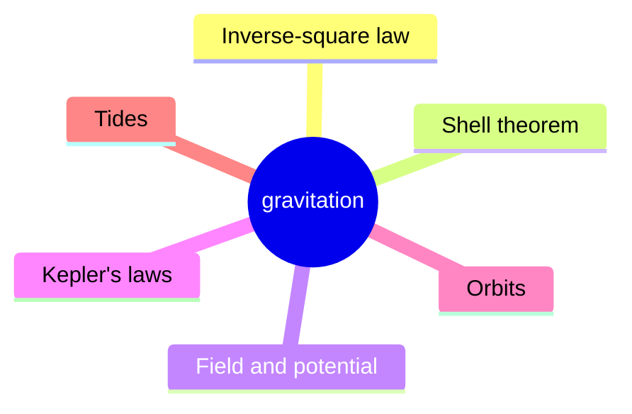
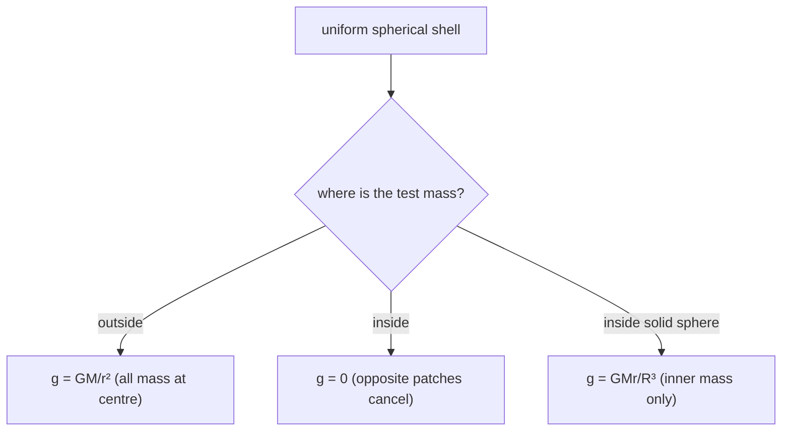
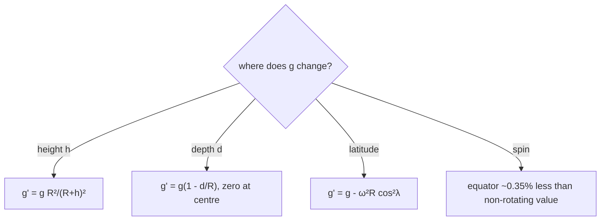
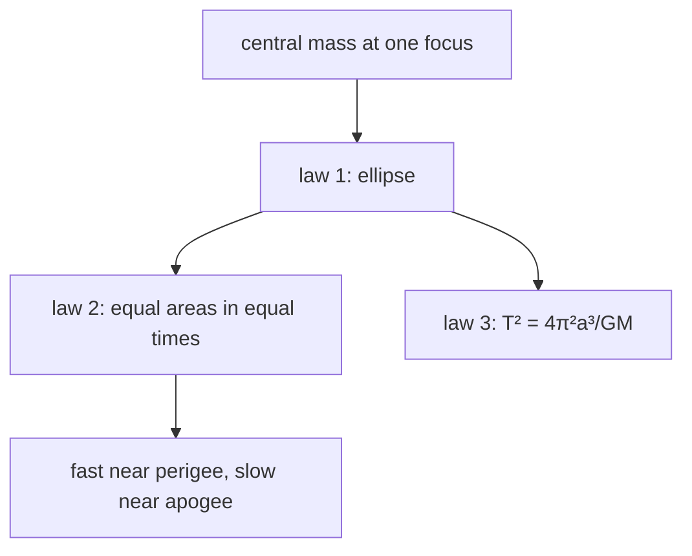
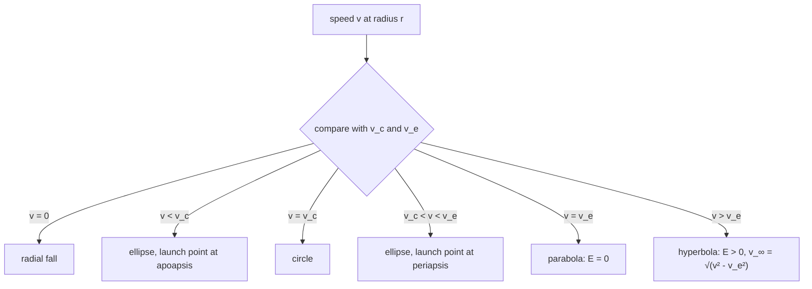
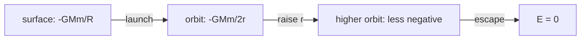
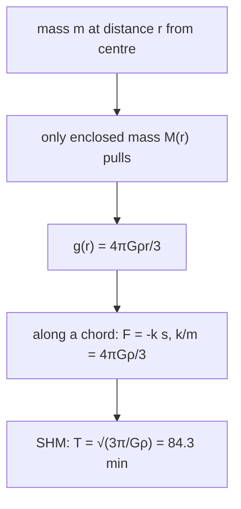
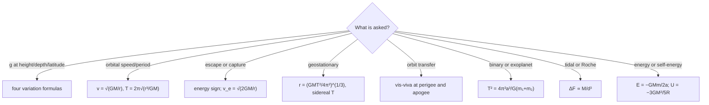

# Gravitation & Orbital Motion — first principles to Olympiad

> [!abstract] How to use this chapter
> Three passes. Pass 1: Parts 0–4 — the law and its evidence, field and potential, the shell theorem (proved), spheres and cavities, the four $g$ variations, potential energy and self-energy, Kepler's laws (derived), circular and elliptical orbits, escape and capture, satellites, transfers, two-body systems, tides and the tunnel. Pass 2: Parts 5–9 for exam craft. Pass 3: Parts 10–14 — the Olympiad layer, the paper, the formula sheet, the checkpoint. Every boxed result carries its validity condition, and every result in Part 4 is derived in Part 3.

## Part 0 · Orientation

### 0.1 What you will be able to do

After this chapter you can: state the inverse-square law and explain the evidence for it; define and compute gravitational field and potential; prove the shell theorem and use it for spheres, shells and cavities; derive all four $g$ variations; derive and use $U=-GMm/r$ and the self-energy of a sphere; derive Kepler's three laws; solve circular, elliptical, parabolic and hyperbolic orbit problems with the energy–angular-momentum ledger; derive escape speed, the atmosphere-retention criterion and launch energies; compute geostationary, polar and low-Earth orbit parameters; analyse Hohmann transfers, plane changes, the Oberth effect and rendezvous timing; handle binary stars, the two-body reduction and gravity assists; and estimate tides, the Roche limit, the deep-tunnel period and the free-fall collapse time.

### 0.2 The one idea

Gravity is a central inverse-square field, and every orbit is energy and angular momentum trading places.

### 0.3 Prerequisite self-check

You need PART 8 (rotational mechanics, angular momentum) and PART 6 (work, energy, potential energy). In this chapter you will differentiate and integrate polynomials, use $F=ma$ in the radial direction, and conserve energy and angular momentum. If you can write down the kinetic energy of a body in a circular path and the work done by a force along a path, you are ready.

### 0.4 Exam orientation

JEE Advanced treats gravitation as a standard topic — usually 2–3 questions per year, most often on orbital mechanics, $g$ variations, escape speed, energy of orbits, or the satellite-drag paradox. INPhO and IPhO reward the ability to *derive* the shell theorem, handle elliptical orbits from first principles, and estimate with real data (tides, Roche limit, launch budgets, collapse times). The trap density is moderate, but the classic errors are predictable: using $g=GM/R^2$ at a height without adjusting $R$, treating $U$ as $mgh$ at orbital distances, dropping the minus sign in $U$, mixing up escape and circular speeds, and quoting a 24-hour period for a geostationary satellite.

### 0.5 What this chapter is not

Not an electrostatics chapter: the $1/r^2$ force of electrostatics (PART 13) has the same mathematical form and a crucial physical difference — it can repel, so there is no shell theorem for a charged shell generically and no universal attraction. Not a general-relativity chapter: Newtonian gravity is exact for weak fields and slow motion, and we say where it fails (black holes, GPS timing, Mercury's perihelion).

### 0.6 Syllabus coverage map

| # | Source topic | What it establishes | Where it lives here | Status |
|---:|---|---|---|---|
| 1 | Newton's law and its evidence | $F=GMm/r^2$, the Moon test, $G$ | §3.1 | full |
| 2 | Field and potential | $\mathbf g$, $V=-GM/r$, equipotentials | §3.2 | full |
| 3 | Shell theorem | Outside a point, inside nothing | §3.3 | full, proved |
| 4 | Sphere, shell, cavity | $g=GMr/R^3$, $V$ inside, uniform cavity field | §3.4 | full |
| 5 | $g$ variations | Altitude, depth, latitude, rotation | §3.5 | full |
| 6 | Potential energy | $U=-GMm/r$, self-energy of a sphere | §3.6 | full |
| 7 | Kepler's laws | All three derived; areal velocity | §3.7 | full |
| 8 | Circular orbits | $v_c$, $T$, $E$, $L$, the density rule | §3.8 | full |
| 9 | Escape and capture | Escape speed, orbit classification, atmospheres, launch ladder | §3.9 | full |
| 10 | Elliptical orbits | Vis-viva, apsidal speeds, ellipse geometry | §3.10 | full |
| 11 | Satellites in practice | Geostationary, polar, ISS, drag decay | §3.11 | full |
| 12 | Transfers and manoeuvres | Hohmann budget, plane change, Oberth, phasing | §3.12 | full |
| 13 | Systems of bodies | Two-body reduction, binary stars, gravity assist | §3.13 | full |
| 14 | Gravity's reach | Tides, Roche limit, tunnel, collapse time | §3.14 | full |

## Part 1 · Intuition first

**The apple and the Moon.** The apple falls with acceleration $g$. The Moon does not fly off in a straight line either; it accelerates toward the Earth every second, by $v^2/r$. Are these two the same phenomenon? The numbers settle it: the Moon's centripetal acceleration is $2.72\times10^{-3}$ m/s$^2$, which is $g/3600$, and the Moon is 60.3 Earth-radii away. Since $60.3^2\approx3600$, the same force diluted by $1/r^2$ accounts for both. That coincidence — one law for the heavens and the Earth — is the birth of physics.

**Gravity is always attractive and always central.** No one has ever found a negative gravitational mass, so gravitational forces never cancel at large distances; they only add. The force acts along the line joining the two masses (central), which means it exerts no torque about the centre and therefore conserves angular momentum — the fact that makes Kepler's second law work for *any* central force. Gravity is also absurdly weak: the electrical repulsion between two protons exceeds their gravitational attraction by a factor $1.2\times10^{36}$. It dominates the universe only because it never cancels and never saturates.

**The inverse square is geometry.** Field lines from a point source thread a sphere of area $4\pi r^2$, so their density falls as $1/r^2$ — the same reason a lamp dims with distance. This argument gives the magnitude of the field only when the distribution has enough symmetry; turning it into a proof for a spherical shell is the shell theorem, §3.3. The reward is large: $1/r^2$ is the only power law for which the interior of a uniform shell is exactly force-free, and the only one that produces closed Kepler orbits.

**Newton's cannonball.** Fire a ball horizontally from a tall mountain. At low speed it falls to the ground close by; faster, it lands farther; at about 7.9 km/s it falls *around* the Earth and never lands; at 11.2 km/s it does not come back at all. The whole classification of orbits is one dial — the launch speed — and §3.9 makes the dial quantitative.

**The two dials of an orbit.** Energy decides whether the orbit is bound and how big it is: $E=-GMm/(2a)$, with $E<0$ for ellipses, $E=0$ for the parabola, $E>0$ for hyperbolas. Angular momentum decides how eccentric it is and keeps a bound orbit from falling into the centre: a particle with $L=0$ plunges radially no matter how much energy it has. Every orbit problem in this chapter is some combination of these two conservation laws, and that is the one idea to carry through the derivations.

> [!tip] FIGURE F9.1 · Chapter map
> *Why:* the chapter is one $1/r^2$ law read three ways — fields, energies, orbits — and the map shows the spine.
> *Data:* the Part 0–14 structure — the law, shells, field, potential, Kepler, orbits, escape, transfers, tides, paper, sheet.

> *Read:* every result is a shell sum, a $GM/r$ energy, or a Kepler exponent.

## Part 2 · Definitions and bookkeeping

### 2.1 Symbols

| Symbol | Meaning | SI unit |
|---|---|---|
| $G$ | universal gravitational constant $=6.674\times10^{-11}$ | N m$^2$/kg$^2$ |
| $M$ | mass of the central body | kg |
| $m$ | mass of the orbiting body | kg |
| $r$ | distance from the centre (not the surface) | m |
| $R$ | radius of the body | m |
| $h$ | height above the surface | m |
| $d$ | depth below the surface | m |
| $\lambda$ | latitude | rad |
| $\omega$ | angular speed of rotation | rad/s |
| $\mathbf g$ | gravitational field (force per unit mass) | m/s$^2$ |
| $V$ | gravitational potential (energy per unit mass) | J/kg |
| $U$ | gravitational potential energy of a pair or system | J |
| $E$ | total mechanical energy | J |
| $K$ | kinetic energy | J |
| $L$ | angular momentum about the centre | kg m$^2$/s |
| $h=L/m$ | specific angular momentum | m$^2$/s |
| $T$ | orbital period | s |
| $a$ | semi-major axis | m |
| $b$ | semi-minor axis | m |
| $e$ | eccentricity | dimensionless |
| $p=a(1-e^2)$ | semi-latus rectum | m |
| $r_p,\ r_a$ | periapsis and apoapsis distances | m |
| $\rho$ | density | kg/m$^3$ |
| $\mu$ | reduced mass $m_1m_2/(m_1+m_2)$ | kg |

### 2.2 Per-unit-mass bookkeeping

Two quantities appear constantly, and keeping them per unit mass removes one symbol from every equation:

| Quantity | Definition | For a point mass |
|---|---|---|
| field | $\mathbf g=\mathbf F/m$ | $-GM\hat{\mathbf r}/r^2$ |
| potential | $V=U/m$ | $-GM/r$ |
| specific energy | $\varepsilon=E/m$ | $v^2/2-GM/r$ |
| specific angular momentum | $h=L/m$ | $r^2\dot\theta$ |

A useful discipline: work in specific quantities until the last line, then multiply by $m$ if the question asks for an energy or a force.

### 2.3 Sign conventions

* $U$ and $V$ are negative, with the zero at infinite separation. A bound state is below zero; the number $-GMm/r$ is not a mistake.
* Work done *by* gravity as two masses approach is positive, so $\Delta U<0$.
* The field is a vector pointing toward the source; its magnitude $GM/r^2$ is never negative. Write $\mathbf g=-\frac{GM}{r^2}\hat{\mathbf r}$ with $\hat{\mathbf r}$ pointing away from the source.
* A "minus" in an energy answer means bound, not unphysical. If you get $E>0$ for a satellite you believed was in a circular orbit, you have made an algebra sign error or the satellite is not bound.

### 2.4 Orbit vocabulary

For an ellipse with semi-major axis $a$ and eccentricity $e$: the closest point is periapsis (perigee near the Earth, perihelion near the Sun), at distance $r_p=a(1-e)$; the farthest is apoapsis, at $r_a=a(1+e)$; the semi-minor axis is $b=a\sqrt{1-e^2}$; the semi-latus rectum is $p=a(1-e^2)=b^2/a$; and the polar equation of the orbit is

$$
r(\theta)=\frac{p}{1+e\cos\theta}, \qquad (2.1)
$$

with $\theta=0$ at periapsis. The areal velocity is $dA/dt=L/(2m)$; it is constant for every central force.

> [!info] Bookkeeping rules
> $U=-GMm/r$ with the reference at infinity, where $U=V=0$. Total energy $E=K+U$ is negative for every bound orbit and equals $-GMm/(2a)$ for every ellipse. Escape from radius $r$ needs $v_{\text{esc}}=\sqrt{2GM/r}$; the circular speed at the same radius is $v_c=\sqrt{GM/r}$. Distances are measured from the centre, always.

## Part 3 · Core derivations

Everything in this chapter is one of four calculations: a field from a mass distribution, a potential from a field, an energy from a potential, or an orbit from an energy and an angular momentum. This part does them in that order. Nothing in Part 4 is quoted that is not derived here.

### 3.1 The law, and how we know it

**The law.** Two point masses attract along the line joining them with

$$
\mathbf F_{1\to2}=-\frac{Gm_1m_2}{r^2}\,\hat{\mathbf r}, \qquad (3.1)
$$

where $\hat{\mathbf r}$ points from mass 1 to mass 2, so the minus sign makes the force attractive; $G=6.674\times10^{-11}$ N m$^2$/kg$^2$; and the force is *central* (along the joining line) and *universal* (the same $G$ for every pair of masses ever tested). Superposition holds: the force on a mass from many others is the vector sum of the pairwise forces.

**Why an inverse square?** Newton's argument has two halves, and both are examinable.

*Half one — a circular orbit fixes the force law once the period law is known.* For a mass $m$ in a circular orbit of radius $r$ and period $T$, the acceleration is centripetal:

$$
a=\frac{v^2}{r}=\frac{4\pi^2r}{T^2}. \qquad (3.2)
$$

Kepler had extracted $T^2\propto r^3$ from the planets. Writing $T^2=Kr^3$ and substituting,

$$
a=\frac{4\pi^2}{Kr^2}\ \propto\ \frac{1}{r^2},\qquad\text{so}\qquad F=ma\propto\frac{m}{r^2}. \qquad (3.3)
$$

Since the same force acts on the planet and (by Newton's third law) on the Sun in proportion to the other mass, $F\propto Mm/r^2$. The constant is fixed by requiring the circular orbit to be a solution: $F=GMm/r^2$ reproduces $T^2=4\pi^2r^3/(GM)$, so the same $GM$ appears in the force law and in the period law.

*Half two — the Moon falls the way an apple falls.* The Moon's centripetal acceleration from Eq. (3.2) is

$$
a_{\text{Moon}}=\frac{4\pi^2(3.844\times10^8\ \text{m})}{(27.32\times86400\ \text{s})^2}=2.72\times10^{-3}\ \text{m/s}^2.
$$

Surface gravity is $g=9.81$ m/s$^2$, and

$$
\frac{g}{a_{\text{Moon}}}=3.6\times10^3\approx60^2=\left(\frac{r_{\text{Moon}}}{R_E}\right)^2,\qquad \frac{r_{\text{Moon}}}{R_E}=\frac{3.844\times10^8}{6.371\times10^6}=60.3.
$$

So the force that holds the Moon has the same origin as the apple's weight, diluted by exactly $1/r^2$ over sixty Earth radii. That numerical coincidence is the historical evidence for universal gravitation.

**The constant, and how big it is.** Measuring $g$ at the surface gives the product, not $G$ or $M$ separately:

$$
GM_E=gR_E^2=3.986\times10^{14}\ \text{m}^3/\text{s}^2,\qquad M_E=\frac{GM_E}{G}=5.97\times10^{24}\ \text{kg}. \qquad (3.4)
$$

> [!info] History — Cavendish weighs the Earth
> Cavendish (1798) measured the tiny torque between lead spheres with a torsion balance, obtaining $G$ to about 1%. Once $G$ was known, Eq. (3.4) turned the already-measured $gR^2$ into the mass of the Earth. Gravity is weaker than the electrostatic force between two protons by a factor $ke^2/(Gm_p^2)\approx1.2\times10^{36}$ — and yet gravity runs the universe, because it is always attractive and never cancels.

**Validity.** Equation (3.1) is exact for point masses or spherically symmetric bodies (the shell theorem, proved in §3.3), provided $v\ll c$ and the fields are weak. Beyond that, general relativity takes over; the last section of Part 10 says where.

### 3.2 Field and potential of a point mass

Two bookkeeping devices turn gravitational problems from vector problems into scalar ones.

**Field.** Define the gravitational field as force per unit mass:

$$
\mathbf g(\mathbf r)=\frac{\mathbf F_{\text{on }m}}{m},\qquad \mathbf g=-\frac{GM}{r^2}\hat{\mathbf r},\qquad |\mathbf g|=\frac{GM}{r^2}. \qquad (3.5)
$$

The field is a property of the source distribution alone. Fields add as vectors: $\mathbf g=\sum_i\mathbf g_i$. The field lines of a point mass are radial, pointing inward; the equipotentials are concentric spheres.

**Potential.** Define the potential as potential energy per unit mass, $V=U/m$. To compute it, bring a unit mass in from infinity along any path (gravity is conservative, so the path does not matter) and use $\Delta U=-W_{\text{cons}}$:

$$
V(r)-V(\infty)=-\int_{\infty}^{r}\mathbf g\cdot d\mathbf r'=-\int_{\infty}^{r}\left(-\frac{GM}{r'^2}\right)dr'=-\frac{GM}{r}. \qquad (3.6)
$$

Choosing the reference $V(\infty)=0$,

$$
\boxed{V(r)=-\frac{GM}{r}}\qquad\text{and}\qquad g_r=-\frac{dV}{dr}. \qquad (3.7)
$$

The potential is negative everywhere, zero only at infinity, and approaches $-\infty$ as $r\to0$ — a useful reminder that a point mass is an idealisation.

| | Force | Field | Potential |
|---|---|---|---|
| depends on | $m$ as well as $M$ | $M$ only | $M$ only |
| type | vector | vector | scalar |
| adds as | vectors | vectors | numbers |
| relation | $\mathbf F=m\mathbf g$ | $\mathbf g=-\nabla V$ | $V=U/m$ |

> [!info] Why potentials earn their keep
> A vector sum of many fields needs components; a scalar sum of many potentials is one ordinary addition. Every result in Part 3 is first obtained for a point mass as a potential, then assembled by superposition. The price is that $V$ alone does not give the direction of the force — one differentiation per direction, Eq. (3.7), does.

> [!warning] Potential, potential energy and $mgh$
> $V$ is per unit mass (J/kg); $U$ is per pair of masses (J); $mgh$ is the small-height approximation $\Delta U\approx mg\Delta h$, valid only for $h\ll R$. At planetary distances only $\Delta U=-GMm(1/r_1-1/r_2)$ is safe.

### 3.3 The shell theorem

**Statement.** For a uniform spherical shell of mass $M$ and radius $R$:

1. outside the shell ($r>R$), the field is the same as if all the mass were at the centre, $g=GM/r^2$;
2. inside the shell ($r<R$), the net field is exactly zero;
3. the potential is continuous: $V=-GM/r$ outside, and $V=-GM/R$ (constant) inside.

The third statement is the one students forget: *zero field does not mean zero potential*. Inside the shell a particle needs energy to get out even though no force acts on it in there.

**Proof by cones (the elementary one).** Take any point $P$ and draw a narrow double cone of solid angle $d\Omega$ through it, hitting the shell at two opposite patches (figure D9.1). Because the patches are on a sphere, a line through $P$ meets it at two points whose radii make equal angles with the line; hence the two patches present equal projected areas. Their areas are

$$
dA_1=\frac{r_1^2\,d\Omega}{|\cos\alpha|},\qquad dA_2=\frac{r_2^2\,d\Omega}{|\cos\alpha|},
$$

and with surface density $\sigma$ their masses are $dM_i=\sigma dA_i$. The two pulls are both along the same line and have magnitudes

$$
dg_i=\frac{G\,dM_i}{r_i^2}=\frac{G\sigma\,d\Omega}{|\cos\alpha|},
$$

which are *equal*. They point in opposite directions, so each pair of patches cancels exactly, and the integral over all directions is zero. This proves part 2; it is a genuine inverse-square argument, not a symmetry claim.

**Proof by ring integration (the analytic one).** For a point at distance $s$ from the centre, split the shell into rings about the axis $OP$. A ring at polar angle $\theta$ has mass $2\pi\sigma R^2\sin\theta\,d\theta$, every part of it is at distance $\ell=\sqrt{s^2+R^2-2sR\cos\theta}$ from $P$, and by symmetry only the component along $OP$ survives:

$$
g_r(s)=2\pi G\sigma R^2\int_0^{\pi}\frac{(R\cos\theta-s)\sin\theta}{(s^2+R^2-2sR\cos\theta)^{3/2}}\,d\theta. \qquad (3.8)
$$

The substitution $u=\cos\theta$ makes this elementary. The antiderivative is $\dfrac{R-su}{s^2\sqrt{s^2+R^2-2sRu}}$, and evaluating from $u=-1$ to $u=1$ gives

$$
\int_{-1}^{1}\frac{(Ru-s)\,du}{(s^2+R^2-2sRu)^{3/2}}=
\begin{cases}
0, & s<R,\\
-\dfrac{2}{s^2}, & s>R.
\end{cases}
$$

Therefore $g_r=0$ for $s<R$ and $g_r=-4\pi G\sigma R^2/s^2=-GM/s^2$ for $s>R$, with $M=4\pi R^2\sigma$. The same integral gives the potential by integrating $V=-\int g\,ds$; the result is part 3 above.

> [!tip] Gauss's law needs the symmetry the cones do not
> Gauss's law for gravity, $\oint\mathbf g\cdot d\mathbf A=-4\pi GM_{\text{enc}}$, gives zero flux through any surface drawn inside the shell, but zero flux does not by itself force the field to be zero pointwise. Only the cone argument (or the ring integral) proves part 2. What Gauss's law buys is speed: once symmetry *is* known, it turns these integrals into one-line results (Part 7.2 and OL1).

> [!abstract] DIAGRAM D9.1 · The shell theorem cone construction
> *Show:* a uniform spherical shell and an interior point $P$. Two opposite, equal-solid-angle cones from $P$ intersect near and far shell patches. Include the incidence-angle projection: $dA/r^2=d\Omega/|\cos\alpha|$. For opposite rays the absolute cosines match, so the inverse-square pulls have equal magnitude and opposite directions; each pair cancels.
> *Search:* "shell theorem cone construction inverse square proof diagram"

![[../_obsidian/excalidraw/gravitation-D9-1.excalidraw|900]]

> [!tip] FIGURE F9.2 · The shell theorem: outside a point, inside nothing
> *Why:* the single most powerful shortcut in the chapter — a shell acts like a point mass outside, and vanishes inside.
> *Data:* outside $g=GM/r^2$; inside a shell $g=0$ but $V=-GM/R$; inside a uniform sphere only the inner mass $M(r)=M(r/R)^3$ counts, so $g=GMr/R^3$.

> *Read:* outside, collapse the shell to a point; inside, the pull of the whole shell cancels, and only what lies below you counts.

### 3.4 Sphere, shell and cavity

**Outside a uniform sphere** ($r\ge R$): assembling the sphere from shells and using part 1 of the shell theorem gives

$$
g=\frac{GM}{r^2},\qquad V=-\frac{GM}{r}\qquad(r\ge R). \qquad (3.9)
$$

**Inside a uniform sphere** ($r<R$): only the mass inside radius $r$ pulls, and with uniform density that mass is $M(r)=M(r/R)^3$:

$$
g(r)=\frac{GM(r)}{r^2}=\frac{GMr}{R^3}. \qquad (3.10)
$$

The field rises linearly from zero at the centre to $GM/R^2$ at the surface. Integrating inward from the surface for the potential,

$$
V(r)=V(R)-\int_{R}^{r}g\,dr'=-\frac{GM}{R}-\int_{R}^{r}\frac{GMr'}{R^3}\,dr'=-\frac{GM}{2R^3}\left(3R^2-r^2\right). \qquad (3.11)
$$

At the surface this is $-GM/R$, matching Eq. (3.9); at the centre it is $-3GM/(2R)$, the "three-halves" result. The depth of the potential well at the centre is finite, and that is where the tunnel problem of §3.14 lives.

**A thin shell** has $g=0$ and $V=-GM/R$ everywhere inside; a particle released anywhere inside a shell floats, and a particle outside is pulled as if by a point mass.

**Spherical cavity by superposition.** Take a uniform sphere of density $\rho$ with a spherical cavity; represent the cavity as the *negative* of a smaller uniform sphere of the same density, with the same centre as the hole. The field of a full uniform sphere at a point inside it is, by Eq. (3.10) written in vector form,

$$
\mathbf g_{\text{sphere}}(\mathbf r)=-\frac{4\pi G\rho}{3}\mathbf r,
$$

where $\mathbf r$ is measured from the sphere's centre. Adding the negative sphere centred at $\mathbf c$ gives, for a point inside the cavity,

$$
\mathbf g_{\text{cavity}}=\mathbf g_{\text{full}}-\mathbf g_{\text{removed}}
=-\frac{4\pi G\rho}{3}\mathbf r+\frac{4\pi G\rho}{3}(\mathbf r-\mathbf c)
=-\frac{4\pi G\rho}{3}\,\mathbf c. \qquad (3.12)
$$

The position vector has cancelled: the field inside a spherical cavity is **uniform** — same magnitude, same direction everywhere — even though the geometry is not spherically symmetric. This is the standard JEE Advanced cavity problem, solved in one line once superposition is set up.

> [!abstract] DIAGRAM D9.2 · Field inside a uniform sphere and the cavity
> *Show:* left: $g(r)$ vs $r$ for a uniform sphere — linear rise from zero at the centre to $GM/R^2$ at the surface, then $1/r^2$ falloff. Right: a sphere with a cavity, with the superposition method shown (full sphere minus small sphere).
> *Search:* "gravitational field inside uniform sphere cavity superposition diagram"

![[../_obsidian/excalidraw/gravitation-D9-2.excalidraw|900]]

### 3.5 The four variations of $g$

**Altitude.** At height $h$ above the surface,

$$
g(h)=\frac{GM}{(R+h)^2}=\frac{gR^2}{(R+h)^2}=g\left(1-\frac{2h}{R}+\frac{3h^2}{R^2}-\cdots\right)\approx g\left(1-\frac{2h}{R}\right)\ \ (h\ll R). \qquad (3.13)
$$

The linear form is an approximation, not a law; the exact form is the first expression.

**Depth.** At depth $d$ inside a uniform sphere, $r=R-d$ and Eq. (3.10) gives

$$
g(d)=\frac{GM(R-d)}{R^3}=g\left(1-\frac{d}{R}\right), \qquad (3.14)
$$

a linear decrease to zero at the centre. Real planets are denser at the core, so the real decrease is slower than linear; Eq. (3.14) is a uniform-density model result.

**Latitude (rotation).** In the rotating frame, a mass at rest on the surface feels gravity inward and a centrifugal term outward from the rotation axis. At latitude $\lambda$ the centrifugal acceleration is $\omega^2R\cos\lambda$, directed away from the axis. Resolving it along the local vertical gives a correction of $\omega^2R\cos^2\lambda$, so

$$
g_{\text{eff}}(\lambda)\approx g-\omega^2R\cos^2\lambda. \qquad (3.15)
$$

There is also a small horizontal component that tilts the local vertical; Eq. (3.15) is the scalar (radial) approximation on a spherical, non-deforming Earth. The rotation term is largest at the equator ($\omega^2R=0.0339$ m/s$^2$, about 0.35% of $g$) and zero at the poles.

**Numbers.** Using $R_E=6371$ km, $g=9.81$ m/s$^2$, $\omega=2\pi/(86164\ \text{s})$:

| Effect | Formula | Value at the stated point | $\Delta g/g$ |
|---|---|---|---|
| altitude $h=100$ km | $gR^2/(R+h)^2$ | 9.52 m/s$^2$ | $-3.1\%$ |
| altitude $h=400$ km | $gR^2/(R+h)^2$ | 8.69 m/s$^2$ | $-11.5\%$ |
| geostationary altitude | $gR^2/(R+h)^2$ | 0.224 m/s$^2$ | $-97.7\%$ |
| depth $d=R/2$ | $g(1-d/R)$ | 4.91 m/s$^2$ | $-50\%$ |
| latitude $45^\circ$ | $g-\omega^2R\cos^2\lambda$ | 9.79 m/s$^2$ | $-0.17\%$ |
| equator | $g-\omega^2R$ | 9.79 m/s$^2$ | $-0.35\%$ |

The observed pole-to-equator difference is about $0.053$ m/s$^2$, of which rotation explains $0.034$; the rest comes from the Earth's oblateness (the poles are nearer the centre). Use the measured values when a problem asks for the measured difference, and Eq. (3.15) when it asks for the rotation effect.

**Apparent weight versus free fall.** A weighing scale reads the normal force it exerts, which is *not* always $mg$. The clean statements:

* in a lift with acceleration $a$ upward, the reading is $m(g+a)$; downward, $m(g-a)$; in free fall, zero;
* in a circular orbit the astronaut's *apparent* weight is zero because astronaut and spacecraft share the same acceleration, while $g$ there is only slightly less than at the surface;
* a satellite in orbit is in continuous free fall, not in a region of no gravity.

> [!warning] "There is no gravity in orbit"
> At the ISS altitude $g=8.7$ m/s$^2$, 89% of its surface value. Weightlessness is free fall, and the correct phrase is *apparent* weightlessness.

> [!abstract] DIAGRAM D9.3 · The four $g$-variation curves on one plate
> *Show:* four panels: (1) $g$ vs altitude (decreasing); (2) $g$ vs depth (linear decrease to zero at centre); (3) $g$ vs latitude (slight increase from equator to pole); (4) $g$ vs rotation rate (decreasing as $\omega$ increases).
> *Search:* "gravitational acceleration variation altitude depth latitude rotation graph"

![[../_obsidian/excalidraw/gravitation-D9-3.excalidraw|900]]

> [!tip] FIGURE F9.3 · Four ways g changes
> *Why:* the four variations are separate formulas that students blur; the figure keeps their directions and magnitudes distinct.
> *Data:* altitude $g'=g\,R^2/(R+h)^2$; depth $g'=g(1-d/R)$; latitude $g'=g-\omega^2R\cos^2\lambda$; rotation lowers $g$ at the equator by ~0.35%.

> *Read:* height dilutes $g$ quadratically, depth kills it linearly to zero, latitude and spin subtract the centrifugal term.

### 3.6 Gravitational potential energy

**The pair.** For two masses separated by $r$, taking $U=0$ at infinity,

$$
U(r)=-\frac{GMm}{r}. \qquad (3.16)
$$

The energy needed to separate them completely is $+GMm/r$, the binding energy of the pair. The potential energy belongs to the *pair*, not to either mass alone.

**A system of several bodies.** Superpose over unordered pairs:

$$
U=-G\left(\frac{m_1m_2}{r_{12}}+\frac{m_1m_3}{r_{13}}+\frac{m_2m_3}{r_{23}}\right). \qquad (3.17)
$$

> [!warning] The three-body caution
> Equation (3.17) counts each pair once. Do not write $\sum_i m_iV_i$ with each body's potential including its own contribution, and do not double-count a pair: for three equal masses in a line the potential energy is $-Gm^2(1/d+1/d+1/2d)$, not three times the first two terms.

**Self-energy of a uniform sphere.** Assemble the sphere shell by shell, bringing each shell from infinity. When the growing sphere has radius $r$, its enclosed mass is $M(r)=\frac{4}{3}\pi r^3\rho$, and the next shell has mass $dm=4\pi r^2\rho\,dr$. The work to bring it in is $dU=-GM(r)\,dm/r$:

$$
dU=-G\frac{\frac{4}{3}\pi r^3\rho\cdot4\pi r^2\rho\,dr}{r}=-\frac{16\pi^2G\rho^2}{3}r^4\,dr. \qquad (3.18)
$$

Integrating from $0$ to $R$ and eliminating $\rho$ in favour of $M=\frac{4}{3}\pi R^3\rho$,

$$
U_{\text{self}}=-\frac{16\pi^2G\rho^2R^5}{15}=-\frac{3}{5}\frac{GM^2}{R}. \qquad (3.19)
$$

> [!note] How much energy is that?
> For the Earth, Eq. (3.19) gives $U_{\text{self}}=-2.24\times10^{32}$ J. The Sun radiates that in about 7 days, and it is roughly $4\times10^{11}$ times humanity's present annual energy consumption. "Spread the Earth to infinity" is not a small request.

> [!tip] Link to electrostatics
> The self-energy of a uniformly charged sphere has the identical form, $U=\frac{3}{5}kQ^2/R$, with the opposite sign. Assembling like charges costs energy; assembling mass releases it. That sign is the whole reason a cloud can collapse under gravity but a charged cloud flies apart (PART 13).

### 3.7 Kepler's laws, derived

**First law.** Each planet moves on an ellipse with the Sun at one focus. This is a consequence of the inverse-square law, and it can be shown in four lines with angular momentum. Write $r=1/u$ and let $h=L/m$ be the specific angular momentum. Then

$$
\dot\theta=\frac{h}{r^2}=hu^2,\qquad \dot r=-h\frac{du}{d\theta},\qquad \ddot r=-h^2u^2\frac{d^2u}{d\theta^2}. \qquad (3.20)
$$

The radial equation of motion, $m\ddot r-mr\dot\theta^2=-GMm/r^2$, becomes

$$
-h^2u^2\frac{d^2u}{d\theta^2}-h^2u^3=-GMu^2\ \Longrightarrow\ \frac{d^2u}{d\theta^2}+u=\frac{GM}{h^2}. \qquad (3.21)
$$

This is the harmonic equation. Its general solution, and the corresponding orbit, are

$$
u=A\cos(\theta-\theta_0)+\frac{GM}{h^2}\ \Longrightarrow\ r(\theta)=\frac{p}{1+e\cos(\theta-\theta_0)},\qquad p=\frac{h^2}{GM}. \qquad (3.22)
$$

Equation (3.22) is the polar equation of a conic with focus at the origin; $e$ is the eccentricity. $E<0$ gives $e<1$ (ellipse), $E=0$ gives $e=1$ (parabola), $E>0$ gives $e>1$ (hyperbola). Choosing $\theta_0=0$ so the closest point is at $\theta=0$,

$$
r_p=\frac{p}{1+e}=a(1-e),\qquad r_a=\frac{p}{1-e}=a(1+e),\qquad p=a(1-e^2)=\frac{b^2}{a}, \qquad (3.23)
$$

with $a$ the semi-major axis and $b$ the semi-minor axis. These three relations convert between the dynamical data $(h,e)$ and the geometrical data $(a,b)$.

**Second law.** Equal areas in equal times. In a time $dt$ the radius vector sweeps a triangle of area $dA=\frac12r^2d\theta$, so

$$
\frac{dA}{dt}=\frac{1}{2}r^2\frac{d\theta}{dt}=\frac{L}{2m}=\text{constant}. \qquad (3.24)
$$

This one holds for *any* central force, because it is angular momentum conservation, not a special property of $1/r^2$. That distinction is a favourite exam question.

**Third law.** The orbit's area is $\pi ab$, and the areal velocity is constant, so $T=\pi ab/(h/2)=2\pi ab/h$. Using $b^2=ap$ and $h^2=GMp$ from Eq. (3.22),

$$
T^2=\frac{4\pi^2a^2b^2}{h^2}=\frac{4\pi^2a^2\cdot ap}{GMp}=\frac{4\pi^2a^3}{GM}. \qquad (3.25)
$$

For the exact two-body problem replace $M$ by $M+m$; for a planet around the Sun the correction is smaller than one part in $10^5$, which is why Kepler never saw it.

> [!info] The exponent is a fingerprint
> For a general central force $F\propto r^{n}$, a circular orbit has $T^2\propto a^{1-n}$. Only $n=-2$ gives Kepler's $T^2\propto a^3$. So Kepler's third law is not just a description of the solar system; it is a measurement that the force falls as $1/r^2$. Part 10 turns this into a test.

> [!abstract] DIAGRAM D9.4 · A Kepler ellipse with the focus, the two radii and the equal-area sectors
> *Show:* an ellipse with the central mass at one focus. Two equal-time sectors are shaded to show equal swept areas. At periapsis the radius is short and the angular sweep is larger; at apoapsis the radius is long and the angular sweep is smaller. The areas, not the angular widths, are equal.
> *Search:* "Kepler ellipse focus equal area sectors perigee apogee diagram"

![[../_obsidian/excalidraw/gravitation-D9-4.excalidraw|900]]

> [!tip] FIGURE F9.4 · Kepler's laws, from the same focus
> *Why:* all of orbital motion is three laws; the figure binds the ellipse, the area law, and the $T^2\propto a^3$ rule into one picture.
> *Data:* orbits are conics with the central mass at a focus; $\frac{dA}{dt}=\frac{L}{2m}$ constant; $T^2=\frac{4\pi^2}{GM}a^3$.

> *Read:* the equal-area law is angular-momentum conservation in costume, and the period law makes the orbit mass-blind — a feather and a cannonball share a period.
### 3.8 Circular orbits and the energy ledger

**Speed.** For a circular orbit of radius $r$, gravity supplies exactly the centripetal force:

$$
\frac{mv^2}{r}=\frac{GMm}{r^2}\ \Longrightarrow\ \boxed{v_c=\sqrt{\frac{GM}{r}}},\qquad T=\frac{2\pi r}{v_c}=2\pi\sqrt{\frac{r^3}{GM}}. \qquad (3.26)
$$

**Energy.** Substitute the speed back into the energy:

$$
K=\frac{1}{2}mv_c^2=\frac{GMm}{2r},\qquad U=-\frac{GMm}{r},\qquad E=K+U=-\frac{GMm}{2r}. \qquad (3.27)
$$

**Angular momentum.** $L=mv_cr=m\sqrt{GMr}$.

> [!info] Where the factor $\tfrac12$ comes from
> It is not an accident of the circular case. Gravity's work supplies half the kinetic energy and stores the other half as potential: $K=+\frac{GMm}{2r}$, $U=-2K$, so $E=K+U=-K=\frac{U}{2}$. For any $1/r$ force in a circular orbit, $2K=-U$ — the relation the virial theorem generalises (§7.3 and OL10).

**The period knows the density.** For an orbit that grazes the surface, $r\approx R$ and $M=\frac43\pi R^3\rho$, so

$$
T^2=\frac{4\pi^2R^3}{GM}=\frac{3\pi}{G\rho}\ \Longrightarrow\ T=\sqrt{\frac{3\pi}{G\rho}}. \qquad (3.28)
$$

A low orbit is a density measurement: $\rho=5513$ kg/m$^3$ for the Earth gives $T=84.3$ min. (The ISS flies higher, at 400 km, and takes 92.4 min.) Equation (3.28) will reappear as the deep-tunnel period: near the surface, an orbit and a tunnel ride are the same oscillation.

**The paradox of the higher orbit.** A higher orbit is *slower* ($v_c\propto r^{-1/2}$) yet *more energetic* ($E=-GMm/2r$ is less negative). Both statements are true because raising a satellite costs energy from the engines while gravity does negative work overall; the spacecraft ends with less kinetic energy but a much larger (less negative) potential energy. To move a satellite from $r_1$ to $r_2>r_1$ in circular orbits,

$$
\Delta E=E_2-E_1=\frac{GMm}{2}\left(\frac{1}{r_1}-\frac{1}{r_2}\right)=\frac{GMm\,(r_2-r_1)}{2r_1r_2}>0. \qquad (3.29)
$$

> [!warning] "More energy" means "less negative"
> In orbital mechanics, energy is negative or zero. Say "more energetic" only when you mean the algebraic value increases toward zero, and say "more tightly bound" when you mean $|E|$ increases. Two satellites cross-checked against each other: the lower one is faster, more tightly bound, and has the shorter period.

### 3.9 Escape and capture

**Escape speed.** A projectile escapes if it can reach infinity with zero kinetic energy left. Energy conservation from the surface:

$$
\frac{1}{2}mv_{\text{esc}}^2-\frac{GMm}{R}=0\ \Longrightarrow\ \boxed{v_{\text{esc}}=\sqrt{\frac{2GM}{R}}=\sqrt{2gR}}. \qquad (3.30)
$$

For the Earth, $v_{\text{esc}}=11.2$ km/s. Three facts make this formula more useful than it looks:

* the direction of launch does not matter (the energy condition is scalar), only the speed;
* from height $h$, replace $R$ by $R+h$: $v_{\text{esc}}(h)=\sqrt{2GM/(R+h)}$, which is smaller; escape gets cheaper with altitude;
* compared with the circular speed at the *same* radius, $v_{\text{esc}}=\sqrt2\,v_c$. The $\sqrt2$ is *not* universal for arbitrary orbits — it compares escape from a given radius with a circular orbit at that same radius.

**Classifying a projectile by its energy and speed.** Let $v_c=\sqrt{GM/r}$ and $v_e=\sqrt2\,v_c$ at the launch radius:

| Launch speed at radius $r$ | Energy | Orbit |
|---|---|---|
| $v=0$ | $E<0$ | falls radially inward |
| $0<v<v_c$ | $E<0$ | ellipse with the launch point at apoapsis |
| $v=v_c$ | $E<0$ | circle |
| $v_c<v<v_e$ | $E<0$ | ellipse with the launch point at periapsis |
| $v=v_e$ | $E=0$ | parabola — marginal escape |
| $v>v_e$ | $E>0$ | hyperbola — escapes with speed at infinity $v_\infty=\sqrt{v^2-v_e^2}$ |

This is Newton's cannonball, made quantitative: the same mountain, six different firing speeds, six different outcomes. The atmosphere is why real launches must also fight drag; the energy condition itself is exact.

**The launch-energy ladder.** For a mass $m$ launched from the surface:

$$
E_{\text{surface}}=-\frac{GMm}{R},\qquad E_{\text{orbit}}=-\frac{GMm}{2r},\qquad E_{\text{escape}}=0. \qquad (3.31)
$$

For a low circular orbit ($r\approx R$) the energy to climb from rest on the surface is $\frac{GMm}{2R}$, exactly half the energy needed to escape from the surface, $GMm/R$. Check: for $m=1000$ kg, $GMm/R=6.26\times10^{10}$ J $=62.6$ GJ, and the orbit insertion is 31.3 GJ. The remaining half of the escape budget is spent when leaving orbit, not when reaching it.

**Which gases can a planet hold?** Molecules in an atmosphere have a spread of speeds with root-mean-square value

$$
v_{\text{rms}}=\sqrt{\frac{3\mathcal R T}{M_{\text{mol}}}}, \qquad (3.32)
$$

where $M_{\text{mol}}$ is the molar mass and $\mathcal R=8.314$ J mol$^{-1}$K$^{-1}$. A crude retention criterion is $v_{\text{esc}}\gtrsim6\,v_{\text{rms}}$: the fast tail of the distribution is what escapes, and the factor 6 keeps that tail negligible over billions of years. At $T=300$ K:

| Gas | $M_{\text{mol}}$ (kg/mol) | $v_{\text{rms}}$ (m/s) | Earth ($v_{\text{esc}}=11.2$ km/s) | Mars ($5.0$ km/s) |
|---|---|---|---|---|
| H$_2$ | 0.002 | 1934 | escapes | escapes |
| He | 0.004 | 1368 | escapes (exosphere is hotter still) | escapes |
| H$_2$O | 0.018 | 645 | retained (cold-trapped) | partially escapes |
| N$_2$ | 0.028 | 517 | retained | marginal |
| O$_2$ | 0.032 | 484 | retained | escapes |
| CO$_2$ | 0.044 | 412 | retained | retained (thin atmosphere) |

The criterion explains the broad pattern — Earth keeps nitrogen and oxygen, loses hydrogen and helium; Mars, with $v_{\text{esc}}=5.0$ km/s, has lost most of its light gases — but it is a thermal-escape estimate only. Non-thermal loss (solar wind, photodissociation, impacts) matters, which is why the real histories of Mars and Venus need more than one inequality.

> [!tip] FIGURE F9.7 · One dial: speed decides the orbit
> *Why:* every "what happens if the speed is…" question is read off one ladder, not memorised as six cases.
> *Data:* at one radius, $v_c=\sqrt{GM/r}$ and $v_e=\sqrt2\,v_c$; $v<v_c$ hits the ground, $v_c<v<v_e$ is an ellipse, $v_e$ is the parabola, and $v>v_e$ gives a hyperbola with $v_\infty=\sqrt{v^2-v_e^2}$.

> *Read:* the speed dial sets the orbit; $v_c$ and $v_e$ are the only two marks you need on it.

> [!abstract] DIAGRAM D9.8 · The energy ladder diagram for orbital transfers
> *Show:* three energy levels: surface ($E=-GMm/R$), low orbit ($E=-GMm/(2R)$), escape ($E=0$). The energy increments $\Delta E$ between each level marked. The total energy to launch to orbit is $GMm/(2R)$, half the escape energy.
> *Search:* "energy diagram orbital transfer surface orbit escape ladder"

![[../_obsidian/excalidraw/gravitation-D9-8.excalidraw|900]]

> [!tip] FIGURE F9.5 · The orbit energy ladder: bind, raise, escape
> *Why:* every launch and transfer question is a difference between ladder rungs; the figure names the three energies.
> *Data:* surface $E=-GMm/R$; circular orbit $E=-GMm/2r$ (KE $=+GMm/2r$); escape $E=0$.

> *Read:* bound means negative total energy; the circular energy is half the potential, and reaching zero is the escape ticket.

### 3.10 Elliptical orbits and the vis-viva equation

**The vis-viva equation.** For an ellipse, we can get the total energy without solving the shape problem again. At periapsis and apoapsis the velocity is perpendicular to the radius, so angular momentum conservation gives $v_pr_p=v_ar_a$, and energy conservation gives $\frac12v_p^2-GM/r_p=\frac12v_a^2-GM/r_a$. Solving the two equations with $r_p=a(1-e)$, $r_a=a(1+e)$ yields

$$
v_p=\sqrt{\frac{GM}{a}\frac{1+e}{1-e}},\qquad v_a=\sqrt{\frac{GM}{a}\frac{1-e}{1+e}},\qquad E=-\frac{GMm}{2a}. \qquad (3.33)
$$

Since the total energy is a constant of the motion and depends only on $a$, it can be evaluated at any point. Writing $E=\frac12mv^2-GMm/r$ and equating to $-GMm/(2a)$ gives the **vis-viva equation**:

$$
\boxed{v^2=GM\left(\frac{2}{r}-\frac{1}{a}\right)}. \qquad (3.34)
$$

Some immediate readings:

* at $r=a$ (the ends of the minor axis), $v=\sqrt{GM/a}$, the same as the circular speed at that radius;
* at periapsis, $v$ is largest; at apoapsis, smallest; the product $v_pr_p=v_ar_a$ is the same at both (equal areas in equal times);
* for a circle, $a=r$ and Eq. (3.34) collapses to $v^2=GM/r$;
* for $a\to\infty$ with $E\to0$, the parabola has $v_e=\sqrt{2GM/r}$.

**The flight-path angle.** If the velocity makes an angle $\phi$ with the local horizontal, then $L=mvr\cos\phi$, so $\cos\phi=\dfrac{h}{vr}=\dfrac{\sqrt{GMp}}{vr}$. At the apsides $\phi=0$; in between the path tilts, which is why a satellite's velocity is not exactly horizontal except at those two points.

**Which orbit is more energetic?** Compare $E=-GMm/(2a)$: larger $a$ means more energy (less negative), larger period, and slower average motion. Two orbits with the same $a$ but different $e$ have *identical* energy and period — the eccentricity only redistributes speed along the path. This is a favourite JEE Advanced discriminator.

> [!info] Turning points, at a glance
> Plot the effective potential $U_{\text{eff}}(r)=-GMm/r+L^2/(2mr^2)$; its minimum is the circular orbit at $r_0=L^2/(GMm^2)$. A horizontal line at the total energy $E$ crosses the curve where the radial motion stops — the periapsis and apoapsis. $E=U_{\text{eff,min}}$ touches at one point (circle), $U_{\text{eff,min}}<E<0$ cuts twice (ellipse), $E=0$ has one turning point and escape to infinity (parabola), and $E>0$ never comes back (hyperbola). The whole orbit-classification table of §3.9 is one graph.

> [!abstract] DIAGRAM D9.5 · The vis-viva graph of $E$ vs $r$ for several $L$
> *Show:* a graph of the effective potential $U_{\text{eff}}=-GMm/r+L^2/(2mr^2)$ vs $r$ for three values of $L$. For each: the total energy $E$ shown as a horizontal line. The turning points (where $E=U_{\text{eff}}$) are the perigee and apogee.
> *Search:* "effective potential energy versus r circular elliptical orbit turning points"

![[../_obsidian/excalidraw/gravitation-D9-5.excalidraw|900]]

> [!abstract] DIAGRAM D9.10 · The effective potential curve for gravitational orbits
> *Show:* $U_{\text{eff}}(r)=-GMm/r+L^2/(2mr^2)$ plotted vs $r$. The minimum at $r_0$ marked. Four horizontal lines: $E=E_{\min}$ (circular), $E_{\min}<E<0$ (elliptical, two turning points), $E=0$ (parabolic), $E>0$ (hyperbolic).
> *Search:* "effective potential gravitational orbit circular elliptical parabolic hyperbolic diagram"

![[../_obsidian/excalidraw/gravitation-D9-10.excalidraw|900]]

### 3.11 Satellites in practice

**Geostationary orbit.** A satellite appears fixed in the sky if it is in the equatorial plane, moving eastward, with a period equal to the Earth's sidereal rotation period, $T=86164$ s (23 h 56 min 4 s, not the 24-hour mean solar day). Kepler's third law then fixes the radius:

$$
r_{\text{geo}}=\left(\frac{GMT^2}{4\pi^2}\right)^{1/3}=42\,164\ \text{km},\qquad h_{\text{geo}}=r_{\text{geo}}-R_E=35\,786\ \text{km}. \qquad (3.35)
$$

Three conditions, three sentences: the orbit must be equatorial (or it would oscillate north–south), circular (or it would drift east–west), and at one particular radius (the period condition). A satellite over a fixed longitude needs all three.

**Polar and Sun-synchronous orbits.** A polar orbit passes over the poles while the Earth turns beneath it, so it can scan the whole surface; a Sun-synchronous orbit is a near-polar orbit whose plane precesses once per year with the Sun, so the local solar time at each pass is constant. The precession comes from the Earth's equatorial bulge acting on the orbit plane, an effect outside the point-mass model but worth naming.

**The ISS numbers.** At $h=400$ km, $r=6771$ km, $v_c=7.67$ km/s and $T=92.4$ min; the local $g$ is $8.69$ m/s$^2$. The astronauts float not because gravity is absent but because they and the station fall together.

**Orbital decay and drag.** Drag removes mechanical energy, and since $E=-GMm/(2r)$, removing energy *lowers* the orbit; the satellite then moves faster, because a lower circular orbit has a higher speed. Working out the radial drop per revolution: drag does work $-F_d(2\pi r)$ per orbit, and $dE=(GMm/2r^2)\,dr$, so

$$
\Delta r_{\text{per orbit}}\approx-\frac{4\pi r^3F_d}{GMm}. \qquad (3.36)
$$

For the ISS, $F_d$ is of order $0.03$–$0.06$ N depending on solar activity; that gives roughly $0.5$–$1.5$ m per revolution, a few hundred metres per month, which is why the station is reboosted periodically. Equation (3.36) is also the seed of the Olympiad drag-spiral problem (OL11).

> [!tip] Why a decay paradox is not a paradox
> Atmospheric drag slows the satellite *and* heats the atmosphere; the braking torque lowers the orbit; the lower orbit has a larger speed. The energy bookkeeping is unambiguous (drag removes energy; $E$ becomes more negative; $r$ falls), and the increase in $K$ is paid for by a larger decrease in $U$.

### 3.12 Transfers and manoeuvres

**Hohmann transfer.** The cheapest two-burn transfer between coplanar circular orbits of radii $r_1<r_2$ uses an ellipse with periapsis $r_1$, apoapsis $r_2$, so $a=(r_1+r_2)/2$. Vis-viva at each end gives the two burns:

$$
\Delta v_1=v_1\left(\sqrt{\frac{2r_2}{r_1+r_2}}-1\right),\qquad
\Delta v_2=v_2\left(1-\sqrt{\frac{2r_1}{r_1+r_2}}\right), \qquad (3.37)
$$

where $v_i=\sqrt{GM/r_i}$ is the circular speed at the starting or ending orbit, and the transfer time is half the transfer-ellipse period:

$$
t_{\text{Hohmann}}=\pi\sqrt{\frac{a^3}{GM}}. \qquad (3.38)
$$

The Δv budget is best remembered as a table of a single ratio $k=r_2/r_1$ (starting from a low Earth orbit at $r_1=6771$ km):

| $k=r_2/r_1$ | $\Delta v_1/v_1$ | $\Delta v_2/v_1$ | $\Delta v_{\text{total}}/v_1$ | $\Delta v_{\text{total}}$ (km/s) | transfer time |
|---|---|---|---|---|---|
| 1.5 | 0.095 | 0.086 | 0.182 | 1.39 | 1.1 h |
| 2 | 0.155 | 0.130 | 0.285 | 2.18 | 1.4 h |
| 4 | 0.265 | 0.184 | 0.449 | 3.44 | 3.0 h |
| 6.6 (LEO to GEO) | 0.318 | 0.190 | 0.507 | 3.89 | 5.7 h |
| 10 | 0.348 | 0.181 | 0.530 | 4.07 | 9.9 h |

Notice that in units of $v_1$ the total stays flat between about $0.18$ and $0.54$ across this whole range, even though the absolute cost keeps rising with the destination orbit. For the heliocentric Earth-to-Mars transfer ($r_1=1$ AU, $r_2=1.524$ AU) the same formulas give $\Delta v_1=2.95$ km/s, $\Delta v_2=2.65$ km/s, total $5.60$ km/s, transfer time 259 days — plus the Earth-escape burn and any plane change. This "launch window" is why Mars missions leave every 26 months: the geometry must be right at departure and arrival.

**Plane changes.** To tilt a circular orbit by angle $\Delta i$ without changing its size, the velocity vector must be rotated, so

$$
\Delta v_{\text{plane}}=2v\sin\frac{\Delta i}{2}. \qquad (3.39)
$$

Plane changes are cheap where the spacecraft is slow — at apoapsis of a high ellipse — which is why geostationary transfer orbits combine a plane change with the circularisation burn at the top.

**The Oberth effect.** A rocket burn of $\Delta v$ along the velocity changes the energy by

$$
\Delta E=mv\,\Delta v+\tfrac12m(\Delta v)^2. \qquad (3.40)
$$

The first term grows with the current speed $v$, so the same burn buys more energy when it is made deep in a gravity well, where the spacecraft is fastest. This is why interplanetary departures use a burn at perigee of an escape hyperbola rather than a slow spiral.

**Rendezvous phasing.** Two satellites at the same altitude cannot be caught by speeding up — that raises the orbit and slows the chaser. Phasing means dropping to a lower, faster orbit for a calculated number of revolutions and then returning. A Hohmann transfer always arrives after a fixed half-ellipse time; catching the target at that moment is a timing problem in the target's angular position, not a Δv problem.

> [!abstract] DIAGRAM D9.9 · Hohmann transfer: the tangential ellipse
> *Show:* two concentric circular orbits (inner and outer). An ellipse connecting them, tangent to both at the transfer points. The two velocity vectors at perigee and apogee shown, along with the $\Delta v$ burns.
> *Search:* "Hohmann transfer orbit ellipse perigee apogee delta v diagram"

![[../_obsidian/excalidraw/gravitation-D9-9.excalidraw|900]]

### 3.13 Systems of bodies

**Two bodies, one relative orbit.** For masses $m_1$ and $m_2$ attracting each other, write the centre of mass $\mathbf R$ and the separation $\mathbf r=\mathbf r_2-\mathbf r_1$. The centre of mass moves uniformly (no external force), and subtracting the two equations of motion gives

$$
\mu\ddot{\mathbf r}=-\frac{Gm_1m_2}{r^2}\hat{\mathbf r},\qquad \mu=\frac{m_1m_2}{m_1+m_2}, \qquad (3.41)
$$

which is the same as one body of mass $\mu$ orbiting a fixed mass $m_1+m_2$. Every single-body result therefore carries over with two replacements: $m\to\mu$ and $M\to m_1+m_2$. Kepler's third law becomes

$$
T^2=\frac{4\pi^2a^3}{G(m_1+m_2)}, \qquad (3.42)
$$

where $a$ is the semi-major axis of the *relative* orbit. Individually the two stars orbit the centre of mass with

$$
a_1=a\frac{m_2}{m_1+m_2},\qquad a_2=a\frac{m_1}{m_1+m_2},\qquad a_1+a_2=a. \qquad (3.43)
$$

The heavier star moves on the smaller orbit — the Earth–Sun system is a two-body problem too, with the Sun 330 000 times closer to the centre of mass than the Earth.

**Mass of the Sun.** With $a=1$ AU and $T=1$ year for the Earth, Eq. (3.42) gives $M_\odot+a\approx M_\odot=4\pi^2a^3/(GT^2)=1.99\times10^{30}$ kg.

**Binary-star radial velocity.** A star's line-of-sight speed varies as $v_i(t)=v_i\sin i\,\sin(2\pi t/T)$ with amplitude $v_i=2\pi a_i\sin i/T$, where $i$ is the inclination of the orbit plane to the line of sight. Inverting Eq. (3.42) and (3.43) to get the masses from $v_1$, $v_2$ and $T$ is how stellar masses (and exoplanet masses, with the planet's amplitude) are actually measured.

**Gravity assist.** In the planet's frame the encounter is elastic: the spacecraft comes in with relative velocity $\mathbf u$ and leaves with a relative velocity of the same magnitude, rotated by the deflection angle $\delta$. In the Sun's frame the two velocities add to the planet's orbital velocity $\mathbf v_J$:

$$
\mathbf v_{\text{out}}=\mathbf v_J+\mathbf u_{\text{out}},\qquad |\mathbf u_{\text{out}}|=|\mathbf u_{\text{in}}|. \qquad (3.44)
$$

For a head-on approach with a reversal of the relative velocity, $|\mathbf v_{\text{out}}|=v_s+2v_J$: the spacecraft gains twice the planet's speed, at the planet's expense (the planet's orbit changes by an unmeasurably tiny amount because of its enormous mass). For a general geometry the gain is smaller; the deflection angle decreases as the flyby altitude increases, and the maximum possible gain in any single encounter is $2v_J$. Voyager's tour of the outer planets is the textbook case.

> [!abstract] DIAGRAM D9.12 · The gravity-assist slingshot in the Sun's frame
> *Show:* Jupiter moving in its orbit. A spacecraft approaches from behind, swings around Jupiter, and leaves with higher speed in the Sun's frame. The spacecraft's trajectory curved by Jupiter's gravity. The velocity vectors before and after shown in both Jupiter's frame and the Sun's frame.
> *Search:* "gravity assist slingshot spacecraft Jupiter velocity change diagram"

![[../_obsidian/excalidraw/gravitation-D9-12.excalidraw|900]]

### 3.14 Gravity's reach

**Tides.** The tidal effect is the difference between the pull at the centre of a body and the pull at a point on its surface. For a small body of radius $r_s$ at distance $d$ from a mass $M$, differentiating $F=GMm/r^2$ gives $dF/dr=-2GMm/r^3$, so to leading order the near side is pulled more strongly and the far side less strongly than the centre by

$$
\Delta F_{\text{tidal}}\approx\frac{2GMm\,r_s}{d^3}, \qquad (3.45)
$$

directed along the line of centres, stretching the body. Because the differential pull is outward on *both* the near and far sides (relative to the body's centre), there are two bulges, not one; the Sun's tidal pull is about 2.2 times weaker than the Moon's because the $1/d^3$ beats the Sun's larger mass. When Sun and Moon line up, the bulges add (spring tides); at right angles they partly cancel (neap tides).

**The Roche limit.** A satellite of radius $r_s$ and density $\rho_s$ orbiting a planet of radius $R_p$ and density $\rho_p$ is torn apart when the tidal stretch across it exceeds its own self-gravity. Balancing Eq. (3.45) at the satellite's surface against the order of magnitude of self-gravity gives the rigid-body estimate

$$
d\sim R_p\left(\frac{2\rho_p}{\rho_s}\right)^{1/3}, \qquad (3.46)
$$

while the classical fluid-equilibrium result — a different calculation, not a different constant inserted into the same balance — is

$$
d_{\text{Roche}}\approx2.44\,R_p\left(\frac{\rho_p}{\rho_s}\right)^{1/3}. \qquad (3.47)
$$

Saturn's rings sit inside the latter number; a small moon just outside it survives. Use Eq. (3.45) when a problem says "order of magnitude" and Eq. (3.47) when it says "Roche limit".

**The deep tunnel.** Drill a straight chord through a uniform Earth of density $\rho$. At distance $r$ from the centre, only the mass inside $r$ pulls, and by Eq. (3.10) the force per unit mass is $g(r)=\frac{4}{3}\pi G\rho\, r$ directed inward. Along the tunnel the component of that force is proportional to the displacement from the midpoint, so the motion is simple harmonic:

$$
\ddot s=-\frac{4\pi G\rho}{3}s,\qquad \omega^2=\frac{4\pi G\rho}{3},\qquad T=2\pi\sqrt{\frac{3}{4\pi G\rho}}=\sqrt{\frac{3\pi}{G\rho}}. \qquad (3.48)
$$

With $\rho=5513$ kg/m$^3$, $T=84.3$ min — the same as the grazing-orbit period of Eq. (3.28). A particle dropped into the tunnel reaches the far end and returns; the uniform-density model is an idealisation, but the real Earth's period is within about 10% of it and the oscillation remains harmonic to good approximation.

> [!tip] FIGURE F9.8 · Why the tunnel is a simple-harmonic ride
> *Why:* the famous "gravity train" is not a special result — it is the linear field inside a uniform sphere read as a spring.
> *Data:* $g(r)=GMr/R^3=(4\pi G\rho/3)r$ inside a uniform sphere; hence $\omega^2=4\pi G\rho/3$ and $T=\sqrt{3\pi/G\rho}=84.3$ min for Earth's mean density.

> *Read:* the linear force law inside a uniform sphere is a spring, so the tunnel period is fixed by density alone — drill it anywhere, and the trip takes the same time.

**Free-fall collapse of a cloud.** A pressureless uniform cloud collapses because each shell falls toward the mass inside it. Following a shell that starts at rest at radius $r_0$, its equation is $\ddot r=-GM(r_0)/r^2$, the same as a body dropped down a tunnel; the time to reach the centre is half the oscillation period of Eq. (3.48) written for the enclosed density:

$$
t_{\text{ff}}=\pi\sqrt{\frac{r_0^3}{8GM(r_0)}}=\sqrt{\frac{3\pi}{32G\rho}}. \qquad (3.49)
$$

For a molecular cloud with $n=10^4$ molecules/cm$^3$ and $\rho\approx3.8\times10^{-17}$ kg/m$^3$, $t_{\text{ff}}\approx0.35$ Myr; for the Sun's mean density ($1400$ kg/m$^3$) it is about 30 minutes; for a galaxy cluster ($\rho\sim10^{-26}$ kg/m$^3$) it is of order $10^{10}$ years, comparable to the age of the universe. No pressure, no rotation, no magnetic field is assumed — Eq. (3.49) is the time gravity would take if nothing resisted.

> [!abstract] DIAGRAM D9.6 · The tide-raising differential-pull diagram
> *Show:* the Earth with the Moon on the right. The Moon's pull on the near side (stronger) and the far side (weaker) shown as arrows. The differential (tidal) force creates two bulges: one toward the Moon, one away.
> *Search:* "tidal force differential pull Moon Earth two bulges diagram"

![[../_obsidian/excalidraw/gravitation-D9-6.excalidraw|900]]
## Part 4 · Results, limits and the validity ledger

### 4.1 The results ledger

Every result here was derived in Part 3; this is the revision page.

**Field and potential.**

$$
\boxed{\ \mathbf g=-\frac{GM}{r^2}\hat{\mathbf r},\qquad V=-\frac{GM}{r}\ }\qquad\text{(point mass or outside any sphere)} \qquad (4.1)
$$

$$
\boxed{\ g=\frac{GMr}{R^3},\qquad V=-\frac{GM}{2R^3}\left(3R^2-r^2\right)\ }\qquad\text{(inside a uniform sphere)} \qquad (4.2)
$$

A thin shell: $g=0$ and $V=-GM/R$ inside; outside, point-mass results.

**Energy and self-energy.**

$$
\boxed{\ U=-\frac{GMm}{r}\ }\qquad\qquad \boxed{\ U_{\text{self}}=-\frac{3}{5}\frac{GM^2}{R}\ }\qquad\text{(uniform sphere)} \qquad (4.3)
$$

**Circular orbits and the budget.**

$$
\boxed{\ v_c=\sqrt{\frac{GM}{r}},\qquad E=-\frac{GMm}{2r},\qquad L=m\sqrt{GMr}\ }\qquad \boxed{\ \frac{E}{K}=-1,\quad\frac{U}{K}=-2\ } \qquad (4.4)
$$

**Escape and orbit classification.** With $v_e=\sqrt{2GM/r}$ at the point of launch: $v<v_c$ falls, $v_c<v<v_e$ is an ellipse, $v=v_e$ is a parabola, $v>v_e$ is a hyperbola with speed at infinity $v_\infty=\sqrt{v^2-v_e^2}$.

$$
\boxed{\ v_{\text{esc}}=\sqrt{\frac{2GM}{R}}=\sqrt{2gR}\ }\qquad \boxed{\ E_{\text{surface}}=-\frac{GMm}{R},\quad E_{\text{orbit}}=-\frac{GMm}{2R},\quad E_{\text{escape}}=0\ } \qquad (4.5)
$$

**Kepler and the vis-viva equation.**

$$
\boxed{\ \frac{dA}{dt}=\frac{L}{2m}\ }\qquad \boxed{\ T^2=\frac{4\pi^2a^3}{GM}\ }\qquad \boxed{\ v^2=GM\left(\frac{2}{r}-\frac{1}{a}\right)\ } \qquad (4.6)
$$

$$
v_pr_p=v_ar_a,\qquad r_p=a(1-e),\qquad r_a=a(1+e),\qquad E=-\frac{GMm}{2a} \qquad (4.7)
$$

**Systems, transfers and reach.**

$$
\boxed{\ T^2=\frac{4\pi^2a^3}{G(m_1+m_2)}\ }\qquad \boxed{\ \Delta v_1=v_1\!\left(\sqrt{\frac{2r_2}{r_1+r_2}}-1\right),\quad \Delta v_2=v_2\!\left(1-\sqrt{\frac{2r_1}{r_1+r_2}}\right)\ } \qquad (4.8)
$$

$$
\boxed{\ T_{\text{tunnel}}=\sqrt{\frac{3\pi}{G\rho}}\ }\qquad \boxed{\ t_{\text{ff}}=\sqrt{\frac{3\pi}{32G\rho}}\ }\qquad \boxed{\ d_{\text{Roche}}\approx2.44R_p\left(\frac{\rho_p}{\rho_s}\right)^{1/3}\ } \qquad (4.9)
$$

### 4.2 Limit and consistency checks

Any formula you write must survive these. Reading a result in a limit is the cheapest error detector in the chapter.

* $r\to\infty$: $g\to0$, $V\to0$, $U\to0$ — infinity is the reference where nothing happens.
* $r\to R$ from below and from above: $g\to GM/R^2$ from both sides; $V\to-GM/R$ from both sides. Both are continuous (the field is, too, for a sphere).
* $r\to0$: $g\to0$; $V\to-3GM/(2R)$, finite. No singularity inside a hollow sphere, unlike at the centre of a point mass.
* $e\to0$: the ellipse closes to a circle and $v_p=v_a=v_c$. $e\to1$: $r_a\to\infty$, $T\to\infty$, the orbit opens to a parabola.
* $L\to0$: the ellipse degenerates to a radial plunge; $r_p\to0$. Angular momentum, not energy, is what keeps a satellite from hitting the centre.
* $m_1\to0$ or $m_2\to0$: Eq. (4.8) reduces to the single-body Kepler law.
* Uniform-sphere checks: $g\propto r$, $g(0)=0$, $V(0)=-1.5\,GM/R$, $V(R)=-GM/R$.
* Circular-orbit checks: $U=-2K$, $E=-K=U/2$, $v_{\text{esc}}=\sqrt2\,v_c$.
* Dimensions: $[GM/r]=$ m$^2$/s$^2$ (a potential); $[GM/r^3]=$ s$^{-2}$ (an $\omega^2$ or a density times $G$); $[GM/r^2]=$ m/s$^2$ (an acceleration).

### 4.3 Which formula when

| The problem says | Go to | Formula |
|---|---|---|
| field at height, depth, latitude | §3.5 | $gR^2/(R+h)^2$, $g(1-d/R)$, $g-\omega^2R\cos^2\lambda$ |
| field inside a sphere or cavity | §3.4 | $g=GMr/R^3$; cavity field $=(4\pi G\rho/3)c$ |
| circular orbit speed, period, energy | §3.8 | $v_c=\sqrt{GM/r}$, $T=2\pi\sqrt{r^3/GM}$, $E=-GMm/2r$ |
| speed at a point of an ellipse | §3.10 | vis-viva, Eq. (4.6) |
| apsidal speeds or $L$ | §3.10 | $v_pr_p=v_ar_a$, $L=m\sqrt{GMp}$ |
| escape from a surface or from orbit | §3.9 | $v_{\text{esc}}=\sqrt{2GM/r}$, $\sqrt2 v_c$ at the same $r$ |
| energy to launch, raise or escape | §3.9 | the ladder, Eq. (4.5) |
| geostationary | §3.11 | $r=(GMT^2/4\pi^2)^{1/3}$, sidereal $T$ |
| transfer between orbits | §3.12 | Hohmann burn formulas, Eq. (4.8) |
| binary or exoplanet data | §3.13 | $T^2=4\pi^2a^3/G(m_1+m_2)$ |
| tidal, Roche, tunnel, collapse | §3.14 | Eqs. (3.45)–(3.49) |

### 4.4 Concept checks

**C1 — concept check.** Why does the Moon not fall to Earth?

Answer

It is falling. Its tangential velocity is large enough that the fall curves it into an orbit: in the time it falls a small distance toward the Earth, it moves far enough sideways that the Earth's surface curves away by the same amount. Remove the tangential velocity and it falls straight in.

**C2 — concept check.** Is there gravity in orbit?

Answer

Yes. At the ISS altitude $g=8.7$ m/s$^2$, about 89% of the surface value. Astronauts float because they are in free fall, not because gravity has vanished; their apparent weight is zero, their true weight is not.

**C3 — concept check.** Why is $U$ negative for a bound system?

Answer

The reference $U=0$ is at infinite separation, and gravity does positive work as the masses come together, so the energy of the assembled bound state is below zero. The magnitude $|U|$ is the energy needed to pull the pair apart again — the binding energy.

**C4 — concept check.** Does a satellite in a higher circular orbit have more or less total energy?

Answer

Less negative: $E=-GMm/(2r)$ increases toward zero as $r$ grows, so the higher orbit has more total energy and is less tightly bound. It is also slower, $v_c=\sqrt{GM/r}$. The two facts are consistent because the engine did positive work to raise the orbit while gravity did more negative work overall; the total is an increase toward zero.

**C5 — concept check.** Why must a geostationary orbit be equatorial and circular?

Answer

An orbit plane passes through the Earth's centre. For the satellite to stay above one point, the plane must be the equatorial plane (otherwise the ground track wanders north and south) and the orbit must be circular (otherwise the satellite drifts east and west within the day). The period must equal the sidereal rotation period, 23 h 56 min, which fixes one radius, 42 164 km.

**C6 — concept check.** What is the vis-viva equation for?

Answer

It gives the speed at any point of an orbit from its size $a$ and the local distance $r$, without working out the ellipse's angles. It is energy conservation with the energy expressed through $a$.

**C7 — concept check.** Does the shell theorem apply to a non-uniform shell?

Answer

No. The cone proof uses equal surface density at the two opposite patches, and the ring integral assumes $\sigma$ constant. A non-uniform shell can exert a net force on an interior particle — for example, if one side is denser.

**C8 — concept check.** Why are there two tidal bulges rather than one?

Answer

The tide is the *difference* between the pull at a point and the pull at the body's centre. The near side is pulled more than the centre (net outward along the line), the far side is pulled less than the centre (net outward in the opposite direction). Both deviations point away from the centre, so the body stretches along the line of centres in both directions.

**C9 — concept check.** Can a satellite orbit at any altitude?

Answer

In principle any altitude above the surface is possible for a short time, but below about 160 km the atmosphere is dense enough that drag removes energy and the orbit decays within days. The ISS is at 400 km precisely to keep drag small; even there it needs periodic reboosts.

**C10 — concept check.** A satellite loses energy to drag. Does it speed up or slow down?

Answer

It speeds up. Removing energy lowers $r$ in $E=-GMm/(2r)$; a lower circular orbit has a larger speed. The gain in kinetic energy is paid for by a larger loss of potential energy.

**C11 — concept check.** What does the Schwarzschild radius $r_s=2GM/c^2$ represent?

Answer

It is the radius at which the Newtonian escape speed would equal the speed of light. For a black hole it coincides with the event horizon, but the derivation is a Newtonian coincidence, not a relativistic proof; the real derivation needs general relativity. For the Sun, $r_s\approx3$ km.

**C12 — concept check.** Where does the $\sqrt2$ in $v_{\text{esc}}=\sqrt2\,v_c$ come from, and when does it not apply?

Answer

At one radius $r$, the circular orbit has $K=\frac12mv_c^2=GMm/(2r)$ and the escape condition needs $K=GMm/r$, twice as much; so $v_e^2=2v_c^2$. It compares escape from a radius with the circular orbit at that same radius. If a problem compares escape from the surface with an orbit at a different radius, the ratio is not $\sqrt2$.

**C13 — concept check.** What is the difference between $g$ and $G$?

Answer

$G$ is a universal constant of nature, the same everywhere. $g$ is a local field, a property of the particular body and the location: $g=GM/r^2$ outside it, $g=GMr/R^3$ inside a uniform one, and modified by rotation at the surface. Confusing a constant with a field is the most common source of unit errors in this chapter.

**C14 — concept check.** Why does the field fall as $1/r^2$ while the potential falls as $1/r$?

Answer

The potential is the integral of the field over distance, $V=-\int g\,dr$. Integrating $1/r^2$ gives $-1/r$. Dimensionally, $V$ is energy per unit mass and $g$ is force per unit mass, so the extra power of length is expected.

**C15 — concept check.** Why is the field inside a uniform sphere proportional to $r$?

Answer

The shell theorem says only the mass inside radius $r$ pulls. That mass grows as $r^3$, while the inverse-square weakening at the test point grows as $r^{-2}$; the product is linear in $r$: $g=GMr/R^3$.

**C16 — concept check.** Why does a satellite grazing the surface have a period fixed by the planet's density alone?

Answer

Because $T^2=4\pi^2R^3/(GM)$ and $M=\frac43\pi R^3\rho$, so $R$ cancels and $T=\sqrt{3\pi/(G\rho)}$. A grazing orbit is a density measurement; for the Earth it is 84.3 min.

**C17 — concept check.** Why is a Hohmann transfer ellipse tangent to both circular orbits?

Answer

At the tangency points the transfer velocity is perpendicular to the radius, exactly as in a circular orbit. An ellipse that crosses a circular orbit at an angle would need an extra radial velocity component, which costs additional Δv; the tangent ellipse is the minimum-energy two-burn transfer between coplanar circles.

**C18 — concept check.** Why does the same rocket burn buy more energy deep in a gravity well?

Answer

A burn of $\Delta v$ along the velocity changes energy by $mv\,\Delta v+\frac12m(\Delta v)^2$, and the first term grows with the current speed $v$. At perigee, where the spacecraft moves fastest, the same engine burn adds more mechanical energy — the Oberth effect.

**C19 — concept check.** Does the escape speed depend on the direction of launch?

Answer

No, only on the launch radius, because the escape condition is an energy statement: $\frac12mv^2-GMm/r=0$. Direction changes the shape of the path and the time taken, not the speed needed. Launching horizontally from a tower is the same energy problem as launching vertically.

**C20 — concept check.** The Sun is 27 million times more massive than the Moon; why is the Moon's tidal effect stronger?

Answer

Tidal stretch goes as $M/d^3$, not $M/d^2$. The Moon is about 390 times closer than the Sun, and $390^3\approx5.9\times10^7$ overwhelms the mass ratio, leaving the Moon's tide about 2.2 times the Sun's.

## Part 5 · Worked exemplars

### E1 — Orbital speed and period

Find the orbital speed and period of a satellite at altitude 400 km. ($M_E=5.97\times10^{24}$ kg, $R_E=6370$ km.)

> [!success] Check
> $r=6770$ km, $v=\sqrt{GM/r}=7.67$ km/s, $T=2\pi r/v=5540$ s $\approx92.4$ min.

Solution

**Method.** $r=R_E+h=6.770\times10^6$ m and $GM=3.986\times10^{14}$ m$^3$/s$^2$. Then $v_c=\sqrt{GM/r}=\sqrt{3.986\times10^{14}/6.770\times10^6}=7.67\times10^3$ m/s, and $T=2\pi r/v_c=2\pi\times6.770\times10^6/7.67\times10^3=5.54\times10^3$ s $=92.4$ min.

**Check.** The ISS really does circle the Earth in about 92 minutes, roughly 16 sunrises a day. ✓

### E2 — Geostationary orbit

Find the radius and altitude of a geostationary orbit. Use the sidereal day $T=86164$ s. ($GM=3.986\times10^{14}$ m$^3$/s$^2$, $R_E=6371$ km.)

> [!success] Check
> $r=(GMT^2/4\pi^2)^{1/3}=42\,164$ km; altitude $=35\,786$ km.

Solution

**Method.** $r^3=\dfrac{GMT^2}{4\pi^2}=\dfrac{3.986\times10^{14}\times(86164)^2}{39.478}=7.50\times10^{22}$ m$^3$, so $r=4.216\times10^7$ m $=42\,164$ km. The altitude is $r-R_E=42\,164-6371=35\,793$ km, conventionally quoted as $35\,786$ km using the equatorial radius $6378$ km.

**Check.** The sidereal day, not the 24-hour solar day, is the correct period: using $86400$ s would give 42 235 km and a satellite that drifts westward. ✓

### E3 — Escape velocity

Find the escape velocity from Earth's surface. ($g=9.8$ m/s$^2$, $R_E=6370$ km.)

> [!success] Check
> $v=\sqrt{2gR}=\sqrt{2\times9.8\times6.37\times10^6}=11.2$ km/s.

Solution

**Method.** $v_{\text{esc}}=\sqrt{2GM/R}=\sqrt{2gR}$. Numerically, $2\times9.8\times6.37\times10^6=1.249\times10^8$, whose square root is $1.118\times10^4$ m/s $=11.2$ km/s.

**Check.** Kinetic energy per unit mass is $v^2/2=6.25\times10^7$ J/kg, equal to $GM/R$ ✓.

### E4 — Energy to move a satellite

Find the energy needed to move a 1000 kg satellite from a 200 km circular orbit to a 400 km circular orbit.

> [!success] Check
> $\Delta E=\dfrac{GMm}{2}\left(\dfrac{1}{r_1}-\dfrac{1}{r_2}\right)=9.0\times10^8$ J $\approx0.90$ GJ.

Solution

**Method.** $r_1=6370+200=6570$ km, $r_2=6370+400=6770$ km. Then

$$
\Delta E=\frac{GMm}{2}\left(\frac1{r_1}-\frac1{r_2}\right)
=\frac{3.986\times10^{14}\times1000}{2}\left(\frac{1}{6.570\times10^6}-\frac{1}{6.770\times10^6}\right)
=8.96\times10^8\ \text{J}.
$$

**Check.** Alternatively $\Delta E=\dfrac{GMm(r_2-r_1)}{2r_1r_2}=\dfrac{3.986\times10^{14}\times1000\times2\times10^5}{2\times6.570\times10^6\times6.770\times10^6}=8.96\times10^8$ J ✓. This is the ideal two-impulse energy; a real orbital raise also pays for the Hohmann phasing and any plane change.

### E5 — $g$ at the centre of a planet

What is $g$ at the centre of a uniform sphere of radius $R$ and surface gravity $g_0$?

> [!success] Check
> $g=GMr/R^3$ at $r=0$ gives $g=0$. ✓

Solution

**Method.** $g(r)=GMr/R^3$ from Eq. (3.10). At $r=0$, $g=0$; at $r=R$, $g=GM/R^2=g_0$. The field increases linearly with distance from the centre.

**Check.** By symmetry there is no preferred direction at the centre, so the field must vanish there ✓.

### E6 — Kepler's third law: the Mars orbit

Mars orbits the Sun at $a=1.524$ AU. Find its orbital period in Earth years.

> [!success] Check
> $T=a^{3/2}=1.524^{3/2}=1.881$ years. ✓

Solution

**Method.** For orbits about the same central mass, $T^2\propto a^3$, so $T=T_E(a/a_E)^{3/2}=1\times1.524^{3/2}=1.881$ years. (The exact two-body law uses $M_\odot+m$, a correction of $3\times10^{-7}$ here.)

### E7 — Speed at apoapsis

A satellite in an elliptical orbit has perigee $r_p=7000$ km and apogee $r_a=42000$ km. Find the speed at apogee. ($GM=3.986\times10^{14}$ m$^3$/s$^2$.)

> [!success] Check
> $a=24\,500$ km, $v_a=\sqrt{GM(2/r_a-1/a)}=1.65$ km/s.

Solution

**Method.** $a=(r_p+r_a)/2=2.45\times10^7$ m. Vis-viva at apoapsis:

$$
v_a^2=GM\left(\frac{2}{r_a}-\frac{1}{a}\right)=3.986\times10^{14}\left(\frac{2}{4.2\times10^7}-\frac{1}{2.45\times10^7}\right)=2.71\times10^6\ \text{m}^2/\text{s}^2,
$$

so $v_a=1.65$ km/s. The perigee speed follows from $v_pr_p=v_ar_a$: $v_p=1.65\times(42000/7000)=9.89$ km/s.

**Check.** The same numbers come from the apsidal formula, Eq. (3.33), with $e=(r_a-r_p)/(r_a+r_p)=0.714$ ✓.

### E8 — Binary star masses

A binary star has $a=10$ AU and $T=25$ years. Find the total mass.

> [!success] Check
> $M/M_\odot=a^3/T^2=1000/625=1.6$ solar masses.

Solution

**Method.** In solar-system units Eq. (3.42) reads $M_{\text{total}}/M_\odot=(a/\text{AU})^3/(T/\text{yr})^2=10^3/25^2=1.6$. The individual masses need one more datum, such as the position of the centre of mass or the ratio of the two radial-velocity amplitudes.

### E9 — Tidal force: Moon versus Sun

Estimate the ratio of the Moon's tidal force on Earth to the Sun's.

> [!success] Check
> $F_{\text{tidal}}\propto M/d^3$: Moon $7.35\times10^{22}/(3.84\times10^8)^3=1.30\times10^{-3}$; Sun $2.0\times10^{30}/(1.5\times10^{11})^3=5.92\times10^{-4}$; ratio $2.2$.

Solution

**Method.** From Eq. (3.45), the tidal stretch per unit mass is proportional to $M/d^3$. For the Moon,

$$
\frac{M}{d^3}=\frac{7.35\times10^{22}}{(3.84\times10^8)^3}=\frac{7.35\times10^{22}}{5.66\times10^{25}}=1.30\times10^{-3}\ \text{kg/m}^3,
$$

and for the Sun, $2.0\times10^{30}/(1.5\times10^{11})^3=5.92\times10^{-4}$ kg/m$^3$. The ratio is $2.2$: the Moon raises the larger tide because closeness enters as a cube.

**Check.** The actual solar tide is about 46% of the lunar tide, and spring tides (Sun and Moon aligned) are larger than neap tides (at right angles) ✓.

### E10 — The Roche limit

Estimate the Roche limit for a satellite of density $\rho_s=2000$ kg/m$^3$ orbiting a planet of density $\rho_p=5000$ kg/m$^3$ and radius $R_p=6\times10^7$ m.

> [!success] Check
> $d=2.44\,R_p(\rho_p/\rho_s)^{1/3}=1.99\times10^8$ m $\approx2.0\times10^5$ km.

Solution

**Method.** $(\rho_p/\rho_s)^{1/3}=(2.5)^{1/3}=1.357$, so

$$
d_{\text{Roche}}=2.44\times6\times10^7\times1.357=1.99\times10^8\ \text{m}.
$$

**Check.** The rigid-body estimate, Eq. (3.46), would give $6\times10^7\times(2\times2.5)^{1/3}=6\times10^7\times1.71=1.03\times10^8$ m — the same order, showing the model dependence that §3.14 warns about. Use the fluid value when the problem says "Roche limit".

### E11 — Self-energy of a planet and "spreading the Earth"

(a) Find the gravitational self-energy of the Earth. (b) If all of it could be released, for how long would it power the Sun? Humanity's annual energy consumption is about $6\times10^{20}$ J.

> [!success] Check
> (a) $U=-\frac35GM^2/R=-2.24\times10^{32}$ J. (b) The Sun radiates this in about 7 days; humanity would take about $4\times10^{11}$ years.

Solution

**Method.** (a) From Eq. (3.19),

$$
|U|=\frac{3}{5}\frac{GM^2}{R}=\frac{3}{5}\times\frac{6.674\times10^{-11}\times(5.97\times10^{24})^2}{6.371\times10^6}=2.24\times10^{32}\ \text{J}.
$$

(b) The Sun's luminosity is $3.83\times10^{26}$ W, so $t=2.24\times10^{32}/3.83\times10^{26}=5.9\times10^5$ s $\approx6.8$ days. For humanity, $2.24\times10^{32}/6\times10^{20}=3.7\times10^{11}$ years.

**Check.** The escaping gas from the early Earth and the energy released in planetary formation are of this order, which is why the number appears in formation models ✓.

### E12 — The deep-tunnel period and speed

A straight tunnel is drilled through a uniform Earth of density $5513$ kg/m$^3$. Find (a) the period of a particle dropped in, (b) its speed as it passes the centre. ($R_E=6.371\times10^6$ m, $G=6.674\times10^{-11}$.)

> [!success] Check
> (a) $T=\sqrt{3\pi/G\rho}=84.3$ min. (b) $v_{\max}=\sqrt{gR}=7.91$ km/s, the grazing-orbit speed.

Solution

**Method.** (a) From Eq. (3.48), $T=2\pi\sqrt{3/(4\pi G\rho)}=\sqrt{3\pi/(G\rho)}$. With $\rho=5513$ kg/m$^3$,

$$
T=\sqrt{\frac{3\pi}{6.674\times10^{-11}\times5513}}=\sqrt{\frac{9.425}{3.679\times10^{-7}}}=5.06\times10^3\ \text{s}=84.3\ \text{min}.
$$

(b) The motion is harmonic with $\omega=2\pi/T=1.241\times10^{-3}$ rad/s, so $v_{\max}=\omega R=1.241\times10^{-3}\times6.371\times10^6=7.91\times10^3$ m/s. Equivalently $v_{\max}=\sqrt{gR}$ with $g=GM/R^2$.

**Check.** A grazing satellite has the same period, and its speed is $\sqrt{GM/R}=\sqrt{gR}$ — exactly the tunnel speed at the centre ✓.

### E13 — Hohmann transfer from low Earth orbit to geostationary orbit

Find the two burns and the transfer time for a transfer from $r_1=6671$ km (a 300 km orbit) to the geostationary radius $r_2=42\,164$ km.

> [!success] Check
> $k=r_2/r_1=6.32$; $\Delta v_1\approx2.44$ km/s; $\Delta v_2\approx1.47$ km/s; total $\approx3.9$ km/s; transfer time 5.3 h.

Solution

**Method.** $v_1=\sqrt{GM/r_1}=7.73$ km/s and $v_2=\sqrt{GM/r_2}=3.07$ km/s; $a=(r_1+r_2)/2=24\,418$ km. Vis-viva at perigee and apogee of the transfer ellipse:

$$
v_p=\sqrt{GM\left(\frac{2}{r_1}-\frac{1}{a}\right)}=10.17\ \text{km/s},\qquad
v_a=\sqrt{GM\left(\frac{2}{r_2}-\frac{1}{a}\right)}=1.60\ \text{km/s}.
$$

Hence $\Delta v_1=v_p-v_1=2.44$ km/s and $\Delta v_2=v_2-v_a=1.47$ km/s, total $3.91$ km/s. The transfer time is half the ellipse's period:

$$
t=\pi\sqrt{\frac{a^3}{GM}}=\pi\sqrt{\frac{(2.4418\times10^7)^3}{3.986\times10^{14}}}=1.92\times10^4\ \text{s}=5.3\ \text{h}.
$$

**Check.** A real LEO-to-GEO mission spends about 1.5 km/s more on the plane change and gravity losses; the ideal in-plane budget near 3.9 km/s is the textbook benchmark ✓.

## Part 6 · Problem archetypes and practice

### 6.1 The archetype table

| # | Archetype | Template | Where worked | Variations |
|---:|---|---|---|---|
| 1 | Orbital speed/period | $v=\sqrt{GM/r}$, $T=2\pi\sqrt{r^3/GM}$ | E1 | different planets |
| 2 | Geostationary orbit | $r=(GMT^2/4\pi^2)^{1/3}$, sidereal $T$ | E2 | other rotating bodies |
| 3 | Escape velocity | $v_e=\sqrt{2GM/R}$ | E3 | from a height, with $v_\infty$ |
| 4 | Energy to change orbit | $\Delta E=\frac{GMm}{2}(1/r_1-1/r_2)$ | E4 | Hohmann budget |
| 5 | $g$ inside a sphere or cavity | $g=GMr/R^3$; uniform cavity field | E5 | shell, cavity at offset |
| 6 | Kepler's third law | $T^2=4\pi^2a^3/GM$ | E6 | binary stars |
| 7 | Vis-viva at an arbitrary point | $v^2=GM(2/r-1/a)$ | E7 | apsidal speeds |
| 8 | Binary-star mass | $M_{\text{tot}}=a^3/T^2$ in solar units | E8 | radial-velocity amplitudes |
| 9 | Tidal force ratio | $\propto M/d^3$ | E9 | spring/neap comparison |
| 10 | Roche limit | $d=2.44R_p(\rho_p/\rho_s)^{1/3}$ | E10 | rigid versus fluid |
| 11 | Self-energy of a sphere | $U=-\frac35GM^2/R$ | E11 | spread a planet, formation energy |
| 12 | Gravity train (tunnel) | $T=\sqrt{3\pi/G\rho}$, $v_{\max}=\sqrt{gR}$ | E12 | chord geometry |
| 13 | Hohmann transfer budget | $\Delta v_1$, $\Delta v_2$ of Eq. (3.37) | E13 | LEO to GEO, Earth to Mars |
| 14 | Atmosphere retention | $v_{\text{rms}}=\sqrt{3\mathcal RT/M}$ against $v_e$ | §3.9 | other planets, other gases |
| 15 | Planet mass from a satellite's period | $M=4\pi^2r^3/(GT^2)$ | Q35 | exoplanet data |
| 16 | Rendezvous phasing | catch-up $=2\pi(1-T_{\text{phase}}/T_{\text{circ}})$ per loop | §3.12, Q36 | timing problems |
| 17 | Escape from a small body | $v_e=\sqrt{8\pi G\rho/3}\,R$ | Q33 | asteroid, comet, jump-off |
| 18 | Apparent weight and rotation | $g_{\text{eff}}=g-\omega^2R\cos^2\lambda$ | §3.5, Q37 | equator versus pole |

### 6.2 In-flow practice

#### Q1. Find $g$ at the surface of Mars ($M=6.4\times10^{23}$ kg, $R=3.4\times10^6$ m).

Solution

$g=GM/R^2=6.674\times10^{-11}\times6.4\times10^{23}/(3.4\times10^6)^2=42.7\times10^{12}/1.156\times10^{13}=3.7$ m/s$^2$.

#### Q2. Find the orbital speed at the ISS altitude (400 km). ($g_0=9.8$, $R_E=6370$ km.)

Solution

$r=6770$ km. $v=\sqrt{g_0R_E^2/r}=\sqrt{9.8\times6370^2/6770}=\sqrt{9.8\times6000}=7.67$ km/s.

#### Q3. Find the escape velocity from the Moon ($M=7.35\times10^{22}$ kg, $R=1.74\times10^6$ m).

Solution

$v=\sqrt{2GM/R}=\sqrt{2\times6.674\times10^{-11}\times7.35\times10^{22}/1.74\times10^6}=\sqrt{5.64\times10^6}=2375$ m/s $=2.38$ km/s.

#### Q4. How much energy to escape from a circular orbit of radius $r$?

Solution

$\Delta E=0-(-GMm/(2r))=GMm/(2r)$. This equals the orbital KE.

#### Q5. Find the period of a satellite at the geostationary altitude.

Solution

$T=24$ hours (by definition of geostationary).

#### Q6. A planet has $g=20$ m/s$^2$ and $R=8000$ km. Find its mass.

Solution

$M=gR^2/G=20\times6.4\times10^{13}/6.674\times10^{-11}=1.28\times10^{15}/6.674\times10^{-11}=1.92\times10^{25}$ kg.

#### Q7. Find $g$ at depth $d=R/2$ inside a uniform Earth. ($g_0=9.8$ m/s$^2$.)

Solution

$g=g_0(1-d/R)=9.8\times0.5=4.9$ m/s$^2$.

#### Q8. A satellite's perigee is $r_p=7000$ km, apogee $r_a=21000$ km. Find the semi-major axis.

Solution

$a=(r_p+r_a)/2=14000$ km.

#### Q9. The ISS orbits at 400 km. Find its period.

Solution

$r=6.77\times10^6$ m. $T=2\pi\sqrt{r^3/GM}=2\pi\times(6.77\times10^6)^{3/2}/\sqrt{3.986\times10^{14}}=2\pi\times5.57\times10^9/2.00\times10^7=5540$ s $\approx92.4$ min — about 16 orbits a day.

#### Q10. Earth orbits the Sun at 1 AU. Mars at 1.524 AU. Find Mars's period.

Solution

$T=1.524^{3/2}=1.881$ years.

#### Q11. A satellite is in a circular orbit. It fires its engines to increase its speed by 10%. What happens to the orbit?

Solution

The orbit becomes elliptical (the satellite is now above circular-orbit speed at that radius). The perigee is at the current position; the apogee is higher.

#### Q12. Find the speed of a comet at perihelion ($r_p=0.5$ AU) if its aphelion is $r_a=5$ AU.

Solution

$a=(0.5+5)/2=2.75$ AU. $v_p=\sqrt{GM(2/r_p-1/a)}=\sqrt{GM(4-0.364)/AU}=\sqrt{3.636GM/AU}$. In Earth units: $v_p=v_E\sqrt{3.636}=29.8\times1.907=56.8$ km/s.

#### Q13. What is the Schwarzschild radius of the Sun? ($M=2\times10^{30}$ kg.)

Solution

$r_s=2GM/c^2=2\times6.674\times10^{-11}\times2\times10^{30}/(3\times10^8)^2=2.67\times10^{20}/9\times10^{16}=2967$ m $\approx3$ km.

#### Q14. The Moon orbits at 384,000 km. Find its orbital speed.

Solution

$v=\sqrt{GM_E/r}=\sqrt{3.986\times10^{14}/3.84\times10^8}=\sqrt{1.038\times10^6}=1019$ m/s $\approx1.02$ km/s.

#### Q15. Find the minimum speed to put a satellite into a low Earth orbit (ignoring air resistance).

Solution

$v=\sqrt{gR}=\sqrt{9.8\times6.37\times10^6}=7.9$ km/s.

#### Q16. A planet has twice Earth's radius and the same density. Find its surface gravity.

Solution

$g\propto\rho R$. If $R$ doubles and $\rho$ is the same: $g$ doubles. $g=2\times9.8=19.6$ m/s$^2$.

#### Q17. Find the orbital angular momentum of Earth. ($M=5.97\times10^{24}$ kg, $r=1.5\times10^{11}$ m, $v=29.8$ km/s.)

Solution

$L=Mvr=5.97\times10^{24}\times2.98\times10^4\times1.5\times10^{11}=2.67\times10^{40}$ kg m$^2$/s.

#### Q18. A satellite spirals inward due to drag. Does it speed up or slow down?

Solution

Speed up — it moves to a lower orbit, which has a higher orbital speed. The PE decreases more than the KE increases.

#### Q19. Find the ratio $v_{\text{esc}}/v_{\text{orb}}$ for any planet.

Solution

$\sqrt{2}$ — this is universal.

#### Q20. A Hohmann transfer from Earth orbit (1 AU) to Mars orbit (1.524 AU). Find the semi-major axis of the transfer ellipse.

Solution

$a=(1+1.524)/2=1.262$ AU.

#### Q21. Find the gravitational PE of a 100 kg person on Earth's surface.

Solution

$U=-GMm/R=-6.674\times10^{-11}\times5.97\times10^{24}\times100/6.37\times10^6=-6.25\times10^9$ J $=-6.25$ GJ.

#### Q22. A binary star has $m_1=2M_\odot$, $m_2=1M_\odot$, $a=5$ AU. Find the period.

Solution

$T^2=a^3/(m_1+m_2)=125/3=41.67$. $T=6.46$ years.

#### Q23. What is the density of a planet with $g=10$ m/s$^2$ and $R=6.4\times10^6$ m?

Solution

$\rho=3g/(4\pi GR)=30/(4\pi\times6.674\times10^{-11}\times6.4\times10^6)=30/5.37\times10^{-3}=5587$ kg/m$^3$ — close to Earth's density. ✓

#### Q24. Find the minimum speed to escape from the Moon's surface. ($g_{\text{Moon}}=1.6$ m/s$^2$, $R=1740$ km.)

Solution

$v=\sqrt{2gR}=\sqrt{2\times1.6\times1.74\times10^6}=\sqrt{5.57\times10^6}=2360$ m/s $=2.36$ km/s.

#### Q25. A satellite at $r=2R_E$ has speed $v$. What is its total energy per unit mass?

Solution

$E/m=v^2/2-GM/r$. At $r=2R_E$: $v=\sqrt{GM/(2R_E)}$. $E/m=GM/(4R_E)-GM/(2R_E)=-GM/(4R_E)=-gR_E/4=-1.57\times10^7$ J/kg.

#### Q26. A tunnel is drilled through a planet of twice Earth's mean density. Find the period of a particle dropped in.

Solution

$T=\sqrt{3\pi/(G\rho)}$. Doubling $\rho$ divides the period by $\sqrt2$: $84.3/\sqrt2=59.6$ min.

#### Q27. Find the rms speed of hydrogen molecules at 300 K and compare it with Earth's escape speed. What does the comparison predict?

Solution

$v_{\text{rms}}=\sqrt{3\mathcal RT/M}=\sqrt{3\times8.314\times300/0.002}=1.93$ km/s. The ratio to $v_{\text{esc}}=11.2$ km/s is $0.17$, far below the retention threshold of about $1/6$; hydrogen escapes, as the table in §3.9 says.

#### Q28. Find the self-energy of a uniform sphere with the Sun's mass ($2.0\times10^{30}$ kg) and radius ($7.0\times10^8$ m).

Solution

$|U|=\frac35GM^2/R=\frac35\times6.674\times10^{-11}\times(2.0\times10^{30})^2/7.0\times10^8=2.3\times10^{41}$ J. Its sign is negative: the sphere is bound.

#### Q29. A satellite in a circular orbit of radius $r$ is transferred to a circular orbit of radius $4r$. Find both burns in units of the initial circular speed.

Solution

With $k=4$: $\Delta v_1/v_1=\sqrt{2k/(1+k)}-1=\sqrt{1.6}-1=0.265$ and $\Delta v_2/v_1=(1/\sqrt{k})\left(1-\sqrt{2/(1+k)}\right)=0.5\left(1-\sqrt{0.4}\right)=0.184$. The total is $0.449\,v_1$.

#### Q30. Two satellites are in circular orbits of radii $r$ and $4r$ about the same planet. Find the ratios of their speeds and periods.

Solution

$v\propto r^{-1/2}$, so $v_1/v_2=2$. $T\propto r^{3/2}$, so $T_1/T_2=(1/4)^{3/2}=1/8$: the inner satellite completes eight orbits in the time the outer one completes one.

#### Q31. A probe leaves Earth's surface with just enough speed to escape with 2 km/s at infinity. Find the launch speed.

Solution

Energy conservation gives $v^2=v_{\text{esc}}^2+v_\infty^2=11.19^2+2.0^2=129.2$, so $v=11.37$ km/s — only 1.6% more than the escape speed, because the residual kinetic energy at infinity is a small part of the escape energy.

#### Q32. A planet has a grazing-satellite period of 2.0 h. Find its mean density.

Solution

$\rho=3\pi/(GT^2)=3\pi/(6.674\times10^{-11}\times(7200)^2)=2725$ kg/m$^3$ — about half the Earth's density, so a rocky but small body.

#### Q33. A spherical asteroid has radius 20 km and density 3000 kg/m$^3$. Find the escape speed from its surface. Could an astronaut (jump speed about 3 m/s) jump off it?

Solution

$v_e=\sqrt{2GM/R}$ with $M=\frac43\pi R^3\rho=\frac43\pi(2\times10^4)^3(3000)=1.0\times10^{17}$ kg, so $v_e=\sqrt{2\times6.674\times10^{-11}\times1.0\times10^{17}/2\times10^4}=26$ m/s. No: a 3 m/s jump reaches only $h=v^2/2g\approx270$ m, far short of escape.

#### Q34. A thin uniform spherical shell of mass $M$ and radius $R$ has a point mass $m$ at its centre. Find the interaction energy of the particle with the shell, and state the shell's own self-energy separately.

Solution

Inside a uniform shell the field is zero, so the potential is the constant $-GM/R$; the interaction energy is therefore $-GMm/R$. The shell's own self-energy is $-GM^2/2R$ (assembling a shell from rings), so the total gravitational energy of the configuration is $-GMm/R-GM^2/2R$ if that term is included.

#### Q35. A moon orbits a planet in a circular orbit of radius $1.883\times10^9$ m with period 16.7 days. Find the planet's mass.

Solution

$M=\dfrac{4\pi^2r^3}{GT^2}$ with $T=16.7\times86400=1.44\times10^6$ s: $M=\dfrac{39.48\times(1.883\times10^9)^3}{6.674\times10^{-11}\times(1.44\times10^6)^2}=1.9\times10^{27}$ kg — Jupiter's mass, to one significant figure.

#### Q36. Two satellites share a circular orbit of radius 7000 km. A trails B by 20°. A drops into a phasing ellipse with perigee 6800 km and apogee 7000 km, completing whole loops before returning to the circular radius. Find the period of the phasing orbit, the catch-up angle per loop, and the number of loops needed.

Solution

For the ellipse $a=(6800+7000)/2=6900$ km, so $T_{\text{phase}}=2\pi\sqrt{a^3/GM}=5700$ s $=95.0$ min, while the circular period at the same apogee radius is $T_{\text{circ}}=97.1$ min. During one phasing loop B advances by $2\pi T_{\text{phase}}/T_{\text{circ}}$, so A gains

$$
2\pi\left(1-\frac{T_{\text{phase}}}{T_{\text{circ}}}\right)=2\pi\left(1-\frac{95.0}{97.1}\right)=0.138\ \text{rad}=7.9^\circ
$$

per loop. A 20° gap therefore needs three loops ($3\times7.9^\circ=23.7^\circ$, with a final trim burn), taking $3\times95.0=285$ min $\approx4.8$ h.

#### Q37. A 70 kg person stands at the equator of a spherical Earth ($R=6378$ km, sidereal day 86164 s). Find the reduction in apparent weight due to rotation, and compare it with the pole.

Solution

$\omega=2\pi/86164=7.29\times10^{-5}$ rad/s, so $\omega^2R=0.0339$ m/s$^2$ and the reduction is $m\omega^2R=70\times0.0339=2.4$ N, about 0.35% of the 686 N weight. At the pole there is no rotational reduction; the measured pole-to-equator difference is larger still (about 0.53 m/s$^2$) because the Earth is also oblate.

## Part 7 · Core toolkit and alternative methods

### 7.1 The energy–angular-momentum ledger

Two conserved numbers carry every orbit problem: the specific energy $\varepsilon=v^2/2-GM/r$ and the specific angular momentum $h=rv_\perp$. The ledger:

| Ask | Get it from | Formula |
|---|---|---|
| what kind of orbit? | $\varepsilon$ | $\varepsilon<0$ ellipse, $=0$ parabola, $>0$ hyperbola |
| how big? | $\varepsilon$ | $a=-GM/(2\varepsilon)$ (ellipses and hyperbolas alike) |
| how eccentric? | $\varepsilon$ and $h$ | $e=\sqrt{1+2\varepsilon h^2/(GM)^2}$ |
| where are the turning points? | $h$ and $\varepsilon$ | $r_{p,a}=\dfrac{h^2}{GM}\dfrac{1}{1\mp e}$ |
| how fast at a given $r$? | vis-viva | $v^2=GM(2/r-1/a)$ |
| how long? | $a$ | $T=2\pi\sqrt{a^3/GM}$ |

The recipe that never fails: pick a point where the velocity is perpendicular to the radius (an apsis) or where the velocity is purely radial; write energy and angular momentum there; solve for the two unknowns.

### 7.2 Gauss's law for gravity

Because the field of a point mass falls as $1/r^2$, the flux of $\mathbf g$ through a closed surface depends only on the mass inside:

$$
\oint \mathbf g\cdot d\mathbf A=-4\pi GM_{\text{enc}}, \qquad (7.1)
$$

the gravitational analogue of Gauss's law. It is a one-line route to results you already have: a spherical Gaussian surface at radius $r$ gives $g(4\pi r^2)=4\pi GM_{\text{enc}}$, so $g=GM_{\text{enc}}/r^2$ outside a sphere and $g=GMr/R^3$ inside a uniform one. Its limitation is symmetry: it gives the field's magnitude only when the field is constant over the Gaussian surface. For the interior of a shell it gives zero flux but not zero field; that step needs the cone argument of §3.3.

The deeper point, worth stating in words: an inverse-square law is exactly the statement that a source's influence spreads over the area $4\pi r^2$ of a sphere. Change the exponent and no surface integral can count sources without knowing the surface's size — and there would be no shell theorem and no closed Kepler orbits.

> [!abstract] DIAGRAM D9.7 · The Gauss's law Gaussian surface for a uniform sphere
> *Show:* a uniform sphere with a concentric spherical Gaussian surface of radius $r$ inside the sphere. The enclosed mass $M_{\text{enc}}=M(r/R)^3$ shaded. The field $\mathbf g$ is radial and uniform on the Gaussian surface. The integral $\oint g\,dA=g\times4\pi r^2$.
> *Search:* "Gauss's law gravitational field uniform sphere Gaussian surface diagram"

![[../_obsidian/excalidraw/gravitation-D9-7.excalidraw|900]]

### 7.3 The virial theorem

For any bound system held together by an inverse-square force, time averages obey

$$
2\langle K\rangle=-\langle U\rangle,\qquad \langle E\rangle=-\langle K\rangle=\frac{\langle U\rangle}{2}. \qquad (7.2)
$$

For a circular orbit this is exact at every instant (Eq. 3.27). For a general bound orbit, average the identity $\frac{d}{dt}(\mathbf r\cdot\mathbf p)=2K+U$ over one period; the left side returns to its starting value, so the time average of the right side must vanish. The theorem converts a velocity measurement into a mass: measure the stars' speeds in a galaxy cluster, and Eq. (7.2) gives the mass holding them in (OL10). Every time an astronomer says "dark matter", the arithmetic starts here.

### 7.4 Dimensional analysis and scaling

The only speed built from $G$, $M$ and $r$ is $\sqrt{GM/r}$; the only time is $\sqrt{r^3/(GM)}$; the only density is $M/r^3$. That is why $v_c$ and $v_{\text{esc}}$ have the shapes they do, and why a grazing period can only be $\propto1/\sqrt{G\rho}$. Scaling laws worth remembering:

| If you scale | Then |
|---|---|
| radius at fixed density | $g\propto R$, $v_{\text{esc}}\propto R$, $T_{\text{grazing}}$ unchanged |
| density at fixed radius | $g\propto\rho$, $v_{\text{esc}}\propto\sqrt\rho$, $T_{\text{grazing}}\propto1/\sqrt\rho$ |
| orbital radius | $v_c\propto r^{-1/2}$, $T\propto r^{3/2}$ |
| mass at fixed radius | $g\propto M$, $v_{\text{esc}}\propto\sqrt M$ |

### 7.5 The two-body reduction in one box

For two masses, replace the pair by one reduced mass $\mu=m_1m_2/(m_1+m_2)$ orbiting a fixed mass $m_1+m_2$; then $a$ means the *relative* orbit's semi-major axis and $T^2=4\pi^2a^3/G(m_1+m_2)$. The individual orbits about the centre of mass have $a_1=am_2/(m_1+m_2)$ and $a_2=am_1/(m_1+m_2)$. This is the only correction that matters for binary stars and exoplanets; for a satellite around the Earth it is a $10^{-20}$ correction.

### 7.6 The conservation ledger

| Quantity | Conserved when | Gives you |
|---|---|---|
| total energy $E$ | gravity is the only force doing work | orbit type, $a$, speeds |
| angular momentum $L$ | force is central (always, for a point mass) | areal velocity, $e$, apsidal speed ratio |
| linear momentum | the system is isolated | the two-body relative equation |
| areal velocity $L/2m$ | any central force | Kepler's second law |

### 7.7 The four-step recipe for orbit problems

1. **Draw and mark $r$ from the centre.** Half of all mistakes are a surface radius used as $r$.
2. **Write $E$ and $L$ at one convenient point.** Use an apsis if the problem gives one.
3. **Read the ledger.** Orbit type from the sign of $E$, size from $E$, eccentricity from $E$ and $L$, speed from vis-viva.
4. **Check one limit and the units.** A result that fails $r\to R$ or $r\to\infty$, or that is not in metres per second, is wrong.

## Part 8 · Examiner traps

> [!danger] Trap 1 — Using $g=GM/R^2$ at a height
> $g=GM/R^2$ is the surface value only. At height $h$, $g=GM/(R+h)^2$, and the linear form $g(1-2h/R)$ is valid only for $h\ll R$.

> [!danger] Trap 2 — Losing the minus sign in $U=-GMm/r$
> The energy of a bound pair is negative. The energy needed to separate the pair is $+GMm/r$; an answer of $-GMm/r$ for "energy required to escape" has the sign backwards.

> [!danger] Trap 3 — Using $mgh$ at orbital distances
> $mgh$ is the small-height expansion of $\Delta U$. Above a few kilometres, use $\Delta U=-GMm(1/r_1-1/r_2)$.

> [!danger] Trap 4 — Confusing $v_{\text{esc}}$ with $v_c$
> $v_{\text{esc}}=\sqrt{2GM/r}$ while $v_c=\sqrt{GM/r}$, so $v_{\text{esc}}=\sqrt2\,v_c$ *at the same radius*. Comparing escape from the surface with an orbit at some other radius, the ratio is not $\sqrt2$.

> [!danger] Trap 5 — Using $T^2=4\pi^2a^3/GM$ for a binary
> For two comparable masses, the central parameter is the total mass: $T^2=4\pi^2a^3/G(m_1+m_2)$, and $a$ is the separation of the two stars, not the distance of one from the centre of mass.

> [!danger] Trap 6 — Applying the shell theorem to a non-uniform shell
> The theorem needs uniform surface density. A non-uniform shell can pull on an interior particle.

> [!danger] Trap 7 — Assuming $V=0$ inside a shell because $g=0$
> Inside a uniform shell the field is zero but the potential is the constant $-GM/R$. Escaping from inside the shell still costs energy per unit mass $GM/R$.

> [!danger] Trap 8 — Treating the semi-major axis as an average radius
> $a=(r_p+r_a)/2$ is a geometric property of the ellipse, not the time-averaged distance. The time average of $r$ over an eccentric orbit is larger than $a$.

> [!danger] Trap 9 — Using $E=-GMm/(2r)$ for an ellipse
> For any ellipse $E=-GMm/(2a)$; the form with $r$ is valid only for circles, where $a=r$.

> [!danger] Trap 10 — Thinking the period depends on the satellite's mass
> $m$ cancels in $T^2=4\pi^2a^3/GM$. A feather and a cannonball in the same orbit share a period.

> [!danger] Trap 11 — Measuring $r$ from the surface
> Every formula in this chapter uses the distance from the centre. Convert altitude to radius before substituting, and convert back only at the end if the question asks for altitude.

> [!danger] Trap 12 — A 24-hour geostationary satellite
> The period must equal the *sidereal* rotation period, 23 h 56 min 4 s, and the orbit must be equatorial and circular. Using 24 h gives a satellite that drifts westward by about $1^\circ$ per day.

> [!danger] Trap 13 — "Escape from orbit needs the same speed as escape from the surface"
> It does not. Escape from radius $r$ needs $\sqrt{2GM/r}$; from a low orbit that is about 11 km/s minus the launch-to-orbit cost, and from the surface it is 11.2 km/s. Escape from a higher orbit is cheaper still.

> [!danger] Trap 14 — Saying a drag-decaying satellite slows down
> Drag removes energy, the orbit drops, and the speed rises. The kinetic-energy increase is paid for by the larger decrease in potential energy; see Eq. (3.36) and C10.

> [!danger] Trap 15 — Forgetting the planet's own radius in surface gravity
> $g=GM/R^2$ needs $M$ *and* $R$. Two planets of equal mass but different radius have different surface gravity, and the smaller one holds its atmosphere better (higher $v_{\text{esc}}$).

> [!danger] Trap 16 — Using the wrong point for Kepler's second law
> Equal areas are swept about the *central mass* (the focus), not about the centre of the ellipse and not about the satellite.

## Part 9 · Playbook

### 9.1 Triage decision tree

> [!tip] FIGURE F9.6 · Triage — route by the keyword
> *Why:* the keyword names the route before any number is touched.
> *Data:* the eight triage branches of §9.1 — height/depth/latitude, orbital speed or period, escape or capture, geostationary, transfer, binary, tides, energy of a bound pair.

> *Read:* each keyword owns one ladder: height and depth use the sphere formulas, orbits use $GM/r$, transfers use vis-viva, and tidal questions use $M/d^3$.

* "Find $g$ at height, depth or latitude": §3.5; check which of the four effects is being asked about.
* "Orbital speed or period": $v_c=\sqrt{GM/r}$, $T=2\pi\sqrt{r^3/GM}$.
* "Escape, capture, or which orbit": find the sign of the total energy, then use §3.9's ladder.
* "Geostationary": sidereal period, equatorial, one radius.
* "Transfer": the two burns of Eq. (3.37), plus the half-ellipse time.
* "Binary or two masses": total mass in Kepler's third law, individual orbits about the centre of mass.
* "Tides or Roche": differentiate $1/r^2$; use $M/d^3$.
* "Energy": write $E=K+U$, substitute the orbital relation, and read off.

### 9.2 Formula map with validity

| Formula | Valid when | Breaks when |
|---|---|---|
| $g=GM/r^2$ | outside a spherically symmetric body | inside the body |
| $g=GMr/R^3$ | inside a uniform sphere | non-uniform density |
| $V=-GM/r$ | outside a sphere, reference at infinity | inside a shell (constant, not zero) |
| $v_c=\sqrt{GM/r}$ | circular orbit only | any non-circular orbit |
| $v^2=GM(2/r-1/a)$ | any conic orbit with a fixed central mass | two comparable masses (use $G(m_1+m_2)$) |
| $T^2=4\pi^2a^3/GM$ | one dominant central mass | binary stars |
| $v_e=\sqrt{2GM/r}$ | escape from radius $r$ | comparing with an orbit at a different radius |
| $\Delta v$ of Eq. (3.37) | coplanar circular orbits, two impulses | inclined or non-circular orbits |
| $d_{\text{Roche}}=2.44R_p(\rho_p/\rho_s)^{1/3}$ | fluid satellite, synchronous rotation ignored | rigid body or fast rotation (use the order-of-magnitude balance) |
| $T_{\text{tunnel}}=\sqrt{3\pi/G\rho}$ | uniform-density planet | real radially varying density needs an integral |

### 9.3 Timing plan for the paper

| Section | Questions | Suggested time | Note |
|---|---|---|---|
| A — single correct | 12 | 12 min | one minute each; skip rather than guess ($-1$ for wrong) |
| B — one or more correct | 8 | 14 min | check each option independently |
| C — numerical | 6 | 18 min | units first, arithmetic second |
| D — long form | 10 | 110–120 min | 11–12 min each; write the energy equation before numbers |
| review | — | 16–24 min | re-check units, signs, and every sub-part |

Total: 180 minutes. The section order need not be the solving order; many candidates do D first while fresh and A last.

### 9.4 Pre-submission audit, twelve points

1. $r$: measured from the centre, not the surface.
2. $U$ and $E$: the negative signs are correct; "energy to escape" is positive.
3. $v_{\text{esc}}$ versus $v_c$: the ratio $\sqrt2$ is applied at the same radius.
4. Kepler's third law: $M$ means the central mass, or $m_1+m_2$ for a binary.
5. Geostationary: sidereal day (23 h 56 min), equatorial, circular.
6. $g$ inside a sphere: proportional to $r$; at the centre, zero.
7. Depth: $g'=g(1-d/R)$, not $g(1-d/R)^2$.
8. Energy of an ellipse: $E=-GMm/(2a)$, not $-GMm/(2r)$.
9. Apsidal speeds: $v_pr_p=v_ar_a$; direction is perpendicular to the radius there.
10. Tides: the answer varies as $1/d^3$; two bulges, not one.
11. Units: $GM$ in m$^3$/s$^2$, radii in metres, angles in radians.
12. Every sub-part answered, and the requested quantity (altitude or radius?) is the one given.

### 9.5 Strategy notes for the paper

Sections A and B punish the negative sign in $U$, the surface-only form of $g$, and the escape/circular mix-up. Section C is arithmetic: convert every distance to metres and every time to seconds before substituting, and check the magnitude against a known value (7.9 km/s for a low orbit, 11.2 km/s to escape, 42 164 km for geostationary, 84 min for a grazing orbit). Section D wants structure: identify the orbit, write energy and angular momentum at a convenient point, solve algebraically, then substitute numbers. Long-form Hohmann and binary-star questions are marked for the *derivation* as much as the number.

### 9.6 The Hohmann transfer in detail

The Hohmann transfer is the minimum-Δv two-impulse transfer between coplanar circular orbits. Its ellipse is tangent to both circles, with $a=(r_1+r_2)/2$, and the two burns are given by Eq. (3.37). The table in §3.12 lists $k=r_2/r_1$ from 1.5 to 10; two benchmarks to remember: a LEO-to-GEO transfer costs about 3.9 km/s of in-plane Δv and takes 5.3 h, and the heliocentric Earth-to-Mars leg costs 5.60 km/s and takes 259 days. Real missions add the Earth-escape burn, the plane change, and gravity losses, which is why a Mars launch vehicle is sized well above the ideal Δv.

A plane change of angle $\Delta i$ costs $2v\sin(\Delta i/2)$ at speed $v$; doing it at the slow apoapsis of a transfer ellipse rather than in low orbit can cut the cost several-fold, which is why geostationary transfer orbits are elliptical.

### 9.7 Common numerical pitfalls

* Kilometres versus metres: $GM_\oplus=3.986\times10^{14}$ m$^3$/s$^2$, and $1$ km$^3$/s$^2=10^9$ m$^3$/s$^2$.
* Solar units: $T^2=a^3/M$ only when $T$ is in years, $a$ in AU and $M$ in solar masses.
* The period in Kepler's third law is in seconds unless solar units are declared.
* $g$ at 400 km is 8.7 m/s$^2$, not 9.8.
* $a=(r_p+r_a)/2$, never $r_p$ or $r_a$ alone.
* Geostationary radius is measured from the centre; the altitude is 35 786 km and the radius 42 164 km.

### 9.8 The virial theorem in practice

For any gravitationally bound steady system, $2\langle K\rangle=-\langle U\rangle$. For a cluster of $N$ equal masses in a region of size $R$, $\langle K\rangle\approx\frac12M\sigma^2$ and $\langle U\rangle\approx-GM^2/R$, giving $M\approx R\sigma^2/G$ — the mass rises linearly with the measured velocity dispersion. When the mass obtained this way exceeds the visible mass by a factor of several, the gap is attributed to dark matter (OL10). The same theorem fixes the relation between a star's thermal energy and its gravitational energy, and it is the reason a contracting cloud heats up.

### 9.9 The free-fall time and its applications

A pressureless uniform cloud collapses in

$$
t_{\text{ff}}=\sqrt{\frac{3\pi}{32G\rho}}, \qquad (9.1)
$$

the same expression as Eq. (3.49), which is half the tunnel period. The scaling $t_{\text{ff}}\propto1/\sqrt{G\rho}$ is what matters: denser regions collapse first, which is the seed of structure formation. For a molecular cloud with $n=10^4$ cm$^{-3}$, $t_{\text{ff}}\approx0.35$ Myr; for the Sun's mean density, about 30 minutes; for a galaxy cluster's mean density, of order $10^{10}$ years. The estimate ignores pressure, rotation, magnetic fields and dark matter, so it is a lower bound on real collapse times, not a prediction of them.

### 9.10 Escape from a binary system

Escape from a point in a two-star system is governed by the *total* potential at that point, not by one star alone. For a spacecraft at distance $r$ from a star of mass $M$ and distance $D$ from its companion of mass $M'$, the escape speed follows from

$$
\frac12v_{\text{esc}}^2=\frac{GM}{r}+\frac{GM'}{D} \qquad (9.2)
$$

(measuring both terms from the same zero at infinity), so the companion helps you escape. Near the L1 Lagrange point the two pulls partly cancel and the escape speed is a local minimum along the line of centres; that saddle is why L1 is a good place to park a spacecraft that needs little fuel to leave, and a bad place to park one that must stay.

### 9.11 Gravitation and electrostatics: the same mathematics, one sign

The potential $V=-GM/r$ has exactly the same form as the electric potential of a point charge, $V=kq/r$ (PART 13). Every result in this chapter has an electrostatic analogue — shells, Gauss's law, the self-energy, the $1/r$ potential — with two physical differences: electric forces can attract or repel, and like charges have no bound orbits at all. For opposite charges the orbital mathematics is identical to gravity, which is why the Bohr model and binary stars use the same Kepler formulas. The virial relation $2K=-U$ also carries over to bound electrostatic systems such as the hydrogen atom.

### 9.12 The exponent test: is the force really $1/r^2$?

For a general central force $F=-kr^n$, a circular orbit of radius $r$ has $mv^2/r=kr^n$, so $v\propto r^{(n+1)/2}$ and

$$
T=\frac{2\pi r}{v}\propto r^{(1-n)/2}\ \Longrightarrow\ T^2\propto r^{1-n}. \qquad (9.3)
$$

Kepler's $T^2\propto a^3$ therefore *measures* $n=-2$. If the exponent were $-3$, the period law would be $T\propto r^2$; if it were $-1$, orbits would not close at all. The same logic applied to the precession of Mercury's perihelion is one of the classical tests of general relativity, where the effective exponent acquires a tiny correction near a massive body. Beyond the syllabus, but it is the honest answer to "why is the law $1/r^2$ and not something else?" — because experiment says the exponent is $-2$ to extraordinary precision.

### 9.13 Gravitational lensing (enrichment)

In general relativity, light passing a mass $M$ at closest approach $b$ is deflected by

$$
\Delta\theta=\frac{4GM}{bc^2}, \qquad (9.4)
$$

twice the value a Newtonian corpuscle would give. For the Sun the deflection is 1.75 arcseconds, measured by Eddington in 1919. Galaxy clusters lens background galaxies into arcs and Einstein rings, and the effect is one of the standard tools for mapping dark matter. This is beyond the JEE and INPhO syllabi and is included so the word "lensing" has a defined meaning when you meet it.

## Part 10 · Olympiad extension

### OL1 — Shell theorem by Gauss's law for gravity

Explain why Gauss's law for gravity alone does not prove that the field inside a uniform spherical shell is zero, then establish the interior result using spherical-shell integration (see §3.3).

Solution

**Method.** Gauss's law alone does not establish the result: it gives zero flux through an interior Gaussian sphere, but the field need not be constant on that surface because the shell is not enclosed by it. Instead, use the ring-integration proof in §3.3 (or a valid equal-solid-angle cone-pair proof): inverse-square weighting makes the contributions from paired shell patches cancel exactly. The field is zero everywhere inside the uniform spherical shell.

**Significance.** Spherical symmetry is essential; a non-uniform shell need not have zero interior field.

### OL2 — Free-fall collapse time of a uniform cloud

A uniform spherical cloud of mass $M$ and initial radius $R$ starts at rest and collapses under its own gravity. Find the collapse time.

Solution

**Method (pressureless, initially uniform sphere):** Follow a spherical mass shell initially at radius $r_0$. By the shell theorem, only its fixed enclosed mass $M(r_0)=M(r_0/R)^3$ affects it; exterior shells exert zero net force. Its equation is $\ddot r=-GM(r_0)/r^2$, and it starts from rest at $r_0$. Integrating this radial free-fall equation gives $t_{\rm ff}=\pi\sqrt{r_0^3/[8GM(r_0)]}=\pi\sqrt{R^3/(8GM)}$, independent of $r_0$. The uniform sphere therefore collapses homologously in this idealized model. This is not obtained by assigning the whole sphere the point-mass potential $-GM^2/r$.

**Check.** Dimensionally: $t\propto\sqrt{R^3/(GM)}$ — same as Kepler's third law. ✓

### OL3 — Hohmann transfer $\Delta v$ computation

Find the two $\Delta v$ values for a Hohmann transfer from Earth orbit ($r_1=1$ AU) to Mars orbit ($r_2=1.524$ AU).

Solution

**Method.** Transfer ellipse: $a=(r_1+r_2)/2=1.262$ AU. At perigee: $v_p=\sqrt{GM(2/r_1-1/a)}$. At apogee: $v_a=\sqrt{GM(2/r_2-1/a)}$. Circular orbit speeds: $v_1=\sqrt{GM/r_1}$, $v_2=\sqrt{GM/r_2}$. $\Delta v_1=v_p-v_1$, $\Delta v_2=v_2-v_a$. Using $v_1\approx29.8$ km/s and $v_2\approx24.1$ km/s: $\Delta v_1=29.8[\sqrt{2-1/1.262}-1]\approx2.95$ km/s; $\Delta v_2=24.1-29.8\sqrt{2/1.524-1/1.262}\approx2.65$ km/s. Total: approximately $5.60$ km/s.

### OL4 — Gravity assist (slingshot) mechanism

A spacecraft approaches Jupiter head-on (in Jupiter's frame) and is deflected through a large angle. Show how it can gain speed in the Sun's frame, and find the maximum gain.

Solution

**Method.** Work in Jupiter's rest frame, where the encounter is elastic: the relative speed is unchanged, $|\mathbf u_{\text{out}}|=|\mathbf u_{\text{in}}|=u$. The spacecraft's speed in the Sun's frame is the vector sum $\mathbf v_J+\mathbf u$, and both terms are unchanged in magnitude; only the *direction* of $\mathbf u$ changes. When the deflection reverses $\mathbf u$ (a head-on approach with a near-180° turn), the vectors $2\mathbf v_J$ and $\mathbf u$ align, giving

$$
|\mathbf v_{\text{out}}|=v_J+u=v_J+(v_s+v_J)=v_s+2v_J.
$$

The gain is at most $2v_J$, and it requires the incoming relative velocity to be nearly antiparallel to $\mathbf v_J$ (the spacecraft must overtake the planet from behind in the planet's frame of reference). For Jupiter, $2v_J=26$ km/s — enough to throw a probe from the inner solar system to Neptune.

**Significance.** The planet supplies momentum and a tiny amount of orbital energy; its own orbit shifts by an unmeasurably small amount because $M_{\text{planet}}\gg m_{\text{spacecraft}}$. Gravity assists can also *remove* speed: the same triangle run in reverse is an aerobrake-free way to drop into an inner orbit.

### OL5 — The Roche limit and tidal disruption

Derive the Roche limit: the distance at which a satellite is torn apart by tidal forces.

Solution

**Method.** The tidal force on a small body of radius $r_s$ at distance $d$ from a planet of mass $M_p$ and radius $R_p$: $F_{\text{tidal}}=2GM_p m r_s/d^3$ (differential force across the body). The self-gravity holding the satellite together: $F_{\text{self}}=Gm^2/r_s^2=G\rho_s(4\pi r_s^3/3)^2/r_s^2$. Equating these gives only an order-unity, rigid-body tidal-balance estimate, $d\sim R_p(2\rho_p/\rho_s)^{1/3}$ (the exact prefactor depends on the adopted failure criterion and geometry). The classical fluid Roche limit $d\approx2.44R_p(\rho_p/\rho_s)^{1/3}$ is a separate result from a rotating-fluid equilibrium model; it does not follow just by inserting a coefficient into this force balance.

### OL6 — Binary-star radial-velocity curves

A binary star system has $m_1=1.5M_\odot$, $m_2=0.5M_\odot$, and $a=2$ AU. Find the radial velocity amplitude of each star.

Solution

**Method.** $a_1=a\times m_2/(m_1+m_2)=2\times0.5/2=0.5$ AU. $a_2=1.5$ AU. $v_1=2\pi a_1/T$, $v_2=2\pi a_2/T$. $T=\sqrt{a^3/(m_1+m_2)}=\sqrt{8/2}=2$ years $=6.31\times10^7$ s. $v_1=2\pi\times0.5\times1.5\times10^{11}/6.31\times10^7=7.47$ km/s. $v_2=22.4$ km/s.

### OL7 — The Schwarzschild radius

Derive the Schwarzschild radius $r_s=2GM/c^2$ by setting the escape velocity equal to the speed of light.

Solution

**Method.** $v_{\text{esc}}=\sqrt{2GM/r_s}=c$. $r_s=2GM/c^2$. For the Sun: $r_s=2\times6.674\times10^{-11}\times2\times10^{30}/(3\times10^8)^2=2967$ m $\approx3$ km. For a $10M_\odot$ black hole: $r_s\approx30$ km. For a $10^9M_\odot$ supermassive black hole: $r_s\approx3\times10^{12}$ m $=20$ AU.

**Significance.** This is the event horizon of a black hole — the radius from within which nothing, not even light, can escape. The Newtonian derivation gives the correct result, which is a remarkable coincidence.

### OL8 — Effective potential and orbit shapes

For a particle in a gravitational field with angular momentum $L$, find the effective potential and determine the conditions for circular, elliptical, parabolic and hyperbolic orbits.

Solution

**Method.** $U_{\text{eff}}(r)=-GMm/r+L^2/(2mr^2)$. The minimum occurs at $r_0=L^2/(GMm^2)$. At the minimum: $U_{\text{eff,min}}=-G^2M^2m^3/(2L^2)$. For $E=U_{\text{eff,min}}$: circular orbit (radius $r_0$). For $U_{\text{eff,min}}<E<0$: elliptical orbit (two turning points). For $E=0$: parabolic orbit (one turning point at $r_{\min}$, escape at infinity). For $E>0$: hyperbolic orbit (one turning point, excess speed at infinity).

### OL9 — Lagrange points

A small body sits at the L1 Lagrange point between the Earth and the Sun. Show that the L1 point is closer to the Earth than the Earth–Sun distance.

Solution

**Method.** At L1, the gravitational pulls of the Sun and Earth, plus the centrifugal force in the rotating frame, balance. The Sun's pull: $GM_\odot/r^2$. The Earth's pull: $GM_E/d^2$ (where $d$ is the distance from Earth). The centrifugal acceleration: $\omega^2 r$ (where $\omega$ is the orbital angular velocity). Let $x$ denote the distance from Earth toward the Sun, and $R$ the Earth–Sun separation. In the small-mass-ratio approximation, $x\approx R(M_E/(3M_\odot))^{1/3}\approx1.5\times10^6$ km. The distance from the Sun is $R-x$; the quoted $1.5\times10^6$ km is from Earth, about 1% of $R$.

### OL10 — The virial theorem applied to galaxy clusters

A galaxy cluster has velocity dispersion $\sigma=1000$ km/s and radius $R=1$ Mpc. Estimate the cluster mass.

Solution

**Method.** By the virial theorem: $2\langle K\rangle=-\langle U\rangle$. $\langle K\rangle=\frac{1}{2}M\sigma^2$, $\langle U\rangle=-GM^2/R$. So $M\sigma^2=GM^2/R$, $M=R\sigma^2/G$. $M=3.086\times10^{22}\times(10^6)^2/6.674\times10^{-11}=4.6\times10^{44}$ kg $\approx2\times10^{14}M_\odot$. This is typical for galaxy clusters — and it is much larger than the visible mass, providing evidence for dark matter.

### OL11 — Satellite drag: the spiral-in rate

A satellite of mass $m$ in a near-circular orbit of radius $r$ feels a drag force $F_d$ opposing its motion. (a) Find the decrease in orbital radius per revolution. (b) Find the time to spiral inward a small distance $\Delta r$. (c) Estimate (a) for the ISS with $F_d\approx0.06$ N, $m=4.2\times10^5$ kg, $r=6771$ km.

Solution

**Method (a).** Drag does work $-F_d(2\pi r)$ per revolution, and for a circular orbit $E=-GMm/(2r)$, so $dE=(GMm/2r^2)\,dr$. Equating,

$$
\Delta r_{\text{per rev}}=-\frac{2r^2}{GMm}F_d(2\pi r)=-\frac{4\pi r^3F_d}{GMm}. \qquad (10.1)
$$

**Method (b).** Divide by the orbital period $T=2\pi\sqrt{r^3/GM}$ to get the average rate:

$$
\frac{dr}{dt}=\frac{\Delta r_{\text{per rev}}}{T}=-\frac{2F_d\,r^{3/2}}{m\sqrt{GM}}. \qquad (10.2)
$$

With drag roughly constant, $t=\Delta r/\lvert dr/dt\rvert$; because the atmosphere thickens as $r$ falls, the real spiral accelerates.

**Method (c).** Substituting the ISS numbers,

$$
\lvert\Delta r_{\text{per rev}}\rvert=\frac{4\pi(6.771\times10^6)^3(0.06)}{(3.986\times10^{14})(4.2\times10^5)}=1.4\ \text{m},
$$

about 0.7 km per month. That is why the ISS is reboosted several times a year.

**Significance.** The energy argument settles the "speeds up or slows down" paradox without any force diagram: drag removes energy, the orbit drops, and the speed rises.

### OL12 — The Oberth effect

A spacecraft at perigee of an eccentric orbit has speed $v_p$; at apogee its speed is $v_a\ll v_p$. It fires the same engine burn $\Delta v$ (parallel to the velocity) at each point in turn. Compare the changes in orbital energy, and explain why interplanetary departures burn at perigee.

Solution

**Method.** Specific orbital energy is $\varepsilon=\frac12v^2-GM/r$, so a burn $\Delta v$ along the velocity changes it by

$$
\Delta\varepsilon=v\,\Delta v+\tfrac12(\Delta v)^2. \qquad (10.3)
$$

At perigee the change is $v_p\Delta v$; at apogee it is only $v_a\Delta v$. If $v_p=10$ km/s and $v_a=1$ km/s, the same burn buys ten times more energy deep in the well. The effect is largest where the spacecraft moves fastest — hence the standard mission design: drop into an ellipse, then make the big departure burn at perigee.

**Check.** For $\Delta v\ll v$ the quadratic term is negligible; for $\Delta v=v$ the expression gives $\frac32v^2$, correctly doubling the kinetic energy from $\frac12v^2$ to $2v^2$. ✓

> [!abstract] DIAGRAM D9.11 · The Lagrange points of the Sun–Earth system
> *Show:* the Sun and Earth with the five Lagrange points (L1–L5) marked. L1 between them, L2 beyond Earth, L3 opposite Earth, L4 and L5 at the equilateral-triangle points ($60°$ ahead and behind).
> *Search:* "Lagrange points Sun Earth system L1 L2 L3 L4 L5 diagram"

![[../_obsidian/excalidraw/gravitation-D9-11.excalidraw|900]]

### 10.13 Limits and failure of the Newtonian model

Newtonian gravity is exact for weak fields and low speeds ($v\ll c$). In strong fields (near black holes), general relativity is needed. In quantum mechanics, gravity is thought to be mediated by gravitons — but a complete quantum theory of gravity does not yet exist. For JEE and INPhO, Newtonian gravity is sufficient for all problems. IPhO may occasionally probe relativistic corrections (e.g., GPS satellite timing), but these are rare.

## Part 11 · Olympiad-grade paper

**Time: 180 minutes · Maximum marks: 200 · 36 questions.**
Sections: A — 12 single-correct (4 marks each, −1 for a wrong answer); B — 8 one-or-more-correct (4 marks each, no negative marking); C — 6 numerical answers (5 marks each); D — 10 long-form (9 marks each).

| Section | Questions | Marks each | Subtotal | Topic coverage |
|---|---|---:|---:|---|
| A | 1–12 | 4 | 48 | blocks 2–5 |
| B | 13–20 | 4 | 32 | blocks 5–9 |
| C | 21–26 | 5 | 30 | blocks 7–13 |
| D | 27–36 | 9 | 90 | block 10 |
| | 36 | | 200 | |

#### Section A · Concept MCQ (12 × 4)

### P1 · 4 marks
The gravitational field inside a uniform hollow sphere is:
(a) $GM/R^2$ (b) $GM/(R^2-r^2)$ (c) zero (d) $GMr/R^3$

Answer

(c). By the shell theorem, the field inside a uniform hollow sphere is zero.

### P2 · 4 marks
The escape velocity from a planet of mass $M$ and radius $R$ is:
(a) $\sqrt{GM/R}$ (b) $\sqrt{2GM/R}$ (c) $GM/R$ (d) $2GM/R$

Answer

(b). $v_{\text{esc}}=\sqrt{2GM/R}$.

### P3 · 4 marks
The gravitational potential energy of a mass $m$ at distance $r$ from a mass $M$ (reference at infinity) is:
(a) $GMm/r$ (b) $-GMm/r$ (c) $-GMm/r^2$ (d) $GMm/r^2$

Answer

(b). $U=-GMm/r$ with reference at infinity.

### P4 · 4 marks
At the centre of a uniform Earth, $g$ is:
(a) $GM/R^2$ (b) $GM/(2R^2)$ (c) zero (d) infinite

Answer

(c). $g=GMr/R^3$, and at $r=0$, $g=0$.

### P5 · 4 marks
A satellite in a circular orbit loses energy (e.g., due to drag). It:
(a) moves to a higher orbit (b) moves to a lower orbit and speeds up (c) slows down (d) remains in the same orbit

Answer

(b). Losing energy makes the orbit lower (more negative $E$) and the speed higher.

### P6 · 4 marks
Kepler's second law is a consequence of:
(a) energy conservation (b) angular momentum conservation (c) the inverse-square law (d) Newton's third law

Answer

(b). Equal areas in equal times is equivalent to $dA/dt=L/(2m)=$ const, which is angular momentum conservation.

### P7 · 4 marks
The period of a geostationary satellite is closest to:
(a) 12 hours (b) 24 hours (c) 365 days (d) 1 year

Answer

(b). More precisely it is one sidereal day, about 23 h 56 min — the satellite must match the Earth's rotation relative to the stars, not the mean Sun.

### P8 · 4 marks
The energy of a satellite in a circular orbit of radius $r$ is:
(a) $-GMm/r$ (b) $-GMm/(2r)$ (c) $GMm/(2r)$ (d) zero

Answer

(b). $E=-GMm/(2r)$ — half the PE (virial theorem for circular orbits).

### P9 · 4 marks
The gravitational field at depth $d$ inside a uniform sphere is:
(a) $g(1+d/R)$ (b) $g(1-d/R)$ (c) $g(1-d/R)^2$ (d) $g$

Answer

(b). $g'=g(1-d/R)$ — linear decrease with depth.

### P10 · 4 marks
The Moon's tidal force on Earth is approximately how many times the Sun's?
(a) 0.01 (b) 0.5 (c) 2.2 (d) 100

Answer

(c). The Moon's tidal force is about 2.2 times the Sun's (despite the Sun's much larger mass, the Moon is much closer).

### P11 · 4 marks
For a binary star system, Kepler's third law becomes $T^2=4\pi^2 a^3/(G(m_1+m_2))$. What is $a$?
(a) The distance from the star to the COM (b) The semi-major axis of the relative orbit (c) The average separation (d) The radius of the larger star

Answer

(b). $a$ is the semi-major axis of the relative orbit (the orbit of one star relative to the other).

### P12 · 4 marks
The vis-viva equation $v^2=GM(2/r-1/a)$ gives the speed:
(a) only at perigee (b) only at apogee (c) at any point in an elliptical orbit (d) only for circular orbits

Answer

(c). The vis-viva equation is valid at any point $r$ in the orbit with semi-major axis $a$.

#### Section B · One-or-more-correct (8 × 4)

### P13 · 4 marks
Which of the following quantities are the same for all satellites in circular orbits around the same planet at the same altitude?
(a) Speed (b) Period (c) Kinetic energy (d) Angular momentum

Answer

(a), (b). Speed and period depend only on $r$ (and $M$), not on $m$. KE and $L$ depend on $m$.

### P14 · 4 marks
Which of the following are consequences of the inverse-square law?
(a) Kepler's first law (elliptical orbits) (b) Kepler's second law (equal areas) (c) Kepler's third law ($T^2\propto a^3$) (d) The shell theorem

Answer

(a), (c), (d). Kepler's second law follows from angular momentum conservation (any central force), not specifically from $1/r^2$. The other three require the inverse-square form.

### P15 · 4 marks
For which of the following orbits is $E<0$?
(a) Circular (b) Elliptical (c) Parabolic (d) Hyperbolic

Answer

(a), (b). Bound orbits have $E<0$. Parabolic orbits have $E=0$. Hyperbolic orbits have $E>0$.

### P16 · 4 marks
Which of the following are required for a satellite to be geostationary?
(a) Orbit in the equatorial plane (b) Period equal to the sidereal rotation period (c) Circular orbit (d) Altitude of 35,786 km

Answer

(a), (b), (c), (d). The period condition (b) is one sidereal day, 23 h 56 min, not 24 h; the altitude (d) follows from it, and all four conditions are necessary.

### P17 · 4 marks
The Schwarzschild radius $r_s=2GM/c^2$. For which of the following is $r_s$ well-defined?
(a) The Sun (b) The Earth (c) A neutron star (d) All massive objects

Answer

(d). The Schwarzschild radius is defined for any mass. Whether the object is actually a black hole depends on whether its physical radius is less than $r_s$.

### P18 · 4 marks
A Hohmann transfer between two circular orbits requires:
(a) Two engine burns (b) An elliptical transfer orbit (c) Less energy than a direct transfer (d) A parabolic transfer orbit

Answer

(a), (b), (c).

### P19 · 4 marks
For an elliptical orbit, which quantities are constant?
(a) Speed (b) Angular momentum (c) Total energy (d) Distance from the focus

Answer

(b), (c).

### P20 · 4 marks
The Roche limit depends on:
(a) The planet's density (b) The satellite's density (c) The planet's radius (d) The satellite's radius

Answer

(a), (b), (c). $d_{\text{Roche}}=2.44R_p(\rho_p/\rho_s)^{1/3}$.

#### Section C · Numerical answers (6 × 5)

### P21 · 5 marks
Find the orbital speed of a satellite at altitude 300 km above Earth's surface. ($R_E=6370$ km, $g_0=9.8$ m/s$^2$.) Give your answer in km/s.

Answer

$r=6670$ km. $v=\sqrt{g_0R_E^2/r}=\sqrt{9.8\times6370^2/6670}=7.73$ km/s.

### P22 · 5 marks
Find the escape velocity from Jupiter's surface. ($M_J=1.9\times10^{27}$ kg, $R_J=7.14\times10^7$ m.) Give your answer in km/s.

Answer

$v=\sqrt{2GM/R}=\sqrt{2\times6.674\times10^{-11}\times1.9\times10^{27}/7.14\times10^7}=59.6$ km/s.

### P23 · 5 marks
A satellite orbits at $r=3R_E$. Find the ratio of its total energy to that of a satellite at $r=R_E$ (both in circular orbits).

Answer

$E\propto-1/r$. $E_3/E_1=R_E/(3R_E)=1/3$.

### P24 · 5 marks
Find the geostationary orbit altitude above Earth. Use the sidereal day $T=86164$ s and the equatorial radius $R_E=6378$ km. ($M_E=5.97\times10^{24}$ kg.) Give your answer in km.

Answer

$r=(GMT^2/(4\pi^2))^{1/3}=42\,164$ km. Altitude $=42\,164-6378=35\,786$ km.

### P25 · 5 marks
Find the period of a binary star with $a=3$ AU and $M_{\text{total}}=2M_\odot$. Give your answer in years.

Answer

$T=a^{3/2}/M^{1/2}=3^{3/2}/2^{1/2}=5.196/1.414=3.67$ years.

### P26 · 5 marks
Find $g$ at the surface of the Moon. ($M=7.35\times10^{22}$ kg, $R=1.74\times10^6$ m.) Give your answer in m/s$^2$.

Answer

$g=GM/R^2=6.674\times10^{-11}\times7.35\times10^{22}/(1.74\times10^6)^2=1.62$ m/s$^2$.

#### Section D · Long-form (10 × 9)

### P27 · 9 marks
Derive the expression for $g(r)$ inside a uniform sphere of radius $R$ and total mass $M$. Show that $g=0$ at the centre and $g=GM/R^2$ at the surface.

Solution

**Method.** At distance $r$ from the centre, the enclosed mass is $M(r)=M(r/R)^3$ (by the shell theorem, only the mass inside $r$ contributes). $g(r)=GM(r)/r^2=GMr/R^3$. At $r=0$: $g=0$. At $r=R$: $g=GM/R^2$. The field increases linearly from 0 to the surface value.

### P28 · 9 marks
A satellite is in an elliptical orbit with perigee $r_p=7000$ km and apogee $r_a=42000$ km. Find the speed at perigee and apogee, and the orbital period.

Solution

**Method.** $a=(r_p+r_a)/2=24500$ km. $v_p=\sqrt{GM(2/r_p-1/a)}=\sqrt{3.986\times10^{14}(2/7\times10^6-1/2.45\times10^7)}=\sqrt{3.986\times10^{14}\times2.45\times10^{-7}}=9.89$ km/s. $v_a=\sqrt{GM(2/r_a-1/a)}=\sqrt{3.986\times10^{14}\times6.8\times10^{-9}}=1.65$ km/s. $T=2\pi\sqrt{a^3/GM}=2\pi\times(2.45\times10^7)^{3/2}/\sqrt{3.986\times10^{14}}=38550$ s $=10.7$ h.

### P29 · 9 marks
Derive the escape velocity from energy conservation. Show that $v_{\text{esc}}=\sqrt{2}\,v_{\text{orb}}$.

Solution

**Method.** At the surface: $E=\frac{1}{2}mv_{\text{esc}}^2-GMm/R$. At infinity: $E=0$ (just barely escapes). Setting $\frac{1}{2}mv_{\text{esc}}^2=GMm/R$: $v_{\text{esc}}=\sqrt{2GM/R}$. For a circular orbit at the surface: $v_{\text{orb}}=\sqrt{GM/R}$. So $v_{\text{esc}}=\sqrt{2}\,v_{\text{orb}}$.

### P30 · 9 marks
A binary star system has masses $m_1=3M_\odot$ and $m_2=1M_\odot$, separated by $a=4$ AU. Find the orbital period and the distance of each star from the COM.

Solution

**Method.** $T=\sqrt{a^3/(m_1+m_2)}=\sqrt{64/4}=4$ years. $a_1=a\times m_2/(m_1+m_2)=4\times1/4=1$ AU. $a_2=3$ AU. The heavier star is closer to the COM.

### P31 · 9 marks
Explain the mechanism of a gravity-assist manoeuvre. A spacecraft approaches Jupiter from behind (in Jupiter's orbital direction). Does it gain or lose speed in the Sun's frame?

Solution

**Method.** In Jupiter's rest frame, the spacecraft's speed is unchanged (elastic gravitational scattering). In the Sun's frame: if the spacecraft approaches from behind, its Sun-frame speed is $v_s+v_J$. After the encounter, the spacecraft is deflected and leaves Jupiter's vicinity at speed $v_s$ in Jupiter's frame — but in a direction that adds to Jupiter's velocity. In the Sun's frame: $v_{\text{after}}=2v_J+v_s$. The spacecraft gains $2v_J$.

### P32 · 9 marks
A planet has density $\rho$ and radius $R$. Show that the surface gravity $g=\frac{4}{3}\pi G\rho R$ and the escape velocity $v_{\text{esc}}=\sqrt{8\pi G\rho R^2/3}$.

Solution

**Method.** $M=\frac{4}{3}\pi R^3\rho$. $g=GM/R^2=\frac{4}{3}\pi G\rho R$. $v_{\text{esc}}=\sqrt{2GM/R}=\sqrt{2G\frac{4}{3}\pi R^3\rho/R}=\sqrt{8\pi G\rho R^2/3}$.

### P33 · 9 marks
Derive the effective potential for a particle in a gravitational field with angular momentum $L$. Find the radius of the circular orbit and the minimum energy.

Solution

**Method.** $U_{\text{eff}}(r)=-GMm/r+L^2/(2mr^2)$. $dU_{\text{eff}}/dr=GMm/r^2-L^2/(mr^3)=0$. $r_0=L^2/(GMm^2)$. $U_{\text{eff,min}}=-GMm/r_0+L^2/(2mr_0^2)=-G^2M^2m^3/(2L^2)$. The minimum energy for a bound orbit is $E_{\min}=-G^2M^2m^3/(2L^2)$.

### P34 · 9 marks
A spacecraft is in a circular orbit of radius $r_1$ around a planet. It performs a Hohmann transfer to a circular orbit of radius $r_2>r_1$. Derive the two $\Delta v$ values.

Solution

**Method.** Transfer ellipse: $a=(r_1+r_2)/2$. At perigee: $v_p=\sqrt{GM(2/r_1-1/a)}=\sqrt{2GMr_2/(r_1(r_1+r_2))}$. Circular speed at $r_1$: $v_1=\sqrt{GM/r_1}$. $\Delta v_1=v_p-v_1=\sqrt{GM/r_1}(\sqrt{2r_2/(r_1+r_2)}-1)$. At apogee: $v_a=\sqrt{2GMr_1/(r_2(r_1+r_2))}$. Circular speed at $r_2$: $v_2=\sqrt{GM/r_2}$. $\Delta v_2=v_2-v_a=\sqrt{GM/r_2}(1-\sqrt{2r_1/(r_1+r_2)})$.

### P35 · 9 marks
Estimate the tidal force of the Moon on Earth. If the Moon were twice as close, how would the tidal force change?

Solution

**Method.** $F_{\text{tidal}}=2GM_{\text{Moon}}m r_E/d^3$. With $d=3.84\times10^8$ m, $r_E=6.37\times10^6$ m: $F_{\text{tidal}}/m=2\times6.674\times10^{-11}\times7.35\times10^{22}\times6.37\times10^6/(3.84\times10^8)^3=1.1\times10^{-6}$ m/s$^2$. If $d$ is halved: $F_{\text{tidal}}\propto1/d^3$, so the tidal force increases by $2^3=8$ times. This would cause catastrophic tides.

### P36 · 9 marks
A satellite of mass $m$ is in a circular orbit of radius $r$. It fires its engine tangentially, opposite to its motion (a small retroburn $\Delta v\ll\sqrt{GM/r}$). Describe the resulting orbit and find the new perigee.

Solution

**Method.** After the tangential impulse the speed is $v'=v-\Delta v$ with $v=\sqrt{GM/r}$, which is less than the circular speed at $r$; so $r$ becomes the apoapsis of a new ellipse. Angular momentum is $L'=m(v-\Delta v)r$, and the new semi-major axis satisfies

$$
\frac{1}{a'}=\frac{2}{r}-\frac{v'^2}{GM}=\frac{1}{r}\left(1+\frac{2\Delta v}{v}\right)+O(\Delta v^2).
$$

Hence $a'\approx r(1-2\Delta v/v)$ and the perigee is $r_p=2a'-r\approx r\left(1-\dfrac{4\Delta v}{v}\right)$: even a small retroburn lowers the perigee by four times the fractional speed change. If $4\Delta v/v$ makes $r_p$ smaller than the planet's radius, the satellite re-enters.

**Check.** For $\Delta v/v=0.005$ (a 38 m/s retroburn in LEO), the perigee drops by 2%, about 135 km — which is why small deorbit burns work. ✓

## Part 12 · Marking scheme and post-paper audit

| Section | Questions | Marks each | Subtotal |
|---|---|---:|---:|
| A | P1–P12 | 4 | 48 |
| B | P13–P20 | 4 | 32 |
| C | P21–P26 | 5 | 30 |
| D | P27–P36 | 9 | 90 |
| Total | 36 | | 200 |

**Post-paper audit:** After completing the paper, check: (1) Did I answer every question? (2) For Section A, did I guess or skip? ($-1$ for wrong, so skip if unsure.) (3) For Section C, are my numerical answers in the correct units? (4) For Section D, did I show all steps? (partial credit is available.)

## Part 13 · Formula sheet

Three A4 pages when printed; every entry carries its condition of use. If you cannot state the condition, you do not yet own the formula.

**The law, field and potential.**

| Formula | Valid when |
|---|---|
| $F=GMm/r^2$ | point masses or spherically symmetric bodies, $r\gg$ sizes, $v\ll c$ |
| $\mathbf g=-GM\hat{\mathbf r}/r^2$, $V=-GM/r$ | point mass, or outside any sphere; $V(\infty)=0$ |
| $V=-\frac{GM}{2R^3}(3R^2-r^2)$, $g=GMr/R^3$ | inside a uniform sphere |
| $g=0$, $V=-GM/R$ | inside a uniform thin shell |
| cavity field $=\frac{4\pi G\rho}{3}c$ | spherical cavity in a uniform sphere; $c$ from centre to cavity centre |
| $g(h)=gR^2/(R+h)^2$ | above the surface; linear form only for $h\ll R$ |
| $g(d)=g(1-d/R)$ | depth in a uniform-density body |
| $g_{\text{eff}}=g-\omega^2R\cos^2\lambda$ | rotating spherical body, radial component only |
| $U=-GMm/r$ | pair, reference at infinity |
| $U_{\text{self}}=-\frac35GM^2/R$ | uniform sphere of mass $M$, radius $R$ |

**Orbits and energy.**

| Formula | Valid when |
|---|---|
| $v_c=\sqrt{GM/r}$, $T=2\pi\sqrt{r^3/GM}$ | circular orbit |
| $E=-\frac{GMm}{2r}$, $L=m\sqrt{GMr}$ | circular orbit only |
| $E=-\frac{GMm}{2a}$ | any ellipse (and hyperbola with $a<0$) |
| $v^2=GM(2/r-1/a)$ | vis-viva; any conic, one dominant central mass |
| $v_pr_p=v_ar_a$ | any orbit, at the two apsides |
| $v_p=\sqrt{\frac{GM}{a}\frac{1+e}{1-e}}$, $v_a=\sqrt{\frac{GM}{a}\frac{1-e}{1+e}}$ | apsidal speeds |
| $r_p=a(1-e)$, $r_a=a(1+e)$, $p=a(1-e^2)=b^2/a$ | ellipse geometry |
| $e=\sqrt{1+2\varepsilon h^2/(GM)^2}$ | any conic, from specific energy and angular momentum |
| $v_{\text{esc}}=\sqrt{2GM/r}=\sqrt2\,v_c$ | escape from radius $r$; the $\sqrt2$ compares with $v_c$ at the same $r$ |
| $v_\infty=\sqrt{v^2-v_{\text{esc}}^2}$ | hyperbolic excess speed |
| $E_{\text{surface}}=-\frac{GMm}{R}$, $E_{\text{orbit}}=-\frac{GMm}{2R}$, $E_{\text{escape}}=0$ | launch ladder, low circular orbit |
| $v_{\text{rms}}=\sqrt{3\mathcal RT/M_{\text{mol}}}\lesssim v_{\text{esc}}/6$ | atmosphere retention, order-of-magnitude |
| $T=\sqrt{3\pi/G\rho}$ | grazing orbit or deep tunnel, uniform density |

**Kepler and systems.**

| Formula | Valid when |
|---|---|
| $\frac{dA}{dt}=\frac{L}{2m}$ | any central force |
| $T^2=\frac{4\pi^2a^3}{GM}$ | one dominant central mass |
| $T^2=\frac{4\pi^2a^3}{G(m_1+m_2)}$ | two-body relative orbit; $a$ is the separation |
| $a_1=am_2/(m_1+m_2)$, $a_2=am_1/(m_1+m_2)$ | binary, about the centre of mass |
| $v_i=2\pi a_i\sin i/T$ | radial-velocity amplitude of each star |

**Manoeuvres and gravity's reach.**

| Formula | Valid when |
|---|---|
| $\Delta v_1=v_1\!\left(\sqrt{\frac{2r_2}{r_1+r_2}}-1\right)$, $\Delta v_2=v_2\!\left(1-\sqrt{\frac{2r_1}{r_1+r_2}}\right)$ | coplanar Hohmann transfer, circular ends |
| $t_{\text{Hohmann}}=\pi\sqrt{a^3/GM}$, $a=(r_1+r_2)/2$ | half the transfer ellipse |
| $\Delta v_{\text{plane}}=2v\sin(\Delta i/2)$ | rotation of the velocity vector only |
| $\Delta\varepsilon=v\Delta v+\frac12(\Delta v)^2$ | Oberth: burn along the velocity |
| $\Delta F_{\text{tidal}}=2GMmr_s/d^3$ | $r_s\ll d$ |
| $d_{\text{Roche}}=2.44R_p(\rho_p/\rho_s)^{1/3}$ | fluid satellite; rigid estimate is $R_p(2\rho_p/\rho_s)^{1/3}$ |
| $t_{\text{ff}}=\sqrt{3\pi/(32G\rho)}$ | pressureless uniform cloud |
| $r_s=2GM/c^2$ | Newtonian coincidence for the Schwarzschild radius; use with care |

## Part 14 · Checkpoint and hand-off

### 14.1 Mastery checklist

Tick only what you can do *without* looking back.

- [ ] I can state the inverse-square law and reproduce the Moon-test numerical argument.
- [ ] I can define field and potential, derive $V=-GM/r$ by integration, and explain why $V=0$ only at infinity.
- [ ] I can prove the shell theorem with the cone argument and with the ring integral.
- [ ] I can derive $g$ and $V$ inside and outside a uniform sphere, the centre value $-3GM/2R$, and the uniform field inside a spherical cavity.
- [ ] I can derive all four $g$ variations and quote their numbers.
- [ ] I can derive $U=-GMm/r$ and the self-energy $-3GM^2/5R$.
- [ ] I can derive all three Kepler laws from angular momentum and energy.
- [ ] I can derive $v_c$, $E=-GMm/2r$, and explain the factor $\tfrac12$.
- [ ] I can derive the escape speed, classify an orbit from its energy and speed, and apply the atmosphere-retention criterion.
- [ ] I can derive the vis-viva equation and the apsidal speeds from the two conservation laws.
- [ ] I can derive the geostationary radius with the sidereal day.
- [ ] I can compute both Hohmann burns, the plane-change cost, and explain the Oberth effect.
- [ ] I can reduce a two-body problem, use $m_1+m_2$ in Kepler's third law, and analyse a gravity assist.
- [ ] I can estimate tidal forces, the Roche limit, the tunnel period and the free-fall collapse time.
- [ ] I can state the validity condition for every boxed result in Part 4.

### 14.2 Where to go next

* **If you missed the energy ledger**, re-read §3.8–§3.10 and redo E4, E7 and Q29 before touching the paper.
* **If the shell theorem proof felt slippery**, redraw the cone construction yourself and redo the algebra of Eq. (3.9) from memory.
* **If transfers confuse you**, memorise the *shape* of the Hohmann answer (first burn faster, second burn faster still) and rebuild the formulas from the vis-viva equation rather than recalling them.

**Hand-off.** PART 10 (Simple Harmonic Motion) uses the same energy method on $U(x)$: the deep-tunnel oscillation of §3.14 is the worked example of SHM about a stable equilibrium. PART 7 (centre of mass and momentum) supplies the two-body reduction used in §3.13. [[Electrostatics|The electrostatics module]] reuses the shell theorem, Gauss's law, the $1/r$ potential and the self-energy with the sign of the interaction flipped, and the fluid mechanics of PART 11 uses gravitational pressure and buoyancy throughout.
