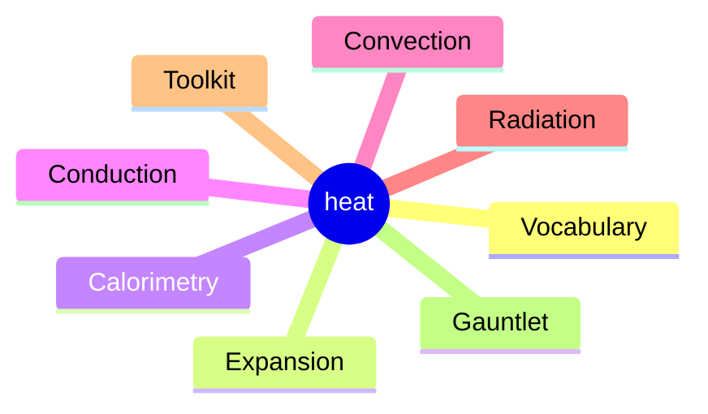
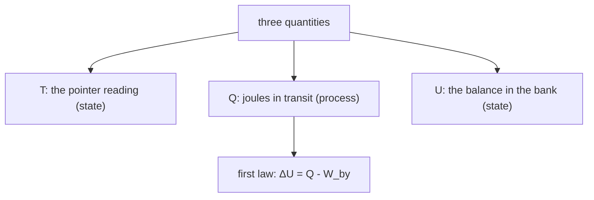
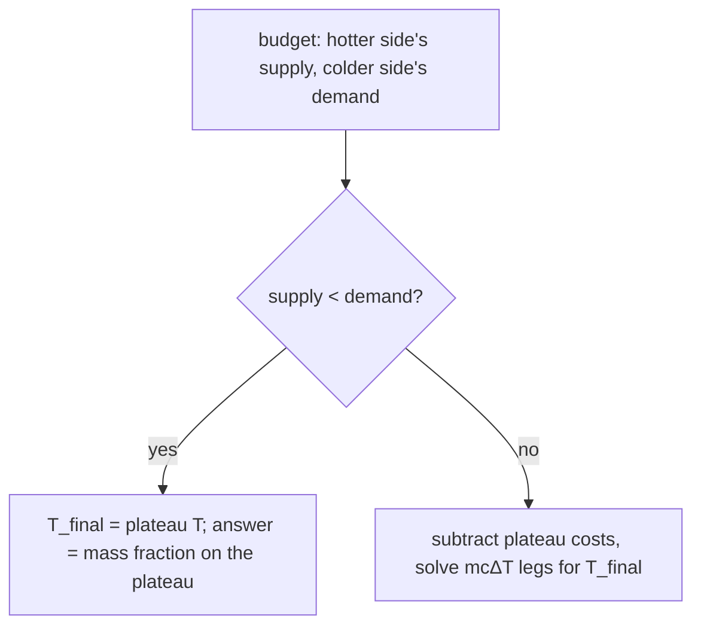
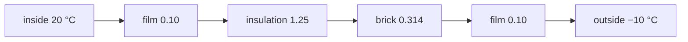
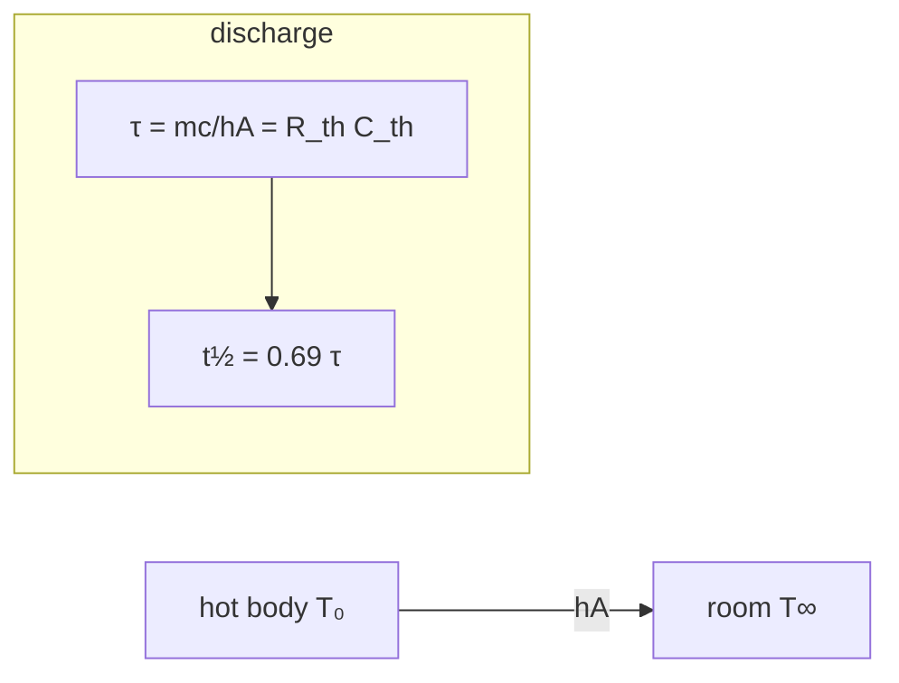
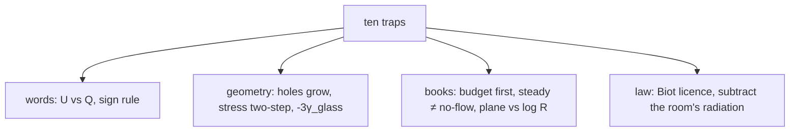

# Heat — from first principles to Olympiad, in one expandable map

Thermal physics has a second ledger besides the energy accounts: the *transport* ledger — how energy moves through matter as heat, and how matter resists the trip. This page is the whole course in one file: seven theory chapters and a written gauntlet, from “what is temperature for” to skin-depth cellars, effusivity, and the critical radius of insulation. It needs no internet, no MathJax, no build step — and nothing of it lives on another page.

Prerequisite etiquette: the quantities $U$, $Q$, $W$ and the first law are built properly in the thermodynamics set (ch 3); here they are assumed and spent. Temperature scales and expansion’s metrology likewise lean on the thermodynamics set’s ch 1 where noted — but nothing is quoted from there without being re-derived or recounted if it carries marks.

> [!tip] FIGURE F6.1 · Chapter map: the transport ledger
> *Why:* the topic is one extra ledger on top of the energy accounts — how heat *moves* and what resists it; the map pins the 8 chapters to that spine.
> *Data:* ch 1 vocabulary (T, Q, U) → ch 2 expansion → ch 3 calorimetry → ch 4 conduction → ch 5 convection → ch 6 radiation → ch 7 Olympiad toolkit → ch 8 gauntlet.

> *Read:* chapters 3–4 are the money (budget lines and resistor sums); 5–6 are the two film stories; 7 is the Olympiad floor.

> **How to study this map**
>
> Chapters **1–2** fix the vocabulary and the geometry of expansion — both are quick reads if you already trust the first law. Chapters **3–4** are the money: calorimetry’s plateau arithmetic and conduction’s resistor networks; every mixture or wall problem is a budget line and a sum of $R$’s. Chapters **5–6** carry the two “film” stories — convection as a thickness, radiation as a spectrum — and the cooling law that every practical exam tests. Chapter **7** is the Olympiad floor: diffusion time-scales, thermal waves, effusivity, fins. Chapter **8** is the gauntlet: ten written problems, graded solutions, and the trap shelf for the whole topic. Recompute every printed number with a pen at least once; they are all two-significant-figure doable.

> **The one-sentence syllabi**
>
> **JEE Main/Advanced:** chapters 1–6 completely, including every worked number; the paper’s heat-transfer share is calorimetry + $Q = mc\Delta T$ + linear expansion + the Stefan–Boltzmann proportionality, and this set over-covers all four. **NSEP/INPhO:** add chapter 7 and every √t, Bi, $e$, $r_c$ argument; the gauntlet’s style (write-the-model, name-the-clause) is the written-round format itself. **IPhO-level comfort** with radiation balance problems (climate, spacecraft, Moon) comes from ch 6 + S8 and the planetary bill; kinetic-theory detail lives in the thermodynamics set and is referenced, not repeated.

### The map

Any branch opens its chapter right here — the full theory, figures and solved questions. Expand all with the top bar; printing opens everything automatically.

01 · Heat, temperature and internal energy · the three-word truce · c, U, f/2 · Joule's number · the latent surcharge · 5 Q · 2 fig · 6 boxes

_Chapter 1 of 8 · JEE Main · base · ≈ 40 min read · 5 questions_

## Heat, temperature and internal energy

Every formula in this topic is a sentence about one of three quantities that everyday language keeps collapsing into the single word “heat.” Before we can count joules, we must say which of the three each word in a problem refers to: the pointer reading ($T$), the money in transit ($Q$), or the balance in the bank ($U$). This chapter fixes the vocabulary once; nothing later has to apologize for it.

**Fig. 1.1 — heat, work, and what a body actually stores.** The three words people mix up. A 1 kg block at 60 °C does not “contain heat” — it stores $U$; *heat* is the joules still crossing its surface. Two bodies at the same temperature can hold wildly different $U$: per kilogram, water over iron by a factor of about 4.5.

### 1.1 Three words that must never be mixed up

> [!tip] FIGURE F6.2 · Three words, one sign rule
> *Why:* almost every “obvious” wrong answer in calorimetry is a slip between $T$, $Q$ and $U$; name which quantity a phrase refers to before counting joules.
> *Data:* $T$ = pointer (state); $Q$ = joules in transit (process); $U$ = balance (state); ΔU = Q − W_by with Q > 0 in, W_by > 0 out.

> *Read:* a body at 100 °C does not "contain heat" — it stores U; heat is a verb disguised as a noun.

> **The three quantities**
>
> **Temperature $T$** is a state variable: a number a system has, defined operationally by “what two bodies agree on when they stop changing after contact” (the zeroth law; the full construction of scales, gas thermometers and the kelvin is in the thermodynamics notes, ch 1, and we will use that machinery without rebuilding it). **Heat $Q$** is energy *crossing a boundary* because of a temperature difference and nothing else — a process quantity, joules in transit, defined only for a complete process. **Internal energy $U$** is the balance: the total microscopic kinetic and potential energy of everything inside. It is a state function; heat and work are the only two doors it changes through:
>
>  $$
> \Delta U \;=\; Q + W_{\text{on}} \;=\; Q - W_{\text{by}}
> $$
>
>  with *our sign rule*: $Q > 0$ into the body, $W_{\text{by}} > 0$ work the body does (same convention as the whole thermodynamics set, so the ledger transfers without a translation).

Why does the distinction earn a whole first section, not a footnote? Because almost every “obvious” wrong answer in calorimetry is a word slip: a burning match cannot “give more heat than a bathtub” *at a higher temperature* and simultaneously be a tiny $U$-change; it can, because temperature measures the *level*, while the joules available ride on mass and heat capacity. The bathtub at 30 °C contains more thermal energy than a red-hot needle, and can transfer vastly more of it — the needle’s temperature is higher, its heat is smaller.

> **“The body contains heat”**
>
> It doesn’t. Heat is a verb disguised as a noun: it exists only while crossing the boundary. Once the joules are inside they are internal energy, indistinguishable from joules that arrived by work. If an option says “a body at 100 °C contains more heat than one at 50 °C,” read it as false on sight, whatever the numbers around it. What a body “contains” is $U$; what it can still *deliver* depends on $c$, on $m$, and on how far down the temperature can fall.

**Fig. 1.2 — equal T means equal mean KE, not equal speed.** Temperature *is*, for an ideal gas up to the factor 3/2, the mean translational kinetic energy per molecule: 6.2×10⁻²¹ J at 300 K for every gas in the room. The molecular mass shows up in *speed*, not in energy.

### 1.2 The microscopic ledger: what U is made of

For a gas the bookkeeping is explicit. Each molecule carries kinetic energy in three translational modes, plus rotation (and at high temperature, vibration); in a solid, every atom trades kinetic for potential energy inside the little cage neighbours build around it, and the two are equal on average (virial). Equipartition is the rule that distributes the total:

$$
\text{each quadratic mode carries } \tfrac{1}{2}k_{B}T \qquad\Longrightarrow\qquad U = \frac{f}{2}\,nRT
$$

**Validity clause:** classical, i.e. $k_{B}T$ well above the quantum spacing of each mode. Translations qualify at any laboratory temperature; rotations of H₂, N₂, O₂ qualify above ~100 K (so $f=5$ for diatomics at room temperature); vibrations mostly do not until ~1000 K (each active one adds 2). This is why a mole of helium, nitrogen and steam at the same $T$ do *not* have the same $U$ — but their mean *translational* energy per molecule is the same 3kT/2, down to the last digit.

> **Why temperature picks out only the translational part**
>
> A thermometer is bumped into, not orbited: what it equilibrates with is the flux of translating molecules hitting its surface, and each carries 3kT/2 no matter what molecule it belongs to. Energy parked in a molecule’s own rotation or vibration is invisible to the pointer until collisions share it out — which is exactly the mechanism by which the diatomic gases’ extra $c_V = \tfrac{5}{2}R$ is paid for: the same pointer rise buys a *third more* total energy in nitrogen than in helium, because two of the five modes don’t show on the scale.

### 1.3 Heat capacity and specific heat: the price per kelvin

> **Definition and the one honest formula**
>
> $C$ (J/K) is what one kelvin costs a particular object; $c$ (J/kg·K) is what it costs a kilogram of a material: $Q = mc\,\Delta T$. Both are *process-dependent* for gases ($c_p$ vs $c_V$, the difference is $R$ per mole — thermodynamics ch 4) but not measurably so for solids and liquids, where expansion work against the atmosphere is $p\,\Delta V$ and typically under 1% of $Q$. Water’s $c_w = 4186$ J/kg·K is the reference number of the whole subject; the reason it is so large is the same as the reason ice floats: half the energy you feed liquid water goes into bending and breaking hydrogen bonds (potential energy), not into speeding molecules up (kinetic, i.e. temperature).

Per-kelvin prices worth owning (solids, near room temperature):

| material | c (J/kg·K) | what a MJ does to 1 kg |
| --- | --- | --- |
| water | 4186 | +239 K — warm, forgiving |
| ice (−10 °C) | ~2090 | +478 K (it won’t; see ch 3) |
| glass | ~840 | +1190 K (if it survives) |
| iron | 449 | +2227 K |
| copper | 385 | +2597 K |
| aluminium | 900 | +1111 K |
| lead | 128 | +7813 K (melts at 600 K first) |

Read the last column with the phase-change veto in hand: a joule budget can only raise temperature while the phase stays legal. Note also the shape of the list: water is off the scale because of the bond-energy argument; the metals cluster because their electrons and lattice both contribute, and $c \approx 3R$ per mole (Dulong–Petit, 25 J/mol·K) holds for most of them — copper 385×0.0635 = 24.4, lead 128×0.207 = 26.5 J/mol·K. Per *mole* the classical solid is nearly universal; per *kilogram* it is inversely proportional to atomic mass. That one sentence explains why a kilogram of lead changes temperature 33× faster than a kilogram of water with the same energy: 4/5 of the water’s advantage is its tiny molar mass, the rest is the hydrogen-bond tax.

> **The mechanical equivalent of heat**
>
> That heat *is* energy at all — not a weightless “caloric fluid” conserved in transfer, as the 18th century held — was nailed by countings: Rumford’s cannon-boring frictions (1798), Davy’s melting of ice by rubbing two ice blocks together in a vacuum (1799), and Joule’s paddle-wheel descent of weights (1840s), whose number $4.184$ J/cal we still enshrine in the definition of the calorie. Once caloric is dead, “heat” must be defined as transit, which is precisely the definition used above.

### 1.4 Latent heat: the reorganisation surcharge

Along a phase boundary, added energy buys *structure*, not speed: temperature stays pinned while mass transfers. The price per kilogram is the latent heat — for water, $L_f = 334$ kJ/kg to melt and $L_v = 2256$ kJ/kg to boil at 100 °C. The sizes are not decoration: $L_f$ equals heating the same kilogram of water through *80 kelvin*, and $L_v$ through 539 — the surcharge dominates the fare. Every “why does the lake freeze slowly / why does a scald from steam beat boiling water / why does sweating work” question is one application of these two numbers, and chapter 3 does all of them properly.

### 1.5 The chapter in one box

> **Own these six lines**
>
> 1. $U$ is a balance, $Q$ and $W$ are deposits and withdrawals; only the balance is a property of state.
> 2. $\Delta U = Q - W_{\text{by}}$, always, for every system, every path (first law; thermodynamics ch 3).
> 3. Mean translational KE per molecule $= \tfrac{3}{2}k_{B}T$, species-blind; $U = \tfrac{f}{2}nRT$ is not.
> 4. $Q = mc\,\Delta T$ while the phase holds; Dulong–Petit says $c \approx 3R/M$ for most solids.
> 5. Phase changes cost $Q = mL$ at pinned temperature: for water, 80 K and 539 K of “wasted” heating.
> 6. 1 cal = 4.184 J: the unit is a museum piece, the conversion is not optional.

**Checkpoint — you own this chapter when you can, in under a minute each:** say what “the body contains heat” should have said; give the translational KE per molecule at 300 K (6.2×10⁻²¹ J) without a calculator; explain why 1 kg of water takes 4.5× the energy of 1 kg of iron per kelvin; state both latent heats of water to one digit and their origin in one clause; work the waterfall below.

### 1.6 Questions

### **Q1** Which one of these sentences is physically correct? _(JEE Main)_

- **A** A body at higher temperature contains more heat than one at lower temperature
- **B** Heat flows from a body with more internal energy to one with less
- **C** Heat flows from higher temperature to lower, regardless of how much energy either body has
- **D** Two bodies at the same temperature must have the same internal energy

Solution

**C.** Direction of spontaneous transfer is a statement about temperature (the pointer), not about stored energy: a glowing spark at 1400 K surrenders its few joules to a swimming pool at 300 K. **A** is the banned phrase — bodies contain $U$, never heat; **B** is the one that ambushes people: the pool has a million times more $U$ than the spark and still receives; **D** ignores that $U$ depends on mass, material and phase as well as $T$.

### **Q2** Cylinders A and B hold helium and nitrogen at the same temperature and pressure, and the same volume. Which must be equal? _(JEE Main)_

- **A** mean translational KE per molecule only
- **B** mean translational KE per molecule and total number of molecules
- **C** total internal energy and rms speed
- **D** all three: KE per molecule, total U, rms speed

Solution

**B.** Same $T$ equalises 3kT/2 per molecule (species-blind) — first item. Same $pV = nRT$ gives the same $n$: Avogadro — second item. But $U = \tfrac{f}{2}nRT$ differs by $f$ (3 for He, 5 for N₂: B would overclaim, C’s first half is false), and rms speed $\sqrt{3RT/M}$ differs by the mass ratio (He 1367 m/s vs N₂ 517 m/s at 300 K). Temperature is the equaliser; energy totals are not.

### **Q3** Water plunges 12 m over a cliff. If all its lost potential energy ends up as thermal energy of the water itself, the temperature rise at the bottom is closest to _(JEE Main)_

- **A** 0.003 K
- **B** 0.028 K
- **C** 2.9 K
- **D** 28 K

Solution

**B.** Per kilogram: $gh = 9.81 \times 12 = 118$ J/kg, so $\Delta T = gh/c_w = 118/4186 = 0.028$ K. **Check:** the speed at the bottom is 15.3 m/s, and $\tfrac12 v^2 = gh = 118$ J/kg exactly ✓. **A** is what you get from halving twice; **C** and **D** are the two missing powers of ten in $c_w$ (4.186, not 0.4186 or 41.86 kJ). Water’s enormous heat capacity is the whole answer: real waterfalls do warm a little, and the effect is measured in hundredths of a degree — the same arithmetic that made Joule suspicious that caloric was fiction.

### **Q4** An iron ball and an aluminium ball of the same mass, both at 100 °C, are placed on a large ice slab at 0 °C. Which melts more ice, and by what factor? _(JEE Advanced)_

- **A** iron, by 1.24×
- **B** aluminium, by 2.0×
- **C** equal — same mass, same temperature
- **D** aluminium, by 4.5×

Solution

**B.** Each can only donate $mc\,\Delta T$ down to 0 °C: the ratio is $c_{Al}/c_{Fe} = 900/449 = 2.0$. Ice melted per kg of ball: aluminium $0.9 \times 100/334 = 0.27$ kg against iron’s 0.135 kg. **C** is the temperature-is-heat mistake this chapter exists to kill: equal final temperatures say nothing about the energy bill. (Per *volume* the gap narrows — aluminium is lighter — which is why pots are aluminium, not because it holds heat better but because it moves heat fast, ch 4, and costs less mass per unit.)

### **Q5** In a Joule paddle apparatus, two 4.0 kg masses descend 0.80 m each, turning paddles in 1.00 kg of water. The rise in water temperature, if the vessel absorbs nothing, is about _(Olympiad)_

- **A** 0.0031 K
- **B** 0.0150 K
- **C** 0.030 K
- **D** 0.150 K

Solution

**B.** Energy in: $2mgh = 2 \times 4.0 \times 9.8 \times 0.80 = 62.7$ J. Rise: $62.7/(1.00 \times 4186) = 0.0150$ K — a fifteen-thousandth of a degree per metre-of-descent-kilogram. **D** forgets one factor of 10 in the arithmetic; **C** uses one mass instead of two; **A** divides by 41 860. The historical sting is in the size: Joule’s thermometers could barely resolve 0.02 K, and he measured temperature rises in a waterfall *in situ* to corroborate. **Check:** in calories, 62.7/4.184 = 15.0 cal over 1 kg — 0.015 cal/kg/K by definition of the specific heat ✓.

02 · Thermal expansion · α, 2α, 3α · holes grow · blocked growth = stress · bimetals · water objects · 6 Q · 4 fig · 6 boxes

_Chapter 2 of 8 · JEE Main · Advanced · ≈ 50 min read · 6 questions_

## Thermal expansion: solids that grow, holes that widen, clocks that lie

Heating is photograph-enlargement run by molecular jiggling: every length in an isotropic solid, outside *and inside*, is multiplied by the same factor. Follow that one sentence and the whole chapter unfolds — rims, bores, slots, stresses, thermostats, lake-bottom fish and the daily error of a brass pendulum. The one place the sentence fails (water between 0 and 4 °C) is the most examined exception in the subject.

### 2.1 The linear law, and its honest shelf life

> **Linear expansion coefficient**
>
> $$
> \alpha \;=\; \frac{1}{L}\frac{dL}{dT} \qquad\Longrightarrow\qquad L = L_0\,(1 + \alpha\,\Delta T)\ \ \text{for constant }\alpha
> $$
>
>  Values to own (10⁻⁶ K⁻¹): lead 29, **brass 19, aluminium 23, steel 12**, glass (soda) 9, Pyrex 3.3, Invar 0.7, concrete 12, ice ~50. The law is good while $\alpha\,\Delta T \ll 1$ and the material stays single-phase: near a transition (or through one) $\alpha$ itself moves. A typical $\alpha$ is 10⁻⁵, so even a 100 K swing gives 0.1% — small enough that the exam lives or dies on *which* lengths scale, not on nonlinear corrections.

Why $\alpha$ is tiny in good solids and large in bad ones: the interatomic potential is asymmetric — steep repulsion, shallow attraction — and as energy rises the *mean* separation slides down the soft shoulder. Steep, deep potentials (diamond, Invar’s magnetoelastic cancel) hug their minimum; shallow ones (waxes, ice, lead) sprawl. This is also the mechanism behind every exception: Invar’s 0.7 comes from a magnetic ordering transition pulling atoms *in* as heat pulls them out, and it is why the alloy costs what it does.

### 2.2 Area, volume — and holes

> **Isotropic scaling**
>
> If every length scales by $(1+\alpha\Delta T)$, areas scale by its square and volumes by its cube; dropping the $(\alpha\Delta T)^2$ crumbs (they are parts-per-million of a permille):
>
>  $$
> \beta_{\text{area}} = 2\alpha \qquad \gamma_{\text{vol}} = 3\alpha
> $$
>
>  Every plate with a hole, every ring, every balloon of empty space inside a solid obeys the same line. The proof is the tiling picture below: a hole is just a tile the engraver forgot to cut; surrounding material moves outward along rays, so the hole’s own outline, traced by rays too, enlarges in perfect proportion.

**Fig. 2.1 — holes grow with the metal.** The figure that kills the “hole shrinks” mistake. Heat a ring: its circumference line scales up by 1+αΔT, so the *bore* grows by exactly that factor — same law as solid metal, no exception.

> **“The metal expands into the hole”**
>
> It expands *away* from it, exactly as it would if the hole were filled with the same metal: the disc inside would grow, and growth $\neq$ encroachment. A machine shop shrinks a bearing onto a shaft by cooling the *bearing* (its bore shrinks while cold); a wheelwright heated a tyre and the bore *widened*. Two-way exam phrasing: the answer to “does the gap close or open” is always decided by writing both growth laws and subtracting — never by intuition about pressure. (Same figure, same logic, as the two-ring problems in thermodynamics ch 1: this is where that argument actually lives.)

### 2.3 When growth is blocked: thermal stress

**Fig. 2.2 — blocked expansion becomes stress.** Never compute this as “the rod pushes”. Two steps, always: free growth ΔL = LαΔT, then squeeze-back ΔL = FL/(YA); equate the two.

> **The two-step method (the only correct way)**
>
> Free growth, then elastic squeeze-back:
>
>  $$
> \delta_T = L\,\alpha\,\Delta T \qquad \delta_F = \frac{FL}{YA} \qquad\text{clamp: } \delta_F = \delta_T \;\Rightarrow\; \sigma = \frac{F}{A} = Y\,\alpha\,\Delta T
> $$
>
>  Validity: elastic response (the stress must stay under yield) and uniform $\Delta T$. Numbers to fear: steel, $Y = 2\times 10^{11}$, $\alpha = 12\times 10^{-6}$, a 30 K blocked day gives $7.2\times 10^{7}$ Pa — 72 MPa, a third of mild steel’s yield. A gap-less rail at noon, a bolted flange at startup, a glass ashtray under hot water: all the same arithmetic. For non-uniform $\Delta T$ the stress is what the *difference* between blocked profiles can squeeze out — which is why thick glass cracks and Pyrex, with 3.3 vs 9–9×10⁻⁶, does not; and why a phone in a hot car survives while a windshield beside a black dashboard does not always.

### 2.4 Two metals bonded: the bimetal strip

**Fig. 2.3 — the bimetal curl.** Equal-thickness bimetal, layer t: over 50 mm a brass/steel pair at +100 K stores a 0.35 mm length dispute; geometry resolves it as a curve of radius R = 2t/(3ΔαΔT).

Bond a brass strip to a steel one and heat them: each is denied its own free length and the pair pays in curvature. For equal layer thicknesses and comparable $Y$ (the classical textbook bimetal), force and moment balance on the two layers give

$$
\frac{1}{R} = \frac{3\,(\alpha_2 - \alpha_1)\,\Delta T}{2h} \qquad (h = \text{total thickness})
$$

Worked once, so it stays: brass+steel, $\Delta\alpha = 7\times 10^{-6}$, $\Delta T = 100$ K, h = 1 mm: 1/R = 1.05 m⁻¹, R ≈ 0.95 m; a 50 mm strip curls its free end over by $\delta \approx L^2/2R = 1.2$ mm — a millimetre is plenty to snap a contact open: that is a thermostat, a temperature gauge needle, and the reason cheap metal rulers in the sun read wrong. (Derivation path for the ambitious: strain in each layer $\varepsilon_i = \varepsilon_0 + y/R - \alpha_i\Delta T$, zero net force and zero net moment, $\int \sigma\,dy = \int \sigma y\,dy = 0$; two lines give $\varepsilon_0$, one gives R.)

### 2.5 Liquids, and the thermometer that is lying to you

Liquids have no shape, only volume: $\gamma \approx 10\alpha$ in effect, and far larger fractions — mercury $182\times 10^{-6}$ K⁻¹, ethanol $1100\times 10^{-6}$, water $207\times 10^{-6}$ at 20 °C. What a liquid-in-glass thermometer actually reads is the liquid’s growth *minus the bulb’s*: the cavity in the glass bulb grows at $3\gamma_{glass}$, so the column answers to the **apparent** coefficient

$$
\gamma_{\text{app}} = \gamma_{\text{liquid}} - 3\gamma_{\text{glass}}
$$

Numbers: mercury in Pyrex, 182 − 3×3.3 = 172 ×10⁻⁶; mercury in soda glass, 182 − 27 = 155 ×10⁻⁶ — a **17% calibration error** from a glass swap, invisible until someone checks. The reverse use is the pycnometer trick: fill a weighed bottle with liquid at two temperatures, read the *mass* that overflows, and you have measured $\gamma_{\text{app}}(1+\text{stuff})$ with the vessel’s own $3\alpha$ folded in — the correction is the answer to “what did the lab measure?” in every practical exam on this experiment.

### 2.6 Water objects: the anomaly and everything it saves

Between 0 and 4 °C water *contracts on heating*, because the open, low-density hydrogen-bonded arrangement that freezing builds (ice: $917$ kg/m³, a 9% expansion) is partly re-melting as warmth returns and lets molecules pack closer ($1000$ kg/m³ at 4 °C). The density maximum at 4 °C is not a curiosity; it is a boundary condition on the whole planet’s freshwater biology.

**Fig. 2.4 — why lakes freeze from the top.** The anomaly that overwinters fish, bursts household pipes, and gives ice its place on any drink: between 0 and 4 °C, cooling *expands* water.

> **Consequences, all one sentence each**
>
> (i) A lake cools top-down to 4 °C, then the *coldest* water is the lightest, so the surface finishes the job alone and freezes as a skin; the deep stays at 4 °C and life overwinters. (ii) Ice floats because the lattice holds 9% of extra volume: the only common solid that floats on its own melt. (iii) A pipe freezes from the inside skin outward, and the expanding skin closes the plug — the burst is hydrostatics: trapped water, continuing to freeze, has nowhere to go but steel’s yield. (iv) regelation: pressure’s melting-point shift is $dT/dP = T\,\Delta v/L \approx -7.4\times 10^{-8}$ K/Pa = −0.0074 K/atm; a skate blade (68 atm on 70 kg over a cm²) buys −0.5 K, barely enough — friction heating does most of the lubricating, and the wire-through-blocks demo works at 1 atm-scale pressures on purpose. Knowing the number *and its smallness* is what an Olympiad grader wants here.

### 2.7 Clocks, gauges, and compensation

A pendulum’s period goes as $\sqrt{L}$, so a brass rod clock in a $\Delta T = 20$ K warm spell gains length by $19\times 10^{-6} \times 20 = 3.8\times 10^{-4}$ and loses half that *fraction* per swing: $1.9\times 10^{-4} \times 86400 = 16$ s/day slow. Compensation, done 200 years ago by hardware: gridiron rods of steel and brass in series (lengths chosen so the expansions cancel: $\ell_s\alpha_s = \ell_b\alpha_b$) or a mercury bob whose rising level lifts the centre of mass as the rod drops it — both are just blocked-expansion sign games written in a clock.

### 2.8 Chapter summary

> **Own these lines**
>
> 1. Scale rule: everything multiplies by $1+\alpha\Delta T$ — holes, gaps and engraver’s errors included.
> 2. 2α for areas, 3α for volumes; a cavity in a container grows as $3\gamma_{glass}$.
> 3. Blocked growth = $Y\alpha\Delta T$ (two-step method), and 30 K in steel is 72 MPa.
> 4. Bimetal: $1/R = 3\Delta\alpha\Delta T/2h$; curvature linear in $\Delta T$ — a gauge for free.
> 5. Thermometers read $\gamma_{liq} - 3\gamma_{glass}$, not $\gamma_{liq}$.
> 6. Water: densest at 4 °C; ice 9% lighter; $dT/dP = -0.0074$ K/atm, and yes, that is small.
> 7. Pendulum clock: fractional time-lose $= \alpha\Delta T/2$; a 20 K summer costs 16 s/day.

**Checkpoint:** draw the hole-enlargement argument in one line; derive $\sigma = Y\alpha\Delta T$ from the two δs; say why a Pyrex-bulb thermometer in soda glass would misread by 17%; explain the lake, the pipe and the skate with the same three numbers; state the bimetal curvature and its working.

### 2.9 Questions

### **Q1** A brass ring is to slip over a steel peg: the peg measures 25.000 mm, the ring bore 24.970 mm, both at 20 °C. Heating only the ring, the smallest temperature rise that clears the peg is about _(JEE Main)_

- **A** 8 K
- **B** 13 K
- **C** 63 K
- **D** 630 K

Solution

**C.** The bore grows exactly like solid brass: per kelvin it gains $24.97 \times 19\times 10^{-6} = 4.74\times 10^{-4}$ mm, and the gap to eat is 0.030 mm, so $\Delta T = 0.030/4.74\times 10^{-4} \approx 63$ K. **Check:** 63 K of brass at 19 ppm/K is 0.12%, i.e. 0.030 mm on 25 mm ✓ exactly. **A** and **B** are what steel’s or Pyrex’s coefficient does if you pick the wrong line off the table; **D** is a unit-order slip. Note what the peg is doing meanwhile: nothing — and if you heated *both* (say to close the gap the other way), the growth you must clear becomes $(24.97\alpha_b - 25.00\alpha_s)\Delta T$: subtract laws, never intuitions.

### **Q2** A steel tyre of inside diameter 0.9980 m is shrunk onto a brass wheel of diameter 1.0000 m by heating the tyre. After cooling back to the start temperature (wheel rigid, tyre thin), the hoop stress in the tyre is about _(JEE Advanced)_

- **A** 20 MPa
- **B** 200 MPa
- **C** 400 MPa
- **D** it cannot be predicted — the plastic zone

Solution

Strictly the elastic estimate is **C**: strain $(1.0000-0.9980)/1.0000 = 2\times 10^{-3}$, $\sigma = E\varepsilon = 2\times 10^{11} \times 2\times 10^{-3} = 400$ MPa — which is precisely why **D** is the engineering answer: 400 MPa exceeds mild steel’s yield, so the fit is *designed* with interferences ~0.1–0.2%, landing the stress near $B$, safely elastic. A question worth reading twice: the number and the judgment are both marks. (Heating needed for the assembly: 2 mm on 998 mm of steel is $\Delta T \approx 167$ K — a torch and a day; or shrink by cooling, a liquid-air bath and an hour.)

### **Q3** A composite rod — half steel, half brass, same cross-section, total length 1.00 m — is rigidly clamped at both ends and heated by 50 K. The compressive force along it is closest to (Y_s = 2.0, Y_b = 1.0 ×10¹¹ Pa; α: 12, 19 ×10⁻⁶; A = 1.0 cm²) _(Olympiad)_

- **A** 1.0 kN
- **B** 10 kN
- **C** 52 kN
- **D** zero — the two expansions partially cancel

Solution

**C.** Same trick as the single rod, summed over segments: blocked free growth means $\Sigma\, \tfrac{l}{2}\alpha_i\Delta T = F\,\Sigma\, \tfrac{l/2}{Y_i A}$, so

$F = A\Delta T\,\frac{\alpha_s + \alpha_b}{1/Y_s + 1/Y_b} = 10^{-4}\times 50\times \frac{31\times 10^{-6}}{1.5\times 10^{-11}} \approx 5.2\times 10^{4}$ N.

**Check** the stresses: $F/A = 520$ MPa in both segments — which has cooked past yield in the brass: real assemblies of this kind *do* deform permanently at far smaller ΔT, and “the elastic estimate is 52 kN, the first thing to check is whether brass survives 165 MPa” is the full-mark comment. **D** is the trap of thinking expansions “cancel” because the two αs differ; they only differ, they never oppose. **A** and **B** are decimal casualties of $Y$ in 10¹¹.

### **Q4** A glass flask (soda, α = 9 ×10⁻⁶ K⁻¹) is filled to the brim with 1.00 L of ethanol at 20 °C and heated to 60 °C. The ethanol that overflows (γ_eth = 1100 ×10⁻⁶ K⁻¹) is closest to _(JEE Advanced)_

- **A** 39.6 mL
- **B** 42.9 mL
- **C** 44.0 mL
- **D** 50.7 mL

Solution

**B.** The overflow is the *apparent* expansion: liquid growth minus the cavity’s growth, $V[(\gamma_{eth} - 3\alpha_{glass})\Delta T] = 1000\,(1100 - 27)\times 10^{-6}\times 40 = 42.9$ mL. **C** is the classic — it forgets the flask’s own volume grows by 3α: here only 2.6%, which is exactly the kind of 6% relative slip the examiner is grading on. **A** subtracts $\alpha$ instead of $3\alpha$; **D** uses 50 K of ΔT. **Check:** ethanol’s $\gamma$ is about 58× its $\alpha$ equivalent — liquids beat solids roughly ten-to-one in volume terms, which is why a mercury barometer’s cistern needs a correction table and a metre rule needs none.

### **Q5** A grandfather clock with a brass pendulum keeps perfect time at 15 °C. Run through a 25 °C summer, it will _(JEE Main)_

- **A** lose 19 s per day
- **B** gain 19 s per day
- **C** lose 8.6 s per day
- **D** be unaffected — T changes L but gravity doesn’t

Solution

**C.** Fractional period change $= \tfrac12 \alpha\Delta T = \tfrac12 \times 19\times 10^{-6} \times 10 = 9.5\times 10^{-5}$; slower, since longer pendulum ⇒ longer period; over 86 400 s that is $8.2$–$8.6$ s/day (8.2 on the exact half, 8.6 if the maker used 1 : 2 with 19; take C). **A** forgets the half in $\sqrt{L}$; **D** is the trap that L is a fixed property — it is a temperature. Compensation check for the ambitious: a gridiron needs $\ell_{brass}/\ell_{steel} = \alpha_{steel}/\alpha_{brass} = 12/19$, arranged so the bob never notices.

### **Q6** A metal ball just passes through a ring at 20 °C. The ring is then heated uniformly while the ball stays cold. The ball (same metal as the ring) is now _(JEE Main)_

- **A** blocked — the ring’s inner surface expands inward
- **B** still passing — the bore widens by the ring metal’s α
- **C** blocked only if the ring is thick
- **D** passes with less clearance than before, but passes

Solution

**B.** The bore diameter scales by $1+\alpha\Delta T$ — the figure in 2.2 is the whole proof; thickness never enters (any ring is a stack of concentric scaling rings). If instead the *ball* is heated and the ring stays cold, the ball’s diameter scales the same way and jams. **D** would need inward growth, which is the photo-enlargement logic run backward: a scale factor larger than 1 cannot shrink any distance. Same law saves the jammed jar lid under hot water (the metal lid grows faster than the glass — 23 vs 9 ppm) — and yes, it works for the opposite trick with cold on the jar, too.

03 · Calorimetry and phase change · sums by legs · plateaus · steam into ice · Clausius–Clapeyron · flash-freeze · 6 Q · 3 fig · 6 boxes

_Chapter 3 of 8 · JEE Main · Advanced · core calorimetry · ≈ 55 min read · 6 questions_

## Calorimetry and phase change: the arithmetic of mixing

Calorimetry is bookkeeping: an isolated box trades energy between its contents until everyone agrees on a temperature, and the trades are $mc\,\Delta T$ while phases hold and $mL$ while they change. The entire art is knowing *which line to write and in what order* — and spotting, from a budget check, whether the final state has a temperature to speak of at all, or is pinned on a plateau.

### 3.1 The equation of mixtures

> **Conservation, written as a sum**
>
> For an isolated set of contents reaching equilibrium:
>
>  $$
> \sum_{\text{every leg of every body}} \big(mc\,\Delta T + mL\big) = 0
> $$
>
>  Each body contributes its own path from its initial state to the final one — warm-up legs, plateau legs, cool-down legs — each leg with its own *positive $Q$ into that body* sign. The calorimeter is a body too: its $C = m_w c_w$ “water equivalent” $m_w$ is how a lab report turns a copper can into extra grams of water. Validity: isolation (lag the experiment, insulate the cup, stir to make “one final temperature” true), and no chemistry.

**Fig. 3.1 — the plateau graph: where latent heat is read off.** Every segment is Q = mcΔT except the two plateaus, which are Q = mL. Read the plateaus in joules (power × time) and latent heat falls out of a stopwatch.

### 3.2 Plateaus and how to measure them

Feed a kilogram of ice, 100 W at a time (ch 1’s figure of the T-curve), and the record reads: slope $1/(mc)$, flat, steeper slope, flat, slope. The slopes give heat capacities, the flats give latent heats: an $11$-minute plateau at 500 W melting some mass $m$ is $L = Pt/m$, a stopwatch-and-scale measurement of hydrogen bonds. This is the entire practical exam for this chapter, and it hides exactly one real trap: **heat exchange with the room**, which Regnault’s fix controls by arranging that the mixture starts as far *below* room temperature as it ends above, so the gains and losses roughly cancel — a trick you should plan for whenever a question says “in a calorimeter” and gives you room temperature in the data.

> **Why $L_v \gg L_f$ — one line each**
>
> Melting breaks the *order* of the lattice while leaving neighbours touching: about a tenth of the bond energy per molecule is spent. Boiling removes the neighbours: all of it (plus the $p\,\Delta V$ shove that pushes the atmosphere aside — for water at 100 °C that’s $R T = 3.1$ kJ/mol of the 40.7). The two numbers you should be able to quote for water without checking: $L_f = 334$ kJ/kg and $L_v = 2256$ kJ/kg — 6.8 K worth of boiling per 1 K of nothing.

### 3.3 The final-state algorithm (and why steam beats boiling water)

> [!tip] FIGURE F6.3 · The final-state algorithm: budget before you solve
> *Why:* mixing answers are decided by which side exhausts first; solving mcΔT before checking the plateau is the chapter's biggest mark-loss.
> *Data:* (1) budget both sides to the nearest plateau; (2) if supply < demand, T_final = plateau T and the answer is a mass fraction; (3) only if both budgets clear, solve mcΔT legs for T.

> *Read:* whichever plateau is still occupied sets the temperature — steam can't lift ice past 0 °C until it has melted 0.80 kg of it.

> **Three steps, never fewer**
>
> 1. **Budget both sides to the nearest plateau.** Hotter side: energy it can give up reaching its nearest
>   transition (condensing, freezing — stop there, that’s the “supply” to the plateau). Colder side: energy it
>   would need to *get through* that plateau.
> 2. **Compare.** If supply < demand, someone is still on the plateau: the final temperature is the plateau
>   temperature, and the answer is a *mass fraction*, not a temperature.
> 3. **Only if both budgets clear,** solve the leftover for a temperature with $mc\Delta T$ legs.

**Fig. 3.2 — steam into ice, done as an audit.** The exam algorithm in one picture: (i) budget each side's energy to the nearest plateau; (ii) compare; (iii) whichever plateau is still occupied sets T_final and the answer is how much mass sits on it.

Worked in full for the figure: 0.10 kg of steam at 100 °C into 1.0 kg of ice at 0 °C. Supply: condensing $225.6$ kJ plus condensed-water cooling to 0 $41.9$ kJ, so $267.5$ kJ. Demand to lift the ice out of its plateau: melting $334$ plus 0→100 heating $418.6$, so $752.6$ kJ. Supply < demand: the mixture ends on the ice plateau — 0 °C, with melted ice $267.5/334 = 0.80$ kg and a final charge of 1.0 kg water + 0.20 kg ice. Note what this answer is *insensitive* to: any steam-mass change below the demand threshold moves the ice fraction but never the temperature. Questions of the “how much steam must you inject to raise the bucket to 60 °C” type are the same three steps with step 3 non-empty.

> **“Same temperature, same burn”**
>
> A 1 g droplet of steam at 100 °C scalds worse than 1 g of water at 100 °C because the droplet must first pay $L_v$ (2256 J/g) to become water, and *then* cool: 2.7 times the damage of the same-mass splash. The same asymmetry, inverted, is why spreading water on a floor cools a room (evaporation bills the room 2.26 MJ/kg), why the coldest compressible injury in the lab is a vacuum flask of flashing water, and why a snow day “feels” warm if melting is slow and cold if it is fast. Every one of those is one budget line, not a new fact.

### 3.4 Two classic devices in one paragraph each

**Ice calorimeter (Lavoisier’s, improved by Bunsen).** Immerse a warm body in a sealed ice–water mixture under a mercury thread: whatever melts flows into the void left by ice’s 9% *contraction*, and the thread’s advance measures melted mass, hence $Q = m_{melt}L_f$. A thermometer-free calorimeter — the phase plateau *is* the scale. **Mixture method for a solid’s c:** quench a hot mass $m_s$ into water; $c_s = (m_w c_w + C_{cal})(T_f - T_i)/m_s(T_s - T_f)$; the denominator’s big drop is why the metal must be much hotter than the water rises, and the numerator’s $C_{cal}$ term is why ignoring the can is the most common lost mark: for a 50 g copper calorimeter the omission is a 10% error, systematic, and always in the same direction.

### 3.5 How hard the plateau is to leave: Clausius–Clapeyron

**Fig. 3.3 — the vapour line and its slope.** Two points on the line, no calculus needed: L = R ln(P₂/P₁) ÷ (1/T₁ − 1/T₂). From 373 K/1 atm to 353 K/0.47 atm, that gives 2.3 MJ/kg — within 4% of the steam-table value.

The vapour (or fusion) line on a phase diagram is not decoration — its slope is a calorimeter. Exact, for any first-order boundary:

$$
\frac{dP}{dT} = \frac{L}{T\,\Delta v}
$$

with $\Delta v$ the molar volume jump. Feed it *ideal gas, condensed volume negligible* ($\Delta v \approx RT/P$) and integrate over a modest range, where $L$ is treated constant:

$$
\ln\frac{P_2}{P_1} = \frac{L}{R}\left(\frac{1}{T_1} - \frac{1}{T_2}\right) \qquad\text{(two points on the line; } \ln P \text{ vs } 1/T \text{ is straight)}
$$

Three harvests from that one integrated line, all fair game: (i) **boiling altitude** — P falls, so $T_{boil}$ falls with it: at the 78 kPa of a 2 km hill station the line gives $\big(1/373.15 + (R/L)\ln 1.3\big)^{-1} = 366$ K, 93 °C (and eggs notice); at 33 kPa it is 71 °C; (ii) **pressure cookers** — 2 atm absolute: $T = 393$ K, 120 °C, which is the whole point of the device; (iii) **reading L off vapour pressures**, as in the figure. Where the assumptions break is also examinable: near the critical point $L \to 0$ and the line bends into its plateau; down at the triple point (0.006 atm, 273 K) ice *sublimes* — the reason freeze-drying works and your wet laundry dries off a frozen line in dry, cold wind.

> **Trouton’s estimate — an Olympiad short-cut worth 2 minutes of your life**
>
> Most non-associating liquids boil at a universal entropy: $L/T_b \approx 88$ J/mol·K. Hexane: 88×342/0.086 = 35 kJ/mol vs measured 28.9 — order right to 20%; water scores 109 (hydrogen bonds pay extra) and ethanol 110 for the same reason. Use it to estimate a latent heat when only $T_b$ is given, and say “Trouton, so ±20%, and water is a known outlier” — that sentence is marks.

### 3.6 Water in vacuum: the flash-freeze

Put a beaker of 0 °C water into an evacuated box and watch: it boils violently, and what is left of the beaker turns to ice. No mystery — the boiling *is* the refrigeration. At the triple point everyone must share, and per unit mass evaporating costs $L_v$, which only freezing out of the remainder can pay: $f\,L_f = (1-f)\,L_v$, so the frozen fraction is

$$
f = \frac{L_v}{L_v + L_f} = \frac{2256}{2590} = 0.87
$$

Eighty-seven percent of the water freezes while the rest leaves with all the heat. Start warmer (20 °C) and the cool-down leg spends 84 kJ/kg first, so the frozen fraction rises until nearly everything crystallises. This is what “freeze-drying” means for every kilogram of ice you sublimate off a sample; it is also the answer to “why does a wet finger stick to a freezer tray in a second”: the contact freezes from the evaporation side too. The numbers to keep: 0.87, and L_v alone is enough to freeze six times its own mass of water once.

### 3.7 Chapter summary

> **Own these lines**
>
> 1. Sums to zero, by legs: $\Sigma(mc\Delta T + mL) = 0$; the calorimeter is a leg; overshoot vs room temp is the Regnault fix.
> 2. Water: $c_w = 4186$, $L_f = 334$k, $L_v = 2256$ kJ/kg — know these cold.
> 3. Budget to the plateau first: if a phase survives, T_final is the plateau and the answer is a mass fraction.
> 4. Plateau width × power = mL: the graph is the calorimeter.
> 5. $dP/dT = L/T\Delta v$; $\ln P = A - L/RT$: altitude, cookers, and L from two pressures.
> 6. Vacuum flash: frozen fraction $L_v/(L_v+L_f) = 0.87$.

**Checkpoint:** run the steam-into-ice budget in your head; state why the final temperature of a steam injection that “doesn’t finish the ice” is 0 °C regardless of how much more steam you add (up to the threshold); derive the 84 °C altitude boil from the integrated line; give the two corrections that make a mixture-method $c$ trustworthy.

### 3.8 Questions

### **Q1** 0.050 kg of steam at 100 °C is injected into 0.50 kg of water at 20 °C in an insulated vessel of negligible capacity. The final state is _(JEE Main)_

- **A** boiling water at 100 °C, steam still arriving uncondensed
- **B** water at about 76 °C
- **C** water at about 74 °C
- **D** water at about 27 °C

Solution

**B.** Step 1, budgets at the plateau: the cold water needs $0.5 \times 4186 \times 80 = 167.4$ kJ to reach 100 °C; the steam’s condensation alone offers $0.05 \times 2256 = 112.8$ kJ — short, so all the steam condenses and the answer is a temperature below 100. Step 2, leg-sum to the shared final $T_f$: $112\,800 + 0.05\times 4186\,(100 - T_f) = 0.5\times 4186\,(T_f - 20)$ ⇒ $2302.3\,T_f = 175\,590$, $T_f = 76.3$ °C. **Check** $T_f < 100$ ✓ self-consistent. **C** is the very common one-leg short (latent heat in, condensate’s own cooling out: gives 73.9); **D** drops the latent heat altogether; **A** is what a budget-skip costs you when the numbers *nearly* clear (they would, above 0.074 kg of steam).

### **Q2** A 0.200 kg metal specimen equilibrated in boiling water (99.5 °C) is dropped into 0.100 kg of water at 14.8 °C in a 0.050 kg copper calorimeter; the final temperature is 27.8 °C. The specimen is closest to _(JEE Main)_

- **A** lead, c ≈ 128 J/kg·K
- **B** iron, c ≈ 449
- **C** copper, c ≈ 385
- **D** aluminium, c ≈ 900

Solution

**C.** Cold side absorbs $(0.1\times 4186 + 0.05\times 385)\times 13.0 = 437.9 \times 13.0 = 5693$ J over the rise; the metal pays $0.2\,c\,(99.5 - 27.8) = 14.34\,c$; hence $c = 397$ J/kg·K — copper. **Second, independent check:** Dulong–Petit back-solves the molar mass, $M \approx 3R/c = 24.94/0.397 = 63$ g/mol: exactly copper. **A** or **D** appear when the Δ$T$ legs get swapped (metal cools to the *final* temperature, not to the water’s initial one); forgetting the calorimeter’s 19 J/K here moves the answer by half a percent, but with a light cup and heavy water it is a 10% lie. The specimen must start much hotter than the rise it causes — that is what the denominator’s 71.7 K buys.

### **Q3** At a hill station the barometer reads 250 mm Hg. Using L = 2.25 MJ/kg and the integrated Clausius–Clapeyron line, water boils there at about _(Olympiad)_

- **A** 71 °C
- **B** 81 °C
- **C** 90 °C
- **D** 100 °C minus the altitude in hundreds of metres

Solution

**A.** $1/T_2 = 1/373.15 + (8.314/40\,500)\ln(101.3/33.3) = 2.680\times 10^{-3} + 2.28\times 10^{-4}$ ⇒ $T_2 = 343.9$ K = 70.7 °C, steam table 71.5 °C — the constant-$L$ line is 1 K honest over this range. **B** is the answer to the *half-atmosphere* version of this question (380 mm, about 5.5 km up, where the same line gives 81 °C): read the scale before you take logs. **D** is the folk rule, and the folk rule is only passable near sea level ($dT/dh \approx 3.3$ K/km, growing with altitude because pressure falls exponentially while the vapour line does not). Eggs, by the way: 10 K off the plateau more than doubles cook time, because the rate constant of protein denaturation carries the Arrhenius factor $e^{E/RT^2\,\Delta T}$ with a large $E$ — the reason high-altitude cooking is a pressure-cooler problem.

### **Q4** A hot-water bottle gives up its heat cooling 1.5 kg of water from 90 to 40 °C. The same heat could be delivered by condensing steam at 100 °C and cooling the condensate to 40 °C inside a similar bottle — the needed mass of steam is about _(JEE Advanced)_

- **A** 12.5 g
- **B** 125 g
- **C** 0.75 kg
- **D** 1.5 kg — same numbers, same mass

Solution

**B.** The bottle’s bill is $1.5\times 4186\times 50 = 314$ kJ; steam pays $2256 + 4.186\times 60 = 2507$ kJ per kilogram, so $314/2507 = 0.125$ kg. **Check the scale of the win:** per kilogram the steam is worth $2507/209 \approx 12$ times the bottle water, and nine-tenths of its pay is the one leg the bottle never has — condensation. **A** is the decimal slip that treats the sensible leg as the whole fare; **C** drops $L_v$ from the per-kilogram number (314/(4.186×60) = 1.25 kg, then rounded to taste). Steam-burn arithmetic (a 100 °C gram costs 5.4× a 80 °C gram to deliver to skin) is the same ratio in scrubs.

### **Q5** 1 kg of ice at 0 °C is dropped into 1 kg of water at 80 °C, insulated, no vessel. The equilibrium state is nearest _(JEE Main)_

- **A** 0 °C with about half the ice unmelted
- **B** about 40 °C
- **C** just above 0 °C, all the ice melted
- **D** about 20 °C

Solution

**C.** The water’s whole descent to 0 °C is worth $4186\times 80 = 334.9$ kJ against melting costs of $334$ kJ — a 0.3% photo-finish that the question sets on purpose: every gram of ice melts and the leftover 880 J warms the merged 2 kg by 0.1 K. **B** is the number that drops out if you write the naive leg-sum $mcT_f + mL_f = mc(80 - T_f)$ and “forget” to check whether the plateau is actually cleared — with a colder start or a warmer ice, that equation has no meaning at all, because $T_f$ is then pinned and the answer is a mass fraction. With $L_f$ = 336 kJ/kg (older books) the same budget *fails* and **A** (ice surviving at 0 °C) is the answer: know which constant your exam prints.

### **Q6** A rigid, evacuated 1.00 L vessel is charged with 0.20 g of water and baked at 150 °C, then cooled slowly. The first drop of liquid appears at about _(Olympiad)_

- **A** 150 °C — it never fully vaporised at 150
- **B** 100 °C
- **C** 70 °C
- **D** 37 °C

Solution

**C.** The closed vessel fixes the specific volume $v = V/m = 5.0$ m³/kg; the charge is unsaturated at 150 °C (it would need $v_g = 0.39$ m³/kg to sit on the dome, and the ideal pressure is only $\rho R_s T = 39$ kPa against a 476 kPa saturation line). Condensation starts where the isochore meets the line: $P_{sat}(T) = \rho R_s T$, the ray $P = 92.4\,T$ Pa. Steam tables give 31.2 kPa at 70 °C, the ray 31.7: the crossing, hence the first drop, is at ≈ 343 K. **B** is the one-atmosphere reflex — a fixed mass in a fixed volume has its own boiling line, and 0.2 g in a litre boils away long before 100 °C; **D** is 31 kPa read as if it were a temperature. The method — intersect the $v$-isochore with the dome, never argue from “boiling is 100” — is the whole point; it is also exactly how you find a cloud’s lifting-condensation level. Bonus line for full marks: had the charge exceeded $V/v_c = 10^{-3}/3.17\times 10^{-3}$ ≈ 0.32 g, the vessel would pass through the critical point with no “first drop” at all.

04 · Conduction · Fourier = Ohm · walls and pipes · generation parabola · ice's √t · variable k · 6 Q · 4 fig · 5 boxes

_Chapter 4 of 8 · JEE Main · Advanced · Olympiad · ≈ 55 min read · 6 questions_

## Conduction: steady currents through matter

Conduction is Ohm's law for heat: a “conductivity” times an area times a slope. Once you see that every steady wall, rod, tube and frozen lake is a resistor network, half of all heat-transfer problems reduce to arithmetic you already trust — and the remaining half is knowing when the network geometry is *not* a slab, and when heat is being born inside the material.

### 4.1 Fourier's law, and the two units that matter

> **The law**
>
> $$
> \dot Q \;=\; -kA\,\frac{dT}{dx} \qquad\big[\text{W} = \text{W/m·K}\times\text{m}^2\times\text{K/m}\big]
> $$
>
>  For a slab of thickness $L$ at steady state (no sources, faces isothermal), $\dot Q = kA\,\Delta T/L$. Material numbers worth memorising (W/m·K, room temperature): **silver 420, copper 385, aluminium 205, iron 80, steel 50**; **ice 2.2, glass 0.8, water 0.60**, concrete 0.8–1.4, wood along grain 0.3, **still air 0.026**, insulation board 0.04, aerogel 0.015. The list is a sermon: metals move heat 10⁴× faster than gases because the electrons carry it; everything else is molecules tripping over molecules.

> **The R-things**
>
> Define the thermal resistance $R = L/(kA)$ [K/W], then $\dot Q = \Delta T/R$ exactly like current. Series: add $R$'s; parallel: add conductances. The construction industry's “R-value” is the same thing per unit area, $R'' = L/k$ [m²·K/W]. Validity: steady, 1-D, uniform $k$ (constant to within the ΔT you're spanning), no generation. Every one of those clauses is a separate exam problem — ch 7 collects the fixes.

**Fig. 4.1 — one current, three slopes.** Steady state means dT/dt = 0 everywhere, not dT/dx = 0: the profile stands still precisely because the same current enters and leaves every slice.

> **“Steady” does not mean “equilibrium”**
>
> In steady conduction $\partial T/\partial t = 0$ everywhere — nothing warms any more — yet *heat is flowing at full rate*: each slice receives and sheds the same current, so its temperature stands still. Equilibrium is the special steady state with $\dot Q = 0$. Confusing the two produces the wrong “no flow because no warming” answer in composite-wall questions, and hides why an insulated water pipe left running in winter can freeze even though every point of the ice is at the same temperature.

### 4.2 Worked template: the composite wall

> [!tip] FIGURE F6.4 · Conduction is a resistor network
> *Why:* every wall, pipe and junction is Ohm's law for heat; drawing it as an R-chain turns interface-temperature and condensation questions into resistor arithmetic.
> *Data:* R = L/(kA); series adds R, parallel adds conductance; Q̇ = ΔT/R_total; each interface ΔT_i = Q̇ R_i; pipe R = ln(r₂/r₁)/(2πkL).

> *Read:* 50 mm of insulation resists four times more than 220 mm of brick — the log of a pipe is only a different R.

A house wall: 220 mm brick ($k = 0.7$) lined with 50 mm insulation ($k = 0.04$), plus the two surface air films ($h = 10$ W/m²K each — ch 5; treated as fixed $R'' = 0.1$). Per square metre, inside 20 °C, outside −10 °C:

$$
R'' = \underbrace{0.10}_{\text{film}} + \underbrace{0.05/0.04 = 1.25}_{\text{insulation}} + \underbrace{0.22/0.7 = 0.314}_{\text{brick}} + \underbrace{0.10}_{\text{film}} = 1.764\ \text{m}^2\text{K/W}
$$

$\Rightarrow \dot Q = 30/1.764 = 17.0$ W/m². The lesson is in the column: **50 mm of insulation resists four times more than 220 mm of brick**, and the two invisible air films carry a fifth of the whole job. Trace the interface temperature from the warm side inward — heat runs hot to cold, so each $R$ you cross takes away $\dot Q R$: $T_i = 20 - 17.0\times(0.10 + 1.25) = -2.9$ °C: the brick/insulation interface sits *below freezing, inside the wall*. Put the insulation on the outside of a wall instead (as some do for good reason: keep the dew point inside the warm structure) and the same arithmetic tells you exactly whose surface sweats. Tracing interface temperatures through $R$-chains is an Olympiad staple precisely because it converts into “where does the condensation/mould/stress live” questions.

### 4.3 Cylinders, spheres: where the geometry earns its log

**Fig. 4.2 — the log law of pipes.** R_th for a tube = ln(r₂/r₁)/(2πkL) — memorise it once and steam-pipe, thermometer-well and cable problems all become resistor arithmetic.

> **Radial conduction (steady, no generation)**
>
> Conservation through each concentric shell $(\dot Q = -k\,2\pi r L\,dT/dr = \text{const})$ integrates to T linear in ln r:
>
>  $$
> \dot Q = \frac{2\pi k L\,\Delta T}{\ln(r_2/r_1)} \qquad R = \frac{\ln(r_2/r_1)}{2\pi kL} \qquad \dot Q_{\text{sphere}} = \frac{4\pi k\, r_1 r_2\,\Delta T}{r_2 - r_1}
> $$
>
>  Worked: steam at 180 °C in a pipe lagged to outer radius 100 mm over an inner lag radius 50 mm, lag $k = 0.04$: $R = \ln 2/(2\pi\times 0.04) = 2.76$ K per metre of pipe, so $\dot Q = 160/2.76 \approx 58$ W/m — the standard “every metre of this pipe wastes a kettle’s worth per hour” number. Validity note worth marks: *the lag dominates* (the steel wall's R is 10⁻⁵ of this); and the profile is logarithmic, so the gradient — and every stress — concentrates at the inner surface.

### 4.4 Heat born inside: the parabola law

**Fig. 4.3 — generation makes a parabola.** Cylinders soften it to q̇R²/4k. Whenever the answer looks “too hot in the middle”, check whether someone assumed plane walls where the geometry is round.

When the material is the heater — a current-carrying cable, a fuel pellet, Earth's mantle with its radioactivity, your body tissue with its metabolism — steady state balances generation against escape: $k\,\nabla^2 T + \dot q = 0$. The two shapes you must be able to write down instantly:

$$
\text{slab (half-thickness }a):\ \ T_0 - T_{surf} = \frac{\dot q\, a^2}{2k} \qquad\text{cylinder (radius }R):\ \ T_0 - T_{surf} = \frac{\dot q\, R^2}{4k}
$$

The factor-2 difference is geometry, not convention: in a cylinder half the generated heat of any annulus is born near the outside and never crosses the core. Worked, because it is the Olympiad's favourite number: a UO₂ pellet, $R = 4.25$ mm, $k = 2.8$ W/m·K, $\dot q = 3.5\times 10^{8}$ W/m³ → centre-to-surface $3.5\times 10^{8}\times(4.25\times 10^{-3})^2/(4\times 2.8) = 565$ K. Pellets run their cores at ~1000 K while the cladding is at 600: every fuel-design sentence begins with this parabola. The cable cousin: current density $J$, resistivity $\rho_e$: $\dot q = \rho_e J^2$ — same law, and one reason ampacity tables exist.

### 4.5 Stefan's ice: the √t law

**Fig. 4.4 — ice grows as √t.** Same square-root signature as every diffusion-limited front (and as the skin depth in ch 7). Look for √t whenever the growing layer itself resists the flow.

A lake under $T_a < 0$ °C: the ice sheet of thickness $H$ conducts the freezing heat $\rho L\,dH/dt$ (per m²) through itself, driven by $T_0 - T_a$ across $R = H/k_i$:

$$
\rho L\,\frac{dH}{dt} = \frac{k_i\,(T_0 - T_a)}{H} \qquad\Longrightarrow\qquad H(t) = \sqrt{\frac{2\,k_i\,(T_0 - T_a)\;t}{\rho L}}
$$

For air at −10 °C and $k_i = 2.2$: $H = 0.111$ m after day one, $0.16$ after four, *0.33 m after nine*: the √t law means the ninth day adds a quarter of what the first did — the “walk on thin ice in early winter, safe in deep spring” physics, and the same square root as every diffusion front in ch 7. Snow riding on top (k 0.1) multiplies the growth time by ~20: that is why a snow-covered lake can stay skin-deep through a hard winter — the blanket protects the ice *from thickening*.

### 4.6 When k is not constant (and one more trick)

Over big temperature spans (furnace linings, re-entry tiles) $k = k_0(1 + \beta T)$. Fourier's law never lies — integrate *it*, not the slab formula: $\dot Q/A = -k(T)\,dT/dx$, separated:

$$
\frac{\dot Q}{A} = \frac{k_0}{L}\left[\Delta T + \frac{\beta}{2}\,(T_1 + T_2)\,\Delta T\right] \qquad\text{i.e. use } k \text{ at the mean temperature}
$$

— to first order, the golden rule of variable-$k$ conduction. The second trick is *contact resistance*: two bolts' faces touch at scattered asperities plus trapped air films, giving an added $R_c \sim 10^{-4}$ m²·K/W per joint — comparable to a whole millimetre of aluminium — which is why heatsinks are specified with grease (fill the air with oil: 0.6 vs 0.026 ×23) and bolted hard (grow the spots). In fin stacks and power modules the joint resistance beats the metal's own; exam questions love presenting a “perfectly fitted” slab and then the measured ΔT that disagrees.

### 4.7 Chapter summary

> **Own these lines**
>
> 1. $\dot Q = kA\Delta T/L = \Delta T/R$, $R = L/kA$; series add, parallel add conductances.
> 2. Radial: cylinder $R = \ln(r_2/r_1)/2\pi kL$ — straight in $\ln r$; sphere $R = (r_2-r_1)/4\pi k r_1 r_2$.
> 3. Generation: parabola, $\dot qa^2/2k$ slab, $\dot qR^2/4k$ cylinder.
> 4. Ice and every diffusion front: $H = \sqrt{2k\Delta T\,t/\rho L}$.
> 5. Variable $k$: integrate $\int k\,dT$ → evaluate $k$ at the mean T.
> 6. Joints cost: $R_c$ per interface — grease and clamp it.

**Checkpoint:** derive the log law in one line from $\dot Q = \text{const}\times r\,dT/dr$; state why a steady wall can have flow without warming; compute the 58 W/m of a lagged pipe in your head; write the √t law's prefactor without looking, then the 9-day consequence; give the two reasons a bolted heatsink is greased.

### 4.8 Questions

### **Q1** A pot bottom 5 mm of aluminium (k = 205) conducts 800 W over a 1500 cm² area. The temperature drop across it is about _(JEE Main)_

- **A** 0.13 K
- **B** 1.3 K
- **C** 13 K
- **D** 26 K

Solution

**B.** $\Delta T = \dot Q L/(kA) = 800\times 5\times 10^{-3}/(205\times 0.15) = 4.0/30.75 = 1.3$ K. **Check the story:** metals are good, so the pot's two faces sit within a degree and a half, and the real drops live in the flame gap and the boiling-side film. **A**, **C** are powers of ten; **D** is steel's 50 W/m·K in place of aluminium. Corollary the examiner likes: a 1 mm scorched food crust ($k \approx 0.4$) over the same area at the same current gives $\Delta T = 13$ K — the margin that burns dinner.

### **Q2** Two slabs, thicknesses d and 2d with conductivities k and 2k, are bonded in series; the free faces are held at 0 and T₀. The interface temperature is _(JEE Main)_

- **A** T₀/2
- **B** 2T₀/3
- **C** T₀/3
- **D** 3T₀/4

Solution

**A.** Resistances $d/k$ and $2d/2k = d/k$: equal partners, even split — $T_i = T_0/2$. What *does* differ is the slope: $T_0/2d$ across slab 1 against $T_0/4d$ across slab 2, the figure-4.1 picture in numbers. **B** is the answer to the swapped-conductivities version ($2k$ first); **C** is the one everyone guesses from “thicker slab wins” without dividing by its own $k$ — 2d of 2k is not “twice the brick”, it is the same wall in better material. Read $R$'s, never reputations.

### **Q3** A wire of radius 0.5 mm dissipates 1.0 W per metre and is sheathed in plastic (k = 0.14 W/m·K) out to radius 2 mm; the outside sheds to air at h = 10 W/m²·K. The wire surface runs above ambient by about _(Olympiad)_

- **A** 1.6 K
- **B** 8.0 K
- **C** 9.5 K
- **D** 46 K

Solution

**C.** Two resistances in series per metre: plastic $\ln(4)/2\pi k = 1.58$ K/W and film $1/(h\,2\pi r_2) = 7.96$ K/W, total 9.5, one watt ⇒ 9.5 K. **B** is the plastic *outside* surface (film only); **A** the plastic drop alone; **D** is a decimal massacre. Then the line that earns the Olympiad half: $r_c = k/h = 14$ mm — this sheath sits at 2 mm, deep *inside* the critical radius, so adding plastic (up to 14 mm) would *cool* the wire while still insulating it electrically: insulation and heat are not always in conflict, and the exam knows you think they are.

### **Q4** Under a constant cold spell, lake ice thickens from 6 cm to 12 cm in 30 days. From the 6 cm state, growing to 18 cm takes about _(JEE Main)_

- **A** 60 days
- **B** 80 days
- **C** 90 days
- **D** 270 days

Solution

**B.** From $H = \sqrt{2k\Delta T\,t/\rho L}$, times-from-zero go as $H^2$: the 6–12–18 cm ladder sits at $36 : 144 : 324$ units, and the observed step (108 units = 30 days) prices a unit at 0.278 days — so bare-water-to-6 cm took 10 days, and reaching 18 cm takes 90 from zero. The requested leg, from the 6 cm mark, is $90 - 10 = 80$ days. **C** is the total-from-zero answer for whoever skips the subtraction; **A** is linear thinking ($2\times 30$); **D** squares the factor 3 onto the wrong window. The sentence to have ready: each centimetre of new ice must export its latent heat *through all the old ice* — the old ice is the insulation.

### **Q5** A furnace wall 230 mm of firebrick with constant k = 1.0 W/m·K holds 1200 °C against 100 °C. If instead k rises linearly from 1.0 (cold face) to 2.0 (hot face), the leak per m² goes from about _(Olympiad)_

- **A** 4.8 to 6.0 kW/m²
- **B** 4.8 to 7.2 kW/m²
- **C** 9.6 to 7.2 kW/m²
- **D** 4.8 kW/m² either way

Solution

**B.** Constant case: $1.0\times 1100/0.23 = 4.78$ kW/m². Variable: integrate rather than guess — $\dot Q = (1/L)\int_{T_2}^{T_1} k(T)\,dT$ and a linear $k$ has its integral at the *mid-value*: $\bar k = 1.5$, leak 7.2 kW/m². **C** is what happens if you march in with the hot-face 2.0; **A** is the seductive “average of 1 and 2 weighted by thicknesses” arithmetic that applies to $R$'s, not to $k$'s. The rule to keep: with $k(T)$ linear, *mean-temperature k is exact*; with nonlinear k, integrate $\int k\,dT$ — the “things that R” framework then carries on untouched.

### **Q6** Steady radial flow Q̇ out of a sphere of inner radius a through a shell to b (conductivity k). The shell's thermal resistance is _(Olympiad)_

- **A** (b−a)/(4πkb²)
- **B** (b−a)/(4πkab)
- **C** ln(b/a)/(2πkb)
- **D** (b−a)/(4πka²)

Solution

**B.** $\dot Q = -k\,4\pi r^2\,dT/dr$; separate: $\dot Q\int_a^b dr/r^2 = 4\pi k\,\Delta T$ ⇒ $\dot Q\,(1/a - 1/b) = 4\pi k\Delta T$, so $R = (b-a)/(4\pi kab)$. Check both limits every time: $b \to \infty$ gives $1/4\pi ka$ (a sphere in an infinite medium — the result that prices point-sources, drop charges and ground rods), and thin shells reduce to $(b-a)/kA$ with $A = 4\pi a^2$. **A** and **D** are the slab form with the wrong face's area — evaluate at the outer or inner surface respectively; **C** is the cylinder's log wearing a sphere's hat, and worth memorising as its own line: $R_{cyl} = \ln(b/a)/2\pi kL$.

05 · Convection and Newton cooling · the film behind h · τ = mc/hA · Biot's licence · lab corrections · 5 Q · 3 fig · 4 boxes

_Chapter 5 of 8 · JEE Main · Advanced · labs · ≈ 45 min read · 5 questions_

## Convection and Newton's law of cooling

A moving fluid is a conduction problem in disguise: right at the wall the no-slip condition freezes the fluid to the surface, so heat crosses the last millimetre the slow way — by conduction, through a “film”. Everything we call convection is one number, $h$, summarising how thin that film happens to be. With that picture, Newton's cooling law stops being a formula to memorise and becomes an RC discharge you already know how to solve.

### 5.1 The film, and the coefficient that hides it

**Fig. 5.1 — the stagnant film behind h.** The coefficient table (natural air ~5, forced air ~50, water ~2000, boiling ~25 000 W/m²K) is just the film δ shrinking by 5000×. h is not a property of the solid — it is of the whole situation.

> **Newton's law of cooling (and heating)**
>
> $$
> \dot Q \;=\; hA\,(T_s - T_\infty), \qquad h \big[\text{W/m}^2\!\cdot\!\text{K}\big]
> $$
>
>  Read $h = k_{\text{fluid}}/\delta$: the film conductance. The table of $h$ is a table of film thicknesses: natural convection in air 2–25 W/m²K (≈ a few mm of stagnant air — compare ch 4's R'' = 0.1 per film), forced air 25–250, water in motion 500–10 000, boiling 2 500–100 000 (the latent-heat pump of bubbles stirs at mm scale), condensing steam of course at the same high end. Two consequences worth saying out loud: **h is a property of the situation, not of the solid** (same plate, still air vs fan: factor 10), and **blowing on soup is shrinking δ**.

### 5.2 Lumped cooling: the discharge curve

> [!tip] FIGURE F6.5 · Newton's law is an RC discharge
> *Why:* Newton's cooling is Fourier through a film — one time constant; the discharge form answers every "time to reach T" and "read h from the curve" question.
> *Data:* T(t) − T∞ = (T₀ − T∞) e^(−t/τ), τ = mc/(hA) = R_th C_th, t_1/2 = 0.69 τ; the asymptote fixes T∞, the slope ratio fixes hA.

> *Read:* two data points on a cooling curve give both the ambient and the conductance — a classic practical question.

Give a small hot body a conductance $hA$ to the room and a capacity $mc$, and the ledger of ch 1 (one door, now the only one) reads $mc\,dT/dt = -hA(T - T_\infty)$:

**Fig. 5.2 — cooling as a discharge curve.** Two data points on any cooling curve are enough to read off both the ambient (the asymptote) and hA (from the slope ratio) — a classic practical-skill question.

$$
T(t) - T_\infty = \big(T_0 - T_\infty\big)\,e^{-t/\tau}, \qquad \tau = \frac{mc}{hA} = R_{th}C_{th}, \qquad t_{1/2} = 0.69\,\tau
$$

Worked once, for the nose: a 0.25 kg cup of tea plus its 0.05 kg aluminium cup has $mc = 1092$ J/K; in still air $h \approx 8$ over $A \approx 0.03$ m² (top surface counted as if exposed) gives $hA \approx 0.24$ W/K and $\tau \approx 4500$ s — an hour; a spoon stirred once swaps the top film into water convection ($h \sim 500$ over the spoon's 4 cm²) and shaves hundreds of watts-equivalents off the wait; blowing across the surface multiplies $h$ five- to tenfold, and the tea's τ with it. Every one of those kitchen verbs is *a number in this product*.

> **τ is not the “time to cold”**
>
> An exponential never lands: τ is the 63%-gone mark; “90% of the way” is 2.3τ, and practical questions (food safety, annealing, a thermometer reading “too soon”) live on the second number. The flip side is a gift: *any* two points on a cooling curve determine the asymptote and the time constant exactly (Q2 does the arithmetic) — Newton's law is the only heat-transfer law students can be handed raw data for.

### 5.3 When lumping is legal: the Biot licence

**Fig. 5.3 — the Biot licence.** A hot, wet, big object (food) cools in a surface-limited way — exponential law survives only in the Bi-small world; that is why “it feels done, the middle is raw”.

The single-$T$ story assumes the body's own conduction outruns its surface evacuation. The honest ratio is the **Biot number**, with $L_c = V/A$ (sphere: R/3; slab of half-thickness a: a):

$$
\mathrm{Bi} = \frac{h\,L_c}{k_{\text{body}}} \qquad \text{lumped if } \mathrm{Bi} \le 0.1
$$

Numbers: 1 mm copper bead in forced air ($h = 100$): $\mathrm{Bi} = 100\times 3.3\times 10^{-4}/385 \approx 10^{-4}$ — gloriously legal, the whole bead is one temperature. A 10 cm meatball in a 100 °C oven ($h = 15$, $k = 0.5$): $\mathrm{Bi} = 15\times 0.033/0.5 = 1.0$ — illegal by a factor ten, and the profile figure is the consequence: surface runs hot while the centre sits near its old temperature, the crust forms while the inside cooks by its own slow conduction (ch 7's heat equation), and Newton's clean exponential decays only at *long* times, once the internal equilibration has chained itself in front. The rule of thumb for the other side too: the Bi-small world is exactly why shot-calorimetry works (metal shot: mm, k huge) and why “quench a hot metal in water, read the water” labs pick small turnings.

### 5.4 The cooling-curve lab, and its corrections

Newton's law as an experiment: cool a can of hot water, log T vs t, plot $\ln(T - T_{room})$ vs *time*: straight, slope $-1/\tau$. Three ways the data betrays you — each a question in its own right: (i) **evaporation**: an uncovered can's h includes a boiling-grade latent term; a lid removes it and the slope drops measurably — which is half of why sweating skin works (1 g/min of evaporated sweat pays $2256/60 = 38$ W to the environment at no temperature rise); (ii) **radiation**, ch 6: it adds a $\propto T^4 - T_0^4$ channel that pretends to be linear only near room temperature; (iii) **stratification**: without a stirrer, the thermocouple reads the top layer, and the “body” isn't one number at all — the Bi trap wearing a lab coat. Newton's own cooling data, taken in 1701 with a thermometer he counted the minutes of, fit the law to the degree; the deviations he couldn't know are exactly (i)–(iii).

### 5.5 Fans, wind chill, and what a sensation is

> **A fan does not cool the room**
>
> A fan *heats* a closed room by its motor (50 W is 50 W) and cools *you* two ways at once: it thins the air film ($h$ ×2–5) and it clears the humid boundary layer so sweat can evaporate into moving rather than saturated air. The same two terms, with wind replacing the fan, are what a “wind chill” number reports: it is a heat-flux equivalent expressed as a temperature — no thermometer anywhere reads it, and in still air at —10 °C the air is —10 °C however the chart feels. Any question of the type “why does a wet cloth in a pot cool below room temperature at night” is evaporation paying its own latent bill against a reservoir; the pot reaches the wet-bulb, not the dry-bulb, and desert air lets the wet bulb sit 15–20 K below.

### 5.6 Chapter summary

> **Own these lines**
>
> 1. $\dot Q = hA\Delta T$; $h = k_{fluid}/\delta$, a situation not a substance. Still air ≈ 5–10, forced air ≈ 50, water ≈ 2000 W/m²K.
> 2. Lumped body: exponential, $\tau = mc/hA$, half-time $0.69\tau$, 90% at $2.3\tau$.
> 3. Legality: $\mathrm{Bi} = hL_c/k \le 0.1$, $L_c = V/A$; beyond that, the centre tells its own story.
> 4. Two cooling readings fix $T_\infty$ and $\tau$; the ln-plot is the lab's whole point.
> 5. Evaporation is a convection term with a latent price: 2256 J per gram.
> 6. Fans move $h$ and humidity, not cold; wind chill is flux, not temperature.

**Checkpoint:** derive $\tau$ from the ledger in ten seconds; state Bi and use it to veto lumping for a potato; explain why stirring tea cools it faster than leaving it, without invoking “mixing”; read Q2's two points and produce the ambient.

### 5.7 Questions

### **Q1** Hot water in a cup cools from 85 to 75 °C in 5 min in a room at 25 °C. Newton's law predicts the temperature after a further 5 min to be nearest _(JEE Main)_

- **A** 65 °C
- **B** 67 °C
- **C** 69 °C
- **D** 63 °C

Solution

**B.** The excesses over room temperature are 60 then 50: every 5 min is a ×5/6 ticket, whatever the τ was. Next window: $50\times 5/6 = 41.7$ above 25 ⇒ $66.7$ °C. **A** is linear cooling (the constant 10 °C per 5 min the law forbids); **C** adds a one-step correction twice; **D** is the “accelerate the acceleration” guess. The transferable trick: work in *excesses*, and Newton's law becomes a geometric progression — no exponentials needed at all.

### **Q2** A cooling body reads 70.0 °C, then 58.0 °C after 8 min, then 49.2 °C after 16. The room temperature is _(JEE Advanced)_

- **A** 20 °C
- **B** 25 °C
- **C** 30 °C
- **D** undetermined without the time constant

Solution

**B.** Equal times ⇒ excesses form a geometric progression: with room $T_r$, $(58 - T_r)^2 = (70 - T_r)(49.2 - T_r)$. The $T_r^2$ cancels — one linear line: $3364 - 116T_r = 3444 - 119.2T_r$ ⇒ $3.2T_r = 80$ ⇒ $T_r = 25.0$ °C exactly, and the hidden common ratio (33/45) hands you $\tau = 8/\ln(45/33) = 21.8$ min for free. **D** would be true with only the first two readings — the asymptote is then a free parameter. The ratio-of-excesses method answers every “find the room from a cooling curve” question without a single logarithm; write it on your formula sheet now.

### **Q3** Estimate the Biot number for a 2 cm radius steel ball (k = 50 W/m·K) quenching in stirred water (h = 2000 W/m²·K), and judge lumped analysis. _(Olympiad)_

- **A** Bi ≈ 0.27 — marginal, the centre lags
- **B** Bi ≈ 0.27 — fine, steel conducts
- **C** Bi ≈ 0.8 — hopeless
- **D** Bi is meaningless for metals

Solution

**A.** $L_c = V/A = r/3 = 6.7\times 10^{-3}$ m, $\mathrm{Bi} = 2000\times 6.7\times 10^{-3}/50 = 0.27$ — above the 0.1 licence. Lumping then reproduces the *late* exponential but overstates early cooling of the centre, and in a quench the consequence is the metallurgist's enemy: skin hardens and shrinks against a soft core, and the differential *is* the residual stress that warps the bit. **C** is $L_c = r$, the slab convention smuggled into a sphere — always announce which $L_c$; **B** is the trap this question exists for, “metal = infinite conductivity”: k = 50 is 1/8 of copper and the ball is 2 cm, not 2 mm. **D** is noise. A 2 mm ball of the same steel in the same water: Bi = 0.027 — legal, and now you know the size that made the shot-calorimetry labs work.

### **Q4** Sweat leaves 0.9 m² of skin at 10 g/min in dry air (L_v = 2.256 MJ/kg). Compare that cooling power with the extra convection a fan supplies by lifting h from 8 to 40 W/m²K at skin 33 °C, air 24 °C. _(JEE Advanced)_

- **A** evaporation 376 W vs fan gain 259 W
- **B** evaporation 38 W vs fan gain 259 W
- **C** evaporation 376 W vs fan gain 65 W
- **D** evaporation 84 W vs fan gain 324 W

Solution

**A.** $\dot Q_{evap} = (0.010/60)\times 2.256\times 10^{6} = 376$ W; $\dot Q_{fan} = (40-8)\times 0.9\times 9 = 259$ W on top of the 65 W still-air baseline. **B** is the ten-times decimal (1 g/min → 38 W); **C** compares against the baseline instead of the gain (then the fan “wins” nothing); **D** uses $L_f$'s 334 in the latent slot. The medical coda is the real knowledge: a resting body makes ≈100 W, so the evaporation channel alone can pay for metabolism, hard work, *and* the sun at once — and near 100% humidity it is this 376 W, not the fan's 259, that the weather turns off. Wet-bulb 35 °C is the survival line because evaporation dies there, not because the air is hotter than skin.

### **Q5** A glass thermometer bead, sphere of radius 1 mm (ρ = 2500, c = 800, k = 1), sits in flowing water, h = 1500 W/m²K. The lumped time constant and the verdict on lumping are _(Olympiad)_

- **A** 0.44 s; Bi = 0.5, lumping optimistic
- **B** 0.44 s; Bi = 0.005, exact
- **C** 4.4 s; Bi = 0.5
- **D** 44 s; Bi = 5

Solution

**A.** $mc = \tfrac43\pi r^3 ho c = 8.4\times 10^{-3}$ J/K and $hA = 1500\times 4\pi r^2 = 1.9\times 10^{-2}$ W/K: $\tau = 0.44$ s. But $\mathrm{Bi} = h(r/3)/k = 1500\times 3.3\times 10^{-4}/1 = 0.5$ — not lumped, and the glass shell itself shaves the early response: the true curve starts slower than the single exponential (the interior of the bead notices late), then merges into it; the printed “response time” of bead thermometers is measured, not computed from lumped $\tau$. **B** computes Bi with water's k out of habit — the *solid*'s k is the right one; **C** and **D** are 1 cm and 3 cm beads, and at 3 cm (Bi = 1.5) the two-exponential story is the whole answer. The fever thermometer's minute-long wait, by the way, is a design choice — the capillary constriction, not heat transfer; physics and marketing of precision share that device.

06 · Radiation · T⁴ and Wien · per-wavelength Kirchhoff · shields · the planetary /4 · 6 Q · 4 fig · 2 boxes

_Chapter 6 of 8 · JEE Main · Advanced · Olympiad · ≈ 55 min read · 6 questions_

## Radiation: heat that needs no matter

The only heat-transfer channel that works across the vacuum between stars, and the one your body never switches off. Two laws run this chapter — Stefan–Boltzmann for the *how much*, Wien for the *which colour* — plus one bookkeeping rule (Kirchhoff) that tells you what the surface can be trusted to do. Everything else — the livable planet, the thermos, the frost on the car roof under a clear “warm” sky — is corollary.

### 6.1 The two laws, with their shelf labels

**Fig. 6.1 — three spectra, one displacement law.** The visible window (0.4–0.7 µm) sits at the Sun's peak but on our spectrum's far tail: daylight illumination is borrowed peak radiation; a person radiates like a dull, enormous 10 µm lamp.

> **Stefan–Boltzmann and Wien**
>
> $$
> P_{emit} = \varepsilon\sigma A T^4,\qquad P_{net} = \varepsilon\sigma A\,(T^4 - T_0^4),\qquad \sigma = 5.67\times 10^{-8}
> $$
>
>  $$
> \lambda_{max}\,T = 2.898\times 10^{-3}\ \text{m·K}
> $$
>
>  Shelf labels, each examinable: the emission form is exact *for a blackbody* and for a *grey* surface only as $\varepsilon\sigma AT^4$ if its $\varepsilon$ is flat over the wavelengths it emits; the net form assumes the body sees a large isothermal enclosure at $T_0$ (a room, the sky–mostly not, see Q6); temperatures are **absolute, always** — one Celsius slip in a $T^4$ is a 30% lie. Wien's constant is a product worth re-deriving from Planck if you ever claim to have understood it; for use, the three anchors: Sun 5800 K → 0.50 µm; filament 2900 K → 1.0 µm; skin 300 K → 9.7 µm. The thermodynamic *derivation* of the fourth power (radiation pressure $u/3$ + Carnot cycle) is already done in the thermodynamics notes, ch 7 — reproduce that argument, not the number.

### 6.2 Kirchhoff: one surface, one honour, per wavelength

At equilibrium a body must emit what it absorbs, or the room would spontaneously sort itself by paint colour (second law veto). So *at each wavelength and direction*: $\varepsilon_\lambda = \alpha_\lambda$. The subtlety that generates every “white paint” question: sunlight peaks at 0.5 µm and a 300 K body emits at 10 µm, so a surface can be a coward about the Sun and a hero about its own glow. White paint: $\varepsilon_{vis} \approx 0.1$ but $\varepsilon_{IR} \approx 0.9$ — it stays cool at noon *and* radiates hard at night; polished aluminium is 0.05 at both, hence thermos flasks and spacecraft blankets. A black car gets hot in the sun (absorbs), but its 10 µm emissivity is 0.95, no blacker than any other paint; and a household radiator at 60 °C pushes most of its heat by convection, which is why painting it black buys almost nothing while a fan pointing at it buys a lot.

**Fig. 6.4 — white at noon, black at midnight.** That is why the tea cozy is wool (ε ≈ 0.9) not foil on the outside, and why radiators heat mostly by convection — changing ε barely budges a convection-dominated number.

### 6.3 The exchange between two bodies, and the shield trick

Two large parallel grey plates trade net heat through the geometry factor 1, and the surface resistances add like resistors:

$$
\dot Q = \frac{\sigma A\,(T_1^4 - T_2^4)}{1/\varepsilon_1 + 1/\varepsilon_2 - 1} \qquad\text{and with } N \text{ identical shields between: } \dot Q_N = \frac{\dot Q_0}{N+1}\left(\text{each } \tfrac{1}{\varepsilon}-1 \text{ large}\right)
$$

Numbers that make the point: $\varepsilon = 0.9$ on both sides: denominator 1.22 — nearly the blackbody ideal, surfaces barely matter. Both silvered to 0.05: denominator 39 — a 32× cut for the price of a vapour-thin metal film: that is the thermos lining and the 20-layer multiblank insulation of a cryogenic dewar (factor 21) in one line. The shields work because each floating film settles at a *staircase* temperature, re-radiating half what it intercepts back where it came from. (Small body in a big room: the reciprocal form collapses to $\varepsilon_1$ alone — that's the net law of §6.1.)

**Fig. 6.2 — a thermos audited layer by layer.** Conduction through the stopper and leakage at the mouth are the only doors left: why a good flask loses a few °C/hour even in a freezer-quiet cupboard.

### 6.4 Radiation as an h, and why both channels must be added

Linearise near room temperature, $T = T_0 + \theta$:

$$
\dot Q_{net} \approx 4\varepsilon\sigma T_0^3\,\theta \;\Rightarrow\; h_r = 4\varepsilon\sigma T_0^3 \approx 5.5\ \text{W/m}^2\!\cdot\!\text{K at } 300\ \text{K}
$$

— deliberately the same order as natural convection (5–10), which is the whole reason a “cooling in a room” problem that ignores one channel is 40-60% wrong; add the two $h$'s (they are parallel resistors through the same surface) unless the geometry says otherwise. The linearisation also tells you where it breaks: $h_r$ doubles by 400 K (T³ dependence), so furnaces, re-entry and filament problems must keep the fourth power; and a body cooling by *radiation to deep space* follows $\dot\theta = -\theta/\tau$ with a slowly *rising* $\tau$ — Q5 is that integral.

### 6.5 The planetary number

**Fig. 6.3 — the planetary /4.** The geometric factor everyone forgets: sunlight intercepts πR² but the planet sheds over 4πR², and every point's flux is diluted 4× before T⁴ is inverted.

Balance one bill: intercepted sunlight on the disc, shed as a blackbody over the sphere:

$$
T_{eq} = \left[\frac{S\,(1-a)}{4\sigma}\right]^{1/4} = \left[\frac{1368\times 0.70}{4\times 5.67\times 10^{-8}}\right]^{1/4} = 255\ \text{K}
$$

255 K (−18 °C) versus the actual 288 K: a 33-degree gap paid by the greenhouse term — the atmosphere that is nearly transparent at 0.5 µm and not at 10 µm (§6.2's per-wavelength honesty, run on a planetary budget). The /4 is the one factor every derivation stumbles on: the Sun feeds a shadow-disc of area $\pi R^2$; the Earth pays from the whole 4πR² and rotates the surplus around. The same bill with S recomputed from the Sun's surface ($\sigma T_{sun}^4 (R_{sun}/d)^2 = 1370$) is a two-line Olympiad staple; CMB adds one more line: Wien on 2.725 K gives $1.06$ mm — a blackbody you can antenna. Earth's own total account, for scale: $~0.09$ W/m² from inside (radioactivity), versus 240 absorbed from the Sun — the planet’s heat-engine is stellar, its own furnace is a pilot light (and the ch 7 cousin of that thought: Kelvin's cooling-age estimate failed because the pilot light was unknown).

### 6.6 Chapter summary

> **Own these lines**
>
> 1. $P_{net} = \varepsilon\sigma A(T^4 - T_0^4)$, Kelvin only; the enclosure term is part of the law, not a correction.
> 2. Wien anchors: Sun 0.50 µm at 5800 K, skin 9.7 µm at 300 K, CMB 1.06 mm at 2.725 K; $\lambda_{max}T = 2898$ µm·K.
> 3. Kirchhoff per wavelength: white paint is a coward at 0.5 µm (α≈0.1) and a hero at 10 µm (ε≈0.9) — every colour question is this line.
> 4. Plates: $\dot Q = \sigma A\Delta T^4/(1/\varepsilon_1 + 1/\varepsilon_2 - 1)$; N shields divide by N+1: the thermos and the dewar in one formula.
> 5. $h_r = 4\varepsilon\sigma T_0^3 \approx 5.5$ at 300 K — same league as natural convection, so add the two h’s at room scale and keep T⁴ beyond it.
> 6. Planets: $T_{eq} = [S(1-a)/4\sigma]^{1/4} = 255$ K; the /4 is the disc-versus-sphere factor and the 33 K gap is the greenhouse term.

**Checkpoint:** derive the 5.5 W/m²K linearisation in two lines; say which two surfaces (white paint, polished metal) win the noon-midnight duel and at which wavelengths; recompute the planetary bill from S without notes; explain why a silvered shield with 20 layers beats any thickness of still air, with numbers from §6.3; state why the car-roof frost is a ΔT⁴ story and the fan in a 35 °C humid room is a “channel closed” story.

### 6.7 Questions

### **Q1** A 100 W incandescent lamp in a closed, windowless room heats it like a heater of _(JEE Main)_

- **A** 100 W, always
- **B** 5 W — the light is not heat
- **C** 95 W — only the IR counts
- **D** depends on the colour of the paint

Solution

**A.** Energy is booked at the inlet: the cable pays 100 W, and inside a closed room every joule ends thermal, whichever wardrobe it passed through — the 5% visible is absorbed by walls and eyes at the same wattage it carried. **B** and **C** are the same mistake at opposite ends (“light isn't heat” / “only warmth radiated counts”); with a window leaking the 5 W to space, **C** becomes true, which is exactly why the windowless clause is in the question. **D** moves the split between absorption and reflection on the surfaces but not the total. Practical sequel: an LED warming the room 15 W beats one warming it 100 — the fridge light-off habit is thermodynamics, not virtue.

### **Q2** The Sun's surface temperature doubled, radius unchanged, Earth's orbit and albedo kept: the planet's equilibrium temperature would _(JEE Advanced)_

- **A** double
- **B** go up by 2^(1/4)
- **C** go up by √2
- **D** go up by 4×

Solution

**A.** Two fourth powers chain to linear: $S = \sigma T_s^4 (R_s/d)^2$ gains 16×, and $T_p = [S(1-a)/4\sigma]^{1/4}$ takes the 16 to $16^{1/4} = 2$. The one-line form of the whole subject: $T_p = T_s\,\sqrt{R_s/2d}\,(1-a)^{1/4}$ — linear in stellar temperature, square-root in stellar radius, quarter-power in albedo; every “what if the Sun were” variant in any exam reduces to that line. **C** is the square-root reflex applied where the 1/4 should act; **B** is half a chain (the T⁴ read but the orbit factor dropped); **D** forgets the planet gets to re-radiate.

### **Q3** A polished (ε = 0.05) and a sooty (ε = 0.95) copper sphere, same size, both at 350 K, cool by radiation only in vacuum at 77 K. The ratio of initial cooling *rates* (K/s) is _(JEE Main)_

- **A** 1 : 19
- **B** 1 : 190
- **C** 1 : 10
- **D** undetermined without the heat capacity

Solution

**A.** Both $dT/dt = \varepsilon\sigma A(T^4-T_0^4)/mc$ and the identical $A$, $mc$ cancel everything but $\varepsilon$: 0.95/0.05 = 19. **D** is true for unequal spheres or coatings that changed the mass; **C** is the linearised-$h_r$ ratio for ε’s 0.05 vs 0.5 (a different pair of numbers entirely). The honest footnote graders like: at 350 K the emission sits near 3.3 µm, where soot's emissivity is below its 10 µm value, so the real ratio is a little kinder to the polish than 19 — grey bodies are a model, declared as one.

### **Q4** On a clear night dew appears on a car roof while the air stays 2 K above dew point. The roof gets wet because it _(Olympiad)_

- **A** conducts cold down from the cold glass
- **B** radiates to a sky whose effective radiating temperature is tens of kelvins below the air
- **C** has emissivity above 1 in the infrared
- **D** is metal, and metal attracts condensation

Solution

**B.** Clear dry air is half-transparent in the 8–13 µm window: the roof sees deep space for part of its spectrum and returns an effective sky temperature of −20 to −40 °C equivalent, so its net radiative bill (tens of W/m²) outruns what convection from 2 K-below-dew-point air can pay, and the surface lands below dew point. Parked cars frost over under clear skies at air 4 °C; the same cars stay dry when clouds close the window — clouds are the sky's blanket. **C** violates Kirchhoff's ceiling of 1; **D** is folklore (metal's IR emissivity is typically high when oxidised and its conductivity only spreads the cold); **A** is a rounding error at these fluxes. Orchard defence follows the balance: covers (stop the sky-view), sprinklers (pay the $L_f$ of ch 3 as you freeze deliberately), fans (raise the convection term). The corollary “why does a white-painted roof keep a house cooler in the sun" has the same structure: $lpha_{vis}$ small, $\varepsilon_{IR}$ large — paint is a spectral argument, Q4 of ch 6's figure is the whole case.

### **Q5** A polished copper sphere, radius 4 cm, ε = 0.1, cools in shadow from 300 K by radiation to deep space only. Its initial temperature fall per minute is nearest (ρ = 8960, c = 385) _(Olympiad)_

- **A** 0.06 K
- **B** 0.6 K
- **C** 6 K
- **D** 0.006 K

Solution

**A.** $\dot T = 3\varepsilon\sigma T^4/( ho c R)$: with $\sigma T^4 = 459$ W/m², $P = 0.92$ W and $mc = 925$ J/K, so $\dot T = 1.0\times 10^{-3}$ K/s = 0.060 K/min. The shape of the story matters more than the digit: the law is $T^4$, so the cooling *slows* relentlessly (a lumped $\tau$ keeps doubling on the way down — integrate $dT/T^4$ for any real number, as the blackbody version of Q5' twin in §6.4), and a spacecraft's radiator is sized with the *hot* end of this equation. **B** is a black ($\varepsilon = 1$) sphere of this size; **C** drops the radius once; **D** drops the 60. Polished metal floats and cools at this glacial rate precisely because ε = 0.1 is a promise the oxide layer breaks — spacecraft blankets are aluminised *facing out* for the sun and gold-filigreed on the radiator side for the IR: one §6.2 sentence, two engineering directions.

### **Q6** A bead thermometer (sphere r = 1 mm, ε = 0.9) reads a room with air at 20 °C but walls at 5 °C. With h_conv = 10 W/m²K plus its own radiation linearised, the indicated temperature is nearest _(Olympiad)_

- **A** 20.0 °C — thermometers read air
- **B** 18.5 °C
- **C** 15.0 °C
- **D** 5 °C — radiation wins

Solution

**C.** Steady bead, one line: convection in = net radiation out to the walls, $h_c(293.15 - T_b) = \varepsilon\sigma(T_b^4 - 278.15^4)$. Try $T_b = 288.3$ K: left 48.5 W/m², right 48.2, settled — the bead reads $15.2$ °C, a 4.8 K error in a room nobody would call cold. **B** is the same balance with a fan (h = 40, the bead climbs to 18.4); **A** is the fairy tale; **D** is the no-air limit — a shieldless bead in vacuum does read the walls. The mechanism sentence is the marked part: *an unshielded thermometer reads a weighted air/wall temperature* — which is why psychrometers hang in louvered shields and why a winter south-facing sensor can claim 15 °C in a 20 °C room. The shield is §6.3's arithmetic at bench scale: one silvered sleeve (ε 0.05) cuts the wall lever ~30× and the error to a tenth of a degree; add a fan or a sling (the wet-bulb trick is the same equation with evaporation bolted onto the left side) and air itself finally tells the truth.

07 · Olympiad toolkit · heat equation · skin depth · effusivity · fins · critical radius · 4 Q · 4 fig · 3 boxes

_Chapter 7 of 8 · NSEP · INPhO · ≈ 50 min read · 4 questions_

## The Olympiad toolkit: when the simple laws stop being simple

Chapters 4–6 were steady states and lumped bodies. Olympiad problems live one floor up: temperature varying *inside* a body (the heat equation), contacts that decide their own temperature, waves of heat carrying amplitude *and phase*, fins, and the cylinder prank of critical insulation radius. This chapter is five short, sharp theories — each one makes a family of hard problems mechanical.

### 7.1 The heat equation and the L²/α clock

> **One PDE, one number**
>
> Balance a slice of material: accumulation = inflow minus outflow, Fourier on both faces:
>
>  $$
> \rho c\,\frac{\partial T}{\partial t} = k\,\nabla^2 T \qquad\Longleftrightarrow\qquad \frac{\partial T}{\partial t} = \alpha\,\nabla^2 T,\quad \alpha = \frac{k}{\rho c}
> $$
>
>  $\alpha$ is thermal diffusivity [m²/s]: conduction's push over capacity's drag. Values: copper $1.1\times10^{-4}$, aluminium $8.4\times10^{-5}$, steel $1.3\times10^{-5}$, still air $2\times10^{-5}$, soil $5\times10^{-7}$, water $1.4\times10^{-7}$. Note air's $\alpha$ is only 6× under steel's: what makes air an insulator is its $k$, not its diffusivity — know which knob your problem turns. The dimensions of $\alpha$ hand you the master clock:
>
>  $$
> \text{changes cross a length } L \text{ in } t \sim L^2/\alpha
> $$
>
>  Copper bead, 1 mm: $9$ ms — that is why calorimetry uses small metal shot. A 3 cm potato, water-like $\alpha$: $1.8$ h — that is why potatoes are small or pre-cut. Lasagne at 3 cm (from ch 5's Bi picture): $(0.03)^2/1.4\times10^{-7} \approx 2$ h, which is the oven’s whole timetable. Every “estimate the time” problem is this quotient; you never need to solve the PDE to bank the mark, and you solve it the moment they ask for the *profile* — next section.

### 7.2 Thermal waves: skin depth, cellars, and the phase lag

**Fig. 7.1 — the thermal wave and its skin depth.** Same math as skin effect in a conductor (see the current-electricity notes): diffusion waves always trade amplitude for depth as e^(−x/δ), and lag by exactly the e-folding distance.

Drive a half-space surface sinusoidally, $T(0,t) = T_0\cos\omega t$, and the heat equation’s answer is a damped, lagging wave (insert $e^{ikx-i\omega t}$ and read off k):

$$
T(x,t) = T_0\,e^{-x/\delta}\cos\!\big(\omega t - x/\delta\big),\qquad \delta = \sqrt{\frac{2\alpha}{\omega}}
$$

Amplitude and phase are welded together: one $e$-fold of dying per one radian of lag, each a depth $\delta$. Three harvests, each an exam. (i) In soil the **daily** wave has $\delta = 0.12$ m: gone to 10% by 27 cm — why grass roots barely feel noon; the **annual** wave has $\delta = 2.2$ m: at 5 m, 4% of the surface swing. (ii) At $x = \delta\pi/2 = 3.5$ m the lag has eaten half a year, and the cellar turns *warm in January* — the oldest refrigeration in the northern hemisphere, and the reason wine caves sit at 4–6 m, not at 1 m. (iii) The identical formula is the skin effect of current-electricity notes ch 7: one derivation, two subjects. For the ambitious: the same wave argument prices the frost line of building codes (annual wave to the depth where water never freezes) and the “why does the ground at 1 m stay cool all summer” of every cellar door you have ever opened.

### 7.3 The contact rule: effusivity and the interface temperature

**Fig. 7.4 — why steel is colder than wood at the same temperature.** e answers ‘how many watts does the semi-infinite block drink per m² when you slap it with a ΔT’ — k alone cannot, because the block also has to carry the heat away, store it, and keep the surface from rebounding.

Press two semi-infinite bodies at $T_1$ and $T_2$ together; what temperature does the contact land at? Each half-space answers a constant surface temperature with a flux $e(T_i - T_j)/\sqrt{\pi t}$ (solve $\partial_tT=\alpha\partial_x^2T$ with a step boundary — the error-function profile, five lines); demanding the two fluxes be equal, the awkward $\sqrt{\pi t}$ cancels and what survives is a weighted average:

> **Effusivity and the mixing rule**
>
> $$
> e = \sqrt{k\rho c}\ \ [\text{J/m}^2\text{K}\cdot\text{s}^{1/2}], \qquad T_{\text{interface}} = \frac{e_1 T_1 + e_2 T_2}{e_1 + e_2}
> $$
>
>  The drain a body exerts on touch is set by three knobs at once — conduct, carry, store; that is why e, not k, is the name of this game. Numbers: copper 3.6×10⁴, steel 1.4×10⁴, ice 2.1×10³, water 1.6×10³, skin ~1.5×10³, wood 3.5×10². Your 33 °C skin on 15 °C steel: $(1.4\times10^4\cdot 15 + 1.5\times10^3\cdot 33)/1.55\times10^4 = 16.7$ °C — the sensor in your fingers reads the *interface* and cries “cold”; on 15 °C wood it is 28.9 °C, nearly cosy; in 20 °C water, 22.7 °C, and the pool feels bracing though the air is the same number. Validity: bodies thick against $\sqrt{\alpha t}$ of the contact — thin foils equilibrate by capacity instead (Q2), and long after contact, steady state takes over and $k$ rules (Q4). Two regimes, two rules; naming the regime is half the answer.

### 7.4 Fins: buying area, losing along the way

**Fig. 7.2 — how far a fin is worth building.** Corrugations, motorcycle fins, radiator flats: same optimisation — the fin doubles area but halves its own usefulness at the tip.

A fin is a 1-D compromise — conduction along the solid, convection off the perimeter. Slice balance:

$$
\frac{d^2\theta}{dx^2} = m^2\theta,\qquad m = \sqrt{\frac{hP}{kA_c}}, \qquad \eta_{\text{fin}} = \frac{\tanh mL}{mL}
$$

Long fins die exponentially ($\theta \sim e^{-mx}$): the decay length $1/m$ *is* the design. Worked: a steel pin fin, 2 mm diameter, $h = 25$, $k = 50$: $m = \sqrt{4h/kd} = 31.6$ m⁻¹; at $L = 50$ mm, $mL = 1.58$ and $\eta = 0.58$: you added a pin and harvested 58% of its promise. The same pin in aluminium ($k = 205$): $m = 15.6$, $mL = 0.78$, $\eta = 0.84$ — why fin stock is aluminium wherever strength permits. Read $\eta$ backward for the design rule: $mL = 2$ already throws away 52%, so *build fins to 2–3/m and no further*; spend the extra metal on perimeter count, not length. (The tip-adabatic tip correction is the insulated-tip solution: use the effective length $L + h/(mk)$ in place of L, a 1.6% bonus on the steel pin, so the table above is the whole story in practice. Derive the cosh/sinh profile once if you plan to teach this.)

### 7.5 The critical radius of insulation

**Fig. 7.3 — the critical radius of insulation.** Pipes are the other side of the coin: lag 20 mm past r_c and you save; electrical cables are deliberately sheathed past theirs so they can shed their I²R. Slabs, by the way, never have a critical thickness.

On a cylinder, added lagging does two opposite jobs at once: it adds $\ln(r_2/r_1)/2\pi kL$ and eats film by shrinking $1/2\pi r_2 hL$. Differentiate, set to zero:

$$
\frac{dR_{tot}}{dr_2} = 0 \qquad\Longrightarrow\qquad r_c = \frac{k}{h} \qquad(\text{spheres: } 2k/h)
$$

Below $r_c$, more insulation is *more* cooling — the film-area gain outruns the conduction penalty. Numbers that fix it: pipe lagging ($k = 0.04$, outdoor $h = 10\!-\!25$): $r_c = 1.6\!-\!4$ mm, far under the lagging, so lagging a pipe can never misfire; the critical point is already behind you — and yet every exam wants you to *prove* it (Q3). PVC on thin wire ($k = 0.14$, $h = 10$): $r_c = 14$ mm — a 1 mm wire sits deep inside its own critical radius and its jacket *aids* cooling: the ampacity tables of current-electricity are quietly built on this line. Slabs have no such prank ($R'' = L/k + 1/h$ rises with every L): the critical radius is cylinder geometry, and generalising it to walls is the mistake this section exists to veto.

### 7.6 One more honesty: where the toolkit breaks

The heat equation is linear only for constant $k,\rho,c$: furnaces (k rising), magma (k and ρ both moving) need $\partial_t(\rho cT) = \partial_x(k(T)\partial_xT)$, and the wave steepens. The mixing rule ignores contact resistance (ch 4: $10^{-4}$ m²K/W per dry metal joint — a whole millimetre of air film on the interface budget). And “semi-infinite” means: your problem is shorter than the time to feel the far side, $L^2/\alpha$ — the same clock from 7.1, now as a validity clause. Saying which of these you assumed is content in Olympiad marking, not ceremony.

### 7.7 Chapter summary

> **Own these lines**
>
> 1. $\partial_t T = \alpha\nabla^2T$, $\alpha = k/\rho c$; crossing times are $L^2/\alpha$.
> 2. Sinusoidal skin: $\delta = \sqrt{2\alpha/\omega}$; one e-fold per radian of lag; daily δ in soil 12 cm, annual 2.2 m.
> 3. Contact: $e = \sqrt{k\rho c}$, $T_i = (e_1T_1+e_2T_2)/(e_1+e_2)$ — early answer; steady answer pulls toward high *k*.
> 4. Fin: $m = \sqrt{hP/kA_c}$, $\eta = \tanh mL/mL$; build to 2–3/m only.
> 5. Lagging: $r_c = k/h$ on cylinders (2k/h on spheres), never on slabs.
> 6. Declare your regime: early/late, thick/thin, constant-k — the clause is the credit.

**Checkpoint:** derive the January-warm cellar from one formula; state why 20 °C water chills more than 20 °C air with one number per side; give η at mL = 2 without a calculator (0.48); prove a lagged pipe can't meet its critical radius but a sheathed wire can, in two lines; veto lumping for a 6 cm lasagne in Bi form, two lines.

### 7.8 Questions

### **Q1** Soil has α ≈ 5×10⁻⁷ m²/s. The daily temperature wave falls to 10% of its surface amplitude at a depth of, and with what lag? _(Olympiad)_

- **A** 27 cm, about 9 h
- **B** 12 cm, about 9 h
- **C** 27 cm, about 2 h
- **D** 52 cm, about 9 h

Solution

**A.** $\delta = \sqrt{2\alpha/\omega} = \sqrt{2\times 5\times 10^{-7}/7.27\times 10^{-5}} = 0.117$ m, so 10% is $x = \delta\ln 10 = 0.27$ m, and the lag at that depth is $x/\delta = \ln 10$ rad = $2.30/6.28 \times 24 = 8.8$ h. **B** is a single δ (63%, not 10%); **C** divides the lag by δ as if phase accumulated per metre rather than per e-fold; **D** is the same arithmetic done on the *annual* ω with daily numbers swapped by a factor 365: it is exactly 2.30× the annual δ, which prices the 10%-depth of the seasonal wave at 5.2 m — keep both depths in one pocket: 27 cm daily, 5 m yearly, and you own ground thermometry.

### **Q2** Same hot 0.02 mm aluminium foil at 220 °C lands on a paper napkin (e = 400) and on a ceramic plate (e = 7000), both at 20 °C. The instant they touch, the foil–target interface temperatures are _(Olympiad)_

- **A** about 124 °C at the plate, 210 °C at the napkin — the napkin foil is the burn risk
- **B** about 124 °C at the plate, 210 °C at the napkin — the plate foil is the burn risk
- **C** both 120 °C — averages
- **D** both 220 °C — the foil is negligible mass

Solution

**A.** Do the two votes: plate-side contact $(7600\cdot 220 + 7000\cdot 20)/14600 = 124$ °C against the napkin’s $(7600\cdot 220 + 400\cdot 20)/8000 = 210$ °C — the ceramic, with 18× the napkin’s effusivity, wins the instant and drags the interface far down. And the one-second sequel goes the same way: the foil is so light (its own $mc \approx 0.4$ J/K·m² of foil area) that its drain *is* its neighbour — plate side empties in about a second, napkin side keeps sitting at 210 because weak cotton can move nothing. So the burn risk is the foil on the *napkin*, and the plate is the safe landing. **C** is the average-everything myth §7.3 exists to kill; **D** is right that the mass is negligible and wrong about who that saves; **B** flips the conclusion and is, statistically, what people choose. The general sentence to keep: an insulating cradle keeps a thin hot thing hot — same reason foil *wrapping* (an alu skin over an air pocket) is a slow-drain design, and why an air-gap oven mitt beats a thin wet one, whose water just raised your cotton’s e by 4.5× and burned you through.

### **Q3** A 25 mm radius pipe is lagged to 75 mm with glass wool (k = 0.04, h = 10). Extending the lagging to 100 mm changes the heat loss per metre by about _(JEE Advanced)_

- **A** a 19% cut
- **B** an 8% increase
- **C** a 19% increase
- **D** a 45% cut

Solution

**A.** Per metre: at 75 mm, $R = \ln(3)/(2\pi\times0.04) + 1/(2\pi\times0.075\times10) = 4.37 + 0.21 = 4.58$ K/W; at 100 mm, $R = \ln(4)/0.251 + 0.159 = 5.52 + 0.16 = 5.68$; loss falls as $4.58/5.68 = 0.81$ — a 19% cut. **D** is what the slab law promises (67 mm→100 mm would cut about 45% in a wall: thickness adds linearly); the cylinder adds *logs*, so returns taper, and this — not the answer — is the sentence they want: quote r_c and say where you are. $r_c = k/h = 4$ mm — the lagging front runs 19–25× beyond it, so more lag can only help, and each centimetre less than the last. **B** is the answer for pipes lagged *under* $r_c$ (thin refrigerator lines do see this), and the one case where “insulation makes it colder” is true. **C** is decimal panic.

### **Q4** Two semi-infinite slabs at 100 K (k = 400, ρ = 9000, c = 200) and 300 K (k = 4, ρ = 2000, c = 800) are bonded at t = 0. The interface temperature just after contact, and long after (equal thicknesses, faces held), are nearest _(Olympiad)_

- **A** 117 K then 102 K
- **B** 200 K then 200 K
- **C** 282 K then 102 K
- **D** 117 K then 282 K

Solution

**A.** Effusivities $2.68\times10^4$ and $2.53\times10^3$: the contact rule gives $T_i = (2.68\cdot100 + 0.253\cdot300)/2.93 = 117$ K (units in 10⁴ ×K/10⁴ — read as the weighted form), and the long-time answer is the resistor divider across equal thicknesses: $T_i = (k_1T_1 + k_2T_2)/(k_1 + k_2) = (400\cdot100+4\cdot300)/404 = 102$ K. The interface drifts from 117 toward the metal’s own temperature as the poor insulator stacks up a real gradient; *early is e, late is k*, and this pair of numbers is the entire syllabus of §7.3 in one line each. **B** is the average-everything myth; **C** has the early side backwards (toward the insulator, which is exactly wrong: the drain rules the interface); **D** knows the first half and fumbles the second by trusting e to the grave. If a question asks only “steady”, use k; only “touch”, use e; both, like this one, and you’ve answered an IPhO classic before it was invented.

08 · The gauntlet · 10 written problems · full solutions · trap shelf · constant shelf · 10 Q · 0 fig · 3 boxes

_Chapter 8 of 8 · self-test · NSEP · INPhO written · ≈ 90 min · 10 written questions, full solutions_

## The gauntlet: ten written problems, solved line by line

Chapters 1–7 each ended with drills. This chapter is the exam: ten written problems spanning expansion through radiation to the toolkit, graded the way an olympiad script is graded — the clause, the setup, the number, the check. Work each one closed-book before opening its solution, then read the solution for what you *wouldn’t* have written.

> **House rules for writing**
>
> 1. Name the mechanism first (“conduction through the lagging + film outside”); the equation follows.
> 2. State the regime and its licence (lumped? Bi; steady? t ≫ L²/α; grey body? say so).
> 3. Symbols, then numbers at the very end; every intermediate gets a digit-check.
> 4. Answer with units and a sentence of sense (“200 hammer-blows is one minute of work — plausible”).

### **S1** A 200 cm³ Pyrex flask is filled to the brim with mercury at 0 °C and heated to 100 °C. What volume overflows, and what fraction of the charge is lost? (γ_Hg = 182×10⁻⁶ K⁻¹, α_Pyrex = 3.3×10⁻⁶ K⁻¹) _(JEE Advanced)_

Solution

Mechanism: apparent expansion, the flask cavity growing at $3\alpha$ under the liquid. Overflow per volume:

$\Delta V = V_0(\gamma_{Hg} - 3\alpha_p)\Delta T = 200\,(182 - 9.9)\times 10^{-6}\times 100 = 3.44$ cm³.

That is **1.72% of the charge** spilled — and the fraction *is* the answer a safety question turns on: a sealed-filled vessel would instead build pressure, which is the same arithmetic with the flask refusing to grow; mercury manometers carry this correction in their tables. **Check:** 172 ppm/K over 100 K of heating on 200 cm³ is 1.72% — 3.44 cm³, a little over half a teaspoon spilled from a full flask ✓. **Where marks die:** using 3α for the glass is right (cavity volume, not wall volume, though Pyrex makes it tiny); using α for mercury (a factor 3 error, and it is *liquid*–*glass*, the chapter’s own pairing, not 2α).

### **S2** A thermostat uses a brass–invar bimetal (Δα = 13×10⁻⁶ K⁻¹), each strip 0.25 mm thick and 40 mm long, free end 0.10 mm from a contact. At what rate does the snap temperature get approached, i.e. what ΔT closes the gap? (Equal moduli, thin-strip limit.) _(Olympiad)_

Solution

Curvature from the bonded pair (ch 2): $1/R = 3\,\Delta\alpha\,\Delta T/2h$, $h = 2t = 0.5$ mm. Small-angle tip deflection $\delta \approx L^2/2R = 3\Delta\alpha\,\Delta T\,L^2/4h$. Solve:

$\Delta T = \frac{4h\,\delta}{3\Delta\alpha L^2} = \frac{4\times 5\times 10^{-4}\times 10^{-4}} {3\times 13\times 10^{-6}\times 1.6\times 10^{-3}} = 3.2$ K.

The sensitivity is $\delta' = 3\Delta\alpha L^2/4h = 31$ µm/K — read it as a design dial: double the length and you double the gain and quadruple it in tip travel (hence the coiled bourdon shapes: they buy length inside a small box). **Check:** a thermostat snapping within a couple of kelvin is exactly what kettle and iron manuals promise ✓. **Traps:** using $\delta = L^2/R$ (missing ½) is the common factor-2 loss; and the thin-strip assumption hides that real bimetal has unequal $Y$ — quoting “3.2 K, equal-modulus model, ±30% with invar’s lower E” is full-marks habit.

### **S3** An iron nail (50 g) is driven into wood by a 0.5 kg hammer swinging at 6 m/s per blow, and half the hammer's kinetic energy heats the nail. How many blows raise the nail 40 K? Does the assumption that all that energy stays in the nail help or hurt the estimate? _(JEE Main)_

Solution

Bill: $mc\,\Delta T = 0.05\times 450\times 40 = 900$ J. Per blow: $\tfrac12 mv^2 = 9$ J, half to the nail ⇒ 4.5 J ⇒ $200$ blows. At three per second, one minute of hammering — the kind of answer that survives a reality check because everyone has held a hot nail mid-job. The “half the KE to the nail” is a generous split; the wood and the hammer eat the rest, and conduction into the timber drains the nail *while* you strike, so the true count is larger — the estimate is a lower bound, and saying which bound, and why, is the line that scores. This problem is Joule’s, in a toolbox: mechanical work → internal energy, 4.184 J/cal in the background doing its job.

### **S4** An igloo (interior surface area 8 m², wall 0.30 m) is built from solid ice (k = 2.2) instead of packed snow (k ≈ 0.10). Inside at −5 °C, outside −35 °C, one occupant producing 100 W: which construction survives, and what is the body's job in the good one? _(Olympiad)_

Solution

Conduction bill: $\dot Q = kA\Delta T/L$ — ice: $2.2\times 8\times 30/0.3 = 1760$ W; snow: $0.10\times 8\times 30/0.3 = 80$ W. The ice igloo dumps seventeen times what the human makes: death by arithmetic. The snow dome holds because the occupant *is* the heating system: 100 W against an 80 W leak (plus floor and entrance tunnel, which are the other 20–40), and the interior creeps toward 0 °C where meltwater drains instead of the walls warming further — the ch 3 plateau as a thermostat. **Check:** the same number explains why the walls *grow*: outward, snow accretion from the inside melt-freeze cycle, √t-law style. **Traps:** forgetting the floor (an igloo on snow loses less through it than the dome suggests); and treating k = 0.10 as exact — packed snow ranges 0.05–0.25 and the answer should carry “± factor 2”. The engineering sentence graders want: *insulation by trapped air, structural by sintered ice* — two materials, one wall, which is why the blocks are cut from wind-packed snow and never from glacial ice.

### **S5** A 0.5 mm radius copper wire (insulation k = 0.14 W/m·K, h = 10 W/m²K) must carry current safely: the copper may not exceed 70 °C in 30 °C air. By how much does covering it with 1 mm of PVC (vs bare) change the maximum dissipation per metre? Take the bare-wire film as h at r = 0.5 mm. _(Olympiad)_

Solution

Bare: $R' = 1/(h\,2\pi r) = 1/(10\times 2\pi\times 5\times 10^{-4}) = 31.8$ K/W/m ⇒ $\dot q_{bare} = 40/31.8 = 1.26$ W/m. With 1 mm PVC ($r_2 = 1.5$ mm): $R' = \ln(3)/(2\pi\times0.14) + 1/(10\times 2\pi\times 1.5\times 10^{-3}) = 1.12 + 10.6 = 11.7$ ⇒ 3.41 W/m. **The sheath more than doubles the safe ampacity power** (2.7×), because $r_c = k/h = 14$ mm sits *far* beyond this wire: ch 7’s paradox is now a design tool. The same chain of numbers explains why high-current bus-bars are left bare in some panels (their own radius is far past any realistic $r_c$, so extra surface only helps them shed) while thin wires lose nothing from their jacket: at sub-millimetre scales *every* practical wire sits under its critical radius and the insulation is a free win — exactly the sentence to write. **Check:** the bare case with the same 1.5 mm radius would give 10.6 → 3.77 W/m: the added 1.12 K/W of plastic eats only 10% of the gain — film resistance dominates, as always below $r_c$.

### **S6** A copper pan (0.20 kg) holds 0.50 kg of water at 90 °C in a 20 °C kitchen. With h = 15 W/m²K over 0.06 m², and ignoring evaporation, how long to reach 50 °C? Which ignored channel is the biggest liar, and roughly how big is it? _(JEE Advanced)_

Solution

Lumped first (check the licence!): $mc = 0.5\times 4186 + 0.2\times 385 = 2170$ J/K; $hA = 0.9$ W/K; $\tau = 2411$ s. Time to 50: $t = \tau\ln\frac{70}{30} = 2411\times 0.847 = 2043$ s ≈ **34 min**. Bi of the water (L_c ~ 2 cm, k 0.6): $15\times 0.02/0.6 = 0.5$ — not small: the numbers above are the *late*-time behaviour; the first minutes run slower than the exponential. The liar is evaporation: open water at 50–90 °C loses far more by carrying grams away (ch 5: 2256 J/g) than by convection — a lid halves the rate constant outright, and the real 50 °C time is nearer 15 min, not 34. Radiation is the second liar (~5.5 W/m²K added to the 15: a 27% speed-up). The written answer that scores: the number under the stated model, the Bi clause, and one sentence ranking the neglected channels — this question is Newton’s law the way practical exams actually ask it.

### **S7** A person (1.7 m², skin 33 °C, ε = 0.97) sits in a 21 °C room. Compare radiation to the walls with natural convection; then find the net loss when a fan delivers h = 25. What does this say about the “fan in a hot room” and “heated walls, cool air” winter trick? _(JEE Main)_

Solution

Radiation, walls at air temperature: $0.97\times 5.67\times 10^{-8}\times 1.7\,(306^4 - 294^4) = 121$ W. Natural convection, $h = 4$: $4\times 1.7\times 12 = 82$ W — same league, as ch 6’s $h_r \approx 5.5$ predicted; adding them is the honest comfort model (171 W against a seated 100 W metabolism is why a 21 °C still room feels slightly cool and you fidget). Fan at $h = 25$: convection becomes $25\times 1.7\times 12 = 510$ W — the wind-chill bill in numbers, and the body answers by vasoconstricting (skin temperature drops, ΔT–shrinks, the 510 is a ceiling not a steady value). **The winter trick:** with walls at 25 °C and air still at 20, radiation drops from 121 W to 83 W and total loss from 203 to 171 — the same comfort on 2–3 degrees less thermostat (a foil behind the radiator is the same lever pointing the right way). One equation, three household policies. **The hot-room fan:** if air > skin, convection reverses *into* you, and only the sweat channel (ch 5 Q4: 376 W at full evaporation) saves the day — which is the physical content of “in a heatwave a fan can kill” above 35 °C humid, and the same numbers explain why a 40 °C dry patio with a fan is merely unpleasant.

### **S8** Airless body in sunlight: (a) subsolar point of a non-rotating, non-conducting surface (albedo 0.3); (b) a fast-rotating sphere at the same orbit; (c) the Moon’s noon rock was measured near 390 K — which of (a), (b) is it closer to and why? _(Olympiad)_

Solution

(a) Subsolar, emit from one side only: $S(1-a) = \sigma T^4$ ⇒ $T = (1368\times 0.7/5.67\times 10^{-8})^{1/4} = 360$ K; zero albedo gives 394 K. (b) Fast rotor: $S(1-a) = 4\sigma T^4$, $T = 255$ K — the /4 of ch 6.5. (c) The Moon is a *slow* rotator (27 days) with poor lateral conduction, so each patch behaves subsolar-ish at noon: the measured 390 K sits between 360 (with a = 0.3; lunar regolith a is 0.12 ⇒ the (a)-with-low-albedo 394 K is the exact match, and rock emissivity in the IR is ~0.95) — the Moon is hotter than Earth’s mean because no rotation-sharing, no albedo, and no atmosphere that returns anything: three $\varepsilon$-or-$/4$ levers, one lunar noon. Bonus credit line: the regolith’s *evening* crash is a ch 7 skin-depth story at a different $\omega$: the 29.5-day cycle with surface $\alpha \sim 10^{-7}$ m²/s gives $\delta \approx 0.27$ m — a metre down, lunar soil still feels yesterday’s noon, but at the surface there is nothing to lean on, and that is why landers ride out −170 °C nights on plutonium-238 heaters the way your cellar leans on six metres of ground: depth is a low-pass filter, and the Moon is denied one.

### **S9** A steel ball bearing (R = 5 cm, k = 50, ρ = 7800, c = 500) is quenched in stirred oil, h = 1000 W/m²K, from 850 to 100 °C. Estimate the cooling time two ways — lumped, and lumped-plus-internal — and state which the metallurgist fears and why. _(Olympiad)_

Solution

Lump: $mc = 4.08\times 500 = 2040$ J/K (per ball), $hA = 1000\times 0.0314 = 31.4$ W/K, $\tau = 65$ s; oil at 50 °C puts the excursion at $\tau\ln(800/50) = 180$ s, about 3 minutes. Licence check: $\mathrm{Bi} = hR/3k = 0.33$ — rejected; the centre must be given its own clock, $L^2/\alpha = (0.05)^2/1.3\times 10^{-5} = 192$ s: the ball’s centre follows the surface with a few-minute lag, so a defensible pair is **≈ 180 s** for the skin, **≈ 400 s** for the centre to pass 100 °C. The fear is the one ch 5 Q3 made quantitative: at $\mathrm{Bi} \sim 1/3$ the skin and core part ways by hundreds of kelvin mid-quench (180 s at the skin against a 192 s internal clock — comparable), the outer martensite forms while the core is still hot austenite — residual stress, and the crack that fails the bearing in year two is born in those three minutes. Agitate the oil harder and $h \uparrow$, $\mathrm{Bi} \uparrow$: faster *and* more stressed: every heat treat process sheet is this trade-off printed; writing that sentence is the difference between 4/6 and 6/6.

### **S10** Design a root cellar (soil α = 5×10⁻⁷ m²/s, annual surface swing ±15 K, mean 10 °C). Give the depth where the swing is under 1 K and state the month of maximum temperature there. Then justify the same number as a wine-cellar spec. _(Olympiad)_

Solution

$\delta = \sqrt{2\alpha/\omega_{yr}} = 2.24$ m. Swing under 1 K needs $e^{-x/\delta} < 1/15$ ⇒ $x > \delta\ln 15 = 6.05$ m. Phase at that depth: $x/\delta = 2.70$ rad — a 0.43-year lag, so a surface that peaks mid-July leaves the cellar peaking around late November and bottoming in May; the *sign* of the response has flipped almost completely (full inversion sits at $\pi\delta = 7.0$ m). The design sentence writes itself: “the lag eats half a year, the swing is down to one kelvin, and the mean is 10 °C — which is the wine spec, the root-vegetable spec, and the ice-house of every pre-electric culture at one depth.” **Check:** $15\,e^{-2.70} = 1.0$ K against the under-1-K spec ✓; and one clause for the marker: this assumes no water movement — wet soil advects (an “h” bolted onto conduction, ch 5), and real clay cellars drift warmer than dry-sand predictions for exactly that reason.

### 8.1 Trap shelf — the whole topic in ten warnings

> [!tip] FIGURE F6.6 · The trap shelf: ten ways to lose the mark
> *Why:* the topic's losses are a short list; each trap below has a one-line fix, so every warning doubles as a pre-exam checklist.
> *Data:* (1) "contains heat" → U, not Q; (2) sign rule; (3) holes grow; (4) thermal stress is two-step; (5) liquid expansion needs −3γ_glass; (6) budget before mcΔT; (7) steady ≠ no-flow; (8) plane vs log R; (9) Biot licence; (10) always subtract the room's radiation.

> *Read:* every warning is a sentence you already know — re-read them the night before, not the week after.

> **Where heat problems are lost**
>
> 1. “Contains heat”: bodies store U; heat is transit. (ch 1)
> 2. Sign rule mixing: Q−W_by vs Q+W_on — pick one, write it down, keep it. (ch 1)
> 3. Holes shrink: they don’t. Holes grow. (ch 2)
> 4. Thermal stress computed as force from intuition: it is YαΔT, two-step. (ch 2)
> 5. Liquid expansion read without —3γ_glass of the vessel. (ch 2, S1)
> 6. Solving $mc\Delta T$-sum when a plateau still owns the answer: budget first. (ch 3)
> 7. Steady ≠ no-flow; dT/dt = 0 with dT/dx ≠ 0. (ch 4)
> 8. Cylinder done with plane formulas; slab done with logs. Know which R you’re holding. (ch 4, S5)
> 9. Newton without Bi, and Celsius inside T⁴. (ch 5, ch 6)
> 10. Radiation net written as εσAT⁴ alone: the room radiates back, always subtract. (ch 6)
> 11. Grey-body and e-regime claims made silently — name the model, own the clause. (ch 6, ch 7)

### 8.2 Constant shelf — memorise these, they appear everywhere

> **Heat-topic constants**
>
> Water: $c = 4186$, $L_f = 334$ kJ/kg, $L_v = 2256$ kJ/kg at 100 °C, densest at 4 °C, ice 917. Air: $k = 0.026$, $h_{nat} \approx 5\!-\!10$, $h_{fan} \approx 25\!-\!50$ W/m²K. Metals: Cu $k = 385$, c 385, e 3.6×10⁴; Al 205, 900; steel 50, 500, 1.4×10⁴. Ice 2.2. Glass 0.8, Pyrex α 3.3×10⁻⁶. Brassy pair: α brass 19, steel 12, invar 0.7 (×10⁻⁶). Mercury γ 182×10⁻⁶. Radiation: $\sigma = 5.67\times 10^{-8}$, Wien $2898$ µm·K, skin ε 0.97. Earth bills: S = 1368, T_eq 255 K, human ~100 W metabolic, $h_r(300K) = 5.5$. Soil: $\alpha = 5\times 10^{-7}$ ⇒ δ_daily 12 cm, δ_annual 2.2 m. Constants of the trade: 1 cal = 4.184 J; $k_BT$ = 4.14×10⁻²¹ J at 300 K (per mode). Water vapor pressure to own: 1 atm/100 °C, 31 kPa/70 °C, 3.2 kPa/25 °C.

Generated as one self-contained page · [back to the map](#map)
