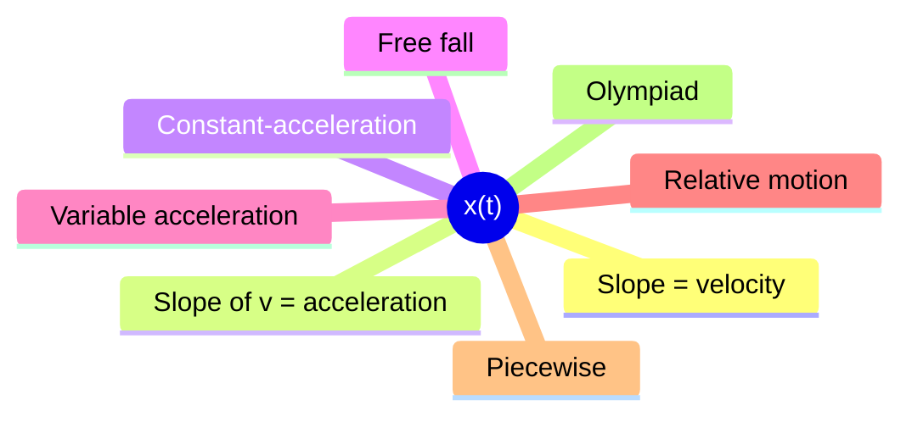
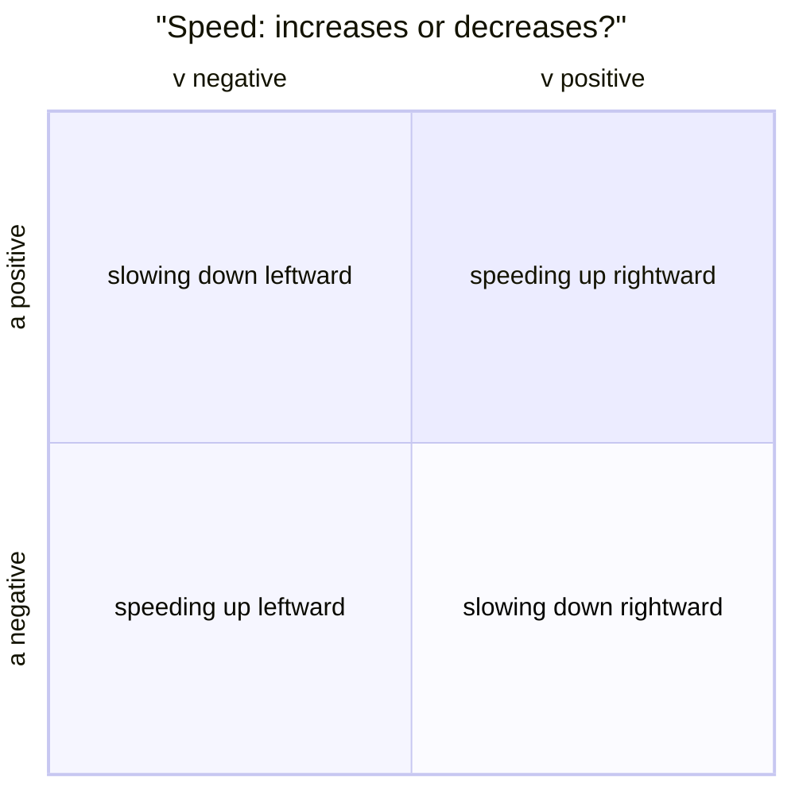
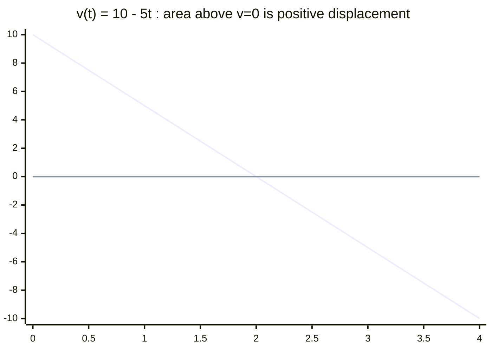
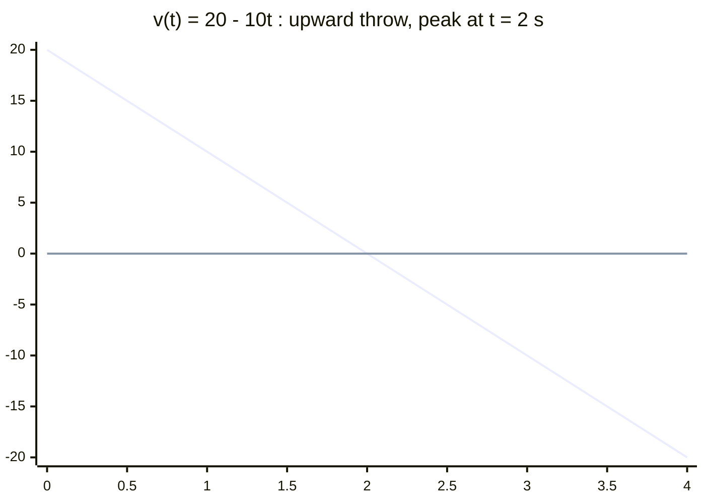
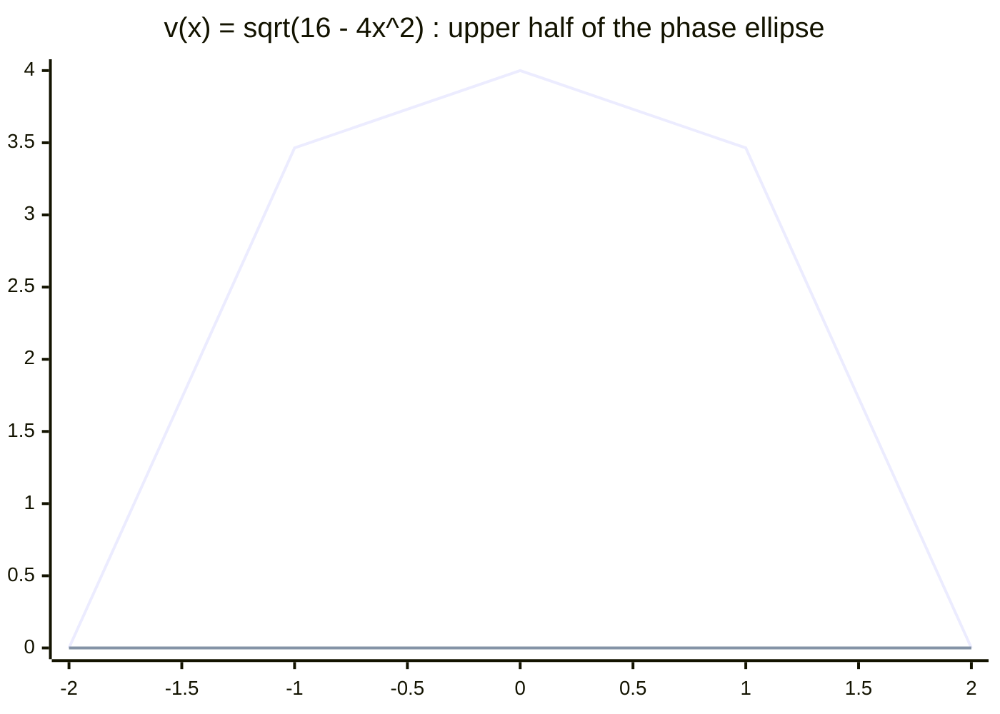
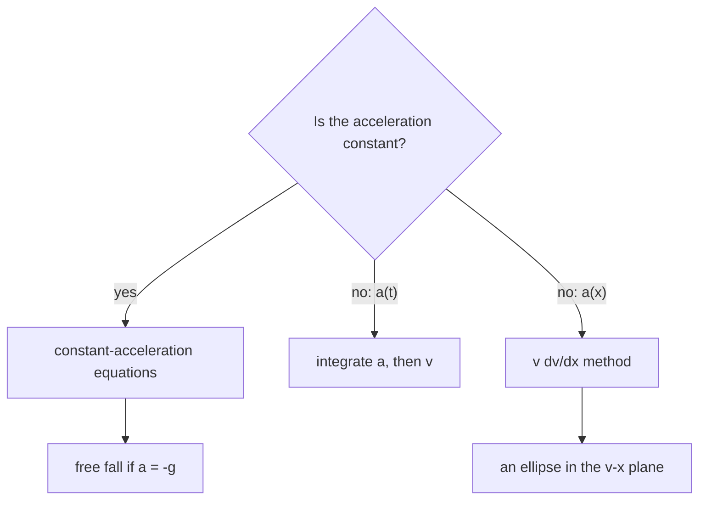

# Kinematics in One Dimension — first principles to Olympiad

> [!abstract] How to use this chapter
> Three passes. Pass 1: Parts 0–4 — position, velocity, acceleration, the constant-acceleration equations, free fall, and the graph trio. Pass 2: Parts 5–9 for exam craft. Pass 3: Parts 10–14 — the Olympiad layer (variable acceleration, the $v\,dv/dx$ method, the exponential/hyperbolic contrast, the pursuit problem, the reaction-time analysis), the paper, the sheet, the checkpoint. Every number recomputed; every boxed result carries its validity condition.

## Part 0 · Orientation

### 0.1 What you will be able to do

After this chapter you can: distinguish distance from displacement, average from instantaneous velocity, and speed from velocity; derive and apply the four constant-acceleration equations; read and construct $x$–$t$, $v$–$t$, $a$–$t$ graphs and extract physical information from each; solve free-fall problems (upward throw, downward drop, multi-stage); solve variable-acceleration problems by integration ($a=f(t)$, $a=f(v)$, $a=f(x)$); compute relative velocity in 1-D; and set up and solve piecewise kinematics problems.

### 0.2 The one idea

Motion is one function $x(t)$; everything else in kinematics is its slope or its area.

### 0.3 Prerequisite self-check

You need PART 1 (units, significant figures, error propagation) and PART 2 (vectors, components). If you can differentiate and integrate polynomials, you are ready.

### 0.4 Exam orientation

JEE Advanced treats kinematics as a "free marks" topic — the problems are conceptually simple but algebraically tricky. Expect 2–3 questions per year, often combined with graphs or relative motion. INPhO and IPhO reward the ability to handle variable acceleration and non-standard setups (the $v\,dv/dx$ method, the pursuit problem). The trap density is very high: confusing distance with displacement, misreading graphs, forgetting that acceleration can be negative, and applying constant-acceleration equations to variable-acceleration problems.

### 0.5 What this chapter is not

Not a dynamics chapter: we describe motion, not its causes (forces come in PART 5). Not a 2D chapter: projectile motion is in PART 4. Not a calculus chapter: the derivatives and integrals you need are stated and used, not proved from first principles. Not a numerical-methods chapter: we solve problems analytically; numerical integration of the equations of motion is a topic for computational physics and engineering courses.

### 0.6 Syllabus coverage map

| # | Cengage section | What it establishes | Where it lives here | Status |
|---:|---|---|---|---|
| 1 | Position and displacement | $x(t)$, $\Delta x=x_f-x_i$ | §3.1 | full |
| 2 | Average velocity | $\bar{v}=\Delta x/\Delta t$ | §3.2 | full |
| 3 | Instantaneous velocity | $v=dx/dt$ | §3.3 | full |
| 4 | Average and instantaneous acceleration | $\bar{a}=\Delta v/\Delta t$, $a=dv/dt$ | §3.4 | full |
| 5 | The graph trio | $x$–$t$, $v$–$t$, $a$–$t$ | §3.5 | full |
| 6 | Constant-acceleration equations | Derived by integration | §3.6 | full |
| 7 | Free fall | $a=-g$ (upward positive) | §3.7 | full |
| 8 | Variable acceleration | $a=f(t)$, $a=f(v)$, $a=f(x)$ | §3.8 | full |
| 9 | Relative motion in 1-D | $v_{AB}=v_{AC}-v_{BC}$ | §3.9 | full |
| 10 | Piecewise kinematics | Different $a$ in different intervals | §3.10 | full |

> [!tip] FIGURE F3.1 · Chapter map
> *Why:* the chapter is one function $x(t)$; this map shows the single spine the parts hang off.
> *Data:* the part structure of the chapter (Part 0–14).

> *Read:* every tool in this chapter is the slope or the area of one function.

## Part 1 · Intuition first

**Position is a function of time.** A particle on the $x$-axis has position $x(t)$ at time $t$. The function $x(t)$ contains all the information about the motion — velocity and acceleration are derived from it by differentiation.

**Displacement is not distance.** If you walk 3 m east and then 3 m west, your displacement is zero but your distance is 6 m. Displacement is the net change in position: $\Delta x=x_f-x_i$. Distance is the total path length: $d=\int|v|\,dt$.

**Velocity is the slope of $x(t)$; acceleration is the slope of $v(t)$.** $v=dx/dt$ tells you how fast the position is changing. $a=dv/dt$ tells you how fast the velocity is changing. Conversely, $v=\int a\,dt$ and $x=\int v\,dt$ — velocity is the area under the $a$–$t$ graph; position is the area under the $v$–$t$ graph.

**Negative acceleration does not mean deceleration.** If you define "positive" as rightward, then a leftward acceleration is negative. If the particle is moving leftward, a leftward acceleration is actually speeding it up (deceleration is when $a$ and $v$ have opposite signs).

> [!tip] FIGURE F3.2 · The four sign quadrants of motion
> *Why:* "negative" is a label on a chosen axis, not a statement about speeding up; the quadrant picture kills that trap before it forms.
> *Data:* the four sign combinations of velocity and acceleration.

> *Read:* same signs of $v$ and $a$ mean speeding up; opposite signs mean slowing down — regardless of which way is called "positive".

## Part 2 · Definitions and bookkeeping

| Symbol | Meaning | SI unit |
|---|---|---|
| $x(t)$ | position as a function of time | m |
| $\Delta x$ | displacement $=x_f-x_i$ | m |
| $d$ | distance (total path length) | m |
| $v$ | velocity $=dx/dt$ | m/s |
| $\bar{v}$ | average velocity $=\Delta x/\Delta t$ | m/s |
| speed | the magnitude of velocity, always nonneg | m/s |
| $a$ | acceleration $=dv/dt$ | m/s$^2$ |
| $g$ | gravitational acceleration $\approx9.8$ m/s$^2$ | m/s$^2$ |
| $t$ | time | s |
| $v_0$ or $u$ | initial velocity (at $t=0$) | m/s |

> [!info] Bookkeeping rules
> In 1-D, velocity and acceleration are signed scalars (positive = rightward/upward, negative = leftward/downward). Speed is the absolute value of velocity: $|v|$. In free-fall problems, define "upward" as positive unless stated otherwise.

Three numbers to carry: $g=9.8$ m/s$^2$; $1$ km/h $=5/18$ m/s $=0.2778$ m/s; $1$ mi/h $=0.4470$ m/s.

## Part 3 · Core derivations

### 3.1 Position and displacement

The position $x(t)$ is a scalar function of time. For a particle on the $x$-axis, $x>0$ means the particle is on the positive side; $x<0$ means the negative side.

**Displacement:** $\Delta x=x(t_2)-x(t_1)$. This can be positive, negative, or zero, depending on the direction of motion.

**Distance:** $d=\int_{t_1}^{t_2}|v(t)|\,dt$. This is always non-negative.

> [!abstract] DIAGRAM D3.1 · Position vs displacement vs distance
> *Show:* a number line ($x$-axis) with a particle starting at $x=2$, moving to $x=5$, then back to $x=3$. The displacement from start to finish is $+1$ (from 2 to 3). The total distance is $3+2=5$ (2→5 is 3, 5→3 is 2). Labels: "displacement = 1 m", "distance = 5 m".
> *Search:* "displacement vs distance one dimension number line diagram"

### 3.2 Average velocity

$$
\bar{v}=\frac{\Delta x}{\Delta t}=\frac{x(t_2)-x(t_1)}{t_2-t_1}. \qquad (3.1)
$$

Average velocity is the slope of the chord on the $x$–$t$ graph between two points. It can be positive, negative, or zero. For a round trip (returning to the starting point), $\bar{v}=0$.

> [!info] Why
> Average velocity uses displacement (a vector), not distance. Average speed uses distance: $\bar{s}=d/\Delta t$. These are different unless the motion is entirely in one direction.

### 3.3 Instantaneous velocity

$$
v(t)=\lim_{\Delta t\to0}\frac{\Delta x}{\Delta t}=\frac{dx}{dt}. \qquad (3.2)
$$

Instantaneous velocity is the slope of the tangent to the $x$–$t$ graph at time $t$. It is the limit of the average velocity as the time interval shrinks to zero.

**Speed:** $|v(t)|$ — the absolute value of velocity. Speed is always non-negative.

> [!abstract] DIAGRAM D3.2 · Instantaneous velocity as the tangent slope
> *Show:* an $x$–$t$ graph with a curve; at time $t_0$, a tangent line drawn to the curve; the slope of the tangent labelled as $v(t_0)=dx/dt$; the chord between $t_0$ and $t_0+\Delta t$ shown for comparison, with its slope labelled as $\bar{v}$.
> *Search:* "instantaneous velocity tangent slope x-t graph diagram"

### 3.4 Average and instantaneous acceleration

$$
\bar{a}=\frac{\Delta v}{\Delta t},\qquad a(t)=\frac{dv}{dt}=\frac{d^2x}{dt^2}. \qquad (3.3)
$$

Acceleration is the rate of change of velocity. It can be positive (velocity increasing in the positive direction), negative (velocity decreasing in the positive direction or increasing in the negative direction), or zero.

**Deceleration:** when $a$ and $v$ have opposite signs (the speed is decreasing). Note: deceleration is not the same as "negative acceleration."

> [!abstract] DIAGRAM D3.3 · Acceleration and the three graphs
> *Show:* three stacked graphs sharing the same time axis. Top: $x$–$t$ (a parabola for constant positive $a$). Middle: $v$–$t$ (a straight line with positive slope). Bottom: $a$–$t$ (a horizontal line above the axis). Annotations: "slope of $x$–$t$ = $v$", "slope of $v$–$t$ = $a$", "area under $v$–$t$ = $\Delta x$".
> *Search:* "x-t v-t a-t graphs constant acceleration stacked diagram"

### 3.5 The graph trio

**$x$–$t$ graph:**
- Slope at any point = velocity.
- A horizontal line ($v=0$): the particle is at rest.
- A straight line with positive slope: constant positive velocity.
- A curve: changing velocity (the steeper the curve, the faster).
- A concave-up curve: positive acceleration (the slope is increasing).
- A concave-down curve: negative acceleration.

**$v$–$t$ graph:**
- Slope at any point = acceleration.
- Area under the curve = displacement ($\Delta x=\int v\,dt$).
- A horizontal line ($a=0$): constant velocity.
- A straight line with positive slope: constant positive acceleration.
- Area above the $t$-axis = positive displacement; area below = negative displacement.

**$a$–$t$ graph:**
- Area under the curve = change in velocity ($\Delta v=\int a\,dt$).
- A horizontal line: constant acceleration.
- The $a$–$t$ graph is the least informative of the three (it tells you about changes in velocity, not position).

> [!tip] FIGURE F3.3 · Area under the $v$–$t$ graph is displacement
> *Why:* the area picture is the whole "graphs are calculators" toolkit, and the sign of the area is where examiners set traps.
> *Data:* $v(t)=10-5t$ m/s on $t\in[0,4]$ s — velocity crosses zero at $t=2$ s.

> *Read:* net displacement is the signed total (areas above minus areas below); total distance is the unsigned total — they coincide only while the velocity keeps one sign.

### 3.6 The constant-acceleration equations

For constant $a$ (and only for constant $a$), integration gives:

$$
v=u+at. \qquad (3.4)
$$

$$
s=ut+\frac{1}{2}at^2. \qquad (3.5)
$$

$$
v^2=u^2+2as. \qquad (3.6)
$$

$$
s=\frac{(u+v)}{2}t. \qquad (3.7)
$$

$$
s_n=u+\frac{a}{2}(2n-1). \qquad (3.8)
$$

Eq. (3.8) gives the distance travelled in the $n$th second. $u$ is the initial velocity ($v$ at $t=0$), $v$ is the final velocity, $s$ is displacement, $t$ is time.

> [!info] Why
> Eq. (3.4) comes from $v=\int a\,dt=at+C$ with $C=u$. Eq. (3.5) comes from $s=\int v\,dt=\int(u+at)\,dt=ut+\frac{1}{2}at^2+C'$ with $C'=0$. Eq. (3.6) comes from eliminating $t$: $t=(v-u)/a$, substitute into (3.5). Eq. (3.7) comes from eliminating $a$: $a=(v-u)/t$, substitute into (3.5). Eq. (3.8) comes from $s_n=s(n)-s(n-1)$.

> [!warning] Condition of validity
> These equations apply ONLY for constant acceleration. If $a$ varies, you must integrate $a(t)$ directly. Applying these equations to variable-$a$ problems is the most common error in kinematics.

> [!abstract] DIAGRAM D3.5 · Deriving the equations from the $v$–$t$ graph
> *Show:* a $v$–$t$ graph with a straight line from $(0,u)$ to $(t,v)$ with slope $a$. The area under the line (a trapezoid) is labelled $s=\frac{(u+v)}{2}t$. The height of the line at $t$ is $v=u+at$. The area of the triangle on top of the rectangle is $\frac{1}{2}at^2$.
> *Search:* "constant acceleration v-t graph area trapezoid derivation diagram"

### 3.7 Free fall

Near Earth's surface, all objects (neglecting air resistance) have the same downward acceleration: $g\approx9.8$ m/s$^2$.

**Upward positive convention:** $a=-g=-9.8$ m/s$^2$ (gravity points downward).

**Key results (upward throw from height $h_0$ with speed $v_0$):**

- Time to reach maximum height: $t_{\max}=v_0/g$.
- Maximum height above launch: $h_{\max}=v_0^2/(2g)$.
- Time of flight (back to launch level): $T=2v_0/g$.
- Speed on return to launch level: $v=v_0$ (same speed, opposite direction — by symmetry).

> [!tip] FIGURE F3.4 · Free-fall $v$–$t$ graph for an upward throw
> *Why:* one straight line with slope $-g$ holds the whole throw — peak, symmetry, and return speed are slope-and-area facts, not separate formulas.
> *Data:* $v(t)=20-10t$ m/s ($v_0=20$ m/s, $g=10$ m/s²) on $t\in[0,4]$ s.

> *Read:* the slope is $-g$ throughout; the zero crossing is the peak ($t=v_0/g$); the return speed at $t=2v_0/g$ is $-v_0$ — the same speed, opposite direction.

### 3.8 Variable acceleration

When $a$ is not constant, the constant-acceleration equations do not apply. You must integrate:

**Case 1: $a=f(t)$.** $v(t)=\int a(t)\,dt+C_1$, $x(t)=\int v(t)\,dt+C_2$.

**Case 2: $a=f(v)$.** $a=\frac{dv}{dt}\Rightarrow dt=\frac{dv}{a(v)}\Rightarrow t=\int\frac{dv}{a(v)}$. Or use $a=v\frac{dv}{dx}\Rightarrow dx=\frac{v\,dv}{a(v)}\Rightarrow x=\int\frac{v\,dv}{a(v)}$.

**Case 3: $a=f(x)$.** Use $a=v\frac{dv}{dx}\Rightarrow v\,dv=f(x)\,dx\Rightarrow\frac{v^2}{2}=\int f(x)\,dx+C$.

> [!info] Why
> The $v\,dv/dx$ method (Case 3) is the most powerful: it converts a second-order ODE in $t$ into a first-order ODE in $x$. It is the key to many Olympiad problems.

> [!abstract] DIAGRAM D3.7 · The $v\,dv/dx$ method
> *Show:* the chain rule $a=dv/dt=(dv/dx)(dx/dt)=v\,dv/dx$ written step-by-step; then the integral $\int v\,dv=\int a(x)\,dx$ shown; the result $v^2/2=\int a(x)\,dx+C$ boxed.
> *Search:* "v dv/dx method variable acceleration chain rule diagram"

### 3.9 Relative motion in 1-D

If particle $A$ has velocity $v_A$ and particle $B$ has velocity $v_B$ (both measured in the same frame), then the velocity of $A$ relative to $B$ is:

$$
v_{AB}=v_A-v_B. \qquad (3.9)
$$

**Interpretation:** $v_{AB}>0$ means $A$ is moving away from $B$ in the positive direction. $v_{AB}=0$ means they move together. $v_{AB}<0$ means $A$ is moving toward $B$ (in the positive direction, $B$ catches up).

> [!abstract] DIAGRAM D3.8 · Relative velocity in 1-D
> *Show:* two particles $A$ and $B$ on a number line, $A$ at $x_A$ and $B$ at $x_B$ with $x_A>x_B$. $v_A=5$ m/s (rightward), $v_B=3$ m/s (rightward). $v_{AB}=5-3=2$ m/s — $A$ is pulling away from $B$ at 2 m/s. The separation $x_A-x_B$ is increasing.
> *Search:* "relative velocity one dimension two particles diagram"

> [!abstract] DIAGRAM D3.10 · The $n$th-second distance
> *Show:* a $v$–$t$ graph for constant acceleration from rest (a straight line through the origin). The area under the curve between $t=n-1$ and $t=n$ shaded (a trapezoid); this area is the distance in the $n$th second. The formula $s_n=u+\frac{a}{2}(2n-1)$ annotated.
> *Search:* "nth second distance v-t graph constant acceleration shaded area"

> [!abstract] DIAGRAM D3.11 · Relative velocity: two particles approaching
> *Show:* two particles $A$ and $B$ on a number line, $A$ at $x_A$ moving right at $v_A$, $B$ at $x_B$ moving left at $v_B$. The closing velocity $v_{AB}=v_A+v_B$ annotated. The separation $x_A-x_B$ decreasing at rate $v_A+v_B$.
> *Search:* "relative velocity two particles approaching closing speed diagram"

> [!tip] FIGURE F3.5 · Phase-space ellipse for $a=-kx$
> *Why:* the $v$–$x$ loop shows boundedness and turning points at a glance — the fastest way to read a variable-acceleration solution.
> *Data:* $v^2=v_0^2-kx^2$ with $v_0=4$ m/s, $k=4$ s⁻² (upper half $v(x)=\sqrt{16-4x^2}$) on $x\in[-2,2]$ m.

> *Read:* the turning points $x=\pm v_0/\sqrt{k}$ sit where $v=0$; the speed peaks at $v_0$ at the centre $x=0$ — the motion is confined to the ellipse.

### 3.10 Piecewise kinematics

Many real problems have different accelerations in different time intervals (e.g., a car accelerating, then moving at constant speed, then braking). The method:

1. Identify the intervals and the acceleration in each.
2. Solve each interval separately, using the final state of one as the initial state of the next.
3. Keep track of signs (the acceleration may change sign).

> [!abstract] DIAGRAM D3.9 · Piecewise kinematics on a $v$–$t$ graph
> *Show:* a $v$–$t$ graph with three segments: (1) a straight line with positive slope (acceleration phase); (2) a horizontal line (constant velocity); (3) a straight line with negative slope (braking phase). Each segment labelled with its duration and acceleration. The total displacement is the total area under the graph.
> *Search:* "piecewise kinematics v-t graph acceleration constant velocity braking diagram"

## Part 4 · Results, limits and the validity ledger

### 4.1 Boxed results

$$
\boxed{v=u+at,\quad s=ut+\frac{1}{2}at^2,\quad v^2=u^2+2as,\quad s=\frac{(u+v)}{2}t} \qquad (4.1)
$$

valid ONLY for constant acceleration.

$$
\boxed{a=v\frac{dv}{dx}} \qquad (4.2)
$$

the chain-rule identity; valid for any motion; converts $a(x)$ problems into integrable form.

$$
\boxed{v_{AB}=v_A-v_B} \qquad (4.3)
$$

Galilean velocity subtraction; valid for non-relativistic speeds.

$$
\boxed{h_{\max}=\frac{v_0^2}{2g},\quad T=\frac{2v_0}{g}} \qquad (4.4)
$$

free-fall results for an upward throw from ground level; valid when air resistance is negligible.

### 4.2 Limit checks

- $a=0$: all four equations reduce to $v=u$ (constant velocity), $s=ut$ — correct.
- $u=0$: $s=\frac{1}{2}at^2$, $v=at$, $v^2=2as$ — correct (starting from rest).
- $a\to\infty$: the object instantaneously changes velocity — unphysical but consistent with the equations.
- $g\to0$: $h_{\max}\to\infty$, $T\to\infty$ — the object never falls back — correct (no gravity).

### 4.3 Which formula when

| Given | Need | Use |
|---|---|---|
| constant $a$, $u$, $t$ | $v$ | Eq. (3.4) |
| constant $a$, $u$, $t$ | $s$ | Eq. (3.5) |
| constant $a$, $u$, $v$ | $s$ (no $t$) | Eq. (3.6) |
| constant $a$, $u$, $v$ | $t$ (no $a$) | Eq. (3.7) |
| variable $a(x)$ | $v(x)$ | $v\,dv/dx$ method |
| variable $a(v)$ | $t(v)$ | $dv/a(v)=dt$ |
| two particles | relative velocity | Eq. (4.3) |

### 4.4 Concept checks

**C1 — concept check.** Can displacement be negative? Can distance be negative?

Answer

Displacement can be negative (the particle moved in the negative direction). Distance cannot be negative — it is the total path length.

**C2 — concept check.** A car is moving east at 60 km/h. Is its acceleration necessarily positive?

Answer

No. The car could be slowing down (negative acceleration if "east" is positive). Velocity and acceleration are independent.

**C3 — concept check.** At the highest point of a throw, is the acceleration zero?

Answer

No. The velocity is zero, but the acceleration is $-g$ (still pointing downward). The object immediately begins to fall.

**C4 — concept check.** The slope of the $x$–$t$ graph is negative. What does this mean?

Answer

The velocity is negative — the particle is moving in the negative direction. It does not necessarily mean the particle is slowing down.

**C5 — concept check.** The area under the $a$–$t$ graph is positive. What does this mean?

Answer

The change in velocity ($\Delta v$) is positive — the velocity has increased (in the positive direction).

**C6 — concept check.** Can the average velocity be zero while the average speed is positive?

Answer

Yes — for a round trip. $\bar{v}=\Delta x/\Delta t=0$ (displacement is zero), but $\bar{s}=d/\Delta t>0$ (distance is positive).

**C7 — concept check.** A particle moves with $v=t^2-4t+3$ m/s. At what time is the velocity zero?

Answer

$t^2-4t+3=(t-1)(t-3)=0$. $t=1$ s and $t=3$ s. The particle reverses direction at these times.

**C8 — concept check.** In the $v\,dv/dx$ method, why is $a=v\,dv/dx$ valid even when $a$ is not constant?

Answer

It is a mathematical identity from the chain rule: $a=dv/dt=(dv/dx)(dx/dt)=v\,dv/dx$. It holds for any differentiable $v(t)$, regardless of whether $a$ is constant.

**C9 — concept check.** Two trains approach each other at 60 km/h each. What is their relative velocity?

Answer

$v_{AB}=60-(-60)=120$ km/h (if $A$ is the positive direction). The closing speed is 120 km/h.

**C10 — concept check.** A ball is dropped from height $h$. How long does it take to reach the ground?

Answer

$h=\frac{1}{2}gt^2\Rightarrow t=\sqrt{2h/g}$.

**C11 — concept check.** Why do the constant-acceleration equations fail for a falling ball in air?

Answer

Air resistance depends on speed, making the acceleration speed-dependent (not constant). The equations assume constant $a$.

**C12 — concept check.** If the $v$–$t$ graph is a curve (not a straight line), what does this tell you about the acceleration?

Answer

The acceleration is not constant — it is the slope of the tangent to the curve, which varies with time.

## Part 5 · Worked exemplars

### E1 — Constant acceleration from rest

A car starts from rest and accelerates at 2 m/s$^2$ for 10 s. Find the final velocity and the distance travelled.

> [!success] Check
> $v=20$ m/s $=72$ km/h — a reasonable speed for 10 s of acceleration. $s=100$ m — reasonable for a car.

Solution

**Method.** $v=u+at=0+2\times10=20$ m/s. $s=ut+\frac{1}{2}at^2=0+\frac{1}{2}\times2\times100=100$ m.

### E2 — Stopping distance

A car moving at 72 km/h applies brakes and stops in 5 s. Find the deceleration and the distance travelled during braking.

> [!success] Check
> $a=-4$ m/s$^2$ (negative, so deceleration). $s=50$ m — a typical stopping distance at highway speed.

Solution

**Method.** $u=72\times5/18=20$ m/s. $v=0$. $a=(v-u)/t=(0-20)/5=-4$ m/s$^2$. $s=\frac{(u+v)}{2}t=\frac{20}{2}\times5=50$ m.

### E3 — Free fall: maximum height and time of flight

A ball is thrown upward at 20 m/s. Find the maximum height, the time to reach it, and the total time of flight (return to launch level). ($g=10$ m/s$^2$.)

> [!success] Check
> $t=2$ s, $h=20$ m, $T=4$ s — consistent with $h=v_0^2/(2g)$ and $T=2v_0/g$.

Solution

**Method.** $t_{\max}=v_0/g=20/10=2$ s. $h_{\max}=v_0^2/(2g)=400/20=20$ m. $T=2v_0/g=4$ s.

### E4 — Reading a $v$–$t$ graph

A $v$–$t$ graph shows: $v=0$ at $t=0$; $v=10$ m/s at $t=5$ s; $v=10$ m/s at $t=10$ s; $v=0$ at $t=15$ s. Find the displacement and the total distance.

> [!success] Check
> Displacement $=100$ m; distance $=100$ m (no negative-velocity region).

Solution

**Method.** Area under the $v$–$t$ graph: (1) triangle from $t=0$ to $t=5$: $\frac{1}{2}\times5\times10=25$ m. (2) rectangle from $t=5$ to $t=10$: $5\times10=50$ m. (3) triangle from $t=10$ to $t=15$: $\frac{1}{2}\times5\times10=25$ m. Total displacement $=25+50+25=100$ m. Total distance $=100$ m (all areas are above the axis).

### E5 — The $v\,dv/dx$ method

A particle has acceleration $a=-kx$ (proportional to displacement, directed toward the origin). Find $v(x)$ if $v=v_0$ at $x=0$.

> [!success] Check
> At $x=0$: $v=v_0$ ✓. At large $x$: $v^2=v_0^2-kx^2$ — the particle stops at $x=v_0/\sqrt{k}$. This is simple harmonic motion (PART 8).

Solution

**Method.** $v\,dv/dx=-kx$. $\int v\,dv=-k\int x\,dx$. $v^2/2=-kx^2/2+C$. At $x=0$: $C=v_0^2/2$. $v^2=v_0^2-kx^2$.

### E6 — Relative velocity: two cars

Car $A$ is 100 m ahead of car $B$. $A$ moves at 10 m/s, $B$ at 15 m/s. When does $B$ catch $A$?

> [!success] Check
> Relative speed $=5$ m/s; time $=100/5=20$ s. In 20 s, $A$ travels 200 m, $B$ travels 300 m — both at $300$ m from $B$'s start. ✓

Solution

**Method.** $v_{BA}=v_B-v_A=15-10=5$ m/s. Time to close 100 m: $t=100/5=20$ s.

### E7 — Variable acceleration: $a=bt$

A particle starts from rest with $a=bt$ (where $b$ is a constant). Find $v(t)$ and $x(t)$.

> [!success] Check
> At $t=0$: $v=0$, $x=0$ ✓. Dimensions: $[b]=[a/t]=[LT^{-3}]$, $[v]=bt^2/2=[LT^{-3}][T^2]=[LT^{-1}]$ ✓.

Solution

**Method.** $v=\int a\,dt=\int bt\,dt=bt^2/2+C_1$. $v(0)=0\Rightarrow C_1=0$. $v=bt^2/2$. $x=\int v\,dt=bt^3/6+C_2$. $x(0)=0\Rightarrow C_2=0$. $x=bt^3/6$.

### E8 — Free fall from a tower

A ball is dropped from a 80 m tower. Find the time to reach the ground and the speed on impact. ($g=10$ m/s$^2$.)

> [!success] Check
> $t=4$ s, $v=40$ m/s. Check: $h=\frac{1}{2}gt^2=\frac{1}{2}\times10\times16=80$ m ✓.

Solution

**Method.** $h=\frac{1}{2}gt^2\Rightarrow t=\sqrt{2h/g}=\sqrt{160/10}=4$ s. $v=gt=10\times4=40$ m/s.

### E9 — Piecewise: acceleration then braking

A car accelerates from rest at 3 m/s$^2$ for 10 s, then brakes at $-2$ m/s$^2$ until it stops. Find the total distance.

> [!success] Check
> Phase 1: $s_1=150$ m, $v_1=30$ m/s. Phase 2: $s_2=225$ m. Total $=375$ m.

Solution

**Method.** Phase 1: $v_1=3\times10=30$ m/s. $s_1=\frac{1}{2}\times3\times100=150$ m. Phase 2: $0=30-2t_2\Rightarrow t_2=15$ s. $s_2=30\times15+\frac{1}{2}(-2)\times225=450-225=225$ m. Total $=375$ m.

### E10 — The nth-second distance

A particle starts from rest with $a=4$ m/s$^2$. Find the distance travelled in the 3rd second.

> [!success] Check
> $s_3=10$ m. Check: $s(3)=\frac{1}{2}\times4\times9=18$ m, $s(2)=\frac{1}{2}\times4\times4=8$ m, $s_3=18-8=10$ m ✓.

Solution

**Method.** $s_n=u+\frac{a}{2}(2n-1)=0+\frac{4}{2}(2\times3-1)=2\times5=10$ m.

## Part 6 · Problem archetypes and practice

### 6.1 Archetypes

| # | Archetype | Template | Where worked | Variations |
|---:|---|---|---|---|
| 1 | Constant acceleration from rest | $v=at$, $s=\frac{1}{2}at^2$ | E1 | with initial velocity |
| 2 | Stopping distance | $v^2=u^2-2as$ | E2 | reaction time included |
| 3 | Free fall (upward throw) | $h=v_0^2/(2g)$, $T=2v_0/g$ | E3 | from a height, multi-stage |
| 4 | Reading graphs | Slope and area | E4 | curved graphs |
| 5 | $v\,dv/dx$ method | $v\,dv=a(x)\,dx$ | E5 | with constraints |
| 6 | Relative velocity | $v_{AB}=v_A-v_B$ | E6 | two trains, meeting problems |
| 7 | Variable $a(t)$ | Integrate $a$ to get $v$, $v$ to get $x$ | E7 | polynomial, exponential |
| 8 | Free fall from a height | $h=\frac{1}{2}gt^2$ | E8 | with initial velocity |
| 9 | Piecewise kinematics | Solve each interval | E9 | three or more phases |
| 10 | nth-second distance | $s_n=u+a(2n-1)/2$ | E10 | verification by subtraction |

### 6.2 In-flow practice

#### Q1. A car accelerates from 20 m/s to 30 m/s in 5 s. Find the acceleration and distance.

Solution

$a=(30-20)/5=2$ m/s$^2$. $s=\frac{(20+30)}{2}\times5=125$ m.

#### Q2. A ball is thrown upward at 30 m/s. Find the time to reach 40 m height. ($g=10$ m/s$^2$.)

Solution

$40=30t-5t^2\Rightarrow t^2-6t+8=0\Rightarrow(t-2)(t-4)=0$. $t=2$ s (going up) and $t=4$ s (coming down). Two solutions.

#### Q3. A particle has $v=3t^2-6t$ m/s. Find the time when it changes direction.

Solution

$v=0\Rightarrow3t(t-2)=0$. $t=0$ (initial) and $t=2$ s (reversal). Check: $v(1)=-3$ m/s (negative), $v(3)=9$ m/s (positive). ✓

#### Q4. From the $v$–$t$ graph: $v=2t$ for $0\leq t\leq5$, $v=10$ for $5\leq t\leq10$. Find the displacement.

Solution

Area $=\frac{1}{2}\times5\times10+5\times10=25+50=75$ m.

#### Q5. A particle has $a=-2v$ (drag). Find $v(t)$ if $v=v_0$ at $t=0$.

Solution

$dv/dt=-2v\Rightarrow dv/v=-2\,dt\Rightarrow\ln v=-2t+C$. $v=v_0 e^{-2t}$. Exponential decay.

#### Q6. Two cars start from the same point: $A$ at 10 m/s east, $B$ at 10 m/s north. What is the rate of separation?

Solution

This is a 2D problem — see PART 4. But in 1D, if they are on the same line: $v_{AB}=10-(-10)=20$ m/s (opposite directions on the same line). The rate of separation is 20 m/s.

#### Q7. A stone is dropped from a bridge. It hits the water in 3 s. Find the height of the bridge. ($g=10$ m/s$^2$.)

Solution

$h=\frac{1}{2}gt^2=\frac{1}{2}\times10\times9=45$ m.

#### Q8. A particle has $a=6t$ m/s$^2$, $v(0)=2$ m/s, $x(0)=0$. Find $v(2)$ and $x(2)$.

Solution

$v=\int6t\,dt=3t^2+2$. $v(2)=14$ m/s. $x=\int(3t^2+2)\,dt=t^3+2t$. $x(2)=8+4=12$ m.

#### Q9. A train 100 m long passes a pole in 5 s. Find its speed.

Solution

Speed $=100/5=20$ m/s $=72$ km/h.

#### Q10. A particle moves with $a=-kx$ ($k>0$). Show that the motion is bounded.

Solution

$v^2=v_0^2-kx^2\geq0\Rightarrow x^2\leq v_0^2/k\Rightarrow|x|\leq v_0/\sqrt{k}$. The particle oscillates between $-v_0/\sqrt{k}$ and $v_0/\sqrt{k}$ — bounded.

#### Q11. A car starts from rest and reaches 100 km/h in 10 s. Find the distance. (Assume constant acceleration.)

Solution

$u=0$, $v=100\times5/18=27.78$ m/s, $t=10$ s. $s=\frac{(0+27.78)}{2}\times10=138.9$ m.

#### Q12. Two trains approach each other at 80 km/h and 60 km/h. They are 2 km apart. When do they meet?

Solution

$v_{\text{closing}}=80+60=140$ km/h $=140\times5/18=38.89$ m/s. $t=2000/38.89=51.4$ s $\approx0.857$ min.

#### Q13. A ball is thrown upward at 20 m/s from a 30 m building. Find the time to hit the ground. ($g=10$ m/s$^2$.)

Solution

$-30=20t-5t^2\Rightarrow5t^2-20t-30=0\Rightarrow t^2-4t-6=0$. $t=(4+\sqrt{16+24})/2=(4+\sqrt{40})/2=(4+6.32)/2=5.16$ s (only the positive root).

#### Q14. A particle has $v=x$ m/s. Find $x(t)$ if $x(0)=1$ m.

Solution

$dx/dt=x\Rightarrow dx/x=dt\Rightarrow\ln x=t+C$. $x(0)=1\Rightarrow C=0$. $x=e^t$ m. Exponential growth.

#### Q15. A car brakes from 60 km/h to a stop in 40 m. Find the deceleration.

Solution

$u=60\times5/18=16.67$ m/s, $v=0$, $s=40$ m. $0=u^2+2as\Rightarrow a=-u^2/(2s)=-16.67^2/80=-3.47$ m/s$^2$.

#### Q16. A particle has $a=2-6t$ m/s$^2$, $v(0)=5$ m/s. Find the time when $v=0$.

Solution

$v=\int(2-6t)\,dt=2t-3t^2+5$. $v=0\Rightarrow3t^2-2t-5=0\Rightarrow(3t-5)(t+1)=0$. $t=5/3$ s (positive root).

#### Q17. A stone is thrown downward at 10 m/s from 45 m. Find the time and speed on impact. ($g=10$ m/s$^2$.)

Solution

$45=10t+5t^2\Rightarrow t^2+2t-9=0\Rightarrow t=(-2+\sqrt{4+36})/2=(-2+\sqrt{40})/2=1.16$ s. $v=10+10\times1.16=21.6$ m/s.

#### Q18. The velocity of a particle is $v=10-2t$ m/s for $0\leq t\leq5$ and $v=0$ for $t>5$. Find the distance until it stops.

Solution

$v=0$ at $t=5$ s. $s=\int_0^5(10-2t)\,dt=[10t-t^2]_0^5=50-25=25$ m.

#### Q19. A ball is dropped from 125 m. After 3 s, another ball is thrown downward. What initial speed is needed for the second ball to catch the first at ground level? ($g=10$ m/s$^2$.)

Solution

First ball: $t=\sqrt{2\times125/10}=5$ s to reach ground. Second ball is thrown at $t=3$ s, so it has $5-3=2$ s. $125=u\times2+\frac{1}{2}\times10\times4=2u+20$. $u=52.5$ m/s.

#### Q20. A particle has $a=v^2$ (self-acceleration). Find $v(t)$.

Solution

$dv/dt=v^2\Rightarrow dv/v^2=dt\Rightarrow-1/v=t+C$. At $t=0$: $-1/v_0=C$. $-1/v=t-1/v_0\Rightarrow v=\frac{v_0}{1-v_0t}$. The velocity diverges at $t=1/v_0$ — a finite-time blowup.

#### Q21. A train accelerates at $a_1$ for time $t_1$, then at constant speed, then decelerates at $a_2$ for time $t_2$. The total distance is $d$. Find the time at constant speed.

Solution

$v_{\max}=a_1t_1$ (assuming starts from rest). $s_1=\frac{1}{2}a_1t_1^2$, $s_3=v_{\max}t_2+\frac{1}{2}(-a_2)t_2^2=a_1t_1t_2-\frac{1}{2}a_2t_2^2$. But $v_{\max}=a_2t_2$ (to stop), so $a_1t_1=a_2t_2$. $s_{\text{const}}=d-s_1-s_3$. $t_{\text{const}}=s_{\text{const}}/v_{\max}$.

#### Q22. A particle starts from $x=0$ with $v=3t^2-12t+9$ m/s. Find the total distance in $t=0$ to $t=4$.

Solution

$v=3(t^2-4t+3)=3(t-1)(t-3)$. $v=0$ at $t=1$ and $t=3$. $x(t)=t^3-6t^2+9t$. $x(0)=0$, $x(1)=4$, $x(3)=0$, $x(4)=4$. Distance: $|x(1)-x(0)|+|x(3)-x(1)|+|x(4)-x(3)|=4+4+4=12$ m.

#### Q23. A particle moves with $a=-g-bv$ (gravity + linear drag). Find the terminal velocity.

Solution

At terminal velocity, $a=0$: $-g-bv_T=0\Rightarrow v_T=-g/b$. Since $v$ is downward (negative if up is positive), $v_T=-g/b$ means the terminal speed is $g/b$ downward.

#### Q24. A particle has $x(t)=t^3-6t^2+9t$ m. Find the velocity and acceleration at $t=2$ s.

Solution

$v=3t^2-12t+9$. $v(2)=12-24+9=-3$ m/s. $a=6t-12$. $a(2)=0$ m/s$^2$. The particle is decelerating at $t=2$ (since $v<0$ and $a=0$, it is at the inflection point).

#### Q25. A ball is thrown upward. At the highest point, what is the velocity? What is the acceleration? What is the speed?

Solution

Velocity $=0$ (momentarily at rest). Acceleration $=-g$ (still pointing downward). Speed $=0$ (the magnitude of velocity).

## Part 7 · Alternate methods and the JEE-Advanced advantage toolkit

### 7.1 The symmetry shortcut for free fall

A ball thrown upward returns with the same speed (by energy conservation or by the symmetry of the parabola). Use this to avoid re-solving the downward half.

### 7.2 The $v$–$t$ graph as a calculator

For any motion with known $v(t)$: displacement = area under the curve; distance = area between the curve and the $t$-axis (absolute value). This is often faster than integrating algebraically.

### 7.3 The relative-velocity shortcut

For two particles on the same line: reduce to a single particle with relative velocity $v_{AB}=v_A-v_B$ and relative acceleration $a_{AB}=a_A-a_B$. The problem then becomes a standard 1D problem.

### 7.4 The nth-second formula

For constant acceleration: $s_n=u+\frac{a}{2}(2n-1)$. This avoids computing $s(n)$ and $s(n-1)$ separately. Useful for "find the distance in the 5th second" problems.

## Part 8 · Examiner traps

> [!danger] Trap 1 — Using constant-acceleration equations for variable $a$
> The equations $v=u+at$, $s=ut+\frac{1}{2}at^2$ are ONLY for constant $a$. If $a$ varies, integrate directly.

> [!danger] Trap 2 — Confusing distance with displacement
> Distance is always positive (total path length). Displacement can be negative (net change in position). The area under $v$–$t$ gives displacement; the total area (absolute values) gives distance.

> [!danger] Trap 3 — "Zero velocity means zero acceleration"
> At the top of a throw, $v=0$ but $a=-g$. The object immediately begins to fall — zero velocity does not mean zero acceleration.

> [!danger] Trap 4 — "Negative acceleration means slowing down"
> Negative acceleration means the acceleration is in the negative direction. If the velocity is also negative, the object is speeding up (in the negative direction). Deceleration is when $a$ and $v$ have opposite signs.

> [!danger] Trap 5 — Forgetting the sign of $g$
> In the upward-positive convention, $a=-g=-9.8$ m/s$^2$. Forgetting the minus sign gives the wrong answer for free-fall problems.

> [!danger] Trap 6 — Misreading the $x$–$t$ graph
> A curved $x$–$t$ graph does not mean the particle is moving in a curve — it is still 1D. The curve shows changing speed.

> [!danger] Trap 7 — Applying $v^2=u^2+2as$ without checking for constant $a$
> This equation is derived from the constant-acceleration equations. It fails for variable $a$.

> [!danger] Trap 8 — Confusing average velocity with average speed
> $\bar{v}=\Delta x/\Delta t$ (can be zero for a round trip). $\bar{s}=d/\Delta t$ (always positive).

> [!danger] Trap 9 — Two solutions for height in free fall
> $h=v_0t-\frac{1}{2}gt^2$ is quadratic in $t$ — there are often two valid times (going up and coming down). Both must be reported.

> [!danger] Trap 10 — The $v\,dv/dx$ method: forgetting the initial condition
> The integral $v\,dv=a(x)\,dx$ gives $v^2/2=\int a(x)\,dx+C$. The constant $C$ is determined by the initial condition ($v=v_0$ at $x=x_0$).

## Part 9 · Playbook

### 9.1 Triage decision tree

> [!tip] FIGURE F3.6 · Triage — route by what is given
> *Why:* the triage list is a decision tree; the flowchart makes the first discriminating question and its branches visible at a glance.
> *Data:* the triage branches of §9.1.

> *Read:* the first question names the tool; the rest is execution.

- "Constant acceleration": use Eqs. (4.1).
- "Variable $a(t)$": integrate $a$ to get $v$, $v$ to get $x$.
- "Variable $a(x)$": use $v\,dv/dx$.
- "Variable $a(v)$": use $dv/a(v)=dt$.
- "Free fall": use $a=-g$ and the standard equations.
- "Graphs": use slope and area.
- "Two particles": use relative velocity.
- "Piecewise": solve each interval.

### 9.2 Formula map with validity

| Formula | Valid when | Breaks when |
|---|---|---|
| Eqs. (4.1) | constant $a$ | $a$ varies |
| $v\,dv/dx=a(x)$ | any motion | $a$ depends on $t$ (use $dv/dt$ instead) |
| $v_{AB}=v_A-v_B$ | non-relativistic | speeds $\sim c$ |
| $h_{\max}=v_0^2/(2g)$ | upward throw, no air resistance | air resistance present |

### 9.3 Timing plan

Sections A and B under two minutes each; Section C three minutes; Section D twelve minutes. Constant-acceleration problems die by direct substitution; variable-acceleration problems die by integration; graph problems die by reading the slope and area.

### 9.4 Pre-submission audit, ten points

1. Constant-acceleration equations: verified that $a$ is indeed constant.
2. Free-fall: used the correct sign convention ($a=-g$ for upward positive).
3. Graphs: slope = velocity (for $x$–$t$), slope = acceleration (for $v$–$t$), area = displacement (for $v$–$t$).
4. Variable acceleration: integrated correctly, applied initial conditions.
5. Relative velocity: subtracted in the correct order.
6. Piecewise: matched the final state of one phase to the initial state of the next.
7. Distance vs displacement: reported the correct one as requested.
8. Two solutions for height/time: both reported.
9. Units consistent throughout.
10. Every sub-part answered.

## Part 10 · Olympiad extension

### OL1 — Linear drag: $a=-g-bv$

A particle is thrown upward with speed $v_0$ in a medium with linear drag $F_{\text{drag}}=-bv$. Find $v(t)$.

Solution

**Method.** $m\,dv/dt=-mg-bv$. Let $\tau=m/b$: $dv/dt+gv/\tau=-g$. This is a first-order linear ODE. The solution: $v(t)=(v_0+g\tau)e^{-t/\tau}-g\tau$. At $t=0$: $v=v_0$ ✓. As $t\to\infty$: $v\to-g\tau=-mg/b$ — the terminal velocity (downward).

**Checks.** (i) At $b=0$ ($\tau\to\infty$): $v\approx v_0-gt$ — free fall. ✓ (ii) The particle reaches maximum height when $v=0$: $t_{\max}=\tau\ln(1+v_0/(g\tau))$.

### OL2 — Quadratic drag: $a=-g-kv^2$

A particle falls from rest with quadratic drag $F_{\text{drag}}=-kv^2$ (downward velocity positive). Find $v(t)$.

Solution

**Method.** $m\,dv/dt=mg-kv^2$. Terminal velocity: $v_T=\sqrt{mg/k}$. Let $\alpha=k/m$: $dv/dt=g-\alpha v^2=g(1-v^2/v_T^2)$. Separate: $dv/(1-v^2/v_T^2)=g\,dt$. Integrate: $\frac{v_T}{2}\ln\frac{v_T+v}{v_T-v}=gt$. Solve: $v=v_T\tanh(gt/v_T)$.

**Checks.** (i) At $t=0$: $\tanh(0)=0$, $v=0$ ✓. (ii) As $t\to\infty$: $\tanh\to1$, $v\to v_T$ ✓. (iii) For small $t$: $\tanh(x)\approx x$, $v\approx gt$ — free fall ✓.

### OL3 — The exponential–hyperbolic contrast

Compare the velocity–time relations for linear drag ($v\sim e^{-t/\tau}$) and quadratic drag ($v\sim\tanh$). What is the physical difference?

Solution

**Method.** Linear drag: the velocity approaches terminal exponentially, with a characteristic time $\tau=m/b$. The approach is from above (if falling) — the velocity overshoots and relaxes. Quadratic drag: the velocity approaches terminal as $\tanh$, which is slower initially (the drag is weaker at low speeds) and faster later (the drag grows with $v^2$). The key physical difference: linear drag is proportional to $v$ (dominant at low speeds, e.g. viscous drag on small objects), quadratic drag is proportional to $v^2$ (dominant at high speeds, e.g. air resistance on cars, bullets, skydivers).

**Checks.** (i) For a sphere of radius $r$ at speed $v$: the Reynolds number $Re=\rho vr/\eta$ determines which regime applies. $Re\ll1$: linear (Stokes). $Re\gg1$: quadratic (Newton). (ii) A raindrop ($r\sim1$ mm, $v\sim5$ m/s): $Re\sim3000$ — quadratic drag.

### OL4 — The terminal velocity of a skydiver

Estimate the terminal velocity of a skydiver (mass 80 kg, cross-section 0.7 m$^2$, drag coefficient $C_D=1$, air density 1.2 kg/m$^3$).

Solution

**Method.** $F_{\text{drag}}=\frac{1}{2}C_D\rho Av^2$. At terminal velocity: $mg=\frac{1}{2}C_D\rho Av_T^2$. $v_T=\sqrt{2mg/(C_D\rho A)}=\sqrt{2\times80\times9.8/(1\times1.2\times0.7)}=\sqrt{1568/0.84}=\sqrt{1867}=43.2$ m/s $\approx156$ km/h.

**Checks.** (i) Real skydivers reach about 200 km/h in a head-down position (smaller $A$) and about 55 km/h in a spread-eagle position (larger $A$). The estimate is in the right range. (ii) The $m^{1/2}$ scaling: a heavier skydiver falls faster.

### OL5 — The pursuit problem (1-D)

A pursuer moves at speed $v_P$ toward a target that moves at speed $v_T$ ($v_P>v_T$). The initial separation is $d$. Find the time to catch the target.

Solution

**Method.** In the target's frame: the pursuer approaches at $v_P-v_T$. Time $=d/(v_P-v_T)$. This is the simplest pursuit problem — the 2D version (the pursuer always heads toward the target's current position) is much harder (PART 4, OL9).

**Checks.** (i) As $v_P\to v_T$: $t\to\infty$ — the pursuer never catches up. (ii) As $v_P\to\infty$: $t\to0$ — instant catch.

### OL6 — The "does a heavier body fall faster?" analysis

Two spheres of masses $m_1$ and $m_2$ and radii $r_1$ and $r_2$ are dropped in air. Which reaches the ground first?

Solution

**Method.** Terminal velocity $v_T=\sqrt{2mg/(C_D\rho A)}$ with $A=\pi r^2$. For spheres of the same density: $m\propto r^3$, $A\propto r^2$, so $v_T\propto\sqrt{r}$. The larger sphere falls faster. But the question asks about mass: if $r_1=r_2$ (same size, different density), then $v_T\propto\sqrt{m}$ — the heavier sphere falls faster. In vacuum: both fall at the same rate (Galileo's principle). Air resistance breaks the universality.

**Checks.** (i) A feather and a hammer on the Moon: same $g$, no air — they fall together. (ii) In air: the feather falls slower because its $v_T$ is much smaller.

### OL7 — The reaction-time problem

A driver sees a hazard and brakes. The total stopping distance is $d=d_{\text{reaction}}+d_{\text{braking}}$. For $v_0=72$ km/h, reaction time 0.5 s, and deceleration 5 m/s$^2$, find $d$.

Solution

**Method.** $v_0=20$ m/s. $d_{\text{reaction}}=v_0\times t_r=20\times0.5=10$ m. $d_{\text{braking}}=v_0^2/(2a)=400/10=40$ m. Total $d=50$ m. The reaction time accounts for 20% of the stopping distance at this speed. At higher speeds, the reaction distance grows linearly but the braking distance grows quadratically — so reaction time becomes less significant at high speeds.

**Checks.** (i) Without reaction time: $d=40$ m. With: $d=50$ m — a 25% increase. (ii) At 144 km/h (40 m/s): $d_r=20$ m, $d_b=160$ m, total 180 m — reaction time is only 11% of the total.

### OL8 — The relativistic limit preview

At what speed does the Newtonian formula $p=mv$ differ from the relativistic $p=\gamma mv$ by 1%?

Solution

**Method.** $\gamma=1/\sqrt{1-v^2/c^2}\approx1+v^2/(2c^2)$ for small $v/c$. A 1% difference: $v^2/(2c^2)=0.01\Rightarrow v=c\sqrt{0.02}=0.141c\approx4.2\times10^7$ m/s. At about 14% of the speed of light, relativistic corrections to momentum reach 1%.

**Checks.** (i) At $v=0.14c$: $\gamma=1/\sqrt{1-0.02}=1.0101$ — 1.01% correction. ✓ (ii) This is far above everyday speeds (even satellites orbit at $\sim7$ km/s $=0.00002c$), so Newtonian mechanics is safe for JEE.

### OL9 — The drag-coefficient estimation for a raindrop

A raindrop of radius 1 mm falls through air ($\rho=1.2$ kg/m$^3$). Estimate the terminal velocity using $C_D\approx0.5$ (a reasonable value for a sphere at moderate Reynolds number).

Solution

**Method.** $m=\frac{4}{3}\pi r^3\rho_w=\frac{4}{3}\pi(10^{-3})^3\times1000=4.19\times10^{-6}$ kg. $A=\pi r^2=3.14\times10^{-6}$ m$^2$. $v_T=\sqrt{2mg/(C_D\rho A)}=\sqrt{2\times4.19\times10^{-6}\times9.8/(0.5\times1.2\times3.14\times10^{-6})}=\sqrt{8.21\times10^{-5}/1.88\times10^{-6}}=\sqrt{43.7}=6.6$ m/s.

**Checks.** (i) Real raindrops fall at 2–9 m/s depending on size — this is consistent. (ii) The Reynolds number: $Re=\rho v r/\eta=1.2\times6.6\times10^{-3}/(1.8\times10^{-5})\approx440$ — moderate, so $C_D\approx0.5$ is reasonable (not Stokes, not fully turbulent).

### OL10 — The "how fast can a stone be thrown?" biomechanical estimate

Estimate the maximum speed at which a human can throw a stone, given that the arm length is about 0.7 m and the hand can exert a force of about 100 N over a distance of about 0.5 m.

Solution

**Method.** Work-energy: $W=Fd=100\times0.5=50$ J. $KE=\frac{1}{2}mv^2$. For a stone of mass 0.2 kg: $v=\sqrt{2\times50/0.2}=\sqrt{500}=22.4$ m/s $\approx80$ km/h. For a cricket ball (0.16 kg): $v=\sqrt{2\times50/0.16}=\sqrt{625}=25$ m/s $\approx90$ km/h.

**Checks.** (i) Fast bowlers in cricket bowl at 140–160 km/h — higher because the run-up adds kinetic energy and the arm rotation increases the effective distance. (ii) Baseball pitchers throw at 150 km/h — similar biomechanics. (iii) The estimate is reasonable for a standing throw without a run-up.

### 10.2 Limits and failure of the model

Newtonian kinematics (this chapter) is exact at speeds $v\ll c$ and in the absence of air resistance. The constant-acceleration equations fail when $a$ varies (which it almost always does in reality). The $v\,dv/dx$ method is exact for any $a(x)$ but requires $a$ to be a function of $x$ alone (not $t$ or $v$). Air resistance (drag) changes the motion qualitatively: it introduces terminal velocity, breaks the symmetry of free fall, and makes the equations non-linear. Relativistic corrections become significant at $v\gtrsim0.1c$. Inside these fences the methods are exact.

## Part 11 · Olympiad-grade paper

**Time: 180 minutes · Maximum marks: 200 · 36 questions.**
Sections: A — 12 single-correct (4 marks each, −1 for a wrong answer); B — 8 one-or-more-correct (4 marks each, no negative marking); C — 6 numerical answers (5 marks each); D — 10 long-form (9 marks each).

| Section | Questions | Marks each | Subtotal | Topic coverage |
|---|---|---:|---:|---|
| A | 1–12 | 4 | 48 | blocks 2–4 |
| B | 13–20 | 4 | 32 | blocks 3–4 |
| C | 21–26 | 5 | 30 | blocks 4, 10 |
| D | 27–36 | 9 | 90 | block 10 |
| | 36 | | 200 | |

#### Section A · Concept MCQ (12 × 4)

### P1 · 4 marks
A particle moves with $v=t^2-4t+3$ m/s. At what time(s) is the velocity zero?
(a) $t=1$ only  (b) $t=3$ only  (c) $t=1$ and $t=3$  (d) $t=0$ and $t=4$

Answer

(c). $v=(t-1)(t-3)=0$ at $t=1$ and $t=3$.

### P2 · 4 marks
At the highest point of a throw, the acceleration is:
(a) zero  (b) $g$ upward  (c) $g$ downward  (d) $-g$ upward

Answer

(c). The acceleration is always $g$ downward (taking "upward" as positive: $a=-g$).

### P3 · 4 marks
The area under a $v$–$t$ graph gives:
(a) distance  (b) displacement  (c) acceleration  (d) speed

Answer

(b). The signed area under $v$–$t$ gives displacement. The total area (absolute values) gives distance.

### P4 · 4 marks
The constant-acceleration equation that does NOT contain $t$ is:
(a) $v=u+at$  (b) $s=ut+\frac{1}{2}at^2$  (c) $v^2=u^2+2as$  (d) $s=\frac{(u+v)}{2}t$

Answer

(c). $v^2=u^2+2as$ connects $v$, $u$, $a$, $s$ without $t$.

### P5 · 4 marks
A car moving at 60 km/h brakes to a stop in 20 m. If the speed is doubled to 120 km/h, the stopping distance (same deceleration) is:
(a) 40 m  (b) 60 m  (c) 80 m  (d) 160 m

Answer

(c). $s\propto v^2$. Doubling $v$ quadruples $s$: $20\times4=80$ m.

### P6 · 4 marks
The slope of the $x$–$t$ graph at a point gives:
(a) displacement  (b) velocity  (c) acceleration  (d) distance

Answer

(b). $v=dx/dt$ — the slope of the tangent.

### P7 · 4 marks
Two particles move with velocities 5 m/s and $-3$ m/s (same line). The relative velocity of the first with respect to the second is:
(a) 2 m/s  (b) 8 m/s  (c) $-8$ m/s  (d) $-2$ m/s

Answer

(b). $v_{12}=v_1-v_2=5-(-3)=8$ m/s.

### P8 · 4 marks
In the $v\,dv/dx$ method, the identity $a=v\,dv/dx$ comes from:
(a) Newton's second law  (b) the chain rule  (c) integration by parts  (d) the product rule

Answer

(b). $dv/dt=(dv/dx)(dx/dt)=v\,dv/dx$ — the chain rule.

### P9 · 4 marks
A ball is dropped from 80 m. The time to reach the ground is ($g=10$ m/s$^2$):
(a) 2 s  (b) 3 s  (c) 4 s  (d) 5 s

Answer

(c). $t=\sqrt{2h/g}=\sqrt{16}=4$ s.

### P10 · 4 marks
The distance travelled in the $n$th second for a particle starting from rest with $a=2$ m/s$^2$ is:
(a) $2n-1$  (b) $n^2$  (c) $2n$  (d) $n^2-n$

Answer

(a). $s_n=0+\frac{2}{2}(2n-1)=2n-1$.

### P11 · 4 marks
A particle has $a=-kv$ (drag). The velocity as $t\to\infty$ is:
(a) 0  (b) $v_0$  (c) $-g/k$  (d) $v_0e^{-kt}$

Answer

(a). $v=v_0e^{-kt}\to0$ as $t\to\infty$. (c) would be correct if gravity is also present.

### P12 · 4 marks
A particle moves with $v=|t-2|$ m/s. The total distance from $t=0$ to $t=4$ is:
(a) 4 m  (b) 8 m  (c) 0 m  (d) 2 m

Answer

(a). $\int_0^2(2-t)\,dt+\int_2^4(t-2)\,dt=[2t-t^2/2]_0^2+[t^2/2-2t]_2^4=2+2=4$ m.

#### Section B · One-or-more-correct (8 × 4)

### P13 · 4 marks
The constant-acceleration equations are valid when:
(a) $a$ is constant  (b) $a=0$  (c) $a$ varies linearly with $t$  (d) the motion is in a straight line

Answer

(a), (b), (d). $a=0$ is a special case of constant $a$. The equations are for 1D motion.

### P14 · 4 marks
At the highest point of a throw:
(a) $v=0$  (b) $a=0$  (c) speed $=0$  (d) $a=-g$

Answer

(a), (c), (d). The velocity is zero (and so is the speed), but the acceleration is still $-g$.

### P15 · 4 marks
The $v\,dv/dx$ method:
(a) works for any $a(x)$  (b) works for $a(t)$  (c) converts the problem to a first-order ODE  (d) requires the initial condition

Answer

(a), (c), (d). It does not directly work for $a(t)$ (you would need to eliminate $t$ first).

### P16 · 4 marks
For a particle thrown upward:
(a) the time to go up equals the time to come down  (b) the speed going up equals the speed coming down (at the same height)  (c) the acceleration is zero at the top  (d) the velocity changes sign at the top

Answer

(a), (b), (d). The acceleration is always $-g$ (not zero at the top).

### P17 · 4 marks
Linear drag ($F=-bv$) leads to:
(a) exponential approach to terminal velocity  (b) terminal velocity $v_T=mg/b$  (c) the particle stopping in finite time  (d) hyperbolic approach to terminal velocity

Answer

(a), (b). Linear drag gives $v\sim e^{-t/\tau}$ (exponential). Quadratic drag gives $v\sim\tanh$ (hyperbolic). The particle never truly stops (asymptotic approach).

### P18 · 4 marks
If $v$–$t$ graph is a straight line with negative slope:
(a) the acceleration is constant  (b) the particle is decelerating  (c) the displacement may be positive or negative  (d) the speed is always decreasing

Answer

(a), (c). The particle may be decelerating (if $v>0$) or accelerating (if $v<0$ and $a<0$ — speeding up in the negative direction). (d) is not necessarily true: if $v<0$ and $a<0$, the speed is increasing.

### P19 · 4 marks
Relative velocity $v_{AB}=v_A-v_B$:
(a) is positive if $A$ is moving faster in the positive direction  (b) can be negative  (c) is always the closing speed  (d) applies only when $A$ and $B$ move in the same direction

Answer

(a), (b). The closing speed is $|v_{AB}|$, not $v_{AB}$. The formula applies regardless of direction.

### P20 · 4 marks
The stopping distance of a car:
(a) is proportional to $v^2$  (b) includes the reaction distance  (c) is proportional to $v$ at constant deceleration  (d) doubles when the speed doubles (constant deceleration)

Answer

(a), (b). $d_{\text{braking}}\propto v^2$, so doubling the speed quadruples the braking distance. The reaction distance is proportional to $v$.

#### Section C · Numerical answers (6 × 5)

### P21 · 5 marks
A car accelerates from rest at 3 m/s$^2$ for 8 s. Find the distance.

Answer

$s=\frac{1}{2}\times3\times64=96$ m.

### P22 · 5 marks
A ball is thrown upward at 25 m/s. Find the maximum height. ($g=10$ m/s$^2$.)

Answer

$h=25^2/20=625/20=31.25$ m.

### P23 · 5 marks
A particle has $v=4t-t^2$ m/s. Find the maximum velocity.

Answer

$dv/dt=4-2t=0\Rightarrow t=2$ s. $v_{\max}=4\times2-4=4$ m/s.

### P24 · 5 marks
Two cars are 200 m apart, moving toward each other at 30 m/s and 20 m/s. Find the time to meet.

Answer

$t=200/(30+20)=4$ s.

### P25 · 5 marks
A particle has $a=4-2t$ m/s$^2$, $v(0)=0$. Find the velocity at $t=3$ s.

Answer

$v=\int_0^3(4-2t)\,dt=[4t-t^2]_0^3=12-9=3$ m/s.

### P26 · 5 marks
A stone is dropped from 20 m. Find the speed on impact. ($g=10$ m/s$^2$.)

Answer

$v=\sqrt{2gh}=\sqrt{400}=20$ m/s.

#### Section D · Long-form (10 × 9)

### P27 · 9 marks
(a) Derive the four constant-acceleration equations from $a=$ const. (b) Verify that $v^2=u^2+2as$ can be derived from the other three. (c) For what kind of motion do these equations NOT apply?

Answer

(a) See §3.6. (b) From $v=u+at$: $t=(v-u)/a$. Substitute into $s=ut+\frac{1}{2}at^2$: $s=u(v-u)/a+\frac{1}{2}a(v-u)^2/a^2=\frac{u(v-u)}{a}+\frac{(v-u)^2}{2a}=\frac{2u(v-u)+(v-u)^2}{2a}=\frac{(v-u)(2u+v-u)}{2a}=\frac{(v-u)(u+v)}{2a}=\frac{v^2-u^2}{2a}$. So $v^2=u^2+2as$. (c) Variable acceleration.

### P28 · 9 marks
(a) A ball is thrown upward at 30 m/s. Find the time to reach 35 m. ($g=10$ m/s$^2$.) (b) Why are there two solutions? (c) What is the speed at each time?

Answer

(a) $35=30t-5t^2\Rightarrow t^2-6t+7=0\Rightarrow t=(6\pm\sqrt{36-28})/2=(6\pm\sqrt{8})/2=(6\pm2.83)/2$. $t=1.59$ s and $t=4.41$ s. (b) Two solutions because the ball passes through 35 m twice: once going up, once coming down. (c) At $t=1.59$: $v=30-15.9=14.1$ m/s (upward). At $t=4.41$: $v=30-44.1=-14.1$ m/s (downward). Same speed, opposite direction — by symmetry.

### P29 · 9 marks
(a) A particle has $a=-kx$. Use the $v\,dv/dx$ method to find $v(x)$. (b) Show that the motion is bounded. (c) Find the maximum displacement.

Answer

(a) See E5. $v^2=v_0^2-kx^2$. (b) $v^2\geq0\Rightarrow x^2\leq v_0^2/k$. (c) $x_{\max}=v_0/\sqrt{k}$.

### P30 · 9 marks
(a) A particle falls with linear drag $a=-g-bv$. Find $v(t)$. (b) What is the terminal velocity? (c) How does the approach to terminal depend on $b$?

Answer

(a) See OL1. $v=(v_0+g\tau)e^{-t/\tau}-g\tau$ where $\tau=m/b$. (b) $v_T=-g\tau=-mg/b$ (downward). (c) The characteristic time $\tau=m/b$: larger $b$ (stronger drag) gives shorter $\tau$ — faster approach to terminal.

### P31 · 9 marks
(a) Two cars $A$ and $B$ are 100 m apart. $A$ moves at 10 m/s toward $B$; $B$ moves at 15 m/s toward $A$. When do they meet? (b) If $B$ starts 2 s late, when do they meet? (c) What is the relative velocity in each case?

Answer

(a) $v_{\text{closing}}=25$ m/s. $t=100/25=4$ s. (b) In 2 s, $A$ travels 20 m, reducing the gap to 80 m. $t'=80/25=3.2$ s after $B$ starts. Total time from $A$'s start: $2+3.2=5.2$ s. (c) $v_{AB}=10-(-15)=25$ m/s (same in both cases — the relative velocity does not change).

### P32 · 9 marks
(a) A particle has $v=3t^2-12t+9$ m/s. Find the times when $v=0$. (b) Find the position at each time. (c) Find the total distance from $t=0$ to $t=4$.

Answer

(a) $v=3(t-1)(t-3)=0$ at $t=1$ and $t=3$. (b) $x=t^3-6t^2+9t$. $x(0)=0$, $x(1)=4$, $x(3)=0$, $x(4)=4$. (c) Distance $=|4-0|+|0-4|+|4-0|=12$ m.

### P33 · 9 marks
(a) Estimate the terminal velocity of a skydiver (mass 80 kg, $C_D=1$, area 0.7 m$^2$, $\rho_{\text{air}}=1.2$ kg/m$^3$). (b) How does this change if the mass is 60 kg? (c) At what fraction of the terminal velocity is the drag force equal to half the weight?

Answer

(a) $v_T=\sqrt{2mg/(C_D\rho A)}=\sqrt{1568/0.84}=43.2$ m/s $\approx156$ km/h. (b) $v_T\propto\sqrt{m}$: $v_{T,60}=43.2\sqrt{60/80}=37.4$ m/s. (c) $F_d=\frac{1}{2}C_D\rho Av^2=mg/2\Rightarrow v=v_T/\sqrt{2}=30.5$ m/s.

### P34 · 9 marks
(a) A ball is dropped from 125 m. Another ball is thrown downward from the same point 2 s later. What initial speed is needed for the second ball to catch the first at ground level? ($g=10$ m/s$^2$.) (b) What is the speed of each ball at that time?

Answer

(a) First ball: $t=\sqrt{2\times125/10}=5$ s. Second ball has $5-2=3$ s. $125=u\times3+\frac{1}{2}\times10\times9=3u+45$. $u=80/3=26.67$ m/s. (b) First ball: $v=10\times5=50$ m/s. Second ball: $v=26.67+10\times3=56.67$ m/s. The second ball is faster — it had a head start in speed.

### P35 · 9 marks
(a) A car starts from rest, accelerates at 2 m/s$^2$ for 10 s, moves at constant speed for 20 s, then decelerates at 4 m/s$^2$ until it stops. Find the total distance. (b) Draw the $v$–$t$ graph. (c) Find the average velocity.

Answer

(a) Phase 1: $v_1=20$ m/s, $s_1=100$ m. Phase 2: $s_2=20\times20=400$ m. Phase 3: $t_3=20/4=5$ s, $s_3=20\times5-\frac{1}{2}\times4\times25=100-50=50$ m. Total $=550$ m. (b) A right trapezoid: rising to $(10,20)$, flat to $(30,20)$, falling to $(35,0)$. (c) $\bar{v}=550/35=15.7$ m/s.

### P36 · 9 marks
(a) A particle has $a=-g-bv^2/m$ (gravity + quadratic drag), thrown upward at $v_0$. Write the equation of motion. (b) What is the terminal speed? (c) Sketch $v(t)$ qualitatively (the upward and downward phases have different terminal speeds — explain why).

Answer

(a) $m\,dv/dt=-mg-bv^2$. Going up: $v>0$, drag is downward (same as gravity): $dv/dt=-g-(b/m)v^2$. Coming down: $v<0$, drag is upward (opposite to gravity): $dv/dt=-g+(b/m)v^2$. (b) Terminal (downward): $-g+(b/m)v_T^2=0\Rightarrow v_T=\sqrt{mg/b}$. (c) Going up: $v$ decreases faster than free fall (both gravity and drag oppose motion). Coming down: $v$ approaches $v_T$ asymptotically from below (gravity accelerates, drag decelerates). The upward phase takes less time than the downward phase (the average speed is higher going up because the drag is stronger — wait, that's backwards. Actually, the upward phase is shorter because the deceleration is larger, so the ball reaches the top faster. The downward phase is longer because the terminal velocity limits the speed).

## Part 12 · Marking scheme and post-paper audit

| Section | Marks each | Questions | Subtotal |
|---|---:|---:|---:|
| A | 4 | 12 | 48 |
| B | 4 | 8 | 32 |
| C | 5 | 6 | 30 |
| D | 9 | 10 | 90 |
| **Total** | | 36 | **200** |

## Part 13 · Formula sheet

| Formula | Validity |
|---|---|
| $v=u+at$ | constant $a$ |
| $s=ut+\frac{1}{2}at^2$ | constant $a$ |
| $v^2=u^2+2as$ | constant $a$ |
| $s=\frac{(u+v)}{2}t$ | constant $a$ |
| $a=v\,dv/dx$ | always (chain rule) |
| $v_{AB}=v_A-v_B$ | non-relativistic |
| $h_{\max}=v_0^2/(2g)$ | upward throw, no drag |
| $T=2v_0/g$ | upward throw, no drag |
| $t=\sqrt{2h/g}$ | drop from height $h$ |
| $v_T=\sqrt{2mg/(C_D\rho A)}$ | quadratic drag, terminal velocity |

## Part 14 · Checkpoint and hand-off

- [ ] I can distinguish distance from displacement and average from instantaneous velocity.
- [ ] I can derive and apply all four constant-acceleration equations.
- [ ] I can read and construct $x$–$t$, $v$–$t$, $a$–$t$ graphs.
- [ ] I can solve free-fall problems (upward throw, drop, multi-stage).
- [ ] I can solve variable-acceleration problems using $v\,dv/dx$.
- [ ] I can compute relative velocity in 1-D.
- [ ] I can set up and solve piecewise kinematics problems.
- [ ] I know when the constant-acceleration equations fail.
- [ ] I can solve pursuit problems using relative velocity.
- [ ] I understand the difference between linear and quadratic drag and their effects on motion.

**What the next chapters inherit.** The constant-acceleration equations and graph-reading skills are prerequisites for every subsequent mechanics chapter. The $v\,dv/dx$ method reappears in PART 5 (dynamics) and PART 8 (oscillations). The free-fall results are the foundation of PART 4 (projectile motion). The drag analysis is used in PART 4 (projectile with drag) and PART 26 (nuclear recoil).

**Open questions.** How does the motion change in a rotating frame (Coriolis force)? What is the relativistic correction to the equations of motion? These are questions for PART 8 and PART 28.
