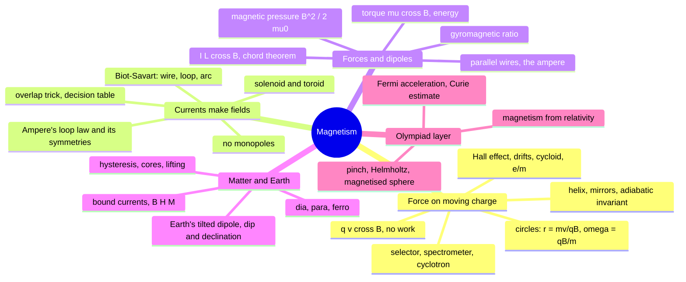
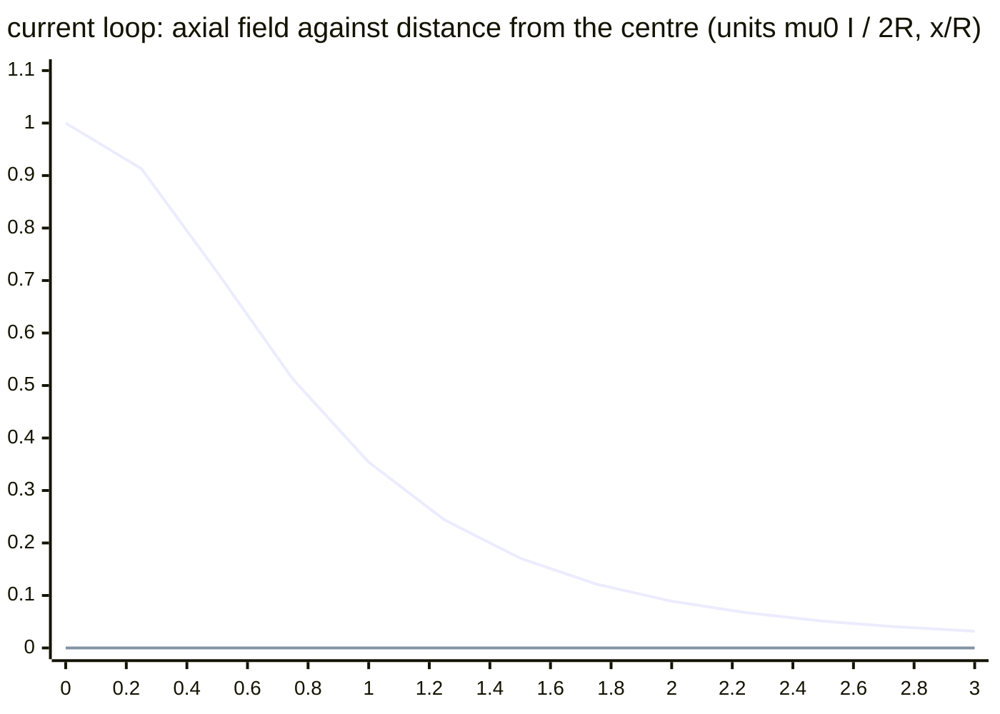
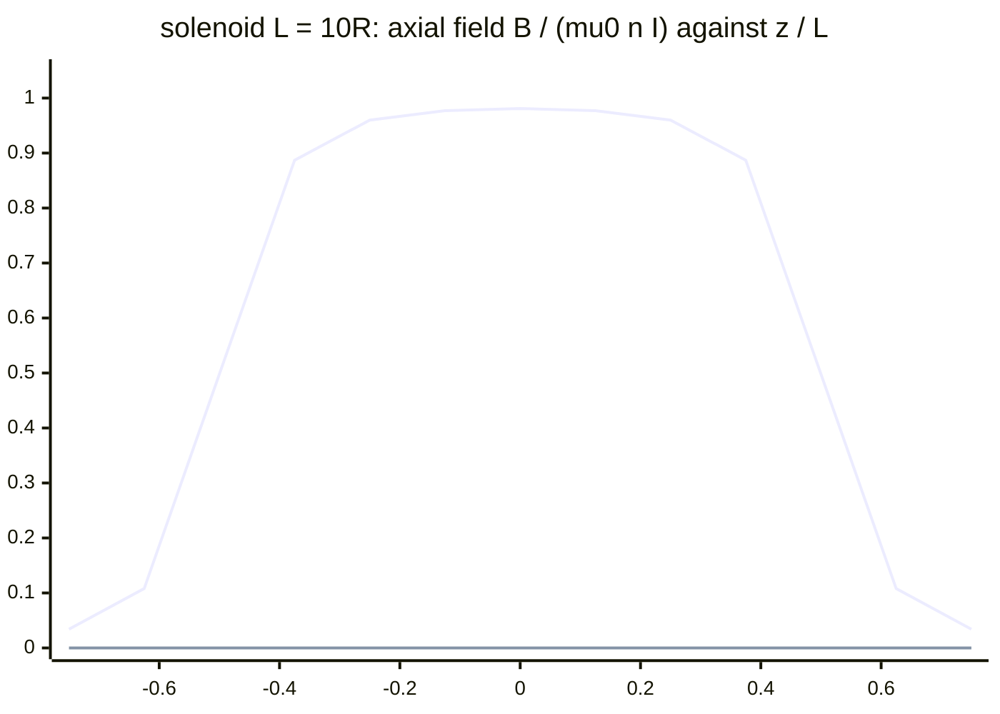
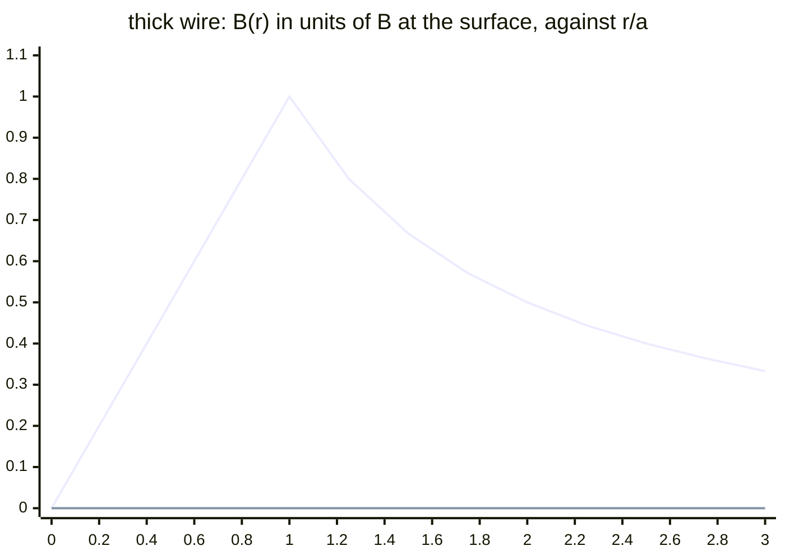
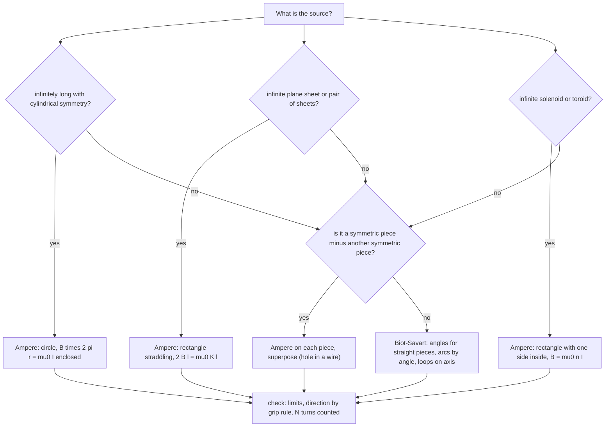
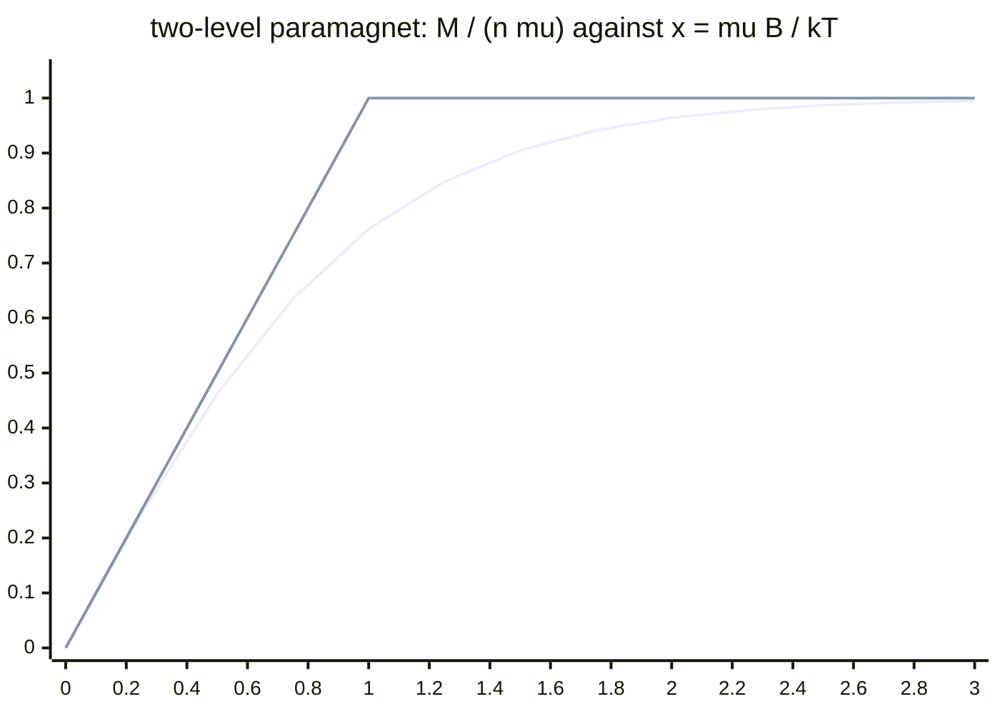
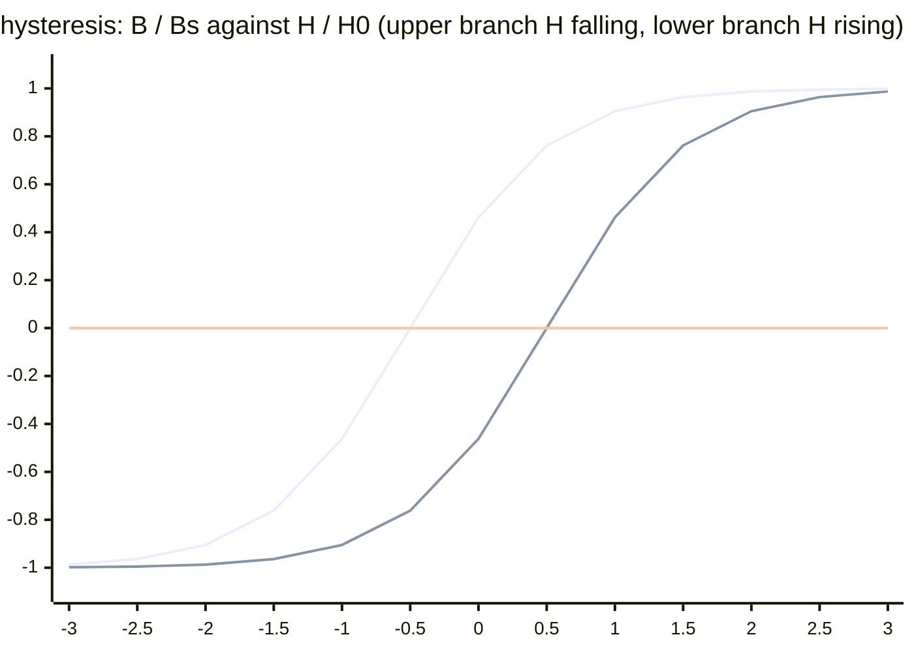
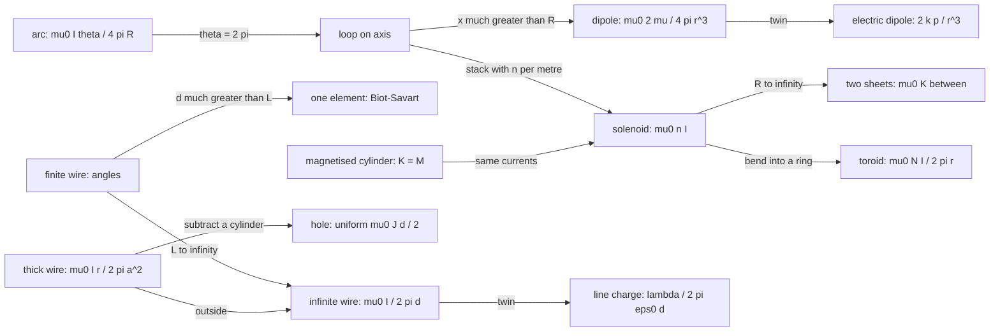
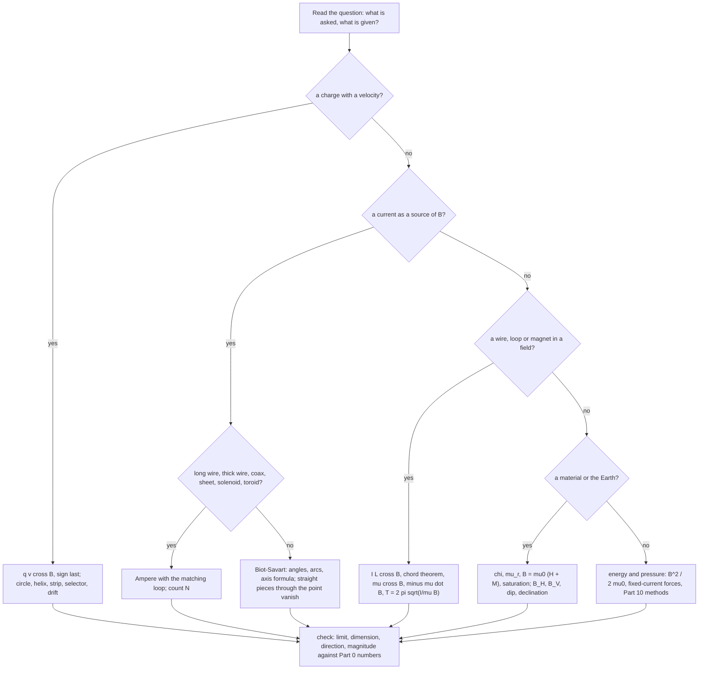
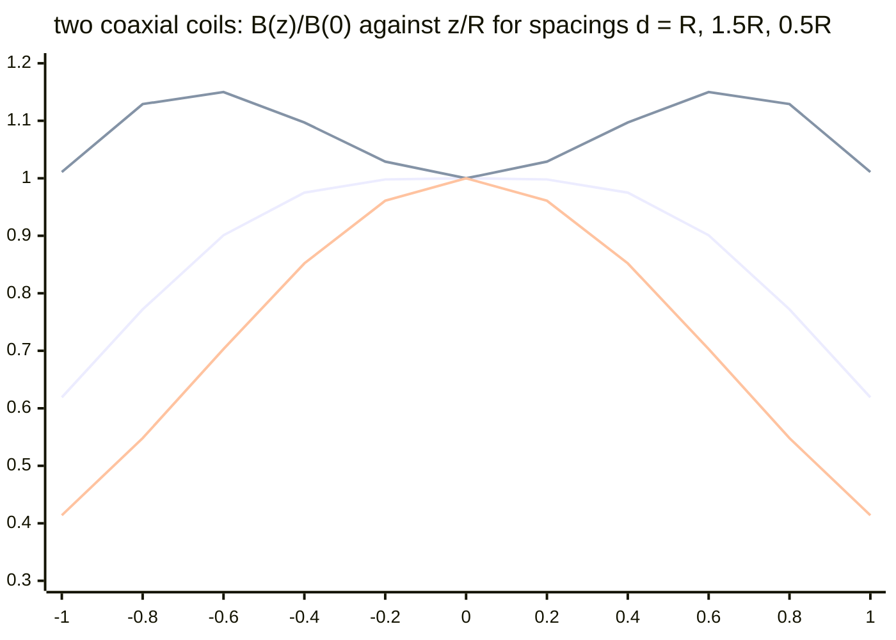

# Magnetism — from the Lorentz force to the Earth's field

> [!abstract] How to use this chapter
> One module for the whole of magnetostatics and magnetic matter, in three passes. **Pass 1: Parts 0–3** — the theory in teaching order: the force on a moving charge first (the *effect*), then everything a charge does in a field (circles, helices, selectors, cyclotrons, mirrors, the Hall effect, drifts), then the *cause* — currents as sources through Biot–Savart and Ampère — then forces and torques on currents, the magnetic dipole, matter's three responses, and the Earth as a magnet. **Pass 2: Parts 4–9** — the validity ledger, worked exemplars, the archetype table with practice, the toolkit, the traps, the playbook. **Pass 3: Parts 10–14** — the Olympiad layer (magnetism as relativity, the cycloid two ways, magnetic pressure and the pinch, Helmholtz coils, the magnetised sphere, Fermi acceleration, the Curie-temperature estimate), the 200-mark paper, the marking scheme, the formula sheet and the checkpoint. Every number is recomputed; every boxed result carries its condition of validity.

> [!note] One module for four plan parts
> The module merges plan.md PARTs 16, 17, 18 and 19 into one chapter and was written in three stages — theory (Parts 0–3), exam craft (Parts 4–9), Olympiad layer and paper (Parts 10–14). All three are now on the page; `tools/check.py` enforces the full plan.md §1 contract.

## Part 0 · Orientation

### 0.1 What you will be able to do

After this chapter you can: write the Lorentz force and get its direction from $\mathbf v\times\mathbf B$ with the sign of the charge applied afterwards, and say why a magnetic field never changes a particle's speed; derive the radius and the period of a charge's circle and explain why the period does not depend on the speed — then build the cyclotron, the mass spectrometer and the velocity selector on that one fact; run the three-region method for a particle crossing field boundaries; derive the pitch of a helix, the magnetic-mirror invariant and the loss cone; derive the Hall voltage and read a carrier's sign from it; derive the $\mathbf E\times\mathbf B$ drift and the cycloid; reconstruct Thomson's $e/m$; write Biot–Savart and integrate it for a finite wire, a loop on its axis, an arc, a solenoid and a toroid, with every limit checked; motivate and state Ampère's law with its sign convention, and use it for the wire, the thick wire, the coaxial cable, the sheet, the solenoid, the toroid and the overlapping cylinders; decide between Ampère and Biot–Savart in ten seconds; derive $\mathbf F=I\mathbf L\times\mathbf B$ from the force on carriers, the chord theorem, the torque $\boldsymbol\mu\times\mathbf B$ and the energy $-\boldsymbol\mu\cdot\mathbf B$, the force between parallel currents and the magnetic pressure $B^2/2\mu_0$; explain how a motor does work when the magnetic force does none; derive the gyromagnetic ratio of a rotating charge; describe a magnet as a solenoid of bound currents, relate $\mathbf B$, $\mathbf H$ and $\mathbf M$, explain dia-, para- and ferromagnetism mechanically, read a hysteresis loop as an energy diagram, and derive the core's amplification; and resolve the Earth's field into its three components at any place. The Olympiad layer (Part 10) adds the derivation of magnetism from electrostatics and relativity, the pinch, Helmholtz coils, the magnetised sphere and Fermi acceleration.

### 0.2 The one idea

A magnetic field acts only on *moving* charge, always at right angles to the motion, so it steers without ever speeding up or slowing down; the field itself is made by moving charge, and Ampère's loop law does for currents what Gauss's law did for charges. Every formula in the chapter is one of those two sentences with geometry attached.

### 0.3 Prerequisite self-check

1. *$\mathbf a\times\mathbf b$ for $\mathbf a=\hat{\mathbf x}$, $\mathbf b=\hat{\mathbf y}$; and $\hat{\mathbf y}\times\hat{\mathbf x}$?* — $\hat{\mathbf z}$ and $-\hat{\mathbf z}$: anticommutative, right-handed ([[Vectors|PART 2]]).
2. *A particle moves in a circle of radius $r$ at speed $v$; what force acts and where does it point?* — $mv^2/r$, towards the centre ([[Motion-in-two-dimensions|PART 4]]).
3. *Field of an infinite line charge $\lambda$ at distance $r$; field on the axis of a charged ring?* — $\lambda/2\pi\varepsilon_0r$; $kQx/(x^2+R^2)^{3/2}$ ([[Electrostatics|electrostatics]] §3.5, §3.4 — the magnetic twins are §3.14 and §3.15 here).
4. *Torque and energy of an electric dipole in a uniform field?* — $\mathbf p\times\mathbf E$, $-\mathbf p\cdot\mathbf E$ (electrostatics §3.10; the magnetic versions are §3.24).
5. *Small oscillations: $I\ddot\theta=-\kappa\theta$ gives what period?* — $2\pi\sqrt{I/\kappa}$ ([[Simple-harmonic-motion|PART 10]]).
6. *Current $I$ in terms of carrier density $n$, charge $q$, drift speed $v_d$ and area $A$?* — $I=nqv_dA$ ([[Current-electricity|current electricity]]).
7. *Relative population of two levels separated by $\Delta E$ at temperature $T$?* — $e^{-\Delta E/k_BT}$ ([[Thermodynamics|thermodynamics]]).
8. *Angular momentum of a ring of mass $m$, radius $R$, angular speed $\omega$?* — $mR^2\omega$ ([[Rotational-mechanics|PART 8]]).

### 0.4 Numbers to keep

| quantity | value | why it matters |
|---|---|---|
| $\mu_0$ | $4\pi\times10^{-7}$ T m A$^{-1}$ (exactly, to $10^{-9}$) | $\mu_0/4\pi=10^{-7}$ is the Biot–Savart constant; $\mu_0/2\pi=2\times10^{-7}$ the wire's |
| $\mu_0\varepsilon_0$ | $1/c^2$ | magnetism and electricity are one theory (§2.5) |
| Earth's field | $25$–$65\ \mu$T; $\approx45\ \mu$T at mid-latitudes | the scale every laboratory field is compared with |
| field of $10$ A at $1$ cm | $0.2$ mT $=4\times$ Earth | why a compass near a wire swings (Oersted) |
| fridge magnet / MRI / strongest steady | $5$ mT / $1.5$–$3$ T / $45$ T | the tesla is a large unit |
| iron's saturation | $B_s\approx2.1$ T | the ceiling on every iron-core design |
| $e/m_e$ | $1.76\times10^{11}$ C kg$^{-1}$ | electron cyclotron frequency $28$ GHz per tesla |
| $e/m_p$ | $9.58\times10^{7}$ C kg$^{-1}$ | proton cyclotron frequency $15.2$ MHz per tesla |
| Bohr magneton $\mu_B=e\hbar/2m_e$ | $9.27\times10^{-24}$ A m$^2$ | the atomic moment; $\mu_BB/k_BT=2.2\times10^{-3}$ at $1$ T, $300$ K |
| magnetic pressure $B^2/2\mu_0$ at $1$ T | $4.0\times10^5$ Pa $\approx4$ atm | why big magnets need steel and why a 1 T pole lifts $40$ kg per $10$ cm$^2$ |
| $p\,[\text{MeV}/c]=300\,B\,[\text{T}]\,r\,[\text{m}]$ | the track-reading rule | momentum from a curved track in a chamber |
| Earth's dipole moment | $8\times10^{22}$ A m$^2$ | from $B\approx30\ \mu$T at the equator and $R_\oplus$ |
| $\chi$: water, copper, aluminium, iron | $-9\times10^{-6}$, $-1\times10^{-5}$, $+2\times10^{-5}$, $\sim10^3$–$10^5$ | the three classes of matter, five orders apart |
| Curie temperature of iron | $1043$ K | above it, iron is a paramagnet |

### 0.5 How to use the chapter

Read Part 3 straight through once, doing the worked examples with pencil (there are ten of them inside the theory; the exemplars E1–E20 of Part 5 add the exam craft). Every derivation ends with a check; do not skip it, because the checks are where the traps of Part 8 are first defused. Then come back to §3.3 and §3.13 and make sure you can say why the cyclotron period is independent of speed and why Biot–Savart has a cross product in it — the chapter hangs on those two.

### 0.6 Coverage map

There is no Cengage magnetism volume in this repository (plan.md Block B). The floor is therefore the standard JEE Advanced syllabus as itemised in plan.md PART 16–19 (headings as printed there), plus what the shipped [[Current-electricity|current-electricity]] and [[Electromagnetic-waves|electromagnetic-waves]] notes assume of this chapter. Status vocabulary: **derived**, **stated + used**, **extended beyond floor**, and — for exam craft — **archetypes (Parts 5–6)**.

**PART 16 · Magnetic field, Biot–Savart and the Lorentz force**

| syllabus heading | what it establishes | where it lives here | status |
|---|---|---|---|
| The observation (Oersted; moving charge; no monopoles) | magnetism is a moving-charge phenomenon | §3.1 | derived (argument), stated (no monopoles, proved in §3.22) |
| The Lorentz force | $\mathbf F=q\mathbf v\times\mathbf B$, three properties, the tesla | §3.2 | derived (properties) |
| Circular and helical motion | $r=mv/qB$, $\omega=qB/m$ independent of $v$, pitch | §3.3 | derived |
| Combined fields | parallel and crossed fields; $v=E/B$ | §3.4, §3.10 | derived |
| Biot–Savart | the law, its status, direction, dimensions | §3.13 | stated + used; checked against the moving charge |
| The straight wire | finite by angles; semi-infinite; infinite | §3.14 | derived |
| The loop and the arc | centre, axis, arc, compound loops | §3.15 | derived |
| Solenoid and toroid | stacked loops; $\mu_0nI$; edge half; toroid | §3.16, §3.19 | derived twice |
| The magnetic moment | $\boldsymbol\mu=I\mathbf A$; dipole fields; the analogy table | §3.17 | derived |
| Force on a current | $I\mathbf L\times\mathbf B$ from carriers; chord theorem; closed loop | §3.23 | derived |
| Torque on a loop | $\boldsymbol\mu\times\mathbf B$ from side forces; $-\boldsymbol\mu\cdot\mathbf B$; galvanometer | §3.24 | derived |
| Forces between currents | $\mu_0I_1I_2/2\pi d$; the ampere; third law and field momentum | §3.25 | derived |
| Where the energy comes from | the motor puzzle resolved | §3.27 | derived (argument) |

**PART 17 · Ampère's law, currents and magnetic dipoles**

| syllabus heading | what it establishes | where it lives here | status |
|---|---|---|---|
| Why a loop law should exist | circulation around a wire | §3.18 | derived |
| Ampère's circuital law | statement, sign convention with a worked instance, symmetry requirement | §3.18 | stated + used |
| The applications | wire, thick wire, coax, sheet, two sheets, solenoid, toroid, cylindrical shell | §3.19 | derived (eight) |
| The overlap trick | uniform field in the lens | §3.20 | derived |
| Ampère vs Biot–Savart | decision table; two dual solutions | §3.21 | derived |
| Forces on currents revisited | parallel wires from Ampère; rails; magnetic pressure at a solenoid's end | §3.25, §3.26 | derived |
| The magnetic dipole as the fundamental object | magnet–solenoid equivalence; measuring $\mu$ by oscillation | §3.24, §3.29 | derived |
| Boundary conditions and field energy | tangential jump $\mu_0K$; $B^2/2\mu_0$ announced | §3.26 | stated + used (energy derived in PART 21) |
| No monopoles | $\nabla\cdot\mathbf B=0$; closed lines; the cut magnet | §3.22 | derived (consequences) |

**PART 18 · Cyclotron, velocity selector and the Hall effect**

| syllabus heading | what it establishes | where it lives here | status |
|---|---|---|---|
| The three-region method | the protocol for field boundaries | §3.5 | derived |
| Velocity selector and mass spectrometer | $v=E/B$; isotope separation; resolution | §3.4, §3.6 | derived |
| The cyclotron | resonance, $E_{\max}$, turns, limits | §3.7 | derived |
| Helical motion and magnetic mirrors | pitch; $\mu=mv_\perp^2/2B$; loss cone; Van Allen | §3.8 | derived |
| The Hall effect | $V_H=IB/nqt$; carrier sign; $n$, mobility; Cu vs semiconductor | §3.9 | derived |
| Crossed fields and drifts | $\mathbf E\times\mathbf B$ two ways; cycloid; gradient and curvature drifts | §3.10 | derived (gradient); stated (curvature) |
| Measured $q/m$: the electron | Thomson's tube | §3.11 | derived |
| Where it matters | synchrotron, confinement, aurora, mass spectrometry | §3.12 | stated + used |
| The particle zoo preview | reading a cloud-chamber track | §3.12 | derived (the $300Br$ rule) |

**PART 19 · Magnetism and matter, Earth's magnetism**

| syllabus heading | what it establishes | where it lives here | status |
|---|---|---|---|
| The magnet as a dipole | moment; pole picture and its failure; solenoid equivalence | §3.29 | derived |
| Magnetisation | $\mathbf M$; bound currents $K_b=M$ (slab derivation) | §3.30 | derived |
| The field inside matter | $\mathbf B=\mu_0(\mathbf H+\mathbf M)$; $\chi$, $\mu_r$; demagnetising caveat | §3.31 | derived |
| Diamagnetism | induced-moment mechanism; weak negative $\chi$ | §3.32 | derived (Larmor estimate) |
| Paramagnetism | alignment vs disorder; Curie law; saturation | §3.33 | derived (two-level Boltzmann) |
| Ferromagnetism | domains; hysteresis as energy; soft vs hard; Curie temperature | §3.34 | derived (loop area) |
| Materials in circuits | core amplification; transformer cores; shielding | §3.35 | derived |
| Forces on materials | induced-dipole attraction; diamagnetic repulsion; lift estimate | §3.36 | derived |
| Earth's magnetism | tilted dipole; declination, dip, components | §3.37 | derived |
| Magnetism in nature | reversals, dynamo, Curie temperature, navigation | §3.38 | stated + used |

### 0.7 Plan-part map

| plan.md part | this chapter |
|---|---|
| PART 16 · Magnetic field, Biot–Savart, Lorentz force | §3.1–§3.4, §3.13–§3.17, §3.23–§3.25, §3.27–§3.28 |
| PART 17 · Ampère's law, currents, dipoles | §3.18–§3.22, §3.25–§3.26 |
| PART 18 · Cyclotron, selector, Hall effect | §3.5–§3.12 |
| PART 19 · Magnetism and matter, Earth | §3.29–§3.38 |

Induction, inductance and alternating current (PART 20–22) are the next module: everything there begins with the sentence "now let the flux change", which this chapter never says.

## Part 1 · Intuition first

A compass needle beside a wire swings the moment the current is switched on, and swings back when it stops (Oersted, 1820). Nothing electrostatic does that: a static charge near a compass does nothing at all. Whatever moves the needle is made by *moving* charge and, as it turns out, acts only *on* moving charge. That is the whole subject in a sentence, and it explains the strangeness that follows.

The force is sideways. Fire an electron across a magnetic field and it is pushed neither along the field nor along its own motion but at right angles to both — so it curves. Since the push is always perpendicular to the velocity, it does no work: the speed never changes, only the direction. A charge in a uniform field therefore runs in a circle, and the time round the circle turns out not to depend on how fast it goes: a faster particle runs a bigger circle in the same time. That single fact is a clock that ticks at a rate set only by the field and by the charge-to-mass ratio, and on it are built the cyclotron, the mass spectrometer, the magnetic-resonance scanner and the radio emission of electrons spiralling in space.

The sources are currents. Every magnetic field in the laboratory comes from moving charge — a current in a wire, electrons circling in atoms, the spin of the electron itself. A straight wire's field circles the wire; a loop's field threads the loop; a long coil's field is straight and uniform inside and almost nothing outside; and from far away every loop, coil and magnet looks the same — a *dipole*, the magnetic twin of the electric dipole of the previous chapter, with the same $1/r^3$ field and the same torque and energy in an external field. There is no magnetic "charge" for the lines to start or end on: they always close.

Matter answers in three ways. Everything is slightly *diamagnetic*: an applied field disturbs the electrons' orbits so as to oppose it (a weak repulsion — a frog can be levitated). Atoms with a permanent moment are *paramagnetic*: the field aligns them a little against thermal jostling (a weak attraction that fades as $1/T$). And in iron, cobalt and nickel a quantum effect locks neighbouring moments parallel in whole domains, so that a modest field organises an enormous internal one — *ferromagnetism*, the reason magnets exist, and the reason a coil with an iron core is a thousand times stronger than the same coil without. The Earth itself is a magnet, a tilted dipole driven by currents in its liquid core, whose field a compass reads and whose direction is written into rocks as they cool.

> [!tip] FIGURE F16.1 · The module in one picture
> *Why:* a first map of the four plan parts merged here, so that every later section is a known place on it.
> *Data:* the four branches of Part 3 — force and motion, currents as sources, forces and dipoles, matter and Earth — with the leaf topics of the coverage map.

> *Read:* effect before cause. The first branch never asks where the field comes from; the second answers it; the third and fourth put the two together in wires, magnets, matter and the planet.

## Part 2 · Definitions and bookkeeping

### 2.1 Symbols and units

| symbol | meaning | unit | convention fixed here |
|---|---|---|---|
| $\mathbf B$ | magnetic field (flux density) | tesla, T $=$ N A$^{-1}$ m$^{-1}$ $=$ N s C$^{-1}$ m$^{-1}$ | defined by the force on a moving charge, (3.1); $1$ T $=10^4$ gauss |
| $\mathbf v$, $q$, $m$ | velocity, charge (signed), mass of a particle | m s$^{-1}$, C, kg | $q$ carries its sign into every formula; the electron is $q=-e$ |
| $r$, $\omega_c$, $T$ | orbit radius, cyclotron angular frequency, period | m, rad s$^{-1}$, s | $\omega_c=\lvert q\rvert B/m$, $T=2\pi m/\lvert q\rvert B$ |
| $I$, $d\mathbf l$ | current, an element of the wire *in the direction of the current* | A, m | $I\,d\mathbf l$ is the source element; for a negative carrier the current still points along $I\,d\mathbf l$ |
| $\mathbf J$, $\mathbf K$ | volume current density, surface current density (current per unit *width*) | A m$^{-2}$, A m$^{-1}$ | $I=\int\mathbf J\cdot d\mathbf A=\int K\,dw$; a solenoid is $K=nI$ |
| $n$ | turns per unit length (solenoid) *or* carrier density (Hall effect) | m$^{-1}$ *or* m$^{-3}$ | the context names which; never both in one formula |
| $N$ | number of turns | — | a coil's moment and enclosed current both carry $N$ |
| $\boldsymbol\mu$ | magnetic dipole moment | A m$^2$ $=$ J T$^{-1}$ | $\boldsymbol\mu=NI\mathbf A$, $\mathbf A$ by the current's right-hand rule |
| $\mathbf M$, $\mathbf H$ | magnetisation (moment per volume), auxiliary field | A m$^{-1}$, A m$^{-1}$ | $\mathbf B=\mu_0(\mathbf H+\mathbf M)$; $\mathbf H$ is what a free current makes, $\mathbf M$ what matter adds |
| $\chi$, $\mu_r$, $\mu$ | susceptibility, relative permeability, permeability | —, —, T m A$^{-1}$ | $\mathbf M=\chi\mathbf H$, $\mu_r=1+\chi$, $\mu=\mu_r\mu_0$; linear media only |
| $\Phi_B$ | magnetic flux | weber, Wb $=$ T m$^2$ | $\int\mathbf B\cdot d\mathbf A$; through any *closed* surface, zero |
| $\mu_0$ | permeability of free space | $4\pi\times10^{-7}$ T m A$^{-1}$ | $\mu_0/4\pi=10^{-7}$ exactly enough for every problem |
| $\delta$, $\theta_{\text{dip}}$, $B_H$, $B_V$ | declination, dip (inclination), horizontal and vertical components of the Earth's field | °, °, T, T | $B_H=B\cos\theta_{\text{dip}}$, $B_V=B\sin\theta_{\text{dip}}$; dip positive when the north-seeking end points down |

### 2.2 Right-hand rules, fixed once

Three rules, one hand, and they are all the same cross product.

1. **Force on a charge:** $\mathbf F=q\,\mathbf v\times\mathbf B$. Point the fingers of the right hand along $\mathbf v$, curl them towards $\mathbf B$; the thumb gives $\mathbf v\times\mathbf B$. *Then* apply the sign of $q$: for an electron the force is opposite to the thumb. Never use the left hand for negative charges — compute the cross product, then flip.
2. **Field of a current (grip rule):** thumb along the current, fingers curl in the direction of $\mathbf B$ around it. For a loop: fingers along the current, thumb gives the field through the loop's centre — which is also the direction of the loop's moment $\boldsymbol\mu$.
3. **Ampère's loop:** choose a direction round the loop; curl the fingers that way; the thumb gives the positive direction for currents threading it. Currents along the thumb count $+$, against it $-$.

Cross-product bookkeeping in components, when the hand fails: $\hat{\mathbf x}\times\hat{\mathbf y}=\hat{\mathbf z}$, $\hat{\mathbf y}\times\hat{\mathbf z}=\hat{\mathbf x}$, $\hat{\mathbf z}\times\hat{\mathbf x}=\hat{\mathbf y}$, and reversing any pair reverses the sign. In diagrams, $\odot$ is a field (or current) *out of* the page, $\otimes$ *into* it — the tip and the tail of an arrow.

> [!danger] Trap — the left hand
> "For a negative charge use the left hand." It works and it is how mistakes are made, because the next problem has a positive ion and the hand has not changed back. One rule, one hand: $\mathbf v\times\mathbf B$ first, the sign of $q$ second.

### 2.3 Sign and direction conventions

* $\mathbf B$ points the way a compass's *north-seeking* end points. Field lines leave a magnet's north pole and enter its south pole *outside* the magnet, and run south-to-north *inside* it — so they close.
* A current loop's moment $\boldsymbol\mu$ is along the thumb when the fingers follow the current; the loop's own field at its centre is along $\boldsymbol\mu$. Seen from the side $\boldsymbol\mu$ points to, the current runs anticlockwise.
* Ampère's law: the sign of $I_{\text{enc}}$ follows rule 3 of §2.2; a wrong choice of loop direction flips the signs of *both* sides, so the physics survives but a copied sign does not.
* The Hall voltage's polarity is defined by which face the *carriers* pile up on; the sign of the carriers is what the measurement determines (§3.9).
* Dip is positive when the north-seeking pole dips *below* the horizontal — the northern hemisphere. Declination is measured east or west of geographic north and is stated with its direction.

### 2.4 The model and its assumptions

*Magnetostatics:* all currents are steady, so all fields are constant in time and no electric field is induced (PART 20 removes this). *Point particles* with non-relativistic speeds ($v\ll c$) unless stated; the cyclotron's limit (§3.7) and the synchrotron are where relativity enters, and Part 10 shows that magnetism *is* a relativistic effect. *Vacuum* between sources, except in §3.29–§3.36, where matter is linear ($\mathbf M\propto\mathbf H$) unless it is a ferromagnet, in which case nothing is linear and the hysteresis loop is the model. *Thin wires* are lines of current; *solenoids* are long compared with their radius unless the finite formula is used; *the Earth's field* is a dipole plus stated local corrections. What is *not* in the model: induced EMF (PART 20), the energy stored in a magnetic field except as an announced result (PART 21), radiation (electromagnetic waves), the quantum origin of spin and exchange (named where they enter, derived nowhere in this course).

### 2.5 The constants are not independent

$\mu_0=4\pi\times10^{-7}$ T m A$^{-1}$ and $\varepsilon_0=8.854\times10^{-12}$ F m$^{-1}$ satisfy $\mu_0\varepsilon_0=1/c^2$ ($c=2.998\times10^8$ m s$^{-1}$): the magnetic constant is the electric constant divided by the square of the speed of light. Stated here, it is a coincidence; in Part 10 it is derived — a moving charge's magnetic force on another is its electric force times $v_1v_2/c^2$, which is why laboratory magnetic forces are tiny compared with electric ones between the *same* charges, and why they dominate in practice only because wires are neutral and their electric forces cancel while their currents' magnetic forces do not.

> [!info] Why the tesla is so large
> $1$ T exerts $1$ N on $1$ C moving at $1$ m s$^{-1}$; since a coulomb is enormous, so is a tesla. The Earth manages $5\times10^{-5}$ T, a strong permanent magnet $1$ T at its face, an MRI $1.5$–$3$ T, the largest steady laboratory fields $45$ T, and a neutron star $10^8$ T. The old unit, the gauss ($10^{-4}$ T), is the one at which everyday numbers come out human-sized: the Earth is half a gauss.

### 2.6 Bookkeeping for sources

A source is described by whichever density matches its dimensionality, and every integral in Part 3 is $\int(\ldots)\,I\,d\mathbf l$ with the substitution the geometry dictates:

$$
I\,d\mathbf l\ \longleftrightarrow\ \mathbf K\,dA\ \longleftrightarrow\ \mathbf J\,dV\ \longleftrightarrow\ q\mathbf v\ \ (\text{a single moving charge}). \qquad (2.1)
$$

A solenoid of $n$ turns per metre carrying $I$ is a cylindrical sheet with $K=nI$; a rotating charged ring of charge $Q$ and angular speed $\omega$ is a loop with $I=Q\omega/2\pi$; a rotating charged disc is a stack of such rings. The current threading a loop, for Ampère's law, is $\int\mathbf J\cdot d\mathbf A$ over any surface bounded by the loop — $NI$ for a coil that passes through it $N$ times.

## Part 3 · Core derivations

The order is the teaching order, effect before cause: what a magnetic field *does* to a moving charge (§3.1–§3.4) and everything built on that (§3.5–§3.12), then where the field *comes from* — Biot–Savart (§3.13–§3.17) and Ampère (§3.18–§3.22) — then the two put together in forces on currents and dipoles (§3.23–§3.28), and finally matter and the Earth (§3.29–§3.38). Every result is derived once here; the electric twins of the previous chapter are cited at the point of correspondence, because half of this chapter is that chapter with a cross product added.

### 3.1 The observation: magnetism is moving charge acting on moving charge

A compass needle is deflected by a nearby current and returns when the current stops; two parallel wires carrying currents attract or repel; a magnet swings a beam of electrons in a television tube. A charged pith ball at rest beside the same wire does nothing and feels nothing. Everything magnetic in these experiments involves charge *in motion* on both sides: the source is a current (or the orbital and spin motion of electrons inside a magnet), and the thing acted on is a moving charge (or a current, or those same electrons). The field that mediates this is called $\mathbf B$; §3.2 defines it by its effect, and §3.13 by its cause.

What decides whether a force is magnetic: **does it depend on the velocity of the thing it acts on?** A stationary charge in a purely magnetic field feels nothing, however strong the field; the same charge moving feels a force that grows with its speed and reverses when the velocity reverses. Electric forces do neither. A charged particle at rest in the Earth's field or between the poles of a magnet stays at rest — the first concept check of this chapter, and the one most often failed.

There are no magnetic charges. Every attempt to isolate a single magnetic pole — cutting a magnet, looking in cosmic rays, searching rocks from the Moon — has produced two-poled magnets or nothing. The statement "no monopoles" is a law of nature on the same footing as Gauss's law, and it forbids something specific: magnetic field lines can neither begin nor end, so they always close on themselves (or run to infinity); the magnetic flux through any *closed* surface is zero. §3.22 draws out the consequences.

> [!abstract] DIAGRAM D16.1 · Oersted's experiment
> *Show:* a straight wire above a compass, needle aligned north–south with no current; the same with current flowing, the needle swung across the wire; a third panel with the current reversed and the needle swung the other way; concentric circles of $\mathbf B$ drawn around the wire with the grip rule's hand.
> *Search:* "oersted experiment compass needle deflection current carrying wire diagram"

> [!abstract] Numbers to keep — how strong is a wire's field
> A wire carrying $10$ A produces, $1$ cm away, $B=\mu_0I/2\pi r=2\times10^{-7}\times10/0.01=2\times10^{-4}$ T — four times the Earth's field, which is why Oersted's needle swung hard. At $1$ m the same wire gives $2\ \mu$T, a twentieth of the Earth's: household wiring does not disturb a compass unless you hold it against the cable.

### 3.2 The Lorentz force

The magnetic field $\mathbf B$ at a point is defined by the force it exerts on a charge $q$ moving through the point with velocity $\mathbf v$:

$$
\mathbf F=q\,\mathbf v\times\mathbf B,\qquad \lvert\mathbf F\rvert=\lvert q\rvert vB\sin\theta, \qquad (3.1)
$$

with $\theta$ the angle between $\mathbf v$ and $\mathbf B$; with an electric field present, $\mathbf F=q(\mathbf E+\mathbf v\times\mathbf B)$ — the Lorentz force, the complete statement of what electromagnetic fields do to a charge. Three properties follow from the cross product, and every later result is one of them in disguise:

1. **The force is perpendicular to $\mathbf v$, so it does no work.** $dW=\mathbf F\cdot\mathbf v\,dt=q(\mathbf v\times\mathbf B)\cdot\mathbf v\,dt=0$ identically. A magnetic field can change a particle's direction but never its speed or kinetic energy. (When a motor lifts a load, something else does the work — §3.27.)
2. **The force is perpendicular to $\mathbf B$**, so the component of velocity *along* the field is never changed; motion along $\mathbf B$ is free.
3. **The force vanishes when $\mathbf v\parallel\mathbf B$** and is largest when $\mathbf v\perp\mathbf B$; a charge fired along a field line goes straight.

Units: $[B]=$ N/(C m s$^{-1}$) $=$ N A$^{-1}$ m$^{-1}$ $=$ tesla. The size of the force: an electron at $10^{6}$ m s$^{-1}$ (a $3$ eV electron) crossing $1$ mT feels $evB=1.6\times10^{-19}\times10^{6}\times10^{-3}=1.6\times10^{-16}$ N, an acceleration of $1.8\times10^{14}$ m s$^{-2}$ — thirteen orders of magnitude above $g$, which is why gravity never appears in these problems.

> [!example] Worked example — directions with signs
> $\mathbf B=0.20\,\hat{\mathbf z}$ T. (a) A proton moves with $\mathbf v=3\times10^5\,\hat{\mathbf x}$ m s$^{-1}$: $\mathbf v\times\mathbf B=3\times10^5\times0.2\,(\hat{\mathbf x}\times\hat{\mathbf z})=-6\times10^4\,\hat{\mathbf y}$, so $\mathbf F=e(\ldots)=-9.6\times10^{-15}\,\hat{\mathbf y}$ N. (b) An electron with the same velocity: same cross product, $q=-e$: $\mathbf F=+9.6\times10^{-15}\,\hat{\mathbf y}$ N. (c) The proton with $\mathbf v=3\times10^5(\hat{\mathbf x}+\hat{\mathbf z})/\sqrt2$: only the $\hat{\mathbf x}$ part contributes, $F=e(3\times10^5/\sqrt2)(0.2)=6.8\times10^{-15}$ N along $-\hat{\mathbf y}$; the $\hat{\mathbf z}$ component of velocity rides along the field untouched.

> [!abstract] DIAGRAM D16.2 · The right-hand rule three ways
> *Show:* (a) the flat hand: fingers along $\mathbf v$, curling towards $\mathbf B$, thumb along $\mathbf v\times\mathbf B$, with the caption "then apply the sign of $q$"; (b) the grip rule for a wire: thumb along $I$, fingers along $\mathbf B$; (c) the cross-product parallelogram with $\mathbf v$, $\mathbf B$ and $\mathbf v\times\mathbf B$ as three mutually perpendicular arrows; each panel with $\odot$/$\otimes$ notation shown beside it.
> *Search:* "right hand rule lorentz force grip rule cross product three panels"

> [!danger] Trap — "the force changes the speed"
> $F=qvB\sin\theta$ has a $v$ in it, so students let it accelerate the particle along its motion. It cannot: it is always sideways. What the $v$ in the formula does is set the *radius of curvature*; the speed is a constant of the motion. If a question asks for the change in kinetic energy of a charge in a pure magnetic field, the answer is zero before any calculation.

### 3.3 Circular and helical motion: the clock that ignores the speed

**Perpendicular entry.** A charge $q$ enters a uniform field $\mathbf B$ with $\mathbf v\perp\mathbf B$. The force $qvB$ is perpendicular to $\mathbf v$ and constant in magnitude, so it is a centripetal force and the path is a circle in the plane perpendicular to $\mathbf B$:

$$
qvB=\frac{mv^2}{r}\quad\Rightarrow\quad r=\frac{mv}{\lvert q\rvert B}=\frac{p}{\lvert q\rvert B},\qquad \omega_c=\frac{v}{r}=\frac{\lvert q\rvert B}{m},\qquad T=\frac{2\pi m}{\lvert q\rvert B}. \qquad (3.2)
$$

The radius grows with momentum — the form $r=p/qB$ survives into relativity with $p=\gamma mv$, which is why chambers measure momentum, §3.12 — but **the period does not depend on the speed or the radius at all.** A faster particle runs a proportionally larger circle in exactly the same time; the angular frequency $\omega_c$, the *cyclotron frequency*, is fixed by $q/m$ and $B$ alone. This is the single most consequential fact in the chapter: it lets an alternating voltage of fixed frequency stay in step with a particle whose speed doubles and doubles again (§3.7), it makes the radio frequency of gyrating electrons a measurement of the field they are in, and it is the "clock" of magnetic resonance.

**Sense of rotation.** With $\mathbf B$ out of the page and a positive charge moving to the right, $\mathbf v\times\mathbf B$ points down: the centre is below the particle and it circles *clockwise*; a negative charge circles anticlockwise. Either way the charge's own circular current makes, inside its orbit, a field *opposite* to $\mathbf B$ — the orbital motion of a free charge is diamagnetic (§3.32 uses this).

**Oblique entry: the helix.** Resolve $\mathbf v$ into $v_\parallel=v\cos\theta$ along $\mathbf B$ and $v_\perp=v\sin\theta$ across it. The parallel part is untouched (property 2 of §3.2); the perpendicular part circles with radius and period (3.2) computed from $v_\perp$. The path is a helix about a field line, of radius $r=mv_\perp/\lvert q\rvert B$ and **pitch**

$$
p_{\text{helix}}=v_\parallel T=\frac{2\pi m\,v\cos\theta}{\lvert q\rvert B}. \qquad (3.3)
$$

Which plane does it circle in: always the plane perpendicular to $\mathbf B$, whatever the entry direction. Which way is the axis: along $\mathbf B$. What sets the radius: only the perpendicular component — the commonest error in helix problems is to put the full speed into $r$.

> [!success] Check
> Dimensions of $mv/qB$: kg m s$^{-1}$/(C · N s C$^{-1}$ m$^{-1}$) $=$ kg m$^2$ s$^{-1}$/(N s) $=$ m ✓. $\theta=90^\circ$ in (3.3): pitch zero, a circle ✓; $\theta=0$: infinite pitch, a straight line along $\mathbf B$ ✓. Numbers: an electron at $10^6$ m s$^{-1}$ in $1$ mT has $r=mv/eB=9.11\times10^{-31}\times10^6/(1.6\times10^{-19}\times10^{-3})=5.7$ mm and $T=2\pi m/eB=36$ ns ($f=28$ MHz — $28$ GHz per tesla for electrons). A $10$ MeV proton in $1$ T: $v=4.4\times10^7$ m s$^{-1}$, $r=0.46$ m, $f=15.2$ MHz — $15.2$ MHz per tesla for protons, the number every cyclotron and every MRI scanner is built around (the proton's *spin* precession frequency, $42.6$ MHz per tesla, is a different constant from a related physics).

> [!abstract] DIAGRAM D16.3 · The circle and the helix
> *Show:* left, a circular orbit seen along $\mathbf B$ ($\odot$ out of the page) with $\mathbf v$ tangent and $\mathbf F$ towards the centre at four points, a positive charge going clockwise and, dashed, a negative one going anticlockwise; right, a helix about a field line with the pitch $p=v_\parallel T$ marked, $v_\parallel$ and $v_\perp$ resolved at the entry point, and the entry angle $\theta$ to $\mathbf B$.
> *Search:* "charged particle circular motion magnetic field helix pitch entry angle diagram"

### 3.4 Combined fields: parallel, crossed, and the velocity selector

**$\mathbf E\parallel\mathbf B$.** The electric force accelerates the charge along the common direction; the magnetic force acts only on the perpendicular velocity, which it turns in a circle of unchanging radius. The path is a helix whose pitch grows (or shrinks) as $v_\parallel$ changes under $qE$: a screw with a stretching thread. No trickery of directions is needed — the two fields simply do not talk to each other in this configuration.

**$\mathbf E\perp\mathbf B$: the velocity selector.** Let $\mathbf E=E\hat{\mathbf y}$, $\mathbf B=B\hat{\mathbf z}$, and a charge enter along $\hat{\mathbf x}$ with speed $v$. Electric force $qE\hat{\mathbf y}$; magnetic force $q\mathbf v\times\mathbf B=qvB(\hat{\mathbf x}\times\hat{\mathbf z})=-qvB\hat{\mathbf y}$: the two are antiparallel *whatever the sign of $q$* (both flip together), and they cancel when

$$
v=\frac{E}{B}. \qquad (3.4)
$$

A particle with exactly this speed passes undeflected, of either sign and any mass; a slower one is pushed towards the electric force's side (the electric force wins), a faster one towards the other side (the magnetic force, $\propto v$, wins). Crossed plates and a magnet therefore *select a speed*: with $E=10^5$ V m$^{-1}$ and $B=0.10$ T, only $v=10^{6}$ m s$^{-1}$ gets through. What happens to those that do not pass exactly is the cycloid family of §3.10.

> [!abstract] DIAGRAM D16.4 · The velocity selector
> *Show:* two plates with $\mathbf E$ between them (down), a magnetic field into the page ($\otimes$) filling the same region, a positive charge moving right with $q\mathbf E$ drawn down and $q\mathbf v\times\mathbf B$ drawn up; three paths: the undeflected one at $v=E/B$, a slower one curving towards the electric side, a faster one curving the other way; a slit at the exit.
> *Search:* "velocity selector crossed electric magnetic fields undeflected path faster slower particles"

> [!info] Why the selector does not care about the sign or the mass
> Both forces are proportional to $q$, so the balance condition has no $q$ in it; neither force involves $m$, so neither does the condition. That is exactly what makes the selector useful in front of a mass spectrometer (§3.6): it hands over particles of one speed, and the spectrometer's radius then measures $m/q$ cleanly.

### 3.5 The three-region method

Most "particle in a field" problems have the field in a bounded region and the particle entering from outside. The protocol: **(1) mark the regions** and the field in each; **(2) in each field region the path is a circular arc of radius $r=mv_\perp/qB$ about a centre that lies on the perpendicular to $\mathbf v$ at the entry point**, a distance $r$ away, on the side $\mathbf F$ points; **(3) match the geometry** — where the arc meets the boundary fixes the exit point, the tangent there fixes the exit direction, and the angle turned, $\varphi$, fixes the time inside, $t=\varphi/\omega_c=\varphi m/qB$, *never* the full period unless the particle completes a circle.

**A strip of field.** A field $\mathbf B$ fills the strip $0<x<d$; a particle enters at $x=0$ moving along $+x$. Its centre is at $(0,\pm r)$. If $r>d$ the arc reaches $x=d$ after turning through $\varphi$ with $\sin\varphi=d/r$: the particle exits deflected by $\varphi$, displaced sideways by $r(1-\cos\varphi)$, having spent $t=(m/qB)\arcsin(d/r)$ inside. If $r<d$ it never reaches the far edge: it turns through $180^\circ$ and comes back out through $x=0$, displaced by $2r$, after exactly half a period, $t=\pi m/qB$. The borderline $r=d$ — the particle grazes the far boundary — is the "minimum speed to cross" question: $v_{\min}=qBd/m$.

**A circular region** of radius $R$ entered radially: by symmetry the particle exits radially too, having turned through $\varphi$ with $\tan(\varphi/2)=R/r$ (the centre of the arc, the entry point and the region's centre form a right-angled figure). For $r=R$ the deflection is $90^\circ$.

> [!example] Worked example — through a strip
> Protons at $2.0\times10^{6}$ m s$^{-1}$ enter a $5.0$ cm strip of $0.30$ T perpendicularly. $r=mv/eB=1.67\times10^{-27}\times2\times10^6/(1.6\times10^{-19}\times0.3)=6.96$ cm $>d$: they cross. $\sin\varphi=5/6.96=0.719$, $\varphi=46^\circ$; time inside $t=\varphi m/eB=(0.802)(1.67\times10^{-27})/(4.8\times10^{-20})=28$ ns (against a full period of $219$ ns); sideways displacement $r(1-\cos\varphi)=2.1$ cm. Halve the speed: $r=3.48$ cm $<d$, the protons turn back, exit $7.0$ cm from where they entered, after $109$ ns.

> [!abstract] DIAGRAM D16.5 · The three-region protocol
> *Show:* a field strip with $\otimes$ marks; entry point, the perpendicular to $\mathbf v$ with the centre at distance $r$; the arc to the exit point on the far boundary with the turned angle $\varphi$ and the tangent (exit direction) drawn; below, the $r<d$ case with the semicircle back out; a third panel with a circular field region entered radially and the exit radial too.
> *Search:* "charged particle enters magnetic field region arc exit angle time inside geometry"

### 3.6 The mass spectrometer

Ions of charge $q$ and mass $m$, accelerated from rest through $V$, enter a field $B$ perpendicularly and are bent into a semicircle onto a detector. From $\tfrac12mv^2=qV$ and (3.2),

$$
r=\frac{mv}{qB}=\frac1B\sqrt{\frac{2mV}{q}},\qquad \frac{r_1}{r_2}=\sqrt{\frac{m_1}{m_2}}\ \ (\text{same }q,V,B). \qquad (3.5)
$$

Heavier ions land farther out; the separation at the detector is $2\Delta r$. Two isotopes of masses $m$ and $m+\Delta m$: $\Delta r/r=\tfrac12\Delta m/m$, so the resolution $\Delta m/m$ is set by how narrowly the ion beam can be defined compared with $r$. With a velocity selector in front (Bainbridge), $v=E/B_1$ is fixed independently of $V$ and $r=mE/qB_1B_2$ is linear in $m$.

> [!example] Worked example — separating uranium
> Singly charged $^{235}$U and $^{238}$U ions ($m=235u$ and $238u$, $u=1.66\times10^{-27}$ kg) accelerated through $10$ kV in $0.50$ T: $r_{238}=\dfrac{1}{0.5}\sqrt{\dfrac{2\times3.95\times10^{-25}\times10^4}{1.6\times10^{-19}}}=0.444$ m; $r_{235}=0.444\sqrt{235/238}=0.441$ m. $\Delta r=2.8$ mm, so the two beams arrive $5.6$ mm apart after their semicircles — resolvable, and this is the calutron that separated uranium in 1944, at enormous cost per gram because each ion carries one atom.

### 3.7 The cyclotron

Two hollow D-shaped electrodes in a uniform $\mathbf B$, with an alternating voltage $V_0$ across the gap. Inside a dee the field is zero (a conductor) and the ion coasts on a semicircle; each time it crosses the gap the voltage kicks it by $qV_0$ — *if* the voltage has reversed since the last crossing. Because $T=2\pi m/qB$ is independent of speed, a gap voltage alternating at the **resonance frequency**

$$
f=\frac{qB}{2\pi m} \qquad (3.6)
$$

is always in the right phase, though the ion's speed and radius grow with every turn: the spiral is a sequence of ever-larger semicircles, each taking the same time. The ion gains $2qV_0$ per revolution and leaves at the dee radius $R$ with $v=qBR/m$:

$$
K_{\max}=\frac{q^2B^2R^2}{2m},\qquad N_{\text{turns}}=\frac{K_{\max}}{2qV_0},\qquad t=\frac{N_{\text{turns}}}{f}. \qquad (3.7)
$$

The energy depends on $B$ and $R$, *not* on $V_0$: a smaller voltage only means more turns.

> [!example] Worked example — a real machine
> Protons, $B=1.5$ T, $R=0.50$ m, $V_0=50$ kV. $f=eB/2\pi m_p=22.9$ MHz. $K_{\max}=(1.6\times10^{-19}\times1.5\times0.5)^2/(2\times1.67\times10^{-27})=4.3\times10^{-12}$ J $=27$ MeV. Energy per turn $2eV_0=100$ keV, so $N=270$ turns in $t=270/22.9\times10^{6}=12\ \mu$s — the proton travels about $270\times\pi\times0.3$ m $\approx250$ m in that time, at an average speed of $2\times10^7$ m s$^{-1}$.

**The limits.** (i) *Relativity:* at $27$ MeV, $\gamma-1=K/m_pc^2=2.9\%$, so the effective mass and the period have grown by $3\%$ and the fixed-frequency voltage falls out of step; the classical cyclotron stops being useful for protons at a few tens of MeV and never worked for electrons (a $0.5$ MeV electron already has $\gamma=2$). The remedies are to sweep the frequency (synchrocyclotron) or to raise $B$ with the energy and keep $r$ fixed (synchrotron, §3.12). (ii) *Focusing:* a perfectly uniform field lets the ions drift out of the mid-plane; a field that falls slightly with radius curves the field lines and pushes strays back (the same physics as the mirror of §3.8). (iii) *Size:* $K_{\max}\propto B^2R^2$ — doubling the energy needs a magnet with four times the pole area.

> [!abstract] DIAGRAM D16.6 · The cyclotron
> *Show:* two dees seen from above with the gap between them, the field $\odot$ throughout, the ion's spiral of semicircles growing outward and the deflector at the rim; beneath it a timing strip showing the gap voltage alternating and the ion's gap crossings landing on the same phase every half-period.
> *Search:* "cyclotron dees spiral path gap voltage resonance timing diagram"

### 3.8 Helices in a converging field: the magnetic mirror

A charge spiralling along a field line that *converges* (the field grows along the line) is slowed along the line and eventually reflected. The mechanism is in $\nabla\cdot\mathbf B=0$: where $B_z$ increases with $z$ near an axis, the field lines bend inward and there is a small radial component $B_r=-\tfrac r2\,\partial B_z/\partial z$ (integrate $\nabla\cdot\mathbf B=0$ over a thin disc of radius $r$: $2\pi rB_r\,dz+\pi r^2\,dB_z=0$). The azimuthal velocity $v_\perp$ crossed with this $B_r$ gives a force *along* the axis,

$$
F_z=-\frac{\lvert q\rvert v_\perp r}{2}\frac{\partial B}{\partial z}=-\frac{mv_\perp^2}{2B}\frac{\partial B}{\partial z}=-\mu\,\frac{\partial B}{\partial z},\qquad \mu\equiv\frac{mv_\perp^2}{2B}, \qquad (3.8)
$$

using $r=mv_\perp/\lvert q\rvert B$; the direction — towards weaker field — is the same for either sign of charge, because the sense of gyration and the sign of $q$ flip together. The particle is pushed towards *weaker* field: $\mu$ is its magnetic moment (a circulating charge, §3.28) and $-\mu\,\partial B/\partial z$ is the force on a dipole in a gradient — the magnetic version of the electric dipole's gradient force. Now the invariant: the parallel kinetic energy changes as $d(\tfrac12mv_\parallel^2)=F_z\,dz=-\mu\,dB$; the total kinetic energy is constant (no work by $\mathbf B$), so $d(\tfrac12mv_\perp^2)=+\mu\,dB$; but $\tfrac12mv_\perp^2=\mu B$, so $d(\mu B)=\mu\,dB+B\,d\mu=\mu\,dB$, whence

$$
d\mu=0:\qquad \frac{mv_\perp^2}{2B}=\text{const}\quad(\text{field varying slowly over one orbit}). \qquad (3.9)
$$

As the particle moves into stronger field, $v_\perp^2\propto B$ grows and $v_\parallel$ shrinks; it is **reflected** where $\tfrac12mv_\perp^2$ has swallowed all the kinetic energy, i.e. where $B$ reaches $B_0/\sin^2\theta_0$, $\theta_0$ being the pitch angle (between $\mathbf v$ and $\mathbf B$) at the point where the field is $B_0$. A particle between two such regions (a *magnetic bottle*) is trapped if the field at the throats, $B_{\max}$, exceeds that value:

$$
\sin^2\theta_0>\frac{B_0}{B_{\max}}\quad\text{trapped};\qquad \sin^2\theta_0<\frac{B_0}{B_{\max}}\quad\text{lost through the throat.} \qquad (3.10)
$$

The velocities that escape fill a cone about the field direction — the **loss cone** — of half-angle $\theta_{\text{lc}}=\arcsin\sqrt{B_0/B_{\max}}$: for a mirror ratio $B_{\max}/B_0=10$, $\theta_{\text{lc}}=18^\circ$. The Earth's dipole field is such a bottle: charged particles from the solar wind and from cosmic-ray collisions in the atmosphere bounce between the polar regions, where the field lines converge, in the Van Allen belts; the ones in the loss cone precipitate into the upper atmosphere and make the aurora. Fusion "mirror machines" used the same idea; the loss cone was their weakness, because collisions keep scattering particles into it.

> [!abstract] DIAGRAM D16.7 · The magnetic mirror
> *Show:* field lines converging into a throat on the right; a helical path whose radius shrinks and whose pitch closes up as it approaches, reflecting before the throat; the radial component $B_r$ drawn at one point with the force $F_z=-\mu\,\partial B/\partial z$; inset, velocity space with the loss cone of half-angle $\theta_{\text{lc}}$ about the field axis.
> *Search:* "magnetic mirror converging field lines reflection loss cone velocity space diagram"

> [!warning] Condition of validity
> (3.9) is an *adiabatic* invariant: it holds when $B$ changes little over one gyration ($r\,\lvert\nabla B\rvert\ll B$) and over one period. In a sharply varying field — a particle crossing the edge of a magnet's pole — it fails, and the three-region method of §3.5 applies instead.

### 3.9 The Hall effect

A flat conductor of thickness $t$ (along $\mathbf B$) and width $w$ carries current $I$ along $x$ in a field $B\hat{\mathbf z}$. The carriers — density $n$, charge $q$, drift velocity $v_d$ along $\pm x$ — are pushed sideways by $q\mathbf v_d\times\mathbf B$ and pile up on one edge until the transverse electric field they create balances the magnetic force: $qE_H=qv_dB$, so $E_H=v_dB$ and the **Hall voltage** across the width is $V_H=E_Hw=v_dBw$. With $I=nqv_d(wt)$,

$$
V_H=\frac{IB}{nqt},\qquad R_H\equiv\frac{E_H}{JB}=\frac{1}{nq}. \qquad (3.11)
$$

Three things fall out. **The carrier sign:** for a given current direction, positive carriers move with the current and negative ones against it; $q\mathbf v_d$ is the same vector for both, so the *force* is towards the same edge — but positive carriers make that edge positive while electrons make it negative. The polarity of $V_H$ therefore reveals the sign of the carriers; that is how it was learned that some metals (zinc, cadmium) and $p$-type semiconductors conduct by positive holes. **The carrier density**, from $n=IB/qtV_H$ — the Hall coefficient $R_H=1/nq$ is the standard way of counting carriers. **The mobility** $\mu_m=v_d/E=\sigma R_H$, from combining with the conductivity.

> [!example] Worked example — copper against a semiconductor
> A copper strip $1.0$ mm thick, $I=10$ A, $B=1.0$ T, $n=8.5\times10^{28}$ m$^{-3}$: $V_H=IB/net=10/(8.5\times10^{28}\times1.6\times10^{-19}\times10^{-3})=0.73\ \mu$V — measurable with care, useless as a sensor. An $n$-type semiconductor wafer, $t=0.10$ mm, $n=10^{21}$ m$^{-3}$, $I=10$ mA, $B=0.50$ T: $V_H=0.01\times0.5/(10^{21}\times1.6\times10^{-19}\times10^{-4})=0.31$ V. The ratio is the ratio of carrier densities, $10^{8}$: Hall probes, the everyday magnetic-field sensors, are semiconductors for exactly this reason.

> [!abstract] DIAGRAM D16.8 · The Hall plate, two panels
> *Show:* a slab with current along $x$, $\mathbf B$ along $z$, and (a) electrons drifting along $-x$ pushed to the front edge by $q\mathbf v\times\mathbf B$, the front edge marked $-$ and $E_H$ drawn; (b) positive holes drifting along $+x$ pushed to the *same* front edge, now marked $+$, with $E_H$ reversed; a voltmeter across the width in each panel showing opposite polarities.
> *Search:* "hall effect electrons versus holes same edge opposite polarity diagram"

### 3.10 Drifts: crossed fields in general, the cycloid, and the gradient drift

**$\mathbf E\times\mathbf B$ drift, first way — force balance.** In crossed fields, look for a velocity at which the net force vanishes: $q(\mathbf E+\mathbf v_d\times\mathbf B)=0$. The solution perpendicular to both fields is

$$
\mathbf v_d=\frac{\mathbf E\times\mathbf B}{B^2},\qquad v_d=\frac EB, \qquad (3.12)
$$

the selector speed of (3.4) — with no $q$ and no $m$ in it: electrons and ions drift *together*, at the same velocity, in the same direction. (That is why the drift carries no net current in a neutral plasma, and why it is not a "force" but a motion of the whole guiding centre.)

**Second way — change frame.** In a frame moving at $\mathbf v_d$ the electric field is $\mathbf E'=\mathbf E+\mathbf v_d\times\mathbf B=0$ (for $v_d\ll c$), and only $\mathbf B$ remains: the particle simply circles. Back in the laboratory frame, the motion is a circle *carried along* at $\mathbf v_d$ — a **cycloid** if the particle started from rest. Take $\mathbf E=E\hat{\mathbf y}$, $\mathbf B=B\hat{\mathbf z}$, a positive charge released at the origin from rest: the drift is $\mathbf E\times\mathbf B/B^2=(E/B)\hat{\mathbf x}$, and the gyration about the drifting centre has speed $E/B$ (in the drifting frame the particle starts with velocity $-v_d\hat{\mathbf x}$) and radius $r_c=mv_d/qB=mE/qB^2$:

$$
x(t)=\frac EB\left(t-\frac{\sin\omega_ct}{\omega_c}\right),\qquad y(t)=\frac{E}{B\omega_c}\left(1-\cos\omega_ct\right),\qquad \omega_c=\frac{qB}{m}. \qquad (3.13)
$$

This is the path of a point on the rim of a wheel of radius $r_c$ rolling along the $x$-axis at speed $E/B$: the particle stops momentarily at the cusps every period, rises to a maximum height $2r_c=2mE/qB^2$, and reaches its maximum speed $2E/B$ at the top of each arch — all consistent with energy conservation, $\tfrac12mv_{\max}^2=qE\cdot2r_c$ ✓. A particle launched with some initial velocity traces a *curtate* or *prolate* cycloid (loops), the same rolling wheel with the point inside or outside the rim. Numbers: $E=10^4$ V m$^{-1}$, $B=0.10$ T: $v_d=10^{5}$ m s$^{-1}$; an electron from rest has $r_c=mE/eB^2=5.7\ \mu$m, rises $11\ \mu$m and peaks at $2\times10^{5}$ m s$^{-1}$; a proton on the same path has $r_c$ $1836$ times larger, $1.0$ cm, and the same drift speed.

> [!abstract] DIAGRAM D16.9 · The cycloid and the rolling wheel
> *Show:* crossed fields ($\mathbf E$ up, $\mathbf B$ out of page); a cycloid with cusps on the $x$-axis and arches of height $2r_c$; beneath it the rolling wheel of radius $r_c$ whose rim point traces the curve, with the drift velocity $E/B$ marked; dashed, a curtate and a prolate variant.
> *Search:* "charged particle crossed E and B fields cycloid trajectory rolling circle drift"

**Gradient drift.** In a field that is stronger on one side of the orbit, the radius of curvature $r=mv_\perp/qB$ is smaller where $B$ is larger: the orbit does not close, and the guiding centre creeps sideways, perpendicular to both $\mathbf B$ and $\nabla B$. Averaging the force $q\mathbf v\times\mathbf B$ over one gyration with $B=B_0+(\nabla B)\cdot\mathbf r$ gives a mean force $-\mu\nabla B$ (the same $\mu=mv_\perp^2/2B$ as (3.8), now with the gradient across the orbit), and a steady force $\mathbf F$ perpendicular to $\mathbf B$ produces a drift $\mathbf v=\mathbf F\times\mathbf B/qB^2$ by the argument of (3.12) with $\mathbf F/q$ in place of $\mathbf E$:

$$
\mathbf v_{\nabla B}=\frac{\mu}{q}\,\frac{\mathbf B\times\nabla B}{B^2}=\pm\frac{v_\perp r}{2}\,\frac{\mathbf B\times\nabla B}{B^2}. \qquad (3.14)
$$

Unlike the $\mathbf E\times\mathbf B$ drift this one *depends on the sign of $q$*: ions and electrons drift oppositely and a current flows. Around the Earth, whose dipole field weakens outward, trapped protons drift westward and electrons eastward — the *ring current*, a few million amperes circling the planet at a few Earth radii, whose field is what a magnetometer on the ground measures during a magnetic storm. A curved field line adds a **curvature drift** of the same form with $mv_\parallel^2/R_c$ (the centrifugal force in the frame following the line) as the force; it is stated here and used in Part 10.

### 3.11 Measured $q/m$: Thomson's electron

Thomson (1897) sent cathode rays between two plates (field $E$, length $L$) inside a magnetic field $B$ perpendicular to both the beam and $\mathbf E$, and watched a spot on a screen. With $\mathbf E$ alone the beam deflects, as in the electrostatics chapter, by $y=\dfrac{qEL^2}{2mv^2}$ inside the plates (and by a proportionate amount on the screen). With $\mathbf B$ added and adjusted until the spot returns to the centre, $v=E/B$ (3.4). Eliminating the unknown $v$:

$$
\frac qm=\frac{2yE}{B^2L^2}\quad\text{or, with the magnetic bend alone, }\ \frac qm=\frac{v}{Br}=\frac{E}{B^2r}. \qquad (3.15)
$$

Neither $q$ nor $m$ is measured — only their ratio, and it came out $1.76\times10^{11}$ C kg$^{-1}$, nearly two thousand times the largest known value (hydrogen's ion). Millikan's oil drops (electrostatics §3.13) later supplied $e$ separately, and the electron's mass followed. Numbers that reproduce the experiment: $E=10^4$ V m$^{-1}$, $B=5.0\times10^{-4}$ T, so $v=2.0\times10^{7}$ m s$^{-1}$; with $L=5.0$ cm the electric deflection inside the plates is $y=\dfrac{(1.76\times10^{11})(10^4)(0.05)^2}{2(2\times10^7)^2}=5.5$ mm, and the magnetic bend alone would have radius $r=mv/eB=0.23$ m.

> [!abstract] DIAGRAM D16.10 · Thomson's tube
> *Show:* a cathode-ray tube with the deflecting plates, the coils producing $\mathbf B$ into the page over the same length, the screen with the undeflected spot and the electric-only deflected spot; the three vectors $\mathbf v$, $\mathbf E$, $\mathbf B$ mutually perpendicular; the formula $v=E/B$ beside the null condition.
> *Search:* "J J Thomson e/m experiment cathode ray tube crossed fields deflection diagram"

### 3.12 Where it matters, and how to read a track

**The synchrotron.** Since $r=p/qB$, a particle can be kept on a *fixed* circle while it gains energy if $B$ is raised in proportion to $p$ and the accelerating frequency is raised as the speed approaches $c$ — a ring of bending magnets and a few accelerating cavities, unlimited in energy by the cyclotron's resonance problem, limited instead by radiation (electrons) and magnet strength (protons: $p\,[\text{GeV}/c]=0.3\,B\,[\text{T}]\,r\,[\text{m}]$, so $7$ TeV needs $8.3$ T over a bending radius of $2.8$ km — the LHC's ring is $4.3$ km in radius because dipoles fill only two-thirds of it).

**Reading a cloud- or bubble-chamber photograph.** The track is a circle of radius $r$ in a known $B$, so $p=qBr$; in the units experimenters use,

$$
p\,[\text{MeV}/c]=300\,B\,[\text{T}]\,r\,[\text{m}], \qquad (3.16)
$$

because $eBr\cdot c$ in joules divided by $e$ per MeV is $3\times10^8Br$ eV. A particle losing energy to the gas spirals *inward*: the direction in which the radius shrinks is the direction of motion, and with the direction known the sense of curvature gives the sign of the charge. Anderson's 1932 photograph — a track curving the "electron way" but *entering* a lead plate from below and emerging with a smaller radius above — was a positive particle of electron mass: the positron. A $10$ cm radius in $1.5$ T is $45$ MeV/$c$, already relativistic for an electron ($m_ec^2=0.5$ MeV) and gentle for a proton ($938$ MeV): the same rule (3.16) applies to both because it never assumed $v\ll c$.

**The aurora.** Solar-wind electrons of a few keV, trapped and then scattered into the loss cone, spiral down converging field lines into the atmosphere at $100$–$300$ km and excite oxygen (green, $558$ nm) and nitrogen (red and blue); the total power deposited in an active oval is of order $10^{10}$–$10^{11}$ W. Mass spectrometry in chemistry, magnetic confinement of fusion plasmas, magnetohydrodynamic pumps and the deflection coils of every old television are the same equation, $r=mv/qB$, at different scales.

> [!abstract] DIAGRAM D16.11 · Reading a chamber track
> *Show:* a spiral track in a uniform field ($\otimes$) with the radius visibly decreasing along the motion, an arrow marking the direction of travel deduced from the shrinking radius, and the centre of curvature on the side that reveals the sign; a lead plate across the chamber with the track's curvature tighter after it; the $p=300Br$ rule written beside a measured radius.
> *Search:* "cloud chamber positron track lead plate curvature energy loss direction anderson"

### 3.13 Biot–Savart: the source law

A short element $d\mathbf l$ of a thin wire carrying steady current $I$ contributes, at a point displaced from it by $\mathbf r$ (unit vector $\hat{\mathbf r}$ *from the element to the point*),

$$
d\mathbf B=\frac{\mu_0}{4\pi}\,\frac{I\,d\mathbf l\times\hat{\mathbf r}}{r^2},\qquad \mathbf B=\frac{\mu_0}{4\pi}\int\frac{I\,d\mathbf l\times\hat{\mathbf r}}{r^2}, \qquad (3.17)
$$

with $\mu_0/4\pi=10^{-7}$ T m A$^{-1}$. This is the magnetic Coulomb's law, and like Coulomb's law it is experimental input, not a theorem: Biot and Savart (1820) measured the force on a magnet near wires of various shapes, and Ampère's force law between circuits is the same statement. Read it as Coulomb's law with three changes. The source is $I\,d\mathbf l$ instead of $dq$; the strength still falls as $1/r^2$ and still superposes; but the *direction* is a cross product — $d\mathbf B$ is perpendicular both to the element and to the line joining it to the point. So a current element makes no field on its own line ($d\mathbf l\parallel\hat{\mathbf r}$), the largest field broadside on ($\sin90^\circ$), and its field lines are circles around the element's axis, oriented by the grip rule. The dimensional check: T m A$^{-1}$ · A · m/m$^2$ $=$ T ✓.

By (2.1), a single charge $q$ moving at $\mathbf v$ is the element $I\,d\mathbf l\to q\mathbf v$:

$$
\mathbf B=\frac{\mu_0}{4\pi}\,\frac{q\,\mathbf v\times\hat{\mathbf r}}{r^2}=\frac{1}{c^2}\,\mathbf v\times\mathbf E\qquad(v\ll c), \qquad (3.18)
$$

the second form using $\mu_0=1/\varepsilon_0c^2$ and the charge's own Coulomb field $\mathbf E=q\hat{\mathbf r}/4\pi\varepsilon_0r^2$. A moving charge carries its electric field with it and, in addition, a magnetic field that is that electric field crossed with $\mathbf v/c^2$ — small by the factor $v/c$, which is the first hint that magnetism is electricity seen in motion (Part 10). Two charges moving side by side at $v$ attract magnetically with a force $v^2/c^2$ times their electric repulsion: at $v=10^6$ m s$^{-1}$, one part in $10^5$.

> [!abstract] DIAGRAM D16.12 · The Biot–Savart element
> *Show:* a wire with an element $I\,d\mathbf l$, the vector $\mathbf r$ to a field point $P$ off to the side, the angle between them, and $d\mathbf B$ at $P$ pointing into the page (perpendicular to both); a second point on the wire's own line with $d\mathbf B=0$ marked; the circles of $\mathbf B$ around the element's axis with the grip-rule hand.
> *Search:* "biot savart law current element cross product geometry dB direction"

> [!info] Why a cross product
> Because a current has a direction and the field must be built from the only vectors available — the element's direction and the displacement to the point — in a way that reverses when the current reverses. The two candidates are along $d\mathbf l$ (fails: a compass beside a wire points *around* it, not along it) and along $d\mathbf l\times\hat{\mathbf r}$. Experiment picks the second, and Part 10 shows that relativity would have forced it.

### 3.14 The straight wire: finite by angles, infinite as a limit

A straight segment carries $I$; the field point $P$ is at perpendicular distance $d$ from its line. Take the foot of the perpendicular as origin along the wire; an element at position $l$ subtends angle $\theta$ at $P$ measured from the perpendicular, so $l=d\tan\theta$, $dl=d\sec^2\theta\,d\theta$, $r=d\sec\theta$, and the angle between $d\mathbf l$ and $\hat{\mathbf r}$ is $90^\circ-\theta$, so $\lvert d\mathbf l\times\hat{\mathbf r}\rvert=dl\cos\theta$. Every element's $d\mathbf B$ points the same way (perpendicular to the plane of the wire and $P$, by the grip rule), so the magnitudes add:

$$
B=\frac{\mu_0I}{4\pi}\int\frac{\cos\theta\,dl}{r^2}=\frac{\mu_0I}{4\pi d}\int_{-\beta}^{\alpha}\cos\theta\,d\theta=\frac{\mu_0I}{4\pi d}\,(\sin\alpha+\sin\beta), \qquad (3.19)
$$

where $\alpha$ and $\beta$ are the angles subtended at $P$ by the two ends, on either side of the perpendicular (the electrostatic rod, §3.5 of the previous chapter, had the same integral with a $\lambda$ and no cross product). The limits: **infinite wire**, $\alpha=\beta\to90^\circ$:

$$
B=\frac{\mu_0I}{2\pi d}, \qquad (3.20)
$$

circling the wire, falling as $1/d$ — the $1/r$ law of a line source, exactly as for the line charge. **Semi-infinite wire**, point level with the end ($\alpha=90^\circ$, $\beta=0$): $\mu_0I/4\pi d$, half the infinite value. **A point on the line of the wire** (beyond an end): zero, since $d\mathbf l\parallel\hat{\mathbf r}$ for every element. **Far away** ($d\gg L$): $\sin\alpha+\sin\beta\approx L/d$, $B\approx\mu_0IL/4\pi d^2$ — a single element's field, (3.17) with $dl=L$ ✓.

> [!example] Worked example — the centre of a square, and of a hexagon
> A square of side $a$: each side is at $d=a/2$ and subtends $\alpha=\beta=45^\circ$, contributing $\dfrac{\mu_0I}{4\pi(a/2)}\cdot2\sin45^\circ=\dfrac{\sqrt2\mu_0I}{2\pi a}$, all four in the same direction (grip rule on each side, the current circulating): $B=\dfrac{2\sqrt2\mu_0I}{\pi a}$. A regular hexagon of side $a$: $d=a\sqrt3/2$, $\alpha=\beta=30^\circ$, six sides: $B=6\cdot\dfrac{\mu_0I}{4\pi(a\sqrt3/2)}=\dfrac{\sqrt3\mu_0I}{\pi a}$. For $a=10$ cm and $I=1$ A: $11.3\ \mu$T and $6.9\ \mu$T. The general $n$-gon inscribed in a circle of radius $R$ gives $B=\dfrac{\mu_0In}{2\pi R}\tan\dfrac\pi n$, which tends to $\mu_0I/2R$ as $n\to\infty$ — the circular loop of §3.15, recovered as a limit ✓.

> [!abstract] DIAGRAM D16.13 · The finite wire's angles
> *Show:* a straight segment, the point $P$ at perpendicular distance $d$, the foot of the perpendicular, an element at angle $\theta$ with $r=d\sec\theta$ marked, the two end-angles $\alpha$ and $\beta$; $\mathbf B$ at $P$ drawn into the page with the grip-rule hand; a small inset of the square with the four contributions all pointing the same way.
> *Search:* "magnetic field finite straight wire angles alpha beta biot savart derivation"

> [!danger] Trap — $\mu_0/2\pi$ or $\mu_0/4\pi$
> $\mu_0I/2\pi d$ is the *infinite* wire; $\mu_0I/4\pi d$ is the semi-infinite wire *at a point level with its end*, and $\mu_0/4\pi$ is the Biot–Savart constant itself. A finite wire at a general point is neither: use (3.19). The paper's favourite: "a long wire is bent at right angles; find the field at a point on the bisector at distance $d$ from the corner" — two semi-infinite wires, each seen at perpendicular distance $d/\sqrt2$ with angles $45^\circ$ and $90^\circ$.

### 3.15 The loop and the arc

**Centre of a circular loop.** Every element $dl$ of a loop of radius $R$ is perpendicular to $\hat{\mathbf r}$ (which points to the centre) and at the same distance $R$; every $d\mathbf B$ points along the axis (grip rule):

$$
B_{\text{centre}}=\frac{\mu_0I}{4\pi R^2}\oint dl=\frac{\mu_0I}{2R}\quad(N\text{ turns: }N\mu_0I/2R). \qquad (3.21)
$$

Numbers: $R=5$ cm, $I=1$ A: $12.6\ \mu$T, a quarter of the Earth's; $100$ turns: $1.26$ mT.

**On the axis**, at distance $x$ from the centre. An element at the top of the loop is at distance $s=\sqrt{R^2+x^2}$ from $P$; $d\mathbf l\perp\hat{\mathbf r}$ still, so $dB=\mu_0I\,dl/4\pi s^2$, directed perpendicular to $\hat{\mathbf r}$ in the plane containing the axis — tilted from the axis by the angle $\alpha$ with $\sin\alpha=R/s$. The diametrically opposite element's $d\mathbf B$ has the same axial component and the opposite transverse one (the ring symmetry of the electrostatics chapter, §3.4, once more); only the axial component survives:

$$
B_x=\int dB\sin\alpha=\frac{\mu_0I}{4\pi s^2}\cdot\frac Rs\cdot2\pi R=\frac{\mu_0IR^2}{2(R^2+x^2)^{3/2}}. \qquad (3.22)
$$

> [!success] Check
> $x=0$: $\mu_0I/2R$ ✓ (3.21). $x\gg R$: $B\approx\mu_0IR^2/2x^3=\dfrac{\mu_0}{4\pi}\dfrac{2\mu}{x^3}$ with $\mu=I\pi R^2$ — the axial field of a *dipole* (§3.17), the exact counterpart of $2kp/x^3$ ✓. Unlike the charged ring's field, the loop's axial field is largest *at the centre* and falls monotonically: there is no $\sin$-of-a-tilt penalty because $d\mathbf B$ is perpendicular to $\hat{\mathbf r}$ rather than along it. At $x=R$ it is $2^{-3/2}=0.354$ of the centre value.

> [!tip] FIGURE F16.2 · Axial field of a current loop
> *Why:* the profile the paper asks you to sketch, and the one to contrast with the charged ring's (which vanishes at the centre).
> *Data:* $B/B_{\text{centre}}=(1+(x/R)^2)^{-3/2}$ on $x/R=0,0.25,\dots,3$; the line [0, 0] is the axis.

> *Read:* maximum at the centre, $0.35$ at one radius, then the $1/x^3$ dipole tail — at $x=3R$ the field is $3\%$ of the centre value, and $(R/x)^3/1=3.7\%$ would be the pure-dipole estimate.

**Arc.** An arc of radius $R$ subtending angle $\theta_0$ at its centre: the same argument as (3.21) with $\oint dl\to R\theta_0$,

$$
B_{\text{arc, centre}}=\frac{\mu_0I\theta_0}{4\pi R}, \qquad (3.23)
$$

$\mu_0I/4R$ for a semicircle, $\mu_0I/8R$ for a quadrant — proportional to the angle, with no trigonometry (contrast the charged arc's $\sin(\theta_0/2)$: there the element fields were radial and had to be resolved; here they are all axial).

**Compound loops.** A wire made of straight segments and arcs: add the pieces, each by its own formula, with directions by the grip rule on each piece; **any straight segment whose line passes through the field point contributes nothing** there. So a semicircle with two long straight leads along its diameter's line gives $\mu_0I/4R$ at the centre — the leads contribute zero; a semicircle whose leads run off perpendicular to the diameter at its ends gives $\mu_0I/4R$ plus two semi-infinite-wire terms $\mu_0I/4\pi R$ each; a circular loop with a straight chord across it needs (3.19) for the chord. Two concentric semicircles of radii $a<b$ joined by radial segments (the "horseshoe"): $\dfrac{\mu_0I}{4}\left(\dfrac1a-\dfrac1b\right)$ if the currents run oppositely as seen from the centre, which they do in a single closed loop.

> [!abstract] DIAGRAM D16.14 · Compound loops at their centres
> *Show:* four shapes with the field point at the centre and each piece labelled with its contribution: (a) semicircle plus diameter-line leads ($\mu_0I/4R+0$); (b) semicircle with perpendicular leads ($\mu_0I/4R+2\times\mu_0I/4\pi R$); (c) concentric semicircles joined by radial legs; (d) a full loop with one straight chord; directions $\odot$/$\otimes$ marked on each piece.
> *Search:* "magnetic field at centre of combination of arc and straight wire compound loop problems"

### 3.16 Solenoid and toroid by stacking loops

A solenoid — $n$ turns per unit length, current $I$, radius $R$ — is a stack of loops. The slice between $z$ and $z+dz$ (measured along the axis from the field point) carries current $nI\,dz$ and contributes, by (3.22), $dB=\dfrac{\mu_0nI\,dz\,R^2}{2(R^2+z^2)^{3/2}}$ along the axis. Substitute $z=R\cot\theta$ (so $\theta$ is the angle between the axis and the line from the field point to the rim of that slice): $dz=-R\csc^2\theta\,d\theta$, $(R^2+z^2)^{3/2}=R^3\csc^3\theta$, and $dB=\tfrac12\mu_0nI\sin\theta\,d\theta$. Integrating from one end (angle $\theta_1$) to the other ($\theta_2$):

$$
B_{\text{axis}}=\frac{\mu_0nI}{2}\left(\cos\theta_1+\cos\theta_2\right), \qquad (3.24)
$$

with $\theta_1,\theta_2$ the angles subtended at the point by the radii of the two end rims, measured from the axis on either side.

> [!success] Check — the three limits
> **Infinite solenoid**, $\theta_1=\theta_2\to0$: $B=\mu_0nI$ — uniform along the axis, independent of $R$ ✓ (and, Ampère will show, uniform across the whole interior). **End of a long solenoid**, $\theta_1=0$, $\theta_2=90^\circ$: $B=\tfrac12\mu_0nI$, exactly half — the other half would come from the missing continuation ✓. **Far from a short coil** ($L\ll$ distance): expand and recover the dipole field of a loop with $N=nL$ turns ✓.

> [!tip] FIGURE F16.3 · Axial field of a finite solenoid
> *Why:* the plateau, the half-value at the ends and the rapid fall outside are the whole story of "how long is long".
> *Data:* (3.24) for a solenoid of length $L=10R$, $B/\mu_0nI$ against $z/L$ from $-0.75$ to $0.75$ in steps of $0.125$; the ends are at $z/L=\pm0.5$.

> *Read:* $0.98$ at the centre, $0.50$ at the ends, $0.14$ one radius beyond an end. A solenoid ten times longer than its radius is "infinite" to $2\%$ over its middle half; a coil as long as its diameter is not a solenoid at all.

**Outside a long solenoid** the field is weak but not zero: all the flux $\pi R^2\mu_0nI$ that goes up the inside must come back down the outside, spread over an area that grows without limit as the solenoid lengthens — so the outside field tends to zero *for an infinite solenoid*, and is of order $R/L$ times the inside field for a finite one. Ampère's law (§3.19) makes the infinite case exact.

**Toroid.** Bend a solenoid of $N$ turns into a ring of mean radius $r$: the turns per unit length are $n=N/2\pi r$, the field is confined to the winding and circles the ring, and

$$
B_{\text{toroid}}=\mu_0nI=\frac{\mu_0NI}{2\pi r} \qquad (3.25)
$$

inside the winding, varying as $1/r$ across the cross-section (stronger near the hole), and zero both in the hole and outside — §3.19 proves this in one line; here it follows from stacking loops whose return flux is all inside the ring. Numbers: $N=500$, $I=2$ A, $r=10$ cm: $2.0$ mT.

> [!abstract] DIAGRAM D16.15 · Stacked loops and the field lines of a solenoid and a toroid
> *Show:* a solenoid in section with its turns as $\odot$ above the axis and $\otimes$ below, the field lines dense and straight inside, spreading at the ends and returning outside as widely spaced curves (drawn small, labelled "$\sim R/L$ of inside"); the angles $\theta_1$, $\theta_2$ from an axial point to the two end rims; beside it a toroid with the circular field lines confined to the winding and none in the hole.
> *Search:* "solenoid field lines inside outside return flux; toroid magnetic field confined to winding"

### 3.17 The magnetic moment

A plane loop of area $A$ carrying $I$ has magnetic dipole moment

$$
\boldsymbol\mu=I\mathbf A\quad(N\text{ turns: }NI\mathbf A), \qquad (3.26)
$$

with $\mathbf A$ normal to the loop in the sense given by the right-hand rule on the current. Its far field, from (3.22) and the general dipole form, is

$$
B_{\text{axis}}=\frac{\mu_0}{4\pi}\frac{2\mu}{r^3},\qquad B_{\text{equator}}=\frac{\mu_0}{4\pi}\frac{\mu}{r^3},\qquad \mathbf B=\frac{\mu_0}{4\pi}\,\frac{3(\boldsymbol\mu\cdot\hat{\mathbf r})\hat{\mathbf r}-\boldsymbol\mu}{r^3}\quad(r\gg\sqrt A), \qquad (3.27)
$$

the electric dipole's (3.12) of the previous chapter with $k\mathbf p\to(\mu_0/4\pi)\boldsymbol\mu$. The loop is the elementary magnet: every coil, solenoid and bar magnet is a dipole from far enough away, with $\mu$ equal to $NIA$ for a coil and to the sum of its atoms' moments for a magnet.

| | electric dipole $\mathbf p$ | magnetic dipole $\boldsymbol\mu$ |
|---|---|---|
| made of | $+q$ and $-q$ separated by $\mathbf d$ | a current loop, $I\mathbf A$ |
| far field, axis / equator | $2kp/r^3$ / $kp/r^3$ | $(\mu_0/4\pi)2\mu/r^3$ / $(\mu_0/4\pi)\mu/r^3$ |
| torque in a uniform field | $\mathbf p\times\mathbf E$ | $\boldsymbol\mu\times\mathbf B$ (§3.24) |
| energy | $-\mathbf p\cdot\mathbf E$ | $-\boldsymbol\mu\cdot\mathbf B$ (§3.24) |
| force in a gradient | $(\mathbf p\cdot\nabla)\mathbf E$ | $\nabla(\boldsymbol\mu\cdot\mathbf B)$, e.g. $\mu\,dB/dz$ (§3.8, §3.36) |
| field *inside* the source | from $+$ to $-$: **opposite** to $\mathbf p$ | through the loop: **along** $\boldsymbol\mu$ |
| field lines | begin and end on the charges | close through the loop |

The last two rows are the honest difference. Far away the two dipoles are indistinguishable; inside, the electric dipole's field runs against its moment (from the positive charge to the negative) while the current loop's field runs *with* it — because there are no poles for the lines to end on. That difference is what makes a bar magnet's interior field point from its south pole to its north (§3.29), and it is the reason the "two poles" picture of a magnet, convenient outside, is wrong inside.

> [!abstract] DIAGRAM D16.16 · Two dipoles, side by side
> *Show:* left, an electric dipole with its field lines leaving $+q$ and entering $-q$, the internal line from $+$ to $-$ antiparallel to $\mathbf p$; right, a current loop with identical external lines but the internal lines passing through the loop *along* $\boldsymbol\mu$, closing round the outside; the far-field region shaded on both with "identical here".
> *Search:* "electric dipole versus magnetic dipole field lines comparison inside the source"

### 3.18 Why a loop law should exist, and Ampère's law

The infinite wire's field (3.20) circles the wire and falls as $1/r$. Walk once round the wire on a circle of radius $r$, adding up $\mathbf B\cdot d\mathbf l$: the field is everywhere along the path, so the sum is $(\mu_0I/2\pi r)(2\pi r)=\mu_0I$ — **independent of $r$**. Now walk round on any closed path whatever: along an element $d\mathbf l$ the component of $d\mathbf l$ along the circling field is $r\,d\varphi$ ($\varphi$ the azimuth about the wire), so $\mathbf B\cdot d\mathbf l=(\mu_0I/2\pi r)\,r\,d\varphi=(\mu_0I/2\pi)\,d\varphi$, and a closed path that goes round the wire once has $\oint d\varphi=2\pi$, one that does not enclose it has $\oint d\varphi=0$. The $1/r$ of the field and the $r$ of the arc cancel exactly — the same cancellation that made Gauss's law out of $1/r^2$ and $r^2$ in the previous chapter. By superposition the circulation of the total field around a closed loop counts the currents that thread it:

$$
\oint_C\mathbf B\cdot d\mathbf l=\mu_0I_{\text{enc}}, \qquad (3.28)
$$

where $I_{\text{enc}}$ is the net current through *any* surface bounded by $C$ — Ampère's circuital law, the magnetic Gauss's law, true for every closed loop and every steady current distribution (for changing fields Maxwell adds a term; the electromagnetic-waves note owns it).

**The sign convention, fixed with an instance.** Choose a direction round $C$; curl the right hand's fingers that way; the thumb is the positive direction for threading currents. Three long parallel wires carry $I_1=5$ A out of the page, $I_2=3$ A into the page and $I_3=2$ A out of the page. A loop taken *anticlockwise* (thumb out of the page) around wires 1 and 2 only: $I_{\text{enc}}=+5-3=+2$ A, $\oint\mathbf B\cdot d\mathbf l=\mu_0\times2=2.5\times10^{-6}$ T m. The same loop clockwise: $-2.5\times10^{-6}$ T m — both sides change sign, nothing physical changes. A loop around all three anticlockwise: $+4$ A. A loop enclosing none: zero, although $\mathbf B$ is nowhere zero on it.

**The honest symmetry requirement.** (3.28) is always *true* and only sometimes *useful*: it gives $B$ only when the symmetry guarantees that $\mathbf B$ is parallel to the loop and constant in magnitude along it (or perpendicular to some sides, or zero on them), so that the integral collapses to $B\times$ (length). That is exactly the Gaussian-surface logic of electrostatics §3.17, with the loop in place of the surface and "along" in place of "normal".

> [!abstract] DIAGRAM D16.17 · Loops around a wire, and the sign convention
> *Show:* a wire ($\odot$) with its circular field lines; a circular loop of radius $r$ and an irregular loop both enclosing it, with $\mathbf B\cdot d\mathbf l=(\mu_0I/2\pi)d\varphi$ marked on an element of the irregular one; a loop that does not enclose the wire with the azimuth going forward and back; a second panel with the three wires, the anticlockwise loop, the thumb out of the page, and "$+5-3=+2$ A".
> *Search:* "ampere's circuital law loop around wire azimuth argument sign convention right hand rule"

### 3.19 The applications: eight fields in eight lines

The protocol is the electrostatic one: **name the symmetry** (a straight line, a plane, an axis of a long cylinder or solenoid), **choose the loop** so that $\mathbf B$ is along it and constant on the parts that count and perpendicular or zero on the rest, **say why**, and **count $I_{\text{enc}}$** — through the loop, with signs, with $N$ turns counted $N$ times.

1. **Infinite straight wire.** Circle of radius $r$: $B\cdot2\pi r=\mu_0I$, $B=\mu_0I/2\pi r$ — (3.20) in one line.
2. **Thick wire**, radius $a$, uniform current density $J=I/\pi a^2$. Inside ($r<a$): $I_{\text{enc}}=I\,r^2/a^2$, so $B=\mu_0Ir/2\pi a^2$, rising linearly; outside: $\mu_0I/2\pi r$. Continuous at the surface, maximum there — the solid sphere's profile with $r$ and $1/r$ in place of $r$ and $1/r^2$. Numbers: $100$ A in a $5$ mm wire: $4.0$ mT at the surface, $2.0$ mT halfway in, $0$ on the axis.
3. **Coaxial cable**: inner conductor radius $a$ carrying $I$, outer shell $b<r<c$ carrying $-I$. Between them ($a<r<b$): $\mu_0I/2\pi r$; inside the shell: $I_{\text{enc}}=I-I\dfrac{r^2-b^2}{c^2-b^2}=I\dfrac{c^2-r^2}{c^2-b^2}$, so $B=\dfrac{\mu_0I}{2\pi r}\dfrac{c^2-r^2}{c^2-b^2}$, falling to zero at $r=c$; outside: zero — the cable radiates no static field, which is why it is a cable.
4. **Infinite plane sheet** with surface current $K$ (amperes per metre of width). By symmetry $\mathbf B$ is parallel to the sheet, perpendicular to $\mathbf K$, and reverses across the sheet. A rectangular loop of length $\ell$ straddling the sheet with two sides parallel to $\mathbf B$: $2B\ell=\mu_0K\ell$,
$$
B=\frac{\mu_0K}{2}\quad\text{on each side, independent of distance}, \qquad (3.29)
$$
the twin of the charged sheet's $\sigma/2\varepsilon_0$. $K=1000$ A m$^{-1}$: $0.63$ mT.
5. **Two parallel sheets** with opposite $\mathbf K$: $\mu_0K$ between them, zero outside — a solenoid flattened out, and the field of a pair of bus bars.
6. **Infinite solenoid**, $n$ turns per metre. Take a rectangular loop with one side of length $\ell$ inside, parallel to the axis, and the opposite side far outside; the two connecting sides are perpendicular to $\mathbf B$ and contribute nothing; the far side is in zero field (a loop with both long sides outside encloses no current, so the outside field is the same at every distance, hence equal to its value at infinity, zero). Then $B\ell=\mu_0n\ell I$:
$$
B=\mu_0nI\quad\text{everywhere inside, zero outside}, \qquad (3.30)
$$
and moving the inside side off the axis changes nothing: the interior field is *uniform*, not just uniform along the axis. Numbers: $1000$ turns per metre at $5$ A: $6.3$ mT.
7. **Toroid**, $N$ turns, at radius $r$ inside the winding: a circle of radius $r$ threads all $N$ turns once, $B\cdot2\pi r=\mu_0NI$, giving (3.25); a circle in the hole threads no current; a circle outside the whole toroid threads $N$ turns going one way and $N$ coming back, net zero. Both give $B=0$ ✓.
8. **Thin cylindrical current shell** (a hollow pipe of radius $a$ carrying $I$ along its length): inside, $I_{\text{enc}}=0$, $B=0$ — *provided the shell is long*, so that the field has the cylindrical symmetry the loop needs; outside, $\mu_0I/2\pi r$, exactly as if the current were on the axis. A thick pipe with inner radius $a$ and outer $b$: $B=\dfrac{\mu_0I}{2\pi r}\dfrac{r^2-a^2}{b^2-a^2}$ inside the wall.

> [!tip] FIGURE F16.4 · Field of a thick wire
> *Why:* the linear interior and the $1/r$ exterior meeting at the surface is the profile students draw with a jump; the coaxial cable is the same curve with a second conductor switched on.
> *Data:* $B/B(a)$ against $r/a$ on $0,0.25,\dots,3$: $r/a$ inside, $a/r$ outside; the line [0, 0] is the axis.

> *Read:* zero on the axis, maximum at the surface, no jump (the current is distributed, not on a sheet), and $1/r$ outside — half the surface value at $r=2a$, where the solid *sphere's* electric field would be a quarter.

> [!danger] Trap — the loop that does not enclose, and the $N$ that is forgotten
> Ampère's law with a loop *beside* a wire gives zero circulation and tells you nothing about $B$ there — it does not say the field is zero. And a solenoid loop of length $\ell$ encloses $n\ell$ turns, a toroid's circle encloses all $N$: the enclosed *current* is $n\ell I$ or $NI$, never $I$.

### 3.20 The overlap trick: a uniform field from two cylinders

Inside a long cylinder of radius $a$ carrying uniform current density $\mathbf J$ (along $z$), the field at perpendicular position $\mathbf r_\perp$ from the axis is, by application 2 in vector form,

$$
\mathbf B=\frac{\mu_0}{2}\,\mathbf J\times\mathbf r_\perp, \qquad (3.31)
$$

azimuthal, of magnitude $\mu_0Jr/2$. Now overlap two such cylinders with densities $+\mathbf J$ and $-\mathbf J$, axes displaced by $\mathbf d$. In the lens-shaped overlap both formulas apply and add:

$$
\mathbf B=\frac{\mu_0}{2}\,\mathbf J\times\mathbf r_\perp-\frac{\mu_0}{2}\,\mathbf J\times(\mathbf r_\perp-\mathbf d)=\frac{\mu_0}{2}\,\mathbf J\times\mathbf d, \qquad (3.32)
$$

**uniform**, of magnitude $\mu_0Jd/2$, perpendicular to both the current and the line of centres. The electrostatic twin (previous chapter, OL6) produced a uniform *electric* field in the same lens from $\pm\rho$; the magnetic version is more useful, because it is also the answer to a standard question — **the field inside a cylindrical hole drilled off-centre in a current-carrying wire**: the wire with the hole is the full wire ($+\mathbf J$) plus a cylinder of $-\mathbf J$ filling the hole, so the field in the hole is uniform, $\mu_0Jd/2$, with $J=I/\pi(a^2-b^2)$ for a wire of radius $a$, hole radius $b$ and total current $I$. Numbers: $I=100$ A, $a=1.0$ cm, $b=3.0$ mm, $d=5.0$ mm: $J=3.5\times10^{5}$ A m$^{-2}$, $B=1.1$ mT throughout the hole, independent of the hole's size. Two overlapping cylinders are also how a uniform transverse field is made over a large volume in accelerator magnets ("cosine-theta" coils are this construction, thinned to a shell).

> [!success] Check
> $\mathbf d\to0$: the cylinders cancel, $\mathbf B=0$ ✓. A hole on the axis ($d=0$): zero field inside, as the hollow pipe of application 8 requires ✓. Dimensions: (T m A$^{-1}$)(A m$^{-2}$)(m) $=$ T ✓.

> [!abstract] DIAGRAM D16.18 · Overlapping cylinders and the off-centre hole
> *Show:* two circles of equal radius overlapping, one $\odot$ ($+J$) and one $\otimes$ ($-J$), axes $d$ apart, with parallel field arrows filling the lens perpendicular to the line of centres; beside it a wire in cross-section with an off-centre circular hole, the same uniform arrows in the hole, and the two component cylinders drawn dashed.
> *Search:* "magnetic field inside off-centre cylindrical hole in current carrying wire superposition uniform field"

### 3.21 Ampère or Biot–Savart? The decision, and two problems both ways

| the source | use | because |
|---|---|---|
| infinite wire, thick wire, coax, pipe | Ampère | cylindrical symmetry closes a circular loop |
| infinite sheet, two sheets | Ampère | planar symmetry closes a rectangle |
| infinite solenoid, toroid | Ampère | translation / rotation symmetry closes the loop |
| finite wire, polygon, arc, loop, finite solenoid | Biot–Savart | no loop has $B$ constant along it |
| a point *off* the axis of a loop or coil | neither, in closed form | elliptic integrals; Part 10 names them |
| two overlapping cylinders, a wire with a hole | Ampère twice, then superpose | each piece is symmetric alone |

**Problem 1, both ways — the infinite wire.** *Biot–Savart:* (3.19) with $\alpha=\beta=90^\circ$, an integral and a substitution. *Ampère:* one line. **Problem 2 — the infinite solenoid.** *Biot–Savart:* stack the loops, (3.24), then take both angles to zero — and even then only the *axial* field is obtained; the uniformity across the interior needs a further argument. *Ampère:* the rectangle of application 6 gives the field everywhere inside in three lines and proves the uniformity at the same time. The cost difference is the point of the law; but Ampère's law *cannot* give the finite wire, the finite solenoid or the loop, because their fields are not constant along any closed path, and a finite isolated segment is not even a steady current (charge would pile up at its ends — real circuits close, and it is the *whole* circuit's field that Biot–Savart computes piece by piece).

> [!tip] FIGURE F16.5 · Which source law
> *Why:* the choice is made in the first ten seconds of a problem and cannot be undone cheaply.
> *Data:* the decision table above as a flow, with the three admissible symmetries and the superposition exit.

> *Read:* three symmetries, one superposition trick, and everything else is an integral. If the field point is off every axis of symmetry, expect no closed form.

### 3.22 No monopoles

The magnetic analogue of Gauss's law has a zero on the right:

$$
\oint_S\mathbf B\cdot d\mathbf A=0\quad\text{for every closed surface},\qquad \nabla\cdot\mathbf B=0. \qquad (3.33)
$$

It is not a theorem but the experimental absence of magnetic charge, and Biot–Savart is consistent with it (the field of every current element circles the element and threads no closed surface net). Consequences:

* **Field lines never begin or end.** They close on themselves (through a loop, through a solenoid, through a magnet) or run to infinity; there is no magnetic "source" for them to leave from. The lines *inside* a bar magnet run from its south pole to its north — the only way to close the loops that leave north and enter south outside.
* **Cutting a magnet gives two magnets**, never a separated north and south. In the bound-current picture (§3.30) a magnet is a solenoid of atomic currents, and cutting a solenoid in two gives two solenoids, each with a field entering one end and leaving the other.
* **The flux through any closed surface is zero**: whatever enters the end of a solenoid leaves through its sides and the far end; a Gaussian surface around one pole of a magnet has as much flux in as out. For an *open* surface, "the flux through a loop" (PART 20's central quantity) is well defined only because (3.33) makes it the same for every surface spanning the loop.
* **A solenoid cannot be made into a monopole** by any winding: its lines that come out of one end must go back in the other.

How would a monopole announce itself? A magnetic charge $g$ passing through a superconducting ring would change the flux through the ring by $\mu_0g$ and leave a permanent step in its current — the signature Cabrera's detector looked for in 1982 (one candidate event, never repeated). Dirac showed that a single monopole anywhere would explain why electric charge is quantised, with $g$ quantised in units of $h/e$; none has been found, and (3.33) stands.

> [!abstract] DIAGRAM D16.19 · The cut magnet and the closed lines
> *Show:* a bar magnet with its external lines from N to S and its internal lines from S to N, every line closed; the same magnet sawn in two, each half with its own N and S and its own closed lines; a closed Gaussian surface drawn around one pole with equal flux in and out; a dashed "impossible" panel of an isolated N pole with lines only leaving.
> *Search:* "cut a bar magnet two magnets no monopoles closed magnetic field lines gauss law magnetism"

### 3.23 Force on a current: from the carriers to $I\mathbf L\times\mathbf B$

A wire of cross-section $A$ carries $n$ carriers per unit volume, each of charge $q$ drifting at $\mathbf v_d$. In a field $\mathbf B$ each feels $q\mathbf v_d\times\mathbf B$; a length $\mathbf L$ of wire (vector along the current) holds $nAL$ of them, so the total force is $nALq\,\mathbf v_d\times\mathbf B$. Since $I=nqv_dA$ and $q\mathbf v_d$ points along the current for either sign of carrier,

$$
\mathbf F=I\,\mathbf L\times\mathbf B\quad(\text{straight wire, uniform }\mathbf B),\qquad d\mathbf F=I\,d\mathbf l\times\mathbf B\quad(\text{in general}). \qquad (3.34)
$$

The force is transmitted to the wire because the deflected carriers press against the lattice (the Hall field of §3.9 is the mechanism); magnitude $ILB\sin\theta$, direction by $\mathbf L\times\mathbf B$ with no sign to apply — the current's direction already contains the carriers' sign. Numbers: $10$ A over $0.50$ m across $0.20$ T: $1.0$ N, the weight of $100$ g; motors are many such lengths in strong fields.

**The chord theorem.** For a curved wire in a *uniform* field, $\mathbf F=I\left(\int d\mathbf l\right)\times\mathbf B$, and $\int d\mathbf l$ along any path is the straight vector from its start to its end: **a curved wire feels the force of the straight chord joining its ends.** A semicircle of radius $R$ with $\mathbf B$ perpendicular to its plane feels $2IRB$, perpendicular to the chord in the plane; the same current in the diameter would feel the same force. **A closed loop** has $\oint d\mathbf l=0$, so in a uniform field it feels **no net force** — the semicircle and its diameter, run as one loop, push against each other and cancel. Then why does a loop turn? Because the forces on its sides are equal and opposite but not collinear: a *couple* (§3.24). In a non-uniform field the loop does feel a net force, $\nabla(\boldsymbol\mu\cdot\mathbf B)$, towards stronger field when aligned — the pull on a nail (§3.36).

> [!abstract] DIAGRAM D16.20 · The chord theorem
> *Show:* a semicircular wire in a uniform field ($\otimes$) with $d\mathbf F$ arrows on several elements all radial, their vector sum equal to the force on the dashed diameter drawn beneath; a closed loop of arbitrary shape with the forces on opposite elements cancelling; a small inset of a rectangular loop whose side forces form a couple.
> *Search:* "force on curved current carrying wire equals chord uniform magnetic field semicircle closed loop zero net force"

### 3.24 Torque on a loop, its energy, the galvanometer and the oscillating magnet

A rectangular loop, sides $a$ and $b$, carries $I$ in a uniform $\mathbf B$; its normal $\hat{\mathbf n}$ (by the current's right-hand rule) makes angle $\theta$ with $\mathbf B$. Orient the sides of length $b$ perpendicular to $\mathbf B$: each feels $F=IbB$, in opposite directions, and the two lines of action are separated by $a\sin\theta$ — a couple of moment $IbB\cdot a\sin\theta=IAB\sin\theta$. The other two sides feel forces along the rotation axis, equal and opposite and collinear (they stretch the loop, they do not turn it). With $\mu=IA$ (or $NIA$):

$$
\tau=\mu B\sin\theta,\qquad \boldsymbol\tau=\boldsymbol\mu\times\mathbf B, \qquad (3.35)
$$

turning $\boldsymbol\mu$ towards $\mathbf B$. Any planar loop is a sum of thin rectangles whose internal sides cancel, so (3.35) holds for every shape; for a non-planar coil, $\boldsymbol\mu$ is the vector sum of its faces' moments. **Energy:** the work to rotate from $\theta_1$ to $\theta_2$ against the couple is $\int\mu B\sin\theta\,d\theta=\mu B(\cos\theta_1-\cos\theta_2)$, so with the zero at $90^\circ$,

$$
U=-\boldsymbol\mu\cdot\mathbf B, \qquad (3.36)
$$

lowest when aligned (stable), highest when anti-aligned (unstable) — the electric dipole's (3.14) of the previous chapter with the symbols changed, and the same caveat: in a *non-uniform* field the loop also feels the force $-\nabla U=\nabla(\boldsymbol\mu\cdot\mathbf B)$.

**Small oscillations and the measurement of $\boldsymbol\mu$.** A magnet (or coil) of moment $\mu$ and moment of inertia $I_m$ about its suspension, displaced by $\theta$ from alignment: $I_m\ddot\theta=-\mu B\sin\theta\approx-\mu B\theta$,

$$
T=2\pi\sqrt{\frac{I_m}{\mu B}}, \qquad (3.37)
$$

the torsion pendulum of PART 10 with $\mu B$ as the torsion constant. This is how a magnet's moment is measured: time its oscillations in a known field (the Earth's horizontal component, §3.37), weigh and measure it for $I_m$, solve for $\mu$. A bar magnet of $50$ g and $10$ cm ($I_m=mL^2/12=4.2\times10^{-5}$ kg m$^2$) with $\mu=1.0$ A m$^2$ in $B_H=30\ \mu$T swings with $T=2\pi\sqrt{4.2\times10^{-5}/3\times10^{-5}}=7.4$ s; a moment twice as large halves the *square* of the period. Two magnets compared in the same field: $\mu_1/\mu_2=(T_2/T_1)^2(I_1/I_2)$ — no absolute field needed.

**The moving-coil galvanometer.** A coil of $N$ turns and area $A$ hangs on a torsion fibre (constant $\kappa$) between the poles of a magnet shaped so that the field is *radial* at the coil's sides: the plane of the coil is then always parallel to the local $\mathbf B$, $\sin\theta=1$ for every deflection, and the couple is $NIAB$ whatever the angle. Equilibrium with the fibre: $NIAB=\kappa\varphi$,

$$
\varphi=\frac{NAB}{\kappa}\,I, \qquad (3.38)
$$

a deflection *proportional* to the current — the linear scale that makes the instrument. The current sensitivity $NAB/\kappa$ is raised by more turns, a larger area, a stronger magnet or a weaker fibre (and a soft-iron core, §3.35, to make the field radial and strong). The [[Current-electricity|current-electricity]] note turns this into ammeters and voltmeters with shunts and multipliers; here the point is that (3.35) plus a radial field is the whole principle.

> [!abstract] DIAGRAM D16.21 · Torque on a loop, and the galvanometer's radial field
> *Show:* a rectangular loop seen edge-on with $\hat{\mathbf n}$ at angle $\theta$ to horizontal $\mathbf B$, the two side forces $IbB$ up and down separated by $a\sin\theta$, the rotation axis marked; beside it the galvanometer: curved pole pieces and a cylindrical iron core making radial field lines, the coil's sides always crossing the field at right angles, the fibre and pointer above.
> *Search:* "torque on rectangular current loop couple derivation; moving coil galvanometer radial magnetic field diagram"

### 3.25 Forces between currents, the ampere, and the third law

Wire 1 carries $I_1$; at distance $d$ its field is $\mu_0I_1/2\pi d$, circling it. A parallel wire 2 carrying $I_2$ lies in that field, and by (3.34) a length $L$ of it feels $I_2LB_1$:

$$
\frac FL=\frac{\mu_0I_1I_2}{2\pi d}, \qquad (3.39)
$$

**attractive for currents in the same direction, repulsive for opposite** — check with $\mathbf L\times\mathbf B$: for parallel currents, wire 1's field at wire 2 (grip rule) crossed with wire 2's direction points *towards* wire 1. Two $100$ A wires $1$ cm apart: $0.20$ N per metre. Until 2019 this equation *defined* the ampere: the current that, in two infinite parallel wires $1$ m apart, produces $2\times10^{-7}$ N per metre — which is why $\mu_0$ was exactly $4\pi\times10^{-7}$; since 2019 the ampere is fixed by the value of $e$ and $\mu_0$ is measured ($4\pi\times1.00000000055\times10^{-7}$ — the difference matters to no problem in this course).

**Which wire feels what.** The force on wire 2 is computed from *wire 1's* field alone, never from the total field (a wire feels no force from its own field, by symmetry). The force on wire 1 from wire 2's field is equal and opposite: Newton's third law holds for two long parallel currents.

**A wire and a moving charge.** A charge $q$ moving parallel to a wire at speed $v$ and distance $d$ feels $F=qv\mu_0I/2\pi d$, towards the wire if $q$ moves with the current's sense of positive charge. The wire feels the charge's field (3.18) acting on its current. For two *point* charges moving at right angles the magnetic forces are not even antiparallel — the third law fails for magnetic forces between point charges, and momentum is conserved only when the *field's* momentum (density $\varepsilon_0\mathbf E\times\mathbf B$) is counted. Steady closed circuits always obey the third law in total; isolated moving charges do not.

> [!info] Why the third law can fail without breaking mechanics
> Newton's third law is momentum conservation for two bodies *with nothing in between*. Between two moving charges there is the field, which carries momentum and can hold some of it for a while; the total — particles plus field — is conserved exactly. PART 28 and the electromagnetic-waves note (radiation pressure) make this quantitative; here it is enough to know that the exception is real and that it never appears for closed steady circuits.

**Rails.** A bar of length $L$ slides on two rails in a field $\mathbf B$ perpendicular to the plane; a current $I$ driven through bar and rails feels $ILB$ along the rails — the rail gun and, run backwards, the generator of PART 20. Two currents at an angle, or a wire near a loop, are the same computation with the field of one at the other, element by element.

> [!abstract] DIAGRAM D16.22 · Parallel wires
> *Show:* two long parallel wires with currents in the same direction; wire 1's circular field lines, its field at wire 2 drawn, and the force on wire 2 towards wire 1 with $\mathbf L\times\mathbf B$ indicated; a second panel with opposite currents and repulsion; the formula $\mu_0I_1I_2/2\pi d$ and a note "field of the *other* wire only".
> *Search:* "force between two parallel current carrying wires attract repel direction definition of ampere"

### 3.26 Magnetic pressure, boundary conditions, and the field's energy

**The force on a current sheet.** A sheet with surface current $K$ separates a region of field $B_1$ from one of field $B_2$ (both parallel to the sheet, perpendicular to $\mathbf K$). The sheet's *own* field is $\pm\mu_0K/2$ on its two sides (3.29), and it cannot push on itself; the field of everything else is the same on both sides, namely the average $(B_1+B_2)/2$. So the force per unit area is $K\times(B_1+B_2)/2$, and since $B_1-B_2=\mu_0K$ (the sheet's own jump), it equals

$$
\frac FA=\frac{B_1^2-B_2^2}{2\mu_0}, \qquad (3.40)
$$

directed from the strong-field side to the weak: **a magnetic field pushes on the currents that confine it with a pressure $B^2/2\mu_0$.** For a solenoid, $B$ inside and $0$ outside: the windings are pushed *outward* with $B^2/2\mu_0$ — $4.0\times10^{5}$ Pa, four atmospheres, at $1$ T; $400$ atmospheres at $10$ T, which is why high-field magnets are built like pressure vessels and why the winding of a pulsed magnet can burst. The factor $\tfrac12$ is the electrostatic conductor's factor once more (electrostatics §3.8): the sheet feels only the field of the *rest*.

**The solenoid's end.** Cut a long solenoid across; the two halves carry parallel currents and attract, with a force equal to $B^2/2\mu_0$ times the cross-section (the field lines behave as if under a tension $B^2/2\mu_0$ along their length and a pressure $B^2/2\mu_0$ across it — the Maxwell stress, which Part 10 uses for the pinch). A $1$ T solenoid of $10$ cm$^2$ bore pulls its halves together with $400$ N.

**Boundary conditions.** Across any surface current $K$, the *tangential* component of $\mathbf B$ jumps by $\mu_0K$ (a small Amperian rectangle straddling the sheet) and the *normal* component is continuous (a small pillbox and (3.33)). That is why the solenoid's field steps from $\mu_0nI$ to zero exactly at the winding: the winding is a sheet with $K=nI$.

**Energy density, announced.** A magnetic field stores energy $u=B^2/2\mu_0$ per unit volume — the same expression as the pressure, as for the electric field ($\tfrac12\varepsilon_0E^2$ was both the energy density and the electrostatic pressure). PART 21 derives it from the work done to establish the current in an inductor; the check to carry meanwhile: a solenoid of volume $V$ stores $\tfrac12LI^2$ with $L=\mu_0n^2V$, which is $\tfrac12\mu_0n^2I^2V=(B^2/2\mu_0)V$ ✓. At $1$ T that is $0.4$ MJ per cubic metre; an MRI magnet's bore holds a few megajoules, which is why a quench is an event.

> [!abstract] DIAGRAM D16.23 · Magnetic pressure on a solenoid
> *Show:* a solenoid in section with $B$ inside and zero outside; on the winding, outward arrows labelled $B^2/2\mu_0$; the sheet's own field $\pm\mu_0K/2$ drawn on both sides and the "field of the rest" $B/2$ crossing it; a second panel with the solenoid cut in two and the halves pulled together with $B^2A/2\mu_0$.
> *Search:* "magnetic pressure B squared over 2 mu0 solenoid winding outward force hoop stress"

### 3.27 Where the energy comes from: the motor puzzle

A motor lifts a load, yet §3.2 proved that magnetic forces do no work. Both are true; the resolution is worth one page because it is the bridge to induction. Take the simplest motor: a straight wire of length $L$ carrying $I$ across a field $B$, moving sideways at speed $u$ under the force $ILB$. The carriers have two velocity components — the drift $v_d$ along the wire and the wire's own $u$ sideways. The magnetic force on each carrier is perpendicular to its *total* velocity, and has two components: one sideways, $qv_dB$, which pushes the wire and does work on it at the rate $qv_dB\cdot u$ per carrier (total $ILB\,u$); and one *along the wire*, $quB$, directed *against* the drift, which does negative work on the carriers at the rate $quB\cdot v_d$ per carrier — the same amount. The magnetic force's net work is zero, as it must be. But the backward force along the wire is an electric-field's worth of push against the current — an **EMF of $BLu$ opposing the current** (the motional EMF of PART 20) — and to keep $I$ flowing the battery must supply an extra power $\mathcal E I=BLuI=F_{\text{mag}}u$: exactly the mechanical power delivered. The battery does the work; the magnetic force merely *redirects* it, from the carriers' motion along the wire into the wire's motion across the field. Every motor, loudspeaker and rail gun runs on this accounting, and every generator runs it backwards.

> [!abstract] Numbers to keep — the small forces and the large ones
> A carrier drifting at $v_d=10^{-4}$ m s$^{-1}$ in $1$ T feels $qv_dB=1.6\times10^{-23}$ N; a metre of $1$ mm$^2$ copper wire holds $10^{23}$ of them, and at $10$ A their forces sum to $ILB=10$ N. The largest laboratory magnetic pressures, $B^2/2\mu_0$ at $40$ T, are $6\times10^{8}$ Pa — the strength of steel, which is the practical ceiling on steady fields.

### 3.28 Rotating charges: the gyromagnetic ratio

A ring of radius $R$ carrying charge $Q$ and spinning at angular speed $\omega$ is a current $I=Q\omega/2\pi$ (charge past a point per unit time), hence a moment $\mu=I\pi R^2=\tfrac12Q\omega R^2$. If the ring also has mass $m$, its angular momentum is $L=mR^2\omega$, so

$$
\frac{\mu}{L}=\frac{Q}{2m}, \qquad (3.41)
$$

independent of $R$ and $\omega$. A disc, a sphere, any rigid body in which the charge is distributed like the mass, is a stack of such rings each obeying (3.41): the same ratio holds for the whole body. The **gyromagnetic ratio** $Q/2m$ is therefore a property of the charge-to-mass ratio alone — and for an electron on a Bohr orbit with $L=\hbar$,

$$
\mu_B=\frac{e\hbar}{2m_e}=9.27\times10^{-24}\ \text{A m}^2, \qquad (3.42)
$$

the Bohr magneton, the natural unit of atomic moments ([[Atomic-structure|atomic structure]] uses it; §3.33 needs it). The electron's *spin* moment is almost exactly $\mu_B$ although its spin angular momentum is $\hbar/2$: its gyromagnetic ratio is *twice* (3.41), the "$g=2$" that has no classical explanation and was the first sign that spin is not a spinning ball. Numbers for a laboratory object: a ring of $1\ \mu$C and radius $10$ cm spun at $100$ revolutions per second is a current of $10^{-4}$ A and a moment of $3.1\times10^{-6}$ A m$^2$ — the field at its centre, $\mu_0I/2R=0.6$ nT, is a hundred-thousandth of the Earth's. Rotating charge is a feeble magnet at human scales and the only magnet at atomic ones.

**The field of a rotating charged disc** (a first use of the ring stack): surface density $\sigma$, radius $R$, angular speed $\omega$. The ring between $r$ and $r+dr$ carries $dq=\sigma2\pi r\,dr$, hence current $dI=\sigma\omega r\,dr$, and contributes $\mu_0\,dI/2r=\tfrac12\mu_0\sigma\omega\,dr$ at the centre — the same for every ring:

$$
B_{\text{centre}}=\frac{\mu_0\sigma\omega R}{2}, \qquad (3.43)
$$

and the disc's moment is $\int\pi r^2\,dI=\tfrac14\pi\sigma\omega R^4=\tfrac14Q\omega R^2$ with $Q=\sigma\pi R^2$ — consistent with (3.41) for a disc, whose $L=\tfrac12mR^2\omega$. A rotating uniformly charged *spherical shell* gives a uniform interior field $\tfrac23\mu_0\sigma\omega R$ (Part 10 derives it from the surface current $K=\sigma\omega R\sin\theta$; it is the same calculation as the uniformly magnetised sphere of §3.30).

> [!success] Check
> Dimensions of $Q\omega R^2$: C s$^{-1}$ m$^2$ $=$ A m$^2$ ✓. (3.43) $\to0$ as $R\to0$ ✓ and grows linearly with $R$ — a larger disc at the same $\sigma$ and $\omega$ has more current at every radius, each ring contributing equally.

### 3.29 The magnet as a dipole

Outside a bar magnet the field is that of a solenoid of the same shape: lines leave one end (the *north* pole, the end that seeks geographic north), curve round, and enter the other. From far away it is the dipole field (3.27) with a moment $\mu$ equal to the magnetisation (§3.30) times the volume; a neodymium magnet with $M\approx10^6$ A m$^{-1}$ has $\mu\approx1$ A m$^2$ per cubic centimetre, and a field of order $\mu_0M/2\approx0.6$ T at its face.

**The pole picture** treats the ends as concentrations of "pole strength" $\pm q_m$ with an inverse-square law between poles, $\boldsymbol\mu=q_m\mathbf d$. It is a convenience that works *outside* the magnet, exactly as a two-charge picture works outside an electric dipole, and it is useful: a long thin magnet's end acts like an isolated pole for nearby points, and the torque and energy in an external field come out right. **Inside** it fails: the field $\mathbf B$ inside a magnet runs from the south pole to the north (the lines must close, §3.22), *along* $\boldsymbol\mu$, whereas the pole picture would put a field from north to south. What the pole picture computes inside is $\mathbf H$, not $\mathbf B$ (§3.31) — and the distinction is the reason both symbols exist. **Cut the magnet in half** and each half is a complete magnet with its own two poles: the "poles" were never objects, only the places where the bound currents' field emerges.

> [!abstract] DIAGRAM D16.24 · Bar magnet and solenoid, side by side
> *Show:* a bar magnet and a solenoid of the same shape with identical external field lines; inside the solenoid the lines run along the axis from the "S" end to the "N" end, and the same is drawn inside the magnet; the pole picture's wrong internal arrow shown dashed and crossed out with the label "that is $\mathbf H$, not $\mathbf B$".
> *Search:* "bar magnet versus solenoid field lines equivalence inside field direction south to north"

### 3.30 Magnetisation and bound currents

Matter magnetises when its atomic moments (orbital and spin) acquire a net alignment. The **magnetisation** $\mathbf M$ is the dipole moment per unit volume (A m$^{-1}$). Its field is the field of the atomic current loops, and for uniform $\mathbf M$ those loops add up to a **surface current** only.

**The slab derivation.** A slab of thickness $t$ and area $A$, uniformly magnetised along its normal, is a stack of layers of tiny loops. Inside the slab every loop's current is cancelled by its neighbour's running the other way; only at the rim is there no neighbour, so a net current circulates around the edge. Its size follows from the moment: the slab's total moment is $MAt$ and must equal $I_bA$ for an equivalent single loop around the rim, so $I_b=Mt$ — a current $M$ per unit height of rim:

$$
\mathbf K_b=\mathbf M\times\hat{\mathbf n}, \qquad (3.44)
$$

flowing around the surface, perpendicular to $\mathbf M$ and to the outward normal. A uniformly magnetised cylinder is therefore a solenoid with $nI=M$: inside a long one, $B=\mu_0M$ (3.30); its external field is the solenoid's; its moment is $M\times$ volume — which is why a bar magnet *is* a solenoid, and why cutting it makes two. Where $\mathbf M$ is not uniform the internal cancellation is incomplete and a **volume bound current** $\mathbf J_b=\nabla\times\mathbf M$ remains (stated; not needed for uniform samples). A uniformly magnetised **sphere** has $K_b=M\sin\theta$, the same surface current as a rotating charged shell (§3.28), and its interior field is uniform,

$$
B_{\text{inside}}=\tfrac23\mu_0M \qquad (3.45)
$$

(Part 10 derives it), with a pure dipole field outside — the reason a sphere is the textbook shape for magnetised bodies.

> [!abstract] DIAGRAM D16.25 · Bound currents on a magnetised slab
> *Show:* a slab in section with rows of small atomic current loops all circulating the same way; adjacent loops' shared sides with currents cancelling (drawn as opposing arrows that strike out); the uncancelled current around the rim, labelled $K_b=M$; the same slab redrawn as a single loop of current $I_b=Mt$; beside it a magnetised cylinder drawn as a solenoid.
> *Search:* "magnetisation bound surface current atomic current loops cancel interior slab derivation"

### 3.31 The field inside matter: $\mathbf B$, $\mathbf H$, $\mathbf M$

Ampère's law counts *all* currents, free and bound: $\oint\mathbf B\cdot d\mathbf l=\mu_0(I_{\text{free}}+I_{\text{bound}})$. The bound currents are inconvenient — they depend on the response of the material — so define the **auxiliary field**

$$
\mathbf H\equiv\frac{\mathbf B}{\mu_0}-\mathbf M,\qquad \oint\mathbf H\cdot d\mathbf l=I_{\text{free}},\qquad \mathbf B=\mu_0(\mathbf H+\mathbf M), \qquad (3.46)
$$

whose circulation counts the free currents only (the bound ones are $\oint\mathbf M\cdot d\mathbf l$ and have been subtracted). $\mathbf H$ is what the *free* currents make; $\mathbf M$ is what the material adds; $\mathbf B$ is the total, and it is $\mathbf B$ that exerts forces and $\mathbf B$ whose lines close. In a **linear** material $\mathbf M=\chi\mathbf H$, so

$$
\mathbf B=\mu_0(1+\chi)\mathbf H=\mu_r\mu_0\mathbf H=\mu\mathbf H, \qquad (3.47)
$$

and the three conventions are one number in three dresses: $\chi$ (dimensionless, negative for diamagnets, small positive for paramagnets), $\mu_r=1+\chi$ (what an inductance measurement gives, PART 21), $\mu=\mu_r\mu_0$ (the constant that replaces $\mu_0$ in every formula for a medium-filled geometry). Ferromagnets are not linear; for them $\mu_r$ is a working number that depends on $H$ and on history (§3.34).

**Which field is the applied one?** In a *long* solenoid wound on a core, the circulation of $\mathbf H$ around the usual rectangle is fixed by the winding: $H=nI$ inside, *whatever the core*; then $B=\mu_r\mu_0nI$, and the core multiplies the field by $\mu_r$ — §3.35 shows this is literally extra current on the core's surface. For a *short* sample the ends of the magnetised body carry the bound currents' "return", which produces an $\mathbf H$ inside the sample *opposing* $\mathbf M$: the **demagnetising field**, $\mathbf H_d=-N_d\mathbf M$ with a shape factor $N_d$ ($\tfrac13$ for a sphere, $\to0$ for a long needle along its axis, $\to1$ for a thin plate across it). It is why a short fat magnet holds less magnetisation than a long thin one and why measured $\chi$'s are quoted for long samples; Part 10 uses it.

> [!danger] Trap — quoting the wrong symbol
> "The field inside the core is $\mu_rnI$." Wrong by $\mu_0$: $H=nI$ (A m$^{-1}$) and $B=\mu_r\mu_0nI$ (T). And "a diamagnet has $\mu_r=0$": no — $\mu_r=1+\chi$ with $\chi\sim-10^{-5}$, so $\mu_r=0.99999$; only a superconductor, with $\chi=-1$, has $\mu_r=0$.

### 3.32 Diamagnetism: Lenz's law inside the atom

Every atom has electrons in orbit, and an applied field changes their motion so as to oppose it. Take an electron circling at radius $r$ and angular speed $\omega_0$ under the atom's central force $F_0=m\omega_0^2r$, in a plane perpendicular to an applied $\mathbf B$. The magnetic force $e\omega rB$ is radial and adds to or subtracts from $F_0$ according to the sense of the orbit: $m\omega^2r=F_0\pm e\omega rB$. For $eB/m\ll\omega_0$ the solution is

$$
\omega=\omega_0\pm\frac{eB}{2m}\equiv\omega_0\pm\omega_L, \qquad (3.48)
$$

the **Larmor frequency** $\omega_L=eB/2m$ ($14$ GHz per tesla): orbits of both senses shift their frequency in the direction that makes their *moment* change *against* $\mathbf B$ — the one circulating so as to reinforce the field slows down, the other speeds up. Each electron's moment changes by $\Delta\mu=-\dfrac{e^2r^2}{4m}B$ for an orbit perpendicular to $\mathbf B$, or $-\dfrac{e^2\langle r^2\rangle}{6m}B$ averaged over orientations; with $n$ atoms per unit volume of $Z$ electrons each,

$$
\chi_{\text{dia}}=\mu_0\frac{M}{B}=-\frac{\mu_0nZe^2\langle r^2\rangle}{6m_e}\ \sim\ -10^{-5}, \qquad (3.49)
$$

negative, small, and independent of temperature (the orbits, not their thermal population, respond). For $nZ\sim10^{30}$ m$^{-3}$ and $\langle r^2\rangle\sim(0.1\ \text{nm})^2$, (3.49) gives $-6\times10^{-5}$ — the right size: water $-9\times10^{-6}$, copper $-1\times10^{-5}$, bismuth $-1.7\times10^{-4}$, pyrolytic graphite up to $-4\times10^{-4}$ across its planes. Every material has this contribution; it is *visible* only where there are no permanent moments to swamp it (filled shells: the noble gases, water, most organic matter, copper, gold, bismuth). A superconductor carries the same logic to its limit — surface currents that cancel the applied field completely, $\chi=-1$ — and floats over a magnet (Part 10).

> [!abstract] DIAGRAM D16.26 · The induced moment
> *Show:* two electron orbits of opposite sense in the same applied $\mathbf B$ (into the page), one speeding up and one slowing down, with the change in each orbit's moment drawn as a small arrow *opposite* to $\mathbf B$ in both cases; the net induced $\mathbf M$ antiparallel to $\mathbf B$; a caption "Lenz's law for one atom".
> *Search:* "diamagnetism larmor precession induced magnetic moment opposes applied field orbit diagram"

### 3.33 Paramagnetism: alignment against disorder

Atoms or ions with unpaired electrons carry a permanent moment of order $\mu_B$. In a field each moment has energy $-\boldsymbol\mu\cdot\mathbf B$, lowest when aligned; thermal agitation scrambles the alignment. The simplest honest model is a **two-level** moment that can only point along or against $\mathbf B$ (energies $\mp\mu B$), with populations in the Boltzmann ratio $e^{+\mu B/k_BT}:e^{-\mu B/k_BT}$. The net magnetisation of $n$ such moments per unit volume is

$$
M=n\mu\,\frac{e^{x}-e^{-x}}{e^{x}+e^{-x}}=n\mu\tanh x,\qquad x=\frac{\mu B}{k_BT}. \qquad (3.50)
$$

For $x\ll1$ (every ordinary case: $x=\mu_BB/k_BT=2.2\times10^{-3}$ at $1$ T and $300$ K), $\tanh x\approx x$ and

$$
M=\frac{n\mu^2B}{k_BT},\qquad \chi_{\text{para}}=\frac{\mu_0n\mu^2}{k_BT}=\frac CT, \qquad (3.51)
$$

**Curie's law**: a susceptibility inversely proportional to the temperature (the classical Langevin average over all orientations gives the same form with $\tfrac13$ in place of $1$ — a factor of order one, not a different law). For $n=10^{28}$ m$^{-3}$ and $\mu=\mu_B$ at $300$ K, $\chi\approx3\times10^{-4}$ — ten times a typical diamagnetism, so paramagnets are net attracted, weakly. At $1$ K the same salt has $x=0.67$ at $1$ T, $\tanh x=0.58$: more than half saturated, and Curie's law is failing — which is exactly how adiabatic demagnetisation refrigerators reach millikelvins (Part 10). Metals like aluminium ($\chi=+2\times10^{-5}$) are paramagnetic for a different reason — the conduction electrons' spins, whose susceptibility is temperature-independent (Pauli) because only the electrons near the Fermi level can respond.

> [!tip] FIGURE F16.6 · Alignment of a two-level moment
> *Why:* the curve is Curie's law at the origin and saturation at the end; every "why is the effect weak at room temperature" question is a point near $x=0.002$ on it.
> *Data:* $M/n\mu=\tanh x$ for $x=\mu B/k_BT$ from $0$ to $3$ in steps of $0.25$; the dashed line would be the linear (Curie) law $M/n\mu=x$.

> *Read:* linear with slope $1$ (Curie) until $x\sim0.5$, $90\%$ saturated by $x=1.5$. Room temperature at $1$ T is $x=0.002$ — invisible at this scale; $x=1$ needs $1$ T at $0.7$ K, or $450$ T at room temperature.

> [!warning] Condition of validity
> (3.50)–(3.51) assume independent moments (no interaction between neighbours) and a two-level moment. Interacting moments are ferromagnets (§3.34), and Curie's law applied to iron below its Curie temperature is simply wrong — the paper's standard trap.

### 3.34 Ferromagnetism: exchange, domains and hysteresis

In iron, cobalt, nickel and their alloys, neighbouring atomic moments are locked parallel by the **exchange interaction** — a quantum consequence of the Pauli principle and the Coulomb repulsion between electrons, with an energy of order $0.1$ eV per pair. That is a thousand times the room-temperature $k_BT$ and thirty thousand times the magnetic dipole–dipole energy of two Bohr magnetons at atomic spacing ($\mu_0\mu_B^2/4\pi a^3\approx4\ \mu$eV at $a=0.25$ nm): magnetic forces between the moments are irrelevant, and the alignment is electrostatic in origin (Part 10 turns this into an estimate of the Curie temperature, $T_c\sim J/k_B\sim10^3$ K; iron's is $1043$ K, above which iron is an ordinary paramagnet obeying a Curie–Weiss law $\chi=C/(T-T_c)$). The result is a **spontaneous magnetisation** $M_s$ — $1.7\times10^6$ A m$^{-1}$ for iron, i.e. $B_s=\mu_0M_s=2.1$ T — but organised in **domains**, regions of a few micrometres each fully magnetised in a different direction, arranged so that the sample's external field (and its energy $\int B^2/2\mu_0$) is small. An unmagnetised iron bar is saturated everywhere and magnetised nowhere.

**Magnetising it.** An applied $\mathbf H$ first moves the domain walls (domains aligned with $\mathbf H$ grow at their neighbours' expense — reversible at first, then in jumps as walls snap past defects), then rotates the remaining moments into line, until the whole sample is one domain: **saturation**. Remove the field and the walls do not all return: a **remanent** $B_r$ stays (a permanent magnet). Reverse the field and $B$ falls to zero only at the **coercive** field $-H_c$; carry on to negative saturation and back, and the $B$–$H$ curve is a closed **hysteresis loop**. The material's $\mu_r=B/\mu_0H$ is therefore not a constant but a slope that depends on where you are on the loop — hundreds to tens of thousands for soft iron on the initial curve, meaningless near saturation.

**The loop's area is energy.** Magnetising a unit volume by $dB$ in the presence of $H$ costs the source work $dW=H\,dB$: for a toroidal core of length $\ell$ and area $A$ wound with $N$ turns, the induced EMF is $NA\,dB/dt$ (PART 20's Faraday law, used here in its one-line form), the source's work is $\mathcal EI\,dt=NAI\,dB$, and with $H=NI/\ell$ this is $(H\,dB)(A\ell)$ ✓. Around a complete cycle the work per unit volume is

$$
w_{\text{cycle}}=\oint H\,dB=\text{area of the loop in the }(H,B)\text{ plane}, \qquad (3.52)
$$

dissipated as heat in the domain walls' jumps. A transformer core cycled at $50$ Hz with a loop of $300$ J m$^{-3}$ loses $15$ kW m$^{-3}$ — about $2$ W per kilogram of steel, the "iron loss" that warms every transformer. **Soft** magnetic materials (silicon steel, permalloy, ferrites) have narrow loops: small $H_c$, small area, easily reversed — cores, shields, relay armatures. **Hard** materials (Alnico, ferrite ceramics, NdFeB with $H_c\sim10^6$ A m$^{-1}$ and loop areas of $10^5$–$10^6$ J m$^{-3}$) have wide loops: permanent magnets, which must not be easy to reverse. Heating past $T_c$ or hammering (mechanical shock lets walls move) demagnetises either.

> [!tip] FIGURE F16.7 · A hysteresis loop
> *Why:* the loop is the whole ferromagnetic story — saturation at the ends, remanence where it crosses $H=0$, coercivity where it crosses $B=0$, and its area the loss per cycle.
> *Data:* a model loop, $B/B_s=\tanh(H/H_0\pm H_c/H_0)$ with $H_c/H_0=0.5$, on $H/H_0$ from $-3$ to $3$ in steps of $0.5$; the upper branch is traversed with $H$ decreasing, the lower with $H$ increasing.

> *Read:* remanence $B_r=0.46B_s$ (the upper branch at $H=0$), coercivity $H_c=0.5H_0$ (where the upper branch crosses zero), and the enclosed area — here $2\,B_sH_0$ exactly, for this model loop — is the energy lost per unit volume per cycle. A soft material would be a thin sliver hugging the axis; a hard one nearly a rectangle.

> [!abstract] DIAGRAM D16.27 · Domains and the magnetising curve
> *Show:* four stages of a rectangular sample: unmagnetised (four domains closing their flux), wall motion (the favourable domain grown), rotation (moments turning towards $\mathbf H$), saturation (one domain); beneath, the initial magnetisation curve with the three stages marked and the hysteresis loop drawn around it, $B_r$ and $H_c$ labelled, the area shaded; an inset comparing a soft and a hard loop.
> *Search:* "ferromagnetic domains growth rotation saturation hysteresis loop remanence coercivity soft hard"

### 3.35 Materials in circuits: cores, transformers, shields, electromagnets

**A solenoid with a core.** The winding makes $H=nI$ (§3.31); the core magnetises to $M=\chi H$ and, by (3.44), carries a bound surface current $K_b=M$ running the *same way* as the winding's current sheet $K=nI$. Ampère's law with all currents:

$$
B=\mu_0(nI+M)=\mu_0(1+\chi)nI=\mu_r\mu_0nI. \qquad (3.53)
$$

The amplification by $\mu_r$ is not a mystery of the medium: it is extra current, the core's own, added to the coil's. A $1000$-turns-per-metre solenoid at $5$ A gives $6.3$ mT in air; on a soft-iron core with an initial $\mu_r\sim1000$ it would give $6.3$ T — except that iron saturates at $2.1$ T, so the true answer is "about $2$ T and the core is saturated": $\mu_r$ is not a constant, and the saturation field is the ceiling of every iron-core design.

**Transformer cores** must carry a large alternating flux with little loss: soft material (narrow loop, §3.34), high $\mu_r$ (so that a small magnetising current suffices), and *laminations* — thin sheets insulated from one another, because a changing flux drives circulating **eddy currents** in a solid core whose Joule heating would be intolerable (PART 20 derives them; the lamination cuts the loops). **Magnetic shielding** encloses the instrument in a high-$\mu_r$ shell (mu-metal, $\mu_r\sim10^{4}$–$10^{5}$): the field lines prefer the low-reluctance path through the shell's wall and bypass the interior, reducing the inside field by a factor of order $\mu_rt/R$ for a shell of thickness $t$ and radius $R$ — a millimetre of mu-metal on a $10$ cm shell shields by a factor of a few hundred. **An electromagnet** is an iron core with a gap: the circulation of $\mathbf H$ round the magnetic circuit, $H_{\text{iron}}\ell+H_{\text{gap}}g=NI$, with the same $B$ in iron and gap (normal $B$ continuous, §3.26) and $H_{\text{iron}}=B/\mu_r\mu_0$, gives

$$
B\approx\frac{\mu_0NI}{g+\ell/\mu_r}, \qquad (3.54)
$$

so a $5$ mm gap in a $0.5$ m core of $\mu_r=2000$ (effective iron length $0.25$ mm) is what limits the field: the iron merely *guides* the flux to the gap, and $NI=5000$ A-turns gives $1.2$ T there. The read head of a hard disc is a microscopic version; the write head is the same gap run in reverse.

### 3.36 Forces on materials

A magnet brought near an iron nail magnetises it ($\mathbf M$ along the local $\mathbf B$, hugely, because $\mu_r$ is large), and the induced moment is then pulled *towards stronger field* by the gradient force $\nabla(\boldsymbol\mu\cdot\mathbf B)$ of §3.24 — the magnetic version of the comb and the paper scrap. Every para- and ferromagnet is attracted; only iron, cobalt, nickel and their alloys visibly so, because their $M$ is $10^{4}$–$10^{6}$ times a paramagnet's. A diamagnet's induced moment is *anti*parallel to $\mathbf B$ and is pushed towards weaker field: the repulsion is feeble ($\chi\sim-10^{-5}$) but real — a $16$ T magnet with a field gradient of $100$ T m$^{-1}$ levitated a live frog in 1997, because water needs $B\,dB/dz=\mu_0\rho g/\lvert\chi\rvert\approx1400$ T$^2$ m$^{-1}$ to float, and pyrolytic graphite floats over ordinary neodymium magnets.

**How much can a magnet lift?** At the pole face of an electromagnet holding an iron plate, the field $B$ crosses the thin gap; the plate is a boundary that confines the field, and the magnetic pressure of §3.26 acts on it:

$$
F=\frac{B^2}{2\mu_0}A, \qquad (3.55)
$$

with $A$ the total pole area. At $B=1$ T over two poles of $5$ cm$^2$ each: $F=4\times10^5\times10^{-3}=400$ N, a $40$ kg lift from a magnet the size of a fist — and since $B$ cannot exceed iron's $2.1$ T, the lift per unit pole area is capped near $1.8$ MPa ($180$ N cm$^{-2}$), which is why scrap-yard magnets are large in area rather than strong in field. The same (3.55) with the sign reversed is the levitation force on a superconductor (Part 10, the Meissner effect).

> [!abstract] DIAGRAM D16.28 · A magnet and a nail; the lifting electromagnet
> *Show:* a bar magnet's converging field near its pole, an iron nail with its induced moment drawn along the local $\mathbf B$ and the net force arrow towards the pole; a small diamagnetic sample with its induced moment reversed and the force away; beside it a U-shaped electromagnet with an iron bar across its poles, the field crossing the two gaps and the pressure $B^2/2\mu_0$ on each pole face.
> *Search:* "magnet attracts iron nail induced dipole gradient force; electromagnet lifting force B squared A over 2 mu0"

### 3.37 The Earth's field: a tilted dipole, and how to read it

To a first approximation the Earth's field is that of a dipole at its centre, tilted about $11^\circ$ from the rotation axis, of moment $8\times10^{22}$ A m$^2$ (§3.38). Its lines *enter* the Earth in the northern hemisphere: the magnetic pole near the geographic north is a **south** pole of the dipole — which is why it attracts the north-seeking end of a compass. Three angles and two components describe the field at any place:

* **Declination** $\delta$: the angle between the compass direction (magnetic north) and true north, stated east or west. Near-zero along the "agonic" line, $10$–$20^\circ$ in much of North America and Europe's far north, small ($\sim0$–$2^\circ$) across India.
* **Dip (inclination)** $\theta_{\text{dip}}$: the angle by which a freely pivoted needle tilts below the horizontal, positive (north end down) in the northern hemisphere. Zero at the magnetic equator — where a dip needle lies flat — and $90^\circ$ at the magnetic poles, where a compass is useless because the horizontal component vanishes. Across India it runs from roughly $5^\circ$ at the southern tip to about $50^\circ$ in Kashmir.
* **The components:** $B_H=B\cos\theta_{\text{dip}}$ horizontal (what a compass and a tangent galvanometer respond to), $B_V=B\sin\theta_{\text{dip}}$ vertical, $\tan\theta_{\text{dip}}=B_V/B_H$; and $B_H$ splits into $B_H\cos\delta$ towards true north and $B_H\sin\delta$ towards east or west.

> [!example] Worked example — the three components
> At a station the total field is $48\ \mu$T, the dip $60^\circ$ and the declination $5^\circ$ W. Then $B_H=48\cos60^\circ=24.0\ \mu$T, $B_V=48\sin60^\circ=41.6\ \mu$T; north component $24.0\cos5^\circ=23.9\ \mu$T, west component $24.0\sin5^\circ=2.1\ \mu$T, down $41.6\ \mu$T. Check: $\sqrt{23.9^2+2.1^2+41.6^2}=48.0$ ✓. A compass here points $5^\circ$ west of true north; a dip needle rests $60^\circ$ below horizontal; a horizontal needle (compass) feels only $24\ \mu$T of the $48$.

**Measuring it.** A *tangent galvanometer* — a vertical coil in the magnetic meridian with a compass at its centre — deflects the needle by $\theta$ where $B_{\text{coil}}=B_H\tan\theta$; with $B_{\text{coil}}=\mu_0NI/2R$ known, $B_H$ follows (or, with $B_H$ known, $I$). A *dip circle* is a needle pivoted to swing in the vertical meridian plane. And the oscillation method of §3.24 gives $\mu B_H$; combined with the tangent-galvanometer's $B_H$ it gives $\mu$, or combined with a deflection measurement that gives $\mu/B_H$ (a magnet placed to deflect a compass), it gives both — Gauss's 1832 procedure, the first absolute measurement of the Earth's field.

> [!abstract] DIAGRAM D16.29 · The Earth's dipole and the field elements
> *Show:* the Earth with its rotation axis and the dipole axis tilted $11^\circ$, field lines entering in the north (the dipole's "S" near geographic north labelled); a tangent plane at a mid-latitude point with true north, magnetic north (declination $\delta$ between them), the total $\mathbf B$ dipping by $\theta_{\text{dip}}$ below the horizontal, and the components $B_H$, $B_V$, $B_H\cos\delta$, $B_H\sin\delta$.
> *Search:* "earth's magnetic field tilted dipole declination inclination dip horizontal vertical components diagram"

> [!danger] Trap — north is south
> The Earth's magnetic pole in the Arctic is the *south* pole of the Earth's dipole; "the north magnetic pole" names the place, not the polarity. And dip is not declination: one is a tilt below the horizontal, the other a swing from true north.

### 3.38 Magnetism in nature

**The dipole moment from the surface field.** At the magnetic equator the surface field is the dipole's equatorial value, $B=\mu_0\mu/4\pi R_\oplus^3$; with $B\approx30\ \mu$T and $R_\oplus=6.37\times10^6$ m, $\mu=BR_\oplus^3/10^{-7}=7.8\times10^{22}$ A m$^2$ — the "$8\times10^{22}$" of §0.4, a genuine reconstruction of a planetary quantity from a compass reading and a radius (Part 10 asks what current loop in the core would make it). The polar surface field is twice the equatorial, $\sim60\ \mu$T ✓ against the measured range.

**Where it comes from.** Not from a permanent magnet: the core is at $\sim4000$–$6000$ K, far above any Curie temperature. It is a *dynamo* — convection of the liquid iron outer core, organised by the Earth's rotation, carrying electric currents whose field sustains the currents (PART 20's induction is the mechanism). The field **wanders** (the north magnetic pole has moved from Canada towards Siberia at up to $50$ km per year in recent decades) and **reverses** irregularly, on average every few hundred thousand years — the last full reversal was $780{,}000$ years ago — and the reversals are recorded as stripes of alternately magnetised basalt on either side of mid-ocean ridges, where cooling rock froze in the field of its day: the evidence that made sea-floor spreading, and plate tectonics, undeniable. Rocks cooled through their Curie temperature carry a **remanent** magnetisation (§3.34) that points where the field pointed and dips as it dipped, so a rock's *dip* records the latitude at which it formed — palaeomagnetism.

**Outside the planet** the solar wind, a plasma of protons and electrons at $400$ km s$^{-1}$, compresses the dipole field on the day side (the magnetopause at $\sim10$ Earth radii) and draws it into a long tail on the night side; the trapped populations of §3.8 live in the belts between, and the aurorae (§3.12) mark where the loss cone empties into the atmosphere. **Animals** — pigeons, sea turtles, salmon, robins — navigate by the field, some with magnetite crystals, some (it appears) with a light-driven chemical compass in the eye; both are active research, and the physics they must contend with is that the Earth's field is $50\ \mu$T and the thermal energy is $k_BT$: a single Bohr magneton in $50\ \mu$T has $\mu_BB=4.6\times10^{-28}$ J, $10^{7}$ times below $k_BT$, so any biological compass must integrate many moments or exploit a quantum trick. **Reading a magnetic-anomaly map:** local rocks rich in magnetite add their own remanent and induced fields to the dipole's — a few hundred nanotesla typically, several microtesla over ore bodies (the Kursk anomaly deflects compasses by tens of degrees) — and a magnetometer survey of those anomalies is how buried structures, from ore to shipwrecks to archaeological walls, are found.

## Part 4 · Results, limits and the validity ledger

Every boxed result of Part 3, with the condition under which it holds and the limit that checks it.

| result | formula | valid when | limit check |
|---|---|---|---|
| Lorentz force | $\mathbf F=q(\mathbf E+\mathbf v\times\mathbf B)$ | always (defines $\mathbf B$) | $\mathbf v\parallel\mathbf B$: magnetic part $0$ ✓ |
| no work | $\mathbf F_{\text{mag}}\cdot\mathbf v=0$ | always | speed constant in any pure $\mathbf B$ ✓ |
| circle | $r=mv_\perp/\lvert q\rvert B$, $\omega_c=\lvert q\rvert B/m$, $T=2\pi m/\lvert q\rvert B$ | uniform $\mathbf B$, $v\ll c$ | $T$ independent of $v$; relativistic: $m\to\gamma m$ |
| helix | pitch $2\pi mv\cos\theta/\lvert q\rvert B$ | uniform $\mathbf B$ | $\theta=90^\circ$: circle; $0$: straight ✓ |
| selector | $v=E/B$ | $\mathbf E\perp\mathbf B\perp\mathbf v$ | independent of $q$, $m$ ✓ |
| strip of width $d$ | crosses if $r>d$, $\sin\varphi=d/r$, $t=\varphi m/qB$ | uniform field in the strip | $r<d$: half turn, $t=\pi m/qB$ |
| spectrometer | $r=\sqrt{2mV/q}/B$; $r_1/r_2=\sqrt{m_1/m_2}$ | same $q$, $V$, $B$ | $\Delta r/r=\tfrac12\Delta m/m$ |
| cyclotron | $f=qB/2\pi m$, $K_{\max}=q^2B^2R^2/2m$ | $\gamma-1\ll1$ | fails at $K\sim$ few % of $mc^2$ |
| mirror | $\mu=mv_\perp^2/2B$ const; trapped if $\sin^2\theta_0>B_0/B_{\max}$ | $B$ slowly varying over an orbit | $B_{\max}\to\infty$: everything trapped ✓ |
| Hall | $V_H=IB/nqt$, $R_H=1/nq$ | one carrier type | sign of $V_H$ = sign of carriers |
| $\mathbf E\times\mathbf B$ drift | $\mathbf v_d=\mathbf E\times\mathbf B/B^2$ | $E<cB$ | same for $\pm q$, any $m$ ✓ |
| cycloid | $r_c=mE/qB^2$, height $2r_c$, $v_{\max}=2E/B$ | from rest | energy: $\tfrac12m(2E/B)^2=qE\cdot2r_c$ ✓ |
| gradient drift | $\mathbf v=\pm\tfrac12v_\perp r\,\mathbf B\times\nabla B/B^2$ | $r\lvert\nabla B\rvert\ll B$ | opposite for $\pm q$: a current |
| Thomson | $q/m=2yE/B^2L^2$; $v=E/B$ | small deflection | gives only the ratio |
| track rule | $p\,[\text{MeV}/c]=300\,B\,[\text{T}]\,r\,[\text{m}]$ | any speed (uses $p$) | non-relativistic: $K=p^2/2m$ |
| Biot–Savart | $d\mathbf B=\tfrac{\mu_0}{4\pi}I\,d\mathbf l\times\hat{\mathbf r}/r^2$ | steady currents | on the element's line: $0$ ✓ |
| moving charge | $\mathbf B=\tfrac{\mu_0}{4\pi}q\mathbf v\times\hat{\mathbf r}/r^2=\mathbf v\times\mathbf E/c^2$ | $v\ll c$ | ratio to $E$: $v/c$ |
| finite wire | $\tfrac{\mu_0I}{4\pi d}(\sin\alpha+\sin\beta)$ | straight segment | $\alpha=\beta=90^\circ$: $\mu_0I/2\pi d$; semi-infinite $\mu_0I/4\pi d$ |
| loop | centre $\mu_0I/2R$; axis $\mu_0IR^2/2(R^2+x^2)^{3/2}$ | thin loop | $x\gg R$: $\tfrac{\mu_0}{4\pi}2\mu/x^3$ ✓ |
| arc | $\mu_0I\theta_0/4\pi R$ | at the centre | $\theta_0=2\pi$: loop ✓; straight pieces through the centre: $0$ |
| solenoid | $\tfrac12\mu_0nI(\cos\theta_1+\cos\theta_2)$; $\mu_0nI$ inside | long; $L\gg R$ for the plateau | end: $\tfrac12\mu_0nI$; outside $\to0$ |
| toroid | $\mu_0NI/2\pi r$ | inside the winding | hole and outside: $0$ |
| dipole | $\tfrac{\mu_0}{4\pi}2\mu/r^3$ axis, $\tfrac{\mu_0}{4\pi}\mu/r^3$ equator | $r\gg\sqrt A$ | electric twin with $kp\to\mu_0\mu/4\pi$ |
| Ampère | $\oint\mathbf B\cdot d\mathbf l=\mu_0I_{\text{enc}}$ | steady currents; useful with symmetry | non-enclosing loop: $0$ ✓ |
| thick wire | $\mu_0Ir/2\pi a^2$ in, $\mu_0I/2\pi r$ out | uniform $J$, long | continuous at $a$ ✓ |
| coax shell | $\tfrac{\mu_0I}{2\pi r}\tfrac{c^2-r^2}{c^2-b^2}$ | $b<r<c$ | $r=b$: $\mu_0I/2\pi b$; $r=c$: $0$ ✓ |
| sheet | $\mu_0K/2$ each side; two sheets $\mu_0K$ between | infinite sheets | independent of distance |
| overlap / hole | $\mathbf B=\tfrac12\mu_0\mathbf J\times\mathbf d$ | long cylinders | $d\to0$: $0$ ✓ |
| no monopoles | $\oint\mathbf B\cdot d\mathbf A=0$ | always | cut magnet: two magnets |
| force on current | $\mathbf F=I\mathbf L\times\mathbf B$; curved $=$ chord; closed loop $0$ | uniform $\mathbf B$ | non-uniform: $\nabla(\boldsymbol\mu\cdot\mathbf B)$ |
| torque, energy | $\boldsymbol\mu\times\mathbf B$, $-\boldsymbol\mu\cdot\mathbf B$, $T=2\pi\sqrt{I_m/\mu B}$ | uniform $\mathbf B$; small angles | galvanometer: $\varphi=NABI/\kappa$ |
| parallel wires | $F/L=\mu_0I_1I_2/2\pi d$ | long, parallel | same direction attracts |
| magnetic pressure | $(B_1^2-B_2^2)/2\mu_0$; $B^2/2\mu_0$ | current sheet | $1$ T: $4\times10^5$ Pa |
| gyromagnetic | $\mu/L=q/2m$; $\mu_B=e\hbar/2m_e$ | charge distributed like mass | spin: twice this |
| rotating disc | $B_{\text{centre}}=\mu_0\sigma\omega R/2$ | uniform $\sigma$ | $\propto R$ |
| bound current | $K_b=M$; magnetised sphere $\tfrac23\mu_0M$ | uniform $\mathbf M$ | long cylinder: $\mu_0M$ |
| $B$, $H$, $M$ | $\mathbf B=\mu_0(\mathbf H+\mathbf M)$; $\mathbf M=\chi\mathbf H$; $\mu_r=1+\chi$ | linear media | ferromagnets: $\mu_r$ not constant |
| diamagnet | $\chi=-\mu_0nZe^2\langle r^2\rangle/6m_e$ | closed shells | $\sim-10^{-5}$, $T$-independent |
| paramagnet | $M=n\mu\tanh(\mu B/k_BT)$; $\chi=\mu_0n\mu^2/k_BT$ | independent moments | saturation at $x\gtrsim1$ |
| hysteresis | loss/cycle/volume $=\oint H\,dB$ | ferromagnet | soft: small; hard: large |
| core | $B=\mu_r\mu_0nI$; gapped $\mu_0NI/(g+\ell/\mu_r)$ | below saturation | $B\le B_s\approx2.1$ T |
| lift | $F=B^2A/2\mu_0$ | small gap | $1$ T, $10$ cm$^2$: $400$ N |
| Earth | $B_H=B\cos\theta_{\text{dip}}$, $B_V=B\sin\theta_{\text{dip}}$; $\mu_\oplus=B_{\text{eq}}R^3/10^{-7}$ | dipole model | equator: dip $0$; poles: $90^\circ$ |

### 4.1 Which formula when

| the question gives | reach for | not for |
|---|---|---|
| a charge with a velocity and a field | $q\mathbf v\times\mathbf B$, then the sign; circle, helix, strip | "the field accelerates it" |
| crossed $\mathbf E$ and $\mathbf B$ | $v=E/B$ if undeflected; otherwise the drift plus a circle | adding the two forces as scalars |
| a straight wire, polygon, arc, loop, short coil | Biot–Savart: angles, $\theta_0$, the axis formula | Ampère (no symmetry) |
| a long wire, thick wire, coax, sheet, solenoid, toroid | Ampère with the matching loop | points near ends |
| a wire or loop in a field | $I\mathbf L\times\mathbf B$, the chord, $\boldsymbol\mu\times\mathbf B$ | the loop's own field |
| a magnet | its moment $\mu$: dipole field, $\boldsymbol\mu\times\mathbf B$, $T=2\pi\sqrt{I_m/\mu B}$ | pole strengths inside the material |
| a material in a field | $\chi$, $\mu_r$, $B=\mu_0(H+M)$; saturation for iron | Curie's law below $T_c$ |
| the Earth | $B_H$, $B_V$, dip, declination as a 3-D vector | dip for declination |

### 4.2 The correspondence chain

> [!tip] FIGURE F16.8 · How the standard fields reduce to one another
> *Why:* the ledger has forty rows and four independent facts; every arrow is a limit you can take in one line.
> *Data:* the limits of Part 3: finite wire → infinite wire ($L\to\infty$) and → element ($d\gg L$); loop → dipole ($x\gg R$) and → arc (partial); stacked loops → solenoid → sheet pair ($R\to\infty$) and → toroid (bent); thick wire → thin wire (outside) and → hole (superposed); electric twins beside each.

> *Read:* the infinite wire and the dipole are the two hubs; if a derived field does not reach one of them in the appropriate limit, it is wrong.

> [!danger] Trap — the row is right, the column is wrong
> The commonest Section D loss: a correct formula outside its "valid when" cell — $\mu_0nI$ at the end of a solenoid, $r=mv/qB$ with the full speed for a helix, the period where the time in a strip was asked, $\mu_0I/2\pi d$ for a finite wire, Curie's law for iron, $B=\mu_rnI$ without the $\mu_0$.

## Part 5 · Worked exemplars

**C1 — concept check.** A proton is at rest in a region of uniform magnetic field. Describe its motion. Then it is given a small push along the field; and finally a small push across it.

Solution

At rest it stays at rest — no velocity, no magnetic force. Pushed along $\mathbf B$ it moves uniformly along the field line, still feeling nothing. Pushed across it circles at the cyclotron frequency with a radius proportional to the push. A magnetic field never *starts* anything.

**C2 — concept check.** Two particles with the same charge and the same kinetic energy but different masses enter the same field perpendicularly. Which circle is larger, and by what factor?

Solution

$r=p/qB=\sqrt{2mK}/qB$: the heavier one, by $\sqrt{m_1/m_2}$. At the same *momentum* the radii would be equal; at the same *speed* the ratio would be $m_1/m_2$.

**C3 — concept check.** Why can a fixed-frequency voltage accelerate a cyclotron's protons through hundreds of turns, and why does it eventually fail?

Solution

Because $T=2\pi m/qB$ contains no speed: every half-turn takes the same time whatever the energy. It fails when relativity increases the effective mass by a few per cent — the period lengthens and the voltage arrives early.

**C4 — concept check.** A charged particle spirals along a field line towards a region where the field lines converge. What happens to its speed, its perpendicular speed, and its direction?

Solution

Speed constant (no work). Perpendicular speed grows as $\sqrt B$ ($mv_\perp^2/2B$ invariant), so the parallel speed falls; if $B$ reaches $B_0/\sin^2\theta_0$ the particle stops advancing and is reflected.

**C5 — concept check.** A copper strip and a silicon strip of the same dimensions carry the same current in the same field. Which shows the larger Hall voltage, and how does the polarity tell you the carrier sign?

Solution

Silicon, by the ratio of carrier densities ($\sim10^{7}$–$10^{8}$). The carriers of either sign are pushed to the *same* edge by $q\mathbf v_d\times\mathbf B$; that edge becomes positive for holes and negative for electrons.

**C6 — concept check.** A long straight wire and a point on its own line, beyond one end. What is the field there, and why?

Solution

Zero: every element has $d\mathbf l\parallel\hat{\mathbf r}$, so $d\mathbf l\times\hat{\mathbf r}=0$. Straight segments whose line passes through the field point never contribute — the rule that simplifies every compound-loop problem.

**C7 — concept check.** Is the field of a long solenoid zero outside? Exactly, approximately, or not at all?

Solution

Exactly zero only for an infinite solenoid (Ampère's rectangle). For a finite one the return flux spreads over an area that grows with length, so the outside field is of order $R/L$ times the inside field — small, not zero.

**C8 — concept check.** A loop of wire carrying current sits in a uniform field. Can it have a net force on it? A net torque? What about a non-uniform field?

Solution

Uniform field: no net force ($\oint d\mathbf l=0$), but a torque $\boldsymbol\mu\times\mathbf B$ unless $\boldsymbol\mu\parallel\mathbf B$. Non-uniform: a net force $\nabla(\boldsymbol\mu\cdot\mathbf B)$ as well — towards stronger field when aligned.

**C9 — concept check.** Ampère's law around a loop that encloses no current gives zero circulation. Does it follow that $\mathbf B=0$ on the loop?

Solution

No. Zero *circulation* means the along-loop component integrates to zero; the field can be large everywhere on the loop (a loop beside a wire). Ampère's law gives $B$ only when symmetry makes $B$ constant along the loop.

**C10 — concept check.** Why does a magnetic field exert a pressure on the windings of a solenoid, and in which direction?

Solution

The windings are a current sheet in the field of the rest of the solenoid, $B/2$ on average; the force per area $K\cdot B/2=B^2/2\mu_0$ points from the strong-field side (inside) to the weak (outside) — outward, a hoop stress.

**C11 — concept check.** The magnetic force does no work. A motor lifts a load. Who does the work?

Solution

The battery. The magnetic force on the carriers has a component that pushes the wire (positive work) and an equal-and-opposite component along the wire that opposes the current (a back-EMF, negative work); the battery must supply $\mathcal EI=Fu$ to keep the current flowing.

**C12 — concept check.** A bar magnet is cut in half. What are the fields of the pieces, and what would a "pole" picture have predicted?

Solution

Two complete magnets, each with a north and a south, because a magnet is a solenoid of bound currents and half a solenoid is a solenoid. A naive pole picture would have expected an isolated north and an isolated south.

**C13 — concept check.** Why is iron attracted to either pole of a magnet, while bismuth is (feebly) repelled by either?

Solution

The magnet's field induces a moment: parallel to the field in iron (huge, ferromagnetic), antiparallel in bismuth (tiny, diamagnetic). The gradient force $\nabla(\boldsymbol\mu\cdot\mathbf B)$ then pulls iron towards strong field and pushes bismuth away, whichever pole made the field.

**C14 — concept check.** At the magnetic equator, what does a dip needle do, and what does a compass do at the magnetic pole?

Solution

The dip needle lies horizontal (dip $0$, $B_V=0$). At the pole the field is vertical, $B_H=0$, and a compass has no torque — it points anywhere.

### E1 — Directions with signs, and the numbers that follow

$\mathbf B=0.50\,\hat{\mathbf y}$ T. (a) An alpha particle ($q=+2e$, $m=6.64\times10^{-27}$ kg) moves with $\mathbf v=2.0\times10^{6}\,\hat{\mathbf x}$ m s$^{-1}$: find the force, the acceleration and the radius of its path. (b) An electron with the same velocity: the force and the sense of its circle.

Solution

(a) $\mathbf v\times\mathbf B=(2\times10^6)(0.5)\,\hat{\mathbf x}\times\hat{\mathbf y}=10^{6}\,\hat{\mathbf z}$; $\mathbf F=2e\times10^6\,\hat{\mathbf z}=3.2\times10^{-13}\,\hat{\mathbf z}$ N; $a=F/m=4.8\times10^{13}$ m s$^{-2}$; $r=mv/qB=(6.64\times10^{-27})(2\times10^6)/(3.2\times10^{-19}\times0.5)=8.3$ cm, in the $xz$-plane. (b) Same cross product, $q=-e$: $\mathbf F=-1.6\times10^{-13}\,\hat{\mathbf z}$ N — the electron curves the other way, and with $r=mv/eB=2.3\times10^{-5}$ m its circle is $3600$ times smaller ($m_\alpha/m_e=7300$, $q_\alpha/q_e=2$).

> [!success] Check
> $F\perp\mathbf v$ and $\perp\mathbf B$ ✓. Period of the alpha: $2\pi m/qB=2.6\times10^{-7}$ s, independent of the $2\times10^6$ m s$^{-1}$ ✓.

### E2 — Radius and period from an accelerating voltage

Electrons accelerated from rest through $500$ V enter a $2.0$ mT field perpendicularly. Find the speed, radius and period. What would a proton accelerated through the same voltage do?

Solution

$v=\sqrt{2eV/m}=\sqrt{2(1.6\times10^{-19})(500)/9.11\times10^{-31}}=1.33\times10^{7}$ m s$^{-1}$ ($0.044c$). $r=mv/eB=(9.11\times10^{-31})(1.33\times10^7)/(1.6\times10^{-19}\times2\times10^{-3})=3.8$ cm. $T=2\pi m/eB=17.9$ ns ($f=56$ MHz). A proton at $500$ V: $r=\sqrt{2mV/e}/B$ scales as $\sqrt m$, so $r=3.8\text{ cm}\times\sqrt{1836}=1.6$ m, and $T$ scales as $m$: $33\ \mu$s.

> [!success] Check
> $r=\sqrt{2mV/e}/B$ directly: $\sqrt{2(9.11\times10^{-31})(500)/1.6\times10^{-19}}/2\times10^{-3}=3.8$ cm ✓. Doubling $V$ multiplies $r$ by $\sqrt2$ and leaves $T$ alone ✓.

### E3 — A helix

A proton moves at $4.0\times10^{5}$ m s$^{-1}$ at $30^\circ$ to a uniform field of $0.10$ T. Find the radius, period and pitch of its path.

Solution

$v_\perp=v\sin30^\circ=2.0\times10^5$, $v_\parallel=v\cos30^\circ=3.46\times10^5$ m s$^{-1}$. $r=mv_\perp/eB=(1.67\times10^{-27})(2\times10^5)/(1.6\times10^{-20})=2.1$ cm. $T=2\pi m/eB=0.66\ \mu$s. Pitch $=v_\parallel T=3.46\times10^5\times6.56\times10^{-7}=0.23$ m: a loose helix, eleven radii per turn.

> [!success] Check
> Using the full speed in $r$ would give $4.2$ cm — the standard error, off by $1/\sin30^\circ$. Pitch/radius $=2\pi\cot\theta=2\pi\sqrt3=10.9$ ✓, independent of $B$ and $v$.

### E4 — Through a strip, or back out

Electrons at $1.0\times10^{7}$ m s$^{-1}$ enter perpendicularly a $2.0$ cm wide strip of $2.0$ mT. Do they cross? Find the deflection angle, the time inside and the sideways displacement; and the minimum speed that crosses.

Solution

$r=mv/eB=2.84$ cm $>2.0$ cm: they cross. $\sin\varphi=d/r=0.704$, $\varphi=44.7^\circ$. Time inside $t=\varphi m/eB=(0.780)(9.11\times10^{-31})/(3.2\times10^{-22})=2.2$ ns (a full period would be $17.9$ ns). Sideways displacement $r(1-\cos\varphi)=8.2$ mm. Minimum speed: $r=d$, $v_{\min}=eBd/m=(1.6\times10^{-19})(2\times10^{-3})(0.02)/9.11\times10^{-31}=7.0\times10^{6}$ m s$^{-1}$; below it the electrons turn through $180^\circ$ and leave through the entry face $2r$ away.

> [!success] Check
> At $v=v_{\min}$, $\varphi=90^\circ$ and the displacement is $r=d$ ✓. Time fraction $\varphi/2\pi=0.124$ of a period ✓.

### E5 — Separating neon's isotopes

Singly charged $^{20}$Ne and $^{22}$Ne ions are accelerated through $2.0$ kV and bent through a semicircle in $0.20$ T. Where do they land relative to each other?

Solution

$r=\sqrt{2mV/e}/B$. $m_{20}=20u=3.32\times10^{-26}$ kg: $r_{20}=\sqrt{2(3.32\times10^{-26})(2000)/1.6\times10^{-19}}/0.2=14.4$ cm. $r_{22}=r_{20}\sqrt{22/20}=15.1$ cm. After the semicircle the landing points are $2r$ from the slit: $28.8$ and $30.2$ cm, $1.4$ cm apart — a comfortable separation; the abundances at the two spots ($91\%$ and $9\%$) are how neon's isotopes were first seen (Aston, 1919).

> [!success] Check
> $\Delta r/r=\tfrac12\Delta m/m=\tfrac12(2/20)=5\%$ ✓ ($0.7/14.4=4.9\%$).

### E6 — A deuteron cyclotron

Deuterons ($q=e$, $m=3.34\times10^{-27}$ kg) in a cyclotron of dee radius $0.60$ m and field $1.2$ T, with $40$ kV across the gap. Find the frequency, the final energy, the number of turns and the time.

Solution

$f=eB/2\pi m=(1.6\times10^{-19})(1.2)/(2\pi\times3.34\times10^{-27})=9.2$ MHz. $K_{\max}=q^2B^2R^2/2m=(1.6\times10^{-19}\times1.2\times0.6)^2/(2\times3.34\times10^{-27})=2.0\times10^{-12}$ J $=12.4$ MeV. Energy per turn $2eV_0=80$ keV: $155$ turns, in $155/9.2\times10^6=17\ \mu$s.

> [!success] Check
> $\gamma-1=12.4/1876=0.7\%$: the resonance holds ✓. Protons in the same machine would need $f=18.3$ MHz and reach $24.8$ MeV ($K\propto q^2/m$, and $m_d=2m_p$) ✓.

### E7 — A mirror machine's loss cone

A magnetic bottle has mirror ratio $B_{\max}/B_0=4$. (a) Find the loss-cone half-angle. (b) A particle at the centre has pitch angle $45^\circ$: where does it reflect? (c) What fraction of an isotropic population is lost immediately?

Solution

(a) $\sin\theta_{\text{lc}}=\sqrt{B_0/B_{\max}}=0.5$, $\theta_{\text{lc}}=30^\circ$. (b) It reflects where $B=B_0/\sin^2\theta_0=2B_0$ — halfway up to the throat in field terms, safely inside. (c) The two cones of half-angle $30^\circ$ subtend $2\times2\pi(1-\cos30^\circ)$ of the $4\pi$ sphere: fraction $1-\cos30^\circ=13\%$. The rest are trapped until collisions scatter them into the cone — which is why mirror machines leak steadily.

> [!success] Check
> Mirror ratio $\to\infty$: cone $\to0$, nothing lost ✓. Ratio $1$: cone $90^\circ$, everything lost ✓.

### E8 — A Hall probe

An $n$-type probe $0.20$ mm thick with $n=1.0\times10^{21}$ m$^{-3}$ carries $5.0$ mA and reads $V_H=25$ mV. Find the field. Which face is negative?

Solution

$B=V_Hnet/I=(0.025)(10^{21})(1.6\times10^{-19})(2\times10^{-4})/(5\times10^{-3})=0.16$ T. The electrons drift against the current; $q\mathbf v_d\times\mathbf B$ (with $q<0$ and $\mathbf v_d$ reversed, the same vector as $I\hat{\mathbf L}\times\mathbf B$) pushes them to the face on the side of $\hat{\mathbf I}\times\mathbf B$; that face goes negative. Holes would go to the same face and make it positive.

> [!success] Check
> Copper of the same geometry would read $V_H=IB/net=5\times10^{-3}\times0.16/(8.5\times10^{28}\times1.6\times10^{-19}\times2\times10^{-4})=0.3\ \mu$V — $10^5$ times smaller ✓ (the ratio of carrier densities).

### E9 — A cycloid

An electron is released from rest in $\mathbf E=5.0\times10^{3}\,\hat{\mathbf y}$ V m$^{-1}$ and $\mathbf B=0.050\,\hat{\mathbf z}$ T. Describe its path: drift speed, maximum height, maximum speed, period and the length of one arch.

Solution

Drift $\mathbf v_d=\mathbf E\times\mathbf B/B^2$: magnitude $E/B=1.0\times10^{5}$ m s$^{-1}$ along $\hat{\mathbf y}\times\hat{\mathbf z}=\hat{\mathbf x}$ (independent of the electron's sign). Rolling-circle radius $r_c=mE/eB^2=(9.11\times10^{-31})(5\times10^3)/(1.6\times10^{-19}\times2.5\times10^{-3})=11\ \mu$m; height of each arch $2r_c=23\ \mu$m; maximum speed $2E/B=2\times10^{5}$ m s$^{-1}$; period $2\pi m/eB=0.71$ ns; arch length $v_dT=2\pi r_c=71\ \mu$m. The electron's arches bulge towards $-\hat{\mathbf y}$ (it is pushed against $\mathbf E$): a cycloid drifting along $+x$ with cusps every $71\ \mu$m.

> [!success] Check
> Energy at the top of an arch: $\tfrac12m(2E/B)^2=1.8\times10^{-20}$ J; $eE\cdot2r_c=1.8\times10^{-20}$ J ✓. A proton would drift at the same $10^5$ m s$^{-1}$ with arches $1836$ times taller ($2.1$ cm) ✓.

### E10 — Thomson's tube, reconstructed

Cathode rays pass between plates $4.0$ cm long with $E=2.0\times10^{4}$ V m$^{-1}$; a magnetic field of $8.0\times10^{-4}$ T perpendicular to both restores the undeflected spot. With the magnetic field off, the beam leaves the plates deflected by $4.5$ mm. Find $v$ and $e/m$.

Solution

Null condition: $v=E/B=2.0\times10^4/8\times10^{-4}=2.5\times10^{7}$ m s$^{-1}$. Electric deflection inside the plates $y=(e/m)EL^2/2v^2$, so $e/m=2yv^2/EL^2=2(4.5\times10^{-3})(6.25\times10^{14})/(2\times10^4\times1.6\times10^{-3})=1.76\times10^{11}$ C kg$^{-1}$.

> [!success] Check
> Magnetic bend alone: $r=mv/eB=(2.5\times10^7)/(1.76\times10^{11}\times8\times10^{-4})=0.18$ m — a deflection over $4$ cm of $L^2/2r=4.5$ mm, the same as the electric one, as the null condition requires ✓. The ratio is $1836$ times hydrogen's $9.6\times10^7$ C kg$^{-1}$: Thomson's "corpuscle" was either very light or very highly charged; Millikan settled which.

### E11 — The same wire, three shapes

A wire of length $1.2$ m carrying $2.0$ A is bent into (a) a square, (b) a regular hexagon, (c) a circle. Find the field at the centre of each.

Solution

(a) Side $0.30$ m: $B=2\sqrt2\mu_0I/\pi a=2.828\times(4\pi\times10^{-7})(2)/(\pi\times0.3)=7.5\ \mu$T. (b) Side $0.20$ m: $B=\sqrt3\mu_0I/\pi a=6.9\ \mu$T. (c) $R=1.2/2\pi=0.191$ m: $B=\mu_0I/2R=6.6\ \mu$T. The square wins: for a fixed length of wire the corners bring current closer to the centre than the circle does.

> [!success] Check
> The $n$-gon formula $B=\mu_0In\tan(\pi/n)/2\pi R_c$ with the circumradius $R_c=a/2\sin(\pi/n)$: $n=4$, $R_c=0.212$ m, $\tan45^\circ=1$: $B=(4\pi\times10^{-7})(2)(4)/(2\pi\times0.212)=7.5\ \mu$T ✓; $n\to\infty$ gives (c) ✓.

### E12 — A compound loop

A long wire carrying $3.0$ A is bent into a semicircle of radius $4.0$ cm with (a) straight leads along the line of the diameter, (b) straight leads leaving the ends of the semicircle perpendicular to the diameter, away from the centre. Find the field at the centre of the semicircle in each case.

Solution

(a) Leads through the centre's line contribute nothing: $B=\mu_0I/4R=(4\pi\times10^{-7})(3)/(0.16)=24\ \mu$T, perpendicular to the plane. (b) Each lead is a semi-infinite wire at perpendicular distance $R$ with the centre level with its end: $\mu_0I/4\pi R=7.5\ \mu$T each, in the same sense as the arc's field (grip rule on each piece): $B=24+2\times7.5=39\ \mu$T.

> [!success] Check
> (b) exceeds (a) by $2\mu_0I/4\pi R$; if the leads bent *inward* instead their contribution would reverse and $B=24-15=9\ \mu$T ✓ (still the same sign, since $\mu_0I/4R>2\mu_0I/4\pi R$ because $\pi>2$).

### E13 — A finite solenoid

A solenoid $30$ cm long, radius $2.0$ cm, $2000$ turns per metre, carries $3.0$ A. Find the field at its centre and at one end, and compare with $\mu_0nI$.

Solution

$\mu_0nI=(4\pi\times10^{-7})(2000)(3)=7.54$ mT. Centre: both ends at $\cos\theta=15/\sqrt{15^2+2^2}=0.991$, $B=\tfrac12\mu_0nI(2\times0.991)=7.47$ mT ($1\%$ below the infinite value). End: $\cos\theta_1=30/\sqrt{30^2+2^2}=0.998$, $\cos\theta_2=0$: $B=\tfrac12(7.54)(0.998)=3.76$ mT — half.

> [!success] Check
> $L/R=15$: the plateau is flat to $1\%$ over the middle half, as F16.3 shows for $L/R=10$ ✓. Total flux at the centre $\pi R^2B=9.4\times10^{-6}$ Wb.

### E14 — A coaxial cable, three radii

Inner conductor radius $1.0$ mm carrying $20$ A; outer shell from $3.0$ to $3.5$ mm carrying $20$ A back. Find $B$ at $r=0.50$, $2.0$ and $3.25$ mm, and outside.

Solution

$r=0.5$ mm (inside the inner conductor): $\mu_0Ir/2\pi a^2=(2\times10^{-7})(20)(5\times10^{-4})/10^{-6}=2.0$ mT. $r=2.0$ mm: $\mu_0I/2\pi r=2.0$ mT — the same value, because $r_1=a/2$ inside gives half the surface field of $4.0$ mT and $r_2=2a$ outside also gives half of it. $r=3.25$ mm, in the shell: $\dfrac{\mu_0I}{2\pi r}\dfrac{c^2-r^2}{c^2-b^2}=\dfrac{(2\times10^{-7})(20)}{3.25\times10^{-3}}\cdot\dfrac{12.25-10.56}{12.25-9}=1.23\text{ mT}\times0.52=0.64$ mT. Outside: zero.

> [!success] Check
> Surface of the inner conductor: $4.0$ mT, the maximum; the shell's inner face $r=b$: $1.33$ mT; its outer face: $0$ ✓ continuous at every boundary.

### E15 — A hole in a wire

A wire of radius $6.0$ mm carries $50$ A uniformly, except for a cylindrical hole of radius $2.0$ mm whose axis is $3.0$ mm from the wire's. Find the field inside the hole.

Solution

$J=I/\pi(a^2-b^2)=50/\pi(36-4)\times10^{-6}=5.0\times10^{5}$ A m$^{-2}$. Full wire plus a $-J$ cylinder in the hole: $B=\tfrac12\mu_0Jd=\tfrac12(4\pi\times10^{-7})(5\times10^5)(3\times10^{-3})=0.94$ mT, uniform, perpendicular to the line of centres.

> [!success] Check
> Without the hole the field at the hole's centre would be $\mu_0Jd/2$ as well ✓ (the full wire's field at radius $d$); the hole's negative cylinder adds nothing at its own centre. $d\to0$: zero ✓.

### E16 — Torque, energy and a galvanometer

A coil of $200$ turns, $2.0\times2.0$ cm, carries $2.0$ mA in $0.30$ T. (a) Its moment and maximum torque. (b) The work to turn it from aligned to perpendicular. (c) Hung on a fibre of torsion constant $1.0\times10^{-4}$ N m rad$^{-1}$ in a radial field of the same strength: its deflection.

Solution

(a) $\mu=NIA=200\times2\times10^{-3}\times4\times10^{-4}=1.6\times10^{-4}$ A m$^2$; $\tau_{\max}=\mu B=4.8\times10^{-5}$ N m. (b) $W=\mu B(\cos0-\cos90^\circ)=4.8\times10^{-5}$ J. (c) Radial field: $\tau=NIAB$ at every angle; $\varphi=NIAB/\kappa=4.8\times10^{-5}/10^{-4}=0.48$ rad $=28^\circ$. Current sensitivity $NAB/\kappa=240$ rad A$^{-1}$: a microampere gives $0.24$ mrad.

> [!success] Check
> Units of $\mu B$: A m$^2$ T $=$ A m$^2$ N A$^{-1}$ m$^{-1}$ $=$ N m ✓. Doubling $N$ doubles the deflection and doubles the coil's resistance — the voltage sensitivity gains nothing, which is why galvanometer design is a trade.

### E17 — Two wires

Two straight parallel wires $5.0$ m long and $4.0$ cm apart carry $150$ A each, in opposite directions (a supply pair). Find the force between them and its sense.

Solution

$F=\mu_0I_1I_2L/2\pi d=(2\times10^{-7})(150)^2(5)/0.04=0.56$ N, repulsive (antiparallel currents). A short-circuit surge of $10$ kA would make it $2.5$ kN — the reason bus bars are braced.

> [!success] Check
> Field of one wire at the other: $\mu_0I/2\pi d=7.5\times10^{-4}$ T; times $IL=750$ A m gives $0.56$ N ✓.

### E18 — Magnetic pressure in a real magnet

A $5.0$ T solenoid has a bore of radius $5.0$ cm and volume $1.0$ L. Find the pressure on its windings, the hoop tension per unit length of winding, and the energy stored in the bore.

Solution

$P=B^2/2\mu_0=25/(2\times4\pi\times10^{-7})=9.9\times10^{6}$ Pa $\approx100$ atm, outward. For a thin cylinder the hoop tension per unit length is $PR=5.0\times10^{5}$ N m$^{-1}$ — the winding must be held by a shell able to take half a meganewton per metre. Energy $u\,V=(B^2/2\mu_0)V=9.9\times10^6\times10^{-3}=10$ kJ.

> [!success] Check
> $B^2/2\mu_0$ in J m$^{-3}$ equals it in Pa ✓ (energy density and pressure share units). At $1$ T the same magnet would need a twenty-fifth of everything.

### E19 — Measuring a magnet's moment

A bar magnet of mass $20$ g and length $6.0$ cm oscillates with period $4.0$ s in a horizontal field of $35\ \mu$T. Find its moment. What is its period inside a solenoid producing $5.0$ mT?

Solution

$I_m=mL^2/12=(0.02)(0.06)^2/12=6.0\times10^{-6}$ kg m$^2$. From $T=2\pi\sqrt{I_m/\mu B}$: $\mu=4\pi^2I_m/T^2B=39.5\times6\times10^{-6}/(16\times3.5\times10^{-5})=0.42$ A m$^2$. In $5.0$ mT: $T\propto B^{-1/2}$, $T=4.0\sqrt{35\times10^{-6}/5\times10^{-3}}=0.33$ s.

> [!success] Check
> $\mu=0.42$ A m$^2$ in a $20$ g magnet (volume $\sim3$ cm$^3$ of ferrite) is $M\approx1.4\times10^5$ A m$^{-1}$ — a modest ferrite, plausible ✓. Small-angle validity: keep the swing under $\sim10^\circ$.

### E20 — An electromagnet with a gap

A $400$-turn coil carrying $3.0$ A is wound on an iron core of magnetic path length $40$ cm and $\mu_r=1500$ with a $2.0$ mm air gap. Find the gap field and the force with which it holds an iron bar across two pole faces of $4.0$ cm$^2$ each.

Solution

$B=\mu_0NI/(g+\ell/\mu_r)=(4\pi\times10^{-7})(1200)/(2\times10^{-3}+0.4/1500)=1.51\times10^{-3}/2.27\times10^{-3}=0.67$ T. Force: $F=B^2A/2\mu_0$ with $A=8\times10^{-4}$ m$^2$: $(0.443)(8\times10^{-4})/(2.51\times10^{-6})=140$ N — it holds $14$ kg.

> [!success] Check
> Without the gap $B$ would be $\mu_r\mu_0NI/\ell=5.7$ T — above saturation, so the gapless answer is "about $2$ T, saturated"; the $2$ mm gap costs a factor of $8$ and buys linearity ✓. The iron's $\ell/\mu_r=0.27$ mm is an eighth of the gap: the gap dominates.

## Part 6 · Archetypes and practice

The recurring shapes of the four plan parts, each worked once and varied once below.

| archetype | the move | the trap |
|---|---|---|
| force on a charge with a given velocity | $q\mathbf v\times\mathbf B$ in components, sign last | the left hand |
| radius and period | $r=mv_\perp/qB$, $T=2\pi m/qB$ | putting $v$ into $T$ |
| entering at an angle (helix) | $v_\perp$ for $r$, $v_\parallel T$ for the pitch | the full speed in $r$ |
| velocity selector | $v=E/B$; faster bends to the magnetic side | thinking it selects mass |
| centre of a square / polygon | one side by angles, times $n$ | the loop formula for a polygon |
| axis of a coil | $N\mu_0IR^2/2(R^2+x^2)^{3/2}$ | $\mu_0NI/2R$ off the centre |
| inside a solenoid | $\mu_0nI$, $n=N/L$ | $\mu_0NI$ |
| toroid | $\mu_0NI/2\pi r$ | using the outer radius for the whole ring |
| wire at an angle in a field | $ILB\sin\theta$ | $\cos\theta$ |
| curved wire | the chord | integrating when the chord suffices |
| closed loop in a uniform field | zero net force, torque $\mu B\sin\theta$ | "no torque because no force" |
| torque on an $N$-turn coil | $\mu=NIA$; $\theta$ between $\hat{\mathbf n}$ and $\mathbf B$ | forgetting $N$; using the plane's angle |
| galvanometer deflection | $NIAB=\kappa\varphi$ (radial field) | $\sin\theta$ in a radial field |
| parallel wires | $\mu_0I_1I_2/2\pi d$ per length; same direction attracts | using the *sum* of the fields |
| rotating charged ring | $I=Q\omega/2\pi$, $\mu=\tfrac12Q\omega R^2$, $\mu/L=Q/2m$ | $I=Q\omega$ |
| thick wire / shell | $\mu_0Ir/2\pi a^2$ in; shell interior $0$ | $\mu_0I/2\pi r$ inside |
| coaxial cable | $I_{\text{enc}}$ region by region | forgetting the return current |
| current sheet(s) | $\mu_0K/2$; two sheets $\mu_0K$ between | $K$ confused with $I$ |
| overlapping cylinders / hole | $\tfrac12\mu_0\mathbf J\times\mathbf d$ | Gauss-like reasoning on the hollowed shape |
| magnet's period | $T=2\pi\sqrt{I_m/\mu B}$ | $I_m$ about the wrong axis |
| time in a field region | $\varphi m/qB$ with $\sin\varphi=d/r$ | the whole period |
| isotope radii | $r\propto\sqrt m$ at fixed $V$; $\propto m$ at fixed $v$ | mixing the two |
| cyclotron | $f=qB/2\pi m$, $K=q^2B^2R^2/2m$ | $V_0$ in the energy |
| Hall voltage and sign | $IB/nqt$; polarity from the carriers | thickness $t$ vs width $w$ |
| conductivity from Hall data | $n$ from $R_H$, $\mu_m=\sigma/ne$ | quoting $R_H$ for $n$ |
| $\mathbf E\times\mathbf B$ drift | $E/B$, both signs the same way | treating it as a force |
| cycloid dimensions | $r_c=mE/qB^2$, height $2r_c$, speed $2E/B$ | $r$ from the drift speed and the wrong $B$ power |
| gradient-drift direction | $\pm\mathbf B\times\nabla B$: charges split | forgetting the sign dependence |
| Thomson deflection | $y=(q/m)EL^2/2v^2$, $v=E/B$ | measuring $e$ or $m$ alone |
| mirror trap | $\sin^2\theta_0>B_0/B_{\max}$ | the pitch angle at the wrong place |
| $\chi$ comparison | dia $-10^{-5}$, para $+10^{-5}$–$10^{-3}$, ferro $10^3$–$10^5$ | "$\mu_r=0$ for diamagnets" |
| $\mu_r$ from an inductance | $L\propto\mu_r$ at fixed geometry | saturation ignored |
| hysteresis loss | area $\times$ frequency $\times$ volume | area as energy per cycle for the whole core |
| core amplification | $B=\mu_r\mu_0nI$, capped at $B_s$ | $6$ T from iron |
| Earth's components | $B\cos\theta_{\text{dip}}$, $B\sin\theta_{\text{dip}}$, then $\delta$ | dip for declination |
| dip at equator / poles | $0$ / $90^\circ$ | swapping them |
| magnet oscillating in the Earth's field | uses $B_H$, not $B$ | the total field |
| material choice | soft: cores; hard: magnets | coercivity confused with remanence |
| induced-magnet attraction | $\nabla(\boldsymbol\mu\cdot\mathbf B)$ towards strong field | "unlike poles" with no pole present |
| tangent galvanometer | $B_{\text{coil}}=B_H\tan\theta$ | using the total field |

#### Q1. A proton moves at $5.0\times10^{5}$ m s$^{-1}$ along $+x$ in $\mathbf B=0.20\,\hat{\mathbf z}$ T. Find the force.

Solution

$\mathbf v\times\mathbf B=5\times10^5\times0.2\,(\hat{\mathbf x}\times\hat{\mathbf z})=-10^{5}\,\hat{\mathbf y}$; $\mathbf F=e(-10^5\hat{\mathbf y})=-1.6\times10^{-14}\,\hat{\mathbf y}$ N.

#### Q2. Repeat Q1 for an electron moving along $+y$ in the same field.

Solution

$\hat{\mathbf y}\times\hat{\mathbf z}=\hat{\mathbf x}$: $\mathbf v\times\mathbf B=10^5\hat{\mathbf x}$; with $q=-e$, $\mathbf F=-1.6\times10^{-14}\,\hat{\mathbf x}$ N.

#### Q3. Electrons of $1.0$ keV enter a $1.0$ mT field perpendicularly. Find the radius and period.

Solution

$v=\sqrt{2K/m}=1.88\times10^{7}$ m s$^{-1}$; $r=mv/eB=10.7$ cm; $T=2\pi m/eB=36$ ns.

#### Q4. Protons of $1.0$ keV in the same field: radius and period.

Solution

$r\propto\sqrt m$: $10.7\text{ cm}\times\sqrt{1836}=4.6$ m; $T\propto m$: $36\text{ ns}\times1836=66\ \mu$s.

#### Q5. An electron at $2.0\times10^{6}$ m s$^{-1}$ enters a $5.0$ mT field at $60^\circ$ to it. Find the radius and pitch.

Solution

$v_\perp=1.73\times10^6$, $v_\parallel=1.0\times10^6$ m s$^{-1}$; $r=mv_\perp/eB=2.0$ mm; $T=2\pi m/eB=7.1$ ns; pitch $v_\parallel T=7.1$ mm.

#### Q6. The electron of Q5 enters at $30^\circ$ instead. Radius and pitch?

Solution

$v_\perp=1.0\times10^6$: $r=1.1$ mm; $v_\parallel=1.73\times10^6$: pitch $12.4$ mm. Same period.

#### Q7. A selector has $E=2.0\times10^{5}$ V m$^{-1}$ and $B=0.40$ T. What speed passes? What happens to a particle at half that speed?

Solution

$v=E/B=5.0\times10^{5}$ m s$^{-1}$. At half the speed the magnetic force is halved and the electric force wins: the particle bends towards the electric force's side, for either sign of charge.

#### Q8. What $B$ lets $3.0\times10^{6}$ m s$^{-1}$ ions pass a selector with $E=6.0\times10^{4}$ V m$^{-1}$? Does the answer depend on the ion?

Solution

$B=E/v=0.020$ T. No — neither $q$ nor $m$ enters.

#### Q9. Find the field at the centre of a square loop of side $10$ cm carrying $10$ A.

Solution

$B=2\sqrt2\mu_0I/\pi a=2.828\times(4\pi\times10^{-7})(10)/(\pi\times0.1)=1.13\times10^{-4}$ T.

#### Q10. Find the field at the centroid of an equilateral triangle of side $10$ cm carrying $10$ A.

Solution

Each side is at $d=a/2\sqrt3=2.89$ cm and subtends $60^\circ$ each way: $B_{\text{side}}=\dfrac{\mu_0I}{4\pi d}(2\sin60^\circ)=6.0\times10^{-5}$ T; three sides: $1.8\times10^{-4}$ T — more than the square's, the current being closer.

#### Q11. A $50$-turn coil of radius $10$ cm carries $2.0$ A. Find the axial field at $10$ cm from the centre and at the centre.

Solution

Centre: $N\mu_0I/2R=6.3\times10^{-4}$ T. At $x=R$: multiply by $2^{-3/2}=0.354$: $2.2\times10^{-4}$ T.

#### Q12. Where on the axis of the coil in Q11 is the field one tenth of the centre value?

Solution

$(1+x^2/R^2)^{-3/2}=0.1\Rightarrow1+x^2/R^2=10^{2/3}=4.64$, $x=1.91R=19$ cm.

#### Q13. A solenoid of $500$ turns on $25$ cm carries $4.0$ A. Find the interior field.

Solution

$n=2000$ m$^{-1}$; $B=\mu_0nI=(4\pi\times10^{-7})(2000)(4)=1.0\times10^{-2}$ T.

#### Q14. How many turns on a $40$ cm former give $10$ mT at $2.0$ A?

Solution

$N=BL/\mu_0I=(0.01)(0.4)/(4\pi\times10^{-7}\times2)=1.6\times10^{3}$ turns.

#### Q15. A toroid of $1200$ turns and mean radius $15$ cm carries $1.5$ A. Find the field at the mean radius.

Solution

$B=\mu_0NI/2\pi r=(4\pi\times10^{-7})(1200)(1.5)/(2\pi\times0.15)=2.4$ mT.

#### Q16. The toroid of Q15 has inner radius $12$ cm and outer $18$ cm. Ratio of the fields at the two edges, and the field in the hole?

Solution

$B\propto1/r$: ratio $18/12=1.5$ (inner edge stronger). In the hole: zero — no enclosed current.

#### Q17. A $40$ cm wire carrying $8.0$ A lies at $30^\circ$ to a $0.50$ T field. Find the force.

Solution

$F=ILB\sin\theta=8\times0.4\times0.5\times0.5=0.80$ N, perpendicular to both the wire and the field.

#### Q18. The same wire turned perpendicular to the field, and then parallel.

Solution

$1.6$ N; zero.

#### Q19. A semicircular wire of radius $10$ cm carries $6.0$ A in a $0.30$ T field perpendicular to its plane. Find the force on it.

Solution

Chord theorem: $F=I(2R)B=6\times0.2\times0.3=0.36$ N, perpendicular to the diameter in the plane.

#### Q20. The semicircle of Q19 is closed by its diameter to form a loop. Net force on the loop?

Solution

Zero: the diameter feels $0.36$ N the other way. The loop feels only a torque, and none at all if its plane is perpendicular to $\mathbf B$ (then $\boldsymbol\mu\parallel\mathbf B$).

#### Q21. A $100$-turn coil of area $20$ cm$^2$ carries $0.50$ A in $0.40$ T. Find the maximum torque.

Solution

$\tau=NIAB=100\times0.5\times2\times10^{-3}\times0.4=4.0\times10^{-2}$ N m.

#### Q22. The coil's *plane* makes $60^\circ$ with the field. Torque?

Solution

The normal makes $30^\circ$ with $\mathbf B$: $\tau=NIAB\sin30^\circ=2.0\times10^{-2}$ N m.

#### Q23. A galvanometer coil ($150$ turns, $1.5$ cm$^2$) in a radial field of $0.20$ T on a fibre of $3.0\times10^{-6}$ N m rad$^{-1}$ carries $0.10$ mA. Find the deflection.

Solution

$\varphi=NIAB/\kappa=150\times10^{-4}\times1.5\times10^{-4}\times0.2/3\times10^{-6}=0.15$ rad $=8.6^\circ$.

#### Q24. Its current sensitivity, and the deflection per microampere.

Solution

$NAB/\kappa=1.5\times10^{3}$ rad A$^{-1}$; $1.5$ mrad per $\mu$A.

#### Q25. Two long parallel wires $5.0$ cm apart carry $10$ A and $15$ A in the same direction. Force per metre?

Solution

$\mu_0I_1I_2/2\pi d=(2\times10^{-7})(150)/0.05=6.0\times10^{-4}$ N m$^{-1}$, attractive.

#### Q26. A $30$ cm straight segment carrying $5.0$ A lies perpendicular to a long wire carrying $20$ A, its near end $10$ cm from the wire. Find the force on the segment.

Solution

$dF=I_2\,dr\,\mu_0I_1/2\pi r$ along the long wire's direction: $F=\dfrac{\mu_0I_1I_2}{2\pi}\ln\dfrac{a+L}{a}=(2\times10^{-7})(100)\ln4=2.8\times10^{-5}$ N.

#### Q27. A ring of radius $5.0$ cm carrying $2.0\ \mu$C spins at $50$ rev s$^{-1}$. Find the equivalent current and the moment.

Solution

$I=Qf=1.0\times10^{-4}$ A; $\mu=I\pi R^2=7.9\times10^{-7}$ A m$^2$.

#### Q28. The ring of Q27 has mass $1.0$ g. Find $\mu/L$ and check it against $Q/2m$.

Solution

$L=mR^2\omega=(10^{-3})(2.5\times10^{-3})(314)=7.85\times10^{-4}$; $\mu/L=1.0\times10^{-3}$ C kg$^{-1}$ $=Q/2m=2\times10^{-6}/2\times10^{-3}$ ✓.

#### Q29. A wire of radius $4.0$ mm carries $40$ A uniformly. Find $B$ at $2.0$ mm from the axis and at the surface.

Solution

Inside: $\mu_0Ir/2\pi a^2=1.0$ mT; surface: $\mu_0I/2\pi a=2.0$ mT.

#### Q30. The current now flows only in a thin shell at the wire's surface. Fields at the same two radii?

Solution

Inside: zero (no enclosed current, long shell). Surface and beyond: unchanged, $2.0$ mT at $r=a$.

#### Q31. A coaxial cable (inner radius $1.0$ mm, outer conductor at $5.0$ mm) carries $8.0$ A each way. Find $B$ at $3.0$ mm.

Solution

Only the inner current is enclosed: $\mu_0I/2\pi r=(2\times10^{-7})(8)/(3\times10^{-3})=0.53$ mT.

#### Q32. For the cable of Q31, find $B$ at $0.50$ mm and at $8.0$ mm.

Solution

$0.5$ mm (inside the inner conductor): $\mu_0Ir/2\pi a^2=0.80$ mT. $8$ mm: outside both, net enclosed current zero, $B=0$.

#### Q33. A large flat sheet carries $500$ A per metre of width. Find the field near it.

Solution

$B=\mu_0K/2=(4\pi\times10^{-7})(500)/2=0.31$ mT on each side, parallel to the sheet, perpendicular to the current, reversing across it.

#### Q34. Find the magnetic pressure on the windings of a $2.0$ T solenoid, and the force on a $50$ cm$^2$ end cap that confines the field.

Solution

$B^2/2\mu_0=4/(2.51\times10^{-6})=1.6\times10^{6}$ Pa ($16$ atm); on $50$ cm$^2$: $8.0$ kN.

#### Q35. A wire of radius $5.0$ mm with a $1.0$ mm hole $2.0$ mm off-axis carries $30$ A. Field in the hole?

Solution

$J=30/\pi(25-1)\times10^{-6}=4.0\times10^{5}$ A m$^{-2}$; $B=\tfrac12\mu_0Jd=0.50$ mT, uniform.

#### Q36. In Q35, the hole is moved to the axis. Field in the hole, and just outside the wire?

Solution

On-axis hole: zero inside it. Outside the wire the field is unchanged by any hole: $\mu_0I/2\pi a=1.2$ mT at the surface.

#### Q37. A magnet ($I_m=5.0\times10^{-6}$ kg m$^2$, $\mu=0.50$ A m$^2$) oscillates in $B_H=30\ \mu$T. Period?

Solution

$T=2\pi\sqrt{I_m/\mu B_H}=2\pi\sqrt{5\times10^{-6}/1.5\times10^{-5}}=3.6$ s.

#### Q38. The same magnet is taken to a place where $B_H$ is twice as large. New period? And if the magnet were cut in half lengthwise?

Solution

$T\propto B_H^{-1/2}$: $3.6/\sqrt2=2.6$ s. Halving lengthwise halves both $\mu$ and $I_m$: the period is unchanged.

#### Q39. Protons at $2.0\times10^{6}$ m s$^{-1}$ cross a $2.0$ cm region of $0.50$ T perpendicularly. Time inside?

Solution

$r=mv/eB=4.2$ cm $>2$ cm; $\sin\varphi=2/4.18=0.479$, $\varphi=28.6^\circ=0.50$ rad; $t=\varphi m/eB=1.0\times10^{-8}$ s.

#### Q40. The region in Q39 is widened to $5.0$ cm. What happens, and how long do the protons spend inside?

Solution

$r=4.2$ cm $<5$ cm: they turn back through $180^\circ$, spending half a period, $\pi m/eB=6.6\times10^{-8}$ s, and exit $8.4$ cm from the entry point.

#### Q41. $^{12}$C$^+$ and $^{13}$C$^+$ ions with the same accelerating voltage in the same field: ratio of radii?

Solution

$r\propto\sqrt m$: $\sqrt{13/12}=1.041$.

#### Q42. If the $^{12}$C radius is $30$ cm, how far apart do the two isotopes land after a semicircle?

Solution

$\Delta r=0.30\times0.041=1.2$ cm; landing points $2\Delta r=2.4$ cm apart.

#### Q43. A cyclotron with $B=1.6$ T and $R=0.40$ m accelerates protons. Find the frequency and the final energy.

Solution

$f=eB/2\pi m=24$ MHz; $K=e^2B^2R^2/2m=3.1\times10^{-12}$ J $=20$ MeV.

#### Q44. The same machine run with alpha particles: frequency and energy?

Solution

$f\propto q/m$: half, $12$ MHz; $K\propto q^2/m$: $4/4=1$ times, $20$ MeV — the same energy (twice the charge, four times the mass).

#### Q45. A copper strip $0.20$ mm thick carries $5.0$ A across $2.0$ T ($n=8.5\times10^{28}$ m$^{-3}$). Hall voltage?

Solution

$V_H=IB/net=10/(8.5\times10^{28}\times1.6\times10^{-19}\times2\times10^{-4})=3.7\ \mu$V.

#### Q46. A semiconductor strip $0.10$ mm thick with $I=20$ mA in $0.50$ T gives $V_H=40$ mV; its resistivity is $0.010\ \Omega$ m. Find $n$ and the mobility.

Solution

$n=IB/etV_H=1.6\times10^{22}$ m$^{-3}$; $\mu_m=\sigma/ne=1/(\rho ne)=0.040$ m$^2$ V$^{-1}$ s$^{-1}$.

#### Q47. Crossed fields $E=3.0\times10^{3}$ V m$^{-1}$, $B=0.030$ T. Drift speed of an electron released from rest, and the height of its cycloid?

Solution

$v_d=E/B=1.0\times10^{5}$ m s$^{-1}$; $r_c=mE/eB^2=19\ \mu$m, height $2r_c=38\ \mu$m.

#### Q48. In the Earth's field, which weakens outward, protons and electrons trapped at the equator drift in which directions?

Solution

$\mathbf v_{\nabla B}\propto\pm\mathbf B\times\nabla B$: with $\mathbf B$ northward and $\nabla B$ inward, protons drift westward and electrons eastward — opposite ways, making the westward ring current.

#### Q49. In a Thomson tube, $E=1.5\times10^{4}$ V m$^{-1}$ and the null field is $6.0\times10^{-4}$ T. Find $v$ and the electric deflection over $3.0$ cm plates.

Solution

$v=E/B=2.5\times10^{7}$ m s$^{-1}$; $y=(e/m)EL^2/2v^2=1.9$ mm.

#### Q50. With the plates off and only the magnetic field of Q49 on, what is the beam's radius of curvature?

Solution

$r=mv/eB=2.5\times10^7/(1.76\times10^{11}\times6\times10^{-4})=0.24$ m.

#### Q51. A bottle has mirror ratio $6$. Loss-cone half-angle?

Solution

$\sin\theta=\sqrt{1/6}$, $\theta=24^\circ$.

#### Q52. A particle at the centre with pitch angle $40^\circ$: at what field does it reflect, and is it trapped in the bottle of Q51?

Solution

$B=B_0/\sin^240^\circ=2.4B_0<6B_0$: trapped, reflecting well before the throat.

#### Q53. Rank by susceptibility: water, aluminium, iron, bismuth.

Solution

Iron ($\sim10^3$–$10^5$) $\gg$ aluminium ($+2\times10^{-5}$) $>0>$ water ($-9\times10^{-6}$) $>$ bismuth ($-1.7\times10^{-4}$).

#### Q54. A coil's inductance rises from $2.4$ mH in air to $1.2$ H with an iron core. Relative permeability?

Solution

$L\propto\mu_r$: $\mu_r=500$ (at that operating point; iron's $\mu_r$ depends on $B$).

#### Q55. A core of volume $5.0\times10^{-4}$ m$^3$ has a hysteresis loop of area $250$ J m$^{-3}$ and runs at $60$ Hz. Power lost?

Solution

$250\times60\times5\times10^{-4}=7.5$ W.

#### Q56. A solenoid of $1500$ turns per metre carries $0.50$ A. Field in air, and with a core of $\mu_r=800$ (below saturation)?

Solution

Air: $\mu_0nI=0.94$ mT; core: $\mu_r$ times, $0.75$ T.

#### Q57. At a place $B=45\ \mu$T and the dip is $30^\circ$. Find $B_H$ and $B_V$.

Solution

$B_H=45\cos30^\circ=39\ \mu$T; $B_V=45\sin30^\circ=22.5\ \mu$T.

#### Q58. Elsewhere $B_H=20\ \mu$T and $B_V=40\ \mu$T. Dip and total field?

Solution

$\tan\theta_{\text{dip}}=2$, $63^\circ$; $B=\sqrt{20^2+40^2}=45\ \mu$T.

#### Q59. Choose the material for (a) a transformer core, (b) a loudspeaker magnet, (c) a shield around a sensitive detector, and say why.

Solution

(a) Soft, laminated silicon steel: narrow loop, high $\mu_r$, low eddy loss. (b) Hard: NdFeB or ferrite, large $H_c$ so it cannot be demagnetised by the coil. (c) Very high $\mu_r$, soft: mu-metal, to divert the flux.

#### Q60. A tangent galvanometer ($50$ turns, radius $10$ cm) deflects a compass by $\theta$ when $0.10$ A flows, where $B_H=30\ \mu$T. Find $\theta$.

Solution

$B_{\text{coil}}=\mu_0NI/2R=3.1\times10^{-5}$ T; $\tan\theta=B_{\text{coil}}/B_H=1.05$, $\theta=46^\circ$.

## Part 7 · Toolkit

**T1 · Cross products as bookkeeping.** Write $\mathbf v$ and $\mathbf B$ in components and multiply; apply the sign of $q$ *after*. *Demonstration:* Q1–Q2 in one line each, with no hand. *Fails when* you skip the components for a "simple" picture and the third dimension bites — an electron moving into the page in a field pointing up is the classic.

**T2 · The three-region protocol.** Regions → radius in each → geometry (centre on the perpendicular at the entry point; arc to the boundary; exit tangent; angle turned gives the time). *Demonstration:* E4, Q39–Q40. *Fails when* the field is not uniform within a region (fringing at a magnet's edge) — then the adiabatic-invariant picture of §3.8 replaces it.

**T3 · Ampère or Biot–Savart.** Three symmetries → a loop; otherwise angles and arcs (F16.5). *Demonstration:* the solenoid both ways (§3.21). *Fails when* a symmetric-looking source is finite: a short solenoid, a loop, a wire with ends — Ampère's law is true and useless.

**T4 · Superposition with negative current.** A hole is a full body plus a negative body; a gap in a loop is a full loop minus the missing arc; two overlapping cylinders are a uniform field. *Demonstration:* E15, §3.20. *Fails when* the pieces are not each symmetric — then you have only gained a harder integral.

**T5 · Straight pieces through the point.** Any straight segment whose line passes through the field point contributes nothing there. *Demonstration:* E12(a) — the leads vanish and the answer is $\mu_0I/4R$. *Fails when* the point is not on the segment's line, however close (then it is a semi-infinite wire: $\mu_0I/4\pi d$).

**T6 · The $300Br$ rule.** $p\,[\text{MeV}/c]=300\,B\,[\text{T}]\,r\,[\text{m}]$, valid at any speed because it uses momentum. *Demonstration:* $10$ cm in $1.5$ T is $45$ MeV/$c$; for an electron ($0.511$ MeV) that is ultrarelativistic, $K\approx pc=44.5$ MeV; for a proton, $K=p^2/2m=1.1$ MeV. *Fails when* you convert to kinetic energy with the wrong regime formula.

**T7 · Energy methods at fixed current.** For a circuit held at constant $I$ by a source, the mechanical force is $F=+\partial U_B/\partial x$ (the source supplies twice the mechanical work; PART 21 proves it), with $U_B=\int B^2/2\mu_0\,dV$. *Demonstration:* separating the halves of a solenoid by $dx$ creates $A\,dx$ of field volume, $U_B$ rises by $(B^2/2\mu_0)A\,dx$, so the halves attract with $B^2A/2\mu_0$ — the end force of §3.26 without integrating anything. *Fails when* the current is *not* held fixed (an isolated superconducting loop conserves flux instead, and the sign flips to $-\partial U/\partial x$ at fixed flux).

**T8 · The magnetic circuit.** For iron paths with gaps, $\oint\mathbf H\cdot d\mathbf l=NI$ becomes "magnetomotive force $=$ flux $\times$ reluctance", with reluctance $\ell/\mu A$ per segment adding in series like resistances. *Demonstration:* E20, (3.54). *Fails when* the iron saturates ($\mu$ collapses) or the gap is wide enough for the flux to fringe out of the pole area.

**T9 · Dimensional and limit checks.** $\mu_0I/(\text{length})$ is a field; $\mu_0nI$ has no radius in it; every finite result must reach the infinite one as its size grows. *Demonstration:* a candidate "solenoid end field" $\mu_0nI$ fails the $L\to\infty$ *from one side* limit — the end of an infinite solenoid sees only half the turns. *Fails when* two candidates share all the limits; then test an intermediate value against the exact formula.

**T10 · Scaling.** Fields of currents scale as $I/\text{length}$; forces between currents as $I^2$; cyclotron frequency as $q/m$; energy as $q^2B^2R^2/m$; magnetic pressure as $B^2$; hysteresis loss as frequency. *Demonstration:* Q44 — alphas in a proton cyclotron reach the *same* energy at half the frequency, without recomputing anything. *Fails when* a saturating material breaks the linearity (a core's $B$ does not scale with $I$ past $2$ T).

## Part 8 · Traps

1. **The left hand for negative charges.** Tempting: it works once. Reply: $\mathbf v\times\mathbf B$ first, the sign of $q$ second, always. Archetype: E1(b), Q2.
2. **"The field speeds it up."** Reply: the force is perpendicular to $\mathbf v$; speed and kinetic energy are constants of the motion. Archetype: "find the change in kinetic energy of the electron in the magnetic field" — zero.
3. **Full speed in the helix radius.** Reply: $r=mv_\perp/qB$; the parallel part rides free. Archetype: E3, Q5.
4. **The period for the time in a strip.** Reply: $t=\varphi m/qB$ with $\sin\varphi=d/r$; the full period only if the particle completes a circle. Archetype: E4, Q39.
5. **"The cyclotron frequency depends on the energy."** Reply: not classically — that is the whole point; relativistically yes, by $1/\gamma$, which is the machine's limit. Archetype: C3, P28.
6. **A loop that does not enclose the current.** Reply: zero circulation says nothing about $B$ on the loop. Archetype: C9.
7. **$\mu_0/2\pi$ against $\mu_0/4\pi$.** Reply: infinite wire, semi-infinite wire at a point level with its end, and the Biot–Savart constant — three different things. Archetype: E12, the bent-wire corner.
8. **The forgotten $N$.** Reply: $\mu=NIA$, $I_{\text{enc}}=NI$ for a toroid, $n\ell I$ for a solenoid's loop. Archetype: Q13–Q16, Q21.
9. **The sum of the fields in the parallel-wire force.** Reply: wire 2 feels wire 1's field only; a wire does not push on itself. Archetype: Q25.
10. **Adding fields as scalars for a compound loop.** Reply: each piece's direction by the grip rule, then add with signs. Archetype: E12(b) and its inward-lead variant.
11. **$\mu_0I/2R$ off the centre.** Reply: on the axis it is $\mu_0IR^2/2(R^2+x^2)^{3/2}$; off the axis, no closed form. Archetype: Q11–Q12.
12. **"The field outside a solenoid is exactly zero."** Reply: only for an infinite one; a finite solenoid leaks of order $R/L$. Archetype: C7.
13. **The Hall polarity.** Reply: both carrier signs go to the *same* edge; the edge's sign is the carriers' sign. Archetype: E8.
14. **The $\mathbf E\times\mathbf B$ drift as a force.** Reply: it is a velocity, the same for every charge and mass; the *gradient* drift is the one that separates charges. Archetype: Q47–Q48.
15. **$\mathbf B$ for $\mathbf H$.** Reply: $H=nI$ in A m$^{-1}$, $B=\mu_r\mu_0nI$ in tesla; and $\mu_r$ is not a constant for iron. Archetype: Q56, P35.
16. **Curie's law for a ferromagnet.** Reply: independent moments only; below $T_c$ the moments are locked and the loop rules. Archetype: P34's last part.
17. **"Diamagnets have $\mu_r=0$."** Reply: $\mu_r=1+\chi\approx0.99999$; only a superconductor reaches $0$. Archetype: Q53.
18. **North is south; dip is not declination.** Reply: the pole in the Arctic is the dipole's south; dip is a tilt below the horizontal, declination a swing from true north. Archetype: Q57–Q58, P36.
19. **The total field in the magnet's period.** Reply: a horizontal magnet feels $B_H$ only. Archetype: E19, Q37.

## Part 9 · Playbook

### 9.1 Triage

> [!tip] FIGURE F16.9 · Triage for a magnetism question
> *Why:* the opening line of the question decides the tool; the tree makes the decision in ten seconds.
> *Data:* the branches of Part 4.1 and the toolkit, with the exit blocks.

> *Read:* two of the five branches hold three quarters of the paper; the magnitude check against §0.4 (a wire's $0.2$ mT, a coil's tens of $\mu$T, a solenoid's mT, a magnet's tesla) catches most slips.

### 9.2 Formula map with validity

| need | formula | remember |
|---|---|---|
| force / motion of a charge | $q\mathbf v\times\mathbf B$; $r=mv_\perp/qB$; $T=2\pi m/qB$; $v=E/B$ | speed constant; $v_\perp$ only |
| instruments | $f=qB/2\pi m$, $K=q^2B^2R^2/2m$; $r\propto\sqrt m$; $V_H=IB/nqt$; $p=300Br$ | resonance needs $\gamma\approx1$ |
| sources | ledger rows: wire, loop, arc, solenoid, toroid, dipole | limits; grip rule |
| Ampère | $B\times(\text{length})=\mu_0I_{\text{enc}}$ | symmetry; $N$ |
| forces on currents | $I\mathbf L\times\mathbf B$; chord; $\mu_0I_1I_2/2\pi d$; $\boldsymbol\mu\times\mathbf B$; $-\boldsymbol\mu\cdot\mathbf B$ | uniform field for the chord |
| pressure / energy | $B^2/2\mu_0$ for both | $1$ T $=4$ atm |
| matter | $\mathbf B=\mu_0(\mathbf H+\mathbf M)$; $\chi$, $\mu_r$; $\chi=C/T$; loop area | saturation $2.1$ T |
| Earth | $B_H=B\cos\theta_{\text{dip}}$; $\tan\theta_{\text{dip}}=B_V/B_H$; $B_{\text{coil}}=B_H\tan\theta$ | $B_H$ for compasses and periods |

### 9.3 Numbers to carry

$\mu_0=4\pi\times10^{-7}$ T m A$^{-1}$ · $\mu_0/4\pi=10^{-7}$ · $e/m_e=1.76\times10^{11}$ C kg$^{-1}$ · $e/m_p=9.58\times10^{7}$ · electron $28$ GHz T$^{-1}$, proton $15.2$ MHz T$^{-1}$ · $\mu_B=9.27\times10^{-24}$ A m$^2$ · $B^2/2\mu_0$ at $1$ T $=4\times10^5$ Pa · $B_s(\text{Fe})=2.1$ T · $T_c(\text{Fe})=1043$ K · Earth $25$–$65\ \mu$T, $\mu_\oplus=8\times10^{22}$ A m$^2$ · $\chi$: water $-9\times10^{-6}$, Al $+2\times10^{-5}$ · $u=1.66\times10^{-27}$ kg · $1$ eV $=1.6\times10^{-19}$ J.

### 9.4 Timing for the paper

A ($12\times4$): $2$ min each. B ($8\times4$): $3$ min. C ($6\times5$): $5$ min. D ($10\times9$): $9$ min. Ten minutes for the audit. In D, write the direction of every vector before its magnitude — the marking scheme pays for it.

### 9.5 The ten-point audit

1. Every magnetic force is perpendicular to $\mathbf v$ (or to $\mathbf L$) and to $\mathbf B$; the sign of $q$ was applied last.
2. Radii used $v_\perp$; periods used no speed; times in regions used the angle turned.
3. Every Biot–Savart piece has a direction from the grip rule and the pieces were added as vectors.
4. Every Ampère loop encloses what you counted, with $N$ where there are turns.
5. Forces between currents used the *other* current's field.
6. Torques used the angle between $\hat{\mathbf n}$ and $\mathbf B$, with $N$ in the moment.
7. $B$ and $H$ were not confused; iron was not taken past $2$ T; Curie's law was not applied to iron.
8. The Earth's $B_H$ was used where a horizontal needle or magnet was involved.
9. A limit or a scaling was checked on every derived result.
10. Units in every substitution; magnitudes plausible against §0.4.

## Part 10 · Olympiad extension

Three first-principles derivations the school books state without proof (10.1, 10.2, 10.3), estimates with the algebra shown (10.5), two measurements reconstructed (10.6), the places the model breaks (10.7), and twelve long problems, each solved twice where a second method exists.

### 10.1 What magnetism is: electrostatics plus relativity

Take a neutral wire along $x$: positive ions at rest with linear density $\lambda$, conduction electrons with density $-\lambda$ moving at speed $u$ in the $-x$ direction, so the current $I=\lambda u$ flows along $+x$. A test charge $q>0$ moves parallel to the wire at speed $v$ along $+x$, at distance $r$. In the laboratory the wire is neutral, there is no electric force, and the magnetic force $qvB=qv\mu_0\lambda u/2\pi r$ pulls the charge towards the wire (parallel currents attract).

Now sit on the test charge. In its rest frame $S'$ the ions move at $-v$ and their spacing is Lorentz-contracted: density $\gamma_v\lambda$. The electrons move at the relativistic sum $u'=(u+v)/(1+uv/c^2)$ (in the $-x$ direction); their *rest* density is $\lambda/\gamma_u$ (in the lab they were already contracted from it), and in $S'$ it is contracted by $\gamma_{u'}$. The identity $\gamma_{u'}=\gamma_u\gamma_v(1+uv/c^2)$ gives the electron density in $S'$ as $\lambda\gamma_v(1+uv/c^2)$. The wire's net charge per unit length in $S'$ is therefore

$$
\lambda'=\gamma_v\lambda-\gamma_v\lambda\left(1+\frac{uv}{c^2}\right)=-\gamma_v\,\frac{\lambda uv}{c^2}=-\gamma_v\,\frac{Iv}{c^2}: \qquad (10.1)
$$

**in the charge's frame the wire is negatively charged**, and it attracts the charge electrostatically with $F'=q\lambda'/2\pi\varepsilon_0r=\gamma_v\,qv\,\dfrac{I}{2\pi\varepsilon_0c^2r}$. A transverse force transforms as $F=F'/\gamma_v$ back to the laboratory, so

$$
F=qv\,\frac{I}{2\pi\varepsilon_0c^2r}=qv\,\frac{\mu_0I}{2\pi r}=qvB\qquad\text{with}\quad\mu_0=\frac{1}{\varepsilon_0c^2}, \qquad (10.2)
$$

exactly the Lorentz force, constant and all. There is no separate magnetic interaction: the "magnetic" force is the Coulomb force of a charge imbalance that exists only in the moving charge's frame, and $\mu_0\varepsilon_0=1/c^2$ (§2.5) is the fingerprint. The effect is of order $uv/c^2$ — for a drift speed of $10^{-4}$ m s$^{-1}$ and $v=10^6$ m s$^{-1}$, one part in $10^{15}$ of the ions' charge — and it is visible only because the wire's enormous electric charges cancel to that precision while their motions do not. The field of a moving charge, (3.18), is the same statement for a single source: $\mathbf B=\mathbf v\times\mathbf E/c^2$ is what the Coulomb field of a moving charge looks like to another moving charge.

> [!abstract] DIAGRAM D16.30 · The wire in two frames
> *Show:* the laboratory frame with ions ($+$) at spacing $a$ and electrons ($-$) at the same spacing moving left, a test charge moving right at $v$, and the magnetic force towards the wire; the charge's rest frame beneath, with the ion spacing contracted to $a/\gamma_v$ and the electron spacing *expanded* relative to it, a net negative wire, and the electric force towards the wire; the caption "$\lambda'=-\gamma_vIv/c^2$".
> *Search:* "magnetism as relativistic effect current carrying wire length contraction charge density test charge frame purcell"

### 10.2 The Helmholtz pair

Two coaxial loops of radius $R$ and $N$ turns each, distance $d$ apart, carrying the same current the same way. On the axis, with $z$ from the midpoint,

$$
B(z)=\frac{\mu_0NIR^2}{2}\left[\frac{1}{(R^2+(z-d/2)^2)^{3/2}}+\frac{1}{(R^2+(z+d/2)^2)^{3/2}}\right]. \qquad (10.3)
$$

By symmetry $B'(0)=0$. For the flattest possible field make $B''(0)=0$ too. With $f(s)=(R^2+s^2)^{-3/2}$, $f''(s)=(R^2+s^2)^{-7/2}(12s^2-3R^2)$, which vanishes at $s=R/2$; each coil sits at $s=\pm d/2$ from the midpoint, so the condition is $d=R$: **the Helmholtz spacing equals the radius.** Then

$$
B(0)=\frac{8}{5\sqrt5}\,\frac{\mu_0NI}{R}=0.716\,\frac{\mu_0NI}{R},\qquad \frac{B(z)}{B(0)}\approx1-\frac{144}{125}\left(\frac zR\right)^4, \qquad (10.4)
$$

the fourth-order coefficient following from the next non-vanishing derivative. The field is uniform to $0.1\%$ for $\lvert z\rvert<0.17R$ and to $1\%$ for $\lvert z\rvert<0.3R$ — a cheap way to make a known uniform field over a hand-sized volume, which is how $e/m$ tubes, magnetometer calibrations and the cancellation of the Earth's field are done. Closer coils give a peak at the centre, farther coils a dip (F16.10).

> [!tip] FIGURE F16.10 · Axial field of two coils at three spacings
> *Why:* the Helmholtz condition is the *only* spacing without a bump or a dip at the centre; seeing the neighbours makes the fourth-order flatness visible.
> *Data:* $B(z)/B(0)$ from (10.3) for $d=R$ (flat), $d=1.5R$ (dip at the centre) and $d=0.5R$ (peak), on $z/R$ from $-1$ to $1$ in steps of $0.2$.

> *Read:* at $d=R$ the curve is flat to $0.2\%$ out to $z=0.2R$ and $2.5\%$ at $0.4R$; at $d=1.5R$ the field is $15\%$ higher under each coil than at the centre; at $d=0.5R$ it falls $4\%$ by $z=0.2R$ — a single fat coil's profile.

### 10.3 The magnetised sphere, and the rotating shell

A uniformly magnetised sphere carries the bound surface current $K=M\sin\theta$ (§3.30); a uniformly charged shell of density $\sigma$ rotating at $\omega$ carries $K=\sigma\omega R\sin\theta$ — the same distribution with $M\leftrightarrow\sigma\omega R$. **At the centre**, slice the sphere into rings at polar angle $\theta$: radius $R\sin\theta$, width $R\,d\theta$, current $dI=K\,R\,d\theta=M R\sin\theta\,d\theta$, contributing by (3.22) with $x=R\cos\theta$: $dB=\dfrac{\mu_0\,dI\,(R\sin\theta)^2}{2R^3}=\dfrac{\mu_0M}{2}\sin^3\theta\,d\theta$, so

$$
B_{\text{centre}}=\frac{\mu_0M}{2}\int_0^\pi\sin^3\theta\,d\theta=\frac{\mu_0M}{2}\cdot\frac43=\frac23\mu_0M. \qquad (10.5)
$$

**Everywhere inside** the field is the same — the interior field of a uniformly magnetised sphere is uniform (a result of potential theory: the sphere's $\mathbf H$ inside is $-\mathbf M/3$, the demagnetising field with $N_d=\tfrac13$, and $\mathbf B=\mu_0(\mathbf H+\mathbf M)=\tfrac23\mu_0\mathbf M$ — consistent with (10.5), which is the second method) — and outside it is exactly the dipole field of $\boldsymbol\mu=\tfrac43\pi R^3\mathbf M$. For the rotating shell, $B_{\text{inside}}=\tfrac23\mu_0\sigma\omega R$. Numbers: a neodymium sphere with $M=10^6$ A m$^{-1}$ has $B=0.84$ T inside; a $1$ cm sphere has $\mu=0.52$ A m$^2$ and a field of $0.84$ mT at $5$ cm on its axis.

### 10.4 Magnetic pressure at work: the pinch, the levitated slab, the cosine-theta coil

**The pinch.** A wire of radius $a$ carrying $I$ has surface field $\mu_0I/2\pi a$ and its own current sits in half that field (§3.26): an inward pressure $B^2/2\mu_0=\mu_0I^2/8\pi^2a^2$ squeezes it. For $10^5$ A in a $1$ cm conductor: $B=2$ T, $1.6$ MPa, $16$ atmospheres — a copper bar holds it. For $10^6$ A in a $1$ mm channel: $200$ T and $1.6\times10^{10}$ Pa, beyond any material's strength — the wire vaporises, the current continues in the plasma, and the pinch compresses it (the Bennett relation of plasma physics equates $\mu_0I^2/8\pi$ to the plasma's line pressure $2Nk_BT$). Pulsed z-pinches reach $10^7$ A and are among the brightest X-ray sources on Earth; the "sausage" and "kink" instabilities that break them are magnetic pressure's own doing.

**The superconducting slab.** A type-I superconductor excludes the field (the Meissner effect, $\chi=-1$): its surface is a current sheet with $B$ outside and $0$ inside, so the field presses on it with $B^2/2\mu_0$. A field of $1$ T pushes with $4\times10^5$ Pa — enough to support a steel slab $5$ m thick; $0.1$ T supports $5$ cm. Levitation is not the problem; making the superconductor is.

**The cosine-theta coil.** Let the two overlapping cylinders of §3.20 approach each other ($d\to0$) with $Jd\equiv K_0$ fixed: the crescents of net current become a cylindrical sheet with $K=K_0\cos\varphi$ ($\varphi$ measured from the line of centres), and the interior field stays $\mu_0Jd/2=\mu_0K_0/2$, uniform and transverse. That is the current distribution of every accelerator dipole magnet: a $\cos\varphi$ winding on a cylinder gives a perfectly uniform transverse field inside, and the LHC's $8.3$ T dipoles are this construction in superconducting cable, held against their own $B^2/2\mu_0=2.7\times10^{7}$ Pa by steel collars.

### 10.5 Estimates

**The Earth's core current.** The dipole moment $8\times10^{22}$ A m$^2$, if made by a single loop of the outer core's radius ($3.5\times10^{6}$ m, area $3.8\times10^{13}$ m$^2$), needs $I=\mu/A\approx2\times10^{9}$ A — two billion amperes circulating in liquid iron, driven by convection and rotation (the dynamo), decaying in a few $10^4$ years if not sustained ($\tau\sim\mu_0\sigma R^2/\pi^2$ with $\sigma\sim5\times10^5$ S m$^{-1}$ and $R=3.5\times10^6$ m gives $2.5\times10^4$ years), which is why the field's persistence for $10^9$ years requires the dynamo.

**A compass's honesty near a wire.** A wire's field $\mu_0I/2\pi d$ deflects a compass by $\arctan(B_{\text{wire}}/B_H)$; for an error under $1^\circ$ ($\tan1^\circ=0.017$) with $B_H=30\ \mu$T, $B_{\text{wire}}<0.5\ \mu$T: at $10$ cm the wire may carry at most $0.25$ A. A car's wiring at $10$ A must be a metre away; a ship's compass is corrected with iron spheres and magnets for exactly this reason.

**The heart's field.** The heart's depolarisation wave is a current dipole of order $10^{-5}$ A m; at $10$ cm the dipole field $\sim(\mu_0/4\pi)(10^{-5})/(0.1)^2=10^{-10}$ T $=100$ pT, a millionth of the Earth's — measured (magnetocardiography) only with a SQUID magnetometer, whose noise floor of a few femtotesla per root hertz comes from the flux quantum $h/2e=2\times10^{-15}$ Wb threading a loop. The brain's fields are a hundred times weaker still.

**How far can a magnet float over a superconductor?** A dipole $\mu$ above a perfect diamagnet sees an image dipole, antiparallel, at the same depth; the repulsion between antiparallel coaxial dipoles at separation $2h$ is $F=3\mu_0\mu^2/(2\pi(2h)^4)=3\mu_0\mu^2/32\pi h^4$. For a $1$ cm$^3$ NdFeB cube ($\mu=1$ A m$^2$, weight $7.4\times10^{-2}$ N): $h=(3\mu_0\mu^2/32\pi mg)^{1/4}=2.7$ cm — the height of the classic demonstration, from one line.

**Adiabatic demagnetisation.** For an ideal paramagnet $M$ is a function of $B/T$ only (3.50), so an isentropic (constant-$M$) reduction of the field from $B_i$ to $B_f$ takes $T_f=T_i(B_f/B_i)$: a salt magnetised at $1$ K in $1$ T and demagnetised to $0.01$ T (the internal field sets the floor) reaches $10$ mK — the standard route below liquid helium, and the magnetocaloric effect that room-temperature magnetic refrigerators exploit with gadolinium near its Curie point.

### 10.6 The physics behind two numbers

**The Curie temperature of iron.** Could magnetic forces between atomic moments hold them parallel? The dipole–dipole energy of two Bohr magnetons at $0.25$ nm is $\mu_0\mu_B^2/4\pi a^3=5.5\times10^{-25}$ J, which is $k_BT$ at $0.04$ K: magnetic coupling alone would give a Curie temperature of a few hundredths of a kelvin. Iron's is $1043$ K, four orders of magnitude higher, so the coupling is not magnetic at all. It is the **exchange** energy $J$ — the difference in Coulomb energy between parallel and antiparallel spins forced by the Pauli principle — and in a mean-field estimate $k_BT_c\approx zJ/3$ with $z$ nearest neighbours: $z=8$ (body-centred cubic iron) and $J\approx0.05$ eV give $T_c\approx1500$ K, the right order. Above $T_c$ the same mean field yields the Curie–Weiss law $\chi=C/(T-T_c)$, whose divergence at $T_c$ is the phase transition seen from the paramagnetic side. The chapter's contribution: the *magnetic* number that rules it out.

**Gauss's absolute measurement of the Earth's field (1832).** Oscillate a magnet in the horizontal field: $T=2\pi\sqrt{I_m/\mu B_H}$ gives the *product* $\mu B_H$. Then place the same magnet on the east–west line through a compass at distance $d$: its axial field $(\mu_0/4\pi)(2\mu/d^3)$ deflects the compass by $\theta$ with $\tan\theta=(\mu_0/4\pi)2\mu/d^3B_H$, giving the *ratio* $\mu/B_H$. Two measurements, two unknowns. With $I_m=6.0\times10^{-6}$ kg m$^2$, $T=4.0$ s, $d=20$ cm and $\theta=30^\circ$: $\mu B_H=4\pi^2I_m/T^2=1.48\times10^{-5}$; $\mu/B_H=\tan\theta\,d^3/2\times10^{-7}=2.31\times10^{4}$; hence $\mu=0.58$ A m$^2$ and $B_H=25\ \mu$T — the first time a magnetic field was expressed in mechanical units (mass, length, time), which is why the old unit of $\mathbf B$ bore Gauss's name.

### 10.7 Where the model breaks

* **Speed.** The cyclotron frequency is $qB/\gamma m$: at $\gamma=1.03$ the classical machine fails; at $\gamma=2000$ (a GeV electron) the synchrotron must ramp $B$ and radiate. PART 28.
* **Radiation.** A circling charge radiates (synchrotron radiation, $\propto\gamma^4/R$ per turn); for electrons in accelerators this is the energy limit, and for electrons in space it is how we see magnetic fields in nebulae.
* **Quantum mechanics.** Orbits in a field are quantised (Landau levels, $\hbar\omega_c$ apart — the quantum Hall effect lives there); spin has no classical model ($g=2$); exchange, not dipole coupling, makes ferromagnets; superconductivity's perfect diamagnetism and flux quantisation are quantum from the ground up.
* **Non-linearity.** Iron saturates at $2.1$ T; $\mu_r$ is a slope on a loop, not a constant; permanent magnets demagnetise themselves if their shape's $N_dM$ exceeds $H_c$ (§3.31).
* **Time dependence.** Let any flux change and an electric field appears with $\oint\mathbf E\cdot d\mathbf l\neq0$: Faraday's law, PART 20, which this chapter has kept at arm's length except for one page (§3.27) and one line (§3.34).
* **Collective effects.** In a plasma the particles' own fields matter: Debye shielding, the pinch's instabilities, Alfvén waves. Single-particle orbits are the beginning of plasma physics, not the end.

### OL1 — The magnetic force from the charge's own frame

A wire carries $I=10$ A; a proton moves parallel to it at $v=1.0\times10^{6}$ m s$^{-1}$, $1.0$ cm away. Find the force on the proton (a) in the laboratory, from the magnetic field; (b) in the proton's rest frame, from the wire's net charge; and show they agree.

*Method 1 — laboratory.* $B=\mu_0I/2\pi r=2.0\times10^{-4}$ T; $F=evB=(1.6\times10^{-19})(10^6)(2\times10^{-4})=3.2\times10^{-17}$ N, towards the wire if the proton moves with the current.

*Method 2 — the proton's frame.* By (10.1) the wire carries $\lambda'=-\gamma_vIv/c^2=-(10)(10^6)/(9\times10^{16})=-1.1\times10^{-10}$ C m$^{-1}$ ($\gamma_v=1+6\times10^{-6}$). Its field at $1$ cm: $E'=\lambda'/2\pi\varepsilon_0r=(1.1\times10^{-10})(1.8\times10^{10})/0.01=200$ V m$^{-1}$; force $eE'=3.2\times10^{-17}$ N, towards the wire ✓. (The $\gamma_v$ factors cancel between the density and the force transformation.)

*Checks.* The wire's charge in the proton's frame is $1.1\times10^{-10}$ C m$^{-1}$ against an ion density of $\lambda=I/u\sim10^5$ C m$^{-1}$ (for $u\sim10^{-4}$ m s$^{-1}$): a relative imbalance of $10^{-15}$, as $uv/c^2$ says ✓. Reverse $v$ and $\lambda'$ changes sign: repulsion, as antiparallel currents require ✓.

### OL2 — Designing a Helmholtz pair

Two $100$-turn coils of radius $20$ cm carry $1.0$ A. (a) Derive the spacing that makes the axial field flattest at the midpoint and find that field. (b) Over what length is it uniform to $0.1\%$? (c) What current cancels the Earth's $45\ \mu$T inside the pair?

(a) From (10.3), $B''(0)=0$ requires $d=R$ (the $12s^2=3R^2$ condition at $s=d/2$); then $B(0)=(8/5\sqrt5)\mu_0NI/R=0.716\times(4\pi\times10^{-7})(100)(1)/0.2=0.45$ mT. (b) $\tfrac{144}{125}(z/R)^4<10^{-3}\Rightarrow\lvert z\rvert<0.17R=3.4$ cm on either side: a $7$ cm region. (c) $I=45\times10^{-6}/(4.5\times10^{-4})=0.10$ A, with the axis aligned along the local field.

*Second method for (a):* expand each coil's field about the midpoint, $B_1(z)=B_1(0)+B_1'z+\tfrac12B_1''z^2+\dots$; the odd terms cancel between the coils by symmetry and the even ones add, so the first correction is $B''$, and $B''$ of a single loop changes sign at $s=R/2$ — the field of one loop has its inflection there. *Checks.* $d\to0$: a single $200$-turn loop, $B=\mu_0NI/R=0.63$ mT ✓ ($0.716\to1$). Dimensions of $\mu_0NI/R$: T ✓.

### OL3 — The magnetised sphere two ways

A sphere of radius $R$ carries uniform magnetisation $M$. Find the field at its centre by integrating over rings, and confirm it with the demagnetising factor. Then find its external dipole moment and the field at $r=5R$ on the axis, for $M=10^6$ A m$^{-1}$ and $R=1$ cm.

*Method 1 — rings.* (10.5): $B=\tfrac23\mu_0M=0.84$ T. *Method 2 — demagnetising field.* Inside a uniformly magnetised ellipsoid $\mathbf H=-N_d\mathbf M$; for a sphere $N_d=\tfrac13$ (the three axes share $N_x+N_y+N_z=1$ equally), so $\mathbf B=\mu_0(\mathbf M-\tfrac13\mathbf M)=\tfrac23\mu_0\mathbf M$ ✓ — and this method says the interior field is *uniform*, which the ring integral at the centre alone could not.

*Moment and far field.* $\mu=\tfrac43\pi R^3M=0.52$ A m$^2$; at $r=5R=5$ cm on the axis, $B=(\mu_0/4\pi)2\mu/r^3=8.4\times10^{-4}$ T.

*Checks.* A long cylinder ($N_d\to0$) would have $B=\mu_0M=1.26$ T inside — more than the sphere's, because the sphere's poles are close and their demagnetising field opposes $\mathbf M$ ✓. Just outside the sphere at the pole, the dipole field is $(\mu_0/4\pi)2\mu/R^3=\tfrac23\mu_0M$ — continuous with the inside, as the normal component must be ✓; at the equator outside it is $-\tfrac13\mu_0M$, against $\tfrac23\mu_0M$ inside — a tangential jump of $\mu_0M=\mu_0K$ ✓ (§3.26).

### OL4 — Pressure three ways: solenoid, pinch, superconductor

(a) A solenoid of bore $10$ cm$^2$ runs at $3.0$ T. Find the hoop pressure on its winding and the force pulling its two halves together. (b) A lightning return stroke carries $30$ kA in a channel $5$ mm in radius; find the surface field and the pinch pressure. (c) A superconducting plate supports a $2.0$ kg magnet over $4.0$ cm$^2$; what field must exist at its surface?

(a) $P=B^2/2\mu_0=9/(2.51\times10^{-6})=3.6\times10^{6}$ Pa ($36$ atm) outward on the winding; end force $PA=3.6$ kN pulling the halves together (T7's energy argument: separating them by $dx$ creates $A\,dx$ of $3$ T field at $3.6\times10^6$ J m$^{-3}$). (b) $B=\mu_0I/2\pi a=(2\times10^{-7})(3\times10^4)/(5\times10^{-3})=1.2$ T; pressure on the channel's own current $B^2/2\mu_0=5.7\times10^{5}$ Pa, six atmospheres inward — the channel is a plasma at thousands of kelvin, and its thermal pressure balances this (the Bennett condition). (c) $B^2A/2\mu_0=mg\Rightarrow B=\sqrt{2\mu_0mg/A}=\sqrt{2(1.26\times10^{-6})(19.6)/(4\times10^{-4})}=0.35$ T at the plate's surface under the magnet — a strong but ordinary permanent-magnet field.

*Second method for (a):* force on the sheet, $K\cdot B/2$ with $K=B/\mu_0$: $B^2/2\mu_0$ ✓. *Checks.* Scaling $B^2$: at $1$ T, (a) is $4$ atm and $400$ N ✓ (§3.26). In (b), $30$ kA in a $5$ mm channel is $J=4\times10^8$ A m$^{-2}$, which would melt copper in microseconds — the channel *is* plasma ✓.

### OL5 — The cycloid family from any initial velocity

Protons in $\mathbf E=2.0\times10^{3}\,\hat{\mathbf y}$ V m$^{-1}$, $\mathbf B=0.020\,\hat{\mathbf z}$ T are launched along $+x$ with speed (a) $1.0\times10^{5}$, (b) $2.0\times10^{5}$, (c) $0$, (d) $1.0\times10^{5}$ along $-x$. Classify each path and give its dimensions.

*Method — the drifting frame.* $\mathbf v_d=\mathbf E\times\mathbf B/B^2=(E/B)\hat{\mathbf x}=1.0\times10^{5}\,\hat{\mathbf x}$ m s$^{-1}$. In the frame moving at $\mathbf v_d$ there is no electric field and the proton circles at the cyclotron frequency ($T=2\pi m/eB=3.3\ \mu$s) with speed $\lvert\mathbf v_0-\mathbf v_d\rvert$ and radius $r=m\lvert\mathbf v_0-\mathbf v_d\rvert/eB$; the laboratory path is that circle carried along at $\mathbf v_d$ — the trace of a point at distance $r$ from the centre of a wheel of radius $r_c=mv_d/eB=5.2$ cm rolling at $v_d$. (a) $\mathbf v_0=\mathbf v_d$: $r=0$, a **straight line** at constant speed (the selector). (b) $\lvert\mathbf v_0-\mathbf v_d\rvert=v_d$: $r=r_c$, a **cycloid** with cusps, the same curve as release from rest but starting at the top of an arch. (c) $r=r_c$: the ordinary **cycloid** with cusps, height $2r_c=10.4$ cm, top speed $2v_d$. (d) $\lvert\mathbf v_0-\mathbf v_d\rvert=2v_d$: $r=2r_c=10.4$ cm, a **prolate** cycloid with loops — the proton moves backwards at the bottom of each loop, since its gyration speed exceeds the drift.

*Second method — direct integration.* Solving $m\dot{\mathbf v}=e(\mathbf E+\mathbf v\times\mathbf B)$ with $v_x=v_d+A\cos(\omega t+\phi)$, $v_y=-A\sin(\omega t+\phi)$ and fitting $\mathbf v(0)$ reproduces each case: (3.13) is the $A=v_d$, $\phi=\pi$ member. *Checks.* Energy in (d): at the bottom of a loop the speed is $3v_d$ and at the top $v_d$; $\tfrac12m(9-1)v_d^2=4mv_d^2$ must equal $eE\cdot2r=eE\cdot4r_c=4eEmv_d/eB=4mv_d^2$ ✓. The drift is the same $10^5$ m s$^{-1}$ for an electron; only the circle's size changes ✓.

### OL6 — Three clocks in the radiation belts

A $1.0$ MeV proton is trapped at $L=2$ (geocentric distance $2R_\oplus$ at the equator), where the Earth's field is $B_0/L^3$ with $B_0=31\ \mu$T. Find its gyration period, its bounce time between mirror points (order of magnitude), and its drift period around the Earth.

*Gyration.* $B=3.9\ \mu$T; $T_c=2\pi m/eB=17$ ms; $v=1.4\times10^7$ m s$^{-1}$ ($K\ll m_pc^2$), gyroradius $mv/eB=37$ km — small against $R_\oplus$, so the guiding-centre picture holds. *Bounce.* The mirror points are roughly a field line's length apart, $\sim2LR_\oplus$; at $v\sim1.4\times10^7$ m s$^{-1}$ the bounce time is $\sim2$ s. *Drift.* The gradient drift (3.14) with $\lvert\nabla B\rvert/B=3/r$ for a dipole and a $90^\circ$ pitch angle: $v_{\nabla}=\tfrac32v_\perp r_L/r=3K/eBr$; the drift period $T_d=2\pi r/v_\nabla=2\pi eBr^2/3K=2\pi(1.6\times10^{-19})(3.9\times10^{-6})(1.27\times10^7)^2/(3\times1.6\times10^{-13})=1.3\times10^{3}$ s $\approx22$ min, westward. (Curvature drift, for particles with parallel velocity, adds a comparable term; the standard result $T_d\approx1/(LK_{\text{MeV}})$ hours gives $30$ min.)

*Checks.* Three timescales separated by two orders each — $10^{-2}$, $10^0$, $10^3$ s — which is what makes each motion an adiabatic invariant of the next ✓. $T_d\propto1/K$: a $10$ MeV proton circles in $2$ min, a $10$ keV one in $1.5$ days; the belts' particles of all energies form a ring current of a few MA ✓.

### OL7 — Fermi acceleration

A charged particle of speed $v$ bounces between two magnetic mirrors that approach each other at speed $V\ll v$. Show that each reflection increases its energy by a fraction $\approx4V/v$ (for a head-on encounter), find the number of reflections needed to double the energy, and estimate the time for a cosmic-ray proton reflecting off magnetised clouds moving at $10$ km s$^{-1}$ spaced $1$ light-year apart.

*Method 1 — the moving wall.* In the mirror's frame the reflection is elastic; back in the laboratory the speed becomes $v+2V$ (PART 7's ball off an approaching bat), so $K\propto v^2$ grows by $(v+2V)^2/v^2-1\approx4V/v$. To double $K$ the speed must grow by $\sqrt2$: $(\sqrt2-1)v/2V\approx0.21\,v/V$ reflections. For $v\approx c$ and $V=10$ km s$^{-1}$: $6\times10^{3}$ reflections; at one per light-year, $6000$ years to double — and since clouds recede as often as they approach, only the second-order net gain $\propto(V/c)^2$ survives, making the true time $\sim c/V$ times longer: $10^{8}$ years. Too slow; which is why the modern picture uses *shocks* (first-order Fermi), where every crossing is head-on and the gain per cycle is $\propto V/c$ with $V\sim10^3$ km s$^{-1}$.

*Method 2 — the adiabatic invariant.* Between mirrors a distance $L$ apart, the longitudinal invariant $\oint p_\parallel\,dl=2p_\parallel L$ is conserved as $L$ shrinks slowly, so $p_\parallel\propto1/L$: halving the gap doubles the parallel momentum — the same $2V$ per bounce integrated. *Checks.* $V\to0$: no gain ✓. Momentum conservation: the mirror (a cloud of $10^{30}$ kg) recoils immeasurably ✓. The energy spectrum this produces is a power law, as the cosmic-ray spectrum is.

### OL8 — Why the synchrotron is not a cyclotron

A $1.0$ GeV electron ($\gamma=1958$) circulates in $B=1.0$ T. Find its orbit radius, its revolution frequency, the frequency a cyclotron would have assumed, and the energy it radiates per turn.

*Radius.* $p\approx E/c=1$ GeV/$c$; $r=p/eB=1/(0.2998\times1)=3.3$ m (the $300Br$ rule with GeV and km reads $p[\text{GeV}/c]=0.3B[\text{T}]r[\text{m}]$). *Frequency.* $f=c/2\pi r=14.3$ MHz; the cyclotron formula $eB/2\pi m_e=28$ GHz is wrong by the factor $\gamma=1958$: $f=eB/2\pi\gamma m$. A fixed-frequency machine cannot follow an electron even from $0.5$ to $1$ MeV; the synchrotron holds $r$ fixed by ramping $B$ with $p$ and ramps the cavity frequency towards $c/2\pi r$ as $v\to c$. *Radiation.* Per turn, $\Delta E=\dfrac{e^2\beta^3\gamma^4}{3\varepsilon_0r}=88.5\ \text{keV}\times\dfrac{E^4[\text{GeV}]}{r[\text{m}]}=27$ keV — replaced each turn by the cavities; at a beam current of $1$ mA that is $27$ W of synchrotron light, the by-product that became an industry.

*Checks.* $\gamma^4$: a $10$ GeV electron in the same ring radiates $10^4$ times more per turn, $270$ MeV — comparable to its energy per turn, the practical ceiling for electron rings ✓. A proton of the same momentum radiates $(m_e/m_p)^4=10^{-13}$ times less ✓ — protons go to TeV in rings, electrons do not.

### OL9 — The Hall effect with two kinds of carrier

A semiconductor has electron density $n$, hole density $p$, mobilities $\mu_n$, $\mu_p$. Show that the Hall coefficient is $R_H=\dfrac{p\mu_p^2-n\mu_n^2}{e(p\mu_p+n\mu_n)^2}$, and find when its sign flips. Germanium at room temperature: $p=10^{21}$, $n=10^{20}$ m$^{-3}$, $\mu_n=0.39$, $\mu_p=0.19$ m$^2$ V$^{-1}$ s$^{-1}$; and the same sample heated until $n=p=3\times10^{20}$.

*Derivation.* In the transverse Hall field $E_y$ each carrier type drifts sideways with velocity $\pm\mu E_y-\mu(\mu E_xB)$ (the magnetic deflection is $\mu B$ times the longitudinal drift, in the same sense for both signs, §3.9); the *total* transverse current must vanish: $e[p\mu_p(E_y-\mu_pE_xB)-n\mu_n(E_y+\mu_nE_xB)]=0$ to first order in $B$, so $E_y=\dfrac{p\mu_p^2-n\mu_n^2}{p\mu_p+n\mu_n}E_xB$; with $J_x=e(p\mu_p+n\mu_n)E_x$, $R_H=E_y/J_xB$ gives the result. It vanishes when $n\mu_n^2=p\mu_p^2$, i.e. $n/p=(\mu_p/\mu_n)^2$: **a sample can be $p$-type by count and $n$-type by Hall sign**, because the faster electrons are deflected more. Germanium: $R_H=(10^{21}\times0.036-10^{20}\times0.152)/(1.6\times10^{-19}(1.9\times10^{20}+3.9\times10^{19})^2)=+2.5\times10^{-3}$ m$^3$ C$^{-1}$ — positive, $p$-type. Heated to intrinsic ($n=p$): $R_H=(\mu_p-\mu_n)/e\,n(\mu_p+\mu_n)=-7.2\times10^{-3}$ m$^3$ C$^{-1}$ — negative: the sign has flipped with temperature, a well-known trap in semiconductor characterisation.

*Checks.* One carrier ($n=0$): $R_H=1/pe$ ✓ (3.11). $\mu_n=\mu_p$ and $n=p$: $R_H=0$ ✓ — equal and opposite Hall fields cancel.

### OL10 — Levitating a magnet over a superconductor

A $1$ cm$^3$ NdFeB cube ($\mu=1.0$ A m$^2$, mass $7.5$ g) rests above a large type-I superconductor. Find its floating height, by the image method and by the pressure method.

*Method 1 — image.* A perfect diamagnet reflects the dipole into an antiparallel image at the mirror position; two antiparallel coaxial dipoles at separation $s$ repel with $F=\dfrac{3\mu_0\mu^2}{2\pi s^4}$ (from $U=\mu_0\mu_1\mu_2\cdot2/4\pi s^3$ for the collinear antiparallel pair and $F=-dU/ds$). With $s=2h$: $F=3\mu_0\mu^2/32\pi h^4=mg$, so $h=\left(\dfrac{3\mu_0\mu^2}{32\pi mg}\right)^{1/4}=\left(\dfrac{3(1.26\times10^{-6})(1)}{32\pi(7.4\times10^{-2})}\right)^{1/4}=2.7$ cm.

*Method 2 — pressure.* The superconductor's surface under the magnet sees the magnet's field plus its image's, of order $B\sim2\times(\mu_0/4\pi)(2\mu/h^3)=4\times10^{-7}/h^3$; the pressure $B^2/2\mu_0$ acts over an area $\sim h^2$: $F\sim(4\times10^{-7})^2/(2\mu_0h^4)=6\times10^{-8}/h^4$ against the image method's $3\mu_0\mu^2/32\pi h^4=3.7\times10^{-8}/h^4$ — the same form and within a factor of two, as an area estimate should be. *Checks.* Dimensions of $\mu_0\mu^2/h^4$: (T m A$^{-1}$)(A$^2$ m$^4$)/m$^4$ $=$ T A m $=$ N ✓. A magnet twice as heavy with the same $\mu$ floats at $2^{-1/4}h=2.3$ cm ✓ (weak dependence — levitation is forgiving).

### OL11 — Why iron is a magnet and water is not: the numbers

(a) Show that the magnetic dipole–dipole interaction between neighbouring atomic moments cannot order iron at room temperature. (b) Estimate iron's Curie temperature from an exchange energy of $0.05$ eV and eight neighbours. (c) Estimate water's diamagnetic susceptibility from the Larmor formula and compare with $-9\times10^{-6}$.

(a) $U_{dd}=\mu_0\mu_B^2/4\pi a^3$ at $a=0.25$ nm: $10^{-7}\times(9.27\times10^{-24})^2/(1.56\times10^{-29})=5.5\times10^{-25}$ J $=k_B\times0.04$ K. Above $0.04$ K thermal motion wins: magnetic forces order nothing at room temperature. (b) Mean field: $k_BT_c\approx zJ/3=8\times0.05\text{ eV}/3=0.13$ eV, $T_c\approx1500$ K — iron's $1043$ K to within the crudeness of "$J\approx0.05$ eV". (c) Water: $n=3.3\times10^{28}$ molecules m$^{-3}$, $Z=10$ electrons, $\langle r^2\rangle\approx(0.07\ \text{nm})^2$ (mostly the oxygen's outer shell): $\chi=-\mu_0nZe^2\langle r^2\rangle/6m_e=-(1.26\times10^{-6})(3.3\times10^{29})(2.56\times10^{-38})(4.9\times10^{-21})/(5.5\times10^{-30})=-9.5\times10^{-6}$ ✓ — the measured $-9.0\times10^{-6}$, from a one-line classical estimate (the agreement is partly luck in $\langle r^2\rangle$; the order of magnitude is not).

*Second method for (a):* compare with (b) directly — exchange at $0.05$ eV is $10^5$ times the dipole energy of $3\ \mu$eV; nothing magnetic competes. *Checks.* (b) with $J\to0$: $T_c\to0$, a paramagnet ✓. (c) scales as $Z\langle r^2\rangle$: bismuth's large, loosely bound outer electrons give $-1.7\times10^{-4}$ ✓ direction of the trend.

### OL12 — Reading the Earth: from a compass to the core

At a station, a magnet of $I_m=6.0\times10^{-6}$ kg m$^2$ swings with period $4.0$ s; placed east–west $20$ cm from a compass, it deflects the needle by $30^\circ$; a dip circle reads $60^\circ$. Find $\mu$, $B_H$, the total field and its vertical component; then estimate the Earth's dipole moment and the current in a core-sized loop that would produce it.

*Gauss's method* (§10.6): $\mu B_H=4\pi^2I_m/T^2=1.48\times10^{-5}$ A m$^2$ T; $\mu/B_H=\tan30^\circ\,d^3/(\mu_0/4\pi\cdot2)=(0.577)(8\times10^{-3})/(2\times10^{-7})=2.31\times10^{4}$ A m$^2$ T$^{-1}$; $\mu=\sqrt{1.48\times10^{-5}\times2.31\times10^4}=0.58$ A m$^2$, $B_H=1.48\times10^{-5}/0.58=25\ \mu$T. Dip $60^\circ$: $B=B_H/\cos60^\circ=51\ \mu$T, $B_V=B_H\tan60^\circ=44\ \mu$T. *The Earth.* At the magnetic equator the dipole's surface field is $\mu_0\mu_\oplus/4\pi R_\oplus^3\approx30\ \mu$T (a station at dip $60^\circ$ sits at magnetic latitude $\lambda$ with $\tan\theta_{\text{dip}}=2\tan\lambda$, i.e. $\lambda=41^\circ$, where the dipole field is $B_{\text{eq}}\sqrt{1+3\sin^2\lambda}=1.5B_{\text{eq}}$ — consistent with $51\ \mu$T for $B_{\text{eq}}\approx34\ \mu$T), so $\mu_\oplus=B_{\text{eq}}R_\oplus^3/10^{-7}=8\times10^{22}$ A m$^2$, and a loop of the outer core's radius ($3.5\times10^6$ m) would need $I=\mu_\oplus/\pi r^2=2\times10^{9}$ A.

*Second method for $B_H$:* a tangent galvanometer reading would give $B_H$ directly and the oscillation then $\mu$ alone; the two-instrument route is the independent check. *Checks.* $\tan\theta_{\text{dip}}=2\tan\lambda$ is the dipole's own geometry (radial $2\cos\theta$ against tangential $\sin\theta$) ✓; at the poles it gives $90^\circ$, at the equator $0$ ✓. Units of $\mu_\oplus$: T m$^3$/(T m A$^{-1}$) $=$ A m$^2$ ✓.

## Part 11 · Olympiad-grade paper

**Time: 180 minutes · Maximum marks: 200 · 36 questions.**
Sections: A — 12 single-correct (4 marks each, $-1$ for a wrong answer); B — 8 one-or-more-correct (4 marks each, full marks only for the complete set, no negative marking); C — 6 numerical answers (5 marks each, to the precision stated); D — 10 long-form (9 marks each; method and checks carry marks). Take $\mu_0=4\pi\times10^{-7}$ T m A$^{-1}$, $e=1.60\times10^{-19}$ C, $m_e=9.11\times10^{-31}$ kg, $m_p=1.67\times10^{-27}$ kg, $u=1.66\times10^{-27}$ kg, $k_B=1.38\times10^{-23}$ J K$^{-1}$, $\mu_B=9.27\times10^{-24}$ A m$^2$. Solutions follow each question.

| Section | Questions | Marks each | Subtotal | What it tests |
|---|---|---:|---:|---|
| A | 1–12 | 4 | 48 | blocks 2–4 |
| B | 13–20 | 4 | 32 | blocks 3–4 |
| C | 21–26 | 5 | 30 | blocks 3–6 |
| D | 27–36 | 9 | 90 | blocks 3, 4, 10 |
| | 36 | | 200 | |

#### Section A · Single correct

### P1 · 4 marks

A charged particle is at rest in a uniform magnetic field. It (a) accelerates along the field (b) begins to circle (c) remains at rest (d) accelerates opposite to the field.

Solution

No velocity, no force. **(c)**.

### P2 · 4 marks

An electron and a proton with the *same kinetic energy* enter the same field perpendicularly. The ratio of their radii $r_e/r_p$ is (a) $m_e/m_p$ (b) $\sqrt{m_e/m_p}$ (c) $1$ (d) $m_p/m_e$.

Solution

$r=\sqrt{2mK}/qB\propto\sqrt m$. **(b)** ($=1/43$).

### P3 · 4 marks

The period of a charge's circular motion in a uniform field depends on (a) its speed (b) its radius (c) only on $q/m$ and $B$ (d) its kinetic energy.

Solution

$T=2\pi m/qB$. **(c)**.

### P4 · 4 marks

The field at the centre of a flat circular coil of $N$ turns and radius $R$ carrying $I$ is (a) $\mu_0NI/2\pi R$ (b) $\mu_0NI/2R$ (c) $\mu_0NI/4\pi R$ (d) $\mu_0NI/R$.

Solution

Biot–Savart with every element at distance $R$ and perpendicular to $\hat{\mathbf r}$. **(b)**.

### P5 · 4 marks

Two long parallel wires carry currents in the same direction. They (a) attract (b) repel (c) exert no force (d) exert a torque but no force.

Solution

Wire 1's field at wire 2 crossed with wire 2's current points towards wire 1. **(a)**.

### P6 · 4 marks

Inside a long solenoid of $n$ turns per metre the field is (a) $\mu_0nI$ on the axis only (b) $\mu_0nI$ and uniform across the cross-section (c) zero except near the windings (d) $\mu_0nI/2$.

Solution

Ampère's rectangle with its inner side anywhere inside. **(b)**.

### P7 · 4 marks

A current loop in a uniform magnetic field experiences (a) a net force and no torque (b) no net force and, in general, a torque (c) neither (d) a net force along $\mathbf B$.

Solution

$\oint d\mathbf l=0$; couple $\boldsymbol\mu\times\mathbf B$. **(b)**.

### P8 · 4 marks

Ampère's law alone gives the field of (a) a finite straight wire (b) a circular loop at its centre (c) an infinitely long solenoid (d) a square loop at its centre.

Solution

Only (c) has a loop along which $B$ is constant. **(c)**.

### P9 · 4 marks

For a given current and field, the Hall voltage across a strip is (a) proportional to the carrier density (b) inversely proportional to the carrier density (c) independent of the carrier density (d) proportional to the strip's thickness.

Solution

$V_H=IB/nqt$. **(b)**.

### P10 · 4 marks

At the magnetic equator the angle of dip is (a) $0$ (b) $45^\circ$ (c) $90^\circ$ (d) undefined.

Solution

The field is horizontal there. **(a)**.

### P11 · 4 marks

Which of these is diamagnetic? (a) aluminium (b) iron (c) bismuth (d) liquid oxygen.

Solution

Bismuth has closed shells and the largest known ordinary diamagnetism; O$_2$ has unpaired electrons and is paramagnetic. **(c)**.

### P12 · 4 marks

A ring of charge $Q$ and mass $m$ rotates about its axis. The ratio of its magnetic moment to its angular momentum is (a) $Q/m$ (b) $Q/2m$ (c) $2Q/m$ (d) $QR/m$.

Solution

$\mu=\tfrac12Q\omega R^2$, $L=mR^2\omega$. **(b)**.

#### Section B · One or more correct

### P13 · 4 marks

For a charged particle in a uniform magnetic field: (A) its kinetic energy is constant; (B) its momentum vector is constant; (C) its speed is constant; (D) its angular frequency is independent of its speed.

Solution

The momentum's *direction* changes. **A, C, D**.

### P14 · 4 marks

A velocity selector has $\mathbf E\perp\mathbf B$: (A) particles with $v=E/B$ pass undeflected; (B) it works for both signs of charge; (C) it selects a single mass; (D) a particle faster than $E/B$ bends towards the side of the magnetic force.

Solution

No mass enters the condition. **A, B, D**.

### P15 · 4 marks

For a straight wire carrying a steady current: (A) far from a finite wire's ends, $B\propto1/r$; (B) the field lines circle the wire; (C) the field is zero at points on the wire's own line beyond its ends; (D) $B\propto1/r^2$ for an infinite wire.

Solution

**A, B, C**.

### P16 · 4 marks

Ampère's circuital law: (A) holds for every closed loop in magnetostatics; (B) yields $B$ only when symmetry makes $B$ constant along a loop; (C) gives zero circulation for a loop that encloses no current; (D) implies that $B=0$ wherever no current is enclosed.

Solution

(D) confuses zero circulation with zero field. **A, B, C**.

### P17 · 4 marks

A long solenoid has $N$ turns on length $L$: (A) $B=\mu_0NI/L$ inside; (B) $B$ is independent of the solenoid's radius; (C) doubling both $N$ and $L$ leaves $B$ unchanged; (D) the field at either end equals $\mu_0NI/L$.

Solution

The end field is half. **A, B, C**.

### P18 · 4 marks

Forces on currents in a uniform field: (A) a curved wire feels the force on its chord; (B) a closed loop feels no net force; (C) a closed loop feels no net force in *any* field; (D) parallel currents attract.

Solution

In a non-uniform field a loop feels $\nabla(\boldsymbol\mu\cdot\mathbf B)$. **A, B, D**.

### P19 · 4 marks

Ferromagnetism: (A) $\mu_r$ is a constant of the material; (B) the area of the hysteresis loop is the energy dissipated per unit volume per cycle; (C) above the Curie temperature the material is paramagnetic; (D) soft magnetic materials have small coercivity.

Solution

**B, C, D**.

### P20 · 4 marks

The Earth's field: (A) the magnetic pole near geographic north is a south pole of the Earth's dipole; (B) the dip is $90^\circ$ at the magnetic poles; (C) $B_H=B\sin\theta_{\text{dip}}$; (D) declination is the angle between magnetic north and geographic north.

Solution

$B_H=B\cos\theta_{\text{dip}}$. **A, B, D**.

#### Section C · Numerical

### P21 · 5 marks

An electron moving at $4.0\times10^{6}$ m s$^{-1}$ enters a $0.50$ mT field perpendicularly. Find the radius of its path in cm (one decimal place).

Solution

$r=mv/eB=(9.11\times10^{-31})(4\times10^6)/(1.6\times10^{-19}\times5\times10^{-4})=4.55\times10^{-2}$ m. **4.6**.

### P22 · 5 marks

Find the field at the centre of a square loop of side $20$ cm carrying $5.0$ A, in $\mu$T (one decimal place).

Solution

$B=2\sqrt2\mu_0I/\pi a=2.828\times(4\pi\times10^{-7})(5)/(\pi\times0.2)=2.83\times10^{-5}$ T. **28.3**.

### P23 · 5 marks

Two long parallel wires $2.0$ cm apart carry $30$ A and $50$ A. Find the force per metre between them in mN m$^{-1}$ (one decimal place).

Solution

$\mu_0I_1I_2/2\pi d=(2\times10^{-7})(1500)/0.02=1.5\times10^{-2}$ N m$^{-1}$. **15.0**.

### P24 · 5 marks

Find the cyclotron frequency of an alpha particle ($q=2e$, $m=6.64\times10^{-27}$ kg) in $0.80$ T, in MHz (one decimal place).

Solution

$f=qB/2\pi m=(3.2\times10^{-19})(0.8)/(2\pi\times6.64\times10^{-27})=6.14\times10^{6}$ Hz. **6.1**.

### P25 · 5 marks

A copper strip $0.50$ mm thick carries $2.0$ A across a $0.40$ T field; $n=5.0\times10^{28}$ m$^{-3}$. Find the Hall voltage in $\mu$V (two decimal places).

Solution

$V_H=IB/net=0.8/(5\times10^{28}\times1.6\times10^{-19}\times5\times10^{-4})=2.0\times10^{-7}$ V. **0.20**.

### P26 · 5 marks

At a place $B_H=30\ \mu$T and the dip is $45^\circ$. Find the total field in $\mu$T (one decimal place).

Solution

$B=B_H/\cos45^\circ=42.4\ \mu$T. **42.4**.

#### Section D · Comprehensive long-form

### P27 · 9 marks

Protons at $3.0\times10^{6}$ m s$^{-1}$ enter perpendicularly a region of width $10$ cm containing $0.20$ T. (a) Show that they cross, and find the deflection angle, the time spent in the field and the sideways displacement. (b) Find the minimum speed that crosses. (c) Below that speed, describe the exit and the time inside.

Solution

(a) $r=mv/eB=(1.67\times10^{-27})(3\times10^6)/(1.6\times10^{-19}\times0.2)=15.7$ cm $>10$ cm: they cross. $\sin\varphi=10/15.7=0.639$, $\varphi=39.7^\circ=0.693$ rad; $t=\varphi m/eB=(0.693)(5.22\times10^{-8}\text{ s})=3.6\times10^{-8}$ s; displacement $r(1-\cos\varphi)=15.7(1-0.770)=3.6$ cm. (b) $r=d$: $v_{\min}=eBd/m=(1.6\times10^{-19})(0.2)(0.1)/1.67\times10^{-27}=1.9\times10^{6}$ m s$^{-1}$. (c) The protons turn through $180^\circ$ and leave through the entry face a distance $2r$ from where they entered, after half a period, $\pi m/eB=1.6\times10^{-7}$ s, regardless of speed.

> [!success] Check
> Full period $2\pi m/eB=3.3\times10^{-7}$ s; the crossing takes $\varphi/2\pi=11\%$ of it ✓. At $v_{\min}$, $\varphi=90^\circ$ and the displacement equals $d$ ✓.

### P28 · 9 marks

Design a cyclotron to give protons $15$ MeV with $B=1.0$ T. (a) Find the dee radius and the oscillator frequency. (b) With $60$ kV across the gap, find the number of turns and the time to full energy. (c) Estimate the relativistic increase of the period at full energy and explain what it does to the resonance; state the remedy.

Solution

(a) $K=q^2B^2R^2/2m\Rightarrow R=\sqrt{2mK}/qB=\sqrt{2(1.67\times10^{-27})(2.4\times10^{-12})}/(1.6\times10^{-19})=0.56$ m; $f=eB/2\pi m_p=15.2$ MHz. (b) $120$ keV per turn: $125$ turns; time $125/15.2\times10^6=8.2\ \mu$s. (c) $\gamma-1=K/m_pc^2=15/938=1.6\%$: the period lengthens by $1.6\%$, so after $\sim30$ turns the gap voltage is a quarter-cycle early and the proton begins to be decelerated; the machine's useful energy is set by this slip. Remedies: modulate the frequency downward during the acceleration (synchrocyclotron), or shape $B$ to rise with radius so that $B/\gamma$ stays constant (isochronous cyclotron), which needs additional focusing.

> [!success] Check
> $v=qBR/m=5.4\times10^7$ m s$^{-1}$ at exit, $\tfrac12mv^2=2.4\times10^{-12}$ J $=15$ MeV ✓. Doubling $B$ would give $60$ MeV at the same radius ($K\propto B^2$) but $\gamma-1=6\%$ — the slip grows with the energy, not the field ✓.

### P29 · 9 marks

(a) Starting from the axial field of a single loop, derive the field on the axis of a solenoid of $n$ turns per metre in terms of the angles subtended by its ends. (b) A solenoid $20$ cm long and $5.0$ cm in radius has $1000$ turns per metre and carries $2.0$ A: find the field at its centre and at an end. (c) By what percentage does the infinite-solenoid formula overestimate the centre field, and why?

Solution

(a) A slice $dz$ at axial distance $z$ carries $nI\,dz$ and contributes $\mu_0nI\,dz\,R^2/2(R^2+z^2)^{3/2}$; with $z=R\cot\theta$ this is $\tfrac12\mu_0nI\sin\theta\,d\theta$, and integrating between the angles to the two end rims gives $B=\tfrac12\mu_0nI(\cos\theta_1+\cos\theta_2)$. (b) $\mu_0nI=2.51$ mT. Centre: $\cos\theta=10/\sqrt{10^2+5^2}=0.894$ for both ends, $B=2.51\times0.894=2.25$ mT. End: $\cos\theta_1=20/\sqrt{20^2+5^2}=0.970$, $\cos\theta_2=0$: $B=\tfrac12(2.51)(0.970)=1.22$ mT. (c) $2.51/2.25=1.12$: $12\%$ high, because a solenoid only four times as long as its radius loses the contributions of the turns that an infinite solenoid would have beyond its ends — turns that would subtend the angles between $\theta=0$ and $\theta_{\text{end}}=26.6^\circ$ at the centre; each end's missing turns account for $\tfrac12(1-\cos26.6^\circ)=5.3\%$ of $\mu_0nI$, $10.6\%$ between them.

> [!success] Check
> $\theta_1=\theta_2\to0$: $\mu_0nI$ ✓; end of an infinite solenoid: $\tfrac12\mu_0nI$ ✓. The end value $1.22$ mT is $0.54$ of the centre's, not exactly half, because this solenoid is short ✓ (F16.3).

### P30 · 9 marks

A coaxial cable has an inner conductor of radius $a=2.0$ mm carrying $400$ A and an outer conductor from $b=6.0$ mm to $c=7.0$ mm carrying the return current. (a) Derive $B(r)$ in all four regions. (b) Evaluate $B$ at $r=4.0$ mm and $r=6.5$ mm. (c) Find the magnetic pressure on the surface of the inner conductor and state its direction. (d) Explain why the cable exerts no force on a parallel wire outside it.

Solution

(a) Ampère on circles: $r<a$: $\mu_0Ir/2\pi a^2$; $a<r<b$: $\mu_0I/2\pi r$; $b<r<c$: $\dfrac{\mu_0I}{2\pi r}\dfrac{c^2-r^2}{c^2-b^2}$; $r>c$: $0$. (b) $r=4$ mm: $(2\times10^{-7})(400)/(4\times10^{-3})=20$ mT. $r=6.5$ mm: $\dfrac{(2\times10^{-7})(400)}{6.5\times10^{-3}}\cdot\dfrac{49-42.25}{49-36}=12.3\text{ mT}\times0.519=6.4$ mT. (c) At $r=a$, $B=\mu_0I/2\pi a=40$ mT; the inner conductor's own surface current sits in the average of $B$ just outside ($40$ mT) and the field of *everything else* — the pressure on a current-carrying conductor's surface is $B^2/2\mu_0=(0.04)^2/(2.51\times10^{-6})=640$ Pa, directed *inward* (the pinch: the conductor's field is outside it and squeezes it). (d) Outside the cable the enclosed current is zero and, by the cylindrical symmetry, so is $B$; a wire there sits in no field and feels no force — and, by the third law, exerts none on the cable as a whole.

> [!success] Check
> Continuity: $r=a$ from inside, $\mu_0I/2\pi a=40$ mT ✓; $r=b$, $13.3$ mT from both formulas ✓; $r=c$: $0$ ✓. Pressure scaling: doubling $I$ quadruples the $640$ Pa ✓.

### P31 · 9 marks

A coil of $50$ turns, $3.0\times4.0$ cm, carries $0.10$ A in a uniform $0.25$ T field. (a) Derive the torque on it from the forces on its sides and find the maximum torque. (b) Find the work needed to turn it from its stable orientation to the unstable one. (c) Its moment of inertia about the rotation axis is $2.0\times10^{-5}$ kg m$^2$: find the period of small oscillations about the stable orientation. (d) Explain why a galvanometer uses a *radial* field instead.

Solution

(a) The two sides of length $b$ perpendicular to $\mathbf B$ feel $NIbB$ each, opposite, separated by $a\sin\theta$: $\tau=NIabB\sin\theta=\mu B\sin\theta$ with $\mu=NIA=50\times0.1\times1.2\times10^{-3}=6.0\times10^{-3}$ A m$^2$; the other two sides' forces are collinear and cancel. $\tau_{\max}=\mu B=1.5\times10^{-3}$ N m. (b) $W=U(\pi)-U(0)=2\mu B=3.0\times10^{-3}$ J. (c) $I_m\ddot\theta=-\mu B\theta$: $T=2\pi\sqrt{I_m/\mu B}=2\pi\sqrt{2\times10^{-5}/1.5\times10^{-3}}=0.73$ s. (d) In a uniform field $\tau\propto\sin\theta$, so the deflection–current relation is non-linear and depends on the rest position; in a radial field the coil's plane is always parallel to the local $\mathbf B$, $\sin\theta=1$ at every angle, $\tau=NIAB$, and the fibre's $\kappa\varphi$ makes $\varphi\propto I$ — a linear scale.

> [!success] Check
> Units: A m$^2$ T $=$ N m ✓. If $N$ were doubled with the same wire gauge the torque doubles and so does the resistance: the *voltage* sensitivity is unchanged ✓ (E16).

### P32 · 9 marks

(a) Derive the force per unit length between two long parallel wires and state how it defined the ampere until 2019. (b) A proton moves at $1.0\times10^{6}$ m s$^{-1}$ parallel to a wire carrying $10$ A, $1.0$ cm away: find the force on it. (c) Explain, in the proton's rest frame, where that force comes from, and estimate the wire's charge per unit length in that frame. (d) State why Newton's third law can fail between two moving point charges and what saves momentum conservation.

Solution

(a) $B_1=\mu_0I_1/2\pi d$ at wire 2; a length $L$ of wire 2 feels $I_2LB_1$: $F/L=\mu_0I_1I_2/2\pi d$, attractive for parallel currents. With $I_1=I_2=1$ A and $d=1$ m this is $2\times10^{-7}$ N m$^{-1}$ — the pre-2019 definition of the ampere, which fixed $\mu_0=4\pi\times10^{-7}$ exactly. (b) $B=2\times10^{-4}$ T; $F=evB=3.2\times10^{-17}$ N, towards the wire if the proton moves with the current. (c) In the proton's frame the ions (moving at $-v$) are length-contracted and the electrons less so; the wire acquires $\lambda'=-\gamma_vIv/c^2=-(10)(10^6)/(9\times10^{16})=-1.1\times10^{-10}$ C m$^{-1}$ and attracts the proton electrostatically with $eE'=e\lambda'/2\pi\varepsilon_0r=3.2\times10^{-17}$ N — the same force, now called electric. (d) Magnetic forces between two point charges moving at right angles are not antiparallel; the field carries momentum ($\varepsilon_0\mathbf E\times\mathbf B$ per unit volume), and particles plus field conserve momentum exactly. For closed steady circuits the field's momentum is constant and the third law holds in total.

> [!success] Check
> (c) $\gamma_v-1=6\times10^{-6}$ — the relativistic bookkeeping matters at the $10^{-15}$ level of the wire's charge and yet produces the whole force ✓. Reversing $v$ reverses $\lambda'$: repulsion, as for antiparallel currents ✓.

### P33 · 9 marks

(a) Derive the Hall voltage $V_H=IB/nqt$ and explain how its polarity gives the sign of the carriers. (b) A sample $0.10$ mm thick carrying $10$ mA in $0.30$ T shows $V_H=15$ mV; find the carrier density. (c) Its resistivity is $0.020\ \Omega$ m; find the mobility. (d) A second sample of the same geometry shows $V_H$ of the opposite sign with $n=p$: explain, using the mobilities, how a material with equal numbers of electrons and holes can have a non-zero Hall voltage.

Solution

(a) Carriers drifting at $v_d$ are pushed sideways by $qv_dB$ until the transverse field $E_H=v_dB$ balances it; $V_H=E_Hw=v_dBw$ and $I=nqv_dwt$ give $V_H=IB/nqt$. Both carrier signs are pushed to the same edge ($q\mathbf v_d$ is the current's direction for either); electrons make that edge negative, holes positive. (b) $n=IB/qtV_H=(3\times10^{-3})/(1.6\times10^{-19}\times10^{-4}\times0.015)=1.2\times10^{22}$ m$^{-3}$. (c) $\mu_m=1/nq\rho=1/(1.25\times10^{22}\times1.6\times10^{-19}\times0.02)=0.025$ m$^2$ V$^{-1}$ s$^{-1}$. (d) With two carrier types the Hall field must cancel the *total* transverse current, and each type is deflected in proportion to $\mu^2$: $R_H\propto p\mu_p^2-n\mu_n^2$. With $n=p$, $R_H\propto\mu_p^2-\mu_n^2$, negative when electrons are the more mobile — the usual case — so the sample reads $n$-type although it is intrinsic.

> [!success] Check
> (b) is a lightly doped semiconductor ($10^{22}$ against copper's $10^{29}$) ✓, and $0.025$ m$^2$ V$^{-1}$ s$^{-1}$ is a typical hole mobility ✓. $V_H$ for copper of the same geometry would be $2$ nV ✓.

### P34 · 9 marks

(a) A moment $\mu$ can point along or against a field $B$ (energies $\mp\mu B$). Derive the mean moment per atom at temperature $T$ and hence Curie's law for small $\mu B/k_BT$. (b) A salt has $n=5.0\times10^{27}$ ions per m$^3$ with $\mu=2\mu_B$: find $\chi$ at $300$ K and at $4.0$ K. (c) At $4.0$ K in $5.0$ T, what fraction of saturation is reached? (d) Why must none of this be applied to iron at room temperature?

Solution

(a) Boltzmann populations $\propto e^{\pm x}$, $x=\mu B/k_BT$: mean moment $\mu(e^x-e^{-x})/(e^x+e^{-x})=\mu\tanh x$; for $x\ll1$, $\langle\mu\rangle=\mu^2B/k_BT$, so $M=n\mu^2B/k_BT$ and $\chi=\mu_0n\mu^2/k_BT=C/T$. (b) $\chi=\mu_0n\mu^2/k_BT=(1.26\times10^{-6})(5\times10^{27})(1.85\times10^{-23})^2/(1.38\times10^{-23}\times300)=5.2\times10^{-4}$ at $300$ K; at $4$ K, $75$ times larger, $0.039$. (c) $x=2\mu_BB/k_BT=(1.85\times10^{-23})(5)/(1.38\times10^{-23}\times4)=1.68$, $\tanh x=0.93$: $93\%$ saturated — Curie's law ($x$ itself, $1.68$) would overshoot saturation, so it has failed. (d) In iron the moments are not independent: exchange locks neighbours parallel into domains, the response is the hysteresis loop, and $\chi$ is neither small nor $\propto1/T$ below $1043$ K.

> [!success] Check
> $x$ at $300$ K and $5$ T is $0.022$: linear regime ✓. $\chi\propto\mu^2$: doubling the moment quadruples the susceptibility ✓.

### P35 · 9 marks

A transformer core of mass $20$ kg (density $7650$ kg m$^{-3}$) has a hysteresis loop of area $150$ J m$^{-3}$ and runs at $50$ Hz. (a) Derive the statement that the loop area is the energy lost per unit volume per cycle, starting from the work the source does. (b) Find the hysteresis power loss. (c) The core is wound with $1000$ turns per metre carrying $0.50$ A; its effective $\mu_r$ at that point is $2000$: find $B$, and say whether the operating point is reasonable. (d) Why is the core laminated, and why is a *hard* magnetic material never used for it?

Solution

(a) For a toroidal core (length $\ell$, area $A$, $N$ turns) the changing flux induces an EMF $NA\,dB/dt$; the source's work in $dt$ is $\mathcal EI\,dt=NAI\,dB$, and with $H=NI/\ell$ this is $(H\,dB)(A\ell)$: work per unit volume $H\,dB$, and around a cycle $\oint H\,dB$, the loop's area. (b) Volume $20/7650=2.6\times10^{-3}$ m$^3$; loss $=150\times50\times2.6\times10^{-3}=20$ W (about $1$ W kg$^{-1}$, typical of silicon steel). (c) $H=nI=500$ A m$^{-1}$; $B=\mu_r\mu_0H=2000\times4\pi\times10^{-7}\times500=1.26$ T — below iron's $2.1$ T saturation, a sensible operating point. (d) Laminations interrupt the eddy currents that a changing flux drives around the core's cross-section (Joule loss $\propto$ thickness$^2$); a hard material's wide loop would dissipate its area — $10^5$ J m$^{-3}$, a thousand times more — every cycle.

> [!success] Check
> Units of $\oint H\,dB$: (A m$^{-1}$)(T) $=$ A m$^{-1}$ N A$^{-1}$ m$^{-1}$ $=$ N m$^{-2}$ $=$ J m$^{-3}$ ✓. Doubling the frequency doubles the hysteresis loss and quadruples the eddy loss ✓.

### P36 · 9 marks

At a station the total field is $52\ \mu$T, the dip $65^\circ$ and the declination $3^\circ$ E. (a) Find the horizontal and vertical components and the geographic north and east components. (b) A magnet of moment of inertia $4.0\times10^{-6}$ kg m$^2$ swings there with period $3.0$ s; find its moment. (c) Taking the Earth's field as a central dipole, show that the dip and the magnetic latitude $\lambda$ are related by $\tan\theta_{\text{dip}}=2\tan\lambda$, and find $\lambda$ for this station. (d) From an equatorial surface field of $30\ \mu$T estimate the Earth's dipole moment.

Solution

(a) $B_H=52\cos65^\circ=22.0\ \mu$T, $B_V=52\sin65^\circ=47.1\ \mu$T; north $22.0\cos3^\circ=21.9\ \mu$T, east $22.0\sin3^\circ=1.15\ \mu$T. (b) $\mu=4\pi^2I_m/T^2B_H=39.5\times4\times10^{-6}/(9\times2.2\times10^{-5})=0.80$ A m$^2$. (c) A dipole's field has radial component $(\mu_0/4\pi)2\mu\sin\lambda/r^3$ and tangential (northward) component $(\mu_0/4\pi)\mu\cos\lambda/r^3$ at magnetic latitude $\lambda$; dip is the angle of the total below the horizontal, so $\tan\theta_{\text{dip}}=B_r/B_\theta=2\tan\lambda$. Here $\tan\lambda=\tan65^\circ/2=1.07$, $\lambda=47^\circ$. (d) $B_{\text{eq}}=\mu_0\mu_\oplus/4\pi R_\oplus^3\Rightarrow\mu_\oplus=B_{\text{eq}}R_\oplus^3/10^{-7}=(3\times10^{-5})(6.37\times10^6)^3/10^{-7}=7.8\times10^{22}$ A m$^2$.

> [!success] Check
> (a) $\sqrt{21.9^2+1.15^2+47.1^2}=52.0$ ✓. (c) at $\lambda=47^\circ$ the dipole field is $B_{\text{eq}}\sqrt{1+3\sin^2\lambda}=1.6B_{\text{eq}}=48\ \mu$T — close to the $52$ measured; the difference is the non-dipole part ✓. (d) the polar field would be $2B_{\text{eq}}=60\ \mu$T ✓ within the observed range.

## Part 12 · Marking scheme and post-paper audit

| Section | Marks each | Questions | Subtotal |
|---|---:|---:|---:|
| A | 4 | 12 | 48 |
| B | 4 | 8 | 32 |
| C | 5 | 6 | 30 |
| D | 9 | 10 | 90 |
| **Total** | | 36 | **200** |

**Which block each question tested.** A: P1 §3.2, P2 §3.3, P3 §3.3, P4 §3.15, P5 §3.25, P6 §3.19, P7 §3.23–§3.24, P8 §3.21, P9 §3.9, P10 §3.37, P11 §3.32, P12 §3.28. B: P13 §3.2–§3.3, P14 §3.4, P15 §3.14, P16 §3.18, P17 §3.16 and §3.19, P18 §3.23 and §3.25, P19 §3.34, P20 §3.37. C: P21 §3.3, P22 §3.14, P23 §3.25, P24 §3.7, P25 §3.9, P26 §3.37. D: P27 §3.5, P28 §3.7, P29 §3.16, P30 §3.19 and §3.26, P31 §3.24, P32 §3.25 and §10.1, P33 §3.9 and OL9, P34 §3.33, P35 §3.34–§3.35, P36 §3.37–§3.38 and OL12. Blocks 2, 3, 4 and 10 are each tested by at least three questions.

**Section D partial credit.** 3 marks for the method set up correctly with directions stated, 4 for the derivation or computation with units, 2 for the checks (limit, dimension or second method). A correct number with no method earns 4 of 9.

**Diagnostic table.**

| If you lost marks on | the likely gap | reread |
|---|---|---|
| P1, P13, P21 | the Lorentz force and the circle | §3.2–§3.3, E1–E2 |
| P2, P3, P24, P28 | the speed-independent period and the cyclotron | §3.3, §3.7, E6 |
| P14 | the selector | §3.4 |
| P27 | the three-region protocol | §3.5, E4, T2 |
| P4, P15, P22, P29 | Biot–Savart: wire, loop, solenoid | §3.14–§3.16, E11, E13 |
| P6, P8, P16, P17, P30 | Ampère's law and its symmetries | §3.18–§3.21, E14, T3 |
| P5, P7, P18, P23, P31, P32 | forces and torques on currents | §3.23–§3.25, E16–E17 |
| P9, P25, P33 | the Hall effect, one and two carriers | §3.9, E8, OL9 |
| P11, P19, P34, P35 | matter: dia, para, ferro, hysteresis | §3.32–§3.35, OL11 |
| P10, P20, P26, P36 | the Earth's elements | §3.37–§3.38, OL12 |
| P12 | the gyromagnetic ratio | §3.28 |
| P32(c) | magnetism as relativity | §10.1, OL1 |

## Part 13 · Formula sheet

| formula | validity |
|---|---|
| $\mathbf F=q(\mathbf E+\mathbf v\times\mathbf B)$; magnetic part does no work | always |
| $r=mv_\perp/\lvert q\rvert B$, $\omega_c=\lvert q\rvert B/m$, $T=2\pi m/\lvert q\rvert B$; pitch $2\pi mv_\parallel/\lvert q\rvert B$ | uniform $\mathbf B$, $v\ll c$; relativistic $m\to\gamma m$ |
| selector $v=E/B$; drift $\mathbf E\times\mathbf B/B^2$; cycloid $r_c=mE/qB^2$, height $2r_c$, $v_{\max}=2E/B$ | $\mathbf E\perp\mathbf B$ |
| strip: cross if $r>d$; $\sin\varphi=d/r$; $t=\varphi m/qB$; else $t=\pi m/qB$, exit $2r$ away | uniform strip |
| spectrometer $r=\sqrt{2mV/q}/B$; cyclotron $f=qB/2\pi m$, $K=q^2B^2R^2/2m$, turns $K/2qV_0$ | $\gamma\approx1$ |
| mirror: $mv_\perp^2/2B$ invariant; trapped if $\sin^2\theta_0>B_0/B_{\max}$; loss cone $\arcsin\sqrt{B_0/B_{\max}}$ | slowly varying $B$ |
| Hall $V_H=IB/nqt$, $R_H=1/nq$; two carriers $R_H=(p\mu_p^2-n\mu_n^2)/e(p\mu_p+n\mu_n)^2$ | steady state |
| gradient drift $\pm\tfrac12v_\perp r\,\mathbf B\times\nabla B/B^2$; Thomson $q/m=2yE/B^2L^2$; $p[\text{MeV}/c]=300B[\text{T}]r[\text{m}]$ | $r\lvert\nabla B\rvert\ll B$; small $y$; any $v$ |
| Biot–Savart $d\mathbf B=\tfrac{\mu_0}{4\pi}I\,d\mathbf l\times\hat{\mathbf r}/r^2$; moving charge $\tfrac{\mu_0}{4\pi}q\mathbf v\times\hat{\mathbf r}/r^2=\mathbf v\times\mathbf E/c^2$ | steady; $v\ll c$ |
| wire $\tfrac{\mu_0I}{4\pi d}(\sin\alpha+\sin\beta)$; infinite $\mu_0I/2\pi d$; semi-infinite $\mu_0I/4\pi d$; square $2\sqrt2\mu_0I/\pi a$; hexagon $\sqrt3\mu_0I/\pi a$ | straight segments |
| loop $\mu_0NI/2R$; axis $\mu_0NIR^2/2(R^2+x^2)^{3/2}$; arc $\mu_0I\theta_0/4\pi R$; straight pieces through the point: $0$ | thin conductors |
| solenoid $\tfrac12\mu_0nI(\cos\theta_1+\cos\theta_2)$, $\mu_0nI$ inside, $\tfrac12\mu_0nI$ at an end; toroid $\mu_0NI/2\pi r$ | long; inside the winding |
| Helmholtz: $d=R$, $B=0.716\mu_0NI/R$, flat to $\tfrac{144}{125}(z/R)^4$ | on the axis |
| dipole $\boldsymbol\mu=NI\mathbf A$: $\tfrac{\mu_0}{4\pi}2\mu/r^3$ axis, $\tfrac{\mu_0}{4\pi}\mu/r^3$ equator; magnetised sphere $\tfrac23\mu_0M$ inside | $r\gg$ size; uniform $M$ |
| Ampère $\oint\mathbf B\cdot d\mathbf l=\mu_0I_{\text{enc}}$; $\oint\mathbf B\cdot d\mathbf A=0$ | steady; always |
| thick wire $\mu_0Ir/2\pi a^2$; coax shell $\tfrac{\mu_0I}{2\pi r}\tfrac{c^2-r^2}{c^2-b^2}$; sheet $\mu_0K/2$; two sheets $\mu_0K$; hole $\tfrac12\mu_0\mathbf J\times\mathbf d$ | long / infinite |
| $\mathbf F=I\mathbf L\times\mathbf B$; curved $=$ chord; loop: $0$ force, $\boldsymbol\tau=\boldsymbol\mu\times\mathbf B$, $U=-\boldsymbol\mu\cdot\mathbf B$, $T=2\pi\sqrt{I_m/\mu B}$, galvanometer $\varphi=NABI/\kappa$ | uniform $\mathbf B$ |
| parallel wires $\mu_0I_1I_2/2\pi d$ per length (same direction attracts); pressure $B^2/2\mu_0$; energy density $B^2/2\mu_0$; tangential $B$ jumps by $\mu_0K$ | long wires; current sheets |
| $\mu/L=q/2m$; $\mu_B=e\hbar/2m_e=9.27\times10^{-24}$ A m$^2$; rotating disc $B_c=\mu_0\sigma\omega R/2$ | charge like mass |
| $K_b=M$; $\mathbf B=\mu_0(\mathbf H+\mathbf M)$; $\mathbf M=\chi\mathbf H$; $\mu_r=1+\chi$; $H=nI$ in a long solenoid, $B=\mu_r\mu_0nI$; gapped $B\approx\mu_0NI/(g+\ell/\mu_r)$ | linear; below saturation |
| $\chi_{\text{dia}}=-\mu_0nZe^2\langle r^2\rangle/6m_e$; $M=n\mu\tanh(\mu B/k_BT)$, $\chi=\mu_0n\mu^2/k_BT$; loss/cycle/volume $=\oint H\,dB$; lift $B^2A/2\mu_0$ | closed shells; independent moments; ferromagnets; small gap |
| Earth: $B_H=B\cos\theta_{\text{dip}}$, $B_V=B\sin\theta_{\text{dip}}$, $\tan\theta_{\text{dip}}=2\tan\lambda$; $B_{\text{coil}}=B_H\tan\theta$; $\mu_\oplus=B_{\text{eq}}R^3/10^{-7}\approx8\times10^{22}$ A m$^2$ | dipole model |
| magnetism from relativity: $\lambda'=-\gamma Iv/c^2$, $F=qvB$ with $\mu_0=1/\varepsilon_0c^2$ | parallel motion |
| Numbers: $\mu_0=4\pi\times10^{-7}$; $e/m_e=1.76\times10^{11}$; electron $28$ GHz T$^{-1}$, proton $15.2$ MHz T$^{-1}$; $B_s(\text{Fe})=2.1$ T, $T_c=1043$ K; Earth $25$–$65\ \mu$T; $1$ T $\to4$ atm | |

## Part 14 · Checkpoint and hand-off

- [ ] I can write the Lorentz force, get every direction from $\mathbf v\times\mathbf B$ with the sign applied last, and prove it does no work.
- [ ] I can derive $r$, $\omega_c$ and $T$ and say why the period is independent of the speed.
- [ ] I can split a helix into $v_\perp$ and $v_\parallel$ and find its pitch.
- [ ] I can run the three-region method: cross or turn back, angle, time, displacement, minimum speed.
- [ ] I can derive the selector condition and say what happens to slower and faster particles of either sign.
- [ ] I can set up a mass spectrometer and a cyclotron with numbers, and state the cyclotron's relativistic limit.
- [ ] I can derive the mirror invariant from $\nabla\cdot\mathbf B=0$ and find a loss cone.
- [ ] I can derive the Hall voltage, read the carrier sign, and handle two carrier types.
- [ ] I can derive the $\mathbf E\times\mathbf B$ drift two ways, describe the cycloid family, and give the gradient drift's direction for each sign.
- [ ] I can reconstruct Thomson's $e/m$ and read a chamber track with $p=300Br$.
- [ ] I can write Biot–Savart with its cross product and integrate it for a finite wire, a loop on its axis, an arc, a solenoid and a toroid.
- [ ] I can find the centre field of any polygon and any compound loop, dropping the straight pieces through the point.
- [ ] I can motivate Ampère's law from the wire's circulation, fix its sign convention, and apply it to eight symmetric sources.
- [ ] I can do the overlap trick and the hole in a wire.
- [ ] I can decide Ampère against Biot–Savart in ten seconds.
- [ ] I can derive $I\mathbf L\times\mathbf B$ from the carriers, the chord theorem, $\boldsymbol\mu\times\mathbf B$ and $-\boldsymbol\mu\cdot\mathbf B$, and the galvanometer's linear scale.
- [ ] I can derive the parallel-wire force, state the ampere's old definition, and say when the third law fails.
- [ ] I can derive the magnetic pressure and use it for a solenoid, a pinch and a superconductor.
- [ ] I can explain how a motor does work when the magnetic force does none.
- [ ] I can derive the gyromagnetic ratio and the Bohr magneton.
- [ ] I can describe a magnet as bound currents, relate $\mathbf B$, $\mathbf H$, $\mathbf M$, and derive the core's amplification.
- [ ] I can explain dia-, para- and ferromagnetism mechanically, derive Curie's law, and read a hysteresis loop as energy.
- [ ] I can resolve the Earth's field into its components, relate dip to magnetic latitude, and reconstruct the dipole moment.
- [ ] I can derive the magnetic force from electrostatics and relativity.
- [ ] I can derive the Helmholtz condition and the magnetised sphere's interior field.

Score one point per honest tick. Below 15: reread Part 3 in order. 15–20: work Part 6's variations and Part 8's traps. Above 20: sit Part 11 against the clock.

**What the next module inherits.** Induction (PART 20) begins where §3.27 stopped: the motional EMF $BLu$ is Faraday's law for a moving conductor, and the flux through a loop is well defined because of §3.22. Inductance (PART 21) needs the solenoid's $\mu_0nI$ and the energy density $B^2/2\mu_0$ announced in §3.26; the transformer needs the core, the laminations and the hysteresis loss of §3.34–§3.35; alternating current needs the torque on a coil (§3.24) for the motor and the generator. [[Atomic-structure|Atomic structure]] takes the Bohr magneton and the cyclotron frequency (Zeeman splitting, magnetic resonance); [[Nuclear-physics|nuclear physics]] takes the cyclotron and the spectrometer; [[Electromagnetic-waves|electromagnetic waves]] take the field momentum of §3.25 and the displacement current that completes Ampère's law; [[Special-relativity|special relativity]] takes §10.1 as its first non-trivial application.

**Open questions now attackable.** How uniform can a field be made over a metre — and why do MRI magnets use many coils rather than two? (§10.2's expansion, carried to sixth order.) Why does a pulsed magnet's coil fail at $\sim100$ T? (§3.26's pressure against the strength of copper, $\sim4\times10^8$ Pa.) How does a magnetic bottle leak, and how fast? (§3.8's loss cone plus a collision rate.) Why do superconducting magnets "quench"? (The energy of §3.26 released into a few grams of wire.) How strong is the field at a pulsar's surface, and what does $B^2/2\mu_0$ do to matter there? ($10^8$ T: a pressure of $4\times10^{21}$ Pa.)
