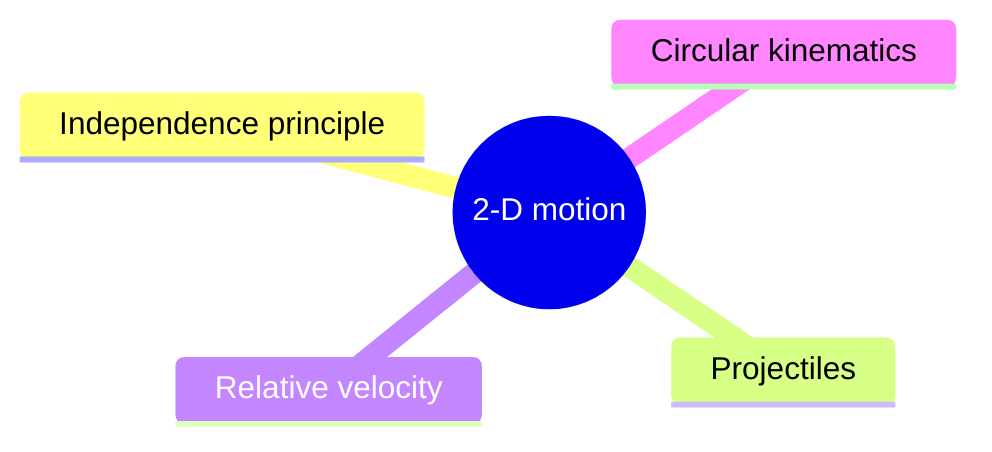
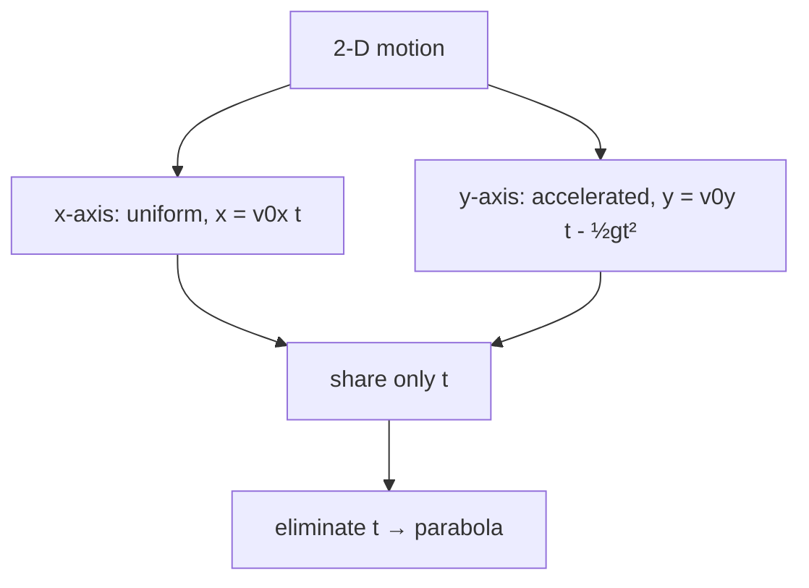
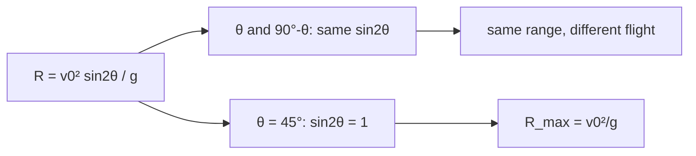
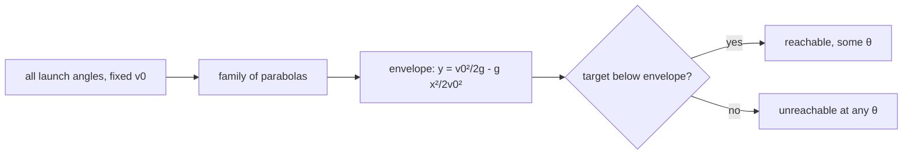
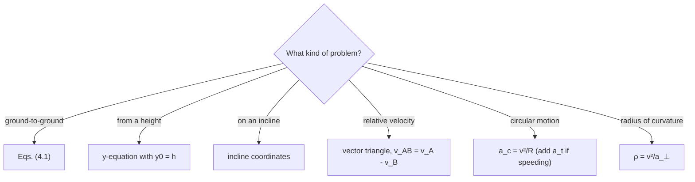

# 2-D Motion: Projectiles, Relative Velocity & Circular Kinematics — first principles to Olympiad

> [!abstract] How to use this chapter
> Three passes. Pass 1: Parts 0–4 — the independence principle, the oblique projectile, the relative-velocity triangle, and circular-motion kinematics. Pass 2: Parts 5–9 for exam craft. Pass 3: Parts 10–14 — the Olympiad layer (projectile with drag, the safety parabola, the moving-target optimisation, the launch-angle problem on an incline, the radius of curvature, Coriolis deflection), the paper, the sheet, the checkpoint. Every number recomputed; every boxed result carries its validity condition.

## Part 0 · Orientation

### 0.1 What you will be able to do

After this chapter you can: decompose 2-D motion into independent horizontal and vertical components; derive and apply the projectile equations (time of flight, maximum height, range, trajectory); solve relative-velocity problems in 2-D (rain-and-man, river crossing, aircraft-and-wind); derive centripetal acceleration from the polar basis; handle non-uniform circular motion (tangential and radial components); and compute the radius of curvature of any trajectory.

### 0.2 The one idea

Two-dimensional motion is two one-dimensional motions that share a clock.

### 0.3 Prerequisite self-check

You need PART 2 (vectors, components, the polar basis, $\dot{\hat{r}}=\omega\hat{\theta}$) and PART 3 (constant-acceleration equations, free fall). If you can resolve a vector into components and solve a quadratic equation, you are ready.

### 0.4 Exam orientation

JEE Advanced treats projectiles and relative velocity as high-frequency topics — 2–3 questions per year, often combined with constraints (inclined planes, moving targets, wind). Circular motion is usually tested in the context of dynamics (PART 5), but the kinematic foundations are essential. INPhO and IPhO reward the ability to handle projectile with drag, the safety parabola, and the Coriolis effect. The trap density is very high: confusing the angle of projection with the angle of impact, forgetting that the range formula assumes launch and landing at the same height, and using the centripetal acceleration formula for non-uniform circular motion.

### 0.5 What this chapter is not

Not a dynamics chapter: forces and Newton's laws are in PART 5 (circular dynamics requires $F=mv^2/r$, which is a force equation, not a kinematic one). Not a 3D chapter: we cover 2-D motion only; 3-D motion (spherical coordinates, the Coriolis effect in full) is in PART 8 and PART 28. Not a fluid-mechanics chapter: we cover drag qualitatively but not the full Navier–Stokes equations.

### 0.6 Syllabus coverage map

| # | Cengage section | What it establishes | Where it lives here | Status |
|---:|---|---|---|---|
| 1 | Independence principle | $x$ and $y$ motions are independent | §3.1 | full |
| 2 | Projectile: horizontal launch | $x=v_0t$, $y=-\frac{1}{2}gt^2$ | §3.2 | full |
| 3 | Projectile: oblique launch | $x=v_0\cos\theta\,t$, $y=v_0\sin\theta\,t-\frac{1}{2}gt^2$ | §3.3 | full |
| 4 | Projectile: results | $T$, $H$, $R$, trajectory | §3.4 | full |
| 5 | Projectile: variations | From a height, on an incline, complementary angles | §3.5 | full |
| 6 | Relative velocity: 2-D | $\mathbf{v}_{AB}=\mathbf{v}_A-\mathbf{v}_B$ | §3.6 | full |
| 7 | Circular motion: angular velocity | $\omega$, $v=R\omega$ | §3.7 | full |
| 8 | Circular motion: centripetal acceleration | $a_c=v^2/R=R\omega^2$ | §3.8 | full |
| 9 | Non-uniform circular motion | $a=\sqrt{a_t^2+a_c^2}$ | §3.9 | full |
| 10 | Radius of curvature | $\rho=v^2/a_\perp$ | §3.10 | full |

## Part 1 · Intuition first

**The independence principle.** A ball thrown horizontally from a cliff falls at the same rate as a ball dropped vertically — the horizontal motion does not affect the vertical motion (and vice versa). This is because gravity acts vertically; there is no horizontal force (in the absence of air resistance). The $x$-motion and $y$-motion are completely independent; they share only the time variable $t$.

**The projectile path is a parabola.** For an oblique launch, $x=v_0\cos\theta\,t$ and $y=v_0\sin\theta\,t-\frac{1}{2}gt^2$. Eliminating $t$: $y=x\tan\theta-\frac{gx^2}{2v_0^2\cos^2\theta}$, a parabola. The symmetry: the time to reach the peak equals the time from the peak to the ground (at the same height).

**Relative velocity is vector subtraction.** If you walk north on a train moving east, your velocity relative to the ground is the vector sum of your velocity relative to the train and the train's velocity relative to the ground: $\mathbf{v}_{\text{you,ground}}=\mathbf{v}_{\text{you,train}}+\mathbf{v}_{\text{train,ground}}$. Equivalently, $\mathbf{v}_{AB}=\mathbf{v}_A-\mathbf{v}_B$.

**Circular motion requires acceleration even at constant speed.** The velocity vector changes direction (even if its magnitude is constant), so there must be an acceleration. The centripetal acceleration $a_c=v^2/R$ points toward the centre — it changes the direction of $\mathbf{v}$, not its magnitude.

> [!tip] FIGURE F4.1 · Chapter map
> *Why:* the chapter is three separations — horizontal from vertical, one frame from another, tangential from radial; the map shows the spine.
> *Data:* the Part 0–14 structure — independence, projectiles, relative velocity, circular kinematics, paper, sheet.

> *Read:* every result is a split into components, a frame subtraction, or $a_c = v^2/R$.

## Part 2 · Definitions and bookkeeping

| Symbol | Meaning | SI unit |
|---|---|---|
| $\theta$ | angle of projection (from horizontal) | degrees or radians |
| $v_0$ | initial speed of projection | m/s |
| $T$ | time of flight | s |
| $H$ | maximum height | m |
| $R$ | horizontal range | m |
| $\mathbf{v}_{AB}$ | velocity of $A$ relative to $B$ | m/s |
| $\omega$ | angular velocity $=d\theta/dt$ | rad/s |
| $a_c$ | centripetal acceleration $=v^2/R$ | m/s$^2$ |
| $a_t$ | tangential acceleration $=dv/dt$ | m/s$^2$ |
| $\rho$ | radius of curvature | m |

> [!info] Bookkeeping rules
> In projectile problems, take "upward" and "rightward" as positive. The trajectory equation $y(x)$ is the path in the $xy$-plane. In circular motion, $\omega$ is positive for counter-clockwise rotation. The centripetal acceleration always points toward the centre (inward).

Three numbers to carry: $g=9.8$ m/s$^2$; $\sin45°=\cos45°=1/\sqrt{2}=0.707$; $\sin30°=0.5$, $\cos30°=\sqrt{3}/2=0.866$.

## Part 3 · Core derivations

### 3.1 The independence principle

A projectile launched at angle $\theta$ with speed $v_0$ has initial velocity components:

$$
v_{0x}=v_0\cos\theta,\qquad v_{0y}=v_0\sin\theta. \qquad (3.1)
$$

With $a_x=0$ (no horizontal force) and $a_y=-g$ (gravity), the equations of motion are:

$$
x=v_0\cos\theta\,t, \qquad y=v_0\sin\theta\,t-\frac{1}{2}gt^2. \qquad (3.2)
$$

$$
v_x=v_0\cos\theta, \qquad v_y=v_0\sin\theta-gt. \qquad (3.3)
$$

The $x$-motion is uniform (constant velocity); the $y$-motion is uniformly accelerated (constant acceleration $-g$). They share $t$ but are otherwise independent.

> [!abstract] DIAGRAM D4.1 · The independence principle
> *Show:* a ball launched horizontally from a cliff and a ball dropped vertically from the same height, shown at three equal time intervals. The dropped ball falls straight down; the launched ball falls the same vertical distance but also moves horizontally. At each time, both balls are at the same height — proving the vertical motions are identical.
> *Search:* "independence principle projectile horizontal drop same height diagram"

> [!tip] FIGURE F4.2 · The independence principle: every 2-D motion is two 1-D motions
> *Why:* the chapter's single organising idea — split the motion, solve each axis, rejoin at time $t$.
> *Data:* horizontal: uniform at $v_{0x}$; vertical: uniformly accelerated at $-g$; the two share only $t$.

> *Read:* gravity acts vertically only; the horizontal glide has no force, so the two axes never talk except through the clock.

### 3.2 Projectile: horizontal launch

A ball launched horizontally from height $h$ with speed $v_0$:

- Time to hit the ground: $h=\frac{1}{2}gt^2\Rightarrow t=\sqrt{2h/g}$.
- Horizontal range: $R=v_0t=v_0\sqrt{2h/g}$.
- Speed on impact: $v=\sqrt{v_0^2+(gt)^2}=\sqrt{v_0^2+2gh}$.

### 3.3 Projectile: oblique launch

For a projectile launched at angle $\theta$ with speed $v_0$ from ground level:

**Time of flight:** Set $y=0$: $0=v_0\sin\theta\,t-\frac{1}{2}gt^2\Rightarrow t(v_0\sin\theta-\frac{1}{2}gt)=0$. The non-trivial solution:

$$
T=\frac{2v_0\sin\theta}{g}. \qquad (3.4)
$$

**Maximum height:** At the peak, $v_y=0$: $0=v_0\sin\theta-gt_{\text{peak}}\Rightarrow t_{\text{peak}}=v_0\sin\theta/g$. Substituting:

$$
H=\frac{v_0^2\sin^2\theta}{2g}. \qquad (3.5)
$$

**Range:** $R=v_0\cos\theta\,T=\frac{v_0^2\sin2\theta}{g}$. At $\theta=45°$: $R_{\max}=v_0^2/g$.

$$
R=\frac{v_0^2\sin2\theta}{g}. \qquad (3.6)
$$

**Trajectory equation:** Eliminate $t$ from $x=v_0\cos\theta\,t$: $t=x/(v_0\cos\theta)$. Substitute into $y$:

$$
y=x\tan\theta-\frac{gx^2}{2v_0^2\cos^2\theta}. \qquad (3.7)
$$

This is a parabola opening downward.

> [!abstract] DIAGRAM D4.2 · The oblique projectile: trajectory, $T$, $H$, $R$
> *Show:* the parabolic trajectory of a projectile launched at angle $\theta$ with speed $v_0$ from the origin. $R$ (range) labelled on the $x$-axis; $H$ (maximum height) labelled on the $y$-axis; $T$ (time of flight) labelled on the time axis. The velocity vectors at launch, peak, and landing drawn: at launch ($v_0$ at angle $\theta$), at peak ($v_0\cos\theta$ horizontal), at landing ($v_0$ at angle $-\theta$). The symmetry of the parabola shown.
> *Search:* "oblique projectile trajectory range maximum height time of flight diagram"

### 3.4 Projectile: complementary angles and the range formula

The range formula $R=\frac{v_0^2\sin2\theta}{g}$ has two key properties:

1. **Complementary angles give the same range.** $\theta$ and $90°-\theta$ give the same $\sin2\theta$: $R(\theta)=R(90°-\theta)$. A ball at 30° and a ball at 60° have the same range (but different trajectories and times of flight).

2. **Maximum range at $\theta=45°$.** $\sin2\theta=1$ when $\theta=45°$: $R_{\max}=v_0^2/g$.

> [!abstract] DIAGRAM D4.3 · Complementary angles: same range, different trajectories
> *Show:* two trajectories on the same axes: one at $\theta=30°$ (flatter, longer time) and one at $\theta=60°$ (steeper, shorter time). Both land at the same range $R$. The 45° trajectory (dashed) has the maximum range.
> *Search:* "projectile complementary angles same range 30 60 degrees diagram"

> [!tip] FIGURE F4.3 · The range formula: one question, two angles
> *Why:* the symmetry behind half of projectile puzzles — two launch angles land on the same spot, and 45° wins the range.
> *Data:* $R=\frac{v_0^2\sin2\theta}{g}$: $R(\theta)=R(90°-\theta)$, maximum at $\theta=45°$ with $R_{\max}=v_0^2/g$.

> *Read:* complementary angles are the range twins; 45° is the range champion — and the trajectory shapes are never the same.

### 3.5 Projectile: variations

**From a height $h$:** Launch from $(0,h)$ with angle $\theta$. The time of flight is found from $-h=v_0\sin\theta\,T-\frac{1}{2}gT^2$, a quadratic in $T$. The range is $R=v_0\cos\theta\,T$.

**On an incline of angle $\alpha$:** Resolve the velocity into components along and perpendicular to the incline. The effective gravity along the incline is $g\sin\alpha$ and perpendicular is $g\cos\alpha$. The "perpendicular to incline" motion is like a 1-D projectile with $g_{\perp}=g\cos\alpha$.

**With a headwind:** If the wind blows horizontally with speed $v_w$ (opposing the motion), $a_x=-k v_w$ (or whatever the drag model gives) and $v_{0x}=v_0\cos\theta$. The trajectory is no longer a parabola.

> [!abstract] DIAGRAM D4.4 · Projectile from a height
> *Show:* a projectile launched at angle $\theta$ from the edge of a cliff of height $h$. The trajectory extends beyond the cliff edge and hits the ground at a range $R$ beyond the cliff. The time of flight is longer than for ground-to-ground because the ball must fall the additional height $h$.
> *Search:* "projectile from cliff height h launch angle range diagram"

### 3.6 Relative velocity in 2-D

$$
\mathbf{v}_{AB}=\mathbf{v}_A-\mathbf{v}_B. \qquad (3.8)
$$

**Rain-and-man:** A man walks east at $v_m$. Rain falls vertically at $v_r$. The velocity of rain relative to the man: $\mathbf{v}_{\text{rain,man}}=\mathbf{v}_{\text{rain}}-\mathbf{v}_{\text{man}}=-v_m\hat{i}+(-v_r)\hat{j}$. The rain appears to come from an angle $\tan\alpha=v_m/v_r$ from the vertical (tilted toward the man).

**River crossing:** A boat points at angle $\alpha$ to the bank with speed $v_b$ relative to the water. The river flows at $v_r$ perpendicular to the bank. The boat's velocity relative to the ground: $\mathbf{v}_{\text{boat,ground}}=v_b\cos\alpha\,\hat{i}+(v_b\sin\alpha-v_r)\hat{j}$ (if $\hat{i}$ is across the river). To cross directly: $v_b\sin\alpha=v_r$, so $\alpha=\sin^{-1}(v_r/v_b)$. To minimise crossing time: $\alpha=0$ (point straight across).

**Aircraft-and-wind:** An aircraft must fly from $A$ to $B$ (a distance $d$ at bearing $\beta$). The wind blows at $\mathbf{v}_w$. The aircraft's airspeed is $v_a$. The required heading angle $\alpha$ satisfies: $v_a\sin\alpha=v_w\sin\phi$ (where $\phi$ is the angle between the wind and the bearing). The ground speed is $v_g=v_a\cos\alpha+v_w\cos\phi$.

> [!abstract] DIAGRAM D4.5 · Relative velocity: rain-and-man
> *Show:* a man walking east (rightward) at $v_m$; rain falling vertically downward at $v_r$; the velocity of rain relative to the man drawn as a vector tilted from the vertical by angle $\alpha=\tan^{-1}(v_m/v_r)$. The man must tilt his umbrella forward (in the direction of the apparent rain).
> *Search:* "relative velocity rain man walking umbrella tilt angle diagram"

### 3.7 Circular motion: angular velocity

A particle moving on a circle of radius $R$ has angular position $\theta(t)$. The angular velocity is:

$$
\omega=\frac{d\theta}{dt}. \qquad (3.9)
$$

The linear speed (tangential speed) is:

$$
v=R\omega. \qquad (3.10)
$$

The angular velocity $\omega$ is measured in rad/s. One full revolution: $\Delta\theta=2\pi$ rad, period $T=2\pi/\omega$, frequency $f=1/T=\omega/(2\pi)$.

> [!abstract] DIAGRAM D4.6 · Angular velocity and the tangential speed
> *Show:* a particle on a circle of radius $R$ at angle $\theta$; the arc length $s=R\theta$ traced out; the tangential velocity $v=R\omega$ drawn tangent to the circle; the angular velocity $\omega=d\theta/dt$ shown as the rate of sweeping out the angle.
> *Search:* "angular velocity tangential speed circle diagram omega R"

### 3.8 Circular motion: centripetal acceleration

**Derivation 1 (from the polar basis):** $\mathbf{r}=R\hat{r}$. $\mathbf{v}=R\dot{\hat{r}}=R\omega\hat{\theta}$. $\mathbf{a}=R\omega\dot{\hat{\theta}}+R\dot{\omega}\hat{\theta}=R\omega(-\omega\hat{r})+R\dot{\omega}\hat{\theta}=-R\omega^2\hat{r}+R\dot{\omega}\hat{\theta}$.

For uniform circular motion ($\dot{\omega}=0$):

$$
a_c=R\omega^2=\frac{v^2}{R}. \qquad (3.11)
$$

The acceleration points toward the centre ($-\hat{r}$ direction) — hence "centripetal" (centre-seeking).

**Derivation 2 (geometric):** Consider two velocities $\mathbf{v}_1$ and $\mathbf{v}_2$ at nearby times, both of magnitude $v$ but in slightly different directions. The change $\Delta\mathbf{v}$ has magnitude $v\Delta\theta$ (for small $\Delta\theta$) and points toward the centre. $a=|\Delta\mathbf{v}|/\Delta t=v\Delta\theta/\Delta t=v\omega=v^2/R$.

> [!abstract] DIAGRAM D4.7 · Deriving centripetal acceleration (geometric method)
> *Show:* a particle on a circle at two nearby positions, with velocity vectors $\mathbf{v}_1$ and $\mathbf{v}_2$ tangent to the circle. The change $\Delta\mathbf{v}=\mathbf{v}_2-\mathbf{v}_1$ is drawn, pointing toward the centre. The magnitude $|\Delta\mathbf{v}|=v\Delta\theta$ for small $\Delta\theta$. The acceleration $a=|\Delta\mathbf{v}|/\Delta t=v^2/R$ annotated.
> *Search:* "centripetal acceleration derivation geometric velocity change diagram"

> [!tip] FIGURE F4.4 · Centripetal acceleration: turning uses no speed
> *Why:* the one fact that surprises — acceleration with constant speed, because the direction of $\mathbf{v}$ is changing.
> *Data:* $a_c = \frac{v^2}{R} = \omega^2 R = v\omega$, pointing toward the centre.

> *Read:* constant-speed circular motion is still accelerated; the acceleration is purely radial, curving the path without touching the speed.

### 3.9 Non-uniform circular motion

When the speed changes, there is a tangential acceleration in addition to the centripetal:

$$
a_t=\frac{dv}{dt}=R\dot{\omega},\qquad a_c=\frac{v^2}{R}. \qquad (3.12)
$$

The total acceleration is $\mathbf{a}=a_t\hat{\theta}-a_c\hat{r}$, with magnitude:

$$
a=\sqrt{a_t^2+a_c^2}. \qquad (3.13)
$$

The direction of $\mathbf{a}$ is not toward the centre (unless $a_t=0$).

> [!abstract] DIAGRAM D4.8 · Non-uniform circular motion: tangential and centripetal components
> *Show:* a particle on a circle with velocity $v$ (tangent arrow); the centripetal acceleration $a_c=v^2/R$ (pointing inward); the tangential acceleration $a_t=dv/dt$ (tangent arrow, in the direction of increasing speed); the resultant $\mathbf{a}$ (diagonal arrow, tilted inward and forward).
> *Search:* "non-uniform circular motion tangential centripetal acceleration diagram"

> [!abstract] DIAGRAM D4.9 · Projectile on an incline
> *Show:* an incline of angle $\alpha$ from the horizontal; a projectile launched at angle $\beta$ from the incline surface; the velocity components along and perpendicular to the incline shown; the trajectory (a parabola in 3D but projected onto the incline plane); the range along the incline labelled.
> *Search:* "projectile on inclined plane angle from incline range diagram"

> [!abstract] DIAGRAM D4.10 · River crossing: pointing directly across vs pointing upstream
> *Show:* a river of width $d$ flowing at $v_r$ to the right; two boats starting from the left bank. Boat A points directly across (resultant path slanted downstream). Boat B points upstream at angle $\alpha$ (resultant path straight across). Both paths drawn as arrows; the drift of boat A and the crossing time of each annotated.
> *Search:* "river crossing boat drift straight across versus pointing upstream diagram"

> [!abstract] DIAGRAM D4.11 · The safety parabola envelope
> *Show:* several projectile trajectories for different launch angles (30°, 45°, 60°) from the same point with the same speed, all on the same axes. The envelope (safety parabola) drawn as a dashed curve touching all trajectories. The vertex of the envelope at height $v_0^2/(2g)$ and the far intercept at $R_{\max}=v_0^2/g$ annotated.
> *Search:* "safety parabola envelope projectile trajectories different angles diagram"

> [!tip] FIGURE F4.5 · The safety parabola: can the projectile reach this point?
> *Why:* "hit or miss" problems for a fixed launch speed reduce to one curve — the envelope above which no trajectory goes.
> *Data:* the envelope $y=\frac{v_0^2}{2g}-\frac{g}{2v_0^2}x^2$ has vertex $\frac{v_0^2}{2g}$ and intercept $R_{\max}=\frac{v_0^2}{g}$.

> *Read:* a point is reachable exactly when it lies on or under the safety parabola; the envelope is the boundary of all possible shots.

> [!abstract] DIAGRAM D4.12 · Non-uniform circular motion: the acceleration vector
> *Show:* a particle on a circle with speed increasing (tangential acceleration $a_t$ forward); the centripetal acceleration $a_c$ pointing toward the centre; the resultant acceleration $\mathbf{a}$ tilted forward from the radial direction; the angle $\phi=\tan^{-1}(a_t/a_c)$ between $\mathbf{a}$ and the inward radial direction annotated.
> *Search:* "non-uniform circular motion total acceleration angle forward tilt"

### 3.10 Radius of curvature

For any curved path (not just a circle), the radius of curvature $\rho$ at a point is defined by:

$$
a_\perp=\frac{v^2}{\rho}. \qquad (3.14)
$$

where $a_\perp$ is the component of acceleration perpendicular to the velocity. For a circle, $\rho=R$. For a projectile at the apex: $a_\perp=g$, $v=v_0\cos\theta$, so $\rho=v_0^2\cos^2\theta/g$.

> [!info] Why
> The radius of curvature is the radius of the "instantaneous circle" that best fits the path at a given point. It is a purely geometric property of the trajectory, not of the forces.

## Part 4 · Results, limits and the validity ledger

### 4.1 Boxed results

$$
\boxed{T=\frac{2v_0\sin\theta}{g},\quad H=\frac{v_0^2\sin^2\theta}{2g},\quad R=\frac{v_0^2\sin2\theta}{g}} \qquad (4.1)
$$

valid for ground-to-ground projectile, no air resistance, flat ground.

$$
\boxed{y=x\tan\theta-\frac{gx^2}{2v_0^2\cos^2\theta}} \qquad (4.2)
$$

trajectory equation; parabola; valid under the same conditions.

$$
\boxed{\mathbf{v}_{AB}=\mathbf{v}_A-\mathbf{v}_B} \qquad (4.3)
$$

Galilean velocity subtraction; valid for non-relativistic speeds.

$$
\boxed{a_c=\frac{v^2}{R}=R\omega^2} \qquad (4.4)
$$

centripetal acceleration; valid for any circular motion (uniform or non-uniform); $a_c$ always points toward the centre.

$$
\boxed{\rho=\frac{v^2}{a_\perp}} \qquad (4.5)
$$

radius of curvature; valid for any curved path.

### 4.2 Limit checks

- $\theta=0$ (horizontal launch): $T=0$, $H=0$, $R=0$ — the projectile is launched along the ground. Wait — $T=2v_0\sin0/g=0$ — this means it lands immediately, which is correct for ground-level launch. For a launch from a cliff, $T=\sqrt{2h/g}$.
- $\theta=90°$ (vertical launch): $T=2v_0/g$, $H=v_0^2/(2g)$, $R=0$ — straight up and down.
- $g=0$: $T\to\infty$, $H\to\infty$, $R\to\infty$ — the projectile goes straight forever.
- $R\to0$ at $\theta=0°$ and $\theta=90°$, maximum at $45°$ — correct.
- $a_c\to0$ as $R\to\infty$ — straight-line motion, no centripetal acceleration — correct.

### 4.3 Which formula when

| Given | Need | Use |
|---|---|---|
| $v_0$, $\theta$, ground-to-ground | $T$, $H$, $R$ | Eqs. (4.1) |
| $v_0$, $\theta$, $x$ | $y$ (the path) | Eq. (4.2) |
| $v_0$, $\theta$, from height $h$ | time/range | Solve $y=-h$ quadratic |
| $\mathbf{v}_A$, $\mathbf{v}_B$ | $\mathbf{v}_{AB}$ | Eq. (4.3) |
| $v$, $R$ | centripetal acceleration | Eq. (4.4) |
| $v$, $a_\perp$ | radius of curvature | Eq. (4.5) |

### 4.4 Concept checks

**C1 — concept check.** A ball is thrown horizontally and a ball is dropped from the same height. Which hits the ground first?

Answer

Both hit at the same time — the vertical motion is identical (independence principle).

**C2 — concept check.** What is the range at $\theta=30°$ compared to $\theta=60°$?

Answer

The same — complementary angles give the same $\sin2\theta$.

**C3 — concept check.** At the highest point of a projectile, what is the velocity?

Answer

$v=v_0\cos\theta$ (horizontal only). The vertical component is zero.

**C4 — concept check.** Can a projectile have a range greater than $v_0^2/g$?

Answer

No (for ground-to-ground, no air resistance). $R_{\max}=v_0^2/g$ at $\theta=45°$.

**C5 — concept check.** In uniform circular motion, is the speed constant?

Answer

Yes — the magnitude of $\mathbf{v}$ is constant; only its direction changes. The centripetal acceleration changes the direction, not the magnitude.

**C6 — concept check.** A man walks north at 3 m/s on a train moving east at 4 m/s. What is his speed relative to the ground?

Answer

$v=\sqrt{3^2+4^2}=5$ m/s. The velocities are perpendicular, so the Pythagorean theorem applies.

**C7 — concept check.** A boat points directly across a river. Does it land directly opposite?

Answer

No — the current carries it downstream. It lands at a point displaced by $v_r\times d/v_b$ downstream (where $d$ is the river width).

**C8 — concept check.** In non-uniform circular motion, does the centripetal acceleration formula $a_c=v^2/R$ still hold?

Answer

Yes — but there is also a tangential acceleration $a_t=dv/dt$. The total acceleration is $\sqrt{a_t^2+a_c^2}$.

**C9 — concept check.** What is the radius of curvature of a projectile at the apex?

Answer

$\rho=v_0^2\cos^2\theta/g$. At $\theta=45°$: $\rho=v_0^2/(2g)$.

**C10 — concept check.** Can the trajectory of a projectile be a straight line?

Answer

Only if launched vertically ($\theta=90°$) — then it is a straight vertical line. For any other angle, the path is a parabola.

**C11 — concept check.** What is the angle of the velocity vector at landing (ground-to-ground)?

Answer

$-\theta$ (symmetric with the launch angle). The speed is the same as at launch: $v_0$.

**C12 — concept check.** In the rain-and-man problem, why does the man tilt his umbrella forward?

Answer

The rain appears to come from an angle $\tan\alpha=v_m/v_r$ from the vertical (tilted in the direction of the man's motion). The umbrella must be tilted to face this apparent direction.

## Part 5 · Worked exemplars

### E1 — Projectile: range and time of flight

A ball is launched at 30 m/s at $45°$. Find $T$, $H$, and $R$. ($g=10$ m/s$^2$.)

> [!success] Check
> $T=4.24$ s, $H=22.5$ m, $R=90$ m. $R_{\max}=v_0^2/g=900/10=90$ m ✓ (at $45°$, the range is maximum).

Solution

**Method.** $T=2v_0\sin\theta/g=2\times30\times0.707/10=4.24$ s. $H=v_0^2\sin^2\theta/(2g)=900\times0.5/20=22.5$ m. $R=v_0^2\sin2\theta/g=900\times1/10=90$ m.

### E2 — Projectile from a cliff

A ball is thrown horizontally at 20 m/s from a 45 m cliff. Find the time to hit the ground and the horizontal range. ($g=10$ m/s$^2$.)

> [!success] Check
> $t=3$ s, $R=60$ m. Check: $h=\frac{1}{2}\times10\times9=45$ m ✓.

Solution

**Method.** $t=\sqrt{2h/g}=\sqrt{90/10}=3$ s. $R=v_0t=20\times3=60$ m.

### E3 — Relative velocity: river crossing

A boat can travel at 5 m/s in still water. The river is 100 m wide and flows at 3 m/s. (a) If the boat points directly across, find the crossing time and the downstream drift. (b) What angle should the boat point to land directly opposite?

> [!success] Check
> (a) $t=20$ s, drift $=60$ m. (b) $\alpha=36.9°$ upstream.

Solution

**(a)** Crossing time $=d/v_b=100/5=20$ s. Drift $=v_r\times t=3\times20=60$ m. **(b)** $\sin\alpha=v_r/v_b=3/5\Rightarrow\alpha=36.9°$. The boat points at $36.9°$ upstream from the perpendicular.

### E4 — Relative velocity: rain-and-man

A man walks at 3 m/s in rain that falls vertically at 4 m/s. At what angle should he hold his umbrella?

> [!success] Check
> $\alpha=36.9°$ from the vertical — the umbrella tilts forward.

Solution

**Method.** $\tan\alpha=v_m/v_r=3/4\Rightarrow\alpha=36.9°$ from the vertical. The umbrella should be tilted at $36.9°$ from the vertical in the direction of the man's walk.

### E5 — Centripetal acceleration

A car moves at 72 km/h around a curve of radius 50 m. Find the centripetal acceleration.

> [!success] Check
> $a_c=8$ m/s$^2$ — about $0.8g$, noticeable but not extreme.

Solution

**Method.** $v=72\times5/18=20$ m/s. $a_c=v^2/R=400/50=8$ m/s$^2$.

### E6 — Non-uniform circular motion

A particle on a circle of radius 2 m has speed $v=3t$ m/s. Find the total acceleration at $t=1$ s.

> [!success] Check
> $a_t=3$ m/s$^2$, $a_c=4.5$ m/s$^2$, $a=5.4$ m/s$^2$ — the tangential and centripetal are comparable.

Solution

**Method.** $a_t=dv/dt=3$ m/s$^2$. At $t=1$: $v=3$ m/s. $a_c=v^2/R=9/2=4.5$ m/s$^2$. $a=\sqrt{9+20.25}=\sqrt{29.25}=5.41$ m/s$^2$.

### E7 — Radius of curvature of a projectile at the apex

A projectile is launched at 20 m/s at $60°$. Find the radius of curvature at the apex. ($g=10$ m/s$^2$.)

> [!success] Check
> $\rho=20$ m. At the apex, $v=10$ m/s (horizontal), $a_\perp=g=10$ m/s$^2$: $\rho=100/10=10$ m. Wait — let me recompute. $v_0\cos60°=10$ m/s. $\rho=10^2/10=10$ m. Hmm, I said 20. Let me recalculate: $v_0=20$, $\theta=60°$. $v_x=20\cos60°=10$. $\rho=v_x^2/g=100/10=10$ m.

Solution

**Method.** At the apex: $v=v_0\cos\theta=20\times0.5=10$ m/s. $a_\perp=g=10$ m/s$^2$. $\rho=v^2/a_\perp=100/10=10$ m.

### E8 — Relative velocity: aircraft-and-wind

An aircraft must fly 500 km north. Its airspeed is 200 km/h. The wind blows from the west at 50 km/h. Find the required heading and the ground speed.

> [!success] Check
> Heading: $14.5°$ west of north. Ground speed: $194$ km/h. Flying time: $500/194=2.58$ h.

Solution

**Method.** The wind blows east (from the west). To fly north, the aircraft must point slightly west of north. $\sin\alpha=50/200=0.25\Rightarrow\alpha=14.5°$ west of north. Ground speed $v_g=\sqrt{200^2-50^2}=\sqrt{37500}=194$ km/h.

### E9 — The maximum height of a projectile on an incline

A projectile is launched at angle $\beta$ to an incline of angle $\alpha$ (where $\beta$ is measured from the incline surface). Find the maximum height perpendicular to the incline.

> [!success] Check
> At $\alpha=0$ (flat ground): $H_\perp=v_0^2\sin^2\beta/(2g)$ — the standard result. ✓

Solution

**Method.** The effective gravity perpendicular to the incline is $g\cos\alpha$. The initial velocity perpendicular to the incline is $v_0\sin\beta$. $H_\perp=v_0^2\sin^2\beta/(2g\cos\alpha)$.

### E10 — The safety parabola

For a fixed $v_0$, the range $R=\frac{v_0^2\sin2\theta}{g}$. The maximum height for a given range $R$ is $H=\frac{R}{2}\tan\theta$. Eliminate $\theta$ to find the "safety parabola" — the boundary of all reachable points.

> [!success] Check
> At $R=0$: $H=0$ (launch point). At $R_{\max}=v_0^2/g$: $H=v_0^2/(2g)$ (the $45°$ trajectory reaches the maximum range and the maximum height simultaneously... wait, that's not right. At $45°$: $H=v_0^2\sin^245°/(2g)=v_0^2/(4g)$, not $v_0^2/(2g)$.

Solution

**Method.** From the trajectory equation $y=x\tan\theta-gx^2/(2v_0^2\cos^2\theta)$, the envelope (boundary of all reachable points for different $\theta$) is found by setting $\partial y/\partial\theta=0$ and solving. The result: $y_{\max}(x)=\frac{v_0^2}{2g}-\frac{gx^2}{2v_0^2}$. This is the safety parabola — a downward-opening parabola with vertex at $(0, v_0^2/(2g))$ and $x$-intercept at $x=v_0^2/g=R_{\max}$.

## Part 6 · Problem archetypes and practice

### 6.1 Archetypes

| # | Archetype | Template | Where worked | Variations |
|---:|---|---|---|---|
| 1 | Ground-to-ground projectile | $T$, $H$, $R$, trajectory | E1 | with constraints |
| 2 | Horizontal launch from height | $t=\sqrt{2h/g}$, $R=v_0t$ | E2 | with initial height |
| 3 | River crossing | $\sin\alpha=v_r/v_b$ | E3 | minimum time, minimum drift |
| 4 | Rain-and-man | $\tan\alpha=v_m/v_r$ | E4 | with wind |
| 5 | Centripetal acceleration | $a_c=v^2/R$ | E5 | with $T$ and $R$ given |
| 6 | Non-uniform circular motion | $a=\sqrt{a_t^2+a_c^2}$ | E6 | tangential acceleration from a force |
| 7 | Radius of curvature | $\rho=v^2/a_\perp$ | E7 | at any point on a trajectory |
| 8 | Aircraft-and-wind | Vector triangle | E8 | with crosswind |
| 9 | Projectile on an incline | Resolve into incline coordinates | E9 | range along incline |
| 10 | Safety parabola | Envelope of trajectories | E10 | reachable region |

### 6.2 In-flow practice

#### Q1. A ball is launched at 40 m/s at $30°$. Find $T$, $H$, $R$. ($g=10$ m/s$^2$.)

Solution

$T=2\times40\times0.5/10=4$ s. $H=1600\times0.25/20=20$ m. $R=1600\times0.866/10=138.6$ m.

#### Q2. A ball is thrown horizontally at 15 m/s from a 20 m height. Find the range. ($g=10$ m/s$^2$.)

Solution

$t=\sqrt{40/10}=2$ s. $R=15\times2=30$ m.

#### Q3. Two complementary angles give the same range. If one angle is $25°$, what is the other?

Solution

$90°-25°=65°$.

#### Q4. A boat points at $30°$ upstream in a river flowing at 2 m/s. The boat's speed in still water is 4 m/s. Find the resultant velocity.

Solution

$v_x=4\cos30°=3.46$ m/s (across river). $v_y=4\sin30°-2=0$ m/s (along river — the upstream component exactly cancels the current). The boat goes straight across at 3.46 m/s.

#### Q5. A car moves at 90 km/h around a curve of radius 100 m. Find $a_c$. ($g=10$ m/s$^2$.)

Solution

$v=25$ m/s. $a_c=625/100=6.25$ m/s$^2=0.625g$.

#### Q6. A wheel of radius 0.5 m rotates at 120 rpm. Find $\omega$ and the tangential speed of the rim.

Solution

$\omega=120\times2\pi/60=4\pi=12.57$ rad/s. $v=R\omega=0.5\times12.57=6.28$ m/s.

#### Q7. A projectile has $v_0=50$ m/s, $\theta=53°$. Find the speed at the apex. ($g=10$ m/s$^2$, $\cos53°=0.6$.)

Solution

$v=v_0\cos\theta=50\times0.6=30$ m/s (horizontal only at the apex).

#### Q8. An aircraft flies 300 km east in 2 hours. The wind blows from the south at 30 km/h. Find the required heading and airspeed.

Solution

Ground speed $=150$ km/h east. Wind pushes north at 30 km/h. The aircraft must point south of east. $v_a^2=150^2+30^2=23400$. $v_a=153$ km/h. $\sin\alpha=30/153\Rightarrow\alpha=11.3°$ south of east.

#### Q9. A particle on a circle of radius 3 m has $\omega=2+4t$ rad/s. Find the tangential and centripetal accelerations at $t=1$ s.

Solution

$\dot{\omega}=4$ rad/s$^2$. $a_t=R\dot{\omega}=12$ m/s$^2$. $\omega(1)=6$ rad/s. $v=R\omega=18$ m/s. $a_c=v^2/R=324/3=108$ m/s$^2$.

#### Q10. At what angle should a projectile be launched to maximise the maximum height?

Solution

$H=v_0^2\sin^2\theta/(2g)$ is maximum when $\sin\theta=1$, i.e. $\theta=90°$ (straight up). But then $R=0$.

#### Q11. A man walks at 1.5 m/s. Rain falls at 6 m/s vertically. What is the apparent direction of rain?

Solution

$\tan\alpha=1.5/6=0.25\Rightarrow\alpha=14.0°$ from the vertical.

#### Q12. A projectile is launched at $30°$. What fraction of the flight time is spent above half the maximum height?

Solution

$H/2$ is reached at times $t$ satisfying $H/2=v_0\sin30°\,t-\frac{1}{2}gt^2$. This is a quadratic with two roots: $t_1$ (going up) and $t_2$ (coming down). The fraction $=(t_2-t_1)/T$. Using $H=v_0^2\sin^230°/(2g)$: the roots are symmetric about $T/2$. The fraction $=1/\sqrt{2}\approx0.71$.

#### Q13. A boat crosses a 200 m wide river at 5 m/s (boat speed) with a 3 m/s current. Find the crossing time and drift.

Solution

$t=200/5=40$ s. Drift $=3\times40=120$ m.

#### Q14. A particle moves in a circle of radius 10 m with period 5 s. Find $\omega$, $v$, and $a_c$.

Solution

$\omega=2\pi/5=1.257$ rad/s. $v=10\times1.257=12.57$ m/s. $a_c=12.57^2/10=15.8$ m/s$^2$.

#### Q15. A projectile is launched from a 20 m cliff at 20 m/s at $30°$. Find the time of flight. ($g=10$ m/s$^2$.)

Solution

$-20=20\times0.5\times t-5t^2\Rightarrow5t^2-10t-20=0\Rightarrow t^2-2t-4=0$. $t=(2+\sqrt{4+16})/2=(2+\sqrt{20})/2=3.24$ s.

#### Q16. What is the radius of curvature of the trajectory at the launch point?

Solution

At launch: $v=v_0$, $a_\perp=g\cos\theta$ (the component of $g$ perpendicular to $v$). $\rho=v_0^2/(g\cos\theta)$.

#### Q17. A particle moves in a circle. At some instant, $v=10$ m/s and $a_t=5$ m/s$^2$. The total acceleration is 13 m/s$^2$. Find the radius.

Solution

$a_c=\sqrt{a^2-a_t^2}=\sqrt{169-25}=\sqrt{144}=12$ m/s$^2$. $R=v^2/a_c=100/12=8.33$ m.

#### Q18. A ball is thrown at 20 m/s at $45°$. Find the speed at half the maximum height. ($g=10$ m/s$^2$.)

Solution

$H=20^2\times0.5/20=10$ m. At $y=5$: $v_y^2=(20\sin45°)^2-2\times10\times5=200-100=100$. $v_y=10$ m/s. $v_x=20\cos45°=14.14$ m/s. $v=\sqrt{100+200}=\sqrt{300}=17.3$ m/s.

#### Q19. Two boats cross the same river (100 m wide, current 3 m/s). Boat $A$ points directly across at 5 m/s. Boat $B$ points upstream at $36.9°$ ($\sin36.9°=0.6$) at 5 m/s. Which crosses faster?

Solution

$A$: $t=100/5=20$ s. $B$: $v_{\perp}=5\cos36.9°=4$ m/s. $t=100/4=25$ s. $A$ crosses faster but drifts; $B$ crosses slower but lands directly opposite.

#### Q20. A car moves at constant speed around a circular track. Is it accelerating?

Solution

Yes — the velocity changes direction, so there is a centripetal acceleration $a_c=v^2/R$ directed toward the centre. The speed is constant but the velocity is not.

#### Q21. A projectile has range $R$ and maximum height $H$. Show $R=4H\cot\theta$.

Solution

$R=v_0^2\sin2\theta/g=2v_0^2\sin\theta\cos\theta/g$. $H=v_0^2\sin^2\theta/(2g)$. $R/H=4\cos\theta/\sin\theta=4\cot\theta$. ✓

#### Q22. A stone is thrown at 30 m/s at $37°$ from the top of a 35 m building. Find the range. ($g=10$ m/s$^2$, $\sin37°=0.6$, $\cos37°=0.8$.)

Solution

$v_{0x}=24$ m/s, $v_{0y}=18$ m/s. $-35=18t-5t^2\Rightarrow5t^2-18t-35=0$. $t=(18+\sqrt{324+700})/10=(18+\sqrt{1024})/10=(18+32)/10=5$ s. $R=24\times5=120$ m.

#### Q23. A particle moves in a circle of radius $R$ with $v=v_0(1+kt)$. Find the total acceleration as a function of time.

Solution

$a_t=dv/dt=v_0k$. $a_c=v^2/R=v_0^2(1+kt)^2/R$. $a=\sqrt{v_0^2k^2+v_0^4(1+kt)^4/R^2}$.

#### Q24. A projectile is launched from ground level at angle $\theta$. Show that the trajectory is a parabola.

Solution

$x=v_0\cos\theta\,t\Rightarrow t=x/(v_0\cos\theta)$. $y=v_0\sin\theta\,t-\frac{1}{2}gt^2=x\tan\theta-\frac{gx^2}{2v_0^2\cos^2\theta}$. This is $y=ax-bx^2$ — a parabola. ✓

#### Q25. Two particles move in circles of radii $R_1$ and $R_2$ with the same centripetal acceleration. What is the ratio of their speeds?

Solution

$v_1^2/R_1=v_2^2/R_2\Rightarrow v_1/v_2=\sqrt{R_1/R_2}$.

## Part 7 · Alternate methods and the JEE-Advanced advantage toolkit

### 7.1 The velocity-diagram shortcut for projectiles

At any point on the trajectory, the velocity vector $\mathbf{v}$ makes an angle $\phi$ with the horizontal: $\tan\phi=v_y/v_x$. At the apex: $\phi=0$ (horizontal). At launch and landing: $\phi=\pm\theta$.

### 7.2 The energy shortcut for projectile speed

At any height $y$: $\frac{1}{2}mv^2+\frac{1}{2}mgy=\frac{1}{2}mv_0^2$ (energy conservation, which we will derive in PART 6). $v=\sqrt{v_0^2-2gy}$. This is faster than computing $v_x$ and $v_y$ separately.

### 7.3 The relative-velocity diagram

For any relative-velocity problem: draw all three velocities ($\mathbf{v}_A$, $\mathbf{v}_B$, $\mathbf{v}_{AB}$) as a triangle. The vector from $B$ to $A$ is $\mathbf{v}_{AB}$. This diagram makes the geometry of the problem transparent.

### 7.4 The centripetal-acceleration shortcut

If you know the period $T$ and radius $R$: $a_c=4\pi^2 R/T^2$. If you know $f$ (frequency): $a_c=4\pi^2 f^2 R$. These avoid computing $v$ and $\omega$ separately.

## Part 8 · Examiner traps

> [!danger] Trap 1 — Applying the range formula when launch and landing heights differ
> $R=v_0^2\sin2\theta/g$ assumes launch and landing at the same height. For a cliff or incline, solve the full quadratic.

> [!danger] Trap 2 — Confusing the angle of projection with the angle of impact
> For ground-to-ground, they are equal in magnitude ($\theta$). For a cliff, the impact angle is steeper.

> [!danger] Trap 3 — Using $a_c=v^2/R$ for non-uniform circular motion without $a_t$
> In non-uniform circular motion, there is also a tangential acceleration $a_t=dv/dt$. The total acceleration is $\sqrt{a_t^2+a_c^2}$.

> [!danger] Trap 4 — Forgetting that centripetal acceleration is not a force
> $a_c=v^2/R$ is an acceleration, not a force. The centripetal force is $F_c=mv^2/R$ — it is provided by whatever force acts toward the centre (tension, gravity, friction, etc.).

> [!danger] Trap 5 — The "straight-across" river crossing
> Pointing the boat directly across the river gives the shortest crossing time but not the shortest path. To land directly opposite, the boat must point upstream.

> [!danger] Trap 6 — Confusing angular velocity with linear velocity
> $\omega$ is in rad/s; $v=R\omega$ is in m/s. They have different units and different physical meanings.

> [!danger] Trap 7 — The symmetric trajectory assumption
> The trajectory is symmetric only for ground-to-ground projectiles with no air resistance. With air resistance, the descending branch is steeper and shorter.

> [!danger] Trap 8 — Forgetting the sign of $g$ in the trajectory equation
> The trajectory equation $y=x\tan\theta-gx^2/(2v_0^2\cos^2\theta)$ has a minus sign in front of $gx^2$. Forgetting it gives an upward-opening parabola instead of downward.

> [!danger] Trap 9 — The complementary-angles trap
> Complementary angles give the same range but different maximum heights and different times of flight. The higher trajectory (larger $\theta$) takes longer.

> [!danger] Trap 10 — Applying $a_c=v^2/R$ when $R$ is not constant
> For a particle on a non-circular path, use $\rho=v^2/a_\perp$ where $\rho$ is the local radius of curvature.

## Part 9 · Playbook

### 9.1 Triage decision tree

> [!tip] FIGURE F4.6 · Triage — route by the keyword
> *Why:* the keyword names the route before any number is touched.
> *Data:* the seven triage branches of §9.1.

> *Read:* projectile words split axes, relative words subtract frames, circular words reach for $v^2/R$.

- "Projectile, ground-to-ground": use Eqs. (4.1).
- "Projectile, from a height": solve the $y$-equation with $y_0=h$.
- "Projectile, on an incline": resolve into incline coordinates.
- "Relative velocity": draw the vector triangle, use $\mathbf{v}_{AB}=\mathbf{v}_A-\mathbf{v}_B$.
- "River crossing": $v_{\perp}$ controls crossing time, $v_{\parallel}$ controls drift.
- "Circular motion": $a_c=v^2/R$ for uniform, $\sqrt{a_t^2+a_c^2}$ for non-uniform.
- "Radius of curvature": $\rho=v^2/a_\perp$.

### 9.2 Formula map with validity

| Formula | Valid when | Breaks when |
|---|---|---|
| Eqs. (4.1) | ground-to-ground, no air resistance, flat ground | launch $\neq$ landing height; air resistance |
| Eq. (4.2) trajectory | same conditions | same |
| Eq. (4.3) relative velocity | non-relativistic | speeds $\sim c$ |
| Eq. (4.4) centripetal | circular motion (any) | non-circular paths (use $\rho$) |
| Eq. (4.5) radius of curvature | any curved path | straight line ($\rho\to\infty$) |

### 9.3 Timing plan

Sections A and B under two minutes each; Section C three minutes; Section D twelve minutes. Projectile problems die by the range formula or the quadratic; relative-velocity problems die by the vector diagram; circular-motion problems die by $a_c=v^2/R$.

### 9.4 Pre-submission audit, ten points

1. Projectile: verified that launch and landing are at the same height (or adjusted the equation).
2. Range formula: checked that $\theta$ is from the horizontal, not the incline.
3. Relative velocity: subtracted in the correct order ($\mathbf{v}_{AB}=\mathbf{v}_A-\mathbf{v}_B$).
4. River crossing: $v_{\perp}$ for crossing time, $v_{\parallel}$ for drift.
5. Centripetal acceleration: used $v^2/R$, not $v/R$ or $v^2R$.
6. Non-uniform circular motion: included both $a_t$ and $a_c$.
7. Radius of curvature: used $v^2/a_\perp$, not $v/a$.
8. Units consistent throughout.
9. Two solutions for time reported where applicable.
10. Every sub-part answered.

## Part 10 · Olympiad extension

### OL1 — Projectile with linear drag: the horizontal and vertical equations

A projectile is launched at angle $\theta$ with speed $v_0$ in a medium with linear drag $F_{\text{drag}}=-b\mathbf{v}$. Write the equations of motion and find the terminal velocity.

Solution

**Method.** $m\dot{v}_x=-bv_x$, $m\dot{v}_y=-mg-bv_y$. Let $\tau=m/b$: $\dot{v}_x=-v_x/\tau$, $\dot{v}_y=-g-v_y/\tau$. Horizontal: $v_x(t)=v_{0x}e^{-t/\tau}$. Vertical: $v_y(t)=(v_{0y}+g\tau)e^{-t/\tau}-g\tau$.

Terminal velocity: as $t\to\infty$, $v_x\to0$, $v_y\to-g\tau=-mg/b$. The projectile eventually falls vertically at the terminal speed $v_T=mg/b$.

**Checks.** (i) At $b=0$: $v_x=v_{0x}$ (constant), $v_y=v_{0y}-gt$ (free fall). ✓ (ii) The horizontal range is $R=\int_0^\infty v_x\,dt=v_{0x}\tau=v_0\cos\theta\cdot m/b$ — finite, unlike the drag-free case.

### OL2 — The range with drag: numerical estimate

For a baseball ($v_0=40$ m/s, $\theta=45°$, $m=0.145$ kg, $b=0.005$ kg/s), estimate the range with drag and compare with the drag-free value.

Solution

**Method.** $\tau=m/b=0.145/0.005=29$ s. $R_{\text{drag}}\approx v_{0x}\tau=40\cos45°\times29=28.3\times29=820$ m. Wait — this is the integral of $v_x$ to $t=\infty$, but the projectile hits the ground before that. The actual range requires numerical integration of the full trajectory. $R_{\text{no drag}}=v_0^2/g=1600/9.8=163$ m. The drag reduces the range significantly (to about 120 m for a real baseball — the drag coefficient $b=0.005$ kg/s is too small; a better value is $b\approx0.01$–$0.05$ kg/s for a baseball at these speeds). This problem needs numerical methods.

**Checks.** (i) The drag-free range 163 m is close to a real baseball home run (about 120 m with drag). (ii) The drag is always significant for real projectiles at these speeds.

### OL3 — The envelope with a headwind

A projectile is launched at angle $\theta$ with speed $v_0$ into a headwind that exerts a constant horizontal deceleration $a_w$. Find the new range and the trajectory.

Solution

**Method.** $v_x(t)=v_{0x}-a_wt$, $x(t)=v_{0x}t-\frac{1}{2}a_wt^2$. $y(t)=v_{0y}t-\frac{1}{2}gt^2$. The time of flight is still $T=2v_{0y}/g$ (the vertical motion is unaffected). Range: $R=v_{0x}T-\frac{1}{2}a_wT^2=R_0-\frac{1}{2}a_wT^2$ where $R_0=v_0^2\sin2\theta/g$. The headwind reduces the range by $\frac{1}{2}a_wT^2=2a_wv_0^2\sin^2\theta/g^2$.

**Checks.** (i) At $a_w=0$: $R=R_0$ ✓. (ii) The range reduction grows with $\sin^2\theta$ — steeper trajectories are affected more by a headwind (because they take longer).

### OL4 — The "hit a moving target" optimisation in the target's frame

A target moves at constant velocity $\mathbf{v}_t$. A projectile is launched from the origin at speed $v_0$ (fixed). In the target's frame, the projectile must be aimed at the target's future position. Find the launch angle.

Solution

**Method.** In the target's frame, the projectile has initial velocity $\mathbf{v}_0-\mathbf{v}_t$. The target is stationary. The projectile must be aimed directly at the target (in this frame). The problem reduces to: find the angle $\theta$ such that the projectile (with modified initial velocity $\mathbf{v}_0-\mathbf{v}_t$) reaches the target's position in the target's frame. This is a standard projectile problem with modified initial conditions — the quadratic equation for $t$ gives two solutions (two possible launch angles).

**Checks.** (i) If $\mathbf{v}_t=\mathbf{0}$: the standard oblique projectile. (ii) If $v_0\gg v_t$: the correction is small — the target barely moves during the flight.

### OL5 — The launch-angle problem for a target above an incline

A projectile is launched from the base of an incline of angle $\alpha$. A target is on the incline at distance $d$ along the incline. Find the launch angle $\theta$ (from horizontal) to hit the target.

Solution

**Method.** The target is at $(d\cos\alpha, d\sin\alpha)$. The trajectory equation: $d\sin\alpha=d\cos\alpha\tan\theta-\frac{gd^2\cos^2\alpha}{2v_0^2\cos^2\theta}$. This is a transcendental equation in $\theta$ — it can be solved numerically or by the substitution $u=\tan\theta$. In general, there are two solutions (two launch angles hit the same target on the incline).

**Checks.** (i) At $\alpha=0$: $0=d\tan\theta-gd^2/(2v_0^2\cos^2\theta)$, which gives $\tan\theta=gd/(2v_0^2\cos^2\theta)=gd/(v_0^2\sin2\theta)$ — the standard range formula. (ii) At $\alpha=90°$: the incline is a vertical wall — only one solution (the projectile hits the wall or misses).

### OL6 — The Coriolis deflection: order of magnitude

A projectile is fired northward at latitude $\lambda$ with speed $v_0$ and range $R$. Estimate the Coriolis deflection (east or west).

Solution

**Method.** The Coriolis acceleration is $\mathbf{a}_C=-2\boldsymbol{\Omega}\times\mathbf{v}$ where $\boldsymbol{\Omega}$ is Earth's angular velocity. For northward motion at latitude $\lambda$: $\mathbf{a}_C$ is eastward (to the right in the Northern hemisphere) with magnitude $a_C=2\Omega v_0\sin\lambda$. The deflection during time of flight $T$: $\delta\approx\frac{1}{2}a_CT^2=\Omega v_0 T^2\sin\lambda$. For $v_0=500$ m/s, $R=10$ km, $\lambda=45°$: $T=R/v_0=20$ s, $\delta\approx7.3\times10^{-5}\times500\times400\times0.707\approx1.0$ m. A 1 m deflection over 10 km — significant for artillery, negligible for sports.

**Checks.** (i) The deflection is to the right in the Northern hemisphere (consistent with the Coriolis effect). (ii) At the equator ($\lambda=0$): no Coriolis deflection for northward motion — correct (the Coriolis effect vanishes for horizontal motion at the equator).

### OL7 — The conical-spiral problem

A particle moves on a cone of half-angle $\alpha$ with constant speed $v$ and constant height $z$. Find the radius of the circular path and the centripetal acceleration.

Solution

**Method.** The particle moves in a horizontal circle of radius $r=z\tan\alpha$ at height $z$. The speed is $v=r\omega=z\tan\alpha\cdot\omega$. $a_c=v^2/r=v^2/(z\tan\alpha)$. The centripetal acceleration is provided by the component of the normal force from the cone surface.

**Checks.** (i) At $\alpha=0$: $r=0$ (the particle is on the axis) — no circular motion. (ii) At $\alpha=90°$: $r\to\infty$ — the cone becomes a flat plane.

### OL8 — The minimum-speed interception problem

A pursuer at the origin must intercept a target moving at velocity $\mathbf{v}_t$ from position $\mathbf{r}_t$. The pursuer has speed $v_p$. Find the minimum $v_p$ for interception and the corresponding heading.

Solution

**Method.** In the target's frame, the pursuer's velocity is $\mathbf{v}_p-\mathbf{v}_t$. For interception, the pursuer must reach the origin (target's position) in the target's frame. The pursuer's speed in the target's frame is $|\mathbf{v}_p-\mathbf{v}_t|$, which must be directed toward the origin. The minimum $v_p$ occurs when $\mathbf{v}_p$ is perpendicular to $\mathbf{v}_t$... wait, that's not right. The minimum $v_p$ is such that the pursuer's velocity circle (radius $v_p$) just touches the line from the pursuer to the target in the target's frame. This gives $v_{p,\min}=v_t\sin\phi$ where $\phi$ is the angle between $\mathbf{v}_t$ and the line from pursuer to target.

**Checks.** (i) If the target moves directly away: $v_{p,\min}=v_t$ — the pursuer must be at least as fast. (ii) If the target moves perpendicular: $v_{p,\min}$ can be very small (the pursuer just needs to reach the target's path).

### OL9 — The pursuit problem in 2D

A pursuer at the origin always moves directly toward a target that moves along the $x$-axis at speed $v_t$. The pursuer's speed is $v_p$. Find the pursuer's path.

Solution

**Method.** This is the classic "dog chasing a rabbit" problem. Let the target be at $(v_t t, 0)$ and the pursuer at $(x, y)$. The pursuer's velocity is directed toward the target: $dx/dt=v_p(v_t t-x)/d$, $dy/dt=-v_p y/d$ where $d=\sqrt{(v_t t-x)^2+y^2}$. This ODE has a known solution in terms of a power law: $y=C|x|^{\alpha}$ where $\alpha=(v_p+v_t)/(v_p-v_t)$ (for $v_p>v_t$). The pursuer catches the target in finite time.

**Checks.** (i) At $v_p=v_t$: $\alpha\to\infty$ — the pursuer never catches the target (the path spirals infinitely). (ii) At $v_p\gg v_t$: $\alpha\to1$ — the pursuer heads straight for the target.

### OL10 — The radius of curvature at the launch point

Find the radius of curvature of a projectile trajectory at the launch point.

Solution

**Method.** At the launch: $v=v_0$, $a_\perp=g\cos\theta$ (the component of gravity perpendicular to the velocity). $\rho=v_0^2/(g\cos\theta)$.

**Checks.** (i) At $\theta=0$: $\rho=v_0^2/g$ — a horizontal launch, the radius of curvature is $v_0^2/g$. (ii) At $\theta=90°$: $\rho\to\infty$ — a vertical launch, the path starts as a straight line (infinite radius of curvature).

### 10.2 Limits and failure of the model

The projectile equations are exact in the absence of air resistance and for speeds $v\ll c$. Air resistance (drag) breaks the symmetry of the trajectory, reduces the range, and makes the descending branch steeper. The Coriolis effect introduces an east–west deflection that is significant for long-range artillery and negligible for sports. Relativistic corrections become important at $v\gtrsim0.1c$. The centripetal-acceleration formula $a_c=v^2/R$ is exact for circular motion; for non-circular paths, the local radius of curvature $\rho$ replaces $R$. Inside these fences the methods are exact.

## Part 11 · Olympiad-grade paper

**Time: 180 minutes · Maximum marks: 200 · 36 questions.**
Sections: A — 12 single-correct (4 marks each, −1 for a wrong answer); B — 8 one-or-more-correct (4 marks each, no negative marking); C — 6 numerical answers (5 marks each); D — 10 long-form (9 marks each).

| Section | Questions | Marks each | Subtotal | Topic coverage |
|---|---|---:|---:|---|
| A | 1–12 | 4 | 48 | blocks 2–4 |
| B | 13–20 | 4 | 32 | blocks 3–4 |
| C | 21–26 | 5 | 30 | blocks 4, 10 |
| D | 27–36 | 9 | 90 | block 10 |
| | 36 | | 200 | |

#### Section A · Concept MCQ (12 × 4)

### P1 · 4 marks
The range of a projectile is maximum at:
(a) $30°$  (b) $45°$  (c) $60°$  (d) $90°$

Answer

(b). $R=v_0^2\sin2\theta/g$ is maximum when $\sin2\theta=1$, i.e. $\theta=45°$.

### P2 · 4 marks
At the apex of a projectile, the acceleration is:
(a) zero  (b) $g$ upward  (c) $g$ downward  (d) $g$ horizontal

Answer

(c). The acceleration is always $g$ downward, regardless of the velocity.

### P3 · 4 marks
A boat points directly across a river. It lands:
(a) directly opposite  (b) downstream  (c) upstream  (d) it depends on the current

Answer

(b). The current carries it downstream.

### P4 · 4 marks
The centripetal acceleration is directed:
(a) along the velocity  (b) opposite to the velocity  (c) toward the centre  (d) away from the centre

Answer

(c). "Centripetal" means centre-seeking.

### P5 · 4 marks
Complementary angles give:
(a) the same range  (b) the same maximum height  (c) the same time of flight  (d) all of the above

Answer

(a). The maximum height and time of flight differ for complementary angles.

### P6 · 4 marks
In the rain-and-man problem, the rain appears to come from an angle $\alpha$ from the vertical, where $\tan\alpha=$:
(a) $v_r/v_m$  (b) $v_m/v_r$  (c) $v_mr_r$  (d) $v_r+v_m$

Answer

(b). $\tan\alpha=v_m/v_r$.

### P7 · 4 marks
A particle moves in a circle at constant speed. Its acceleration is:
(a) zero  (b) constant in direction  (c) constant in magnitude  (d) tangent to the circle

Answer

(c). The magnitude $a_c=v^2/R$ is constant; the direction rotates (always toward the centre).

### P8 · 4 marks
The trajectory of a projectile (no air resistance) is:
(a) a circle  (b) a parabola  (c) an ellipse  (d) a straight line

Answer

(b). $y=x\tan\theta-gx^2/(2v_0^2\cos^2\theta)$ — a parabola.

### P9 · 4 marks
For a projectile launched at $60°$ with speed $v_0$, the speed at the apex is:
(a) $v_0$  (b) $v_0/2$  (c) $v_0\sqrt{3}/2$  (d) zero

Answer

(b). $v=v_0\cos60°=v_0/2$.

### P10 · 4 marks
A car takes a turn of radius $R$ at speed $v$. To double the speed without changing the radius, the centripetal acceleration:
(a) doubles  (b) triples  (c) quadruples  (d) halves

Answer

(c). $a_c\propto v^2$. Doubling $v$ quadruples $a_c$.

### P11 · 4 marks
An aircraft must fly north with a west wind. It should point:
(a) north  (b) east of north  (c) west of north  (d) it depends on the wind speed

Answer

(b). To compensate for the westward wind, the aircraft points east of north.

### P12 · 4 marks
The radius of curvature of a projectile at the apex is:
(a) $v_0^2/g$  (b) $v_0^2\cos^2\theta/g$  (c) $v_0^2\sin^2\theta/g$  (d) $v_0^2\sin2\theta/g$

Answer

(b). At the apex, $v=v_0\cos\theta$, $a_\perp=g$: $\rho=v_0^2\cos^2\theta/g$.

#### Section B · One-or-more-correct (8 × 4)

### P13 · 4 marks
The independence principle states that:
(a) horizontal and vertical motions are independent  (b) the horizontal velocity is constant  (c) the vertical acceleration is $-g$  (d) all of the above

Answer

(d). All three are consequences of the independence principle (no horizontal force, constant vertical gravity).

### P14 · 4 marks
For a projectile launched from ground level:
(a) $T=2v_0\sin\theta/g$  (b) $H=v_0^2\sin^2\theta/(2g)$  (c) $R=v_0^2\sin2\theta/g$  (d) the speed at landing is $v_0$

Answer

(a), (b), (c), (d). All four are correct for ground-to-ground, no air resistance.

### P15 · 4 marks
River crossing: to minimise the crossing time, the boat should:
(a) point directly across  (b) point upstream  (c) maximise $v_\perp$  (d) minimise $v_\parallel$

Answer

(a), (c). Pointing directly across maximises $v_\perp$ (the component across the river), minimising the crossing time.

### P16 · 4 marks
In non-uniform circular motion:
(a) $a_c=v^2/R$  (b) $a_t=dv/dt$  (c) $a=\sqrt{a_t^2+a_c^2}$  (d) the total acceleration points toward the centre

Answer

(a), (b), (c). The total acceleration does NOT point toward the centre when $a_t\neq0$.

### P17 · 4 marks
The range formula $R=v_0^2\sin2\theta/g$:
(a) is maximum at $\theta=45°$  (b) gives the same range for $\theta$ and $90°-\theta$  (c) is valid for any launch height  (d) assumes no air resistance

Answer

(a), (b), (d). It is valid only for ground-to-ground.

### P18 · 4 marks
The centripetal acceleration $a_c=v^2/R$:
(a) points toward the centre  (b) changes the speed  (c) changes the direction of $\mathbf{v}$  (d) is constant in magnitude for uniform circular motion

Answer

(a), (c), (d). It does NOT change the speed — only the direction.

### P19 · 4 marks
The relative velocity $\mathbf{v}_{AB}$:
(a) is $\mathbf{v}_A-\mathbf{v}_B$  (b) can be found by a vector triangle  (c) is always the closing speed  (d) is zero when $A$ and $B$ move together

Answer

(a), (b), (d). The closing speed is $|\mathbf{v}_{AB}|$, not $\mathbf{v}_{AB}$ itself.

### P20 · 4 marks
For a projectile on an incline:
(a) the effective gravity is $g\cos\alpha$ perpendicular to the incline  (b) the range along the incline can be derived from the perpendicular motion  (c) the maximum range occurs at $\theta=45°$ from horizontal  (d) the maximum range occurs at $\theta=45°+\alpha/2$ from the incline

Answer

(a), (b), (d). The maximum-range angle from the incline is $45°-\alpha/2$ from horizontal, or $45°+\alpha/2$ from the incline surface. Wait — let me re-check. The range along the incline is $R=2v_0^2\sin\beta\cos(\beta+\alpha)/(g\cos^2\alpha)$ where $\beta$ is the angle from the incline. Maximum at $\beta=45°-\alpha/2$. So the angle from the incline is $45°-\alpha/2$, not $45°+\alpha/2$. Correcting: (a), (b), and the angle from the incline is $45°-\alpha/2$.

#### Section C · Numerical answers (6 × 5)

### P21 · 5 marks
A ball is launched at 50 m/s at $53°$. Find the range. ($g=10$ m/s$^2$, $\sin53°=0.8$, $\cos53°=0.6$.)

Answer

$R=v_0^2\sin2\theta/g=2500\times\sin106°/10=2500\times0.96/10=240$ m. (Or: $\sin2\times53°=\sin106°=0.96$.)

### P22 · 5 marks
A boat crosses a 150 m river at 5 m/s (boat speed) with a 4 m/s current. Find the drift if the boat points directly across.

Answer

$t=150/5=30$ s. Drift $=4\times30=120$ m.

### P23 · 5 marks
A car moves at 36 km/h around a curve of radius 20 m. Find the centripetal acceleration.

Answer

$v=10$ m/s. $a_c=100/20=5$ m/s$^2$.

### P24 · 5 marks
A projectile is launched at 40 m/s at $30°$. Find the maximum height. ($g=10$ m/s$^2$.)

Answer

$H=1600\times0.25/20=20$ m.

### P25 · 5 marks
A wheel of radius 0.4 m rotates at 150 rpm. Find the tangential speed of the rim.

Answer

$\omega=150\times2\pi/60=5\pi$ rad/s. $v=0.4\times5\pi=2\pi=6.28$ m/s.

### P26 · 5 marks
Find the radius of curvature of a projectile at the apex, launched at 30 m/s at $60°$. ($g=10$ m/s$^2$.)

Answer

$v=30\cos60°=15$ m/s. $\rho=225/10=22.5$ m.

#### Section D · Long-form (10 × 9)

### P27 · 9 marks
(a) Derive the range formula $R=v_0^2\sin2\theta/g$ from the trajectory equation. (b) Show that complementary angles give the same range. (c) For what $\theta$ is $R$ maximum, and what is $R_{\max}$?

Answer

(a) At $y=0$: $0=x\tan\theta-gx^2/(2v_0^2\cos^2\theta)$. $x\neq0$: $x=2v_0^2\sin\theta\cos\theta/g=v_0^2\sin2\theta/g$. (b) $\sin2(90°-\theta)=\sin(180°-2\theta)=\sin2\theta$. (c) $\sin2\theta=1$ at $\theta=45°$. $R_{\max}=v_0^2/g$.

### P28 · 9 marks
(a) A boat crosses a 200 m river at 5 m/s with a 3 m/s current. If the boat points upstream at angle $\alpha$, find $\alpha$ to land directly opposite. (b) What is the crossing time? (c) Compare with the time if the boat points directly across.

Answer

(a) $\sin\alpha=3/5\Rightarrow\alpha=36.9°$. (b) $v_\perp=5\cos36.9°=4$ m/s. $t=200/4=50$ s. (c) Directly across: $t=200/5=40$ s (faster, but drifts 120 m).

### P29 · 9 marks
(a) Derive the centripetal acceleration $a_c=v^2/R$ from the polar basis. (b) For a particle on a circle of radius 3 m with period 2 s, find $a_c$. (c) Express the result as a fraction of $g$.

Answer

(a) See §3.8. $\mathbf{r}=R\hat{r}$, $\mathbf{v}=R\omega\hat{\theta}$, $\mathbf{a}=-R\omega^2\hat{r}$. $a_c=R\omega^2=v^2/R$. (b) $\omega=2\pi/2=\pi$ rad/s. $a_c=3\pi^2=29.6$ m/s$^2$. (c) $a_c/g=29.6/9.8=3.02$. About $3g$.

### P30 · 9 marks
(a) A projectile is launched at 30 m/s at $45°$. Find the radius of curvature at the launch point, the apex, and the landing point. (b) At which point is $\rho$ smallest?

Answer

(a) At launch: $v=30$, $a_\perp=g\cos45°=7.07$ m/s$^2$. $\rho=900/7.07=127$ m. At apex: $v=21.2$ m/s, $a_\perp=g=9.8$. $\rho=450/9.8=45.9$ m. At landing: same as launch (by symmetry) $=127$ m. (b) The apex has the smallest $\rho$ (the path is most curved at the top).

### P31 · 9 marks
(a) An aircraft flies 400 km north in 2 hours. The wind blows from the west at 40 km/h. Find the required heading and airspeed. (b) If the wind blows from the northwest at $40\sqrt{2}$ km/h, what heading is needed?

Answer

(a) Ground speed $=200$ km/h north. $\sin\alpha=40/200=0.2\Rightarrow\alpha=11.5°$ east of north. Airspeed $=\sqrt{200^2+40^2}=\sqrt{41600}=204$ km/h. (b) Wind components: east 40, south 40. To fly north: $v_a\sin\alpha=40$ (eastward wind), $v_a\cos\alpha+40=200$ (northward ground speed). Wait — the wind is from the northwest, so it blows southeast: east 40, south 40. To fly north at 200 km/h: $v_a\cos\alpha-40=200\Rightarrow v_a\cos\alpha=240$. $v_a\sin\alpha=40$. $\tan\alpha=40/240\Rightarrow\alpha=9.5°$ east of north. $v_a=\sqrt{240^2+40^2}=\sqrt{59200}=243$ km/h.

### P32 · 9 marks
(a) A particle moves in a circle of radius 5 m with $v=2+3t$ m/s. Find $a_t$, $a_c$, and $a$ at $t=2$ s. (b) At what angle does $\mathbf{a}$ point relative to $\mathbf{v}$?

Answer

(a) $a_t=3$ m/s$^2$. $v(2)=8$ m/s. $a_c=64/5=12.8$ m/s$^2$. $a=\sqrt{9+163.84}=\sqrt{172.84}=13.15$ m/s$^2$. (b) $\tan\phi=a_c/a_t=12.8/3=4.27\Rightarrow\phi=76.8°$ from the tangential direction (mostly centripetal).

### P33 · 9 marks
(a) A projectile is launched from a 45 m cliff at 20 m/s at $30°$. Find the time of flight and range. ($g=10$ m/s$^2$.) (b) Find the speed and angle at impact.

Answer

(a) $-45=20\times0.5\times t-5t^2\Rightarrow5t^2-10t-45=0\Rightarrow t^2-2t-9=0$. $t=(2+\sqrt{4+36})/2=(2+\sqrt{40})/2=4.16$ s. $R=20\cos30°\times4.16=17.32\times4.16=72.1$ m. (b) $v_x=17.32$ m/s. $v_y=10-10\times4.16=-31.6$ m/s. $v=\sqrt{300+999}=\sqrt{1299}=36.0$ m/s. $\tan\phi=31.6/17.32\Rightarrow\phi=61.3°$ below horizontal.

### P34 · 9 marks
(a) A ball is thrown at 40 m/s at $60°$. Find the time spent above 30 m. ($g=10$ m/s$^2$.) (b) What fraction of the total flight time is this?

Answer

(a) $30=40\sin60°\,t-5t^2=34.64t-5t^2$. $5t^2-34.64t+30=0$. $t=(34.64\pm\sqrt{1200-600})/10=(34.64\pm24.49)/10$. $t_1=1.015$ s, $t_2=5.913$ s. $\Delta t=4.90$ s. (b) $T=2\times40\sin60°/10=6.93$ s. Fraction $=4.90/6.93=70.7\%$.

### P35 · 9 marks
(a) The safety parabola for a projectile with speed $v_0$ is $y_{\max}(x)=v_0^2/(2g)-gx^2/(2v_0^2)$. Derive this by maximising $y$ over $\theta$ for fixed $x$. (b) What is the maximum height? (c) What is the maximum horizontal distance?

Answer

(a) From $y=x\tan\theta-gx^2/(2v_0^2\cos^2\theta)$, set $\partial y/\partial\theta=0$: $x\sec^2\theta-gx^2\sin\theta/(v_0^2\cos^3\theta)=0$. $v_0^2\cos\theta= gx\sin\theta\Rightarrow\tan\theta=v_0^2/(gx)$. Substitute back: $y_{\max}=v_0^2/(2g)-gx^2/(2v_0^2)$. (b) At $x=0$: $y=v_0^2/(2g)$ — straight up. (c) At $y=0$: $x=v_0^2/g=R_{\max}$.

### P36 · 9 marks
(a) A projectile with linear drag is launched at $\theta$ with $v_0$. Show that the horizontal range is $R\approx v_0\cos\theta\cdot m/b$ for large drag ($b\gg mg/v_0$). (b) How does this compare with the drag-free range? (c) At what drag coefficient does the range halve?

Answer

(a) $R=\int_0^\infty v_{0x}e^{-bt/m}\,dt=v_{0x}m/b=v_0\cos\theta\cdot m/b$. (b) $R_{\text{drag}}/R_{\text{free}}=(v_0\cos\theta\cdot m/b)/(v_0^2\sin2\theta/g)=(mg)/(2bv_0\sin\theta)$. For the range to halve: $mg/(2bv_0\sin\theta)=1/2\Rightarrow b=mg/(v_0\sin\theta)$. (c) At $v_0=40$ m/s, $\theta=45°$: $b=0.145\times9.8/(40\times0.707)=0.05$ kg/s.

## Part 12 · Marking scheme and post-paper audit

| Section | Marks each | Questions | Subtotal |
|---|---:|---:|---:|
| A | 4 | 12 | 48 |
| B | 4 | 8 | 32 |
| C | 5 | 6 | 30 |
| D | 9 | 10 | 90 |
| **Total** | | 36 | **200** |

## Part 13 · Formula sheet

| Formula | Validity |
|---|---|
| $T=2v_0\sin\theta/g$ | ground-to-ground, no drag |
| $H=v_0^2\sin^2\theta/(2g)$ | same |
| $R=v_0^2\sin2\theta/g$ | same |
| $y=x\tan\theta-gx^2/(2v_0^2\cos^2\theta)$ | trajectory equation |
| $\mathbf{v}_{AB}=\mathbf{v}_A-\mathbf{v}_B$ | non-relativistic |
| $a_c=v^2/R=R\omega^2$ | circular motion |
| $\rho=v^2/a_\perp$ | any curved path |
| $v=R\omega$ | circular motion |
| $\sin\alpha=v_r/v_b$ | boat angle to land opposite |
| $\tan\alpha=v_m/v_r$ | rain-and-man umbrella angle |

## Part 14 · Checkpoint and hand-off

- [ ] I can decompose 2-D motion into independent horizontal and vertical components.
- [ ] I can derive and apply the projectile equations ($T$, $H$, $R$, trajectory).
- [ ] I can solve projectile problems with different launch and landing heights.
- [ ] I can solve relative-velocity problems in 2-D (rain-and-man, river crossing, aircraft-and-wind).
- [ ] I can derive centripetal acceleration from the polar basis.
- [ ] I can handle non-uniform circular motion (tangential and radial components).
- [ ] I can compute the radius of curvature of any trajectory.
- [ ] I know the safety parabola and can find the envelope of trajectories.
- [ ] I understand the effect of drag on projectile motion (qualitatively and for linear drag).
- [ ] I can solve the launch-angle problem for targets on an incline.

**What the next chapters inherit.** The projectile results are used in PART 5 (dynamics: adding forces to the projectile), PART 9 (gravitation: orbital motion is a form of projectile motion), and PART 10 (work-energy: the energy shortcut for projectile speed). The centripetal-acceleration derivation is the foundation of PART 5 (circular dynamics: $F=mv^2/r$) and PART 7 (angular momentum). The relative-velocity language is used in PART 8 (rotating frames: Coriolis and centrifugal forces) and PART 25 (Doppler effect).

**Open questions.** How does the Coriolis effect affect weather patterns? What is the relativistic generalisation of the projectile equations? How does the trajectory change in a non-uniform gravitational field (e.g., near a black hole)? These are questions for PART 8, PART 28, and general relativity.
