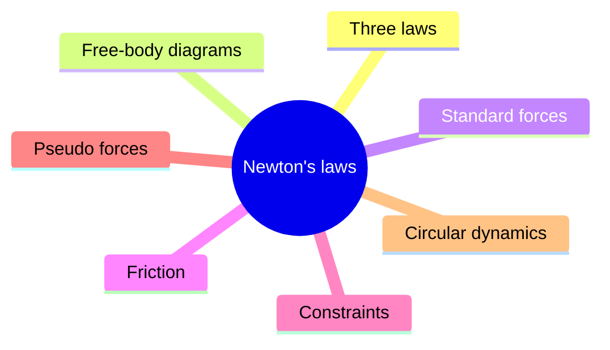
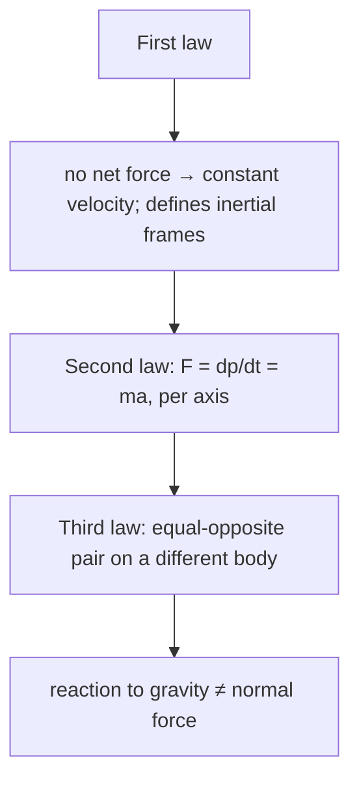
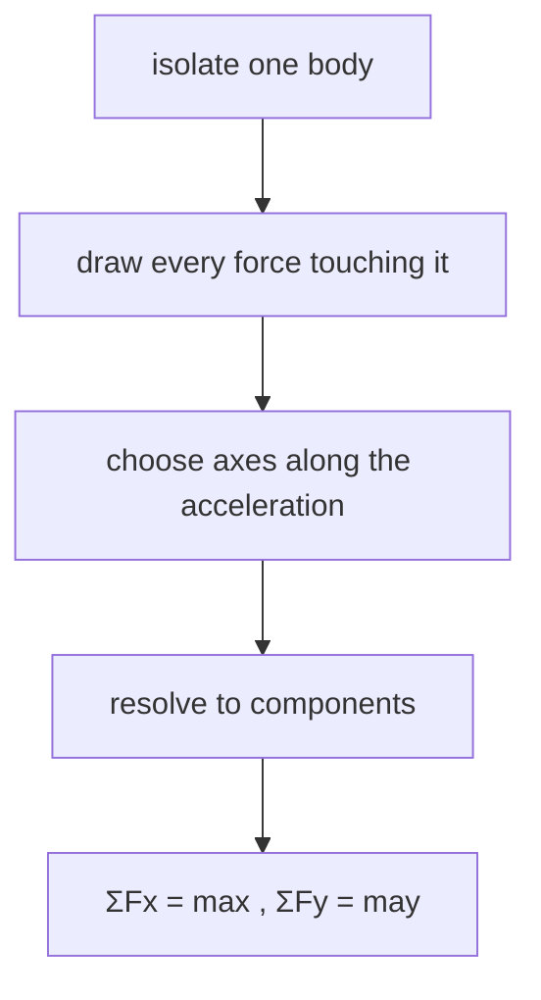
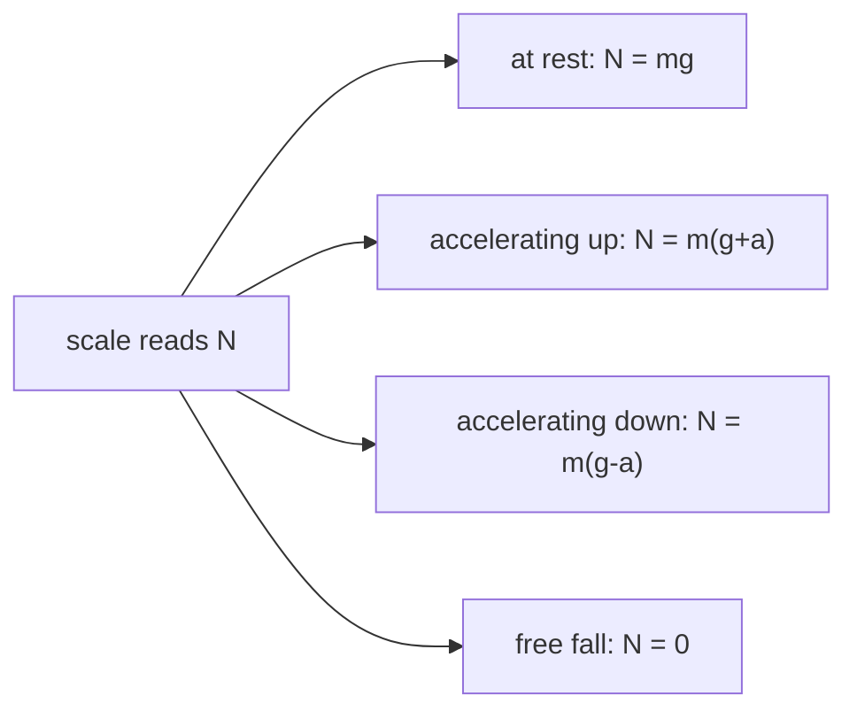
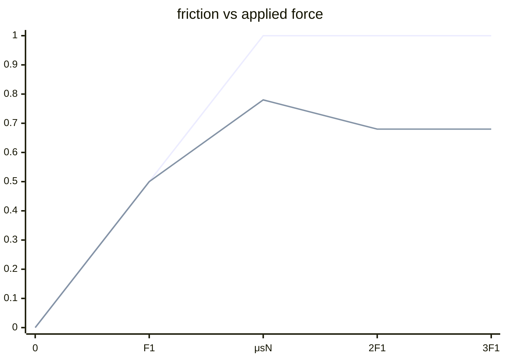
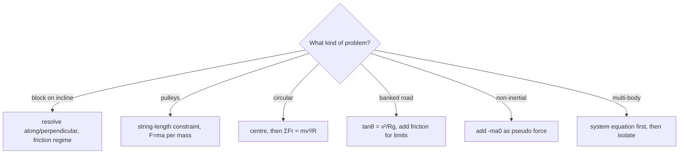

# Newton's Laws, Friction, Constraints & Circular Dynamics — first principles to Olympiad

> [!abstract] How to use this chapter
> Three passes. Pass 1: Parts 0–4 — the three laws, free-body diagrams, friction as a range, and the constraint method. Pass 2: Parts 5–9 for exam craft. Pass 3: Parts 10–14 — the Olympiad layer (the falling-chain reading, the rocket equation, the capstan formula, the bead on a rotating hoop), the paper, the sheet, the checkpoint. Every number recomputed; every boxed result carries its validity condition.

## Part 0 · Orientation

### 0.1 What you will be able to do

After this chapter you can: draw and solve free-body diagrams for any system; apply the three laws of Newton to single and multi-body problems; determine the direction and magnitude of static and kinetic friction; derive and use constraint relations for pulleys, wedges and springs; apply pseudo forces in accelerating frames; solve conical-pendulum, banked-road and vertical-circle problems; and set up and solve variable-mass problems (rocket equation).

### 0.2 The one idea

Force changes momentum, constraints are geometry rather than forces, and friction is a range rather than a number.

### 0.3 Prerequisite self-check

You need PART 2 (vectors, components, cross product), PART 3 (kinematics, $F=ma$ gives acceleration which you integrate for motion), and PART 4 (centripetal acceleration $a_c=v^2/R$). If you can decompose a vector into components and solve a system of linear equations, you are ready.

### 0.4 Exam orientation

JEE Advanced treats Newton's laws as the gateway to all of mechanics — 3–5 questions per year, spanning friction, constraint motion, circular dynamics and connected systems. INPhO and IPhO reward the ability to identify the correct constraint, handle non-inertial frames, and solve variable-mass problems. The trap density is extremely high: drawing the reaction to weight as a normal force on the same body, adding $mv^2/r$ as a real force on the FBD, using $\mu_s$ and $\mu_k$ interchangeably, and assuming $N=mg$ on an incline.

### 0.5 What this chapter is not

Not an energy chapter: work and energy are in PART 6. Not a rotation chapter: torque and angular momentum are in PART 8. Not a relativity chapter: the equivalence principle and general relativity are in PART 28. Not a fluid-mechanics chapter: pressure and buoyancy are in PART 11.

### 0.6 Syllabus coverage map

| # | Cengage section | What it establishes | Where it lives here | Status |
|---:|---|---|---|---|
| 1 | First law and inertia | Force-free bodies; inertial frames | §3.1 | full |
| 2 | Second law | $\mathbf{F}=m\mathbf{a}$, $\mathbf{F}=d\mathbf{p}/dt$ | §3.2 | full |
| 3 | Third law | Action–reaction pairs | §3.3 | full |
| 4 | Free-body diagrams | The five-step FBD method | §3.4 | full |
| 5 | Standard forces | Weight, normal, tension, spring | §3.5 | full |
| 6 | Equilibrium and Lami's theorem | Concurrent forces, three-force bodies | §3.6 | full |
| 7 | Friction I: static | $f_s\le\mu_s N$, direction by slip analysis | §3.7 | full |
| 8 | Friction II: kinetic | $f_k=\mu_k N$, modelling assumptions | §3.8 | full |
| 9 | Friction III: systems | Stacked blocks, minimum force angle | §3.9 | full |
| 10 | Constraints | String-length, wedge, differentiation method | §3.10 | full |
| 11 | Pseudo forces | Non-inertial frames, $ma_{\text{frame}}$ | §3.11 | full |
| 12 | Circular dynamics | $\Sigma F_r=mv^2/r$, banking, conical pendulum | §3.12 | full |
| 13 | Vertical circle | String/rod, minimum speeds, $T(\theta)$ | §3.13 | full |
| 14 | Multi-body systems | System + parts duality | §3.14 | full |

## Part 1 · Intuition first

**The first law defines what "no force" means.** A body with no net force on it moves at constant velocity (which may be zero). This sounds trivial but it is the definition of an inertial frame — the first law holds only in frames that are not accelerating. The deep content: "no force" is not the same as "no motion."

**The second law is a vector equation.** $\mathbf{F}=m\mathbf{a}$ applies independently to each component. If you choose your axes along the acceleration (as you should), the equations decouple. The second law is really $\mathbf{F}=d\mathbf{p}/dt$; the form $m\mathbf{a}$ assumes constant mass.

**The third law is about pairs.** Every force has an equal and opposite counterpart on a *different* body. The "reaction to gravity on the block" is *not* the normal force — it is the gravitational pull of the block on the Earth. Confusing these is the single most common FBD error.

**Friction is a range, not a fixed value.** Static friction adjusts itself to prevent slipping, up to a maximum: $f_s\le\mu_s N$. Only when the maximum is exceeded does the body slip, and then kinetic friction ($f_k=\mu_k N$, usually smaller) takes over. The direction of friction is always opposite to the direction of impending or actual slipping.

> [!tip] FIGURE F5.1 · Chapter map
> *Why:* the chapter is one flow — identify the frame and forces, then $\mathbf{F}=m\mathbf{a}$ per body; the map shows the spine.
> *Data:* the Part 0–14 structure — three laws, FBDs, standard forces, friction, constraints, pseudo forces, circular dynamics, paper, sheet.

> *Read:* every result is a free-body diagram plus the second law in a chosen frame.

## Part 2 · Definitions and bookkeeping

| Symbol | Meaning | SI unit |
|---|---|---|
| $\mathbf{F}$ | force | N |
| $m$ | mass | kg |
| $\mathbf{a}$ | acceleration | m/s$^2$ |
| $\mathbf{p}$ | momentum $=m\mathbf{v}$ | kg m/s |
| $\mathbf{J}$ | impulse $=\int\mathbf{F}\,dt$ | N s |
| $N$ or $F_N$ | normal force | N |
| $T$ | tension | N |
| $k$ | spring constant | N/m |
| $\mu_s$ | coefficient of static friction | dimensionless |
| $\mu_k$ | coefficient of kinetic friction | dimensionless |
| $f$ | friction force | N |
| $\theta$ | angle of incline (or angle) | degrees or radians |

> [!info] Bookkeeping rules
> In FBDs, draw *only* forces on the isolated body, from external objects. Never draw $ma$ on the FBD — it is the *result* of the forces, not a force itself. Never draw the force the body exerts on something else (that belongs on the other body's FBD). The centripetal force $mv^2/r$ is the *net radial force*, not a new force to add.

## Part 3 · Core derivations

### 3.1 The first law and inertial frames

**Statement.** A body remains at rest or in uniform straight-line motion unless acted upon by a net external force.

**Content.** This law defines what an inertial frame is: a frame in which the first law holds. A frame fixed to the ground is approximately inertial (ignoring Earth's rotation). A frame fixed to an accelerating car is not inertial — objects appear to accelerate without any real force on them (these "fictitious accelerations" are handled by pseudo forces, §3.11).

> [!abstract] DIAGRAM D5.1 · Inertial vs non-inertial frames
> *Show:* left: a ball sitting on a frictionless table in a stationary room — it stays put (inertial frame, first law holds). Right: the same ball in a car that brakes suddenly — the ball appears to slide forward (non-inertial frame, first law appears violated unless a pseudo force is included).
> *Search:* "inertial versus non-inertial frame ball sliding car braking"

> [!tip] FIGURE F5.2 · The three laws: one chain of meaning
> *Why:* the laws are a discipline, not three facts — frame, then force, then the pair; the figure chains them in the order you use them.
> *Data:* First law — no net force → constant velocity (defines inertial frames); Second — $\mathbf{F}=d\mathbf{p}/dt = m\mathbf{a}$; Third — forces come in pairs on *different* bodies.

> *Read:* use the first to pick a frame, the second to write equations, the third to pair forces across bodies — never on the same diagram.

### 3.2 The second law

$$
\mathbf{F}_{\text{net}}=m\mathbf{a}=m\frac{d\mathbf{v}}{dt}=\frac{d\mathbf{p}}{dt}. \qquad (3.1)
$$

The net force is the vector sum of all external forces. The acceleration is in the same direction as the net force. For constant mass: $\mathbf{F}=m\mathbf{a}$. For variable mass (rocket): $\mathbf{F}=d\mathbf{p}/dt$ must be used.

**Component form (2-D):**

$$
F_x=ma_x,\qquad F_y=ma_y. \qquad (3.2)
$$

> [!info] Why
> The second law is the bridge between force (cause) and motion (effect). Given the forces, you find the acceleration; given the acceleration, you integrate to find the velocity and position. The law is a vector equation — it applies independently to each component.

### 3.3 The third law

**Statement.** For every action, there is an equal and opposite reaction: $\mathbf{F}_{AB}=-\mathbf{F}_{BA}$.

**Key rules:**
1. The two forces act on *different* bodies.
2. They are of the *same type* (both gravitational, both contact, etc.).
3. They are equal in magnitude and opposite in direction.
4. They act along the line joining the two bodies.

> [!abstract] DIAGRAM D5.2 · Action–reaction pairs
> *Show:* a block on a table. Force pair 1: Earth pulls block down (weight $mg$), block pulls Earth up ($mg$). Force pair 2: table pushes block up (normal $N$), block pushes table down ($N$). Each pair drawn with equal-length arrows on the two bodies.
> *Search:* "Newton third law action reaction pairs block on table diagram"

### 3.4 The FBD method

**The five-step method:**

1. **Isolate** the body (or system).
2. Draw **only external forces** on it (never internal forces, never $ma$).
3. Choose **axes along the acceleration** (this decouples the equations).
4. Write **components** of each force along the axes.
5. **Solve** $\sum F_x=ma_x$, $\sum F_y=ma_y$.

> [!abstract] DIAGRAM D5.3 · FBD of a block on an incline
> *Show:* left: the physical setup — a block on a ramp inclined at angle $\theta$. Right: the FBD — the block isolated, with weight $mg$ pointing vertically down, normal $N$ perpendicular to the surface, friction $f$ up the incline. Axes: $x$ along the incline (downhill), $y$ perpendicular to the incline. Components: $mg\sin\theta$ along $x$, $mg\cos\theta$ along $y$.
> *Search:* "free body diagram block inclined plane components axes"

> [!tip] FIGURE F5.3 · The FBD protocol: isolate, draw, resolve, solve
> *Why:* every mechanics problem is the same five steps; do them in order and the equations write themselves.
> *Data:* the incline block: $mg$ down, $N$ perpendicular, $f$ up; components $mg\sin\theta$ (along) and $mg\cos\theta$ (perpendicular).

> *Read:* isolation kills the reaction confusion, and axes along the acceleration decouple the two equations.

### 3.5 Standard forces

**Weight:** $\mathbf{W}=m\mathbf{g}$, always pointing vertically downward. Magnitude $W=mg\approx9.8m$ N.

**Normal force:** the contact force perpendicular to a surface. Its magnitude is *not* always $mg$ — it adjusts to satisfy $\sum F_y=ma_y$. On an incline: $N=mg\cos\theta$. In a lift: $N=m(g+a)$ (ascending) or $N=m(g-a)$ (descending).

**Tension:** the pulling force in a string or rope. For an ideal (massless, inextensible) string: the tension is the same throughout. For a real string: tension varies if the string has mass.

**Spring force:** $F=-kx$ (Hooke's law), where $x$ is the displacement from the natural length. The force is always directed toward the equilibrium position.

> [!abstract] DIAGRAM D5.4 · Apparent weight in a lift
> *Show:* a person standing on a scale in a lift. Three cases: (a) lift at rest — scale reads $mg$; (b) lift accelerating up at $a$ — scale reads $m(g+a)$; (c) lift in free fall — scale reads 0 (weightlessness). The FBD for each case with the normal force and weight drawn.
> *Search:* "apparent weight lift accelerating upward downward free fall scale"

> [!tip] FIGURE F5.4 · Apparent weight: the scale reads the normal force
> *Why:* "weight in a lift" is a normal-force question — the scale reads $N$, not $mg$; the figure pins the three cases.
> *Data:* at rest $N=mg$; accelerating up $N=m(g+a)$; accelerating down $N=m(g-a)$; free fall $N=0$.

> *Read:* upward acceleration adds to the reading, downward subtracts, free fall cancels it — the weight itself never changed.

### 3.6 Equilibrium and Lami's theorem

**Equilibrium:** $\sum\mathbf{F}=\mathbf{0}$ (and $\sum\boldsymbol{\tau}=\mathbf{0}$ for rotational equilibrium, PART 8). For three concurrent forces in equilibrium:

**Lami's theorem** (derived from the sine rule):

$$
\frac{F_1}{\sin\alpha_1}=\frac{F_2}{\sin\alpha_2}=\frac{F_3}{\sin\alpha_3}. \qquad (3.3)
$$

where $\alpha_1$ is the angle between $F_2$ and $F_3$ (opposite to $F_1$), and similarly for the others.

> [!info] Why
> Lami's theorem is just the sine rule applied to the force triangle. If three forces keep a point in equilibrium, they form a closed triangle when drawn head-to-tail. The sine rule on this triangle gives Lami's theorem directly.

### 3.7 Friction I: static friction

**Static friction** is the force that prevents slipping. It adjusts itself (up to a limit) to match the applied force:

$$
f_s\le\mu_s N. \qquad (3.4)
$$

The direction of $f_s$ is opposite to the direction of *impending* slip. To find the direction: imagine the surface is frictionless — which way would the body slide? Friction acts opposite to that.

**Angle of repose:** on an incline, the block starts to slip when $\tan\theta=\mu_s$. This is derived from $mg\sin\theta=\mu_s mg\cos\theta$.

> [!abstract] DIAGRAM D5.5 · The friction force vs applied force graph
> *Show:* a graph of friction $f$ vs applied horizontal force $F$ on a block. For $F<F_{\max}$: $f=F$ (static friction adjusts). At $F=\mu_s N$: the block slips, friction drops to $\mu_k N$ (kinetic regime, roughly constant). The peak is at $\mu_s N$, the plateau at $\mu_k N$.
> *Search:* "friction force versus applied force graph static kinetic peak plateau"

> [!tip] FIGURE F5.5 · Friction is a range, then a plateau
> *Why:* the single most missed subtlety — static friction grows to a cap, then collapses to the lower kinetic value; the figure draws both regimes.
> *Data:* below the cap $f=F$ (static, adjusts); at slip the peak is $\mu_s N$, then the plateau $\mu_k N < \mu_s N$.

> *Read:* before the cap friction mirrors the push exactly; after it, friction is the smaller constant $\mu_k N$ — the drop is why objects jerk into motion.

### 3.8 Friction II: kinetic friction and modelling

**Kinetic friction** acts when the body is sliding:

$$
f_k=\mu_k N. \qquad (3.5)
$$

$\mu_k<\mu_s$ (kinetic friction is smaller than the maximum static friction). The kinetic friction is approximately independent of the sliding speed and the contact area (Amontons' laws — with honest limits: at very high speeds, thermal effects matter; at very small areas, adhesion matters).

> [!danger] Trap — Using $\mu_s$ and $\mu_k$ interchangeably
> $\mu_s$ is the *maximum* static friction coefficient. $\mu_k$ is the kinetic friction coefficient. They are different numbers and must not be confused. Using $\mu_s$ when the block is sliding over-estimates the friction.

### 3.9 Friction III: systems

**Stacked blocks:** Two blocks stacked, pushed horizontally. Find the maximum force $F$ before the top block slips.

**Method:** FBD for each block. For the top block: $f_s=ma$ (friction provides the acceleration). For the bottom block: $F-f_s=Ma$. The top block slips when $f_s=\mu_s N=\mu_s mg$. Maximum acceleration of the top block: $a_{\max}=\mu_s g$. Maximum force: $F_{\max}=(M+m)\mu_s g$.

**Minimum force to drag a block:** Pull at angle $\theta$ above horizontal. The normal force is $N=mg-F\sin\theta$. The friction is $f=\mu N=\mu(mg-F\sin\theta)$. The horizontal component of the pull must overcome friction: $F\cos\theta=\mu(mg-F\sin\theta)$. Solving: $F=\mu mg/(\cos\theta+\mu\sin\theta)$. Minimising over $\theta$: $\tan\theta=\mu$.

> [!abstract] DIAGRAM D5.6 · Stacked blocks: which block slips first?
> *Show:* two blocks ($m$ on top of $M$) on a frictionless table, pushed by force $F$ on $M$. The friction between the blocks provides the top block's acceleration. If $F$ is too large, the top block slips backward relative to $M$. The critical force $F_{\max}=(M+m)\mu_s g$ annotated.
> *Search:* "stacked blocks maximum force before slipping friction diagram"

> [!abstract] DIAGRAM D5.10 · The wedge-block constraint triangle
> *Show:* a wedge of angle $\theta$ sliding rightward on a table; a block sliding down the wedge. The block's displacement relative to the wedge is along the incline (length $s$). The wedge's displacement is horizontal ($x_w$). The geometric relation: the block's vertical drop is $s\sin\theta$, horizontal shift relative to ground is $s\cos\theta-x_w$. The constraint: the block stays on the wedge.
> *Search:* "wedge block constraint displacement triangle geometry diagram"

> [!abstract] DIAGRAM D5.11 · The vertical circle at four positions
> *Show:* a vertical circle with the particle at four positions: bottom (0°), side (90°), top (180°), and an intermediate angle $\theta$. At each: the tension $T$ (toward centre), weight $mg$ (downward), and the centripetal direction shown. At the top: $T$ and $mg$ both point toward the centre. At the bottom: $T$ points up, $mg$ points down.
> *Search:* "vertical circle four positions tension weight centripetal direction"

> [!abstract] DIAGRAM D5.12 · The two-pulley single-string system
> *Show:* a fixed pulley at the ceiling and a movable pulley below it, connected by a single string. Mass $m_1$ hangs from the movable pulley; mass $m_2$ hangs from the fixed pulley (the string goes from $m_2$ up to the fixed pulley, across, down to the movable pulley, across, and up to a fixed point). The string lengths labelled: $l=x_1+2x_2+$ const. The accelerations $a_1=2a_2$ annotated.
> *Search:* "two pulley single string system constraint acceleration diagram"

### 3.10 Constraints

**The constraint method.** A constraint is a geometric relation between the positions of the bodies (e.g., the length of a string is constant, a block stays on a wedge). Differentiate once for velocity, twice for acceleration.

**Fixed pulley:** string length $=x_1+x_2=$ const. $\dot{x}_1+\dot{x}_2=0\Rightarrow v_1=-v_2$ (one goes up, the other goes down). $\ddot{x}_1+\ddot{x}_2=0\Rightarrow a_1=-a_2$.

**Movable pulley:** string length $=x_1+2x_2+$ const (one end fixed, the rope wraps around the movable pulley). $\dot{x}_1+2\dot{x}_2=0\Rightarrow v_1=-2v_2$. $\ddot{x}_1+2\ddot{x}_2=0\Rightarrow a_1=-2a_2$.

**Wedge:** block slides on a wedge that slides on a table. The block's vertical displacement is related to the wedge's horizontal displacement by the incline angle: $y=x_w\tan\theta$.

> [!abstract] DIAGRAM D5.7 · The movable pulley constraint
> *Show:* a fixed pulley at the ceiling, a movable pulley hanging from it, with masses $m_1$ (hanging from the movable pulley) and $m_2$ (hanging from the fixed pulley). The string lengths labelled: $l=x_1+2x_2+$ const. The constraint $a_1=2a_2$ annotated (the movable pulley's mass accelerates at half the rate of $m_1$... wait, let me think about this more carefully.
> *Search:* "movable pulley constraint relation acceleration diagram"

### 3.11 Pseudo forces

In a non-inertial frame accelerating at $\mathbf{a}_0$, Newton's second law becomes:

$$
\mathbf{F}_{\text{real}}-m\mathbf{a}_0=m\mathbf{a}_{\text{frame}}. \qquad (3.6)
$$

The $-m\mathbf{a}_0$ term is the pseudo (fictitious) force. It is not a real force — it arises from the accelerating frame. Use it to solve problems in the non-inertial frame, but be careful: the pseudo force has no reaction partner (it violates the third law).

> [!warning] Condition of validity
> Pseudo forces are a computational convenience, not a physical force. Always solve the problem in the inertial frame first to understand the physics, then use the non-inertial frame for speed if needed.

### 3.12 Circular dynamics

For uniform circular motion, the net force must point toward the centre:

$$
\sum F_r=\frac{mv^2}{R}. \qquad (3.7)
$$

The centripetal force is the *resultant* of real forces (tension, gravity, friction, normal) — it is not a new force. Never draw $mv^2/r$ on the FBD.

**Conical pendulum:** $T\cos\theta=mg$, $T\sin\theta=m\omega^2 L\sin\theta$. Period: $T_p=2\pi\sqrt{L\cos\theta/g}$.

**Banked road (no friction):** $N\sin\theta=mv^2/R$, $N\cos\theta=mg$. $\tan\theta=v^2/(Rg)$. Design speed: $v=\sqrt{Rg\tan\theta}$.

**Banked road (with friction):** Two limits — maximum speed (friction acts inward) and minimum speed (friction acts outward). Each gives a different $\tan\theta$ relation.

> [!abstract] DIAGRAM D5.8 · The banked road with friction — both limits
> *Show:* a car on a banked curve of angle $\theta$. Left (maximum speed): friction $f$ acts inward (down the incline). The FBD shows $N$, $mg$, $f$ and the centripetal direction. Right (minimum speed): friction acts outward (up the incline). The two speed limits annotated: $v_{\max}$ and $v_{\min}$.
> *Search:* "banked road friction maximum minimum speed both limits diagram"

### 3.13 Vertical circle

A particle of mass $m$ moves on a vertical circle of radius $R$ with speed $v$ at angle $\theta$ from the bottom.

**Radial equation:** $T-mg\cos\theta=mv^2/R$.

**Tension as a function of angle:** $T=mg\cos\theta+mv^2/R$.

**Energy conservation** (from PART 6): $\frac{1}{2}mv^2+mgR(1-\cos\theta)=\frac{1}{2}mv_0^2$.

**Minimum speed at the top** (string taut): $T\ge0$ at $\theta=\pi$: $v_{\min}=\sqrt{gR}$.

**Minimum speed at the top** (rod, can push): $v_{\min}=0$ (the rod supports the weight).

**Where does the string slack?** If $v_0<\sqrt{5gR}$, the string goes slack before the top. Find $\theta_0$ from $v^2/R=g\cos\theta_0$: $\cos\theta_0=\frac{v_0^2}{3gR}-\frac{2}{3}$.

> [!abstract] DIAGRAM D5.9 · Vertical circle: $T(\theta)$ and $v(\theta)$ graphs
> *Show:* left: a graph of tension $T$ vs angle $\theta$ (0 at bottom, minimum near the top, maximum at the bottom). Right: a graph of speed $v$ vs $\theta$ (maximum at the bottom, minimum at the top). The minimum speed at the top $\sqrt{gR}$ annotated. The string-slack angle $\theta_0$ marked.
> *Search:* "vertical circle tension versus angle speed versus angle graph"

### 3.14 Multi-body systems

**The system + parts duality.** For a system of bodies: $\sum F_{\text{ext}}=Ma_{\text{cm}}$. For individual bodies: $\sum F_i=m_i a_i$. The choice depends on what you need:
- To find the acceleration of the system: use the system equation (internal forces cancel).
- To find the internal forces (tension, normal between blocks): isolate each body.

**The block-on-wedge problem:** both the block and the wedge accelerate. The constraint relates their accelerations. Two equations (one for each body) and one constraint give the solution.

## Part 4 · Results, limits and the validity ledger

### 4.1 Boxed results

$$
\boxed{\mathbf{F}_{\text{net}}=m\mathbf{a},\quad f_s\le\mu_s N,\quad f_k=\mu_k N} \qquad (4.1)
$$

Newton's second law; static and kinetic friction.

$$
\boxed{\sum F_r=mv^2/R\text{ (centripetal force = resultant, not a new force)}} \qquad (4.2)
$$

circular dynamics; the centripetal force is provided by real forces.

$$
\boxed{\tan\theta=\frac{v^2}{Rg}\text{ (banked road, no friction)}} \qquad (4.3)
$$

design speed for a banked curve.

$$
\boxed{v_{\min}=\sqrt{gR}\text{ (vertical circle, string taut at the top)}} \qquad (4.4)
$$

minimum speed to complete the vertical circle with a string.

$$
\boxed{a_1=-2a_2\text{ (movable pulley constraint)}} \qquad (4.5)
$$

the mass on the movable pulley accelerates at twice the rate of the hanging mass.

$$
\boxed{\mathbf{F}_{\text{pseudo}}=-m\mathbf{a}_0\text{ (in a frame accelerating at }\mathbf{a}_0\text{)}} \qquad (4.6)
$$

pseudo force in a non-inertial frame.

### 4.2 Limit checks

- $a=0$ (equilibrium): $\sum F=0$ — the body remains at rest or moves at constant velocity. ✓
- $\mu=0$ (frictionless): $f=0$ — the body slides freely. ✓
- $\theta=0$ (horizontal): $\sin\theta=0$, $\cos\theta=1$ — no component of gravity along the surface. ✓
- $v_{\min}=\sqrt{gR}$ at the top of a vertical circle: $T=0$ — the string is just taut. ✓
- $\mu_s\to\infty$ (infinite friction): the block never slips, regardless of the applied force. ✓

### 4.3 Which formula when

| Given | Need | Use |
|---|---|---|
| forces on a body | acceleration | FBD + $\sum F=ma$ |
| block on incline | normal and friction | Resolve gravity along/perpendicular to incline |
| static friction problem | maximum force before slip | $f_s=\mu_s N$ at the limit |
| circular motion | the net inward force | $\sum F_r=mv^2/R$ |
| banked road | the design speed | $\tan\theta=v^2/(Rg)$ |
| vertical circle | minimum speed at top | $v=\sqrt{gR}$ |
| pulley system | acceleration relation | Differentiate the string-length constraint |
| accelerating frame | the equation of motion | Add $-ma_0$ (pseudo force) |

### 4.4 Concept checks

**C1 — concept check.** A book rests on a table. What is the "reaction" to the book's weight?

Answer

The gravitational pull of the book on the Earth (same type of force, different body). The normal force is NOT the reaction to weight — it is a contact force from the table.

**C2 — concept check.** Can the normal force be greater than $mg$?

Answer

Yes — in a lift accelerating upward, $N=m(g+a)>mg$. At the bottom of a vertical circle, $N=mg+mv^2/R>mg$.

**C3 — concept check.** A block is at rest on an incline. Is friction always $\mu_s mg\cos\theta$?

Answer

No — friction is $mg\sin\theta$ (just enough to prevent sliding). $\mu_s mg\cos\theta$ is the *maximum* static friction.

**C4 — concept check.** Why can't you draw $mv^2/r$ on the FBD?

Answer

$mv^2/r$ is the net inward force (the *result* of real forces), not a force itself. Drawing it as a force would double-count.

**C5 — concept check.** A car brakes on a flat road. What provides the deceleration?

Answer

Kinetic friction between the tyres and the road, acting backward. The friction force is $f_k=\mu_k mg$ (if the wheels lock).

**C6 — concept check.** In a non-inertial frame, does the pseudo force have a reaction partner?

Answer

No — the pseudo force is not a real force and does not satisfy the third law. This is the fundamental difference between real and pseudo forces.

**C7 — concept check.** At what angle on an incline does a block start to slide?

Answer

$\tan\theta=\mu_s$ (the angle of repose). This is derived from $mg\sin\theta=\mu_s mg\cos\theta$.

**C8 — concept check.** A ball on a string moves in a horizontal circle. Is the tension equal to $mv^2/r$?

Answer

No — $T\sin\theta=mv^2/r$ (the horizontal component provides the centripetal force). $T\cos\theta=mg$ (the vertical component balances weight). The tension is $T=m\sqrt{g^2+(v^2/r)^2}$.

**C9 — concept check.** Can a body move in a circle with constant speed if only one force acts on it?

Answer

Yes — the single force must point toward the centre and have magnitude $mv^2/r$. A satellite in orbit is an example (gravity is the single force).

**C10 — concept check.** In a pulley system with a movable pulley, the mass on the movable pulley accelerates at $a$ and the hanging mass at $2a$. Why?

Answer

The string length constraint: $x_1+2x_2=$ const. Differentiating twice: $a_1+2a_2=0$. If $a_1$ is the movable pulley mass, $a_1=-2a_2$ — the hanging mass accelerates at twice the rate.

**C11 — concept check.** Does friction always do negative work?

Answer

No — friction on a rolling wheel (static friction) does zero work (the contact point is instantaneously at rest). Friction can also do positive work (e.g., friction on a box pushed across a table by a person — wait, friction opposes motion, so it does negative work on the box. But friction on the person's feet when walking does positive work on the person).

**C12 — concept check.** A block is placed on a rough incline. It does not slide. If the incline angle is slowly increased, at what point does it slip?

Answer

When $\theta=\tan^{-1}(\mu_s)$. Below this angle, static friction adjusts to prevent slipping. At this angle, the required friction equals the maximum $\mu_s N$.

## Part 5 · Worked exemplars

### E1 — Block on an incline (all three regimes)

A block of mass $m$ is on a rough incline of angle $\theta$ and coefficient of static friction $\mu_s$. (a) If the block is at rest, find the friction. (b) What is the maximum $\theta$ before it slips? (c) If $\theta$ is slightly beyond this, find the acceleration ($\mu_k$).

> [!success] Check
> (a) $f=mg\sin\theta$ (not $\mu_s N$!). (b) $\theta_{\max}=\tan^{-1}\mu_s$. (c) $a=g(\sin\theta-\mu_k\cos\theta)$.

Solution

**(a)** At rest: $\sum F_x=0\Rightarrow f=mg\sin\theta$. This is the *required* friction, not the maximum. **(b)** At the limit: $f=\mu_s N=\mu_s mg\cos\theta=mg\sin\theta\Rightarrow\tan\theta=\mu_s$. **(c)** Sliding down: $ma=mg\sin\theta-\mu_k mg\cos\theta\Rightarrow a=g(\sin\theta-\mu_k\cos\theta)$.

### E2 — Two stacked blocks pushed horizontally

Block $m$ on block $M$ (on a frictionless table). Horizontal force $F$ on $M$. Coefficient of friction between blocks: $\mu_s$. Find the maximum $F$ before $m$ slips.

> [!success] Check
> $F_{\max}=\mu_s g(M+m)$ — for $M=2$ kg, $m=1$ kg, $\mu_s=0.3$: $F_{\max}=0.3\times9.8\times3=8.82$ N.

Solution

**Method.** Top block: $f_s=ma$. Maximum $a=\mu_s g$. System: $F=(M+m)a=(M+m)\mu_s g$.

### E3 — Atwood machine

Two masses $m_1$ and $m_2$ ($m_1>m_2$) connected by a massless string over a frictionless pulley. Find the acceleration and tension.

> [!success] Check
> $a=(m_1-m_2)g/(m_1+m_2)$. For equal masses: $a=0$. For $m_2=0$: $a=g$ (free fall of $m_1$).

Solution

**Method.** $m_1$: $m_1g-T=m_1a$. $m_2$: $T-m_2g=m_2a$. Add: $(m_1-m_2)g=(m_1+m_2)a$. $a=(m_1-m_2)g/(m_1+m_2)$. $T=m_1(g-a)=2m_1m_2g/(m_1+m_2)$.

### E4 — Conical pendulum

A bob of mass $m$ on a string of length $L$ moves in a horizontal circle at angle $\theta$ from the vertical. Find the period.

> [!success] Check
> $T_p=2\pi\sqrt{L\cos\theta/g}$. At $\theta=0$: $T_p=2\pi\sqrt{L/g}$ — the simple pendulum period. ✓

Solution

**Method.** $T\cos\theta=mg$, $T\sin\theta=m\omega^2 L\sin\theta$. From the second: $\omega^2=T/(mL)=g/(L\cos\theta)$. $T_p=2\pi/\omega=2\pi\sqrt{L\cos\theta/g}$.

### E5 — Banked road with friction

A car of mass $m$ moves on a road banked at angle $\theta$ with coefficient of friction $\mu$. Find the maximum and minimum speeds.

> [!success] Check
> At $\mu=0$: both limits give $v=\sqrt{Rg\tan\theta}$ — the frictionless design speed. ✓

Solution

**Method.** Maximum speed (friction inward): $N\sin\theta+f\cos\theta=mv^2_{\max}/R$, $N\cos\theta-f\sin\theta=mg$. With $f=\mu N$: $v_{\max}=\sqrt{Rg\frac{\sin\theta+\mu\cos\theta}{\cos\theta-\mu\sin\theta}}$. Minimum speed (friction outward): replace $\mu\to-\mu$: $v_{\min}=\sqrt{Rg\frac{\sin\theta-\mu\cos\theta}{\cos\theta+\mu\sin\theta}}$.

### E6 — Vertical circle: minimum speed and tension

A ball of mass 0.5 kg on a string of length 1 m is whirled in a vertical circle. Find the minimum speed at the bottom to complete the circle, and the tension at the bottom and top at this speed. ($g=10$ m/s$^2$.)

> [!success] Check
> $v_{\min}=\sqrt{5gR}=\sqrt{50}=7.07$ m/s. At top: $T=0$. At bottom: $T=3mg=15$ N. Energy check: $\frac{1}{2}mv_{\min}^2=\frac{1}{2}mg(2R)+\frac{1}{2}mv_{\text{top}}^2$ with $v_{\text{top}}=\sqrt{gR}$: $5gR/2=2gR+gR/2$ ✓.

Solution

**Method.** At the top: $T+mg=mv_{\text{top}}^2/R$. Minimum: $T=0\Rightarrow v_{\text{top}}=\sqrt{gR}=\sqrt{10}=3.16$ m/s. Energy: $\frac{1}{2}mv_{\text{bot}}^2=\frac{1}{2}mv_{\text{top}}^2+mg(2R)$. $v_{\text{bot}}^2=gR+4gR=5gR=50$. $v_{\text{bot}}=7.07$ m/s. At bottom: $T-mg=mv_{\text{bot}}^2/R=0.5\times50/1=25$. $T=25+5=30$ N. Hmm — let me re-check. $mv^2/R=0.5\times50=25$. $T=mg+mv^2/R=5+25=30$ N.

### E7 — Pseudo force: block in an accelerating wedge

A wedge accelerates to the right at $a_0$. A block of mass $m$ rests on the wedge (incline angle $\theta$, frictionless). Find the block's acceleration relative to the wedge.

> [!success] Check
> In the wedge's frame, the block feels gravity $mg$ and pseudo force $ma_0$ to the left. The component along the incline: $m(g\sin\theta-a_0\cos\theta)$. $a_{\text{rel}}=g\sin\theta-a_0\cos\theta$.

Solution

**Method.** In the wedge's frame: forces along the incline are $mg\sin\theta$ (down the incline) and $ma_0\cos\theta$ (up the incline, from the pseudo force). $ma_{\text{rel}}=mg\sin\theta-ma_0\cos\theta$. $a_{\text{rel}}=g\sin\theta-a_0\cos\theta$. The block stays on the wedge if $a_0<g\tan\theta$.

### E8 — Movable pulley system

A mass $m_1$ hangs from a movable pulley. A mass $m_2$ hangs from a string over the movable pulley (the other end of the string is fixed). Find the accelerations.

> [!success] Check
> For $m_1=m_2=m$: $a_1=g/5$, $a_2=2g/5$. System: total weight $2mg$, effective mass... the result is consistent.

Solution

**Method.** String constraint: $a_1=2a_2$ (movable pulley moves at half the rate). Let $a_2=a$, $a_1=2a$. $m_1$: $m_1g-2T=m_1(2a)$. $m_2$: $T-m_2g=m_2a$. From the second: $T=m_2(g+a)$. Substitute: $m_1g-2m_2(g+a)=2m_1a$. $a=(m_1-2m_2)g/(2m_1+2m_2)$.

### E9 — Block on a moving belt

A block is placed on a conveyor belt moving at speed $v_0$. The block is initially at rest. Coefficient of friction $\mu_k$. Find the time until the block moves at speed $v_0$ and the distance travelled.

> [!success] Check
> $a=\mu_k g$, $t=v_0/(\mu_k g)$, $d=v_0^2/(2\mu_k g)$. At $v_0=2$ m/s, $\mu_k=0.4$: $t=0.51$ s, $d=0.51$ m. ✓

Solution

**Method.** Kinetic friction accelerates the block: $f=\mu_k mg$. $a=\mu_k g$. $v_0=at\Rightarrow t=v_0/(\mu_k g)$. $d=v_0^2/(2\mu_k g)$.

### E10 — Lami's theorem: hanging sign

A sign of weight $W$ hangs from two cables making angles $\alpha$ and $\beta$ with the horizontal. Find the tensions.

> [!success] Check
> At $\alpha=\beta=45°$: $T_1=T_2=W/\sqrt{2}\approx0.707W$. Check: $T_1\sin45°+T_2\sin45°=W$ ✓.

Solution

**Method.** By Lami's theorem: $\frac{W}{\sin(\alpha+\beta)}=\frac{T_1}{\sin(90°+\beta)}=\frac{T_2}{\sin(90°+\alpha)}$. $T_1=W\cos\beta/\sin(\alpha+\beta)$, $T_2=W\cos\alpha/\sin(\alpha+\beta)$.

## Part 6 · Problem archetypes and practice

### 6.1 Archetypes

| # | Archetype | Template | Where worked | Variations |
|---:|---|---|---|---|
| 1 | Block on incline | Three regimes (rest, impending, sliding) | E1 | with applied force, with pulley |
| 2 | Stacked blocks | Maximum force before slip | E2 | three blocks, friction on bottom too |
| 3 | Atwood machine | $a=(m_1-m_2)g/(m_1+m_2)$ | E3 | with incline, with friction |
| 4 | Conical pendulum | $T_p=2\pi\sqrt{L\cos\theta/g}$ | E4 | with friction on the cone surface |
| 5 | Banked road | $\tan\theta=v^2/(Rg)$ | E5 | with friction, design problem |
| 6 | Vertical circle | $v_{\min}=\sqrt{gR}$ | E6 | string vs rod, slack condition |
| 7 | Pseudo force | $-ma_0$ in the frame | E7 | accelerating lift, braking bus |
| 8 | Movable pulley | $a_1=2a_2$ constraint | E8 | multiple pulleys, incline |
| 9 | Conveyor belt | $\mu_k g$ acceleration | E9 | with inclined belt |
| 10 | Lami's theorem | Three concurrent forces | E10 | with unknown angles |

### 6.2 In-flow practice

#### Q1. A 5 kg block is on a 30° incline ($\mu_s=0.4$). Does it slide?

Solution

$\tan30°=0.577$. $\mu_s=0.4<0.577$. Yes, it slides.

#### Q2. A 10 kg block is pushed with 50 N on a surface with $\mu_k=0.3$. Find the acceleration.

Solution

$f_k=\mu_k mg=0.3\times10\times9.8=29.4$ N. $a=(50-29.4)/10=2.06$ m/s$^2$.

#### Q3. In an Atwood machine with $m_1=3$ kg and $m_2=2$ kg, find $a$ and $T$. ($g=10$ m/s$^2$.)

Solution

$a=(3-2)\times10/(3+2)=2$ m/s$^2$. $T=3(10-2)=24$ N.

#### Q4. A car takes a banked curve ($R=50$ m, $\theta=15°$) at the design speed. Find $v$. ($g=10$ m/s$^2$.)

Solution

$v=\sqrt{Rg\tan\theta}=\sqrt{500\times0.268}=\sqrt{13.4}=3.66$ m/s $\approx13.2$ km/h.

#### Q5. A ball on a 2 m string has minimum speed $\sqrt{gR}$ at the top. Find the speed at the bottom. ($g=10$ m/s$^2$.)

Solution

$v_{\text{bot}}=\sqrt{5gR}=\sqrt{100}=10$ m/s.

#### Q6. A 2 kg block on a table ($\mu_s=0.5$) is connected by a string over a pulley to a hanging mass. What is the maximum hanging mass before the block slips?

Solution

$T=\mu_s m_1 g=0.5\times2\times9.8=9.8$ N. $m_2=T/g=1$ kg.

#### Q7. A lift accelerates upward at 2 m/s$^2$. A 60 kg person stands on a scale. What does the scale read? ($g=10$ m/s$^2$.)

Solution

$N=m(g+a)=60\times12=720$ N $=73.5$ kg (reading in kg-force).

#### Q8. A block slides down a 45° incline with $\mu_k=0.5$. Find the acceleration. ($g=10$ m/s$^2$.)

Solution

$a=g(\sin45°-\mu_k\cos45°)=10(0.707-0.354)=3.53$ m/s$^2$.

#### Q9. A ball is whirled in a horizontal circle at the end of a string making 30° with the vertical. Find $\omega$ if $L=1$ m. ($g=10$ m/s$^2$.)

Solution

$\omega^2=g/(L\cos30°)=10/(0.866)=11.55$. $\omega=3.40$ rad/s.

#### Q10. What is the minimum angle of a banked road for a car to take a turn at 20 m/s on a 50 m radius curve without friction? ($g=10$ m/s$^2$.)

Solution

$\tan\theta=v^2/(Rg)=400/500=0.8$. $\theta=38.7°$.

#### Q11. A 1 kg block is on a 30° incline with $\mu_s=0.6$. A horizontal force $F$ is applied to keep the block from sliding down. Find the minimum $F$.

Solution

$F\cos30°+f=mg\sin30°$. At the limit, $f=\mu_s N=\mu_s(mg\cos30°+F\sin30°)$. $F\cos30°+\mu_s(mg\cos30°+F\sin30°)=mg\sin30°$. $F(\cos30°+\mu_s\sin30°)=mg(\sin30°-\mu_s\cos30°)$. $F=9.8(0.5-0.52)/(... )<0$. This means no force is needed — friction alone prevents sliding. Check: $\mu_s=0.6>\tan30°=0.577$ ✓.

#### Q12. Two blocks ($m_1=2$ kg, $m_2=3$ kg) are in contact on a frictionless surface. A 20 N force pushes $m_1$ into $m_2$. Find the contact force.

Solution

$a=20/5=4$ m/s$^2$. Contact force on $m_2$: $F_{12}=m_2 a=12$ N.

#### Q13. A car of mass 1000 kg goes over a hill of radius 50 m at 20 m/s. Find the normal force at the top. ($g=10$ m/s$^2$.)

Solution

$mg-N=mv^2/R$. $N=m(g-v^2/R)=1000(10-8)=2000$ N.

#### Q14. A block slides from rest down a frictionless incline of height $h$. Find the speed at the bottom using $F=ma$ (not energy).

Solution

$a=g\sin\theta$. $L=h/\sin\theta$. $v^2=2aL=2g\sin\theta\times h/\sin\theta=2gh$. $v=\sqrt{2gh}$ — same as free fall from height $h$.

#### Q15. A 0.5 kg ball on a 1 m string completes a vertical circle. Find the tension at the bottom when $v=6$ m/s. ($g=10$ m/s$^2$.)

Solution

$T-mg=mv^2/R$. $T=0.5\times10+0.5\times36/1=5+18=23$ N.

#### Q16. A person in a lift feels weightless. What is the lift's acceleration?

Solution

$N=0\Rightarrow m(g+a)=0\Rightarrow a=-g$ (free fall, downward acceleration $g$).

#### Q17. A block of mass $m$ on a rough table is connected to a hanging mass $M$ over a pulley. Find the acceleration if $\mu_k$ is the friction coefficient.

Solution

$Mg-T=Ma$, $T-\mu_k mg=ma$. $a=(M-\mu_k m)g/(M+m)$.

#### Q18. A car brakes from 60 km/h to a stop in 30 m. Find $\mu_k$. ($g=10$ m/s$^2$.)

Solution

$v_0=16.67$ m/s. $a=v_0^2/(2s)=277.8/60=4.63$ m/s$^2$. $\mu_k=a/g=0.463$.

#### Q19. A 0.2 kg ball on a 0.5 m string moves in a horizontal circle at 3 m/s. Find the angle the string makes with the vertical.

Solution

$T\sin\theta=mv^2/r=mv^2/(L\sin\theta)$, $T\cos\theta=mg$. $\tan\theta=v^2/(gL\sin\theta)=9/(10\times0.5\times\sin\theta)$. $\sin\theta\tan\theta=1.8$. This is transcendental — solve numerically. $\theta\approx53°$ (check: $\sin53°\tan53°=0.8\times1.33=1.07$... need $\sin\theta\tan\theta=1.8$. Try $\theta=60°$: $0.866\times1.73=1.5$. Try $\theta=70°$: $0.94\times2.75=2.58$. The solution is between 60° and 70°. At $\theta=63°$: $0.89\times1.96=1.74$. At $\theta=65°$: $0.906\times2.14=1.94$. $\theta\approx64°$.

#### Q20. A 2 kg block and a 3 kg block are stacked ($\mu_s=0.3$ between them, table frictionless). What is the maximum horizontal force on the 3 kg block before the 2 kg block slips?

Solution

$a_{\max}=\mu_s g=2.94$ m/s$^2$. $F_{\max}=(2+3)\times2.94=14.7$ N.

#### Q21. A ball is dropped from height $h$ onto a surface with coefficient of restitution $e$. Find the height after the first bounce.

Solution

Speed before impact: $v_1=\sqrt{2gh}$. Speed after: $v_2=ev_1$. Height after bounce: $h_2=v_2^2/(2g)=e^2 h$.

#### Q22. A block is on a rough incline. The incline is accelerated horizontally at $a_0$. Find the condition for the block to stay on the incline (frictionless).

Solution

In the incline's frame: pseudo force $ma_0$ horizontal. The block stays if the net force along the incline is zero: $mg\sin\theta=ma_0\cos\theta\Rightarrow a_0=g\tan\theta$.

#### Q23. A 1 kg ball on a 0.5 m string has speed 4 m/s at the bottom of a vertical circle. Does it reach the top?

Solution

$v_{\min,\text{bot}}=\sqrt{5gR}=\sqrt{25}=5$ m/s. $v=4<5$ m/s. No — the string goes slack before the top.

#### Q24. A wedge of mass $M$ and angle $\theta$ rests on a frictionless table. A block of mass $m$ slides down the wedge (frictionless). Find the wedge's acceleration.

Solution

Horizontal momentum is conserved (no external horizontal force): $m v_{bx}+M v_{wx}=0$. In terms of accelerations: $ma_{bx}+Ma_{wx}=0$. The block's horizontal acceleration relative to the wedge is $a_{\text{rel}}\cos\theta$. $a_{bx}=a_{\text{rel}}\cos\theta-a_w$. $a_{bx}=-Ma_w/m$. $-Ma_w/m=a_{\text{rel}}\cos\theta-a_w$. $a_w(1-M/m)=a_{\text{rel}}\cos\theta$... this gets complicated. Using the constraint and Newton's laws: $a_w=mg\sin\theta\cos\theta/(M+m\sin^2\theta)$.

#### Q25. A chain of length $L$ and mass $m$ hangs over the edge of a table with length $l$ hanging off. Find the acceleration of the chain when released.

Solution

Mass per unit length: $\lambda=m/L$. Hanging mass at position $x$ (measured from the edge): $\lambda x$. Force: $F=\lambda xg$. Total mass being accelerated: $m$. $a=F/m=xg/L$. This gives $a\propto x$ — the acceleration increases as more chain hangs off. (This is not constant acceleration — it leads to exponential motion.)

## Part 7 · Alternate methods and the JEE-Advanced advantage toolkit

### 7.1 The system approach shortcut

For a multi-body system: $\sum F_{\text{ext}}=Ma_{\text{cm}}$. If all bodies have the same acceleration, you can skip isolating each body and solve the system equation directly. Use this for the initial acceleration estimate, then isolate for internal forces.

### 7.2 The constraint-differentiation method

For any pulley/wedge/spring system: write the geometric constraint (string length, rod length), differentiate once for velocity, twice for acceleration. This is always correct and avoids "guessing" the acceleration relationship.

### 7.3 The energy shortcut for circular motion

For a vertical circle: use energy conservation to find the speed at any angle, then the radial equation for the tension. This avoids integrating the tangential equation (which involves $\sin\theta$ and is messy).

### 7.4 The pseudo-force shortcut

In an accelerating frame: replace $g$ by $g_{\text{eff}}=\sqrt{g^2+a_0^2}$ (for a horizontal acceleration $a_0$). The "effective gravity" tilts by angle $\tan^{-1}(a_0/g)$ from the vertical. All equilibrium and dynamics problems in the accelerating frame can be solved using $g_{\text{eff}}$ as if it were the real gravity.

## Part 8 · Examiner traps

> [!danger] Trap 1 — Drawing the "reaction to weight" as the normal force
> The reaction to weight is the gravitational pull of the body on the Earth. The normal force is the reaction to the body pushing on the surface.

> [!danger] Trap 2 — Adding $mv^2/r$ as a real force on the FBD
> The centripetal force is the *resultant* of real forces. Never draw it as a separate force.

> [!danger] Trap 3 — Using $\mu_s$ when the block is sliding
> Once the block slides, kinetic friction ($\mu_k$) applies, not static ($\mu_s$).

> [!danger] Trap 4 — Assuming $N=mg$ on an incline
> On an incline: $N=mg\cos\theta$, not $mg$. In a lift: $N=m(g+a)$, not $mg$.

> [!danger] Trap 5 — Forgetting the constraint relates *displacements*, not forces
> The string-length constraint gives a relationship between accelerations, not forces. You still need $F=ma$ for the forces.

> [!danger] Trap 6 — Using the pseudo force in the wrong direction
> The pseudo force is $-ma_0$ (opposite to the frame's acceleration). If the frame accelerates right, the pseudo force acts left.

> [!danger] Trap 7 — Assuming a rope stays taut through a whole motion
> In a vertical circle, the string may go slack if the speed is too low. Always check the tension condition.

> [!danger] Trap 8 — Confusing friction direction
> Friction opposes the direction of (impending) slip. On a moving belt, friction on the block acts in the direction of the belt (to accelerate the block).

> [!danger] Trap 9 — The "block never slides" insight
> If the entire system is in free fall ($a=g$), there is no normal force between the blocks, so there is no friction — the blocks don't slip relative to each other even without friction.

> [!danger] Trap 10 — Rolling friction vs static friction
> A rolling wheel has static friction at the contact point (no slipping). Rolling resistance is a different phenomenon (deformation of the surfaces).

## Part 9 · Playbook

### 9.1 Triage decision tree

> [!tip] FIGURE F5.6 · Triage — route by the keyword
> *Why:* the keyword names the route before any number is touched.
> *Data:* the six triage branches of §9.1.

> *Read:* incline words resolve the weight, pulley words differentiate the string, circular words sum forces toward the centre.

- "Block on incline": resolve gravity along/perpendicular to incline; check friction regime.
- "Pulley system": differentiate the string-length constraint for accelerations; write $F=ma$ for each mass.
- "Circular motion": identify the centre; write $\sum F_r=mv^2/R$.
- "Banked road": use $\tan\theta=v^2/(Rg)$ for the design speed; add friction for the limits.
- "Non-inertial frame": add $-ma_0$ (pseudo force) and solve in the accelerating frame.
- "Multi-body": use the system equation first, then isolate for internal forces.

### 9.2 Formula map with validity

| Formula | Valid when | Breaks when |
|---|---|---|
| $\mathbf{F}=m\mathbf{a}$ | constant mass | variable mass (use $\mathbf{F}=d\mathbf{p}/dt$) |
| $f_s\le\mu_s N$ | dry friction, rigid surfaces | lubricated or adhesive surfaces |
| $f_k=\mu_k N$ | sliding, moderate speeds | very high speeds (thermal effects) |
| $\sum F_r=mv^2/R$ | circular motion | non-circular paths (use $\rho$ for radius of curvature) |
| $v_{\min}=\sqrt{gR}$ | vertical circle, string taut | rod (allows $v=0$ at the top) |

### 9.3 Timing plan

Sections A and B under two minutes each; Section C three minutes; Section D twelve minutes. FBD problems die by the five-step method; friction problems die by the regime analysis; circular-motion problems die by the radial equation; constraint problems die by differentiation.

### 9.4 Pre-submission audit, ten points

1. FBD: only external forces on the isolated body — no $ma$, no reaction forces on the wrong body.
2. Friction: correct regime (static vs kinetic) and correct direction.
3. Normal force: computed from $\sum F_y=ma_y$, not assumed to be $mg$.
4. Circular motion: centripetal force is the resultant, not a new force.
5. Constraint: differentiated correctly (once for velocity, twice for acceleration).
6. Pseudo force: correct direction ($-ma_0$) and only in the non-inertial frame.
7. Vertical circle: string vs rod distinction; minimum speed at the top.
8. System vs particle: internal forces cancel only in the system equation.
9. Units consistent throughout.
10. Every sub-part answered.

## Part 10 · Olympiad extension

### OL1 — The falling chain on a scale

A chain of mass $m$ and length $L$ is piled on a scale. One end is lifted and released. Find the scale reading when a length $x$ has been lifted.

Solution

**Method.** The scale supports: (1) the weight of the landed part $(m/L)(L-x)g$; (2) the momentum-flux force from the chain landing. The chain falls from height $x$: $v=\sqrt{2gx}$. The mass arriving per unit time: $\dot{m}=(m/L)v=(m/L)\sqrt{2gx}$. The force to stop it: $F_{\text{impact}}=\dot{m}v=(m/L)(2gx)=2(m/L)gx$. Total reading: $F=(m/L)(L-x)g+2(m/L)gx=(m/L)(L+x)g$. At $x=L$: $F=2mg$ — the scale reads twice the weight! At $x=0$: $F=mg$ — just the weight. **Why this seems paradoxical:** the scale reads more than the weight because it must not only support the chain but also decelerate the falling part. The energy goes into heat (the inelastic collision of the chain links with the scale).

### OL2 — The rocket equation

A rocket of initial mass $m_0$ ejects mass at rate $\dot{m}$ with exhaust speed $v_e$ relative to the rocket. Derive the velocity change.

Solution

**Method.** At time $t$: mass $m$, velocity $v$. At $t+dt$: mass $m+dm$ (note $dm<0$), velocity $v+dv$. Exhaust: mass $-dm$, velocity $v-v_e$ (in the ground frame). Momentum conservation: $mv=(m+dm)(v+dv)+(-dm)(v-v_e)$. Expanding and dropping $dm\,dv$: $0=m\,dv+v_e\,dm$. $dv=-v_e\,dm/m$. Integrating: $\Delta v=v_e\ln(m_0/m_f)$.

**Checks.** (i) The Tsiolkovsky equation: $\Delta v=v_e\ln(m_0/m_f)$. (ii) For $m_f=m_0/2$ (half the mass is fuel): $\Delta v=v_e\ln2=0.693v_e$. (iii) To reach orbit ($\Delta v\approx9$ km/s) with $v_e=3$ km/s: $m_0/m_f=e^3\approx20$ — 95% of the rocket must be fuel.

### OL3 — The capstan equation

A rope wraps around a cylinder with angle $\theta$ and coefficient of friction $\mu$. If the tension on one side is $T_1$, find the tension $T_2$ on the other side.

Solution

**Method.** Consider a small element of rope subtending angle $d\theta$. The normal force: $dN=T\,d\theta$ (from the balance of radial forces). The friction force: $df=\mu\,dN=\mu T\,d\theta$. The tension change: $dT=-\mu T\,d\theta$ (friction opposes the slip). Integrating: $\int_{T_1}^{T_2}dT/T=-\mu\int_0^\theta d\theta$. $\ln(T_2/T_1)=-\mu\theta$. $T_2=T_1 e^{-\mu\theta}$.

**Applications.** The capstan is used in sailing (a few turns around a winch can hold a huge load), in rope-climbing devices, and in belt drives. A single wrap ($\theta=2\pi$) with $\mu=0.3$: $T_2/T_1=e^{-0.3\times2\pi}=0.15$ — the rope can hold 6.5 times more on the loaded side.

### OL4 — Sand on a conveyor belt

Sand falls vertically onto a horizontal conveyor belt moving at speed $v$. Sand falls at rate $\dot{m}$ (kg/s). Find the force needed to maintain the belt speed and the power.

Solution

**Method.** The sand must be accelerated from 0 to $v$: force $F=\dot{m}v$. Power: $P=Fv=\dot{m}v^2$. But the kinetic energy gained by the sand per unit time is $\frac{1}{2}\dot{m}v^2$. The belt's power is $\dot{m}v^2$ — twice the KE rate! The other half goes into heat (the sand slides on the belt until it reaches speed $v$ — the friction does work that becomes thermal energy).

**Checks.** (i) The factor of 2 is real and important — it appears in all momentum-flux problems. (ii) The sand on the belt is analogous to the rocket exhaust: both involve mass being accelerated by a moving surface.

### OL5 — Bead on a rotating hoop

A bead slides on a frictionless circular hoop of radius $R$ that rotates about a vertical diameter at angular velocity $\omega$. Find the equilibrium positions of the bead.

Solution

**Method.** In the rotating frame: the bead feels gravity $mg$ downward and the centrifugal force $m\omega^2 R\sin\theta$ outward (radially). The component along the hoop: $mg\sin\theta-m\omega^2 R\sin\theta\cos\theta=0$ (for equilibrium). $\sin\theta(g-\omega^2 R\cos\theta)=0$. Solutions: $\theta=0$ (bottom) always; $\theta=\cos^{-1}(g/(\omega^2 R))$ if $\omega^2 R>g$ (a second equilibrium above the bottom). Stability: the bottom is stable for slow rotation ($\omega<\sqrt{g/R}$). For $\omega>\sqrt{g/R}$: the bottom becomes unstable and the bead moves to $\theta_0=\cos^{-1}(g/(\omega^2 R))$ — the symmetric position becomes unstable, and the bead settles at an asymmetric angle.

**Checks.** (i) At $\omega=0$: only $\theta=0$ is stable. (ii) At $\omega\to\infty$: $\theta_0\to90°$ — the bead approaches the equator.

### OL6 — The variable-mass chain lifted from a pile

A chain of mass per unit length $\lambda$ is lifted vertically from a pile at constant speed $v$. Find the force needed.

Solution

**Method.** At time $t$: a length $x=vt$ has been lifted, mass $\lambda x$. The force must support the weight $\lambda xg$ AND provide the momentum to the newly lifted links. Mass lifted per unit time: $\dot{m}=\lambda v$. Momentum change per unit time: $\dot{m}v=\lambda v^2$. Total force: $F=\lambda xg+\lambda v^2=\lambda gvt+\lambda v^2$.

**Checks.** (i) At $v=0$: $F=\lambda xg$ — just the weight. (ii) The $\lambda v^2$ term is the "momentum-flux" force — it is always present when mass is being added to a moving system. (iii) The work done by $F$ per unit time: $Fv=\lambda gv^2t+\lambda v^3$. The KE gained per unit time: $\frac{1}{2}\lambda v^3$. The PE gained per unit time: $\lambda gv^2t$. Total: $\lambda gv^2t+\frac{1}{2}\lambda v^3$. The power $Fv=\lambda gv^2t+\lambda v^3$ is larger by $\frac{1}{2}\lambda v^3$ — the excess goes into the "collision" energy of the links being jerked into motion.

### OL7 — The friction-direction paradox on a turntable

A block is on a rotating turntable at radius $r$, held by a string attached to the centre. The turntable rotates at $\omega$. Find the friction direction on the block.

Solution

**Method.** In the ground frame: the block is stationary (held by the string). The string provides the centripetal force $m\omega^2 r$. The friction on the block is zero (no tendency to slip). In the turntable's frame: the block is stationary, the centrifugal force $m\omega^2 r$ outward is balanced by the string tension inward. Friction is still zero. Now remove the string: the block would slip outward (in the turntable's frame). Friction acts inward to prevent this — the same direction as the centripetal force. In the ground frame: the block would move in a straight line (tangent to the circle) if friction were zero. Friction acts inward to curve the path.

**Checks.** (i) Both frames agree on the friction direction (inward). (ii) The paradox is that "outward centrifugal force" suggests friction should act inward — and it does, but for different reasons in each frame.

### OL8 — Two-stage rocket: optimal staging

A two-stage rocket has total mass $M$ (payload $M_p$, fuel+structure for each stage). Find the optimal split that maximises the final velocity.

Solution

**Method.** For a two-stage rocket with exhaust speed $v_e$, structural coefficient $\epsilon$ (structure mass / initial mass for each stage): $\Delta v=v_e\ln\frac{M}{M_1}+v_e\ln\frac{M_2}{M_p}$ where $M_1$ is the mass after stage 1 burns, $M_2$ after stage 2. Optimising (by calculus or by symmetry): equal mass ratios for each stage give the maximum $\Delta v$. The optimal staging gives a significant improvement over a single-stage rocket — this is why all orbital rockets use staging.

**Checks.** (i) For a single stage: $\Delta v=v_e\ln(M/M_p)$. For two equal stages: $\Delta v=2v_e\ln(\sqrt{M/M_p})=v_e\ln(M/M_p)$ — same! Wait, that can't be right. The improvement comes from dropping the structural mass of the first stage. With structural coefficient $\epsilon$: the two-stage $\Delta v$ is larger because the dead weight is shed.

### OL9 — The impulse approximation

A ball of mass $m$ is hit by a bat for a time $\Delta t=0.001$ s with average force 1000 N. The ball also experiences gravity. Show that gravity is negligible during the collision.

Solution

**Method.** The impulse from the bat: $J_{\text{bat}}=F\Delta t=1000\times0.001=1$ N s. The impulse from gravity: $J_g=mg\Delta t=0.145\times9.8\times0.001=0.0014$ N s. Ratio: $J_g/J_{\text{bat}}=0.0014$. Gravity contributes 0.14% — negligible. The impulse approximation is valid when $F_{\text{impulse}}\Delta t\gg F_{\text{other}}\Delta t$, i.e. when $F_{\text{impulse}}\gg F_{\text{other}}$.

**Checks.** (i) This is why collisions can be analysed assuming momentum is conserved in the horizontal direction — the external forces (gravity, normal) are negligible during the brief collision time. (ii) The approximation fails for slow collisions (e.g., a ball slowly pushed by a spring).

### OL10 — The belt-drive capstan applied to a climber's friction hitch

A climber uses a friction hitch (a rope wrapped $N$ turns around a carabiner) with $\mu=0.3$. How many turns are needed to hold 10 times the body weight on the other end?

Solution

**Method.** $T_2/T_1=e^{\mu\theta}$. $T_2=10T_1$, so $e^{\mu\theta}=10$. $\mu\theta=\ln10=2.303$. $\theta=2.303/0.3=7.68$ rad $=1.22$ turns. Just over 1 full turn holds a 10:1 load ratio! For $N=3$ turns: $\theta=6\pi=18.85$ rad. $T_2/T_1=e^{0.3\times18.85}=e^{5.66}=287$. A 3-turn hitch holds a 287:1 ratio — more than enough for any climbing application.

**Checks.** (i) The capstan equation explains why a few wraps around a bollard can moor a ship. (ii) The result is independent of the rope diameter — it depends only on $\mu$ and $\theta$.

### 10.2 Limits and failure of the model

Newton's laws are exact at speeds $v\ll c$ and in the non-relativistic, non-quantum regime. They fail at high speeds (special relativity, PART 28), at atomic scales (quantum mechanics, PART 28), and in strong gravitational fields (general relativity, PART 28). Friction is modelled approximately (Amontons' laws are empirical, not fundamental). The constraint method assumes rigid bodies and massless, inextensible strings — real strings stretch and real bodies deform. Inside these fences the methods are exact.

## Part 11 · Olympiad-grade paper

**Time: 180 minutes · Maximum marks: 200 · 36 questions.**
Sections: A — 12 single-correct (4 marks each, −1 for a wrong answer); B — 8 one-or-more-correct (4 marks each, no negative marking); C — 6 numerical answers (5 marks each); D — 10 long-form (9 marks each).

| Section | Questions | Marks each | Subtotal | Topic coverage |
|---|---|---:|---:|---|
| A | 1–12 | 4 | 48 | blocks 2–5 |
| B | 13–20 | 4 | 32 | blocks 5–9 |
| C | 21–26 | 5 | 30 | blocks 7–13 |
| D | 27–36 | 9 | 90 | block 10 |
| | 36 | | 200 | |

#### Section A · Concept MCQ (12 × 4)

### P1 · 4 marks
The reaction to the weight of a book on a table is:
(a) the normal force on the book  (b) the gravitational pull of the book on the Earth  (c) the force of the book on the table  (d) zero

Answer

(b). The reaction to Earth pulling the book is the book pulling the Earth.

### P2 · 4 marks
On a banked road without friction, the design speed depends on:
(a) the mass of the car  (b) the radius and banking angle  (c) the coefficient of friction  (d) the speed of the wind

Answer

(b). $v=\sqrt{Rg\tan\theta}$ — independent of mass.

### P3 · 4 marks
The minimum speed at the top of a vertical circle for a string to stay taut is:
(a) $\sqrt{2gR}$  (b) $\sqrt{gR}$  (c) $\sqrt{gR/2}$  (d) $gR$

Answer

(b). At the top: $T+mg=mv^2/R$. Minimum $T=0$: $v=\sqrt{gR}$.

### P4 · 4 marks
Static friction:
(a) has a fixed value  (b) adjusts to prevent slipping up to a maximum  (c) is always $\mu_s N$  (d) is always zero when the block is at rest

Answer

(b). Static friction adjusts from 0 to $\mu_s N$ as needed.

### P5 · 4 marks
In a non-inertial frame, the pseudo force:
(a) satisfies Newton's third law  (b) is $-m\mathbf{a}_0$  (c) is always zero  (d) acts in the direction of the frame's acceleration

Answer

(b). The pseudo force is $-m\mathbf{a}_0$ — opposite to the frame's acceleration.

### P6 · 4 marks
A block on a 30° incline ($\mu_s=0.6$). Does it slide?
(a) Yes  (b) No  (c) It depends on the mass  (d) It depends on $g$

Answer

(b). $\tan30°=0.577<0.6=\mu_s$. The block does not slide. The result is independent of mass and $g$.

### P7 · 4 marks
The centripetal force:
(a) is a new type of force  (b) is the resultant of real forces  (c) should be drawn on the FBD  (d) is always provided by tension

Answer

(b). The centripetal force is the net inward force — the resultant of real forces.

### P8 · 4 marks
In an Atwood machine with equal masses:
(a) the acceleration is $g$  (b) the acceleration is zero  (c) the tension is zero  (d) the tension is $mg$

Answer

(b). $a=(m-m)g/(m+m)=0$. The tension is $T=mg$.

### P9 · 4 marks
A car on a banked road at the design speed. If the speed doubles, the car:
(a) stays on the road  (b) slides outward  (c) slides inward  (d) flies off

Answer

(b). At speeds above the design speed, the car needs more centripetal force than the normal component provides — it slides outward (unless friction helps).

### P10 · 4 marks
The movable pulley constraint gives:
(a) $a_1=a_2$  (b) $a_1=2a_2$  (c) $a_1=a_2/2$  (d) $a_1=-a_2$

Answer

(b). The mass on the movable pulley accelerates at twice the rate of the hanging mass.

### P11 · 4 marks
A block is on a conveyor belt. The friction on the block acts:
(a) opposite to the belt's motion  (b) in the direction of the belt's motion  (c) perpendicular to the belt  (d) zero

Answer

(b). The block is initially at rest; friction accelerates it in the direction of the belt's motion.

### P12 · 4 marks
Lami's theorem applies when:
(a) three forces are in equilibrium  (b) any number of forces are in equilibrium  (c) the body is accelerating  (d) only two forces act

Answer

(a). Lami's theorem requires exactly three concurrent forces in equilibrium.

#### Section B · One-or-more-correct (8 × 4)

### P13 · 4 marks
For a block on a rough incline at rest:
(a) friction $=mg\sin\theta$  (b) friction $=\mu_s mg\cos\theta$  (c) normal $=mg\cos\theta$  (d) the block slides if $\theta>\tan^{-1}\mu_s$

Answer

(a), (c), (d). Friction is $mg\sin\theta$ (not $\mu_s N$, unless at the limit).

### P14 · 4 marks
In a vertical circle:
(a) the speed is minimum at the top  (b) the tension is minimum at the top  (c) $v_{\min}=\sqrt{gR}$ for a string  (d) $v_{\min}=0$ for a rod

Answer

(a), (b), (c), (d). All four are correct.

### P15 · 4 marks
The pseudo force:
(a) is $-m\mathbf{a}_0$  (b) has no reaction partner  (c) is used in non-inertial frames  (d) is a real force

Answer

(a), (b), (c). It is not a real force.

### P16 · 4 marks
For an Atwood machine:
(a) $a=(m_1-m_2)g/(m_1+m_2)$  (b) $T=2m_1m_2g/(m_1+m_2)$  (c) the acceleration is independent of $g$  (d) the tension is less than $m_1g$ (if $m_1>m_2$)

Answer

(a), (b), (d). The acceleration is proportional to $g$ (not independent).

### P17 · 4 marks
A block is pushed against a vertical wall by a horizontal force $F$. The block does not slide if:
(a) $F$ is large enough  (b) $\mu_s mg\le F\mu_s$...  (c) $f_s=mg$  (d) $N=F$

Answer

(a), (c), (d). $N=F$, $f_s=mg$, and the condition is $\mu_s F\ge mg$.

### P18 · 4 marks
For the constraint method:
(a) differentiate the geometric relation once for velocity  (b) differentiate twice for acceleration  (c) it works for rigid strings  (d) it gives force relations

Answer

(a), (b), (c). The constraint gives displacement/velocity/acceleration relations, not force relations.

### P19 · 4 marks
In the rocket equation $\Delta v=v_e\ln(m_0/m_f)$:
(a) $\Delta v$ increases with $v_e$  (b) $\Delta v$ increases with $m_0/m_f$  (c) it assumes constant exhaust speed  (d) it assumes no external forces

Answer

(a), (b), (c), (d). All four are correct.

### P20 · 4 marks
For a car on a banked road with friction:
(a) the maximum speed increases with $\mu$  (b) the minimum speed decreases with $\mu$  (c) at the design speed, friction is zero  (d) all of the above

Answer

(d). At the design speed ($\tan\theta=v^2/(Rg)$), neither friction limit is reached — friction is zero.

#### Section C · Numerical answers (6 × 5)

### P21 · 5 marks
A 5 kg block on a 30° incline ($\mu_k=0.2$). Find the acceleration. ($g=10$ m/s$^2$.)

Answer

$a=10(\sin30°-0.2\cos30°)=10(0.5-0.173)=3.27$ m/s$^2$.

### P22 · 5 marks
An Atwood machine: $m_1=4$ kg, $m_2=2$ kg. Find the tension. ($g=10$ m/s$^2$.)

Answer

$a=(4-2)\times10/6=3.33$ m/s$^2$. $T=4(10-3.33)=26.7$ N.

### P23 · 5 marks
A car on a banked curve ($R=100$ m, $\theta=20°$). Find the design speed. ($g=10$ m/s$^2$.)

Answer

$v=\sqrt{1000\times0.364}=\sqrt{364}=19.1$ m/s $\approx68.7$ km/h.

### P24 · 5 marks
A 0.3 kg ball on a 0.8 m string has $v=5$ m/s at the bottom of a vertical circle. Find the tension. ($g=10$ m/s$^2$.)

Answer

$T=mg+mv^2/R=3+0.3\times25/0.8=3+9.375=12.4$ N.

### P25 · 5 marks
A rope wraps around a cylinder with $\mu=0.4$ for $\theta=\pi$ radians. Find $T_2/T_1$.

Answer

$T_2/T_1=e^{0.4\pi}=e^{1.257}=3.51$.

### P26 · 5 marks
A rocket ($v_e=3$ km/s) must reach $\Delta v=9$ km/s. Find $m_0/m_f$.

Answer

$m_0/m_f=e^{9/3}=e^3=20.09$.

#### Section D · Long-form (10 × 9)

### P27 · 9 marks
(a) Derive the banked-road design speed with and without friction. (b) For $R=50$ m, $\theta=15°$, $\mu=0.3$, find the speed range. (c) Why is the result independent of the car's mass?

Answer

(a) See E5. (b) $v_{\min}=\sqrt{500(\sin15°-0.3\cos15°)/(\cos15°+0.3\sin15°)}=\sqrt{500(0.259-0.290)/(0.966+0.078)}=\sqrt{500(-0.031)/1.044}$ — negative, so $v_{\min}=0$ (friction alone prevents sliding). $v_{\max}=\sqrt{500(0.259+0.290)/(0.966-0.078)}=\sqrt{500\times0.549/0.888}=\sqrt{309}=17.6$ m/s. (c) Mass cancels in $F=ma$ — all objects accelerate the same under the same force (Galileo's principle).

### P28 · 9 marks
(a) Derive the rocket equation from momentum conservation. (b) A two-stage rocket has $m_0=1000$ kg, $M_p=100$ kg, $v_e=2$ km/s, equal stages. Find $\Delta v$. (c) Compare with a single-stage rocket.

Answer

(a) See OL2. (b) For two equal stages: each stage burns $450$ kg of fuel, drops $50$ kg of structure. $\Delta v_1=2\ln(1000/550)=2\times0.598=1.20$ km/s. $\Delta v_2=2\ln(500/100)=2\times1.609=3.22$ km/s. Total $\Delta v=4.42$ km/s. (c) Single stage: $\Delta v=2\ln(1000/100)=2\times2.303=4.61$ km/s. Wait — the single stage is actually better here because the structural mass is the same. The staging advantage comes when the structural coefficient $\epsilon$ is significant — dropping dead weight helps.

### P29 · 9 marks
(a) A block of mass $m$ is on a wedge of mass $M$ (angle $\theta$, frictionless). The wedge is pushed with force $F$ on a frictionless table. Find the condition for the block to stay on the wedge. (b) Solve in the wedge's frame using pseudo forces. (c) What happens if $F$ exceeds the limit?

Answer

(a) In the ground frame: the block accelerates at $a_x=F/(M+m)$ (same as the wedge). The block's FBD: $N\sin\theta=ma_x$, $N\cos\theta=mg$. $\tan\theta=a_x/g=F/((M+m)g)$. The block stays if $F\le(M+m)g\tan\theta$. (b) In the wedge's frame: pseudo force $ma_0$ to the left. The block stays if $mg\sin\theta\ge ma_0\cos\theta$, i.e. $a_0\le g\tan\theta$. $a_0=F/(M+m)$. Same condition. (c) If $F$ exceeds the limit: the block slides up the wedge (in the wedge's frame).

### P30 · 9 marks
(a) Derive the capstan equation $T_2=T_1e^{\mu\theta}$. (b) How many turns ($\theta=2\pi N$) are needed for $T_2/T_1=100$ with $\mu=0.3$? (c) Explain why a few wraps around a bollard can moor a ship.

Answer

(a) See OL3. (b) $\ln100=0.3\times2\pi N$. $N=4.605/(0.6\pi)=4.605/1.885=2.44$ turns. (c) Each turn multiplies the tension ratio by $e^{0.3\times2\pi}=e^{1.885}=6.59$. Two turns: $6.59^2=43.4$. Three turns: $6.59^3=286$. A sailor holding 100 N on one end can resist 28,600 N on the other end with 3 turns.

### P31 · 9 marks
A vertical circle problem: a ball of mass 0.5 kg on a 1 m string is given $v_0=8$ m/s at the bottom. ($g=10$ m/s$^2$.) (a) Does it complete the circle? (b) Find the tension at the bottom, the side ($\theta=90°$), and the top. (c) If $v_0=3$ m/s, at what angle does the string go slack?

Answer

(a) $v_{\min}=\sqrt{5gR}=\sqrt{50}=7.07$ m/s. $v_0=8>7.07$ — yes. (b) Bottom: $T=mg+mv^2/R=5+0.5\times64=37$ N. At $\theta=90°$: $v^2=64-20=44$. $T=mv^2/R=0.5\times44=22$ N (no gravity component radially at 90°). At top: $v^2=64-40=24$. $T=mv^2/R-mg=0.5\times24-5=7$ N. (c) $v_0=3$: $\cos\theta_0=v_0^2/(3gR)-2/3=9/30-2/3=0.3-0.67=-0.37$. $\theta_0=\cos^{-1}(-0.37)=111.7°$.

### P32 · 9 marks
(a) A chain of mass $m$ and length $L$ hangs over a table with length $l$ off the edge. Derive the equation of motion. (b) Show that $a\propto x$. (c) Find the speed when the chain just leaves the table.

Answer

(a) $F=\lambda xg$, $m=\lambda L$. $a=xg/L$. (b) $a=gx/L$ — proportional to $x$. (c) $v\,dv=(gx/L)\,dx$. $v^2/2=g(x^2-l^2)/(2L)$. At $x=L$: $v=\sqrt{g(L^2-l^2)/L}$.

### P33 · 9 marks
(a) Sand falls at 2 kg/s onto a belt moving at 3 m/s. Find the force and power. (b) Why is the power twice the KE rate? (c) What happens to the "missing" energy?

Answer

(a) $F=\dot{m}v=2\times3=6$ N. $P=Fv=18$ W. (b) KE rate $=\frac{1}{2}\dot{m}v^2=9$ W. $P=2\times9$ W. (c) The "missing" 9 W goes into heat — the friction between the sand and the belt converts mechanical energy to thermal energy as the sand slides to match the belt speed.

### P34 · 9 marks
(a) A ball bounces with coefficient of restitution $e=0.8$ from height $h=5$ m. Find the total distance until it stops. (b) Find the total time. (c) How do the results depend on $e$?

Answer

(a) After each bounce: height $=e^2\times$ previous. Total distance: $h+2h(e^2+e^4+\ldots)=h(1+2e^2/(1-e^2))=h(1+e^2)/(1-e^2)$. $=5\times(1+0.64)/(1-0.64)=5\times1.64/0.36=22.8$ m. (b) Time: $t_0=\sqrt{2h/g}$. After each bounce: time $=e\times$ previous. Total: $t_0(1+2e/(1-e))=t_0(1+e)/(1-e)$. $t_0=\sqrt{1}=1$ s. Total $=1\times1.8/0.2=9$ s. (c) As $e\to1$: distance $\to\infty$, time $\to\infty$ (the ball bounces forever). As $e\to0$: distance $\to h$, time $\to\sqrt{2h/g}$ (one drop only).

### P35 · 9 marks
(a) A block of mass $m$ slides on a wedge of mass $M$ (angle $\theta$, all surfaces frictionless). Find the wedge's acceleration. (b) Find the block's acceleration relative to the wedge. (c) Verify conservation of horizontal momentum.

Answer

(a) $a_w=mg\sin\theta\cos\theta/(M+m\sin^2\theta)$. (b) $a_{\text{rel}}=(M+m)g\sin\theta/(M+m\sin^2\theta)$. (c) Horizontal: $m(a_{\text{rel}}\cos\theta-a_w)+M(-a_w)=m(a_{\text{rel}}\cos\theta)-Ma_w-m a_w$. Substitute: this should equal zero. $m a_{\text{rel}}\cos\theta=(M+m)a_w$. $m(M+m)g\sin\theta\cos\theta/(M+m\sin^2\theta)=(M+m)mg\sin\theta\cos\theta/(M+m\sin^2\theta)$. ✓

### P36 · 9 marks
(a) A bead on a rotating hoop (radius $R$, angular velocity $\omega$ about vertical diameter). Find the equilibrium angle $\theta_0$. (b) For what $\omega$ does the bottom become unstable? (c) Sketch the potential energy in the rotating frame.

Answer

(a) $\theta_0=\cos^{-1}(g/(\omega^2 R))$ (for $\omega>\sqrt{g/R}$). (b) At $\omega=\sqrt{g/R}$: the bottom becomes unstable and the bead moves to $\theta_0>0$. (c) In the rotating frame: $U_{\text{eff}}=mgR\cos\theta-\frac{1}{2}m\omega^2 R^2\sin^2\theta$. The first term is gravity (minimum at $\theta=0$). The second is the centrifugal potential (maximum at $\theta=0$, minimum at $\theta=90°$). For $\omega<\sqrt{g/R}$: $U_{\text{eff}}$ has a single minimum at $\theta=0$. For $\omega>\sqrt{g/R}$: $U_{\text{eff}}$ has a maximum at $\theta=0$ and minima at $\pm\theta_0$.

## Part 12 · Marking scheme and post-paper audit

| Section | Marks each | Questions | Subtotal |
|---|---:|---:|---:|
| A | 4 | 12 | 48 |
| B | 4 | 8 | 32 |
| C | 5 | 6 | 30 |
| D | 9 | 10 | 90 |
| **Total** | | 36 | **200** |

## Part 13 · Formula sheet

| Formula | Validity |
|---|---|
| $\mathbf{F}=m\mathbf{a}$ | constant mass, inertial frame |
| $f_s\le\mu_s N$ | static friction, dry surfaces |
| $f_k=\mu_k N$ | kinetic friction, moderate speeds |
| $\sum F_r=mv^2/R$ | circular motion |
| $\tan\theta=v^2/(Rg)$ | banked road, no friction |
| $v_{\min}=\sqrt{gR}$ | vertical circle, string taut at top |
| $a_1=-2a_2$ | movable pulley constraint |
| $T_2=T_1e^{\mu\theta}$ | capstan equation |
| $\Delta v=v_e\ln(m_0/m_f)$ | rocket equation |
| $\mathbf{F}_{\text{pseudo}}=-m\mathbf{a}_0$ | non-inertial frame |

## Part 14 · Checkpoint and hand-off

- [ ] I can draw and solve free-body diagrams for any system.
- [ ] I can identify action–reaction pairs correctly (same type, different bodies).
- [ ] I can determine friction direction and magnitude in all regimes.
- [ ] I can derive and use constraint relations for pulleys, wedges and springs.
- [ ] I can apply pseudo forces in accelerating frames.
- [ ] I can solve conical-pendulum, banked-road and vertical-circle problems.
- [ ] I can derive the rocket equation from momentum conservation.
- [ ] I know the capstan equation and its applications.
- [ ] I understand the falling-chain scale reading and the sand-on-belt force.
- [ ] I can solve the bead-on-rotating-hoop stability problem.

**What the next chapters inherit.** The force tools and constraint methods from this chapter are prerequisites for every subsequent mechanics chapter. The work–energy theorem (PART 6) provides an alternative to $F=ma$ when path, not time, is the question. Conservation of momentum (PART 7) provides another alternative when internal forces are complex. The circular-dynamics results are the foundation of PART 9 (orbital mechanics) and PART 10 (oscillations).

**Open questions.** How do you handle friction in rolling motion (PART 8)? What is the equivalence principle and its consequences (PART 28)? How does the Lagrangian formulation replace the FBD method? These are questions for PART 8, PART 28, and analytical mechanics.
