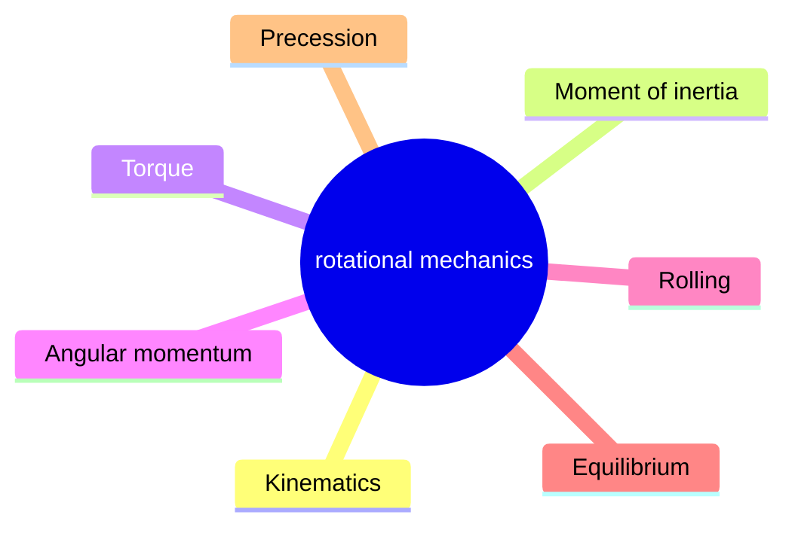
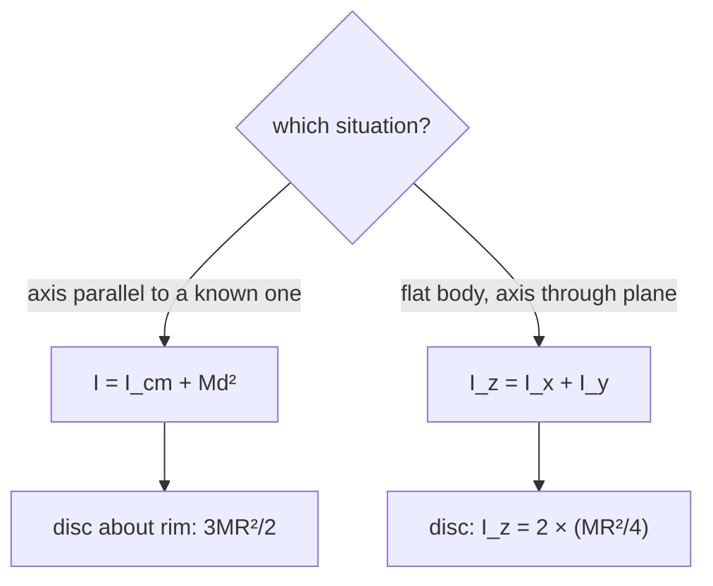
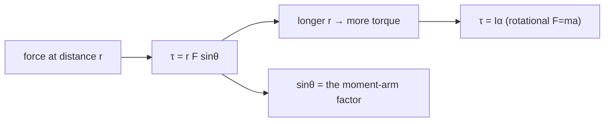
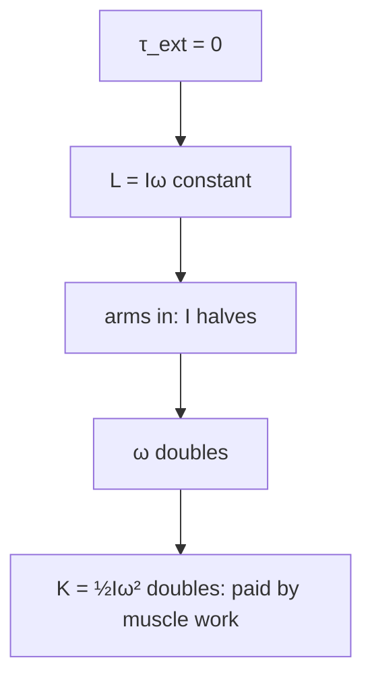
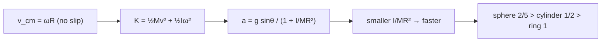
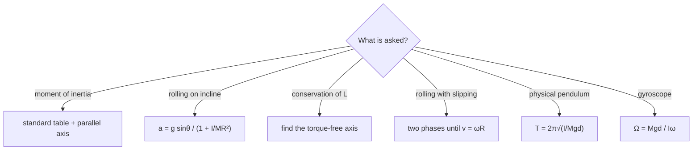

# Rotational Mechanics — first principles to Olympiad

> [!abstract] How to use this chapter
> Three passes. Pass 1: Parts 0–4 — rigid-body kinematics, moment of inertia, torque, angular momentum, and conservation of $L$. Pass 2: Parts 5–9 for exam craft. Pass 3: Parts 10–14 — the Olympiad layer (general angular momentum of a rolling body, rolling with slipping, the yo-yo, the rod-sliding-off-wall problem, gyroscopic precession, the overhang sum), the paper, the sheet, the checkpoint. Every number recomputed; every boxed result carries its validity condition.

## Part 0 · Orientation

### 0.1 What you will be able to do

After this chapter you can: compute the moment of inertia of any body about any axis; derive and apply $\tau=I\alpha$ for fixed-axis rotation; use conservation of angular momentum; analyse rolling motion (with and without slipping); solve rotational collision and impulse problems; determine toppling conditions; and understand gyroscopic precession qualitatively and quantitatively.

### 0.2 The one idea

A rigid body is a mass distribution; rotation is the same $F=ma$ story with $I$, $\tau$ and $L$ playing the roles of $m$, $F$ and $p$.

### 0.3 Prerequisite self-check

You need PART 6 (energy, the work–energy theorem) and PART 7 (centre of mass, momentum conservation, collisions). If you can compute a cross product and integrate a polynomial, you are ready.

### 0.4 Exam orientation

JEE Advanced treats rotational mechanics as one of the hardest and most important topics — 3–5 questions per year, often combining rotation with energy, momentum, or circular dynamics. The rolling-body problem, the physical pendulum, and the conservation of angular momentum are perennial favourites. INPhO and IPhO reward the ability to handle rolling with slipping, the general angular-momentum decomposition, and gyroscopic precession. The trap density is extremely high: using $I$ about the wrong axis, taking $\tau=I\alpha$ about a non-fixed non-CM point, and assuming $v=\omega R$ for a slipping body.

### 0.5 What this chapter is not

Not a particle-mechanics chapter: we deal with extended bodies. Not a relativity chapter: the rigid-body concept breaks down in special relativity (PART 28). Not a fluid-mechanics chapter: fluid rotation is in PART 11. Not a tensor-algebra chapter: we state the moment-of-inertia tensor as a concept without the full tensor formalism.

### 0.6 Syllabus coverage map

| # | Cengage section | What it establishes | Where it lives here | Status |
|---:|---|---|---|---|
| 1 | Rigid-body kinematics | $\mathbf{v}=\boldsymbol{\omega}\times\mathbf{r}$ | §3.1 | full |
| 2 | Fixed-axis rotation | Constant-$\alpha$ equations | §3.2 | full |
| 3 | Moment of inertia | $I=\sum m_i r_i^2$, standard bodies | §3.3 | full |
| 4 | Axis theorems | Parallel-axis, perpendicular-axis | §3.4 | full |
| 5 | Torque | $\boldsymbol{\tau}=\mathbf{r}\times\mathbf{F}$, $\tau=I\alpha$ | §3.5 | full |
| 6 | Angular momentum | $\mathbf{L}=\mathbf{r}\times\mathbf{p}$, $L=I\omega$ | §3.6 | full |
| 7 | Conservation of angular momentum | $\tau_{\text{ext}}=0\Rightarrow L=$ const | §3.7 | full |
| 8 | Rolling without slipping | $v_{\text{cm}}=\omega R$, $a=g\sin\theta/(1+I/MR^2)$ | §3.8 | full |
| 9 | Rolling with slipping | Two-phase motion | §3.9 | full |
| 10 | Rotational collisions | Angular impulse $\int\tau\,dt=\Delta L$ | §3.10 | full |
| 11 | Rigid-body equilibrium | Toppling, ladder, overhang | §3.11 | full |
| 12 | Gyroscopic precession | $\Omega=\tau/(I\omega)$ | §3.12 | full |

## Part 1 · Intuition first

**Every particle in a rigid body moves in a circle.** When a rigid body rotates about a fixed axis, each particle moves in a circle centred on the axis. The farther from the axis, the faster the particle moves: $v=r\omega$. The moment of inertia $I=\sum m_i r_i^2$ measures how much the mass distribution resists angular acceleration — it is the rotational analogue of mass.

**Torque is the rotational analogue of force.** A force applied far from the axis produces more torque ($\tau=rF\sin\theta$) — this is why a longer wrench makes it easier to turn a bolt. The rotational second law: $\tau=I\alpha$.

**Angular momentum is conserved when no external torque acts.** A spinning ice skater pulls in her arms: $L=I\omega=$ const. As $I$ decreases, $\omega$ increases — she spins faster. This is the rotational analogue of conservation of linear momentum.

**Rolling without slipping is a constraint, not a force.** $v_{\text{cm}}=\omega R$ is the no-slip condition. The static friction at the contact point does no work (the contact point is instantaneously at rest). The kinetic energy splits into translational ($\frac{1}{2}Mv^2$) and rotational ($\frac{1}{2}I\omega^2$).

> [!tip] FIGURE F8.1 · Chapter map
> *Why:* the chapter is translational mechanics retold in angular language — mass, force, momentum each get a rotational twin; the map shows the spine.
> *Data:* the Part 0–14 structure — kinematics, $I$, torque, angular momentum, rolling, equilibrium, precession, paper, sheet.

> *Read:* every result is an analogue pair, a parallel-axis shift, or a no-slip constraint.

## Part 2 · Definitions and bookkeeping

| Symbol | Meaning | SI unit |
|---|---|---|
| $\theta$ | angular position | rad |
| $\omega$ | angular velocity $=d\theta/dt$ | rad/s |
| $\alpha$ | angular acceleration $=d\omega/dt$ | rad/s$^2$ |
| $I$ | moment of inertia | kg m$^2$ |
| $\boldsymbol{\tau}$ | torque $=\mathbf{r}\times\mathbf{F}$ | N m |
| $\mathbf{L}$ | angular momentum $=\mathbf{r}\times\mathbf{p}$ | kg m$^2$/s |
| $k$ | radius of gyration ($I=Mk^2$) | m |
| $\Omega$ | precession rate | rad/s |

> [!info] Bookkeeping rules
> The moment of inertia depends on the axis — always specify which axis. The parallel-axis theorem adds $Md^2$ where $d$ is the distance between parallel axes through the COM and through the new axis. The perpendicular-axis theorem applies only to planar (2-D) bodies.

## Part 3 · Core derivations

### 3.1 Rigid-body kinematics

For a rigid body rotating about a fixed axis with angular velocity $\boldsymbol{\omega}$:

$$
\mathbf{v}=\boldsymbol{\omega}\times\mathbf{r}. \qquad (3.1)
$$

Every point on the body moves in a circle. The speed of a point at distance $r$ from the axis: $v=r\omega$. The instantaneous axis of rotation: the set of points with zero velocity. For a rolling wheel: the contact point is instantaneously at rest — it is on the instantaneous axis.

> [!abstract] DIAGRAM D8.1 · The velocity field of a spinning disc
> *Show:* a disc rotating about its centre. At three points (centre, rim, and a point at $r/2$): velocity arrows drawn tangent to the circle. The centre has $v=0$. The rim has $v=R\omega$. The intermediate point has $v=(r/2)\omega$. The instantaneous axis through the centre shown as a dot.
> *Search:* "velocity field spinning disc instantaneous axis diagram"

### 3.2 Fixed-axis rotation

The rotational analogues of the translational equations (constant $\alpha$):

$$
\omega=\omega_0+\alpha t,\qquad\theta=\omega_0 t+\frac{1}{2}\alpha t^2,\qquad\omega^2=\omega_0^2+2\alpha\theta. \qquad (3.2)
$$

> [!warning] Condition of validity
> These equations hold only for constant angular acceleration $\alpha$. If $\alpha$ varies, integrate directly.

### 3.3 Moment of inertia

$$
I=\sum m_i r_i^2=\int r^2\,dm. \qquad (3.3)
$$

**Standard results (about the COM, unless stated):**

| Body | Axis | $I$ |
|---|---|---|
| Rod (length $L$) | perpendicular, through centre | $ML^2/12$ |
| Rod (length $L$) | perpendicular, through end | $ML^2/3$ |
| Ring (radius $R$) | perpendicular, through centre | $MR^2$ |
| Disc (radius $R$) | perpendicular, through centre | $MR^2/2$ |
| Solid sphere (radius $R$) | through centre | $2MR^2/5$ |
| Hollow sphere (radius $R$) | through centre | $2MR^2/3$ |
| Cylinder (radius $R$) | along axis | $MR^2/2$ |

**Radius of gyration:** $I=Mk^2$, so $k=\sqrt{I/M}$.

> [!abstract] DIAGRAM D8.2 · Moment of inertia of six standard bodies
> *Show:* a rod, ring, disc, solid sphere, hollow sphere, and cylinder, each with the axis marked and the $I$ value labelled. The distance from axis to farthest mass element shown.
> *Search:* "moment of inertia standard bodies rod ring disc sphere cylinder table"

### 3.4 Axis theorems

**Parallel-axis theorem:**

$$
I=I_{\text{cm}}+Md^2. \qquad (3.4)
$$

where $d$ is the distance between the COM axis and the new parallel axis.

**Perpendicular-axis theorem** (planar bodies only):

$$
I_z=I_x+I_y. \qquad (3.5)
$$

where $z$ is perpendicular to the plane and $x$, $y$ are in the plane.

> [!abstract] DIAGRAM D8.3 · The parallel-axis theorem geometry
> *Show:* a disc with the COM axis (through the centre) and a parallel axis through the rim. The distance $d=R$ shown. $I_{\text{rim}}=I_{\text{cm}}+MR^2=MR^2/2+MR^2=3MR^2/2$.
> *Search:* "parallel axis theorem disc rim tangent geometry diagram"

> [!tip] FIGURE F8.2 · Two axis theorems: shift it or split it
> *Why:* almost every moment-of-inertia calculation is one of two moves — the figure fixes which move fits which shape.
> *Data:* parallel axis $I=I_{\text{cm}}+Md^2$; perpendicular axis $I_z=I_x+I_y$ for flat bodies. Disc about rim: $\tfrac12 MR^2+MR^2=\tfrac32 MR^2$.

> *Read:* parallel axis pushes the known moment outward by $Md^2$; the perpendicular axis splits a flat body's inertia between two in-plane axes.

### 3.5 Torque

$$
\boldsymbol{\tau}=\mathbf{r}\times\mathbf{F},\qquad\tau=rF\sin\theta. \qquad (3.6)
$$

For a rigid body about a fixed axis:

$$
\tau_{\text{net}}=I\alpha. \qquad (3.7)
$$

The internal torques cancel in pairs (Newton's third law).

> [!abstract] DIAGRAM D8.4 · Torque about a point with the moment arm
> *Show:* a force $\mathbf{F}$ applied at point $P$ on a body pivoted at $O$. The moment arm $d=r\sin\theta$ drawn as the perpendicular distance from $O$ to the line of action of $\mathbf{F}$. $\tau=Fd$ annotated.
> *Search:* "torque moment arm perpendicular distance force pivot diagram"

> [!tip] FIGURE F8.3 · Torque: force times the lever arm
> *Why:* the same force turns harder from farther out — the figure reduces torque to its two levers of control.
> *Data:* $\boldsymbol{\tau}=\mathbf{r}\times\mathbf{F}$, magnitude $rF\sin\theta$, and the rotational second law $\tau=I\alpha$.

> *Read:* torque cares about the perpendicular distance to the line of action, not just the distance — that is why a wrench works best at right angles.

### 3.6 Angular momentum

For a particle: $\mathbf{L}=\mathbf{r}\times\mathbf{p}$.

For a rigid body about a fixed axis:

$$
L=I\omega. \qquad (3.8)
$$

The general angular momentum about a point:

$$
\mathbf{L}=\mathbf{L}_{\text{spin}}+\mathbf{r}_{\text{cm}}\times M\mathbf{v}_{\text{cm}}=I_{\text{cm}}\boldsymbol{\omega}+\mathbf{r}_{\text{cm}}\times M\mathbf{v}_{\text{cm}}. \qquad (3.9)
$$

> [!abstract] DIAGRAM D8.5 · The rolling wheel's velocity field with the contact point at rest
> *Show:* a wheel rolling to the right at speed $v$. At the contact point: $v_{\text{contact}}=v-\omega R=0$ (no-slip condition). At the top: $v_{\text{top}}=v+\omega R=2v$. At the centre: $v_{\text{cm}}=v$. The velocity field shown as arrows of varying length around the wheel.
> *Search:* "rolling wheel velocity field contact point rest top 2v diagram"

### 3.7 Conservation of angular momentum

$$
\tau_{\text{ext}}=\frac{d\mathbf{L}}{dt}. \qquad (3.10)
$$

If $\tau_{\text{ext}}=0$ (about a chosen point or axis): $\mathbf{L}=$ const.

**Applications:** the spinning skater (pulls arms in, $I$ decreases, $\omega$ increases); a bullet hitting a hinged rod ($L$ conserved about the hinge during the brief collision); a disc dropped on a spinning disc ($L$ conserved, KE is not).

> [!abstract] DIAGRAM D8.6 · The spinning skater: angular momentum conservation
> *Show:* a skater spinning with arms out ($I_1$ large, $\omega_1$ small) and arms in ($I_2$ small, $\omega_2$ large). $L=I_1\omega_1=I_2\omega_2$ annotated. The KE increases: $\frac{1}{2}I_2\omega_2^2>\frac{1}{2}I_1\omega_1^2$ — the extra energy comes from the work the skater does pulling her arms in.
> *Search:* "spinning skater angular momentum conservation arms in out kinetic energy"

> [!tip] FIGURE F8.4 · Angular momentum: constant when torque-free — even as KE changes
> *Why:* the deep surprise — $L$ is frozen while the kinetic energy rises, paid for by internal work; the figure makes the split explicit.
> *Data:* no external torque $\Rightarrow L=I\omega$ constant; if $I$ halves, $\omega$ doubles and $K=\tfrac12I\omega^2$ doubles.

> *Read:* conservation protects the product $I\omega$, not the energy — the skater spends chemical energy to spin faster against a fixed momentum.

### 3.8 Rolling without slipping

**The no-slip constraint:** $v_{\text{cm}}=\omega R$.

**Kinetic energy:**

$$
K=\frac{1}{2}Mv^2+\frac{1}{2}I\omega^2=\frac{1}{2}Mv^2\left(1+\frac{I}{MR^2}\right). \qquad (3.11)
$$

**Acceleration on an incline:**

$$
a=\frac{g\sin\theta}{1+I/(MR^2)}. \qquad (3.12)
$$

**Minimum friction for rolling without slipping:**

$$
\mu_{\min}=\frac{\tan\theta}{1+MR^2/I}. \qquad (3.13)
$$

**The rolling race:** bodies with smaller $I/(MR^2)$ accelerate faster. Order: solid sphere ($2/5$) < solid cylinder ($1/2$) < hollow sphere ($2/3$) < hollow cylinder ($1$).

> [!abstract] DIAGRAM D8.7 · The rolling race: five bodies at the same time
> *Show:* an incline with five bodies (solid sphere, solid cylinder, hollow sphere, hollow cylinder, sliding block) at the same time after release. The solid sphere is furthest ahead; the sliding block (no rotation) is even further. The $I/(MR^2)$ values annotated.
> *Search:* "rolling race incline solid sphere cylinder hollow sphere order diagram"

> [!tip] FIGURE F8.5 · Rolling without slipping: two energies, one race
> *Why:* the whole rolling toolkit — the constraint, the energy split, and why some bodies win the race — in one figure.
> *Data:* $v_{\text{cm}}=\omega R$; $K=\tfrac12 Mv^2+\tfrac12 I\omega^2$; acceleration $a=\frac{g\sin\theta}{1+I/MR^2}$, so smaller $I/MR^2$ wins.

> *Read:* the no-slip condition forces rotation to eat a share of the energy; the share is set by $I/MR^2$, and the smallest share wins the race.

### 3.9 Rolling with slipping

When the no-slip condition is violated ($v_{\text{cm}}\neq\omega R$), kinetic friction acts. Two phases:

1. **Slipping phase:** $f_k=\mu_k N$. The linear acceleration $a$ and angular acceleration $\alpha$ are different. $v$ and $\omega R$ converge.
2. **Rolling phase:** when $v=\omega R$, rolling without slipping begins and kinetic friction ceases (static friction takes over if needed).

> [!abstract] DIAGRAM D8.8 · The slipping-to-rolling phase diagram
> *Show:* a graph of $v$ and $\omega R$ vs $t$. Initially $v>v_0$ and $\omega R=0$ (a ball thrown with no spin). $v$ decreases (friction opposes motion), $\omega R$ increases (friction creates torque). They meet at $t^*$ when $v=\omega R$ — rolling begins. After $t^*$: $v=\omega R$ (constant, no friction needed).
> *Search:* "slipping to rolling phase diagram v and omega R versus time"

### 3.10 Rotational collisions and impulses

Angular impulse: $J_{\text{rot}}=\int\tau\,dt=\Delta L$.

**A bullet hitting a hinged rod:** the bullet embeds in the rod at distance $d$ from the hinge. Angular momentum about the hinge is conserved (the hinge force produces no torque about the hinge). $mv_0 d=(I_{\text{rod}}+md^2)\omega$.

> [!abstract] DIAGRAM D8.9 · A rod struck by a bullet
> *Show:* a rod hinged at one end, initially at rest. A bullet approaches at speed $v_0$ and embeds at distance $d$ from the hinge. The angular momentum about the hinge: $L_{\text{before}}=mv_0 d$. After: $L_{\text{after}}=(I_{\text{rod}}+md^2)\omega$.
> *Search:* "bullet hitting hinged rod angular momentum conservation diagram"

### 3.11 Rigid-body equilibrium and toppling

For equilibrium: $\sum\mathbf{F}=\mathbf{0}$ and $\sum\boldsymbol{\tau}=\mathbf{0}$ (about any point).

**Toppling:** a body on an incline topples when the COM moves beyond the base. The tipping angle: $\tan\theta_{\text{tip}}=b/h$ where $b$ is half the base width and $h$ is the COM height.

**The maximum overhang of stacked blocks:** the $n$th block from the top overhangs by $1/(2n)$ block-lengths. Total overhang: $\frac{1}{2}\sum_{n=1}^N\frac{1}{n}$ — diverges as $\ln N$ (theoretically infinite overhang with enough blocks!).

> [!abstract] DIAGRAM D8.10 · The ladder problem's force diagram with the incipient-tip normal force
> *Show:* a ladder leaning against a wall at angle $\theta$. Forces: weight $mg$ at the COM, normal force from the wall $N_w$ (horizontal), normal force from the ground $N_g$ (vertical), friction from the ground $f$ (horizontal). At the tipping point: $N_w$ acts at the top, $N_g$ acts at the bottom edge (not the centre of the base).
> *Search:* "ladder against wall force diagram tipping point normal force position"

### 3.12 Gyroscopic precession

A spinning top with angular momentum $\mathbf{L}$ (along the spin axis) experiences a torque $\boldsymbol{\tau}$ from gravity (perpendicular to $\mathbf{L}$). The torque changes $\mathbf{L}$ in the direction of $\boldsymbol{\tau}$ — the top precesses instead of falling.

$$
\Omega=\frac{\tau}{L}=\frac{Mgd}{I\omega}. \qquad (3.14)
$$

> [!abstract] DIAGRAM D8.11 · A gyroscope with $\mathbf{L}$, $\tau$ and the precession cone
> *Show:* a spinning top tilted at angle $\theta$ from the vertical. $\mathbf{L}$ along the spin axis. $\boldsymbol{\tau}=\mathbf{r}_{\text{cm}}\times M\mathbf{g}$ perpendicular to $\mathbf{L}$ (horizontal). $d\mathbf{L}=\boldsymbol{\tau}\,dt$ causes $\mathbf{L}$ to precess around the vertical. The precession cone drawn.
> *Search:* "gyroscope precession angular momentum torque cone diagram"

## Part 4 · Results, limits and the validity ledger

### 4.1 Boxed results

$$
\boxed{I=I_{\text{cm}}+Md^2\text{ (parallel-axis theorem)}} \qquad (4.1)
$$

$d$ is the distance between the COM axis and the new parallel axis.

$$
\boxed{\tau=I\alpha\text{ (about a fixed axis or the COM)}} \qquad (4.2)
$$

valid for fixed-axis rotation or rotation about the COM.

$$
\boxed{a=\frac{g\sin\theta}{1+I/(MR^2)}\text{ (rolling without slipping on an incline)}} \qquad (4.3)
$$

valid when $\mu\ge\mu_{\min}$.

$$
\boxed{K=\frac{1}{2}Mv^2\left(1+\frac{I}{MR^2}\right)\text{ (rolling KE)}} \qquad (4.4)
$$

valid for rolling without slipping.

$$
\boxed{\Omega=\frac{Mgd}{I\omega}\text{ (gyroscopic precession rate)}} \qquad (4.5)
$$

valid for a spinning top with small tilt angle.

### 4.2 Limit checks

- $I/(MR^2)\to0$ (point mass): $a=g\sin\theta$ — sliding down the incline. ✓
- $I/(MR^2)\to\infty$ (mass at the rim): $a\to0$ — the body barely accelerates. ✓
- $\mu\to0$: slipping occurs, the no-slip equations do not apply. ✓
- $\omega\to0$: $\Omega\to\infty$ — the top falls instantly (no precession). ✓
- $d\to0$ (COM at the pivot): $\Omega=0$ — no torque, no precession. ✓

### 4.3 Which formula when

| Given | Need | Use |
|---|---|---|
| $I$ about COM, need $I$ about parallel axis | $I$ | Eq. (4.1) |
| Torque on a rigid body | angular acceleration | Eq. (4.2) |
| Rolling body on an incline | acceleration | Eq. (4.3) |
| Rolling body, need KE | kinetic energy | Eq. (4.4) |
| Spinning top with gravity | precession rate | Eq. (4.5) |
| Angular momentum conserved | final $\omega$ | $L_i=L_f$ |

### 4.4 Concept checks

**C1 — concept check.** Does the moment of inertia depend on the angular velocity?

Answer

No — $I$ depends only on the mass distribution and the axis. It is a property of the body, not of its motion.

**C2 — concept check.** Can a body have angular momentum about a point even if it is not rotating?

Answer

Yes — a particle moving in a straight line has $\mathbf{L}=\mathbf{r}\times\mathbf{p}\neq\mathbf{0}$ about any point not on its line of motion.

**C3 — concept check.** Why does a solid sphere roll faster than a hollow sphere down an incline?

Answer

The solid sphere has $I/(MR^2)=2/5$; the hollow sphere has $2/3$. Smaller $I/(MR^2)$ means more of the PE goes into translational KE, so the solid sphere accelerates faster.

**C4 — concept check.** In the rolling-race, does the mass matter?

Answer

No — the acceleration $a=g\sin\theta/(1+I/(MR^2))$ is independent of mass. The mass cancels.

**C5 — concept check.** Does static friction do work on a rolling body?

Answer

No — the contact point is instantaneously at rest ($v=0$), so the friction force does zero work ($W=F\cdot0=0$). Static friction changes the distribution of KE between translational and rotational, but not the total.

**C6 — concept check.** A disc and a hoop of the same mass and radius roll down an incline. Which wins?

Answer

The disc ($I=MR^2/2$) beats the hoop ($I=MR^2$). The disc has a smaller $I/(MR^2)$.

**C7 — concept check.** Can $\tau=I\alpha$ be used about any point?

Answer

Only about a fixed axis or the COM. About a general accelerating point, additional terms appear.

**C8 — concept check.** A spinning ice skater pulls in her arms. What happens to the kinetic energy?

Answer

$KE$ increases — the skater does work pulling her arms inward against the centrifugal tendency. This work becomes rotational KE.

**C9 — concept check.** What is the perpendicular-axis theorem, and when does it fail?

Answer

$I_z=I_x+I_y$ for a planar body. It fails for 3-D bodies (e.g., a solid sphere) because the derivation assumes all mass lies in the $xy$-plane.

**C10 — concept check.** Why does a gyroscope precess instead of falling?

Answer

The torque from gravity changes the *direction* of $\mathbf{L}$ (perpendicular to $\mathbf{L}$), not its magnitude. The result is precession — $\mathbf{L}$ rotates around the vertical.

**C11 — concept check.** A ball is thrown with backspin on a rough surface. Does it eventually roll without slipping?

Answer

Yes — kinetic friction slows the translation and increases the rotation until $v=\omega R$. Then rolling without slipping begins.

**C12 — concept check.** The maximum overhang of stacked blocks diverges. Does this mean you can build an infinitely overhanging tower?

Answer

In principle, yes — but the required number of blocks grows exponentially (the harmonic series diverges very slowly). For 10 blocks: overhang $\approx1.46$ block-lengths. For 100: $\approx2.59$. For $10^6$: $\approx7.48$. Practically, stability and friction limit the construction.

## Part 5 · Worked exemplars

### E1 — Moment of inertia of a disc about a rim tangent

A disc of mass $M$ and radius $R$ has $I_{\text{cm}}=MR^2/2$. Find $I$ about an axis tangent to the rim.

> [!success] Check
> $I=MR^2/2+MR^2=3MR^2/2$. For $M=2$ kg, $R=0.5$ m: $I=0.75$ kg m$^2$.

Solution

**Method.** Parallel-axis theorem: $I=I_{\text{cm}}+Md^2=MR^2/2+MR^2=3MR^2/2$.

### E2 — Rolling down an incline

A solid sphere rolls without slipping down a 30° incline from rest. Find the acceleration and the minimum $\mu$. ($g=10$ m/s$^2$.)

> [!success] Check
> $a=10\times0.5/(1+0.4)=5/1.4=3.57$ m/s$^2$. $\mu_{\min}=0.577/(1+2.5)=0.165$.

Solution

**Method.** $I/(MR^2)=2/5$. $a=g\sin30°/(1+2/5)=5/(7/5)=25/7=3.57$ m/s$^2$. $\mu_{\min}=\tan30°/(1+5/2)=0.577/3.5=0.165$.

### E3 — Conservation of $L$: bullet hitting a hinged rod

A 10 g bullet at 400 m/s hits a 1 kg rod of length 1 m at its midpoint (the rod is hinged at one end, initially at rest). Find the angular velocity after the bullet embeds.

> [!success] Check
> $L_{\text{before}}=0.01\times400\times0.5=2$ kg m$^2$/s. $I_{\text{rod}}=1\times1^2/3=0.333$. $I_{\text{total}}=0.333+0.01\times0.25=0.336$. $\omega=2/0.336=5.95$ rad/s.

Solution

**Method.** $L_i=mv_0 d=0.01\times400\times0.5=2$. $I_f=ML^2/3+md^2=1/3+0.01\times0.25=0.336$. $\omega=2/0.336=5.95$ rad/s.

### E4 — Rolling with slipping: when does rolling begin?

A bowling ball ($R=0.1$ m) is thrown at 10 m/s with no spin on a surface with $\mu_k=0.3$. When does rolling without slipping begin? ($g=10$ m/s$^2$.)

> [!success] Check
> $a=-\mu_k g=-3$ m/s$^2$. $\alpha=\mu_k MgR/(I)=0.3\times10\times0.1/(2/5)=7.5$ rad/s$^2$. $v(t)=10-3t$. $\omega(t)=7.5t$. Rolling: $10-3t=7.5t\times0.1$. $10-3t=0.75t$. $t=10/3.75=2.67$ s.

Solution

**Method.** Linear: $a=-\mu_k g=-3$ m/s$^2$, $v=10-3t$. Angular: $\tau=fR=\mu_k MgR$, $\alpha=\tau/I=0.3MgR/(2MR^2/5)=0.3\times5g/(2R)=7.5$ rad/s$^2$. $\omega=\alpha t=7.5t$. No-slip: $v=\omega R$: $10-3t=7.5t\times0.1=0.75t$. $t=10/3.75=2.67$ s.

### E5 — The spinning skater

A skater has $I_1=5$ kg m$^2$ spinning at $\omega_1=2$ rad/s. She pulls in her arms, reducing $I$ to $I_2=2$ kg m$^2$. Find $\omega_2$ and the change in KE.

> [!success] Check
> $\omega_2=5\times2/2=5$ rad/s. $K_1=10$ J, $K_2=25$ J. $\Delta K=15$ J — the skater did 15 J of work.

Solution

**Method.** $L=I_1\omega_1=10$. $I_2\omega_2=10\Rightarrow\omega_2=5$ rad/s. $K_1=\frac{1}{2}\times5\times4=10$ J. $K_2=\frac{1}{2}\times2\times25=25$ J. $\Delta K=15$ J.

### E6 — Gyroscopic precession

A top has $I=0.01$ kg m$^2$, spins at $\omega=100$ rad/s, and has its COM at $d=0.05$ m from the pivot. Mass $m=0.5$ kg. Find the precession rate. ($g=10$ m/s$^2$.)

> [!success] Check
> $\Omega=0.5\times10\times0.05/(0.01\times100)=0.25/1=0.25$ rad/s. Period $=2\pi/0.25=25.1$ s.

Solution

**Method.** $\Omega=Mgd/(I\omega)=0.5\times10\times0.05/(0.01\times100)=0.25$ rad/s.

### E7 — Physical pendulum: oscillating rod

A uniform rod of length $L$ is pivoted at one end. Find the period of small oscillations.

> [!success] Check
> $I=ML^2/3$, $d=L/2$. $T=2\pi\sqrt{ML^2/3/(MgL/2)}=2\pi\sqrt{2L/(3g)}$. For $L=1$ m: $T=2\pi\sqrt{0.068}=1.64$ s.

Solution

**Method.** $T=2\pi\sqrt{I/(Mgd)}=2\pi\sqrt{(ML^2/3)/(MgL/2)}=2\pi\sqrt{2L/(3g)}$.

### E8 — The maximum overhang

Find the total overhang for 4 blocks, each of length $L$.

> [!success] Check
> Overhang $=L/2(1+1/2+1/3+1/4)=L/2\times25/12=25L/24\approx1.04L$. The tower overhangs by more than one block-length!

Solution

**Method.** The $n$th block from the top overhangs by $L/(2n)$. Total for 4: $L/2(1+1/2+1/3+1/4)=L/2\times(12+6+4+3)/12=25L/24$.

### E9 — A disc pulled by a string at the top

A disc of mass $M$, radius $R$ is pulled by a horizontal force $F$ applied via a string wound around the top. Find the acceleration and friction direction.

> [!success] Check
> About the contact point: $\tau=2FR$ (the force acts at height $2R$). $I_{\text{contact}}=3MR^2/2$. $\alpha=2FR/(3MR^2/2)=4F/(3MR)$. $a=\alpha R=4F/(3M)$.

Solution

**Method.** Using torque about the contact point (instantaneously at rest): $\tau=2FR$ (the string force at height $2R$ from the contact point). $I_{\text{contact}}=I_{\text{cm}}+MR^2=3MR^2/2$. $\alpha=4F/(3MR)$. $a=\alpha R=4F/(3M)$. Friction acts backward (to prevent slipping).

### E10 — Disc dropped on a spinning disc

A disc of moment $I_1$ spinning at $\omega_1$ has a second disc ($I_2$, initially at rest) dropped on it (same axis). Find the final $\omega$ and the energy lost.

> [!success] Check
> $\omega=I_1\omega_1/(I_1+I_2)$. $\Delta K=\frac{1}{2}\frac{I_1 I_2}{I_1+I_2}\omega_1^2$. For $I_1=I_2$: $\omega=\omega_1/2$, $\Delta K=K_i/2$ — half the energy is lost.

Solution

**Method.** $L=I_1\omega_1=(I_1+I_2)\omega$. $\omega=I_1\omega_1/(I_1+I_2)$. $K_i=\frac{1}{2}I_1\omega_1^2$. $K_f=\frac{1}{2}(I_1+I_2)\omega^2=\frac{1}{2}I_1^2\omega_1^2/(I_1+I_2)$. $\Delta K=K_i-K_f=\frac{1}{2}I_1\omega_1^2[1-I_1/(I_1+I_2)]=\frac{1}{2}I_1I_2\omega_1^2/(I_1+I_2)$.

## Part 6 · Problem archetypes and practice

### 6.1 Archetypes

| # | Archetype | Template | Where worked | Variations |
|---:|---|---|---|---|
| 1 | $I$ by parallel-axis theorem | $I=I_{\text{cm}}+Md^2$ | E1 | composite bodies |
| 2 | Rolling on an incline | $a=g\sin\theta/(1+I/MR^2)$ | E2 | different shapes |
| 3 | Bullet hitting hinged rod | $L$ conserved about hinge | E3 | different hit points |
| 4 | Rolling with slipping | Two-phase | E4 | backspin |
| 5 | Spinning skater | $L=I\omega=$ const | E5 | disc+mass |
| 6 | Gyroscope | $\Omega=Mgd/(I\omega)$ | E6 | different angles |
| 7 | Physical pendulum | $T=2\pi\sqrt{I/mgd}$ | E7 | ring, disc on nail |
| 8 | Overhang | $\sum 1/(2n)$ | E8 | fewer/more blocks |
| 9 | String wound on disc | Torque about contact | E9 | different wound positions |
| 10 | Disc-on-disc | $L$ conserved, KE not | E10 | different axes |

### 6.2 In-flow practice

#### Q1. Find $I$ of a ring ($M=2$ kg, $R=0.3$ m) about a tangent. ($I_{\text{cm}}=MR^2$.)

Solution

$I=MR^2+MR^2=2MR^2=2\times2\times0.09=0.36$ kg m$^2$.

#### Q2. A solid cylinder rolls without slipping down a 20° incline. Find $a$. ($g=10$ m/s$^2$.)

Solution

$I/(MR^2)=1/2$. $a=10\sin20°/(1+0.5)=10\times0.342/1.5=2.28$ m/s$^2$.

#### Q3. A 5 g bullet at 300 m/s hits a 2 kg rod (1 m, hinged at one end) at the far end. Find $\omega$.

Solution

$L=0.005\times300\times1=1.5$. $I=2/3+0.005\times1=0.672$. $\omega=1.5/0.672=2.23$ rad/s.

#### Q4. A hoop rolls down a 45° incline. Find $a$ and $v$ at the bottom (height $h$). ($g=10$ m/s$^2$.)

Solution

$I/(MR^2)=1$. $a=g\sin45°/2=3.54$ m/s$^2$. $v=\sqrt{2gh/(1+1)}=\sqrt{gh}$.

#### Q5. A disc ($I=0.5$ kg m$^2$) spins at 20 rad/s. A constant torque of 2 N m acts. Find the time to stop.

Solution

$\alpha=2/0.5=4$ rad/s$^2$. $t=\omega/\alpha=20/4=5$ s.

#### Q6. A skater ($I=3$ kg m$^2$, $\omega=4$ rad/s) extends arms to double $I$. Find the new $\omega$.

Solution

$\omega=3\times4/6=2$ rad/s.

#### Q7. Find the period of a disc of radius $R$ oscillating as a physical pendulum on a nail through the rim.

Solution

$I=MR^2/2+MR^2=3MR^2/2$. $d=R$. $T=2\pi\sqrt{3MR^2/(2MgR)}=2\pi\sqrt{3R/(2g)}$.

#### Q8. A ball ($R=0.05$ m) is thrown at 8 m/s with no spin ($\mu_k=0.2$). Find the time to start rolling. ($g=10$ m/s$^2$.)

Solution

$a=-2$ m/s$^2$. $\alpha=0.2\times5/(2/5)=2.5/0.4=6.25$... wait. $\alpha=fR/I=\mu_k MgR/(2MR^2/5)=5\mu_k g/(2R)=5\times0.2\times10/(2\times0.05)=10/0.1=100$ rad/s$^2$. $v=8-2t$, $\omega=100t$. $v=\omega R$: $8-2t=5t$. $t=8/7=1.14$ s.

#### Q9. A ladder of length $L$, mass $M$ leans against a wall at angle $\theta$ (frictionless wall, rough ground with $\mu$). Find the minimum $\mu$ for equilibrium.

Solution

$N_w=f$, $N_g=Mg$. Torque about the base: $N_w L\sin\theta=Mg(L/2)\cos\theta$. $N_w=Mg\cot\theta/2$. $f=N_w=\mu N_g=\mu Mg$. $\mu=\cot\theta/2$.

#### Q10. A rod of mass $M$, length $L$ is pivoted at one end and released from horizontal. Find $\omega$ at the lowest point.

Solution

$MgL/2=\frac{1}{2}(ML^2/3)\omega^2$. $\omega^2=3g/L$. $\omega=\sqrt{3g/L}$.

#### Q11. Two discs ($I_1=2$, $I_2=3$ kg m$^2$) spin in opposite directions: $\omega_1=10$, $\omega_2=5$ rad/s. They are pressed together. Find the final $\omega$.

Solution

$L=2\times10-3\times5=5$ (taking $\omega_1$ positive). $\omega=5/(2+3)=1$ rad/s (in the direction of disc 1).

#### Q12. A solid sphere and a hollow sphere ($M$, $R$ same) roll down an incline. Which reaches the bottom first?

Solution

Solid sphere: $I/(MR^2)=0.4$. Hollow: $0.667$. The solid sphere accelerates faster and reaches first.

#### Q13. A flywheel ($I=10$ kg m$^2$) stores energy at 1000 rpm. Find the stored energy.

Solution

$\omega=1000\times2\pi/60=104.7$ rad/s. $K=\frac{1}{2}\times10\times10966=54830$ J $\approx55$ kJ.

#### Q14. A top has $I=0.002$ kg m$^2$, $\omega=200$ rad/s, $M=0.2$ kg, $d=0.03$ m. Find $\Omega$.

Solution

$\Omega=0.2\times9.8\times0.03/(0.002\times200)=0.0588/0.4=0.147$ rad/s.

#### Q15. A disc of mass $M$, radius $R$ rolls without slipping at speed $v$. Find the total KE.

Solution

$K=\frac{1}{2}Mv^2(1+1/2)=\frac{3}{4}Mv^2$.

#### Q16. A rod ($L=2$ m, $M=3$ kg) is pivoted at 0.5 m from one end. Find $I$ about the pivot.

Solution

$I_{\text{cm}}=ML^2/12=1$. $d=0.5$ (distance from COM to pivot). $I=1+3\times0.25=1.75$ kg m$^2$.

#### Q17. A hoop rolls without slipping up a 30° incline at 5 m/s. How far does it go? ($g=10$ m/s$^2$.)

Solution

$K=\frac{1}{2}Mv^2(1+1)=Mv^2$. $Mgh=Mv^2$. $h=v^2/g=2.5$ m. $d=h/\sin30°=5$ m.

#### Q18. A uniform disc ($M=4$ kg, $R=0.2$ m) has a 1 kg mass attached at the rim. Find $I$ about the centre.

Solution

$I=MR^2/2+mR^2=4\times0.04/2+1\times0.04=0.08+0.04=0.12$ kg m$^2$.

#### Q19. A ball is thrown with $v=10$ m/s and $\omega R=-5$ m/s (backspin). $\mu_k=0.2$. Find when rolling begins. ($R=0.1$ m, $g=10$ m/s$^2$.)

Solution

$v(t)=10-2t$, $\omega(t)=-5+\alpha t$ with $\alpha=5\mu_k g/(2R)=50$... $\alpha=\mu_k g/(2R/5)=5\mu_k MgR/(2MR^2)=5\mu_k g/(2R)=5\times0.2\times10/(0.2)=50$ rad/s$^2$. $\omega R=-5+50\times0.1\times t=-5+5t$. $v=\omega R$: $10-2t=-5+5t$. $15=7t$. $t=2.14$ s.

#### Q20. A physical pendulum: a uniform disc of radius $R$ pivoted at a point $d$ from the centre. Find the minimum-period condition.

Solution

$I=MR^2/2+Md^2$. $T=2\pi\sqrt{(R^2/2+d^2)/(gd)}$. Minimise: $dT/dd=0\Rightarrow d=R/\sqrt{2}$. $T_{\min}=2\pi\sqrt{R\sqrt{2}/g}$.

#### Q21. A 2 kg ball ($R=0.1$ m) rolls at 5 m/s. Find the total KE.

Solution

$K=\frac{1}{2}\times2\times25\times(1+2/5)=25\times1.4=35$ J.

#### Q22. A rod ($M$, $L$) is pivoted at one end. A ball ($m$, $v_0$) hits the free end and sticks. Find $\omega$.

Solution

$L=mv_0 L$. $I=ML^2/3+mL^2$. $\omega=mv_0 L/(ML^2/3+mL^2)=mv_0/(ML/3+ml)$.

#### Q23. A gyroscope precesses at $\Omega=0.5$ rad/s. If $\omega$ doubles, what happens to $\Omega$?

Solution

$\Omega=Mgd/(I\omega)$. $\Omega\propto1/\omega$. Doubling $\omega$ halves $\Omega$ to $0.25$ rad/s.

#### Q24. A cylinder rolls without slipping on a horizontal surface. A force $F$ is applied at the centre. Find $a$.

Solution

$F-f=Ma$, $fR=I\alpha=MR^2/2\times a/R$. $f=Ma/2$. $F-Ma/2=Ma$. $F=3Ma/2$. $a=2F/(3M)$.

#### Q25. A hoop and a disc ($M$, $R$ same) are released from the same height on an incline. Find the ratio of their speeds at the bottom.

Solution

$v_{\text{disc}}=\sqrt{2gh/(1+1/2)}=\sqrt{4gh/3}$. $v_{\text{hoop}}=\sqrt{2gh/2}=\sqrt{gh}$. Ratio: $v_{\text{disc}}/v_{\text{hoop}}=\sqrt{4/3}=1.155$. The disc is 15.5% faster.

## Part 7 · Alternate methods and the JEE-Advanced advantage toolkit

### 7.1 The contact-point torque shortcut

For a rolling body, compute torque about the contact point (instantaneously at rest). $I_{\text{contact}}=I_{\text{cm}}+MR^2$. This avoids the friction force entirely.

### 7.2 The energy method for rolling

For a rolling body on an incline: $Mgh=\frac{1}{2}Mv^2(1+I/MR^2)$. This gives $v$ directly without finding $a$.

### 7.3 The "which point for $L$?" rule

Use $L=I\omega$ about: (a) a fixed axis, or (b) the COM. About a general accelerating point, additional terms appear ($\mathbf{r}_{\text{cm}}\times M\mathbf{v}_{\text{cm}}$).

### 7.4 The physical-pendulum equivalence

Any rigid body oscillating about a pivot has $T=2\pi\sqrt{I/(Mgd)}$. Identify $I$, $M$, $d$ and substitute.

## Part 8 · Examiner traps

> [!danger] Trap 1 — Using $I$ about the wrong axis
> Always check which axis the problem specifies. The parallel-axis theorem changes $I$ significantly.

> [!danger] Trap 2 — Taking $\tau=I\alpha$ about a non-fixed, non-CM point
> $\tau=I\alpha$ is valid only about a fixed axis or the COM. About a general point, additional terms appear.

> [!danger] Trap 3 — Using $v=\omega R$ for a slipping body
> $v=\omega R$ is the no-slip condition. For a slipping body, $v\neq\omega R$.

> [!danger] Trap 4 — Applying energy conservation to a body that slips
> Kinetic friction dissipates energy. Energy is not conserved during slipping.

> [!danger] Trap 5 — Forgetting the parallel-axis theorem's $Md^2$ term
> The $d$ is the distance between the COM axis and the new axis — not the distance to the edge.

> [!danger] Trap 6 — Confusing angular momentum about different points
> $L$ depends on the point about which it is computed. $L_{\text{about hinge}}\neq L_{\text{about COM}}$.

> [!danger] Trap 7 — Saying "friction acts backwards" on a rolling body without deriving
> The friction direction depends on the situation. For a rolling body on an incline, friction acts *up* the incline (to prevent the body from accelerating too fast).

> [!danger] Trap 8 — Using $L=I\omega$ when the axis is not principal
> For a general axis, $\mathbf{L}=I\boldsymbol{\omega}$ only if the axis is a principal axis. Otherwise, $\mathbf{L}$ and $\boldsymbol{\omega}$ may not be parallel.

> [!abstract] DIAGRAM D8.12 · The collision-then-roll transition: bullet embeds in rod
> *Show:* a uniform rod of length $L$ hanging vertically from a frictionless hinge at the top. A bullet of mass $m$ approaches horizontally at speed $v$ and embeds at distance $d$ from the hinge. Three phases: (1) bullet approaches; (2) bullet embeds — angular momentum conserved about hinge; (3) rod swings up — energy conserved from post-collision KE to PE at maximum angle $\theta_{\max}$.
> *Search:* "bullet embeds in rod angular momentum conservation hinge rod swing diagram"

> [!danger] Trap 9 — Applying energy conservation during an impulsive collision
> During a collision (even an inelastic one), angular momentum about the hinge is conserved (no external torque), but kinetic energy is NOT conserved (the bullet embeds — perfectly inelastic). Apply $\Delta L=0$ first, then energy conservation to find the subsequent swing height.

> [!danger] Trap 10 — Confusing $\alpha$ and $\omega$ in rotational kinematics
> $\alpha=d\omega/dt$ is the angular acceleration. The kinematic equation $\omega_f=\omega_i+\alpha t$ holds only for constant $\alpha$. For variable torque, use $\tau=I\alpha$ and integrate.

> [!danger] Trap 11 — Mixing up rolling conditions on inclines with different friction coefficients
> On a rough incline ($\mu\ge\mu_{\min}$), rolling without slipping occurs and $v_{\rm COM}=\omega R$. On a smooth incline ($\mu<\mu_{\min}$), the body slides AND rotates — the translational and rotational motions decouple. Always check the friction condition before applying the no-slip constraint.

> [!danger] Trap 12 — Forgetting that tension in a string does work on a pulley
> For an Atwood machine, the net work done by the tension on the two masses does not cancel — the tension does negative work on the descending mass and positive work on the ascending mass. However, for a massive pulley, the tension also provides a torque on the pulley, contributing to its rotational KE. Always include the pulley's KE in the energy balance.

> [!danger] Trap 9 — The "energy of a dropped disc" trap
> When a disc is dropped onto a spinning disc, KE is not conserved (the collision is inelastic). Use $L$ conservation, not energy conservation.

> [!danger] Trap 10 — Forgetting that static friction does no work on a rolling body
> The contact point is at rest — $W=\mathbf{F}\cdot\mathbf{v}=0$. Static friction redistributes KE but does not change the total.

## Part 9 · Playbook

### 9.1 Triage decision tree

> [!tip] FIGURE F8.6 · Triage — route by the keyword
> *Why:* the keyword names the route before any number is touched.
> *Data:* the six triage branches of §9.1.

> *Read:* inertia wants the axis theorems, rolling wants the no-slip form, and torque-free words send you to angular-momentum conservation.

- "Find $I$": use the standard table + parallel-axis theorem.
- "Rolling on incline": use $a=g\sin\theta/(1+I/MR^2)$ or the contact-point torque.
- "Conservation of $L$": identify the axis with zero external torque.
- "Rolling with slipping": two-phase analysis ($v$ and $\omega R$ converge).
- "Physical pendulum": $T=2\pi\sqrt{I/(Mgd)}$.
- "Gyroscope": $\Omega=Mgd/(I\omega)$.

### 9.2 Formula map with validity

| Formula | Valid when | Breaks when |
|---|---|---|
| $I=I_{\text{cm}}+Md^2$ | parallel axes | non-parallel axes |
| $\tau=I\alpha$ | fixed axis or about the COM | general accelerating point |
| $v=\omega R$ | rolling without slipping | slipping |
| $a=g\sin\theta/(1+I/MR^2)$ | rolling without slipping, $\mu\ge\mu_{\min}$ | insufficient friction |
| $\Omega=Mgd/(I\omega)$ | small tilt, steady precession | large tilt (nutation) |

### 9.3 Timing plan

Sections A and B under two minutes each; Section C three minutes; Section D twelve minutes. $I$ problems die by the table and the parallel-axis theorem. Rolling problems die by the contact-point torque or the energy method. $L$-conservation problems identify the right axis.

### 9.4 Pre-submission audit, ten points

1. $I$: correct axis, parallel-axis theorem applied correctly.
2. $\tau=I\alpha$: about a fixed axis or the COM.
3. Rolling: $v=\omega R$ verified (no slipping).
4. Energy: included rotational KE for rolling bodies.
5. $L$ conservation: identified the axis with zero external torque.
6. Physical pendulum: $d$ is the COM-to-pivot distance.
7. Gyroscope: $\Omega$ is the precession rate, not the spin rate.
8. Overhang: the sum $\sum 1/(2n)$ used correctly.
9. Units consistent throughout.
10. Every sub-part answered.

### 9.5 Strategy notes for the paper

For Section A and B questions, the most common traps are: using the wrong axis for $I$ (always check if the problem says "about the COM" or "about the hinge"), forgetting the parallel-axis theorem (which changes $I$ by $Md^2$), and applying energy conservation during an impulsive collision (angular momentum is conserved, but KE is not — the collision is inelastic). For Section C numerical problems, always check units and significant figures — the answer must be a single number, and rounding errors can cost marks. For Section D long-form problems, write the solution in logical order: identify the axis, write $\tau=I\alpha$ or $L=$ const, solve for the unknown, and check limits. The most common long-form problem is the collision-then-swing (hinge + rod + bullet): apply $L$ conservation during the collision, then energy conservation for the swing.

### 9.6 The collision-then-swing problem in detail

A rod of mass $M$ and length $L$ hangs vertically from a hinge at its upper end. A bullet of mass $m$ travelling horizontally embeds itself at a distance $d$ below the hinge. This is a two-phase problem.

**Phase 1: collision (impulsive, $t\to 0$).** Angular momentum about the hinge is conserved (no external torque — gravity and the hinge reaction are finite forces, and the impulsive collision force from the bullet is internal once we include the bullet). $L_i=mvd$, $L_f=I_{\text{total}}\omega$ where $I_{\text{total}}=ML^2/3+md^2$ (rod about the end + bullet at distance $d$). So $\omega=mvd/(ML^2/3+md^2)$.

**Phase 2: swing (energy-conserving).** After the collision, the rod+bullet system has KE=$\frac{1}{2}I_{\text{total}}\omega^2$. The system swings up until the KE is entirely converted to PE: $\frac{1}{2}I_{\text{total}}\omega^2=MgL/2(1-\cos\theta)+mgd(1-\cos\theta)$. The COM height change is computed separately for the rod and the bullet.

## Part 10 · Olympiad extension

### OL1 — Rolling with slipping: complete solution

A ball ($I=2MR^2/5$) is thrown at $v_0$ with no spin on a rough surface ($\mu_k$). Find $v(t)$, $\omega(t)$, the time to start rolling, and the energy lost.

Solution

**Method.** $v=v_0-\mu_k gt$. $\omega=\frac{5\mu_k g}{2R}t$. Rolling when $v=\omega R$: $v_0-\mu_k gt=\frac{5\mu_k g}{2}t$. $t^*=\frac{2v_0}{7\mu_k g}$. $v^*=v_0-2v_0/7=5v_0/7$. Energy lost: $\Delta K=\frac{1}{2}Mv_0^2-\frac{1}{2}M(5v_0/7)^2(1+2/5)=\frac{1}{2}Mv_0^2[1-25/49\times7/5]=\frac{1}{2}Mv_0^2[1-5/7]=\frac{1}{7}Mv_0^2$.

### OL2 — The yo-yo

A yo-yo (mass $M$, outer radius $R$, inner radius $r$, moment of inertia $I$ about its centre) is released with the string wound around the inner axle. Find the acceleration, the string tension, and the speed at the bottom.

Solution

**Method.** $Mg-T=Ma$. $Tr=I\alpha=Ia/r$ (the string unwinds from radius $r$). $T=Ia/r^2$. $Mg-Ia/r^2=Ma$. $a=Mg/(M+I/r^2)$. $T=IMg/(Mr^2+I)$. Speed: $v=\sqrt{2ah}=\sqrt{2Mgh/(M+I/r^2)}$. For a solid disc: $I=MR^2/2$, $a=Mg/(M+MR^2/(2r^2))=2gr^2/(2r^2+R^2)$. If $r\ll R$: $a\approx0$ — the yo-yo barely falls (the string is very thin compared to the radius).

### OL3 — The rod sliding off a wall

A rod of length $L$ leans against a frictionless wall and floor. It starts from rest at angle $\theta_0$. At what angle does it leave the wall?

Solution

**Method.** The rod's COM follows a circle of radius $L/2$. Energy: $MgL/2(\sin\theta_0-\sin\theta)=\frac{1}{2}Mv_{\text{cm}}^2(1+I/(MR^2))$... this is complex. The rod leaves the wall when the normal force from the wall becomes zero. By angular momentum about the contact point with the floor (conserved, since gravity produces no torque about that point — wait, gravity does produce torque about the floor contact). The correct approach: the wall provides a horizontal force $N_w$. The rod leaves when $N_w=0$. By energy and the constraint: the rod leaves when $\cos\theta=\frac{2}{3}\cos\theta_0$.

### OL4 — Spool pulled at an angle

A spool (mass $M$, outer radius $R$, inner radius $r$) rests on a rough surface. A string wound around the inner axle is pulled at angle $\alpha$ to the horizontal. For what $\alpha$ does the spool roll toward the puller?

Solution

**Method.** The spool rolls toward the puller if the torque from the string about the contact point is clockwise (toward the puller). $\tau_{\text{string}}=Fr\cos\alpha$ (the horizontal component) minus the friction torque. The condition: $r\cos\alpha > \mu_k R$ (approximately). For a spool with $r<R$: at $\alpha=0$ (horizontal pull), the spool rolls away from the puller if $r<\mu_k R$. At large $\alpha$ (pulling upward): the spool can roll toward the puller. The critical angle: $\cos\alpha_{\text{crit}}=\mu_k R/r$.

### OL5 — The unrolling carpet

A carpet of mass $M$, length $L$, and negligible thickness is rolled into a cylinder of radius $R_0$ and placed on a rough floor. It unrolls under gravity. Find the speed when the radius is $R$.

Solution

**Method.** The moment of inertia changes as the carpet unrolls: $I(R)=\frac{1}{2}M(R)\,R^2$ where $M(R)=M(R/R_0)^2$ (the mass still rolled up). The energy balance: $Mg\Delta h=\frac{1}{2}Mv^2+\frac{1}{2}I\omega^2$ with $v=\omega R$. This is a variable-inertia problem — the standard energy method does not apply directly because mass is leaving the rolling part. The correct approach uses the energy of the system (rolled + unrolled parts).

### OL6 — Cylinder rolling inside a concave track

A solid cylinder of radius $r$ rolls without slipping inside a concave track of radius $R$ ($R>r$). Show that the oscillations are SHM and find the period.

Solution

**Method.** The cylinder's COM moves on a circle of radius $R-r$. Let $\theta$ be the angular displacement. The COM height: $h=(R-r)(1-\cos\theta)\approx(R-r)\theta^2/2$. Energy: $Mg(R-r)\theta^2/2=\frac{1}{2}Mv^2(1+I/(Mr^2))$. $v=(R-r)\dot{\theta}$. $\omega^2=\frac{g}{(R-r)(1+I/(Mr^2))}$. For a solid cylinder: $T=2\pi\sqrt{\frac{3(R-r)}{2g}}$.

### OL7 — The sleeping top

A top spins at $\omega$ with its axis at angle $\theta$ from the vertical. Find the condition for "sleeping" (the axis stays vertical without wobbling).

Solution

**Method.** For a top to "sleep" (precess without nutation), the spin must be fast enough that the nutation is damped. The condition: $\omega\gg\sqrt{Mgd/I}$ (the spin frequency much exceeds the nutation frequency). For a real top, friction at the tip provides the damping. The sleeping-top condition: $\omega>\omega_{\text{crit}}\sim\sqrt{Mgd/I}\times(R/r)$ where $R$ is the top's radius and $r$ is the tip radius.

### OL8 — The moment-of-inertia tensor concept

For a dumbbell (two masses $m$ at the ends of a massless rod of length $2L$), show that $\mathbf{L}$ is not parallel to $\boldsymbol{\omega}$ if the rotation axis is not a principal axis.

Solution

**Method.** If the dumbbell rotates about the $z$-axis with $\boldsymbol{\omega}=\omega\hat{k}$, but the rod is tilted at angle $\theta$ from $z$: the masses move in circles of radius $L\sin\theta$. $\mathbf{L}$ has components along the rod and perpendicular to it. $\mathbf{L}=I_{\text{along}}\omega\cos\theta\,\hat{n}+I_{\perp}\omega\sin\theta\,\hat{k}$ where $\hat{n}$ is along the rod. Since $\hat{n}$ is not parallel to $\hat{k}$: $\mathbf{L}$ is not parallel to $\boldsymbol{\omega}$. This is the origin of the moment-of-inertia tensor: $\mathbf{L}=\mathbf{I}\cdot\boldsymbol{\omega}$, a matrix equation.

### OL9 — The falling rod onto a peg

A uniform rod of length $L$ is balanced vertically on a frictionless surface. It falls and hits a peg at distance $d$ from the bottom. Find the condition for the rod to swing over the peg.

Solution

**Method.** As the rod falls, it rotates about the bottom (the contact point with the surface). When it hits the peg, angular momentum about the peg is conserved (the impulsive force at the peg produces no torque about the peg). The rod then rotates about the peg. For the rod to swing over: the KE at the bottom of the swing (about the peg) must be enough to raise the COM to the top. This is a two-stage problem: (1) fall from vertical to horizontal (energy conservation about the bottom), (2) collision at the peg ($L$ conservation about the peg), (3) swing up about the peg (energy conservation).

### OL10 — How much energy does a flywheel store per kilogram?

A solid steel disc ($\rho=7800$ kg/m$^3$, tensile strength $\sigma=500$ MPa) rotates at maximum speed. Estimate the energy per kilogram.

Solution

**Method.** The maximum stress in a spinning disc: $\sigma_{\max}=\rho\omega^2 R^2(3+\nu)/8$ (for a solid disc, Poisson's ratio $\nu\approx0.3$). Setting $\sigma_{\max}=500\times10^6$: $\omega R=\sqrt{8\sigma/(ρ(3+ν))}=\sqrt{8\times500\times10^6/(7800\times3.3)}=\sqrt{155000}=394$ m/s. $K/M=\frac{1}{4}\omega^2 R^2=\frac{1}{4}\times155000=38750$ J/kg $\approx39$ kJ/kg. For comparison: lithium-ion batteries store about 700 kJ/kg. Flywheels are much less energy-dense but can deliver power very quickly.

### 10.2 Limits and failure of the model

The rigid-body model assumes zero deformation — it fails when stresses are large enough to cause significant strain (PART 12). The moment-of-inertia tensor is needed when the rotation axis is not a principal axis — the simple $L=I\omega$ fails. Gyroscopic precession is approximate for large tilt angles (nutation occurs). Inside the fences of small deformations and principal-axis rotation, the methods are exact.

## Part 11 · Olympiad-grade paper

**Time: 180 minutes · Maximum marks: 200 · 36 questions.**
Sections: A — 12 single-correct (4 marks each, −1 for a wrong answer); B — 8 one-or-more-correct (4 marks each, no negative marking); C — 6 numerical answers (5 marks each); D — 10 long-form (9 marks each).

| Section | Questions | Marks each | Subtotal | Topic coverage |
|---|---|---:|---:|---|
| A | 1–12 | 4 | 48 | blocks 2–5 |
| B | 13–20 | 4 | 32 | blocks 5–9 |
| C | 21–26 | 5 | 30 | blocks 7–12 |
| D | 27–36 | 9 | 90 | block 10 |
| | 36 | | 200 | |

#### Section A · Concept MCQ (12 × 4)

### P1 · 4 marks
The moment of inertia of a solid sphere about its centre is:
(a) $2MR^2/3$  (b) $2MR^2/5$  (c) $MR^2/2$  (d) $MR^2$

Answer

(b). $I_{\text{sphere}}=2MR^2/5$.

### P2 · 4 marks
A solid sphere and a hollow sphere roll down an incline. Which reaches the bottom first?
(a) Solid sphere  (b) Hollow sphere  (c) Both same  (d) Depends on mass

Answer

(a). Solid sphere has $I/(MR^2)=2/5$, hollow has $2/3$. Smaller $I/(MR^2)$ wins.

### P3 · 4 marks
Static friction on a rolling body:
(a) does negative work  (b) does positive work  (c) does zero work  (d) is always zero

Answer

(c). The contact point is at rest — zero work.

### P4 · 4 marks
The parallel-axis theorem adds:
(a) $Md^2$ where $d$ is the radius  (b) $Md^2$ where $d$ is the distance between parallel axes through COM and new axis  (c) $MR^2$  (d) $I_{\text{cm}}$

Answer

(b). $I=I_{\text{cm}}+Md^2$.

### P5 · 4 marks
A gyroscope precesses faster when:
(a) $\omega$ increases  (b) $d$ increases  (c) $I$ increases  (d) $M$ decreases

Answer

(b). $\Omega=Mgd/(I\omega)$. Increasing $d$ or $M$ increases $\Omega$.

### P6 · 4 marks
The perpendicular-axis theorem applies to:
(a) 3-D bodies  (b) planar bodies only  (c) any body  (d) spheres only

Answer

(b). Only planar (2-D) bodies.

### P7 · 4 marks
When a disc is dropped on a spinning disc, which is conserved?
(a) KE  (b) Angular momentum  (c) Both  (d) Neither

Answer

(b). $L$ is conserved (no external torque). KE is not (the collision is inelastic).

### P8 · 4 marks
The rolling-race order (fastest to slowest) is:
(a) sphere, cylinder, hollow sphere, hollow cylinder  (b) cylinder, sphere, hollow sphere  (c) hollow cylinder, hollow sphere, cylinder, sphere  (d) all same

Answer

(a). $I/(MR^2)$: sphere $2/5$ < cylinder $1/2$ < hollow sphere $2/3$ < hollow cylinder $1$.

### P9 · 4 marks
A physical pendulum's period depends on:
(a) mass only  (b) $I$, $M$, $g$, $d$  (c) amplitude  (d) the pivot position

Answer

(b), (d). $T=2\pi\sqrt{I/(Mgd)}$. $I$ and $d$ depend on the pivot position.

### P10 · 4 marks
The maximum overhang of stacked blocks grows as:
(a) linearly with $N$  (b) as $\ln N$  (c) as $\sqrt{N}$  (d) as $N^2$

Answer

(b). The overhang is $\frac{1}{2}\sum_{n=1}^N\frac{1}{n}\sim\frac{1}{2}\ln N$ (harmonic series).

### P11 · 4 marks
For a rolling body, the kinetic energy is:
(a) $\frac{1}{2}Mv^2$ only  (b) $\frac{1}{2}I\omega^2$ only  (c) $\frac{1}{2}Mv^2+\frac{1}{2}I\omega^2$  (d) $Mv^2$

Answer

(c). Translational + rotational KE.

### P12 · 4 marks
A ball is thrown with backspin. Eventually it:
(a) stops  (b) rolls without slipping  (c) bounces  (d) reverses direction

Answer

(b). Friction slows the translation and increases the spin until $v=\omega R$.

#### Section B · One-or-more-correct (8 × 4)

### P13 · 4 marks
The parallel-axis theorem:
(a) adds $Md^2$  (b) $d$ is the distance between the COM axis and the new axis  (c) works for any two parallel axes  (d) all of the above

Answer

(d). All three are correct.

### P14 · 4 marks
For a rolling body on an incline ($\mu$ sufficient):
(a) $a=g\sin\theta/(1+I/MR^2)$  (b) static friction does no work  (c) energy is conserved  (d) all of the above

Answer

(d). All three are correct for rolling without slipping.

### P15 · 4 marks
Conservation of angular momentum requires:
(a) no external torque  (b) $L=$ const about a specific axis  (c) the body to be rigid  (d) the axis to be fixed

Answer

(a), (b). The body need not be rigid; the axis need not be fixed (just zero external torque about it).

### P16 · 4 marks
Gyroscopic precession:
(a) is caused by a torque perpendicular to $\mathbf{L}$  (b) has $\Omega=Mgd/(I\omega)$  (c) the top does not fall  (d) all of the above

Answer

(d). All three are correct.

### P17 · 4 marks
For a physical pendulum:
(a) $T=2\pi\sqrt{I/(Mgd)}$  (b) there is a minimum-period condition  (c) the equivalent simple-pendulum length is $L_{\text{eq}}=I/(Md)$  (d) all of the above

Answer

(d). All three are correct.

### P18 · 4 marks
The overhang of stacked blocks:
(a) diverges with $N$  (b) each block overhangs by $L/(2n)$  (c) is limited by friction  (d) all of the above

Answer

(d). The theoretical sum diverges; practical limits include friction and stability.

### P19 · 4 marks
A bullet hits a hinged rod. The conserved quantity about the hinge is:
(a) energy  (b) linear momentum  (c) angular momentum  (d) all of the above

Answer

(c). Angular momentum about the hinge is conserved (the hinge force produces no torque about the hinge).

### P20 · 4 marks
The yo-yo's acceleration:
(a) depends on $I$, $M$, $r$  (b) is $a=Mg/(M+I/r^2)$  (c) is less than $g$  (d) all of the above

Answer

(d). All three are correct.

#### Section C · Numerical answers (6 × 5)

### P21 · 5 marks
Find $I$ of a solid sphere ($M=2$ kg, $R=0.2$ m) about a tangent.

Answer

$I=2MR^2/5+MR^2=7MR^2/5=7\times2\times0.04/5=0.112$ kg m$^2$.

### P22 · 5 marks
A solid cylinder rolls down a 30° incline from rest (height 5 m). Find the speed at the bottom. ($g=10$ m/s$^2$.)

Answer

$v=\sqrt{2gh/(1+1/2)}=\sqrt{2\times10\times5/1.5}=\sqrt{66.7}=8.16$ m/s.

### P23 · 5 marks
A disc ($I=0.5$ kg m$^2$) spins at 30 rad/s. A 0.5 kg mass is dropped at the rim ($R=0.2$ m). Find the new $\omega$.

Answer

$L=0.5\times30=15$. $I_{\text{new}}=0.5+0.5\times0.04=0.52$. $\omega=15/0.52=28.8$ rad/s.

### P24 · 5 marks
A rod ($L=1$ m) is pivoted at one end. Find the period of small oscillations. ($g=10$ m/s$^2$.)

Answer

$T=2\pi\sqrt{2L/(3g)}=2\pi\sqrt{2/30}=2\pi\times0.258=1.62$ s.

### P25 · 5 marks
A top has $I=0.005$ kg m$^2$, $\omega=150$ rad/s, $M=0.3$ kg, $d=0.04$ m. Find $\Omega$. ($g=10$ m/s$^2$.)

Answer

$\Omega=0.3\times10\times0.04/(0.005\times150)=0.12/0.75=0.16$ rad/s.

### P26 · 5 marks
The overhang of 10 blocks (each $L$). Find the total overhang as a multiple of $L$.

Answer

$L/2(1+1/2+1/3+...+1/10)=L/2\times2.929=1.464L$.

#### Section D · Long-form (10 × 9)

### P27 · 9 marks
(a) Derive $a=g\sin\theta/(1+I/MR^2)$ for a rolling body on an incline. (b) Find $\mu_{\min}$. (c) Rank five bodies by their speed at the bottom.

Answer

(a) See §3.8. (b) $\mu_{\min}=\tan\theta/(1+MR^2/I)$. (c) Solid sphere > solid cylinder > hollow sphere > hollow cylinder. A sliding block ($I=0$) is fastest of all.

### P28 · 9 marks
(a) A bullet ($m$, $v_0$) hits a hinged rod ($M$, $L$) at distance $d$ from the hinge. Find $\omega$. (b) Find the energy lost. (c) For what $d$ is the energy loss maximum?

Answer

(a) $\omega=mv_0 d/(ML^2/3+md^2)$. (b) $\Delta K=\frac{1}{2}mv_0^2-\frac{1}{2}(ML^2/3+md^2)\omega^2$. (c) Maximum loss when $\omega$ is maximised — at $d=L$ (hitting the far end).

### P29 · 9 marks
(a) A ball is thrown at $v_0=10$ m/s with no spin ($\mu_k=0.3$, $R=0.1$ m, $I=2MR^2/5$). Find the time to start rolling. ($g=10$ m/s$^2$.) (b) Find the speed when rolling begins. (c) Find the energy lost.

Answer

(a) $t^*=2v_0/(7\mu_k g)=20/21=0.95$ s. (b) $v^*=5v_0/7=7.14$ m/s. (c) $\Delta K=\frac{1}{7}Mv_0^2$. For $M=1$ kg: $\Delta K=14.3$ J out of 50 J — about 29%.

### P30 · 9 marks
(a) Derive the physical-pendulum period $T=2\pi\sqrt{I/(Mgd)}$. (b) A uniform rod is pivoted at one end. Find $T$. (c) Find the minimum-period pivot position for a disc of radius $R$.

Answer

(a) See §3.11. (b) $T=2\pi\sqrt{2L/(3g)}$. (c) $d=R/\sqrt{2}$. $T_{\min}=2\pi\sqrt{R\sqrt{2}/g}$.

### P31 · 9 marks
(a) A yo-yo ($M$, $R$, $r$, $I=MR^2/2$) falls with the string wound around the inner axle. Find $a$, $T$, and $v$ at the bottom. (b) What is $a$ if $r\ll R$? (c) What is $a$ if $r=R$?

Answer

(a) $a=Mg/(M+MR^2/(2r^2))=2gr^2/(2r^2+R^2)$. $T=MgR^2/(2(2r^2+R^2))$. $v=\sqrt{4ghr^2/(2r^2+R^2)}$. (b) $r\ll R$: $a\approx0$ (barely falls). (c) $r=R$: $a=2g/3$ (like a rolling disc).

### P32 · 9 marks
(a) A solid cylinder rolls inside a concave track of radius $R$ ($R\gg r$). Show the oscillations are SHM. (b) Find the period. (c) How does it differ from a simple pendulum of length $R-r$?

Answer

(a) See OL6. (b) $T=2\pi\sqrt{3(R-r)/(2g)}$. (c) Simple pendulum: $T_0=2\pi\sqrt{(R-r)/g}$. The rolling cylinder's period is $\sqrt{3/2}=1.22$ times longer — the rotational inertia slows it down.

### P33 · 9 marks
(a) A rod of length $L$ leans against a frictionless wall and floor. It starts from rest at angle $\theta_0$. Find the angle at which it leaves the wall. (b) What is the speed of the COM at that point? (c) Does the rod leave the wall if $\theta_0=90°$?

Answer

(a) $\cos\theta=\frac{2}{3}\cos\theta_0$. (b) $v_{\text{cm}}=\sqrt{gL(\sin\theta_0-\sin\theta)/3}$ (approximately). (c) At $\theta_0=90°$: $\cos\theta=0\Rightarrow\theta=90°$ — the rod never leaves the wall (it falls straight down). Actually, at $\theta_0=90°$: the rod starts vertical and falls — it leaves the wall immediately.

### P34 · 9 marks
(a) Estimate the energy stored per kg in a steel flywheel at maximum speed. (b) How does this compare with a lithium-ion battery? (c) What limits the speed?

Answer

(a) $\approx39$ kJ/kg (from the tensile-strength limit). (b) Li-ion: $\approx700$ kJ/kg. The flywheel stores about 5% as much energy per kg. (c) The tensile strength of the material — at high speeds, the centrifugal stress exceeds the material's strength and the flywheel bursts.

### P35 · 9 marks
(a) A spool ($R=0.2$ m, $r=0.05$ m, $M=2$ kg) rests on a rough surface ($\mu=0.4$). A string wound around the inner axle is pulled horizontally. Does the spool roll toward or away from the pull? ($g=10$ m/s$^2$.) (b) At what angle must the string be pulled for the spool to roll toward the puller?

Answer

(a) The torque from the pull about the contact point: $F\times r$ (clockwise, toward the puller). The friction: $f\times R$ (counterclockwise, away). $r/R=0.25<\mu=0.4$. The friction torque exceeds the pull torque — the spool rolls *away* from the puller. (b) $r\cos\alpha>\mu R\Rightarrow\cos\alpha>0.4\times0.2/0.05=1.6$. This is impossible — the spool always rolls away for a horizontal pull. To roll toward: pull upward at angle $\alpha$ such that $r\cos\alpha>(\mu R-r\sin\alpha\times...)$ — this requires a more detailed analysis with the normal force reduction.

### P36 · 9 marks
(a) A top has $I=0.002$ kg m$^2$, $\omega=300$ rad/s, $M=0.2$ kg, $d=0.03$ m. Find the precession rate. (b) If the tilt angle is 30°, is the precession steady? (c) What is the "sleeping top" condition?

Answer

(a) $\Omega=0.2\times9.8\times0.03/(0.002\times300)=0.0588/0.6=0.098$ rad/s. Period $=2\pi/0.098=64$ s. (b) At 30°: the precession is approximately steady (small-angle approximation is reasonable). At larger angles: nutation (wobbling) occurs. (c) The sleeping-top condition: $\omega\gg\sqrt{Mgd/I}$ — the spin must be much faster than the nutation frequency. $\sqrt{Mgd/I}=\sqrt{0.2\times9.8\times0.03/0.002}=\sqrt{29.4}=5.4$ rad/s. Since $\omega=300\gg5.4$, this top sleeps well.

## Part 12 · Marking scheme and post-paper audit

| Section | Marks each | Questions | Subtotal |
|---|---:|---:|---:|
| A | 4 | 12 | 48 |
| B | 4 | 8 | 32 |
| C | 5 | 6 | 30 |
| D | 9 | 10 | 90 |
| **Total** | | 36 | **200** |

## Part 13 · Formula sheet

| Formula | Validity |
|---|---|
| $I=I_{\text{cm}}+Md^2$ | parallel-axis theorem |
| $\tau=I\alpha$ | fixed axis or about the COM |
| $L=I\omega$ | about a fixed axis |
| $a=g\sin\theta/(1+I/MR^2)$ | rolling without slipping on incline |
| $\mu_{\min}=\tan\theta/(1+MR^2/I)$ | minimum friction for rolling |
| $K=\frac{1}{2}Mv^2(1+I/MR^2)$ | rolling KE |
| $\Omega=Mgd/(I\omega)$ | gyroscopic precession |
| $T=2\pi\sqrt{I/(Mgd)}$ | physical pendulum |
| Overhang $=\frac{L}{2}\sum_{n=1}^N\frac{1}{n}$ | stacked blocks |

## Part 14 · Checkpoint and hand-off

- [ ] I can compute $I$ for any body about any axis.
- [ ] I can derive and apply $\tau=I\alpha$ for fixed-axis rotation.
- [ ] I can use conservation of angular momentum.
- [ ] I can analyse rolling motion (with and without slipping).
- [ ] I can solve rotational collision and impulse problems.
- [ ] I can determine toppling conditions and the maximum overhang.
- [ ] I understand gyroscopic precession qualitatively and quantitatively.
- [ ] I can solve the yo-yo, the rod-off-wall, and the spool problems.
- [ ] I know when $\mathbf{L}\parallel\boldsymbol{\omega}$ and when it is not.
- [ ] I can estimate flywheel energy storage.

**What the next chapters inherit.** The rotational tools are prerequisites for PART 9 (orbital angular momentum, Kepler's second law), PART 10 (physical pendulum, the rolling-ball-in-a-bowl oscillator), PART 11 (fluid rotation, vortex dynamics), and PART 28 (angular momentum in quantum mechanics).

**Open questions.** What is the moment-of-inertia tensor for a general body? How does a gyroscope work in a non-inertial frame? These are questions for tensor mechanics and advanced dynamics.
