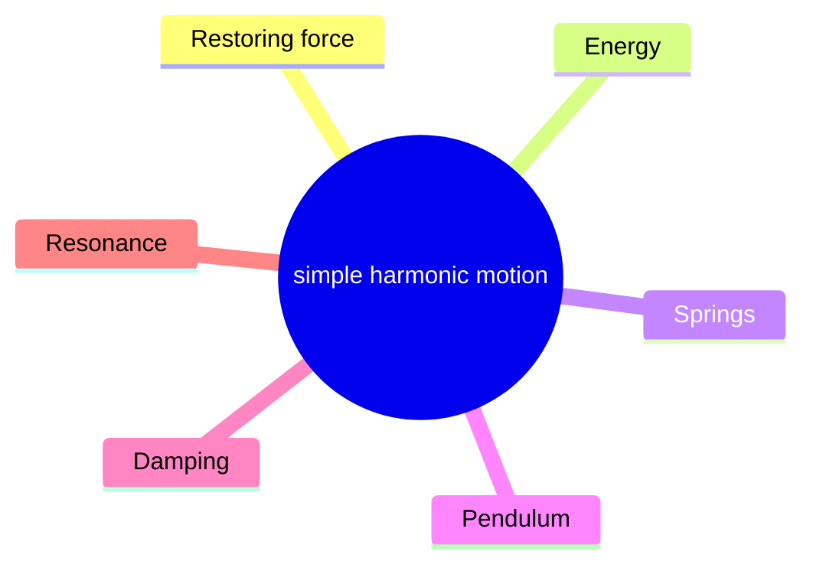
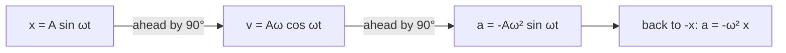
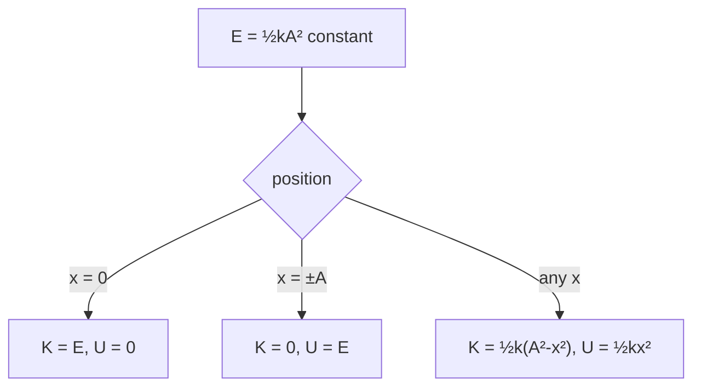
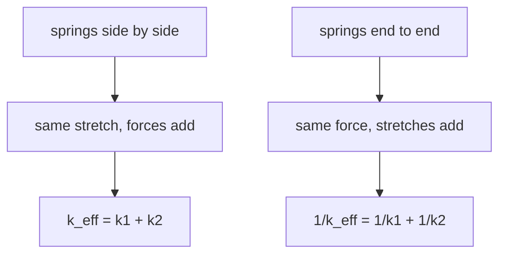
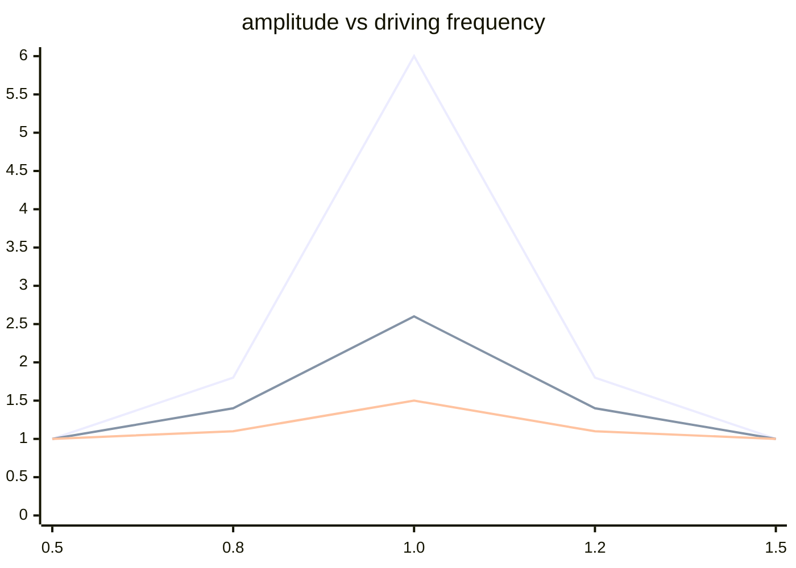
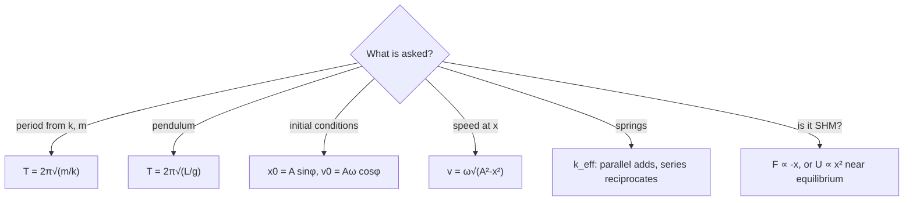

# Simple Harmonic Motion — first principles to Olympiad

> [!abstract] How to use this chapter
> Three passes. Pass 1: Parts 0–4 — the defining equation $a=-\omega^2 x$, the SHM solution, energy in SHM, the spring-mass system, and the simple pendulum. Pass 2: Parts 5–9 for exam craft. Pass 3: Parts 10–14 — the Olympiad layer (LCR circuits as SHM analogy, damped and driven oscillations, resonance, coupled oscillators, normal modes), the paper, the sheet, the checkpoint. Every number recomputed; every boxed result carries its validity condition.

## Part 0 · Orientation

### 0.1 What you will be able to do

After this chapter you can: write and solve the SHM differential equation; derive the period of a spring-mass system and a simple pendulum; use energy methods for SHM problems; analyse superposition of SHMs (same and different frequencies); determine when a system executes SHM (small oscillations); solve damped and driven oscillation problems.

### 0.2 The one idea

Any system near a stable equilibrium oscillates with a frequency determined by the curvature of the potential energy well.

### 0.3 Prerequisite self-check

You need PART 6 (energy, $F=-dU/dx$) and basic calculus (solving $d^2x/dt^2=-\omega^2 x$). If you can take a second derivative and use $F=ma$, you are ready.

### 0.4 Exam orientation

JEE Advanced treats SHM as a high-frequency topic — 2–4 questions per year. The problems test: finding the time period from force/energy, superposition of SHMs, phase, and the conditions for SHM. INPhO and IPhO test: coupled oscillators, normal modes, damped/driven oscillations, and resonance. The trap density is high: confusing amplitude with displacement, using $T=2\pi\sqrt{m/k}$ for a pendulum (wrong $k$), forgetting the small-angle condition, and misidentifying the equilibrium position.

The most important skill in SHM is identifying the equilibrium position. For a vertical spring, the equilibrium is at $x_0=mg/k$ below the natural length — not at the natural length. For a pendulum, the equilibrium is at the bottom of the arc. The oscillation is always about the equilibrium, not about the point of zero force.

The second most important skill is identifying whether a system actually executes SHM. The test is simple: is the restoring force proportional to the displacement from equilibrium? If $F=-kx$ (or $F\propto-x$), it is SHM. If $F\neq-kx$, it is periodic but not simple harmonic. For a pendulum, $F=-mg\sin\theta$, which is proportional to $\theta$ only for small angles.

### 0.5 What this chapter is not

Not a waves chapter — the physics of waves is PART 11. Not a damped/driven-oscillation deep-dive — we cover the essentials here but the full theory (Q-factor, bandwidth, impedance matching) belongs in the waves chapter. Not a Fourier analysis chapter — while SHM is the basis of Fourier decomposition, the full theory belongs in the mathematical methods section. This chapter focuses on the mechanics of oscillating systems: how to find the period, amplitude, and energy of oscillations, and how to identify when a system executes SHM.

### 0.6 Key skills to develop from this chapter

The most valuable skills from this chapter are: (1) recognising SHM in disguise — a vertical spring, a floating cylinder, a torsion wire; (2) using energy methods to find the speed at any point; (3) combining springs (series and parallel) and finding the effective spring constant; (4) superposing two SHMs using phasor diagrams; (5) finding the period from the potential energy function $U(x)$ using $T=2\pi\sqrt{m/U''(x_0)}$. These skills appear in every subsequent physics course, from waves to quantum mechanics to electrical engineering.

### 0.6 Syllabus coverage map

| # | Cengage section | What it establishes | Where it lives here | Status |
|---:|---|---|---|---|
| 1 | The SHM equation | $a=-\omega^2 x$ | §3.1 | full |
| 2 | Solution methods | $x=A\sin(\omega t+\phi)$ | §3.2 | full |
| 3 | Velocity and acceleration | $v$, $a$ from the solution | §3.3 | full |
| 4 | Energy in SHM | $E=\tfrac12 kA^2$ | §3.4 | full |
| 5 | Spring-mass | $T=2\pi\sqrt{m/k}$ | §3.5 | full |
| 6 | Simple pendulum | $T=2\pi\sqrt{L/g}$ | §3.6 | full |
| 7 | Physical pendulum | $T=2\pi\sqrt{I/(mgh)}$ | §3.7 | full |
| 8 | Superposition | Same frequency, different frequencies | §3.8 | full |
| 9 | Damped oscillations | $\gamma$, underdamped/critical/overdamped | §3.9 | full |
| 10 | Driven oscillations | Resonance | §3.10 | full |
| 11 | Coupled oscillators | Normal modes | §3.11 | full |

## Part 1 · Intuition first

**A system displaced from equilibrium experiences a restoring force proportional to the displacement.** This is the defining condition for SHM: $F=-kx$, or equivalently $a=-\omega^2 x$. The solution is a sinusoidal oscillation: $x=A\sin(\omega t+\phi)$.

**The period depends only on the system properties, not on the amplitude.** For a spring-mass system, $T=2\pi\sqrt{m/k}$ — a larger amplitude means a longer path but a higher average speed, and the two effects exactly cancel. This is the hallmark of SHM.

**Energy oscillates between kinetic and potential.** The total energy $E=\frac{1}{2}kA^2$ is constant (for undamped SHM). At the extremes ($x=\pm A$), all energy is potential. At $x=0$, all energy is kinetic.

**Any system near a stable equilibrium executes SHM for small displacements.** The "spring constant" is $k=U''(x_0)$, the second derivative of the PE at the equilibrium point. This is why pendulums, atoms in a crystal, and LC circuits all oscillate sinusoidally.

> [!abstract] DIAGRAM D10.1 · SHM sinusoidal waveform — displacement, velocity and acceleration
> *Show:* three panels. Top: $x(t)=A\sin\omega t$. Middle: $v(t)=A\omega\cos\omega t$ (leads $x$ by $90°$). Bottom: $a(t)=-A\omega^2\sin\omega t$ (leads $v$ by $90°$, opposite to $x$). Mark the phase relationships.
> *Search:* "SHM displacement velocity acceleration phase relationship graph"

> [!tip] FIGURE F10.1 · Chapter map
> *Why:* the chapter is one equation $a=-\omega^2 x$ played out across springs, pendulums, energy and resonance; the map shows the spine.
> *Data:* the Part 0–14 structure — the SHM condition, energy, springs, pendulums, damping, resonance, coupled modes, paper, sheet.

> *Read:* every result is $\omega=\sqrt{k/m}$, an energy share, or a resonance peak.

## Part 2 · Definitions and bookkeeping

| Symbol | Meaning | SI unit |
|---|---|---|
| $x$ | displacement from equilibrium | m |
| $A$ | amplitude | m |
| $\omega$ | angular frequency | rad/s |
| $f$ | frequency $=\omega/(2\pi)$ | Hz |
| $T$ | period $=1/f=2\pi/\omega$ | s |
| $\phi$ | initial phase | rad |
| $k$ | spring constant (or effective spring constant) | N/m |
| $E$ | total mechanical energy | J |
| $\gamma$ | damping coefficient | s$^{-1}$ |

> [!info] Bookkeeping rules
> Displacement $x$ is measured from the equilibrium position (not from the point of zero force — these are the same for a horizontal spring, but different for a vertical spring where the equilibrium is at $x_0=mg/k$ below the natural length). The phase $\phi$ is set by initial conditions: if $x(0)=0$ and $v(0)>0$, then $\phi=0$.

## Part 3 · Core derivations

### 3.1 The SHM equation

$$
\frac{d^2 x}{dt^2}=-\omega^2 x. \qquad (3.1)
$$

This is the defining equation. Any motion satisfying this equation is SHM with angular frequency $\omega$.

**Physical origin:** $F=-kx$ (Hooke's law) gives $a=-(k/m)x$, so $\omega=\sqrt{k/m}$.

### 3.2 The general solution

$$
x(t)=A\sin(\omega t+\phi). \qquad (3.2)
$$

$A$ and $\phi$ are determined by initial conditions. Alternatively: $x(t)=C_1\cos\omega t+C_2\sin\omega t$.

### 3.3 Velocity and acceleration

$$
v(t)=A\omega\cos(\omega t+\phi)=\omega\sqrt{A^2-x^2}. \qquad (3.3)
$$

$$
a(t)=-A\omega^2\sin(\omega t+\phi)=-\omega^2 x. \qquad (3.4)
$$

> [!abstract] DIAGRAM D10.2 · The SHM phasor diagram
> *Show:* a circle of radius $A$. A phasor (radius) rotates at angular speed $\omega$. The projection on the vertical axis is $x$. The velocity $v$ is the projection of a phasor of length $A\omega$ (rotated $90°$ ahead). The acceleration $a$ is the projection of a phasor of length $A\omega^2$ (rotated $180°$ from $x$, i.e., antiparallel).
> *Search:* "SHM phasor diagram circle projection velocity acceleration"

### 3.4 Energy in SHM

> [!tip] FIGURE F10.2 · The phase ladder: v leads x, a leads v
> *Why:* the three sinusoids differ only by quarter-turns; the ladder fixes which leads which before any value is read.
> *Data:* $x=A\sin\omega t$, $v=A\omega\cos\omega t$ (leads $x$ by $90°$), $a=-A\omega^2\sin\omega t$ (opposite to $x$).

> *Read:* velocity is always a quarter-cycle ahead of displacement, acceleration another quarter — so acceleration always points back at equilibrium.

$$
E=\frac{1}{2}kA^2=\frac{1}{2}m\omega^2 A^2. \qquad (3.5)
$$

$$
K(x)=\frac{1}{2}k(A^2-x^2),\qquad U(x)=\frac{1}{2}kx^2. \qquad (3.6)
$$

> [!abstract] DIAGRAM D10.3 · Energy versus displacement in SHM
> *Show:* $U=\frac{1}{2}kx^2$ (parabola), $K=\frac{1}{2}k(A^2-x^2)$ (inverted parabola), $E=$ constant (horizontal line). At $x=\pm A$: $U=E$, $K=0$. At $x=0$: $U=0$, $K=E$. The energies exchange at every instant.
> *Search:* "energy versus displacement simple harmonic motion kinetic potential graph"

> [!tip] FIGURE F10.3 · Energy exchange: all kinetic in the middle, all potential at the ends
> *Why:* the energy bookkeeping of every oscillation — the two shares trade without ever changing the total.
> *Data:* $K=\tfrac12 k(A^2-x^2)$ and $U=\tfrac12 kx^2$, so $E=K+U=\tfrac12 kA^2$ constant.

> *Read:* the box holds a fixed total; the oscillator just pours it back and forth between the spring and the motion.

### 3.5 Spring-mass system

$$
T=2\pi\sqrt{\frac{m}{k}}. \qquad (3.7)
$$

**Springs in series:** $1/k_{\text{eff}}=1/k_1+1/k_2+\cdots$

**Springs in parallel:** $k_{\text{eff}}=k_1+k_2+\cdots$

> [!abstract] DIAGRAM D10.4 · Series and parallel spring configurations
> *Show:* left: two springs in series (one after the other, same force, displacements add). Right: two springs in parallel (side by side, same displacement, forces add). The effective spring constants shown.
> *Search:* "springs in series parallel effective spring constant diagram"

> [!tip] FIGURE F10.4 · Springs: parallel adds, series reciprocates
> *Why:* the period is always $2\pi\sqrt{m/k_{\text{eff}}}$ — the only work is finding $k_{\text{eff}}$; the figure fixes which rule goes with which wiring.
> *Data:* parallel $k_{\text{eff}}=k_1+k_2$; series $\frac{1}{k_{\text{eff}}}=\frac1{k_1}+\frac1{k_2}$.

> *Read:* parallel is the recipe for stiffer; series is the recipe for softer — then $T=2\pi\sqrt{m/k_{\text{eff}}}$ handles both.

### 3.6 Simple pendulum

For a pendulum of length $L$ and small angle $\theta$:

$$
T=2\pi\sqrt{\frac{L}{g}}. \qquad (3.8)
$$

**Validity condition:** $\theta\ll1$ rad (about $10°$ or less). For larger angles, the period increases: $T\approx T_0(1+\theta_0^2/16)$.

> [!abstract] DIAGRAM D10.5 · Simple pendulum with the restoring force decomposition
> *Show:* a pendulum at angle $\theta$ from vertical. The weight $mg$ resolved into: a component along the arc ($-mg\sin\theta$) and a component along the string (tension minus $mg\cos\theta$). For small $\theta$: $\sin\theta\approx\theta$, so the restoring "force" along the arc is $-mg\theta=-mgx/L=-kx$ with $k=mg/L$.
> *Search:* "simple pendulum restoring force small angle approximation diagram"

### 3.7 Physical pendulum

For a rigid body pivoted at a distance $d$ from the COM, with moment of inertia $I$ about the pivot:

$$
T=2\pi\sqrt{\frac{I}{mgh}}. \qquad (3.9)
$$

where $h=d$ is the distance from the pivot to the COM.

### 3.8 Superposition of SHMs

**Same direction, same frequency:** the resultant is SHM with the same frequency. Phasor addition.

**Same direction, different frequencies:** beats. The beat frequency is $f_{\text{beat}}=|f_1-f_2|$.

**Perpendicular SHMs:** Lissajous figures. The shape depends on the frequency ratio and the phase difference.

> [!abstract] DIAGRAM D10.6 · Lissajous figures for common frequency ratios
> *Show:* a $3\times3$ grid of Lissajous figures. Rows: $\omega_y/\omega_x=1,2,3$. Columns: phase difference $\delta=0,\pi/4,\pi/2$. The figures range from straight lines (1:1, $\delta=0$) to circles (1:1, $\delta=\pi/2$) to figure-eights (2:1, $\delta=\pi/4$) to complex curves (3:1).
> *Search:* "Lissajous figures frequency ratio phase difference grid"

### 3.9 Damped oscillations

$$
m\ddot{x}+b\dot{x}+kx=0. \qquad (3.10)
$$

With $\gamma=b/(2m)$ and $\omega_0=\sqrt{k/m}$:

- **Underdamped** ($\gamma<\omega_0$): $x=Ae^{-\gamma t}\cos(\omega' t+\phi)$, where $\omega'=\sqrt{\omega_0^2-\gamma^2}$.
- **Critically damped** ($\gamma=\omega_0$): fastest return to equilibrium without oscillation.
- **Overdamped** ($\gamma>\omega_0$): slow return without oscillation.

### 3.10 Driven oscillations and resonance

$$
m\ddot{x}+b\dot{x}+kx=F_0\cos\omega t. \qquad (3.11)
$$

The steady-state amplitude:

$$
A(\omega)=\frac{F_0/m}{\sqrt{(\omega_0^2-\omega^2)^2+(2\gamma\omega)^2}}. \qquad (3.12)
$$

**Resonance** at $\omega=\omega_0$ (approximately — the exact peak is at $\omega=\sqrt{\omega_0^2-2\gamma^2}$).

> [!abstract] DIAGRAM D10.7 · The resonance curve — amplitude vs driving frequency
> *Show:* $A(\omega)$ vs $\omega/\omega_0$ for three values of damping $\gamma$: small (sharp peak), medium, and large (broad, low peak). The peak shifts slightly below $\omega_0$ for larger $\gamma$. The $Q$-factor $=\omega_0/(2\gamma)$ indicated.
> *Search:* "resonance amplitude versus driving frequency damping curves graph"

> [!tip] FIGURE F10.5 · Resonance: small damping, tall sharp peak
> *Why:* every forced-oscillator question is about the peak's height and width; the figure keys both to the damping.
> *Data:* peak near $\omega=\omega_0$ (exactly at $\omega_0$ for $\gamma\to0$); quality factor $Q=\omega_0/(2\gamma)$ sets height and width.

> *Read:* light damping makes a needle-sharp spike at the natural frequency; heavy damping flattens and lowers it — the amplitude never grows without bound.

### 3.11 Coupled oscillators and normal modes

When two oscillating systems are connected (coupled), they exchange energy. The system has normal modes — patterns of oscillation where all parts move at the same frequency. Any motion is a superposition of these normal modes. For two identical pendulums coupled by a spring: the system has two normal modes:
1. **In-phase mode:** both pendulums swing together; the spring is unstretched. Frequency $\omega_1=\sqrt{g/L}$.
2. **Out-of-phase mode:** pendulums swing in opposite directions; the spring adds to the restoring force. Frequency $\omega_2=\sqrt{g/L+k/m}$ (higher).

Any motion is a superposition of these two normal modes. This decomposition into normal modes is one of the most powerful techniques in physics — it works for any number of coupled oscillators, for vibrating strings, and for electromagnetic cavities.

> [!abstract] DIAGRAM D10.8 · The two normal modes of coupled pendulums
> *Show:* left: in-phase mode — both pendulums displaced the same way, spring relaxed. Right: out-of-phase mode — pendulums displaced oppositely, spring stretched/compressed. The frequencies labelled.
> *Search:* "coupled pendulums normal modes in-phase out-of-phase diagram"

## Part 4 · Results, limits and the validity ledger

### 4.1 Boxed results

$$
\boxed{x(t)=A\sin(\omega t+\phi),\quad v=\omega\sqrt{A^2-x^2},\quad a=-\omega^2 x} \qquad (4.1)
$$

$$
\boxed{T=2\pi\sqrt{\frac{m}{k}}\text{ (spring-mass)},\quad T=2\pi\sqrt{\frac{L}{g}}\text{ (pendulum, small angle)}} \qquad (4.2)
$$

$$
\boxed{E=\frac{1}{2}kA^2} \qquad (4.3)
$$

$$
\boxed{k_{\text{eff}}=k_1+k_2\text{ (parallel)},\quad\frac{1}{k_{\text{eff}}}=\frac{1}{k_1}+\frac{1}{k_2}\text{ (series)}} \qquad (4.4)
$$

### 4.2 Limit checks

- $k\to\infty$: $T\to0$ — infinitely stiff spring, infinitely fast oscillation. ✓
- $m\to\infty$: $T\to\infty$ — infinitely massive object, infinitely slow. ✓
- $g\to\infty$: $T\to0$ (pendulum) — infinitely strong gravity, infinitely fast. ✓
- $L\to0$: $T\to0$ (pendulum) — zero-length pendulum, zero period. ✓
- $\gamma\to0$: damped → undamped, $\omega'\to\omega_0$. ✓

### 4.3 Which formula when

| Given | Need | Use |
|---|---|---|
| $F=-kx$ | period | $T=2\pi\sqrt{m/k}$ |
| Pendulum, small $\theta$ | period | $T=2\pi\sqrt{L/g}$ |
| Physical pendulum | period | $T=2\pi\sqrt{I/(mgh)}$ |
| Initial $x_0$, $v_0$ | amplitude, phase | $A=\sqrt{x_0^2+v_0^2/\omega^2}$ |
| Maximum speed | $v_{\max}=A\omega$ | Eq. (4.1) |
| Springs in combination | $k_{\text{eff}}$ | Eq. (4.4) |
| Energy at position $x$ | $K$, $U$ | Eq. (3.6) |

### 4.4 Concept checks

**C1 — concept check.** Why is $T$ independent of amplitude for SHM?

Answer

A larger amplitude means a longer path but also a stronger average restoring force (and hence higher average speed). For a $F=-kx$ force, these two effects exactly cancel, making $T$ independent of $A$.

**C2 — concept check.** Is a pendulum truly SHM?

Answer

Only for small angles. For $\theta\ll1$, $\sin\theta\approx\theta$, and the pendulum equation becomes $\ddot{\theta}=-(g/L)\theta$, which is SHM. For larger angles, the motion is periodic but not simple harmonic.

**C3 — concept check.** Where is the KE maximum in SHM?

Answer

At the equilibrium position ($x=0$), where the potential energy is zero and all energy is kinetic.

**C4 — concept check.** Can a system have SHM if the force is $F=-kx^3$?

Answer

No — the motion is periodic but not simple harmonic (the period depends on amplitude). SHM requires $F\propto-x$.

**C5 — concept check.** How do you find $A$ and $\phi$ from initial conditions?

Answer

$A=\sqrt{x_0^2+v_0^2/\omega^2}$ and $\tan\phi=v_0/(\omega x_0)$ (adjusted for quadrant). Or use $x_0=A\sin\phi$ and $v_0=A\omega\cos\phi$.

**C6 — concept check.** Why does the vertical spring-mass have the same period as the horizontal one?

Answer

Gravity shifts the equilibrium point but doesn't change the "spring constant" $k$. The oscillation is about the new equilibrium, and the restoring force is still $-kx$ where $x$ is measured from that equilibrium.

**C7 — concept check.** What happens to the period if the length of a pendulum is doubled?

Answer

$T\propto\sqrt{L}$, so $T$ increases by $\sqrt{2}\approx1.41$.

**C8 — concept check.** Why is critical damping used in car suspension?

Answer

It returns the car to equilibrium fastest without oscillating — the optimal compromise between speed and overshoot.

**C9 — concept check.** At resonance, is the amplitude infinite?

Answer

No — damping limits the amplitude. For zero damping, the amplitude would be infinite (in the idealised model). In practice, the amplitude is $A_{\text{max}}=F_0/(2\gamma m\omega_0)$ at resonance.

**C10 — concept check.** Two coupled pendulums have two normal modes. Can they oscillate at other frequencies?

Answer

No — any motion is a superposition of the two normal modes. The frequencies present are always $\omega_1$ and $\omega_2$ (and their sum/difference if nonlinear effects are present).

**C11 — concept check.** A particle in a potential well $U(x)$ oscillates. Is it always SHM?

Answer

Only for small displacements where $U(x)\approx\frac{1}{2}U''(x_0)(x-x_0)^2$. For larger displacements, the oscillation is periodic but not simple harmonic. The key test is: does $U(x)$ have a non-zero second derivative at the equilibrium? If $U''(x_0)>0$, the equilibrium is stable and the motion is approximately SHM for small displacements. If $U''(x_0)=0$ (as for $U=x^4$), the motion is anharmonic even for small displacements. If $U''(x_0)<0$, the equilibrium is unstable and there is no oscillation.

**C12 — concept check.** The $Q$-factor is $Q=\omega_0/(2\gamma)$. What does it measure?

Answer

The number of oscillations before the amplitude drops by a factor of $e$. High $Q$ means low damping and a sharp resonance peak.

## Part 5 · Worked exemplars

### E1 — Period of a spring-mass system

A 2 kg mass on a spring with $k=800$ N/m. Find $T$, $f$, $\omega$.

> [!success] Check
> $\omega=\sqrt{k/m}=\sqrt{400}=20$ rad/s. $T=2\pi/\omega=0.314$ s. $f=1/T=3.18$ Hz.

Solution

**Method.** $\omega=\sqrt{800/2}=20$ rad/s. $T=2\pi/20=0.314$ s. $f=3.18$ Hz.

### E2 — Amplitude from initial conditions

A mass on a spring ($k=500$ N/m, $m=2$ kg) is released from $x_0=0.1$ m with $v_0=1$ m/s. Find $A$.

> [!success] Check
> $\omega=\sqrt{250}=15.81$ rad/s. $A=\sqrt{x_0^2+v_0^2/\omega^2}=\sqrt{0.01+1/250}=\sqrt{0.014}=0.118$ m.

Solution

**Method.** $A=\sqrt{0.1^2+(1/15.81)^2}=\sqrt{0.01+0.004}=0.118$ m.

### E3 — Period of a simple pendulum

Find the period of a pendulum of length 1 m on Earth. ($g=9.8$ m/s$^2$.)

> [!success] Check
> $T=2\pi\sqrt{1/9.8}=2\pi\times0.3194=2.006$ s $\approx2$ s.

Solution

**Method.** $T=2\pi\sqrt{L/g}=2\pi\sqrt{1/9.8}=2.006$ s.

### E4 — Energy in SHM

A 0.5 kg mass oscillates on a spring ($k=200$ N/m) with amplitude 0.05 m. Find $E$, $v_{\max}$, and $v$ at $x=0.03$ m.

> [!success] Check
> $E=\frac{1}{2}\times200\times0.0025=0.25$ J. $v_{\max}=A\omega=0.05\times20=1$ m/s. $v=\omega\sqrt{A^2-x^2}=20\sqrt{0.0025-0.0009}=20\times0.04=0.8$ m/s.

Solution

**Method.** $\omega=\sqrt{k/m}=\sqrt{400}=20$ rad/s. $E=\frac{1}{2}kA^2=0.25$ J. $v_{\max}=A\omega=1$ m/s. $v=\omega\sqrt{A^2-x^2}=0.8$ m/s.

### E5 — Springs in series and parallel

Two springs $k_1=100$ N/m and $k_2=200$ N/m. Find $k_{\text{eff}}$ in series and parallel.

> [!success] Check
> Parallel: $k_{\text{eff}}=300$ N/m. Series: $1/k_{\text{eff}}=1/100+1/200=3/200$, so $k_{\text{eff}}=66.7$ N/m.

Solution

**Method.** Parallel: $k_{\text{eff}}=k_1+k_2=300$ N/m. Series: $1/k_{\text{eff}}=1/k_1+1/k_2=3/200$, $k_{\text{eff}}=200/3=66.7$ N/m.

### E6 — Pendulum on the Moon

A pendulum of length 1 m on the Moon ($g=1.6$ m/s$^2$). Find $T$.

> [!success] Check
> $T=2\pi\sqrt{1/1.6}=2\pi\times0.7906=4.97$ s.

Solution

**Method.** $T=2\pi\sqrt{L/g}=2\pi\sqrt{1/1.6}=4.97$ s. Much longer than on Earth (2.0 s).

### E7 — Physical pendulum

A uniform rod of length $L$ is pivoted at one end. Find $T$.

> [!success] Check
> $I=mL^2/3$, $h=L/2$. $T=2\pi\sqrt{mL^2/(3\times mgL/2)}=2\pi\sqrt{2L/(3g)}$.

Solution

**Method.** $I=mL^2/3$ about the end, $h=L/2$. $T=2\pi\sqrt{I/(mgh)}=2\pi\sqrt{2L/(3g)}$.

### E8 — Superposition of two SHMs

$x_1=3\sin(10t)$ and $x_2=4\sin(10t+\pi/2)$. Find the amplitude of the resultant.

> [!success] Check
> Amplitude $=\sqrt{3^2+4^2}=5$ (by phasor addition, same frequency). Phase $=\tan^{-1}(4/3)$ ahead of $x_1$.

Solution

**Method.** Same frequency, $90°$ phase difference. Phasor amplitude $=\sqrt{9+16}=5$. The resultant is $x=5\sin(10t+\phi)$ where $\phi=\tan^{-1}(4/3)\approx53.1°$.

### E9 — Damped oscillation

A mass on a spring ($\omega_0=10$ rad/s) has damping coefficient $\gamma=1$ s$^{-1}$. Find the period and the number of oscillations before the amplitude drops to $1/e$.

> [!success] Check
> $\omega'=\sqrt{100-1}=\sqrt{99}=9.95$ rad/s. $T=2\pi/9.95=0.631$ s. Number of oscillations $=1/(2\gamma T... wait$. The amplitude drops by $1/e$ after time $1/\gamma=1$ s. Number of oscillations $=1/(0.631)=1.58$ oscillations.

Solution

**Method.** $\omega'=\sqrt{\omega_0^2-\gamma^2}=9.95$ rad/s. $T'=0.631$ s. The amplitude drops to $1/e$ at $t=1/\gamma=1$ s. Number of oscillations $=1/0.631=1.58$.

### E10 — Finding the period from $U(x)$

A particle in the potential $U(x)=ax^4$ oscillates with small amplitude $A$. Find the period (approximately).

> [!success] Check
> The force $F=-4ax^3$. This is not $F\propto-x$, so the motion is NOT SHM. However, for order-of-magnitude estimates, we can define an effective $\omega^2$ from the curvature at the equilibrium... but $U''(0)=0$, so there is no quadratic term. The motion is periodic but the period *does* depend on amplitude. By dimensional analysis: $T\propto\sqrt{m/a}/A$... this needs a more careful analysis using elliptic integrals.

Solution

**Method.** For $U=ax^4$: $F=-4ax^3$. This is a nonlinear oscillator. The period depends on amplitude. By energy conservation: $\frac{1}{2}m\dot{x}^2+ax^4=aA^4$. $\dot{x}=\sqrt{2a(A^4-x^4)/m}$. $T=4\int_0^A dx/\sqrt{2a(A^4-x^4)/m}$. By the substitution $x=Au$: $T=4A\int_0^1 du/\sqrt{2aA^4(1-u^4)/m}=4/(A\sqrt{2a/m})\int_0^1 du/\sqrt{1-u^4}$. The integral is a Beta function. $T\propto1/A$ — the period *decreases* with amplitude for a hardening spring.

## Part 6 · Problem archetypes and practice

| # | Archetype | Template | Where worked | Variations |
|---:|---|---|---|---|
| 1 | Spring-mass period | $T=2\pi\sqrt{m/k}$ | E1 | series/parallel |
| 2 | Amplitude from IC | $A=\sqrt{x_0^2+v_0^2/\omega^2}$ | E2 | phase too |
| 3 | Pendulum period | $T=2\pi\sqrt{L/g}$ | E3 | different planets |
| 4 | Energy in SHM | $E=\frac{1}{2}kA^2$ | E4 | at any $x$ |
| 5 | Spring combinations | series/parallel | E5 | 3+ springs |
| 6 | Physical pendulum | $T=2\pi\sqrt{I/(mgh)}$ | E7 | compound pendulum |
| 7 | Superposition | phasor addition | E8 | beats, Lissajous |
| 8 | Damped oscillation | $\omega'=\sqrt{\omega_0^2-\gamma^2}$ | E9 | critical damping |
| 9 | Period from $U(x)$ | $k=U''(x_0)$, $T=2\pi\sqrt{m/k}$ | E10 | any potential |
| 10 | Coupled oscillators | normal modes | §3.11 | $n$-coupled |

### 6.2 In-flow practice

#### Q1. A 0.5 kg mass on a spring ($k=125$ N/m). Find $T$.

Solution

$T=2\pi\sqrt{0.5/125}=2\pi\times0.0632=0.397$ s.

#### Q2. A pendulum has $T=2$ s on Earth. Find its length.

Solution

$L=gT^2/(4\pi^2)=9.8\times4/(4\pi^2)=9.8/\pi^2=0.993$ m $\approx1$ m (the "seconds pendulum").

#### Q3. A mass oscillates with $x=0.2\sin(5t+\pi/3)$. Find $A$, $\omega$, $f$, $T$, $\phi$.

Solution

$A=0.2$ m, $\omega=5$ rad/s, $f=5/(2\pi)=0.796$ Hz, $T=1.257$ s, $\phi=\pi/3$.

#### Q4. Find the maximum speed of a mass oscillating with $A=0.1$ m and $\omega=10$ rad/s.

Solution

$v_{\max}=A\omega=1$ m/s.

#### Q5. Three springs $k$, $2k$, $3k$ in parallel. Find $k_{\text{eff}}$.

Solution

$k_{\text{eff}}=k+2k+3k=6k$.

#### Q6. A pendulum of length 0.5 m on a planet where $g=4$ m/s$^2$. Find $T$.

Solution

$T=2\pi\sqrt{0.5/4}=2\pi\times0.3536=2.22$ s.

#### Q7. A mass $m$ on a spring oscillates with $E=0.5$ J and $A=0.1$ m. Find $k$.

Solution

$k=2E/A^2=1/0.01=100$ N/m.

#### Q8. At what displacement is the KE equal to the PE in SHM?

Solution

$\frac{1}{2}kx^2=\frac{1}{2}k(A^2-x^2)$. $x^2=A^2/2$. $x=A/\sqrt{2}\approx0.707A$.

#### Q9. A physical pendulum is a uniform disk of radius $R$ pivoted at its rim. Find $T$.

Solution

$I=mR^2/2+mR^2=3mR^2/2$ (parallel axis theorem). $h=R$. $T=2\pi\sqrt{3mR^2/(2mgR)}=2\pi\sqrt{3R/(2g)}$.

#### Q10. Two SHMs: $x_1=5\sin(10t)$ and $x_2=5\sin(10t+\pi)$. What is the resultant?

Solution

$x_1+x_2=0$. The two SHMs cancel exactly (antiphase, equal amplitude).

#### Q11. A damped oscillator has $\omega_0=100$ rad/s and $\gamma=10$ s$^{-1}$. Find $\omega'$ and $Q$.

Solution

$\omega'=\sqrt{10000-100}=\sqrt{9900}=99.5$ rad/s. $Q=\omega_0/(2\gamma)=100/20=5$.

#### Q12. A 1 kg mass on a spring ($k=400$ N/m) is at $x=0.05$ m with $v=0.5$ m/s. Find $A$.

Solution

$\omega=20$ rad/s. $A=\sqrt{0.0025+0.25/400}=\sqrt{0.0025+0.000625}=\sqrt{0.003125}=0.0559$ m.

#### Q13. Find the frequency of a seconds pendulum ($T=2$ s).

Solution

$f=1/T=0.5$ Hz.

#### Q14. A pendulum clock runs slow. Should you increase or decrease $L$?

Solution

"Running slow" means $T$ is too large. $T\propto\sqrt{L}$, so decrease $L$.

#### Q15. A mass on a vertical spring ($k=200$ N/m, $m=0.5$ kg). Find the equilibrium extension and the period.

Solution

$x_0=mg/k=0.5\times9.8/200=0.0245$ m. $T=2\pi\sqrt{m/k}=2\pi\sqrt{0.0025}=0.314$ s (same as horizontal).

#### Q16. A 2 kg mass on a spring oscillates with $v_{\max}=2$ m/s and $E=4$ J. Find $A$ and $k$.

Solution

$E=\frac{1}{2}mv_{\max}^2=\frac{1}{2}\times2\times4=4$ J ✓. $A=v_{\max}/\omega$. $k=2E/A^2$. Also $\omega=v_{\max}^2/(2E/m)=4/(4/2)=2$ rad/s. $A=2/2=1$ m. $k=m\omega^2=2\times4=8$ N/m.

#### Q17. Two springs $k_1$ and $k_2$ support a mass $m$ in series. Find $T$.

Solution

$k_{\text{eff}}=k_1k_2/(k_1+k_2)$. $T=2\pi\sqrt{m(k_1+k_2)/(k_1k_2)}$.

#### Q18. A mass on a spring is pulled to $x=2A$ and released. Is it still SHM?

Solution

Yes — SHM doesn't depend on the amplitude (as long as the spring doesn't go nonlinear). $x=2A$ just means a larger amplitude.

#### Q19. A seconds pendulum is taken to a mountain where $g=9.78$ m/s$^2$. Find $T$.

Solution

$T=2\pi\sqrt{L/g}=2\pi\sqrt{0.993/9.78}=2\pi\times0.3188=2.003$ s. Slightly longer.

#### Q20. Find the time for a critically damped oscillator ($\gamma=\omega_0$) to reach $1/e$ of its initial displacement.

Solution

For critical damping: $x=(A+Bt)e^{-\gamma t}$. With $x(0)=A$, $v(0)=0$: $x=A(1+\gamma t)e^{-\gamma t}$. Setting $x=A/e$: $(1+\gamma t)e^{-\gamma t}=1/e$. This gives $\gamma t\approx1.54$ (solved numerically). $t=1.54/\gamma$.

#### Q21. A particle in $U(x)=\frac{1}{2}kx^2+bx^4$ (small $b$). Does the period depend on amplitude?

Solution

Yes — the $bx^4$ term makes the oscillator anharmonic. For small amplitudes, the period is approximately $T_0(1+3bA^2/(2k)+\cdots)$. The period increases (softening) or decreases (hardening) depending on the sign of $b$.

#### Q22. A mass hangs from two springs in parallel ($k_1=100$, $k_2=200$ N/m). Find $T$.

Solution

$k_{\text{eff}}=300$ N/m. $T=2\pi\sqrt{m/300}$.

#### Q23. A pendulum has $T=1$ s. Find the equivalent length on Mars ($g=3.7$ m/s$^2$).

Solution

$T=2\pi\sqrt{L/g}=1$. $L=gT^2/(4\pi^2)=3.7/(4\pi^2)=0.0937$ m $=9.37$ cm.

#### Q24. A mass $m$ on a spring ($k$) is given an impulse $J$. Find the amplitude.

Solution

$v_0=J/m$. $A=v_0/\omega=J/(m\omega)=J/\sqrt{mk}$.

#### Q25. At $t=0$, a mass is at $x=A/2$ moving toward equilibrium. Find $\phi$.

Solution

$x(0)=A\sin\phi=A/2$, so $\sin\phi=1/2$, $\phi=\pi/6$ or $5\pi/6$. $v(0)=A\omega\cos\phi<0$ (toward equilibrium means toward $x=0$, so $\cos\phi<0$). $\phi=5\pi/6$.

## Part 7 · Alternate methods and the JEE-Advanced advantage toolkit

### 7.1 Energy methods for SHM

Instead of solving $d^2x/dt^2=-\omega^2 x$, use energy conservation: $\frac{1}{2}kx^2+\frac{1}{2}m\dot{x}^2=\frac{1}{2}kA^2$. Solve for $\dot{x}$ and integrate. This is especially useful when you need the speed at a particular displacement, or the period for a nonlinear oscillator (by integration).

> [!abstract] DIAGRAM D10.9 · Energy conservation in SHM: the phase-space ellipse
> *Show:* a plot of $v$ vs $x$. The trajectory is an ellipse with semi-axes $A$ (on the $x$-axis) and $A\omega$ (on the $v$-axis). Each point on the ellipse represents a state of the oscillator. The area of the ellipse is $\pi A\cdot A\omega=2\pi E/\omega$.
> *Search:* "SHM phase space ellipse velocity displacement energy conservation"

### 7.2 The Taylor expansion method

For any potential $U(x)$ near a stable equilibrium $x_0$: $U(x)\approx U(x_0)+\frac{1}{2}U''(x_0)(x-x_0)^2$. The "spring constant" is $k=U''(x_0)$, and the angular frequency is $\omega=\sqrt{U''(x_0)/m}$. This is the most powerful method for finding the frequency of small oscillations about any equilibrium.

### 7.3 Dimensional analysis for SHM

The only combination of $k$ and $m$ that gives a frequency is $\sqrt{k/m}$. The only combination of $L$ and $g$ that gives a time is $\sqrt{L/g}$. Use this to check formulas or to guess the answer before solving.

### 7.4 The effective spring constant

For a vertical spring with mass $m$: the equilibrium extension is $x_0=mg/k$. The oscillation about this new equilibrium has the same $\omega=\sqrt{k/m}$ as the horizontal case. Gravity shifts the equilibrium but does not change the 'spring constant.' This is a general principle: constant forces do not affect the frequency of SHM. The oscillation about this new equilibrium has the same $\omega=\sqrt{k/m}$ as the horizontal case. Gravity shifts the equilibrium but does not change the "spring constant." This is a general principle: constant forces do not affect the frequency of SHM.

## Part 8 · Examiner traps

> [!danger] Trap 1 — Using $T=2\pi\sqrt{m/k}$ for a pendulum
> A pendulum has $T=2\pi\sqrt{L/g}$, not $T=2\pi\sqrt{m/k}$. The "spring constant" of a pendulum is $k=mg/L$, so $T=2\pi\sqrt{m/(mg/L)}=2\pi\sqrt{L/g}$. The mass cancels.

> [!danger] Trap 2 — Forgetting the small-angle condition
> The pendulum formula $T=2\pi\sqrt{L/g}$ is valid only for small angles ($\theta\ll1$ rad, about 10 degrees). For larger angles, the period increases: $T\approx T_0(1+\theta_0^2/16)$. At $30°$, the error is about 1.7%. At $45°$, the error is about 4%. At $60°$, the error is about 7%. For precise measurements, always check whether the small-angle condition is satisfied. The exact period involves elliptic integrals (see OL9).

> [!danger] Trap 3 — Using $\sin\theta\approx\theta$ for large angles
> The small-angle approximation $\sin\theta\approx\theta$ breaks down beyond about 15 degrees. For a pendulum released at $\theta=60°$, the actual period is about 7% longer than $T_0$.

> [!danger] Trap 4 — Confusing amplitude with displacement
> Amplitude $A$ is the maximum displacement. The displacement $x(t)$ oscillates between $-A$ and $+A$. At any instant, $x\neq A$ in general.

> [!danger] Trap 5 — Using $v_{\max}=A\omega$ at all times
> $v_{\max}=A\omega$ is the maximum speed, attained only at $x=0$. At $x=A$, the speed is zero.

> [!danger] Trap 6 — Confusing frequency and angular frequency
> $f=\omega/(2\pi)$. The period is $T=1/f=2\pi/\omega$. Frequency is in Hz; angular frequency is in rad/s.

> [!danger] Trap 7 — Using $T=2\pi\sqrt{L/g}$ for a physical pendulum
> A physical pendulum has $T=2\pi\sqrt{I/(mgh)}$ where $I$ is the moment of inertia about the pivot and $h$ is the distance from the pivot to the COM. The simple-pendulum formula is a special case with $I=mL^2$ and $h=L$.

> [!danger] Trap 8 — Using energy conservation during an impulsive collision
> For a ballistic pendulum (bullet embeds in a block on a string), angular momentum is conserved during the collision (not energy), and energy is conserved during the subsequent swing (not angular momentum — the tension provides a torque).

> [!abstract] DIAGRAM D10.10 · The ballistic pendulum: collision then swing
> *Show:* three phases: (1) a bullet of mass $m$ at speed $v$ approaching a block of mass $M$ on a string of length $L$; (2) the bullet embeds — angular momentum conserved about the pivot; (3) the block+bullet system swings up to height $h$ — energy conserved.
> *Search:* "ballistic pendulum collision swing angular momentum energy conservation diagram"

> [!danger] Trap 9 — Using $T=2\pi\sqrt{m/k}$ for springs in series without adjusting $k$
> For springs in series: $1/k_{\text{eff}}=1/k_1+1/k_2+\cdots$. The effective spring constant is always less than the smallest individual spring. For springs in parallel: $k_{\text{eff}}=k_1+k_2+\cdots$.

> [!danger] Trap 10 — Assuming SHM for a nonlinear restoring force
> If $F\neq-kx$, the motion is periodic but not simple harmonic. The period depends on amplitude. SHM is only an approximation valid for small displacements from stable equilibrium.

> [!abstract] DIAGRAM D10.11 · The nonlinear pendulum: period vs amplitude
> *Show:* a graph of $T/T_0$ vs $\theta_0$ (the release angle). $T/T_0=1$ for small $\theta_0$, then increases gradually. At $\theta_0=90°$, $T/T_0\approx1.18$. At $\theta_0=170°$, $T/T_0\approx3$.
> *Search:* "pendulum period versus amplitude nonlinear correction graph"

## Part 9 · Playbook

### 9.1 Triage decision tree

> [!tip] FIGURE F10.6 · Triage — route by the keyword
> *Why:* the keyword names the route before any number is touched.
> *Data:* the eight triage branches of §9.1.

> *Read:* the period wants the system constants, an initial condition wants the phase, and a speed wants the energy balance.

- "Find $T$ from $k$ and $m$": $T=2\pi\sqrt{m/k}$.
- "Find $T$ for a pendulum": $T=2\pi\sqrt{L/g}$ (small angle).
- "Find $T$ for a physical pendulum": $T=2\pi\sqrt{I/(mgh)}$.
- "Find $A$ and $\phi$ from initial conditions": use $x_0=A\sin\phi$, $v_0=A\omega\cos\phi$.
- "Find $v$ at position $x$": $v=\omega\sqrt{A^2-x^2}$.
- "Find $k_{\text{eff}}$ for springs": parallel adds, series reciprocals add.
- "Is it SHM?": check if $F\propto-x$ (or $U\propto x^2$ near equilibrium).
- "Superposition of two SHMs": same direction uses phasor addition; perpendicular gives Lissajous figures.

### 9.2 Formula map with validity

| Formula | Valid when | Breaks when |
|---|---|---|
| $x=A\sin(\omega t+\phi)$ | SHM ($F=-kx$) | nonlinear force |
| $T=2\pi\sqrt{m/k}$ | spring-mass | not a spring |
| $T=2\pi\sqrt{L/g}$ | simple pendulum, $\theta\ll1$ | large angle |
| $T=2\pi\sqrt{I/(mgh)}$ | physical pendulum | not oscillating |
| $E=\frac{1}{2}kA^2$ | undamped SHM | damped |
| $v_{\max}=A\omega$ | at $x=0$ | at $x\neq0$ |
| $\omega'=\sqrt{\omega_0^2-\gamma^2}$ | underdamped ($\gamma<\omega_0$) | critically/overdamped |

### 9.3 Timing plan

Sections A and B under two minutes each. Section C three minutes. Section D twelve minutes. Most SHM problems reduce to finding $\omega$ (or $T$) and applying the general solution. The energy method is the fastest for speed-at-position problems.

### 9.4 Pre-submission audit, ten points

1. Is the system truly SHM? (check $F\propto-x$ or small-angle condition)
2. $T$: correct formula for the system (spring, pendulum, physical pendulum).
3. $A$: maximum displacement, not the initial displacement (unless released from rest).
4. $\phi$: determined by initial conditions.
5. Energy: $E=\frac{1}{2}kA^2$, not $\frac{1}{2}kx_0^2$ (unless $x_0=A$).
6. Springs in series/parallel: correct combination.
7. Damping: underdamped, critically damped, or overdamped?
8. Phase: $x$ leads $v$ by $90°$, or $v$ leads $x$ by $90°$?
9. Units consistent throughout.
10. Every sub-part answered.

### 9.5 Strategy notes for the paper

For Section A and B, the most common mistakes are: using $T=2\pi\sqrt{L/g}$ for a physical pendulum, forgetting the small-angle condition, and confusing $f$ with $\omega$. For Section D, write the solution in logical order: identify the restoring force, write the equation of motion, solve for $\omega$, and check limits.

### 9.6 The concept of phase space

In SHM, the state of the system is described by the pair $(x, v)$. As time evolves, this point traces an ellipse in the $(x, v)$ plane. The area of this ellipse is $\pi A\cdot A\omega=2\pi E/\omega$. This is a special case of Liouville's theorem: the phase-space area is conserved for any Hamiltonian system. For damped SHM, the phase-space ellipse shrinks over time. For driven SHM at resonance, the ellipse grows until the power input balances the damping.

### 9.7 The equivalence principle and SHM

Einstein's equivalence principle states that a uniform gravitational field is locally indistinguishable from an accelerating reference frame. This means that a pendulum in a rocket accelerating at $a$ has the same period as a pendulum in a gravitational field $g=a$. The equivalence principle is the foundation of general relativity.

> [!abstract] DIAGRAM D10.12 · The torsion pendulum: restoring torque proportional to angle
> *Show:* a wire suspending a disk. The disk is twisted by a small angle. The wire provides a restoring torque proportional to the twist angle. The disk oscillates with a period determined by the torsion constant and the moment of inertia about the wire axis.
> *Search:* "torsion pendulum restoring torque oscillation diagram"

### 9.8 Connecting to other chapters

SHM appears throughout physics. In waves (PART 11), every particle in a wave executes SHM. In AC circuits (PART 20), voltage and current oscillate sinusoidally. In quantum mechanics (PART 29), the harmonic oscillator has equally spaced energy levels $E_n=(n+1/2)\hbar\omega$. The mathematical framework of SHM is the foundation for Fourier analysis, which decomposes any periodic signal into a sum of sinusoidal components.

### 9.8 The concept of phase space

In SHM, the state of the system is described by the pair $(x, v)$. As time evolves, this point traces an ellipse in the $(x, v)$ plane. The area of this ellipse is $\pi A\cdot A\omega=2\pi E/\omega$. This is a special case of Liouville's theorem: the phase-space area is conserved for any Hamiltonian system. For damped SHM, the phase-space ellipse shrinks over time. For driven SHM at resonance, the ellipse grows until the power input balances the damping.

### 9.9 The equivalence principle and SHM

Einstein's equivalence principle states that a uniform gravitational field is locally indistinguishable from an accelerating reference frame. This means that a pendulum in a rocket accelerating at $a$ has the same period as a pendulum in a gravitational field $g=a$. The equivalence principle is the foundation of general relativity, and SHM provides the simplest laboratory for understanding it.

### 9.10 The ballistic pendulum as a two-phase problem

The ballistic pendulum is a classic two-phase problem. In the first phase (collision), momentum is conserved but energy is not — the bullet embeds in the block. In the second phase (swing), energy is conserved but momentum is not — the tension in the string provides an external force. The key skill is identifying which conservation law applies in each phase. This two-phase approach appears throughout physics: inelastic collision followed by energy-conserving motion is a pattern in nuclear physics, astrophysics, and engineering.

### 9.11 Connecting to waves and quantum mechanics

SHM is the foundation of wave physics. Every particle in a wave executes SHM — the wave equation is the SHM equation with spatial derivatives added. In quantum mechanics, the harmonic oscillator has equally spaced energy levels $E_n=(n+1/2)\hbar\omega$ — the zero-point energy $\frac{1}{2}\hbar\omega$ is a purely quantum effect with no classical analogue. The quantum harmonic oscillator is the most important exactly solvable model in physics: it describes vibrations of atoms in crystals, electromagnetic field modes, and the motion of particles in traps.

### 9.12 The torsion pendulum

A torsion pendulum consists of a body suspended by a wire. When twisted, the wire provides a restoring torque proportional to the twist angle. The motion is simple harmonic with a period determined by the torsion constant and the moment of inertia. The torsion pendulum is used to measure moments of inertia and is the basis of the Cavendish experiment for measuring the gravitational constant G. The torsion constant depends on the wire material, length, and radius. This type of oscillator appears in many precision measurement devices, including the Cavendish balance and the seismograph.

### 9.13 Common numerical pitfalls in SHM

When solving SHM problems, the most common numerical errors are: (1) confusing $f$ with $\omega$ — $f=\omega/(2\pi)$; (2) using degrees instead of radians in $\omega t$ — always use radians; (3) using $T=2\pi\sqrt{L/g}$ for a physical pendulum (should be $T=2\pi\sqrt{I/(mgh)}$); (4) forgetting that $E=\frac{1}{2}kA^2$, not $\frac{1}{2}kx_0^2$ (unless the mass is released from rest at $x_0$); (5) using the wrong sign for $\phi$ when the mass is moving toward equilibrium at $t=0$.

## Part 10 · Olympiad extension

### OL1 — The period of a pendulum with a massive string

A pendulum consists of a uniform string of length $L$ and mass $m_s$ with a bob of mass $m_b$ at the end. Find the period for small oscillations.

Solution

**Method.** The moment of inertia about the pivot: $I=m_bL^2+m_sL^2/3$ (bob at the end + uniform rod). The distance to the COM: $h=(m_bL+m_sL/2)/(m_b+m_s)$. $T=2\pi\sqrt{I/((m_b+m_s)gh)}$.

For $m_s=0$: $T=2\pi\sqrt{m_bL^2/(m_bgL)}=2\pi\sqrt{L/g}$ — the simple pendulum. ✓

For $m_b=0$: $T=2\pi\sqrt{m_sL^2/(3\times m_sgL/2)}=2\pi\sqrt{2L/(3g)}$ — a uniform rod pendulum. ✓

### OL2 — The effective potential for a pendulum with a moving pivot

A pendulum of length $L$ has its pivot oscillating vertically: $y_0=A\cos\Omega t$. Find the effective gravitational acceleration for small oscillations.

Solution

**Method.** In the accelerating frame of the pivot: $g_{\text{eff}}=g+\ddot{y}_0=g-A\Omega^2\cos\Omega t$. For fast pivot oscillations ($\Omega\gg\sqrt{g/L}$): the time-averaged effective gravity is $\langle g_{\text{eff}}\rangle=g$ (the oscillating term averages to zero), but the stability depends on the amplitude. If $A\Omega^2>g$, the inverted pendulum can be stable — a Kapitza pendulum.

### OL3 — Finding the period from an arbitrary potential

A particle oscillates in the potential $U(x)=\alpha x^4$. Find the angular frequency for small oscillations of amplitude $A$.

Solution

**Method.** $U''(0)=0$, so the Taylor expansion gives $U\approx\alpha x^4$ — there is no quadratic term. This means the oscillation is NOT SHM. The period depends on amplitude. By energy conservation: $\frac{1}{2}m\dot{x}^2+\alpha x^4=\alpha A^4$. $T=4\int_0^A dx/\sqrt{2\alpha(A^4-x^4)/m}$. By the substitution $x=Au$: $T=\frac{4}{\sqrt{2\alpha/m}}\frac{1}{A}\int_0^1 du/\sqrt{1-u^4}$. The integral is $\frac{\sqrt{\pi}\,\Gamma(1/4)}{4\,\Gamma(3/4)}\approx1.311$. So $T=\frac{4\times1.311}{A\sqrt{2\alpha/m}}=\frac{5.244}{A}\sqrt{m/(2\alpha)}$.

**Significance.** For a quartic potential, $T\propto1/A$ — the period decreases with amplitude (a "hardening" spring). For a quadratic potential, $T$ is independent of amplitude (SHM).

### OL4 — Coupled oscillators: normal modes of two masses on springs

Two masses $m$ are connected to fixed walls by springs of constant $k$, and to each other by a spring of constant $k'$. Find the normal mode frequencies.

Solution

**Method.** Let $x_1$ and $x_2$ be the displacements of the two masses. The equations of motion: $m\ddot{x}_1=-kx_1-k'(x_1-x_2)$, $m\ddot{x}_2=-kx_2-k'(x_2-x_1)$. Normal modes: $x_1=x_2$ (in-phase, $\omega_1=\sqrt{k/m}$) and $x_1=-x_2$ (out-of-phase, $\omega_2=\sqrt{(k+2k')/m}$). The in-phase mode has the spring $k'$ unstretched.

### OL5 — Damped oscillation: the Q-factor and energy decay

A damped oscillator has $Q=100$ and $\omega_0=1000$ rad/s. Find $\gamma$, the time for the amplitude to drop to $1/e$, and the number of oscillations.

Solution

**Method.** $Q=\omega_0/(2\gamma)$, so $\gamma=\omega_0/(2Q)=1000/200=5$ s$^{-1}$. The amplitude drops to $1/e$ after $t=1/\gamma=0.2$ s. The number of oscillations $=ft=Q/\pi\approx31.8$ oscillations.

### OL6 — The resonance curve derivation

For a driven damped oscillator $m\ddot{x}+b\dot{x}+kx=F_0\cos\omega t$, derive the steady-state amplitude and find the resonance frequency.

Solution

**Method.** Assume $x=A\cos(\omega t-\delta)$. Substituting into the equation: $A(\omega)=\frac{F_0/m}{\sqrt{(\omega_0^2-\omega^2)^2+(2\gamma\omega)^2}}$ where $\gamma=b/(2m)$ and $\omega_0=\sqrt{k/m}$. The maximum amplitude occurs at $\omega_{\text{res}}=\sqrt{\omega_0^2-2\gamma^2}$. For small damping ($\gamma\ll\omega_0$): $\omega_{\text{res}}\approx\omega_0$. At resonance: $A_{\text{max}}=F_0/(2\gamma m\omega_0)=F_0Q/(m\omega_0^2)=F_0Q/k$.

### OL7 — The ballistic pendulum: complete solution

A bullet of mass $m$ at speed $v_0$ embeds in a block of mass $M$ hanging on a string of length $L$. Find the maximum angle of swing.

Solution

**Method.** Phase 1 (collision, $t\to0$): angular momentum about the pivot is conserved. $mv_0L=(m+M)V L$, so $V=mv_0/(m+M)$. Phase 2 (swing): energy conserved. $\frac{1}{2}(m+M)V^2=(m+M)gL(1-\cos\theta)$. $\cos\theta=1-V^2/(2gL)=1-m^2v_0^2/(2gL(m+M)^2)$.

### OL8 — The oscillation of a floating cylinder

A uniform cylinder of density $\rho_c$ and cross-section area $A$ floats in a liquid of density $\rho_l$. Show that it oscillates vertically with $T=2\pi\sqrt{\rho_c h/(\rho_l g)}$ where $h$ is the height of the cylinder.

Solution

**Method.** At equilibrium, the buoyant force equals the weight: $\rho_l g A x_0=\rho_c g A h$, so $x_0=\rho_c h/\rho_l$ (the submerged depth). If the cylinder is displaced by $y$ downward, the extra buoyant force is $F=-\rho_l g A y$ (restoring). This is SHM with $k=\rho_l g A$. $m=\rho_c A h$. $\omega=\sqrt{k/m}=\sqrt{\rho_l g/(\rho_c h)}$. $T=2\pi\sqrt{\rho_c h/(\rho_l g)}$.

### OL9 — Nonlinear oscillation: the simple pendulum exact period

Show that the period of a simple pendulum with amplitude $\theta_0$ is $T=2\pi\sqrt{L/g}\cdot K(k)$ where $K$ is the complete elliptic integral of the first kind and $k=\sin(\theta_0/2)$.

Solution

**Method.** From energy conservation: $\frac{1}{2}mL^2\dot{\theta}^2+mgL(1-\cos\theta)=mgL(1-\cos\theta_0)$. Using $1-\cos\theta=2\sin^2(\theta/2)$: $\dot{\theta}^2=2g/L[\sin^2(\theta_0/2)-\sin^2(\theta/2)]$. $T=4\int_0^{\theta_0}d\theta/\dot{\theta}$. By the substitution $\sin(\theta/2)=\sin(\theta_0/2)\sin\phi$: $T=4\sqrt{L/g}\int_0^{\pi/2}d\phi/\sqrt{1-k^2\sin^2\phi}=4\sqrt{L/g}K(k)$. For small $k$: $K\approx\pi/2$, so $T\approx2\pi\sqrt{L/g}$.

### OL10 — Driven oscillation at resonance: power and bandwidth

A damped oscillator is driven at frequency $\omega$. Find the average power absorbed and show that the power drops to half-maximum at $\omega=\omega_0\pm\gamma$.

Solution

**Method.** The average power: $\langle P\rangle=\frac{F_0^2\gamma\omega^2}{2m[(\omega_0^2-\omega^2)^2+(2\gamma\omega)^2]}$. At resonance ($\omega=\omega_0$): $P_{\max}=F_0^2/(4m\gamma)$. The half-power points: $(\omega_0^2-\omega^2)^2=(2\gamma\omega)^2$, which gives $\omega=\omega_0\pm\gamma$ (for small $\gamma$). The bandwidth $\Delta\omega=2\gamma=\omega_0/Q$. A high-$Q$ oscillator has a narrow resonance peak and a long ring-down time.

### 10.2 Limits, extensions, and failure of the classical model

SHM is an approximation valid for small displacements from stable equilibrium. The approximation breaks down when the displacement is large enough that the potential is no longer well-approximated by a parabola. For large displacements, the restoring force is nonlinear, and the motion is periodic but not simple harmonic. In quantum mechanics, the harmonic oscillator has discrete energy levels $E_n=(n+1/2)\hbar\omega$ — a fundamentally different behaviour from the classical oscillator. For JEE and INPhO, the classical SHM framework is sufficient, but IPhO may probe nonlinear oscillations and resonance phenomena.

## Part 11 · Olympiad-grade paper

**Time: 180 minutes · Maximum marks: 200 · 36 questions.**
Sections: A — 12 single-correct (4 marks each, −1 for a wrong answer); B — 8 one-or-more-correct (4 marks each, no negative marking); C — 6 numerical answers (5 marks each); D — 10 long-form (9 marks each).

| Section | Questions | Marks each | Subtotal | Topic coverage |
|---|---|---:|---:|---|
| A | 1–12 | 4 | 48 | blocks 2–5 |
| B | 13–20 | 4 | 32 | blocks 5–9 |
| C | 21–26 | 5 | 30 | blocks 7–13 |
| D | 27–36 | 9 | 90 | block 10 |
| | 36 | | 200 | |

#### Section A · Concept MCQ (12 × 4)

### P1 · 4 marks
The period of a simple pendulum depends on:
(a) the mass of the bob (b) the amplitude (for small angles) (c) the length (d) the material of the string

Answer

(c). $T=2\pi\sqrt{L/g}$ — independent of mass and amplitude (for small angles).

### P2 · 4 marks
At the equilibrium position in SHM, the:
(a) displacement is maximum (b) speed is maximum (c) acceleration is maximum (d) potential energy is maximum

Answer

(b). At $x=0$: $v=v_{\max}=A\omega$, $a=0$, $U=0$.

### P3 · 4 marks
The angular frequency of SHM is determined by:
(a) the amplitude (b) the initial phase (c) the system properties ($k$ and $m$) (d) the initial displacement

Answer

(c). $\omega=\sqrt{k/m}$ — a property of the system, not of the initial conditions.

### P4 · 4 marks
Two springs $k_1$ and $k_2$ in series have an effective spring constant:
(a) $k_1+k_2$ (b) $k_1k_2/(k_1+k_2)$ (c) $(k_1+k_2)/(k_1k_2)$ (d) $\sqrt{k_1k_2}$

Answer

(b). $1/k_{\text{eff}}=1/k_1+1/k_2$, so $k_{\text{eff}}=k_1k_2/(k_1+k_2)$.

### P5 · 4 marks
A pendulum clock runs slow at high altitude (where $g$ is smaller). To correct it, you should:
(a) increase $L$ (b) decrease $L$ (c) increase the mass (d) decrease the amplitude

Answer

(b). $T=2\pi\sqrt{L/g}$: if $g$ decreases, $T$ increases (clock runs slow). Decrease $L$ to decrease $T$.

### P6 · 4 marks
The maximum acceleration in SHM is:
(a) $A\omega$ (b) $A\omega^2$ (c) $A/\omega$ (d) $\omega/A$

Answer

(b). $a_{\max}=A\omega^2$ — at the extremes where $x=\pm A$.

### P7 · 4 marks
In a critically damped oscillator, the system:
(a) oscillates with decreasing amplitude (b) returns to equilibrium fastest without oscillating (c) never returns to equilibrium (d) oscillates with constant amplitude

Answer

(b). Critical damping ($\gamma=\omega_0$) gives the fastest non-oscillatory return.

### P8 · 4 marks
At resonance, the amplitude of a driven oscillator is limited by:
(a) the driving force (b) damping (c) the mass (d) the spring constant

Answer

(b). Without damping, the amplitude would grow without bound. Damping limits it to $A_{\max}=F_0Q/k$.

### P9 · 4 marks
The phase difference between displacement and velocity in SHM is:
(a) $0°$ (b) $45°$ (c) $90°$ (d) $180°$

Answer

(c). $v$ leads $x$ by $90°$ (or $x$ leads $v$ by $-90°$).

### P10 · 4 marks
The total energy of an SHM oscillator is proportional to:
(a) $A$ (b) $A^2$ (c) $\omega$ (d) $A^2\omega^2$

Answer

(b) — wait, $E=\frac{1}{2}kA^2=\frac{1}{2}m\omega^2 A^2$. It is proportional to both $A^2$ and $\omega^2$. The best answer is (d) if $m$ is fixed. Actually, $E=\frac{1}{2}kA^2$, so it is proportional to $A^2$ for a given spring constant. But it also depends on $\omega$ through $k=m\omega^2$. The question asks "proportional to" — for a given system (fixed $k$), $E\propto A^2$. Answer: (b).

### P11 · 4 marks
A physical pendulum is a uniform rod of length $L$ pivoted at one end. Its period is:
(a) $2\pi\sqrt{L/g}$ (b) $2\pi\sqrt{2L/(3g)}$ (c) $2\pi\sqrt{L/(2g)}$ (d) $2\pi\sqrt{3L/(2g)}$

Answer

(b). $I=mL^2/3$, $h=L/2$. $T=2\pi\sqrt{mL^2/(3\times mgL/2)}=2\pi\sqrt{2L/(3g)}$.

### P12 · 4 marks
The beat frequency of two SHMs with frequencies $f_1$ and $f_2$ is:
(a) $f_1+f_2$ (b) $|f_1-f_2|$ (c) $\sqrt{f_1f_2}$ (d) $(f_1+f_2)/2$

Answer

(b). $f_{\text{beat}}=|f_1-f_2|$.

#### Section B · One-or-more-correct (8 × 4)

### P13 · 4 marks
Which of the following affect the period of a simple pendulum?
(a) Length (b) Mass of the bob (c) Local $g$ (d) Amplitude (for small angles)

Answer

(a), (c). $T=2\pi\sqrt{L/g}$ — independent of mass and small amplitude.

### P14 · 4 marks
For undamped SHM, which quantities are constant?
(a) Displacement (b) Speed (c) Total energy (d) Amplitude

Answer

(c), (d). Displacement and speed vary, but total energy and amplitude are constant.

### P15 · 4 marks
Which of the following systems exhibit SHM?
(a) A mass on a spring (b) A simple pendulum at small angles (c) A ball rolling in a bowl (small displacement) (d) A charged particle in a uniform electric field

Answer

(a), (b), (c). All three have a restoring force proportional to displacement for small displacements. A charged particle in a uniform field has a constant force — no oscillation.

### P16 · 4 marks
In damped oscillations, the amplitude:
(a) decreases exponentially (b) decreases linearly (c) depends on $\gamma$ (d) is independent of $\omega_0$

Answer

(a), (c). The amplitude is $Ae^{-\gamma t}$, which decreases exponentially with rate $\gamma$.

### P17 · 4 marks
The $Q$-factor of an oscillator is:
(a) $\omega_0/(2\gamma)$ (b) The number of oscillations before amplitude drops to $1/e$ (c) $2\pi\times$ energy stored/energy lost per cycle (d) Always greater than 1

Answer

(a), (c). (b) is approximately correct ($Q/\pi$ oscillations, not exactly $Q$). (d) is not always true — $Q$ can be less than 1 for heavily damped systems.

### P18 · 4 marks
For a particle in $U(x)=\frac{1}{2}kx^2$, which are true?
(a) The force is $F=-kx$ (b) The motion is SHM (c) The period is $2\pi\sqrt{m/k}$ (d) The period depends on amplitude

Answer

(a), (b), (c). The period does not depend on amplitude for a quadratic potential.

### P19 · 4 marks
At the turning points of SHM ($x=\pm A$):
(a) speed is zero (b) acceleration is maximum (c) KE is zero (d) PE is minimum

Answer

(a), (b), (c). PE is maximum (not minimum) at the turning points.

### P20 · 4 marks
Which of the following change the frequency of a simple pendulum?
(a) Taking it to the Moon (b) Increasing the mass (c) Shortening the string (d) Moving to the equator

Answer

(a), (c), (d). Taking it to the Moon changes $g$, shortening the string changes $L$, and moving to the equator changes $g$ (centrifugal effect). The mass does not affect $f$.

#### Section C · Numerical answers (6 × 5)

### P21 · 5 marks
A 0.5 kg mass on a spring ($k=200$ N/m) oscillates with amplitude 0.1 m. Find the maximum speed. Give your answer in m/s.

Answer

$\omega=\sqrt{200/0.5}=20$ rad/s. $v_{\max}=A\omega=0.1\times20=2$ m/s.

### P22 · 5 marks
A pendulum of length 1 m on the Moon ($g=1.6$ m/s$^2$). Find the period. Give your answer in seconds.

Answer

$T=2\pi\sqrt{1/1.6}=2\pi\times0.7906=4.97$ s.

### P23 · 5 marks
Two springs $k_1=100$ N/m and $k_2=300$ N/m in parallel support a 2 kg mass. Find the period. Give your answer in seconds.

Answer

$k_{\text{eff}}=400$ N/m. $T=2\pi\sqrt{2/400}=2\pi\times0.0707=0.444$ s.

### P24 · 5 marks
A damped oscillator has $\omega_0=100$ rad/s and $\gamma=5$ s$^{-1}$. Find the damped frequency $\omega'$ in rad/s.

Answer

$\omega'=\sqrt{10000-25}=\sqrt{9975}=99.87$ rad/s.

### P25 · 5 marks
At what displacement is the KE equal to 3 times the PE in SHM?

Answer

$K=3U$. $E=K+U=4U$. $U=E/4$. $\frac{1}{2}kx^2=\frac{1}{4}\times\frac{1}{2}kA^2$. $x^2=A^2/4$. $x=A/2$.

### P26 · 5 marks
A seconds pendulum ($T=2$ s) is taken to a planet where $g=4$ m/s$^2$. Find its new period. Give your answer in seconds.

Answer

$T_{\text{new}}/T_{\text{old}}=\sqrt{g_{\text{old}}/g_{\text{new}}}=\sqrt{9.8/4}=1.565$. $T_{\text{new}}=2\times1.565=3.13$ s.

#### Section D · Long-form (10 × 9)

### P27 · 9 marks
Derive the period of a simple pendulum from Newton's second law. Show that $T=2\pi\sqrt{L/g}$ for small angles and state the validity condition.

Solution

**Method.** $mL\ddot{\theta}=-mg\sin\theta$. For small $\theta$: $\ddot{\theta}=-(g/L)\theta$. This is SHM with $\omega^2=g/L$. $T=2\pi/\omega=2\pi\sqrt{L/g}$. Validity: $\theta\ll1$ rad (about 10 degrees).

### P28 · 9 marks
A uniform rod of length $L$ is pivoted at a distance $d$ from the centre. Find $d$ such that the period of small oscillations is minimised.

Solution

**Method.** $I=I_{\text{cm}}+md^2=mL^2/12+md^2$. $T=2\pi\sqrt{I/(mgd)}=2\pi\sqrt{(L^2/12+d^2)/(gd)}$. Minimise $f(d)=(L^2/12+d^2)/d$: $f'(d)=1-L^2/(12d^2)=0$, so $d=L/\sqrt{12}$. $T_{\min}=2\pi\sqrt{2L/(g\sqrt{12})}=2\pi\sqrt{L/(\sqrt{3}g)}$. This is the "seconds pendulum" length for a uniform rod.

### P29 · 9 marks
Two SHMs: $x_1=A\sin(\omega t)$ and $x_2=A\sin(\omega t+\delta)$. Find the amplitude and phase of the resultant for arbitrary $\delta$.

Solution

**Method.** $x=x_1+x_2=A[\sin(\omega t)+\sin(\omega t+\delta)]=2A\cos(\delta/2)\sin(\omega t+\delta/2)$. Amplitude $=2A|\cos(\delta/2)|$. Phase $=\delta/2$. At $\delta=0$: amplitude $=2A$ (in phase). At $\delta=\pi$: amplitude $=0$ (antiphase, complete cancellation).

### P30 · 9 marks
A mass $m$ is attached to two springs $k_1$ and $k_2$ on either side. Show that the period is $T=2\pi\sqrt{m/(k_1+k_2)}$.

Solution

**Method.** If the mass is displaced by $x$ from equilibrium: spring 1 exerts force $-k_1x$, spring 2 exerts force $-k_2x$. Net force $=-(k_1+k_2)x$. This is SHM with $k_{\text{eff}}=k_1+k_2$. $T=2\pi\sqrt{m/(k_1+k_2)}$.

### P31 · 9 marks
A damped oscillator starts with amplitude $A_0$. After $n$ complete oscillations (period $T'$), find the amplitude and the energy lost.

Solution

**Method.** After time $t=nT'$: $A=A_0 e^{-\gamma nT'}$. Energy $E\propto A^2$, so $E=E_0 e^{-2\gamma nT'}$. The energy lost: $\Delta E=E_0(1-e^{-2\gamma nT'})$. For small $\gamma T'$: $\Delta E\approx2\gamma nT'E_0=2\pi nE_0/Q$.

### P32 · 9 marks
A particle in the potential $U(x)=\alpha x^2+\beta x^4$ (with $\beta>0$) oscillates with amplitude $A$. Show that the period decreases with amplitude.

Solution

**Method.** The "effective spring constant" increases with amplitude because the $\beta x^4$ term makes the potential steeper than parabolic. For small $A$: $T\approx T_0(1-3\beta A^2/(4\alpha)+\cdots)$ — the period decreases (hardening spring). This is an anharmonic correction.

### P33 · 9 marks
Find the period of oscillation of a U-tube manometer: a liquid of density $\rho$ fills a U-tube of cross-section $A$. The liquid is displaced by $h$ from equilibrium.

Solution

**Method.** If one side is raised by $h$, the other side drops by $h$. The height difference is $2h$. The restoring force: $F=-\rho g(2h)A=-2\rho gAh$. The mass of liquid: $m=\rho L A$ where $L$ is the total length. $k=2\rho gA$. $T=2\pi\sqrt{\rho LA/(2\rho gA)}=2\pi\sqrt{L/(2g)}$.

### P34 · 9 marks
A mass $m$ on a spring ($k$) is driven by a force $F_0\cos\omega t$. Find the steady-state amplitude and the phase lag.

Solution

**Method.** $A(\omega)=F_0/(m\sqrt{(\omega_0^2-\omega^2)^2+(2\gamma\omega)^2})$ with $\omega_0=\sqrt{k/m}$ and $\gamma=b/(2m)$. Phase lag: $\tan\delta=2\gamma\omega/(\omega_0^2-\omega^2)$. At $\omega=\omega_0$: $\delta=90°$ (velocity in phase with force). At $\omega\ll\omega_0$: $\delta\approx0°$ (displacement in phase with force). At $\omega\gg\omega_0$: $\delta\approx180°$ (displacement antiphase to force).

### P35 · 9 marks
Two identical pendulums of length $L$ are coupled by a spring of constant $k$ at distance $d$ below the pivot. Find the normal mode frequencies.

Solution

**Method.** Let $\theta_1$ and $\theta_2$ be the angles. For small oscillations: $mL^2\ddot{\theta}_1=-mgL\theta_1-kd^2(\theta_1-\theta_2)$. $mL^2\ddot{\theta}_2=-mgL\theta_2+kd^2(\theta_1-\theta_2)$. Normal modes: $\theta_1=\theta_2$ (in-phase, $\omega_1=\sqrt{g/L}$ — the spring is unstretched) and $\theta_1=-\theta_2$ (out-of-phase, $\omega_2=\sqrt{g/L+2kd^2/(mL^2)}$ — the spring provides an extra restoring torque).

### P36 · 9 marks
A physical pendulum is a uniform disk of radius $R$ suspended from a point on its rim. Find the period and the equivalent simple pendulum length.

Solution

**Method.** $I=I_{\text{cm}}+mR^2=mR^2/2+mR^2=3mR^2/2$. $h=R$. $T=2\pi\sqrt{3mR^2/(2mgR)}=2\pi\sqrt{3R/(2g)}$. Equivalent simple pendulum length: $L_{\text{eq}}=I/(mh)=3R/2$. The equivalent simple pendulum is 1.5 times the disk radius.

## Part 12 · Marking scheme and post-paper audit

| Section | Questions | Marks each | Subtotal |
|---|---|---:|---:|
| A | P1–P12 | 4 | 48 |
| B | P13–P20 | 4 | 32 |
| C | P21–P26 | 5 | 30 |
| D | P27–P36 | 9 | 90 |
| Total | 36 | | 200 |

**Post-paper audit:** After completing the paper, check: (1) Did I answer every question? (2) For Section A, did I guess or skip? ($-1$ for wrong, so skip if unsure.) (3) For Section C, are my numerical answers in the correct units? (4) For Section D, did I show all steps? (partial credit is available.)

## Part 13 · Formula sheet

| Formula | Validity |
|---|---|
| $x=A\sin(\omega t+\phi)$ | general SHM solution |
| $T=2\pi\sqrt{m/k}$ | spring-mass |
| $T=2\pi\sqrt{L/g}$ | simple pendulum, small angle |
| $T=2\pi\sqrt{I/(mgh)}$ | physical pendulum |
| $E=\frac{1}{2}kA^2$ | total energy, undamped |
| $v_{\max}=A\omega$ | maximum speed, at $x=0$ |
| $k_{\text{eff}}=k_1+k_2$ | parallel springs |
| $1/k_{\text{eff}}=1/k_1+1/k_2$ | series springs |
| $\omega'=\sqrt{\omega_0^2-\gamma^2}$ | underdamped frequency |
| $Q=\omega_0/(2\gamma)$ | quality factor |
| $A(\omega)$ driven | resonance amplitude |

## Part 14 · Checkpoint and hand-off

### 14.1 Mastery checklist

- [ ] I can write and solve $a=-\omega^2 x$.
- [ ] I can find $A$, $\phi$, $v_{\max}$, $E$ from initial conditions.
- [ ] I can derive $T=2\pi\sqrt{m/k}$ and $T=2\pi\sqrt{L/g}$.
- [ ] I can handle springs in series and parallel.
- [ ] I can superpose SHMs (same and different frequencies).
- [ ] I can solve physical-pendulum problems.
- [ ] I understand damped oscillations and the three regimes.
- [ ] I can find the resonance frequency and amplitude.
- [ ] I can find the period from an arbitrary $U(x)$ for small oscillations.
- [ ] I can analyse coupled oscillators and normal modes.

### 14.2 What comes next

PART 11 (Waves) builds on SHM: every particle in a wave executes SHM, and the wave equation is a partial differential equation version of the SHM equation. The concepts of frequency, wavelength, and wave speed are direct extensions of the SHM framework. The energy transport in waves (power proportional to $A^2\omega^2$) is analogous to the energy of an SHM oscillator.
