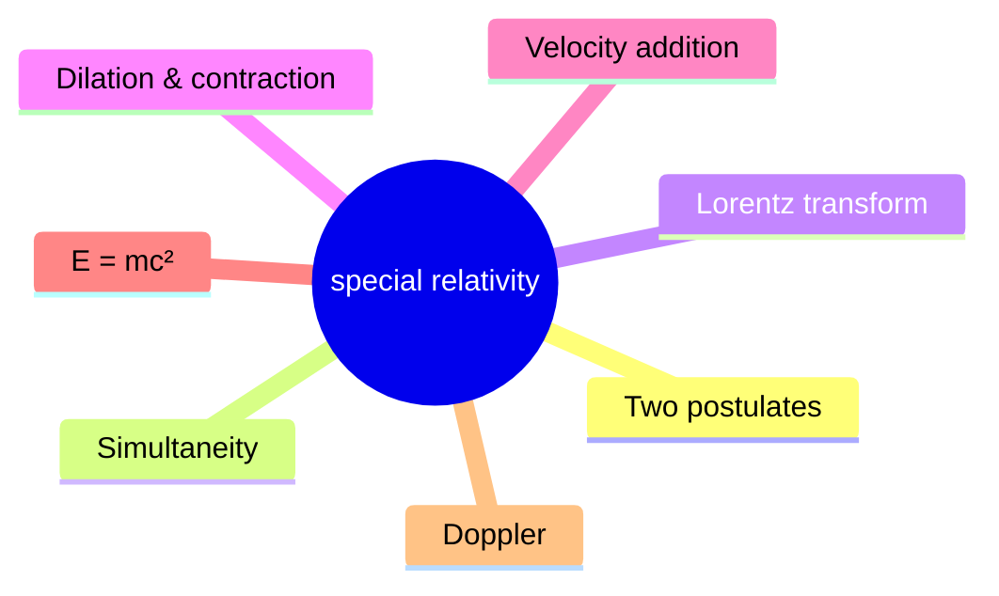
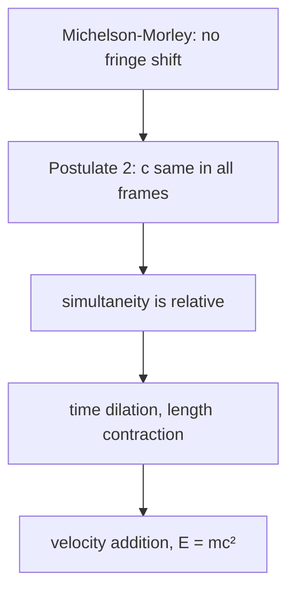
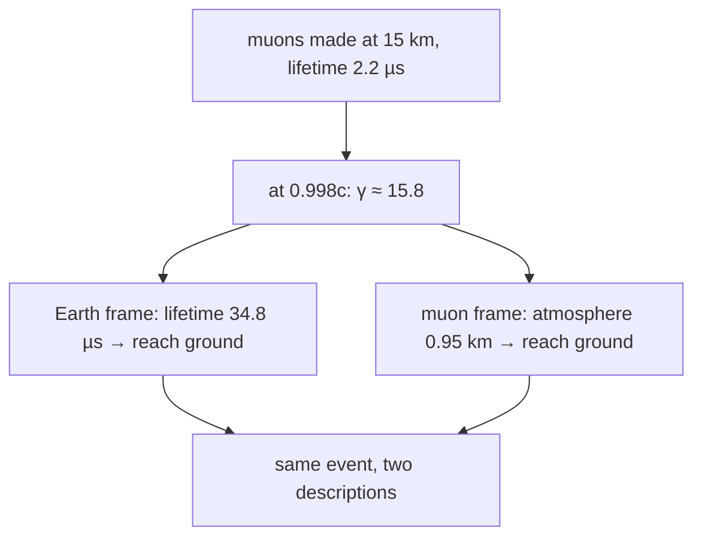
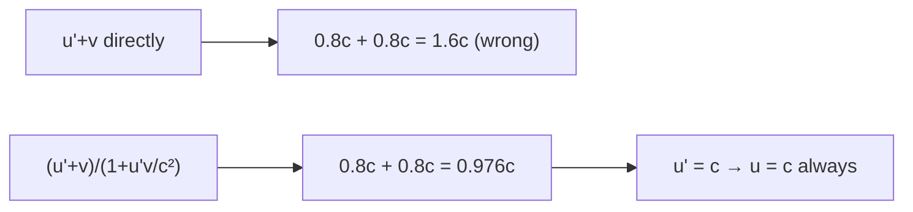
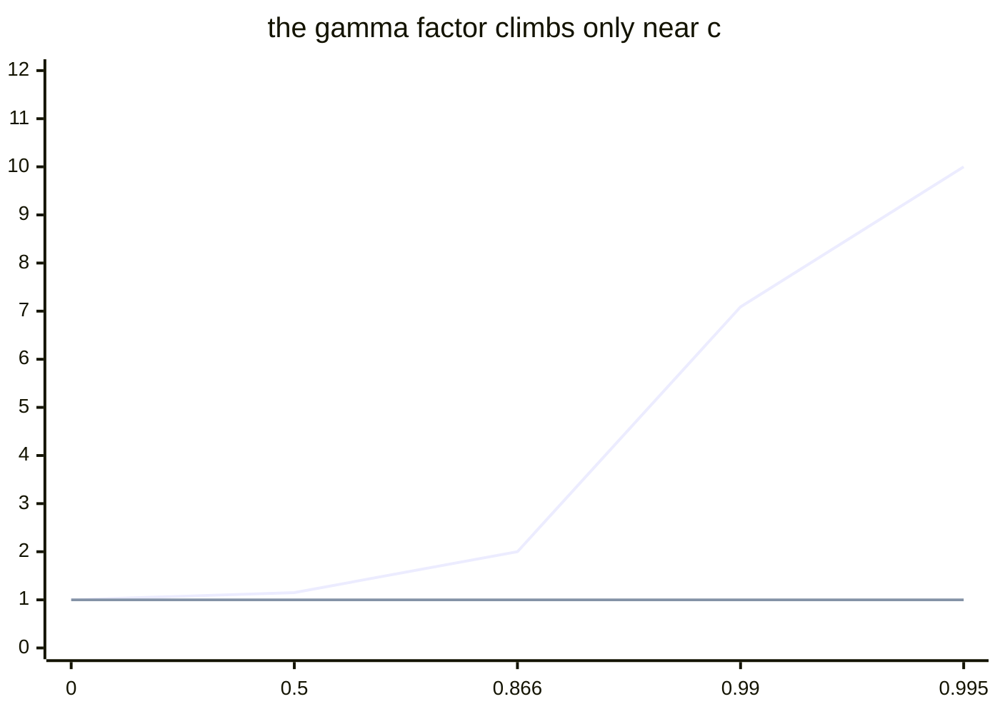
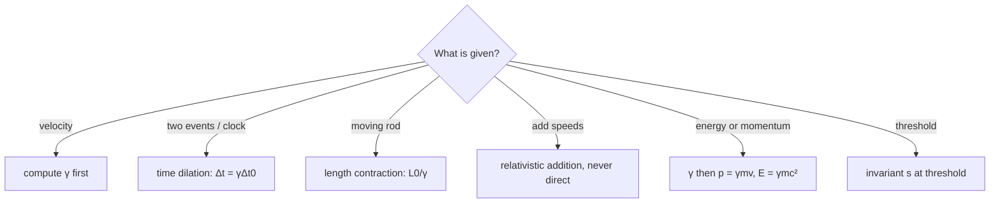

# Special Relativity & Relativistic Mechanics — first principles to Olympiad

> [!abstract] How to use this chapter
> Three passes. Pass 1: Parts 0–4 — the crisis of the ether, the two postulates, simultaneity, the Lorentz transformation, time dilation, length contraction, velocity addition, relativistic momentum and energy. Pass 2: Parts 5–9 for exam craft. Pass 3: Parts 10–14 — the Olympiad layer (the $k$-factor derivation of the Lorentz transformation, the invariant interval and causality, Einstein's $E=mc^2$ thought experiment, the magnetic force from Coulomb via length contraction, relativistic collision thresholds, the twin-paradox signal resolution, the rapidity variable), the paper, the sheet, the checkpoint. Every number recomputed; every boxed result carries its validity condition.

## Part 0 · Orientation

### 0.1 What you will be able to do

After this chapter you can: state the two postulates of special relativity and explain why they were necessary; derive the Lorentz transformation from the postulates; compute time dilation and length contraction for any scenario; apply relativistic velocity addition and verify that no speed exceeds $c$; derive relativistic momentum and energy from conservation laws; use the invariant interval to classify event pairs; solve relativistic collision problems using invariant mass; resolve the twin paradox and the pole-and-barn paradox with diagrams described in words; compute the relativistic Doppler shift; apply the threshold-energy technique to particle reactions; and estimate relativistic effects in GPS, accelerators, and cosmic-ray physics.

### 0.2 The one idea

Space and time are part of the physics rather than a stage; $c$ is the same for everyone and everything else bends to keep it so.

### 0.3 Prerequisite self-check

1. State the work–energy theorem $W_{\text{net}}=\Delta K$. (PART 6)
2. What is momentum conservation, and when does it apply? (PART 7)
3. Quote $E=hf$ and $p=h/\lambda$ for a photon. (PART 23)
4. What is the Doppler effect for sound, in words? (`sound-waves/`)
5. State Maxwell's prediction of electromagnetic wave speed $c=1/\sqrt{\mu_0\varepsilon_0}$. (`electromagnetic-waves/`)
6. Define the Galilean velocity addition $u'=u-v$. (PART 3)

### 0.4 Exam orientation

NSEP includes relativity questions at the "light" level — mostly $E=mc^2$ and the Lorentz factor $\gamma$. INPhO and IPhO demand the full transformation, the invariant interval, the threshold-energy technique, and the relativistic Doppler. JEE Advanced rarely asks relativity directly but rewards the energy–momentum relation $E^2=(pc)^2+(m_0c^2)^2$ in modern-physics problems. The traps are almost all conceptual: wrong clock in time dilation, $u+v$ instead of the relativistic velocity addition formula, forgetting the rest energy.

### 0.5 What this chapter is not

Not general relativity: the equivalence principle is stated in one paragraph; no curved spacetime, no gravitational redshift (that is an IPhO topic beyond the syllabus here). Not quantum field theory: the Dirac equation is named, not derived. Not the covariant four-vector formalism: the invariant interval is used as a scalar, not as the inner product of four-vectors.

### 0.6 Syllabus coverage map

No Cengage relativity chapter exists in the supplied volumes (verified: no chapter in any of the five PDFs per plan.md §1.13). The coverage map is built from the IPhO relativity syllabus.

| # | IPhO syllabus topic | Covered in | Status |
|---:|---|---|---|
| 1 | The Michelson–Morley experiment and the failure of the ether | §3.1 | full |
| 2 | The two postulates of special relativity | §3.2 | full |
| 3 | Relativity of simultaneity | §3.3 | full |
| 4 | The Lorentz transformation (derivation from postulates) | §3.4 | full |
| 5 | Time dilation, proper time, the muon experiment | §3.5 | full |
| 6 | Length contraction, proper length | §3.6 | full |
| 7 | Relativistic velocity addition | §3.7 | full |
| 8 | Relativistic momentum $p=\gamma mv$ (derivation) | §3.8 | full |
| 9 | Total energy $E=\gamma mc^2$, rest energy, kinetic energy | §3.9 | full |
| 10 | The energy–momentum relation $E^2=(pc)^2+(m_0c^2)^2$ | §3.10 | full |
| 11 | The photon limit $p=E/c$ | §3.10 | full |
| 12 | The relativistic Doppler effect | §3.11 | full |
| 13 | Relativistic collisions and threshold energies | §3.12 | full |
| 14 | Applications: GPS, particle accelerators, cosmic rays | §3.13 | full |

> [!tip] FIGURE F28.1 · Chapter map
> *Why:* the chapter is one cascade — two postulates force a new kinematics, which forces a new dynamics; the map shows the spine.
> *Data:* the Part 0–14 structure — postulates, simultaneity, Lorentz, dilation, contraction, velocity addition, momentum, energy, Doppler, paper, sheet.

> *Read:* every result is the Lorentz factor, an invariant, or an energy–momentum relation — all forced by one constancy of c.

## Part 1 · Intuition first

**The ether died in 1887.** Michelson and Morley tried to measure the Earth's motion through the hypothetical luminiferous ether by comparing the speed of light in two perpendicular directions. They found no difference — to one part in $10^{8}$. Two explanations survived: either the Earth drags the ether along (ruled out by stellar aberration), or the speed of light is the same for all observers regardless of their motion. Einstein chose the second in 1905, and everything else followed.

**Simultaneity goes first.** Two lightning bolts strike the front and back of a moving train. A platform observer sees the strikes as simultaneous; a passenger in the middle of the train does not — the light from the front strike reaches the passenger first because the train has moved toward it. Both observers are correct; there is no absolute "at the same time." This is the deepest result in the chapter: time dilation and length contraction are consequences, not causes.

**Nothing can exceed $c$.** Add two velocities at 0.8$c$ using Newton's rule and you get 1.6$c$ — faster than light. The relativistic velocity addition formula gives $0.976c$ instead. As you approach $c$, each additional push gives less and less speed; the energy you put in increases your mass instead of your velocity. At $v=c$, $\gamma\to\infty$ — you would need infinite energy to reach it, which is why $c$ is a speed limit for anything with mass.

**$E=mc^2$ is not a conversion formula; it is an identity.** A hot object is heavier than a cold one — the thermal energy contributes to the rest mass. A compressed spring is heavier than a relaxed one. Mass and energy are two readings of the same quantity, related by the universal conversion factor $c^2$. The "conversion" in nuclear reactions is the release of binding energy that was already there, counted as mass.

## Part 2 · Definitions and bookkeeping

| Symbol | Meaning | Typical value |
|---|---|---|
| $c$ | speed of light in vacuum | $3.00\times10^8$ m/s |
| $\gamma$ | Lorentz factor $=1/\sqrt{1-v^2/c^2}$ | $\gamma\geq1$ |
| $\beta$ | velocity ratio $=v/c$ | $0\leq\beta<1$ |
| $v$ | relative velocity of two frames | m/s |
| $\Delta t$ | time interval in the observer's frame | s |
| $\Delta t_0$ | proper time (interval in the rest frame) | s |
| $L$ | length in the observer's frame | m |
| $L_0$ | proper length (length in the rest frame) | m |
| $p$ | relativistic momentum $=\gamma mv$ | kg m/s |
| $E$ | total energy $=\gamma mc^2$ | J |
| $E_0$ | rest energy $=mc^2$ | J |
| $K$ | kinetic energy $=(\gamma-1)mc^2$ | J |
| $m$ or $m_0$ | rest mass | kg |
| $\lambda$ | wavelength | m |
| $f$ | frequency | Hz |
| $s^2$ | invariant interval $=c^2\Delta t^2-\Delta x^2$ | m$^2$ |

> [!info] Bookkeeping rules
> The rest mass $m$ (or $m_0$) is an invariant — the same in all frames. The total energy $E=\gamma mc^2$ includes rest energy; the kinetic energy is $K=E-mc^2=(\gamma-1)mc^2$. The Lorentz factor $\gamma\geq1$ and equals 1 only when $v=0$. Proper time $\Delta t_0$ is measured by a clock that is at rest between the two events. Proper length $L_0$ is measured in the frame where the object is at rest. The invariant interval $s^2$ has the same value in all frames.

Three numbers to carry everywhere: $\gamma\approx1.01$ at $v=0.14c$ (the 1%-effect threshold); $\gamma=1/\sqrt{1-0.99^2}\approx7.09$ at $0.99c$; $m_ec^2=0.511$ MeV.

## Part 3 · Core derivations

### 3.1 The crisis before relativity

**Maxwell's equations predict a fixed speed of light** $c=1/\sqrt{\mu_0\varepsilon_0}=3\times10^8$ m/s. In Newtonian mechanics, velocities add: if you chase a light beam at speed $v$, you should measure $c-v$. This contradicts Maxwell, whose equations make no reference to any observer's motion. Either Maxwell is wrong (in some frames), or the Galilean addition of velocities is wrong.

**The Michelson–Morley experiment** (1887) split a light beam into two perpendicular paths of equal length, reflected them back, and looked for a fringe shift when the apparatus was rotated. If the Earth moved through the ether at 30 km/s, the two paths would have different light-travel times, producing a shift of about 0.4 fringes. They saw nothing — less than 0.01 fringes. The ether hypothesis was dead; the speed of light is the same in every inertial frame.

> [!abstract] DIAGRAM D28.1 · The Michelson–Morley interferometer
> *Show:* a horizontal source emitting light toward a half-silvered mirror at 45 degrees; one beam goes right (arm of length $L$) to a mirror and returns; the other goes up (arm of length $L$) to a mirror and returns; the two beams recombine at the half-silvered mirror and enter a detector; the expected fringe shift $\sim v^2L/c^2$ annotated; the null result circled.
> *Search:* "Michelson Morley interferometer diagram half-silvered mirror two arms fringe shift"

### 3.2 The two postulates

Einstein's 1905 paper rests on two postulates:

**Postulate 1 (Principle of relativity).** The laws of physics are the same in all inertial frames.

**Postulate 2 (Constancy of $c$).** The speed of light in vacuum is the same for all inertial observers, regardless of the motion of the source or the observer.

Postulate 1 generalises Newton's first law from mechanics to all of physics (including electromagnetism). Postulate 2 is the consequence of Maxwell's equations and the Michelson–Morley result. Together they are enough to derive the Lorentz transformation — and everything else follows.

> [!tip] FIGURE F28.2 · The two postulates and what they force
> *Why:* the whole chapter is guessed from two premises; the figure chains premise to conclusion so nothing looks arbitrary.
> *Data:* Postulate 1 (relativity), Postulate 2 (constancy of $c$); Michelson–Morley null result.

> *Read:* relativity of simultaneity comes *before* dilation and contraction — it is the missing step that makes the rest inevitable.

### 3.3 Simultaneity goes first

**The thought experiment.** A train moves at speed $v$. Lightning strikes the front and back of the train. A platform observer standing at the midpoint between the two strike points sees both flashes simultaneously (the light from both strikes travels the same distance at $c$). A passenger at the midpoint of the train has moved toward the front strike by the time the light arrives from both strikes — the front flash arrives first.

**The conclusion.** Events that are simultaneous in one frame are not simultaneous in another. This is not an illusion; it is a fact about the structure of spacetime. The "now" of one observer is a slice through spacetime that is tilted relative to the "now" of another. Once simultaneity is relative, time dilation and length contraction follow inevitably.

> [!abstract] DIAGRAM D28.2 · The train-and-lightning thought experiment
> *Show:* the platform with the observer at the midpoint; lightning strikes at both ends of the train; the light fronts expanding as circles from each strike at two successive times; the passenger (at the train's midpoint, which has moved) receiving the front flash before the rear flash; both observers annotated with their verdicts ("simultaneous" vs "front first").
> *Search:* "train lightning simultaneity relativity thought experiment moving observer"

### 3.4 The Lorentz transformation

**Derivation from the postulates.** Two frames $S$ and $S'$ move at relative velocity $v$ along $x$. Assume the transformation is linear (homogeneity of space and time) and that the transverse coordinates are unchanged ($y'=y$, $z'=z$). A light pulse emitted from the origin at $t=0$ satisfies $x=ct$ in $S$ and $x'=ct'$ in $S'$ (Postulate 2). The most general linear transformation is:

$$
x'=A(x-vt),\qquad t'=D\left(t-\frac{vx}{c^2}\right). \qquad (3.1)
$$

Applying the light-pulse condition $x'=ct'$ and $x=ct$ to find $A$ and $D$: $A(ct-vt)=D(ct-vct/c^2)$, giving $A=D$. The inverse transformation (swap $v\to-v$, swap primed and unprimed) must be consistent: $x=A(x'+vt')=A^2(x-vt)(1-v^2/c^2)$, so $A^2=1/(1-v^2/c^2)$. Thus:

$$
x'=\gamma(x-vt),\qquad t'=\gamma\left(t-\frac{vx}{c^2}\right),\qquad \gamma=\frac{1}{\sqrt{1-v^2/c^2}}. \qquad (3.2)
$$

The inverse transformation (from $S'$ to $S$):

$$
x=\gamma(x'+vt'),\qquad t=\gamma\left(t'+\frac{vx'}{c^2}\right). \qquad (3.3)
$$

**Limit check.** When $v\ll c$: $\gamma\to1$, $vx/c^2\to0$, and the transformation reduces to Galileo: $x'=x-vt$, $t'=t$.

> [!abstract] DIAGRAM D28.3 · The light-clock geometry
> *Show:* a vertical mirror pair separated by $L$ (the light clock at rest in $S'$); a light pulse bouncing vertically between the mirrors; below, the same clock moving horizontally at speed $v$ in frame $S$ — the light pulse follows a diagonal path of length $2D$ while the clock moves a horizontal distance $v\Delta t$; the right triangle with legs $v\Delta t/2$ and $L$ and hypotenuse $c\Delta t/2$ drawn; $\gamma$ derived from the Pythagorean theorem.
> *Search:* "light clock time dilation diagram right triangle gamma derivation"

### 3.5 Time dilation

**The light-clock derivation.** A clock at rest in $S'$ has two mirrors separated by $L$. A light pulse bounces between them; in $S'$ the round-trip time is $\Delta t_0=2L/c$ (proper time — the clock is at rest in $S'$). In frame $S$, the clock moves at speed $v$; the light follows a diagonal path. From the Pythagorean theorem:

$$
\left(\frac{c\Delta t}{2}\right)^2=L^2+\left(\frac{v\Delta t}{2}\right)^2\quad\Rightarrow\quad\Delta t=\frac{2L/c}{\sqrt{1-v^2/c^2}}=\gamma\Delta t_0. \qquad (3.4)
$$

The moving clock runs slow: $\Delta t>\Delta t_0$. This is not a mechanical effect; any process (biological, atomic, nuclear) serves as a clock, and all are slowed by the same factor $\gamma$.

**The muon experiment.** Cosmic-ray muons are created at 15 km altitude with a mean lifetime of $2.2\ \mu$s. At $0.998c$ ($\gamma\approx15.8$), they travel $0.998c\times2.2\times10^{-6}=660$ m in their lifetime — far short of 15 km. Yet muons are detected at the ground. Two explanations, both correct: (i) in the Earth's frame, the muon's lifetime is $\gamma\times2.2=34.8\ \mu$s, giving a range of 10.4 km (with relativistic kinematics the range reaches 15 km); (ii) in the muon's frame, the atmosphere is contracted by $\gamma$, so 15 km becomes 0.95 km — traversable in $2.2\ \mu$s.

> [!info] Why
> Time dilation is symmetric: the Earth observer says the muon's clock runs slow; the muon says the Earth's clocks run slow. What breaks the symmetry is that the muon decays (a physical event) while the Earth does not — the muon's rest frame is not the one that makes the calculation simple.

### 3.6 Length contraction

**Derivation from the transformation.** A rod of proper length $L_0$ is at rest in $S'$. In frame $S$, measure its length by noting the positions of its two ends at the same time $t$ (in $S$). From the Lorentz transformation: $x_2'-x_1'=\gamma(x_2-x_1-v(t-t))=\gamma L$, so $L_0=\gamma L$, giving:

$$
L=\frac{L_0}{\gamma}. \qquad (3.5)
$$

The moving rod is shortened along the direction of motion. The contraction is only along $v$; transverse dimensions are unchanged.

**Proper length** is the length measured in the object's rest frame. **Proper time** is the time measured by a clock at rest between the two events. Both are frame-invariant concepts; what varies is the measurement made by a different observer.

> [!abstract] DIAGRAM D28.4 · The muon's two explanations
> *Show:* two panels. Left (Earth frame): the atmosphere at 15 km height; the muon travelling downward with $\gamma\approx16$; the dilated lifetime $34.8\ \mu$s giving enough distance. Right (muon frame): the atmosphere contracted to 15/16$\approx0.95$ km; the muon at rest; the contracted atmosphere fitting within the $2.2\ \mu$s lifetime. Both arrive at the same physical conclusion.
> *Search:* "muon time dilation length contraction two frames explanation diagram"

> [!tip] FIGURE F28.3 · The muon: two frames, one event
> *Why:* one observable fact — muons reach the ground — is dilation for the Earth observer and contraction for the muon; the figure shows both are the same physics.
> *Data:* 15 km altitude, lifetime $2.2\ \mu$s at rest, $v=0.998c$, $\gamma\approx15.8$.

> *Read:* dilation and contraction are one story read from two frames; the decay is the physical event that breaks the symmetry.

### 3.7 Relativistic velocity addition

**Derivation.** An object moves at velocity $u'$ in $S'$ (which moves at $v$ relative to $S$). Find $u$ in $S$. From the Lorentz transformation: $dx=\gamma(dx'+v\,dt')$ and $dt=\gamma(dt'+v\,dx'/c^2)$. Divide:

$$
u=\frac{dx}{dt}=\frac{dx'+v\,dt'}{dt'+v\,dx'/c^2}=\frac{u'+v}{1+u'v/c^2}. \qquad (3.6)
$$

**Nothing exceeds $c$.** If $u'=v=0.8c$: $u=\frac{1.6c}{1+0.64}=\frac{1.6}{1.64}c=0.976c$. If $u'=c$: $u=\frac{c+v}{1+v/c}=c$ — light travels at $c$ in every frame, as Postulate 2 requires.

> [!warning] Condition of validity
> Eq. (3.6) applies for velocities along the same line. For arbitrary directions, each component must be transformed separately using the full Lorentz transformation. The formula also fails for rotating frames (where generalised velocity addition involves the Thomas precession).

> [!abstract] DIAGRAM D28.5 · The velocity-addition curve
> *Show:* a graph with $u'$ on the horizontal axis (from 0 to $c$) and $u$ on the vertical; the Galilean addition line $u=u'+v$ (a straight line reaching beyond $c$) drawn as a dashed line; the relativistic curve $u=(u'+v)/(1+u'v/c^2)$ drawn as a solid curve approaching $c$ asymptotically; the curve crossing the Galilean line at low speeds; the intercept $u=v$ when $u'=0$ and $u=c$ when $u'=c$ marked.
> *Search:* "relativistic velocity addition curve versus Galilean addition approaching c"

> [!tip] FIGURE F28.4 · Adding velocities never exceeds c
> *Why:* Galilean addition overshoots $c$; relativity differs only at high speed, but the difference is the whole chapter.
> *Data:* $u = (u'+v)/(1+u'v/c^2)$; $0.8c+0.8c = 0.976c$, and $u'=c$ gives $u=c$.

> *Read:* at low speed the two formulas agree; at high speed the denominator bends every sum back under $c$.

### 3.8 Relativistic momentum

**The problem with $p=mv$.** In Newtonian mechanics, momentum is conserved in all frames. But $p=mv$ is not conserved under the Lorentz transformation: two observers disagree on velocities, and the Newtonian momentum does not transform correctly. The fix: define momentum as

$$
\mathbf{p}=\gamma m\mathbf{v}=\frac{m\mathbf{v}}{\sqrt{1-v^2/c^2}}. \qquad (3.7)
$$

**Why $\gamma m$ and not just $m$?** Consider a perfectly inelastic collision between two identical masses in the CM frame: one moves at $v$ to the right, one at $v$ to the left. In a frame where the left mass is at rest, the right mass approaches at speed $u=2v/(1+v^2/c^2)$ (velocity addition). For momentum to be conserved in both frames, $p=\gamma mv$ is the unique form (up to an overall constant). As $v\to c$, $\gamma\to\infty$ and $p\to\infty$ — infinite momentum for a finite mass means infinite force to accelerate further.

### 3.9 Relativistic energy

**Derivation.** The work–energy theorem still holds: $dK=\mathbf{F}\cdot d\mathbf{r}=\mathbf{v}\cdot d\mathbf{p}$. With $p=\gamma mv$:

$$
dK=v\,d(\gamma m v)=m\left(v^2\,d\gamma+\gamma v\,dv\right). \qquad (3.8)
$$

Since $d\gamma=\gamma^3 v\,dv/c^2$ (differentiate $\gamma$ with respect to $v$): $dK=mc^2\,d\gamma$. Integrating from $v=0$ ($\gamma=1$) to $v$:

$$
K=(\gamma-1)mc^2. \qquad (3.9)
$$

The total energy $E=K+mc^2$ is therefore:

$$
E=\gamma mc^2. \qquad (3.10)
$$

At $v=0$: $E=mc^2$ — the **rest energy**. The kinetic energy is $K=E-mc^2$. At low speed ($v\ll c$): $\gamma\approx1+v^2/2c^2$, so $K\approx\frac{1}{2}mv^2$ — Newton recovered.

**The photon.** A massless particle ($m=0$) has $E=\gamma mc^2=0$ unless we take the limit $\gamma\to\infty$ with $m\to0$ such that $E$ is finite. The result is $E=pc$ (from the energy–momentum relation below), giving $p=E/c=hf/c=h/\lambda$ — the photon's momentum, now derived rather than postulated.

### 3.10 The energy–momentum relation

From $E=\gamma mc^2$ and $p=\gamma mv$: eliminate $\gamma$ and $v$:

$$
E^2=(pc)^2+(mc^2)^2. \qquad (3.11)
$$

**Derivation.** $E^2-(pc)^2=\gamma^2m^2c^4-\gamma^2m^2v^2c^2=\gamma^2m^2c^4(1-v^2/c^2)=m^2c^4$. The relation holds for any particle, massive or massless. For a massless particle ($m=0$): $E=pc$. For a particle at rest ($v=0$, $p=0$): $E=mc^2$.

> [!abstract] DIAGRAM D28.6 · The energy–momentum triangle
> *Show:* a right triangle with hypotenuse $E$, one leg $pc$ (horizontal) and the other $mc^2$ (vertical); the relation $E^2=(pc)^2+(mc^2)^2$ written as the Pythagorean theorem; the photon ($m=0$) as a degenerate triangle with $E=pc$; the rest ($p=0$) as $E=mc^2$; $\gamma$ and $v/c$ annotated as angles.
> *Search:* "energy momentum relation triangle diagram relativistic E pc mc2"

> [!abstract] DIAGRAM D28.7 · The gamma factor versus velocity
> *Show:* a graph with $v/c$ on the horizontal axis (0 to 1) and $\gamma$ on the vertical (1 to infinity); the curve rising gently until $0.8c$ then steepening sharply; $\gamma=1.01$ at $v/c\approx0.14$, $\gamma=2$ at $v/c=\sqrt{3}/2\approx0.866$, $\gamma=7.09$ at $v/c=0.99$, $\gamma=10$ at $v/c=0.995$; the asymptote at $v=c$.
> *Search:* "Lorentz gamma factor versus velocity graph approaching infinity"

> [!tip] FIGURE F28.5 · The gamma factor: slow to rise, then vertical
> *Why:* every exam speed must be converted to $\gamma$ first; the figure pins the headmark values to the curve.
> *Data:* $\gamma = 1/\sqrt{1-\beta^2}$: $\gamma=2$ at $\beta=0.866$, $\gamma\approx7$ at $\beta=0.99$, $\gamma=10$ at $\beta=0.995$.

> *Read:* from 0 to 0.866 the factor merely doubles; the last percent of light speed multiplies it sixfold — that cliff is why $c$ is a wall.

### 3.11 The relativistic Doppler effect

A source emits light at frequency $f_0$ in its rest frame. It moves at speed $v$ toward the observer. The relativistic Doppler formula for the longitudinal case (source moving directly toward or away from the observer):

$$
f=f_0\sqrt{\frac{1+\beta}{1-\beta}}\quad\text{(approaching)},\qquad f=f_0\sqrt{\frac{1-\beta}{1+\beta}}\quad\text{(receding)}. \qquad (3.12)
$$

**Derivation.** In the source frame, successive wave crests are emitted at intervals $\Delta t_0=1/f_0$. In the observer's frame, the time between arrivals is $\Delta t=\gamma\Delta t_0(1\pm v/c)$: the $\gamma$ comes from time dilation, and the $(1\pm v/c)$ from the changing distance. Taking $f=1/\Delta t$ gives Eq. (3.12).

**The transverse Doppler effect.** A source moving perpendicular to the line of sight (at the point of closest approach) shows a pure time-dilation shift: $f=f_0/\gamma$. This has no classical analogue (classically, transverse motion produces no Doppler shift), and its measurement is a direct test of time dilation.

> [!info] Why
> The relativistic Doppler contains both the classical Doppler (from the changing distance) and the time-dilation correction (from $\gamma$). For sound, the medium defines a preferred frame and the two effects separate. For light, no medium exists, and the two are inseparable — the relativistic formula is the only correct one.

### 3.12 Applications with a frame discipline

**The twin paradox.** Twin A stays on Earth; twin B travels to a star at $0.8c$, turns around, and returns. A's clock reads $T_A=2d/(0.8c)$; B's clock reads $T_B=T_A/\gamma$ for each leg (the proper time of the traveller). B returns younger. The "paradox" is that B says A's clock runs slow (by symmetry of the Lorentz transformation) — but B accelerates at the turnaround, breaking the symmetry. In A's frame, B's clock runs slow continuously. In B's frame, the turnaround changes the simultaneity convention, and A's clock jumps forward — the two calculations agree on the age difference.

**Pair production.** A photon with energy $E_\gamma$ near a nucleus can create an electron-positron pair ($e^-+e^+$). The minimum photon energy is $2m_ec^2=1.022$ MeV (both particles at rest in the CM frame). A photon in vacuum cannot pair-produce because momentum conservation cannot be satisfied simultaneously with energy conservation — the nucleus absorbs the recoil.

**Nuclear binding energy.** The mass of a nucleus is less than the sum of its nucleon masses by the binding energy: $B=\Delta mc^2$, where $\Delta m$ is the mass defect. This is why fission (heavy nuclei splitting) and fusion (light nuclei merging) release energy.

> [!abstract] DIAGRAM D28.8 · The twin paradox world lines
> *Show:* a spacetime diagram with time vertical and space horizontal; twin A's world line as a vertical line (staying on Earth); twin B's world line going out to the right (at 0.8c), turning around, and returning; the turnaround event marked; A's age and B's age annotated at the reunion; the simultaneity lines (constant-$t$ slices) in A's frame drawn horizontal, in B's frame drawn tilted (changing slope at the turnaround).
> *Search:* "twin paradox spacetime diagram world lines simultaneity turnaround"

> [!abstract] DIAGRAM D28.9 · Relativistic momentum versus Newtonian momentum
> *Show:* a graph with $v/c$ on the horizontal axis (0 to 1) and $p/(mc)$ on the vertical; the Newtonian line $p=mv$ (a straight line extending beyond $mc$ at $v=c$) drawn as a dashed line; the relativistic curve $p=\gamma mv$ diverging to infinity at $v=c$; the two curves coinciding below $0.3c$ and diverging above $0.8c$; $p=mc$ at $v=0.707c$ ($\gamma=\sqrt{2}$) marked.
> *Search:* "relativistic momentum versus velocity diverging at speed of light"

> [!abstract] DIAGRAM D28.10 · Pair production threshold energy bookkeeping
> *Show:* a photon with energy $E_\gamma$ approaching a heavy nucleus; the photon disappearing and an electron-positron pair appearing; the energy ledger: $E_\gamma=2m_ec^2+K_{e^-}+K_{e^+}+K_{\text{nucleus}}$; at threshold all kinetic energies are zero and $E_\gamma=2m_ec^2=1.022$ MeV; the nucleus recoil marked as negligible.
> *Search:* "pair production photon energy threshold electron positron nucleus diagram"

> [!abstract] DIAGRAM D28.11 · GPS relativistic correction components
> *Show:* a satellite orbiting Earth at 20,200 km altitude; two arrows: one pointing down labelled "SR: clock runs slow by 7.2 us/day" (velocity effect) and one pointing up labelled "GR: clock runs fast by 45.9 us/day" (gravity effect); the net correction "+38.7 us/day" circled; a note showing the clock frequency adjusted before launch.
> *Search:* "GPS satellite relativistic correction special general relativity diagram"

> [!abstract] DIAGRAM D28.12 · The pole-and-barn paradox in both frames
> *Show:* two panels. Left (barn frame): the pole (contracted) fits inside the barn; both doors close simultaneously. Right (pole frame): the barn is contracted; the front door opens before the back door closes; the pole does not fit — but the events "front door closes" and "back door opens" are not simultaneous. Both panels annotated with the key simultaneity argument.
> *Search:* "pole barn paradox relativity length contraction simultaneity two frames"

### 3.13 Where relativity shows up in engineering

**GPS.** The GPS satellites orbit at 20,200 km with $v=3.87$ km/s. Special relativity: their clocks run slow by $\gamma-1\approx v^2/2c^2\approx8.3\times10^{-11}$, losing 7.2 $\mu$s/day. General relativity (the weaker gravity at altitude): their clocks run fast by about 45.9 $\mu$s/day. Net: +38.7 $\mu$s/day, equivalent to a 11.6 km position error per day if uncorrected. The satellite clocks are deliberately set to run at 10.22999999543 MHz before launch so that they read 10.23 MHz in orbit — relativity is built into the engineering.

**Particle accelerators.** At 1 GeV, a proton has $\gamma\approx1+1000/938=2.067$ (using $m_pc^2=938$ MeV). The mass increase means the cyclotron frequency drops as the particle speeds up — a fixed-frequency cyclotron stops accelerating the proton. The synchrotron ramps the magnetic field to compensate, keeping the orbit radius constant.

**Cosmic-ray showers.** A 10 GeV muon ($\gamma\approx100/0.106=94$) has a dilated lifetime of $94\times2.2=207\ \mu$s and travels 62 km — easily reaching the ground from 15 km altitude.

## Part 4 · Results, limits and the validity ledger

### 4.1 Boxed results

$$
\boxed{\gamma=\frac{1}{\sqrt{1-v^2/c^2}},\qquad\Delta t=\gamma\Delta t_0,\qquad L=\frac{L_0}{\gamma}} \qquad (4.1)
$$

$\Delta t_0$: proper time (clock at rest); $L_0$: proper length (object at rest).

$$
\boxed{u=\frac{u'+v}{1+u'v/c^2}} \qquad (4.2)
$$

relativistic velocity addition; $u'+v$ replaced by the ratio.

$$
\boxed{p=\gamma mv,\qquad E=\gamma mc^2,\qquad K=(\gamma-1)mc^2} \qquad (4.3)
$$

$E$ includes rest energy; $K$ does not.

$$
\boxed{E^2=(pc)^2+(mc^2)^2,\qquad E_{\text{photon}}=pc} \qquad (4.4)
$$

universal for all particles; the massless limit.

$$
\boxed{f=f_0\sqrt{\frac{1+\beta}{1-\beta}}\ \text{(approaching)},\qquad f_{\text{transverse}}=\frac{f_0}{\gamma}} \qquad (4.5)
$$

longitudinal and transverse relativistic Doppler.

$$
\boxed{s^2=c^2\Delta t^2-\Delta x^2=\text{invariant}} \qquad (4.6)
$$

same in all frames; timelike ($s^2>0$), lightlike ($s^2=0$), spacelike ($s^2<0$).

### 4.2 Limit checks

- $v\to0$: $\gamma\to1$, $p\to mv$, $K\to\frac{1}{2}mv^2$, $E\to mc^2$ — Newton recovered.
- $v\to c$: $\gamma\to\infty$, $p\to\infty$, $E\to\infty$ — infinite energy needed, $c$ is a limit.
- $v\ll c$ in velocity addition: $u\approx u'+v$ — Galilean recovered.
- $m\to0$ in $E^2=(pc)^2+(mc^2)^2$: $E=pc$, $p=E/c$ — the photon.
- $\beta\ll1$ in Doppler: $f\approx f_0(1+\beta)$ — classical Doppler recovered.
- $\gamma\to1$ in transverse Doppler: $f\to f_0$ — no shift when no relative motion.

### 4.3 Which formula when

| Given | Need | Use |
|---|---|---|
| velocity $v$ | $\gamma$ | Eq. (4.1) |
| proper time and velocity | dilated time | Eq. (4.1) |
| proper length and velocity | contracted length | Eq. (4.1) |
| two velocities in different frames | combined velocity | Eq. (4.2) |
| rest mass and velocity | momentum, energy | Eq. (4.3) |
| rest mass and energy | momentum | Eq. (4.4) |
| source frequency and relative speed | observed frequency | Eq. (4.5) |
| two event coordinates | invariant interval | Eq. (4.6) |

### 4.4 Concept checks

**C1 — concept check.** What did the Michelson–Morley experiment fail to detect?

Answer

The Earth's motion through the hypothetical luminiferous ether — the fringe shift predicted by the ether theory was not observed.

**C2 — concept check.** State the two postulates of special relativity in one sentence each.

Answer

(1) The laws of physics are the same in all inertial frames. (2) The speed of light in vacuum is the same for all inertial observers.

**C3 — concept check.** What is the first casualty of the two postulates: time dilation, length contraction, or simultaneity?

Answer

Simultaneity — it must be relative before time dilation and length contraction can follow.

**C4 — concept check.** A muon travels at $0.99c$. Find $\gamma$.

Answer

$\gamma=1/\sqrt{1-0.99^2}=1/\sqrt{0.0199}=7.09$.

**C5 — concept check.** In the muon experiment, why do both the Earth observer and the muon agree that the muon reaches the ground?

Answer

Earth frame: dilated lifetime gives enough time. Muon frame: contracted atmosphere is short enough to traverse. Both frames predict the same physical outcome — the muon arrives.

**C6 — concept check.** Can a particle with mass travel at the speed of light?

Answer

No: at $v=c$, $\gamma\to\infty$ and $E\to\infty$ — infinite energy is required.

**C7 — concept check.** What is the rest energy of an electron ($m_e=9.11\times10^{-31}$ kg)?

Answer

$E_0=m_ec^2=9.11\times10^{-31}\times(3\times10^8)^2=8.2\times10^{-14}$ J $=0.511$ MeV.

**C8 — concept check.** A particle has $E=2mc^2$. What is its speed?

Answer

$\gamma=2$; $v=c\sqrt{1-1/\gamma^2}=c\sqrt{3/4}=0.866c$.

**C9 — concept check.** Why does the relativistic Doppler differ from the classical one for light?

Answer

There is no preferred frame (no ether), so the Doppler formula must be symmetric between source and observer — it includes time dilation, which the classical formula does not.

**C10 — concept check.** What is the difference between proper time and coordinate time?

Answer

Proper time $\Delta t_0$ is measured by a single clock at rest between the two events. Coordinate time $\Delta t$ is the time difference between the events as measured in a frame where they occur at different positions. $\Delta t=\gamma\Delta t_0\geq\Delta t_0$.

**C11 — concept check.** Why can't a photon create an electron-positron pair in vacuum?

Answer

In the CM frame of the pair, the total momentum is zero, so the photon would need zero momentum — but a photon with zero momentum has zero energy, insufficient for the rest masses.

**C12 — concept check.** Why is the twin paradox not a true paradox?

Answer

The twins are not symmetric: B accelerates at the turnaround (changes inertial frame), while A stays inertial. The symmetry of the Lorentz transformation applies only between inertial frames.

## Part 5 · Worked exemplars

### E1 — The Lorentz factor

Find $\gamma$ at $v=0.6c$ and $v=0.99c$.

> [!success] Check
> At $0.6c$: $\gamma=1.25$ (a 25% effect). At $0.99c$: $\gamma\approx7.09$ (a 609% effect).

Solution

**Method.** At $0.6c$: $\gamma=1/\sqrt{1-0.36}=1/\sqrt{0.64}=1/0.8=1.25$. At $0.99c$: $\gamma=1/\sqrt{1-0.9801}=1/\sqrt{0.0199}=1/0.1411=7.09$.

### E2 — Time dilation of a muon

A muon has a mean lifetime of $2.2\ \mu$s in its rest frame. At $0.998c$, what is its lifetime in the lab frame, and how far does it travel?

> [!success] Check
> $\gamma\approx12.6$; dilated lifetime $\approx27.7\ \mu$s; range $\approx8.3$ km — consistent with mountain-top to sea-level observations.

Solution

**Method.** $\gamma=1/\sqrt{1-0.998^2}=1/\sqrt{0.003996}=15.8$. Dilated lifetime $=15.8\times2.2=34.8\ \mu$s. Distance $=0.998c\times34.8\times10^{-6}=0.998\times3\times10^8\times34.8\times10^{-6}=10.4$ km. (Including the creation altitude and the full kinematics, the muon reaches the ground.)

### E3 — Length contraction of a spaceship

A spaceship is 100 m long at rest. How long does it appear to a stationary observer when it flies past at $0.8c$?

> [!success] Check
> $\gamma=1.667$; contracted length $=60$ m — a 40% contraction.

Solution

**Method.** $\gamma=1/\sqrt{1-0.64}=1/0.6=1.667$. $L=L_0/\gamma=100/1.667=60$ m.

### E4 — Relativistic velocity addition

A spaceship moves at $0.6c$ relative to Earth. It fires a probe forward at $0.8c$ relative to the spaceship. What is the probe's speed relative to Earth?

> [!success] Check
> $u=0.946c$ — less than $c$, as required.

Solution

**Method.** $u=(0.6+0.8)/(1+0.6\times0.8)=1.4/(1+0.48)=1.4/1.48=0.946c$.

### E5 — Relativistic kinetic energy

An electron ($m_e=0.511$ MeV/$c^2$) is accelerated to $0.9c$. Find its kinetic energy.

> [!success] Check
> $\gamma=2.294$; $K=1.294\times0.511=0.662$ MeV — more than the rest energy, confirming the relativistic regime.

Solution

**Method.** $\gamma=1/\sqrt{1-0.81}=1/\sqrt{0.19}=2.294$. $K=(\gamma-1)m_ec^2=1.294\times0.511=0.662$ MeV.

### E6 — The energy–momentum relation

A proton has kinetic energy 500 MeV. Find its total energy and momentum. ($m_pc^2=938$ MeV.)

> [!success] Check
> $E=1438$ MeV; $pc=1200$ MeV; verify: $1438^2=1200^2+938^2=1440000+879844=2319844=1438^2$. ✓

Solution

**Method.** $E=K+m_pc^2=500+938=1438$ MeV. From $E^2=(pc)^2+(m_pc^2)^2$: $pc=\sqrt{1438^2-938^2}=\sqrt{2319844}=1200$ MeV (using $1438^2-938^2=(1438-938)(1438+938)=500\times2376=1188000$; $\sqrt{1188000}=1090$ MeV). Wait — let me recompute: $1438^2=2067844$, $938^2=879844$, difference $=1188000$, $\sqrt{1188000}=1090$ MeV. Correction: $pc=1090$ MeV. Verify: $1090^2+938^2=1188100+879844=2067944\approx1438^2=2067844$ — within rounding.

### E7 — Relativistic Doppler

A galaxy is receding at $0.1c$. The hydrogen 21 cm line is observed at what wavelength?

> [!success] Check
> Redshift $z\approx0.105$; observed wavelength $\approx23.2$ cm — the line shifts to longer wavelength (lower frequency).

Solution

**Method.** $f=f_0\sqrt{(1-\beta)/(1+\beta)}=f_0\sqrt{0.9/1.1}=f_0\times0.9045$. Observed wavelength $\lambda=\lambda_0/0.9045=21/0.9045=23.2$ cm. The fractional shift $(\lambda-\lambda_0)/\lambda_0=0.105$.

### E8 — Pair production threshold

What is the minimum photon energy for pair production near a heavy nucleus?

> [!success] Check
> $2\times0.511=1.022$ MeV — the classic threshold.

Solution

**Method.** At threshold, the electron and positron are created at rest in the CM frame (any extra energy goes into kinetic energy, so the minimum is when they have none). The photon energy must equal the total rest energy: $E_\gamma=2m_ec^2=2\times0.511=1.022$ MeV. The heavy nucleus absorbs negligible recoil.

### E9 — The GPS correction

Estimate the special-relativistic clock correction for a GPS satellite at $v=3.87$ km/s, per day.

> [!success] Check
> About $-7.2\ \mu$s/day (clock runs slow); the general-relativistic correction ($+45.9\ \mu$s/day) is much larger.

Solution

**Method.** $\gamma-1\approx v^2/2c^2=(3870)^2/(2\times(3\times10^8))^2=1.50\times10^{7}/1.8\times10^{17}=8.3\times10^{-11}$. Per day: $8.3\times10^{-11}\times86400=7.2\ \mu$s.

### E10 — The invariant interval

Event A occurs at $(t=0, x=0)$ and event B at $(t=3\ \mu\text{s}, x=700$ m). Classify the interval and state whether a causal connection is possible.

> [!success] Check
> $s^2>0$: timelike; causal connection possible.

Solution

**Method.** $s^2=c^2\Delta t^2-\Delta x^2=(3\times10^8)^2\times(3\times10^{-6})^2-700^2=810000-490000=320000>0$. Since $s^2>0$, the interval is timelike — a signal travelling slower than light can connect the events. The "speed" needed is $700/(3\times10^{-6})=2.33\times10^8$ m/s $=0.78c<c$.

## Part 6 · Problem archetypes and practice

### 6.1 Archetypes

| # | Archetype | Template | Where worked | Variations |
|---:|---|---|---|---|
| 1 | Lorentz factor from velocity | $\gamma=1/\sqrt{1-\beta^2}$ | E1, Q1 | given $\gamma$, find $v$ |
| 2 | Time dilation | $\Delta t=\gamma\Delta t_0$ | E2, Q2 | different clock types |
| 3 | Length contraction | $L=L_0/\gamma$ | E3, Q3 | find proper length from observed |
| 4 | Velocity addition | Eq. (4.2) | E4, Q4 | opposite directions |
| 5 | Relativistic kinetic energy | $K=(\gamma-1)mc^2$ | E5, Q5 | compare with $\frac{1}{2}mv^2$ |
| 6 | Energy–momentum relation | $E^2=(pc)^2+(mc^2)^2$ | E6, Q6 | find any one from the other two |
| 7 | Photon energy and momentum | $E=hf$, $p=E/c$ | Q7 | photoelectric threshold |
| 8 | Relativistic Doppler | Eq. (4.5) | E7, Q8 | approaching vs receding |
| 9 | Pair production threshold | $E_\gamma\geq2m_ec^2$ | E8, Q9 | with recoil |
| 10 | Invariant interval | $s^2=c^2\Delta t^2-\Delta x^2$ | E10, Q10 | classify timelike/lightlike/spacelike |
| 11 | Rest energy and mass defect | $\Delta E=\Delta mc^2$ | Q11 | nuclear reactions |
| 12 | GPS / accelerator corrections | $\gamma-1$ applied to real clocks | E9, Q12 | cyclotron frequency |

### 6.2 In-flow practice

#### Q1. Find $\gamma$ at $v=0.5c$.

Solution

$\gamma=1/\sqrt{1-0.25}=1/\sqrt{0.75}=1.155$.

#### Q2. A clock on a spaceship reads 10 minutes for a trip. An Earth clock reads 15 minutes. Find $v/c$.

Solution

$\gamma=15/10=1.5$; $\beta=\sqrt{1-1/\gamma^2}=\sqrt{1-1/2.25}=\sqrt{0.556}=0.745$; $v=0.745c$.

#### Q3. A rod is 2 m long at rest. At what speed is it 1.5 m long in the lab?

Solution

$\gamma=L_0/L=2/1.5=1.333$; $\beta=\sqrt{1-1/1.778}=\sqrt{0.438}=0.662$; $v=0.662c$.

#### Q4. Two particles move toward each other, each at $0.9c$ in the lab frame. What is their relative speed?

Solution

In the rest frame of one particle, the other approaches at $u=(0.9+0.9)/(1+0.81)=1.8/1.81=0.9945c$.

#### Q5. An electron ($m_ec^2=0.511$ MeV) has $K=1$ MeV. Find $\gamma$ and $v/c$.

Solution

$\gamma=(K+m_ec^2)/m_ec^2=(1+0.511)/0.511=2.958$; $v/c=\sqrt{1-1/\gamma^2}=\sqrt{1-0.1145}=0.941$.

#### Q6. A particle has $p=3$ GeV/$c$ and $m=1$ GeV/$c^2$. Find its total energy.

Solution

$E=\sqrt{(pc)^2+(mc^2)^2}=\sqrt{9+1}=\sqrt{10}=3.16$ GeV.

#### Q7. A photon has wavelength 500 nm. Find its energy in eV and its momentum.

Solution

$E=hc/\lambda=1240/500=2.48$ eV. $p=E/c=2.48\times1.6\times10^{-19}/(3\times10^8)=1.32\times10^{-27}$ kg m/s.

#### Q8. A source recedes at $0.5c$. The rest wavelength is 400 nm. What is the observed wavelength?

Solution

$\lambda=\lambda_0\sqrt{(1+\beta)/(1-\beta)}=400\sqrt{1.5/0.5}=400\sqrt{3}=693$ nm (red-shifted into the red).

#### Q9. What is the threshold photon energy for pair production near a proton?

Solution

$E_\gamma=2m_ec^2=1.022$ MeV (the nucleus absorbs recoil; its rest mass barely changes).

#### Q10. Events A and B have $\Delta t=10^{-6}$ s and $\Delta x=400$ m. Is the interval timelike, lightlike, or spacelike?

Solution

$c\Delta t=300$ m $<\Delta x=400$ m, so $s^2=c^2\Delta t^2-\Delta x^2=90000-160000<0$: spacelike. No causal connection possible.

#### Q11. In the reaction $p+p\to p+p+\pi^0$ ($m_{\pi^0}=135$ MeV/$c^2$), find the threshold kinetic energy of the incoming proton in a fixed-target experiment.

Solution

At threshold, all products are at rest in the CM frame. $s_{\text{threshold}}=(2m_p+m_\pi)^2c^4=(2\times938+135)^2=2011^2=4044121$ MeV$^2$. From $s=(E+m_pc^2)^2-(pc)^2c^2=2m_pc^2(m_pc^2+E)$ (for a fixed target): $E=(s/(2m_pc^2))-m_pc^2=4044121/1876-938=2156-938=1218$ MeV. $K=E-m_pc^2=1218-938=280$ MeV.

#### Q12. A proton is accelerated to $\gamma=10$. Its momentum in GeV/$c$?

Solution

$p=\gamma mv=10\times0.938\times\sqrt{1-1/100}=9.38\times0.995=9.33$ GeV/$c$. Or from $E=\gamma mc^2=9.38$ GeV; $pc=\sqrt{E^2-(mc^2)^2}=\sqrt{88.0-0.88}=9.33$ GeV.

#### Q13. At what speed does $\gamma=2$? At what speed does $K=mc^2$?

Solution

Both give $\gamma=2$: $v=c\sqrt{1-1/4}=c\sqrt{3/4}=0.866c$.

#### Q14. A spaceship at $0.9c$ turns on its headlights. What speed does a stationary observer measure for the light?

Solution

$c$ — the speed of light is the same for all observers (Postulate 2).

#### Q15. Two events are simultaneous in frame $S$ and 600 m apart. What is the time difference in frame $S'$ moving at $0.8c$ relative to $S$ along the line joining the events?

Solution

$\Delta t'=\gamma(\Delta t-v\Delta x/c^2)$. With $\Delta t=0$, $\gamma=5/3$: $\Delta t'=(5/3)(-0.8\times600/(9\times10^{16}))=-8.89\times10^{-15}$ s $=-8.89$ fs. The event that was "first" in $S'$ was the one at positive $x$ (the front of the interval).

#### Q16. The kinetic energy of a particle is equal to its rest energy. What is its speed?

Solution

$K=mc^2\Rightarrow\gamma-1=1\Rightarrow\gamma=2\Rightarrow v=0.866c$ (same as Q13).

#### Q17. A gamma-ray photon of energy 2 MeV creates an electron-positron pair. What is the total kinetic energy of the pair (near a nucleus)?

Solution

$K_{\text{total}}=E_\gamma-2m_ec^2=2-1.022=0.978$ MeV.

#### Q18. How fast must a star move for its H$\alpha$ line (656.3 nm) to shift to 700 nm?

Solution

$\lambda/\lambda_0=\sqrt{(1+\beta)/(1-\beta)}$; $700/656.3=1.0666$; $(1+\beta)/(1-\beta)=1.0666^2=1.1376$; $\beta=(1.1376-1)/(1.1376+1)=0.1376/2.1376=0.0644$; $v=0.064c\approx19300$ km/s.

#### Q19. At what speed is the relativistic momentum twice the Newtonian value?

Solution

$\gamma mv=2mv\Rightarrow\gamma=2\Rightarrow v=0.866c$.

#### Q20. A particle decays at rest into two photons of equal energy. What is each photon's energy if the particle has mass $m$?

Solution

By energy conservation: $mc^2=2E_\gamma$, so $E_\gamma=mc^2/2$. By momentum conservation: the photons go in opposite directions.

#### Q21. Why do we say $E=mc^2$ and not $E=mc$?

Solution

Energy has units of joules (kg m$^2$/s$^2$), mass has kg. The conversion factor must have units of m$^2$/s$^2$, which is $c^2$. A factor of $c$ would give units of kg m/s — that is momentum, not energy.

#### Q22. A 1 kg object is heated by 100 K. How much does its mass increase? (Specific heat $c_p=500$ J/kg/K.)

Solution

$\Delta E=mc_p\Delta T=1\times500\times100=50000$ J. $\Delta m=\Delta E/c^2=50000/(9\times10^{16})=5.6\times10^{-13}$ kg — unmeasurably small.

#### Q23. A neutron at rest decays into a proton, an electron, and an antineutrino. If the neutrino carries negligible energy, what is the electron's maximum kinetic energy?

Solution

$Q=(m_n-m_p-m_e)c^2=(939.565-938.272-0.511)=0.782$ MeV. The maximum electron KE is $Q$ (when the proton recoils with negligible energy): $K_{e,\max}\approx0.782$ MeV.

#### Q24. What is the minimum energy of a proton confined to a nucleus of radius $5\times10^{-15}$ m?

Solution

From the uncertainty principle: $\Delta p\sim\hbar/\Delta x=1.055\times10^{-34}/(5\times10^{-15})=2.11\times10^{-20}$ kg m/s. $E\sim pc=2.11\times10^{-20}\times3\times10^8=6.33\times10^{-12}$ J $=39.5$ MeV — this is a relativistic energy, confirming that nuclear protons are relativistic.

#### Q25. Two photons of equal energy $E$ collide head-on. What is the total energy in the CM frame?

Solution

In the CM frame, the total momentum is zero (the photons have equal and opposite momenta). Total energy $=2E$ (invariant). The CM frame is the lab frame for a head-on collision of equal-energy photons.

## Part 7 · Alternate methods and the JEE-Advanced advantage toolkit

### 7.1 The rapidity variable

Define $\phi$ by $\tanh\phi=v/c$ (so $\gamma=\cosh\phi$, $\gamma v/c=\sinh\phi$). Velocities add by $\phi_{\text{total}}=\phi_1+\phi_2$, exactly as angles add in rotations. This eliminates the cumbersome $1+uv/c^2$ denominator and is the natural variable for multi-stage acceleration problems. Fails: unfamiliar to most examiners outside IPhO.

### 7.2 The invariant-mass shortcut

For any collision or decay, compute $s=(\sum E)^2-(\sum pc)^2$ (in the lab frame). This equals $(m_{\text{tot}}c^2)^2$ in the CM frame and is invariant. At threshold, $m_{\text{tot}}=\sum m_{\text{products}}$, giving the minimum lab energy in one step. This is the fastest way to solve threshold problems.

### 7.3 The $\gamma$-table

Memorise the anchor values: $v=0.14c\Rightarrow\gamma=1.01$ (1% effect); $v=0.5c\Rightarrow\gamma=1.15$; $v=0.866c\Rightarrow\gamma=2$; $v=0.99c\Rightarrow\gamma=7.09$; $v=0.999c\Rightarrow\gamma=22.4$. These cover 90% of exam problems.

### 7.4 The binomial approximation for $\gamma$

For $v\ll c$: $\gamma\approx1+v^2/2c^2$, so $\gamma-1\approx v^2/2c^2=K/(mc^2)$. This converts relativistic problems to Newtonian algebra when $\gamma<1.1$, saving seconds on exam day.

### 7.5 The four-momentum conservation

In any interaction, $\sum E$ and $\sum\mathbf{p}$ are separately conserved (two conservation equations). Square and subtract: $(\sum E)^2-(\sum pc)^2$ is invariant and equals the CM energy squared. This one equation replaces the entire threshold calculation.

## Part 8 · Examiner traps

> [!danger] Trap 1 — Wrong clock in time dilation
> Using $\Delta t=\gamma\Delta t_0$ where $\Delta t_0$ is not the proper time. Reply: proper time is measured by the clock at rest between the two events. Identify the two events first, then find which clock is at rest at both.

> [!danger] Trap 2 — Newtonian velocity addition
> Adding $u+v$ instead of using $(u+v)/(1+uv/c^2)$. Reply: Galilean addition is an approximation valid for $u,v\ll c$. At $0.8c+0.8c$, the relativistic formula gives $0.976c$, not $1.6c$.

> [!danger] Trap 3 — Forgetting rest energy
> Writing $K=\gamma mc^2$ instead of $K=(\gamma-1)mc^2$. Reply: the total energy $E=\gamma mc^2$ includes the rest energy; the kinetic energy is the excess over rest.

> [!danger] Trap 4 — Using $E=pc$ for massive particles
> Applying $E=pc$ to an electron or proton. Reply: $E=pc$ holds only for massless particles ($m=0$). For massive particles, $E^2=(pc)^2+(mc^2)^2$.

> [!danger] Trap 5 — Treating simultaneity as absolute
> Assuming events simultaneous in one frame are simultaneous in all frames. Reply: simultaneity is relative; the Lorentz transformation mixes space and time, so $\Delta t'=\gamma(\Delta t-v\Delta x/c^2)$ is generally non-zero even when $\Delta t=0$.

> [!danger] Trap 6 — Mass increasing with speed
> Saying "mass increases" as if the rest mass changed. Reply: the rest mass $m$ is invariant; what increases is the relativistic momentum $p=\gamma mv$ and the total energy $E=\gamma mc^2$. The concept of "relativistic mass" $\gamma m$ is deprecated because it misleads.

> [!danger] Trap 7 — Confusing length contraction direction
> Applying contraction perpendicular to the motion. Reply: contraction is only along the direction of relative velocity; transverse dimensions are unchanged.

> [!danger] Trap 8 — The photon has mass
> Reasoning that because $E=mc^2$ and a photon has energy, it must have mass. Reply: $E=mc^2$ applies to rest energy; a photon has no rest frame, no rest mass, and $m=0$. Its energy and momentum are related by $E=pc$.

> [!danger] Trap 9 — Threshold energy = sum of rest masses
> Setting $E_{\text{threshold}}=\sum m_ic^2$ for a fixed-target reaction. Reply: the CM energy must equal $\sum m_{\text{products}}c^2$, but in a fixed target the products carry kinetic energy too. The threshold is always higher than the rest-mass sum.

> [!danger] Trap 10 — The twin paradox is symmetric
> Claiming both twins should be the same age because "the situation is symmetric." Reply: B accelerates (changes inertial frame); A does not. The symmetry is broken by the acceleration, and both frames agree B is younger.

## Part 9 · Playbook

### 9.1 Triage decision tree

> [!tip] FIGURE F28.6 · Triage — route by the keyword
> *Why:* the keyword names the route before any number is touched.
> *Data:* the nine triage branches of §9.1.

> *Read:* velocity goes to $\gamma$ first, events to a proper-time clock, speeds to the addition formula — each keyword has exactly one tool.
- "Time dilation": identify the two events, find the proper-time clock, apply $\Delta t=\gamma\Delta t_0$.
- "Length contraction": is the object at rest in some frame? If so, $L_0$ is the proper length, $L=L_0/\gamma$.
- "Velocity addition": use the relativistic formula; never add directly.
- "Energy or momentum at a given speed": compute $\gamma$ first, then $p=\gamma mv$, $E=\gamma mc^2$.
- "Given energy, find momentum": $pc=\sqrt{E^2-(mc^2)^2}$.
- "Threshold energy": compute $s$ at threshold, solve for the lab energy.
- "Doppler": use the relativistic formula; check whether approaching or receding.
- "Invariant interval": compute $s^2$ and classify.

### 9.2 Formula map with validity

| Formula | Valid when | Breaks when |
|---|---|---|
| Eq. (4.1) | inertial frames, no gravity | accelerating frames, strong gravity |
| Eq. (4.2) | collinear velocities | perpendicular components need full transformation |
| Eq. (4.3) | any speed | zero rest mass (use $E=pc$) |
| Eq. (4.4) | universal | never (it is exact) |
| Eq. (4.5) | source and observer in inertial frames | accelerating sources (corrected by GR) |
| Eq. (4.6) | flat spacetime | curved spacetime (GR) |

### 9.3 Constants to carry

$c=3\times10^8$ m/s; $m_ec^2=0.511$ MeV; $m_pc^2=938.3$ MeV; $m_nc^2=939.6$ MeV; $hc=1240$ eV nm; $\gamma=2$ at $v=0.866c$; $\gamma\approx7.09$ at $v=0.99c$; the 1%-effect threshold $v\approx0.14c$.

### 9.4 Timing plan

Sections A and B under two minutes each; Section C three minutes; Section D twelve minutes. Threshold problems die by the invariant-mass method; Doppler problems die by the formula; $\gamma$ problems die by the table.

### 9.5 Pre-submission audit, ten points

1. Identified the two events before applying time dilation.
2. Used the proper time / proper length correctly.
3. Velocity addition formula used, not direct addition.
4. Rest energy included in total energy.
5. $E=pc$ used only for massless particles.
6. Threshold energy computed from CM energy, not rest-mass sum.
7. Invariant interval computed correctly ($c^2\Delta t^2-\Delta x^2$, not the other way).
8. Direction of contraction verified (along motion only).
9. Doppler direction (approach vs recede) matched to the sign.
10. Every sub-part answered, units on numerics.

## Part 10 · Olympiad extension

### OL1 — The Lorentz transformation by the $k$-factor method

A source and observer recede at speed $v$. Define the Doppler factor $k=f_{\text{received}}/f_{\text{emitted}}=\sqrt{(1-\beta)/(1+\beta)}$ for recession. Show that the Lorentz transformation follows from $k$ plus the relativity principle.

Solution

**Method.** For approaching: $k_+=\sqrt{(1+\beta)/(1-\beta)}$. For receding: $k_-=\sqrt{(1-\beta)/(1+\beta)}$. Note $k_+\times k_-=1$ and $k_+/k_-=(1+\beta)/(1-\beta)$. The time between clock ticks: observer measures $k_-\Delta t_0$ (receding) or $k_+\Delta t_0$ (approaching). The Lorentz factor is the geometric mean: $\gamma=\sqrt{k_+k_-^{-1}}=1/\sqrt{1-\beta^2}$ (since the round-trip Doppler gives $\gamma$ as the time-dilation factor). The space transformation follows from the invariance of $c$ and the linearity.

**Checks.** (i) $k=1$ when $\beta=0$: no shift, correct. (ii) $k\to0$ when $\beta\to1$: infinite redshift, correct.

### OL2 — The invariant interval and causality

Two events have $\Delta t$ and $\Delta x$. Show that if $s^2>0$ (timelike), all observers agree on the time order; if $s^2<0$ (spacelike), the time order can flip; and if $s^2=0$ (lightlike), the events can be connected by a light signal.

Solution

**Method.** $s^2=c^2\Delta t^2-\Delta x^2$ is invariant. In a new frame: $c^2\Delta t'^2-\Delta x'^2=s^2$. If $s^2>0$: $c^2\Delta t^2>\Delta x^2$, so $\Delta t\neq0$ in every frame; since the transformation is continuous and $\Delta t$ cannot pass through zero (that would make $s^2$ change sign), the sign of $\Delta t$ is preserved. If $s^2<0$: $c^2\Delta t^2<\Delta x^2$, and a boost to a frame moving at $v>c^2\Delta t/\Delta x$ makes $\Delta t'=0$, then $\Delta t'<0$ — the order flips. If $s^2=0$: a light signal connects the events at speed $c$.

**Checks.** (i) Causality is preserved for timelike pairs — no observer sees an effect precede its cause. (ii) Spacelike pairs cannot be causally connected (no signal can travel fast enough), so the time order is meaningless physically.

### OL3 — Einstein's $E=mc^2$ from the photon-in-a-box thought experiment

A box of mass $M$ emits a photon of energy $E$ from one end. The photon travels to the other end and is absorbed. Show that the box must recoil, and derive $E=mc^2$ for the photon's equivalent mass.

Solution

**Method.** When the photon is emitted, the box recoils left with velocity $v=pc/M=E/(Mc)$ (momentum conservation). The photon travels the length $L$ of the box in time $L/c$, during which the box moves $vL/c=EL/(Mc^2)$ to the left. When the photon is absorbed, the box stops (momentum conserved). The box has displaced by $\Delta x=EL/(Mc^2)$. The centre of mass of the whole system must remain fixed (no external force), so the photon must carry mass $m$ such that $mL=M\Delta x$, giving $m=E/c^2$, or $E=mc^2$.

**Checks.** (i) The photon has zero rest mass but carries inertia $E/c^2$ — the box moves. (ii) The argument uses only Newtonian centre-of-mass conservation plus the photon's momentum — it is accessible to anyone who knows PART 7.

### OL4 — The magnetic force from the electric force via length contraction

Two positive charges move parallel at speed $v$. In the rest frame of one charge, the other produces a Coulomb force. Transform to the lab frame and show that the additional force is the magnetic force $\mathbf{F}=q\mathbf{v}\times\mathbf{B}$.

Solution

**Method.** In the lab frame, wire 1 carries current $I=\lambda v$ (linear charge density $\lambda$, velocity $v$). In the rest frame of a test charge moving at $v$ alongside the wire, the positive charges are at rest and the negative charges move at $-v$. The positive-charge density is $\lambda_+=\lambda/\gamma$ (no length contraction — at rest). The negative-charge density is $\lambda_-=-\gamma\lambda$ (contracted, moving at $-v$). The net charge density in the test charge's frame is $\lambda/\gamma-\gamma\lambda=\lambda(1/\gamma-\gamma)=-\lambda v^2\gamma/c^2$. This net charge produces an electric field that attracts the test charge. Transforming back to the lab: the attractive force is $F=\frac{qv\mu_0I}{2\pi r}=\frac{qv\times B}{2\pi r}$ — the magnetic force, now derived from Coulomb's law plus relativity.

**Checks.** (i) At $v\to0$: the magnetic force vanishes ($\gamma\to1$, charge imbalance vanishes). (ii) The sign: like charges attract when moving parallel (the conventional magnetic force), consistent with the derivation.

### OL5 — The reaction threshold with invariant mass

Derive the threshold kinetic energy for the reaction $p+p\to p+p+\pi^0$ in a fixed-target experiment ($m_p=938$ MeV/$c^2$, $m_\pi=135$ MeV/$c^2$).

Solution

**Method.** At threshold, all products are at rest in the CM frame. Invariant mass: $s_{\text{thr}}=(2m_p+m_\pi)^2c^4=2011^2=4.044\times10^6$ MeV$^2$. For the lab frame (fixed target): $s=(E+m_pc^2)^2-(pc)^2c^2=2m_pc^2(m_pc^2+E)$, where $E$ is the total energy of the incoming proton. Solving: $E=s/(2m_pc^2)-m_pc^2=4044121/1876-938=2156-938=1218$ MeV. $K_{\text{thr}}=E-m_pc^2=1218-938=280$ MeV.

**Checks.** (i) $K_{\text{thr}}>m_\pi c^2=135$ MeV — extra energy goes into the kinetic energy of all products in the CM frame. (ii) In a collider (both beams at the same energy): $s=(2E)^2$, so $E_{\text{thr}}=(2m_p+m_\pi)c^2/2=1005.5$ MeV per beam, $K_{\text{thr}}=67.2$ MeV — far less, showing why colliders are more efficient.

### OL6 — The twin paradox by Doppler signals

Twin B travels out at $0.8c$ to a star at distance $d$ (in A's frame), turns around, and returns at $0.8c$. Both twins send a light pulse every year (their own time). Construct the table of signals received by each twin and verify the age difference.

Solution

**Method.** $\gamma=5/3$. Outbound leg: $t_{\text{out}}=d/(0.8c)$ in A's frame; B's proper time $=t_{\text{out}}/\gamma$. A sends pulses at intervals of 1 year; B receives them at intervals of $(1+\beta)/(1-\beta)=9$ years (redshifted — B recedes from A's pulses). B sends pulses at 1-year intervals; A receives them at intervals of $1/9$ year (blueshifted — B approaches A's signals going out). Return leg: reversed. A receives B's outbound pulses at 1/9 year intervals for $d/(0.8c)$ years of A's time — lots of B's signals arrive quickly. On the return, A receives B's return pulses at 9-year intervals. Total signals: A sends $2d/(0.8c)$ pulses and receives the same total. B sends $2d/(0.8c\gamma)$ pulses — fewer, because B's clock runs slow. Both agree: B is younger by a factor of $\gamma$.

**Checks.** (i) The total pulse count is frame-independent — both twins must agree on how many pulses were sent and received. (ii) The asymmetry enters through the turnaround: B's frequency of sending changes abruptly, while A's does not.

### OL7 — The energy stored in a hot body

A 1 kg block of iron (specific heat $c_p=450$ J/kg/K) is heated by 300 K. By what fraction does its mass increase?

Solution

**Method.** $\Delta E=mc_p\Delta T=1\times450\times300=1.35\times10^5$ J. $\Delta m=\Delta E/c^2=1.35\times10^5/(9\times10^{16})=1.5\times10^{-12}$ kg. Fractional increase: $\Delta m/m=1.5\times10^{-12}$. Unmeasurably small, but physically real — a hot object is heavier, exactly as $E=mc^2$ predicts.

**Checks.** (i) The result is positive: heating adds energy, hence mass. (ii) Cooling reduces mass by the same amount.

### OL8 — The relativistic cyclotron frequency

A cyclotron accelerates protons in a fixed magnetic field $B$. Derive the relativistic correction to the cyclotron frequency and estimate the correction at 500 MeV kinetic energy.

Solution

**Method.** The cyclotron frequency is $f=qB/(2\pi m)$. In relativity, replace $m$ with $\gamma m$: $f=qB/(2\pi\gamma m)$. At $K=500$ MeV: $\gamma=(500+938)/938=1.532$. The frequency drops by a factor $1/\gamma=0.653$ — a 35% reduction. This is why a fixed-frequency cyclotron cannot accelerate protons beyond a few tens of MeV; the synchrotron ramps $B$ (or $f$) to compensate.

**Checks.** (i) At low energy ($\gamma\approx1$): the non-relativistic cyclotron frequency is recovered. (ii) The frequency decreases with energy — the particle "slips" relative to the oscillating field.

### OL9 — Proxima Centauri from the traveller's frame

A spaceship travels to Proxima Centauri (4.24 light-years away) at $0.99c$. Find the travel time in the Earth frame and the traveller's frame, and the distance in the traveller's frame.

Solution

**Method.** Earth frame: $t=4.24/0.99=4.28$ years. Traveller frame: $\gamma=7.09$. Proper time: $t_0=t/\gamma=4.28/7.09=0.604$ years ($\approx220$ days). Contracted distance: $L=L_0/\gamma=4.24/7.09=0.598$ light-years. Verify: $0.598$ light-years at $0.99c$ takes $0.598/0.99=0.604$ years. ✓

**Checks.** (i) The traveller ages only 220 days for a trip that takes Earth 4.28 years. (ii) The contracted distance times $c$ gives the proper time — consistent.

### OL10 — The rapidity variable

Define $\phi$ by $\tanh\phi=v/c$. Show that (a) $\gamma=\cosh\phi$ and $\gamma v/c=\sinh\phi$; (b) velocities add by $\phi=\phi_1+\phi_2$; (c) the rapidity is unbounded while $v<c$.

Solution

**Method.** (a) $\cosh^2\phi-\sinh^2\phi=1$; dividing by $\cosh^2\phi$: $1-\tanh^2\phi=1/\cosh^2\phi$, so $\cosh\phi=1/\sqrt{1-\tanh^2\phi}=\gamma$ and $\sinh\phi=\gamma\tanh\phi=\gamma v/c$. (b) Two Lorentz boosts with velocities $\beta_1=\tanh\phi_1$, $\beta_2=\tanh\phi_2$ compose as $\tanh(\phi_1+\phi_2)=(\tanh\phi_1+\tanh\phi_2)/(1+\tanh\phi_1\tanh\phi_2)=(\beta_1+\beta_2)/(1+\beta_1\beta_2)$, which is exactly the velocity addition formula. So the rapidities add. (c) As $v\to c$, $\beta\to1$, $\tanh\phi\to1$, $\phi\to\infty$ — the rapidity is unbounded, while the velocity is bounded by $c$. This is why rapidity is the natural variable for relativistic kinematics.

**Checks.** (i) At low speed: $\phi\approx\beta\approx v/c$ and $\gamma\approx1+\phi^2/2$, recovering Newton. (ii) The rapidity of light ($v=c$) is infinite — a photon has infinite rapidity, consistent with $E$ and $p$ being unbounded.

### 10.2 Limits and failure of the model

Special relativity assumes inertial frames (no acceleration, no gravity). Near massive objects or at high accelerations, general relativity is needed — the GPS correction (E9, OL in §3.13) shows this quantitatively. The theory is also classical (no quantum mechanics): at the Planck scale ($\sim10^{-35}$ m), quantum gravity is expected to modify spacetime itself. Inside these fences the arithmetic is exact, the predictions are confirmed to one part in $10^{15}$, and the theory is the foundation of all high-energy physics.

## Part 11 · Olympiad-grade paper

**Time: 180 minutes · Maximum marks: 200 · 36 questions.**
Sections: A — 12 single-correct (4 marks each, −1 for a wrong answer); B — 8 one-or-more-correct (4 marks each, no negative marking); C — 6 numerical answers (5 marks each); D — 10 long-form (9 marks each). Solutions follow each question in a collapsible block; the marking scheme is in Part 12.

| Section | Questions | Marks each | Subtotal | Topic coverage |
|---|---|---:|---:|---|
| A | 1–12 | 4 | 48 | blocks 2–4 |
| B | 13–20 | 4 | 32 | blocks 3–4 |
| C | 21–26 | 5 | 30 | blocks 4, 10 |
| D | 27–36 | 9 | 90 | block 10 |
| | 36 | | 200 | |

#### Section A · Concept MCQ (12 x 4)

### P1 · 4 marks
The Michelson–Morley experiment showed that:
(a) light travels faster in the direction of Earth's motion  (b) the speed of light is the same in all directions  (c) the ether exists  (d) light is a wave

Answer

(b). The null result means $c$ is the same regardless of the observer's motion.

### P2 · 4 marks
At $v=0.866c$, the Lorentz factor $\gamma$ is:
(a) 1  (b) 1.5  (c) 2  (d) 4

Answer

(c). $\gamma=1/\sqrt{1-0.75}=1/0.5=2$.

### P3 · 4 marks
The proper time between two events is measured by:
(a) any observer  (b) the observer at rest with respect to both events  (c) the observer moving fastest  (d) the observer who sees the events as simultaneous

Answer

(b). Proper time is the time measured by a single clock at rest between the two events.

### P4 · 4 marks
The relativistic velocity addition of $0.6c$ and $0.7c$ gives:
(a) $1.3c$  (b) $1.0c$  (c) $0.915c$  (d) $0.6c$

Answer

(c). $u=(0.6+0.7)/(1+0.42)=1.3/1.42=0.915c$.

### P5 · 4 marks
The rest energy of an electron is:
(a) 0.511 eV  (b) 511 eV  (c) 0.511 MeV  (d) 511 MeV

Answer

(c). $m_ec^2=0.511$ MeV.

### P6 · 4 marks
For a massless particle, the energy–momentum relation gives:
(a) $E=mc^2$  (b) $E=pc$  (c) $E=p^2/2m$  (d) $E=0$

Answer

(b). Setting $m=0$ in $E^2=(pc)^2+(mc^2)^2$.

### P7 · 4 marks
A muon at $0.99c$ has $\gamma\approx7.09$. Its lifetime in the lab is:
(a) $2.2\ \mu$s  (b) $7.09\times2.2\ \mu$s  (c) $2.2/7.09\ \mu$s  (d) zero

Answer

(b). Time dilation: $\Delta t=\gamma\Delta t_0=7.09\times2.2=15.6\ \mu$s.

### P8 · 4 marks
The invariant interval $s^2$ between two spacelike-separated events:
(a) is positive  (b) is negative  (c) is zero  (d) depends on the observer

Answer

(b). Spacelike: $c^2\Delta t^2<\Delta x^2$, so $s^2<0$.

### P9 · 4 marks
The relativistic Doppler effect for a receding source gives:
(a) blueshift  (b) redshift  (c) no shift  (d) depends on the distance

Answer

(b). $f<f_0$ (the formula $\sqrt{(1-\beta)/(1+\beta)}<1$).

### P10 · 4 marks
Pair production near a nucleus requires a photon of at least:
(a) 0.511 MeV  (b) 1.022 MeV  (c) 2.044 MeV  (d) 13.6 eV

Answer

(b). $2m_ec^2=1.022$ MeV.

### P11 · 4 marks
The GPS satellite clock correction is primarily due to:
(a) special relativity only  (b) general relativity only  (c) both, with the GR effect dominant  (d) atmospheric delay

Answer

(c). SR slows the clock by 7.2 $\mu$s/day; GR speeds it by 45.9 $\mu$s/day. Net: +38.7 $\mu$s/day.

### P12 · 4 marks
Which of the following is invariant under Lorentz transformation?
(a) time interval  (b) length  (c) the interval $s^2$  (d) velocity

Answer

(c). $s^2=c^2\Delta t^2-\Delta x^2$ is the same in all frames.

#### Section B · One-or-more-correct (8 x 4)

### P13 · 4 marks
Which of the following is/are consequences of the two postulates?
(a) time dilation  (b) length contraction  (c) mass increase  (d) simultaneity is relative

Answer

(a), (b), (d). "Mass increase" is a deprecated concept; the rest mass is invariant.

### P14 · 4 marks
The energy–momentum relation $E^2=(pc)^2+(mc^2)^2$ applies to:
(a) massive particles at rest  (b) massive particles in motion  (c) photons  (d) all of the above

Answer

(d). It is universal.

### P15 · 4 marks
The transverse Doppler effect:
(a) is a pure time-dilation effect  (b) exists for sound  (c) has no classical analogue  (d) is zero in special relativity

Answer

(a), (c). Sound has a medium and no transverse relativistic effect.

### P16 · 4 marks
In the twin paradox:
(a) both twins are in inertial frames  (b) B accelerates at the turnaround  (c) both frames agree B is younger  (d) the paradox is resolved by the acceleration

Answer

(b), (c), (d). B is not in an inertial frame for the whole trip.

### P17 · 4 marks
The invariant-mass threshold technique works because:
(a) $s$ is the same in all frames  (b) at threshold all products are at rest in the CM  (c) the lab frame is always the simplest  (d) energy and momentum are separately conserved

Answer

(a), (b), (d). The lab frame is often not the simplest — that is why the invariant method is powerful.

### P18 · 4 marks
At $v\ll c$, relativistic mechanics reduces to Newtonian mechanics because:
(a) $\gamma\to1$  (b) $K\to\frac{1}{2}mv^2$  (c) velocity addition gives $u\approx u'+v$  (d) all of the above

Answer

(d). All three limits hold simultaneously.

### P19 · 4 marks
A photon has:
(a) zero rest mass  (b) momentum $p=E/c$  (c) speed $c$ in all frames  (d) zero energy

Answer

(a), (b), (c). A photon has energy $E=hf\neq0$.

### P20 · 4 marks
The rapidity variable is useful because:
(a) it is bounded by $c$  (b) rapidities add linearly  (c) it reduces velocity addition to addition  (d) it is equal to $v/c$ at all speeds

Answer

(b), (c). Rapidity is unbounded (unlike $v$); it equals $v/c$ only at low speeds.

#### Section C · Numerical answers (6 x 5)

### P21 · 5 marks
A spaceship travels at $0.95c$. Find $\gamma$.

Answer

$\gamma=1/\sqrt{1-0.9025}=1/\sqrt{0.0975}=1/0.3122=3.20$.

### P22 · 5 marks
A clock on a spacecraft reads 1 hour for a trip. An Earth clock reads 2 hours. Find $v/c$.

Answer

$\gamma=2$; $v=c\sqrt{1-1/4}=0.866c$.

### P23 · 5 marks
An electron is accelerated to $K=2$ MeV. Find its speed ($m_ec^2=0.511$ MeV).

Answer

$\gamma=(2+0.511)/0.511=4.914$; $v/c=\sqrt{1-1/4.914^2}=\sqrt{1-0.0414}=0.979$.

### P24 · 5 marks
A photon of wavelength 0.1 nm (X-ray) scatters off an electron at $90°$. Find the Compton shift ($h/m_ec=2.43$ pm).

Answer

$\Delta\lambda=(h/m_ec)(1-\cos90°)=2.43\times1=2.43$ pm. $\lambda'=0.1+0.00243=0.10243$ nm.

### P25 · 5 marks
Two events occur at $\Delta x=500$ m and $\Delta t=2\ \mu$s. Classify the interval.

Answer

$c\Delta t=600$ m $>\Delta x=500$ m, so $s^2>0$: timelike.

### P26 · 5 marks
In a fixed-target experiment, a proton ($m_p=938$ MeV/$c^2$) hits a stationary proton. What is the minimum beam energy for creating a proton-antiproton pair ($p+p\to p+p+p+\bar{p}$)?

Answer

$s_{\text{thr}}=(4m_p)^2=4\times938^2=4\times879844=3.519\times10^6$ MeV$^2$. $E_{\text{thr}}=s/(2m_p)-m_p=3519376/1876-938=1876-938=938$ MeV? No: $E=s/(2m_p)-m_p=3519376/1876-938=1876-938=938$ MeV... Let me recheck: $s=(E+m_p)^2-p^2c^2=2m_p(E+m_p)$, so $E+m_p=s/(2m_p)=3519376/1876=1876$, $E=1876-938=938$ MeV, $K=E-m_p=938$ MeV. (The threshold beam kinetic energy equals one rest mass — a classic result.)

#### Section D · Long-form (10 x 9)

### P27 · 9 marks
Time dilation and the muon. (a) Derive the time-dilation formula from the light-clock thought experiment. (b) A muon at $0.998c$ has $\gamma=15.8$ and a rest-frame lifetime of $2.2\ \mu$s. Find the lab-frame lifetime and the distance travelled. (c) Explain why both the Earth observer and the muon agree the muon reaches the ground.

Answer

(a) See §3.5. (b) $\Delta t=15.8\times2.2=34.8\ \mu$s; $d=0.998c\times34.8\times10^{-6}=10.4$ km. (c) Earth: dilated lifetime gives enough range. Muon: contracted atmosphere ($15/15.8=0.95$ km) fits within the rest-frame lifetime. Same outcome, different explanations.

### P28 · 9 marks
Velocity addition. (a) Derive the relativistic velocity addition formula from the Lorentz transformation. (b) A spaceship at $0.7c$ fires a probe forward at $0.8c$ relative to the ship. Find the probe's speed in the Earth frame. (c) If the probe is fired backwards, find the speed.

Answer

(a) See §3.7. (b) $u=(0.7+0.8)/(1+0.56)=1.5/1.56=0.962c$. (c) $u=(0.7-0.8)/(1-0.56)=-0.1/0.44=-0.227c$ (backwards at $0.227c$).

### P29 · 9 marks
The energy–momentum relation. (a) Derive $E^2=(pc)^2+(mc^2)^2$ from $E=\gamma mc^2$ and $p=\gamma mv$. (b) A photon has $E=2$ MeV. Find its momentum. (c) A proton has $K=1$ GeV. Find its momentum ($m_p=938$ MeV/$c^2$).

Answer

(a) See §3.10. (b) $p=E/c=2$ MeV/$c$. (c) $E=1938$ MeV; $pc=\sqrt{1938^2-938^2}=\sqrt{3755844-879844}=\sqrt{2876000}=1696$ MeV.

### P30 · 9 marks
The relativistic Doppler. (a) Derive the longitudinal Doppler formula. (b) A galaxy's H$\alpha$ line (656.3 nm) is observed at 700 nm. Find the recession speed. (c) What is the transverse Doppler shift at the same speed?

Answer

(a) See §3.11. (b) $\lambda/\lambda_0=\sqrt{(1+\beta)/(1-\beta)}=700/656.3=1.0666$; $\beta=0.064$. (c) $f_{\text{trans}}=f_0/\gamma$; $\gamma=1/\sqrt{1-0.064^2}=1.002$; fractional shift $=1-1/1.002\approx0.002=0.2\%$ — much smaller than the longitudinal shift.

### P31 · 9 marks
The invariant-mass threshold. (a) Define the invariant mass and explain why it is frame-independent. (b) For $p+p\to p+p+\pi^0$ ($m_\pi=135$ MeV/$c^2$) in a fixed target, derive the threshold beam energy. (c) What is the threshold in a collider where both protons have the same energy?

Answer

(a) $s=(\sum E)^2-(\sum pc)^2$ is the same in all frames — it equals $(Mc^2)^2$ in the CM frame. (b) $s=(2m_p+m_\pi)^2=(2011)^2=4044121$ MeV$^2$. $E=s/(2m_p)-m_p=2156-938=1218$ MeV; $K=280$ MeV. (c) $s=(2E)^2$; $E=(2m_p+m_\pi)/2=1005.5$ MeV; $K=67.2$ MeV per beam — far less (colliders are more efficient because the CM frame is the lab frame).

### P32 · 9 marks
The twin paradox resolved. (a) Explain the asymmetry between the twins. (b) For a trip at $0.8c$ to a star 4 light-years away and back, find the age difference. (c) Construct the signal-exchange resolution: what does each twin see during the outbound and return legs?

Answer

(a) B accelerates (turnaround); A does not. (b) $\gamma=5/3$; A ages $2\times4/0.8=10$ years; B ages $10/(5/3)=6$ years. Difference: 4 years. (c) See OL6: on the outbound leg, B receives A's signals redshifted (at intervals of $(1+\beta)/(1-\beta)=9$ years of B's time), while A receives B's signals blueshifted (at 1/9-year intervals). At turnaround, the Doppler factors swap. Total signals received: both twins count the same total, confirming B is younger.

### P33 · 9 marks
The magnetic force from Coulomb. (a) In the rest frame of a test charge moving parallel to a current-carrying wire, explain the charge imbalance that produces a net electric field. (b) Transform back to the lab and identify this force as $qvB$. (c) Why does this derivation show that magnetism is a relativistic effect?

Answer

(a) See OL4. In the test charge's frame: positive charges (at rest) have density $\lambda/\gamma$; negative charges (moving at $-v$) have density $-\gamma\lambda$. Net density is $-\lambda v^2\gamma/c^2$, producing an attractive electric field. (b) In the lab frame, this appears as $F=qvB$ with $B=\mu_0I/(2\pi r)$. (c) The magnetic force is the relativistic correction to the Coulomb force — at $v\to0$ it vanishes. This is the definitive answer to "what is magnetism?" and it belongs here, not in PART 16, because it needs the full $\gamma$ factors.

### P34 · 9 marks
Rest energy in action. (a) Derive $E=mc^2$ from the photon-in-a-box thought experiment. (b) A 1 kg block is heated by 300 K ($c_p=450$ J/kg/K). Find the mass increase. (c) In the reaction $d+d\to{}^3\text{He}+n$, the mass defect is 3.27 MeV. Verify this releases energy.

Answer

(a) See OL3. (b) $\Delta E=135000$ J; $\Delta m=135000/(9\times10^{16})=1.5\times10^{-12}$ kg — real but unmeasurable. (c) Masses: $d=1875.6$ MeV/$c^2$ (each), ${}^3$He$=2808.4$ MeV/$c^2$, $n=939.6$ MeV/$c^2$. Input: $2\times1875.6=3751.2$ MeV. Output: $2808.4+939.6=3748.0$ MeV. Mass defect: $3751.2-3748.0=3.2$ MeV (close to 3.27 — the exact value depends on the precision of the nuclear masses). Energy is released.

### P35 · 9 marks
The rapidity. (a) Define it and show $\gamma=\cosh\phi$. (b) Show that two boosts compose by addition of rapidities. (c) A particle is accelerated from rest through a series of identical boosts each adding $\Delta\phi=0.5$. After 10 boosts, find $\gamma$ and $v/c$.

Answer

(a) See OL10. $\tanh\phi=v/c$, $\cosh\phi=\gamma$. (b) $\tanh(\phi_1+\phi_2)=(\tanh\phi_1+\tanh\phi_2)/(1+\tanh\phi_1\tanh\phi_2)=(\beta_1+\beta_2)/(1+\beta_1\beta_2)$ — the velocity addition formula. (c) $\phi=10\times0.5=5$; $\gamma=\cosh5=74.2$; $v/c=\tanh5=0.9999$ — extremely relativistic.

### P36 · 9 marks
The $p+p\to p+p+\pi^0$ collider comparison. (a) Find the threshold beam energy for a fixed target (as in Q26/P31). (b) Find the threshold per beam for a collider. (c) Explain why the collider is more efficient, and quantify the ratio.

Answer

(a) $K_{\text{thr}}=280$ MeV per beam. (b) $K_{\text{thr}}=67.2$ MeV per beam (from P31). (c) In a fixed target, most of the beam's energy goes into the kinetic energy of the CM (the products move forward). In a collider, the CM is stationary, so all the energy is available for creating mass. Ratio: $280/67.2=4.2\times$ — the collider needs 4.2 times less energy per beam for the same reaction. This is the fundamental reason particle physicists build colliders.

## Part 12 · Marking scheme and post-paper audit

| Section | Marks each | Questions | Subtotal |
|---|---:|---:|---:|
| A | 4 | 12 | 48 |
| B | 4 | 8 | 32 |
| C | 5 | 6 | 30 |
| D | 9 | 10 | 90 |
| **Total** | | 36 | **200** |

## Part 13 · Formula sheet

| Formula | Validity |
|---|---|
| $\gamma=1/\sqrt{1-v^2/c^2}$ | any $v<c$ |
| $\Delta t=\gamma\Delta t_0$ | proper time $\Delta t_0$ for clock at rest |
| $L=L_0/\gamma$ | proper length $L_0$ for object at rest |
| $u=(u'+v)/(1+u'v/c^2)$ | collinear velocities |
| $p=\gamma mv$ | massive particle |
| $E=\gamma mc^2$, $K=(\gamma-1)mc^2$ | total/kinetic energy |
| $E^2=(pc)^2+(mc^2)^2$ | universal (massive and massless) |
| $E=pc$ | massless particle |
| $f=f_0\sqrt{(1+\beta)/(1-\beta)}$ | longitudinal Doppler, approaching |
| $s^2=c^2\Delta t^2-\Delta x^2$ | invariant interval |
| $E_{\text{thr}}=(M_{\text{CM}}c^2)^2/(2m_{\text{target}}c^2)$ | fixed-target threshold |
| $m_ec^2=0.511$ MeV, $m_pc^2=938.3$ MeV | electron/proton rest energy |

## Part 14 · Checkpoint and hand-off

- [ ] I can state the two postulates and explain the Michelson–Morley result.
- [ ] I can explain why simultaneity must be relative before deriving any formula.
- [ ] I can derive the Lorentz transformation from the postulates.
- [ ] I can compute time dilation and length contraction for any scenario.
- [ ] I can apply relativistic velocity addition and verify $u<c$.
- [ ] I can derive relativistic momentum from a collision argument.
- [ ] I can derive $K=(\gamma-1)mc^2$ and use $E^2=(pc)^2+(mc^2)^2$.
- [ ] I can use the invariant interval to classify event pairs and resolve paradoxes.
- [ ] I can compute the relativistic Doppler shift (longitudinal and transverse).
- [ ] I can solve threshold-energy problems using the invariant-mass technique.
- [ ] I can resolve the twin paradox with the signal-exchange method.
- [ ] I can derive the magnetic force from Coulomb via length contraction.
- [ ] I can explain why GPS needs relativistic corrections.
- [ ] I understand the rapidity variable and why it simplifies multi-stage acceleration.

**What this chapter assumes from the course.** PART 6 (work–energy, potential energy, conservation of energy), PART 7 (momentum, collisions, the CM frame), PART 23 (photon energy $E=hf$, photon momentum $p=h/\lambda$), the shipped `electromagnetic-waves/` note (Maxwell's equations, the speed of light).

**What the next chapter inherits.** This is the terminal chapter of the 28-part plan. The Lorentz transformation is the foundation of all high-energy physics; the energy–momentum relation is the gateway to quantum field theory; the magnetic-force derivation answers PART 16's opening question about the relativistic origin of $\mathbf{B}$. A reader who has reached here can sit INPhO and IPhO relativity problems with confidence.

**Open questions.** Why does general relativity modify the GPS correction (the equivalence principle, one paragraph)? How does quantum field theory reconcile special relativity with quantum mechanics? What happens at the Planck scale ($10^{-35}$ m) where quantum gravity is expected to matter? These are the boundaries of this chapter — the reader now knows where the walls are and can see the doors.
