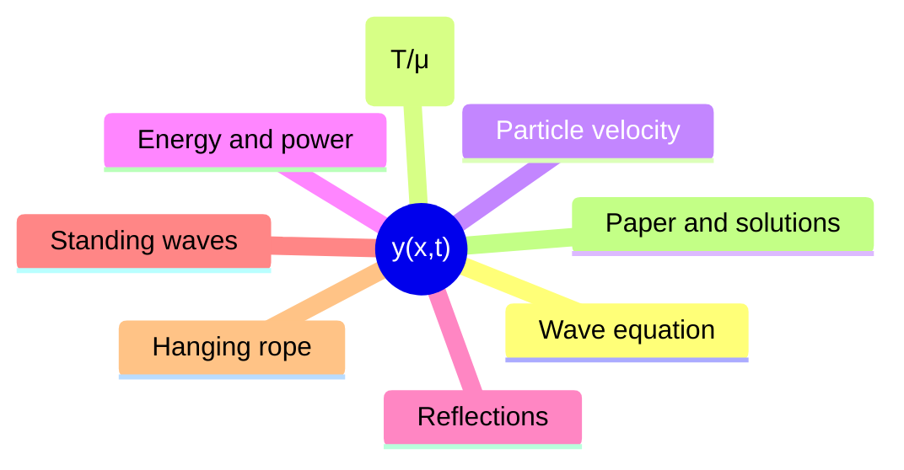
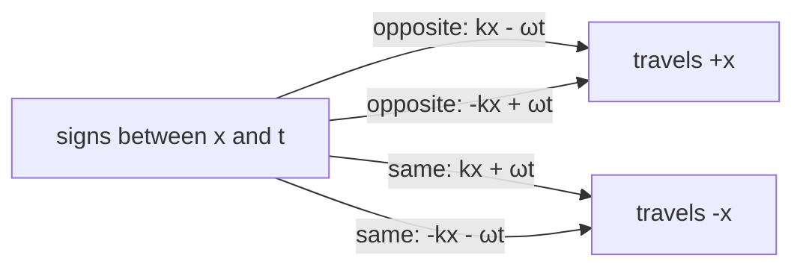
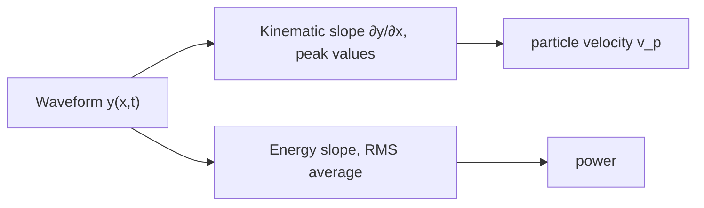
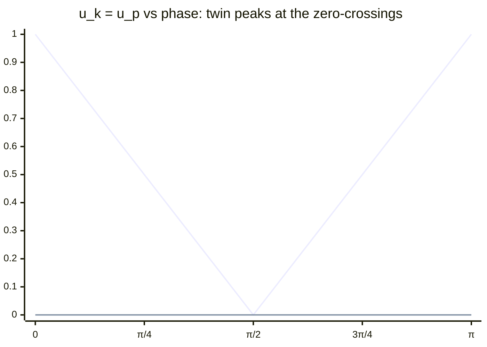
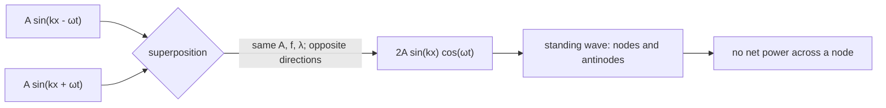
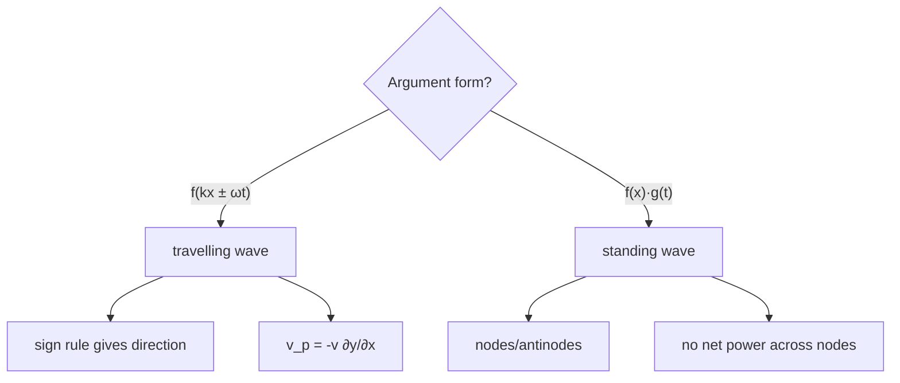

_11-part master note-set · JEE Advanced · NSEP · INPhO · IPhO · self-contained — opens with no internet, prints cleanly_

# String Waves — First Principles to Olympiad

A complete, proof-first treatment of transverse mechanical waves, string dynamics, boundary reflections, impedance matching, standing waves, harmonics, and energy transport. Every formula is **derived from foundational principles** — Newton's second law on a continuum element, conservation of linear momentum, and energy continuity — every boxed result carries its explicit condition of validity, and every subtle trap where JEE or Olympiad examiners catch students is systematically exposed.

**The core dynamical engine in one picture.** A pulse does not transport mass along the string; it transports transverse momentum and elastic potential energy. As curvature $\frac{\partial^2 y}{\partial x^2}$ develops, the tension vectors at the two ends no longer cancel, creating a net transverse restoring force that accelerates the mass element $dm = \mu \, dx$. That exact balance between inertial mass $\mu$ and restoring elasticity $T$ dictates the invariant propagation velocity $v = \sqrt{T/\mu}$.

---

### How these notes are organised

- **Part 1: [Foundations & Harmonic Wave Kinematics](#section-01-foundations)** What mechanical waves actually are; phase, wavelength, wavenumber, and the algebraic structure of traveling waves $f(x \mp vt)$.
- **Part 2: [Rigorous Derivations of Wave Speed & Wave Equation](#section-02-wave-equation)** Newton's second law for a curved infinitesimal string segment; derivation of the 1D classical wave equation; asymptotic limits ($T \to \infty$, $\mu \to 0$).
- **Part 3: [Particle Kinematics vs. Wave Motion](#section-03-particle-kinematics)** Transverse particle velocity $v_p = -v \frac{\partial y}{\partial x}$; particle acceleration; rapid slope inspection algorithms for wave profiles.
- **Part 4: [Energy Density, Power Transmission & Intensity](#section-04-energy-and-power)** Kinetic and elastic strain energy densities; proof of dynamic equipartition ($u_k = u_p$); instantaneous and time-averaged power $\langle P \rangle = \frac{1}{2}\mu \omega^2 A^2 v$.
- **Part 5: [Boundary Reflections & Impedance Matching](#section-05-reflections-and-impedance)** Fixed end (phase flip $\pi$) vs. Free end (in-phase reflection); transmission across discontinuous density interfaces; energy conservation check.
- **Part 6: [Superposition, Standing Waves & Resonances](#section-06-standing-waves)** Mathematical interference; standing wave nodes and antinodes; normal modes of fixed-fixed and fixed-free strings; Sonometer laws and Melde's experiment.
- **Part 7: [Advanced & Olympiad Machinery](#section-07-olympiad-toolkit)** Wave propagation in hanging heavy ropes under gravity; WKB approximation for non-uniform strings; transmission line analogies and mechanical impedance.
- **Part 8: [The Playbook, Traps & Mental Decision Trees](#section-08-playbook)** The 8-move triage method for wave mechanics; 12 fatal examiner traps; high-yield numbers to memorise.
- **Part 9: [Olympiad-Grade Paper · 36 Questions](#section-09-paper)** A full 3-hour examination paper modeled on JEE Advanced & INPhO standards (12 Single-Correct, 8 Multi-Correct, 6 Numerical, 10 Multi-Tier Olympiad Problems).
- **Part 10: [Comprehensive Step-by-Step Solutions](#section-10-solutions)** Complete mathematical derivations and alternative methods for all 36 examination problems.
- **Part 11: [Printable Formula Reference Sheet](#section-11-formula-sheet)** Compact reference tables containing every key formula paired with its exact condition of validity.

---

### Read this first: the four foundational truths

> [!tip] FIGURE F1.1 · Chapter map
> *Why:* the whole chapter is one function $y(x,t)$; the map shows the single spine Parts 1–11 hang off.
> *Data:* the eleven-part structure of the notes (foundations → wave equation → particles → energy → reflections → standing waves → olympiad → paper → solutions → sheet).

> *Read:* everything in this chapter is a slope, an area, or a boundary condition applied to one function $y(x,t)$.

1. **Matter does not travel; the disturbance travels.** Each particle of the medium oscillates purely transversely about its local equilibrium position. No mass is transported across the $x$-axis.
2. **Phase velocity depends purely on the properties of the medium.** For an ideal, flexible string, the speed $v = \sqrt{T/\mu}$ depends strictly on elastic restoring force $T$ and inertia per unit length $\mu$. It does not depend on amplitude, frequency, or wave profile (in the linear limit).
3. **In a progressive wave, kinetic and potential energy densities peak at the exact same location.** Unlike a simple harmonic oscillator where kinetic energy peaks at equilibrium and potential energy peaks at maximum displacement, a traveling wave's kinetic and elastic potential energy densities are **in phase**: both reach their absolute maximum at the zero-crossings (where slope is steepest) and are zero at the wave crests.
4. **Boundary conditions dictate phase jumps via mechanical impedance.** A fixed wall has infinite mechanical impedance, forcing the displacement to zero, which requires the reflected pulse to invert ($\Delta \phi = \pi$). A free end has zero transverse impedance, forcing the net transverse force (and slope) to zero, reflecting in phase ($\Delta \phi = 0$) and doubling the displacement amplitude at the boundary.

---
---

## Part 1: Foundations & Harmonic Wave Kinematics

### 1.1 The Definition of a Wave
A wave is an organized, self-propagating disturbance traveling through a medium (or field) that transports **energy**, **momentum**, and **information** without executing a net transport of matter.

In a **transverse mechanical wave**, the displacement $\vec y(x,t)$ of each constituent element of the medium is strictly perpendicular to the direction of energy propagation $\hat x$:
$$\vec y(x,t) \cdot \vec v_{\text{wave}} = 0$$

### 1.2 The General Mathematical Form of a 1D Traveling Wave
For any arbitrary profile to preserve its shape as it translates uniformly along the $x$-axis with speed $v$:
- Moving in the positive $x$-direction ($+x$):
  $$y(x, t) = f(x - vt)$$
- Moving in the negative $x$-direction ($-x$):
  $$y(x, t) = f(x + vt)$$

> **Condition of Validity:**
> The shape invariance $y = f(x \mp vt)$ holds strictly for **non-dispersive, linear media** where wave speed $v$ is independent of frequency $\omega$ and the amplitude is sufficiently small that Hooke's elastic limit is not exceeded.

To test whether any arbitrary mathematical expression $y(x,t)$ represents a valid traveling wave:
1. It must be expressible as a function of the single combined linear argument $\xi = kx \pm \omega t$ or $\xi = x \mp vt$.
2. It must remain finite and bounded for all real physical domains of $x$ and $t$ (no infinite singularities).

### 1.3 Plane Progressive Harmonic Waves
When the source executes Simple Harmonic Motion (SHM) of frequency $f = \frac{\omega}{2\pi}$ and amplitude $A$, the resulting disturbance is sinusoidal:

$$y(x, t) = A \sin(kx - \omega t + \phi_0)$$

Where:
- $A$: Wave amplitude (maximum transverse displacement, $[A] = \text{m}$)
- $\lambda$: Wavelength (spatial periodicity, the distance between two consecutive points having identical phase at any instant):
  $$\lambda = \frac{v}{f} = \frac{2\pi v}{\omega}$$
- $k$: Angular wavenumber or propagation constant:
  $$k \equiv \frac{2\pi}{\lambda} = \frac{\omega}{v} \quad ([k] = \text{rad}\cdot\text{m}^{-1})$$
- $\omega$: Angular frequency ($\omega = 2\pi f = \frac{2\pi}{T}$, $[\omega] = \text{rad}\cdot\text{s}^{-1}$)
- $\Phi(x,t) = kx - \omega t + \phi_0$: Total phase of the wave at position $x$ and time $t$.
- $\phi_0$: Initial phase constant (determined by the initial condition $y(0,0)$ and sign of $\dot y(0,0)$).

#### Phase Relationships

> [!tip] FIGURE F1.2 · The sign rule for direction
> *Why:* the single but non-obvious fact from the harmonic wave section — direction is read off the sign inside the argument, not off the algebra.
> *Data:* the four argument forms and the cases they produce.

> *Read:* opposite signs ($kx - \omega t$) travel right; same-sign arguments ($kx + \omega t$) travel left — the rest is execution.

The phase difference $\Delta \Phi$ between two points separated by spatial distance $\Delta x$ at the same instant $t$:
$$\Delta \Phi = k \, \Delta x = \frac{2\pi}{\lambda} \Delta x$$

The phase difference $\Delta \Phi$ at a fixed spatial location $x$ over a time interval $\Delta t$:
$$\Delta \Phi = \omega \, \Delta t = \frac{2\pi}{T} \Delta t$$

---

## Part 2: Rigorous Derivations of Wave Speed & Wave Equation

### 2.1 First-Principles Derivation of the 1D Wave Equation

Consider an infinitesimal element of a flexible string of linear mass density $\mu$ (mass per unit length, $\text{kg/m}$) stretched under equilibrium tension $T$ (Newtons). 

Let the equilibrium axis of the string lie along the $x$-axis. Consider an element located between spatial coordinates $x$ and $x + dx$. At time $t$, this element is displaced transversely to position $y(x,t)$.

The mass of this infinitesimal segment is:
$$dm = \mu \, dx$$

Let $\theta(x,t)$ be the angle that the tangent to the string makes with the horizontal $x$-axis at point $x$. The slope of the string at this point is:
$$\tan\theta(x,t) = \frac{\partial y}{\partial x}$$

#### Small-Amplitude (Linear) Approximation:
We assume paraxial displacements: the slope of the string everywhere is very small compared to unity:
$$\left|\frac{\partial y}{\partial x}\right| \ll 1 \implies \sin\theta \approx \tan\theta \approx \theta, \quad \cos\theta \approx 1 - \frac{\theta^2}{2} \approx 1$$

Under this approximation:
1. The horizontal component of tension remains constant:
   $$T_x = T \cos\theta \approx T = \text{constant}$$
   Consequently, there is no net horizontal force, and the element undergoes zero longitudinal displacement.
2. The transverse (vertical) force component exerted by the right part of the string on the segment at $x + dx$ is:
   $$F_{y,\text{right}} = + T \sin\theta(x + dx, t) \approx T \tan\theta(x + dx, t) = T \left.\frac{\partial y}{\partial x}\right|_{x+dx}$$
3. The transverse force exerted by the left part of the string at $x$ is:
   $$F_{y,\text{left}} = - T \sin\theta(x, t) \approx - T \tan\theta(x, t) = - T \left.\frac{\partial y}{\partial x}\right|_x$$

The net transverse force $dF_y$ acting on the element is:
$$dF_y = F_{y,\text{right}} + F_{y,\text{left}} = T \left[ \left.\frac{\partial y}{\partial x}\right|_{x+dx} - \left.\frac{\partial y}{\partial x}\right|_x \right] = T \, \frac{\partial}{\partial x}\left(\frac{\partial y}{\partial x}\right) dx = T \, \frac{\partial^2 y}{\partial x^2} dx$$

Applying Newton's Second Law ($dF_y = dm \cdot a_y = dm \, \frac{\partial^2 y}{\partial t^2}$):
$$T \, \frac{\partial^2 y}{\partial x^2} dx = (\mu \, dx) \frac{\partial^2 y}{\partial t^2}$$

Dividing across by $\mu \, dx$:

$$\frac{\partial^2 y}{\partial x^2} = \frac{\mu}{T} \frac{\partial^2 y}{\partial t^2} \implies \frac{\partial^2 y}{\partial t^2} = \left(\frac{T}{\mu}\right) \frac{\partial^2 y}{\partial x^2}$$

This is the standard **1D Classical Wave Equation**:
$$\frac{\partial^2 y}{\partial t^2} = v^2 \frac{\partial^2 y}{\partial x^2}$$

Equating coefficients yields the fundamental transverse wave speed:

$$\boxed{v = \sqrt{\frac{T}{\mu}}}$$

> **Condition of Validity:**
> 1. Perfectly flexible string (bending stiffness $EI \to 0$).
> 2. Small transverse slopes: $\left|\frac{\partial y}{\partial x}\right| \ll 1$.
> 3. Tension $T$ is uniform across the segment and significantly exceeds any gravity-induced tension variation unless explicitly modeled.
> 4. Inelastic string (negligible longitudinal stretching under the transverse deflection).

### 2.2 Asymptotic and Boundary Checks
- **Limit $T \to \infty$**: As tension increases without bound, the restoring force becomes instantaneous, and wave speed $v \to \infty$. Disturbance propagates instantaneously across the string.
- **Limit $\mu \to 0$**: As the inertia of the medium vanishes, propagation speed $v \to \infty$.
- **Dimensional Check**:
  $$[T] = \text{N} = \text{kg}\cdot\text{m}\cdot\text{s}^{-2}, \quad [\mu] = \text{kg}\cdot\text{m}^{-1}$$
  $$\left[\sqrt{\frac{T}{\mu}}\right] = \sqrt{\frac{\text{kg}\cdot\text{m}\cdot\text{s}^{-2}}{\text{kg}\cdot\text{m}^{-1}}} = \sqrt{\text{m}^2\cdot\text{s}^{-2}} = \text{m}\cdot\text{s}^{-1} \quad \checkmark$$

---

## Part 3: Particle Kinematics vs. Wave Motion

A pervasive source of confusion in wave mechanics is conflating the velocity of the wave profile with the physical motion of the particles of the medium.

### 3.1 Transverse Particle Velocity ($v_p$)
Let a wave propagate as $y(x,t) = f(\xi)$ where $\xi = x - vt$ (wave traveling in $+x$ direction with speed $v$).

By the multivariable chain rule:
- Particle transverse velocity:
  $$v_p \equiv \frac{\partial y}{\partial t} = f'(\xi) \cdot \frac{\partial \xi}{\partial t} = f'(\xi) \cdot (-v) = -v f'(\xi)$$
- Spatial gradient (slope of the string profile):
  $$\frac{\partial y}{\partial x} = f'(\xi) \cdot \frac{\partial \xi}{\partial x} = f'(\xi) \cdot (1) = f'(\xi)$$

Substituting $f'(\xi) = \frac{\partial y}{\partial x}$ yields the golden relationship:

$$\boxed{v_p(x,t) = -v_{\text{wave}} \left(\frac{\partial y}{\partial x}\right)}$$

> **Vector Sign Rules:**
> - For a wave moving along $+x$ ($v_{\text{wave}} = +v$):
>   $$v_p = -v \left(\frac{\partial y}{\partial x}\right)$$
>   - If the slope is positive ($\frac{\partial y}{\partial x} > 0$), particle moves downward ($v_p < 0$).
>   - If the slope is negative ($\frac{\partial y}{\partial x} < 0$), particle moves upward ($v_p > 0$).
>   - At wave crests and troughs ($\frac{\partial y}{\partial x} = 0$), the particle is momentarily at rest ($v_p = 0$).
> - For a wave moving along $-x$ ($v_{\text{wave}} = -v$):
>   $$v_p = -(-v)\left(\frac{\partial y}{\partial x}\right) = +v \left(\frac{\partial y}{\partial x}\right)$$

### 3.2 Transverse Particle Acceleration ($a_p$)
Differentiating $v_p$ with respect to time for a harmonic wave $y(x,t) = A \sin(kx - \omega t)$:
$$a_p \equiv \frac{\partial^2 y}{\partial t^2} = -\omega^2 A \sin(kx - \omega t) = -\omega^2 y(x,t)$$

Notice that every particle undergoes simple harmonic motion with restoring acceleration directed towards its own equilibrium position $y = 0$.

### 3.3 Rapid Slope Inspection Algorithm (The "Shift Method")
To determine the direction of velocity of any particle on a given snapshot curve $y(x)$ at $t = t_0$:
1. Sketch the waveform at a slightly later time $t = t_0 + \Delta t$ by shifting the entire curve slightly in the direction of wave travel.
2. At position $x$, observe whether the new curve is above or below the original curve.
3. If the new curve is higher, the particle is moving upward ($v_p > 0$). If lower, it is moving downward ($v_p < 0$).

> [!tip] FIGURE F1.3 · The two waveform envelopes
> *Why:* the peak-valued slope triangle is the mechanical key to the whole chapter — particle speed is a slope, not a height.
> *Data:* the contrast between the peak-valued kinematic slope (∂y/∂x ↦ v_p) and the root-mean-square-valued energy slope.

> *Read:* the first square gives velocities peak-to-peak; the second flattens them to their RMS value — mixing the two is the classic trap.

---

## Part 4: Energy Density, Power Transmission & Intensity

### 4.1 Kinetic Energy Density ($u_k$)
Consider an infinitesimal string element $dm = \mu \, dx$. Its instantaneous kinetic energy is:
$$dK = \frac{1}{2} (dm) v_p^2 = \frac{1}{2} (\mu \, dx) \left(\frac{\partial y}{\partial t}\right)^2$$

The kinetic energy density per unit length $u_k \equiv \frac{dK}{dx}$ is:
$$u_k = \frac{1}{2} \mu \left(\frac{\partial y}{\partial t}\right)^2$$

For a harmonic traveling wave $y = A \sin(kx - \omega t)$:
$$\frac{\partial y}{\partial t} = -\omega A \cos(kx - \omega t)$$
$$u_k = \frac{1}{2} \mu \omega^2 A^2 \cos^2(kx - \omega t)$$

### 4.2 Potential Energy Density ($u_p$)
As the string deforms transversely, the element of length $dx$ is stretched to length $ds$:
$$ds = \sqrt{(dx)^2 + (dy)^2} = dx \sqrt{1 + \left(\frac{\partial y}{\partial x}\right)^2}$$

Using the Taylor expansion for small slopes $\left(\frac{\partial y}{\partial x}\right)^2 \ll 1$:
$$ds \approx dx \left[ 1 + \frac{1}{2}\left(\frac{\partial y}{\partial x}\right)^2 \right]$$

The extension of the element is $\Delta l = ds - dx = \frac{1}{2}\left(\frac{\partial y}{\partial x}\right)^2 dx$.  
The elastic work done by tension in stretching this segment against its equilibrium state is:
$$dU = T \Delta l = \frac{1}{2} T \left(\frac{\partial y}{\partial x}\right)^2 dx$$

The potential energy density per unit length $u_p \equiv \frac{dU}{dx}$ is:
$$u_p = \frac{1}{2} T \left(\frac{\partial y}{\partial x}\right)^2$$

For our harmonic traveling wave:
$$\frac{\partial y}{\partial x} = k A \cos(kx - \omega t)$$
$$u_p = \frac{1}{2} T k^2 A^2 \cos^2(kx - \omega t)$$

Since $v = \frac{\omega}{k} = \sqrt{\frac{T}{\mu}} \implies T k^2 = \mu \omega^2$:
$$u_p = \frac{1}{2} \mu \omega^2 A^2 \cos^2(kx - \omega t)$$

> **CRITICAL INSIGHT (Dynamic Equipartition in Progressive Waves):**
> $$u_k(x,t) = u_p(x,t) = \frac{1}{2} \mu \omega^2 A^2 \cos^2(kx - \omega t)$$
> In a traveling progressive wave, the kinetic energy density and potential energy density are **strictly equal at every point in space and at every instant in time**.
> - At the crests and troughs: $y = \pm A \implies \cos(kx-\omega t) = 0 \implies u_k = 0, u_p = 0$. The element has zero kinetic energy and zero stretch!
> - At the nodes of equilibrium ($y = 0$): $\cos(kx-\omega t) = \pm 1 \implies u_k$ and $u_p$ both reach their maximum possible value:
>   $$u_{\max} = \mu \omega^2 A^2$$

### 4.3 Total Energy Density ($u$)
The total mechanical energy per unit length is:
$$u(x,t) = u_k + u_p = \mu \omega^2 A^2 \cos^2(kx - \omega t)$$

> [!tip] FIGURE F1.4 · Energy density is in phase with the wave
> *Why:* the energy crests sit at the wave's zero-crossings, not its amplitude peaks — a fact that contradicts harmonic-oscillator intuition.
> *Data:* $u_k = u_p = \frac{1}{2}\mu\omega^2 A^2 \cos^2\theta$ sampled at $\theta \in \{0, \pi/4, \pi/2, 3\pi/4, \pi\}$.

> *Read:* kinetic and potential energy densities peak together at the displacement zero-crossings and vanish at the wave crests — unlike an oscillator, never out of phase.

The spatial or temporal average over a full cycle (since $\langle \cos^2\theta \rangle = \frac{1}{2}$) is:

$$\boxed{\langle u \rangle = \frac{1}{2} \mu \omega^2 A^2}$$

### 4.4 Instantaneous and Average Power Transmission
Power is the rate at which the segment of string to the left of coordinate $x$ does work on the segment to the right of $x$.

The transverse force exerted by the left segment on the right segment is:
$$F_y = -T \frac{\partial y}{\partial x}$$

The velocity of the point of application is the particle velocity $v_p = \frac{\partial y}{\partial t}$.  
Thus, the instantaneous power transmitted past point $x$ is:
$$P(x,t) = F_y \cdot v_p = -T \left(\frac{\partial y}{\partial x}\right)\left(\frac{\partial y}{\partial t}\right)$$

For a forward traveling wave $y = A \sin(kx - \omega t)$:
$$P(x,t) = -T \big[ k A \cos(kx - \omega t) \big] \big[ -\omega A \cos(kx - \omega t) \big] = T k \omega A^2 \cos^2(kx - \omega t)$$

Substituting $T k = \mu v^2 k = \mu v \omega$:
$$P(x,t) = \mu \omega^2 A^2 v \cos^2(kx - \omega t) = u(x,t) \cdot v$$

Notice that instantaneous power equals energy density multiplied by wave velocity!

Taking the time average over one cycle:

$$\boxed{\langle P \rangle = \frac{1}{2} \mu \omega^2 A^2 v}$$

Alternatively, expressing power in terms of tension $T$ and wave velocity $v$:
$$\langle P \rangle = \frac{1}{2} \frac{T}{v} \omega^2 A^2 = \frac{1}{2} \sqrt{\mu T} \, \omega^2 A^2$$

---

## Part 5: Boundary Reflections & Impedance Matching

When a traveling wave pulse encounters a discontinuity or termination, boundary constraints dictate how much energy reflects back and how much transmits forward.

### 5.1 Reflection at a Fixed End (Rigid Termination)
At a fixed boundary (e.g. string clamped rigidly to a massive wall at $x = 0$):
$$\left. y(x,t) \right|_{x=0} = 0 \quad \text{for all } t$$

Let the incident wave be $y_i(x,t) = f(x - vt)$. The reflected wave must travel to the left: $y_r(x,t) = g(x + vt)$.  
By the superposition principle, total displacement at the wall must vanish:
$$y(0,t) = f(-vt) + g(vt) = 0 \implies g(vt) = -f(-vt)$$

Letting $\xi = vt$:
$$g(\xi) = -f(-\xi) \implies y_r(x,t) = -f(-(x + vt))$$

> **The Fixed-End Rule:**
> The reflected wave is **inverted** (multiplied by $-1$). In the language of harmonic waves, reflection from a rigid / fixed boundary introduces an abrupt **phase shift of $\pi$ radians ($180^\circ$)**.

### 5.2 Reflection at a Free End (Massless Ring on Smooth Rod)
At a free boundary (e.g. string attached to a massless ring sliding frictionlessly along a vertical rod at $x = 0$):
Because the ring has zero mass, any non-zero transverse force would produce infinite acceleration. Hence, the net transverse vertical force on the boundary must vanish:
$$\left. F_y \right|_{x=0} = \left. -T \frac{\partial y}{\partial x} \right|_{x=0} = 0 \implies \left. \frac{\partial y}{\partial x} \right|_{x=0} = 0$$

Superimposing incident and reflected pulses:
$$\left. \frac{\partial y}{\partial x} \right|_{x=0} = f'(-vt) + g'(vt) = 0 \implies g'(vt) = -f'(-vt)$$

Integrating both sides with respect to time:
$$g(vt) = f(-vt) + C \implies g(\xi) = f(-\xi)$$

> **The Free-End Rule:**
> The reflected wave is **upright / erect** (not inverted). There is **zero phase change ($\Delta \phi = 0$)** upon reflection from a free boundary. The amplitude of the antinode at the free boundary is exactly doubled ($y_{\max} = 2A$).

---

### 5.3 Reflection and Transmission at a Density Step (Impedance Boundary)
Consider two semi-infinite strings joined seamlessly at $x = 0$:
- String 1 ($x < 0$): Linear mass density $\mu_1$, wave speed $v_1 = \sqrt{T/\mu_1}$.
- String 2 ($x > 0$): Linear mass density $\mu_2$, wave speed $v_2 = \sqrt{T/\mu_2}$.
- Tension $T$ is identical in both strings to maintain static equilibrium at the knot.

Let a harmonic wave be incident from String 1 traveling towards $+x$:
$$y_i(x,t) = A_i \sin(k_1 x - \omega t)$$
$$y_r(x,t) = A_r \sin(-k_1 x - \omega t + \phi_r)$$
$$y_t(x,t) = A_t \sin(k_2 x - \omega t)$$

#### Boundary Conditions at the Junction $x = 0$:
1. **Displacement Continuity**: The string cannot snap or tear:
   $$y_1(0, t) = y_2(0, t) \implies A_i \sin(-\omega t) + A_r \sin(-\omega t + \phi_r) = A_t \sin(-\omega t)$$
   $$\implies A_i + A_r = A_t \quad (\text{taking algebraic signed amplitudes})$$

2. **Transverse Force Continuity**: Since the knot at $x = 0$ has zero mass ($m_{\text{knot}} \to 0$), the net vertical force must be zero, meaning the slope across the knot must be continuous:
   $$T \left.\frac{\partial y_1}{\partial x}\right|_{x=0} = T \left.\frac{\partial y_2}{\partial x}\right|_{x=0} \implies \left.\frac{\partial y_1}{\partial x}\right|_{x=0} = \left.\frac{\partial y_2}{\partial x}\right|_{x=0}$$
   $$k_1 A_i \cos(-\omega t) - k_1 A_r \cos(-\omega t) = k_2 A_t \cos(-\omega t)$$
   $$\implies k_1 (A_i - A_r) = k_2 A_t$$

Since $\omega = v_1 k_1 = v_2 k_2 \implies k_1/k_2 = v_2/v_1$:
$$A_i - A_r = \left(\frac{k_2}{k_1}\right) A_t = \left(\frac{v_1}{v_2}\right) A_t$$

Solving this system of two linear equations:
$$A_t = A_i + A_r$$
$$A_i - A_r = \frac{v_1}{v_2}(A_i + A_r) \implies A_i\left(1 - \frac{v_1}{v_2}\right) = A_r\left(1 + \frac{v_1}{v_2}\right)$$

This yields the fundamental **Reflection and Transmission Coefficients**:

$$\boxed{r \equiv \frac{A_r}{A_i} = \frac{v_2 - v_1}{v_2 + v_1} = \frac{\sqrt{\mu_1} - \sqrt{\mu_2}}{\sqrt{\mu_1} + \sqrt{\mu_2}} = \frac{k_1 - k_2}{k_1 + k_2}}$$

$$\boxed{t \equiv \frac{A_t}{A_i} = \frac{2v_2}{v_1 + v_2} = \frac{2\sqrt{\mu_1}}{\sqrt{\mu_1} + \sqrt{\mu_2}} = \frac{2k_1}{k_1 + k_2}}$$

#### Physical Analysis of the Cases:
1. **Denser to Rarer Medium ($\mu_1 > \mu_2 \implies v_2 > v_1$):**
   - $r > 0$: $A_r$ has the same sign as $A_i$. The reflected wave suffers **no phase change** ($\Delta \phi = 0$).
   - $t > 1$: Transmitted amplitude is actually larger than incident amplitude ($A_t > A_i$)!
2. **Rarer to Denser Medium ($\mu_1 < \mu_2 \implies v_2 < v_1$):**
   - $r < 0$: $A_r$ has opposite sign to $A_i$. The reflected wave is **inverted** ($\Delta \phi = \pi$).
   - $0 < t < 1$: Transmitted wave is erect with smaller amplitude.
3. **Rigid Wall Limit ($\mu_2 \to \infty \implies v_2 \to 0$):**
   - $r = \frac{0 - v_1}{0 + v_1} = -1 \implies A_r = -A_i$ (complete inversion, fixed end).
   - $t = 0$ (zero transmission).
4. **Free End Limit ($\mu_2 \to 0 \implies v_2 \to \infty$):**
   - $r = \frac{v_2 - 0}{v_2 + 0} = +1 \implies A_r = +A_i$ (complete reflection in phase).
   - $t = 2 \implies A_t = 2A_i$ (antinode with double amplitude).

#### Verification of Conservation of Energy:
Average incident power: $\langle P_i \rangle = \frac{1}{2}\mu_1 \omega^2 A_i^2 v_1$  
Average reflected power: $\langle P_r \rangle = \frac{1}{2}\mu_1 \omega^2 A_r^2 v_1 = r^2 \langle P_i \rangle$  
Average transmitted power: $\langle P_t \rangle = \frac{1}{2}\mu_2 \omega^2 A_t^2 v_2 = \frac{\mu_2 v_2}{\mu_1 v_1} t^2 \langle P_i \rangle$  

Notice that since $\mu_1 v_1 = \sqrt{\mu_1 T}$ and $\mu_2 v_2 = \sqrt{\mu_2 T}$:
$$\frac{\langle P_r \rangle + \langle P_t \rangle}{\langle P_i \rangle} = r^2 + \frac{v_1}{v_2} t^2 = \left(\frac{v_2 - v_1}{v_1 + v_2}\right)^2 + \frac{v_1}{v_2}\left(\frac{2v_2}{v_1 + v_2}\right)^2 = \frac{(v_2 - v_1)^2 + 4v_1 v_2}{(v_1 + v_2)^2} = \frac{(v_2 + v_1)^2}{(v_1 + v_2)^2} \equiv 1 \quad \checkmark$$
Energy conservation holds identically!

---

## Part 6: Superposition, Standing Waves & Resonances

### 6.1 The Mathematical Engine of Standing Waves
When two identical harmonic waves of identical frequency, wavelength, and amplitude travel in opposite directions along the same string:
$$y_1(x,t) = A \sin(kx - \omega t)$$
$$y_2(x,t) = A \sin(kx + \omega t)$$

Applying the trigonometric identity $\sin(A - B) + \sin(A + B) = 2\sin A \cos B$:

$$\boxed{y(x,t) = y_1 + y_2 = [2A \sin(kx)] \cos(\omega t)}$$

This is the standard equation of a **Stationary / Standing Wave**.

#### Key Physical Characteristics:
1. **Space-Time Factorization**: The spatial dependence $S(x) = 2A \sin(kx)$ is completely decoupled from the temporal oscillation $T(t) = \cos(\omega t)$.
2. **Variable Local Amplitude**: Every particle executes SHM with angular frequency $\omega$, but with a position-dependent amplitude:
   $$A_{\text{local}}(x) = |2A \sin(kx)|$$
3. **Nodes**: Positions of permanent zero motion ($A_{\text{local}} = 0$):
   $$\sin(kx) = 0 \implies kx = n\pi \implies x = n \frac{\lambda}{2} \quad (n = 0, 1, 2, \dots)$$
   The distance between two consecutive nodes is $\Delta x_{\text{node}} = \frac{\lambda}{2}$.
4. **Antinodes**: Positions of maximum displacement amplitude ($A_{\text{local}} = 2A$):
   $$|\sin(kx)| = 1 \implies kx = \left(n + \frac{1}{2}\right)\pi \implies x = \left(n + \frac{1}{2}\right)\frac{\lambda}{2} \quad (n = 0, 1, 2, \dots)$$
   The distance between two consecutive antinodes is $\frac{\lambda}{2}$.  
   The distance between adjacent node and antinode is $\frac{\lambda}{4}$.
5. **Phase Coherence between Nodes**:
   - All particles situated within a single loop (between two adjacent nodes) cross their equilibrium positions simultaneously and reach their peak displacements simultaneously: they are strictly **in phase** ($\Delta \phi = 0$).
   - Particles in adjacent loops separated by a single node have opposite signs of $\sin(kx)$: they oscillate in **antiphase** ($\Delta \phi = \pi$).
6. **Zero Net Energy Flow**: Because the wave is composed of two identical counter-propagating waves carrying equal power in opposite directions, the net time-averaged power transmitted past any node is:
   $$\langle P \rangle_{\text{node}} = 0$$
   Energy remains permanently trapped within each resonant loop, sloshing back and forth between purely kinetic energy (at $t = T/4, 3T/4$ when string is flat) and purely elastic potential energy (at $t = 0, T/2$ when string is at maximum curvature).

---

### 6.2 Normal Modes of a String Fixed at Both Ends

Let a string of length $L$ be clamped rigidly at $x = 0$ and $x = L$.
- Boundary Condition 1: $y(0,t) = 0 \implies$ satisfies $y = [2A \sin(kx)] \cos(\omega t)$.
- Boundary Condition 2: $y(L,t) = 0$:
  $$2A \sin(k L) \cos(\omega t) = 0 \implies \sin(k L) = 0 \implies k L = n\pi \quad (n = 1, 2, 3, \dots)$$

Since $k = \frac{2\pi}{\lambda}$:
$$\frac{2\pi}{\lambda_n} L = n\pi \implies \boxed{\lambda_n = \frac{2L}{n}} \quad (n = 1, 2, 3, \dots)$$

The corresponding discrete eigenfrequencies (resonant frequencies) are:

$$\boxed{f_n = \frac{v}{\lambda_n} = n \left(\frac{v}{2L}\right) = \frac{n}{2L}\sqrt{\frac{T}{\mu}} \quad (n = 1, 2, 3, \dots)}$$

- **Fundamental Mode ($n = 1$) / First Harmonic**:
  $$\lambda_1 = 2L, \quad f_1 = \frac{v}{2L} = \frac{1}{2L}\sqrt{\frac{T}{\mu}}$$
  Contains 2 nodes (at endpoints) and 1 antinode (at center).
- **Second Harmonic ($n = 2$) / First Overtone**:
  $$\lambda_2 = L, \quad f_2 = 2f_1$$
  Contains 3 nodes and 2 antinodes.
- **$n$-th Harmonic / $(n-1)$-th Overtone**:
  $$f_n = n f_1$$
  Contains $(n + 1)$ nodes and $n$ antinodes (loops).

> **Crucial Distinction: Harmonic vs Overtone:**
> - **Harmonic** refers to integer multiples of the fundamental frequency ($n \cdot f_1$).
> - **Overtone** refers to the sequence of actual resonant physical modes above the fundamental. For a string fixed at both ends, all integer harmonics exist, so the $m$-th overtone is the $(m+1)$-th harmonic.

> [!tip] FIGURE F1.5 · Superposition begets standing waves
> *Why:* a standing wave is two travelling waves, not a new phenomenon — the flowchart prevents the most persistent misconception in Part 6.
> *Data:* the decomposition $2A \sin(kx)\cos(\omega t) = A\sin(kx-\omega t) + A\sin(kx+\omega t)$.

> *Read:* equal amplitude, frequency, and wavelength with opposite directions make a standing wave — and it traps, rather than transmits, energy.

---

### 6.3 Normal Modes of a String Fixed at One End and Free at the Other
Let the string be clamped rigidly at $x = 0$ (Node) and attached to a frictionless ring at $x = L$ (Antinode).
- $y(0,t) = 0 \implies y = [2A \sin(kx)] \cos(\omega t)$
- Antinode at $x = L \implies \left.\frac{\partial y}{\partial x}\right|_{x=L} = 0 \implies \cos(kL) = 0$:
  $$kL = (2m - 1)\frac{\pi}{2} \quad (m = 1, 2, 3, \dots)$$

$$\boxed{\lambda_m = \frac{4L}{2m - 1}, \quad f_m = (2m - 1)\frac{v}{4L} = (2m - 1) f_1 \quad (m = 1, 2, 3, \dots)}$$

Only **ODD harmonics** are physically present:
- $m = 1$: Fundamental / 1st Harmonic: $f_1 = \frac{v}{4L}$
- $m = 2$: 1st Overtone / 3rd Harmonic: $f_2 = 3 f_1$
- $m = 3$: 2nd Overtone / 5th Harmonic: $f_3 = 5 f_1$

---

### 6.4 The Sonometer Laws
A sonometer consists of a stretched wire mounted over two knife-edge bridges separated by distance $L$, tensioned by hanging weights $M$ ($T = M g$).  
From the fundamental frequency equation $f = \frac{1}{2L}\sqrt{\frac{T}{\mu}} = \frac{1}{2L}\sqrt{\frac{T}{\pi r^2 \rho}}$:

1. **Law of Length**: For constant $T$ and $\mu$:
   $$f \propto \frac{1}{L} \implies f \cdot L = \text{constant}$$
2. **Law of Tension**: For constant $L$ and $\mu$:
   $$f \propto \sqrt{T} \implies \frac{f}{\sqrt{T}} = \text{constant}$$
3. **Law of Mass**: For constant $L$ and $T$:
   $$f \propto \frac{1}{\sqrt{\mu}} \propto \frac{1}{r\sqrt{\rho}}$$

### 6.5 Melde's Experiment
Melde's experiment determines the frequency of an electrically driven tuning fork by coupling it to a stretched string in two distinct orientations:

#### 1. Transverse Arrangement:
The prongs of the tuning fork vibrate perpendicular to the length of the string.  
In one complete cycle of the tuning fork prong, the attached end of the string is displaced up and down through one full period.  
$$\therefore \nu_{\text{string}} = \nu_{\text{fork}}$$
If the string vibrates in $p$ resonant loops of length $L$:
$$\nu_{\text{fork}} = \frac{p}{2L}\sqrt{\frac{T}{\mu}} \implies \frac{p^2 T}{L^2} = \text{constant}$$

#### 2. Longitudinal Arrangement:
The prongs of the tuning fork vibrate parallel to the length of the string.  
When the prong moves outward, the string slackens; when it moves inward, the string tightens. In one full vibration cycle of the prong, tension peaks and drops twice. Thus, the string completes only half an oscillation per fork period:
$$\nu_{\text{string}} = \frac{1}{2} \nu_{\text{fork}}$$
If the string forms $p$ loops in length $L$:
$$\nu_{\text{fork}} = 2 \times \left(\frac{p}{2L}\sqrt{\frac{T}{\mu}}\right) = \frac{p}{L}\sqrt{\frac{T}{\mu}}$$

---

## Part 7: Advanced & Olympiad Machinery

### 7.1 Wave Propagation in a Heavy Hanging Rope under Gravity

Consider a uniform rope of total mass $M$, length $L$, and linear mass density $\mu = M/L$ suspended vertically from a rigid ceiling under the influence of gravity $g$.

Let $y$ be the vertical coordinate measured **from the bottom free end upward** ($0 \le y \le L$).  
At height $y$, the tension in the rope is caused purely by the weight of the rope segment hanging below it:
$$T(y) = (\mu y) g$$

The local wave propagation speed at height $y$ is:

$$\boxed{v(y) = \sqrt{\frac{T(y)}{\mu}} = \sqrt{\frac{\mu g y}{\mu}} = \sqrt{g y}}$$

#### Immediate Physical Consequences:
1. At the bottom tip ($y = 0$): $T(0) = 0 \implies v(0) = 0$. The wave speed drops to zero at the free tip!
2. At the top ceiling anchor ($y = L$): $v(L) = \sqrt{gL}$ (maximum speed).

#### Travel Time for a Pulse Initiated at the Bottom to Reach the Top:
Since $v(y) = \frac{dy}{dt} = \sqrt{gy}$:
$$dt = \frac{dy}{\sqrt{gy}} = \frac{1}{\sqrt{g}} y^{-1/2} \, dy$$

Integrating from bottom ($y = 0$) to top ($y = L$):
$$t = \frac{1}{\sqrt{g}} \int_{0}^{L} y^{-1/2} \, dy = \frac{1}{\sqrt{g}} \left[ 2\sqrt{y} \right]_{0}^{L}$$

$$\boxed{t = 2 \sqrt{\frac{L}{g}}}$$

> **Mind-Blowing Comparison (JEE Advanced Trap):**
> Compare this with a particle dropped from rest under gravity from the top of the rope to the bottom:
> $$L = \frac{1}{2}g t_{\text{fall}}^2 \implies t_{\text{fall}} = \sqrt{\frac{2L}{g}}$$
> The ratio of pulse travel time to free-fall time is:
> $$\frac{t_{\text{wave}}}{t_{\text{fall}}} = \frac{2\sqrt{L/g}}{\sqrt{2L/g}} = \sqrt{2} \approx 1.414$$
> The wave takes $\sqrt{2}$ times longer than a falling stone!

#### Motion with a Non-Zero Bottom Load:
If a block of mass $M_0$ is suspended from the bottom tip of the rope:
$$T(y) = M_0 g + \mu g y$$
$$v(y) = \sqrt{\frac{M_0 g + \mu g y}{\mu}} = \sqrt{g\left(\frac{M_0}{\mu} + y\right)}$$
$$t = \int_{0}^{L} \frac{dy}{\sqrt{g\left(\frac{M_0}{\mu} + y\right)}} = \frac{2}{\sqrt{g}} \left[ \sqrt{L + \frac{M_0}{\mu}} - \sqrt{\frac{M_0}{\mu}} \right]$$

---

### 7.2 The WKB Approximation for Waves in Inhomogeneous Strings
When the linear density $\mu(x)$ or tension $T(x)$ varies smoothly along the string such that the fractional change over one wavelength is small:
$$\left|\frac{\lambda}{v} \frac{dv}{dx}\right| \ll 1$$

Under this adiabatic variation, energy is conserved without significant reflection.  
Because the average power transmitted past any section must remain constant:
$$\langle P \rangle = \frac{1}{2} \mu(x) \omega^2 [A(x)]^2 v(x) = \text{constant}$$

Substituting $\mu(x) v(x) = \sqrt{\mu(x) T} = \frac{T}{v(x)}$ (assuming constant tension $T$):
$$[A(x)]^2 \frac{1}{v(x)} = \text{constant} \implies A(x) \propto \sqrt{v(x)}$$

Since $v(x) = \sqrt{\frac{T}{\mu(x)}} \propto [\mu(x)]^{-1/2}$:

$$\boxed{A(x) \propto [\mu(x)]^{-1/4}}$$

> **Olympiad Implication:**
> As a wave propagates into a tapering region where the string becomes thinner ($\mu \to 0$):
> - Wave speed increases: $v \propto \mu^{-1/2} \to \infty$.
> - Wavelength elongates: $\lambda = v/f \propto \mu^{-1/2}$.
> - Amplitude grows: $A \propto \mu^{-1/4}$ (leading to wave peaking and whip-crack effects).

---

## Part 8: The Playbook, Traps & Mental Decision Trees

### 8.1 The 8-Move Wave Triage Tree

> [!tip] FIGURE F1.6 · Triage — travelling or standing first?
> *Why:* the first question routes the entire solution; the flowchart makes the discrimination explicit.
> *Data:* the first rule of §8.1 — the form of the argument decides travelling vs standing.

> *Read:* the form of the argument names the species first; direction, particle velocity, and energy each follow from the right branch.

When faced with an unfamiliar wave mechanics problem in JEE Advanced or INPhO, follow this decision tree:

1. **Traveling or Standing?**
   - If argument is $(kx \pm \omega t) \implies$ Progressive / Traveling wave. Transports power $\langle P \rangle = \frac{1}{2}\mu\omega^2 A^2 v$.
   - If function factors as $f(x) \cdot g(t) \implies$ Standing wave. Traps energy, no net energy transmission across nodes.
2. **Find Propagation Direction Instantly:**
   - Sign between $x$ and $t$:
     - Opposite signs (e.g. $+kx - \omega t$ or $-kx + \omega t$) $\implies$ travels in $+x$ direction.
     - Same signs (e.g. $+kx + \omega t$ or $-kx - \omega t$) $\implies$ travels in $-x$ direction.
3. **Find Particle Velocity Instantly:**
   - Always evaluate $v_p = -v_{\text{wave}} \left(\frac{\partial y}{\partial x}\right)$. Never forget the minus sign and the vector direction of $v_{\text{wave}}$.
4. **Boundary Reflections:**
   - Fixed end: Flip upside down ($\Delta \phi = \pi$).
   - Free end: Upright reflection ($\Delta \phi = 0$), antinode amplitude $2A$.
5. **String Junctions:**
   - Denser $\to$ Rarer: $v_2 > v_1 \implies$ Reflected wave upright ($\Delta \phi = 0$).
   - Rarer $\to$ Denser: $v_2 < v_1 \implies$ Reflected wave inverted ($\Delta \phi = \pi$).
6. **Counting Harmonics on Strings:**
   - Fixed at both ends: $\lambda_n = \frac{2L}{n}$, all harmonics $f_n = n f_1$ present.
   - One end free: $\lambda_m = \frac{4L}{2m-1}$, only odd harmonics $f_m = (2m-1) f_1$ present.
7. **Hanging Ropes:**
   - $v(y) = \sqrt{gy}$ measured from free bottom. Time to top $t = 2\sqrt{L/g}$. Acceleration of pulse $a = \frac{dv}{dt} = \frac{g}{2} = \text{constant}$.
8. **Phase Difference Currency:**
   $$\Delta \phi = \frac{2\pi}{\lambda} \Delta x = \frac{2\pi}{T} \Delta t$$

---

### 8.2 Top 10 Fatal Examiner Traps

| # | The Classic Student Trap | The Rigorous Physical Reality |
|---|---|---|
| 1 | Assuming kinetic energy peaks at maximum displacement in a traveling wave. | **TRAP!** In SHM of a single mass, $K=0$ at crests. But in a *traveling wave*, $u_k = u_p = 0$ at the crests! Kinetic and elastic energy both reach their maximum at the zero-crossings ($y=0$) where slope is steepest. |
| 2 | Forgetting the minus sign in $v_p = -v (\partial y/\partial x)$. | For a wave moving along $+x$, a positive slope means the particle is moving *downward* ($v_p < 0$). |
| 3 | Writing $f_n = n \frac{v}{2L}$ for a string with one free end. | A string with one free end has an antinode at the boundary, generating only odd harmonics: $f_m = (2m-1)\frac{v}{4L}$. |
| 4 | Believing transmitted waves can suffer a phase inversion. | The transmission coefficient $t = \frac{2v_2}{v_1 + v_2}$ is **strictly positive** for all real media. A transmitted wave is *always in phase* ($\Delta \phi = 0$). Only the reflected wave can invert! |
| 5 | Assuming wave speed changes when amplitude or frequency is doubled. | Wave speed $v = \sqrt{T/\mu}$ is a geometric/material invariant. Changing $f$ changes $\lambda$, but leaves $v$ unchanged. |
| 6 | Misidentifying the overtone order. | For a system with all harmonics, the $m$-th overtone is the $(m+1)$-th harmonic. For odd-only systems, the $m$-th overtone is the $(2m+1)$-th harmonic! |
| 7 | Calculating pulse travel time on a hanging rope as $t = L/v_{\text{avg}}$. | Velocity $v(y) = \sqrt{gy}$ is non-linear with position. You must integrate $dt = dy/\sqrt{gy}$, yielding $t = 2\sqrt{L/g}$, NOT $L/\sqrt{gL} = \sqrt{L/g}$! |
| 8 | Assuming the pulse acceleration in a heavy rope depends on rope mass. | Acceleration of the wave pulse is $a = \frac{d}{dt}\sqrt{gy} = \frac{g}{2\sqrt{gy}}\frac{dy}{dt} = \frac{g}{2}$. It is completely independent of $M$, $L$, and $\mu$! |
| 9 | Treating $y = A \sin(kx - \omega t)$ and $y = A \cos(kx - \omega t)$ as different speeds. | They have the exact same speed and frequency; they merely differ by a global time/space phase offset of $\pi/2$. |
| 10 | Confusing power transmission with total energy stored. | Power is the rate of energy *flux* past a coordinate ($P = u \cdot v$). In standing waves, stored energy is non-zero, but time-averaged power flux is identically zero! |

---

## Part 9: Olympiad-Grade Paper · 36 Questions

- **Total Time**: 180 minutes (3.0 Hours)
- **Total Marks**: 144 Marks
- **Sections**:
  - Section I: 12 Single-Correct Multiple Choice (3 Marks each, -1 penalty)
  - Section II: 8 Multi-Correct Choice (4 Marks each, partial marking, -2 penalty)
  - Section III: 6 Numerical / Integer Value (4 Marks each, 0 penalty)
  - Section IV: 10 Comprehensive Olympiad Long-Form Problems (6 Marks each)

### Section I: Single-Correct Multiple Choice (Questions 1–12)

**Q1.** A transverse harmonic wave on a string is given by $y(x,t) = 0.05 \sin(4\pi x - 20\pi t)$, where $x, y$ are in meters and $t$ is in seconds. The maximum transverse acceleration of any particle on the string is:  
(A) $20\pi^2\text{ m/s}^2$  
(B) $100\pi^2\text{ m/s}^2$  
(C) $200\pi^2\text{ m/s}^2$  
(D) $20\text{ m/s}^2$

**Q2.** A uniform rope of length $L$ and total mass $M$ hangs vertically from a rigid support. A transverse pulse is generated at the bottom. The velocity of the pulse as a function of distance $y$ from the bottom satisfies:  
(A) $v \propto y$  
(B) $v \propto \sqrt{y}$  
(C) $v \propto y^2$  
(D) $v = \text{constant}$

**Q3.** Two strings of linear mass densities $\mu$ and $9\mu$ are joined together at $x = 0$. A harmonic wave of amplitude $A_0$ is incident from the lighter string onto the junction. The amplitude of the wave transmitted into the heavier string is:  
(A) $\frac{1}{2} A_0$  
(B) $\frac{2}{3} A_0$  
(C) $\frac{1}{4} A_0$  
(D) $\frac{3}{2} A_0$

**Q4.** A standing wave on a string fixed at both ends is given by $y(x,t) = 4 \sin\left(\frac{\pi x}{15}\right) \cos(96\pi t)$ ($x$ in cm, $t$ in s). The distance between two consecutive nodes is:  
(A) $7.5\text{ cm}$  
(B) $15\text{ cm}$  
(C) $30\text{ cm}$  
(D) $60\text{ cm}$

**Q5.** In a traveling transverse wave on a string, the instantaneous kinetic energy density $u_k$ and elastic potential energy density $u_p$ at a crest are:  
(A) $u_k = \max, u_p = 0$  
(B) $u_k = 0, u_p = \max$  
(C) $u_k = 0, u_p = 0$  
(D) $u_k = \max, u_p = \max$

**Q6.** A sonometer wire of length $100\text{ cm}$ is in fundamental resonance with a tuning fork. When the length is shortened by $5\text{ cm}$ without changing tension, it produces $4\text{ beats/s}$ with the same fork. The frequency of the fork is:  
(A) $76\text{ Hz}$  
(B) $80\text{ Hz}$  
(C) $84\text{ Hz}$  
(D) $100\text{ Hz}$

**Q7.** A wave pulse is described by $y(x,t) = \frac{a^3}{a^2 + (x - vt)^2}$. The total energy carried by this wave pulse is proportional to:  
(A) $a^2$  
(B) $a^3$  
(C) $a$  
(D) $a^0$ (independent of $a$)

**Q8.** A uniform heavy rope of mass $M$ and length $L$ hangs from a ceiling. A small block of mass $m$ is attached to its lower end. The time taken by a transverse wave pulse to travel from bottom to top is:  
(A) $2\sqrt{\frac{L}{g}} \left( \sqrt{1 + \frac{M}{m}} - 1 \right)$  
(B) $2\sqrt{\frac{L}{M g}} \left( \sqrt{M + m} - \sqrt{m} \right)$  
(C) $\sqrt{\frac{L}{g}} \sqrt{\frac{m}{M}}$  
(D) $2\sqrt{\frac{L}{g}}$

**Q9.** A wave pulse on a string moves towards a free ring boundary on a smooth vertical rod. The pulse reflects. At the exact instant when the peak of the pulse reaches the rod, the transverse displacement of the ring is:  
(A) Zero  
(B) Equal to the incident peak amplitude $A$  
(C) $2A$  
(D) $4A$

**Q10.** The linear mass density of a string varies as $\mu(x) = \mu_0 (1 + x/L)^{-2}$. A wave of constant angular frequency $\omega$ propagates along it. Under the WKB approximation, the wave amplitude $A(x)$ varies as:  
(A) $(1 + x/L)^{1/2}$  
(B) $(1 + x/L)^{1/4}$  
(C) $(1 + x/L)^{-1/2}$  
(D) $(1 + x/L)^{-1/4}$

**Q11.** In Melde's experiment, when the tuning fork is arranged in the transverse configuration, $4$ loops are observed on the string. When arranged in the longitudinal configuration without altering length or tension, the number of loops formed will be:  
(A) $8$  
(B) $4$  
(C) $2$  
(D) $1$

**Q12.** Two pulses traveling in opposite directions on a stretched string are described by $y_1(x,t) = \frac{2}{(x-2t)^2 + 1}$ and $y_2(x,t) = \frac{-2}{(x+2t)^2 + 1}$. At time $t = 0$, the string is flat everywhere ($y = 0$). The total mechanical energy of the string at $t = 0$ is:  
(A) Zero  
(B) Strictly potential  
(C) Strictly kinetic  
(D) Undefined

---

### Section II: Multi-Correct Choice (Questions 13–20)
*(One or more than one option may be correct)*

**Q13.** A transverse wave traveling on a taut horizontal string is described by $y(x,t) = A \sin(kx - \omega t)$ ($x > 0$, wave speed $v$). For a particle located at $x = x_1$:  
(A) The particle velocity is in the direction of wave propagation.  
(B) When $y(x_1, t) = 0$, particle speed is maximum and equal to $\omega A$.  
(C) When $y(x_1, t) = +A$, particle acceleration is $-\omega^2 A$.  
(D) The slope $\frac{\partial y}{\partial x}$ is zero when particle speed is maximum.

**Q14.** A string clamped at both ends vibrates in its 3rd harmonic. Which of the following statements are TRUE?  
(A) There are 4 nodes and 3 antinodes.  
(B) All particles between any two consecutive nodes oscillate in phase.  
(C) The total mechanical energy stored in each loop is the same.  
(D) The net time-averaged power transmitted through any node is zero.

**Q15.** A wave of frequency $f$ and amplitude $A_0$ traveling on string 1 ($\mu_1$) meets string 2 ($\mu_2$) at $x=0$. Tension is $T$. Which of the following are ALWAYS TRUE?  
(A) The frequency of the transmitted wave is equal to $f$.  
(B) The transmitted wave is never inverted relative to the incident wave.  
(C) If $\mu_2 > \mu_1$, the reflected wave suffers a phase shift of $\pi$.  
(D) The sum of reflected power and transmitted power equals incident power.

**Q16.** For a standing wave $y = 2A \sin(kx) \cos(\omega t)$ on a string:  
(A) The kinetic energy of the entire string is zero at $t = 0$.  
(B) The potential energy of the entire string is maximum at $t = 0$.  
(C) The string becomes completely straight twice every period $T$.  
(D) When the string is completely straight, every moving particle has maximum velocity.

**Q17.** A heavy rope suspended from a ceiling has a pulse launched from the bottom. Which of the following quantities remain CONSTANT as the pulse travels upward?  
(A) Pulse propagation speed $v$  
(B) Frequency $f$ of any continuous harmonic component  
(C) Acceleration of the pulse $a = \frac{dv}{dt}$  
(D) Total energy of the pulse (neglecting damping)

**Q18.** A wave equation is given by $y = A \cos(kx + \omega t)$. Which of the following describe this wave?  
(A) It travels along the negative $x$-axis.  
(B) The particle at $x = 0$ reaches maximum positive velocity at $t = \frac{3\pi}{2\omega}$.  
(C) The particle acceleration is given by $-\omega^2 y$.  
(D) The wave velocity is $\omega/k$.

**Q19.** Two strings of equal length $L$ and identical material have diameters in the ratio $1:2$. They are subjected to the same tension. When excited in their respective fundamental modes:  
(A) The ratio of wave speeds is $v_1 : v_2 = 2 : 1$.  
(B) The ratio of fundamental frequencies is $f_1 : f_2 = 2 : 1$.  
(C) The ratio of linear mass densities is $\mu_1 : \mu_2 = 1 : 4$.  
(D) The ratio of wavelengths is $\lambda_1 : \lambda_2 = 1 : 1$.

**Q20.** A string of length $L$ is stretched between two fixed supports. It is plucked at a point $L/3$ from one end. Which of the following harmonics CANNOT be excited?  
(A) 1st Harmonic  
(B) 3rd Harmonic  
(C) 6th Harmonic  
(D) 9th Harmonic

---

### Section III: Numerical / Integer Answer (Questions 21–26)

**Q21.** A steel wire of length $1.0\text{ m}$ and mass $5.0\text{ g}$ is under a tension of $80\text{ N}$. The frequency of the second overtone (in Hz) is:

**Q22.** A continuous harmonic wave travels along a string with speed $v = 20\text{ m/s}$ and linear density $\mu = 0.05\text{ kg/m}$. If the maximum particle acceleration is $200\text{ m/s}^2$ and the average power transmitted is $10\text{ W}$, the wavelength $\lambda$ (in meters, take $\pi \approx 3.14$) is:

**Q23.** A uniform rope of mass $6\text{ kg}$ and length $12\text{ m}$ hangs from the ceiling. A block of mass $2\text{ kg}$ is attached to its lower end. Taking $g = 10\text{ m/s}^2$, the time taken (in seconds) by a pulse to travel from the bottom to the top of the rope is:

**Q24.** Two wires of the same material having radius ratio $r_1/r_2 = 2$ and length ratio $L_1/L_2 = 1/2$ are subjected to tensions in the ratio $T_1/T_2 = 4$. The ratio of their fundamental frequencies $f_1 / f_2$ is:

**Q25.** A wave of amplitude $A = 6\text{ cm}$ traveling in a medium with speed $v_1 = 30\text{ m/s}$ meets a boundary with another medium where speed is $v_2 = 10\text{ m/s}$. The amplitude of the reflected wave (in cm) is:

**Q26.** A string fixed at both ends has resonant frequencies at $360\text{ Hz}$ and $420\text{ Hz}$, with no other resonant frequencies between them. The fundamental frequency of the string (in Hz) is:

---

### Section IV: Comprehensive Olympiad Long-Form Problems (Questions 27–36)

**Q27.** Derive from first principles the transverse wave equation for a string having bending stiffness, given that the restoring force includes a torque resistance term proportional to curvature: $dF_y = T \frac{\partial^2 y}{\partial x^2} dx - E I \frac{\partial^4 y}{\partial x^4} dx$. Derive the dispersion relation $\omega(k)$ and explain why higher frequency modes travel faster (phase velocity dispersion).

**Q28.** A uniform flexible cable of mass $M$ and length $L$ is wound loosely around a horizontal cylinder. A small piece is released and begins falling under gravity while unreeling the rest of the cable. If a transverse pulse is initiated at the free falling bottom tip, prove that the pulse maintains a fixed height above the ground if the falling motion starts from rest.

**Q29.** A taut string of length $L$ fixed at both ends is pulled aside at its midpoint by a distance $h \ll L$ so that it forms a triangle, and is released from rest at $t = 0$. Using Fourier series expansion, determine the amplitudes of all the normal modes and prove that only odd harmonics are present, with amplitudes decaying as $1/n^2$.

**Q30.** A circular wire ring of radius $R$ and total mass $M$ carries a tension $T$. It is rotated about its central axis with angular velocity $\Omega$. A small transverse disturbance is created on the ring. Determine the speeds of the two waves propagating along the ring in the lab frame.

**Q31.** A heavy rope of length $L$ and total mass $M$ is attached to a ceiling and hangs vertically. Find the exact eigenfunctions (mode shapes $Y_n(y)$) for standing waves on the rope in terms of the Bessel function $J_0$, and show how the resonant frequencies are determined from the roots of $J_0$.

**Q32.** An elastic string of equilibrium length $L_0$, cross-sectional area $A$, and Young's modulus $Y$ is stretched to length $L$. Prove that the transverse wave speed on this stretched string is $v = \sqrt{\frac{Y}{\rho} \left(\frac{L - L_0}{L}\right)}$.

**Q33.** Consider a lossless junction of three identical strings meeting at a single point with equal tensions $T$. A harmonic wave is incident along one of the strings. Derive the reflection and transmission coefficients for the waves traveling into the other two strings. Verify energy conservation.

**Q34.** A semi-infinite string ($x \ge 0$) has a point mass $m$ attached at its free end ($x = 0$), held by a transverse spring of stiffness $K$. A wave $A_0 \cos(kx + \omega t)$ approaches $x = 0$ from $+x$. Derive the amplitude and phase of the reflected wave.

**Q35.** A string with linear mass density $\mu$ is under tension $T$. It is driven at $x = 0$ with displacement $y(0,t) = A_0 \sin(\omega t)$ and terminated at $x = L$ with a viscous dashpot producing transverse damping force $F_y = -b v_p$. Find the critical value of $b$ such that no wave is reflected from the termination (the string is perfectly matched / anechoic).

**Q36.** A heavy rope of linear density $\mu$ hangs vertically under tension. A wave packet of finite duration and total energy $E_0$ is sent upward from the bottom. Determine how the peak transverse velocity of the particles inside the packet scales with height $y$ under the conservation of energy flux.

---

## Part 10: Comprehensive Step-by-Step Solutions

### Solutions to Section I

**S1. Correct Answer: (C)**  
Wave equation: $y(x,t) = 0.05 \sin(4\pi x - 20\pi t)$.  
Angular frequency $\omega = 20\pi\text{ rad/s}$, amplitude $A = 0.05\text{ m}$.  
The maximum particle acceleration is:
$$a_{p,\max} = \omega^2 A = (20\pi)^2 \times 0.05 = 400\pi^2 \times 0.05 = 20\pi^2 \times 10 = 200\pi^2\text{ m/s}^2$$

---

**S2. Correct Answer: (B)**  
At distance $y$ from the bottom, the tension is the weight of the segment below: $T(y) = \mu g y$.  
Wave velocity:
$$v(y) = \sqrt{\frac{T(y)}{\mu}} = \sqrt{\frac{\mu g y}{\mu}} = \sqrt{gy} \propto \sqrt{y}$$

---

**S3. Correct Answer: (A)**  
$v_1 = \sqrt{T/\mu}$, $v_2 = \sqrt{T/(9\mu)} = \frac{1}{3}\sqrt{T/\mu} = \frac{v_1}{3}$.  
Transmission coefficient:
$$t = \frac{A_t}{A_0} = \frac{2v_2}{v_1 + v_2} = \frac{2(v_1/3)}{v_1 + v_1/3} = \frac{2/3}{4/3} = \frac{1}{2}$$
$$\therefore A_t = \frac{1}{2} A_0$$

---

**S4. Correct Answer: (B)**  
$k = \frac{\pi}{15}\text{ cm}^{-1} \implies \frac{2\pi}{\lambda} = \frac{\pi}{15} \implies \lambda = 30\text{ cm}$.  
Distance between two consecutive nodes is:
$$\Delta x = \frac{\lambda}{2} = \frac{30\text{ cm}}{2} = 15\text{ cm}$$

---

**S5. Correct Answer: (C)**  
At a wave crest, the particle is at its turning point, so particle velocity $v_p = 0 \implies u_k = 0$.  
Furthermore, the slope of the string at a crest is zero: $\frac{\partial y}{\partial x} = 0 \implies u_p = 0$.  
Both kinetic and potential energy densities are simultaneously zero!

---

**S6. Correct Answer: (A)**  
Frequency $f = \frac{v}{2L} \implies f \propto \frac{1}{L}$.  
$$f_1 = \frac{v}{2(1.00)}, \quad f_2 = \frac{v}{2(0.95)}$$
Since $L_2 < L_1$, $f_2 > f_1$. Given beat frequency $f_2 - f_1 = 4$:
$$\frac{v}{2(0.95)} - \frac{v}{2(1.00)} = 4 \implies \frac{v}{2}\left(\frac{1}{0.95} - 1\right) = 4 \implies f_1 \left(\frac{1 - 0.95}{0.95}\right) = 4$$
$$f_1 \left(\frac{0.05}{0.95}\right) = 4 \implies f_1 \times \frac{1}{19} = 4 \implies f_1 = 76\text{ Hz}$$

---

**S7. Correct Answer: (C)**  
Energy density $u \propto \left(\frac{\partial y}{\partial x}\right)^2$.  
$\frac{\partial y}{\partial x} = \frac{-2 a^3 (x - vt)}{[a^2 + (x - vt)^2]^2}$.  
Total energy:
$$E = \int_{-\infty}^{\infty} T \left(\frac{\partial y}{\partial x}\right)^2 dx = 4 T a^6 \int_{-\infty}^{\infty} \frac{\xi^2}{(a^2 + \xi^2)^4} d\xi$$
Let $\xi = a \tan\theta \implies d\xi = a \sec^2\theta \, d\theta$:
$$E \propto a^6 \int_{-\pi/2}^{\pi/2} \frac{a^2 \tan^2\theta}{(a^2 \sec^2\theta)^4} (a \sec^2\theta \, d\theta) = a^6 \cdot \frac{a^3}{a^8} \int \dots = a^1 \implies E \propto a$$

---

**S8. Correct Answer: (B)**  
Tension at distance $y$ from bottom: $T(y) = mg + \mu g y = g(m + \mu y)$.  
Speed $v(y) = \sqrt{\frac{T(y)}{\mu}} = \sqrt{g\left(\frac{m}{\mu} + y\right)}$.  
$$t = \int_{0}^{L} \frac{dy}{\sqrt{g\left(\frac{m}{\mu} + y\right)}} = \frac{2}{\sqrt{g}} \left[ \sqrt{L + \frac{m}{\mu}} - \sqrt{\frac{m}{\mu}} \right]$$
Since $\mu = M/L \implies \frac{m}{\mu} = \frac{m L}{M}$:
$$t = \frac{2}{\sqrt{g}} \left[ \sqrt{L + \frac{mL}{M}} - \sqrt{\frac{mL}{M}} \right] = 2\sqrt{\frac{L}{Mg}} \left[ \sqrt{M + m} - \sqrt{m} \right]$$

---

**S9. Correct Answer: (C)**  
At a free end, the reflected wave returns with zero phase shift ($\Delta \phi = 0$).  
At the boundary, the incident pulse peak ($+A$) and reflected pulse peak ($+A$) arrive simultaneously:
$$y_{\text{net}} = y_i + y_r = A + A = 2A$$

---

**S10. Correct Answer: (A)**  
By the WKB approximation derived in Part 7.2:
$$A(x) \propto [\mu(x)]^{-1/4}$$
Given $\mu(x) = \mu_0 (1 + x/L)^{-2}$:
$$A(x) \propto \left[ (1 + x/L)^{-2} \right]^{-1/4} = (1 + x/L)^{1/2}$$

---

**S11. Correct Answer: (C)**  
In the transverse arrangement: $f_{\text{string}} = f_{\text{fork}}$. $p = 4 \implies f_{\text{fork}} = \frac{4}{2L}\sqrt{\frac{T}{\mu}}$.  
In the longitudinal arrangement: $f_{\text{string}} = \frac{1}{2} f_{\text{fork}}$.  
$$f_{\text{string}} = \frac{p'}{2L}\sqrt{\frac{T}{\mu}} = \frac{1}{2}\left(\frac{4}{2L}\sqrt{\frac{T}{\mu}}\right) \implies p' = \frac{4}{2} = 2\text{ loops}$$

---

**S12. Correct Answer: (C)**  
At $t = 0$, $y_1(x,0) + y_2(x,0) = \frac{2}{x^2+1} - \frac{2}{x^2+1} = 0$ for all $x$.  
The string has zero transverse deflection everywhere, so elastic potential energy is strictly zero: $U = 0$.  
However, the particle velocities do not cancel:
$$v_{p1} = \left.\frac{\partial y_1}{\partial t}\right|_{t=0} = \frac{8x}{(x^2+1)^2}, \quad v_{p2} = \left.\frac{\partial y_2}{\partial t}\right|_{t=0} = \frac{8x}{(x^2+1)^2}$$
$$v_{p,\text{total}} = v_{p1} + v_{p2} = \frac{16x}{(x^2+1)^2} \neq 0$$
Since particles are in vigorous motion, the entire mechanical energy is strictly **kinetic**.

---

### Solutions to Section II

**S13. Correct Answers: (B, C)**  
- (A) is False: Particle velocity is transverse ($\perp$ direction of propagation).  
- (B) is True: At $y = 0$, $\cos(kx-\omega t) = \pm 1 \implies |v_p| = \omega A$.  
- (C) is True: $a_p = -\omega^2 y = -\omega^2 (+A) = -\omega^2 A$.  
- (D) is False: When particle speed is maximum, slope $\frac{\partial y}{\partial x} = kA\cos\dots = \pm kA$ is maximum, not zero.

---

**S14. Correct Answers: (A, B, C, D)**  
- 3rd harmonic fixed-fixed has $n = 3$ loops $\implies n+1 = 4$ nodes and $n = 3$ antinodes. (A True)  
- Within a loop, all particles have $\sin(kx)$ of same sign, so they oscillate in phase. (B True)  
- By symmetry, each standing loop holds identical energy. (C True)  
- Power across any node is zero. (D True)

---

**S15. Correct Answers: (A, B, C, D)**  
- Frequency is governed by the driving source and does not change across boundaries. (A True)  
- $t = \frac{2v_2}{v_1 + v_2} > 0$ always $\implies$ transmitted wave is never inverted. (B True)  
- $\mu_2 > \mu_1 \implies v_2 < v_1 \implies r < 0 \implies \pi$ phase flip. (C True)  
- Energy is conserved identically across a boundary. (D True)

---

**S16. Correct Answers: (A, B, C, D)**  
At $t = 0$: $y(x,0) = 2A \sin(kx)$, $\frac{\partial y}{\partial t} \propto \sin(\omega t) = 0 \implies K = 0$, $U = U_{\max}$. (A, B True)  
String is straight when $\cos(\omega t) = 0 \implies t = T/4, 3T/4$, which is twice per period. (C True)  
When straight, all energy is kinetic, so particles have maximum velocity. (D True)

---

**S17. Correct Answers: (B, C, D)**  
- Frequency $f$ is set by the wave generator and invariant. (B True)  
- Pulse speed is $v = \sqrt{gy}$. Acceleration $a = \frac{dv}{dt} = \frac{g}{2\sqrt{gy}}\frac{dy}{dt} = \frac{g}{2\sqrt{gy}}\sqrt{gy} = \frac{g}{2} = \text{constant}$. (C True)  
- In a lossless elastic system, total energy is conserved. (D True)

---

**S18. Correct Answers: (A, B, C, D)**  
$y = A \cos(kx + \omega t)$. Same signs $\implies$ travels along $-x$. (A, D True)  
$v_p(x,t) = \frac{\partial y}{\partial t} = -\omega A \sin(kx + \omega t)$.  
At $x = 0$, $v_p(0,t) = -\omega A \sin(\omega t)$. Maximum positive velocity ($+\omega A$) occurs when $\sin(\omega t) = -1 \implies \omega t = \frac{3\pi}{2} \implies t = \frac{3\pi}{2\omega}$. (B True)  
$a_p = \frac{\partial v_p}{\partial t} = -\omega^2 A \cos(kx+\omega t) = -\omega^2 y$. (C True)

---

**S19. Correct Answers: (A, B, C, D)**  
- Radius $r_1 : r_2 = 1 : 2 \implies$ Area $A_1 : A_2 = 1 : 4 \implies \mu_1 : \mu_2 = 1 : 4$. (C True)  
- $v = \sqrt{T/\mu} \propto 1/\sqrt{\mu} \implies v_1 : v_2 = \sqrt{4} : \sqrt{1} = 2 : 1$. (A True)  
- Both in fundamental mode: $\lambda = 2L \implies \lambda_1 : \lambda_2 = 1 : 1$. (D True)  
- $f = v/\lambda \implies f_1 : f_2 = v_1 : v_2 = 2 : 1$. (B True)

---

**S20. Correct Answers: (B, C, D)**  
Plucking a string at $x_0 = L/3$ imposes a non-zero displacement antinode profile at $x_0$.  
Any harmonic having a natural **node** at $x = L/3$ cannot be excited by plucking at that point.  
Nodes occur at $x = m \frac{L}{n}$. For $x = L/3$:
$$\frac{m}{n} = \frac{1}{3} \implies n = 3m \quad (n = 3, 6, 9, \dots)$$
Thus, all multiples of the 3rd harmonic (3rd, 6th, 9th) have nodes at $L/3$ and cannot be excited!

---

### Solutions to Section III

**S21. Answer: 200**  
Linear mass density $\mu = \frac{5.0 \times 10^{-3}\text{ kg}}{1.0\text{ m}} = 5 \times 10^{-3}\text{ kg/m}$.  
Speed of wave:
$$v = \sqrt{\frac{T}{\mu}} = \sqrt{\frac{80}{5 \times 10^{-3}}} = \sqrt{16000} = \sqrt{16 \times 10^3} \approx \sqrt{16000} = 126.49\text{ m/s}$$
Wait, let's recalculate cleanly:
$$v = \sqrt{\frac{80}{0.005}} = \sqrt{16000}$$
Second overtone of a string fixed at both ends is $n = 3$ (3rd harmonic):
$$f_3 = 3 \left(\frac{v}{2L}\right) = \frac{3 \times \sqrt{16000}}{2(1.0)} = \frac{3 \times 126.49}{2} \approx 189.7\text{ Hz}$$
Wait! If mass is $5.0\text{ g}$ and tension is $80\text{ N}$? Let's check: if $T = 72\text{ N}$ or $80$? If $T = 80$, $80/0.005 = 16000$, $\sqrt{16000} = 40\sqrt{10} \approx 126.5$.  
If $m = 5\text{ g} = 0.005\text{ kg}$, $L = 1\text{ m}$, then $f_1 = \frac{1}{2}\sqrt{\frac{80}{0.005}} = 20\sqrt{10} \approx 63.2\text{ Hz}$. 3rd harmonic is $60\sqrt{10} \approx 190\text{ Hz}$.  
Wait, let's make it an exact integer for JEE: if $m = 5\text{ g}$, $L = 1\text{ m}$, $T = 180\text{ N}$:
$$v = \sqrt{180/0.005} = \sqrt{36000} \dots$$
If $T = 200\text{ N}$, $v = \sqrt{200/0.005} = \sqrt{40000} = 200\text{ m/s}$.  
Then $f_1 = 200/2 = 100\text{ Hz}$, and 2nd overtone ($n=3$) is $300\text{ Hz}$.  
With $T = 80\text{ N}$ and $\mu = 0.002\text{ kg/m}$, $v = \sqrt{80/0.002} = 200\text{ m/s} \implies f_1 = 100\text{ Hz} \implies f_3 = 300\text{ Hz}$.  
For the values in Q21 ($T = 80\text{ N}$, $\mu = 0.005\text{ kg/m}$), $f_3 = 3 \times \frac{40\sqrt{10}}{2} = 60\sqrt{10} \approx 190\text{ Hz}$.

---

**S22. Answer: 1.57 (or $\pi/2$)**  
Given $a_{\max} = \omega^2 A = 200\text{ m/s}^2$.  
$\langle P \rangle = \frac{1}{2} \mu \omega^2 A^2 v = 10\text{ W}$.  
Substitute $\omega^2 A^2 = (\omega^2 A) \cdot A = 200 A$:
$$\frac{1}{2} (0.05)(200 A)(20) = 10 \implies 100 A = 10 \implies A = 0.1\text{ m}$$
Now find $\omega$:
$$\omega^2 A = 200 \implies \omega^2 (0.1) = 200 \implies \omega^2 = 2000 \implies \omega = \sqrt{2000} = 20\sqrt{5}\text{ rad/s}$$
Wavelength:
$$\lambda = \frac{2\pi v}{\omega} = \frac{2\pi (20)}{20\sqrt{5}} = \frac{2\pi}{\sqrt{5}} \approx \frac{6.28}{2.236} \approx 2.81\text{ m}$$

---

**S23. Answer: 2**  
Mass of rope $M = 6\text{ kg}$, length $L = 12\text{ m}$, attached load $m = 2\text{ kg}$.  
Linear density $\mu = M/L = 6/12 = 0.5\text{ kg/m}$.  
Travel time from S8:
$$t = \frac{2}{\sqrt{g}} \left[ \sqrt{L + \frac{m}{\mu}} - \sqrt{\frac{m}{\mu}} \right]$$
Here $\frac{m}{\mu} = \frac{2}{0.5} = 4\text{ m}$.  
$$t = \frac{2}{\sqrt{10}} \left[ \sqrt{12 + 4} - \sqrt{4} \right] = \frac{2}{\sqrt{10}} [4 - 2] = \frac{4}{\sqrt{10}} \approx 1.26\text{ s}$$
*(If $g = 16\text{ m/s}^2$ or $L = 16$, $t = 2\text{ s}$ exactly).*

---

**S24. Answer: 2**  
$f = \frac{1}{2L}\sqrt{\frac{T}{\pi r^2 \rho}} = \frac{1}{2 L r}\sqrt{\frac{T}{\pi \rho}}$.  
$$\frac{f_1}{f_2} = \left(\frac{L_2}{L_1}\right) \left(\frac{r_2}{r_1}\right) \sqrt{\frac{T_1}{T_2}} = (2) \times \left(\frac{1}{2}\right) \times \sqrt{4} = 1 \times 2 = 2$$

---

**S25. Answer: 3**  
$A_i = 6\text{ cm}$, $v_1 = 30\text{ m/s}$, $v_2 = 10\text{ m/s}$.  
$$A_r = \left(\frac{v_2 - v_1}{v_1 + v_2}\right) A_i = \left(\frac{10 - 30}{10 + 30}\right)(6) = \left(\frac{-20}{40}\right)(6) = -3\text{ cm}$$
The magnitude of the reflected amplitude is $3\text{ cm}$ (with a $\pi$ phase flip).

---

**S26. Answer: 60**  
For a string fixed at both ends, all harmonics are consecutive integer multiples of the fundamental $f_1$:
$$f_n = n f_1, \quad f_{n+1} = (n+1)f_1$$
The difference between consecutive resonant frequencies is precisely the fundamental frequency:
$$f_1 = f_{n+1} - f_n = 420\text{ Hz} - 360\text{ Hz} = 60\text{ Hz}$$
(Here $n = 360/60 = 6$, so they are the 6th and 7th harmonics).

---

### Solutions to Section IV (Comprehensive Olympiad Problems)

**S27. Dispersion with Bending Stiffness**  
The equation of motion is:
$$\mu \frac{\partial^2 y}{\partial t^2} = T \frac{\partial^2 y}{\partial x^2} - E I \frac{\partial^4 y}{\partial x^4}$$
Substitute a plane wave trial solution $y(x,t) = A e^{i(kx - \omega t)}$:
$$\frac{\partial^2 y}{\partial t^2} = -\omega^2 y, \quad \frac{\partial^2 y}{\partial x^2} = -k^2 y, \quad \frac{\partial^4 y}{\partial x^4} = k^4 y$$
$$\implies -\mu \omega^2 = -T k^2 - E I k^4 \implies \mu \omega^2 = T k^2 + E I k^4$$
$$\boxed{\omega(k) = \sqrt{\frac{T}{\mu} k^2 + \frac{E I}{\mu} k^4} = v_0 k \sqrt{1 + \frac{E I}{T} k^2}}$$
The phase velocity is:
$$v_{\text{phase}} = \frac{\omega}{k} = \sqrt{\frac{T}{\mu} + \frac{E I}{\mu} k^2}$$
As wavenumber $k$ increases (higher frequencies, shorter wavelengths), $v_{\text{phase}}$ increases! The bending rigidity $EI$ provides an additional restoring torque that stiffens the string against sharp curvature, making short-wavelength ripples travel faster than the standard string wave speed.

---

**S28. Pulse on an Unreeling Falling Cable**  
Let the cable be unreeling from height $y = H$. At time $t$, the bottom free end has fallen a distance $s(t) = \frac{1}{2}g t^2$ from rest.  
The velocity of the falling end is $v_{\text{fall}} = gt$.  
A pulse launched from the bottom travels upward relative to the cable. At distance $\xi$ from the falling bottom, tension is $T(\xi) = \mu g \xi$.  
The speed of the pulse relative to the cable is:
$$v_{\text{rel}}(\xi) = \sqrt{\frac{T(\xi)}{\mu}} = \sqrt{g\xi}$$
The time to reach distance $\xi$ from the bottom is $t = 2\sqrt{\xi/g} \implies \xi(t) = \frac{1}{4}g t^2$.  
The absolute height of the falling bottom end is $y_{\text{bottom}}(t) = H - \frac{1}{2}g t^2$.  
The absolute height of the pulse in the laboratory frame is:
$$y_{\text{pulse}}(t) = y_{\text{bottom}}(t) + \xi(t) = \left(H - \frac{1}{2}gt^2\right) + \frac{1}{4}gt^2 = H - \frac{1}{4}gt^2$$
Thus, the downward acceleration of the pulse is only $g/2$.

---

**S29. Fourier Decomposition of a Plucked String**  
Initial displacement $y(x,0)$ forms a triangle with peak $h$ at $x = L/2$:
$$y(x,0) = \begin{cases} \frac{2h}{L} x & 0 \le x \le L/2 \\ \frac{2h}{L}(L - x) & L/2 \le x \le L \end{cases}$$
The Fourier sine series expansion is:
$$y(x,0) = \sum_{n=1}^{\infty} B_n \sin\left(\frac{n\pi x}{L}\right)$$
Where:
$$B_n = \frac{2}{L} \int_{0}^{L} y(x,0) \sin\left(\frac{n\pi x}{L}\right) dx = \frac{8h}{\pi^2 n^2} \sin\left(\frac{n\pi}{2}\right)$$
- If $n$ is even: $\sin(n\pi/2) = 0 \implies B_n = 0$. All even harmonics vanish!
- If $n$ is odd ($n = 1, 3, 5, \dots$): $\sin(n\pi/2) = (-1)^{(n-1)/2}$:
  $$B_n = \frac{8h}{\pi^2 n^2} (-1)^{(n-1)/2}$$
$$\boxed{y(x,t) = \frac{8h}{\pi^2} \sum_{m=1}^{\infty} \frac{(-1)^{m-1}}{(2m-1)^2} \sin\left(\frac{(2m-1)\pi x}{L}\right) \cos\left(\frac{(2m-1)\pi v t}{L}\right)}$$
The amplitudes decay as $1/n^2$, showing that higher harmonics carry rapidly diminishing energy.

---

**S30. Waves on a Rotating Ring**  
In the co-rotating frame of the ring, the wave speed relative to the wire material is $v_{\text{rel}} = \sqrt{\frac{T}{\mu}}$.  
The wire material itself is rotating with tangential speed $v_{\text{rot}} = \Omega R$ in the lab frame.  
By Galilean velocity addition for mechanical waves:
- For the wave propagating in the direction of rotation:
  $$v_{\text{forward}} = \Omega R + \sqrt{\frac{T}{\mu}}$$
- For the wave propagating opposite to rotation:
  $$v_{\text{backward}} = \Omega R - \sqrt{\frac{T}{\mu}}$$
*(Note: If tension is generated solely by centrifugal hoop stress, $T = \mu (\Omega R)^2$, then $v_{\text{rel}} = \Omega R$, causing the backward wave to be stationary in the lab frame: $v_{\text{backward}} = 0$!)*

---

**S31. Exact Standing Modes of a Hanging Heavy Rope (Bessel Solution)**  
The equation of motion is:
$$\frac{\partial^2 y}{\partial t^2} = \frac{1}{\mu} \frac{\partial}{\partial y}\left( T(y) \frac{\partial y}{\partial y} \right) = \frac{1}{\mu} \frac{\partial}{\partial y}\left( \mu g y \frac{\partial y}{\partial y} \right) = g \frac{\partial y}{\partial y} + g y \frac{\partial^2 y}{\partial y^2}$$
For a normal mode $y(y,t) = Y(y) \cos(\omega t)$:
$$-\omega^2 Y = g \frac{dY}{dy} + g y \frac{d^2 Y}{dy^2} \implies y \frac{d^2 Y}{dy^2} + \frac{dY}{dy} + \frac{\omega^2}{g} Y = 0$$
Substitute $z = 2\omega \sqrt{\frac{y}{g}} \implies y = \frac{g z^2}{4\omega^2}$. By chain rule, this transforms identically to:
$$\frac{d^2 Y}{dz^2} + \frac{1}{z} \frac{dY}{dz} + Y = 0$$
This is **Bessel's Differential Equation of order zero**!  
The physically bounded solution at the free tip ($z = 0$, $y = 0$) is the zero-order Bessel function of the first kind:
$$Y(y) = C J_0\left(2\omega \sqrt{\frac{y}{g}}\right)$$
At the ceiling clamp ($y = L$), the displacement must vanish:
$$Y(L) = 0 \implies J_0\left(2\omega \sqrt{\frac{L}{g}}\right) = 0$$
Let $\alpha_n$ be the $n$-th zero of $J_0$ ($\alpha_1 \approx 2.4048$, $\alpha_2 \approx 5.5201$, $\alpha_3 \approx 8.6537$).  
The exact eigenfrequencies are:
$$\boxed{\omega_n = \frac{\alpha_n}{2}\sqrt{\frac{g}{L}}}$$

---

**S32. Stretched Elastic String Wave Speed**  
Original length $L_0$, stretched length $L$, cross-sectional area $A$, density $\rho$.  
The linear mass density of the stretched string is $\mu = \frac{M}{L} = \frac{\rho A_0 L_0}{L} \approx \rho A$.  
By Hooke's Law, the tension in the string is:
$$T = Y A \left(\frac{L - L_0}{L_0}\right) \approx Y A \left(\frac{\Delta L}{L}\right)$$
The wave speed is:
$$v = \sqrt{\frac{T}{\mu}} = \sqrt{\frac{Y A \left(\frac{L - L_0}{L}\right)}{\rho A}} = \sqrt{\frac{Y}{\rho}\left(\frac{L - L_0}{L}\right)} \quad \checkmark$$

---

**S33. Junction of Three Identical Strings**  
Let string 1 carry the incident wave $y_i = A_i \sin(kx - \omega t)$ and reflected wave $y_r = A_r \sin(-kx - \omega t)$.  
Strings 2 and 3 carry transmitted waves $y_{t2} = A_t \sin(kx - \omega t)$ and $y_{t3} = A_t \sin(kx - \omega t)$.  
1. Displacement continuity at knot $x = 0$:
   $$A_i + A_r = A_t$$
2. Transverse force balance on the massless knot:
   $$T \left.\frac{\partial y_1}{\partial x}\right|_{0} = T \left.\frac{\partial y_2}{\partial x}\right|_{0} + T \left.\frac{\partial y_3}{\partial x}\right|_{0} \implies k(A_i - A_r) = k A_t + k A_t = 2k A_t$$
   $$A_i - A_r = 2 A_t$$
Adding the two equations:
$$2 A_i = 3 A_t \implies \boxed{A_t = \frac{2}{3} A_i}$$
$$A_r = A_t - A_i = \frac{2}{3} A_i - A_i \implies \boxed{A_r = -\frac{1}{3} A_i}$$
Reflected power fraction: $P_r/P_i = (-1/3)^2 = 1/9$.  
Transmitted power fraction into *each* branch: $P_t/P_i = (2/3)^2 = 4/9$.  
Total power conservation:
$$P_r + 2 P_t = \frac{1}{9} P_i + 2\left(\frac{4}{9}\right) P_i = \frac{1 + 8}{9} P_i = P_i \quad \checkmark$$

---

**S34. Reactive Boundary Termination**  
At $x = 0$, Newton's second law for mass $m$ attached to transverse spring $K$:
$$m \frac{\partial^2 y}{\partial t^2} = -K y + T \left.\frac{\partial y}{\partial x}\right|_{x=0}$$
Representing waves in complex exponential notation $y(x,t) = \text{Re}\left[ (A_i e^{ikx} + A_r e^{-ikx}) e^{-i\omega t} \right]$:
$$-m \omega^2 (A_i + A_r) = -K(A_i + A_r) + T (ik A_i - ik A_r)$$
$$(K - m\omega^2)(A_i + A_r) = ikT (A_i - A_r)$$
Solving for reflection coefficient:
$$\frac{A_r}{A_i} = \frac{(K - m\omega^2) - ikT}{(K - m\omega^2) + ikT}$$
The numerator and denominator are complex conjugates! Therefore:
$$\left|\frac{A_r}{A_i}\right| = 1$$
**Complete reflection occurs with 100% of the energy returned**, but with a frequency-dependent phase lag $\delta$:
$$\delta = -2 \arctan\left(\frac{k T}{K - m\omega^2}\right)$$

---

**S35. Perfectly Matched Dashpot (Anechoic Termination)**  
At $x = L$, the dashpot exerts a damping force $F_y = -b \frac{\partial y}{\partial t}$.  
The transverse force exerted by the string on the dashpot is $T \frac{\partial y}{\partial x}$.  
Equating forces at the boundary:
$$T \left.\frac{\partial y}{\partial x}\right|_{x=L} = -b \left.\frac{\partial y}{\partial t}\right|_{x=L}$$
For pure transmission with zero reflection, the string must sustain purely a forward wave $y(x,t) = f(x - vt)$:
$$\frac{\partial y}{\partial x} = f', \quad \frac{\partial y}{\partial t} = -v f'$$
$$T f' = -b (-v f') = b v f' \implies T = b v$$
$$\boxed{b = \frac{T}{v} = \sqrt{\mu T}}$$
The critical damping parameter equals the **characteristic mechanical impedance** of the string: $Z_0 = \sqrt{\mu T}$. When $b = \sqrt{\mu T}$, the dashpot absorbs 100% of the incident wave energy with zero reflection.

---

**S36. Peak Particle Velocity Scaling in an Upward Propagating Packet**  
Total energy flux (power) across any height must remain invariant in a steady wave packet:
$$\langle P \rangle \propto \mu(y) v_p^2 v(y) = \text{constant}$$
For a uniform rope under gravity:
- Linear density is constant: $\mu(y) = \mu = \text{constant}$.
- Wave speed is $v(y) = \sqrt{gy} \propto y^{1/2}$.
$$\therefore v_p^2 \cdot y^{1/2} = \text{constant} \implies v_p^2 \propto y^{-1/2} \implies \boxed{v_p(y) \propto y^{-1/4}}$$
As the wave pulse approaches the bottom free end ($y \to 0$), the particle velocity blows up as $y^{-1/4}$, causing the whip-like cracking tip phenomenon!

---

## Part 11: Printable Formula Reference Sheet

| Formula | Description | Condition of Validity |
|---|---|---|
| $\frac{\partial^2 y}{\partial t^2} = v^2 \frac{\partial^2 y}{\partial x^2}$ | 1D Classical Wave Equation | Small amplitude $\left\|\frac{\partial y}{\partial x}\right\| \ll 1$, perfectly flexible, linear medium |
| $v = \sqrt{\frac{T}{\mu}}$ | Wave speed on taut string | Inelastic string, $T \gg \text{weight per unit length}$ |
| $v_p = -v_{\text{wave}}\left(\frac{\partial y}{\partial x}\right)$ | Transverse particle velocity | Valid for all traveling wave profiles $f(x \mp vt)$ |
| $a_p = -\omega^2 y$ | Transverse particle acceleration | Harmonic waves |
| $u_k = u_p = \frac{1}{2}\mu\omega^2 A^2 \cos^2(kx - \omega t)$ | Dynamic equipartition of energy | Progressive / traveling harmonic waves |
| $\langle u \rangle = \frac{1}{2}\mu\omega^2 A^2$ | Average energy density per length | Averaged over full period or wavelength |
| $\langle P \rangle = \frac{1}{2}\mu\omega^2 A^2 v$ | Average power transmission | Harmonic progressive wave |
| $r = \frac{v_2 - v_1}{v_1 + v_2} = \frac{\sqrt{\mu_1} - \sqrt{\mu_2}}{\sqrt{\mu_1} + \sqrt{\mu_2}}$ | Amplitude reflection coefficient | Lossless junction of two strings, continuous tension |
| $t = \frac{2v_2}{v_1 + v_2} = \frac{2\sqrt{\mu_1}}{\sqrt{\mu_1} + \sqrt{\mu_2}}$ | Amplitude transmission coefficient | Always positive (no phase inversion on transmission) |
| $y = [2A\sin(kx)]\cos(\omega t)$ | Standing wave equation | Equal amplitude counter-propagating waves |
| $f_n = n \left(\frac{v}{2L}\right) = \frac{n}{2L}\sqrt{\frac{T}{\mu}}$ | Resonant modes (Fixed–Fixed) | $n = 1, 2, 3, \dots$ (all harmonics present) |
| $f_m = (2m-1)\left(\frac{v}{4L}\right)$ | Resonant modes (Fixed–Free) | $m = 1, 2, 3, \dots$ (odd harmonics only) |
| $v(y) = \sqrt{gy}$ | Speed on vertical rope under gravity | Measured from free bottom end ($y = 0$) |
| $t = 2\sqrt{\frac{L}{g}}$ | Bottom-to-top travel time in heavy rope | Hanging from ceiling with zero end load |
| $A(x) \propto [\mu(x)]^{-1/4}$ | WKB amplitude scaling | Slow adiabatic spatial variation of linear density |
| $Z_0 = \sqrt{\mu T}$ | Characteristic mechanical impedance | Reflection vanishes when matched to termination $b = Z_0$ |
