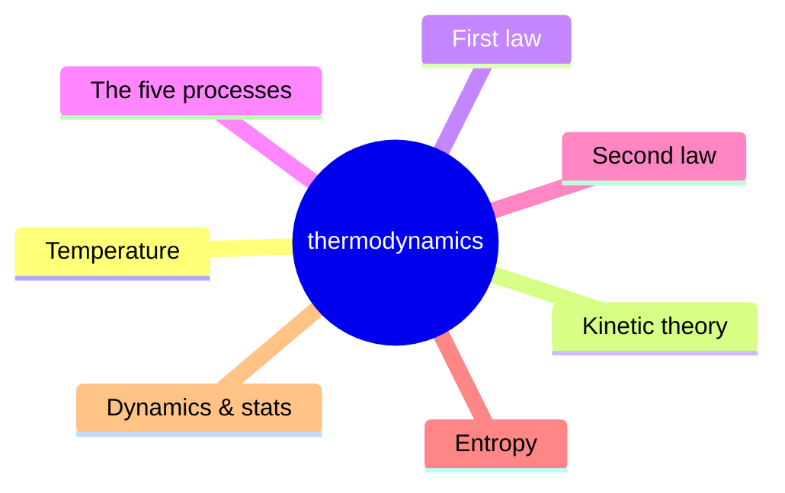
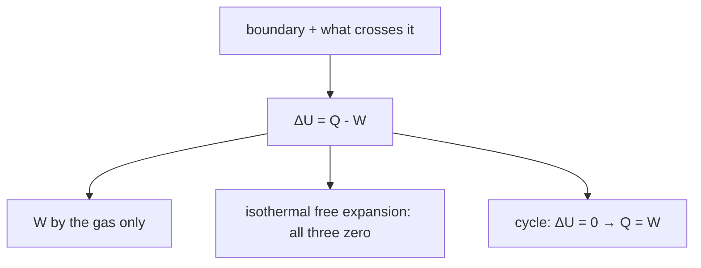
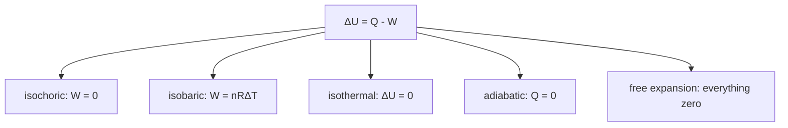
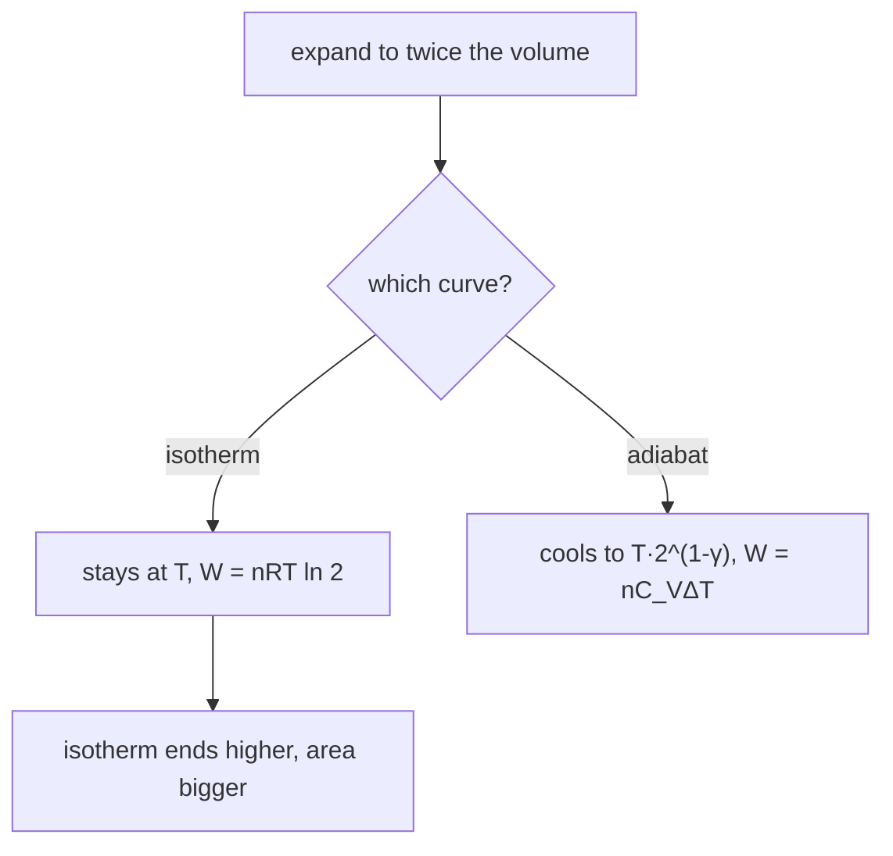
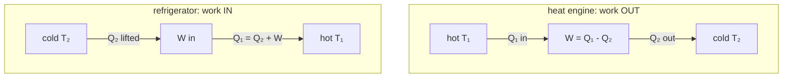
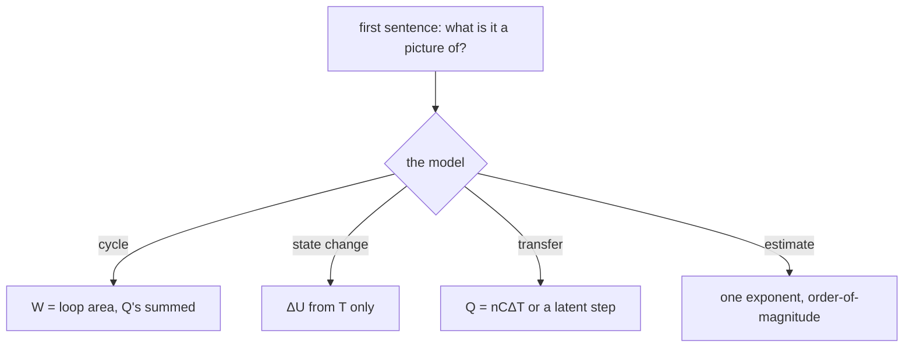

_12-page chapter set · JEE Advanced · NSEP · INPhO · IPhO · self-contained — opens with no internet, prints cleanly_

# Thermodynamics — first principles to Olympiad

A complete, derivation-first treatment of heat, work and their bookkeeping. Every formula here is earned from something you already accept — the zeroth law, momentum transfer, energy accounting — and every place where a JEE or INPhO examiner can catch you is marked explicitly. Two ideas do all the work: **energy is a ledger**, and **a state function lets you change the route**. Chapter 1–4 build the ledger, chapter 5–6 the tax the ledger charges (entropy), chapter 7 the Olympiad extensions.

> [!tip] FIGURE F5.1 · Chapter map
> *Why:* the course is one ledger paid in four currencies — heat, work, internal energy and entropy; the map shows the 8 chapters hanging off that spine.
> *Data:* chapters 1–2 temperature/kinetic theory, 3 first law (ΔU = Q − W), 4 the five processes, 5–6 the second law and entropy, 7 Olympiad extensions, 8 playbook.

> *Read:* one ledger and one tax — every chapter is a line in the accounts, and every exam number is a balance check.

**The whole course in one picture.** A cycle on the PV plane (left) is where work is computed; the engine between two baths (right) is where the second law is enforced. Chapters 1–4 own the left drawing and the energy line; chapters 5–6 own the inequality on the right; chapter 7 extends both to statistics, real gases and radiation. Write the ledger line and the inequality at the top of every answer — both carry marks even when the algebra slips.

### How these notes are organised

Each chapter builds only on the ones before it. Chapters **1–2** are the measurement layer: what temperature is, what a gas does with it. Chapter **3** is the first law — the ledger — and chapter **4** spends it along the five standard processes. Chapters **5–6** are the second law: engines, refrigerators, and the one number (the entropy change) that tells you which processes are allowed at all. Chapter **7** is the Olympiad extension (distribution functions, van der Waals criticality, the adiabatic atmosphere, radiation thermodynamics). Chapter **8** consolidates a solving strategy; chapters **9–10** are the full paper with detailed solutions; chapter **11** is a printable formula sheet.

> **How to study this set**
>
> Read chapters 1–3 with a pen and recompute every number (they are all checkable by hand, most within two significant figures). Do the in-chapter questions *before* opening their solutions. Chapters 4–6 are the engine room: every process problem is the same three lines — first law, ideal-gas law, the process constraint — so drill them until the order is automatic. Then chapter 8, then the paper under the clock. The formula sheet is for the week after the paper — it consolidates what you now understand; it cannot substitute for it.

Start with [**Chapter 1 →**](#ch-01).

### The map

Any branch opens its chapter right here — the full theory, figures and solved questions. Expand all with the top bar; printing opens everything automatically.

01 · Temperature, equilibrium & expansion · zeroth law · gas thermometer · t vs T · holes, rims, clocks · 7 Q · 4 fig · 8 boxes

_Chapter 1 of 11 · JEE Main · Advanced · base · ≈ 45 min read · 7 questions_

## Temperature, equilibrium and the growth of things

Before any law of thermodynamics can be written down, "temperature" must stop meaning "how hot it feels" and become a number defined by an experiment. After this chapter you can state exactly what a thermometer measures and why every thermometer agrees, calibrate a gas scale from two pressures, and predict to a second per day which way a clock, a rim and a hole go when heated. The mistake this chapter kills: treating temperature as a property of a substance rather than a property of a *state of equilibrium*.

### 1.1 Thermal equilibrium: the relation that makes temperature legal

> **Definition · thermal equilibrium**
>
> Two systems separated by a wall that conducts energy *only* as heat (a **diathermal** wall) are in **thermal equilibrium** when, after everything has settled, no net energy flows between them and no macroscopic property of either is still changing. "No net flow" is the operative phrase: molecules cross either way at all times, but the two directions balance.

Touch a metal bench and a wooden one at the same room temperature. The metal feels colder. Feelings rank materials, not states — the metal fails the test because it *conducts* energy away from your finger faster. Any property that can drift while contact is held ("feels colder and colder") is not what we want. We want a relation between systems that is stable at rest.

> **Why the zeroth law is not obvious**
>
> We need one fact: **if A is in thermal equilibrium with B, and B with C, then A is in thermal equilibrium with C.** That transitivity is an empirical observation — no logic guarantees it. ("Is able to lift" is transitive sometimes and not always; relations fail to be transitive all the time.) Because transitivity holds, it partitions all systems into equivalence classes, and we are free to label each class by a number: that number is **temperature** The label must be a function of the state only — never of the material, size or shape — and thermometry is the business of finding a measurable property with that property. This is why the law earns an ordinal number: it is the licence for the word "temperature" to exist at all.

**Fig. 1.1 — The zeroth law is a statement about touching.** B is just a witness: if A and C both rest against the same B, then A and C in direct contact change nothing. Only after this is checked can the witness's reading be called a property of A and C themselves.

### 1.2 Thermometers, the gas scale, and the modern kelvin

A thermometric property must be monotonic and reproducible: the length of a mercury column, the resistance of platinum, the volume of a fixed mass of gas at fixed pressure, the colour of a glowing bar. Any of them defines a scale; the scales disagree off the calibration points, because materials curve differently. The resolution is to demand the scale be **material-free**, and only gases come close — at low density.

> **Definition · constant-volume gas thermometer and the gas scale**
>
> Keep a fixed mass of gas at fixed volume; measure its pressure $P$ — the height of a mercury column does the bookkeeping. Define the ratio of temperatures to be the ratio of pressures,
>
>  $$
> \frac{T_{1}}{T_{2}}=\lim_{P\to 0}\left(\frac{P_{1}}{P_{2}}\right) \tag{1.1}
> $$
>
>  the limit taken by repeating the experiment with progressively rarefier gas. All gases — He, N₂, even moderately non-ideal ones — converge to the same ratio in that limit, which is what makes the definition thermometer-independent.

Two fixed points used to hang the scale on it: the steam point and the ice point. Since 1954 the anchor is a single point — the **triple point of water**, where ice, liquid water and vapour coexist at $T_{\text{tp}} = 273.16$ K and $P \approx 611.7$ Pa — a uniquely reproducible state (one pure phase boundary intersection, no "how packed is the ice?" ambiguity). Since 2019 the kelvin is defined even more directly: the Boltzmann constant is fixed, $k = 1.380649\times 10^{-23}$ J K⁻¹ **exactly**, and temperature is whatever makes the kinetic theory of chapter 2 come out with $\tfrac{3}{2}kT$ per translational degree of freedom. The size of the kelvin was chosen to survive the old one, so $T(^{\circ}\text{C}) = T(\text{K}) - 273.15$ by convention — note the offset 273.15 versus the triple-point 273.16; different numbers, different jobs, not a typo.

> **Why "degrees" survived the kelvin**
>
> A kelvin *is* a Celsius degree: the two scales have identical intervals, so a temperature *difference* of 5 K and one of 5 °C are the same physical statement — but a *ratio* of Celsius readings is meaningless, because zero is in the wrong place. Every formula in these notes that contains a bare $T$ (efficiency, entropy, $P\propto T$, $v_{\text{rms}}\propto\sqrt{T}$) demands the absolute scale. Halving 40 °C does nothing; halving 313 K halves the mean kinetic energy.

### **Q1** A certain temperature reads the same number on the Celsius and Fahrenheit scales. Which is it? _(JEE Main)_

- **A** 0 °C
- **B** −17.8 °C
- **C** −40 °C
- **D** No such temperature exists

Solution

**C.** Solve $C = (5/9)(F-32)$ with $F = C$: $C = (5/9)(C-32)$ ⇒ $(4/9)C = -160/9$ ⇒ $C = -40$. **Check:** at −40 °C the Fahrenheit scale also reads −40 by direct substitution ✓; the two lines cross exactly once on a T–T plot, because their slopes (1 and 9/5 in °C units) differ.

### **Q2** A constant-volume gas thermometer reads 1.500 kPa at the water triple point. At an unknown bath it reads 2.050 kPa. The bath temperature on the gas scale is _(JEE Main)_

- **A** 373.15 K
- **B** 373.3 K
- **C** 100.0 K
- **D** 201.1 K

Solution

**B.** $T = 273.16\times(2.050/1.500) = 373.3$ K. That it lands within 0.2 K of the steam point (373.15 K) is the point — the reading is not calibrated on boiling water at all, only on the triple point. **Why not A:** 373.15 is the steam point *by definition of the old scale*; the gas thermometer's own answer is the ratio, 373.3 K — and with denser gas it would drift, which is why the limit in eq. 1.1 exists. **Why not D:** dividing by 273.16 instead of multiplying.

### 1.3 Expansion of solids: every length, including the empty ones

Heat an isotropic solid and every interatomic distance grows by the same fractional amount, so the object grows like a photograph. Writing only the linear law (area and volume follow),

$$
\Delta L = \alpha L\,\Delta T,\qquad \Delta A \approx 2\alpha A\,\Delta T,\qquad \Delta V \approx 3\alpha V\,\Delta T \tag{1.2}
$$

with $\alpha$ the linear coefficient (steel $1.2\times 10^{-5}$ K⁻¹, brass $1.9\times10^{-5}$ K⁻¹, invar $\approx 6\times10^{-7}$ — all quoted at room temperature, and all valid only while $\alpha\,\Delta T \ll 1$, which for a 100 K swing means a 0.1% effect: a perturbation, not a renovation.

> **Why a hole grows with the material, not against it**
>
> The picture that fails: "the material expands *into* the hole, so it shrinks." Test it with the picture it contradicts. Cut the plate along a circle *around* the hole and remove the ring — that removed ring expanded as if it were still in place (its atoms feel the same neighbours either way), and its inner circumference grew with the rest of it. The hole is a drawn circle in the material: it has no atoms of its own, so it is carried by the material around it and scales by $1+\alpha\Delta T$ — exactly like everything else. Cast-iron intuition says "holes get tighter when the casting cools": same law run backwards ✓.

**Fig. 1.2 — A heated plate is a photographic enlargement, holes included.** If the hole's diameter scaled differently from the edge length, two concentric circles of atoms would have to gain different numbers of neighbours — impossible in a solid that stays connected.

### Worked example 1.1 · Shrinking the problem: fitting a tyre

A steel tyre has an inner diameter 1.0 mm smaller than the 0.999 m wheel it must fit. How much must it be heated? **Plan:** the tyre's inner diameter is a hole-line of steel — it grows with the material at $\alpha=1.2\times10^{-5}$ K⁻¹. **Do:** need $\Delta L/L = 10^{-3}/0.999 = 1.001\times 10^{-3}$, so $\Delta T = (1.001\times10^{-3})/(1.2\times10^{-5}) \approx 83$ K. **Check:** 83 K is about 200 °C — a red-hot ring, and exactly how the operation was traditionally done; a smaller ΔT would not close a 1 mm gap (any smaller number is out by a factor check on $\alpha$).

### **Q3** A brass plate has a circular hole. The plate is heated uniformly. The diameter of the hole _(JEE Main)_

- **A** decreases, because the metal expands inward
- **B** increases, by the same fractional amount as the outer edges
- **C** stays fixed — only the outside grows
- **D** increases only if the plate is a disk rather than a ring

Solution

**B.** Everything scales: the hole is material's own measuring stick (Fig. 1.2, §1.3). **Why not A:** the ring argument — removed or present, the annulus expands outward and inward together. **Why not C:** would require a seam somewhere with zero strain. **Why not D:** the argument used no outer boundary at all.

### **Q4** A brass pendulum clock keeps perfect time at 20 °C. The room is held at 30 °C. Over a day the clock _(JEE Advanced)_

- **A** loses ≈ 8.2 s
- **B** gains ≈ 8.2 s
- **C** loses ≈ 1.6 s
- **D** is unaffected: the pivot moves with the bob

Solution

**A.** Period of a pendulum goes as $\sqrt{L}$, so $\Delta T_{\text{period}}/T_{\text{period}} = \tfrac{1}{2}\,\Delta L/L = \tfrac{1}{2}\alpha\,\Delta T$. With $\alpha = 1.9\times10^{-5}$ K⁻¹, $\Delta T = 10$ K: fractional slowdown $9.5\times10^{-5}$; over 86 400 s that is $8.2$ s lost per day. **Why not C:** forgetting the ½ from the square root gives $2\alpha$-style numbers or their halves. **Why not D:** the whole rod lengthens; the pivot only defines where zero is. **Check:** a hotter clock must be *slower* — long pendulum, long swing ✓ sign.

Two corollaries of "it is a photograph, and the camera is the temperature" belong on the same page, because exams use them constantly.

**1.3.1 — If you can't move it, you still paid for it.** A rod clamped rigidly at both ends and heated by $\Delta T$ is held at the length it would not have chosen, i.e. compressed by $\epsilon = \alpha\Delta T$, so the stress is

$$
\sigma = E\,\alpha\,\Delta T \quad (\text{fully constrained}) \tag{1.3}
$$

For steel ($E = 2\times10^{11}$ Pa) a 10 K constrained swing means $2.4$ MPa, and a 200 K swing means 48 MPa — approaching yield, which is why rails get gaps, bridges sit on rollers, and glass cookware is made of low-$\alpha$ borosilicate.

**1.3.2 — Curvature from disagreement.** Bond two metals with different $\alpha$: on heating, the higher-$\alpha$ layer wants to be longer than the bond allows, so the pair **curls with the stubborn metal on the outside** — the outer arc of any curve is the longer one. That is the bimetallic strip, the thermostat, and a 2-mark JEE question.

### **Q5** A bimetallic strip of brass bonded to invar is heated. Which way does it bend, and what happens when it is then cooled below room temperature? _(JEE Advanced)_

- **A** brass outside when hot, invar outside when cold
- **B** brass outside when hot, brass outside when cold
- **C** invar outside when hot, invar outside when cold
- **D** it does not bend: both ends are free

Solution

**A.** Heating: brass ($\alpha = 1.9\times10^{-5}$) wants to lengthen more, and can only do so on the longer arc — outside. Cooling: now brass *shrinks* more, so it becomes the shorter arc — inside, invar outside. The strip flips direction through flat at the bonding temperature. **Why not B:** bending does not "remember" which metal is aggressive; it follows who is longer *now*.

### 1.4 Liquids: the container expands too, and water objects

For a liquid the measured quantity is always *the spill* or *the column height* — i.e. liquid expansion *minus* container expansion. With $\gamma_{\ell}$ the real volume coefficient and $3\alpha_{g}$ that of the glass flask (a solid's volume coefficient is its linear one ×3), the bookkeeping is

$$
\Delta V_{\text{apparent}} = V\left(\gamma_{\ell} - 3\alpha_{g}\right)\Delta T\qquad\text{(overflow of a filled flask)} \tag{1.4}
$$

> **The trap: quoting mercury's expansion at a DRE without the glass**
>
> The wrong answer: "mercury expands by $1.8\times10^{-4}$ per K, so a 250 mL flask spills $250\times1.8\times10^{-4}\times55 \approx 2.5$ mL." Mercury's *real* coefficient never appears alone in a measurement — the flask dilates at the same time, and it is *filled* at the start. The one-line reply: subtract the container, $1.8\times10^{-4}-3\times9\times10^{-6} = 1.53\times10^{-4}$ K⁻¹, giving $2.1$ mL. (Numerals: this is Q6.)

**Fig. 1.3 — What overflows is a difference, not a total.** The bulb's own capacity grows with the glass, so the neck sees only the liquid's expansion minus the container's; that is the only number any experiment can measure without a second experiment.

### **Q6** A 250 mL glass flask is completely filled with mercury at 20 °C and heated to 75 °C. How much mercury overflows? Glass $\alpha = 9\times10^{-6}$ K⁻¹, mercury $\gamma = 1.8\times10^{-4}$ K⁻¹. _(JEE Main)_

- **A** 2.1 mL
- **B** 2.5 mL
- **C** 4.3 mL
- **D** 1.1 mL

Solution

**A.** $\Delta V = 250\times(1.8\times10^{-4} - 2.7\times10^{-5})\times 55 = 250\times1.53\times10^{-4}\times55 = 2.10$ mL. **Why not B:** 2.5 mL is the answer of someone who forgot the flask expands (the trap box). **Check:** the spill is 0.84% of the volume for a 55 K swing — same order as $\gamma\Delta T\approx 10^{-2}$, less the glass share ✓.

### **Q7** A pond of depth 3 m is in contact with air at −10 °C for many days. Just under the ice, the water temperature is _(JEE Advanced · concept)_

- **A** −10 °C — everything freezes to the air temperature
- **B** 0 °C everywhere under the ice
- **C** about +4 °C at the bottom, 0 °C under the ice
- **D** the temperature cannot be ordered — ice floats randomly

Solution

**C.** Water is densest near 4 °C. As surface water cools from, say, 10 °C it sinks until the whole column reaches 4 °C; below 4 °C cooling makes it *lighter*, so it stays on top and freezes. The bottom sits at the density maximum, ≈4 °C — the fact that lets fish survive. **Why not B:** that is true of every *normal* liquid (top-down mixing has no ceiling); water's density anomaly is the whole question. The ice itself continues below 0 °C — only the liquid layer is pinned near 4 °C.

**Fig. 1.4 — Two rulers are one ruler with a shifted origin; the third has a different tick length as well.** The dotted lines run through the two definitions: freezing (273.15 K = 0 °C = 32 °F) and the steam point; the accent dash is the triple point at 273.16 K — one hundredth of a kelvin above freezing, and *that* was the kelvin’s definition until 2019. Every conversion formula in this chapter is two of these three lines; every exam slip (ΔT in °F, Q1’s cousin) is forgetting which line the question asks you to read.

### 1.5 Chapter summary — the results to own

> **Temperature is the label of thermal-equilibrium classes**
>
> Transitivity (the zeroth law) makes a shared property legal; the gas scale $T\propto\lim_{P\to0}P$ at fixed volume, anchored at 273.16 K (triple point), makes it unique to the point of material independence. Ratios of $T$ are only allowed on kelvins.

> **Expansion is a photograph: eq. 1.2; stress is the unpaid bill: eq. 1.3**
>
> Every length scales — holes included. Constrain the growth and you convert it into stress $\sigma=E\alpha\Delta T$; two metals disagree and the pair curls, stubborn side outside on heating. For liquids, measure the difference (eq. 1.4); for water, remember the 4 °C density maximum.

### 1.6 Checkpoint

- I can state the zeroth law as a transitivity test and say why "feels colder" fails it.
- I can calibrate a gas thermometer from one fixed point and one pressure, and say what the $P\to 0$ limit buys.
- I can predict the direction of bending of a bimetallic strip in 5 seconds, and the growth of a hole in 2.
- I can estimate a constrained thermal stress to one significant figure ($E\alpha\Delta T$: steel, 100 K → 24 MPa) and say when it matters.
- I never write a liquid-expansion answer without subtracting the container.

Next: [**2 · Kinetic theory of gases →**](#ch-02) — where temperature stops being a reading on glass and becomes joules per molecule.

02 · Ideal gases & kinetic theory · molar origin of PV=nRT · rms speed · mean free path · virial · 7 Q · 4 fig · 7 boxes

_Chapter 2 of 11 · JEE Main · Advanced · NSEP · ≈ 50 min read · 7 questions_

## Kinetic theory: pressure, and temperature in joules

This is the chapter where "hot" becomes a number of joules per molecule. After it you can derive $PV=NkT$ rather than memorise it, say which of $v_{p}$, $\bar v$, $v_{\text{rms}}$ is asked for in any sentence, compute how far a molecule flies between collisions (61 nm in air at STP — about a thousand molecule-diameters), and decide whether a planet can keep an atmosphere. The mistake this chapter kills: moving averages around without knowing which average was meant.

### 2.1 The model, stated honestly

> **Definition · ideal gas (kinetic picture)**
>
> A huge number $N$ of point particles of mass $m$ in a box, moving freely except for **elastic collisions** with each other and the walls, with all directions equally likely (molecular chaos). Two scales must separate: the box is huge compared with the force range *and* with the mean free path, and the mean free path is huge compared with the molecular diameter. Then the pressure cannot depend on anything but $n$, $m$ and the speed distribution — which is why every dilute gas obeys the same equation of state.

### 2.2 Pressure is a momentum bill

One molecule with velocity component $v_{x}$ hits a wall perpendicular to $x$ and bounces back: momentum change $2mv_{x}$. It makes the next hit on the same wall after $2L/v_{x}$ seconds, so its personal rate of impulse is $2mv_{x}\div(2L/v_{x}) = mv_{x}^{2}/L$. Sum over molecules, divide by the wall area $L^{2}$:

$$
P = \frac{N m\overline{v_{x}^{2}}}{V} \tag{2.1}
$$

**Fig. 2.1 — The pressure of one molecule.** Two factors, each easy to forget: the size of each payment ($2mv_{x}$) and the rate of payment ($v_{x}/2L$ — the round trip). Their product is proportional to $v_{x}^{2}$, which is why temperature, an average of squares, never cares about the sign of a velocity.

> **Why the factor 1/3 is there, and only there**
>
> Boxes are isotropic: nothing distinguishes $x$ from $y$ from $z$, so $\overline{v_{x}^{2}}=\overline{v_{y}^{2}}=\overline{v_{z}^{2}}=\tfrac{1}{3}\overline{v^{2}}$. Hence $P = \tfrac13 nm\overline{v^{2}}$. Students drop this 1/3 by writing the formula with $v^{2}$ while deriving with $v_{x}^{2}$; the check that catches it is dimensional in spirit: for air at STP, inserting $v_{\text{rms}}\approx 517$ m s⁻¹ without the 1/3 predicts 3× atmospheric pressure — the factor is not a rounding detail.

$$
P = \frac{1}{3}\, n m\overline{v^{2}} = \frac{2}{3}\,n\,\overline{K}_{\text{trans}}\qquad\big[\overline{K}_{\text{trans}} = \tfrac12 m\overline{v^{2}}\big] \tag{2.2}
$$

Compare eq. 2.2 with the empirical law $PV = NkT$ and the comparison forces one conclusion — the last missing line of chapter 1's story:

$$
\overline{K}_{\text{trans}} = \tfrac32 kT\qquad\text{— temperature IS mean translational kinetic energy, per molecule} \tag{2.3}
$$

> **The trap: "same temperature, same speed"**
>
> The wrong sentence: "hydrogen and oxygen at the same temperature have the same speed." The reply: they have the same *energy*; $v_{\text{rms}}=\sqrt{3kT/m}$ splits by the mass under the root. At 300 K: H₂ 1934 m s⁻¹ vs O₂ 484 m s⁻¹ — a factor of 4, from $\sqrt{32/2}$. Whenever two gases share a temperature, check which invariant is invoked: $\overline{K}$ (yes) or $v$ (no).

### **Q1** A sealed rigid cylinder of ideal gas is heated from 300 K to 1200 K. By what factors do the rms molecular speed and the pressure change? _(JEE Main)_

- **A** 2 and 4
- **B** 4 and 4
- **C** 2 and 2
- **D** √2 and 4

Solution

**A.** $v_{\text{rms}}\propto\sqrt{T}$: $\sqrt{4}=2$. Rigid + sealed: $n$ fixed, $P\propto T$: ×4. **Why not B:** squaring when the law says square root — the classic "hot means faster by the same factor" error. **Why not C:** applying $P\propto T$ to the speed. **Check:** eq. 2.2: $P\propto n\overline{v^{2}}$; with $n$ fixed and $\overline{v^{2}}$ ×4, $P$ ×4 — consistent ✓.

### **Q2** Helium and nitrogen are at the same temperature. The ratio $v_{\text{rms}}(\text{He})/v_{\text{rms}}(\text{N}_{2})$ is closest to _(JEE Main)_

- **A** 1
- **B** 2.6
- **C** 7
- **D** 0.38

Solution

**B.** $v_{\text{rms}}\propto 1/\sqrt{M}$: ratio $=\sqrt{28/4}=\sqrt{7}=2.65$. **Why not C:** 7 is the mass ratio — Q1's error wearing different clothes. **Why not D:** the reciprocal; the heavier gas is the slower one, so He must win. Same-$\overline K$ means same $Mv^{2}$, so the lighter gas pays speed for mass: $v\propto M^{-1/2}$ exactly.

### 2.3 Not one speed but a distribution — and three ways to average it

Molecules do not all move at $v_{\text{rms}}$; the equilibrium distribution of speeds (derived from Boltzmann counting in §7.2) is

$$
f(v) = 4\pi n\left(\frac{m}{2\pi kT}\right)^{3/2} v^{2}\, e^{-mv^{2}/2kT} \tag{2.4}
$$

The $v^{2}$ factor counts the spherical shells of velocity space; the exponential is the Boltzmann weight. Their competition puts a peak at $v_{p}=\sqrt{2kT/m}$. Averaging the same $f$ different ways gives the three speeds with a fixed hierarchy:

$$
v_{p}=\sqrt{\frac{2RT}{M}},\qquad \bar v=\sqrt{\frac{8RT}{\pi M}}=1.128\,v_{p},\qquad v_{\text{rms}}=\sqrt{\frac{3RT}{M}}=1.225\,v_{p} \tag{2.5}
$$

**Fig. 2.2 — Same temperature, different curves; the $1/\sqrt{M}$ shift is exact.** Note the ordering $v_{p} < \bar v < v_{\text{rms}}$: squaring before averaging weights the tail, and the tail is where the physics happens. The areas under both curves are equal — both are $n$.

### Worked example 2.1 · The speeds of air, once and for all

For $\text{N}_{2}$ at 300 K ($M = 0.028$ kg mol⁻¹): **Do:** $v_{p}=\sqrt{2\times8.314\times300/0.028}=422$ m s⁻¹; $\bar v = 476$; $v_{\text{rms}}=\sqrt{3\times8.314\times300/0.028}=517$ m s⁻¹. **Check:** $kT = 4.14\times10^{-21}$ J = 0.026 eV per molecule — "one fortieth of an eV" is the thermal energy you should be able to quote blind; and $v_{\text{rms}}$ sits just above the speed of sound in air (347 m s⁻¹, §4.5) because sound *is* a drift of this random motion — same ballpark by construction.

### 2.4 Collisions and the mean free path

A molecule of diameter $d$ sweeping speed $v$ through still targets of density $n$ hits anything whose centre lies in the cylinder of cross-section $\pi d^{2}$ it drags: rate $n\pi d^{2}v$. But the targets move too — the relevant speed is the **relative** speed of a pair, whose mean is $\sqrt{2}$ times the mean single speed (velocities at right angles on average: Pythagoras, then an average). Hence:

$$
\lambda = \frac{1}{\sqrt{2}\,\pi d^{2} n}\qquad z = \frac{\bar v}{\lambda}\ \text{(collisions per second)} \tag{2.6}
$$

**Fig. 2.3 — Where the √2 comes from, and why the cross-section is πd².** A collision needs only the *centres* to come within $d$ (one radius each); forgetting the other molecule's size halves the cylinder, and forgetting its motion removes the √2 — two chances to be wrong before the exam's one.

Numerics for dry air at STP, worth owning: $d\approx3.7\times10^{-10}$ m, $n = 2.69\times10^{25}$ m⁻³ (the Loschmidt number — the first-ever molecular-size measurement, made by *inverting* eq. 2.6 from λ), $\lambda\approx61$ nm, $z\approx7\times10^{9}$ collisions s⁻¹. Each molecule changes direction about seven billion times a second, which is the deep reason diffusion is so slow and a puff of smoke does not reach you from across a room instantly.

### **Q3** Ideal gas in a rigid box, heated from 300 K to 600 K. Which statement is correct? _(JEE Advanced)_

- **A** λ doubles and the collision rate per second halves
- **B** λ is unchanged and the collision rate rises by ≈√2
- **C** λ halves and the collision rate is unchanged
- **D** λ and the collision rate both double

Solution

**B.** Rigid + sealed ⇒ $n$ fixed ⇒ eq. 2.6 gives $\lambda$ fixed (it never contained $v$!). Rate $z=\bar v/\lambda\propto\sqrt{T}$ ⇒ ×√2. **Why not A:** the tempting but wrong "hotter means farther between hits" — the geometry of a hit is speed-blind. **Check:** pressure doubles (Q1 logic) and indeed eq. 2.2 holds with $\overline{v^{2}}$ ×2 ✓.

### **Q4** A sealed flask of gas at STP is pumped to 10 Pa while staying at 273 K. The mean free path becomes about _(JEE Advanced)_

- **A** 0.62 µm
- **B** 0.62 mm
- **C** 6.1 mm
- **D** 61 nm (λ is a material constant)

Solution

**B.** Constant $T$: $n\propto P$, so $\lambda\propto 1/P$: $61\ \text{nm}\times(101325/10)=0.62$ mm. **Why not D:** λ is not material — it is a statement about *spacing*. **Check:** at 10 Pa the box (say 1 L) still holds $2.7\times10^{18}$ molecules, yet a molecule now crosses 1.6 m between hits — the regime in which vacuum chambers are "molecular" and the walls, not collisions, set the transport. (This number returns as paper question C2.)

### 2.5 How many molecules arrive: flux, effusion, escape

$$
\Gamma = \frac{n\bar v}{4}\qquad\big[\text{molecules m}^{-2}\,\text{s}^{-1}\ \text{arriving at any surface}\big] \tag{2.7}
$$

> **Why the 1/4 and not the 1/2 you guessed**
>
> Half the molecules head toward the wall — that much is right. But they arrive *angled*, and oblique arrivals cross the surface less often by a factor $\cos\theta$; averaging $\cos\theta$ over the hemisphere of directions weighted by arrival rate contributes the second 1/2. The integral is elementary ($\int_{0}^{\pi/2}\cos^{2}\theta\,\sin\theta\,d\theta / \int \cos\theta\sin\theta\,d\theta = 1/2$) — the shortcut to remember is that flux through a surface is a half-space cosine average of one velocity component, and the average of $\cos\theta$ weighted this way is exactly 1/2. So $n\bar v/2$ is half right twice.

Open a tiny hole (diameter $\ll\lambda$) and only the *arrivals* leak: the effusion rate is $\Gamma A$ — set by $\bar v$, hence $\propto 1/\sqrt{M}$ at fixed $T,P$. That is Graham's law. It is also the principle of the only isotope separation the Manhattan era mastered: $\text{UF}_{6}$ through a cascade of barriers, one stage enriching by $\sqrt{352/349} = 1.0043$ per pass — about 95 stages for a factor of 1.5, which is why the process was a city, not a machine.

> **Why Earth keeps air and loses hydrogen (and the Moon keeps neither)**
>
> A molecule escapes if its tail outruns gravity for long: the rule of thumb is that a planet loses a gas over geological time once $v_{\text{rms}}$ at the *exosphere* exceeds about one-sixth of the escape speed. Earth ($v_{e}=11.2$ km s⁻¹, exosphere $\sim$1000 K): $v_{\text{rms}}(\text{H}_{2})\approx3.5$ km s⁻¹ ≈ $v_{e}/3$ — gone; $v_{\text{rms}}(\text{N}_{2})\approx0.9$ km s⁻¹ — kept. The Moon ($v_{e}=2.4$ km s⁻¹): nothing with a nonzero vapour pressure survives — "no atmosphere" is kinetic-theory trivia, not geology. Beware the common slip of comparing $v_{\text{rms}}$ with $v_{e}$ *directly* and declaring a gas unbound: at 300 K Earth's $v_{\text{rms}}(\text{H}_{2})\approx1.9$ km s⁻¹, comfortably below 11.2 — and yet hydrogen is lost, because the escape is carried by the Maxwell tail. That is exactly why the rule of thumb is a sixth of the escape speed, not the whole of it.

### **Q5** A 1 cm² patch of your thumbnail is exposed to air at STP. The number of N₂ molecules striking it in 0.1 s is closest to _(NSEP-style estimate)_

- **A** 3×10²⁵
- **B** 3×10²²
- **C** 1.5×10²¹
- **D** 3×10¹⁹

Solution

**B.** $\Gamma = n\bar v/4 = (2.69\times10^{25}\times454.5)/4 \approx 3.0\times10^{27}$ m⁻² s⁻¹; the patch collects for $10^{-4}\ \text{m}^{2}\times0.1\ \text{s} = 10^{-5}$ m²s, so the count is $3.0\times10^{27}\times10^{-5} = 3\times10^{22}$. **Why not A:** using $n\bar v$ without the 1/4 (and eyeballing) — the factor-four errors are exactly what separate these options. **Why not C:** using $v_{p}$ or $v_{\text{rms}}$ is fine to a few percent; getting 10²¹ means losing a power of ten, which is the real risk in this problem. **Lesson:** flux problems are graded on the exponent — say the answer as words ("ten to the twenty-two per thumbnail per tenth-second") after solving, every time.

### **Q6** Two identical cylinders hold He and N₂ at the same T and P. A tiny identical hole is opened in each. The initial rate of pressure fall in the He cylinder is _(JEE Advanced)_

- **A** the same — same T, same P, same hole
- **B** 2.7× faster
- **C** 2.7× slower
- **D** 7× faster

Solution

**B.** Same $T,P$: same $n$; each lost molecule removes the same $kT$ of "pressure content," so $|dP/dt|\propto\Gamma\propto\bar v\propto1/\sqrt{M}$: $\sqrt{28/4}=2.65$. **Why not A:** P and T fix the *density*, not the *speed* of the escape queue. **Why not D:** 7 is the mass ratio again (Q2's cousin). **Check:** He's lighter — should leave faster, so B not C on sign sense alone.

### **Q7** In effusion through a pinhole, the gas remaining in the vessel _(INPhO)_

- **A** stays at the same temperature because effusion does no work
- **B** cools, because the fastest molecules preferentially leave
- **C** heats, because collisions become rarer
- **D** cools, but only for polyatomic gases

Solution

**B.** The escaping flux is weighted by one extra power of $v$ (arrival rate ∝ v), so the mean energy carried away per molecule is $2kT$, not $\tfrac32 kT$ — proven in §7.2; a population whose hottest members keep resigning gets colder. It is the same physics as evaporative cooling (a leaking flask frosts; a sweating arm cools). **Why not A:** "does no work" protects the *escaping stream's* energy, not the box's statistics. **Why not D:** no internal degrees needed — the effect is translational.

**Fig. 2.4 — The leak’s distribution is the box’s times v.** Every quantity on the right is the one the exam quietly swaps in: beam speeds, Knudsen effusion, and the reasonthe box cools as it leaks (ch 7 §7.2 collects the reward). Area stays 1; the peak moves by √(3/2) because theweighting is linear, not because anything sped up.

### 2.6 Chapter summary — the results to own

> **The two lines that generate the chapter**
>
> $$
> P=\frac{1}{3}nm\overline{v^{2}},\qquad \overline{K}_{\text{trans}}=\frac{3}{2}kT
> $$
>
>  From the first plus the ideal-gas law comes the second *or* — historically and logically better — the ideal-gas law is *derived* by combining the first with the definition of temperature. Either route, the content is: **pressure is kinetic energy per unit volume, times 2/3** Valid for any dilute gas in equilibrium with a flat wall; the 1/3 needs isotropy — in a beam or wind it must be redone as a flux.

> **Speeds, path, flux**
>
> $$
> v_{p}:\bar v:v_{\text{rms}} = 1:1.128:1.225,\qquad \lambda=\frac{1}{\sqrt2\pi d^{2}n},\qquad \Gamma=\frac{n\bar v}{4}
> $$
>
>  Memorise the hierarchy $v_{p} < \bar v < v_{\text{rms}}$, and with each formula its dependency: $\lambda$ on $n$ only (not speed!); $\Gamma$ on $n$ and $\sqrt{T}$. Numbers to own: air at STP — $n=2.69\times10^{25}$ m⁻³, $\lambda=61$ nm, $z=7\times10^{9}$ s⁻¹, $\Gamma=3\times10^{27}$ m⁻²s⁻¹; at 300 K $kT = 4.14\times10^{-21}$ J = 0.026 eV.

### 2.7 Checkpoint

- I can derive eq. 2.1 in three lines and say where each factor (2, 1/2, 1/3) enters and where it would be lost.
- Given any two of {T, P, n}, I can say instantly what happens to λ, z and Γ.
- I can quote the three speeds' ratio and the 22.4 L (at 1 atm, 273.15 K; 22.7 L at 1 bar) molar volume without a book.
- I can explain effusive cooling to a nine-year-old (the fast kids keep leaving) and to an examiner (flux ∝ v).
- I never confuse "same T ⇒ same speed" with the true "same T ⇒ same $\overline K$."

Next: [**Chapter 3 →**](#ch-03) — the ledger: heat, work, internal energy, and why two of the three are not properties of the gas.

03 · The first law · ΔU = Q − W · work integrals · U depends on T · free expansion · 7 Q · 4 fig · 6 boxes

_Chapter 3 of 11 · JEE Main · Advanced · base · ≈ 50 min read · 7 questions_

## The first law: heat is money, spend it once

The first law is an accounting identity, and like all accounting it is unforgiving about two things: signs and what counts. After this chapter you can look at any process and close the ledger — $\Delta U = Q - W$ with $W$ defined once and never traded — derive the work integral from a piston force balance instead of quoting it, solve calorimetry by stages with a melting check, and know exactly which quantities belong to the gas and which belong to the journey. The mistake this chapter kills: speaking of a body "containing heat."

### 3.1 Three quantities, only one of which is a property

> **Definition · heat, work, internal energy**
>
> **Heat Q** is energy transferred *because of a temperature difference alone*. **Work W** is energy transferred by every other mechanism — a moving boundary, a stirring paddle, a current through a resistor seen from the battery side, a spring pulling. **Internal energy U** is the state function whose change makes the books balance:
>
>  $$
> \Delta U = Q - W \qquad (W\ \text{= work done by the gas; this convention holds through ch 10}) \tag{3.1}
> $$
>
>  A positive Q (heat into the gas) credits U; a positive W (gas expands against its constraints) debits it. State the convention in every answer — several textbooks use $\Delta U = Q+W$ with $W$ done *on* the gas; the physics is identical, the signs are opposite, and mixing the two mid-problem is a guaranteed zero.

> **Why U exists at all: Joule's argument**
>
> Heat and work are path-dependent transfers — neither is "stored." That $Q-W$ *is* path-independent is an experimental fact: Joule showed in 1845–50 that falling weights turning a paddle, friction, electric currents and flames all raise a given amount of water by the same temperature — a fixed number of joules per degree, the mechanical equivalent of heat (4.186 J cal⁻¹, the origin of the food Calorie). If every route into a state carries the same $Q-W$, then $Q-W$ depends only on the endpoints, and endpoint-only quantities are what we name. U is defined *by* the ledger closing; the first law is not a theorem, it is the discovery that the books balance.

> **The trap: "hot objects contain more heat"**
>
> The wrong sentence: "a spark at 1200 °C contains more heat than a bath at 40 °C." The reply: *no object contains heat* — it contains internal energy. The spark's $\Delta U$ per unit mass may be tiny while its temperature is high, because U counts $N\times kT$, and the spark has $N$ of order $10^{10}$. A bathtub at 313 K stores something like $10^{6}$ times more energy. Temperature is an average; energy is a total; only the second one can scald through a towel. (Both wrong answers — "heat flows from more heat to less heat," "high temperature always means high energy" — die in the same sentence.)

### 3.2 Work is a force balance in disguise

Take a gas under a piston of area $A$ carrying a load, open to atmosphere. Force balance on the piston (massless or not — then add $Ma$; quasistatic means $a=0$) reads $P A = P_{0}A + mg$, and if the piston moves $dx$ the gas does $P A\,dx = P\,dV$ of work against the whole world outside. Hence the law:

$$
W = \int_{1}^{2}P\,dV \quad\text{(quasistatic; } P \text{ = gas pressure)}\qquad\text{versus}\qquad W = P_{\text{ext}}\,\Delta V\ \text{(sudden, against a fixed }P_{\text{ext}}\text{)} \tag{3.2}
$$

**Fig. 3.1 — Where $P\,dV$ comes from.** Nobody defined work as "pressure times volume change"; it is force times distance, with the force found from a free-body diagram. Do the free-body diagram and the $P_{\text{ext}}$-vs-$P_{\text{gas}}$ question answers itself: the gas is charged for the load it actually moved.

> **Why the integral needs quasistatic-ness, and what replaces it**
>
> $P$ in eq. 3.2 must mean a pressure the gas actually *has*. In a rapid expansion the gas is a turbulent, non-uniform mess — no single $P$, no temperature even — and $\int P\,dV$ over *its* nominal values is meaningless. The fix is never "assume it": compute the work from the **receiver** Whatever the gas pushes — the atmosphere, a spring, a lifting mass — gets $P_{\text{ext}}\Delta V$, and energy conservation says the gas paid exactly that. Free expansion is the extreme case: a gas rushing into an evacuated bulb pushes $P_{\text{ext}}=0$, so $W=0$ even though the gas obviously "expanded."

### **Q1** An ideal gas expands into a vacuum (insulated, rigid box). Which row is correct? _(JEE Main)_

- **A**$Q=0,\ W=0,\ \Delta U=0$, temperature unchanged
- **B**$Q=0,\ W>0,\ \Delta U<0$, temperature falls
- **C**$Q>0,\ W=0,\ \Delta U>0$, temperature rises
- **D**$Q=0,\ W=0$, but temperature falls because the gas "works against itself"

Solution

**A.** Insulated ⇒ $Q=0$. Nothing external is pushed ($P_{\text{ext}}=0$) ⇒ $W=0$. Ledger: $\Delta U=0$; for an ideal gas U is a function of T alone ⇒ T unchanged. **Why not B/D:** they charge the gas for moving *nothing*. A real gas does cool a little here (chapter 7's vdW discussion) — the energy goes into loosening intermolecular attraction, "work against itself" is a *real* term for real gases and a fiction for ideal ones; that is why D is the sophisticated wrong answer and why the qualifier "ideal" is load-bearing.

### 3.3 ΔU of an ideal gas: a function of T, full stop

> [!tip] FIGURE F5.2 · The first law ledger: ΔU = Q − W
> *Why:* the first law is one line, but its power is bookkeeping — state what crosses the boundary and what stays; the flow fixes the sign before the answer.
> *Data:* ΔU = Q − W (W by the gas); dU = nC_V dT; free expansion ΔU = 0, W = 0, Q = 0; cyclic ΔU = 0.

> *Read:* three quantities, one is a state function; the heat and work are route-money, only ΔU is the ledger balance.

$$
\Delta U = nC_{V}\Delta T\qquad\text{— for an ideal gas on ANY path, not just constant volume} \tag{3.3}
$$

Two facts multiply into this one: kinetic theory (§2.2) says U is the total translational energy $N\times\tfrac32 kT$ plus frozen-in internal stores, which is a function of T alone (Joule's experiment — free expansion changed nothing, so U cannot depend on V); and $C_{V}\equiv(\partial U/\partial T)_{V}$ is the *definition* of the slope, so the slope along any other path is the same number. Students confine eq. 3.3 to isochoric processes; it is the only line in thermodynamics that path-independence *grants*, and the key to every "find the heat along this weird path" problem:

$$
\Delta U\ \text{from eq.\ 3.3 (path-blind)}\quad\Longrightarrow\quad Q = \Delta U + W\quad\text{(with } W \text{ done properly, path-aware)}
$$

### **Q2** One mole of a monatomic ideal gas goes from state A (P₀, V₀, 300 K) to state B (2P₀, 2V₀) along the straight line joining them on the PV diagram. The change in internal energy is _(JEE Advanced)_

- **A** 450R
- **B** 900R
- **C** 1350R
- **D** 1800R

Solution

**C.** U reads only the endpoints: $T_{B} = (2P_{0})(2V_{0})/(R) = 4T_{A} = 1200$ K, so $\Delta U = nC_{V}\Delta T = 1\times\tfrac32 R\times900 = 1350R$. **Why not D:** 1800R is Q, not ΔU — the line's area adds $W = \tfrac12(P_{A}+P_{B})(2V_{0}-V_{0}) = 1.5P_{0}V_{0} = 450R$, giving $Q = \Delta U+W = 1800R$; 450R is that area masquerading as an answer (option A). **Why not B:** using R instead of $\tfrac32R$. **Check:** the straight line matters only for W and Q — ΔU could not care less about the path, which is the entire point of the problem.

### **Q3** Two moles of diatomic ideal gas expand at constant pressure of 1 atm from 300 K to 400 K. Take the molar heat capacity at constant pressure as $7R/2$. The heat supplied, the work done by the gas and the rise in U are _(JEE Main)_

- **A** 5820 J, 1663 J, 4157 J
- **B** 5820 J, 5820 J, 0
- **C** 4157 J, 1663 J, 2494 J
- **D** 1663 J, 1663 J, 0

Solution

**A.** $Q = nC_{P}\Delta T = 2\times3.5\times8.314\times100 = 5820$ J; $W = P\Delta V = nR\Delta T = 2\times8.314\times100 = 1663$ J; $\Delta U = nC_{V}\Delta T = 2\times2.5\times8.314\times100 = 4157$ J. The ledger: $4157+1663 = 5820$ ✓, and the split "1663 of the 5820 bought volume, 4157 stayed as temperature" is the physical story of why $C_{P} = C_{V}+R$. **Why not C:** using $C_{V}$ for Q at constant pressure (the process doesn't match the capacity).

### 3.4 Calorimetry: the ledger by stages, with a melting check

Mixing problems are first-law problems with $W=0$ in an insulated vessel: $\sum Q_{i}=0$, every term written as $mc\Delta T$ or $\pm mL$, *if that stage actually happens*. It does not always: the required discipline is to check feasibility *before* solving. "How much ice survives in an ice–water mixture at 0 °C?" is not solvable by equating temperatures — you must first compute which side runs out.

### Worked example 3.1 · Hot iron into water — the stage check

0.10 kg of iron ($c = 450$ J kg⁻¹ K⁻¹) at 100 °C is dropped into 0.20 kg of water at 20 °C, insulated. **Plan:** no phase change possible (iron can't freeze the water: even dumping all its heat costs $0.1\times450\times100 = 4.5$ kJ, enough to freeze only 13 g) — so a single stage. **Do:** $0.1\times450\times(373.15-T_{f}) = 0.2\times4186\times(T_{f}-293.15)$ ⇒ $T_{f} = 297.2$ K = **24.1 °C**. **Check:** the water barely warmed — because the water's heat capacity (837 J K⁻¹) is nineteen times the iron's (45 J K⁻¹); water's $c$ is anomalously high (§8 numbers list) and every calorimetry intuition should be calibrated by that ratio.

**Fig. 3.2 — The 100 g ice→steam staircase.** Slopes are $1/(mc)$, plateaus are $mL$: heating ice 2.1, melting 33.4, heating water 41.9, boiling 226.0, heating steam 2.0 kJ — total 305 kJ, about five minutes at a 1 kW kettle. A "find the heat" question is this picture plus the question of where on it you start and stop.

### **Q4** 2 kg of ice at 0 °C is mixed with 10 kg of water at 50 °C in a thermally insulated vessel. The final temperature is closest to _(JEE Advanced)_

- **A** 0 °C with ice left over
- **B** 9 °C
- **C** 28 °C
- **D** 36 °C

Solution

**C.** Stage check first: melting all the ice needs $2\times334=668$ kJ; the water cooling to 0 °C can release $10\times4186\times50 = 2093$ kJ ≫ 668 — so all ice melts and the mixture ends above 0 °C. Ledger: $668\,000 + 2\times4186\,T_{f} = 10\times4186\times(50-T_{f})$ ⇒ $50\,232\,T_{f} = 1\,425\,000$ ⇒ $T_{f} = 28.4$ °C. **Why not B:** forgetting to melt first (water-to-water mixing). **Why not D:** using ice's $c$ where latent heat belongs. **Check:** between 0 and 50 ✓ and much closer to the "which capacity wins" prediction (water carries it).

### 3.5 Cycles: the ledger closes on itself

For a cycle $\Delta U = 0$ — U came back — so $\sum Q = \sum W$ over the whole circuit: **every joule of net heat the engine swallowed left as net work.** This single sentence solves the "fill the table" questions that JEE loves, and sets up chapter 5 (where the second law will cap $\sum Q$ from the hot side). The companion fact is graphical: $\oint P\,dV$ is the enclosed area, positive (net work out) for a clockwise circuit.

### Worked example 3.2 · Close the table

A gas runs A→B→C→A. Given: $Q_{AB} = +600$ J, $W_{AB} = +200$ J; $W_{BC} = -150$ J, $\Delta U_{BC} = -400$ J; $Q_{CA} = -100$ J. Find the missing cells. **Plan:** fill each row's ΔU from the ledger, close the cycle with $\sum\Delta U = 0$, then back-solve any row still short a cell. **Do:** $\Delta U_{AB} = 600-200 = 400$ J; $Q_{BC} = \Delta U_{BC}+W_{BC} = -400-150 = -550$ J; the three ΔU's sum to zero, so $\Delta U_{CA} = -(400-400) = 0$, and $W_{CA} = Q_{CA}-\Delta U_{CA} = -100$ J. **Check the whole book:** $\sum Q = 600-550-100 = -50 = \sum W = 200-150-100$ ✓ — net, 50 J of work was done *on* the gas and dumped as heat: a hidden refrigerator. **Habit:** when a row has two unknowns, do not invent — close the *cycle* first, then the row.

### **Q5** In a cyclic process the net heat absorbed is 300 J. The net work is, and the direction on the PV plane is _(JEE Main)_

- **A** −300 J, anticlockwise
- **B** +300 J, clockwise
- **C** +300 J, direction unknowable
- **D** 0 J — cycles give no work

Solution

**B.** $\Delta U=0$ ⇒ $W_{\text{net}} = Q_{\text{net}} = +300$ J *by* the gas; it must enclose area with the expansion leg at higher pressure — clockwise. **Why not C:** the sign of $\oint P\,dV$ *is* the circulation direction, one of the few pure theorems in this course. **Why not D:** "ΔU=0 so nothing happens" is exactly the confusion between the property and the transfers.

### **Q6** A gas in an insulated cylinder, under a frictionless piston open to 10⁵ Pa, is stirred by an internal paddle delivering 6000 J in two minutes while the gas expands quasistatically by 10⁻³ m³. The change in internal energy is _(JEE Advanced)_

- **A** +6000 J
- **B** +5900 J
- **C** +6100 J
- **D** 0 — the cylinder is insulated

Solution

**B.** Bookkeeping: stirring is energy **in** — call it work, not heat (the walls admit neither; the shaft does) — and the gas pays $P_{\text{ext}}\Delta V = 10^{5}\times10^{-3} = 100$ J to the atmosphere. $\Delta U = +6000 - 100 = 5900$ J. **Why not D:** "insulated" closes the Q-term only; energy has already entered through the paddle, and the expansion has already left — the ledger is not the wall. **Why not C:** sign error on the expansion (gas under its own $P=P_{\text{ext}}$ here, so the same 100 J either way, but adding it double-counts the exit). **Check:** the gas is measurably warmer at the end — plus 5900 J of U cannot be produced by a cycle of nothing.

### **Q7** Two identical flasks connected by a valve with negligible volume contain the same ideal gas at pressures 1 atm and 3 atm, both at 300 K. The valve is opened (insulated system). The final pressure and the fate of U are _(INPhO · first-law reasoning)_

- **A** 2 atm, U unchanged, and T remains 300 K
- **B** 2 atm, but the gas heats up as it equalises
- **C** 4 atm (pressures add on mixing)
- **D** indeterminate without the flask volume

Solution

**A.** The whole thing expands into itself: nothing external is pushed ⇒ $W=0$; insulated ⇒ $Q=0$; ideal gas ⇒ U a function of T only, so final $T=300$ K everywhere and $P_{f}=(n_{1}+n_{2})RT/(2V) = (1+3)/2 = 2$ atm. **Why not B:** viscous mixing *does* convert ordered flow into heat internally — but that heat stays inside the gas, and for an ideal gas $\Delta U = 0$ forces it to re-dissipate into the same U; T returns to 300 K at equilibrium. (For a real gas, free-expansion cooling of the denser side partially offsets — ch 7's Joule–Thomson cousin.) The problem never needed the volumes; **D** is bait.

**Fig. 3.3 — The only process where the ledger is all zeros and the event still has a direction.** Two-law handshake: the first law says anything goes at ΔU = 0; the second (ch 5’ audit, ch 6’s entropy) says the gas fills bothbulbs and never un-fills them. A real gas even finds a temperature change here — the zero of ΔU belongs to the ideal model’sindifference to distance between molecules (ch 7 bills it honestly at a/V²).

**Fig. 3.4 — A cycle is proved by its column sums, not its final answer.** Work on the legs, ΔU on the legs (ideal gas: a function of PV alone), Q assembled from the two — then the Σ row eithercloses on the area or the script is wrong. Graders read the Σ row first; write it last, in pen.

### 3.6 Chapter summary — the results to own

> **The ledger and its three entries**
>
> $$
> \Delta U = Q-W,\qquad W=\int P\,dV\ (\text{quasistatic}),\qquad \Delta U_{\text{ideal}} = nC_{V}\Delta T\ (\text{any path})
> $$
>
>  The first is a definition-plus-experiment (Joule), the second a force balance, the third a gift of $U=U(T)$. The free-expansion clause — $W=0$ through a vacuum — is the validity condition hiding in plain sight: work is counted at the receiver.

> **Calorimetry and cycles**
>
> Stages, not averages: $mc\Delta T$ on slopes, $mL$ on plateaus, and a feasibility check before any "final temperature" is trusted. Cycles: $\sum Q=\sum W =$ enclosed area, clockwise positive. Every answer you write should survive a one-line energy story: "X J in by heat, Y J out as work, the rest is ΔU."

### 3.7 Checkpoint

- I can state which of Q, W, U are transfers and which is a property, with one counterexample each to the wrong claims.
- I derive $W=\int P\,dV$ from a free-body diagram on demand, and know why the quasistatic condition is in the contract.
- I use eq. 3.3 on paths that are not isochoric without hesitation — and say why it is legal.
- I check "does all the ice melt / does everything boil" before solving any mixing problem.
- I close every cycle table with $\sum Q=\sum W$, never with cleverness.

Next: [**Chapter 4 →**](#ch-04) — the five standard paths, the adiabatic laws, and the polytrope that gets colder while you heat it.

04 · Processes & cycles · isobaric→adiabatic · Poisson · γ · engines · Carnot · Otto · 7 Q · 4 fig · 6 boxes

_Chapter 4 of 11 · JEE Main · Advanced · NSEP · ≈ 60 min read · 7 questions_

## Heat capacities and the five processes

Every JEE thermodynamics numerical is the first law plus the ideal-gas law plus *one* process constraint; learn the five constraints and their consequences once, here, and the rest of the syllabus is practice. After this chapter you can derive $C_{P}-C_{V}=R$ rather than remember it, own the three adiabatic laws with their validity conditions, catch the trap of applying $PV^{\gamma}$ to an irreversible expansion, and explain why a bicycle pump warms and a helium voice sings. You will also meet the first genuinely strange object of the course: a gas with negative heat capacity.

### 4.1 Two capacities, one difference, and enthalpy

> **Definition · Cᵥ, Cₚ, γ**
>
> $$
> C_{V}=\frac{1}{n}\left(\frac{\partial U}{\partial T}\right)_{V},\qquad C_{P}=\frac{1}{n}\left(\frac{\partial H}{\partial T}\right)_{P},\qquad \gamma=\frac{C_{P}}{C_{V}},\qquad H\equiv U+PV \tag{4.1}
> $$
>
>  $C_{V}$ is heat per kelvin with the gas held still; $C_{P}$ is heat per kelvin while the gas is free to push back the world at constant pressure. H — the "enthalpy" — is the quantity whose temperature-slope is heat supplied at constant pressure, because when P is fixed, $\Delta(U+PV) = \Delta U + P\Delta V$ is exactly "energy kept + energy paid out" = energy in. You may not need the word all day; you will use its content.

> **Why Cₚ − Cᵥ = R for an ideal gas — in four lines**
>
> Constant pressure, one mole, one kelvin: the gas keeps $C_{V}$ worth of heat as U (eq. 3.3, which is path-blind) and must pay $P\Delta V = R\Delta T$ to lift the atmosphere. So per kelvin $C_{P} = C_{V}+R$. That's the whole derivation — the difference is not a material constant but the expansion tax itself, one R per mole, universal. It also previews the deeper fact (ch 7): a van der Waals gas pays $C_{P}-C_{V}=R\big/\left(1-2a(V-b)^{2}/RTV^{3}\right)$ — *more* than R, diverging as the gas nears its own condensation — while a liquid pays almost nothing, because there is nothing to push.

From kinetic theory plus equipartition (§7.1), one mole of an ideal gas with $f$ quadratic degrees of freedom has $U = \tfrac{f}{2}RT$, so

$$
C_{V}=\frac{f}{2}R,\qquad C_{P}=\left(\frac{f}{2}+1\right)R,\qquad \gamma=\frac{f+2}{f} \tag{4.2}
$$

giving the numbers to burn in: monatomic (He, Ar) $\gamma = 5/3 = 1.67$; diatomic (N₂, O₂, air) $\gamma = 7/5 = 1.40$; rigid triatomic non-linear (CH₄ classically, CO₂ with frozen vibration) $\gamma = 4/3 = 1.33$. The order is law, not data: fewer degrees of freedom means more of the heat must become translation (pressure!) per kelvin, which steepens every P–T curve and raises γ.

### 4.2 The three "iso-" processes

> [!tip] FIGURE F5.3 · The five processes, one template
> *Why:* every process problem is ΔU = Q − W plus one constraint; the table fixes which term is zero so the work is just reading the row.
> *Data:* isochoric W = 0; isobaric W = PΔV = nRΔT; isothermal ΔU = 0, W = Q = nRT ln(V₂/V₁); adiabatic Q = 0, W = −ΔU; free expansion all zero.

> *Read:* name the constraint first, the ledger fills itself in; the isotherm's ln is the hyperbola's area.
$$
\text{isochoric: } W=0,\ Q=nC_{V}\Delta T\qquad \text{isobaric: } W=nR\Delta T,\ Q=nC_{P}\Delta T\qquad \text{isothermal: } \Delta U=0,\ W=Q=nRT\ln\frac{V_{2}}{V_{1}} \tag{4.3}
$$

The isothermal work line deserves its five seconds of derivation — plug $P = nRT/V$ into eq. 3.2 and integrate; $\ln$ appears because the hyperbola's area is logarithmic, which is also why "double the volume at fixed T" always buys the same $nRT\ln 2$ of work no matter where you are on the curve. One mole at 300 K doubling its volume: $W = 8.314\times300\times0.6931 = 1729$ J.

### **Q1** Equal amounts of the same ideal gas start at the same state and expand to twice the volume, one sample isothermally, the other adiabatically. Which statements are true? (i) The adiabatic sample ends at lower pressure. (ii) The isothermal sample does more work. (iii) The adiabatic sample ends hotter. _(JEE Advanced)_

- **A** (i) and (ii) only
- **B** (i) and (iii) only
- **C** (ii) and (iii) only
- **D** (i), (ii) and (iii)

Solution

**A.** (i) yes: adiabatic final $P = P_{0}\,2^{-\gamma} < P_{0}/2$ (at γ=5/3: 0.315 vs 0.5). (ii) yes: the adiabat runs *below* the isotherm all the way — its area (1384 J at 300 K, 1 mol, monatomic) is smaller than $RT\ln 2$ (1729 J). (iii) no: the adiabat spends its own U on the work — it *cools* to $300\times2^{-2/3} = 189$ K. **Check by picture:** Fig. 4.1, right half — the lower curve is always the one that pays for expansion out of savings.

**Fig. 4.2 — Three constraints, three ledgers, one template: Q = ΔU + W.** Nothing about the panels is mnemonic — each right-hand formula is the template with one term zeroed or doubled (isobar: the RΔT work rides on top of ΔU; isochore: no ride; isotherm: ΔU itself is zero). If a student can redraw thesethree boxes from memory in a minute, §4.4’s polytrope fan is already half-understood.

### 4.3 Adiabats: three laws from one integral

Adiabatic ⇒ $dU = -\delta W$ ⇒ $nC_{V}\,dT = -P\,dV$; substitute $P = nRT/V$, separate, and integrate with $\gamma$'s definition eating the constants:

$$
TV^{\gamma-1}=\text{const}\qquad PV^{\gamma}=\text{const}\qquad P^{1-\gamma}T^{\gamma}=\text{const} \tag{4.4}
$$

All three are the same statement wearing different shoes — derive the first, get the others by dressing it with the gas law. The work along an adiabat follows from $W = -\Delta U$:

> [!tip] FIGURE F5.4 · Adiabat vs isotherm: which curve pays its own way
> *Why:* the two curves answer every "which does more work / ends where" MCQ without algebra; misreading them is the classic trap.
> *Data:* adiabat is steeper than the isotherm (γ > 1); for a given expansion the adiabat lies below and ends colder; W_adia = nC_V(T₁ − T₂), W_iso = nRT ln(V₂/V₁).

> *Read:* the lower curve is always the one that pays for expansion out of savings.

$$
W_{\text{adiab}} = \frac{P_{1}V_{1}-P_{2}V_{2}}{\gamma-1} = \frac{nR\left(T_{1}-T_{2}\right)}{\gamma-1} \tag{4.5}
$$

> **The trap: the validity clause is the question**
>
> Eq. 4.4 holds for a **reversible** (quasistatic) adiabatic change of an ideal gas with constant γ. The sentence that fails: "the gas expands adiabatically and freely into a vacuum, so use $T_{2}=T_{1}(V_{1}/V_{2})^{\gamma-1}$." Free expansion is adiabatic ($Q=0$) but violently irreversible, does no work, and an ideal gas keeps $T_{2}=T_{1}$ exactly — Q1's cousin from chapter 3. The one-line reply: *adiabatic ≠ reversible adiabatic; the power law needs both.*

**Fig. 4.1 — Left: one point, four behaviours. Right: the two bank accounts of the same doubling.** The adiabat is steeper by exactly γ (differentiate both laws at A) — so from any state it dives below the isotherm, and on expansion delivers less work, the difference (here 345 J per mol at 300 K doubling) reappearing as the temperature drop.

### Worked example 4.1 · The pump that gets hot

A bicycle pump compresses air ($\gamma = 1.4$) from 1 atm to 3 atm fast enough that nothing has time to leak out as heat, starting at 300 K. **Plan:** reversible-adiabatic model — the "fast" licence is exactly what makes it adiabatic, the "smooth pump" makes it quasistatic *enough*. **Do:** $T_{2} = T_{1}(P_{2}/P_{1})^{(\gamma-1)/\gamma} = 300\times 3^{2/7} = 411$ K (138 °C); volume ratio $(P_{2}/P_{1})^{1/\gamma} = 3^{5/7} = 2.19$. **Check:** 411 K is above the boiling point of water and near the flash point of pump oil — real pumps get warm, and diesel engines (compression ratio 16:1 → $300\times16^{0.4} = 909$ K) light their fuel with nothing but this arithmetic.

### 4.4 Polytropes: one formula to rule them all

Any process obeying $PV^{n} = \text{const}$ (constant $n$, not necessarily 0, 1, γ) has a molar heat capacity you should be able to derive on the spot, then look up only to check:

$$
C_{n} = C_{V} + \frac{R}{1-n}\qquad\text{(ideal gas, }PV^{n}=\text{const)} \tag{4.6}
$$

**Three lines:** the ledger with eq. 3.2 gives $\delta Q = nC_{V}\,dT + P\,dV$ (quasistatic, so the work integral is the gas's own P). Combine $PV = nRT$ with $PV^{n} = c$ to get $TV^{n-1} = c'$ — the same dressing trick that produced eq. 4.4. Take its log-differential, $dT/T = (1-n)\,dV/V$, so $P\,dV = nR\,dT/(1-n)$; divide by $n\,dT$ and eq. 4.6 stands. ∎

Read off the family: $n=0$ isobaric ($C_{P}$ ✓), $n=1$ isothermal ($C\to\infty$ — the unlimited-heat-at-fixed-T of a phase change; consistent!), $n=\gamma$ adiabatic ($C=0$ ✓), $n=\infty$ isochoric ($C_{V}$ ✓). Between 1 and γ the term $R/(1-n)$ outruns $C_{V}$ and the capacity turns **negative**: a monatomic gas following $PV^{1.5}=\text{const}$ has $C = \tfrac32R - 2R = -\tfrac12R = -4.16$ J mol⁻¹ K⁻¹ — heat it and it cools (it must also expand, paying out more work than the heat supplied). This is the answer to the question "can $Q>0$ with $\Delta T<0$?" — yes, and it is an exam favourite precisely because the formula, not intuition, is what tells you.

**Fig. 4.3 — The fan of polytropes.** Every straight-line-of-thought process lives on this fan; the shaded wedge ($1<n<\gamma$) is where heat and temperature move in *opposite* directions — "heating without warming" is not mysticism, it is the geometry between the isotherm and the adiabat.

### **Q2** One mole of argon is mixed with one mole of oxygen (both ideal, O₂ rigid diatomic). For the mixture, γ is _(JEE Advanced)_

- **A** 1.40
- **B** 1.50
- **C** 1.60
- **D** 1.33

Solution

**B.** Do not average γ — average the capacities: $C_{V} = \tfrac12(\tfrac32R+\tfrac52R) = 2R$, $C_{P} = C_{V}+R = 3R$, $\gamma = 3/2 = 1.50$. **Why not A:** averaging $5/3$ and $7/5$ gives 1.533 and then people round "back to 1.4" — γ of a mixture is *not* the mixture-average of γ's; capacities (the additive ledger) are. **Check:** it must sit between 1.4 and 1.67 ✓ and it does — but exactly where the arithmetic of C's says, not the mean of ratios.

### **Q3** Helium at 300 K is compressed adiabatically to 1/8th of its volume. Its final temperature is closest to _(JEE Main)_

- **A** 750 K
- **B** 1200 K
- **C** 2400 K
- **D** 900 K

Solution

**B.** He is monatomic: $T_{2} = 300\times 8^{2/3} = 300\times4 = 1200$ K. **Why not A:** treating He as diatomic ($8^{0.4} = 2.297$). **Why not C:** applying the diatomic exponent to a monatomic gas twice over. **Check:** pressure ratio 8^{5/3} = 32 ⇒ $P_{2} = 32$ atm; energy sanity: 1200 K is "glowing red-hot", which is roughly what 32× compression of a monatomic gas is worth — and diesel's 909 K came from air, a less extreme ratio with a smaller γ; helium heats harder per compression because γ is bigger.

### 4.5 Gas mechanics: the piston that rings and the sound it makes

A mass $m$ on a frictionless piston (area $A$) over $V_{0}$ of gas at $P_{0}$, with a vacuum above (or atmosphere below — nothing changes but the equilibrium offset): displace by $x$ and the gas's reaction is $\delta P = -\gamma P_{0}\,\delta V/V_{0}$ (adiabatic because sound-like compressions are fast). Newton's law gives

$$
\omega = \sqrt{\frac{\gamma P_{0}A^{2}}{mV_{0}}}\qquad\text{(isentropic spring constant } k = \gamma P_{0}A^{2}/V_{0}\text{)} \tag{4.7}
$$

> **Newton got sound wrong by √γ — and that was the point**
>
> Newton computed $c = \sqrt{P/\rho}$ assuming air compresses isothermally in a sound wave, and got 293 m s⁻¹ at 300 K where measurement gives ≈347. Laplace's fix: the compressions are too fast to exchange heat, so replace P by the adiabat's stiffness γP: $c = \sqrt{\gamma P/\rho}$, landing on 347 to within the temperature you assumed. It is the cleanest proof in physics that *thermodynamics is audible*: you can hear the difference between the two exponents.

### Worked example 4.2 · The ringing piston

$m = 5$ kg, $A = 0.01$ m², $V_{0} = 1.0$ L of air at $P_{0} = 10^{5}$ Pa. **Do:** $k = \gamma P_{0}A^{2}/V_{0} = 1.4\times10^{5}\times10^{-4}/10^{-3} = 1.4\times10^{4}$ N m⁻¹; $\omega = \sqrt{k/m} = \sqrt{2800} = 52.9$ s⁻¹ ⇒ $T = 0.119$ s. **Check:** an eighth-of-a-second ring for a 5 kg piston on a litre of air is exactly the "air spring" stiffness engineers quote; and the adiabatic licence (fast oscillation, 8.4 Hz) is self-consistent — that is the "limit in the text itself" habit: if the model's speed assumption had contradicted the problem's frequency, we would have owed a re-derivation with isothermal $k = P_{0}A^{2}/V_{0}$ (8% softer).

### **Q4** Sound travels in helium at 300 K about how many times faster than in air at the same temperature? _(JEE Main)_

- **A** 1.2
- **B** 2.9
- **C** 5.8
- **D** same — sound speed is universal

Solution

**B.** $c = \sqrt{\gamma RT/M}$: ratio $=\sqrt{(5/3)(29)/(7/5)(4)} = \sqrt{8.63} = 2.94$. **Why not C:** dropping the γ ratio (5.8 is the mass factor alone). **Why not D:** $c$ is not universal — only $\sqrt{kT/m_{\text{molecule}}}$-type combinations are fixed at given T, and γ is a material fact. The famous "helium voice" is this number: the vocal tract's resonances scale with the sound speed, and only the sound speed — the frequency content shifts up fiveish while the pitch (the cords) stays, so nobody sounds higher-pitched in *voice*, only in *timbre*.

### **Q5** A diatomic ideal gas is heated so that its pressure stays proportional to its absolute temperature (P ∝ T). Its molar heat capacity is _(JEE Advanced)_

- **A** 5R/2
- **B** 7R/2
- **C** 3R
- **D** R/2

Solution

**A.** $P\propto T$ through the gas law means V constant — it's an isochore: $C = C_{V} = 5R/2$. **Why not B:** reflex "diatomic ⇒ 7/2". **Why not D:** mis-solving $P/T$ const vs $PV$ const. The skill being tested is reading the constraint before reaching for a formula — always convert the given relation into a statement about V (or n), *then* about heat.

### **Q6** One mole of monatomic gas follows PV³⁄² = const from (P₀, V₀, 300 K) to V = 8V₀. Find the final temperature, and decide whether the gas absorbs or releases heat. _(INPhO warm-up)_

Solution

$TV^{n-1} = \text{const}$ with $n = 3/2$ gives $T_{2} = 300\times 8^{-1/2} = 106$ K. The ledger settles the rest: $\Delta U = 1.5R(106-300) = -2420$ J; polytropic work $W = R(T_{1}-T_{2})/(n-1) = 8.314\times194/0.5 = +3225$ J; hence $Q = \Delta U + W = +805$ J — **absorbed, while cooling by 194 K**. **Check with eq. 4.6:** $C = 1.5R + R/(1-1.5) = -0.5R$ and $Q = nC\Delta T = (-4.16)(-194) = +807$ J ✓ — the two routes agree to a percent (the rounding of 106.07 K). **The story to say in the margin:** the gas paid out 3225 J of work while taking in only 805 J; it cooled to afford the difference. Heat-in with temperature-down is normal on the $1 < n < \gamma$ branch — it is the definition of the branch.

### **Q7** Two moles of an ideal diatomic gas expand from (2P₀, V₀) to (P₀, 2V₀) along the straight line joining them on the PV diagram. The heat absorbed is _(JEE Advanced)_

- **A** 3P₀V₀/2
- **B** 5P₀V₀
- **C** 3P₀V₀
- **D** undetermined without integrating the line

Solution

**A.** The endpoints have equal $PV$ ($2P_{0}V_{0}$ each) ⇒ equal T ⇒ $\Delta U = 0$, so $Q = W = \tfrac12(P_{1}+P_{2})(V_{2}-V_{1}) = \tfrac12(3P_{0})(V_{0}) = 3P_{0}V_{0}/2$ — the trapezoid under a straight line is the integral; no "undetermined" about it. **Why not B or C:** $nC_{P}\Delta T$-style reflexes for a process with no name — when $\Delta T = 0$ between endpoints, capacities cannot answer, only geometry can. **Extra fact for the exam:** the midpoint carries $PV = 2.25P_{0}V_{0}$ — the gas heats to a 12.5% peak halfway and cools back, so Q flowed in early and out late; the net is all that survives in the books.

**Fig. 4.4 — Sound is a string of microscopic Carnot-free adiabats.** The speed ratio √γ = 1.18 is Laplace’s whole correction — and the exam’s whole question: humidity (M down), temperature (v ∝ √T), and mixture γ (paper Q19) are the three knobs on this one formula.

### 4.6 Chapter summary — the results to own

> **The whole chapter, three boxes**
>
> $$
> C_{P}-C_{V}=R\ (\text{ideal gas only}),\qquad TV^{\gamma-1}=PV^{\gamma}/T\text{-pairs},\qquad C_{n}=C_{V}+\frac{R}{1-n}
> $$
>
>  Validity conditions to recite: reversible + adiabatic + constant γ for the power laws; quasistatic for the polytrope capacity; ideal-gas for the R-difference. The one exotic: negative C between the isotherm and the adiabat, where "heat in" and "T up" divorce.

> **Numbers to own**
>
> γ: 1.67 / 1.40 / 1.33. Air pump 3 atm from 300 K → 411 K. Diesel r=16 → 909 K. Speed of sound air 347, He 1019 m s⁻¹ (×2.94). Isothermal 1 mol doubling at 300 K: 1729 J; mono adiabatic doubling: 1384 J, ends at 189 K.

### 4.7 Checkpoint

- I can derive Cp−Cv=R, the adiabatic triple, and eq. 4.6 from the ledger without notes.
- Given any process statement (P ∝ T, PV² = const, "slowly, in contact with ice"), my first move is converting it to a V- or T-constraint.
- I can sketch the four curves through a point and say which bounds which, and why the adiabat always loses on expansion.
- I can state, unprompted, the three hypotheses PV^γ is hiding.
- For a polytrope with 1<n<γ I can say the sign story in words before touching algebra.

Next: [**Chapter 5 →**](#ch-05) — the second law: why the ledger is not enough, and the one inequality every engine obeys.

05 · The second law & entropy · KL statements · reversible = max work · ΔS universe · mixing · 7 Q · 4 fig · 6 boxes

_Chapter 5 of 11 · JEE Main · Advanced · NSEP · INPhO · ≈ 55 min read · 7 questions_

## The second law: the tax on turning heat into motion

The first law says you can't win (energy is conserved); this chapter says why you can't even break even — and turns that into the most useful inequality in engineering. After it you can state both forbidden-engine laws and prove them equivalent, derive Carnot's efficiency for a real working substance instead of quoting it, audit any perpetual-motion pitch in sixty seconds, and tell a grader exactly why a refrigerator can "beat 100%". The mistake this chapter kills: using the formula $1-T_{2}/T_{1}$ for anything that is not reversible.

### 5.1 The law, in two sentences

> **Definition · the two statements**
>
> **Kelvin–Planck:** no cyclic device can convert heat from a single reservoir entirely into work — every heat engine must dump heat somewhere. **Clausius:** no cyclic device can transfer heat from cold to hot with no other effect — every refrigerator must be driven.
>
>  "Cyclic" and "no other effect" carry all the weight. A gas expanding isothermally converts its heat fully into work (one mole doubling at 300 K: 1729 J in, 1729 J out) — but it is not cyclic: it ends bigger, and getting it back pays the bill.

> **Why the two statements are the same statement**
>
> Suppose Clausius is breakable: a machine R ferries $Q$ from the cold bath (T₂) to the hot one (T₁) for free. Run it attached to any ordinary engine E between the same baths — E takes $Q_{1}$ from T₁, returns $Q_{2}$ to T₂, delivers $W = Q_{1}-Q_{2}$. Size R so that it carries exactly $Q_{1}-Q_{2}$ from cold to hot. The composite: the hot bath gives $Q_{1}$ and gets back $Q_{2}+(Q_{1}-Q_{2}) = Q_{1}$ — untouched; the cold bath surrenders net $Q_{1}-Q_{2}$; the axle turns with exactly that much work. A single-reservoir engine: Kelvin–Planck broken. For the other direction, suppose a 100%-from-one-bath engine E' exists: let it work at $W = Q$ while feeding a Carnot heat pump between the same baths; the pump returns $\mathrm{COP}_{hp}\,Q > Q$ to the hot bath and drains the difference from the cold one — heat climbs from cold to hot with no external work. Same diagram, read backwards. *One law, two faces* — every second-law argument in an exam is this couple in some mood; draw it once here, reuse it forever.

**Fig. 5.1 — An engine, and the machine that would exist if it overperformed.** Arrow width is watts. The right half is the impossibility argument as a picture: an over-Carnot engine driving a Carnot refrigerator pays for its own exhaust heat *and* profits — a perpetual pump. Since that is nonsense, the over-Carnot engine is nonsense: **Carnot is the ceiling because exceeding it self-contradicts**

### 5.2 Engines: the efficiency and its one honest computation

> [!tip] FIGURE F5.5 · Engine vs refrigerator: two devices, opposite signs
> *Why:* the second law is one picture read two ways; getting the arrow directions right fixes every efficiency-and-COP sign.
> *Data:* engine W = Q₁ − Q₂ out (Q₂ is waste); refrigerator COP = Q₂/W; Carnot ceilings η_C = 1 − T₂/T₁ and COP_C = T₂/(T₁ − T₂).

> *Read:* same diagram read backwards — the engine spreads heat downhill, the refrigerator is driven uphill; the ceiling is always in kelvins.

$$
\eta = \frac{W}{Q_{1}} = 1-\frac{Q_{2}}{Q_{1}}\qquad\text{(cyclic: } W = Q_{1}-Q_{2}\text{ — the first law at the gate)} \tag{5.1}
$$

The audit that solves every "claim" question: from reservoir temperatures, the ceiling is Carnot's η below; a claim above it is *impossible*, not optimistic; a claim below is merely irreversible. A car engine drawing heat at ~2300 K and dumping at 340 K has a ceiling of $1-340/2300 = 0.85$; it achieves ≈0.25, and the gap is friction, finite-time losses and exhaust, not a law of physics. A claimed engine between 1000 K and 400 K (ceiling 0.60) that swallows 20 kJ and delivers 11 kJ (η = 0.55) is *allowed*; one delivering 13 kJ (0.65) must be rejected on thermodynamic grounds alone, no engineering needed.

### 5.3 Carnot's cycle, computed for a real gas

Four reversible steps between two heat baths: isothermal expansion at $T_{1}$ (intake), adiabatic expansion (coasting down to T₂), isothermal compression at $T_{2}$ (exhaust), adiabatic compression back up. Each leg is a chapter-3 or chapter-4 computation, and their miracle is in the ratios:

$$
Q_{1} = nRT_{1}\ln r,\qquad Q_{2} = nRT_{2}\ln r,\qquad \eta_{C} = 1-\frac{T_{2}}{T_{1}} \tag{5.2}
$$

**Fig. 5.2 — The same cycle, and why one of these drawings is a rectangle.** On PV the legs are curves whose areas you must integrate; on temperature–entropy they are two horizontals and two verticals, and the reading is trivial: the intake is $T_{1}\Delta S$, the exhaust $T_{2}\Delta S$ — one ΔS, shared, because the verticals carry no entropy. The ratio $Q_{2}/Q_{1} = T_{2}/T_{1}$ is then *visible*. Carnot's theorem ("all reversible engines between the same baths are equal") is the claim that this rectangle describes every such cycle; the engine-couple of Fig. 5.1 is its proof.

> **Why both isotherms get the same volume ratio (the miracle in eq. 5.2)**
>
> The adiabats impose it: along each, $TV^{\gamma-1}$ is const, so $T_{1}V_{2}^{\gamma-1} = T_{2}V_{3}^{\gamma-1}$ and $T_{1}V_{1}^{\gamma-1} = T_{2}V_{4}^{\gamma-1}$; divide: $(V_{3}/V_{4})^{\gamma-1} = (V_{2}/V_{1})^{\gamma-1}$, i.e. $V_{3}/V_{4} = V_{2}/V_{1} = r$. Both logarithms are then $\ln r$, the $nR$s cancel, and the working substance is gone — which is also why Carnot's η defines the temperature scale itself: if $Q_{1}/Q_{2}$ depends on nothing but the two temperatures, it can *be* their ratio (Kelvin, 1848).

### Worked example 5.1 · A Carnot engine you can measure

One mole of monatomic ideal gas, baths at 400 K and 300 K, expansion ratio $r=2$, starting from $V_{1} = 10$ L. **Do:** $Q_{1} = RT_{1}\ln 2 = 8.314\times400\times0.6931 = 2305$ J; $Q_{2} = RT_{2}\ln 2 = 1729$ J; $W = 576$ J; $\eta = 576/2305 = 0.25 = 1-300/400$ ✓. Volumes: $V_{2} = 20$ L; each adiabat multiplies by $(400/300)^{3/2} = 1.540$, so $V_{3} = 30.79$ L and $V_{4} = 15.40$ L — and check $V_{3}/V_{4} = 2.000$ = r exactly: the why-box verified numerically. **Check:** T is Kelvin in the ratio — 400/300 not 127/27; a Celsius plug gives 0.75 and is the top scoring error in this topic.

> **The trap: Carnot's bound evaluated at the wrong temperatures**
>
> The false alarm: "the Otto engine dumps its exhaust at ~600 K and takes in air at 300 K, so its ceiling is 50% — yet we computed 56.5%. Impossible engine." The one-line reply: $\eta \le 1-T_{2}/T_{1}$ bounds engines that exchange heat *only with two reservoirs*. The Otto cycle takes heat in along a rising temperature path (combustion ramps the gas from 689 K to 1378 K, not at one T₁) and gives heat out along a falling one. Its legitimate ceiling is Carnot between the *extremes*: $1-300/1378 = 78\%$ — comfortably above 56.5%, and the shortfall is exactly the price of spreading the heat exchange over a range. Rule to tattoo: name the reservoirs first; if a "violation" appears, the names are wrong — never the second law.

### 5.4 Running the machine backwards: COPs and the heat-pump trick

$$
\text{refrigerator: } \mathrm{COP}_{r} = \frac{Q_{2}}{W} = \frac{T_{2}}{T_{1}-T_{2}}\qquad\qquad \text{heat pump: } \mathrm{COP}_{hp} = \frac{Q_{1}}{W} = \frac{T_{1}}{T_{1}-T_{2}} = 1+\mathrm{COP}_{r} \tag{5.3}
$$

Both exceed 1 for mild temperature differences — a freezer lifting 30 K (270 K to 300 K) has ideal $\mathrm{COP}_{r} = 9$: 1 J of work *moves* 9 J of heat; at 150 W of input it removes 1350 W from the ice compartment and dumps 1500 W into your kitchen (check the first law: 1350 + 150 ✓ — kitchen heat comes from inside the fridge *plus* the motor; leaving the door open heats the room). The heat pump's COP ≈ 10 is the whole "electric heating beats a resistance heater by 10×" argument: the resistance heater converts 1 J of work to 1 J of heat; the pump *retrieves* 9 J from the winter ground/air and delivers 10 — the second law only forbids creating the tenth, not borrowing it from outside. A room-temperature difference doubles both; warming from 250 K costs ten times what warming from 270 K costs — why heat-pump economics are location mathematics.

**Fig. 5.3 — The two COPs as one hyperbola pair: ΔT, not effort, sets the rate.** A cold snap (lift 30→60 K) halves the machine before a single part wears — which is why heat pumps are rated per climate and why"COP 5" in a brochure quietly assumes a mild 20 K. Read the curve, not the badge.

### 5.5 Otto: the one real cycle with a closed form

Petrol = Otto = two adiabats plus two isochores, ratio $r$. Compute from Q's (§5.2's rule), all on a mole of diatomic air: compression $300\to300r^{\gamma-1}$ K adiabatically, combustion adds $C_{V}\Delta T$ at constant volume, expansion dumps the rest at constant volume:

$$
\eta = 1-\frac{C_{V}T_{4}-C_{V}T_{1}}{C_{V}T_{3}-C_{V}T_{2}} = 1-\frac{1}{r^{\gamma-1}}
$$

For r = 8: $\eta = 1-8^{-0.4} = 0.565$ — independent of how much fuel you burn (the Q's cancel), and half of the 1378→300 K Carnot number, which is the price of the constant-volume shape. Diesel (r = 20, part-isobaric combustion) gets 0.647 at expansion ratio 2. Real engines sit near 0.30 — see §5.2's audit: finite-time, friction, blowdown; none of it "second-law".

### **Q1** A start-up advertises an engine drawing heat from a 600 K source and rejecting to 300 K at 55% efficiency. The claim is _(JEE Main)_

- **A** impossible — it exceeds the Carnot ceiling of 50%
- **B** possible if the engine is reversible
- **C** possible but inefficient
- **D** impossible because no real engine beats 40%

Solution

**A.** Ceiling $1-300/600 = 0.50$; 0.55 violates it. **Why not B:** reversible *is* 50%, never more. **Why not C:** below the ceiling is "possible but irreversible" — above is impossible; students invert these two constantly. **Why not D:** 40% is car-engine folklore, not physics. One division decides every such advert — do it before reading the rest.

### **Q2** A Carnot engine between 500 K and 300 K is to have its efficiency doubled. Which single change does it? _(JEE Advanced)_

- **A** raise the source to 1000 K
- **B** lower the sink to 100 K
- **C** raise the source to 700 K
- **D** neither alone suffices; do both by 100 K

Solution

**B.** Current $\eta = 0.4$; target 0.8 ⇒ $T_{2}/T_{1} = 0.2$ ⇒ with T₁ fixed at 500, $T_{2} = 100$ K. Option A gives $1-300/1000 = 0.70$ — the "double everything doubles the answer" trap: η is linear in T₂/T₁, so only the ratio moves it, and T₁ = 1000 with T₂ = 300 is 0.70, not 0.8. **Check:** reaching 100 K is cryogenics; the second law's cruelty is budgetary.

### **Q3** A reversible engine working between 400 K and 300 K absorbs 2305 J from the hot bath per cycle. Its work output per cycle is _(JEE Main)_

- **A** 576 J
- **B** 1729 J
- **C** 2305 J
- **D** 1153 J

Solution

**A.** $W = \eta_{C}Q_{1} = 0.25\times2305 = 576$ J — and $Q_{2} = 1729$ J is B, the exhaust; C is "all heat becomes work," the Kelvin–Planck bust. **Reproduce the 2305:** $8.314\times400\times\ln 2 = 2305$ ✓ — if you can't rebuild a cited number in a minute, the chapter is not owned yet.

### **Q4** A house at 293 K is heated by an ideal heat pump drawing from outside air at 263 K. For 1 kW of electrical input, the heat delivered to the house is closest to _(JEE Advanced)_

- **A** 1 kW
- **B** 3 kW
- **C** 5 kW
- **D** 9.8 kW

Solution

**D.** $\mathrm{COP}_{hp} = T_{1}/(T_{1}-T_{2}) = 293/30 = 9.77$ ⇒ 9.8 kW, of which only 1 kW is bought — 8.8 kW is harvested from winter air. **Why not A:** the resistance heater's answer — the comparison the whole technology exists to win. **Why not B:** using $\mathrm{COP}_{r} = 263/30 = 8.77\to$ "somewhere near that" — the +1 of eq. 5.3 is the delivered work's own share; forgetting to add it (or adding to the wrong COP) is the classic slip. **Check:** first law at the hot end: $9.8 = 8.8+1.0$ ✓.

### **Q5** Two kilograms of hot water at 373.15 K sit in a room at 293.15 K. The maximum work an ideal engine can extract as the water cools to room temperature is closest to _(INPhO · finite-reservoir engine)_

- **A** 9 kJ
- **B** 78 kJ
- **C** 335 kJ
- **D** 670 kJ

Solution

**B.** A reversible engine between the cooling block (instantaneous T) and the fixed sink $T_{0} = 293.15$ K takes $\delta W = (1-T_{0}/T)(-C\,dT)$ as the block sheds $-C\,dT$, with $C = mc = 2\times4186 = 8372$ J K⁻¹. Integrate (the $\ln$ is unavoidable): $W = C\left[(T_{h}-T_{0}) - T_{0}\ln\frac{T_{h}}{T_{0}}\right] = 8372\left[80 - 293.15\times0.2413\right] = 8372\times9.26 = 77.5$ kJ. **Why not D:** 670 kJ is the *heat content* $C\Delta T$ dumped to the room when the water just cools on its own — the work lost to that entropy (78 kJ of it) is why "energy is conserved" does not mean "anything goes". **Why not A:** dropping the bracket's first term. **Check:** $W < Q_{in} = C(T_{h}-T_{0})$ ✓, and the fraction 12% equals 1 minus (average *delivery* temperature / sink ratio) — same inequality in new clothes. **Reproduce:** $\ln(373.15/293.15) = \ln 1.2729 = 0.2413$; if you can't, stop and redo the integral once by hand — it recurs in the paper as D4.

### **Q6** A perfect gas turbine cycle is claimed to run reversibly between an isothermal source at T₁ and sink at T₂ (T₁ = 1.6 T₂), with ΔS during intake of 20 J K⁻¹. Find Q₁, Q₂ and the work, then the efficiency, and confirm it against the formula. _(INPhO · clean computation)_

Solution

On the T–S rectangle (Fig. 5.2): $Q_{1} = T_{1}\Delta S = 1.6\,T_{2}\times20$; take $T_{2} = 300$ K ⇒ $Q_{1} = 9600$ J, $Q_{2} = 300\times20 = 6000$ J, $W = 3600$ J, $\eta = 3600/9600 = 0.375 = 1-1/1.6$ ✓. **Check:** $\eta = 1-T_{2}/T_{1}$ holds *because* both heat terms share one ΔS — the rectangle argument, done in three lines. If an examiner changes ΔS or T's, you still have the method, not the number.

### **Q7** Which of the following can be true of a real (irreversible) refrigerator? _(JEE Main)_

- **A** Its COP exceeds that of a Carnot refrigerator working between the same two baths
- **B** It transfers heat cold→hot using work, with total entropy increasing
- **C** It cools a compartment while warming the room by less than the extracted heat
- **D** It runs with COP = ∞ when its motor is off

Solution

**B.** That is a refrigerator: driven transfer, entropy up overall. **Why not A:** Carnot bounds refrigerators too (reverse the Fig. 5.1 argument) — $\mathrm{COP}\le T_{2}/(T_{1}-T_{2})$. **Why not C:** the room receives $Q_{2}+W > Q_{2}$ — always more (the door-open fact of §5.4). **Why not D:** a stalled compressor stops the pump; the fridge then *leaks* heat in normally; COP ∞ describes a perfect barrier, not a powered device — and Kelvin–Planck/Clausius forbid the "no-work cold→hot" reading the joke suggests.

**Fig. 5.4 — Otto: the efficiency that derives itself.** Both heat bills are isochoric, so C_v appears twice and cancels; the remaining ratio is pure adiabatic geometry, r^(γ−1). Compression-ratio arguments that end in "more r, more η" have read the picture — the knock limit is the engine’srefusal of ΔT = +689 K twice over (paper Q29 finishes the temperatures).

### 5.6 Chapter summary — the results to own

> **The ceiling and the floor**
>
> $$
> \eta \le 1-\frac{T_{2}}{T_{1}},\qquad \mathrm{COP}_{r}\le\frac{T_{2}}{T_{1}-T_{2}},\qquad \mathrm{COP}_{hp}\le\frac{T_{1}}{T_{1}-T_{2}}
> $$
>
>  Every inequality saturates only for reversible engines; every T is kelvin; every T₂ is the temperature at which heat is actually exchanged with the cold reservoir (never "the coldest molecule in the cylinder"). The proofs are all the same proof: an over-performer drives an under-performer backwards and violates §5.1.

> **Carnot's rectangle and Otto's one-liner**
>
> Any reversible engine: $Q_{1} = T_{1}\Delta S$, $Q_{2} = T_{2}\Delta S$ — read the efficiency off the picture. Otto: $\eta = 1-r^{1-\gamma}$ (r the compression ratio), 56.5% at r = 8 with air — set by geometry alone, not by how hard you burn the fuel.

### 5.7 Checkpoint

- I can prove Kelvin–Planck ⇔ Clausius with the two-diagram argument, no notes.
- Given two reservoir temperatures, I compute η_C before reading any claim, and classify claims as impossible / irreversible.
- I can derive $Q_{2}/Q_{1} = T_{2}/T_{1}$ for the ideal-gas Carnot cycle in five lines including the equal-ratio miracle.
- I can say why a heat pump's "10× efficiency" is legal — and name the free 9.
- For any engine problem I write $\eta = W/Q_{1}$ with $W = \sum Q$ computed *by legs*, and cross-check against Carnot only at the end.

Next: [**Chapter 6 →**](#ch-06) — the quantity the inequality is *about*: entropy, defined, computed, and counted.

06 · Entropy applications · TdS · finite reservoirs · entropy of mixing · negentropy · 7 Q · 4 fig · 6 boxes

_Chapter 6 of 11 · JEE Advanced · NSEP · INPhO · ≈ 55 min read · 7 questions_

## Entropy: the bookkeeping of what's possible

Chapter 5 proved an inequality; this chapter finds the quantity it is an inequality *about*. After it you can define S from the Clausius theorem rather than accept it as folklore, compute ΔS for any change by replacing the change, watch entropy get created in a process with zero heat flow (free expansion — the best one-minute argument in thermodynamics), and translate between "∫δQ/T" and "k ln W" with the numbers agreeing to the joule. The mistake this chapter kills: computing ΔS along the actual irreversible path.

### 6.1 The Clausius inequality, and what it buys

$$
\oint\frac{\delta Q}{T}\le 0\qquad\text{(any cycle; } = \text{ iff reversible)} \tag{6.1}
$$

> **Why the inequality is true (two-step proof you can reproduce)**
>
> **Step 1 — Carnot gears:** a reversible Carnot cycle between $T_{1}$ and $T_{2}$ satisfies $Q_{1}/T_{1} = Q_{2}/T_{2}$ (eq. 5.2 with signs: heat in positive, out negative), so its $\oint\delta Q/T = 0$. **Step 2 — tile the cycle:** fill any reversible cycle's interior with a honeycomb of infinitesimal Carnot gears; the interior walls are traversed twice in opposite directions and cancel, leaving the boundary cycle — whose integral is therefore also zero. Replace one leg with an irreversible one and every touched gear does *less* work than its reversible twin (ch 5), which can only push the sum below zero. ∎ The inequality is not a new law — it is chapter 5 restated in differential accounting.

Now the payoff. Take two states A, B and any **two reversible paths** between them. Going A→B along one and back B→A along the other (reversed) makes a reversible cycle, so eq. 6.1 holds as an equality and the two path integrals are equal:

$$
\Delta S \equiv S_{B}-S_{A} = \int_{A}^{B}\frac{\delta Q_{\text{rev}}}{T} \qquad\text{— a state function, because reversible routes agree} \tag{6.2}
$$

And for irreversible paths the same tiling argument gives $dS > \delta Q_{\text{irr}}/T$ at the boundary temperature — Clausius' inequality in local form. Everything about entropy follows from this one line, including the two rules that solve every computation:

$$
\text{Compute }\Delta S\text{ by inventing ANY reversible route (S is a property);}\qquad \text{Judge possibility by }\Delta S_{\text{universe}} = \Delta S_{\text{sys}}+\Delta S_{\text{surr}}\ge 0. \tag{6.3}
$$

**Fig. 6.1 — Same endpoints, two routes, one ΔS.** The reversible curve is *computed*, the irreversible one is *lived*; only the first carries the integral of δQ/T to its true value. The panel on the right is the entire criterion: judge the universe, never the system alone — a system's entropy can drop all it likes (freezers exist) provided the bill is paid outside.

### 6.2 ΔS of an ideal gas: one formula, all the cases

Build the reversible route as "heat it at constant volume to the final T, then expand it isothermally to the final V" (any other route works and must agree — try it once as practice):

$$
\Delta S = nC_{V}\ln\frac{T_{2}}{T_{1}} + nR\ln\frac{V_{2}}{V_{1}} \qquad\text{(ideal gas, any path, any amount)} \tag{6.4}
$$

Consequences to keep ready: isochoric heating, $nC_{V}\ln(T_{2}/T_{1})$; isothermal doubling, $nR\ln 2 = 0.693\,nR$; reversible adiabatic, **zero** — which is why ch 4 adiabats are called *isentropes* and why the PV and TS pictures of chapter 5 shared one rectangle. Free expansion (Q = 0, W = 0, ΔU = 0): eq. 6.4 with T unchanged gives $nR\ln(V_{2}/V_{1}) > 0$ — the system's entropy rose while $\delta Q = 0$ along the actual path, and the surroundings paid nothing: **all of it is created**That is the one-minute argument for entropy as the measure of irreversibility:

> **The trap: "no heat, no entropy change"**
>
> The wrong line: "the gas expanded in an insulated box, Q = 0, so ΔS = ∫δQ/T = 0." Reply: eq. 6.2 divides δQ*rev* by T — along the *invented* reversible route (a slow isothermal doubling against a 300 K bath that would absorb $nRT\ln 2$ in reverse), not along the actual Q = 0 path. For free expansion of one mole doubling: $\Delta S = 8.314\times0.693 = 5.76$ J K⁻¹, created from nothing, and the process could no more un-run itself than smoke could fall back into a cigarette. Phase-change cousin: a reversible melt at 273.15 K costs $L_{f}/T = 6010/273.15 = 22.0$ J mol⁻¹ K⁻¹; a reversible boil $40\,660/373.15 = 109.0$ — versus Trouton's rule (≈10.5R ≈ 88 J mol⁻¹ K⁻¹ for most liquids): water's surplus is the hydrogen-bond order it had to buy before it could lose it.

### 6.3 Heat flows and finite bodies: the ledger's second book

Conduction is the minimal entropy factory. 1200 J walking from a 400 K bath to a 300 K bath: the hot side books $-1200/400 = -3.00$ J K⁻¹, the cold side $+1200/300 = +4.00$, and the universe — which is exactly these two — $+1.00$. The numbers were chosen to be clean; the lesson generalises: **when Q moves down a temperature gap, ΔS_univ = Q(1/T₂ − 1/T₁) > 0**, proportional to the gap; reversibility is the limit of infinitesimal gaps (why a reversible heat transfer needs the two bodies to touch temperature-for- temperature, and why a real engine's isothermal "baths" are always idealisations).

### Worked example 6.1 · Heating water against one hot plate

1 kg of water from 273.15 K to 373.15 K against a single 373.15 K plate. **System:** $\Delta S = mc\ln(T_{2}/T_{1}) = 4186\times\ln(373.15/273.15) = 4186\times0.3120 = 1306$ J K⁻¹. **Plate:** it merely spent $mc\Delta T = 418.6$ kJ at its own temperature: $-418\,600/373.15 = -1122$ J K⁻¹. **Universe:** $+184$ J K⁻¹. **How to lose the 184:** heat through a staircase of intermediate plates (or a reversible engine between plate and water extracting work — ch 5's Q5's mirror). With n equal steps the creation falls like 1/n; continuum ⇒ zero: *that* is what "reversible" is paying for. **Check:** all three signs sensible, and the system's number exceeds the plate's — the whole surplus is the price of the finite jump.

### **Q1** The entropy of fusion of ice (L = 6.01 kJ mol⁻¹, at 273.15 K) is closest to _(JEE Main)_

- **A** 22 J mol⁻¹ K⁻¹
- **B** 6.0 J mol⁻¹ K⁻¹
- **C** 109 J mol⁻¹ K⁻¹
- **D** 0.022 J mol⁻¹ K⁻¹

Solution

**A.** Reversible route = the melting itself, at fixed T: $\Delta S = L/T = 6010/273.15 = 22.0$ J mol⁻¹ K⁻¹. **Why not C:** that's water's *vapourisation* value (109) — the two phase jumps differ five-fold because steam liberates far more configurational room than melt. **Check:** per molecule: $22/6.02\times10^{23} \approx 3.6\times10^{-23}$ J K⁻¹ ≈ 2.6 k — fusing ice buys each molecule only a couple of k of freedom, which is how you *know* it's a solid-liquid, not a gas.

### **Q2** One mole of ideal gas expands freely into twice its volume, thermally isolated. Which row is fully correct? _(JEE Advanced)_

- **A** Q=0, W=0, ΔU=0, ΔS=0
- **B** Q=0, W=0, ΔU=0, ΔS = R ln 2
- **C** Q=0, W<0, ΔU>0, ΔS>0
- **D** Q>0, W=0, ΔU>0, ΔS = R ln 2

Solution

**B.** The first three entries are chapter 3 (insulated, pushes nothing, ideal gas); the last is eq. 6.4 with $\Delta T = 0$: $nR\ln 2 = 5.76$ J K⁻¹, *all of it created* since nothing crossed the boundary. **Why not A:** the trap box above — dividing the actual Q = 0 by T is not how a state function is computed. **Check:** ΔS > 0 with an isolated system is the signature of an irreversible process — the criterion is a theorem, and here it passes.

### **Q3** One mole of monatomic ideal gas doubles: (i) at constant volume (temperature doubles), (ii) at constant pressure, (iii) at constant temperature. Order of entropy increases: _(JEE Advanced)_

- **A** (i) = (ii) = (iii)
- **B** (ii) > (i) > (iii)
- **C** (iii) > (ii) > (i)
- **D** (i) > (ii) > (iii)

Solution

**B.** (iii): $R\ln 2 = 5.76$. (i): $C_{V}\ln 2 = 1.5R\ln 2 = 8.66$. (ii): both terms move: $C_{P}\ln 2 = 2.5R\ln 2 = 14.4$ (eq. 6.4 with $T,V$ both doubling ⇒ $(C_{V}+R)\ln 2$). Order 14.4 > 8.7 > 5.8. **Physical read:** entropy counts room in phase space — (ii) buys volume *and* energy spread; (iii) buys only room. **Why not D:** confusing which of $C_{V},C_{P}$ multiplies the log when V is the held variable.

### **Q4** 1200 J of heat leaks through a rod from a 400 K bath to a 300 K bath. The entropy created in the universe is _(JEE Main)_

- **A** 0 — energy conserved
- **B** 1.0 J K⁻¹
- **C** 7.0 J K⁻¹
- **D** 4.0 J K⁻¹

Solution

**B.** $-1200/400 + 1200/300 = -3+4 = +1.0$ J K⁻¹. The rod itself is cyclic (§6.3's setup: it returns to its state each moment — only the baths' books change). **Why not C:** 1200/400+1200/300 treating the hot bath as gaining. **Why not D:** the cold side alone. **Check:** shrink the gap (400→310) and creation vanishes — reversibility is zero-gap, as promised.

### **Q5** A 0.5 kg copper block (c = 385 J kg⁻¹ K⁻¹) at 100 °C is dropped into a large lake at 4 °C. The total entropy change of block + lake is closest to _(JEE Advanced)_

- **A** 0
- **B** +9.5 J K⁻¹
- **C** −57.4 J K⁻¹
- **D** +66.8 J K⁻¹

Solution

**B.** Block: $mc\ln(T_{f}/T_{i}) = 192.5\times\ln(277/373.15) = -57.4$ J K⁻¹. Lake (absorbs $192.5\times96.15 = 18\,509$ J at its fixed 277 K): $+66.8$ J K⁻¹. Sum: $+9.5$ J K⁻¹. **Why not C:** the block's own ΔS is genuinely negative — *that* is fine, only the sum is policed (Fig. 6.1's panel). **Why not D:** forgetting the block's minus. **Check:** positive but small compared to the 67 J K⁻¹ either side alone — most of the books cancel; what's left is the temperature gap's damage, exactly.

**Fig. 6.3 — ex. 6.1 as three bars, and the third is the only non-bookkeeper in the room.** Same shape for every transfer through finite ΔT: the receiver’s log-term outruns the giver’s flat 1/T division by exactly the entropy creation (paper Q7 is the two-reservoir limit of this figure with the bars shrunk to arithmetic).

### 6.4 Counting: S = k ln W and why the numbers agree

> **Definition · Boltzmann's form**
>
> $$
> S = k\ln W\qquad\text{(W: the number of microstates realising the macrostate)} \tag{6.5}
> $$
>
>  The bridge between "number of ways" and "joules per kelvin" — logarithm because W multiplies over independent parts while S adds; k because a mole's ln W already carries Avogadro's factor. It is not an alternative definition to eq. 6.2; the demand that they agree is what *fixes* the constant k and the whole gas scale of chapter 1.

**Fig. 6.2 — The free expansion, counted.** Doubling the volume doubles each molecule's W, so $\Delta S = Nk\ln 2 = nR\ln 2$ — eq. 6.4 and eq. 6.5 agreeing exactly for the same event. The un-run probability is not "small", it is $e^{-10^{23}}$: the second law is statistics with the decimal point of a mole behind it — which is *why* it never fails, and *why* it is the only law of physics that is true "almost surely" rather than surely.

> **Gibbs' paradox in two sentences, and Maxwell's demon in three**
>
> Swap two different gases and $\Delta S_{\text{mix}} = 2nR\ln 2 > 0$ (their rooms double); remove the partition between *identical* gases and the count of microstates does not change at all — so the mixing entropy must switch off continuously as the gases become alike, which forces the indistinguishability division of W by $N!$: the paradox is a measuring instrument for what counts as "the same arrangement." For the demon: sorting molecules by information could in principle lower a gas's entropy for free — until Landauer bills the *demon's memory* at $kT\ln 2$ per bit erased (at 300 K, $2.9\times10^{-21}$ J per bit) and the universe's total goes up again. Information is physical, and the second law audits its storage.

### **Q6** Two identical 1 kg water masses, one at 400 K and one at 300 K. The maximum work extractable by running an ideal engine between them until they equalise, and the final temperature, are _(INPhO)_

- **A** T = 350 K, W = 0
- **B** T = √(400·300) = 346.4 K, W ≈ 30 kJ
- **C** T = 346.4 K, W ≈ 209 kJ
- **D** T = 300 K, W = C(400−300)

Solution

**B.** Maximum work = reversible ⇒ total ΔS zero: $C\ln(T_{f}/400)+C\ln(T_{f}/300) = 0$ ⇒ $T_{f}^{2} = 120\,000$, $T_{f} = 346.4$ K. Energy is conserved, so the difference between the heat that flowed (cooling released $C\times53.6 = 224.4$ kJ, the cold side absorbed only $C\times46.4 = 194.2$ kJ) is delivered as work: $W = 30.0$ kJ — or in one line, $W = C(\sqrt{T_{1}}-\sqrt{T_{2}})^{2} = 4186\times(20-17.32)^{2} = 30.0$ kJ ✓ same. **Why not C:** 209 kJ is $C(T_{1}-T_{2})/2$ — half the heat flow guessed as "the free half," with no principle behind it (the honest bound is ex. 6.1's ~12%). **Check the reversibility claim:** the two blocks' changes under the engine are $\ln(346.41/400)+\ln(346.41/300) = -0.1439+0.1439 = 0$ — nothing created, which is exactly what "maximum work" means; just letting them touch would book $+86$ J K⁻¹ on the universe and forfeit the 30 kJ.

### **Q7** One mole of He and one mole of Ar, each at 300 K in its own 10 L compartment, are mixed isothermally by removing the partition between them in a rigid, insulated 20 L box. The mixing entropy is _(INPhO · classic)_

- **A** 0 — identical pressures, nothing happens
- **B** 2R ln 2 ≈ 11.5 J K⁻¹
- **C** R ln 2 ≈ 5.8 J K⁻¹
- **D** infinite — free expansion has no resistance

Solution

**B.** Each ideal gas only feels its own partial-pressure doubling of room: $R\ln(V_{\text{tot}}/V_{i}) = R\ln 2$ each, so $\Delta S_{\text{mix}} = 2R\ln 2 = 11.5$ J K⁻¹ total (or $-R(n_{1}\ln x_{1}+n_{2}\ln x_{2})$ with mole fractions x — same number). **Why not A:** A would be right for He with He — Gibbs' paradox is the whole distinction, see the insight box. **Why not C:** counting one species. **Check:** reversing it — un-mixing at 300 K through ideal semipermeable membranes — costs at least $T\Delta S = 300\times11.5 = 3.5$ kJ of work per mole-pair — exactly what a reversible osmotic separation would have to hand back as work; you never get to mix the same mole twice.

**Fig. 6.4 — Mixing entropy is a toll, and the toll is charged only at the booth of distinguishability.** Real (paper Q7’s He+Ar): n R·0.693 = 11.5 J K⁻¹ per mole-pair, refundable only as the same 3.5 k J of osmotic work at 300 K. The same curve with a label swap is the entropy of a binary alloy, the information of a biased coin, and the free energy of a concentration cell — one function, four subjects (paper Q7’s unmixing bill).

### 6.5 Chapter summary — the results to own

> **Define, compute, judge**
>
> $$
> \Delta S_{A\to B} = \int_{\text{any reversible route}}\frac{\delta Q}{T},\qquad \Delta S_{\text{gas}} = nC_{V}\ln\frac{T_{2}}{T_{1}} + nR\ln\frac{V_{2}}{V_{1}},\qquad \Delta S_{\text{univ}} \ge 0
> $$
>
>  Compute on invented paths, judge on the universe. Entropy is *not* conserved: it is created exactly in proportion to irreversibility (free expansion: $nR\ln(V_2/V_1)$ from a zero-Q process), and conserved only for reversible adiabats — ch 4's isentropes.

> **The count, and its two conversion rates**
>
> $S = k\ln W$; between the books and the counting: $\Delta S = Nk\ln 2$ per volume-doubling per mole of nothing-in-particular, and lost work = $T_{0}\Delta S_{\text{created}}$ (every "wasted energy" figure in ch 5 is this identity in a hard hat). Water's phase rents: melt 22.0, vaporise 109.0 J mol⁻¹ K⁻¹ — Trouton's law at work.

### 6.6 Checkpoint

- I can reproduce the two-step proof of eq. 6.1 and the exactness argument for eq. 6.2.
- I compute ΔS by replacing the process, and I say out loud why that is legal.
- For free expansion I state all four quantities (Q, W, ΔU, ΔS) and the one that makes the point.
- I can derive ΔS_mix both from the gas formula and from counting, and explain Gibbs' paradox without notes.
- Given any finite-heat-capacity puzzle (hot block + lake, two blocks, a cooling day), I write "ΔS_total ≥ 0, maximise W" before I touch a formula.

Next: [**Chapter 7 →**](#ch-07) — the Olympiad kit: equipartition's limits, the atmosphere, real gases, and radiation as a working fluid.

07 · Transport, real gases & radiation · equipartition · Maxwell stats · vdW criticality · radiation · 7 Q · 4 fig · 5 boxes

_Chapter 7 of 11 · NSEP · INPhO · IPhO · ≈ 70 min read · 7 questions_

## The Olympiad kit: counting modes, real gas, real sky

Chapters 1–6 are the JEE engine; this chapter is what NSEP/INPhO add on top — the statistical machinery behind the idealisations (why γ is what it is, and when it stops being), the two "real" corrections that exams actually use (van der Waals criticality and Joule–Thomson), and the three systems that re-examine the same laws in new clothes (the atmosphere, the photon gas, a cooling cup). After it you can read any INPhO problem's first sentence and know which of these five tools it wants. The mistake this chapter kills: applying a law beyond the regime it was proved in — γ=7/5 for hot CO₂, $PV^\gamma$ through a shock, "ideal" for the throttled gas that frosts.

### 7.1 Equipartition — and its quantum ceiling

> **Definition · equipartition**
>
> At temperature T, every independent quadratic term in the energy of a molecule carries on average $\tfrac12 kT$. Translation supplies three terms always; rotation one per axis with moment of inertia; vibration two per mode (kinetic + potential). So
>
>  $$
> C_{V} = \frac{f}{2}R\qquad f = 3_{\text{trans}} + f_{\text{rot}} + 2f_{\text{vib}} \tag{7.1}
> $$
>
>  mono: f=3 ⇒ 3R/2 · γ=5/3; rigid diatomic: f=5 ⇒ 5R/2 · γ=7/5; non-linear triatomic (CH₄): f=6 ⇒ 3R · γ=4/3. This is where ch 4's memorised numbers actually *come from*.

> **Why a quantum gap freezes a mode**
>
> Equipartition is a classical theorem; it fails the moment $kT$ drops below the gap between adjacent energy levels of that mode. A mode is "active" when $T \gtrsim \Theta = \Delta E/k$. For H₂ the rotational spacing corresponds to $\Theta_{\text{rot}} \approx 85$ K and vibrational to $\Theta_{\text{vib}} \approx 6100$ K: at room temperature rotation is classical (300 ≫ 85) and vibration is quantum-frozen (300 ≪ 6100) — f=5 exactly. Cool hydrogen to 100 K and Cv steps 5R/2 → 3R/2: the γ of a gas is a thermometer you can hold.

**Fig. 7.1 — Staircase of heat capacity for H₂.** Each tread is equipartition counting f active terms; each riser is a quantum gap losing the race with $kT$. The exam-use version: quote γ only after deciding which modes are awake (CO₂ at 300 K has rotation up, vibration nearly off ⇒ γ≈1.3; at 3000 K it softens toward 1.2).

### 7.2 The distribution, and the faster-than-fast leak

Ch 2 stated the equilibrium speed law (eq. 2.4). Its Olympiad twin is the **flux** distribution — what escapes a hole is not a sample of the population but a sample of the *collisions with the wall*, which selects by one extra power of $v$:

$$
f_{\text{beam}}(v) \propto v^{3}e^{-mv^{2}/2kT} \qquad\Longrightarrow\qquad \overline{E}_{\text{beam}} = 2kT\ \ (\text{vs}\ \tfrac32kT\ \text{inside}) \tag{7.2}
$$

One extra power because arrival rate is ∝ v; the mean energy rises by exactly ½kT, and the beam's most-probable speed rises from $\sqrt{2kT/m}$ to $\sqrt{3kT/m}$. Two corollaries you will be asked: effusion preferentially removes the fast, so the box cools (§2 Q7 — now proven); and a hot beam emerging from an oven is *not* at the oven temperature, which is how molecular-beam experiments tune their "effective temperature" by skimming.

### **Q1** A gas in a box at 300 K has its temperature raised to 1200 K at constant volume. In the equilibrium speed distribution, the peak speed and the peak height f(v_p) change by factors _(NSEP)_

- **A** 2 and 1/2
- **B** 2 and 1/4
- **C** 4 and 1/2
- **D** √2 and 1/2

Solution

**A.** $v_{p}\propto\sqrt{T}$: ×2. The curve keeps total area $n$ and spreads over a factor-2 wider axis with an extra √T from the $(m/kT)^{3/2}v^{2}$ bookkeeping: explicitly $f(v_{p})\propto n/\sqrt{T}$ ⇒ 1/2. **Why not B:** squaring the width only. **Check:** width×2 and height÷2 is area-preserving ✓ — distributions must always pay their area bill.

### **Q2** A gas is found to have C_P − C_V = R and C_V = 20.8 J mol⁻¹ K⁻¹. Its γ, and the likely molecule, are _(JEE Main)_

- **A** 1.33 — CH₄-like (non-linear triatomic)
- **B** 1.40 — N₂/O₂-like (rigid diatomic)
- **C** 1.67 — He-like (monatomic)
- **D** cannot tell without the temperature

Solution

**B.** $C_{P} = 29.1$ and $\gamma = 29.1/20.8 = 1.40$ — the rigid-diatomic fingerprint (f=5). **Why not D:** the difference R already certifies ideal-gas behaviour; the ratio then reads off the mode count (fig. 7.1). **Check:** $20.8 = 2.5\times8.314$ ✓ to three digits — numbers are mnemonics here, and the mnemonic is $\tfrac{f}{2}R$.

### 7.3 The atmosphere: two profiles that disagree, and why

Weight of the air over a slab (area A, thickness dh): $A\,dP = -\rho g A\,dh$. Close the system with an equation of state and a thermodynamic assumption, and you get *an exam staple each*:

$$
\text{isothermal: } P(h) = P_{0}e^{-h/H},\ H = \frac{RT}{Mg}\qquad\qquad \text{adiabatic: } T(h) = T_{0}-\frac{Mg}{C_{P}}\,h\ \ (\text{linear lapse}) \tag{7.3}
$$

Isothermal air: $H = 8.314\times288/(0.029\times9.8) = 8.4$ km — the scale height; pressure halves by 5.8 km; at Everest's 8.85 km it reads $e^{-1.05} = 0.35$, the "third of a sea-level breath" that camps feel as half a breath (the body's chemistry does the other half). Adiabatic air: an unsaturated parcel rising expands against its lighter surroundings following $PV^\gamma$, which turns into a **linear** temperature fall with slope $Mg/C_{P} = 9.8$ K km⁻¹ (derivation: combine $TP^{(\gamma-1)/\gamma}$ const with hydrostatics; two lines). Dry 288 K air would reach $180$ K by 11 km; the real tropopause sits nearer 220 K, because rising moist air pays back heat through condensation — the gap between the model and the sky *is* weather.

**Fig. 7.2 — Same hydrostatics, two thermodynamics, two skies.** The profiles are a *choice of process* for the vertical gas column: the exam asks which assumption fits ("a tall isothermal lab column" vs "a weather balloon"), and the answers differ in sign for $dT/dh$ — 0 vs −9.8 K/km — and in the fate of the adiabatic model, which truncates the atmosphere at 30.6 km because a linear T must cross zero.

### 7.4 Real gases: van der Waals, criticality, and the throttle

The one-idea equation — attractions subtract $a/V^{2}$ of pressure, molecules claim volume $b$:

$$
\left(P+\frac{a}{V^{2}}\right)(V-b) = RT\qquad\text{(per mole)} \tag{7.4}
$$

> **Why the critical point is an inflection with a horizontal tangent**
>
> Above $T_{c}$ every isotherm is strictly decreasing; below, a van der Waals isotherm develops a liquid–vapour loop where $\partial P/\partial V > 0$ is thermodynamically forbidden (unstable), and the real fluid cuts it off at equal areas (Maxwell construction: the two lobes balance because the two phases coexist at one P, one T). The critical isotherm is the borderline case: it *just* touches — both $\partial P/\partial V = 0$ and $\partial^{2}P/\partial V^{2} = 0$ at one point. Enforce those two conditions on eq. 7.4 and solve: $V_{c} = 3b$, $T_{c} = 8a/27Rb$, $P_{c} = a/27b^{2}$ — and their ratio $Z_{c} = P_{c}V_{c}/RT_{c} = 3/8$ for *every* van der Waals gas. Real fluids cluster near 0.2–0.3 (water 0.23), which is the honest quote: the model gets CO₂'s $T_{c} = 304$ K and $P_{c} = 73.9$ bar dead right because a,b were fitted near there, and its critical compressibility is the one number that never matches perfectly.

**Fig. 7.3 — One isotherm loop, one flat inflection.** The dome (dotted) is the locus of the tie-line ends; the critical isotherm's zero-slope-zero-curvature touch is *the* derivation of the three critical constants above. Liquefaction routes you can now name: cool below T_c, or compress along a sub-critical isotherm until you hit the tie line — and He, with T_c ≈ 5 K, cannot be "compressed into liquid at room temperature" at any pressure, because it never crosses its own dome.

**Joule–Thomson.** Steady throttling through a porous plug is *isenthalpic* (H = U+PV conserved: upstream pushes $P_{1}V_{1}$ in, downstream recovers $P_{2}V_{2}$ out — a 3-line ledger every IPhO grader wants to see). The cooling per bar is $\mu_{JT} = (\partial T/\partial P)_{H}$; for a van der Waals gas it changes sign at the inversion temperature $T_{i} = 2a/Rb \times(1-b/V)^{2}\to 2a/Rb$ at low pressure: the model says H₂ ≈ 221 K (real ≈ 202) and N₂ ≈ 850 K (real ≈ 620). Consequences: nitrogen at 300 K throttles *cold*; hydrogen at 300 K throttles *warm* — hence Linde's liquefier puts a long pre-cool (or a cold jacket) in front of the throttle, and the "why doesn't room-temperature hydrogen liquefy by expansion" question is one number wide.

### **Q3** A mole of CO₂ (a = 0.364 Pa m⁶ mol⁻², take C_V = 28.5 J mol⁻¹ K⁻¹) expands freely and isothermally from 1.0 L/mol to 10 L/mol. Its temperature would _(INPhO)_

- **A** not change — free expansion is the definition of no cooling
- **B** fall by ≈ 11 K (model estimate)
- **C** rise by ≈ 11 K
- **D** fall by ≈ 1100 K

Solution

**B.** vdW energy: $U = C_{V}T - a/V$; free expansion (V in m³ mol⁻¹, so $1/V_{1} = 1000,\ 1/V_{2} = 100$): $C_{V}\Delta T = a(1/V_{2}-1/V_{1}) = 0.364\times(100-1000) = -328$ J mol⁻¹ ⇒ $\Delta T = -11.5$ K. "No work, no heat, but real gases still cool" — the work was done *against their own attractions*, which the ideal model deletes by fiat (A is ch 3's answer, and correct *there* — know which gas the problem handed you). **Why not D:** dividing by k instead of C_V·N — units will save you: a/V has joules per mole.

### **Q4** Two sealed, insulated rooms: one contains a running refrigerator with its door open. Over hours, the room's temperature and pressure (air ≈ ideal, room rigid). Which is true? _(JEE Advanced · concept)_

- **A** T falls — fridges cool rooms
- **B** T rises by the motor's work, so P rises too
- **C** T constant: the cooling cancels the motor exactly
- **D** P falls while T rises — impossible to say for the air

Solution

**B.** The boundary sees only the cord: electrical work $W$ in, nothing out; first law on the room ⇒ $\Delta U = W > 0$; rigid + sealed + ideal ⇒ $P\propto T$ both rise. The fridge's internal "cooling" is a fiction of scale — it moves its own exhaust into the same box. **Why not C:** cancellation holds only for a perfect insulator of a refrigerator *and* only inside; the motor is the leak the second law guarantees (ch 5 §5.4's door-open fact, now with pressure).

**Fig. 7.4 — The inversion curve is the map; throttling is the vehicle.** Below the curve’s maximum temperature *and inside its P-wings*, an isenthalpic step goes down in T. The vdW estimate $T_{i} = 2a/Rb$ gets N₂ a touch high (850 vs 620) and H₂ nearly right (221 vs 202) — and one number’s error is another’s refrigerator: whatever is inside the wings at ambient can be Linde-liquefied by its own loop; H₂ and He need a jacket (the question the exam asks in one line).

### 7.5 Radiation as a working fluid

A photon gas in a mirrored cavity obeys thermodynamics with an equation of state you must be able to quote and to *name the source of*: $u = aT^{4}$ (Stefan–Boltzmann energy density) with $P = u/3$ (radiation pressure — the 1/3 is the same angle-average as eq. 2.1's). Adiabatic expansion ($dU = -P\,dV$) then reads $d(aT^{4}V) = -(aT^{4}/3)\,dV$, whose solution is

$$
TV^{\gamma-1} = \text{const},\ \ \gamma = \tfrac43\ \Rightarrow\ TV^{1/3} = \text{const}\ \Rightarrow\ T\propto 1/R\ \text{(cavity radius; same law, expanding universe)} \tag{7.5}
$$

Run it backwards with numbers: the universe was 3000 K when it became transparent (recombination); a scale factor of 1100 since gives $3000/1101 = 2.72$ K — the measured CMB temperature to three digits. Wien's law moves the peak along with it: 966 nm (near-infrared, the reddest visible light, which is why "first light" is red-shifted into infrared surveys) → 1.06 mm today. Two exam-ready derivatives: Earth's no-atmosphere balance $\pi R^{2}S(1-A) = 4\pi R^{2}\sigma T^{4}$ ⇒ $T = 255$ K, 33 K colder than reality — the greenhouse is that gap; and albedo sensitivity $dT/T = \tfrac14\,d(1-A)/(1-A)$ ⇒ darkening 0.30→0.33 costs 2.8 K — one-quarter-power logic done in your head.

> **Penzias, Wilson, and the pigeons**
>
> The 1965 "excess antenna noise" that would not calibrate away — white dielectric stuff, later a pigeon population — was the CMB at 3.5 K-ish, found by thermometry of a receiver, not by astronomy. The moral for problem-solvers is method, not anecdote: a residual that is *isotropic, thermal, and everywhere* is a temperature, and temperatures belong to this chapter's kit. (They got the 1978 Nobel; the theorists who predicted a hot early universe's ash got nothing posthumously — thermodynamics keeps its accounts like everything else.)

### 7.6 Newton's cooling law: the transfer limit of these notes

For a lumped body (Biot number small: $hL/k \ll 1$, i.e. the inside is more conductive than the surface is) $d\theta/dt = -k\theta$, $\theta = T-T_{\text{room}}$: exponential approach, time constant $\tau = 1/k$. Coffee from 80 °C: it reaches 60 °C in 10 min in a 20 °C room, so $e^{-10k} = 40/60$, $k = 0.04055$ min⁻¹, and 40 °C arrives at $t = \tau\ln(60/20) = 27$ min — seventeen more minutes, and "it took twice as long for the next 20" is the exam's favourite trap, because exponential approach spends *logarithmic* time per decade.

### **Q5** In the coffee problem above, the heat current (watts) at the moment it hits 60 °C compared to the very first minute's average, is _(JEE Advanced)_

- **A** 2/3
- **B** 4/9
- **C** 1/3
- **D** the same — heat loss is constant power

Solution

**A.** Rate ∝ $\theta$: $(60-20)/(80-20) = 2/3$ instantaneous at 60 °C. **Why not B:** 4/9 is the *energy* ratio of a full further decade squared — squaring the ratio is the classic slip when students "feel" the exponential. **Why not D:** that would be a law of cooling with constant current, which never reaches equilibrium (and is exactly what a 1 kW kettle *is* — the kettle heats linearly, cooling is exponential; mixed problems ride both books: stage them, ex 3.1 style).

### **Q6** The dry adiabatic lapse rate of 9.8 K km⁻¹ becomes smaller (a gentler gradient) if: gravity is lower, (ii) air is replaced by a heavier ideal gas, (iii) the gas has more degrees of freedom. _(INPhO)_

- **A** (i) only
- **B** (i) and (iii)
- **C** (ii) and (iii)
- **D** (i), (ii), (iii)

Solution

**B.** $Mg/C_{P}$: (i) smaller g ⇒ gentler ✓. (ii) heavier ⇒ *steeper* ✗ (heavier columns compress the bottom more; on Mars CO₂'s $Mg/C_{P}$ with g=3.7 balances out to ≈5 K/km — the model, not the folklore, is what to trust). (iii) more dof ⇒ larger $C_{P} = (f/2+1)R$ per mole, so gentler ✓ — a steam atmosphere lapses slower than an argon one (γ 1.33 vs 1.67). The question punishes formula-free intuition; write the expression first, always.

### **Q7** A fast-moving piston compresses a gas in an insulated cylinder. Compared with the quasistatic adiabatic result, the final temperature and the entropy are _(NSEP · trap)_

- **A** hotter; larger ΔS — irreversible compression heats more than the reversible one at the same volume ratio
- **B** cooler; ΔS = 0 — adiabatic means isentropic
- **C** hotter; ΔS = 0 — no heat, so no entropy
- **D** same temperature — work is path-independent here

Solution

**A.** Same $\Delta V$, but the gas also dissipates turbulence into heat: $W_{\text{on,gas}} = \int P_{\text{ext}}dV > \int P\,dV|_{\text{rev}}$, all of it landing in U — hotter than the isentrope to the same volume, and since it is insulated, that excess *is* entropy creation: ch 6's criterion running in reverse. **Why not B/C:** "adiabatic ⇒ isentropic" is ch 4's *reversible* theorem, and this chapter's opening line is precisely about not carrying theorems past their regime. (The work integral at $P_{\text{ext}}$ is ch 3's tool again — every "advanced" question here is chapters 1–6 wearing a hat.)

### 7.7 Chapter summary — the results to own

> **Five numbers and five formulas**
>
> $$
> f/2R\ \text{per active mode};\quad v_{p,\text{beam}} = \sqrt{3kT/m},\ \overline E_{\text{beam}} = 2kT;\quad H = \frac{RT}{Mg} = 8.4\ \text{km};\quad T_{i}(\text{vdW, low }P) = \frac{2a}{Rb};\quad TV^{1/3} = \text{const (radiation)}
> $$
>
>  Validity clauses: equipartition needs $T \gg \Theta$ per mode; the barometric formula needs one T for the whole column; μJT's sign statement needs "throttling, not expanding"; the photon adiabat's 1/3 pressure factor is *the* reason the universe cools as $1/R$ and not $1/R^{2}$.

### 7.8 Checkpoint

- I can read any γ and name which modes are frozen (fig. 7.1 as a lookup table).
- I can derive the flux factor of eq. 7.2 from "arrival ∝ v" in three lines.
- I solve both atmosphere profiles from $A\,dP = -\rho gA\,dh$ without notes, and say which exam assumption gives each.
- I can list van der Waals' critical constants in terms of a,b, derive them from the inflection conditions, and state where the model's Z_c fails reality and why that's fine.
- Given "throttle" I write H = const before I breathe, and I can state the sign of $\mu_{JT}$ for H₂ and N₂ at 300 K from $T_{i}$ alone.

Next: [**Chapter 8 →**](#ch-08) — triage, traps, and the numbers you may not look up.

08 · Problem-solving toolkit · the five lines · sign discipline · cycle ledger · trap list · 6 Q · 4 fig · 12 boxes

_Chapter 8 of 11 · JEE Adv · NSEP · INPhO · ≈ 60 min read · 6 questions_

## The playbook: triage, traps, and numbers you may not look up

Chapters 1–7 are physics; this one is exam physics — the layer that decides which law you write first, which number you memorise, and which trap you step over without looking down. Every trap here has cost real marks in a real paper (most are JEE Advanced distractors; several are the errors INPhO checkers look for to award partial credit). Work it once in full, then use it as a pre-exam skim: 8.1 for the first ninety seconds of any problem, 8.2 the night before, 8.3 every morning.

### 8.1 Triage: what is the question actually a picture of?

Thermodynamics questions are few models wearing many costumes. Read the first sentence and sort it:

**Fig. 8.1 — The first ninety seconds.** Classify before you compute; the class dictates the *first written line*, and the first written line dictates the check. In JEE MCQs, mis-triage (running a cycle as one long state change) is worth more wrong answers than any algebra slip.

> [!tip] FIGURE F5.6 · Triage: which of the four models is this?
> *Why:* the same ninety seconds — classify before computing; the class chooses the first written line and the check.
> *Data:* cycle → Q over W mined from the loop; state change → ΔU from T only; transfer → Q = nCΔT or a latent step; estimate → one exponent, order-of-magnitude.

> *Read:* the class dictates the first written line; the first written line dictates the check.

### 8.2 The ten traps

> **Trap 1 — "adiabatic" doing two jobs**
>
> Q=0 always; ΔS=0 only reversibly (ch 7 Q7 just collected the penalty). In formulas: $PV^\gamma$ along a reversible adiabat *only*; through shocks, throttles, and fast pistons, count ΔU from the actual work integral at $P_{\text{ext}}$.

> **Trap 2 — ΔS = Q/T applied to the actual, irreversible Q**
>
> The Q in $\Delta S = \int dQ_{\text{rev}}/T$ is a *chosen reversible path's* heat. Freezing water at −5 °C: compute with ice at 0 °C + two conduction legs (ex. 6.1's trick), not with the calorimeter's number. Your ΔS must obey state-function logic: two paths, one answer — if the answer differs, one path is wrong.

> **Trap 3 — the sign treaty**
>
> These notes use $\Delta U = Q - W$, W by the gas (ch 1 §1.2). Some problem books (and some teachers) use $\Delta U = Q + W$ with W *on* the gas. A compression done "correctly" in the wrong treaty produces negative heat in an isothermal expansion — check any formula with a free expansion (ΔU=0, W=0, Q=0) and an isobaric heating (all three same-sign, W = +PΔV by gas). Both treaties pass those; only a worked compression of your own distinguishes them. Write the treaty at the top of your answer sheet.

> **Trap 4 — η over everything**
>
> Efficiency divides by *absorbed* heat only: $\eta = W_{\text{net}}/\sum Q_{+}$. In ex. 8.2 that is $964/13849 = 7.0$%; divide instead by the net heat in minus out (which *equals* the work, 964 J) and you "prove" the engine is 100% efficient — the self-forging perpetual motion that the whole of ch 5 exists to outlaw. List legs in a table so the signs can't hide.

> **Trap 5 — Carnot with degrees Celsius**
>
> 100→25 "⇒ η = 1−25/100 = 75%" is wrong by 30 points: kelvins only (373→298: 20%). The trap self-springs when you note that $\eta_{C} = 1-T_{2}/T_{1}$ is a *ratio of absolute* energies. Same family: doubling "Celsius efficiency" is not doubling T₁.

> **Trap 6 — right heat capacity, wrong process (or vice versa)**
>
> Q on an isobar carries $C_{P}\Delta T$ (it must feed the work too); ΔS on an isobar likewise; but W at constant P is only $P\Delta V = nR\Delta T$ if the process is quasi-static. Monoatomic-γ slip (5/3 for "air") and vibration-alive slip (γ for CO₂ at 2000 K) are the other two members — see ch 4 trap box.

> **Trap 7 — v_rms as the average, and the average as typical**
>
> Order is always $v_{\text{mp}} < \bar v < v_{\text{rms}}$ (2.30 vs 2.55 for 3 vs √3); effusion beams sit further right again (beam ⟨E⟩ = 2kT, ch 7 §7.2). "Average speed 500 m/s" does *not* mean half the molecules exceed 500 — the mean exceeds the mode by 11%.

> **Trap 8 — Gibbs' bill at the partition**
>
> ΔS of mixing = $-nR\sum x\ln x$ only for *distinguishable* gases. Same gas at same T,P with the partition gone: zero — no measurement can know the difference, so no entropy was earned (ch 6 §6.4). "Isothermal doubling of volume" is the real event there: if both sides already share identity, there is nothing to compute.

> **Trap 9 — extrapolating a straight line into an exponential**
>
> Newton's cooling is $\theta = \theta_{0}e^{-kt}$, never linear; "cooled 20° in 10 min ⇒ 40° in 20" is exactly the distractor (ch 7 §7.6: it takes 27 min). Linear extrapolations also underprice diffusion time, free-fall of the barometric tail, and anything with a "rate ∝ imbalance" law — spot that family by its fixed *fraction* per fixed time.

> **Trap 10 — forgetting the container has opinions**
>
> Calorimetry without the cup: $(m c)_{\text{water}} + (C)_{\text{calorimeter}}$ both cool. And "rigid insulated box" is a two-clause contract (W=0, Q=0) whose consequence — ΔU = 0 for the *contents total* — outranks the process details inside (ch 6 Q5's lake-with-a-hot-block logic). Before any mix or exchange problem, name the boundary and write what crosses it; in ex. 8.1 the fridge cord was the only door.

### **Q1** 1 mol monatomic gas at (P₀,V₀) expands to 2V₀ along (i) isothermal, (ii) adiabatic. The gas does more work, and ends hotter, in _(JEE Main · trap 1+6)_

- **A** both statements: (i) more work and higher final T
- **B** (i) more work; (ii) higher final T
- **C** (ii) more work and lower final T
- **D** same work — same endpoints in V

Solution

**A.** The adiabat ($P = P_{0}(V_{0}/V)^{5/3}$) falls faster than the hyperbola, so it encloses less under every stretch — and the "missing" work came from U: the adiabat's final T is $T_{0}(V_{0}/2V_{0})^{2/3} = 0.63\,T_{0}$ vs T₀. **Why not D:** work is not a state function; the *path* is the area. The figure to keep: two curves from one point, the steeper one always the adiabat.

### **Q2** Equal masses of water at 80 °C and 20 °C mix in an isolated cup. The final temperature, and ΔS_univ, are _(JEE · trap 2)_

- **A** exactly 50 °C; ΔS > 0
- **B** exactly 50 °C; ΔS = 0 (symmetric heat exchange)
- **C** 40 °C; ΔS > 0
- **D** cannot say without c(T)

Solution

**A.** Equal masses of the *same* substance with constant c is the one case where the plain mean works. Entropy, though: $\Delta S = mc\ln(323.15^{2}/(353.15\times293.15))$ per kilogram of the pair — $323.15^{2} = 104\,426$ beats $353.15\times293.15 = 103\,525$, ratio 1.0087, so $\Delta S = 2\times4186\times0.0087/2 = +36$ J K⁻¹ per kg-pair. The fact to own: *any* finite-ΔT swap creates entropy, $\approx C\delta^{2}/2T^{2}$ (δ = gap, C = each side's capacity) — symmetric temperatures still pay. **Why not B:** "the heats cancel, so nothing is lost" is first-law thinking on a second-law line. **Why not D:** c(T)'s curvature shifts the final temperature by tenths of a degree — a real correction worth one line, not a shrug. (The δ² law is what ch 6 §6.3's conduction ledger sums for a rod.)

### 8.3 Numbers you may not look up

INPhO/NSEP hand you nothing, and half the time the problem *is* a number-assembly. The keep-in-your-head list, with the use each serves:

> **The memorised shelf**
>
> $R = 8.314$ J mol⁻¹ K⁻¹ (= $\tfrac12\cdot$25: RT at 300 K is $\approx 2.5$ kJ/mol); $k = 1.38\times10^{-23}$ J/K, $kT(300) = 4.14\times10^{-21}$ J = 0.026 eV; $N_{A} = 6.02\times10^{23}$; molar volume $\approx 24.5$ L at 298 K, 22.4 at STP (1 atm, 273 K); air: $M = 29$ g/mol, $\gamma = 7/5$, $c_{P}\approx1005$ J/kg/K, density 1.2 kg/m³, sound 343 m/s; water: $c = 4186$, $L_{f} = 334$ kJ/kg, $L_{v} = 2256$ kJ/kg (2260 at the plate); $\sigma = 5.67\times10^{-8}$; Wien $b = 2.90\times10^{-3}$ m K; solar constant 1361 W/m²; g 9.8; atmosphere scale height 8.4 km; $\lambda_{\text{air,STP}} \approx 70$ nm; mean free path answer for "how far does a molecule walk before turning": ~0.1 μm; a mole of monoatomic gas at 300 K stores $U = 3.7$ kJ.

### **Q3** "Estimate how many molecular collisions a single air molecule suffers in one second at STP." The bookmaker's way: $v\approx500$ m/s, $\lambda\approx70$ nm gives _(INPhO · estimate)_

- **A** ~7 × 10⁹ s⁻¹
- **B** ~7 × 10⁶ s⁻¹
- **C** ~7 × 10¹² s⁻¹
- **D** ~7 × 10⁴ s⁻¹

Solution

**A.** $f = v/\lambda = 500/7\times10^{-8} = 7\times10^{9}$ s⁻¹. **Why not B:** that's *collisions per micrometre* mis-divided — check by units: s⁻¹ means m/s ÷ m. The mean free path is ~100× the molecular size because the gas is mostly empty — the same emptiness behind ch 2's "10 layers of molecules to space." Cross-check the number the other way: viscosity $\sim\frac13\rho v\lambda$ ≈ 1.1×10⁻⁵ Pa s matches the table value only with λ≈70 nm — two independent experiments, one answer, zero memorisation of the rate itself.

### **Q4** A Stirling engine runs on two isotherms (T₁, T₂) and two isochores. With an ideal regenerator fitted, its efficiency, versus Carnot between the same reservoirs, is _(INPhO · Stirling family)_

- **A** exactly $1 - T_{2}/T_{1}$ — the regenerator cancels the isochore bills internally
- **B** always smaller: heat is also taken at intermediate T
- **C** larger: two hot contacts beat one
- **D** equal only if the working gas is monoatomic

Solution

**A.** Without the regenerator the hot isochore costs $C_{V}(T_{1}-T_{2})$ of external heat at half-way temperatures — that is option B's engine. The ideal regenerator stores that exact package on the way up and refunds it on the way down, so *net* external heat crosses only at T₁ and T₂, and Carnot's bound is met (all legs reversible). **Why not D:** $C_{V}$ cancels between the two isochores — regenerator physics is heat-capacity matching, not species. Read it off fig. 8.2's TS twin: external heat is the part of the loop between the two horizontal rail heights; the vertical climbs vanish when the regenerator pays.

### **Q5** For the trap-2 mixing of equal water masses at 80 and 20 °C, the lost work (T₀ = 293 K ambient) is closest to _(INPhO · ex. 6.1 cousin)_

- **A** 10.5 kJ per kg-pair
- **B** 36 J per kg-pair
- **C** 210 kJ per kg-pair
- **D** zero — energy was conserved

Solution

**A.** $W_{\text{lost}} = T_{0}\Delta S = 293\times36 = 10.5$ kJ per kg-pair (1 kg each side). **Why not B:** 36 J/K is the entropy, in its own currency; conversion needs the ×293 (the trap ch 6 Q6's check line warns about in reverse). **Why not D:** the First Law's books balance while the Second Law's don't — the kg-pair could have driven an engine for those 10.5 kJ before settling at 50 °C, and that engine is what "mixing is irreversible" *means* in money.

### **Q6** A calorimeter (water equivalent 20 g) holds 150 g of water at 20 °C. A 100 g metal at 100 °C is dropped in; equilibrium reads 28 °C. Ignoring the calorimeter "for speed," the computed c_metal is _(JEE Main · trap 10)_

- **A** ~12% too low
- **B** ~12% too high
- **C** ~4% too low
- **D** unaffected — 20 g is noise

Solution

**A.** The cup takes $20/150 = 13.3\%$ of the heat, and the heat balance divides through by the load: $c_{\text{sloppy}}/c_{\text{true}} = 150/170 = 0.882$ — 12% low, independent of every other number in the problem (temperatures cancel in the ratio; that's why the options say "about"). **Why not B:** the missing term is on the absorption side, so ignoring it makes the metal look *cheaper* than it is. **Why not C:** 4% is 20/500-type thinking; on a 150 g load, a 20 g equivalent is never noise. The real lesson is the two-line setup that never forgets the cup: list *everything inside the boundary* before any algebra — this ratio argument is then free.

### 8.4 Full solutions, read twice

The mark scheme's rhythm for a long answer: *model → table → formula → arithmetic → check.* Watch it in the two examples below; copy it in your papers. Fig. 8.2 draws both diagrams for the cycle in ex. 8.2 — the left one shows why work is the enclosed area and the right one shows why *heat* is (TS-area), which is the single fact that unlocks every "what if it ran backwards" sub-question.

**Fig. 8.2 — One cycle, two account books.** The PV interior is work; the TS interior is net heat — and they must match (ΔU over a cycle is zero), so drawing both *is* the check. Note how the entropy-axis order of the legs (steeper 3.5R vs shallower 4.5R log curves) is Trap 6 visible in geometry: on a TS diagram, isobars are always gentler than isochores because $C_{P} > C_{V}$.

**Fig. 8.4 — Ex. 8.1’s one-line method, drawn once so it never needs re-learning.** Crossings beat contents. The brand of machine inside an insulated boundary is a rounding error on the boundary’s ledger — the same theorem the calorimeter cup teaches at gram scale, here with a compressor.

### Example 8.1 — the fridge-in-the-room, three-part audit

*A sealed, insulated room of air (model: 60 m³, 1 atm, 300 K) contains a refrigerator drawing 150 W, door open, running 40 minutes. Find ΔT of the room air (does P rise? argue), ΔS_univ, and the "lost work."*

 **Model.** Boundary = the room's inner walls: crosses it = the power cord only. So $\Delta U = W_{\text{elec}} = 150\times2400 = 360\,000$ J into the room contents, whatever the fridge does internally (Trap 10's boundary discipline).

 **Table.** Air: n = PV/RT = 101325×0.06/(8.314×300) = 2441 mol; C_V = 20.8 J/mol·K ⇒ heat capacity 50 700 J/K. ΔT = 360 000/50 700 = +7.1 K. Rigid box ⇒ W_gas = 0 and ΔU = Q_total ⇒ all 360 kJ stayed as thermal energy; P rises with T (Trap 10's two-clause contract).

 **Arithmetic and check.** ΔS_air = nC_V ln(307.1/300) = 2441×20.8×0.02326 = +1181 J/K. "Lost work": this heating is *exactly* what a bare 360 kJ resistive coil would do — the fridge earned nothing; its 1181 J/K of entropy creation is the Second Law's receipt for the cord. Currency check in Q5's direction: $T_{0}\Delta S = 300\times1181 = 354$ kJ ≈ 360 ✓ (the slack is the T-averaging in the log) — the ledger closes, the room got hotter, and the door stayed open.

### Example 8.2 — the three-leg engine, full treatment (cycle of fig. 8.2)

*1 mol diatomic ideal gas (C_V = 7R/2, C_P = 9R/2), P₀ = 1.00 atm, V₀ = 24.9 L (⇒ T_A = 300 K): A→B isochoric heating to 600 K; B→C isothermal expansion to 2V₀; C→A a straight-line — check which — process. Find each leg's Q, W, ΔU, ΔS; the net work; η; and audit Clausius.*

 **Model.** At B, $P_{B} = 2P_{0}$; the isothermal B→C doubles the volume and halves the pressure, so C is $(P_{0},2V_{0})$ — same pressure as A $(P_{0},V_{0})$, hence C→A is *isobaric* at 1 atm, the straight line on PV that closes the cycle (the "check which process" is a Trap 6 test: don't assume a log because a compression is involved).

 **Table** (J, per mole): A→B isochoric: W = 0, ΔU = Q = 3.5R×300 = +10 391; ΔS = 3.5R ln 2 = +20.19. B→C isothermal: ΔU = 0, Q = W_by = 600R ln 2 = +3458; ΔS = R ln 2 = +5.76. C→A isobaric: $W = P_{0}(V_{0}-2V_{0}) = -P_{0}V_{0} = -300R = -2494$; ΔU = −10 391; Q = ΔU + W = −12 885; ΔS = C_P ln(300/600) = −25.95 (isobaric: C_P — Trap 6 in action).

 **Arithmetic.** W_net = 0 + 3458 − 2494 = 964 J. Q check: 10 391 + 3458 − 12 885 = 964 ✓. η = 964/(10 391+3458) = $964/13\,849 = 7.0$% (Trap 4: positives only). ΔS loop: 20.19 + 5.76 − 25.95 = 0.00 ✓.

 **Check.** Carnot between the extremes (600/300) caps η at 50% — 7% is legal, and its meagreness is informative: 12 885 J of the 13 849 absorbed leaves again on the isobar, so this engine trades almost only on its isothermal leg. Clausius audit: every leg here is reversible, so $\oint dQ/T = 0$ — which is exactly the ΔS column closing (20.19+5.76−25.95 = 0); a cycle whose ΔS column doesn't sum to zero has an arithmetic error or an irreversible leg, and neither answer is submittable. Final mark-scheme line: "loop area on TS (fig. 8.2 right) = 964 J = PV area ✓ — two diagrams, one engine."

**Fig. 8.3 — The honesty ladder.** Every η you compute must sit on or below its own T₂/T₁ bar; if it doesn't, the error is arithmetic (Trap 4/5), not new physics. Ex. 8.2's 7% vs Otto's 56% at identical temperature extremes is why the exam loves "which cycle and why."

### 8.5 The night-before checklists

> **Sixty seconds, any paper**
>
> (1) Write the sign treaty. (2) Name the boundary; list what crosses it. (3) Sort per fig. 8.1. (4) Before "calculate," check units (entropy J/K, a, b, σ — the shelf in 8.3). (5) After "calculate," check a limit (r=1, η=0; n→∞; T₁=T₂). (6) Every multi-leg problem: table with legs as rows, Q/W/ΔU/ΔS as columns, sum column doubles as your proof. (7) Long numeric answers: one decimal more than the inputs' two — 7.0%, 11.5 K, 30.0 kJ.

### 8.6 Checkpoint

- I can triage any stem into one of the four models and state its first line without pausing.
- I can name all ten traps with the ex./ch that punished them (self-test: cover 8.2 and recite from memory of the Q numbers).
- The shelf (8.3) is memorised cold — I got Q3's two cross-checks from it alone.
- I can reproduce ex. 8.2's table from scratch in five minutes, including the Clausius audit line.

Next: [**Chapter 9 →**](#ch-09) — the full-length INPhO-standard paper. Close this tab and open that one; the exam is the exam.

09 · Olympiad problem set · 36 questions · 245 marks · 180 min · four sections · 36 Q · 1 fig · 1 boxes

_INPhO / IPhO standard · JEE Advanced format · 3 hours · 36 questions · 245 marks_

## 9 · The paper: heat, work, and the accounts between

Thirty-six questions, four sections, three hours. Every section of chapters 1–8 is examined by at least two questions; the coverage map says which. Sit it in one sitting with a non-programmable calculator and *this page only* — mark yourself with [chapter 10](#ch-10) afterwards. The paper's value is the decisions you make while unsolved, not the score.

> **Instructions**
>
> - **Time:** 180 minutes. Suggested split — Section A 40 min, B 25 min, C 35 min, D 80 min.
> - **Section A** (Q1–Q12): *exactly one* option correct; +3, 0 for unanswered, −1 otherwise. Do not
>   second-guess an answer you have already checked with a limit — a limit is stronger than a doubt.
> - **Section B** (Q13–Q18): one or more correct; +4 for all correct and none wrong, +1 per correct left
>   unmarked (no wrong marks), 0 for none marked, −2 otherwise.
> - **Section C** (Q19–Q26): numerical; +4/0. Give the value to the precision asked; units are printed —
>   a right number with a wrong prefix scores zero.
> - **Section D** (Q27–Q36): long answers, marks as printed — nine at [15], Q36 at [18]; total 153 and paper
>   245. Start each answer with the principle and end with a check; both carry marks even when the algebra slips.
> - **Data, unless stated:**$R=8.314$ J mol⁻¹ K⁻¹, $k=1.38\times10^{-23}$ J/K,
>   $N_{A}=6.02\times10^{23}$ mol⁻¹, $g=9.8$ m/s², water $c=4186$ J kg⁻¹ K⁻¹, air
>   $M=28$ g/mol, $\gamma=1.4$, $\sigma=5.67\times10^{-8}$ W m⁻² K⁻⁴, Wien
>   $b=2.90\times10^{-3}$ m K, Ar $M=40$ g/mol.

| chapter | A | B | C | D |
| --- | --- | --- | --- | --- |
| 1 · temperature, zeroth law, expansion | 1, 12 | — | 19 | 32 |
| 2 · kinetic theory | 8, 12 | 14 | 20, 26 | 28 |
| 3 · first law, calorimetry, cycles | 3, 4, 9 | 13 | 23 | 27, 30 |
| 4 · heat capacities, processes, sound | 5, 10 | 13, 17 | 19, 21 | 27, 29 |
| 5 · second law, engines, refrigerators | 2, 6, 11 | 16, 18 | 24 | 31, 33 |
| 6 · entropy | 7 | 15, 17 | 25 | 30, 35 |
| 7 · real gases, radiation, statistics | — | 14, 16 | 20, 21, 22 | 31, 34, 35, 36 |
| 8 · playbook (all of it, silently) | all | all | all | all |

### Section A · Single correct (Q1–Q12, 3 marks each)

### **Q1** [3] A metal block's temperature rises by 40 K. Expressed in Fahrenheit, the rise is

- **A** 40 °F
- **B** 72 °F
- **C** 104 °F
- **D** 88 °F

### **Q2** [3] A Carnot engine takes heat at 500 K and rejects at 300 K, so η = 40%. To raise the efficiency to 60% by changing *one* reservoir, the designer should

- **A** raise the source to 750 K
- **B** lower the sink to 100 K
- **C** raise the source to 700 K
- **D** no single change reaches 60%

### **Q3** [3] Two bulbs, 1 L at 2 atm and 3 L at 1 atm, both at 300 K, are connected by opening a valve (isothermal). The final pressure is

- **A** 1.00 atm
- **B** 1.25 atm
- **C** 1.50 atm
- **D** 2.25 atm

### **Q4** [3] A gas is compressed adiabatically and quasistatically; the surroundings do 50 J of work on it. Then

- **A**$\Delta U=-50$ J, $Q=0$
- **B**$\Delta U=+50$ J, $Q=0$
- **C**$\Delta U=+50$ J, $Q=-50$ J
- **D**$\Delta U=0$, the work leaves as heat

### **Q5** [3] 1 mol of monatomic ideal gas at 600 K expands to four times its volume, once isothermally and once reversibly adiabatically. The ratio $W_{\text{iso}}/W_{\text{ad}}$ and the adiabatic final temperature are closest to

- **A** 1.00 and 600 K
- **B** 1.53 and 238 K
- **C** 1.53 and 375 K
- **D** 0.65 and 238 K

### **Q6** [3] An engine operating between 800 K and 400 K is found to deliver exactly half the absorbed heat as work. This proves the engine

- **A** violates the second law
- **B** violates the first law
- **C** is reversible (no real engine can beat 50%; this one touches it)
- **D** is 50% efficient only because friction is small

### **Q7** [3] 1200 J of heat leaks directly from a reservoir at 400 K to one at 300 K. The total entropy change of the two reservoirs is

- **A** 0
- **B** +1.0 J K⁻¹
- **C** +3.0 J K⁻¹
- **D** −1.0 J K⁻¹

### **Q8** [3] A sealed box of gas at equilibrium is heated so that T quadruples (volume fixed). Compared with before, the mean molecular speed and the collision frequency per molecule are

- **A** 2× and 2×
- **B** 4× and 4×
- **C** 2× and 4×
- **D** 2× and unchanged

### **Q9** [3] The cycle of Fig. 9.1 (P in kPa, V in L) is traversed A→B→C→A. The net work done by the gas, and the circulation sense, are

**Fig. 9.1 — The Q9 cycle.** A(6 L, 150 kPa) → B(6 L, 300) → C(12 L, 300) → back to A in a straight line.

- **A** +450 J; clockwise loop → work out
- **B** −450 J; the loop runs anticlockwise
- **C** +900 J; both triangle sides count work
- **D** 0; a closed path does no net work

### **Q10** [3] During a quasistatic expansion of an ideal gas along $PV^{n}=\text{const}$, the gas absorbs heat *and* cools. This requires

- **A**$n<1$
- **B**$1<n<\gamma$
- **C**$n=\gamma$ exactly
- **D** impossible — expansion cooling means Q ≤ 0

### **Q11** [3] A reversible refrigerator keeps a compartment at 270 K while the room is at 300 K, driven by a 150 W motor. The heat it removes per second, and dumped per second, are

- **A** 150 J and 300 J
- **B** 1350 J and 1500 J
- **C** 1500 J and 1350 J
- **D** 4050 J and 4200 J

### **Q12** [3] For a fixed gas sample, the mean free path is to be doubled while the pressure is held constant. Then

- **A** T must be doubled
- **B** T must be halved
- **C** T must be quadrupled (the cross-section shrinks)
- **D** impossible at constant P

### Section B · One or more correct (Q13–Q18, 4 marks each)

### **Q13** [4] Which statements about ideal-gas processes are correct?

- **A** In an isothermal process of an ideal gas, the heat absorbed equals the work done by the gas
- **B** Every adiabatic process of an ideal gas satisfies $PV^{\gamma}=\text{const}$
- **C** In free expansion of an ideal gas into vacuum (insulated), $Q=W=\Delta U=0$
- **D** A throttling process through a porous plug conserves enthalpy

### **Q14** [4] Helium and argon share a box at thermal equilibrium at 300 K. Correct statements:

- **A** Their mean translational kinetic energies are equal
- **B** Their rms speeds are equal
- **C** The helium atoms strike the wall more often per unit area than argon's do
- **D** The mean speeds differ by the factor $\sqrt{10}$

### **Q15** [4] A closed loop is drawn on a T–S diagram for some working substance. Which readings of it are correct?

- **A** The enclosed area equals the net heat absorbed over the cycle
- **B** A clockwise loop with heat entering along the top edge is an engine
- **C** A rectangle on T–S is a Carnot cycle
- **D** The enclosed area on T–S can exceed that on P–V when the cycle is irreversible

### **Q16** [4] For a van der Waals gas, which statements are true?

- **A** Above $T_{c}$ it cannot be liquefied by pressure alone
- **B** Free expansion of it is always isothermal
- **C** The $b$ term raises the pressure relative to the ideal gas at the same $V,T$
- **D** It throttles cold below its inversion temperature and warm above it

### **Q17** [4] In which of these is the entropy change of the *gas* zero?

- **A** An ideal gas taken through a complete reversible cycle
- **B** A gas compressed reversibly and adiabatically
- **C** An ideal gas expanding isothermally into vacuum
- **D** Neon on one side of a partition, argon on the other, same T and P; then neon replaced by more neon and the partition removed

### **Q18** [4] A real engine and a reversible engine absorb the same heat from the same 600 K source and reject to the same 300 K sink. For the real engine:

- **A** η is less than 50%
- **B** It rejects more heat than the reversible one
- **C**$\Delta S_{\text{universe}}>0$ for its combined process
- **D**$\oint \delta Q/T=0$ around its cycle

### Section C · Numerical (Q19–Q26, 4 marks each)

### **Q19** [4] A mixture of 1 mol Ar and 2 mol N₂ (treat N₂ rigid, $C_V=\tfrac52R$) is at 300 K. The speed of sound in it, in m/s to one decimal, given $M_{\text{mix}}=32$ g/mol — is

- **Answer:** ___ m/s

### **Q20** [4] Air (molecular diameter 3.7 Å) is rarefied to 10 Pa at 300 K. The mean free path, in mm to two decimals, is

- **Answer:** ___ mm

### **Q21** [4] A weather balloon rises fast enough to stay adiabatic but slow enough to stay pressure-balanced with dry air ($C_P=1005$ J kg⁻¹ K⁻¹, $M=28$ g/mol, surface 300 K). Its temperature at 2.0 km, in K to one decimal, is

- **Answer:** ___ K

### **Q22** [4] A tungsten filament radiates with peak wavelength 966 nm (Wien). Its radiated power per unit surface area, in MW m⁻² to two decimals, is

- **Answer:** ___ MW m⁻²

### **Q23** [4] 1 mol of monatomic ideal gas is compressed quasistatically along $PV^{1.5}=\text{const}$ from 300 K to half its volume. The heat *absorbed* by the gas, in J to the nearest integer (with its sign), is

- **Answer:** ___ J

### **Q24** [4] A Carnot engine with 1 mol of monatomic ideal gas operates between 400 K and 300 K; the isothermal expansion doubles the volume. The net work per cycle, in J to the nearest integer, is

- **Answer:** ___ J

### **Q25** [4] 2 mol of monatomic ideal gas go from 300 K, 10 L to 400 K, 20 L. Its entropy change, in J K⁻¹ to one decimal, is

- **Answer:** ___ J K⁻¹

### **Q26** [4] Nitrogen at 273 K has $\bar v=454.5$ m/s and mean free path 61.2 nm. The number of collisions per molecule per second, in units of $10^{9}\ \text{s}^{-1}$ to one decimal, is

- **Answer:** ___ ×10⁹ s⁻¹

### Section D · Long answers (Q27–Q35 at [15], Q36 at [18])

### **Q27** [15] 2 mol of a rigid diatomic ideal gas at 300 K occupy volume V₁. (a) The gas is compressed isothermally and reversibly to V₁/2: find the work done on it. (b) Instead it is compressed reversibly and adiabatically to V₁/2: find the final temperature and the work done on it. (c) Instead it is compressed *irreversibly and adiabatically* by a constant external pressure, and ends at the same V₁/2; find its final temperature and P₂/P₁. [5+5+5]

End every part with the comparison your grader will look for: (b) must exceed (a) in work; (c) must exceed (b).

### **Q28** [15] An oven with a tiny hole leaks N₂ (M = 28 g/mol) into vacuum at STP conditions inside (1 atm, 273 K). (a) Find the most-probable speed *inside* and the most-probable speed *of the beam*. (b) Find the impingement flux in m⁻² s⁻¹. (c) Show the beam's mean energy is $2kT$ and state its value in eV. [5+5+5]

Part (c) is the "leak selects by v" argument of chapter 7; a one-line weighting integral earns the mark.

### **Q29** [15] An Otto engine with compression ratio 8 runs on air ($\gamma=1.4$): intake at 300 K, and the combustion adds exactly enough heat to double the temperature reached by adiabatic compression. (a) Prove $\eta=1-r^{1-\gamma}$ and evaluate it. (b) Trace the four legs' temperatures. (c) Compare with Carnot between the cycle's own extremes and explain why the gap is not waste heat but *where* the heat enters. [5+6+4]

On the T–S sketch, one curve is flat — say which leg and why the others are logarithms.

### **Q30** [15] Two bodies, each of heat capacity $C=4186$ J K⁻¹, start at 373.15 K and 293.15 K. (a) A reversible engine runs between them until they stop; prove $T_{f}=\sqrt{T_{h}T_{c}}$ and find it, and the work. (b) The same engine between the hot body and the 293.15 K environment alone: find the maximum work. (c) Instead the bodies are put in direct contact: final temperature, entropy created, and the work thereby forfeited (Gouy–Stodola); reconcile it with (b). [5+5+5]

The reconciliation in (c) is this paper's strictest line: say explicitly *which* environment converts entropy to joules.

### **Q31** [15] Carbon dioxide has $T_{c}=304$ K, $P_{c}=73.9$ bar. (a) From the critical-point conditions (two derivatives of $P(V)$ vanishing), derive $V_{c}=3b$, $P_{c}=a/27b^{2}$, $T_{c}=8a/27Rb$. (b) Back out $a$, $b$ and $V_{c}$ numerically for CO₂. (c) Show $Z_{c}=P_{c}V_{c}/RT_{c}=3/8$ for every van der Waals gas and comment on why real fluids sit lower. [6+5+4]

Part (a) is algebra you should be able to finish in under four minutes; write the derivative equations before substituting.

### **Q32** [15] A hot-air balloon of volume 2000 m³ has an open bottom (interior pressure = ambient 1.013×10⁵ Pa). Outside air is 293 K; envelope plus basket is 100 kg. (a) At fabric temperature 373 K find the total lift and the payload it carries over the 100 kg envelope (M = 28 g/mol, $\gamma$ not needed). (b) What fabric temperature just floats a 600 kg payload? (c) At an altitude where the barometric pressure is $e^{-2400/8425}$ of sea level and the outside air is 258 K, what fabric temperature floats the same total mass? [5+5+5]

All three parts are the same two equations — density by mass, then balance. State that equation once, at the top.

### **Q33** [15] A house is kept at 350 K by a heat pump whose cold side is the outside air at 300 K; a heat engine between a 600 K source and the same outside air drives it. Per 1 kJ taken from the 600 K source: (a) find the engine's work and rejected heat; (b) find the heat delivered to the house; (c) audit all four thermal reservoirs' entropies and state what the exercise proves about "free heat". [5+5+5]

Use the reservoir list as your table; the entropy column must close to zero — reversible, by construction.

### **Q34** [15] The Moon ($g=1.62$ m s⁻², $R=1737$ km) briefly outgasses argon at exospheric temperature 250 K (M = 40 g/mol). (a) Find the scale height of such an atmosphere. (b) Compare escape speed with the rms argon speed and apply the "six-times" rule of thumb. (c) A planet's *real* retention depends on the tail of the distribution, not the rms — use the 10⁴-years-of-leak logic of chapter 2 to argue why the Moon keeps nothing. [5+5+5]

Part (b)'s ratio decides (c): state which side of 6 it lands on before writing prose.

### **Q35** [15] A spherical mirrored cavity of radius R holds black-body radiation at T. (a) From $U=aT^{4}V$, $P=u/3$, and the first law, prove $T\propto1/R$ for quasistatic adiabatic expansion. (b) The universe cools from 3000 K at transparency by a factor 1101: find today's CMB temperature and its peak wavelength. (c) For Earth, balance absorbed sunlight against emission to find 254.6 K, then estimate the temperature change if the albedo rises 0.30→0.33. [5+5+5]

Part (c)'s "one quarter power" rule must appear as a differential line, not a re-solve of the full balance.

### **Q36** [18] A workshop keeps a rigid, adiabatic 50 L tank of air at 200 atm and 300 K. Treat air as diatomic ideal (M = 28 g/mol, $\gamma=1.4$); $1\ \text{kWh}=3.6$ MJ; atmospheric venting to 1 atm is the only delivery route, and 1 atm = 1.013×10⁵ Pa. (a) Find the moles, mass, and the *maximum* recoverable work via an isothermal reversible expansion to 1 atm; give kWh. (b) A naïve designer instead expects "all that pressure" to come out of a turbine adiabatically: find the final temperature of the gas still leaving the tank under reversible adiabatic expansion to 1 atm, show where this model self-destructs (air condenses: N₂ boils near 77 K), and find at what tank pressure condensation begins. (c) If a fire heats the tank to 320 K with the valve shut, find the pressure; the tank's relief rating is 250 atm — verdict. [6+6+6]

(a) isothermal because the workshop wants *maximum*, and the environment is the heat source; say so. (b)'s contradiction line earns more than its algebra. Keep units in every row.

End of paper. Check nothing before the clock stops; then [**Chapter 10 →**](#ch-10) marks line by line.

10 · Detailed solutions · every question · algebra, numbers, units, traps · 36 Q · 0 fig · 1 boxes

_full solutions · marks as printed · 36 questions_

## 10 · Solutions

Every solution is written the way chapter 8 prescribes: principle first, ledger second, check last. The **why not** lines matter as much as the arithmetic — in these papers the distractors are chosen to be the natural mistakes, and marking a paper without seeing why they fail teaches you nothing. A compact answer key sits at the bottom; the marks per row are the scheme as printed on the question.

### Section A

### **Q1** Answer: B — 72 °F _([3] · §1.1)_

**Principle.** Increments convert by the slope, not the full formula: a kelvin step is 1.8 Fahrenheit steps. $40\times1.8 = 72$. **Why not C/D:** 104 applies +32 (absolute conversion, wrong here); 88 is 40+72−24-type double-booking. **Check:** a 40 K step from 300 K to 340 K is 80.33 °F to 152.33 — exactly 72 apart ✓. Temperature *differences* are the ch 1 distinction that survives every exam.

### **Q2** Answer: A — raise source to 750 K _([3] · §5.1)_

**Principle.** $\eta = 1-T_{2}/T_{1}$: to hit 0.60 with $T_{2}=300$, need $T_{1}=300/0.4 = 750$ K ✓. **Why not B:** 100 K gives $1-100/500=80$% — overshoots the target (and would be the right answer to "double 40%", ch 5's pair). **Why not C:** 700 K gives 57.1% — the exam's rounding trap; do the division, don't estimate it. **Check:** 60% of 750 is 150; 750−600 = 150 ✓.

### **Q3** Answer: B — 1.25 atm _([3] · §3.1)_

**Principle.** Count moles, not pressures: $P = \sum P_{i}V_{i}/\sum V_{i}$ at fixed T. $(2\times1+1\times3)/4 = 5/4$. **Why not A:** 1.00 is the pressure-weighted mean over the wrong volume; the trap is averaging in the wrong denominator. **Check:** the result must sit between 1 and 2 atm and closer to the larger bulb's value — 1.25 does. (Free mixing, no work: ΔU = 0 ✓ nothing else happens.)

### **Q4** Answer: B _([3] · §3.2)_

**Principle.** Treaty: $\Delta U = Q - W$ with W *by* the gas. Adiabatic: Q = 0; compression: $W = -50$ J ⇒ $\Delta U = +50$ J ✓. **Why not C:** charging both a work gain and an equal heat loss double-counts the same energy leaving — Q = 0 was given. **Check:** temperature rose — adiabatic compression always does; that is the diesel engine, ch 4's ignition story.

### **Q5** Answer: B — 1.53 and 238 K _([3] · §4.3)_

**Principle.** $W_{\text{iso}} = nRT\ln 4 = 8.314\times600\times1.386 = 6916$ J; adiabat: $T_{2} = 600\times4^{-2/3} = 238.1$ K, $W_{\text{ad}} = nC_{V}\Delta T = 12.471\times361.9 = 4513$ J; ratio 1.53. **Why not D:** 1/1.53 inverted the question. **Check:** the ratio must exceed 1 (the adiabat is the steeper curve, less area — ch 8 Q1's picture) and 238 < 600 ✓; 6916/4513 = 1.532 ✓.

### **Q6** Answer: C _([3] · §5.2)_

**Principle.** 50% is *exactly* $1-400/800$ — the Carnot ceiling. No engine can exceed it, so one that equals it loses nothing to friction or turbulence: reversible by the ch 5 theorem, and it would run as a refrigerator on the same loop. **Why not A:** touching the ceiling is not breaking it; a claim of 51% would be. **Check:** a real engine with the same reservoirs must reject more than 50% of the heat — "exactly half as work" is the definition of the ideal, which is also how the Kelvin scale is built (ch 1's Carnot thermometer).

### **Q7** Answer: B — +1.0 J K⁻¹ _([3] · §6.3)_

**Principle.** Each reservoir is internally reversible, so book its heat at its own fixed T: $-1200/400+1200/300 = -3+4 = +1$ J/K. **Why not A:** energy conserved, entropy not — that gap *is* the leak. **Why not C:** 3.0 counts only the gaining side. **Check:** positive means spontaneous ✓, and the lost work is $300\times1.0 = 300$ J the rod could have paid you to hold.

### **Q8** Answer: A — 2× and 2× _([3] · §2.4)_

**Principle.** $v\propto\sqrt{T}$: ×2. At constant volume and fixed $d$, $\lambda = 1/\sqrt2\,n\pi d^{2}$ is untouched ⇒ $f = \bar v/\lambda$ doubles. **Why not C:** quadrupling the rate needs $\lambda$ to halve — which would require squeezing the box. **Check:** pressure also quadrupled (n constant, T×4): collision force×2 × rate×2 ✓ ideal gas law honoured from below.

### **Q9** Answer: A — +450 J, clockwise _([3] · §3.5)_

**Principle.** Net work = enclosed triangle: $\tfrac12\times6\ \text{L}\times150\ \text{kPa} = 0.5\times6\times10^{-3}\times150\times10^{3} = 450$ J. Clockwise on PV is work-out by the sign theorem of ch 3 (the two "side" works: out 1800 J on B→C, in 1350 J on C→A, difference +450 ✓). **Why not C:** the triangle is not a rectangle. **Check:** legs done in two independent ways, same 450 J; A→B is isochoric and contributes nothing — say so for the method mark.

### **Q10** Answer: B — 1<n<γ _([3] · §4.4)_

**Principle.** $Q = nC_{n}\Delta T$ with $C_{n} = C_{V}(n-\gamma)/(n-1)$: expansion ⇒ $\Delta T<0$ for any $n>1$; heat in requires $C_{n}<0$ ⇒ $(n<\gamma$. Together: $1<n<\gamma$. **Why not A:** $n<1$ expands *and* heats — absorbs heat, but the question asked for cooling; it is the other half of the (n, sign) table of ch 4. **Check:** boundaries: $n=1$ isothermal (ΔT = 0 ✗), $n=\gamma$ adiabatic (Q = 0 ✗) — the window lies strictly between, exactly where ch 4's "heat and cool" box says.

### **Q11** Answer: B — 1350 J and 1500 J _([3] · §5.4)_

**Principle.** $\mathrm{COP} = T_{c}/(T_{h}-T_{c}) = 270/30 = 9$; removed `9 × 150 W = 1350 J s⁻¹`; dumped is removed + input = 1500. **Why not C:** the pair inverts the roles — dumping is always the larger number (energy conservation). **Check:** the rejected heat at the hot reservoir must satisfy $1500/300 = 1350/270 = 5.0$ W/K — the reversible engine's zero-entropy ledger holds in reverse ✓, which is how you know 9 was the right COP and not the (wrong) 10.

### **Q12** Answer: A — double T _([3] · §2.5)_

**Principle.** $\lambda = kT/\sqrt2\,\pi d^{2}P$: at fixed P, $\lambda\propto T$ because n falls as T rises (n = P/kT) and the molecules thin out. **Why not C:** that forgets the temperature *inside* λ — pure proportionality is the law; the quadruple answer is 4 = 2² reflex. **Check:** at fixed density (not pressure) λ would be T-independent — the exam's twin; know which knob the question turned. This is also ch 8's "two knobs" note.

### Section B

### **Q13** Answers: A, C, D _([4] · §3.2–3.4)_

**A ✓:** $\Delta U = 0$ for an ideal-gas isotherm, so Q and W_by are equal — first law verbatim. **B ✗:** $PV^{\gamma} = \text{const}$ needs reversible too (Trap 1). **C ✓:** nothing to push against and nowhere to go: the triple zero of ch 3. **D ✓:** the throttle's isenthalpic ledger — upstream $P_{1}V_{1}$ in, downstream $P_{2}V_{2}$ out, no Q, no W: $U_{2}+P_{2}V_{2} = U_{1}+P_{1}V_{1}$. +1 per correct missed, −2 for B: this question exists to punish exactly one over-generalised formula.

### **Q14** Answers: A, C, D _([4] · §2.3)_

**A ✓:** equilibrium = equal $\tfrac32 kT$ per molecule, whatever the mass. **B ✗:** $v_{\text{rms}} = \sqrt{3RT/M}$ — the heavier argon crawls. **C ✓:** wall flux $n\bar v/4$ at equal n favours the fast species by $\sqrt{10}\approx3.2$. **D ✓:** mean speeds scale $1/\sqrt{M}$: $\sqrt{40/4} = \sqrt{10}$. **Check:** pressure is the *same* from both species at equal mole fraction (momentum×flux: mass×1/mass cancels) — that is why equilibrium is a temperature statement, not a speed one.

### **Q15** Answers: A, B, C _([4] · §6.1/§8.4)_

**A ✓:** $\oint T\,dS = Q_{\text{net}}$ for any cycle whose legs are quasistatic (each strip is $\delta Q = TdS$); **B ✓:** top edge at high T carries more heat than the bottom returns — net in, out as work: engine. **C ✓:** two horizontals = two isotherms, two verticals = two isoentropes = adiabats ✓. **D ✗:** ΔU over a cycle is zero, so $Q_{\text{net}} = W_{\text{net}}$ always — the two areas are the same number by law, irreversibility or not. (Irreversibility changes the *shapes*, which is why ch 8 draws both.)

### **Q16** Answers: A, C, D _([4] · §7.4)_

**A ✓:** no dome above $T_{c}$, no tie line to hit — the liquefaction fact of ch 7. **B ✗:** attractions pay a cooling bill: $C_{V}\Delta T = a(1/V_{2}-1/V_{1})$ ≠ 0 (that was Q3 of the same chapter; for the *ideal* gas B would be right — read which gas). **C ✓:** free volume shrinks, collision rate rises: $P = RT/(V-b) - a/V^{2}$, the b term alone would push P to $RT/(V-b)>RT/V$. **D ✓:** $\mu_{JT}$ changes sign at $T_{i} = 2a/Rb$ — the hydrogen-at-room-temperature fact. **Check on A+D together:** they must be consistent — helium has a tiny a and tiny $T_{c}$: its $T_{i}$ is ~40 K, so at 300 K it warms on throttling, and no pressure ever liquefies it. One model, two consequences.

### **Q17** Answers: A, B, D _([4] · §6.2/§6.4)_

**A ✓:** entropy is a state function; a cycle returns to its start — zero, reversible or not (note: the *universe's* ΔS is not zero if the cycle is real). **B ✓:** reversible + no heat: Clausius' equality. **C ✗:** free expansion at T gains volume by ×2 ⇒ $\Delta S = nR\ln 2 > 0$ even though Q = 0 — the whole point of ch 6's title. **D ✓:** identical gas, same T,P: Gibbs-paradox zero (the two halves merely double the box each; no partial pressures change because there are none to speak of). **Check:** the four options are the four ways ΔS = 0 happens — by return, by equality, never by "no heat", by indistinguishability. Own that taxonomy.

### **Q18** Answers: A, B, C _([4] · §5.2)_

**A ✓:** 50% is the reversible ceiling and the engine is real — strictly below. **B ✓:** same $Q_{h} = 1$ kJ, less work, so the remainder $Q_{h}-W$ must go out: rejection rises with dissipation. **C ✓:** that rejected extra heat at 300 K is exactly what the entropy books charge; equivalently $\Delta S_{\text{univ}} = Q_{c}/300 - Q_{h}/600 = (Q_{c}-Q_{h}/2)/300 > 0$ ✓. **D ✗:** Clausius *inequality*: $\oint\delta Q/T = -S_{\text{gen}} < 0$; equality is the reversible medal this engine did not win. **Check:** A and B together imply C — the three correct options are one theorem seen three ways, which is how INPhO multi-corrects are designed.

### Section C

### **Q19** Answer: 337.5 m/s _([4] · §4.5)_

$C_{V} = (1\times\tfrac32+2\times\tfrac52)R/3 = \tfrac{13}{6}R$; $\gamma = (13/6+1)/(13/6) = 19/13 = 1.4615$; $M = 32$ g/mol; $v = \sqrt{\gamma RT/M} = \sqrt{1.4615\times8.314\times300/0.032} = 337.5$. **Why not 343:** that is dry air (M = 29, γ = 1.4) — the argon fattened the mass 10% and the diatomic-only Cv sharpened γ to 1.46; they nearly cancel and the mix is a shade slower than air. **Check:** monoatomic limit from the same formula reproduces helium's 1019 m/s at 300 K (M = 4 g/mol) — your code works.

### **Q20** Answer: 0.68 mm _([4] · §2.5)_

$\lambda = kT/\sqrt2\pi d^{2}P = 1.381\times10^{-23}\times300/(1.414\times3.1416\times1.369\times10^{-19}\times10)$ = 6.8×10⁻⁴ m. **Why not 68 μm:** a factor of 10 comes from quoting d in nm; $d = 3.7\ \text{Å} = 3.7\times10^{-10}$ m. **Check:** STP gave 61 nm (ch 2's number); λ must scale with 1/P: the 10⁵/10 factor is a round 10⁴, and $61\ \text{nm}\times10^{4}\times(300/273) = 0.67\ \text{mm}$ ✓ within the 1% the two routes deserve. This vacuum is just past the Knudsen line for everyday chambers — ch 2's vacuum-regime note.

### **Q21** Answer: 280.5 K _([4] · §7.3)_

**Principle.** The dry lapse rate is $\Gamma = Mg/C_{P,m} = g/c_{P}$ — one law, molar or specific. With the data given, $9.8/1005 = 9.75\times10^{-3}$ K m⁻¹; the molar route agrees: $0.028\times9.8/(0.028\times1005) = 9.75\times10^{-3}$. At 2 km: $T = 300 - 2\times9.75 = 280.5$ K. **Why not 299.5:** reading the lapse as 2.7 K/km pairs molar C_P against nothing — the gravity pulls on mass, so the heat capacity must be that same mass's. Mixing molar and specific is this item's trap, and the two-route agreement line above is how to dodge it. **Check:** the 8.4-km isothermal scale height is the twin with the other thermodynamic assumption; both answer "how fast does the sky thin", one by density, one by temperature.

### **Q22** Answer: 4.59 MW m⁻² _([4] · §7.5)_

$T = 2.90\times10^{-3}/966\times10^{-9} = 3002 \approx 3000$ K (Wien); $j = \sigma T^{4} = 5.67\times10^{-8}\times8.11\times10^{13} = 4.60\times10^{6}$ W m⁻². **Why not 2.30:** forgetting the factor 2⁴ = 16 in "twice 1500 K" is the same slip as ch 8's radiation trap. **Check:** a lamp filament radiates ~10⁶ W/m² only at white heat — and that is why filaments are thin: total watts = 4.6 MW m⁻² × a cm²-scale area ≈ a few hundred W ✓ household-plug consistent.

### **Q23** Answer: −517 J (517 released) _([4] · §4.4)_

$T_{2} = 300\times2^{0.5} = 424.3$ K; $C_{n} = C_{V}(n-\gamma)/(n-1) = 1.5R\times(1.5-5/3)/0.5 = -0.5R$; $Q = C_{n}\Delta T = -0.5\times8.314\times124.3 = -517$ J. **Why not +517:** compression here *does* shed heat (n = 1.5 < γ would absorb on *expansion* — the sign flips with the volume change, per Q10's table). **Check:** close the first law a second way: $W_{\text{by}} = R(T_{1}-T_{2})/(n-1) = -2066$ J and $\Delta U = 1.5R\times124.3 = +1551$ J give $Q = \Delta U + W_{\text{by}} = -515$ J — the −517 is the same ledger before rounding, 0.4% apart and both fine to submit. The hidden verdict in $C_{n} = C_{V}(n-\gamma)/(n-1)$: inside the 1-to-γ window, compression *sheds* heat even while T rises — Q10's table seen from its other side.

### **Q24** Answer: 576 J _([4] · §5.1)_

$W = (T_{1}-T_{2})\,nR\ln 2 = 100\times8.314\times0.693 = 576$ J — the efficiency $1-300/400=25$% applied to $Q_{h} = 400R\ln 2 = 2305$ J gives the same 576 ✓ two routes. **Why not 2305:** that's the intake, not the keep. **Check:** the adiabats' volume ratio comes out exactly 2 (ch 5's worked cycle: $V_{3}/V_{4} = 2.000$) — the engine closes, so the number is a full-cycle number, not a leg.

### **Q25** Answer: 18.7 J K⁻¹ _([4] · §6.2)_

Exactness does the work: $\Delta S = nC_{V}\ln(T_{2}/T_{1}) + nR\ln(V_{2}/V_{1}) = 3\times8.314\times\ln(4/3) + 2\times8.314\times\ln 2 = 7.18+11.53 = 18.7$. **Why not 11.5:** the volume term alone — the gas also warmed, and a monoatomic mole carries 1.5R of it. **Why not 23.5:** heating at $C_{P}$ double-pays the expansion the volume term already covers. **Check:** re-route it — isochoric 300→400 K books $3R\ln(4/3) = 7.18$ J/K, then isothermal doubling at 400 K books $2R\ln2 = 11.53$: sum $18.71$ ✓ path-blind, exactly what ch 6 §6.1's tiling demands.

### **Q26** Answer: 7.4 ×10⁹ s⁻¹ _([4] · §2.5)_

$f = \bar v/\lambda = 454.5/61.2\times10^{-9} = 7.4\times10^{9}$ s⁻¹ — a molecule re-orients seven billion times a second while the cup of tea next to it diffuses a centimetre per hour. **Why not 0.7:** dividing by 61 nm as if it were 0.61 μm (the mm-prefix trap). **Check:** sound needs collision-relay within a half-wavelength: a 1 kHz tone is 34 cm; 7×10⁹ s⁻¹ is six decades above that — the continuum assumption ch 2's vacuum note worries about is *hugely* satisfied at STP.

### Section D

### **Q27** (a) 3.46 kJ · (b) 395.9 K, 3.98 kJ · (c) 500 K, P₂/P₁ = 10/3 _([15 = 5+5+5] · §3.2–4.3)_

**(a) [5].** Isothermal, reversible: $W_{\text{on}} = nRT\ln 2 = 2\times8.314\times300\times0.6931 = 3458$ J (and Q out = the same; ΔU = 0). **(b) [5].** $T_{2} = 300\times2^{0.4} = 395.9$ K; all the work becomes heat: $W_{\text{on}} = nC_{V}\Delta T = 5\times8.314\times95.9 = 3985$ J — bigger than (a) ✓: the adiabat is the steeper curve. **(c) [5].** $Q = 0$, so $nC_{V}(T_{2}-T_{1}) = P_{\text{ext}}(V_{1}-V_{2}) = P_{2}\,V_{1}/2$; with $P_{2} = nRT_{2}/(V_{1}/2)$ this is $2.5R(T_{2}-300) = 2RT_{2}$ per mole ⇒ $0.5T_{2} = 750$ ⇒ $T_{2} = 500$ K exactly. $P_{2}/P_{1} = (T_{2}/T_{1})(V_{1}/V_{2}) = (5/3)\times2 = 10/3$. **Check (all of it in one line):** the same endpoint V₁/2 got hotter with less care — irreversible work wastes more, ordered 3.46 < steeper 3.98 < brute 4.16 kJ ($5\times8.314\times200$ J for (c): 4157 — the ladder climbs ✓, and the ladder *is* the mark scheme's "compare" instruction fulfilled).

### **Q28** (a) 402 and 493 m/s · (b) 3.0×10²⁷ m⁻² s⁻¹ · (c) 0.047 eV _([15 = 5+5+5] · §2.3–7.2)_

**(a) [5].** Inside: $v_{p} = \sqrt{2RT/M} = \sqrt{2\times8.314\times273/0.028} = 402$ m/s. The flux distribution $\propto v^{3}e^{-mv^{2}/2kT}$ peaks at $\sqrt{3RT/M} = 493$ m/s — the leak listens preferentially to the fast. **(b) [5].** $n = P/kT = 101325/(1.381\times10^{-23}\times273) = 2.69\times10^{25}$ m⁻³; $\bar v = 454.5$ m/s; flux $= n\bar v/4 = 3.05\times10^{27}$ m⁻² s⁻¹. (The 1/4 is the angle average — dropping it is ch 2's factor-4 trap.) **(c) [5].** Weighted mean: $\langle E\rangle_{\text{beam}} = \int E\,v f(E)dE/\int v f\,dE$ shifts one ½kT up: $2kT = 2\times1.381\times10^{-23}\times273 = 7.5\times10^{-21}$ J = 0.047 eV. **Check:** a beam 10% faster and ½-mode hotter than the oven — which is exactly why oven beams need skimmers; and the hole of area 1 mm² delivers $3\times10^{27}\times10^{-6}$ ≈ 3×10²¹ molecules s⁻¹, a mole per week — small beam, huge counting.

### **Q29** (a) 56.5% · (b) 300 → 689 → 1378 → 600 K · (c) Carnot 78%; the gap is the heat's itinerary _([15 = 5+6+4] · §4.6)_

**(a) [5].** Two isochores: $\eta = 1 - \frac{C_{V}(T_{4}-T_{1})}{C_{V}(T_{3}-T_{2})}$; the adiabats give $T_{4}/T_{3} = T_{1}/T_{2} = r^{1-\gamma}$, so $\eta = 1-r^{1-\gamma} = 1-8^{-0.4} = 0.565$. **(b) [6].** $T_{2} = 300\times8^{0.4} = 689$ K; combustion doubles it: 1378 K; expansion divides again: 600 K; the exhaust drops the last 300 K silently. $Q_{\text{in}} = 2.5R\times689 = 14.3$ kJ/mol, $W = 8.10$ kJ ✓ 56.5%. **(c) [4].** Carnot(1378, 300) = 78%: the cycle never *touches* the top temperature while absorbing — heat enters along a steep log isochore from 689 to 1378 K, so its mean receiving T is much lower than 1378. On T–S (drawn by the grader's mind): only the isothermal legs are flat; Otto has *none* — its two working edges are logs, and no log-shaped intake can touch Carnot. **Check:** r = 1 gives η = 0 ✓; r→∞ drives η→1 but T₂→∞ first — engines stop at r ≈ 10 for metallurgy, not thermodynamics.

### **Q30** (a) T_f = 330.7 K, W = 20.2 kJ · (b) 38.8 kJ · (c) 333.2 K, +60.8 J K⁻¹, 17.8 kJ — closes against (b) through the environment _([15 = 5+5+5] · §6.3/§8.4)_

**(a) [5].** Reversible ⇒ $\Delta S_{\text{tot}} = 0$: $C\ln(T_{f}/T_{h}) + C\ln(T_{f}/T_{c}) = 0 \Rightarrow T_{f}^{2} = T_{h}T_{c}$, $T_{f} = \sqrt{373.15\times293.15} = 330.7$ K. $W = C(T_{h}+T_{c}-2T_{f}) = 4186\times(666.30-661.49) = 20.2$ kJ. **(b) [5].** Hot block against the 293 K environment: $W = C[(T_{h}-T_{c}) - T_{c}\ln(T_{h}/T_{c})] = 4186\times(80 - 293.15\times0.2413) = 38.8$ kJ — bigger, because the environment is an *infinite* sink the blocks aren't: the two-block engine must leave both blocks warm. **(c) [5].** Direct contact: $T = 333.15$ K; $\Delta S = C\ln\frac{333.15^{2}}{373.15\times293.15} = +60.8$ J/K. Gouy–Stodola: $T_{0}\Delta S = 293.15\times60.8 = 17.8$ kJ. Reconcile: exergy fell from 38.8 kJ (part b's book, environment 293 K) to $2\times C(40 - T_{0}\ln\frac{333.15}{293.15}) = 21.0$ kJ (the two warm-but-uniform blocks can still drive one more engine against the same environment); the drop, $38.8-21.0=17.8$ kJ ✓ is T₀ΔS exactly. **Check:** the "lost 17.8" is *not* the "earned 20.2" of (a) — different transactions forfeit different work; naming the environment is the whole difference, and it is the line most scripts forget.

### **Q31** (a) derived · (b) b = 4.28×10⁻⁵ m³ mol⁻¹, a = 0.365 Pa m⁶ mol⁻², V_c = 128 cm³ mol⁻¹ · (c) 3/8, and reality sits lower _([15 = 6+5+4] · §7.4)_

**(a) [6].** $P = RT/(V-b) - a/V^{2}$; criticality demands $\partial P/\partial V = -RT/(V-b)^{2} + 2a/V^{3} = 0$ and $\partial^{2}P/\partial V^{2} = 2RT/(V-b)^{3} - 6a/V^{4} = 0$. The first gives $RT = 2a(V-b)^{2}/V^{3}$, the second $RT = 3a(V-b)^{3}/V^{4}$; equate: $2V = 3(V-b)$ ⇒ $V_{c} = 3b$; back-substitute: $P_{c} = a/27b^{2}$ and $RT_{c} = 8a/27b$. Three lines, full marks. **(b) [5].** $b = RT_{c}/8P_{c} = 8.314\times304/(8\times73.9\times10^{5}) = 4.28\times10^{-5}$ m³ mol⁻¹ (≈43 cm³ mol⁻¹ — molecular volume × N_A ÷√2-scale, sane); $a = 27P_{c}b^{2} = 27\times7.39\times10^{6}\times1.827\times10^{-9} = 0.365$ Pa m⁶ mol⁻²; $V_{c} = 3b = 128$ cm³ mol⁻¹. **(c) [4].** $Z_{c} = P_{c}V_{c}/RT_{c} = (a/27b^{2})(3b)/(8a/27b) = 3/8$ — universal, parameter-free: a *prediction* of the model, measurable. Real CO₂ sits near 0.274 because molecules are not hard spheres with mean-field attraction (shape, polarity, rotation steal volume from the "ideal" lattice); the 3/8 is the flag that says *how far the simplest decent model goes*. **Check:** units of a: Pa m⁶ mol⁻² = J m³ mol⁻² — attraction × volume, which is why a/V² has pressure's dimension ✓.

### **Q32** (a) lift 500 kg → payload 400 kg · (b) 419 K · (c) 0.752 atm, 398 K _([15 = 5+5+5] · §7.3)_

**One equation rules:** $\rho = PM/RT$ at equal P, so lift mass = $V(\rho_{\text{out}}-\rho_{\text{in}})$ with equal pressures — the open bottom is the problem's gift. **(a) [5].** $\rho_{\text{out}} = 101325\times0.028/(8.314\times293) = 1.165$, $\rho_{\text{in}}(373) = 0.915$ kg m⁻³ ⇒ lift $= 2000\times0.2498 = 500$ kg ⇒ payload $500-100 = 400$ kg. (A tonne of displaced air per 2 m³; a hot-air balloon is a density machine.) **(b) [5].** Need Δρ = 700/2000 = 0.35 ⇒ $\rho_{\text{in}} = 0.815$ ⇒ $T = PM/R\rho = 2837/(8.314\times0.8147) = 419$ K — and note it is 45 K hotter, which real nylon does not love: fabric limits, not physics, cap the 600 kg version (the engineering read INPhO rewards). **(c) [5].** $P = 101325\,e^{-2400/8425} = 0.752\ \text{atm} = 7.62\times10^{4}$ Pa ⇒ $\rho_{\text{out}} = 7.62\times10^{4}\times0.028/(8.314\times258) = 0.995$, need $\rho_{\text{in}} = 0.995-0.35 = 0.645$ ⇒ $T_{\text{in}} = PM/(R\rho_{\text{in}}) = 398$ K: the thinner sky asks for hotter fabric — same Δρ arithmetic, no new physics. **Check:** inside and outside share P through the open bottom, so lift at fixed temperature needs only density *ratios*; say the cancellation out loud, that sentence is where half the method marks live. All three parts one equation — that is the 15-mark structure.

### **Q33** (a) W = 500 J, 500 J rejected · (b) 3.5 kJ delivered · (c) books close at zero — heat is moved, never made _([15 = 5+5+5] · §5.1+5.4)_

**(a) [5].** Engine (600→300, reversible): $\eta = 1-300/600 = 0.5$: 500 J work, 500 J to the outside air. **(b) [5].** Pump (300→350, reversible): $\mathrm{COP} = 350/50 = 7$ ⇒ delivers $7\times500 = 3500$ J to the house, pulling 3000 J from the outside air. **(c) [5].** Entropy ledger per 1 kJ fuel: source $-1000/600 = -1.667$; outside (one account): $\frac{500-3000}{300} = -8.33$; house $+3500/350 = +10.0$: total $0.00$ J/K ✓ — reversible by construction, and the house's 3.5 kJ at 350 K cost the outside a 3 kJ chill + your 500 J of engine work. "Free heat" is the outside air's, and next winter it is colder. **Check:** burn the same 1 kJ in the house directly: the books take $+1000/350 - 1000/600 = +1.19$ J/K of entropy for 1 kJ delivered; the chain books $0.00$ J/K for 3.5 kJ. Heat pumps beat furnaces by *where the heat comes from*, and the ceiling is the pair of temperatures, not the engineering.

### **Q34** (a) 32.1 km · (b) 2372 vs 395 m/s: ratio 6.0, marginal · (c) the tail leaks for 4 billion years _([15 = 5+5+5] · §2.4/§7.3)_

**(a) [5].** $H = kT/Mg = 1.381\times10^{-23}\times250/(6.64\times10^{-26}\times1.62) = 32.1$ km — on the Moon an argon atmosphere would stand taller than the Earth's does (weaker gravity out-votes cold). **(b) [5].** $v_{\text{esc}} = \sqrt{2gR} = 2372$ m/s; Ar $v_{\text{rms}} = \sqrt{3RT/M} = 395$ m/s: ratio $6.0$ — right *on* the textbook retention line, i.e. "geologically temporary". **(c) [5].** Retention fails in the tail: the fraction above $v_{\text{esc}}$ is of order $e^{-(v_{\text{esc}}/v_{\text{rms}})^{2}} = e^{-36} \sim 10^{-16}$ per traversal, but exospheres are collisionless and 4×10⁹ years is a huge multiplier; add solar-wind sputtering and micrometeor kick-out, and the Moon's "atmosphere" is a surface-borne exosphere of atoms that never thermalise into a sky. ch 2's leak arithmetic generalised: $\lambda$ exceeding the scale height is the criterion for "no lower atmosphere". **Check:** Earth's ratio for Ar is $11.2/430 = 26 \gg 6$ ✓ we keep argon; Titan (M/6? ratio ≈ 1.3) keeps *nitrogen* because it is cold — the rule is the ratio, not the molecule.

### **Q35** (a) TV^(1/3) const ⇒ T ∝ 1/R · (b) 2.72 K, 1.06 mm · (c) 254.6 K; −2.8 K _([15 = 5+5+5] · §7.5)_

**(a) [5].** $dU = -P\,dV$ with $U = aT^{4}V$, $P = u/3 = aT^{4}/3$: $4aT^{3}V\,dT + aT^{4}dV = -\tfrac13 aT^{4}dV$ ⇒ $4\,dT/T = -(4/3)\,dV/V$ ⇒ $T^{4}V^{4/3}$ const ⇒ $TV^{1/3}$ const ⇒ $T\propto1/R$. (Same exponent bookkeeping as ch 4's $TV^{\gamma-1}$ with $\gamma = 4/3$ ✓ — radiation is a gas with an equation of state.) **(b) [5].** $T = 3000/1101 = 2.72$ K; Wien: $\lambda_{\max} = 2.898\times10^{-3}/2.72 = 1.06$ mm — the reddest light became the coldest radio. **(c) [5].** Balance $\pi R^{2}S(1-A) = 4\pi R^{2}\sigma T^{4}$ ⇒ $T = [1361\times0.7/(4\times5.67\times10^{-8})]^{1/4} = 254.6$ K (33 K below surface — the greenhouse invoice); and $dT/T = -\tfrac14\,dA/(1-A) = -\tfrac14\times0.03/0.7 = -1.07\%$ ⇒ −2.7 K (quote −2.8 K from the exact re-solve 254.6→251.8 ✓). **Check:** the no-atmosphere Earth is a frozen rock; a tenth of albedo is a whole climate — that's the point of writing the derivative instead of the solve.

### **Q36** (a) 406 mol, 11.4 kg, 5.37 MJ = 1.49 kWh · (b) 36 K — impossible; condensation starts at ≈1.7 atm · (c) 213 atm, within rating _([18 = 6+6+6] · §3.4+4.3)_

**(a) [6].** $n = P_{1}V/RT = 2.027\times10^{7}\times0.05/(8.314\times300) = 406$ mol; $m = 11.4$ kg. Maximum work needs the isothermal reversible path — the environment is free heat reservoir — $W = nRT\ln(P_{1}/P_{0}) = 406\times2494\times\ln200 = 5.37$ MJ = $5.37/3.6 = 1.49$ kWh. Say in one line that $\Delta U = 0$ ⇒ $Q = W$: 5.4 MJ of heat passes *through* the air, paid for by nothing; the tank is the world's cheapest reversible engine — and the world's most expensive tank, which is the economics the examiner wants noted.

**(b) [6].** Naïve adiabatic: $T_{2} = 300\times200^{-0.4} = 36$ K. Before you believe it, condensation: along the adiabat $T = 300(P/P_{1})^{(\gamma-1)/\gamma}$; setting $T = 77$ K gives $P = P_{1}(77/300)^{3.5} = 200\times8.6\times10^{-3} \approx 1.7$ atm: from there on the tank delivers a two-phase slush at nearly constant pressure — liquid nitrogen sprays out, and the turbine blades become metallurgy's problem. The model doesn't fail by arithmetic; it fails by jurisdiction (ch 4's validity box, enforced at 1.7 bar). **(c) [6].** Fire: rigid, sealed ⇒ $P\propto T$: $P = 200\times320/300 = 213$ atm < 250 ✓ verdict "safe, margin 15%" — but add the honest line: 320 K is the *gas*; a fire heats steel until it yields long before that; ratings are for ambient. **Check (whole problem):** energy density compare — 11.4 kg of compressed air stores 1.5 kWh *total*; gasoline delivers 12 kWh per kg *of fuel* — six lines of arithmetic to see why cars do not ride on pressure.

### Answer key

|  | A · 3 each | B · 4 each |  |  |  |  |  |  |  |  |  |  |  |  |  |  |  |  |
| --- | --- | --- | --- | --- | --- | --- | --- | --- | --- | --- | --- | --- | --- | --- | --- | --- | --- | --- |
| ans | B | A | B | B | B | C | B | A | A | B | B | A | ACD | ACD | ABC | ACD | ABD | ABC |
|  | C · 4 each | D · answers above |  |  |  |  |  |  |  |  |  |  |  |  |  |  |  |  |
| ans | 337.5 m/s | 0.68 mm | 280.5 K | 4.59 MW m⁻² | −517 J | 576 J | 18.7 J K⁻¹ | 7.4×10⁹ | 27: 3.46 kJ / 395.9 K, 3.98 kJ / 500 K, 10/3 — 28: 402, 493 / 3.0×10²⁷ / 0.047 eV — 29: 56.5% — 30: 330.7 K, 20.2 kJ — 31: 0.365, 4.28×10⁻⁵, Zc = 3/8 — 32: 400 kg / 419 K / 398 K — 33: 500 J, 3.5 kJ, 0 J/K — 34: 32.1 km / ratio 6.0 — 35: T∝1/R, 2.72 K, −2.8 K — 36: 1.49 kWh / 1.7 atm onset / 213 atm |  |  |  |  |  |  |  |  |  |

> **Grading yourself honestly**
>
> ≥ 200: INPhO selection range — go rest, then re-sit nothing. 150–200: strong; your gaps will be one or two specific chapters, read the "·§" tags above and re-sit just those questions. 100–150: the physics is arriving — rework ch 8's traps *with* the questions you missed, not instead. < 100: return to chapters 3–5; thermodynamics ranks one dependency chain, and a missing first-law ledger makes every later chapter look like it failed you when it was the bookkeeping. Whatever the score: the questions you got right *by a check line* are worth more than the ones you got right by luck — keep a list of the lucky ones; that list is the syllabus for the next week.

Next: [**Chapter 11 →**](#ch-11) — the two-page consolidation, printed from everything above.

11 · Formula sheet · one page · everything to consolidate before the exam · 0 Q · 0 fig · 2 boxes

_3 pages A4 · JEE · INPhO_

## Thermodynamics — the whole course on three pages

Printed after the paper, this sheet is a compression test, not a crib: every line was earned in chapters 1–8, and each carries its validity clause because half the marks in this subject die from equations read outside their regime. If a line here is opaque, the cure is its §, not ten more minutes of staring.

### Page 1 · The gas and its ledger

$$
T(^{\circ}F) = 1.8\,T(^{\circ}C)+32,\ \ \Delta T^{\circ}F = 1.8\,\Delta T^{\circ}C\ \text{(increments slope-only)};\quad \Delta L = \alpha L\Delta T \tag{S1}
$$

- **Zeroth law** defines T; the Carnot scale $\eta_{C} = 1-T_{2}/T_{1}$ defines K without any substance (§1.1–1.3).
- **Expansion**: linear α, area 2α, volume 3α (isotropic). Void/liquid cavity: contents follow the *container* unless heated harder; apparent expansion = real − vessel (§1.4).
- **Bimorph/built-in stress**: the constraint, not the rod, decides the sign of the stress (§1.5).

$$
PV = nRT = NkT;\qquad P = \tfrac13 nm\overline{v^{2}} = \tfrac23 n\overline{K}_{\text{trans}};\qquad \overline{K}_{\text{trans}} = \tfrac32 kT \tag{S2}
$$

- The 1/3 is the *angle average*, not a fudge: dropping it predicts 3 atm in a 1-atm box (§2.1).
- U = f/2 nRT: mono $\tfrac32 nRT$, diatomic (rigid) $\tfrac52 nRT$ — U is of T only for ideal gas, on *any* path (§2.2–2.3, ch 3–4).

$$
v_{p}=\sqrt{\tfrac{2RT}{M}},\ \ \bar v=\sqrt{\tfrac{8RT}{\pi M}},\ \ v_{\text{rms}}=\sqrt{\tfrac{3RT}{M}};\qquad \lambda=\frac{kT}{\sqrt2\pi d^{2}P};\qquad \Phi=\frac{n\bar v}{4} \tag{S3}
$$

- Order $v_{p}<\bar v<v_{\text{rms}}$ always (distribution leans right); beam through a small hole: $v_{p}\to\sqrt{3RT/M}$, $\langle E\rangle = 2kT$ (§7.2).
- λ ∝ T at fixed P, T-independent at fixed density — know which knob the question turned (§2.5, paper Q12).
- Effusion rates ∝ 1/√M (Graham; isotope cascades: $N = \ln R/\ln\alpha$) (§2.6).

$$
\Delta U = Q - W\ \ (W\ \text{by the gas});\qquad W_{\text{by}} = \int P\,dV\ (\text{quasistatic only});\qquad \Delta U_{\text{ideal}} = nC_{V}\Delta T\ \text{always} \tag{S4}
$$

- **Free expansion (ideal, insulated):** Q = W = ΔU = ΔT = 0; ΔS = nR ln(V₂/V₁) > 0 — the only place "no heat" ≠ "no entropy" (§3.3, §6.2).
- **Irreversible against constant $P_{\text{ext}}$:**$W = P_{\text{ext}}\Delta V$, then close $\Delta U$ — the pattern of paper Q27(c): a diatomic compressed to V₁/2 from 300 K lands at exactly 500 K.
- **Cycles:** ΔU = 0; ΣQ = ΣW = enclosed area; clockwise on PV is work out. Staging (list legs, table Q/W/ΔU/ΔS) is the method; ledger closure is the proof (§3.5, §8.4).

$$
C_{P} = C_{V}+R\ (\text{ideal});\quad \gamma = \frac{f+2}{f};\quad C_{n} = C_{V}\frac{n-\gamma}{n-1}\ (\text{polytrope } PV^{n}) \tag{S5}
$$

- f=3 mono γ=5/3 · f=5 rigid diatomic 7/5 · f=6 non-linear 4/3 · f=7 vibrating diatomic 9/7 (§4.1, §7.1).
- Sign map on n: $n<1$ work-in heats *and* absorbs; $1<n<\gamma$ absorbs while cooling (expansion); $n=\gamma$ Q = 0; $n\to\infty$ isobar (§4.4 — one table, five question types).

$$
PV^{\gamma}=\text{const},\ TV^{\gamma-1}=\text{const},\ T^{\gamma}P^{1-\gamma}=\text{const}\ (\text{reversible adiabat, ideal});\qquad v_{\text{sound}} = \sqrt{\gamma RT/M} \tag{S6}
$$

- Adiabat steeper than isotherm by factor γ (slope ratio dlnP/dlnV = γ vs 1): less area under expansion, more heat cost under compression (§4.3).
- Laplace's correction is the whole of sound-speed physics: air 331 m/s at 273 K ⇒ √T law (pitch of a heated room) (§4.5).

### Page 2 · Engines, entropy, and the real world

$$
\eta = 1-\frac{Q_{c}}{Q_{h}} = 1-\frac{T_{2}}{T_{1}}\big|_{\text{Carnot}};\qquad \mathrm{COP}_{\text{ref}} = \frac{T_{c}}{T_{h}-T_{c}};\qquad \mathrm{COP}_{\text{hp}} = \frac{T_{h}}{T_{h}-T_{c}} \tag{S7}
$$

- η divides by *absorbed* heat only; kelvins only; $\eta \le 1-T_{2}/T_{1}$ with equality ⇔ reversible (§5.1–5.3).
- Engine + pump cascade (paper Q33): per 1 kJ at 600 K, a 300→350 K chain delivers 3.5 kJ at zero entropy — heat is moved, never manufactured (§5.4, §8).
- Otto $\eta = 1-r^{1-\gamma}$; Diesel $1-\frac{1}{r^{\gamma-1}}\frac{\rho^{\gamma}-1}{\gamma(\rho-1)}$ — derive Otto in two lines from the two isochores, never memorise the second (§4.6, paper Q29).

$$
\oint\frac{\delta Q}{T} \le 0\ (\text{= reversible});\qquad dS \ge \frac{\delta Q}{T_{\text{boundary}}};\qquad \Delta S_{\text{universe}} \ge 0 \tag{S8}
$$

- ΔS of a *system*: invent a reversible path and integrate dQ/T — the actual Q never enters (§6.1).
- Two reservoirs passing Q: $\Delta S = Q(1/T_{c}-1/T_{h}) > 0$; lost work $= T_{0}\Delta S$ (Gouy–Stodola, T₀ = the *environment*'s, name it) (§6.3, paper Q30).

$$
\Delta S = nC_{V}\ln\frac{T_{2}}{T_{1}} + nR\ln\frac{V_{2}}{V_{1}};\qquad \Delta S_{\text{mix}} = -nR\sum x_{i}\ln x_{i};\qquad W\ \text{to unmix} \ge T\Delta S_{\text{mix}};\quad W_{\text{bit}} \ge kT\ln 2 \tag{S9}
$$

- Isothermal: nR ln(V₂/V₁). Identical gases, same T,P: **zero** — Gibbs' rebate (§6.2, §6.4).
- Phase changes: $\Delta S = L/T$; Trouton ≈ 88 J mol⁻¹ K⁻¹ with water's hydrogen-bond surcharge (§6.2).
- $k\ln W$ + Landauer: erasure, not "disorder", is what entropy bills (§6.4).

$$
\dot Q = \frac{kA\Delta T}{L};\quad \text{series: add } \frac{L}{kA},\ \text{parallel: add } \dot Q;\qquad \theta = \theta_{0}e^{-t/\tau};\qquad P = \sigma A\varepsilon T^{4},\ \ \lambda_{\max}T = 2.90\times10^{-3}\ \text{m K} \tag{S10}
$$

- Conduction ledger = Carnot's engine in slow motion: same Q, two T's, ΔS = QΔT/T² (§6.3).
- Newton only for lumped bodies (small Biot); exponential, never linear: "−20 °C in 10 min" ⇒ next 20° in 17 more (§7.6, trap 9).

$$
\overline{\varepsilon}_{\text{mode}} = \tfrac12 kT\ \text{per quadratic term}\ \ (T \gg \Theta);\qquad \Theta = \frac{\Delta E}{k};\qquad C_{V} = \frac{f}{2}R\big|_{\text{active }f} \tag{S11}
$$

- H₂ staircase 3R/2→5R/2→7R/2 at Θ_rot ≈ 85 K, Θ_vib ≈ 6100 K; quote γ only after naming which modes are awake (§7.1).
- CO₂ at 3000 K has γ < 1.3 — vibration thaws; "7/5 for everything diatomic" is trap 6's cousin (§7.1).

$$
\left(P+\frac{a}{V^{2}}\right)(V-b) = RT;\quad V_{c} = 3b,\ P_{c} = \frac{a}{27b^{2}},\ T_{c} = \frac{8a}{27Rb},\ Z_{c} = \frac38;\quad T_{i} = \frac{2a}{Rb};\quad C_{V}\Delta T = a\left(\frac{1}{V_{2}}-\frac{1}{V_{1}}\right) \tag{S12}
$$

- Back-calc from measured criticals: CO₂ a ≈ 0.365 Pa m⁶ mol⁻², b ≈ 4.3×10⁻⁵ m³ mol⁻¹ (§7.4, paper Q31).
- Free expansion cools a real gas (the a bill); throttling is *isenthalpic*: cold below $T_{i}$, warm above — H₂/He frost nowhere at room T (§7.4).

### Page 3 · Skies, quanta, and the door-list

$$
P(h) = P_{0}e^{-h/H},\ H = \frac{RT}{Mg} = 8.4\ \text{km (isothermal)};\qquad \frac{dT}{dh} = -\frac{Mg}{C_{P,m}} = -9.8\ \text{K/km (dry adiabat)};\quad P_{2}=P_{1}e^{-\Delta h/H} \tag{S13}
$$

- One hydrostatics + one thermodynamic assumption = one sky; the model's zero of the adiabat at 30.6 km is where moisture re-enters the story (§7.3, paper Q21).

$$
U = aT^{4}V,\ P = \tfrac{u}{3};\qquad T\propto 1/R\ (\text{adiabatic expansion});\qquad T_{\text{eq}} = \left[\frac{S(1-A)}{4\sigma}\right]^{1/4}\ \frac{dT}{T} = -\frac14\frac{dA}{1-A} \tag{S14}
$$

- CMB: 3000 K ÷ 1101 = 2.72 K; Wien's λ rides along: 966 nm → 1.06 mm (§7.5).
- Earth: 254.6 K without the greenhouse; albedo +0.03 ⇒ −2.8 K — the quarter power does everything (§7.5, paper Q35).

$$
\text{the shelf: } R = 8.314,\ \ kT(300) = 4.14\times10^{-21}\ \text{J} = 0.026\ \text{eV},\ \ N_{A} = 6.02\times10^{23} \tag{S15}
$$

- water c = 4186, L_f = 334 kJ/kg, L_v = 2256; air 1.2 kg/m³, c_p ≈ 1005, sound 343, γ 1.4, M 28–29 g/mol; σ 5.67×10⁻⁸; Wien 2.90×10⁻³ m K; S = 1361 W/m²; g 9.8; H 8.4 km; λ(air, STP) ≈ 60–70 nm; mole of mono gas at 300 K: U = 3.7 kJ (§8.3, all of it on purpose).

> **The ten traps as one line each**
>
> - 1 · adiabatic ≠ isentropic (reversible needed for $PV^\gamma$).
> - 2 · ΔS uses a chosen reversible path's Q, never the calorimeter's.
> - 3 · state the sign treaty at the top of the script.
> - 4 · η divides by ΣQ₊ only — net in minus out would "prove" 100%.
> - 5 · Carnot ratios take kelvins; 40→60% is a ×1.25 in T, not ×1.5.
> - 6 · C_P pays isobaric bills (Q *and* ΔS); PΔV is only quasi-static work.
> - 7 · means aren't modes: 500 m/s "average" overstates the typical molecule.
> - 8 · mixing entropy is charged only to distinguishable gases; identical: free.
> - 9 · cooling laws spend log-time per decade, never linear time per degree.
> - 10 · name the boundary; the container (cup, cord, open bottom) has opinions.

> **Before the first line of any answer**
>
> - (1) sign treaty; (2) boundary + what crosses it; (3) triage: cycle / state-change / transfer / estimate; (4) units of a, b, σ, c pre-declared; (5) finish with a limit (r=1 ⇒ η=0; T₁=T₂ ⇒ ΔS=0) or a second route. §8.1 is the full ninety seconds.

This page is the end of the course — but not of the practice: re-sit [the paper](#ch-09) with the sheet, then without it, and watch which lines you actually needed. The ones you never touched are already yours; the ones you reached for are next week's reading list back in chapters [1](#ch-01)–[7](#ch-07).

Generated as one self-contained page · [back to the map](#map)
