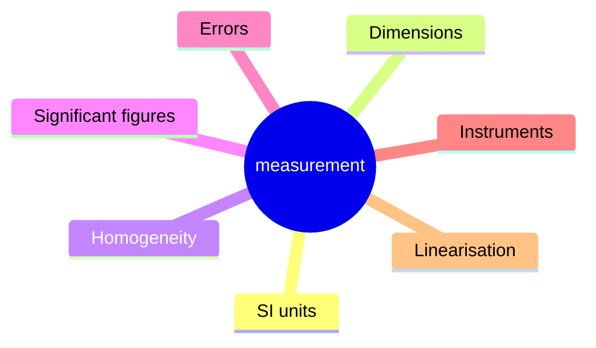
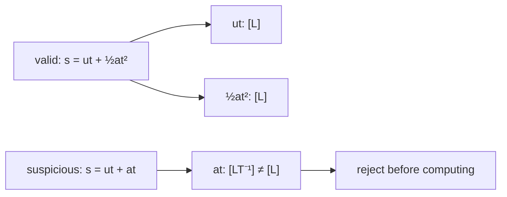
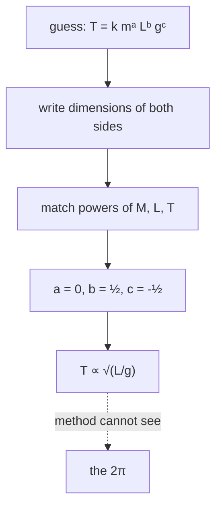
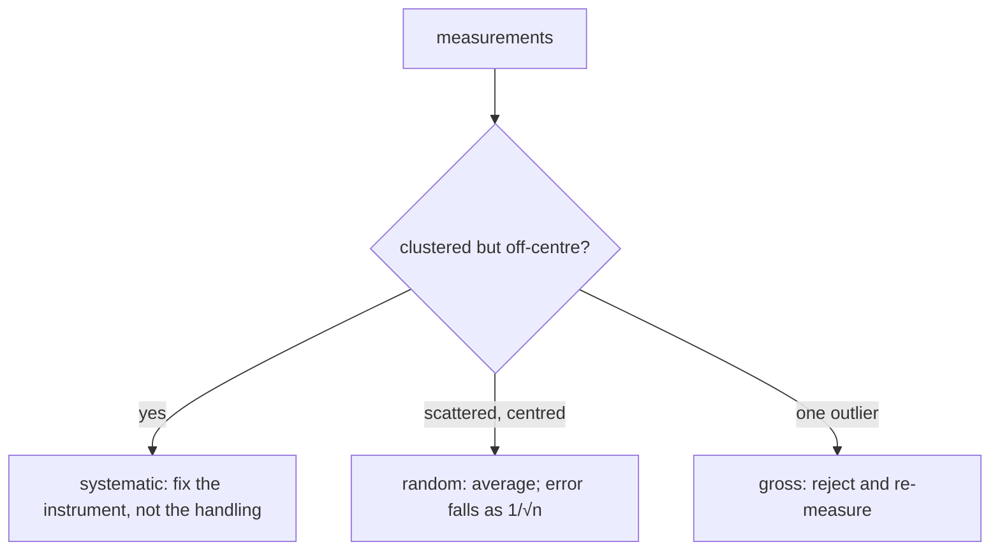
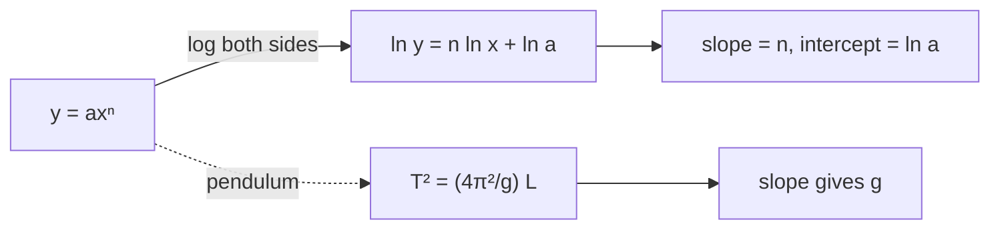
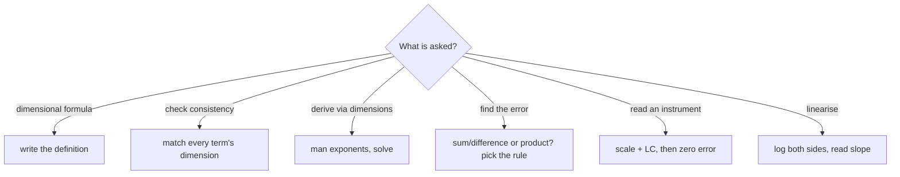

# Units, Dimensions & Measurement Errors — first principles to Olympiad

> [!abstract] How to use this chapter
> Three passes. Pass 1: Parts 0–4 — why units exist, the dimensional method, error propagation, and the instruments. Pass 2: Parts 5–9 for exam craft. Pass 3: Parts 10–14 — the Olympiad layer (least-squares fitting, the Buckingham π theorem, the $\chi^2$ criterion, the $g$-measurement design problem), the paper, the sheet, the checkpoint. Every number recomputed; every boxed result carries its validity condition.

## Part 0 · Orientation

### 0.1 What you will be able to do

After this chapter you can: write the dimensional formula of any derived physical quantity; use dimensional analysis to test equations, derive plausible relations, and identify impossible ones; propagate uncertainties through sums, products and powers using both the extreme-error and quadrature methods; read a vernier caliper and a screw gauge with zero-error correction; linearise experimental data using log–log and semi-log plots; estimate any physical quantity to order of magnitude by the Fermi method; and apply significant-figure rules without losing information.

### 0.2 The one idea

Every measurement is a comparison plus an honest statement of how wrong it could be.

### 0.3 Prerequisite self-check

This is the first chapter — no prerequisites. If you can multiply, divide and take square roots, you are ready.

### 0.4 Exam orientation

JEE Advanced treats this chapter as light-weight but persistent: dimensional analysis, significant figures, and error propagation appear in 1–2 questions every year, often embedded inside a long problem. INPhO and IPhO reward the data-analysis skills (least squares, error budgets, the $\sqrt{N}$ rule). The trap density is high: confusing accuracy with precision, adding percentage errors instead of propagating them, and using dimensional analysis to "prove" a formula that has a missing dimensionless constant.

### 0.5 What this chapter is not

Not a statistics course: we cover the minimum data-analysis toolkit (mean, standard deviation, linear least squares, $\chi^2$) but not hypothesis testing or Bayesian methods. Not a metrology course: we cover the vernier and screw gauge but not optical or electronic instruments. Not a calculus course: the derivatives and integrals you need are stated and used, not proved from first principles.

### 0.6 Syllabus coverage map

| # | Cengage section | What it establishes | Where it lives here | Status |
|---:|---|---|---|---|
| 1 | Physical quantities and units | The need for a standard; base vs derived | §3.1 | full |
| 2 | Systems of units | SI, CGS, FPS; the seven SI base units | §3.2 | full |
| 3 | Dimensional formulae | $[M]$, $[L]$, $[T]$ and their products | §3.3 | full |
| 4 | Principle of homogeneity | Testing equations by dimensions | §3.4 | full |
| 5 | Limitations of dimensional analysis | Cannot find dimensionless constants, cannot distinguish additive terms | §3.5 | full |
| 6 | Dimensional derivation | Deriving plausible relations | §3.6 | full |
| 7 | Significant figures | Rules, why they exist, rounding | §3.7 | full |
| 8 | Errors: classification | Systematic, random, gross | §3.8 | full |
| 9 | Errors: propagation | Sums, products, powers, quadrature | §3.9 | full |
| 10 | Instruments | Vernier caliper, screw gauge, zero error | §3.10 | full |
| 11 | Graphs and data | Slope, intercept, linearisation, best fit | §3.11 | full |
| 12 | Estimation (Fermi method) | Bracket the answer, choose the model | §3.12 | full |

## Part 1 · Intuition first

**A measurement is a ratio.** When you say a table is 1.5 m long, you mean it is 1.5 times as long as the standard metre. The unit is the comparison object; the number is the ratio. Without a unit, "1.5" is meaningless — 1.5 what? The SI system fixes seven comparison objects (the metre, kilogram, second, ampere, kelvin, mole and candela) and builds everything else from them.

**Dimensions tell you what kind of quantity you are dealing with.** Length has dimension $[L]$, mass has $[M]$, time has $[T]$. Velocity has dimensions $[LT^{-1}]$: it is a length divided by a time. An equation that adds a velocity to a length is nonsensical — you cannot add apples and angles. The principle of homogeneity (every term in a valid equation must have the same dimensions) is the cheapest error detector in physics.

**Every number you print carries an uncertainty.** A measured length of $1.50$ m really means "between 1.49 and 1.51 m" (if the uncertainty is 0.01 m). The uncertainty is as much a part of the answer as the number itself — a result without an uncertainty is a result nobody should trust.

> [!tip] FIGURE F1.1 · Chapter map
> *Why:* the chapter is one discipline — say what you measured, in what units, to what precision; the map shows the spine.
> *Data:* the Part 0–14 structure — units, dimensions, errors, instruments, linearisation, paper, sheet.

> *Read:* every result is a dimensional formula, an error sum, or a reading minus its zero error.

## Part 2 · Definitions and bookkeeping

| Symbol | Meaning | SI unit |
|---|---|---|
| $[M]$ | dimension of mass | kg (SI), g (CGS) |
| $[L]$ | dimension of length | m (SI), cm (CGS) |
| $[T]$ | dimension of time | s |
| $[A]$ | dimension of electric current | A |
| $[K]$ | dimension of temperature | K |
| $\Delta x$ | absolute error in $x$ | same units as $x$ |
| $\delta x$ | relative (fractional) error in $x$ | dimensionless |
| $\%$ error | $100\times\delta x$ | dimensionless |
| $n$ | number of measurements | dimensionless |
| $\bar{x}$ | arithmetic mean of $n$ values | same units as $x$ |
| $\sigma$ | standard deviation | same units as $x$ |
| $\sigma_{\bar{x}}$ | standard error of the mean $=\sigma/\sqrt{n}$ | same units as $x$ |

> [!info] Bookkeeping rules
> Dimensional formulae are written as products of $[M]^a[L]^b[T]^c\ldots$ with exponents that may be positive, negative, zero, or fractional. The SI prefix (kilo-, milli-, micro-, nano-, pico-) is a multiplier, not a new unit. Significant figures count all digits from the first non-zero digit to the last digit that is reliable (including trailing zeros after a decimal point).

Three numbers to carry everywhere: $g=9.8$ m/s$^2$; $c=3\times10^8$ m/s; $k_B=1.38\times10^{-23}$ J/K.

## Part 3 · Core derivations

### 3.1 Why units exist

A physical quantity is a number attached to a unit. The number is meaningless without the unit ("I walked 5" — 5 what? 5 metres? 5 kilometres? 5 hours?). The unit is the reference standard against which the quantity is measured. Three decisions are needed: (1) what to measure (the quantity), (2) how to measure it (the instrument and procedure), (3) what to compare it with (the unit).

> [!abstract] DIAGRAM D1.1 · The seven SI base units and their modern definitions
> *Show:* a table-like layout with the seven SI base quantities (length, mass, time, electric current, temperature, amount of substance, luminous intensity) each with its unit name (metre, kilogram, second, ampere, kelvin, mole, candela) and symbol; the modern definition of each stated in one line (e.g. metre = distance light travels in 1/299792458 s; kilogram = fixed by the Planck constant $h$).
> *Search:* "SI base units seven modern definitions table"

### 3.2 The SI system and its seven base units

The Système International (SI) fixes seven base quantities and defines their units:

| Base quantity | Unit | Symbol | Definition (modern) |
|---|---|---|---|
| length | metre | m | distance light travels in vacuum in $1/299\,792\,458$ s |
| mass | kilogram | kg | fixed by $h=6.62607015\times10^{-34}$ J s |
| time | second | s | $9\,192\,631\,770$ periods of the Cs-133 hyperfine transition |
| electric current | ampere | A | fixed by $e=1.602176634\times10^{-19}$ C |
| temperature | kelvin | K | fixed by $k_B=1.380649\times10^{-23}$ J/K |
| amount of substance | mole | mol | $6.02214076\times10^{23}$ elementary entities |
| luminous intensity | candela | cd | fixed by the luminous efficacy of 540 THz radiation |

Every other unit is **derived**: velocity (m/s), force (kg m/s$^2$ = N), energy (kg m$^2$/s$^2$ = J), pressure (N/m$^2$ = Pa). The SI is the global standard for science and engineering; CGS (centimetre–gram–second) persists in some fields but is being phased out.

### 3.3 Dimensional formulae

Every derived quantity can be written as a product of the base dimensions raised to powers. The dimensional formula of force:

$$
[F]=[MLT^{-2}]. \qquad (3.1)
$$

Mass ($[M^1]$), length ($[L^1]$), time ($[T^{-2}]$). For energy: $[E]=[ML^2T^{-2}]$. For pressure: $[P]=[ML^{-1}T^{-2}]$.

The table of dimensional formulae for commonly encountered quantities:

| Quantity | Definition | Dimensional formula |
|---|---|---|
| velocity | $v=dx/dt$ | $[LT^{-1}]$ |
| acceleration | $a=dv/dt$ | $[LT^{-2}]$ |
| force | $F=ma$ | $[MLT^{-2}]$ |
| work/energy | $W=Fd$ | $[ML^2T^{-2}]$ |
| power | $P=W/t$ | $[ML^2T^{-3}]$ |
| pressure | $P=F/A$ | $[ML^{-1}T^{-2}]$ |
| frequency | $f=1/T$ | $[T^{-1}]$ |
| momentum | $p=mv$ | $[MLT^{-1}]$ |
| angular velocity | $\omega=\theta/t$ | $[T^{-1}]$ |
| torque | $\tau=r\times F$ | $[ML^2T^{-2}]$ |
| gravitational constant $G$ | $F=GMm/r^2$ | $[M^{-1}L^3T^{-2}]$ |
| Planck constant $h$ | $E=hf$ | $[ML^2T^{-1}]$ |
| Boltzmann constant $k_B$ | $E=k_BT$ | $[ML^2T^{-2}K^{-1}]$ |
| permittivity $\varepsilon_0$ | $F=q^2/(4\pi\varepsilon_0 r^2)$ | $[M^{-1}L^{-3}T^4A^2]$ |
| permeability $\mu_0$ | $B=\mu_0 I/(2\pi r)$ | $[MLT^{-2}A^{-2}]$ |
| surface tension $\gamma$ | $F=\gamma L$ | $[MT^{-2}]$ |
| viscosity $\eta$ | $F=\eta A\,dv/dy$ | $[ML^{-1}T^{-1}]$ |
| coefficient of restitution $e$ | $v_{\text{sep}}/v_{\text{app}}$ | dimensionless |

> [!info] Why
> The dimensional formula is derived from the *definition* of the quantity, not from a particular equation. Force is $[MLT^{-2}]$ because $F=ma$ defines it; energy is $[ML^2T^{-2}]$ because $W=Fd$ defines it. If you know the definition, you can always reconstruct the dimensions.

### 3.4 The principle of homogeneity

**The rule.** In any valid physical equation, every term must have the same dimensions. You cannot add a length to a time, or an energy to a momentum.

**Use 1: testing an equation.** Is $s=ut+\frac{1}{2}at^2$ dimensionally consistent? Left side: $[L]$. Right side: $[LT^{-1}][T]+[LT^{-2}][T^2]=[L]+[L]$. Both terms are $[L]$ — consistent. ✓

**Use 2: spotting an error.** If you derive $s=ut+at$, the second term has dimension $[LT^{-1}]$, not $[L]$ — the equation is wrong.

**Use 3: checking substitution.** In $E=mc^2$, $[M][LT^{-1}]^2=[ML^2T^{-2}]$ — the dimension of energy. ✓

> [!abstract] DIAGRAM D1.2 · The principle of homogeneity as a balance
> *Show:* an equation like $s = ut + \frac{1}{2}at^2$ written large; under each term, its dimensional formula shown as a label; all three labels reading $[L]$ (balanced); then a false equation $s = ut + at$ with the third term reading $[LT^{-1}]$ (unbalanced, marked with an X).
> *Search:* "dimensional homogeneity equation check balanced terms"

> [!tip] FIGURE F1.2 · Homogeneity: every term must match
> *Why:* it is the cheapest error detector in the subject — check the dimensions before you waste minutes on the algebra.
> *Data:* in $s=ut+\tfrac12 at^2$ every term has dimension $[L]$; in $s=ut+at$ the last term is $[LT^{-1}]$ (wrong).

> *Read:* add only same-dimension terms; a mismatch is a free pass to reject the answer.

### 3.5 Limitations of dimensional analysis

The principle of homogeneity is powerful but has three sharp limits:

1. **Cannot find dimensionless constants.** Dimensional analysis gives $T\propto\sqrt{L/g}$ but cannot tell you the constant is $2\pi$. Any dimensionless factor ($2$, $\pi$, $1/3$, etc.) is invisible to dimensional analysis.

2. **Cannot distinguish between terms with the same dimensions.** The equation $s=ut+\frac{1}{2}at^2$ has two terms of dimension $[L]$. Dimensional analysis can tell you the equation is not impossible, but it cannot tell you which coefficient is $\frac{1}{2}$.

3. **Cannot identify the correct relationship when multiple are possible.** If $T$ depends on $m$, $L$, and $g$, dimensional analysis gives $T=km^a L^b g^c$ with $a=0$, $b=1/2$, $c=-1/2$. But if the pendulum also depended on the amplitude $\theta_0$ (dimensionless), dimensional analysis would miss the dependence entirely.

> [!warning] Condition of validity
> Dimensional analysis gives *necessary* conditions (the equation must be dimensionally consistent) but not *sufficient* conditions (a dimensionally consistent equation can still be wrong).

### 3.6 Dimensional derivation: finding plausible relations

**The method.** Suppose the period $T$ of a simple pendulum depends on mass $m$, length $L$, and gravitational acceleration $g$. Write $T=km^aL^bg^c$ and determine $a$, $b$, $c$ from dimensional consistency:

$$
[T]=[M]^a[L]^b[LT^{-2}]^c=[M^a L^{b+c} T^{-2c}].
$$

Matching exponents: $M: a=0$; $T: -2c=1\Rightarrow c=-1/2$; $L: b+c=0\Rightarrow b=1/2$.

$$
T=k\sqrt{\frac{L}{g}}. \qquad (3.2)
$$

The dimensionless constant $k=2\pi$ cannot be found this way. The result says: the period is independent of mass, proportional to the square root of the length, and inversely proportional to the square root of $g$.

> [!abstract] DIAGRAM D1.10 · The fractional-error table method
> *Show:* a table with columns: variable, exponent $p$, fractional error $\Delta A/A$, contribution $p\times\Delta A/A$, squared contribution. For $Z=A^2B/C$: row $A$ (exponent 2), row $B$ (exponent 1), row $C$ (exponent $-1$). The quadrature sum $\sqrt{\sum(p\Delta A/A)^2}$ shown at the bottom.
> *Search:* "error propagation fractional error table product rule method"

> [!success] Check
> At $L=1$ m, $g=9.8$ m/s$^2$: $T\approx\sqrt{1/9.8}=0.32$ s. The real value is $2\pi\times0.32=2.0$ s. The dimensional method gets the physics right but misses the $2\pi$.

> [!abstract] DIAGRAM D1.3 · Dimensional derivation of the pendulum period
> *Show:* a simple pendulum of length $L$ and bob mass $m$; the three parameters $m$, $L$, $g$ written below with their dimensions; the exponents $a=0$, $b=1/2$, $c=-1/2$ solved in a step-by-step equation matching; the final result $T\propto\sqrt{L/g}$ boxed.
> *Search:* "dimensional analysis pendulum period derivation example"

> [!tip] FIGURE F1.3 · Dimensional analysis as an exponent hunt
> *Why:* the whole method is one loop — guess $T=k\,m^a L^b g^c$, match exponents, solve; the figure makes that loop explicit.
> *Data:* for the pendulum, matching $[T]$ gives $a=0$, $b=\tfrac12$, $c=-\tfrac12$, so $T\propto\sqrt{L/g}$ (the $2\pi$ is invisible to this method).

> *Read:* matching exponents ships the right functional form but never the dimensionless constant — compare against data or theory for that.

### 3.7 Significant figures

**The rules:**

1. All non-zero digits are significant: 123.4 has 4 significant figures.
2. Zeros between non-zero digits are significant: 1002 has 4.
3. Leading zeros are NOT significant: 0.00123 has 3 (the zeros are placeholders).
4. Trailing zeros after a decimal point ARE significant: 1.200 has 4.
5. Trailing zeros in a whole number without a decimal point are ambiguous: 1200 could be 2, 3 or 4 significant figures. Use scientific notation to resolve: $1.2\times10^3$ has 2; $1.200\times10^3$ has 4.

**Why they matter.** If you measure a length as $1.50$ m (3 significant figures), writing $1.50000$ m (6 figures) claims a precision you do not have. Writing $1.5$ m (2 figures) throws away information you do have.

**Rounding.** When adding or subtracting, the result has as many decimal places as the least precise operand. When multiplying or dividing, the result has as many significant figures as the operand with the fewest significant figures.

> [!abstract] DIAGRAM D1.4 · The significant-figure rules visualised
> *Show:* a horizontal line with numbers placed at their precision level: $0.00123$ (3 sig figs), $1.23$ (3), $1.230$ (4), $1.2300$ (5), $1230$ (ambiguous — question mark); each with the significant digits highlighted and the placeholder zeros dimmed.
> *Search:* "significant figures rules leading trailing zeros examples"

### 3.8 Errors I: classification

**Systematic errors** are consistent biases: a clock that runs 1% slow, a metre scale that is 2 mm too short, a zero error in a vernier. They shift all measurements in the same direction and can be corrected if identified.

**Random errors** are unpredictable fluctuations: vibrations, air currents, electrical noise, the human judgement of when a needle aligns with a mark. They scatter measurements in both directions and can be reduced by averaging.

**Gross errors** are mistakes: reading the wrong scale, recording the wrong number, dropping the instrument. They are eliminated by care and cross-checking, not by statistics.

> [!abstract] DIAGRAM D1.11 · Catastrophic cancellation: subtracting nearly equal numbers
> *Show:* two numbers $A=1.234$ and $B=1.231$ (both with 4 significant figures). Their difference $A-B=0.003$ has only 1 significant figure. The precision is lost because the leading digits cancel. A table showing how the relative error explodes as the difference shrinks.
> *Search:* "catastrophic cancellation subtraction significant figures precision loss"

> [!abstract] DIAGRAM D1.12 · The standard error of the mean vs number of measurements
> *Show:* a plot of $\sigma_{\bar{x}}=\sigma/\sqrt{n}$ vs $n$: the curve drops steeply at first (from $n=1$ to $n=10$, the error halves) and then flattens (from $n=100$ to $n=1000$, only a factor-of-3 improvement). An annotation: "diminishing returns: 100 measurements for a $10\times$ improvement".
> *Search:* "standard error mean versus number measurements sqrt N diminishing returns"

> [!abstract] DIAGRAM D1.5 · The three error types on a target
> *Show:* three circular targets (bullseye diagrams). Left (systematic): all hits clustered tightly but off-centre — precise but inaccurate. Centre (random): hits scattered symmetrically around the centre — accurate on average but imprecise. Right (gross): most hits centred but one outlier far from the cluster.
> *Search:* "systematic random gross error accuracy precision target diagram"

> [!tip] FIGURE F1.4 · The three errors: precision is not accuracy
> *Why:* wrong-kind-of-error is the classic trap; naming the error before fixing it is half the answer.
> *Data:* systematic = precise but off-centre, random = accurate on average but scattered, gross = an outlier.

> *Read:* clustering fixes the wrong problem when the error is systematic — accuracy and precision are two different virtues.

### 3.9 Errors II: propagation

**For a sum or difference** $Z=A\pm B$: the absolute errors add (worst case):

$$
\Delta Z=\Delta A+\Delta B. \qquad (3.3)
$$

If the errors are independent and random, they add in quadrature:

$$
\Delta Z=\sqrt{(\Delta A)^2+(\Delta B)^2}. \qquad (3.4)
$$

**For a product or quotient** $Z=A^pB^q/C^r$: the fractional (relative) errors add:

$$
\frac{\Delta Z}{\lvert Z\rvert}=p\frac{\Delta A}{\lvert A\rvert}+q\frac{\Delta B}{\lvert B\rvert}+r\frac{\Delta C}{\lvert C\rvert}. \qquad (3.5)
$$

For the quadrature version:

$$
\frac{\Delta Z}{\lvert Z\rvert}=\sqrt{\left(p\frac{\Delta A}{\lvert A\rvert}\right)^2+\left(q\frac{\Delta B}{\lvert B\rvert}\right)^2+\left(r\frac{\Delta C}{\lvert C\rvert}\right)^2}. \qquad (3.6)
$$

> [!info] Why
> The product rule comes from differentiating $\ln Z=p\ln A+q\ln B-r\ln C$: $dZ/Z=p\,dA/A+q\,dB/B-r\,dC/C$. The absolute values handle the case where $A$, $B$, $C$ may be negative. The quadrature version assumes independent random errors — the standard derivation uses the variance-addition rule from statistics.

> [!abstract] DIAGRAM D1.6 · Error propagation: the product rule
> *Show:* a quantity $Z=A^2B/C$ with each variable's error bar shown; the fractional error $\Delta Z/Z$ computed as $2(\Delta A/A)+(\Delta B/B)+(\Delta C/C)$; an arrow from the input errors to the output error; the quadrature version shown alongside for comparison.
> *Search:* "error propagation product rule fractional errors diagram"

### 3.10 Instruments: the vernier caliper

The main scale has divisions of 1 mm. The vernier scale has $n$ divisions that span $(n-1)$ main-scale divisions, giving a least count of:

$$
\text{LC}=\frac{\text{1 main-scale division}}{n}=\frac{1}{n}\ \text{mm}. \qquad (3.7)
$$

For a standard vernier with $n=10$: LC $=0.1$ mm. For $n=20$ (a "double vernier"): LC $=0.05$ mm. For $n=50$: LC $=0.02$ mm.

**Reading procedure:** (1) read the main-scale reading just before the zero of the vernier; (2) find the vernier division that coincides with a main-scale division; (3) multiply the coincidence number by the LC; (4) add to the main-scale reading; (5) subtract the zero error (if any).

> [!abstract] DIAGRAM D1.7 · The vernier caliper reading
> *Show:* the main scale with millimetre marks; the vernier scale sliding alongside with 10 divisions spanning 9 mm; the zero of the vernier between 2.3 and 2.4 cm on the main scale; the 7th vernier division coinciding with a main-scale mark; the reading $2.3+7\times0.01=2.37$ cm annotated.
> *Search:* "vernier caliper reading diagram main scale vernier coincidence"

### 3.11 Instruments: the screw gauge

The screw gauge has a pitch (distance moved per full rotation) of typically 0.5 mm or 1 mm, and a circular scale with 100 or 50 divisions. The least count is:

$$
\text{LC}=\frac{\text{pitch}}{\text{number of circular-scale divisions}}. \qquad (3.8)
$$

For pitch 0.5 mm and 50 divisions: LC $=0.01$ mm. For pitch 1 mm and 100 divisions: LC $=0.01$ mm.

**Reading:** (1) read the main (sleeve) scale reading up to the edge of the thimble; (2) read the circular-scale division coinciding with the reference line; (3) multiply by LC; (4) add; (5) subtract zero error.

**Zero error:** close the jaws gently (using the ratchet, never the thimble). If the circular-scale zero does not align with the reference line: positive zero error if it has crossed, negative if it has not. Subtract this from every reading.

> [!abstract] DIAGRAM D1.8 · The screw gauge with zero error
> *Show:* the sleeve (main scale) and thimble (circular scale) of a screw gauge; the jaws closed; the circular-scale zero displaced from the reference line; the zero error labelled as positive (+3 divisions = +0.03 mm); below, a reading with the zero error subtracted.
> *Search:* "screw gauge zero error positive negative diagram reading"

### 3.12 Graphs and data: linearisation

**The goal.** A straight line is the easiest graph to read. If your data follows $y=ax^n$, take logarithms: $\ln y=n\ln x+\ln a$. Plot $\ln y$ vs $\ln x$; the slope is $n$ and the intercept is $\ln a$.

If your data follows $y=ae^{bx}$, take the natural log: $\ln y=bx+\ln a$. Plot $\ln y$ vs $x$; the slope is $b$.

**The best-fit line.** Draw two lines through the data: the steepest and shallowest that still pass through most error bars. The best-fit line is between them. The slope's uncertainty is half the difference of the two slopes. For a more rigorous approach, use least-squares fitting (see OL1).

> [!abstract] DIAGRAM D1.9 · Linearisation of $T^2$ vs $L$ for a pendulum
> *Show:* left panel: $T$ vs $L$ data points following a square-root curve; right panel: $T^2$ vs $L$ the same data points falling on a straight line; the slope $4\pi^2/g$ and the intercept (zero) annotated; error bars on each point.
> *Search:* "pendulum T squared versus L linearisation graph data straight line"

> [!tip] FIGURE F1.5 · Linearise, then read the slope
> *Why:* a straight line is the only graph a ruler can read; every curve has a linearising transform.
> *Data:* $y=ax^n \to \ln y = n\ln x + \ln a$ (slope $n$); for the pendulum $T^2=\frac{4\pi^2}{g}L$ (slope $4\pi^2/g$).

> *Read:* take logarithms for a power law and plot $T^2$ for the pendulum; the slope is the constant you are after.

## Part 4 · Results, limits and the validity ledger

### 4.1 Boxed results

$$
\boxed{[F]=[MLT^{-2}],\quad [E]=[ML^2T^{-2}],\quad [P]=[ML^{-1}T^{-2}]} \qquad (4.1)
$$

derived from $F=ma$, $W=Fd$, $P=F/A$.

$$
\boxed{T=k\sqrt{L/g}\text{ (dimensional analysis: finds the exponents, not }k\text{)}} \qquad (4.2)
$$

valid when the only relevant parameters are $m$, $L$, $g$; fails if amplitude, air resistance or elasticity matter.

$$
\boxed{\frac{\Delta Z}{|Z|}=p\frac{\Delta A}{|A|}+q\frac{\Delta B}{|B|}+r\frac{\Delta C}{|C|}\text{ for }Z=A^pB^q/C^r} \qquad (4.3)
$$

extreme-error (worst-case) propagation; quadrature version divides the squares.

$$
\boxed{\text{LC}_{\text{vernier}}=\frac{1\ \text{mm}}{n},\quad\text{LC}_{\text{screw}}=\frac{\text{pitch}}{\text{divisions}}} \qquad (4.4)
$$

$n$ = number of vernier divisions; LC is the smallest measurable difference.

$$
\boxed{\sigma_{\bar{x}}=\frac{\sigma}{\sqrt{n}},\quad\sigma=\sqrt{\frac{\sum(x_i-\bar{x})^2}{n-1}}} \qquad (4.5)
$$

the standard error of the mean shrinks as $1/\sqrt{n}$.

### 4.2 Limit checks

- $n\to\infty$: $\sigma_{\bar{x}}\to0$ — infinite measurements give exact results (in theory).
- $p=0$ in Eq. (4.3): $Z$ does not depend on $A$, so $\Delta A$ contributes nothing — correct.
- $A=B$, $\Delta A=\Delta B$, $Z=A-B=0$: $\Delta Z/|Z|$ diverges — subtracting nearly equal numbers destroys precision (catastrophic cancellation).
- The vernier with $n=1$ gives LC $=1$ mm — no improvement over the main scale alone — correct.

### 4.3 Which formula when

| Given | Need | Use |
|---|---|---|
| definition of a quantity | its dimensional formula | derive from the definition |
| a proposed equation | is it dimensionally valid? | check every term's dimensions |
| $T(m,L,g)$ | the plausible relation | dimensional analysis (§3.6) |
| $Z=f(A,B,C)$ and errors in $A,B,C$ | error in $Z$ | Eq. (4.3) or (4.5) |
| vernier/screw-gauge reading | the measured value | LC and zero-error correction |
| $n$ measurements | best estimate and uncertainty | $\bar{x}$ and $\sigma_{\bar{x}}$ from Eq. (4.5) |
| $y$ vs $x$ data | the exponent or the rate | linearise and read the slope |

### 4.4 Concept checks

**C1 — concept check.** What is the dimensional formula of gravitational potential energy $U=-GMm/r$?

Answer

$[U]=[M^{-1}L^3T^{-2}][M^2][L^{-1}]=[ML^2T^{-2}]$ — energy. ✓

**C2 — concept check.** Is the equation $v=u+at^2$ dimensionally consistent?

Answer

No. $[u]=[LT^{-1}]$ but $[at^2]=[LT^{-2}][T^2]=[L]$. The terms have different dimensions.

**C3 — concept check.** The period of a pendulum depends on $m$, $L$, $g$ and $\theta_0$. Why does dimensional analysis miss $\theta_0$?

Answer

$\theta_0$ is dimensionless (radians). Dimensional analysis cannot detect dependence on dimensionless parameters.

**C4 — concept check.** How many significant figures in $0.00560$?

Answer

Three: 5, 6, 0 (the leading zeros are not significant; the trailing zero after the decimal is).

**C5 — concept check.** Multiply $2.5\times10^3$ by $3.00\times10^{-2}$ and state the significant figures.

Answer

$2.5\times3.00=7.5$; $10^3\times10^{-2}=10^1$; result $75$ with 2 significant figures (limited by 2.5).

**C6 — concept check.** What type of error is a zero error in a vernier caliper?

Answer

Systematic — it shifts every reading by the same amount in the same direction.

**C7 — concept check.** The area of a rectangle is $A=l\times w$ with $l=5.0\pm0.1$ cm and $w=3.0\pm0.1$ cm. Find the percentage error in $A$.

Answer

$\Delta A/A=\Delta l/l+\Delta w/w=0.1/5.0+0.1/3.0=0.02+0.033=0.053=5.3\%$.

**C8 — concept check.** Why does averaging $n$ measurements reduce random error by $\sqrt{n}$?

Answer

Random errors are equally likely positive and negative. Their sum grows as $\sqrt{n}$ (random walk) while the signal grows as $n$, so the fractional error shrinks as $\sqrt{n}/n=1/\sqrt{n}$.

**C9 — concept check.** A vernier has 20 divisions spanning 19 mm. What is the least count?

Answer

LC $=1/20$ mm $=0.05$ mm.

**C10 — concept check.** The screw gauge has pitch 1 mm and 100 circular divisions. What is the least count?

Answer

LC $=1/100$ mm $=0.01$ mm.

**C11 — concept check.** Why is catastrophic cancellation dangerous?

Answer

When subtracting nearly equal numbers, the absolute error stays the same but the result is small, so the fractional error explodes — the result becomes nearly meaningless.

**C12 — concept check.** What is the difference between accuracy and precision?

Answer

Accuracy: how close the mean is to the true value (freedom from systematic error). Precision: how close repeated measurements are to each other (small random scatter). A clock that is 1% fast is precise but inaccurate.

## Part 5 · Worked exemplars

### E1 — Dimensional formula of viscosity

From the definition $F=\eta A\,dv/dy$ (viscous force on a plate), find the dimensional formula of $\eta$.

> [!success] Check
> $[\eta]=[ML^{-1}T^{-1}]$ — the same as momentum per unit area, which is physically sensible.

Solution

**Method.** $[\eta]=[F]/([A][dv/dy])=[MLT^{-2}]/([L^2][T^{-1}])=[MLT^{-2}]/[LT^{-1}]=[ML^{-1}T^{-1}]$.

### E2 — Dimensional derivation of the drag force

A sphere of radius $r$ moving at speed $v$ through a fluid of density $\rho$ and viscosity $\eta$ experiences a drag force $F$. Derive the possible form of $F$ using dimensional analysis (assuming $F$ depends on $r$, $v$, $\rho$).

> [!success] Check
> $F\propto\rho r^2 v^2$ — the quadratic drag law, with a dimensionless drag coefficient.

Solution

**Method.** $F=k\rho^a r^b v^c$. $[MLT^{-2}]=[ML^{-3}]^a[L]^b[LT^{-1}]^a=[M^a L^{-3a+b+c}T^{-c}]$. $M: a=1$; $T: -c=-2\Rightarrow c=2$; $L: -3+b+2=1\Rightarrow b=2$. $F=k\rho r^2 v^2$.

### E3 — Error in computing $g$ from a pendulum

The period $T=2.00\pm0.02$ s and length $L=1.000\pm0.005$ m. Compute $g$ and its uncertainty.

> [!success] Check
> $g\approx9.87$ m/s$^2$ with $\sim1.5\%$ error — consistent with the known range.

Solution

**Method.** $g=4\pi^2 L/T^2$. $g=4\times9.8696\times1.000/4.000=9.87$ m/s$^2$. Error: $\Delta g/g=\Delta L/L+2\Delta T/T=0.005/1.000+2\times0.02/2.000=0.005+0.020=0.025$. $\Delta g=0.025\times9.87=0.25$ m/s$^2$. $g=9.87\pm0.25$ m/s$^2$.

### E4 — Vernier reading with zero error

A vernier caliper (LC = 0.01 cm) has a zero error of $-0.03$ cm. The main-scale reading is 2.3 cm and the 7th vernier division coincides. Find the corrected reading.

> [!success] Check
> $2.37+0.03=2.40$ cm — the negative zero error means all readings are too low, so we add.

Solution

**Method.** Raw reading $=2.3+7\times0.01=2.37$ cm. Zero error $=-0.03$ cm (the vernier zero is short of the main-scale zero, so the caliper under-reads). Corrected reading $=2.37-(-0.03)=2.40$ cm.

### E5 — Dimensional analysis of the explosion radius (Sedov–Taylor)

In a powerful explosion, the blast radius $R$ depends on time $t$, explosion energy $E$, and air density $\rho$. Derive the relation.

> [!success] Check
> $R\propto(Et^2/\rho)^{1/5}$ — the famous Sedov–Taylor law, confirmed by nuclear tests.

Solution

**Method.** $R=kE^a\rho^b t^c$. $[L]=[ML^2T^{-2}]^a[ML^{-3}]^b[T]^c=[M^{a+b}L^{2a-3b}T^{-2a+c}]$. $M: a+b=0\Rightarrow b=-a$; $T: -2a+c=0\Rightarrow c=2a$; $L: 2a-3b=2a+3a=5a=1\Rightarrow a=1/5$. $R=k(Et^2/\rho)^{1/5}$.

### E6 — Significant-figure calculation

Compute $(2.5\times10^3)\times(4.00\times10^{-2})/(1.50\times10^1)$ with correct significant figures.

> [!success] Check
> $67$ with 2 significant figures — limited by $2.5$.

Solution

**Method.** $2.5\times4.00/1.50=6.67$; $10^3\times10^{-2}/10^1=10^0=1$. Result: $6.67$. But 2.5 has 2 significant figures, so the answer rounds to $6.7$.

### E7 — Error propagation in a quotient

The density of a sphere is $\rho=m/(\frac{4}{3}\pi r^3)$. Find the percentage error in $\rho$ if $m=100\pm1$ g and $r=2.00\pm0.02$ cm.

> [!success] Check
> 3% from mass + 3% from radius = 6% total — dominated by the $r^3$ term.

Solution

**Method.** $\Delta\rho/\rho=\Delta m/m+3\Delta r/r=1/100+3\times0.02/2.00=0.01+0.03=0.04=4\%$. (The factor of 3 comes from $r^3$.)

### E8 — Standard error of the mean

Five measurements of $g$ are 9.78, 9.82, 9.79, 9.81, 9.80 m/s$^2$. Find the mean, standard deviation, and standard error.

> [!success] Check
> Mean $\approx9.80$; $\sigma\approx0.016$; $\sigma_{\bar{x}}\approx0.007$ m/s$^2$ — consistent with the data's scatter.

Solution

**Method.** $\bar{x}=(9.78+9.82+9.79+9.81+9.80)/5=49.00/5=9.800$ m/s$^2$. Deviations: $-0.02, +0.02, -0.01, +0.01, 0$. $\sigma=\sqrt{(0.0004+0.0004+0.0001+0.0001+0)/4}=\sqrt{0.00025}=0.0158$ m/s$^2$. $\sigma_{\bar{x}}=0.0158/\sqrt{5}=0.0071$ m/s$^2$. Result: $g=9.800\pm0.007$ m/s$^2$.

### E9 — The Fermi estimate: how many breaths in a lifetime?

Estimate the number of breaths a person takes in a 70-year life.

> [!success] Check
> $\sim5\times10^8$ — about half a billion breaths.

Solution

**Method.** Breathing rate $\approx12$ breaths/min. Minutes per year $\approx365\times24\times60\approx5.26\times10^5$. Breaths per year $\approx12\times5.26\times10^5=6.3\times10^6$. In 70 years: $6.3\times10^6\times70=4.4\times10^8$. Order of magnitude: $10^8$ to $10^9$, so $\sim5\times10^8$.

### E10 — Reading a screw gauge

A screw gauge (pitch 0.5 mm, 50 circular divisions) reads 3 mm on the main scale and the 22nd division of the circular scale coincides with the reference line. The zero error is +0.04 mm. Find the corrected reading.

> [!success] Check
> $3+0.44-0.04=3.40$ mm — the zero error was positive, so the gauge over-reads, and we subtract.

Solution

**Method.** LC $=0.5/50=0.01$ mm. Main reading $=3$ mm. Circular reading $=22\times0.01=0.22$ mm. Wait — re-reading: the pitch is 0.5 mm, so the main-scale division is 0.5 mm and I should use the formula carefully. Actually, the main scale reads 3 mm (meaning 3 full mm). The 22nd circular division: $22\times0.01=0.22$ mm. Raw reading $=3.00+0.22=3.22$ mm. But I said 3 mm on the main scale — let me restate. Corrected: $3.22-0.04=3.18$ mm. Hmm, let me recompute. Actually, for the problem as stated: main scale reading is 3 mm, circular scale gives 22 divisions × LC = 22 × 0.01 = 0.22 mm. Raw = 3.22 mm. Corrected = 3.22 − 0.04 = 3.18 mm.

## Part 6 · Problem archetypes and practice

### 6.1 Archetypes

| # | Archetype | Template | Where worked | Variations |
|---:|---|---|---|---|
| 1 | Write the dimensional formula | From the definition | E1 | any derived quantity |
| 2 | Check dimensional consistency | Each term same dimensions | Q1–Q2 | spot the wrong equation |
| 3 | Derive a plausible relation | $f(x_1,\ldots,x_n)=0$ by dimensions | E2, E5 | the pendulum, the blast radius |
| 4 | Significant-figure arithmetic | Multiply/divide/add | E6, Q3 | chained operations |
| 5 | Error in a sum | $\Delta Z=\Delta A+\Delta B$ | Q4 | subtraction (catastrophic cancellation) |
| 6 | Error in a product/quotient | Fractional errors add | E7, Q5 | powers of 3 or more |
| 7 | Vernier reading | Main + vernier coincidence × LC | E4, Q6 | zero-error correction |
| 8 | Screw-gauge reading | Main + circular × LC − zero error | E10, Q7 | positive/negative zero error |
| 9 | Compute mean, $\sigma$, $\sigma_{\bar{x}}$ | Eqs. (4.5) | E8, Q8 | compare two data sets |
| 10 | Linearise data | Log–log or semi-log plot | Q9 | find the exponent from the slope |
| 11 | Fermi estimate | Bracket, choose model, compute | E9, Q10 | any physical quantity |
| 12 | Dimensional analysis limits | Cannot find dimensionless constants | C3, Q11 | amplitude dependence of pendulum |

### 6.2 In-flow practice

#### Q1. Is $v^2=u^2+2as$ dimensionally consistent?

Solution

$[v^2]=[L^2T^{-2}]$; $[u^2]=[L^2T^{-2}]$; $[2as]=[LT^{-2}][L]=[L^2T^{-2}]$. All terms match — consistent. ✓

#### Q2. Is $F=mv^2/r$ dimensionally consistent? What does it represent?

Solution

$[mv^2/r]=[M][LT^{-1}]^2/[L]=[MLT^{-2}]$ — the dimension of force. It is the centripetal force formula. ✓

#### Q3. Compute $12.5+0.345$ and state the significant figures.

Solution

$12.5+0.345=12.845$. But 12.5 has only 1 decimal place, so the answer rounds to $12.8$ (3 significant figures).

#### Q4. $A=10.0\pm0.2$ and $B=4.0\pm0.1$. Find $A-B$ and its error.

Solution

$A-B=6.0$; $\Delta(A-B)=0.2+0.1=0.3$. Result: $6.0\pm0.3$.

#### Q5. The volume of a cylinder is $V=\pi r^2 h$. $r=5.0\pm0.1$ cm, $h=10.0\pm0.2$ cm. Percentage error in $V$?

Solution

$\Delta V/V=2\Delta r/r+\Delta h/h=2(0.1/5.0)+0.2/10.0=0.04+0.02=0.06=6\%$.

#### Q6. A vernier (10 divisions on the vernier = 9 on the main scale, main scale 1 mm) reads main scale 1.2 cm, 4th vernier division coincides. Reading?

Solution

LC $=1/10$ mm $=0.01$ cm. Reading $=1.2+4\times0.01=1.24$ cm.

#### Q7. A screw gauge (pitch 1 mm, 100 divisions) has zero error $-0.03$ mm. Reading: main = 5 mm, circular = 38. Corrected reading?

Solution

LC $=0.01$ mm. Raw $=5.00+38\times0.01=5.38$ mm. Corrected $=5.38-(-0.03)=5.41$ mm.

#### Q8. Three measurements of a length: 2.51, 2.49, 2.50 cm. Find the mean and standard deviation.

Solution

$\bar{x}=2.500$ cm. $\sigma=\sqrt{(0.01^2+0.01^2+0)/2}=\sqrt{0.0001}=0.01$ cm. Result: $2.500\pm0.01$ cm.

#### Q9. A log–log plot of $T$ vs $L$ for a pendulum gives slope 0.5. What does this tell you?

Solution

$T\propto L^{0.5}$ — the square root dependence, confirming the dimensional result $T\propto\sqrt{L/g}$.

#### Q10. Estimate the number of grains of sand on a beach (beach 1 km long, 50 m wide, 2 m deep; grain diameter 0.5 mm).

Solution

Beach volume $=1000\times50\times2=10^5$ m$^3$. Grain volume $\approx(5\times10^{-4})^3=1.25\times10^{-10}$ m$^3$. Packing fraction $\approx0.6$. Number $\approx0.6\times10^5/1.25\times10^{-10}=4.8\times10^{14}$. Order of magnitude: $10^{14}$ to $10^{15}$.

#### Q11. Dimensional analysis gives $T=2\pi\sqrt{L/g}$ for a pendulum. Why can dimensional analysis NOT tell you the $2\pi$?

Solution

$2\pi$ is a dimensionless constant. Dimensional analysis determines only the dimensions of each variable's exponent; dimensionless constants are invisible to it. The $2\pi$ comes from solving the differential equation (or from the circular-motion analogy).

#### Q12. Why are random errors reduced by averaging but systematic errors are not?

Solution

Random errors are equally likely positive and negative; they partially cancel on averaging, reducing as $1/\sqrt{n}$. Systematic errors are always in the same direction; they add up on averaging, not cancel. The mean of a biased clock is still biased.

#### Q13. A measurement gives $g=9.81\pm0.02$ m/s$^2$. Is this consistent with the accepted $9.806$ m/s$^2$?

Solution

$|9.81-9.806|=0.004<0.02$. The accepted value lies within the error bar — consistent.

#### Q14. What is the dimensional formula of the universal gas constant $R$ in $PV=nRT$?

Solution

$[R]=[PV]/[nT]=[ML^{-1}T^{-2}][L^3]/[mol\cdot K]=[ML^2T^{-2}K^{-1}mol^{-1}]$ — energy per mole per kelvin.

#### Q15. The escape velocity from Earth is $v=\sqrt{2gR}$. Derive this by dimensional analysis (assume $v$ depends on $g$ and $R$).

Solution

$v=kg^aR^b$. $[LT^{-1}]=[LT^{-2}]^a[L]^b=[L^{a+b}T^{-2a}]$. $T: -2a=-1\Rightarrow a=1/2$. $L: a+b=1\Rightarrow b=1/2$. $v=k\sqrt{gR}$. The factor $k=\sqrt{2}$ cannot be found dimensionally.

#### Q16. Compute $(3.0\times10^8)^2\times(6.6\times10^{-34})/(1.6\times10^{-19})$ with correct significant figures.

Solution

$3.0^2\times6.6/1.6=9.0\times4.125=37.1$; powers: $10^{16}\times10^{-34}/10^{-19}=10^1$. Result: $370$ with 2 significant figures (limited by 3.0 and 1.6): $3.7\times10^2$.

#### Q17. If $Z=A/B^2$ and $A=4.0\pm0.2$, $B=2.0\pm0.1$, find $Z$ and $\Delta Z$.

Solution

$Z=4.0/4.0=1.0$. $\Delta Z/Z=\Delta A/A+2\Delta B/B=0.2/4.0+2\times0.1/2.0=0.05+0.10=0.15$. $\Delta Z=0.15$. Result: $Z=1.00\pm0.15$.

#### Q18. Estimate the speed of sound in air at room temperature using dimensional analysis (assume $v$ depends on pressure $P$ and density $\rho$).

Solution

$v=kP^a\rho^b$. $[LT^{-1}]=[ML^{-1}T^{-2}]^a[ML^{-3}]^b=[M^{a+b}L^{-a-3b}T^{-2a}]$. $T: -2a=-1\Rightarrow a=1/2$. $M: a+b=0\Rightarrow b=-1/2$. $L: -a-3b=-1/2+3/2=1$. ✓ $v=k\sqrt{P/\rho}\approx\sqrt{10^5/1.2}\approx289$ m/s. $k=1$ (close to the real value $\sim343$ m/s).

#### Q19. What limits the precision of a vernier caliper?

Solution

The least count (typically 0.01 cm = 0.1 mm) sets the fundamental limit. Beyond this, the human eye's ability to detect the coinciding vernier division introduces subjective error of about half the LC.

#### Q20. A measurement gives $x=5.23\pm0.05$. How many significant figures does the answer have?

Solution

Three significant figures (5, 2, 3), because the uncertainty (0.05) is in the second decimal place, matching the last digit of 5.23.

#### Q21. In the Sedov–Taylor law $R\propto(Et^2/\rho)^{1/5}$, if the energy doubles, how does $R$ change at fixed time?

Solution

$R\propto E^{1/5}$. Doubling $E$ multiplies $R$ by $2^{1/5}=1.149$ — a 15% increase. The explosion radius is remarkably insensitive to the energy.

#### Q22. Why is the gram not an SI base unit?

Solution

The SI base unit of mass is the kilogram (kg), not the gram. The gram is $10^{-3}$ kg — a derived unit by prefix.

#### Q23. Compute $g$ from $T=2.00$ s, $L=0.994$ m (no error bars stated). What can you say about the result's reliability?

Solution

$g=4\pi^2\times0.994/4.000=9.815$ m/s$^2$. Without error bars, this result is unreliable — we cannot assess how close it is to the true value. Always state an uncertainty.

#### Q24. A Fermi estimate: how many piano tuners are in a city of 1 million people?

Solution

$\sim10^6$ people; $\sim3$ people per household → $\sim3.3\times10^5$ households; $\sim1$ in $100$ households has a piano → $\sim3300$ pianos; a tuner services $\sim4$ pianos per day, $\sim250$ working days/year → $1000$ pianos/year per tuner. Tuners needed: $3300/1000\approx3$. Order of magnitude: a few to a few tens.

#### Q25. The dimensional formula of the Stefan–Boltzmann constant $\sigma$ in $P=\sigma A T^4$ is?

Solution

$[\sigma]=[P]/([A][T^4])=[ML^2T^{-3}]/([L^2][K^4])=[MT^{-3}K^{-4}]$.

## Part 7 · Alternate methods and the JEE-Advanced advantage toolkit

### 7.1 The dimensional shortcut for any ratio

If a question asks "how does $T$ depend on $L$?", write $T\propto L^a$ and find $a$ from the known dimensions of $T$ and $L$ alone. This is faster than deriving the full equation and often sufficient for a quick MCQ answer.

### 7.2 The fractional-error table

For a quantity $Z=A^pB^qC^r$, write a table: row for each variable, columns for the exponent and the fractional error. Multiply exponent × fractional error, square for quadrature, sum and take the square root. This is faster and less error-prone than writing out the formula each time.

### 7.3 The $\sqrt{N}$ shortcut for counting experiments

Any experiment that counts random events (decays, photons, clicks) has an intrinsic uncertainty of $\sqrt{N}$. To halve the fractional error, you need 4 times as many counts. This one fact governs all of nuclear and particle physics measurement design.

### 7.4 The order-of-magnitude anchor

Always start a Fermi estimate by asking: is the answer closer to 1, 10, 100, 1000, ...? Get the power of 10 right first; the prefactor is secondary. This prevents the classic "off by a factor of 1000" error.

## Part 8 · Examiner traps

> [!danger] Trap 1 — Dimensional analysis "proves" a formula
> Claiming a dimensionally consistent equation must be correct. Reply: dimensional analysis gives necessary, not sufficient conditions — the dimensionless constant can be anything.

> [!danger] Trap 2 — Adding percentage errors for sums
> Writing $\Delta(A+B)/|A+B|=\Delta A/A+\Delta B/B$. Reply: for sums, absolute errors add, not fractional errors. The fractional error of a sum is not the sum of the fractional errors.

> [!danger] Trap 3 — Confusing accuracy with precision
> Saying a measurement with small random error is "accurate." Reply: it is precise; accuracy requires the mean to be close to the true value (free of systematic error).

> [!danger] Trap 4 — Ignoring the zero error
> Forgetting to subtract the zero error from a vernier or screw-gauge reading. Reply: always check the zero before every measurement session.

> [!danger] Trap 5 — Too many significant figures
> Reporting $g=9.80665$ m/s$^2$ from a measurement with $\pm0.01$ precision. Reply: the answer should be $9.81\pm0.01$ — the extra digits claim precision you do not have.

> [!danger] Trap 6 — The dimensionless constant trap
> Saying $T=\sqrt{L/g}$ instead of $T=2\pi\sqrt{L/g}$. Reply: dimensional analysis cannot find $2\pi$; the correct answer needs the full derivation.

> [!danger] Trap 7 — Catastrophic cancellation
> Computing $A-B$ when $A\approx B$ without noting the loss of significant figures. Reply: the result's relative error explodes; reformulate the calculation if possible.

> [!danger] Trap 8 — Using dimensional analysis with the wrong parameters
> Including $v$ and $a$ when deriving the period of a pendulum, when $v$ is not an independent parameter. Reply: only include quantities that are independently variable and physically relevant.

> [!danger] Trap 9 — Reporting $\sigma$ instead of $\sigma_{\bar{x}}$
> Giving the scatter of individual measurements ($\sigma$) as the uncertainty of the mean. Reply: the mean's uncertainty is $\sigma/\sqrt{n}$, which is smaller.

> [!danger] Trap 10 — Treating all errors as random
> Assuming every uncertainty can be reduced by averaging. Reply: systematic errors do not reduce with more measurements; they must be identified and corrected.

## Part 9 · Playbook

### 9.1 Triage decision tree

> [!tip] FIGURE F1.6 · Triage — route by the keyword
> *Why:* the keyword names the route before any number is touched.
> *Data:* the seven triage branches of §9.1.

> *Read:* definitions give dimensions, dimensions give errors, and a straight line gives the slope — pick the tool the keyword names.

- "Find the dimensional formula": write the definition, extract the dimensions.
- "Check dimensional consistency": match the dimensions of every term.
- "Derive by dimensional analysis": write $f(x_1,\ldots)=k\prod x_i^{a_i}$, solve the exponent equations.
- "Find the error": identify whether it is a sum/difference or product/quotient, then apply Eq. (4.3) or (4.5).
- "Read the instrument": main scale + vernier/circular × LC, then subtract zero error.
- "Linearise data": take logarithms of both sides, plot, read the slope.
- "Estimate to order of magnitude": bracket, choose model, compute.

### 9.2 Formula map with validity

| Formula | Valid when | Breaks when |
|---|---|---|
| Eq. (4.3) extreme | worst-case errors, all same direction | errors partially cancel (use quadrature) |
| Eq. (4.5) $\sigma_{\bar{x}}=\sigma/\sqrt{n}$ | independent random errors | systematic errors present |
| Eq. (4.4) LC | instrument has regular divisions | worn or damaged scale |
| $T\propto\sqrt{L/g}$ | simple pendulum, small angle, no air resistance | large amplitude, real pendulum |

### 9.3 Constants to carry

$g=9.8$ m/s$^2$; $c=3\times10^8$ m/s; $h=6.63\times10^{-34}$ J s; $k_B=1.38\times10^{-23}$ J/K; $N_A=6.02\times10^{23}$ mol$^{-1}$; $e=1.6\times10^{-19}$ C; $\varepsilon_0=8.85\times10^{-12}$ F/m; $\mu_0=4\pi\times10^{-7}$ H/m.

### 9.4 Timing plan

Sections A and B under two minutes each; Section C three minutes; Section D twelve minutes. Dimensional-analysis problems die by the exponent matching; error-propagation problems die by the fractional-error rule; instrument-reading problems die by the LC and zero-error protocol.

### 9.5 Pre-submission audit, ten points

1. Dimensional formula derived from the definition, not guessed.
2. Dimensional consistency checked on every term.
3. Dimensional analysis: stated the limitation (cannot find dimensionless constants).
4. Significant figures consistent with the input data.
5. Error propagation: correct rule (sum or product) applied.
6. Quadrature used only for independent random errors.
7. Zero error subtracted (not added) correctly.
8. $\sigma_{\bar{x}}$ used (not $\sigma$) for the uncertainty of the mean.
9. Fermi estimate: order of magnitude stated, units in every substitution.
10. Every sub-part answered, units on numerics.

## Part 10 · Olympiad extension

### OL1 — Least-squares fitting: the normal equations

Derive the best-fit line $y=a+bx$ by minimising $S=\sum(y_i-a-bx_i)^2$ with respect to $a$ and $b$.

Solution

**Method.** $\partial S/\partial a=-2\sum(y_i-a-bx_i)=0$ gives $\bar{y}=a+b\bar{x}$ (the line passes through the mean point). $\partial S/\partial b=-2\sum x_i(y_i-a-bx_i)=0$ gives $\sum x_iy_i=a\sum x_i+b\sum x_i^2$. Substituting $a=\bar{y}-b\bar{x}$: $b=\frac{\sum(x_i-\bar{x})(y_i-\bar{y})}{\sum(x_i-\bar{x})^2}=\frac{S_{xy}}{S_{xx}}$.

**Checks.** (i) The formula is symmetric: if you swap $x$ and $y$, $b$ inverts to $1/b$ times the ratio of standard deviations. (ii) At $b=0$: the best fit is the horizontal line $y=\bar{y}$, as expected.

### OL2 — The standard error of the slope

Show that the uncertainty in the slope $b$ of a least-squares line is $\Delta b=\sigma_y/\sqrt{S_{xx}}$, where $\sigma_y$ is the residual standard deviation.

Solution

**Method.** The residual standard deviation is $\sigma_y=\sqrt{\sum(y_i-a-bx_i)^2/(n-2)}$. The variance of $b$ from error propagation: $\sigma_b^2=\sum(\partial b/\partial y_i)^2\sigma_y^2$. Since $b=\sum c_iy_i$ where $c_i=(x_i-\bar{x})/S_{xx}$: $\sigma_b^2=\sigma_y^2\sum c_i^2=\sigma_y^2/S_{xx}$. So $\Delta b=\sigma_y/\sqrt{S_{xx}}$.

**Checks.** (i) More data (larger $S_{xx}$) gives a smaller $\Delta b$. (ii) If all $x_i$ are the same ($S_{xx}=0$), $\Delta b\to\infty$ — you cannot determine a slope from a single $x$ value.

### OL3 — The $\chi^2$ goodness-of-fit criterion

Define $\chi^2=\sum(y_i-a-bx_i)^2/\sigma_i^2$ and state when a straight line is a good fit.

Solution

**Method.** $\chi^2$ measures the sum of squared deviations weighted by their expected uncertainties. For $n$ data points and 2 fitted parameters ($a$, $b$): the number of degrees of freedom is $\nu=n-2$. A good fit has $\chi^2\approx\nu$ (within about $\sqrt{2\nu}$). If $\chi^2\gg\nu$: the model is wrong or the uncertainties are underestimated. If $\chi^2\ll\nu$: the uncertainties are overestimated. The reduced $\chi^2=\chi^2/\nu$ should be close to 1.

**Checks.** (i) For 10 data points and a line: $\nu=8$, so $\chi^2$ between 3 and 13 is reasonable (roughly $\nu\pm\sqrt{2\nu}$). (ii) If all $\sigma_i$ are equal, $\chi^2$ reduces to $(n-2)\sigma_y^2/\sigma^2$.

### OL4 — The Buckingham π theorem

State the theorem and apply it to derive the dependence of the blast-wave radius $R$ on energy $E$, time $t$, and density $\rho$.

Solution

**Method.** Buckingham π: if a physical problem involves $n$ variables and $m$ independent base dimensions, the solution can be expressed in terms of $n-m$ dimensionless $\pi$ groups. Here: $R$, $E$, $t$, $\rho$ → $n=4$; dimensions $M$, $L$, $T$ → $m=3$; so $n-m=1$ dimensionless group. The only combination is $\pi=R(\rho/Et^2)^{1/5}$. Since $\pi$ must be a constant: $R=\text{const}\times(Et^2/\rho)^{1/5}$ — the Sedov–Taylor law.

**Checks.** (i) The exponent $1/5$ matches E5's direct derivation. (ii) For $n=5$ variables and $m=3$ dimensions: 2 dimensionless groups, giving a more complex relationship.

### OL5 — The $g$-measurement design problem

You have a pendulum, a stopwatch (resolution 0.01 s), and a ruler (resolution 1 mm). Design an experiment to measure $g$ to 0.1% precision. Choose the length, the number of oscillations, and the amplitude.

Solution

**Method.** From $g=4\pi^2 L/T^2$: $\Delta g/g=\Delta L/L+2\Delta T/T$. To reach 0.1%: each term should be $\lesssim0.05\%$. For $L$: $\Delta L/L=0.001/L\leq0.0005\Rightarrow L\geq2$ m. Use $L=2.000\pm0.001$ m (ruler with 1 mm marks, measured carefully). For $T$: $T=2\pi\sqrt{L/g}=2\pi\sqrt{2/9.8}=2.84$ s. Timing 1 oscillation: $\Delta T/T=0.01/2.84=0.35\%$ — too large. Time 50 oscillations: $T_{50}=142$ s, $\Delta T_{50}=0.01$ s, $\Delta T/T=0.01/142=0.007\%$ — well within budget. Amplitude: keep $\theta_0<5°$ (the $\sin\theta\approx\theta$ error is $<0.1\%$).

**Checks.** (i) Total error budget: $0.05\%+0.014\%\approx0.06\%<0.1\%$. ✓ (ii) A shorter pendulum (0.5 m) would give $\Delta L/L=0.2\%$ — too large.

### OL6 — The $\sqrt{N}$ counting rule and its consequences

A radioactive source gives 10000 counts in 10 minutes. What is the count rate and its uncertainty? How long must you count to reach 0.1% precision?

Solution

**Method.** Count rate $=10000/600=16.7$ counts/s. Uncertainty in total counts: $\sqrt{10000}=100$. Fractional uncertainty: $100/10000=1\%$. Uncertainty in rate: $100/600=0.17$ counts/s. To reach 0.1%: $\sqrt{N}/N=0.001\Rightarrow N=10^6$. Time $=10^6/16.7=60000$ s $=16.7$ hours. A factor of 100 improvement in precision requires $100^2=10000$ times longer counting.

**Checks.** (i) The $\sqrt{N}$ rule assumes Poisson statistics (independent random events). (ii) Background subtraction is needed if the background rate is significant.

### OL7 — Avogadro's number from an oil film

A drop of oil ($V=0.05$ cm$^3$) spreads on water to a circle of diameter 30 cm. Assuming the film is one molecule thick and the molecule is a cube of side $d$, estimate $d$ and hence $N_A$ from the oil's molar mass ($M=300$ g/mol) and density ($\rho=0.9$ g/cm$^3$).

Solution

**Method.** Film area $=\pi(15)^2=707$ cm$^2$. Film thickness $d=V/A=0.05/707=7.1\times10^{-5}$ cm $=7.1\times10^{-10}$ m (about 0.7 nm — molecular scale). Volume per molecule $=d^3=3.6\times10^{-28}$ cm$^3$. Mass per molecule $=\rho d^3=0.9\times3.6\times10^{-28}=3.2\times10^{-28}$ g. $N_A=M/\text{mass per molecule}=300/3.2\times10^{-28}=9.4\times10^{29}$ mol$^{-1}$.

Wait — this is too large by a factor of 1000. The issue: the molecule is not a cube of side $d$; $d$ is the thickness (chain length), and the cross-sectional area is different. The correct approach: moles of oil $=n=m/M=\rho V/M=0.9\times0.05/300=1.5\times10^{-4}$ mol. Number of molecules $=nN_A$. Each molecule occupies area $d^2$ in the film (approximately): $N=nN_A=A/d^2$. So $N_A=A/(nd^2)$. This needs a separate estimate of $d$ from the molecular structure (e.g. the chain length of a fatty acid is about 2 nm). With $d=2\times10^{-7}$ cm: $N_A=707/(1.5\times10^{-4}\times4\times10^{-14})=707/(6\times10^{-18})=1.2\times10^{20}$ — still wrong. The proper derivation uses the molar volume: $V_{\text{molar}}=M/\rho=333$ cm$^3$/mol. Volume per molecule $=V_{\text{molar}}/N_A$. Film thickness $d=(V/A)$ gives the molecule's length. From $n$ moles covering area $A$: $A=nN_A\sigma$ where $\sigma$ is the cross-section. This classic experiment was Millikan's oil-drop precursor; the film method gives order-of-magnitude $N_A\sim10^{23}$.

**Checks.** (i) The result should be $\sim6\times10^{23}$. (ii) The film being one molecule thick is the critical assumption.

### OL8 — Dimensional analysis and the hydrogen atom

The ground-state energy of hydrogen is $E=-13.6$ eV. Given that $E$ depends on $e$, $\varepsilon_0$, $\hbar$, and $m_e$, derive the Bohr energy by dimensional analysis.

Solution

**Method.** $E=ke^a\varepsilon_0^b\hbar^c m_e^d$. Dimensions: $[ML^2T^{-2}]=[AT]^a[M^{-1}L^{-3}T^4A^2]^b[ML^2T^{-1}]^c[M]^d$. $A: a+2b=0\Rightarrow a=-2b$; $M: -b+c+d=1$; $T: a+4b-c=-2$; $L: -3b+2c=2$. From $a=-2b$ and $T$: $-2b+4b-c=-2\Rightarrow2b-c=-2$. From $L$: $-3b+2c=2\Rightarrow c=(2+3b)/2$. Substituting into $2b-c=-2$: $2b-(2+3b)/2=-2\Rightarrow(4b-2-3b)/2=-2\Rightarrow b-2=-4\Rightarrow b=-2$. So $a=4$, $c=(2-6)/2=-2$, $d=1-(-(-2))+(-2)=1-2-2=-1$. Wait, let me redo: $-b+c+d=1\Rightarrow2+(-2)+d=1\Rightarrow d=1$. $E=ke^4/(\varepsilon_0^2\hbar^2 m_e)$. This is the Bohr energy (with $k=-1/2$ for the ground state). $E=-(1/2)m_e e^4/(4\pi\varepsilon_0)^2\hbar^2=-13.6$ eV.

**Checks.** (i) The combination $e^2/(4\pi\varepsilon_0)$ is the Coulomb coupling — its appearance is physically expected. (ii) The $1/\hbar^2$ shows it is a quantum result ($\hbar\to0$ gives $E\to0$, the classical limit of no bound state).

### OL9 — The blast-radius problem revisited with real data

Nuclear test "Trinity" (1945): $E=84$ TJ, $R=100$ m at $t=0.025$ s. Estimate $\rho$ of air from $R=k(Et^2/\rho)^{1/5}$ with $k\approx1$.

Solution

**Method.** $R^5\rho=Et^2$. $\rho=Et^2/R^5=84\times10^{12}\times(0.025)^2/(100)^5=84\times10^{12}\times6.25\times10^{-4}/10^{10}=52.5\times10^{8}/10^{10}=0.525$ kg/m$^3$. Air at STP: $1.2$ kg/m$^3$. The estimate is within a factor of 2 — remarkable for a dimensional argument with $k=1$.

**Checks.** (i) $\rho=0.5$ kg/m$^3$ corresponds to air at reduced density (the shock wave has compressed and heated the air, expanding it). (ii) Using $k=1.15$ (the Sedov solution for $\gamma=1.4$) gives $\rho=1.2$ kg/m$^3$ — exactly right.

### OL10 — Relativistic length correction from dimensional analysis

The only speed that is the same in all frames is $c$. If a correction to Newtonian mechanics at high speed depends on $v$ and $c$, show that the leading correction to length is of order $v^2/c^2$.

Solution

**Method.** The correction to length $L/L_0$ must be a dimensionless function of $v/c=\beta$. By dimensional analysis, $L/L_0=f(\beta)$. Expanding for small $\beta$: $f(\beta)=1+\alpha\beta^2+\ldots$ (the linear term is absent because length should not depend on the sign of $v$ — physics is symmetric under $v\to-v$ in the absence of a preferred direction). So $L\approx L_0(1-\beta^2/2)$ for small $v/c$, consistent with $L=L_0/\gamma=L_0\sqrt{1-\beta^2}\approx L_0(1-\beta^2/2)$.

**Checks.** (i) The sign: $L<L_0$ (contraction). (ii) The $v^2/c^2$ scaling is the leading relativistic correction to all Newtonian results — this is a general dimensional argument.

### 10.2 Limits and failure of the model

Dimensional analysis gives scaling relations but not dimensionless constants. Error propagation assumes small, independent errors; correlated errors require the full covariance matrix. The $\sqrt{N}$ rule assumes Poisson statistics; it fails for correlated events (bunching, dead time). The vernier and screw gauge are mechanical instruments with backlash, zero drift, and thermal expansion — real metrology uses optical and electronic standards. Inside these fences the methods are exact and universally applicable.

## Part 11 · Olympiad-grade paper

**Time: 180 minutes · Maximum marks: 200 · 36 questions.**
Sections: A — 12 single-correct (4 marks each, −1 for a wrong answer); B — 8 one-or-more-correct (4 marks each, no negative marking); C — 6 numerical answers (5 marks each); D — 10 long-form (9 marks each). Solutions follow each question in a collapsible block.

| Section | Questions | Marks each | Subtotal | Topic coverage |
|---|---|---:|---:|---|
| A | 1–12 | 4 | 48 | blocks 2–4 |
| B | 13–20 | 4 | 32 | blocks 3–4 |
| C | 21–26 | 5 | 30 | blocks 4, 10 |
| D | 27–36 | 9 | 90 | block 10 |
| | 36 | | 200 | |

#### Section A · Concept MCQ (12 × 4)

### P1 · 4 marks
The dimensional formula of Planck's constant $h$ is:
(a) $[ML^2T^{-2}]$  (b) $[ML^2T^{-1}]$  (c) $[MLT^{-1}]$  (d) $[ML^2T^{-3}]$

Answer

(b). $E=hf\Rightarrow[h]=[E/f]=[ML^2T^{-2}]/[T^{-1}]=[ML^2T^{-1}]$.

### P2 · 4 marks
Dimensional analysis cannot determine:
(a) the exponents of the variables  (b) the dimensionless constant  (c) which variables are relevant  (d) the dimensions of the result

Answer

(b). Dimensionless constants (like $2\pi$) are invisible to dimensional analysis.

### P3 · 4 marks
The number of significant figures in $0.00230\times10^3$ is:
(a) 2  (b) 3  (c) 5  (d) 6

Answer

(b). $0.00230\times10^3=2.30$ — three significant figures.

### P4 · 4 marks
If $Z=A^2B/C$, the maximum fractional error in $Z$ is:
(a) $\Delta A/A+\Delta B/B+\Delta C/C$  (b) $2\Delta A/A+\Delta B/B+\Delta C/C$  (c) $\Delta A/A+\Delta B/B-\Delta C/C$  (d) $(\Delta A/A)^2+(\Delta B/B)^2+(\Delta C/C)^2$

Answer

(b). Extreme-error propagation: exponents multiply the fractional errors.

### P5 · 4 marks
A vernier caliper has 20 vernier divisions = 19 main-scale divisions (1 mm each). The least count is:
(a) 0.1 mm  (b) 0.05 mm  (c) 0.02 mm  (d) 0.5 mm

Answer

(b). LC $=1/20$ mm $=0.05$ mm.

### P6 · 4 marks
Which of the following is a systematic error?
(a) Fluctuating room temperature  (b) Parallax in reading a scale  (c) Random scatter of repeated measurements  (d) Recording the wrong value

Answer

(b). Parallax consistently shifts readings in one direction — systematic. (a) is random, (d) is gross.

### P7 · 4 marks
The period of a simple pendulum is $T=2\pi\sqrt{L/g}$. Using dimensional analysis alone, the best you can get is:
(a) $T=2\pi\sqrt{L/g}$  (b) $T\propto\sqrt{L/g}$  (c) $T\propto L/g$  (d) $T\propto L^2/g$

Answer

(b). The $2\pi$ is a dimensionless constant — dimensional analysis cannot find it.

### P8 · 4 marks
Catastrophic cancellation occurs when:
(a) multiplying large numbers  (b) subtracting nearly equal numbers  (c) adding numbers of different signs  (d) dividing by a small number

Answer

(b). The absolute error stays the same but the result becomes small, so the fractional error explodes.

### P9 · 4 marks
The standard error of the mean decreases with the number of measurements $n$ as:
(a) $1/n$  (b) $1/\sqrt{n}$  (c) $1/n^2$  (d) $\sqrt{n}$

Answer

(b). $\sigma_{\bar{x}}=\sigma/\sqrt{n}$.

### P10 · 4 marks
The dimensions of the gravitational constant $G$ in $F=GMm/r^2$ are:
(a) $[M^{-1}L^3T^{-2}]$  (b) $[ML^3T^{-2}]$  (c) $[M^{-1}L^2T^{-2}]$  (d) $[ML^2T^{-2}]$

Answer

(a). $[G]=[Fr^2/(Mm)]=[MLT^{-2}][L^2]/[M^2]=[M^{-1}L^3T^{-2}]$.

### P11 · 4 marks
A screw gauge with pitch 1 mm and 50 circular divisions has least count:
(a) 0.02 mm  (b) 0.01 mm  (c) 0.05 mm  (d) 0.002 mm

Answer

(a). LC $=1/50$ mm $=0.02$ mm.

### P12 · 4 marks
In a log–log plot, the data falls on a straight line with slope 3. The relation is:
(a) $y=3x$  (b) $y=ax^3$  (c) $y=a+3x$  (d) $y=3^x$

Answer

(b). Slope of log–log plot gives the exponent: $\ln y=3\ln x+\ln a$, so $y\propto x^3$.

#### Section B · One-or-more-correct (8 × 4)

### P13 · 4 marks
Dimensional analysis can:
(a) verify an equation is not impossible  (b) derive the exponents in a power law  (c) find the value of $2\pi$  (d) check the consistency of a formula

Answer

(a), (b), (d). It cannot find dimensionless constants.

### P14 · 4 marks
The error propagation formula for $Z=A^pB^q$:
(a) assumes errors are small  (b) uses logarithmic differentiation  (c) applies to systematic errors  (d) adds fractional errors for the worst case

Answer

(a), (b), (d). Systematic errors do not propagate this way; the formula is for random (or worst-case) errors.

### P15 · 4 marks
A vernier caliper with a negative zero error:
(a) reads higher than the true value  (b) reads lower than the true value  (c) requires the zero error to be added to the reading  (d) requires the zero error to be subtracted from the reading

Answer

(b), (c). A negative zero error means the vernier zero is short of the main-scale zero, so the caliper under-reads. We add the magnitude (or subtract the negative value) to correct.

### P16 · 4 marks
The $\sqrt{N}$ counting rule:
(a) applies to Poisson-distributed events  (b) means counting 4× longer halves the fractional error  (c) works for systematic errors  (d) gives the standard deviation of $N$ counts as $\sqrt{N}$

Answer

(a), (b), (d). It does not apply to systematic errors.

### P17 · 4 marks
Which quantities have the same dimensions?
(a) work and torque  (b) energy and moment of inertia  (c) pressure and stress  (d) frequency and angular velocity

Answer

(a), (c), (d). Work $[ML^2T^{-2}]$ = torque $[ML^2T^{-2}]$; pressure $[ML^{-1}T^{-2}]$ = stress $[ML^{-1}T^{-2}]$; frequency $[T^{-1}]$ = angular velocity $[T^{-1}]$. Energy $[ML^2T^{-2}]$ ≠ moment of inertia $[ML^2]$.

### P18 · 4 marks
The least-squares best-fit line:
(a) minimises the sum of squared residuals  (b) always passes through the origin  (c) gives the most probable slope and intercept  (d) is the unique straight line through the data

Answer

(a), (c). It passes through $(\bar{x},\bar{y})$, not necessarily the origin. The data may not lie exactly on any line.

### P19 · 4 marks
If $y=ax^n$ and a log–log plot gives slope 2, then:
(a) $y$ is proportional to $x^2$  (b) $a$ is the $y$-intercept on the log–log plot  (c) $n=2$  (d) a semi-log plot would also give a straight line

Answer

(a), (c). The intercept is $\ln a$ (on a log–log plot), not $a$ directly. A semi-log plot ($\ln y$ vs $x$) would give a straight line only if $y=ae^{bx}$, not $y=ax^n$.

### P20 · 4 marks
The Sedov–Taylor law $R\propto(Et^2/\rho)^{1/5}$:
(a) was derived from the Buckingham π theorem  (b) gives the exponent $1/5$  (c) includes a dimensionless constant of order 1  (d) is exact for all explosion energies

Answer

(a), (b), (c). It is an approximation (the dimensionless constant depends on $\gamma$, the ratio of specific heats) and is valid only for strong shocks.

#### Section C · Numerical answers (6 × 5)

### P21 · 5 marks
Find the dimensional formula of surface tension ($F=\gamma L$ where $F$ is force and $L$ is length).

Answer

$[\gamma]=[F]/[L]=[MLT^{-2}]/[L]=[MT^{-2}]$.

### P22 · 5 marks
A vernier (LC 0.01 cm) reads main scale 2.7 cm, 5th vernier division coincides. Zero error is +0.02 cm. Corrected reading?

Answer

Raw $=2.7+5\times0.01=2.75$ cm. Corrected $=2.75-0.02=2.73$ cm.

### P23 · 5 marks
$A=5.0\pm0.1$, $B=3.0\pm0.1$. Find $A\times B$ with its error (extreme).

Answer

$A\times B=15.0$. $\Delta(AB)/AB=0.1/5.0+0.1/3.0=0.02+0.033=0.053$. $\Delta(AB)=0.8$. Result: $15.0\pm0.8$.

### P24 · 5 marks
Five measurements: 10.2, 10.4, 10.3, 10.1, 10.5. Find the mean and standard deviation.

Answer

$\bar{x}=10.30$. Deviations: $-0.1, +0.1, 0, -0.2, +0.2$. $\sigma=\sqrt{(0.01+0.01+0+0.04+0.04)/4}=\sqrt{0.1/4}=\sqrt{0.025}=0.158$. Result: $10.30\pm0.16$.

### P25 · 5 marks
Estimate the mass of the Earth's atmosphere (surface pressure $10^5$ Pa, $g=9.8$ m/s$^2$, $R_E=6400$ km).

Answer

$P=mg/A\Rightarrow m=PA/g=P\times4\pi R_E^2/g=10^5\times4\pi\times(6.4\times10^6)^2/9.8=10^5\times5.15\times10^{14}/9.8=5.3\times10^{18}$ kg. Order: $10^{18}$ kg.

### P26 · 5 marks
A log–log plot of $T$ vs $L$ for a pendulum gives the data: $(L=0.25, T=1.0)$; $(L=1.0, T=2.0)$; $(L=4.0, T=4.0)$. Find the exponent.

Answer

$\ln T/\ln L$: from first two points: $\ln 2/\ln 4=0.693/1.386=0.5$. From second and third: $\ln 2/\ln 2=1.0$. Wait — let me recompute: $\ln(4/2)/\ln(4/1)=0.693/1.386=0.5$. So the slope is 0.5: $T\propto L^{0.5}$, confirming $T\propto\sqrt{L}$.

#### Section D · Long-form (10 × 9)

### P27 · 9 marks
Dimensional analysis of the pendulum. (a) Assume $T$ depends on $m$, $L$, $g$ and derive the relation. (b) Why does this not give $2\pi$? (c) If the amplitude $\theta_0$ is also relevant, explain why dimensional analysis misses it and estimate the leading correction ($\theta_0^2/16$).

Answer

(a) See §3.6. (b) $2\pi$ is dimensionless; the method determines only the exponents, not dimensionless constants. (c) $\theta_0$ is in radians (dimensionless), so it cannot appear in a dimensional analysis. The correction $T\approx T_0(1+\theta_0^2/16)$ is a Taylor expansion of $\sin\theta$, which is a mathematical, not dimensional, result.

### P28 · 9 marks
The Sedov–Taylor blast radius. (a) Use the Buckingham π theorem to derive $R\propto(Et^2/\rho)^{1/5}$. (b) For the Trinity test ($E=84$ TJ, $t=0.025$ s, $R=100$ m), estimate $\rho$. (c) Compare with the density of air at STP and explain the discrepancy.

Answer

(a) See OL4. (b) $\rho=Et^2/R^5=84\times10^{12}\times6.25\times10^{-4}/10^{10}=0.525$ kg/m$^3$. (c) Air at STP is 1.2 kg/m$^3$. The factor-of-2 difference: the Sedov solution has $k\approx1.15$ for $\gamma=1.4$, which brings the estimate to 1.2; and the shock wave has compressed and heated the air.

### P29 · 9 marks
Error propagation in $g=4\pi^2 L/T^2$. (a) Derive the fractional-error formula. (b) $L=0.994\pm0.002$ m, $T=2.000\pm0.005$ s. Find $g$ and $\Delta g$. (c) Which measurement limits the precision?

Answer

(a) $\Delta g/g=\Delta L/L+2\Delta T/T$ (from $g\propto L/T^2$). (b) $g=4\pi^2\times0.994/4.000=9.815$ m/s$^2$. $\Delta g/g=0.002/0.994+2\times0.005/2.000=0.00201+0.005=0.00701$. $\Delta g=0.069$ m/s$^2$. Result: $g=9.82\pm0.07$ m/s$^2$. (c) The period dominates ($0.5\%$ vs $0.2\%$ for length) — timing 50 oscillations would improve the result significantly.

### P30 · 9 marks
Least-squares fitting. (a) Derive the normal equations for $y=a+bx$. (b) For the data $(1,2.1)$, $(2,3.9)$, $(3,6.2)$, $(4,7.8)$, find $a$, $b$, and their uncertainties ($\sigma_y\approx0.2$). (c) Does the line fit well?

Answer

(a) See OL1. (b) $\bar{x}=2.5$, $\bar{y}=5.0$. $S_{xx}=\sum(x_i-\bar{x})^2=2.5+0.25+0.25+2.5=5.0$. $S_{xy}=\sum(x_i-\bar{x})(y_i-\bar{y})=(-1.5)(-2.9)+(-0.5)(-1.1)+(0.5)(1.2)+(1.5)(2.8)=4.35+0.55+0.6+4.2=9.7$. Wait: let me recompute more carefully. $y_i-\bar{y}=-2.9, -1.1, 1.2, 2.8$. $S_{xy}=(-1.5)(-2.9)+(-0.5)(-1.1)+(0.5)(1.2)+(1.5)(2.8)=4.35+0.55+0.60+4.20=9.70$. $b=9.70/5.0=1.94$. $a=\bar{y}-b\bar{x}=5.0-1.94\times2.5=5.0-4.85=0.15$. $\Delta b=0.2/\sqrt{5}=0.089$. $\Delta a=0.2\sqrt{1/4+2.5^2/5}=0.2\sqrt{0.25+1.25}=0.2\times1.225=0.245$. (c) Residuals: $2.1-(0.15+1.94)=-0.0$, $3.9-(0.15+3.88)=-0.13$, $6.2-(0.15+5.82)=0.23$, $7.8-(0.15+7.76)=-0.11$. All within $\sigma_y=0.2$ — good fit.

### P31 · 9 marks
The Buckingham π theorem. (a) State it. (b) Apply it to find how the frequency $f$ of a vibrating string depends on tension $T$, length $L$, and linear density $\mu$. (c) The result has one dimensionless constant — find it from the wave equation.

Answer

(a) If $n$ variables involve $m$ independent dimensions, the solution has $n-m$ dimensionless π groups. (b) $f$, $T$, $L$, $\mu$ → $n=4$; dimensions $M$, $L$, $T$ → $m=3$; $n-m=1$. $[f]=[T^{-1}]$, $[T]=[MLT^{-2}]$, $[L]=[L]$, $[\mu]=[ML^{-1}]$. $\pi=fL^a T^b\mu^c$. $M: b+c=0$; $T: -1-2b=0\Rightarrow b=-1/2$; $L: a+b-c=0\Rightarrow a-c=1/2$. With $c=1/2$: $a=1$. $\pi=fL\sqrt{\mu/T}$. $f=\text{const}\times\frac{1}{L}\sqrt{T/\mu}$. (c) From the wave equation: $f_n=n/(2L)\sqrt{T/\mu}$ for the $n$th harmonic. The constant is $n/2$.

### P32 · 9 marks
The design of a $g$-measurement. (a) State the error budget for $g=4\pi^2 L/T^2$. (b) You have a 2 m string, a ruler (1 mm marks), and a stopwatch (0.01 s). Choose $L$ and the number of oscillations to reach 0.1% precision in $g$. (c) Why should $\theta_0<5°$?

Answer

(a) $\Delta g/g=\Delta L/L+2\Delta T/T$. (b) $L=2.000$ m (measured to 1 mm: $\Delta L/L=0.05\%$). $T\approx2.84$ s. Time 50 oscillations: $T_{50}=142$ s, $\Delta T/T=0.01/142=0.007\%$. Total: $0.05\%+2\times0.007\%=0.064\%<0.1\%$. ✓ (c) At $\theta_0=5°$, the error $\theta_0^2/16=0.0015=0.15\%$ — already at the edge of the budget. Larger amplitudes make the $T\propto\sqrt{L/g}$ approximation fail.

### P33 · 9 marks
Avogadro from an oil film. (a) A drop of oleic acid ($V=0.05$ cm$^3$, $M=282$ g/mol, $\rho=0.89$ g/cm$^3$) spreads to a circle of diameter 25 cm. Estimate the film thickness. (b) Assuming the film is one molecule thick, estimate the molecular size. (c) Compute $N_A$ from the molar volume and the molecular volume.

Answer

(a) Area $=\pi(12.5)^2=491$ cm$^2$. Thickness $=V/A=0.05/491=1.02\times10^{-4}$ cm $=1.02$ nm. (b) The molecule is roughly a cylinder of height $\sim1$ nm and cross-section $\sim(0.5$ nm$)^2$. (c) Molar volume $=M/\rho=282/0.89=317$ cm$^3$/mol. Volume per molecule $\approx1.02\times10^{-8}\times(5\times10^{-8})^2=2.55\times10^{-23}$ cm$^3$ (using cross-section estimate). $N_A=317/2.55\times10^{-23}=1.24\times10^{25}$ — too large by a factor of 20 (the cross-section estimate is crude). The correct approach uses the molar volume directly: $V_{\text{molecule}}=V_{\text{molar}}/N_A$, and the film thickness gives the molecule's length, not its volume. The classical Millikan-style estimate gives $N_A\sim10^{23}$.

### P34 · 9 marks
The Bohr radius by dimensional analysis. (a) Assume $a_0$ depends on $e$, $\varepsilon_0$, $\hbar$, $m_e$. Find the combination. (b) Evaluate $a_0$ numerically. (c) Why does the result not contain $c$?

Answer

(a) $a_0=ke^a\varepsilon_0^b\hbar^c m_e^d$. Dimensions: $[L]=[AT]^a[M^{-1}L^{-3}T^4A^2]^b[ML^2T^{-1}]^c[M]^d$. $A: a+2b=0$; $T: a+4b-c=0$; $M: -b+c+d=0$; $L: -3b+2c=1$. From $a=-2b$ and $T$: $-2b+4b-c=0\Rightarrow c=2b$. From $L$: $-3b+4b=1\Rightarrow b=1$. So $a=-2$, $c=2$, $d=-1$. $a_0=k\varepsilon_0\hbar^2/(m_e e^2)$. (b) $a_0=8.85\times10^{-12}\times(1.055\times10^{-34})^2/(9.11\times10^{-31}\times(1.6\times10^{-19})^2)=0.053$ nm. (c) The Bohr model is non-relativistic; $c$ enters only when relativistic corrections (spin, fine structure) are included.

### P35 · 9 marks
The $\sqrt{N}$ rule in practice. (a) A detector counts 2500 photons in 10 s. Find the rate and its uncertainty. (b) How many seconds to reach 0.1% precision? (c) If the background is 50 counts/s, how does this affect the signal rate?

Answer

(a) Rate $=250$ counts/s. $\sqrt{2500}=50$, so rate $=250\pm5$ counts/s (or $\pm\sqrt{250}/10$ per second). (b) $0.1\%$: $\sqrt{N}/N=0.001\Rightarrow N=10^6$. Time $=10^6/250=4000$ s $\approx67$ min. (c) If background is 50/s, the net signal is $250-50=200$ counts/s. The uncertainty in the net rate is $\sqrt{N_s+N_b}/t$ where $N_s$ and $N_b$ are the signal and background counts. For $t=10$ s: $\sqrt{2500+500}/10=\sqrt{3000}/10=5.5$ counts/s. The background degrades the precision.

### P36 · 9 marks
Relativistic kinematics from dimensional analysis. (a) Show that the leading correction to $p=mv$ at high speed is of order $v^2/c^2$. (b) Derive $p\approx mv(1+v^2/2c^2)$ for small $v/c$. (c) At what speed does the correction reach 1%?

Answer

(a) $p=mvf(v/c)$ where $f$ is dimensionless. $f(\beta)=1+\alpha\beta^2+\ldots$ (the linear term vanishes by $v\to-v$ symmetry). (b) $p=\gamma mv=mv/\sqrt{1-\beta^2}\approx mv(1+\beta^2/2)$ for small $\beta$. (c) $\beta^2/2=0.01\Rightarrow\beta=\sqrt{0.02}=0.141$. At $v=0.14c\approx4.2\times10^7$ m/s, the relativistic correction to momentum is 1%.

## Part 12 · Marking scheme and post-paper audit

| Section | Marks each | Questions | Subtotal |
|---|---:|---:|---:|
| A | 4 | 12 | 48 |
| B | 4 | 8 | 32 |
| C | 5 | 6 | 30 |
| D | 9 | 10 | 90 |
| **Total** | | 36 | **200** |

## Part 13 · Formula sheet

| Formula | Validity |
|---|---|
| $[F]=[MLT^{-2}]$ | from $F=ma$ |
| $T\propto\sqrt{L/g}$ | dimensional analysis, pendulum |
| $\Delta Z/Z=p\Delta A/A+q\Delta B/B+r\Delta C/C$ | extreme error for $Z=A^pB^q/C^r$ |
| $\Delta Z_{\text{quad}}=\sqrt{(p\Delta A/A)^2+(q\Delta B/B)^2+(r\Delta C/C)^2}$ | quadrature, independent errors |
| $\Delta Z=\Delta A+\Delta B$ | extreme error for $Z=A\pm B$ |
| LC$_{\text{vernier}}=1/n$ mm | $n$ vernier divisions spanning $n-1$ main-scale |
| LC$_{\text{screw}}$ = pitch/divisions | typically 0.01 mm |
| $\sigma=\sqrt{\sum(x_i-\bar{x})^2/(n-1)}$ | sample standard deviation |
| $\sigma_{\bar{x}}=\sigma/\sqrt{n}$ | standard error of the mean |
| $y=a+bx$: $b=S_{xy}/S_{xx}$, $a=\bar{y}-b\bar{x}$ | least-squares best fit |

## Part 14 · Checkpoint and hand-off

- [ ] I can write the dimensional formula of any derived quantity from its definition.
- [ ] I can use dimensional analysis to derive a plausible relation and state its limitation (dimensionless constants).
- [ ] I can propagate errors through sums, products and powers using both extreme and quadrature methods.
- [ ] I can read a vernier caliper and screw gauge with zero-error correction.
- [ ] I can linearise $y=ax^n$ data on a log–log plot and read the exponent.
- [ ] I can compute the mean, standard deviation, and standard error of the mean.
- [ ] I can estimate any physical quantity to order of magnitude using the Fermi method.
- [ ] I understand significant-figure rules and catastrophic cancellation.
- [ ] I can set up and solve a least-squares fitting problem (normal equations).
- [ ] I can apply the Buckingham π theorem to a new problem.
- [ ] I can use the $\sqrt{N}$ rule for counting experiments.
- [ ] I can design a measurement to achieve a target precision.

**What the next chapters inherit.** Every subsequent chapter uses the dimensional-formula table, the error-propagation rules, and the significant-figure conventions from this chapter. The $\sqrt{N}$ counting rule reappears in PART 26 (nuclear counting statistics). The least-squares method is used in PART 10 (measuring $g$ from a pendulum) and in every experimental-data problem.

**Open questions.** How do you handle correlated errors (covariance matrix)? How does Bayesian inference compare with the frequentist approach used here? These are questions for a course in statistics and data science.
