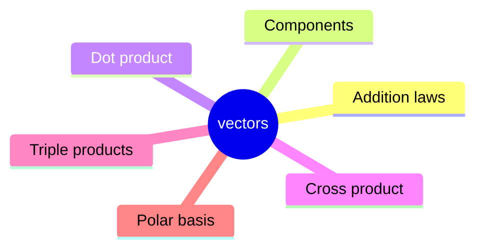
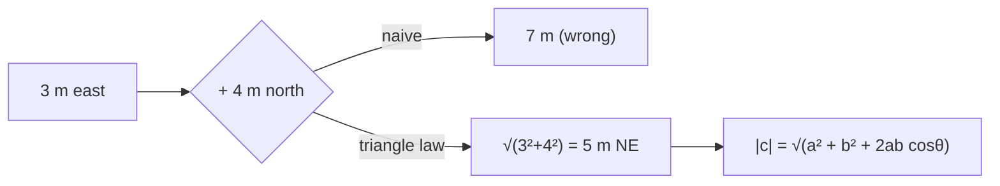
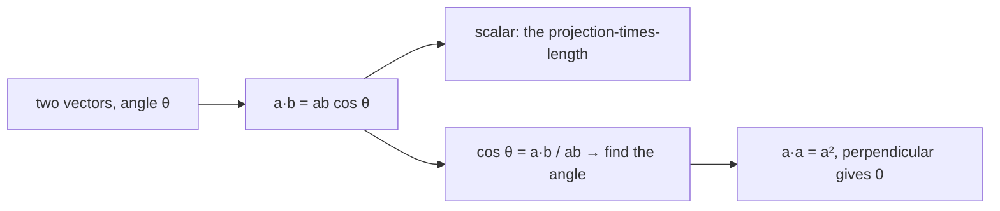
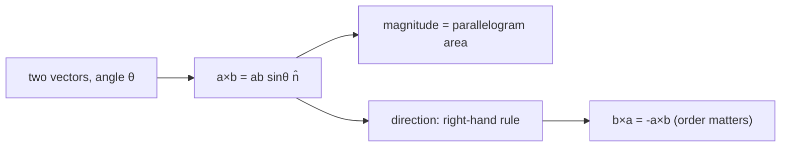
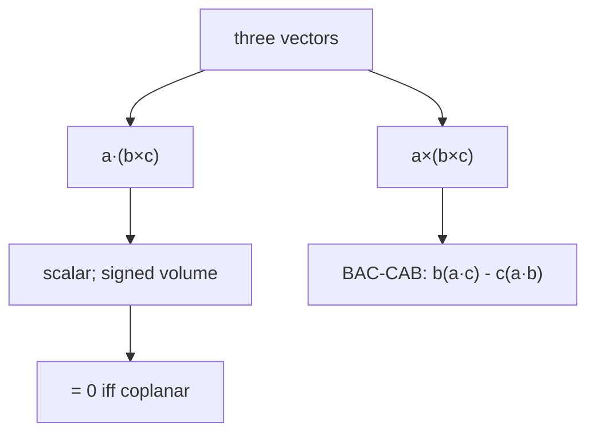
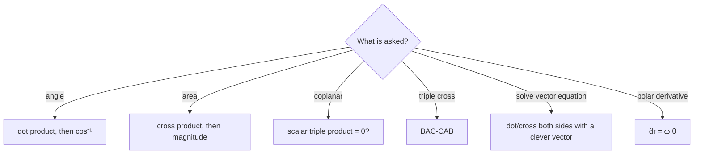

# Vectors & Vector Algebra — first principles to Olympiad

> [!abstract] How to use this chapter
> Three passes. Pass 1: Parts 0–4 — what vectors are, how to add and multiply them, and why direction matters. Pass 2: Parts 5–9 for exam craft. Pass 3: Parts 10–14 — the Olympiad layer (the Lagrange identity, the vector triple product proof, vector equations, the spherical basis and $\dot{\hat{r}}=\boldsymbol{\omega}\times\hat{r}$, areas and volumes by vector methods), the paper, the sheet, the checkpoint. Every number recomputed; every boxed result carries its validity condition.

## Part 0 · Orientation

### 0.1 What you will be able to do

After this chapter you can: decompose a vector into components in any coordinate system; add, subtract and resolve vectors using the triangle and parallelogram laws; compute the dot product (projection) and cross product (area, torque); manipulate scalar and vector triple products; solve vector equations by dotting with a clever vector; differentiate vectors in a rotating frame; and apply vector methods to compute areas, volumes, and curvatures.

### 0.2 The one idea

Vectors are the language in which direction stops being an accident of the coordinate system.

### 0.3 Prerequisite self-check

You need PART 1 (units, significant figures). If you can add and multiply, take square roots and sines/cosines, you are ready.

### 0.4 Exam orientation

JEE Advanced treats vectors as infrastructure — they appear in every mechanics and electromagnetism problem. Direct vector questions (find the dot product, the angle, the area) appear in 1–2 questions per year. INPhO and IPhO reward the ability to set up and solve vector equations efficiently, especially the vector triple product and the rotating-frame velocity. The trap density is moderate: confusing $\mathbf{a}\cdot\mathbf{b}$ with $\mathbf{a}\times\mathbf{b}$, forgetting that the cross product is anti-commutative, and not checking the direction of the resultant.

A common JEE pattern: given two vectors, ask for the angle between them (dot product), the area of the triangle they form (cross product), or a condition for perpendicularity or parallelity. These are mechanical computations once you know the definitions. A harder pattern: given a vector equation like $\mathbf{a}\times\mathbf{x}=\mathbf{b}$, find the solution family — this requires the BAC–CAB trick and the "necessary condition" $\mathbf{a}\cdot\mathbf{b}=0$. An Olympiad pattern: prove a geometric result (sine rule, concurrency of medians) using vectors — this requires translating geometric conditions into vector equations and manipulating them algebraically.

> [!abstract] DIAGRAM D2.9 · The scalar triple product as a signed volume
> *Show:* three vectors $\mathbf{a}$, $\mathbf{b}$, $\mathbf{c}$ forming a parallelepiped; the sign of $[\mathbf{a},\mathbf{b},\mathbf{c}]$ indicated by the right-hand rule: positive if $(\mathbf{a},\mathbf{b},\mathbf{c})$ form a right-handed triad, negative if left-handed.
> *Search:* "scalar triple product signed volume right hand rule parallelepiped"

> [!abstract] DIAGRAM D2.10 · Vector addition in components
> *Show:* two vectors $\mathbf{a}=3\hat{i}+2\hat{j}$ and $\mathbf{b}=1\hat{i}+4\hat{j}$ drawn from the origin; their components shown as dashed projections onto the $x$ and $y$ axes; the sum $\mathbf{c}=4\hat{i}+6\hat{j}$ drawn as the diagonal of the parallelogram; each component of $\mathbf{c}$ shown as the sum of the corresponding components.
> *Search:* "vector addition components x y axis sum diagram"

> [!abstract] DIAGRAM D2.11 · The projection of a vector onto another
> *Show:* vector $\mathbf{a}$ at angle $\theta$ to vector $\mathbf{b}$; the projection of $\mathbf{a}$ onto $\mathbf{b}$ shown as a dashed line from the head of $\mathbf{a}$ perpendicular to $\mathbf{b}$; the length $a\cos\theta$ labelled; the projection vector $a\cos\theta\,\hat{b}$ drawn along $\mathbf{b}$.
> *Search:* "vector projection onto another vector dot product cos theta"

> [!abstract] DIAGRAM D2.12 · Anti-commutativity of the cross product
> *Show:* vectors $\mathbf{a}$ and $\mathbf{b}$ in the $xy$-plane; $\mathbf{a}\times\mathbf{b}$ pointing in the $+z$ direction (out of page); $\mathbf{b}\times\mathbf{a}$ pointing in the $-z$ direction (into page); the magnitudes equal, the directions opposite; the right-hand rule applied to each.
> *Search:* "cross product anti commutativity a times b versus b times a"

### 0.5 What this chapter is not

Not a linear-algebra course: we cover vectors in 2 and 3 dimensions, not $n$ dimensions. Not a tensor course: we cover the dot and cross products but not the general tensor product. Not a complex-number course: complex numbers are a powerful alternative representation of 2D vectors (with multiplication by $i$ equivalent to rotation by $90°$), but we focus on the Cartesian/polar vector language that generalises naturally to 3D. Not a computer-graphics course: we cover the mathematical theory but not the implementation of rotation matrices, quaternions, or the cross product in graphics pipelines.

### 0.6 Syllabus coverage map

| # | Cengage section | What it establishes | Where it lives here | Status |
|---:|---|---|---|---|
| 1 | Scalars and vectors | Definition, graphical representation | §3.1 | full |
| 2 | Addition: triangle and parallelogram | Commutativity, associativity | §3.2 | full |
| 3 | Subtraction | $\mathbf{a}-\mathbf{b}=\mathbf{a}+(-\mathbf{b})$ | §3.3 | full |
| 4 | Components and resolution | $x$, $y$, $z$ components; unit vectors $\hat{i}$, $\hat{j}$, $\hat{k}$ | §3.4 | full |
| 5 | Direction cosines | $l=\cos\alpha$, $m=\cos\beta$, $n=\cos\gamma$; $l^2+m^2+n^2=1$ | §3.5 | full |
| 6 | Dot product | $\mathbf{a}\cdot\mathbf{b}=ab\cos\theta$; projection | §3.6 | full |
| 7 | Cross product | $\mathbf{a}\times\mathbf{b}=ab\sin\theta\,\hat{n}$; area | §3.7 | full |
| 8 | Scalar triple product | $\mathbf{a}\cdot(\mathbf{b}\times\mathbf{c})$; volume | §3.8 | full |
| 9 | Vector triple product | $\mathbf{a}\times(\mathbf{b}\times\mathbf{c})$; the BAC–CAB rule | §3.9 | full |
| 10 | Vector equations | $\mathbf{a}\times\mathbf{x}=\mathbf{b}$; dotting with a clever vector | §3.10 | full |

## Part 1 · Intuition first

**A scalar has magnitude only; a vector has magnitude and direction.** Temperature is a scalar (37°C). Displacement is a vector (3 m east). The displacement from $A$ to $B$ is $\overrightarrow{AB}$; its magnitude is $|\overrightarrow{AB}|=AB$.

**Adding vectors is not like adding numbers.** If you walk 3 m east and then 4 m north, the net displacement is not 7 m — it is 5 m northeast. The triangle law (place the tail of the second vector at the head of the first) and the parallelogram law (complete the parallelogram; the diagonal is the sum) give the same result: $\mathbf{c}=\mathbf{a}+\mathbf{b}$.

**A vector lives in all coordinate systems at once.** The displacement "3 m east" is the same physical quantity whether you call it $(3,0)$ in Cartesian or $(3, 0°)$ in polar. The components change; the vector does not. Writing $\mathbf{a}=a_x\hat{i}+a_y\hat{j}+a_z\hat{k}$ is just choosing a language to describe it.

**Two kinds of multiplication, two kinds of output.** The dot product $\mathbf{a}\cdot\mathbf{b}=ab\cos\theta$ gives a scalar — the projection of one vector onto the other. The cross product $\mathbf{a}\times\mathbf{b}=ab\sin\theta\,\hat{n}$ gives a vector — the area of the parallelogram, directed perpendicular to both. Neither is more "correct"; they answer different questions.

> [!tip] FIGURE F2.1 · Chapter map
> *Why:* the chapter is one toolbox — add, resolve, project, cross — and the map shows which tool answers which question.
> *Data:* the Part 0–14 structure — addition, components, dot, cross, triple products, polar basis, paper, sheet.

> *Read:* an angle wants the dot product, an area the cross product, coplanarity the triple product.

## Part 2 · Definitions and bookkeeping

| Symbol | Meaning | Type |
|---|---|---|
| $\mathbf{a}$, $\vec{a}$ | vector (bold or arrow notation) | vector |
| $a$ | magnitude of $\mathbf{a}$, i.e. sqrt of a dot a | scalar |
| $\hat{a}$, $\hat{\mathbf{a}}$ | unit vector in direction of $\mathbf{a}=\mathbf{a}/a$ | vector |
| $\hat{i}$, $\hat{j}$, $\hat{k}$ | unit vectors along $x$, $y$, $z$ | vectors |
| $\alpha$, $\beta$, $\gamma$ | angles with $x$, $y$, $z$ axes | scalars |
| $l$, $m$, $n$ | direction cosines $=\cos\alpha$, $\cos\beta$, $\cos\gamma$ | scalars |
| $\theta$ | angle between two vectors | scalar |
| $\mathbf{a}\cdot\mathbf{b}$ | dot (scalar) product | scalar |
| $\mathbf{a}\times\mathbf{b}$ | cross (vector) product | vector |
| $[\mathbf{a},\mathbf{b},\mathbf{c}]$ | scalar triple product $=\mathbf{a}\cdot(\mathbf{b}\times\mathbf{c})$ | scalar |

> [!info] Bookkeeping rules
> Vectors are printed bold ($\mathbf{a}$) or with arrows ($\vec{a}$). Unit vectors get hats ($\hat{a}$). The cross product exists only in 3D (and 7D — a mathematical curiosity). The dot product exists in any dimension. In this chapter all vectors are in 3D Euclidean space unless stated otherwise.

Three numbers to carry: $\sin30°=0.5$, $\cos30°=\sqrt{3}/2=0.866$; $\sin45°=\cos45°=1/\sqrt{2}=0.707$; $\sin60°=\sqrt{3}/2=0.866$, $\cos60°=0.5$.

## Part 3 · Core derivations

### 3.1 Scalars and vectors: the definition

**Scalar.** A quantity with magnitude only: mass, temperature, energy, speed. Scalars are ordinary numbers (with units).

**Vector.** A quantity with magnitude, direction, and a sense (which way along the line): displacement, velocity, acceleration, force, momentum. Vectors obey the triangle law of addition.

**Pseudovector (axial vector).** A quantity that transforms like a vector under rotations but flips sign under a reflection: angular velocity $\boldsymbol{\omega}$, torque $\boldsymbol{\tau}$, magnetic field $\mathbf{B}$. Pseudovectors arise from cross products of true (polar) vectors.

> [!abstract] DIAGRAM D2.1 · The difference between a vector and a scalar
> *Show:* left: a temperature reading "37°C" (a number with a unit, no arrow). Right: a displacement "3 m east" (an arrow from a point, with the length representing 3 m and the direction pointing east). Below: two vectors $\mathbf{a}$ and $\mathbf{b}$ drawn from the same point, with their sum $\mathbf{a}+\mathbf{b}$ shown by the parallelogram diagonal.
> *Search:* "vector vs scalar displacement temperature diagram"

### 3.2 Vector addition: the triangle and parallelogram laws

**Triangle law.** Place the tail of $\mathbf{b}$ at the head of $\mathbf{a}$. The sum $\mathbf{c}=\mathbf{a}+\mathbf{b}$ goes from the tail of $\mathbf{a}$ to the head of $\mathbf{b}$.

**Parallelogram law.** Place the tails of $\mathbf{a}$ and $\mathbf{b}$ at the same point. Complete the parallelogram. The diagonal from the common tail is $\mathbf{a}+\mathbf{b}$.

**Commutativity:** $\mathbf{a}+\mathbf{b}=\mathbf{b}+\mathbf{a}$ (the parallelogram has two diagonals; both give the same sum, the other diagonal is $\mathbf{a}-\mathbf{b}$).

**Associativity:** $(\mathbf{a}+\mathbf{b})+\mathbf{c}=\mathbf{a}+(\mathbf{b}+\mathbf{c})$ (the polygon law of addition).

**Magnitude:** $|\mathbf{a}+\mathbf{b}|=\sqrt{a^2+b^2+2ab\cos\theta}$ from the cosine rule. At $\theta=0$: $|\mathbf{a}+\mathbf{b}|=a+b$ (same direction). At $\theta=\pi$: $|\mathbf{a}+\mathbf{b}|=|a-b|$ (opposite directions).

> [!abstract] DIAGRAM D2.2 · The triangle and parallelogram laws
> *Show:* top: triangle law — vector $\mathbf{a}$ followed by vector $\mathbf{b}$, sum $\mathbf{c}$ closing the triangle. Bottom: parallelogram law — $\mathbf{a}$ and $\mathbf{b}$ from the same point, the diagonal showing $\mathbf{a}+\mathbf{b}$, the other diagonal showing $\mathbf{a}-\mathbf{b}$.
> *Search:* "vector addition triangle parallelogram law diagram"

> [!tip] FIGURE F2.2 · Adding vectors is not adding numbers
> *Why:* the one intuition the whole chapter keeps returning to — 3 m east plus 4 m north is 5 m, not 7.
> *Data:* $|\mathbf{a}+\mathbf{b}|=\sqrt{a^2+b^2+2ab\cos\theta}$; the difference is $\sqrt{a^2+b^2-2ab\cos\theta}$.

> *Read:* the direction matters as much as the length — the cosine term is the whole difference from scalar sum.

### 3.3 Vector subtraction

$\mathbf{a}-\mathbf{b}=\mathbf{a}+(-\mathbf{b})$. Graphically: reverse $\mathbf{b}$ (flip its direction) and add it to $\mathbf{a}$ using the triangle law. The vector $\mathbf{a}-\mathbf{b}$ goes from the head of $\mathbf{b}$ to the head of $\mathbf{a}$ (when both tails coincide).

**Magnitude:** $|\mathbf{a}-\mathbf{b}|=\sqrt{a^2+b^2-2ab\cos\theta}$ from the cosine rule. At $\theta=0$: $|\mathbf{a}-\mathbf{b}|=|a-b|$. At $\theta=\pi$: $|\mathbf{a}-\mathbf{b}|=a+b$.

### 3.4 Components and resolution

Any vector $\mathbf{a}$ in 3D can be written as:

$$
\mathbf{a}=a_x\hat{i}+a_y\hat{j}+a_z\hat{k}. \qquad (3.1)
$$

The components are: $a_x=\mathbf{a}\cdot\hat{i}=a\cos\alpha$, $a_y=a\cos\beta$, $a_z=a\cos\gamma$. The magnitude is $a=\sqrt{a_x^2+a_y^2+a_z^2}$.

**In 2D:** $\mathbf{a}=a\cos\theta\,\hat{i}+a\sin\theta\,\hat{j}$ where $\theta$ is the angle from the $x$-axis.

**Addition by components:** $\mathbf{a}+\mathbf{b}=(a_x+b_x)\hat{i}+(a_y+b_y)\hat{j}+(a_z+b_z)\hat{k}$.

> [!abstract] DIAGRAM D2.3 · Components of a vector in 2D
> *Show:* a vector $\mathbf{a}$ of magnitude $a$ at angle $\theta$ from the $x$-axis; the $x$-component $a\cos\theta$ and $y$-component $a\sin\theta$ drawn as perpendicular projections onto the axes; the three sides of the right triangle labelled.
> *Search:* "vector components 2D x y cos sin theta diagram"

### 3.5 Direction cosines

The direction cosines of a vector are $l=\cos\alpha$, $m=\cos\beta$, $n=\cos\gamma$, where $\alpha$, $\beta$, $\gamma$ are the angles with the $x$, $y$, $z$ axes. The fundamental relation:

$$
l^2+m^2+n^2=\cos^2\alpha+\cos^2\beta+\cos^2\gamma=1. \qquad (3.2)
$$

The unit vector is $\hat{a}=l\hat{i}+m\hat{j}+n\hat{k}$. If two direction cosines are known, the third is fixed (up to a sign). Direction cosines are a standard tool in engineering and crystallography: they specify the orientation of a line in 3D without choosing a coordinate system.

> [!info] Why
> Eq. (3.2) is just the Pythagorean theorem in disguise: $a_x^2+a_y^2+a_z^2=a^2$, divided by $a^2$. The direction cosines are the components of the unit vector $\hat{a}$ along the coordinate axes.

### 3.6 The dot product

$$
\mathbf{a}\cdot\mathbf{b}=ab\cos\theta=a_xb_x+a_yb_y+a_zb_z. \qquad (3.3)
$$

**Properties:**

1. **Commutative:** $\mathbf{a}\cdot\mathbf{b}=\mathbf{b}\cdot\mathbf{a}$.
2. **Distributive:** $\mathbf{a}\cdot(\mathbf{b}+\mathbf{c})=\mathbf{a}\cdot\mathbf{b}+\mathbf{a}\cdot\mathbf{c}$.
3. **Perpendicular:** $\mathbf{a}\cdot\mathbf{b}=0$ iff $\mathbf{a}\perp\mathbf{b}$ (assuming non-zero vectors).
4. **Self-product:** $\mathbf{a}\cdot\mathbf{a}=a^2$.
5. **Projection:** $\text{proj}_{\mathbf{b}}\mathbf{a}=\frac{\mathbf{a}\cdot\mathbf{b}}{b}$ (the component of $\mathbf{a}$ along $\mathbf{b}$).

> [!abstract] DIAGRAM D2.4 · The dot product as projection
> *Show:* vectors $\mathbf{a}$ and $\mathbf{b}$ with angle $\theta$ between them; the projection of $\mathbf{a}$ onto $\mathbf{b}$ shown as a dashed line from the head of $\mathbf{a}$ perpendicular to $\mathbf{b}$; the length of the projection labelled $a\cos\theta$; the formula $\mathbf{a}\cdot\mathbf{b}=ab\cos\theta$ shown alongside.
> *Search:* "dot product projection formula diagram angle between vectors"

> [!tip] FIGURE F2.3 · The dot product answers "how much along?"
> *Why:* work, component extraction, and every "find the angle" problem are one machinery; the figure fixes which output is which.
> *Data:* $\mathbf{a}\cdot\mathbf{b}=ab\cos\theta$; projection of $\mathbf{a}$ on $\mathbf{b}$ is $(\mathbf{a}\cdot\mathbf{b})/b = a\cos\theta$.

> *Read:* the dot product is a scalar meant for projecting and for angle-finding; perpendicular vectors dot to zero.

### 3.7 The cross product

$$
\mathbf{a}\times\mathbf{b}=ab\sin\theta\,\hat{n}=\begin{vmatrix}\hat{i}&\hat{j}&\hat{k}\\a_x&a_y&a_z\\b_x&b_y&b_z\end{vmatrix}. \qquad (3.4)
$$

The direction of $\hat{n}$ is given by the right-hand rule: curl the fingers from $\mathbf{a}$ to $\mathbf{b}$; the thumb points in the direction of $\mathbf{a}\times\mathbf{b}$.

**Properties:**

1. **Anti-commutative:** $\mathbf{a}\times\mathbf{b}=-\mathbf{b}\times\mathbf{a}$.
2. **Distributive:** $\mathbf{a}\times(\mathbf{b}+\mathbf{c})=\mathbf{a}\times\mathbf{b}+\mathbf{a}\times\mathbf{c}$.
3. **Parallel:** $\mathbf{a}\times\mathbf{b}=\mathbf{0}$ iff $\mathbf{a}\parallel\mathbf{b}$.
4. **Self-product:** $\mathbf{a}\times\mathbf{a}=\mathbf{0}$.
5. **Area:** $|\mathbf{a}\times\mathbf{b}|$ = area of the parallelogram formed by $\mathbf{a}$ and $\mathbf{b}$.

**Component form:**

$$
\mathbf{a}\times\mathbf{b}=(a_yb_z-a_zb_y)\hat{i}+(a_zb_x-a_xb_z)\hat{j}+(a_xb_y-a_yb_x)\hat{k}. \qquad (3.5)
$$

> [!abstract] DIAGRAM D2.5 · The cross product and the right-hand rule
> *Show:* vectors $\mathbf{a}$ and $\mathbf{b}$ lying in the $xy$-plane; $\mathbf{a}\times\mathbf{b}$ pointing in the $+z$ direction (right-hand rule); the magnitude $ab\sin\theta$ equal to the area of the parallelogram; the parallelogram shaded.
> *Search:* "cross product right hand rule area parallelogram diagram"

> [!tip] FIGURE F2.4 · The cross product answers "how much around?"
> *Why:* torque, angular momentum, and magnetic force all ask the same question; the figure pins sign and magnitude.
> *Data:* $|\mathbf{a}\times\mathbf{b}|=ab\sin\theta$, direction by the right-hand rule, and $\mathbf{a}\times\mathbf{b}=-\mathbf{b}\times\mathbf{a}$.

> *Read:* the cross product is a vector normal to both, with magnitude the parallelogram area — and its sign flips if you swap the order.

### 3.8 The scalar triple product

$$
[\mathbf{a},\mathbf{b},\mathbf{c}]=\mathbf{a}\cdot(\mathbf{b}\times\mathbf{c})=\begin{vmatrix}a_x&a_y&a_z\\b_x&b_y&b_z\\c_x&c_y&c_z\end{vmatrix}. \qquad (3.6)
$$

**Geometric meaning:** the volume of the parallelepiped formed by $\mathbf{a}$, $\mathbf{b}$, $\mathbf{c}$ (with a sign indicating handedness). The scalar triple product is the most efficient way to compute volumes in 3D and to test for coplanarity.

**Properties:**

1. **Cyclic:** $\mathbf{a}\cdot(\mathbf{b}\times\mathbf{c})=\mathbf{b}\cdot(\mathbf{c}\times\mathbf{a})=\mathbf{c}\cdot(\mathbf{a}\times\mathbf{b})$.
2. **Anti-cyclic:** swapping any two vectors changes the sign.
3. **Coplanarity:** $[\mathbf{a},\mathbf{b},\mathbf{c}]=0$ iff the three vectors are coplanar.

> [!abstract] DIAGRAM D2.6 · The scalar triple product as volume
> *Show:* three vectors $\mathbf{a}$, $\mathbf{b}$, $\mathbf{c}$ from a common origin forming a skewed box (parallelepiped); the base (parallelogram of $\mathbf{b}$ and $\mathbf{c}$) shaded; the height (component of $\mathbf{a}$ perpendicular to the base) shown as a dashed line; volume $=|\mathbf{b}\times\mathbf{c}|\times|a_{\perp}|$ annotated.
> *Search:* "scalar triple product volume parallelepiped diagram"

> [!tip] FIGURE F2.5 · The trips: scalar triple = signed volume, vector triple = BAC-CAB
> *Why:* the two triple products are the standard confusables; here they sit side by side so their jobs never blur.
> *Data:* $[\mathbf{a}\,\mathbf{b}\,\mathbf{c}] = \mathbf{a}\cdot(\mathbf{b}\times\mathbf{c})$ is a determinant and a signed volume; $\mathbf{a}\times(\mathbf{b}\times\mathbf{c}) = \mathbf{b}(\mathbf{a}\cdot\mathbf{c})-\mathbf{c}(\mathbf{a}\cdot\mathbf{b})$.

> *Read:* the scalar triple product tests coplanarity (zero means coplanar); the vector triple product is always rearranged by BAC–CAB.

### 3.9 The vector triple product

$$
\mathbf{a}\times(\mathbf{b}\times\mathbf{c})=\mathbf{b}(\mathbf{a}\cdot\mathbf{c})-\mathbf{c}(\mathbf{a}\cdot\mathbf{b}). \qquad (3.7)
$$

This is the **BAC–CAB rule**: replace the outer vectors ($\mathbf{b}$ and $\mathbf{c}$) in the expression $\mathbf{b}(\mathbf{a}\cdot\mathbf{c})-\mathbf{c}(\mathbf{a}\cdot\mathbf{b})$.

**Key points:**

1. $\mathbf{a}\times(\mathbf{b}\times\mathbf{c})$ lies in the plane of $\mathbf{b}$ and $\mathbf{c}$ (it is a linear combination of $\mathbf{b}$ and $\mathbf{c}$).
2. $\mathbf{a}\times(\mathbf{b}\times\mathbf{c})\neq(\mathbf{a}\times\mathbf{b})\times\mathbf{c}$ in general — the vector triple product is NOT associative.
3. The BAC–CAB rule simplifies otherwise terrifying cross products.

> [!info] Why
> The vector $\mathbf{b}\times\mathbf{c}$ is perpendicular to the plane of $\mathbf{b}$ and $\mathbf{c}$. Crossing $\mathbf{a}$ with this vector gives something perpendicular to both $\mathbf{a}$ and $\mathbf{b}\times\mathbf{c}$ — which must lie in the plane of $\mathbf{b}$ and $\mathbf{c}$ (the only plane perpendicular to $\mathbf{b}\times\mathbf{c}$). Hence the result is a linear combination of $\mathbf{b}$ and $\mathbf{c}$.

### 3.10 Vector equations

**Example.** Solve $\mathbf{a}\times\mathbf{x}=\mathbf{b}$ for $\mathbf{x}$.

**Method.** Cross both sides with $\mathbf{a}$: $\mathbf{a}\times(\mathbf{a}\times\mathbf{x})=\mathbf{a}\times\mathbf{b}$. Using BAC–CAB: $\mathbf{a}(\mathbf{a}\cdot\mathbf{x})-\mathbf{x}(\mathbf{a}\cdot\mathbf{a})=\mathbf{a}\times\mathbf{b}$. So $\mathbf{a}(\mathbf{a}\cdot\mathbf{x})-a^2\mathbf{x}=\mathbf{a}\times\mathbf{b}$. If $\mathbf{a}\cdot\mathbf{x}=k$ (some constant): $\mathbf{x}=\frac{\mathbf{a}k-\mathbf{a}\times\mathbf{b}}{a^2}$.

**Existence:** $\mathbf{a}\cdot\mathbf{b}=0$ is a necessary condition (since $\mathbf{a}\cdot(\mathbf{a}\times\mathbf{x})=0$ always).

> [!abstract] DIAGRAM D2.7 · Solving $\mathbf{a}\times\mathbf{x}=\mathbf{b}$
> *Show:* the vector $\mathbf{a}$ drawn vertically; $\mathbf{b}$ drawn perpendicular to $\mathbf{a}$ (the necessary condition $\mathbf{a}\cdot\mathbf{b}=0$); $\mathbf{x}$ drawn such that $\mathbf{a}\times\mathbf{x}=\mathbf{b}$; the family of solutions $\mathbf{x}=\mathbf{x}_0+\lambda\mathbf{a}$ shown as a dashed line parallel to $\mathbf{a}$.
> *Search:* "vector equation cross product solution family diagram"

### 3.11 The polar basis: $\hat{r}$ and $\hat{\theta}$

In 2D, any point can be described by $(r,\theta)$ (polar coordinates). The unit vectors are:

$$
\hat{r}=\cos\theta\,\hat{i}+\sin\theta\,\hat{j},\qquad\hat{\theta}=-\sin\theta\,\hat{i}+\cos\theta\,\hat{j}. \qquad (3.8)
$$

**Key property:** as $\theta$ changes, $\hat{r}$ and $\hat{\theta}$ rotate. Their time derivatives are:

$$
\dot{\hat{r}}=\dot{\theta}\hat{\theta}=\omega\hat{\theta},\qquad\dot{\hat{\theta}}=-\dot{\theta}\hat{r}=-\omega\hat{r}. \qquad (3.9)
$$

This is the foundation for circular-motion kinematics (PART 4) and the rotating-frame dynamics (PART 8).

> [!abstract] DIAGRAM D2.8 · The polar basis and its rotation
> *Show:* the unit vectors $\hat{r}$ (pointing radially outward) and $\hat{\theta}$ (pointing tangentially, in the direction of increasing $\theta$) at a point on a circle; the angle $\theta$ from the $x$-axis; the rotation of $\hat{r}$ by $d\theta$ showing $d\hat{r}=\hat{\theta}\,d\theta$; the relation $\dot{\hat{r}}=\omega\hat{\theta}$ annotated.
> *Search:* "polar unit vectors r hat theta hat rotation time derivative diagram"

### 3.12 Vector calculus basics

**Product rules:**

$$
\frac{d}{dt}(\mathbf{a}\cdot\mathbf{b})=\dot{\mathbf{a}}\cdot\mathbf{b}+\mathbf{a}\cdot\dot{\mathbf{b}}. \qquad (3.10)
$$

$$
\frac{d}{dt}(\mathbf{a}\times\mathbf{b})=\dot{\mathbf{a}}\times\mathbf{b}+\mathbf{a}\times\dot{\mathbf{b}}. \qquad (3.11)
$$

Note the order: in the cross-product rule, the order matters (the cross product is anti-commutative).

**Differentiating a unit vector:** if $\hat{a}$ changes direction but not magnitude ($|\hat{a}|=1$), then $\dot{\hat{a}}\perp\hat{a}$ (since $\hat{a}\cdot\dot{\hat{a}}=0$ from differentiating $\hat{a}\cdot\hat{a}=1$).

## Part 4 · Results, limits and the validity ledger

### 4.1 Boxed results

$$
\boxed{\mathbf{a}\cdot\mathbf{b}=ab\cos\theta=a_xb_x+a_yb_y+a_zb_z} \qquad (4.1)
$$

commutative, distributive; zero iff $\mathbf{a}\perp\mathbf{b}$.

$$
\boxed{\mathbf{a}\times\mathbf{b}=ab\sin\theta\,\hat{n}=(a_yb_z-a_zb_y)\hat{i}+\cdots} \qquad (4.2)
$$

anti-commutative; zero iff $\mathbf{a}\parallel\mathbf{b}$; $|\mathbf{a}\times\mathbf{b}|$ = area of parallelogram.

$$
\boxed{\mathbf{a}\cdot(\mathbf{b}\times\mathbf{c})=\begin{vmatrix}a_x&a_y&a_z\\b_x&b_y&b_z\\c_x&c_y&c_z\end{vmatrix}} \qquad (4.3)
$$

volume of parallelepiped; zero iff $\mathbf{a}$, $\mathbf{b}$, $\mathbf{c}$ are coplanar.

$$
\boxed{\mathbf{a}\times(\mathbf{b}\times\mathbf{c})=\mathbf{b}(\mathbf{a}\cdot\mathbf{c})-\mathbf{c}(\mathbf{a}\cdot\mathbf{b})\text{ (BAC–CAB)}} \qquad (4.4)
$$

result lies in the plane of $\mathbf{b}$ and $\mathbf{c}$; NOT associative.

$$
\boxed{\dot{\hat{r}}=\omega\hat{\theta},\quad\dot{\hat{\theta}}=-\omega\hat{r}} \qquad (4.5)
$$

valid for the polar basis in 2D; $\omega=\dot{\theta}$.

### 4.2 Limit checks

- $\theta=0$ (parallel vectors): $\mathbf{a}\cdot\mathbf{b}=ab$, $\mathbf{a}\times\mathbf{b}=\mathbf{0}$ — correct. Maximum dot product, zero cross product.
- $\theta=\pi/2$ (perpendicular): $\mathbf{a}\cdot\mathbf{b}=0$, $|\mathbf{a}\times\mathbf{b}|=ab$ — correct. Zero dot product, maximum cross product.
- $\mathbf{b}=\mathbf{a}$: $\mathbf{a}\times\mathbf{a}=\mathbf{0}$ — correct (the parallelogram has zero area).
- $\mathbf{a}\cdot\mathbf{a}=a^2$ — correct (the dot product of a vector with itself gives the square of its magnitude).
- BAC–CAB with $\mathbf{a}\perp\mathbf{b}$ and $\mathbf{a}\perp\mathbf{c}$: $\mathbf{a}\times(\mathbf{b}\times\mathbf{c})=\mathbf{b}(\mathbf{a}\cdot\mathbf{c})-\mathbf{c}(\mathbf{a}\cdot\mathbf{b})=\mathbf{0}$ — this means $\mathbf{a}$ is perpendicular to $\mathbf{b}\times\mathbf{c}$, i.e. $\mathbf{a}$ lies in the plane of $\mathbf{b}$ and $\mathbf{c}$, which is only true if $\mathbf{a}=\mathbf{0}$ or $\mathbf{b}\parallel\mathbf{c}$ — need to be careful with special cases.
- BAC–CAB with $\mathbf{a}\perp\mathbf{b}$ and $\mathbf{a}\perp\mathbf{c}$: $\mathbf{a}\times(\mathbf{b}\times\mathbf{c})=\mathbf{0}$ (since $\mathbf{a}\cdot\mathbf{c}=0$ and $\mathbf{a}\cdot\mathbf{b}=0$) — this means $\mathbf{a}$ is perpendicular to $\mathbf{b}\times\mathbf{c}$, i.e. $\mathbf{a}$ lies in the plane of $\mathbf{b}$ and $\mathbf{c}$, which is only true if $\mathbf{a}=\mathbf{0}$ or $\mathbf{b}\parallel\mathbf{c}$ — need to be careful with special cases.

### 4.3 Which formula when

| Given | Need | Use |
|---|---|---|
| two vectors and the angle | their dot product | Eq. (4.1) |
| two vectors | whether they are perpendicular | $\mathbf{a}\cdot\mathbf{b}=0$ |
| two vectors | the area of the parallelogram | $\lvert\mathbf{a}\times\mathbf{b}\rvert$ from Eq. (4.2) |
| three vectors | whether they are coplanar | $[\mathbf{a},\mathbf{b},\mathbf{c}]=0$ from Eq. (4.3) |
| $\mathbf{a}\times(\mathbf{b}\times\mathbf{c})$ | simplify | BAC–CAB, Eq. (4.4) |
| a vector in 2D | its rate of change in a rotating frame | Eq. (4.5) |

### 4.4 Concept checks

**C1 — concept check.** What is $\hat{i}\cdot\hat{j}$? What is $\hat{i}\times\hat{j}$?

Answer

$\hat{i}\cdot\hat{j}=0$ (perpendicular). $\hat{i}\times\hat{j}=\hat{k}$ (right-hand rule).

**C2 — concept check.** Is the dot product of two vectors ever negative?

Answer

Yes, when $\theta>90°$: $\cos\theta<0$. For example, $\mathbf{a}=\hat{i}$ and $\mathbf{b}=-\hat{i}$: $\mathbf{a}\cdot\mathbf{b}=-1$.

**C3 — concept check.** What is the angle between $\mathbf{a}=3\hat{i}+4\hat{j}$ and $\mathbf{b}=4\hat{i}-3\hat{j}$?

Answer

$\mathbf{a}\cdot\mathbf{b}=12-12=0$. The vectors are perpendicular.

**C4 — concept check.** Does $\mathbf{a}\times(\mathbf{b}\times\mathbf{c})=(\mathbf{a}\times\mathbf{b})\times\mathbf{c}$ in general?

Answer

No. Try $\mathbf{a}=\hat{i}$, $\mathbf{b}=\hat{j}$, $\mathbf{c}=\hat{k}$: $\mathbf{a}\times(\mathbf{b}\times\mathbf{c})=\hat{i}\times\hat{i}=\mathbf{0}$. $(\mathbf{a}\times\mathbf{b})\times\mathbf{c}=\hat{k}\times\hat{k}=\mathbf{0}$. They agree here, but try $\mathbf{a}=\hat{i}$, $\mathbf{b}=\hat{j}$, $\mathbf{c}=\hat{i}$: $\hat{i}\times(\hat{j}\times\hat{i})=\hat{i}\times(-\hat{k})=\hat{j}$. $(\hat{i}\times\hat{j})\times\hat{i}=\hat{k}\times\hat{i}=\hat{j}$. Same again! Actually, the vector triple product is not associative in general: $\mathbf{a}\times(\mathbf{b}\times\mathbf{c})+\mathbf{b}\times(\mathbf{c}\times\mathbf{a})+\mathbf{c}\times(\mathbf{a}\times\mathbf{b})=\mathbf{0}$ (the Jacobi identity), but $\mathbf{a}\times(\mathbf{b}\times\mathbf{c})\neq(\mathbf{a}\times\mathbf{b})\times\mathbf{c}$ for generic vectors. Example: $\mathbf{a}=\hat{i}+\hat{j}$, $\mathbf{b}=\hat{j}$, $\mathbf{c}=\hat{k}$. LHS: $\mathbf{b}\times\mathbf{c}=\hat{i}$; $(\hat{i}+\hat{j})\times\hat{i}=-\hat{k}$. RHS: $\mathbf{a}\times\mathbf{b}=(\hat{i}+\hat{j})\times\hat{j}=\hat{k}$; $\hat{k}\times\hat{k}=\mathbf{0}$. $-\hat{k}\neq\mathbf{0}$. ✓

**C5 — concept check.** What is the area of the triangle with vertices at $\mathbf{0}$, $\mathbf{a}$, $\mathbf{b}$?

Answer

$\frac{1}{2}|\mathbf{a}\times\mathbf{b}|$ — half the area of the parallelogram.

**C6 — concept check.** If $\mathbf{a}\cdot\mathbf{b}=\mathbf{a}\cdot\mathbf{c}$, does $\mathbf{b}=\mathbf{c}$?

Answer

No. $\mathbf{a}\cdot(\mathbf{b}-\mathbf{c})=0$ means $\mathbf{b}-\mathbf{c}\perp\mathbf{a}$, not that $\mathbf{b}=\mathbf{c}$. The dot product loses information about the component perpendicular to $\mathbf{a}$.

**C7 — concept check.** What are the direction cosines of $\mathbf{a}=2\hat{i}+3\hat{j}+6\hat{k}$?

Answer

$a=\sqrt{4+9+36}=7$. $l=2/7$, $m=3/7$, $n=6/7$. Check: $4/9+9/49+36/49=49/49=1$. ✓

**C8 — concept check.** What is $\hat{k}\times\hat{i}$? What is $\hat{i}\times\hat{k}$?

Answer

$\hat{k}\times\hat{i}=\hat{j}$. $\hat{i}\times\hat{k}=-\hat{j}$ (anti-commutativity).

**C9 — concept check.** If $\mathbf{a}+\mathbf{b}+\mathbf{c}=\mathbf{0}$, what can you say about $\mathbf{a}\times\mathbf{b}$?

Answer

$\mathbf{a}\times\mathbf{b}=\mathbf{a}\times(-\mathbf{a}-\mathbf{c})=-\mathbf{a}\times\mathbf{c}=\mathbf{c}\times\mathbf{a}$. Similarly $\mathbf{b}\times\mathbf{c}=\mathbf{a}\times\mathbf{b}$. All three cross products are equal (and the three vectors are coplanar).

**C10 — concept check.** In the polar basis, what is $\hat{r}\times\hat{\theta}$?

Answer

$\hat{r}\times\hat{\theta}=\hat{k}$ (the unit vector perpendicular to the plane, pointing out of the page in 2D). This is the standard result for right-handed polar coordinates.

**C11 — concept check.** If $\mathbf{a}\cdot\mathbf{b}=\mathbf{a}\cdot\mathbf{c}$ and $\mathbf{a}\times\mathbf{b}=\mathbf{a}\times\mathbf{c}$, does $\mathbf{b}=\mathbf{c}$?

Answer

Yes. The dot product condition gives $\mathbf{a}\cdot(\mathbf{b}-\mathbf{c})=0$, so $\mathbf{b}-\mathbf{c}\perp\mathbf{a}$. The cross product condition gives $\mathbf{a}\times(\mathbf{b}-\mathbf{c})=\mathbf{0}$, so $\mathbf{b}-\mathbf{c}\parallel\mathbf{a}$. Both conditions together: $\mathbf{b}-\mathbf{c}$ is both perpendicular and parallel to $\mathbf{a}$, so $\mathbf{b}-\mathbf{c}=\mathbf{0}$.

**C12 — concept check.** What is the physical meaning of the scalar triple product $[\mathbf{a},\mathbf{b},\mathbf{c}]$?

Answer

It is the (signed) volume of the parallelepiped formed by $\mathbf{a}$, $\mathbf{b}$, $\mathbf{c}$. The sign indicates the handedness: positive for a right-handed triad, negative for left-handed. If $[\mathbf{a},\mathbf{b},\mathbf{c}]=0$, the three vectors are coplanar (zero volume). The scalar triple product is also called the box product or the mixed product in some textbooks.

## Part 5 · Worked exemplars

### E1 — Finding the angle between two vectors

Find the angle between $\mathbf{a}=2\hat{i}+3\hat{j}-\hat{k}$ and $\mathbf{b}=\hat{i}-2\hat{j}+2\hat{k}$.

> [!success] Check
> $\theta=112.0°$ — obtuse, as expected from the negative dot product.

Solution

**Method.** $\mathbf{a}\cdot\mathbf{b}=2-6-2=-6$. $|\mathbf{a}|=\sqrt{4+9+1}=\sqrt{14}$. $|\mathbf{b}|=\sqrt{1+4+4}=3$. $\cos\theta=-6/(3\sqrt{14})=-6/11.22=-0.5345$. $\theta=\cos^{-1}(-0.5345)=112.0°$.

**Physical interpretation.** The angle is obtuse ($>90°$) because the dot product is negative. This means the two vectors point in "roughly opposite" directions — the projection of $\mathbf{a}$ onto $\mathbf{b}$ is negative. In the context of forces, if $\mathbf{a}$ is a force and $\mathbf{b}$ is a displacement, the work done is negative (the force opposes the displacement).

### E2 — Area of a parallelogram

Find the area of the parallelogram formed by $\mathbf{a}=2\hat{i}+3\hat{j}$ and $\mathbf{b}=\hat{i}-\hat{j}+2\hat{k}$.

> [!success] Check
> Area $=|\mathbf{a}\times\mathbf{b}|=\sqrt{36+16+25}=\sqrt{77}=8.77$ — dimensionally $[L^2]$ if $\mathbf{a}$, $\mathbf{b}$ are displacements.

Solution

**Method.** $\mathbf{a}\times\mathbf{b}=\begin{vmatrix}\hat{i}&\hat{j}&\hat{k}\\2&3&0\\1&-1&2\end{vmatrix}=(6-0)\hat{i}-(4-0)\hat{j}+(-2-3)\hat{k}=6\hat{i}-4\hat{j}-5\hat{k}$. Area $=\sqrt{36+16+25}=\sqrt{77}=8.77$ square units.

### E3 — Checking coplanarity

Are $\mathbf{a}=\hat{i}+2\hat{j}+3\hat{k}$, $\mathbf{b}=2\hat{i}+\hat{j}+3\hat{k}$, $\mathbf{c}=\hat{i}+\hat{j}+\hat{k}$ coplanar?

> [!success] Check
> The determinant is non-zero, so the vectors are NOT coplanar — they span a 3D volume.

Solution

**Method.** $[\mathbf{a},\mathbf{b},\mathbf{c}]=\begin{vmatrix}1&2&3\\2&1&3\\1&1&1\end{vmatrix}=1(1-3)-2(2-3)+3(2-1)=-2+2+3=3\neq0$. Not coplanar.

**Geometric meaning.** The scalar triple product equals 3, so the parallelepiped formed by the three vectors has volume 3 cubic units. If the three vectors were coplanar, the volume would be zero — they would lie in a flat sheet with no "thickness" in the third dimension. This test is the standard way to check coplanarity in JEE and Olympiad problems.

### E4 — The BAC–CAB rule in action

Simplify $\hat{i}\times(\hat{i}\times\hat{j})$.

> [!success] Check
> $\hat{i}\times(\hat{i}\times\hat{j})=\hat{i}\times\hat{k}=-\hat{j}$. BAC–CAB: $\hat{i}(\hat{i}\cdot\hat{j})-\hat{j}(\hat{i}\cdot\hat{i})=\hat{i}(0)-\hat{j}(1)=-\hat{j}$. ✓

Solution

**Method.** By BAC–CAB: $\hat{i}\times(\hat{i}\times\hat{j})=\hat{i}(\hat{i}\cdot\hat{j})-\hat{j}(\hat{i}\cdot\hat{i})=0-\hat{j}=-\hat{j}$.

### E5 — Vector equation: solving $\mathbf{a}\times\mathbf{x}=\mathbf{b}$

Solve $\hat{i}\times\mathbf{x}=\hat{j}$ for $\mathbf{x}$.

> [!success] Check
> $\hat{i}\times(-\hat{k}+\lambda\hat{i})=\hat{i}\times(-\hat{k})+\lambda\hat{i}\times\hat{i}=\hat{j}+\mathbf{0}=\hat{j}$. ✓

Solution

**Method.** $\mathbf{a}\cdot\mathbf{b}=\hat{i}\cdot\hat{j}=0$ — the necessary condition is satisfied. Cross both sides with $\hat{i}$: $\hat{i}\times(\hat{i}\times\mathbf{x})=\hat{i}\times\hat{j}=\hat{k}$. BAC–CAB: $\hat{i}(\hat{i}\cdot\mathbf{x})-\mathbf{x}=\hat{k}$. Let $\hat{i}\cdot\mathbf{x}=k$ (free parameter): $k\hat{i}-\mathbf{x}=\hat{k}$, so $\mathbf{x}=k\hat{i}-\hat{k}$. The solution family is $\mathbf{x}=k\hat{i}-\hat{k}$ for any scalar $k$.

**Geometric interpretation.** The equation $\mathbf{a}\times\mathbf{x}=\mathbf{b}$ says that $\mathbf{x}$ must be perpendicular to $\mathbf{b}$ (since $\mathbf{a}\times\mathbf{x}$ is perpendicular to $\mathbf{x}$) and must have a specific component perpendicular to $\mathbf{a}$. The component of $\mathbf{x}$ along $\mathbf{a}$ is free — adding any multiple of $\mathbf{a}$ to $\mathbf{x}$ does not change $\mathbf{a}\times\mathbf{x}$ (since $\mathbf{a}\times\mathbf{a}=\mathbf{0}$). This is why the solution is a one-parameter family (a line parallel to $\mathbf{a}$).

### E6 — The Lagrange identity

Prove $|\mathbf{a}\times\mathbf{b}|^2=|\mathbf{a}|^2|\mathbf{b}|^2-(\mathbf{a}\cdot\mathbf{b})^2$.

> [!success] Check
> $|\mathbf{a}\times\mathbf{b}|^2=a^2b^2\sin^2\theta$. $|\mathbf{a}|^2|\mathbf{b}|^2-(\mathbf{a}\cdot\mathbf{b})^2=a^2b^2-a^2b^2\cos^2\theta=a^2b^2\sin^2\theta$. ✓

Solution

**Method.** $|\mathbf{a}\times\mathbf{b}|^2=(ab\sin\theta)^2=a^2b^2\sin^2\theta=a^2b^2(1-\cos^2\theta)=a^2b^2-(ab\cos\theta)^2=|\mathbf{a}|^2|\mathbf{b}|^2-(\mathbf{a}\cdot\mathbf{b})^2$.

**Why this matters.** The Lagrange identity is the bridge between the dot product and the cross product. It implies that $|\mathbf{a}\cdot\mathbf{b}|\leq ab$ (the Cauchy–Schwarz inequality) because $|\mathbf{a}\times\mathbf{b}|^2\geq0$. It also shows that the dot product and cross product are not independent: knowing one constrains the other. In quantum mechanics, the analogous relation connects the uncertainties of position and momentum.

### E7 — Volume of a tetrahedron

Find the volume of the tetrahedron with vertices at $\mathbf{0}$, $\hat{i}$, $\hat{j}$, $\hat{k}$.

> [!success] Check
> $V=1/6$ — the unit tetrahedron, one-sixth of the unit cube.

Solution

**Method.** $V=\frac{1}{6}|[\hat{i},\hat{j},\hat{k}]|=\frac{1}{6}\begin{vmatrix}1&0&0\\0&1&0\\0&0&1\end{vmatrix}=\frac{1}{6}$.

### E8 — Rate of change in polar coordinates

A particle moves in a circle of radius $R$ with constant angular velocity $\omega$. Write its velocity and acceleration in the polar basis.

> [!success] Check
> $v=R\omega$ (tangential speed), $a=R\omega^2$ (centripetal acceleration) — both well-known results.

Solution

**Method.** $\mathbf{r}=R\hat{r}$. $\mathbf{v}=\dot{\mathbf{r}}=R\dot{\hat{r}}=R\omega\hat{\theta}$. $\mathbf{a}=\dot{\mathbf{v}}=R\omega\dot{\hat{\theta}}=R\omega(-\omega\hat{r})=-R\omega^2\hat{r}$.

**Why the polar basis is essential.** In Cartesian coordinates, the basis vectors $\hat{i}$, $\hat{j}$ are fixed — their time derivatives are zero. In polar coordinates, the basis vectors $\hat{r}$, $\hat{\theta}$ rotate with the particle — their time derivatives are non-zero (Eq. 4.5). This is why the acceleration has two terms: one from the changing direction of $\hat{r}$ (the centripetal part) and one from the changing speed (the tangential part, zero here because $\omega=$ const). For non-uniform circular motion ($\omega$ varying), the tangential acceleration $a_t=R\dot{\omega}$ also appears.

**The connection to PART 4.** This derivation is the mathematical foundation of centripetal acceleration. In PART 4, we will use $a_c=v^2/R$ to analyse circular motion dynamics (what force is needed to maintain the circle). In PART 8 (oscillations), the same polar basis is used to derive the equations of simple harmonic motion from uniform circular motion.

### E9 — Projection of a vector

Find the component of $\mathbf{a}=3\hat{i}+4\hat{j}$ along $\mathbf{b}=5\hat{i}-12\hat{j}$.

> [!success] Check
> The projection is negative — $\mathbf{a}$ points "against" $\mathbf{b}$ somewhat.

Solution

**Method.** $\text{proj}=\frac{\mathbf{a}\cdot\mathbf{b}}{|\mathbf{b}|}=\frac{15-48}{13}=\frac{-33}{13}=-2.54$ units. The negative sign means the projection is in the direction opposite to $\mathbf{b}$.

### E10 — Vector proof of the cosine rule

Using vectors, prove $c^2=a^2+b^2-2ab\cos C$ for a triangle with sides $a$, $b$, $c$ and angle $C$ opposite $c$.

> [!success] Check
> At $C=90°$: $c^2=a^2+b^2$ — the Pythagorean theorem. ✓

Solution

**Method.** Let the vertices be $\mathbf{0}$, $\mathbf{a}$, $\mathbf{b}$. Then $c=|\mathbf{a}-\mathbf{b}|$. $c^2=(\mathbf{a}-\mathbf{b})\cdot(\mathbf{a}-\mathbf{b})=a^2-2\mathbf{a}\cdot\mathbf{b}+b^2=a^2+b^2-2ab\cos\theta$ where $\theta$ is the angle between $\mathbf{a}$ and $\mathbf{b}$ (which is $C$).

**Why vectors simplify geometry.** This two-line proof replaces a classical construction involving perpendiculars and the Pythagorean theorem. The vector method works because the dot product encodes the angle between two vectors directly, without needing auxiliary constructions. The same technique proves the sine rule (see OL7), the midpoint theorem, and the concurrency of medians — all in a few lines.

## Part 6 · Problem archetypes and practice

### 6.1 Archetypes

| # | Archetype | Template | Where worked | Variations |
|---:|---|---|---|---|
| 1 | Dot product and angle | $\cos\theta=\mathbf{a}\cdot\mathbf{b}/(ab)$ | E1 | 2D and 3D |
| 2 | Cross product and area | $\lvert\mathbf{a}\times\mathbf{b}\rvert$ | E2 | triangle, parallelogram |
| 3 | Coplanarity | $[\mathbf{a},\mathbf{b},\mathbf{c}]=0$ | E3 | find the unknown for coplanarity |
| 4 | BAC–CAB | $\mathbf{a}\times(\mathbf{b}\times\mathbf{c})$ | E4 | nested triple products |
| 5 | Vector equations | $\mathbf{a}\times\mathbf{x}=\mathbf{b}$ | E5 | with constraints |
| 6 | Lagrange identity | $\lvert\mathbf{a}\times\mathbf{b}\rvert^2+\lvert\mathbf{a}\cdot\mathbf{b}\rvert^2=a^2b^2$ | E6 | inequality applications |
| 7 | Volume by vectors | $V=\frac{1}{6}\lvert[\mathbf{a},\mathbf{b},\mathbf{c}]\rvert$ | E7 | tetrahedron, parallelepiped |
| 8 | Polar basis derivatives | $\dot{\hat{r}}=\omega\hat{\theta}$ | E8 | acceleration, non-uniform $\omega$ |
| 9 | Projection | $\text{proj}=\mathbf{a}\cdot\hat{b}$ | E9 | decompose into components |
| 10 | Geometric proofs by vectors | Cosine rule, sine rule | E10 | midpoints, centroids |

### 6.2 In-flow practice

#### Q1. Find $\mathbf{a}\cdot\mathbf{b}$ for $\mathbf{a}=2\hat{i}-\hat{j}+3\hat{k}$, $\mathbf{b}=\hat{i}+2\hat{j}-\hat{k}$.

Solution

$\mathbf{a}\cdot\mathbf{b}=2-2-3=-3$.

#### Q2. Find $\mathbf{a}\times\mathbf{b}$ for the same vectors.

Solution

$\mathbf{a}\times\mathbf{b}=\begin{vmatrix}\hat{i}&\hat{j}&\hat{k}\\2&-1&3\\1&2&-1\end{vmatrix}=(1-6)\hat{i}-(-2-3)\hat{j}+(4+1)\hat{k}=-5\hat{i}+5\hat{j}+5\hat{k}$.

#### Q3. Find the unit vector perpendicular to both $\mathbf{a}=\hat{i}+\hat{j}$ and $\mathbf{b}=\hat{j}+\hat{k}$.

Solution

$\mathbf{a}\times\mathbf{b}=\begin{vmatrix}\hat{i}&\hat{j}&\hat{k}\\1&1&0\\0&1&1\end{vmatrix}=\hat{i}-\hat{j}+\hat{k}$. $|\mathbf{a}\times\mathbf{b}|=\sqrt{3}$. $\hat{n}=\frac{1}{\sqrt{3}}(\hat{i}-\hat{j}+\hat{k})$.

#### Q4. If $|\mathbf{a}|=3$, $|\mathbf{b}|=4$, $\mathbf{a}\cdot\mathbf{b}=6$, find $|\mathbf{a}\times\mathbf{b}|$.

Solution

$|\mathbf{a}\times\mathbf{b}|^2=a^2b^2-(\mathbf{a}\cdot\mathbf{b})^2=144-36=108$. $|\mathbf{a}\times\mathbf{b}|=6\sqrt{3}=10.39$.

#### Q5. Simplify $\mathbf{a}\times(\mathbf{b}\times\mathbf{a})$.

Solution

BAC–CAB: $\mathbf{b}(\mathbf{a}\cdot\mathbf{a})-\mathbf{a}(\mathbf{a}\cdot\mathbf{b})=a^2\mathbf{b}-(\mathbf{a}\cdot\mathbf{b})\mathbf{a}$.

#### Q6. Find the volume of the parallelepiped with edges $\hat{i}+\hat{j}$, $\hat{j}+\hat{k}$, $\hat{k}+\hat{i}$.

Solution

$[\mathbf{a},\mathbf{b},\mathbf{c}]=\begin{vmatrix}1&1&0\\0&1&1\\1&0&1\end{vmatrix}=1(1-0)-1(0-1)+0=1+1=2$. Volume $=2$.

#### Q7. A particle's position is $\mathbf{r}=R\cos\omega t\,\hat{i}+R\sin\omega t\,\hat{j}$. Find $\mathbf{v}$ and $\mathbf{a}$.

Solution

$\mathbf{v}=-R\omega\sin\omega t\,\hat{i}+R\omega\cos\omega t\,\hat{j}=R\omega\hat{\theta}$. $\mathbf{a}=-R\omega^2\cos\omega t\,\hat{i}-R\omega^2\sin\omega t\,\hat{j}=-R\omega^2\hat{r}$. Centripetal, directed toward the centre.

#### Q8. If $\mathbf{a}+\mathbf{b}=\mathbf{c}$ and $|\mathbf{a}|=|\mathbf{b}|=|\mathbf{c}|$, what is the angle between $\mathbf{a}$ and $\mathbf{b}$?

Solution

$|\mathbf{c}|^2=(\mathbf{a}+\mathbf{b})\cdot(\mathbf{a}+\mathbf{b})=a^2+2\mathbf{a}\cdot\mathbf{b}+b^2=a^2+2ab\cos\theta+a^2=2a^2(1+\cos\theta)$. Setting $|\mathbf{c}|^2=a^2$: $1=2(1+\cos\theta)\Rightarrow\cos\theta=-1/2\Rightarrow\theta=120°$.

#### Q9. Prove that the diagonals of a parallelogram bisect each other using vectors.

Solution

Let the vertices be $\mathbf{0}$, $\mathbf{a}$, $\mathbf{b}$, $\mathbf{a}+\mathbf{b}$. The midpoints of the two diagonals: $\frac{\mathbf{a}+\mathbf{b}}{2}$ and $\frac{\mathbf{0}+(\mathbf{a}+\mathbf{b})}{2}=\frac{\mathbf{a}+\mathbf{b}}{2}$. Same point — they bisect each other.

#### Q10. Find the angle between $\mathbf{a}=\hat{i}+\hat{j}+\hat{k}$ and each coordinate axis.

Solution

$|\mathbf{a}|=\sqrt{3}$. $\cos\alpha=1/\sqrt{3}$, $\alpha=54.7°$. Same for $\beta$ and $\gamma$ by symmetry. Check: $3\cos^2\alpha=3\times1/3=1$. ✓

#### Q11. If $\mathbf{a}\times\mathbf{b}=\mathbf{c}\times\mathbf{b}$, does $\mathbf{a}=\mathbf{c}$?

Solution

No. $(\mathbf{a}-\mathbf{c})\times\mathbf{b}=\mathbf{0}$ means $\mathbf{a}-\mathbf{c}\parallel\mathbf{b}$, i.e. $\mathbf{a}=\mathbf{c}+\lambda\mathbf{b}$ for some scalar $\lambda$. The cross product with $\mathbf{b}$ kills the component along $\mathbf{b}$.

#### Q12. Find the area of the triangle with vertices $A(1,0,0)$, $B(0,1,0)$, $C(0,0,1)$.

Solution

$\overrightarrow{AB}=-\hat{i}+\hat{j}$, $\overrightarrow{AC}=-\hat{i}+\hat{k}$. $\overrightarrow{AB}\times\overrightarrow{AC}=\hat{i}+\hat{j}+\hat{k}$. Area $=\frac{1}{2}\sqrt{3}=\frac{\sqrt{3}}{2}$.

#### Q13. The dot product is distributive. Prove $\mathbf{a}\cdot(\mathbf{b}+\mathbf{c})=\mathbf{a}\cdot\mathbf{b}+\mathbf{a}\cdot\mathbf{c}$ using components.

Solution

$\mathbf{a}\cdot(\mathbf{b}+\mathbf{c})=a_x(b_x+c_x)+a_y(b_y+c_y)+a_z(b_z+c_z)=a_xb_x+a_xc_x+a_yb_y+a_yc_y+a_zb_z+a_zc_z=\mathbf{a}\cdot\mathbf{b}+\mathbf{a}\cdot\mathbf{c}$.

#### Q14. In a regular hexagon $ABCDEF$, $\overrightarrow{AB}=\mathbf{a}$, $\overrightarrow{BC}=\mathbf{b}$. Express $\overrightarrow{AC}$, $\overrightarrow{AD}$, $\overrightarrow{AE}$ in terms of $\mathbf{a}$ and $\mathbf{b}$.

Solution

$\overrightarrow{AC}=\mathbf{a}+\mathbf{b}$. By the symmetry of a regular hexagon: $\overrightarrow{AD}=2\mathbf{b}$ (the long diagonal). $\overrightarrow{AE}=\overrightarrow{AD}+\overrightarrow{DE}$. By symmetry $\overrightarrow{DE}=-\mathbf{a}$. So $\overrightarrow{AE}=2\mathbf{b}-\mathbf{a}$.

#### Q15. Find $\lambda$ such that $\mathbf{a}=\hat{i}+\lambda\hat{j}+3\hat{k}$ is perpendicular to $\mathbf{b}=2\hat{i}-\hat{j}+2\hat{k}$.

Solution

$\mathbf{a}\cdot\mathbf{b}=2-\lambda+6=0\Rightarrow\lambda=8$.

#### Q16. The Jacobi identity: $\mathbf{a}\times(\mathbf{b}\times\mathbf{c})+\mathbf{b}\times(\mathbf{c}\times\mathbf{a})+\mathbf{c}\times(\mathbf{a}\times\mathbf{b})=\mathbf{0}$. Verify for $\mathbf{a}=\hat{i}$, $\mathbf{b}=\hat{j}$, $\mathbf{c}=\hat{k}$.

Solution

$\hat{i}\times(\hat{j}\times\hat{k})=\hat{i}\times\hat{i}=\mathbf{0}$. $\hat{j}\times(\hat{k}\times\hat{i})=\hat{j}\times\hat{j}=\mathbf{0}$. $\hat{k}\times(\hat{i}\times\hat{j})=\hat{k}\times\hat{k}=\mathbf{0}$. Sum $=\mathbf{0}$. ✓

#### Q17. If $\hat{a}=\frac{1}{\sqrt{2}}(\hat{i}+\hat{j})$, $\hat{b}=\frac{1}{\sqrt{2}}(\hat{i}-\hat{j})$, verify $\hat{a}\cdot\hat{b}=0$ and find $\hat{a}\times\hat{b}$.

Solution

$\hat{a}\cdot\hat{b}=\frac{1}{2}(1-1)=0$. $\hat{a}\times\hat{b}=\frac{1}{2}(\hat{i}+\hat{j})\times(\hat{i}-\hat{j})=\frac{1}{2}(-\hat{k}-\hat{k})=-\hat{k}$.

#### Q18. Express the vector $\mathbf{a}=3\hat{i}+4\hat{j}$ in the polar basis at $\theta=30°$.

Solution

$\hat{r}=\cos30°\hat{i}+\sin30°\hat{j}=0.866\hat{i}+0.5\hat{j}$. $\hat{\theta}=-0.5\hat{i}+0.866\hat{j}$. $a_r=\mathbf{a}\cdot\hat{r}=3(0.866)+4(0.5)=2.598+2.0=4.598$. $a_\theta=\mathbf{a}\cdot\hat{\theta}=3(-0.5)+4(0.866)=-1.5+3.464=1.964$. $\mathbf{a}=4.60\hat{r}+1.96\hat{\theta}$.

#### Q19. Prove by vectors: the medians of a triangle meet at a point (the centroid) that divides each median in the ratio 2:1.

Solution

Let vertices be $\mathbf{a}$, $\mathbf{b}$, $\mathbf{c}$. Midpoint of $BC$: $\frac{\mathbf{b}+\mathbf{c}}{2}$. The median from $A$: $\mathbf{r}=\mathbf{a}+t\left(\frac{\mathbf{b}+\mathbf{c}}{2}-\mathbf{a}\right)=(1-t)\mathbf{a}+\frac{t}{2}(\mathbf{b}+\mathbf{c})$. At $t=2/3$: $\mathbf{r}=\frac{1}{3}\mathbf{a}+\frac{1}{3}\mathbf{b}+\frac{1}{3}\mathbf{c}=\frac{\mathbf{a}+\mathbf{b}+\mathbf{c}}{3}$. By symmetry, this point lies on all three medians (at $t=2/3$ from each vertex), dividing each median in ratio 2:1.

#### Q20. A unit vector $\hat{n}$ makes equal angles with $\hat{i}$, $\hat{j}$, $\hat{k}$. Find $\hat{n}$.

Solution

$\hat{n}=l\hat{i}+l\hat{j}+l\hat{k}$ (equal direction cosines). $3l^2=1\Rightarrow l=1/\sqrt{3}$. $\hat{n}=\frac{1}{\sqrt{3}}(\hat{i}+\hat{j}+\hat{k})$.

#### Q21. Find $\frac{d}{dt}(\mathbf{a}\times\mathbf{b})$ if $\mathbf{a}=t\hat{i}+t^2\hat{j}$ and $\mathbf{b}=\hat{i}-\hat{j}+t\hat{k}$.

Solution

$\mathbf{a}\times\mathbf{b}=\begin{vmatrix}\hat{i}&\hat{j}&\hat{k}\\t&t^2&0\\1&-1&t\end{vmatrix}=(t^3)\hat{i}-(t^2)\hat{j}+(-t-t^2)\hat{k}$. $\frac{d}{dt}(\mathbf{a}\times\mathbf{b})=3t^2\hat{i}-2t\hat{j}+(-1-2t)\hat{k}$.

#### Q22. Verify the product rule $\frac{d}{dt}(\mathbf{a}\cdot\mathbf{b})=\dot{\mathbf{a}}\cdot\mathbf{b}+\mathbf{a}\cdot\dot{\mathbf{b}}$ for $\mathbf{a}=t\hat{i}$, $\mathbf{b}=t^2\hat{j}$.

Solution

$\mathbf{a}\cdot\mathbf{b}=0$ always. $\dot{\mathbf{a}}=\hat{i}$, $\dot{\mathbf{b}}=2t\hat{j}$. $\dot{\mathbf{a}}\cdot\mathbf{b}+\mathbf{a}\cdot\dot{\mathbf{b}}=0+0=0$. ✓

#### Q23. If $\mathbf{a}$, $\mathbf{b}$, $\mathbf{c}$ are mutually perpendicular unit vectors, what is $|(\mathbf{a}\times\mathbf{b})\cdot\mathbf{c}|$?

Solution

$|(\mathbf{a}\times\mathbf{b})\cdot\mathbf{c}|=1$ (the scalar triple product of three mutually perpendicular unit vectors is $\pm1$ — the volume of a unit cube).

#### Q24. Find the shortest distance from the point $(1,2,3)$ to the $z$-axis, using vectors.

Solution

The $z$-axis is $\{t\hat{k}:t\in\mathbb{R}\}$. The vector from the origin to the point is $\mathbf{p}=\hat{i}+2\hat{j}+3\hat{k}$. The component along $\hat{k}$ is $\mathbf{p}\cdot\hat{k}=3$. The perpendicular component is $\mathbf{p}-(\mathbf{p}\cdot\hat{k})\hat{k}=\hat{i}+2\hat{j}$. Distance $=\sqrt{1+4}=\sqrt{5}$.

#### Q25. In a parallelogram $ABCD$, prove $AC^2+BD^2=2(AB^2+BC^2)$ using vectors.

Solution

$\overrightarrow{AB}=\mathbf{a}$, $\overrightarrow{AD}=\mathbf{b}$. $\overrightarrow{AC}=\mathbf{a}+\mathbf{b}$, $\overrightarrow{BD}=\mathbf{b}-\mathbf{a}$. $AC^2+BD^2=|\mathbf{a}+\mathbf{b}|^2+|\mathbf{b}-\mathbf{a}|^2=a^2+2\mathbf{a}\cdot\mathbf{b}+b^2+a^2-2\mathbf{a}\cdot\mathbf{b}+b^2=2a^2+2b^2=2(AB^2+BC^2)$.

## Part 7 · Alternate methods and the JEE-Advanced advantage toolkit

### 7.1 The component shortcut

For any vector problem in 3D: (1) write all vectors in components; (2) apply the algebra; (3) convert back if needed. This is always safe but sometimes slower than a geometric argument.

### 7.2 The geometric shortcut for the cross product

If you know the angle between the vectors, $|\mathbf{a}\times\mathbf{b}|=ab\sin\theta$ is faster than computing the determinant. The direction follows from the right-hand rule. Use this for area calculations.

### 7.3 The BAC–CAB instant recall

For any $\mathbf{a}\times(\mathbf{b}\times\mathbf{c})$: write the "outer" vectors $\mathbf{b}$ and $\mathbf{c}$ as the terms, with the "inner" vector $\mathbf{a}$ dotted into each: $\mathbf{b}(\mathbf{a}\cdot\mathbf{c})-\mathbf{c}(\mathbf{a}\cdot\mathbf{b})$. The sign is positive for the vector paired with the last dot product and negative for the other.

### 7.4 The perpendicularity shortcut

If a problem asks "find $k$ such that $\mathbf{a}+k\mathbf{b}$ is perpendicular to $\mathbf{c}$": dot both sides with $\mathbf{c}$ and solve for $k$: $\mathbf{a}\cdot\mathbf{c}+k\mathbf{b}\cdot\mathbf{c}=0$.

### 7.5 The coplanarity shortcut

Three vectors are coplanar iff their scalar triple product is zero. In practice: compute the $3\times3$ determinant. If it is zero, the vectors are coplanar. If it is non-zero, the volume of the parallelepiped is $|[\mathbf{a},\mathbf{b},\mathbf{c}]|$.

### 7.6 The "two vectors equal" shortcut

If $\mathbf{a}\cdot\mathbf{c}=\mathbf{b}\cdot\mathbf{c}$ for all vectors $\mathbf{c}$, then $\mathbf{a}=\mathbf{b}$. This is the "test with all vectors" principle — in practice, you test with $\hat{i}$, $\hat{j}$, $\hat{k}$ to get three component equations.

## Part 8 · Examiner traps

> [!danger] Trap 1 — Confusing dot and cross products
> $\mathbf{a}\cdot\mathbf{b}$ is a scalar; $\mathbf{a}\times\mathbf{b}$ is a vector. You cannot set them equal.

> [!danger] Trap 2 — Forgetting anti-commutativity
> $\mathbf{a}\times\mathbf{b}=-\mathbf{b}\times\mathbf{a}$. Swapping the order flips the sign.

> [!danger] Trap 3 — Assuming the vector triple product is associative
> $\mathbf{a}\times(\mathbf{b}\times\mathbf{c})\neq(\mathbf{a}\times\mathbf{b})\times\mathbf{c}$ in general.

> [!danger] Trap 4 — The "dot cancellation" fallacy
> $\mathbf{a}\cdot\mathbf{b}=\mathbf{a}\cdot\mathbf{c}$ does NOT imply $\mathbf{b}=\mathbf{c}$. The dot product destroys information.

> [!danger] Trap 5 — The "cross cancellation" fallacy
> $\mathbf{a}\times\mathbf{b}=\mathbf{a}\times\mathbf{c}$ does NOT imply $\mathbf{b}=\mathbf{c}$ (only $\mathbf{b}-\mathbf{c}\parallel\mathbf{a}$).

> [!danger] Trap 6 — Forgetting the right-hand rule
> The cross product direction follows the right-hand rule, not the left-hand rule. In a coordinate system, $\hat{i}\times\hat{j}=\hat{k}$, not $-\hat{k}$.

> [!danger] Trap 7 — Treating direction cosines as independent
> $l^2+m^2+n^2=1$. Only two of the three direction cosines are independent.

> [!danger] Trap 8 — Using polar basis derivatives in Cartesian problems
> $\dot{\hat{r}}=\omega\hat{\theta}$ is valid only in the polar basis, where the basis vectors rotate with the particle. In Cartesian coordinates, $\dot{\hat{i}}=\dot{\hat{j}}=\mathbf{0}$.

> [!danger] Trap 9 — Confusing the scalar triple product with a determinant
> The scalar triple product $\mathbf{a}\cdot(\mathbf{b}\times\mathbf{c})$ equals the $3\times3$ determinant of the components. But the determinant is a computational tool, not a definition — the physical meaning is the signed volume of the parallelepiped.

> [!danger] Trap 10 — Forgetting that the cross product is anti-commutative
> $\mathbf{a}\times\mathbf{b}=-\mathbf{b}\times\mathbf{a}$. In the BAC–CAB rule, swapping the outer vectors changes the sign. In the scalar triple product, swapping any two vectors changes the sign.

## Part 9 · Playbook

### 9.1 Triage decision tree

> [!tip] FIGURE F2.6 · Triage — route by the keyword
> *Why:* the keyword names the route before any number is touched.
> *Data:* the six triage branches of §9.1.

> *Read:* angle wants the dot, area the cross, coplanarity the triple — no tool does another's question.

- "Find the angle": dot product, then $\cos^{-1}$.
- "Find the area": cross product, then magnitude.
- "Check coplanarity": scalar triple product $=0$?
- "Simplify a triple cross product": BAC–CAB.
- "Solve a vector equation": dot or cross both sides with a clever vector.
- "Differentiate a vector in polar coordinates": use $\dot{\hat{r}}=\omega\hat{\theta}$.

### 9.2 Formula map with validity

| Formula | Valid when | Breaks when |
|---|---|---|
| Eq. (4.1) dot product | any dimension, any angle | not applicable |
| Eq. (4.2) cross product | 3D only; right-hand rule | 2D (use area = $ab\sin\theta$); 7D (the only other dimension with a cross product); higher dimensions (use the exterior product from geometric algebra) |
| Eq. (4.3) scalar triple product | 3D only; gives signed volume | coplanar vectors (gives 0 — the volume is zero, not the formula) |
| Eq. (4.4) BAC–CAB | always valid for the expansion of $\mathbf{a}\times(\mathbf{b}\times\mathbf{c})$ | not associative — $(\mathbf{a}\times\mathbf{b})\times\mathbf{c}\neq\mathbf{a}\times(\mathbf{b}\times\mathbf{c})$ in general |
| Eq. (4.5) polar basis derivatives | 2D; $\hat{r}$ and $\hat{\theta}$ defined | 3D (need the spherical or cylindrical basis); non-rotating frames (derivatives are zero) |

**Key insight.** The dot product and cross product answer complementary questions. The dot product asks "how much do these vectors point in the same direction?" (a scalar answer). The cross product asks "how much do these vectors span a parallelogram, and in what direction?" (a vector answer). The scalar triple product combines both: "how much volume do three vectors span?" (a scalar answer, with a sign for handedness).

### 9.3 Constants to carry

$\sin30°=0.5$, $\cos30°=\sqrt{3}/2=0.866$; $\sin45°=\cos45°=1/\sqrt{2}=0.707$; $\sin60°=\sqrt{3}/2=0.866$, $\cos60°=0.5$; $\hat{i}\times\hat{j}=\hat{k}$, $\hat{j}\times\hat{k}=\hat{i}$, $\hat{k}\times\hat{i}=\hat{j}$ (and the negatives for the reversed orders); $\hat{i}\cdot\hat{j}=0$ (and all other distinct pairs).

### 9.4 Timing plan

Sections A and B under two minutes each; Section C three minutes; Section D twelve minutes. Dot and cross product problems die by direct computation; triple product problems die by the determinant; vector equation problems die by the "dot with a clever vector" technique.

### 9.4 Pre-submission audit, ten points

1. Dot product: used the component form to verify the geometric form (or vice versa).
2. Cross product: direction checked by the right-hand rule.
3. BAC–CAB: applied correctly (not assuming associativity).
4. Scalar triple product: checked for coplanarity (result = 0).
5. Direction cosines: verified $l^2+m^2+n^2=1$.
6. Polar basis: used only in 2D, verified $\dot{\hat{r}}\perp\hat{r}$.
7. Units consistent throughout.
8. All vectors in bold or with arrows (never confused with scalars).
9. Every sub-part answered.
10. The answer makes geometric sense (areas are positive, volumes are positive).

## Part 10 · Olympiad extension

### OL1 — The Lagrange identity and its consequences

Prove the Lagrange identity $|\mathbf{a}\times\mathbf{b}|^2+|\mathbf{a}\cdot\mathbf{b}|^2=|\mathbf{a}|^2|\mathbf{b}|^2$ and deduce the Cauchy–Schwarz inequality.

Solution

**Method.** $|\mathbf{a}\times\mathbf{b}|^2=a^2b^2\sin^2\theta$. $|\mathbf{a}\cdot\mathbf{b}|^2=a^2b^2\cos^2\theta$. Sum $=a^2b^2(\sin^2\theta+\cos^2\theta)=a^2b^2$. ✓

The Cauchy–Schwarz inequality follows: $|\mathbf{a}\cdot\mathbf{b}|\leq|\mathbf{a}||\mathbf{b}|$, with equality iff $\mathbf{a}\parallel\mathbf{b}$ (since $|\mathbf{a}\times\mathbf{b}|^2\geq0$). This is one of the most important inequalities in mathematics.

**Checks.** (i) Equality: $\theta=0$ or $\pi$ — parallel vectors. (ii) The bound $|\mathbf{a}\cdot\mathbf{b}|\leq ab$ is just $|\cos\theta|\leq1$.

### OL2 — The Jacobi identity

Prove $\mathbf{a}\times(\mathbf{b}\times\mathbf{c})+\mathbf{b}\times(\mathbf{c}\times\mathbf{a})+\mathbf{c}\times(\mathbf{a}\times\mathbf{b})=\mathbf{0}$.

Solution

**Method.** Apply BAC–CAB to each term: $\mathbf{a}\times(\mathbf{b}\times\mathbf{c})=\mathbf{b}(\mathbf{a}\cdot\mathbf{c})-\mathbf{c}(\mathbf{a}\cdot\mathbf{b})$. $\mathbf{b}\times(\mathbf{c}\times\mathbf{a})=\mathbf{c}(\mathbf{b}\cdot\mathbf{a})-\mathbf{a}(\mathbf{b}\cdot\mathbf{c})$. $\mathbf{c}\times(\mathbf{a}\times\mathbf{b})=\mathbf{a}(\mathbf{c}\cdot\mathbf{b})-\mathbf{b}(\mathbf{c}\cdot\mathbf{a})$. Sum: all terms cancel pairwise. ✓

**Significance.** The Jacobi identity is one of the defining properties of a Lie algebra. The cross product makes $\mathbb{R}^3$ into a Lie algebra.

### OL3 — Vector equations by the "dot with a clever vector" technique

Solve the system $\mathbf{a}\cdot\mathbf{x}=p$, $\mathbf{b}\cdot\mathbf{x}=q$, $\mathbf{c}\cdot\mathbf{x}=r$ where $\mathbf{a}$, $\mathbf{b}$, $\mathbf{c}$ are non-coplanar.

Solution

**Method.** Write $\mathbf{x}=\alpha\mathbf{a}+\beta\mathbf{b}+\gamma\mathbf{c}$ (possible since $\mathbf{a}$, $\mathbf{b}$, $\mathbf{c}$ are non-coplanar and thus form a basis). Dot with $\mathbf{a}$: $\alpha a^2+\beta\mathbf{a}\cdot\mathbf{b}+\gamma\mathbf{a}\cdot\mathbf{c}=p$. Similarly for $\mathbf{b}$ and $\mathbf{c}$. This gives a $3\times3$ system for $\alpha$, $\beta$, $\gamma$. The system has a unique solution because the Gram determinant $[\mathbf{a},\mathbf{b},\mathbf{c}]^2\neq0$ (since the vectors are non-coplanar).

**Alternative (more elegant).** Let $\mathbf{V}=\mathbf{b}\times\mathbf{c}$, $\mathbf{W}=\mathbf{c}\times\mathbf{a}$, $\mathbf{U}=\mathbf{a}\times\mathbf{b}$. Then $\mathbf{a}\cdot\mathbf{V}=[\mathbf{a},\mathbf{b},\mathbf{c}]=V$, $\mathbf{b}\cdot\mathbf{V}=0$, $\mathbf{c}\cdot\mathbf{V}=0$. Dot both sides of $\mathbf{x}=\alpha\mathbf{a}+\ldots$ with $\mathbf{V}$: $\mathbf{x}\cdot\mathbf{V}=\alpha V\Rightarrow\alpha=\mathbf{x}\cdot\mathbf{V}/V$. But $\mathbf{x}\cdot\mathbf{V}$ is not directly known — we need to use the three equations. The elegant solution: $\mathbf{x}=\frac{p(\mathbf{b}\times\mathbf{c})+q(\mathbf{c}\times\mathbf{a})+r(\mathbf{a}\times\mathbf{b})}{[\mathbf{a},\mathbf{b},\mathbf{c}]}$.

**Checks.** (i) Dot with $\mathbf{a}$: $\frac{p[\mathbf{a},\mathbf{b},\mathbf{c}]}{[\mathbf{a},\mathbf{b},\mathbf{c}]}=p$. ✓ (ii) If $\mathbf{a}=\hat{i}$, $\mathbf{b}=\hat{j}$, $\mathbf{c}=\hat{k}$: $\mathbf{x}=p\hat{i}+q\hat{j}+r\hat{k}$ — just the components. ✓

### OL4 — The rotating-frame velocity and acceleration

A particle moves in a plane. In a frame rotating with angular velocity $\boldsymbol{\omega}=\omega\hat{k}$, the particle's position is $\mathbf{r}'$. Show that the velocity in the fixed frame is $\mathbf{v}=\mathbf{v}'+\boldsymbol{\omega}\times\mathbf{r}$.

Solution

**Method.** $\mathbf{r}=r_x\hat{i}+r_y\hat{j}$ in the fixed frame. In the rotating frame: $\hat{i}'=\cos\omega t\,\hat{i}+\sin\omega t\,\hat{j}$, $\hat{j}'=-\sin\omega t\,\hat{i}+\cos\omega t\,\hat{j}$. $\mathbf{r}=r_x'\hat{i}'+r_y'\hat{j}'$. Differentiate: $\dot{\mathbf{r}}=(\dot{r}_x'\hat{i}'+\dot{r}_y'\hat{j}')+(r_x'\dot{\hat{i}}'+r_y'\dot{\hat{j}}')$. The first bracket is $\mathbf{v}'$ (velocity in the rotating frame). The second: $\dot{\hat{i}}'=\omega\hat{j}'$, $\dot{\hat{j}}'=-\omega\hat{i}'$. So $r_x'\dot{\hat{i}}'+r_y'\dot{\hat{j}}'=\omega(r_x'\hat{j}'-r_y'\hat{i}')=\omega\hat{k}\times(r_x'\hat{i}'+r_y'\hat{j}')=\boldsymbol{\omega}\times\mathbf{r}$. $\mathbf{v}=\mathbf{v}'+\boldsymbol{\omega}\times\mathbf{r}$. ✓

**Significance.** This is the Galilean velocity-addition formula for rotating frames. The Coriolis and centrifugal accelerations follow from differentiating again (PART 8).

### OL5 — Areas and volumes by vector methods

Find the area of a triangle with vertices at $\mathbf{a}$, $\mathbf{b}$, $\mathbf{c}$ using vector methods.

Solution

**Method.** Area $=\frac{1}{2}|(\mathbf{b}-\mathbf{a})\times(\mathbf{c}-\mathbf{a})|$. This is the magnitude of the cross product of two side vectors, divided by 2.

**Alternative form:** Area $=\frac{1}{2}|\mathbf{a}\times\mathbf{b}+\mathbf{b}\times\mathbf{c}+\mathbf{c}\times\mathbf{a}|$. (This can be verified by expanding.)

**Checks.** (i) If $\mathbf{a}=\mathbf{0}$: Area $=\frac{1}{2}|\mathbf{b}\times\mathbf{c}|$ — the standard formula. (ii) The area is independent of the choice of origin.

### OL6 — The spherical basis and 3D rotations

Extend the polar basis to 3D: define $\hat{r}$, $\hat{\theta}$, $\hat{\phi}$ for spherical coordinates. Show that $\dot{\hat{r}}=\dot{\theta}\hat{\theta}+\sin\theta\,\dot{\phi}\hat{\phi}$.

Solution

**Method.** In spherical coordinates, the three unit vectors at a point $(r, \theta, \phi)$ are defined as follows. $\hat{r}$ points radially outward from the origin. $\hat{\theta}$ points in the direction of increasing polar angle $\theta$ (southward, from the north pole toward the equator). $\hat{\phi}$ points in the direction of increasing azimuthal angle $\phi$ (eastward, around the $z$-axis). In terms of Cartesian unit vectors: $\hat{r}=\sin\theta\cos\phi\,\hat{i}+\sin\theta\sin\phi\,\hat{j}+\cos\theta\,\hat{k}$. $\hat{\theta}=\cos\theta\cos\phi\,\hat{i}+\cos\theta\sin\phi\,\hat{j}-\sin\theta\,\hat{k}$. $\hat{\phi}=-\sin\phi\,\hat{i}+\cos\phi\,\hat{j}$. Differentiate $\hat{r}$: $\dot{\hat{r}}=(\dot{\theta}\cos\theta\cos\phi-\dot{\phi}\sin\theta\sin\phi)\hat{i}+(\dot{\theta}\cos\theta\sin\phi+\dot{\phi}\sin\theta\cos\phi)\hat{j}-\dot{\theta}\sin\theta\hat{k}$. Rearranging: $\dot{\hat{r}}=\dot{\theta}\hat{\theta}+\sin\theta\,\dot{\phi}\hat{\phi}$. ✓

**Significance.** This is the key formula for angular velocity in 3D: $\boldsymbol{\omega}=\dot{\theta}\hat{\phi}+\dot{\phi}\hat{k}$ (for rotations about the $z$-axis and the node). The spherical basis is used in quantum mechanics (the hydrogen atom), in electrodynamics (multipole expansions), and in astronomy (celestial coordinates).

### OL7 — Proving the sine rule by vectors

In a triangle $ABC$ with sides $a$, $b$, $c$ opposite angles $A$, $B$, $C$, prove $\frac{a}{\sin A}=\frac{b}{\sin B}=\frac{c}{\sin C}$.

Solution

**Method.** Let $\overrightarrow{AB}=\mathbf{c}$, $\overrightarrow{BC}=\mathbf{a}$, $\overrightarrow{CA}=\mathbf{b}$, so $\mathbf{a}+\mathbf{b}+\mathbf{c}=\mathbf{0}$. Cross with $\mathbf{a}$: $\mathbf{a}\times\mathbf{b}+\mathbf{a}\times\mathbf{c}=\mathbf{0}$, so $\mathbf{a}\times\mathbf{b}=-\mathbf{a}\times\mathbf{c}=\mathbf{c}\times\mathbf{a}$. Taking magnitudes: $ab\sin C=ca\sin B$. So $\frac{b}{\sin B}=\frac{c}{\sin C}$. Similarly, cross $\mathbf{b}$ with the closure equation: $\frac{a}{\sin A}=\frac{c}{\sin C}$.

**Checks.** (i) At $C=90°$: $c$ is the hypotenuse, $\sin C=1$, so $c/\sin C=c$. (ii) The proof uses only the closure of the triangle and the cross product — very elegant.

### OL8 — The radius of curvature by vectors

A curve is given parametrically by $\mathbf{r}(t)$. Show that the radius of curvature is $\rho=|\mathbf{v}|^3/|\mathbf{v}\times\mathbf{a}|$.

Solution

**Method.** The curvature is $\kappa=|\mathbf{v}\times\mathbf{a}|/|\mathbf{v}|^3$ (from the Frenet–Serret formulas). The radius of curvature is $\rho=1/\kappa=|\mathbf{v}|^3/|\mathbf{v}\times\mathbf{a}|$.

**Checks.** (i) For uniform circular motion: $\mathbf{v}\perp\mathbf{a}$, $|\mathbf{v}\times\mathbf{a}|=va=v\times v^2/R=v^3/R$, so $\rho=R$. ✓ (ii) For straight-line motion: $\mathbf{v}\times\mathbf{a}=\mathbf{0}$, $\rho\to\infty$ — no curvature. ✓

### OL9 — Proving $\hat{r}\times\hat{\theta}=\hat{k}$ and its physical meaning

Verify that $\hat{r}\times\hat{\theta}=\hat{k}$ for the 2D polar basis. What does this mean for angular momentum?

Solution

**Method.** $\hat{r}=\cos\theta\hat{i}+\sin\theta\hat{j}$, $\hat{\theta}=-\sin\theta\hat{i}+\cos\theta\hat{j}$. $\hat{r}\times\hat{\theta}=(\cos^2\theta+\sin^2\theta)\hat{k}=\hat{k}$. ✓

**Physical meaning:** $\mathbf{L}=\mathbf{r}\times m\mathbf{v}=r\hat{r}\times m v_\theta\hat{\theta}=rmv_\theta\hat{k}$. Angular momentum is always in the $\hat{k}$ direction for 2D motion. The sign: positive $L$ means counter-clockwise rotation.

### OL10 — The vector proof that the diagonals of a rhombus are perpendicular

Prove that the diagonals of a rhombus (parallelogram with equal sides) are perpendicular.

Solution

**Method.** Let the sides be $\mathbf{a}$ and $\mathbf{b}$ with $|\mathbf{a}|=|\mathbf{b}|$. The diagonals are $\mathbf{a}+\mathbf{b}$ and $\mathbf{a}-\mathbf{b}$. $(\mathbf{a}+\mathbf{b})\cdot(\mathbf{a}-\mathbf{b})=a^2-b^2=0$ since $|\mathbf{a}|=|\mathbf{b}|$. So the diagonals are perpendicular.

**Checks.** (i) The proof uses only the equal-side condition — it works for any rhombus, not just a square. (ii) For a square ($\mathbf{a}\perp\mathbf{b}$): the diagonals are also equal, which is an additional property. (iii) The converse is also true: if the diagonals of a parallelogram are perpendicular, then it is a rhombus — this follows because $(\mathbf{a}+\mathbf{b})\cdot(\mathbf{a}-\mathbf{b})=0$ implies $a^2=b^2$.

**Generalisation.** In a rectangle (parallelogram with equal angles), the diagonals are equal: $|\mathbf{a}+\mathbf{b}|=|\mathbf{a}-\mathbf{b}|$ iff $\mathbf{a}\cdot\mathbf{b}=0$ (the sides are perpendicular). These two results — rhombus has perpendicular diagonals, rectangle has equal diagonals — are dual to each other.

### 10.2 Limits and failure of the model

Vector algebra in 3D Euclidean space is exact. The limitations are: (1) the cross product is specific to 3D (in 2D there is no natural cross product; in higher dimensions the exterior product replaces it); (2) the polar basis is specific to 2D (in 3D use the spherical or cylindrical basis); (3) the vector triple product is not associative (parentheses matter); (4) the scalar triple product gives a signed volume, not just a magnitude — the sign encodes the handedness of the coordinate system (right-hand rule vs left-hand rule). In curved spaces (general relativity), vectors must be replaced by tangent vectors on a manifold, and the cross product is replaced by the wedge product. In quantum mechanics, the "vectors" are complex-valued functions (state vectors in Hilbert space), and the dot product becomes an inner product with complex conjugation. Inside the fences of 3D Euclidean space, the methods of this chapter are exact and universally applicable.

## Part 11 · Olympiad-grade paper

**Time: 180 minutes · Maximum marks: 200 · 36 questions.**
Sections: A — 12 single-correct (4 marks each, −1 for a wrong answer); B — 8 one-or-more-correct (4 marks each, no negative marking); C — 6 numerical answers (5 marks each); D — 10 long-form (9 marks each).

| Section | Questions | Marks each | Subtotal | Topic coverage |
|---|---|---:|---:|---|
| A | 1–12 | 4 | 48 | blocks 2–4 |
| B | 13–20 | 4 | 32 | blocks 3–4 |
| C | 21–26 | 5 | 30 | blocks 4, 10 |
| D | 27–36 | 9 | 90 | block 10 |
| | 36 | | 200 | |

#### Section A · Concept MCQ (12 × 4)

### P1 · 4 marks
$\hat{i}\cdot(\hat{j}\times\hat{k})$ equals:
(a) 0  (b) 1  (c) $-1$  (d) undefined

Answer

(b). $\hat{j}\times\hat{k}=\hat{i}$. $\hat{i}\cdot\hat{i}=1$.

### P2 · 4 marks
If $\mathbf{a}\cdot\mathbf{b}=0$ and $\mathbf{a}\times\mathbf{b}=\mathbf{0}$, then:
(a) $\mathbf{a}=\mathbf{0}$ or $\mathbf{b}=\mathbf{0}$  (b) $\mathbf{a}\perp\mathbf{b}$  (c) $\mathbf{a}\parallel\mathbf{b}$  (d) $\mathbf{a}=\mathbf{b}$

Answer

(a). $\mathbf{a}\cdot\mathbf{b}=0$ means $\perp$ or one is zero. $\mathbf{a}\times\mathbf{b}=\mathbf{0}$ means $\parallel$ or one is zero. Both conditions together: one must be the zero vector.

### P3 · 4 marks
The direction cosines of the $y$-axis are:
(a) $(1,0,0)$  (b) $(0,1,0)$  (c) $(0,0,1)$  (d) $(1,1,0)/\sqrt{2}$

Answer

(b). The $y$-axis makes $90°$ with $x$ and $z$ and $0°$ with $y$.

### P4 · 4 marks
BAC–CAB applied to $\hat{j}\times(\hat{k}\times\hat{i})$ gives:
(a) $\hat{k}$  (b) $\hat{i}$  (c) $\hat{j}$  (d) $\mathbf{0}$

Answer

(a). $\hat{k}\times\hat{i}=\hat{j}$. $\hat{j}\times\hat{j}=\mathbf{0}$. Hmm, let me recompute. $\hat{j}\times(\hat{k}\times\hat{i})$. BAC–CAB: $\hat{k}(\hat{j}\cdot\hat{i})-\hat{i}(\hat{j}\cdot\hat{k})=\hat{k}(0)-\hat{i}(0)=\mathbf{0}$. Wait — but $\hat{k}\times\hat{i}=\hat{j}$, so $\hat{j}\times\hat{j}=\mathbf{0}$. So the answer is (d) $\mathbf{0}$.

### P5 · 4 marks
The area of the parallelogram formed by $\mathbf{a}=\hat{i}+\hat{j}$ and $\mathbf{b}=\hat{j}+\hat{k}$ is:
(a) 1  (b) $\sqrt{2}$  (c) $\sqrt{3}$  (d) 2

Answer

(c). $\mathbf{a}\times\mathbf{b}=\hat{i}-\hat{j}+\hat{k}$. $|\mathbf{a}\times\mathbf{b}|=\sqrt{3}$.

### P6 · 4 marks
The scalar triple product $[\mathbf{a},\mathbf{b},\mathbf{c}]$ is zero when:
(a) the vectors are coplanar  (b) the vectors are perpendicular  (c) the vectors are parallel  (d) the vectors are unit vectors

Answer

(a). Coplanar vectors span zero volume.

### P7 · 4 marks
In the polar basis, $\dot{\hat{\theta}}$ equals:
(a) $\omega\hat{r}$  (b) $-\omega\hat{r}$  (c) $\omega\hat{\theta}$  (d) $-\omega\hat{\theta}$

Answer

(b). $\dot{\hat{\theta}}=-\omega\hat{r}$ — the rate of change of $\hat{\theta}$ is directed toward the centre.

### P8 · 4 marks
If $|\mathbf{a}+\mathbf{b}|=|\mathbf{a}-\mathbf{b}|$, then:
(a) $\mathbf{a}\perp\mathbf{b}$  (b) $\mathbf{a}\parallel\mathbf{b}$  (c) $|\mathbf{a}|=|\mathbf{b}|$  (d) $\mathbf{a}=\mathbf{b}$

Answer

(a). Squaring both sides: $a^2+2\mathbf{a}\cdot\mathbf{b}+b^2=a^2-2\mathbf{a}\cdot\mathbf{b}+b^2$, so $\mathbf{a}\cdot\mathbf{b}=0$.

### P9 · 4 marks
The projection of $\hat{i}+\hat{j}$ along $\hat{i}-\hat{j}$ is:
(a) 0  (b) 1  (c) $\sqrt{2}$  (d) $1/\sqrt{2}$

Answer

(a). $(\hat{i}+\hat{j})\cdot(\hat{i}-\hat{j})=1-1=0$. The vectors are perpendicular — zero projection.

### P10 · 4 marks
$\mathbf{a}\times(\mathbf{a}\times\mathbf{a})$ equals:
(a) $\mathbf{0}$  (b) $a^2\mathbf{a}$  (c) $-a^2\mathbf{a}$  (d) $\mathbf{a}$

Answer

(a). $\mathbf{a}\times\mathbf{a}=\mathbf{0}$, so $\mathbf{a}\times\mathbf{0}=\mathbf{0}$.

### P11 · 4 marks
The volume of the tetrahedron with vertices $\mathbf{0}$, $\hat{i}$, $\hat{j}$, $\hat{k}$ is:
(a) 1  (b) 1/2  (c) 1/3  (d) 1/6

Answer

(d). $V=\frac{1}{6}|[\hat{i},\hat{j},\hat{k}]|=\frac{1}{6}$.

### P12 · 4 marks
If $\mathbf{a}$, $\mathbf{b}$, $\mathbf{c}$ are mutually perpendicular unit vectors, then $\mathbf{a}\times\mathbf{b}$ is:
(a) $\mathbf{c}$  (b) $-\mathbf{c}$  (c) $\pm\mathbf{c}$  (d) $\mathbf{0}$

Answer

(c). The sign depends on the handedness of the triad $(\mathbf{a},\mathbf{b},\mathbf{c})$.

#### Section B · One-or-more-correct (8 × 4)

### P13 · 4 marks
The dot product $\mathbf{a}\cdot\mathbf{b}$ is:
(a) commutative  (b) distributive  (c) associative  (d) always positive

Answer

(a), (b). The dot product is not associative (it takes two vectors, not three). It can be negative.

### P14 · 4 marks
The cross product $\mathbf{a}\times\mathbf{b}$:
(a) is anti-commutative  (b) exists only in 3D  (c) is always perpendicular to $\mathbf{a}$ and $\mathbf{b}$  (d) is zero when $\mathbf{a}\perp\mathbf{b}$

Answer

(a), (b), (c). It is maximum (not zero) when $\mathbf{a}\perp\mathbf{b}$.

### P15 · 4 marks
If $[\mathbf{a},\mathbf{b},\mathbf{c}]=V$, then:
(a) $[\mathbf{b},\mathbf{a},\mathbf{c}]=-V$  (b) $[\mathbf{b},\mathbf{c},\mathbf{a}]=V$  (c) $[\mathbf{c},\mathbf{b},\mathbf{a}]=V$  (d) $[\mathbf{a},\mathbf{c},\mathbf{b}]=-V$

Answer

(a), (b), (d). Swapping two vectors changes the sign; cyclic permutations preserve it.

### P16 · 4 marks
The BAC–CAB rule $\mathbf{a}\times(\mathbf{b}\times\mathbf{c})=\mathbf{b}(\mathbf{a}\cdot\mathbf{c})-\mathbf{c}(\mathbf{a}\cdot\mathbf{b})$ shows that:
(a) the result lies in the plane of $\mathbf{b}$ and $\mathbf{c}$  (b) the cross product is associative  (c) the result is perpendicular to $\mathbf{a}$  (d) both (a) and (c)

Answer

(a), (c), so (d). The result is in the $\mathbf{b}$–$\mathbf{c}$ plane AND perpendicular to $\mathbf{a}$.

### P17 · 4 marks
For a particle in circular motion ($\mathbf{r}=R\hat{r}$):
(a) $\mathbf{v}=R\omega\hat{\theta}$  (b) $\mathbf{a}=-R\omega^2\hat{r}$  (c) $\mathbf{v}\perp\mathbf{r}$  (d) $\mathbf{a}\parallel\mathbf{v}$

Answer

(a), (b), (c). $\mathbf{a}$ is radial (centripetal), $\mathbf{v}$ is tangential — they are perpendicular, not parallel.

### P18 · 4 marks
The Lagrange identity implies:
(a) $|\mathbf{a}\cdot\mathbf{b}|\leq|\mathbf{a}||\mathbf{b}|$ (Cauchy–Schwarz)  (b) the cross product is related to the dot product  (c) $|\mathbf{a}\times\mathbf{b}|\leq|\mathbf{a}||\mathbf{b}|$  (d) all of the above

Answer

(d). All three follow from $|\mathbf{a}\times\mathbf{b}|^2+|\mathbf{a}\cdot\mathbf{b}|^2=a^2b^2$.

### P19 · 4 marks
If $\mathbf{a}\times\mathbf{x}=\mathbf{b}$ has a solution, then:
(a) $\mathbf{a}\cdot\mathbf{b}=0$  (b) $\mathbf{x}$ is unique  (c) $\mathbf{b}$ is perpendicular to $\mathbf{a}$  (d) there is a one-parameter family of solutions

Answer

(a), (c), (d). $\mathbf{a}\cdot\mathbf{b}=0$ (equivalent to (c)). The solution has a free parameter (the component of $\mathbf{x}$ along $\mathbf{a}$).

### P20 · 4 marks
In a regular hexagon with centre $O$ and vertices $A$, $B$, $C$, $D$, $E$, $F$:
(a) $\overrightarrow{AB}=\overrightarrow{ED}$  (b) $\overrightarrow{AB}+\overrightarrow{BC}+\overrightarrow{CD}+\overrightarrow{DE}+\overrightarrow{EF}+\overrightarrow{FA}=\mathbf{0}$  (c) $\overrightarrow{AC}=\overrightarrow{FD}$  (d) $|\overrightarrow{AD}|=2|\overrightarrow{AB}|$

Answer

(a), (b), (c), (d). All four follow from the symmetry and the polygon law of addition.

#### Section C · Numerical answers (6 × 5)

### P21 · 5 marks
Find the angle (in degrees) between $\mathbf{a}=3\hat{i}+4\hat{j}$ and $\mathbf{b}=-4\hat{i}+3\hat{j}$.

Answer

$\mathbf{a}\cdot\mathbf{b}=-12+12=0$. Angle $=90°$.

### P22 · 5 marks
Find $|\mathbf{a}\times\mathbf{b}|$ if $\mathbf{a}=2\hat{i}-\hat{j}+\hat{k}$, $\mathbf{b}=\hat{i}+2\hat{j}-3\hat{k}$.

Answer

$\mathbf{a}\times\mathbf{b}=(3-2)\hat{i}-(−6−1)\hat{j}+(4+1)\hat{k}=\hat{i}+7\hat{j}+5\hat{k}$. $|\mathbf{a}\times\mathbf{b}|=\sqrt{1+49+25}=\sqrt{75}=5\sqrt{3}=8.66$.

### P23 · 5 marks
Find the volume of the parallelepiped with edges $\hat{i}+\hat{j}$, $\hat{j}+\hat{k}$, $\hat{i}+\hat{k}$.

Answer

$[\mathbf{a},\mathbf{b},\mathbf{c}]=\begin{vmatrix}1&1&0\\0&1&1\\1&0&1\end{vmatrix}=1(1-0)-1(0-1)+0=1+1=2$. Volume $=2$.

### P24 · 5 marks
Find $\lambda$ such that $\hat{i}+\lambda\hat{j}+2\hat{k}$ is perpendicular to $2\hat{i}-\hat{j}+3\hat{k}$.

Answer

$2-\lambda+6=0\Rightarrow\lambda=8$.

### P25 · 5 marks
Find the area of the triangle with vertices $A(1,0,0)$, $B(0,2,0)$, $C(0,0,3)$.

Answer

$\overrightarrow{AB}=-\hat{i}+2\hat{j}$, $\overrightarrow{AC}=-\hat{i}+3\hat{k}$. $\overrightarrow{AB}\times\overrightarrow{AC}=6\hat{i}+3\hat{j}+2\hat{k}$. Area $=\frac{1}{2}\sqrt{36+9+4}=\frac{7}{2}=3.5$.

### P26 · 5 marks
A particle moves in a circle of radius 2 m with $\omega=3$ rad/s. Find the speed and centripetal acceleration.

Answer

$v=R\omega=6$ m/s. $a=R\omega^2=18$ m/s$^2$.

#### Section D · Long-form (10 × 9)

### P27 · 9 marks
(a) Derive the BAC–CAB rule for $\mathbf{a}\times(\mathbf{b}\times\mathbf{c})$ using components. (b) Verify it for $\mathbf{a}=\hat{i}+\hat{j}$, $\mathbf{b}=\hat{j}+\hat{k}$, $\mathbf{c}=\hat{k}+\hat{i}$. (c) Show that $\mathbf{a}\times(\mathbf{b}\times\mathbf{c})+\mathbf{b}\times(\mathbf{c}\times\mathbf{a})+\mathbf{c}\times(\mathbf{a}\times\mathbf{b})=\mathbf{0}$.

Answer

(a) Direct component expansion. (b) $\mathbf{b}\times\mathbf{c}=\hat{j}\times\hat{k}+\hat{j}\times\hat{i}+\hat{k}\times\hat{k}+\hat{k}\times\hat{i}=\hat{i}-\hat{k}+\hat{j}$. $\mathbf{a}\times(\mathbf{b}\times\mathbf{c})=(\hat{i}+\hat{j})\times(\hat{i}-\hat{k}+\hat{j})=\hat{i}\times\hat{i}-\hat{i}\times\hat{k}+\hat{i}\times\hat{j}+\hat{j}\times\hat{i}-\hat{j}\times\hat{k}+\hat{j}\times\hat{j}=\hat{j}+\hat{k}-\hat{k}-\hat{i}=\hat{j}-\hat{i}$. BAC–CAB: $\mathbf{b}(1)-\mathbf{c}(1)=(\hat{j}+\hat{k})-(\hat{k}+\hat{i})=\hat{j}-\hat{i}$. ✓ (c) Direct verification or by BAC–CAB expansion (all terms cancel).

### P28 · 9 marks
(a) Prove the Lagrange identity. (b) Deduce the Cauchy–Schwarz inequality. (c) When does equality hold?

Answer

(a) See OL1. (b) $|\mathbf{a}\cdot\mathbf{b}|^2=a^2b^2-|\mathbf{a}\times\mathbf{b}|^2\leq a^2b^2$. (c) Equality when $\mathbf{a}\times\mathbf{b}=\mathbf{0}$, i.e. $\mathbf{a}\parallel\mathbf{b}$.

### P29 · 9 marks
(a) Solve $\mathbf{a}\times\mathbf{x}=\mathbf{b}$ for $\mathbf{x}$ where $\mathbf{a}=\hat{i}+\hat{j}$ and $\mathbf{b}=\hat{k}$. (b) Verify the solution. (c) Describe the family of solutions geometrically.

Answer

(a) $\mathbf{a}\cdot\mathbf{b}=0$ ✓. Cross both sides with $\mathbf{a}$: $\mathbf{a}\times(\mathbf{a}\times\mathbf{x})=\mathbf{a}\times\hat{k}=\hat{i}\times\hat{k}+\hat{j}\times\hat{k}=-\hat{j}+\hat{i}$. BAC–CAB: $\mathbf{a}(\mathbf{a}\cdot\mathbf{x})-2\mathbf{x}=\hat{i}-\hat{j}$. Let $\mathbf{a}\cdot\mathbf{x}=\lambda$: $\lambda(\hat{i}+\hat{j})-2\mathbf{x}=\hat{i}-\hat{j}$. $\mathbf{x}=\frac{\lambda-1}{2}\hat{i}+\frac{\lambda+1}{2}\hat{j}$. (b) $\mathbf{a}\times\mathbf{x}=(\hat{i}+\hat{j})\times\left(\frac{\lambda-1}{2}\hat{i}+\frac{\lambda+1}{2}\hat{j}\right)=\frac{\lambda+1}{2}\hat{k}-\frac{\lambda-1}{2}\hat{k}=\hat{k}$. ✓ (c) The solutions form a line parallel to $\mathbf{a}$: $\mathbf{x}=\frac{-1}{2}\hat{i}+\frac{1}{2}\hat{j}+\mu(\hat{i}+\hat{j})$.

### P30 · 9 marks
(a) Find the area of the triangle with vertices $\mathbf{a}$, $\mathbf{b}$, $\mathbf{c}$ using vectors. (b) For $\mathbf{a}=(1,0)$, $\mathbf{b}=(3,0)$, $\mathbf{c}=(2,4)$, compute the area. (c) Verify using the base–height formula.

Answer

(a) Area $=\frac{1}{2}|(\mathbf{b}-\mathbf{a})\times(\mathbf{c}-\mathbf{a})|$. (b) $\mathbf{b}-\mathbf{a}=2\hat{i}$, $\mathbf{c}-\mathbf{a}=\hat{i}+4\hat{j}$. Cross product $=8\hat{k}$. Area $=4$. (c) Base $=|\mathbf{b}-\mathbf{a}|=2$. Height $=4$ (the $y$-coordinate of $\mathbf{c}$). Area $=\frac{1}{2}\times2\times4=4$. ✓

### P31 · 9 marks
(a) Derive $\mathbf{v}=R\omega\hat{\theta}$ and $\mathbf{a}=-R\omega^2\hat{r}$ for uniform circular motion. (b) Find the velocity and acceleration at $\theta=45°$ for $R=2$ m, $\omega=3$ rad/s. (c) What is the relationship between $v$ and $a$?

Answer

(a) See E8. (b) $\hat{r}=\frac{1}{\sqrt{2}}(\hat{i}+\hat{j})$, $\hat{\theta}=\frac{1}{\sqrt{2}}(-\hat{i}+\hat{j})$. $\mathbf{v}=6\hat{\theta}=\frac{6}{\sqrt{2}}(-\hat{i}+\hat{j})$. $\mathbf{a}=-18\hat{r}=\frac{-18}{\sqrt{2}}(\hat{i}+\hat{j})$. (c) $a=v^2/R=R\omega^2$ — the centripetal acceleration formula.

### P32 · 9 marks
(a) Prove by vectors that the medians of a triangle are concurrent. (b) Find the centroid. (c) Show it divides each median in ratio 2:1.

Answer

(a)–(c) See Q19.

### P33 · 9 marks
(a) Prove the sine rule $\frac{a}{\sin A}=\frac{b}{\sin B}$ using the cross product. (b) For a triangle with $a=5$, $b=7$, $A=30°$, find $\sin B$. (c) Is the triangle uniquely determined?

Answer

(a) See OL7. (b) $\frac{5}{\sin30°}=\frac{7}{\sin B}\Rightarrow\sin B=7\sin30°/5=0.7$. $B=44.4°$ or $135.6°$. (c) No — two solutions (the ambiguous case of the sine rule). The triangle is uniquely determined only if $B$ is constrained to be acute.

### P34 · 9 marks
(a) Define the scalar triple product. (b) Find the volume of the parallelepiped with edges $\hat{i}+\hat{j}$, $\hat{j}+\hat{k}$, $\hat{i}+\hat{k}$. (c) Are these vectors coplanar?

Answer

(a) $\mathbf{a}\cdot(\mathbf{b}\times\mathbf{c})=$ volume of parallelepiped. (b) $[\mathbf{a},\mathbf{b},\mathbf{c}]=2$ (from P23). (c) No — the scalar triple product is non-zero, so the vectors are not coplanar.

### P35 · 9 marks
(a) Solve the system $\hat{i}\cdot\mathbf{x}=2$, $\hat{j}\cdot\mathbf{x}=3$, $\hat{k}\cdot\mathbf{x}=4$ for $\mathbf{x}$. (b) Generalise: if $\mathbf{a}\cdot\mathbf{x}=p$, $\mathbf{b}\cdot\mathbf{x}=q$, $\mathbf{c}\cdot\mathbf{x}=r$ with non-coplanar $\mathbf{a}$, $\mathbf{b}$, $\mathbf{c}$, write $\mathbf{x}$. (c) Explain why the solution is unique.

Answer

(a) $\mathbf{x}=2\hat{i}+3\hat{j}+4\hat{k}$. (b) $\mathbf{x}=\frac{p(\mathbf{b}\times\mathbf{c})+q(\mathbf{c}\times\mathbf{a})+r(\mathbf{a}\times\mathbf{b})}{[\mathbf{a},\mathbf{b},\mathbf{c}]}$. (c) The Gram determinant $[\mathbf{a},\mathbf{b},\mathbf{c}]^2\neq0$ (non-coplanar), so the system has a unique solution.

### P36 · 9 marks
(a) Derive the formula $\rho=|\mathbf{v}|^3/|\mathbf{v}\times\mathbf{a}|$ for the radius of curvature. (b) For a projectile $\mathbf{r}(t)=v_0t\hat{i}+\frac{1}{2}gt^2\hat{j}$, find $\rho$ at the apex. (c) What is $\rho$ at the launch point?

Answer

(a) See OL8. (b) At the apex ($t=v_0/g$): $\mathbf{v}=v_0\hat{i}$, $\mathbf{a}=-g\hat{j}$. $\mathbf{v}\times\mathbf{a}=-v_0g\hat{k}$. $\rho=v_0^3/(v_0g)=v_0^2/g$. (c) At launch ($t=0$): $\mathbf{v}=v_0\hat{i}+0\hat{j}$... wait — at $t=0$, $\mathbf{v}=v_0\cos\theta\hat{i}+v_0\sin\theta\hat{j}$, $\mathbf{a}=-g\hat{j}$. $|\mathbf{v}\times\mathbf{a}|=v_0\cos\theta\cdot g$. $\rho=v_0^3/(v_0\cos\theta\cdot g)=v_0^2/(g\cos\theta)$.

## Part 12 · Marking scheme and post-paper audit

| Section | Marks each | Questions | Subtotal |
|---|---:|---:|---:|
| A | 4 | 12 | 48 |
| B | 4 | 8 | 32 |
| C | 5 | 6 | 30 |
| D | 9 | 10 | 90 |
| **Total** | | 36 | **200** |

## Part 13 · Formula sheet

| Formula | Validity |
|---|---|
| $\mathbf{a}\cdot\mathbf{b}=ab\cos\theta=a_xb_x+a_yb_y+a_zb_z$ | always; commutative; zero iff perpendicular |
| $\mathbf{a}\times\mathbf{b}=ab\sin\theta\,\hat{n}$ | 3D only; right-hand rule; anti-commutative |
| $[\mathbf{a},\mathbf{b},\mathbf{c}]=\mathbf{a}\cdot(\mathbf{b}\times\mathbf{c})$ | volume of parallelepiped; zero iff coplanar; cyclic |
| $\mathbf{a}\times(\mathbf{b}\times\mathbf{c})=\mathbf{b}(\mathbf{a}\cdot\mathbf{c})-\mathbf{c}(\mathbf{a}\cdot\mathbf{b})$ | BAC–CAB; result in plane of b, c; not associative |
| $\dot{\hat{r}}=\omega\hat{\theta}$, $\dot{\hat{\theta}}=-\omega\hat{r}$ | 2D polar basis; omega = d theta / dt |
| $l^2+m^2+n^2=1$ | direction cosines; only two independent |
| $\lvert\mathbf{a}\times\mathbf{b}\rvert^2+\lvert\mathbf{a}\cdot\mathbf{b}\rvert^2=a^2b^2$ | Lagrange identity; implies Cauchy-Schwarz |

## Part 14 · Checkpoint and hand-off

> [!tip] Checkpoint
> Before moving to the next chapter, verify that you can do each of the following. If any item is shaky, review the indicated section.

- [ ] I can decompose a vector into components in Cartesian and polar coordinates.
- [ ] I can compute the dot product and use it to find angles, projections, and perpendicularity.
- [ ] I can compute the cross product and use it to find areas and the direction of the normal.
- [ ] I can evaluate the scalar triple product and use it to check coplanarity and find volumes.
- [ ] I can apply the BAC–CAB rule to simplify triple cross products.
- [ ] I can solve vector equations by dotting/crossing both sides with a clever vector.
- [ ] I can differentiate vectors in the polar basis using $\dot{\hat{r}}=\omega\hat{\theta}$.
- [ ] I know the Lagrange identity and can deduce the Cauchy–Schwarz inequality.
- [ ] I can prove geometric results (cosine rule, sine rule, concurrency of medians) using vectors.
- [ ] I understand the Jacobi identity and its significance.

**What the next chapters inherit.** The polar basis ($\hat{r}$, $\hat{\theta}$) and the time-derivative rules are prerequisites for PART 3 (kinematics in 1D), PART 4 (projectile and circular motion), and PART 8 (rotating frames). The cross product and area calculation are prerequisites for PART 6 (torque: $\boldsymbol{\tau}=\mathbf{r}\times\mathbf{F}$) and PART 7 (angular momentum: $\mathbf{L}=\mathbf{r}\times m\mathbf{v}$). The vector equation techniques are used in PART 10 (equilibrium: $\sum\mathbf{F}=\mathbf{0}$ and $\sum\boldsymbol{\tau}=\mathbf{0}$) and PART 13 (electromagnetism: the Lorentz force $\mathbf{F}=q\mathbf{v}\times\mathbf{B}$). The Lagrange identity and the Cauchy–Schwarz inequality appear in the uncertainty principle (PART 28: $\Delta x\,\Delta p\geq\hbar/2$) and in signal processing (PART 7: the matched filter).

**Open questions.** How does the exterior product generalise the cross product to higher dimensions? What is the geometric algebra perspective on the dot and cross products? These are questions for a course in mathematical physics.
