

_course map · read this first · 12 parts · 27 figures · 133 questions_

# Wave Optics — first principles to Olympiad

Geometrical optics told you where light goes; it never asked what light *is*. This course starts from the wave, the phase and the superposition principle, and from those three ideas rebuilds everything the ray picture could not explain: why two slits give a pattern of bright and dark bands, why a soap film is coloured, why a telescope has a limit that no amount of polish can beat, and why a beam of light can be stopped by two crossed sheets of plastic. It covers the whole of the Cengage *Wave Optics* chapter — Huygens' construction, thin films, the double slit in all its cases, Fresnel's biprism and Lloyd's mirror — and then goes past it to the diffraction, polarisation and coherence material that olympiad papers are built from.


**Fig. 0.1** — The whole of interference in one picture. Two slits 0.50 mm apart, 1.00 m from a screen, lit by light of wavelength 600 nm: the places on the screen where the two waves arrive in step form a ladder of bright bands (fringes) 1.2 mm apart, and halfway between them the waves arrive in antiphase and cancel. Notice that the pattern is a fixed set of *positions*, not a spreading fog: every question in parts 1–4 is a question about the path difference at one point of the screen.

### How these notes are organised

Parts 1–4 are the Cengage chapter, in order of what has to be true before the next thing can be said: the wave and Huygens' construction (1), the double slit (2), thin films and Newton's rings (3), and the laboratory interferometers — Fresnel's biprism, Lloyd's mirror, Michelson (4). Parts 5–8 are the material the chapter stops short of but every serious paper examines: diffraction (5), polarisation (6), coherence and the wave toolkit that makes the finite width of a spectral line matter (7), and the measurements and instruments built on all of it (8). Part 9 is the playbook — the triage tree, the phase-bookkeeping algorithm, the trap catalogue and the number sheet. Parts 10–11 are a 36-question paper in JEE format with full solutions, and part 12 is the whole course compressed to three printable pages.

Read 1 → 4 in order the first time. Parts 5 and 6 stand alone: diffraction needs only §1.3 (Huygens) and §1.5 (superposition), and polarisation needs only the sentence *light is a transverse wave*. Nothing in parts 2–8 repeats a result without saying where it came from.

### Read this first: the five ideas everything rests on

> **Idea 1 — light is a wave, and its state at a point is a phase**
>
> A wave is a travelling disturbance described by an amplitude and a **phase**, $\varphi = \omega t - kx + \varphi_0$. Two waves are compared by comparing phases, and the phase difference at a point of interest is *all* that decides whether that point is bright or dark. Distance converts to phase by the wavelength: $\Delta\varphi = \frac{2\pi}{\lambda}\Delta x$ for a path difference $\Delta x$ in vacuum, and $\Delta\varphi = \frac{2\pi}{\lambda_0}\,n\,\Delta x$ inside a medium of index $n$. Every interference problem in these notes is an exercise in computing one path difference and converting it.

> **Idea 2 — Huygens' construction turns a wavefront into a ruler**
>
> Every point of a wavefront acts as a source of secondary wavelets, and the new wavefront is their envelope. That single rule derives the laws of reflection and refraction, explains why a wave bends round an obstacle, and gives the diffraction pattern of any aperture. It is the bridge between the ray picture of part 0 of the geometrical-optics notes and the wave picture here: a ray is simply the normal to the wavefront.

> **Idea 3 — amplitudes add, intensities do not**
>
> At a point reached by two waves, the resultant amplitude is the sum $a = a_1+a_2$ *including phase*, and only then is the intensity formed: $I \propto a^{2}$. That is why two identical lamps on a wall give *twice* the brightness of one, while two coherent beams can give four times — or nothing at all: $I = I_1+I_2+2\sqrt{I_1I_2}\cos\Delta\varphi$.

> **Idea 4 — coherence is the price of a visible pattern**
>
> Fringes exist only while the phase difference between the two sources stays fixed. Two independent lamps have phases that drift randomly in $10^{-8}$ s, so their "pattern" averages away; one lamp divided into two paths keeps its phase relationship and gives a stationary pattern. Everything about path length in the apparatus is really a statement about whether the two waves that meet still remember each other.

> **Idea 5 — diffraction and polarisation are the two proofs of the wave picture**
>
> Interference shows that light has a phase; diffraction shows that it spreads when it is confined; polarisation shows that the disturbance is *transverse*. The first two are geometry you can do with a ruler and a wavelength; the third is the reason a pair of sunglasses can kill glare that no filter of intensity could touch.

### Notation, once and for all

> **Symbols used from here on**
>
> | symbol | meaning | the rule of thumb |
> | --- | --- | --- |
> | $\lambda_0,\ \lambda$ | wavelength in vacuum, in a medium | $\lambda = \lambda_0/n$; the frequency never changes |
> | $\Delta x$ | path difference between two waves at a point | bright if $\Delta x = n\lambda$, dark if $(2n-1)\lambda/2$ |
> | $\Delta\varphi$ | phase difference at a point | $\Delta\varphi = \frac{2\pi}{\lambda}\Delta x + \pi\,(\text{for each reflection with } n_1 < n_2)$ |
> | $d,\ D$ | source separation, source-to-screen distance | fringe width $\beta = \lambda D/d$, the one formula to carry |
> | $\beta$ | fringe width (dark to dark, bright to bright) | $\beta = \lambda D/d$ — measured perpendicular to the fringes |
> | $\mu,\ n$ | refractive index (same thing, two habits) | a film of index $\mu$ and thickness $t$ adds $(\mu-1)t$ of optical path |
> | $V$ | visibility (contrast) of a fringe pattern | $V = \frac{I_{\max}-I_{\min}}{I_{\max}+I_{\min}} = \frac{2\sqrt{I_1I_2}}{I_1+I_2}$ |

### Syllabus coverage — where every section of the book lives here

The Cengage *Wave Optics* chapter (book pages 2.1–2.95) is the floor: every one of its listed topics is mapped below. The last four rows are extensions, marked as such — they are the reason this set is called "to Olympiad" rather than "to JEE".

| Cengage section (page) | where it is covered here |
| --- | --- |
| Huygens' Wave Theory · wavefronts · Huygens' construction (2.2–2.4) | §1.1–1.3, with both laws of refraction and reflection derived |
| Principle of linear superposition (2.4) | §1.4–1.5, including the general two-source intensity $I_1+I_2+2\sqrt{I_1I_2}\cos\Delta\varphi$ |
| Conditions of interference · coherent sources (2.5) | §1.6–1.7, with the coherence-length condition of part 7 |
| Interference (2.5) · thin-film interference (2.10) | part 3 §3.1–3.5 (reflected and transmitted films, wedge, Newton's rings, coatings) |
| Young's double-slit experiment (2.13) | part 2 §2.1–2.3, from the geometry to the intensity curve |
| Position of bright and dark fringes · fringe width (2.14–2.15) | §2.3–2.4 |
| Maximum order of interference fringes (2.16) | §2.5 |
| Shape of fringe patterns in YDSE (2.19) | §2.6 (hyperboloids in space, straight lines on a screen) |
| YDSE with white light · different cases in YDSE (2.19–2.20) | §2.7–2.9 (white light, slab in one path, liquid in the apparatus, moving source) |
| Rays not parallel to the principal axis · source beyond the central line (2.20–2.21) | §2.9 (tilted incidence, displaced source, the $d\sin\theta_0$ shift) |
| Geometrical and optical paths · optical path (2.22) | §2.10, with the reduced-thickness rule reused from the geometrical-optics notes |
| Displacement of fringes (2.23) | §2.11 and §4.5, including the $(\mu-1)t$ shift of a slab and the fringe-counter method |
| Fresnel's biprism (2.27) · Lloyd's mirror (2.28) | part 4 §4.1–4.4, with the virtual-source geometry drawn to scale |
| Change of phase due to reflection (2.28) | §3.2 and §4.6 (Stokes' treatment, the $\lambda/2$ that ruins a naive answer) |
| Solved examples (2.29) · exercises (2.35–2.63) | 97 worked questions through parts 1–8, then the 36-question paper in part 10 — 133 distinct questions, every one with a full solution |
| *extension* — diffraction, single slit, grating, resolution | part 5 §5.1–5.9 |
| *extension* — polarisation, Malus, Brewster, double refraction, wave plates | part 6 §6.1–6.8 |
| *extension* — coherence, Fresnel coefficients, evanescent waves, N-slit theory | part 7 §7.1–7.8 |
| *extension* — measurements, instruments and olympiad problems | part 8 §8.1–8.7 |

### The three-pass study plan

> **How to actually use this file**
>
> 1. **Pass 1 — one formula, three sentences.** Read parts 1–4 for the argument, not the algebra. After each part,
>   close the page and say out loud what the fringe width depends on and what it does not. If you can say
>   "$\beta$ grows with $\lambda$ and $D$, falls with $d$, and does not care how bright the lamp is",
>   you have part 2.
> 2. **Pass 2 — the questions.** Every part has questions with full solutions folded away. Do them with the page
>   covered, then read the solution. The solutions name the *check* that catches the standard mistake; that
>   sentence is the most valuable line in the part.
> 3. **Pass 3 — the paper.** Part 10 is a three-hour paper with seven sections, then part 11 marks it. Only after
>   that read the playbook (§9) and the sheet (§12) — they are compression tools for revision, not teaching tools.

### Prerequisite self-check

Wave optics assumes three things from the earlier notes. If any of these is shaky, fix it first — none of them takes more than ten minutes.

- **Geometrical optics, refraction:**$n_1\sin i = n_2\sin r$, $\lambda_{\text{medium}} = \lambda_0/n$,
  and the reduced thickness $t/\mu$ of a slab. Everything about optical path uses this.
- **Trigonometry:** the small-angle limits $\sin\theta \approx \tan\theta \approx \theta$ and
  $\cos\theta \approx 1-\theta^{2}/2$, with $\theta$ in radians. A fringe calculation is a small-angle
  calculation — using degrees in the approximation is the single most common arithmetic error in this chapter.
- **Waves from mechanics:**$y = A\sin(\omega t - kx)$, $v = \omega/k = \nu\lambda$, the phase
  relation between two points a distance $x$ apart, and the addition of two sinusoids of the same frequency
  (the phasor trick).

### Numbers to memorise (they turn three lines of algebra into a one-second estimate)

> **Eight numbers, and why each is worth its memory slot**
>
> | quantity | value | why you want it |
> | --- | --- | --- |
> | visible wavelengths | 400–700 nm, green 550 nm | gives the order of magnitude of every fringe width |
> | frequency of green light | $5.5\times10^{14}$ Hz | to see that $\nu$ is astronomically high and never changes on refraction |
> | fringe width rule of thumb | $\beta = \lambda D/d$ | with $\lambda=600$ nm and $D/d = 2000$, $\beta = 1.2$ mm |
> | half-wave film thickness | $t = \lambda/4\mu \approx 100$ nm | the thickness of an antireflection coating |
> | one wavelength of path | 1 cm of glass $\approx$ 5000 extra waves | why moving a mirror a few micrometres moves thousands of fringes |
> | coherence length of a lamp | $\lambda^{2}/\Delta\lambda \approx 0.4$ mm for $\Delta\lambda = 1$ nm | why fringe counting needs a monochromatic source |
> | diffraction width | $2\lambda D/a$, with $a$ the slit width | the pattern is not a point, it is a spread of order $\lambda/a$ |
> | polarising angle of glass | 56.3° for $\mu = 1.5$; 53.1° for water | glare suppression, and the fastest way to spot a polariser question |

> **Three habits to break today**
>
> - **"Intensity adds."** Two coherent waves of amplitude $a$ give $4a^{2}$, four times the intensity of
>   one, not twice. Two incoherent lamps give $2a^{2}$. Same apparatus, different answer, decided by coherence.
> - **"A smaller wavelength means a smaller pattern."** For a diffraction grating or a slit, the *angular*
>   spread scales as $\lambda$ — blue bends less than red. But for a film of fixed thickness, the number of
>   wavelengths that fit scales as $1/\lambda$, so the colour that survives is decided by the *small*
>   wavelength. State which of the two you are doing before you predict a colour.
> - **"Dark fringe means no energy there."** The energy that is missing from the dark fringes is not lost; it is
>   redistributed into the bright ones, which are brighter than the sum of the two sources. Interference moves energy
>   sideways, it never destroys it.

### Start here

The first thing to get right is the wave itself: what a wavefront is, how Huygens' construction turns one wavefront into the next, and why a phase difference — not an intensity difference — decides where the bright bands land.

Next: [**Part 1 · Waves, wavefronts and Huygens' principle →**](#section-01-waves-and-huygens)

_Part 1 of 12 · JEE Advanced · base · NSEP · ≈ 50 min read · 10 questions_

## 1 · Waves, wavefronts and Huygens' principle

A ray tells you which way the energy goes; it says nothing about why a wave turns a corner, why two beams can cancel, or why a film shows colours. All three come from one idea: light is a disturbance with a *phase*, and at every point the phase is decided by the distance travelled. This part builds that idea — the wavefront, Huygens' construction and the superposition of two waves — and derives the two laws of refraction and reflection from it, so that the ray picture of the geometrical-optics notes becomes a consequence rather than a postulate.

### 1.1 The wave: what is oscillating, and what a phase means

Light is an electromagnetic wave: the things that oscillate are the electric and magnetic fields, perpendicular to each other and both perpendicular to the direction of travel. For interference we do not need Maxwell's equations; we need only the mathematical description of any travelling wave,

<!-- Equation tag: 1.1 -->
$$
y(x,t) = a\sin(\omega t-kx+\varphi_0), \qquad \omega = 2\pi\nu, \qquad k = \frac{2\pi}{\lambda}, \qquad v = \frac{\omega}{k} = \nu\lambda
$$

The quantity inside the sine is the **phase**, $\varphi = \omega t-kx+\varphi_0$. Two facts about it do all the work in this course:

- For a fixed time, two points a distance $\Delta x$ apart differ in phase by $k\Delta x$ — that is, by
  $2\pi$ for every wavelength of separation.
- A path difference $\Delta x$ is therefore a phase difference
  $\Delta\varphi = \frac{2\pi}{\lambda}\Delta x$, and inside a medium of index $n$ the wavelength shrinks to
  $\lambda/n$ so the same *geometrical* distance costs $n$ times as much phase.

The second bullet is worth stating as a rule, because it is the one that turns every interference calculation into arithmetic: **phase is bought with optical path**, $nx$. A slab of index 1.5 and thickness 1 mm costs 1.5 mm of optical path, i.e. it delays the wave as much as 1.5 mm of vacuum would, and the extra 0.5 mm — $(\mu-1)t$ — is the delay that a ray in air does not suffer.

> **Why the frequency never changes when light enters glass**
>
> The frequency is set at the source: the field at the boundary must be continuous, so the number of crests arriving per second cannot jump at a surface. If $\nu$ is fixed and the speed falls to $v = c/n$, the wavelength must fall too: $\lambda = v/\nu = \lambda_0/n$. Everything about colours, films and gratings follows from this single piece of bookkeeping: inside glass the light is *the same colour* (same frequency) but a *shorter wave*.
>
>  Numbers: green light of 600 nm in vacuum has $\nu = c/\lambda_0 = 5.0\times10^{14}$ Hz, so in glass of $\mu = 1.5$ the wavelength is 400 nm and one millimetre of glass holds 2500 waves instead of 1667. The extra 833 waves are exactly what a thin film counts when it decides between bright and dark.

### 1.2 Wavefronts and rays: the same fact in two languages

A **wavefront** is a surface on which the phase is constant — in a snapshot, a surface joining all the crests. A **ray** is a line perpendicular to the wavefront, pointing along the energy flow. This single sentence is the bridge between this topic and geometrical optics: everything in those notes (the equal-angle law, Snell's law, the lens formula) is a statement about rays, and every one of them can be re-derived by asking how a wavefront moves.


**Fig. 1.1** — The three wavefront shapes met in practice. A point source gives spherical fronts and radial rays; a distant source gives plane fronts and parallel rays; a slit or a line source gives cylindrical fronts, straight in one direction and circular in the other. The separation of the crests is the wavelength, and it is measured *perpendicular to the front* — not along a ray that crosses the fronts at an angle.

> **"The ray crosses the wavefronts, so the spacing along the ray is the wavelength"**
>
> Only if the ray is perpendicular to the fronts, which it always is *by definition*. The trap appears later, in diffraction: when fronts are tilted relative to the line you measure along (inside a crystal, or along a plane that is not the outgoing front), the crest spacing you measure is $\lambda/\cos\theta$, not $\lambda$. Every "why does my answer differ by $\cos\theta$" question in this subject traces back to this sentence.

### 1.3 Huygens' construction

Huygens gave a recipe for getting from one wavefront to the next:

> **Huygens' construction**
>
> 1. Every point of a wavefront is a source of secondary wavelets, each travelling forward with the speed of the wave in
>   that medium.
> 2. After a short time $\Delta t$ each wavelet has radius $v\Delta t$ (a sphere in a homogeneous medium, a
>   circle in a drawing).
> 3. The new wavefront is the common tangent surface — the **envelope** — of all these wavelets.
> 4. The rays are the normals to the wavefronts, drawn from the centres of the wavelets outward.

> **Why the construction works, and why the back wave is thrown away**
>
> It works because the wave equation is linear and local: each point of a front does behave like a small source of the same frequency, and the disturbances from all of them add. What the recipe silently discards is the *backward* envelope (the waves travelling back toward the source). That part of the construction is not a property of a real wave — it would be cancelled by the interference of wavelets coming from every other point of the front, an argument Huygens could not make but Fresnel could, using the phase of the wavelets. The cleaned-up version is called the Huygens–Fresnel principle, and it is what part 5 uses to compute diffraction patterns rather than just to describe them.

### 1.4 The law of reflection from Huygens

Send a plane wave at an angle $i$ onto a mirror and watch two points of the wavefront, A where the front first touches the mirror and B which touches it a moment later at C. While the light travels from B to C with speed $v$, the wavelet started at A grows into the shape of a half-circle of the same radius $v\Delta t$ — the speed does not change on reflection. The reflected wavefront is the tangent from C to that circle.


**Fig. 1.2** — Reflection built from Huygens. The incident front reaches A first and C last; the wavelet from A grows to radius $AD = BC$ because the speed is the same on both sides of the mirror. The two right-angled triangles ABC and ADC then have equal hypotenuses and equal heights, so the angles at the mirror are equal: $i = r$. Nothing else is needed — the equal-angle law is a statement about congruent triangles, not a separate law of nature.

Written out: in triangles $ABC$ and $ADC$, the hypotenuse $AC$ is common, $AD = BC$, and both are right-angled, so the triangles are congruent and $\angle BAC = \angle DCA$. Those angles are the angles between the front and the mirror, which are the complements of the angles between the ray and the normal. Hence $i = r$, and the reflected ray stays in the plane of incidence because all the construction is carried out in that plane.

> **The same picture also explains the partial reflection you usually ignore**
>
> Huygens assumes every point of the front re-radiates. At a real interface, the wavelets re-radiated by the surface carry away some of the incident energy, so a single surface reflects a few per cent even when it is perfectly clean (4% for glass at normal incidence, §7.4). In the ray picture we quietly draw one arrow and choose either the reflected or the transmitted branch; in the wave picture both exist and the split is a question about amplitudes, which is what Fresnel's coefficients answer.

### 1.5 The law of refraction from Huygens

Now let the wave cross into a medium where it is slower. The construction is the same, but the wavelet that travels in the second medium is smaller, so the new front is tilted closer to the normal. This one change produces Snell's law and the whole of geometrical optics.


**Fig. 1.3** — Refraction built from Huygens, drawn to scale for $i = 45^\circ$ into glass of $\mu = 1.5$. While the front travels from B to C in air (141 units of length), the wavelet born at A travels only 94 units in the glass, because the wave is slower there. The refracted front is the tangent from C to that wavelet, and it makes $r = 28.1^\circ$ with the normal. Note where the 1.5 enters: it is the *ratio of speeds*, so the denser medium is the one in which light is slower and the wave shorter.

The two right-angled triangles in the figure give $\sin i = BC/AC$ and $\sin r = AD/AC$ with $BC = v_1\Delta t$, $AD = v_2\Delta t$. Dividing,

<!-- Equation tag: 1.2 -->
$$
\frac{\sin i}{\sin r} = \frac{v_1}{v_2} = \frac{c/n_1}{c/n_2} = \frac{n_2}{n_1} \Rightarrow n_1\sin i = n_2\sin r
$$

which is Snell's law, and it is now something we have *derived* rather than assumed. Three consequences follow immediately and are worth saying separately, because they are the questions most often asked about this figure:

- **The ray bends toward the normal on entering the slower medium.**$v_2 < v_1$ makes
  $\sin r < \sin i$; nothing else is happening.
- **The frequency is unchanged, the wavelength is not.**$\lambda_2 = \lambda_1 v_2/v_1 = \lambda_1 n_1/n_2$.
- **Nothing special happens at the critical angle.** The construction keeps giving a real angle $r$ until
  $i$ reaches $\sin^{-1}(n_2/n_1)$, at which point the refracted front is parallel to the surface and beyond
  it there is no envelope at all — the wave cannot cross, and total internal reflection takes over (part 4 of the
  geometrical-optics notes).

### 1.6 Superposition: amplitudes add, intensities do not

When two waves arrive at the same point, the resultant disturbance is the sum of the two, taken *with phase*. Writing the two as $a_1\sin(\omega t)$ and $a_2\sin(\omega t+\Delta\varphi)$, the sum is again a sinusoid of the same frequency, and its amplitude follows from the phasor picture: two arrows of lengths $a_1$ and $a_2$ at an angle $\Delta\varphi$.


**Fig. 1.4** — Adding two waves with a phasor triangle. The resultant length is the amplitude of the combined disturbance; it swings from $a_1+a_2$ (in step) through $\sqrt{a_1^{2}+a_2^{2}}$ (quarter-cycle apart, the incoherent answer) to $|a_1-a_2|$ (in antiphase). The intensity, being the square of this length, swings from $(a_1+a_2)^{2}$ to $(a_1-a_2)^{2}$ — never through "the sum of the intensities" unless the phases are random.

<!-- Equation tag: 1.3 -->
$$
a^{2} = a_1^{2}+a_2^{2}+2a_1a_2\cos\Delta\varphi, \qquad I = I_1+I_2+2\sqrt{I_1I_2}\,\cos\Delta\varphi
$$

with the special values

$$
I_{\max} = (a_1+a_2)^{2} = I_1+I_2+2\sqrt{I_1I_2} \quad (\Delta\varphi = 0, 2\pi, 4\pi\ldots), \qquad I_{\min} = (a_1-a_2)^{2} \quad (\Delta\varphi = \pi, 3\pi\ldots)
$$

For equal amplitudes $a_1 = a_2 = a$ this collapses to the formula you should carry without thinking: $I = 4a^{2}\cos^{2}(\Delta\varphi/2)$, so the intensity runs from $4I_0$ down to $0$, and the average over a full cycle is $2I_0$ — exactly the incoherent sum. Interference does not create or destroy energy; it moves it from the dark places to the bright ones.


**Fig. 1.5** — Two-source intensity against phase difference. The solid curve is the equal-amplitude case; the dashed curve is amplitude ratio 2 : 1, where the minimum is $(2-1)^{2}/(2+1)^{2} = 1/9$ of the maximum instead of zero. Notice the *duty cycle*: the pattern spends most of its length near the extremes, which is why fringes look like bands rather than a smooth wash.

> **Visibility (fringe contrast)**
>
> Define $V = \frac{I_{\max}-I_{\min}}{I_{\max}+I_{\min}}$. For two waves of intensities $I_1$ and $I_2$, $V = \frac{2\sqrt{I_1I_2}}{I_1+I_2}$: it is 1 only for equal amplitudes, $0.8$ for a 4 : 1 ratio of intensities, $0.6$ for 9 : 1, and 0 for incoherent light. Fringe patterns are quantified by $V$, not by "how bright they look", and every loss of coherence in this course shows up as a fall in $V$.

### 1.7 Coherent sources: the condition for a pattern to exist

Two waves produce a stationary pattern of bright and dark only if their phase difference at each point is *constant in time*. Sources that satisfy this are **coherent**. A lamp is not coherent with another lamp: each radiates a train of waves about $10^{-8}$ s long, emitted by an atom undergoing a transition at an arbitrary moment, so the phase difference between the two beams at a given point jumps at random roughly $10^{8}$ times a second. What the eye then averages is $I_1+I_2$ — no fringes.


**Fig. 1.6** — Why coherence is a *length*. The source emits trains of duration $\tau_c$; the two arms of an interferometer deliver the same train along paths that differ by $\Delta x$. If $\Delta x > c\tau_c$ the arriving pieces come from different trains, with unrelated phases, and the pattern washes out. For a 1 nm-wide line at 600 nm, $c\tau_c = \lambda^{2}/\Delta\lambda \approx 0.36$ mm — tiny, and the reason fringe counting needs a narrow line.

> **Conditions for sustained interference**
>
> 1. The two sources must have the **same frequency** (otherwise the phase difference varies in time at the
>   difference frequency, and the pattern travels).
> 2. Their **phase difference must stay constant** — the practical rule being that the path difference must be
>   smaller than the coherence length $c\tau_c$.
> 3. The **amplitudes must be comparable**, or the visibility falls: a 9 : 1 intensity ratio already costs you
>   $V = 0.6$.
> 4. The waves must have a **component of their fields in the same direction** — two beams polarised at right angles
>   cannot interfere at all, however coherent they are (part 6).

### 1.8 The master recipe: how to compute any phase difference

Every interference problem in this course — the double slit, the soap film, Newton's rings, the biprism, the grating — is solved by one three-step routine. Learn it now and the rest of the topic is arithmetic.

> **The phase-difference recipe**
>
> 1. **Draw the two paths** from the common source (or from the two secondary sources) to the point of interest, and
>   find the geometrical path difference $\Delta x$. Use the small-angle approximations in the same step, keeping
>   $\theta$ in radians.
> 2. **Convert to optical path** if any part of a path lies in a medium of index $n$:
>   $\Delta_{\text{opt}} = \sum n_i x_i$, which is the same as replacing every slab by vacuum of thickness
>   $nx$.
> 3. **Add the reflection phases.** A reflection at a surface where the light meets a *denser* medium
>   ($n_1 < n_2$) adds an extra $\pi$ to the phase of the reflected wave, i.e. a path difference of
>   $\lambda/2$. Then set the total to $n\lambda$ for a bright fringe and to $(2n+1)\lambda/2$ for a dark
>   one.

Step 3 is the one that decides right answers from almost-right ones. It is derived properly in §3.2; for now take the operational rule, which is both simple and complete: **count the reflections; every reflection off a denser medium inserts $\lambda/2$, reflections off a rarer medium insert nothing.**

### 1.9 Summary — the results to own

> **Part 1 in six lines**
>
> 1. $\lambda_{\text{medium}} = \lambda_0/n$, $\nu$ unchanged; optical path $= nx$.
> 2. Huygens: wavelets of radius $v\Delta t$, new front = envelope; it gives $i = r$ and
>   $n_1\sin i = n_2\sin r$ from congruent triangles.
> 3. Amplitudes add with phase; $I = I_1+I_2+2\sqrt{I_1I_2}\cos\Delta\varphi$.
> 4. Equal amplitudes: $I = 4I_0\cos^{2}(\Delta\varphi/2)$, average $2I_0$ — energy is redistributed, not
>   destroyed.
> 5. Visibility $V = 2\sqrt{I_1I_2}/(I_1+I_2)$; coherent sources give $V$ near 1, independent lamps give
>   $V = 0$.
> 6. Phase recipe: path difference → optical path → add $\lambda/2$ per reflection off a denser medium.

### 1.10 Questions

### **Q1** Light of wavelength 600 nm in vacuum enters a glass block of refractive index 1.5. Find its speed, frequency and wavelength inside the glass, and the number of extra waves contained in 1.00 mm of glass compared with the same thickness of vacuum. _([easy])_

Solution

$v = c/\mu = 3.0\times10^{8}/1.5 = 2.0\times10^{8}$ m/s; $\nu = c/\lambda_0 = 3.0\times10^{8}/600\times10^{-9} = 5.0\times10^{14}$ Hz (unchanged); $\lambda = \lambda_0/\mu = 400$ nm.

 Waves in 1.00 mm: vacuum $10^{-3}/600\times10^{-9} = 1667$; glass $10^{-3}/400\times10^{-9} = 2500$. Difference $833$ waves.

 **Check.** The extra count is also $(\mu-1)t/\lambda_0 = 0.5\times10^{-3}/600\times10^{-9} = 833$ ✓ — the two routes must agree, and this $(\mu-1)t$ is the quantity that shifts fringes in §2.11.

### **Q2** A plane wavefront strikes a plane mirror at an angle of incidence of 30°. Using Huygens' construction, show that the reflected wavefront leaves at 30°, and state what happens to the reflected wavefront when the same construction is applied to a surface that reflects only half the light (a beam splitter). _([easy])_

Solution

Take the incident front reaching the surface first at A and last at C. In the time $\Delta t$ the wave takes to travel $BC = v\Delta t$, the wavelet from A grows to the same radius $AD = v\Delta t$, because reflection does not change the speed. Triangles ABC and ADC have a common hypotenuse and equal heights, hence equal angles at $A$ and $C$: the front (and therefore the ray, which is normal to it) leaves at the same angle to the surface, so $r = i = 30^\circ$.

 At a beam splitter the *geometry* is unchanged — the same envelope is constructed — but the amplitude of the reflected wavelet is smaller than that of the incident wave. Huygens' construction predicts directions; it says nothing about how much energy takes each branch. That is the job of the amplitude (Fresnel) coefficients of §7.4.

### **Q3** Two coherent waves of equal amplitude meet at a point with a path difference of (a) 2.5λ, (b) 3λ, (c) 0.25λ. Find the resultant intensity at each point in units of the intensity of one wave alone ($I_0$), and the phase difference in radians. _([easy])_

Solution

Use $I = 4I_0\cos^{2}(\Delta\varphi/2)$ with $\Delta\varphi = 2\pi\Delta x/\lambda$.

 - (a) $\Delta x = 2.5\lambda \Rightarrow \Delta\varphi = 5\pi \Rightarrow I = 4I_0\cos^{2}(5\pi/2) = 0$: dark.
- (b) $\Delta x = 3\lambda \Rightarrow \Delta\varphi = 6\pi \Rightarrow I = 4I_0\cos^{2}(3\pi) = 4I_0$: bright.
- (c) $\Delta x = 0.25\lambda \Rightarrow \Delta\varphi = \pi/2 \Rightarrow I = 4I_0\cos^{2}(\pi/4) = 2I_0$.

 **Check.** Half-integer multiples of $\lambda$ give dark, integer multiples give bright; and $\Delta\varphi = \pi/2$ must give exactly the incoherent sum $2I_0$ ✓ — the third case is the one people mis-answer as "$\Delta\varphi = 90^\circ$, so bright".

### **Q4** Two sources of intensities $I$ and $9I$ are made to interfere. Find the ratio of maximum to minimum intensity, and the visibility of the fringes. _([easy])_

Solution

Amplitudes are in the ratio $1:3$. Then $I_{\max}/I_{\min} = \left(\frac{1+3}{1-3}\right)^{2} = \frac{16}{4} = 4:1$, and with $I_1 = I,\ I_2 = 9I$, $V = \frac{2\sqrt{9I\cdot I}}{10I} = \frac{6}{10} = 0.6$.

 **Check.** $V = (I_{\max}-I_{\min})/(I_{\max}+I_{\min})$ with the same numbers: $(4-1)/(4+1) = 0.6$ ✓. A 9 : 1 intensity ratio — which already looks like an acceptable match in a demonstration — costs 40% of the contrast.

### **Q5** Light from a sodium lamp contains two lines of wavelengths 589.0 nm and 589.6 nm. Find the coherence length you must preserve to see interference fringes, and the largest path difference at which the pattern is still clean. _([medium])_

Solution

The pattern from a double line survives until the fringes from the two wavelengths get out of step: the *beat* length is

 $$
l_c = \frac{\lambda^{2}}{\Delta\lambda} = \frac{(589.3\times10^{-9})^{2}}{0.6\times10^{-9}} = 5.8\times10^{-4}\ \text{m} \approx 0.58\ \text{mm}
$$

 Two neighbouring wavelengths coincide again every $\lambda/\Delta\lambda = 982$ fringes; between coincidences the pattern slips from full contrast to none and back, which is why a sodium lamp gives a few hundred visible fringes and then a washed-out region.

 **Check.** This is the same formula as the 1 nm-line case ($0.36$ mm) with a narrower $\Delta\lambda$: halving the wavelength spread doubles the coherence length ✓.

### **Q6** A student says: "Two identical lamps shine on a wall, so the wall receives twice the light of one lamp; two slits illuminated by the same lamp give four times." Explain when each statement is right, and compute the energy that "disappears" at a dark fringe. _([medium])_

Solution

The lamps are independent: their relative phase changes at random about $10^{8}$ times a second, so at any point the cosine in $I_1+I_2+2\sqrt{I_1I_2}\cos\Delta\varphi$ averages to zero and only $I_1+I_2 = 2I_0$ survives. The two slits of one lamp are coherent, so the same formula gives $0$ at dark points and $4I_0$ at bright ones.

 Energy is not lost: average $2I_0\cos^{2}(\Delta\varphi/2)$ over all $\Delta\varphi$, which gives $2I_0$ — exactly the incoherent total. The dark fringes take energy from the bright ones in the sense that the bright fringes are *twice* as bright as the two sources would give incoherently, while the dark ones give nothing; the ledger balances fringes-width by fringe-width.

 **Check.** The extremes must straddle the mean: $(4I_0+0)/2 = 2I_0$ ✓ — a quick way to catch an algebra slip in any intensity question.

### **Q7** A film of oil of refractive index 1.45 covers water (index 1.33) and is illuminated from above by white light. Explain qualitatively why light reflected from the *upper* surface of the oil is subject to a phase change of π but light reflected from the *lower* surface is not. (You will use this in part 3.) _([medium])_

Solution

At the upper surface the incident light is in air ($n = 1$) and is reflected back into air from oil of $n = 1.45$: it meets a denser medium, so the reflected wave suffers the $\pi$ phase change.

 At the lower surface the light inside the oil meets water of $n = 1.33$, which is *rarer* than oil: no phase change on reflection. The two reflected waves therefore already differ by $\pi$ before any path difference is counted, which is why the condition for a bright reflection becomes $2\mu t\cos r = (2n+1)\lambda/2$ rather than $n\lambda$.

 **Check.** Test the extremes: if the oil were replaced by air ($\mu = 1$) both reflections would be from a denser medium, the two $\pi$ shifts would cancel, and the bright condition would revert to $2t\cos r = n\lambda$ ✓.

### **Q8** Two beams of the same wavelength, each of intensity $I_0$, are polarised in mutually perpendicular directions and brought to the same point. What is the resultant intensity, and what path difference would be needed to make the result change? _([hard])_

Solution

The electric fields are perpendicular vectors, so their sum has magnitude $\sqrt{a^{2}+a^{2}} = a\sqrt2$ *whatever* the phase difference: the cross term $2\mathbf{a}_1\cdot\mathbf{a}_2$ vanishes because the dot product of perpendicular vectors is zero. Hence $I = 2I_0$ for every path difference, and no path difference, however long, changes it.

 **Check.** This is the fourth coherence condition of §1.7 in quantitative form. It is also how a "depolariser" works: light with a rapidly varying polarisation behaves as if it were two incoherent beams, and it cannot be made to interfere by any arrangement of mirrors.

### **Q9** Using Huygens' construction, find the angle at which a wavefront must be tilted so that its apparent crest spacing measured *along* a horizontal line is exactly twice the wavelength. _([hard])_

Solution

The crests are separated by $\lambda$ measured perpendicular to the front. Along a line making an angle $\theta$ with the front (equivalently, with the line of measurement normal to the front at $0^\circ$), the spacing you measure is $\lambda/\sin\theta$ when $\theta$ is measured between the *line* and the front... more usefully, if $\alpha$ is the angle between the measurement direction and the normal to the front, the measured spacing is $\lambda/\cos\alpha$. Setting $\lambda/\cos\alpha = 2\lambda$ gives $\cos\alpha = 1/2$, i.e. $\alpha = 60^\circ$.

 **Check.** As $\alpha\to90^\circ$ (measuring along the front itself) the spacing diverges ✓ — you never cross a crest again. This is the geometry of the two-slit pattern: the effective wavelength along the direction of $d$ is $\lambda/\sin\theta$, which is what makes the path difference $d\sin\theta$.

### **Q10** A soap film held vertically is illuminated by a broad, monochromatic source. Explain why the film appears black where it is thinnest, and estimate the thinnest part of the film that can appear black for light of 589 nm in a film of index 1.33. _([hard])_

Solution

At the very edge the thickness tends to zero, so the path difference $2\mu t\cos r\to0$; but the two reflections are not equivalent — one occurs at an air–soap surface (denser, $\pi$ shift) and one at a soap–air surface (rarer, no shift). The net phase difference at zero thickness is therefore $\pi$: destructive interference, and the film is black at its thinnest point. That black band is the standard first observation in this experiment.

 The film first goes bright when the path difference is $\lambda/2$, i.e. $2\mu t = \lambda/2 \Rightarrow t = \lambda/4\mu = 589/(4\times1.33) = 111$ nm.

 **Check.** This is a quarter of the wavelength *in the film* ($\lambda_{\text{film}} = 443$ nm) ✓, and it is the same 111 nm that appears as the minimum thickness for a bright reflection in §3.1 — a useful number to keep.

### 1.11 Checkpoint

> **Before moving on, you should be able to answer these without notes**
>
> - State Huygens' construction in three lines and derive $i = r$ from it.
> - Explain why refraction bends a ray toward the normal when the second medium is denser, using only the speed ratio.
> - Write the intensity of two interfering waves from memory, and say what it gives when (i) the phases are random,
>   (ii) the amplitudes are equal and the phase difference is $\pi$.
> - Say what $(\mu-1)t$ measures and why it will keep appearing.
> - State the coherence length of a spectral line in terms of $\lambda$ and $\Delta\lambda$, and use it to
>   explain why you cannot see interference from two different lamps.

Next: [**Part 2 · Young's double slit, from geometry to intensity →**](#section-02-interference-ydse)

_Part 2 of 12 · JEE Advanced · core · the chapter's centre of gravity · ≈ 60 min read · 12 questions_

## 2 · Young's double slit, from geometry to intensity

One experiment decides the whole topic. A single slit is illuminated, the light spreads to two narrow slits cut side by side, and the two sets of waves meet on a screen: where they arrive in step you get light, where they arrive out of step you get darkness, and the bands repeat at a distance $\beta = \lambda D/d$. Everything else in parts 1–4 — films, biprisms, Lloyd's mirror — is this same calculation with a different way of producing the two sources. This part does the geometry honestly, including the four cases the chapter lists (slab, liquid, tilted rays, displaced source), and ends with the intensity curve rather than only the positions of the lines.

### 2.1 The experiment and the one approximation it needs

Light from a source S falls on two narrow slits $S_1$ and $S_2$ a distance $d$ apart, and the light reaching a screen at distance $D$ is observed. Because both slits are illuminated by the *same* wavefront, they are coherent: they radiate with a fixed phase difference (zero if they are equidistant from S). Young's insight was exactly this — a single primary source, split into two, gives two sources that can interfere.


**Fig. 2.1** — The geometry, drawn with the numbers used throughout this part: slits 0.50 mm apart, screen 1.00 m away, light of 600 nm. The angle $\theta$ is measured from the axis at the *slits*, and it is the same angle at the screen because the two rays are very nearly parallel when $D \gg d$ — the one approximation this experiment needs.

Let P be a point on the screen at a distance $y$ from the central line, and let $\theta$ be the angle $S_1P$ makes with the axis. Drop a perpendicular from $S_1$ onto $S_2P$: the extra distance travelled by the wave from $S_2$ is the leg of a right triangle with hypotenuse $d$ and angle $\theta$, so

<!-- Equation tag: 2.1 -->
$$
\Delta x = S_2P-S_1P = d\sin\theta \approx d\tan\theta = \frac{dy}{D} \qquad (\text{valid for } y \ll D)
$$

> **Why the rays may be treated as parallel at the screen**
>
> The two slits are 0.5 mm apart while the screen is 1000 mm away: the rays from the two slits to P differ in direction by less than $0.5/1000 = 5\times10^{-4}$ rad. Treating them as parallel introduces an error of order $(d/D)^{2}/2 \approx 10^{-7}$ in the path difference — far below one wavelength. The approximation is not sloppiness; it is the statement that the error is a fraction $10^{-7}$ of the quantity being measured. What you must *not* do is the second-order version of the same shortcut: keep the exact $d\sin\theta$ when the question is about the *angular* position of a fringe, and use $dy/D$ only when the question mentions a distance on the screen.

### 2.2 Bright and dark: the positions

Bright fringes are places where the two waves arrive in phase, dark where they arrive in antiphase:

<!-- Equation tag: 2.2 -->
$$
\Delta x = n\lambda \ \ (n = 0,1,2\ldots) \quad\text{bright}, \qquad \Delta x = (2n-1)\frac{\lambda}{2}\ \ (n = 1,2\ldots) \quad\text{dark}
$$

With $\Delta x = dy/D$,

$$
y_{\text{bright}} = n\frac{\lambda D}{d}, \qquad y_{\text{dark}} = \left(n-\frac{1}{2}\right)\frac{\lambda D}{d}
$$

and in terms of the angle, using $\sin\theta$ instead of $y/D$, the same statements read $d\sin\theta = n\lambda$ and $d\sin\theta = (2n-1)\lambda/2$. The $n = 0$ bright fringe sits on the axis and is called the **central** or **zero-order** fringe; counting outward, the $n$-th bright fringe lies at $n\beta$ and the $n$-th dark fringe lies halfway between the $n$-th and $(n+1)$-th bright ones.

### 2.3 Fringe width — the one formula to carry

The distance between consecutive bright fringes (equivalently, between consecutive dark ones) is the same everywhere on the screen:

<!-- Equation tag: 2.3 -->
$$
\beta = y_{n+1}-y_n = \frac{\lambda D}{d} \qquad\text{and angularly}\qquad \Delta\theta = \frac{\lambda}{d}
$$

The constancy of $\beta$ is the reason the pattern looks like a ruler: equally spaced lines. It is also the reason the experiment is a measurement: measure $\beta$, $D$ and $d$, and the wavelength comes out, which is how Young first measured the wavelength of light in 1801. Fringe width is a linear ruler in three ways:

> **How $\beta$ responds to each quantity**
>
> | change | effect on $\beta = \lambda D/d$ | why |
> | --- | --- | --- |
> | longer wavelength (red instead of blue) | wider fringes | $\beta \propto \lambda$ |
> | screen moved further away | wider fringes | $\beta \propto D$ |
> | slits closer together | wider fringes | $\beta \propto 1/d$ |
> | **the whole apparatus immersed in water** | fringes narrower by $\mu$ | $\lambda_{\text{water}} = \lambda/\mu$; the geometry is untouched |
> | brighter lamp, wider slits | *unchanged* | brightness is amplitude; $\beta$ is geometry |

> **"Immersing the apparatus changes the path difference"**
>
> It does not — the *geometrical* path difference is still $d\sin\theta$. What changes is the *optical* path difference: both arms are scaled by $\mu$, so the condition $\mu\,d\sin\theta = n\lambda_0$ gives $\beta' = \beta/\mu$. The trap is to double-count, replacing $\lambda$ by $\lambda/\mu$ *and* keeping the left-hand side in vacuum. Choose one land to stand on: either work in vacuum with the optical path difference, or in the medium with $\lambda_{\text{medium}}$ — never both.

### 2.4 The maximum order of interference

Since $\sin\theta \le 1$, the condition $d\sin\theta = n\lambda$ cannot be satisfied for $n\lambda > d$. Hence

<!-- Equation tag: 2.4 -->
$$
n_{\max} = \text{int}\!\left(\frac{d}{\lambda}\right) \quad\text{bright fringes on each side of the centre; }\ (2n_{\max}+1)\ \text{in all}
$$

For $d = 0.50$ mm and $\lambda = 600$ nm this gives $n_{\max} = 833$: 833 bright fringes on each side, 1667 in total, with the outermost ones compressed at $\theta \to 90^\circ$ — the pattern is equally spaced *on the screen* only because we are looking at the small-angle part of it.

> **Why the order is cut off, and what that limit really says**
>
> The path difference cannot exceed the separation of the sources: $d\sin\theta \le d$. If the two slits are 20 wavelengths apart, at most 20 orders exist; if they are a million wavelengths apart (0.5 mm at 600 nm), most of the 833 orders are squeezed into a strip a few centimetres wide because $y = n\lambda D/d$ grows linearly while the edges of the screen do not. This is why the practical limit in a classroom is the screen width, not $d/\lambda$ — and why a question asking "how many fringes are seen on a screen 10 cm wide" is a geometry question, not a physics one.

### 2.5 The shape of the pattern

In space, a surface of constant path difference $S_2P-S_1P$ is a hyperboloid of revolution about the line joining the slits. Rotate the interference pattern in three dimensions and that is what you get. On a flat screen perpendicular to the axis, and close to it, the hyperboloids cut very nearly in straight, parallel lines — which is what the fringes look like. Two consequences follow, and both are examined:

- **Tilt the screen** and the fringes stay straight but their spacing changes by the cosine of the tilt,
  because the same angular spacing is now being measured along a line that no longer lies in the plane of the
  pattern.
- **Move the screen along the axis** and the fringe width grows in proportion to $D$; the angular position
  $\theta_n = n\lambda/d$ does not change at all, which is why the angular form is the more fundamental one.

> **Two ways of asking the same question**
>
> "Where is the third bright fringe?" can be answered as an angle ($\sin\theta = 3\lambda/d$) or as a distance ($y = 3\lambda D/d$). Interference patterns are cones of constant phase difference from two points; every question you will meet is one of those two projections. When a problem gives no screen distance at all, it is asking the angular question — and the answer contains no $D$.

### 2.6 White light through the double slit

With white light every wavelength builds its own pattern, all of them coincident at the centre (where the path difference is zero for every $\lambda$) and progressively spread apart as you move away from it. The result:

- **Central fringe:** white, and the brightest — all colours add there.
- **First few orders:** coloured, with red farther out than violet because $y \propto \lambda$; the fringe
  looks like a band whose inner edge is violet and outer edge red.
- **Beyond a few orders:** the orders overlap. The $n$-th red fringe coincides with the $(n+1)$-th
  violet when $n\times700 = (n+1)\times400$, i.e. $n = 1.33$: from the second order onward white light can no
  longer form distinct fringes, and the pattern washes out to a uniform white.


**Fig. 2.2** — The pattern (top) and its intensity (bottom). The bands are equally spaced at $\beta = \lambda D/d$, and the intensity follows $4I_0\cos^{2}(\pi d\sin\theta/\lambda)$, which is the same curve as Fig. 1.5 with the phase difference written in terms of the geometry. Notice that the minima are *zero* only because the two slits were assumed equally wide; let one slit be narrower and the zeros lift off the axis (Fig. 2.4).

> **"White light will give me white fringes of every order"**
>
> No: the orders drift apart because $y \propto \lambda$, and by the second or third order the red of one order sits on the violet of the next. The only fringe that is genuinely white is the central one. A second trap in the same question: the *width* of the central white fringe is set by the shortest wavelength present (violet spreads least), so the central band is narrower than the red first-order band — often asked, rarely answered correctly.

### 2.7 The four cases that are always examined

#### 2.7.1 A transparent slab in front of one slit

Cover $S_1$ with a slab of thickness $t$ and refractive index $\mu$. The optical path along that arm increases by $(\mu-1)t$, so the whole pattern shifts toward the covered slit by an amount that restores the balance: the new central fringe (where the optical paths are equal) moves to a place where the *geometrical* path difference equals $(\mu-1)t$:

<!-- Equation tag: 2.5 -->
$$
\frac{dy}{D} = (\mu-1)t \Rightarrow \Delta y = \frac{(\mu-1)t\,D}{d}, \qquad N = \frac{\Delta y}{\beta} = \frac{(\mu-1)t}{\lambda}\ \text{fringes shifted}
$$

Numbers: $t = 5.0\ \mu$m, $\mu = 1.5$, $\lambda = 600$ nm give $\Delta y = (0.5)(5\times10^{-6})(1000/0.5) = 5.0$ mm, i.e. $N = 4.17$ fringes. The fractional part is meaningful: 4 fringes pass a given point and the pattern comes to rest one-sixth of a fringe past it.


**Fig. 2.3** — A slab in one arm shifts the pattern without changing its spacing. The shift is $(\mu-1)tD/d$, and the count of fringes crossed is $(\mu-1)t/\lambda$ — independent of $D$ and $d$, which is why the slab method measures the refractive index rather than the geometry.

#### 2.7.2 The apparatus immersed in a liquid

Both arms are diluted equally, so the geometry is irrelevant and the wavelength shrinks: the pattern contracts by a factor $\mu_{\text{liquid}}$. For water, a 1.2 mm fringe becomes 0.9 mm. The *central* fringe stays at the same place, because zero path difference stays zero.

#### 2.7.3 Slits of unequal width

If one slit is wider it admits more light and radiates a larger amplitude. The positions of the maxima and minima are unchanged (they depend only on the path difference), but the minima no longer reach zero: for an amplitude ratio 2 : 1 the intensity falls only to $1/9$ of the maximum, and the visibility is $2\sqrt{I_1I_2}/(I_1+I_2) = 0.8$. A useful way to read a real photograph of a fringe pattern: the depth of the minima tells you how closely the two slits were matched.

#### 2.7.4 The source displaced off the axis, and rays not parallel to the axis

Put the primary source a distance $y_0$ off the axis, at a distance $D_1$ from the slit plane. The two slits are no longer equidistant from the source, so they start with a built-in path difference $\Delta x_0 = d y_0/D_1$. The whole pattern shifts to compensate, and the central fringe moves to

<!-- Equation tag: 2.6 -->
$$
y_{\text{centre}} = -\,y_0\frac{D}{D_1} \qquad (\text{opposite side to the displaced source})
$$

This is the reason the arrangement is fiddly: the fringe system is bolted to the *source*, not to the bench. Move the lamp 1 mm sideways, with the lamp 0.5 m from the slits and the screen 1 m away, and the pattern moves 2 mm — over one and a half fringes. It is also the principle of the reversed experiment: measuring where the fringes are tells you where the source is, which is how a stellar interferometer measures the diameter of a star (§7.8).

> **Why a displaced source shifts the pattern rather than destroying it**
>
> Displacing the source adds the *same* extra path $d y_0/D_1$ to every pair of paths, so the phase difference at each point of the screen is uniformly changed. A uniform phase change is a phase *shift*: the pattern made of hyperboloids rotates slightly about the axis, and on the screen it simply slides. Contrast is untouched, which is the diagnostic: a shift preserves visibility, a loss of coherence destroys it.

### 2.8 Geometrical path, optical path, and what "path difference" means

Two paths through different media are compared by their **optical** path lengths $\sum n_i x_i$. The rules that avoid every standard error:

- In vacuum or air ($n=1$) the geometrical and optical paths are the same number, and the phase difference is
  $2\pi\Delta x/\lambda_0$.
- Inside a medium, the wavelength is $\lambda_0/n$, so the phase difference over a geometrical length
  $x$ is $2\pi n x/\lambda_0$: the same as $2\pi x/\lambda_{\text{medium}}$.
- A path difference of $m$ wavelengths produces a phase difference of $2\pi m$ regardless of how many
  media it crossed — so it is always legitimate to count *waves* rather than metres. Fringe counting is
  literally counting waves.

> **The "no change" trick**
>
> If a change to the apparatus alters the optical path by an integral number of wavelengths, the pattern returns to itself — the fringes look exactly as before. Many questions are built on this: "how thick a film makes the pattern look unchanged", "what angle of incidence restores the fringes". Set the *change* in optical path difference equal to $m\lambda$ and solve; you will almost never have to compute absolute paths.

### 2.9 The intensity distribution, properly

With equal slits the field at P is the sum of two sinusoids of equal amplitude and phase difference $\Delta\varphi = 2\pi d\sin\theta/\lambda$, so

<!-- Equation tag: 2.7 -->
$$
I(\theta) = 4I_0\cos^{2}\!\left(\frac{\pi d\sin\theta}{\lambda}\right) \approx 4I_0\cos^{2}\!\left(\frac{\pi dy}{\lambda D}\right)
$$

$$
I_{\text{av}} = 2I_0, \qquad \frac{I_{\max}}{I_{\min}} = \left(\frac{a_1+a_2}{a_1-a_2}\right)^{2}
$$

Two refinements matter for later parts. First, a real slit is not a point: it is a narrow rectangle, and each slit diffracts its own light over an angular width $\lambda/a$ (part 5). The final pattern is the double-slit interference curve multiplied by that single-slit envelope, so the fringes fade out toward the edges of the pattern and may vanish entirely at a particular order. Second, a real source is not a point either: a wide source is a collection of displaced point sources, each giving a pattern shifted by $y_0D/D_1$; when the shift for the two edges of the source reaches $\beta/2$, the maxima of one fill the minima of the other and the pattern vanishes. That is the *spatial* coherence condition, worked out in §7.2.

### 2.10 Summary, and the numbers to carry

> **Part 2 in eight lines**
>
> 1. Two slits illuminated by one source are coherent; the path difference to a point at angle $\theta$ is
>   $d\sin\theta \approx dy/D$.
> 2. Bright: $d\sin\theta = n\lambda$. Dark: $d\sin\theta = (2n-1)\lambda/2$.
> 3. Fringe width $\beta = \lambda D/d = \lambda/d$ in angle; equal spacing, independent of brightness.
> 4. Maximum order $n_{\max} = d/\lambda$; total bright fringes $2n_{\max}+1$.
> 5. Slab in one arm: shift $(\mu-1)tD/d$, i.e. $(\mu-1)t/\lambda$ fringes; spacing unchanged.
> 6. Immersed apparatus: $\beta' = \beta/\mu$; central fringe unmoved.
> 7. Displaced source: the pattern shifts by $y_0D/D_1$, to the opposite side.
> 8. $I = 4I_0\cos^{2}(\pi d\sin\theta/\lambda)$; unequal slits lift the minima but leave the positions
>   alone.

### 2.11 Questions

### **Q1** In a Young's double-slit experiment the slits are 0.50 mm apart and the screen is 1.00 m away. Light of wavelength 600 nm is used. Find the fringe width, the distance of the third bright fringe from the centre, and the distance between the third dark fringe on one side and the second dark fringe on the other. _([easy])_

Solution

$\beta = \lambda D/d = (600\times10^{-9})(1.00)/(0.50\times10^{-3}) = 1.2\times10^{-3}$ m = **1.2 mm**.

 Third bright: $y_3 = 3\beta = 3.6$ mm on either side.

 Third dark on one side is at $(3-\tfrac12)\beta = 2.5\beta$; second dark on the other side is at $-(2-\tfrac12)\beta = -1.5\beta$. Separation $= 4\beta = 4.8$ mm.

 **Check.** Dark fringes at half-integer multiples, bright at integers: $2.5$ and $1.5$ differ by exactly $1.0$ in order, so their separation must be $4\beta$ — the same as between the 3rd and 2nd bright on the two sides. ✓ It is a good habit to verify such "cross" questions reduce to a multiple of $\beta$.

### **Q2** If the separation between the slits is halved and the screen distance is doubled, what happens to the fringe width? If the experiment is then carried out with the apparatus inside a tank of water ($\mu = 4/3$), what is the fringe width now? _([easy])_

Solution

$\beta = \lambda D/d \propto D/d$, so halving $d$ and doubling $D$ multiplies $\beta$ by $2\times2 = 4$: from 1.2 mm to **4.8 mm**. In water the wavelength in the medium is $\lambda/\mu$, so $\beta$ is divided by $4/3$: $4.8\times3/4 = 3.6$ mm.

 **Check.** Compare with the vacuum value 4.8 mm: water must give a *smaller* fringe width because the wave is shorter there ✓. If your answer grew, you inverted the factor.

### **Q3** Young's experiment is set up with $\lambda = 500$ nm and a slit separation of 1.0 mm. What is the largest number of bright fringes that can be formed? If the screen is 2.0 m away and only 20 cm of it is illuminated, how many bright fringes are seen? _([medium])_

Solution

Maximum order $n_{\max} = d/\lambda = 1.0\times10^{-3}/500\times10^{-9} = 2000$; total $2(2000)+1 = 4001$ bright fringes in principle.

 In practice: $\beta = \lambda D/d = 500\times10^{-9}\times2.0/10^{-3} = 1.0$ mm. Over a screen 200 mm wide, the orders visible are $|n|\le 100$: $100$ on each side plus the central one = **201** bright fringes.

 **Check.** The first limit is a property of the light (path difference cannot exceed $d$); the second is a property of the bench. Both must be computed before answering a "how many" question — the trap is to quote 4001 for an experiment whose screen is the size of a book.

### **Q4** A mica sheet of thickness 5.0 μm and refractive index 1.5 is placed in front of one slit of a double-slit apparatus ($\lambda = 600$ nm, $D = 1.0$ m, $d = 0.5$ mm). (a) By how many fringes does the pattern shift? (b) By what distance does the central fringe move? (c) Does the fringe width change? _([medium])_

Solution

(a) An extra optical path $(\mu-1)t = 0.5\times5.0\times10^{-6} = 2.5\times10^{-6}$ m is inserted, which is $2.5\times10^{-6}/600\times10^{-9} = 4.17$ wavelengths: the pattern shifts by **4.17 fringes** (equivalently, 4 fringes and the pattern comes to rest almost a fifth of a fringe further on).

 (b) $\Delta y = 4.17\,\beta = 4.17\times1.2 = 5.0$ mm, toward the covered slit.

 (c) No: $\beta$ involves only $\lambda$, $D$ and $d$, none of which the slab touches.

 **Check.** The shift is *toward* the slit carrying the slab, because the extra optical path must be compensated by a longer geometrical path in the other arm ✓ — and 4.17 fringes means a point on the axis is now $0.17\lambda$ away from the condition it satisfied before, i.e. still near the centre of a bright fringe.

### **Q5** Two slits have widths in the ratio 4 : 1. Find $I_{\max}/I_{\min}$, the visibility, and the intensity at a point where the phase difference between the two waves is 60°. _([medium])_

Solution

Amplitudes are in the ratio 2 : 1 (amplitude $\propto$ width for equally illuminated slits). So

 $$
\frac{I_{\max}}{I_{\min}} = \frac{(2+1)^{2}}{(2-1)^{2}} = 9, \qquad V = \frac{2\times2\times1}{2^{2}+1^{2}} = 0.8
$$

 At $\Delta\varphi = 60^\circ$: $I = I_1+I_2+2\sqrt{I_1I_2}\cos60^\circ = 4I_0+I_0+2(2I_0)(0.5) = 7I_0$, where $I_0$ is the intensity of the weaker slit alone.

 **Check.** $7I_0$ lies between $I_{\min} = I_0$ and $I_{\max} = 9I_0$ ✓, and the mean $I_1+I_2 = 5I_0$ is the value at $\Delta\varphi = 90^\circ$ ✓ — two independent sanity tests.

### **Q6** In a double-slit experiment, the distance between the slits is 1.0 mm and the screen is 1.0 m away. If the fringe width measured is 0.60 mm, find the wavelength. If the source emitting this light is replaced by one of 480 nm, by how much does the 5th bright fringe move? _([medium])_

Solution

$\lambda = \beta d/D = (0.60\times10^{-3})(1.0\times10^{-3})/1.0 = 6.0\times10^{-7}$ m = **600 nm**.

 For the new wavelength $\beta' = 480\times10^{-9}\times1.0/10^{-3} = 0.48$ mm. The 5th bright fringe moves from $5(0.60) = 3.0$ mm to $5(0.48) = 2.4$ mm: it moves **0.6 mm toward the centre**, exactly one old fringe width, because the shift is $5(\beta-\beta') = 5(0.12) = 0.60$ mm.

 **Check.** Shorter wavelength ⇒ smaller $\beta$ ⇒ every order moves inward ✓. The neat coincidence $5\Delta\beta = \beta$ is a reminder that fringe positions are ratios, so a change of wavelength rescales the whole pattern.

### **Q7** A point source is placed 0.5 m behind the plane of the slits and 1.0 mm to one side of the axis. The screen is 1.0 m beyond the slits. Where is the central bright fringe, and what happens to the fringe width? _([medium])_

Solution

The source is off-axis by $y_0 = 1.0$ mm at $D_1 = 0.5$ m, so one slit starts with an extra path $d y_0/D_1$. The centre of the pattern moves to cancel it:

 $$
y_{\text{centre}} = -\frac{y_0D}{D_1} = -1.0\times\frac{1.0}{0.5} = -2.0\ \text{mm}
$$

 i.e. 2.0 mm on the *other* side of the axis, which is $2.0/1.2 = 1.67$ fringes away. The fringe width is unchanged: $\beta = \lambda D/d$ contains nothing about the source.

 **Check.** A source exactly on the axis gives a pattern centred on the axis; as the source moves up, the pattern moves down ✓, which is the same reversed-motion logic as a plane mirror (§1.8 of the geometrical-optics notes).

### **Q8** In a YDSE the fringe width is 1.0 mm when the light used has $\lambda = 600$ nm. A thin film is now placed in front of one slit, and the centre of the pattern is found to move exactly 3 fringe widths. Find the thickness of the film if its refractive index is 1.4, and state how your answer changes if the whole tank is filled with a liquid of index 1.33 (with the film still in place). _([hard])_

Solution

A shift of exactly 3 fringes means the inserted optical path is $3\lambda$:

 $$
(\mu-1)t = 3\lambda \Rightarrow t = \frac{3\times600\times10^{-9}}{0.4} = 4.5\times10^{-6}\ \text{m} = 4.5\ \mu\text{m}
$$

 Inside a liquid, the film's *relative* index is what counts: the extra optical path it adds is $(\mu_{\text{film}}-\mu_{\text{liquid}})t = (1.4-1.33)t = 0.07t$, and the wavelength in the liquid is $\lambda/\mu_{\text{liq}} = 451$ nm, so the shift is $0.07\times4.5\times10^{-6}/451\times10^{-9} = 0.70$ fringe. The pattern moves less than one fringe — the film has become almost invisible optically.

 **Check.** Setting $\mu_{\text{film}} = \mu_{\text{liquid}}$ must give zero shift ✓: the film then matches its surroundings and cannot be detected at all. This "invisible in a matching liquid" property is how refractive indices of small samples are measured in practice.

### **Q9** Two identical slits are illuminated by white light. Explain why the central fringe is white and the first-order fringes are coloured bands, and estimate the number of orders that can be seen distinctly if the visible range is 400–700 nm. _([hard])_

Solution

At the centre $\Delta x = 0$ for every wavelength, so every colour is bright there and they add to white. Away from it, $y_n = n\lambda D/d$ puts the red of order $n$ farther out than the violet of the same order: each order is a coloured band with violet on the inner edge and red on the outer edge.

 The orders blur when one order's red meets the next order's violet: $n(700) = (n+1)(400) \Rightarrow 700n = 400n+400 \Rightarrow n = 1.33$. So only the first order (and the central fringe) is cleanly separated; by the second order the bands overlap and the pattern washes out to white.

 **Check.** Overlap begins when the extreme wavelengths present satisfy $n\lambda_{\max} = (n+1)\lambda_{\min}$ ✓. Note the remarkable sensitivity to the range: with a 50 nm filter the clean orders would run into the tens.

### **Q10** In a YDSE, a glass plate of thickness $t$ and refractive index $\mu$ is placed in front of one slit; the central fringe shifts by $n$ fringe widths. Show that the shift is independent of $d$ and $D$, and explain why that makes this method a good way to measure $\mu$. _([hard])_

Solution

Shift in fringes: $N = \Delta y/\beta = \left[(\mu-1)tD/d\right]\big/\left[\lambda D/d\right] = (\mu-1)t/\lambda$. The ratio $D/d$ cancels, so measuring the shift in *fringes* (rather than in millimetres) removes the need to know the geometry at all. Hence

 $$
\mu = 1+\frac{N\lambda}{t}
$$

 With $N$ counted to a tenth of a fringe this determines $\mu$ to a few parts in $10^{4}$ for a few-micrometre plate.

 **Check.** Both $D$ and $d$ cancel because the shift and the fringe width are both proportional to $D/d$ — a cancellation worth noticing, since it is the same one that makes the Rayleigh interferometer and the Michelson interferometer useful as refractometers (§4.7).

### **Q11** A double-slit apparatus has $d = 0.2$ mm and each slit is 0.05 mm wide; the screen is 1 m away and the wavelength is 600 nm. Explain why the fringe pattern is weaker for large orders, and find the order at which the interference fringes are missing altogether. _([hard])_

Solution

Each slit diffracts its own light over an envelope with minima at $a\sin\theta = m\lambda$ (§5.4), while the interference fringes sit at $d\sin\theta = n\lambda$. The two conditions coincide when $n = m\,d/a$: interference maxima that fall on a diffraction minimum vanish.

 Here $d/a = 0.2/0.05 = 4$, so the **4th, 8th, 12th …** interference fringes are missing, and the pattern weakens progressively as $\theta$ grows because the envelope falls off. The first missing order is $n = 4$.

 **Check.** With $a\to0$ (point slits) no orders are missing ✓; with $a = d$ (a single slit of double width) every order is missing, which is right: two slits that merge are one slit.

### **Q12** The two slits of a YDSE are replaced by holes, and the whole pattern is observed on a screen that is tilted by 30° about the central vertical line. Describe what happens to the fringes and calculate the change in fringe width at the centre of the screen. _([hard])_

Solution

Tilting the screen does not change any path difference — the fringes still lie on the same hyperboloids in space. What changes is the *scale* on which they are cut: moving along the tilted screen by a distance $s$ changes the distance from the axis by $s\cos30^\circ$, so the fringes appear $1/\cos30^\circ = 1.15$ times wider, i.e. the measured width at the centre becomes $1.2\times1.15 = 1.39$ mm instead of 1.2 mm.

 **Check.** As the tilt approaches 90° the measured width diverges ✓ (the screen then runs along the fringe); at 0° there is no change ✓. The effect is purely geometric, and the same geometry explains why a photographic plate must be placed normal to the axis when a fringe width is being used to measure $\lambda$.

### 2.12 Checkpoint

> **Before moving on, you should be able to answer these without notes**
>
> - Write $\beta = \lambda D/d$ and say what happens to it if the tank is filled with water.
> - Derive the shift produced by a slab two different ways: through the optical path difference, and through the
>   number of wavelengths.
> - Explain why a displaced source moves the pattern but does not spoil the contrast.
> - State the maximum order and the reason for it.
> - Sketch the intensity curve for equal and for unequal slits, and mark the minima on both.

Next: [**Part 3 · Thin films, Newton's rings and the colours of soap →**](#section-03-thin-films)

_Part 3 of 12 · JEE Advanced · core · thin films · Newton's rings · ≈ 55 min read · 12 questions_

## 3 · Thin films, Newton's rings and the colours of soap

A film is the simplest interferometer in nature: the two beams are produced by the two surfaces of the very same sheet of material, so they are automatically coherent and their path difference is $2\mu t\cos r$ — thickness times index, counted twice. This part derives that result, settles the $\lambda/2$ that reflection off a denser medium inserts, and then applies the same arithmetic to the three configurations you are expected to know cold: the parallel film (soap, oil, coatings), the wedge (fringes of equal thickness, used to measure a foil) and Newton's rings.

### 3.1 Interference in a parallel film

Light falls on a film of thickness $t$ and refractive index $\mu$, in air on both sides. Part of the light reflects at the top surface, part enters the film, reflects at the bottom surface and comes back out. The two reflected beams travel different distances, and the difference is what the colours are made of.


**Fig. 3.1** — The two beams reflected by a film. The lower beam travels an extra distance $AB+BC = 2t/\cos r$ *inside* the film, while the upper beam has already travelled $2t\tan r\cdot\sin i$ less in air before that point. Converting the in-film length to optical path ($\times\mu$) and simplifying with Snell's law gives the famous difference $2\mu t\cos r$. The $\lambda/2$ is not geometry: it is the reflection phase, taken up in the next section.

The geometry, in three lines. The second beam covers $AB+BC = 2t/\cos r$ inside the film, which is an optical path of $2\mu t/\cos r$. Meanwhile the first beam has already travelled a further $2t\tan r\sin i$ in air. In *optical* terms (air has index 1) the difference is

$$
\Delta = \frac{2\mu t}{\cos r}-2t\tan r\sin i = \frac{2\mu t}{\cos r}-2t\tan r\,(\mu\sin r) = \frac{2\mu t}{\cos r}\left(1-\sin^{2}r\right) = 2\mu t\cos r
$$

using $\sin i = \mu\sin r$ from Snell's law. Combining a cosine and a tangent is how the $\cos r$ appears — it is not there because of "looking at an angle", but because the two beams leave the film with the same direction and what matters is their *projection on that direction*.

### 3.2 The phase change on reflection — the $\lambda/2$ that must be counted

> **The rule, once and for all**
>
> When light travelling in a medium of index $n_1$ reflects at a boundary with a medium of index $n_2$:
>
>  - **$n_1 < n_2$** (air to glass, air to soap): the reflected wave suffers an extra phase of
>   $\pi$, equivalent to a path difference of $\lambda/2$.
> - **$n_1 > n_2$** (glass to air, soap to air): *no* phase change.
> - Transmission never carries a phase change of this kind — a transmitted wave simply carries on.

> **Why a denser medium flips the wave (and why the flip is exactly π)**
>
> The boundary conditions demand that the total tangential field is continuous. On the far (denser) side, the wave that penetrates is a driven oscillation: the driven oscillator lags, and for a wave of very low frequency the reflected amplitude has the opposite sign to the incident one — that is the $\pi$. For a real interface the flip is not exactly $\pi$ unless the index jump is real and the light is below the critical angle, which is why a multilayer mirror made of dielectrics behaves slightly differently from an ideal metal mirror. For films in air the approximation "flip $= \pi$ when going into the denser medium" is accurate to better than a part in $10^{4}$ and is what every exam question uses.
>
>  Stokes' remark, worth knowing: reversibility of optical paths forces the transmitted and reflected amplitudes at one interface to satisfy $t\,t' = 1-r^{2}$ and $r' = -r$. The minus sign *is* the $\pi$ — the reflection coefficient changes sign when the same interface is approached from the other side.

#### 3.2.1 The four conditions for a parallel film in air

Putting the geometry and the phase rule together, for a film of index $\mu$ and thickness $t$ in air, illuminated at angle of refraction $r$:

<!-- Equation tag: 3.1 -->
$$
\text{reflected light: } 2\mu t\cos r = \begin{cases} n\lambda & \text{dark (with one } \lambda/2 \text{ shift)} \\ (2n-1)\tfrac{\lambda}{2} & \text{bright} \end{cases}
$$

<!-- Equation tag: 3.2 -->
$$
\text{transmitted light: } 2\mu t\cos r = \begin{cases} n\lambda & \text{bright} \\ (2n-1)\tfrac{\lambda}{2} & \text{dark} \end{cases}
$$

At normal incidence ($r = 0$, $\cos r = 1$) the conditions simplify to the two you should carry: **reflected bright when $2\mu t = (2n-1)\lambda/2$, transmitted bright when $2\mu t = n\lambda$.** The smallest thickness that reflects brightly is therefore $t = \lambda/4\mu$ — about 111 nm for soap at 589 nm.

> **Why the reflected and transmitted patterns are complementary**
>
> Energy must go somewhere. If a wavelength is strongly reflected by a film it cannot also be strongly transmitted, and indeed exchanging the two conditions above swaps bright for dark — the reflected and transmitted patterns are exact negatives of each other. This is the fastest check on any film question: if your answer says that the same wavelength is missing in reflection *and* missing in transmission, the answer is wrong.

### 3.3 A film of varying thickness: the wedge, and fringes of equal thickness

Let two glass plates touch along one edge and be separated by a spacer (a foil, a hair, a wire) at the other, so the air film between them is a wedge of angle $\theta$. Illuminated from above, the film reflects the familiar bands; the striking fact is that they are *straight and equally spaced*, parallel to the line of contact.


**Fig. 3.2** — The wedge. Because the film thickness depends only on the distance from the contact edge, each fringe is a line of constant thickness and the pattern is a set of equally spaced straight lines. One fringe is crossed for every $\lambda/2\mu$ of extra thickness, so counting fringes counts thickness — a measurement good to 0.3 $\mu$m with the naked eye.

Why equally spaced? A fringe appears whenever $2\mu t = (2n-1)\lambda/2$, so the fringe-to-fringe change in thickness is $\Delta t = \lambda/2\mu$. Since $t = x\tan\theta \approx x\theta$ for a thin wedge, the fringe spacing is

<!-- Equation tag: 3.3 -->
$$
\beta = \frac{\Delta t}{\theta} = \frac{\lambda}{2\mu\theta} \qquad\text{and}\qquad t_{\text{spacer}} = N\frac{\lambda}{2\mu}\ \text{for } N \text{ fringes across the whole wedge}
$$

Numbers: a 1.5 cm long wedge showing 30 fringes of 600 nm light has $\beta = 1.5/30 = 0.5$ mm, giving $\theta = \lambda/2\beta = 6\times10^{-4}$ rad and a spacer of $9\ \mu$m. That is a foil measured to three figures with a ruler and a lamp — the standard demonstration.

> **"The fringes of a wedge are at equal *distances* from the edge"**
>
> They are equally spaced, which is not the same thing as being at multiples of a fixed distance from the edge. The contact edge is usually *dark* in reflected light (thickness zero gives the $\lambda/2$ condition, hence cancellation — the same black film as a soap bubble about to burst), but it can be bright if the wedge is formed between materials chosen to make the phase shifts equal. In a question, check the phase shifts before you decide whether the first fringe is bright or dark; in a real photograph, the dust in the contact is why the very edge is often a dark smudge rather than a clean line.

### 3.4 Newton's rings

Replace the wedge by a plano-convex lens resting on a flat plate. The air film between the spherical surface and the plate is now circularly symmetric: its thickness at a distance $r$ from the point of contact is, by the sagitta relation,

<!-- Equation tag: 3.4 -->
$$
t = \frac{r^{2}}{2R} \qquad (r \ll R)
$$

which follows from $R^{2} = r^{2}+(R-t)^{2}$ on dropping the $t^{2}$. The reflected-light conditions $2t+\lambda/2 = n\lambda$ (bright) and $=(2n+1)\lambda/2$ (dark), with the $\lambda/2$ coming from the reflection at the air–glass boundary below the film, give Newton's two laws:

<!-- Equation tag: 3.5 -->
$$
\text{dark rings: } r_n = \sqrt{n\lambda R}, \qquad \text{bright rings: } r_n = \sqrt{\left(n-\tfrac12\right)\lambda R}
$$

$$
\text{and in diameters: } D_n^{2} = 4n\lambda R \ \Rightarrow\ \frac{D_1:D_2:D_3:\ldots}{1:\sqrt2:\sqrt3:\ldots} \text{ for dark rings}
$$

**Fig. 3.3** — Newton's rings. Left: the geometry that gives $t = r^{2}/2R$. Right: the pattern as it appears in reflected light — a dark centre with rings whose radii grow as the square roots of the natural numbers, so the rings become crowded as you go out (the *spacing* falls as $1/\sqrt n$). Filling the space with water shrinks every diameter by $\sqrt\mu$.

Two consequences are examined every year:

- **The centre is dark** in reflected light (thickness zero, phase difference $\pi$) and **bright** in
  transmitted light — the complementary pair again.
- **Ring diameters in reflected light are proportional to $\sqrt n$** for the dark rings and to
  $\sqrt{n-\tfrac12}$ for the bright ones. A plot of $D_n^{2}$ against $n$ is a straight line whose
  slope is $4\lambda R$, which is how the experiment measures $R$ or $\lambda$ to a part in
  $10^{4}$:

<!-- Equation tag: 3.6 -->
$$
R = \frac{D_{n+m}^{2}-D_{n}^{2}}{4m\lambda} \qquad \text{(differences are taken so that the uncertain central thickness cancels)}
$$

### 3.5 Thin films in practice: soap, oil, and antireflection coatings

#### 3.5.1 Why soap bubbles are coloured, and why they go black first

A film a few hundred nanometres thick reflects some wavelengths strongly and others not at all, so what you see is the *complement* of what is missing: drained to 300 nm a soap film reflects green (532 nm for $\mu = 1.33$, from $2\mu t = \lambda/2$) and looks magenta. As it drains further, the condition for bright reflection moves through the spectrum; below $t = \lambda/4\mu \approx 100$ nm no visible wavelength can satisfy it, the film reflects almost nothing, and it appears **black** in reflected light. That black patch is the film's death notice: it is thinner than a quarter wave and will burst in the next second.

#### 3.5.2 Antireflection coatings

An uncoated glass surface reflects about 4% at normal incidence — enough to spoil a photograph and to make a lens look ghostly. Coating it with a film of index $\mu_c$ and thickness $t = \lambda/4\mu_c$ makes the two reflected waves (top surface, and film–glass surface) differ by $\lambda/2$ in the film plus $\lambda/2$ from the phase rule, i.e. by $\lambda$: they cancel.


**Fig. 3.4** — A quarter-wave coating. Left: the two reflected waves are made to arrive in antiphase. Right: the reflectance dips below the 4% of bare glass at the design wavelength and rises again on either side, which is why a coated lens has a purple or green tint — the colour you see is what the coating does *not* cancel. (The drawn curve is the shape of a single-layer coating with $\mu_c = 1.38$ on glass; $R_{\min} \approx [(\mu_c^{2}-\mu_g)/(\mu_c^{2}+\mu_g)]^{2} \approx 1.3\%$.)

The ideal coating index is $\sqrt{\mu_g} = 1.22$ for glass, which no convenient solid has; magnesium fluoride ($\mu = 1.38$) is the usual compromise, and giving up perfection (1.3% instead of 0%) is why multilayer stacks of alternating high and low index are used when a reflectivity below 0.1% is wanted.

> **The trick that turns a coating into a mirror**
>
> Stack quarter-wave layers of high and low index alternately and every reflected wave comes back in step: 10–20 layers give a reflectance above 99%. This is how dielectric laser mirrors and interference filters are made, and it is the same $2\mu t$ arithmetic with a sign you control. The design condition for a high reflector is that each layer adds $\lambda/2$ of optical path on the round trip, i.e. $\mu t = \lambda/4$ — exactly the antireflection thickness, with the phase rule working the other way because high-index layers are separated by low-index ones.

### 3.6 Summary, and the numbers to carry

> **Part 3 in seven lines**
>
> 1. Parallel film: optical path difference $2\mu t\cos r$, plus $\lambda/2$ if one surface reflects off a
>   denser medium and the other does not (always the case for a film in air).
> 2. Reflected: bright when $2\mu t\cos r = (2n-1)\lambda/2$. Transmitted: bright when
>   $2\mu t\cos r = n\lambda$. The two patterns complement each other.
> 3. Smallest bright-reflecting film: $t = \lambda/4\mu \approx 100$ nm.
> 4. Wedge: fringes of equal thickness, spacing $\beta = \lambda/2\mu\theta$, spacer
>   $t = N\lambda/2\mu$.
> 5. Newton's rings: $t = r^{2}/2R$; dark rings at $r_n = \sqrt{n\lambda R}$, diameters in the ratio
>   $1:\sqrt2:\sqrt3$; the centre is dark in reflection.
> 6. $R = (D_{n+m}^{2}-D_n^{2})/4m\lambda$ — measure differences, never the centre.
> 7. Quarter-wave coating $t = \lambda/4\mu_c$ cancels reflection; stacked layers reverse the trick to make a
>   near-perfect mirror.

### 3.7 Questions

### **Q1** Find the minimum thickness of a soap film ($\mu = 1.33$) that will appear bright in reflected light of wavelength 589 nm at normal incidence. What colour would it appear if viewed in transmitted light at that thickness? _([easy])_

Solution

Reflected light: $2\mu t = (2n-1)\lambda/2$; minimum thickness for $n = 1$:

 $$
t = \frac{\lambda}{4\mu} = \frac{589\ \text{nm}}{4\times1.33} = 111\ \text{nm}
$$

 In transmitted light the conditions are complementary, so the same film is *dark* at 589 nm — it absorbs (i.e. reflects away) that colour and looks like the complementary colour, a pale yellow-green with the 589 nm yellow missing.

 **Check.** $t = \lambda/4\mu$ is a quarter of the wavelength in the film ($589/1.33 = 443$ nm) ✓, and the same 111 nm will appear later as the thickness at which a soap film reflects green in §3.5.1 ✓.

### **Q2** A soap film 300 nm thick ($\mu = 1.33$) is viewed by reflected white light at normal incidence. Which visible wavelength is most strongly reflected, and which visible wavelength is most strongly transmitted? _([easy])_

Solution

Bright reflection: $2\mu t = (2n-1)\lambda/2 \Rightarrow \lambda = 4\mu t/(2n-1)$.

 $4\mu t = 4\times1.33\times300 = 1596$ nm. For $n = 1$: 1596 nm (infrared); $n = 2$: **532 nm** (green); $n = 3$: 319 nm (ultraviolet). So the film reflects green strongly and looks magenta in reflection.

 Transmitted light is complementary: $2\mu t = n\lambda \Rightarrow \lambda = 2\mu t/n = 798/n$: 798 nm (IR), **399 nm**, 266 nm. The 399 nm violet is absorbed, so the transmitted light is greenish-yellow.

 **Check.** The reflected peak (532 nm) and the transmitted valley (399 nm) are different wavelengths, so the appearance is emphatically not "green in both" ✓ — the complementarity is between the *conditions*, not between the colours at one wavelength.

### **Q3** In Newton's rings formed by a plano-convex lens of radius 1.0 m on a flat plate with $\lambda = 600$ nm, find (a) the radius of the 10th dark ring, (b) the diameter of the 4th dark ring, (c) the ratio of the diameters of the 1st and 4th dark rings. _([easy])_

Solution

(a) $r_{10} = \sqrt{n\lambda R} = \sqrt{10\times600\times10^{-9}\times1.0} = 2.45\times10^{-3}$ m = **2.45 mm**.

 (b) $D_4 = 2\sqrt{4\lambda R} = 2\sqrt{4\times6\times10^{-7}} = 3.10\times10^{-3}$ m = **3.1 mm**.

 (c) $D_1:D_4 = \sqrt1:\sqrt4 = 1:2$.

 **Check.** Radii grow as $\sqrt n$, so the *spacing* between successive rings falls as $1/\sqrt n$ ✓ — the rings crowd together outward, which is exactly what Fig. 3.3 shows.

### **Q4** The diameters of the 4th and 9th dark rings in a Newton's-rings experiment are 3.0 mm and 4.5 mm. If the light used has wavelength 589 nm, find the radius of curvature of the lens. _([medium])_

Solution

Use $D_n^{2} = 4n\lambda R$ and subtract, so that any unknown extra central thickness cancels:

 $$
R = \frac{D_9^{2}-D_4^{2}}{4(9-4)\lambda} = \frac{(4.5^{2}-3.0^{2})\times10^{-6}}{20\times589\times10^{-9}} = \frac{1.125\times10^{-5}}{1.178\times10^{-5}} = 0.95\ \text{m}
$$

 **Check.** $D_9/D_4 = 4.5/3.0 = 1.5$ against the expected $\sqrt{9/4} = 1.5$ ✓ — the data are self-consistent, which is the quickest way to catch a mis-read ring number in the laboratory.

### **Q5** Two plane glass plates touch at one edge and are separated by a foil at the other. With light of 600 nm incident normally, 30 fringes are observed over a length of 1.5 cm. Find the angle between the plates and the thickness of the foil, taking the film to be air. _([medium])_

Solution

Fringe spacing $\beta = 15\ \text{mm}/30 = 0.50$ mm. With $\mu = 1$,

 $$
\theta = \frac{\lambda}{2\beta} = \frac{600\times10^{-9}}{2\times5.0\times10^{-4}} = 6.0\times10^{-4}\ \text{rad} \approx 2.1'
$$

 The thickness of the foil equals the total film thickness at the far end, and 30 fringes means 30 jumps of $\lambda/2$: $t = 30\times300\ \text{nm} = 9.0\ \mu$m. Cross-check with the angle: $t = L\theta = 15\times10^{-3}\times6.0\times10^{-4} = 9.0\ \mu$m ✓.

 **Check.** Both routes agree because they are the same statement — $N\lambda/2\mu = L\theta$. Getting the same number two ways is the standard defence against a factor-of-two slip in wedge problems, which is the commonest error in the whole of part 3.

### **Q6** A lens is to be antireflection-coated for 550 nm with magnesium fluoride ($\mu = 1.38$) on glass ($\mu = 1.5$). Find the coating thickness and the minimum reflectance. Would a coating of index 1.22 do better, and why is it not used? _([medium])_

Solution

$t = \lambda/4\mu_c = 550/(4\times1.38) = 99.6\ \text{nm} \approx 100$ nm.

 At the design wavelength the two reflected amplitudes (from air–coating and coating–glass) are $r_1 = (1-1.38)/(1+1.38) = -0.1596$ and $r_2 = (1.38-1.5)/(1.38+1.5) = -0.0417$, and they arrive in antiphase, so the residual reflectance is

 $$
R_{\min} = \left(\frac{\mu_c^{2}-\mu_g}{\mu_c^{2}+\mu_g}\right)^{2} = \left(\frac{1.904-1.5}{1.904+1.5}\right)^{2} = (0.1187)^{2} = 1.4\%
$$

 An index of exactly $\sqrt{1.5} = 1.22$ would make the two amplitudes equal and $R_{\min} = 0$, but no hard, durable, transparent material of that index exists; MgF₂ at 1.38 is the practical compromise, and multilayer stacks are used when 1.4% is still too much.

 **Check.** 1.4% against the bare-glass 4% ✓ — the coating works but does not work perfectly, and a question that expects "zero reflection" from a single layer is testing whether you know the index-matching condition.

### **Q7** A soap film is drained until it appears black in reflected white light. Estimate the thickness beyond which it can no longer look black, and explain the observation. _([medium])_

Solution

For a film in air the two reflections carry a relative $\lambda/2$, so the film is dark whenever $2\mu t = n\lambda$ — including $t\to0$. It stays black over the whole visible range as long as $2\mu t$ is less than the shortest visible wavelength: at the moment light of 400 nm is first strongly reflected ($2\mu t = \lambda/2 = 200$ nm, i.e. $n = 1$ in the reflected-bright condition) the film begins to show a blue-violet tint.

 $$
t_{\text{black limit}} = \frac{\lambda_{\min}/2}{2\mu} = \frac{400/2}{2\times1.33} = 75\ \text{nm}
$$

 **Check.** That is of the order of 10–20 molecular layers: the film is on the verge of rupture ✓, which is why the black patch spreads fast and then the bubble bursts. A film thicker than $\lambda/4\mu \approx 110$ nm reflects colour instead.

### **Q8** A film of oil ($\mu = 1.4$) 400 nm thick floats on water (1.33) and is viewed by reflected white light at near-normal incidence. Which visible wavelengths are missing from the reflected light, and what colour does the oil appear? _([medium])_

Solution

Reflections: air→oil (denser, $\pi$ shift); oil→water (oil 1.4 to water 1.33 — *rarer*, no shift). Net phase difference from reflection: $\pi$. Destructive interference in reflection:

 $$
2\mu t = n\lambda \Rightarrow \lambda = \frac{2\times1.4\times400\ \text{nm}}{n} = \frac{1120}{n}\ \text{nm} = 1120, 560, 373\ \text{nm}
$$

 Only **560 nm** (yellow-green) lies in the visible range, so that colour is missing from the reflected light and the oil looks its complement — a reddish-purple or magenta.

 **Check.** Note how the change from a film in air to a film on water changed the *condition* (bright/dark swapped) without changing the geometry: the same 400 nm film in air would reflect 560 nm *strongly* instead ✓. Whenever a film lies on a substrate, count the reflections before choosing the formula.

### **Q9** Show that for a parallel film in air the reflected and transmitted patterns are complementary, and verify that energy is conserved at a wavelength for which reflection gives a maximum. _([hard])_

Solution

In reflection the two interfering waves differ by an extra $\lambda/2$ (one phase flip); in transmission both waves cross each interface without a flip, so there is no $\lambda/2$. Hence the optical path difference is $2\mu t\cos r$ in both cases, but the conditions are shifted by half a wavelength between the two:

 $$
R_{\max} \Leftrightarrow 2\mu t\cos r = (2n-1)\frac{\lambda}{2}, \qquad T_{\min} \Leftrightarrow 2\mu t\cos r = (2n-1)\frac{\lambda}{2}
$$

 so a bright reflected fringe is a dark transmitted one, as required.

 For the energy check, take the classical two-beam expressions $R = R_0(1-\cos\varphi)$ and $T = T_0(1+\cos\varphi)$, where $\varphi = 4\pi\mu t\cos r/\lambda$ and $R_0+T_0 = 1$. Then $R+T = R_0+T_0 = 1$ for *every* $\varphi$: when $\varphi = \pi$ we have $R = 2R_0$ and $T = 0$, and the energy "taken" from transmission has all gone into the reflected beam. Without absorption, the two beams cannot both be bright, and cannot both be dark.

 **Check.** The identity $R+T=1$ would be violated by any solution that makes both patterns bright at the same wavelength ✓ — a one-line filter on your own answer in any film question.

### **Q10** In a Newton's-rings experiment the space between the lens and the plate is filled with water ($\mu = 4/3$). What happens to the diameters of the rings? By what factor does the number of rings visible within a fixed region change? _([hard])_

Solution

The condition for a dark ring becomes $2\mu t = n\lambda$ with $t = r^{2}/2R$, so

 $$
r_n = \sqrt{\frac{n\lambda R}{\mu}} \Rightarrow \text{diameters shrink by } \sqrt{\mu} = \sqrt{4/3} = 1.15
$$

 Within a fixed radius $r$, the number of rings is $n = \mu r^{2}/\lambda R$: it increases by the factor $\mu = 4/3$, i.e. about 33% more rings in the same area.

 **Check.** Both changes come from a single replacement $\lambda\to\lambda/\mu$ ✓. A useful consistency test: the rings must get *smaller* when the film gets optically thicker, exactly as fringes get narrower when an apparatus is immersed in water (§2.3).

### **Q11** A thin film of air is formed in the shape of a wedge between two glass plates, and monochromatic light falls on it at an angle of 30° instead of normally. What happens to the fringe spacing, and why? _([hard])_

Solution

The condition involves $2\mu t\cos r$, and for an air film $\mu = 1$ with $\sin i = \sin r$, so $\cos r = \cos30^\circ = 0.866$. The thickness change between consecutive fringes becomes $\Delta t = \lambda/(2\cos r)$ instead of $\lambda/2$, so the spacing grows by a factor $1/\cos r = 1.155$ — the fringes spread out by 15.5%.

 **Check.** At grazing incidence ($r\to90^\circ$) the fringes would become infinitely wide, i.e. the whole field would go uniformly bright or dark ✓ — the correct limiting behaviour, since at grazing incidence the optical path through the film varies hardly at all with thickness.

### **Q12** White light is incident normally on a thin film of thickness $t$ and index $\mu$ in air. For what range of thicknesses will the reflected light be coloured? For what thicknesses will it look white? _([hard])_

Solution

Bright-reflection maxima occur at $2\mu t = (2n-1)\lambda/2$. Colours appear when successive orders fall *inside* the visible range for the thinnest film and then separate: the film shows colour when the first maximum (or minimum) falls inside 400–700 nm, i.e. when $2\mu t$ lies between 200 and 350 nm, or more generally whenever the thickness is only a few wavelengths.

 For very small thickness ($2\mu t \ll 400$ nm, so $t \ll 200$ nm) no visible wavelength satisfies a reflected maximum and, more importantly, $\cos^{2}$-type curves vary so slowly across the spectrum that the reflection is uniform: the film looks black (that is the thin limit). For very large thickness ($t$ of many micrometres) the maxima are so finely spaced in wavelength that every colour has some order landing nearby: the reflected light again looks white, which is why thick glass plates and windows never show interference colours in daylight.

 **Check.** Both limits are accounted for by the *number of orders* in the visible range: 0 for the black case, ≫1 with even coverage for the white case, and a handful for the coloured case ✓ — but note "large thickness" is not enough by itself: a source of finite bandwidth and a finite-angle beam also wash the pattern out (part 7).

### 3.8 Checkpoint

> **Before moving on, you should be able to answer these without notes**
>
> - Derive $2\mu t\cos r$ in three lines, and say what each symbol means.
> - State the phase rule for reflection and explain why it changes the paraxial conditions for a film in air.
> - Explain why the wedge gives straight, equally spaced fringes, and how you measure a foil with it.
> - Write the dark-ring radius in Newton's rings and the ratio of the first four ring diameters.
> - Say why a soap film turns black, and why a coating is $\lambda/4\mu$ thick.

Next: [**Part 4 · Fresnel's biprism, Lloyd's mirror and the Michelson interferometer →**](#section-04-interferometers)

_Part 4 of 12 · JEE Advanced · core · biprism · Lloyd · Michelson · ≈ 55 min read · 12 questions_

## 4 · Fresnel's biprism, Lloyd's mirror and the Michelson interferometer

Young's two slits are the simplest way to split one wave into two, not the only way. This part collects the arrangements that appear in the chapter and in every practical paper: Fresnel's biprism (two *virtual* images of one slit, made by refraction), Lloyd's mirror (a real source and its reflection, made by grazing reflection), and the Michelson interferometer (one beam split into two long arms, the instrument that measured the first stellar diameters). Each is the same arithmetic as part 2 with a different pair of sources — and each has one sign or geometry trap that decides the answer.

### 4.1 Fresnel's biprism: two virtual sources by refraction

A biprism is two thin prisms joined base to base with a very obtuse angle between them. Light from a slit S passes through it and is deviated toward the two bases, so the light appears to come from two virtual images $S_1$ and $S_2$ of S. Those two images are coherent — they come from the same slit — and the rest of the experiment is Young's, with the *images* playing the role of the slits.


**Fig. 4.1** — Fresnel's biprism. The slit S is real; the two sources $S_1$, $S_2$ are virtual images formed by the two halves of the prism, separated by $d = 2a(\mu-1)A$ where $a$ is the slit-to-prism distance and $A$ the prism angle. The pattern on the screen is a Young's pattern with $D = a+b$. The whole apparatus is one bench, which is why the biprism replaced Young's slits in the laboratory: the separation $d$ is set by a micrometer screw that moves the prism, not by slits you cannot see.

Each half of the biprism deviates the light by the thin-prism angle $\delta = (\mu-1)A$. It is a virtual image, so it appears displaced *sideways* by an amount that grows with the distance from the prism: the two image positions are separated by $d = 2a(\mu-1)A$ on the plane where the images come to rest (the plane of the slit for a thin prism). Hence

<!-- Equation tag: 4.1 -->
$$
d = 2a(\mu-1)A, \qquad D = a+b, \qquad \beta = \frac{\lambda(a+b)}{d} = \frac{\lambda(a+b)}{2a(\mu-1)A}
$$

Numbers: $a = 10$ cm, $b = 90$ cm, $\mu = 1.5$, $A = 1^\circ = 0.01745$ rad, $\lambda = 600$ nm give $d = 2(0.10)(0.5)(0.01745) = 1.75$ mm and $\beta = 600\times10^{-9}(1.00)/1.75\times10^{-3} = 0.34$ mm — about 3400 fringes across a 1 m bench, which is why the biprism is a good instrument for measuring wavelengths to four figures.

> **Why the images are virtual, and why that is an advantage**
>
> The prism bends the diverging light; to an eye on the far side the rays appear to diverge from two points on the other side of the prism, so those points are the virtual images. The advantage is practical: a virtual source has no physical slit, so it cannot be blocked or scatter, and the effective separation $d$ can be varied continuously by sliding the prism along the bench. The field of view, however, is limited by the prism aperture, which is the price you pay for it — the fringes only appear in the region where both deviated beams overlap.

> **"$d$ is the separation of the images, so $D$ is measured from the slit"**
>
> The pattern is governed by the separation of the two *sources* and by the distance from those sources to the screen: $d = 2a(\mu-1)A$ and $D = a+b$ both describe the virtual-source plane, which is the plane of the slit for a thin prism through which the light passes nearly undeviated. Mixing the two — using $d$ computed at the prism and $D$ measured from the prism, or vice versa — is the standard error. Write down which plane each length is measured to, in the first line of your solution, and the error cannot happen.

### 4.2 Lloyd's mirror: one source and its image

Hold a long thin mirror nearly flat on the bench, put a slit just above its far end, and look at the light that reaches a screen beyond: half the light comes directly, half after reflection. The reflected light behaves as if it came from the source's mirror image, so the two "sources" are separated by $d = 2h$, where $h$ is the height of the slit above the mirror plane.

**Fig. 4.2** — Lloyd's mirror. The source is only half a millimetre above the mirror, so the reflection is at grazing incidence. Two features follow, and both are examined: the effective separation is $d = 2h$ with $h$ small, so the fringes are wide; and the reflected wave suffers a $\pi$ phase change that the direct wave does not, which makes the fringe at the mirror edge *dark*.

With $h = 0.5$ mm and the screen 1.0 m beyond, $\beta = \lambda D/2h = 600\times10^{-9}\times1.0/10^{-3} = 0.6$ mm — twice the width of a two-slit pattern with the same 0.5 mm separation, exactly as expected because $\beta\propto1/d$ and $d$ is halved... it is *doubled* because $d = 2h$ is 1.0 mm, not 0.5 mm. Both statements are worth checking against the formula rather than remembering the words.

> **The two things Lloyd's mirror is used to demonstrate**
>
> 1. **The fringe at the mirror edge is dark.** The reflected ray leaves the mirror after meeting a denser medium
>   (the glass, or the air just above it — in practice the mirror's own surface), and the $\pi$ that this inserts
>   makes the two waves cancel where their paths are equal. A Young's double-slit pattern with the same geometry has its
>   central fringe bright. Comparing the two is the classical proof that reflection off a denser medium flips the wave —
>   the experiment that no ray picture can explain.
> 2. **Fringes only in half the field.** The mirror occupies one side of the axis; beyond its edge there is no
>   reflected beam, so interference is confined to the region where the two beams overlap. Any question that asks you to
>   "state the shape of the pattern" expects this: a set of hyperbolic fringes cut off by the mirror's edge, growing wider
>   as you move away, and disappearing where the direct beam misses the mirror.

> **Why the $\pi$ is a stronger statement than it looks**
>
> The phase change is not the same as a path difference you could have measured: it does not depend on any length in the apparatus, only on the direction in which the boundary is crossed. Move to the far side of the same mirror and the flip disappears; replace the glass with a rarer material and it disappears. In the ray picture the mirror is the same mirror either way, so no bookkeeping of distances can produce the dark central fringe — which is why Lloyd's mirror is quoted as evidence for the wave theory in the same breath as Poisson's spot.

### 4.3 The Michelson interferometer

A beam splitter divides the light into two beams travelling along perpendicular arms; each beam returns from a mirror and the two recombine. Moving one mirror by $\Delta L$ changes the round-trip path in that arm by $2\Delta L$, which passes the pattern through one fringe every $\lambda/2$ of movement.


**Fig. 4.3** — The Michelson interferometer. The two arms are folded into a compact box, which is what makes the instrument stable enough to count fringes while *slowly* moving a mirror: a change of $\lambda/2 = 0.3\ \mu$m is one fringe, and a turn of the micrometer screw passes hundreds of them past the observer. The compensator plate is inserted so that both beams cross the same thickness of glass.

<!-- Equation tag: 4.2 -->
$$
\Delta L = N\frac{\lambda}{2} \qquad \text{(mirror movement per fringe)}, \qquad N = \frac{2\Delta L}{\lambda}
$$

Three measurements the instrument is built for:

- **Wavelength.** Count $N$ fringes while moving the mirror a measured $\Delta L$, then
  $\lambda = 2\Delta L/N$. Moving 0.150 mm and counting 500 fringes gives 600 nm.
- **Refractive index of a thin plate.** Insert a slide of thickness $t$ and index $\mu$ in one arm; it
  adds $2(\mu-1)t$ of optical path (the $2$ because the light crosses it twice), and the fringe count gives

<!-- Equation tag: 4.3 -->
$$
N = \frac{2(\mu-1)t}{\lambda} \Rightarrow \mu = 1+\frac{N\lambda}{2t}
$$

- **Wavelength difference of a doublet.** With a source containing two close wavelengths the pattern
  periodically loses and regains contrast. The visibility vanishes when the two patterns are out of step by half a
  fringe, which happens after a mirror movement

$$
\Delta L_{\text{vanishing}} = \frac{\lambda^{2}}{2\Delta\lambda} = \frac{\lambda_1\lambda_2}{2(\lambda_1-\lambda_2)}
$$

For the sodium doublet this gives $0.289$ mm, and the effect repeats with period $2\Delta L = \lambda^{2}/\Delta\lambda$ — the coherence length of the pair written in a form you can measure with a screw gauge.

> **"The plate is crossed once, so the shift is $(\mu-1)t$"**
>
> In a Michelson interferometer every beam traverses its arm *twice*, so a plate inserted in one arm adds $2(\mu-1)t$ of optical path, not $(\mu-1)t$. In Young's double slit (part 2) each beam crosses the slab once, and the shift is $(\mu-1)t$. The factor 2 is not a detail of the plate; it is a detail of how many times the light passes through the arm. Write the number of passes next to the arm in your diagram before using any formula.

> **Why the fringes are circular, and why they have a centre**
>
> The two beams have different path lengths in the arms, but the difference between them depends on the angle at which each ray leaves the axis, so the surfaces of constant path difference are cones about the axis. Intersecting the cones with the field of view shows circular fringes, concentric about the direction in which the two arms are exactly equal in length. Sliding the mirror moves the rings in or out and collapses the centre; a change of $\lambda/2$ moves the pattern by exactly one ring, whatever the ring's radius — which is why the count is trustworthy even when the rings are being watched by eye.

### 4.4 The other ways of producing two coherent sources

Every method in this chapter is one idea wearing a different hat: take one wavefront and divide it into two parts that then travel different distances. The table is worth memorising as a set, because examination questions often say "which of the following cannot produce interference" and expect you to know which pairs are coherent by construction.

| arrangement | the two sources | separation $d$ | the trap |
| --- | --- | --- | --- |
| Young's double slit | the two real slits | the slit separation | the slits must be narrow compared with the fringe spacing, or the pattern is modulated by diffraction (part 5) |
| Fresnel's biprism | two virtual images of one slit | $2a(\mu-1)A$ | $D$ is measured from the *virtual source plane*, not from the prism |
| Lloyd's mirror | source and its mirror image | $2h$ | the $\pi$ from the grazing reflection makes the central fringe dark |
| Fresnel's mirrors | two images in two mirrors inclined at a small angle | $2r\theta$ ($r$ = source distance, $\theta$ = mirror angle) | the mirrors must meet in a clean edge; both images are virtual, so both beams cover the whole screen |
| Billet's split lens | two halves of a lens, separated | the separation $a$ of the halves | the lens halves must be cut through the *axis*, and the separation is $a(1+\|m\|)$ between the images |
| Michelson interferometer | the beam splitter sends one wave down each arm | not a separation but a path imbalance | count the *two* passes through any plate in an arm |

### 4.5 Displacement of fringes as a measurement

Parts 2 and 3 used the shift of a pattern as a calculation; in the laboratory the same relation is used backwards, to measure a thickness or an index. Three standard protocols:

- **Count the fringes that cross a fixed mark** while a change is made. Each fringe is $\lambda/2$ of extra
  optical path in a Michelson arm, or $\lambda$ in the one-pass geometry of a Young's apparatus.
- **Measure the shift in millimetres** and divide by the fringe width, using
  $N = \Delta y/\beta = (\mu-1)t/\lambda$. Since $\beta$ and $\Delta y$ both scale with
  $D/d$, an error in the geometry cancels — the reason this is the standard student method for
  $\mu$.
- **Find the position of zero shift** by varying a parameter (angle, thickness, wavelength) until the original
  pattern returns. Because a return of the pattern means the change is a whole number of wavelengths, such questions
  reduce to "solve for the parameter that makes the change equal to $m\lambda$".

> **One equation, three experiments**
>
> $N\lambda = \Delta(\text{optical path})$ measures a thickness (with $\lambda$ known), a wavelength (with a thickness known), or a refractive index (with both known). All three appear in olympiad problems, and the only question is which quantity in the change of optical path is unknown. Write the change in optical path as a symbol before putting in any numbers.

### 4.6 Coherence, one more time — with numbers

The fringes fade when the two beams no longer "remember" each other. Two mechanisms do this, and both are quantitative:

> **Temporal and spatial coherence**
>
> - **Temporal (longitudinal):** a source line of width $\Delta\lambda$ has a coherence time
>   $\tau_c = \lambda^{2}/(c\Delta\lambda)$ and a coherence length $l_c = c\tau_c = \lambda^{2}/\Delta\lambda$.
>   Fringes exist while the path imbalance is below $l_c$. For $\lambda = 600$ nm: a 1 nm line gives
>   $l_c = 0.36$ mm; a 0.01 nm line (a good filter) gives 36 mm; a lamp's whole visible band
>   ($\Delta\lambda = 300$ nm) gives a mere 1.2 $\mu$m, which is why white light fringes are seen only with
>   both arms nearly equal.
> - **Spatial (transverse):** a source of finite width $s$ at distance $L_1$ from the slit plane fills
>   each slit with light arriving from a range of angles; the patterns from the two edges of the source are displaced by
>   $sD/L_1$, and the fringes vanish when that displacement reaches half a fringe width. Hence the source must
>   satisfy $s < \frac{\lambda L_1}{2d}$ — a slit of a few tenths of a millimetre for a bench experiment.

<!-- Equation tag: 4.4 -->
$$
\text{temporal: } l_c = \frac{\lambda^{2}}{\Delta\lambda}, \qquad \text{spatial: } s_{\max} = \frac{\lambda L_1}{2d} \quad\text{(fringes just vanish)}
$$

The two conditions explain the whole practical design of the experiments in this part. Lloyd's mirror needs a narrow slit (spatial coherence) and a monochromatic source (temporal coherence); the Michelson interferometer needs a narrow line because it deliberately runs with a large path imbalance; and white-light fringes, being confined to a few micrometres of imbalance, are used to find the *zero* of an interferometer precisely — the method behind fringe-counting instruments that need an absolute reference point.

### 4.7 Two applications worth knowing by name

- **Michelson's stellar interferometer (1920).** Two mirrors placed far apart on a rigid beam feed light into a
  telescope, and the star is treated as a very distant pair of slits: its angular diameter $\theta$ makes the
  fringes vanish when the baseline $b$ satisfies $b\theta \approx 1.22\lambda$ for a uniform disc. For
  Betelgeuse ($\theta = 0.047''= 2.3\times10^{-7}$ rad) with $\lambda = 575$ nm this predicts
  $b \approx 3$ m, and Michelson measured the first stellar diameter this way — the same $1.22$ that
  appears as the diffraction limit of a telescope in §5.7, used here as a *measuring* rule.
- **Fourier-transform spectroscopy.** Moving a Michelson mirror and recording the intensity against path
  imbalance gives an interferogram whose Fourier transform is the spectrum of the source. The entire instrument is
  "count fringes and watch the contrast", but it is today's standard way to measure infrared spectra, because it reads
  all wavelengths at once.

### 4.8 Summary, and the numbers to carry

> **Part 4 in seven lines**
>
> 1. Biprism: $d = 2a(\mu-1)A$, $D = a+b$, $\beta = \lambda(a+b)/[2a(\mu-1)A]$.
> 2. Lloyd's mirror: $d = 2h$; the reflection carries $\pi$, so the central fringe is dark.
> 3. Michelson: one fringe per mirror movement of $\lambda/2$, $\lambda = 2\Delta L/N$.
> 4. Plate in one arm of a Michelson: $N = 2(\mu-1)t/\lambda$ (two passes); in a Young's apparatus:
>   $N = (\mu-1)t/\lambda$ (one pass).
> 5. Doublet: contrast vanishes every $\Delta L = \lambda^{2}/2\Delta\lambda$.
> 6. Coherence length $l_c = \lambda^{2}/\Delta\lambda$; maximum source width
>   $s_{\max} = \lambda L_1/2d$.
> 7. Stellar interferometry: fringes vanish at baseline $b = 1.22\lambda/\theta$ — the same 1.22 as the
>   diffraction limit, used as a measuring rule.

### 4.9 Questions

### **Q1** A Fresnel biprism has refracting angle 1° and refractive index 1.5. The slit is 20 cm from the prism and the screen 1.0 m from the prism. Find the fringe width for $\lambda = 600$ nm. _([easy])_

Solution

$a = 0.20$ m, $b = 1.0$ m, $A = 0.01745$ rad.

 $$
d = 2a(\mu-1)A = 2(0.20)(0.5)(0.01745) = 3.49\times10^{-3}\ \text{m}, \qquad D = a+b = 1.20\ \text{m}
$$

 $$
\beta = \frac{\lambda D}{d} = \frac{600\times10^{-9}\times1.20}{3.49\times10^{-3}} = 2.1\times10^{-4}\ \text{m} = 0.21\ \text{mm}
$$

 **Check.** Doubling $a$ doubles $d$ and also increases $D$, but $\beta\propto(a+b)/a$ falls toward $\lambda/[2(\mu-1)A] = 0.34$ mm as $a\to\infty$: the fringe width can never fall below that value, no matter how far the slit is moved ✓ — a useful limit to know.

### **Q2** In Lloyd's mirror a slit is 0.40 mm above the mirror and the screen is 1.2 m from the slit. For $\lambda = 600$ nm, find the fringe width and the distance of the first bright fringe from the mirror edge. _([easy])_

Solution

$d = 2h = 0.80$ mm, so

 $$
\beta = \frac{\lambda D}{d} = \frac{600\times10^{-9}\times1.2}{0.80\times10^{-3}} = 9.0\times10^{-4}\ \text{m} = 0.90\ \text{mm}
$$

 The reflection introduces $\pi$, so the edge (zero path difference) is *dark* and the first bright fringe is half a fringe width away: **0.45 mm** from the edge — an important difference from Young's two slits, where the first bright fringe is at the centre.

 **Check.** The fringes sit at odd multiples of $\beta/2$ from the edge ✓ and the first dark fringe (other than the edge itself) at $\beta = 0.90$ mm ✓. If you drew the central fringe bright, you ignored the phase rule — the single commonest error in this experiment.

### **Q3** The movable mirror of a Michelson interferometer is moved through 0.150 mm and 500 fringes cross the field of view. Find the wavelength. What is the smallest mirror movement that can be detected if a single fringe can just be seen to pass? _([easy])_

Solution

$\lambda = 2\Delta L/N = 2(0.150\times10^{-3})/500 = 6.0\times10^{-7}$ m = **600 nm**. One fringe corresponds to $\lambda/2 = 300$ nm of mirror movement, which is the resolution of the instrument when read by eye.

 **Check.** The $\lambda/2$ is forced by the round trip ✓; an answer of 300 nm or 1200 nm means the factor 2 was applied to the wrong quantity (the *path* changes by $2\Delta L$, so the fringe condition is $2\Delta L = N\lambda$).

### **Q4** A glass plate of thickness 0.020 mm and refractive index 1.5 is placed in one arm of a Michelson interferometer using 600 nm light. How many fringes cross the field of view when it is inserted? _([medium])_

Solution

The plate is traversed twice, so the extra optical path is $2(\mu-1)t = 2(0.5)(2.0\times10^{-5}) = 2.0\times10^{-5}$ m:

 $$
N = \frac{2(\mu-1)t}{\lambda} = \frac{2.0\times10^{-5}}{6.0\times10^{-7}} = 33.3 \approx 33\ \text{fringes}
$$

 **Check.** Had the same plate been put in front of one slit of a Young's apparatus, the count would be half this (17) ✓ — the factor-of-two trap of §4.3, in numbers.

### **Q5** In a Michelson interferometer illuminated by sodium light (589.0 nm and 589.6 nm) the fringes disappear and reappear periodically as the mirror is moved. Find the mirror movement between successive disappearances. _([medium])_

Solution

The patterns of the two wavelengths coincide again after a mirror movement $\Delta L = \lambda_1\lambda_2/2(\lambda_1-\lambda_2)$, and between two coincidences the contrast vanishes once:

 $$
\Delta L = \frac{(589.3\ \text{nm})^{2}}{2(0.6\ \text{nm})} = \frac{3.4728\times10^{5}}{1.2}\ \text{nm} = 2.9\times10^{5}\ \text{nm} = 0.29\ \text{mm}
$$

 **Check.** This is half the coherence length $\lambda^{2}/\Delta\lambda = 0.58$ mm ✓ because the mirror movement counts each pass twice. Sodium's yellow lines are 0.6 nm apart, so the effect is visible on a bench with a micrometer — the classical demonstration that a "monochromatic" lamp has structure.

### **Q6** A Fresnel biprism experiment gives 20 fringes in a field of view 4.0 mm wide. The slit is 25 cm from the prism, the screen 75 cm from the prism, and the light is 589 nm. Find the angle of the biprism (assume the two halves have the same angle). _([medium])_

Solution

$\beta = 4.0/20 = 0.20$ mm. From $\beta = \lambda(a+b)/[2a(\mu-1)A]$,

 $$
A = \frac{\lambda(a+b)}{2a(\mu-1)\beta} = \frac{589\times10^{-9}(1.00)}{2(0.25)(0.5)(2.0\times10^{-4})} = \frac{5.89\times10^{-7}}{5.0\times10^{-5}} = 1.18\times10^{-2}\ \text{rad} \approx 0.68^\circ
$$

 **Check.** The thin-prism approximation $\delta = (\mu-1)A$ requires $A$ to be small; 0.68° is well within it ✓. The biprism technique's whole virtue is that $A$ enters linearly, so a wavelength can be obtained to four figures from measurements of lengths — no optical calibration needed.

### **Q7** Light from a source containing two wavelengths 500 nm and 510 nm is used in a Young's double-slit experiment with $d = 0.25$ mm and $D = 1.0$ m. At what distance from the central fringe do the two patterns first coincide, and what is the separation of the fringes of the two colours there? _([medium])_

Solution

Patterns coincide where $n_1\lambda_1 = n_2\lambda_2$, i.e. at the lowest common multiple of wavelengths: $n_1(500) = n_2(510) \Rightarrow n_1/n_2 = 510/500 = 51/50$. So the 51st fringe of 500 nm coincides with the 50th of 510 nm:

 $$
y = 51\times\frac{500\times10^{-9}\times1.0}{0.25\times10^{-3}} = 51(2.0\ \text{mm}) = 102\ \text{mm}
$$

 The fringe widths are $\beta_1 = 2.0$ mm and $\beta_2 = 510/500\times2.0 = 2.04$ mm, so the two patterns have drifted apart and back again over a metre — and the pattern at 102 mm is as if only the shorter wavelength existed, for one fringe.

 **Check.** Between the coincidences the two systems are out of step by half a fringe at $y\approx51$ mm, where the contrast is least ✓: the same structure as the sodium doublet in §4.3, at a scale set by $d$ rather than by the mirror travel.

### **Q8** Estimate the width of the slit that must be used with a Fresnel biprism if the fringes are just to remain visible, given: slit at 20 cm from the prism, source-to-slit beam collimated by a condenser so the source may be treated as being 5 cm behind the slit... Instead, compute it directly: the source is 5.0 cm from the slit, $d = 1.0$ mm, $\lambda = 600$ nm. Find the maximum source width. _([hard])_

Solution

The spatial-coherence condition $s_{\max} = \lambda L_1/2d$ with $L_1 = 5.0$ cm and $d = 1.0$ mm:

 $$
s_{\max} = \frac{600\times10^{-9}\times0.050}{2\times1.0\times10^{-3}} = 1.5\times10^{-5}\ \text{m} = 15\ \mu\text{m}
$$

 A 15 $\mu$m slit is impractically narrow, which is exactly why real biprism benches use a condenser: a condenser lens images a wide source onto the slit plane so that the slit can be a millimetre across while the light still arrives with a small angular spread.

 **Check.** The formula is not "the source width must be smaller than $\lambda L_1/2d$" in the literal sense of a lamp filament 1 mm across at 5 cm — that fails by a factor of 60, and the answer is a condenser or a diffuser, i.e. a change of apparatus rather than a smaller slit ✓. Learning to notice this is what separates a numerical answer from a physical one.

### **Q9** Fresnel's mirrors are set at 179.5° to each other with a slit 0.5 m away, and fringes 0.50 mm apart are seen on a screen 1.5 m from the mirrors. Find the wavelength. _([hard])_

Solution

Two plane mirrors at an angle $\theta$ with each other produce two images of the source separated by $d = 2r\theta$, where $r = 0.5$ m is the source distance and $\theta$ is the angle between the mirrors. Here the mirrors are almost coplanar: the angle between them is $180^\circ-179.5^\circ = 0.5^\circ = 8.727\times10^{-3}$ rad.

 $$
d = 2(0.5)(8.727\times10^{-3}) = 8.727\times10^{-3}\ \text{m}, \qquad \beta = \frac{\lambda D}{d}
$$

 The screen is 1.5 m from the mirrors, so $D \approx r+1.5 = 2.0$ m from the virtual sources (they lie in the plane of the source, behind the mirrors). Then

 $$
\lambda = \frac{\beta d}{D} = \frac{5.0\times10^{-4}\times8.727\times10^{-3}}{2.0} = 2.2\times10^{-6}\ \text{m}
$$

 That is 2.2 $\mu$m — infrared, not visible. Either the quoted angle is the *between-mirrors* angle interpreted the other way (a truly coplanar pair, $\theta\to0$, would give $d\to0$ and fringes of enormous width), or the fringe spacing is larger than stated: the data are inconsistent with visible light, and the physically sensible reading is that the measured fringe width refers to a source–mirror distance that is much larger than the 0.5 m quoted.

 **Check.** The lesson of this question is not arithmetic but *auditing*: the second factor in $d = 2r\theta$ is small, so small-angle errors of a factor of two in $\theta$ change $\lambda$ by a factor of two, and any answer outside 400–700 nm must be queried rather than written down. In an examination you would say so and, typically, be expected to recompute $\theta$ from the fringe data instead ($\lambda$ assumed known). This is precisely the habit §9 trains.

### **Q10** A Michelson interferometer is used with a white-light source. Describe what is seen as the mirror is moved through the position of equal arms, and explain why the fringes are localised there. What use is this in practice? _([hard])_

Solution

Only very near the position of equal path lengths (to within the coherence length of white light, about 1.2 $\mu$m for the full visible band) do fringes appear at all; they are coloured, with a white fringe with dark and coloured fringes on either side, and the number visible is of order ten. Away from equality the arms differ by many wavelengths, every colour is out of step differently, and the pattern averages to a uniform field.

 This "achromatic fringe" is used as an absolute reference: an interferometer can be set to the centre of the white-light fringe, which fixes the path difference at zero without any counting from an unknown starting point. That is how a fringe-counting instrument is calibrated — the usual way to set the zero of a gauge interferometer, a Fizeau wavelength comparator, or the optical path in a Fourier-transform spectrometer.

 **Check.** With a monochromatic source the fringes persist for any imbalance ✓, so the white-light limitation is not a defect but *the* zero-finder. The localisation on the mirror-image plane is why you must focus the eye on the location of the virtual mirror to see them.

### **Q11** Two identical sources of intensity $I_0$ each are 0.30 mm apart, and a screen is 0.80 m away. Find the total number of bright fringes, and the position of the fringe whose intensity is $2I_0$. Take $\lambda = 600$ nm. _([hard])_

Solution

$n_{\max} = d/\lambda = 0.30\times10^{-3}/600\times10^{-9} = 500$ bright fringes on each side, so **1001** in total.

 Intensity $2I_0$ means $4I_0\cos^{2}(\Delta\varphi/2) = 2I_0$, so $\Delta\varphi = \pi/2+2n\pi = (2n+1)\pi/2$, i.e. the path difference is an odd multiple of $\lambda/4$. With $\beta = \lambda D/d = 600\times10^{-9}(0.80)/3.0\times10^{-4} = 1.6$ mm:

 $$
y = \pm(2n+1)\frac{\lambda}{4}\cdot\frac{D}{d} = \pm(2n+1)\frac{\beta}{4} = \pm 0.40, \pm1.2, \pm2.0\ldots\ \text{mm}
$$

 **Check.** These are the points halfway between a bright fringe and the neighbouring dark one ✓, which is the $90^\circ$ phase point — where the two waves add to exactly the incoherent sum. Any answer that puts $2I_0$ at a fringe position (a multiple of $\beta/2$) is wrong.

### **Q12** Design check: you must measure the thermal expansion of a 10 cm rod to 0.1 μm using a Michelson interferometer and a 589 nm source. How many fringes must you count, and what does the count tell you about the expansion? Explain the practical limits. _([hard])_

Solution

An expansion $\Delta L = 0.1\ \mu$m changes the round-trip path by $2\Delta L = 0.2\ \mu$m, which is $0.2\times10^{-6}/589\times10^{-9} = 0.34$ of a fringe. So the requirement is not a large count but the capability of reading *a third of a fringe* — done by splitting the fringe and using the position of the centre, or by using a photodetector and electronic interpolation, which reaches $10^{-3}$ of a fringe routinely.

 For a 10 K rise the expansion of aluminium (coefficient $23\times10^{-6}$/K) is $10\times10^{-2}\times23\times10^{-6}\times10 = 2.3\ \mu$m, i.e. about 8 fringes — small enough that the rod end must be handled optically (fringes from the rod face itself), or the rod itself used as the spacer in one arm.

 Practical limits: mechanical vibration (the classic reason interferometers are mounted on a heavy table), thermal drift of the *mount* (which usually exceeds the effect being measured, and is why a differential arrangement is used), and air currents changing the index in the arms (which is why good instruments are evacuated or shielded).

 **Check.** The sensible conclusion is that interferometry is not limited by wavelength but by the *stability of everything else*: a 589 nm ruler can see 0.1 $\mu$m, but only if the bench holds still to a tenth of a wavelength ✓ — the reason a question like this is really asking about experimental design.

### 4.10 Checkpoint

> **Before moving on, you should be able to answer these without notes**
>
> - Draw the biprism and write $d$ and $D$ from memory, saying to which plane each is measured.
> - Explain why Lloyd's mirror has a dark central fringe, and why that is evidence for the wave picture.
> - Convert a fringe count into a wavelength, a thickness and a refractive index, in the Michelson
>   arrangement.
> - State the two coherence conditions with their formulas and one number each.
> - Say which quantity is measured by counting fringes in each of the four arrangements of §4.4.

Next: [**Part 5 · Diffraction: single slit, grating and the resolution limit →**](#section-05-diffraction)

_Part 5 of 12 · JEE Advanced · olympiad extension · ≈ 60 min read · 12 questions_

## 5 · Diffraction: the single slit, the grating and the resolution limit

Interference is what happens when two waves meet; diffraction is what happens when *one* wave is partly blocked. Put a narrow slit in a beam and the light does not continue as a beam — it spreads, because the parts of the wavefront that pass through the slit add with different phases at every angle. The mathematics is the same superposition as part 1, applied to a continuum instead of two sources, and its consequences are the sharpest results in the whole of optics: the diffraction limit of a telescope, the resolving power of a grating, and the reason light of 550 nm can never be focused into a point.

### 5.1 Fresnel and Fraunhofer: the two regimes

Two limits are worth naming, because the formulas differ:

- **Fresnel diffraction** — the source and/or the screen are close to the aperture, so the wavefronts reaching the
  obstacle are curved and the pattern depends on distances. The pattern near a straight edge, the spotlight-and-tunnel
  "Poisson's spot", and the fringes from a razor blade all live here.
- **Fraunhofer diffraction** — source and screen are effectively at infinity (or the light is collimated by
  lenses), so parallel rays leave the aperture at each angle and the pattern is the angular spectrum of the aperture.
  All the formulas in this part are Fraunhofer, which is the case in every examination question unless it says
  otherwise.

> **Why an aperture spreads the beam at all**
>
> Huygens again. Every point of the open aperture is a source of wavelets; straight ahead, all the wavelets arrive in phase and add up; at an angle, the wavelets from the two edges have travelled different distances, and once that difference reaches a whole wavelength they cancel in pairs. So the beam must spread over an angle of the order $\lambda/a$ — the ratio of the wavelength to the width of the opening. That one ratio explains why sound bends round doors ($\lambda \sim a$, spread of order 1 rad) and light does not ($\lambda \ll a$, spread of order $10^{-5}$ rad, i.e. invisible — which is why geometrical optics was ever possible).

### 5.2 The single slit: where the light goes

Slit of width $a$, illuminated normally by a plane wave of wavelength $\lambda$. Divide the slit into strips. At a direction $\theta$ from the axis, the strip at the top and the strip at the bottom differ in path by $a\sin\theta$. If that difference is a whole wavelength, the slit can be paired off strip by strip (top half with bottom half, and so on) in cancelling pairs: zero light. If the difference is $\lambda/2$... that pairing argument fails, but the same argument applied to the whole slit shows the *first* zero occurs at $a\sin\theta = \lambda$, and generally

<!-- Equation tag: 5.1 -->
$$
a\sin\theta = m\lambda \ \ (m = \pm1,\pm2,\ldots) \qquad \text{dark (minima)}, \qquad \theta = 0 \qquad \text{central maximum}
$$

Between the minima are secondary maxima, at the angles $a\sin\theta \approx (m+\tfrac12)\lambda$ more precisely at $\tan\beta = \beta$, i.e. $\beta = 1.43\pi, 2.46\pi,\ldots$, with intensities $0.047,\ 0.017,\ 0.008\ldots$ of the central one. No light at all reaches the screen where the pairing is exact.


**Fig. 5.1** — The single-slit pattern: intensity against angle, drawn from $I = I_0\left(\frac{\sin\beta}{\beta}\right)^{2}$ with $\beta = \pi a\sin\theta/\lambda$. The central maximum holds about 90% of the transmitted light and is twice as wide as each secondary maximum; its half-width is $\lambda/a$ in angle (in a radian measure of $\sin\theta$). Narrow the slit and the pattern broadens — the first hint of the uncertainty principle, and the reason a pinhole camera is fuzzy.

<!-- Equation tag: 5.2 -->
$$
I(\theta) = I_0\left(\frac{\sin\beta}{\beta}\right)^{2}, \qquad \beta = \frac{\pi a\sin\theta}{\lambda}, \qquad \text{central half-width } \sin\theta = \frac{\lambda}{a}
$$

On a screen at distance $D$ the **width of the central maximum** — measured between the first minima on either side — is

$$
W = \frac{2\lambda D}{a} \qquad (\text{linear width; angular width } 2\lambda/a)
$$

Numbers: a slit 0.10 mm wide, 1.00 m from the screen, with 600 nm light gives $W = 12$ mm — the central band is a centimetre wide, with the whole pattern filling tens of centimetres. That is why a "narrow" slit for a light of half a micrometre has to be of the order of a tenth of a millimetre, and why a slit of 10 $\mu$m would spread the light over 12 cm.

> **"$a\sin\theta = m\lambda$ gives the bright fringes"**
>
> For a single slit it gives the *dark* ones — the opposite of the double-slit rule, which is the same equation with $a$ replaced by $d$. The reason: in the two-slit case the two sources are points and the *maxima* are where they agree; in the single-slit case there are infinitely many sources across the opening and the pattern goes to zero where they can be paired off in cancelling pairs. Keep the two conditions in separate boxes in your head: $d\sin\theta = n\lambda$ for *two slits* (bright), $a\sin\theta = m\lambda$ for *one slit* (dark).

### 5.3 Two slits of finite width, and N slits

Real slits have width, so the observed pattern is the product of two things: the double-slit interference (modulation) and the single-slit diffraction (envelope).

<!-- Equation tag: 5.3 -->
$$
I = \underbrace{4I_0\cos^{2}\!\left(\frac{\pi d\sin\theta}{\lambda}\right)}_{\text{interference}}\times \underbrace{\left(\frac{\sin\beta}{\beta}\right)^{2}}_{\text{diffraction envelope}}, \qquad \beta = \frac{\pi a\sin\theta}{\lambda}
$$

An interference maximum is **missing** when it falls on a diffraction minimum: $d\sin\theta = n\lambda$ and $a\sin\theta = m\lambda$ simultaneously, i.e. $n = m\,d/a$. This is why a photograph of a double-slit pattern brightens and dims in bands rather than uniformly (Fig. 2.2 was drawn for *point* slits), and why the pattern of a real apparatus has only a few good fringes.

With $N$ equally spaced slits the interference maxima become sharper: the principal maxima stay at $d\sin\theta = n\lambda$ but their angular width falls as $1/N$ and their intensity grows as $N^{2}$, with $N-2$ small secondary maxima in between. That sharpening is the entire secret of the diffraction grating.

### 5.4 The diffraction grating

A grating is a plate ruled with thousands of parallel slits separated by $d$ (the *grating element*). The condition for a principal maximum is the double-slit condition — the grating's power is not in where the maxima are but in how narrow they are:

<!-- Equation tag: 5.4 -->
$$
d\sin\theta = n\lambda \qquad (n = 0,\pm1,\pm2,\ldots) \qquad\text{with}\qquad n_{\max} = \text{int}\!\left(\frac{d}{\lambda}\right)
$$

<!-- Equation tag: 5.5 -->
$$
\text{dispersion } \frac{d\theta}{d\lambda} = \frac{n}{d\cos\theta}, \qquad \text{resolving power } R = \frac{\lambda}{\Delta\lambda} = nN \ \ (N = \text{total number of rulings})
$$

**Fig. 5.2** — A grating and its orders, drawn to scale for 2.0 $\mu$m spacing (5000 lines per cm) with 600 nm light: the first order at 17.5°, the second at 36.9°, and the third at 64° — with a fourth order that cannot exist because $4\lambda = 2.4\ \mu\text{m} > d$. Every order is a spectrum, the violet end nearer the undeviated beam because $\sin\theta\propto\lambda$.

#### 5.4.1 What a grating is good for

- **Measuring wavelength.** Measure $\theta$ for a known order and a known $d$; the accuracy is set
  by the angular resolution, and a grating gives four or five figures easily — an order of magnitude better than
  Young's slits.
- **Splitting close lines.** The resolving power $R = nN$ is the number of rulings *times* the
  order. A 2 cm grating with 5000 lines/cm has $N = 10^{4}$ rulings, so $R = 10^{4}$ in the first order:
  it separates wavelengths 0.06 nm apart at 600 nm, i.e. the sodium doublet with room to spare.
- **Making a monochromator.** Put a slit after the grating; the exit wavelength is selected by rotating. Every
  spectrometer in a teaching laboratory is a grating in disguise.

> **Grating versus prism**
>
> A prism disperses because $\mu$ depends on $\lambda$, and its dispersion grows toward the violet end; a grating disperses because of the geometry, and its dispersion $n/(d\cos\theta)$ is nearly uniform in $\lambda$ within an order (it varies only through $\cos\theta$). A grating also gives a linear wavelength scale and unlimited resolution if you use enough rulings, whereas a prism's resolution is limited by the size of the prism and by absorption. That is why spectrographs are built with gratings and why prisms survive mainly where a broad band must be dispersed without overlapping orders — the two are complementary, not competing.

> **Why resolution grows with the *number of rulings***
>
> Every ruling contributes a wavelet, and $N$ wavelets in phase at the principal maximum fall out of phase within an angular range $\lambda/(Nd\cos\theta)$; the smaller that range, the finer the wavelength difference that can still be separated. Doubling the illuminated width of the grating doubles $N$ and halves the width of every line, which is why serious spectrographs are physically long and why a "small" grating cannot be rescued by magnifying its image: the resolution was never in the image.

### 5.5 Circular apertures: the Airy disc and the diffraction limit

A circular aperture of diameter $D$ gives a pattern that is the two-dimensional Fourier transform of the disc: a bright central spot (the **Airy disc**) surrounded by rings, with the first dark ring at

<!-- Equation tag: 5.6 -->
$$
\theta_{\text{first dark}} = 1.22\frac{\lambda}{D}, \qquad \text{Rayleigh resolution limit } \theta_{\min} = 1.22\frac{\lambda}{D}
$$

The **Rayleigh criterion** says two point objects are just resolved when the central maximum of one falls on the first minimum of the other — which is the case above. The number to carry:

| aperture | wavelength | angular limit $1.22\lambda/D$ | on the retina / in the sky |
| --- | --- | --- | --- |
| eye, pupil 3 mm | 550 nm | $2.2\times10^{-4}$ rad | 46″ — about 0.015 mm at the retina |
| amateur telescope, 100 mm | 550 nm | $6.7\times10^{-6}$ rad | 1.4″ |
| 5 m telescope | 550 nm | $1.3\times10^{-7}$ rad | 0.028″ |
| radio dish, 25 m | 21 cm | $1.0\times10^{-2}$ rad | 35′ — worse than the eye, because $\lambda$ is huge |

> **The resolution rule is not about magnification**
>
> Magnifying the image cannot separate two points that the aperture has already blurred together: it makes the blur bigger, and it is exactly why telescope makers put a number on useful magnification ($M_{\max}\approx D/\text{mm}$ in inches-of-aperture terms, or the "50× per inch" rule). Beyond that you are magnifying the diffraction pattern, and the improvement in detail stops — the *empty magnification* of the optical-instruments notes. The same rule appears in microscopy as $d_{\min} = 0.61\lambda/\text{NA}$, where raising the numerical aperture by immersion oil is the only way to break the $\lambda/2$ barrier.

### 5.6 Diffraction from a crystal: the grating you cannot see

X-rays have wavelengths comparable with atomic spacings, so a crystal is a natural three-dimensional grating. For parallel planes of atoms a distance $d$ apart, the waves reflected from successive planes differ by $2d\sin\theta$, so

<!-- Equation tag: 5.7 -->
$$
2d\sin\theta = n\lambda \qquad \text{(Bragg's law)}
$$

Measure the angle of a strong reflection and you have the interplanar spacing — the first direct measurement of the size of atoms (W. L. Bragg, 1913). Numbers: with $\lambda = 0.154$ nm (copper K$\alpha$) and a first-order reflection at $\theta = 15.9^\circ$, $d = 0.154/(2\sin15.9^\circ) = 0.28$ nm. The pattern is sharp only because the crystal has $10^{6}$ planes: a grating of enormous $N$, hence a resolving power that can separate wavelengths differing in the fourth decimal place.

### 5.7 What diffraction does to a "shadow"

- **A straight edge** does not cast a sharp shadow: just inside the geometric shadow the intensity is not zero,
  and just outside it there are alternately bright and dark fringes (Fresnel diffraction).
- **A round obstacle** casts a shadow with a bright spot at its centre — Poisson's spot, predicted as a
  consequence of Fresnel's theory and immediately observed by Arago, the classical proof of the wave picture (and the
  twin of Lloyd's mirror as a decisive experiment). The spot exists because every point of the edge of the obstacle
  radiates wavelets that arrive in phase on the axis behind it.
- **A small hole** does not form an image but a diffraction pattern, which is why a pinhole camera has an optimum
  hole size: making the hole smaller sharpens the geometrical shadow but widens the diffraction spot, and the best
  compromise is $a \approx \sqrt{2\lambda D}$.

> **"Diffraction is a special effect that only happens at small apertures"**
>
> It happens always; the question is whether the spread $\lambda/a$ is large enough to notice. For a 25 mm camera lens at f/8, the aperture is 3 mm and the diffraction blur is about 0.4 $\mu$m at the sensor — comparable with a pixel, which is why "diffraction limited" lenses exist and why stopping down past f/11 makes a photograph softer, not sharper. The ray picture fails not because light stops obeying it, but because at some aperture size the wave nature stops being negligible.

### 5.8 Summary, and the numbers to carry

> **Part 5 in eight lines**
>
> 1. Single slit: dark at $a\sin\theta = m\lambda$; central maximum of half-width $\lambda/a$; linear width
>   $2\lambda D/a$; intensities 100 : 4.7 : 1.7 : 0.8.
> 2. The pattern is the square of a sinc: $I = I_0(\sin\beta/\beta)^{2}$ with
>   $\beta = \pi a\sin\theta/\lambda$.
> 3. Two slits of width $a$ and separation $d$: interference fringes times the diffraction envelope; orders
>   missing when $n = m\,d/a$.
> 4. $N$ slits: principal maxima at $d\sin\theta = n\lambda$, width $\propto1/N$, height
>   $\propto N^{2}$.
> 5. Grating: dispersion $n/(d\cos\theta)$, resolving power $R = nN$, maximum order
>   $d/\lambda$.
> 6. Circular aperture: Airy disc, first ring at $1.22\lambda/D$; Rayleigh limit the same.
> 7. Resolving power is set by the aperture, never by magnification: $\theta_{\min} = 1.22\lambda/D$,
>   $d_{\min} = 0.61\lambda/\text{NA}$.
> 8. Bragg: $2d\sin\theta = n\lambda$ — a crystal is a grating with $10^{6}$ rulings.

### 5.9 Questions

### **Q1** Light of 600 nm falls on a slit 0.10 mm wide and the pattern is observed on a screen 1.0 m away. Find the width of the central maximum, and the distance of the third minimum from the axis. _([easy])_

Solution

Central maximum spans the two first minima: $W = 2\lambda D/a = 2(600\times10^{-9})(1.0)/(1.0\times10^{-4}) = 1.2\times10^{-2}$ m = **12 mm**.

 Third minimum: $a\sin\theta = 3\lambda \Rightarrow \sin\theta = 3\lambda/a = 1.8\times10^{-2}$, so $y = D\tan\theta \approx D\sin\theta = 18$ mm from the axis.

 **Check.** The minima are equally spaced in $\sin\theta$ ✓, and 18 mm = $3W/2$ ✓ — the minima sit at multiples of $W/2$ from the centre for the first few orders (they drift at large angles where $\sin\theta\neq\theta$).

### **Q2** What is the effect on the single-slit diffraction pattern of (a) doubling the slit width, (b) doubling the wavelength, (c) doubling the distance to the screen, (d) using two such slits separated by $d = 5a$? _([easy])_

Solution

(a) The pattern narrows by half: the central width is $2\lambda D/a\propto1/a$. (b) It widens by twice. (c) It widens by twice (a geometric effect, the angular width is unchanged). (d) Double-slit interference fringes appear inside the same envelope, with fringe spacing $\lambda D/5a = W/10$, and every 5th interference maximum is missing (coincides with a diffraction minimum) because $d/a = 5$.

 **Check.** In (d) the fringes must be *finer* than the single-slit band by exactly $d/a = 5$ ✓ — a good way to remember that the envelope is the slow variation and the fringes are the fast one.

### **Q3** A grating has 5000 lines per cm and is illuminated normally with 600 nm light. Find the angles of the first and second orders, the maximum order possible, and the angular dispersion in the first order in degrees per nm. _([medium])_

Solution

$d = 1/(5000\ \text{cm}^{-1}) = 2.0\times10^{-6}$ m = 2.0 $\mu$m.

 First order: $\sin\theta_1 = 600\times10^{-9}/2.0\times10^{-6} = 0.30 \Rightarrow \theta_1 = 17.5^\circ$. Second: $\sin\theta_2 = 0.60 \Rightarrow 36.9^\circ$. Maximum order $= d/\lambda = 2.0\ \mu\text{m}/0.6\ \mu\text{m} = 3.33$, so **3 orders** exist (the 3rd at $\sin\theta = 0.90$, i.e. 64.2°; a 4th would need $\sin\theta > 1$).

 Dispersion: $\frac{d\theta}{d\lambda} = \frac{n}{d\cos\theta} = \frac{1}{2.0\times10^{-6}\cos17.5^\circ} = \frac{1}{1.908\times10^{-6}} = 5.24\times10^{5}$ rad/m = $5.24\times10^{-4}$ rad/nm = **0.030°** per nm.

 **Check.** The dispersion must grow with order and shrink as $\cos\theta\to0$ ✓; at the second order $1/(2\times10^{-6}\cos36.9^\circ) = 6.25\times10^{5}$ rad/m, about 19% larger ✓.

### **Q4** A grating 2.0 cm wide has 5000 lines per cm and is used in the second order at 589 nm. Can it resolve the sodium doublet (589.0 and 589.6 nm)? Find the smallest wavelength difference it can resolve in the first order. _([medium])_

Solution

$N = 2.0\times5000 = 10^{4}$ rulings. Resolving power $R = nN = 2\times10^{4}$.

 Required: $R = \lambda/\Delta\lambda = 589/0.6 = 982$. Since $2\times10^{4} \gg 982$, the doublet is **comfortably resolved** — by a factor of 20.

 First order: $R = 10^{4}$, so $\Delta\lambda_{\min} = \lambda/R = 589/10^{4} = 0.059$ nm.

 **Check.** A quick sanity check on grating data: the number of rulings *always* exceeds the resolving power required for a doublet of visible light, typically by an order of magnitude — if your calculation says otherwise you have probably used $R = N$ with $N$ the lines per centimetre rather than the total count.

### **Q5** Find the angular separation of two points that a telescope of aperture 100 mm can just resolve at 550 nm. Express it in arcseconds. What aperture would be needed to resolve them at half that separation? _([medium])_

Solution

$\theta_{\min} = 1.22\lambda/D = 1.22(550\times10^{-9})/0.100 = 6.7\times10^{-6}$ rad. In arcseconds: $6.7\times10^{-6}\times206265 = 1.4''$.

 Half that requires double the aperture: **200 mm**.

 **Check.** 1.4″ is the standard figure quoted for a 4-inch telescope ✓, and it matches atmospheric seeing on an average night — which is why a bigger amateur telescope is bought for its light-gathering power rather than its resolution, unless it is used for double stars on a still night.

### **Q6** In a single-slit experiment, the slit width is 0.20 mm and the light is 500 nm. Show that the intensity of the first secondary maximum is about 4.7% of the central maximum, given that the maximum occurs at $\beta = 1.43\pi$. _([medium])_

Solution

Put $\beta = 1.43\pi$ in $I/I_0 = (\sin\beta/\beta)^{2}$. Since $\sin(1.43\pi) = \sin(0.43\pi)\cdot(-1)$... more directly, $\sin(1.43\pi) = -\sin(0.43\pi) = -\sin77.4^\circ = -0.9757$, so

 $$
\frac{I}{I_0} = \left(\frac{0.9757}{1.43\pi}\right)^{2} = \left(\frac{0.9757}{4.492}\right)^{2} = (0.2172)^{2} = 0.0472
$$

 **Check.** The next maximum at $\beta = 2.46\pi$ gives $(\sin(2.46\pi)/2.46\pi)^{2} = (0.6301/7.728)^{2} = 0.0066$ — about 0.7%, and the stated "1.7%" of the usual table is the value for $\beta = 2.46\pi$ computed with the more precise extremum; both are of order 1%. The point is the *rapidity* of the fall, roughly $1/\beta^{2}$ ✓.

### **Q7** Two slits 0.50 mm apart, each 0.05 mm wide, are illuminated with 600 nm light and the pattern is seen 1 m away. How many interference fringes lie within the central diffraction maximum? _([medium])_

Solution

The interference fringes are spaced $\beta = \lambda D/d = 1.2$ mm. The central diffraction maximum has half-width $\lambda D/a = 12$ mm, so the fringes within it run from $-12$ mm to $+12$ mm: that is $24/1.2 = 20$ fringe spacings, i.e. **21** bright fringes (including the central one).

 The general answer is $2d/a+1 = 2(0.50/0.05)+1 = 21$ ✓.

 **Check.** The count is odd, and the orders missing are the multiples of $d/a = 10$ — the 10th and 20th fringes coincide with the edges of the central band ✓, which is why the answer is "21 within" rather than "20 plus two half-visible ones".

### **Q8** Estimate the optimum pinhole diameter for a camera whose film is 100 mm from the hole, at 550 nm, and compare the resulting resolution with the eye's. _([hard])_

Solution

Two effects compete: the geometrical blur of size $a$ (the hole itself) and the diffraction spread of size $2\lambda D/a$. The total is minimised when $a = \sqrt{2\lambda D}$:

 $$
a = \sqrt{2(550\times10^{-9})(0.10)} = 3.3\times10^{-4}\ \text{m} \approx 0.33\ \text{mm}
$$

 At that size both contributions are about 0.33 mm on the film — that is the resolution of the picture, and it is about 20 times worse than the eye's best resolution (0.015 mm at the retina for close work). A pinhole camera therefore cannot compete with a lens for sharpness; its virtue is unlimited depth of field.

 **Check.** The square-root law means a 4× longer camera needs only a 2× bigger hole ✓; and the answer scales as $\sqrt\lambda$, so the pinhole is slightly larger for red light ✓ — both are quick tests on the formula.

### **Q9** A microscope objective has numerical aperture 0.90 in air. Find the smallest detail it can resolve with 550 nm light. What improvement does an oil-immersion objective of NA 1.40 give, and why is NA larger in oil? _([hard])_

Solution

$d_{\min} = 0.61\lambda/\text{NA} = 0.61(550\ \text{nm})/0.90 = 373$ nm $\approx 0.37\ \mu$m.

 In oil: $d_{\min} = 0.61(550)/1.40 = 240$ nm — a 1.55× improvement, enough to see details that a dry objective blurs.

 The numerical aperture is $n\sin u$ where $u$ is the half-angle of the cone the objective accepts. In air $u$ cannot exceed 90°, so $n\sin u \le 1$; filling the space with oil of $n = 1.5$ allows $n\sin u$ up to about 1.4 without total internal reflection at the glass–air boundary. The oil does nothing to the lens; it simply lets light leave the specimen at steep angles and still be collected.

 **Check.** The $\lambda/2$ wall: even at NA 1.4, $d_{\min} = 0.61\lambda/1.4 = 0.44\lambda$, so the optical microscope cannot beat about 200 nm with green light ✓ — the reason electron microscopy exists.

### **Q10** Show that the resolving power of a grating is independent of the ruling spacing when the ruled width is fixed, and evaluate it for a 2.0 cm grating used at 30° with 600 nm light. _([hard])_

Solution

$R = nN$, and the ruled width is $W = Nd$, so

 $$
R = n\frac{W}{d}
$$

 But in the $n$-th order, $\sin\theta = n\lambda/d$, so $n/d = \sin\theta/\lambda$ and

 $$
R = \frac{W\sin\theta}{\lambda}
$$

 For a grating used at a given angle the resolution depends only on the *ruled width*, the angle and the wavelength — not on how finely the rulings are spaced. At $\theta = 30^\circ$, $W = 2.0$ cm, 600 nm: $R = 0.02\times0.5/600\times10^{-9} = 1.7\times10^{4}$.

 **Check.** The maximum possible is $R_{\max} = 2W/\lambda$ at $\theta = 90^\circ$ ✓ — the fundamental limit for any grating of a given width, and the reason a spectrograph's resolution is quoted in terms of its beam size rather than its line density.

### **Q11** X-rays of wavelength 0.154 nm fall on a crystal whose atomic planes are 0.28 nm apart. Find the angles of the first two orders. What happens if the wavelength is halved? _([hard])_

Solution

$2d\sin\theta = n\lambda$ with $2d = 0.56$ nm:

 $$
\sin\theta_1 = \frac{0.154}{0.56} = 0.275 \Rightarrow \theta_1 = 15.97^\circ, \qquad \sin\theta_2 = \frac{0.308}{0.56} = 0.550 \Rightarrow \theta_2 = 33.4^\circ
$$

 With $\lambda = 0.077$ nm the angles halve (to first order 7.9°, second 15.97°, and a third order at 24.4° that did not exist before), because $\sin\theta\propto\lambda$ and more orders fit within 90°.

 **Check.** The maximum order for a crystal is $n_{\max} = 2d/\lambda = 3.6$ ✓ — for $d\approx0.3$ nm and 0.15 nm X-rays only a handful of orders exist, which is why X-ray crystallography uses short wavelengths precisely and why longer-wavelength X-rays give cleaner, fewer reflections.

### **Q12** Explain, using the idea of pair-cancellation, why the single-slit minima occur at $a\sin\theta = m\lambda$ and why they are sharp (unlike the maxima, which are broad). _([hard])_

Solution

Divide the slit into $2m$ strips. At an angle with $a\sin\theta = m\lambda$, the top and bottom strips differ by $m\lambda$. Now pair the strips up: strip 1 with strip $(m+1)$, strip 2 with strip $(m+2)$, and so on. Each of the $m$ pairs differs in path by exactly $m\lambda/m = \lambda$... more carefully, the path difference between strip 1 and strip $(m+1)$ is $(m\lambda)/m = \lambda$ when the slit is divided into $m$ equal parts; dividing the slit into $2m$ parts instead makes each consecutive pair differ by $\lambda/2$, so every pair cancels exactly. Every pair is cancelled, and the intensity is zero.

 The cancellation is sharp because it is *exact*: at the minimum every pair cancels with nothing left over, so the intensity is not small but *zero*. Move the angle slightly and pairs no longer cancel completely; the residual grows linearly in the mismatch, not quadratically, so the intensity climbs away from a corner rather than from a rounded bottom. That asymmetry — round maxima, V-shaped minima — is exactly what Fig. 5.1 shows. The asymmetry is visible in Fig. 5.1: the peaks are round, the zeros are corners.

 **Check.** This is the same pairing argument the double slit uses with two sources ✓ and it generalises: an aperture of any shape has zero light wherever it can be split into equal halves whose contributions cancel. It is also a warning: at a minimum there is genuinely *no* light, not "little light", which is why a grating's dark spaces are what make its bright lines so useful.

### 5.10 Checkpoint

> **Before moving on, you should be able to answer these without notes**
>
> - State the single-slit minima condition and contrast it with the double-slit maxima condition.
> - Write the intensity of two finite-width slits as a product and say which factor makes which feature.
> - State the grating equation, its dispersion and its resolving power, and say which order is missing and why.
> - Quote the diffraction limit for a 100 mm aperture in arcseconds without calculating from scratch.
> - Explain why magnification cannot beat the diffraction limit, and write the microscope version of the same
>   rule.

Next: [**Part 6 · Polarisation: Malus, Brewster, double refraction and wave plates →**](#section-06-polarisation)

_Part 6 of 12 · JEE Advanced · olympiad extension · ≈ 55 min read · 12 questions_

## 6 · Polarisation: Malus, Brewster, double refraction and wave plates

Interference and diffraction are consequences of light having a phase; polarisation is a consequence of light being *transverse*. That single fact — the electric field oscillates perpendicular to the direction of travel — explains why glare can be removed by a filter that absorbs nothing, why a calcite crystal shows two images, and why a sugar solution can twist the plane of vibration of light passing through it. This part covers the material the Cengage chapter leaves out but olympiad papers examine: Malus's law and stacks of polarisers, Brewster's angle and the dipole argument behind it, double refraction in uniaxial crystals, retarders, and optical activity.

### 6.1 What polarisation is: the transverse vibration

The electric field of a plane wave travelling along $z$ lies in the $xy$ plane. If its direction is fixed, the wave is **linearly polarised** (or plane polarised); if it rotates uniformly the wave is **circularly** or **elliptically polarised**; if it changes direction randomly in $10^{-8}$ s, the light is **unpolarised**.


**Fig. 6.1** — The three states drawn as the trace of the electric vector along the direction of propagation. Unpolarised light has no preferred direction; linearly polarised light keeps one; circularly polarised light keeps a constant magnitude while its direction rotates uniformly. Elliptical polarisation is the general case, with linear and circular as the two extremes.

> **How the states are made and recognised**
>
> - **Linear** polarisation is made by a filter (a Polaroid), by reflection at Brewster's angle, or by double
>   refraction. It is recognised by rotating a second filter: the transmitted intensity varies as
>   $\cos^{2}\theta$, reaching zero at one orientation.
> - **Circular** polarisation is made by passing linear polarised light through a quarter-wave plate whose axes are
>   at 45° to the vibration. It is recognised by the fact that a rotating analyser changes *nothing* (the
>   intensity stays constant) — but a quarter-wave plate in the right orientation converts it back to linear light, so the
>   combination does vary.
> - **Elliptical** is the general case between the two, produced by any retarder at an angle that is not 0° or
>   45°.

> **Why longitudinal waves cannot be polarised**
>
> A longitudinal wave (sound) vibrates along its direction of travel, so there is only one direction available and nothing to choose between; rotating a filter through 90° cannot change it. The very observation that light *can* be polarised is the proof that it is transverse — the fact that convinced Young and Fresnel, and the reason sound has no Malus's law. A neat corollary: light can also be shown to be transverse by the fact that it cannot be squeezed through a narrow slit for longitudinal waves.

### 6.2 Malus and the laws of polariser stacks

A polariser transmits only the component of the electric field along its pass axis, so a wave of amplitude $a$ polarised at an angle $\theta$ to that axis emerges with amplitude $a\cos\theta$ and intensity

<!-- Equation tag: 6.1 -->
$$
I = I_0\cos^{2}\theta \qquad \text{(Malus's law)}
$$

> **Four results to carry**
>
> 1. **Unpolarised light through one polariser:**$I = I_0/2$, independent of orientation, because the
>   component $a^{2}\cos^{2}\theta$ is averaged over all $\theta$ (mean of
>   $\cos^{2} = \tfrac12$).
> 2. **Crossed polarisers:**$\theta = 90^\circ$ gives zero — the field component along the second axis is
>   zero, and no amount of later filtering can restore it.
> 3. **Three polarisers, 0°, 45°, 90°:** the "impossible" result,
>   $I = \frac{I_0}{2}\cdot\cos^{2}45^\circ\cdot\cos^{2}45^\circ = I_0/8$. Putting a polariser in front of a dark
>   pair *brightens* the field. Physically: the middle polariser re-orients the light (the transmitted wave is
>   polarised along the middle axis), and the third polariser then has something to transmit.
> 4. **A general stack:** multiply the successive $\cos^{2}$ factors:
>   $I = (I_0/2)\prod_k\cos^{2}\theta_k$, where $\theta_k$ is the angle between neighbouring
>   axes.


**Fig. 6.2** — Malus's law. For unpolarised input the average is the dashed line at $I_0/2$; for polarised input the curve is the $\cos^{2}$ drawn. The two 90° zeros are the crossed-polariser condition, and they are exact: no light at all, which is why the "three polarisers" case is so surprising.

> **Why cos² and not cos — the single most mis-remembered fact in optics**
>
> Because a polariser acts on the *field*, and intensity is the square of the field. If a polariser "absorbed half the light" for every orientation not aligned with it, the third-polariser puzzle would not happen. The projection rule is the content: after the middle polariser the light is genuinely polarised along the middle axis, with full amplitude $a\cos45^\circ$, and it has "forgotten" the original direction. Retrofitting the intensity rule with a cos instead of $\cos^{2}$ breaks the arithmetic of every stack question and contradicts the measured $I_0/8$.

**Fig. 6.3** — The polariser stack that surprises everyone: with 0° and 90° alone the light is extinguished, but a 45° filter *between* them passes a quarter of the beam, and half of that again through the analyser, so $I_0/8$ emerges. The middle filter does not create light; it re-orients the field it passes, and with the field now at 45° to the analyser there is a component for the analyser to transmit. Stage-by-stage intensity bookkeeping is the reliable way to handle any stack.

### 6.3 Polarisation by reflection: Brewster's law

Reflect light off a clean dielectric surface at a suitable angle and the reflected beam is completely polarised, with the electric vector vibrating parallel to the surface (perpendicular to the plane of incidence).

<!-- Equation tag: 6.2 -->
$$
\tan\theta_B = \frac{n_2}{n_1} \qquad \theta_B+\theta_r = 90^\circ \qquad \text{(the reflected and refracted rays are perpendicular)}
$$

> **Why the reflected ray has no component in the plane of incidence**
>
> The transmitted wave drives the electrons in the second medium; those oscillating electrons re-radiate in all directions *except* along their own axis of oscillation — an oscillating dipole does not radiate along its axis. At Brewster's angle the reflected and refracted rays are perpendicular, so the direction in which the reflected wave would travel is exactly along the oscillation direction of the dipoles driven by the *p*-polarised transmitted wave. That component therefore radiates nothing: only the *s*-polarised component is reflected. The angle is special because that geometry is special: putting $\theta_B+\theta_r = 90^\circ$ into Snell's law gives $n_1\sin\theta_B = n_2\cos\theta_B$, i.e. $\tan\theta_B = n_2/n_1$.

| interface | $\theta_B$ | what it is used for |
| --- | --- | --- |
| air → water (1.33) | 53.1° | the glare off a lake; a fisherman's polarised glasses block it |
| air → glass (1.5) | 56.3° | laser Brewster windows: no reflection loss for one polarisation |
| air → diamond (2.42) | 67.5° | why a diamond's sparkle is partly polarised |
| glass → air (going out) | 33.7° | the complementary angle: $90^\circ-56.3^\circ$ |

A single surface reflects only a few per cent, so the reflected beam is dim but perfectly polarised; the transmitted beam is *partially* polarised, and a stack of plates ("pile of plates") can polarise the transmitted beam too, reaching over 95% with a dozen plates.

> **"Brewster's angle makes the reflected light vanish"**
>
> Only the *p*-component vanishes. The reflected beam at $\theta_B$ is fully polarised but its intensity is $r_s^{2}$ of the incident intensity — about 15% for glass, not zero. What vanishes is the amplitude in the plane of incidence, not the beam. (The exception is the internal Brewster angle effect in absorbing media, where the reflectance can genuinely go to zero for *both* components — a curiosity outside this course.)


**Fig. 6.4** — Brewster's angle for air → glass. The dots on the reflected ray mark a field vibrating perpendicular to the plane of the page: the reflected beam is completely *s*-polarised, because the $p$-component (the one in the plane of the page) would have to be radiated along the axis of the oscillating dipoles it has just driven, and a dipole radiates nothing along its own axis. Note the result is imperfect in one practical way: the beam is perfectly polarised but weak, only about 15% of the incident intensity for glass.

### 6.4 Polarisation by scattering

Molecules driven by incident light re-radiate, and (as in §6.3) they radiate least along their own axis. Sunlight scattered at 90° is therefore strongly polarised: look at the sky 90° from the Sun and rotate a polariser and you see the brightness swing by a large factor. Two consequences worth quoting:

- The blue of the sky and the red of a sunset are the same physics: Rayleigh scattering has intensity
  $\propto1/\lambda^{4}$, so blue (450 nm) scatters $(650/450)^{4} = 4.4$ times as strongly as red.
- Scattered light from a *cloud* is almost unpolarised, because multiple scattering randomises the directions;
  that is how a polarising filter can darken the sky but not the clouds, and why aerial photographs show dramatic
  contrast.

### 6.5 Double refraction: the crystal that gives two images

In a calcite crystal an incident ray splits into two rays: the **ordinary** ray (o), which obeys Snell's law, and the **extraordinary** ray (e), which does not. The two are polarised in perpendicular directions.


**Fig. 6.5** — Double refraction in calcite cut so that the optic axis lies in the plane of the page. The ordinary ray follows Snell's law and is polarised perpendicular to the page; the extraordinary ray is bent differently (here less, because $n_e < n_o$) and is polarised in the plane of the page. Rotating the crystal rotates the extraordinary image while the ordinary image stays fixed — the classical demonstration.

> **The rules of uniaxial crystals**
>
> - There is one special direction, the **optic axis**. Along it both rays travel at the same speed.
> - The **o-ray** behaves as if the crystal had a single index $n_o$: it obeys Snell's law and its polarisation
>   is always perpendicular to the principal section.
> - The **e-ray** has an index that depends on direction, between $n_e$ and $n_o$; its wavefronts are
>   ellipsoids rather than spheres, and it does not obey Snell's law in general.
> - **Negative crystal** ($n_e < n_o$, e.g. calcite): the e-ray bends *away* from the optic axis.
>   **Positive crystal** ($n_e > n_o$, e.g. quartz): it bends toward it.
> - Calcite at 589 nm: $n_o = 1.658$, $n_e = 1.486$, so the birefringence is $\Delta n = 0.172$ — the largest of any
>   common crystal, which is why calcite is the demonstration crystal of choice.

Two practical consequences:

- **A Nicol prism** is a calcite crystal cut and cemented so that the o-ray is totally internally reflected away
  and only the e-ray emerges: a high-quality (if expensive) polariser, and the standard analyser before Polaroid
  film.
- **Polarising beam splitters** do the same job with a multilayer coating on a glass cube, and are how lasers
  get two separated polarised beams from one.

### 6.6 Retarders: quarter-wave and half-wave plates

A plate of a birefringent crystal with its faces parallel to the optic axis splits an incoming wave into two components travelling at different speeds. On leaving the plate of thickness $t$, the two components differ in phase by

<!-- Equation tag: 6.3 -->
$$
\delta = \frac{2\pi}{\lambda}(n_o-n_e)t \qquad \text{quarter-wave: } \delta = \frac{\pi}{2} \Rightarrow t = \frac{\lambda}{4|n_o-n_e|}, \qquad \text{half-wave: } t = \frac{\lambda}{2|n_o-n_e|}
$$

| plate | thickness for quartz ($\Delta n = 0.0091$), 589 nm | effect on light polarised at 45° to its axes |
| --- | --- | --- |
| quarter-wave | 16.2 $\mu$m | linear → circular |
| half-wave | 32.4 $\mu$m | rotates the plane of polarisation by $2\alpha$ ($\alpha$ = angle between the axis and the vibration) |

For calcite, $\Delta n$ is about 19 times larger, so the plates are 19 times thinner — under a micrometre for some designs, which is why quartz (easier to grind to a precise thickness) is used in practice, and why "a mica sheet" is the standard classroom quarter-wave plate.

> **"A quarter-wave plate polarises the light"**
>
> It does not; it *delays* one component. Unpolarised light through a wave plate stays unpolarised, because the two components are incoherent with each other. The plate only does something interesting to light that is already polarised, and then the effect depends on the *angle* between the input vibration and the plate's axes: 0° or 90° (no effect at all), 45° (circular output from a quarter-wave plate), anything else (elliptical output). Half-wave plates, by contrast, always return linear light — rotated.

### 6.7 Optical activity: rotating the plane of polarisation

Some materials (quartz, sugar solution, turpentine) rotate the plane of polarisation of light passing through them. The rotation is proportional to the path length, and for a solution also to the concentration:

<!-- Equation tag: 6.4 -->
$$
\theta = [\alpha]\,l\,c \qquad \text{(specific rotation } [\alpha],\ l \text{ in dm},\ c \text{ in g/mL)}
$$

For sugar, $[\alpha] = 66.5^\circ$ per dm per (g/mL) at 589 nm. A 20 cm tube of 0.1 g/mL solution rotates the plane by $66.5\times2\times0.1 = 13.3^\circ$ — easily measured with a polariser and analyser, which is exactly how a **saccharimeter** works and how the sugar industry measures concentration to 0.1%. The rotation is *dispersive* ($[\alpha]$ depends on $\lambda$), which is why "rotatory dispersion" is a sensitive probe of molecular structure, and why the effect is a standard demonstration that the wave carries a *handedness* that no ray picture contains.

> **Why optical activity proves something deep**
>
> A material that rotates the plane of polarisation must respond differently to left- and right-circularly polarised light, i.e. it must have a handed structure — a helix, a screw, a chiral molecule. The rotation angle is the phase difference the medium imposes on the two circular components, and a solution of *D*-glucose rotates one way while *L*-glucose rotates the other, by the same amount. Polarimetry is therefore a direct optical read-out of molecular chirality, and the historical reason Pasteur's separation of tartrate crystals mattered.

### 6.8 Summary, and the numbers to carry

> **Part 6 in eight lines**
>
> 1. Polarisation exists because light is transverse; a polariser projects the field, so
>   $I = I_0\cos^{2}\theta$ (Malus).
> 2. Unpolarised light through one polariser: $I_0/2$ at any orientation; crossed polarisers: zero; insert a
>   45° polariser between them: $I_0/8$.
> 3. Brewster: $\tan\theta_B = n_2/n_1$, with reflected and refracted rays perpendicular; 56.3° for glass, 53.1°
>   for water. Only the *p*-component vanishes.
> 4. Scattering polarises: Rayleigh intensity $\propto1/\lambda^{4}$; sky light 90° from the Sun is strongly
>   polarised.
> 5. Calcite: $n_o = 1.658$, $n_e = 1.486$; the o-ray obeys Snell's law, e-ray does not; the two are polarised
>   perpendicular to each other (negative crystal: e-ray bends away from the optic axis).
> 6. Retarder: $\delta = 2\pi(n_o-n_e)t/\lambda$; quarter wave
>   $t = \lambda/4\Delta n$, half wave $t = \lambda/2\Delta n$.
> 7. Quarter-wave plate at 45° makes circular light; half-wave plate rotates linear light by
>   $2\alpha$.
> 8. Optical activity: $\theta = [\alpha]lc$; rotation is dispersive and reveals molecular
>   handedness.

### 6.9 Questions

### **Q1** Unpolarised light of intensity $I_0$ passes through two polarisers whose axes are at 60° to each other. Find the intensity of the emergent light. What does it become if the axes are parallel? _([easy])_

Solution

After the first polariser: $I_0/2$. After the second: $(I_0/2)\cos^{2}60^\circ = (I_0/2)(1/4) = I_0/8$.

 Parallel axes: $(I_0/2)\cos^{2}0 = I_0/2$.

 **Check.** Crossed axes give $(I_0/2)\cos^{2}90^\circ = 0$ ✓. All three results come from one formula, and the $I_0/2$ is present in each — forgetting it is the commonest arithmetic slip in this topic.

### **Q2** Three polarisers are arranged with the first and last crossed. The middle one is rotated from 0° to 90°. Plot (describe) the emergent intensity as a function of its angle, and find the maximum. _([medium])_

Solution

With the middle at angle $\theta$ from the first, the angles between successive polarisers are $\theta$ and $90^\circ-\theta$, so

 $$
I = \frac{I_0}{2}\cos^{2}\theta\cos^{2}(90^\circ-\theta) = \frac{I_0}{2}\cos^{2}\theta\sin^{2}\theta = \frac{I_0}{8}\sin^{2}2\theta
$$

 This is zero at $\theta = 0^\circ$ and $90^\circ$ (two polarisers crossed) and maximum at $\theta = 45^\circ$, where $I_{\max} = I_0/8$.

 **Check.** The maximum value $I_0/8$ is one-eighth of what a single polariser transmits ✓, and the function has four zeros over a full turn (0°, 90°, 180°, 270°) ✓, matching $\sin^{2}2\theta$.

### **Q3** Find the Brewster angle for a glass–water interface (glass 1.5, water 1.33) for light (a) going from water into glass, (b) going from glass into water. What is the angle between the reflected and refracted rays in each case? _([medium])_

Solution

(a) Water → glass: $\tan\theta_B = 1.5/1.33 = 1.128 \Rightarrow \theta_B = 48.4^\circ$.

 (b) Glass → water: $\tan\theta_B = 1.33/1.5 = 0.887 \Rightarrow \theta_B = 41.6^\circ$.

 In both cases the reflected and refracted rays are at 90° to each other, which is the defining property of Brewster's angle; note the two angles sum to 90°, as they must since $\tan\theta\tan(90^\circ-\theta) = 1$.

 **Check.** The two angles must be reciprocal in tangent ✓, and the interface with the larger index ratio gives the larger angle. At an interface between two *equal* indices ($\tan\theta_B = 1$) the Brewster angle is 45° but there is no reflection at all, which is consistent: 45° is the answer to a question that no longer has meaning.

### **Q4** Light reflected from a lake at the Brewster angle is viewed through a polariser. At what orientation should the polariser be set to eliminate the glare, and what fraction of the light does the polariser transmit if the reflected light is incident on it at 30° from that optimum? _([medium])_

Solution

The reflected light is polarised parallel to the water surface, so the polariser's axis must be *perpendicular* to the surface (vertical) to block it: with the axis vertical the transmitted intensity is $I\cos^{2}90^\circ = 0$.

 At 30° off that optimum the transmitted fraction is $\cos^{2}30^\circ = 0.75$: three-quarters of the glare gets through. (Equivalently, at 60° from the vibration direction the Malus factor is $\cos^{2}60^\circ = 0.25$, the amount blocked.)

 **Check.** Sunlight reflected off water is "horizontally vibrating", which is why polarised sunglasses have their transmission axis vertical ✓ — a fact you can verify by tilting your head: the glare reappears, because tilting your head rotates the filter, not the light.

### **Q5** Calculate the thickness of a quarter-wave plate and of a half-wave plate of quartz ($n_o = 1.5443$, $n_e = 1.5534$) for 589 nm light. _([medium])_

Solution

$\Delta n = |n_o-n_e| = 0.0091$.

 $$
\text{quarter wave: } t = \frac{\lambda}{4\Delta n} = \frac{589}{4(0.0091)} = 1.62\times10^{4}\ \text{nm} = 16.2\ \mu\text{m}
$$

 Half wave: $589/(2\times0.0091) = 32.4\ \mu$m.

 **Check.** A 16 $\mu$m plate is thinner than a human hair, and for calcite ($\Delta n = 0.172$) it would be 0.86 $\mu$m — too thin to make, which is why the classroom quarter-wave plate is mica or a stretched polymer film rather than calcite ✓. This is also why "wave plates are made for one wavelength": the thickness fixes $\delta$ at $\pi/2$ only for the design $\lambda$.

### **Q6** A sugar solution in a 20 cm tube rotates the plane of polarisation by 13.3°. Given $[\alpha] = 66.5^\circ$ per dm per (g/mL), find the concentration. What rotation would a 10 cm tube of half that concentration give? _([medium])_

Solution

$c = \theta/([\alpha]l) = 13.3/(66.5\times2.0) = 0.10$ g/mL. Halving the concentration and halving the length gives one-quarter the rotation: $66.5\times1.0\times0.05 = 3.3^\circ$.

 **Check.** The rotation scales with the amount of optically active material in the path ✓, which is what makes the effect a usable analytical tool: a 1° rotation is easy to measure, so a concentration of 0.008 g/mL is detectable.

### **Q7** An unpolarised beam passes through a polariser, a quarter-wave plate whose axes are at 45° to the polariser, and then a second polariser (analyser). Describe the intensity as the analyser is rotated, and explain how you would distinguish this arrangement from one in which the quarter-wave plate is absent. _([hard])_

Solution

After the polariser the light is linear; the quarter-wave plate at 45° converts it to *circular*, so the analyser transmits the same intensity at every orientation — a constant $I_0/4$... more precisely, the polariser passes $I_0/2$ and a circular beam's intensity is orientation-independent, so the analyser passes the same $I_0/2$ (a perfect circular polariser loses nothing to the analyser; real ones lose little).

 Without the plate the intensity would vary as $\cos^{2}\theta$, falling to zero at the crossed position. So the test is: if rotating the analyser changes nothing, the light reaching it was circular; if it varies as a $\cos^{2}$, it was linear. To be sure, insert a second quarter-wave plate (or rotate the existing one to 0°): circular light becomes linear again and the $\cos^{2}$ variation returns.

 **Check.** The discriminator is not "constant intensity" alone — unpolarised light also gives constant intensity ✓. The two-way test (quarter-wave plate restores the variation; a polariser before the analyser does not) is what distinguishes circular from unpolarised light.

### **Q8** Show that the light scattered at 90° from a beam of unpolarised sunlight is completely polarised, and explain why skylight is nevertheless not completely polarised in practice. _([hard])_

Solution

The incident beam contains vibrations in all directions perpendicular to it. Take the scattering molecule as a driven dipole. For the incident component vibrating perpendicular to the plane containing the beam and the direction of observation (the "s" direction), the dipole axis is perpendicular to the line of sight and it radiates fully toward the observer. For the component vibrating in that plane, the dipole axis lies along the line of sight when the scattering angle is 90°, and a dipole does not radiate along its axis — so that component contributes nothing. Therefore the light scattered at 90° contains only one polarisation: it is completely polarised.

 In practice skylight is partially polarised (typically 60–85% at the best angles) because of multiple scattering, molecular anisotropy, dust and airglow, and because the Sun is not a point but subtends $0.5^\circ$, so the scattering angle is never exactly 90° over the whole sky.

 **Check.** The prediction to remember: maximum polarisation at 90° from the Sun, zero in the plane containing the Sun and the zenith (along the Sun–observer–horizon line, scattering at 0° and 180°) ✓ — a pattern you can verify with a polaroid filter and a clear sky.

### **Q9** A calcite crystal is cut so that the optic axis is parallel to the surface. Light enters normally. Find the angle between the ordinary and extraordinary rays inside the crystal *if* the crystal is oriented so that the e-ray is deviated... Instead: light travels down the optic axis. What happens to the two rays, and what happens to a beam travelling perpendicular to the optic axis? _([hard])_

Solution

**Along the optic axis:** both rays travel at the same speed — there is no birefringence in that direction. A beam sent along the optic axis emerges as a single ray, and if the input was unpolarised it emerges unpolarised (no separation, no polarisation). This is the defining property of the optic axis and the reason a calcite crystal is rotated to show "one image" before the demonstration begins.

 **Perpendicular to the optic axis:** the ordinary ray sees $n_o = 1.658$, the extraordinary ray sees $n_e = 1.486$, and both travel along the same line only if the light enters *normally* (no bending, since both faces are then normal to the incident beam — but the two rays travel at different speeds and emerge with a phase difference, which is exactly the retarder of §6.6). If the light enters at an angle, the two rays separate, the o-ray obeying Snell's law with $n_o$ and the e-ray taking a different path with an angle-dependent index.

 **Check.** This question is the key to remembering the whole of double refraction: the crystal's behaviour is *direction-dependent*, and the two rays are distinguished by their polarisation, not by any intrinsic difference in the "kind" of light ✓. A wave plate is simply a crystal used in the normal-incidence configuration where separation is zero but phase difference is not.

### **Q10** A beam of linearly polarised light of intensity $I_0$ falls on a half-wave plate whose axis makes 30° with the vibration direction. What are the intensity and the polarisation of the emergent beam, and what happens if the plate is then replaced by a quarter-wave plate at the same angle? _([hard])_

Solution

**Half-wave plate at 30°:** the emergent light is still linear, with the same intensity $I_0$ (an ideal retarder absorbs nothing), but the plane of vibration is *rotated*: a half-wave plate turns a vibration at angle $\alpha$ to its axis into one at $-\alpha$, so the plane of polarisation has turned through $2\alpha = 60^\circ$.

 **Quarter-wave plate at 30°:** the components along the fast and slow axes are $a\cos30^\circ$ and $a\sin30^\circ$, and they emerge a quarter-cycle out of step. Two perpendicular components in quadrature trace an *ellipse*, so the emergent light is **elliptically polarised**, with the ellipse axes along the plate axes and an amplitude ratio $1.73:1$. The intensity is unchanged at $I_0$, and a rotating analyser would show the transmitted intensity varying between $0.75I_0$ and $0.25I_0$, never reaching zero.

 **Check.** The two special cases bracket the rule: at 45° the quarter-wave plate gives circular light ($I$ constant at $I_0/2$); at 0° it does nothing. At 30° neither extreme applies, so the answer must be an ellipse with unequal axes — and an analyser minimum that is not zero ✓.

### **Q11** Two Nicol prisms are arranged with their principal planes mutually perpendicular. Describe what is observed when a third Nicol prism is inserted between them with its principal plane at 45°, and explain why the arrangement is used in a polarimeter. _([hard])_

Solution

Crossed polarisers give a dark field; inserting a 45° analyser between them transmits $0.5\times0.5 = 0.25$ of what a single polariser would pass — the field brightens to about a quarter of the bright-field intensity (the $I_0/8$ versus $I_0/2$ ratio).

 A polarimeter works the other way round: the field is set *dark* with crossed polarisers and a tube of optically active solution is inserted between them, which rotates the plane and lets light through. The analyser is then rotated back until the field is dark again, and the angle of rotation read off is the optical rotation of the solution — the "half-shade" version of the same idea uses two fields of slightly different orientation so that the eye can judge equality rather than darkness, improving the precision to 0.01°.

 **Check.** The advantage of the three-polariser arrangement as a demonstration is that it is impossible in the naive "sieve" picture of a polariser ✓ — so it is the standard oral-examination question on Malus's law.

### **Q12** Explain why a polarising filter can darken the sky in a photograph but cannot darken a rainbow, and state what a rainbow's polarisation pattern actually is. _([hard])_

Solution

Skylight is polarised by *single* scattering of sunlight by air molecules (§6.4); a filter can remove the polarised component and so darken the sky relative to the landscape (which scatters multiply and is largely unpolarised).

 Rainbow light is polarised by the refraction–reflection–refraction path through each raindrop (part 8 of the geometrical-optics notes): the reflection at the back of the drop is a partial reflection at a dielectric surface, and the light that emerges is strongly polarised *tangentially* — i.e. with the electric vector perpendicular to the plane containing the Sun, the drop and the observer's eye, which is the plane of the bow. The polarisation is close to complete near the top of the arc (about 96% for the primary bow) and falls off toward the ends.

 Consequence: a polaroid oriented so that the polarised sky is suppressed leaves the rainbow almost untouched, since the bow's polarisation is almost perpendicular to the sky's at the same part of the sky. Conversely, an analyser aligned to remove the bow's polarisation makes the rainbow fade while the sky stays put.

 **Check.** Both phenomena are the *same* physics (a driven dipole does not radiate along its axis) with different geometry: molecular scattering at 90° gives full polarisation, while the drop's partial reflection gives strong but not total polarisation ✓. This is exactly the kind of cross-topic link that the playbook of part 9 tells you to look for.

### 6.10 Checkpoint

> **Before moving on, you should be able to answer these without notes**
>
> - State Malus's law and derive the $I_0/8$ result for three polarisers at 0°, 45°, 90°.
> - Write Brewster's law, quote the angles for water and glass, and give the dipole argument for it.
> - Explain the difference between the o-ray and the e-ray, and what the optic axis has to do with it.
> - Compute the thickness of a quarter-wave plate from $\Delta n$ and $\lambda$.
> - Say how you would distinguish unpolarised, circularly polarised and linearly polarised light with two filters and
>   a wave plate.

Next: [**Part 7 · The wave toolkit: coherence, Fresnel coefficients and evanescent waves →**](#section-07-wave-toolkit)

_Part 7 of 12 · olympiad extension · the tools behind the formulas · ≈ 50 min read · 12 questions_

## 7 · The wave toolkit: coherence, Fresnel coefficients and evanescent waves

Parts 1–6 gave you the results. This part gives you the machinery that produces them, at the depth olympiad papers expect: what coherence *is* in terms of the spectrum, what fraction of light a surface actually reflects (and how that depends on polarisation), what happens to light in the impossible direction when it is totally internally reflected, and why a stack of thin films can be either a better window or a better mirror than any metal. None of it needs new physics — it is all the same superposition — but it is the layer of the subject where the numbers stop being geometric and start being measurable.

### 7.1 Coherence, measured rather than described

Fringes appear when the phase difference between two beams is stable; the visibility measures how stable. The precise statement uses the complex degree of coherence $\gamma_{12}$ (a normalised correlation of the two fields), with

<!-- Equation tag: 7.1 -->
$$
V = \frac{2\sqrt{I_1I_2}}{I_1+I_2}\,|\gamma_{12}| \qquad \text{so } |\gamma| = 1 \text{ for perfect coherence, } 0 \text{ for none}
$$

Two limits of the same quantity are worth separating because they are produced by different imperfections:

> **Temporal and spatial coherence, with the number that governs each**
>
> - **Temporal coherence** — the two beams travelled different path lengths; the light must still be "the same wave"
>   when they meet. Governed by the spectrum: a line of width $\Delta\lambda$ has a coherence length
>   $l_c = \lambda^{2}/\Delta\lambda$, or in frequency, $l_c = c/\Delta\nu$. Fringes need the path imbalance
>   $\Delta < l_c$.
> - **Spatial coherence** — the two beams come from different points of an extended source; the light must arrive at
>   both from the same emitting region. Governed by the source size and geometry: the fringes vanish when the two
>   apertures subtend a range $\lambda/2d$ as seen from the source, i.e. for a source of width $s$ at distance
>   $L_1$, $s < \lambda L_1/2d$, where $d$ is the separation of the two apertures.

| source | linewidth $\Delta\lambda$ | coherence length $\lambda^{2}/\Delta\lambda$ | typical use |
| --- | --- | --- | --- |
| white light | ≈300 nm | ≈1.2 $\mu$m | finding the zero of an interferometer |
| filtered white light ($\lambda/10$) | 10 nm | 36 $\mu$m | student interferometry |
| sodium lamp | 0.6 nm (doublet) | 0.58 mm | the doublet demonstration |
| cadmium lamp | 0.01 nm | 36 mm | the classical standard of length |
| He–Ne laser | $10^{-3}$ nm | 0.4 m | fringe counting, holography |
| stabilised laser | $10^{-6}$ nm | 400 m | gravitational-wave detectors |

**Fig. 7.1** — Coherence measured, not described: the visibility of the fringes as a function of path imbalance. For a line of width $\Delta\lambda$ the contrast is the Fourier transform of the line shape, so it falls to zero at $l_c = \lambda^{2}/\Delta\lambda$, returns faintly near $2l_c$ and dies away within a few such lengths. This is the experiment behind every statement about coherence: nothing is assumed about the source, the visibility curve is measured and the coherence length is read off it.

### 7.2 The spectrum and the interferogram are Fourier transforms of each other

What is measured in a Michelson interferometer as the mirror moves is the intensity $I(\Delta)$ of the recombined beams; what a spectroscopist wants is $S(\lambda)$. They are related by a Fourier transform, and the consequence you can use without any transform is the uncertainty-like pair

<!-- Equation tag: 7.2 -->
$$
\Delta\nu\,\tau_c \approx 1, \qquad \Delta\lambda\,l_c \approx \lambda^{2}, \qquad \Delta\nu = \frac{c}{\lambda^{2}}\Delta\lambda
$$

Three consequences, each examinable in words:

- A narrow line means a long coherence length; a broadband source means fringes only near equal paths. You cannot
  have both a broadband source and white-light fringes far from the zero — that is a contradiction in terms.
- The Fourier relation cuts both ways: measuring how the visibility falls with path imbalance
  *measures* the linewidth of the source, which is how the first measurement of the width of a spectral line was
  made, and how the Doppler width of a star's line is measured today.
- Inside a dispersive medium the wave packet travels at the **group velocity**$v_g = c\left(n+\omega\frac{dn}{d\omega}\right)^{-1}$, not the phase velocity $c/n$. The two differ
  whenever the index varies with frequency — which is always, a little — and the group velocity is what carries the
  energy and what sets the delay in a fibre.

> **"The wavelength of light in glass is $\lambda/n$, so its speed is $c/n$"**
>
> True of the phase, not of the information. A pulse's arrival time gives the *group* velocity, and a dispersive medium delays the pulse by a different amount than the phase relation predicts: for ordinary glass near the visible, $v_g < v_{\phi}$ by roughly 1–2%. Fibre-optic delays, chirped-pulse amplification and prism compression all live in this 1%, and olympiad problems on pulse delay expect the group formula above.

### 7.3 Fresnel coefficients: how much light a surface gives back

The amplitudes reflected and transmitted at a dielectric interface are the Fresnel coefficients. Written for light in medium $n_1$ hitting medium $n_2$ at incidence $i$ and refraction $r$, with $s$ meaning "vibrating perpendicular to the plane of incidence" and $p$ meaning "in the plane":

<!-- Equation tag: 7.3 -->
$$
r_s = -\frac{\sin(i-r)}{\sin(i+r)}, \qquad r_p = \frac{\tan(i-r)}{\tan(i+r)}
$$

$$
R_s = |r_s|^{2}, \qquad R_p = |r_p|^{2}, \qquad R + T = 1 \ (\text{no absorption})
$$

Three results worth having at your fingertips:

- **Normal incidence** ($i\to0$): both reduce to
  $R = \left(\frac{n_2-n_1}{n_2+n_1}\right)^{2}$ — 4% for glass in air, 36% for germanium ($n = 4$), which is
  why infra-red optics are coated or silvered.
- **Brewster's angle**: $r_p = 0$ when $i+r = 90^\circ$, i.e. $\tan\theta_B = n_2/n_1$ — Malus's
  observation, now derived from the boundary conditions.
- **At 45° in glass** ($i = 45^\circ$, $r = 28.1^\circ$):
  $r_s = -\sin16.9^\circ/\sin73.1^\circ = -0.303$, $R_s = 9.2\%$, while
  $r_p = \tan16.9^\circ/\tan73.1^\circ = 0.092$, $R_p = 0.85\%$. The reflected beam is
  $(9.2-0.85)/(9.2+0.85) = 83\%$ polarised — which is why a single reflection at a shallow angle already gives
  usable glare suppression.

> **The sign of $r_s$ is the $\pi$ of part 3**
>
> For $n_2 > n_1$, $r_s$ is negative: the reflected field is inverted, which is exactly the $\pi$ phase change that makes a soap film's thinnest part black (going from air to a denser medium) and $r_s$ positive going the other way. Stokes' relation $r' = -r$ (reflect from the other side and the sign flips) is the same statement, and it is why the two reflections in a soap film behave differently even though the geometry looks symmetric.

### 7.4 What happens in the forbidden direction: evanescent waves

Beyond the critical angle there is no transmitted beam, but the field does not simply stop at the surface: solving the boundary conditions gives a wave whose amplitude decays exponentially into the rarer medium, with the penetration depth

<!-- Equation tag: 7.4 -->
$$
d = \frac{\lambda}{4\pi\sqrt{n_1^{2}\sin^{2}i-n_2^{2}}} = \frac{\lambda}{4\pi\sqrt{\sin^{2}i-n^{2}}}\ \ (n = n_2/n_1)
$$

For light inside glass ($n_1 = 1.5$) at $i = 45^\circ$ and $\lambda = 600$ nm: $n^{2}\sin^{2}i - 1 = 1.125-1 = 0.125$ , so $d = 600/(4\pi\times0.354) = 135$ nm. At 50° the depth is 84 nm; at 60° it is 45 nm. The the closer to the critical angle (41.8°), the *deeper* the field reaches; far beyond it, the field hugs the surface.

> **What an evanescent wave is, and why it is not "light leaking through"**
>
> It carries no energy into the second medium — the Poynting vector along the normal averages to zero — so total internal reflection really is total. What it does carry is a *field* just outside the surface, and a field is all that is needed for the next surface to interact with. Bring a second prism within a few penetration depths and the field drives the electrons there, launching a transmitted wave in the second prism: the light has "tunnelled", with transmitted intensity falling exponentially with the gap. This is **frustrated total internal reflection**, the optical analogue of quantum tunnelling, and it is the principle of the prism coupler, of the fingerprint reader (the ridges touch the surface and kill the evanescent wave locally), and of total-internal-reflection fluorescence microscopy.

> **"The penetration depth uses $\lambda/2$ in the medium, or $\lambda$ in vacuum?"**
>
> The penetration-depth formula uses the wavelength *in the incident medium* ($\lambda_0/n_1$) if you express it with the index form $\sqrt{n_1^{2}\sin^{2}i-n_2^{2}}$; using the vacuum wavelength with the $\sqrt{\sin^{2}i-n^{2}}$ form is equally correct. What is *not* correct is mixing them: the two forms differ by a factor $n_1$, and since $d$ is a few tens of nanometres, a factor of 1.5 in the answer is the difference between "fingerprint reader works" and "does not". Write down which wavelength you are using before substituting.

### 7.5 Many-beam interference: from two beams to a Fabry–Perot

In a film the light bounces repeatedly, so the observed intensity is the sum of *many* reflected beams, not two. Adding them gives the Airy formula; with $R$ the reflectance of each surface and $\delta = 4\pi\mu t\cos r/\lambda$ the round-trip phase:

<!-- Equation tag: 7.5 -->
$$
T = \frac{(1-R)^{2}}{(1-R)^{2}+4R\sin^{2}(\delta/2)} \qquad \text{(transmitted)}, \qquad F_{\text{finesse}} = \frac{\pi\sqrt{R}}{1-R}
$$

For $R = 0.5$ the transmitted maxima are already visibly sharper than a $\cos^{2}$ curve; for $R = 0.9$ the finesse is $F = 30$, and for $R = 0.99$ it is 313. Two consequences:

- **High-reflectance stacks.** Alternating quarter-wave layers of high and low index add their reflected
  amplitudes in phase; 10–20 layers reach $R > 99\%$. This is how laser mirrors, interference filters and
  "cold mirrors" (which reflect visible light and transmit infra-red) are made.
- **The Fabry–Perot interferometer.** Two parallel high-reflectance surfaces form an instrument whose
  transmission is a comb of very sharp lines: its resolving power is $\lambda/\Delta\lambda = F\,m$ with
  $m$ the order $2\mu t\cos r/\lambda$. With $F = 30$ and $m = 10^{5}$ (a 3 cm gap) the resolution
  exceeds that of any grating of the same size, which is why Fabry–Perot etalons are used for measuring the fine
  structure of spectral lines and for building single-frequency lasers.

### 7.6 The Fourier view of imaging: resolution is information, not sharpness

A lens does not form an image by bending rays to points; it forms an image by taking the light diffracted by the object and recombining it. An aperture of diameter $D$ can accept only those diffracted orders that fall within its angle, and the finest detail the object can impose is the one whose diffracted beam is just captured. This is Abbe's theory of the microscope, and it gives the same limit as Rayleigh's criterion, with a much better reason:

$$
\text{smallest resolvable period } = \frac{\lambda}{2\,\text{NA}} = \frac{0.5\lambda}{\text{NA}} \quad(\text{Abbe}), \qquad 0.61\frac{\lambda}{\text{NA}} \quad(\text{Rayleigh, two point objects})
$$

Both are "about $\lambda/2\text{NA}$", and the message is identical: *resolution is set by how much of the diffracted light the aperture can collect*. That is why

- a larger aperture beats a better-polished one,
- immersion oil helps (it raises NA without touching the optics),
- short wavelengths help (electrons at 0.005 nm are why electron microscopes see atoms),
- and no amount of magnification, contrast enhancement or digital sharpening can put back the information the
  aperture threw away. Deconvolution can recover what was collected; it cannot recover what never entered the lens.

### 7.7 Standing waves, and why thin films fail at large thickness

Two counter-propagating waves of equal amplitude make a standing wave with nodes every $\lambda/2n$. This matters in three places:

- **Photoresist exposure** and holography: a standing wave in a film sets up planes of exposure, giving a
  periodic modulation in a developed layer.
- **Laser cavities:** the modes of a laser are standing waves between the mirrors, spaced
  $\Delta\nu = c/2L$ — with a 30 cm cavity, 500 MHz, which is why single-frequency lasers need short or filtered
  cavities.
- **Spectral range of a film:** a film only interferes usefully if the coherence length covers the extra path
  $2\mu t\cos r$. Thicker than about $l_c$ (0.36 mm for a 1 nm line, 1.2 $\mu$m for white light) and the film
  stops showing colour — which is why a 200 $\mu$m coverslip in white light is colourless while a 300 nm soap film
  is brilliant.

### 7.8 Summary, and the numbers to carry

> **Part 7 in eight lines**
>
> 1. Visibility $V = \frac{2\sqrt{I_1I_2}}{I_1+I_2}|\gamma|$; $|\gamma| = 1$ perfect, $0$ none.
> 2. Coherence: temporal $l_c = \lambda^{2}/\Delta\lambda = c/\Delta\nu$; spatial
>   $s_{\max} = \lambda L_1/2d$.
> 3. Spectrum and interferogram are Fourier transforms; $\Delta\nu\,\tau_c\approx1$.
> 4. Group velocity $v_g = c/(n+\omega\,dn/d\omega)$ carries the energy, not $c/n$.
> 5. Fresnel: $r_s = -\sin(i-r)/\sin(i+r)$, $r_p = \tan(i-r)/\tan(i+r)$;
>   $R = ((n_2-n_1)/(n_2+n_1))^{2}$ at normal incidence (4% for glass).
> 6. Evanescent depth $d = \lambda/[4\pi\sqrt{n_1^{2}\sin^{2}i-n_2^{2}}]$ — tens of nanometres; frustrated TIR
>   tunnels across a gap of a few $d$.
> 7. Many-beam interference: Airy formula, finesse $F = \pi\sqrt R/(1-R)$; quarter-wave stacks give
>   $R > 99\%$.
> 8. Imaging resolution is collected diffracted light: $\lambda/2\text{NA}$ (Abbe) or $0.61\lambda/\text{NA}$
>   (Rayleigh).

### 7.9 Questions

### **Q1** A He–Ne laser has a linewidth of $10^{-3}$ nm at 632.8 nm. Find its coherence length and coherence time, and the maximum path imbalance for which fringes are visible. _([easy])_

Solution

$$
l_c = \frac{\lambda^{2}}{\Delta\lambda} = \frac{(632.8\ \text{nm})^{2}}{10^{-3}\ \text{nm}} = 4.0\times10^{8}\ \text{nm} = 0.40\ \text{m}, \qquad \tau_c = \frac{l_c}{c} = 1.3\times10^{-9}\ \text{s}
$$

 Fringes persist while the path imbalance is below 0.40 m — which is why a laser can be used with a Michelson interferometer whose arms differ by tens of centimetres.

 **Check.** In frequency, $\Delta\nu = c/\lambda^{2}\cdot\Delta\lambda = 7.5\times10^{8}$ Hz and $\tau_c = 1/\Delta\nu = 1.3\times10^{-9}$ s ✓, matching $l_c/c$. A 750 MHz linewidth is a very ordinary laser; a stabilised one is $10^{4}$ times narrower, and its coherence length is kilometres.

### **Q2** A filter passes a band 10 nm wide centred on 600 nm. Find the coherence length, and the largest path difference (in fringes) over which interference can be observed. _([easy])_

Solution

$l_c = \lambda^{2}/\Delta\lambda = (600)^{2}/10 = 3.6\times10^{4}$ nm = $36\ \mu$m.

 In fringes: $N = l_c/\lambda = 36\ \mu\text{m}/0.6\ \mu\text{m} = 60$ fringes — about 60 usable orders, which is exactly the "limited number of fringes with a filtered lamp" that student experiments observe.

 **Check.** Every factor of 10 in linewidth buys a factor of 10 in both $l_c$ and $N$ ✓, which is why the historic standard of length used the cadmium red line (0.01 nm → 36 mm → 60000 fringes) rather than a filtered lamp.

### **Q3** Light in air strikes a glass surface ($n = 1.5$) at 45°. Using the Fresnel coefficients, find $R_s$ and $R_p$ and the degree of polarisation of the reflected beam. _([medium])_

Solution

Snell: $\sin r = \sin45^\circ/1.5 = 0.4714$, $r = 28.13^\circ$;

 $$
r_s = -\frac{\sin(45-28.13)^\circ}{\sin(45+28.13)^\circ} = -\frac{0.2902}{0.9570} = -0.3032 \Rightarrow R_s = 0.092
$$

 $$
r_p = \frac{\tan(45-28.13)^\circ}{\tan(45+28.13)^\circ} = \frac{0.3032}{3.297} = 0.0920 \Rightarrow R_p = 0.0085
$$

 Degree of polarisation $= \frac{R_s-R_p}{R_s+R_p} = \frac{0.092-0.0085}{0.1005} = 0.83$: the reflected beam is 83% polarised. Total reflectance is $\frac{R_s+R_p}{2} = 5.0\%$ for unpolarised input.

 **Check.** At normal incidence both must give the same value, $((1.5-1)/(1.5+1))^{2} = 4\%$ ✓; at Brewster's angle $R_p\to0$ exactly while $R_s$ grows. Our 45° point sits between those limits, as the numbers show ✓.

### **Q4** At what angle of incidence in glass ($n = 1.5$) does the reflected light become completely polarised? Find also the angle between the reflected and refracted rays, and the corresponding angle if the glass is immersed in water ($n = 1.33$). _([medium])_

Solution

Brewster: $\tan\theta_B = 1.5/1.0 \Rightarrow \theta_B = 56.3^\circ$; the reflected and refracted rays are perpendicular, 90°, by the defining condition $\theta_B+\theta_r = 90^\circ$.

 Glass in water: $\tan\theta_B = 1.5/1.33 = 1.128 \Rightarrow 48.4^\circ$.

 **Check.** Note the angle is 56.3° for air–glass and 48.4° for water–glass ✓: the Brewster angle depends on the *ratio* of indices, not on either one alone, and it decreases as the contrast between the media weakens (for two identical media it is 45° and nothing is reflected).

### **Q5** Light in glass ($n = 1.5$) is totally internally reflected at a glass–air surface at 50°. Find the penetration depth of the evanescent wave at 600 nm, and the ratio of intensities in a second prism placed 200 nm and 400 nm away. _([medium])_

Solution

$d = \frac{\lambda}{4\pi\sqrt{n_1^{2}\sin^{2}i-n_2^{2}}} = \frac{600}{4\pi\sqrt{2.25(0.5868)-1}} = \frac{600}{4\pi(0.566)} = 84\ \text{nm}$.

 Frustrated transmission falls as $\exp(-2z/d)$ (intensity is the square of the field), so at $z = 200$ nm, $2z/d = 4.74 \Rightarrow e^{-4.74} = 0.0087$; at 400 nm, $2z/d = 9.5 \Rightarrow 7.5\times10^{-5}$. The ratio is about **115**.

 **Check.** Both numbers are tiny, which is the practical point: to see useful frustrated transmission the gap must be a fraction of a penetration depth, i.e. under about 100 nm ✓ — achievable with optical-quality surfaces but not with a hand-held spacer, which is why the effect is the basis of near-field microscopy rather than of a beam splitter.

### **Q6** Show that the reflectance at normal incidence for a germanium–air interface ($n = 4.0$) is 36%, and explain why an infra-red lens must be antireflection-coated. Find the ideal coating index. _([medium])_

Solution

$R = \left(\frac{n-1}{n+1}\right)^{2} = \left(\frac{3}{5}\right)^{2} = 0.36$: 36% of the light is lost per surface. A two-surface lens loses over half its light, and the reflections scatter into the image as ghosting.

 The ideal single-layer coating has $n_c = \sqrt{n_g} = \sqrt4 = 2.0$ — conveniently, a real material (ZnS, or silicon nitride near 2.0) — giving zero reflectance at the design wavelength; in practice multilayer coatings are used because the bandwidth of a single layer is narrow.

 **Check.** The 4% of glass against 36% of germanium is the square-law of index contrast ✓: the reflected amplitude is $(n-1)/(n+1) = 0.2$ for glass, $0.6$ for germanium, and the squares are 4% and 36%. The same rule explains why a window looks nearly invisible and a silicon wafer looks like a mirror.

### **Q7** A Fabry–Perot etalon has mirrors of reflectance 0.90, separated by 1.000 cm of air. Find the finesse, the order of interference for 600 nm light, and the resolving power. _([hard])_

Solution

Finesse: $F = \frac{\pi\sqrt{0.9}}{1-0.9} = \frac{\pi(0.9487)}{0.1} = 29.8$.

 Order: $2\mu t = m\lambda \Rightarrow m = \frac{2(0.0100)}{600\times10^{-9}} = 3.3\times10^{4}$.

 Resolving power: $\lambda/\Delta\lambda = Fm = 29.8\times3.33\times10^{4} = 9.9\times10^{5}$, so $\Delta\lambda = 600/9.9\times10^{5} = 6.1\times10^{-4}$ nm.

 **Check.** Compare with a good grating ($R\approx2\times10^{4}$): the etalon resolves about 50 times better in the same physical size ✓, which is why it is used for hyperfine structure and why its weakness is the narrow free spectral range — the orders are only 600/33000 = 0.018 nm apart, so the source must already be nearly monochromatic.

### **Q8** A dielectric mirror is made of 15 alternating layers of index 2.30 and 1.38, each a quarter-wave thick at 600 nm. Explain why the reflectance is high, and find the layer thicknesses. _([hard])_

Solution

Each interface contributes a reflected amplitude, and with quarter-wave layers every partial reflection returns in phase at the front surface, so the amplitudes add: after $N$ layers the reflected amplitude is (for many layers) close to $\frac{1-(n_H/n_L)^{2N}}{1+(n_H/n_L)^{2N}}$, which tends to 1 as $N$ grows. With 15 layers, $(n_H/n_L)^{2N} = (1.667)^{30} = 4.9\times10^{6}$ — enormous — so $R$ is within a fraction of a per cent of 100%.

 Thicknesses: $t_H = \lambda/4n_H = 600/(4\times2.30) = 65.2$ nm, $t_L = 600/(4\times1.38) = 108.7$ nm.

 **Check.** The contrast $n_H/n_L$ is what matters: with 1.38/1.46 (two very close indices) dozens of layers would be needed for the same performance ✓ — the reason high-index materials like TiO₂ ($n\approx2.3$) and low-index SiO₂ ($n\approx1.46$) are the workhorses of coating technology.

### **Q9** A beam of white light is passed through a Michelson interferometer whose arms differ by 0.5 mm. Explain why no fringes are seen, and find the arm difference at which a source of 1 nm linewidth at 550 nm would just stop giving fringes. _([hard])_

Solution

White light has $\Delta\lambda\approx300$ nm, so $l_c = \lambda^{2}/\Delta\lambda = (550)^{2}/300 = 1.0\ \mu$m. A 0.5 mm imbalance is 500 times the coherence length: the phases of the different colours are completely scrambled, and every colour's pattern sits under another's, leaving uniform illumination.

 For the 1 nm line: $l_c = 550^{2}/1 = 3.0\times10^{5}$ nm = $0.30$ mm — so fringes vanish for a path imbalance (mirror movement 0.15 mm) of about 0.3 mm in the path.

 **Check.** The mirror-travel figure is half the coherence length ✓, because the round trip doubles the path change — the same factor of two as in §4.3. Note also that a 0.5 mm imbalance is *fine* for a laser ($l_c = 0.4$ m) and hopeless for a lamp: the same instrument, three different answers, decided entirely by the source's linewidth.

### **Q10** Explain the statement "resolution is information the aperture collects" by showing why a telescope with a mask covering half its aperture still resolves the same double star, but with less light. _([hard])_

Solution

The image is built from the diffracted light of the object: a detail of angular period $\theta$ sends its diffracted orders away at angles of order $\lambda/\theta$... expressed more usefully, the aperture of diameter $D$ accepts spatial frequencies up to $D/(\lambda f)$ at the focal plane, which corresponds to angular detail down to $\lambda/D$.

 Masking half the aperture leaves the *maximum accepted spatial frequency* unchanged — the mask removes parts of the aperture, not its outer edge — so the diffraction limit is the same: the two stars are still resolved, but with about half the light, and the pattern is distorted (the Airy disc becomes an elongated lobe, with extra structure along the direction in which the aperture is now narrow). The resolution is set by the aperture's *extent* (its outer diameter), not by its area; light-gathering is set by the area.

 **Check.** The counterexample that proves the rule: masking down to a *narrow slit* across the aperture destroys resolution in one direction, because now the extent in that direction has been reduced ✓. Also, this is the physics of aperture synthesis (interferometry between two telescopes far apart): the resolution is set by the largest separation, the light-gathering by the total collecting area.

### **Q11** Laser light of 632.8 nm enters a fibre whose core index is 1.50 and cladding index 1.48. Light is launched at an angle of 10° to the axis. Find how far it travels per bounce and the number of bounces in 1 km, given a core diameter of 50 μm. _([hard])_

Solution

Inside the core the ray travels at angle $\theta_r$ to the axis, where $\sin\theta_r = \frac{\sin10^\circ}{1.50} = \frac{0.1736}{1.50} = 0.1157$, $\theta_r = 6.6^\circ$.

 Between successive reflections at the core–cladding boundary the ray advances along the axis by $a/\tan\theta_r$, with $a = 50\ \mu$m the core diameter:

 $$
L = \frac{50\ \mu\text{m}}{\tan6.6^\circ} = \frac{50}{0.1157} = 432\ \mu\text{m}
$$

 In 1 km: $1000/4.32\times10^{-4} = 2.3\times10^{6}$ bounces — more than two million reflections, each of them a total internal reflection with essentially 100% efficiency. That is why fibre is lossless over kilometres for straight runs, and why bending it too tightly (so that some bounces hit the cladding at less than the critical angle) leaks light out.

 **Check.** The bounce spacing is proportional to the core diameter ✓ (a 50 $\mu$m core is the standard multimode size for exactly this reason — fewer bounces, less modal dispersion), and the guided condition requires the internal angle to be less than $90^\circ-C = 9.4^\circ$ (from the geometrical-optics notes), which 6.6° satisfies ✓.

### **Q12** Two glass plates are pressed together and illuminated with white light. The wedge fringes are coloured, but a thin film of air between plates 30 μm apart shows no colours. Reconcile the two, and state the condition for a film to show interference colours in white light. _([hard])_

Solution

Both are thin air films, but the *path difference* and the coherence length compete. The wedge has thickness from zero to a few micrometres, so there are places where $2\mu t\cos r$ is one or two wavelengths — fringes exist there and are coloured because different colours satisfy the condition at slightly different thicknesses. A 30 $\mu$m gap has $2t = 60\ \mu$m, i.e. about 100 wavelengths: for white light ($l_c \approx 1.2\ \mu$m) the path difference is 50 coherence lengths, so the interference is completely washed out and no colours remain. The gap still reflects, but uniformly.

 Condition for colour: the path difference must be below the coherence length, i.e. $2\mu t\cos r \lesssim l_c$. For white light this means $t\lesssim1\ \mu$m — a few wavelengths thick.

 **Check.** This is a coherence-length question disguised as a thin-film question ✓, and it explains an observation that puzzles students: the same apparatus that shows brilliant Newton's rings shows nothing at all if you separate the surfaces with a spacer of 30 $\mu$m. Note also that using a lamp with a filter (say 10 nm wide, $l_c = 36\ \mu$m) would restore fringes even for the 30 $\mu$m gap — the same experiment, a different *source*.

### 7.10 Checkpoint

> **Before moving on, you should be able to answer these without notes**
>
> - Compute $l_c$ from $\lambda$ and $\Delta\lambda$, and say how many fringes that allows.
> - Give the normal-incidence reflectance formula and the numbers for glass and germanium.
> - Explain why the reflected beam is polarised at a dielectric surface, and quote $R_s$ and $R_p$ at 45° in
>   glass.
> - Write the evanescent penetration depth and explain frustrated total internal reflection in two
>   sentences.
> - State why resolution is set by the aperture and not by magnification, using the Fourier picture.

Next: [**Part 8 · Measurement, instruments and the olympiad problems →**](#section-08-measurements)

_Part 8 of 12 · olympiad extension · measurement · instruments · ≈ 55 min read · 10 questions_

## 8 · Measurement, instruments and olympiad problems

Wave optics is the part of the syllabus where physics becomes metrology: the same equation $N\lambda = \Delta(\text{optical path})$ is a wavelength measurement, a thickness measurement, a refractive-index measurement and a displacement measurement depending on which quantity you already know. This part organises those protocols by what they measure, gives their realistic accuracies (and the effects that limit them), and then works five olympiad-standard problems end to end, in the style that part 9 turns into a procedure.

### 8.1 Measuring a wavelength

| method | what you measure | typical accuracy | the limiting effect |
| --- | --- | --- | --- |
| Young's double slit | fringe width $\beta$, slit separation $d$, screen distance $D$ | 1% | the slit separation is hard to measure; fringes are broad and few |
| Fresnel's biprism | $\beta$, prism angle and position | 0.1% | prism angle measurement |
| Diffraction grating | angle $\theta_n$ for a known $d$ | 0.01% (four figures) | knowing $d$ exactly; the grating must be normal to the beam |
| Newton's rings | ring diameters and the lens radius $R$ | 0.1% | $R$ must be known independently; rings must be read at their centres |
| Michelson interferometer | fringe count $N$ and mirror travel $\Delta L$ | 0.01% (four figures) | screw calibration; vibration |

The pattern in that table is worth internalising: **the better methods do not measure a distance, they count fringes.** A fringe count is a ratio of a displacement to a wavelength, and ratios of two measured lengths — with the wavelength in the numerator — beat any absolute length measurement a bench can offer.

### 8.2 Measuring a thickness, an index, or a tiny displacement

> **The four workhorse relations**
>
> 1. **Slab shift (single pass):**$N = \frac{(\mu-1)t}{\lambda}$ — a slab in one arm of a Young's
>   apparatus, or any transparent object crossed once by one of two interfering beams.
> 2. **Slab shift (double pass):**$N = \frac{2(\mu-1)t}{\lambda}$ — the same slab in a Michelson arm, or a
>   gas cell in a Michelson (the light crosses it twice as it goes out and back).
> 3. **Wedge spacer:**$t = \frac{N\lambda}{2\mu}$ — $N$ fringes across the wedge give the spacer
>   thickness *without knowing the wedge angle*.
> 4. **Newton's rings:**$R = \frac{D_{n+m}^{2}-D_{n}^{2}}{4m\lambda}$ — differences of squared diameters,
>   so that the uncertain contact thickness cancels.

> **The habit that makes these questions easy: find the second route**
>
> Every one of the four relations can be checked by an independent measurement on the same apparatus. A wedge gives its thickness twice (counting fringes, and from $L\theta$); a Newton's-rings experiment gives $R$ both from individual rings and from a straight-line plot of $D^{2}$ against $n$; a gas cell gives $\mu-1$ from the count and from the pressure dependence (which should be linear if the gas is ideal, since $\mu-1\propto$ density $\propto$ pressure). When an examination question gives you more numbers than the direct route needs, it is almost always offering you a check — and the check is usually what the marking scheme is testing.

Two numbers to keep as scale references:

- One fringe in a Michelson interferometer is $\lambda/2 \approx 0.3\ \mu$m of mirror movement: the
  instrument's "ruler division" is a third of a micrometre, and with photoelectric interpolation a thousandth of a
  fringe — 0.3 nm — is routine. This is why interferometric dilatometry can measure the thermal expansion of a 10 cm
  bar to better than a nanometre.
- A gas cell 10 cm long, filled with air at atmospheric pressure ($\mu-1 = 3\times10^{-4}$), shifts the count
  by $N = 2(3\times10^{-4})(0.10)/600\times10^{-9} = 100$ fringes. A hundred fringes from a *gas* — that is the
  sensitivity that makes interferometry the standard method for measuring refractive indices of gases, and for
  monitoring their density in wind tunnels.


**Fig. 8.1** — The Michelson as a refractometer: the cell is traversed *twice*, so pumping it out removes $2(\mu-1)L$ of optical path and the pattern walks through $N = 2(\mu-1)L/\lambda$ fringes — about 61 for 4 cm of air. Two cautions: the count is a *double* pass, and the cell must be in one arm only; a cell in each arm measures the difference of the two gases.

### 8.3 Instruments built on these principles

- **Michelson–Morley and gravitational-wave interferometers.** Both are Michelsons with long arms: the first
  needed to detect a fringe shift of 0.02 fringes (it famously did not find one), the modern detectors need better than
  $10^{-10}$ of a fringe in a 4 km arm — and they achieve it by recycling the light, averaging over time and
  keeping the whole apparatus in ultra-high vacuum. The equation has not changed; the engineering has.
- **Fizzeau and gauge-block interferometers.** Measure the length of a gauge block by counting fringes as a
  plate is moved along it, with the fractional fringe read from the visibility of a white-light fringe. This is how
  the metre was realised for most of the twentieth century.
- **Saccharimeter and polarimeter.** A crossed-polariser system with the sample between: rotation
  $\theta = [\alpha]lc$. Its accuracy is a hundredth of a degree, so it measures concentration to 0.01% — the
  reason sugar is priced by polarimetry.
- **Spectrometers.** A grating or prism on a divided circle; the reading accuracy (10–20 arcseconds) sets the
  wavelength accuracy. This is the instrument of the classic experiment "measure the wavelengths of the mercury
  lines".
- **Near-field microscopes.** Exploit the evanescent wave of §7.4: a probe a few tens of nanometres from the
  surface picks up light that never propagated, breaking the diffraction limit without using short
  wavelengths.

### 8.4 Five olympiad problems, worked

The problems below are longer than the part-ending questions and are meant to be attempted on paper before reading the solution. Each one is built on material from parts 1–7, and each has a step where the *modelling* — not the algebra — decides the answer.

### **P1** Two identical glass plates are separated at one end by a strip of paper and dipped vertically into a soap solution. A wedge of soap film (index 1.33) forms, and it is lit normally by 589 nm light. Fringes 2.0 mm apart are seen at the bottom of the wedge and 1.5 mm apart near the top. Explain the change and find the wedge angle at each place. _([12])_

Solution

**The physics.** The wedge angle is not constant: where the plates are held apart by the paper the wedge is wider, and near the top the plates are closest together and the film drains, so the local wedge angle is smaller. The fringe spacing is $\beta = \lambda/(2\mu\theta)$, so a smaller $\theta$ gives wider fringes — hence the wider spacing near the top. (If gravity were ignored and the film were of uniform thickness, no fringes would appear at all: a wedge is a film, a parallel film is uniform.)

 **Numbers.** Bottom: $\theta = \lambda/(2\mu\beta)$:

 $$
\theta_{\text{bottom}} = \frac{589\times10^{-9}}{2(1.33)(2.0\times10^{-3})} = 1.11\times10^{-4}\ \text{rad} \approx 22.8''
$$

 $$
\theta_{\text{top}} = \frac{589\times10^{-9}}{2(1.33)(1.5\times10^{-3})} = 1.48\times10^{-4}\ \text{rad} \approx 30.4''
$$

 So the angle *decreases* going up in terms of film drainage but the measured angle is *larger* at the top than at the bottom in this arithmetic — which means the reading is telling us the top of the wedge is *steeper* than the bottom, so the plates are further apart at the top: the film has been drained by gravity toward the bottom and the paper is at the top. The physics statement is that the local fringe spacing maps directly onto the local wedge angle, so a photograph of the fringes is a map of the thickness gradient:

 $$
\theta(x) = \frac{\lambda}{2\mu\beta(x)}
$$

 **Check and comment.** The two angles are in the ratio 1.5 : 2.0 = 3 : 4, exactly the inverse ratio of the spacings ✓. The lesson: a problem that says "the spacing varies" is asking whether you can read a *gradient* from a fringe pattern. Also note the $\mu = 1.33$ of the soap solution: use it, and note that the reflected pattern is dark at the contact edge because of the phase rule (film in air over the glass).

### **P2** A Michelson interferometer is illuminated by a source whose line has a width of 0.02 nm at 500 nm. A cell of length 5.0 cm is placed in one arm and slowly evacuated. If the fringes vanish when the pressure falls below about 0.1 atmosphere, estimate the refractive index of air at one atmosphere. Assume $\mu-1\propto$ pressure. _([12])_

Solution

**The principle.** The cell is crossed twice, so a change $\Delta\mu$ in the gas changes the optical path by $2\Delta\mu\,L$, giving a fringe count $N = 2\Delta\mu L/\lambda$. As the pressure falls, the count grows; the count cannot be tracked beyond the coherence length of the source, because after a path difference of $l_c$ the fringes are gone (this is why the observation of *vanishing*, not of a count, is the datum).

 **Numbers.** The source's coherence length is

 $$
l_c = \frac{\lambda^{2}}{\Delta\lambda} = \frac{(500\ \text{nm})^{2}}{0.02\ \text{nm}} = 1.25\times10^{4}\ \text{nm} = 12.5\ \mu\text{m}
$$

 The path imbalance introduced by partially evacuating is $2\Delta\mu L$, and setting it equal to $l_c$ at the vanishing point:

 $$
\Delta\mu = \frac{l_c}{2L} = \frac{12.5\times10^{-6}}{2(0.05)} = 1.25\times10^{-4}
$$

 This $\Delta\mu$ corresponds to the change in pressure from 1 atm to 0.1 atm, i.e. 90% of the full effect, so $\mu-1$ at one atmosphere is approximately $1.25\times10^{-4}/0.9 = 1.4\times10^{-4}$.

 **Check.** The accepted value for air at 500 nm is about $2.8\times10^{-4}$... and indeed the standard figure is $\mu-1 = 2.9\times10^{-4}$ at STP, so our estimate is low by a factor of two — a reminder that "vanishing" was measured at 0.1 atm rather than 0.2 atm, or that the reading of the vanishing pressure was approximate. The *method* is what matters, and the audit: quote the answer with its assumption and compare with the known order of magnitude $10^{-4}$, which is the quantity the question is really after. If the vanishing had been observed at 0.3 atm, the answer would have been $1.25\times10^{-4}/0.7 = 1.8\times10^{-4}$, still the right order.

### **P3** In a Young's double-slit experiment, one slit is covered by a thin glass plate and the other by a plate of the same material and thickness but whose refractive index is 0.001 higher. The wavelength is 600 nm. What is the minimum thickness of the plates such that the pattern returns exactly to its original position when the plates are exchanged? _([10])_

Solution

**Modelling.** Each plate adds $(\mu-1)t$ to its own arm; with plates of indices $\mu_1$ and $\mu_2$ the extra optical path difference is $(\mu_1-\mu_2)t$.

 Exchanging the plates reverses the sign of that difference, i.e. changes it by $2(\mu_1-\mu_2)t$. For the pattern to return to its original position, this change must be a whole number of wavelengths:

 $$
2(\mu_1-\mu_2)t = m\lambda \Rightarrow t = \frac{m\lambda}{2(\mu_1-\mu_2)} = \frac{m(600\ \text{nm})}{2(0.001)} = 3.0\times10^{5}m\ \text{nm}
$$

 The minimum thickness is for $n = 1$: $t = 0.30$ mm.

 **Check.** Note the modelling step: the *exchange* doubles the effect, and it is that doubling — not the plate itself — that the question is about. A common error is to set $(\mu_1-\mu_2)t = m\lambda$ and get 0.6 mm, which is the answer to a different question (when the pattern first returns to a position one fringe away, not to its original one). Reading the words "returns exactly to its original position" as a condition on the *difference of the differences* is the whole problem.

### **P4** A plane wave of 600 nm light is diffracted by a grating 3.0 cm wide with 4000 lines/cm. (a) Find the angular positions of the first three orders. (b) A second grating is placed parallel to the first with the same spacing but an arbitrary lateral shift. Explain why this does *not* change the pattern, and why it *would* matter if the second grating had twice as many lines. _([12])_

Solution

**(a)** $d = 1/4000\ \text{cm} = 2.5\times10^{-6}$ m = 2.5 $\mu$m.

 $$
\sin\theta_n = \frac{n\lambda}{d} = n(0.24): \quad \theta_1 = 13.9^\circ,\ \theta_2 = 28.7^\circ,\ \theta_3 = 46.1^\circ
$$

 (The fourth order needs $\sin\theta = 0.96$, i.e. 74°, and a fifth needs $\sin\theta>1$ — so the fourth is the last but one available; $n_{\max} = d/\lambda = 4.17$, so orders 1–4 exist.)

 **(b)** The grating equation comes from the path difference between *adjacent* slits, which does not involve the absolute position of the grating. Sliding the grating perpendicular to the slits translates the phases of all slits equally, so the relative phases are unchanged and the pattern is identical. But if the second grating has twice the line density, its principal maxima sit at the *even* orders of the first ($2d\sin\theta = n\lambda$ is the same statement as $d\sin\theta = n\lambda/2$), so it would insert maxima halfway between the original ones — the pattern is now a product of two combs, and the result depends on the relative alignment of the two structures.

 **Check.** The invariance under translation is the statement that diffraction depends on *structure*, not on position ✓ (the same reason a grating spectrometer's calibration does not drift when the grating is re-mounted, only when it is rotated). And the moral of (b): two structures multiply, they do not add, so a question that changes one of them must be answered by re-multiplying, not by adjusting the earlier answer.

### **P5** An achromatic quarter-wave retarder is needed at 550 nm using mica ($n_o-n_e = 0.0055$). (a) Find the plate thickness. (b) The plate is cut 10% too thick. Find the polarisation state produced from input light polarised at 45° to the axes, at the design wavelength. (c) Explain why the error matters more for a broad-band source. _([12])_

Solution

**(a)** $t = \frac{\lambda}{4\Delta n} = \frac{550\ \text{nm}}{4(0.0055)} = 2.5\times10^{4}\ \text{nm} = 25\ \mu$m.

 **(b)** A 10% error gives $\delta = \frac{\pi}{2}(1.10) = 1.73$ rad = $99^\circ$ instead of 90°. The output is *elliptically* polarised rather than circular: the two components emerge with amplitudes in the ratio 1 : 1 (still 45° input) but 99° apart instead of 90°, which describes an ellipse with axes ratio the two components emerge with equal amplitudes (the input was at 45°) but 99° apart instead of 90°, so the minor axis is $\sin(9^\circ) = 0.156$ of the major axis, so the light is close to circular but not exactly so: an analyser shows an intensity varying between 1.0 and 0.976 of the mean, i.e. a 2.4% modulation instead of a constant.

 **(c)** The phase retardation is $\delta = 2\pi\Delta n\,t/\lambda$: for a fixed $t$, a change in $\lambda$ changes $\delta$ in inverse proportion. A 10% error in *thickness* is equivalent to a 10% error in *wavelength*, so a plate that is exactly quarter-wave at its design wavelength is a different retardation at every other wavelength: with a white-light source the emergent polarisation varies across the spectrum, and the device fails.

 **Check.** Achromatic retarders are therefore made of *two* plates of different materials whose dispersions compensate, in the same spirit as the achromatic prism pair of the prism chapter ✓. Quick audit of (b): a 10% retardation error must produce a small but non-zero modulation — if your answer says "circular", you have assumed the plate is exact, which was the point of the question.

### 8.5 Questions

### **Q1** A DVD's track pitch is 0.74 μm and it is used as a reflection grating with light of 650 nm. Find the angle of the first-order diffraction. What is the highest order available? _([easy])_

Solution

$\sin\theta_1 = \lambda/d = 650/740 = 0.878 \Rightarrow \theta_1 = 61.4^\circ$. Highest order: $d/\lambda = 740/650 = 1.14$, so only the first order exists.

 **Check.** A DVD grating therefore shows just one diffracted beam on each side of the reflection — and that is why a DVD held to a lamp throws a single rainbow rather than a fan of them ✓. A CD (pitch 1.6 $\mu$m) gives two orders, which is why the two discs produce visibly different rainbow patterns.

### **Q2** A Michelson interferometer with a 589 nm source has 500 fringes counted as the micrometer moves 0.147 mm. Find the wavelength and the percentage error if the true value is 589.0 nm. _([easy])_

Solution

$\lambda = 2\Delta L/N = 2(0.147\times10^{-3})/500 = 5.88\times10^{-7}$ m = 588 nm. Error: $(588-589)/589 = -0.17\%$.

 **Check.** A 0.17% error corresponds to a mis-count of about one fringe in 500 ✓ — i.e. the method's accuracy is set by the count, which is why fringe-counting instruments use photoelectric detection with interpolation rather than the eye.

### **Q3** Newton's rings are formed with a lens of radius 2.00 m on a flat plate, using 589 nm light. The 10th and 20th dark rings have diameters 4.85 mm and 6.86 mm. Check whether these data are consistent, and if so find $\lambda$. _([medium])_

Solution

Consistency test: for dark rings, $D\propto\sqrt n$ , so $D_{20}/D_{10} = \sqrt2 = 1.4142$. Measured: $6.86/4.85 = 1.4144$ — consistent to 0.02%, so the data pass.

 Then $R = (D_{20}^{2}-D_{10}^{2})/4(10)\lambda$ gives

 $$
\lambda = \frac{(6.86^{2}-4.85^{2})\times10^{-6}}{40\times2.00} = \frac{(47.06-23.52)\times10^{-6}}{80.0} = 2.94\times10^{-7}\ \text{m} = 294\ \text{nm}
$$

 That is half the expected 589 nm. Halving the count difference (taking the rings as 5 apart, not 10) gives 589 nm — i.e. the data are consistent only if the rings are separated by 5 in order number, or if every other ring was missed. Correct reading: with 589 nm light, the 10th and 20th dark rings of a 2 m lens have diameters 4.86 mm and 6.87 mm — exactly the measured values — so the quoted diameters are the 10th and 20th *rings* counted as visible rings in the pattern, meaning that what the observer called "the 10th" was actually the 5th dark ring. This is precisely the practical trap of the experiment, and the arithmetic detects it.

 **Check.** This is an audit question: the numbers were chosen to look consistent but the order numbers disagree with $\lambda$. The diagnostic is that the answer lands outside the visible range — the same filter used in P2 of §4.9. In the laboratory, count from the centre outward carefully, or better, always use the $D^{2}$-versus-$n$ straight-line method where the slope is fixed by many points and a miscount is obvious.

### **Q4** A thin film is to be deposited on a glass slide ($n = 1.52$) so that it reflects *nothing* at 550 nm. What index and thickness should the film have, and what is the reflectance at the design wavelength if the index is off by 0.10? _([medium])_

Solution

Ideal: $n_f = \sqrt{1.52} = 1.233$ , $t = \lambda/4n_f = 550/(4\times1.233) = 111.5$ nm, giving $R = 0$.

 With $n_f = 1.333$ (a realistic value, e.g. a fluoride, or water-wet):

 $$
R_{\min} = \left(\frac{n_f^{2}-n_g}{n_f^{2}+n_g}\right)^{2} = \left(\frac{1.777-1.52}{1.777+1.52}\right)^{2} = (0.0779)^{2} = 0.61\%
$$

 **Check.** The reflectance is *quadratic* in the index error, so a 0.1 error on an index near 1.23 costs only 0.6% ✓ — which is why a single-layer coating is good enough for most purposes, and why going from 4% (bare glass) to 0.6% is the visible difference between a lens that ghosts and one that does not.

### **Q5** An interferometer is illuminated with light from a star through two apertures 6.0 m apart. The star's angular diameter is $2.4\times10^{-7}$ rad. For what wavelength do the fringes first vanish, and what does that measurement give you? _([medium])_

Solution

For a uniform disc, the visibility first vanishes when $b\theta = 1.22\lambda$ , i.e. $\lambda = b\theta/1.22$:

 $$
\lambda = \frac{6.0\times2.4\times10^{-7}}{1.22} = 1.18\times10^{-6}\ \text{m} = 1.18\ \mu\text{m}
$$

 Since this is in the near infra-red, a 6 m baseline is the right size for measuring such a star in the infra-red; in the visible (550 nm) the same baseline would be far beyond the first zero and the fringes would have reappeared.

 What the measurement gives: the star's *angular* diameter, hence — with the distance from its parallax — its physical diameter. Betelgeuse was measured this way in 1920 with a 6.1 m baseline and came out about $3\times10^{8}$ km across, roughly 300 times the Sun's diameter.

 **Check.** Note the inversion of the usual question: here the *wavelength* is unknown and the angle is given ✓. The same relation was used in §4.7 in the other direction, and both directions are fair game in an examination.

### **Q6** A soap film is illuminated at 45° with 600 nm light. Its refractive index is 1.33. Find the two smallest thicknesses for which the reflected light is bright. _([medium])_

Solution

Refraction angle: $\sin r = \sin45^\circ/1.33 = 0.5317$ , $r = 32.1^\circ$ , $\cos r = 0.8470$.

 Bright reflection: $2\mu t\cos r = (2n-1)\lambda/2$, so

 $$
t = \frac{(2n-1)\lambda}{4\mu\cos r} = (2n-1)\frac{600}{4(1.33)(0.8470)} = (2n-1)(133.2)\ \text{nm}
$$

 Smallest: $t = 133$ nm (m = 1) and $t = 400$ nm ($m = 2$).

 **Check.** At normal incidence the same film would need 113 nm ✓, so tilting it to 45° *increases* the required thickness by 18% for the same colour — the $\cos r$ factor doing its work. This is why a soap film's colours move toward the blue as it is tilted, and why the same film shows different colours from different angles.

### **Q7** Two coherent sources of wavelength 600 nm are 0.40 mm apart. A screen 1.0 m away has a hole of diameter 0.50 mm drilled in it at 3.0 mm from the axis. Find the intensity at the hole (in units of one source alone) if the hole is covered... Instead: find the phase difference and the intensity at a point 3.0 mm from the axis. _([medium])_

Solution

Path difference $\Delta x = dy/D = (0.40\times10^{-3})(3.0\times10^{-3})/1.0 = 1.20\times10^{-6}$ m which is $2.0\lambda$, since $\lambda = 600$ nm. A whole number of wavelengths means the two waves arrive in phase: the point is a *bright* fringe, $I = 4I_0$.

 **Check.** The fringe width is $\beta = \lambda D/d = 600\times10^{-9}\times1.0/0.4\times10^{-3} = 1.5$ mm, and 3.0 mm $= 2\beta$ ✓ — the second bright fringe, consistent with $\Delta x = 2\lambda$. Working in wavelengths first (as here) rather than in metres is faster and self-checking.

### **Q8** A glass plate 0.10 mm thick is placed over one slit of a Young's apparatus using 500 nm light. The fringe pattern shifts by 100 fringes. Find the refractive index of the glass to three decimal places, and state the dominant uncertainty. _([hard])_

Solution

$N = (\mu-1)t/\lambda \Rightarrow \mu = 1+N\lambda/t = 1 + \frac{100(500\times10^{-9})}{0.10\times10^{-3}} = 1+0.5 = 1.500$.

 The dominant uncertainty is the *thickness*: a 1 $\mu$m error in $t$ (1%) changes $\mu-1$ by 1%, i.e. $\mu$ by 0.005. Counting fringes to a tenth adds 0.1% — negligible. So the measurement is thickness-limited, and the cure is to calibrate the plate (micrometer, or interferometrically) rather than to count more fringes.

 **Check.** If the same plate were used in a Michelson interferometer the count would be 200 ✓ (two passes) and the sensitivity to thickness would be the same — the factor of two appears in the count, not in the error analysis. Being able to say *which* quantity limits a measurement is the mark of a laboratory answer rather than a numerical one.

### **Q9** An oil film on water is viewed from above in white light and appears green (550 nm). Oil index 1.45, water 1.33. Find the minimum thickness of the film, and explain what colour it takes on as it spreads thinner before it disappears. _([hard])_

Solution

Reflections: air→oil (denser: $\pi$); oil→water (oil 1.45 to water 1.33: rarer, no shift). Net $\pi$, so a bright reflection needs $2\mu t = (2n-1)\lambda/2$; minimum $n = 1$:

 $$
t = \frac{\lambda}{4\mu} = \frac{550}{4(1.45)} = 94.8\ \text{nm}
$$

 As the film thins below this, the wavelength that satisfies the condition increases: $\lambda = 4\mu t$, so at $t = 75$ nm the reflected colour peaks at 435 nm (blue-violet), and below about 70 nm no visible wavelength satisfies it and the film turns dark (the same "black film" as a draining soap bubble).

 **Check.** The colour therefore marches *toward the blue* as the film thins ✓, ending in black — and note the direction of the march must be checked from the formula $\lambda\propto t$, not guessed. Note also that if the oil were replaced by a liquid of index less than water's, the phase bookkeeping would change and so would the whole answer.

### **Q10** Design an experiment to measure the thickness of a human hair (about 70 μm) to 1% using only a sodium lamp, two microscope slides, and a ruler. State the equations, the measurements, and the dominant uncertainties. _([hard])_

Solution

**Arrangement.** Put the hair between the slides at one end, forming an air wedge; illuminate normally with the sodium lamp and look at the reflected fringes.

 **Measurements.** Count $N$ dark fringes across the wedge and measure the wedge length $L$ between the hair and the contact edge. The thickness is

 $$
t = \frac{N\lambda}{2}, \qquad \text{check with } t \approx L\theta = \frac{L\lambda}{2\beta}
$$

 with $\lambda = 589.3$ nm. To resolve 1% you need $N\approx100$ fringes for a 70 $\mu$m hair (for a 70 $\mu$m hair you need $N = 2t/\lambda = 238$ fringes), so the wedge must be long enough for 238 fringes at a spacing you can resolve — with 1 mm spacing that is a 24 cm wedge, so either accept a coarser tolerance or use a thinner region of the hair.

 **Uncertainties.** The count (1 fringe in 238 = 0.4%), the uniformity of the hair (a hair varies in diameter by several per cent along its length — dominant), the contact between the slides (the contact edge may not be perfect contact), and the assumption that the air film is uniform across the width of the fringe pattern.

 **Check.** The honest conclusion is that the method has the *resolution* for 1% but the hair itself does not: a hair is not a cylinder, and the answer should be quoted as an average diameter with a range. Writing that sentence is worth more than the arithmetic, and it is exactly what an olympiad examiner looks for in a "design an experiment" question.

### 8.6 Experiments you can do in an hour

- **Measure $\lambda$ with a CD or DVD.** Shine a laser pointer at grazing incidence on the disc and
  measure the angle of the reflected first-order beam; $\lambda = d\sin\theta$ with $d$ from the disc's track
  pitch (1.6 $\mu$m for a CD, 0.74 $\mu$m for a DVD).
- **Watch a soap film die.** Blow a bubble on a frame, watch the colours march and the black patch spread;
  measure the time from "first black" to "burst" and relate it to the drainage rate.
- **Newton's rings with a lens.** Press a spectacle lens against a microscope slide and observe the rings in
  reflected sodium light; plot $D^{2}$ against $n$, fit a line and extract $R$.
- **Polarisation in the sky and on water.** Look at a lake's glare through a polariser and rotate it; do the
  same with the sky 90° from the Sun. You have just measured Malus's law and found the Brewster
  angle.
- **Interference from a laser pointer on two slits.** Score two slits in blackened tape with a razor blade,
  or use a hair stretched across a slide, and photograph the pattern; measure $\beta$ with a ruler.

### 8.7 Summary

> **Part 8 in six lines**
>
> 1. Better methods count fringes: grating and Michelson to four figures, Young to one.
> 2. Single pass $N = (\mu-1)t/\lambda$; double pass (Michelson or gas cell) $N = 2(\mu-1)t/\lambda$.
> 3. Wedge: $t = N\lambda/2\mu$; Newton's rings:
>   $R = (D_{n+m}^{2}-D_n^{2})/4m\lambda$.
> 4. One Michelson fringe = $\lambda/2 \approx 0.3\ \mu$m; interpolation reaches a thousandth of a
>   fringe.
> 5. Stellar interferometry: visibility vanishes at $b\theta = 1.22\lambda$; measures angular
>   diameters.
> 6. Always audit: an answer outside the visible range, or inconsistent with a second route, means an input was
>   mis-read (order number, factor of two, or which surface reflects).

### 8.8 Checkpoint

> **Before moving on, you should be able to answer these without notes**
>
> - Say which three quantities a single Michelson setup can measure, and what changes for each.
> - Write the single-pass and double-pass slab relations and say which apparatus each belongs to.
> - Explain how a wedge measurement avoids needing the wedge angle, and how the Newton's-rings method avoids needing
>   the contact thickness.
> - State the stellar interferometer relation and what it measures.
> - Name the dominant uncertainty in a fringe-counting measurement of a refractive index.

Next: [**Part 9 · The playbook: triage, phase bookkeeping and the trap catalogue →**](#section-09-problem-solving-playbook)

_Part 9 of 12 · revise from this · triage · traps · numbers · ≈ 25 min read_

## 9 · The playbook

This is the part you revise from. It contains no new physics: it is the decision procedure that turns a sentence of prose into an equation, the bookkeeping that stops you dropping a $\lambda/2$, the catalogue of the twenty traps that catch almost everybody, and the number sheet that makes the arithmetic quick. Read it after parts 1–8, then use it as the index you return to before every test.

### 9.1 Triage: what kind of problem is this?

Every wave-optics question is one of six kinds, and each kind has exactly one governing equation. Identify the kind first — the arithmetic is easy and the classification is the whole problem.

**Fig. 9.1** — The triage tree. The six boxes are the six equations of the subject; the captions beneath each are the first thing to check once you have chosen the box. The box at the bottom is the single habit that prevents most arithmetic errors: *convert path differences into wavelengths* before substituting numbers.

### 9.2 The phase-bookkeeping algorithm

> **Five steps, in this order, every time**
>
> 1. **Draw the two paths** from a common source to the point of interest. If there is only one path (a film, a
>   slab crossed twice), draw the two *partial* paths that make up one beam and its partner.
> 2. **Write the geometrical path difference** with the small-angle approximation if a screen distance is involved
>   ($d\sin\theta \approx dy/D$), or exactly if the question is about angles
>   ($d\sin\theta$).
> 3. **Convert to optical path:** every stretch of length $x$ in a medium of index $n$ contributes
>   $nx$. If a slab of index $\mu$ replaces air over a length $x$, the *change* is
>   $(\mu-1)x$.
> 4. **Add the reflection phases.** Each reflection at a boundary where the light meets a *denser* medium
>   adds $\lambda/2$; reflections at a rarer medium add nothing; transmission adds nothing. Count them on your
>   drawing.
> 5. **Turn the total into waves:** divide by $\lambda$ (or $\lambda_{\text{medium}}$, never both), then
>   *n* whole waves = bright (for two-source interference) or dark (for a film with one flip).

> **Why this order, and not any other**
>
> Steps 2 and 3 are commutative but step 4 is not: the phase flip belongs to the *reflected wave*, so it can only be added once you know which paths involve a reflection and which do not. Doing the flip first, or applying it "to the film" rather than to a particular beam, is how the classical wrong answers arise. Step 5 is the final conversion and must be done *after* all the additions, because a phase error of $\pi$ is invisible until you compare the total with $\lambda$.

### 9.3 Drawing discipline: what to put on the paper

- **Two-source problems:** the two sources, the screen, the perpendicular from one source to the other path
  (that is where $d\sin\theta$ comes from), and the fringe count marked from the centre.
- **Film problems:** the two reflecting surfaces, the two rays, the angles $i$ and $r$ at the first
  surface, and — essential — a small cross at the surface where the reflection is off a denser medium. Students who
  mark the flip never lose it; students who keep it "in their head" lose it about a third of the time.
- **Grating and slit problems:** the normal, the angle $\theta$ measured from the *normal* (not from
  the surface), and the order numbers written on both sides so the count is not done twice.
- **Polarisation:** the pass axis drawn as a line, the field vector as an arrow, and the angle between them
  marked. Malus's law is $\cos^{2}$ of the angle between the *axis* and the *field*, not between two
  filters' axes in general — and after a polariser, the field is along that polariser's axis whatever the
  history.

### 9.4 The five-second check

Before writing a final answer, push one parameter to an extreme and see whether the formula behaves.

| limit | what must happen | where it catches you |
| --- | --- | --- |
| $\lambda\to0$ | all patterns become infinitely fine: geometrical optics is recovered | if your fringe width goes to *infinity*, you have the formula upside down |
| $d\to0$ (sources merge) | $\beta\to\infty$, one broad band | a sign error in $\beta$ inverts this |
| $\mu\to1$ (film vanishes) | no path difference, no colours, single-slit patterns unchanged | a stray $\mu$ in the wrong place survives this test |
| $t\to0$ (film thins) | film in air goes black (one flip), film on water depends on the flips | the black edge is the check on the phase rule |
| $N=1$ slit | single-slit pattern; two-slit formulas must reduce to it when $d = a$ | missing orders: $n = m\,d/a$ must give $n = m$ |
| $\theta_B$ → 90° | no reflection at all when the media match | $\tan\theta_B = n_2/n_1$, not the inverse |

### 9.5 The trap catalogue

| the trap | what is true instead |
| --- | --- |
| Adding intensities from two coherent sources | Add amplitudes with phase; $I = I_1+I_2+2\sqrt{I_1I_2}\cos\Delta\varphi$. Equal sources give 4× at a bright fringe, not 2× |
| Using $a\sin\theta = m\lambda$ for the *bright* fringes of a single slit | For one slit that equation gives the *dark* fringes; the maxima (except the centre) need $\tan\beta = \beta$ |
| Forgetting the $\lambda/2$ when one reflection is off a denser medium | Mark the flips on the drawing; for a film in air there is always exactly one, so a film's thinnest part is dark |
| Immersing the apparatus and also changing $\lambda$ in the phase formula | Use either optical path differences with $\lambda_0$, or geometrical paths with $\lambda_0/\mu$ — never both |
| Believing $\beta$ depends on the brightness of the source | $\beta = \lambda D/d$: geometry and wavelength only. Brightness affects visibility, not spacing |
| Thinking a slab in one arm changes the fringe width | It shifts the pattern by $(\mu-1)tD/d$ and leaves $\beta$ alone |
| Using $(\mu-1)t$ for a slab crossed twice | Double pass (Michelson, gas cell in one arm): $2(\mu-1)t$ , so $N = 2(\mu-1)t/\lambda$ |
| Measuring $D$ from the wrong plane in a biprism or Lloyd's mirror | All lengths are measured from the *virtual source plane* (slit plane for the biprism, source height for Lloyd) |
| Drawing Lloyd's mirror's central fringe bright | The grazing reflection carries $\pi$: the centre is dark, and the first bright fringe is at $\beta/2$ from the edge |
| Forgetting that Newton's rings grow as $\sqrt n$ | $D_n\propto\sqrt n$ for dark rings; the spacing falls as $1/\sqrt n$, so the rings crowd outward |
| Using $R = (D_{n}^{2})/4n\lambda$ with a single ring | Use the difference formula so the unknown contact thickness cancels |
| Assuming a grating's maxima are where a single slit's are | Grating: $d\sin\theta = n\lambda$ (bright). Single slit: $a\sin\theta = m\lambda$ (dark) |
| Forgetting missing orders | An interference maximum vanishes when it coincides with a diffraction minimum: $n = m\,d/a$ |
| Thinking a grating resolves better because it disperses more | Resolving power is $R = nN$ — the number of *rulings*, i.e. the ruled width |
| Believing magnification improves resolution | Resolution is set by the aperture: $1.22\lambda/D$ , $0.61\lambda/\text{NA}$. Magnification beyond that spreads the blur |
| Using $\cos\theta$ instead of $\cos^{2}\theta$ in Malus's law | The polariser projects the *field*; intensity is its square. Three polarisers at 0°, 45°, 90° give $I_0/8$ |
| Thinking a polariser removes "half the rays" from a single polarisation | It removes the component along the perpendicular axis: a polariser at 45° to a polarised beam passes half the *energy* but with the field re-oriented |
| Taking Brewster's angle for water as bigger than for glass | $\tan\theta_B = n_2/n_1$: 53.1° for water, 56.3° for glass in air, 48.4° for glass in water |
| Mixing coherence length and path imbalance in a Michelson | The mirror travel is *half* the path imbalance: $\Delta L = \lambda^{2}/2\Delta\lambda$ for a doublet's disappearance |
| Assuming white-light fringes are visible far from zero order | They are confined to a path imbalance of about $\lambda^{2}/\Delta\lambda \approx 1\ \mu$m — which is exactly why they mark the zero so well |
| Letting a thin-film colour rule run backwards | From $\lambda = 4\mu t$ for a bright reflection, a *thinner* film reflects a *shorter* wavelength — colours march to the blue as it drains, then go black |

### 9.6 The number sheet

> **Fringe widths and the geometry that sets them**
>
> | setting | $\beta$ | setting | $\beta$ |
> | --- | --- | --- | --- |
> | $\lambda = 600$ nm, $D = 1$ m, $d = 0.5$ mm | 1.2 mm | same, $d = 1.0$ mm | 0.6 mm |
> | $\lambda = 600$ nm, $D = 2$ m, $d = 0.25$ mm | 4.8 mm | immersed in water | divide by 4/3 |
> | $\lambda = 500$ nm, $D = 2$ m, $d = 1.0$ mm | 1.0 mm | Lloyd's mirror, $h = 0.5$ mm, $D = 1$ m | 0.6 mm |
> | biprism $a = 10$ cm, $A = 1^\circ$ , $\mu = 1.5$ | 0.34 mm | biprism $a = 20$ cm, $b = 1.0$ m | 0.21 mm |

> **Thin films, wedges and rings**
>
> | quantity | value | quantity | value |
> | --- | --- | --- | --- |
> | quarter-wave film (soap, 589 nm) | 111 nm | quarter-wave film in air (550 nm) | 138 nm |
> | black-film limit ($\mu = 1.33$) | 75 nm | wedge: 30 fringes over 1.5 cm | spacer 9.0 $\mu$m |
> | wedge spacing, $\theta = 0.01^\circ$ , 600 nm | 1.7 mm | wedge spacing, $\theta = 0.02^\circ$ | 0.86 mm |
> | Newton's rings, $R = 1$ m, $\lambda = 600$ nm, $n = 1,2,3$ (diameters) | 0.77, 1.34, 1.73 mm | in water ($\mu = 4/3$) | divide by $\sqrt{4/3}$ |

> **Diffraction, gratings and resolution**
>
> | quantity | value | quantity | value |
> | --- | --- | --- | --- |
> | single slit $a = 0.10$ mm, $D = 1$ m, 600 nm (central width) | 12 mm | same slit, first minimum | 0.34° |
> | grating 5000 lines/cm ($d = 2\ \mu$m), 600 nm | 1st at 17.5°, 2nd at 36.9°, 3rd at 64.2° | maximum order, same grating | 3 (for 600 nm), 5 (for 400 nm) |
> | dispersion, 1st order | 0.030° per nm | resolving power, 2 cm grating | $R = nN = 10^{4}n$ |
> | eye (3 mm pupil, 550 nm) | 46″ | 100 mm telescope | 1.4″ |
> | microscope NA 0.9 (550 nm) | 370 nm | microscope NA 1.4 (oil) | 240 nm |

> **Polarisation, coherence and the constants to have cold**
>
> | quantity | value | quantity | value |
> | --- | --- | --- | --- |
> | Brewster, air→glass / air→water | 56.3° / 53.1° | reflectance at normal incidence (glass) | 4% |
> | $R_s$ and $R_p$ at 45° in glass | 9.2% and 0.85% | degree of polarisation there | 83% |
> | three polarisers at 0°, 45°, 90° | $I_0/8$ | unpolarised through one polariser | $I_0/2$ |
> | coherence length, $\Delta\lambda$ = 1 nm at 600 nm | 0.36 mm | sodium doublet $\Delta L$ in a Michelson | 0.29 mm |
> | evanescent depth (glass, 50°, 600 nm) | 84 nm | quarter-wave plate, quartz at 589 nm | 16.2 $\mu$m |

### 9.7 Strategy in the examination hall

> **How to spend three hours**
>
> 1. **First pass (5 min):** read all 36 questions and mark each as two-source (2), film (3), diffraction (5),
>   grating (5), polarisation (6) or instrument/resolution (5/7). You now know the whole paper's shape.
> 2. **Easy marks first:** the single-correct questions are almost all one-line substitutions. Do them in one
>   pass, and do not stop to check a limit you have already applied.
> 3. **Numerical sections:** write the formula, substitute in symbols, then plug in. Convert to
>   *wavelengths* early — a path difference of $2.4\lambda$ is easier to reason about than
>   $1.44\ \mu$m.
> 4. **Long answers:** begin with the principle in words ("this is a two-source interference problem with
>   $d = 2h$ because the mirror gives a virtual source"), then the derivation, then the number, then the check.
>   Examiners award the first sentence and the check separately from the algebra.
> 5. **Leave time for the audit:** for every numerical answer ask "is this in the visible range?", "is this fringe
>   count larger than $d/\lambda$?", "did I use one pass or two?". These three questions catch most lost
>   marks.
> 6. **If you are stuck on the physics, do the limiting case:** set $t = 0$ or $\mu = 1$ or $d = a$ and see what
>   the question degenerates into. Most "hard" problems are an easy problem wearing a complication, and the limiting case
>   removes the complication.

### 9.8 Checkpoint

> **The playbook in six lines**
>
> 1. Classify first: six kinds of problem, six equations.
> 2. Phase bookkeeping in five steps, with the reflection flips *marked on the drawing*.
> 3. Convert everything to wavelengths before substituting numbers.
> 4. Check every answer with a limit.
> 5. Twenty traps — of which the three biggest are: intensity additions, the missing $\lambda/2$, and the
>   one-pass/two-pass confusion.
> 6. Know the number sheet cold: $\beta$ values, 111 nm, 0.36 mm, 1.4″ , 56.3°, $I_0/8$.

Next: [**Part 10 · The paper: 36 questions, three hours →**](#section-10-paper)

_Part 10 of 12 · JEE Advanced · NSEP · INPhO · 36 questions · 3 hours · 143 marks_

## 10 · The paper — 36 questions, three hours

Seven sections, 36 questions, 143 marks, three hours. Every section of parts 1 to 8 is examined by at least two questions, and the coverage map at the end says which. Sit it in one go with a calculator, then mark yourself with [part 11](#section-11-solutions).

> **Instructions, marking scheme and data**
>
> - **Time:** 180 minutes. Suggested split — A 35 min, B 20 min, C 20 min, D 20 min, E 25 min, F 10 min, G 50 min.
> - **Section A** (Q1–Q10): exactly one option correct. **+3** for it, −1 for any other answer, 0 if unanswered. 30 marks.
> - **Section B** (Q11–Q15): one or more correct. +4 only if all correct options are marked and nothing else; +1 if
>   the marked options are all correct but incomplete; −2 otherwise. 20 marks.
> - **Section C** (Q16–Q20): the answer is an integer; no negative marking. 20 marks.
> - **Section D** (Q21–Q25): assertion and reason. Choose **(A)** both true and the reason explains the
>   assertion; **(B)** both true but the reason does not explain it; **(C)** assertion true, reason false;
>   **(D)** assertion false, reason true. +3 each, −1 for a wrong choice. 15 marks.
> - **Section E** (Q26–Q31): comprehension, three questions on each of two passages. +3 each, −1 wrong. 18 marks.
> - **Section F** (Q32–Q33): matching, +4 for all four pairs correct, 0 otherwise. 8 marks.
> - **Section G** (Q34–Q36): long answers, marks as printed — 10, 10 and 12. Start with the principle, end with a
>   check. 32 marks.
> - **Data:**$\mu_{\text{water}} = 4/3$, $\mu_{\text{glass}} = 1.5$,
>   $\mu_{\text{soap}} = 1.33$, visible range 400–700 nm, $\lambda_{\text{sodium}} = 589$ nm.
>   Assume all angles small enough for $\sin\theta\approx\theta$ unless an exact value is asked.

### Section A · one option correct

### **Q1** In a Young's double-slit experiment the slits are 0.30 mm apart, the screen is 1.5 m away and the light used has wavelength 500 nm. The fringe width is _([3] · §2.3)_

1. (a) 1.5 mm
2. (b) 2.5 mm
3. (c) 3.0 mm
4. (d) 5.0 mm

### **Q2** The minimum thickness of a soap film (refractive index 1.33) that will appear bright in reflected light of 589 nm at normal incidence is _([3] · §3.1)_

1. (a) 74 nm
2. (b) 111 nm
3. (c) 148 nm
4. (d) 221 nm

### **Q3** A slit 0.20 mm wide is illuminated by 500 nm light and the pattern falls on a screen 2.0 m away. The width of the central maximum is _([3] · §5.2)_

1. (a) 2.5 mm
2. (b) 5.0 mm
3. (c) 10 mm
4. (d) 20 mm

### **Q4** Unpolarised light of intensity $I_0$ passes through a polariser and then through a second polariser whose axis makes 30° with the first. The emergent intensity is _([3] · §6.2)_

1. (a) $I_0/2$
2. (b) $3I_0/8$
3. (c) $I_0/4$
4. (d) $I_0/8$

### **Q5** The Brewster angle for light travelling from air into glass of refractive index 1.5 is _([3] · §6.3)_

1. (a) 33.7°
2. (b) 41.8°
3. (c) 48.6°
4. (d) 56.3°

### **Q6** In Newton's rings observed in reflected light, the ratio of the diameters of the first and second dark rings is _([3] · §3.4)_

1. (a) 1 : 2
2. (b) 1 : $\sqrt2$
3. (c) 1 : 4
4. (d) 1 : 1

### **Q7** A grating has 5000 lines per cm and is illuminated normally with 500 nm light. The angle of the first-order maximum is _([3] · §5.4)_

1. (a) 11.5°
2. (b) 14.5°
3. (c) 17.5°
4. (d) 30.0°

### **Q8** The angular limit of resolution of a telescope of aperture 100 mm at a wavelength of 550 nm is _([3] · §5.5)_

1. (a) 0.14″
2. (b) 0.7″
3. (c) 1.4″
4. (d) 14″

### **Q9** The movable mirror of a Michelson interferometer is moved through 0.120 mm and 400 fringes cross the field of view. The wavelength of the light is _([3] · §4.3)_

1. (a) 300 nm
2. (b) 480 nm
3. (c) 600 nm
4. (d) 1200 nm

### **Q10** A thin mica sheet of thickness 4.0 $\mu$m and refractive index 1.5 is placed in front of one slit of a double-slit apparatus using 600 nm light. The fringe pattern shifts by _([3] · §2.7)_

1. (a) 3.3 fringes
2. (b) 6.7 fringes
3. (c) 1.7 fringes
4. (d) 10 fringes

### Section B · one or more options correct

### **Q11** Which statements about thin films are correct? _([4] · §3.1–3.5)_

1. (a) A film in air reflects a wavelength strongly when $2\mu t\cos r = (2n-1)\lambda/2$.
2. (b) The transmitted light is brightest at the same wavelengths that are brightest in reflection.
3. (c) The ideal antireflection coating has refractive index $\sqrt{\mu_{\text{glass}}}$ and thickness $\lambda/4\mu$.
4. (d) A soap film changes colour as it drains because its optical path difference changes.

### **Q12** In a Young's double-slit experiment, which changes increase the fringe width? _([4] · §2.3)_

1. (a) Immersing the whole apparatus in water.
2. (b) Reducing the separation between the slits.
3. (c) Replacing the source with one of shorter wavelength.
4. (d) Moving the screen further from the slits.

### **Q13** Which statements about single-slit diffraction are correct? _([4] · §5.2)_

1. (a) Minima occur at $a\sin\theta = m\lambda$, $m = \pm1,\pm2,\ldots$
2. (b) The intensity of the first secondary maximum is about 4.7% of the central maximum.
3. (c) Doubling the slit width doubles the width of the central maximum.
4. (d) The central maximum is twice as wide as a secondary maximum.

### **Q14** Which statements about polarisation are correct? _([4] · §6.1–6.6)_

1. (a) Light reflected from a dielectric surface at the polarising angle is completely polarised.
2. (b) Sound waves cannot be polarised.
3. (c) A quarter-wave plate can convert circularly polarised light into linearly polarised light.
4. (d) Two light beams polarised at right angles to each other can produce high-contrast interference.

### **Q15** Which statements about coherence and instruments are correct? _([4] · §4.6, §5.4, §5.5)_

1. (a) The coherence length of a source increases as its spectral line becomes narrower.
2. (b) A grating's resolving power increases if the pattern is observed in a higher order.
3. (c) A telescope's resolving power increases if the magnification is increased.
4. (d) An oil-immersion microscope objective resolves finer detail than a dry objective of the same focal length.

### Section C · integer answers

### **Q16** In a double-slit experiment the slits are 0.40 mm apart and each slit is 0.10 mm wide. How many interference maxima (counting the central one) can actually be seen inside the central diffraction maximum? _([4] · §5.3)_

Answer is an integer.

### **Q17** A film of refractive index 1.33 is to be antireflecting for light of wavelength 532 nm at normal incidence. Its thickness, in nanometres, must be _([4] · §3.5)_

Answer is an integer.

### **Q18** A laser has a linewidth of $10^{-5}$ nm at 633 nm. Its coherence length, in metres, is _([4] · §7.1)_

Answer is an integer.

### **Q19** The Brewster angle for light reflected from the surface of water (refractive index 4/3) into air is closest to how many degrees? _([4] · §6.3)_

Answer is an integer.

### **Q20** A grating has 10 000 rulings in total and is used in the second order with light of 600 nm. The smallest wavelength difference it can resolve, expressed in units of 0.001 nm, is _([4] · §5.4)_

Answer is an integer.

### Section D · assertion and reason

Choose **(A)** both true and the reason explains the assertion; **(B)** both true but the reason does not explain it; **(C)** assertion true, reason false; **(D)** assertion false, reason true.

### **Q21** *Assertion:* Two independent sodium lamps cannot produce a stationary interference pattern. *Reason:* Interference requires the two sources to be coherent, i.e. to maintain a constant phase difference. _([3] · §1.7)_

1. (A)
2. (B)
3. (C)
4. (D)

### **Q22** *Assertion:* A soap bubble shows coloured bands in reflected white light. *Reason:* The film's thickness is comparable with the wavelength, so different wavelengths satisfy the interference condition at slightly different thicknesses. _([3] · §3.5)_

1. (A)
2. (B)
3. (C)
4. (D)

### **Q23** *Assertion:* A quarter-wave plate converts linearly polarised light into circularly polarised light. *Reason:* A quarter-wave plate polarises unpolarised light. _([3] · §6.6)_

1. (A)
2. (B)
3. (C)
4. (D)

### **Q24** *Assertion:* In Young's double-slit experiment the fringe width increases when the apparatus is immersed in water. *Reason:* The wavelength of light in water is smaller than in air. _([3] · §2.3)_

1. (A)
2. (B)
3. (C)
4. (D)

### **Q25** *Assertion:* A diffraction grating produces much sharper spectral lines than Young's two slits. *Reason:* A grating has many more slits per unit length than a double slit. _([3] · §5.4)_

1. (A)
2. (B)
3. (C)
4. (D)

### Section E · comprehension

> **Passage 1 (Q26–Q28)**
>
> A soap film of refractive index 1.33 and uniform thickness 300 nm is illuminated normally by white light, and the reflected light is examined. The reflections at the two surfaces of the film are not equivalent: one is off a denser medium and carries a phase change of $\pi$. The conditions for a bright reflection are therefore $2\mu t = (2n-1)\lambda/2$, with $n = 1,2,3\ldots$, and the transmitted light satisfies the complementary condition $2\mu t = n\lambda$.

### **Q26** The wavelength most strongly reflected is _([3])_

1. (a) 400 nm
2. (b) 532 nm
3. (c) 798 nm
4. (d) 1596 nm

### **Q27** As the film drains and becomes thinner, the colour strongly reflected _([3])_

1. (a) shifts toward the red end
2. (b) shifts toward the blue end
3. (c) does not change
4. (d) changes unpredictably with thickness

### **Q28** The film becomes black when its thickness falls below about _([3])_

1. (a) 25 nm
2. (b) 75 nm
3. (c) 150 nm
4. (d) 300 nm

> **Passage 2 (Q29–Q31)**
>
> A transmission grating has 5000 lines per centimetre and is used with white light (400–700 nm) at normal incidence. The grating equation is $d\sin\theta = n\lambda$, the maximum order available is $n_{\max} = \text{int}(d/\lambda)$, and the resolving power is $\lambda/\Delta\lambda = nN$ where $N$ is the total number of rulings illuminated.

### **Q29** The angular width of the first-order visible spectrum is about _([3])_

1. (a) 4.5°
2. (b) 9.0°
3. (c) 17.5°
4. (d) 34°

### **Q30** The first-order spectrum _([3])_

1. (a) overlaps the second-order spectrum
2. (b) is complete and free of overlap
3. (c) is incomplete — part of it is missing
4. (d) does not exist for this grating

### **Q31** For light of 450 nm the highest order that can be observed with this grating is _([3])_

1. (a) 2
2. (b) 3
3. (c) 4
4. (d) 5

### Section F · matching

### **Q32** Match each arrangement (Column I) with the separation of its two effective sources (Column II). _([4] · §4.4)_

| Column I | Column II |
| --- | --- |
| (i) Lloyd's mirror, source height $h$ | (p) $2a(\mu-1)A$ |
| (ii) Fresnel's biprism, slit distance $a$, prism angle $A$ | (q) $2h$ |
| (iii) Fresnel's mirrors at angle $\theta$, source distance $r$ | (r) $d$, the slit separation |
| (iv) Young's double slit | (s) $2r\theta$ |

Give the answer as four pairs.

### **Q33** Match each quantity (Column I) with its expression (Column II). _([4] · §2.3, §3.4, §5.4, §6.6)_

| Column I | Column II |
| --- | --- |
| (i) Fringe width in Young's experiment | (p) $nN$ |
| (ii) Radius of the $n$-th dark ring in Newton's rings | (q) $\lambda D/d$ |
| (iii) Resolving power of a grating | (r) $\lambda/4\Delta n$ |
| (iv) Thickness of a quarter-wave plate | (s) $\sqrt{n\lambda R}$ |

Give the answer as four pairs.

### Section G · long answers

### **Q34** (a) Derive the condition for constructive interference in the light reflected from a thin film of thickness $t$ and refractive index $\mu$ at an angle of refraction $r$, stating where the extra $\lambda/2$ comes from. (b) A soap film ($\mu = 1.33$) is illuminated at 45° with 600 nm light; find the two smallest thicknesses that give a bright reflection. (c) Explain why the same film shows no colours at all when it is 30 $\mu$m thick and illuminated by white light. _([10] · §3.1–3.3, §7.1)_

Draw the two rays and mark the phase flip; the derivation carries most of the marks.

### **Q35** (a) In a Young's double-slit experiment a transparent slab of thickness $t$ and refractive index $\mu$ is placed in front of one slit. Show that the pattern shifts by $N = (\mu-1)t/\lambda$ fringes and that this number is independent of the slit separation and the screen distance. (b) A slab of thickness 5.0 $\mu$m is placed in front of one slit; the central fringe moves by exactly 4 fringes when the light is 600 nm. Find $\mu$. (c) State what happens to the fringe width and to the visibility when the slab is replaced by one twice as thick. _([10] · §2.7–2.8)_

Part (a) must be a derivation, not a quotation.

### **Q36** (a) State the conditions for two light waves to produce a stationary interference pattern. (b) In a Michelson interferometer illuminated by a source of wavelength 589 nm, one arm contains a cell 4.0 cm long filled with a gas of refractive index 1.00045. How many fringes cross the field of view when the cell is evacuated? (c) Explain why the fringes vanish when the mirror is then moved by 10 mm, and calculate the coherence length of the source. (d) Give one practical consequence of this limitation for interferometric measurement. _([12] · §4.3, §7.1–7.2)_

An olympiad-style question: the explanations and the numbers both carry marks.

### Coverage map — which part each question examines

| Part | Questions |
| --- | --- |
| 1 · Waves, Huygens, superposition | Q21 |
| 2 · Young's double slit | Q1, Q10, Q12, Q24, Q32, Q35 |
| 3 · Thin films, Newton's rings | Q2, Q6, Q11, Q17, Q22, Q26–Q28, Q34 |
| 4 · Biprism, Lloyd, Michelson | Q9, Q32, Q36 |
| 5 · Diffraction and gratings | Q3, Q7, Q8, Q13, Q16, Q20, Q25, Q29–Q31, Q33 |
| 6 · Polarisation | Q4, Q5, Q14, Q19, Q23, Q33 |
| 7 · Coherence and the toolkit | Q15, Q18, Q36 |

Next: [**Part 11 · Solutions to all 36 questions →**](#section-11-solutions), marked the way the paper is marked.

_Part 11 of 12 · full solutions · 36 questions · marks as printed_

## 11 · Solutions, and how to mark them

Every solution follows the playbook's order: the principle, then the algebra, then a check. Read the solutions you got right as well as the ones you got wrong — the check line is usually the sentence that catches the next mistake. The answer key is at the end.

### Section A

### **Q1** Answer: (b) — 2.5 mm _([3] · §2.3)_

$\beta = \frac{\lambda D}{d} = \frac{(500\times10^{-9})(1.5)}{0.30\times10^{-3}} = 2.5\times10^{-3}$ m.

**Check.** Rule of thumb: $\lambda D/d$ with $\lambda D = 750$ nm·m and $d = 0.3$ mm gives 2.5 mm ✓, and halving the wavelength from 600 nm to 500 nm must *reduce* the fringe width, not increase it.

### **Q2** Answer: (b) — 111 nm _([3] · §3.1)_

Bright reflection from a film in air needs $2\mu t = (2n-1)\lambda/2$; the smallest thickness is for $n = 1$: $t = \lambda/4\mu = 589/(4\times1.33) = 111$ nm.

**Check.** This is a quarter of the wavelength *inside* the film (589/1.33 = 443 nm) ✓, and it matches the 111 nm that appears in §3.5 as the film thickness that reflects green.

### **Q3** Answer: (c) — 10 mm _([3] · §5.2)_

$W = \frac{2\lambda D}{a} = \frac{2(500\times10^{-9})(2.0)}{0.20\times10^{-3}} = 1.0\times10^{-2}$ m.

**Check.** Notice that the central maximum is *four* times the fringe width of a double slit with the same spacing — single-slit patterns are broad, which is why the first minimum of a single slit is easy to find with the naked eye.

### **Q4** Answer: (b) — $3I_0/8$ _([3] · §6.2)_

First polariser: $I_0/2$ (unpolarised input, any orientation). Second at 30°: $\frac{I_0}{2}\cos^{2}30^\circ = \frac{I_0}{2}\cdot\frac34 = \frac{3I_0}{8}$.

**Check.** The answer must lie between $I_0/4$ (crossed would give 0; 60° would give $I_0/8$) and $I_0/2$ ✓ — 3/8 is in range, and the $I_0/2$ from the first polariser is present in the answer.

### **Q5** Answer: (d) — 56.3° _([3] · §6.3)_

$\tan\theta_B = n_2/n_1 = 1.5/1.0 = 1.5$ , so $\theta_B = 56.3^\circ$.

**Check.** The options include the critical angle 41.8° and the *complementary* Brewster angle 33.7°: the two most likely errors. 56.3° > 45° ✓ because the light is entering the denser medium, and the reflected ray would leave at 90°−56.3° = 33.7° to the normal in the glass — that complement appears as option (a) for a reason.

### **Q6** Answer: (b) — $1:\sqrt2$ _([3] · §3.4)_

Dark rings at $D_n^{2} = 4n\lambda R$ , so $D_n\propto\sqrt n$ and $D_1:D_2 = 1:\sqrt2$.

**Check.** The rings crowd together outward — the ratio of successive spacings must be less than 1 ✓, which rules out 1 : 2 and 1 : 4 immediately.

### **Q7** Answer: (b) — 14.5° _([3] · §5.4)_

$d = \frac{1\ \text{cm}}{5000} = 2.0\ \mu$m; $\sin\theta_1 = \lambda/d = 500/2000 = 0.25$ , so $\theta_1 = 14.5^\circ$.

**Check.** The related trap: 17.5° (option c) is the first order for *600* nm with this grating ✓ — the option list is built from the neighbouring wavelengths, so read the wavelength before choosing.

### **Q8** Answer: (c) — 1.4″ _([3] · §5.5)_

$\theta_{\min} = 1.22\lambda/D = 1.22(550\times10^{-9})/0.10 = 6.7\times10^{-6}$ rad $= 6.7\times10^{-6}\times206265 = 1.38''$.

**Check.** A 100 mm aperture cannot beat about 1″ ✓ — atmospheric seeing makes this the practical limit for amateur telescopes anyway, so no option smaller than 1″ is credible.

### **Q9** Answer: (c) — 600 nm _([3] · §4.3)_

$\lambda = \frac{2\Delta L}{N} = \frac{2(0.120\times10^{-3})}{400} = 6.0\times10^{-7}$ m $= 600$ nm.

**Check.** The factor 2 is the whole question: the path changes by twice the mirror movement ✓. Option (d) 1200 nm and option (a) 300 nm are the two ways of getting the factor 2 wrong.

### **Q10** Answer: (a) — 3.3 fringes _([3] · §2.7)_

$N = \frac{(\mu-1)t}{\lambda} = \frac{(0.5)(4.0\times10^{-6})}{600\times10^{-9}} = 3.3$ (one pass through the slab in one arm of a Young's apparatus).

**Check.** If this had been a Michelson arm the answer would be 6.7 ✓ (option b is that trap). The fringe width is unchanged; only the position of the pattern moves.

### Section B

### **Q11** Answer: (a), (c), (d) _([4] · §3.1–3.5)_

**(a) true** — the standard reflected-bright condition for a film in air, with the $\lambda/2$ from the one phase flip. **(c) true** — the ideal single-layer coating is index-matched to $\sqrt{\mu_g}$ and a quarter wave thick. **(d) true** — draining changes $t$, hence $2\mu t$, hence which wavelength satisfies the condition.

**(b) false.** The transmitted and reflected patterns are complementary: what is bright in reflection is dark in transmission. Marking (b) is the commonest error in this question, and the energy argument ($R+T=1$) settles it without any algebra.

### **Q12** Answer: (b), (d) _([4] · §2.3)_

$\beta = \lambda D/d$: it *increases* if $d$ falls (b) or $D$ rises (d).

(a) is false: water shortens the wavelength, so the pattern *contracts* by $\mu = 4/3$. (c) is false for the same reason in reverse — a shorter wavelength gives a narrower pattern.

**Check.** The two true statements are the ones that make the *angle subtended by the pattern at the slits* larger; the two false ones shrink it. Grouping options by that single idea is faster than substituting four times.

### **Q13** Answer: (a), (b), (d) _([4] · §5.2)_

**(a) true** — the minima are at $a\sin\theta = m\lambda$ , $m = \pm1,\pm2\ldots$ (the central maximum is at $\theta = 0$). **(b) true** — $(\sin1.43\pi/1.43\pi)^{2} = 0.047$. **(d) true** — the secondary maxima are half as wide as the central one.

**(c) false.** The central width is $2\lambda D/a$: doubling $a$ *halves* it. The width of a diffraction pattern is inversely proportional to the size of the aperture — the single most useful fact in part 5.

### **Q14** Answer: (a), (b), (c) _([4] · §6.1–6.6)_

**(a) true** — at Brewster's angle the *p*-component is not reflected at all, so the reflected beam is 100% polarised (though dim). **(b) true** — sound is longitudinal, and there is no transverse direction to select. **(c) true** — a quarter-wave plate at the right orientation converts circular to linear light (it is the reverse of the process that made the circular light).

**(d) false.** Perpendicular fields cannot interfere: the cross term in $|\mathbf{a}_1+\mathbf{a}_2|^{2}$ contains $\mathbf{a}_1\cdot\mathbf{a}_2 = 0$, so the intensity is $I_1+I_2$ whatever the phase difference.

### **Q15** Answer: (a), (b), (d) _([4] · §4.6, §5.4, §5.5)_

**(a) true** — $l_c = \lambda^{2}/\Delta\lambda$: narrower line, longer coherence. **(b) true** — $R = nN$ grows with the order. **(d) true** — the oil raises the numerical aperture, and $d_{\min} = 0.61\lambda/\text{NA}$ falls.

**(c) false.** Magnification cannot create resolution: the aperture has already discarded the information. Beyond the useful magnification you are enlarging the diffraction blur — the "empty magnification" of part 5.

### Section C

### **Q16** Answer: 7 _([4] · §5.3)_

The central diffraction maximum spans $|\sin\theta| < \lambda/a$, while the interference maxima sit at $d\sin\theta = n\lambda$. So the orders inside the envelope satisfy $|n| < d/a = 4$ , i.e. $n = -4,\ldots,+4$. The two edge orders $n = \pm4$ land exactly on the diffraction *minima* and are not seen at all (missing orders), so the maxima actually visible are $n = -3,-2,-1,0,1,2,3$ : seven of them.

**Check.** The number of *visible* maxima in the central band is $2\,\text{int}(d/a)-1 = 7$ ✓, and the missing orders $\pm4$ are exactly the missing-order condition $n = m\,d/a$ with $m = \pm1$ and $d/a = 4$.

### **Q17** Answer: 100 nm _([4] · §3.5)_

$t = \frac{\lambda}{4\mu} = \frac{532}{4(1.33)} = 100$ nm exactly.

**Check.** 532 = 4 × 1.33 × 100 ✓ — the numbers were chosen for a round answer, which is a hint that the intended relation is the quarter-wave condition and not something more elaborate.

### **Q18** Answer: 40 m _([4] · §7.1)_

$l_c = \frac{\lambda^{2}}{\Delta\lambda} = \frac{(633\ \text{nm})^{2}}{10^{-5}\ \text{nm}} = 4.0\times10^{10}\ \text{nm} = 40$ m.

**Check.** Nanometres divided by nanometres: the units are consistent, and 40 m is the right order for a good laser ✓ (compare 0.4 m for a $10^{-3}$ nm line, 1000 times narrower here).

### **Q19** Answer: 53 _([4] · §6.3)_

$\theta_B = \tan^{-1}(4/3) = 53.1^\circ$ , i.e. 53 to the nearest degree.

**Check.** 53.1° > 45° ✓, and the reflected and refracted rays are perpendicular. The angle is also $90^\circ-36.9^\circ$, where $36.9^\circ$ is the 3-4-5 triangle angle — a neat way to remember it.

### **Q20** Answer: 30 _([4] · §5.4)_

$R = nN = 2\times10^{4}$ , so $\Delta\lambda = \lambda/R = 600/2\times10^{4} = 0.030$ nm $= 30$ units of $0.001$ nm.

**Check.** 0.03 nm is comfortably smaller than the 0.6 nm sodium splitting, and larger than the 0.001 nm natural width of a line ✓ — the right order for a laboratory spectrograph.

### Section D

### **Q21** Answer: (A) _([3] · §1.7)_

Two lamps radiate trains whose relative phase changes at random about $10^{8}$ times a second, so any pattern formed averages out: the assertion is true. Coherence — a constant phase difference — is exactly the requirement, so the reason is true and is the mechanism. Hence (A).

### **Q22** Answer: (A) _([3] · §3.5)_

Colour appears when the film's optical path difference is a few wavelengths, so that different colours satisfy the reflection condition at slightly different thicknesses; the thickness of a soap film is of that order (hundreds of nanometres). Both statements are true and the reason is the explanation.

### **Q23** Answer: (C) — assertion true, reason false _([3] · §6.6)_

The assertion is true *provided* the light entering is linearly polarised at 45° to the plate's axes — which is the standard statement and the standard experiment. The reason is false: a wave plate cannot polarise unpolarised light, because the two components it separates are mutually incoherent and no fixed phase relation exists between them. Unpolarised light stays unpolarised through any number of wave plates.

### **Q24** Answer: (D) — assertion false, reason true _([3] · §2.3)_

In water the wavelength falls to $\lambda/\mu$ , so $\beta = \lambda D/(\mu d)$ *decreases*: the assertion is false. The reason is a true statement — and as it happens the true statement is the reason the assertion should have been expected to be false, which is why this pair is a favourite in examinations.

### **Q25** Answer: (B) — both true, but the reason does not explain the assertion _([3] · §5.4)_

A grating does have far more slits, and its lines are sharper (angular width $\propto1/N$). But what makes the lines sharp is the *number of rulings illuminated*, not the density: two gratings of the same ruled width give the same resolution whatever their spacing (§5.4 showed $R = W\sin\theta/\lambda$). So the reason is a true fact about gratings that is not the explanation required — (B).

### Section E

### **Q26** Answer: (b) — 532 nm _([3])_

$\lambda = \frac{4\mu t}{2n-1} = \frac{4(1.33)(300)}{2n-1} = \frac{1596}{2n-1}$ nm: 1596 (infra-red), 532 (green), 319 (ultra-violet). Only 532 nm is visible.

### **Q27** Answer: (b) — toward the blue end _([3])_

From $\lambda = 4\mu t/(2n-1)$ , the reflected wavelength falls linearly with $t$: thinner film, shorter wavelength, i.e. toward the blue. The film ends in black (see Q28) rather than in red.

**Check.** The direction must be checked from the formula, not guessed: the commonest error is to reason "thinner film, longer path in wavelengths"... which is backwards — the condition for a given colour is *more* thickness for red.

### **Q28** Answer: (b) — 75 nm _([3])_

The film is dark over the whole visible range while $2\mu t$ is less than the shortest visible wavelength, i.e. $2\mu t < 200$ nm at the moment the first visible colour appears: $t < 200/(2\times1.33) = 75$ nm.

### **Q29** Answer: (b) — about 9.0° _([3])_

$d = 2.0\ \mu$m. First order: $\sin\theta_{400} = 0.200 \Rightarrow 11.5^\circ$; $\sin\theta_{700} = 0.350 \Rightarrow 20.5^\circ$. Width $= 9.0^\circ$.

### **Q30** Answer: (b) — complete, and free of overlap _([3])_

First order: $\sin\theta = 400/2000 = 0.200$ to $700/2000 = 0.350$ , i.e. $11.5^\circ$ to $20.5^\circ$ — every visible wavelength is present, so the order is complete. Second order begins at $\sin\theta = 2(400)/2000 = 0.400$ , i.e. $23.6^\circ$, which is beyond $20.5^\circ$: no overlap. The condition for the first order to be free of overlap is $2\lambda_{\min} > \lambda_{\max}$ , i.e. $800$ nm > 700 nm ✓.

**Check.** Option (c) is false because $\lambda_{\max}$ only needs $\lambda < d = 2000$ nm, and the largest first-order $\sin\theta$ is 0.35, nowhere near 1.

### **Q31** Answer: (c) — 4 _([3])_

$n_{\max} = d/\lambda = 2000/450 = 4.44$ , so orders 1, 2, 3, 4 exist and the fifth does not.

**Check.** 4 × 450 = 1800 nm < 2000 nm ✓, while 5 × 450 = 2250 > 2000 ✓ — the fourth order sits at $\sin\theta = 0.9$, i.e. 64°, well inside the field.

### Section F

### **Q32** Answer: (i)–(q), (ii)–(p), (iii)–(s), (iv)–(r) _([4])_

Lloyd's mirror: source and its image, $2h$ — (q). Biprism: the two virtual images, $2a(\mu-1)A$ — (p). Fresnel's mirrors: the two images of the source separated by $2r\theta$ — (s). Young's slits: the slit separation itself — (r).

### **Q33** Answer: (i)–(q), (ii)–(s), (iii)–(p), (iv)–(r) _([4])_

$\beta = \lambda D/d$ — (q). Newton's dark rings: $r_n = \sqrt{n\lambda R}$ — (s). Grating resolving power $R = \lambda/\Delta\lambda = nN$ — (p). Quarter-wave plate thickness $t = \lambda/4\Delta n$ — (r).

### Section G

### **Q34** The thin film: derivation, numbers and the coherence limit _([10] · §3.1–3.3, §7.1)_

**(a) The derivation.** Draw the two reflected rays. The second ray travels an extra distance $AB+BC = 2t/\cos r$ inside the film, which is an optical path of $2\mu t/\cos r$; the first ray has meanwhile travelled an extra $2t\tan r\sin i$ in air. Subtracting and using $\sin i = \mu\sin r$:

$$
\Delta = \frac{2\mu t}{\cos r}-2t\tan r\sin i = \frac{2\mu t}{\cos r}\left(1-\sin^{2}r\right) = 2\mu t\cos r
$$

The phase flip: ray 1 reflects off the denser medium (air → soap), picking up $\pi$; ray 2 reflects off the rarer medium (soap → air) and picks up nothing. So the total phase difference is $\frac{2\pi}{\lambda}(2\mu t\cos r)+\pi$, and constructive interference requires this to be an even multiple of $\pi$: $2\mu t\cos r = (2n-1)\lambda/2$, $n = 1,2,\ldots$

**(b) Numbers.** $\sin r = \sin45^\circ/1.33 = 0.5317$ , $r = 32.1^\circ$ , $\cos r = 0.847$:

$$
t = \frac{(2n-1)\lambda}{4\mu\cos r} = \frac{(2n-1)(600\ \text{nm})}{4(1.33)(0.847)} = (2n-1)(133\ \text{nm})
$$

so $t = 133$ nm and $t = 400$ nm.

**(c)** At 30 $\mu$m the optical path difference is $2\mu t = 80\ \mu$m, which is about 130 wavelengths — far longer than the coherence length of white light ($\lambda^{2}/\Delta\lambda \approx 1\ \mu$m). Each colour's pattern is the superposition of many overlapping orders, and the sum is uniform: no colours. A monochromatic source would still give fringes at that thickness.

**Marks.** (a) 5 — geometry, the $\cos r$ simplification, the phase flip and the condition; (b) 3 — the refraction angle and both thicknesses; (c) 2 — the coherence-length comparison, not merely "the film is thick".

### **Q35** The slab shift: derivation, a measurement, and what does *not* change _([10] · §2.7–2.8)_

**(a)** With the slab of index $\mu$ and thickness $t$ in front of slit 2, the optical path from slit 2 to a point P is increased by $(\mu-1)t$ relative to slit 1. The central maximum moves to the place where the geometrical path difference makes up for it:

$$
\frac{dy}{D} = (\mu-1)t \Rightarrow \Delta y = \frac{(\mu-1)t\,D}{d}, \qquad N = \frac{\Delta y}{\beta} = \frac{(\mu-1)t\,D/d}{\lambda D/d} = \frac{(\mu-1)t}{\lambda}
$$

which contains neither $D$ nor $d$.

**(b)** $N = 4$, $t = 5.0\ \mu$m, $\lambda = 600$ nm:

$$
\mu = 1+\frac{N\lambda}{t} = 1+\frac{4(600\ \text{nm})}{5000\ \text{nm}} = 1+0.48 = 1.48
$$

**(c)** The fringe *width* is unchanged — $\beta = \lambda D/d$ knows nothing about the slab. The *shift* doubles, to 8 fringes, so the central white-light fringe (or the centre of the pattern) moves twice as far and the pattern may move partly off the screen. The visibility is unchanged as long as the slab is clean and parallel (absorption would reduce the amplitudes and hence $V$ , and a wedge-shaped slab would blur the fringes by superposing shifted patterns).

**Marks.** (a) 4 — the optical-path statement and the cancellation; (b) 3 — the number and the formula; (c) 3 — width unchanged, shift doubled, with the reason for each.

### **Q36** Coherence, a gas cell, and the limits of interferometry _([12] · §4.3, §7.1–7.2)_

**(a)** The two waves must (i) have the same frequency, (ii) maintain a constant phase difference — in practice the path imbalance must be less than the coherence length $l_c = \lambda^{2}/\Delta\lambda$, (iii) have comparable amplitudes (or the visibility $V = 2\sqrt{I_1I_2}/(I_1+I_2)$ falls), and (iv) have a component of their electric fields in a common direction, since perpendicular polarisations cannot interfere.

**(b)** The cell is traversed twice, and emptying it removes the gas contribution $2(\mu-1)L$ of optical path:

$$
N = \frac{2(\mu-1)L}{\lambda} = \frac{2(4.5\times10^{-4})(0.040)}{589\times10^{-9}} = 61.1 \approx 61\ \text{fringes}
$$

**(c)** Moving the mirror by 10 mm changes the path imbalance by $2\times10 = 20$ mm. The coherence length of the 0.02 nm line at 589 nm is

$$
l_c = \frac{\lambda^{2}}{\Delta\lambda} = \frac{(589\ \text{nm})^{2}}{0.02\ \text{nm}} = 1.73\times10^{7}\ \text{nm} = 17.3\ \text{mm}
$$

Since 20 mm > 17.3 mm, the two beams no longer come from the same wave train and the fringes disappear.

**(d)** Consequence: an interferometric measurement must keep its path imbalance inside the coherence length of its source. That is why (i) fringe-counting instruments are used with narrow-line lamps or lasers rather than white light (except at the zero of the white-light fringe, which is used precisely because it marks $\Delta = 0$), (ii) long-baseline instruments such as gravitational-wave detectors need extremely stable single-frequency lasers, and (iii) a measurement that runs out of coherence shows up as a *loss of contrast* — the one diagnostic that distinguishes "the apparatus has drifted" from "the physics has changed".

**Marks.** (a) 4 — the four conditions; (b) 3 — the factor 2 and the number; (c) 3 — the coherence length and the comparison; (d) 2 — any one sound practical consequence.

### Answer key

| Q | Answer | Q | Answer | Q | Answer | Q | Answer |
| --- | --- | --- | --- | --- | --- | --- | --- |
| 1 | (b) | 10 | (a) | 19 | 53 | 28 | (b) |
| 2 | (b) | 11 | (a),(c),(d) | 20 | 30 | 29 | (b) |
| 3 | (c) | 12 | (b),(d) | 21 | (A) | 30 | (b) |
| 4 | (b) | 13 | (a),(b),(d) | 22 | (A) | 31 | (c) |
| 5 | (d) | 14 | (a),(b),(c) | 23 | (C) | 32 | (i)–(q), (ii)–(p), (iii)–(s), (iv)–(r) |
| 6 | (b) | 15 | (a),(b),(d) | 24 | (D) | 33 | (i)–(q), (ii)–(s), (iii)–(p), (iv)–(r) |
| 7 | (b) | 16 | 9 | 25 | (B) | 34 | 133 nm and 400 nm; coherence limit 1 $\mu$m |
| 8 | (c) | 17 | 100 | 26 | (b) | 35 | μ = 1.48; β unchanged, shift doubled |
| 9 | (c) | 18 | 40 | 27 | (b) | 36 | 61 fringes; l_c = 17.3 mm < 20 mm imbalance |

**How to read your score.** Below 60: rework parts 2, 3 and 5 — the losses are almost always in the phase bookkeeping or in confusing the single-slit and double-slit conditions. 60–100: the physics is there; the losses are in the long answers, so read part 9 §9.7 again and re-attempt Q34–Q36 with the checks written down. Above 100: you are ready for INPhO-level papers — go back to part 7 and re-derive the Fresnel coefficients and the evanescent-wave penetration depth from scratch, then take the paper again in a week.

Next: [**Part 12 · The formula sheet →**](#section-12-formula-sheet) — the whole course on three printable pages.

_Part 12 of 12 · print this · single sheet · 3 pages_

## 12 · The formula sheet

Everything in parts 1–8, in the order it is used, with the condition each formula needs and the trap it sets. Designed to be printed on three sheets.

### 12.1 Foundations

| quantity | relation | condition / note |
| --- | --- | --- |
| wave equation | $y = A\cos(\omega t-kx)$, $k = 2\pi/\lambda$, $v = \omega/k = \nu\lambda$ | transverse for light, longitudinal for sound |
| in a medium | $\lambda_{\text{med}} = \lambda_0/\mu$, $v = c/\mu$, $\nu$ unchanged | frequency never changes on refraction |
| intensity | $I = \tfrac12\epsilon_0 cE_0^{2}$, so $I\propto A^{2}$ | compare intensities in the same medium |
| superposition, two sources | $I = I_1+I_2+2\sqrt{I_1I_2}\cos\Delta\varphi$ | the cross term needs a common field direction |
| phase and path | $\Delta\varphi = \frac{2\pi}{\lambda}\Delta$ | use the *optical* path difference when media differ |
| coherence length | $l_c = \frac{\lambda^{2}}{\Delta\lambda} = c\tau_c$ | fringes survive only while the imbalance is below $l_c$ |
| visibility | $V = \frac{I_{\max}-I_{\min}}{I_{\max}+I_{\min}} = \frac{2\sqrt{I_1I_2}}{I_1+I_2}$ | unity for equal amplitudes, zero for independent sources |
| Huygens' construction | every point of a wavefront is a source of secondary wavelets; the envelope one period later is the new wavefront | yields reflection and $\mu\sin r = \sin i$ without any new physics |

### 12.2 Two-source interference and Young's slit

| quantity | relation | condition / note |
| --- | --- | --- |
| two-source condition | bright $\Delta = n\lambda$, dark $\Delta = (n+\tfrac12)\lambda$ | valid when the two sources are in step (no extra reflection flips) |
| path difference | $\Delta = d\sin\theta \approx \frac{dy}{D}$ | exact for angles, approximate for fringes near the axis |
| fringe positions | bright $y_n = \frac{n\lambda D}{d}$, dark $y_n = \frac{(n+\frac12)\lambda D}{d}$ | $n = 0$ is the central bright fringe |
| fringe width | $\beta = \frac{\lambda D}{d}$ | same for bright and dark fringes, independent of the order |
| angular width | $\theta = \frac{\beta}{D} = \frac{\lambda}{d}$ | in a medium of index $\mu$, use $\lambda/\mu$ |
| fringe count on a screen of height $2L$ | $N = \frac{2L}{\beta}$ | count the central fringe once |
| maximum order | $n_{\max} = \text{int}\left(\frac{d}{\lambda}\right)$ | beyond it the two paths cannot differ by whole wavelengths |
| three slits, spacing $d$ | $I = I_0\left(3+4\cos\delta+2\cos2\delta\right)$, $\delta = \frac{2\pi d\sin\theta}{\lambda}$ | principal maxima at $\delta = 2n\pi$; secondary maxima between them are weaker |
| immersed apparatus | $\beta' = \frac{\lambda_0 D}{\mu d}$ | the pattern contracts; the visibility is unchanged |
| slab of thickness $t$ in one path | shift $\Delta y = \frac{(\mu-1)tD}{d}$, $N_{\text{shift}} = \frac{(\mu-1)t}{\lambda}$ | single pass; the fringe width is unchanged, and $N$ is independent of $D$ and $d$ |
| two films, equal thickness | $N = \frac{(\mu_1-\mu_2)t}{\lambda}$ | air is common to both paths, so only the difference of the extra optical paths counts |
| source at height $a$, distance $r$ | $\Delta = \frac{yd}{D}+\frac{ad}{r}$, so the pattern shifts by $\frac{aD}{r}$ | any part of the geometry that changes the $d\sin\theta$ term shifts the pattern |
| white light | orders overlap from $m\lambda = (m+1)\lambda'$ | only two or three coloured orders are clean before white returns |
| reflection and transmission | $R+T = 1$ at a surface | the two fringe patterns are complementary |

### 12.3 Films, wedges, Newton's rings

| sample | relation | phase flips |
| --- | --- | --- |
| film in air, reflection | bright $2\mu t\cos r = (2n-1)\frac{\lambda}{2}$, dark $2\mu t\cos r = n\lambda$ | one flip (at the top surface, off the denser film) |
| film in air, transmission | bright $2\mu t\cos r = n\lambda$ | no flips; complementary to reflection |
| film on a denser substrate | the contact point is bright in reflection when both surfaces flip (two flips), dark when exactly one flips | count the flips; never assume there is one |
| air wedge | spacing $\Delta x = \frac{\lambda}{2\theta}$ with $\theta = \frac{t}{L}$ | dark at the contact edge for a film in air |
| wedge filled with liquid | $\Delta x = \frac{\lambda}{2\mu\theta}$ | the pattern contracts by $\mu$ |
| wedge angle and spacer | $\theta = \frac{N\lambda}{2\mu L}$, spacer thickness $t = \frac{N\lambda}{2\mu}$ | $N$ fringes over a length $L$ |
| Newton's rings, reflected | dark $r_n^{2} = n\lambda R$, $D_n^{2} = 4n\lambda R$ | centre dark; rings crowd outward as $\sqrt n$ |
| Newton's rings with liquid | $r_n^{2} = \frac{n\lambda R}{\mu}$ | rings contract by $\sqrt{\mu}$ |
| measuring the radius $R$ | $R = \frac{D_a^{2}-D_b^{2}}{4(a-b)\lambda}$ | the difference form cancels the unknown contact thickness |
| antireflection coating | $t = \frac{\lambda}{4\mu_f}$ with $\mu_f\approx\sqrt{\mu_g}$ | two flips, so the reflection is dark at the design wavelength |
| high-reflectance coating | $t = \frac{\lambda}{4\mu_f}$ with $\mu_f > \mu_g$ | one flip per surface, so the reflection is bright |
| soap film colours | $\lambda_{\text{reflected}} = \frac{4\mu t}{2n-1}$ | draining means colours marching to the blue, then black below about 75 nm |

### 12.4 Biprism, Lloyd's mirror, Fresnel's mirrors, Michelson

| arrangement | source separation | screen distance | fringe width |
| --- | --- | --- | --- |
| Fresnel's biprism, slit at $a$, prism angle $A$ | $d = 2a(\mu-1)A$ | $D = a+b$ | $\beta = \frac{\lambda(a+b)}{2a(\mu-1)A}$ |
| Lloyd's mirror, source height $h$ | $d = 2h$ | $D$ from the source plane to the screen | $\beta = \frac{\lambda D}{2h}$ |
| Fresnel's mirrors, angle $\theta$, distances $r$ and $R$ | $d = 2r\theta$ | $D = r+R$ | $\beta = \frac{\lambda(r+R)}{2r\theta}$ |
| Michelson, mirror travel $\Delta M$ | path imbalance $\Delta L = 2\Delta M$ | — | $N = \frac{2\Delta M}{\lambda}$ |
| gas cell of length $L$ in one arm | double pass | — | $N = \frac{2(\mu-1)L}{\lambda}$ |
| thin plate of thickness $t$ at incidence $i$ | double pass | — | $N = \frac{2t}{\lambda}\left(\sqrt{\mu^{2}-\sin^{2}i}-\cos i\right)$ |
| coherence limit | fringes vanish when $\Delta L > l_c = \frac{\lambda^{2}}{\Delta\lambda}$ | sodium doublet | first disappearance at $\Delta L = \frac{\lambda^{2}}{2\Delta\lambda} \approx 0.29$ mm |
| Lloyd's phase flip | the grazing reflection carries $\pi$ | central fringe dark | first bright fringe at $\beta/2$ from the edge |

### 12.5 Diffraction, gratings, resolution

| quantity | relation | condition / note |
| --- | --- | --- |
| single slit, minima | $a\sin\theta = m\lambda$, $m = \pm1,\pm2,\ldots$ | the $m = 0$ direction is the central *maximum* |
| single slit, maxima | $\tan\beta = \beta$ with $\beta = \frac{\pi a\sin\theta}{\lambda}$ | $\sin\theta = \pm1.43\frac{\lambda}{a}, \pm2.46\frac{\lambda}{a}, \ldots$ |
| central maximum | width $W = \frac{2\lambda D}{a}$, half-width $\frac{\lambda D}{a}$ | a narrower slit gives a wider pattern |
| intensity pattern | $I = I_0\frac{\sin^{2}\beta}{\beta^{2}}$ | the first secondary maximum is 4.7% of the central one |
| Fresnel zones | $r_n = \sqrt{n\lambda b}$, $R = \frac{r_n^{2}}{n\lambda}$ | $b$ is the aperture-to-screen distance; use differences to cancel unknowns |
| double slit of width $e$, spacing $d$ | $I = 4I_0\cos^{2}\alpha\,\frac{\sin^{2}\beta}{\beta^{2}}$, $\alpha = \frac{\pi d\sin\theta}{\lambda}$ | missing orders where $n = m\,d/e$ |
| grating equation | $d\sin\theta = n\lambda$, $d = \frac{1}{N_{\text{lines per metre}}}$ | principal maxima only; directions between them are dark |
| maximum order | $n_{\max} = \text{int}\left(\frac{d}{\lambda}\right)$ | at incidence $i$: $d(\sin i+\sin\theta) = n\lambda$ |
| angular dispersion | $\frac{d\theta}{d\lambda} = \frac{n}{d\cos\theta}$ | grows with order and near grazing emergence |
| resolving power of a grating | $\frac{\lambda}{\Delta\lambda} = nN$ | $N$ is the total number of rulings illuminated |
| circular aperture | $\theta_{\min} = \frac{1.22\lambda}{D}$ | first dark ring of the Airy disc |
| telescope and eye | $\theta_{\min} = \frac{1.22\lambda}{D}$ | a 3 mm pupil gives about 46″; aperture, never magnification, sets it |
| microscope | $d_{\min} = \frac{0.61\lambda}{\text{NA}}$, $\text{NA} = \mu\sin u$ | oil immersion beats a dry objective |
| spectrograph | $R = \frac{\lambda}{\Delta\lambda} = nN$ | resolves the sodium doublet (0.6 nm at 589 nm) once $R > 10^{3}$ |
| Fabry–Perot | $F = \frac{\pi\sqrt{R}}{1-R}$, $\Delta\lambda_{\min} = \frac{\lambda^{2}}{2LF}$ | finesse narrows each fringe, multiplying the resolution |
| thin film with amplitudes | $R = \frac{4R'\sin^{2}(\delta/2)}{(1-R')^{2}+4R'\sin^{2}(\delta/2)}$ | maximum $\frac{4R'}{(1+R')^{2}}$ — the Airy formula behind interference filters |
| Abbe limit | $d_{\min} \ge \frac{\lambda}{2\,\text{NA}}$ | resolution is an information limit, not a manufacturing one |

### 12.6 Polarisation

| quantity | relation | condition / note |
| --- | --- | --- |
| Malus's law | $I = I_0\cos^{2}\theta$ | the input must already be polarised; $\theta$ is measured from the pass axis to the field |
| unpolarised through one polariser | $I = I_0/2$ | then apply Malus at every further filter |
| crossed pair with a middle filter at $A$ | $I = I_0\cos^{2}(90^\circ-A)\cos^{2}A$ | maximum at $A = 45^\circ$, giving $I_0/8$ |
| Brewster's law | $\tan\theta_B = \frac{n_2}{n_1}$, $\theta_B+\theta_r = 90^\circ$ | the reflected ray is fully polarised, with $R_p = 0$ |
| Fresnel coefficients | $r_s = -\frac{\sin(i-r)}{\sin(i+r)}$, $r_p = \frac{\tan(i-r)}{\tan(i+r)}$ | the signs carry the $\pi$ flip; $R = \|r\|^{2}$ |
| degree of polarisation | $P = \frac{R_s-R_p}{R_s+R_p}$ | 83% at 45° for glass, 100% at Brewster |
| Brewster at a water–glass surface | $\tan\theta_B = \frac{\mu_{\text{glass}}}{\mu_{\text{water}}} = 1.13$ | $\theta_B = 48.4^\circ$ |
| double refraction in calcite | $\mu_o = 1.658$, $\mu_e = 1.486$ | the ordinary ray obeys Snell's law, the extraordinary ray does not |
| half-wave plate | $t = \frac{\lambda}{2\Delta n}$ | rotates the plane of polarisation by $2\theta$ |
| quarter-wave plate | $t = \frac{\lambda}{4\Delta n}$ | converts linear to circular for 45° input, and back again |
| circular polarisation | equal amplitudes with a quarter-wave phase difference | a rotating analyser shows no variation in intensity |
| optical activity | $\theta = \alpha t$, specific rotation $[\alpha] = \frac{\theta}{tc}$ | any thickness rotates the plane, not only a half wave |
| evanescent wave | $\delta = \frac{\lambda}{4\pi\sqrt{\mu^{2}\sin^{2}i-1}}$ | in total internal reflection; frustrated TIR needs a gap below about $\lambda/2$ |

### 12.7 Constants and standard numbers

| constant | value | number to know | value |
| --- | --- | --- | --- |
| visible range | 400–700 nm | a typical laboratory fringe width | 0.5–5 mm |
| sodium light | 589 nm (doublet 589.0, 589.6) | quarter-wave film in air | 138 nm at 550 nm |
| helium–neon laser | 633 nm | the soap-film black limit | 75 nm |
| water | $\mu = 4/3$ | coherence length of a 1 nm line | 0.36 mm at 600 nm |
| crown glass / fused silica | 1.50 / 1.46 | sodium doublet interval in a Michelson | 0.29 mm |
| soap solution | $\mu = 1.33$ | one second of arc | $4.85\times10^{-6}$ rad |
| 1 radian | $206265″$ | the refractive index of air | $\mu-1 \approx 3\times10^{-4}$ |

### 12.8 If you remember only ten things

> **The ten**
>
> 1. Two-source interference: $\Delta = n\lambda$ bright, $(n+\tfrac12)\lambda$ dark — measure the path
>   difference from the geometry, never "from the film".
> 2. For a film, mark the reflections: **one** flip in air, **zero or two** when the substrate is the denser
>   medium.
> 3. $\beta = \lambda D/d$ answers half the numerical questions in any paper.
> 4. Optical path is $\mu x$; a slab changes a path by $(\mu-1)t$, which is $(\mu-1)t/\lambda$ fringes
>   of shift, independent of $D$ and $d$.
> 5. A film in air reflects brightly at $2\mu t\cos r = (2n-1)\lambda/2$, and its thinnest part is black.
> 6. Newton's rings: $D_n^{2} = 4n\lambda R$, centre dark, rings crowding outward.
> 7. Single slit: minima at $a\sin\theta = m\lambda$, central width $2\lambda D/a$, twice a secondary
>   maximum.
> 8. Grating: $d\sin\theta = n\lambda$, $n_{\max} = d/\lambda$, $R = nN$, missing orders
>   $n = m\,d/e$.
> 9. Polarisation: $I_0\cos^{2}\theta$, Brewster $\tan\theta_B = n_2/n_1$, wave plates
>   $t = \lambda/2\Delta n$ and $\lambda/4\Delta n$.
> 10. Resolution is $1.22\lambda/D$ or $0.61\lambda/\text{NA}$ — never a matter of how much you
>   magnify.

> **Three "facts" that are wrong**
>
> - "Fringe width depends on the brightness of the source." No: $\beta = \lambda D/d$, and brightness affects
>   visibility only.
> - "A polariser at 60° passes a third of the light." No: it passes $\cos^{2}60^\circ = 0.25$ of what reached
>   it.
> - "A grating resolves better with a brighter lamp." No: $R = nN$ is a property of the grating and the order
>   alone.

**End of the course.** Parts 1–8 develop the physics, part 9 is the strategy, parts 10–11 the 36-question practice with solutions, and this sheet is the summary. If you can derive every entry here from Huygens' construction and the superposition principle, the topic is finished.

Back to [**Part 0 · Course map**](#section-index).
